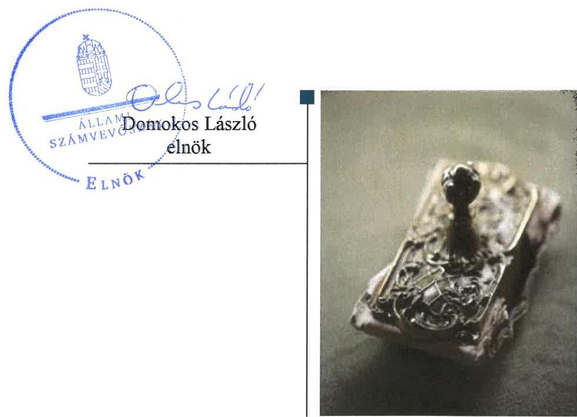
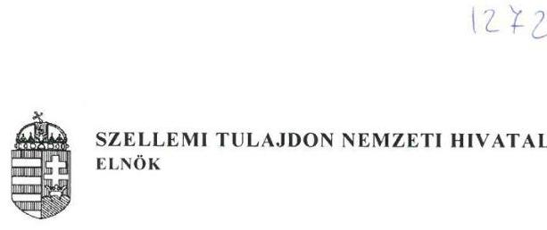
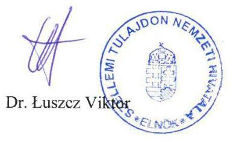

# Jelentés 

## Az állami tulajdonú gazdasági társaságok ellenőrzése

Digitális Jólét Nonprofit Kft.
2018.

---

# Jelentés 

## Az állami tulajdonú gazdasági társaságok ellenőrzése

Digitális Jólét Nonprofit Kft.
2018. december 19. nap

---

# AZ ELLENŐRZÉST FELÜGYELTE:

- **KLINGA LÁSZLÓ** felügyeleti vezető
- **AZ ELLENŐRZÉST VEZETTE ÉS A VÉGREHAJTÁSÁÉRT FELELŐS:**
  - **DORMÁN ISTVÁN** ellenőrzésvezető
  - **A PROGRAM ÖSSZEÁLLÍTÁSÁÉRT FELELŐS:**
    - **TÓTPÁL SZABOLCS** osztályvezető

**IKTATÓSZÁM:** EL-0408-033/2018.

**TÉMASZÁM:** 2469

**ELLENŐRZÉS-AZONOSÍTÓ SZÁM:** V081429

Jelentéseink az Országgyűlés számítógépes hálózatán és az Interneten a www.asz.hu címen is olvashatóak.

---

# TARTALOMJEGYZÉK 

- ÖSSZEGZÉS ..... 5
- AZ ELLENŐRZÉS CÉLJA ..... 6
- AZ ELLENŐRZÉS TERÜLETE ..... 7
- AZ ELLENŐRZÉS HÁTTERE, INDOKOLTSÁGA ..... 9
- A JELENTÉS LÉNYEGES KÉRDÉSKÖREI ..... 10
- AZ ELLENŐRZÉS HATÓKÖRE ÉS MÓDSZEREI ..... 11
- MEGÁLLAPÍTÁSOK ..... 13
- JAVASLATOK ..... 16
- MELLÉKLETEK ..... 17
I. sz. melléklet: Értelmező szótár ..... 17
- FÜGGELÉK: ÉSZREVÉTELEK ..... 19
- RÖVIDÍTÉSEK JEGYZÉKE ..... 23

---

.

---

# ÖSSZEGZÉS 

A Szellemi Tulajdon Nemzeti Hivatala a Digitális Jólét Nonprofit Korlátolt Felelősségű Társaság felett a tulajdonosi jogait szabályszerűen gyakorolta. A Társaság gazdálkodásának szabályozottsága megfelelt a jogszabályi előírásoknak. A pénzügyi-számviteli feladatok ellátása nem volt szabályszerű. A vagyongazdálkodás nem felelt meg a jogszabályi előírásoknak. Működésének átláthatósága nem volt biztosított, a Társaság nem teljesítette a jogszabályokban előírt közzétételi kötelezettségét.

## Az ellenőrzés társadalmi indokoltsága

Az állami tulajdonú gazdálkodó szervezetek ellenőrzése kiemelten fontos a vagyon megőrzése, megóvása érdekében, amelyekkel szemben alapvető követelmény, hogy gazdálkodásuk, működésük szabályszerű, az általuk szolgáltatott adatok minél megbízhatóbbak legyenek. Az állami tulajdonban álló gazdálkodó szervezetek államot megillető társasági részesedése a nemzeti vagyon részét képezi és legfőbb rendeltetése szerint a közfeladatok ellátását szolgálja.

Az Állami Számvevőszék stratégiájában megfogalmazta, hogy az államháztartáson kívül működő közfeladat-ellátó rendszerek ellenőrzéseivel hozzájárul ahhoz, hogy a közpénzeket az államháztartáson kívül működő szervezetek is átlátható, rendezett módon használják fel a közfeladatok szerződésben vállalt ellátása érdekében. Ellenőrzésünk eredményeképpen javaslatainkkal, megállapításainkkal hozzájárulhatunk a nemzeti vagyonnal való gazdálkodás átláthatóságának, elszámoltathatóságának javításához.

Az Állami Számvevőszék céljaival és a társadalmi igénnyel összhangban, valamint a gazdasági társaságok kiemelt fontosságú szerepe miatt került sor a Digitális Jólét Nonprofit Korlátolt Felelősségű Társaság ellenőrzésére.

## Főbb megállapítások, következtetések, javaslatok

A Szellemi Tulajdon Nemzeti Hivatala a tulajdonosi joggyakorlás kereteit szabályszerűen alakította ki és a Digitális Jólét Nonprofit Korlátolt Felelősségű Társaság feletti tulajdonosi jogokat szabályszerűen gyakorolta.

A Társaság gazdálkodásának szabályozottsága megfelelt a jogszabályi előírásoknak. A számviteli szabályzatokat elkészítette.

A Társaságnál a pénzügyi-számviteli feladatok ellátása nem volt szabályszerű.
Tervezési, beszámolási kötelezettségének a Társaság eleget tett, azonban a jogszabályokban előírt közzétételi kötelezettségének nem tett eleget, közérdekű adatait a honlapján nem tette közzé.

A Társaság vagyongazdálkodása nem volt szabályszerű, a saját vagyon nyilvántartása nem a jogszabályi előírásoknak megfelelően történt. A Társaság 2013-2016. évi egyszerűsített éves beszámolói mérleg tételeit nem támasztotta alá leltárral. A könyvvizsgáló jelentéseiben nem jelezte a mérlegek egyes tételeit alátámasztó leltárak hiányosságait.

Az értékcsökkenés elszámolása nem volt szabályszerű.
A megállapítások alapján az Állami Számvevőszék a Digitális Jólét Nonprofit Korlátolt Felelősségű Társaság ügyvezetőjének hat javaslatot fogalmazott meg.

---

# AZ ELLENŐRZÉS CÉLJA 

AZ ELLENŐRZÉS CÉLJA annak értékelése, volt, hogy a tulajdonosi jogok gyakorlása szabályszerű volt-e. A gazdálkodó szervezet szabályozottsága, gazdálkodása és vagyongazdálkodási tevékenysége megfelelt-e a jogszabályi és a tulajdonosi előírásoknak; biztosítva volt-e a közfeladatok átláthatósága és elszámoltathatósága érdekében a közszolgáltatás díjának megalapozottsága szabályszerű önköltségszámítással. A vagyonváltozást eredményező döntések esetében a tulajdonosi jogok gyakorlója és a gazdálkodó szervezet szabályszerűen jártak-e el. Az ellenőrzés célja továbbá annak megítélése, hogy a kormányzati szektorba sorolt állami tulajdonban (résztulajdonban) lévő gazdálkodó szervezetek gazdálkodásának a kormányzati szektor hiányára és az államadósságra befolyással bíró elemei a jogszabályi előírásoknak megfeleltek-e.

---

# AZ ELLENŐRZÉS TERÜLETE 

## Digitális Jólét Nonprofit Korlátolt Felelősségű Társaság, Szellemi Tulajdon Nemzeti Hivatala

## Digitális Jólét Nonprofit Kft.

A Digitális Jólét Nonprofit Korlátolt Felelősségű Társaságot 2012. január 3-ával a Magyar Állam képviseletében HIPAvilon Magyar Szellemi Tulajdon Ügynökség Nonprofit Korlátolt Felelősségű Társaság néven alapította a Közigazgatási és Igazságügyi Minisztérium.

A Társaság ${ }^{1}$ tulajdonosa 100%-ban a Magyar Állam volt. A Vtv. ${ }^{2}$ 29. § (5) bekezdése, valamint a Közigazgatási és Igazságügyi Minisztérium, az MNV Zrt. ${ }^{3}$ és a Szellemi Tulajdon Nemzeti Hivatala részéről aláírt megállapodás alapján a Társasági részesedés tulajdonosi joggyakorlója ${ }^{4}$ 2012. április 11-től 2016. december 31-ig a Szellemi Tulajdon Nemzeti Hivatala volt. Az Nvtv. ${ }^{5}$, a Vtv, továbbá a Vhr. ${ }^{6}$ előírásai, valamint az MNV Zrt. Igazgatóságának 166/2012. (IV. 04.) IG számú határozata alapján az állami és közfeladat ellátásának biztosítása érdekében az MNV Zrt. és az SZTNH ${ }^{7}$ a Társaság tulajdonosi joggyakorlásával kapcsolatban 2012. április 11-ei dátummal vagyonkezelési szerződést ${ }^{8}$ kötött. Az SZTNH a tulajdonosi jogokat 2013. április 23-ig az MNV Zrt.-vel megkötött vagyonkezelési szerződés alapján, az Nvtv. ${ }^{9}$ 8. § (7) bekezdése 2012. június 30-ai hatályba lépését és a vagyonkezelési szerződés megszüntetését követően 2016. december 31-ig megbízási szerződésen ${ }^{10}$ alapuló meghatalmazással ${ }^{11}$ gyakorolta. 2016. december 22-én megkötött megállapodásban ${ }^{12}$ a társasági részesedés tulajdonosi joggyakorlására vonatkozó megbízási szerződést az MNV Zrt. és az SZTNH 2016. december 31-ei hatállyal megszüntette és a megbízást az MNV Zrt. ezzel a dátummal visszavonta.

A Társaság közhasznú jogállású, nonprofit gazdasági társaság volt. Az ellenőrzött időszakban feladata volt a Szellemi Tulajdon Nemzeti Hivatala jogszabályokban meghatározott közfeladatai hatékonyabb ellátásának, továbbá a kormányzati gazdaságstratégiai, kutatás-fejlesztési, innováció- és technológiapolitikai, illetve a kulturális, kreatív és oktatási ágazatokkal kapcsolatos célkitűzések megvalósításának támogatása. Társaság közhasznú feladatait Közszolgáltatási szerződések ${ }^{13}$ alapján látta el, amelyek rögzítették az ellátandó feladatokat és az ehhez kapcsolódó támogatást, illetve díjazást.

A Társaság vállalkozási tevékenysége keretében szabadalmi-, védjegyszolgáltatások, szellemivagyon-audit és értékelés, valamint ügyfelek utókövetése szellemi tulajdon alapú innováció menedzsment-szolgáltatásokat nyújtott a piaci szereplőknek.

A Társaság jegyzett tőkéje az alapításkor és 2013-2015. években 0,5 M Ft volt, amelynek összegét az SZTNH 2015. december 23-án a 19/2015. (XII.23.) számú határozatával 10,0 M Ft-ra emelte a Társaság eredménytartaléka terhére. A Társaság átlagos statisztikai állományi létszáma 2016-ra a 2013. évi 35 főről 28 főre csökkent.

---

A Társaság a Számv. tv. ${ }^{14}$ 14. § (6) bekezdése előírásai alapján önköltségszámítás rendjére vonatkozó szabályzat készítésére nem volt kötelezett.

A Társaság ügyvezetőjének személye az ellenőrzött időszakban nem változott.

A Társaság 2015. december 30-tól kormányzati szektorba sorolt egyéb szervezet volt, a 8 kr. ${ }^{15}$ hatálya alá tartozott. A Stabilitási tv. ${ }^{16}$ 3. §-a szerinti adósságot keletkeztető ügylete nem volt, gazdálkodása a kormányzati szektor hiányát nem befolyásolta. A kormányzati szektorba sorolt Társaságnak az Ávr. 5. számú melléklete szerinti adatszolgáltatási kötelezettsége nem volt.

---

# AZ ELLENŐRZÉS HÁTTERE, INDOKOLTSÁGA 

Az állami tulajdonú gazdálkodó szervezetek ellenőrzése kiemelten fontos a vagyon megőrzése, megóvása érdekében, valamint a kormányzati szektor elszámolásaiban megjelenő állami tulajdonú gazdálkodó szervezetek esetében, amelyekkel szemben alapvető követelmény, hogy gazdálkodásuk, működésük szabályszerű, az általuk szolgáltatott adatok minél megbízhatóbbak legyenek. Gazdálkodásuk jellemzően a közérdeklődés és a média figyelmének középpontjában áll, amihez hozzájárul a gazdálkodásuk körébe tartozó - közvetlen vagy közvetett állami tulajdonú, tehát végső soron a nemzeti vagyon részét képező - vagyon nagysága, illetve az általuk ellátott közszolgáltatások/közfeladatok minősége és hatékonysága.

Az ellenőrzés rámutathat az állami tulajdonú gazdálkodó szervezetek gazdálkodási tevékenységével jó gyakorlatokra és szabálytalanságokra. Felhívhatja a figyelmet a jogszabályi követelmények teljesítéséhez szükséges feltételek hiányosságaira, hozzájárulhat az államháztartáson kívüli, de (közvetlenül vagy közvetve) állami vagyont használó gazdálkodó szervezetek tevékenységének átláthatóságához. Ellenőrzésünk eredményeképpen javaslatainkkal, megállapításainkkal hozzájárulhatunk a nemzeti vagyonnal való gazdálkodás átláthatóságának, elszámoltathatóságának javításához.

---

# A JELENTÉS LÉNYEGES KÉRDÉSKÖREI 

1.     - A tulajdonosi jogok gyakorlása szabályszerű volt-e?
2.     - A Társaság szabályozottsága megfelelt-e a jogszabályi előírásoknak, a pénzügyi-számviteli és adatszolgáltatási feladatok ellátása szabályszerű volt-e?
3.     - A Társaság vagyongazdálkodása szabályszerű volt-e?

---

# AZ ELLENŐRZÉS HATÓKÖRE ÉS MÓDSZEREI 

## Az ellenőrzés típusa

Megfelelőségi ellenőrzés.

## Az ellenőrzött időszak

2013-2016. évek, a 2016. évi beszámoló jóváhagyásáig tartó időszak.

## Az ellenőrzés tárgya

Állami tulajdonban lévő gazdasági társaság gazdálkodása, kiemelten vagyongazdálkodási tevékenysége, a tulajdonosi jogok gyakorlása.

## Az ellenőrzött szervezet

Digitális Jólét Nonprofit Korlátolt Felelősségű Társaság, továbbá a tulajdonosi jogokat gyakorló Szellemi Tulajdon Nemzeti Hivatala és a Magyar Nemzeti Vagyonkezelő Zrt.

## Az ellenőrzés jogalapja

Az ellenőrzés jogszabályi alapját az Állami Számvevőszékről szóló 2011. évi LXVI. törvény 1. § (3) bekezdése és 5. § (3)-(5) bekezdései képezték.

## Az ellenőrzés módszerei

Az ellenőrzést a nemzetközi standardokat irányadónak tekintve az ellenőrzési program ellenőrzési kérdései, az ellenőrzött időszakban hatályos jogszabályok, az ellenőrzés szakmai szabályok és módszertanok figyelembe vételével végeztük.

Az ellenőrzés ideje alatt az ellenőrzött szervezettel történő kapcsolattartást az ÁSZ ${ }^{17}$ Szervezeti és Működési Szabályzatának vonatkozó előírásai alapján biztosítottuk.

Az ellenőrzésre a nemzetgazdasági szempontból kiemelt jelentőségű nemzeti vagyon körébe tartozó gazdálkodó szervezeteknél és a többségi állami tulajdonban álló gazdálkodó szervezeteknél került sor. Az ellenőrzési program szerinti feladatokat a kiválasztott gazdálkodó szervezetnél (társaságnál) és annak többségi tulajdonban lévő leányvállalatánál, valamint a

---

tulajdonosi jogok gyakorlójánál hajtottuk végre. Az ellenőrzés során az ÁSZ a gazdálkodó szervezet gazdálkodásának, feladatellátásának tendenciáit értékelte, ezért az ellenőrzött éveket két ellenőrzött időszakra bontotta. A teljes ellenőrzött időszakra vonatkozóan került ellenőrzésre a gazdasági társaság tervezési, beszámolási, közzétételi, adatszolgáltatási kötelezettségének, valamint belső ellenőrzési tevékenységének szabályszerűsége. A 2013. és 2016. évekre vonatkozóan a gazdasági társaság működésének szabályozottságát, a bevételei és ráfordításai elszámolását, illetve vagyongazdálkodásának szabályszerűségét is ellenőriztük.

A bevételek és a ráfordítások közül az értékesítés nettó árbevétele, az egyéb, rendkívüli és pénzügyi műveletek bevételei, a személyi jellegű ráfordítások, az anyagjellegű ráfordítások, az egyéb, rendkívüli és pénzügyi műveletek ráfordításai, valamint értékcsökkenési leírás elszámolásának szabályszerűségét, továbbá az immateriális javak, tárgyi eszközök esetében a vagyonnyilvántartás szabályszerűségét véletlen mintavétellel ellenőriztük.

A fenti sokaságok esetében a mintavétel azokra a legnagyobb értékű tételekre - a lényeges sokaságra - terjedt ki, melyek összértéke elérte a teljes sokaság összértékének 50%-át. A személyi jellegű ráfordítások esetében a mintavétel a teljes sokaságból történt. Amennyiben valamely ellenőrzött sokaság elemszáma kisebb volt, mint az előírt mintaelem-szám, a sokaságot tételesen ellenőriztük.

A mintavétellel ellenőrzött területek esetében minden egyes tétel vonatkozásában a szabályszerűségre vonatkozó kérdéseket tettünk fel, amelyek eredménye összesítésre került. „Szabályszerűnek" értékeltünk egy ellenőrzött területet, amennyiben 95%-os bizonyossággal az ellenőrzött sokaságban az átlagos hibaarány legfeljebb 10% volt, „nem szabályszerűnek", amennyiben 10%-nál magasabb arányt képviselt.

Az ellenőrzési kérdések megválaszolásához szükséges bizonyítékok megszerzése a következő ellenőrzési eljárások alkalmazásával történt: megfigyelés, kérdésfeltevés (információkérés), összehasonlítás, valamint elemző eljárás. Az ellenőrzési bizonyítékként felhasználható adatforrások közé tartoztak egyrészt az ellenőrzési programban felsorolt adatforrások, másrészt adatforrás lehet még minden - az ellenőrzés folyamán - feltárt, az ellenőrzés szempontjából információkat tartalmazó
 dokumentum.

Az ellenőrzést a kérdésekre adott válaszok kiértékelésével, valamint a megjelölt adatforrások, a csatolt tanúsítványok felhasználásával, továbbá az adott időszakban hatályos jogszabályok figyelembe vételével folytattuk le.

---

# 1. A tulajdonosi jogok gyakorlása szabályszerű volt-e? 

Összegző megállapítás

Az SZTNH a Társaság feletti tulajdonosi jogait szabályszerűen gyakorolta.

A TULAJDONOSI JOGGYAKORLÁS szabályszerű volt. A tulajdonosi joggyakorlás kereteit a Társaság Alapító Okiratában ${ }^{18}$ és a Társasági SZMSZ ${ }^{19}$-ben, illetve 2015. január 15-étől az SZTNH SZMSZ ${ }^{20}$-ében a jogszabályi előírásoknak megfelelően kialakították.

A Társaságnál alapításától kezdve háromtagú felügyelőbizottság működött. A Társaság könyvvizsgálóját a tulajdonosi joggyakorló a Taktv. ${ }^{21}$, a Gt. és a Ptk. előírásainak megfelelően kijelölte.

A Társaság részére az Alapító Okiratban előírt, a működésről szóló tájékoztatókat, valamint a Közszolgáltatási szerződésekben előírt szakmai és pénzügyi beszámolókat a felügyelőbizottság és a tulajdonosi joggyakorló jóváhagyta.

Az Alapító Okiratban előírt éves üzleti terveket a felügyelőbizottság és a tulajdonosi joggyakorló határozataiban elfogadta.

A Társaság beszámolóit és a Civil tv. ${ }^{22}$ szerinti közhasznúsági mellékletet a tulajdonosi joggyakorló a Gt. és a Ptk. előírásainak megfelelően a felügyelőbizottság és a könyvvizsgáló jelentése alapján jóváhagyta, továbbá a Civil tv. előírásainak megfelelően döntött az eredmény eredménytartalékba helyezéséről.

A Társaság Javadalmazási szabályzatát ${ }^{23}$ a Társaság legfőbb szerve az ellenőrzött időszakot megelőzően megalkotta, amelyet a tulajdonosi joggyakorló jóváhagyott.

A Társaságnál a tulajdonosi joggyakorló belső ellenőrzése 2013-2014. években végzett ellenőrzést, amelyre a Társaság intézkedési tervet készített, az abban foglaltakat végrehajtotta.

## 2. A Társaság szabályozottsága megfelelt-e a jogszabályi előírásoknak, a pénzügyi-számviteli és adatszolgáltatási feladatok ellátása szabályszerű volt-e?

Összegző megállapítás

A Társaság szabályozottsága megfelelt a jogszabályi előírásoknak. A pénzügyi-számviteli feladatok ellátása, a bevételek és a ráfordítások elszámolása nem volt szabályszerű. Jogszabályokban előírt közzétételi kötelezettségének nem tett eleget.

A TÁRSASÁG a Számv. tv.-ben előírt szabályzatok közül elkészítette a Számviteli politikát ${ }^{24}$, az eszközök és források Leltározási szabályzatát ${ }^{25}$,

---

az eszközök és források Értékelési szabályzatát ${ }^{26}$, a Pénzkezelési szabályzatot ${ }^{27}$, a Számlarendet ${ }^{28}$, amelyek a Számviteli politika kivételével megfeleltek a Számv. tv. előírásainak.

# A BEVÉTELEK ÉS A RÁFORDÍTÁSOK ELSZÁMOLÁSA a 2016. évben nem volt szabályszerű. A bevételek és a ráfordítások elszámolásánál a Számv. tv. 165. § (1) bekezdése előírásai ellenére a bevételek könyvelését és a ráfordítások számviteli elszámolását (nyilvántartását) számviteli bizonylattal - számlákkal, a számfejtés alapját képező bizonylatokkal - nem támasztották alá. 

A 2013. évben az értékesítés nettó árbevétele, az egyéb bevételek és az anyagjellegű ráfordítások, értékcsökkenési leírás tekintetében a Társaság a Számv. tv. 20. § (1), valamint a 169. § (2) bekezdésében foglaltak ellenére a könyvviteli elszámolást közvetlenül és közvetetten alátámasztó analitikus, illetve részletező nyilvántartásokkal nem rendelkezett, így a Számv. tv. 15. § (3) bekezdés előírásai ellenére a beszámolóban szereplő, a könyvvitelben rögzített tételek a valóságban nem voltak megtalálhatóak, bizonyíthatóak, kívülállók által is megállapíthatóak.

A KÖZÉRDEKŰ ADATOK megismerésére irányuló igények teljesítésének rendjét az ügyvezető a 2013-2016. években az Info tv. ${ }^{29} 30. § (6) bekezdése előírása ellenére nem szabályozta.

A közérdekű adatok közzétételére vonatkozó kötelezettségének a Társaság nem tett eleget, az Info tv. 37. § (1) bekezdés előírásai ellenére nem tette közzé az Info tv. 1. számú melléklet szerinti, közérdekű adatait. A Tak. tv. ${ }^{30}$ 2. § előírásai ellenére honlapján nem tette közzé vezető állású munkavállalóinak a Tak. tv. 2. §-ának (1) bekezdésében meghatározott adatait; valamint az önállóan cégjegyzésre vagy a bankszámla feletti rendelkezésre jogosult, a másokkal együttesen cégjegyzésre vagy a bankszámla feletti rendelkezésre jogosult munkavállalók, továbbá a közbeszerzési értékhatárt meghaladó szerződéseinek a Tak. tv. 2. § (2)-(3) bekezdéseiben előírt adatait.

## A TERVEZÉSI, BESZÁMOLÁSI KÖTELEZETTSÉ-

GÉT a Társaság teljesítette. Az Alapító Okirat előírásainak megfelelően elkészítette a működéséről szóló tájékoztatókat, a Közszolgáltatási szerződések előírásainak megfelelően elkészítette a szakmai és pénzügyi beszámolókat. Elkészítette az Alapító Okiratban előírtak szerinti éves üzleti terveit. Nem a Számv. tv. 20. § (1), 69. § (1) bekezdései előírásai szerint készítette el egyszerűsített éves beszámolóit, és azokat jóváhagyásra benyújtotta a tulajdonosi joggyakorló részére. Az egyszerűsített éves beszámolókat a Társaság az előírásoknak megfelelően letétbe helyezte és közzétette.

## 3. A Társaság vagyongazdálkodása szabályszerű volt-e?

## Összegző megállapítás

A Társaság vagyongazdálkodása nem volt szabályszerű.
A VAGYONGAZDÁLKODÁS feltételeit a Társaság szabályszerűen alakította ki. A feladat- és hatásköröket, felelősségi viszonyokat az Alapító Okiratban és a Társasági SZMSZ-ben rögzítették.

---

A SAJÁT VAGYON NYILVÁNTARTÁSA nem volt szabályszerű. A Társaság a Számv. tv. 69. § (1) bekezdése előírásai ellenére a beszámolók elkészítéséhez, a mérleg tételeinek alátámasztásához nem állított össze olyan leltárakat, amelyek tételesen, ellenőrizhető módon tartalmazták a mérleg fordulónapján meglévő eszközeit és forrásait mennyiségben és értékben. A leltár hiánya ellenére a könyvvizsgáló az ellenőrzött időszak minden évében hitelesítő záradékkal látta el az egyszerűsített éves beszámolót.

AZ ÉRTÉKCSÖKKENÉS elszámolása a 2016. évben nem volt szabályszerű. A Számv. tv. 52. § (2) bekezdésében előírtak ellenére a tárgyi eszközök üzembe helyezését hitelt érdemlően nem dokumentálták.

---

# JAVASLATOK 

Az ÁSZ tv. 33. § (1) bekezdésében foglaltak értelmében az ellenőrzött szervezet vezetője köteles a jelentésben foglalt megállapításokhoz kapcsolódó intézkedési tervet összeállítani és azt a jelentés kézhezvételétől számított 30 napon belül az ÁSZ részére megküldeni. Amennyiben az ellenőrzött szervezet vezetője nem küldi meg határidőben az intézkedési tervet, vagy továbbra sem elfogadható intézkedési tervet küld, az Állami Számvevőszék elnöke az ÁSZ tv. 33. § (3) bekezdés a) és b) pontjaiban foglaltakat érvényesítheti.

## Digitális Jólét Nonprofit Kft. ügyvezetőjének

1. Intézkedjen a bevételek könyvelésének és a ráfordítások számviteli elszámolásának Számv. tv.-ben előírtaknak megfelelő számviteli bizonylattal történő alátámasztásáról.
(2. sz. megállapítás 2. bekezdés 2. mondata alapján)
2. Intézkedjen az Info tv.-ben előírtak alapján a közérdekű adatok megismerésére irányuló igények teljesítésének rendjét rögzítő szabályzat elkészítéséről.
(2. sz. megállapítás 4. bekezdése alapján)
3. Intézkedjen az Info tv.-ben előírtak szerint a közérdekű adatok közzétételéről.
(2. sz. megállapítás 5. bekezdés 1. mondata alapján)
4. Intézkedjen a Taktv.-ben előírt közzétételi kötelezettség teljesítéséről.
(2. sz. megállapítás 5. bekezdés 2. mondata alapján)
5. Intézkedjen a beszámoló mérlegének Számv. tv. előírásainak megfelelő leltárral történő alátámasztásáról.
(3. sz. megállapítás 2. bekezdés 2. mondata alapján)
6. Intézkedjen az értékcsökkenés szabályszerű elszámolása érdekében a tárgyi eszközök üzembe helyezésének Számv. tv.-ben előírtaknak megfelelő, hitelt érdemlő módon történő dokumentálásáról.
(3. sz. megállapítás 3. bekezdés 2. mondata alapján)

---

# MELLÉKLETEK 

- I. SZ. MELLÉKLET: ÉRTELMEZŐ SZÓTÁR
gazdasági társaság
gazdálkodó szervezet
kormányzati szektorba sorolt egyéb szervezet
közszolgáltatás
nemzeti vagyon

Ptk. 3:88. § (1) bekezdése szerint „a gazdasági társaságok üzletszerű közös gazdasági tevékenység folytatására, a tagok vagyoni hozzájárulásával létrehozott, jogi személyiséggel rendelkező vállalkozások, amelyekben a tagok a nyereségből közösen részesednek, és a veszteséget közösen viselik".
A Ptk. 685. § c) pontja szerint gazdálkodó szervezet: „az állami vállalat, az egyéb állami gazdálkodó szerv, a szövetkezet, a lakásszövetkezet, az európai szövetkezet, a gazdasági társaság, az európai részvénytársaság, az egyesülés, az európai gazdasági egyesülés, az európai területi együttműködési csoportosulás, az egyes jogi személyek vállalata, a leányvállalat, a vízgazdálkodási társulat, az erdő birtokossági társulat, a végrehajtói iroda, az egyéni cég, továbbá az egyéni vállalkozó." (2014. 03. 15-ig hatályos)
az Áht. ${ }^{31}$ 3. § (2) és (3) bekezdésében foglaltakon kívül az Európai Közösséget létrehozó szerződéshez csatolt, a túlzott hiány esetén követendő eljárásról szóló jegyzőkönyv alkalmazásáról szóló 2009. május 25-i 479/2009/EK rendelet (a továbbiakban: 479/2009/EK rendelet) szerint a kormányzati szektorba sorolt szervezet (Áht. 1. § (12))
Az Ebktv. ${ }^{32}$ 3. § d) pontja a következőképpen határozza meg a közszolgáltatást: „szerződéskötési kötelezettség alapján a lakosság alapvető szükségleteinek ellátására irányuló szolgáltatás, így különösen a villamos energia-, gáz-, hő-, víz-, szennyvíz- és hulladékkezelési, köztisztasági, postai és távközlési szolgáltatás, továbbá a menetrend alapján közlekedő járművekkel végzett közforgalmú személyszállítás". Nvtv. 1. § (2) bekezdése szerint többek között:
„az állam vagy a helyi önkormányzat kizárólagos tulajdonában álló dolgok, az a) pont hatálya alá nem tartozó, állam vagy a helyi önkormányzat tulajdonában lévő dolog,
az állam vagy a helyi önkormányzat tulajdonában lévő pénzügyi eszközök, továbbá az államot vagy a helyi önkormányzatot megillető társasági részesedések, az államot vagy a helyi önkormányzatot megillető bármely vagyoni értékkel rendelkező jogosultság, amelyet jogszabály vagyoni értékű jogként nevesít."

---

.

---

# FÜGGELÉK: ÉSZREVÉTELEK 

A jelentéstervezetet a Számvevőszék 15 napos észrevételezésre megküldte az ellenőrzött szervezetek vezetőinek az ÁSZ tv. 29. § (1) bekezdése előírásának megfelelően.

A Magyar Nemzeti Vagyonkezelő Zrt. vezérigazgatója és a Szellemi Tulajdon Nemzeti Hivatala elnöke az ÁSZ tv. 29. § (2) bekezdésében foglalt észrevételezési jogával nem élt, írásban jelezte, hogy észrevételt nem tesz. A Digitális Jólét Nonprofit Kft ügyvezetője a jelentéstervezetre nem tett észrevételt.

[^0]
[^0]:    * 29. § (1) Az Állami Számvevőszék az ellenőrzési megállapításait megküldi az ellenőrzött szervezet vezetőjének vagy az általa megbízott személynek, és annak, akinek személyes felelősségét állapította meg.
    (2) Az ellenőrzött szervezet vezetője és a felelősként megjelölt személy az ellenőrzés megállapításaira tizenöt napon belül írásban észrevételt tehet.
    (3) Az Állami Számvevőszék az észrevételre a beérkezésétől számított harminc napon belül írásban válaszol. A figyelembe nem vett észrevételeket köteles a jelentésben feltüntetni, és megindokolni, hogy azokat miért nem fogadta el.

---

# MNV Magyar Nemzeti Vagyonkezelő

## Vezérigazgató

**Állami Számvevőszék**

**Domokos László**

**elnök**

1052 Budapest
Apáczai Cs. J. u. 10.

---

Ikt. sz.: MNV/01/8497/ 1/2018.
Hiv. sz.: EL-0629-044/2018.

---

Tisztelt Elnök Úr!

Tájékoztatom, hogy az MNV Zrt. a 2018. július 20. napján, *"Állami tulajdonú (résztulajdonú) gazdasági társaságok ellenőrzése – Digitális Jólét Nonprofit Kft."* tárgyában kézhez vett, EL-0629-044/2018. ikt. sz. Jelentés-tervezetre nem kíván észrevételt tenni.

Budapest, 2018. július 4.

Üdvözlettel:

---

**MNV Magyar Nemzeti Vagyonkezelő**

**Vezérigazgató**

dr. Szüvek Norbert

**vezérigazgató**

---

Cím: 1133 Budapest, Penziónyi út 56. Penz. 1399 Budapest, Pf. 708.
Telefon: +36 1 237-4400 Fax: +36 1 237-4100 Web: mnv.hu E-mail: info@mnv.hu

---

# Domokos László 

elnök úr
részére
Állami Számvevőszék

Tárgy: válasz megküldött
jelentéstervezetre
Ikt. sz.: ELN 7/41-1/2018

Tisztelt Elnök Úr!

A Szellemi Tulajdon Nemzeti Hivatala EL-0629-043/2018. iktatószámú, 2018. július 17-én kelt és a hivatalba 2018. július 23-án érkezett levelével megküldött „Az állami tulajdonú gazdasági társaságok ellenőrzése - Digitális Jólét Nonprofit Kft." című számvevőszéki jelentéstervezetet köszönettel megkaptuk (Témaszám: 2469).

A jelentéstervezetben foglalt, a Szellemi Tulajdon Nemzeti Hivatala tulajdonosi joggyakorlása szabályszerű kereteinek kialakítására, valamint a tulajdonosi jogok szabályszerű gyakorlására vonatkozó megállapításokat köszönettel vettük, azokat megnyugtatónak találjuk.

A jelentéstervezet Szellemi Tulajdon Nemzeti Hivatala tulajdonosi joggyakorlására vonatkozó megállapításait elfogadjuk, azok tekintetében észrevételt nem teszünk.

Budapest, 2018. július 34.

Tisztelettel,

---

.

---

# RÖVIDÍTÉSEK JEGYZÉKE 

${ }^{1}$ Társaság

2 Vtv.
${ }^{3}$ MNV Zrt.
${ }^{4}$ tulajdonosi joggyakorló
${ }^{5}$ Nvtv.
${ }^{6}$ Vhr.
${ }^{7}$ SZTNH
${ }^{8}$ vagyonkezelési szerződés
${ }^{9}$ Nvtv.
${ }^{10}$ megbízási szerződés
${ }^{11}$ meghatalmazás
${ }^{12}$ megállapodás
${ }^{13}$ Közszolgáltatási szerződések
${ }^{14}$ Számv. tv.
${ }^{15}$ Bkr.
${ }^{16}$ Stabilitási tv.
${ }^{17}$ ÁSZ
${ }^{18}$ Alapító Okirat
${ }^{19}$ Társasági SZMSZ

Az ellenőrzött időszakban

 HIPAvilon Magyar Szellemi Tulajdon Ügynökség Nonprofit Korlátolt Felelősségű Társaság, 2017. január 1-től Digitális Jólét Nonprofit Korlátolt Felelősségű Társaság név alatt folytatta tevékenységét. 2007. évi CVI. törvény az állami vagyonról

Magyar Nemzeti Vagyonkezelő Zrt.
2012. április 11-től 2016. december 31-ig a Szellemi Tulajdon Nemzeti Hivatala, 2017. január 1-jétől az MNV Zrt.
2011. évi CXCVI. törvény a nemzeti vagyonról (hatályos: 2011. december 31-től) 254/2007. (X. 4.) Korm. rendelet az állami vagyonnal való gazdálkodásról. Szellemi Tulajdon Nemzeti Hivatala
Szerződés társasági részesedés vagyonkezelésbe adásáról. Magyar Nemzeti Vagyonkezelő Zrt. Szellemi Tulajdon Nemzeti Hivatala 2012. április 11.
2011. évi CXCVI. törvény a nemzeti vagyonról

Megállapodás társasági részesedés vagyonkezelésének megszüntetéséről. Magyar Nemzeti Vagyonkezelő Zrt. Szellemi Tulajdon Nemzeti Hivatala 2013. április 23.
Meghatalmazás állami tulajdonú részesedéssel kapcsolódó tagsági jogok gyakorlására. Magyar Nemzeti Vagyonkezelő Zrt. Szellemi Tulajdon Nemzeti Hivatala 2013. április 11., 2013. augusztus 6., 2014. június 20., 2015. szeptember 21., 2016. szeptember 21.

Megállapodás társasági részesedés tulajdonosi joggyakorlására vonatkozó megbízási szerződés megszüntetéséről, Magyar Nemzeti Vagyonkezelő Zrt. Szellemi Tulajdon Nemzeti Hivatala, 2016. december 22.
Közszolgáltatási szerződés 2013. évre a szellemi tulajdonvédelmi információs, tájékoztatási és dokumentációs tevékenységekben történő együttműködésre (Kelt: 2013. május 31.); Közszolgáltatási szerződés 2013. évre az oktatási feladatok ellátásában történő együttműködésre (Kelt: 2013. május 31.); Közszolgáltatási szerződés 2016. évre a szellemi tulajdonvédelmével kapcsolatos ismeretterjesztési és tájékoztatási tevékenységekben történő együttműködésre (Kelt: 2016. március 4.); Közszolgáltatási szerződés 2016. évre az oktatási feladatok ellátásában történő együttműködésre (Kelt: 2013. március 4.); Közszolgáltatási szerződés 2016. évre a szellemi alkotó és innovációs tevékenységekkel kapcsolatos rendezvények, kiállítások és programok szervezésével, valamint szellemi vagyon értékelésével kapcsolatos feladatokban történő együttműködésre (Kelt: 2016. március 4.)
2000. évi C. törvény a számvitelről, hatályos 2001. I. 1-től

370/2011.(XII.31.) Korm. rendelet a költségvetési szervek belső kontrollrendszeréről és belső ellenőrzéséről
Magyarország gazdasági stabilitásáról szóló 2011. évi CXCIV. törvény
Állami Számvevőszék
HIPAvilon Magyar Szellemi Tulajdon Ügynökség Nonprofit Korlátolt Felelősségű Társaság Alapító Okirata, hatályos: 2012. április 20-tól 2013. augusztus 22-ig; hatályos: 2013. augusztus 22-től 2014. május 26-ig; hatályos: 2014. május 26-tól 2015. december 23-ig; hatályos: 2015. december 23-tól)
HIPAvilon Magyar Szellemi Tulajdon Ügynökség Nonprofit Korlátolt Felelősségű Társaság 1/2012. (VIII. 23.), 1/2014. (I. 21.), 1/2015. (IV. 2.), 1/2016. (V. 4.) számú

---

20 SZTNH SZMSZ
${ }^{21}$ Taktv.
${ }^{22}$ Civil tv.
${ }^{23}$ Javadalmazási szabályzat
${ }^{24}$ Számviteli politika
${ }^{25}$ Leltározási szabályzat
${ }^{26}$ Értékelési szabályzat
${ }^{27}$ Pénzkezelési szabályzat
${ }^{28}$ Számlarend
${ }^{29}$ Info tv.
${ }^{30}$ Tak. tv.
${ }^{31}$ Áht.
${ }^{32}$ Ebktv.
ügyvezetői utasítással kiadott Szervezeti és Működési Szabályzata hatályos 2012. augusztus 23-tól 2014. január 21-ig; hatályos 2014. január 21-től 2015. január 1-ig; hatályos 2015. január 1-től 2016. február 1-ig; hatályos 2016. február 1-től Szellemi Tulajdon Nemzeti Hivatala 1/2016. (I.22.) IM utasítással kiadott Szervezeti és Működési Szabályzata, hatályos 2015. január 15-étől
2009. évi CXXII. törvény a köztulajdonban álló gazdasági társaságok takarékosabb működéséről (hatályos: 2009. december 4-től)
2011. évi CLXXV. törvény az egyesülési jogról, a közhasznú jogállásról, valamint a civil szervezetek működéséről és támogatásáról
HIPAvilon Magyar Szellemi Tulajdon Ügynökség Nonprofit Kft. 2012. augusztus 25-én hatályba lépett Javadalmazási szabályzata
HIPAvilon Magyar Szellemi Tulajdon Ügynökség Kft. számviteli politikája, hatályos 2013. április 29-től 2014. január 1-ig; hatályos 2014. január 1-től 2015. január 1-ig; hatályos 2015. január 1-től 2016. január 1-ig; hatályos 2016. január 1-től 2016. szeptember 30-ig; hatályos 2016. október 1-től
HIPAvilon Magyar Szellemi Tulajdon Ügynökség Nonprofit Kft. 2013. április 29-én hatályba lépett Leltározási szabályzata, 2014. január 1-én hatályba lépett Leltározási szabályzata, 2015. január 1-én hatályba lépett Leltározási szabályzata, 2016. október 1-én hatályba lépett Leltározási szabályzata
HIPAvilon Magyar Szellemi Tulajdon Ügynökség Nonprofit Kft. 2013. április 29-én hatályba lépett Értékelési szabályzata, 2014. január 1-én hatályba lépett Értékelési szabályzata, 2015. január 1-én hatályba lépett Értékelési szabályzata, 2016. október 1-én hatályba lépett Értékelési szabályzata
HIPAvilon Magyar Szellemi Tulajdon Ügynökség Nonprofit Kft. 2013. április 29-én hatályba lépett Pénzkezelési szabályzata, 2014. január 1-én hatályba lépett Pénzkezelési szabályzata, 2015. január 1-én hatályba lépett Pénzkezelési szabályzata, 2016. január 1-én hatályba lépett Pénzkezelési szabályzata, 2016. október 1-én hatályba lépett Pénzkezelési szabályzata
HIPAvilon Magyar Szellemi Tulajdon Ügynökség Nonprofit Kft. 2013. április 29-én hatályba lépett Számlarendje, 2014. január 1-én hatályba lépett Számlarendje, 2015. január 1-én hatályba lépett Számlarendje, 2016. január 1-én hatályba lépett Számlarendje
az információs önrendelkezési jogról és az információszabadságról szóló 2011. évi CXII. törvény (hatályos 2011.07.27-től)
2009. évi CXXII. törvény a köztulajdonban álló gazdasági társaságok takarékosabb működéséről (hatályos: 2009. december 4-től)
2011. évi CXCV. törvény az államháztartásról (hatályos 2011. december 31-től)
2003. évi CXXV. törvény az egyenlő bánásmódról és az esélyegyenlőség előmozdításáról (hatályos: 2004. január 27-től)

---

ÁLLAMI SZÁMVEVŐSZÉK
1052 Budapest, Apáczai Csere János utca 10.
Levélcím: 1364 Budapest 4. Pf. 54
Telefon: +36 14849100 Telefax: +36 14849200
www.asz.hu
