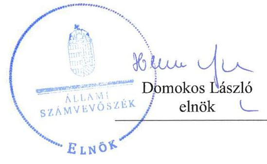
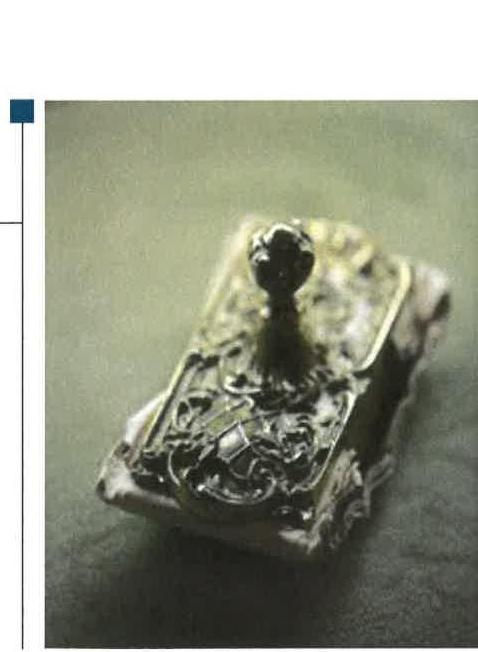
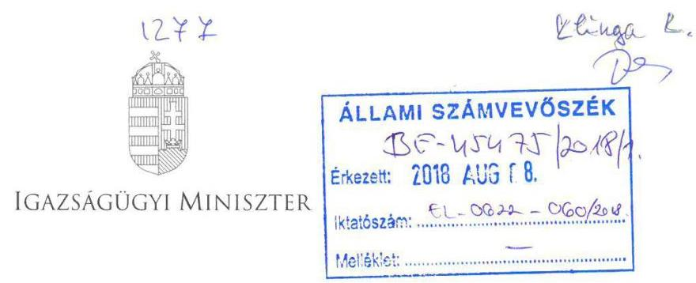
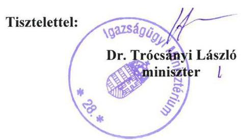
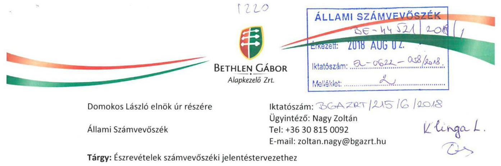
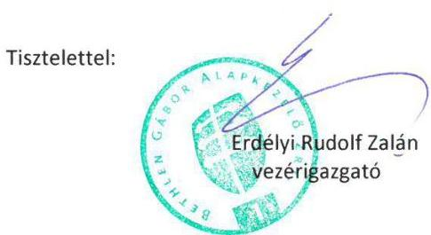
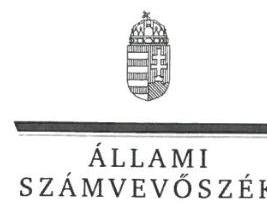
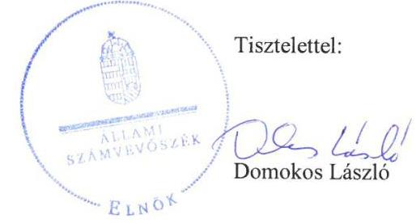
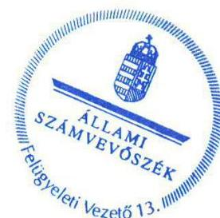
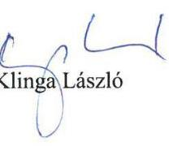

# Jelentés 

## Az állami tulajdonú gazdasági társaságok ellenőrzése

Bethlen Gábor Alapkezelő Közhasznú Nonprofit Zrt.
2018.

---

# Jelentés 

## Az állami tulajdonú gazdasági társaságok ellenőrzése

Bethlen Gábor Alapkezelő Közhasznú Nonprofit Zrt.
2018. Július hó 19. nap

---

# AZ ELLENŐRZÉST FELÜGYELTE:

- **KLINGA LÁSZLÓ** felügyeleti vezető
- **AZ ELLENŐRZÉST VEZETTE ÉS A VÉGREHAJTÁSÁÉRT FELELŐS:**
  - **DORMÁN ISTVÁN** ellenőrzésvezető
  - **A PROGRAM ÖSSZEÁLLÍTÁSÁÉRT FELELŐS:**
    - **TÓTPÁL SZABOLCS** osztályvezető

**IKTATÓSZÁM:** EL-0388-036/2018.

**TÉMASZÁM:** 2469

**ELLENŐRZÉS-AZONOSÍTÓ SZÁM:** V081409

Jelentéseink az Országgyűlés számítógépes hálózatán és az Interneten a www.asz.hu címen is olvashatóak.

---

# TARTALOMJEGYZÉK 

■ ÖSSZEGZÉS ..... 5
■ AZ ELLENŐRZÉS CÉLJA ..... 6
■ AZ ELLENŐRZÉS TERÜLETE ..... 7
■ AZ ELLENŐRZÉS HÁTTERE, INDOKOLTSÁGA ..... 9
■ A JELENTÉS LÉNYEGES KÉRDÉSKÖREI ..... 10
■ AZ ELLENŐRZÉS HATÓKÖRE ÉS MÓDSZEREI ..... 11
■ MEGÁLLAPÍTÁSOK ..... 13
■ JAVASLATOK ..... 16
■ MELLÉKLETEK ..... 17
I. sz. melléklet: Értelmező szótár ..... 17
■ FÜGGELÉK: ÉSZREVÉTELEK ..... 19
■ RÖVIDÍTÉSEK JEGYZÉKE ..... 27

---

.

---

# ÖSSZEGZÉS 

A Közigazgatási és Igazságügyi Minisztérium és a Miniszterelnökség a Bethlen Gábor Alapkezelő Közhasznú Nonprofit Zrt. felett a tulajdonosi jogait szabályszerűen gyakorolta. A Társaság gazdálkodásának szabályozottsága megfelelt a jogszabályi előírásoknak. A pénzügyi-számviteli feladatok ellátása nem volt szabályszerű. A vagyongazdálkodás nem felelt meg a jogszabályi előírásoknak. A kormányzati szektorba sorolt Társaság adatszolgáltatási kötelezettségének nem tett eleget.

## Az ellenőrzés társadalmi indokoltsága

Az állami tulajdonú gazdálkodó szervezetek ellenőrzése kiemelten fontos a vagyon megőrzése, megóvása érdekében, amelyekkel szemben alapvető követelmény, hogy gazdálkodásuk, működésük szabályszerű, az általuk szolgáltatott adatok minél megbízhatóbbak legyenek. Az állami tulajdonban álló gazdálkodó szervezetek államot megillető társasági részesedése a nemzeti vagyon részét képezi és legfőbb rendeltetése szerint a közfeladatok ellátását szolgálja.

Az Állami Számvevőszék stratégiájában megfogalmazta, hogy az államháztartáson kívül működő közfeladat-ellátó rendszerek ellenőrzéseivel hozzájárul ahhoz, hogy a közpénzeket az államháztartáson kívül működő szervezetek is átlátható, rendezett módon használják fel a közfeladatok szerződésben vállalt ellátása érdekében. Ellenőrzésünk eredményeképpen javaslatainkkal, megállapításainkkal hozzájárulhatunk a nemzeti vagyonnal való gazdálkodás átláthatóságának, elszámoltathatóságának javításához.

Az Állami Számvevőszék céljaival és a társadalmi igénnyel összhangban, valamint a gazdasági társaságok kiemelt fontosságú szerepe miatt került sor a Bethlen Gábor Alapkezelő Közhasznú Nonprofit Zrt. ellenőrzésére.

## Főbb megállapítások, következtetések, javaslatok

A Közigazgatási és Igazságügyi Minisztérium és a Miniszterelnökség a tulajdonosi joggyakorlás kereteit szabályszerűen alakította ki és a Bethlen Gábor Alapkezelő Közhasznú Nonprofit Zrt. feletti tulajdonosi jogokat szabályszerűen gyakorolta.

A Társaság gazdálkodásának szabályozottsága megfelelt a jogszabályi előírásoknak. A számviteli szabályzatokat az önköltségszámítás rendjére vonatkozó belső szabályzat kivételével elkészítette.

A Társaságnál a pénzügyi-számviteli feladatok ellátása nem volt szabályszerű. A Társaság a vállalkozási tevékenység körében végzett szolgáltatások önköltségét nem a számvitelről szóló törvényben előírtak szerint állapította meg. Tervezési, beszámolási és közzétételi kötelezettségének a társaság eleget tett, azonban mint kormányzati szektorba sorolt Társaság az államháztartásért felelős miniszter felé fennálló adatszolgáltatási kötelezettségének nem tett eleget.

A Társaság vagyongazdálkodása nem volt szabályszerű, a saját vagyon nyilvántartása a jogszabályi előírásoknak nem felelt meg. A Társaság a 2016. évi éves beszámolója mérleg tételeinek alátámasztásához a tárgyi eszközök és a készletek kivételével nem állított össze olyan leltárakat, amelyek tételesen, ellenőrizhető módon tartalmazták a mérleg fordulónapján meglévő eszközeit és forrásait mennyiségben és értékben. Az értékcsökkenés elszámolása szabályszerű volt, a tárgyi eszközök üzembe helyezését számviteli bizonylattal alátámasztották.

A megállapítások alapján az Állami Számvevőszék a Bethlen Gábor Alapkezelő Közhasznú Nonprofit Zrt. vezérigazgatójának öt javaslatot fogalmazott meg.

---

# AZ ELLENŐRZÉS CÉLJA 

AZ ELLENŐRZÉS CÉLJA annak értékelése, volt, hogy a tulajdonosi jogok gyakorlása szabályszerű volt-e. A gazdálkodó szervezet szabályozottsága, gazdálkodása és vagyongazdálkodási tevékenysége megfelelt-e a jogszabályi és a tulajdonosi előírásoknak; biztosítva volt-e a közfeladatok átláthatósága és elszámoltathatósága érdekében a közszolgáltatás díjának megalapozottsága szabályszerű önköltségszámítással. A vagyonváltozást eredményező döntések esetében a tulajdonosi jogok gyakorlója és a gazdálkodó szervezet szabályszerűen jártak-e el. Az ellenőrzés célja továbbá annak megítélése, hogy a kormányzati szektorba sorolt állami tulajdonban (résztulajdonban) lévő gazdálkodó szervezetek gazdálkodásának a kormányzati szektor hiányára és az államadósságra befolyással bíró elemei a jogszabályi előírásoknak megfeleltek-e.

---

# AZ ELLENŐRZÉS TERÜLETE 

## Bethlen Gábor Alapkezelő Közhasznú Nonprofit Zrt., Közigazgatási és Igazságügyi Minisztérium, Miniszterelnökség

A BGA ZRT. ${ }^{1}$ a Bethlen Gábor Alap kezelő szerveként látta el a 2010. évi CLXXXII. törvény² alapján a BGA³-ból megítélt támogatások folyósításával, felhasználásának ellenőrzésével és nyilvántartásával összefüggő feladatokat. A Társaság ${ }^{4}$ 2011. évi alapítása óta 100\%-ban a Magyar Állam tulajdona. A tulajdonosi jogokat a kormányzati tevékenység összehangolásáért felelős miniszter ${ }^{5}$, így a 212/2010. (VII. 1.) Korm. rendelet ${ }^{6}$ alapján 2014. június 5-ig a közigazgatási és igazságügyi miniszter, a 152/2014. (VI. 6.) Korm. rendelet ${ }^{7}$ alapján 2014. június 6-tól a Miniszterelnökséget vezető miniszter gyakorolta. A Társaság jegyzett tőkéjének összege 5 M Ft $^{8}$ volt, amely az alapítás óta nem változott.

A Társaság a 367/2010. (XII. 30.) Korm. rendelet ${ }^{9}$, az Alapító Okirat ${ }^{10}$, illetve az Alapszabály ${ }^{11}$ szerint a BGA pénzeszközeinek kezelése, a pályázati rendszer működtetése, a nem pályázati úton nyújtott támogatások lebonyolítása, a támogatott pályázatok, kérelmek pénzügyi elszámoltatása és szakmai beszámoltatása, a pénzügyi és teljesítmény-ellenőrzések szervezése és lebonyolítása, a határon túli magyarságot érintő gazdaságfejlesztési és vállalkozásösztönzési programok lebonyolítása, a támogatásközvetítési feladatok összehangolása feladatokat látta el. A Társaság közhasznú jogállású volt, közhasznú feladatai adatfeldolgozás, kommunikáció, üzletviteli, egyéb vezetési tanácsadás, piac- és közvélemény-kutatás, konferencia- és kereskedelmi bemutató szervezése voltak. Vállalkozási tevékenysége körébe tartozott kiegészítő jelleggel az ingatlan-bérbeadási, -üzemeltetési, vendéglátási és szállodai szolgáltatás. A Társaság átlagos statisztikai állományi létszáma a 2013. évi 76 főről 2016. évre 71 főre csökkent. A Társaság tulajdonosi joggyakorlója 2014. június 5-ig a KIM ${ }^{12}$, 2014. június 6-tól az ME ${ }^{13}$ volt.

A Társaság az ellenőrzött időszakban a 2013-2016. évi zárszámadási törvények ${ }^{14}$ alapján működéséhez költségvetési támogatásban részesült, az LXV. Bethlen Gábor Alap fejezet a BGA kiadásai között tartalmazta a Társaság, mint alapkezelő működési költségeit is, 2013. évben 809,4 M Ft-ot, 2014. évben 855,6 M Ft-ot, 2015. évben 898,8 M Ft-ot, 2016. évben 947,9 M Ft-ot.

A Társaság részére vagyonkezelésbe, illetve használatba, hasznosításra a tulajdonosi joggyakorló ${ }^{15}$ nemzeti vagyont nem adott.

A Társaság egyszemélyes részvénytársaság volt, a Gt. ${ }^{16}$, illetve a Ptk. ${ }^{17}$ alapján a Társaság legfőbb szerve hatáskörébe tartozó kérdésekben az Alapító ${ }^{18}$, mint egyedüli tag (részvényes) volt jogosult írásban határozni.

---

A Társaság vezérigazgatójának személye az ellenőrzött időszakban egy alkalommal, 2016. november 24-től változott. A Társaság átlagos statisztikai állományi létszáma 2016-ra a 2013. évi 76 főről 71 főre csökkent.

A Társaság 2013. június 28-tól kormányzati szektorba sorolt egyéb szervezet volt, 2014. január 1-jétől a Bkr. ${ }^{19}$ hatálya alá tartozott. A Stabilitási tv. ${ }^{20}$ 3. §-a szerinti adósságot keletkeztető ügylete nem volt, gazdálkodása a kormányzati szektor hiányát nem befolyásolta.

---

# AZ ELLENŐRZÉS HÁTTERE, INDOKOLTSÁGA 

Az állami tulajdonú gazdálkodó szervezetek ellenőrzése kiemelten fontos a vagyon megőrzése, megóvása érdekében, valamint a kormányzati szektor elszámolásaiban megjelenő állami tulajdonú gazdálkodó szervezetek esetében, amelyekkel szemben alapvető követelmény, hogy gazdálkodásuk, működésük szabályszerű, az általuk szolgáltatott adatok minél megbízhatóbbak legyenek. Gazdálkodásuk jellemzően a közérdeklődés és a média figyelmének középpontjában áll, amihez hozzájárul a gazdálkodásuk körébe tartozó - közvetlen vagy közvetett állami tulajdonú, tehát végső soron a nemzeti vagyon részét képező - vagyon nagysága, illetve az általuk ellátott közszolgáltatások/közfeladatok minősége és hatékonysága.

Az ellenőrzés rámutathat az állami tulajdonú gazdálkodó szervezetek gazdálkodási tevékenységével jó gyakorlatokra és szabálytalanságokra. Felhívhatja a figyelmet a jogszabályi követelmények teljesítéséhez szükséges feltételek hiányosságaira, hozzájárulhat az államháztartáson kívüli, de (közvetlenül vagy közvetve) állami vagyont használó gazdálkodó szervezetek tevékenységének átláthatóságához. Ellenőrzésünk eredményeképpen javaslatainkkal, megállapításainkkal hozzájárulhatunk a nemzeti vagyonnal való gazdálkodás átláthatóságának, elszámoltathatóságának javításához.

---

# A JELENTÉS LÉNYEGES KÉRDÉSKÖREI 

1.     - A tulajdonosi jogok gyakorlása szabályszerű volt-e?
2.     - A Társaság szabályozottsága megfelelt-e a jogszabályi előírásoknak, a pénzügyi-számviteli és adatszolgáltatási feladatok ellátása szabályszerű volt-e?
3.     - A Társaság vagyongazdálkodása szabályszerű volt-e?

---

# AZ ELLENŐRZÉS HATÓKÖRE ÉS MÓDSZEREI 

## Az ellenőrzés típusa

Megfelelőségi ellenőrzés.

## Az ellenőrzött időszak

2013-2016. évek, a 2016. évi beszámoló jóváhagyásáig tartó időszak.

## Az ellenőrzés tárgya

Állami tulajdonban (résztulajdonban) lévő gazdasági társaság gazdálkodása, kiemelten vagyongazdálkodási tevékenysége, a tulajdonosi jogok gyakorlása.

## Az ellenőrzött szervezet

Bethlen Gábor Alapkezelő Közhasznú Nonprofit Zrt, továbbá a tulajdonosi jogokat gyakorló Közigazgatási és Igazságügyi Minisztérium és a Miniszterelnökség.

## Az ellenőrzés jogalapja

Az ellenőrzés jogszabályi alapját az az Állami Számvevőszékről szóló 2011. évi LXVI. törvény 1. § (3) bekezdése és 5. § (3)-(5) bekezdései képezték.

## Az ellenőrzés módszerei

Az ellenőrzést a nemzetközi standardokat irányadónak tekintve az ellenőrzési program ellenőrzési kérdései, az ellenőrzött időszakban hatályos jogszabályok, az ellenőrzés szakmai szabályok és módszertanok figyelembe vételével végeztük.

Az ellenőrzés ideje alatt az ellenőrzött szervezettel történő kapcsolattartást az ÁSZ ${ }^{21}$ Szervezeti és Működési Szabályzatának vonatkozó előírásai alapján biztosítottuk.

Az ellenőrzésre a nemzetgazdasági szempontból kiemelt jelentőségű nemzeti vagyon körébe tartozó gazdálkodó szervezeteknél és a többségi állami tulajdonban álló gazdálkodó szervezeteknél került sor. Az ellenőrzési program szerinti feladatokat a kiválasztott gazdálkodó szervezetnél (társaságnál) és annak többségi tulajdonban lévő leányvállalatánál, valamint a

---

tulajdonosi jogok gyakorlójánál hajtottuk végre. Az ellenőrzés során az ÁSZ a gazdálkodó szervezet gazdálkodásának, feladatellátásának tendenciáit értékelte, ezért az ellenőrzött éveket két ellenőrzött időszakra bontotta. A teljes ellenőrzött időszakra vonatkozóan került ellenőrzésre a gazdasági társaság tervezési, beszámolási, közzétételi, adatszolgáltatási kötelezettségének, valamint belső ellenőrzési tevékenységének szabályszerűsége. A 2013. és 2016. évekre vonatkozóan a gazdasági társaság működésének szabályozottságát, a bevételei és ráfordításai elszámolását, illetve vagyongazdálkodásának szabályszerűségét is ellenőriztük.

A bevételek és a ráfordítások közül az értékesítés nettó árbevétele, az egyéb, rendkívüli és pénzügyi műveletek bevételei, a személyi jellegű ráfordítások, az egyéb, rendkívüli és pénzügyi műveletek ráfordításai, valamint értékcsökkenési leírás elszámolásának szabályszerűségét, továbbá az immateriális javak, tárgyi eszközök esetében a vagyonnyilvántartás szabályszerűségét véletlen mintavétellel ellenőriztük.

A fenti sokaságok esetében a mintavétel azokra a legnagyobb értékű tételekre - a lényeges sokaságra - terjedt ki, melyek összértéke elérte a teljes sokaság összértékének 50\%-át. A személyi jellegű ráfordítások esetében a mintavétel a teljes sokaságból történt. Amennyiben valamely ellenőrzött sokaság elemszáma kisebb volt, mint az előírt mintaelem-szám, a sokaságot tételesen ellenőriztük.

A mintavétellel ellenőrzött területek esetében minden egyes tétel vonatkozásában a szabályszerűségre vonatkozó kérdéseket tettünk fel, amelyek eredménye összesítésre került. „Szabályszerűnek" értékeltünk egy ellenőrzött területet, amennyiben 95\%-os bizonyossággal az ellenőrzött sokaságban az átlagos hibaarány legfeljebb 10\% volt, „nem szabályszerűnek", amennyiben 10\%-nál magasabb arányt képviselt.

Az ellenőrzési kérdések megválaszolásához szükséges bizonyítékok megszerzése a következő ellenőrzési eljárások alkalmazásával történt: megfigyelés, kérdésfeltevés (információkérés), összehasonlítás, valamint elemző eljárás. Az ellenőrzési bizonyítékként felhasználható adatforrások közé
 tartoztak egyrészt az ellenőrzési programban felsorolt adatforrások, másrészt adatforrás lehet még minden - az ellenőrzés folyamán - feltárt, az ellenőrzés szempontjából információkat tartalmazó dokumentum.

Az ellenőrzést a kérdésekre adott válaszok kiértékelésével, valamint a megjelölt adatforrások, a csatolt tanúsítványok felhasználásával, továbbá az adott időszakban hatályos jogszabályok figyelembe vételével folytattuk le.

---

# 1. A tulajdonosi jogok gyakorlása szabályszerű volt-e? 

Összegző megállapítás

A Közigazgatási és Igazságügyi Minisztérium, illetve a Miniszterelnökség a Társaság feletti tulajdonosi jogait szabályszerűen gyakorolta.

A TULAJDONOSI JOGGYAKORLÁS szabályszerű volt. A Társaság feletti tulajdonosi jogok gyakorlására a KIM SZMSZ ${ }^{22}$-e a közigazgatási államtitkárt, ezt követően a 15/2013. (IV. 26.) KIM utasítással ${ }^{23}$, illetve a 34/2013. (X. 25.) KIM utasítással ${ }^{24}$ kinevezett miniszteri biztost jelölte ki.

A KIM SZMSZ-ében és a Társaság Alapító Okiratában a tulajdonosi joggyakorlás kereteit a jogszabályi előírásoknak megfelelően kialakította.

A MINISZTERELNÖKSÉG SZMSZ ${ }^{25}$-e alapján a Miniszterelnökség nemzetpolitikáért felelős államtitkára felelt a tulajdonosi jogok gyakorlásáért. A tulajdonosi joggyakorlás kereteit a Miniszterelnökség SZMSZ-ében és a Társaság Alapszabályában meghatározta, a jogszabályi előírásoknak megfelelően.

A Társaság felügyelőbizottságának elnökét és tagjait, valamint a könyvvizsgálót a tulajdonosi joggyakorló a Taktv. ${ }^{26}$, a Gt. és a Ptk. előírásainak megfelelően kijelölte, illetve megválasztotta.

A felügyelőbizottság az Alapító Okiratban és az Alapszabályban foglaltaknak megfelelően végezte feladatait.

Az Alapító Okiratban, illetve az Alapszabályban előírt éves üzleti terveket a vezérigazgató elkészítette és a tulajdonosi joggyakorló határozataiban elfogadta.

A Társaság beszámolóit a tulajdonosi joggyakorló a Gt. és a Ptk. előírásainak megfelelően a felügyelőbizottság és a könyvvizsgáló írásbeli jelentése alapján jóváhagyta, továbbá döntött az eredmény eredménytartalékba helyezéséről.

A Társaság Javadalmazási szabályzatát ${ }^{27}$ az Alapító az ellenőrzött időszakot megelőzően megalkotta.

---

# 2. A Társaság szabályozottsága megfelelt-e a jogszabályi előírásoknak, a pénzügyi-számviteli és adatszolgáltatási feladatok ellátása szabályszerű volt-e? 

Összegző megállapítás

A Társaság szabályozottsága megfelelt a jogszabályi előírásoknak. A pénzügyi-számviteli feladatok ellátása nem volt szabályszerű. Adatszolgáltatási kötelezettségének a Társaság nem tett eleget.

A TÁRSASÁG működésének alapvető szabályait a 2010. évi CLXXXII. törvény és a 367/2010. (XII. 30.) Korm. rendelet alapján az Alapító Okiratban, illetve az Alapszabályban, valamint a Társaság SZMSZ ${ }^{28}$-ében meghatározták.

A Számv. tv. ${ }^{29}$-ben előírt szabályzatok közül a Társaság elkészítette a Számviteli politikát ${ }^{30}$, az eszközök és források Leltározási szabályzatát ${ }^{31}$, az eszközök és források Értékelési szabályzatát ${ }^{32}$, a Pénzkezelési szabályzatot ${ }^{33}$, a Számlarendet ${ }^{34}$, amelyek a Számviteli politika kivételével megfeleltek a Számv. tv. előírásainak.

A BEVÉTELEK ELSZÁMOLÁSA szabályszerű volt. A Számv. tv. előírásainak megfelelően a gazdasági események számviteli elszámolását (nyilvántartását) számviteli bizonylatokkal alátámasztották.

A RÁFORDÍTÁSOK ELSZÁMOLÁSA nem volt szabályszerű. A személyi jellegű ráfordítások elszámolásánál a Számv. tv. 165. § (1) bekezdése előírásai ellenére a gazdasági események számviteli elszámolását (nyilvántartását) számviteli bizonylattal - a számfejtés alapját képező bizonylatokkal, munkaidő elszámolásokkal, jelenléti ívekkel, cafetéria nyilatkozattal - nem támasztották alá. A 2016. évi éves beszámolóban szereplő anyagjellegű ráfordítások bizonylattal való alátámasztottságát a Számv. tv. 20. § (1) bekezdésben foglalt előírás ellenére nem biztosította a Társaság szabályszerűen vezetett kettős könyvviteli adatokkal.

A VÁLLALKOZÁSI TEVÉKENYSÉG keretében az ellenőrzött időszakban az ingatlan-bérbeadási, rendezvényszervezési, takarítási és karbantartási szolgáltatások árainak megállapításához a Társaság a Számv. tv. 14. § (5) bekezdés c) pontjában előírt önköltségszámítás rendjére vonatkozó belső szabályzattal annak ellenére nem rendelkezett, hogy a Számv. tv. 14. § (6) bekezdés előírásai szerint nem mentesült a szabályzatkészítési kötelezettség alól. Az ellenőrzött időszakban a költség nemek szerinti költségek együttes összege az 500 M Ft-ot meghaladta, azonban a Társaság díjkalkulációt nem készített, a szabályzat hiányában a végzett szolgáltatások önköltségét a Számv. tv. 14. § (7) bekezdése előírásai ellenére utókalkuláció módszerével nem állapította meg.

A KÖTELEZŐEN KÖZZÉTEENDŐ KÖZÉRDEKŰ ADATOKAT a Társaság a Taktv. és az Info tv. ${ }^{35}$ előírásainak megfelelően a honlapján hozzáférhetővé tette.

---

# A TERVEZÉSI, BESZÁMOLÁSI KÖTELEZETTSÉG

ET a Társaság teljesítette, az Alapító Okiratban és az Alapszabályban előírtak szerint éves üzleti terveit elkészítette. A tulajdonosi joggyakorló részére nem a Számv. tv. 20. § (1), 69. § (1) bekezdéseinek előírásai szerint elkészített éves beszámolót nyújtotta be jóváhagyásra. Az éves beszámolókat a Társaság az előírásoknak megfelelően letétbe helyezte.

A kormányzati szektorba sorolt Társaság az ellenőrzött időszakban 2014. december 31-éig az Ávr. 7. számú mellékletének 28. pontjában, 2015. január 1-től az Ávr. 5. számú mellékletének 23. pontjában előírt adatszolgáltatási kötelezettségének az államháztartásért felelős miniszter felé nem tett eleget.

A Társaság az ellenőrzött időszakban működtetett belső ellenőrzést, mellyel eleget tett a Bkr. 10. §-ában foglalt előírásnak.

## 3. A Társaság vagyongazdálkodása szabályszerű volt-e?

## Összegző megállapítás

A Társaság vagyongazdálkodása nem volt szabályszerű.

A VAGYONGAZDÁLKODÁS feltételeit a Társaság szabályszerűen alakította ki. A feladat- és hatásköröket, felelősségi viszonyokat az Alapító Okiratban, illetve az Alapszabályban rögzítették.

A VAGYON NYILVÁNTARTÁSA nem felelt meg a Számv. tv. előírásainak. A Társaság a Számv. tv. 69. § (1) bekezdése előírásai ellenére a 2016. évi éves beszámoló elkészítéséhez, a mérleg tételeinek alátámasztásához nem állított össze olyan leltárakat, amelyek tételesen, ellenőrizhető módon tartalmazták a mérleg fordulónapján meglévő eszközeit és forrásait mennyiségben és értékben.

Az ellenőrzött időszakban a Számv. tv. 69. § (3) bekezdés előírásai ellenére a leltárba bekerülő adatok valódiságáról a tárgyi eszközök és a készletek kivételével - a leltár összeállítását megelőzően - leltározással nem győződött meg, és azt Leltározási szabályzatában meghatározott időszakonként, de legalább háromévente mennyiségi felvétellel, illetve minden üzleti év mérlegfordulónapjára vonatkozóan a csak értékben kimutatott eszközöknél és kötelezettségeknél egyeztetéssel nem végezte el. A könyvvizsgáló az ellenőrzött időszak minden évében hitelesítő záradékkal látta el az éves beszámolót.

AZ ÉRTÉKCSÖKKENÉS elszámolása szabályszerű volt, a Számv. tv. előírásainak megfelelően a tárgyi eszközök üzembe helyezését hitelt érdemlően dokumentálták, számviteli bizonylattal alátámasztották.

A Társaság vagyonát érintő döntésekre és azok előterjesztéseire az Alapító Okiratban, az Alapszabályban, a belső szabályzatokban előírtak szerint került sor.

---

# JAVASLATOK 

Az ÁSZ tv. 33. § (1) bekezdésében foglaltak értelmében az ellenőrzött szervezet vezetője köteles a jelentésben foglalt megállapításokhoz kapcsolódó intézkedési tervet összeállítani és azt a jelentés kézhezvételétől számított 30 napon belül az ÁSZ részére megküldeni. Amennyiben az ellenőrzött szervezet vezetője nem küldi meg határidőben az intézkedési tervet, vagy továbbra sem elfogadható intézkedési tervet küld, az Állami Számvevőszék elnöke az ÁSZ tv. 33. § (3) bekezdés a) és b) pontjaiban foglaltakat érvényesítheti.

## Bethlen Gábor Alapkezelő Közhasznú Nonprofit Zrt. vezérigazgatójának

1. Intézkedjen a személyi jellegű ráfordítások számviteli elszámolásának Számv. tv.-ben előírtaknak megfelelő számviteli bizonylattal történő alátámasztásáról.
(2. sz. megállapítás 4. bekezdés 2. mondata alapján)
2. Gondoskodjon az anyagjellegű ráfordítások bizonylattal történő alátámasztottságának szabályszerűen vezetett kettős könyvviteli adatokkal történő biztosításáról a Számv. tv. előírásainak megfelelően.
(2. sz. megállapítás 4. bekezdés 3. mondata alapján)
3. Intézkedjen az önköltségszámítás rendjére vonatkozó belső szabályzat Számv. tv. előírásainak megfelelő elkészítéséről és a szolgáltatások önköltségének szabályozásban rögzítettek szerinti utókalkulációval történő megállapításáról.
(2. sz. megállapítás 5. bekezdése alapján)
4. Gondoskodjon a kormányzati szektorba sorolt egyéb szervezetek számára előírt adatszolgáltatási kötelezettség Ávr. előírásainak megfelelő teljesítéséről.
(2. sz. megállapítás 8. bekezdése alapján)
5. Intézkedjen a beszámoló mérlegének Számv. tv. előírásainak megfelelő leltárral történő alátámasztásáról.
(3. sz. megállapítás 2. bekezdés 2. mondata alapján)

---

# MELLÉKLETEK 

- I. SZ. MELLÉKLET: ÉRTELMEZŐ SZÓTÁR

Bethlen Gábor Alap
gazdasági társaság
gazdálkodó szervezet
kormányzati szektorba sorolt egyéb szervezet
közszolgáltatás
nemzeti vagyon

A 2010. évi CLXXXII. törvénnyel létrehozott elkülönített állami pénzalap. Célja a határon túli magyarság szülőföldjén való - egyéni és közösségi - boldogulása, anyagi és szellemi gyarapodása, a magyar nyelv és kultúra megőrzése, az anyaországgal és a határon túli magyar közösségek egymással való kapcsolattartásának erősítése érdekében támogatások nyújtása.
Ptk. 3:88. § (1) bekezdése szerint „a gazdasági társaságok üzletszerű közös gazdasági tevékenység folytatására, a tagok vagyoni hozzájárulásával létrehozott, jogi személyiséggel rendelkező vállalkozások, amelyekben a tagok a nyereségből közösen részesednek, és a veszteséget közösen viselik".
A Ptk. 685. § c) pontja szerint gazdálkodó szervezet: „az állami vállalat, az egyéb állami gazdálkodó szerv, a szövetkezet, a lakásszövetkezet, az európai szövetkezet, a gazdasági társaság, az európai részvénytársaság, az egyesülés, az európai gazdasági egyesülés, az európai területi együttműködési csoportosulás, az egyes jogi személyek vállalata, a leányvállalat, a vízgazdálkodási társulat, az erdő birtokossági társulat, a végrehajtói iroda, az egyéni cég, továbbá az egyéni vállalkozó." (2014. 03. 15-ig hatályos)
az Áht. ${ }^{36}$ 3. § (2) és (3) bekezdésében foglaltakon kívül az Európai Közösséget létrehozó szerződéshez csatolt, a túlzott hiány esetén követendő eljárásról szóló jegyzőkönyv alkalmazásáról szóló 2009. május 25-i 479/2009/EK rendelet (a továbbiakban: 479/2009/EK rendelet) szerint a kormányzati szektorba sorolt szervezet (Áht. 1. § (12))
Az Ebktv. ${ }^{37}$ 3. § d) pontja a következőképpen határozza meg a közszolgáltatást: „szerződéskötési kötelezettség alapján a lakosság alapvető szükségleteinek ellátására irányuló szolgáltatás, így különösen a villamos energia-, gáz-, hő-, víz-, szennyvíz- és hulladékkezelési, köztisztasági, postai és távközlési szolgáltatás, továbbá a menetrend alapján közlekedő járművekkel végzett közforgalmú személyszállítás". Nvtv. ${ }^{38}$ 1. § (2) bekezdése szerint többek között:
„az állam vagy a helyi önkormányzat kizárólagos tulajdonában álló dolgok, az a) pont hatálya alá nem tartozó, állam vagy a helyi önkormányzat tulajdonában lévő dolog,
az állam vagy a helyi önkormányzat tulajdonában lévő pénzügyi eszközök, továbbá az államot vagy a helyi önkormányzatot megillető társasági részesedések, az államot vagy a helyi önkormányzatot megillető bármely vagyoni értékkel rendelkező jogosultság, amelyet jogszabály vagyoni értékű jogként nevesít."

---

.

---

# FÜGGELÉK: ÉSZREVÉTELEK 

A jelentéstervezetet a Számvevőszék 15 napos észrevételezésre megküldte az ellenőrzött szervezetek vezetőinek az ÁSZ tv. 29. § (1) bekezdése előírásának megfelelően.

A Igazságügyi miniszter az ÁSZ tv. 29. § (2) bekezdésében foglalt észrevételezési jogával nem élt, írásban jelezte, hogy a jelentéstervezetre észrevételt nem tesz. A Miniszterelnökséget vezető miniszter a jelentéstervezetre nem tett észrevételt. A Bethlen Gábor Alapkezelő Közhasznú Nonprofit Zrt. vezérigazgatója észrevételét és az arra adott választ a függelék tartalmazza.

[^0]
[^0]:    * 29. § (1) Az Állami Számvevőszék az ellenőrzési megállapításait megküldi az ellenőrzött szervezet vezetőjének vagy az általa megbízott személynek, és annak, akinek személyes felelősségét állapította meg.
    (2) Az ellenőrzött szervezet vezetője és a felelősként megjelölt személy az ellenőrzés megállapításaira tizenöt napon belül írásban észrevételt tehet.
    (3) Az Állami Számvevőszék az észrevételre a beérkezésétől számított harminc napon belül írásban válaszol. A figyelembe nem vett észrevételeket köteles a jelentésben feltüntetni, és megindokolni, hogy azokat miért nem fogadta el.

---

IX-15/ID/14/2/2018.

# Domokos László úr részére elnök 

## Állami Számvevőszék

## Budapest

Tárgy: „Az állami tulajdonú gazdasági társaságok ellenőrzése - Bethlen Gábor Alapkezelő Közhasznú Nonprofit Zrt." címmel készített számvevőszéki jelentéstervezet véleményezése

## Tisztelt Elnök Úr!

Ezúton tájékoztatom, hogy az EL-0622-056/2018. iktatószámú, ,,Az állami tulajdonú gazdasági társaságok ellenőrzése -
 Bethlen Gábor Alapkezelő Közhasznú Nonprofit Zrt." címmel készített számvevőszéki jelentéstervezetet köszönettel megkaptam, amellyel kapcsolatosan jelzem, hogy a tárca tulajdonosi joggyakorlásával összefüggő megállapításokkal egyetértek, azokra észrevételt nem teszek.

Budapest, 2018. 08. hó 03. nap

---

Tárgy: Észrevételek számvevőszéki jelentéstervezethez

# Tisztelt Elnök Úr! 

Köszönettel vettem „Az állami tulajdonú gazdasági társaságok ellenőrzése - Bethlen Gábor Alapkezelő Nonprofit Zrt." címú ellenőrzés számvevőszéki jelentéstervezetének megküldését, melyhez kapcsolódóan a következő észrevételeket teszem:

## 1.) Jelentéstervezet 2. pont 4. bekezdése „Ráfordítások elszámolása" első mondata

A bérszámfejtés alapjául szolgáló bizonylatok a társaságnál rendelkezésre állnak, azok teljes körűen korábban nem kerültek megküldésre, melynek eddig hiányzó elemeit most levelemmel egyidejűleg pótlólagosan megküldjük.

Erre tekintettel kérem a megállapítás vonatkozó részének a törlését.

## 2.) Jelentéstervezet 2. pont 4. bekezdése „Ráfordítások elszámolása" második mondata

A 2016. évi éves beszámolóban szereplő anyagjellegű ráfordítások alapját képező bizonylatok a társaságnál szintén rendelkezésre állnak, azokat korábban a mintához kapcsolódóan nem teljes körűen továbbítottuk. Levelemmel egyidejűleg ismételten megküldjük teljes körűen a kérdéses bizonylatokat.

Erre tekintettel kérem a megállapítás vonatkozó részének a törlését.

## 3.) Jelentéstervezet 2. pont 5. bekezdése „Vállalkozási tevékenység" második mondata

A megállapításban foglaltakat vitatom, álláspontom szerint a Társaságnak nem kell önköltségszámítási szabályzattal rendelkeznie. A jogszabályban meghatározottak alapján:
14. §
(5) A számviteli politika keretében el kell készíteni:...
c) az önköltségszámítás rendjére vonatkozó belső szabályzatot;..
(6) Az (5) bekezdés c) pontjában előírt kötelezettség alól mentesül az egyszerűsített beszámolót készítő gazdálkodó, az egyszerűsített éves beszámolót készítő gazdálkodó, továbbá a (7) bekezdésben meghatározott értékhatárt el nem érő gazdálkodó.
(7) Amennyiben az értékesítésnek az eladott áruk beszerzési értékével, a közvetitett szolgáltatások értékével csökkentett nettó árbevétele valamely üzleti évben az egymilliárd forintot vagy a költségnemek szerinti költségek együttes összege az ötszáz millió forintot meghaladja, az ezt követő évtől kezdődően a saját előállítású termékek, a végzett szolgáltatások 51. § szerinti önköltségét az önköltségszámítás rendjére vonatkozó belső szabályzat szerinti utókalkuláció módszerével kell megállapítani. Ezen kötelezettsége alól a vállalkozó a későbbiek során - a feltételek ismételt teljesülése esetén - sem mentesül.
Álláspontomat arra alapozom, hogy a Társaság a vizsgált időszakban a jogszabály hatálya alá tartozó értékesítési és szolgáltatási tevékenységet nem végzett, bevétele (nem ideértve a közhasznú tevékenységgel kapcsolatos bevételt) döntően ingatlan bérbeadásból származott.

---

Erre tekintettel javaslom a kérdéses megállapítás jelentésben történő szerepeltetésének törlését. Jelzem továbbá, hogy a 2018. évi üzleti terv alapján az ilyen típusú bevétele a társaságnak várhatóan nem éri el a 10 MFt-ot.
4.) Jelentéstervezet 2. pont 7. bekezdése „Tervezési, beszámolási kötelezettség" második mondata

Javaslom a megállapításnak értelmezési nehézségek miatti átfogalmazását, pontosítását.
5.) Jelentéstervezet 3. pont 2. és 3. bekezdése „A vagyon nyilvántartása"

A megállapítást, mely szerint a Társaság „...a 2016. évi beszámoló elkészítéséhez, a mérleg tételeinek alátámasztásához nem állított össze olyan leltárakat, amelyek tételesen, ellenőrizhető módon tartalmazzák a mérleg fordulónapján meglévő eszközeit és forrásait mennyiségben és értékben. " kérem törölni arra tekintettel, hogy a leltárak rendelkezésre állnak.

Tájékoztatom továbbá arról, hogy az ellenőrzött időszakot érintően sajnálatosan nem minden év tekintetében kerültek megküldésre maradéktalanul a leltár dokumentációk, melyeket most levelemmel egyidejűleg továbbítok.

# 6.) A javaslatokkal összefüggésben 

Javaslom, hogy az intézkedést igénylő feladatok közül az 1. fsz., 2. fsz., 3. fsz., valamint az 5. fsz. kerüljön törlésre, beleértve abba a könyvvizsgálattal kapcsolatos észrevételeket is.

Kérem észrevételeim szíves figyelembevételét.

Budapest, 2018. augusztus 2.

---

ELNÖK

Ikt.szám: EL-0622-059/2018.

# Erdélyi Rudolf Zalán úr 

vezérigazgató
Bethlen Gábor Alapkezelő Közhasznú Nonprofit Zrt.

## Budapest

## Tisztelt Vezérigazgató Úr!

Köszönettel vettem „Az állami tulajdonú gazdasági társaságok ellenőrzése - Bethlen Gábor Alapkezelő Közhasznú Nonprofit Zrt." című ellenőrzésről készített számvevőszéki jelentéstervezetre megküldött észrevételeit.
Az Állami Számvevőszék észrevételekre vonatkozó álláspontját a felügyeleti vezető által készített részletes tájékoztatás tartalmazza, amelyet levelemhez mellékeltem.
Tájékoztatom Vezérigazgató urat, hogy az Állami Számvevőszék a figyelembe nem vett észrevételeket az Állami Számvevőszékről szóló 2011. évi LXVI. törvény 29. § (3) bekezdésében előírtak szerint köteles a jelentésében feltüntetni és megindokolni, hogy azokat miért nem fogadta el.

Budapest, 2018. augusztus 15. nap

Melléklet: Tájékoztatás az észrevételek kezeléséről

---

# Tájékoztatás az észrevételek kezeléséről 

Megköszönöm Vezérigazgató úrnak „Az állami tulajdonú gazdasági társaságok ellenőrzése Bethlen Gábor Alapkezelő Közhasznú Nonprofit Zrt." címmel készített jelentés-tervezetre tett észrevételeit. Az észrevételek kezeléséről az alábbi tájékoztatást adom:

1. A jelentéstervezet 2. számú megállapítás 4. bekezdéséhez, 7. bekezdéséhez, és a kapcsolódó 1., 2. és 5. számú javaslatokhoz kapcsolódó észrevétele kapcsán (észrevétel 1., 2., 5., és 6. pontja)

Vezérigazgató úr észrevételében jelezte, hogy a jelentéstervezetben hiányosságként megállapított személyi jellegű ráfordítások és anyagjellegű ráfordítások elszámolásának számviteli bizonylatai, valamint a 2016. évi beszámoló mérlegsorait alátámasztó leltárak és leltározási dokumentumok a Társaságnál rendelkezésre állnak. Észrevételéhez mellékelt a személyi jellegű ráfordítások és anyagjellegű ráfordítások elszámolásához kapcsolódó bizonylatokat, valamint leltár dokumentumokat.
Az Állami Számvevőszék (ÁSZ) az ellenőrzését a megküldött ellenőrzési programnak megfelelően, a rendelkezésre bocsátott adatok és dokumentumok (bizonyítékok) alapján végezte. Az Állami Számvevőszékről szóló 2011. évi LXVI. törvény (ÁSZ törvény) 28. § (1) bekezdése alapján a közreműködésre felhívott szervezet az ÁSZ részére - annak kérésére soron kívül, de legkésőbb öt munkanapon belül - az ellenőrzés lefolytatása érdekében a szükséges adatokat és dokumentumokat rendelkezésre bocsátja.
A Vezérigazgató úr észrevételéhez mellékelt dokumentumokat az adatszolgáltatás során - mint azt Ön sem vitatja - nem küldték meg részünkre. Az adatszolgáltatási szakasz a teljességi és hitelességi nyilatkozattal lezárult, ezért az észrevételével együtt megküldött dokumentumok ellenőrzési bizonyítékként már nem felhasználhatóak.
Fentiekre tekintettel észrevételét nem fogadom el, így a jelentéstervezet módosítása nem indokolt.

---

# 2. A jelentéstervezet 2. számú megállapítás 5. bekezdés 2. mondatához és a kapcsolódó 3. számú javaslathoz füzött észrevétele kapcsán (észrevétel 3. pontja) 

Vezérigazgató úr észrevételében vitatta a Társaság önköltségszámítási szabályzat készítésére vonatkozó kötelezettségét. Álláspontját azzal indokolta, hogy ,, a Társaság a vizsgált időszakban a jogszabály hatálya alá tartozó értékesítési és szolgáltatási tevékenységet nem végzett, bevétele (nem ideértve a közhasznú tevékenységgel kapcsolatos bevételt) döntően ingatlan bérbeadásból származott."

A dokumentumok ismételt felülvizsgálata során megállapítottam, hogy a számvitelről szóló 2000. évi C. törvény (Számv. tv.) 14. § (5) bekezdés c) pontjában előírt önköltségszámítási szabályzat készítésének kötelezettsége alól nem mentesült a Társaság, mivel a 2013-2016. évi beszámolókban szereplő költségnemek szerinti költségek együttes összege meghaladta a Számv. tv. 14. § (7) bekezdésében meghatározott - szabályzat készítési kötelezettség alól mentesítő értékhatárt ( 500 M Ft ).
Fentiekre tekintettel észrevételét nem fogadom el, így a jelentéstervezet módosítása nem indokolt.

## 3. A jelentéstervezet 2. számú megállapítás 7. bekezdés 2. mondatához füzött észrevétele kapcsán (észrevétel 4. pontja)

Vezérigazgató úr észrevételében a megállapítás - értelmezési nehézségek miatti - átfogalmazását, pontosítását javasolta. Észrevételét köszönettel vettem, a jelentést módosítottam.
Tájékoztatom, hogy az Állami Számvevőszékről szóló 2011. évi LXVI. törvény 33. § (1) bekezdésében foglaltak értelmében az ellenőrzött szervezet vezetője köteles a jelentésben foglalt megállapításokhoz kapcsolódó intézkedési tervet összeállítani és azt a jelentés kézhezvételétől számított 30 napon belül az Állami Számvevőszék részére megküldeni.

Budapest, 2018. augusztus 14.

Tisztelettel:

---

.

---

# RÖVIDÍTÉSEK JEGYZÉKE 

[^0]Bethlen Gábor Alapkezelő Közhasznú Nonprofit Zártkörűen Működő Részvénytársaság
2010. évi CLXXXII. törvény a Bethlen Gábor Alapról, hatályos 2011. január 1-től Bethlen Gábor Alap
BGA Zrt.
2014. június 6-ig a közigazgatási és igazságügyi miniszter, 2014. június 6-tól a Miniszterelnökséget vezető miniszter
12/2010. (VII. 1.) Korm. rendelet - az egyes miniszterek, valamint a Miniszterelnökséget vezető államtitkár feladat- és hatásköréről, Hatályon kívül helyezte: 152/2014. (VI. 6.) Korm. rendelet 136. § (3) c). Hatálytalan: 2014. VI. 6-tól
152/2014. (VI. 6.) Korm. rendelet a Kormány tagjainak feladat- és hatásköréről, hatályos 2014. VI. 6-tól, Hatályon kívül helyezte: 94/2018. (V. 22.) Korm. rendelet 161. §. Hatálytalan: 2018. V. 22-től
millió forint
367/2010. (XII. 30.) Korm. rendelet a Bethlen Gábor Alapról szóló 2010. évi CLXXXII. törvény végrehajtásáról
BGA Zrt. 2012. szeptember 28-tól hatályos Alapító Okirata; BGA Zrt. 2013. január 25-től hatályos Alapító Okirata; BGA Zrt. 2013. május 27-től hatályos Alapító Okirata; BGA Zrt. 2013. augusztus 8-tól hatályos Alapító Okirata egységes szerkezetben
BGA Zrt. 2014. június 17-től hatályos Alapszabálya; BGA Zrt. 2015. február 2-től hatályos Alapszabálya; BGA Zrt. 2016. november 22-től hatályos Alapszabálya
Közigazgatási és Igazságügyi Minisztérium
Miniszterelnökség
2014. évi LXII. törvény a Magyarország 2013. évi központi költségvetéséről szóló 2012. évi CCIV. törvény végrehajtásáról; 2015. évi CLXXII. törvény a Magyarország 2014. évi központi költségvetéséről szóló 2013. évi CCXXX. törvény végrehajtásáról; 2016. évi CXXII. törvény a Magyarország 2015. évi központi költségvetéséről szóló 2014. évi C. törvény végrehajtásáról; 2017. évi CLXX. törvény a Magyarország 2016. évi központi költségvetéséről szóló 2015. évi C. törvény végrehajtásáról
2014. június 6-ig a közigazgatási és igazságügyi miniszter; 2014. június 6-tól a Miniszterelnökséget vezető miniszter
2006. évi IV. törvény a gazdasági társaságokról hatályos 2014. március 14-ig 2013. évi V. törvény a Polgári Törvénykönyvről hatályos 2014. március 15-től a Magyar Állam nevében a kormányzati tevékenység összehangolásáért felelős miniszter, a Társaság alapításakor a közigazgatási és igazságügyi miniszter 370/2011.(XII.31.) Korm. rendelet a költségvetési szervek belső kontrollrendszeréről és belső ellenőrzéséről
Magyarország gazdasági stabilitásáról szóló 2011. évi CXCIV. törvény Állami Számvevőszék
17/2010. (VIII. 31.) KIM utasítás a Közigazgatási és Igazságügyi Minisztérium Szervezeti és Működési Szabályzatáról, hatályos 2010. IX. 1-től, Hatályon kívül helyezte: 7/2014. (XI. 14.) IM utasítás 4. § 18. Hatálytalan: 2014. XI. 15-től

[^0]:    ${ }^{1}$ BGA Zrt.
    ${ }^{2}$ 2010. évi CLXXXII. törvény
    ${ }^{3}$ BGA
    ${ }^{4}$ Társaság
    ${ }^{5}$ kormányzati tevékenység összehangolásáért felelős miniszter
    ${ }^{6}$ 212/2010. (VII. 1.) Korm. rendelet
    ${ }^{7}$ 152/2014. (VI. 6.) Korm. rendelet
    ${ }^{8} \mathrm{MFt}$
    ${ }^{9}$ 367/2010. (XII. 30.) Korm. rendelet
    ${ }^{10}$ Alapító Okirat
    ${ }^{11}$ Alapszabály
    ${ }^{12}$ KIM
    ${ }^{13} \mathrm{ME}$
    ${ }^{14}$ 2013-2016. évi zárszámadási törvények
    ${ }^{15}$ tulajdonosi joggyakorló
    ${ }^{16} \mathrm{Gt}$.
    ${ }^{17}$ Ptk.
    ${ }^{18}$ Alapító
    ${ }^{19} \mathrm{Bkr}$.
    ${ }^{20}$ Stabilitási tv.
    ${ }^{21}$ ÁSZ
    ${ }^{22}$ KIM SZMSZ

---

${ }^{23}$ 15/2013. (IV. 26.) KIM utasítás
${ }^{24}$ 34/2013. (X. 25.) KIM utasítás
${ }^{25}$ Miniszterelnökség SZMSZ
${ }^{26}$ Taktv.
${ }^{27}$ Javadalmazási szabályzat
${ }^{28}$ Társaság SZMSZ
${ }^{29}$ Számv. tv.
${ }^{30}$ Számviteli politika
${ }^{31}$ Leltározási szabályzat
${ }^{32}$ Értékelési szabályzat
${ }^{33}$ Pénzkezelési szabályzat
${ }^{34}$ Számlarend
${ }^{35}$ Info tv.
${ }^{36}$ Áht.
${ }^{37}$ Ebktv.
${ }^{38} \mathrm{Nvtv}$.
15/2013. (IV. 26.) KIM utasítás miniszteri biztos kinevezéséről, hatályos 2013. IV. 27-től, Hatályon kívül helyezte: 34/2013. (X. 25.) KIM

 utasítás 12. §. Hatálytalan: 2013. X. 26-tól.
34/2013. (X. 25.) KIM utasítás miniszteri biztos kinevezéséről, hatályos 2013. X. 26-tól, Hatályon kívül helyezte: 9/2014. (III. 7.) KIM utasítás 12. §. Hatálytalan: 2014. III. 8-tól
1/2014. (VII. 23.) MVM utasítás a Miniszterelnökség Szervezeti és Működési Szabályzatáról, hatályos 2014. VII. 24-től
2009. évi CXXII. törvény a köztulajdonban álló gazdasági társaságok takarékosabb működéséről (hatályos: 2009. december 4-től)
BGA Zrt. Javadalmazási szabályzat, hatályos 2011. 11. 29-től
BGA Zrt. Szervezeti és Működési Szabályzat hatályos 2011. 11. 29-től 2013. 03. 26-ig, hatályos 2013. 03. 26-tól 2013. 06. 12-ig, hatályos 2013. 06. 12-tól 2013. 06. 25-ig, hatályos 2013. 06. 26-tól 2013. 09. 30-ig, hatályos 2013. 09. 30-tól 2014. 03. 03-ig, hatályos 2014. 03. 03-tól 2016. 10. 17-ig, hatályos: 2016. 10. 18-tól
2000. évi C. törvény a számvitelről, hatályos 2001. I. 1-től

BGA Zrt. Számviteli politika. hatályos 2012. 01. 01-től 2014. 01. 01-ig, hatályos 2014. 01. 01-től 2016. 03. 30-ig, hatályos 2016. 03. 30-tól

BGA Zrt. Leltározási szabályzat, hatályos 2011. 04. 08-tól
BGA Zrt. Értékelési szabályzat, hatályos 2011. 04. 08-tól
BGA Zrt. hatályos 2013. 01. 28-tól 2013. 08. 07-ig, hatályos: 2013. 08. 07-től 2014. 10. 22-ig, hatályos 2014. 10. 22-től 2015. 06. 01-ig, hatályos 2015. 06. 01-től
BGA Zrt. Számlarend, hatályos 2012. 03. 01-től 2014. 01. 01-ig, hatályos 2014. 01. 01-től 2016. 03. 30-ig, hatályos 2016. 03. 30-tól
az információs önrendelkezési jogról és az információszabadságról szóló 2011. évi CXII. törvény (hatályos 2011. 07. 27-től)
2011. évi CXCV. törvény az államháztartásról (hatályos 2011. december 31-től)
2003. évi CXXV. törvény az egyenlő bánásmódról és az esélyegyenlőség előmozdításáról (hatályos: 2004. január 27-től)
2011. évi CXCVI. törvény a nemzeti vagyonról (hatályos: 2011. december 31-től)

---

# ÁLLAMI SZÁMVEVŐSZÉK 

1052 Budapest, Apáczai Csere János utca 10.
Levélcím: 1364 Budapest 4. Pf. 54
Telefon: +36 14849100 Telefax: +36 14849200
www.asz.hu
