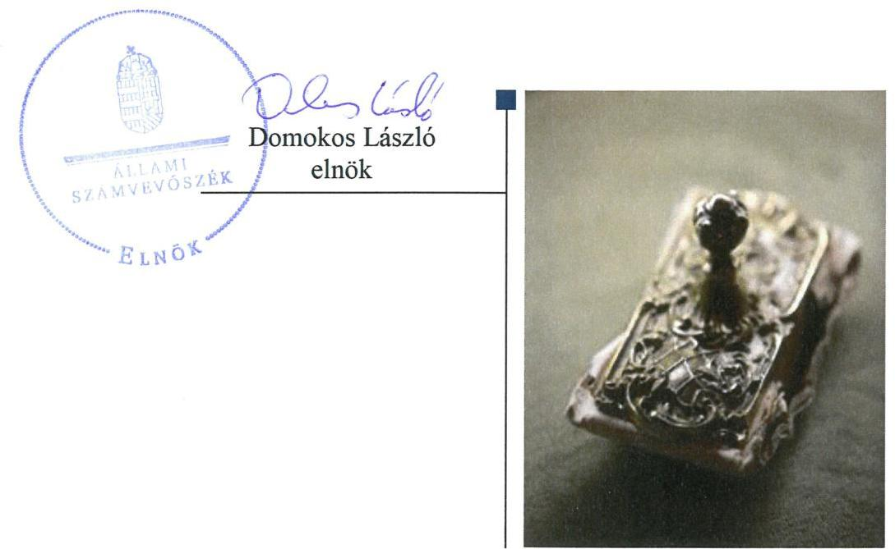
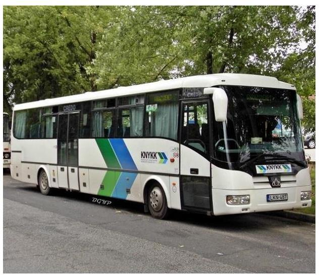
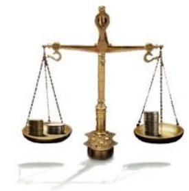
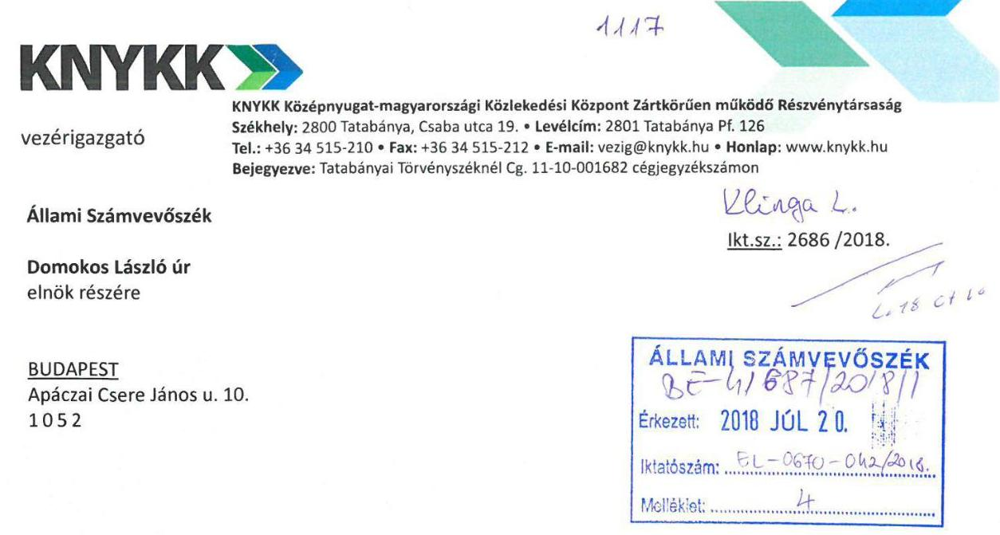
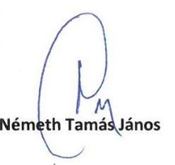
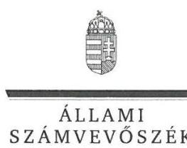
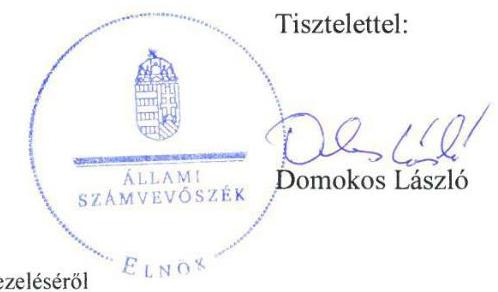
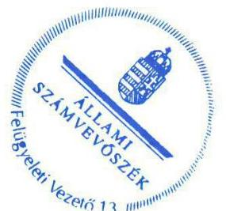

# Jelentés 

## Az állami tulajdonú gazdasági társaságok ellenőrzése

KNYKK Középnyugat-magyarországi Közlekedési Központ Zrt.
2018. 08. hó 31. nap

---

# AZ ELLENŐRZÉST FELÜGYELTE:

- **KLINGA LÁSZLÓ** felügyeleti vezető
- **AZ ELLENŐRZÉST VEZETTE ÉS A VÉGREHAJTÁSÁÉRT FELELŐS:**
- **MODER BEATRIX** ellenőrzésvezető
- **A PROGRAM ÖSSZEÁLLÍTÁSÁÉRT FELELŐS:**
- **TÓTPÁL SZABOLCS** osztályvezető

**IKTATÓSZÁM:** EL-0421-020/2018

**TÉMASZÁM:** 2469

**ELLENŐRZÉS-AZONOSÍTÓ SZÁM:** V081439

Jelentéseink az Országgyűlés számítógépes hálózatán és az Interneten a www.asz.hu címen is olvashatóak.

---

# TARTALOMJEGYZÉK 

■ ÖSSZEGZÉS ..... 5
■ AZ ELLENŐRZÉS CÉLJA ..... 6
■ AZ ELLENŐRZÉS TERÜLETE ..... 7
■ AZ ELLENŐRZÉS HÁTTERE, INDOKOLTSÁGA ..... 9
■ A JELENTÉS LÉNYEGES KÉRDÉSKÖREI ..... 10
■ AZ ELLENŐRZÉS HATÓKÖRE ÉS MÓDSZEREI ..... 11
■ MEGÁLLAPÍTÁSOK ..... 13
■ JAVASLATOK ..... 15
■ MELLÉKLETEK ..... 17
I. sz. melléklet: Értelmező szótár ..... 17
■ FÜGGELÉK: ÉSZREVÉTELEK ..... 21
■ RÖVIDÍTÉSEK JEGYZÉKE ..... 27

---

.

---

# ÖSSZEGZÉS 

A Magyar Nemzeti Vagyonkezelő Zrt. a KNYKK Középnyugat-magyarországi Közlekedési Központ Zrt. feletti tulajdonosi jogokat szabályszerűen alakította ki és gyakorolta. A Társaság gazdálkodása és vagyongazdálkodási tevékenysége a 2013. évben nem volt szabályozott és szabályszerű, a 2016. évben szabályszerű volt, az elszámoltathatóságot és átláthatóságot a 2016. évben biztosította.

## Az ellenőrzés társadalmi indokoltsága

Az állami tulajdonú gazdálkodó szervezetek a nemzeti vagyon részét képezik, ezért ellenőrzésük kiemelten fontos a nemzeti vagyon megőrzése, megóvása érdekében. Az állami vagyonnal való gazdálkodás alapvető célja az állami vagyon átlátható, rendeltetésszerű és felelős felhasználásának biztosítása.

Az Állami Számvevőszék stratégiájában megfogalmazta, hogy az államháztartáson kívülre nyújtott költségvetési támogatások és ingyenes vagyonjuttatások, valamint az államháztartáson kívül működő feladatellátó rendszerek ellenőrzéseivel hozzájárul ahhoz, hogy a közpénzeket az államháztartáson kívül működő szervezetek is átlátható, rendezett módon használják fel.

Minden közpénzt, közvagyont használó szervezettel szemben társadalmi igény, hogy tevékenységükről elszámoljanak. Az Állami Számvevőszék céljaival és a társadalmi igénnyel összhangban, a gazdasági társaságok kiemelt fontosságú szerepe miatt került sor a KNYKK Középnyugat-magyarországi Közlekedési Központ Zrt. ellenőrzésére.

## Főbb megállapítások, következtetések, javaslatok

A Magyar Nemzeti Vagyonkezelő Zrt. tulajdonosi joggyakorlása a KNYKK Középnyugat-magyarországi Közlekedési Központ Zrt. felett szabályszerű volt.

A Társaság gazdálkodása és vagyongazdálkodási tevékenysége 2013. évben nem volt szabályozott és szabályszerű, mert a jogszabályban előírt számviteli szabályzatokkal nem rendelkezett, így a szabályszerű könyvvezetés és beszámoló készítés feltételeit nem biztosította.

A Társaság szabályozottsága a 2016. évben szabályszerű volt, rendelkeztek a jogszabályi előírásoknak megfelelő számviteli politikával és annak keretében elkészített szabályzatokkal, valamint számlarenddel. A bevételek és ráfordítások elszámolása, a gazdálkodás és vagyongazdálkodás a 2016. évben szabályszerű volt. A Társaság a beszámoló mérlegében kimutatott eszközök és források állományát szabályszerű leltárral alátámasztotta.

A Társaság a közérdekű és a közérdekből nyilvános adatainak közzétételével a gazdálkodás nyilvánosságát biztosította, azonban a közzététel rendjét belső szabályzatban nem rögzítette.

A megállapítások alapján az Állami Számvevőszék a KNYKK Középnyugat-magyarországi Közlekedési Központ Zrt. vezérigazgatójának egy javaslatot fogalmazott meg.

---

# AZ ELLENŐRZÉS CÉLJA 

AZ ELLENŐRZÉS CÉLJA annak értékelése, hogy a tulajdonosi jogok gyakorlása szabályszerű volt-e. A gazdálkodó szervezet szabályozottsága, gazdálkodása és vagyongazdálkodási tevékenysége megfelelt-e a jogszabályi és a tulajdonosi előírásoknak; biztosítva volt-e a közfeladatok átláthatósága és elszámoltathatósága érdekében a közszolgáltatás díjának megalapozottsága szabályszerű önköltségszámítással. Értékeltük továbbá, hogy a vagyonváltozást eredményező döntések esetében a tulajdonosi jogok gyakorlója és a gazdálkodó szervezet szabályszerűen jártak-e el.

---

# **AZ ELLENŐRZÉS TERÜLETE**

## **KNYKK Középnyugat-magyarországi Közlekedési Központ Zrt. és a tulajdonosi jogokat gyakorló Magyar Nemzeti Vagyonkezelő Zrt.**

A Társaságot1 a Magyar Állam – 2012. november 19-én – kizárólagos tulajdonosként, 20,0 M Ft jegyzett tőkével alapította. A Társaság felett a tulajdonosi jogokat a Vtv.2 alapján az MNV Zrt.3 gyakorolta.

A Társaság jegyzett tőkéjét 2013. március 20-i alapítói döntéssel, nem pénzbeli vagyoni hozzájárulással – az MNV Zrt. portfoliójában lévő, a Vértes Volán Zrt. és az Alba Volán Zrt. részvényeinek Társaságba apportálásával – 4091,5 M Ft-ra emelték, majd 2013. decemberében – pénzbeli hozzájárulással – további 33 M Ft tőkeemelést teljesítettek. A Vértes Volán Zrt. és az Alba Volán Zrt. 2014. december 31-én beolvadt a Társaságba, aminek következtében a Magyar Állam tulajdona 99,97%-ra csökkent, majd a dolgozói részvények megvásárlásával 2015. szeptember 7-étől a Társaság ismét kizárólagos állami tulajdon lett. A jegyzett tőke összege a 2015. évben a beolvadások miatti átsorolások, korrekciók, valamint a dolgozói részvények megvásárlása miatt további 310,1 M Ft-tal, 4434,6 M Ft-ra emelkedett.

A Társaság a 2013. és 2014. év végén az Alba Volán Zrt.-ben és a Vértes Volán Zrt.-ben 99%-ot meghaladó tartós részesedéssel rendelkezett. A két Volán társaság beolvadásával ezen többségi részesedések a 2015. évtől megszűntek, ugyanakkor – a Vértes Volán Zrt. tulajdonában lévő – Vértes Humán Oktató és Szolgáltató Kft.-ben 100%-os tulajdonrészt szereztek. Ezen felül a 2016. év végén, összesen 23,9 M Ft könyvszerinti értékű, kisebbségi – 1,3% és 12,5% közötti – részesedéssel rendelkeztek négy gazdasági társaságban.

A Társaság főtevékenysége a 2013-2014. években üzletvezetés, üzletviteli tanácsadás volt, előkészítette a Volán társaságok beolvadását. A Vértes Volán Zrt. és az Alba Volán Zrt. beolvadását követően, 2015. január 1-jétől közfeladatot látott el, – közszolgáltatási szerződések alapján – autóbusszal végzett helyközi menetrend szerinti személyszállítási szolgáltatást végzett Fejér és Komárom-Esztergom megyét érintően. A Társaság ellátta továbbá – a beolvadó Volán társaságok és az önkormányzatok között létrejött közszolgáltatási szerződések alapján – az önkormányzati feladatellátás körébe tartozó, helyi menetrend szerinti személyszállítást Tatabánya, Tata, Komárom, Oroszlány, Esztergom, Székesfehérvár, Dunaújváros, Mór, Baracska, Nagykarácsony, Szár településeken. Egyéb tevékenységként piaci alapú személyszállítást, munkásszállítást, különjárati személyszállítást, valamint külső megrendelők részére járműjavítást és üzemanyag értékesítést végeztek.

---

A Társaság 2013-2016. évi éves beszámolóinak kiemelt adatairól az 1. táblázat ad tájékoztatást.

1. táblázat

# AZ ÉVES BESZÁMOLÓK KIEMELT ADATAI (M FT) 

| Megnevezés | $\begin{gathered} 2013 . \\ \text { 40. } 31 . \end{gathered}$ | $\begin{gathered} 2014 \\ \text { 40. } 31 . \end{gathered}$ | $\begin{gathered} 2015 . \\ \text { 40. } 31 . \end{gathered}$ | $\begin{gathered} 2016 . \\ \text { 40. } 31 . \end{gathered}$ |
| :--: | :--: | :--: | :--: | :--: |
| Mérlegfőösszeg | 4717,3 | 4735,1 | 11129,3 | 10212,2 |
| Adózott eredmény | 0,0 | 1,8 | 311,3 | 278,9 |
| Jegyzett tőke | 4124,5 | 4124,5 | 4434,6 | 4434,6 |
| Saját tőke | 4705,0 | 4706,7 | 5354,2 | 5633,2 |
| Kötelezettségek | 8,7 | 24,0 | 5007,1 | 3942,0 |
| Követelések | 10,2 | 16,6 | 4495,5 | 3243,7 |
| Értékesítés nettó árbevétele | 24,8 | 79,4 | 13120,0 | 12653,6 |
| Egyéb bevétel | 0,0 | 2,0 | 4671,1 | 5104,0 |

Forrás: a Társaság 2013-2016. évi éves beszámolói
Az ellenőrzött években a Társaság eredményesen gazdálkodott, az adózott eredményt eredménytartalékba helyezték, osztalékfizetés nem történt.

A Társaság vezérigazgatójának személye az ellenőrzött időszakban nem változott, 2012. november 19-étől töltötte be tisztségét. A Társaság átlagos állományi létszáma a 2013-2014. években 2,7 fő, a 2015. évben 1587,8 fő, a 2016. évben 1571,6 fő volt.

A Társaság a feladatait saját eszközeivel látta el, vagyonkezelésbe vett állami vagyonnal nem rendelkezett, valamint az NGM közlemények4 alapján az ellenőrzött időszakban nem tartozott a kormányzati szektorba sorolt egyéb szervezetek körébe.

---

# AZ ELLENŐRZÉS HÁTTERE, INDOKOLTSÁGA 

AZ ÁLLAMI TULAJDONÚ GAZDÁLKODÓ SZERVEZETEK ellenőrzése kiemelten fontos a nemzeti vagyon megőrzése, megóvása érdekében. Gazdálkodásuk jellemzően a közérdeklődés és a média figyelmének középpontjában áll, amihez hozzájárul a gazdálkodásuk körébe tartozó - közvetlen vagy közvetett állami tulajdonú, tehát végső soron a nemzeti vagyon részét képező - vagyon nagysága, illetve az általuk ellátott közszolgáltatások/közfeladatok minősége és hatékonysága. A közszolgáltatási árképzés megalapozottsága és a rendszeres elszámoltatás feltételeinek kialakítása az ellenőrzés során nagy hangsúlyt kap. A közszolgáltatás árában és annak támogatásában meg kell jelennie az önköltségszámítás szempontjainak, amely biztosítja a működés fenntarthatóságát (eszközpótlást) is.

Az ellenőrzés rámutathat az állami tulajdonú gazdálkodó szervezetek gazdálkodási tevékenységével kapcsolatos jó gyakorlatokra és szabálytalanságokra. Felhívhatja a figyelmet a jogszabályi követelmények teljesítéséhez szükséges feltételek hiányosságaira, hozzájárulhat az államháztartáson kívüli, de (közvetlenül vagy közvetve) állami vagyont használó gazdálkodó szervezetek tevékenységének átláthatóságához. Ellenőrzésünk eredményeképpen javaslatainkkal, megállapításainkkal hozzájárulhatunk a nemzeti vagyonnal való gazdálkodás átláthatóságának, elszámoltathatóságának javításához.

---

# A JELENTÉS LÉNYEGES KÉRDÉSKÖREI 

1.- A tulajdonosi jogok gyakorlása szabályszerű volt-e?
2.- A Társaság működésének szabályozottsága, gazdálkodása és vagyongazdálkodása megfelelt-e az előírásoknak?

---

# AZ ELLENŐRZÉS HATÓKÖRE ÉS MÓDSZEREI 

## Az ellenőrzés típusa

Megfelelőségi ellenőrzés.

## Az ellenőrzött időszak

Az ellenőrzött időszak a 2013-2016. évek, a 2016. évi beszámoló jóváhagyásáig tartó időszak.

## Az ellenőrzés tárgya

A KNYKK Középnyugat-magyarországi Közlekedési Központ Zrt. gazdálkodása, kiemelten vagyongazdálkodási tevékenysége, valamint a Magyar Nemzeti Vagyonkezelő Zrt. KNYKK Középnyugat-magyarországi Közlekedési Központ Zrt. feletti tulajdonosi joggyakorlása.

## Az ellenőrzött szervezet

- KNYKK Középnyugat-magyarországi Közlekedési Központ Zrt.
- Magyar Nemzeti Vagyonkezelő Zrt., mint a Társaság feletti tulajdonosi joggyakorló.

## Az ellenőrzés jogalapja

Az ellenőrzés jogalapját az ÁSZ tv. 1. § (3) bekezdése és 5. § (3)-(5) bekezdése képezi.

## Az ellenőrzés módszerei

Az ellenőrzést a nemzetközi standardokat irányadónak tekintve az ellenőrzési program ellenőrzési kérdései, az ellenőrzött időszakban hatályos jogszabályok, az ellenőrzés szakmai szabályok és módszertanok figyelembe vételével végeztük.

Az ellenőrzés ideje alatt az ellenőrzött szervezettel történő kapcsolattartást az ÁSZ6 Szervezeti és Működési Szabályzatának vonatkozó előírásai alapján biztosítottuk.

Az ellenőrzési kérdések megválaszolásához szükséges bizonyítékok megszerzése a következő ellenőrzési eljárások alkalmazásával történt: megfigyelés, kérdésfeltevés (információkérés), összehasonlítás, valamint

---

elemző eljárás. Az ellenőrzési bizonyítékként felhasználható adatforrások közé tartoznak egyrészt az ellenőrzési programban felsorolt adatforrások, másrészt adatforrás lehet minden - az ellenőrzés során - feltárt, az ellenőrzés szempontjából információkat tartalmazó dokumentum.

Az ellenőrzést a kérdésekre adott válaszok kiértékelésével, valamint a megjelölt adatforrások, a csatolt tanúsítványok felhasználásával, továbbá az adott időszakban hatályos jogszabályok figyelembe vételével folytattuk le. Amennyiben egy alapvető jelentőségű dokumentum hiánya alapján valamely lényeges kérdéskörre vonatkozóan az ÁSZ megállapítása kellően megalapozott lett, az adott kérdéskör, és azzal szoros logikai kapcsolatban lévő - ráépülő - kérdéskörök vonatkozásában további részletes ellenőrzési tevékenység nem került végrehajtásra.

A teljes ellenőrzött időszakra vonatkozóan került ellenőrzésre a gazdasági társaság tervezési, beszámolási, közzétételi, adatszolgáltatási kötelezettségének, valamint belső ellenőrzési tevékenységének szabályszerűsége. A 2013. és 2016. évekre vonatkozóan a gazdasági társaság működésének szabályozottságát, a bevételei és ráfordításai elszámolását, illetve vagyongazdálkodásának szabályszerűségét is ellenőriztük.

A bevételek és ráfordítások elszámolását, valamint a vagyonnyilvántartás szabályszerűségét mintavétellel ellenőriztük. A mintavételezés az értékesítés nettó árbevétele, az egyéb és rendkívüli bevételek, a pénzügyi műveletek bevételei, illetve az anyagjellegű ráfordítások, az egyéb és rendkívüli ráfordítások, a pénzügyi műveletek ráfordításai, valamint a tárgyi eszközök növekedési tételei esetén azokra a legnagyobb értékű tételekre - a lényeges sokaságra - terjedt ki, amelyek összértéke elérte a teljes sokaság összértékének 50%-át. Amennyiben valamely lényeges sokaság elemszáma kisebb volt, mint az előírt mintaelemszám, a
 lényeges sokaságot tételesen ellenőriztük. A személyi jellegű ráfordítások esetében a mintavétel a teljes sokaságból történt.

A mintavétellel ellenőrzött területek esetében minden egyes tétel vonatkozásában a szabályszerűségre vonatkozó kérdéseket tettünk fel, amelyek eredménye összesítésre került. „Szabályszerűnek" értékeltünk egy ellenőrzött területet, amennyiben 95%-os bizonyossággal az ellenőrzött sokaságban az átlagos hibaarány legfeljebb 10%, "nem szabályszerűnek", amennyiben 10%-nál magasabb arányt képviselt. Abban az esetben, ha az ellenőrzött sokaság tekintetében a 10%-os hibaarányhoz való viszony megítélésének megbízhatósága nem érte el a 95%-ot, annak elérése érdekében értékelésünket további szempontokkal egészítettük ki, és figyelembe vettük a feltárt hibák értékét. A mintavételi eredmények alapján megfogalmazott megállapítások csak a lényeges sokaságra vonatkoznak.

---

# 1. A tulajdonosi jogok gyakorlása szabályszerű volt-e? 

Összegző megállapítás Az MNV Zrt. tulajdonosi joggyakorlása szabályszerű volt.

A TULAJDONOSI JOGGYAKORLÁS rendjét az MNV Zrt. Igazgatósága - a Vtv., valamint a Gt. ${ }^{6}$ és a Ptk. ${ }^{7}$ előírásaival összhangban az MNV Zrt. SZMSZ ${ }_{1-3}$-ban ${ }^{8}$ és a Létesítő Okirat ${ }_{1-10}$-ben ${ }^{9}$ kialakította.

A Létesítő okirat ${ }_{1-10}$-ben rögzítették az MNV Zrt. kizárólagos jogkörébe tartozó döntéseket, a Társaság igazgatóságának, vezérigazgatójának feladat- és hatásköreit, valamint a vagyonváltozással kapcsolatos döntési jogköröket. Az MNV Zrt. a Taktv. ${ }^{10}$ előírásának megfelelően három tagból álló FB${ }^{11}$-t hozott létre, valamint a Gt. és a Ptk. előírásával összhangban választotta meg a könyvvizsgálót.

Üzleti terv készítésének kötelezettségét a Létesítő okirat ${ }_{1-10}$-ben rögzítették. Az általános, és ágazat-specifikus tervezési irányelvek ${ }^{12}$ alapján készült üzleti terveket az FB véleményezését követően a MNV Zrt. jóváhagyta.

Az MNV Zrt. a Társaság éves beszámolóit a Gt. és a Ptk. előírásainak megfelelően az FB és a könyvvizsgáló írásbeli jelentésének birtokában hagyta jóvá.

A monitoring tevékenységet az MNV Zrt. a monitoring szabályzat ${ }_{1-2}{ }^{13}$-ben kialakította és megfelelően működtette, a Társaság gazdálkodásának alakulását az előírt adatszolgáltatások elemzése, értékelése alapján folyamatosan nyomon követte.

A javadalmazási szabályzat ${ }_{1-2}$-t ${ }^{14}$ a Taktv. előírásainak megfelelően az MNV Zrt. megalkotta.

## 2. A Társaság működésének szabályozottsága, gazdálkodása és vagyongazdálkodása megfelelt-e az előírásoknak?

Összegző megállapítás

A Társaság gazdálkodása és vagyongazdálkodása a 2013. évben nem volt szabályozott és szabályszerű, a 2016. évben szabályszerű volt.

A társasági SZMSZ ${ }_{1-3}{ }^{15}$ a Létesítő okirat ${ }_{1-10}$ előírásaival összhangban tartalmazta a tevékenységi kört, a képviselet és a cégjegyzés módját, valamint a szervezeti felépítést és a szervezeti egységek feladat- és hatáskörét.

A TÁRSASÁG A 2013. ÉVBEN a Számv. tv. ${ }^{16}$ 14. § (3) és (5) bekezdéseiben, valamint a Számv. tv. 161. § (1) bekezdésében foglaltak ellenére számviteli politikával és az annak keretében elkészítendő számviteli szabályzatokkal, valamint számlarenddel nem rendelkezett, így a szabályszerű könyvvezetés feltételeit nem biztosította.

---

2016. ÉVBEN A GAZDÁLKODÁS szabályszerű volt. A szabályszerű működés feltételeit a Számv. tv. előírásainak megfelelően - a Társaság sajátosságainak megfelelő Számviteli politika ${ }_{1-3}{ }^{17}$, Leltározási szabályzat ${ }_{1-2}{ }^{18}$, Selejtezési szabályzat ${ }^{19}$, Pénzkezelési szabályzat ${ }_{1-2}{ }^{20}$, Értékelési szabályzat ${ }_{1-2}{ }^{21}$, Önköltség számítási szabályzat ${ }^{22}$, valamint Számlarend ${ }^{23}$ elkészítésével - kialakították.

# A 2016. ÉVI BEVÉTELEK ÉS RÁFORDÍTÁSOK ELSZÁMOLÁSA szabályszerű volt. A szolgáltatási díjakat a Számv. tv.ben foglaltak szerint önköltségszámítással alapozták meg. 

## A VAGYONGAZDÁLKODÁS, VAGYONNYILVÁNTARTÁS A 2016. ÉVBEN megfelelt a jogszabályi előírásoknak.

A vagyongazdálkodás követelményeit, a vagyon értékének megőrzését, gyarapítását szolgáló, szabályszerű vagyongazdálkodás feltételeit kialakították. A feladat- és hatásköröket, felelősségi viszonyokat a Létesítő okirat ${ }_{1-10}$, valamint a Társaság belső szabályzatai rögzítették.

A Társaság vagyonát érintő döntésekre a Létesítő Okirat ${ }_{1-10}$-ben, a Társasági SZMSZ ${ }_{1-3}$-ban, az Ingatlangazdálkodási ${ }_{1-3}{ }^{24}$- és Beruházási szabályzatban ${ }^{25}$ előírtak szerint került sor.

Az eszközök állományba vétele, üzembe helyezése, az értékcsökkenési leírás alapját képező bekerülési érték megállapítása, és az értékcsökkenés elszámolása szabályszerű volt.

A 2016. évi beszámoló mérlegét a Számv. tv. előírásainak megfelelő, az eszközöket és forrásokat tételesen, mennyiségben és értékben ellenőrizhető módon tartalmazó leltárral támasztották alá.

A KAPCSOLT VÁLLALKOZÁS - a Vértes Humán Oktató és Szolgáltató Kft. - az adatszolgáltatási kötelezettségének eleget tett, a gazdálkodásának főbb mutatóit a Társaság a beszámolója kiegészítő mellékletében bemutatta. A Társaság a leányvállalata jegyzett tőkéjét 2016. februárjában a Ptk. előírásának megfelelő minimum értékre - 3 millió Ft-ra felemelte.

TERVEZÉSI, BESZÁMOLÁSI kötelezettségének a Társaság eleget tett, az üzleti terv készítési, valamint az évközi és éves adatszolgáltatási, tájékoztatási, beszámolási feladatait az MNV Zrt. felé teljesítette.

A jóváhagyott éves számviteli beszámolókat, könyvvizsgálói jelentéseket a Társaság a Számv. tv. előírásainak megfelelően, határidőben közzétette és letétbe helyezte.

A KÖZZÉTÉTELI KÖTELEZETTSÉG teljesítésének részletes szabályait az Infotv. ${ }^{26}$ 35. § (3) bekezdésében foglalt előírások ellenére a Társaság belső szabályzatban nem határozta meg. Az Infotv. és a Taktv. szerinti közzétételi kötelezettségét a Társaság teljesítette, a közérdekű és közérdekből nyilvános adatainak megismerhetőségét, hozzáférhetőségét internetes honlapján biztosította.

A Társaság - az Infotv. előírásának megfelelően - a 2015. évtől belső adatvédelmi felelőst nevezett ki, és elkészítette az Adatvédelmi szabályzatot ${ }^{27}$.

---

# JAVASLATOK 

Az ÁSZ tv. 33. § (1) bekezdésében foglaltak értelmében az ellenőrzött szervezet vezetője köteles a jelentésben foglalt megállapításokhoz kapcsolódó intézkedési tervet összeállítani és azt a jelentés kézhezvételétől számított 30 napon belül az ÁSZ részére megküldeni. Amennyiben az ellenőrzött szervezet vezetője nem küldi meg határidőben az intézkedési tervet, vagy továbbra sem elfogadható intézkedési tervet küld, az Állami Számvevőszék elnöke az ÁSZ tv. 33. § (3) bekezdése a) és b) pontjaiban foglaltakat érvényesítheti.

## KNYKK Középnyugat-magyarországi Közlekedési Központ Zrt. vezérigazgatójának

1. Intézkedjen az Infotv.-ben előírt közzétételi kötelezettség teljesítése részletes szabályainak belső szabályzatban történő meghatározásáról.
(2. sz. megállapítás 13. bekezdés 1. mondata alapján)

---

.

---

# MELLÉKLETEK 

## I. SZ. MELLÉKLET: ÉRTELMEZŐ SZÓTÁR

állami vagyon
a) Az állam tulajdonában lévő dolog, valamint a dolog módjára hasznosítható természeti erő,
b) az a) pont hatálya alá nem tartozó mindazon vagyon, amely vonatkozásában törvény az állam kizárólagos tulajdonjogát nevesíti,
c) az állam tulajdonában lévő tagsági jogviszonyt megtestesítő értékpapír, illetve az államot megillető egyéb társasági részesedés,
d) az államot megillető olyan immateriális, vagyoni értékkel rendelkező jogosultság, amelyet jogszabály vagyoni értékű jogként nevesít.
Forrás: Vtv. 1. § (2) bekezdése
2012. november 10-től az állami vagyon fogalma kiegészül a következő ponttal:
e) az állam tulajdonában lévő pénzügyi eszközök

Forrás: Vtv. 1. § (2) bekezdése
2013. június 27-ig:

Az állami vagyont az MNV Zrt. maga kezeli, vagy szerződés - így különösen bérlet, haszonbérlet, megbízás - alapján központi költségvetési szervnek, természetes vagy jogi személynek, vagy jogi személyiséggel nem rendelkező gazdálkodó szervezetnek hasznosításra átengedi.
Forrás: Vtv. 23. § (1) bekezdése
2013. június 28-ától:

Az állami vagyonnal az MNV Zrt. maga gazdálkodik, vagy szerződés - így különösen bérlet, haszonbérlet, megbízás - alapján központi költségvetési szervnek, természetes vagy jogi személynek, vagy jogi személyiséggel nem rendelkező gazdálkodó szervezetnek hasznosításra átengedi, illetőleg vagyonkezelésbe, haszonélvezetbe adja.
Forrás: Vtv. 23. § (1) bekezdése
anyavállalat Az a vállalkozó, amely egy másik vállalkozónál (a továbbiakban: leányvállalat) közvetlenül vagy leányvállalatán keresztül közvetetten meghatározó befolyást képes gyakorolni, mert az alábbi feltételek közül legalább eggyel rendelkezik:
a) a tulajdonosok (a részvényesek) szavazatának többségével (50 százalékot meghaladóval) tulajdoni hányada alapján egyedül rendelkezik, vagy
b) más tulajdonosokkal (részvényesekkel) kötött megállapodás alapján a szavazatok többségét egyedül birtokolja, vagy
c) a társaság tulajdonosaként (részvényesként) jogosult arra, hogy a vezető tisztségviselők vagy a felügyelő bizottság tagjai többségét megválassza vagy visszahívja, vagy
d) a tulajdonosokkal (a részvényesekkel) kötött szerződés (vagy a létesítő okirat rendelkezése) alapján - függetlenül a tulajdoni hányadtól, a szavazati aránytól, a megválasztási és visszahívási jogtól - döntő irányítást, ellenőrzést gyakorol.
Forrás: Számv. tv. 3. § (2) 1. pont
gazdasági társaság A Ptk. 3:88. § (1) bekezdése szerint „a gazdasági társaságok üzletszerű közös gazdasági tevékenység folytatására, a tagok vagyoni hozzájárulásával létrehozott, jogi személyiséggel rendelkező vállalkozások, amelyekben a tagok a nyereségből közösen részesednek, és a veszteséget közösen viselik".

---

kapcsolt vállalkozás
közszolgáltatás
leányvállalat
MNV Zrt.
nemzeti vagyon
tulajdonosi ellenőrzés

Az anyavállalat és a leányvállalat és a közös vezetésű vállalkozások (fölérendelt anyavállalat esetében a minősítést a fölérendelt anyavállalat szempontjából kell elvégezni) Forrás: Számv. tv. 3. § (2) 7. pont
Az Ebktv. ${ }^{28}$ 3. § d) pontja a következőképpen határozza meg a közszolgáltatást: „szerződéskötési kötelezettség alapján a lakosság alapvető szükségleteinek ellátására irányuló szolgáltatás, így különösen a villamos energia-, gáz-, hő-, víz-, szennyvíz- és hulladékkezelési, köztisztasági, postai és távközlési szolgáltatás, továbbá a menetrend alapján közlekedő járművekkel végzett közforgalmú személyszállítás".
Az a gazdasági társaság, amelyre az anyavállalat meghatározó befolyást képes gyakorolni
Forrás: Számv. tv. 3. § (2) 2. pont
Az állami vagyon felett, a Magyar Államot megillető tulajdonosi jogok és kötelezettségek összességét - a hatályos szabályozás szerint - az állami vagyon felügyeletéért felelős miniszter (jelenleg a nemzeti fejlesztési miniszter) gyakorolja. A miniszter feladatát nagy részben az MNV Zrt., mint tulajdonosi joggyakorló szervezet útján látja el.
a) az állam vagy a helyi önkormányzat kizárólagos tulajdonában álló dolgok,
b) az a) pont hatálya alá nem tartozó, állam vagy a helyi önkormányzat tulajdonában lévő dolog,
c) az állam vagy a helyi önkormányzat tulajdonában lévő pénzügyi eszközök, továbbá az államot vagy a helyi önkormányzatot megillető társasági részesedések,
d) az államot vagy a helyi önkormányzatot megillető bármely vagyoni értékkel rendelkező jogosultság, amelyet jogszabály vagyoni értékű jogként nevesít,
e) Magyarország határa által körbezárt terület feletti légtér,
f) az üvegházhatású gázok kibocsátási egységeinek kereskedelméről szóló törvény szerint kibocsátási egység és légiközlekedési kibocsátási egység, valamint az ENSZ Éghajlatváltozási Keretegyezménye és annak Kiotói Jegyzőkönyve végrehajtási keretrendszeréről szóló törvény szerinti kiotói egység,
g) állami vagy helyi önkormányzati fenntartású közgyűjtemény (muzeális intézmény, levéltár, közgyűjteményként működő kép- és hangarchívum, valamint könyvtár) saját gyűjteményében nyilvántartott kulturális javak körébe tartozó dolog, kivéve, ha az állami vagy önkormányzati tulajdon jogszerű létrejötte kétséget kizáró módon nem bizonyítható és a dologra nézve más a tulajdonjogát bizonyítja vagy a kulturális javakra vonatkozó jogszabályokban meghatározott eljárás keretében valószínűsíti (g. pont módosult 2013. december 7-től),
h) a régészeti lelet,
i) a nemzeti adatvagyon körébe tartozó állami nyilvántartások fokozottabb védelméről szóló törvény szerinti nemzeti adatvagyon.
Forrás: Nvtv. ${ }^{29}$ 1. § (2)
2014. március 14-ig:

Az állami vagyon kezelőjét, haszonélvezőjét, használóját megillető jogok gyakorlását, annak szabályszerűségét, célszerűségét az MNV Zrt. - szükség szerint területi szervei útján - ellenőrzi.

## 2014. március 15-től:

Az állami vagyon használóját, vagyonkezelőjét és haszonélvezőjét megillető jogok gyakorlását, annak szabályszerűségét, a kötelezettségek teljesítését, valamint a vagyon rendeltetése szerinti célszerűségét a tulajdonosi joggyakorló rendszeresen ellenőrzi. Forrás: Vhr. ${ }^{30} 20 . \S$ (1)

---

tulajdonosi jogok gyakorlója

### 2013. június 27-ig:

Az állami vagyon felett a Magyar Államot megillető tulajdonosi jogok és kötelezettségek összességét - ha törvény eltérően nem rendelkezik - az állami vagyon felügyeletéért felelős miniszter (a továbbiakban: miniszter) gyakorolja, aki e
 feladatát a Magyar Nemzeti Vagyonkezelő Zártkörűen Működő Részvénytársaság (a továbbiakban: MNV Zrt.), a Magyar Fejlesztési Bank, illetve a tulajdonosi joggyakorló szervezet útján látja el. A miniszter miniszteri rendeletben, a törvényben meghatározott állami vagyoni kör tekintetében, meghatározott időtartamra, a joggyakorlás egyes szabályainak meghatározásával - az őt megillető tulajdonosi jogok és kötelezettségek összességének, illetve azok meghatározott részének gyakorlóját az Áht. szerinti központi költségvetési szervek, ezek intézménye, továbbá a 100%-ban állami tulajdonban álló gazdasági társaságok közül kijelölheti.
Forrás: Vtv. 3. § (1) és (2)
2013. június 28-ától:

A rábízott állami vagyon felett az államot megillető tulajdonosi jogok és kötelezettségek összességét tulajdonosi joggyakorlóként:
a) ha törvény vagy miniszteri rendelet eltérően nem rendelkezik, a Magyar Nemzeti Vagyonkezelő Zártkörűen Működő Részvénytársaság (a továbbiakban: MNV Zrt.),
b) törvényben kijelölt személy vagy
c) az állami vagyon felügyeletéért felelős miniszter (a továbbiakban: miniszter) által rendeletben kijelölt személy gyakorolja.
[...] A miniszter e törvény felhatalmazása alapján - a meghatározott célok hatékonyabb elérése érdekében, miniszteri rendeletben, az ott meghatározott állami vagyoni kör tekintetében, meghatározott időtartamra - e törvény keretei között, a joggyakorlás egyes szabályainak meghatározásával - az államot megillető tulajdonosi jogok és kötelezettségek összességének, illetve azok meghatározott részének gyakorlóját az Áht. szerinti központi költségvetési szervek, ezek intézménye, továbbá a 100%-ban állami tulajdonban álló gazdasági társaságok közül kijelölheti.
Forrás: Vtv. 3. § (1) és (2)
2.

Aki a nemzeti vagyon felett az államot vagy a helyi önkormányzatot megillető tulajdonosi jogok és kötelezettségek összességének gyakorlására jogosult
Forrás: Nvtv. 3. § (1) 17. pontja

---

.

---

# FÜGGELÉK: ÉSZREVÉTELEK 

A jelentéstervezetet a Számvevőszék 15 napos észrevételezésre megküldte az ellenőrzött szervezetek vezetőinek az ÁSZ tv. 29. § (1) bekezdése előírásának megfelelően.

A KNYKK Középnyugat-magyarországi Közlekedési Központ Zrt. vezérigazgatójának észrevételeit és az azokra adott válaszokat a függelék tartalmazza. A Magyar Nemzeti Vagyonkezelő Zrt. vezérigazgatója a jelentéstervezetre nem tett észrevételt.

[^0]
[^0]:    * 29. § (1) Az Állami Számvevőszék az ellenőrzési megállapításait megküldi az ellenőrzött szervezet vezetőjének vagy az általa megbízott személynek, és annak, akinek személyes felelősségét állapította meg.
    (2) Az ellenőrzött szervezet vezetője és a felelősként megjelölt személy az ellenőrzés megállapításaira tizenöt napon belül írásban észrevételt tehet.
    (3) Az Állami Számvevőszék az észrevételre a beérkezésétől számított harminc napon belül írásban válaszol. A figyelembe nem vett észrevételeket köteles a jelentésben feltüntetni, és megindokolni, hogy azokat miért nem fogadta el.

---

Tisztelt Elnök Úr!

A 2018. július 2. napján EL-0670-038/2018. iktatószám alatt kelt levelére való hivatkozással „Az állami tulajdonú gazdasági társaságok ellenőrzése - KNYKK Középnyugat-magyarországi Közlekedési Központ Zrt." címmel készített Számvevőszéki jelentéstervezethez a következő észrevételeket tesszük:

1. A Számvevőszéki jelentéstervezet a MEGÁLLAPÍTÁSOK / 2. A Társaság működésének szabályozottsága, gazdálkodása és vagyongazdálkodása megfelel-e az előírásoknak? című fejezet indoklás részének 2. megállapítja:
„A Társaság a 2013. évben a Számv. tv. 14. § (3) és (5) bekezdéseiben, valamint a Számv. tv. 161. § (1) bekezdésében foglaltak ellenére számviteli politikával és az annak keretében elkészítendő számviteli szabályzatokkal, valamint számlarenddel nem rendelkezett, így a szabályszerű könyvvezetés feltételeit nem biztosította."

A megállapításhoz a következő észrevételt tesszük:

A fent tett megállapítással a Társaságunk nem ért egyet, tekintettel arra, hogy a szabályszerű könyvvezetés feltételeit a hatályos számviteli törvény előírásaival biztosította. Az éves beszámolót leltárakkal alátámasztotta. A Társaságunk a Vértes Volán Zrt. szabályzata alapján elkészítette a működéséhez szükséges számviteli politikát, mely összhangban volt a számviteli törvény előírásaival, melyet jelen észrevételünkhöz csatolunk. A KNYKK Zrt. a Magyar Nemzeti Vagyonkezelő Zrt. által az állami vagyon felügyeletéért felelős miniszter által kiadott 41/2012. RJGY határozattal módosított 29/2012. RJGY határozat III. pontja alapján, a Vértes Volán Zrt. és az Alba Volán Zrt. integrációjának lebonyolítására került megalapításra 2012. november 19-én. A társaság 2014. év végéig kizárólag a leányvállalatai, így a Vértes Volán Zrt. és az Alba Volán Zrt. számára végzett üzletviteli tanácsadási tevékenységet, melynek keretében felkészítette őket a két társaság 2014. december 31-én bekövetkező integrációjára, a KNYKK Zrt.-be történő beolvadására. A KNYKK Zrt. a vizsgált évek közül 2013. évben mindössze 2,7 fő munkavállalóval rendelkezett (a létszámadat nagysága reprezentálja a tevékenység méreteit, ami nyilvánvalóan nem biztosíthatta egy közlekedési vállalat működését), operatív irányítását, a működéséhez szükséges adminisztratív tevékenységet a társaságok között létrejött szerződések alapján a Vértes Volán Zrt. és az Alba Volán Zrt.

---

munkavállalói látták el, folyamatai a Vértes Volán Zrt. gyakorlata és szabályzatai alapján kerültek meghatározásra. Kérjük, hogy a Jelentésben tett megállapításait ennek megfelelően módosítani szíveskedjen.

A Jelentéstervezet 3. bekezdésében megállapítja:
„A beszámoló mérlegének alátámasztásához a Társaság a 2013. évben a Számv. tv. 69. § (1) bekezdése ellenére a mérleg fordulónapján meglévő eszközeit és forrásait mennyiségben és értékben tartalmazó leltárt nem állított össze."

A társaság 2013. december 31-én elkészítette az eszközeiről és forrásairól a leltárt, melyek a megadott határidő lejárta előtt feltöltésre kerültek az Állami Számvevőszék által megadott helyre, a file-ok megnevezése: az előtársasági időszak záró leltára: 15_130109_L.pdf, a 2013. december 31-i leltárak: 15_131231_L.pdf. Ennek alapján kérjük, hogy a Jelentéstervezetben tett, erre vonatkozó megállapításait törölni szíveskedjen.
2. A Számvevőszéki jelentéstervezet két helyen (7. és 14. oldalon) említést tesz a „Vértes Humán Oktatási és Szolgáltató Kft."-ről, mint kapcsolt vállalkozásról. A társaság pontos elnevezése: Vértes Humán Oktató és Szolgáltató Kft.
3. A Számvevőszéki jelentéstervezet a JAVASLATOK címú fejezetben a KNYKK Zrt. vezérigazgatója részére a következő feladatot határozza meg:
„Intézkedjen az Infotv.-ben előírt közzétételi kötelezettség teljesítése részletes szabályainak belső szabályzatban történő meghatározásáról."

Tájékoztatom, hogy Társaságunk a 2017. február 22-én kiadott 4/2017. számú Vezérigazgatói Utasításban (Közérdekű adatok megismerésére irányuló igények teljesítésének rendjét rögzítő szabályzat („Információszabadság-szabályzat")) meghatározta - egyebek mellett - az Infotv.-ben előírt közzétételi kötelezettség teljesítésének Társaságra vonatkozó részletes szabályait. A hivatkozott vezérigazgatói utasítást levelemhez mellékelem.

Kérjük, hogy a Jelentéstervezet JAVASLATOK címú fejezetből a közzétételi kötelezettségre vonatkozó szabályozási feladatok előírását törölni szíveskedjék.

Kérem, hogy az ÁSZ tv. 24.§ (1) b) pontja alapján a fenti észrevételeinket és az azokat alátámasztó most becsatolt dokumentumokat szíveskedjen figyelembe venni a Számvevőszéki jelentés véglegesítése során, ezzel érdemi lehetőséget adva a megállapításokra adott magyarázataink tekintetében.

Tatabánya, 2018. július 17.

Tisztelettel:

---

ELKÖK

Ikt.szám: EL-0670-043/2018.

# Németh Tamás János úr 

vezérigazgató

KNYKK Középnyugat-magyarországi Közlekedési Központ Zártkörűen Működő
Részvénytársaság

## Tatabánya

## Tisztelt Vezérigazgató Úr!

Köszönettel vettem „Az állami tulajdonú gazdasági társaságok - Az állami tulajdonú gazdasági társaságok ellenőrzése - KNYKK Középnyugat-magyarországi Közlekedési Központ Zártkörűen Működő Részvénytársaság" címú ellenőrzésről készített számvevőszéki jelentéstervezetre megküldött észrevételeit.
Az Állami Számvevőszék észrevételekre vonatkozó álláspontját a felügyeleti vezető által készített részletes tájékoztatás tartalmazza, amelyet levelemhez mellékeltem. Tájékoztatom Vezérigazgató urat, hogy az Állami Számvevőszék a figyelembe nem vett észrevételeket az Állami Számvevőszékről szóló 2011. évi LXVI. törvény 29. § (3) bekezdésében előírtak szerint köteles a jelentésében feltüntetni és megindokolni, hogy azokat miért nem fogadta el.

Budapest, 2018. 08. 09.

Melléklet: Tájékoztatás az észrevételek kezeléséről

---

# Tájékoztatás az észrevételek kezeléséről 

Megköszönöm Vezérigazgató úrnak „Az állami tulajdonú gazdasági társaságok - Az állami tulajdonú gazdasági társaságok ellenőrzése - KNYKK Középnyugat-magyarországi Közlekedési Központ Zrt." címmel készített jelentés-tervezetre tett észrevételeit. Az észrevételek kezeléséről az alábbi tájékoztatást adom:

## 1. A jelentéstervezet 2. számú megállapítás 1. és 2. bekezdéséhez füzött észrevétele kapcsán

Vezérigazgató úr észrevételében jelezte, hogy a KNYKK Középnyugat-magyarországi Közlekedési Központ Zrt. (továbbiakban: Társaság) a 2013. évben is rendelkezett számviteli politikával. A 2012. november 19-étől hatályos számviteli politikát észrevételéhez mellékelte.

Az Állami Számvevőszék (továbbiakban: ÁSZ) az ellenőrzését a megküldött ellenőrzési programnak megfelelően, a rendelkezésre bocsátott adatok és dokumentumok (bizonyítékok) alapján végezte. Az Állami Számvevőszékről szóló 2011. évi LXVI. törvény (továbbiakban: ÁSZ tv.) 28. § (2) bekezdése alapján a közremüködésre felhívott szervezet az ÁSZ részére - annak kérésére soron kívül, de legkésőbb öt munkanapon belül - az ellenőrzés lefolytatása érdekében a szükséges adatokat és dokumentumokat rendelkezésre bocsátja.

A 2013. évben hatályos számviteli politikát az adatszolgáltatás során - mint azt Ön sem vitatja - nem küldték meg részünkre. Az adatszolgáltatási szakasz a teljességi és hitelességi nyilatkozattal lezárult, ezért az észrevételéhez csatolt dokumentum (2012. november 19-i keltezésű számviteli politika) ellenőrzési bizonyítékként már nem felhasználható.

Fentiekre tekintettel észrevételét nem fogadom el, így a jelentéstervezet módosítása nem indokolt.
Vezérigazgató úrnak a 2013. évi leltár hiányára vonatkozó megállapításra tett észrevételét elfogadom, azt a jelentésben nem szerepeltetem.

## 2. A jelentéstervezet „Ellenőrzés területe" rész 3. mondatához és a 2. számú megállapítás 10. bekezdéséhez füzött észrevétele kapcsán

Vezérigazgató úr észrevételében jelezte, hogy a Társaság kapcsolt vállalkozásának neve Vértes Humán Oktató és Szolgáltató Kft., a jelentéstervezet hivatkozott részeiben tévesen Vértes Humán Oktatási és Szolgáltató Kft. elnevezés szerepel.

Az észrevételt köszönöm, a jelentéstervezetet módosítottuk.

---

# 3. A jelentéstervezet javaslatához füzött észrevétele kapcsán 

Vezérigazgató Úr észrevételében jelezte, hogy a Társaság 2017. február 22-étől rendelkezik a javaslatban szereplő - közzétételi kötelezettség teljesítése részletes szabályait meghatározó szabályzattal.

A szabályzattal kapcsolatban adott tájékoztatást köszönettel tudomásul vettem. Az észrevétel az ellenőrzött 2013-2016. évekre tett megállapítást nem vitatta, megállapításunkat megerősítette, így a jelentéstervezet módosítása nem indokolt. Tájékoztatom, hogy az ÁSZ tv. 33. § (1) bekezdésében foglaltak értelmében az ellenőrzött szervezet vezetője köteles a jelentésben foglalt megállapításokhoz kapcsolódó intézkedési tervet összeállítani és azt a jelentés kézhezvételétől számított 30 napon belül az ÁSZ részére megküldeni.

Budapest, 2018. augusztus 5.

Klinga László felügyeleti vezető

---

# RÖVIDÍTÉSEK JEGYZÉKE 

${ }^{1}$ Társaság
${ }^{2}$ Vtv.
${ }^{3}$ MNV Zrt.
${ }^{4}$ NGM közlemények
${ }^{5}$ ÁSZ
${ }^{6}$ Gt.
${ }^{7}$ Ptk.
${ }^{8}$ MNV Zrt. SZMSZ${ }_{1-3}$
${ }^{9}$ Létesítő okirat${ }_{1-10}$

KNYKK Középnyugat-magyarországi Közlekedési Központ Zártkörűen Működő Részvénytársaság 2007. évi CVI. törvény az állami vagyonról (hatályos 2007. szeptember 25-től)
Magyar Nemzeti Vagyonkezelő Zártkörűen Működő Részvénytársaság
Nemzetgazdasági Minisztérium közleményei a kormányzati szektorba sorolt egyéb szervezetekről (hivatalos értesítő 2012/9. hatályos 2012. február 16-ától; hivatalos értesítő 2013/32. hatályos 2013. június 28-ától; hivatalos értesítő 2013/60. hatályos 2013. december 16-ától, valamint hivatalos értesítő 2015/66. hatályos 2015. december 30-ától)
Állami Számvevőszék
2006. évi IV. törvény a gazdasági társaságokról (hatályos 2014. március 14-ig)
2013. évi V. törvény a Polgári Törvénykönyvről (hatályos 2014. március 15-étől)

SZMSZ1: MNV Zrt. 123/2013. (III. 07.); 246/2013. (IV. 22.) és 287/2013. (V. 06.); IG. határozatokkal módosított 508/2012. (X. 08.) IG. határozattal jóváhagyott Szervezeti és működési szabályzata (hatályos 2013. június 30-ig)
SZMSZ2: MNV Zrt. 149/2015. (IV. 21.); valamint a 123/2015. (III. 17.) IG. határozatokkal módosított 430/2013. (VI. 17.) IG. határozattal jóváhagyott Szervezeti és működési szabályzata (hatályos 2016. április 14-ig)
SZMSZ3: MNV Zrt. 158/2016. (IV. 06.) IG. határozattal jóváhagyott Szervezeti és működési szabályzata (hatályos 2016. április 15-től)
Létesítő okirat1: KNYKK Középnyugat-magyarországi Közlekedési Központ Zártkörűen Működő Részvénytársaság Alapító Okirata (hatályos 2012. november 19-től 2013. április 11-ig)
Létesítő okirat2: KNYKK Középnyugat-magyarországi Közlekedési Központ Zártkörűen Működő Részvénytársaság Alapító Okirata (hatályos 2013. április
 12-től 2013. június 2-ig)
Létesítő okirat³: KNYKK Középnyugat-magyarországi Közlekedési Központ Zártkörűen Működő Részvénytársaság Alapító Okirata (hatályos 2013. június 3-tól 2013. december 16-ig)
Létesítő okirat⁴: KNYKK Középnyugat-magyarországi Közlekedési Központ Zártkörűen Működő Részvénytársaság Alapító Okirata (hatályos 2013. december 17-től 2014. július 29-ig)
Létesítő okirat⁵: KNYKK Középnyugat-magyarországi Közlekedési Központ Zártkörűen Működő Részvénytársaság Alapszabálya (hatályos 2014. július 30-tól 2015. március 30-ig)
Létesítő okirat⁶: KNYKK Középnyugat-magyarországi Közlekedési Központ Zártkörűen Működő Részvénytársaság Alapszabálya (hatályos 2015. március 31-től 2015. május 27-ig)
Létesítő okirat⁷: KNYKK Középnyugat-magyarországi Közlekedési Központ Zártkörűen Működő Részvénytársaság Alapszabálya (hatályos 2015. május 28-tól 2015. október 20-ig)
Létesítő okirat⁸: KNYKK Középnyugat-magyarországi Közlekedési Központ Zártkörűen Működő Részvénytársaság Alapszabálya (hatályos 2015. október 21-jétől 2016. május 18-ig)
Létesítő okirat⁹: KNYKK Középnyugat-magyarországi Közlekedési Központ Zártkörűen Működő Részvénytársaság Alapszabálya (hatályos 2016. május 19-től 2016. október 23-ig)
Létesítő okirat¹⁰: KNYKK Középnyugat-magyarországi Közlekedési Központ Zártkörűen Működő Részvénytársaság Alapszabálya (hatályos 2016. október 24-től)
2009. CXXII. törvény a köztulajdonban álló gazdasági társaságok takarékosabb működéséről (hatályos 2009. október 3-tól)
KNYKK Középnyugat-magyarországi Közlekedési Központ Zártkörűen Működő Részvénytársaság felügyelő bizottsága
A 558/2012. (X. 24.), 774/2013. (X. 21.), 4/2015. (I. 12.) IG. számú határozattal és az MNV/1/59732/2/2015. iktatószámon kiadott MNV. Zrt Tervezési irányelvek; Volán társaságok 2013. évi ágazat-specifikus tervezési irányelvei; Közlekedési központok 2013. évi tervezési irányelvei; A közúti közlekedési társaságok 2016. évi ágazat-specifikus tervezési irányelvei.

---

${ }^{13}$ Monitoring szabályzat ${ }_{1-2}$  Monitoring szabályzat¹: MNV Zrt. 51/2013. számú vezérigazgatói utasítással kiadott társasági monitoring szabályzata (hatályos 2013. december 19-től 2016. augusztus 1-jéig)
Monitoring szabályzat²: MNV Zrt. 34/2016. számú vezérigazgatói utasítással kiadott társasági monitoring szabályzata (hatályos 2016. augusztus 2-tól)
${ }^{14}$ Javadalmazási szabályzat ${ }_{1-2}$ Javadalmazási szabályzat¹: A 445/2012. (XI.19.) alapítói határozattal elfogadott, a KNYKK Középnyugat-magyarországi Közlekedési Központ Zrt. Javadalmazási szabályzata (hatályos 2012. november 19-től 2016. február 22-ig)
Javadalmazási szabályzat²: A 86/2016. (II.23.) alapítói határozattal elfogadott, a KNYKK Középnyugat-magyarországi Közlekedési Központ Zrt. Javadalmazási szabályzata (hatályos 2016. február 23-tól)
${ }^{15}$ Társasági SZMSZ ${ }_{1-3}$ Társasági SZMSZ¹: 1/2013. számú vezérigazgatói utasítás a KNYKK Középnyugat-magyarországi Közlekedési Központ Zártkörűen Működő Részvénytársaság Szervezeti és Működési Szabályzata (hatályos 2013. június 30-tól 2015. március 24-ig)
Társasági SZMSZ²: 16/2015. számú vezérigazgatói utasítás a KNYKK Középnyugat-magyarországi Közlekedési Központ Zártkörűen Működő Részvénytársaság Szervezeti és Működési Szabályzata (hatályos 2015. március 25-től 2015. december 9-ig)
Társasági SZMSZ³: 40/2015. számú vezérigazgatói utasítás a KNYKK Középnyugat-magyarországi Közlekedési Központ Zártkörűen Működő Részvénytársaság Szervezeti és Működési Szabályzata (hatályos 2015. december 10-től)
2000. évi C. törvény a számvitelről (hatályos 2001. január 1-jétől)
2015. számú vezérigazgatói utasítás a KNYKK Zrt. Számviteli politika (hatályos 2015. február 3-tól 2016. április 19-ig)
Számviteli politika: 11/2016. számú vezérigazgatói utasítás KNYKK Zrt. Számviteli politika (hatályos 2016. április 20-tól 2016. május 30-ig)
Számviteli politika: 18/2016. számú vezérigazgatói utasítás KNYKK Zrt. Számviteli politika (hatályos 2016. május 31-től)
2016. október 4-ig)
Leltározási szabályzat: 26/2016. számú vezérigazgatói utasítás KNYKK Zrt. Leltározási szabályzat (hatályos 2016. október 5-től)
22/2015. számú vezérigazgatói utasítás KNYKK Zrt. Vagyontárgyak selejtezése (hatályos 2015. március 31-től)
Pénzkezelési szabályzat¹: 18/2015. számú vezérigazgatói utasítás KNYKK Zrt. Pénzkezelési szabályzat (hatályos 2015. március 31-től 2016. november 6-ig)
Pénzkezelési szabályzat²: 37/2016. számú vezérigazgatói utasítás KNYKK Zrt. Pénzkezelési szabályzat (hatályos 2016. november 7-től)
Értékelési szabályzat¹: 20/2015. számú vezérigazgatói utasítás KNYKK Zrt. Eszközök és források értékelési szabályzata (hatályos 2015. március 31-től 2016. május 9-ig)
Értékelési szabályzat²: 14/2016. számú vezérigazgatói utasítás KNYKK Zrt. Eszközök és források értékelési szabályzata (hatályos 2016. május 10-től)
21/2015. számú vezérigazgatói utasítás KNYKK Zrt. Önköltségszámítási szabályzat (hatályos 2015. március 31-től)

18/2016. számú vezérigazgatói utasítás KNYKK Középnyugat-magyarországi Közlekedési Központ Zrt. Számlarend (hatályos 2016. május 31-től)

Ingatlangazdálkodási szabályzat ${ }_{1-3}$
Ingatlangazdálkodási szabályzat¹ 61/2015. számú vezérigazgatói utasítás KNYKK Zrt. Ingatlangazdálkodási és hasznosítási szabályzat (hatályos 2015. június 24-től 2015. december 16-ig) Ingatlangazdálkodási szabályzat² 80/2015. számú vezérigazgatói utasítás KNYKK Zrt. Ingatlangazdálkodási és hasznosítási szabályzat (hatályos 2015. december 17-től 2016. november 8-ig) Ingatlangazdálkodási szabályzat³ 38/2016. számú vezérigazgatói utasítás KNYKK Zrt. Ingatlangazdálkodási és hasznosítási szabályzat (hatályos 2016. november 9-től)

---

${ }^{25}$ Beruházási szabályzat
${ }^{26}$ Infotv.
${ }^{27}$ Adatvédelmi szabályzat
${ }^{28}$ Ebktv.
${ }^{29}$ Nvtv.
${ }^{30}$ Vhr.

45/2015. számú vezérigazgatói utasítás KNYKK Zrt. Épület-, építmény beruházási és felújítási szabályzat (hatályos 2015. június 2-től)
2011. évi CXII. törvény az információs önrendelkezési jogról és az információszabadságról (hatályos 2011. július 27-től)
68/2015. vezérigazgatói utasítás KNYKK Zrt. Adatvédelmi- és adatbiztonsági szabályzat (hatályos 2015. november 1-jétől)
2003. évi CXXV. törvény az egyenlő bánásmódról és az esélyegyenlőség előmozdításáról (hatályos 2004. január 27-től)
2011. évi CXCVI. törvény a nemzeti vagyonról (hatályos 2012. január 1-jétől)

254/2007. (X. 4.) Korm. rendelet az állami vagyonnal való gazdálkodásról (hatályos 2007. október 4-től)

---

ÁLLAMI SZÁMVEVŐSZÉK
1052 Budapest, Apáczai Csere János utca 10.
Levélcím: 1364 Budapest 4. Pf. 54
Telefon: +36 14849100 Telefax: +36 14849200
www.asz.hu
