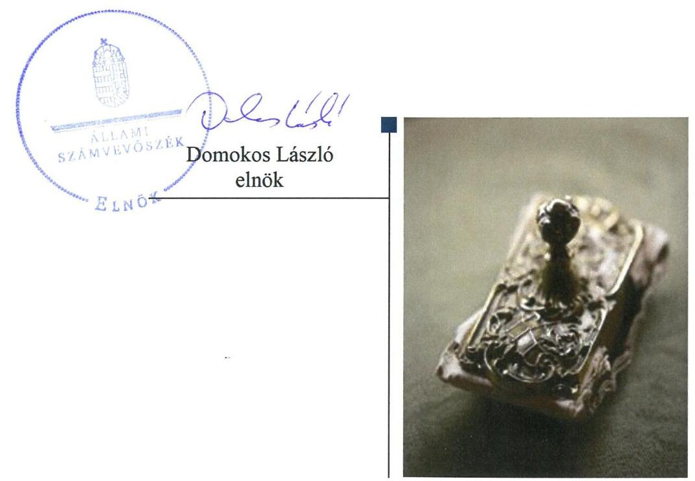
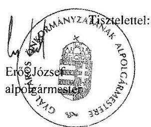
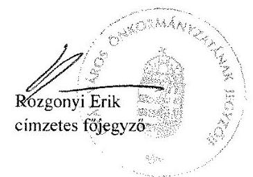
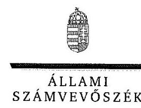
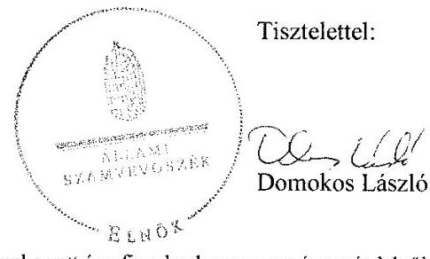
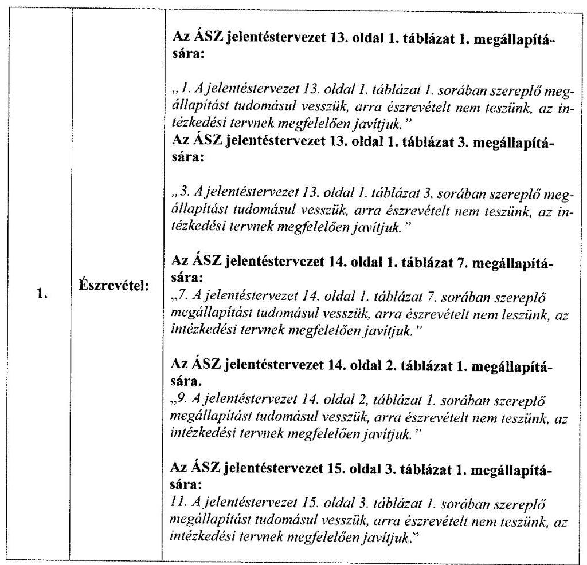
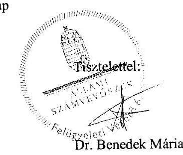

# Jellentés 

## Önkormányzatok pénzügyi és vagyongazdálkodása megfelelőségének ellenőrzése

Gyál Város Önkormányzata 2018.

---

# Jelentés 

## Önkormányzatok pénzügyi és vagyongazdálkodása megfelelőségének ellenőrzése

Gyál Város Önkormányzata
2018. 03 hó 03 nap

---

# AZ ELLENŐRZÉST FELÜGYELTE:

DR. BENEDEK MÁRIA felügyeleti vezető

## AZ ELLENŐRZÉST VEZETTE ÉS A VÉGREHAJTÁSÁÉRT FELELŐS:

DR. TIMÁR BALÁZS ellenőrzésvezető

## A PROGRAM ÖSSZEÁLLÍTÁSÁÉRT FELELŐS:

TÓTPÁL SZABOLCS osztályvezető

IKTATÓSZÁM: EL-0307-064/2018

TÉMASZÁM: 15

ELLENŐRZÉS-AZONOSÍTÓ SZÁM: V079603

Jelentéseink az Országgyűlés számítógépes hálózatán és az Interneta a www.asz.hu címen is olvashatóak.

---

# TARTALOMJEGYZÉK 

■ ÖSSZEGZÉS ..... 5
■ AZ ELLENŐRZÉS CÉLJA ..... 7
■ AZ ELLENŐRZÉS TERÜLETE ..... 8
■ AZ ELLENŐRZÉS HÁTTERE, INDOKOLTSÁGA ..... 9
■ A JELENTÉS LÉNYEGES KÉRDÉSKÖREI ..... 10
■ AZ ELLENŐRZÉS HATÓKÖRE ÉS MÓDSZEREI ..... 11
■ MEGÁLLAPÍTÁSOK ..... 13
■ JAVASLATOK ..... 22
■ MELLÉKLETEK ..... 27
I. sz. melléklet: Értelmező szótár ..... 27
■ FÜGGELÉK: ÉSZREVÉTELEK ..... 31
■ RÖVIDÍTÉSEK JEGYZÉKE ..... 59

---

.

---

# ÖSSZEGZÉS 

Az Állami Számvevőszék Gyál Város Önkormányzata pénzügyi és vagyongazdálkodásának ellenőrzése során megállapította, hogy a 2014-2016. években a közpénzekkel való szabályszerű és átlátható gazdálkodás nem volt biztositott. A pénzügyi egyensúly fennállt. A költségvetési beszámolók mérlegei leltárral nem voltak alátámasztottak. A vagyonváltozást eredményező döntések szabályszerűek voltak, azonban a beruházási, felújítási és befektetési döntések végrehajtása nem volt szabályszerű. A kizárólagos tulajdonú gazdasági társaságok feletti tulajdonosi joggyakorlás megfelelő volt. Az integritás tekintetében a kiépített kontrollok és a korrupciós kockázatok szintje nem volt egyensúlyban.

## Az ellenőrzés társadalmi indokoltsága

Az Állami Számvevőszék (ÁSZ) stratégiájában hangsúlyos szerepet szán annak, hogy szilárd szakmai alapon álló, értékteremtő ellenőrzéseivel előmozdítsa a közpénzügyek átláthatóságát, rendezettségét és javaslataival a közpénzek és a közvagyon szabályos, gazdaságos, hatékony és eredményes felhasználását segítse. Az ÁSZ stratégiájában célul tűzte ki, hogy az önkormányzatok ellenőrzése során értékeli azok pénzügyi-gazdasági helyzetét, a kockázatokat feltárja, és az ellenőrzések helyszíneit kockázatelemzés alapján választja ki. Az ÁSZ szerepet vállal a korrupció és a csalás elleni küzdelemben. Közreműködik a korrupciós kockázatok és a korrupció elleni fellépés hatékony és eredményes eszközeinek beazonosításában, alkalmazásában, továbbá használatuk elterjesztésében, az integritás alapú közigazgatási kultúra kialakításában.

## Főbb megállapítások, következtetések, javaslatok

Gyál Város Önkormányzatánál a Jegyző által kiadott számviteli politika, a számlarend és az eszközök és források értékelési szabályzatának tartalmi hiányosságai, a bizonylati rend és a közbeszerzési értékhatárt el nem érő beszerzések lebonyolítása eljárásrendjének hiánya miatt a pénzgazdálkodás felelős végrehajtása, a számviteli elszámolások szabályszerűsége nem volt biztosított. A vagyongazdálkodás szabályozási kereteit biztosító önkormányzati rendeletekben nem határozták meg azokat a vagyonelemeket, amelyekre Gyál Város Önkormányzata vagyonkezelői jogot létesíthet, továbbá a vagyonkezelői jog ellenértékét sem, így nem teremtették meg az Önkormányzat tulajdonában álló nemzeti vagyonnal való felelős gazdálkodás feltételeit.

A pénzügyi egyensúly az ellenőrzött időszakban biztosított volt, a szállítókkal szemben lejárt tartozás nem állt fenn. Gyál Város Önkormányzata a követelések behajtása iránt - egy adós lejárt tartozása kivételével - intézkedett.

Gyál Város Önkormányzata vagyonának nyilvántartása nem volt szabályszerű, mert egy államháztartáson belüli szervezet részére vagyonkezelésre átadott vagyont az ellenőrzött időszakban nem vezette ki könyveiből. Az ellenőrzött időszakban Gyál Város Önkormányzata a 2014-2016. évi beszámolóiban szereplő mérlegtételeket leltárral nem támasztotta alá. Mindezek következtében a Számviteli törvényben előírt valódiság elve sérült.

A beruházási és felújítási kiadások kiemelt előirányzatainak felhasználása és a kamatozó kincstárjegyekbe történt befektetés során a Jegyző jogosultság hiányában, a Polgármester pénzügyi ellenjegyzés nélkül vállalt kötelezettséget, emiatt a közpénzek felhasználása során a pénzügyi szabályszerűségi kontroll nem érvényesült.

A Képviselő-testület Gyál Város Önkormányzata kizárólagos tulajdonában álló gazdasági társaságai feletti tulajdonosi jogainak gyakorlása során szabályszerűen járt el, ezáltal Gyál Város Önkormányzata biztosította a kötelező önkormányzati feladatoknak a köztulajdonú gazdasági társaságokon keresztül történő ellátásának kontrollját.

Az integritás szemlélet érvényesülése érdekében a Jegyző a legfontosabb szabályzatokat kiadta, azonban a kiépített kontrollok nem voltak egyensúlyban a korrupciós kockázatok szintjével.

---

Az Állami Számvevőszék az intézkedések megtétele céljából a Polgármester részére hat, a Jegyző részére 19 javaslatot fogalmazott meg.

---

# AZ ELLENŐRZÉS CÉLJA 

Az ellenőrzés célja volt az önkormányzat pénzügyi és vagyoni helyzetének, a gazdálkodás szabályosságának értékelése, a pénzügyi egyensúly megteremtése, a vagyongazdálkodás, a vagyon számbavétele, a gazdasági események elszámolása és a pénzgazdálkodás szabályszerűsége alapján. Az ellenőrzés keretében az Állami Számvevőszék értékelte az önkormányzat korrupciós kockázatainak kezelését szolgáló integritás kontrollok kiépítettségét és az integritás szemlélet érvényesülését.

---

# **AZ ELLENŐRZÉS TERÜLETE**

## **Gyál Város Önkormányzata**

Gyál Város Önkormányzata Pest megyében található. A budapesti agglomerációhoz tartozó település a környező településeket összefogó kistérség központja, járási központ. A Központi Statisztikai Hivatal Magyarország közigazgatási helynévkönyve adata alapján Gyál Város Önkormányzata állandó lakosainak száma 2016. január 1-jén 24 016 fő volt.

A 12 fővel működő Képviselő-testület munkáját 2014. január 1-jétől a 2014. évi önkormányzati választásig öt, a választást követően hat állandó bizottság támogatta. Gyál Város Önkormányzata feladatait Polgármesteri Hivatalával és hat költségvetési szervvel látta el, három kizárólagos tulajdonú gazdasági társasággal rendelkezett. Gyálon 2014 októberéig egy – Gyáli Bolgár Nemzetiségi Önkormányzat –, 2014 októberétől két helyi nemzetiségi önkormányzat – a Gyáli Roma Nemzetiségi Önkormányzat és a Gyáli Román Nemzetiségi Önkormányzat – működött.

A Gyál Város Önkormányzata által fenntartott költségvetési szerveknél foglalkoztatottak létszáma 2016. december 31-én 217 fő volt, a Gyáli Polgármesteri Hivatal további 56 fő köztisztviselőt foglalkoztatott. A fenntartott intézmények közül egy rendelkezett gazdasági szervezettel, a többi öt intézmény gazdálkodási feladatait a Gyáli Polgármesteri Hivatal gazdasági szervezete látta el.

Gyál Város Önkormányzatának polgármestere a 2010. évi általános önkormányzati választások óta tölti be tisztségét, a Gyáli Polgármesteri Hivatal jegyzője 2011. április 1-jétől látja el a feladatait.

Gyál Város Önkormányzatának a 2016. évi zárszámadásáról szóló rendelete szerint 4 737,8 millió Ft költségvetési bevételt ért el, valamint 3 803,4 millió Ft költségvetési kiadást teljesített. A vagyonkimutatás szerint a 2016. évi eszközállomány értéke 21 980,2 millió Ft, a követelések összege 891,7 millió Ft volt. A kötelezettségek állománya 262,6 millió Ft-ot tett ki. A 2014-2016. években adósságot keletkeztető ügyletet Gyál Város Önkormányzata nem vállalt.

---

# AZ ELLENŐRZÉS HÁTTERE, INDOKOLTSÁGA 

Az államháztartás önkormányzati alrendszerének közpénz felhasználása, az önkormányzatok által ellátott közfeladatok és önként vállalt feladatok sokrétűsége, valamint a feladat ellátásához rendelt vagyon nagyságrendje indokolja, hogy az ÁSZ ${ }^{1}$ ellenőrzéseket folytasson a pénzügyi és vagyongazdálkodás területén. Az ÁSZ folyamatosan végzi az önkormányzatok pénzügyi és vagyongazdálkodásának ellenőrzését. Az elmúlt időszakban az önkormányzati gazdálkodás kockázatai beépítésre kerültek az ellenőrzött önkormányzatok kiválasztási rendszerébe. Az ellenőrzések tapasztalatai megmutatták, hogy továbbra is indokolt az egyrészt elemző, értékelő, a pénzügyi helyzet kockázatát is minősítő, másrészt a pénzügyi és vagyongazdálkodási tevékenység szabályszerűségét értékelő ÁSZ ellenőrzések folytatása.

Az ÁSZ ellenőrzései hozzájárulnak az önkormányzatok felelős és fenntartható gazdálkodásához, pénzügyi helyzetének pontosabb megítéléséhez azáltal, hogy a pénzügyi helyzetet a vagyoni helyzettel együtt értékeljük. Feltárjuk az önkormányzati gazdálkodást meghatározó szabályozások hiányosságait, a szabályozással nem érintett gazdálkodási területeket, valamint a pénzügyi és vagyongazdálkodás esetleges szabálytalanságait. Beazonosítjuk a pénzügyi egyensúlyi helyzet megbomlásának kockázatait. Értékeljük a pénzügyi egyensúly érvényesülését, az adósságállomány alakulását.

A pénzügyi és vagyongazdálkodás szabályszerűségének ellenőrzése eredményeként tett megállapítások, javaslatok hasznosításával javul az önkormányzat gazdálkodásának szabályozottsága, valamint a „jó gyakorlatok" terjesztésén keresztül azok az önkormányzatok is átvehetik a pozitív példákat, ahol nem végez ellenőrzést az ÁSZ. Ellenőrzéseink eredményeképpen javaslatokat fogalmazhatunk meg az önkormányzatok pénzügyi egyensúlya fenntartásával kapcsolatos problémák rendszerszemléletű kezelésére, felszámolására.

---

# A JELENTÉS LÉNYEGES KÉRDÉSKÖREI 

1.     - A pénzügyi és vagyongazdálkodás szabályainak kialakítása szabályszerű volt-e?
2.     - Biztosított volt-e a pénzügyi egyensúly, a kötelezettségek teljesítése és a követelések behajtása?
3.     - A vagyonnyilvántartás, a költségvetési beszámoló mérlegének alátámasztottsága szabályszerű volt-e?
4.     - A vagyonváltozást eredményező döntések és azok végrehajtása, a gazdálkodási jogkörök gyakorlása szabályszerű volt-e?
5.     - Az egyes befektetésekkel kapcsolatos döntéshozatal és azok végrehajtása szabályszerű volt-e?
6.     - Felelősen gazdálkodott-e az önkormányzat a tartós részesedéseivel, élt-e tulajdonosi jogaival, teljesítette-e tulajdonosi kötelezettségeit?
7.     - Az önkormányzat az integritás müködést kialakította és erősitette-e?

---

# AZ ELLENŐRZÉS HATÓKÖRE ÉS MÓDSZEREI 

## Az ellenőrzés típusa

Megfelelőségi ellenőrzés.

## Az ellenőrzött időszak

A 2014-2016. évek.

## Az ellenőrzés tárgya

A helyi önkormányzat pénzügyi és vagyongazdálkodása, a pénzügyi egyensúly megteremtése, a tulajdonosi és irányító szervi feladatok ellátása, az integritás szemlélet érvényesülése.

Az ellenőrzés kiterjedt minden olyan körülményre és adatra, amely az ÁSZ jogszabályban meghatározott feladatainak teljesítéséhez, valamint a program végrehajtása folyamán felmerült újabb összefüggések feltárásához szükséges.

## Az ellenőrzött szervezet

Gyál Város Önkormányzata

## Az ellenőrzés jogalapja

Az ellenőrzés jogszabályi alapját az ÁSZ tv. ${ }^{2}$ 1. § (3) bekezdésének, az 5. § (2)-(6) bekezdéseinek, valamint az Áht. ${ }^{3}$ 61. § (2) bekezdésének előírásai képezték.

## Az ellenőrzés módszerei

Az ÁSZ az ellenőrzést az ellenőrzési program ellenőrzési kérdései, az ellenőrzött időszakban hatályos jogszabályok, az ellenőrzés szakmai szabályok és az ÁSZ módszertanok figyelembe vételével végezte.

A gazdálkodás hibáinak kijavítására, a közpénzekkel való felelős gazdálkodás segítésére irányuló javaslatok kidolgozásakor a hatályos jogszabályok voltak irányadóak.

Az ÁSZ az ellenőrzés ideje alatt az ellenőrzött szervezettel történő kapcsolattartást az ÁSZ SZMSZ4-ének vonatkozó előírásai alapján biztosította.

---

Az ellenőrzési kérdések megválaszolásához szükséges bizonyítékok megszerzése az ellenőrzött által rendelkezésre bocsátott dokumentumokra, adatokra alapozva megfigyelés, szemle (szemrevételezés), kérdésfeltevés (információkérés), mintavételezés, valamint elemző eljárással történt.

Az ellenőrzés lefolytatásához az önkormányzat a tanúsítványok kitöltésével, valamint az ÁSZ által kért dokumentumok megküldésével szolgáltatott adatokat. Az így rendelkezésre bocsátott adatok, információk, a tanúsítványok adatai valódiságának kontrollja az ellenőrzés keretében történt.

Az ÁSZ az ellenőrzést az önkormányzat múködésével kapcsolatos feladatokat ellátó polgármesteri hivatalnál végezte. Az önkormányzat az intézményei és gazdasági társaságai ellenőrzéssel érintett dokumentumait, tanúsítványait a polgármesteri hivatal útján bocsátotta az ellenőrzés rendelkezésére.

A pénzügyi és vagyongazdálkodás szabályozottságát az ÁSZ az önkormányzat rendeletei, határozatai, illetve az önkormányzat (mint önálló éves költségvetési beszámolót készítő szerv) és a polgármesteri hivatal belső szabályozásai alapján értékelte. A pénzügyi egyensúly az önkormányzat összevont adatai alapján, a vagyonnyilvántartás, a mérleg alátámasztottságának megítélése az önkormányzat és a polgármesteri hivatal adatai alapján történt. A leltározási, értékelési folyamat szabályszerűségére a polgármesteri hivatal által végzett 2016. évi leltározási folyamat ellenőrzése alapján tett megállapításokat az ÁSZ.

Az önkormányzat vagyonváltozást eredményező döntéseinek és azok végrehajtásának ellenőrzésére irányított, valamint véletlen mintavételi eljárással és tételes ellenőrzéssel került sor. A pénzforgalmi tételek ellenőrzése véletlen mintavételi eljárással - a polgármesteri hivatal (mint önálló éves költségvetési beszámolót készítő költségvetési szerv) és az önkormányzat főkönyvi állományából - kiválasztott minta alapján történt.

Az ellenőrzési kérdésekre adott válaszok alapján értékelte az ÁSZ, hogy az önkormányzat pénzügyi gazdálkodása szabályszerű volt-e, biztosított volt-e a pénzügyi egyensúly. Értékelte a vagyongazdálkodás szabályszerűségét, a vagyonváltozást eredményező döntések és a tulajdonosi jogok gyakorlása szabályszerűségét. Értékelte továbbá az integritás érvényesülését.

---

# 1. A pénzügyi és vagyongazdálkodás szabályainak kialakítása szabályszerű volt-e? 

## Összegző megállapítás

### 1.1. számú megállapítás

## A pénzügyi és vagyongazdálkodás szabályainak kialakítása nem volt szabályszerű.

## A pénzgazdálkodás végrehajtását biztosító belső szabályozás kialakítása nem volt szabályszerű.

Az Önkormányzat ${ }^{5}$ a pénzgazdálkodás végrehajtását biztosító belső szabályozások közül rendelkezett az Mötv. ${ }^{6}$-ben foglaltaknak megfelelő Önkormányzati SZMSZ ${ }_{1,2}{ }^{7}$-vel. Az Önkormányzat rendelkezett a Bkr. ${ }^{8}$-nek megfelelő belső kontrollrendszer szabályozásá ${ }^{9}$ val, mely tartalmazta a Hivatal ${ }^{10}$ ellenőrzési nyomvonalát ${ }^{11}$. A gazdálkodási jogkörök szabályozását az Ávr. ${ }^{12}$-nek megfelelően a gazdálkodási szabályzat ${ }_{1-3}{ }^{13}$-ban és a kötelezettségvállalási utasítás ${ }_{1-5}{ }^{14}$-ben rendezték.

A pénzügyi gazdálkodás szabályozásának hiányosságait az 1. táblázat mutatja be:

1. táblázat

## A PÉNZGAZDÁLKODÁS VÉGREHAJTÁSÁT BIZTOSÍTÓ BELSŐ SZABÁLYOZÁS KIALAKÍTÁSÁNAK HIÁNYOSSÁGAI

| Sorszám | Megállapítások | Megjegyzések |
| :--: | :--: | :--: |
| 1. | A Jegyző ${ }^{15}$ az Ávr. 13. § (1) bekezdés e) pontjának előírása ellenére nem gondoskodott arról, hogy a Hivatali SZMSZ ${ }_{1}{ }^{16}$ tartalmazza 2014. december 31 -éig a szervezeti egységek, ezen belül a gazdasági szervezet engedélyezett létszámát, továbbá a 2014. január 1. és 2015. június 30. közötti időszakban a szervezeti ábrát és a gazdasági szervezet megnevezését. | A Hivatali SZMSZ ${ }_{2}{ }^{17}$ 2015. július 1-től már valamennyi, az Ávr. által előírt tartalmi elemet tartalmazta. |
| 2. | A Jegyző a Számv. tv. ${ }^{18}$ 14. § (4) bekezdésének előírása ellenére 2014. január 1. és 2015. június 30. között a számviteli politika ${ }_{1,2}{ }^{19}$ keretében nem rögzítette azokat az Önkormányzatra, és a Hivatalra jellemző szabályokat, előírásokat, módszereket, amelyekkel meghatározza, hogy mit tekint a számviteli elszámolás, az értékelés szempontjából lényegesnek, vagy nem lényegesnek. | A számviteli politika ${ }^{20} 9$. pontja a Számv. tv. 14. § (4) bekezdésével összhangban 2015. július 1jétől már tartalmazta a számviteli elszámolás és értékelés szempontjából lényeges és nem lényeges információk körét. |
| 3. | A Jegyző a Számv. tv. 14. § (4) bekezdésének előírása ellenére számviteli politika ${ }_{1-3}$-ban nem szabályozta, hogy a törvényben biztosított választási, minősítési lehetőségek közül - az értékelés szempontjából - melyeket, milyen feltételek fennállása esetén alkalmaznak. | Az értékelési szabályzat ${ }_{3}$ 8.3.1. pontja az Áhsz. 50. § (2) bekezdés c) pontjával összhangban 2015. július 1 -jétől már tartalmazta az egyszerűsített értékelési eljárás alá vont követelések besorolásának elveit, dokumentálásának szabályait; az Áhsz. 50. § (2) bekezdés d) pontjának előírása ellenére a tulajdonosnak, tulajdonosi joggyakorló szervezetnek a vagyonkezelésbe adott eszközök vagyonértékelése során alkalmazott értékelési eljárás elveit, módszerét, dokumentálásának szabályait, felelőseit. | Az értékelési szabályzat ${ }_{3}$ 8.3.1. pontja az Áhsz. 50. § (2) bekezdés c) pontjával összhangban 2015. július 1 -jétől már tartalmazta az egyszerűsített értékelési eljárás alá vont követelések besorolásának elveit, dokumentálásának szabályait. |

---

| Sorszám | Megállapítások | Megjegyzések |
| :--: | :--: | :--: |
| 5. | A Jegyző a Számv. tv. 161. § (2) bekezdés d) pontjában foglalt előírás ellenére nem gondoskodott arról, hogy a számlarend ${ }_{1,2}$ tartalmazza az abban foglaltakat alátámasztó bizonylati rendet. |  |
| 6. | A Jegyző az Áhsz. 51.§ (3) bekezdésében foglaltak ellenére a számlarend ${ }_{1,2}{ }^{23}$-ben nem szabályozta a részletező nyilvántartások vezetésének módját, azoknak a kapcsolódó könyvviteli és nyilvántartási számlákkal való egyeztetését, annak dokumentálását, valamint a részletező nyilvántartások és az egységes rovatrend rovataihoz kapcsolódóan vezetett nyilvántartási számlák adataiból a pénzügyi könyvvezetéshez készült összesítő bizonylatok (feladások) elkészítésének rendjét, az összesítő bizonylat tartalmi és formai követelményeit. |  |
| 7. | A Jegyző a Bkr. 6. § (3) bekezdésének előírása ellenére nem intézkedett az ellenőrzési nyomvonal rendszeres aktualizálásáról. | Az ellenőrzési nyomvonal módosítására 2013. január 1. óta nem került sor. |
| 8. | A Jegyző az Ávr. 13. § (2) bekezdés b) pontja ellenére belső szabályzatban nem rendezte a múködéshez kapcsolódó, pénzügyi kihatással bíró jogszabályban nem szabályozott kérdések közül a beszerzések lebonyolításával kapcsolatos eljárásrendet. |  |

1.2. számú megállapítás

A vagyongazdálkodás szabályainak kialakítása nem volt szabályszerű.

A Képviselő-testület ${ }^{24}$ a Htv. ${ }^{25}$-ben biztosított hatáskörében a vagyonrendelet ${ }_{1,2}{ }^{26}$-ben fogadta el az Önkormányzat vagyonával történő gazdálkodás szabályait. Az Mötv. előírásának megfelelően a vagyonrendelet ${ }_{1,2}$-ben meghatározták a vagyonkezelői jog gyakorlásának, a vagyonrendelet ${ }_{2}$-ben a vagyonkezelői jog ellenőrzésének szabályait.

A közbeszerzések lebonyolításának rendjét a Kbt. ${ }_{1,2}{ }^{27}$-nek megfelelően a közbeszerzési szabályzat ${ }_{1,2}$-ben határozták meg.

A vagyongazdálkodás szabályozásának hiányosságait a 2. táblázat foglalja össze:
2. táblázat

# A VAGYONGAZDÁLKODÁS SZABÁLYOZÁSA KIALAKÍTÁSÁNAK HIÁNYOSSÁGAI 

| Sorszám | Megállapítások | Megjegyzések |
| :--: | :--: | :--: |
| 1. | A Képviselő-testület az Mótv. 109. § (4) bekezdésében foglalt előírás ellenére a 2014-2016. években rendeletben nem határozta meg a vagyonkezelői jog ellenértékét, az ingyenes átengedés részletes szabályait, 2014. október 31-ig a vagyonkezelés ellenőrzésének részletes szabályait. | A 2014. november 1-jén hatályba lépett vagyonrendelet; már tartalmazta a vagyonkezelés ellenőrzésének szabályait. |
| 2. | A Képviselő-testület az Mótv 143. § (4) bekezdésében kapott felhatalmazás ellenére rendeletben nem határozta meg a 2014-2016. évekre az Mótv. 143. § (4) bekezdésének i) pontja szerinti azon vagyonelemeket, amelyekre a helyi önkormányzat vagyonkezelői jogot létesíthet. |  |

---

# 2. Biztosított volt-e a pénzügyi egyensúly, a kötelezettségek teljesítése és a követelések behajtása? 

## Összegző megállapítás

A pénzügyi egyensúly, a kötelezettségek teljesítése és - egy adóssal szembeni lejárt követelés kivételével - a követelések behajtása biztosított volt.

Az Önkormányzat pénzügyi egyensúlya a 2014. évben végrehajtott adósságkonszolidációt követően az ellenőrzött időszak végéig fennállt. Az Önkormányzat müködéséhez - likviditási hitel kivételével - nem vett igénybe hitelt.

A szállítók felé az Önkormányzat fizetési kötelezettségeinek határidőben eleget tett, a 2015. és 2016. év végi szállítói kötelezettségei között harminc napon túl lejárt tartozást nem tartott nyilván.

Az Önkormányzat követelései behajtása érdekében - a DPMV Zrt. ${ }^{28}$-vel szemben fennálló lejárt vevőkövetelések kivételével - intézkedett.

## 3. A vagyonnyilvántartás, a költségvetési beszámoló mérlegének alátámasztottsága szabályszerű volt-e?

## Összegző megállapítás

A vagyonnyilvántartás, a költségvetési beszámoló mérlegének alátámasztottsága nem volt szabályszerű.

### 3.1. számú megállapítás

A vagyonnyilvántartás nem volt szabályszerű.
Az Önkormányzat a 2016. évben az Mötv. előírásának megfelelően törzsvagyonát - a tartós részesedések kivételével - számviteli nyilvántartásában a többi vagyontárgytól elkülönítve tartotta nyilván, a 2016. évi zárszámadásához vagyonkimutatást készített. A kataszteri rendelet ${ }^{29}$ nek megfelelően a tulajdonában lévő ingatlanvagyonról ingatlanvagyon-katasztert fektetett fel és vezetett.

Az Önkormányzat vagyonnyilvántartásával kapcsolatos hiányosságokat a 3. táblázat mutatja be:
3. táblázat

## AZ ÖNKORMÁNYZATI VAGYON NYILVÁNTARTÁSÁVAL KAPCSOLATOS HIÁNYOSSÁGOK

| Sorszám | Megállapítáask | Mennoncedek |
| :--: | :--: | :--: |
| 1. | A Képviselő-testület a vagyonrendelet ${ }_{1,2}$ 3. § (4) bekezdés előírása ellenére - a vagyonrendelet ${ }_{3,2}$ 2. mellékleteként kiadott - a korlátozottan forgalomképes vagyontárgyak jegyzékében nem állapította meg korlátozottan forgalomképes vagyonelemként az Önkormányzat többségi tulajdonában álló, közszolgáltatási tevékenységet vagy parkolási szolgáltatást ellátó gazdasági társaságaiban lévő részesedéseit. | Az Nvtv. ${ }^{30}$ 5. § (2) bekezdése c) pontjának és az (5) bekezdése c) pontja előírja, hogy a helyi önkormányzat korlátozottan forgalomképes törzsvagyonát képezi a helyi önkormányzat többségi tulajdonában álló, közszolgáltatási tevékenységet vagy parkolási szolgáltatást ellátó gazdasági társaságban fennálló részesedés. |
| 2. | A Jegyző az Mötv 110. § (2) bekezdésének előírása ellenére nem gondoskodott arról, hogy az Önkormányzat a többségi tulajdonában álló, közszolgáltatási tevékenységet vagy parkolási szolgáltatást ellátó gazdasági társaságaiban lévő részesedéseit a többi vagyontárgytól elkülönítve tartsa nyilván. |  |

---

| Sorszám | Megállapítások | Megjegyzések |
| :--: | :--: | :--: |
| 3. | A Jegyző az Áhsz. 30. § (2) bekezdésének előirása ellenére nem gondoskodott arról, hogy az Önkormányzatnak a 2016. évi zárszámadáshoz csatolt vagyonkimutatása a tárgyi eszközöket forgalomképtelen törzsvagyon, nemzetgazdasági szempontból kiemelt jelentőségű törzsvagyon, korlátozottan forgalomképes vagyon és üzleti vagyon bontásban tartalmazza. | A 2016. évi vagyonkimutatásban kizárólag az ingatlanok esetében volt biztosított az Áhsz. 30. § (2) bekezdésében előírt, forgalomképesség szerinti bontás. |
| 4. | A Jegyző az Áhsz. 30. § (3) bekezdése a) pontjának előirása ellenére nem gondoskodott arról, hogy a 2016. évi zárszámadáshoz csatolt vagyonkimutatás tartalmazza a „0"-ra leírt eszközök, a használatban lévő kis értékű immateriális javak, tárgyi eszközök, a 01-02. számlacsoportban nyilvántartott eszközök, továbbá az Áhsz. 5. melléklet A) IV.1. pontjában foglaltak ellenére a vagyonkezelésbe adott eszközök állományát. |  |
| 5. | Az Önkormányzat a 2014-2016. évi mérlegeiben a ténylegesen kimutatható tárgyieszköz-állománynál magasabb - a 2016. december 31-én 199,8 millió Ft összeggel nagyobb nettó értékű - eszközvagyont mutatott ki. A hiba az Áhsz. 1. § (1) bekezdés 3. pontja és a számviteli politika 9. pontja szerint - mivel a mérlegfőösszeg 2\%-a meghaladta a százmillió forintot, ezáltal jelentős összegű a hiba, ha a hibahatások együttes összege eléri vagy meghaladja a százmillió forintot - jelentős összegű hibának minősült. A Számv. tv. 15. § (3) bekezdésében rögzítettek ellenére a 2014-2016. évek beszámolóiban szereplő tételek értékelése nem felelt meg a törvényben előírt értékelési elveknek és az azokhoz kapcsolódó értékelési eljárásoknak, ezzel sérült a Számv. tv. által a pénzügyi beszámolókkal szemben követelményként támasztott valódiság elve. | A KLIK-rendelet ${ }^{31}$ nek megfelelően létesített vagyonkezelői jog alapján az Önkormányzat a KLIK ${ }^{32}$-nek, mint államháztartáson belüli szervezetnek vagyonkezelésbe adott tárgyi eszközöket, az ellenőrzött időszakot megelőzően. A Jegyző az Áhsz. 47. § (3) bekezdésének előirása ellenére az Önkormányzatnak, mint tulajdonosnak államháztartáson belüli szervezettel létesített vagyonkezelői jog létesítése során vagyonkezelésbe adott tárgyi eszközei bruttó értékét és elszámolt értékcsökkenését, értékvesztését a vagyonkezelésbe adáskor nem vezette ki az Önkormányzat könyveiből, és azok bruttó értékét nem a 0. számlaosztály befektetett eszközei között tartotta nyilván. |
| 6. | A Jegyző az Áhsz. 39. § (1) és (3) bekezdéseinek előirása ellenére nem biztosította a költségvetési könyvvezetés keretében a követelésekről áttekinthető nyilvántartás vezetését, mivel a 14. melléklet III. 4. pontjában felsorolt tartalmi elemek közül a vevőkkel szembeni követelések részletező nyilvántartása nem tartalmazta az a), d), e)-g), j) és I) alpontokban felsorolt tartalmi elemeket, továbbá a közhatalmi követelések részletező nyilvántartása nem tartalmazta az a)-g), j) és I) alpontokban felsorolt tartalmi elemeket. |  |
| 7. | A Jegyző a kataszteri rendelet ${ }^{27}$ 1. § (2) bekezdésének előirása ellenére nem gondoskodott a kataszter ingatlan adatlapjának, valamint a földre, az épületre, a közműre és az egyéb építményre vonatkozó betétlapjainak adatai és a közhiteles ingatlan-nyilvántartás azonos tartalmú adatai egyezőségéről. |  |

Forrás: ÁSZ

# 3.2. számú megállapítás 

A költségvetési beszámolók mérlegei a 2014-2016. években leltárral nem voltak alátámasztottak.

Az Önkormányzatnál és a Hivatalnál az eszközök és források leltározásának szabályozási kereteit a Számv. tv.-ben és az Áhsz.-ben foglaltak szerint a 2014. évre a leltározási szabályzat ${ }_{1,2}{ }^{33}$-ben, a 2015. és 2016. évekre a leltározási szabályzat ${ }_{3}{ }^{34}$-ban alakították ki.

A mérlegtételek leltárral történő alátámasztásának hiányosságait a 4. táblázat sorolja fel:

---

|  4. táblázat |  |  |
| :--: | :--: | :--: |
| AZ ÉV VÉGI KÖNYVVITELI ZÁRÁSSAL ÉS A LELTÁROZÁSSAL KAPCSOLATOS HIÁNYOSSÁGOK |  |  |
|  |   |   |
| 1. | A Jegyző a Számv. tv. 69. § (1) bekezdésének, az Áhsz. 22. § (1) bekezdésének, a leltározási szabályzat ${ }_{1,2}$ 2.1. pontja, valamint a Leltározási szabályzat ${ }_{3}$ 1.1. pontja előírásai ellenére a 2014 - 2016. években a mérleg tételeinek alátámasztásához leltárt nem állított össze. |  |
| 2. | A Jegyző a Számv. tv 69. § (2) bekezdésének előírása ellenére nem gondoskodott a főkönyvi könyvelés és az analitikus nyilvántartások adatai közötti egyeztetésnek a 2014-2016. évi beszámolók mérleg-fordulónapjaira vonatkozó elvégzéséről. |  |
| 3. | A Jegyző a leltározási szabályzat ${ }_{2} 2.5$ pontjában és a leltározási szabályzat ${ }_{3} 1.1$. pontjában foglalt rendelkezés ellenére a 2014-2016. évi leltározások végrehajtása során nem kötelezte a KLIK-et, mint vagyonkezelőt, hogy tegyen eleget az Áhsz. 22. § (2) bekezdése a) pontjában foglalt kötelezettségének, és a vagyonkezelésébe adott eszközöket az általa elkészített és hitelesített éves leltárral támassza alá. |  |
| 4. | A Jegyző a Számv. tv. 65. § (1) bekezdésének előírása ellenére nem biztosította, hogy az Önkormányzat a 2014-2016. évi mérlegeiben a követeléseket az elfogadott, az elismert összegben, illetve a már elszámolt értékvesztéssel csökkentett, az értékvesztés visszaírt összegével növelt könyv szerinti értéken mutassa ki. A 2014. évben a leltározási szabályzat ${ }_{1,2}$, 5.5. pontjának, a 2015-2016. években a leltározási szabályzat ${ }_{3} 4.5$. pontjának rendelkezése ellenére a követelések folyószámla egyeztetéssel való igazolása a vevők által nem történt meg. |  |
| 5. | Az Önkormányzat a Számv. tv. 55. § (1) bekezdésének és az értékelési szabályzat ${ }_{3} 8.3 .2$. pontjának előírása ellenére a 2015-2016. években a DPMV Zrt.-vel szemben a mérleg-fordulónapokon fennálló és a mérlegkészítés időpontjáig pénzügyileg nem rendezett követelés után értékvesztést nem számolt el. | A 2014. év végi könyvviteli záráskor hatályos értékelési szabályzat ${ }_{1,2}$ 9.2.4.1. pontja szerint a mérleg fordulónapján késedelemben lévő követelések után nem számolnak el értékvesztést. |

# 4. A vagyonváltozást eredményező döntések és azok végrehajtása, a gazdálkodási jogkörök gyakorlása szabályszerű volt-e? 

## Összegző megállapítás

### 4.1. számú megállapítás

A vagyonváltozást eredményező döntések szabályszerűek voltak, a döntések végrehajtása, a gazdálkodási jogkörök gyakorlása nem volt szabályszerű.

Vagyonkezelői jog létesítése, térítésmentes vagyonátadás a 20142016. években nem történt.

Az Önkormányzat a 2014-2016. években egy vagyonkezelési és öt üzemeltetési szerződéssel rendelkezett, koncessziós szerződéssel nem rendelkezett.

A vagyonkezelési szerződés ${ }^{35}$ az ellenőrzött időszakot megelőzően a KLIK-kel került megkötésre a KLIK-rendelet alapján. A szerződés feltételei az Nvtv. és a vagyonrendelet ${ }_{1,2}$ által a vagyonkezelésre előírt rendelkezésekkel összhangban álltak. A vagyonkezelési szerződésben az Nvtv.-ben előírtakkal összhangban az Önkormányzat a KLIK részére a kezelt vagyon tekintetében nyilvántartási, adatszolgáltatási valamint elszámolási kötelezettséget, továbbá annak értéke, állaga megóvásáról, karbantartásáról, a szükséges felújítások, pótlások elvégzéséről való gondoskodási kötelezettséget írt elő.

---

A vagyonkezelésbe adott, illetve az üzemeltetésre (hasznosításra) átadott vagyonnal kapcsolatos szabálytalanságokat az 5. táblázat mutatja be:
5. táblázat

# A VAGYONKEZELÉSBE, ÜZEMELTETÉSRE (HASZNOSÍTÁSRA) ÁTADOTT VAGYONNAL KAPCSOLATOS SZABÁLYTALANSÁGOK 

| Sorszám | Megállapítások | Megjegyzések |
| :--: | :--: | :--: |
| 1. | Az Önkormányzat a vagyonkezelési szerződést az Info. tv. ${ }^{36} 37$ § (1) bekezdésének és 1. melléklet III. Gazdálkodási adatok 4. sorában foglaltak ellenére az Önkormányzat honlapján nem tette közzé. |  |
| 2. | Az Önkormányzat képviseletében a Polgármester által kötött, hasznosításra vonatkozó szerződésekben az Nvtv. 11.§ (11) bekezdésének a) pontjában foglaltak ellenére az üzemeltetők részére - egy kivétellel az adatszolgáltatásra, két kivétellel a beszámolásra vonatkozóan beszámolási, adatszolgáltatási kötelezettség nem került előírásra. | A DPMV Zrt.-vel kötött üzemeltetési szerződésben előírták az üzemeltetésre átadott vagyonnal kapcsolatos beszámolási, adatszolgáltatási, továbbá a Gyál Városfejlesztési és Városüzemeltetési NonProfit Kft.-vel kötött feladatellátási szerződésben előírták az beszámolási kötelezettséget. |
| 3. | Az Önkormányzat az Info. tv. 37 § (1) bekezdésének és 1. melléklet III. Gazdálkodási adatok 4. sorában foglaltak ellenére a $\mathrm{PMKH}^{37}$-val kötött üzemeltetési szerződést az Önkormányzat honlapján nem tette közzé. |  |

## 4.2. számú megállapítás

A vagyonértékesítés és a bérbeadás útján történő vagyonhasznosítás szabályszerű volt, a beruházások és felújítások kiemelt előirányzatainak felhasználása, a döntések végrehajtása nem volt szabályszerű. Követelés elengedésére, behajthatatlan követelés leírására nem került sor.

Az ellenőrzött időszakban végrehajtott beruházásokkal, felújításokkal kapcsolatos döntéseket az arra jogosult hozta meg. Az eszközök üzembe helyezését, számviteli nyilvántartását, valamint számviteli besorolását az Önkormányzat minden esetben a Számv. tv. és az Áhsz. előírásaival összhangban végezte. A közbeszerzési értékhatár feletti eszközbeszerzések esetében a Kbt. 1,2 szerinti közbeszerzési eljárásokat lefolytatták.

A vagyonértékesítéssel, bérbeadás útján történő vagyonhasznosítással kapcsolatos ügyleteket az Önkormányzat a jogszabályi előírások betartása mellett folytatta.

Az Önkormányzatnak a vagyonváltozást eredményező döntései végrehajtásával kapcsolatos megállapításokat a 6. táblázat tartalmazza.
6. táblázat

## A VAGYONVÁLTOZÁST EREDMÉNYEZŐ DÖNTÉSEK VÉGREHAJTÁSÁVAL KAPCSOLATOS SZABÁLYTALANSÁGOK

## Sorszám

1. A Jegyző az Önkormányzat beruházási kiadási előirányzatai terhére a 20152016. években - kettő esetben - az Áht. 36. § (7) bekezdésének és az Ávr. 52. § (6) bekezdésének előírása, valamint a gazdálkodási szabályzat ${ }_{1,3}$ 1.1.1. pontjában és a kötelezettségvállalási utasítás4,5 I. pontjában foglaltak ellenére jogosulatlanul vállalt kötelezettséget.

## Megjegyzés

A gazdálkodási szabályzat ${ }_{1,3}$ 1.1.1. pontja szerint annak hatálya alá tartozó szervezetek nevében az Önkormányzat Polgármesterének és Jegyzőjének együttes utasításában felhatalmazott személyek vállalhatnak kötelezettséget. A kötelezettségvállalási utasítás ${ }_{4,5}$ I/5 pontjában

---

| Sorszám | Megállapítás | Megjegyzés |
| :-- | :-- | :-- |

2. A Polgármester ${ }^{38}$ az Önkormányzat kiadási előirányzatai terhére végzett beruházásokra, felújításokra az Áht. 37. § (1) bekezdésének előirása ellenére pénzügyi ellenjegyzés nélkül vállalt kötelezettséget.
3. A Jegyző a Hivatal kiadási előirányzatai terhére végzett beruházásokra, felújításokra az Áht. 37. § (1) bekezdésének előirása ellenére pénzügyi ellenjegyzés nélkül vállalt kötelezettséget.

# 5. Az egyes befektetésekkel kapcsolatos döntéshozatal és azok végrehajtása szabályszerű volt-e? 

## Összegző megállapítás

A befektetéssel kapcsolatos döntéshozatal szabályszerű volt, annak végrehajtása nem volt szabályszerű.

Az Önkormányzat 2016. évi beszámolója mérlegében 600 millió Ft értékű kamatozó kincstárjegyet mutatott ki.

A kincstárjegyek megszerzésével kapcsolatos döntést az Mötv.-ben foglaltakkal összhangban a Képviselő-testület hozta meg és határozat ${ }^{39}$ ban adott felhatalmazást a Polgármester részére az Önkormányzat átmenetileg szabad pénzeszközeiből éves futamidejű kamatozó kincstárjegyeknek a számlavezető bank ${ }^{40}$ közreműködésével történő megvásárlásához szükséges intézkedések megtételére.

A befektetési döntés végrehajtásával kapcsolatos hiányosságokat a 7. táblázat mutatja be.
7. táblázat

## A BEFEKTETÉSI DÖNTÉS VÉGREHAJTÁSÁVAL KAPCSOLATOS HIÁNYOSSÁGOK

Sorszám
1. A Jegyző a kamatozó kincstárjegyek jegyzésére az Áht. 36. § (7) bekezdésének és az Ávr. 52. § (6) bekezdésének előirása, valamint a gazdálkodási szabályzat ${ }_{5}$ 1.1.1. pontjában és a kötelezettségvállalási utasítás ${ }_{5}$ I. pontjában foglaltak ellenére jogosulatlanul vállalt kötelezettséget.

## Megjegyzések

A gazdálkodási szabályzat ${ }_{5}$ 1.1.1. pontja szerint annak hatálya alá tartozó szervezetek nevében az Önkormányzat Polgármesterének és Jegyző́jének együttes utasításában felhatalmazott személyek vállalhatnak kötelezettséget. A kötelezettségvállalási utasítás ${ }_{5}$ I/5 pontjában foglaltak szerint a Jegyző az Önkormányzat múködésére a költségvetésben jóváhagyott előirányzatok erejéig vállalhatott kötelezettséget, jogköre az Önkormányzat finanszírozási kiadási előirányzatai terhére vállalt kötelezettségekre nem terjedt ki.
2. A kamatozó kincstárjegyek ellenértékének kifizetésére az Áht. 38. § (1) bekezdésének előirása ellenére teljesítésigazolás és utalványozás nélkül került sor.

---

# 6. Felelősen gazdálkodott-e az önkormányzat a tartós részesedéseivel, élt-e tulajdonosi jogaival, teljesítette-e tulajdonosi kötelezettségeit? 

Összegző megállapítás

Az Önkormányzat a tartós részesedéseivel felelősen gazdálkodott, a tulajdonosi jogok gyakorlása és a tulajdonosi kötelezettségek teljesítése szabályszerű volt.

Az ellenőrzés az Önkormányzat gazdasági társaságai feletti tulajdonosi jogainak gyakorlását és a tulajdonosi kötelezettségei teljesítését két kizárólagos önkormányzati tulajdonú társaság, a Városüzemeltetési Nkft. ${ }^{41}$ és a Városgazda Kft. ${ }^{42}$ tekintetében ellenőrizte.

Az Önkormányzat a Gt. ${ }^{43}$-nek és a Ptk. ${ }^{44}$-nak megfelelően gondoskodott a társaságok főtevékenységeinek és első vezető tisztségviselőinek az alapító okiratokban történő meghatározásáról. Az ellenőrzött időszakban az ügyvezető személyében változás a Városüzemeltetési Nkft.-nél nem történt, a Városgazda Kft. esetében az új ügyvezető 2016. február 1-től történt megválasztásáról a Képviselő-testület az Mötv. előírásával összhangban, határozat ${ }_{2}{ }^{45}$-ben döntött.

A Városüzemeltetési Nkft.-nél és a Városgazda Kft.-nél a Képviselő-testület a Taktv. ${ }^{46}$ rendelkezésének megfelelő létszámú felügyelőbizottságot hozott létre.

A Városüzemeltetési Nkft. könyvvizsgálóját a Ptk.-ban foglaltaknak megfelelően a Képviselő-testület az alapító okiratban jelölte ki. A független könyvvizsgáló jelentése a Városüzemeltetési Nkft. 2014-2016. évi egyszerűsített éves beszámolói kapcsán nem tárt fel hibát, hiányosságot. A Városgazda Kft-nél könyvvizsgálat a Számv. tv. rendelkezése alapján nem volt kötelező.

A tulajdonosi jogok gyakorlásának és tulajdonosi kötelezettségek teljesítésének hiányosságát a 8. táblázat mutatja be.
8. táblázat

A TULAJDONOSI JOGGYAKORLÁS ÉS A TULAJDONOSI KÖTELEZETTSÉGEK TELJESÍTÉSÉNEK HIÁNYOSSÁGA

| Sorszám | Megállapítás | Megjegyzés |
| :-- | :-- | :-- |

1. Az Alapító ${ }^{47}$ a Ptk. 3:120. § (2) bekezdésének előírása ellenére a Városüzemeltetési Nkft. 2015. évi beszámolójáról nem a felügyelő bizottság írásbeli jelentésének birtokában döntött.

Forrás: ÁSZ

## 7. Az önkormányzat az integritás múködést kialakította és erősí-tette-e?

## Összegző megállapítás

Az integritás alapú múködést az Önkormányzat kialakította, a kiépített kontrollok azonban nem voltak egyensúlyban a kockázatokkal.

A 2016. évben a kockázatokat mérséklő, jogszabályok által előírt kontrollok közül a Hivatal rendelkezett közszolgálati szabályzattal ${ }^{48}$, múködtetett belső ellenőrzést. Integritás irányítási szabályzattal ${ }^{49}$ csak 2016. december

---

1-től rendelkezett. A Képviselő-testület a köztisztviselőkre vonatkozóan a hivatásetikai alapelvek részletes tartalmát, az etikai eljárás szabályait meghatározta. A Polgármester és a Jegyző az Önkormányzat tulajdonában lévő eszközök használatára vonatkozó szabályozás körében a gépjármú üzemeltetés szabályzatát kiadta, egyéb eszközök használatára vonatkozóan - pl. telefon - sem az Önkormányzat, sem a Hivatal nem rendelkezett szabályozással.

A jogszabályok által elő nem írt, de a kockázatok mérséklését támogató kontrollok közül a Hivatal nem írta elő, hogy munkatársai nyilatkozzanak gazdasági érdekeltségeikről, vagy egyéb, a szervezet tevékenysége szempontjából releváns összeférhetetlenségről. Sem az Önkormányzat, sem a Hivatal nem szabályozta a különféle ajándékok, meghívások, utaztatás elfogadásának feltételeit. A Hivatal rendszeresen korrupciós kockázatelemzést nem végzett.

---

# JAVASLATOK 

Az ÁSZ tv. 33. § (1) bekezdésében foglaltak értelmében az ellenőrzött szervezet vezetője köteles a jelentésben foglalt megállapításokhoz kapcsolódó intézkedési tervet összeállítani és azt a jelentés kézhezvételétől számított 30 napon belül az ÁSZ részére megküldeni. Amennyiben az ellenőrzött szervezet vezetője nem küldi meg határidőben az intézkedési tervet, vagy továbbra sem elfogadható intézkedési tervet küld, az Állami Számvevőszék elnöke az ÁSZ tv. 33. § (3) bekezdése a) és b) pontjaiban foglaltakat érvényesítheti.

## a polgármesternek

1. Intézkedjen az Mötv. előírásainak megfelelően, hogy a Képviselő-testület rendeletben határozza meg a vagyonkezelői jog ellenértékét, az ingyenes átengedés részletes szabályait, továbbá azon vagyonelemeket, amelyekre a helyi önkormányzat vagyonkezelői jogot létesíthet.
(2. táblázat 1-2. sz. megállapítás alapján)
2. Intézkedjen a vagyonrendelet előírására figyelemmel arról, hogy a vagyonrendelet melléklete tartalmazzon - az Önkormányzat többségi tulajdonában álló, közszolgáltatási tevékenységet vagy parkolási szolgáltatást ellátó gazdasági társaságban fennálló részesedéseket is beleértve - valamennyi korlátozottan forgalomképes vagyonelemet.
(3. táblázat 1. sz. megállapítás alapján)
3. Intézkedjen az Nvtv. előírásának megfelelően az önkormányzati vagyon hasznosítására vonatkozó szerződésekben az üzemeltetők részéről történő beszámolási, nyilvántartási, adatszolgáltatási kötelezettségek teljesítésének előírásáról.
(5. táblázat 2. sz. megállapítás alapján)
4. Gondoskodjon az Áht-ban elöírtaknak megfelelően arról, hogy, kötelezettséget pénzügyi ellenjegyzést követően vállaljon.
(6. táblázat 2. sz. megállapítás alapján)
5. Intézkedjen a Ptk. előírásának megfelelően, hogy a Városüzemeltetési Nkft. 2015. évi beszámolójáról az Alapító a felügyelő bizottság írásbeli jelentésének birtokában döntsön.
(8. táblázat 1. sz. megállapítás alapján)

---

6. Intézkedjen az Állami Számvevőszék ellenőrzése során feltárt hiányosságok és/vagy szabálytalanságok tekintetében a munkajogi felelősség tisztázására irányuló eljárás megindításáról, és ennek eredménye ismeretében tegye meg a szükséges intézkedéseket.
(1. táblázat 3-8. sz., 3. táblázat 2-7. sz., 4. táblázat 1-5. sz., 5. táblázat 1., 3. sz., 6. táblázat 1., 3. sz., és 7. táblázat 1-2. sz. megállapítások alapján)

# a jegyzőnek 

1. Intézkedjen a Számv. tv. előírásának megfelelően arról, hogy a Számviteli politika keretében - az értékelés szempontjából - meghatározásra kerüljön, hogy a törvényben biztosított választási, minősítési lehetőségek közül melyeket, milyen feltételek fennállása esetén alkalmaz.
(1. táblázat 3. sz. megállapítás alapján)
2. Intézkedjen az Áhsz. előírásának megfelelően követeléstípusonként a kisösszegü követelések év végi meghatározásának elvei, dokumentálásának szabályai, az egyszerüsített értékelési eljárás alá vont követelések besorolásának elvei, dokumentálásának szabályai, valamint a tulajdonosnak, tulajdonosi joggyakorló szervezetnek a vagyonkezelésbe adott eszközök vagyonértékelése során alkalmazott értékelési eljárásának elvei, módszere, dokumentálásának szabályai, felelősei értékelési szabályzatban történő meghatározásáról.
(1. táblázat 4. sz. megállapítás alapján
3. Intézkedjen a Számv. tv. előírásának megfelelően bizonylati rendet is tartalmazó számlarend elkészítéséről.
(1. táblázat 5. sz. megállapítás alapján)
4. Intézkedjen az Áhsz. előírásainak megfelelően a részletező nyilvántartások vezetése módjának, kapcsolódó könyvviteli és nyilvántartási számlákkal való egyeztetésének, annak dokumentálásának, valamint a részletező nyilvántartások és az egységes rovatrend rovataihoz kapcsolódóan vezetett nyilvántartási számlák adataiból a pénzügyi könyvvezetéshez készült összesítő bizonylatok (feladások) elkészítése rendjének, az összesítő bizonylat tartalmi és formai követelményeinek számlarendben történő szabályozásáról.
(1. táblázat 6. sz. megállapítás alapján)
5. Intézkedjen a Bkr. előírásainak megfelelően az ellenőrzési nyomvonal rendszeres aktualizálásáról.
(1. táblázat 7. sz. megállapítás alapján)

---

6. Intézkedjen az Ávr. előírásainak megfelelően a müködéséhez kapcsolódó, pénzügyi kihatással bíró, jogszabályban nem szabályozott kérdések közül a beszerzések lebonyolításával kapcsolatos eljárásrend belső szabályzatban történő rendezéséről.
(1. táblázat 8. sz. megállapítás alapján)
7. Intézkedjen az Mötv. előírásainak megfelelően az Nvtv. szerint korlátozottan forgalomképes törzsvagyonnak minősülő - az Önkormányzat többségi tulajdonában álló, közszolgáltatási tevékenységet vagy parkolási szolgáltatást ellátó gazdasági társaságaiban lévő - részesedéseknek a többi vagyontárgytól való elkülönített nyilvántartásáról.
(3. táblázat 2. sz. megállapítás alapján)
8. Gondoskodjon arról, hogy a zárszámadáshoz csatolt vagyonkimutatás a tárgyi eszközöket az Áhsz. előírásainak megfelelő - forgalomképtelen illetve nemzetgazdasági szempontból kiemelt jelentőségű törzsvagyon, valamint korlátozottan forgalomképes vagyon és üzleti vagyon - bontásban tartalmazza, továbbá a vagyonkimutatás tartalmazza a „0"-ra leírt eszközök, a használatban lévő kisértékü immateriális javak, tárgyi eszközök, a 01-02. számlacsoportban nyilvántartott eszközök, valamint a vagyonkezelésbe adott eszközök állományát.
(3. táblázat 3-4. sz. megállapítás alapján)
9. Intézkedjen arról, hogy a beszámolókban szereplő tételek értékelése feleljen meg a Számv. tv-ben, Áhsz-ben, valamint a számviteli politikában előirt értékelési elveknek és az azokhoz kapcsolódó értékelési eljárásoknak (valódiság elve).
(3. táblázat 5. sz. megállapítás alapján)
10. Intézkedjen a követelések vonatkozásában az Áhsz. előírásának megfelelő részletező nyilvántartás vezetéséről.
(3. táblázat 6. sz. megállapítás alapján)
11. Intézkedjen a kataszteri rendelet előírásainak megfelelően a kataszter ingatlan adatlapjának, valamint a földre, az épületre, a közmüre és az egyéb építményre vonatkozó betétlapjainak az adatai, valamint a közhiteles ingatlan-nyilvántartás azonos tartalmú adatai egyezőségéről.
(3. táblázat 7. sz.. megállapítás alapján)
12. Intézkedjen a Számv. tv., az Áhsz. és a leltározási szabályzat előírásainak megfelelően a könyvek év végi zárásához, a beszámoló elkészítéséhez, a mérleg tételeinek alátámasztásához leltár összeállításáról.
(4. táblázat 1 sz. megállapítás alapján)

---

13. Gondoskodjon a Számv. tv. előírásainak megfelelően a fökönyvi könyvelés és az analitikus nyilvántartások adatai közötti egyeztetés mérlegfordulónapra vonatkozó elvégzéséről.
(4. táblázat 2. sz. megállapítás alapján)
14. Intézkedjen a leltározási szabályzat, előírásainak megfelelően a leltározások során arról, hogy a vagyonkezelő az éves költségvetési beszámoló elkészitéséhez, a mérleg tételeinek alátámasztásához a vagyonkezelésbe adott eszközöket hitelesített leltárral támassza alá.
(4. táblázat 3. sz. megállapítás alapján)
15. Intézkedjen a Számv. tv. és a leltározási szabályzat előírásainak megfelelően a mérlegben a követelések - az elfogadott, az elismert összegben, illetve a már elszámolt értékvesztéssel csökkentett, az értékvesztés visszaírt összegével növelt - könyv szerinti értéken történő kimutatásáról, továbbá a követelések vevők által történő folyószámla egyeztetéssel való igazolásáról.
(4. táblázat 4. sz. megállapítás alapján)
16. Gondoskodjon a Számv. tv. előírásainak megfelelően az adós minősítése alapján a mérlegfordulónapon fennálló és a mérlegkészités időpontjáig pénzügyileg nem rendezett követelések esetében értékvesztés elszámolásáról.
(4. táblázat 5. sz. megállapítás alapján)
17. Intézkedjen az Info. tv. előírásának megfelelően az I. melléklet szerint a vagyonkezelési és üzemeltetési szerződések közzétételéről.
(5. táblázat 1. sz. és 3. sz. megállapítások alapján)
18. Gondoskodjon a kötelezettségvállalásra vonatkozó jogosultság Áht., Ávr. és gazdálkodási szabályzat előírásainak megfelelő gyakorlásáról.
(6. táblázat 1. sz. és 7. táblázat 1. sz. megállapítás alapján)
19. Intézkedjen a gazdálkodási jogkörök (pénzügyi ellenjegyzés, teljesitésigazolás, utalványozás) gyakorlása során - a kamatozó kincstárjegyek vonatkozásában is - az Áht.-ben és Ávr.-ben elöírtak betartásáról.
(6. táblázat 3. sz. és 7. táblázat 2. sz. megállapítások alapján)

---

.

---

# MELLÉKLETEK 

- I. SZ. MELLÉKLET: ÉRTELMEZŐ SZÓTÁR
átlátható szervezet
a) az állam, a költségvetési szerv, a köztestület, a helyi önkormányzat, a nemzetiségi önkormányzat, a társulás, az egyházi jogi személy, az olyan gazdálkodó szervezet, amelyben az állam vagy a helyi önkormányzat külön-külön vagy együtt 100\%-os részesedéssel rendelkezik, a nemzetközi szervezet, a külföldi állam, a külföldi helyhatóság, a külföldi állami vagy helyhatósági szerv és az Európai Gazdasági Térségről szóló megállapodásban részes állam szabályozott piacára bevezetett nyilvánosan múködő részvénytársaság,
b) az olyan belföldi vagy külföldi jogi személy vagy jogi személyiséggel nem rendelkező gazdálkodó szervezet, amely megfelel a következő feltételeknek:
ba) tulajdonosi szerkezete, a pénzmosás és a terrorizmus finanszírozása megelőzéséről és megakadályozásáról szóló törvény szerint meghatározott tényleges tulajdonosa megismerhető,
bb) az Európai Unió tagállamában, az Európai Gazdasági Térségről szóló megállapodásban részes államban, a Gazdasági Együttmüködési és Fejlesztési Szervezet tagállamában vagy olyan államban rendelkezik adóilletőséggel, amellyel Magyarországnak a kettős adóztatás elkerüléséről szóló egyezménye van,
bc) nem minősül a társasági adóról és az osztalékadóról szóló törvény szerint meghatározott ellenőrzött külföldi társaságnak,
bd) a gazdálkodó szervezetben közvetlenül vagy közvetetten több mint 25\%-os tulajdonnal, befolyással vagy szavazati joggal bíró jogi személy, jogi személyiséggel nem rendelkező gazdálkodó szervezet tekintetében a ba), bb) és bc) alpont szerinti feltételek fennállnak;
c) az a civil szervezet és a vízitársulat, amely megfelel a következő feltételeknek:
ca) vezető tisztségviselői megismerhetők,
cb) a civil szervezet és a vízitársulat, valamint ezek vezető tisztségviselői nem átlátható szervezetben nem rendelkeznek 25\%-ot meghaladó részesedéssel,
cc) székhelye az Európai Unió tagállamában, az Európai Gazdasági Térségről szóló megállapodásban részes államban, a Gazdasági Együttmüködési és Fejlesztési Szervezet tagállamában vagy olyan államban van, amellyel Magyarországnak a kettős adóztatás elkerüléséről szóló egyezménye van.
(Forrás: Nvtv. 3. § (1) bekezdés 1. pontja)
befektetési szolgáltatási tevékenység
befektetési vállalkozás
bemuházás

Rendszeres gazdasági tevékenység keretében, pénzügyi eszközre vonatkozóan végzett megbízás felvétele és továbbítása, megbízás végrehajtása az ügyfél javára, sajátszámlás kereskedés, portfólió-kezelés, befektetési tanácsadás, pénzügyi eszköz elhelyezése az eszköz (értékpapír vagy egyéb pénzügyi eszköz) vételére vonatkozó kötelezettségvállalással (jegyzési garanciavállalás), pénzügyi eszköz elhelyezése az eszköz (pénzügyi eszköz) vételére vonatkozó kötelezettségvállalás nélkül, és multilaterális kereskedési rendszer múködtetése. (Bszt. 5. § (1) bekezdés)
A Bszt. szerinti, tevékenység végzésére jogosító engedély alapján, harmadik személy részére, ellenérték fejében, rendszeres gazdasági tevékenysége keretében befektetési szolgáltatást nyújt vagy befektetési tevékenységet végez, ide nem értve a 3. $\S$ ban meghatározottakat. (Bszt. 4. § (2) bekezdés 10. pont)
A tárgyi eszköz beszerzése, létesítése, saját vállalkozásban történő előállítása, a beszerzett tárgyi eszköz üzembe helyezése, rendeltetésszerű használatbavétele érde-

---

értékpapírszámla

CLF módszer
felújítás
garanciavállalás
hasznosítás
integritás
kezességvállalás
kében az üzembe helyezésig, a rendeltetésszerű használatbavételig végzett tevékenység (szállítás, vámkezelés, közvetítés, alapozás, üzembe helyezés, továbbá mindaz a tevékenység, amely a tárgyi eszköz beszerzéséhez hozzákapcsolható, ideértve a tervezést, az előkészítést, a lebonyolítást, a hiteligénybevételt, a biztosítást is); beruházás a meglévő tárgyi eszköz bővítését, rendeltetésének megváltoztatását, átalakítását, élettartamának, teljesítőképességének közvetlen növelését eredményező tevékenység is, az előbbiekben felsorolt, e tevékenységhez hozzákapcsolható egyéb tevékenységekkel együtt. (Forrás: Számv. tv. 3. § (4) bekezdés 7. pontja)
A dematerializált értékpapírról és a hozzá kapcsolódó jogokról az értékpapír-tulajdonos javára vezetett nyilvántartás. (Tpt. 5. § (1) bekezdés 46. pont)
Az önkormányzatok költségvetése elemzésének módszere, amely a pénzügyi kapacitás (nettó múködési jövedelem) fogalmát helyezi a középpontba. A módszer következetesen elkülöníti a folyó és a felhalmozási költségvetés bevételeit és kiadásait, azok költségvetési egyenlegeit. Bizonyos mértékig a vállalati gazdálkodás logikai elemeit érvényesíti az önkormányzatok pénzügyi, jövedelmi helyzetének vizsgálata során.
Az elhasználódott tárgyi eszköz eredeti állaga (kapacitása, pontossága) helyreállítását szolgáló, időszakonként visszatérő olyan tevékenység, amely mindenképpen azzal jár, hogy az adott eszköz élettartama megnövekszik, eredeti múszaki állapota, teljesítőképessége megközelítően vagy teljesen visszaáll, az előállított termékek minősége vagy az adott eszköz használata jelentősen javul és így a felújítás pótlólagos ráfordításából a jövőben gazdasági előnyök származnak; felújítás a korszerűsítés is, ha az a korszerű technika alkalmazásával a tárgyi eszköz egyes részeinek az eredetitől eltérő megoldásával vagy kicserélésével a tárgyi eszköz üzembiztonságát, teljesítőképességét, használhatóságát vagy gazdaságosságát növeli; a tárgyi eszközt akkor kell felújítani, amikor a folyamatosan, rendszeresen elvégzett karbantartás mellett a tárgyi eszköz oly mértékben elhasználódott (szerkezeti elemei elöregedtek), amely elhasználódottság már a rendeltetésszerű használatot veszélyezteti; nem felújítás az elmaradt és felhalmozódó karbantartás egyidőben való elvégzése, függetlenül a költségek nagyságától. (Forrás: Számv. tv. 3. § (4) bekezdés 8. pontja)
A garanciaszerződés, illetve a garanciavállaló nyilatkozat a garantőr olyan kötelezettségvállalása, amely alapján a nyilatkozatban meghatározott feltételek esetén köteles a jogosultnak fizetést teljesíteni. A szerződést és a garanciavállaló nyilatkozatot írásba kell foglalni. (Forrás: Ptk. 2 6:431. §)
A tulajdonosi joggyakorló vagy a nemzeti vagyon használója által a nemzeti vagyon birtoklásának, használatának, hasznok szedése jogának bármely - a tulajdonjog átruházását nem eredményező - jogcímen történő átengedése, ide nem értve a vagyonkezelésbe adást, valamint a haszonélvezeti jog alapítását. (Forrás: Nvtv. 3. § (1) bekezdés 4. pontja)
Az „integritás" - egyik gyakran használt jelentése szerint - az elvek, értékek, cselekvések, módszerek, intézkedések konzisztenciáját jelenti, vagyis olyan magatartásmódot, amely meghatározott értékeknek megfelel. Integritás-irányítási rendszer bevezetése a szervezetben a szervezethez rendelt közfeladatok integritás szempontú ellátását, az érték alapú múködéssel (integritással) összefüggő szervezeti követelmények következetes érvényesítését jelenti. (Forrás: „Magyarországi államháztartási belső kontroll standardok Útmutató", kiadta az NGM 2012. decemberében)
Kezességi szerződéssel a kezes arra vállal kötelezettséget, hogy amennyiben a kötelezett nem teljesít, maga fog helyette a jogosultnak teljesíteni.
Kezességet csak írásban lehet érvényesen vállalni. (Forrás: Ptk. 1 272. § (1)-(2) bekezdései, hatályos 2014. március 15-ig)
Kezességi szerződéssel a kezes kötelezettséget vállal a jogosulttal szemben, hogyha a kötelezett nem teljesít, maga fog helyette a jogosultnak teljesíteni. Kezesség egy vagy

---

koncessziós jog
kötelező közszolgáltatás (az önkormányzati feladatokat érintően)
közfeladat
nettó múködési jövedelem
önkormányzat
önkormányzat többségi tulajdonában lévő gazdasági társaságok
több, fennálló vagy jövőbeli, feltétlen vagy feltételes, meghatározott vagy meghatározható összegű pénzkövetelés vagy pénzben kifejezhető értékkel rendelkező egyéb kötelezettség biztosítására vállalható. A szerződést írásba kell foglalni. (Forrás: Ptk. ${ }_{2}$ 6:416.§ (1)-(3) bekezdései, hatályos 2014. március 15-től).
Az állam és a helyi önkormányzat a kizárólagos gazdasági tevékenysége gyakorlásának időleges jogát, az Nvtv-ben meghatározott kivételekkel kizárólag koncesszió útján, külön törvényben szabályozott módon engedheti át. A koncesszióról szóló törvény szerinti koncessziós szerződés határozott időtartamra köthető, amelynek leghoszszabb ideje harmincöt év. (Forrás: Nvtv. 12. § (3) bekezdése)
Az önkormányzat kötelezően vállalt feladatkörébe tartozó egyes - közszolgáltatás útján megvalósuló - közfeladatok ellátása, amelyeket külön jogszabály (törvény, helyi önkormányzati rendelet) határoz meg.
Jogszabályban meghatározott állami vagy önkormányzati feladat, amit az arra kötelezett közérdekből, a jogszabályban meghatározott követelményeknek és feltételeknek megfelelve végez, ideértve a lakosság közszolgáltatásokkal való ellátását, továbbá az állam nemzetközi szerződésekben vállalt kötelezettségeiből adódó közérdekű feladatokat, valamint e feladatok ellátásakor szükséges infrastruktúra biztosítását is. (Forrás: Nvtv. 3. § (1) bekezdés 7. pontja, hatálytalan 2015. január 1-jétől)
Közfeladat a jogszabályban meghatározott állami vagy önkormányzati feladat. A közfeladatok ellátása költségvetési szervek alapításával és múködtetésével vagy az azok ellátásához szükséges pénzügyi fedezet e törvényben meghatározott eszközökkel, részben vagy egészben történő biztosításával valósul meg. A közfeladatok ellátásában államháztartáson kívüli szervezet jogszabályban meghatározott rendben közremúködhet. A közfeladatot meghatározó jogszabályban meg kell határozni a közfeladat ellátásának módját és egyidejűleg rendelkezni kell az annak ellátásához szükséges pénzügyi fedezet biztosításáról. Új közfeladat kizárólag az annak ellátásához megfelelő pénzügyi fedezet rendelkezésre állása esetén írható elő vagy vállalható. Ha a pénzügyi fedezet már nem áll rendelkezésre, intézkedni kell a pénzügyi fedezet biztosításáról vagy a közfeladat megszüntetéséről. (Forrás: Áht. 3/A. § hatályos 2015. január 1-jétől)
A nettó múködési jövedelem a jövedelemtermelő képességet méri. Megmutatja a múködési bevételekből a múködési kiadások és a hitelek tőketörlesztésének kifizetése után fennmaradó jövedelmet.
A helyi önkormányzat jogi személy. Az önkormányzati feladatok ellátását a képviselőtestület és szervei biztosítják. A képviselőtestület szervei: a polgármester, a főpolgármester, a megyei közgyűlés elnöke, a képviselő-testület bizottságai, a részönkormányzat testülete, a polgármesteri hivatal, a megyei önkormányzati hivatal, a közös önkormányzati hivatal, a jegyző, továbbá a társulás. A képviselő-testület a feladatkörébe tartozó közszolgáltatások ellátására - jogszabályban meghatározottak szerint költségvetési szervet, a Polgári perrendtartásról szóló 2016. évi CXXX. törvény szerinti gazdálkodó szervezetet (a továbbiakban: gazdálkodó szervezet), nonprofit szervezetet és egyéb szervezetet (a továbbiakban együtt: intézmény) alapíthat, továbbá szerződést köthet természetes és jogi személlyel vagy jogi személyiséggel nem rendelkező szervezettel. (Forrás: Mötv. 41. § (1), (2), (6) bekezdései)
Azok a gazdasági társaságok, amelyekben az önkormányzat a szavazatok több mint ötven százalékával vagy a Ptk. 685/B. § (2)-(3) bekezdéseiben rögzített meghatározó befolyással rendelkezik. A befolyással rendelkező akkor rendelkezik egy jogi személyben meghatározó befolyással, ha annak tagja, illetve részvényese, és jogosult e jogi személy vezető tisztségviselői vagy felügyelő-bizottsága tagjai többségének megválasztására, illetve visszahívására, vagy a jogi személy más tagjaival, illetve részvényeseivel kötött megállapodás alapján egyedül rendelkezik a szavazatok több mint ötven

---

|  | százalékával. A meghatározó befolyás akkor is fennáll, ha a befolyással rendelkező számára e jogosultságok közvetett módon (köztes vállalkozásain keresztül) biztosítottak. |
| :--: | :--: |
|  | [Forrás: Ptk.; 685/B. § (2)-(3), Ptk.; 8:2.§ (1)-(3) bekezdései] |
| polgármesteri hivatal | A programban a polgármesteri hivatal megnevezés alatt értjük a polgármesteri hivatalt, a főpolgármesteri hivatalt, a megyei önkormányzati hivatalt, a közös önkormányzati hivatalt. |
| portfólió | A portfólió-kezelési tevékenységet végző számára átadott eszközök, illetőleg ezen eszközökből a portfólió-kezelési tevékenységet végző által összeállított, többféle vagyonelemet tartalmazó eszközök összessége.(Tpt. 5. § (1) bekezdés 105. pont) |
| tulajdonosi joggyakorló | Aki a nemzeti vagyon felett az államot vagy a helyi önkormányzatot megillető tulajdonosi jogok és kötelezettségek összességének gyakorlására jogosult. (Forrás: Nvtv. 3. § (1) bekezdés 17. pontja) |
| üzemeltetésre átadott eszközök az önkormányzatnál | Az önkormányzat tulajdonában lévő azon eszközök, amelyeket nem saját maga, vagy felügyelete alatt álló költségvetési szervei üzemeltetnek, hanem az üzemeltetését, működtetését más szervekre bízta. Az önkormányzat számviteli nyilvántartásában elkülönítetten kell nyilvántartani ezen eszközök bruttó értékét és értékcsökkenését. |
| vagyongazdálkodás | A nemzeti vagyongazdálkodás feladata a nemzeti vagyon rendeltetésének megfelelő, az állam, az önkormányzat mindenkori teherbíró képességéhez igazodó, elsődlegesen a közfeladatok ellátásához és a mindenkori társadalmi szükségletek kielégítéséhez szükséges, egységes elveken alapuló, átlátható, hatékony és költségtakarékos működtetése, értékének megőrzése, állagának védelme, értéknövelő használata, hasznosítása, gyarapítása, továbbá az állam vagy a helyi önkormányzat feladatának ellátása szempontjából feleslegessé váló vagyontárgyak elidegenítése. (Forrás: Nvtv. 7. § (2) bekezdése) |
| vagyonkezelői jog | A képviselő-testület a helyi önkormányzat tulajdonában lévő nemzeti vagyonra a nemzeti vagyonról szóló törvény rendelkezései szerint az önkormányzati közfeladat átadásához kapcsolódva vagyonkezelői jogot létesíthet. Vagyonkezelői jog önkormányzati lakóépületre és vegyes rendeltetésű épületre, társasházban lévő önkormányzati lakásra és nem lakás céljára szolgáló helyiségre kizárólag a helyi önkormányzat 100\%-os tulajdonában álló gazdálkodó szervezettel, vagy annak 100\%-os tulajdonában álló gazdálkodó szervezettel létesíthető, és kizárólag általuk gyakorolható. A vagyonkezelési szerződésnek a gazdálkodó szervezet tulajdonosi szerkezetében történő tulajdonos változás miatti megszűnésének esetére a nemzeti vagyonról szóló törvényben meghatározottak az irányadók. (Forrás: Mötv. 109. § (1) bekezdése) |

---

# FÜGGELÉK: ÉSZREVÉTELEK 

A jelentéstervezetet a Számvevőszék 15 napos észrevételezésre megküldte az ellenőrzött szervezet vezetőjének az ÁSZ tv. 29. §* (1) bekezdése előírásának megfelelően.

A függelék tartalmazza az ellenőrzött észrevételeit, illetve a figyelembe nem vett észrevételek elutasításának indoklását.

[^0]
[^0]:    * 29. § (1) Az Állami Számvevőszék az ellenőrzési megállapításait megküldi az ellenőrzött szervezet vezetőjének vagy az általa megbízott személynek, és annak, akinek személyes felelősségét állapította meg.
    (2) Az ellenőrzött szervezet vezetője és a felelősként megjelölt személy az ellenőrzés megállapításaira tizenöt napon belül írásban észrevételt tehet.
    (3) Az Állami Számvevőszék az észrevételre a beérkezésétől számított harminc napon belül írásban válaszol. A figyelembe nem vett észrevételeket köteles a jelentésben feltüntetni, és megindokolni, hogy azokat miért nem fogadta el.

---

#  

Gyáli Polgármesteri Hivatal
Gyál Város Önkormányzatának Alpolgármestere 2360 Gyál, Kőrösi út 112-114. 062954093010629340028
www.gyal.hu/eros.jozsef@gyal.hu facebook.com/varos.gyal

## ÁLLAMI SZÁMVEVŐSZÉK

## Domokos László Elnök Úr

Budapest 4.
Pf. 54.
1364

Tárgy: Észrevétel az EL-0572-022/2018. iktatószámú jelentéstervezetre.

## Tisztelt Elnök Úr!

Köszönettel megkaptuk az „Önkormányzatok pénzügyi és vagyongazdálkodása megfelelőségének ellenőrzése - Gyál Város Önkormányzata" című ellenőrzésről készült EL-0572-022/2018. iktatószámú számvevőszéki jelentéstervezetet.
Az Állami Számvevőszékről szóló 2011. évi LXVI. törvény 29. § (2) bekezdése alapján az ellenőrzési jelentés megállapításaira az alábbi észrevételt tesszük.

1. A jelentéstervezet 13. oldal 1. táblázat 1. sorában szereplő megállapítást tudomásul vesszük, arra észrevételt nem teszünk, az intézkedési tervnek megfelelően javítjuk.
2. A jelentéstervezet 13. oldal 1. táblázat 2. sorában tett megállapítással kapcsolatban az alábbi észrevételt tesszük: a 2017.10.05-én kelt EL-0307-002/2017. iktatószámú levélhez beküldött teljességi és hitelességi nyilatkozat 1. és 2. sorszám alatt megküldött dokumentumok IV/12. pontjaiban kerültek rögzítésre azok az Önkormányzatra és Polgármesteri Hivatalra jellemző szabályok, előírások, módszerek, amelyekkel meghatározásra került, hogy mit tekint a számviteli elszámolás, az értékelés szempontjából lényegesnek, vagy nem lényegesnek.
3. A jelentéstervezet 13. oldal 1. táblázat 3. sorában szereplő megállapítást tudomásul vesszük, arra észrevételt nem teszünk, az intézkedési tervnek megfelelően javítjuk.
4. A jelentéstervezet 13. oldal 1. táblázat 4. sorában tett megállapítással kapcsolatban az alábbi észrevételt tesszük: a 2017.10.05-én kelt EL-0307-002/2017. iktatószámú levélhez beküldött teljességi és hitelességi nyilatkozat 9. és 10. sorszám alatt megküldött dokumentumok II/9.2.4.2. pontjában, a 11. sorszám alatt megküldött dokumentum II/8.3.1 pontjában kerültek rögzítésre az egyszerűsített értékelési eljárás alá vont követelések besorolásának elvei, dokumentálásának szabályai. A 9. és 10. sorszám alatt megküldött dokumentumok II/10. pontjában került rögzítésre a vagyonkezelésbe adott eszközök vagyonértékelése során alkalmazott értékelési eljárás módszere és felelőse.

---

5. A jelentéstervezet 14. oldal 1. táblázat 5. sorában tett megállapítással kapcsolatban az alábbi észrevételt tesszük: a Számv.tv. 161. § (2) bekezdés d) pontjában előírt bizonylati renddel rendelkezik az Önkormányzat és a Polgármesteri Hivatal, bár nem a Számlarend mellékleteként, hanem külön szabályzatként, ezért nem került megküldésre a 2017.10.05-én kelt EL-0307002/2017. iktatószámú levélhez beküldött teljességi és hitelességi nyilatkozat 4. sorszám alatti dokumentummal. Az Önkormányzat és a Polgármesteri Hivatal szabályzatát a bizonylati rendről levelünk mellékleteként megküldjük Önöknek.
6. A jelentéstervezet 14. oldal 1. táblázat 6. sorában tett megállapítással kapcsolatban az alábbi észrevételt tesszük: a 2017.10.05-én kelt EL-0307-002/2017. iktatószámú levélhez beküldött teljességi és hitelességi nyilatkozat 5. sorszám alatt megküldött dokumentum VI. pontja tartalmazza a részletező nyilvántartások vezetésének szabályait. A könyvek vezetése a vizsgált időszakban a POLISZ SYSTEM Integrált Úgyviteli Szoftverrel történt, amely egy menetben és teljes körűen biztosítja a számlák rögzítését a költségvetési, a pénzügyi számvitelben, illetve a megfelelő analitikus nyilvántartásokban. A program megnevezése a 2017.10.05-én kelt EL-0307002/2017. iktatószámú levélhez beküldött teljességi és hitelességi nyilatkozat 1. és 2. sorszám alatt megküldött dokumentum IV/21. pontjában, valamint 3. sorszám alatt megküldött dokumentum III/1.3 pontjában került megnevezésre. Úgy gondoltuk, hogy a számviteli politikában kerülnek a főbb elvek meghatározásra, ezért a program megnevezését is itt szerepeltettük, nem vezettük azt végig az összes szabályzatunkon.
7. A jelentéstervezet 14. oldal 1. táblázat 7. sorában szereplő megállapítást tudomásul vesszük, arra észrevételt nem teszünk, az intézkedési tervnek megfelelően javítjuk.
8. A jelentéstervezet 14. oldal 1. táblázat 8. sorában szereplő megállapítással kapcsolatban az alábbi észrevételt tesszük: a 2017.10.05-én kelt EL-0307-002/2017. iktatószámú levélhez beküldött teljességi és hitelességi nyilatkozat 19. sorszám alatt megküldött dokumentum II/1.2.1 pontjában a 4. oldal második bekezdésében egy mondatban került szabályozásra a müködéshez kapcsolódó, pénzügyi kihatással bíró jogszabályban nem szabályozott kérdések közül a beszerzések lebonyolításával kapcsolatos eljárásrend.
9. A jelentéstervezet 14. oldal 2. táblázat 1. sorában szereplő megállapítást tudomásul vesszük, arra észrevételt nem teszünk, az intézkedési tervnek megfelelően javítjuk.
10. A jelentéstervezet 14. oldal 2. táblázat 2. sorában szereplő megállapítással kapcsolatban az alábbi észrevételt tesszük: a rendeletben azért nem határoztuk meg az Mötv. 143. § (4) bekezdésének i) pontja szerinti azon vagyonelemeket, amelyre a helyi önkormányzat vagyonkezelői jogot létesíthet, mert nem volt és jelenleg sem áll Önkormányzatunk szándékában ilyet létesíteni. Azon eszközök körét, amelyet vagyonkezelésbe adtunk, jogszabály kötelezően írta elő.
11. A jelentéstervezet 15. oldal 3. táblázat 1. sorában szereplő megállapítást tudomásul vesszük, arra észrevételt nem teszünk, az intézkedési tervnek megfelelően javítjuk.
12. A jelentéstervezet 15. oldal 3. táblázat 2. sorában szereplő megállapítást tudomásul vesszük, arra észrevételt nem teszünk, az intézkedési tervnek megfelelően javítjuk.

---

13. A jelentéstervezet 16. oldal 3. táblázat 3. sorában szereplő megállapítást tudomásul vesszük, arra észrevételt nem teszünk, az intézkedési tervnek megfelelően javítjuk.
14. A jelentéstervezet 16. oldal 3. táblázat 4. sorában szereplő megállapítást tudomásul vesszük, arra észrevételt nem teszünk, az intézkedési tervnek megfelelően javítjuk.
15. A jelentéstervezet 16. oldal 3. táblázat 5. sorában szereplő megállapítást tudomásul vesszük, arra észrevételt nem teszünk, az intézkedési tervnek megfelelően javítjuk.
16. A jelentéstervezet 16. oldal 3. táblázat 6. sorában tett megállapítással kapcsolatban az alábbi észrevételt tesszük: nyilvántartásunk tartalmazza az Ahsz. 14. melléklet III.4. pontjában felsorolt tartalmi elemeket, ugyan nem egy dokumentumban, hanem a bevételi utalvány lapon, a számlaösszesítőn és a befizetés bizonylatán. Ezeket a dokumentumokat a befizetés bizonylata mellett (pénztári bizonylat, banki bizonylat) egy helyen és integrált ügyviteli szoftverrel kezeljük. Ez látható pl. a 2017.12.19-én kelt EL-0307-038/2017 iktatószámú levélhez beküldött teljességi és hitelességi nyilatkozat 536. és 537. sorszám alatt megküldött dokumentumban. Az egy rendszerben, áttekinthető módon meglévő nyilvántartás vezetését sajnos a korábban használt POLISZ SYSTEM Integrált Ügyviteli Szoftver, illetve a törvényi előírás alapján jelenleg kötelezően használt ASP Gazdálkodási Szakrendszer sem tudja biztosítani.
17. A jelentéstervezet 16. oldal 3. táblázat 7. sorában tett megállapítással kapcsolatban az alábbi észrevételt tesszük: gondoskodtunk a kataszter ingatlan adatlapjának, valamint a földre, az épületre, a közmüre és egyéb építményre vonatkozó betétlapjai adatai és a közhiteles ingatlannyilvántartás azonos tartalmú adatai egyezőségéről. Az egyeztetésről készült nyilatkozatokat feltöltöttük pl. a 2017.12.19-én kelt EL-0307-038/2017 iktatószámú levélhez beküldött teljességi és hitelességi nyilatkozat $14,25,54,63,73$. soraiba, míg azon esetekben, amikor az ingatlannyilvántartás nem tartalmaz adatot az egyeztetéshez, ennek értelmezhetetlenségéről tettünk nyilatkozatot (pl. ugyanezen teljességi és hitelességi nyilatkozat 41. pontja).
18. A jelentéstervezet 17. oldal 4. táblázat 1. sorában tett megállapítással kapcsolatban az alábbi észrevételt tesszük: a mérleg tételeinek alátámasztására a 2014-2016. évek mindegyikében készült leltár. A 2014. és a 2016. években egyeztetéssel történő leltározás valósult meg, míg a 2015. évben egyeztetéssel és mennyiségi számbavétellel történő leltározás történt. A leltározásról készült dokumentumokat a 2017.10.30-án kelt EL-0307-006/2017. iktatószámú levélhez beküldött teljességi és hitelességi nyilatkozat 70-75. sorszám alatt beküldött tételei tartalmazzák. A mérlegtételek alátámasztására szolgáló dokumentumok ugyanezen teljességi és hitelességi nyilatkozat 54-64. sorszámai alatt kerültek feltöltésre.
19. A jelentéstervezet 17. oldal 4. táblázat 2. sorában tett megállapítással kapcsolatban az alábbi észrevételt tesszük: a 2017.10.30-án kelt EL-0307-006/2017. iktatószámú levélhez beküldött teljességi és hitelességi nyilatkozat 70. sorszám alatt megküldött dokumentum 9-14. oldalai, a 71. sorszám alatt megküldött dokumentum 13-22. oldalai, a 75. sorszám alatt megküldött dokumentum 13-22. oldalai tartalmazzák a 2014-2016. időszakra vonatkozóan a főkönyvi könyvelés és az analitikus nyilvántartások adatai közötti egyeztetés megtörténtét.
20. A jelentéstervezet 17. oldal 4. táblázat 3. sorában szereplő megállapítást tudomásul vettük, arra észrevételt nem teszünk, az intézkedési tervnek megfelelően javítjuk.

---

21. A jelentéstervezet 17. oldal 4. táblázat 4. sorában tett megállapítással kapcsolatban az alábbi észrevételt tesszük: a követelések folyószámla egyeztetéssel való igazolása a vevők által megtörtént, amelyet a 2017.10.30-án kelt EL-0307-006/2017. iktatószámú levélhez beküldött teljességi és hitelességi nyilatkozat 54-64. sorszám alatt beküldött dokumentumok tartalmaznak. Folyószámla egyeztetés azon vevőkkel történik, amelyektől a követelés összege a mérlegkészítés időpontjáig nem teljesül. A kiküldött folyószámla egyeztetők nem minden esetben érkeznek vissza a vevőktől, ezen esetekben a postai tértívevény igazolja a megküldés tényét, amelyek szintén a fentiekben felsorolt dokumentumokban megtalálhatók.
22. A jelentéstervezet 17. oldal 4. táblázat 5. sorában szereplő megállapítást tudomásul vesszük, arra észrevételt nem teszünk, az intézkedési tervnek megfelelően javítjuk.
23. A jelentéstervezet 18. oldal 5. táblázat 1. sorában szereplő megállapítást tudomásul vesszük, arra észrevételt nem teszünk, az intézkedési tervnek megfelelően javítjuk.
24. A jelentéstervezet 18. oldal 5. táblázat 2. sorában szereplő megállapítással kapcsolatban az alábbi észrevételt tesszük: álláspontunk szerint az Nvtv. 11.§.(11) bekezdésének a) pontja nem írja elő, hogy az üzemeltetők részére ezen jogszabályhelyből eredeztethetően külön szabályozni kellene a beszámolási, nyilvántartási, adatszolgáltatási kötelezettségeket, hanem ha egyéb dokumentumban (pl. jogszabály, szerződés) jelent meg ilyen kötelezettség, akkor azt a nemzeti vagyon hasznosítására kötött szerződésben is szerepeltetni kell. Mindezek mellett a hasznosításra vonatkozó szerződések nem csak a DPMV Zrt-vel kötött üzemeltetési szerződésben, hanem szinte kivétel nélkül tartalmaznak a vagyonnal kapcsolatos beszámolási, nyilvántartási, adatszolgáltatási kötelezettséget a 2017.10.30-án kelt EL-0307-006/2017. iktatószámú levélhez beküldött teljességi és hitelességi nyilatkozathoz beküldött dokumentumok alapján az alábbiak szerint:

- a 87. pontban feltöltött, a Klebelsberg Intézményfenntartó Központtal kötött vagyonkezelési szerződés 10-13, 18-22. és 24-25. pontjai,
- a 88. pontban feltöltött, a BKSE-vel kötött üzemeltetői szerződés 6-8, és 10. pontja,
- a 91. pontban feltöltött, a Gyál Városfejlesztési és Városüzemeltetési Nonprofit Kft-vel kötött feladat-ellátási szerződés III/3.b) pontja,
- a 97. pontban feltöltött, a Pest Megyei Kormányhivatallal kötött megállapodás IV/5. pontja és az V. pont hetedik bekezdése,
- az A.S.A. Kft-vel 1999. februárjában kötött bérleti szerződés valóban nem rendelkezett róla, de itt beépítetlen területet adott bérbe az Önkormányzat.

25. A jelentéstervezet 18. oldal 5. táblázat 3. sorában szereplő megállapítást tudomásul vesszük, arra észrevételt nem teszünk, az intézkedési tervnek megfelelően javítjuk.
26. A jelentéstervezet 18. oldal 6. táblázat 1. sorában tett megállapítással kapcsolatban az alábbi észrevételt tesszük: a 2017.10.05-én kelt EL-0307-002/2017. iktatószámú levélhez beküldött teljességi és hitelességi nyilatkozat 22 . és 24 . soraiban feltöltött kötelezettségvállalási utasítás I/5 pontjában leírtakat az utasítás készítésekor úgy értettük, hogy a Jegyző az abban felsorolt szervezetek esetében nem csak a müködésre, hanem a költségvetésben jóváhagyott előirányzatok erejéig - beleértve a beruházási és a finanszírozási kiadásokat is - vállalhat kötelezettséget. A megfogalmazást pontosítjuk, az intézkedési tervnek megfelelően javítjuk.

---

27. A jelentéstervezet 19. oldal 6. táblázat 2. sorában szereplő megállapítást tudomásul vesszük, valóban előfordult, hogy a pénzügyi ellenjegyzés hiányzott a kötelezettségvállalásról. Az intézkedési tervnek megfelelően javítjuk.
28. A jelentéstervezet 19. oldal 6. táblázat 3. sorában tett megállapítással kapcsolatban az alábbi észrevételt tesszük: a 2017. december 07 -én kelt EL-0307-038/2017. sz. adatbekérő 1/C. számú melléklete tartalmazta a beruházásokra, felújításokra bekért dokumentumok listáját. A Polgármesteri Hivatal beruházásaira, felújításaira vonatkozó dokumentumok a lista 3-6.; 26-28.; 34-35. és a 38. soraiban szerepelnek. A 2017. 12.19-én kelt EL-0307-038/2017. iktatószámú levélhez beküldött teljességi és hitelességi nyilatkozat 96.; 105.; 114.; 123.; 281.; 290.; 299.; 341.; 350.; 374. sorai tartalmazzák a kötelezettségvállalási rendelvényeket, amelyeken megtalálható a pénzügyi ellenjegyzö aláírása.
29. A jelentéstervezet 19. oldal 7. táblázat 1 sorában tett megállapítással kapcsolatban az alábbi észrevételt tesszük: a 2017.10.05-én kelt EL-0307-002/2017. iktatószámú levélhez beküldött teljességi és hitelességi nyilatkozat 22. és 24. soraiban feltöltött kötelezettségvállalási utasítás I/5 pontjában leírtakat az utasítás készítésekor úgy értettük, hogy a Jegyző az abban felsorolt szervezetek esetében nem csak a müködésre, hanem a költségvetésben jóváhagyott előirányzatok erejéig - beleértve a beruházási és a finanszírozási kiadásokat is - vállalhat kötelezettséget. A megfogalmazást pontosítjuk, az intézkedési tervnek megfelelően javítjuk.
30. A jelentéstervezet 19. oldal 7. táblázat 2. sorában tett megállapítással kapcsolatban az alábbi észrevételt tesszük: a 2017.10.30-án kelt EL-0307-006/2017. iktatószámú levélhez beküldött teljességi és hitelességi nyilatkozat 498. sorszám alatt megküldött dokumentum tartalmazza az utalványozó aláírását.
31. A jelentéstervezet 20. oldal 8. táblázat 1. sorában tett megállapítással kapcsolatban az alábbi észrevételt tesszük: a 2017.10.30-án kelt EL-0307-006/2017. iktatószámú levélhez beküldött teljességi és hitelességi nyilatkozat 556. sorszáma alatt feltöltött dokumentum tartalmazza a Városüzemeltetési Nkft 2015. évi beszámolójáról a felügyelő bizottság írásbeli döntését.
32. A jelentéstervezet 20. és 21. oldalán szereplő, integritással kapcsolatos szövegrészhez az alábbi észrevételeket tesszük: az integritás irányítási szabályzat valóban 2016. december 1-től lépett hatályba, de az ezen szabályzat kiadását előiró jogszabály (187/2016.(VII.13.) Korm. rend. 16.§.g) ponti is csak 2016. október 1 -tól hatályos és nem írt elő határidőt a szabályzat elkészítésére.
A 2018.01.19-én kelt EL-0307-038/2017. iktatószámú levélhez beküldött teljességi és hitelességi nyilatkozat 2. sorszáma alatt feltöltött közszolgálati szabályzat VII/8. pontja tartalmazza a hivatali vezetékes- és mobiltelefonok használatára vonatkozó szabályozást. Ugyanezen közszolgálati szabályzat X/2. pontja szabályozza a közigazgatási eljárás során felmerülő összeférhetetlenség bejelentésének szabályait, míg a fent említett teljességi és hitelességi nyilatkozat 3. sorszáma alatt feltöltött köztisztviselői etikai kódex II/5. pontjának utolsó bekezdése bármilyen összeférhetetlenség felmerülését vagy vélelmezését köteles jelenteni. Ezen szabályok mellett minden köztisztviselő jogviszonya létesítésekor kitölti a jelen levél mellékleteként megküldött, együttalkalmazási tilalomról és összeférhetetlenségről szóló nyilatkozatot.
Bár korábban rendszeres korrupciós kockázatelemzést valóban nem végzett a Gyáli Polgármesteri Hivatal, a 2016. december 1 -tól hatályos integritás irányítási szabályzat alapján kiadott és jelen levelünk mellékleteként megküldött 2017-es korrupció-megelőzési terv már tartalmazott

---

kérdőíves felmérést és annak kiértékelését és ismertetését is, melyet szintén mellékelünk. A 2018as korrupció-megelőzési terv összeállításánál szintén figyelembe vettük a mérés eredményét.

Tisztelt Elnök Úr! A leírtak alapján kérjük észrevételeink elfogadását és a végleges ellenőrzési jelentésen történő átvezetését.

Gyál, 2018. július 19.

Melléklet:

- Gyáli Polgármesteri Hivatal szabályzata a bizonylati rendről.
- Gyál Város Önkormányzatának szabályzata a bizonylati rendről.
- Együttalkalmazási tilalomról és összeférhetetlenségről szóló nyilatkozat
- Gyáli Polgármesteri Hivatal 2017. évi korrupció-megelőzési intézkedési terve
- Integritással kapcsolatos kérdőívek értékelése

---

ELNÖK

Ikt.szám: EL-0572-024/2018.

# Pápai Mihály úr 

polgármester
Gyál Város Önkormányzata

Gyál

## Tisztelt Polgármester Úr!

Köszönettel megkaptam az Állami Számvevőszékhez 2018. július 24. napján érkezett az "Önkormányzatok pénzügyi és vagyongazdalkodása megfelelőségének ellenörzése - Gyál Város Önkormányzata" címủ számvevőszéki jelentéstervezetben foglalt megállapításokra tett észrevételét.

Tájékoztatom Polgármester urat, hogy a részben figyelembe vett és a figyelembe nem vett észrevételeket - az Állami Számvevőszékről szóló 2011. évi LXVI. törvény 29. § (3) bekezdése alapján - a jelentésben szerepehtetjük azok indokainak feltüntetésével együtt.

Az Állami Számvevőszék észrevételekre vonatkozó álláspontjáról a felügyeleti vezető által készített részletes tájékoztatást csatoltan megküldöm.

Budapest, 2018. auyush hó 16 . nap

Melléklet: Tájékoztatás a részben figyelembe vett és a figyelembe nem vett észrevételekröl, azok indokairól

---

# FELÜGYELETI VEZETŐ 

ÁLLAMI
SZÁMVEVÖSZÉK

1. számú melléklet
az EL-0572-024/2018. ikt. számú levélhez

## Tájékoztatás

a részben figyelembe vett és a figyelembe nem vett észrevételekről, azok indokairól

---

Az ÁSZ jelentéstervezet 15. oldal 3. táblázat 2. megállapítására:
„12. A jelentéstervezet 15. oldal 3. táblázat 2. sorában szereplő megállapítást tudomásul vesszük, arra észrevételt nem teszünk, az intézkedési tervnek megfelelően javitjuk."

Az ÁSZ jelentéstervezet 16. oldal 3. táblázat 3. megállapítására:
„13. A jelentéstervezet 16. oldal 3. táblázat 3. sorában szereplő megállapítást tudomásul vesszük, arra észrevételt nem teszünk, az intézkedési tervnek megfelelően javitjuk."

Az ÁSZ jelentéstervezet 16. oldal 3. táblázat 4. megállapítására:
„14. A jelentéstervezet 16. oldal 3. táblázat 4. sorában szereplő megállapítást tudomásul vesszük, arra észrevételt nem teszünk, az intézkedési tervnek megfelelően javitjuk."

Az ÁSZ jelentéstervezet 16. oldal 3. táblázat 5. megállapítására:
„15. A jelentéstervezet 16. oldal 3. táblázat 5. sorában szereplő megállapítást tudomásul vesszük, arra észrevételt nem teszünk, az intézkedési tervnek megfelelően javitjuk."

Az ÁSZ jelentéstervezet 17. oldal 4. táblázat 3. megállapítására:
„20. A jelentéstervezet 17. oldal 4. táblázat 3. sorában szereplő megállapítást tudomásul vettük, arra észrevételt nem teszünk, az intézkedési tervnek megfelelően javitjuk."

Az ÁSZ jelentéstervezet 37. oldal 4. táblázat 5. megállapítására:
„22. A jelentéstervezet 37. oldal 4. táblázat 5. sorában szereplő megállapítást tudomásul vesszük, arra észrevételt nem teszünk, az intézkedési tervnek megfelelően javitjuk".

Az ÁSZ jelentéstervezet 18. oldal 5. táblázat 1. megállapítására:
„23. A jelentéstervezet 18. oldal 5. táblázat 1. sorában szereplő megállapítást tudomásul vesszük, arra észrevételt nem teszünk, az intézkedési tervnek megfelelően javitjuk."

Az ÁSZ jelentéstervezet 18. oldal 5. táblázat 3. megállapítására:
„23. A jelentéstervezet 18. oldal 5. táblázat 3. sorában szereplő megállapítást tudomásul vesszük, arra észrevételt nem teszünk, az intézkedési tervnek megfelelően javitjuk."

---

|  |  | Az ÁSZ jelentéstervezet 19. oldal 6. táblázat 2. megállapítására:   „27. A jelentéstervezet 19. oldal 6. táblázat 2. sorában szereplő megállapítást tudomásul vesszük, valóban elöfordult, hogy a pénzügyi ellenjegyzés hiányzott a kötelezettségvállalásról. Az intézkedési tervnek megfelelően javitjuk." |
| :--: | :--: | :--: |
|  | Válasz: | Az ÁSZ a fentiekben foglaltakat nem tekinti észrevételnek. |
|  | Indoklás: | Az ÁSZ a fentiekben foglaltakat nem tekinti észrevételnek, mert abban Gyál Város Önkormányzatának polgármestere arról ír, hogy a megállapításokat tudomásul veszi, azokra észrevételt nem tesz, valamint az intézkedési tervnek megfelelően javítja. |
| 2. | Észrevétel: | Az ÁSZ jelentéstervezet 13. oldal 1.1. számú megállapítás 1. táblázat 2. pontjára „, 4. Jegyzö a Számv. tv. 14. § (4) bekezdésének elöirása ellenére 2014. január 1. és 2015. június 30. között a számviteli politika;, keretében nem rögzítette azokat az Önkormányzatra, és a Hivatalra jellemző szabályokat, elöírásokat, módszereket, amelyekkel meghatározza, hogy mit tekint a számviteli elszámolás, az értékelés szempontjából lényegesnek, vagy nem lényegesnek" tett észrevétel:   „2. A jelentéstervezet 13. oldal 1. táblázat 2. sorában tett megállapítással kapcsolatban az alábbi észrevételt tesszük: a 2017.10.05én kelt EL-0307-002/2017. iktatószámú levélhez beküldött teljességi és hitelességi nyilatkozat 1. és 2. sorszám alatt megküldött dokumentumok IV/12. pontjaiban kerültek rögzitésre azok az Önkormányzatra és Polgármesteri Hivatalra jellemző szabályok, elöírások, módszerek, amelyekkel meghatározásra került, hogy mit tekint a számviteli elszámolás, az értékelés szempontjából lényegesnek, vagy nem lényegesnek." |
|  | Válasz: | Az ÁSZ az észrevételt nem veszi figyelembe. |
|  | Indoklás: | Az észrevétel nem megalapozott. Az EL-0092-001/2017. iktatószámú ellenőrzési program alapján lefolytatott ellenőrzés folyamán az ÁSZ az ellenőrzött szervezet által az adatszolgáltatásra nyitva álló határidőben rendelkezésre bocsátott dokumentumok alapján tette meg a megállapításait. Az ellenőrzés végrehajtása során az ÁSZ a jogszabályok, az ellenőrzési program, az ellenőrzési szakmai szabályok, módszerek és az etikai normák szerint járt el, az ellenőrzés eredményei, az ellenőrzési megállapítások dokumentumokkal alátámasztottak, adatokkal megalapozottak. Az észrevétel alapján az ellenőrzött által beküldött dokumentumok felülvizsgálata során az ÁSZ megállapította, hogy az ÁSZ részére a |

---

|  |  | 2017.10.05-én kelt EL-0307-002/2017. iktatószámú adatbekérő levélhez kapcsolódó teljességi és hitelességi nyilatkozat 1-2. sorszám alatt megküldött az Önkormányzatra és a Hivatalra vonatkozó 2013. január 1-jétől hatályos Számviteli politika ${ }_{1,2}$-ben nem a Számv. tv. 14. § (4) bekezdésében foglalt előirás szerint határozták meg, hogy mit tekintenek a számviteli elszámolás, az értékelés szempontjából lényegesnek, vagy nem lényegesnek. A Számviteli politika ${ }_{1,2} 4.12$. pontjában a 2014. január 1-jétől hatályon kívül helyezett, az államháztartás szervezetei beszámolási és könyvvezetési kötelezettségének sajátosságairól szóló 249/2000 (XII.24.) Korm. rendelet 5.§. 10. pontjában elöirt „Megbizható és valós képet lényegesen befolyásoló hiba" került meghatározásra. Így a 2014. január 1-jétől 2015. június 30 -ig terjedő ellenőrzési időszakra vonatkozóan a Számviteli politikában nem kerültek meghatározásra a hatályos jogszabályi előirásnak megfelelően azok az Önkormányzatra, és a Hivatalra jellemző szabályok, előírások, módszerek, amelyekkel meghatározza, hogy mit tekint a számviteli elszámolás, az értékelés szempontjából lényegesnek, vagy nem lényegesnek.   Fentiek figyelembevételével az ÁSZ fenntartja a jelentéstervezetben a 2014. január 1. és 2015. június 30. közötti ellenőrzési időszak tekintetében a számviteli politika ${ }_{1-2}$ vonatkozásában tett megállapítását. |
| :--: | :--: | :--: |
| 3. | Észrevétel: | Az ÁSZ jelentéstervezet 13. oldal 1.1. számú megállapítás 1. táblázat 4. pontjára „A Jegyző az Ahsz. 50. § (2) bekezdés b) pontjának elöirása ellenére az értékelési szabályzat ${ }_{1-3}$-ban nem rögzítette követeléstípusonként a kisösszegü követelések év végi meghatározásának elveit, dokumentálásának szabályait; az Ahsz. 50. § (2) bekezdés c) pontjának elöirása ellenére az egyszerüsitett értékelési eljárás alá vont követelések besorolásának elveit, dokumentálásának szabályait; az Ahsz. 50. § (2) bekezdés d) pontjának elöirása ellenére a tulajdonosnak, tulajdonosi joggyakorló szervezetnek a vagyonkezelésbe adott eszközök vagyonértékelése során alkalmazott értékelési eljárás elveit, módszerét, dokumentálásának szabályait, felelőseit" tett észrevétel:   „4. A jelentéstervezet 13. oldal 1 táblázat 4. sorában tett megállapítással kapcsolatban az alábbi észrevételt tesszük: a 2017.10.05én kelt EL-0307-002/2017. iktatószámú levélhez beküldött teljességi és hitelességi nyilatkozat 9. és 10. sorszám alatt megküldött dokumentumok II/9.2.4.2. pontjában, 11. sorszám alatt megküldött dokumentum II/8.3.1 pontjában kerültek rögzitésre az egyszerüsitett értékelési eljárás alá vont követelések besorolásának elvei, dokumentálásának szabályai. A 9. és 10. sorszám alatt megküldött dokumentumok II/10. pontjában került rögzitésre a vagyonkezelésbe adott eszközök vagyonértékelése során alkalmazott értékelési eljárás módszere és felelőse." |

---

|  | Válasz: | Az ÁSZ az észrevételt részben veszi figyelembe. |
| :--: | :--: | :--: |
|  | Indokolás: | Az észrevétel részben megalapozott. Az EL-0092-001/2017. iktatószámú ellenőrzési program alapján lefolytatott ellenőrzés folyamán az ÁSZ az ellenőrzött szervezet által az adatszolgáltatásra nyitva álló határidőben rendelkezésre bocsátott dokumentumok alapján tette meg a megállapításait. Az észrevétel alapján az ellenőrzött szervezet által a 2017.10.05-én kelt EL-0307-002/2017. iktatószámú adatbekérő levélhez kapcsolódó teljességi és hitelességi nyilatkozat 9-11. sorszám alatt megküldött dokumentumok felülvizsgálata során az ÁSZ megállapította, hogy az Önkormányzat az Értékelési szabályzat ${ }_{1-3}$-ban nem a hatályos jogszabályi előirás szerint rögzítette követeléstípusonként a kis összegü követelések év végi meghatározásának elveit, valamint a tulajdonosnak, tulajdonosi joggyakorló szervezetnek a vagyonkezelésbe adott eszközök vagyonértékelése során alkalmazott értékelési eljárás elveit, módszerét, dokumentálásának szabályait, felelőseit. A 2015. június 30tól hatályos Értékelési szabályzat ${ }_{3}$-ban az Áhsz. 50. § (2) bekezdés c) pontja előírásának megfelelően az egyszerüsített értékelési eljárás alá vont követelések besorolásának elvei, dokumentálásának szabályai rögzítésre kerültek.   Fentiek figyelembevételével az ÁSZ módosítja a jelentéstervezetben, az egyszerüsített értékelési eljárás alá vont követelések szabályozása vonatkozásában megtett megállapítását. |
| 4. | Észrevétel: | Az ÁSZ jelentéstervezet 14. oldal 1.1. számú megállapítás 1. táblázat 5. pontjára „A Jegyző a Számv. tv. 161. § (2) bekezdés d) pontjában foglalt elöirás ellenére nem gondoskodott arról, hogy a számlarend ${ }_{1,2}$ tartalmazza az abban foglaltakat alátámasztó bizonylati rendet."   tett észrevétel:   „5. A jelentéstervezet 14. oldal 1. táblázat 5. sorában tett megállapítással kapcsolatban az alábbi észrevételt tesszük: a Számv.tv. 161. § (2) bekezdés d) pontjában elöirt bizonylati renddel rendelkezik az Önkormányzat és a Polgármesteri Hivatal, bár nem a Számlarend mellékleteként, hanem külön szabályzatként, ezért nem került megküldésre a 2017.10.05-én kelt EL-0307-002/2017. iktatószámú levélhez beküldött teljességi és hitelességi nyilatkozat 4. sorszám alatti dokumentummal. Az önkormányzat és a Polgármesteri Hivatal szabályzatát a bizonylati rendröl levelünk mellékleteként megküldjük Önöknek." |
|  | Válasz: | Az ÁSZ az észrevételt nem veszi figyelembe. |
|  | Indokolás: | Az EL-0092-001/2017. iktatószámú ellenőrzési program alapján lefolytatott ellenőrzés folyamán az ÁSZ az ellenőrzött szervezet által az adatszolgáltatásra nyitva álló határidőben rendelkezésre bocsátott dokumentumok alapján tette meg a megállapításait. Az ellenőrzés végrehajtása során az ÁSZ a jogszabályok, az ellenőrzési |

---

|  |  | program, az ellenőrzési szakmai szabályok, módszerek és az etikai normák szerint járt el. Az észrevétel alapján az ellenőrzött által beküldött dokumentumok felülvizsgálata során az ÁSZ megállapította, hogy az Önkormányzat hiteles dokumentumokkal nem igazolta, hogy rendelkezik a számlarendben foglaltakat alátámasztó bizonylati renddel, melyet az Önkormányzat észrevételében is megerősített.   Fentiek figyelembevételével az ÁSZ fenntartja a bizonylati rendre vonatkozóan tett megállapítását. |
| :--: | :--: | :--: |
| 5. | Észrevétel: | Az ÁSZ jelentéstervezet 14. oldal 1.1. számú megállapítás 1. táblázat 6. pontjára „A Jegyző az Ábsz. 51.§ (3) bekezdésében foglaltak ellenére a számlarend ${ }_{1,2}$-ben nem szabályozta a részletezö nyilvántartások vezetésének módját, azoknak a kapcsolódó könyvviteli és nyilvántartási számlákkal való egyeztetését, annak dokumentálását, valamint a részletezö nyilvántartások és az egységes rovatrend rovataihaz kapcsolódóan vezetett nyilvántartási számlák adataiból a pénzügyi könyvvezetéshez készült összesitő bizonylatok (feladások) elkészitésének rendjét, az összesitő bizonylat tartalmi és formai követelményeit" tett észrevétel:   „6. A jelentéstervezet 14. oldal 1. táblázat 6. sorában tett megállapítással kapcsolatban az alábbi észrevételt tesszük: a 2017.10.05én kelt EL-0307-002/2017. iktatószámú levélhez beküldött teljességi és hitelességi nyilatkozat 5. sorszám alatt megküldött dokumentum VI. pontja tartalmazza a részletezö nyilvántartások vezetésének szabályait. A könyvek vezetése a vizsgált időszakban a POLISZ SYSTEM Integrált Úgyviteli Szoftverrel történt, amely egy menetben és teljes körüen biztositja a számlák rögzitését a költségvetési, a pénzügyi számvitelben, illetve a megfelelö analitikus nyilvántartásokban. A program megnevezése a 2017.10.05-én kelt EL-0307- 002/2017. iktatószámú levélhez beküldött teljességi és hitelességi nyilatkozat 1. és 2. sorszám alatt megküldött dokumentum IV/21. pontjában, valamint 3. sorszám alatt megküldött dokumentum III/1.3 pontjában került megnevezésre. Úgy gondoltuk, hogy a számviteli politikában kerülnek a föbb elvek meghatározásra, ezért a program megnevezését is itt szerepeltettük, nem vezettük azt végig az összes szabályzatunkon." |
|  | Válasz: | Az ÁSZ az észrevételt nem veszi figyelembe. |
|  | Indokolás: | Az észrevétel nem megalapozott. Az EL-0092-001/2017. iktatószámú ellenőrzési program alapján lefolytatott ellenőrzés folyamán az ÁSZ az ellenőrzött szervezet által az adatszolgáltatásra nyitva álló határidőben rendelkezésre bocsátott dokumentumok alapján tette meg a megállapításait. Az ellenőrzés végrehajtása során az ÁSZ a jogszabályok, az ellenőrzési program, az ellenőrzési szakmai szabályok, módszerek és az etikai normák szerint járt el. Az észrevétel alapján az ellenőrzött szervezet által a 2017.10.05-én |

---

|  |  | kelt EL-0307-002/2017. iktatószámú adatbekérő levélhez kapcsolódó teljességi és hitelességi nyilatkozat 5. sorszám alatt megküldött számlarend felülvizsgálata során az ÁSZ megállapította, hogy az nem szabályozta az Áhsz. 51.§ (3) bekezdésében foglalt előirások szerint a részletező nyilvántartások vezetésének módját, azoknak a kapcsolódó könyvviteli és nyilvántartási számlákkal való egyeztetését, annak dokumentálását, valamint a részletező nyilvántartások és az egységes rovatrend rovataihoz kapcsolódóan vezetett nyilvántartási számlák adataiból a pénzügyi könyvvezetéshez készült összesitó bizonylatok (feladások) elkészitésének rendjét, az összesitó bizonylat tartalmi és formai követelményeit.   Fentiek figyelembevételével az ÁSZ fenntartja a jelentéstervezetben a számlarend vonatkozásában tett megállapítását. |
| :--: | :--: | :--: |
| 6. | Észrevétel: | Az ÁSZ jelentéstervezet 14. oldal 1.1. számú megállapítás 1. táblázat 8. pontjára „A Jegyző az Ávr. 13. § (2) bekezdés b) pontja ellenére belsö szabályzatban nem rendezte a müködéshez kapcsolódó, pénzügyi kihatással biró jogszabályban nem szabályozott kérdések közül a beszerzések lebonyolításával kapcsolatos eljárásrendet." tett észrevétel:   „8. A jelentéstervezet 14. oldal 1. táblázat 8. sorában szereplő megállapítással kapcsolatban az alábbi észrevételt tesszük: a 2017.10.05-én kell EL-0307-002/2017. iktatószámú levélhez beküldött teljességi és hitelességi nyilatkozat 19. sorszám alatt megküldött dokumentum II/1.2.1 pontjában a 4. oldal második bekezdésében egy mondatban került szabályozásra a müködéshez kapcsolódó, pénzügyi kihatással biró jogszabályban nem szabályozott kérdések közül a beszerzések lebonyolításával kapcsolatos eljárásrend." |
|  | Válasz: | Az ÁSZ az észrevételt nem veszi figyelembe. |
|  | Indokolás: | Az észrevétel nem megalapozott. Az EL-0092-001/2017. iktatószámú ellenőrzési program alapján lefolytatott ellenőrzés folyamán az ÁSZ az ellenőrzött szervezet által az adatszolgáltatásra nyitva álló határidőben rendelkezésre bocsátott dokumentumok alapján tette meg a megállapításait. Az ellenőrzés végrehajtása során az ÁSZ a jogszabályok, az ellenőrzési program, az ellenőrzési szakmai szabályok, módszerek és az etikai normák szerint járt el. Az észrevétel alapján az ellenőrzött által beküldött dokumentumok felülvizsgálata során az ÁSZ megállapította, hogy az Önkormányzat az adatszolgáltatásra nyitva álló határidőben az ÁSZ részére a 2017.10.05-én kelt EL-0307-002/2017. iktatószámú adatbekérő levélhez kapcsolódó teljességi és hitelességi nyilatkozat 19. sorszáma alatt megküldött Gazdálkodási szabályzat II/1.2.1 pontjában rögzítettek nem felelnek meg az Ávr. 13. § (2) bekezdés b) pontjában a müködéshez kapcsolódó, pénzügyi kihatással biró jogszabályban nem szabályozott kérdések közül a beszerzések lebonyolítására vo- |

---

|  |  | natkozóan előirt eljárásrendnek, mivel az nem tartalmaz elöírásokat/eljárási szabályokat többek között a beszerzések előkészitésére, lefolytatására, ellenőrzésére, felelőségi körére, dokumentálására, tárgyi hatályára vonatkozóan.   Fentiek figyelembevételével az ÁSZ fenntartja a jelentéstervezetben a beszerzések lebonyolításával kapcsolatos eljárásrend vonatkozásában tett megállapítását. |
| :--: | :--: | :--: |
| 7. | Észrevétel: | Az ÁSZ jelentéstervezet 14. oldal 1.2. megállapítás 2. táblázat 2. pontjára „A Képviselö-testület az Mötv 143. § (4) bekezdésében kapott felhatalmazás ellenére rendeletben nem határozta meg a 2014-2016. évekre az Mötv. 143. § (4) bekezdésének i) pontja szerinti azon vagyonelemeket, amelyekre a helyi önkormányzat vagyonkezelöi jogot létesithet" tett észrevétel:   „10. A jelentéstervezet 14. oldal 2. táblázat 2. sorában szereplő megállapítással kapcsolatban az alábbi észrevételt tesszük: a rendeletben azért nem határoztuk meg az Mötv. 143. § (4) bekezdésének i) pontja szerinti azon vagyonelemeket, amelyre a helyi önkormányzat vagyonkezelöi jogot létesithet, mert nem volt és jelenleg sem áll önkormányzatunk szándékában ilyet létesíteni. Azon eszközök körét, amelyet vagyonkezelésbe adtunk, jogszabály kötelezöen írta elö." |
|  | Válasz: | Az ÁSZ az észrevételt nem veszi figyelembe. |
|  | Indokolás: | Az észrevétel nem megalapozott. Az EL-0092-001/2017. iktatószámú ellenőrzési program alapján lefolytatott ellenőrzés folyamán az ÁSZ az ellenőrzött szervezet által az adatszolgáltatásra nyitva álló határidőben az ÁSZ rendelkezésére bocsátott dokumentumok alapján tette meg a megállapításait. Az észrevétel alapján az ellenőrzött által beküldött dokumentumok felülvizsgálata során az ÁSZ megállapította, hogy az Önkormányzat az ÁSZ részére megküldött dokumentumokkal nem igazolta azt, hogy rendeletben meghatározta azon vagyonelemeket, amelyekre a helyi önkormányzat vagyonkezelöi jogot létesithet.   Fentiek figyelembevételével az ÁSZ fenntartja a jelentéstervezetben a rendeletben meghatározandó vagyonkezelöi jog létesítésével érintett vagyonelemek vonatkozásában tett megállapítását. |
| 8. | Észrevétel: | Az ÁSZ jelentéstervezet 16. oldal 3.1. megállapítás 3. táblázat 6. pontjára „A Jegyző az Áhsz. 39. § (1) és (3) bekezdéseinek elöírása ellenére nem biztositotta a költségvetési könyvvezetés keretében a követelésekröl áttekinthető nyilvántartás vezetését, mivel a 14. melléklet III. 4. pontjában felsorolt tartalmi elemek közül a vevökkel szembeni követelések részletezö nyilvántartása nem tartalmazta az a), d), e)-g), j) és l) alpontokban felsorolt tartalmi elemeket, továbbá a közhatalmi követelések részletezö nyilvántartása |

---

|  |  | nem tartalmazta az a)-g), j) és l) alpontokban felsorolt tartalmi elemeket." tett észrevétel:   „16. A jelentéstervezet 16. oldal 3. táblázat 6. sorában tett megállapítással kapcsolatban az alábbi észrevételt tesszük: nyilvántartásunk tartalmazza az Ahsz. 14. melléklet III.4. pontjában felsorolt tartalmi elemeket, ugyan nem egy dokumentumban, hanem a bevételi utalvány lapon, a számlaösszesitőn és a befizetés bizonylatán. Ezeket a dokumentumokat a befizetés bizonylata mellett (pénztári bizonylat, banki bizonylat) egy helyen és integrált ügyviteli szoftverrel kezeljük. Ez látható pl. a 2017.12.19-én kelt EL-0307038/2017 iktatószámú levélhez beküldött teljességi és hitelességi nyilatkozat 536. és 537. sorszám alatt megküldött dokumentumban. Az egy rendszerben, áttekinthető módon meglévő nyilvántartás vezetését sajnos a korábban használt POLISZ SYSTEM Integrált Ugyviteli Szoftver, illetve a törvényi elöirás alapján jelenleg kötelezően használt ASP Gazdálkodási Szakrendszer sem tudja biztositani." |
| :--: | :--: | :--: |
|  | Válasz: | Az ÁSZ az észrevételt nem veszi figyelembe. |
|  | Indokolás: | Az észrevétel nem megalapozott. Az EL-0092-001/2017. iktatószámú ellenőrzési program alapján lefolytatott ellenőrzés folyamán az ÁSZ az ellenőrzött szervezet által rendelkezésre bocsátult dokumentumok alapján tette meg a megállapításait. Az ellenőrzött által az adatszolgáltatásra nyitva álló határidőben beküldött dokumentumok felülvizsgálata alapján az ÁSZ megállapította, hogy a követelésekről az Önkormányzat nem vezetett áttekinthető részletező nyilvántartást. Az ÁSZ részére megküldött nyilvántartások - „vevő követelések és közhatalmi követelések analitikát" nem feleltek meg az Áhsz. 14. melléklet III. 4. pontjában meghatározott kötelező minimumtartalomnak, mert nem tartalmazták az előírt tartalmi elemek közül többek között a követelések sorszámát, a nyilvántartásba vételének dátumát, a teljesített befizetések dátumát, egységes rovatrend szerinti besorolását, a követelésekkel kapcsolatos fizetési felhívások, behajtására tett intézkedések adatait, az értékvesztéssel és a behajthatatlanná vált követelésekkel kapcsolatos adatokat.   Fentiek figyelembevételével az ÁSZ fenntartja a követelések részletező nyilvántartására vonatkozó megállapítását. |
| 9. | Észrevétel: | Az ÁSZ jelentéstervezet 16. oldal 3.1. megállapítás 3. táblázat 7. pontjára „A Jegyző a kataszteri rendelet 1. § (2) bekezdésének elöirása ellenére nem gondoskodott a kataszter ingatlan adatlapjának, valamint a földre, az épület-re, a közmüre és az egyéb építményre vonatkozó betétlapjainak adatai és a közhiteles ingatlannylvántartás azonos tartalmú adatai egyezőségéről." tett észrevétel: |

---

|  |  | ,17. A jelentéstervezet 16. oldal 3. táblázat 7. sorában tett megállapítással kapcsolatban az alábbi észrevételt tesszük: gondoskodtunk a kataszter ingatlan adatlapjának, valamint a földre, az épületre, a közmüre és egyéb épitményre vonatkozó betétlapjai adatai és a közhiteles ingatlan nyilvántartás azonos tartalmú adatai egyezőségéről. Az egyeztetésről készült nyilatkozatokat feltöltöttük pl. a 2017.12.19-én kelt EL-0307-038/2017 iktatószámú levélhez beküldött teljességi és hitelességi nyilatkozat 14, 25, 54, 63, 73. soraiba, mig azon esetekben, amikor az ingatlan-nyilvántartás nem tartalmaz adatot az egyeztetéshez, ennek értelmezhetetlenségéről tettünk nyilatkozatot (pl. ugyanezen teljességi és hitelességi nyilatkozat 41. pontja)." |
| :--: | :--: | :--: |
|  | Válasz: | Az ÁSZ az észrevételt nem veszi figyelembe. |
|  | Indokolás: | Az észrevétel nem megalapozott. Az EL-0092-001/2017. iktatószámú ellenőrzési program alapján lefolytatott ellenőrzés folyamán az ÁSZ az ellenőrzött szervezet által rendelkezésre bocsátott dokumentumok alapján tette meg a megállapításait. Az észrevétel alapján az ellenőrzött által az adatszolgáltatásra nyitva álló határidőben beküldött dokumentumok felülvizsgálata során az ÁSZ megállapította, hogy az Önkormányzat az észrevételben hivatkozott nyilatkozatokban, továbbá más dokumentumokban sem igazolta a kataszter ingatlan adatlapjának, valamint a földre, az épületre, a közmüre és az egyéb épitményre vonatkozó betétlapjainak adatai és a közhiteles ingatlan-nyilvántartás azonos tartalmú adatai egyezőségét.   Fentiek figyelembevételével az ÁSZ fenntartja a jelentéstervezetben a kataszter ingatlan adatlapjának, valamint vonatkozó betétlapjainak adatai és a közhiteles ingatlan-nyilvántartás azonos tartalmú adatai egyezősége tárgyában tett megállapítását. |
| 10. | Észrevétel: | Az ÁSZ jelentéstervezet 17. oldal 3.2. megállapítás 4. táblázat 1. pontjára ,,A Jegyző a Számv. tv. 69. § (1) bekezdésének, az Átsz. 22. § (1) bekezdésének, a leltározási szabályzat ${ }_{1} ; 2$. I. pontja, valamint a Leltározási szabályzat ${ }_{3}$ 1.1. pontja elörrásai ellenére a 2014 - 2016. években a mérleg tételeinek alátámasztásához leltárt nem állitott össze" tett észrevétel:   ,,18. A jelentéstervezet 17. oldal 4. táblázat 1. sorában tett megállapítással kapcsolatban az alábbi észrevételt tesszük: a mérleg tételeinek alátámasztására a 2014-2016. évek mindegyikében készült leltár. A 2014. és a 2016. években egyeztetéssel történő leltározás valósult meg, mig a 2015. évben egyeztetéssel és mennyiségi számbavétellel történő leltározás történt. A leltározásról készült dokumentumokat a 2017.10.30-án kelt EL-0307-006/2017. iktatószámú levélhez beküldött teljességi és hitelességi nyilatkozat 70-75. sor- |

---

|  |  | szám alatt beküldött tételei tartalmazzák. A mérlegtételek alátámasztására szolgáló dokumentumok ugyanezen teljességi és hitelességi nyilatkozat 54-64. sorszámai alatt kerültek feltöltésre." |
| :--: | :--: | :--: |
|  | Válasz: | Az ÁSZ az észrevételt nem veszi figyelembe. |
|  | Indokolás: | Az észrevétel nem megalapozott. Az EL-0092-001/2017. iktatószámú ellenőrzési program alapján lefolytatott ellenőrzés folyamán az ÁSZ az ellenőrzött szervezet által rendelkezésre az adatszolgáltatásra nyitva álló határidőben az ÁSZ részére bocsátott dokumentumok alapján tette meg a megállapításait. Az észrevétel alapján az ellenőrzött által beküldött dokumentumok felülvizsgálata során az ÁSZ megállapította, hogy a Számv.tv. 69.§. (1) bekezdés elöírása, valamint a Leltározási szabályzat ${ }_{1-3}$-ban foglalt elöírások ellenéreaz Önkormányzat a 2014-2016. évekre vonatkozóan nem rendelkezett olyan leltárral, amely tételesen, ellenőrizhető módon tartalmazta az Önkormányzat mérleg fordulónapján meglévő eszközeit és forrásait mennyiségben és értékben.   Fentiek figyelembevételével az ÁSZ fenntartja a jelentéstervezetben a 2014-2016. évi leltárak összeállítása vonatkozásában tett megállapítását. |
| 11. | Észrevétel: | Az ÁSZ jelentéstervezet 17. oldal 3.2. megállapítás 4. táblázat 2. pontjára „A Jegyző a Számv. tv 69. § (2) bekezdésének elöírása ellenére nem gondoskodott a fókönyvi könyvelés és az analitikus nyilvántartások adatai közötti egyeztetésnek a 2014-2016. évi beszámolók mérleg-fordulónapjaira vonatkozó elvégzéséről" tett észrevétel:   „19. A jelentéstervezet 17. oldal 4. táblázat 2. sorában tett megállapítással kapcsolatban az alábbi észrevételt tesszük: a 2017.10.30-án kelt EL-0307-006/2017. iktatószámú levélhez beküldött teljességi és hitelességi nyilatkozat 70. sorszám alatt megküldött dokumentum 9-14. oldalai, a 71. sorszám alatt megküldött dokumentum 13-22. oldalai, a 75. sorszám alatt megküldött dokumentum 13-22. oldalai tartalmazzák a 2014-2016. időszakra vonatkozóan a fókönyvi könyvelés és az analitikus nyilvántartások adatai közötti egyeztetés megtörténtét." |
|  | Válasz: | Az ÁSZ az észrevételt nem veszi figyelembe. |
|  | Indoklás: | Az észrevétel nem megalapozott. Az EL-0092-001/2017. iktatószámú ellenőrzési program alapján lefolytatott ellenőrzés folyamán az ÁSZ az ellenőrzött szervezet által az adatszolgáltatásra nyitva álló határidőben rendelkezésre bocsátott dokumentumok alapján tette meg a megállapításait. Az észrevétel alapján az ellenőrzött által beküldött dokumentumok felülvizsgálata során az ÁSZ megállapította, hogy az Önkormányzat dokumentumokkal nem igazolta a fókönyvi könyvelés és az analitikus nyilvántartások adatai közötti egyeztetés a Számv. tv. 69. § (2) bekezdésében foglalt elöírásának |

---

|  |  | megfelelő elvégzését a 2014-2016. évi beszámolók mérleg-fordulónapjaira vonatkozóan. Folyamatosan vezetett részletező, a számlarendben és az Áhsz. 14. sz. mellékletében előirt nyilvántartások nem álltak rendelkezésre, továbbá az észrevételben hivatkozott dokumentumok között a mérlegsorok és az analitikus nyilvántartások közötti egyezőségéről szóló dokumentumok, illetve adott nyilatkozatok sem tartalmaztak a fökönyvi kivonat és a nyilvántartás adatai közötti egyeztetés alátámasztására alkalmas adatokat.   Fentiek figyelembevételével az ÁSZ fenntartja a jelentéstervezetben a fökönyvi könyvelés és az analitikus nyilvántartások adatai közötti egyeztetés vonatkozásában tett megállapítását. |
| :--: | :--: | :--: |
| 12. | Észrevétel | Az ÁSZ jelentéstervezet 17. oldal 3.2. megállapítás 4. táblázat 4. pontjára „A Jegyzö a Számv. tv. 65. § (1) bekezdésének elöirása ellenére nem biztositotta, hogy az Önkormányzat a 2014-2016. évi mérlegeiben a követeléseket az elfogadott, az elismert összegben, illetve a már elszámolt értékvesztéssel csökkentett, az értékvesztés visszairt összegével növelt könyv szerinti értéken mutassa ki. A 2014. évben a leltározási szabályzat ${ }_{12} .5 .5$. pontjának, a 20152016. években a leltározási szabályzat ${ }_{1} 4.5$. pontjának rendelkezése ellenére a követelések folyószámla egyeztetéssel való igazolása a vevök által nem történt meg" tett észrevétel:   „21. A jelentéstervezet 17. oldal 4. táblázat 4. sorában tett megállapítással kapcsolatban az alábbi észrevételt tesszük: a követelések folyószámla egyeztetéssel való igazolása a vevök által megtörtént, amelyet a 2017.10.30-án kelt EL-0307-006/2017. iktatószámú levélhez beküldött teljességi és hitelességi nyilatkozat 54-64, sorszám alatt beküldött dokumentumok tartalmaznak. Folyószámla egyeztetés azon vevökkel történik, amelyektől a követelés összege a mérlegkészités idöpontjáig nem teljesül. A kiküldött folyószámla egyeztetök nem minden esetben érkeznek vissza a vevöktöl, ezen esetekben a postai tértivevény igazolja a megküldés tényét, amelyek szintén a fentiekben felsorolt dokumentumokban megtalálhatók." |
|  | Válasz | Az ÁSZ az észrevételt nem veszi figyelembe. |
|  | Indoklás | Az észrevétel nem megalapozott. Az EL-0092-001/2017. iktatószámú ellenőrzési program alapján lefolytatott ellenőrzés folyamán az ÁSZ az ellenőrzött szervezet által az adatszolgáltatásra nyitva álló határidőben rendelkezésre bocsátott dokumentumok alapján tette meg a megállapításait. Az észrevétel alapján az ellenőrzött által beküldött dokumentumok felülvizsgálata során az ÁSZ megállapította, hogy a leltározás során a követelések folyószámla egyeztetéssel való igazolását a vevők által dokumentáltan nem igazolták. A Leltározási szabályzat ${ }_{1.2} 5.5$ pontjának és a Leltározási szabályzat ${ }_{3} 4.5$. pontjának előirása alapján az Önkormányzat által a vevők részére megküldött egyenlegközlökben foglaltak vevők általi iga- |

---

|  |  | zolása nem történt meg. Az önkormányzat által megküldött egyen-   legközlőket több esetben nem ismerték és fogadták el a vevők, ez-   által a Számv. tv. 65.§ (1) bekezdésében foglalt előírások ellenére   az Önkormányzat a 2014-2016. évi mérlegekben a követeléseket   nem az elfogadott, elismert összegben, illetve a már elszámolt ér-   tékvesztéssel csökkentett, az értékvesztés visszaírt összegével nö-   velt könyv szerinti értéken mutatta ki.   A fentiek figyelembevételével az ÁSZ fenntartja a jelentéstervezet-   ben a követelések folyószámla egyeztetéssel való igazolása vonat-   kozásában tett megállapítását |
| :--: | :--: | :--: |
| 13. | Észrevétel | Az ÁSZ jelentéstervezet 18. oldal 4.1. megállapítás 5. táblázat   2. pontjára ,,Az Önkormányzat képviseletében a Polgármester ál-   tal kötött, hasznositásra vonatkozó szerzödésekben - egy kivétellel   - az Nvtv. 11.§ (11) bekezdésének a) pontjában foglaltak ellenére   az üzemeltetők részére nem írta elö az önkormányzati vagyon hasz-   nálatáról, állapotáról, az elvégzett felújításokról, pótlólagos beru-   házásokról szóló beszámolási, adatszolgáltatási kötelezettséget."   tett észrevétel:   ,,24. A jelentéstervezet 18. oldal 5. táblázat 2. sorában szereplö   megállapítással kapcsolatban az alábbi észrevételt tesszük: állás-   pontunk szerint az Nvtv. 11.§.(11) bekezdésének a) pontja nem írja   elö, hogy az üzemeltetők részére ezen jogszabályhelyböl eredeztei-   hetöen külön szabályozni kellene a beszámolási, nyilvántartási,   adatszolgáltatási kötelezettségeket, hanem ha egyéb dokumentum-   ban (pl. jogszabály, szerzödés) jelent meg ilyen kötelezettség, akkor   azt a nemzeti vagyon hasznositására kötött szerzödésben is szerepltetni kell. Mindezek mellett a hasznositásra vonatkozó szerzödé-   sek nem csak a DPMV Zrt-vel kötött üzemeltetési szerzödésben, hanem szinte kivétel nélkül tartalmaznak a vagyonnal kapcsolatos beszámolási, nyilvántartási, adatszolgáltatási kötelezettséget a   2017.10.30-án kelt EL-0307-006/2017. iktatószámú levélhez beküldött teljességi és hitelességi nyilatkozathoz beküldött dokumentumok alapján az alábbiak szerint:   a 87. pontban feltöltött, a Klebelsberg Intézményfenntartó Központtal kötött vagyonkezelési szerzödés 10-13, 18-22. és 24-25. pontjai,   a 88. pontban feltöltött, a BKSE-vel kötött üzemeltetői szerződés 68, és 10. pontja, a 91. pontban feltöltött, a Gyál Városfejlesztési és   Városüzemeltetési Nonprofit Kft-vel kötött feladatellátási szerzödés   III/3 ,b) pontja,   a 97. pontban feltöltött, a Pest Megyei Kormányhivatallal kötött   megállapodás IV/5. pontja és az V. pont hetedik bekezdése,   az A.S.A. Kft-vel 1999. februárjában kötött bérleti szerzödés való-   ban nem rendelkezett róla, de itt beépitellen területet adott bérbe az önkormányzat" |
|  | Válasz | Az ÁSZ az észrevételt részben veszi figyelembe. |

---

|  | Indoklás | Az észrevétel részben megalapozott. Az EL-0092-001/2017. iktatószámú ellenőrzési program alapján lefolytatott ellenőrzés folyamán az ÁSZ az ellenőrzött szervezet által rendelkezésre bocsátott dokumentumok alapján tette meg a megállapításait. Az észrevétel alapján az ellenőrzött által az adatszolgáltatásra nyitva álló határidőben a 2017.10.30-án kelt EL-0307-006/2017. iktatószámú adatbekérő levélhez kapcsolódó teljességi és hitelességi nyilatkozat szerint beküldött dokumentumok felülvizsgálata során az ÁSZ megállapította, hogy az észrevételben is hivatkozott hasznosításra vonatkozó szerződésekben az Nvtv. 11.§ (11) bekezdésének a) pontjában foglaltak ellenére az üzemeltetők részére - egy kivétellel az adatszolgáltatásra, két kivétellel a beszámolásra vonatkozóan beszámolási, adatszolgáltatási kötelezettséget nem írt elő. Az észrevételben hivatkozott hasznosításra vonatkozó többi szerződésben az üzemeltetők részére nem került rögzítésre a beszámolási, adatszolgáltatási kötelezettség teljesítésének részleteit tartalmazó előírás.   A fentiek figyelembevételével az ÁSZ módosítja a jelentéstervezetben hasznosításra vonatkozó szerződésekben előírt beszámolási és adatszolgáltatási kötelezettség vonatkozásában tett megállapítását. |
| :--: | :--: | :--: |
| 14. | Észrevétel | Az ÁSZ jelentéstervezet 19. oldal 4.2. megállapítás 6. táblázat 1. pontjára ,,A Jegyző az Önkormányzat beruházási kiadási elöirányzatai terhére a 2015-2016. években - kettő esetben - az Áht. 36. § (7) bekezdésének és az Ávr. 52. § (6) bekezdésének előirása, valamint a gazdálkodási szabályzat ${ }_{13} 1.1 .1$. pontjában és a kötelezettségvállalási utasitás ${ }_{43} 1$. pontjában foglaltak ellenére jogosulatlanul vállalt kötelezettséget" tett észrevétel:   „26. A jelentéstervezet 18. oldal 6. táblázat 1. sorában tett megállapítással kapcsolatban az alábbi észrevételt tesszük: a 2017.10.05-én kelt EL-0307-002/2017. iktatószámú levélhez beküldött teljességi és hitelességi nyilatkozat 22. és 24. soraiban feltöltött kötelezettségvállalási utasítás $1 / 5$ pontjában leírtakat az utasítás készitésékor úgy értettük, hogy a Jegyző az abban felsorolt szervezetek esetében nem csak a müködésre, hanem a költségvetésben jóváhagyott elöirányzatok erejéig - beleértve a beruházási és a finanszirozási kiadásokat is - vállalhat kötelezettséget. A megfogalmazást pontositjuk, az intézkedési tervnek megfelelően javitjuk." |
|  | Válasz | Az ÁSZ az észrevételt nem veszi figyelembe. |
|  | Indoklás | Az észrevétel nem megalapozott. Az EL-0092-001/2017. iktatószámú ellenőrzési program alapján lefolytatott ellenőrzés folyamán az ÁSZ az ellenőrzött szervezet által az adatszolgáltatásra nyitva álló határidőben rendelkezésre bocsátott dokumentumok alapján tette meg a megállapításait. Az észrevétel alapján az ellenőrzött ál- |

---

|  |  | tal beküldött dokumentumok felülvizsgálata során az ÁSZ megállapította, hogy kötelezettségvállalási utasitás4.5 I/5. pontjában foglaltak szerint a Jegyző az Önkormányzat müködésére a költségvetésben jóváhagyott előirányzatok erejéig vállalhatott kötelezettséget, jogköre a beruházási kiadási előirányzatok terhére vállalt kötelezettségekre nem terjedt ki, melyet észrevételében az Önkormányzat is elismert.   A fentiek figyelembevételével az ÁSZ fenntartja a jelentéstervezetben a beruházási kiadási elöirányzatok terhére vállalt kötelezettségvállalások vonatkozásában tett megállapítását |
| :--: | :--: | :--: |
|  | Észrevétel | Az ÁSZ jelentéstervezet 19. oldal 4.2. megállapítás 6. táblázat 3. pontjára „A Jegyző a Hivatal kiadási elöirányzatai terhére végzett beruházásokra, felújitásokra az Áht. 37. § (1) bekezdésének elöirása ellenére pénzügyi ellenjegyzés nélkül vállalt kötelezettséget" tett észrevétel:   „28. A jelentéstervezet 19. oldal 6. táblázat 3. sorában tett megállapítással kapcsolatban az alábbi észrevételt tesszük: a 2017. december 07-én kelt EL-0307-038/2017. sz. adatbekérő 1/C. számú melléklete tartalmazta a beruházásokra, felújitásokra bekért dokumentumok listáját. A Polgármesteri Hivatal beruházásaira, felújitásaira vonatkozó dokumentumok a lista 3-6.; 26-28.; 34-35. és a 38. soraiban szerepelnek. A 2017. 12.19-én kelt EL-0307038/2017. iktatószámú levélhez beküldött teljességi és hitelességi nyilatkozat 96.; 105.; 114.; 123.; 281.; 290.; 299.; 341.; 350.; 374. sorai tartalmazzák a kötelezettségvállalási rendelvényeket, amelyeken megtalálható a pénzügyi ellenjegyzö aláirása" |
| 15. | Válasz | Az ÁSZ az észrevételt nem veszi figyelembe. |
|  | Indoklás | Az észrevétel nem megalapozott. Az EL-0092-001/2017. iktatószámú ellenőrzési program alapján lefolytatott ellenőrzés folyamán az ÁSZ az ellenőrzött szervezet által az adatszolgáltatási határidőben rendelkezésre bocsátott dokumentumok alapján tette meg a megállapításait. Az ellenőrzés végrehajtása során az ÁSZ a jogszabályok, az ellenőrzési program, az ellenőrzési szakmai szabályok, módszerek és az etikai normák szerint járt el. Az Önkormányzat részére megküldött ellenőrzés megkezdéséről szóló EL-0307012/2017. iktatószámú kiértesítő levélben foglaltak alapján az Önkormányzat tájékoztatást kapott arról, hogy az ellenőrzés a mellékelt ellenőrzési program szerint kerül lefolytatásra. Az ellenőrzési programban foglalt ellenőrzés módszere szerint az ellenőrzési kérdések megválaszolásához szükséges bizonyítékok megszerzése az ellenőrzött által rendelkezésre bocsátott dokumentumokra, adatokra alapoz, a minták kiválasztása rétegzett, véletlen mintavételi eljárással történik. A számvevöszéki ellenőrzés általános alapelvei szerint a mintavétel az ellenőrzés speciális eszköze, eljárása. |

---

|  |  | Segitségével az ellenörzést végzö személy egy adatállomány, statisztikai sokaság összes tételének vizsgálata helyett a kiválasztott tételek meghatározott jellemzőinek elemzése és kiértékelése útján szerez - a teljes állományra vonatkozó következtetések levonására alkalmas - ellenörzési bizonyitékokat. Az ellenörzési munka hatékonyságának és eredményességének biztosítása érdekében az ellenőrzést végző személynek mintavételt kell alkalmaznia. Az észrevétel alapján az ellenőrzött által az ellenőrzés rendelkezésére bocsátott mintatételek dokumentumainak felülvizsgálata során az ÁSZ megállapította, hogy az Önkormányzat által megküldött mintatétel dokumentumok fenti módszertan szerint elvégzett értékelése eredményeképp a jelentéstervezetben tett megállapítás helytálló, tényszerü és objektív. A megállapítást nyert, hogy a jegyző a Hivatal kiadási előirányzatai terhére végzett beruházásokra, felújításokra az Áht. 37. § (1) bekezdésének előirása ellenére pénzügyi ellenjegyzés nélkül vállalt kötelezettséget." |
| :--: | :--: | :--: |
|  |  | A fentiek figyelembevételével az ÁSZ fenntartja a jelentéstervezetben a Hivatal kiadási elöirányzatai terhére végzett beruházások, felújítások kötelezettségvállalásai vonatkozásában tett megállapítását |
| 16. | Észrevétel | Az ÁSZ jelentéstervezet 19. oldal 5. megállapítás 7. táblázat 1. pontjára „A Jegyző a kamatozó kincstárjegyek jegyzésére az Áht. 36. § (7) bekezdésének és az Ávr. 52. § (6) bekezdésének elöirása, valamint a gazdálkodási szabályzat, 1.1.1. pontjában és a kötelezettségvállalási utasitás, I. pontjában foglaltak ellenére jogosulatlanul vállalt kötelezettséget" tett észrevétel: |
|  |  | „29. A jelentéstervezet 19. oldal 7. táblázat 1 sorában telt megállapítással kapcsolatban az alábbi észrevételt tesszük: a 2017.10.05-én kelt EL-0307-002/2017. iktatószámú levélhez beküldött teljességi és hitelességi nyilatkozat 22. és 24. soraiban feltöltött kötelezettségvállalási utasitás 1/5 pontjában leirtakat az utasítás készitésekor úgy' értettük, hogy a Jegyző az abban felsorolt szervezetek esetében nem csak a müködésre, hanem a költségvetésben jóváhagyott elöirányzatok erejéig - beleértve a beruházási és a finanszirozási kiadásokat is - vállalhat kötelezettséget. A megfogalmazást pontositjuk, az intézkedési tervnek megfelelően javitjuk." |
|  | Válasz | Az ÁSZ az észrevételt nem veszi figyelembe. |
|  | Indoklás | Az észrevétel nem megalapozott. Az EL-0092-001/2017. iktatószámú ellenőrzési program alapján lefolytatott ellenőrzés folyamán az ÁSZ az ellenőrzött szervezet által rendelkezésre bocsátott dokumentumok alapján tette meg a megállapításait. Az észrevétel alapján az ellenőrzött által az adatszolgáltatásra nyitva álló határidőben beküldött dokumentumok felülvizsgálata során az ÁSZ megállapította, hogy kamatozó kincstárjegyek jegyzésére a jegyző jogosulatlanul vállalt kötelezettséget. A gazdálkodási szabályzat, 1.1.1. |

---

|  |  | pontja szerint annak hatálya alá tartozó szervezetek nevében az Önkormányzat Polgármesterének és Jegyzőjének együttes utasításában felhatalmazott személyek vállalhatnak kötelezettséget. A kötelezettségvállalási utasítás ${ }_{5} \mathrm{I} / 5$ pontjában foglaltak szerint a Jegyző az Önkormányzat müködésére a költségvetésben jóváhagyott előirányzatok erejéig vállalhatott kötelezettséget, jogköre az Önkormányzat finanszírozási kiadási előirányzatai terhére vállalt kötelezettségekre nem terjedt ki, melyet észrevételében az Önkormányzat is elismert.   A fentiek figyelembevételével az ÁSZ fenntartja a jelentéstervezetben a kamatozó kincstárjegyek jegyzése kötelezettségvállalás vonatkozásában tett megállapítását. |
| :--: | :--: | :--: |
|  | Észrevétel | Az ÁSZ jelentéstervezet 19. oldal 5. megállapítás 7. táblázat 2. pontjára „A kamatozó kincstárjegyek ellenértékének kifizetésére az Aht. 38. § (1) bekezdésének elöirása ellenére teljesitésigazolás és utalványozás nélkül került sor" tett észrevétel:   „30. A jelentéstervezet 19. oldal 7. táblázat 2. sorában tett megállapítással kapcsolatban az alábbi észrevételt tesszük: a 2017.10.30-án kelt EL-0307-006/2017. iktatószámú levélhez beküldött teljességi és hitelességi nyilatkozat 498. sorszám alatt megküldött dokumentum tartalmazza az utalványozó aláirását" |
|  | Válasz | Az ÁSZ az észrevételt nem veszi figyelembe. |
| 17. | Indoklás | Az észrevétel nem megalapozott. Az EL-0092-001/2017. iktatószámú ellenőrzési program alapján lefolytatott ellenőrzés folyamán az ÁSZ az ellenőrzött szervezet által az adatszolgáltatásra nyitva álló határidőben rendelkezésre bocsátott dokumentumok alapján tette meg a megállapításait. Az észrevétel alapján az ellenőrzött által beküldött dokumentumok felülvizsgálata során az ÁSZ megállapította, hogy 2017.10.30-án kelt EL-0307-006/2017. iktatószámú adatbekérő levélhez kapcsolódóan az Önkormányzat által beküldött teljességi és hitelességi nyilatkozat 498. sorszámú bizonylata alapján az utalványozás az Áht. 38. § (1) bekezdésében foglalt előírásoknak nem felelt meg. Az Önkormányzat dokumentumokkal azt igazolta, hogy a kamatozó kincstárjegyek ellenértékének kifizetése gazdasági esemény vonatkozásában a kifizetést megelőzően a teljesítésigazolás nem történt meg, továbbá a külön írásbeli rendelkezésen (kiadási utalvány) az Áht. 38.§ (1) bekezdésében foglalt előírások ellenére az utalványozás a kifizetés elrendelését követően történt meg és a kamatozó kincstárjegyek ellenértékének kifizetésére utalványozás nélkül került sor.   Fentiek figyelembevételével az ÁSZ fenntartja a jelentéstervezetben a kamatozó kincstárjegyek ellenértékének kifizetése vonatkozásában tett megállapítását. |

---

|  | Észrevétel | Az ÁSZ jelentéstervezet 20. oldal 5. megállapítás 8. táblázat 1. pontjára „Az Alapító a Ptk. 3/120. § (2) bekezdésének elöírása ellenére a Városüzemeltetési Nkft. 2015. évi beszámolójáról nem a felügyelő bizottság írásbeli jelentésének birtokában döntött" tett észrevétel:   „31. A jelentéstervezet 20. oldal 8. táblázat 1. sorában tett megállapítással kapcsolatban az alábbi észrevételt tesszük: a 2017.10.30-án kelt EL-0307-006/2017. iktatószámú levélhez beküldött teljességi és hitelességi nyilatkozat 556. sorszáma alatt feltöltött dokumentum tartalmazza a Városüzemeltetési Nkft 2015. évi beszámolójáról a felügyelő bizottság írásbeli döntését" |
| :--: | :--: | :--: |
| 18 . | Válasz | Az ÁSZ az észrevételt nem veszi figyelembe. |
|  | Indoklás | Az észrevétel nem megalapozott. Az EL-0092-001/2017. iktatószámú ellenőrzési program alapján lefolytatott ellenőrzés folyamán az ÁSZ az ellenőrzött szervezet által az adatszolgáltatásra nyitva álló határidőben rendelkezésre bocsátott dokumentumok alapján tette meg a megállapításait. Az észrevétel alapján az ellenőrzött által beküldött dokumentumok felülvizsgálata során az ÁSZ megállapította, hogy a 2017.10.30-án kelt EL-0307-006/2017. iktatószámú adatbekérő levélhez kapcsolódóan az Önkormányzat által beküldött teljességi és hitelességi nyilatkozat 556. sorszámú „114KhtFBmér115" elnevezésű fájl helyett az Önkormányzat az ÁSZ ellenőrzési dokumentumokat tartalmazó Web-es felületére a „114VGFBmérl15" elnevezésű fájlt, a Városgazda NKft. 2015. évi mérlegének tárgyalásáról készített FB jegyzőkönyvet töltötte fel. A Városüzemeltetési Kft. felügyelő bizottságának a 2015. évi mérleg tárgyalásáról szóló jegyzőkönyv kivonata nem került az ÁSZ részére megküldésre.   Fentiek figyelembevételével az ÁSZ fenntartja a jelentéstervezetben a Városüzemeltetési Kft. FB-nek a 2015. évi beszámolójáról adott írásbeli jelentése vonatkozásában tett megállapítását. |
| 19. | Észrevétel | Az ÁSZ jelentéstervezet 20-21. oldal 7. megállapításra „A Polgármester és a Jegyző az Önkormányzat tulajdonában lévő eszközök használatára vonatkozó szabályozás körében a gépjármü üzemeltetés szabályzatát kiadta, egyéb eszközök használatára vonatkozóan - pl. telefon - sem az Önkormányzat, sem a Hivatal nem rendelkezett szabályozással.   A jogszabályok által elő nem irt, de a kockázatok mérséklését támogató kontrollok közül a Hivatal nem irta elő, hogy munkatársai nyilatkozzanak gazdasági érdekeltségeikröl, vagy egyéb, a szervezet tevékenysége szempontjából releváns összeférhetetlenségről. Sem az Önkormányzat, sem a Hivatal nem szabályozta a különféle ajándékok, meghívások, utaztatás elfogadásának feltételeit. A Hivatal rendszeresen korrupciós kockázatelemzést nem végzett" tett észrevétel: |

---

|  | „32. A jelentéstervezet 20. és 21. oldalán szereplő, integritással kapcsolatos szövegrészhez az alábbi észrevételeket tesszük: az integritás irányitási szabályzat valóban 2016. december 1-től tépett hatályba, de az ezen szabályzat kiadását elöiró jogszabály (187/2016.(VII.13.) Korm. rend. 16.§.g) pont) is csak 2016. október 1 -töl hatályos és nem irt elö határidöt a szabályzat elkészitésére.   A 2018.01.19-én kelt EL-0307-038/2017. iktatószámú levélhez beküldött teljességi és hitelességi nyilatkozat 2. sorszáma alatt feltöltött közszolgálati szabályzat VII/8. pontja tartalmazza a hivatali vezetékes- és mobiltelefonok használatára vonatkozó szabályozást. Ugyanezen közszolgálati szabályzat X/2. pontja szabályozza a közigazgatási eljárás során felmerülö összeférhetetlenség bejelentésének szabályait, mig a fent említett teljességi és hitelességi nyilatkozat 3. sorszáma alatt feltöltött köztisztviselői etikai kódex 11/5. pontjának utolsó bekezdése bármilyen összeférhetetlenség felmerülését vagy vélelmezését köteles jelenteni. Ezen szabályok mellett minden köztisztviselö jogviszonya létesitésekor kitölti a jelen levél mellékleteként megküldött, együttalkalmazási tilalomról és összeférhetetlenségről szóló nyilatkozatot.   Bár korábban rendszeres korrupciós kockázatelemzést valóban nem végzett a Gyáli Polgármesteri Hivatal, a 2016. december 1 -töl hatályos integritás irányitási szabályzat alapján kiadott és jelen levelünk mellékleteként megküldött 2017-es korrupció-megelözési terv már tartalmazott kérdöives felmérést és annak kiértékelését és ismertetését is, melyet szintén mellékelünk. A 2018- as korrupciómegelözési terv összeállitásánál szintén figyelembe vettük a mérés eredményét" |
| :--: | :--: |
| Válasz | Az ÁSZ az észrevételt nem veszi figyelembe. |
| Indoklás | Az észrevétel nem megalapozott. Az EL-0092-001/2017. iktatószámú ellenőrzési program alapján lefolytatott ellenőrzés folyamán az ÁSZ az ellenőrzött szervezet által az adatszolgáltatásra nyitva álló határidőben rendelkezésre bocsátott dokumentumok alapján tette meg a megállapításait. Az ellenőrzés végrehajtása során az ÁSZ a jogszabályok, az ellenőrzési program, az ellenőrzési szakmai szabályok, módszerek és az etikai normák szerint járt el. Az észrevétel alapján az ellenőrzött által beküldött dokumentumok felülvizsgálata során az ÁSZ megállapította, hogy az Önkormányzat által kitöltött $25 / \mathrm{B} / 1$. és $25 / \mathrm{B} / 2$. számú tanúsitványok alapján, az abban adott válaszok szerint:   - az 1.1-2., és 5.5. pontjait az Önkormányzat nem töltötte ki, így ezzel azt igazolta, hogy az összeférhetetlenség kérdését nem szabályozta, valamint a szervezet munkatársai kötelezően nem tettek nyilatkozatot a szervezet tevékenysége szempontjából releváns összeférhetetlenségről, továbbá az Önkormányzatnál nem végeztek rendszeres korrupciós kockázatelemzést. |

---

|  | - a 3.1. pontja „a munkáltató tulajdonában lévő egyes eszközök használata" (pld.: telefon) szabályozásához kapcsolódóan a Tanúsítvány megjegyzés rovatában az észrevételben hivatkozott közszolgálati szabályzatot Önkormányzat nem jelölte meg.   Az ellenőrzött szervezet integritására vonatkozóan a megállapításokat az ÁSZ az Önkormányzat által a Tanúsítványokban rögzített válaszok, valamint az azok alátámasztásául megjelölt, és beküldött dokumentumok értékelése alapján tette meg.   Fentiek figyelembevételével az ÁSZ fenntartja a jelentéstervezetben az integritásalapú müködés kialakítása vonatkozásában tett megállapítását. |
| :--: | :--: |

Budapest, 2018. a 4. hó $t \ddot{e}$ nap

---

# RÖVIDÍTÉSEK JEGYZÉKE 

${ }^{1}$ ÁSZ
${ }^{2}$ ÁSZ tv.
${ }^{3}$ Áht.
${ }^{4}$ ÁSZ SZMSZ
${ }^{5}$ Önkormányzat
${ }^{6}$ Mótv.
${ }^{7}$ Önkormányzati SZMSZ ${ }_{1}$

Önkormányzati SZMSZ ${ }_{2}$
${ }^{8}$ Bkr.
${ }^{9}$ belső kontrollrendszer szabályozása
${ }^{10}$ Hivatal
${ }^{11}$ ellenőrzési nyomvonal
${ }^{12}$ Ávr.
${ }^{13}$ gazdálkodási szabályzat ${ }_{1}$ gazdálkodási szabályzat ${ }_{2}$ gazdálkodási szabályzat ${ }_{3}$
${ }^{14}$ kötelezettségvállalási utasítás ${ }_{1}$ kötelezettségvállalási utasítás ${ }_{2}$ kötelezettségvállalási utasítás ${ }_{3}$ kötelezettségvállalási utasítás ${ }_{4}$ kötelezettségvállalási utasítás ${ }_{5}$
${ }^{15}$ Jegyző
${ }^{16}$ Hivatali SZMSZ ${ }_{1}$
${ }^{17}$ Hivatali SZMSZ ${ }_{2}$
${ }^{18}$ Számv. tv.
${ }^{19}$ számviteli politika ${ }_{1}$
számviteli politika ${ }_{2}$
${ }^{20}$ számviteli politika ${ }_{3}$

Állami Számvevőszék
az Állami Számvevőszékről szóló 2011. évi LXVI. törvény (hatályos: 2011. július 1től)
az államháztartásról szóló 2011. évi CXCV. törvény (hatályos: 2012. január 1-től)
Állami Számvevőszék Szervezeti és Működési Szabályzata
Gyál Város Önkormányzata
Magyarország helyi önkormányzatairól szóló 2011. évi CLXXXIX. törvény (hatályos: 2012. január 1-től)
Gyál Város Önkormányzata 7/2013. (III. 29.) önkormányzati rendelete a Képviselő-testület Szervezeti és Müködési Szabályzatáról (hatályba lépett: 2013. március 29-én)
Gyál Város Önkormányzata 18/2014. (XII. 01.) önkormányzati rendelete a Képviselő-testület Szervezeti és Müködési Szabályzatáról (hatályba lépett: 2015. január 1-jén)
a költségvetési szervek belső kontrollrendszeréről és belső ellenőrzéséről szóló 370/2011 (XII.31.) Korm. rendelet (hatályos: 2012. január 1-től)
a Gyáli Polgármesteri Hivatal Szabályzata a Belső Kontrollrendszeréről (hatályba lépett 2013. január 1-jén)
Gyáli Polgármesteri Hivatal
a Gyáli Polgármesteri Hivatal Szabályzata a Belső Kontrollrendszeréről 1-es sz. melléklet Gyáli Polgármesteri Hivatal müködési folyamatainak ellenőrzési nyomvonala
az államháztartásról szóló 2011. évi CXCV. törvény végrehajtásáról szóló 368/2011 (XII.31.) Korm. rendelet (hatályos: 2012. január 1-től)
Önkormányzati Gazdálkodási Szabályzat (hatályos: 2013. jan. 1-jétől)
Polgármesteri Hivatali Gazdálkodási Szabályzat (hatályos: 2013. jan. 1-jétől)
Gazdálkodási Szabályzat (hatályos: 2015. július 1-től)
2/2013.Polgármesteri-jegyzői együttes utasítás (hatályos: 2013. szept. 5-étől)
1/2014.Polgármesteri-jegyzői együttes utasítás (hatályos: 2014. dec. 1-jétől)
1/2015.Polgármesteri-jegyzői együttes utasítás (hatályos: 2015. márc. 2-ától)
2/2015.Polgármesteri-jegyzői együttes utasítás (hatályos: 2015. szept. 1-jétől)
1/2016.Polgármesteri-jegyzői együttes utasítás (hatályos: 2016. jan. 4-étől)
Gyáli Polgármesteri Hivatal jegyzője
Gyáli Polgármesteri Hivatal Szervezeti és Müködési Szabályzata (hatályba lépett: 2013. május. 1-jén)

Gyáli Polgármesteri Hivatal Szervezeti és Müködési Szabályzata (hatályba lépett 2015. július 1-jén)
a számvitelről szóló 2000. évi C. törvény (hatályos: 2001. január 1-jétől)
Gyál Város Önkormányzatának Szabályzata a számviteli politikáról (hatályba lépett: 2013. január 1-jén)
Gyál Város Polgármesteri Hivatalának Szabályzata a számviteli politikáról (hatályba lépett: 2013. január 1-jén
Gyál Város Önkormányzata számviteli politika (hatályos 2015. július 1-jétől)

---

${ }^{21}$ Áhsz.
${ }^{22}$ értékelési szabályzat ${ }_{1}$
értékelési szabályzat ${ }_{2}$
értékelési szabályzat ${ }_{3}$
${ }^{23}$ számlarend $_{1}$
számlarend $_{2}$
${ }^{24}$ Képviselő-testület
${ }^{25}$ Htv.
${ }^{26}$ vagyonrendelet $_{1}$
vagyonrendelet $_{2}$
${ }^{27} \mathrm{Kbt} .1$

Kbt. 2
${ }^{28}$ DPMV Zrt.
${ }^{29}$ kataszteri rendelet
${ }^{30}$ Nvtv.
${ }^{31}$ KLIK-rendelet
${ }^{32}$ KLIK
${ }^{33}$ leltározási szabályzat ${ }_{1}$
leltározási szabályzat ${ }_{2}$
${ }^{34}$ leltározási szabályzat ${ }_{3}$
${ }^{35}$ vagyonkezelési szerződés
${ }^{36}$ Info tv.
${ }^{37}$ PMKH
${ }^{38}$ Polgármester
${ }^{39}$ határozat
${ }^{40}$ számlavezető bank
az államháztartás számviteléről szóló 4/2013 (I.11.) Korm. rendelet (hatályba lépett: 2014. január 1-jétől
Gyál Város Önkormányzatának szabályzata az eszközök és források értékeléséről (hatályos: 2015. június 30-ig)
A Gyáli Polgármesteri Hivatal Szabályzata az eszközök és források értékeléséről (hatályos: 2015. június 30-ig)
Eszközök és Források Értékelési Szabályzata (hatályba lépett 2015. július 1-jén)
Gyál Város Önkormányzatának szabályzata a számlarendről, készült 2013.01.01. hatályos 2015. június 30-ig
Gyál Város Önkormányzat Számlarend érvényes 2015.július 01-től
Gyál Város Önkormányzatának képviselő-testülete
a helyi önkormányzatok és szerveik, a köztársasági megbízottak, valamint egyes centrális alárendeltségű szervek feladat- és hatásköreiről szóló 1991. évi XX. törvény (hatályos: 1991. július 23-tól)
Gyál Város Önkormányzatának az önkormányzat tulajdonában álló nemzeti vagyonról és a vagyongazdálkodás szabályairól szóló 20/2012. (XI. 30.) sz önkormányzati rendelete
Gyál Város Önkormányzata Képviselő-testületének az önkormányzat tulajdonában álló nemzeti vagyonról és a vagyongazdálkodásról szóló20/2012 (XI.30.) rendelete módosításáról szóló 15/2014 (X. 31. ) önkormányzati rendelet (hatályba lépett 2014. november 1-jétől)
a közbeszerzésekről szóló 2011. évi CVIII. törvény (hatályon kívül helyezve: 2015. november 1-jétől)
a közbeszerzésekről 2015. évi CXLIII. törvény (hatályba lépett 2015. november 1jétől)
Dél-Pest Megyei Víziközmű Szolgáltató Zártkörűen Működő Részvénytársaság.
az önkormányzatok tulajdonában lévő ingatlanvagyon nyilvántartási és adatszolgáltatási rendjéről szóló 147/1992 (XI.6. ) Korm. rendelet (hatályos: 1993. január 1-től)
a nemzeti vagyonról szóló 2011. évi CXCVI. törvény (hatályos: 2012. január 1-től)
a Klebelsberg Intézmény-fenntartó Központról szóló 202/2012. (VII.27.) Korm. rendelet (hatályos: 2012. szeptember 1-től)
Klebelsberg Intézmény-fenntartó Központ
Gyáli Polgármesteri Hivatal Leltározási és Leltárkészítési szabályzata, hatályos 2013. január 1-jétől 2015. június 30-ig

Gyál Város Önkormányzatának Leltározási és Leltárkészítési szabályzata, hatályos 2013. január 1-jétől 2015. június 30-ig

Eszközök és források leltározási és leltárkészítési szabályzata, hatályos 2015. július 1-től
Gyál Város Önkormányzata és a Klebelsberg Intézményfenntartó Központ között 2013. február 27-én létrejött vagyonkezelési szerződés
az információs önrendelkezési jogról és az információszabadságról szóló 2011. évi CXII. törvény (hatályos: 2011. július 27-től)
Pest megyei Kormányhivatal
Gyál Város Önkormányzatának polgármestere
Gyál Város Önkormányzata Képviselő-testületének 170/2016 (IX.29) számú határozata
Erste Bank Hungary Zrt.

---

${ }^{41}$ Városüzemeltetési Nkft.
${ }^{42}$ Városgazda Kft.
${ }^{43} \mathrm{Gt}$.
${ }^{44}$ Ptk.
${ }^{45}$ határozat?
${ }^{46}$ Taktv.
${ }^{47}$ Alapító
${ }^{48}$ közszolgálati szabályzat
${ }^{49}$ integritásirányítási szabályzat

Gyáli Városfejlesztési és Városüzemeltetési Nonprofit Korlátolt Felelősségű Társaság
Gyál Városgazda Gazdasági-Műszaki Ellátó Korlátolt Felelősségű Társaság a gazdasági társaságokról szóló 2006. évi IV. törvény (hatálytalan: 2014. március 15 -től)
a Polgári Törvénykönyvről szóló 2013. évi V. törvény (hatályos: 2014. március 15től)
Gyál Város Önkormányzata Képviselő-testületének 8/2016 (I.28.) számú határozata
a köztulajdonban álló gazdasági társaságok takarékosabb müködéséről szóló 2009. évi CXXII. törvény (hatályos: 2009. december 4-től)
Gyál Város Önkormányzata, mint a Gyáli Városfejlesztési és Városüzemeltetési Nonprofit Korlátolt Felelősségű Társaság egyszemélyi alapítója
Gyál Város Jegyzőjének 2/2015 sz. utasítása az egységes közszolgálati szabályzatról (hatályos: 2015. május 1-től)
Gyáli Polgármesteri Hivatal 11/2016 számú szabályzata a Hivatal müködésével összefüggő integritás irányítási rendszerről és a közérdekú bejelentések fogadásának rendjéről (hatályos 2016. december 1-től)

---

ÁLLAMI SZÁMVEVŐSZÉK
1052 Budapest, Apáczai Csere János utca 10.
Levélcím: 1364 Budapest 4. Pf. 54
Telefon: +36 14849100 Telefax: +36 14849200
www.asz.hu