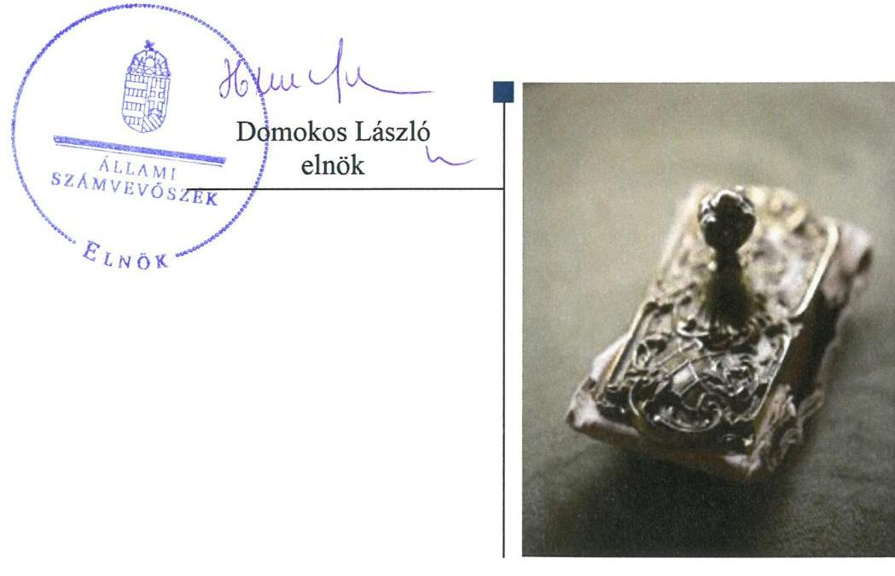
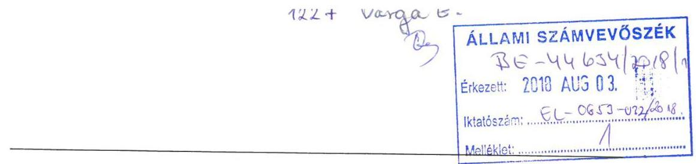
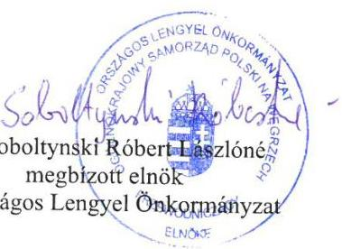
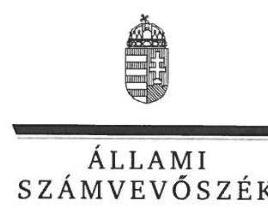
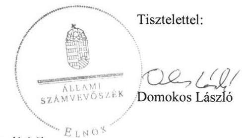
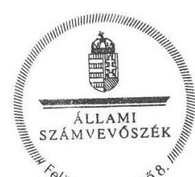

# Jelenetés 

## Az országos nemzetiségi önkormányzatok fenntartásában levő intézmények gazdálkodásának ellenőrzése

Lengyel Nyelvoktató Nemzetiségi Iskola 2018.

---

# Jelentés 

## Az országos nemzetiségi önkormányzatok fenntartásában levő intézmények gazdálkodásának ellenőrzése

Lengyel Nyelvoktató Nemzetiségi Iskola 2018. november 7. nap

---

# AZ ELLENŐRZÉST FELÜGYELTE:

- VARGA EDIT felügyeleti vezető
- AZ ELLENŐRZÉST VEZETTE ÉS A VÉGREHAJTÁSÁÉRT FELELŐS:
  - MAROZSÁN LÁSZLÓNÉ ellenőrzésvezető
  - A PROGRAM ÖSSZEÁLLÍTÁSÁÉRT FELELŐS:
    - TÓTPÁL SZABOLCS osztályvezető

**IKTATÓSZÁM:** EL-0369-024/2018.

**TÉMASZÁM:** 2463

**ELLENŐRZÉS-AZONOSÍTÓ SZÁM:** V080609

Jelentéseink az Országgyűlés számítógépes hálózatán és az Interneten a www.asz.hu címen is olvashatóak.

---

# TARTALOMJEGYZÉK 

■ ÖSSZEGZÉS ..... 5
■ AZ ELLENŐRZÉS CÉLJA ..... 6
■ AZ ELLENŐRZÉS TERÜLETE ..... 7
■ AZ ELLENŐRZÉS HÁTTERE, INDOKOLTSÁGA ..... 8
■ A JELENTÉS LÉNYEGES KÉRDÉSKÖREI ..... 9
■ AZ ELLENŐRZÉS HATÓKÖRE ÉS MÓDSZEREI ..... 10
■ MEGÁLLAPÍTÁSOK ..... 12
■ JAVASLATOK ..... 16
■ MELLÉKLETEK ..... 21
I. sz. melléklet: Értelmező szótár ..... 21
■ FÜGGELÉK: ÉSZREVÉTELEK ..... 23
■ RÖVIDÍTÉSEK JEGYZÉKE ..... 29

---

.

---

# ÖSSZEGZÉS 

Az Országos Lengyel Önkormányzat az általa fenntartott Lengyel Nyelvoktató Nemzetiségi Iskola felett munkáltatói jogait szabályszerűen, irányítói feladatait nem szabályszerűen látta el. A Lengyel Nyelvoktató Nemzetiségi Iskola működési és gazdálkodási kereteinek kialakítása, pénzügyi és vagyongazdálkodása nem volt szabályszerű. Belső kontrollrendszerét a 2016. évre vonatkozóan nem szabályszerűen alakította ki, ezáltal nem volt biztosított az erőforrások védelme a veszteségektől, a szabálytalan felhasználástól. A kiépített kontrollok és a korrupciós kockázatok szintje nem volt egyensúlyban, azok nem támogatták a szervezeti integritás érvényesülését.

## Az ellenőrzés társadalmi indokoltsága

Magyarországon a nemzetiségek jogait sarkalatos törvény határozza meg. A nemzetiségek létrehozhatnak helyi és országos önkormányzatokat, amelyek intézményeket alapíthatnak, tarthatnak fenn. A közfeladatok ellátását a nemzetiségi intézmények sajátos jogszabályi környezetben végzik, amely az utóbbi években változáson ment keresztül. A központi költségvetés támogatást nyújt a nemzetiségi önkormányzatok, illetve az általuk fenntartott intézmények számára feladataik ellátásához. A nemzetiségi intézmények gazdálkodásának ellenőrzése kiemelt jelentőséggel bír, mivel az Állami Számvevőszék korábban ezt a területet még nem ellenőrizte. Az ellenőrzések során az Állami Számvevőszék megállapítja, hogy ezen szervezetek a közpénzeket átlátható módon, szabályszerűen használják-e fel, így a közpénzek felhasználása ezen a területen sem marad ellenőrizetlenül.

## Főbb megállapítások, következtetések

Az Országos Lengyel Önkormányzat, a Lengyel Nyelvoktató Nemzetiségi Iskola feletti munkáltatói jogait szabályszerűen gyakorolta, irányítási feladatait nem szabályszerűen látta el. Nem hagyta jóvá a Lengyel Nyelvoktató Nemzetiségi Iskola költségvetési beszámolóit, nem határozta meg a költségvetési maradványát.

A Lengyel Nyelvoktató Nemzetiségi Iskola belső kontrollrendszerének kialakítása és működtetése nem volt szabályszerű. Működési és gazdálkodási kereteit nem a jogszabályoknak megfelelően alakította ki. A gazdálkodási feladatok munkamegosztási és felelősségvállalási rendjét az Országos Lengyel Önkormányzat Hivatalának vezetője és a Lengyel Nyelvoktató Nemzetiségi Iskola vezetője munkamegosztási megállapodásban nem határozta meg. A gazdálkodási folyamatokhoz kapcsolódó kontrolltevékenységek kialakítása, működtetése nem felelt meg a jogszabályi előírásoknak.

A Lengyel Nyelvoktató Nemzetiségi Iskola vezetője kockázatkezelési, illetve integrált kockázatkezelési rendszert nem működtetett, a kötelezően közzéteendő adatok nyilvánosságra hozatalának rendjét és a közérdekű adatok megismerésére irányuló kérelmek intézésének rendjét belső szabályzatban nem rendezte, közzétételi kötelezettségét nem teljesítette. Nem gondoskodott a belső ellenőrzés és a folyamatos monitoring rendszer kialakításáról. Az integritás szemlélet nem érvényesült, mert nem működtette sem a kötelezően előírt integritást támogató kontrollokat, sem az integritást erősítő, nem kötelezően előírt kontrollokat. Az Intézmény nem rendelkezett számviteli törvénynek megfelelő 2014-2016. évi beszámolóval.

---

# AZ ELLENŐRZÉS CÉLJA 

AZ ELLENŐRZÉS CÉLJA annak értékelése volt, hogy az országos nemzetiségi önkormányzat által alapított és fenntartott intézmény gazdálkodása, a belső kontrollrendszer kialakítása és működése, a fenntartó önkormányzat által nyújtott támogatás, illetve az államháztartásból meghatározott célra ingyenesen juttatott vagyon felhasználása a jogszabályi előírásoknak megfelelően történt-e.

---

# **AZ ELLENŐRZÉS TERÜLETE**

## **Lengyel Nyelvoktató Nemzetiségi Iskola**

Az Országos Lengyel Önkormányzat 1995. március 24-én alakult meg Országos Lengyel Kisebbségi Önkormányzat néven. Az ellenőrzött időszakban a Fenntartó1 irányítása alá három intézmény tartozott: a Lengyel Nyelvoktató Nemzetiségi Iskola, a Lengyel Közművelődési Központ és a Lengyel Kutatóintézet és Múzeum. Az Intézményt2 2004. szeptember 1-jén alapította a fenntartó önkormányzat.

Az Intézmény közfeladata a kiegészítő nemzetiségi oktatási feladatok ellátása, a lengyel nyelv oktatása volt országos hatáskörben. Ennek keretében alaptevékenységeként célja az érettségire, közép és felsőfokú nyelvvizsgára felkészítés, a lengyel hagyományok és kultúra megismertetése, valamint ifjúsági sportrendezvények, erdei iskola és nyári táboroztatás szervezése. Tevékenysége során együttműködik a külhoni lengyel iskolákkal.

Az Intézmény 2014. évben 4 fő közalkalmazottal és 1 fő Mt3 hatálya alá tartozó munkavállalóval látta el feladatait. A közalkalmazotti létszáma a 2016. évben 5 főre nőtt, és további óraadó nyelvtanárokat foglalkoztattak. Szervezeti átalakítás az Intézményt az ellenőrzött időszakban nem érintette. Az Intézmény pénzügyi és gazdasági feladatait az ellenőrzött időszakban az Országos Lengyel Önkormányzat Hivatala látta el.

Az Intézmény számára a központi költségvetésből nyújtott működési támogatás a 2014. évben 29 783 ezer Ft, a 2015. évben 41 245 ezer Ft, a 2016. évben 42 128 ezer Ft volt.

---

# AZ ELLENŐRZÉS HÁTTERE, INDOKOLTSÁGA 

Magyarország Alaptörvényének XXIX. cikke kimondja, hogy a magyarországi nemzetiségek államalkotó tényezők. Joguk van anyanyelvük használatához, a sajátnyelven való névhasználathoz, saját kultúrájuk ápolásához és az anyanyelvű oktatáshoz. A nemzetiségek létrehozhatnak helyi és országos önkormányzatokat. A nemzetiségek jogaira vonatkozó részletes szabályokat Magyarországon sarkalatos törvény határozza meg. A nemzetiségi közfeladatok ellátásához az állami központi költségvetés támogatást nyújt, melyet a nemzetiségi önkormányzatok kizárólag e feladataik ellátására használhatnak fel.

Az országos nemzetiségi önkormányzatok az általuk képviselt nemzetiség kulturális autonómiájának megteremtése érdekében intézményeket hozhatnak létre és vehetnek át. Az éves költségvetési törvények közvetlenül az intézményfenntartó országos nemzetiségi önkormányzatokhoz rendelik az általuk fenntartott intézmények működési támogatását. A nemzetiségi önkormányzati intézmények költségvetési gazdálkodásának, belső kontrollrendszerének kialakítása és működtetése ellenőrzésével biztosítja az ÁSZ ${ }^{4}$ a közpénzfelhasználás minél szélesebb körének ellenőrzését, ennek során azonos szempontok szerint értékeli az egyes országos nemzetiségi önkormányzatok fenntartásában levő intézmények gazdálkodási tevékenységét.

Az ellenőrzés eredményeként az ellenőrzött költségvetési szervek gazdálkodása javulhat, átfogó képet kaphatunk az országos nemzetiségi önkormányzatok által fenntartott intézmények gazdálkodásának sajátosságairól, hiányosságairól és az alkalmazott jó gyakorlatokról, erősítve a társadalmi bizalmat. Az ellenőrzés tapasztalatai alapján, hiányosságok feltárásával, azok megszüntetésére vonatkozó javaslatokkal hozzájárulunk a közpénzek átlátható, szabályszerű felhasználásához.

---

# A JELENTÉS LÉNYEGES KÉRDÉSKÖREI 

1. A Fenntartó szabályszerűen gyakorolta-e az ellenőrzött intézménnyel kapcsolatos feladatait?
2. Az Intézmény működése és gazdálkodása során tevékenysége szabályszerű volt-e, teljesítette-e az elszámolási kötelezettségeket, belső kontrollrendszere megvédte-e a veszteségektől és nem rendeltetésszerű használattól az intézmény erőforrásait?
3. Az Intézmény pénzügyi gazdálkodása szabályszerű volt-e?
4. Az Intézmény vagyongazdálkodása szabályszerű volt-e?

---

# AZ ELLENŐRZÉS HATÓKÖRE ÉS MÓDSZEREI 

## Az ellenőrzés típusa

Megfelelőségi ellenőrzés

## Az ellenőrzött időszak

2014-2016 évek, a belső kontrollrendszer, a kiadási előirányzatok felhasználása vonatkozásában a 2016. év.

## Az ellenőrzés tárgya

Az ÁSZ ellenőrzése tárgya az Országos Lengyel Önkormányzat által alapított és fenntartott Lengyel Nyelvoktató Nemzetiségi Iskola gazdálkodása, a belső kontrollrendszer kialakítása és működése, a fenntartó önkormányzat által nyújtott támogatás, illetve az államháztartásból meghatározott célra ingyenesen juttatott vagyon felhasználása jogszabályi előírásoknak való megfelelőségének értékelése.

## Az ellenőrzött szervezet

Az Országos Lengyel Önkormányzat, az általa fenntartott Lengyel Nyelvoktató Nemzetiségi Iskola, továbbá a gazdálkodási feladatait ellátó Országos Lengyel Önkormányzat Hivatala.

## Az ellenőrzés jogalapja

Az ellenőrzés jogszabályi alapját az ÁSZ tv. 5. § (3) bekezdés, 5. § (2)-(6) bekezdései, valamint Áht. ${ }^{6} 61 . \S$ (2) bekezdésének előírásai képezik.

## Az ellenőrzés módszerei

Az ellenőrzést az ellenőrzési program szempontjai, az ellenőrzött időszakban hatályos jogszabályok, az ellenőrzés szakmai szabályai, a jelen ellenőrzésre irányadó ÁSZ módszertanok figyelembevételével végezte az ÁSZ. Az ellenőrzési kérdések megválaszolásához szükséges bizonyítékok megszerzése az ellenőrzött által rendelkezésre bocsátott dokumentumokra, adatokra alapozva megfigyelés, szemle (szemrevételezés), kérdésfeltevés (információkérés), valamint elemző eljárás útján történt.

---

Az ellenőrzési bizonyítékként felhasználható adatforrások közé tartoztak egyrészt az ellenőrzési program részletes szempontjainál felsorolt adatforrások, másrészt minden egyéb - az ellenőrzés folyamán feltárt, az ellenőrzés szempontjából információt tartalmazó - dokumentum. Az ellenőrzés lefolytatásához az ellenőrzött szervezet a tanúsítványok kitöltésével, valamint az ÁSZ által kért dokumentumok megküldésével szolgáltatott adatokat.

Az ÁSZ az ellenőrzés ideje alatt az ellenőrzött szervezettel történő kapcsolattartást az ÁSZ SZMSZ7-ének vonatkozó előírásai alapján biztosította.

---

# 1. A Fenntartó szabályszerűen gyakorolta-e az ellenőrzött intézménnyel kapcsolatos feladatait? 

Összegző megállapítás

A Fenntartó az Intézménnyel kapcsolatos munkáltatói jogát szabályszerűen gyakorolta, egyéb irányítási feladatait nem szabályszerűen látta el.

A FENNTARTÓ ÁLTAL JÓVÁHAGYOTT SZMSZ8-szel az Intézmény rendelkezett. Az Elnök által kiadott Alapító okirat91-2 megfelelt az Ávr10. és az Nktv11. által előírt tartalmai követelményeknek.

A Közgyűlés12 az Intézmény 2014. évi költségvetési beszámolóját az Áhsz13. 32. § (1) bekezdésében a 2015-2016. évi költségvetési beszámolóját az Áhsz. 32. § (1a) bekezdésében előírtak ellenére nem hagyta jóvá.

A Közgyűlés az Ávr. 155. § (2) bekezdésében előírtak ellenére az ellenőrzött időszakban nem állapította meg az Intézmény éves költségvetési maradványát. Nem gyakorolta a Közgyűlés az Áht. 9. § i) pontjában biztosított hatáskörét, az Intézmény vezetőjét a feladatellátásról jelentéstételre vagy beszámolásra nem kötelezte.

A MUNKÁLTATÓI JOGOKAT a Közgyűlés képviseletében az Elnök gyakorolta az Intézmény vezetője felett. A Közgyűlés az intézményvezetői megbízás során az Njtv.14 előírásának megfelelően megkérte az EMMI15 miniszter egyetértését és az abban foglaltaknak megfelelően járt el a vezetői megbízás időtartamának meghatározása során.

## 2. Az Intézmény működése és gazdálkodása során tevékenysége szabályszerű volt-e, teljesítette-e az elszámolási kötelezettségeket, belső kontrollrendszere megvédte-e a veszteségektől és nem rendeltetésszerű használattól az intézmény erőforrásait?

Összegző megállapítás

Az Intézmény belső kontrollrendszerének kialakítása és működtetése nem volt szabályszerű, nem volt biztosított az erőforrások védelme a veszteségektől, a nem szabályszerű felhasználástól.
2.1. számú megállapítás

A kontrollkörnyezet kialakítása nem volt szabályszerű.
AZ INTÉZMÉNY KONTROLLKÖRNYEZETÉNEK kialakítása nem volt szabályszerű, mert

- Az Intézmény vezetője nem rögzítette az SZMSZ-ben az Ávr. 13. § (1) bekezdés c) pontjában előírtak ellenére az ellátandó, és a kormányzati funkció szerint besorolt alaptevékenységeket. A Vnytv.16

---

4. § a) pontjában foglaltak ellenére a vagyonnyilatkozat-tételre kötelezett munkaköröket. Az Ávr. 13. § (2) bekezdésében foglaltakkal ellentétben nem rendezte a működéshez kapcsolódó, pénzügyi kihatással bíró, jogszabályban nem szabályozott kérdéseket belső szabályzatban, figyelemmel az Ávr. 13. § (4) bekezdésében előírtakra.

- Az Intézmény vezetője a Bkr.17 6. § (1) bekezdés c) pontja ellenére nem határozta meg az etikai elvárásokat a szervezet minden szintjén.
- A Hivatal18 vezetője az Áhsz. 50. § (1) bekezdésében foglalt kötelezettsége és a Számv. tv19. 14. § (3) bekezdésében előírtak ellenére nem alakította ki és foglalta írásba a Számviteli politikát, a Számv. tv. 14. § (5) bekezdés a), b) és d) pontjainak előírása ellenére nem készítette el a leltározási szabályzatát, az értékelési szabályzatát, valamint a pénzkezelési szabályzatát.

# 2.2. számú
 megállapítás

Az Intézménynél a kockázatkezelési rendszert, illetve az integrált kockázatkezelési rendszert nem működtették.

KOCKÁZATKEZELÉSI RENDSZERT az Intézmény vezetője a Bkr 7. § (1) bekezdése előírása ellenére 2016. szeptember 30-ig, 2016. október 1-jétől integrált kockázatkezelési rendszert nem működtetett.

### 2.3. számú megállapítás

A kontrolltevékenység gyakorlása, működtetése nem volt szabályszerű.

A GAZDÁLKODÁSI FOLYAMATOKHOZ KAPCSOLÓDÓ KONTROLLTEVÉKENYSÉGEK kialakítása, működtetése nem felelt meg az Ávr. előírásainak:

- a Hivatal az Ávr. 9. § (5) bekezdése a) pontjában előírtak ellenére a munkamegosztás és felelősségvállalás rendjét tartalmazó munkamegosztási megállapodás nélkül látta el az Intézményre vonatkozó Ávr. 9. § (1) bekezdésben előírt feladatokat. Az Ávr. 10/a. §-ában előírtak ellenére nem rendelkezett Ügyrenddel,
- az Intézmény nem vezetett az Ávr. 60. § (3) bekezdésében előírtak ellenére a gazdálkodási jogkört gyakorló személyekről és aláírásmintájukról a naprakész nyilvántartást,
- a Bkr. 6. § (3) bekezdésének előírásával ellentétesen a Hivatal vezetője nem készítette el a gazdasági folyamatok ellenőrzési nyomvonalát, így az Intézmény pénz és vagyongazdálkodásával kapcsolatos kontrollfolyamatokat nem alakította ki,
- a Hivatal vezetője nem rendelkezett az érvényesítői és pénzügyi ellenjegyzői feladatok ellátásához az Ávr. 55.§ (3) bekezdésében előírt végzettséggel tekintettel arra, hogy az Ávr. 11. § (3) bekezdés a)-b) pontjai alapján a Hivatal vezetője a Hivatal állományából nem jelölt ki írásban a feladatok ellátására olyan személyt, aki megfelel az Ávr.ben a gazdasági vezetőre meghatározott követelményeknek.

---

# 2.4. számú megállapítás 

Az információs és kommunikációs folyamatok kialakítása és működtetése nem volt szabályszerű.

AZ INFORMÁCIÓS RENDSZEREK keretében az Intézmény vezetője Bkr. 9. § (2) bekezdésében előírtak ellenére nem működtetett olyan beszámolási rendszereket, amelyek hatékonyak, megbízhatóak, pontosak és összehasonlíthatóak, a beszámolási szintek, határidők és módok világosan meg vannak határozva.

Az Intézmény vezetője a kötelezően közzéteendő adatok nyilvánosságra hozatalának rendjét az Info. tv ${ }^{20}$. 35. § (3) bekezdésében és az Ávr. 13. § (2) bekezdés h) pontjában előírtak ellenére belső szabályzatban nem állapította meg. A közérdekű adatok megismerésére irányuló kérelmek intézésének rendjét az Info. tv. 30. § (6) bekezdésében és az Ávr. 13. § (2) bekezdés h) pontjában előírtak ellenére belső szabályzatban nem rendezte.

Az Intézmény vezetője az Info. tv. 37. § (1) bekezdése szerinti közzétételi kötelezettségének az Info. tv. 1. mellékletében előírt, I-III pontokban felsorolt szervezeti, személyzeti adatok, tevékenységére, működésére vonatkozó adatok, valamint gazdálkodási adatai tekintetében nem tett eleget.
2.5. számú megállapítás

Az Intézmény vezetője nem alakította ki a szervezet tevékenységének, a célok megvalósításának folyamatos és eseti nyomon követését biztosító rendszerét és a belső ellenőrzést.

A MONITORING RENDSZER RÉSZEKÉNT az Intézmény vezetője az Áht. 70. § (1) bekezdése előírása ellenére nem gondoskodott a független belső ellenőrzés kialakításáról és működtetéséről. A Bkr. 10. §-ában foglaltak ellenére nem alakította ki a szervezet tevékenységének, a célok megvalósításának nyomon követését biztosító rendszert. Az Intézmény vezetője a Bkr. 11. § (1) bekezdésében foglalt rendelkezéssel ellentétesen nem értékelte az Intézmény belső kontrollrendszerének a minőségét.
2.6. számú megállapítás

Az Intézmény nem a kockázatokkal arányosan alakította ki az integritás kontrollokat.

Az Intézménynél nem működtették sem a kötelezően előírt integritást támogató, sem az integritást erősítő, nem kötelezően előírt kontrollokat. A hiányzó kontrollok növelték az Intézmény működéséből adódó korrupciós kockázatok veszélyét, nem támogatták a szervezeti integritás érvényesülését.

---

# 3. Az Intézmény pénzügyi gazdálkodása szabályszerű volt-e? 

## Összegző megállapítás

3.1. számú megállapítás
3.2. számú megállapítás

Az Intézmény pénzügyi gazdálkodása nem volt szabályszerű.
A kiadási előirányzatok felhasználása a gazdálkodási jogkörök gyakorlására jogosultakról és aláírásaikról vezetett nyilvántartás hiánya miatt nem felelt meg a jogszabályi előírásoknak.

A kötelezettségvállalás gyakorlata és a költségvetési-maradvány elszámolása nem volt szabályszerű.

A KÖTELEZETTSÉGVÁLLALÁSOKRÓL, más fizetési kötelezettségekről a pénzügyi-gazdasági feladatokat ellátó Hivatalnál nem vezettek a 2014-2015. évek között az Áhsz. 14. melléklet II. 4. a)-g) pontokban meghatározott tartalmú részletező nyilvántartást. Ennek hiányában nem igazolt, hogy eleget tettek-e a kötelezettségvállalások során az Áht. 37. § (1) bekezdésében előírtaknak, a pénzügyi ellenjegyző nem győződött meg arról, hogy a szabad előirányzat rendelkezésre állt-e a kötelezettségvállalás előtt. Az Intézmény kötelezettségvállalása nem volt szabályszerű.

Az Intézmény 2015. évi beszámolójában kimutatott kötelezettségvállalással terhelt negatív előjelű költségvetési maradványt az Áhsz. 39. § (3) bekezdése előírása ellenére nem támasztották alá részletező nyilvántartással. Az előirányzat túllépésével az Áht. 37.§ (1) bekezdés előírása ellenére, fedezet nélkül vállalt az intézményvezető kötelezettséget.

A MARADVÁNNYAL KAPCSOLATOS ADATSZOLGÁLTATÁSI kötelezettséget a Hivatalnál az Áhsz. 32.§ (1) bekezdése szerinti február 28-ai határidőt túllépve teljesítették.

Az Intézmény nem rendelkezett szabályszerű költségvetési beszámolóval.

AZ INTÉZMÉNY NEM RENDELKEZETT a jogszabályi előírásoknak megfelelő éves költségvetési beszámolóval. A költségvetési beszámoló nem felelt meg az Áhsz. 5. § (1) bekezdése előírásának, mivel az Intézmény költségvetési beszámolóját nem támasztotta alá folyamatosan vezetett részletező nyilvántartásokkal, a könyvviteli zárlat során készített főkönyvi kivonattal, valamint leltárral.

## 4. Az Intézmény vagyongazdálkodása szabályszerű volt-e?

Összegző megállapítás
Az Intézmény költségvetési beszámolóját, mérleg tételeit a Számv. tv. 69. § (1) bekezdésében előírtak ellenére nem támasztották alá leltárral, ezért vagyongazdálkodása nem volt szabályszerű.

---

# JAVASLATOK 

Az ÁSZ tv. 33. § (1) bekezdésében foglaltak értelmében az ellenőrzött szervezet vezetője köteles a jelentésben foglalt megállapításokhoz kapcsolódó intézkedési tervet összeállítani és azt a jelentés kézhezvételétől számított 30 napon belül az ÁSZ részére megküldeni. Amennyiben az ellenőrzött szervezet vezetője nem küldi meg határidőben az intézkedési tervet, vagy továbbra sem elfogadható intézkedési tervet küld, az Állami Számvevőszék elnöke az ÁSZ tv. 33. § (3) bekezdés a) és b) pontjaiban foglaltakat érvényesítheti.

## Lengyel Nyelvoktató Nemzetiségi Iskola vezetőjének

1. A belső kontrollrendszer szabályszerű kialakítása és működtetése érdekében intézkedjen:
a) jogszabályi előírásoknak megfelelő tartalmú SZMSZ elkészítéséről;
(2.1. sz. megállapítás 1. bekezdés 1. francia bekezdés 1-2. mondata alapján)
b) a működéshez kapcsolódó, pénzügyi kihatással bíró, jogszabályban nem szabályozott kérdések szabályozásának Országos Lengyel Önkormányzat Hivatalával egyeztetett módon történő kiadásáról;
(2.1. sz. megállapítás 1. bekezdés 1. francia bekezdés 3. mondata alapján)
c) az etikai elvárások meghatározásáról a szervezet minden szintjén;
(2.1. sz. megállapítás 1. bekezdés 2. francia bekezdése alapján)
d) integrált kockázatkezelési rendszer működtetéséről;
(2.2. sz. megállapítás 1. bekezdése alapján)
e) az Intézmény és a Hivatal közötti munkamegosztás és felelősségvállalás rendjét szabályozó megállapodás megkötéséről;
(2.3. sz. megállapítás 1. bekezdés 1. francia bekezdés 1. mondata alapján)
f) a gazdálkodási jogkört gyakorló személyekről és aláírás-mintájukról naprakész nyilvántartás készítéséről és vezetéséről;
(2.3. sz. megállapítás 1. bekezdés 2. francia bekezdése alapján)

---

g) az információs rendszerek keretében a beszámolási rendszerek oly módon történő működtetéséről, hogy azok hatékonyak, megbízhatóak, pontosak és összehasonlíthatóak legyenek, a beszámolási szintek, határidők és módok világosan meg legyenek határozva;
(2.4. sz. megállapítás 1. bekezdése alapján)
h) a kötelezően közzéteendő adatok nyilvánosságra hozatala és a közérdekű adatok megismerésére irányuló kérelmek intézése rendjének belső szabályzatban történő rendezéséről;
(2.4. sz. megállapítás 2. bekezdése alapján)
i) jogszabályi előírásoknak megfelelően az általános közzétételi listán meghatározott adatok közzétételéről és elérhetőségéről
(2.4. sz. megállapítás 3. bekezdése alapján)
j) az Intézmény tevékenységének, a célok megvalósításának nyomon követését biztosító rendszer kialakításáról;
(2.5. sz. megállapítás 2. mondata alapján)
k) az Intézmény belső kontrollrendszere minőségének értékeléséről;
(2.5. sz. megállapítás 3. mondata alapján)
2. A szabályszerű pénzügyi gazdálkodás érdekében gondoskodjon a kötelezettségvállalási jogkör jogszabályoknak megfelelő gyakorlásáról.
(3.2. sz. megállapítás 2. bekezdés 2. mondata alapján)

# Országos Lengyel Önkormányzat elnökének 

1. Az irányítószervi feladatainak szabályszerű ellátása érdekében intézkedjen az Intézmény:
a) költségvetési beszámolóinak jóváhagyásáról
(1. sz. megállapítás 2. bekezdése alapján)
b) éves költségvetési maradványának megállapításáról;
(1. sz. megállapítás 3. bekezdése 1. mondata alapján)

---

c) irányításával kapcsolatban az Intézmény feladatellátására vonatkozó jelentéstételre vagy beszámolóra való kötelezés hatásköreinek gyakorlásáról.
(1. sz. megállapítás 3. bekezdése 2. mondata alapján)

# Országos Lengyel Önkormányzat Hivatala vezetőjének 

1. A belső kontrollrendszer szabályszerű kialakítása és működtetése érdekében intézkedjen:
a) a számviteli politika kialakításáról és írásba foglalásáról, valamint az eszközök és a források leltárkészítési és leltározási szabályzata, az eszközök és a források értékelési szabályzata, továbbá a pénzkezelési szabályzat elkészítéséről
(2.1. sz. megállapítás 1. bekezdés 3. francia bekezdése alapján)
b) az Intézmény és a Hivatal közötti munkamegosztás és felelősségvállalás rendjét szabályozó megállapodás megkötéséről;
(2.3. sz. megállapítás 1. bekezdés 1. francia bekezdés 1. mondata alapján)
c) ügyrendjének elkészítéséről;
(2.3. sz. megállapítás 1. bekezdés 1. francia bekezdés 2. mondata alapján)
d) a gazdasági folyamatok ellenőrzési nyomvonalának elkészítéséről;
(2.3. sz. megállapítás 1. bekezdés 3. franciabekezdése alapján)
e) a jogszabályban előírt végzettséggel rendelkező személyek kijelöléséről a kötelezettségvállalás pénzügyi ellenjegyzői, valamint az érvényesítői feladatok ellátására;
(2.3. sz. megállapítás 1. bekezdés 4. franciabekezdése alapján)
f) a 2017. január 1. napjától hatályos Bkr. 15. § (4) bekezdése alapján az Intézmény belső ellenőrzésének kialakításáról és működtetéséről;
(2.5. sz. megállapítás 1. bekezdés 1. mondata alapján)

---

2. A szabályszerű pénzügyi gazdálkodás érdekében gondoskodjon:
a) a jogszabályban előírt tartalmú kötelezettségvállalások, más fizetési kötelezettségek nyilvántartásának vezetéséről;
(3.2. sz. megállapítás 1. bekezdés 1. mondata alapján)
b) a pénzügyi ellenjegyzési tevékenység jogszabályban foglaltaknak megfelelő gyakorlásáról;
(3.2. sz. megállapítás 1. bekezdés 2. mondata alapján)
c) az Intézmény költségvetési maradványának jogszabály szerinti részletező nyilvántartással való alátámasztásáról;
(3.2. sz. megállapítás 2. bekezdés 1. mondata alapján)
d) az Intézmény maradványával kapcsolatos adatszolgáltatási kötelezettségének, jogszabály szerinti határidőben történő teljesítéséről;
(3.2. sz. megállapítás 3. bekezdése alapján)
3. A szabályszerű pénzügyi- és vagyon gazdálkodás érdekében gondoskodjon az Intézmény éves költségvetési beszámolójának jogszabálynak megfelelő alátámasztásáról.
(3.3. sz. megállapítás alapján)

---

.

---

# MELLÉKLETEK 

- I. SZ. MELLÉKLET: ÉRTELMEZŐ SZÓTÁR
irányító szerv
közfeladat
működtetés
nemzeti vagyon rendeltetése
nemzetiségi önkormányzat
nemzetiségi köznevelési intézmény
nemzetiségi közügy
tulajdonosi joggyakorló

A költségvetési szerv tekintetében az e törvényben meghatározott irányítási hatáskört gyakorló szerv. (Forrás: Áht. 1. § 9. pontja)
Jogszabályban meghatározott állami vagy önkormányzati feladat, amit az arra kötelezett közérdekből, a jogszabályban meghatározott követelményeknek és feltételeknek megfelelve végez, ideértve a lakosság közszolgáltatásokkal való ellátását, továbbá az állam nemzetközi szerződésekben vállalt kötelezettségeiből adódó közérdekű feladatokat, valamint e feladatok ellátásakor szükséges infrastruktúra biztosítását is. (Forrás: Nvtv. 3. § (1) bekezdés 7. pontja, hatálytalan: 2015. január 1-jétől) „Közfeladat a jogszabályban meghatározott állami vagy önkormányzati feladat". A közfeladatok ellátása költségvetési szervek alapításával és működtetésével, vagy azok ellátásához szükséges pénzügyi fedezet törvényben meghatározott eszközökkel, részben, vagy egészben történő biztosításával valósul meg. (Forrás: Áht. 3/A. § (1) bekezdés, hatályos 2015. január 1-jétől)
A nemzeti vagyon birtoklásából, használatából, hasznai szedéséből, a nemzeti vagyon fenntartásából és üzemeltetéséből álló tevékenységek együttese, amely - jogszabály vagy szerződés alapján - a nemzeti vagyon felújítására, fejlesztésére, a birtoklásának, használatának hasznai szedése jogának továbbengedésére is kiterjed. (Forrás: Nvtv. 3. § 10. pontja)

A nemzeti vagyon alapvető rendeltetése a közfeladat ellátásának biztosítása, ideértve a lakosság közszolgáltatásokkal való ellátását és e feladatok ellátásához szükséges infrastruktúra biztosítását. (Forrás: Nvtv. 7.0 (1) bekezdés, hatályos 2015. január 1-jétől)
A nemzetiségek jogairól szóló törvényben meghatározott nemzetiségi közszolgáltatási feladatokat ellátó, testületi formában működő, jogi személyiséggel rendelkező, demokratikus választások útján e törvény alapján létrehozott szervezet, amely a nemzetiségi közösséget megillető jogosultságok érvényesítésére, a nemzetiségek érdekeinek védelmére és képviseletére, a feladat- és hatáskörébe tartozó nemzetiségi közügyek települési, területi vagy országos szinten történő önálló intézésére
 jön létre. (Forrás: a nemzetiségek jogairól szóló 2011. évi CLXXIX. törvény, 2. § 2. pont)
Az a köznevelési intézmény, amelynek alapító okirata a nemzeti köznevelésről szóló törvényben foglaltak szerint tartalmazza a nemzetiségi feladatok ellátását, feltéve, hogy e feladatokat a köznevelési intézmény ténylegesen ellátja, továbbá óvoda, iskola és kollégium esetén a tanulók legalább huszonöt százaléka részt vesz a nemzetiségi óvodai nevelésben, illetve a nemzetiségi iskolai nevelésben-oktatásban.
a Nemzetiségi tv.-ben biztosított egyéni és közösségi jogok érvényesülése, a nemzetiséghez tartozók érdekeinek kifejezésre juttatása - különösen az anyanyelv ápolása, őrzése és gyarapítása, továbbá a nemzetiségek kulturális autonómiájának a nemzetiségi önkormányzatok által történő megvalósítása és megőrzése - érdekében a nemzetiséghez tartozók meghatározott közszolgáltatásokkal való ellátásával, ezen ügyek önálló vitelével és az ehhez szükséges szervezeti, személyi és anyagi feltételek megteremtésével összefüggő ügy
Aki a nemzeti vagyon felett az államot vagy a helyi önkormányzatot megillető tulajdonosi jogok és kötelezettségek összességének gyakorlására jogosult. (Forrás: Nvtv. 3. § (1) bekezdés 17. pontja)

---

vagyongazdálkodás
nemzeti vagyon

A nemzeti vagyongazdálkodás feladata a nemzeti vagyon rendeltetésének megfelelő, az állam, az önkormányzat mindenkori teherbíró képességéhez igazodó, elsődlegesen a közfeladatok ellátásához és a mindenkori társadalmi szükségletek kielégítéséhez szükséges, egységes elveken alapuló, átlátható, hatékony és költségtakarékos működtetése, értékének megőrzése, állagának védelme, értéknövelő használata, hasznosítása, gyarapítása, továbbá az állam vagy a helyi önkormányzat feladatának ellátása szempontjából feleslegessé váló vagyontárgyak elidegenítése. (Forrás: Nvtv. 7. § (2) bekezdése)
a) az állam vagy a helyi önkormányzat kizárólagos tulajdonában álló dolgok,
b) az a) pont hatálya alá nem tartozó, az állam vagy a helyi önkormányzat tulajdonában lévő dolog,
c) az állam vagy a helyi önkormányzat tulajdonában lévő pénzügyi eszközök, továbbá az államot vagy a helyi önkormányzatot megillető társasági részesedések,
d) az államot vagy a helyi önkormányzatot megillető bármely vagyoni értékkel rendelkező jogosultság, amelyet jogszabály vagyoni értékű jogként nevesít,
e) Magyarország határa által körbezárt terület feletti légtér,
f) az üvegházhatású gázok kibocsátási egységeinek kereskedelméről szóló törvény szerinti kibocsátási egység és légiközlekedési kibocsátási egység, valamint az ENSZ Éghajlatváltozási Keretegyezménye és annak Kiotói Jegyzőkönyvének végrehajtási keretrendszeréről szóló törvény szerinti kiotói egység,
g) állami vagy helyi önkormányzati fenntartású közgyűjtemény (muzeális intézmény, levéltár, közgyűjteményként működő kép- és hangarchívum, valamint könyvtár) saját gyűjteményében nyilvántartott kulturális javak körébe tartozó dolog, kivéve, ha az állami vagy önkormányzati tulajdon jogszerű létrejötte kétséget kizáró módon nem bizonyítható és a dologra nézve más a tulajdonjogát bizonyítja vagy a kulturális javakra vonatkozó jogszabályokban meghatározott eljárás keretében valószínűsíti,
h) a régészeti lelet,
i) a nemzeti adatvagyon körébe tartozó állami nyilvántartások fokozottabb védelméről szóló törvény szerinti nemzeti adatvagyon.
(Forrás: Nvtv. 1.§ (2) bekezdés)

---

# FÜGGELÉK: ÉSZREVÉTELEK 

A jelentéstervezetet a Számvevőszék 15 napos észrevételezésre megküldte az ellenőrzött szervezetek vezetőinek az ÁSZ tv. 29. § (1) bekezdése előírásának megfelelően.

Az ÁSZ a jelentéstervezetet észrevételezésre megküldte a Lengyel Nyelvoktató Nemzetiségi Iskola intézményvezetőjének, az Országos Lengyel Önkormányzat elnökének és az Országos Lengyel Önkormányzat Hivatala hivatalvezetőjének részére.
A Lengyel Nyelvoktató Nemzetiségi Iskola intézményvezetője és az Országos Lengyel Önkormányzat Hivatala hivatalvezetője az ÁSZ tv. 29. § (2) bekezdésében foglalt észrevételezési jogával nem élt, a jelentéstervezet megállapításaira észrevételt nem tett. Az Országos Lengyel Önkormányzat elnöke észrevételét és az arra adott választ a függelék tartalmazza.

[^0]
[^0]:    * 29. § (1) Az Állami Számvevőszék az ellenőrzési megállapításait megküldi az ellenőrzött szervezet vezetőjének vagy az általa megbízott személynek, és annak, akinek személyes felelősségét állapította meg.
    (2) Az ellenőrzött szervezet vezetője és a felelősként megjelölt személy az ellenőrzés megállapításaira tizenöt napon belül írásban észrevételt tehet.
    (3) Az Állami Számvevőszék az észrevételre a beérkezésétől számított harminc napon belül írásban válaszol. A figyelembe nem vett észrevételeket köteles a jelentésben feltüntetni, és megindokolni, hogy azokat miért nem fogadta el.

---

# ORSZÁGOS LENGYEL ÖNKORMÁNYZAT 

## OGÓLNOKRAJOWY SAMORZĄD POLSKI NA WĘGRZECH 1102 Budapest, Állomás u. 10.

Telefon: + 36126117 98, 3612607298
web: www.lengyelonkormanyzat.hu
e-mail cím: olko@polonia.hu
web: www.polonia.hu

## OLŐ/ 18/1/2018   Tárgy: észrevétel

## Domokos László részére   Állami Számvevőszék

## Budapest

Apáczai Csere János utca 10.
1052

## Tisztelt Elnök úr!

A Lengyel Nyelvoktató Nemzetiségi Iskolára vonatkozó EL-0653-025/2018. iktatószámú jelentéstervezethez kapcsolódóan az alábbi észrevételt teszem.

Kérem Elnök Urat, szíveskedjenek felülvizsgálni a 2. számú megállapítás összegzését, a 2.1. számú megállapítást, illetve a 2.1. számú megállapítás 3. pontját.

A Jelentéstervezet 2. megállapításának összegzése szerint „az intézmény belső kontrollrendszerének kialakítása és működtetése nem volt szabályszerű, nem volt biztosított az erőforrások védelme a veszteségektől, a nem szabályszerű felhasználástól."
A Jelentéstervezet 2.1. sz. megállapításának 3. pontja szerint a Hivatal vezetője nem alakította ki és foglalta írásba a Számviteli politikát, nem készített leltározási szabályzatot és értékelési szabályzatot valamint pénzkezelési szabályzatot.

Az Országos Lengyel Önkormányzat szabályzat rendelkezik számviteli politikával, leltározási és értékelési szabályzattal, illetve pénzkezelési szabályzattal.
Az ellenőrzés során az alábbi szabályzatokat bocsátottuk a Tisztelt Számvevőszék rendelkezésére:

- Számviteli politika, melyet az OLŐ Közgyűlése 111/2014. (XII.06.) sz. határozatával hagyott jóvá,
- Eszközök és források értékelési szabályzata, melyet az OLŐ Közgyűlése 114/2014. (XII.06.) sz. határozatával hagyott jóvá,
- Eszközök és források leltárkészítési és leltározási szabályzata, melyet az OLŐ Közgyűlése 112/2014. (XII.06.) sz. határozatával hagyott jóvá.
A szabályzatok hatálya - a szabályzat tartalma alapján - kiterjed az Országos Lengyel Önkormányzatra és intézményeire, így a Lengyel Nyelvoktató Nemzetiségi Iskolára is. Álláspontunk szerint ezzel a szabályozási feladatot elvégeztük.
Fentiek okán kérem, szíveskedjenek mérlegelni a következő megállapítások szerepeltetését a végleges jelentésben:

---

2.1. számú megállapítás: „az intézmény belső kontrollrendszerének kialakítása és működtetése megtörtént, de annak módja nem volt szabályszerű; nem volt biztosított az erőforrások védelme a veszteségektől, a nem szabályszerű felhasználástól".

A Jelentéstervezet 2.1. sz. megállapításának 3. pontja: a Hivatal vezetője a Számviteli politikát, leltározási szabályzatot és értékelési szabályzatot valamint pénzkezelési szabályzatot az intézményrendszerre vonatkozóan (OLÖ és szervezetei) egy dokumentumban szabályozta. A szabályzatok hatálya kiterjed az OLÖ intézményeire, ugyanakkor szükségesnek tartjuk az összes intézmény vonatkozásában külön szabályzat kialakítását.

Kérjük, hogy a végleges számvevőszéki jelentés elkészítésénél szíveskedjenek figyelembe venni fenti észrevételünket.

Segítő együttműködésüket köszönöm!
Budapest, 2018. július „,",
Tisztelettel:

---

ELNÖK

Ikt.szám: EL-0653-033/2018.

# Soboltynski Róbert Lászlóné úrhölgy 

elnök
Országos Lengyel Önkormányzat

## Budapest

## Tisztelt Elnök Úrhölgy!

„Az országos nemzetiségi önkormányzatok fenntartásában levő intézmények gazdálkodásának ellenőrzése - Lengyel Nyelvoktató Nemzetiségi Iskola" címmel készített számvevőszéki jelentéstervezetre tett észrevételét köszönettel megkaptam.
Az Állami Számvevőszék észrevételre vonatkozó álláspontjáról a felügyeleti vezető által készített részletes tájékoztatást csatoltan megküldöm.
Tájékoztatom Elnök úrhölgyet, hogy a számvevőszéki jelentésben - az Állami Számvevőszékről szóló 2011. évi LXVI. törvény 29. § (3) bekezdése alapján - a figyelembe nem vett észrevételeket szerepeltetjük, annak indoklásával, hogy azokat az Állami Számvevőszék miért nem fogadta el.

Budapest, 2018. 08 . hó 22 .nap

Melléklet: Tájékoztatás az észrevételek kezeléséről

---

# Tájékoztatás az észrevételek kezeléséről 

„Az országos nemzetiségi önkormányzatok fenntartásában levő intézmények gazdálkodásának ellenőrzése - Lengyel Nyelvoktató Nemzetiségi Iskola"című jelentéstervezetre az OLÖ/136/5/2018. iktatószámú levelében tett észrevételét áttekintettük, annak kezeléséről az alábbi tájékoztatást adom.
A jelentéstervezet 2. számú megállapítás összegzésére, a 2.1. számú megállapításra, illetve a 2.1. számú megállapítás 3. pontjára tett észrevételét az Állami Számvevőszék nem fogadja el.
Az Állami Számvevőszék rendelkezésére bocsátott dokumentumok alapján megállapítható, hogy a Lengyel Nyelvoktató Nemzetiségi Iskola ellenőrzése során vizsgált számviteli politikát, az eszközök és források értékelési szabályzatát, valamint az eszközök és források leltárkészítési és leltározási szabályzatát az Országos Lengyel Önkormányzat Közgyűlése hagyta jóvá és az Országos Lengyel Önkormányzat elnöke írta alá. Mindezek alapján megállapítható, hogy a Lengyel Nyelvoktató Nemzetiségi Iskola nem rendelkezett az államháztartás számviteléről szóló 4/2013. (I. 11.) Korm. rendelet (továbbiakban: Áhsz.) 31. § (1) bekezdésben meghatározott felelős által elkészített, a számvitelről szóló 2000. évi C. törvény (továbbiakban: Számv. tv.) 14. § (3) bekezdésének, valamint az Áhsz. 50. § (1) bekezdésének megfelelő számviteli politikával és annak keretében a Számv. tv. 14. § (5) bekezdés a)-b) pontjaiban meghatározott kötelezően elkészítendő szabályzatokkal.
Mindezek alapján az észrevételt nem fogadjuk el, az Állami Számvevőszék megállapítása helytálló, a jelentéstervezet módosítása nem indokolt.

Budapest, 2018. 08 . hó 22. nap

---

.

---

# RÖVIDÍTÉSEK JEGYZÉKE 

${ }^{1}$ Fenntartó
${ }^{2}$ Intézmény
${ }^{3} \mathrm{Mt}$.
${ }^{4}$ ÁSZ
${ }^{5}$ ÁSZ tv.
${ }^{6}$ Áht.
${ }^{7}$ ÁSZ SZMSZ
${ }^{8}$ SZMSZ
${ }^{9}$ Alapító okirat ${ }_{1}$

Alapító okirat ${ }_{2}$
${ }^{10}$ Ávr.
${ }^{11}$ Nktv.
${ }^{12}$ Közgyűlés
${ }^{13}$ Áhsz.
${ }^{14}$ Njtv.
${ }^{15}$ EMMI
${ }^{16}$ Vnytv.
${ }^{17}$ Bkr.
${ }^{18}$ Hivatal
${ }^{19}$ Számv. tv.
${ }^{20}$ Info.tv.

Országos Lengyel Önkormányzat
Lengyel Nyelvoktató Nemzetiségi Iskola
2012. évi I. törvény a munka törvénykönyvéről

Állami Számvevőszék
2011. évi LXVI. törvény az Állami Számvevőszékről
2011. évi CXCV. törvény az államháztartásról
az Állami Számvevőszék szervezeti és működési szabályzata
a Lengyel Nyelvoktató Nemzetiségi Iskola szervezeti és működési szabályzata
Lengyel Nyelvoktató Nemzetiségi Iskola Alapító okirata (a módosításokkal egységes szerkezetben) (hatályos: 2013. október 30-tól)
Alapító okirat módosításokkal egységes szerkezetbe foglalva (hatályos: 2016. augusztus 31-étől)
368/2011. (XII.31.) Korm. rendelet az államháztartásról szóló törvény végrehajtásáról
2011. évi CXC. törvény a nemzeti köznevelésről
az Országos Lengyel Önkormányzat közgyűlése
4/2013. (I. 11.) Korm. rendelet az államháztartás számviteléről
2011. évi CLXXIX. törvény a nemzetiségek jogairól

Emberi Erőforrások Minisztériuma
2007. évi CLII. törvény egyes vagyonnyilatkozat-tételi kötelezettségekről
370/2011. (XII.31.) Korm. rendelet a költségvetési szervek belső kontrollrendszeréről és belső ellenőrzéséről
Országos Lengyel Önkormányzat Hivatala
2000. évi C. törvény a számvitelről
2011. évi CXII. törvény az információs önrendelkezési jogról és az információszabadságról

---

# ÁLLAMI SZÁMVEVŐSZÉK 

1052 Budapest, Apáczai Csere János utca 10.
Levélcím: 1364 Budapest 4. Pf. 54
Telefon: +36 14849100 Telefax: +36 14849200
www.asz.hu

