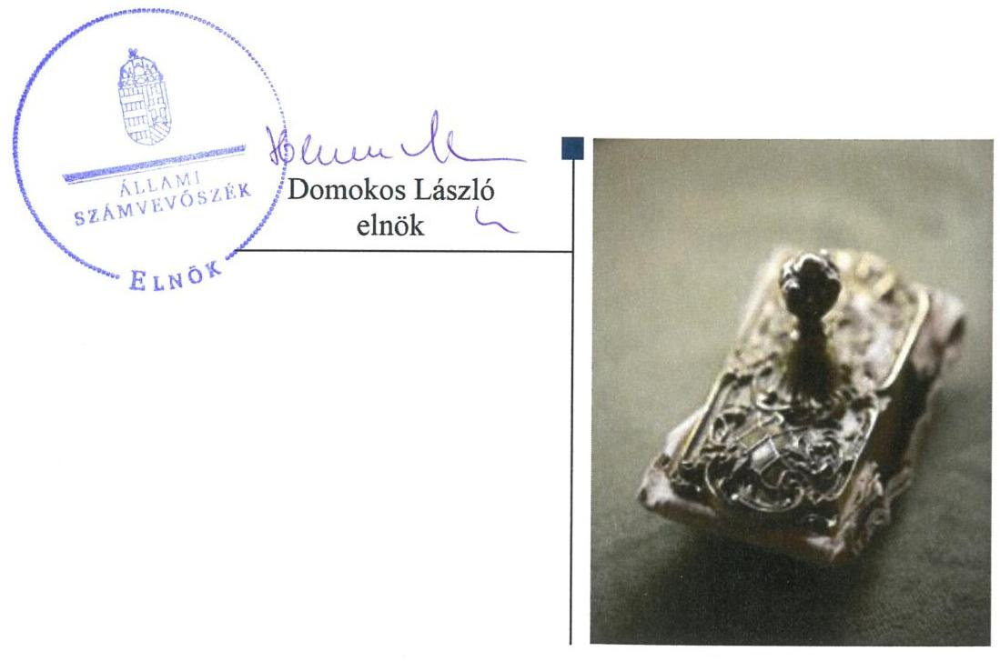
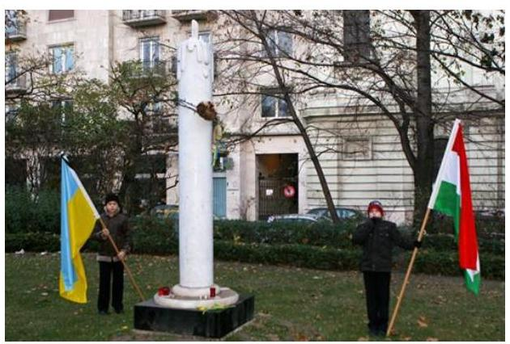
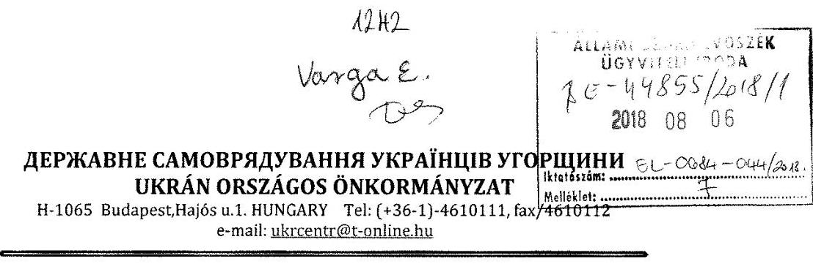
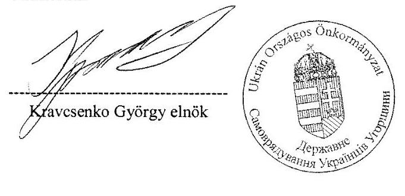
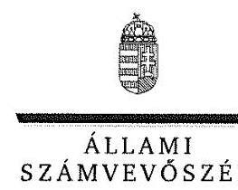
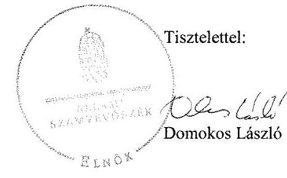
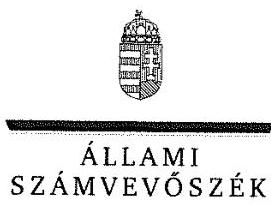
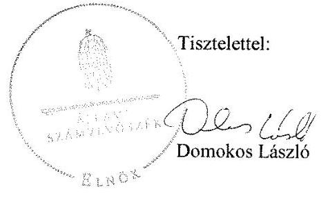
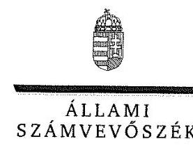
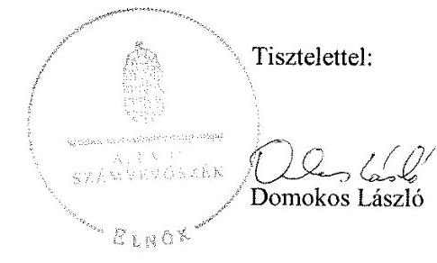

# Jelentés

**Az országos nemzetiségi önkormányzatok fenntartásában levő intézmények gazdálkodásának ellenőrzése**

Magyarországi Ukrán Kulturális és Dokumentációs Központ

2018.

18231 www.asz.hu

---

# Jelentés 

## Az országos nemzetiségi önkormányzatok fenntartásában levő intézmények gazdálkodásának ellenőrzése

Magyarországi Ukrán Kulturális és Dokumentációs Központ
2018.  hó 7 nap

---

# AZ ELLENŐRZÉST FELÜGYELTE:

- VARGA EDIT felügyeleti vezető
- AZ ELLENŐRZÉST VEZETTE ÉS A VÉGREHAJTÁSÁÉRT FELELŐS:
  - MAROZSÁN LÁSZLÓNÉ ellenőrzésvezető
  - A PROGRAM ÖSSZEÁLLÍTÁSÁÉRT FELELŐS:
    - TÓTPÁL SZABOLCS osztályvezető

**IKTATÓSZÁM:** EL-0372-019/2018.

**TÉMASZÁM:** 2463

**ELLENŐRZÉS-AZONOSÍTÓ SZÁM:** V080612

Jelentéseink az Országgyűlés számítógépes hálózatán és az Interneten a www.asz.hu címen is olvashatóak.

---

# TARTALOMJEGYZÉK 

■ ÖSSZEGZÉS ..... 5
■ AZ ELLENŐRZÉS CÉLJA ..... 6
■ AZ ELLENŐRZÉS TERÜLETE ..... 7
■ AZ ELLENŐRZÉS HÁTTERE, INDOKOLTSÁGA ..... 8
■ A JELENTÉS LÉNYEGES KÉRDÉSKÖREI ..... 9
■ AZ ELLENŐRZÉS HATÓKÖRE ÉS MÓDSZEREI ..... 10
■ MEGÁLLAPÍTÁSOK ..... 12
■ JAVASLATOK ..... 17
■ MELLÉKLETEK ..... 21
I. sz. melléklet: Értelmező szótár ..... 21
■ FÜGGELÉK: ÉSZREVÉTELEK ..... 23
■ RÖVIDÍTÉSEK JEGYZÉKE ..... 43

---

.

---

# ÖSSZEGZÉS 

Az Ukrán Országos Önkormányzat a Magyarországi Ukrán Kulturális és Dokumentációs Központ feletti munkáltatói jogkörét szabályszerűen, irányítói feladatait nem szabályszerűen gyakorolta. A Magyarországi Ukrán Kulturális és Dokumentációs Központ működésének és gazdálkodásának kereteit nem szabályszerűen alakította ki, nem működtek az integritást erősítő kontrollok. Belső kontrollrendszerét a 2016. évre nem alakította ki és nem működtette, ezáltal nem volt biztosítva a közpénzekkel való átlátható, szabályszerű gazdálkodása. Pénzügyi és vagyongazdálkodása nem felelt meg a jogszabályi előírásoknak.

## Az ellenőrzés társadalmi indokoltsága

Magyarországon a nemzetiségek jogait sarkalatos törvény határozza meg. A nemzetiségek létrehozhatnak helyi és országos önkormányzatokat, amelyek intézményeket alapíthatnak, tarthatnak fenn. A közfeladatok ellátását a nemzetiségi intézmények sajátos jogszabályi környezetben végzik, amely az utóbbi években változáson ment keresztül. A központi költségvetés támogatást nyújt a nemzetiségi önkormányzatok, illetve az általuk fenntartott intézmények számára feladataik ellátásához. A nemzetiségi intézmények gazdálkodásának ellenőrzése kiemelt jelentőséggel bír, mivel az Állami Számvevőszék korábban ezt a területet még nem ellenőrizte. Az ellenőrzések során az Állami Számvevőszék megállapítja, hogy ezen szervezetek a közpénzeket átlátható módon, szabályszerűen használják-e fel, így a közpénzek felhasználása ezen a területen sem marad ellenőrizetlenül.

## Főbb megállapítások, következtetések, javaslatok

Az Ukrán Országos Önkormányzat az általa fenntartott Magyarországi Ukrán Kulturális és Dokumentációs Központtal kapcsolatos alapítói jogkörét 2014-2016. években szabályszerűen gyakorolta, az irányítási feladatait nem szabályszerűen látta el. A 2014. évi és a 2016. évi költségvetési beszámolóit nem hagyta jóvá.

A Magyarországi Ukrán Kulturális és Dokumentációs Központ belső kontrollrendszerét nem szabályszerűen alakította ki. A gazdálkodási feladatok ellátására munkamegosztási megállapodást az Ukrán Országos Önkormányzat Hivatallal nem kötött. A számviteli szabályzatok elkészítéséről az Ukrán Országos Önkormányzat Hivatalának vezetője nem gondoskodott. A Magyarországi Ukrán Kulturális és Dokumentációs Központ vezetője kockázatkezelési, illetve integrált kockázatkezelési rendszert nem működtetett, a kötelezően közzéteendő adatok nyilvánosságra hozatalának rendjét és a közérdekű adatok megismerésére irányuló kérelmek intézésének rendjét belső szabályzatban nem rendezte, nem teljesítette a közzétételi kötelezettségét. Nem működtette a kötelezően előírt integritást támogató kontrollokat, valamint az integritást erősítő, nem kötelezően előírt kontrollokat sem. A kontrolltevékenység gyakorlása nem volt szabályszerű, a gazdálkodási jogkörök gyakorlói nem rendelkeztek szabályszerű kijelöléssel, nem gondoskodott a belső ellenőrzés és a monitoring rendszer kialakításáról.

A Magyarországi Ukrán Kulturális és Dokumentációs Központ 2014-2016. évi költségvetési beszámolója nem felelt meg a jogszabályi előírásoknak. Mérlegében kimutatott eszközök és források leltározása a 2014. évben nem volt megfelelő, a 2015-2016. években szabályszerű volt.

Az Állami Számvevőszék a jelentésben foglalt megállapítások alapján a Magyarországi Ukrán Kulturális és Dokumentációs Központ intézményvezetője részére a belső kontrollrendszer szabályszerű kialakítására és működtetésére valamint a szabályszerű pénzügyi gazdálkodásra vonatkozóan három javaslatot fogalmazott meg. Az Ukrán Országos Önkormányzat elnöke részére két javaslatot tett az Állami Számvevőszék a fenntartói és irányítási feladatok szabályszerű ellátása érdekében, továbbá a fenntartói feladatok ellátására, a belső kontrollrendszer szabályszerű kialakítására és működtetésére, a szabályszerű pénzügyi és vagyongazdálkodásra vonatkozó hat javaslat címzettje az Ukrán Országos Önkormányzat Hivatala hivatalvezetője volt. A javaslatokat megalapozó megállapításokra az érintetteknek 30 napon belül intézkedési tervet kell készíteniük.

---

# AZ ELLENŐRZÉS CÉLJA 

AZ ELLENŐRZÉS CÉLJA annak értékelése volt, hogy az országos nemzetiségi önkormányzat által alapított és fenntartott intézmény gazdálkodása, a belső kontrollrendszer kialakítása és működése, a fenntartó önkormányzat által nyújtott támogatás, illetve az államháztartásból meghatározott célra ingyenesen juttatott vagyon felhasználása a jogszabályi előírásoknak megfelelően történt-e.

---

# **AZ ELLENŐRZÉS TERÜLETE**

## **Magyarországi Ukrán Kulturális és Dokumentációs Központ**

A Magyarországi Ukrán Kulturális és Dokumentációs Központot 2007. július 1-én alapította a Fenntartó1. Az Intézménynek2 egy budapesti és négy regionális telephelye volt 2014-2016. években. Közfeladata a magyarországi ukrán közösség kulturális programjainak szervezése, bonyolítása és dokumentálása.

Az ellenőrzött időszakban az Intézmény önállóan működő költségvetési szerv volt, a pénzügyi és gazdasági feladatait az Ukrán Országos Önkormányzat Hivatala látta el. Irányító szerve az Ukrán Országos Önkormányzat Közgyűlése volt.

A 2014-2016. évek között az Intézmény vezetőjének személye nem változott. 2016. évben bérbeadásból és vagyontárgyak értékesítéséből bevétele nem származott. Szervezeti átalakítás az Intézményt nem érintette, feladatait 2 fő látta el.

Az Intézmény a 2014. évben 8 837 ezer Ft, a 2015. és a 2016. években 14 500 ezer Ft működési támogatást kapott államháztartási forrásból.

---

# AZ ELLENŐRZÉS HÁTTERE, INDOKOLTSÁGA 

Magyarország Alaptörvényének XXIX. cikke kimondja, hogy a magyarországi nemzetiségek államalkotó tényezők. Joguk van anyanyelvük használatához, a sajátnyelven való névhasználathoz, saját kultúrájuk ápolásához és az anyanyelvű oktatáshoz. A nemzetiségek létrehozhatnak helyi és országos önkormányzatokat. A nemzetiségek jogaira vonatkozó részletes szabályokat Magyarországon sarkalatos törvény határozza meg. A nemzetiségi közfeladatok ellátásához az állami Intézményi költségvetés támogatást nyújt, amelyet a nemzetiségi önkormányzatok kizárólag e feladataik ellátására használhatnak fel.

Az országos nemzetiségi önkormányzatok az általuk képviselt nemzetiség kulturális autonómiájának megteremtése érdekében intézményeket hozhatnak létre és vehetnek át. Az éves költségvetési törvények közvetlenül az intézményfenntartó országos nemzetiségi önkormányzatokhoz rendelik az általuk fenntartott intézmények működési támogatását. A nemzetiségi önkormányzati intézmények költségvetési gazdálkodásának, belső kontrollrendszerének kialakítása és működtetése ellenőrzésével biztosítja az ÁSZ ${ }^{3}$ a közpénzfelhasználás minél szélesebb körének ellenőrzését, ennek során azonos szempontok szerint értékeli az egyes országos nemzetiségi önkormányzatok fenntartásában levő Intézmények gazdálkodási tevékenységét.

Az ellenőrzés eredményeként az ellenőrzött költségvetési szervek gazdálkodása javulhat, átfogó képet kaphatunk az országos nemzetiségi önkormányzatok által fenntartott Intézmények gazdálkodásának sajátosságairól, hiányosságairól és az alkalmazott jó gyakorlatokról, erősítve a társadalmi bizalmat. Az ellenőrzés tapasztalatai alapján, hiányosságok feltárásával, azok megszüntetésére vonatkozó javaslatokkal hozzájárul az ÁSZ a közpénzek átlátható, szabályszerű felhasználásához.

---

# A JELENTÉS LÉNYEGES KÉRDÉSKÖREI 

1. A Fenntartó szabályszerűen gyakorolta-e az ellenőrzött intézménnyel kapcsolatos feladatait?
2. Az Intézmény működése és gazdálkodása során tevékenysége szabályszerű volt-e, teljesítette-e az elszámolási kötelezettségeket, belső kontrollrendszere megvédte-e a veszteségektől és nem rendeltetésszerű használattól az Intézmény erőforrásait?
3. Az Intézmény pénzügyi gazdálkodása szabályszerű volt-e?
4. Az Intézmény vagyongazdálkodása szabályszerű volt-e?

---

# AZ ELLENŐRZÉS HATÓKÖRE ÉS MÓDSZEREI 

## Az ellenőrzés típusa

Megfelelőségi ellenőrzés.

## Az ellenőrzött időszak

2014-2016. évek, a belső kontrollrendszer, a kiadási előirányzatok felhasználása vonatkozásában a 2016. év.

## Az ellenőrzés tárgya

Az ÁSZ ellenőrzése tárgya az Ukrán Országos Önkormányzat által alapított és fenntartott Magyarországi Ukrán Kulturális és Dokumentációs Központ gazdálkodása, a belső kontrollrendszer kialakítása és működése, a fenntartó önkormányzat által nyújtott támogatás, illetve az államháztartásból meghatározott célra ingyenesen juttatott vagyon felhasználása jogszabályi előírásoknak való megfelelőségének értékelése.

## Az ellenőrzött szervezet

A Magyarországi Ukrán Kulturális és Dokumentációs Központ, a fenntartó Ukrán Országos Önkormányzat, továbbá a gazdálkodási feladatokat ellátó Ukrán Országos Önkormányzat Hivatala.

## Az ellenőrzés jogalapja

Az ellenőrzés jogszabályi alapját az ÁSZ tv. ${ }^{4}$ 1. § (3) bekezdés, 5. § (2)-(6) bekezdései, valamint Áht. ${ }^{5}$ 61. § (2) bekezdésének előírásai képezik.

## Az ellenőrzés módszerei

Az ellenőrzést az ellenőrzési program szempontjai, az ellenőrzött időszakban hatályos jogszabályok, az ellenőrzés szakmai szabályai, a jelen ellenőrzésre irányadó ÁSZ módszertanok figyelembevételével végezte az ÁSZ. Az ellenőrzési kérdések megválaszolásához szükséges bizonyítékok megszerzése az ellenőrzött által rendelkezésre bocsátott dokumentumokra, adatokra alapozva megfigyelés, szemle (szemrevételezés), kérdésfeltevés (információkérés), kockázat alapú mintavételezés, valamint elemző eljárás útján történt.

---

Az ellenőrzési bizonyítékként felhasználható adatforrások közé tartoztak egyrészt az ellenőrzési program részletes szempontjainál felsorolt adatforrások, másrészt minden egyéb - az ellenőrzés folyamán feltárt, az ellenőrzés szempontjából információt tartalmazó - dokumentum. Az ellenőrzés lefolytatásához az ellenőrzött szervezet a tanúsítványok kitöltésével, valamint az ÁSZ által kért dokumentumok megküldésével szolgáltatott adatokat. A mintavételezés alapja, a gazdasági események értékének nagysága volt. A kiadások esetében az ellenőrzés azokra a legnagyobb értékű tételekre - a lényeges sokaságra - terjedtek ki, amelyeknek összértéke elérte a teljes sokaság összértékének 50\%-át. A lényeges sokaság tételesen került ellenőrzésre.

Az ÁSZ az ellenőrzés ideje alatt az ellenőrzött szervezettel történő kapcsolattartást az ÁSZ SZMSZ ${ }^{\circledR}$-ének vonatkozó előírásai alapján biztosította.

---

# 1. A Fenntartó szabályszerűen gyakorolta-e az ellenőrzött intézménnyel kapcsolatos feladatait? 

Összegző megállapítás

A Fenntartó az ellenőrzött intézménnyel kapcsolatos feladatait nem szabályszerűen gyakorolta.

FENNTARTÓ KIADTA az Intézmény Alapító Okiratát, amelyben rögzítették az Ávr ${ }^{7}$. -ben előírt tartalmi elemeket, a Közgyűlés ${ }^{8}$ elfogadta az Intézmény ellenőrzött időszakban hatályos SZMSZ ${ }^{9}$-ét, annak tartalmi hiányossága ellenére.

Költségvetése az Áht.-ban előírtaknak megfelelően tartalmazta az Intézmény költségvetési előirányzatait, azonban az Áht. 23.§ (2) bekezdés b) pont bb) alpontjában előírtak ellenére nem kötelező feladatok, önként vállalt feladatok és államigazgatási feladatok bontásban.

A Közgyűlés az Intézmény 2014. évi beszámolóját az Áhsz. ${ }^{10}$ 32. § (1) bekezdésében, a 2016. évi beszámolóját, pedig az Áhsz. 32. § (1a) bekezdésében előírtak ellenére - nem hagyta jóvá, költségvetési maradványát az Ávr. 155. § (2) bekezdésében foglaltak ellenére az ellenőrzött időszakban nem határozta meg.

Az Intézmény vezetőjét a Fenntartó az Áht.-ban előírtaknak megfelelően beszámoltatta az éves szakmai feladatellátásról, illetve az éves gazdálkodásról.

Az Alapító Okirat ${ }_{1,2}{ }^{11}$ rendelkezik az intézményvezetői kinevezés, megbízás, választás rendjéről. Az Intézmény vezetője feletti munkáltatói jogkört az Áht. és az Njtv. ${ }^{12}$ előírásainak megfelelően az Elnök ${ }^{13}$ gyakorolta.

## 2. Az Intézmény működése és gazdálkodása során tevékenysége szabályszerű volt-e, teljesítette-e az elszámolási kötelezettségeket, belső kontrollrendszere megvédte-e a veszteségektől és nem rendeltetésszerű használattól az Intézmény erőforrásait?

Összegző megállapítás

Az Intézmény működése és gazdálkodási tevékenysége nem volt szabályszerű, belső kontrollrendszere nem biztosította az erőforrások védelmét, szabályszerű felhasználását.
2.1. számú megállapítás

A kontrollkörnyezet kialakítása nem volt szabályszerű.
AZ INTÉZMÉNY MŰKÖDÉSÉNEK, SZERVEZETÉNEK alapvető szabályait a Fenntartó által jóváhagyott SZMSZ rögzítette.

---

Az Intézmény gazdasági szervezettel nem rendelkezett, pénzügyi és gazdasági tevékenységét a Hivatal ${ }^{14}$ látta el. A Hivatal az Áht.-ban előírtak szerint rendelkezett Ügyrenddel ${ }^{15}$.

Az Intézmény kontrollkörnyezetének kialakítása nem volt szabályszerű, mert
$\longrightarrow$ az Intézmény vezetője az SZMSZ-ben nem rögzítette az Ávr. 13. § (1) bekezdés g) pontjában előírtak ellenére a helyettesítés rendjét, a kapcsolódó felelősségi szabályokat. Nem határozta meg továbbá a Bkr.

 6. § (1) bekezdés c) pontja ellenére az etikai elvárásokat a szervezet minden szintjén. Nem rendezte belső szabályzatban az Ávr. 13. § (2) bekezdésében foglaltakkal ellentétben a működéshez kapcsolódó, pénzügyi kihatással bíró, jogszabályban nem szabályozott kérdéseket, figyelemmel az Ávr. 13. § (4) bekezdésében előírtakra,
$\longrightarrow$ a Hivatal Ügyrendje az Ávr. 13. § (5) bekezdésében foglaltak ellenére nem tartalmazta a gazdálkodással kapcsolatos munkafolyamatok leírását és a gazdasági szervezet költségvetési szervén belüli belső és külső kapcsolattartásának módját, szabályait,
$\longrightarrow$ a Hivatal vezetője az intézményre vonatkozóan az Áhsz. 50. § (1) bekezdésében foglalt kötelezettsége és a Számv. tv ${ }^{16}$. 14. § (3) bekezdésében előírtak ellenére nem alakította ki és foglalta írásba a számviteli politikát, a Számv. tv. 14. § (5) bekezdés a) és b) pontjainak előírása ellenére nem készítette el az eszközök és források leltározási és leltárkészítési szabályzatát és az eszközök és források értékelési szabályzatát. A számlarendben nem szabályozta az Áhsz. 51. § (3) bekezdésében előírtak ellenére a pénzügyi könyvvezetéshez készült összesítő bizonylatok (feladások) elkészítésének rendjét és az összesítő bizonylatok (feladások) tartalmi és formai követelményeit.
2.2. számú megállapítás

# Az Intézménynél a kockázatkezelési, illetve az integrált kockázatkezelési rendszert nem alakították ki. 

A KOCKÁZATKEZELÉSI RENDSZERT, illetve 2016. október 1-jétől az integrált kockázatkezelési rendszert az Intézmény vezetője a Bkr. 7. § (1) bekezdésében előírtak ellenére nem alakította ki. Az Intézmény vezetője a Bkr. 6. § (4) bekezdésében előírtak ellenére nem szabályozta a szabálytalanság kezelésének eljárásrendjét, majd 2016. október 1-jétől a szervezeti integritást sértő események kezelésének eljárásrendjét.
2.3. számú megállapítás

## A kontrolltevékenység gyakorlása, működtetése nem volt szabályszerű.

A KONTROLLTEVÉKENYSÉGEK MŰKÖDTETÉSE
nem volt szabályszerű,
$\longrightarrow$ az Intézmény és a Hivatal vezetője az Ávr. 9. § (5) bekezdés a) pontjában előírtak ellenére az Intézményre vonatkozó - Ávr. 9. § (1) bekezdésben előírt feladatokat érintő - munkamegosztás és felelősségvállalás rendjét munkamegosztási megállapodásban nem határozta meg,
$\longrightarrow$ a gazdálkodási jogkörök gyakorlásához az érintettek szabályszerű kijelöléssel, felhatalmazással az Ávr. 52. § (1) bekezdés a) pontjában, az 55.§ (2) ca) pontjában, az 57. § (4) bekezdésében, az 58. § (4)

---

bekezdésében és az 59. § (1) bekezdésében előírtak ellenére nem rendelkeztek,
a Hivatalban vezetett kötelezettségvállalások nyilvántartása az Áhsz. 14. számú melléklet II./4 pontjában előírtak ellenére nem tartalmazta a kötelezettségvállalás, más fizetési kötelezettséget tanúsító dokumentum megnevezését, iktatószámát, a pénzügyi ellenjegyzésre vonatkozó adatokat, nem tartalmazta továbbá a pénzügyi teljesítések dátumát, összegét,
az Intézmény vezetője a Bkr. 6. § (3) bekezdésében előírtak ellenére, nem készítette el az Intézmény működési folyamatainak ellenőrzési nyomvonalát,
$\longrightarrow$ kötelezettségvállalásra az Ávr. 52. § (1) bekezdés a) pontjában rögzítettek szerint az Intézmény vezetője jogosult, azonban a gazdálkodási jogkör gyakorlóinak aláírás-mintáiról - az Ávr. 60. § (3) bekezdésében előírtak szerint - vezetett nyilvántartásban kötelezettségvállalóként nem került megjelölésre.
2.4. számú megállapítás

Az információs és kommunikációs folyamatok kialakítása és működtetése nem volt szabályszerű.

AZ INTÉZMÉNY INFORMÁCIÓS ÉS KOMMUNIKÁCIÓS RENDSZERÉT az Intézmény vezetője a Bkr. 3. § d) pontjában előírtak ellenére nem alakította ki, továbbá a Bkr. 9. § (2) bekezdésében előírtak ellenére nem működtetett olyan beszámolási rendszereket, amelyek hatékonyak, megbízhatóak, pontosak és összehasonlíthatóak, a beszámolási szintek, határidők és módok világosan meg vannak határozva.

Az Intézmény vezetője a kötelezően közzéteendő adatok nyilvánosságra hozatalának rendjét az Info. tv. 35. § (3) bekezdésében és az Ávr. 13. § (2) bekezdés h) pontjában előírtak, a közérdekű adatok megismerésére irányuló igények teljesítésének rendjét az Info. tv. 30. § (6) bekezdésében és az Ávr. 13. § (2) bekezdés h) pontjában előírtak ellenére belső szabályzatban nem rendezte.

Az Intézmény vezetője az Info. tv. 37. § (1) bekezdésében előírtak ellenére nem gondoskodott az Info. tv. 1. melléklet általános közzétételi lista I-III. pontjaiban felsorolt adatok, dokumentumok közzétételéről, ezáltal nem biztosította a közvélemény tájékoztatását a közpénzek felhasználásáról.
2.5. számú megállapítás

Az Intézmény vezetője nem alakította ki a szervezet tevékenységének, a célok megvalósításának folyamatos és eseti nyomon követését biztosító rendszerét és a belső ellenőrzést.

A MONITORING RENDSZER részeként az Intézmény vezetője a Bkr. 10. §-ában foglaltak ellenére nem alakította ki a szervezet tevékenységének, a célok megvalósításának nyomon követését biztosító rendszert, továbbá az Áht. 70. § (1) bekezdésében előírt belső ellenőrzést. Nem értékelte továbbá a Bkr. 11. § (1) bekezdésében előírtak ellenére az Intézmény belső kontrollrendszerének a minőségét.

---

# 2.6. számú megállapítás 

Az Intézmény nem a kockázatokkal arányosan alakította ki az integritás kontrollokat.

Az Intézményben nem végeztek kockázatelemzést, a szabályozási hiányosságok következtében nem működtek az integritást támogató kontrollok. Az Intézmény vezetője nem határozta meg a követendő értékeket, köztük az integritást erősítő, korrupció visszaszorítását célzó értékeket sem.

## 3. Az Intézmény pénzügyi gazdálkodása szabályszerű volt-e?

## Összegző megállapítás

### 3.1. számú megállapítás

Az Intézmény pénzügyi gazdálkodása nem volt szabályszerű.

Az Intézmény kiadási előirányzatának felhasználása nem felelt meg a jogszabályi előírásoknak.

A kiadási előirányzatok felhasználása a külső személyi juttatások és a dologi kiadások vonatkozásában nem volt szabályszerű, a kapcsolódó pénzgazdálkodási belső kontrollok nem működtek.

A kiadások elszámolása során a gazdálkodási jogkörök gyakorlása nem felelt meg a jogszabályi előírásnak, a közpénzekkel az Intézmény szabálytalanul számolt el:
$\longrightarrow$ a kötelezettségvállaló nem rendelkezett az Ávr. 52.§ (1) bekezdés a) pontjában foglaltak ellenére a feladat ellátására az Intézmény vezetője által adott írásbeli felhatalmazással,
$\longrightarrow$ az utalványozó nem rendelkezett az Ávr. 59.§ (1) bekezdésében előírtak ellenére a feladat ellátásához az Intézmény vezetője által adott írásbeli kijelöléssel,
$\longrightarrow$ a pénzügyi ellenjegyzési feladatot ellátó személy nem rendelkezett az Ávr. 55. §(2) ca) pontjában előírtak ellenére a Hivatalvezető gazdasági vezetői hatáskörében adott felhatalmazással,
$\longrightarrow$ az érvényesítő nem rendelkezett az Ávr. 58. § (4) bekezdésének előírása ellenére a Hivatalvezető gazdasági vezetői hatáskörében adott felhatalmazással,
$\longrightarrow$ a teljesítésigazoló nem rendelkezett a z Ávr 57. § (4) bekezdésében előírtak ellenére a kötelezettségvállaló kijelölésével.
3.2. számú megállapítás

Az Intézmény fizetési kötelezettségeinek a 2014-2016. években eleget tett, a költségvetési maradványának megállapítása és elszámolása nem volt szabályszerű.

## A FIZETÉSI KÖTELEZETTSÉGEK PÉNZÜGYI TEL-

JESÍTÉSE az Intézménynél a 2014-2016. években a fizetési határidőig, legkésőbb a tárgyév december 31-ig megtörtént, a 2014-2016. évek mérleg fordulónapjain lejárt kötelezettség állománnyal nem rendelkeztek.

A 2014-2016. években a Közgyűlés nem határozta meg az Intézmény előző évek költségvetési maradványát az Ávr. 155. § (2) bekezdésében foglalt előírások ellenére. A 2015. évben az előző évi maradvány igénybevételéből úgy került sor bevétel elszámolására, hogy a 2014. évi költségvetési

---

beszámolóban költségvetési maradványt nem mutattak ki, amellyel az Intézmény eljárása nem felelt meg az Áhsz. 44. § (2) bekezdés h) pontjában foglalt előírásnak.

# 3.3. számú megállapítás 

Az Intézmény 2014-2016. évi költségvetési beszámolója nem felelt meg a jogszabályi előírásoknak.

AZ INTÉZMÉNYI BESZÁMOLÓKAT a Hivatal vezetője nem szabályszerűen készítette el. A 2014. évi költségvetési beszámoló leltárral a Számv. tv. 69.§ (1) bekezdés előírása ellenére nem volt alátámasztva, továbbá az Áhsz. 5.§ (1) bekezdésében előírtak ellenére a főkönyvi kivonattal való egyezősége nem volt biztosított.

Az Intézmény 2015-2016. évi költségvetési beszámolóját az Áhsz. 31. § (1) bekezdésében foglaltak ellenére nem az arra jogosult hivatalvezető írta alá.

A 2015-2016. évi költségvetési beszámolók adatait a főkönyvi könyvelés és leltár alátámasztotta, analitikus nyilvántartásokkal való egyezősége biztosított volt, azonban a beszámolókat az Áhsz. 32 § (1) bekezdésében előírt, a Kincstár elektronikus adatszolgáltató felületére való feltöltési határidőn túl készítették el.

## 4. Az Intézmény vagyongazdálkodása szabályszerű volt-e?

## Összegző megállapítás

Az Intézmény vagyongazdálkodása nem volt szabályszerű.
A Hivatal vezetője a 2014. évben az Intézmény költségvetési beszámolóját a Számv. tv. 69. § (1) bekezdésében és az Áhsz. 22. § (1) bekezdésében előírtak ellenére nem támasztotta alá leltárral.

A 2015-2016. évi beszámoló mérlegtételeit szabályszerű leltár alátámasztotta, az eszközök év végi értékelése a 2015-2016. években megfelelt a jogszabályi előírásoknak, a követelésekről azonban az Áhsz. 14. melléklete III. fejezetében előírt analitikus nyilvántartást a Hivatalnál nem készítették el az ellenőrzött időszakban, továbbá a kötelezettségekről vezetett nyilvántartás nem felelt meg az Áhsz. 14. melléklete II/4. fejezetében rögzített tartalmi előírásoknak.

---

# JAVASLATOK 

Az ÁSZ tv. 33. § (1) bekezdésében foglaltak értelmében az ellenőrzött szervezet vezetője köteles a jelentésben foglalt megállapításokhoz kapcsolódó intézkedési tervet összeállítani és azt a jelentés kézhezvételétől számított 30 napon belül az ÁSZ részére megküldeni. Amennyiben az ellenőrzött szervezet vezetője nem küldi meg határidőben az intézkedési tervet, vagy továbbra sem elfogadható intézkedési tervet küld, az Állami Számvevőszék elnöke az ÁSZ tv. 33. § (3) bekezdés a) és b) pontjaiban foglaltakat érvényesítheti.

## Magyarországi Ukrán Kulturális és Dokumentációs Központ intézményvezetője részére

1. A belső kontrollrendszer szabályszerű kialakítása és működtetése érdekében intézkedjen:
a) a jogszabályi előírásoknak megfelelő tartalmú szervezeti és működési szabályzat elkészítéséről;
(2.1. sz. megállapítás 2. bekezdés 1. francia bekezdés 1. mondata alapján)
b) az etikai elvárások meghatározásáról;
(2.1. sz. megállapítás 2. bekezdés 1. francia bekezdés 2. mondata alapján)
c) az Intézmény működéséhez kapcsolódó, az Intézmény előirányzatait terhelő pénzügyi kihatással bíró, jogszabályban nem szabályozott kérdések belső szabályzatokban való rendezéséről;
(2.1. sz. megállapítás 2. bekezdés 1. francia bekezdés 3. mondata alapján)
d) az integrált kockázatkezelési rendszer kialakításáról és működtetéséről;
(2.2. sz. megállapítás 1. mondata alapján)
e) a szervezeti integritást sértő események kezelésének eljárásrendjének kialakításáról;
(2.2. sz. megállapítás 2. mondata alapján)
f) az Intézmény és a Hivatal közötti munkamegosztás és felelősségvállalás rendjét szabályozó megállapodás megkötéséről;
(2.3. sz. megállapítás 1. bekezdés 1. francia bekezdése alapján)

---

g) az Intézmény ellenőrzési nyomvonalának elkészítéséről;
(2.3. sz. megállapítás 1. bekezdés 4. francia bekezdése alapján)
h) a hatékony, megbízható, pontos és összehasonlítható beszámolási rendszerek működtetéséről, továbbá a beszámolási szintek, határidők és módok világos meghatározásáról;
(2.4. sz. megállapítás 1. bekezdése alapján)
i) a közérdekű adatok megismerésére irányuló igények teljesítésének rendje, valamint a kötelezően közzéteendő adatok nyilvánosságra hozatalának rendje elkészítéséről;
(2.4. sz. megállapítás 2. bekezdése alapján)
j) jogszabályi előírásoknak megfelelően az általános közzétételi listán meghatározott adatok közzétételéről és elérhetőségéről;
(2.4. sz. megállapítás 3. bekezdése alapján)
k) a szervezet tevékenységének, a célok megvalósításának nyomon követését biztosító rendszer kialakításáról;
(2.5. számú megállapítás 1. mondata alapján)
l) az Intézmény belső ellenőrzése kialakításáról és működtetéséről;
(2.5. számú megállapítás 1. mondata alapján)
m) az Intézmény belső kontrollrendszerének jogszabályban foglaltak szerinti értékeléséről.
(2.5. számú megállapítás 2. mondata alapján)
2. A belső kontrollrendszer szabályszerű kialakítása és működtetése, valamint a szabályszerű pénzügyi gazdálkodás érdekében intézkedjen a kötelezettségvállalást, utalványozást, valamint a teljesítésigazolást végző személyek jogszabálynak megfelelő kijelöléséről, felhatalmazásáról.
(2.3. sz. megállapítás 1. bekezdés 2. francia bekezdése, 3.1. sz. megállapítás 2. bekezdés 1., 2. és 5. francia bekezdései alapján)
3. A szabályszerű pénzügyi gazdálkodás érdekében intézkedjen a kötelezettségvállalásra, a pénzügyi ellenjegyzésre, a teljesítésigazolásra, érvényesítésre, utalványozásra jogosult személyek és aláírás mintájuk jogszabálynak megfelelő, naprakész nyilvántartásáról.
(2.3. sz. megállapítás 1. bekezdés 5. francia bekezdése alapján)

---

# Ukrán Országos Önkormányzat elnöke részére 

1. Fenntartói feladatai szabályszerű ellátása érdekében intézkedjen:
a) az Intézmény jogszabályi előírásoknak
 megfelelő tartalmú szervezeti és működési szabályzatának jóváhagyásáról;
(1. sz. megállapítás 1. bekezdése alapján)
b) a Fenntartó jogszabályi előírásoknak megfelelő tartalmú költségvetésének jóváhagyásáról.
(1. sz. megállapítás 2. bekezdése alapján)
2. Irányítószervi feladatai szabályszerű ellátása érdekében intézkedjen
a) az Intézmény költségvetési beszámolójának jogszabálynak megfelelő jóváhagyásáról;
(1. sz. megállapítás 3. bekezdése alapján)
b) az Intézmény költségvetési maradványának megállapításáról.
(1. sz. megállapítás 3. bekezdése, 3.2. sz. megállapítás
2. bekezdése alapján)

## Ukrán Országos Önkormányzat Hivatala hivatalvezetője részére

1. A Fenntartó fenntartói feladatai szabályszerű ellátása érdekében intézkedjen a Fenntartó jogszabályi előírásoknak megfelelő tartalmú költségvetésének összeállításáról.
(1. sz. megállapítás 2. bekezdése alapján)
2. Az Intézmény belső kontrollrendszere szabályszerű kialakítása és működtetése érdekében intézkedjen:
a) az Intézmény jogszabályi előírásoknak megfelelő tartalmú számviteli politikájának, eszközök és források leltározási és leltárkészítési szabályzatának, valamint eszközök és források értékelési szabályzatának kiadásáról;
(2.1. sz. megállapítás 2. bekezdés 3. francia bekezdés
3. mondata alapján)
b) a jogszabálynak megfelelő tartalmú számlarend elkészítéséről;
(2.1. sz. megállapítás 2. bekezdés 3. francia bekezdés
4. mondata alapján)

---

c) az Intézmény és a Hivatal közötti munkamegosztás és felelősségvállalás rendjét szabályozó megállapodás megkötéséről;
(2.3. sz. megállapítás 1. bekezdés 1. francia bekezdése alapján)
d) a jogszabályi előírásoknak megfelelő tartalmú ügyrend elkészítéséről.
(2.1. sz. megállapítás 2. bekezdés 2. francia bekezdése alapján)
3. Az Intézmény belső kontrollrendszere szabályszerű kialakítása és működtetése, valamint a szabályszerű pénzügyi gazdálkodás érdekében intézkedjen a pénzügyi ellenjegyzést, valamint az érvényesítést végző személyek jogszabálynak megfelelő kijelöléséről, felhatalmazásáról
(2.3. sz. megállapítás 1. bekezdés 2. francia bekezdése, 3.1. sz. megállapítás 2. bekezdés 3. és 4. francia bekezdései alapján)
4. Az Intézmény szabályszerű pénzügyi és vagyongazdálkodása érdekében intézkedjen a jogszabályi előírásoknak megfelelő tartalmú kötelezettségvállalások, más fizetési kötelezettségek, valamint követelések nyilvántartásának vezetéséről.
(2.3. számú megállapítás 1. bekezdés 3. francia bekezdése, 4. sz. megállapítás 2. bekezdése alapján)
5. A szabályszerű pénzügyi gazdálkodás érdekében gondoskodjon:
a) a pénzügyi ellenjegyzés és az érvényesítés szabályszerű gyakorlásáról;
(3.1. sz. megállapítás 2. bekezdés, 3-4. francia bekezdései alapján)
b) a költségvetési beszámoló jogszabályi előírásoknak megfelelő határidőben történő elkészítéséről, és a Kincstár által működtetett elektronikus adatszolgáltató rendszerbe történő feltöltéséről.
(3.3. sz. megállapítás 3. bekezdése alapján)
6. A jogszabálynak megfelelően hagyja jóvá az Intézmény költségvetési beszámolóját.
(3.3. sz. megállapítás 2. bekezdése alapján)

---

# MELLÉKLETEK 

- I. SZ. MELLÉKLET: ÉRTELMEZŐ SZÓTÁR
irányító szerv
közfeladat
működtetés
nemzeti vagyon rendeltetése
nemzetiségi önkormányzat
nemzetiségi kulturális Intézmény
nemzetiségi közművelődési Intézmény
nemzetiségi feladatot ellátó közgyűjtemény
nemzetiségi közügy

A költségvetési szerv tekintetében az e törvényben meghatározott irányítási hatáskört gyakorló szerv. (Forrás: Áht. 1. § 9. pontja)
Jogszabályban meghatározott állami vagy önkormányzati feladat, amit az arra kötelezett közérdekből, a jogszabályban meghatározott követelményeknek és feltételeknek megfelelve végez, ideértve a lakosság közszolgáltatásokkal való ellátását, továbbá az állam nemzetközi szerződésekben vállalt kötelezettségeiből adódó közérdekű feladatokat, valamint e feladatok ellátásakor szükséges infrastruktúra biztosítását is. (Forrás: Nvtv. 3. § (1) bekezdés 7. pontja, hatálytalan: 2015. január 1-jétől) „Közfeladat a jogszabályban meghatározott állami vagy önkormányzati feladat". A közfeladatok ellátása költségvetési szervek alapításával és működtetésével, vagy azok ellátásához szükséges pénzügyi fedezet törvényben meghatározott eszközökkel, részben, vagy egészben történő biztosításával valósul meg. (Forrás: Áht. 3/A. § (1) bekezdés, hatályos 2015. január 1-jétől)
A nemzeti vagyon birtoklásából, használatából, hasznai szedéséből, a nemzeti vagyon fenntartásából és üzemeltetéséből álló tevékenységek együttese, amely - jogszabály vagy szerződés alapján - a nemzeti vagyon felújítására, fejlesztésére, a birtoklásának, használatának hasznai szedése jogának továbbengedésére is kiterjed. (Forrás: Nvtv. 3. § 10. pontja)

A nemzeti vagyon alapvető rendeltetése a közfeladat ellátásának biztosítása, ideértve a lakosság közszolgáltatásokkal való ellátását és e feladatok ellátásához szükséges infrastruktúra biztosítását. (Forrás: Nvtv. 7.0 (1) bekezdés, hatályos 2015. január 1-jétől)
A nemzetiségek jogairól szóló törvényben meghatározott nemzetiségi közszolgáltatási feladatokat ellátó, testületi formában működő, jogi személyiséggel rendelkező, demokratikus választások útján e törvény alapján létrehozott szervezet, amely a nemzetiségi közösséget megillető jogosultságok érvényesítésére, a nemzetiségek érdekeinek védelmére és képviseletére, a feladat- és hatáskörébe tartozó nemzetiségi közügyek települési, területi vagy országos szinten történő önálló intézésére jön létre. (Forrás: a nemzetiségek jogairól szóló 2011. évi CLXXIX. törvény, 2. § 2. pont) olyan kulturális Intézmény, amelynek jogszabályban, alapító okiratban előírt feladata a nemzetiségi identitáshoz kötődő tárgyi és szellemi kultúra, kulturális értékek, javak megőrzése, hozzáférhetővé tétele, hagyományok és a közösségi nyelvhasználat megőrzése, gyakorlása, terjesztése és továbbörökítése
a nemzetiséghez tartozók szellemi, kulturális örökségének, kulturális hagyományainak megőrzését, fenntartását, fejlesztését, bemutatását szolgáló Intézmény olyan könyvtár, levéltár, muzeális Intézmény, kép- illetve hangarchívum, amelynek alapító okiratában szerepel a nemzetiségi feladatellátás, vagy amelynek állományában nemzetiségi nyelvű, vagy nemzetiségre vonatkozó dokumentumok huszonöt százalékot elérő arányban találhatók, függetlenül a fenntartó szervezet típusától az Nemzetiségi tv.-ben biztosított egyéni és közösségi jogok érvényesülése, a nemzetiséghez tartozók érdekeinek kifejezésre juttatása - különösen az anyanyelv ápolása, őrzése és gyarapítása, továbbá a nemzetiségek kulturális autonómiájának a nemzetiségi önkormányzatok által történő megvalósítása és megőrzése - érdekében a nemzetiséghez tartozók meghatározott közszolgáltatásokkal való ellátásával, ezen ügyek önálló vitelével és az ehhez szükséges szervezeti, személyi és anyagi feltételek megteremtésével összefüggő ügy

---

vagyongazdálkodás

Nemzeti vagyon

A nemzeti vagyongazdálkodás feladata a nemzeti vagyon rendeltetésének megfelelő, az állam, az önkormányzat mindenkori teherbíró képességéhez igazodó, elsődlegesen a közfeladatok ellátásához és a mindenkori társadalmi szükségletek kielégítéséhez szükséges, egységes elveken alapuló, átlátható, hatékony és költségtakarékos működtetése, értékének megőrzése, állagának védelme, értéknövelő használata, hasznosítása, gyarapítása, továbbá az állam vagy a helyi önkormányzat feladatának ellátása szempontjából feleslegessé váló vagyontárgyak elidegenítése. (Forrás: Nvtv. 7. § (2) bekezdése)
a) az állam vagy a helyi önkormányzat kizárólagos tulajdonában álló dolgok,
b) az a) pont hatálya alá nem tartozó, az állam vagy a helyi önkormányzat tulajdonában lévő dolog,
c) az állam vagy a helyi önkormányzat tulajdonában lévő pénzügyi eszközök, továbbá az államot vagy a helyi önkormányzatot megillető társasági részesedések,
d) az államot vagy a helyi önkormányzatot megillető bármely vagyoni értékkel rendelkező jogosultság, amelyet jogszabály vagyoni értékű jogként nevesít,
e) Magyarország határa által körbezárt terület feletti légtér,
f) az üvegházhatású gázok kibocsátási egységeinek kereskedelméről szóló törvény szerinti kibocsátási egység és légiközlekedési kibocsátási egység, valamint az ENSZ Éghajlatváltozási Keretegyezménye és annak Kiotói Jegyzőkönyv végrehajtási keretrendszeréről szóló törvény szerinti kiotói egység,
g) állami vagy helyi önkormányzati fenntartású közgyűjtemény (muzeális Intézmény, levéltár, közgyűjteményként működő kép- és hangarchívum, valamint könyvtár) saját gyűjteményében nyilvántartott kulturális javak körébe tartozó dolog, kivéve, ha az állami vagy önkormányzati tulajdon jogszerű létrejötte kétséget kizáró módon nem bizonyítható és a dologra nézve más a tulajdonjogát bizonyítja vagy a kulturális javakra vonatkozó jogszabályokban meghatározott eljárás keretében valószínűsíti,
h) a régészeti lelet,
i) a nemzeti adatvagyon körébe tartozó állami nyilvántartások fokozottabb védelméről szóló törvény szerinti nemzeti adatvagyon.
(Forrás: Nvtv. 1.§ (2) bekezdés)

---

# FÜGGELÉK: ÉSZREVÉTELEK 

A jelentéstervezetet a Számvevőszék 15 napos észrevételezésre megküldte az ellenőrzött szervezetek vezetőinek az ÁSZ tv. 29. § (1) bekezdése előírásának megfelelően.

Az ÁSZ a jelentéstervezetet észrevételezésre megküldte a Magyarországi Ukrán Kulturális és Dokumentációs Központ intézményvezetőjének, az Ukrán Országos Önkormányzat elnökének, valamint az Ukrán Országos Önkormányzat Hivatala hivatalvezetőjének részére.
A Magyarországi Ukrán Kulturális és Dokumentációs Központ intézményvezetője, az Ukrán Országos Önkormányzat elnöke, valamint az Ukrán Országos Önkormányzat Hivatala hivatalvezetője az ÁSZ tv. 29. § (2) bekezdésében foglalt észrevételezési jogával élt, a jelentéstervezet megállapításaira észrevételt tett. A Magyarországi Ukrán Kulturális és Dokumentációs Központ intézményvezetője, az Ukrán Országos Önkormányzat elnöke, valamint az Ukrán Országos Önkormányzat Hivatala hivatalvezetője észrevételét és az arra adott választ a függelék tartalmazza.

[^0]
[^0]:    * 29. § (1) Az Állami Számvevőszék az ellenőrzési megállapításait megküldi az ellenőrzött szervezet vezetőjének vagy az általa megbízott személynek, és annak, akinek személyes felelősségét állapította meg.
    (2) Az ellenőrzött szervezet vezetője és a felelősként megjelölt személy az ellenőrzés megállapításaira tizenöt napon belül írásban észrevételt tehet.
    (3) Az Állami Számvevőszék az észrevételre a beérkezésétől számított harminc napon belül írásban válaszol. A figyelembe nem vett észrevételeket köteles a jelentésben feltüntetni, és megindokolni, hogy azokat miért nem fogadta el.

---

Domokos László Elnök Úr
részére
Állami Számvevőszék
Ikt.szEL0684-032/2018
Tárgy: Észrevétel a MUKDK ellenőrzésének megállapításaihoz

# Tisztelt Domokos László Elnök Úr! 

Az Állami Számvevőszék által elkészített, 2018. 07.26-án kelt Számvevőszéki jelentéstervezettel kapcsolatban az alábbi észrevételeket tesszük.

A Számvevőszéki jelentéstervezet szerint az Intézmény pénzügyi és vagyongazdálkodása nem felelt meg a jogszabályi előírásoknak. A jelentés több alkalommal is említi, hogy a 2014. évi nem, de 2015-2016. évi gazdálkodás megfelelt a jogszabályoknak. Ezért az egész gazdálkodásra ilyen kijelentést tenni erősen sérti az intézmény érdekeit, hírnevét és nem felel meg a valóságnak. A „részben megfelelt, részben nem felelt meg" fogalmazást tartanánk a valóságnak megfelelőnek.
A megállapítások között több olyan pont is szerepel, amely nem pontos vagy figyelmen kívül hagyja a feltöltött/személyesen átadott dokumentumokat.
Észrevételünket az alábbi megállapításokkal kapcsolatban tesszük:

## 1.

Az 1. megállapítás szerint: A fenntartó szabályszerűen gyakorolta-e az ellenőrzött intézménnyel kapcsolatos feladatait? Ebben a megállapításban leírták, hogy „A Közgyűlés az Intézmény 2014. évi beszámolóját az Áhsz. 32. § (1) bekezdésében, a 2016. évi beszámolóját, pedig az Áhsz. 32. § (1a) bekezdésében előírtak ellenére - nem hagyta jóvá, költségvetési maradványát az Ávr. 155. § (2) bekezdésében foglaltak ellenére az ellenőrzött időszakban nem határozta meg." Ezen megállapításhoz fűződő észrevételünk az alábbi:

A 68jkvbeszamoloelfogadrol2014 és 68jkvbeszamoloelfogadásról 2016 fájl név alatt töltöttük fel 2018.01.30-án a beszámoló elfogadásáról szóló jegyzőkönyveket valamint a helyszíni ellenőrzés során (2018. 04.16.) is átadásra került a 2014. évi beszámoló. A Közgyűlés minden évben, a törvényes határidőig elfogadta az Önkormányzat és az Intézmény költségvetési beszámolóját zárszámadás néven, amit a helyszínre kiérkező vizsgálat vezetőjének is elmondtunk. A zárszámadás a beszámolónak megfelelő tartalommal lett minden évben a megadott határidőig elfogadva, melyet a feltöltött jegyzőkönyvek is bizonyítanak.

Azonban a fenti megállapításban idézett jogszabály nem a beszámoló elfogadására vonatkozik, hanem a költségvetési beszámoló adatainak kincstár részére történő feltöltéséről. „32. §(1)- A költségvetési szerv az éves költségvetési beszámolója adatait a költségvetési évet követő év február 28-áig - a 7. § (3) bekezdése szerinti esetben a megszünés napját követő hatvan napon belül - a Kincstár által

---

működtetett elektronikus adatszolgáltató rendszerbe feltölti az éves költségvetési beszámolót alátámasztó - könyvelési rendszerből előállított - teljes főkönyvi kivonattal együtt.
(1a) ${ }^{\text {T }}$ Az irányító szerv a költségvetési szerv éves költségvetési beszámolóját az (1) bekezdés szerinti határidőt követő húsz napon belül felülvizsgálja és - annak javítása, kiegészítése szükség szerinti elrendelését követően - a Kincstár által működtetett elektronikus adatszolgáltató rendszerben jóváhagyja. A költségvetési szerv az elektronikus adatszolgáltató rendszerben jóváhagyott adattartalmú aláírt éves költségvetési beszámolóját a Kincstár általi elfogadását követő húsz napon belül megküldi az irányító szervnek, amely azt - a felülvizsgálat elvégzését igazoló személy aláírásával ellátva - a költségvetési szervnek tíz napon belül visszaküldi.

A Kincstár honlapjára mindig a megadott határidőben történt meg a feltöltés. A MÁK azonban gyakran hetekkel később publikálja
 a nyomtatványokat, így nem lehet időben feltölteni az adatokat. Mellékeljük a feltöltések határidejét, valamint a MÁK közleményét, hogy saját hibájuk miatt nem szankcionálják a későbbi feltöltést – bár ezen információkat nem kérdezték az adatbegyűjtéskor, ezért nem is jeleztük a Számvevőszék felé.

66 éves költségvetési beszámoló 2014, 2015, 2016 fájl néven csatoltuk a beszámolókat, melyet a Közgyűlés elfogadott és amelynek a 7/a űrlapja tartalmazza a maradvány kimutatást. 2014-ben az új jogszabályoknak megfelelő rendező mérlegben valóban nem lett helyesen kimutatva a maradvány. Azonban ez ügyben kérelemmel fordultunk a MÁK-hoz, hogy korrigálhassuk a hibát. A MÁK azonban elutasította ez irányú kérelmünket, mint ahogy azt az ÁSZ-nak becsatolt és feltöltött dokumentáció is tartalmazza.

# 2. 

A 2. megállapítás szerint: Az Intézmény működése és gazdálkodása során tevékenysége szabályszerű volt-e, teljesítette-e az elszámolási kötelezettségeket, belső kontrollrendszere megvédte-e a veszteségektől és nem rendeltetésszerű használattól az Intézmény erőforrásait?

### 2.1. számú megállapítás:

„a Hivatal vezetője az intézményre vonatkozóan az Áhsz 50. § (1) bekezdésben foglalt kötelezettsége és a Számv. tv. 14. § (3) bekezdésében előírtak ellenére nem alakította ki és foglalta írásba a számviteli politikát"
2017. decemberében az első feltöltési körben töltöttük fel az ÁSZ felületére az UOÖ és MUKDK 2015. évi Számviteli politikáját és egyéb számviteli szabályzatait (Értékelési szabályzat, Leltározási szabályzat, Gazdálkodási jogkörök nyilvántartása). Erről mellékeljük a teljességi nyilatkozatot valamint a helyszíni ellenőrzés során (2018. 04. 16.) fénymásolva is átadtuk a Számvevőszék részére a 2012. július 1-től érvényes számviteli politika és önköltség számítási szabályzatot, értékelési szabályzatot, számlarendet, leltározási szabályzatot, pénzkezelési szabályzatot, bizonylati rendet és albumot, melyekről jegyzőkönyv is készült, amit mellékelve szintén csatolunk az észrevételünkhöz.
„A Hivatal vezetője .... nem készítette el az eszközök és források leltározási és leltárkészítési szabályzatát és az eszközök és források értékelési szabályzatát"
Szintén 2017. decemberében az első feltöltési körben feltöltöttük az ÁSZ feltöltési felületre az UOÖ és MUKDK 2015. évi Számviteli politikája mellett egyéb számviteli szabályzatait: Értékelési szabályzat, Leltározási szabályzat, Gazdálkodási jogkörök nyilvántartása. Erről mellékeljük a teljességi nyilatkozatot. E mellett a helyszíni ellenőrzésük során (2018. 04. 16.) szintén elvitték

---

fénymásolva a leltározási szabályzatot és az értékelési szabályzatot is, melyről jegyzőkönyv is készült.

# 2.2. számú megállapítás: 

„Az Intézmény vezetője a Bkr. 6. § (4) bekezdésében előírtak ellenére nem szabályozta a szabálytalanság kezelésének eljárásrendjét"
A 2014-2015. évben az Ukrán Országos Önkormányzatra és intézményei bár még nem rendelkeztek szabálytalanságok kezelésének eljárásrendjéről szóló szabályzattal, de a 2014-2015. évi ÁSZ vizsgálatot és megállapításokat követően a hiányosságokat pótoltuk számos szabályzat elkészítésével és alkalmazásával. Közéjük tartozott a szabálytalanságok kezelésének eljárásrendjéről szóló szabályzat is, mely az Ukrán Országos Önkormányzatra és intézményeire vonatkozik, melyet a 2016. április 29-i ülésen a Közgyűlés elfogadott és 2016. május 1-től hatályba is lépett. Tehát 2016. évtől az Intézmény is rendelkezett már ilyen szabályzattal, melyet az adatfeltöltés során szintén feltöltöttünk.

## 2.3. számú megállapítás:

„gazdálkodás jogkörök gyakorlásához az érintettek szabályszerű kijelöléssel, felhatalmazással ......nem rendelkeztek"
2017. decemberében az első feltöltési körben töltöttük fel az ÁSZ feltöltési felületre az UOÖ és MUKDK 2015. évi Számviteli politikáját és egyéb számviteli szabályzatait, köztük a Gazdálkodási jogkörök nyilvántartását, mely tartalmazza a felhatalmazások Közgyűlési határozatszámait. Erről mellékeljük a teljességi nyilatkozatot.

## 3.

## 3. számú megállapítás szerint: Az Intézmény pénzügyi gazdálkodása szabályszerű volt-e?

Összegző megállapítás: „Az intézmény pénzügyi gazdálkodása nem volt szabályszerű." Későbbiek során megállapították, hogy voltak szabályszerű eljárások és évek. Ezért a „RÉSZBEN SZABÁLYSZERŰ, RÉSZBEN SZABÁLYTALAN" megfogalmazással értenénk egyet ebben a pontban is.

## 3.2. számú megállapítás:

„A 2014-2016. évben a Közgyűlés nem határozta meg az intézmény előző évek költségvetési maradványát"

66 éves költségvetési beszámoló 2014, 2015, 2016 fájl néven csatoltuk a beszámolókat, melyet a Közgyűlés elfogadott és amelynek a 7/a űrlapja tartalmazza a maradvány kimutatást. 2014-ben az új jogszabályoknak megfelelő rendező mérlegben valóban nem lett helyesen kimutatva a maradvány. Azonban ez ügyben kérelemmel fordultunk a MÁK-hoz, hogy korrigálhassuk a hibát. A MÁK azonban elutasította ez irányú kérelmünket, mint ahogy azt az ÁSZ-nak becsatolt és feltöltött dokumentáció is tartalmazza.

## 3.3. számú megállapítás:

„....a 2015-16. évi költségvetési beszámolókat a..... Kincstár elektronikus adatszolgáltató felületére való feltöltési határidőn túl készítették el"

Sajnos nem tudjuk, hogy ez a megállapítás milyen eredetű forrásból ered. Ugyanis nem kellett feltölteni olyan jellegű információt, hogy mikor történt a MÁK feltöltés. A Kincstár honlapjára mindig a megadott határidőben történt meg a feltöltés. A MÁK azonban gyakran hetekkel később publikálja

---

a nyomtatványokat, így nem lehet időben feltölteni. Mellékeljük a feltöltések határidejét, valamint a MÁK közleményét, hogy saját hibájuk miatt nem szankcionálják a későbbi feltöltést.

# 4. 

## 4. számú megállapítás szerint: Az Intézmény vagyon gazdálkodása szabályszerű volt-e?

Összegző megállapítás: "Az Intézmény gazdálkodása nem volt szabályszerű" összegzést követően néhány sorral lejjebb azonban megállapítják, hogy 2015-2016-ban mégis szabályszerűen alátámasztott és egyező volt. Ezért a „RÉSZBEN SZABÁLYSZERŰ, RÉSZBEN SZABÁLYTALAN" megfogalmazással értenénk egyet ebben a pontban is.

Kérjük a Tisztelt Számvevőszéket legyenek szívesek figyelembe venni, hogy egy évi 8-14 milliós költségvetéssel rendelkező, 2 főt foglalkoztató (az önkormányzati hivatallal együtt összesen 5 fő foglalkoztatottal rendelkező) szervezet nem tud megfelelni annak az államháztartási törvénynek, mely jellemzően egy több százmilliós költségvetésű és sok foglalkoztatottal rendelkező önkormányzatra és/vagy költségvetési szervre írtak. Ennek elvárása irreális. A nemzetiségi önkormányzatok már többször tiltakoztak az államháztartásba kényszerítésük ellen, mert sem méretük, sem tevékenységük nem illik bele a többi államháztartási szervezetbe.
Mindezek ellenére a 2014-2015. évi ÁSZ ellenőrzést követően igyekeztünk a vizsgálatban megállapított hiányosságokat pótolni és az Önkormányzatot valamint intézményeit a jogszabályoknak megfelelően működtetni. Mindez egy fejlődő tendenciát mutat, de a kapacitásunk és erőforrásaink továbbra sem elegendőek ahhoz, hogy egy nagyobb költségvetésű, helyi önkormányzathoz hasonlóan, maradéktalanul lássuk el közigazgatási, jogszabályi kötelezettségeinket.
Előre is köszönjük észrevételeink felülvizsgálatát!

Budapest, 2018. augusztus 3.

Tisztelettel:

Sipajlo Ígor intézményvezető

---

ELHők

Ikt.szám: EL-0684-046/2018.

# Kravesenko György úr 

elnök
Ukrán Országos Önkormányzat

## Budapest

## Tisztelt Elnök Úr!

„Az országos nemzetiségi önkormányzatok fenntartásában levő intézmények gazdálkodásának ellenőrzése - Magyarországi Ukrán Kulturális és Dokumentációs Központ" címmel készített számvevőszéki jelentéstervezetre tett észrevételét köszönettel megkaptam.
Az Állami Számvevőszék észrevételre vonatkozó álláspontjáról a felügyeleti vezető által készített részletes tájékoztatást csatoltan megküldöm.
Tájékoztatom Elnök urat, hogy a számvevőszéki jelentésben - az Állami Számvevőszékről szóló 2011. évi LXVI. törvény 29. § (3) bekezdése alapján - a figyelembe nem vett észrevételeket szerepeltetjük, annak indoklásával, hogy azokat az Állami Számvevőszék miért nem fogadta el.

Budapest, 2018. 03. hó 30. nap

Melléklet: Tájékoztatás az észrevételek kezeléséről

---

# Tájékoztatás az észrevételek kezeléséről 

„Az országos nemzetiségi önkormányzatok fenntartásában levő intézmények gazdálkodásának ellenőrzése - Magyarországi Ukrán Kulturális és Dokumentációs Központ"című jelentéstervezetre a 2018. augusztus 3-án kelt, ,"Észrevétel a MUKDK ellenőrzésének megállapításaihoz" tárgyú írt levelében tett észrevételét áttekintettük, annak kezeléséről az alábbi tájékoztatást adom.

## 1. Az 1. számú megállapításra tett észrevétel kapcsán

A számvitelről szóló 2000. évi C. törvény (továbbiakban: Számv. tv.) 4. § (1) bekezdésének megfelelően „A gazdálkodó működéséről, vagyoni, pénzügyi és jövedelmi helyzetéről az üzleti év könyveinek zárását követően, e törvényben meghatározott könyvvezetéssel alátámasztott beszámolót köteles - magyar nyelven - készíteni."
Az államháztartásról szóló 2011. évi CXCV. törvény (továbbiakban: Ált.) 87. § b) pontjában foglaltaknak megfelelően „A vagyonról és a költségvetés végrehajtásáról az éves költségvetési beszámolók alapján évente, az elfogadott költségvetéssel összehasonlítható módon, az év utolsó napján érvényes szervezeti, besorolási rendnek megfelelő záró számadást (a továbbiakban: zárszámadás) kell készíteni.
A beszámoló, illetve a zárszámadás, egymástól eltérő, két különböző dokumentum. Észrevételükben jelzik, hogy „a Közgyűlés minden évben, a törvényes határidőig elfogadta az Önkormányzat és az Intézmény költségvetési beszámolóját zárszámadás néven". Az Állami Számvevőszék rendelkezésére bocsátott dokumentumok alapján megállapítható, hogy az Ukrán Országos Önkormányzat Közgyűlése, mint a Magyarországi Ukrán Kulturális és Dokumentációs Központ irányító szerve, a Magyarországi Ukrán Kulturális és Dokumentációs Központ 2014., illetve 2016. évi beszámolóját nem hagyta jóvá.

A Magyarországi Ukrán Kulturális és Dokumentációs Központ éves beszámolójának a Kincstár által működtetett elektronikus adatszolgáltató rendszerbe való feltöltését érintően a jelentéstervezet vonatkozó része megállapítást nem tartalmaz.
Az államháztartásról szóló törvény végrehajtásáról szóló 368/2011. (XII. 31.) Korm. rendelet (továbbiakban: Ávr.) 155. § (2) bekezdésének megfelelően az államháztartás önkormányzati alrendszerébe tartozó költségvetési szerv költségvetési maradványát az irányító szerv a zárszámadási rendeletével, határozatával egy időben állapítja meg. Az Állami Számvevőszék rendelkezésére bocsátott dokumentumok alapján megállapítható, hogy az ellenőrzött időszakban az Ukrán Országos Önkormányzat zárszámadási határozatainak elfogadása során azok nem tartalmaztak költségvetési maradványra vonatkozóan információt, így a Magyarországi Ukrán Kulturális és Dokumentációs Központ költségvetési maradványának irányító szerv részéről történő megállapítására a 2014-2016. években nem került sor.

---

Mindezek alapján az észrevételt nem fogadjuk el, az Állami Számvevőszék megállapítása helytálló, a jelentéstervezet módosítása nem indokolt.

# 2. A 2.1. számú megállapításra tett észrevétel kapcsán 

A Magyarországi Ukrán Kulturális és Dokumentációs Központ önállóan működő költségvetési intézmény. Gazdálkodási feladatait az Ukrán Országos Önkormányzat Hivatala látja el. Az államháztartás számviteléről szóló 4/2013. (I. 11.) Korm. rendelet 31. § (1) bekezdése alapján a Számv. tv. 14. § (3) bekezdésében, továbbá az Áhsz. 50. § (1) bekezdésében előírt számviteli politika - és a Számv. tv. 14. § (5) bekezdésének megfelelően annak keretében kötelezően elkészítendő szabályzatok - készítési kötelezettségért az Ukrán Országos Önkormányzat Hivatala hivatalvezetője felelős. Az Állami Számvevőszék rendelkezésére bocsátott dokumentumok alapján megállapítható, hogy a Magyarországi Ukrán Kulturális és Dokumentációs Központ nem rendelkezett az Ukrán Országos Önkormányzat Hivatala hivatalvezetője által készített számviteli politikával és annak keretében a Számv. tv. 14. § (5) bekezdés a)-b) pontjaiban meghatározott kötelezően elkészítendő szabályzatokkal.
Mindezek alapján az észrevételt nem fogadjuk el, az Állami Számvevőszék megállapítása helytálló, a jelentéstervezet módosítása nem indokolt.

## 3. A 2.2. számú megállapításra tett észrevétel kapcsán

A költségvetési szervek belső kontrollrendszeréről és belső ellenőrzéséről szóló 370/2011. (XII. 31.) Korm. rendelet (továbbiakban: Bkr.) 6. § (4) bekezdésében foglaltaknak megfelelően - a 2016. szeptember 30-ig hatályos időállapot szerint - a költségvetési szerv vezetője köteles szabályozni a szabálytalanságok kezelésének eljárásrendjét, majd - a 2016. október 1-jétől hatályos időállapot szerint - a költségvetési szerv vezetője köteles szabályozni a szervezeti integritást sértő események kezelésének eljárásrendjét.
Az Állami Számvevőszék rendelkezésére bocsátott dokumentumok alapján megállapítható, hogy a Magyarországi Ukrán Kulturális és Dokumentációs Központ nem rendelkezett a Magyarországi Ukrán Kulturális és Dokumentációs Központ intézményvezetője által jóváhagyott szabálytalanságok kezelésének eljárásrendjével, illetve szervezeti integritást sértő események kezelésének eljárásrendjével.
Mindezek alapján az észrevételt nem fogadjuk el, az Állami Számvevőszék megállapítása helytálló, a jelentéstervezet módosítása nem indokolt.

## 4. A 2.3. számú megállapításra tett észrevétel kapcsán

Az Ávr. 52. § (1) bekezdés a) pontjában foglaltak alapján a költségvetési szerv nevében a költségvetési szerv vezetője vagy az általa írásban felhatalmazott, a kötelezettséget vállaló szerv alkalmazásában álló személy (írásban) jogosult. Az Ávr. 55. §
 (2) bekezdés ca) pontjának megfelelően, a kötelezettségvállalás pénzügyi ellenjegyzésére a gazdasági szervezettel nem rendelkező költségvetési szerv esetén a gazdasági feladatokat ellátó költségvetési szerv gazdasági vezetője vagy az általa írásban kijelölt, a gazdasági feladatokat ellátó költségvetési szerv alkalmazásában álló személy jogosult. Az Ávr. 57. § (4) bekezdésének megfelelően a teljesítés igazolására jogosult személyeket a kötelezettségvállaló írásban jelöli ki. Az érvényesítésre jogosult személyekre

---

és azok kijelölésére vonatkozóan az Ávr. 58. § (4) bekezdésben foglaltak alapján, míg az utalványozásra jogosult személyekre és azok kijelölésére a kötelezettségvállalás pénzügyi ellenjegyzésére vonatkozó szabályokat kell alkalmazni.
A jogszabályban foglaltaknak megfelelően valamennyi pénzügyi jogkör gyakorló vonatkozásában a jogkörgyakorláshoz szükséges az írásbeli felhatalmazás.
Az Ávr. 60. § (3) bekezdésében foglaltaknak megfelelően a kötelezettséget vállaló szerv a kötelezettségvállalásra, pénzügyi ellenjegyzésre, teljesítésigazolásra, érvényesítésre, utalványozásra jogosult személyekről és aláírás-mintájukról a belső szabályzatában foglaltak szerint naprakész nyilvántartást vezet.
Az Állami Számvevőszék rendelkezésére bocsátott dokumentumok között szerepelt egy, amelynek fejléce „1. sz. melléklet: Nyilvántartás az Ukrán Országos Önkormányzat és Magyarország Ukrán Kulturális és Dokumentációs Központ nevében végzett gazdálkodási jogköröket gyakorlók személyéről" szövegezéssel rendelkezik. Az ellenőrzés előtt azonban nem ismert, hogy ez a dokumentum mely szabályzat 1. sz. melléklete, így annak hatályossága nem megállapítható. Mindamellett nem állapítható meg, hogy az azon feltüntetett gazdálkodási jogköröket az érintett személyek a megfelelő írásbeli felhatalmazás alapján, illetve mely időponttól kezdődően gyakorolják. Így az Állami Számvevőszék rendelkezésére bocsátott dokumentumok alapján megállapítható, hogy a Magyarország Ukrán Kulturális és Dokumentációs Központ nem rendelkezett a jogszabálynak megfelelően a gazdálkodási jogkörök gyakorlására jogosult személyekről és aláírás-mintájukról naprakész nyilvántartással.
Mindezek alapján az észrevételt nem fogadjuk el, az Állami Számvevőszék megállapítása helytálló, a jelentéstervezet módosítása nem indokolt.

# 5. A 3. számú megállapításra tett észrevétel kapcsán 

A 3. számú összegző megállapítás megtételére a feltárt szabálytalanságok súlyára tekintettel került sor. Észrevétele a jelentéstervezet megállapításait nem cáfolta, így azokat nem módosítja.

## 6. A 3.2. számú megállapításra tett észrevétel kapcsán

Mint ahogyan az már az 1. számú megállapításra tett észrevételre adott válaszban rögzítésre került, az Ávr. 155. § (2) bekezdésének megfelelően az államháztartás önkormányzati alrendszerébe tartozó költségvetési szerv költségvetési maradványát az irányító szerv a zárszámadási rendeletével, határozatával egy időben állapítja meg. Az Állami Számvevőszék rendelkezésére bocsátott dokumentumok alapján megállapítható, hogy az ellenőrzött időszakban az Ukrán Országos Önkormányzat zárszámadási határozatainak elfogadása során azok nem tartalmaztak költségvetési maradványra vonatkozóan információt, így a Magyarország Ukrán Kulturális és Dokumentációs Központ költségvetési maradványának irányító szerv részéről történő megállapítására a 2014-2016. években nem került sor.
Mindezek alapján az észrevételt nem fogadjuk el, az Állami Számvevőszék megállapítása helytálló, a jelentéstervezet módosítása nem indokolt.

---

# 7. A 3.3. számú megállapításra tett észrevétel kapcsán 

Az Áhsz. 32. § (1) bekezdésben foglaltaknak megfelelően a költségvetési szerv az éves költségvetési beszámolója adatait a költségvetési évet követő év február 28-áig a Kincstár által működtetett elektronikus adatszolgáltató rendszerbe feltölti az éves költségvetési beszámolót alátámasztó - könyvelési rendszerből előállított - teljes főkönyvi kivonattal együtt.
Az Áhsz. 31. § (1) bekezdésének megfelelően az éves költségvetési beszámoló elkészítéséért az éves költségvetési beszámolót készítő szerv vezetője felelős. Az éves költségvetési beszámolót e személy és a gazdasági vezető a hely és a kelte feltüntetésével írja alá.
Az Állami Számvevőszék rendelkezésére bocsátott dokumentumok - az éves költségvetési beszámolók aláírt fedlapjai alapján - megállapítható, hogy a 2015. évi beszámoló készítésére 2016. március 31-én, míg a 2016. évi beszámoló elkészítésére 2017. április 03-án került sor.
Mindezek alapján az észrevételt nem fogadjuk el, az Állami Számvevőszék megállapítása helytálló, a jelentéstervezet módosítása nem indokolt.

## 8. A 4. számú megállapításra tett észrevétel kapcsán

A 4. számú összegző megállapítás megtételére a feltárt szabálytalanságok súlyára tekintettel került sor. Észrevétele a jelentéstervezet megállapításait nem cáfolta, így azokat nem módosítja.

Budapest, 2018.
hó nap

Varga Edit
felügyeleti vezető

---

ELNÖK

Ikt.szám: EL-0684-047/2018.

# Dr. Kóródi Irén úrhölgy 

hivatalvezető
Ukrán Országos Önkormányzat Hivatala

## Budapest

## Tisztelt Hivatalvezető Úrhölgy!

„Az országos nemzetiségi önkormányzatok fenntartásában levő intézmények gazdálkodásának ellenőrzése - Magyarországi Ukrán Kulturális és Dokumentációs Központ" címmel készített számvevőszéki jelentéstervezetre tett észrevételét köszönettel megkaptam.
Az Állami Számvevőszék észrevételre vonatkozó álláspontjáról a felügyeleti vezető által készített részletes tájékoztatást csatoltan megküldöm.
Tájékoztatom Hivatalvezető úrhölgyet, hogy a számvevőszéki jelentésben - az Állami Számvevőszékről szóló 2011. évi LXVI. törvény 29. § (3) bekezdése alapján - a figyelembe nem vett észrevételeket szerepeltetjük, annak indoklásával, hogy azokat az Állami Számvevőszék miért nem fogadta el.

Budapest, 2018. 03. hó 30. nap

Melléklet: Tájékoztatás az észrevételek kezeléséről

---

# Tájékoztatás az észrevételek kezeléséről 

„Az országos nemzetiségi önkormányzatok fenntartásában levő intézmények gazdálkodásának ellenőrzése - Magyarország Ukrán Kulturális és Dokumentációs Központ"című jelentéstervezetre a 2018. augusztus 3-án kelt, „Észrevétel a MUKDK ellenőrzésének megállapításaihoz" tárgygal írt levelében tett észrevételét áttekintettük, annak kezeléséről az alábbi tájékoztatást adom.

## 1. Az 1. számú megállapításra tett észrevétel kapcsán

A számvitelről szóló 2000. évi C. törvény (továbbiakban: Számv. tv.) 4. § (1) bekezdésének megfelelően „A gazdálkodó működéséről, vagyoni, pénzügyi és jövedelmi helyzetéről az üzleti év könyveinek zárását követően, e törvényben meghatározott könyvvezetéssel alátámasztott beszámolót köteles - magyar nyelven - készíteni."
Az államháztartásról szóló 2011. évi CXCV. törvény (továbbiakban: Áht.) 87. § b) pontjában foglaltaknak megfelelően „A vagyonról és a költségvetés végrehajtásáról az éves költségvetési beszámolók alapján évente, az elfogadott költségvetéssel összehasonlítható módon, az év utolsó napján érvényes szervezeti, besorolási rendnek megfelelő záró számadást (a továbbiakban: zárszámadás) kell készíteni.
A beszámoló, illetve a zárszámadás, egymástól eltérő, két különböző dokumentum. Észrevételükben jelzik, hogy „a Közgyűlés minden évben, a törvényes határidőig elfogadta az Önkormányzat és az Intézmény költségvetési beszámolóját zárszámadás néven". Az Állami Számvevőszék rendelkezésére bocsátott dokumentumok alapján megállapítható, hogy az Ukrán Országos Önkormányzat Közgyűlése, mint a Magyarország Ukrán Kulturális és Dokumentációs Központ irányító szerve, a Magyarországi Ukrán Kulturális és Dokumentációs Központ 2014., illetve 2016. évi beszámolóját nem hagyta jóvá.

A Magyarországi Ukrán Kulturális és Dokumentációs Központ éves beszámolójának a Kincstár által működtetett elektronikus adatszolgáltató rendszerbe való feltöltését érintően a jelentéstervezet vonatkozó része megállapítást nem tartalmaz.
Az államháztartásról szóló törvény végrehajtásáról szóló 368/2011. (XII. 31.) Korm. rendelet (továbbiakban: Ávr.) 155. § (2) bekezdésének megfelelően az államháztartás önkormányzati alrendszerébe tartozó költségvetési szerv költségvetési maradványát az irányító szerv a zárszámadási rendeletével, határozatával egy időben állapítja meg. Az Állami Számvevőszék rendelkezésére bocsátott dokumentumok alapján megállapítható, hogy az ellenőrzött időszakban az Ukrán Országos Önkormányzat zárszámadási határozatainak elfogadása során azok nem tartalmaztak költségvetési maradványra vonatkozóan információt, így a Magyarországi Ukrán Kulturális és Dokumentációs Központ költségvetési maradványának irányító szerv részéről történő megállapítására a 2014-2016. években nem került sor.

---

Mindezek alapján az észrevételt nem fogadjuk el, az Állami Számvevőszék megállapítása helytálló, a jelentéstervezet módosítása nem indokolt.

# 2. A 2.1. számú megállapításra tett észrevétel kapcsán 

A Magyarországi Ukrán Kulturális és Dokumentációs Központ önállóan működő költségvetési intézmény. Gazdálkodási feladatait az Ukrán Országos Önkormányzat Hivatala látja el. Az államháztartás számviteléről szóló 4/2013. (I. 11.) Korm. rendelet 31. § (1) bekezdése alapján a Számv. tv. 14. § (3) bekezdésében, továbbá az Áhsz. 50. § (1) bekezdésében előírt számviteli politika - és a Számv. tv. 14. § (5) bekezdésének megfelelően annak keretében kötelezően elkészítendő szabályzatok - készítési kötelezettségért az Ukrán Országos Önkormányzat Hivatala hivatalvezetője felelős. Az Állami Számvevőszék rendelkezésére bocsátott dokumentumok alapján megállapítható, hogy a Magyarországi Ukrán Kulturális és Dokumentációs Központ nem rendelkezett az Ukrán Országos Önkormányzat Hivatala hivatalvezetője által készített számviteli politikával és annak keretében a Számv. tv. 14. § (5) bekezdés a)-b) pontjaiban meghatározott kötelezően elkészítendő szabályzatokkal.
Mindezek alapján az észrevételt nem fogadjuk el, az Állami Számvevőszék megállapítása helytálló, a jelentéstervezet módosítása nem indokolt.

## 3. A 2.2. számú megállapításra tett észrevétel kapcsán

A költségvetési szervek belső kontrollrendszeréről és belső ellenőrzéséről szóló 370/2011. (XII. 31.) Korm. rendelet (továbbiakban: Bkr.) 6. § (4) bekezdésében foglaltaknak megfelelően - a 2016. szeptember 30-ig hatályos időállapot szerint - a költségvetési szerv vezetője köteles szabályozni a szabálytalanságok kezelésének eljárásrendjét, majd - a 2016. október 1-jétől hatályos időállapot szerint - a költségvetési szerv vezetője köteles szabályozni a szervezeti integritást sértő események kezelésének eljárásrendjét.
Az Állami Számvevőszék rendelkezésére bocsátott dokumentumok alapján megállapítható, hogy a Magyarországi Ukrán Kulturális és Dokumentációs Központ nem rendelkezett a Magyarországi Ukrán Kulturális és Dokumentációs Központ intézményvezetője által jóváhagyott szabálytalanságok kezelésének eljárásrendjével, illetve szervezeti integritást sértő események kezelésének eljárásrendjével.
Mindezek alapján az észrevételt nem fogadjuk el, az Állami Számvevőszék megállapítása helytálló, a jelentéstervezet módosítása nem indokolt.

## 4. A 2.3. számú megállapításra tett észrevétel kapcsán

Az Ávr. 52. § (1) bekezdés a) pontjában foglaltak alapján a költségvetési szerv nevében a költségvetési szerv vezetője vagy az általa írásban felhatalmazott, a kötelezettséget vállaló szerv alkalmazásában álló személy (írásban) jogosult. Az Ávr. 55. § (2) bekezdés ca) pontjának megfelelően, a kötelezettségvállalás pénzügyi ellenjegyzésére a gazdasági szervezettel nem rendelkező költségvetési szerv esetén a gazdasági feladatokat ellátó költségvetési szerv gazdasági vezetője vagy az általa írásban kijelölt, a gazdasági feladatokat ellátó költségvetési szerv alkalmazásában álló személy jogosult. Az Ávr. 57. § (4) bekezdésének megfelelően a teljesítés igazolására jogosult személyeket a kötelezettségvállaló írásban jelöli ki. Az érvényesítésre jogosult személyekre

---

és azok kijelölésére vonatkozóan az Ávr. 58. § (4) bekezdésben foglaltak alapján, míg az utalványozásra jogosult személyekre és azok kijelölésére a kötelezettségvállalás pénzügyi ellenjegyzésére vonatkozó szabályokat kell alkalmazni.
A jogszabályban foglaltaknak megfelelően valamennyi pénzügyi jogkör gyakorló vonatkozásában a jogkörgyakorláshoz szükséges az írásbeli felhatalmazás.
Az Ávr. 60. § (3) bekezdésében foglaltaknak megfelelően a kötelezettséget vállaló szerv a kötelezettségvállalásra, pénzügyi ellenjegyzésre, teljesítésigazolásra, érvényesítésre, utalványozásra jogosult személyekről és aláírás-mintájukról a belső szabályzatában foglaltak szerint naprakész nyilvántartást vezet.
Az Állami Számvevőszék rendelkezésére bocsátott dokumentumok között szerepelt egy, amelynek fejléce „1. sz. melléklet: Nyilvántartás az Ukrán Országos Önkormányzat és Magyarország Ukrán Kulturális és Dokumentációs Központ nevében végzett gazdálkodási jogköröket gyakorlók személyéről" szövegezéssel rendelkezik. Az ellenőrzés előtt azonban nem ismert, hogy ez a dokumentum mely szabályzat 1. sz. melléklete, így annak hatályossága nem megállapítható. Mindamellett nem állapítható meg, hogy az azon feltüntetett gazdálkodási jogköröket az érintett személyek a megfelelő írásbeli felhatalmazás alapján, illetve mely időponttól kezdődően gyakorolják. Így az Állami Számvevőszék rendelkezésére bocsátott dokumentumok alapján megállapítható, hogy a Magyarország Ukrán Kulturális és Dokumentációs Központ nem rendelkezett a jogszabálynak megfelelően a gazdálkodási jogkörök gyakorlására jogosult személyekről és aláírás-mintájukról naprakész nyilvántartással.
Mindezek alapján az észrevételt nem fogadjuk el, az Állami Számvevőszék megállapítása helytálló, a jelentéstervezet módosítása nem indokolt.

# 5. A 3. számú megállapításra tett észrevétel kapcsán 

A 3. számú összegző megállapítás megtételére a feltárt szabálytalanságok súlyára tekintettel került sor. Észrevétele a jelentéstervezet megállapításait
 nem cáfolta, így azokat nem módosítja.

## 6. A 3.2. számú megállapításra tett észrevétel kapcsán

Mint ahogyan az már az 1. számú megállapításra tett észrevételre adott válaszban rögzítésre került, az Ávr. 155. § (2) bekezdésének megfelelően az államháztartás önkormányzati alrendszerébe tartozó költségvetési szerv költségvetési maradványát az irányító szerv a zárszámadási rendeletével, határozatával egy időben állapítja meg. Az Állami Számvevőszék rendelkezésére bocsátott dokumentumok alapján megállapítható, hogy az ellenőrzött időszakban az Ukrán Országos Önkormányzat zárszámadási határozatainak elfogadása során azok nem tartalmaztak költségvetési maradványra vonatkozóan információt, így a Magyarországi Ukrán Kulturális és Dokumentációs Központ költségvetési maradványának irányító szerv részéről történő megállapítására a 2014-2016. években nem került sor.
Mindezek alapján az észrevételt nem fogadjuk el, az Állami Számvevőszék megállapítása helytálló, a jelentéstervezet módosítása nem indokolt.

---

# 7. A 3.3. számú megállapításra tett észrevétel kapcsán 

Az Áhsz. 32. § (1) bekezdésben foglaltaknak megfelelően a költségvetési szerv az éves költségvetési beszámolója adatait a költségvetési évet követő év február 28-áig a Kincstár által működtetett elektronikus adatszolgáltató rendszerbe feltölti az éves költségvetési beszámolót alátámasztó - könyvelési rendszerből előállított - teljes főkönyvi kivonattal együtt.
Az Áhsz. 31. § (1) bekezdésének megfelelően az éves költségvetési beszámoló elkészítéséért az éves költségvetési beszámolót készítő szerv vezetője felelős. Az éves költségvetési beszámolót e személy és a gazdasági vezető a hely és a kelte feltüntetésével írja alá.
Az Állami Számvevőszék rendelkezésére bocsátott dokumentumok - az éves költségvetési beszámolók aláírt fedlapjai alapján - megállapítható, hogy a 2015. évi beszámoló készítésére 2016. március 31-én, míg a 2016. évi beszámoló elkészítésére 2017. április 03-án került sor.
Mindezek alapján az észrevételt nem fogadjuk el, az Állami Számvevőszék megállapítása helytálló, a jelentéstervezet módosítása nem indokolt.

## 8. A 4. számú megállapításra tett észrevétel kapcsán

A 4. számú összegző megállapítás megtételére a feltárt szabálytalanságok súlyára tekintettel került sor. Észrevétele a jelentéstervezet megállapításait nem cáfolta, így azokat nem módosítja.

Budapest, 2018. hó nap
$\underset{\substack{\text { Varga Edit } \\ \text { felügyeleti vezető }}}{ }$
$\qquad$

---

ELNÖK

Ikt.szám: EL-0684-045/2018.

# Sipajlo Igor úr 

intézményvezető
Magyarországi Ukrán Kulturális és Dokumentációs Központ

## Budapest

## Tisztelt Intézményvezető Úr!

„Az országos nemzetiségi önkormányzatok fenntartásában levő intézmények gazdálkodásának ellenőrzése - Magyarországi Ukrán Kulturális és Dokumentációs Központ" címmel készített számvevőszéki jelentéstervezetre tett észrevételét köszönettel megkaptam.
Az Állami Számvevőszék észrevételre vonatkozó álláspontjáról a felügyeleti vezető által készített részletes tájékoztatást csatoltan megküldöm.
Tájékoztatom Intézményvezető urat, hogy a számvevőszéki jelentésben - az Állami Számvevőszékről szóló 2011. évi LXVI. törvény 29. § (3) bekezdése alapján - a figyelembe nem vett észrevételeket szerepeltetjük, annak indoklásával, hogy azokat az Állami Számvevőszék miért nem fogadta el.

Budapest, 2018. 08. hó 30. nap

Melléklet: Tájékoztatás az észrevételek kezeléséről

---

# Tájékoztatás az észrevételek kezeléséről 

„Az országos nemzetiségi önkormányzatok fenntartásában levő intézmények gazdálkodásának ellenőrzése - Magyarországi Ukrán Kulturális és Dokumentációs Központ"című jelentéstervezetre a 2018. augusztus 3-án kelt, ,,Észrevétel a MUKDK ellenőrzésének megállapításaihoz" tárgygal írt levelében tett észrevételét áttekintettük, annak kezeléséről az alábbi tájékoztatást adom.

## 1. Az 1. számú megállapításra tett észrevétel kapcsán

A számvitelről szóló 2000. évi C. törvény (továbbiakban: Számv. tv.) 4. § (1) bekezdésének megfelelően „A gazdálkodó működéséről, vagyoni, pénzügyi és jövedelmi helyzetéről az üzleti év könyveinek zárását követően, e törvényben meghatározott könyvvezetéssel alátámasztott beszámolót köteles - magyar nyelven - készíteni."
Az államháztartásról szóló 2011. évi CXCV. törvény (továbbiakban: Áht.) 87. § b) pontjában foglaltaknak megfelelően „A vagyonról és a költségvetés végrehajtásáról az éves költségvetési beszámolók alapján évente, az elfogadott költségvetéssel összehasonlítható módon, az év utolsó napján érvényes szervezeti, besorolási rendnek megfelelő záró számadást (a továbbiakban: zárszámadás) kell készíteni.
A beszámoló, illetve a zárszámadás, egymástól eltérő, két különböző dokumentum. Észrevételükben jelzik, hogy „a Közgyűlés minden évben, a törvényes határidőig elfogadta az Önkormányzat és az Intézmény költségvetési beszámolóját zárszámadás néven". Az Állami Számvevőszék rendelkezésére bocsátott dokumentumok alapján megállapítható, hogy az Ukrán Országos Önkormányzat Közgyűlése, mint a Magyarországi Ukrán Kulturális és Dokumentációs Központ irányító szerve, a Magyarországi Ukrán Kulturális és Dokumentációs Központ 2014., illetve 2016. évi beszámolóját nem hagyta jóvá.

A Magyarországi Ukrán Kulturális és Dokumentációs Központ éves beszámolójának a Kincstár által működtetett elektronikus adatszolgáltató rendszerbe való feltöltését érintően a jelentéstervezet vonatkozó része megállapítást nem tartalmaz.
Az államháztartásról szóló törvény végrehajtásáról szóló 368/2011. (XII. 31.) Korm. rendelet (továbbiakban: Ávr.) 155. § (2) bekezdésének megfelelően az államháztartás önkormányzati alrendszerébe tartozó költségvetési szerv költségvetési maradványát az irányító szerv a zárszámadási rendeletével, határozatával egy időben állapítja meg. Az Állami Számvevőszék rendelkezésére bocsátott dokumentumok alapján megállapítható, hogy az ellenőrzött időszakban az Ukrán Országos Önkormányzat zárszámadási határozatainak elfogadása során azok nem tartalmaztak költségvetési maradványra vonatkozóan információt, így a Magyarországi Ukrán Kulturális és Dokumentációs Központ költségvetési maradványának irányító szerv részéről történő megállapítására a 2014-2016. években nem került sor.

---

Mindezek alapján az észrevételt nem fogadjuk el, az Állami Számvevőszék megállapítása helytálló, a jelentéstervezet módosítása nem indokolt.

# 2. A 2.1. számú megállapításra tett észrevétel kapcsán 

A Magyarországi Ukrán Kulturális és Dokumentációs Központ önállóan működő költségvetési intézmény. Gazdálkodási feladatait az Ukrán Országos Önkormányzat Hivatala látja el. Az államháztartás számviteléről szóló 4/2013. (I. 11.) Korm. rendelet 31. § (1) bekezdése alapján a Számv. tv. 14. § (3) bekezdésében, továbbá az Áhsz. 50. § (1) bekezdésében előírt számviteli politika - és a Számv. tv. 14. § (5) bekezdésének megfelelően annak keretében kötelezően elkészítendő szabályzatok - készítési kötelezettségért az Ukrán Országos Önkormányzat Hivatala hivatalvezetője felelős. Az Állami Számvevőszék rendelkezésére bocsátott dokumentumok alapján megállapítható, hogy a Magyarországi Ukrán Kulturális és Dokumentációs Központ nem rendelkezett az Ukrán Országos Önkormányzat Hivatala hivatalvezetője által készített számviteli politikával és annak keretében a Számv. tv. 14. § (5) bekezdés a)-b) pontjaiban meghatározott kötelezően elkészítendő szabályzatokkal.
Mindezek alapján az észrevételt nem fogadjuk el, az Állami Számvevőszék megállapítása helytálló, a jelentéstervezet módosítása nem indokolt.

## 3. A 2.2. számú megállapításra tett észrevétel kapcsán

A költségvetési szervek belső kontrollrendszeréről és belső ellenőrzéséről szóló 370/2011. (XII. 31.) Korm. rendelet (továbbiakban: Bkr.) 6. § (4) bekezdésében foglaltaknak megfelelően - a 2016. szeptember 30-ig hatályos időállapot szerint - a költségvetési szerv vezetője köteles szabályozni a szabálytalanságok kezelésének eljárásrendjét, majd - a 2016. október 1-jétől hatályos időállapot szerint - a költségvetési szerv vezetője köteles szabályozni a szervezeti integritást sértő események kezelésének eljárásrendjét.
Az Állami Számvevőszék rendelkezésére bocsátott dokumentumok alapján megállapítható, hogy a Magyarországi Ukrán Kulturális és Dokumentációs Központ nem rendelkezett a Magyarországi Ukrán Kulturális és Dokumentációs Központ intézményvezetője által jóváhagyott szabálytalanságok kezelésének eljárásrendjével, illetve szervezeti integritást sértő események kezelésének eljárásrendjével.
Mindezek alapján az észrevételt nem fogadjuk el, az Állami Számvevőszék megállapítása helytálló, a jelentéstervezet módosítása nem indokolt.

## 4. A 2.3. számú megállapításra tett észrevétel kapcsán

Az Ávr. 52. § (1) bekezdés a) pontjában foglaltak alapján a költségvetési szerv nevében a költségvetési szerv vezetője vagy az általa írásban felhatalmazott, a kötelezettséget vállaló szerv alkalmazásában álló személy (írásban) jogosult. Az Ávr. 55. § (2) bekezdés ca) pontjának megfelelően, a kötelezettségvállalás pénzügyi ellenjegyzésére a gazdasági szervezettel nem rendelkező költségvetési szerv esetén a gazdasági feladatokat ellátó költségvetési szerv gazdasági vezetője vagy az általa írásban kijelölt, a gazdasági feladatokat ellátó költségvetési szerv alkalmazásában álló személy jogosult. Az Ávr. 57. § (4) bekezdésének megfelelően a teljesítés igazolására jogosult személyeket a kötelezettségvállaló írásban jelöli ki. Az érvényesítésre jogosult személyekre

---

és azok kijelölésére vonatkozóan az Ávr. 58. § (4) bekezdésben foglaltak alapján, míg az utalványozásra jogosult személyekre és azok kijelölésére a kötelezettségvállalás pénzügyi ellenjegyzésére vonatkozó szabályokat kell alkalmazni.
A jogszabályban foglaltaknak megfelelően valamennyi pénzügyi jogkör gyakorló vonatkozásában a jogkörgyakorláshoz szükséges az írásbeli felhatalmazás.
Az Ávr. 60. § (3) bekezdésében foglaltaknak megfelelően a kötelezettséget vállaló szerv a kötelezettségvállalásra, pénzügyi ellenjegyzésre, teljesítésigazolásra, érvényesítésre, utalványozásra jogosult személyekről és aláírás-mintájukról a belső szabályzatában foglaltak szerint naprakész nyilvántartást vezet.
Az Állami Számvevőszék rendelkezésére bocsátott dokumentumok között szerepelt egy, amelynek fejléce „1. sz. melléklet: Nyilvántartás az Ukrán Országos Önkormányzat és Magyarországi Ukrán Kulturális és Dokumentációs Központ nevében végzett gazdálkodási jogköröket gyakorlók személyéről" szövegezéssel rendelkezik. Az ellenőrzés előtt azonban nem ismert, hogy ez a dokumentum mely szabályzat 1. sz. melléklete, így annak hatályossága nem megállapítható. Mindamellett nem állapítható meg, hogy az azon feltüntetett gazdálkodási jogköröket az érintett személyek a megfelelő írásbeli felhatalmazás alapján, illetve mely időponttól kezdődően gyakorolják. Így az Állami Számvevőszék rendelkezésére bocsátott dokumentumok alapján megállapítható, hogy a Magyarországi Ukrán Kulturális és Dokumentációs Központ nem rendelkezett a jogszabálynak megfelelően a gazdálkodási jogkörök gyakorlására jogosult személyekről és aláírás-mintájukról naprakész nyilvántartással.
Mindezek alapján az észrevételt nem fogadjuk el, az Állami Számvevőszék megállapítása helytálló, a jelentéstervezet módosítása nem indokolt.

# 5. A 3. számú megállapításra tett észrevétel kapcsán 

A 3. számú összegző megállapítás megtételére a feltárt szabálytalanságok súlyára tekintettel került sor. Észrevétele a jelentéstervezet megállapításait nem cáfolta, így azokat nem módosítja.

## 6. A 3.2. számú megállapításra tett észrevétel kapcsán

Mint ahogyan az már az 1. számú megállapításra tett észrevételre adott válaszban rögzítésre került, az Ávr. 155. § (2) bekezdésének megfelelően az államháztartás önkormányzati alrendszerébe tartozó költségvetési szerv költségvetési maradványát az irányító szerv a zárszámadási rendeletével, határozatával egy időben állapítja meg. Az Állami Számvevőszék rendelkezésére bocsátott dokumentumok alapján megállapítható, hogy az ellenőrzött időszakban az Ukrán Országos Önkormányzat zárszámadási határozatainak elfogadása során azok nem tartalmaztak költségvetési maradványra vonatkozóan információt, így a Magyarországi Ukrán Kulturális és Dokumentációs Központ költségvetési maradványának irányító szerv részéről történő megállapítására a 2014-2016. években nem került sor.
Mindezek alapján az észrevételt nem fogadjuk el, az Állami Számvevőszék megállapítása helytálló, a jelentéstervezet módosítása nem indokolt.

---

# 7. A 3.3. számú megállapításra tett észrevétel kapcsán 

Az Áhsz. 32. § (1) bekezdésben foglaltaknak megfelelően a költségvetési szerv az éves költségvetési beszámolója adatait a költségvetési évet követő év február 28-áig a Kincstár által működtetett elektronikus adatszolgáltató rendszerbe feltölti az éves költségvetési beszámolót alátámasztó - könyvelési rendszerből előállított - teljes főkönyvi kivonattal együtt.
Az Áhsz. 31. § (1) bekezdésének megfelelően az éves költségvetési beszámoló elkészítéséért az éves költségvetési beszámolót készítő szerv vezetője felelős. Az éves költségvetési beszámolót e személy és a gazdasági vezető a hely és a kelte feltüntetésével írja alá.
Az Állami Számvevőszék rendelkezésére bocsátott dokumentumok - az éves költségvetési beszámolók aláírt fedlapjai alapján - megállapítható, hogy a 2015. évi beszámoló készítésére 2016. március 31-én, míg a 2016. évi beszámoló elkészítésére 2017. április 03-án került sor.
Mindezek alapján az észrevételt nem fogadjuk el, az Állami Számvevőszék megállapítása helytálló, a jelentéstervezet módosítása nem indokolt.

## 8. A 4. számú megállapításra tett észrevétel kapcsán

A 4. számú összegző megállapítás megtételére a
 feltárt szabálytalanságok súlyára tekintettel került sor. Észrevétele a jelentéstervezet megállapításait nem cáfolta, így azokat nem módosítja.

Budapest, 2018. hó nap

Varga Edit
felügyeleti vezető

---

# RÖVIDÍTÉSEK JEGYZÉKE 

${ }^{1}$ Fenntartó
${ }^{2}$ Intézmény
${ }^{3}$ ÁSZ
${ }^{4}$ ÁSZ. tv.
${ }^{5}$ Áht.
${ }^{6}$ ÁSZ SZMSZ
${ }^{7}$ Ávr.
${ }^{8}$ Közgyűlés
${ }^{9}$ SZMSZ
${ }^{10}$ Áhsz.
${ }^{11}$ Alapító Okirat ${ }_{1-2}$
${ }^{12}$ Nttv.
${ }^{13}$ Elnök
${ }^{14}$ Hivatal
${ }^{15}$ Ügyrend
${ }^{16}$ Számv. tv.

Ukrán Országos Önkormányzat
Magyarországi Ukrán Kulturális és Dokumentációs Központ
Állami Számvevőszék
az Állami Számvevőszékről szóló 2011. évi LXVI. törvény
az államháztartásról szóló 2011. évi CXCV. törvény
Állami Számvevőszék elnökének 4/2017. (XII.29.) ÁSZ utasítása az Állami
Számvevőszék Szervezeti és Működési Szabályzatáról
az államháztartásról szóló törvény végrehajtásáról szóló 368/2011. (XII. 31.)
Korm. rendelet
Ukrán Országos Önkormányzat közgyűlése
Magyarországi Ukrán Kulturális és Dokumentációs Központ szervezeti és működési szabályzata
az államháztartás számviteléről szóló 4/2013. (I. 11.) Korm. rendelet
Magyarországi Ukrán Kulturális és Dokumentációs Központ Alapító Okirata (hatályos 2009.-től, módosítása hatályos 2014-től)
2011. évi CLXXIX. törvény a nemzetiségek jogairól
Ukrán Országos Önkormányzat elnöke
Ukrán Országos Önkormányzat Hivatala
Az Ukrán Országos Önkormányzat Hivatala Ügyrendi Szabályzata (hatályos: 2016.05. 01-től)
2000. évi C. törvény a számvitelről

---

# ÁLLAMI SZÁMVEVŐSZÉK 

1052 Budapest, Apáczai Csere János utca 10.
Levélcím: 1364 Budapest 4. Pf. 54
Telefon: +36 14849100 Telefax: +36 14849200
www.asz.hu
