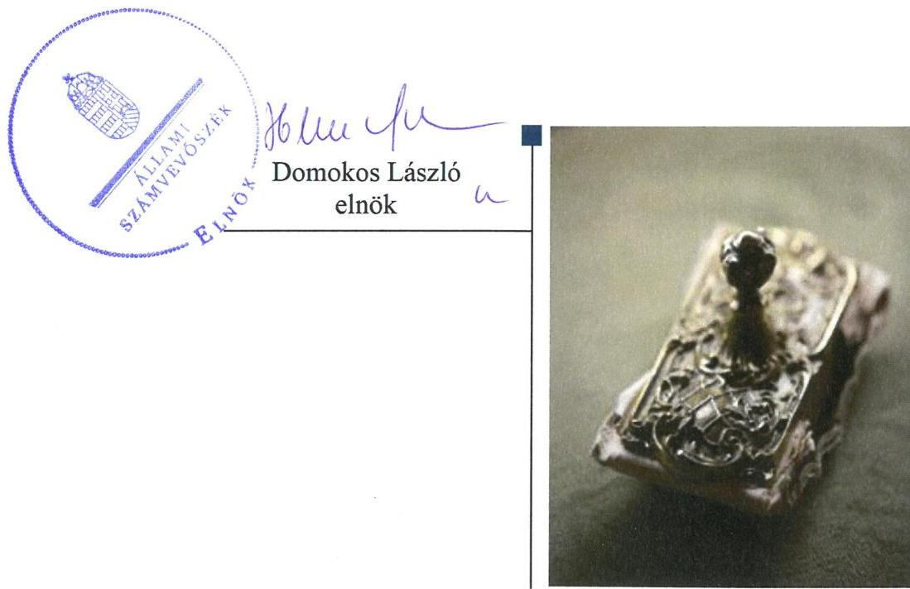
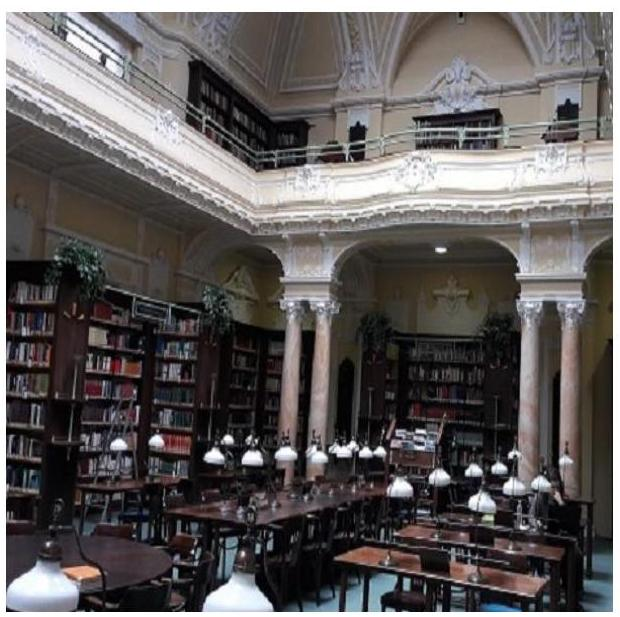
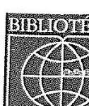
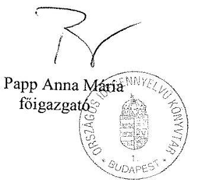
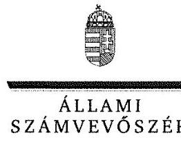
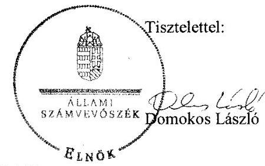
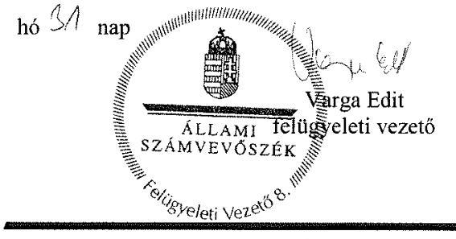
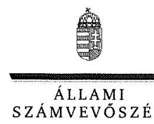
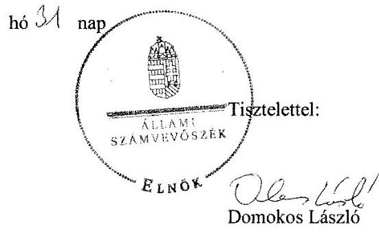
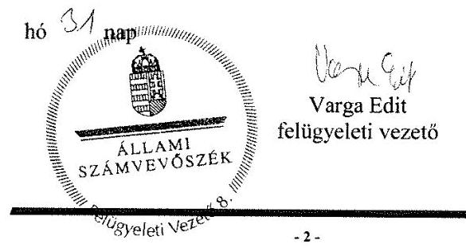

# Jelentés 

## A nyilvános könyvtári ellátás múködésének ellenőrzése

Országos Idegennyelvű Könyvtár 2018.

18232
www.asz.hu

---

# Jelenetés 

## A nyilvános könyvtári ellátás múködésének ellenőrzése

Országos Idegennyelvű Könyvtár
2018. 09 hó 04 .nap

---

# AZ ELLENŐRZÉST FELÜGYELTE:

- VARGA EDIT felügyeleti vezető
- AZ ELLENŐRZÉST VEZETTE ÉS A VÉGREHAJTÁSÁÉRT FELELŐS:
  - MOLNÁR ZSUZSANNA ellenőrzésvezető
  - A PROGRAM ÖSSZEÁLLÍTÁSÁÉRT FELELŐS:
    - TÓTPÁL SZABOLCS osztályvezető

**IKTATÓSZÁM:** EL-0377-031/2018

**TÉMASZÁM:** 18

**ELLENŐRZÉS-AZONOSÍTÓ SZÁM:** V-080904

Jelentéseink az Országgyűlés számítógépes hálózatán és az Interneta a www.asz.hu címen is olvashatóak.

---

# TARTALOMJEGYZÉK 

■ ÖSSZEGZÉS ..... 5
■ AZ ELLENŐRZÉS CÉLJA ..... 6
■ AZ ELLENŐRZÉS TERÜLETE ..... 7
■ AZ ELLENŐRZÉS HÁTTERE, INDOKOLTSÁGA ..... 8
■ A JELENTÉS LÉNYEGES KÉRDÉSKÖREI ..... 9
■ AZ ELLENŐRZÉS HATÓKÖRE ÉS MÓDSZEREI ..... 10
■ MEGÁLLAPÍTÁSOK ..... 12
■ JAVASLATOK ..... 15
■ MELLÉKLETEK ..... 17
I. sz. melléklet: Értelmező szótár ..... 17
■ FÜGGELÉK: ÉSZREVÉTELEK ..... 19
■ RÖVIDÍTÉSEK JEGYZÉKE ..... 27

---

.

---

# ÖSSZEGZÉS 

Az Országos Idegennyelvű Könyvtár belső kontrollrendszerének kialakítása és müködtetése nem volt megfelelő. Gazdálkodása nem volt szabályszerű, ezáltal nem volt biztosított a közpénzekkel és a nemzeti vagyonnal történő átlátható, szabályszerű gazdálkodás. A közérdekü adatok, dokumentumok közzétételéről nem gondoskodott, így az átláthatóság nem érvényesült.

## Az ellenőrzés társadalmi indokoltsága

Törvényben deklarált célja szerint a könyvtári ellátás fenntartása és fejlesztése az állampolgárok és a társadalom egésze szempontjából szükséges, a könyvtári és információs szolgáltatás állami fenntartása stratégiai fontosságú. A könyvtárak felbecsülhetetlen nemzeti értékeket, az egyetemes kultúrához kapcsolódó dokumentumokat, gyűjteményeket őriznek. A közgyűjtemény a nemzeti vagyon körébe tartozik, ezért kiemelten indokolt az Állami Számvevőszék ezen területen történő ellenőrzése is.

## Főbb megállapítások, következtetések, javaslatok

Az Országos Idegennyelvű Könyvtár belső kontrollrendszerének keretében kialakított folyamatok nem biztosították a feladatok szabályszerű végrehajtását a múködés és gazdálkodás során. A kontrollkörnyezet, az integrált kockázatkezelési rendszer kialakítása, a kontrolltevékenységek gyakorlása nem volt szabályszerű. A monitoring rendszert és az információs és kommunikációs rendszert a jogszabályi előírásoknak megfelelően kialakították, azonban az általános közzétételi listán meghatározott adatok közzétételi kötelezettségének nem tettek eleget. A meglévő integritási kontrollok nem voltak összhangban a korrupciós kockázatokkal.

A nemzeti vagyonnal történő szabályszerű gazdálkodás nem volt biztosított, mert az Országos Idegennyelvű Könyvtár 2014-2016. évekre vonatkozó beszámolóiban szereplő mérlegtételek a jogszabályi előírások ellenére leltárral nem kerültek alátámasztásra.

Az Állami Számvevőszék a jelentésben foglalt megállapítások alapján az Országos Idegennyelvű Könyvtár főigazgatójának a belső kontrollrendszer szabályszerű kialakítása és múködtetésére vonatkozóan nyolc, továbbá a szabályszerű gazdálkodás érdekében egy javaslatot fogalmazott meg. A javaslatokat megalapozó megállapításokra az érintettnek 30 napon belül intézkedési tervet kell készíteniük.

---

# AZ ELLENŐRZÉS CÉLJA 

Az ellenőrzés célja annak megállapítása volt, hogy a nyilvános könyvtárak pénzügyi és vagyongazdálkodása, a könyvtárak által kezelt vagyon nyilvántartása és megőrzése, a belső kontrollrendszer kialakítása és múködtetése, valamint az intézményfenntartói feladatok ellátása szabályszerűen történt-e, érvényesült-e az integritás szemlélet.

---

# **AZ ELLENŐRZÉS TERÜLETE**

## **Országos Idegennyelvű Könyvtár**

A Könyvtárat 1956. március 3-án alapították, székhelye Budapesten található. A Könyvtár országos szakkönyvtári feladatokat lát el. A Könyvtár által végzett tevékenység célja a magyar és idegen nyelvű irodalomtudományi, nyelvészeti, zeneművészeti és zenetudományi, nemzetiségi szakirodalom, valamint a modern világirodalom eredeti nyelvű dokumentumainak gyűjtése, megőrzése és védelme; a dokumentumok feldolgozása és rendelkezésre bocsátása, korszerű szakirodalmi szolgáltatások üzemeltetése.

A Könyvtár fenntartója és irányítószerve a 2014-2016. években az EMMI 2 volt.

A Könyvtárat főigazgató vezette, akinek személye az ellenőrzött időszakban egy alkalommal változott. A hivatalban lévő főigazgató 2014. november 18-tól látta el feladatait.

A Könyvtár 2014. január 1-jétől 2015. március 31-ig önállóan működő és gazdálkodó központi költségvetési szerv, 2015. április 1-jétől az ellenőrzött időszak végéig önállóan működő – gazdasági szervezett nem rendelkező – központi költségvetési szerv volt. A Könyvtár gazdasági feladatait 2014. január 1-je és 2015. március 31-e között saját gazdasági szervezete, 2015. április 1-jétől az ellenőrzött időszak végéig a Múzeum 3 gazdasági szervezete látta el. A Múzeum főigazgatójának személye a 2015. április 1-jétől 2016. december 31-ig terjedő időszakban nem változott.

A Könyvtár engedélyezett létszámkerete a 2014. évi 57 főről a 2016. évre 46 főre csökkent.

A Könyvtár által felhasznált költségvetési támogatások összege az ellenőrzött időszakban meghaladta az 1,3 Mrd forintot.

---

# AZ ELLENŐRZÉS HÁTTERE, INDOKOLTSÁGA 

A könyvtárak fenntartására fordított közpénz nagysága, a nyilvános könyvtárak fenntartóinak sokszínűsége, a nyilvános könyvtárak, és a feladatellátó helyek számossága, valamint a könyvtárak által kezelt speciális vagyoni kör, továbbá a témakört érintően azonosított kockázatok alátámasztották a nyilvános könyvtárak ellenőrzésének szükségességét. Az egyes ellenőrzések megállapításaival és egy időszak ellenőrzési eredményeinek elemzésével az ÁSZ ${ }^{2}$ ráirányíthatja a jogalkotók figyelmét a központi alrendszerben vagy annak egy ágazatában esetlegesen felmerülő pénzügyi, szabályozási feszültségekre.

---

# A JELENTÉS LÉNYEGES KÉRDÉSKÖREI 

1. A Könyvtár fenntartója a feladatait szabályszerűen látta-e el?
2. A Könyvtár belső kontrollrendszerének kialakítása és müködtetése megfelelő volt-e?
3. A Könyvtár gazdálkodása szabályszerű volt-e?

---

# AZ ELLENŐRZÉS HATÓKÖRE ÉS MÓDSZEREI 

## Az ellenőrzés típusa

Megfelelőségi ellenőrzés.

## Az ellenőrzött időszak

A 2014 - 2016 évek, a belső kontrollrendszer tekintetében 2016. év.

## Az ellenőrzés tárgya

A Könyvtár fenntartásával kapcsolatos feladatok ellátása. A Könyvtár belső kontrollrendszerének kialakítása és múködtetése. A pénzügyi és vagyongazdálkodás szabályszerűsége. A Könyvtár egyes pénzügyi és vagyongazdálkodási feladatainak, beszámolási és adatszolgáltatási kötelezettségének teljesítése. Az integritás szemlélet érvényesülése az intézményekben.

## Az ellenőrzött szervezet

Országos Idegennyelvű Könyvtár, az Emberi Erőforrások Minisztériuma és a Petőfi Irodalmi Múzeum

## Az ellenőrzés jogalapja

Az Állami Számvevőszékről szóló 2011. évi LXVI. törvény 1. § (3) bekezdése, az 5. § (2)-(3) bekezdései, a (4) bekezdés a) pontja, továbbá az (6) bekezdése.

## Az ellenőrzés módszerei

Az ÁSZ az ellenőrzést az ÁSZ hivatalos honlapján (www.asz.hu) az ellenőrzés szakmai szabályai közt közzétett, a jelen ellenőrzésre irányadó módszertani útmutatók alapján, az ellenőrzési programban foglalt értékelési szempontok szerint hajtotta végre. Az ellenőrzést az ÁSZ a program kérdéseire adott válaszok kiértékelésével, valamint a programban ismertetett ellenőrzési kérdések, kritériumok, adatforrások között megjelölt adatforrások, a program III. sz. mellékletben felsorolt tanúsítványok felhasználásával, továbbá az adott időszakban hatályos jogszabályok figyelembevételével folytatta le.

---

Az ÁSZ, az ellenőrzés ideje alatt az ellenőrzött szervezettel történő kapcsolattartást az ÁSZ SZMSZ²-ének vonatkozó előírásai alapján biztosította.

Az ellenőrzési kérdések megválaszolásához szükséges bizonyítékok megszerzése a következő ellenőrzési eljárások alkalmazásával történt: megfigyelés, szemle (szemrevételezés), kérdésfeltevés (információkérés).

---

# 1. A Könyvtár fenntartója a feladatait szabályszerűen látta-e el? 

## Összegző megállapítás

Az EMMI a fenntartói jogait szabályszerűen gyakorolta, az irányítási feladatait ellátta és biztosította a múködés személyi és tárgyi feltételeit.

A Fenntartó ${ }^{6}$ rendelkezett az Ávr. ${ }^{7}$ előírásainak megfelelő SZMSZ ${ }^{8}$-szel.
A Könyvtár alapító okiratát ${ }_{1,2}{ }^{9}$ az Áht. ${ }^{10}$ és a Kult. tv. ${ }^{11}$ előírásai szerint kiadta a Fenntartó, abban a Könyvtár feladatait meghatározta. A Könyvtár SZMSZ-ét ${ }_{1,2}{ }^{12}$ az Áht. és a Kult. tv.-ben foglaltaknak megfelelően a Fenntartó jóváhagyta.

A Fenntartó a Kult. tv. előírása szerint megállapította a fenntartásában múködő Könyvtár 2014-2016. évek költségvetését. A Kult. tv. és a 22/2005 (VII. 18.) NKÖM rendelet ${ }^{13}$ előírásait betartva biztosította a Fenntartó a muzeális dokumentumok megőrzését és hozzáférhetőségét szolgáló könyvtári feladatok ellátásához szükséges személyi és tárgyi feltételeket.

A Fenntartó egyéb szabályozási, irányítói, döntési és jóváhagyási jogkörét szabályszerűen gyakorolta.

## 2. A Könyvtár belső kontrollrendszerének kialakítása és múködtetése megfelelő volt-e?

## Összegző megállapítás

2.1. számú megállapítás

A belső kontrollrendszer kialakítása és múködtetése nem volt megfelelő.

A kontrollkörnyezet kialakítása nem felelt meg a jogszabályi előírásoknak az ellenőrzött időszakban.

A Könyvtár pénzügyi-gazdasági feladatait, illetve az ahhoz kapcsolódó szabályozásokat - az Áht. alapján a feladatok ellátásáról kötött munkamegosztási megállapodás ${ }^{14}$ értelmében - 2015. április 1-től a Múzeum végezte. A munkamegosztási megállapodásban a Múzeum gazdálkodására vonatkozó szabályzatait kiterjesztették a Könyvtárra.

A kontrollkörnyezet nem felelt meg a jogszabályi előírásoknak, mert:
$\longrightarrow$ A Könyvtár 2016-ban hatályban lévő SZMSZ-e nem tartalmazta a 2015. április 1-jétől bekövetkezett szervezeti változásokat, ezért nem felelt meg az Áht. 10. § (5) bekezdésében foglaltaknak.
$\longrightarrow$ A Könyvtár a Bkr. ${ }^{15}$ 6. § (3) bekezdésében foglaltak ellenére nem módosította az ellenőrzési nyomvonalát a 2015. április 1-től bekövetkezett szervezeti változásoknak megfelelően.

---

- A Múzeum főigazgatója által 2016. augusztus 17-én kiadott számviteli politikát 2016. január 1-től visszamenőlegesen léptették hatályba.
- A Könyvtár főigazgatója nem gondoskodott a Számv. tv. ${ }^{16}$ 161. § (4)(5) bekezdéseinek előírása ellenére - a pénzügyi számvitelben az eredmény-kimutatáshoz kapcsolódóan - a 2016. január 1-től megszűnt rendkívüli bevételek és rendkívüli ráfordítások fogalomkörrel kapcsolatos változásoknak és az egységes számlakeret 2016. évi változásainak megfelelően a számlarend ${ }^{17}$ karbantartásáról.
A közérdekú adatok megismerésére irányuló igények teljesítésének és a kötelezően közzéteendő adatok nyilvánosságra hozatalának rendjét, az adatok biztonságának, védelmének érvényre juttatásához szükséges eljárási szabályokat, valamint az informatikai rendszerekhez való hozzáférés szabályait - az Info tv. ${ }^{18}$-ben előírtaknak megfelelően - meghatározták.

A gazdálkodási szabályzatban ${ }_{1,2}{ }^{19}$ és a munkamegosztási megállapodásban a felelősségi körök meghatározásával szabályozták - a Bkr.-ben előírtaknak megfelelően - az engedélyezési, jóváhagyási és kontrolleljárásokat, a dokumentumokhoz és információkhoz való hozzáférést, a hozzáférés szintjeit, valamint a beszámolási eljárásokat.

# 2.2. számú megállapítás 

A kockázatkezelési rendszer kialakítása és múködtetése 2016. szeptember 30-ig megfelelő volt, 2016. október 1-től az integrált kockázatkezelési rendszer kialakítása nem volt szabályszerű. A meglévő integritási kontrollok nem voltak arányban a korrupciós kockázatokkal.

A Könyvtár főigazgatója által kialakított és 2016. szeptember 30-ig működtetett kockázatkezelési rendszer megfelelt a Bkr.-ben foglalt előírásoknak. 2016. október 1-jét követően az integrált kockázatkezelési rendszer kialakítása nem volt szabályszerű, mert a Könyvtár főigazgatója a Bkr. 6. § (4) bekezdésében foglaltak ellenére nem szabályozta az integrált kockázatkezelés eljárásrendjét.

A Könyvtár főigazgatója a Könyvtár belső kontrollrendszerének minőségét értékelő, 2016. évre vonatkozó nyilatkozatát - a Bkr. 11. § (2) bekezdésében foglaltak ellenére - nem küldte meg az irányító szerv részére.

### 2.3. számú megállapítás

A kontrolltevékenység gyakorlása nem volt szabályszerű.
A Könyvtár vezetője a Bkr. 8. § (1) bekezdés előírása ellenére nem alakított ki a szervezeten belül olyan kontrolltevékenységeket, amelyek biztosították volna a kockázatok kezelését, hozzájárultak volna a szervezet céljainak eléréséhez és 2016. október 1-jét követően erősítették volna a szervezet integritását.

A Könyvtár vezetője a Bkr. 8. § (2) bekezdés előírása ellenére a kontrolltevékenységek részeként nem biztosította a Könyvtár minden tevékenységére vonatkozóan 2016. szeptember 30-áig a folyamatba épített, előzetes, utólagos és vezetői ellenőrzést, 2016. október 1-jét követően pedig a szervezeti célok elérését veszélyeztető kockázatok csökkentésére irányuló kontrollok kiépítését.

---

# 2.4. számú megállapítás 

Az információs és kommunikációs rendszert a jogszabályi előírásoknak megfelelően kialakították, a közérdekú adatok közzétételi kötelezettségének nem tettek eleget.

A Bkr. előírásainak megfelelően a Dokumentumok jóváhagyási és aláírási útvonala ${ }^{20}$ szabályzat kiadásával biztosították a szervezeten belüli és kívüli információátadás rendszerének kialakítását.

Nem tették közzé az Info tv. 37. § (1) bekezdésében, és a közérdekú adatok kezelésének szabályzatában ${ }^{21}$ foglaltak ellenére az Info tv. 1. melléklet általános közzétételi lista III/1., a III/2. és a III/4. részében meghatározott éves költségvetési beszámolót, a létszámra és személyi juttatásra vonatkozó összesített adatokat és a szerződések adatait.
2.5. számú megállapítás

A monitoring rendszer kialakítása és múködtetése a jogszabályi előírásoknak megfelelt.

A Könyvtár főigazgatója a jogszabályi előírásoknak megfelelően kialakította a szervezet tevékenységének, a célok megvalósításának folyamatos- és eseti nyomon követését biztosító monitoring rendszerét, valamint a belső ellenőrzést. A belső ellenőrzést a Bkr. előírásai szerint működtették.

## 3. A Könyvtár gazdálkodása szabályszerű volt-e?

## Összegző megállapítás

A Könyvtár gazdálkodása nem volt szabályszerű.
A Könyvtár 2014-2016. évekre vonatkozó beszámolóiban a mérlegtételeket a Számv. tv. 69. § (1) és (3) bekezdésében, a Számv. tv. 15. § (3) bekezdésében, az Áhsz 5. § (1) bekezdésében, az Áhsz. 22. §-ában és a leltározási és leltárkészítési szabályzat ${ }^{1-4^{22}}$ vonatkozó előírásaiban foglaltak ellenére leltárral nem támasztották alá.

---

# JAVASLATOK 

Az ÁSZ tv. 33. § (1) bekezdésében foglaltak értelmében az ellenőrzött szervezet vezetője köteles a jelentésben foglalt megállapításokhoz kapcsolódó intézkedési tervet összeállítani és azt a jelentés kézhezvételétől számított 30 napon belül az ÁSZ részére megküldeni. Amennyiben az ellenőrzött szervezet vezetője nem küldi meg határidőben az intézkedési tervet, vagy továbbra sem elfogadható intézkedési tervet küld, az Állami Számvevőszék elnöke az ÁSZ tv. 33. § (3) bekezdése a) és b) pontjaiban foglaltakat érvényesítheti.

## Országos Idegennyelvű Könyvtár Főigazgatójának

1. Intézkedjen a jogszabályi előírásoknak megfelelő tartalmú szervezeti és müködési szabályzat elkészitéséről.
(2.1. sz. megállapítás 2. bekezdés 1. francia bekezdése alapján)
2. Készítse el a Könyvtár jogszabályi előírásoknak megfelelő tartalmú ellenőrzési nyomvonalát.
(2.1. sz. megállapítás 2. bekezdés 2. francia bekezdése alapján)
3. Intézkedjen jogszabályi előírások változásának megfelelően a Könyvtár számlarendjének szükséges módosításáról a törvényi változás hatálybalépését követő 90 napon belül.
(2.1. sz. megállapítás 2. bekezdés 4. francia bekezdése alapján)
4. Intézkedjen az integrált kockázatkezelés eljárásrendjének szabályozásáról.
(2.2. sz. megállapítás 1. bekezdése alapján)
5. Gondoskodjon a Könyvtár belső kontrollrendszerének minőségét értékelő nyilatkozata irányító szerv részére történő megküldéséről.
(2.2. sz. megállapítás 2. bekezdése alapján)
6. Intézkedjen a szervezeten belül olyan kontrolltevékenységek kialakításáról, amelyek biztositják a kockázatok kezelését, hozzájárulnak a szervezet céljainak eléréséhez és erősítik a szervezet integritását.
(2.3. sz. megállapítás 1. bekezdése alapján)

---

7. Biztosítsa a Könyvtár minden tevékenységre vonatkozóan a szervezeti célok elérését veszélyeztető kockázatok csökkentésére irányuló kontrollok kiépitését.
(2.3. sz. megállapítás 2. bekezdése alapján)
8. Gondoskodjon a jogszabályi előírásoknak megfelelően az általános közzétételi listán meghatározott adatok közzétételéről.
(2.4. sz. megállapítás 2. bekezdése alapján)
9. A szabályszerű gazdálkodás érdekében intézkedjen a beszámolóiban szereplő mérlegtételek leltárral történő alátámasztásáról.
(3. sz. megállapítás alapján)

---

# MELLÉKLETEK 

- I. SZ. MELLÉKLET: ÉRTELMEZŐ SZÓTÁR

Könyvtár a muzeális intézményekről, a nyilvános könyvtári ellátásról és a közművelődésről szóló 1997. évi CXL törvényben (Kult. tv-ben) meghatározott könyvtári dokumentumok rendszeres gyűjtését, feltárását, megőrzését és használatát biztosító szervezet.
Nyilvános könyvtári ellátás a nyilvános könyvtárak által nyújtott szolgáltatások és az e szolgáltatások nyújtását elősegítő központi szolgáltatások összessége, amelyek biztosítják az információhoz való szabad hozzáférést.

---

.

---

# FÜGGELÉK: ÉSZREVÉTELEK 

Az ÁSZ tv. 30. § (2) bekezdése alapján az ellenőrzés felügyeleti vezetője írásban ismertette a mérleg leltárral való alátámasztásának hiánya, valamint a belső kontrollrendszer minőségének értékelésére vonatkozó 2016. évre szóló nyilatkozatának az irányító szerv részére történő megküldés elmulasztása miatt

felelősként megjelölt föigazgatóval a vonatkozó megállapításokat, és tőle írásbeli magyarázatot kért.
A föigazgató a vonatkozó megállapításokra a 15 napos törvényi határidőn belül írásbeli magyarázatot adott. A felügyeleti vezető a törvényben elöirt harminc napos határidőn belül írásban nyilatkozott a föigazgató felé, hogy a magyarázatát elutasitja, a felelősséget alátámasztó megállapításokat fenntartja. Mindezek alapján az Állami Számvevőszék az ÁSZ tv. 30. § (1) bekezdésének megfelelően kezdeményezte a föigazgató felelősségének tisztázását, érvényesitését.
Az ÁSZ a jelentéstervezetet észrevételezésre megküldte az Országos Idegennyelvü Könyvtár föigazgatója, a Petőfi Irodalmi Múzeum föigazgatója és az emberi erőforrások minisztere részére az ÁSZ tv. 29. §* (1) bekezdése előírásának megfelelően.
Az emberi erőforrások minisztere az ÁSZ tv. 29. § (2) bekezdésében foglalt észrevételezési jogával nem élt, a jelentéstervezet megállapításaira észrevételt nem tett. Az Országos Idegennyelvü Könyvtár föigazgatójának és a Petőfi Irodalmi Múzeum föigazgatójának észrevételeit és az azokra adott választ a függelék tartalmazza.

[^0]
[^0]:    * 29. § (1) Az Állami Számvevőszék az ellenőrzési megállapításait megküldi az ellenőrzött szervezet vezetőjének vagy az általa megbízott személynek, és annak, akinek személyes felelősségét állapította meg.
    (2) Az ellenőrzött szervezet vezetője és a felelősként megjelölt személy az ellenőrzés megállapításaira tizenöt napon belül írásban észrevételt tehet.
    (3) Az Állami Számvevőszék az észrevételre a beérkezésétől számított harminc napon belül írásban válaszol. A figyelembe nem vett észrevételeket köteles a jelentésben feltüntetni, és megindokolni, hogy azokat miért nem fogadta el.

---

# ORSZÁGOS 

IDEGENNYELVÚ
KÖNYVTÁR
NATIONAL LIBRARY
OF FOREIGN LITERATURE
H-1056, Budapest, Molnár u. 11.
Postacím/Postal address: 1462, Bp. Pf. 469
http:// www.oik.hu
E-mail: igazgatosag@oik.hu
Úgyiratszám: 0-16/2018
Reference number:
Előadó:
Official in charge:
Tárgy: Észrevétel jelentéstervezettel
kapcsolatban
Subject:

## Domokos László Elnök Úr részére

## Állami Számvevőszék

Budapest
Apáczai Csere János u. 10.
1052

ÁLLAMI SZÁMVEVŐSZÉK
25-48002/2018
Érkeze: 2018 AUG 15. 10
Iktotószám: 51. 0514 066/2014
Mokklet:

Tisztelt Elnök Úr!
Az Országos Idegennyelvű Könyvtár 2018. július 26-án megkapta az Állami Számvevőszék „A nyilvános könyvtári ellátás müködésének ellenőrzése " című jelentéstervezetét. Köszönjük az Állami Számvevőszék munkáját, amellyel segítik a szervezet minél jobb és hatékonyabb müködését.

A jelentéstervezetben szereplő megállapításokra az alábbi észrevételeket teszem:
2.1 számú megállapítás: A belső kontrollrendszer kialakítás és müködés nem volt megfelelö

Észrevétel: A szervezeti és müködési szabályzat 2016. február 5-én elkészült és jóváhagyásra ugyanezen a napon megküldésre került a felügyeleti szervhez. A jóváhagyás 2018. január 29-én történt meg. Az intézmény az elfogadás után tudta csak hatályba léptetni az aktualizált szervezeti és müködési szabályzatát. Kérem ezt a megállapítás megfogalmazásánál figyelembe venni.
2.2 számú megállapítás: A kockázatkezelési rendszer kialakítása és müködtetése 2016. szeptember 30-ig megfelelő volt, 2016. október 1-től az integrált kockázatkezelési rendszer kialakítása nem volt szabályszerü.
Észrevétel: A Könyvtár főigazgatója a Könyvtár belső kontrollrendszerének minőségét értékelő, 2016. évre vonatkozó nyilatkozatát - a Bkr. 11. § (2) bekezdésében foglaltaknak megfelelően - az irányító szerv részére megküldte, melyet az Állami Számvevőszék rendelkezésére bocsátottunk a feltöltés során. Kérem ezt a megállapítás megfogalmazásánál figyelembe venni.

Kérem az észrevételeim szíves figyelembe vételét.
Budapest, 2018. augusztus 8.
Tisztelettel:

---

ELNÖK

# Dr. Papp Anna Mária úrhölgy 

föigazgató
Országos Idegennyelvű Könyvtár

## Budapest

## Tisztelt Föigazgató Úrhölgy!

„A nyilvános könyvtári ellátás müködésének ellenörzése - Országos Idegennyelvü Könyvtár" címmel készített számvevőszéki jelentéstervezetre tett észrevételét köszönettel megkaptam.
Az Állami Számvevőszék észrevételre vonatkozó álláspontjáról a felügyeleti vezető által készített részletes tájékoztatást csatoltan megküldöm.
Tájékoztatom Főigazgató úrhölgyet, hogy a számvevőszéki jelentésben - az Állami Számvevőszékről szóló 2011. évi LXVI. törvény 29. § (3) bekezdése alapján - a figyelembe nem vett észrevételeket szerepeltetjük, annak indoklásával, hogy azokat az Állami Számvevőszék miért nem fogadta el.
Budapest, 2018. 08 hó 31 nap

Melléklet: Tájékoztatás az észrevételek kezeléséről

---

# Tájékoztatás az észrevételek kezeléséről 

„A nyilvános könyvtári ellátás müködésének ellenörzése - Országos Idegennyelvü Könyvtár" címủ jelentéstervezetre a 2018. augusztus 08 -án kelt, 010-16/2018. iktatószámú levelében tett észrevételeit áttekintettük, azok kezeléséről az alábbi tájékoztatást adom.

## 1. A jelentéstervezet 2.1. számú megállapítására, azon belül pedig a szervezeti és müködési szabályzatra vonatkozó észrevétel kapcsán:

Az Állami Számvevőszék (továbbiakban: ÁSZ) megállapításait jelen ellenőrzés vonatkozásában a 2014-2016 évekre, mint ellenőrzött időszakra vonatkozóan, az ellenőrzési program kérdéseihez kapcsolódó kritériumokat meghatározó jogszabályok előírásai alapján az ellenőrzött által az ÁSZ részére megküldött, témához kapcsolódó adatforrások kiértékelésével tette meg. Az észrevételben leírtak alapján az aktualizált szervezeti és müködési szabályzat hatályba léptetésére 2018ban került sor, ami kívül esik az ellenőrzött időszakon, így a 2.1. számú megállapítást nem befolyásolja.
Mindezek alapján az észrevételt nem fogadjuk el, az Állami Számvevőszék megállapítása helytálló, a jelentéstervezet módosítása nem indokolt.

## 2. A jelentéstervezet 2.2. számú megállapítására, azon belül a belső kontrollrendszer minőségét értékelő nyilatkozat megküldésére vonatkozó észrevétel kapcsán:

Az ÁSZ rendelkezésére bocsátott dokumentumok között nem szerepelt az Országos Idegennyelvü Könyvtár főigazgatója - a Könyvtár belső kontrollrendszerének minőségét értékelő, 2016. évre vonatkozó - nyilatkozatának az irányító szerv részére történő megküldését igazoló dokumentum. Az ÁSZ a tárgyi dokumentumot az EL-0377-013/2017. iktatószámú adatbekérő levél 2. számú mellékletének 3.6.11. pontjában kérte, az adatközlésük során a belső kontrollrendszer minőségét értékelő nyilatkozat került feltöltésre, annak irányító szerv részére történő megküldését igazoló dokumentum nem. Az intézmény felelős vezetője a beküldött dokumentumokról kiállította a teljességi és hitelességi nyilatkozatot, amely nem tartalmazta a tárgyi dokumentumot. Az ÁSZ az adatbekérés során az ellenőrzött által rendelkezésre bocsátott és teljességi és hitelességi nyilatkozatában az ellenőrzött által átadottként megjelölt és hitelesnek nyilvánított dokumentumok alapján tette meg megállapítását.
Mindezek alapján az észrevételt nem fogadjuk el, az Állami Számvevőszék megállapítása helytálló, a jelentéstervezet módosítása nem indokolt.

Budapest, 2018.

---

# 11111   PETÓFI IRODALMI MÚZEUM 

## Domokos László Elnök Úr részére

## Állami Számvevőszék Budapest

Apáczai Csere János u. 10. 1052

Tisztelt Elnök Úr!
Budapest, 2018. augusztus 8.

## ÁLLAMI SZÁMVEVÖSZÉK   BE-46E07/2018/1

Ésazelt: 2018 AUG 16. 10: 06:46 - 060/2018
Intotőszánt: 00000000000000000000000000000000000000000000000000000000000000000000000000000000000000000000000000000000000000000000000000000000000000000000000000000000000000000000000000000000000000000000000000000000

---

ELNÖK

# Próhle Gergely Henrik úr 

fölgazgató
Petőfi Irodalmi Múzeum

## Budapest

## Tisztelt Föigazgató Úr!

„A nyilvános könyvtári ellátás müködésének ellenörzése - Országos Idegennyelvü Könyvtár" címmel készített számvevőszéki jelentéstervezetre tett észrevételét köszönettel megkaptam.
Az Állami Számvevőszék észrevételre vonatkozó álláspontjáról a felügyeleti vezető által készített részletes tájékoztatást csatoltan megküldőm.
Tájékoztatom Föigazgató urat, hogy a számvevőszéki jelentésben - az Állami Számvevőszékről szóló 2011. évi LXVI. törvény 29. § (3) bekezdése alapján - a figyelembe nem vett észrevételeket szerepeltetjük, annak indoklásával, hogy azokat az Állami Számvevőszék miért nem fogadta el.

Budapest, 2018. 08

Melléklet: Tájékoztatás az észrevételek kezeléséről

---

# Tájékoztatás az észrevételek kezeléséről 

„A nyilvános könyvtári ellátás müködésének ellenörzése - Országos Idegennyelvü Könyvtár" címủ jelentéstervezetre a 2018. augusztus 08 -án kelt levelében tett észrevételeit áttekintettük, azok kezeléséről az alábbi tájékoztatást adom.

## 1. A jelentéstervezet 2.1. számú megállapítására, azon belül pedig a szervezeti és müködési szabályzatra vonatkozó észrevétel kapcsán:

Az Állami Számvevőszék (továbbiakban: ÁSZ) megállapításait jelen ellenőrzés vonatkozásában a 2014-2016 évekre, mint ellenőrzött időszakra vonatkozóan, az ellenőrzési program kérdéseihez kapcsolódó kritériumokat meghatározó jogszabályok előírásai alapján az ellenőrzött által az ÁSZ részére megküldött, témához kapcsolódó adatforrások kiértékelésével tette meg. Az észrevételben leírtak alapján az aktualizált szervezeti és müködési szabályzat hatályba léptetésére 2018ban került sor, ami kívül esik az ellenőrzött időszakon, így a 2.1. számú megállapítást nem befolyásolja.
Mindezek alapján az észrevételt nem fogadjuk el, az Állami Számvevőszék megállapítása helytálló, a jelentéstervezet módosítása nem indokolt.

## 2. A jelentéstervezet 2.2. számú megállapítására, azon belül a belső kontrollrendszer minőségét értékelő nyilatkozat megküldésére vonatkozó észrevétel kapcsán:

Az ÁSZ rendelkezésére bocsátott dokumentumok között nem szerepelt az Országos Idegennyelvü Könyvtár föigazgatója - a Könyvtár belső kontrollrendszerének minőségét értékelő, 2016. évre vonatkozó - nyilatkozatának az irányító szerv részére történő megküldését igazoló dokumentum. Az ÁSZ a tárgyi dokumentumot az EL-0377-013/2017. iktatószámú adatbekérő levél 2. számú mellékletének 3.6.11. pontjában kérte, az adatközlésük során a belső kontrollrendszer minőségét értékelő nyilatkozat került feltöltésre, annak irányító szerv részére történő megküldését igazoló dokumentum nem. Az intézmény felelős vezetője a beküldött dokumentumokról kiállította a teljességi és hitelességi nyilatkozatot, amely nem tartalmazta a tárgyi dokumentumot. Az ÁSZ az adatbekérés során az ellenőrzött által rendelkezésre bocsátott és teljességi és hitelességi nyilatkozatában az ellenőrzött által átadottként megjelölt és hitelesnek nyilvánított dokumentumok alapján tette meg megállapítását.
Mindezek alapján az észrevételt nem fogadjuk el, az Állami Számvevőszék megállapítása helytálló, a jelentéstervezet módosítása nem indokolt.

Budapest, 2018.

---

.

---

# RÖVIDÍTÉSEK JEGYZÉKE 

${ }^{1}$ Könyvtár
${ }^{2}$ EMMI
${ }^{3}$ Múzeum
${ }^{4}$ ÁSZ
${ }^{5}$ ÁSZ SZMSZ
${ }^{6}$ Fenntartó
${ }^{7}$ Ávr.
${ }^{8}$ SZMSZ
${ }^{9}$ alapító okirat
${ }^{10}$ Áht.
${ }^{11}$ Kult. tv.
${ }^{12}$ Könyvtár SZMSZ ${ }_{1,2}$
${ }^{13}$ 22/2005 (VII. 18.) NKÖM rendelet
${ }^{14}$ munkamegosztási megállapodás
${ }^{15}$ Bkr.
${ }^{16}$ Számv.tv.
${ }^{17}$ számlarend
${ }^{18}$ Info tv.
${ }^{19}$ gazdálkodási szabályzat ${ }_{1,2}$

Országos Idegennyelvű Könyvtár
Emberi Erőforrások Minisztériuma
Petőfi Irodalmi Múzeum
Állami Számvevőszék
Az Állami Számvevőszék elnökének 4/2017. (XII.29.) ÁSZ utasítása az Állami Számvevőszék Szervezeti és Működési Szabályzatáról
Emberi Erőforrások Minisztériuma
368/2011. (XII. 31.) Korm. rendelet az államháztartásról szóló törvény végrehajtásáról (hatályos: 2012. január 1-jétől)
Az Emberi Erőforrások Minisztériumának Szervezeti és Múködési Szabályzata
1: Országos Idegennyelvű Könyvtár 29362/2013. számú Alapító Okirata (hatályos: 2013. július 2-től)

2: Országos Idegennyelvű Könyvtár 43264/2016. számú Alapító Okirata (hatályos: 2016. szeptember 26-tól)
2011. évi CXCV. törvény az államháztartásról (hatályos 2011. december 31-től) 1997. évi CXL. törvény a muzeális intézményekről, a nyilvános könyvtári ellátásról és a közművelődésről (hatályos: 1998. január 1-jétől)
1: Országos Idegennyelvű Könyvtár 5-1/2012. 01. 18. számú Szervezeti és Múködési Szabályzata (hatályos: 2012. február 8-tól 2014. január 27-ig)
2: Országos Idegennyelvű Könyvtár 62/2014. 01. 17. számú Szervezeti és Múködési Szabályzata (hatályos: 2014. január 28-tól)
22/2005 (VII. 18.) NKÖM rendelet a muzeális könyvtári dokumentumok kezelésével és nyilvántartásával kapcsolatos szabályokról (hatályos: 2005. augusztus 17-től)
Munkamegosztási megállapodás a pénzügyi-gazdasági feladatok ellátásáról (hatályos: 2015. április 1-jétől)
370/2011. (XII.31.) Korm. rendelet a költségvetési szervek belső kontrollrendszeréről és belső ellenőrzéséről (hatályos: 2012. január 1-től)
2000. évi C. törvény a számvitelről (hatályos: 2001. január 1-jétől)

Petőfi Irodalmi Múzeum - Számlarend (hatályos: 205. január 1-jétől)
2011. évi CXII. törvény az információs önrendelkezési jogról és az információszabadságról (hatályos: 2012. január 1-jétől)
1: Országos Idegennyelvű Könyvtár - Gazdálkodási Szabályzat (hatályos: 2015. április 15-tó)
2: Országos Idegennyelvű Könyvtár - Gazdálkodási Szabályzat2 (hatályos: 2016. augusztus 17-től)
Országos Idegennyelvű Könyvtár - Dokumentumok jóváhagyási és aláírási útvonala (hatályos: 2012. november 20-tól)
Országos Idegennyelvű Könyvtár - közérdekű adatok kezelésének és nyilvántartásának szabályzata (hatályos: 2013. december 12-től)
1: Országos Idegennyelvű Könyvtár - Eszközök és Források Leltározási és Leltárkészítési Szabályzata (hatályos: 2013. március 29-től)
2: Országos Idegennyelvű Könyvtár - Eszközök és Források Leltározási és Leltárkészítési Szabályzata (hatályos: 2014. szeptember 15-től)

---

3: Petőfi Irodalmi Múzeum - Leltározási és Leltárkészítési Szabályzat (hatályos: 2015. április 30-tól)
4: Petőfi Irodalmi Múzeum - Leltározási és Leltárkészítési Szabályzat (hatályos: 2016. augusztus 17-től)

---

# ÁLLAMI SZÁMVEVŐSZÉK 

1052 Budapest, Apáczai Csere János utca 10.
Levélcím: 1364 Budapest 4. Pf. 54
Telefon: +36 14849100 Telefax: +36 14849200
www.asz.hu