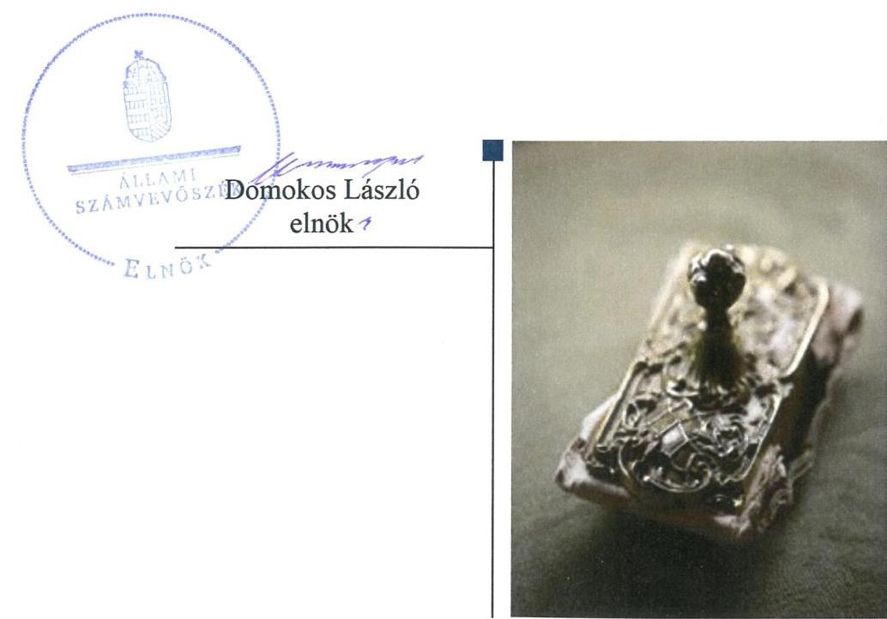
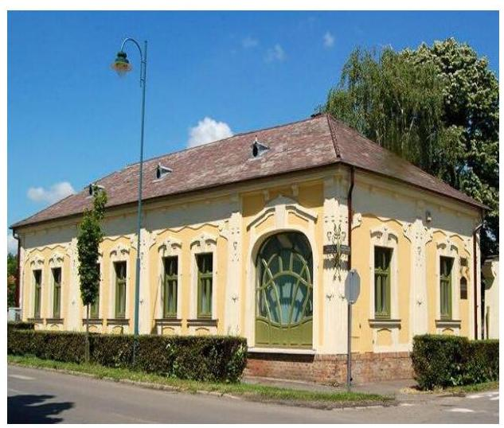
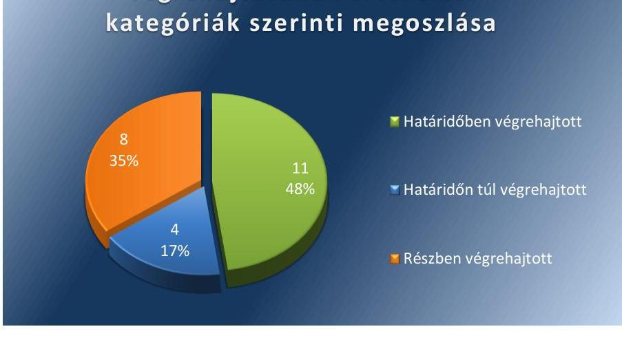
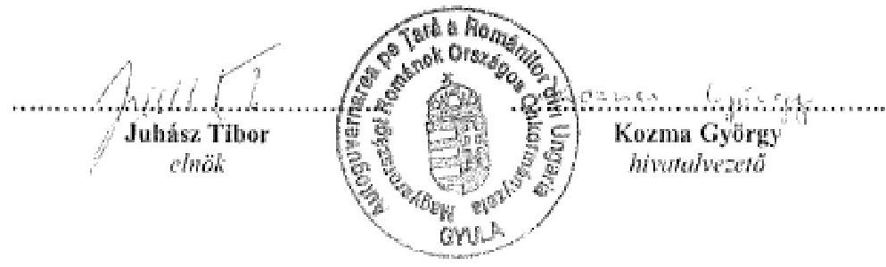
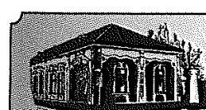
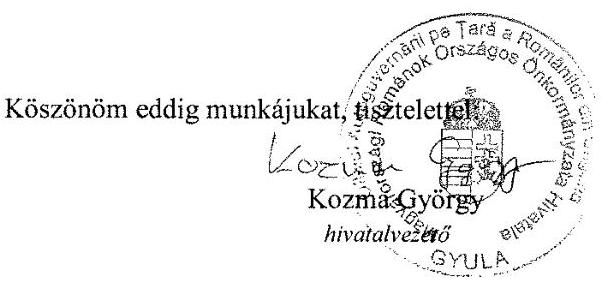
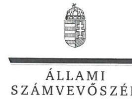
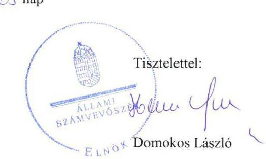

# Jelentés 

## Utóellenőrzések

Az országos nemzetiségi önkormányzatok gazdálkodásának utóellenőrzése - Magyarországi Románok Országos Önkormányzata 2018.

---

# Jelentés 

## Utóellenőrzések

Az országos nemzetiségi önkormányzatok gazdálkodásának utóellenőrzése - Magyarországi Románok Országos Önkormányzata 2018. 2018. 8 . 8. nap

---

# AZ ELLENŐRZÉST FELÜGYELTE: 

VARGA EDIT felügyeleti vezető

## AZ ELLENŐRZÉST VEZETTE ÉS A VÉGREHAJTÁSÁÉRT FELELŐS:

MAROZSÁN LÁSZLÓNÉ ellenőrzésvezető

## A PROGRAM ÖSSZEÁLLÍTÁSÁÉRT FELELŐS:

TÓTPÁL SZABOLCS osztályvezető

## A TÉMÁHOZ KAPCSOLÓDÓ KORÁBBI SZÁMVEVŐSZÉKI JELENTÉSEK:

- címe: Jelentés az Országos Nemzetiségi Önkormányzatok gazdálkodásának ellenőrzéséről
Magyarországi Románok Országos Önkormányzata
- sorszáma: 15148

IKTATÓSZÁM: EL-0613-041/2018
TÉMASZÁM: 2460
ELLENŐRZÉS-AZONOSÍTÓ SZÁM: V080406

---

# TARTALOMJEGYZÉK 

■ ÖSSZEGZÉS ..... 5
■ AZ ELLENŐRZÉS CÉLJA ..... 6
■ AZ ELLENŐRZÉS TERÜLETE ..... 7
■ AZ ELLENŐRZÉS HÁTTERE, INDOKOLTSÁGA ..... 8
■ A JELENTÉS LÉNYEGES KÉRDÉSKÖRE ..... 9
■ AZ ELLENŐRZÉS HATÓKÖRE ÉS MÓDSZEREI ..... 10
■ MEGÁLLAPÍTÁSOK ..... 12
■ MELLÉKLETEK ..... 15
I. sz. melléklet: Az ÁSZ 15148. számú jelentéséhez kapcsolódóan a Magyarországi Románok Országos Önkormányzata intézkedési terve végrehajtásának értékelése ..... 15
II. sz. melléklet: a Magyarországi Románok Országos Önkormányzata intézkedési terve ..... 22
■ FÜGGELÉK: ÉSZREVÉTELEK ..... 31
■ RÖVIDÍTÉSEK JEGYZÉKE ..... 39

---

.

---

# ÖSSZEGZÉS 

Az Állami Számvevőszék a Magyarországi Románok Országos Önkormányzata gazdálkodásának utóellenőrzése során megállapította, hogy az intézkedési tervben foglalt és végrehajtott feladatok következtében gazdálkodásának, müködésének szabályozottsága és a vagyongazdálkodás szabályszerűsége javult. A részben végrehajtott intézkedések azonban kockázatot hordoznak a Magyarországi Románok Országos Önkormányzata gazdálkodását érintően az átláthatóságban és a felelős vezetői magatartásban.

## Az ellenőrzés társadalmi indokoltsága

Az Állami Számvevőszék stratégiájában célul tűzte ki a számvevőszéki munka hasznosulásának javítását. Ezzel összhangban ellenőrzi, hogy az ellenőrzött szervezetek megvalósították-e a korábbi ellenőrzései által feltárt hibák, hiányosságok és szabálytalanságok megszüntetése céljából kialakított intézkedési terveikben foglaltakat. Az intézkedések végrehajtásával az adott terület szabályszerű működése vonatkozásában a kockázatok csökkenhetnek, ugyanakkor a nem végrehajtott intézkedések következtében újabb kockázatok merülhetnek fel, amelyek kezelése kiemelten fontos. A rendszeres utóellenőrzések hozzájárulnak a szükséges intézkedések tényleges végrehajtásához, ezáltal a közpénzügyek rendezettségének javulásához, a szabálytalan közpénzfelhasználás kockázatának a csökkentéséhez.

## Főbb megállapítások, következtetések

Magyarországi Románok Országos Önkormányzata az Állami Számvevőszék intézkedést igénylő megállapításai alapján tett javaslataira készített intézkedési tervében 23 végrehajtandó feladatot határozott meg, amelyből tizenegyet határidőben, négyet határidőn túl és nyolcat részben hajtott végre.

A hivatalvezető elkészítette a Magyarországi Románok Országos Önkormányzata Hivatalának szervezeti és működési szabályzatát, amelyben a hivatali szervezeti egységek között rögzítette a gazdasági szervezetet. A gazdálkodási jogkörök gyakorlását belső szabályzatban rögzítette, a mérleg összeállításához év végén a teljes körű leltárt elkészítették. Nem készített azonban pénzkezelési és értékelési szabályzatot, a számlarend nem tartalmazta a bizonylati rendet.

A költségvetési határozat-tervezeteket és a költségvetés-módosításokat a Magyarországi Románok Országos Önkormányzata irányítása alá tartozó költségvetési szervek vezetőivel a hivatalvezető egyeztette, a költségvetési hatá-rozat-tervezeteket a jogszabályi előírásoknak megfelelő tartalommal és tagolással terjesztette a Közgyűlés elé, azonban a gazdálkodási jogkörök szabályszerű gyakorlását nem érvényesítette. A Magyarországi Románok Országos Önkormányzata által nyújtott támogatásokkal kapcsolatos feladatellátás során az integritás szemlélet erősödött.

A hivatalvezető nem értékelte a 2015-2016. évekre vonatkozóan a belső kontrollrendszer minőségét, nem gondoskodott a belső ellenőrzés folyamatos működtetéséről. A monitoring rendszer kialakításához, működtetéséhez és a kockázatelemzéshez szükséges szabályzatokat, a belső ellenőrzési kézikönyvet határidőn túl készítette el. A hivatalvezető a 2015-2017. évi belső ellenőrzési tervek és a 2015-2016. évi éves ellenőrzési jelentések jóváhagyásáról gondoskodott.

---

# AZ ELLENŐRZÉS CÉLJA 

Az ellenőrzés célja annak értékelése volt, hogy a számvevőszéki jelentésben ${ }^{1}$ foglalt intézkedést igénylő megállapításokkal összhangban készített intézkedési tervben meghatározott feladatokat az ellenőrzött szervezet vég-rehajtotta-e.

---

# AZ ELLENŐRZÉS TERÜLETE 

## Magyarországi Románok Országos Önkormányzata

A Magyarországi Románok Országos Önkormányzata 1995ben alakult, székhelye Gyula. Az Önkormányzat² tevékenységével kapcsolatos igazgatási feladatot a 2009-ben alapított Magyarországi Románok Országos Önkormányzatának Hivatala látta el.

Az ÁSZ³ 2015.szeptember 24-én tette közzé az Önkormányzat 2010. január 1. és 2014. június 30. közötti időszakot érintő gazdálkodásának ellenőrzéséről készült 15148 számú jelentését. Az ellenőrzés célja annak értékelése volt, hogy az Önkormányzat gazdálkodása, a belső kontrollrendszer kialakítása és múködése, az államháztartásból nyújtott támogatás, illetve az államháztartásból meghatározott célra ingyenesen juttatott vagyon felhasználása a jogszabályi előírásoknak megfelelően történt-e; az önkormányzat a Nek.tv. ${ }^{4}$-ben és az Njtv. ${ }^{5}$-ben előírt feladat és hatásköröket ellátta-e; intézkedett-e az ÁSZ által 2008-ban végzett ellenőrzés javaslatainak végrehajtásáról.

A számvevőszéki jelentés intézkedést igénylő megállapításai és javaslatai alapján az Önkormányzat elnöke ${ }^{6}$ és a Hivatalának ${ }^{7}$ vezetője által készített intézkedési tervet a Közgyűlés ${ }^{8}$ a 205/2015. (X.22.) sz. MROÖ ${ }^{9}$ Közgyűlési határozattal, az intézkedési terv kiegészítését a 286/2016. (II.25.) sz. MROÖ Közgyűlési határozattal elfogadta. Az utóellenőrzés az Önkormányzat ellenőrzéséről készült számvevőszéki jelentés intézkedést igénylő megállapításai és javaslatai hasznosítására elfogadott intézkedési tervben foglalt feladatok 2015. szeptember 24-2018. február 13. közötti végrehajtására irányult.

---

# AZ ELLENŐRZÉS HÁTTERE, INDOKOLTSÁGA 

Az ÁSZ tv ${ }^{10}$. 33. § (1) bekezdése értelmében a számvevőszéki jelentések intézkedést igénylő megállapításaihoz és javaslataihoz kapcsolódóan az ellenőrzött szervezet vezetője intézkedési tervet köteles összeállítani, és az Állami Számvevőszék részére megküldeni. Az ÁSZ tv. 33. § (6) bekezdése értelmében, amennyiben az ÁSZ elnöke az ellenőrzés során feltárt jogszabálysértő gyakorlat, illetve a vagyon rendeltetésellenes vagy pazarló felhasználásának megszüntetése érdekében figyelemfelhívó levéllel fordult az ellenőrzött szerv vezetőjéhez, az abban foglaltakat az ellenőrzött szerv vezetője köteles elbírálni, a megfelelő intézkedést megtenni és erről az ÁSZ elnökét értesíteni.

Az ÁSZ által befogadott intézkedési tervben foglaltak megvalósítását az ÁSZ törvény 33. § (7) be-kezdésében foglaltak alapján - az Állami Számvevőszék utóellenőrzés keretében ellenőrizheti. Az utóellenőrzések keretében - az intézkedések értékelése során - az Állami Számvevőszék figyelembe veszi az ellenőrzött szervezetek működési feltételeiben, valamint a jogszabályi előírásokban bekövetkezett változásokat. Az utóellenőrzés során az ÁSZ értékeli, hogy az érintett számvevőszéki jelentésben foglalt intézkedést igénylő megállapításokkal és javaslatokkal összhangban, az ellenőrzött szervezet által készített intézkedési tervben meghatározott feladatokat a feladatra kijelöltek végrehajtották-e.

Az intézkedések végrehajtásával az adott terület szabályszerű múködése vonatkozásában a kockázatok csökkenhetnek, azonban hosszabb távon az intézkedési tervben foglaltak végrehajtásával önmagában nem szűnnek meg, csak akkor, ha beépülnek az ellenőrzött szervezet múködésébe, azokat folyamatosan karban tartják, figyelembe véve, illetve kezelve a változásokat. Emellett az intézkedések végrehajtásáig újabb kockázatok merülhetnek fel a szabályszerű múködés vonatkozásában, amelyek kezelése szintén kiemelten fontos az ellenőrzött szervezet számára.

Az ellenőrzött szervezet vezetője által készített intézkedési tervekben foglalt feladatok hiányos, illetve késedelmes végrehajtása, vagy annak elmaradása a szabályszerűség és a felelős vezetői magatartás vonatkozásában kockázatot hordoz, ami azt mutatja, hogy az ellenőrzések során feltárt hibák, hiányosságok és szabálytalanságok kezelése nem kapott kellő hangsúlyt. Az utóellenőrzés során is fenn-álló szabálytalanságok esetén a közpénz, közvagyon veszélyeztetettségi kockázat valószínűsített hatásának értékelése további intézkedéseket vonhat maga után.

Az ellenőrzött szervezet szintjén az utóellenőrzés feltárja, hogy a szervezet az intézkedések végrehajtásával hasznosította-e a korábbi ellenőrzési jelentésben a hiányosságok megszüntetése, illetve a kockázatok kezelése érdekében megfogalmazott javaslatokat, illetve az intézkedések végrehajtása elmaradásának következtében továbbra is fennálló szabálytalanság esetén értékeli a közpénzek, közvagyon veszélyeztetettségét. Az ÁSZ szintjén az utóellenőrzés visszacsatolást ad az ellenőrzési jelentések hasznosulásáról, az intézkedések elmaradásának, vagy részleges megvalósulásának a közpénzek, közvagyon veszélyeztetettségére gyakorolt valószínűsített hatásának értékelése, további intézkedéseket vonhat maga után.

---

# A JELENTÉS LÉNYEGES KÉRDÉSKÖRE 

Az Önkormányzat az intézkedési tervben foglaltakat az elöirt határidőben végrehajtotta-e?

---

# AZ ELLENŐRZÉS HATÓKÖRE ÉS MÓDSZEREI 

## Az ellenőrzés típusa

Megfelelőségi ellenőrzés.

## Az ellenőrzött időszak

Az utóellenőrzés alapját képező számvevőszéki jelentés közzétételének napjától (2015. szeptember 24.) az ellenőrzésről szóló kiértesítő levél keltének napjáig (2018. február 13.) tartó időszak.

## Az ellenőrzés tárgya

Az ÁSZ tv. 2011. július 1-jei hatálybalépését követően a számvevőszéki jelentésben foglalt intézkedést igénylő megállapításokkal és javaslatokkal összhangban - az Önkormányzat által - készített intézkedési tervben foglaltak végrehajtásának ellenőrzése volt.

## Az ellenőrzött szervezet

Magyarországi Románok Országos Önkormányzata és a Magyarországi Románok Országos Önkormányzat Hivatala

## Az ellenőrzés jogalapja

Az utóellenőrzés jogszabályi alapját az ÁSZ tv. 33. § (7) bekezdése, illetve a 33. § (1)-(2) és a (6) bekezdéseinek az előírásai képezik.

## Az ellenőrzés módszerei

Az ellenőrzést az ellenőrzött időszakban hatályos jogszabályok, az ellenőrzés szakmai szabályai, a jelen ellenőrzésre irányadó ÁSZ módszertanok, az ellenőrzési programban foglalt értékelési szempontok szerint, önállóan végezte az ÁSZ.

Az ÁSZ az ellenőrzés ideje alatt az ellenőrzött szervezettel történő kapcsolattartást az ÁSZ SZMSZ ${ }^{11}$-ének vonatkozó előírásai alapján biztosította.

Az utóellenőrzés megállapításait az ÁSZ rendelkezésére álló dokumentumok, valamint az ÁSZ adatbekérése szerint, az ellenőrzött szervezetek által rendelkezésre bocsátott dokumentumok, adatok alapján fogalmazta

---

meg, amely kiegészült az ellenőrzött szervezet székhelyén történő adatbetekintéssel.

Az ellenőrzési kérdések megválaszolásához szükséges bizonyítékok megszerzése az ellenőrzött által rendelkezésre bocsátott dokumentumokra, adatokra alapozva megfigyelés, szemle (szemrevételezés), kérdésfeltevés (információkérés), alkalmazásával történt. Az ellenőrzési bizonyítékként felhasználható adatforrások közé tartoztak egyrészt az ellenőrzési program részletes szempontjainál felsorolt adatforrások, másrészt minden - az ellenőrzés folyamán feltárt, az ellenőrzés szempontjából információt tartalmazó - dokumentum.

Az intézkedési tervekben előírt feladatokat azok végrehajthatósága, illetve végrehajtása szempontjából az alábbiak szerint értékelte az ÁSZ:
$\longrightarrow$ „határidőben végrehajtott" a feladat, ha a teljesítés dokumentáltan, az intézkedési tervben előírt határidőben és tartalommal megtörtént;
$\longrightarrow$ „határidőn túl végrehajtott" a feladat, ha annak teljesítése az intézkedési tervben meghatározott módon, de az abban előírt határidőn túl történt meg;
$\longrightarrow$ „részben végrehajtott" a feladat, ha annak végrehajtása nem teljes körűen az intézkedési tervben előírt módon történt meg;
$\longrightarrow$ „nem végrehajtott" a feladat, ha a végrehajtás nem történt meg, dokumentumokkal nem igazolt annak teljesítése;
$\longrightarrow$ „okafogyottá vált" a feladat, ha végrehajtására - meghatározott esemény bekövetkezése, továbbá külső körülmény, a működést érintő feltétel változása miatt - már nincs szükség, illetve lehetőség, és egyértelműen megállapítható, hogy az intézkedést szükségessé tevő körülmény a jövőben nem fordulhat elő;
$\longrightarrow$ „nem időszerü" az a feladat, amelynek ellenőrzési időszakon belüli végrehajtására azért nem került (kerülhetett) sor, mert az intézkedés alapjául szolgáló esemény nem következett be, de annak jövőbeni előfordulása lehetséges, a végrehajtása nem volt esedékes, vagy a végrehajtás határideje még nem járt le.
Az ellenőrzés lefolytatásához az ellenőrzött szervezet a tanúsítványok elektronikus kitöltésével, valamint az ÁSZ által kért dokumentumok elektronikus megküldésével, továbbá a helyszíni adatbetekintés során papíralapú dokumentumok átadásával szolgáltatott adatokat, amelyek valódiságát és teljes körűségét az ellenőrzött szervezet vezetője által tett teljességi és hitelességi nyilatkozat igazolta. Az így rendelkezésre bocsátott adatok, információk kontrollja az ellenőrzés keretében történt. A II. sz. melléklet tartalmazza az Önkormányzat által készített intézkedési tervet és annak kiegészítését. A sorszámozott intézkedések részletes értékelését az I. sz. melléklet tartalmazza.

---

# MEGÁLLAPÍTÁSOK 

## 1. Az Önkormányzat az intézkedési tervben foglaltakat az előírt határidőben végrehajtotta-e?

Összegző megállapítás

Az Önkormányzat az intézkedési tervében meghatározott 23 feladat közül tizenegyet határidőben, négyet határidőn túl, nyolcat részben hajtott végre.

Az ÁSZ az Önkormányzat elnöke számára négy, a hivatalvezető ${ }^{12}$ számára 18 javaslatot fogalmazott meg. Az elnök és a hivatalvezető a javaslatok kezelésére, a szabálytalanságok megszüntetésére összesen 23 intézkedésből álló intézkedési tervet küldött az ÁSZ részére.

Az Önkormányzat intézkedési tervében meghatározott feladatokat, határidőket, a feladatok végrehajtásáért felelős személyeket és a feladatok végrehajtását az I. sz. melléklet mutatja be.

Az ÁSZ javaslatai alapján készített intézkedési tervben rögzített feladatok végrehajtásáról a hivatalvezető a Bkr. ${ }^{13} 14 . \S$ (1) bekezdésében előírtak ellenére nem éves bontásban vezette a nyilvántartást.

AZ ÖNKORMÁNYZAT ÁLTAL az intézkedési tervben meghatározott feladatok végrehajtásának értékelési kategóriák szerinti megoszlását az 1. ábra szemlélteti.

1. ábra

Az Önkormányzat feladatai végrehajtásának értékelési kategóriak szerinti megoszlása

A MŰKÖDÉSI ÉS A GAZDÁLKODÁSI FOLYAMATOK SZABÁLYOZOTTSÁGA az Önkormányzatnál javult. A hivatalvezető elkészítette a Hivatal SZMSZ-ét, amelyben kialakította a gazdasági szervezetet. (2) A hivatalvezető az intézkedési tervben foglalt határidőn túl

---

intézkedett az elnök részére történő hatáskör átruházás tárgyában kiegészítendő önkormányzati SZMSZ előkészítéséről és annak a Közgyűlés elé terjesztéséről. (13) A hivatalvezető a vállalt határidőben elkészítette a Gazdálkodási szabályzatot, amelyben szabályozta a gazdálkodási jogkörök gyakorlatát, gondoskodott a közérdekú adatokkal kapcsolatos belső szabályzatok elkészítéséről. (3; 20) A számviteli politikát és a leltározási szabályzatot az intézkedési tervben rögzített határidőn túl készítette el a hivatalvezető. (16) A Számv. tv. ${ }^{14}$ előírása ellenére azonban nem készített értékelési szabályzatot és pénzkezelési szabályzatot, továbbá az intézkedési tervben foglaltak ellenére selejtezési szabályzatot. A számlarend a Számv. tv.-ben foglaltak ellenére nem tartalmazta a számlarendben foglaltakat alátámasztó bizonylati rendet. (16-17)

# A PÉNZÜGYI ELSZÁMOLTATHATÓSÁG JAVÍTÁSA 

érdekében a hivatalvezető a költségvetési határozat-tervezeteket és a költségvetés-módosításokat az Önkormányzat irányítása alá tartozó költségvetési szervek vezetőivel egyeztette. (4) A költségvetési határozat-tervezeteket az Áht. ${ }^{15}$ és az Ávr. ${ }^{16}$ - előírásainak megfelelő tartalommal és tagolással terjesztette a Közgyűlés elé.(6) A hivatalvezető a 2016-2017. évi elemi költségvetéseket az Ávr.-ben előírt határidőben megküldte a Kincstárnak ${ }^{17}$. (5) A gazdálkodási jogkörök gyakorlása továbbra is kockázatot jelentett. (19)

A VAGYONGAZDÁLKODÁS terén a müködési kockázatok csökkentek. A Hivatalnál és az Önkormányzatnál a 2015-2017. évek decemberében elvégezték a teljes körű leltárt, a hivatalvezető intézkedett az értékcsökkenés jogszabályi előírásoknak megfelelő elszámolásáról. (9-10)

AZ INTEGRITÁS szemlélet érvényesítése érdekében a hivatalvezető intézkedett az Önkormányzat által nyújtott támogatások felhasználásának az ellenőrzéséről. Az elnök rendelkezett arról, hogy az Önkormányzat által nyújtott céljellegú juttatásokról a Közgyűlés döntsön. (8; 11)

## A BELSŐ KONTROLLOK ÉS A BELSŐ ELLENŐR-

ZÉS hiányosságai továbbra is kockázatot jelentettek. A hivatalvezető a belső ellenőrzési kézikönyvet, a kockázatelemzést és a kapcsolódó szabályzatokat határidőn túl készíttette el. Nem gondoskodott a hivatalvezető a Bkr. előírása ellenére a 2018. évi belső ellenőrzési terv elkészítéséről. (2122) Az intézkedések folyamatos nyomon követési módjának meghatározására a Bkr. rendelkezése ellenére nem került sor. (18) A hivatalvezető a belső kontrollrendszer minőségét a Bkr.-ben előírtak ellenére a 2015-2016. évekre vonatkozóan nem értékelte. (21) A hivatalvezető a 2015-2017. évi belső ellenőrzési tervek és a 2015-2016. évi éves ellenőrzési jelentések jóváhagyásáról gondoskodott. (22)

---

.

---

# MELLÉKLETEK

- I. SZ. MELLÉKLET: AZ ÁSZ 15148. SZÁMÚ JELENTÉSÉHEZ KAPCSOLÓDÓAN A MAGYARORSZÁGI ROMÁNOK ORSZÁGOS ÖNKORMÁNYZATA INTÉZKEDÉSI TERVE VÉGREHAJTÁSÁNAK ÉRTÉKELÉSE

|  Sorszám | Az intézkedési tervben meghatározott feladat | Az intézkedési tervben meghatározott határidő | Az intézkedési tervben meghatározott feladatok elvégzésének felelőse | A feladat végrehajtása  |
| --- | --- | --- | --- | --- |
|  Határidőben végrehajtott feladatok |  |  |  |   |
|  1. | (E.3) Rendelkezés az önkormányzati hivatal vezetője felé, hogy folyamatosan és fokozottan kísérje figyelemmel a beszerzések, beruházások, stb. értékhatárát, és amennyiben a jogszabályi értékhatárt elérik, úgy gondoskodjon a közbeszerzései eljárás lefolytatásának kezdeményezéséről. | folyamatos | Elnök | A közbeszerzési eljárás lebonyolításához szükséges feladatokat és felelősöket rögzítő közbeszerzési szabályzatot a Közgyűlés a 46/2017. (V.18.) sz. MROÖ Közgyűlési határozatával fogadta el. Az ellenőrzési nyomvonal a közbeszerzési terv és a módosítása készítésének folyamatát a 2018. január 3-i aktualizálás során rögzítette. Közbeszerzés lefolytatásának szükségessége, a hivatalvezető erre vonatkozó kezdeményezésének indokoltsága az ellenőrzött időszakban nem volt igazolható. Közbeszerzési terv a 2018. évre vonatkozóan került az Önkormányzat honlapján elhelyezésre.  |
|  2. | (H.1) A Hivatal alapító okiratának áttekintése, ill Szervezeti és Működési Szabályzatának megalkotása, elfogadása. Az SzMSz- ben gazdasági szervezet létrehozása. | 2015.12.30. | Hivatalvezető | A hivatalvezető intézkedett a Hivatal 2009. évi alapító okiratának áttekintéséről, és a vállalt határidőn belül - 2015. február 12-én - az Ávr.-nek megfelelő tartalommal az önkormányzat elnöke kiadmányozta a módosításokkal egységes szerkezetbe foglalt alapító okiratot.
A hivatalvezető elkészítette a Hivatal SZMSZ-ét, amelyben rögzítették a gazdasági szervezetet és a feladatait, és intézkedett, a Közgyűlés elé terjesztésről. A Közgyűlés az Önkormányzat SZMSZ-ének 7. sz. mellékleteként 251/2015. (XII.29.) sz. MROÖ Közgyűlési határozatával elfogadta a hivatali SZMSZ-t.  |

---

|  Az intézkedési tervben meghatározott feladat | Az intézkedési tervben meghatározott határidő | Az intézkedési tervben meghatározott feladatok elvégzésének felelőse | A feladat végrehajtása  |
| --- | --- | --- | --- |
|  3. (H.4) A Hivatal gazdálkodásával kapcsolatos belső szabályozás kialakítása, így különösen a kötelezettségvállalás, ellenjegyzés, teljesítésigazolás, érvényesítés, utalványozása gyakorlatának kialakítása, és szabályozása, az e feladatokat végző személyek kijelölése. | 2015. december 31. | Hivatalvezető | A hivatalvezető a Gazdálkodási szabályzatot határidőben elkészítette. A szabályzatban kialakította és szabályozta a kötelezettségvállalás, ellenjegyzés, teljesítésigazolás, érvényesítés, utalványozás gyakorlatát, melléklete tartalmazta az érvényesítési feladatokat végző személy Ávr.-nek megfelelő kijelölését.  |
|  4. (H.11) A jövőben a költségvetési határozattervezetek és a költségvetési módosítások minden esetben egyeztetésre kerüljenek dokumentált módon a költségvetési szervek vezetőivel. | folyamatos | Hivatalvezető | A hivatalvezető gondoskodott arról, hogy a költségvetési ha-tározat-tervezetek és a költségvetési módosítások minden esetben dokumentált módon, az ellenőrzési nyomvonal szabályzatban rögzítettek szerint egyeztetésre kerüljenek az Önkormányzat irányítása alá tartozó költségvetési szervek vezetőivel az Áht. és az Ávr. előírásának megfelelően.  |
|  5. (H.12) Az elemi költségvetéseket minden évben határidőben küldje meg a Hivatal a Kincstár felé. | folyamatos | Hivatalvezető | A hivatalvezető az elemi költségvetéseket a KGR rendszeren keresztül küldte meg a Kincstárnak, az általa közzé tett határidőben és az Ávr.-ben előírtaknak megfelelően.  |
|  6. (H.13) A költségvetési határozat-tervezeteket a jogszabály szerinti tartalommal készítse el a Hivatal és terjessze a Közgyűlés elé. | folyamatos | Hivatalvezető | A hivatalvezető a költségvetési határozat-tervezeteket az Áht. és az Ávr. előírásainak megfelelő tartalommal és tagolással terjesztette a Közgyűlés elé.  |
|  7. (H.14) A felmerülő költségvetési módosításokat szüksége szerint, de legalább negyedévente be kell terjeszteni a Közgyűlés elé. | folyamatos | Hivatalvezető | A hivatalvezető a 2016-2017. években a felmerült költségvetési módosításokat negyedévente beterjesztette a Közgyűlés elé.  |
|  8. (H.17) Az önkormányzat által nyújtott támogatások felhasználását ellenőrizni kell. | folyamatos | Hivatalvezető | A hivatalvezető gondoskodott a támogatások felhasználásának az ellenőrzéséről. Az ellenőrzött időszakban a 235/2015. (XI. 26.) sz. MROÖ Közgyűlési határozattal és a 236/2015. (XI. 26.) sz. MROÖ Közgyűlési határozattal két szervezetet támogatására került sor 500 E Ft és 250 E Ft összegben. A támogatási szerződésekben előírta az Önkormányzat, hogy a támogatás rendeltetésszerű felhasználását és a szerződésen foglalt célok megvalósulását a támogató, vagy az általa megbízott személy ellenőrzi. Előírta továbbá az elszámolási kötelezettséget. A támogatottak a támogatás elszámolását,  |

---

|  9. | (H.18) Minden év december hónapban teljeskörű leltárt kell elvégezni. | folyamatos | Hivatalvezető | a szakmai beszámolókat a szerződésben foglaltaknak, megfelelően megküldték az Önkormányzatnak.  |
| --- | --- | --- | --- | --- |
|  10. | (H.19) Az értékcsökkenést a jogszabályi előírásoknak megfelelően kell elszámolni. | folyamatos | Hivatalvezető | A hivatalvezető gondoskodott arról, hogy december hónapban teljes körű leltározást végezzenek. A 2015. évi leltározásra 2015. december 27-29-ével, a 2016. évi leltározásra 2016. december 30-31-ével, a 2017. évi leltározásra 2017. december 28-29-ével került sor.  |
|  11. | (E.2) Rendelkezés az önkormányzati hivatal vezetője felé, hogy a céljellegű juttatásokkal kapcsolatos döntés-tervezetet a hivatal terjessze a Közgyűlés elé. | folyamatos | Elnök | A hivatalvezető által kiadmányozott számviteli politika II. pontja rögzítette Számv. tv. és az Áhsz ${ }^{18}$. előírásainak megfelelő értékcsökkenés elszámolás szabályait. A gyakorlatban alkalmazott amortizációs kulcsok és az értékcsökkenés elszámolásának kezdő időpontja megfelelt jogszabályi előírásoknak.  |
|  12. | (E.1) A Szervezeti és Működési Szabályzat kiegészítésének előkészítése és beterjesztése a Közgyűlés elé. | 2015.11.30. | Elnök
előkészítésért:
Hivatalvezető | Az Önkormányzat a 252/2015.(XII.29.) sz. MROÖ Közgyűlési határozattal elrendelte, hogy a céljellegű támogatások dön-tés-előkészítése során a Hivatal fordítson fokozott figyelmet a hatásköri szabályok betartására és alkalmazza a közpénzekből nyújtott támogatások átláthatóságáról szóló 2007. évi CLXXXI. törvény szabályait, megjelölve felelősként az elnököt és a hivatalvezetőt. A 2016. és 2017.évben nyújtott támogatásokról a Közgyűlés döntött, döntésében felhatalmazta az elnököt a támogatási szerződés aláírására.  |
|  Határidőn túl végrehajtott feladatok |  |  |  |   |
|   | 2015.11.30. | Elnök
előkészítésért:
Hivatalvezető | Az SZMSZ előkészítésének és Közgyűlés elé való beterjesztésének határidőn belüli végrehajtása dokumentumokkal nem igazolt. Az Önkormányzat Közgyűlése 2015. december 29én a 251/2015. (XII.29.) sz. MROÖ Közgyűlési határozatával az Önkormányzat SZMSZ-ének 7. sz. mellékleteként fogadta el az előkészített hivatali SZMSZ-t. |   |

---

|  13. | (E.4) A Szervezeti és Müködési Szabályzat kiegészítésének előkészítése és beterjesztése a Közgyűlés elé. A hatáskör átruházása az elnök részére. | 2015.11.30. | Az intézkedési tervben meghatározott feladatok elvégzésének felelőse | A feladat végrehajtása  |
| --- | --- | --- | --- | --- |
|  14. | (H.16) A költségvetési jelentéseket a jogszabály szerinti határidőben kell a Kincstár részére megküldeni. | folyamatos | Hivatalvezető | A SZMSZ előkészítésének és Közgyűlés elé való beterjesztésének határidőn belüli végrehajtása dokumentumokkal nem igazolt. Az önkormányzati SZMSZ 5. sz. - a Közgyűlés által az elnökre átruházott hatáskörökről szóló - mellékletében rögzítették a jogszabálytervezetekre vonatkozó elnöki véle-mény-nyilvánítási hatáskört. A kiegészített SZMSZ-t a Közgyűlés a 251/2015. (XII.29.) sz. MROÖ Közgyűlési határozattal 2015. december 29-én fogadta el, 2016. január 1-i hatályba léptetéssel.  |
|  15. | (H.5) A Hivatal ellenőrzési nyomvonalának elkészítése, szabálytalanságok kezelésének eljárásrendje és az etikai elvárások belső szabályzatának elkészítése. | 2015. december 31. | Hivatalvezető | A hivatalvezető az előközi költségvetési jelentéseket a 2016. évben három esetben határidőn túl, 21 esetben határidőben, a 2017. évben két esetben határidőn túl, 22 esetben határidőben töltötte fel a Kincstár által működtetett elektronikus adatszolgáltató rendszerbe.  |
|  16. | (H.2) Számviteli szabályzatok (számviteli politika, leltározási és leltárkészítési, eszközök hasznosítási és selejtezési, értékelési, valamint pénzkezelési szabályzat) szabályszerű kiadmányozása. | 2015. október 31. | Hivatalvezető | A hivatalvezető az ellenőrzési nyomvonalat és a szabálytalanságok kezelésének rendjéről szóló szabályzatot határidőben elkészítette. Az etikai szabályzatot azonban határidőn túl 2016. február 29-én készítette el.  |
|  17. | (H.3) A Hivatal számlarendjének és bizonylati rendjének elkészítése. | 2015. december 31. | Hivatalvezető | Végrehajtott feladat: A hivatalvezető a számviteli politikát és a leltározási szabályzatot határidőn túl, 2016. január 4-én készítette el.  |
|   |  |  |  | Nem végrehajtott feladat: A hivatalvezető a Számv.tv. 14. § (5) bekezdés b) és d) pontjaiban előírtak ellenére nem készített értékelési szabályzatot és pénzkezelési szabályzatot, továbbá nem készített az intézkedési tervben foglaltak ellenére selejtezési szabályzatot.  |
|   |  |  |  | Végrehajtott feladat: A hivatalvezető a számlarendet határidőben elkészítette.  |

---

|  17. | Az intézkedési tervben meghatározott feladat | Az intézkedési tervben meghatározott határidő | Az intézkedési tervben meghatározott feladatok elvégzéseinek felelőse | A feladat végrehajtása  |
| --- | --- | --- | --- | --- |
|   |  |  |  | Nem végrehajtott feladat:
A hivatalvezető által készített számlarend a Számv.tv. 161. § (2) bekezdés d) pontjában előírtak ellenére nem tartalmazta az abban foglaltakat alátámasztó bizonylati rendet.  |
|  18. | (H.6) Kockázatelemzés elvégzése, szükséges intézkedések megtétele és azok folyamatos nyomon követési módjának meghatározása. | 2015. december 31. | Hivatalvezető | Végrehajtott (határidőben és határidőn túl) feladat:
A hivatalvezető a kockázatelemzést - határidőn túl - 2016. január 5-én készítette el. Ezenkívül határidőben elkészítette a kockázatkezelési és ügymenet-folytonossági tervet és a Hivatal ellenőrzési nyomvonalát. A Belső kontrollrendszerről szóló szabályzatot határidőn túl 2016. március 31-én adta ki. A rendelkezésre bocsátott dokumentumok szerint a kockázatok azonosítása, az intézkedések meghatározása megtörtént,
Nem végrehajtott feladat:
A hivatalvezető az intézkedések folyamatos nyomon követési módját a Bkr. 7. § (2) bekezdésében foglaltak ellenére nem határozta meg, a kockázatelemzések alapján megtett intézkedéseket a Hivatalnál nem dokumentálták.  |
|  19. | (H.7) A dokumentumok és információkhoz való hozzáférés felelősségi köreinek meghatározása, intézkedés a gazdálkodási jogkörök szabályszerű gyakorlásának érvényesítéséről és a folyamatban épített és vezetői ellenőrzés szabályzatának elkészítése.
IT kiegészítés: A hivatalvezető köteles gondoskodni a folyamatba épített előzetes, utólagos és vezetői ellenőrzés biztosításáról a szabályzat, illetve a hatályos jogszabályok alapján, továbbá biztosítani a gazdasági események szabályszerűségét. | 2015.12.31.
folyamatos | Hivatalvezető | Végrehajtott feladat:
A hivatalvezető a dokumentumok és információkhoz való hozzáférés felelősségi köreit az elektronikus adatok kezelése szabályzatban, az adat- és hálózatvédelmi szabályzatban, az informatikai eszközök alkalmazása szabályzatban, valamint az információs szabályzatban meghatározta. A gazdálkodási jogkörök szabályszerű gyakorlásának érvényesítéséhez határidőben elkészítette a Gazdálkodási szabályzatot.
A folyamatba épített előzetes, utólagos vezetői ellenőrzést biztosította a Gazdálkodási szabályzatban, az ellenőrzési nyomvonalban és a hivatali SZMSZ-ben rögzítettekkel a hivatalvezető.
Nem végrehajtott feladat:  |

---

|  Az intézkedési tervben meghatározott feladat | Az intézkedési tervben meghatározott határidő | Az intézkedési tervben meghatározott feladatok elvégzésének felelőse | A feladat végrehajtása  |
| --- | --- | --- | --- |
|   |  |  | A hivatalvezető a gazdasági események szabályszerűségét, a jogszabályoknak megfelelő gazdálkodási jogkörök gyakorlását nem biztosította.  |
|  20. (H.8) Közérdekű adatokkal kapcsolatos belső szabályzat elkészítése. A közzétételi kötelezettséggel érintett adatok körének ellenőrzése, közzététele. IT kiegészítés: A kötelezően közzéteendő adatok nyilvánosságra hozatalának rendjéről, valamint az adatvédelemre és adatbiztonságra vonatkozó belső szabályzat elkészítése. | 2015. december 31. Kiegészítés szerinti határidő: 2016. január 31. | Hivatalvezető | Végrehajtott feladat:
A közérdekű adatok közzétételéről és az adatigénylések teljesítésének rendjéről szóló 2/2016. (I.4.) számú szabályzatot, az adatvédelemről szóló 9/2016. (I.4.) számú szabályzatot, valamint a Hivatal informatikai eszközeinek alkalmazásáról és az adatbiztonság biztosításáról szóló 7/2016. (I.4.) számú szabályzatot a hivatalvezető határidőben elkészítette.
Nem végrehajtott feladat:
A közzétételi kötelezettséggel érintett adatok körének ellenőrzése és közzététele nem történt meg teljes körűen. A Hivatal vezetője az Info.tv. 37. § (1) bekezdésében előírtak ellenére az Info tv.1. melléklet I/11. pontjában előírt, az Önkormányzat felett törvényességi ellenőrzést gyakorló szerv adatait nem tette közzé.  |
|  21. (H.9) Monitoring rendszer kialakítása és működtetése. IT kiegészítés: A hivatalvezető értékelje a belső kontrollrendszer minőségét a jogszabályban előírt nyilatkozatban. | 2015. december 31. Kiegészítés szerinti határidő: 2016. január 31. és azt követően folyamatos. | Hivatalvezető | Végrehajtott feladat:
A hivatalvezető a monitoring rendszer kialakításának részeként határidőben kiadta a Hivatal ellenőrzési nyomvonalát, majd határidőn túl, 2016. március 31-én elkészítette a Belső kontrollrendszer szabályzatot. Gondoskodott a belső ellenőrzés kialakításáról, a 2016-2017. évi ellenőrzési tervek és éves ellenőrzési jelentések elkészítéséről, jóváhagyásáról. A hivatali SZMSZ rendelkezett a folyamatos és eseti nyomon követésre vonatkozó szabályozásról. A hivatalvezető a belső kontrollrendszer értékelésére vonatkozó 2017. évi nyilatkozatát elkészítette.  |

---

|  22. | (H.10) Belső ellenőrzési kézikönyv elkészítése és a belső ellenőrzés folyamatos működtetése.
IT kiegészítés: A hivatalvezető által jóváhagyott belső ellenőrzési kézikönyv alapján folyamatosan kísérje figyelemmel a belső ellenőr munkáját, működtesse a belső ellenőrzés rendszerét a jogszabályi előírásoknak megfelelően. | 2015. december 31. Kiegészítés szerinti határidő: folyamatos. | Hivatalvezető | A feladat végrehajtása
Nem végrehajtott feladat:
A hivatalvezető a Bkr. 11. § (1) bekezdésében előírtak ellenére a 2015. és 2016. évre vonatkozóan nem készítette el Bkr. 1. sz. melléklete szerinti nyilatkozatát. Nem gondoskodott a monitoring rendszer folyamatos működtetése keretében a Bkr. 29. § (1) bekezdésében előírtak ellenére a 2018. évi ellenőrzési terv elkészítéséről.
Végrehajtott feladat:
A belső ellenőrzési kézikönyvet határidőn túl, 2017. október 19-ével készítette el a belső ellenőrzési vezető és hagyta jóvá a hivatalvezető. A közgyűlés 352/2016. (XI. 17.) sz. MROÖ Közgyűlési határozatával elfogadta az Önkormányzat 2017. évi belső ellenőrzési tervét, a 208/2015 (X.22.) sz. MROÖ Közgyűlési határozatával a 2016. évi ellenőrzési tervét. A hivatalvezető gondoskodott a 2015-2016. évi éves ellenőrzési jelentések elkészítéséről, jóváhagyásáról.
Nem végrehajtott feladat:
A hivatalvezető a belső ellenőrzési rendszer folyamatos működtetését nem biztosította, mert nem gondoskodott a Bkr. 29. § (1) bekezdés előírása ellenére a 2018. évi ellenőrzési terv elkészítéséről.  |
| --- | --- | --- | --- | --- |
|  23. | (H.15) A beszámolókat határidőben kell a Kincstárhoz beterjeszteni. | folyamatos | Hivatalvezető | Végrehajtott feladatok:
A hivatalvezető az Önkormányzat és a Hivatal 2016-2017. évi költségvetési beszámolóját az Áhsz.-ben előírt határidőben feltöltötte a Kincstár adatszolgáltató rendszerébe.
Nem végrehajtott feladat:
A hivatalvezető az Önkormányzat és a Hivatal 2015. évi költségvetési beszámolójának a Kincstár adatszolgáltató rendszerébe való feltöltésének idejét nem igazolta.  |

---

# INTÉZKEDÉSI TERV

Az Állami Számvevőszék által a Magyarországi Románok Országos Önkormányzatánál végzett ellenőrzésről kiadott jelentéshez (15148 számú jelentés)

|  JAVASOLT INTÉZKEDÉS TARTALMA | JAVASLAT
CIMZETTJE | SZÜKSÉGES INTÉZKEDÉS, FELADAT | HATÁRIDÓ | FELELÓs  |
| --- | --- | --- | --- | --- |
|  Intézkedjen az önkormányzat SzMSz-e kiegészítése érdekében. | Elnök | A Szervezeti és Müködési Szabályzat kiegészítésének előkészítése és beterjesztése a Közgyülés elé. | 2015.11.30. | Elnök
Előkészítésért: hivatalvezető  |
|  Intézkedjen, hogy a céljellegú támogatások nyújtásáról az arra hatáskörrel rendelkező Közgyülés döntsön | Elnök | Rendelkezés az önkormányzati hivatal vezetője felé, hogy a céljellegú juttatásokkal kapcsolatos döntés-tervezetet a hivatal terjessze a Közgyülés elé. | folyamatos | Elnök  |
|  Intézkedjen, hogy a jövőben a közbeszerzési értékhatár feletti esetekben a közbeszerzési eljárás lefolytatásra kerüljön, ill. intézkedjen a felelősség érvényesítéséről. | Elnök | Rendelkezés az önkormányzati hivatal vezetője felé, hogy folyamatosan és fokozottan kísérje figyelemmel a beszerzések, beruházások,stb. értékhatárát, és amennyiben a jogszabályi értékhatárt elérik, úgy gondoskodjon a közbeszerzései eljárás lefolytatásának kezdeményezéséről. | folyamatos | Elnök  |

---

|  E. 4 | Intézkedjen, hogy a jövőben az Önkormányzat vélemény-nyilvánítási, egyetértési és közremüködési jogosultságának a Közgyűlés hatáskörébe tartozó teljesítését, csak annak felhatalmazása alapján, beszámolási kötelezettség előírásával végezze. | Elnök | A Szervezeti és Müködési Szabályzat kiegészítésének előkészítése és beterjesztése a Közgyűlés elé. A hatáskör átruházása az elnök részére. | 2015.11.30. | Elnök
Előkészítésért: hivatalvezető  |
| --- | --- | --- | --- | --- | --- |
|  H. 1 | Intézkedjen a Hivatal alapító okirata és SzMSZének elkészítésére, valamint gazdasági szervezet létrehozása érdekében. | Hivatalvezető | A Hivatal alapító okiratának áttekintése, ill. Szervezeti és Müködési Szabályzatának megalkotása, elfogadása. Az SzMSzben gazdasági szervezet létrehozása. | 2015.12.30. | Hivatalvezető  |
|  H. 2 | Intézkedjen a számviteli szabályzatok szabályszerű kiadmányozására. | Hivatalvezető | Számviteli szabályzatol. (számviteli politika, leltározási és leltárkészítési, eszközök hasznosítási és selejtezési, értékelési, valamint pénzkezelési szabályzat) szabályszerű kiadmányozása. | 2015.10.31. | Hivatalvezető  |
|  H. 3 | Intézkedjen a Hivatal számlarendje és bizonylati rendje elkészítése érdekében. | Hivatalvezető | A Hivatal számlarendjének és bizonylati rendjének elkészítése. | 2015.12.31. | Hivatalvezető  |

---

|  11.4 | Intézkedjen a Hivatal gazdálkodásával kapcsolatos belső szabályozás kialakítása érdekében. | Hivatalvezető | A Hivatal gazdálkodásával kapcsolatos belső szabályozás kialakítása, így különösen a kötelezettségvállalás, ellenjegyzés, teljesítésigazolás, érvényesítés, utalványozása gyakorlatának kialakítása, és szabályozása, az e feladatokat végző személyek kijelölése. | 2015.12.31. | Hivatalvezető  |
| --- | --- | --- | --- | --- | --- |
|  11.5 | Intézkedjen az ellenőrzési nyomvonal elkészítése, a szabálytalanságok kezelésének eljárásrendje és az etikai elvárások belső szabályozásának kialakítása érdekében. | Hivatalvezető | A Hivatal ellenőrzési nyomvonalának elkészítése, szabálytalanságok kezelésének eljárásrendje és az etikai elvárások belső szabályzatának elkészítése. | 2015.12.31. | Hivatalvezető  |
|  11.6 | Végezze el a kockázatelemzését, mérje fel és határozzam eg a Hivatal tevékenységében rejlő kockázatokat, és azok nyomon követési módját. | Hivatalvezető | Kockázatelemzés elvégzése, szükséges intézkedések megtétele és azok folyamatos nyomon követési módjának meghatározása. | 2015.12.31. | Hivatalvezető  |
|  11.7 | Intézkedjen a dokumentumokhoz és információkhoz való hozzáféréssel kapcsolatos felelősségi körök meghatározásáról, a | Hivatalvezető | A dokumentumok és információkhoz való hozzáférés felelősségi köreinek meghatározása, intézkedés a gazdálkodási jogkörök szabályszerű gyakorlásának érvényesítéséről és a folyamatban | 2015.12.31. | Hivatalvezető  |

---

|  gazdálkodási jogkörök szabályszerű gyakorlásának érvényesítéséről és a folyamatba épített, valamint vezetői ellenőrzés biztosításáról. |  | épített és vezetői ellenőrzés szabályzatának elkészítése. |  |   |
| --- | --- | --- | --- | --- |
|  Intézkedjen a közérdekú adatok megismerésére irányuló igények teljesítésének rendjéről, a kötelezően közzétcendő adatok nyilvánosságra hozatalának rendjéről, valamint az adatvédelmi szabályzat elkészítéséről; intézkedjen a közzétételi kötelezettség hiánytalan teljesítéséről. | Hivatalvezető | Közérdekú adatokkal kapcsolatos belső szabályzat elkészítése, a közzétételi kötelezettséggel érintett adatok körének ellenőrzése, közzététele | 2015.12.31. | Hivatalvezető  |
|  Alakitsa ki a Hivatali célok megvalósításának nyomon követését biztosító rendszert és gondoskodjon annak működtetéséről, továbbá értékelje a belső kontrollrendszer minőségét. | Hivatalvezető | Monitoring rendszer kialakítása és működtetése | 2015.12.31. | Hivatalvezető  |
|  Hagyja jóvá a belső ellenőrzési kézikönyvet. | Hivatalvezető | Belső ellenőrzési kézikönyv elkészítése és a belső ellenőrzés folyamatos működtetése | 2015.12.31. | Hivatalvezető  |

---

|  1.11 | Intézkedjen annak érdekében, hogy a költségvetési határozattervezetek minden évbe egyeztetésre kerüljenek a költségvetési szervek vezetőivel. | Hivatalvezető | A jövőben a költségvetési határozattervezetek és a költségvetési módosítások minden esetben egyeztetésre kerüljenek dokumentált módon a költségvetési szervek vezetőivel. | folyamatos | Hivatalvezető  |
| --- | --- | --- | --- | --- | --- |
|  1.12 | Küldje meg az elemi költségvetéseket a Kincstárnak. | Hivatalvezető | Az elemi költségvetéseket minden évben határidőben küldje meg a Hivatal a Kincstár felé. | folyamatos | Hivatalvezető  |
|  1.13 | Intézkedjen, hogy a költségvetési határozattervezetek a jogszabályi tartalommal készüljenek el. | Hivatalvezető | A költségvetési határozattervezeteket a jogszabály szerinti tartalommal készítés el a Hivatal és terjessze a Közgyűlés elé. | folyamatos | Hivatalvezető  |
|  1.14 | Intézkedjen az előirányzatok szükséges módosításakor a költségvetési határozattervezet módosításának előkészítéséről és Közgyűlés elé történő terjesztéséről. | Hivatalvezető | A felmerülő költségvetési módosításokat szüksége szerint, de legalább negyedévente be kell terjeszteni Közgyűlés elé. | folyamatos | Hivatalvezető  |
|  1.15 | Intézkedjen a beszámolóknak a Kincstárhoz történő határidőben való érdekében. | Hivatalvezető | A beszámolókat határidőben kell a Kincstárhoz beterjeszteni. | folyamatos | Hivatalvezető  |

---

|  1.16 | Intézkedjen, hogy a költségvetési jelentésekre vonatkozó adatszolgáltatások a Kincstár felé határidőben történjenek. | Hivatalvezető | A költségvetési jelentéseket a jogszabály szerinti határidőben kell a Kincstár részére megküldeni. | folyamatos | Hivatalvezetó  |
| --- | --- | --- | --- | --- | --- |
|  1.17 | Intézkedjen a támogatások felhasználásának jogszabályszerủ ellenőrzéséről. | Hivatalvezető | Az önkormányzat által nyújtott támogatások felhasználását ellenőrizni kell. | folyamatos | Hivatalvezető  |
|  1.18 | Intézkedjen a mérleg alátámasztásához szükséges leltár elkészítéséről. | Hivatalvezető | Mindenév december hónapban teljeskörű leltárt kell elvégezni. | folyamatos | Hivatalvezető  |
|  1.19 | Intézkedjen az értékcsökkenés jogszabályszerủ elszámolása érdekében. | Hivatalvezető | Az értékcsökkenést a jogszabályi előírásoknak megfelelően kell elszámolni. | folyamatos | Hivatalvezető  |

---

# INTÉZKEDÉSI TERV KIEGÉSZÍTÉSE 

Az Állami Számvevőszék által a Magyarországí Románok Országos Önkormányzatánál végzett ellenőrzésről kiadott jelentéshez (15148 számú jelentés) készült az MROÖ Közgyülése által elfogadott intézkedési tervhez

1. Az Elnöknek címzett 2.b) javaslat alapján tegyen intézkedéseket a közbeszerzési szabálytalanságok tekintetében a felelősség tisztázása érdekében és szükség szerint intézkedjen a felelősség érvényesítéséről. Az intézkedési terv nem tartalmaz intézkedést a felelősség tisztázása és a felelősség érvényesítése tárgyában:
„Az intézkedési terv azért nem tartalmaz erre vonatkozó feladatkitűzést, mert az adott közbeszerzési ügyben a felelősség megállapítása már megtörtént. A Közbeszerzési Hatóság Közbeszerzési Döntöbizottság D. 229/8/2015. számú határozatával 200.000 Ft pénzbírság megfizetésére kötelezte a Nicolae Bălcescu Román Gimnázium, Általános Iskola és Kollégium intézményt, mivel megsértette a Kbt. 5. §-át.
Az adott közbeszerzés beszerzője az önálló intézmény volt. Az MROÖ az adott beruházáshoz elnyert pályázat révén kapcsolódott. Az elnyert összeget az intézmény költségvetésében biztosítottuk, ezen túlmenően minden mást, mint beszerző az intézmény volt jogosult és köteles intézni, így a mulasztással kapcsolatos felelősség is az intézményt terheli.
Az intézmény a pénzbírságot befizette. Figyelemmel arra, hogy a Közbeszerzési Döntöbizottság az ügyben a felelősséget megállapította, az MROÖ keretein belül további lépéseket nem tartottunk indokoltnak, különös tekintettel a következőkre:

- a beruházás az előző fenntartó önkormányzat működési ideje alatt indult, az előző önkormányzat mandátuma 2014. október 12-én lejárt,
- a beruházás az elején Gyula Város Önkormányzatával együttműködésben indult, a rendelkezésünkre álló dokumentumok alapján a beruházás „szétbontásának" megfelelő műszaki indokoltsága volt, a műszaki szakemberek álláspontja volt, hogy elkülönítetten kell a beruházás egyes fázisait kezelni. Mindezek alapján személyi mulasztást nem tudtunk megállapítani, így fenntartóként további intézkedést nem tartottunk szükségesnek."
Felelős: Kozma György hivatalvezető
Határidő: 2016. január 31.

---

2. A folyamatba épített és vezetői ellenôrzés szabályzatának elkészitésével kapcsolatos feladat a következôkkel egészül ki:
„A hivatalvezetô köteles gondoskodni a folyamatba épített elôzetes, utólagos és vezetői ellenôrzés biztosításáról a szabályzat, illetve a hatályos jogszabályok alapján, továbbá biztosítani a gazdasági események szabályszerűségét."
Felelős: Kozma György hivatalvezető
Határidő: folyamatos
3. Az intézkedési terv „közérdekủ adatokkal kapcsolatos belső szabályzat elkészítése" pont a következô feladatokkal egészül ki:
„A kötelezően közzétcendő adatok nyilvánosságra hozatalának rendjéről, valamint az adatvédelemre és adatbiztonságra vonatkozó belső szabályzat elkészítése".
Felelős: Kozma György hivatalvezető
Határidő: 2016. január 31.
4. Az intézkedési terv a következõ feladattal egészül ki:
„A hivatalvezető értékelje a belsõ kontroll rendszer minőségét a jogszabályban elôit nyilatkozatban".
Felelős: Kozma György hivatalvezető
Határidő: 2016. január 31. - azt követôen folyamatos
5. Az intézkedési terv „belsõ ellenôrzési kézikönyv jóváhagyása" pont kiegészül a következõ feladattal:
„A hivatalvezető által jóváhagyott belső ellenőrzési kézikönyv alapján folyamatosan kísérje figyelemmel a belsõ ellenőr munkáját, müködtesse a belsõ ellenőrzés rendszerét a jogszabályi elôírásoknak megfelelően."
Felelős: Kozma György hivatalvezető
Határidő: folyamatos

Gyula, 2016. február 25.

---

.

---

# FÜGGELÉK: ÉSZREVÉTELEK 

A jelentéstervezetet a Számvevőszék 15 napos észrevételezésre megküldte az ellenőrzött szervezet vezetőjének az ÁSZ tv. 29. §* (1) bekezdése előírásának megfelelően.

Az ÁSZ a jelentéstervezetet észrevételezésre megküldte a Magyarországi Románok Országos Önkormányzata elnöke és a Magyarországi Románok Országos Önkormányzat Hivatala hivatalvezetője részére az ÁSZ tv. 29. § (1) bekezdése előírásának megfelelően.
A Magyarországi Románok Országos Önkormányzata elnöke az ÁSZ tv. 29. § (2) bekezdésében foglalt észrevételezési jogával nem élt, a jelentéstervezet megállapításaira észrevételt nem tett. A Magyarországi Románok Országos Önkormányzat Hivatala hivatalvezetőjének észrevételeit és az azokra adott választ a függelék tartalmazza.

[^0]
[^0]:    * 29. § (1) Az Állami Számvevőszék az ellenőrzési megállapításait megküldi az ellenőrzött szervezet vezetőjének vagy az általa megbízott személynek, és annak, akinek személyes felelősségét állapította meg.
    (2) Az ellenőrzött szervezet vezetője és a felelősként megjelölt személy az ellenőrzés megállapításaira tizenöt napon belül írásban észrevételt tehet.
    (3) Az Állami Számvevőszék az észrevételre a beérkezésétől számított harminc napon belül írásban válaszol. A figyelembe nem vett észrevételeket köteles a jelentésben feltüntetni, és megindokolni, hogy azokat miért nem fogadta el.

---

# 106 

## ÁLLAMI SZÁMVEVŐSZÉK

DOMOKOS LÁsZLÓ elnök úr részére

## Budapest

## ÁLLAMI SZÁMVEVŐSZÉK ÜGYVITELI IRODA

$\frac{1 \mathrm{c}-47383 / 2}{2018} 18 / 1$
$2018 \quad 08 / 22$
ikt.sz.-10-39/14/2018
t.legterészrevétel megküldése
az.EL-0613-029/2018 ikt.sz. jelentéstervezetre

## Tisztelt Elnök Úr!

A Magyarországi Románok Országos Önkormányzat Önkormányzati Hivatala (a továbbiakban: Hivatal) nevében az Önök által megküldött EL-0613-029/2018 ikt.sz. jelentéstervezetben szereplő megállapításokra az alábbi észrevételeket teszem.

## 1. Észrevétel az I. sz. melléklet (táblázat) 12. pontjához:

Jelen ponthoz tett megállapítást, miszerint az Önkormányzat Közgyűlése határidőn túl 2015. december 29-i ülésén fogadta el az Önkormányzat SzMSz-ének 7. sz. mellékleteként a hivatali SzMSz-t ténybelileg elfogadom, de a következő észrevételt kívánom tenni:
Az Önkormányzat Közgyűlésének 2015. november 26-i ülésére elő lett készítve és napirendre volt tüzve a Hivatal SzMSz-e, mely tényt jelen levelem 1. sz. mellékletét képező jegyzőkönyv hitelesített másolatával igazolom. A Hivatal SzMSz-ének módosítására - a megalkotását követően - először került sor, ezért több egyeztetést is igényelt annak megalkotása. Az ülés előtti napon részt vettem Budapesten, az országos nemzetiségi önkormányzatok hivatalvezetőinek találkozóján, ahol fő témaként szerepelt hivatalok SzMSz-ének megalkotása. A megbeszélésen rávilágítottak több olyan dologra, amelyek a már beterjesztett Hivatal SzMSz-éből még hiányoztak. Annak érdekében, hogy az SzMSz-t megfelelően alkossuk meg Juhász Tibor elnök úrral arra a következtetésre jutottunk, hogy a már beterjesztett SzMSz-ben lévő hiányosságokat pótoljuk, és a 2015. november 26-i ülés napirendjéről javasoltuk annak levételét. Ebből kifolyólag került elfogadásra a 2015. december 29-i ülésen, és ezért estünk ki az Intézkedési tervben meghatározott határidőből.

## 2. Észrevétel az I. sz. melléklet (táblázat) 13. pontjához:

Jelen ponthoz tett megállapítást, miszerint az Önkormányzat Közgyűlése határidőn túl 2015. december 29-i ülésén módosította és fogadta el az Önkormányzat SzMSz-ének 5. sz. mellékleteként a Közgyűlés által az elnökre átruházott hatáskörökről szóló mellékletet ténybelileg elfogadom, de a következő észrevételt kívánom tenni:

---

Az önkormányzat SzMSz-ének módosítása elő volt készítve, és be is lett terjesztve a 2015. november 26-i ülésre. Hivatkozva az 1. pontban tett észrevételre, mely tartalmazza ennek indokát, hogy milyen okból kifolyólag lett a 2015. december 29-i ülésen módosítva és elfogadva az Önkormányzat SzMSz-e.

# 3. Észrevétel az I. sz. melléklet (táblázat) 14. pontjához: 

A Magyar Államkincstár technikai okokra hivatkozva többször módosította az időközi költségvetési jelentések beadási határidejét. Ezen módosításokhoz igazodva, a módosított határidőket betartva adtuk le a költségvetési jelentéseket.
Megjegyezni kivánom, hogy a Magyar Államkincstártól egyetlen esetben sem kaptunk felszólítást, vagy bírságot a határidő elmulasztása miatt, ezzel is igazolván azt a tényt, hogy 2016. és 2017. években határidőre megküldtük a költségvetési jelentéseket.

## 4. Észrevétel az I. sz. melléklet (táblázat) 16. pontjához:

A 16. pontban hiányolt 3 szabályzat (értékelési, pénzkezelési, selejtezési) 2010. január 1-i kiadmányozással rendelkezésre állt az Önkormányzat részére. Ezek 2016. január 1-i hatállyal aktualizálásra kerültek a jelenlegi jogszabályok alapján. Ezt igazolván jelen levelem 2. számú mellékleteként csatolom, a hivatal értékelési-, pénzkezelési- és selejtezési szabályzatát.
Jelen szabályzatok az utóellenőrzés során sajnos nem kerültek átadásra az ÁSZ ellenőrei részére.

## 5. Észrevétel az I. sz. melléklet (táblázat) 17. pontjához:

A számlarend valóban nem tartalmazta a bizonylati rendet. 2017. február 28. és 2017. március 5-e közötti időszakban végrehajtott belső ellenőrzés is feltárta, hogy ezzel a szabályzattal nem rendelkezik az önkormányzat és ennek nyomán 2017. május 1. hatálybalépéssel azt kiadmányoztam (3. sz. melléklet).
Megjegyezni kívánom, hogy a vizsgálat során az ÁSZ ellenőrei nem kérték ezen szabályzatot, ezért nem került átadásra.

## 6. Észrevétel az I. sz. melléklet (táblázat) 18. pontjához:

A melléklet 18. pontjában tett megállapítást elfogadjuk.
Megjegyezni kívánom, hogy a Hivatal személyi állománya 4 fő ügyintézőből áll, így a kockázatelemzés és kezelés a mindennapokban nem okoz problémát, mindazonáltal a jövőben a kockázatelemzések dokumentálásáról gondoskodni fogok.

## 7. Észrevétel az I. sz. melléklet (táblázat) 19. pontjához:

Véleményem szerint a gazdasági események szabályszerűsége és a gazdálkodási jogkörök gyakorlása folyamatosan biztosítva van a hivatalban. A kötelezettségvállalás és ellenjegyzés szabályszerűen működik, e tekintetben nem állapított meg szabálytalanságot az ÁSZ. A Hivatal struktúrája és személyi állománya alapján a folyamatba épített előzetes és utólagos vezetői ellenőrzés biztosított, hiszen a döntéshozó és a pénzügyi végrehajtó személyek között kizárólag a hivatalvezető áll, illetve, a hivatalvezető döntései és a pénzügyi ügyintéző között

---

közvetlen a kapcsolat, így folyamatosan tudom biztosítani és ellenőrizni a gazdasági események szabályszerűségét úgy is, hogy ennek folyamata, vagy ténye külön nem kerül dokumentálásra.

# 8. Észrevétel az I. sz. melléklet (táblázat) 20. pontjához: 

A melléklet 20. pontjában tett megállapítást elfogadjuk, a közzétételi kötelezettséggel érintett adatok közzététele folyamatosan frissül.

## 9. Észrevétel az I. sz. melléklet (táblázat) 21. pontjához:

A Hivatal Belső kontrollrendszerének szabályozásáról készült szabályzat hatálya nem terjedt ki a 2015. évre, mivel azt 2016. március 31 -én készítettük el.
A 2016. évre vonatkozó megállapítást elfogadom.
Az Önkormányzat Közgyűlése 2017. november 9-i ülésén a 100./2017.(XI.9.) számú határozatával (4. sz. melléklet) elfogadta a 2018. évre vonatkozó belső ellenőrzési tervét, mely alapján biztosítva van a monitoring rendszer folyamatos müködtetése.

## 10. Észrevétel az I. sz. melléklet (táblázat) 22. pontjához:

Hivatkozom a 9. pontban tett észrevételemre.

## 11. Észrevétel az I. sz. melléklet (táblázat) 23. pontjához:

Az Önkormányzat és a Hivatal 2015. évi költségvetési beszámolójának határidőben történt feltöltése megtörtént - melynek tényét jelen levelem 5. sz. mellékleteként csatolok -, azonban az ellenőrzés során az ÁSZ ellenőrei ennek igazolását nem kérték.
Megjegyezni kívánom, hogy mivel a Magyar Államkincstár egységesített rendszerében dolgozunk ezen adatok bármikor lekérhetőek.

## Tisztelt Elnök Úr!

Ezúttal is szeretném megköszönni az Állami Számvevőszék munkatársainak eddigi segítségét, megállapításait és javaslatait, amelyek révén sikerült a gazdasági tevékenységünk szabályosságát lényegesen javítani, a jövőben fokozottabban fogunk figyelni a szabályozási tevékenységre is, annak érdekében, hogy mindenben megfeleljünk a jogszabályok előírásainak.

Gyula, 2018. augusztus 17.

---

ELNÖK

Ikt.szám: EL-0613-040/2018.

# Kozma György úr 

hivatalvezető
Magyarországi Románok Országos Önkormányzat Hivatala

Gyula

## Tisztelt Hivatalvezető Úr!

„Utóellenőrzések - Az országos nemzetiségi önkormányzatok gazdálkodásának utóellenőrzése Magyarországi Románok Országos Önkormányzata"címmel készített számvevőszéki jelentéstervezetre tett észrevételét köszönettel megkaptam.
Az Állami Számvevőszék észrevételre vonatkozó álláspontjáról a felügyeleti vezető által készített részletes tájékoztatást csatoltan megküldőm.
Tájékoztatom Hivatalvezető urat, hogy a számvevőszéki jelentésben - az Állami Számvevőszékről szóló 2011. évi LXVI. törvény 29. § (3) bekezdése alapján - a figyelembe nem vett észrevételeket szerepeltetjük, annak indoklásával, hogy azokat az Állami Számvevőszék miért nem fogadta el.

Budapest, 2018. 04. hó 05 nap

Melléklet: Tájékoztatás az észrevételek kezeléséről

---

# Tájékoztatás az észrevételek kezeléséről 

„Utóellenörzések - Az országos nemzetiségi önkormányzatok gazdálkodásának utóellenörzése Magyarországi Románok Országos Önkormányzata" című jelentéstervezetre a 10-39/14/2018. iktatószámú levelében tett észrevételeit áttekintettük, azok kezeléséről az alábbi tájékoztatást adom.

## 1. A jelentéstervezet I. melléklet 12. pontja megállapítására tett észrevétel kapcsán

Az észrevétel a jelentéstervezet megállapítását nem cáfolta, így a jelentéstervezet módosítása nem indokolt.

Az Állami Számvevőszékről szóló 2011. évi LXVI. törvény (továbbiakban: ÁSZ tv.) 28. § (2) bekezdésében előírtak szerint a közremüködésre felhívott szervezet az ÁSZ részére - annak kérésére soron kívül, de legkésőbb öt munkanapon belül - az ellenőrzés tervezhetősége, meghatározása, illetve lefolytatása érdekében szükséges adatokat és dokumentumokat rendelkezésre bocsátja, illetve a kapcsolódó tájékoztatást köteles megadni. Az ÁSZ 2018. március 23-án kelt adatbekérő levelének (továbbiakban: adatbekérő levél) 2. számú mellékletében felsorolta azon dokumentumokat, amelyeket jelen ellenőrzés lefolytatásához szükségesnek tartott, és amelyeket az adatbekérő levél kézhezvételét követő öt munkanapon belül az ellenőrzöttnek lehetősége volt az ÁSZ részére megküldenie. Mindezek alapján az ellenőrzött által az adatszolgáltatásra nyitva álló határidőt követően adott ellenőrzéshez megküldött dokumentumokat nem áll módunkban figyelembe venni.

## 2. A jelentéstervezet I. melléklet 13. pontja megállapítására tett észrevétel kapcsán

Tájékoztatásom előző pontjához kapcsolódóan az észrevétel a jelentéstervezet megállapítását nem cáfolta, így a jelentéstervezet módosítása nem indokolt.

## 3. A jelentéstervezet I. melléklet 14. pontja megállapítására tett észrevétel kapcsán

Az időközi költségvetési jelentés Kincstár által működtetett elektronikus adatszolgáltató rendszerbe történő feltöltésének határidejét az államháztartásról szóló törvény végrehajtásáról rendelkező 368/2011. (XII. 31.) Korm. rendelet 169. § (3) bekezdése állapítja meg a helyi önkormányzat, a nemzetiségi önkormányzat, a társulás, a térségi fejlesztési tanács, valamint - az irányító szerv jóváhagyásával - az államháztartás önkormányzati alrendszerébe tartozó költségvetési szerv vonatkozásában. Az intézkedési tervben vállalt feladat a jogszabály szerinti határidőben való feltöltésre / megküldésre vonatkozott. A Magyar Államkincstárnak (továbbiakban: MÁK) nincs hatásköre a jogszabályban rögzített határidőket bármilyen módon megváltoztatni. Megjegyezzük, hogy a MÁK által a jogszabályban előírt határidők be nem tartása esetén alkalmazható szankciók elmaradása önmagában nem igazolja azt a tényt, hogy a jogszabályban megszabott határidőt az ellenőrzött betartotta.
Az ÁSZ rendelkezésére bocsátott, az időközi költségvetési jelentések feltöltésének időpontjait alátámasztó, KGR rendszerből kinyomtatott státusztörténetnek alapján az ÁSZ megállapítása helytálló, a jelentéstervezet módosítása nem indokolt, az észrevételt nem fogadjuk el.

---

# 4. A jelentéstervezet I. melléklet 16. pontja megállapítására tett észrevétel kapcsán 

Az ÁSZ rendelkezésére bocsátott dokumentumok között, ahogy azt a 4. számú észrevétel utolsó mondata is megállapítja nem szerepelt a jelentéstervezet megállapításában hiányosságként felsorolt értékelési szabályzat, pénzkezelési szabályzat és selejtezési szabályzat. Nevezett dokumentumokat az ÁSZ részére átadott teljességi és hitelességi nyilatkozatok egyikében sem szerepeltették.
Hivatkozva az 1. számú észrevételre vonatkozó tájékoztatásunkban leírtakra az ÁSZ tv. 28. § (2) bekezdése alapján az ellenőrzött által az adatszolgáltatásra nyitva álló határidőt követően adott ellenőrzéshez megküldött dokumentumokat nem áll módunkban figyelembe venni.
Mindezek alapján az észrevételt nem fogadjuk el, az ÁSZ megállapítása helytálló, a jelentéstervezet módosítása nem indokolt.

## 5. A jelentéstervezet I. melléklet 17. pontja megállapítására tett észrevétel kapcsán

Az ÁSZ rendelkezésére bocsátott dokumentumok között, ahogy azt az 5. számú észrevétel utolsó mondata is megállapítja nem szerepelt a jelentéstervezet megállapításában hiányosságként feltüntetett bizonylati rend. Nevezett dokumentumot az ÁSZ részére átadott teljességi és hitelességi nyilatkozatok egyikében sem szerepeltették.
Az adatbekérő levél 2. számú mellékletének 1.1.2. számú pontjában kérte mindazon dokumentumok megküldését, amelyek „az ÁSZ ellenőrzési megállapításaihoz kapcsolódó intézkedési tervben meghatározott feladatok végrehajtását alátámasztó, valamint azok teljeülésének eredményét bemutató dokumentum/ok, adatbázis/ok". A Magyarországí Románok Önkormányzata intézkedési tervében vállalt, jelen észrevételhez kapcsolódó feladata „a Hivatal bizonylati rendjének elkészítése" volt. A feladat megfogalmazásából egyértelműen következik, hogy annak teljesítését a kiadmányozott bizonylati rend megküldésével kellett volna igazolni. A feladat előbbiek szerinti végrehajtását a Magyarországi Románok Önkormányzata nem igazolta, az ÁSZ adatbekérő levelének kézhezvételét követő öt munkanapon belül az ÁSZ tv. 28. § (2) bekezdés előírása ellenére a bizonylati rendet nem küldte meg.
Hivatkozva az 1. számú észrevételre vonatkozó tájékoztatásunkban leírtakra az ÁSZ tv. 28. § (2) bekezdése alapján az ellenőrzött által az adatszolgáltatásra nyitva álló határidőt követően adott ellenőrzéshez megküldött dokumentumokat nem áll módunkban figyelembe venni.
Mindezek alapján az észrevételt nem fogadjuk el, az ÁSZ megállapítása helytálló, a jelentéstervezet módosítása nem indokolt.

## 6. A jelentéstervezet I. melléklet 18. pontja megállapítására tett észrevétel kapcsán

Az észrevételben a jelentéstervezet I. melléklet 18. pontjában szereplő megállapítást elfogadják, a megállapításához füzött megjegyzés a megállapítást nem cáfolta, így a jelentéstervezet módosítása nem indokolt.

## 7. A jelentéstervezet I. melléklet 19. pontja megállapítására tett észrevétel kapcsán

Az ÁSZ rendelkezésére bocsátott dokumentumok között nem szerepelt a gazdasági események szabályszerűségének, a jogszabályoknak megfelelő gazdálkodási jogkörök gyakorlásának biztosítását igazoló dokumentum. Nevezett dokumentumokat az ÁSZ részére átadott teljességi és hitelességi nyilatkozatok egyikében sem szerepeltették.
Mindezek alapján az észrevételt nem fogadjuk el, az ÁSZ megállapítása helytálló, a jelentéstervezet módosítása nem indokolt.

---

# 8. A jelentéstervezet I. melléklet 20. pontja megállapítására tett észrevétel kapcsán 

Az észrevételben a jelentéstervezet I. melléklet 20. pontjában szereplő megállapítást elfogadják, a jelentéstervezet módosítása nem indokolt.

## 9. A jelentéstervezet I. melléklet 21. pontja megállapítására tett észrevétel kapcsán

Az ÁSZ rendelkezésére bocsátott dokumentumok között nem szerepelt a Magyarországi Románok Országos Önkormányzata Hivatalának 2018. évi ellenőrzési terve. Nevezett dokumentumot az ÁSZ részére átadott teljességi és hitelességi nyilatkozatok egyikében sem szerepeltették.
Hivatkozva az 1. számú észrevételre vonatkozó tájékoztatásunkban leírtakra az ÁSZ tv. 28. § (2) bekezdése alapján az ellenőrzött által az adatszolgáltatásra nyitva álló határidőt követően adott ellenőrzéshez megküldött dokumentumokat nem áll módunkban figyelembe venni.
Mindezek alapján az észrevételt nem fogadjuk el, az ÁSZ megállapítása helytálló, a jelentéstervezet módosítása nem indokolt.

## 10. A jelentéstervezet I. melléklet 22. pontja megállapítására tett észrevétel kapcsán

Hivatkozva a 9. számú, a jelentéstervezet I. melléklet 21. pontja megállapítására tett észrevétel kezelésére vonatkozó tájékoztatásunkra az az észrevételt nem fogadjuk el, az ÁSZ megállapítása helytálló, a jelentéstervezet módosítása nem indokolt.

## 11. A jelentéstervezet I. melléklet 23. pontja megállapítására tett észrevétel kapcsán

Az ÁSZ rendelkezésére bocsátott dokumentumok között nem szerepelt a Magyarországi Románok Országos Önkormányzata és a Hivatal 2015. évi költségvetési beszámolójának a MÁK adatszolgáltató rendszerébe való feltöltésének idejét igazoló dokumentum. A feltöltés idejét igazoló dokumentumot az ÁSZ részére átadott teljességi és hitelességi nyilatkozatok egyikében sem szerepeltették.
Az adatbekérő levél 2. számú mellékletének 1.1.2. számú pontjában kérte mindazon dokumentumok megküldését, amelyek „az ÁSZ ellenőrzési megállapításaihoz kapcsolódó intézkedési tervben meghatározott feladatok végrehajtását alátámasztó, valamint azok teljeülésének eredményét bemutató dokumentum/ok, adatbázis/ok". A Magyarországi Románok Önkormányzata intézkedési tervében vállalt, jelen észrevételhez kapcsolódó feladata az volt, hogy „A beszámolókat határidőben kell a Kincstárhoz beterjeszteni." A feladat megfogalmazásából egyértelműen következik, hogy annak teljesítését a beszámolók (jelen észrevétel esetében a 2015. évi beszámoló) MÁK rendszerébe történő feltöltését alátámasztó dokumentum megküldésével kellett volna igazolni. A feladat előbbiek szerinti végrehajtását a Magyarországi Románok Önkormányzata nem igazolta.
Hivatkozva az 1. számú észrevételre vonatkozó tájékoztatásunkban leírtakra az ÁSZ tv. 28. § (2) bekezdése alapján az ellenőrzött által az adatszolgáltatásra nyitva álló határidőt követően adott ellenőrzéshez megküldött dokumentumokat nem áll módunkban figyelembe venni.
Mindezek alapján az észrevételt nem fogadjuk el, az ÁSZ megállapítása helytálló, a jelentéstervezet módosítása nem indokolt.
Budapest, 2018. hó ๑ nap

Varga Edit
felügyeleti vezető

---

# RÖVIDÍTÉSEK JEGYZÉKE 

${ }^{1}$ számvevőszéki jelentés
${ }^{2}$ Önkormányzat
${ }^{3}$ ÁSZ
${ }^{4}$ Nek.tv.
${ }^{5}$ Njtv.
${ }^{6}$ elnök
${ }^{7}$ Hivatal
${ }^{8}$ Közgyűlés
${ }^{9}$ MROÖ
${ }^{10}$ ÁSZ tv.
${ }^{11}$ ÁSZ SZMSZ
${ }^{12}$ hivatalvezető
${ }^{13}$ Bkr.
${ }^{14}$ Számv. tv.
${ }^{15}$ Áht.
${ }^{16}$ Ávr.
${ }^{17}$ Kincstár
${ }^{18}$ Áhsz.
„Az Országos Nemzetiségi Önkormányzatok gazdálkodásának ellenőrzése Magyarországi Románok Országos Önkormányzata" című 15148. számú jelentés
Magyarországi Románok Országos Önkormányzata
Állami Számvevőszék
1993. évi LXXVII. törvény a nemzeti és etnikai kisebbségek jogairól (hatályos 2011. december 31-ig)
2011. évi CLXXIX. törvény a nemzetiségek jogairól

Magyarországi Románok Országos Önkormányzata elnöke
Magyarországi Románok Országos Önkormányzat Hivatala
Magyarországi Románok Országos Önkormányzata Közgyűlése
Magyarországi Románok Országos Önkormányzata
az Állami Számvevőszékről szóló 2011. évi LXVI. törvény
Az Állami Számvevőszék elnökének 4/2017. (XII. 29.) ÁSZ utasítása az Állami
Számvevőszék Szervezeti és Működési Szabályzatáról (hatályos 2018. január 1-jétől)
Magyarországi Románok Országos Önkormányzat Hivatala vezetője
370/2011. (XII. 31.) Kormányrendelet a költségvetési szervek belső
kontrollrendszeréről és belső ellenőrzéséről (hatályos: 2012. január 1-jétől)
2000. évi C. törvény a számvitelről
2011. évi CXCV. törvény az államháztartásról

368/2011. (XII.31.) Kormányrendelet az államháztartásról szóló törvény végrehajtásáról
Magyar Államkincstár
4/2013. (I.11.) Korm. rendelet azt államháztartás számviteléről

---

ÁLLAMI SZÁMVEVŐSZÉK
1052 Budapest, Apáczai Csere János utca 10.
Levélcím: 1364 Budapest 4. Pf. 54
Telefon: +36 14849100 Telefax: +36 14849200
www.asz.hu