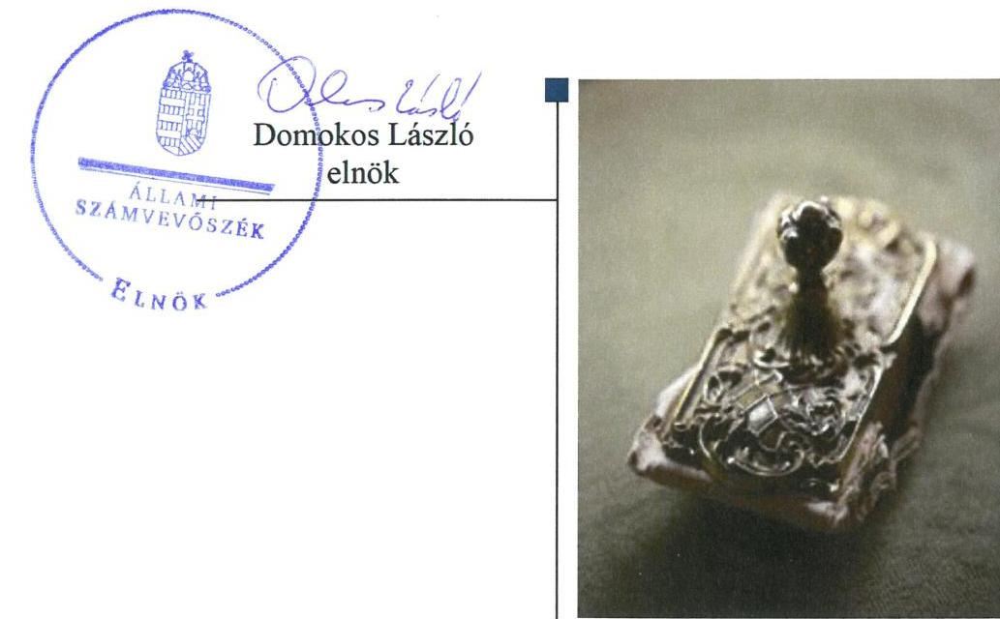
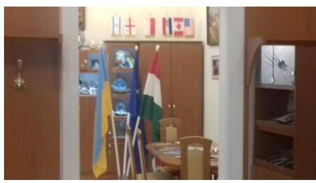
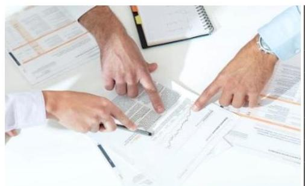
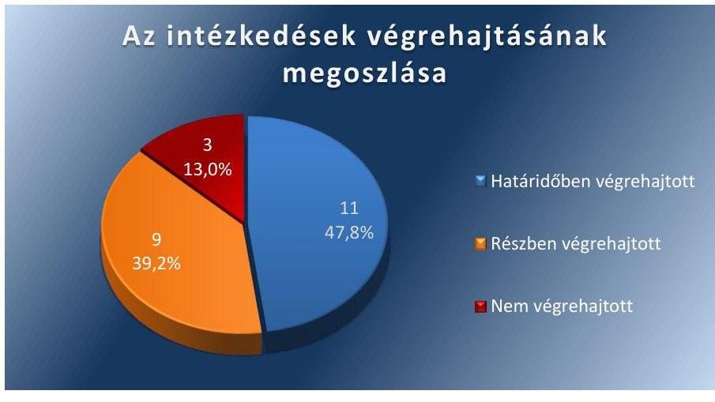

# Jelentés 

## Utóellenőrzések

Az országos nemzetiségi önkormányzatok gazdálkodásának utóellenőrzése Ukrán Országos Önkormányzat 2018.

---

# Jelentés 

## Utóellenőrzések

Az országos nemzetiségi önkormányzatok gazdálkodásának utóellenőrzése Ukrán Országos Önkormányzat
2018. 09. hó 21. nap

---

# AZ ELLENŐRZÉST FELÜGYELTE:

- VARGA EDIT felügyeleti vezető
- AZ ELLENŐRZÉST VEZETTE ÉS A VÉGREHAJTÁSÁÉRT FELELŐS:
  - MAROZSÁN LÁSZLÓNÉ ellenőrzésvezető
  - A PROGRAM ÖSSZEÁLLÍTÁSÁÉRT FELELŐS:
    - TÓTPÁL SZABOLCS osztályvezető

**IKTATÓSZÁM:** EL-0620-034/2018.

**TÉMASZÁM:** 2460

**ELLENŐRZÉS-AZONOSÍTÓ SZÁM:** V080413

Jelentéseink az Országgyűlés számítógépes hálózatán és az Interneta a www.asz.hu címen is olvashatóak.

---

# TARTALOMJEGYZÉK 

■ ÖSSZEGZÉS ..... 5
■ AZ ELLENŐRZÉS CÉLJA ..... 6
■ AZ ELLENŐRZÉS TERÜLETE ..... 7
■ AZ ELLENŐRZÉS HÁTTERE, INDOKOLTSÁGA ..... 8
■ A JELENTÉS LÉNYEGES KÉRDÉSKÖRE ..... 9
■ AZ ELLENŐRZÉS HATÓKÖRE ÉS MÓDSZEREI ..... 10
■ MEGÁLLAPÍTÁSOK ..... 12
■ MELLÉKLETEK ..... 15
I. sz. melléklet: Az ÁSZ 15133. számú jelentéséhez kapcsolódóan az Ukrán Országos Önkormányzat intézkedési terve végrehajtásának értékelése ..... 15
II. sz. melléklet: Az Ukrán Országos Önkormányzat intézkedési terve. ..... 22
■ FÜGGELÉK: ÉSZREVÉTELEK ..... 29
■ RÖVIDÍTÉSEK JEGYZÉKE ..... 31

---

.

---

# ÖSSZEGZÉS 

Az Állami Számvevőszék az Ukrán Országos Önkormányzat gazdálkodásának utóellenőrzése során megállapította, hogy az intézkedési tervben foglalt és végrehajtott feladatok hatására a müködési folyamatok szabályozottsága, vagyongazdálkodása javult. A pénzügyi gazdálkodás és a belső kontrollok müködtetése terén a részben végrehajtott és végre nem hajtott intézkedések miatt a közpénzzel való szabályszerű gazdálkodás nem valósult meg.

## Az ellenőrzés társadalmi indokoltsága

Az Állami Számvevőszék stratégiájában célul tűzte ki a számvevőszéki munka hasznosulásának javítását. Ezzel összhangban ellenőrzi, hogy az ellenőrzött szervezetek megvalósították-e a korábbi ellenőrzései által feltárt hibák, hiányosságok és szabálytalanságok megszüntetése céljából kialakított intézkedési terveikben foglaltakat. Az intézkedések végrehajtásával az adott terület szabályszerű működése vonatkozásában a kockázatok csökkenhetnek, ugyanakkor a nem végrehajtott intézkedések következtében újabb kockázatok merülhetnek fel, amelyek kezelése kiemelten fontos. A rendszeres utóellenőrzések hozzájárulnak a szükséges intézkedések tényleges végrehajtásához, ezáltal a közpénzügyek rendezettségének javulásához, a szabálytalan közpénzfelhasználás kockázatának a csökkentéséhez.

## Főbb megállapítások, következtetések

Az Ukrán Országos Önkormányzat az Állami Számvevőszék intézkedést igénylő megállapításai alapján tett javaslataira készített intézkedési tervében 23 végrehajtandó feladatot határozott meg, amelyből tizenegyet határidőben, kilencet részben és hármat nem hajtott végre.

A hivatalvezető az Önkormányzat módosított szervezeti és működési szabályzatában a Hivatal müködését szabályozta, belső szabályzatban rendezte a müködéséhez kapcsolódó, egyéb pénzügyi kihatással bíró jogszabályban nem szabályozott kérdéseket, elkészítette a vagyongazdálkodási és a törzsvagyon gazdálkodási szabályzatot, az adatvédelmi szabályzatot, az ellenőrzési nyomvonalat. Gondoskodott a költségvetési határozat-tervezetek közgyűlés elé terjesztéséről. A hivatalvezető nem gondoskodott a belső ellenőrzés szabályszerű működtetéséről, a 2015. és a 2017. évben a szükséges előirányzat-módosítások előkészítéséről, a gazdálkodási adatok honlapon való közzétételéről és a gazdálkodási jogkörök szabályszerű gyakorlásának érvényesítéséről. A kockázatkezelési rendszert nem alakította ki, nem gondoskodott arról, hogy a határozat-tervezetek a jogszabálynak megfelelő tartalommal készüljenek.

---

# AZ ELLENŐRZÉS CÉLJA 

Az ellenőrzés célja annak értékelése volt, hogy a számvevőszéki jelentésben ${ }^{1}$ foglalt intézkedést igénylő megállapításokkal összhangban készített intézkedési tervben meghatározott feladatokat az ellenőrzött szervezet vég-rehajtotta-e.

---

# **AZ ELLENŐRZÉS TERÜLETE**

## **Ukrán Országos Önkormányzat**

Az Ukrán Országos Önkormányzat 1999. évben alakult, ellátta az általa képviselt kisebbség érdekeinek országos, illetve szükség szerint a területi képviseletét és védelmét. Az Ukrán Országos Önkormányzat Hivatalát 2009. május 14-én hozta létre az Önkormányzat2, feladata az Önkormányzat tevékenységével kapcsolatos igazgatási feladatok és a gazdálkodással kapcsolatos feladatok ellátása.

Az ÁSZ3 a 2015. évben ellenőrizte az Önkormányzat gazdálkodását a 2010. január 1. – 2014. június 30. közötti időszak vonatkozásában. Az erről szóló 15133 sorszámú jelentését 2015. szeptember 17-én hozta nyilvánosságra. Az ellenőrzés célja annak értékelése volt, hogy az Ukrán Országos Önkormányzat gazdálkodása, a belső kontrollrendszer kialakítása és működése, az államháztartásból nyújtott támogatás, illetve az államháztartásból meghatározott célra ingyenesen juttatott vagyon felhasználása a jogszabályi előírásoknak megfelelően történt-e; az önkormányzat a Nek.tv.4-ben és az Njtv.5-ben előírt feladat és hatásköröket ellátta-e; intézkedett-e az ÁSZ által 2008-ban végzett ellenőrzés javaslatainak végrehajtásáról. Az ÁSZ jelentésében szereplő javaslatokra az önkormányzat intézkedési tervet készített, melyet az ÁSZ elnöke 2016. március 10-én hagyott jóvá.

Az utóellenőrzés az Önkormányzat ellenőrzéséről készült 15133 számú ÁSZ jelentés intézkedést igénylő megállapításai és javaslatai hasznosítására elfogadott intézkedési tervben foglalt feladatok 2015. szeptember 17.- 2018. március 29. közötti végrehajtására irányult.

---

# AZ ELLENŐRZÉS HÁTTERE, INDOKOLTSÁGA 

Az ÁSZ tv6. 33. § (1) bekezdése értelmében a számvevőszéki jelentések intézkedést igénylő megállapításaihoz és javaslataihoz kapcsolódóan az ellenőrzött szervezet vezetője intézkedési tervet köteles összeállítani, és az Állami Számvevőszék részére megküldeni. Az ÁSZ tv. 33. § (6) bekezdése értelmében, amennyiben az ÁSZ elnöke az ellenőrzés során feltárt jogszabálysértő gyakorlat, illetve a vagyon rendeltetésellenes vagy pazarló felhasználásának megszüntetése érdekében figyelemfelhívó levéllel fordult az ellenőrzött szerv vezetőjéhez, az abban foglaltakat az ellenőrzött szerv vezetője köteles elbírálni, a megfelelő intézkedést megtenni és erről az ÁSZ elnökét értesíteni.

Az ÁSZ által befogadott intézkedési tervben foglaltak megvalósítását az ÁSZ törvény 33. § (7) be-kezdésében foglaltak alapján - az Állami Számvevőszék utóellenőrzés keretében ellenőrizheti. Az utóellenőrzések keretében - az intézkedések értékelése során - az Állami Számvevőszék figyelembe veszi az ellenőrzött szervezetek működési feltételeiben, valamint a jogszabályi előírásokban bekövetkezett változásokat. Az utóellenőrzés során az ÁSZ értékeli, hogy az érintett számvevőszéki jelentésben foglalt intézkedést igénylő megállapításokkal és javaslatokkal összhangban, az ellenőrzött szervezet által készített intézkedési tervben meghatározott feladatokat a feladatra kijelöltek végrehajtották-e.

Az intézkedések végrehajtásával az adott terület szabályszerű múködése vonatkozásában a kockázatok csökkenhetnek, azonban hosszabb távon az intézkedési tervben foglaltak végrehajtásával önmagában nem szűnnek meg, csak akkor, ha beépülnek az ellenőrzött szervezet múködésébe, azokat folyamatosan karban tartják, figyelembe véve, illetve kezelve a változásokat. Emellett az intézkedések végrehajtásáig újabb kockázatok merülhetnek fel a szabályszerű múködés vonatkozásában, amelyek kezelése szintén kiemelten fontos az ellenőrzött szervezet számára.

Az ellenőrzött szervezet vezetője által készített intézkedési tervekben foglalt feladatok hiányos, illetve késedelmes végrehajtása, vagy annak elmaradása a szabályszerűség és a felelős vezetői magatartás vonatkozásában kockázatot hordoz, ami azt mutatja, hogy az ellenőrzések során feltárt hibák, hiányosságok és szabálytalanságok kezelése nem kapott kellő hangsúlyt. Az utóellenőrzés során is fenn-álló szabálytalanságok esetén a közpénz, közvagyon veszélyeztetettségi kockázat valószínűsített hatásának értékelése további intézkedéseket vonhat maga után.

Az ellenőrzött szervezet szintjén az utóellenőrzés feltárja, hogy a szervezet az intézkedések végrehajtásával hasznosította-e a korábbi ellenőrzési jelentésben a hiányosságok megszüntetése, illetve a kockázatok kezelése érdekében megfogalmazott javaslatokat, illetve az intézkedések végrehajtása elmaradásának következtében továbbra is fennálló szabálytalanság esetén értékeli a közpénzek, közvagyon veszélyeztetettségét. Az ÁSZ szintjén az utóellenőrzés visszacsatolást ad az ellenőrzési jelentések hasznosulásáról, az intézkedések elmaradásának, vagy részleges megvalósulásának a közpénzek, közvagyon veszélyeztetettségére gyakorolt valószínűsített hatásának értékelése, további intézkedéseket vonhat maga után.

---

# A JELENTÉS LÉNYEGES KÉRDÉSKÖRE 

Az Önkormányzat az intézkedési tervben foglaltakat az elöirt határidőben végrehajtotta-e?

---

# AZ ELLENŐRZÉS HATÓKÖRE ÉS MÓDSZEREI 

## Az ellenőrzés típusa

Megfelelőségi ellenőrzés.

## Az ellenőrzött időszak

Az utóellenőrzés alapját képező számvevőszéki jelentés közzétételének napjától (2015. szeptember 17.) az ellenőrzésről szóló kiértesítő levél keltének napjáig (2018. március 29.) tartó időszak.

## Az ellenőrzés tárgya

Az ÁSZ tv. 2011. július 1-jei hatálybalépését követően a számvevőszéki jelentésben foglalt intézkedést igénylő megállapításokkal és javaslatokkal összhangban - az Önkormányzat által - készített intézkedési tervben foglaltak végrehajtásának ellenőrzése volt.

## Az ellenőrzött szervezet

Ukrán Országos Önkormányzat és az Ukrán Országos Önkormányzat Hivatala.

## Az ellenőrzés jogalapja

Az utóellenőrzés jogszabályi alapját az ÁSZ tv. 33. § (7) bekezdése, illetve a 33. § (1)-(2) és a (6) bekezdéseinek az előírásai képezték.

## Az ellenőrzés módszerei

Az ellenőrzést az ellenőrzött időszakban hatályos jogszabályok, az ellenőrzés szakmai szabályai, a jelen ellenőrzésre irányadó ÁSZ módszertanok, az ellenőrzési programban foglalt értékelési szempontok szerint, önállóan végezte az ÁSZ.

Az ÁSZ az ellenőrzés ideje alatt az ellenőrzött szervezettel történő kapcsolattartást az ÁSZ SZMSZ ${ }^{7}$-ének vonatkozó előírásai alapján biztosította.

Az utóellenőrzés megállapításait az ÁSZ a rendelkezésére álló dokumentumok, valamint az ÁSZ adatbekérése szerint, az ellenőrzött szervezetek által rendelkezésre bocsátott dokumentumok, adatok alapján fogalmazta meg.

---

Az ellenőrzési kérdések megválaszolásához szükséges bizonyítékok megszerzése az ellenőrzött által rendelkezésre bocsátott dokumentumokra, adatokra alapozva megfigyelés, szemle (szemrevételezés), kérdésfeltevés (információkérés), alkalmazásával történt. Az ellenőrzési bizonyítékként felhasználható adatforrások közé tartoztak egyrészt az ellenőrzési program részletes szempontjainál felsorolt adatforrások, másrészt minden - az ellenőrzés folyamán feltárt, az ellenőrzés szempontjából információt tartalmazó - dokumentum.

Az intézkedési tervekben előírt feladatokat azok végrehajthatósága, illetve végrehajtása szempontjából az alábbiak szerint értékelte az ÁSZ:
$\longrightarrow$ „határidőben végrehajtott" a feladat, ha a teljesítés dokumentáltan, az intézkedési tervben előírt határidőben és tartalommal megtörtént;
$\longrightarrow$ „határidőn túl végrehajtott" a feladat, ha annak teljesítése az intézkedési tervben meghatározott módon, de az abban előírt határidőn túl történt meg;
$\longrightarrow$ „részben végrehajtott" a feladat, ha annak végrehajtása nem teljes körűen az intézkedési tervben előírt módon történt meg;
$\longrightarrow$ „nem végrehajtott" a feladat, ha a végrehajtás nem történt meg, dokumentumokkal nem igazolt annak teljesítése;
$\longrightarrow$ „okafogyottá vált" a feladat, ha végrehajtására - meghatározott esemény bekövetkezése, továbbá külső körülmény, a múködést érintő feltétel változása miatt - már nincs szükség, illetve lehetőség, és egyértelműen megállapítható, hogy az intézkedést szükségessé tevő körülmény a jövőben nem fordulhat elő;
$\longrightarrow$ „nem időszerü" az a feladat, amelynek ellenőrzési időszakon belüli végrehajtására azért nem került (kerülhetett) sor, mert az intézkedés alapjául szolgáló esemény nem következett be, de annak jövőbeni előfordulása lehetséges, a végrehajtása nem volt esedékes, vagy a végrehajtás határideje még nem járt le.
Az ellenőrzés lefolytatásához az ellenőrzött szervezet a tanúsítványok elektronikus kitöltésével, valamint az ÁSZ által kért dokumentumok elektronikus megküldésével szolgáltatott adatokat, amelyek valódiságát és teljes körűségét az ellenőrzött szervezet vezetője által tett teljességi és hitelességi nyilatkozat igazolta. Az így rendelkezésre bocsátott adatok, információk kontrollja az ellenőrzés keretében történt. A II. sz. melléklet tartalmazza az Önkormányzat által készített intézkedési tervet. A sorszámozott intézkedések értékelése alapján készült, az azok összegzését tartalmazó I. sz. melléklet.

---

# MEGÁLLAPÍTÁSOK 

## Az Önkormányzat az intézkedési tervben foglaltakat az előírt határidőben végrehajtotta-e?

Összegző megállapítás

Az Önkormányzat az intézkedési tervében meghatározott 23 feladat közül tizenegyet határidőben, kilencet részben és hármat nem hajtott végre.

Az ÁSZ a 15133. számú jelentésében az elnök ${ }^{8}$ részére három, a hivatalvezető ${ }^{9}$ részére pedig 16 javaslatot fogalmazott meg. Az elnök és a hivatalvezető a javaslatok kezelésére, a szabálytalanságok megszüntetésére összesen 23 intézkedésből álló intézkedési tervet küldött az ÁSZ részére.

Az Önkormányzat intézkedési tervében meghatározott feladatokat, határidőket, a feladatok végrehajtásáért felelős személyeket és a feladatok végrehajtását az I. sz. melléklet mutatja be.

Az ÁSZ javaslatai alapján készített intézkedési tervben rögzített feladatok végrehajtásáról a hivatalvezető a Bkr. ${ }^{10} 14 . \S$ (1) bekezdésében előírtak ellenére nem éves bontásban vezette a nyilvántartást.

Az intézkedési tervben meghatározott feladatok végrehajtásának értékelési kategóriák szerinti megoszlását az 1. ábra szemlélteti.

1. ábra

A MÜKÖDÉSI FOLYAMATOK SZABÁLYOZOTTSÁGA az Önkormányzatnál javult. Az Önkormányzat elnöke a Közgyűlés ${ }^{11}$ elé terjesztette a hivatalvezető által elkészített módosított önkormányzati SZMSZ ${ }^{12}$-t, melynek 5. melléklete szabályozta a Hivatal ${ }^{13}$ müködését. A hivatalvezető 2016. április 29-én belső szabályzatban rendezte a müködéséhez kapcsolódó, egyéb pénzügyi kihatással bíró jogszabályban nem szabályozott kérdéseket az Ávr ${ }^{14}$-ben előírtaknak megfelelően, to-

---

vábbá a 2016. április 30-i határidőn túl 2017. december 1-jén belső szabályzatban kialakította a gazdálkodási jogkörök szabályszerű gyakorlásának rendjét.

A VAGYONGAZDÁLKODÁS szabályszerűsége érdekében a hivatalvezető határidőben gondoskodott az Önkormányzat vagyongazdálkodási szabályzatának és törzsvagyona gazdálkodási szabályzatának Nvtv. ${ }^{15}$ ben és az Njtv.-ben foglaltakkal összhangban történő elkészítéséről, hatályba helyezéséről, valamint a beruházások, tárgyi eszközök, immateriális javak nyilvántartásainak szabályszerű vezetéséről, azonban a törzsvagyongazdálkodási szabályzat Közgyűlés elé terjesztését nem kezdeményezte.

A SZABÁLYSZERŰ PÉNZÜGYI GAZDÁLKODÁST támogató tervezett intézkedéseket nem hajtották végre teljes körűen az Önkormányzatnál és a Hivatalnál. Az elnök a 2015. évre vonatkozóan zárszámadási határozat-tervezetet nem terjesztett a Közgyűlés elé az Áht.-ban előírtak ellenére, a 2016. évi zárszámadást a jogszabályi előírásoknak megfelelő mellékletekkel a Közgyűlés elé terjesztette. A hivatalvezető 2015. és 2017. években nem gondoskodott arról, hogy az Önkormányzat a jóváhagyott költségvetésének keretei közötti gazdálkodjon, mivel az indokolt esetekben az Áht.-ban előírtak ellenére az előirányzatok módosításáról nem intézkedett. A 2016-2018. évi költségvetési határozat tervezetek nem tartalmazták az Áht.-ban előírt tartalmi elemeket.

# A BELSŐ KONTROLLOK, A BELSŐ ELLENŐRZÉS 

nem múködött a jogszabályoknak megfelelően. A hivatalvezető határidőben elkészítette a hivatali ellenőrzési nyomvonalat, gondoskodott a Belső Ellenőrzési Kézikönyv jóváhagyásáról. A hivatalvezető a Bkr. előírása ellenére nem aktualizálta az ellenőrzési nyomvonalat, nem gondoskodott kockázatelemzésen alapuló belső ellenőrzési terv elkészítéséről és a kockázatkezelési rendszer kialakításáról és múködtetéséről.

---

.

---

# MELLÉKLETEK

- I. SZ. MELLÉKLET: AZ ÁSZ 15133. SZÁMÚ JELENTÉSÉHEZ KAPCSOLÓDÓAN AZ UKRÁN ORSZÁGOS ÖNKORMÁNYZAT INTÉZKEDÉSI TERVE VÉGREHAJTÁSÁNAK ÉRTÉKELÉSE

|  1. | Az intézkedési terv alapján elvégzendő feladat | Az intézkedési tervben meghatározott határidő | Az intézkedési tervben rögzített feladatok elvégzésének felelése | A feladat végrehajtása  |
| --- | --- | --- | --- | --- |
|  1. | Hatalidőben végrehajtott feladatok |  |  |   |
|  2. | E-01. Intézkedjen a Hivatalvezető által elkészített SZMSZ Közgyűlés elé terjesztéséről. | 2015. február 13. | Elnök | Az elnök intézkedett a módosított önkormányzati SZMSZ Közgyűlés elé terjesztéséről, annak megtárgyalását a 2015. 02.13-i közgyűlési ülés 2. napirendi pontjára vételével javasolta. A Közgyűlés a 20/2015. (02.13.) számú határozatával elfogadta az SZMSZ módosítását.  |
|  3. | E-02. Gondoskodik a költségvetési koncepció, valamint a költségvetési határozat-tervezetek határidőben történő Közgyűlés elé terjesztéséről. | a jogszabályokban (Áht. tv és Kormányrendelet) meghatározottak szerint | Elnök | A költségvetési koncepció készítését előíró Áht. 24. § (1) bekezdés 2014.09.30-tól nincs hatályban, így az ÁSZ javaslatának vonatkozó része okafogyottá vált.
Az elnök a 2016.-2018. évi költségvetési tervezeteket az Áht.-ban előírt február 15-i határidőn belül, 2016.01.28án; 2017.01.31-én, illetve 2018. 02.09-én Közgyűlés elé terjesztette.  |
|  4. | H-01. A hivatalvezető elkészíti és rendszeresen aktualizálja a Hivatal SZMSZ-t valamint gondoskodik annak szabályszerű kiadmányozásáról. | 2015. február 13. | Hivatalvezető | A hivatalvezető 2015. február 13-án elkészítette az Önkormányzat SZMSZ-ét, amelynek 5. számú mellékletét képező Ügyrendi Szabályzatában az Njtv.-ben előírtaknak megfelelően szabályozta a Hivatal múködését.  |
|  5. | H-03. A hivatalvezető elkészíti és rendszeresen aktualizálja a Hivatal kiküldetési, a reprezentációs kiadások, a telefon- és gépjármú használatra vonatkozó szabályzatát valamint gondoskodik annak szabályszerű kiadmányozásáról. | 2016. április 30. | Hivatalvezető | A hivatalvezető határidőben, 2016. április 29-én elkészítette az Ávr. előírásainak megfelelően a Kiküldetési szabályzatot, a Reprezentációs szabályzatot, a Vezetékes és mobil-telefonok használatának szabályzatát és a Gépjármú-használati szabályzatát. A szabályzatok ellenőrzött időszakban történő felülvizsgálatát, aktualizálását jogszabály, vagy egyéb körülmény nem tette szükségessé.  |

---

|  5. | Az intézkedési terv alapján elvégzendő feladat | Az intézkedési tervben meghatározott határidő | Az intézkedési tervben rögzített feladatok elvégzésének felelőse | A feladat végrehajtása  |
| --- | --- | --- | --- | --- |
|  5. | H-04. A hivatalvezető elkészíti és rendszeresen aktualizálja a Hivatal beszerzési/közbeszerzési szabályzatát valamint gondoskodik annak szabályszerű kiadmányozásáról. | 2016. április 30. | Hivatalvezető | A hivatalvezető 2016. április 29-én elkészítette a Beszerzési szabályzatot. A Beszerzési szabályzat ellenőrzött időszakban történő felülvizsgálatát, aktualizálását, közbeszerzési szabályzat készítését jogszabály, vagy egyéb körülmény nem tette szükségessé.  |
|  6. | H-05. A hivatalvezető elkészíti és rendszeresen aktualizálja a Hivatal szabálytalanságok kezelésének eljárásrendjére vonatkozó szabályzatát valamint gondoskodik annak szabályszerű kiadmányozásáról. | 2016. április 30. | Hivatalvezető | A hivatalvezető 2016. április 29-én elkészítette a Bkr.ben előírtaknak megfelelő Szabálytalanságok kezelésének szabályzatát.  |
|  7. | H-07. Gondoskodik a dokumentumokhoz és információkhoz való hozzáféréssel és a beszámolási eljárásokkal kapcsolatos felelősségi körök meghatározásáról. | 2016. április 30. | Hivatalvezető | A hivatalvezető az Adatvédelmi szabályzatban, az Iratkezelési szabályzatban és az Informatikai biztonsági szabályzatban szabályozta a dokumentumokhoz és információkhoz való hozzáféréssel kapcsolatos felelősségi köröket, az Ellenőrzési nyomvonalban szabályozta a beszámolási eljárásokkal kapcsolatos felelősségi köröket. A szabályzatok az előírt határidőn belül, 2016. április 29-én készítette el.  |
|  8. | H-09. Gondoskodik a kötelezően közzéteendő adatok nyilvánosságra hozatalának és megismerésére irányuló igények teljesítésének rendjének kialakításáról. | 2016. április 30. | Hivatalvezető | A hivatalvezető az Info tv. ${ }^{16}$ és az Ávr. előírásainak megfelelően 2016. április 29-én elkészítette a Közzétételi szabályzatot, amelyben gondoskodott a kötelezően közzéteendő adatok nyilvánosságra hozatalának és megismerésére irányuló igények teljesítése rendjének kialakításáról.  |
|  9. | H-10. Gondoskodik a Hivatal adatvédelmi és adatbiztonsági szabályzatának elkészítéséről. | 2016. április 30. | Hivatalvezető | A hivatalvezető 2016. április 29-én elkészítette a Hivatal adatvédelmi és adatbiztonsági szabályzatát.  |
|  10. | H-14. Gondoskodik a Belső Ellenőrzési Kézikönyv jóváhagyásáról, valamint biztosítja, hogy annak jogszabályban előírt felülvizsgálatát elvégezzék. | 2016. április 30. | Hivatalvezető | A hivatalvezető határidőben gondoskodott a Belső Ellenőrzési Kézikönyv jóváhagyásáról. Az ellenőrzött időszakon belül a Belső Ellenőrzési Kézikönyv - a Bkr. 17. §  |

---

|  Sorszám | Az intézkedési terv alapján elvégzendő feladat | Az intézkedési tervben meghatározott határidő | Az intézkedési tervben rögzített feladatok elvégzésének felelőse | A feladat végrehajtása  |
| --- | --- | --- | --- | --- |
|   |  |  |  | (4) bekezdésében előírtak szerint meghatározott - legalább kétévenkénti felülvizsgálata a 2016. május 1-el való hatályba lépésére tekintettel nem volt esedékes.  |
|  11. | H-20. Gondoskodik a beruházási-, tárgyi eszköz és immateriális javak nyilvántartásainak szabályszerű vezetéséről. | Folyamatos | Hivatalvezető | A hivatalvezető gondoskodott a beruházási-, tárgyi eszköz és immateriális javak nyilvántartásainak szabályszerű vezetéséről. A 2015-2017. évi nyilvántartások megfeleltek az Áhsz. ${ }^{17}$ tartalmi előírásainak.  |
|   |  | Részben végrehajtott feladatok |  |   |
|  12. | H-02.A hivatalvezető elkészíti és rendszeresen aktualizálja a Hivatal ellenőrzési nyomvonalára vonatkozó szabályzatot valamint gondoskodik annak szabályszerű kiadmányozásáról. | 2016. április 30. | Hivatalvezető | - Végrehajtott feladatrész:
A hivatalvezető és a belső ellenőr 2016. április 29-én elkészítette a hivatal ellenőrzési nyomvonalára vonatkozó szabályzatát, a Hivatal Ellenőrzési Nyomvonala elnevezésű dokumentum alatt.
- Nem végrehajtott feladatrész:
Az Ellenőrzési Nyomvonal 2.2. pontja szerint a szabályzatot rendszeres időközönként felül kell vizsgálni, folyamatosan aktualizálni kell. A hivatalvezető az ellenőrzött időszakban a 8kr. 6. § (3) bekezdés előírása ellenére nem aktualizálta az Ellenőrzési Nyomvonalat.  |
|  13. | H-08. Gondoskodik a gazdálkodási jogkörök szabályszerű gyakorlásának érvényesítéséről. | 2016. április 30. | Hivatalvezető | - Végrehajtott (határidőn túl) feladatrész:
A hivatalvezető az előírt határidőn túl, 2017. december 1-jén kiadott Gazdálkodási jogkörök szabályzatban az Áht. és az Ávr. előírásainak megfelelően rendezte a gazdálkodási jogkörök gyakorlásának belső előírásait, feltételeit.
- Nem végrehajtott feladatrész:
A hivatalvezető nem gondoskodott a gazdálkodási jogkörök szabályszerű gyakorlásának érvényesítéséről.  |

---

|  14. | H-11. Gondoskodik az Önkormányzat és a Hivatal gazdálkodására vonatkozó adatok közzétételéről. | 2015. december 31. | Hivatalvezető | - Végrehajtott feladatrész:
A www.ukranok.hu honlapon az Info tv. 1. számú mellékletében felsorolt III. Gazdálkodási adatokból megtalálható volt a 2015. évi elemi költségvetése.
- Nem végrehajtott feladatrész:
A hivatalvezető nem gondoskodott az Info. tv. 37. § (1) bekezdésében előírtak ellenére az Info. tv. 1. melléklet általános közzétételi lista III. részében felsorolt gazdálkodási adatok 2015. december 31-ei határidőig történő közzétételéről a 2015. évi elemi költségvetése kivételével.  |
| --- | --- | --- | --- | --- |
|  15. | H-12. Intézkedik az Iratkezelési szabályzat felülvizsgálatáról, és biztosítja a Hivatalnál készülő iratok nyilvántartásba vételét. | 2016. április 30. | Hivatalvezető | - Végrehajtott feladatrész:
A hivatalvezető intézkedett az Iratkezelési szabályzat felülvizsgálatáról, 2016. április 29-én az elnökkel kiadta a Hivatal módosított Iratkezelési szabályzatát.
- Nem végrehajtott feladatrész:
A Hivatalnál készült iratok nyilvántartásba vételéről a hivatalvezető - az Ltv. ${ }^{18}$ 9. § (1) bekezdés a) pontjában foglaltak ellenére - nem gondoskodott.  |
|  16. | H-13. Gondoskodik a Hivatal tevékenységének, a célok megvalósításának nyomon követését biztosító rendszer kialakításáról, mely magába foglalja az ellenőrzési nyomvonal elkészítését és szabályszerű gyakorlásának érvényesítését. | 2016. április 30., valamint azt követően folyamatos | Hivatalvezető | - Végrehajtott feladatrész:
A hivatalvezető gondoskodott a Bkr.-ben foglaltak szerint a Hivatal tevékenységének, a célok megvalósításának nyomon követését biztosító rendszer kialakításáról. 2016. április 29-én elkészítette a Bkr.-ben előírtak alapján a Hivatal ellenőrzési nyomvonalát.
- Nem végrehajtott feladatrész:
A hivatalvezető nem gondoskodott a Bkr. 3. § (e) pontjában előírtak ellenére, a Hivatal nyomon követési rendszerének szabályszerű működtetéséről.  |

---

|  17. | H-15. Intézkedik a belső ellenőrzés jogszabályoknak megfelelő kialakításáról és müködtetéséről. | 2016. április 30. | Hivatalvezető | - Végrehajtott feladatrész:
A belső ellenőr a Bkr.-ben előírt határidőben elkészítette az Önkormányzat 2016. és 2017. évi belső ellenőrzési tervét és a 2016. évi éves összefoglaló jelentést.
- Nem végrehajtott feladatrész:
A hivatalvezető nem intézkedett a belső ellenőrzés jogszabálynak megfelelő működtetéséről. A belső ellenőrzési tervekhez kockázatelemzés a Bkr. 29. § (1) bekezdésében előírtak ellenére nem készült. A 2016. évben elvégzett belső ellenőrzésekről vezetett nyilvántartás nem tartalmazta a Bkr. 50. § (2) bekezdésében felsorolt tartalmi elemeket.  |
| --- | --- | --- | --- | --- |
|  18. | H-17. Gondoskodik az Önkormányzatnak a jóváhagyott költségvetés keretei között gazdálkodásáról, és szükség szerint gondoskodjon az előirányzatok módosításáról. | folyamatos | Hivatalvezető | - Végrehajtott feladatrész:
A 2016. évben a Hivatalvezető gondoskodott az Önkormányzat jóváhagyott költségvetés keretei közötti gazdálkodásáról és szükség szerint az előirányzatok módosításáról.
- Nem végrehajtott feladatrész:
A 2015. és a 2017. évben a Hivatalvezető nem gondoskodott az Önkormányzat jóváhagyott költségvetés keretei közötti gazdálkodásáról. A hivatalvezető az Áht. 34. § (4)-(5) bekezdésében előírtak ellenére nem gondoskodott a 2015. és 2017. évben a szükséges előirányzat módosításokról, a költségvetési határozatok módosítását nem kezdeményezte, annak ellenére, hogy a bevételi és kiadási teljesítések nem az előirányzatnak megfelelően teljesültek.  |
|  19. | H-18. Gondoskodik a zárszámadási határozat-tervezettel bemutatandó kimutatások előkészítéséről. | a jogszabályokban meghatározottak szerint | Hivatalvezető | - Végrehajtott feladatrész:
A 2016. évi zárszámadás határozat-tervezetéhez az Áhsz. előírásainak megfelelően mellékelték a szöveges  |

---

|  20. | H-19. Gondoskodik a törzsvagyonba tartozó vagyonelemek körének, a vagyon használatának és hasznosításának szabályai jogszabályok előírásainak megfelelő elkészítéséről és kezdeményezi azok Közgyűlés elé terjesztését. | 2016. április 30. | Hivatalvezető | - Végrehajtott feladatrész:
Az elnök és a hivatalvezető 2016.04.29-i dátummal kiadta az Önkormányzat vagyongazdálkodási szabályzatát és az Önkormányzat törzsvagyonának gazdálkodási szabályzatát, amelyekben a hivatalvezető gondoskodott a törzsvagyonba tartozó vagyonelemek körének meghatározásáról és a vagyon használatának és hasznosításának szabályairól. A vagyongazdálkodási szabályzatot a Közgyűlés 2016. április 19-én fogadta el.
- Nem végrehajtott feladatrész:
A hivatalvezető nem kezdeményezte az Njtv. 123. § (4) bekezdés c) pontjában foglalt feladatkörében eljárva, a Nvtv. 5. § (2) bekezdés b) pontjában, továbbá a Mötv. ${ }^{19}$ 107. §-ában foglaltak ellenére a törzsvagyon gazdálkodási szabályzat Közgyűlés elé terjesztését.  |
| --- | --- | --- | --- | --- |
|  21. | E-03. Biztosítja, hogy a jövőben az Önkormányzat vélemény-nyilvánítási, egyetértési és közreműködési jogosultság szabályszerű ellátása érdekében a feladatellátással összefüggő hatáskört - beszámolási kötelezettség | 2016. április 30. | Elnök | A 2016.04.29-én módosított SZMSZ nem nevesítette elnökre átruházott hatáskörként a kapcsolódó véleménynyilvánítási és egyetértési jogkörökre történő felhatalmazást.  |

---

|  5 | Az intézkedési terv alapján elvégzendő feladat | Az intézkedési tervben meghatározott határidő | Az intézkedési tervben rögzített feladatok elvégzésének felelőse | A feladat végrehajtása  |
| --- | --- | --- | --- | --- |
|  elöírásával - Közgyűlési felhatalmazás alapján lássa el. |  |  |  |   |
|  22. | H-06. A hivatalvezető a jogszabályi előírásoknak megfelelően kialakítja és működteti a kockázatkezelési rendszert. | 2016. április 30. | Hivatalvezető | A hivatalvezető a Bkr. 7. § (1) bekezdésében előírtakkal ellentétben nem alakította ki és nem működtette a kockázatkezelési rendszert.  |
|  23. | H-16. Gondoskodik róla, hogy a Közgyűlés elé terjesztett költségvetési határozat tervezetek megfeleljenek a jogszabályi előírásoknak. | folyamatos | Hivatalvezető | A 2016-2018. évi költségvetési határozat tervezetek nem tartalmazták az Áht. 23. § (2) bekezdés a) pont ab) alpont és h) pontjában előírtak ellenére az Önkormányzat költségvetési bevételi és kiadási előirányzatait kötelező, önként vállalt és államigazgatási feladatok bontásban, továbbá a költségvetés végrehajtásával kapcsolatos hatásköröket.  |

---

# II. SZ. MELLÉKLET: AZ UKRÁN ORSZÁGOS ÖNKORMÁNYZAT INTÉZKEDÉSI TERVE 

## JEERKABHE CAMOBPHJJYBAHHJ YKPAÏHUJJI YIOPIUHU UKRÁN ORSZÁGOS ÖNKORMÁNYZAT

H-1065 Budapest, Hajós u.1. HUNGARY Tel: (+36-1)-4610111, fax/4610112
e-mail: ukrvenir@t-onlinel.hr

## Intézkedési terv

az Állami Számvevőszéknek az Ukrán Országos Önkormányzat gazdálkodása ellenőrzéséről készült vizsgálati jelentésben javasolt intézkedések végrehajtására
I. A hivatalvezetőnek tett javaslatok:
1.1. Intézkedjen a Hivatal SzMSz-ének, az ellenőrzési nyomvonal, a beszerzési/közbeszerzési, a kiküldetési, a reprezentációs kiadások, a telefon- és gépjármú használatra vonatkozó szabályzatok, valamint a szabálytalanságok kezelése eljárásrendjének elkészítésére és szabályszerű kiadmányozására.
1.2. A hivatalvezető intézkedése:
a) a hivatalvezető elkészíti és rendszeresen aktualizálja a Hivatal SZMSZ-t
valamint gondoskodik annak szabályszerű kiadmányozásáról.
Felelőss: hivatalvezető
Határidő: 2015. február 13.
b) a hivatalvezető elkészíti és rendszeresen aktualizálja a Hivatal ellenőrzési
nyomvonalára vonatkozó szabályzatot valamint gondoskodik annak szabályszerű
kiadmányozásáról.
Felelőss: hivatalvezető
(Operatív felelőss: Belső Ellenőr)
Határidő: 2016. április 30.
c) a hivatalvezető elkészíti és rendszeresen aktualizálja a Hivatal kiküldetési, a reprezentációs kiadások, a telefon- és gépjármú használatra vonatkozó
szabályzatát valamint gondoskodik annak szabályszerű kiadmányozásáról.
Felelőss: hivatalvezető
Határidő: 2016. április 30.
d) a hivatalvezető elkészíti és rendszeresen aktualizálja a Hivatal
beszerzési/közbeszerzési szabályzatát valamint gondoskodik annak szabályszerű
kiadmányozásáról.
Felelőss: hivatalvezető
Határidő: 2016. április 30.
e) a hivatalvezető elkészíti és rendszeresen aktualizálja a Hivatal
szabálytalanságok kezelésének eljárásrendjére vonatkozó szabályzatát
valamint gondoskodik annak szabályszerű kiadmányozásáról.

---

# Felelós: hivatalvezetó   (Operativ lelelós: Belsó Ellenór)   Határidó: 2016. április 30. 

2.1. Az állami számvevöszek javaslata a kockázatkezelési rendszer kialalátásával és müködtetésével kapesolatban:

Alakitsa ki és müködtesse a kockázatkezelési rendszer.
2.2. A hivatalvezetó intézkedése:
a) a hivatalvezető a jogszabályi elöírásoknak megfelelően kialakíja és müködteti a kockázatkezelési rendszer
H-C6
Felelös: hivatalvezető
(Operatív felelós: Belsó Ellenór)
Határidó: 2016. április 30.
3.1. Az állami számvevöszék javaslata a kontrolltevĕkenységek kialakításával és müködtetésével kapcsolatba:
a) intézkedjen a dokumentumokhoz és információkhoz való hozzáféréssel és a beszámolási eljárásokkal kapcsolatos felelősségi körök meghatározásáról.
b) intézkedjen a gazdálkodási jogkörök szabályszerű gyakorlásának érvényesítéséröl.
3.2. A hivatalvezető intézkedése:
a) Gondoskodik a dokumentumokhoz és információkhoz való hozzáféréssel és a beszámolási eljárásokkal kapcsolatos felelősségi körök meghatározásáról.
Felelös: hivatalvezető
Határidó: 2016. április 30.
b) Gondoskodik a gazdálkodási jogkörök szabályszerű gyakorlásának érvényesitéséröl.
Felelós: hivatalvezető
Határidó: 2016. április 30.
4.1. Az információs és kommunikációs rendszer kialakításával és kötelezően közzéteendő adatok nyilvánosságra hozatalával, valamint a közérdekii adatok megismerésével kapcsolatos feladatok:
a) alakitsa ki a kötelezz̈on közzéteendő adatok nyilvánosságra hozatalának és megismerésére irányuló igények teljesítésének rendjét.
b) intézkedjen a Hivatal adatvédelmi és adatbiztonsági szabályzatának elkészítéséröl.
c) gondoskodjon az Önkormányzat és a Hivatal gazdálkodására vonatkozó adatok közzétételéröl.

---

- d) intézkedjen az Iratkezelési szabályzat feltülvizsgálatáról, és biztosítsa a Hivatalnál készülő iratok nyilvántartásba vételét.

### 4.2. A hivatalvezető intézkedése:

- a) Gondoskodik a kötelezően közzéteendő adatok nyilvánosságra hozatalának és megismerésére irányuló igények teljesítése rendjének kialakításáról.
  - Felelős: hivatalvezető
  - Határidő: 2016. április 30.

- c) Gondoskodik a Hivatal adatvédelmi és adatbiztonsági szabályzatának elkészítéséről.
  - Felelős: hivatalvezető
  - Határidő: 2016. április 30.

- d) Intézkedik az Iratkezelési szabályzat feltülvizsgálatáról, és biztosítja a Hivatalnál készülő iratok nyilvántartásba vételét.
  - Felelős: hivatalvezető
  - Határidő: 2016. április 30.

### 5.1. Az Önkormányzat monitoring rendszerének kialakításával és működtetésével valamint a belső ellenőrzés jogszabályoknak megfelelő kialakításával és működtetésével kapcsolatos feladatok:

- a) alakítsa ki és működtesse a Hivatal tevékenységének, a célok megvalósításának nyomon követését biztosító rendszert.

- b) gondoskodjon Belső Ellenőrzési Kézikönyv jóváhagyásáról, valamint biztosítsa, hogy annak jogszabályban előírt feltülvizsgálatát elvégezzék.

- c) intézkedjen a belső ellenőrzés jogszabályoknak megfelelő kialakításáról és működtetéséről.

### 5.2. A hivatalvezető intézkedése:

- a) Gondoskodik a Hivatal tevékenységének, a célok megvalósításának nyomon követését biztosító rendszer kialakításáról, mely magába foglalja az ellenőrzési nyomvonal elkészítését és szabályszerű gyakorlásának érvényesítését.
  - Felelős: hivatalvezető
  - (Operatív felelős: Belső Ellenőr)
  - Határidő: 2016. április 30. valamint azt követően folyamatos.

- b) Gondoskodik a Belső Ellenőrzési Kézikönyv jóváhagyásáról, valamint biztosítja, hogy annak jogszabályban előírt feltülvizsgálatát elvégezzék.
  - Felelős: hivatalvezető
  - (Operatív felelős: Belső Ellenőr)

---

Határidó: 2016. április 30.
c) Intézkedik a belsö ellenörzés jogszabályoknak megfelelö kialakításáról és müködtetéséröl.
$\mathrm{H}-15$
Felelös: hivatalvezető
(Operatív felelös: Belső Ellenör)
Határidó: 2016. április 30.
6.1. A Közgyülés elé terjesztett költségvetési határozat tervezetek tartalmának megfelelöségéről:

Intézkedjen, hogy a Közgyülés elé terjesztett költségvetési határozat tervezetek feleljenek meg a jogszabályi elöírásoknak.
6.2. A hivatalvezető intézkedése:

Gondoskodik róla, hogy a Közgyülés elé terjesztett költségvetési határozat tervezetek megfeleljenek a jogszabályi elöírásoknak.
Felelös: hivatalvezető
(Operatív felelös: Gazdasági vezető)
Határidó: folyamatos
7.1. Az állami számvevőszék javaslata az Önkormányzat jóváhagyott költségvetés keretei közötti gazdálkodásáról és szükség szerint az elöirányzatok módosításáról.

Intézkedjen, hogy az Önkormányzat a jóváhagyott költségvetés keretei között gazdálkodjon, és szükség szerint gondoskodjon az elöirányzatok módosításáról.
7.2. A hivatalvezető intézkedése:

Gondoskodik az Önkormányzatnak a jóváhagyott költségvetés keretei közötti gazdálkodásáról és szükség szerint az elöirányzatok módosításáról.
$\mathrm{H}-17$
Felelös: hivatalvezető
(Operatív felelös: Gazdasági vezető)
Határidó: folyamatos
8.1. A zárszámadási határozat-tervezettel bemutatandó kimutatások elökészítéséről.

Gondoskodjon a zárszámadási határozat-tervezettel bemutatandó kimutatások elökészítéséröl.
8.2. A hivatalvezető intézkedése:

Gondoskodik a zárszámadási határozat-tervezetel bemutatandó kimutatások elökészítéséről.
Felelös: hivatalvezető
(Operatív felelös: Gazdasági vezető)
Határidó: a jogszabályokban meghatározottak szerint

---

9.1. A törzsvagyonba tartozó vagyonelenck körének, a vagyon használatának és hasznosításának szabályai jogszabályok clöírásainak megfelelő elkészítésćról és a Közgyülés elé terjesztésćról.

Gondoskodjon a törzsvagyonba tartozó vagyonelenck körének, a vagyon használatának és hasznosításának szabályai jogszabályok clöírásainak megfelelő elkészítésćról és kezdeményezze azok Közgyülés elé terjesztését.
9.2. A hivatalvezető intézkedése:

Gondoskodik a törzsvagyonba tartozó vagyonelenck körének, a vagyon használatának és hasznosításának szabályai jogszabályok clöírásainak megfelelő elkészítésćról és kezdeményezi azok Közgyülés elé terjesztését.
Felelős: hivatalvezető
(Operatív felelős: Gazdasági vezető)
Határidő: 2016. április 30.
10.1. A beruházási-, tárgyi eszköz- és immateriális javak nyilvántartásainak szabályszerű vezetéséről.

Gondoskodjon a beruházási-, tárgyi eszköz- és immateriális javak nyilvántartásainak szabályszerű vezetéséről.
10.2. A hivatalvezető intézkedése:

Gondoskodik a beruházási-, tárgyi eszköz- és immateriális javak nyilvántartásainak szabályszerű vezetéséről.
Felelős: hivatalvezető
(Operatív felelős: Gazdasági vezető)
Határidő: folyamatos
II. Az elnöknek tett javaslat:
1.1 Intézkedjen a Hivatalvezető által elkészített SZMSZ Közgyülés elé történő terjesztéséről.
1.2 Az elnök intézkedése:

Intézkedjen a Hivatalvezető által elkészített SZMSZ Közgyülés elé történő terjesztéséről.
Felelős: elnök
(Operatív felelős: Hivatalvezető)
Határidő: 2015. február 13.
2.1. A költségvetési koncepció, valamint a költségvetési határozat-tervezetek határidőben történő Közgyülés elé terjesztésćról.

---

# Mellékletek

## 2.2 Az elnök intézkedése:

Gondoskodik a költségvetési koncepció, valamint a költségvetési határozat tervezetek határidőben történő Közgyűlés elé terjesztéséről.

**Felelős:** elnök

**(Operatív felelős: Hivatalvezető)**

**Határidő:** a jogszabályokban (Ált. tv és Kormányrendelet) meghatározottak szerint

### 3.1. A vélemény-nyilvánítási, egyetértési és közreműködési jogosultság ellátásáról.

Biztosítva, hogy a jövőben az Önkormányzat vélemény-nyilvánítási, egyetértési és közreműködési jogosultság szabályszerű ellátása érdekében a feladatellátással összefüggő hatáskört - beszámolási kötelezettség előírásával - Közgyűlési felhatalmazás alapján lássa el.

## 3.2 Az elnök intézkedése:

Biztosítja, hogy a jövőben az Önkormányzat vélemény-nyilvánítási, egyetértési és közreműködési jogosultság szabályszerű ellátása érdekében a feladatellátással összefüggő hatáskört - beszámolási kötelezettség előírásával - Közgyűlési felhatalmazás alapján lássa el.

**Felelős:** elnök

**(Operatív felelős: Hivatalvezető)**

**Határidő:** 2016. április 30.

Budapest, 2016. január 12.

Kravesenko György

elnök

dr. Körödi Irén

hivatalvezető

---

.

---

# FÜGGELÉK: ÉSZREVÉTELEK 

A jelentéstervezetet a Számvevőszék 15 napos észrevételezésre megküldte az ellenőrzött szervezetek vezetőinek az ÁSZ tv. 29. §* (1) bekezdése előírásának megfelelően.

Az ÁSZ a jelentéstervezetet észrevételezésre megküldte az Ukrán Országos Önkormányzat elnökének és az Ukrán Országos Önkormányzat Hivatala hivatalvezetőjének.
Az Ukrán Országos Önkormányzat elnöke és az Ukrán Országos Önkormányzat Hivatala hivatalvezetője az ÁSZ tv. 29. § (2) bekezdésében foglalt észrevételezési jogával nem élt, a törvényes határidőn belül észrevételt nem tettek.

[^0]
[^0]:    * 29. § (1) Az Állami Számvevőszék az ellenőrzési megállapításait megküldi az ellenőrzött szervezet vezetőjének vagy az általa megbízott személynek, és annak, akinek személyes felelősségét állapította meg.
    (2) Az ellenőrzött szervezet vezetője és a felelősként megjelölt személy az ellenőrzés megállapításaira tizenöt napon belül írásban észrevételt tehet.
    (3) Az Állami Számvevőszék az észrevételre a beérkezésétől számított harminc napon belül írásban válaszol. A figyelembe nem vett észrevételeket köteles a jelentésben feltüntetni, és megindokolni, hogy azokat miért nem fogadta el.

---

.

---

# RÖVIDÍTÉSEK JEGYZÉKE 

${ }^{1}$ számvevőszéki jelentés
${ }^{2}$ Önkormányzat
${ }^{3}$ ÁSZ
${ }^{4}$ Nek.tv.
${ }^{5}$ Njtv.
${ }^{6}$ ÁSZ tv.
${ }^{7}$ ÁSZ SZMSZ
${ }^{8}$ Elnök
${ }^{9}$ hivatalvezető
${ }^{10}$ Bkr.
${ }^{11}$ Közgyűlés
${ }^{12}$ önkormányzati SZMSZ
${ }^{13}$ Hivatal
${ }^{14}$ Ávr.
${ }^{15}$ Nvtv.
${ }^{16}$ Info tv.
${ }^{17}$ Áhsz.
${ }^{18}$ Ltv.
${ }^{19}$ Mötv.
„Az Országos Nemzetiségi Önkormányzatok gazdálkodásának utóellenőrzése Ukrán Országos Önkormányzat" című 15133. számú jelentés
Ukrán Országos Önkormányzat
Állami Számvevőszék
1993. évi LXXVII. törvény a nemzeti és etnikai kisebbségek jogairól (hatályos 2011. december 31-ig)
2011. évi CLXXIX. törvény a nemzetiségek jogairól
az Állami Számvevőszékről szóló 2011. évi LXVI. törvény
Az Állami Számvevőszék elnökének 4/2017. (XII. 29.) ÁSZ utasítása az Állami Számvevőszék Szervezeti és Működési Szabályzatáról (hatályos 2018. január 1-jétől)
Ukrán Országos Önkormányzat elnöke
Ukrán Országos Önkormányzat Hivatala vezetője
370/2011. (XII. 31.) Kormányrendelet a költségvetési szervek belső kontrollrendszeréről és belső ellenőrzéséről (hatályos: 2012. január 1-jétől)
Ukrán Országos Önkormányzat közgyűlése
Ukrán Országos Önkormányzat szervezeti és működési szabályzata
Ukrán Országos Önkormányzat Hivatala
368/2011. (XII.31.) Kormányrendelet az államháztartásról szóló törvény végrehajtásáról
a nemzeti vagyonról szóló 2011. évi CXCVI. törvény
2011. évi CXII. törvény az információs önrendelkezési jogról és az információszabadságról
4/2013 (1.11.) Korm. rendelet az államháztartás számviteléről
a köziratokról, a közlevéltárakról és a magánlevéltári anyag védelméről szóló 1995. évi LXVI. törvény
2011. évi CLXXXIX. törvény Magyarország helyi önkormányzatáról

---

# ÁLLAMI SZÁMVEVŐSZÉK 

1052 Budapest, Apáczai Csere János utca 10.
Levélcím: 1364 Budapest 4. Pf. 54
Telefon: +36 14849100 Telefax: +36 14849200
www.asz.hu