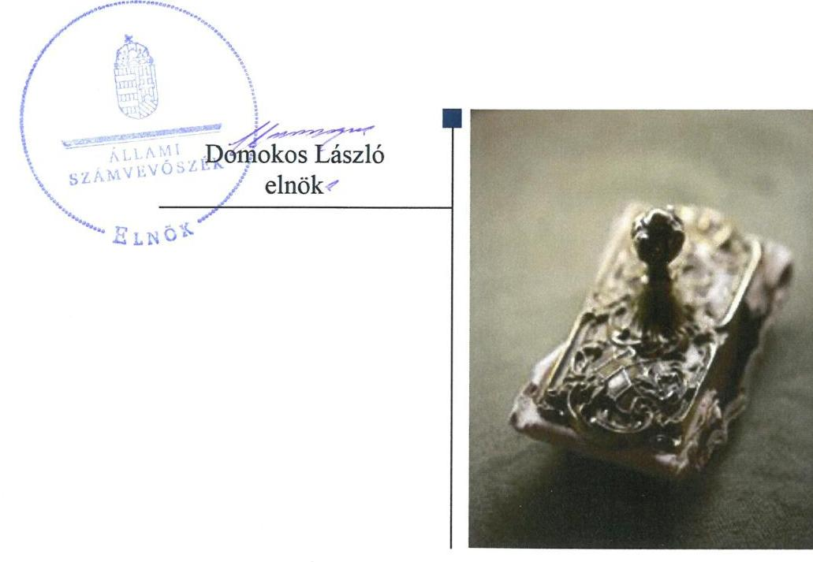
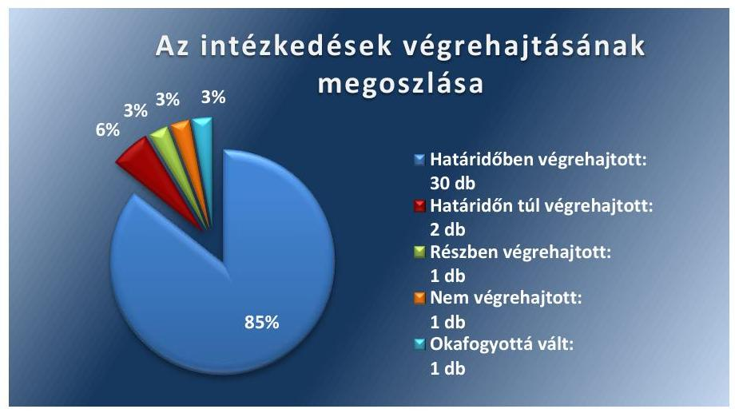
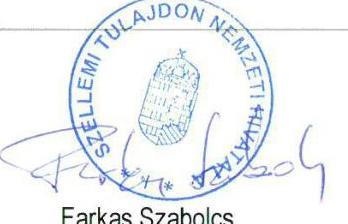
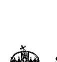
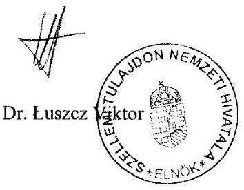
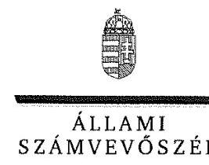
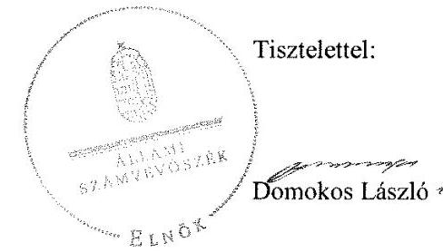

# Jelentés 

## Utóellenőrzések

A Szellemi Tulajdon Nemzeti Hivatala pénzügyi és vagyongazdálkodásának, a HIPAvilon Nkft-vel fennálló szerződéses kapcsolatai szabályszerűségének, és a közös jogkezelő szervezetekkel kapcsolatos feladatellátásának utóellenőrzése
2018.

---

# Jelentés 

## Utóellenőrzések

A Szellemi Tulajdon Nemzeti Hivatala pénzügyi és vagyongazdálkodásának, a HIPAvilon Nkft-vel fennálló szerződéses kapcsolatai szabályszerűségének, és a közös jogkezelő szervezetekkel kapcsolatos feladatellátásának utóellenőrzése
2018. ssepleaber hó 3. nap

---

# AZ ELLENŐRZÉST FELÜGYELTE:

- VARGA EDIT felügyeleti vezető
- AZ ELLENŐRZÉST VEZETTE ÉS A VÉGREHAJTÁSÁÉRT FELELŐS:
  - KEREKES PÉTER ellenőrzésvezető
  - A PROGRAM ÖSSZEÁLLÍTÁSÁÉRT FELELŐS:
    - TÓTPÁL SZABOLCS osztályvezető

**IKTATÓSZÁM:** EL-1134-001/2018.

**TÉMASZÁM:** 2460

**ELLENŐRZÉS-AZONOSÍTÓ SZÁM:** V080418

Jelentéseink az Országgyűlés számítógépes hálózatán és az Interneta a www.asz.hu címen is olvashatóak.

---

# TARTALOMJEGYZÉK 

- ÖSSZEGZÉS ..... 5
- AZ ELLENŐRZÉS CÉLJA ..... 6
- AZ ELLENŐRZÉS TERÜLETE ..... 7
- AZ ELLENŐRZÉS HÁTTERE, INDOKOLTSÁGA ..... 8
- A JELENTÉS LÉNYEGES KÉRDÉSKÖRE ..... 9
- AZ ELLENŐRZÉS HATÓKÖRE ÉS MÓDSZEREI ..... 10
- MEGÁLLAPÍTÁSOK ..... 12
- MELLÉKLETEK ..... 15
I. sz. melléklet: Szellemi Tulajdon Nemzeti Hivatala intézkedési terve végrehajtásának értékelése ..... 15
II. sz. melléklet: A Szellemi Tulajdon Nemzeti Hivatala intézkedési terve ..... 25
- FÜGGELÉK: ÉSZREVÉTELEK ..... 37
- RÖVIDÍTÉSEK JEGYZÉKE ..... 47

---

.

---

# ÖSSZEGZÉS 

Az Állami Számvevőszék a Szellemi Tulajdon Nemzeti Hivatala gazdálkodásának utóellenőrzése során megállapította, hogy az intézkedési tervben foglalt és végrehajtott feladatok eredményeként javult a vagyongazdálkodás és a pénzügyi gazdálkodás szabályozottsága és átláthatósága.

## Az ellenőrzés társadalmi indokoltsága

Az Állami Számvevőszék stratégiájában célul tűzte ki a számvevőszéki munka hasznosulásának javítását. Ezzel összhangban ellenőrzi, hogy az ellenőrzött szervezet megvalósította-e a korábbi ellenőrzései által feltárt hibák, hiányosságok és szabálytalanságok megszüntetése céljából elkészített intézkedési tervében foglaltakat. A rendszeres utóellenőrzések hozzájárulnak a szükséges intézkedések tényleges végrehajtásához, ezáltal a közpénzügyek rendezettségének javulásához.

## Főbb megállapítások, következtetések

A Szellemi Tulajdon Nemzeti Hivatala az Állami Számvevőszék által elfogadott intézkedési tervében meghatározott harmincöt feladatból harmincat határidőben végrehajtott, két feladatot határidőn túl hajtott végre, egy feladatot részben hajtott végre, egy feladatot nem hajtott végre, egy feladat jogszabályváltozás miatt okafogyottá vált.

A Szellemi Tulajdon Nemzeti Hivatala az intézkedési tervben meghatározott feladatoknak megfelelően módosította a gazdálkodási jogkörök gyakorlásának szabályozását és nyilvántartását. Ennek hatására javult a pénzügyi gazdálkodás szabályozottsága és átláthatósága.

A Szellemi Tulajdon Nemzeti Hivatala a közös jogkezelő és független jogkezelő szervezetek nyilvántartási folyamatának az intézkedési tervben vállalt módosításaival javította a vagyongazdálkodás szabályozottságát és átláthatóságát.

A Szellemi Tulajdon Nemzeti Hivatala vezette a jogszabályban előírt nyilvántartást az intézkedési tervben rögzített feladatok végrehajtásáról.

---

# AZ ELLENŐRZÉS CÉLJA 

Az ellenőrzés célja annak értékelése volt, hogy a számvevőszéki jelentésben foglalt intézkedést igénylő megállapításokkal összhangban készített intézkedési tervben meghatározott feladatokat az ellenőrzött szervezet végrehajtotta-e.

---

# AZ ELLENŐRZÉS TERÜLETE 

## Szellemi Tulajdon Nemzeti Hivatala

A Hivatalt ${ }^{1}$ a találmányi szabadalmakról szóló 1895. évi XXXVII. törvény 23. §-a alapján 1896-ban alapították. A Hivatal feladatés hatáskörébe tartozik az iparjogvédelmi hatósági vizsgálatok és eljárások lefolytatása, a szerzői és szerzői joghoz kapcsolódó jogokkal összefüggő egyes feladatok ellátása, az állami dokumentációs és információs tevékenység a szellemi tulajdon területén, valamint a szellemi tulajdon védelmét szabályozó jogszabályok előkészítésében való részvétel és a szellemi tulajdon területén folyó nemzetközi együttműködés szakmai feladatainak ellátása.

A Hivatal költségvetési szerv, költségvetése a központi költségvetésben önálló címként szerepel. A Hivatal irányító szerve a Kormány², felügyeletét 2016. december 1-ig az igazságügyi miniszter, 2016. december 2-ától a nemzetgazdasági miniszter látta el.

A Hivatal 2012. április 11-től vagyonkezelői jogokat gyakorolt a HIPAvilon Nkft. ${ }^{3}$-nél. A HIPAvilon Nkft. célja a Hivatal által ellátott közfeladatok hatékonyabb végrehajtásának támogatása, valamint szolgáltatások nyújtása, a Hivatal belföldi hatósági és szakpolitikai tevékenységének támogatása, a Hivatal belföldi és nemzetközi szolgáltatásaiban való közreműködés, szellemitulajdon-alapú innováció menedzsment a közfinanszírozású innováció és modernizáció megvalósítása során.

A Hivatal a 2016. évi költségvetési beszámoló szerint 4254,9 millió Ft bevételt ért el, valamint 4130,1 millió Ft kiadást teljesített. A Hivatal 2016. december 31-i könyvviteli mérleg szerint 4031,7 millió Ft eszközvagyonnal rendelkezett, amelyből 1531,5 millió Ft volt a nemzeti vagyonba tartozó befektetett eszközök állománya.

Az ÁSZ4, a Hivatal pénzügyi és vagyongazdálkodásának szabályszerűségi és teljesítmény ellenőrzését 2008. január 1. és 2013. december 31., a HIPAvilon Nkft.-vel való szerződéses kapcsolatok szabályszerűségének ellenőrzését 2012. január 1. és 2014. december 31., míg a közös jogkezelő szervezetekkel kapcsolatos feladatellátás ellenőrzését 2013. január 1. és 2014. december 31. közötti időszakra végezte el, az erről szóló 16070 számú jelentését 2016. május 31-én tette közzé. Az utóellenőrzés az ÁSZ jelentésben ${ }^{5}$ a Hivatal elnöke részére megfogalmazott intézkedést igénylő megállapításokra és javaslatokra készített intézkedési tervben foglalt feladatok végrehajtásának ellenőrzésére, illetve értékelésére terjedt ki.

---

# AZ ELLENŐRZÉS HÁTTERE, INDOKOLTSÁGA 

Az ÁSZ tv. ${ }^{6}$ 33. § (1) bekezdése értelmében a számvevőszéki jelentések intézkedést igénylő megállapításaihoz és javaslataihoz kapcsolódóan az ellenőrzött szervezet vezetője intézkedési tervet köteles összeállítani, és az Állami Számvevőszék részére megküldeni.

Az ÁSZ által befogadott intézkedési tervben foglaltak megvalósítását az ÁSZ törvény 33. § (7) bekezdésében foglaltak alapján - az Állami Számvevőszék utóellenőrzés keretében ellenőrizheti. Az utóellenőrzések keretében - az intézkedések értékelése során - az Állami Számvevőszék figyelembe veszi az ellenőrzött szervezetek működési feltételeiben, valamint a jogszabályi előírásokban bekövetkezett változásokat.

Az utóellenőrzés során az ÁSZ értékeli, hogy az érintett számvevőszéki jelentésben foglalt intézkedést igénylő megállapításokkal és javaslatokkal összhangban, az ellenőrzött szervezet által készített intézkedési tervben meghatározott feladatokat a feladatra kijelöltek végrehajtották-e.

Az intézkedések végrehajtásával az adott terület szabályszerű múködése vonatkozásában a kockázatok csökkenhetnek, azonban hosszabb távon az intézkedési tervben foglaltak végrehajtásával önmagában nem szűnnek meg, csak akkor, ha beépülnek az ellenőrzött szervezet működésébe, azokat folyamatosan karban tartják, figyelembe véve, illetve kezelve a változásokat. Emellett az intézkedések végrehajtásáig újabb kockázatok merülhetnek fel a szabályszerű működés vonatkozásában, amelyek kezelése szintén kiemelten fontos az ellenőrzött szervezet számára.

Az ellenőrzött szervezet vezetője által készített intézkedési tervekben foglalt feladatok hiányos, illetve késedelmes végrehajtása, vagy annak elmaradása a szabályszerűség és a felelős vezetői magatartás vonatkozásában kockázatot hordoz, ami azt mutatja, hogy az ellenőrzések során feltárt hibák, hiányosságok és szabálytalanságok kezelése nem kapott kellő hangsúlyt. Az utóellenőrzés során is fennálló szabálytalanságok esetén a közpénz, közvagyon veszélyeztetettségi kockázat valószínűsített hatásának értékelése további intézkedéseket vonhat maga után.

Az ellenőrzött szervezet szintjén az utóellenőrzés feltárja, hogy a szervezet az intézkedések végrehajtásával hasznosította-e a korábbi ellenőrzési jelentésben a hiányosságok megszüntetése, illetve a kockázatok kezelése érdekében megfogalmazott javaslatokat, illetve az intézkedések végrehajtása elmaradásának következtében továbbra is fennálló szabálytalanság esetén értékeli a közpénzek, közvagyon veszélyeztetettségét.

Az ÁSZ szintjén az utóellenőrzés visszacsatolást ad az ellenőrzési jelentések hasznosulásáról, az intézkedések elmaradásának, vagy részleges megvalósulásának a közpénzek, közvagyon veszélyeztetettségére gyakorolt valószínűsített hatásának értékelése, további intézkedéseket vonhat maga után.

---

# A JELENTÉS LÉNYEGES KÉRDÉSKÖRE 

Az ellenőrzött szervezet az intézkedési tervben foglaltakat az elöirt határidőben végrehajtotta-e?

---

# AZ ELLENŐRZÉS HATÓKÖRE ÉS MÓDSZEREI 

## Az ellenőrzés típusa

Megfelelőségi ellenőrzés.

## Az ellenőrzött időszak

Az utóellenőrzés alapját képező ÁSZ jelentés közzétételének napjától (2016. május 31.) az ellenőrzésről szóló kiértesítő levél keltének napjáig (2018. május 2.) tartó időszak.

## Az ellenőrzés tárgya

Az ÁSZ tv. 2011. július 1-jei hatálybalépését követően a számvevőszéki jelentésben foglalt intézkedést igénylő megállapításokkal összhangban készített intézkedési tervben foglaltak végrehajtásának ellenőrzése.

## Az ellenőrzött szervezet

Szellemi Tulajdon Nemzeti Hivatala

## Az ellenőrzés jogalapja

Az utóellenőrzés jogszabályi alapját az ÁSZ tv. 33. § (7) bekezdése, illetve a 33. § (1)-(2) és a (6) bekezdéseinek az előírásai képezik.

## Az ellenőrzés módszerei

Az ellenőrzést az ellenőrzött időszakban hatályos jogszabályok, az ellenőrzés szakmai szabályai, a jelen ellenőrzésre irányadó ÁSZ módszertanok, az ellenőrzési programban foglalt értékelési szempontok szerint, végeztük.

Az ellenőrzés ideje alatt a Hivatallal történő kapcsolattartást az ÁSZ SZMSZ-ének vonatkozó előírásai alapján biztosítottuk.

Az utóellenőrzés megállapításait az ÁSZ rendelkezésére álló, valamint az ÁSZ adatbekérése szerint, a Hivatal által rendelkezésre bocsátott dokumentumok alapozták meg.

Az ellenőrzési bizonyítékként felhasználható adatforrások közé tartoztak egyrészt az ellenőrzési program részletes szempontjainál felsorolt adatforrások, másrészt minden - az ellenőrzés folyamán feltárt, az ellenőrzés szempontjából információt tartalmazó - dokumentum.

---

Az intézkedési tervekben előírt feladatokat azok végrehajthatósága, illetve végrehajtása szempontjából az alábbiak szerint értékeltük:
$\longrightarrow$ „határidőben végrehajtott" a feladat, ha a teljesítés dokumentáltan, az intézkedési tervben előírt határidőben és tartalommal megtörtént;
$\longrightarrow$ „határidőn túl végrehajtott" a feladat, ha annak teljesítése az intézkedési tervben meghatározott módon, de az előírt határidőn túl történt meg;
$\longrightarrow$ „részben végrehajtott" a feladat, ha végrehajtása teljes körűen az intézkedési tervben előírt módon nem történt meg;
$\longrightarrow$ „nem végrehajtott" a feladat, ha a végrehajtás nem történt meg, vagy amennyiben a teljesítést nem dokumentálták;
$\longrightarrow$ „okafogyottá vált" a feladat, ha végrehajtására - meghatározott esemény bekövetkezése, továbbá külső körülmény, a múködést érintő feltétel változása miatt - már nincs szükség, illetve lehetőség, és egyértelműen megállapítható, hogy az intézkedést szükségessé tevő körülmény a jövőben nem fordulhat elő;
$\longrightarrow$ „nem időszerü" az a feladat, amelynek ellenőrzési időszakon belüli végrehajtására azért nem került (kerülhetett) sor, mert az intézkedés alapjául szolgáló esemény nem következett be, de annak jövőbeni előfordulása lehetséges, a végrehajtása nem volt esedékes, vagy a végrehajtás határideje még nem járt le.
Az ellenőrzés lefolytatásához a Hivatal a tanúsítványok elektronikus kitöltésével, valamint az ÁSZ által kért dokumentumok elektronikus megküldésével szolgáltatott adatokat, amelyek valódiságát és teljes körűségét az ellenőrzött szervezet vezetője által tett teljességi és hitelességi nyilatkozat igazolja. Az így rendelkezésre bocsátott adatok, információk kontrollja az ellenőrzés keretében megtörtént.

A II. sz. melléklet tartalmazza a Hivatal által készített intézkedési tervet. A beazonosított, sorszámozott intézkedések részletes értékelését az I. sz. melléklet tartalmazza.

---

# MEGÁLLAPÍTÁSOK 

## Az ellenőrzött szervezet az intézkedési tervben foglaltakat az előírt határidőben végrehajtotta-e?

Összegző megállapítás

A Hivatal az intézkedési tervben szereplő harmincöt feladatból harminc feladatot határidőben, két feladatot határidőn túl, egy feladatot részben hajtott végre, egy feladatot nem hajtott végre, és egy feladat okafogyottá vált.

A Hivatal az intézkedési tervében a hiányosságok, szabálytalanságok megszüntetésére harmincöt feladatot határozott meg. Az intézkedési tervében meghatározott feladatokat, határidőket, a feladatok végrehajtásáért felelős személyeket és a feladatok végrehajtását az I. számú melléklet mutatja be.

Az intézkedési tervben meghatározott feladatok végrehajtásáról a Bkr. ${ }^{7}$ előírásainak megfelelően vezették a nyilvántartást.

Az intézkedési tervben vállalt feladatok végrehajtási kategóriák szerinti megoszlását az 1. ábra szemlélteti.

1. ábra

A PÉNZÜGYI ÉS VAGYONGAZDÁLKODÁS SZABÁLYOZÁSI KÖRNYEZETÉNEK a jogszabályi előírásoknak megfelelő kialakítása érdekében a Hivatal intézkedéseket tett. Az Áhsz. ${ }^{8}$ előírásainak megfelelően módosították a Számviteli politikát ${ }^{9}$, kiadásra került a számlarend, a Kötelezettségvállalási szabályzat ${ }^{10}$, a Kockázatkezelési szabályzat ${ }^{11}$ és a Gazdasági ügyrend ${ }^{12}$. A közös jogkezelő és független jogkezelő szervezetek nyilvántartási folyamata kiegészítésre került az Szjt.-ben ${ }^{13}$ előírt elemekkel. A 2016. évi XCIII. törvényben ${ }^{14}$ előírtaknak megfelelően megtörtént a közös jogkezelés körében alkalmazott díjszabásokkal kapcsolatos feladatok munkafolyamatainak leírása.

---

# A HIVATAL VÉGREHAJTOTTA A PÉNZÜGYI ÉS 

VAGYONGAZDÁLKODÁS SZABÁLYSZERŰ MÜKÖDTETÉSE érdekében meghatározott intézkedéseket. Írásban kijelölték a pénzügyi ellenjegyzési, az érvényesítési feladatokra felhatalmazott, és a teljesítésigazolásra jogosult személyeket. Gondoskodtak a gazdálkodási jogkörök gyakorlására jogosultak és azok aláírás mintájának nyilvántartásáról, a nyilvántartás ellenőrzésének folyamatáról és végrehajtásáról. Kialakítottak egy új mutatószámrendszert a hatékonysági, eredményességi és gazdaságossági követelmények érvényesítésére. A HIPAvilon Nkft.-vel fennálló szerződéseket a jogszabályi előírások szerint módosították.

A HIVATAL VÉGREHAJTOTTA AZ INTEGRITÁSI KOCKÁZATOK CSÖKKENTÉSE érdekében meghatározott intézkedéseket. Az SZMSZ-ben ${ }^{15}$ rögzítették a szervezet minden szintjére vonatkozó etikai elvárásokat, valamint a hatósági adatok kezelésére vonatkozó előírásokat. A Hivatal valamennyi érintett kormánytisztviselőjétől visszavonták a számukra korábban megadott, a HIPAvilon Nkft.-vel való további jogviszony létesítésére vonatkozó engedélyeket, és kezdeményezték a kormánytisztviselőknek a HIPAvilon Nkft.-vel fennálló szerződéseinek megszüntetését. Intézkedtek, hogy a munkáltatói jogkör gyakorlók a kormánytisztviselők további jogviszonyának engedélyezése során vegyék figyelembe az Szt.-ben ${ }^{16}$ előírtakat, és ennek végrehajtását önálló ellenőrzés keretében ellenőrizték.

A MUNKAJOGI FELELŐSSÉG MEGÁLLAPÍTÁSA érdekében a Hivatal elnöke vizsgálatot indított a gazdálkodási jogkörök gyakorlása vonatkozásában a feltárt hiányosságok és szabálytalanságok miatt.

---

.

---

# MELLÉKLETEK

## I. SZ. MELLÉKLET: SZELLEMI TULAJDON NEMZETI HIVATALA INTÉZKEDÉSI TERVE VÉGREHAJTÁSÁNAK ÉRTÉKELÉSE

|  1. | Az intézkedési tervben meghatározott feladat | Az intézkedési tervben meghatározott határidő | Az intézkedési tervben meghatározott felelős | A feladat végrehajtása  |
| --- | --- | --- | --- | --- |
|   | 1. | 2. | 3. | 4.  |
|  Határidőben végrehajtott feladatok |  |  |  |   |
|  1. 1. A Hivatal Gazdasági ügyrendje aktualizálása megtörtént, a 3/2016. (VI.28.) gazdasági vezetői utasításként kiadásra került. | Az intézkedés az intézkedési terv elfogadása előtt megtörtént. | Nem határozták meg. | A Hivatal Gazdasági ügyrendjének aktualizálása megtörtént, és a 3/2016. (VI.28.) gazdasági vezetői utasításként kiadásra került. |   |
|  2. 2. Kormánytisztviselői Kar Országos Közgyűlése 2013. június 21-én elfogadta a Magyar Kormánytisztviselői Kar Hivatásetikai Kódexét, amely irányadó és kötelező minden kormánytisztviselőre (a Kódex 2014. november 1-jétől változott, de hatálya változatlan). A Kódex hatálya automatikusan az Mt. ${ }^{17}$ szerint foglalkoztatott munkavállalókra nem terjed ki. A Hivatal a foglalkoztatott munkavállalók tekintetében 2015. év januárjában aláírt munkaszerződés módosításokkal terjesztette ki mind a hat hivatali munkavállalóra a Kódex hatályát. Ezen túl, a Hivatal Szervezeti és Müködési Szabályzata korábbi és jelenlegi szövegében egyaránt tartalmaz a szervezet minden szintjére vonatkozó etikai elvárásokat. | Az intézkedés az intézkedési terv elfogadása előtt megtörtént. | Nem határozták meg. | A 2013. június 21-én elfogadott Hivatásetikai Kódexet követte a Magyar Kormánytisztviselői és Állami Tisztviselői Kar új Hivatásetikai Kódexe, mely 2017. december 14-től hatályos. A Magyar Kormánytisztviselői Kar a Kttv. ${ }^{18} 29 . \S$ (6) bekezdés c) pontja alapján megalkotta a köztisztviselőkre vonatkozó hivatásetikai részletszabályokat, az etikai eljárás rendszerét. A Hivatal az Mt. szerint foglalkoztatott munkavállalókra munkaszerződés módosításokkal terjesztette ki a Kódex hatályát. Az SZMSZ-ben rögzítésre kerültek a szervezet minden szintjére vonatkozó etikai elvárások, a Hivatal dolgozóira vonatkozó általános követelmények, a szakmai és etikai elvárások. |   |
|  3. 3.a. A teljesítésigazolók kijelölése továbbá a jogosultságok nyilvántartása a jelen intézkedési tervet megelőzően is megoldott volt. A teljesítésigazolóknak az ÁSZ jelentésben foglaltak figyelembevételével történő kijelölése 2016. június hóban megtörtént. | Az intézkedés az intézkedési terv elfogadása előtt megtörtént. | Nem határozták meg. | A Hivatalnál a kötelezettségvállalásra jogosultak a teljesítésigazolásra jogosult személyeket írásban kijelölték 2016. június hónapban. |   |

---

|  Az intézkedési tervben meghatározott feladat | Az intézkedési tervben meghatározott határidő 2. | Az intézkedési tervben meghatározott felelős 3. | A feladat végrehajtása 4.  |
| --- | --- | --- | --- |
|  1. | Az intézkedés az intézkedési terv elfogadása előtt megtörtént. | Nem határozták meg. | A Hivatal gondoskodott a gazdálkodási jogkörök gyakorlására jogosultak aláírásmintájának nyilvántartásáról.  |
|  5. 3.c. Az ÁSZ jelentésében foglaltakra tekintettel elkészült és kiadásra került a gazdálkodási jogkörök a kötelezettségvállalás pénzügyi ellenjegyzés, teljesítésigazolás, érvényesítés, utalványozás gyakorlására jogosultak és aláírás mintájuk nyilvántartását szabályozó 4/2016. (VI.30.) SZTNH utasítás. | Az intézkedés az intézkedési terv elfogadása előtt megtörtént. | Nem határozták meg. | 2016. június 30-án a 4/2016. (VI.30.) SZTNH utasítással kiadásra került az új Kötelezettségvállalási szabályzat, amely szabályozta a gazdálkodási jogkörök. a kötelezettségvállalás, a pénzügyi ellenjegyzés, a teljesítésigazolás, az érvényesítés, az utalványozás gyakorlására jogosultak és aláírás mintájuk nyilvántartását.  |
|  6. 3.d. Az ÁSZ jelentésében foglalt megállapításra tekintettel, valamint az elnöki utasítás végrehajtásának (utó)ellenőrzése érdekében a gazdálkodási jogkörök a(z) kötelezettségvállalás, pénzügyi ellenjegyzés, teljesítésigazolás, érvényesítés, utalványozás gyakorlására jogosultak elektronikus nyilvántartásában ellenőrizni kell a jogosult személyek adatainak teljes körűségét, az ellenőrzési jellegű feladatot ellátó munkatársak számára való elérhetőségét és rendelkezésre állását, aktualitását. Eltérés esetén intézkedni kell a nyilvántartás módosításáról. | folyamatos | Gazdasági igazgatóság főosztályvezetőhelyettes | A gazdálkodási jogkörök gyakorlására jogosultak elektronikus nyilvántartásában ellenőrizték a jogosult személyek adatainak teljes körűségét, az ellenőrzési jellegű feladatot ellátó munkatársak számára való elérhetőségét és rendelkezésre állását, aktualitását, és eltérés esetén intézkedtek a nyilvántartás módosításáról.  |
|  7. 3.e. Az adatok fentiek szerinti teljes körű ellenőrzését valamennyi alkalommal el kell végezni, amikor a gazdálkodási jogkörök bármelyikét érintően személyzeti változás következik be, vagy a hivatal szervezeti és működési szabályzata módosításra kerül. Eltérés esetén intézkedni kell a nyilvántartás módosításáról. Az ellenőrzés végrehajtásáról, annak megtörténtét követő 8 napon belül, a GF19 vezetője jelentést tesz a gazdasági főigazgató számára. | folyamatos | Gazdasági igazgatóság főosztályvezetőhelyettes | Az ellenőrzött időszakban sem személyzeti változások, sem az SZMSZ változása nem tette szükségessé a gazdálkodási jogkörök gyakorlására jogosultak elektronikus nyilvántartásának teljes körű ellenőrzését, azonban ezt 2016. novemberében és 2017. májusában mégis elvégezték. Eltérés esetén intézkedtek a nyilvántartás módosításáról.  |
|  8. 3.f. A belső ellenőr a 2017. évi belsőellenőrzési tervébe vegye fel, majd ennek megfelelően önálló ellenőrzés keretében ellenőrizze a gazdálkodási jogkörök nyilvántartása. | 2017. évi belső ellenőrzési terv szerint, de legkésőbb 2017. december 31. | Belső ellenőr | A Hivatal 2017. évi belső ellenőrzési terve szerint végrehajtotta a pénzgazdálkodási jogkörök gyakorlatának ellenőrzését, az ellenőrzési jelentés 2017. augusztus 17.-én elkészült.  |

---

|  8
8
8 | Az intézkedési tervben meghatározott feladat | Az intézkedési tervben meghatározott határidő 2. | Az intézkedési tervben meghatározott felelős 3. | A feladat végrehajtása  |
| --- | --- | --- | --- | --- |
|   |  |  |  | 4.  |
|   | tása kezelését (teljes körűség, vezetésének szabályszerűsége, módosítások átvezetésének megtörténte, jelentéstétel). |  |  |   |
|  9. | 4. A Hivatal már 2013-ban és 2014-ben is működtetett kockázatkezelési rendszert. 2015. 08.03-án a Hivatalos Értesítőben megjelent a Szellemi Tulajdon Nemzeti Hivatala elnökének 4/2015. (VII.31.) SZTNH utasítása a Szellemi Tulajdon Nemzeti Hivatala kockázatkezelési szabályzatáról kiterjesztve a kockázatkezelési rendszert a hivatali szervezet minden szintjére. | Az intézkedés az intézkedési terv elfogadása előtt megtörtént. | Nem határozták meg. | A Hivatalos Értesítő 2015. évi 38. számában megjelent a Szellemi Tulajdon Nemzeti Hivatala elnökének 4/2015. (VII.31.) SZTNH utasítása a Szellemi Tulajdon Nemzeti Hivatala kockázatkezelési szabályzatáról kiterjesztve a kockázatkezelési rendszert a hivatali szervezet minden szintjére.  |
|  10. | 5. A pénzügyi ellenjegyzői és az érvényesítői feladatok jogkörét gyakorló munkatársak gazdasági vezető általi írásos kijelölése megtörtént. | Az intézkedés az intézkedési terv elfogadása előtt megtörtént. | Nem határozták meg. | A Hivatal gazdasági főigazgatója az Intézkedési terv elkészítését megelőzően, 2016. július 15-én a pénzügyi ellenjegyzési és az érvényesítési feladatokra felhatalmazott személyeket írásban kijelölte. A feladatok elvégzésére a Hivatal Pénzügyi és Számviteli Osztályának dolgozói, az osztályvezető, és pénzügyi ügyintézői lettek kijelölve. Emellett a gazdasági főigazgató 2018. január 26-án az osztályvezető-helyettest is kijelölte írásban a pénzügyi ellenjegyzési feladat elvégzésére 10 millió Ft értékhatárig.  |
|  11. | 6.a. A jogosultságok nyilvántartását, a kijelölések módját és az érvényesítő részletes feladatait is szabályozó intézményi gazdálkodási jogosultságok rendszere 2016. évben felülvizsgálatra és - az ÁSZ jelentésében foglaltakra is figyelemmel - megújításra került. Az új elnöki utasítás a 4/2016. (VI.30.) SZTNH utasítás a Hivatalos Értesítő 2016. évi 27. számában megjelent és a következő naptól hatályos. | Az intézkedés az intézkedési terv elfogadása előtt megtörtént. | Nem határozták meg. | A Hivatal elnöke az Intézkedési terv elkészítését megelőzően 4/2016. (VI.30.) SZTNH utasításában rendelkezett a kötelezettségvállalás, pénzügyi ellenjegyzés, teljesítésigazolás, érvényesítés és utalványozás rendjéről. Az új szabályozás a Hivatalos Értesítő 2016. évi 27. számában június 30-án megjelent és a következő naptól hatályba lépett.  |
|  12. | 6.b. A munkajogi felelősségre vonás feltételeinek megvizsgálása megtörtént. Az eljárás megindítására nyitva álló határidő letelte, a kormányzati szolgálati jogviszony időközbeni megszűnése, valamint más esetben a vétkesség hiánya miatt fegyelmi eljárás megindítása jogszerűen nem lehetséges. | Az intézkedés az intézkedési terv elfogadása előtt megtörtént. | Nem határozták meg. | Az érvényesítő tevékenységével összefüggésben a feltárt hiányosságok és szabálytalanságok tekintetében munkajogi felelősségre vonás feltételeinek megvizsgálása az Intézkedési terv elkészítését megelőzően, 2016. június 28-án megtörtént. A Hivatal jogtanácsosa által a Hivatal elnökének készített feljegyzésében összegzésként rögzítésre került, hogy a Kttv. 156. § (1) bekezdése szerinti 3 éves objektív határidő miatt a 2013. június vége előtti magatartás már fegyelmi eljárás keretében nem vizsgálható.  |

---

|  Az intézkedési tervben meghatározott feladat | Az intézkedési tervben meghatározott határidő 2. | Az intézkedési tervben meghatározott felelős 3. | A feladat végrehajtása 4.  |
| --- | --- | --- | --- |
|  1. | 2016. november 4. | gazdasági főigazgató | Az érvényesítők feladatkörének áttekintése - a gazdasági főigazgató, a főosztályvezető-helyettes, a pénzügyi osztályvezetője, az érintett pénzügyi ügyintézők, valamint a belső ellenőr jelenlétében – a kijelölt határidőt megelőzően 2016. október 25-én megtörtént, amelyről a gazdasági főigazgató 2016. november 3-ai keltezéssel feljegyzést készített.  |
|  13. 6.c. Az ÁSZ jelentésében foglalt megállapításra tekintettel részletesen át kell tekinteni az érvényesítőkre vonatkozó jogszabályban és belső szabályzatban rögzített - feladatokat és kötelezettségeket. A gazdasági főigazgató, a Gazdálkodási Főosztály főosztályvezető-helyettese, a Pénzügyi és Számviteli Osztály vezetője, az érvényesítők és az ellenőrzési folyamat más érintettjei, valamint a belső ellenőr jelenlétében végig kell tárgyalni a feladatokat és kötelezettségeket, megoldást kell találni az értelmezést és végrehajtást nehezítő körülményekre. Az egyeztetésről emlékeztetőt kell készíteni, és az egyeztetésen részt vevők részére el kell juttatni. | 2016. november 4. | gazdasági főigazgató | Az érvényesítők feladatkörének áttekintése - a gazdasági főigazgató, a főosztályvezető-helyettes, a pénzügyi osztályvezetője, az érintett pénzügyi ügyintézők, valamint a belső ellenőr jelenlétében – a kijelölt határidőt megelőzően 2016. október 25-én megtörtént, amelyről a gazdasági főigazgató 2016. november 3-ai keltezéssel feljegyzést készített.  |
|  14. 7. A Hivatal tevékenységére és céljára vonatkozó hatékonysági, eredményességi és gazdaságossági mérhető követelmények kialakítására és érvényesítésére új, a követelmények érvényesülését javító intézkedések végrehajtásának megalapozására is alkalmas, legalább harminc elemből álló mutatószámrendszert kell kidolgozni és működtetni a rendelkezésre álló adatállományra építve. A követelmények érvényesítését visszamérő mutatószámok kapcsán meg kell határozni az új mutatószámok - jellegét attól függően, hogy az a gazdaságosság, az eredményesség vagy a hatékonyság fogalomkörébe tartozik-e; értékét milyen alapadatokból kell kiszámítani. Továbbá, hogy a számítások - elkészítéséért és bemutatásáért melyik szakterület felelős; - alapadatait melyik intézményi szervezeti egység szolgáltatja; - elkészítésére milyen rendszerességgel és határidővel kerül sor; - eredményét milyen formában kell bemutatni. | A rendszer kidolgozása tekintetében: 2016. október 31. Az első számítások tekintetében: 2016. november 30. | gazdasági főigazgató | A rendszer kidolgozása tekintetében intézkedtek, ennek keretében az előírt határidőt megelőzően, 2016. október 19-én kiadásra került az intézményi teljesítmény mérésére alkalmas mutatók alkalmazásáról szóló gazdasági vezetői utasítás. A gazdasági vezetői utasításban közel 50 mutatószám került kimunkálásra, amelyeknek célja az eredmények, a ráfordítások az eszközhatékonyság adatainak összehasonlítható gyűjtése. A 2016. december 13-i Elnöki Értekezlet emlékeztetője alapján a 2015. évi adatok alapján próbaszámítások készültek. A 2017. évtől évente sor került az előző évi adatok alapján az összehasonlító elemzésre, amelyekről feljegyzéseket készítettek.  |

---

|  Az intézkedési tervben meghatározott feladat | Az intézkedési tervben meghatározott határidő 2. | Az intézkedési tervben meghatározott felelős 3. | A feladat végrehajtása 4.  |
| --- | --- | --- | --- |
|  1. |  |  |   |
|  - kiértékelésére melyik vezető vagy vezetői fórum jogosult,
- értékelése alapján ki(k) jogosult(ak) intézkedést megfogalmazni / hozni.
A meghatározott rendszerességgel előállított mutatószámokat - a fentiek szerint - az erre kijelölt vezető vagy vezetői fórum kiértékeli és a kiértékelés alapján intézkedéseket fogalmaz meg a hatékonysági, eredményességi és gazdaságossági követelmények érvényesítésének esetleges javítása érdekében, amelyet az érintett hivatali szervezeti egység vezetője, szükség esetén a hivatal elnöke jóváhagy - teljessé téve a követelmények érvényesítése terén kialakított PDCA ciklust. A megfogalmazott intézkedéseket emlékeztetőben, szükség esetén intézkedési tervben kell rögzíteni.
A mutatószámokról, azok előállításáról, kiértékeléséről és az ezekhez kapcsolódó intézkedések teljes eljárási rendjéről gazdasági vezetői utasításban kell rendelkezni.
A kialakított mutatószámrendszer elemeinek első alkalommal történő kiszámítására, egyben a mérési és értékelési folyamat tesztelésére a rendszer kidolgozását követő 30 napon belül kell sort keríteni a 2015. évi intézményi adatok felhasználásával |  |  |   |
|  15. 8. A jogosultságok nyilvántartását és a kijelölések módját is szabályozó intézményi gazdálkodási jogosultságok rendszere 2016. évben felülvizsgálatra és - az ÁSZ jelentésében foglaltakra is figyelemmel - megújításra került egy új elnöki utasításban. Az új elnöki utasítás a 4/2016. (VI.30.) SZTNH utasítás a Hivatalos Értesítő 2016. évi 27. számában megjelent és a következő naptól hatályos.
A munkajogi felelősségre vonás feltételeinek megvizsgálása megtörtént. Az eljárás megindítására nyitva álló hatályos megelőzően, 2016. június 28-án megtörtént. A Hivatal jogtanácsosa által a Hivatal elnökének készített feljegyzésében összegzésként rögzítésre került, hogy a Kttv. 156. § (1) bekezdése szerinti 3 éves objektív határidő miatt a 2013. június vége előtti magatartás már fegyelmi eljárás keretében nem vizsgálható. |  |  |   |

---

|  1. | Az intézkedési tervben meghatározott feladat | Az intézkedési tervben meghatározott határidő | Az intézkedési tervben meghatározott felelős  |
| --- | --- | --- | --- |
|  2. |  |  |   |
|  3. |  |  |   |
|   | táridő letelte, a kormányzati szolgálati jogviszony időközbeni megszűnése, valamint más esetben a vétkesség hiánya miatt fegyelmi eljárás megindítása jogszerűen nem lehetséges. |  |   |
|  16. | 9.a. A felek között valamennyi szakmai együttműködést szabályozó szerződés módosításra és kiegészítésre került 2016. június 13-án annak érdekében, hogy egyértelmű legyen, hogy az együttműködés az Szt. és a 287/2010. (XII. 16.) Korm. rendelet^{20} szerinti feladatokra terjed ki és a szerződéses feladatok elhatárolásra kerültek az Szt. szerint a HIPAvilon Nkft. bevonásával nem végezhető tevékenységektől. | Az intézkedés az intézkedési terv elfogadása előtt megtörtént. | Nem határozták meg.  |
|  17. | 9.b. A Hivatal és a HIPAvilon Nkft. 2016. június 13-án az újdonságkutatási feladatok ellátására megkötött keretmegállapodást közös megegyezéssel megszüntette. | Az intézkedés az intézkedési terv elfogadása előtt megtörtént. | Nem határozták meg.  |
|  18. | 10.a. Az ÁSZ jelentésre és a 2016. szeptember 7-én kelt levélben foglaltakra figyelemmel a Hivatal és a HIPAvilon Nkft. között létrejött szerződéseket ki kell egészíteni, hogy egyértelmű legyen, hogy a Hivatal hatósági feladataihoz kapcsolódóan a HIPAvilon Nkft. nem láthat el adatkezelési feladatokat és nem lehet adatkezelő. | 2016. október 31. | elnökhelyettes  |
|  19. | 11. A felek között, valamennyi szakmai együttműködést szabályozó szerződés módosításra és kiegészítésre került 2016. június 13-án annak érdekében, hogy egyértelmű legyen, hogy az együttműködés az Szt. és a 287/2010. (XII.16.) Korm. rendelet szerinti feladatokra terjed ki és a szerződéses feladatok elhatárolásra kerültek az Szt. szerint a HIPAvilon Nkft. bevonásával nem végezhető tevékenységektől. 2016. június 13-án az újdonságkutatási feladatok ellátására megkötött keretmegállapodást a Hivatal és a HIPAvilon Nkft. közös megegyezéssel megszüntette. | Az intézkedés az intézkedési terv elfogadása előtt megtörtént. | Nem határozték meg.  |
|  20. |  |  |   |

|  Az intézkedési tervben meghatározott határidő | Az intézkedési tervben meghatározott határidő | A feladat végrehajtása  |
| --- | --- | --- |
|  2. |  | 4.  |
|  2016. október 31. |  |   |
|  287/2010. (XII. 16.) Korm. rendelet szerinti feladatokra terjed ki. A HIPAvilon Kft. által ellátott tevékenységek nem minősültek az Szt. 69. § és a 69/A. § szerinti újdonságkutatási, illetve az Szt.-ben és a Ket.-ben^{21} meghatározott közigazgatási hatósági vagy kormányzati tevékenységnek; sem az Szt.115/L §-ban meghatározott, nemzetközi kapcsolattartási tevékenységnek. |  |   |
|  2016. október 31. |  |   |
|  287/2010. (XII. 16.) Korm. rendelet szerinti feladatokra terjed ki. A HIPAvilon Kft. által ellátott tevékenységek nem minősültek az Szt. 69. § és a 69/A. § szerinti újdonságkutatási, illetve az Szt.-ben és a Ket.-ben meghatározott közigazgatási hatósági vagy kormányzati tevékenységnek; sem az Szt.115/L §-ban meghatározott, nemzetközi kapcsolattartási tevékenységnek. |  |   |
|  2016. október 31. |  |   |
|  287/2010. (XII. 16.) Korm. rendelet szerinti feladatokra terjed ki. A HIPAvilon Kft. által ellátott tevékenységek nem minősültek az Szt. 69. § és a 69/A. § szerinti újdonságkutatási, illetve az Szt.-ben és a Ket.-ben meghatározott közigazgatási hatósági vagy kormányzati tevékenységnek; sem az Szt.115/L §-ban meghatározott, nemzetközi kapcsolattartási tevékenységnek. |  |   |
|  2016. június 13-án az újdonságkutatási feladatok ellátására megkötött keretmegállapodást a Hivatal és a HIPAvilon Nkft. közös megegyezéssel megszüntette. |  |   |

---

|  1. | Az intézkedési tervben meghatározott feladat | Az intézkedési tervben meghatározott határidő | Az intézkedési tervben meghatározott felelős | A feladat végrehajtása  |
| --- | --- | --- | --- | --- |
|  2. | 1. | 2. | 3. | 4.  |
|  20. | 12.a. A javaslatnak megfelelően a Hivatal Közszolgálati Szabályzatáról szóló 9/2012. (X. 27.) SZTNH utasítás a további jogviszony engedélyezésére irányuló előzetes kérelmek elbírálása tekintetében kiegészítésre került. A módosított szabályzat kötelezően írja elő a javaslatban írtakkal összhangban, hogy a Kttv. 85. § szerinti engedélyezésnél kötelesek vizsgálni, hogy az ellátandó tevékenység kapcsolódik-e az Szt.-ben foglaltakhoz és megtiltja engedély kiadását, ha az érintett tevékenység az Szt. szabályaival ellentétes. A módosítást a 3/2016. (VI.17.) SZTNH utasítás tartalmazza, ami a Hivatalos Értesítő 2016. évi 25. számában 2016. június 17-én megjelent. | Az intézkedés az intézkedési terv elfogadása előtt megtörtént. | Nem határozták meg | A Hivatal elnöke a 3/2016.(VI.17.) SZTNH utasítással kiegészítette a közszolgálati szabályzatról szóló 9/2012. (X. 27.) SZTNH utasítást. A további jogviszony engedélyezésére irányuló előzetes kérelmek elbírálására vonatkozóan a munkáltatói jogkört gyakorlók számára előírta annak vizsgálatát, hogy az ellátandó tevékenység kapcsolódik-e az Szt.-ben foglaltakhoz. Megtiltotta az engedély kiadását abban az esetben, ha az érintett tevékenység az Szt. szabályaival ellentétes volt. A módosított utasítás 2016. június 18-án, a kihirdetést követő napon lépett hatályba.  |
|  21. | 12.b. Intézkedjen a Hivatal kormánytisztviselőinek a HIPAvilon Nkft.-vel újdonságkutatási feladatok elvégzésére 2013. április 1-jét követően kötött megbízási szerződéseihez kapcsolódóan a további jogviszony létesítésére vonatkozó, a Kttv.-ben előírt munkáltató általi engedélyek visszavonására és egyidejűleg kezdeményezze a Hivatal köztisztviselőinél a HIPAvilon Nkft.-vel e tárgyban kötött megbízási szerződésekkel összefüggésben a jogszerű állapot helyreállítását. | Az intézkedés az intézkedési terv elfogadása előtt megtörtént. | Nem határozták meg | A munkáltatói jogkört gyakorlók 27 esetben vonták vissza 2016. június 13-án a HIPAvilon Nonprofit Kft.-vel való további jogviszony létesítésére korábban megadott engedélyeket. Az engedélyt visszavonó intézkedésben felszólították a munkavállalókat, hogy ha az adott tárgyban a HIPAvilon Nonprofit Kft.-vel szerződésük van érvényben, akkor kezdeményezzék annak megszüntetését.  |
|  22. | 12.c. A Hivatal Humánpolitikai Önálló Osztályának vezetője a munkáltatói jogkört gyakorló vezetők figyelmét Elnöki Értekezleten, 2016 októberében szóban külön hívja fel a közszolgálati szabályzat adott tárgykört tartalmazó módosítására. | 2016. október 31. | a Humánpolitikai Önálló Osztály vezetője | A Hivatal Humánpolitikai Önálló Osztályának vezetője 2016. június 21-én kör-mailben hívta fel a munkáltatói jogkört gyakorló vezetők figyelmét a közszolgálati szabályzat adott tárgykörre vonatkozó módosítására. 2017.01.27-én megismételte a figyelemfelhívást.  |
|  23. | 12.d. A belső ellenőr a 2017. évi belsőellenőrzési tervébe vegye fel, majd ennek megfelelően önálló ellenőrzés keretében ellenőrizze, hogy a munkáltatói jogkört gyakorlók a további jogviszonyok engedélyezése során végrehajtották-e a módosított közszolgálati szabályzat előírásait 2016. év második félévében. | 2017. december 31. | belső ellenőr | A 2016. december 2-án kelt, a Hivatal vezetője által elfogadott 2017. évi belső ellenőrzése tervben előirányozták a 2016. év II. félévére vonatkozóan annak ellenőrzését, hogy "a munkáltatói jogkörgyakorlók a jogviszonyok ellenőrzése során végrehajtották-e a közszolgálati szabályzat előírásait". Az ellenőrzést 2017. szeptember 26. - november 27. között végezte el a belső ellenőr. A jelentés dátuma: 2017. december 19. volt. A belső ellenőrzési jelentést a Hivatal elnöke 2017. december 21-én elfogadta.  |

---

|  1. | Az intézkedési tervben meghatározott feladat | Az intézkedési tervben meghatározott határidő | Az intézkedési tervben meghatározott felelős | A feladat végrehajtása  |
| --- | --- | --- | --- | --- |
|  2. | 1. | 2. | 3. | 4.  |
|  24. | 13. A közös jogkezeléssel kapcsolatos 2014/26/EU irányelv átültetéséről és ezzel a hatályos törvényi szabályok változásáról az Országgyűlés 2016. június 12-i ülésén döntött. A 2016. évi XCIII. törvény kihirdetése 2016. június 27-i Magyar Közlönyben történt meg, az ezzel összefüggő rendeleti szintű szabályok pedig csak ezt követően kerültek elfogadásra.
A közös jogkezeléssel kapcsolatos 2016. évi XCIII. törvény révén megváltozott jogszabályi környezethez igazítva megtörtént a közös jogkezelés körében alkalmazott díjszabások jóváhagyásának előkészítésével kapcsolatos feladatok munkafolyamatainak leírása. Ezek az ISO rendszerbe integrálásra kerültek. | Az intézkedés az intézkedési terv elfogadása előtt megtörtént. | Nem határozták meg | A közös jogkezeléssel kapcsolatos 2016. évi XCIII. törvény révén megváltozott jogszabályi környezethez igazítva megtörtént a közös jogkezelés körében alkalmazott díjszabások jóváhagyásának előkészítésével kapcsolatos feladatok munkafolyamatainak leírása.  |
|  25. | 15.a. A Hivatal 2016. június 10-én kelt döntésével a REPROPRESS SZÖVETSÉG rövidített nevét az alapszabályban foglalt elnevezésnek megfelelően a nyilvántartásban módosította. | Az intézkedés az intézkedési terv elfogadása előtt megtörtént. | Nem határozták meg | A Hivatal 2016. június 10-én kelt döntésével a REPROPRESS SZÖVETSÉG rövidített nevét az alapszabályban foglalt elnevezésnek megfelelően a nyilvántartásban módosította.  |
|  26. | 15.b. A munkafolyamat kiegészítésre kerül azzal a vezetői ellenőrzési elemmel, hogy amennyiben valamely jogkezelő alapszabályának a szervezet nevét érintő módosításával kapcsolatos kérelem teljesítésére kerül sor, akkor a kérelemnek megfelelő adatnak a nyilvántartásba történő átvezetését a vezető külön köteles ellenőrizni. | 2016. október 31. | Szerzői Jogi Főosztály vezetője | A munkafolyamat kiegészítésre került azzal a vezetői ellenőrzési elemmel, hogy amennyiben valamely jogkezelő alapszabályának a szervezet nevét érintő módosításával kapcsolatos kérelem teljesítésére kerül sor, akkor a kérelemnek megfelelő adatnak a nyilvántartásba történő átvezetését a vezető külön köteles ellenőrizni.  |
|  27. | 16.a. A hiányzó adat a nyilvántartás archívumában 2016. április 8-án feltüntetésre került. | Az intézkedés az intézkedési terv elfogadása előtt megtörtént. | Nem határozták meg | Az ÁSZ a jelentésében megállapította, hogy egy szervezet (EJI ${ }^{23}$ ) esetében - az Szjt. 90. § (4) bekezdésében foglalt előírás ellenére - a nyilvántartás archívuma nem tartalmazta a 2014. októberben megszüntetett pénzforgalmi számlára, valamint a pénzforgalmi szolgáltató nevére és székhelyére vonatkozó adatokat. A hiányzó adat a nyilvántartás archívumában 2016. április 8-án feltüntetésre került.  |
|  28. | 16.b. A munkafolyamat kiegészítésre kerül azzal a vezetői ellenőrzési elemmel, hogy amennyiben valamely jogkezelő alapszabályának a szervezet nevét érintő módosításával kapcsolatos kérelem teljesítésére kerül sor, akkor a | 2016. október 31. | Szerzői Jogi Főosztály vezetője | A közös jogkezelő és független jogkezelő szervezetek nyilvántartási eljárásainak folyamata kiegészítésre került azzal az elemmel, hogy nyilvántartásba minden adat és dokumentum csak új adatként vehető fel, minden előzmény az adatbázis archívumába kerül (korábbi időállapot), azok nem törölhetők.  |

---

|  Az intézkedési tervben meghatározott feladat | Az intézkedési tervben meghatározott határidő 2. | Az intézkedési tervben meghatározott felelős 3. | A feladat végrehajtása 4.  |
| --- | --- | --- | --- |
|  1. |  |  |   |
|  kérelemnek megfelelő adatnak a nyilvántartásba történő átvezetését a vezető külön köteles ellenőrizni. |  |  |   |
|  29. 17. Az EJI nyilvántartási adatait tartalmazó közlemény a Hivatalos Értesítő 2014. évi 64. számában (2014.12.23.) megjelent. (A közzétételi kötelezettséget a KJK NY-04 ISO folyamat tartalmazza.) A közös jogkezeléssel kapcsolatos 2016. évi XCIII. törvény hatályon kívül helyezte az Szjt-ben foglalt e kötelezettséget, tehát annak biztosítása immár a jövőben nem feladat. | Az intézkedés a konkrét esetben az intézkedési terv elfogadása előtt megtörtént. | Nem határozták meg | Az EJI nyilvántartási adatait tartalmazó közlemény a Hivatalos Értesítő 2014. évi 64. számában (2014.12.23.) megjelent.  |
|  30. 18. Kiegészítésre kerül a hivatkozott esetre alkalmazandó felhívás sablonlevele, amely immár a késedelmi pótlékfizetésre és a mulasztás jogkövetkezményeire történő figyelmeztetést is tartalmazza a Kormányrendeletben foglaltak szerint. A jövőben e sablont alkalmazza a Hivatal. | Az intézkedés az intézkedési terv elfogadása előtt megtörtént. | Nem határozták meg | A 2017. évben kiküldött felhívások már olyan sablon alapján készültek, amely tartalmazta a késedelmi pótlékfizetésre és a mulasztás jogkövetkezményeire történő figyelmeztetést is.  |
|  Határidőn túl végrehajtott feladatok |  |  |   |
|  31. 10.ba. Elő kell készíteni a feltételeit, hogy a Hivatal mindazokat a tevékenységeket, amelyekbe a HIPAvilon Nkft.-t bevonta, a jövőben teljes egészében kizárólag saját foglalkoztatott személyekkel lássa el. Az ehhez szükséges Szervezeti és Működési Szabályzat módosítását kezdeményezni kell a felügyeletet ellátó miniszternél. | 2016. szeptember 16. | a Hivatal elnöke, kinevezett elnök hiányában a Hivatal elnökhelyettese | Az SZMSZ módosítását a Hivatal képviselője 2016. november 18-án e-mailben kezdeményezte a felügyeletet ellátó igazságügyi miniszternél. A Hivatal felügyeletét 2016. december 1-től a nemzetgazdasági miniszter vette át. Erre hivatkozással a Hivatal elnöke 2017. február 17-én a nemzetgazdasági miniszternél kezdeményezte az SZMSZ módosítását.  |
|  32. 14. A Számviteli Politikára és számlarendre vonatkozó hivatali belső normatív szabályozás felülvizsgálata és kiegészítése szükséges. Az aktualizált Számviteli Politikáról a jelenlegi gazdasági vezetői utasítást felváltó új gazdasági vezetői utasításban kell rendelkezni. Az aktualizált Számviteli Politikát úgy kell elkészíteni, hogy az államháztartás számviteléről szóló 4/2013. (I. 11.) Korm. rendeletben foglalt előírásoknak megfelelően tartalmazza a költségvetési és pénzügyi számvitel alkalmazá- | 2016. október 31. | gazdálkodási főosztályvezető-helyettes | A Hivatal új Számviteli Politikáját 2016. július 26-án hagyta jóvá a gazdasági vezető, azonban utasításként való kiadása csak 2017. november 7-én történt meg. A 2015. évi számlarend jóváhagyása 2017. február 28-án történt meg. A 2017. évi számlarend a Számviteli Politikáról 2017. november 7-én kiadott gazdasági vezetői utasítás függelékeként jelent meg.  |

---

|  Az intézkedési tervben meghatározott feladat | Az intézkedési tervben meghatározott határidő 2. | Az intézkedési tervben meghatározott felelős 3. | A feladat végrehajtása 4.  |
| --- | --- | --- | --- |
|  sával kapcsolatos sajátos szabályokat, előírásokat, módszereket, és ennek keretében szükséges elkészíteni a Hivatalra speciálisan irányadó számlarendet is. |  |  |   |
|  Részben végrehajtott feladatok |  |  |   |
|  33. 19.a. A Hivatal a 2016. június 21-én kelt végzéseivel felhívta az érintett közös jogkezelő szervezeteket a határidőre meg nem fizetett felügyeleti díjak miatt keletkezett késedelmi pótlék-fizetési kötelezettség teljesítésére. | A végrehajtott intézkedés az intézkedési terv elfogadása előtt megtörtént. | Nem határozták meg | Végrehajtott feladatrész:
A Hivatal a 2016. június 21-én kelt végzésével felhívta az érintett közös jogkezelő szervezetet (MAHASZ) a határidőre meg nem fizetett felügyeleti díjak miatt keletkezett késedelmi pótlék-fizetési kötelezettség teljesítésére.
Nem végrehajtott feladatrész:
Két szervezetet (FILMJUS, MISZJE) a Hivatal nem figyelmeztetett a felügyeleti díjak késedelmes befizetésének jogkövetkezményére, a késedelmi pótlék-fizetési kötelezettségre a 216/2016. (VII. 22.) Korm. rendelet ${ }^{24}$ 35. § (1) bekezdés előírása ellenére.  |
|  Nem végrehajtott feladatok |  |  |   |
|  34. 19.b. A Szerzői Jogi Főosztály kialakítja a késedelmi pótlék fizetésére irányuló kötelezettség érvényesítésének rendszerét azzal a céllal, hogy a 2017-ben esedékes felügyeleti díjfizetési kötelezettséget megelőzően az már a munkafolyamat részét képezze. | 2016. december 31. | Szerzői Jogi Főosztály vezetője | A késedelmi pótlék fizetésére irányuló kötelezettség érvényesítésének rendszerét nem alakította ki a Hivatal.  |
|  Okafogyottá vált feladatok |  |  |   |
|  35. 10.bb. A 287/2010. (XII.16.) Korm. rendelet módosítását kezdeményezni kell a felügyeletet ellátó miniszternél. | legkésőbb az SZMSZ ba) pont szerinti módosításának hatálybalépésétől számított 30 napon belül | az Hivatal elnöke, kinevezett elnök hiányában az Hivatal elnökhelyettese | 2017. január 1-jétől a 338/2016. (XI.17.) Korm. rendelet ${ }^{25}$ hatályon kívül helyezte a 287/2010. (XII.16.) Korm. rendelet 6/A §-át, amely lehetővé tette, hogy a Hivatal a feladatai ellátásába bevonja a HIPAvilon Nkft.-t, illetve igénybe vegye a szolgáltatásait. Ennek megfelelően a Hivatal mindazokat a tevékenységeket, amelyekbe a HIPAvilon Nkft.-t bevonta, 2017. január 1-jétől kizárólag a Hivatalnál foglalkoztatott kormánytisztviselőkkel láthatta el. Emiatt a kormányrendelet módosításának kezdeményezése okafogyottá vált.  |

---

# INTÉZKEDÉSI TERV 

(kiegészített)

Az Állami Számvevőszék által készített, „a Szellemi Tulajdon Nemzeti Hivatala pénzügyi és vagyongazdálkodásának, a HIPAvilon Nkft.-vel fennálló szerződéses kapcsolatai szabályszerűségének és a közös jogkezelő szervezetekkel kapcsolatos feladatellátásának ellenőrzéséről" tárgyú ellenőrzési jelentésében foglalt megállapítások, javaslatok valamint az Állami Számvevőszék V-0625-411/2016. iktatószámú - 2016. szeptember 7-én kelt és 2016. szeptember 13-án érkezett - levelében foglaltak végrehajtására az alábbi kiegészített intézkedési tervet adom ki:

## A Hivatal pénzügyi és vagyongazdálkodásának ellenőrzésével összefüggésben

1. 

| Megállapítás | A Hivatalnál a gazdasági szervezet ügyrend2-jét nem aktualizálták a változásokhoz   igazodva, mert az 2010-től a hatálytalan Ámr.1-re vonatkozó hivatkozásokat   tartalmazott, valamint a Hivatal 2011. január 1-jén történt névváltozásának átvezetése   nem történt meg. |
| :-- | :-- |
| Intézkedési   javaslat | Intézkedjen a Hivatal gazdasági szervezete ügyrendjének aktualizálásáról. |
| Intézkedés /   megtett   intézkedés | A Hivatal Gazdasági Úgyrendje aktualizálása megtörtént, az a 3/2016. (VI.28.)   gazdasági vezetői utasításként kiadásra került. |
| Felelős(ök) | - |
| Határidő: | Az intézkedés megtörtént. |

2. 

| Megállapítás | A Hivatalnál a kontrollkörnyezet kialakításának keretében a 2009. évtől nem határozták   meg az Ámr. $1145 / \mathrm{D}$. § c) pontjában, az Ámr. $2156 . \S$ (1) bekezdés c) pontjában,   valamint a Bkr. 6. § (1) bekezdés c) pontjában előírt - a szervezet minden szintjére   vonatkozó - etikai elvárásokat. |
| :--: | :--: |
| Intézkedési   javaslat | Intézkedjen a szervezet minden szintjére vonatkozó etikai elvárások meghatározásáról |
| Intézkedés /   megtett   intézkedés | A Kormánytisztviselői Kar Országos Közgyűlése 2013. június 21-én elfogadta a   Magyar Kormánytisztviselői Kar Hivatásetikai Kódexét, amely irányadó és   kötelező minden kormánytisztviselőre (a Kódex 2014. november 1-jétől változott,   de hatálya változatlan).   A Kódex hatálya automatikusan az Mt. szerint foglalkoztatott munkavállalókra   nem terjed ki. A Hivatal a foglalkoztatott munkavállalók tekintetében 2015. év   januárjában aláirt munkaszerződés módosításokkal terjesztette ki mind a hat   hivatali munkavállalóra a Kódex hatályát.   Ezen túl, a Hivatal Szervezeti és Müködési Szabályzata korábbi és jelenlegi |

---

|  | szövegében egyaránt tartalmaz a szervezet minden szintjére vonatkozó etikai elvárásokat. |
| :--: | :--: |
| Felelős(ök) | — |
| Határidő: | Az intézkedés már korábban megtörtént. |

3. 

| Megállapítás | A 2008-2013. években - a 2011-2013. évek között a „work-flow" rendszerben kezelt tételek kivételével - a teljesítésigazolókat a kötelezettségvállaló írásban nem jelölte ki, így nem tartották be az Ámr. 1 135. § (2) bekezdése alapján készített Kötelezettségvállalási szabályzat1 8. pont (2) bekezdésének, a Kötelezettségvállalási szabályzat2 10. § (2) bekezdésének, valamint az Ámr. 2 77. § (4) bekezdése, a 2010. 08. 15-től hatályos 76. § (5) bekezdése és az Ávr. 57. § (4) bekezdésének elöírásait. A 2010-2012. év augusztusáig a Hivatalnál nem tartották be az Ámr. 2 80. § (3) és az Ávr. 60. § (3) bekezdésében foglaltakat, mert a Kötelezettségvállalási szabályzat1-ben nem rendelkeztek a gazdálkodási jogkörök gyakorlóról és az aláírás-mintájukról vezetendő nyilvántartásról, a 2010-2013. években az ellenjegyzésre és az érvényesítésre jogosult személyekről és aláírás-mintájukról naprakész nyilvántartást nem vezettek. |
| :--: | :--: |
| Intézkedési javaslat | Intézkedjen a teljesítésigazolók írásban történő kijelöléséről, valamint a gazdálkodási jogkörök gyakorlására jogosultak és azok aláírás-mintájának nyilvántartásáról. |
| Intézkedés / megtett intézkedés | a) A teljesítésigazolók kijelölése továbbá a jogosultságok nyilvántartása a jelen intézkedési tervet megelőzően is megoldott volt. A teljesítésigazolóknak az ÁSZ jelentésben foglaltak figyelembevételével történő kijelölése 2016. június hóban megtörtént.   b) Az aláírásminták 2014-től kezdődően már rendelkezésre állnak.   c) Az ÁSZ jelentésében foglaltakra tekintettel elkészült és kiadásra került a gazdálkodási jogkörök a   - kötelezettségvállalás   - pénzügyi ellenjegyzés   - teljesítésigazolás   - érvényesítés   - utalványozás   gyakorlására jogosultak és aláírásmintájuk nyilvántartását szabályozó 4/2016. (VI.30.) SZTNH utasítás.   d) Az ÁSZ jelentésében foglalt megállapításra tekintettel, valamint az elnöki utasítás végrehajtásának (utójellenőrzése érdekében a gazdálkodási jogkörök a(z)   - kötelezettségvállalás,   - pénzügyi ellenjegyzés,   - teljesítésigazolás,   - érvényesítés,   - utalványozás   gyakorlására jogosultak elektronikus nyilvántartásában ellenőrizni kell a jogosult személyek adatainak   - teljeskörüségét,   - az ellenőrzési jellegü feladatot ellátó munkatársak számára való |

---

|  | elérhetőségét és rendelkezésre állását, aktualitását.   Eltérés esetén intézkedni kell a nyilvántartás módosításáról.   e) Az adatok fentiek szerinti teljeskörü ellenörzését valamennyi alkalommal el kell végezni, amikor a gazdálkodási jogkörök bármelyikét érintően személyzeti változás következik be, vagy a hivatal szervezeti és müködési szabályzata módosításra kerül. Eltérés esetén intézkedni kell a nyilvántartás módosításáról.   Az ellenőrzés végrehajtásáról, annak megtörténtét követő 8 napon belül, a GF vezetője jelentést tesz a gazdasági főigazgató számára.   f) A belső ellenőr a 2017. évi belsőellenőrzési tervébe vegye fel, majd ennek megfelelően önálló ellenőrzés keretében ellenőrizze a gazdálkodási jogkörök nyilvántartása kezelését (teljeskörűség, vezetésének szabályszerűsége, módosítások átvezetésének megtörténte, jelentéstétel). |
| :--: | :--: |
| Felelős(ök) | Köczánné Pásztor Györgyi főosztályvezető-helyettes a d) és e) pontok a belsőellenőr az f) pont vonatkozásában |
| Határidő: | a) - c) pontok tekintetében az intézkedés megtörtént   d) - e) pontok tekintetében folyamatos   f) pont tekintetében a 2017. évi belsőellenőrzési terv szerint, de legkésőbb 2017. december 31. |

1. 

| Megállapítás | A kockázatkezelési szabályzat hatályon kívül helyezését követően - a 2010. augusztus 1-jétől - hatályban levő, az integrált irányítási rendszer keretében kiadott információbiztonsági kockázatok kezelésére vonatkozó szabályzat nem terjedt ki a Hivatal minden tevékenységére, ezért a 2012. év második felében és a 2013. évben szabályzat hiányában nem tettek eleget a Bkr. 7. § (1) bekezdésében foglaltaknak. |
| :--: | :--: |
| Intézkedési javaslat | Intézkedjen a Hivatal minden tevékenységére kiterjedő kockázatkezelési rendszer kialakításáról és müködtetéséről. |
| Intézkedés / megtett intézkedés | A Hivatal már 2013-ban és 2014-ben is müködtetett kockázatkezelési rendszert. 2015. augusztus 3-án a Hivatalos Értesítőben megjelent a Szellemi Tulajdon Nemzeti Hivatala elnökének 4/2015. (VII.31.) SZTNH utasítása a Szellemi Tulajdon Nemzeti Hivatala kockázatkezelési szabályzatáról kiterjesztve a kockázatkezelési rendszert a hivatali szervezet minden szintjére. |
| Felelős(ök) | — |
| Határidő: | Az intézkedés már korábban megtörtént. |

# 5. 

| Megállapítás | A 2008-2013. évekre vonatkozóan az érvényesítőket, a 2012-2013. évben a pénzügyi ellenjegyzőket a gazdasági vezető írásban nem jelölte ki az Ámr. 1 135. § (4) bekezdése, 137. § (1) bekezdése, az Ámr. 2 77. § (4) bekezdése, 79. § (1) bekezdése, az Ávr. 55. § (2) bekezdés a) pontja és az 58. § (4) bekezdése előírásainak ellenére. |
| :--: | :--: |
| Intézkedési javaslat | Intézkedjen a pénzügyi ellenjegyzök és az érvényesítők - a Hivatal gazdasági vezetője általi - írásban történő kijelöléséről. |
| Intézkedés / | A pénzügyi ellenjegyzői és az érvényesitői feladatok jogkörét gyakorló |

---

| megtett   intézkedés | munkatársak gazdasági vezető általi írásos kijelölése megtörtént. |
| :-- | :-- |
| Felelős(ök) | - |
| Határidő: | Az intézkedés megtörtént. |

6. 

| Megállapítás | A 2012. és a 2013. évben az Ávr. 58. § (1)-(3) bekezdése rendelkezéseit figyelmen kívül hagyva az érvényesítő a teljesítésigazolás szabályszerűségét nem ellenőrizte és nem jelezte az utalványozónak, hogy a teljesítésigazolást arra szabályszerű kijelöléssel nem rendelkező személy jogosulatlanul végezte, valamint az érvényesítés nem tartalmazta az érvényesítésre utaló megjelölést. |
| :--: | :--: |
| Intézkedési javaslat | Intézkedjen, hogy az érvényesítő a vonatkozó jogszabályi előírásnak megfelelően tegyen eleget kötelezettségeinek, továbbá intézkedjen az érvényesítő tevékenységével összefüggésben a feltárt hiányosságok és szabálytalanságok tekintetében a munkajogi felelősség kivizsgálására irányuló eljárás megindítása iránt, és az eljárás eredményének ismeretében tegye meg a szükséges intézkedéseket. |
| Intézkedés / megtett intézkedés | a) A jogosultságok nyilvántartását, a kijelölések módját és az érvényesítő részletes feladatait is szabályozó intézményi gazdálkodási jogosultságok rendszere 2016. évben felülvizsgálatra és - az ÁSZ jelentésében foglaltakra is figyelemmel - megújításra került. Az új elnöki utasítás a 4/2016. (VI.30.) SZTNH utasítás a Hivatalos Értesítő 2016. évi 27. számában megjelent és a következő naptól hatályos.   b) A munkajogi felelősségre vonás feltételeinek megvizsgálása megtörtént. Az eljárás megindítására nyitva álló határidő letelte, a kormányzati szolgálati jogviszony időközbeni megszűnése, valamint más esetben a vétkesség hiánya miatt fegyelmi eljárás megindítása jogszerűen nem lehetséges.   c) Az ÁSZ jelentésében foglalt megállapításra tekintettel részletesen át kell tekinteni az érvényesítökre vonatkozó - jogszabályban és belső szabályzatban rögzített - feladatokat és kötelezettségeket. A gazdasági föigazgató, a Gazdálkodási Főosztály főosztályvezető-helyettese, a Pénzügyi és Számviteli Osztály vezetője, az érvényesítők és az ellenőrzési folyamat más érintettjei, valamint a belső ellenőr jelenlétében végig kell tárgyalni a feladatokat és kötelezettségeket, megoldást kell találni az értelmezést és végrehajtást nehezítő körülményekre. Az egyeztetésről emlékeztetőt kell készíteni, és az egyeztetésen részt vevők részére el kell juttatni. |
| Felelős(ök) | Horváth Zoltán gazdasági főigazgató a c) pont tekintetében |
| Határidő: | a)- b) pontok tekintetében a z intézkedés megtörtént   c) pont tekintetében 2016. november 4. |

7. 

| Megállapítás | A Hivatal vezetője nem gondoskodott arról, hogy tevékenységében és céljaiban a gazdaságosság, a hatékonyság és az eredményesség követelményei érvényesüljenek, mivel azokat az Áht. 194. § (1) bekezdés b) pontjában, az Áht. 261 . § (1) bekezdésben, az Áht. 269 . § (1) bekezdés a) pontjában és a Bkr. 4. § a) pontjában foglaltak ellenére nem alakította ki és nem alkalmazta. |

---

| Intézkedési javaslat | Intézkedjen a Hivatal tevékenységére és céljára vonatkozó hatékonysági, eredményességi és gazdaságossági mérhető követelmények kialakítására és érvényesítésére. |
| :--: | :--: |
| Intézkedés / megtett intézkedés | A Hivatal tevékenységére és céljára vonatkozó hatékonysági, eredményességi és gazdaságossági mérhető követelmények kialakítására és érvényesítésére új, a követelmények érvényesülését javító intézkedések végrehajtásának megalapozására is alkalmas, legalább harminc elemből álló mutatószámrendszert kell kidolgozni és müködtetni a rendelkezésre álló adatállományra építve. A követelmények érvényesítését visszamérő mutatószámok kapcsán meg kell határozni az új mutatószámok   - jellegét attól függően, hogy az a gazdaságosság, az eredményesség vagy a hatékonyság fogalomkörébe tartozik-e; értékét milyen alapadatokból kell kiszámítani.   Továbbá, hogy a számítások   - elkészítéséért és bemutatásáért melyik szakterület felelős;   - alapadatait melyik intézményi szervezeti egység szolgáltatja;   - elkészítésére milyen rendszerességgel és határidővel kerül sor;   - eredményét milyen formában kell bemutatni,   - kiértékelésére melyik vezető vagy vezetői fórum jogosult,   - értékelése alapján ki(k) jogosult(ak) intézkedést megfogalmazni / hozni.   A meghatározott rendszerességgel elöállított mutatószámokat - a fentiek szerint - az erre kijelölt vezető vagy vezetői fórum kiértékeli és a kiértékelés alapján intézkedéseket fogalmaz meg a hatékonysági, eredményességi és gazdaságossági követelmények érvényesítésének esetleges javítása érdekében, amelyet az érintett hivatali szervezeti egység vezetője, szükség esetén a hivatal elnöke jóváhagy - teljessé téve a követelmények érvényesítése terén kialakított PDCA ciklust. A megfogalmazott intézkedéseket emlékeztetőben, szükség esetén intézkedési tervben kell rögzíteni.   A mutatószámokról, azok előállításáról, kiértékeléséről és az ezekhez kapcsolódó intézkedések teljes eljárási rendjéről gazdasági vezetői utasításban kell rendelkezni.   A kialakított mutatószámrendszer elemeinek első alkalommal történő kiszámítására, egyben a mérési és értékelési folyamat tesztelésére a rendszer kidolgozását követő 30 napon belül kell sort keríteni a 2015. évi intézményi adatok felhasználásával |
| Felelős(ök) | Horváth Zoltán, gazdasági főigazgató |
| Határidő: | A rendszer kidolgozása tekintetében: 2016. október 31.   Az első számítások tekintetében: 2016. november 30 |

8. 

| Megállapítás | A gazdálkodási jogkörgyakorlók kijelölése nem felelt meg az Amr. 1 135. § (2) bekezdése alapján készített Kötelezettségvállalási szabályzat1 8. pont (2) bekezdésének, a Kötelezettségvállalási szabályzat2 10. § (2) bekezdésének, valamint az Ámr. 2 77. § (4) bekezdése és 79. § (1) bekezdése, a 2010. 08. 15 -töl hatályos 76. § (5) bekezdése, az Ávr. 55. § (2) bekezdés a) pontja, 57. § (4) bekezdése és 58. § (4) bekezdése elöirásainak. A teljesítésigazoló, az utalvány ellenjegyzö, az érvényesitő és a pénzügyi ellenjegyzö szabályszerű kijelölés hiányában jogosulatlanul látta el |

---

|  | feladatát. |
| :--: | :--: |
| Intézkedési javaslat | Intézkedjen   a) a gazdálkodási jogkörgyakorlók szabályszerű kijelölésének elmaradásával,   b) a teljesítésigazoló, az utalvány ellenjegyző, az érvényesítő és a pénzügyi ellenjegyzö jogosulatlan jogkörgyakorlásával kapcsolatosan feltárt hiányosságok és szabálytalanságok tekintetében a munkajogi felelősség kivizsgálására irányuló eljárás megindítása iránt, és az eljárás eredményének ismeretében tegye meg a szükséges intézkedéseket. |
| Intézkedés / megtett intézkedés | A jogosultságok nyilvántartását és a kijelölések módját is szabályozó intézményi gazdálkodási jogosultságok rendszere 2016. évben felülvizsgálatra és - az ÁSZ jelentésében foglaltakra is figyelemmel - megújításra került egy új elnöki utasításban. Az új elnöki utasítás a 4/2016. (VI.30.) SZTNH utasítás a Hivatalos Értesítő 2016. évi 27. számában megjelent és a következő naptól hatályos.   A munkajogi felelősségre vonás feltételeinek megvizsgálása megtörtént. Az eljárás megindítására nyitva álló határidő letelte, a kormányzati szolgálati jogviszony idöközbeni megszünése, valamint más esetben a vétkesség hiánya miatt fegyelmi eljárás megindítása jogszerűen nem lehetséges. |
| Felelős(ök) | - |
| Határidő: | Az intézkedés megtörtént. |

# A Hivatal és a HIPAvilon Nkft. szerződéses kapcsolataival összefüggésben 

9 .

| Megállapítás | A Hivatal 2013. április 1-jét követően több megállapodásban olyan feladat (újdonságkutatás) ellátásába vonta be HIPAvilon Nkft-t, amelybe az Szt. 115/E. §-ában foglaltak alapján nem vonhatta volna be. |
| :--: | :--: |
| Intézkedési javaslat | a) Intézkedjen, hogy a Hivatal csak az Szt.-ben elöirt feladatok ellátásával bízza meg a HIPAvilon Nkft.-t.   b) Intézkedjen a HIPAvilon Nkft.-vel újdonságkutatási feladat elvégzésre kötött szerződésekkel összefüggésben a jogszerú állapot helyreállítása érdekében. |
| Intézkedés / megtett intézkedés | a) A felek között valamennyi szakmai együttmüködést szabályozó szerződés módosításra és kiegészítésre került 2016. június 13-án annak érdekében, hogy egyértelmú legyen, hogy az együttmüködés az Szt. és a 287/2010. (XII.16.) Korm. rendelet szerinti feladatokra terjed ki és a szerződéses feladatok elhatárolásra kerültek az Szt. szerint a HIPAvilon Nkft. bevonásával nem végezhető tevékenységektől.   b) A Hivatal és a HIPAvilon NKft. 2016. június 13-án az újdonságkutatási feladatok ellátására megkötött keretmegállapodást közös megegyezéssel megszüntette. |
| Felelős(ök) | — |
| Határidő: | Az intézkedés megtörtént az ÁSZ figyelemfelhívó levelére adott válaszban leírtakkal összhangban. |

---

| Megállapítás | A HIPAvilon Nkft. nem jutott hozzá olyan információkhoz és nem kezelt olyan adatokat, amelyekbe a szabadalmi bejelentés közzétételéig csak az Szt. 53. § (1) bekezdésében meghatározott jogosultak tekinthetnek be. Ugyanakkor a Hivatal és a HIPAvilon Nkft.vel között létrejött szerződésekben nem volt egyértelműen meghatározva, hogy az abban rögzített adatkezelési feladatok nem a Hivatal hatósági feladataihoz kapcsolódtak. |
| :--: | :--: |
| Intézkedési javaslat | Intézkedjen arról, hogy a Hivatal és a HIPAvilon Nkft.-vel között létrejött szerződésekben egyértelműen kerüljön meghatározásra, hogy az ellátandó adatkezelési feladatok a Hivatal hatósági feladataihoz nem kapcsolódnak. |
| Intézkedés / megtett intézkedés | a) Az ÁSZ jelentésre és a 2016. szeptember 7-én kelt levélben foglaltakra figyelemmel a Hivatal és a HIPAvilon Nkft. között létrejött szerződéseket ki kell egészíteni, hogy egyértelmű legyen, hogy a Hivatal hatósági feladataihoz kapcsolódóan a HIPAvilon Nkft. nem láthat el adatkezelési feladatokat és nem lehet adatkezelö.   b) Elö kell készíteni a feltételeit, hogy az SZTNH mindazokat a tevékenységeket, amelyekbe a HIPAvilon Nkft.-t bevonta a jövőben teljes egészében kizárólag saját foglalkoztatott személyekkel lássa el. Az ehhez szükséges   ba) Szervezeti és Müködési Szabályzat módosítást és   bb) a 287/2010. (XII.16.) Korm. rendelet módosítást kezdeményezni kell a felügyeletet ellátó miniszternél. |
| Felelős(ök) | Az a) pont tekintetében: Farkas Szabolcs elnökhelyettes   A b) pont tekintetében az SZTNH elnöke, kinevezett elnök hiányában az SZTNH elnökhelyettese. |
| Határidő: | Az a) pont esetében 2016. október 31.   A ba) pont esetében: megtörtént (2016. szeptember 16-án).   A bb) pont esetén legkésőbb az SZMSZ ba) pont szerinti módosításának hatálybalépésétől számított 30 napon belül. |

11. 

| Megállapítás | A HIPAvilon Nkft. Alapító Okirat1-3-ban és a HIPAvilon SZMSZ1-2-ben foglalt, a szervezetre vonatkozó tevékenységi körei nem voltak ellentétesek az Szt. és a 287/2010. (XII.16.) Korm. rendelet elöírásaival, azonban a HIPAvilon Nkft. által - a Hivatallal az Szt. elöírásai ellenére 2013. április 1-jét követően újdonságkutatás ellátására kötött szerződés alapján ellátott feladatok ellentétesek voltak az Szt.-ben és a 287/2010. (XII.16.) Korm. rendeletben foglalt elöírásokkal. |
| :--: | :--: |
| Intézkedési javaslat | Intézkedjen annak érdekében, hogy a Hivatal és a HIPAvilon Nkft. között létrejött megállapodásokban szereplő feladatok feleljenek meg az Szt. és a 287/2010. (XII.16.) Korm. rendelet elöírásaival. |
| Intézkedés / megtett intézkedés | A felek között, valamennyi szakmai együttmüködést szabályozó szerződés módosításra és kiegészítésre került 2016. június 13-án annak érdekében, hogy egyértelmű legyen, hogy az együttmüködés az Szt. és a 287/2010. (XII.16.) Korm. rendelet szerinti feladatokra terjed ki és a szerződéses feladatok elhatárolásra kerültek az Szt. szerint a HIPAvilon Nkft. bevonásával nem végezhető tevékenységektől.   2016. június 13-án az újdonságkutatási feladatok ellátására megkötött |

---

|  | keretmegállapodást a Hivatal és a HIPAvilon Nkft. közös megegyezéssel megszüntette. |
| :--: | :--: |
| Felelős(ök) | — |
| Határidő: | Az intézkedés megtörtént az ÁSZ figyelemfelhívó levelére adott válaszban leírtakkal összhangban. |

12. 

| Megállapítás | Az ellenőrzött időszakban a HIPAvilon Nkft. a Hivatallal újdonságkutatási feladatok elvégzésére - megkötött megállapodások végrehajtása érdekében - 33 fő a Hivatal személyi állományába tartozó, nem vezető beosztású kormánytisztviselővel kötött megbízási szerződést újdonságkutatás elvégzésére. A Kttv. 6. § 32. pontjában a további jogviszony létesítésére vonatkozó, a Kttv. 85. § (2) bekezdésében előírt rendelkezés szerint kormánytisztviselő további jogviszonyt csak a munkáltatói jogkör gyakorlójának előzetes engedélyével létesíthet. A Hivatalnál az érintett kormánytisztviselők a HIPAvilon Nkft.-vel kötendő szerződés aláírása előtt a Kttv. előírásai szerint írásban jelezték a munkáltatói jogkör gyakorlójának a további jogviszony létesítésére irányuló szándékukat és kérték a további jogviszony létesítésének elözetes engedélyezését.   A munkáltatói jogkör gyakorlója általi engedélyezés - egy kivételével - megtörtént, a munkáltatói jogkör gyakorlója mindegyik esetben nyilatkozott arról is, hogy a további jogviszony létesítése a fennálló kormánytisztviselői jogviszonnyal nem összeférhetetlen.   Ugyanakkor a Hivatal személyi állományába tartozó kormánytisztviselőkkel 2013. április 1-jétől kötött megbízási szerződések olyan feladatok (újdonságkutatási) végrehajtására vonatkoztak, amelyeket a HIPAvilon Nkft. az Szt. 115/E. § elöírása ellenére látott el. |
| :--: | :--: |
| Intézkedési javaslat | a) A Hivatalnál a munkáltatói jogkör gyakorlója a kormánytisztviselők további jogviszonyának engedélyezése során a további jogviszonyban végzendő feladat tekintetében legyen figyelemmel az Szt. elöírásaira.   b) Intézkedjen a Hivatal kormánytisztviselőinek a HIPAvilon Nkft.-vel újdonságkutatási feladatok elvégzésére 2013. április 1-jét követően kötött megbízási szerződéseihez kapcsolódóan a további jogviszony létesítésére vonatkozó, a Kttv.-ben előírt munkáltató általi engedélyek visszavonására és egyidejüleg kezdeményezze a Hivatal köztisztviselőinél a HIPAvilon Nkft.-vel e tárgyban kötött megbízási szerződésekkel összefüggésben a jogszerü állapot helyreállítását. |
| Intézkedés / megtett intézkedés | a) A javaslatnak megfelelően a Hivatal Közszolgálati Szabályzatáról szóló 9/2012. (X. 27.) SZTNH utasítás a további jogviszony engedélyezésére irányuló elözetes kérelmek elbírálása tekintetében kiegészítésre került. A módosított szabályzat kötelezően írja elő a munkáltatói jogkört gyakorlóknak a javaslatban írtakkal összhangban, hogy a további jogviszony engedélyezésére irányuló elözetes kérelmek elbírálásakor, a Kttv. 85. § szerinti engedélyezésnél kötelesek vizsgálni, hogy az ellátandó tevékenység kapcsolódik-e az Szt.-ben foglaltakhoz és megtiltja engedély kiadását, ha az érintett tevékenység az Szt. szabályaival ellentétes. A módosítást a 3/2016. (VI.17.) SZTNH utasítás tartalmazza, ami a Hivatalos Értesítő 2016. évi 25. számában 2016. június 17 -én megjelent.   b) A munkáltatói jogkört gyakorlók 2016. június 13 -án kelt munkáltatói iratokkal a Hivatal valamennyi érintett kormánytisztviselőjétől visszavonták a |

---

|  | számukra korábban a Kttv. 85. § (2) bekezdése alapján megadott - a HIPAvilon Nonprofit Kft.-vel való további jogviszony létesítésére vonatkozó hatályos előzetes engedélyeket, azzal a felszólítással, hogy ha az adott tárgyban a kormánytisztviselőnek szerződése áll fenn a HIPAvilon Nonprofit Kft-vel, akkor kezdeményezze a szerződés megszüntetését. A Hivatal rendelkezésére álló adatok szerint 2016. január 1-jétől kezdődően nincsenek újdonságkutatásra szóló megkötött szerződések a HIPAvilon Nkft. és a kormánytisztviselők között.   c) Az SZTNH Humánpolitikai Önálló Osztályának vezetője a munkáltatói jogkört gyakorló vezetők figyelmét Elnöki Értekezleten, 2016 októberében szóban külön hívja fel a közszolgálati szabályzat adott tárgykört tartalmazó módosítására.   d) A belső ellenőr a 2017. évi belsőellenőrzési tervébe vegye fel, majd ennek megfelelően önálló ellenőrzés keretében ellenőrizze, hogy a munkáltatói jogkört gyakorlók a további jogviszonyok engedélyezése során végrehajtották-e a módosított közszolgálati szabályzat előírásait 2016. év második félévében. |
| :--: | :--: |
| Felelős(ök) | A c) pont esetében: a Humánpolitikai Önálló Osztály vezetője   A d) pont esetében : a belső ellenőr |
| Határidő: | Az intézkedés az a)-b) pontok tekintetében megtörtént az ÁSZ figyelemfelhívó levelére adott válaszban leírtakkal összhangban.   A c) pont esetén 2016. október 31.   A d) pont esetében: 2017. december 31. |

# A Hivatal közös jogkezelőkkel kapcsolatos feladatellátásának ellenőrzése tekintetében 

13. 

| Megállapítás | Az Ávr. 13. § (5) bekezdésében foglalt előírás ellenére nem készítették el az Szt. 115/H. § (4) bekezdés d) pontja szerinti közös jogkezelő szervezetek díjszabásaira vonatkozó döntések miniszteri jóváhagyásának előkészítésével kapcsolatos feladatok munkafolyamatainak leírását. |
| :--: | :--: |
| Intézkedési javaslat | Készítse el az Ávr. előírásainak megfelelően a közös jogkezelő szervezetek díjszabásaira vonatkozó döntések miniszteri jóváhagyásának előkészítésével kapcsolatos feladatok munkafolyamatainak leírását. |
| Intézkedés / megtett intézkedés | A közös jogkezeléssel kapcsolatos 2014/26/EU irányelv átültetéséről és ezzel a hatályos törvényi szabályok változásáról az Országgyűlés 2016. június 12-i ülésén döntött. A 2016. évi XCIII. törvény kihirdetése 2016. június 27-i Magyar Közlönyben történt meg, az ezzel összefüggő rendeleti szintü szabályok pedig csak ezt követően kerültek elfogadásra.   A közös jogkezeléssel kapcsolatos 2016. évi XCIII. törvény révén megváltozott jogszabályi környezethez igazítva megtörtént a közös jogkezelés körében alkalmazott díjszabások jóváhagyásának előkészítésével kapcsolatos feladatok munkafolyamatainak leírása. Ezek az ISO rendszerbe integrálásra kerültek. |
| Felelős(ök) | - |
| Határidő: | Az intézkedés megtörtént, a munkafolyamatok leírása elkészült. |

---

14. 

| Megállapítás | Az eredményszemléletü számvitel 2014. január 1-jével történő bevezetését követően a költségvetési és pénzügyi számvitel alkalmazásával kapcsolatos sajátos szabályokat, elöírásokat, módszereket - az Áhsz. 2 50. § (1) bekezdése elöírása ellenére - nem rögzítették a Számviteli Politika2-ben. Ennek keretében - az Áhsz. 2 51. § (2) bekezdésében elöírt kötelezettség ellenére - nem készítették el a számlarendet az Áhsz. 2 16. számú melléklete szerinti egységes számlakeret alapján. |
| :--: | :--: |
| Intézkedési javaslat | Intézkedjen a Számviteli Politika2 módosításáról annak érdekében, hogy az az Áhsz.2ben foglalt elöírásoknak megfelelően tartalmazza a költségvetési és pénzügyi számvitel alkalmazásával kapcsolatos sajátos szabályokat, elöírásokat, módszereket, ennek keretében készítse el a számlarendet. |
| Intézkedés / megtett intézkedés | A Számviteli Politikára és számlarendre vonatkozó hivatali belső normatív szabályozás felülvizsgálata és kiegészitése szükséges. Az aktualizált Számviteli Politikáról a jelenlegi gazdasági vezetői utasítást felváltó új gazdasági vezetői utasításban kell rendelkezni.   Az aktualizált Számviteli Politikát úgy kell elkészíteni, hogy az államháztartás számviteléről szóló 4/2013. (I. 11.) Korm. rendeletben foglalt elöírásoknak megfelelően tartalmazza a költségvetési és pénzügyi számvitel alkalmazásával kapcsolatos sajátos szabályokat, elöírásokat, módszereket, és ennek keretében szükséges elkészíteni a Hivatalra speciálisan irányadó számlarendet is. |
| Felelős(ök) | Köczánné Pásztor Györgyi főosztályvezető-helyettes |
| Határidő: | 2016. október 31. |

15. 

| Megállapítás | Egy szervezet (REPROPRESSZ) esetében a közös jogkezelö szervezetnek - az Szjt. 90. § (2) bekezdés d) pontjában és a Kormányrendelet 1. § (2) bekezdés e) pontjában foglaltak ellenére - a rövidített neve nem az alapszabályában foglaltak szerint szerepelt a nyilvántartásban. |
| :--: | :--: |
| Intézkedési javaslat | Intézkedjen, az Szjt.-ben és a Kormányrendeletben foglalt elöírásoknak megfelelően, hogy a közös jogkezelő szervezetek nevei az alapszabályban foglaltak szerint szerepeljenek a nyilvántartásban. |
| Intézkedés / megtett intézkedés | a) Az SZTNH 2016. június 10-én kelt döntésével a REPROPRESS SZÖVETSÉG rövidített nevét az alapszabályban foglalt elnevezésnek megfelelően a nyilvántartásban módosította.   b) A munkafolyamat kiegészítésre kerül azzal a vezetői ellenőrzési elemmel, hogy amennyiben valamely jogkezelő alapszabályának a szervezet nevét érintő módosításával kapcsolatos kérelem teljesítésére kerül sor, akkor a kérelemnek megfelelő adatnak a nyilvántartásba történő átvezetését a vezető külön köteles ellenőrizni. |
| Felelős(ök) | A b) pont tekintetében: dr. Lábody Péter főosztályvezető |
| Határidő: | Az a) pont tekintetében az intézkedés megtörtént.   A b) pont tekintetében: 2016. október 31. |

---

16. 

| Megállapítás | Egy szervezet (EJI) esetében - az Szjt. 90. § (4) bekezdésében foglalt elöirás ellenére - a nyilvántartás archívuma nem tartalmazta a Kormányrendelet 1. § (2) bekezdés c) pontja szerinti nyilvántartásból törölt, a 2014. októberben megszüntetett pénzforgalmi számlára, valamint a pénzforgalmi szolgáltató nevére és székhelyére vonatkozó adatokat. |
| :--: | :--: |
| Intézkedési javaslat | Intézkedjen az Szjt-ben foglalt elöirásnak megfelelően, hogy a nyilvántartás archívuma minden esetben tartalmazza a nyilvántartásból törölt adatokat is |
| Intézkedés / megtett intézkedés | a) A hiányzó adat a nyilvántartás archívumában 2016. április 8-án feltüntetésre került.   b) A munkafolyamat kiegészítésre kerül azzal az elemmel, hogy a nyilvántartásba adat csak új adatként vehető fel, az előzmények (a korábbi adatok) az adatbázis archívumába kerülnek, ahol utóbb is megtalálhatók. |
| Felelős(ök) | A b) pont tekintetében dr. Lábody Péter főosztályvezető |
| Határidő: | Az intézkedés az a) pont tekintetében megtörtént.   A b) pont tekintetében 2016. október 31. |

17. 

| Megállapítás | A Hivatal - az Szjt. 92/E. § (4) bekezdésében foglalt elöirás ellenére - az új jogkezelési tevékenység közös jogkezelő szervezetek nyilvántartásába történő bejegyzéséről szóló határozathozatalt követően egy esetben (EJI) nem intézkedett az új jogkezelési tevékenység Hivatalos Értesítöben, közlemény formájában történő megjelentetéséről. |
| :--: | :--: |
| Intézkedési javaslat | Gondoskodjon az Szjt-ben foglalt elöirásnak megfelelően az új jogkezelési tevékenység közös jogkezelő szervezetek nyilvántartásába történő bejegyzéséről szóló határozathozatalt követően az új jogkezelési tevékenység Hivatalos Értesítöben, közlemény formájában történő megjelentetéséről. |
| Intézkedés / megtett intézkedés | Az EJI nyilvántartási adatait tartalmazó közlemény a Hivatalos Értesítő 2014. évi 64. számában (2014.12.23.) megjelent. (A közzétételi kötelezettséget a KJK NY-04 ISO folyamat tartalmazza.)   A közös jogkezeléssel kapcsolatos 2016. évi XCIII. törvény hatályon kivül helyezte az Szjt-ben foglalt e kötelezettséget, tehát annak biztosítása immár a jövőben nem feladat. |
| Felelős(ök) | — |
| Határidő: | Az intézkedés a konkrét esetben megtörtént, további intézkedés a jövőre nézve okafogyott. |

18. 

| Megállapítás | A Hivatal valamennyi, a felügyeleti díjat hiányosan vagy határidőre meg nem megfizető közös jogkezelő szervezetet a Kormányrendelet 19. § (1) bekezdése elöirásának megfelelően felhívta az elmaradt díjfizetés pótlására, akik a felhívásnak megfelelően eleget tettek fizetési kötelezettségüknek. Három közös jogkezelő szervezet esetében (MAHASZ, FILMJUS, MISZJE) a Hivatal a felhívásban - a Kormányrendelet 19. § (1) bekezdése elöirása ellenére - nem figyelmeztette a szervezeteket a mulasztás |

---

|  | jogkövetkezményére, a Kormányrendelet 19. § (2) bekezdésében foglalt, késedelmi   pótlékfizetési kötelezettségre. |
| :-- | :-- |
| Intézkedési   javaslat | Intézkedjen, hogy a hiányosan vagy határidőre meg nem fizetett felügyeleti dij esetén   az elmaradt dijfizetés pótlására való felhívásban - a Kormányrendeletben elöírtaknak   megfelelően - figyelmeztesse a közös jogkezelő szervezeteket a mulasztás   jogkövetkezményére, a késedelmi pótlékfizetési kötelezettségre |
| Intézkedés /   megtett   intézkedés | Kiegészítésre került a hivatkozott esetre alkalmazandó felhívás sablonlevele,   amely immár a késedelmi pótlékfizetésre és a mulasztás jogkövetkezményeire   történő figyelmeztetést is tartalmazza a Kormányrendeletben foglaltak szerint. A   jövőben e sablont alkalmazza a Hivatal. |
| Felelős(ök) | - |
| Határidő: | Az intézkedés megtörtént |

19. 

| Megállapítás | A határidőre meg nem fizetett felügyeleti dij után az érintett közös jogkezelő   szervezeteknek az Art. 165-167. §-ában foglalt mértékű késedelmi pótlékfizetési   kötelezettségük   keletkezett. A késedelmi pótlékfizetési kötelezettségnek az érintett közös jogkezelő   szervezetek nem tettek eleget (és nem is kezdeményezték a Kormányrendelet 16. §.   (2) bekezdésében foglalt, a késedelmi pótlék megfizetése alóli mentességet). A   késedelmi pótlék felszámításáról, valamint a felszámított késedelmi pótlék összegének   végrehajtásáról a Ket.-ben elöírtak ellenére a Hivatal nem intézkedett. |
| :--: | :--: |
| Intézkedési   javaslat | Intézkedjen a Ket. elöírásainak megfelelően a határidőre meg nem fizetett felügyeleti   díjak miatt keletkezett késedelmi pótlék felszámításáról, valamint a felszámított   késedelmi pótlék összegének végrehajtásáról az érintett közös jogkezelő szervezetek   felé. |
| Intézkedés /   megtett   intézkedés | a) Az SZTNH a 2016. június 21-én kelt végzéseivel felhívta az érintett közös   jogkezelő szervezeteket a határidőre meg nem fizetett felügyeleti díjak miatt   keletkezett késedelmi pótlék-fizetési kötelezettség teljesítésére.   b) Az ÁSZ jelentésében foglalt megállapításra tekintettel a Szerzői Jogi   Főosztály kialakítja a késedelmi pótlék fizetésére irányuló kötelezettség   érvényesítésének rendszerét azzal a céllal, hogy a 2017-ben esedékes   felügyeleti dijfizetési kötelezettséget megelőzően az már a munkafolyamat   részét képezze. (A közös jogkezelő szervezetekkel szemben 2016-ban   esedékessé váló felügyeleti dijfizetési kötelezettség már nincsen.) |
| Felelős(ök) | A b) pont tekintetében: dr. Lábody Péter főosztályvezető |
| Határidő: | Az a) pont tekintetében az intézkedés megtörtént.   A b) pont tekintetében 2016. december 31. |

Budapest, 2016. szeptember 30.

(kinevezett elnök hiányában)

---

# FÜGGELÉK: ÉSZREVÉTELEK 

A jelentéstervezetet a Számvevőszék 15 napos észrevételezésre megküldte az ellenőrzött szervezet vezetőjének az ÁSZ tv. 29. §* (1) bekezdése előírásának megfelelően.

Az ÁSZ a jelentéstervezetet észrevételezésre megküldte a Szellemi Tulajdon Nemzeti Hivatala elnökének.
A Szellemi Tulajdon Nemzeti Hivatala elnöke az ÁSZ tv. 29. § (2) bekezdésében foglalt észrevételezési jogával élt, a jelentéstervezet megállapításaira észrevételt tett. A Szellemi Tulajdon Nemzeti Hivatala elnökének észrevételét és az arra adott választ a függelék tartalmazza.

[^0]
[^0]:    * 29. § (1) Az Állami Számvevőszék az ellenőrzési megállapításait megküldi az ellenőrzött szervezet vezetőjének vagy az általa megbízott személynek, és annak, akinek személyes felelősségét állapította meg.
    (2) Az ellenőrzött szervezet vezetője és a felelősként megjelölt személy az ellenőrzés megállapításaira tizenöt napon belül írásban észrevételt tehet.
    (3) Az Állami Számvevőszék az észrevételre a beérkezésétől számított harminc napon belül írásban válaszol. A figyelembe nem vett észrevételeket köteles a jelentésben feltüntetni, és megindokolni, hogy azokat miért nem fogadta el.

---

# Domokos László 

elnök
részére
Állami Számvevőszék

Tárgy: válasz megküldött
jelentéstervezetre
Iksz.: ELN 7/45-1/ 2018

Tisztelt Elnök Úr!

A Szellemi Tulajdon Nemzeti Hivatalához EL-0725-020/2018. iktatószámú, 2018. augusztus 3-án kelt és a hivatalba 2018. augusztus 9-én érkezett levelével megküldött az „Utóellenörzés - a Szellemi Tulajdon Nemzeti Hivatala pénzügyi és vagyongazdálkodásának, a HIPAvilon Nkft.-vel fennálló szerzödéses kapcsolatai szabályszerüségének és a közös jogkezelö szervezetekkel kapcsolatos feladatellátásának ellenörzése" című számvevőszéki jelentéstervezetet köszönettel megkaptuk (Témaszám: 2460).

A jelentéstervezetben írt 35 db megállapításból 32 db -al egyetértünk, illetve annyit elfogadunk, 3 db tervezett megállapítás tekintetében azonban szeretnénk élni az Elnök úr levelében hivatkozott 2011. évi LXVI. törvény (ÁSZ tv.) 29. § (2) bekezdése szerinti 15 napos határidőn belüli észrevételezési jogunkkal a mellékletben foglaltak szerint.

Előre is köszönöm észrevételeink megfontolását és figyelembevételét a jelentés véglegesítésénél.

Budapest, 2018. augusztus 23.

Üdvözlettel:

Melléklet!

---

# Észrevételek 

A Szellemi Tulajdon Nemzeti Hivatala (a továbbiakban: SZTNH) észrevételei az Állami Számvevőszék (a továbbiakban: ÁSZ) 2460 témaszámú, EL-0725-025/2018. iktatószámú, utóellenőrzés keretében megküldött „Utóellenőrzés - a Szellemi Tulajdon Nemzeti Hivatala pénzügyi és vagyongazdálkodásának, a HIPAvilon Nkft.-vel fennálló szerzödéses kapcsolatai szabályszerüségének és a közös jogkezelö szervezetekkel kapcsolatos feladatellátásának ellenörzése" című számvevőszéki jelentéstervezetében (a továbbiakban: Jelentéstervezet) foglaltakra.
1)

A Jelentéstervezet 23. oldalán „Határidőn túl végrehajtott feladatok" között szerepel 31. sorszámmal az az intézkedés, amit az ÁSZ késedelmesnek minősített.
Az SZTNH álláspontja szerint a késedelmes minősítés félreértésen alapul, mert az intézkedés időben megtörtént.

A Jelentéstervezet 31. pontja a következőket tartalmazza:
Az intézkedési tervben meghatározott feladat:
„10.ba. Elő kell késziteni a feltételeit, hogy az SZTNH mindazokat a tevékenységeket, amelyekbe a HIPAvilon Nkft.-t bevonta a jövőben teljes egészében kizárólag saját foglalkoztatott személyekkel lássa el. Az ehhez szükséges Szervezeti és Müködési Szabályzat módosítását kezdeményezni kell a felügyeletet ellátó miniszternél."
A Jelentéstervezet szerint ennek határideje: 2016. szeptember 16.
A feladat végrehajtása: 2016. november 16-án elküldött elektronikus levélre utalás szerepel, mint kezdeményezés.

## Az SZTNH észrevétele

Az ÁSZ részéről elfogadott SZTNH Intézkedési terv 2016. szeptember 30-án került aláírásra és megküldésre. Az adott kérdéskört az Intézkedési terv 10. pontja tartalmazza. Ezen belül szerepel ba) alpontban a Szervezeti és Müködési Szabályzat (a továbbiakban: SZMSZ) módosítás, valamint bb) alpontként a 287/2010. (XII.16.) Korm. rendelet módosítás kezdeményezése (ez utóbbi tekintetében állapítja meg a Jelentéstervezet 35. pontja az „okafogyottá válást", amely minősítéssel az SZTNH egyetért).
Az SZMSZ tekintetében az Intézkedési terv 10. ba) alpontja vonatkozásában a határidőnél a következő szerepel:
„A ba) pont tekintetében megtörtént (2016. szeptember 16-án)."
Szeretnénk tehát kiemelni, hogy az Intézkedési terv 10. ba) alpont tekintetében nem tartalmaz 2016. szeptember 16-ai határidőt, aminek elmulasztására utal a Jelentéstervezet. (Az Intézkedési terv két héttel szeptember 16-a után, 2016. szeptember 30-án került vezetői aláírásra.)

Arra is szeretnénk utalni, hogy tekintettel arra, hogy az Intézkedési tervvel kapcsolatosan olyan visszajelzés érkezett az SZTNH-ba, hogy azt elfogadta az ÁSZ, ezért nem került sor ennek dokumentálására a mostani utóellenőrzés során, de a jelen észrevételek 1. számú függelékeként csatolásra kerül az a levél, amely 2016. szeptember 16-án került aláírásra és elküldésre az akkor az SZTNH felett felügyeletet gyakorló dr. Trócsányi László igazságügyi

---

miniszter úrnak. Ez a 2016. szeptember 16. napján kelt, Eln. 7/32-2/2016. iktatószámú levél kezdeményezi az SZTNH SZMSZ-ének több tekintetben történő módosítását, így egyebek mellett olyan változásokat is, amelyek előfeltételei annak, hogy az addig a HIPAvilon Nkft. közremüködésével ellátott feladatokat az SZTNH a jövőben kizárólag saját munkatársakkal láthassa el.
A helyzet könnyebb megértése érdekében utalni kívánunk arra, hogy 2016 nyarán az Igazságügyi Minisztérium éppen az ÁSZ vizsgálattal összefüggésben saját belső vizsgálatot is lefolytatott, és ezt követően küldött 2016. augusztus 17-én olyan javaslatot az SZTNH-ba, hogy a hivatal kizárólag saját beosztottjaival lássa el azokat a feladatokat is, amelyeket akkor külön szerződés alapján a HIPAvilon Nkft. végzett. A függelékként csatolt levél első oldalának utolsó bekezdése utal arra, hogy az SZMSZ módosítás szövege már reagál erre a miniszteri javaslatra (a megoldás az SZMSZ hivatali létszámokat tartalmazó szabályainak hatályon kívül helyezése volt, annak érdekében, hogy ez lehetővé tegye a feladatok ellátásához szükséges létszám emelését). Erre a levélre utal az Intézkedési terv 10. ba) alpont határidő rovatánál a „A ba) pont tekintetében megtörtént (2016. szeptember 16-án). szövegrész.

Mindezen körülmények alapján az SZTNH álláspontja szerint már az ÁSZ által is elfogadott végleges Intézkedési terv ÁSZ részére történő elküldése előtt ennek a feladatnak a végrehajtása teljesítésre került, így emiatt, sem tekinthető a végrehajtás a határidőn túl teljesítettnek. (A Jelentéstervezetben szereplő 2016. november 18-ai elektronikus levélben történő kezdeményezés tekintetében szeretnénk kiemelni, hogy az immár a felügyeletváltás tényének ismeretében, annak jogszabályban történő megjelenése után, már az NGM részére elküldött kezdeményezés volt az SZMSZ mielőbbi kiadása érdekében.)
2)

A Jelentéstervezet 24. oldalán „Részben végrehajtott feladatok" között szerepel 33. sorszámmal az az intézkedés, amit az ÁSZ nem talált teljesen megvalósítottnak.
Az SZTNH álláspontja szerint az intézkedések minden érintett tekintetében időben megtörténtek és ennek dokumentálása is megtörtént a számvevőszéki vizsgálat során.

A Jelentéstervezet 33. pontja a következőket tartalmazza:
Az intézkedési tervben meghatározott feladat:
„19.a. A Hivatal a 2016. június 21-én kelt végzéseivel felhívta az érintett közös jogkezelö szervezeteket a határidőre meg nem fizetett felügyeleti dijak miatt keletkezett késedelmi pótlék-fizetési kötelezettségre."
A Jelentéstervezet szerint ennek határideje: „A végrehajtott intézkedés az intézkedési terv elfogadása előtt megtörtént."
A Jelentéstervezet szerint feladat végrehajtása: a MAHASZ tekintetében megtörtént, a FILMJUS, MISZJE tekintetében nem történt meg.

# Az SZTNH észrevétele 

A SZTNH 2016. június 21-én hozott végzéseket az egyes közös jogkezelő szervezetek felügyeleti dijának késedelmes megfizetése után keletkező késedelmi díjfizetési-kötelezettség érvényesítéséről mind a 4 érintett szervezet MAHASZ, FILMJUS, MISZJE, MASZRE (Magyar Szak- és Szépirodalmi Szerzők és Kiadók Reprográfiai Egyesülete) tekintetében. Ezen levelek azonos szerkezetben kerültek elkészítésre és kiadmányozásra, valamennyiben felhívta az SZTNH a korábbi esedékességủ felügyeleti díjak után fizetendő késedelmi pótlék megtérítésére az egyes szervezeteket.

---

A Jelentéstervezetben hiányosságként említett két szervezet tekintetében a levelek az alábbiakat tartalmazták (a konkrét számszerű összegeket a jelen észrevételekben kipontozva szerepeltetjük):
a.) ,,.. 307/2011. (XII. 23.) Korm. rendelet (a továbbiakban: R.) 19. §-ának (1) bekezdése alapján felhívja a FILMJUS Filmszerzök és Elöállítók Szerzöi Jogvédö Egyesületét (székhely: 1088 Budapest, Bródy Sándor utca 14.), hogy 30 napon belül fizesse meg a 2013. évi felügyeleti dij késedelmesen megfizetett .... Ft dijhátralékát terhelő .... Ft, azaz ......... forint késedelmi pótlékot..."
b.) ,... 307/2011. (XII. 23.) Korm. rendelet (a továbbiakban: R.) 19. §-ának (1) bekezdése alapján felhívja a Magyar Irodalmi Szerzöi Jogvédö és Jogkezelö Egyesületet (székhely: 1088 Budapest, Múzeum utca 7., a továbbiakban: MISZJE), hogy 30 napon belül fizesse meg a 2013. évi felügyeleti dij késedelmesen megfizetett ... Ft dijhátralékát terhelő ... Ft, azaz .... forint késedelmi pótlékot ..."

A hiányolt levelek az ÁSZ utóellenőrzés keretében feltöltésre kerültek az elektronikus felületre és a teljességi nyilatkozat és az 1. tanúsítvány (19. sorszámmal) is tartalmazza a leveleket.
A fentiek alapján a Hivatal intézkedett a határidőre meg nem fizetett felügyeleti díjak miatt keletkezett késedelmi pótlék felszámításáról, valamint a felszámított késedelmi pótlék összegének végrehajtásáról minden érintett közös jogkezelő szervezet felé, tehát eleget tett az intézkedési tervben foglalt kötelezettségének, vagyis a feladat végrehajtása teljes egészében, határidőre megtörtént.
[A teljesség igénye miatt utalunk arra, hogy a megállapítás tárgyát képező végzéseket a Hivatal 2016. június 21-én, a 216/2016. (VII. 22.) Korm. rendelet hatálybalépését (2016. július 22.) megelőzően bocsátotta ki, azokra még az akkor hatályban lévő 307/2011. (XII. 23.) Korm. rendelet, különösen annak 19. §-a volt alkalmazandó, ezért szerepel erre utalás a levelekben, amely egyébként tartalmilag megegyezik a később hatályba lépertt, és a Jelentéstervezetben említett 216/2016. Korm. rendelet 35. §-ával.]
3)

A Jelentéstervezet 24. oldalán „Nem végrehajtott feladatok" között szerepel 34. sorszámmal az az intézkedés, amit az ÁSZ nem talált megvalósítottnak.
Az SZTNH álláspontja szerint az intézkedések minden tekintetben időben megtörtént.
A Jelentéstervezet 34. pontja a következőket tartalmazza:
Az intézkedési tervben meghatározott feladat:
„19.b. A Szerzői Jogi Főosztály kialakítja a késedelmi pótlék fizetésére irányuló kötelezettség érvényesítésének rendszerét, azzal a céllal, hogy a 2017-ben esedékes felügyeleti dijfizetési kötelezettséget megelőzően az már a munkafolyamat részét képezze. "
A jelentéstervezet szerint ennek határideje: ,,2016. december 31. "
A Jelentéstervezet szerint a feladat végrehajtása: „A késedelmi pótlék fizetésére irányuló kötelezettség érvényesitésének rendszerét nem alakította ki a Hivatal."

# Az SZTNH észrevétele 

1. Az SZTNH ISO integrált irányítási rendszer által tanúsított módon müködik a hivatali hatósági alapfeladatok tekintetében, így a KJK felügyeleti tevékenység vonatkozásában is. Ezen folyamatok a hivatali ISO rendszerben folyamat leírásokként leképezettek. Az utóellenőrzés keretében az ÁSZ által megadott felületre feltöltésre került az a 2016.

---

szeptember 23 -án jóváhagyott ISO eljárásrend, ami a KJK felügyeleti eljárására vonatkozik (lásd: INT13_15_16_17_KJK eljárási folyamatok. 2016_09 pdf dokumentumot).
Ennek az eljárási folyamatleírásnak a KJK-F-01 Felügyeleti eljárásának 1. lépését képező előzetes vizsgálatának (11) bekezdése tartalmazza az ezzel kapcsolatos érvényesítésre vonatkozó szabályt - lásd 37. oldal, lap alján az utolsó bekezdést -, az alábbiak szerint:
(11) ,,...A diffizetés elmaradása, vagy nem megfelelö összegben történt teljesitése esetén az SZTNH felhívja a diffizetésre köteles szervezetet [R. 35. § (1)] a pótlására a felügyeleti dij összegszerü meghatározásával, a késedelmi pótlék fizetési kötelezettség fennállásáról szóló tájékoztatásával egyidejüleg [R. 35. § (2)]. "

Az SZTNH nem csak kialakította, hanem be is építette a felügyeleti gyakorlatába a késedelmi pótlék megfizetésére irányuló kötelezettség érvényesítését, amelyre igazolásul szolgál - az elektronikus felületre ugyancsak feltöltött - K1600001/9. számú, a.... Kft.-vel szembeni, 2017. október 4-i SZTNH végzés, ami egyebek mellett az alábbiakat tartalmazza:
„... felhívja az .... Korlátolt Felelősségü Társaság független jogkezelő szervezetet (levelezési cím: ....), hogy 30 napon belül 1. küldje meg a Hivatal részére a 2016. évi beszámolóját; 2. fizesse meg a Hivatal részére a 2016. évi, valamint a 2017. évi felügyeleti dijat, valamint az azt terhelő késedelmi pótlékot..."

A feltöltött ISO dokumentumból, továbbá az ugyancsak felötöltött végzésből álláspontunk szerint megállapítható, hogy az SZTNH a megfelelő jogszabályi hivatkozásokkal határidőben kialakította a fizetési kötelezettségek rendszerét, beleértve a késedelmi pótlék érvényesítésének rendszerét is, és azt azóta a gyakorlatban is müködteti, ennek megfelelően az SZTNH ezt a feladatot is határidőben és teljes egészében végrehajtott feladatnak tartja.

# Összegzés 

A jelen dokumentumban kifejtett észrevételek alapján az SZTNH álláspontja szerint a Jelentéstervezetben írt 35 megállapításból

- összesen 33 esetben történt meg határidőre teljes egészében a feladat végrehajtása,
- 1 esetben vált a feladat okafogyottá (Jelentéstervezet 35. pont),
- 1 esetben történt meg a feladat végrehajtása határidőt követöen (Jelentéstervezet 32. pont).

Budapest, 2018. augusztus 23.

Szellemi Tulajdon Nemzeti Hivatala részéről összeállította:
dr. Péntek Gábor s.k.
dr. Legeza Dénes s.k.

---

# Dr. Luszcz Viktor Stanislaw úr 

elnök
Szellemi Tulajdon Nemzeti Hivatala

## Budapest

## Tisztelt Elnök Úr!

Az ,,Utóellenőrzés - a Szellemi Tulajdon Nemzeti Hivatala pénzügyi és vagyongazdálkodásának, a HIPAvilon Nkft-vel fennálló szerzödéses kapcsolatai szabályszerüségének, és a közös jogkezelö szervezetekkel kapcsolatos feladatellátásának utóellenörzése" címmel készített számvevőszéki jelentéstervezetre tett észrevételét köszönettel megkaptam.
Az Állami Számvevőszék észrevételre vonatkozó álláspontjáról a felügyeleti vezető által készített részletes tájékoztatást csatoltan megküldöm.
Tájékoztatom Elnök urat, hogy a számvevőszéki jelentésben - az Állami Számvevőszékről szóló 2011. évi LXVI. törvény 29. § (3) bekezdése alapján - a figyelembe nem vett észrevételeket szerepeltetjük, annak indoklásával, hogy azokat az Állami Számvevőszék miért nem fogadta el.

Budapest, 2018. 05 hó 17 nap

Melléklet: Tájékoztatás az észrevételek kezeléséről

---

# Tájékoztatás az észrevételek kezeléséről 

Az „Utóellenőrzés - a Szellemi Tulajdon Nemzeti Hivatala pénzügyi és vagyongazdálkodásának, a HIPAvilon Nkft-vel fennálló szerzödéses kapcsolatai szabályszerüségének, és a közös jogkezelö szervezetekkel kapcsolatos feladatellátásának utóellenörzése" címü jelentéstervezetre az ELN 7/45-1/2018. iktatószámú levelében tett észrevételeit áttekintettük, azok kezeléséről az alábbi tájékoztatást adom.

## 1. A jelentéstervezet I. melléklet 31. sorának (10.ba.) megállapításra tett észrevétel kapcsán

A Szellemi Tulajdon Nemzeti Hivatala (továbbiakban: SZTNH) elnöke észrevételében jelezte, hogy intézkedési tervük 10. ba) pontja nem tartalmaz 2016. szeptember 16-ai határidőt Szervezeti és Müködési Szabályzatuk (továbbiakban: SZMSZ) módosításának kezdeményezésére. Az SZTNH intézkedési tervének hivatkozott pontjában azonban az SZMSZ módosításra vonatkozó intézkedés végrehajtásának időpontjaként jelölték meg a 2016. szeptember 16-ai időpontot.
Az Állami Számvevőszék (továbbiakban: ÁSZ) az SZTNH SZMSZ módosításának kezdeményezésére vonatkozó megállapítását a rendelkezésére bocsátott, 2016. november 18-án kelt vonatkozó tárgyú elektronikus levél alapján tette meg, amit az ellenőrzött az intézkedési tervben vállalt feladat végrehajtásának igazolására csatolt.
Az Állami Számvevőszékről szóló 2011. évi LXVI. törvény (továbbiakban: ÁSZ tv.) 28. § (2) bekezdésében előirtak szerint a közremüködésre felhívott szervezet az ÁSZ részére - annak kérésére soron kívül, de legkésőbb öt munkanapon belül - az ellenőrzés tervezhetősége, meghatározása, illetve lefolytatása érdekében szükséges adatokat és dokumentumokat rendelkezésre bocsátja, illetve a kapcsolódó tájékoztatást köteles megadni. Az ÁSZ 2018. április 17-én kelt adatbekérő levelének 2. számú mellékletében felsorolta azon dokumentumokat, amelyeket jelen ellenőrzés lefolytatásához szükségesnek tartott, és amelyeket az adatbekérő levél kézhezvételét követő öt munkanapon belül az ellenőrzött az ÁSZ tv. 28. § (2) bekezdése alapján köteles volt az ÁSZ részére megküldeni. Ellenőrzési dokumentumként csak az ÁSZ felhívására az ÁSZ által - az ÁSZ tv. 28. § (2) bekezdésben meghatározott adatszolgáltatási időszakon belül megküldött és a teljességi és hitelességi nyilatkozatban szereplő dokumentumok vehetők figyelembe. Az ellenőrzött által az adatszolgáltatásra nyitva álló határidőt követően az adott ellenőrzéshez megküldött dokumentumokat az ÁSZ nem veszi figyelembe.
Az SZTNH gazdasági föigazgatója a 2018. április 27. napján kelt teljességi és hitelességi nyilatkozatban rögzítette, hogy az ÁSZ részére átadott dokumentumok teljes körű információt tartalmaznak az ellenőrzés vonatkozásában. Mindezek alapján az SZTNH elnöke 2018. augusztus 23-án kelt észrevételéhez csatolt, annak alátámasztására szolgáló levél másolatát az ÁSZ, az ellenőrzés ezen szakaszában nem veszi figyelembe.
Fentiek alapján az észrevételt nem fogadjuk el, az ÁSZ megállapítása helytálló, a jelentéstervezet módosítása nem indokolt.

---

# 2. A jelentéstervezet I. melléklet 33. sorának (19. a.) megállapításra tett észrevétel kapcsán 

Az SZTNH elnökének észrevétele szerint az SZTNH a 2016. június 21 -én kelt, végzéseivel felhívta a jogkezelő szervezeteket a határidőre meg nem fizetett felügyeleti dijak miatt keletkezett késedelmi pótlék-fizetési kötelezettség teljesítésére. Az ÁSZ rendelkezésre bocsátott K1200002 /181 és K1200005/87 ügyiratszámú, a FILMJU és a MISZJE közös jogkezelő szervezetek nevére szóló végzések nem tartalmazták a kiadmányozó aláírását, így azokat nem fogadtuk el hiteles dokumentumokként és ellenőrzési bizonyítékokként, megállapításunkat ennek megfelelően tettük meg.
Mindezek alapján az észrevételt nem fogadjuk el, az ÁSZ megállapítása helytálló, a jelentéstervezet módosítása nem indokolt.

## 3. A jelentéstervezet I. melléklet 34. sorának (19. b.) megállapításra tett észrevétel kapcsán

Az SZTNH elnökének 3. számú észrevétele szerint az SZTNH ISO integrált irányítási rendszer által tanúsított módon müködik a hivatali hatósági alapfeladatok tekintetében, így a KJK felügyeleti tevékenység vonatkozásában is. Ezen folyamatok a hivatali ISO rendszerben folyamat leírásokként leképezettek. Az eljárási folyamatleírásnak a KJK-F-01 Felügyeleti eljárás 1. lépését képező előzetes vizsgálat (11) bekezdése tartalmazza a késedelmi pótlék érvényesítésre vonatkozó szabályt: „...A díjfizetés elmaradása, vagy nem megfelelő összegben történt teljesítése esetén az SZTNH felhívja a díjfizetésre köteles szervezetet [R. 35. § (1)] a pótlására a felügyeleti díj összegszerű meghatározásával, a késedelmi pótlék fizetési kötelezettség fennállásáról szóló tájékoztatásával egyidejűleg [R. 35. § (2)]." Az ÁSZ rendelkezésére bocsátott, az észrevételben is hivatkozott KJK-F-01 számú felügyeleti eljárás 1. lépését képező előzetes vizsgálat (11) bekezdés 3. mondata arról szólt, hogy a díjfizetés elmaradása, vagy nem megfelelő összegben történt teljesítése esetén az SZTNH felhívja a díjfizetésre köteles szervezetet annak pótlására a felügyeleti díj összegszerű meghatározásával, a késedelmi pótlék fizetési kötelezettség fennállásáról szóló tájékoztatásával egyidejűleg. Az intézkedési terv 19. b. pontjában vállalt feladat alapján az SZTNH Szerzői Jogi Főosztály kialakítja a késedelmi pótlék fizetésére irányuló kötelezettség érvényesítésének rendszerét azzal a céllal, hogy a 2017-ben esedékes felügyeleti díjfizetési kötelezettséget megelőzően az már a munkafolyamat részét képezze. A hivatkozott felügyeleti eljárás 1. lépését képező előzetes vizsgálat (11) bekezdés 3. mondata nem bizonyítja a késedelmi pótlék fizetésére irányuló kötelezettség érvényesítése rendszerének kialakítását.
Az SZTNH elnökének 3. számú észrevétele szerint az SZTNH nem csak kialakította, hanem be is építette a felügyeleti gyakorlatába a késedelmi pótlék megfizetésére irányuló kötelezettség érvényesítését, amelyre igazolásul szolgál - az elektronikus felületre ugyancsak feltöltött K1600001/9. számú, 2017. október 4-i SZTNH végzés, ami egyebek mellett az alábbiakat tartalmazza: „... felhívja az .... Korlátolt Felelősségü Társaság független jogkezelő szervezetet (levelezési cím: ....), hogy 30 napon belül 1. küldje meg a Hivatal részére a 2016. évi beszámolóját; 2. fizesse meg a Hivatal részére a 2016. évi, valamint a 2017. évi felügyeleti dijat, valamint az azt terhelö késedelmi pótlékot..." Az észrevételben hivatkozott K1600001/9. ügyiratszámú, „felhívás felügyeleti eljárásban" tárgyú végzés nem tartalmazta a kiadmányozó aláírását, így azt nem fogadtuk el hiteles dokumentumként és ellenőrzési bizonyítékként.

---

Mindezek alapján az észrevételt nem fogadjuk el, az ÁSZ megállapítása helytálló, a jelentéstervezet módosítása nem indokolt.

Budapest, 2018. 09 hó 17 nap

Varga Edit
felügyeleti vezető

---

# RÖVIDÍTÉSEK JEGYZÉKE 

${ }^{1}$ Hivatal
${ }^{2}$ Kormány
${ }^{3}$ HIPAvilon Nkft
${ }^{4}$ ÁSZ
${ }^{5}$ ÁSZ jelentés
${ }^{6}$ ÁSZ tv.
${ }^{7}$ Bkr.
${ }^{8}$ Áhsz.
${ }^{9}$ Számviteli politika
${ }^{10}$ Kötelezettségvállalási szabályzat
${ }^{11}$ Kockázatkezelési szabályzat
${ }^{12}$ Gazdasági ügyrend
${ }^{13}$ Szjt.
${ }^{14}$ 2016. évi XCIII. törvény
${ }^{15}$ SZMSZ
${ }^{16}$ Szt.
${ }^{17} \mathrm{Mt}$.
${ }^{18} \mathrm{Kttv}$.
${ }^{19} \mathrm{GF}$
${ }^{20}$ 287/2010. (XII. 16.) Korm. rendelet
${ }^{21}$ Ket.
${ }^{22}$ Info. tv.
${ }^{23}$ EJI
${ }^{24}$ 216/2016. (VII. 22.) Korm. rendelet
${ }^{25} 338 / 2016$. (XI.17.) Korm. rendelet

Szellemi Tulajdon Nemzeti Hivatala
Magyarország Kormánya
HIPAvilon Magyar Szellemi Tulajdon Ügynökség Nonprofit Korlátolt Felelősségű Társaság
Állami Számvevőszék
Az Állami Számvevőszék 2016. május 31-én-én nyilvánosságra hozott 16070 számú jelentése
2011. évi LXVI. törvény az Állami Számvevőszékről

370/2011. (XII. 31.) Korm. rendelet a költségvetési szervek belső
kontrollrendszeréről és belső ellenőrzéséről (hatályos 2012. január 1-jétől)
4/2013. (I. 11.) Korm. rendelet az államháztartás számviteléről (hatályos 2014. január 1-jétől)
A Szellemi Tulajdon Nemzeti Hivatala gazdasági vezetőjének 1/2012. (VIII. 1.) gazdasági vezetői utasítása a Számviteli Politikáról (hatályos 2012. augusztus 1-jétől)
4/2016. (VI. 30.) SZTNH utasítás a kötelezettségvállalás, pénzügyi ellenjegyzés, teljesítésigazolás, érvényesítés és utalványozás rendjéről
4/2015. (VII.31.) SZTNH utasítás a Szellemi Tulajdon Nemzeti Hivatala kockázatkezelési szabályzatáról
3/2016. (VI.28.) gazdasági vezetői utasítás a Szellemi Tulajdon Nemzeti Hivatala gazdasági ügyrendjéről
1999. évi LXXVI. törvény a szerzői jogról (hatályos: 1999. szeptember 1-jétől)
2016. évi XCIII. törvény a szerzői jogok és a szerzői joghoz kapcsolódó jogok
közös kezeléséről (hatályos 2016. július 5-től)
Szellemi Tulajdon Nemzeti Hivatalának szervezeti és működési szabályzata (jóváhagyta az Igazságügyi Minisztérium 1/2016. (I.22) számú utasítása) 1995. évi XXXIII. törvény a találmányok szabadalmi oltalmáról (hatályos 2006. január 1-jétől)
2012. évi I. törvény a munka törvénykönyvéről
2011. évi CXCIX. törvény a közszolgálati tisztviselőkről
Szellemi Tulajdon Nemzeti Hivatala Gazdálkodási Főosztálya
287/2010. (XII. 16.) Korm. rendelet a Hamisítás Elleni Nemzeti Testületről
2004. évi CXL. törvény a közigazgatási hatósági eljárás és szolgáltatás általános szabályairól
2011. évi CXII. törvény az információs önrendelkezési jogról és az információszabadságról (hatályos 2011. július 27-től)
Előadóművészi Jogvédő Iroda Egyesület
216/2016. (VII. 22.) Korm. rendelet a közös jogkezelő szervezetek és a független jogkezelő szervezetek müködésének és a jogkezeléssel kapcsolatos eljárások részletes szabályairól
338/2016. (XI.17.) Korm. rendelet a Kormány tagjainak feladat- és hatásköréről szóló 152/2014. (VI. 6.) Korm. rendelet, valamint a Hamisítás Elleni Nemzeti Testületről szóló 287/2010. (XII. 16.) Korm. rendelet módosításáról

---

# ÁLLAMI SZÁMVEVŐSZÉK 

1052 Budapest, Apáczai Csere János utca 10.
Levélcím: 1364 Budapest 4. Pf. 54
Telefon: +36 14849100 Telefax: +36 14849200
www.asz.hu