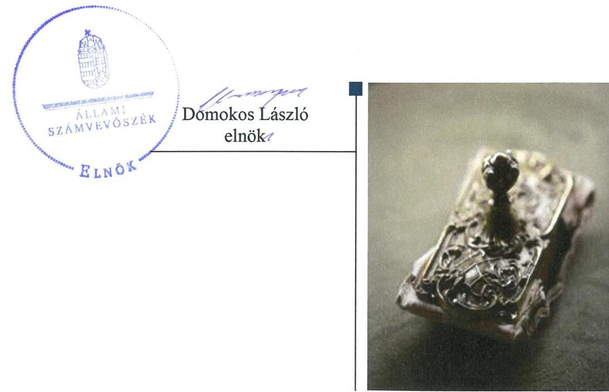
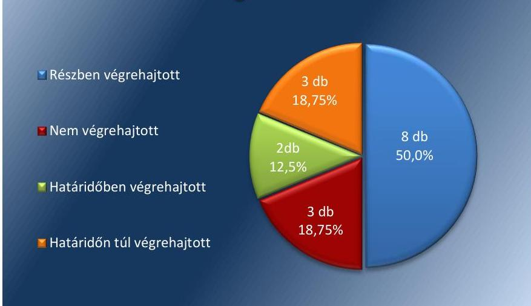
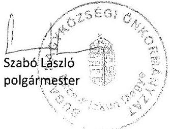
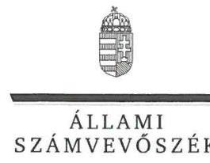
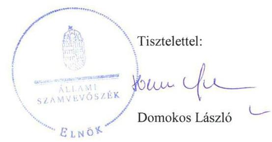

# Jelentés 

## Utóellenőrzések

Az önkormányzatok pénzügyi és vagyongazdálkodása megfelelőségének utóellenőrzése - Bugac Nagyközségi Önkormányzat
2018. szeptember 26. nap

---

# AZ ELLENŐRZÉST FELÜGYELTE:

- VARGA EDIT felügyeleti vezető

- AZ ELLENŐRZÉST VEZETTE ÉS A VÉGREHAJTÁSÁÉRT FELELŐS:
  - JOÓ ERIKA ellenőrzésvezető
  - A PROGRAM ÖSSZEÁLLÍTÁSÁÉRT FELELŐS:
    - TÓTPÁL SZABOLCS osztályvezető

- IKTATÓSZÁM: EL-0214-022/2018.
- TÉMASZÁM: 2460
- ELLENŐRZÉS-AZONOSÍTÓ SZÁM: V080445

Jelentéseink az Országgyűlés számítógépes hálózatán és az Interneten a www.asz.hu címen is olvashatóak.

---

# TARTALOMJEGYZÉK 

■ ÖSSZEGZÉS ..... 5
■ AZ ELLENŐRZÉS CÉLJA ..... 6
■ AZ ELLENŐRZÉS TERÜLETE ..... 7
■ AZ ELLENŐRZÉS HÁTTERE, INDOKOLTSÁGA ..... 8
■ A JELENTÉS LÉNYEGES KÉRDÉSKÖRE ..... 9
■ ELLENŐRZÉS HATÓKÖRE ÉS MÓDSZEREI ..... 10
■ MEGÁLLAPÍTÁSOK ..... 12
■ MELLÉKLETEK ..... 15
I. sz. melléklet: Bugac Nagyközségi Önkormányzat intézkedési terve végrehajtásának értékelése ..... 15
II. sz. melléklet: Bugac Nagyközségi Önkormányzat intézkedési terve ..... 21
■ FÜGGELÉK: ÉSZREVÉTELEK ..... 27
■ RÖVIDÍTÉSEK JEGYZÉKE ..... 35

---

.

---

# ÖSSZEGZÉS 

Bugac Nagyközségi Önkormányzat pénzügyi és vagyongazdálkodásának szabályozottsága egyes területeken javult, de az annak érvényt szerző végrehajtása elmaradt, így továbbra is veszélyezteti a közpénzekkel való felelős, elszámoltatható és átlátható gazdálkodást.

## Az ellenőrzés társadalmi indokoltsága

Az Állami Számvevőszék stratégiájában célul tűzte ki a számvevőszéki munka hasznosulásának javítását. Ezzel összhangban ellenőrzi, hogy az ellenőrzött szervezet megvalósította-e a korábbi ellenőrzései által feltárt hibák, hiányosságok és szabálytalanságok megszüntetése céljából elkészített intézkedési tervében foglaltakat. A rendszeres utóellenőrzések hozzájárulnak a szükséges intézkedések tényleges végrehajtásához, ezáltal a közpénzügyek rendezettségének javulásához.

## Főbb megállapítások, következtetések

Bugac Nagyközségi Önkormányzat az Állami Számvevőszék által elfogadott intézkedési tervében meghatározott tizenhat feladatból kettőt határidőben, hármat határidőn túl, nyolcat részben hajtott végre, hármat nem hajtott végre.

Bugac Nagyközségi Önkormányzat az intézkedési tervben meghatározott feladatoknak megfelelően megalkotta a jogszabályi előírásoknak megfelelő vagyonrendeletét, elkészítette a jogszabályi előírásoknak megfelelő számviteli politikát és számlarendet, a reprezentációs szabályzatot, a gazdálkodási jogkörök gyakorlására vonatkozó szabályzatot. Ennek hatására javult vagyongazdálkodás és a pénzügyi gazdálkodás szabályozottsága. A beruházásokra vonatkozó szerződések honlapon való közzétételével javult a vagyongazdálkodás átláthatósága. Az ingatlanvásárlásra vonatkozó képviselő-testületi döntést megelőzően nem végezték el a kockázatok elemzését és az értékbecslést, valamint a pénzügyi bizottság véleménye nem állt rendelkezésre. A 2016. évi beszámoló hibás tételeinek a jogszabályi előírásoknak megfelelő korrigálása és a Képviselő-testület felé történő bemutatása nem történt meg. A 2016. évi költségvetési beszámolót a Magyar Államkincstár által működtetett elektronikus adatszolgáltató rendszerbe - az Áhsz. 32. §-ban foglaltak ellenére - nem töltötték fel. A jegyző nem vizsgálta ki a munkajogi felelősség kérdését.

Bugac Nagyközségi Önkormányzat nem vezetett nyilvántartást az intézkedési tervben rögzített feladatok végrehajtásáról.

---

# AZ ELLENŐRZÉS CÉLJA 

Az ellenőrzés célja annak értékelése volt, hogy a számvevőszéki jelentésben foglalt intézkedést igénylő megállapításokkal összhangban készített intézkedési tervben meghatározott feladatokat az ellenőrzött szervezet végrehajtotta-e.

---

# AZ ELLENŐRZÉS TERÜLETE

## Bugac Nagyközségi Önkormányzat

Bugac állandó lakosainak száma 2017. január 1-jén a KSH1 adata alapján 2740 fő volt.

A Polgármester2 2010. október óta vezeti a hattagú Képviselő-testületet3, amely négy állandó bizottságot hozott létre.

Az ÁSZ4 2011. január 1. és 2014. december 31. közötti időszakra vonatkozóan végezte el az Önkormányzat5 pénzügyi és vagyongazdálkodása megfelelőségének ellenőrzését és erről 2016. június 9-én hozta nyilvánosságra a 16074 számú ÁSZ jelentést.

Az ellenőrzés célja az Önkormányzat pénzügyi és vagyoni helyzetének, a gazdálkodás szabályosságának megítélése a költségvetési tervezés, a pénzügyi egyensúly megteremtése, az éves költségvetési beszámolás, a vagyongazdálkodás, a vagyon számbavétele, a gazdasági események elszámolása és a pénzgazdálkodás szabályszerűsége alapján; valamint annak értékelése, hogy kialakított-e az önkormányzat az erőforrásokkal való szabályszerű és hatékony gazdálkodáshoz szükséges követelményeket, megvalósította-e azok számon kérését, ellenőrzését.

Az ÁSZ jelentés az Önkormányzat Jegyzője részére négy, Polgármestere részére négy intézkedést igénylő megállapítást tartalmazott. Ez alapján a Polgármester az ÁSZ Elnökének megküldte az Önkormányzat tizenhat feladatot tartalmazó, a Képviselő-testület által a 89/2016.(IX.29.) számú határozattal jóváhagyott intézkedési tervét.

Az utóellenőrzés arra irányult, hogy az Önkormányzat 2016. június 9. és 2018. április 27. között a pénzügyi és vagyongazdálkodása megfelelőségének ellenőrzéséről készült 16074. számú ÁSZ jelentésben szereplő intézkedést igénylő megállapításokkal és javaslatokkal összhangban készített intézkedési tervben meghatározott feladatokat végrehajtotta-e.

---

# AZ ELLENŐRZÉS HÁTTERE, INDOKOLTSÁGA 

Az ÁSZ tv. ${ }^{6}$ 33. § (1) bekezdése értelmében a számvevőszéki jelentések intézkedést igénylő megállapításaihoz és javaslataihoz kapcsolódóan az ellenőrzött szervezet vezetője intézkedési tervet köteles összeállítani, és az Állami Számvevőszék részére megküldeni.

Az ÁSZ által elfogadott intézkedési tervben foglaltak megvalósítását az ÁSZ törvény 33. § (7) bekezdésében foglaltak alapján - az Állami Számvevőszék utóellenőrzés keretében - ellenőrizheti. Az utóellenőrzések keretében - az intézkedések értékelése során - az Állami Számvevőszék figyelembe veszi az ellenőrzött szervezetek működési feltételeiben, valamint a jogszabályi előírásokban bekövetkezett változásokat.

Az utóellenőrzés során az ÁSZ értékeli, hogy az érintett számvevőszéki jelentésben foglalt intézkedést igénylő megállapításokkal és javaslatokkal összhangban, az ellenőrzött szervezet által készített intézkedési tervben meghatározott feladatokat a feladatra kijelöltek végrehajtották-e.

Az intézkedések végrehajtásával az adott terület szabályszerű működése vonatkozásában a kockázatok csökkenhetnek, azonban hosszabb távon az intézkedési tervben foglaltak végrehajtásával önmagában nem szűnnek meg, csak akkor, ha beépülnek az ellenőrzött szervezet működésébe, azokat folyamatosan karban tartják, figyelembe véve, illetve kezelve a változásokat. Emellett az intézkedések végrehajtásáig újabb kockázatok merülhetnek fel a szabályszerű működés vonatkozásában, amelyek kezelése szintén kiemelten fontos az ellenőrzött szervezet számára.

Az ellenőrzött szervezet vezetője által készített intézkedési tervekben foglalt feladatok hiányos, illetve késedelmes végrehajtása, vagy annak elmaradása a szabályszerűség és a felelős vezetői magatartás vonatkozásában kockázatot hordoz, ami azt mutatja, hogy az ellenőrzések során feltárt hibák, hiányosságok és szabálytalanságok kezelése nem kapott kellő hangsúlyt. Az utóellenőrzés során is fennálló szabálytalanságok esetén a közpénz, közvagyon veszélyeztetettségi kockázat valószínűsített hatásának értékelése további intézkedéseket vonhat maga után.

Az ellenőrzött szervezet szintjén az utóellenőrzés feltárja, hogy a szervezet az intézkedések végrehajtásával hasznosította-e a korábbi ellenőrzési jelentésben a hiányosságok megszüntetése, illetve a kockázatok kezelése érdekében megfogalmazott javaslatokat, illetve az intézkedések végrehajtása elmaradásának következtében továbbra is fennálló szabálytalanság esetén értékeli a közpénzek, közvagyon veszélyeztetettségét.

Az ÁSZ szintjén az utóellenőrzés visszacsatolást ad az ellenőrzési jelentések hasznosulásáról, az intézkedések elmaradásának, vagy részleges megvalósulásának a közpénzek, közvagyon veszélyeztetettségére gyakorolt valószínűsített hatásának értékelése további intézkedéseket vonhat maga után.

---

# A JELENTÉS LÉNYEGES KÉRDÉSKÖRE 

Az Önkormányzat az intézkedési tervben foglaltakat az előírt határidőben végrehajtotta-e?

---

# ELLENŐRZÉS HATÓKÖRE ÉS MÓDSZEREI 

## Az ellenőrzés típusa

Megfelelőségi ellenőrzés.

## Az ellenőrzött időszak

Az utóellenőrzés alapját képező ÁSZ jelentés közzétételének napjától (2016. június 9.) az ellenőrzésről szóló kiértesítő levél keltének napjáig (2018. április 27.) tartó időszak.

## Az ellenőrzés tárgya

Az ÁSZ tv. 2011. július 1-jei hatálybalépését követően a számvevőszéki jelentésben foglalt intézkedést igénylő megállapításokkal összhangban - az Önkormányzat által - készített Intézkedési tervben foglaltak végrehajtásának ellenőrzése.

## Az ellenőrzött szervezet

Bugac Nagyközségi Önkormányzat és a Bugaci Közös Önkormányzati Hivatal

## Az ellenőrzés jogalapja

Az ellenőrzés jogszabályi alapját az ÁSZ tv. 33. § (1)-(2) és (6)-(7) bekezdésének előírásai képezik.

## Az ellenőrzés módszerei

Az ellenőrzést az ellenőrzött időszakban hatályos jogszabályok, az ellenőrzés szakmai szabályai, a jelen ellenőrzésre irányadó ÁSZ módszertanok, az ellenőrzési programban foglalt értékelési szempontok szerint végeztük.

Az ellenőrzés ideje alatt az Önkormányzattal történő kapcsolattartást az ÁSZ SZMSZ-ének vonatkozó előírásai alapján biztosítottuk.

Az utóellenőrzés megállapításait az ÁSZ rendelkezésére álló, valamint az ÁSZ adatbekérése szerint, az Önkormányzat által rendelkezésre bocsátott dokumentumok alapozták meg.

Az ellenőrzési bizonyítékként felhasználható adatforrások közé tartoztak egyrészt az ellenőrzési program részletes szempontjainál felsorolt

---

adatforrások, másrészt minden - az ellenőrzés folyamán feltárt, az ellenőrzés szempontjából információt tartalmazó - dokumentum.

Az intézkedési tervekben előírt feladatokat azok végrehajthatósága, illetve végrehajtása szempontjából az alábbiak szerint értékeltük:
"határidőben végrehajtott" a feladat, ha a teljesítés dokumentáltan, az intézkedési tervben előírt határidőben és tartalommal megtörtént;
"határidőn túl végrehajtott" a feladat, ha annak teljesítése az intézkedési tervben meghatározott módon, de az előírt határidőn túl történt meg;
"részben végrehajtott" a feladat, ha végrehajtása teljes körűen az intézkedési tervben előírt módon nem történt meg;
"nem végrehajtott" a feladat, ha a végrehajtás nem történt meg, vagy amennyiben a teljesítést nem dokumentálták;
"okafogyottá vált" a feladat, ha végrehajtására - meghatározott esemény bekövetkezése, továbbá külső körülmény, a működést érintő feltétel változása miatt - már nincs szükség, illetve lehetőség, és egyértelműen megállapítható, hogy az intézkedést szükségessé tevő körülmény a jövőben nem fordulhat elő;
"nem időszerű" az a feladat, amelynek ellenőrzési időszakon belüli végrehajtására azért nem került (kerülhetett) sor, mert az intézkedés alapjául szolgáló esemény nem következett be, de annak jövőbeni előfordulása lehetséges, a végrehajtása nem volt esedékes, vagy a végrehajtás határideje még nem járt le.
Az ellenőrzés lefolytatásához az Önkormányzat a tanúsítványok elektronikus kitöltésével, valamint az ÁSZ által kért dokumentumok elektronikus megküldésével szolgáltatott adatokat, amelyek valódiságát és teljes körűségét az ellenőrzött szervezet vezetője által tett teljességi és hitelességi nyilatkozat igazolja. Az így rendelkezésre bocsátott adatok, információk kontrollja az ellenőrzés keretében megtörtént.

---

# MEGÁLLAPÍTÁSOK 

## Az Önkormányzat az intézkedési tervben foglaltakat az előírt határidőben végrehajtotta-e?

Összegző megállapítás

Az Önkormányzat az intézkedési tervben szereplő tizenhat feladatból kettőt határidőben, hármat határidőn túl hajtott végre, nyolcat részben, hármat nem hajtott végre. Az intézkedési tervben meghatározott feladatok végrehajtásáról nem vezettek nyilvántartást.

Az Önkormányzat az általa elkészített és az ÁSZ által elfogadott intézkedési tervében ${ }^{7}$ meghatározott feladatok közül kettőt határidőben, hármat határidőn túl hajtott végre, nyolcat részben végrehajtott, hármat nem hajtott végre.

A feladatokat, határidőket, megjelölt felelősöket és a feladatok végrehajtását az I. sz. melléklet mutatja be.

Az Önkormányzat az intézkedési tervben meghatározott feladatok végrehajtásáról nem vezette a Bkr. ${ }^{8}$ 14. § (1) bekezdésben előírt nyilvántartást.

Az Önkormányzat intézkedési tervében vállalt feladatok végrehajtásának értékelését az 1. ábra szemlélteti.

1. ábra

A feladatok végrehajtásának értékelési kategóriák szerinti megoszlása

Forrás: ÁSZ

---

A SZABÁLYOZOTTSÁG jogszabályi előírásoknak megfelelő kialakítása érdekében a felelősök intézkedéseket tettek. A gazdasági vezető gondoskodott a Számv. tv. előírásainak megfelelő számviteli politika ${ }^{9}$ és számlarend ${ }^{10}$ elkészítéséről (1), az aljegyző ${ }^{11}$ gondoskodott a reprezentációs szabályzat ${ }^{12}$ elkészítéséről (4).

A PÉNZÜGYI ELSZÁMOLTATHATÓSÁG érdekében a gazdasági vezető gondoskodott az előirányzatok előírásoknak megfelelő analitikus nyilvántartásáról (2). A polgármester által a Képviselő-testület elé terjesztett 2016. évi féléves, háromnegyed éves, valamint a 2017. évi féléves és háromnegyed éves beszámolókon keresztül figyelemmel kísérték a gazdasági-pénzügyi egyensúlyt, ugyanakkor a polgármester nem gondoskodott a jegyző beszámoltatásáról (6). A gazdasági vezető nem gondoskodott valamennyi eszközre és forrásra kiterjedően a jogszabályi előírásoknak megfelelő analitikus nyilvántartások vezetéséről, valamint az elkészített likviditási tervek havonkénti felülvizsgálatáról (10 és 12). A jegyző nem gondoskodott a 2016. évi beszámoló hibás tételei jogszabályi előírásoknak megfelelő korrigálásáról és a Képviselő-testület felé történő bemutatásáról, valamint a 2016. évi költségvetési beszámoló a Magyar Államkincstár
 által működtetett elektronikus adatszolgáltató rendszerbe való feltöltéséről (15).

# A BELSŐ KONTROLL SZERINTI ELSZÁMOLTATHATÓSÁG biztosítása érdekében a jegyző kiadta a pénzgazdálkodással kapcsolatos kötelezettségvállalás, utalványozás, érvényesítés és ellenjegyzés hatásköri rendjéről szóló szabályzatot, ugyanakkor nem gondoskodott a gazdálkodási jogkörgyakorlás szabályzat szerinti működéséért való felelősség érvényesítéséről (8-9). 

AZ INTEGRITÁS érvényesülése érdekében a jegyző gondoskodott a közzétételi szabályzatban és a vagyonrendeletben foglaltak összhangjáról (5). Az aljegyző gondoskodott a vagyonkezelési és beruházási szerződések honlapon ${ }^{13}$ történő közzétételéről, ennek következtében az átláthatóság javult, ugyanakkor a lefolytatott közbeszerzési eljárások szabályszerűségét nem dokumentálták (13). A polgármester intézkedett a jegyző felelősségének kivizsgálásáról, de a vizsgálóbizottság munkájáról készült jegyzőkönyvekben előírt munkaügyi intézkedéseket nem tették meg (7). A jegyző az ÁSZ ellenőrzés során feltárt hiányosságok, szabálytalanságok vonatkozásában nem vizsgálta ki a munkajogi felelősség kérdését (16). A jegyző a gazdasági vezetőt nem számoltatta be a pénzügyi egyensúly fenntartásáról, a számviteli alapelvek maradéktalan betartását dokumentált módon nem ellenőrizte és nem nyújtott tájékoztatást a Képviselő-testület részére (11).

A SZABÁLYSZERŰ VAGYONGAZDÁLKODÁS érdekében a polgármester és a jegyző gondoskodott az Nvtv. ${ }^{14}$ és a Mötv. ${ }^{15}$ előírásaival összhangban lévő vagyonrendelet ${ }^{16}$ elkészítéséről és a Képviselő-testület elé terjesztéséről (3 és 5). A polgármester az ingatlanvásárlásra vonatkozó 100/2016. (X.20.) képviselő-testületi határozatot ${ }^{17}$ megelőzően nem gondoskodott az ingatlanok értékbecsléséről, a befolyásoló körülmények áttekintéséről és a kockázatok elemzéséről, valamint a döntést megelőzően a pénzügyi bizottság véleményének rendelkezésre állásáról (14).

---

# MELLÉKLETEK

- I. SZ. MELLÉKLET: BUGAC NAGYKÖZSÉGI ÖNKORMÁNYZAT INTÉZKEDÉSI TERVE VÉGREHAJTÁSÁNAK ÉRTÉKELÉSE

|  1. | Az intézkedési tervben rögzített feladat | Az intézkedési tervben meghatározott határidő | Az intézkedési tervben meghatározott felelős | A feladat végrehajtása  |
| --- | --- | --- | --- | --- |
|  1. | 2. | 3. | 4. | 5.  |
|  Határidőben végrehajtott feladatok |  |  |  |   |
|  1. | J1.a. Elkészítjük a jogszabályi előírásoknak megfelelő tartalmú számviteli politikát és számlarendet. | 2016. október 31. | gazdasági vezető | Az elkészült Számviteli Politika 2016. november 1-jétől volt hatályos. A Számviteli politika melléklete a Számlarend, amely 2016. november 2-től volt hatályban.  |
|  2. | J2.a. Az analitikus nyilvántartások vezetése folyamatosan történik, rendelkezésre állnak és folyamatosan gondoskodunk a módosítások nyilvántartásának elkészítéséről. | folyamatos | gazdasági vezető | Az előirányzatok és módosítások nyilvántartása az EPER ${ }^{18}$ könyvelési programban történik folyamatosan. A nyilvántartás részletes, naprakész.  |
|  Határidőn túl végrehajtott feladatok |  |  |  |   |
|  3. | P1. - J1.d. A jogszabályi előírásoknak megfelelő tartalmú vagyonrendelet elkészítéséről és Képviselőtestület elé terjesztéséről intézkedünk. | 2016. október 31. | polgármester, jegyző | A polgármester a jegyző által elkészített vagyonrendelet tervezetét 2016. december 21-én terjesztette a Képviselő-testület elé.  |
|  4. | J1.b. Gondoskodunk a jogszabályi előírásoknak megfelelő reprezentációs szabályzat elkészítéséről. | 2016. augusztus 31. | aljegyző | A reprezentációs szabályzat 2016. november 1-jén lépett hatályba.  |
|  5. | J1.c. A jogszabályi előírásoknak megfelelő tartalmú vagyonrendeletet összhangba hozzuk a Közzétételi szabályzatban foglaltakkal. | 2016. október 31. | jegyző | Az önkormányzat vagyonáról, a vagyontárgyak feletti tulajdonosi jogok gyakorlásáról szóló 8/2016. (XII.21.) önkormányzati rendeletet az intézkedési tervben előírt határidőt követően, 2016. december 21-én készítették el. Az elfogadott vagyonrendelet előírásai a Közzétételi szabályzat előírásaival összhangban voltak.  |
|  Részben végrehajtott feladatok |  |  |  |   |
|  6. | P2. A gazdasági-pénzügyi egyensúlyát különös figyelemmel kell kísérni. A pénzügyi egyensúly biztosítása érdekében az önkormányzat jegyzője valamennyi, az éves munkatervben tervezett testületi | folyamatos | polgármester | Végrehajtott feladatrész:
A gazdasági-pénzügyi egyensúlyt a polgármester által a Képviselő-testület elé terjesztett 2016. évi féléves, háromnegyedéves és zárszámadási, valamint a 2017. évi féléves és háromnegyedéves beszámolókon keresztül figyelemmel kísérték.  |

---

|  1. | Az intézkedési tervben rögzített feladat | Az intézkedési tervben meghatározott határidő | Az intézkedési tervben meghatározott felelős | A feladat végrehajtása  |
| --- | --- | --- | --- | --- |
|  2. | ülésen részletes beszámolási kötelezettséggel tartozik a pénzügyi egyensúly hosszú távú fenntarthatósága érdekében, amennyiben beavatkozás szükséges, intézkedésekről szóló döntési javaslatot fogalmaz meg a képviselőtestület felé. |  |  | Nem végrehajtott feladatrész:
A polgármester nem gondoskodott a jegyző beszámoltatásáról, az önkormányzat jegyzője a testületi üléseken részletes beszámolási kötelezettségeit dokumentáltan nem teljesítette. A testületi előterjesztések a jegyző beszámolóit nem tartalmazták.  |
|  7. | P4. A Polgármester intézkedik a jegyző felelőssége kivizsgálása érdekében. Vizsgálóbizottságot állít fel önmaga vezetésével, melynek tagjai a jelenlegi jegyző és a belső ellenőr (külsős). A vizsgálat időtartama 3 hónap. Amennyiben megállapításra kerül munkajogi felelősség a hiányosságok és/vagy szabálytalanságok és/vagy mulasztások kapcsán, szankciót alkalmaz. | 2016. december 31. | polgármester | Végrehajtott feladatrész:
A vizsgálóbizottságot létrehozták, a vizsgálatot lefolytatták.
Nem végrehajtott feladatrész:
A vizsgálóbizottsági munkáról készített jegyzőkönyvekben foglaltak szerint munkaügyi intézkedések megtételére nem került sor. A vizsgálóbizottság munkájáról készített jegyzőkönyvek nem tartalmazták az eljárás során figyelembe vett objektív és szubjektív határidőket.  |
|  8. | J2.ba. Az ellenjegyzés szabályzat szerinti működéséért való felelősség érvényesítése. | folyamatos | jegyző | Végrehajtott feladatrész:
A Jegyző 2016. november 2-án kiadta a "Bugac Nagyközségi Önkormányzat pénzgazdálkodásával kapcsolatos kötelezettségvállalás, utalványozás, érvényesítés és ellen-jegyzés hatásköri rendjéről" szóló szabályzatot.
A szabályzatot az Áht, az Ávr, az Áhsz, valamint a Számv. tv. előírásainak megfelelően készítették el. A szabályzat részletesen meghatározta a kötelezettségvállalás pénzügyi ellenjegyzésének az utalványozás ellenjegyzésének feltételeit és módját. A szabályzat mellékleteiben az egyes jogosultsággal rendelkező személyek aláírás mintái rendelkezésre álltak.
Nem végrehajtott feladatrész:
Dokumentumokkal nem támasztották alá gazdálkodási jogkörgyakorlás szabályzat szerinti működéséért való felelősség érvényesítését.  |
|  9. | J2.bb-bc. Az érvényesítés szabályzat szerinti működéséért való felelősség biztosítottsága. A szerződések pénzügyi ellenjegyzésének szabályzat szerinti biztosítottsága. | folyamatos | gazdasági vezető | Végrehajtott feladatrész:
2016. november 2-án a jegyző kiadta a "Bugac Nagyközségi Önkormányzat pénzgazdálkodásával kapcsolatos kötelezettségvállalás, utalványozás, érvényesítés és ellen-jegyzés hatásköri rendjéről" szóló szabályzatot.  |

---

|  1. | Az intézkedési tervben rögzített feladat | Az intézkedési tervben meghatározott határidő | Az intézkedési tervben meghatározott felelős | A feladat végrehajtása  |
| --- | --- | --- | --- | --- |
|  1. | 2. | 3. | 4. | 5.  |
|   |  |  |  | A szabályozást az Áht., az Ávr., az Áhsz., valamint a Számv. tv. előírásainak megfelelően készítették el. A szabályzat részletesen meghatározta az érvényesítés és pénzügyi ellenjegyzés feltételeit és módját.
A szabályzat mellékleteiben, az egyes jogosultsággal rendelkezők aláírás mintái rendelkezésre álltak.
Nem végrehajtott feladatrész:
Dokumentumokkal nem támasztották alá, hogy a gyakorlatban megfelelően érvényesült-e az érvényesítés szabályzat szerinti működéséért való felelősség, illetve a szabályozásnak megfelelő pénzügyi ellenjegyzés biztosítottsága megvalósult-e.  |
|  10. | J2.c. A jogszabályi előírásoknak megfelelő likviditási terv elkészítéséről azonnal intézkedünk, a rendelkezésre álló adatokat korrigáljuk és aktualizáljuk. A 2016 évi és a további évek vonatkozásában, illetve a bevételek érkezésének és a kiadások teljesítésének ütemezéséről készített likviditási tervet, havonta felülvizsgáljuk. | azonnal | gazdasági vezető | Végrehajtott feladatrész:
A likviditási tervet a 2016, a 2017. és a 2018. évekre elkészítették.
Nem végrehajtott feladatrész:
Az elkészített likviditási terveket az intézkedési tervben foglaltak ellenére nem vizsgálták felül havonta. A 2016. évi likviditási terv bevételi és kiadási adatai a 2016. évi eredeti előirányzatok értékével egyeznek meg.  |
|  11. | J2.d. A jegyző felügyeletével gazdasági-pénzügyi egyensúly fenntartására fokozott figyelmet kell fordítani. Az önkormányzat gazdasági vezetője rendszeres beszámolási kötelezettséggel tartozik jegyző irányába, szükség esetén a pénzügyi vezető intézkedéseket fogalmaz meg az egyensúly betartása érdekében. A jegyző rendszeresen ellenőrzi a számviteli alapelvek maradéktalan betartását és rendszeresen tájékoztatást nyújt a Képviselő-testület részére. A jegyzőnek be kell számolni évente (tárgyévet követő év második soros testületi ülésén) a képviselőtestületnek a hivatal éves tevékenységéről (ügyiratok mennyisége, kiemelt ügyek, személyi és tárgyi | folyamatos | jegyző | Végrehajtott feladatrész:
A jegyző az ellenőrzött időszakban a hivatal éves tevékenységéről az intézkedési tervben előírt határidőben beszámolt a Képviselő-testület felé.
Nem végrehajtott feladatrész:
A jegyző a gazdasági-pénzügyi egyensúly fenntartására nem fordított fokozott figyelmet, mivel a gazdasági vezetőt nem számoltatta be, valamint a számviteli alapelvek maradéktalan betartását dokumentált módon nem ellenőrizte és nem nyújtott tájékoztatást a Képviselő-testület részére.  |

---

|  1. | Az intézkedési tervben rögzített feladat | Az intézkedési tervben meghatározott határidő | Az intézkedési tervben meghatározott felelős | A feladat végrehajtása  |
| --- | --- | --- | --- | --- |
|  1. | 2. | 3. | 4. | 5.  |
|   | feltételek, vagyont érintő változások, pénzügyi helyzet, pályázatok, projektek, hivatalt érintő ellenőrzések éves vonatkozásában). |  |  |   |
|  12. | J3.a-b-c. Gondoskodunk a jogszabályi és belső szabályzatok előírásainak megfelelő valamennyi eszköz és forrás analitikus nyilvántartásának elkészítéséről, és a vagyonkezelésbe adott eszközök megfelelő helyen való szerepeltetéséről.
Elkészítjük a mérlegtételek év végi értékelését a jogszabályi és belső szabályzat előírásainak megfelelően.
Gondoskodunk a jogszabályi előírásoknak megfelelő valamennyi eszköz és forrás analitikus nyilvántartásának elkészítéséről. Összhangba hozzuk a vagyonrendelet és leltározási szabályzatban foglalt rendelkezéseket és annak megfelelően végezzük a feladatokat. | folyamatos | gazdasági vezető | Végrehajtott feladatrész:
A Számviteli politikát 2016. november 1-jén adták ki, előírásai összhangban vannak a jogszabályi előírásokkal. A Számviteli politika melléklete a Számlarend és az Eszközök és források értékelési szabályzata (kiadva: 2016. november 2.).
A szabályzatok előírásai alkalmasak voltak az eszközök és források számviteli (főkönyvi és részletező) nyilvántartásokban történő - jogszabályi előírásoknak megfelelő - kimutatására.
Nem végrehajtott feladatrész:
Az Önkormányzat a 8/2016. (XII. 21.) számú rendeletét az önkormányzat vagyonáról, a vagyontárgyak feletti tulajdonosi jogok gyakorlásáról elkészítette, de a leltározási szabályzatot a Számv. tv. 14. § (5) a) pontjában előírtak ellenére nem, így a rendelet és a szabályzat közötti összhang megteremtéséről nem gondoskodtak.
Az Önkormányzat az intézkedési tervében meghatározott folyamatos határidőre tekintettel az ellenőrzés teljes időszakára dokumentumokkal nem igazolta annak teljesítését, hogy valamennyi eszközre és forrásra kiterjedően a jogszabályi előírásoknak megfelelően elkészítette-e az analitikus nyilvántartásokat. A vevői és a szállítói állományra vonatkozóan analitikus nyilvántartást nem vezettek az Áhsz. 39. § (3) bekezdés előírása ellenére. Az egyéb eszközök analitikája nem tartalmazta a vonatkozó időszakot.  |
|  13.
 | J3.d. A jövőben a közbeszerzési eljárások tekintetében megfelelünk a közbeszerzési törvény önkormányzatokra vonatkozó előírásainak és betartjuk az | folyamatos | aljegyző | Végrehajtott feladatrész:
Az Önkormányzat a honlapján közzétette a vagyonkezelési és beruházási szerződéseiket.  |

---

|  1. | Az intézkedési tervben rögzített feladat | Az intézkedési tervben meghatározott határidő | Az intézkedési tervben meghatározott felelős | A feladat végrehajtása  |
| --- | --- | --- | --- | --- |
|  1. | 2. | 3. | 4. | 5.  |
|   | önkormányzatunk által elfogadott beszerzési szabályzatunkban foglaltakat. Saját szabályzatunkat a törvényi előírásoknak megfelelően aktualizáljuk. Gondoskodunk arról, hogy az önkormányzati honlapon közzétételre kerüljenek a vagyonkezelési szerződések, és a beruházások teljes körű nyilvánossága biztosított legyen, figyelemmel a jogszabályban és a belső szabályzatban foglaltakra. |  |  | Nem végrehajtott feladatrész:
Az Önkormányzat által lefolytatott közbeszerzési eljárások jogszabályi és belső előírásoknak való megfelelőségét nem dokumentálták. A Képviselő-testület által elfogadott 2017. és 2018. évi közbeszerzési terv, valamint a közbeszerzési szabályzat rendelkezéseinek betartását a lefolytatott közbeszerzési eljárások során Önkormányzat nem igazolta. Az Önkormányzat közbeszerzési szabályzata 2017. március 1-jétől volt hatályos.  |
|   |  |  | Nem végrehajtott feladatok |   |
|  14. | P3. Az önkormányzat vagyonrendeletének rendelkezéseit betartva lehetséges bármilyen vagyongazdálkodással összefüggő kérdés tárgyalása az önkormányzat testületi ülésén. Ennek során a testületi ülés előkészítésekor minden esetben szükséges az érintett vagyon elem vizsgálata, befolyásoló körülmények áttekintése, kockázatok elemzése. Testületi döntést megelőzően kötelező az önkormányzat pénzügyi bizottságának vélemény kérése abban a tekintetben, hogy támogatja-e vagy sem ez előkészített előterjesztést. | folyamatos | polgármester | A 2016. október 20-án ingatlanok megvásárlásával kapcsolatban született, 100/2016. (X.20.) képviselő-testületi határozatot megelőzően, annak előkészítésekor az érintett vagyonelemek vizsgálatát, a befolyásoló körülmények áttekintését, kockázatok elemzését nem végezték el. Az ingatlanok értékbecslését a testületi döntést követően, 2017. augusztus 18-án teljesítette az értékbecslő. A testületi döntést megelőzően a pénzügyi bizottság véleménye sem állt rendelkezésre az ingatlanvásárlásokat illetően.  |
|  15. | J3.f. A 2016. évi költségvetési mérlegben a hibás tételek korrigálásra és a Képviselő Testület felé az éves beszámoló keretében bemutatásra kerülnek. Az éves költségvetési beszámolót a 4/2013 (I.11) Korm. rendelet 32. §-ban foglaltaknak megfelelően töltjük fel a Kincstár által működtetett elektronikus adatszolgáltató rendszerbe. A Képviselő Testület felé az éves beszámoló keretében bemutatásra kerül. | 2017. március 20. | jegyző | A hibás tételek jogszabályi előírásoknak megfelelő korrigálása és bemutatása a 2017. május 8-án elkészített 2016. évi beszámoló részét képező 12/A Mérlegben nem történt meg. Az éves költségvetési beszámoló szöveges részét az Önkormányzat nem készítette el, a hibák korrigálása a Képviselő-testületnek az éves költségvetési beszámolóban nem került bemutatásra. A 2016. évi költségvetési beszámolót a Magyar Államkincstár által működtetett elektronikus adatszolgáltató rendszerbe - az Áhsz. 32. §-ban foglaltak ellenére - nem töltötték fel.  |

---

|  1. | Az intézkedési tervben rögzített feladat | Az intézkedési tervben meghatározott határidő | Az intézkedési tervben meghatározott felelős | A feladat végrehajtása  |
| --- | --- | --- | --- | --- |
|  16. | 2. | 3. | 4. | 5.  |
|   | J4. A Jegyző egy vizsgáló bizottság keretein belül kivizsgálja az ÁSZ ellenőrzés során feltárt hiányosságok és/vagy szabálytalanságok kapcsán a munkajogi felelősség kérdését. | 2016. december 31. | jegyző | A feladatot a jegyző nem hajtotta végre, nem vizsgálta ki vizsgálóbizottság keretein belül a munkajogi felelősség kérdését.  |

---

# 89/2016.(IX.29.) TKLsz.határozat melléklete 

## INTÉZKEDÉSI TERV

„Az önkormányzatok pénzügyi és vagyongazdálkodása megfelelőségének ellenőrzése Bugac" címmel készített ÁSZ jelentésben foglaltakra tekintettel, a megfogalmazott javaslatok megvalósítására Bugac és Bugacpusztaháza Községi Önkormányzatok Társult Képviselőtestülete az alábbi intézkedési tervet hagyja jóvá:

## I. Polgármesternek tett javaslat

1. Állami Számvevőszék javaslata

Az erőforrásokkal való szabályszerű és hatékony gazdálkodás érdekében intézkedjen a vagyongazdálkodással kapcsolatos, a jogszabályi előírásokkal összhangban lévő szabályok meghatározása érdekében a szükséges rendelet tervezet képviselő-testület elé terjesztéséről.

## Az önkormányzat intézkedése

A jogszabályi előírásoknak megfelelő tartalmú vagyonrendelet elkészítéséről és Képviselőtestület elé terjesztéséről intézkedünk.

Határidő: 2016. október 31. Felelős: Szabó László polgármester
2. Állami Számvevőszék javaslata

A pénzügyi egyensúly biztosítása érdekében intézkedjen a pénzügyi egyensúly hosszú távú fenntarthatósága érdekében szükséges intézkedésekről szóló döntési javaslat képviselőtestület elé terjesztéséről.

## Az önkormányzat intézkedése

A gazdasági-pénzügyi egyensúlyát különös figyelemmel kell kísérni. A pénzügyi egyensúly biztosítása érdekében az önkormányzat jegyzője valamennyi, az éves munkatervben tervezett testületi ülésen részletes beszámolási kötelezettséggel tartozik a pénzügyi egyensúly hosszú távú fenntarthatósága érdekében, amennyiben beavatkozás szükséges, intézkedésekről szóló döntési javaslatot fogalmaz meg a képviselőtestület felé.

Határidő: folyamatos
Felelős: Szabó László polgármester
3. Állami Számvevőszék javaslata

A vagyongazdálkodás szabályszerűségének biztosítása érdekében intézkedjen az önkormányzati vagyoni érintő döntések előkészítése során a képviselő-testület által meghatározott szabályok betartásáról.

## Az önkormányzat intézkedése

Az önkormányzat vagyonrendeletének rendelkezéseit betartva lehetséges bármilyen vagyongazdálkodással összefüggő kérdés tárgyalása az önkormányzat testületi ülésén. Ennek során a testületi ülés előkészítésekor minden esetben szükséges az érintett vagyon elem vizsgálata, befolyásoló körülmények áttekintése, kockázatok elemzése. Testületi döntést megelőzően kötelező az önkormányzat pénzügyi bizottságának vélemény kérése abban a tekintetben, hogy támogatja-e vagy sem ez előkészített előterjesztést.

Határidő: folyamatos
Felelős: Szabó László polgármester

---

# 4. Állami Számvevőszék javaslata 

Intézkedjen az Állami Számvevőszék ellenőrzése során feltárt hiányosságok és/vagy szabálytalanságok tekintetében a munkajogi felelősség kivizsgálására irányuló eljárás megindításáról, és ennek eredménye ismeretében tegye meg a szükséges intézkedéseket.

## Az önkormányzat intézkedése

A Polgármester intézkedik a jegyző felelőssége kivizsgálása érdekében. Vizsgálóbizottságot állít fel önmaga vezetésével, melynek tagjai a jelenlegi jegyző és a belső ellenőr (külsős). A vizsgálat időtartama 3 hónap. Amennyiben megállapításra kerül munkajogi felelősség a hiányosságok és/vagy szabálytalanságok és/vagy mulasztások kapcsán, szankciót alkalmaz.

Határidő: 2016. december 31. Felelős: Szabó László polgármester

## II. Jegyzőnek tett javaslatok

1. Az erőforrásokkal való szabályszerű és hatékony gazdálkodás érdekében intézkedjen:
a. Állami Számvevőszék javaslata
a jogszabályi előírásoknak megfelelő tartalmú számviteli politika és számlarend kialakításáról

Az önkormányzat intézkedése
Elkészítik a jogszabályi előírásoknak megfelelő számviteli politikát és a számlarendet.

Határidő: 2016. október 31. Felelős: Kovácsné Manga Margit gazdasági vezető
b. Állami Számvevőszék javaslata
a pénzügyi és vagyongazdálkodással kapcsolatosan a jogszabályban előírtak belső szabályzatokban történő rendezéséről

Az önkormányzat intézkedése
Gondoskodunk a jogszabályi előírásoknak megfelelő reprezentációs kiadások Szabályzatának elkészítéséről. A beszerzések lebonyolításáról szóló szabályzat elkészült, a Képviselő-testület a 13/2016.(V.25.) Kt.sz. határozatával elfogadta.

Határidő: 2016. augusztus 31. Felelős: Heródekné Szász Ágota aljegyző
c. Állami Számvevőszék javaslata
a vagyongazdálkodásra vonatkozó szabályozások összhangjának megteremtéséről
Az önkormányzat intézkedése
A jogszabályi előírásoknak megfelelő tartalmú vagyonrendeletet összhangba hozzuk a Közzétételi szabályzatban foglaltakkal.

Határidő: 2016. október 31. Felelős: dr. Fröschl-Nagy Péter jegyző
d. Állami Számvevőszék javaslata
a vagyongazdálkodással kapcsolatos, a jogszabályi előírásokkal összhangban lévő

---

szabályok meghatározása érdekében szükséges rendelet tervezet elkészítéséről
Az önkormányzat intézkedése
Elkészítjük a jogszabályi előírásoknak megfelelő tartalmú vagyonrendeletet.
Határidő: 2016. október 31. Felelős: dr. Fröschl-Nagy Péter jegyző
2. A pénzügyi gazdálkodás szabályszerűsége és a pénzügyi egyensúly biztosítása érdekében intézkedjen:
a. Állami Számvevőszék javaslata
az előirányzatok - ide értve azok módosításait is - jogszabályi előírásoknak megfelelő nyilvántartásáról.

Az önkormányzat intézkedése
Az analitikus nyilvántartások vezetése folyamatosan történik, rendelkezésre állnak, és folyamatosan gondoskodunk a módosítások nyilvántartásának elkészítéséről.

Határidő: folyamatos
Felelős: Kovácsné Manga Margit gazdasági vezető
b. Állami Számvevőszék javaslata
a belső kontroll rendszer részét képező kontrolltevékenységek jogszabályi előírásoknak megfelelő működtetéséről

Az önkormányzat intézkedése
ba.,Az ellenjegyzés szabályzat szerinti működéséért való felelősség érvényesítése.
bb.,Az érvényesítés szabályzat szerinti működéséért való felelősség biztosítottsága.
bc.,A szerződések pénzügyi ellenjegyzésének szabályzat szerinti biztosítottsága.
Határidő: folyamatos
Felelős: ba., esetén: dr. Fröschl-Nagy Péter jegyző
bb és bc., esetén: Kovácsné Manga Margit gazd.vez.
c. Állami Számvevőszék javaslata
a likviditási terv jogszabályi előírásoknak megfelelő elkészítéséről, illetve annak felülvizsgálatáról.

Az önkormányzat intézkedése
A jogszabályi előírásoknak megfelelő likviditási terv elkészítéséről azonnal intézkedünk, a rendelkezésre álló adatokat korrigáljuk és aktualizáljuk. A 2016 évi és a további évek vonatkozásában, illetve a bevételek érkezésének és a kiadások teljesítésének ütemezéséről készített likviditási tervet, havonta felülvizsgáljuk.

Határidő: azonnal
Felelős: Kovácsné Manga Margit gazdasági vezető
d. Állami Számvevőszék javaslata
a pénzügyi egyensúly hosszú távú fenntarthatósága érdekében szükséges intézkedésekről

---

szóló döntési javaslat elkészítéséről
Az önkormányzat intézkedése
A jegyző felügyeletével gazdasági-pénzügyi egyensúly fenntartására fokozott figyelmet kell fordítani. Az önkormányzat gazdasági vezetője rendszeres beszámolási kötelezettséggel tartozik jegyző irányába, szükség esetén a pénzügyi vezető intézkedéseket fogalmaz meg az egyensúly betartása érdekében. A jegyző rendszeresen ellenőrzi a számviteli alapelvek maradéktalan betartását és rendszeresen tájékoztatást nyújt a Képviselő-testület részére. A jegyzőnek be kell számolni évente ( tárgyévet követő év második soros testületi ülésén) a képviselő-testületnek a hivatal éves tevékenységéről (ügyiratok mennyisége, kiemelt ügyek, személyi és tárgyi feltételek, vagyont érintő változások, pénzügyi helyzet, pályázatok, projektek, hivatalt érintő ellenőrzések éves vonatkozásában).

Határidő: folyamatos
Felelős: dr. Fröschl-Nagy Péter jegyző
3. A vagyongazdálkodás szabályszerűségének biztosítása érdekében intézkedjen:
a. Állami Számvevőszék javaslata
az eszközök és források számviteli (főkönyvi és részletező) nyilvántartásokban történő jogszabályi előírásoknak megfelelő kimutatásáról

Az önkormányzat intézkedése
Gondoskodunk a jogszabályi és belső szabályzatok előírásainak megfelelő valamennyi eszköz és forrás analitikus nyilvántartásának elkészítéséről, és a vagyonkezelésbe adott eszközök megfelelő helyen való szerepeltetéséről.

Határidő: folyamatos Felelős: Kovácsné Manga Margit gazdasági vezető
b. Állami Számvevőszék javaslata
az eszközök és források értékelésének jogszabályi előírásoknak és belső szabályzatnak megfelelő elvégzéséről

Az önkormányzat intézkedése
Elkészítjük a mérlegtételek év végi értékelését a jogszabályi és belső szabályzat előírásainak megfelelően.

Határidő: folyamatos Felelős: Kovácsné Manga Margit gazdasági vezető
c. Állami Számvevőszék javaslata
az éves költségvetési beszámolók mérlegének a jogszabályi előírásoknak megfelelő alátámasztásáról, a leltározási feladatok belső szabályozásnak megfelelő teljesítéséről

# Az önkormányzat intézkedése 

Gondoskodunk a jogszabályi előírásoknak megfelelő valamennyi eszköz és forrás analitikus nyilvántartásának elkészítéséről. Összhangba hozzuk a vagyonrendelet és leltározási szabályzatban foglalt rendelkezéseket és annak megfelelően végezzük a feladatokat.

Határidő: folyamatos Felelős: Kovácsné Manga Margit gazdasági vezető

---

# d. Állami Számvevőszék javaslata   a közbeszerzési eljárások lefolytatásával kapcsolatosan a jogszabályi előírásoknak megfelelő eljárásról 

## Az önkormányzat intézkedése

A jövőben a közbeszerzési eljárások tekintetében megfelelünk a közbeszerzési törvény önkormányzatokra vonatkozó előírásainak és betartjuk az önkormányzatunk által elfogadott beszerzési szabályzatunkban foglaltakat. Saját szabályzatunkat a törvényi előírásoknak megfelelően aktualizáljuk.

Határidő: folyamatos
Felelős: Heródekné Szász Ágota aljegyző
e. Állami Számvevőszék javaslata
a közérdekű adatok jogszabályi előírásoknak, valamint a képviselő-testület által meghatározott szabályoknak megfelelő közzétételéről

## Az önkormányzat intézkedése

Gondoskodunk arról, hogy az önkormányzati honlapon közzétételre kerüljenek a vagyonkezelési szerződések, és a beruházások teljes körű nyilvánossága biztosított legyen, figyelemmel a jogszabályban és a belső szabályzatban foglaltakra.

Határidő: folyamatos
Felelős: Heródekné Szász Ágota aljegyző
f. Állami Számvevőszék javaslata
az ellenőrzés során feltárt jelentős összegű számviteli hibák jogszabályi előírásoknak megfelelő javításáról és kimutatásáról

Az önkormányzat intézkedése
A 2016. évi költségvetési mérlegben a hibás tételek korrigálásra és a Képviselő Testület felé az éves beszámoló keretében bemutatásra kerülnek. Az éves költségvetési beszámolót a 4/2013 (I.11) Korm. rendelet 32. §-ában foglaltaknak megfelelően töltjük fel a Kincstár által működtetett elektronikus adatszolgáltató rendszerbe. A Képviselő Testület felé az éves beszámoló keretében bemutatásra kerül.

Határidő: 2017. március
 20.
Felelős: Dr. Fröschl-Nagy Péter jegyző
4. Állami Számvevőszék javaslata

Intézkedjen az Állami Számvevőszék ellenőrzése során feltárt hiányosságok és/vagy szabálytalanságok tekintetében a munkajogi felelősség tisztázására irányuló eljárás megindításáról, és ennek eredménye ismeretében tegye meg a szükséges intézkedéseket.

## Az önkormányzat intézkedése

A Jegyző egy vizsgáló bizottság keretein belül kivizsgálja az ÁSZ ellenőrzés során feltárt hiányosságok és/vagy szabálytalanságok kapcsán a munkajogi felelősség kérdését.

Határidő: 2016. december 31.
Felelős: dr. Fröschl-Nagy Péter jegyző

---

.

---

# FÜGGELÉK: ÉSZREVÉTELEK 

A jelentéstervezetet a Számvevőszék 15 napos észrevételezésre megküldte az ellenőrzött szervezetek vezetőinek az ÁSZ tv. 29. § (1) bekezdése előírásának megfelelően.

Az ÁSZ a jelentéstervezetet észrevételezésre megküldte Bugac Nagyközségi Önkormányzat polgármestere és Bugac Nagyközségi Önkormányzat jegyzője részére az ÁSZ tv. 29. § (1) bekezdése előírásának megfelelően.
Bugac Nagyközségi Önkormányzat jegyzője az ÁSZ tv. 29. § (2) bekezdésében foglalt észrevételezési jogával nem élt, a jelentéstervezet megállapításaira észrevételt nem tett. Bugac Nagyközségi Önkormányzat polgármesterének észrevételeit és az azokra adott választ a függelék tartalmazza.

[^0]
[^0]:    * 29. § (1) Az Állami Számvevőszék az ellenőrzési megállapításait megküldi az ellenőrzött szervezet vezetőjének vagy az általa megbízott személynek, és annak, akinek személyes felelősségét állapította meg.
    (2) Az ellenőrzött szervezet vezetője és a felelősként megjelölt személy az ellenőrzés megállapításaira tizenöt napon belül írásban észrevételt tehet.
    (3) Az Állami Számvevőszék az észrevételre a beérkezésétől számított harminc napon belül írásban válaszol. A figyelembe nem vett észrevételeket köteles a jelentésben feltüntetni, és megindokolni, hogy azokat miért nem fogadta el.

---

# Bugac Nagyközségi Önkormányzat 2018/18-023/2018 6114 Bugac, Béke u. 10. 

Tel.: 76/575-100 Fax: 76/575-107
E-mail: pmhivatal@bugac.hu polgármester@bugac.hu

Állami Számvevőszék
1052 Budapest
Apáczai Csere János utca 10.

Ikt.sz.:BKH/GAZD/78-7/2018
Tárgy: Észrevétel megküldése
Ügyintéző: Trájer Ildikó
Tel:06-76/575-100

## Tisztelt Varga Edit Felügyeleti Vezető Asszony!

Az EL-0214-019/2018 iktatószámon 2018. július 27-én érkezett „Az önkormányzatok pénzügyi és vagyongazdálkodása megfelelőségének utóellenőrzése - Bugac Nagyközségi Önkormányzat" címmel készített számvevőszéki jelentéstervezet észrevételének megküldése.

Bugac, 2018.08.09.

---

|  Észrevételek |  |  |  |  |  |  |  |  |  |  |  |  |  |  |  |  |  |   |
| --- | --- | --- | --- | --- | --- | --- | --- | --- | --- | --- | --- | --- | --- | --- | --- | --- | --- | --- |
|   | Sorszám |  |  |  |  |  |  |  |  |  |  |  |  |  |  |  |  | Észrevételek  |
|   | 1. |  |  |  |  |  |  |  |  |  |  |  |  |  |  |  |  |   |
|   |  |  |  |  |  |  |  |  |  |  |  |  |  |  |  |  |  |   |
|   |  |  |  |  |  |  |  |  |  |  |  |  |  |  |  |  |  |   |
|   |  |  |  |  |  |  |  |  |  |  |  |  |  |  |  |  |  |   |
|   | 2. |  |  |  |  |  |  |  |  |  |  |  |  |  |  |  |  |   |
|   |  |  |  |  |  |  |  |  |  |  |  |  |  |  |  |  |  |   |
|   |  |  |  |  |  |  |  |  |  |  |  |  |  |  |  |  |  |   |
|   |  |  |  |  |  |  |  |  |  |  |  |  |  |  |  |  |  |   |
|   |  |  |  |  |  |  |  |  |  |  |  |  |  |  |  |  |  |   |
|   |  |  |  |  |  |  |  |  |  |  |  |  |  |  |  |  |  |   |
|   | 3. |  |  |  |  |  |  |  |  |  |  |  |  |  |  |  |  |   |
|   |  |  |  |  |  |  |  |  |  |  |  |  |  |  |  |  |  |   |
|   |  |  |  |  |  |  |  |  |  |  |  |  |  |  |  |  |  |   |
|   |  |  |  |  |  |  |  |  |  |  |  |  |  |  |  |  |  |   |
|   | 4. |  |  |  |  |  |  |  |  |  |  |  |  |  |  |  |  |   |
|   |  |  |  |  |  |  |  |  |  |  |  |  |  |  |  |  |  |   |
|   |  |  |  |  |  |  |  |  |  |  |  |  |  |  |  |  |  |   |
|   |  |  |  |  |  |  |  |  |  |  |  |  |  |  |  |  |  |   |
|   |  |  |  |  |  |  |  |  |  |  |  |  |  |  |  |  |  |   |
|   | 5. |  |  |  |  |  |  |  |  |  |  |  |  |  |  |  |  |   |
|   |  |  |  |  |  |  |  |  |  |  |  |  |  |  |  |  |  |   |
|   |  |  |  |  |  |  |  |  |  |  |  |  |  |  |  |  |  |   |
|   |  |  |  |  |  |  |  |  |  |  |  |  |  |  |  |  |  |   |
|   |  |  |  |  |  |  |  |  |  |  |  |  |  |  |  |  |  |   |
|   |  |  |  |  |  |  |  |  |  |  |  |  |  |  |  |  |  |   |
|   |  |  |  |  |  |  |  |  |  |  |  |  |  |  |  |  |  |   |
|   |  |  |  |  |  |  |  |  |  |  |  |  |  |  |  |  |  |   |
|   |  |  |  |  |  |  |  |  |  |  |  |  |  |  |  |  |  |   |
|   |  |  |  |  |  |  |  |  |  |  |  |  |  |  |  |  |  |   |

  |
|   |  |  |  |  |  |  |  |  |  |  |  |  |  |  |  |  |  |   |
|   |  |  |  |  |  |  |  |  |  |  |  |  |  |  |  |  |  |   |
|   |  |  |  |  |  |  |  |  |  |  |  |  |  |  |  |  |  |   |
|   |  |  |  |  |  |  |  |  |  |  |  |  |  |  |  |  |  |   |
|   |  |  |  |  |  |  |  |  |  |  |  |  |  |  |  |  |  |   |
|   |  |  |  |  |  |  |  |  |  |  |  |  |  |  |  |  |  |   |
|   |  |  |  |  |  |  |  |  |  |  |  |  |  |  |  |  |  |   |
|   |  |  |  |  |  |  |  |  |  |  |  |  |  |  |  |  |  |   |
|   |  |  |  |  |  |  |  |  |  |  |  |  |  |  |  |  |  |   |
|   |  |  |  |  |  |  |  |  |  |  |  |  |  |  |  |  |  |   |
|   |  |  |  |  |  |  |  |  |  |  |  |  |  |  |  |  |  |   |
|   |  |  |  |  |  |  |  |  |  |  |  |  |  |  |  |  |  |   |
|   |  |  |  |  |  |  |  |  |  |  |  |  |  |  |  |  |  |   |
|   |  |  |  |  |  |  |  |  |  |  |  |  |  |  |  |  |  |   |
|   |  |  |  |  |  |  |  |  |  |  |  |  |  |  |  |  |  |   |
|   |  |  |  |  |  |  |  |  |  |  |  |  |  |  |  |  |  |   |
|   |  |  |  |  |  |  |  |  |  |  |  |  |  |  |  |  |  |   |
|   |  |  |  |  |  |  |  |  |  |  |  |  |  |  |  |  |  |   |
|   |  |  |  |  |  |  |  |  |  |  |  |  |  |  |  |  |  |   |
|   |  |  |  |  |  |  |  |  |  |  |  |  |  |  |  |  |  |   |
|   |  |  |  |  |  |  |  |  |  |  |  |  |  |  |  |  |  |   |
|   |

---

|  6. | J3.a-b-c. Az Önkormányzat a 8/2016. (XII.21.) számú rendeletét az önkormányzat vagyonáról, a vagyontárgyak feletti tulajdonosi jogok gyakorlásáról elkészítette, de a leltározási szabályzatot a Számviteli tv. 14. §. (5) a.) pontjában előírtak ellenére nem, így a rendelet és a szabályzat közötti összhang megteremtéséről nem gondoskodtak. Az Önkormányzat az intézkedési tervében meghatározott folyamatos határidőkre tekintettel az ellenőrzés teljes időszakára dokumentumokkal nem igazolta annak teljesítését, hogy valamennyi eszközre és forrásira kiterjedően a jogszabályi előírásoknak megfelelően elkészítette-e az analitikus nyilvántartásokat. A vevői és a szállítói állományra vonatkozóan analitikus nyilvántartást nem vezettek az Áhsz. 39. §. (3) bekezdés előírása ellenére. Az egyéb eszközök analitikája nem tartalmazta a vonatkozó időszakot. | Az Önkormányzat rendelkezik érvényes leltározási szabályzattal.
Az eszközökre és forrásokra vonatkozóan elkészítettük és felvezettük az eszközök állományát papír alapon, kézzel dokumentáltan, a nyilvántartásokkal összeegyeztethető módon, valamint külső szakértők bevonásával.
Tehát rendelkezünk külön kézi analitikus nyilvántartással, valamint az ASP KATI szakrendszeréből kinyomtatott eszközlistával, melyet mellékeltünk korábban. A vevő és szállító analitika az ASP-ből lekérdezhető.  |
| --- | --- | --- |
|  7. | J3.d. Az Önkormányzat által lefolytatott közbeszerzési eljárások jogszabályi és belső előírásoknak való megfelelőségét nem dokumentálták. A Képviselő-testület által elfogadott 2017. és 2018. évi közbeszerzési terv, valamint a közbeszerzési szabályzat rendelkezéseinek betartását a lefolytatott közbeszerzési eljárások során Önkormányzat nem igazolta. Az Önkormányzat közbeszerzési szabályzata 2017. március 1-jétől volt hatályos. | Az Önkormányzat az Elektronikus Közbeszerzési Rendszeren keresztül (EKR) bonyolítja a közbeszerzéseit a Közbeszerzési Hatóság felügyeletével, külső közbeszerzési szakértő bevonásával.
A közbeszerzéssel kapcsolatos dokumentumokat a Közbeszerzési Hatóság is ellenőrzi.  |
|  8. | J3.f. A hibás tételek jogszabályi előírásának megfelelő korrigálása és bemutatása a 2017. május 8-án elkészített 2016. évi beszámoló részét képező 12/A Mérlegben nem történt meg. Az éves költségvetési beszámoló szöveges részét az Önkormányzat nem készítette el, a hibák korrigálása a Képviselő-testületnek az éves | A 2016 évi költségvetési beszámoló 15. árlapján kerültek helyesbítésre a "hibás tételek, térítés nélküli átadás" jogcímen Bugac Nagyközségi Önkormányzat ingatlanvagyonából kivezetésre kerültek Bugacpusztabáza Önkormányzat ingatlanvagyon elemei.  |

---

|   | költségvetési beszámolóban nem került bemutatásra. A 2016. évi költségvetési beszámolót a Magyar Államkincstár által működtetett elektronikus adatszolgáltató rendszerbe - az Ábsz 32.§.-ban foglaltak ellenére - nem töltötték fel. | A 2016. évi költségvetési beszámolót a Magyar Államkincstár részéről 2017.05.08-án került jóváhagyásra, de a normatív támogatások elszámolását szolgáló 11-es űrlapok technikai problémái miatt, nem tudtunk lezárni a rendszerben.
Az Államkincstártól kapott előzetes elektronikus értesítés alapján a 2017.04.26-án megtartott Testületi ülésen erről a Képviselő-testület tájékoztatást kapott.  |
| --- | --- | --- |
|  9. | J4. A feladatot a jegyző nem hajtotta végre, nem vizsgálta ki vizsgálóbizottság keretein belül a munkajogi felelősség kérdését. | A jegyzőkönyvét korábban megküldtük a vizsgálóbizottság munkájáról, munkajogi felelősségkérdésben fegyelmi eljárás indult, mely alapján 2017.05.02-án az aljegyző jogviszonya felmentéssel megszüntetésre került.  |
|  10. | P3. A 2016. október 20-án ingatlanok megvásárlásával kapcsolatban született, 100/2016. (X.20.) képviselő-testületi határozatot megelőzően, ennek előkészítésekor az érintett vagyonelemek vizsgálatát, a befolyásoló körülmények áttekintését, kockázatok elemzését nem végezték el. Az ingatlanok értékbecslését a testületi döntést követően, 2017. augusztus 18-án teljesítette az értékbecslő. A testületi döntést megelőzően a pénzügyi bizottság véleménye sem állt rendelkezésre az ingatlanvásárlásokat illetően. | 2016. május 11-i rendkívüli Testületi ülésen döntés született az ingatlanok megvásárlásáról a TOP 1.2.1.-15-BK1-2016-00001 azonosító számú projekt megvalósításához - az eladó szándéknyilatkozat alapján - eredményes, elnyert pályázat esetén. A projekt támogatási szerződése megkötésére 2017. június 22-én került sor. A tényleges terület vásárlására csak ezen időpont után került sor 2017. augusztus 24-én, ezért 2017 augusztus 18-i dátumú az értékbecslés.  |

Bugac 2018. augusztus 09.

---

ELKÖK

Ikt.szám: EL-0792-028/2018.

# Szabó László úr 

polgármester
Bugac Nagyközségi Önkormányzat

## Bugac

## Tisztelt Polgármester Úr!

„Az önkormányzatok pénzügyi és vagyongazdálkodása megfelelőségének utóellenörzése - Bugac Nagyközségi Önkormányzat"címmel készített számvevőszéki jelentéstervezetre tett észrevételét köszönettel megkaptam.
Az Állami Számvevőszék észrevételre vonatkozó álláspontjáról a felügyeleti vezető által készített részletes tájékoztatást csatoltan megküldöm.
Tájékoztatom Polgármester urat, hogy az Állami Számvevőszék a figyelembe nem vett észrevételeket az Állami Számvevőszékről szóló 2011. évi LXVI. törvény 29. § (3) bekezdésében előírtak szerint köteles a jelentésében feltüntetni és megindokolni, hogy azokat miért nem fogadta el.

Budapest, 2018. 03. hó 04. nap

Melléklet: Tájékoztatás az észrevételek kezeléséről

---

# Tájékoztatás az észrevételek kezeléséről 

„Az önkormányzatok pénzügyi és vagyongazdálkodása megfelelőségének utóellenőrzése - Bugac Nagyközségi Önkormányzat" címû jelentéstervezetre az BKH/GAZD/78-7/2018. iktatószámú levelében tett észrevételeit áttekintettük, azok kezeléséről az alábbi tájékoztatást adom.

## 1. A jelentéstervezet I. melléklet 7. sorának (P4) megállapításra tett észrevétel kapcsán

Az Állami Számvevőszék (a továbbiakban: ÁSZ) az utóellenőrzés során az intézkedési tervben vállalt feladatok végrehajtását ellenőrzi. Nevezett esetben az intézkedési tervben vállalt feladat az volt, hogy a polgármester intézkedik a jegyző felelőssége kivizsgálása érdekében, az észrevétel pedig az aljegyzővel szembeni munkaügyi intézkedés megtételéről szól. Az ÁSZ rendelkezésére bocsátott dokumentumok között nem
 szerepeltek a jegyző felelőssége kivizsgálására vonatkozó, valamint munkaügyi intézkedés megtételét igazoló dokumentumok.
Mindezek alapján az észrevételt nem fogadjuk el, az ÁSZ megállapítása helytálló, a jelentéstervezet módosítása nem indokolt.

## 2. A jelentéstervezet I. melléklet 12. sorának (J3.a-b-c.) megállapításra tett észrevétel kapcsán

Az ÁSZ rendelkezésére bocsátott dokumentumok alapján megállapítható, hogy a számvitelről szóló 2000. évi C. törvény 14. § (5) bekezdés a) pontjában előírtak ellenére nem rendelkeztek eszközök és források leltárkészítési és leltározási szabályzatával, így a vagyonrendelet és a szabályzat közötti összhang megteremtéséről nem gondoskodtak.
Az Önkormányzat az ÁSZ rendelkezésére bocsátott dokumentumokkal nem igazolta annak teljesítését, hogy valamennyi eszközre és forrásra kiterjedően a jogszabályi előírásoknak megfelelően elkészítette-e az analitikus nyilvántartásokat, így a vevői és a szállítói állományra vonatkozóan sem. Az ellenőrzés rendelkezésére bocsátott eszközlista, továbbá „kézi analitikus nyilvántartás" elnevezésű kimutatások tartalmilag nem felelnek meg az államháztartás számviteléről szóló 4/2013. (I. 11.) Korm. rendelet 14. mellékletében meghatározott, részletező nyilvántartásokkal szembeni tartalmi követelményeknek.
Mindezek alapján az észrevételt nem fogadjuk el, az ÁSZ megállapítása helytálló, a jelentéstervezet módosítása nem indokolt.

## 3. A jelentéstervezet I. melléklet 13. sorának (J3.d.) megállapításra tett észrevétel kapcsán

Az észrevétel a jelentéstervezet megállapítását nem cáfolta, így a jelentéstervezet módosítása nem indokolt.

## 4. A jelentéstervezet I. melléklet 15. sorának (J3.f.) megállapításra tett észrevétel kapcsán

Az ÁSZ rendelkezésére bocsátott dokumentumok alapján megállapítható, hogy a hibás tételek jogszabályi előírásoknak megfelelő korrigálása és bemutatása a 2017. május 8-án elkészített

---

2016. évi beszámolóban nem történt meg. Az észrevételben hivatkozott 2016. évi beszámoló 15/A űrlap „térítésmentes átadás" sorban nulla összeg szerepel. Az éves költségvetési beszámoló szöveges részét az Önkormányzat nem készítette el, a hibák korrigálása a Képviselő-testületnek az éves költségvetési beszámolóban nem került bemutatásra.
A 2016. évi költségvetési beszámoló feltöltésére vonatkozó észrevétel a jelentéstervezet megállapítását nem cáfolta.
Mindezek alapján az észrevételt nem fogadjuk el, az ÁSZ megállapítása helytálló, a jelentéstervezet módosítása nem indokolt.

# 5. A jelentéstervezet I. melléklet 16. sorának (J4.) megállapításra tett észrevétel kapcsán 

Az intézkedési tervben az észrevétellel érintett feladat felelőseként a jegyző került megjelölésre. Az ÁSZ rendelkezésére bocsátott dokumentumok alapján megállapítható, hogy az ÁSZ ellenőrzés során feltárt hiányosságok és/vagy szabálytalanságok kapcsán a munkajogi felelősség kérdésének kivizsgálása érdekében bizottságot hoztak létre. A vizsgálóbizottság munkájáról jegyzőkönyvek készültek a polgármester aláírásával, azonban a jegyzőkönyvek jelenlévőkre vonatkozó adatot nem tartalmaztak. Kapcsolódva jelen tájékoztatás 1. pontjában leírtakhoz megállapítható, hogy a jegyző nem vizsgálta ki a munkajogi felelősség kérdését.
Mindezek alapján az észrevételt nem fogadjuk el, az ÁSZ megállapítása helytálló, a jelentéstervezet módosítása nem indokolt.

## 6. A jelentéstervezet I. melléklet 14. sorának (P3.) megállapításra tett észrevétel kapcsán

Az észrevétel a jelentéstervezet megállapítását nem cáfolta, így a jelentéstervezet módosítása nem indokolt.

Budapest, 2018. 03. hó 07. nap

Varga Edit
felügyeleti vezető

---

# RÖVIDÍTÉSEK JEGYZÉKE 

${ }^{1}$ KSH
${ }^{2}$ polgármester
${ }^{3}$ Képviselő-testület
${ }^{4}$ ÁSZ
${ }^{5}$ Önkormányzat
${ }^{6}$ ÁSZ tv.
${ }^{7}$ intézkedési terv
${ }^{8}$ Bkr.
${ }^{9}$ számviteli politika
${ }^{10}$ számlarend
${ }^{11}$ jegyző
${ }^{12}$ reprezentációs szabályzat
${ }^{13}$ honlap
${ }^{14}$ Nvtv.
${ }^{15}$ Mötv.
${ }^{16}$ vagyonrendelet
${ }^{17}$ 100/2016. (X.20.) Kt. határozat
${ }^{18}$ EPER program

Központi Statisztikai Hivatal Magyarország Közigazgatási Helynévkönyve (2017. január 1.)
Bugac Nagyközségi Önkormányzat polgármestere
Bugac Nagyközségi Önkormányzat Képviselő-testülete
Állami Számvevőszék
Bugac Nagyközségi Önkormányzat
az Állami Számvevőszékről szóló 2011. évi LXVI. törvény
A Bugac Nagyközségi Önkormányzat Képviselő-testülete által 2016. szeptember 29-én elfogadott 89/2016. (IX.29.) Tkt. számú határozattal elfogadott intézkedési terv
a költségvetési szervek belső kontrollrendszeréről és belső ellenőrzéséről szóló 370/2011. (XII. 31.) Korm. rendelet
Bugac Nagyközségi Önkormányzat számviteli politikája (hatályos: 2016. november 1-től)
Bugac Nagyközségi Önkormányzat számlarendje (hatályos: 2016. november 2-től)
Bugac Nagyközségi Önkormányzat jegyzője
Bugac Nagyközségi Önkormányzat Reprezentációs szabályzata (hatályos: 2016. november 1-jétől)
Bugac Nagyközségi Önkormányzat honlapja: https://www.bugac.hu a nemzeti vagyonról szóló 2011. évi CXCVI. törvény
Magyarország helyi önkormányzatairól szóló 2011. évi CLXXXIX. törvény
az Önkormányzat 8/2016. (XII.21.) számú rendelete az önkormányzat vagyonáról, a vagyontárgyak feletti tulajdonosi jogok gyakorlásáról
Bugac Nagyközségi Önkormányzat 100/2016. (X.20.) Kt. számú határozata Bugac 046/22 és 047/7 hrsz-ú külterületi ingatlan megvásárlása
Elektronikus Pályázatkezelési és Együttműködési Rendszer

---

# ÁLLAMI SZÁMVEVŐSZÉK 

1052 Budapest, Apáczai Csere János utca 10.
Levélcím: 1364 Budapest 4. Pf. 54
Telefon: +36 14849100 Telefax: +36 14849200
www.asz.hu
