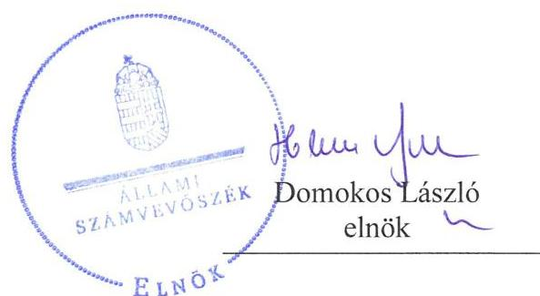
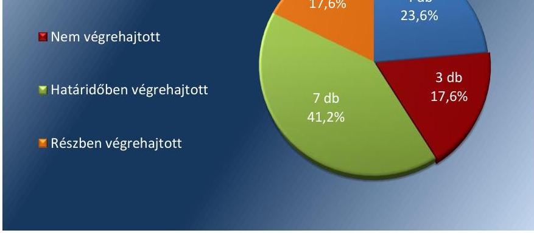
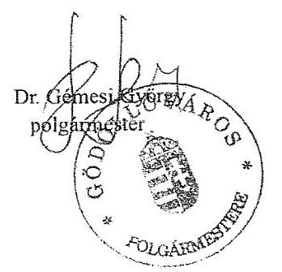

# Jelenetés 

## Utóellenőrzések

Az önkormányzatok pénzügyi és vagyongazdálkodása megfelelőségének utóellenőrzése - Gödöllő Város Önkormányzata
2018.

---

# Jelentés 

## Utóellenőrzések

Az önkormányzatok pénzügyi és vagyongazdálkodása megfelelőségének utóellenőrzése - Gödöllő Város Önkormányzata
2018. áldóker hó 1, nap

---

# AZ ELLENŐRZÉST FELÜGYELTE:

- VARGA EDIT felügyeleti vezető

- AZ ELLENŐRZÉST VEZETTE ÉS A VÉGREHAJTÁSÁÉRT FELELŐS:
  - JOÓ ERIKA ellenőrzésvezető
  - A PROGRAM ÖSSZEÁLLÍTÁSÁÉRT FELELŐS:
    - TÓTPÁL SZABOLCS osztályvezető

- IKTATÓSZÁM: EL-0793-031/2018.
- TÉMASZÁM: 2460
- ELLENŐRZÉS-AZONOSÍTÓ SZÁM: V080446

Jelentéseink az Országgyűlés számítógépes hálózatán és az Interneta a www.asz.hu címen is olvashatóak.

---

# TARTALOMJEGYZÉK 

■ ÖSSZEGZÉS ..... 5
■ AZ ELLENŐRZÉS CÉLJA ..... 6
■ AZ ELLENŐRZÉS TERÜLETE ..... 7
■ AZ ELLENŐRZÉS HÁTTERE, INDOKOLTSÁGA ..... 8
■ A JELENTÉS LÉNYEGES KÉRDÉSKÖRE ..... 9
■ AZ ELLENŐRZÉS HATÓKÖRE ÉS MÓDSZEREI ..... 10
■ MEGÁLLAPÍTÁSOK ..... 12
■ MELLÉKLETEK ..... 15
I. sz. melléklet: Gödöllő Város Önkormányzata intézkedési terve végrehajtásának értékelése ..... 15
II. sz. melléklet: Gödöllő Város Önkormányzata intézkedési terve ..... 21
■ FÜGGELÉK: ÉSZREVÉTELEK ..... 29
■ RÖVIDÍTÉSEK JEGYZÉKE ..... 31

---

.

---

# ÖSSZEGZÉS 

Gödöllő Város Önkormányzatánál a pénzügyi és vagyongazdálkodás szabályozottsága javult, azonban a pénzügyi gazdálkodás szabályszerüségét biztositó intézkedések elmaradása továbbra is veszélyezteti a gazdálkodás vonatkozásában az elszámoltathatóságot.

## Az ellenőrzés társadalmi indokoltsága

Az Állami Számvevőszék stratégiájában célul tűzte ki a számvevőszéki munka hasznosulásának javítását. Ezzel összhangban ellenőrzi, hogy az ellenőrzött szervezet megvalósította-e a korábbi ellenőrzései által feltárt hibák, hiányosságok és szabálytalanságok megszüntetése céljából elkészített intézkedési tervében foglaltakat. A rendszeres utóellenőrzések hozzájárulnak a szükséges intézkedések tényleges végrehajtásához, ezáltal a közpénzügyek rendezettségének javulásához.

## Főbb megállapítások, következtetések

Gödöllő Város Önkormányzata az Állami Számvevőszék által elfogadott intézkedési tervében meghatározott tizenhét feladatból hetet határidőben, négyet határidőn túl, hármat részben hajtott végre, valamint három feladatot nem hajtott végre.

Gödöllő Város Önkormányzata az intézkedési tervben meghatározott feladatoknak megfelelően módosította a vagyonrendeletét a követelésekről való lemondás szabályai és a szerződések kötelező tartalmi elemei vonatkozásában. A behajthatatlan követelések elszámolása a jogszabályi előírásoknak megfelelően megtörtént. Ennek hatására javult a vagyongazdálkodás szabályozottsága.

Gödöllő Város Önkormányzata a pénzügyi gazdálkodás vonatkozásában a pénzügyi ellenjegyzés és érvényesítés szabályszerű gyakorlatát nem dokumentálta, valamint nem végzett belső ellenőrzést a kockázatkezelési rendszer múködésével kapcsolatban.

Gödöllő Város Önkormányzata a jogszabályi előírások ellenére nem vezetett nyilvántartást az intézkedési tervben rögzített feladatok végrehajtásáról.

---

# AZ ELLENŐRZÉS CÉLJA 

Az ellenőrzés célja annak értékelése volt, hogy a számvevőszéki jelentésben foglalt intézkedést igénylő megállapításokkal összhangban készített intézkedési tervben meghatározott feladatokat az ellenőrzött szervezet végrehajtotta-e.

---

# AZ ELLENŐRZÉS TERÜLETE 

## Gödöllő Város Önkormányzata

Gödöllő lakosainak száma 2017. január 1-jén a $\mathrm{KSH}^{1}$ adatai alapján 32408 fő volt.

A polgármester ${ }^{2} 1990$ októberétől tölti be tisztségét, a jegyző ${ }^{3}$ személye nem változott az ellenőrzött időszakban.

Az ÁSZ ${ }^{4}$ a 2015. évben ellenőrizte az Önkormányzat ${ }^{5}$ pénzügyi és vagyongazdálkodása megfelelőségét a 2011. január 1. és 2014. december 31. közötti időszakra vonatkozóan. Az erről készített 16022 számú jelentését az ÁSZ 2016. március 8-án hozta nyilvánosságra.

Az ÁSZ megállapította, hogy az Önkormányzatnál a pénzügyi szabályozás megfelelt az előírásoknak, azonban a gazdálkodási jogkörök gyakorlása nem volt megfelelő, amely a gazdálkodás biztonságát veszélyeztette. A vagyongazdálkodás szabályozásában feltárt hiányosságok kockázatot jelentettek az önkormányzati vagyon védelmében.

Az Önkormányzat a számvevőszéki jelentésben feltárt szabálytalanságok, múködésbeli hiányosságok kiküszöbölése érdekében intézkedési tervet ${ }^{6}$ készített. Az ÁSZ jelentés a polgármesternek három, a jegyzőnek négy javaslatot tartalmazott, amelyek alapján az Önkormányzat az intézkedési tervében összesen 17 feladat végrehajtásáról rendelkezett.

Az utóellenőrzés az Önkormányzat pénzügyi és vagyongazdálkodásának ellenőrzéséről készült 16022 számú ÁSZ jelentés intézkedést igénylő megállapításai és javaslatai hasznosítására elfogadott intézkedési tervben foglalt feladatok 2016. március 8. és 2018. április 27. közötti végrehajtására irányult.

---

# AZ ELLENŐRZÉS HÁTTERE, INDOKOLTSÁGA 

Az ÁSZ tv. ${ }^{7}$ 33. § (1) bekezdése értelmében a számvevőszéki jelentések intézkedést igénylő megállapításaihoz és javaslataihoz kapcsolódóan az ellenőrzött szervezet vezetője intézkedési tervet köteles összeállítani, és az Állami Számvevőszék részére megküldeni.

Az ÁSZ által befogadott intézkedési tervben foglaltak megvalósítását az ÁSZ tv. 33. § (7) bekezdésében foglaltak alapján - az Állami Számvevőszék utóellenőrzés keretében ellenőrizheti. Az utóellenőrzések keretében - az intézkedések értékelése során - az Állami Számvevőszék figyelembe veszi az ellenőrzött szervezetek működési feltételeiben, valamint a jogszabályi előírásokban bekövetkezett változásokat.

Az utóellenőrzés során az ÁSZ értékeli, hogy az érintett számvevőszéki jelentésben foglalt intézkedést igénylő megállapításokkal és javaslatokkal összhangban, az ellenőrzött szervezet által készített intézkedési tervben meghatározott feladatokat a feladatra kijelöltek végrehajtották-e.

Az intézkedések végrehajtásával az adott terület szabályszerű múködése vonatkozásában a kockázatok csökkenhetnek, azonban hosszabb távon az intézkedési tervben foglaltak végrehajtásával önmagában nem szűnnek meg, csak akkor, ha beépülnek az ellenőrzött szervezet múködésébe, azokat folyamatosan karban tartják, figyelembe véve, illetve kezelve a változásokat. Emellett az intézkedések végrehajtásáig újabb kockázatok merülhetnek fel a szabályszerű múködés vonatkozásában, amelyek kezelése szintén kiemelten fontos az ellenőrzött szervezet számára.

Az ellenőrzött szervezet vezetője által készített intézkedési tervekben foglalt feladatok hiányos, illetve késedelmes végrehajtása, vagy annak elmaradása a szabályszerűség és a felelős vezetői magatartás vonatkozásában kockázatot hordoz, ami azt mutatja, hogy az ellenőrzések során feltárt hibák, hiányosságok és szabálytalanságok kezelése nem kapott kellő hangsúlyt. Az utóellenőrzés során is fennálló szabálytalanságok esetén a közpénz, közvagyon veszélyeztetettségi kockázat valószínűsített hatásának értékelése további intézkedéseket vonhat maga után.

Az ellenőrzött szervezet szintjén az utóellenőrzés feltárja, hogy a szervezet az intézkedések végrehajtásával hasznosította-e a korábbi ellenőrzési jelentésben a hiányosságok megszüntetése, illetve a kockázatok kezelése érdekében megfogalmazott javaslatokat, illetve az intézkedések végrehajtása elmaradásának következtében továbbra is fennálló szabálytalanság esetén értékeli a közpénzek, közvagyon veszélyeztetettségét.

Az ÁSZ szintjén az utóellenőrzés visszacsatolást ad az ellenőrzési jelentések hasznosulásáról, az intézkedések elmaradásának, vagy részleges megvalósulásának a közpénzek, közvagyon veszélyeztetettségére gyakorolt valószínűsített hatásának értékelése, további intézkedéseket vonhat maga után.

---

# A JELENTÉS LÉNYEGES KÉRDÉSKÖRE 

Az Önkormányzat az intézkedési tervben foglaltakat az elöirt határidőben végrehajtotta-e?

---

# AZ ELLENŐRZÉS HATÓKÖRE ÉS MÓDSZEREI 

## Az ellenőrzés típusa

Megfelelőségi ellenőrzés.

## Az ellenőrzött időszak

Az utóellenőrzés alapját képező ÁSZ jelentés közzétételének napjától (2016. március 8.) az ellenőrzésről szóló kiértesítő levél keltének napjáig (2018. április 27.) tartó időszak.

## Az ellenőrzés tárgya

Az ÁSZ tv. 2011. július 1-jei hatálybalépését követően a számvevőszéki jelentésben foglalt intézkedést igénylő megállapításokkal összhangban - az Önkormányzat által - készített Intézkedési tervben foglaltak végrehajtásának ellenőrzése.

## Az ellenőrzött szervezet

Gödöllő Város Önkormányzata

## Az ellenőrzés jogalapja

Az ellenőrzés jogszabályi alapját az ÁSZ tv. 33. § (1)-(2), illetve (6)-(7) bekezdéseinek az előírási képezik.

## Az ellenőrzés módszerei

Az ellenőrzést az ellenőrzött időszakban hatályos jogszabályok, az ellenőrzés szakmai szabályai, a jelen ellenőrzésre irányadó ÁSZ módszertanok, az ellenőrzési programban foglalt értékelési szempontok szerint, végeztük.

Az ellenőrzés ideje alatt az Önkormányzattal történő kapcsolattartást az ÁSZ SZMSZ²-ének vonatkozó előírásai alapján biztosítottuk.

Az utóellenőrzés megállapításait az ÁSZ rendelkezésére álló, valamint az ÁSZ adatbekérése szerint, az Önkormányzat által rendelkezésre bocsátott dokumentumok alapozták meg.

Az ellenőrzési bizonyítékként felhasználható adatforrások közé tartoztak egyrészt az ellenőrzési program részletes szempontjainál felsorolt

---

adatforrások, másrészt minden - az ellenőrzés folyamán feltárt, az ellenőrzés szempontjából információt tartalmazó - dokumentum.

Az intézkedési tervekben előírt feladatokat azok végrehajthatósága, illetve végrehajtása szempontjából az alábbiak szerint értékeltük:
"határidőben végrehajtott" a feladat, ha a teljesítés dokumentáltan, az intézkedési tervben előírt határidőben és tartalommal megtörtént;
"határidőn túl végrehajtott" a feladat, ha annak teljesítése az intézkedési tervben meghatározott módon, de az előírt határidőn túl történt meg;
"részben végrehajtott" a feladat, ha végrehajtása teljes körűen az intézkedési tervben előírt módon nem történt meg;
"nem végrehajtott" a feladat, ha a végrehajtás nem történt meg, vagy amennyiben a teljesítést nem dokumentálták;
"okafogyottá vált" a feladat, ha végrehajtására - meghatározott esemény bekövetkezése, továbbá külső körülmény, a múködést érintő feltétel változása miatt - már nincs szükség, illetve lehetőség, és egyértelműen megállapítható, hogy az intézkedést szükségessé tevő körülmény a jövőben nem fordulhat elő;
"nem időszerü" az a feladat, amelynek ellenőrzési időszakon belüli végrehajtására azért nem került (kerülhetett) sor, mert az intézkedés alapjául szolgáló esemény nem következett be, de annak jövőbeni előfordulása lehetséges, a végrehajtása nem volt esedékes, vagy a végrehajtás határideje még nem járt le.
Az ellenőrzés lefolytatásához az Önkormányzat a tanúsítványok elektronikus kitöltésével, valamint az ÁSZ által kért dokumentumok elektronikus megküldésével szolgáltatott adatokat, amelyek valódiságát és teljes körűségét az ellenőrzött szervezet vezetője által tett teljességi és hitelességi nyilatkozat igazolja. Az így rendelkezésre bocsátott adatok, információk kontrollja az ellenőrzés keretében megtörtént. Az ellenőrzött szervezet által megküldött intézkedési tervben meghatározott, ÁSZ által beazonosított feladatok a II. számú mellékletben kerültek bemutatásra.

---

# MEGÁLLAPÍTÁSOK 

## Az Önkormányzat az intézkedési tervben foglaltakat az előírt határidőben végrehajtotta-e?

Összegző megállapítás

Az Önkormányzat az intézkedési tervben szereplő 17 feladatból hetet határidőben végrehajtott, négy feladatot határidőn túl, hármat részben hajtott végre, három feladatot nem hajtott végre. Az intézkedési tervben meghatározott feladatok végrehajtásáról nem vezettek nyilvántartást.

Az Önkormányzat az általa elkészített és az ÁSZ által elfogadott intézkedési tervében meghatározott feladatok közül hetet határidőben, négyet határidőn túl, hármat részben hajtott végre, három feladatot nem hajtott végre.

A feladatokat, határidőket, megjelölt felelősöket és a feladatok végrehajtását az I. sz. melléklet mutatja be.

A jegyző nem gondoskodott az intézkedési tervben meghatározott feladatok végrehajtásának Bkr. ${ }^{9}$ 14. § (1) bekezdés előírása szerinti nyilvántartásáról.

Az Önkormányzat intézkedési tervében vállalt feladatok végrehajtásának értékelését az 1. ábra szemlélteti.

1. ábra

A feladatok végrehajtásának értékelési kategóriák szerinti megoszlása

Forrás: ÁSZ

---

A SZABÁLYOZOTTSÁG jogszabályi előírásoknak megfelelő kialakítása, illetve az erőforrásokkal való szabályszerű és hatékony gazdálkodás érdekében a felelősök elkészítették a módosított hivatali SZMSZ ${ }^{10}$-t (8-9). A jegyző 2016. február 28-án új gazdálkodási szabályzatot ${ }^{11}$ adott ki, amelyben szerződéstípusonként határozták meg a szerződések kötelező tartalmi elemeit. 2016 júniusban a gazdálkodási szabályzatban foglaltakkal összhangban új munkaköri leírásokat adtak ki a Költségvetési Iroda ${ }^{12}$ dolgozói részére (3). A számviteli politikát ${ }^{13}$ az intézkedési tervben foglaltaknak megfelelően módosították, de az illetékes munkatársakkal történő megismertetése dokumentáltan nem történt meg (14).

# A PÉNZÜGYI GAZDÁLKODÁS SZABÁLYSZERŰ- 

SÉGE ÉS A PÉNZÜGYI EGYENSÚLY biztosítása érdekében az Önkormányzat 2015-2017. évi költségvetési beszámolóját az Áhsz ${ }^{14}$. előírásainak megfelelően készítették el. A 2015-2017. éves költségvetési beszámolókban szerepeltették a behajthatatlan követelésként leírt összegeket, illetve az elengedett követelések összegét (2). A 20152017. évekre vonatkozóan az éves könyvviteli zárlat keretében a behajthatatlan követelések elszámolása az Áhsz előírásaival összhangban megtörtént (6). Nem dokumentálták a pénzügyi folyamatokban kulcsszerepet betöltő pénzügyi ellenjegyzés és érvényesítés gazdálkodási jogkörök szabályszerű gyakorlását (17).

## A BELSŐ KONTROLL SZERINTI ELSZÁMOLTATHATÓSÁG biztosítása érdekében a kockázatkezelési szabályzatban ${ }^{15}$ meghatározták az Önkormányzat tevékenységében, gazdálkodásában rejlő kockázatokat, a kockázatokra adott válaszreakciókat és kockázatkezelési stratégiákat, valamint a kockázatok és intézkedések folyamatos nyomon követésének módját, azonban nem gondoskodtak a kockázatkezelési rendszer működtetésének belső ellenőrzéséről (13)-(16). A vezető beosztású munkatársak számára előírtakat - a jogszabályváltozások körültekintő nyomon követését, valamint azok betartására az azonnali intézkedések meghozatalát - dokumentáltan nem hajtották végre (15).

AZ INTEGRITÁS érvényesülése javult a jogszabályi előírásoknak megfelelő közzétételi szabályzat ${ }^{16}$ elkészítésével, amely nevesítette a közérdekű adatok közzétételéért felelős személyeket, de a hivatalvezető a közzétételi szabályzatban foglalt előírások betartására vonatkozó ellenőrzési kötelezettségének nem tett eleget (12). A jegyző a szabálytalanságok tekintetében a munkajogi felelősség tisztázására irányuló vizsgálatot lefolytatta (7).

A SZABÁLYSZERŰ VAGYONGAZDÁLKODÁS érdekében Gödöllő város nemzeti vagyonáról szóló önkormányzati rendelet ${ }^{17}$ felülvizsgálata megtörtént, az Áht. ${ }^{18}$ előírásának megfelelően kiegészítették a követelésekről történő lemondás szabályaival (4). A 2015-2017. évi zárszámadási rendelettervezetek a hatályos jogszabályi előírásoknak megfelelő tartalommal készültek el (5). A Képviselő-testület az Önkormányzat közép- és hosszú távú vagyongazdálkodási tervét határozatával ${ }^{19}$ elfogadta (10).

---

.

---

# MELLÉKLETEK

- I. SZ. MELLÉKLET: GÖDÖLLŐ VÁROS ÖNKORMÁNYZATA INTÉZKEDÉSI TERVE VÉGREHAJTÁSÁNAK ÉRTÉKELÉSE

|  1. | Intézkedési terv alapján elvégzendő feladat | Az intézkedési tervben meghatározott határidő | Az intézkedési tervben meghatározott felelős | Az intézkedési tervben meghatározott feladat végrehajtása  |
| --- | --- | --- | --- | --- |
|   | 1. | 2. | 3. | 4.  |
|  Határidőben végrehajtott feladatok |  |  |  |   |
|  1. | P1b. A Képviselő-testület 2016. 1. félévi munkatervében a 2016. április 14-én tartandó ülés napirendjei között szerepel a Javaslat a Gödöllő város nemzeti vagyonáról szóló 8/2012. (III.8.) sz. Önkormányzati rendelet módosítására. A rendelet felülvizsgálata keretében kiegészítésre kerül a követelésekről lemondásra vonatkozó helyi szabályozás. | 2016. április 14. | polgármester | A Gödöllő város nemzeti vagyonáról szóló 8/2012. (III. 8.) önkormányzati rendelet felülvizsgálata határidőben megtörtént, a követelésekről történő lemondás szabályai beépültek a vagyonrendeletbe.  |
|  2. | J2a. A jogszabályi előírásoknak és az észrevételeknek megfelelő költségvetési beszámolót kell készíteni. | Első alkalommal 2016. március 30.
Az ezt követő években a jogszabályban meghatározott határidő. | Költségvetési
Iroda vezetője | Az Önkormányzat a 2015-2017. évi költségvetési beszámolóját az Áhsz. 10. számú melléklet 10. pontjának megfelelően készítette el. A 2015-2017. éves elemi költségvetési beszámolók pénzforgalmi jelentésében a 17/A számú tájékoztató adatok megnevezésű űrlapon szerepeltették a behajthatatlan követelésként leírt összegeket, illetve az elengedett követelések összegét.  |
|  3. | P2. Felül kell vizsgálni a Gazdálkodási Szabályzat 1. sz. mellékletében a szerződések garanciális elemeire vonatkozó általános előírásokat és az önkormányzatnál előforduló szerződéstípusokra vonatkozóan külön-külön kell a szabályozást megalkotni, az egyes szerződés típusokra irányadó jogszabályi rendelkezések keretei között. Az Állami Számvevőszék észrevételei alapján módosítani kell a belső szabályzat előírásait:
- különös tekintettel a szabályzatban foglaltak betartásának ellenőrzési folyamatára
- a szabályzatban foglaltak szerint a munkatársak munkaköri leírásainak módosítására | az intézkedési terv elfogadását követően folyamatos | főjegyző,
Városüzemeltető és Vagyonkezelő Iroda vezetője | A vagyongazdálkodás szabályzzerűségének biztosítása érdekében a jegyző -az intézkedési terv Képviselő-testület általi jóváhagyását megelőzően - 2016. február 28-án új gazdálkodási szabályzatot adott ki. A szabályzat 1. számú mellékletében szerződéstípusonként (vállalkozási, bérleti, stb. szerződés) külön-külön határozták meg a szerződések kötelező tartalmi elemeit és annak keretében az önkormányzat érdekeit védő garanciális elemeket is. A gazdálkodási szabályzatban foglaltakkal összhangban 2016. június hónapban új munkaköri leírásokat adtak ki a Költségvetési Iroda dolgozói részére.  |

---

|  4. |  |  |   |
| --- | --- | --- | --- |
|  4. | J1c. A Képviselő-testület 2016. 1. félévi munkatervében a 2016. április 14-én tartandó ülés napirendjei között szerepel a Javaslat a Gödöllő város nemzeti vagyonáról szóló 8/2012. (111.8.) sz. Önkormányzati rendelet módosítására. A rendelet felülvizsgálata keretében kiegészítésre kerül a követelésekről lemondásra vonatkozó helyi szabályozás, a képviselő-testületre vonatkozó 4.§ (2) bekezdésében és a polgármesterre vonatkozó 4.§ (3) bekezdésének)) pontjában. A jegyző ellenőrzi, hogy a követelésről lemondás esetkörének kiegészített szöveg változata és a követelésről lemondás módjának részletes szabályai a rendelettervezetben szerepeljenek. | 2016. április 6. | a rendelettervezet elkészítéséért: a Városüzemeltető és Vagyonkezelő Iroda vezetője, az ellenőrzésért: a főjegyző  |
|  5. | J3a. Intézkedés történt, hogy a 2015. évi zárszámadási rendelet tervezetben a képviselő testület részére a vagyonkimutatás a jogszabály (4/2013. (1.11.) az államháztartás számviteléről szóló Korm. rendelet) előírásainak megfelelően kerüljön bemutatásra. A Költségvetési Iroda vezetője a következő években köteles a zárszámadási rendeletet a mindenkor hatályos jogszabályi előírásoknak megfelelően teljes körűen elkészíteni | 2016. április 14. azt követően évenként a jogszabályban meghatározott határidőre | A Költségvetési Iroda vezetője  |
|  6. | J3b. Intézkedés történt a Költségvetési Iroda felé az ÁSZ jelentés 5.4. sz. megállapítás 3. bekezdése alapján a főkönyvi számlákon való átvezetés jogszabályi előírásainak betartására | Az intézkedési terv elfogadását követően folyamatos | A Költségvetési Iroda vezetője, főkönyvelő  |

---

|  7. | P3a. A munkáltatói jogot gyakorló jegyző a Számvevőszék jelentésében jelzett hibák és hiányosságokra figyelemmel indítson belső vizsgálatot a munkajogi felelősségek tisztázására. | 2016. március 30. | címzetes főjegyző | Azintézkedési tervben meghatározott feladat végrehajtása  |
| --- | --- | --- | --- | --- |
|  8. | P1a. A jelenleg hatályos jogszabályi előírások és az ÁSZ jelentésben foglalt észrevételek, megállapítások figyelembe vételével el kell készíteni a Polgármesteri Hivatal Szervezeti és Működési Szabályzatának módosítását. A Szervezeti és Működési Szabályzat módosításának tervezetét a polgármesternek jóváhagyásra be kell nyújtani | 2016. április 30. | címzetes főjegyző | A jogszabályi előírásoknak megfelelően módosított hivatali SZMSZ 2016. május 20-ra készült el.  |
|  9. | J1a. A hatályos jogszabályoknak és az ÁSZ észrevételeinek figyelembe vételével teljes körűen felül kell vizsgálni a Polgármesteri Hivatal Szervezeti és Működési Szabályzatát. A felülvizsgálat eredményeként el kell készíteni a Szervezeti és Működési Szabályzat módosítását, kiegészítését. Az egységes szerkezetbe foglalt Szervezeti és Működési Szabályzatot jóváhagyásra a polgármesternek be kell nyújtani. | 2016. április 30. | címzetes főjegyző, a hivatal belső szervezeti egységeinek vezetői | A módosított hivatali SZMSZ-tervezet polgármesternek jóváhagyásra történő benyújtása határidőn túl valósult meg, tekintettel arra, hogy 2016. május 20-ra készült el. A polgármester a módosított hivatali SZMSZ tervezetét 2016. május 27-én hagyta jóvá. A módosított hivatali SZMSZ 2016. május 20-ra készült el mellékleteivel együtt. A mellékletek egyebek mellett a gazdasági szervezet ügyrendjét és a közzétételi szabályzatot is tartalmazták.  |
|  10. | P1c. 2016. II. félévben, legkésőbb a Képviselő-testület 2016. novemberi ülésére elő kell készíteni a közép és hosszú távú vagyongazdálkodási tervet, összhangban a 2015. évben elfogadott ITS-ben rögzített városfejlesztési célkitűzésekkel. | 2016. novemberi testületi ülés | polgármester | Az Önkormányzat közép és hosszú távú vagyongazdálkodási tervének előkészítése az intézkedési tervben meghatározott határidőig – a Képviselő-testület 2016. november 17-i üléséig – nem történt meg. A vagyongazdálkodási tervek elfogadására irányuló előterjesztést a polgármester 2016. december 9-én írta alá, és azt a Képviselő-testület a 2016. december 15-i ülésén tárgyalta meg.  |
|  11. | J1d. 2016. II. félévben, legkésőbb a Képviselő-testület 2016. novemberi ülésére elő kell készíteni a közép és hosszú távú vagyongazdálkodási tervet, összhangban a 2015. évben elfogadott ITS-ben rögzített városfejlesztési célkitűzésekkel. A jegyző a hi- | 2016. szeptember 30. | főjegyző | A vagyongazdálkodási tervek előkészítését elrendelő intézkedés, valamint a feladat végrehajtás számon kérésének dokumentumát az Önkormányzat nem küldte meg az ellenőrzéshez. A polgármester által 2016. december 9-én aláírt előterjesztés igazolja az intézkedési tervben meghatározott feladat (a vagyongazdálkodási tervek előkészítése) végrehajtását, amely határidőn túl történt.  |

---

|  1. | 2. | 3. | 4.  |
| --- | --- | --- | --- |
|  |   |   |   |

|  Intézkedési terv alapján elvégzendő feladat | Az intézkedési tervben meghatározott határidő | Az intézkedési tervben meghatározott felelős | Az intézkedési tervben meghatározott feladat végrehajtása  |
| --- | --- | --- | --- |
|  1. | 2. | 3. | 4.  |
|  |   |   |   |

|  Részben végrehajtott feladatok |  |  |   |
| --- | --- | --- | --- |
|  12. J3c. A közérdekű adatok közzétételi szabályzatát felül kell vizsgálni és abban nevesítve meg kell jelölni azokat a köztisztviselőket, akik feladatkörükben felelősek a közérdekű adatok közzétételéért. A közérdekű adatok közzétételének jogszabályi előírásoknak való megfelelő teljesítését valamennyi irodavezető a saját feladatkörében rendszeresen ellenőrizni köteles. A közzétételi szabályzatban foglalt előírások betartását a hivatalvezető szúrópróbaszerűen folyamatosan ellenőrzi. | Az intézkedési terv elfogadását követően folyamatos | Főjegyző | Végrehajtott feladatrész:
A hivatali SZMSZ 5. számú mellékleteként 2016. május 20. napján elkészült a közzétételi szabályzat. A közzétételi szabályzat 3. számú melléklete nevesítette a közérdekű adatok közzétételéért felelős személyeket.
Nem végrehajtott feladatrész:
A közzétételi kötelezettség jogszerű teljesítését az irodavezetők nem ellenőrizték, a hiva-talvezető a közzétételi szabályzatban foglalt előírások betartására vonatkozó ellenőrzési kötelezettségének nem tett eleget.  |
|  13. J2c. Felül kell vizsgálni és meg kell határozni a gazdálkodással összefüggő pénzügyi egyensúlyt befolyásoló kockázatok mértékét, új kockázatkezelési rendszert kell kialakítani, amelyet a 2012. évtől érvényes 370/2011. (XII.31.) Korm. rendelet a költségvetési szervek belső kontrolrendszeréről és belső ellenőrzéséről 7. § (I)-(2) bekezdéseiben előírtak szerint kell működtetni. A tevékenység során fel kell mérni és meg kell állapítani a költségvetési szerv tevékenységében, gazdálkodásában rejlő kockázatokat, valamint meg kell határozni az egyes kockázatokkal kapcsolatban szükséges intézkedéseket, valamint azok teljesítésének folyamatos nyomon követésének módját. | 2016. május 30. | Költségvetési Iroda vezetője | Végrehajtott feladatrész:
Az új kockázatkezelési szabályzat 2016. május 30-ai kiadmányozásával kialakították a 2016. június 1-jétől hatályos kockázatkezelési rendszert.
Nem végrehajtott feladatrész:
A Bkr. 7. § (1)-(2) bekezdése előírásai ellenére nem működtették a 2016. június 1-jétől hatályos kockázatkezelési szabályzatban kialakított kockázatkezelési rendszert.  |

---

|  1. | Intézkedési terv alapján elvégzendő feladat | Az intézkedési tervben meghatározott határidő | Az intézkedési tervben meghatározott felelős | Az intézkedési tervben meghatározott feladat végrehajtása  |
| --- | --- | --- | --- | --- |
|  1. |  | 2. | 3. | 4.  |
|  14. | J1b. A számviteli politikát az Állami Számvevőszék által jelzett hiányosságok és jogszabályi változások figyelembevételével felül kell vizsgálni és módosítani. Az elkészítést és jóváhagyást követően az illetékes munkatársakkal meg kell ismertetni és felhasználásra ki kell adni. | 2016. április 30. | Költségvetési
Iroda vezetője | Végrehajtott feladatrész:
A számviteli politika módosítása az intézkedési tervben foglaltaknak megfelelően megtörtént. A 2016. február 28-án kelt, 2016. január 1-jétől hatályos 2016. évi számviteli politika módosítás 24. pontjában a jegyző meghatározta, hogy mit tekintenek a számviteli elszámolás és az értékelés szempontjából lényegesnek, nem lényegesnek.
Nem végrehajtott feladatrész:
A számviteli politika illetékes munkatársakkal történő megismertetését nem dokumentálták.  |
|   |  |  | Nem végrehajtott feladatok |   |
|  15. | P3b. A jegyző, mint munkáltató által lefolytatott belső vizsgálat összegző megállapításai alapján, azokkal egyetértve munkajogi felelősségre vonást nem tartok indokoltnak. Ezzel egy időben követelményként fogalmaztam meg a vezető beosztású munkatársak számára, a jogszabályváltozások körültekintőbb nyomon követését és azok betartására az azonnali intézkedések meghozatalát. | folyamatos | címzetes főjegyző, a hivatal belső szervezeti egységeinek vezetői | A polgármester által a vezető beosztású munkatársak számára előírt, a jogszabályváltozások körültekintőbb nyomon követését és azok betartására az azonnali intézkedések meghozatalát tartalmazó utasításának végrehajtását dokumentummal nem igazolták.  |
|  16. | J2d. A kockázatkezelési rendszer működtetésének ellenőrzéséről a jegyző a belső ellenőr útján gondoskodjon. | folyamatos | címzetes főjegyző | Az ellenőrzés részére megküldött, a belső ellenőrzésekről, azok jelentősebb megállapításairól és javaslatairól vezetett nyilvántartás nem tartalmazott a kockázatkezelési szabályzat hatályba lépését követően (2016. június 1. után) lefolytatott, a kockázatkezelési rendszert érintő ellenőrzést. Az ellenőrzött szervezet a kockázatkezelési rendszer működtetését, éves felülvizsgálatát tükröző, egyéb dokumentumot sem bocsátott az ellenőrzés rendelkezésére.  |
|  17. | J2b. Az Állami Számvevőszék jelentésének 1. táblázatában rögzített valamennyi hiányosság kerüljön megszüntetésre a jogszabályban előírt követelmények figyelembevételével és betartásával.
Az utasítás kiadása a belső szervezeti egységek vezetői felé megtörtént, hogy kiemelt figyelmet fordítsanak az Ávr. 55. § (1) és az 58. § (I)-(2) bekezdés előírásainak betartására:
- minden esetben a kötelezettségvállalás dokumentumain szerepeljen a pénzügyi ellenjegyző aláírása, | 2016. április 30., illetve az intézkedési terv elfogadását követően folyamatos. | belső szervezeti egységek vezetői | A gazdálkodási jogkörök szabályszerű gyakorlását dokumentumokkal nem igazolták. Az intézkedési tervben szereplő utasítást az Önkormányzat nem küldte meg az ÁSZ részére, így dokumentummal nem igazolt az intézkedés végrehajtása.  |

---

# Mellékletek 

a pénzügyi ellenjegyzés dátuma, a pénzügyi ellenjegyzés tényére történő utalás és azt a belső szabályzat szerint kijelölt személy végezze Ávr. 55. § (1).

- az érvényesítésre kijelölt munkatárs minden esetben, aláírásával dokumentálja az érvényesítés meglétét, amelyet az Ávr. 58. § (1)-(2) szabályai alapján hajtson végre és azt a belső szabályzat szerint kijelölt személy végezze.

---

# INTÉZKEDÉSI TERV 

az Állami Számvevőszék „az önkormányzatok pénzügyi és vagyongazdálkodása megfelelőségének ellenőrzése - Gödöllő" címmel készített V-0867-138/2016 sz. jelentésben foglalt megállapításainak végrehajtására

## A polgármester részére tett Állami Számvevőszéki javaslatok:

1. Az erőforrásokkal való szabályszerű és hatékony gazdálkodás érdekében intézkedjen:
a) a Polgármesteri Hivatal jogszabályi előirásoknak megfelelő tartalmú Szervezeti és Müködési Szabályzatának jóváhagyásáról;

A jelenleg hatályos jogszabályi előírások és az ÁSZ jelentésben foglalt észrevételek, megállapítások figyelembe vételével el kell készíteni a Polgármesteri Hivatal Szervezeti és Müködési Szabályzatának módosítását.

Határidő: A módosítás elkészítésére 2016. április 30.
A Szervezeti és Müködési Szabályzat módosításának tervezetét a polgármesternek jóváhagyásra be kell nyújtani.

Határidő: 2016. május 15.
Felelős: Dr. Nánási Éva címzetes főjegyző
b) a vagyongazdálkodással kapcsolatos szabályok meghatározása érdekében a jogszabályi előírásoknak megfelelő rendelettervezetet elfogadásáról szóló előterjesztést Képviselő- testületi ülés napirendjére vételének kezdeményezéséről;

A Képviselő-testület 2016. I. félévi munkatervében a 2016. április 14-én tartandó ülés napirendjei között szerepel a Javaslat a Gödöllő város nemzeti vagyonáról szóló 8/2012. (III.8.) sz. önkormányzati rendelet módosítására. A rendelet felülvizsgálata keretében kiegészítésre kerül a követelésekről lemondásra vonatkozó helyi szabályozás, a képviselő-testületre vonatkozó 4.§ (2) bekezdésében és a polgármesterre vonatkozó 4.§ (3) bekezdésének j) pontjában.

Határidő: 2016. április 14.
Felelős: Dr. Gémesi György polgármester
c) az Önkormányzat közép és hosszú távú vagyongazdálkodási terve elfogadásáról szóló előterjesztés Képviselö-testületi ülés napirendjére vételének kezdeményezéséről.
2016. II. félévben, legkésőbb a Képviselő-testület 2016. novemberi ülésére elő kell készíteni a közép és hosszú távú vagyongazdálkodási tervet, összhangban a 2015. évben elfogadott ITS-ben rögzített városfejlesztési célkitűzésekkel.

Határidő: 2016. novemberi testületi ülés
Felelős: Dr. Gémesi György polgármester

---

2. A vagyongazdálkodás szabályszerűségének biztosítása érdekében intézkedjen az önkormányzati vagyont érintő döntések során a belső szabályzatban foglaltak betartásáról.

Felül kell vizsgálni a Gazdálkodási Szabályzat 1. sz. mellékletében a szerződések garanciális elemeire vonatkozó általános előírásokat. és az önkormányzatnál előforduló szerződéstípusokra vonatkozóan külön-külön kell a szabályozást megalkotni, az egyes szerződés típusokra irányadó jogszabályi rendelkezések keretei között.
Az Állami Számvevőszék észrevételei alapján módosítani kell a belső szabályzat előírásait:

- különös tekintettel a szabályzatban foglaltak betartásának ellenőrzési folyamatára
- a szabályzatban foglaltak szerint a munkatársak munkaköri leírásainak módosítására
- a fejlesztési döntések előkészítése és végrehajtása során fokozott figyelmet kell fordítani a szabályzatokban rögzített garanciális elemek betartására

Határidő: az intézkedési terv elfogadását követően folyamatos
Felelős: Dr. Nánási Éva címzetes főjegyző
Dr. Kálmán Magdolna Városüzemeltető és Vagyonkezelő Iroda vezetője
3. Intézkedjen az Állami Számvevőszék ellenőrzése során feltárt hiányosságok és/vagy szabálytalanságok tekintetében a munkajogi felelősség tisztázására irányuló eljárás megindításáról, és ennek eredménye ismeretében tegye meg a szükséges intézkedéseket.

- 2014. évi Számviteli Politika nem tartalmazta, hogy az értékelés szempontjából mit tekintenek lényegesnek, illetve nem lényegesnek,
- önkormányzati rendeletben nem szabályozták a követelésekről való lemondás módját és eseteit,
- 2011-2013. évi költségvetési beszámoló kiegészitő mellékletében a gazdasági társaságok székhelyének, illetve a részesedések mennyiségének tulajdoni hányadok szerinti bemutatása elmaradt,
- tájékoztató adatok között nem közölték 2011. évben a behajthatatlan követeléseként leírt összeget,2012-2014. évben az elengedett, illetve a behajthatatlan követelések leírt összegét,
- SZMSZ-ben nem határoztak meg külön gazdasági szervezetet, a gazdasági szervezeti feladatokat a Polgármesteri Hivatal látta el,
- több esetben a pénzügyi ellenjegyzés nem történt meg a kötelezettségvállalás dokumentumán, illetve egyedi hiba volt, hogy az ellenjegyzést, érvényesitést kijelölés nélkül jogosulatlanul gyakorolták,
- nem mértek fel minden kockázatot a gazdálkodásban, nem megfelelő kockázatkezelési rendszert alkalmaztak,
- a 2014. évi vagyonkimutatás nem megfelelő részletezettséggel és tagolásban tartalmazta az eszközöket és a forrásokat,
- Önkormányzat közép- és hosszú távú vagyongazdálkodási tervet nem készített,
- üzemeltetési szerződések közül kettő esetében átadáskor az üzemeltetésre átadott eszközök között nem szerepelt, azt az ingatlanok között mutatták ki, 2014-től a nyilvántartás megfelelő,
- a vagyon tulajdonjogának ingyenes átruházásának rendjét önkormányzati rendeletben nem szabályozták,
- az Önkormányzat a közérdekü adatok közzétételi kötelezettségét hiányosan teljesítette,
- analitikus nyilvántartások szerint behajthatatlan követelések, fökönyvi számlákon való átvezetése nem történt meg, aminek hiányossága a mérlegben szereplő követelés állomány helyességét nem befolyásolta.

---

A munkáltatói jogot gyakorló jegyző a Számvevőszék jelentésében jelzett hibák és hiányosságokra figyelemmel indítson belső vizsgálatot a munkajogi felelősségek tisztázására.

Határidő: a vizsgálat lefolytatására 15 nap
a vizsgálati megállapítások összegzésére 2016. március 30.
Felelős: Dr. Nánási Éva címzetes főjegyző

A jegyző, mint munkáltató által lefolytatott belső vizsgálat összegző megállapításai alapján, azokkal egyetértve munkajogi felelősségre vonást nem tartok indokoltnak. Ezzel egy időben követelményként fogalmaztam meg a vezető beosztású munkatársak számára, a jogszabályváltozások körültekintőbb nyomon követését és azok betartására az azonnali intézkedések meghozatalát.

Határidő: az intézkedési terv elfogadását követően folyamatos
Felelős: Dr. Nánási Éva címzetes főjegyző
a hivatal belső szervezeti egységeinek vezetői

A jegyző részére tett Állami Számvevőszéki javaslatok:

1. Az erőforrásokkal való szabályszerű és hatékony gazdálkodás érdekében intézkedjen:
a) a Polgármesteri Hivatal jogszabályi előírásoknak megfelelő tartalmú szervezeti és müködési szabályzata elkészítéséről;

A hatályos jogszabályoknak és az ÁSZ észrevételeinek figyelembe vételével teljes körűen felül kell vizsgálni a Polgármesteri Hivatal Szervezeti és Müködési Szabályzatát. A felülvizsgálat eredményeként el kell készíteni a Szervezeti és Müködési Szabályzat módosítását, kiegészítését. Az egységes szerkezetbe foglalt Szervezeti és Müködési Szabályzatot jóváhagyásra a polgármesternek be kell nyújtani.

Határidő: 2016. április 30.
Felelős: Dr. Nánási Éva címzetes főjegyző
a hivatal belső szervezeti egységeinek vezetői
b) a jogszabályi előírásoknak megfelelő tartalmú számviteli politika kiadásáról;

A számviteli politikát az Állami Számvevőszék által jelzett hiányosságok és jogszabályi változások figyelembevételével felül kell vizsgálni és módosítani. Az elkészítést és jóváhagyást követően az illetékes munkatársakkal meg kell ismertetni és felhasználásra ki kell adni.

Határidő: 2016. április 30.
Felelős: Szilárdi Lászlóné Költségvetési Iroda vezetője
c) a vagyongazdálkodással kapcsolatos szabályok meghatározása érdekében a jogszabályi előírásoknak megfelelő rendelettervezetet elfogadásáról szóló előterjesztést Képviselő- testületi ülés napirendjére vételének kezdeményezéséről;

---

A Képviselő-testület 2016. I. félévi munkatervében a 2016. április 14-én tartandó ülés napirendjei között szerepel a Javaslat a Gödöllő város nemzeti vagyonáról szóló 8/2012. (III.8.) sz. önkormányzati rendelet módosítására. A rendelet felülvizsgálata keretében kiegészítésre kerül a követelésekről lemondásra vonatkozó helyi szabályozás, a képviselő-testületre vonatkozó 4.§ (2) bekezdésében és a polgármesterre vonatkozó 4.§ (3) bekezdésének j) pontjában. A jegyző ellenőrzi, hogy a követelésről lemondás esetkörének kiegészített szöveg változata és a követelésről lemondás módjának részletes szabályai a rendelettervezetben szerepeljenek.

Határidő: 2016. április 6.
Felelős: A rendelettervezet elkészítéséért: Dr Kálmán Magdolna Városüzemeltető és
Vagyonkezelő Iroda vezetője
Ellenőrzésért: Dr. Nánási Éva címzetes főjegyző
d) az Önkormányzat közép és hosszú távú vagyongazdálkodási tervének elkészitéséről és beterjesztésének kezdeményezéséről.
2016. II. félévben, legkésőbb a Képviselő-testület 2016. novemberi ülésére elő kell készíteni a közép és hosszú távú vagyongazdálkodási tervet, összhangban a 2015. évben elfogadott ITS-ben rögzített városfejlesztési célkitűzésekkel. A jegyző a hivatal érintett munkatársainak a tervek előkészítésére vonatkozó feladatot kiadja és számon kéri annak végrehajtását.

Határidő: A tervezet összeállítására: 2016. szeptember 30.
Felelős: Dr. Nánási Éva címzetes főjegyző
2. A pénzügyi gazdálkodás szabályszerűsége és a pénzügyi egyensúly biztosítása érdekében intézkedjen:
a) az éves költségvetési beszámoló kiegészítő mellékletének, valamint a kiegészítő tájékoztató adatokat tartalmazó pénzforgalmi jelentés jogszabályi előirásoknak megfelelő tartalommal történő elkészitéséről;

A jogszabályi előírásoknak és az észrevételeknek megfelelő költségvetési beszámolót kell készíteni.

Határidő: Első alkalommal 2016. március 30.
Az ezt követő években a jogszabályban meghatározott határidő.
Felelős: Szilárdi Lászlóné Költségvetési Iroda vezetője
b) a pénzügyi folyamatokban kulcsszerepet betöltő pénzügyi ellenjegyzés és érvényesités jogszabályi előírásoknak megfelelő müködtetéséről;

Az utasítás kiadása a belső szervezeti egységek vezetői felé megtörtént, hogy kiemelt figyelmet fordítsanak az Ávr. 55. § (1) és az 58. § (1)-(2) bekezdés előírásainak betartására:

- minden esetben a kötelezettségvállalás dokumentumain szerepeljen a pénzügyi ellenjegyző aláírása, a pénzügyi ellenjegyzés dátuma, a pénzügyi ellenjegyzés tényére történő utalás és azt a belső szabályzat szerint kijelölt személy végezze Ávr. 55. § (1),

---

- az érvényesítésre kijelölt munkatárs minden esetben, aláírásával dokumentálja az érvényesítés meglétét, amelyet az Ávr. 58. § (1)-(2) szabályai alapján hajtson végre és azt a belső szabályzat szerint kijelölt személy végezze.

Határidő: az intézkedési terv elfogadását követően folyamatos
Felelős: Belső szervezeti egységek vezetői

Az Állami Számvevőszék jelentésének 1. táblázatában rögzített valamennyi hiányosság kerüljön megszüntetésre a jogszabályban előírt követelmények figyelembevételével és betartásával.

Határidő: 2016. április 30. illetve az intézkedési terv elfogadását követően folyamatos
Felelős: Belső szervezeti egységek vezetői
c) a pénzügyi egyensúlyt befolyásoló kockázatok kezelésére alkalmas kockázatkezelési rendszer müködtetéséről;

Felül kell vizsgálni és meg kell határozni a gazdálkodással összefüggő pénzügyi egyensúlyt befolyásoló kockázatok mértékét, új kockázatkezelési rendszert kell kialakítani, amelyet a 2012. évtől érvényes 370/2011. (XII.31.) Korm.rendelet a költségvetési szervek belső kontrolrendszeréről és belső ellenőrzéséről 7. § (1)-(2) bekezdéseiben előírtak szerint kell működtetni. A tevékenység során fel kell mérni és meg kell állapítani a költségvetési szerv tevékenységében, gazdálkodásában rejlő kockázatokat, valamint meg kell határozni az egyes kockázatokkal kapcsolatban szükséges intézkedéseket, valamint azok teljesítésének folyamatos nyomon követésének módját.

Határidő: a kockázatkezelési rendszer kialakítására 2016. május 30.
Felelős: Szilárdi Lászlóné Költségvetési Iroda vezetője
A kockázatkezelési rendszer működtetésének ellenőrzéséről a jegyző a belső ellenőr útján gondoskodjon.

Határidő: az intézkedési terv elfogadását követően folyamatos
Felelős: Dr. Nánási Éva címzetes főjegyző
3. A vagyongazdálkodás szabályszerűségének biztositása érdekében intézkedjen:
a) a jogszabályi elöirásoknak megfelelő vagyonkimutatás elkészitéséről;

Intézkedés történt, hogy a 2015. évi zárszámadási rendelet tervezetben a képviselő testület részére a vagyonkimutatás a jogszabály ( $4 / 2013$. (I.11.) az államháztartás számviteléről szóló Korm. rendelet) előírásainak megfelelően kerüljön bemutatásra. A Költségvetési Iroda vezetője a következő években köteles a zárszámadási rendeletet a mindenkor hatályos jogszabályi előírásoknak megfelelően teljes körűen elkészíteni.

Határidő: 2016. április 14. azt követően évenként a jogszabályban meghatározott határidőre Felelős: Szilárdi Lászlóné Költségvetési Iroda vezetője

---

b) a behajthatatlan követelések nyilvántartásokban való jogszabályi elöírásoknak megfelelő kimutatása érdekében;

Intézkedés történt a Költségvetési Iroda felé az ÁSZ jelentés 5.4. sz. megállapítás 3. bekezdés alapján a fökönyvi számlákon való átvezetés jogszabályi előírásainak betartására.

Határidő: az intézkedési terv elfogadását követően folyamatos
Felelős: Szilárdi Lászlóné Költségvetési Iroda vezetője
Vozárné Tatár Anikó fökönyvelő
c) a közérdekü adatok jogszabályi előirásoknak megfelelő közzétételéről;

A közérdekủ adatok közzétételi szabályzatát felül kell vizsgálni és abban nevesítve meg kell jelölni azokat a köztisztviselőket, akik feladatkörükben felelősek a közérdekủ adatok közzétételéért. A közérdekú adatok közzétételének jogszabályi előírásoknak való megfelelő teljesítését valamennyi irodavezető a saját feladatkörében rendszeresen ellenőrizni köteles. A közzétételi szabályzatban foglalt előírások betartását a hívatalvezető szúrópróbaszerúen folyamatosan ellenőrzi.

Határidő: az intézkedési terv elfogadását követően folyamatos
Felelős: Dr. Nánási Éva címzetes főjegyző
4. Intézkedjen az Állami Számvevőszék ellenőrzése során feltárt hiányosságok és/vagy szabálytalanságok tekintetében a munkajogi felelősség tisztázására irányuló eljárás megindításáról, és annak eredménye ismeretében tegye meg a szükséges intézkedéseket.

- 2011-2013. évi költségvetési beszámoló kiegészitő mellékletében a gazdasági társaságok székhelyének, illetve a részesedések mennyiségének tulajdoni hányadok szerinti bemutatása elmaradt,
- több esetben a pénzügyi ellenjegyzés nem történt meg a kötelezettségvállalás dokumentumán, illetve egyedi hiba volt, hogy az ellenjegyzést, érvényesítést kijelölés nélkül jogosulatlanul gyakorolták,
- a 2014. évi vagyonkimutatás nem megfelelő részletezettséggel és tagolásban tartalmazta az eszközöket és a forrásokat,
- az Önkormányzat a közérdekü adatok közzétételi kötelezettségét hiányosan teljesítette,
- analitikus nyilvántartások szerint behajthatatlan követelések, fökönyvi számlákon való átvezetése nem történt meg, aminek hiányossága a mérlegben szereplő követelés állomány helyességét nem befolyásolta.

Az Állami Számvevőszék az önkormányzat 2011-2014. év pénzügyi és vagyongazdálkodási megfelelőségét ellenőrizte.
Az ellenőrzött időszakban igen jelentős változások történtek a közszférában, így az önkormányzatnál is. Ezen időintervallumban történt sorozatos törvényi és végrehajtási rendelkezések változása, folyamatos módosítása, azok nyomon követése, gyakorlati alkalmazása,

---

nem ritkán az egymásnak ellentmondó jogértelmezések is eredményezték az Állami Számvevőszék által feltárt kisebb hiányosságokat. A pénzügy, számvitel, vagyongazdálkodás területén az érintett köztisztviselői állománynak felróható vétkes magatartást, amely indokolná a fegyelmi felelősségre vonást nem látok megállapíthatónak.

Gödöllő, 2016. szeptember „ 45. „.

Nalu
Dr. Nánási Éva
címzetes föjegyzö

---

.

---

# FÜGGELÉK: ÉSZREVÉTELEK 

A jelentéstervezetet a Számvevőszék 15 napos észrevételezésre megküldte az ellenőrzött szervezetek vezetőinek az ÁSZ tv. 29. §* (1) bekezdése előírásának megfelelően.

Az ÁSZ a jelentéstervezetet észrevételezésre megküldte Gödöllő Város Önkormányzata polgármesterének és a Gödöllői Polgármesteri Hivatal jegyzőjének.
Gödöllő Város Önkormányzata polgármestere és a Gödöllői Polgármesteri Hivatal jegyzője az ÁSZ tv. 29. § (2) bekezdésében foglalt észrevételezési jogával nem élt, a törvényes határidőn belül észrevételt nem tett.

[^0]
[^0]:    * 29. § (1) Az Állami Számvevőszék az ellenőrzési megállapításait megküldi az ellenőrzött szervezet vezetőjének vagy az általa megbízott személynek, és annak, akinek személyes felelősségét állapította meg.
    (2) Az ellenőrzött szervezet vezetője és a felelősként megjelölt személy az ellenőrzés megállapításaira tizenöt napon belül írásban észrevételt tehet.
    (3) Az Állami Számvevőszék az észrevételre a beérkezésétől számított harminc napon belül írásban válaszol. A figyelembe nem vett észrevételeket köteles a jelentésben feltüntetni, és megindokolni, hogy azokat miért nem fogadta el.

---

.

---

# RÖVIDÍTÉSEK JEGYZÉKE 

${ }^{1}$ KSH
${ }^{2}$ polgármester
${ }^{3}$ jegyző
${ }^{4}$ ÁSZ
${ }^{5}$ Önkormányzat
${ }^{6}$ intézkedési terv
${ }^{7}$ ÁSZ tv.
${ }^{8}$ ÁSZ SZMSZ
${ }^{9}$ Bkr.
${ }^{10}$ hivatali SZMSZ
${ }^{11}$ gazdálkodási szabályzat
${ }^{12}$ Költségvetési Iroda
${ }^{13}$ számviteli politika
${ }^{14}$ Áhsz.
${ }^{15}$ kockázatkezelési szabályzat
${ }^{16}$ közzétételi szabályzat
${ }^{17}$ önkormányzati rendelet
${ }^{18}$ Áht.
${ }^{19}$ elfogadó határozat

Központi Statisztikai Hivatal Magyarország Közigazgatási Helynévkönyve (2016. január 1.)
Gödöllő Város Önkormányzata polgármestere
Gödöllő Város Önkormányzatának jegyzője, címzetes főjegyző
Állami Számvevőszék
Gödöllő Város Önkormányzata
Az Állami Számvevőszék által „Az önkormányzatok pénzügyi és vagyongazdálkodása megfelelőségének ellenőrzése - Gödöllő" címmel készített 16022 számú jelentésben foglalt megállapításokhoz kapcsolódó 2016. szeptember 15-én kelt intézkedési terv
az Állami Számvevőszékről szóló 2011. évi LXVI. törvény
az Állami Számvevőszék Szervezeti és Múködési Szabályzata
a költségvetési szervek belső kontrollrendszeréről és belső ellenőrzéséről szóló 370/2011. (XII. 31.) Korm. rendelet
Gödöllői Polgármesteri Hivatal Szervezeti és Múködési Szabályzata módosításokkal egységes szerkezetbe foglalva (hatályos: 2016. június 1-jétől)
Gödöllői Polgármesteri Hivatal Gazdálkodási Jogkörök Szabályzata (hatályos: 2016. február 28-tól)

Gödöllői Polgármesteri Hivatal szervezeti egysége
Gödöllői Polgármesteri Hivatal Számviteli politikája (hatályos: 2016. január 1-jétől)
4/2013. (I. 11.) Korm. rendelet az államháztartás számviteléről
Gödöllői Polgármesteri Hivatal Kockázatkezelési Szabályzata (hatályos: 2016. június 1-jétől)
Gödöllői Polgármesteri Hivatal közzétételi szabályzata (hatályos: 2016. június 1-jétől)
Gödöllő Város Önkormányzata Képviselő-testületének 8/2012. (III.8.) számú önkormányzati rendelete Gödöllő város nemzeti vagyonáról (módosította a 8/2016.(IV.15.) önkormányzati rendelet)
2011. évi CICV. törvény az államháztartásról, hatályos 2012. január 1-jétől

248/2016. (XII. 15.) számú önkormányzati határozat Gödöllő Város Önkormányzata középtávú (5 éves) és hosszú távú (10 éves) vagyongazdálkodási terve elfogadásáról

---

# ÁLLAMI SZÁMVEVŐSZÉK 

1052 Budapest, Apáczai Csere János utca 10.
Levélcím: 1364 Budapest 4. Pf. 54
Telefon: +36 14849100 Telefax: +36 14849200
www.asz.hu