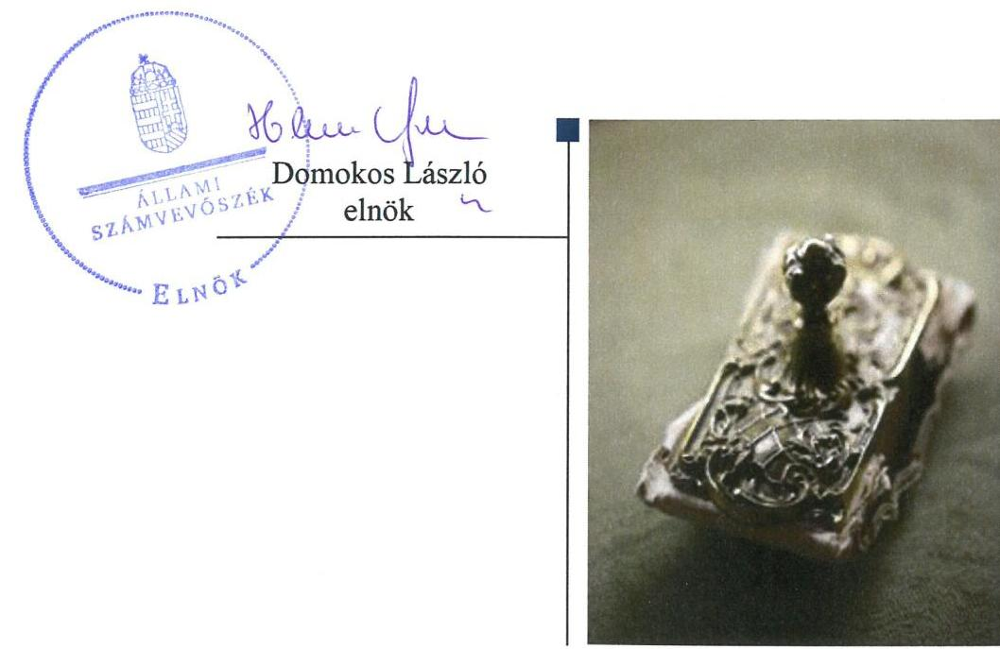
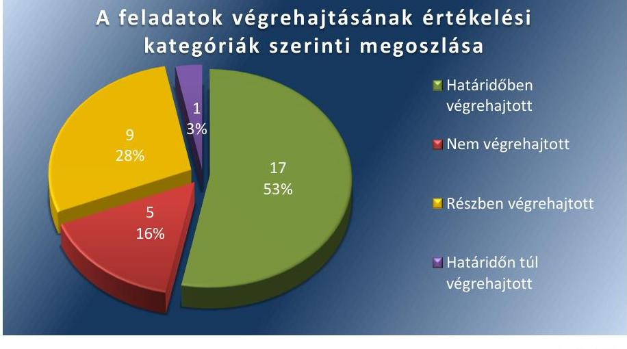
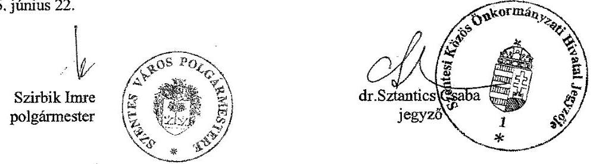
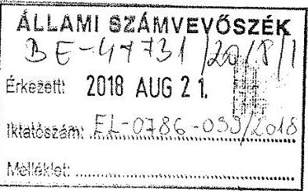
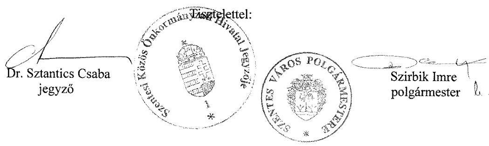
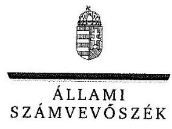
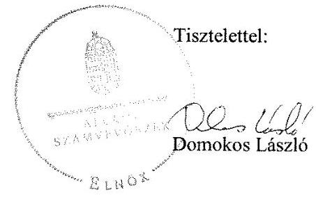
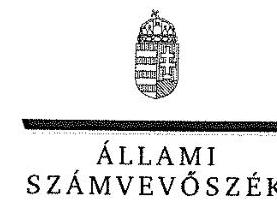
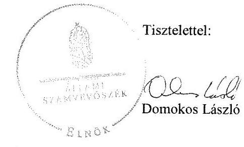

# Jelentés 

## Utóellenőrzések

Az önkormányzatok pénzügyi és vagyongazdálkodása megfelelőségének utóellenőrzése - Szentes Város Önkormányzata
2018.

---

# Jelentés 

## Utóellenőrzések

Az önkormányzatok pénzügyi és vagyongazdálkodása megfelelőségének utóellenőrzése - Szentes Város Önkormányzata
2018. 09 hó 26. nap

---

# AZ ELLENŐRZÉST FELÜGYELTE:

- **VARGA EDIT** felügyeleti vezető
- **AZ ELLENŐRZÉST VEZETTE ÉS A VÉGREHAJTÁSÁÉRT FELELŐS:**
  - **BÍRÓ ZSOLT** ellenőrzésvezető
  - **A PROGRAM ÖSSZEÁLLÍTÁSÁÉRT FELELŐS:**
    - **TÓTPÁL SZABOLCS** osztályvezető
  - **A TÉMÁHOZ KAPCSOLÓDÓ KORÁBBI SZÁMVEVŐSZÉKI JELENTÉSEK:**
    - **címe:** Jelentés az önkormányzatok pénzügyi és vagyongazdálkodása megfelelőségének ellenőrzése – Szentes 2016
    - **sorszáma:** 16024

Jelentéseink az Országgyűlés számítógépes hálózatán és az Interneten a www.asz.hu címen is olvashatóak.

|  IKTATÓSZÁM: EL-0213-031/2018. | |
| --- | --- |
|  TÉMASZÁM: 2460 | |
|  ELLENŐRZÉS-AZONOSÍTÓ SZÁM: V080442 | |

---

# TARTALOMJEGYZÉK 

■ ÖSSZEGZÉS ..... 5
■ AZ ELLENŐRZÉS CÉLJA ..... 6
■ AZ ELLENŐRZÉS TERÜLETE ..... 7
■ AZ ELLENŐRZÉS HÁTTERE, INDOKOLTSÁGA ..... 8
■ A JELENTÉS LÉNYEGES KÉRDÉSKÖRE ..... 9
■ AZ ELLENŐRZÉS HATÓKÖRE ÉS MÓDSZEREI ..... 10
■ MEGÁLLAPÍTÁSOK ..... 12
■ MELLÉKLETEK ..... 15
I. sz. melléklet: Szentes Város Önkormányzata intézkedési terve végrehajtásának értékelése ..... 15
II. sz. melléklet: Szentes Város Önkormányzata sorszámozott intézkedési terve ..... 27
■ FÜGGELÉK: ÉSZREVÉTELEK ..... 41
■ RÖVIDÍTÉSEK JEGYZÉKE ..... 55

---

.

---

# ÖSSZEGZÉS 

Az Állami Számvevőszék Szentes Város Önkormányzata pénzügyi és vagyongazdálkodása megfelelőségének utóellenőrzése során megállapította, hogy a pénzügyi és vagyongazdálkodás szabályozottsága javult, azonban a szabályszerű pénzügyi és vagyongazdálkodás végrehajtását biztosító intézkedések elmaradása továbbra is veszélyeztetik a közpénzekkel való felelős, elszámoltatható és átlátható gazdálkodást.

## Az ellenőrzés társadalmi indokoltsága

Az Állami Számvevőszék stratégiájában célul tűzte ki a számvevőszéki munka hasznosulásának javítását. Ezzel összhangban ellenőrzi, hogy az ellenőrzött szervezetek megvalósították-e a korábbi ellenőrzései által feltárt hibák, hiányosságok és szabálytalanságok megszüntetése céljából kialakított intézkedési terveikben foglaltakat. A rendszeres utóellenőrzések hozzájárulnak a szükséges intézkedések tényleges végrehajtásához, ezáltal a közpénzügyek rendezettségének javulásához, igazolják, hogy lezárult a következmények nélküli ellenőrzések időszaka.

## Főbb megállapítások, következtetések

Szentes Város Önkormányzata az intézkedési tervében meghatározott harminckettő feladatból tizenhetet határidőben, egyet határidőn túl, kilencet részben, ötöt nem hajtott végre.

A pénzügyi és vagyongazdálkodás szabályozási környezetének kialakítása, valamint a felelősség érvényesítése érdekében végrehajtott intézkedések eredményeként javult Szentes Város Önkormányzatának szabályozottsága és a felelős feladatellátás. A polgármester szabályozta a tagi kölcsönök nyújtására vonatkozó adminisztratív eljárásrendet. A jegyző gondoskodott a számviteli politika, az eszközök és források leltározási és leltárkészítési szabályzat, az eszközök és források értékelési szabályzat és a számlarend elkészítéséről. A felelősség érvényesítése érdekében a polgármester és a jegyző is intézkedett, az ÁSZ ellenőrzésben feltárt hiányosságok, szabálytalanságok tekintetében a munkajogi felelősséggel kapcsolatos intézkedéseket megtették.

A szabályszerű pénzügyi és vagyongazdálkodás biztosítása érdekében vállalt, de végre nem hajtott intézkedések továbbra is veszélyeztetik a szabályszerű gazdálkodást. A jegyző nem intézkedett az ingatlanvagyon-kataszterben átvezetett adatoknak a számviteli nyilvántartásokban szereplő adatokkal való egyeztetéséről, az ingatlanok valóságos állapotában, értékében bekövetkezett változás kataszteren történő átvezetésének elvégzése érdekében. A 2017. évre vonatkozó likviditási tervet nem készítették el, az ingatlan beruházás kataszteri nyilvántartásba vétele megtörtént, azonban a beruházás számviteli nyilvántartásokon történő átvezetését nem végezték el, a részesedések 2017. évre vonatkozó értékelése nem történt meg. A jegyző gondoskodott, hogy a 2015. évi mérleget az előírt tagolásban elkészítsék, az ingatlanok leltározását a leltározási szabályzatnak megfelelően végrehajtsák, azonban a 2015-2017. évi követelések és kötelezettségek vonatkozásában nem rendelkeztek a jogszabály által előírt részletező nyilvántartással, valamint a 2015-2017. évi mérleget alátámasztó követelések, kötelezettségek leltárával, továbbá 2016-2017. évi mérleget alátámasztó ingatlanok leltárával. A jegyző gondoskodott arról, hogy az értékvesztés bemutatását, az elszámolás dokumentálására szolgáló nyilvántartások tartalmi és számszaki adatainak egyeztetését a 2015. és a 2016. évi beszámoló készítés időszakában elvégezzék, azonban a 2017. évre vonatkozóan az egyeztetés nem történt meg.

A jegyző az intézkedési tervben meghatározott feladatok végrehajtásáról nem a jogszabály szerinti nyilvántartást vezette.

---

# AZ ELLENŐRZÉS CÉLJA 

Az ellenőrzés célja annak értékelése volt, hogy a számvevőszéki jelentésben foglalt intézkedést igénylő megállapításokkal összhangban készített intézkedési tervben meghatározott feladatokat az ellenőrzött szervezet végrehajtotta-e.

---

# AZ ELLENŐRZÉS TERÜLETE 

## Szentes Város Önkormányzata

Szentes városa Csongrád megyében a Szentesi járás székhelye. A lakónépességének száma a Központi Statisztikai Hivatal Magyarország közigazgatási helységnévtára alapján 2017. január 1-jén 27266 fő volt.

A polgármester ${ }^{1}$ a 1994. óta tölti be hivatalát, a jegyző ${ }^{2}$ 1995. óta látja el feladatát.

Az Önkormányzat ${ }^{3}$ 2016. évi költségvetésének végrehajtásáról szóló rendelete szerint 4940,4 millió Ft költségvetési bevételt ért el, valamint 4582,7 millió Ft költségvetési kiadást teljesített. A könyvviteli mérleg föösszege 2016. december 31-én 34764,2 millió Ft, ezen belül a követelések állománya 466,3 millió Ft, a kötelezettségek állománya 502,7 millió Ft volt.

Az ÁSZ ${ }^{4}$ a 2011. január 1. - 2014. december 31. közötti időszakra végezte el az Önkormányzat pénzügyi és vagyongazdálkodása megfelelőségének ellenőrzését. Az ellenőrzés célja volt az Önkormányzat pénzügyi és vagyoni helyzetének, a gazdálkodás szabályosságának megítélése a költségvetési tervezés, a pénzügyi egyensúly megteremtése, az éves költségvetési beszámolás, a vagyongazdálkodás, a vagyon számbavétele, a gazdasági események elszámolása és a pénzgazdálkodás szabályszerűsége alapján; valamint annak értékelése, hogy kialakított-e az önkormányzat az erőforrásokkal való szabályszerű és hatékony gazdálkodáshoz szükséges követelményeket, megvalósította-e azok számon kérését, ellenőrzését.

Az utóellenőrzés arra irányult, hogy az Önkormányzat 2016. március 8. és 2018. május 8-a között a pénzügyi és vagyongazdálkodása megfelelőségének ellenőrzéséről készült 16024 számú ÁSZ jelentésben szereplő intézkedést igénylő megállapításokkal és javaslatokkal összhangban készített intézkedési tervben meghatározott feladatokat végrehajtotta-e.

---

# AZ ELLENŐRZÉS HÁTTERE, INDOKOLTSÁGA 

Az ÁSZ tv. ${ }^{5}$ 33. § (1) bekezdése értelmében a számvevőszéki jelentések intézkedést igénylő megállapításaihoz és javaslataihoz kapcsolódóan az ellenőrzött szervezet vezetője intézkedési tervet köteles összeállítani, és az ÁSZ részére megküldeni.

Az ÁSZ által befogadott intézkedési tervben foglaltak megvalósítását az ÁSZ törvény 33. § (7) bekezdésében foglaltak alapján - az ÁSZ utóellenőrzés keretében ellenőrizheti. Az utóellenőrzések keretében - az intézkedések értékelése során - az ÁSZ figyelembe veszi az ellenőrzött szervezetek működési feltételeiben, valamint a jogszabályi előírásokban bekövetkezett változásokat.

Az utóellenőrzés során az ÁSZ értékeli, hogy az érintett számvevőszéki jelentésben foglalt intézkedést igénylő megállapításokkal és javaslatokkal összhangban, az ellenőrzött szervezet által készített intézkedési tervben meghatározott feladatokat a feladatra kijelöltek végrehajtották-e.

Az intézkedések végrehajtásával az adott terület szabályszerű múködése vonatkozásában a kockázatok csökkenhetnek, azonban hosszabb távon az intézkedési tervben foglaltak végrehajtásával önmagában nem szűnnek meg, csak akkor, ha beépülnek az ellenőrzött szervezet múködésébe, azokat folyamatosan karban tartják, figyelembe véve, illetve kezelve a változásokat. Emellett az intézkedések végrehajtásáig újabb kockázatok merülhetnek fel a szabályszerű múködés vonatkozásában, amelyek kezelése szintén kiemelten fontos az ellenőrzött szervezet számára.

Az ellenőrzött szervezet vezetője által készített intézkedési tervekben foglalt feladatok hiányos, illetve késedelmes végrehajtása, vagy annak elmaradása a szabályszerűség és a felelős vezetői magatartás vonatkozásában kockázatot hordoz, ami azt mutatja, hogy az ellenőrzések során feltárt hibák, hiányosságok és szabálytalanságok kezelése nem kapott kellő hangsúlyt. Az utóellenőrzés során is fennálló szabálytalanságok esetén a közpénz, közvagyon veszélyeztetettségi kockázat valószínűsített hatásának értékelése további intézkedéseket vonhat maga után.

Az ellenőrzött szervezet szintjén az utóellenőrzés feltárja, hogy a szervezet az intézkedések végrehajtásával hasznosította-e a korábbi ellenőrzési jelentésben a hiányosságok megszüntetése, illetve a kockázatok kezelése érdekében megfogalmazott javaslatokat, illetve az intézkedések végrehajtása elmaradásának következtében továbbra is fennálló szabálytalanság esetén értékeli a közpénzek, közvagyon veszélyeztetettségét.

Az ÁSZ szintjén az utóellenőrzés visszacsatolást ad az ellenőrzési jelentések hasznosulásáról, az intézkedések elmaradásának, vagy részleges megvalósulásának a közpénzek, közvagyon veszélyeztetettségére gyakorolt valószínűsített hatásának értékelése, további intézkedéseket vonhat maga után.

---

# A JELENTÉS LÉNYEGES KÉRDÉSKÖRE 

Az Önkormányzat az intézkedési tervben foglaltakat az elöirt határidőben végrehajtotta-e?

---

# AZ ELLENŐRZÉS HATÓKÖRE ÉS MÓDSZEREI 

## Az ellenőrzés típusa

Megfelelőségi ellenőrzés.

## Az ellenőrzött időszak

Az utóellenőrzés alapját képező ÁSZ jelentés ${ }^{6}$ közzétételének napjától (2016. március 8.) az utóellenőrzésről szóló kiértesítő levél keltének napjáig (2018. május 8.) tartó időszak.

## Az ellenőrzés tárgya

Az ÁSZ tv. 2011. július 1-jei hatálybalépését követően a számvevőszéki jelentésben foglalt intézkedést igénylő megállapításokkal és javaslatokkal összhangban - az ellenőrzött szervezet által - készített intézkedési tervben foglaltak végrehajtásának ellenőrzése.

## Az ellenőrzött szervezet

Szentes Város Önkormányzata

## Az ellenőrzés jogalapja

Az ellenőrzés jogszabályi alapját az ÁSZ tv. 33. § (7) bekezdése, illetve a 33. § (1)-(2) bekezdéseinek az előírásai képezik.

## Az ellenőrzés módszerei

Az ÁSZ az ellenőrzést az ellenőrzött időszakban hatályos jogszabályok, az ellenőrzés szakmai szabályai, a jelen ellenőrzésre irányadó ÁSZ módszertanok, az ellenőrzési programban foglalt értékelési szempontok szerint, önálló ellenőrzés keretében végezte.

Az ÁSZ az ellenőrzés ideje alatt az ellenőrzött szervezettel történő kapcsolattartást az ÁSZ SZMSZ ${ }^{7}$-ének vonatkozó előírásai alapján biztosította.

Az utóellenőrzés megállapításait az ÁSZ rendelkezésére álló dokumentumok, valamint az ÁSZ adatbekérése szerint, az ellenőrzött szervezet által rendelkezésre bocsátott dokumentumok, adatok alapozták meg.

---

Az ellenőrzési kérdések megválaszolásához szükséges bizonyítékok megszerzése az ellenőrzött által rendelkezésre bocsátott dokumentumokra, adatokra alapozva elemző eljárás alkalmazásával történt. Az ellenőrzési bizonyítékként felhasználható adatforrások közé tartoztak egyrészt az ellenőrzési program részletes szempontjainál felsorolt adatforrások, másrészt minden - az ellenőrzés folyamán feltárt, az ellenőrzés szempontjából információt tartalmazó - dokumentum.

Az intézkedési tervekben előírt feladatokat, azok végrehajtása szempontjából az alábbiak szerint értékelte az ÁSZ:
"határidőben végrehajtott" a feladat, ha a teljesítés dokumentáltan, az intézkedési tervben előírt határidőben és tartalommal megtörtént;
"határidőn túl végrehajtott" a feladat, ha annak teljesítése az intézkedési tervben meghatározott módon, de az abban előírt határidőn túl történt meg;
"részben végrehajtott" a feladat, ha annak végrehajtása nem teljes körűen az intézkedési tervben előírt módon történt meg;
"nem végrehajtott" a feladat, ha a végrehajtás nem történt meg, dokumentumokkal nem igazolt annak teljesítése;
"okafogyottá vált" a feladat, ha végrehajtására - meghatározott esemény bekövetkezése, továbbá külső körülmény, a működést érintő feltétel változása miatt - már nincs szükség, illetve lehetőség, és egyértelműen megállapítható, hogy az intézkedést szükségessé tevő körülmény a jövőben nem fordulhat elő;
"nem időszerű" az a feladat, amelynek ellenőrzési időszakon belüli végrehajtására azért nem került (kerülhetett) sor, mert az intézkedés alapjául szolgáló esemény nem következett be, de annak jövőbeni előfordulása lehetséges, a végrehajtása nem volt esedékes, vagy a végrehajtás határideje még nem járt le.
Az ellenőrzés lefolytatásához az ellenőrzött szervezet a tanúsítványok elektronikus kitöltésével, valamint az ÁSZ által kért dokumentumok elektronikus megküldésével szolgáltatott adatokat, amelyek valódiságát és teljes körűségét az ellenőrzött szervezet vezetője által tett teljességi és hitelességi nyilatkozat igazolta. Az így rendelkezésre bocsátott adatok, információk kontrollja az ellenőrzés keretében történt.

Az ellenőrzött szervezet által megküldött intézkedési tervben meghatározott ÁSZ által beazonosított feladatok a II. számú mellékletben kerültek bemutatásra.

---

# MEGÁLLAPÍTÁSOK 

## Az Önkormányzat az intézkedési tervben foglaltakat az előírt határidőben végrehajtotta-e?

Összegző megállapítás

Az Önkormányzat az intézkedési tervben meghatározott harminckettő feladatból tizenhetet határidőben, egyet határidőn túl, kilencet részben és ötöt nem hajtott végre. Az intézkedési tervben meghatározott feladatok végrehajtásáról nem az előírásoknak megfelelő nyilvántartást vezette.

Az Önkormányzat az intézkedési terv ${ }^{8}$-ben a hiányosságok, szabálytalanságok megszüntetésére harminckettő feladatot határozott meg. Az intézkedési tervében meghatározott feladatokat, határidőket, a feladatok végrehajtásáért felelős személyeket és a feladatok végrehajtását az I. számú melléklet mutatja be.

A jegyző az intézkedési tervben meghatározott feladatok végrehajtásáról a Bkr. ${ }^{9} 14 . \S$ (1) bekezdésében foglaltak ellenére nem éves bontásban vezette a nyilvántartást. A nyilvántartás nem felelt meg a Bkr. 47. § (2) bekezdésében foglaltaknak, mert nem tartalmazta az ellenőrzési jelentésben szereplő jegyző részére tett 4. számú javaslatot, továbbá nem tartalmazta az elfogadott intézkedési terv összes intézkedése rövid leírását.

Az intézkedési tervben meghatározott feladatok végrehajtásának értékelési kategóriák szerinti megoszlását az 1. ábra szemlélteti.

1. ábra

A feladatok végrehajtásának értékelési kategóriák szerinti megoszlása

A PÉNZÜGYI ÉS VAGYONGAZDÁLKODÁS SZABÁLYOZÁSI KÖRNYEZETÉNEK kialakítása érdekében az Önkormányzat vezetői intézkedéseket tettek. A polgármester a tagi kölcsön nyújtásának eljárási rendjében ${ }^{10}$ szabályozta a tagi kölcsönök nyújtására vonat-

---

kozó adminisztratív eljárásrendet. A jegyző gondoskodott a jogszabályi előírásoknak megfelelő tartalmú számviteli politika ${ }^{11}$, leltározási szabályzat ${ }^{12}$, értékelési szabályzat ${ }^{13}$ és a számlarend ${ }^{14}$ kiadásáról. A jegyző nem gondoskodott a 2016. december 31-ig a Szoc. tv. ${ }^{15}$-ben foglaltaknak és 2017. február 17-től az 1/2000. (I. 7.) SZCSM rendelet ${ }^{16}$-ben foglaltaknak megfelelő felülvizsgált szociális szolgáltatástervezési koncepció elkészítéséről és a Képviselő-testület ${ }^{17}$ elő történő beterjesztés kezdeményezéséről.

# A PÉNZÜGYI ÉS VAGYONGAZDÁLKODÁS SZABÁLYSZERŰ MŰKÖDTETÉSE érdekében meghatározott 

intézkedéseket nem, vagy nem teljes körűen hajtották végre a felelősök. A jegyző nem intézkedett az ingatlanok adásvétele miatt az ingatlanvagyonkataszterben átvezetett adatoknak (bruttó érték) a számviteli nyilvántartásokban szereplő adatokkal való adategyeztetéséről és pontosításáról, így az Áhsz. ${ }^{18}$-ben előírtak ellenére nem volt biztosított a számviteli nyilvántartásokban és az ingatlanvagyon kataszterben szereplő vagyon bruttó értékének egyezősége. A jegyző nem intézkedett a 147/1992. (XI. 6.) Korm. rendelet ${ }^{19}$-ben előírtak végrehajtása, azaz az ingatlanok valóságos állapotában, értékében bekövetkezett változás kataszteren történő átvezetésének elvégzése érdekében. A jegyző intézkedett, hogy a 2016. évre a likviditási terv havi bontásban elkészüljön, azonban a 2017. évre vonatkozó likviditási tervet az Áht. ${ }^{20}$-ben foglaltak ellenére nem készítették el. A jegyző gondoskodott, hogy az ingatlan beruházás a kataszteri nyilvántartásokba vétele megtörténjen, azonban az Áhsz. szerinti számviteli feladat (beruházás számviteli nyilvántartásokon történő átvezetés) elvégzéséről nem gondoskodott. A jegyző gondoskodott arról, hogy a 2015. évi mérleget az előírt tagolásban elkészítsék, az ingatlanok leltározását a leltározási szabályzatnak megfelelően végrehajtsák, azonban a 2015-2017. évi követelések és kötelezettségek vonatkozásában nem rendelkeztek az Áhsz. szerinti részletező nyilvántartással, valamint a Számv. tv. ${ }^{21}$-ben előírtak ellenére a 2015-2017. évi mérleget alátámasztó követelések, kötelezettségek leltárával, továbbá 2016-2017. évi mérleget alátámasztó ingatlanok leltárával. Az Önkormányzatnál a részesedések értékelését 2015. és 2016. évekre elvégezték, de a 2017. évi értékelés nem történt meg a Számv. tv.-ben foglaltak ellenére. A jegyző gondoskodott arról, hogy az értékvesztés bemutatása, az egyeztetés 2015. évi és a 2016. évi beszámoló készítés időszakában megtörténjen, azonban a 2017. évre vonatkozóan az egyeztetést a Számv. tv.-ben foglaltak ellenére nem végezték el.

A FELELŐSSÉG ÉRVÉNYESÍTÉSE érdekében a polgármester és a jegyző is intézkedett. A polgármester az ÁSZ ellenőrzésben feltárt hiányosságok, szabálytalanságok tekintetében a munkajogi felelősséggel kapcsolatos intézkedést megtette, egy köztisztviselő részére a Kttv. ${ }^{22}$ alapján fegyelmi büntetés kiszabásáról intézkedett. A jegyző a feltárt hiányosságok, szabálytalanságok tekintetében fegyelmi eljárás mellőzésével hozott fegyelmi határozatban két köztisztviselővel szemben megrovást szabott ki.

---

.

---

# MELLÉKLETEK

I. SZ. MELLÉKLET: SZENTES VÁROS ÖNKORMÁNYZATA INTÉZKEDÉSI TERVE VÉGREHAJTÁSÁNAK ÉRTÉKELÉSE

|  1. | Intézkedési tervben meghatározott feladat | Az intézkedési tervben meghatározott határidő | Az intézkedési tervben meghatározott feladat felelése | A feladat végrehajtása  |
| --- | --- | --- | --- | --- |
|  1. | (P1/1.) Fokozott kontroll az Önkormányzat vagyonrendeltének érvényesülése érdekében. | azonnal és folyamatos | jegyző és a műszaki iroda vezetője; | A fokozott kontroll a szerződéskötést megelőző képviselő-testületi határozatok formájában 2016. és 2017. években egyaránt érvényesült, a vagyongazdálkodási döntéseket a Képviselő-testület hozta meg.  |
|  2. | (P1/2.) A hasonló szabálysértések elkerülése érdekében a Polgármesteri utasításban került szabályozásra az eljárási rend. | azonnal és folyamatos | jegyző, a jegyzői iroda vezetője a testületi előterjesztések elkészítéséért, a számviteli és tervezési iroda vezetője az utalások és előirányzat módosítások szabályszerűségének betartásáért. | A tagi kölcsön nyújtásának eljárási rendje tartalmazza a tagi kölcsönök nyújtására vonatkozó eljárási szabályokat.  |
|  3. | (P2.) A Szentes SPA \& Medical Kft-vel szemben az Önkormányzat a felszámolás elrendelése iránti kérelmet 2015. július hó 17.-én benyújtotta. A Pendola Szentes Kft. felszámolását a Fővárosi Törvényszék 4.Fpk.01-14-006663/26. sz. végzése alapján a felszámolás megindítását 2015. december 14-én közzétette. | azonnal és folyamatos | alpolgármester és felhatalmazott ügyvéd | A polgármester intézkedett a Ptk. ${ }^{23}$ 3:133. § (2) bekezdésében előírtak figyelembevételével a Szentes SPA \& Medical Kft. ${ }^{24}$ és a Pendola Szentes Kft. ${ }^{25}$ jogutód nélküli megszüntetéséről.
A Pendola Szentes Kft. ellen a felszámolási eljárás a Fővárosi Törvényszék 4. Fpk.01.14-006663/13. számú végzése alapján 2015. december 14-én indult.
A Szentes SPA \& Medical Kft. kényszertörlését a Szegedi Törvényszék a Cgt.06-16-000358/4. számú végzésével 2016. október 10-én rendelte el.  |
|  4. | (P4/1.) A 6.2 megállapítás 5-6 bekezdéseiben foglaltak tekintetében az intézkedés a vizsgálat ideje alatt megtörtént. A Szentes SPA \& Medical Kft-vel szemben az Önkormányzat a felszámolás elrendelése iránti kérelmet 2015. július hó 17-én benyújtotta. A felszámolás | azonnal és folyamatos | alpolgármester és felhatalmazott ügyvéd | A polgármester intézkedett a Ptk. 3:133. § (2) bekezdésében előírtak figyelembevételével a Szentes SPA \& Medical Kft. és a Pendola Szentes Kft. jogutód nélküli megszüntetéséről.  |

---

|  4 | Intézkedési
tervben
meghatározott
feladat | Az intézkedési
tervben
meghatározott
határidő | Az intézkedési
tervben meghatá
rozott feladat fele
lése | A feladat végrehajtása  |
| --- | --- | --- | --- | --- |
|   | alatt álló Pendola Szentes Kft. és az Önkormányzat között peres el-
járás van folyamatban, melynek befejezését követően kerülhet sor
további intézkedések megtételére. |  |  | A Pendola Szentes Kft. ellen a felszámolási eljárás a Fővárosi Tör-
vényszék 4. Fpk.01.14-006663/13. számú végzése alapján 2015. dec-
ember 14-én indult.
A Szentes SPA & Medical Kft. kényszertörlését a Szegedi Törvényszék
a Cgt.06-16-000358/4. számú végzésével 2016. október 10-én ren-
delte el.  |
|  5. | (P4/3.) A munkajogi felelősség megállapítására irányuló eljárás
megindítására a 6.3 megállapítás 1 és a 6.2 megállapítás 5-6 bekezdéseire vonatkozóan a közszolgálati tisztviselőkről szóló 2011. évi
CXCIX. törvény 156. § (1) bekezdése alapján az időhatár miatt nincs lehetőség, ugyanis a feltételezett fegyelmi vétség elkövetése óta 3 év eltelt. Az egyéb szabálytalanság mögött szándékos károkozás nem volt vélelmezhető, ezért 1 fő projekt megbízott részére - figyelembe véve a közszolgálati tisztviselőkről szóló 2011. évi CXCIX. törvény 156. § (1), (2) bekezdésében foglaltakat - munkáltatói jogkörömben a 2011. évi CXCIX. törvény 156. § (2) bekezdésében foglalt büntetés szabtam ki. (J1.a.) Az 1.1 megállapítás 2. bekezdés 2-4 pontjában megfogalmazott hiányosság pótlása a helyszíni vizsgálatot követően megtörtént. A 2015. január 01-től hatályos számviteli politika tartalmazza mindazokat a szabályokat, előírásokat, módszereket, amelyekkel meghatározható, hogy az Önkormányzat, illetve a Szentesei Közös Önkormányzati Hivatal mit tekint a számviteli elszámolás, az értékelés szempontjából lényegesnek, nem lényegesnek. A leltározási szabályzat kiegészítése megtörtént, a 2015. évi leltározás végrehajtása a szabályzatban foglaltak figyelembe vételével történt. Az értékelési szabályzat aktualizálása a jogszabályváltozások figyelembe vételével elkészült, a 2015. évi beszámoló mérlegadatai a szabályzat szerinti adatokat tartalmazzák. Az Önkormányzat gazdálkodásával, feladatellátásával kapcsolatos szabályzatok aktualizálására a jövőben kiemelt figyelem irányul, a azonnal és folyamatos számviteli és tervezési irodavezető a gazdálkodási szabályzat tervezetek elkészítése, az egyéb szabályzatok tartalmára vonatkozó javaslat tételre a jegyzői iroda vezetője, a műszaki iroda vezetője, a szociális iroda vezetője, a közigazgatási iroda vezetője, a polgármesteri iroda vezetője. |  |  | A polgármester a Kttv. 156. § (1) bekezdésében foglaltak alapján – mivel a fegyelmi vétség elkövetése óta három év eltelt – nem indított munkajogi felelősség megállapítására irányuló eljárást, azonban egy köztisztviselő részére a Kttv. 155. § (2) bekezdés a) pontja alapján fegyelmi büntetés kiszabásáról intézkedett.  |
|   |  |  | Az Önkormányzat rendelkezett a jogszabályoknak megfelelő számviteli politikával, leltározási szabályzattal, számlarenddel és értékelési szabályzattal. A számviteli politika XVIII. pontja tartalmazta, hogy az Önkormányzat mit tekint a számviteli elszámolás, az értékelés szempontjából lényegesnek, nem lényegesnek. A leltározási szabályzat 2.4. pontja tartalmazta a leltározás módját a könyvviteli mérlegben értékkel nem szereplő, használt és használatban levő készletekre, kis értékű immateriális javakra, tárgyi eszközökre vonatkozóan. A számlarend tartalmazta a számla értéke növekedésének, csökkenésének jogcímeit, a számlát érintő gazdasági eseményeket, továbbá az adott számla más számlákkal való kapcsolatát. |   |

---

|  6. | Intézkedési
tervben meghatározott
feladat | Az intézkedési
tervben
meghatározott
határidő | Az intézkedési
tervben meghatá-
rozott feladat fele-
lése | A feladat végrehajtása  |
| --- | --- | --- | --- | --- |
|   | nyomon követés érdekében a következetes számonkérés a belső el-
lenőrzés által, illetve a heti rendszerességgel megtartott Irodaveze-
tői értekezleteken történik meg. |  |  |   |
|   | (J2c/1.) A 3.5. sz. megállapítás 2. bekezdése szerint az adósságkon-
szolidációhoz kapcsolódó kifogásolt helytelen eljárás összességé-
ben nem befolyásolta az Önkormányzat pénzügyi helyzetét. A kon-
szolidált összeg bevételként és a kiadásként történő könyvelése
megtörtént, csak a jogcím nem volt megfelelő. A pénzforgalomhoz
kapcsolódó állományi számla kivezetése megtörtént az előző évek
és a 2013. évi árfolyam-értékelési különbözettél együtt, így a teljes
adósságállomány kivezetése megtörtént. Kifogásolt gazdasági események hatása a 2013. évi mérlegre, valamint a pénzmaradványra:
0. A pénzforgalom nélkül konszolidált 934. 987.374,00 Ft összegű
tartozás az állományi számlával szembeni kivezetéséhez szükséges
- a Magyar Állam Kincstár által megküldött „Végleges konszolidációs
lista 2013. 06.17.,, - bizonylat, a konszolidált tételek mellett megtalálható volt, melynek alapján pótolható volt a vegyes naplón lekönyvelt tétel bizonylatolása. | azonnal | számviteli és tervezési
Irodavezető, pénzügyi
ügyintéző | A 2013. évi adósságkonszolidáció könyvelését alátámasztó bizonylat
„végleges konszolidációs lista 2013. 06.17." formájában beszerzésre
került, amellyel a pénzforgalom nélküli kivezetést bizonylattal alátámasztották.  |
|  7. | (J2.c/2.) A jegyzőnek címzett 2/c javaslat hasznosulása érdekében a
3.5. sz. megállapítás 2. bekezdése szerinti hiba előfordulásának jövőbeni előfordulásának, a helytelen könyvelés bekövetkezésének
ismétlődése elkerülése miatt szükséges a munka folyamatába épített ellenőrzés rendszeresebbé tétele, a havi zárások adattartalmának és a könyvelési tételek visszakereshető módon történő bizonylatolásának következetes vezetői ellenőrzése. |  |  |   |
|  8. | (J3.b/1.) A 4.2. sz. megállapítás 2. bekezdésében kifogásoltakra a
szükséges intézkedések a helyszíni vizsgálatot követően megtörténtek. A 2015. október 01-től hatályos leltározási szabályzat szerint a
2015. év végi mérleg alátámasztása a jogszabályoknak megfelelően történt. A 2014. december 30-án felvett 91,1 millió Ft hitellel kapcsolatos hiba abból adott, hogy a kapcsolódó tétel könyvelésére a program nem kínált fel lehetőséget és így nem történt meg annak lekönyvelése. A 2014. évi elemi beszámoló leadását követően a hiba | folyamatos | számviteli és tervezési
irodavezető, pénzügyi
ügyintéző | A jegyző 2016. április 10-ei levelében felhívta a számviteli és tervezési irodavezető figyelmét a folyamatba épített ellenőrzés erősítésére. A számviteli és tervezési irodavezető 2016. június 28-án kelt válaszlevelében tájékoztatta a jegyzőt arról, hogy a gazdasági események dokumentáltságát és visszakereshetőségét a napi munkafolyamat kapcsán folyamatosan figyelemmel kísérte.  |
|  9. | (J3.b/1.) A 4.2. sz. megállapítás 2. bekezdésében kifogásoltakra a szükséges intézkedések a helyszíni vizsgálatot követően megtörténtek. A 2015. október 01-től hatályos leltározási szabályzat szerint a 2015. év végi mérleg alátámasztása a jogszabályoknak megfelelően történt. A 2014. december 30-án felvett 91,1 millió Ft hitellel kapcsolatos hiba abból adott, hogy a kapcsolódó tétel könyvelésére a program nem kínált fel lehetőséget és így nem történt meg annak lekönyvelése. A 2014. évi elemi beszámoló leadását követően a hiba | folyamatos | számviteli és tervezési
iroda vezetője és pénz-
ügyi ügyintézők | A 2014-ben le nem könyvelt 91,1 millió Ft hitel lehívás 2015-ben a könyvekben (analitika, főkönyv) 2015. szeptember 1-én rögzítésre (helyesbítésre) került. A helyesbített 2015. évi főkönyvi adatok (hitellehívás) a csatolt 2015. évi mérleg megfelelő adataival (költségvetési évet követően esedékes kötelezettségek) egyezőséget mutattak (összesen 291 572 ezer Ft).  |

---

|  10. | Intézkedési
tervben meghatározott
feladat | Az intézkedési
tervben
meghatározott
határidő | Az intézkedési
tervben meghatá-
rozott feladat fele-
lése | A feladat végrehajtása  |
| --- | --- | --- | --- | --- |
|   | feltárásra került és 2015. évben a kötelezettség könyvelése (tényle-
ges könyvelési tétel 2015-ben: T05911100012 - K0023, T853 -
K4229) megtörtént, így a 2015. évi mérleg már tartalmazza a 2014.
és 2015. évi hitel felvételből adódó teljes kötelezettséget. Kifogá-
solt gazdasági esemény hatása a 2014. évi maradványra és a 2014.
évi mérleg főösszegére: 0. A felvett hitel összege a mérleg szerinti
eredményt növelte a kötelezettségek helyett. A főkönyvi számlák és
analitikus nyilvántartások egyeztetése, a vizsgálat során tapasztalt
eltérés korrekciója megtörtént. |  |  |   |
|  10. | (J3.b/2.) A 2014. évi mérleg ingatlanok sorához kapcsolódóan a fő-
könyvi számla és az analitikus nyilvántartás nettó nyilvántartási ér-
téke között 127.000,-Ft (0,1 millió Ft) eltérés volt. Az eltérés pro-
gramhiba miatt keletkezett. Az EcoSTAT könyvelőprogram Tárgyi
eszköz programrészével történik a tárgyi eszközök analitikus nyil-
vántartása. Az analitikus könyvelés során szükségessé vált a folya-
matban lévő beruházások közül két tétel kivezetése. A kivezetett té-
telekhez kapcsolódó terven felüli értékcsökkenés a program által
készített negyedéves automatikus feladásban tévesen duplán sze-
repelt, a főkönyvi könyvelésben az eszközök nettó értékét torzí-
totta. Az egyeztetés a brutto értékekre és a terv szerinti értékcsök-
kenésre terjedt ki, a terven felüli értékcsökkenés főkönyvi számlá-
ján megjelenő összeg elkerülte a figyelmet, így mutatkozhatott a
127.000,-Ft eltérés a mérleg, a főkönyv és az analitikus nyilvántar-
tás között a nettó érték vonatkozásában. A 127.000,-Ft eltérés
2015. évben a főkönyvi könyvelésben kézi könyveléssel helyesbi-
tésre került, így az egyezőség a mérleg, az analitikus nyilvántartás
és a főkönyvi könyvelés között helyreállt. |  |  |   |
|  11. | (J3.d/1.) Az 5.1. sz. megállapítás 6-7. bekezdésében részletezett hi-
ányosság teljes körű pótlására - az eltelt idő, illetve a többszöri fenn-
tartó váltás miatt - kevés az esély. Az üzemeltetésre átadott eszkö-
zök értékének a számviteli nyilvántartásból történő kivezetése alá-
támasztására meg kell kísérelni a hiányzó dokumentumok beszer-
zését. | 2016. szeptember 30. | műszaki iroda vezetője
és a vagyongazdálkodási
ügyintéző | A jegyző 2016. április 10-én levelet írt a műszaki iroda vezetőjének
az üzemeltetésre átadott, illetve térítésmentes vagyonátadással
kapcsolatos dokumentumok beszerzésével kapcsolatban. A műszaki
iroda vezetője 2016. április 15-én levélben kérte az Állami Egészség-
ügyi Ellátó Központtól a Dr. Bugyi István Kórház vagyonátadásáról
szóló átadás-átvételi jegyzőkönyv eredeti aláírt példányát  |

---

|  1. | Intézkedési
tervben meghatározott
feladat | Az intézkedési
tervben
meghatározott
határidő | Az intézkedési
tervben meghatá-
rozott feladat fele-
lése | A feladat végrehajtása  |
| --- | --- | --- | --- | --- |
|   | A GYEMSZI részére térítésmentesen átadott vagyonátadási szerző-
dés mellékleteit az átadás-átvételi és birtokbaadási jegyzőkönyv
mellékletei tartalmazzák, amelyek digitálisan és papíralapon is fel-
lelhetők az U-18854-5/2012. számú ügyirathoz tartozóan. Az ellen-
őrzés során ezen dokumentumok bemutatása megtörtént, azonban
mivel a melléklet nem tartalmazott aláírást így az nem került elf-
gadásra. Ezen hiányosság pótlására a szükséges intézkedést meg
kell tenni. |  |  |   |
|  12. | (J3.d/4.) A jegyzőnek címzett 3/d. javaslat hasznosulása érdekében
az 5.3. sz. megállapítás 4. bekezdésében rögzített hiányosság jövő-
beni elkerülése indokolttá teszi a kötelezettségvállalás, az utalvá-
nyozás, az érvényesítés, a pénzügyi ellenjegyzés, teljesítés igazolás
körültekintőbb ellátását. A jelzőrendszer, valamint a munkafolya-
matba épített ellenőrzés hatékonyabb működtetésével meg kell
akadályozni a helytelen eljárás bekövetkeztét. | folyamatos | számviteli és tervezési
iroda vezetője és pénz-
ügyi ügyintézők | A számviteli és tervezési irodavezető utólagos vezetői ellenőrzés ke-
retében ellenőrizte a 2016. október 13-án az aznapi átutalások sza-
bályszerűségét, amelyről jegyzőkönyv készült. A 2015. évi pénztári
forgalmat 2016. szeptember 19-én ellenőrizte, utólagos vezetői el-
lenőrzés keretében. Az ellenőrzésről feljegyzést készült.  |
|  13. | (J3.d/5.) Az 5.3. sz. megállapítás 13. bekezdésében foglaltak szerint
a bérbeadás útján hasznosított ingatlanok között szerepelt olyan in-
gatlan, amely sem a kataszteri, sem számviteli nyilvántartásokban
nem szerepelt. A hiba kijavítására az intézkedések történtek, a ka-
taszterben és a számviteli nyilvántartásban a nyilvántartásba vétel
megtörténik. |  | műszaki iroda vezetője
és a vagyongazdálkodási
ügyintéző, a számviteli
és tervezési iroda veze-
tője és pénzügyi ügyin-
téző | A feladat végrehajtása, a nyilvántartásba vétel határidőben, 2016.
március 23-án megtörtént. A bérbeadás útján hasznosított ingatla-
nokat szerepeltették a 2015. évi kataszteri és számviteli nyilvántar-
tásokban.  |
|  14. | beadást dokumentáló szerződések megkötése előtt a Műszaki Iroda
vagyongazdálkodási feladatokat ellátó ügyintézője köteles egyezi-
tetni az adatokat a vagyon kataszteri nyilvántartással, amit a szer-
ződés előkészítő lapon kézjegyével és véleményével kell igazolnia. | folyamatos | műszaki iroda vezetője
és a vagyongazdálkodási
ügyintéző | A földhasználati megállapodások szakmai és jogi átvizsgálását 2016.
szeptemberben és októberben elvégezték. A vagyongazdálkodási és
városüzemeltetési ügyintéző a szerződés előkészítő lapon szakmai
véleményét rögzítette, amit kézjegyével igazolt.  |
|  15. | (J3.d/7.) A 6.5. megállapítás 4. bekezdésében foglaltak számviteli
korrekciója megtörtént, a 2015. évi mérlegadatok a hatályos érté-
kelési szabályzat alapján elszámolt értékvesztés bizonylatokkal alá-
támasztottan a helyes értéket tartalmazzák. | azonnal | számviteli és tervezési
iroda vezetője és pénz-
ügyi ügyintéző | A számviteli és tervezési iroda munkatársai 2016. februárban a
könyvviteli zárlat során értékelték a 2015. évi követeléseket. Az ér-
tékelést elvégezték, arról 2016. február 27-én jegyzőkönyvet vettek
fel, az értékvesztés elszámolása megtörtént, bizonylattal alátámasz-
tott volt.  |

---

|  15. | Intézkedési
tervben
meghatározott
feladat | Az intézkedési
tervben
meghatározott
határidő | Az intézkedési
tervben meghatá
rozott feladat fele
lése | A feladat végrehajtása  |
| --- | --- | --- | --- | --- |
|  16. | (J3.e.) A 3.5. sz. megállapítás 2-3. bekezdéséiben rögzített pénzfo
galmat érintő hibák utólagos javítására a könyvviteli rendszer nem
ad lehetőséget. A 2013. december 31-i hitelállomány a mérlegben
valós értéken került kimutatásra, így további intézkedés nem szü
séges. A pénzforgalom nélkül konszolidált 934.987.374,00 Ft ösz
szegű tartozás kivezetését alátámasztó - a Magyar Állam Kincstár
által megküldött, végleges konszolidációs lista - bizonylat becsato
lása megtörtént. | azonnal és folyamatos | számviteli és tervezési
iroda vezetője és pénz
ügyi ügyintéző | A jegyző gondoskodott arról, hogy a konszolidált 934 987 374 Ft ösz
szegű tartozás pénzforgalom nélküli kivezetését alátámasztó bizon
ylat - a Magyar Államkincstár által megküldött, végleges konszolidá
ciós lista – a Számv. tv. 169. § (2) bekezdésében foglaltaknak megfelel
ően rendelkezésre álljon.  |
|  17. | (J4.) A 3.5 megállapítás 2. bekezdése, az 5.3. sz. megállapítás 4. be
kezdése, a 6.5. megállapítás 7. bekezdése és 7. táblázat szerinti hi
bák, illetve szabálytalanságok okának és körülményeinek kivizsgá
lása megtörtént. Megállapításra került, hogy az elkövetés nem volt
szándékos, az adósságkonszolidációval kapcsolatos helytelen köny
velés az Önkormányzat mérleg adatait összességében nem befo
lyásolta, az Önkormányzat pénzmaradványára hatást nem gyako
rolt. |  |  | A jegyző 2016. április 4-én – fegyelmi eljárás mellőzésével hozott fe
gyelmi határozatban – a Szentesi Közös Önkormányzati Hivatal két
köztisztviselőjével szemben a Kttv. 155. § (2) a) pontja szerinti fe
gyelmi büntetést, megrovást szabott ki.  |
|  18. | A szabálytalanság mögött szándékos károkozás nem volt vélelmez
hető. Figyelembe véve azt a tényt, hogy a munkafolyamatban
több, már állományba nem tartozó dolgozó is érintett volt, ezért 2
fő pénzügyi ügyintéző részére - figyelembe véve a közszolgálati
tisztviselőkről szóló 2011. évi CXCIX. törvény 156. § (1), (2) bekez
désében foglaltakat - munkáltatói jogkörömben a 2011. évi CXCIX.
törvény 156. § (2) bekezdésében foglalt büntetés szabtam ki. |  |  |   |
|  19. | (J3.d/3.) Az 5.3. sz. megállapítás 4. bekezdésében az Önkormányzat,
mint tulajdonos által az építkező részére biztosított földhasználati
jog, mint vagyonértékű jog egyszeri visszterhes értékének kiszámlá
zása 59 600 Ft értékben megtörtént, és ezzel kapcsolatosan intéz
kedés történt a 2016. április havi adóbevallásban az önrevízio elvé
gzésére. | 2016. április 20. | számviteli és tervezési
iroda vezetője és pénz
ügyi ügyintéző a számlá
zásért, pénzügyi ügyin
téző az önrevízio elvé
gzéséért | Az Önkormányzat, mint tulajdonos által az építkező részére biztosí
tott földhasználati jog, mint vagyonértékű jog egyszeri visszterhes
értékének kiszámlázása 59.600 Ft értékben 2016. április 5-én meg
történt. Az ÁFA26 önrevízóra 2016. április 20-a, helyett 2016. szept
ember 22-én került sor.  |

---

|  18. |  | Az intézkedési
tervben
meghatározott
határidő | Az intézkedési
tervben meghatározott feladat felelőse | A feladat végrehajtása  |
| --- | --- | --- | --- | --- |
|   |  | Részben végrehajtott feladatok |  |   |
|  19. | (J2.a/1.) A 2.4 megállapítás 1. bekezdésben rögzített szabálytalanság előfordulásának oka, hogy a vizsgált időszakban a gazdálkodási jogkört gyakorlók személyében jelentős változás következett be. A személyek és munkakörök gyakori változása miatt fordulhatott elő, hogy elenyésző esetben nem került sor az aláírásokról vezetett nyilvántartás korrekciójára. Az ellenőrzést követően megtörtént a nyilvántartás felülvizsgálata. A fenti hiányosság elkerülése érdekében a figyelem felhívás megtörtént, a szabályok betartása gyakori és fokozott vezetői, valamint rendszeres belső ellenőrzéssel biztosítható. | azonnal és folyamatos | számviteli és tervezési irodavezető, belső ellenőr | Végrehajtott feladatrész:
A jegyző 2016. április 10-ei levelében felhívta a számviteli és tervezési irodavezető figyelmét az ÁSZ jelentésben szereplő hiányosságok megszüntetésére, és hogy fordítson kiemelt figyelmet a munkafolyamatba épített ellenőrzés és vezetői ellenőrzés következetes végrehajtására. A számviteli és tervezési irodavezető 2016. június 28-án írásban tájékoztatta a jegyzőt, hogy a szabályok betartását napi munkafolyamat kapcsán folyamatosan figyelemmel kísérte.
Nem végrehajtott feladatrész:
A szabályok betartásának ellenőrzését rendszeres belső ellenőrzéssel nem biztosította.  |
|  20. | (J2a./2.) A 2.4. megállapítás 4. táblázat 1. sora alapján a kötelezettségvállalás pénzügyi ellenjegyzése tekintetében megállapított hiányosság abból adódott, hogy néhány szerződés esetében nem történt meg a pénzügyi ellenjegyzés és elmaradt a kivonatokhoz a megrendelés becsatolása is. További hibaként került megállapításra, hogy néhány esetben az ellenjegyzés kijelölés nélkül, jogtalanul történt, ami az irodavezető nyári szabadsága ideje alatt fordult elő. A kijelölés megtörtént, azonban ennek dokumentuma a helyszíni vizsgálatot végzők részére nem került átadásra. A 2.4. megállapítás 4. táblázat 2. sora alapján a teljesítés igazolására jogosult személyek kijelölése megtörtént, azonban néhány esetben a kiadások jogosságának, összegszerűségének igazolása (az összegek feltüntetése) elmaradt, valamint a teljesítés nem a kijelölt személy által történt meg. A fenti hiányosságok elkerülése érdekében a figyelem felhívás megtörtént, a szabályok betartása gyakori és fokozott vezetői, valamint rendszeres belső ellenőrzéssel biztosítható. | azonnal és folyamatos | számviteli és tervezési irodavezető, belső ellenőr | Végrehajtott feladatrész:
A jegyző 2016. április 10-ei levelében felhívta a számviteli és tervezési irodavezető figyelmét, hogy a jövőben kísérje figyelemmel a pénzügyi ellenjegyzés, érvényesítés, teljesítésigazolás és az utalványozás, kötelezettségvállalás gyakorlását, a jogkörök gyakorlására jogosultak aláírás-mintájának naprakészségét. A számviteli és tervezési irodavezető elkészítette a gazdálkodási jogkörök gyakorlásához szükséges aláírás-mintákat és 2016. június 28-ai válaszlevelében tájékoztatta a jegyzőt, hogy a pénzügyi ellenjegyzési, érvényesítési, teljesítésigazolási és az utalványozási, kötelezettségvállalási jogkörök gyakorlását a vezetői ellenőrzések keretében folyamatosan ellenőrizte.
Nem végrehajtott feladatrész:
A szabályok betartásának ellenőrzését rendszeres belső ellenőrzéssel nem biztosította.  |

---

|  20.12.2017 | Intézkedési
tervben
meghatározott
feladat | Az intézkedési
tervben
meghatározott
határidő | Az intézkedési
tervben meghatá
rozott feladat fele
lése | A feladat végrehajtása  |
| --- | --- | --- | --- | --- |
|   | (J2a./3.) A 2.4. megállapítás 4. táblázat 3. sora alapján az érvényesíté
re vonatkozó szabályszegés azzal hozható összefüggésbe, hogy a
vizsgált időszakban a pénzügyi, gazdasági feladatokat ellátó iroda
alkalmazotti létszáma többszöri cserével nagymértékben (95%) vál
tozott. Ezen időintervallumban történt meg az államháztartás re
formjának, teljes átalakításának végrehajtása is, amely változás
alapjaiban megváltoztatta a költségvetési gazdálkodást. Szervezeti
változások: Tűzoltóság, iskolák átadása (a Kórház átadása korábban
történt), egyes közigazgatási feladatok átadása a Járási Hivatalnak,
Közös Önkormányzati Hivatal létrehozása (Eperjes, Nagytőke) Szer
kezeti változások: új besorolási rendek alkalmazása (egységes ro
vatrend, illetve a szakfeladat-rend mellett a kormányzati funkció
szerinti besorolás), fogalmi meghatározások változása, Számviteli
változások: 2014. január 01-én a 4/2013. (1.11.) Korm. rendelet ha
tályba lépése következtében a módosított teljesítmény szemléletű
számvitelről áttérés a 2 elszámolási módot - költségvetési számvitel
és pénzügyi számvitel - alkalmazó elszámolásra. A vizsgált időszak
ban végrehajtott reform a dolgozók számára nagymértékű és új
szerű többletmunkát jelentett. Ezt a számvitelben csak az Önkormányzat,
mint költségvetési szerv (Szentesi Közös Önkormányzati
Hivatal, irányítás alá tartozó intézmények, társulások, egyéb az el
számolási körbe tartozó költségvetési szervek nélkül) esetében
könyvelt tételek számának változása tükrözi. Ez a következők szerint
alakult: 2011. évben mintegy 17 ezer tétel, 2012. évben mintegy 50
ezer tétel, 2013. évben mintegy 74 ezer tétel, 2014. évben mintegy
158 ezer tétel A fenti jelentős személyi és jogszabályi változások,
valamint a többlet munka elvonták a figyelmet a hiányosságként
megállapítottakról, ezért fordulhatott elő a néhány eseti hiba. A
fenti hiányosságok elkerülése érdekében a figyelem felhívás meg
történt, a szabályok betartása gyakori fokozott vezetői, és rendszer
es belső ellenőrzéssel biztosítható. | azonnal és folyamatos | számviteli és tervezési
irodavezető, belső el
lenőr | Végrehajtott feladatrész:
A jegyző 2016. április 10-ei levelében felhívta a számviteli és tervez
ési irodavezető figyelmét, hogy a jövőben kísérje figyelemmel a
pénzügyi ellenjegyzés, érvényesítés, teljesítésigazolás és az utalvá
nyozás, kötelezettségvállalás gyakorlását, a jogkörök gyakorlására jo
gosultak aláírás-mintájának naprakész vezetését. A számviteli és ter
vezési irodavezető elkészítette a gazdálkodási jogkörök gyakorlásá
hoz szükséges aláírás-mintákat és 2016. június 28-ai válaszlevelében
tájékoztatta a jegyzőt, hogy a gazdasági események dokumentáltság
át és visszakereshetőségét a napi munkafolyamat kapcsán folya
mosan figyelemmel kísérte.
Nem végrehajtott feladatrész:
A szabályok betartásának ellenőrzését rendszeres belső ellenőrzés
sel nem biztosította.  |

---

|  21. | (J2.b.) A 3.1. sz. megállapítás 1. bekezdésében rögzített hiányosság
- a helyszíni ellenőrzés hatására - megszüntetésre került, 2016. január 01-től a vonatkozó jogszabályok figyelembe vételével a terv tartalmazza az időszak elején rendelkezésre álló készpénz-és számlaállomány együttes összegét, mely adatok felülvizsgálata havonta megtörténik. |  |  |   |
| --- | --- | --- | --- | --- |
|  22. | (J3.a/2.) Az 5.2 sz. megállapítás 2. bekezdése szerinti hiba vezetői ellenőrzés fokozásával megszüntethető. A jövőben az ingatlan beruházás, értéknövelő felújítás esetén az ingatlanvagyon-kataszterben az átvezetés - a számviteli nyilvántartáson történt átvezetésével egyidejűleg - az előírt hat áridőn belül megtörténik. |  |  |   |
|  23. | (J3.b/3.) A 4.2. sz. megállapítás utolsó bekezdésében feltárt hiányosság ismétlődő előfordulásának megakadályozása érdekében a figyelem felhívás megtörtént, melynek eredményeként a 2015. évi mérleg és a mérleget alátámasztó leltár és analitikus nyilvántartások teljes körűen, a jogszabályban előírtak szerint tartalmazzák a költségvetési évben esedékes és a költségvetési évet követő évben esedékes követelések és kötelezettségek bontását. A hatályos leltározási szabályzatban foglaltak szerint 2015. évben az ingatlanok tételes mennyiségi felvétellel kerültek leltározásra. |  |  |   |

|  Az intézkedési
tervben
meghatározott
határidő | Az intézkedési
tervben meghatározott feladat felelése | A feladat végrehajtása  |
| --- | --- | --- |
|  folyamatos | számviteli és tervezési
irodavezető a terv elkészítéséért és tartalmának folyamatos felülvizsgálatáért | Végrehajtott feladatrész:
A jegyző 2016. április 10-ei levelében felhívta az számviteli és tervezési irodavezető figyelmét a likviditási terv elkészítésére. A számviteli és tervezési irodavezető kötelezettségének 2016. évben határidőben eleget tett és a likviditási tervet havi bontásban elkészítette.
Nem végrehajtott feladatrész:
A 2017. évre vonatkozó likviditási terv az Áht. 78. § (2) bekezdésében foglaltak ellenére nem készült.  |
|  azonnal és folyamatos | számviteli és tervezési
iroda vezetője és pénzügyi ügyintéző a számviteli adatok közléséért, műszaki iroda vezetője és vagyongazdálkodási ügyintéző az adatok jogszabály szerinti határidőben történő ingatlan-vagyon-kataszterben történő átvezetésért | Végrehajtott feladatrész:
Az Önkormányzat az ingatlan beruházását (szennyvíztelep beruházás; 7188 HRSZ számú, forgalomképtelen vagyon) az ingatlanvagyonkataszterbe (kataszteri nyilvántartó lapok) 2017. március 18-án felfektette.
Nem végrehajtott feladatrész:
Az Áhsz. 53. § (2) bekezdése szerinti számviteli feladatot (beruházás számviteli nyilvántartásokon történő átvezetés) nem végezték el.  |
|  folyamatos | számviteli és tervezési
iroda vezetője és pénzügyi ügyintéző | Végrehajtott feladatrész:
Az Önkormányzat a 2015. év vonatkozásában mérlegét az előírt tagolásban elkészítette, ingatlanjainak tételes, mennyiségi felvétellel történt leltározását leltározási szabályzatnak megfelelően végrehajtotta.
Nem végrehajtott feladatrész:
A feltárt hiányosság ismétlődő előfordulásának megakadályozása érdekében figyelemfelhívás nem történt. A 2015-2017. évi követelések és kötelezettségek vonatkozásában nem rendelkeztek az Áhsz. 14. melléklete („A részletező nyilvántartások tartalma") II. és III. pontjaiban előírt részletező nyilvántartással. A 2015-2017. évi beszámolót alátámasztó leltárak a Számv tv. 69. § (1) bekezdésben, illetve az Áhsz. 22. § (1) bekezdésben foglaltak ellenére nem voltak  |

---

|  25 | (J3.c.) A 6.5. sz. megállapítás 7. bekezdése és a 7. táblázat szerinti részesedések értékvesztés elszámolásával kapcsolatos hibák kijavítása megtörtént. Teljes körű felülvizsgálattal, dokumentumokkal történő alátámasztással a 2015. évi mérleg adatai a jogszabályi előírások és az értékelési szabályzat szerinti értéket tartalmazzák. Az értékelés és az értékvesztés elszámolása a jogszabályi előírásoknak megfelelően történt. | folyamatos | számviteli és tervezési irodavezető, pénzügyi ügyintéző | Végrehajtott feladatrész:
A jegyző kiadta az értékelési szabályzatot és a részesedések értékelését 2015. és 2016. évekre elvégezték.
Nem végrehajtott feladatrész:
A részesedések 2017. évi értékelést a Számv. tv. 46. § (3)-(4) bekezdéseiben foglaltak ellenére nem végezték el.  |
| --- | --- | --- | --- | --- |
|  26. | (J3.d/2.) A jegyzőnek címzett 3/d javaslat hasznosulása érdekében az 5.1. sz. megállapítás 6- 7. bekezdésében foglalt hibák és hiányosságok jövőbeni elkerülése szükségessé teszi, hogy a Műszaki Iroda Vagyongazdálkodási feladatokat ellátó munkatársa a vagyongazdálkodással kapcsolatos dokumentumok szabályoknak megfelelő meglétét minden esetben ellenőrizze, ezt követően a hiánytalanul átadja a Számviteli és Tervezési Iroda részére. A folyamat gyakorlatban történő helyes működését, a gazdasági események dokumentumokkal való alátámasztottságát a vezetői ellenőrzés keretében félévente, belsőellenőrzés keretében évente vizsgálni kell, melynek eredményéről a jegyzőt írásban tájékoztatni kell. | Minden évben július 10. illetve évet követő január 20. | műszaki irodavezető és a vagyongazdálkodási ügyintéző és a számviteli és tervezési irodavezető, valamint a belső ellenőr | Végrehajtott feladatrész:
A vagyongazdálkodással kapcsolatos folyamat gyakorlatban történő helyes működését, a gazdasági események dokumentumokkal való alátámasztottságát vezetői ellenőrzés keretében félévente ellenőrizték, amelyekről feljegyzés és jegyzőkönyv készült.
Nem végrehajtott feladatrész:
A belső ellenőrzés keretében az évenkénti ellenőrzés és az ellenőrzések eredményéről a jegyző írásbeli tájékoztatása nem történt meg.  |
|  27. | (J3.d/8.) A jegyzőnek címzett 3/d javaslat hasznosulása érdekében a 6.5. sz. megállapítás 4. bekezdésében rögzített hiányosság jövőbeni elkerülése érdekében az értékvesztés bemutatására, az elszámolás dokumentálására szolgáló nyilvántartások tartalmi és számszaki adatainak egyeztetését a mérlegzárást megelőzően el kell végezni, a hitelt érdemlő bizonylatokat a könyvelés és mérleg alátámasztás dokumentumait a jogszabályban előírtaknak megfelelően meg kell őrizni. A bizonylatok meglétét vezetői ellenőrzés, illetve belsőellenőrzés keretében, a beszámoló ellenőrzésével el kell végezni. | évzárást megelőzően | számviteli és tervezési irodavezető és pénzügyi ügyintéző, valamint a belső ellenőr | Végrehajtott feladatrész:
A feladatot részben hajtották végre, az értékvesztés bemutatása, az egyeztetés 2015. évi és a 2016. évi beszámoló készítés időszakában megtörtént.
Nem végrehajtott feladatrész:
A 2017. évi beszámoló készítés időszakában az egyeztetést a Számv. tv. 46. § (3) bekezdésében előírtak ellenére nem végezték el.  |

---

|  27. | Intézkedési
tervben
meghatározott
halak
tár | Az intézkedési
tervben
meghatározott
halak
tár | Az intézkedési
tervben meghatá
rozott feladat fele
lése | A feladat végrehajtása  |
| --- | --- | --- | --- | --- |
|   |  | Nem végrehajtott feladatok |  |   |
|  28. | (P3.) A Szociális Szolgáltatástervezési Koncepció aktualizálása, fe-
lülvizsgálatának áttekintése, Képviselő-testület elé terjesztése. | 2017. március havi
képviselő-testületi
ülés | jegyző, a szociális iroda
vezetője az előterjesztés
elkészítéséért és a jegy-
zői iroda vezetője a Kép-
viselő-testület munka-
tervében történő figye-
lembe vételéért | A polgármester nem gondoskodott a 2016. december 31-ig a
Szoc. tv. 92. § (3) bekezdésében foglaltaknak, és 2017. február 17.
után az 1/2000. (I.7.) SZCSM rendelet 111/A. § (5) bekezdésében
foglaltaknak megfelelő felülvizsgált szociális szolgáltatástervezési
koncepció Képviselő-testület elé terjesztéséről.  |
|  29. | (P4./2.) A jövőbeni hasonló szabálytalanság megszüntetése érde-
kében a Nkft. alapító okiratának módosítása szükséges, míg a tes-
tületi anyagokban foglaltak hatékonyabb átvizsgálása indokolt. | --- | --- | A polgármester az Önkormányzat részesedését képező Üdülőköz-
pont Nonprofit Kft. 27 alapító okirata módosításával és a testületi
anyagokban foglaltak hatékonyabb átvizsgálásával kapcsolatban
nem intézkedett.  |
|  30. | (J1.b.) A Szociális Szolgáltatástervezési Koncepció aktualizálását el
kell végezni és a Képviselő-testület éle kell terjeszteni. | 2017. március havi
képviselő-testületi
ülés | szociális irodavezető az
előterjesztés elkészíté-
séért, a jegyzői iroda ve-
zetője a Képviselő- tes-
tület munkatervében
történő figyelembe vé-
telért | A jegyző nem gondoskodott a 2016. december 31-ig a Szoc.
tv. 92. § (3) bekezdésében foglaltaknak és 2017. február 17-től az
1/2000. (I. 7.) SZCSM rendelet 111/A. § (5) bekezdésében foglaltak-
nak megfelelő felülvizsgált szociális szolgáltatástervezési koncepció
elkészítéséről és a beterjesztés kezdeményezéséről.  |
|  31. | (J3.a/1.) A 4.1. sz. megállapítás 2. bekezdése szerinti hiányosság ab-
ból adódott, hogy az önkormányzati tulajdonú ingatlanok esetében
a földkönyv beszerzése utoljára 2012. évben történt meg. Az ezt kö-
vető években a földhivatali egyszerűsített határozatok alapján tör-
tént az ingatlanokat érintő változások átvezetése a kataszteren. Az
Önkormányzat tulajdonában lévő mintegy 2300 db ingatlan eseté-
ben a földkönyv beszerzése folyamatban van, melynek rendelke-
zésre állása után haladéktalanul megkezdődik az adatok egyezősé-
gének ellenőrzése. Eltérés esetén - a szükséges egyeztetések lefoly-
tatása után - a katasztert érintő változások átvezetését követően
történik meg a számviteli nyilvántartások pontosítása. | egyeztetés és pontosít-
tások elvégzésére
2016. 06. 30., ezt kö-
vetően folyamatos | műszaki iroda vezetője
és vagyongazdálkodási
ügyintéző, számviteli és
tervezési iroda vezetője
pénzügyi ügyintéző | Az Önkormányzatnál az 5525/51, 3881/22, 3881/23, 3881/24,
5622/A/5, 6504/2, 01322/20 hrsz-ü ingatlanok adásvétele miatt az
ingatlanvagyon-kataszterben átvezetett adatoknak (bruttó érték) a
számviteli nyilvántartásokban szereplő adatokkal való adategyezte-
tését és pontosítását nem végezték el, így az Áhsz. 30. § (4) bekez-
désében előírtak ellenére nem volt biztosított a számviteli nyilvánt-
tartásokban és az ingatlanvagyon kataszterben szereplő vagyon
bruttó értékének egyezősége.  |
|  32. | (J3.a/3.) Az 5.3 sz. megállapítás 7. bekezdésében hivatkozott sza-
bálytalanság abból adódott, hogy egy esetben nem került sor az in-
gatlanvagyon-kataszter módosítására. A 4195/19 hrsz-ü ingatlan | 2016.06.30. ezt köve-
tően folyamatos | műszaki iroda vezetője
és vagyongazdálkodási
ügyintéző a földhivatali | Az Önkormányzatnál az ingatlanvagyon kataszterben a 4195/19
hrsz-ü ingatlan „P" adatlapjának módosítása, valamint az 1913/11
hrsz-ü ingatlan esetében „N" adatlapja nem került felfektetésre, így  |

---

|  1. | Intézkedési
tervben meghatározott
feladat | Az intézkedési
tervben
meghatározott
határidő | Az intézkedési
tervben meghatározott feladat felelése | A feladat végrehajtása  |
| --- | --- | --- | --- | --- |
|   | (üt) "P" adatlapján szerepel a megépített gázközmű, amelynek értékesítésére született megállapodás a DÉGÁZ Zrt. és az Önkormányzat között 2005. február 17-én. A tényleges átadásra 2012. év decemberében került sor, de a kataszteren a változás nem lett átvezetve. A változás átvezetésére a hibáról való tudomás szerzést követően, haladéktalanul intézkedés történt. Két esetben oly módon került sor a felépítményhez tartozó ingatlanrészek elidegenítésére, hogy a szerződés megkötésekor a vagyon-kataszter a felépítményt nem tartalmazta. A Szentes belterület 1913/11 hrsz-ú ingatlanon lévő felépítmény részek értékesítése történt 2012. évben. Az ingatlan "n" adatlapja nem volt felvezetve, a hiányosság pótlása a kataszteri statisztikai jelentés készítésekor megtörtént. |  | nyilvántartásokkal történő egyeztetésért, számviteli és tervezési iroda vezetője és pénzügyi ügyintéző az esetleges eltérések számviteli nyilvántartásokon történő átvezetésért | az ingatlanok valóságos állapotában, értékében bekövetkezett változás átvezetése a kataszteren a 147/1992. (XI. 6.) Korm. rendelet 4. § (1) bekezdésben előírtak ellenére nem történt meg.  |

---

# Intézkedési Terv 

Szentes Város Önkormányzata „Az önkormányzatok pénzügyi és vagyongazdálkodása megfelelőségének ellenőrzéséről - Szentesen" címmel az Állami Számvevőszék által készített jelentésben foglalt megállapításokhoz kapcsolódóan az Állami Számvevőszékről szóló 2011. évi LXVI törvény 33. § (1) bekezdése figyelembe vételével az alábbi Intézkedési Terv került kidolgozásra:

## A Polgármester intézkedése:

1. Javaslat: Intézkedés az önkormányzati vagyont érintő döntések során a Képviselőtestület által meghatározott szabályok, a jogszabályi előírások betartásáról.

- az 5.3 megállapítás 1. bekezdése szerint „a vagyonértékesités szabályszerüsége nem felelt meg teljes körüen a jogszabályoknak. Annak ellenére, hogy a Képviselö-testület hatáskörébe tartozott - minösitett többséggel hozott döntéssel az Önkormányzat vállalkozói vagyonának elidegenitése 2,0 millió Ft feletti egyedi értékhatár esetén, a döntést a polgármester hozta meg, ezzel megsértették a vagyongazdálkodási rendelet 14.§(2) bekezdésének elöírását.
Az ellenőrzött mintatételek alapján a szabálytalannak ítélt úgy felderítése megtörtént. Az Önkormányzat 2001. évben pályázati támogatással - területfejlesztési cėlelóirányzati pályázaton elnyert támogatás felhasználásával ingatlanok gázellátását biztosító - a DÉGÁZ által EB 255/2000 számon engedélyezett gázvezetéket épített. A támogatásból megvalósult beruházás a vonatkozó szerződés szerint a befejezéstől számított 10 éven belül nem volt elidegeníthető.

Mivel az Önkormányzatnak nincs üzemeltetési jogosultsága, így 10 évre megállapodást kötött a szolgáltatóval az üzemeltetésre, majd az elidegeníthetőségi határidő megnyílásával a megépült gázvezetéket értékesítette. Nem volt szándékos az értékesités kapcsán a hatáskör túllépése, illetve a Képviselő-testület megkerülése, mivel a vagyon értékesítése a megépítés költségén történt. Elsődleges szempont volt a szolgáltatás folyamatosságának biztosítása. Olyan vagyontárgy került értékesítésre, melynek üzemeltetése a város lakóinak folyamatos ellátását szolgálja.

Intézkedés: Fokozott kontroll az Önkormányzat vagyonrendeltének érvényesülése érdekében. Felelős: Dr. Sztantics Csaba a Szentcsi Közös Önkormányzati Hivatal jegyzöje és Czirok Jánosné a Müszaki Iroda vezetője
Határidő: Azonnal és folyamatos
a 6.4 megállapítás 6. bekezdése szerint „Az Önkormányzat és a Szentes SPA\&Medical Kft. 2011. október 25 -én megállapodást írt alá 190484 USD tagi kölcsön nyújtásáról. A tagi kölcsön nyújtásának célja a TheVitala Group ajánlata alapján turisztikai, gazdasági koncepció elkészitése. A megállapodás tartalmazta, hogy a tagi kölcsön visszafizetésének határideje 2013.31., a kölcsön kamata a mindenkori jegybanki alapkamat $+0,5 \%$. A kölcsön három részletben került folyósitásra. 2012. év során további összegek átutalására került sor, 2012. július 11-én 0,4 millió Ft, október 19-én 0,8 millió Ft, összesen 1,9 millió Ft értékben. A 2013. év során több alkalommal összesen 14,9 millió Ft átutalására került sor. A Képviselö-testület 14/2013.(VII.17.) számú rendeletében 13,2 millió Ft-ot hagyott jóvá. A két összeg közötti különbség 1,7 millió Ft, amelyet a Képviselö-testület jóváhagyása nélkül utaltak át."

---

A Spa \& Medical projektcég 2013. évi tevékenységében tervezett tagi forrását a Képviselőtestület a 2013. évi költségvetést módosító 14/2013.(VII.17.) önkormányzati rendeletével teremtette meg. Ebből a folyó müködés fedezeteként a 7/2012.(XI. 21.), valamint a 2/2013.(VII.17.) Spa taggyűlési határozata szerint 5 részletben került sor összességében 5.655.000,- Ft tagi kölcsön folyósítására.

A projekt megvalósítását szolgáló fedezet az EFE Italy S.r.l. tervezett finanszírozó cég számára a 2/2013. (VII.17) Spa számú taggyűlési határozata alapján 4.680.000,-Ft, míg a 2013.(0931)/1 Spa számú taggyűlési határozat alapján 4.563.000,-Ft átutalására került sor. Ezen taggyűlési határozatokat az önkormányzat tagi képviselője is támogatta. Az EFE Italy S.r.l-val kötendő szerződést 182/2013.(XI.20.) számú határozatával véglegesen jóváhagyta a Képviselő-testület.

A Polgármester önálló döntést a tagi kölcsönök vonatkozásában nem hozott, így a jegyzőkönyvben szereplő önálló átutalás sem történt meg.
A 1.693.000,-Ft. összeg többletként azért jelentkezik, mert az előzetes tervezethez képest a felhasználás nagyobb volt, amihez kapcsolódóan adminisztratív mulasztás miatt nem került sor az előirányzat rendezésére. Ezért $12,8 \%$-os előirányzat túllépés keletkezett.

A Képviselő-testület tehát gondoskodott a projekt megvalósításához szükséges fedezetről, ennek felhasználása végrehajtásra is került, de a tervezettet meghaladó többletköltség előirányzati rendezése a végleges szerződést jóváhagyó határozatot követően adminisztrációs hiba miatt elmaradt.

A Képviselő-testület a 181/2013. (XI.20.) számú határozatával tanácsnokot választott és a megválasztott képviselőt a „Vitala projekt"-tel összefüggő megbízása kapcsán teljes jogkörrel ruházta fel. A kölcsönök folyósítása a Kft. taggyűlésén hozott határozatok alapján történt. A taggyűlésen az Önkormányzatot a tanácsnok képviselte.

Az Önkormányzat folyamatosan tett intézkedést a kölcsön visszafizetését illetően. A Polgármester a helyszíni vizsgálat megkezdése előtt független ügyvédet bízott meg a kölcsön tartozás visszafizetésének felszólítására, majd a helyszíni vizsgálat ideje alatt pedig felhatalmazta a Szentes SPA \& Medical Kft. adós elleni felszámolási ügyben az Önkormányzat teljes jogkörrel történő képviseletére. A felszámolás elrendelése iránti kérelem benyújtására 2015. július hó 17. napján került sor. A Szegedi Törvényszék a felszámolási eljárást - Szentes Város Önkormányzata alperes ellen a Szentes SPA \& Medical Kft. felperesnek a Szegedi Ítélőtábla előtt folyamatban lévő peres ügyére hivatkozva, annak jogerős befejezéséig - felfüggesztette. Az Önkormányzat élt a jogorvoslati lehetőségével és a fellebbezést határidőben benyújtotta. Az intézkedési terv kidolgozásának időpontjában az ügy folyamatban volt.

Intézkedés: A hasonló szabálysértések elkerülése érdekében a Polgármesteri utasításban került $P 4 / 2$ szabályozásra az eljárási rend.

Felelős: Dr. Sztantics Csaba a Szentesi Közös Önkormányzati Hivatal jegyzője, Dr. Tabajdi Ágnes a Jegyzői Iroda vezetője a testületi előterjesztések elkészítéséért, Balogh Imre a Számviteli és Tervezési Iroda vezetője az utalások és előirányzat módosítások szabályszerűségének betartásáért.
Határidő: Azonnal és folyamatos

---

2. Javaslat: Az Önkormányzat gazdasági társaságainak müködési egyensúlyát megteremtő intézkedésekről, a társaságok más társasággá történő átalakításáról, vagy jogutód nélküli megszüntetéséről szóló döntési javaslat Képviselő-testület elé terjesztése.

- a 6.2 megállapítás 5-6 bekezdése értelmében az Önkormányzat nem tett intézkedést a Szentes SPA \& Medical Kft. és a Pendola Szentes Kft. tőkevesztésének megakadályozására, a vagyon megóvására.

Szentes Város Önkormányzata mindkét gazdasági társaságban kisebbségi tulajdonnal rendelkezik. A taggyűléseken az Önkormányzat a képviseletet mindkét Kft-ben biztosította, viszont a jegyzőkönyvek tanúsága szerint az Önkormányzat által tett javaslatok rendre leszavazásra kerültek.

Intézkedés: A Szentes SPA \& Medical Kft.-vel szemben az Önkormányzat a felszámolás elrendelése iránti kérelmet 2015. július hó 17.-én benyújtotta. A Pendola Szentes Kft. felszámolását a Fővárosi Törvényszék 4.Fpk.01-14-006663/26. sz. végzése alapján a felszámolás megindítását 2015. december 14-én közzétette.

Felelős: Az Önkormányzati vagyonvesztés elkerülése érdekében az üzletrész, illetve a kölcsön visszafizetésére vonatkozó lehetőségek, és az Önkormányzat érdekeinek képviselete tekintetében Dr. Demeter Attila alpolgármester, Dr. László Ferenc meghatalmazott ügyvéd.
Határidő: Azonnal és folyamatos
3. Javaslat: Az erőforrásokkal való szabályszerű és hatékony gazdálkodás érdekében intézkedjen a jogszabályi előírásoknak megfelelően felülvizsgált szociális szolgáltatástervezési koncepció Képviselő- testület elé terjesztéséről.

- 7. fókuszkérdés 4. bekezdésében tett megállapítás szerint „A Szociális Szolgáltatástervezési Koncepcióban nem készítettek ütemtervet a szolgáltatások biztosításáról, a fejlesztést feladatokat általánosságban határozták meg. A szociális igazgatásról és szociális ellátásokról szóló 1993. évi III. törvény 92.5(3) bekezdésében elöirt kétévenkénti felülvizsgálatot és aktualizálást nem végezték el."
A szociális igazgatásról és szociális ellátásokról szóló 1993. évi III. törvény értelmében 2004ben készült el a szociális szolgáltatástervezési koncepció alapja, majd kétévente a felülvizsgálata.

A törvény szerint a koncepciónak tartalmaznia kell különösen:
a) a lakosságszám alakulását, a korösszetételt, a szolgáltatások iránti igényeket,
b) az ellátási kötelezettség teljesítésének helyzetét, az ütemtervet a szolgáltatások biztosításáról,
c) a szolgáltatások müködtetési, finanszírozási, fejlesztési feladatait, az esetleges együttműködés kereteit,
d) az egyes ellátotti csoportok (idősek, fogyatékos személyek, hajléktalan személyek, pszichiátriai betegek, szenvedélybetegek) sajátosságaihoz kapcsolódóan a speciális ellátási formák, szolgáltatások biztosításának szükségességét.

A Képviselő-testület a koncepcióhoz tartozó előterjesztésben határozta meg a jövőre vonatkozó feladatokat, ütemtervet az ellátási kötelezettség teljesítésére vonatkozó szolgáltatások esetében kellett készíteni.
Szentes városban a jogszabályban előírt - a településre vonatkozó - ellátások mindegyike évek óta biztosított, így ütemtervet nem kellett készítenie.

---

A Szociális Szolgáltatástervezési Koncepció felülvizsgálat 2012. év novemberében elmaradt, melynek oka az volt, hogy 2013. év januárjától indult el a hivatalok tagozódása, a szociális feladatok a járások és az önkormányzatok közötti felosztása. Nehezítette a munkát, és a tervezhetőséget a folyamatosan változó jogszabályi háttér. Pl.: a változások egy része 2015. február 28-val zárult, de a személyes gondoskodást nyújtó ellátások tekintetében 2016. január 1je is fordulópont volt.

A fentieket figyelembe véve a 2014. évben esedékes felülvizsgálatot a Képviselő-testület a 164/204. (XI.14.) határozatával 2015. év márciusára halasztotta.

Az Önkormányzat Szociális Szolgáltatástervezési Koncepciójának felülvizsgálata 2015. március 27-i testületi ülésen megtörtént. A Képviselő-testület 3 évre visszamenően áttekintette a történéseket és az 58/2015. (III.27.) határozatával tüzte ki a konkrét feladatokat és jelölte ki a felelősöket.

Intézkedés: A Szociális Szolgáltatástervezési Koncepció aktualizálása, felülvizsgálatának áttekintése, Képviselő-testület éle terjesztése.

Felelős: Dr. Sztantics Csaba a Szentesi Közös Önkormányzati Hivatal jegyzője, Lencséné Szalontai Mária a Szociális Iroda vezetője előterjesztés elkészítéséért, Dr. Tahsjdi Ágnes a Jegyzői Iroda vezetője a Képviselő-testület munkatervében történő figyelembe vételért.
Határidő: 2017. március havi Képviselő-testületi ülés
4. Javaslat: Intézkedjen az Állami Számvevőszék ellenőrzése során feltárt hiányosságok és/vagy szabálytalanságok tekintetében a munkajogi felelősség tisztázására irányuló eljárás megindításáról, és ennek eredménye érdekében tegye meg a szükséges intézkedéseket.

Intézkedés: A 6.2 megállapítás 5-6 bekezdéseiben foglaltak tekintetében az intézkedés a vizsgálat ideje alatt megtörtént. A Szentes SPA \& Medical Kft.-vel szemben az Önkormányzat a felszámolás elrendelése iránti kérelmet 2015. július hó 17 -én benyújtotta. A felszámolás alatt álló Pendola Szentes Kft. és az Önkormányzat között peres eljárás van folyamatban, melynek befejezését követően kerülhet sor további intézkedések megtételére.

Felelős: Dr. Demeter Attila Alpolgármester, Dr. László Ferenc felhatalmazott ügyvéd.
Határidő: Azonnal és folyamatos

- a 6.3 megállapítás 1. bekezdése szerinti szabálytalanság miszerint „A Képviselötestület a 103/2011. (V.20.) határozatában az Üdülőközpont Nonprofit Kft. veszteséges gazdálkodása miatt a tulajdonos számára pótbefizetési kötelezettséget irt elő. A pótbefizetés lehetőségét az alapitó okirat nem tartalmazta. Az alapitó okirat rendelkezésének hiányában a Képviselö-testület a 103/2011. (V.20.) határozatában pótbefizetéssel kapcsolatban meghozott döntése a Gt. 120. § (1) bekezdése elöirásaival ellentétes volt."

Intézkedés: Az elkövetett szabálytalanság nem vitatható, azonban az önkormányzati feladatokat ellátó a Nkft. önkormányzati tulajdonú gazdasági társaság, így a veszteségből adódó 5.128 eFt tőkepótlás a vagyonvédelem szempontjából túlzott kockázatot nem jelentett. A tulajdonos a felügyeleti jogkörének gyakorlásával állandó kontrol alatt tartotta a Nkft. gazdálkodását. A Nkft. törvényes müködésének biztosítása az ügyvezető felelőssége, ezért az alapító okirat

---

tartalmi követelményeinek jogszabályokban foglaltak szerinti módosításának előkészítése, illetve kezdeményezése is az ügyvezető kötelessége.

A fentieket figyelembe véve megállapítható, hogy az alapító okirat hiányosságaiért és a Képviselő-testület elé terjesztés elmaradásáért az ügyvezető a felelős.
A jövőbeni hasonló szabálytalanság megszüntetése érdekében a Nkft. alapító okiratának módosítása szükséges, míg a testületi anyagokban foglaltak hatékonyabb átvizsgálása indokolt.

A munkajogi felelősség megállapítására irányuló eljárás megindítására a 6.3 megállapítás 1 és a 6.2 megállapítás 5-6 bekezdéseire vonatkozóan a közszolgálati tisztviselők ről szóló 2011. évi CXCIX. törvény 156. § (1) bekezdése alapján az időhatár miatt nincs lehetőség, ugyanis a feltételezett fegyelmi vétség elkövetése óta 3 év eltelt. Az egyéb szabálytalanság mögött szándékos károkozás nem volt vélelmezhető, ezért 1 fő projekt megbízott részére - figyelembe véve a közszolgálati tisztviselők ről szóló 2011. évi CXCIX. törvény 156. § (1), (2) bekezdésében foglaltakat - munkáltatói jogkörömben a 2011. évi CXCIX. törvény 156. § (2) bekezdésében foglalt büntetés szabtam ki.

---

# A Jegyző intézkedése 

1. Javaslat: „Az erőforrásokkal való szabályszerű és hatékony gazdálkodás érdekében intézkedjen"
a) „a jogszabályi elöírásoknak megfelelő tartalmú számvitel politika, leltározási szabályzat és számlarend kiadásáról, az étékelési szabályzat aktualizálásáról"

Intézkedés: az 1.1 megállapítás 2. bekezdés 2-4 pontjában megfogalmazott hiányosság pótlása a helyszíni vizsgálatot követően megtörtént.
A 2015. január 01-től hatályos számviteli politika tartalmazza mindazokat a szabályokat, előírásokat, módszereket, amelyekkel meghatározható, hogy az Önkormányzat, illetve a Szentesei Közös Önkormányzati Hivatal mit tekint a számviteli elszámolás, az értékelés szempontjából lényegesnek, nem lényegesnek. A leltározási szabályzat kiegészítése megtörtént, a 2015. évi leltározás végrehajtása a szabályzatban foglaltak figyelembe vételével történt.
Az értékelési szabályzat aktualizálása a jogszabályváltozások figyelembe vételével elkészült, a 2015. évi beszámoló mérlegadatai a szabályzat szerinti adatokat tartalmazzák.

Az Önkormányzat gazdálkodásával, feladatellátásával kapcsolatos szabályzatok aktualizálására a jövőben kiemelt figyelem irányul, a nyomon követés érdekében a következetes számonkérés a belső ellenőrzés által, illetve a heti rendszerességgel megtartott Irodavezetői értekezleteken történik meg.
Felelős: Balogh Imre a Szentesi Közös Önkormányzati Hivatal Számviteli és Tervezési Irodavezető a gazdálkodási szabályzat tervezetek elkészitése, az egyéb szabályzatok tartalmára vonatkozó javaslat tételre Dr. Tabajdi Ágnes a Jegyzői Iroda vezetője, Czirok Jánosné a Műszaki Iroda vezetője, Lencséné Szalontai Mária a Szociális Iroda vezetője, Csányiné Dr. Bakró-Nagy Vera a Közigazgatási Iroda vezetője, Szigetiné Mészáros Zsuzsanna a Polgármesteri Iroda vezetője.
Határidő: Azonnal és folyamatos
b) „A jogszabályi elöírásoknak megfelelően felülvizsgált szociális szolgáltatástervezési koncepció elkészitéséről és beterjesztésének kezdeményezéséről"

Intézkedés: A Szociális Szolgáltatástervezési Koncepció aktualizálását el kell végezni és a Képviselő-testület éle kell terjeszteni.
Felelős: Lencséné Szalontai Mária a Szentesi Közös Önkormányzati Hivatal Szociális Iroda vezetője az előterjesztés elkészítéséért, Dr. Tabajdi Ágnes a Jegyzői Iroda vezetője a Képviselőtestület munkatervében történő figyelembe vételért.
Határidő: 2017. március havi képviselő-testületi ülés
2. Javaslat: A pénzügyi gazdálkodás szabályszerűsége és a pénzügyi egyensúly biztosítása érdekében intézkedjen:
a) „a belsö kontroll rendszer - ennek keretében a pénzügyi folyamatokban kulcsszerepet betöltő teljesitésigazolás és érvényesités kontrollok - jogszabályi elöírásoknak, illetve a belső szabályzatoknak megfelelő müködéséről, a gazdálkodási jogköröket gyakorlók személye, aláírás-mintája naprakész nyilvántartásának vezetéséről"

Intézkedés: A 2.4 megállapítás 1. bekezdésben rögzített szabálytalanság előfordulásának oka, hogy a vizsgált időszakban a gazdálkodási jogkört gyakorlók személyében jelentős változás következett be. A személyek és munkakörök gyakori változása miatt fordulhatott elő, hogy

---

elenyésző esetben nem került sor az aláírásokról vezetett nyilvántartás korrekciójára. Az ellenőrzést követően megtörtént a nyilvántartás felülvizsgálata.

A fenti hiányosság elkerülése érdekében a figyelem felhívás megtörtént, a szabályok betartása gyakori és fokozott vezetői, valamint rendszeres belső ellenőrzéssel biztosítható.

Felelős: Balogh Imre a Szentesi Közös Önkormányzati Hivatal Számviteli és Tervezési Iroda vezetője és Polyák Sándorné belső ellenőr.
Határidő: Azonnal és folyamatos
Intézkedés: A 2.4. megállapítás 4. táblázat 1. sora alapján a kötelezettségvállalás pénzügyi ellenjegyzése tekintetében megállapított hiányosság abból adódott, hogy néhány szerződés esetében nem történt meg a pénzügyi ellenjegyzés és elmaradt a kivonatokhoz a megrendelés becsatolása is. További hibaként került megállapításra, hogy néhány esetben az ellenjegyzés kijelölés nélkül, jogtalanul történt, ami az irodavezető nyári szabadsága ideje alatt fordult elő. A kijelölés megtörtént, azonban ennek dokumentuma a helyszíni vizsgálatot végzők részére nem került átadásra.

A 2.4. megállapítás 4. táblázat 2. sora alapján a teljesítés igazolására jogosult személyek kijelölése megtörtént, azonban néhány esetben a kiadások jogosságának, összegszerűségének igazolása (az összegek feltüntetése) elmaradt, valamint a teljesítés nem a kijelölt személy által történt meg.

A fenti hiányosságok elkerülése érdekében a figyelem felhívás megtörtént, a szabályok betartása gyakori és fokozott vezetői, valamint rendszeres belső ellenőrzéssel biztosítható.

Felelős: Balogh Imre a Szentesi Közös Önkormányzati Hivatal Számviteli és Tervezési Iroda vezetője és Polyák Sándorné belső ellenőr.
Határidő: Azonnal és folyamatos
Intézkedés: A 2.4. megállapítás 4. táblázat 3. sora alapján az érvényesítésre vonatkozó szabályszegés azzal hozható összefüggésbe, hogy a vizsgált időszakban a pénzügyi, gazdasági feladatokat ellátó iroda alkalmazotti létszáma többszöri cserével nagymértékben ( $95 \%$ ) változott. $\mathrm{Ta} / 3$.

Ezen időintervallumban történt meg az államháztartás reformjának, teljes átalakításának végrehajtása is, amely változás alapjaiban megváltoztatta a költségvetési gazdálkodást.

1. Szervezeti változások: Tüzoltóság, iskolák átadása (a Kórház átadása korábban történt), egyes közigazgatási feladatok átadása a Járási Hivatalnak, Közös Önkormányzati Hivatal létrehozása (Eperjes, Nagytöke)
2. Szerkezeti változások: új besorolási rendek alkalmazása (egységes rovatrend, illetve a szakfeladat-rend mellett a kormányzati funkció szerinti besorolás), fogalmi meghatározások változása
3. Számviteli változások: 2014. január 01-én a 4/2013. (I.11.) Korm. rendelet hatályba lépése következtében a módosított teljesítmény szemléletü számvitelről áttérés a 2 elszámolási módot - költségvetési számvitel és pénzügyi számvitel - alkalmazó elszámolásra.
A vizsgált időszakban végrehajtott reform a dolgozók számára nagymértékủ és újszerű többletmunkát jelentett. Ezt a számvitelben csak az Önkormányzat, mint költségvetési szerv (Szentesi Közös Önkormányzati Hivatal, irányítás alá tartozó intézmények, társulások, egyéb az

---

elszámolási körbe tartozó költségvetési szervek nélkül) esetében könyvelt tételek számának változása tükrözi, mely az alábbiak szerint alakult:

2011. évben mintegy 17 ezer tétel,
2012. évben mintegy 50 ezer tétel,
2013. évben mintegy 74 ezer tétel,
2014. évben mintegy 158 ezer tétel.

A fenti jelentős személyi és jogszabályi változások, valamint a többlet munka elvonták a figyelmet a hiányosságként megállapítottakról, ezért fordulhatott elő a néhány eseti hiba.

A fenti hiányosságok elkerülése érdekében a figyelem felhívás megtörtént, a szabályok betartása gyakori fokozott vezetői, és rendszeres belső ellenőrzéssel biztosítható.

Felelős: Balogh Imre a Szentesi Közös Önkormányzati Hivatal Számviteli és Tervezési Iroda vezetője és Polyák Sándorné belső ellenőr.
Határidő: Azonnal és folyamatos
b) „a likviditási terv jogszabályi elöírásoknak megfelelő elkészitéséről"

Intézkedés: A 3.1. sz. megállapítás 1. bekezdésében rögzített hiányosság - a helyszíni ellenőrzés hatására - megszüntetésre került, 2016. január 01-től a vonatkozó jogszabályok figyelembe vételével a terv tartalmazza az időszak elején rendelkezésre álló készpénz-és számlaállomány együttes összegét, mely adatok felülvizsgálata havonta megtörténik.

Felelős: Balogh Imre a Szentesi Közös Önkormányzati Hivatal Számviteli és Tervezési Iroda vezetője a terv elkészitéséért és tartalmának folyamatos felülvizsgálatáért.
Határidő: Folyamatos
c) „a gazdasági események jogszabályoknak megfelelő rögzitéséről a számviteli nyilvántartásokban"

Intézkedés: A 3.5. sz. megállapítás 2. bekezdése szerint az adósságkonszolidációhoz kapcsolódó kifogásolt helytelen eljárás összességében nem befolyásolta az Önkormányzat pénzügyi helyzetét

A konszolidált összeg bevételként és a kiadásként történő könyvelése megtörtént, csak a jogcím nem volt megfelelő.

A pénzforgalomhoz kapcsolódó állományi számla kivezetése megtörtént az előző évek és a 2013. évi árfolyam-értékelési különbözettel együtt, így a teljes adósságállomány kivezetése megtörtént.

Kifogásolt gazdasági események hatása a 2013. évi mérlegre, valamint a pénzmaradványra: 0
A pénzforgalom nélkül konszolidált 934. 987.374,00 Ft összegủ tartozás az állományi számlával szembeni kivezetéséhez szükséges - a Magyar Állam Kincstár által megküldött „Végleges konszolidációs lista 2013. 06.17.,, - bizonylat, a konszolidált tételek mellett megtalálható volt, melynek alapján pótolható volt a vegyes naplón lekönyvelt tétel bizonylatolása.

---

# Meilékletek

## Felelős:
Balogh Imre a Szentesi Közös Önkormányzati Hivatal Számviteli és Tervezési Iroda vezetője, Hajdúné Bánfi Ilona pénzügyi ügyintéző

**Határidő:** Azonnal

## Intézkedés:
A jegyzőnek címzett 2/c. javaslat hasznosulása érdekében a 3.5. sz. megállapítás 2. bekezdése szerinti hiba előfordulásának jövőbeni előfordulásának, a helytelen könyvelés bekövetkezésének ismétlődése elkerülése miatt szükséges a munka folyamatába épített ellenőrzés rendszeresebbé tétele, a havi zárások adattartalmának és a könyvelési tételek visszakereshető módon történő bizonylatolásának következetes vezetői ellenőrzése.

## Felelős:
Balogh Imre a Szentesi Közös Önkormányzati Hivatal Számviteli és Tervezési Iroda vezetője, Hajdúné Bánfi Ilona pénzügyi ügyintéző

**Határidő:** folyamatos

## Javaslat:
A vagyongazdálkodás szabályszerűségének biztosítása érdekében intézkedjen:

### a) "az ingatlanvagyon nyilvántartás jogszabályi előírásoknak megfelelő vezetéktől, egyezőségének biztosításáról"

**Intézkedés:**
A 4.1. sz. megállapítás 2. bekezdése szerinti hiányosság abból adódott, hogy az önkormányzati tulajdonú ingatlanok esetében a földkönyv beszerzése utoljára 2012. évben történt meg. Az ezt követő években a földhivatali egyszerűsített határozatok alapján történt az ingatlanokat érintő változások átvezetése a kataszteren. Az Önkormányzat tulajdonában lévő mintegy 2300 db ingatlan esetében a földkönyv beszerzése folyamatban van, melynek rendelkezésre állása után haladéktalanul megkezdődik az adatok egyezőségének ellenőrzése. Eltérés esetén - a szükséges egyeztetések lefolytatása után - a katasztert érintő változások átvezetését követően történik meg a számviteli nyilvántartások pontosítása.

## Felelős:
Czirok Jánosné a Szentesi Közös Önkormányzati Hivatal Műszaki Iroda vezetője és Bálint Ágnes vagyongazdálkodási ügyintéző, Balogh Imre a Szentesi Közös Önkormányzati Hivatal Számviteli és Tervezési Iroda vezetője, Pongó Gyuláné pénzügyi ügyintéző.

**Határidő:** Egyeztetés és pontosítások elvégzésére 2016. 06. 30., ezt követően folyamatos

Az 5.2 sz. megállapítás 2. bekezdése szerinti hiba vezetői ellenőrzés fokozásával megszüntethető. A jövőben az ingatlan beruházás, értéknövelő felújítás esetén az ingatlanvagyon-kataszterben az átvezetés - a számviteli nyilvántartáson történt átvezetésével egyidejűleg - az előírt határidőn belül megtörténik.

## Felelős:
Balogh Imre a Szentesi Közös Önkormányzati Hivatal Számviteli és Tervezési Iroda vezetője és Pongó Gyuláné pénzügyi ügyintéző a számviteli adatok közléséért, Czirok Jánosné a Szentesi Közös Önkormányzati Hivatal Műszaki Iroda vezetője és Bálint Ágnes vagyongazdálkodási ügyintéző az adatok jogszabály szerinti határidőben történő ingatlanvagyonkataszterben történő átvezetéséért.

**Határidő:** Azonnal és folyamatos

Az 5.3 sz. megállapítás 7. bekezdésében hivatkozott szabálytalanság abból adódott, hogy egy esetben nem került sor az ingatlanvagyon-kataszter módosítására. A 4195/19 hrsz-ü ingatlan (üt) "P" adatlapján szerepel a megépített gázközmű, amelynek értékesítésére született megállapodás a DÉGÁZ Zrt. és az Önkormányzat között 2005. február 17-én. A tényleges átadásra 2012. év

---

decemberében került sor, de a kataszteren a változás nem lett átvezetve. A változás átvezetésére a hibáról való tudomás szerzést követően, haladéktalanul intézkedés történt.
Két esetben oly módon került sor a felépitményhez tartozó ingatlanrészek elidegenítésére, hogy a szerződés megkötésekor a vagyon-kataszter a felépitményt nem tartalmazta.
A Szentes belterület 1913/11hrsz-ú ingatlanon lévő felépitmény részek értékesítése történt 2012. évben. Az ingatlan „n" adatlapja nem volt felvezetve, a hiányosság pótlása a kataszteri statisztikai jelentés készitésekor megtörtént.

Felelős: A Szentesi Közös Önkormányzati Hivatal Müszaki Iroda vezetője és Bálint Ágnes vagyongazdálkodási ügyintéző a földhivatali nyilvántartásokkal történő egyeztetésért, Balogh Imre Szentesi Közös Önkormányzati Hivatal Számviteli és Tervezési Iroda vezetője és Pongó Gyuláné az esetleges eltérések számviteli nyilvántartásokon történő átvezetésért.
Határidő: 2016. 06.30., ezt követően folyamatos
b) „az éves költségvetési beszámoló mérlegének a jogszabályi elöirásoknak megfelelő alátámasztásáról"

Intézkedés: A 4.2. sz. megállapítás 2. bekezdésében kifogásoltakra a szükséges intézkedések a helyszíni vizsgálatot követően megtörténtek. A 2015. október 01-től hatályos leltározási szabályzat szerint a 2015. év végi mérleg alátámasztása a jogszabályoknak megfelelően történt.

A 2014. december 30-án felvett 91,1 millió Ft hitellel kapcsolatos hiba abból adott, hogy a kapcsolódó tétel könyvelésére a program nem kínált fel lehetőséget és így nem történt meg annak lekönyvelése. A 2014. évi clemi beszámoló leadását követően a hiba feltárásra került és 2015. évben a kötelezettség könyvelése (tényleges könyvelési tétel 2015-ben: T 05911100012 K 0023, T 853 - K 4229) megtörtént, így a 2015. évi mérleg már tartalmazza a 2014. és 2015. évi hitel felvételből adódó teljes kötelezettséget.

Kifogásolt gazdasági esemény hatása a 2014. évi maradványra és a 2014. évi mérleg föösszegére: 0 . A felvett hitel összege a mérleg szerinti eredményt növelte a kötelezettségek helyett.

A fökönyvi számlák és analitikus nyilvántartások egyeztetése, a vizsgálat során tapasztalt eltérés korrekciója megtörtént.

A 2014. évi mérleg ingatlanok sorához kapcsolódóan a fökönyvi számla és az analitikus nyilvántartás nettó nyilvántartási értéke között $127.000,-\mathrm{Ft}(0,1$ millió Ft$)$ eltérés volt.
Az eltérés programhiba miatt keletkezett. Az EcoSTAT könyvelőprogram Tárgyi eszköz programrészével történik a tárgyi eszközök analitikus nyilvántartása. Az analitikus könyvelés során szükségessé vált a folyamatban lévő beruházások közül két tétel kivezetése. A kivezetett tételekhez kapcsolódó terven felüli értékcsökkenés a program által készített negyedéves automatikus feladásban tévesen duplán szerepelt, a fökönyvi könyvelésben az eszközök nettó értékét torzította.
Az egyeztetés a bruttó értékekre és a terv szerinti értékcsökkenésre terjedt ki, a terven felüli értékcsökkenés főkönyvi számláján megjelenő összeg elkerülte a figyelmet, így mutatkozhatott a $127.000,-\mathrm{Ft}$ eltérés a mérleg, a főkönyv és az analitikus nyilvántartás között a nettó érték vonatkozásában.
A 127.000,-Ft eltérés 2015. évben a főkönyvi könyvelésben kézi könyveléssel helyesbítésre került, így az egyezőség a mérleg, az analitikus nyilvántartás és a főkönyvi könyvelés között helyreállt.

---

Felelős: Balogh Imre a Szentesi Közös Önkormányzati Hivatal Számviteli és Tervezési Iroda vezetője és Pongó Gyuláné valamint Hajdúné Bánfi Ilona pénzügyi ügyintézők.
Határidő: Folyamatos
A 4.2. sz. megállapítás utolsó bekezdésében feltárt hiányosság ismétlődő előfordulásának megakadályozása érdekében a figyelem felhívás megtörtént, melynek eredményeként a 2015. évi mérleg és a mérleget alátámasztó leltár és analitikus nyilvántartások teljes körűen, a jogszabályban előírtak szerint tartalmazzák a költségvetési évben esedékes és a költségvetési évet követő évben esedékes követelések és kötelezettségek bontását. A hatályos leltározási szabályzatban foglaltak szerint 2015. évben az ingatlanok tételes mennyiségi felvétellel kerültek leltározásra.

Felelős: Balogh Imre a Szentesi Közös Önkormányzati Hivatal Számviteli és Tervezési Iroda vezetője és Pongó Gyuláné pénzügyi ügyintéző.
Határidő: Folyamatos
c) „az eszközök értékelésének jogszabályi elöírásoknak megfelelő elvégzéséről"

A 6.5. sz. megállapítás 7. bekezdése és a 7. táblázat szerinti részesedések értékvesztés elszámolásával kapcsolatos hibák kijavítása megtörtént. Teljes körű felülvizsgálattal, dokumentumokkal történő alátámasztással a 2015. évi mérleg adatai a jogszabályi előírások és az értékelési szabályzat szerinti értéket tartalmazzák. Az értékelés és az értékvesztés elszámolása a jogszabályi előírásoknak megfelelően történt.

Felelős: Balogh Imre a Szentesi Közös Önkormányzati Hivatal Számviteli és Tervezési Iroda vezetője és Hajdúné Bánfi Ilona pénzügyi ügyintéző.
Határidő: Folyamatos
d) „a gazdasági események jogszabályi elöírásoknak megfelelő dokumentumokkal való alátámasztásáról"

Intézkedés: Az 5.1. sz. megállapítás 6-7. bekezdésében részletezett hiányosság teljes körű pótlására - az eltelt idő, illetve a többszöri fenntartó váltás miatt - kevés az esély. Az üzemeltetésre átadott eszközök értékének a számviteli nyilvántartásból történő kivezetése alátámasztására meg kell kísérelni a hiányzó dokumentumok beszerzését.

A GYEMSZI részére térítésmentesen átadott vagyonátadási szerződés mellékleteit az átadásátvételi és birtokbaadási jegyzőkönyv mellékletei tartalmazzák, amelyek digitálisan és papíralapon is fellelhetők az U-18854-5/2012. számú ügyirathoz tartozóan. Az ellenőrzés során ezen dokumentumok bemutatása megtörtént, azonban mivel a melléklet nem tartalmazott aláírást így az nem került elfogadásra. Ezen hiányosság pótlására a szükséges intézkedést meg kell tenni.

Felelős: Czirok Jánosné a Szentesi Közös Önkormányzati Hivatal Müszaki Iroda vezetője és Bálint Ágnes vagyongazdálkodási ügyintéző
Határidő: 2016. szeptember 30.
Intézkedés: A jegyzőnek címzett 3/d. javaslat hasznosulása érdekében az 5.1. sz. megállapítás 67. bekezdésében foglalt hibák és hiányosságok jövőbeni elkerülése szükségessé teszi, hogy a

---

Müszaki Iroda Vagyongazdálkodási feladatokat ellátó munkatársa a vagyongazdálkodással kapcsolatos dokumentumok szabályoknak megfelelő meglétét minden esetben ellenőrizze, ezt követően a hiánytalanul átadja a Számviteli és Tervezési Iroda részére. A folyamat gyakorlatban történő helyes müködését, a gazdasági események dokumentumokkal való alátámasztottságát a vezetői ellenőrzés keretében félévente, belsőellenőrzés keretében évente vizsgálni kell, melynek eredményéről a jegyzőt írásban tájékoztatni kell.

Felelős: Czirok Jánosné a Szentesi Közös Önkormányzati Hivatal Müszaki Iroda vezetője és Bálint Ágnes vagyongazdálkodási ügyintéző és Balogh Imre a Szentesi Közös Önkormányzati Hivatal Számviteli és Tervezési Iroda vezetője, valamint a belsőellenőr.
Határidő: minden évben július 10. illetve évet követő január 20.
Az 5.3. sz. megállapítás 4. bekezdésében az Önkormányzat, mint tulajdonos által az építkező részére biztosított földhasználati jog, mint vagyonértékủ jog egyszeri visszterhes értékének kiszámlázása $59.600,-\mathrm{Ft}$ értékben megtörtént, és ezzel kapcsolatosan intézkedés történt a 2016. április havi adóbevallásban az önrevízió elvégzésére.

Felelős: Balogh Imre a Szentesi Közös Önkormányzati Hivatal Számviteli és Tervezési Iroda vezetője és Sárközi Erzsébet pénzügyi ügyintéző a számlázásért, Hajduné Bánfi Ilona pénzügyi ügyintéző az önrevízió elvégzéséért.
Határidő: 2016. április 20.
Intézkedés: A jegyzőnek címzett 3/d. javaslat hasznosulása érdekében az 5.3. sz. megállapítás 4. bekezdésében rögzített hiányosság jövőbeni elkerülése indokolttá teszi a kötelezettségvállalás, az utalványozás, az érvényesítés, a pénzügyi ellenjegyzés, teljesítés igazolás körültekintőbbb ellátását. A jelzőrendszer, valamint a munkafolyamatba épített ellenőrzés hatékonyabb müködtetésével meg kell akadályozni a helytelen eljárás bekövetkeztét.

Felelős: Balogh Imre a Szentesi Közös Önkormányzati Hivatal Számviteli és Tervezési Iroda vezetője, Sárközi Erzsébet pénzügyi ügyintéző, Hajduné Bánfi Ilona és Pongó Gyuláné pénzügyi ügyintézők.
Határidő: folyamatos
Az 5.3. sz. megállapítás 13. bekezdésében foglaltak szerint a bérbeadás útján hasznosított ingatlanok között szerepelt olyan ingatlan, amely sem a kataszteri, sem számviteli nyilvántartásokban nem szerepelt. A hiba kijavítására az intézkedések történtek, a kataszterben és a számviteli nyilvántartásban a nyilvántartásba vétel megtörténik.

Felelős: Czirok Jánosné a Szentesi Közös Önkormányzati Hivatal Müszaki Iroda vezetője és Bálint Ágnes vagyongazdálkodási ügyintéző, Balogh Imre a Számviteli és Tervezési Iroda vezetője és Pongó Gyuláné pénzügyi ügyintéző
Határidő: 2016. június 30.
Intézkedés: A jegyzőnek címzett 3/d. javaslat hasznosulása érdekében az 5.3. sz. megállapítás 13. bekezdésében rögzített hiányosság jövőbeni elkerülése érdekében az ingatlan értékesítést, illetve a bérbeadást dokumentáló szerződések megkötése előtt a Müszaki Iroda 33 d/6. vagyongazdálkodási feladatokat ellátó ügyintézője köteles egyeztetni az adatokat a vagyon kataszteri nyilvántartással, amit a szerződés előkészítő lapon kézjegyével és véleményével kell igazolnia.

---

Felelős: Czirok Jánosné a Szentesi Közös Önkormányzati Hivatal Müszaki Iroda vezetője és Bálint Ágnes vagyongazdálkodási ügyintéző.
Határidő: folyamatos
A 6.5. megállapítás 4. bekezdésében foglaltak számviteli korrekciója megtörtént, a 2015. évi mérlegadatok a hatályos értékelési szabályzat alapján elszámolt értékvesztés bizonylatokkal 53a/1. alátámasztottan a helyes értéket tartalmazzák.

Felelős: Balogh Imre a Számviteli és Tervezési Iroda vezetője és Hajdúné Bánfi Ilona pénzügyi ügyintéző
Határidő: Azonnal
Intézkedés: A jegyzőnek címzett 3/d. javaslat hasznosulása érdekében az 6.5. sz. megállapítás 4. bekezdésében rögzített hiányosság jövőbeni elkerülése érdekében az értékvesztés bemutatására, az elszámolás dokumentálására szolgáló nyilvántartások tartalmi és számszaki adatainak egyeztetését a mérlegzárást megelőzően el kell végezni, a hitelt érdemlő bizonylatokat a könyvelés és mérleg alátámasztás dokumentumait a jogszabályban előírtaknak megfelelően meg kell őrizni. A bizonylatok meglétét vezetői ellenőrzés, illetve belsőellenőrzés keretében, a beszámoló ellenőrzésével el kell végezni.

Felelős: Balogh Imre a Szentesi Közös Önkormányzati Hivatal Számviteli és Tervezési Iroda vezetője és Hajdúné Bánfi Ilona pénzügyi ügyintéző, valamint a belső ellenőr
Határidő: évzárást megelőzően
e) „az ellenőrzés során feltárt jelentős összegü számviteli hibák jogszabályi elöirásoknak megfelelő javitásáról és kimutatásáról"

Intézkedés: A 3.5. sz. megállapítás 2-3. bekezdéséiben rögzített pénzfogalmat érintő hibák utólagos javítására a könyvviteli rendszer nem ad lehetőséget. A 2013. december 31-i hitelállomány a mérlegben valós értéken került kimutatásra, így további intézkedés nem szükséges. A pénzforgalom nélkül konszolidált 934.987.374,00 Ft összegű tartozás kivezetését alátámasztó - a Magyar Állam Kincstár által megküldött, végleges konszolidációs lista bizonylat becsatolása megtörtént.

Felelős: Balogh Imre a Szentesi Közös Önkormányzati Hivatal Számviteli és Tervezési Iroda vezetője és Hajduné Bánfi Ilona pénzügyi ügyintéző
Határidő: Azonnal és folyamatos
4. Javaslat: „Intézkedjen az Állami Számvevőszék ellenőrzése során feltárt hiányosságok és /vagy szabálytalanságok tekintetében a munkajogi felelősség tisztázására irányuló eljárás megindításáról, és ennek eredménye ismeretében tegye meg a szükséges intézkedéseket"

Intézkedés: A 3.5 megállapítás 2. bekezdése, az 5.3. sz. megállapítás 4. bekezdése, a 6.5. megállapítás 7. bekezdése és 7. táblázat szerinti hibák, illetve szabálytalanságok okának és körülményeinek kivizsgálása megtörtént. Megállapításra került, hogy az elkövetés nem volt szándékos, az adósságkonszolidációval kapcsolatos helytelen könyvelés az Önkormányzat mérleg adatait összességében nem befolyásolta, az Önkormányzat pénzmaradványára hatást nem gyakorolt.

---

A szabálytalanság mögött szándékos károkozás nem volt vélelmezhető. Figyelembe véve azt a tényt, hogy a munkafolyamatban több, már állományba nem tartozó dolgozó is érintett volt, ezért 2 fő pénzügyi ügyintéző részére - figyelembe véve a közszolgálati tisztviselőkről szóló 2011. évi CXCIX. törvény 156. § (1), (2) bekezdésében foglaltakat - munkáltatói jogkörömben a 2011. évi CXCIX. törvény 156. § (2) bekezdésében foglalt büntetés szabtam ki.

Szentes, 206. június 22.

---

# FÜGGELÉK: ÉSZREVÉTELEK 

A jelentéstervezetet a Számvevőszék 15 napos észrevételezésre megküldte az ellenőrzött szervezetek vezetőinek az ÁSZ tv. 29. §* (1) bekezdése előírásának megfelelően.

Az ÁSZ a jelentéstervezetet észrevételezésre megküldte a Szentes Város Önkormányzata polgármestere, és a Szentesi Közös Önkormányzati Hivatal jegyzője részére.
Szentes Város Önkormányzata polgármestere, és a Szentesi Közös Önkormányzati Hivatal jegyzője az ÁSZ tv. 29. § (2) bekezdésében foglalt észrevételezési jogával élt, a jelentéstervezet megállapításaira észrevételt tett. A Szentes Város Önkormányzata polgármestere, és a Szentesi Közös Önkormányzati Hivatal jegyzője észrevételét és az arra adott választ a függelék tartalmazza.

[^0]
[^0]:    * 29. § (1) Az Állami Számvevőszék az ellenőrzési megállapításait megküldi az ellenőrzött szervezet vezetőjének vagy az általa megbízott személynek, és annak, akinek személyes felelősségét állapította meg.
    (2) Az ellenőrzött szervezet vezetője és a felelősként megjelölt személy az ellenőrzés megállapításaira tizenöt napon belül írásban észrevételt tehet.
    (3) Az Állami Számvevőszék az észrevételre a beérkezésétől számított harminc napon belül írásban válaszol. A figyelembe nem vett észrevételeket köteles a jelentésben feltüntetni, és megindokolni, hogy azokat miért nem fogadta el.

---

U-11463-3/2018.

Tárgy: Észrevétel
Hiv.szám: EL-0786-032/2018
Mell.: intézkedést igazoló dokumentumok elektronikusan feltöltve

Állami Számvevőszék Elnökének 1052 Budapest
Apáczai Csere János u. 10.

Tisztelt Domokos László Úr!

„Az önkormányzatok pénzügyi és vagyongazdálkodása megfelelőségének ellenőrzése - Szentes Város Önkormányzata" címmel készített jelentés tervezetet áttanulmányoztam és az ÁSZ tv. 29.§ (2) bekezdése szerint az ellenőrzés megállapításaira az alábbi észrevételt tesszük:

A 2017. év júliusában utóellenőrzés előkészítéséhez kapcsolódóan kért dokumentumokat határidőben az Ász rendelkezésére bocsátottuk, azonban a 2018. április 25. keltezésű ügyiratban foglalt adatszolgáltatás - félreértések miatt - nem történt meg. Az eltelt időszak alatt több olyan intézkedés született, ami az utóellenőrzésről készült jelentés tervezetben a „Részben végrehajtott feladok" illetve „Nem végrehajtott feladatok" között szerepel. A félreértést az okozta, hogy a vizsgált időszaknak tekintett intervallumra vonatkozóan értelmezte az Önkormányzat a dokumentumok rendelkezésre bocsátásának kötelezettségét.

Az Önkormányzat az ellenőrzést követően kiemelten kezelte az Ász ellenőrzés által feltárt hibák, hiányosságok jövőbeni előfordulásának megakadályozást. A heti rendszerességgel megtartott irodavezetői értekezleteken a munka folyamatában tapasztalt helytelen gyakorlat megszüntetésére a figyelemfelhívás minden esetben megtörtént, a belső ellenőr 2017. évben terven felül ellenőrizte az intézkedési tervben foglaltak végrehajtását, a tett intézkedések hatását és a tervezett 2017. évi, valamint a 2018. évi ellenőrzések egy része is kapcsolódott az Ász ellenőrzés során tapasztaltak folyamatos figyelemmel kíséréséhez. A belsőellenőrzési tervek összeállítása során is, valamint az ellenőrzések alkalmával is kiemelt figyelmet kap minden évben az ÁSZ által megállapított hibák, hiányosságok megismétlődése érdekében az egyes témakörök részletes vizsgálata.

A fenti sajnálatos, nem szándékos hibát kérem szíveskedjék méltányolni és az alábbi észrevételt és annak alátámasztására csatolt mellékleteket a végleges jelentésben figyelembe venni.

# - „Részben végrehajtott feladok" 

1.) 19. pont 2.4 megállapítás 1. bekezdés: A szabályok betartását a számviteli és tervezési irodavezető folyamatosan ellenőrzi, a pénzügyi ellenjegyzésre, érvényesítésre, teljesítés

---

igazolásra, utalványozásra jogosultakról, aláírás mintáról a nyilvántartás vezetése folyamatos, amelyen a változások naprakészen átvezetésre kerülnek.
2.) 20. 21. pont 2.4. megállapítás 4. táblázat 1. sora: A pénzügyi ellenjegyzés, érvényesítés, teljesítésigazolás, utalványozás, kötelezettségvállalás jogosultság szerinti gyakorlását a Számviteli és Tervezési Iroda vezetője napi szinten következetesen ellenőrzi, az ellenőrzés tényét a bizonylatokon (utalványrendelet, szerződés tervezet véleményezésének dokumentuma, kötelezettségvállalás bizonylata) kézjegyével igazol.
3.) 22. pont 3.1. sz. megállapítás 1. bekezdés: Minden évben elkészült az Áht. 78. § (2) bekezdésében foglaltak figyelembe vételével a likviditási terv. Mivel a dokumentumok ÁSZ részére történő átadása a vizsgált időszakra koncentrálódott, így emiatt elmaradt a 2017. évi likviditási terv a megküldése, melyet a 2018. évi likviditási tervvel együtt az észrevétel mellékleteként csatolok.
4.) 23. pont 5.2. megállapítás 2. bekezdés: 7188 Hrsz-ú forgalomképtelen vagyon számviteli nyilvántartáson történő átvezetése megtörtént a csatolt melléklet szerint.
5.) 24. pont. 4.2. megállapítás: A feltárt hiányosság ismétlődő előfordulásának megakadályozására, illetve a teljes körű leltározás végrehajtására vonatkozóan a figyelemfelhívás megtörtént, a 2016. évi és 2017. évi leltározás során megtörtént a követelések, kötelezettségek, az ingatlanok teljes körű leltározása, melynek bizonylatai a mérleg alátámasztás dokumentumai között megtalálható. A leltározás dokumentumai a terjedelem miatt - pl. ingatlanok 2016. évben 171 oldal, 2017 évben 183 oldal - az észrevételhez nem csatolhatók.
6.) 25. pont 6.5. megállapítás 7. bekezdés: A részesedések teljes körű értékelése a 2016. és a 2017. évi mérlegzárást megelőzően megtörtént. A fenti félreértés miatt a dokumentumok az utóvizsgálat iratanyagához nem kerültek csatolásra, amit pótlólag bocsátunk rendelkezésre.
7.) 26. pont 5.1 megállapítás 6-7 bekezdés: az üzemeltetésre, illetve a térítésmentes átadásról a jegyző tájékoztatása megtörtént, melynek dokumentumát a mellékletként csatolunk.
8.) 27. pont 6.5 megállapítás 4. bekezdés: Az értékvesztés elszámolása az egyeztetett bizonylatok alapján mérlegzárást megelőzően 2016 és 2017. évben is megtörtént, melynek dokumentuma a mérleg alátámasztás melléklete. A bizonylatok meglétét a Számviteli és Tervezési Iroda vezetője ellenőrizte, melyről feljegyzést készített (feljegyzés csatolva).

# - „Nem végrehajtott feladatok" 

9.) 28. pont P3: A szociális szolgáltatástervezési koncepcióra vonatkozó jogszabályok változása miatt a koncepció Képviselő-testület elé történő beterjesztésének időpontja is változott. Szentes Város Önkormányzata Képviselő - testülete 2017. szeptember havi ülésén tárgyalta a szociális szolgáltatástervezési koncepció felülvizsgálatára irányuló előterjesztést, melynek teljes anyagát mellékletként csatolunk.

---

10.) 29. pont P4: A Polgármester 2016. április 10-én kelt levelével intézkedett az Üdülőközpont Nonprofit Kft. alapító okirat módosításával kapcsolatban. Az Nkft. ügyvezetője 2016. június 28án kelt levelében értesítette a polgármester az intézkedéseiről és csatolta a társaság 2016. június 21. napján megtartott közgyűlés teljes anyagát.
11.) 30. pont J1b: A szociális szolgáltatástervezési koncepcióra vonatkozó jogszabályok változása miatt a koncepció Képviselő-testület elé történő beterjesztésének időpontja is változott. Szentes Város Önkormányzata Képviselő - testülete 2017. szeptember havi ülésén tárgyalta a szociális szolgáltatástervezési koncepció felülvizsgálatára irányuló előterjesztést, melynek teljes anyagát mellékletként csatolunk.
12.) 31. pont 4.1. megállapítás 2. bekezdés: A vagyon kataszter és számviteli nyilvántartások adatainak egyeztetése az év folyamán több esetben, valamint az év végi állomány minden esetben megtörtént, az esetleges eltérések korrekciója folyamatos volt.
13.) 32. pont 5.3. megállapítás 7. bekezdés: A 4195/19, illetve a 1913/11 hrsz-ú ingatlanok esetében a módosítás megtörtént (csatolt dokumentum).

Kérjük, hogy a fentieket az utóellenőrzés során figyelembe venni szíveskedjenek. Megértésüket előre is köszönjük.

Szentes, 2018. augusztus 14.

---

ELNÖK

Ikt.szám: EL-0786-042/2018.

# Szirbik Imre úr 

polgármester
Szentes Város Önkormányzata

## Szentes

## Tisztelt Polgármester Úr!

„Az önkormányzatok pénzügyi és vagyongazdálkodása megfelelöségének utóellenörzése-Szentes Város Önkormányzata" címmel készített számvevőszéki jelentéstervezetre tett észrevételét köszönettel megkaptam.
Az Állami Számvevőszék észrevételre vonatkozó álláspontjáról a felügyeleti vezető által készített részletes tájékoztatást csatoltan megküldöm.
Tájékoztatom Polgármester urat, hogy az Állami Számvevőszék a figyelembe nem vett észrevételeket az Állami Számvevőszékről szóló 2011. évi LXVI. törvény 29. § (3) bekezdésében előirtak szerint köteles a jelentésében feltüntetni és megindokolni, hogy azokat miért nem fogadta el.

Budapest, 2018. 03. hó 31 nap

Melléklet: Tájékoztatás az észrevételek kezeléséről

---

# Tájékoztatás az észrevételek kezeléséről 

„Az önkormányzatok pénzügyi és vagyongazdálkodása megfelelőségének utóellenörzése-Szentes Város Önkormányzata"címủ jelentéstervezetre a 2018. augusztus 14-én kelt, ,,Észrevétel" tárgygyal írt levelében tett észrevételét áttekintettük, annak kezeléséről az alábbi tájékoztatást adom.

## 1. A jelentéstervezet I. melléklet 19. pontjának (J2.a/1.) megállapításra tett 1. számú észrevétel kapcsán - „Részben végrehajtott feladatok"

Az észrevételben leírtak szerint: „A szabályok betartását a számviteli és tervezési irodavezető folyamatosan ellenőrzi, a pénzügyi ellenjegyzésre, érvényesitésre, teljesités igazolásra, utalványozásra jogosultakról, aláirás mintáról a nyilvántartás vezetése folyamatos, amelyen a változások naprakészen átvezetésre kerülnek."
A jelentéstervezet 19. pontjában nem végrehajtott feladat rész: „A jegyző a szabályok betartásának ellenőrzését rendszeres belső ellenőrzéssel nem biztositotta."
Észrevétele a jelentéstervezet megállapítását nem cáfolta, így azt nem módosítja.
2. A jelentéstervezet I. melléklet 20-21. pontjainak (J2.a./2. és J2a./3.) megállapításaira tett 2. számú észrevétel kapcsán - „Részben végrehajtott feladatok"

Az észrevételben leírtak szerint: „A pénzügyi ellenjegyzés, érvényesités, teljesitésigazolás, utalványozás, kötelezettségvállalás jogosultság szerinti gyakorlását a Számviteli és Tervezési Iroda vezetője napi szinten következetesen ellenőrzi, az ellenőrzés tényét a bizonylatokon (utalványrendelet, szerződés tervezet véleményezésének dokumentuma, kötelezettségvállalás bizonylata) kézjegyével igazol."
A jelentéstervezet 20-21. pontjaiban nem végrehajtott feladat rész: „A jegyző a szabályok betartásának ellenőrzését rendszeres belső ellenőrzéssel nem biztositotta."
Észrevétele a jelentéstervezet megállapításait nem cáfolta, így azt nem módosítja.
3. A jelentéstervezet I. melléklet 22. pontjának (J2.b.) megállapítására tett 3. számú észrevétel kapcsán - „Részben végrehajtott feladatok"

Az észrevételben leírtak szerint: „Minden évben elkészült az Áht. 78. § (2) bekezdésében foglaltak figyelembe vételével a likviditási terv. Mivel a dokumentumok ÁSZ részére történő átadása a vizsgált időszakra koncentrálódott, igy emiatt elmaradt a 2017. évi likviditási terv a megküldése, melyet a 2018. évi likviditási tervvel együtt az észrevétel mellékleteként csatolok."

Az ÁSZ tv. 28. § (2) bekezdésében előírásra került:
„A közremüködésre felhívott szervezet az Állami Számvevőszék részére - annak kérésére soron kivül, de legkésőbb öt munkanapon belül - az ellenőrzés tervezhetősége, meghatározása, illetve

---

lefolytatása érdekében szükséges adatokat és dokumentumokat rendelkezésre bocsátja, illetve a kapcsolódó tájékoztatást köteles megadni."

A jogszabályban elöírtakat az EL-0213-001/2017 továbbá az EL-0213-012/2018 iktatószámon kiküldött adatbekérő levelek tartalmazták. Mindezek alapján az Állami Számvevőszék a megküldött dokumentumot nem értékeli, az észrevételt nem fogadja el, erre tekintettel a megállapítás helytálló, a jelentéstervezet módosítása nem indokolt.

# 4. A jelentéstervezet I. melléklet 23. pontjának (J3.a/2.) megállapítására tett 4. számú észrevétel kapcsán - „Részben végrehajtott feladatok" 

Az észrevételben leírtak szerint: „7188 Hrsz-ú forgalomképtelen vagyon számviteli nyilvántartáson történő átvezetése megtörtént a csatolt melléklet szerint."

Az ÁSZ tv. 28. § (2) bekezdésében elöírtakra tekintettel az Állami Számvevőszék a megküldött dokumentumot nem értékeli, az észrevételt nem fogadja el, a megállapítás helytálló, a jelentéstervezet módosítása nem indokolt.

## 5. A jelentéstervezet I. melléklet 24. pontjának (J3.b/3.) megállapítására tett 5. számú észrevétel kapcsán - „Részben végrehajtott feladatok"

Az észrevételben leírtak szerint: „A feltárt hiányosság ismétlődő előfordulásának megakadályozására, illetve a teljes körü leltározás végrehajtására vonatkozóan a figyelemfelhívás megtörtént, a 2016. évi és 2017. évi leltározás során megtörtént a követelések, kötelezettségek, az ingatlanok teljes körü leltározása, melynek bizonylatai a mérleg alátámasztás dokumentumai között megtalálható. A leltározás dokumentumai a terjedelem miatt - pl. ingatlanok 2016. évben 171 oldal, 2017 évben 183 oldal - az észrevételhez nem csatolhatok."

Az ÁSZ tv. 28. § (2) bekezdésében elöírtakra tekintettel az Állami Számvevőszék a megküldött dokumentumot nem értékeli, az észrevételt nem fogadja el, a megállapítás helytálló, a jelentéstervezet módosítása nem indokolt.

## 6. A jelentéstervezet I. melléklet 25. pontjának (J3.c.) megállapítására tett 6. számú észrevétel kapcsán - „Részben végrehajtott feladatok"

Az észrevételben leírtak szerint: „A részesedések teljes körü értékelése a 2016. és a 2017. évi mérlegzárást megelőzően megtörtént. A fenti félreértés miatt a dokumentumok az utóvizsgálat iratanyagához nem kerültek csatolásra, amit pótlólag bocsátunk rendelkezésre."

Az ÁSZ tv. 28. § (2) bekezdésében elöírtakra tekintettel az Állami Számvevőszék a megküldött dokumentumot nem értékeli, az észrevételt nem fogadja el, a megállapítás helytálló, a jelentéstervezet módosítása nem indokolt.

---

7. A jelentéstervezet I. melléklet 26. pontjának (J3.d/2.) megállapítására tett 7. számú észrevétel kapcsán - „Részben végrehajtott feladatok"

Az észrevételben leírtak szerint: „az üzemeltetésre, illetve a térítésmentes átadásról a jegyző tájékoztatása megtörtént, melynek dokumentumát a mellékletként csatolunk."

Az ÁSZ tv. 28. § (2) bekezdésében előírtakra tekintettel az Állami Számvevőszék a megküldött dokumentumot nem értékeli, az észrevételt nem fogadja el, a megállapítás helytálló, a jelentéstervezet módosítása nem indokolt.

# 8. A jelentéstervezet I. melléklet 27. pontjának (J3.d/8.) megállapítására tett 8. számú észrevétel kapcsán - „Részben végrehajtott feladatok" 

Az észrevételben leírtak szerint: „Az értékvesztés elszámolása az egyeztetett bizonylatok alapján mérlegzárást megelőzően 2016 és 2017. évben is megtörtént, melynek dokumentuma a mérleg alátámasztás melléklete. A bizonylatok meglétét a Számviteli és Tervezési Iroda vezetője ellenőrizte, melyről feljegyzést készített (feljegyzés csatolva)."

Az ÁSZ tv. 28. § (2) bekezdésében előírtakra tekintettel az Állami Számvevőszék a megküldött dokumentumot nem értékeli, az észrevételt nem fogadja el, a megállapítás helytálló, a jelentéstervezet módosítása nem indokolt.

## 9. A jelentéstervezet I. melléklet 28. pontjának (P3.) megállapítására tett 9. számú észrevétel kapcsán - „Nem végrehajtott feladatok"

Az észrevételben leírtak szerint: „A szociális szolgáltatástervezési koncepcióra vonatkozó jogszabályok változása miatt a koncepció Képviselő-testület elé történő beterjesztésének időpontja is változott. Szentes Város Önkormányzata Képviselő - testülete 2017. szeptember havi ülésén tárgyalta a szociális szolgáltatástervezési koncepció felülvizsgálatára irányuló előterjesztést, melynek teljes anyagát mellékletként csatolunk."

Az ÁSZ tv. 28. § (2) bekezdésében előírtakra tekintettel az Állami Számvevőszék a megküldött dokumentumot nem értékeli, az észrevételt nem fogadja el, a megállapítás helytálló, a jelentéstervezet módosítása nem indokolt.

## 10. A jelentéstervezet I. melléklet 29. pontjának (P4./2.) megállapítására tett 10. számú észrevétel kapcsán - „Nem végrehajtott feladatok"

Az észrevételben leírtak szerint: „A Polgármester 2016. április 10-én kelt levelével intézkedett az Üdülőközpont Nonprofit Kft. alapító okirat módosításával kapcsolatban. Az Nkft. ügyvezetője 2016. június 28- án kelt levelében értesítette a polgármestert az intézkedéseiről és csatolta a társaság 2016. június 21. napján megtartott közgyülés teljes anyagát."

Az ÁSZ tv. 28. § (2) bekezdésében előírtakra tekintettel az Állami Számvevőszék a megküldött dokumentumot nem értékeli, az észrevételt nem fogadja el, a megállapítás helytálló, a jelentéstervezet módosítása nem indokolt.

---

11. A jelentéstervezet I. melléklet 30. pontjának (J1.b.) megállapítására tett 11. számú észrevétel kapcsán - „Nem végrehajtott feladatok"

Az észrevételben leírtak szerint: „A szociális szolgáltatástervezési koncepcióra vonatkozó jogszabályok változása miatt a koncepció Képviselö-testület elé történő beterjesztésének időpontja is változott. Szentes Város Önkormányzata Képviselö - testülete 2017. szeptember havi ülésén tárgyalta a szociális szolgáltatástervezési koncepció felülvizsgálatára irányuló elöterjesztést, melynek teljes anyagát mellékletként csatolunk."

Az ÁSZ tv. 28. § (2) bekezdésében előirtakra tekintettel az Állami Számvevőszék a megküldött dokumentumot nem értékeli, az észrevételt nem fogadja el, a megállapítás helytálló, a jelentéstervezet módosítása nem indokolt.
12. A jelentéstervezet I. melléklet 31. pontjának (J3.a/1.) megállapítására tett 12. számú észrevétel kapcsán - „Nem végrehajtott feladatok"

Az észrevételben leírtak szerint: „A vagyon kataszter és számviteli nyilvántartások adatainak egyeztetése az év folyamán több esetben, valamint az év végi állomány minden esetben megtörtént, az esetleges eltérések korrekciója folyamatos volt."

Az ÁSZ tv. 28. § (2) bekezdésében előirtakra tekintettel az Állami Számvevőszék a megküldött dokumentumot nem értékeli, az észrevételt nem fogadja el, a megállapítás helytálló, a jelentéstervezet módosítása nem indokolt.
13. A jelentéstervezet I. melléklet 32. pontjának (J3.a/3.) megállapítására tett 13. számú észrevétel kapcsán - „Nem végrehajtott feladatok"

Az észrevételben leírtak szerint: „A 4195/19, illetve a 1913/11 hrsz-ú ingatlanok esetében a módosítás megtörtént (csatolt dokumentum). "

Az ÁSZ tv. 28. § (2) bekezdésében előírtakra tekintettel az Állami Számvevőszék a megküldött dokumentumot nem értékeli, az észrevételt nem fogadja el, a megállapítás helytálló, a jelentéstervezet módosítása nem indokolt.

Budapest, 2018. (s) hó 31. nap

Varga Edit
felügyeleti vezető

---

ELNÖK

Ikt.szám: EL-0786-043/2018.

# Dr. Sztantics Csaba úr 

jegyzó
Szentesi Közös Önkormányzati Hivatal

## Szentes

## Tisztelt Jegyzó Úr!

„Az önkormányzatok pénzügyi és vagyongazdálkodása megfelelöségének utóellenörzése-Szentes Város Önkormányzata" címmel készített számvevőszéki jelentéstervezetre tett észrevételét köszönettel megkaptam.
Az Állami Számvevőszék észrevételre vonatkozó álláspontjáról a felügyeleti vezető által készített részletes tájékoztatást csatoltan megküldőm.
Tájékoztatom Jegyző urat, hogy az Állami Számvevőszék a figyelembe nem vett észrevételeket az Állami Számvevőszékről szóló 2011. évi LXVI. törvény 29. § (3) bekezdésében előírtak szerint köteles a jelentésében feltüntetni és megindokolni, hogy azokat miért nem fogadta el.

Budapest, 2018. 08 hó 31 nap

Melléklet: Tájékoztatás az észrevételek kezeléséről

---

# Tájékoztatás az észrevételek kezeléséről 

„Az önkormányzatok pénzügyi és vagyongazdálkodása megfelelőségének utóellenörzése-Szentes Város Önkormányzata "címủ jelentéstervezetre a 2018. augusztus 14-én kelt, „Észrevétel" tárgygyal irt levelében tett észrevételét áttekintettük, annak kezeléséről az alábbi tájékoztatást adom.

## 1. A jelentéstervezet I. melléklet 19. pontjának (J2.a/1.) megállapításra tett 1. számú észrevétel kapcsán - „Részben végrehajtott feladatok"

Az észrevételben leirtak szerint: „A szabályok betartását a számviteli és tervezési irodavezető folyamatosan ellenőrzi, a pénzügyi ellenjegyzésre, érvényesitésre, teljesités igazolásra, utalványozásra jogosultakról, aláírás mintáról a nyilvántartás vezetése folyamatos, amelyen a változások naprakészen átvezetésre kerülnek. "
A jelentéstervezet 19. pontjában nem végrehajtott feladatrész: „A jegyző a szabályok betartásának ellenőrzését rendszeres belső ellenőrzéssel nem biztositotta."
Észrevétele a jelentéstervezet megállapítását nem cáfolta, így azt nem módosítja.
2. A jelentéstervezet I. melléklet 20-21. pontjainak (J2.a./2. és J2a./3.) megállapításaira tett 2. számú észrevétel kapcsán - „Részben végrehajtott feladatok"

Az észrevételben leírtak szerint: „A pénzügyi ellenjegyzés, érvényesités, teljesitésigazolás, utalványozás, kötelezettségvállalás jogosultság szerinti gyakorlását a Számviteli és Tervezési Iroda vezetője napi szinten következetesen ellenőrzi, az ellenőrzés tényét a bizonylatokon (utalványrendelet, szerződés tervezet véleményezésének dokumentuma, kötelezettségvállalás bizonylata) kézjegyével igazol. "
A jelentéstervezet 20-21. pontjaiban nem végrehajtott feladatrész: „A jegyző a szabályok betartásának ellenőrzését rendszeres belső ellenőrzéssel nem biztositotta."
Észrevétele a jelentéstervezet megállapításait nem cáfolta, így azt nem módosítja.

## 3. A jelentéstervezet I. melléklet 22. pontjának (J2.b.) megállapítására tett 3. számú észrevétel kapcsán - „Részben végrehajtott feladatok"

Az észrevételben leírtak szerint: „Minden évben elkészült az Áht. 78. § (2) bekezdésében foglaltak figyelembe vételével a likviditási terv. Mivel a dokumentumok ÁSZ részére történő átadása a vizsgált időszakra koncentrálódott, igy emiatt elmaradt a 2017. évi likviditási terv a megküldése, melyet a 2018. évi likviditási tervvel együtt az észrevétel mellékleteként csatolok. "

Az ÁSZ tv. 28. § (2) bekezdésében előírásra került:
„A közremüködésre felhívott szervezet az Állami Számvevőszék részére - annak kérésére soron kivül, de legkésőbb öt munkanapon belül - az ellenőrzés tervezhetősége, meghatározása, illetve

---

lefolytatása érdekében szükséges adatokat és dokumentumokat rendelkezésre bocsátja, illetve a kapcsolódó tájékoztatást köteles megadni."

A jogszabályban előírtakat az EL-0213-001/2017 továbbá az EL-0213-012/2018 iktatószámon kiküldött adatbekérő levelek tartalmazták. Mindezek alapján az Állami Számvevőszék a megküldött dokumentumot nem értékeli, az észrevételt nem fogadja el, erre tekintettel a megállapítás helytálló, a jelentéstervezet módosítása nem indokolt.

# 4. A jelentéstervezet I. melléklet 23. pontjának (J3.a/2.) megállapítására tett 4. számú észrevétel kapcsán - „Részben végrehajtott feladatok" 

Az észrevételben leírtak szerint: „7188 Hrsz-ú forgalomképtelen vagyon számviteli nyilvántartáson történő átvezetése megtörtént a csatolt melléklet szerint."

Az ÁSZ tv. 28. § (2) bekezdésében előírtakra tekintettel az Állami Számvevőszék a megküldött dokumentumot nem értékeli, az észrevételt nem fogadja el, a megállapítás helytálló, a jelentéstervezet módosítása nem indokolt.

## 5. A jelentéstervezet I. melléklet 24. pontjának (J3.b/3.) megállapítására tett 5. számú észrevétel kapcsán - „Részben végrehajtott feladatok"

Az észrevételben leírtak szerint: „A feltárt hiányosság ismétlődő előfordulásának megakadályozására, illetve a teljes körü leltározás végrehajtására vonatkozóan a figyelemfelhívás megtörtént, a 2016. évi és 2017. évi leltározás során megtörtént a követelések, kötelezettségek, az ingatlanok teljes körü leltározása, melynek bizonylatai a mérleg alátámasztás dokumentumai között megtalálható. A leltározás dokumentumai a terjedelem miatt - pl. ingatlanok 2016. évben 171 oldal, 2017 évben 183 oldal - az észrevételhez nem csatolhatok."

Az ÁSZ tv. 28. § (2) bekezdésében előírtakra tekintettel az Állami Számvevőszék a megküldött dokumentumot nem értékeli, az észrevételt nem fogadja el, a megállapítás helytálló, a jelentéstervezet módosítása nem indokolt.

## 6. A jelentéstervezet I. melléklet 25. pontjának (J3.c.) megállapítására tett 6. számú észrevétel kapcsán - „Részben végrehajtott feladatok"

Az észrevételben leírtak szerint: „A részesedések teljes körü értékelése a 2016. és a 2017. évi mérlegzárást megelőzően megtörtént. A fenti félreértés miatt a dokumentumok az utóvizsgálat iratanyagához nem kerültek csatolásra, amit pótlólag bocsátunk rendelkezésre."

Az ÁSZ tv. 28. § (2) bekezdésében előírtakra tekintettel az Állami Számvevőszék a megküldött dokumentumot nem értékeli, az észrevételt nem fogadja el, a megállapítás helytálló, a jelentéstervezet módosítása nem indokolt.

---

7. A jelentéstervezet I. melléklet 26. pontjának (J3.d/2.) megállapítására tett 7. számú észrevétel kapcsán - „Részben végrehajtott feladatok"

Az észrevételben leírtak szerint: „az üzemeltetésre, illetve a térítésmentes átadásról a jegyző tájékoztatása megtörtént, melynek dokumentumát a mellékletként csatolunk."

Az ÁSZ tv. 28. § (2) bekezdésében előírtakra tekintettel az Állami Számvevőszék a megküldött dokumentumot nem értékeli, az észrevételt nem fogadja el, a megállapítás helytálló, a jelentéstervezet módosítása nem indokolt.

# 8. A jelentéstervezet I. melléklet 27. pontjának (J3.d/8.) megállapítására tett 8. számú észrevétel kapcsán - „Részben végrehajtott feladatok" 

Az észrevételben leírtak szerint: „Az értékvesztés elszámolása az egveztetett bizonylatok alapján mérlegzárást megelőzően 2016 és 2017. évben is megtörtént, melynek dokumentuma a mérleg alátámasztás melléklete. A bizonylatok meglétét a Számviteli és Tervezési Iroda vezetője ellenörizte, melyről feljegyzést készített (feljegyzés csatolva)."

Az ÁSZ tv. 28. § (2) bekezdésében előírtakra tekintettel az Állami Számvevőszék a megküldött dokumentumot nem értékeli, az észrevételt nem fogadja el, a megállapítás helytálló, a jelentéstervezet módosítása nem indokolt.

## 9. A jelentéstervezet I. melléklet 28. pontjának (P3.) megállapítására tett 9. számú észrevétel kapcsán - „Nem végrehajtott feladatok"

Az észrevételben leírtak szerint: „A szociális szolgáltatástervezési koncepcióra vonatkozó jogszabályok változása miatt a koncepció Képviselő-testület elé történő beterjesztésének időpontja is változott. Szentes Város Önkormányzata Képviselő - testülete 2017. szeptember havi ülésén tárgyalta a szociális szolgáltatástervezési koncepció felülvizsgálatára irányuló előterjesztést, melynek teljes anyagát mellékletként csatolunk."

Az ÁSZ tv. 28. § (2) bekezdésében előírtakra tekintettel az Állami Számvevőszék a megküldött dokumentumot nem értékeli, az észrevételt nem fogadja el, a megállapítás helytálló, a jelentéstervezet módosítása nem indokolt.

## 10. A jelentéstervezet I. melléklet 29. pontjának (P4./2.) megállapítására tett 10. számú észrevétel kapcsán - „Nem végrehajtott feladatok"

Az észrevételben leírtak szerint: „A Polgármester 2016. április 10-én kelt levelével intézkedett az Üdülőközpont Nonprofit Kft. alapító okirat módosításával kapcsolatban. Az Nkft. ügyvezetője 2016. június 28-án kelt levelében értesítette a polgármestert az intézkedéseiről és csatolta a társaság 2016. június 21. napján megtartott közgyülés teljes anyagát. "

Az ÁSZ tv. 28. § (2) bekezdésében előírtakra tekintettel az Állami Számvevőszék a megküldött dokumentumot nem értékeli, az észrevételt nem fogadja el, a megállapítás helytálló, a jelentéstervezet módosítása nem indokolt.

---

11. A jelentéstervezet I. melléklet 30. pontjának (J1.b.) megállapítására tett 11. számú észrevétel kapcsán - „Nem végrehajtott feladatok"

Az észrevételben leírtak szerint: „A szociális szolgáltatástervezési koncepcióra vonatkozó jogszabályok változása miatt a koncepció Képviselő-testület elé történő beterjesztésének időpontja is változott. Szentes Város Önkormányzata Képviselö - testülete 2017. szeptember havi ülésén tárgyalta a szociális szolgáltatástervezési koncepció felülvizsgálatára irányuló előterjesztést, melynek teljes anyagát mellékletként csatolunk."

Az ÁSZ tv. 28. § (2) bekezdésében előírtakra tekintettel az Állami Számvevőszék a megküldött dokumentumot nem értékeli, az észrevételt nem fogadja el, a megállapítás helytálló, a jelentéstervezet módosítása nem indokolt.
12. A jelentéstervezet I. melléklet 31. pontjának (J3.a/1.) megállapítására tett 12. számú észrevétel kapcsán - „Nem végrehajtott feladatok"

Az észrevételben leírtak szerint: „A vagyon kataszter és számviteli nyilvántartások adatainak egyeztetése az év folyamán több esetben, valamint az év végi állomány minden esetben megtörtént, az esetleges eltérések korrekciója folyamatos volt."

Az ÁSZ tv. 28. § (2) bekezdésében előírtakra tekintettel az Állami Számvevőszék a megküldött dokumentumot nem értékeli, az észrevételt nem fogadja el, a megállapítás helytálló, a jelentéstervezet módosítása nem indokolt.
13. A jelentéstervezet I. melléklet 32. pontjának (J3.a/3.) megállapítására tett 13. számú észrevétel kapcsán - „Nem végrehajtott feladatok"

Az észrevételben leírtak szerint: „A 4195/19, illetve a 1913/11 hrsz-ú ingatlanok esetében a módosítás megtörtént (csatolt dokumentum)."

Az ÁSZ tv. 28. § (2) bekezdésében előírtakra tekintettel az Állami Számvevőszék a megküldött dokumentumot nem értékeli, az észrevételt nem fogadja el, a megállapítás helytálló, a jelentéstervezet módosítása nem indokolt.

Budapest, 2018. 18. hó 34. nap

Varga Edit
felügyeleti vezető

---

# RÖVIDÍTÉSEK JEGYZÉKE 

${ }^{1}$ polgármester
${ }^{2}$ jegyző
${ }^{3}$ Önkormányzat
${ }^{4}$ ÁSZ
${ }^{5}$ ÁSZ tv.
${ }^{6}$ ÁSZ jelentés
${ }^{7}$ ÁSZ SZMSZ
${ }^{8}$ intézkedési terv
${ }^{9}$ Bkr.
${ }^{10}$ tagi kölcsön nyújtásának eljárási rendje
${ }^{11}$ számviteli politika
${ }^{12}$ leltározási szabályzat
${ }^{13}$ értékelési szabályzat
${ }^{14}$ számlarend
${ }^{15}$ Szoc. tv.
${ }^{16}$ 1/2000. (I. 7.) SZCSM rendelet
${ }^{17}$ Képviselő-testület
${ }^{18}$ Áhsz.
${ }^{19}$ 147/1992. (XI. 6.) Korm. rendelet
${ }^{20}$ Áht.
${ }^{21}$ Számv. tv.
${ }^{22}$ Kttv.
${ }^{23}$ Ptk.
${ }^{24}$ Szentes SPA \& Medical Kft.
${ }^{25}$ Pendola Szentes Kft.
${ }^{26}$ ÁFA
${ }^{27}$ Üdülőközpont Nonprofit Kft.

Szentes Város polgármestere
Szentesi Közös Önkormányzati Hivatal jegyzője
Szentes Város Önkormányzata
Állami Számvevőszék
2011. évi LXVI. törvény az Állami Számvevőszékről (hatályos: 2011. július 1-jétől)

16024 számú, 2016. március 8-án közzétett Jelentés
Az Állami Számvevőszék elnökének 4/2017. (XII. 29.) ÁSZ utasítása az Állami
Számvevőszék Szervezeti és Működési Szabályzatáról (hatályos: 2018. január 1-jétől)
Szentes város Önkormányzata 158/2016. (VI.22.) Kt. határozattal elfogadott
intézkedési terve
370/2011. (XII. 31.) Korm. rendelet a költségvetési szervek belső kontrollrendszeréről és belső ellenőrzéséről (hatályos: 2012. január 1-től)
1/2016. sz. polgármesteri utasítás a tagi kölcsön nyújtásának eljárási rendjéről, hatályos: 2016. április 1-től
Szentes Város Önkormányzata, Nagytőke Község Önkormányzata, Szentesi Közös Önkormányzati Hivatal, Szentesi Roma Nemzetiségi Önkormányzat, Szentes és Térsége Ivóvízminőség-javító Társulás számviteli politika (hatályos: 2016. január 1-jétől)
Leltárkészítési és leltározási szabályzat (hatályos: 2015. október 1-jétől)
Eszközök és források értékelési szabályzata (hatályos: 2015. december 1-jétől)
Szentes Közös Önkormányzati Hivatal Jegyzőjétől jegyzői utasítás a Számlarend módosításához (hatályos: 2015. január 1-jétől)
1993. évi III. törvény a szociális igazgatásról és szociális ellátásokról (hatályos: 1993. február 26-tól)
1/2000. (I. 7.) SzCcM rendelet a személyes gondoskodást nyújtó szociális intézmények szakmai feladatairól és múködésük feltételeiről (hatályos: 2000. január 22-től)
Szentes Város Önkormányzata Képviselő-testülete
4/2013. (I. 11.) Korm. rendelet az államháztartás számviteléről (hatályos: 2014. január 1-jétől)
147/1992. (XI. 6.) Korm. rendelet az önkormányzatok tulajdonában lévő ingatlanvagyon nyilvántartási és adatszolgáltatási rendjéről (hatályos: 1993. január 1-jétől)
2011. évi CXCV. törvény az államháztartásról (hatályos: 2011. december 31-től)
2000. évi C. törvény a számvitelről (hatályos: 2001. január 1-jétől)
2011. évi CXCIX. törvény a közszolgálati tisztviselőkről (hatályos: 2012. március 1-jétől)
2013. évi V. törvény a Polgári Törvénykönyvről (hatályos: 2014. március 15-től)

Szentes SPA \& Medical Ingatlanberuházó, Üzemeltető és Szolgáltató Korlátolt
Felelősségű Társaság 2016. október 10-től kényszertörölve
Pendola-Szentes Ingatlanberuházó és Szállodaüzemeltető Korlátolt Felelősségű
Társaság 2015. december 14-től felszámolás alatt
általános forgalmi adó
Szentesi Üdülőközpont Nonprofit Korlátolt felelősségű Társaság

---

# ÁLLAMI SZÁMVEVŐSZÉK 

1052 Budapest, Apáczai Csere János utca 10.
Levélcím: 1364 Budapest 4. Pf. 54
Telefon: +36 14849100 Telefax: +36 14849200
www.asz.hu