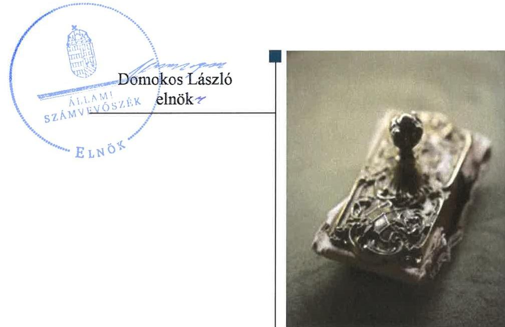
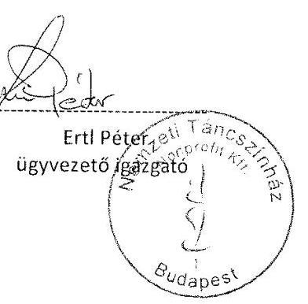
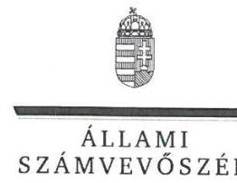
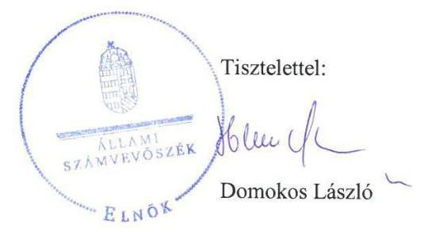

# Jelentés 

## Az állami tulajdonú gazdasági társaságok ellenőrzése

Nemzeti Táncszínház Nonprofit Korlátolt Felelősségű Társaság
2018. szeptember 24. nap

---

# AZ ELLENŐRZÉST FELÜGYELTE:

DR. PULAY GYULA ZOLTÁN felügyeleti vezető

## AZ ELLENŐRZÉST VEZETTE ÉS A VÉGREHAJTÁSÁÉRT FELELŐS:

GÖRGÉNYI GÁBOR ellenőrzésvezető

## A PROGRAM ÖSSZEÁLLÍTÁSÁÉRT FELELŐS:

TÓTPÁL SZABOLCS osztályvezető

IKTATÓSZÁM: EL-0634-130/2018.

TÉMASZÁM: 2469

ELLENŐRZÉS-AZONOSÍTÓ SZÁM: V081426

Jelentéseink az Országgyűlés számítógépes hálózatán és az Interneten a www.asz.hu címen is olvashatóak.

---

# TARTALOMJEGYZÉK 

■ ÖSSZEGZÉS ..... 5
■ AZ ELLENŐRZÉS CÉLJA ..... 6
■ AZ ELLENŐRZÉS TERÜLETE ..... 7
■ AZ ELLENŐRZÉS HÁTTERE, INDOKOLTSÁGA ..... 9
■ A JELENTÉS LÉNYEGES KÉRDÉSKÖREI ..... 10
■ AZ ELLENŐRZÉS HATÓKÖRE ÉS MÓDSZEREI ..... 11
■ MEGÁLLAPÍTÁSOK ..... 13
■ JAVASLATOK ..... 17
■ MELLÉKLETEK ..... 19
I. sz. melléklet: Értelmező szótár ..... 19
II. sz. melléklet: A Társaság főbb mérlegadatai ..... 21
■ FÜGGELÉK: ÉSZREVÉTELEK ..... 23
■ RÖVIDÍTÉSEK JEGYZÉKE ..... 27

---

.

---

# ÖSSZEGZÉS 

A Nemzeti Táncszínház Nonprofit Kft. működésének szabályozottsága nem felelt meg a jogszabályi előírásoknak. A pénzügyi-számviteli feladatok ellátása és a vagyongazdálkodási tevékenység nem volt szabályszerű. A Társaság az adatszolgáltatási és közzétételi kötelezettségének nem tett eleget, ezáltal a gazdálkodásának átláthatósága nem volt biztosított.

## Az ellenőrzés társadalmi indokoltsága

Az állami tulajdonú gazdálkodó szervezetek ellenőrzése kiemelten fontos a vagyon megőrzése, megóvása érdekében, amelyekkel szemben alapvető követelmény, hogy gazdálkodásuk, működésük szabályszerű, az általuk szolgáltatott adatok minél megbízhatóbbak legyenek. Az állami tulajdonban álló gazdálkodó szervezetek államot megillető társasági részesedése a nemzeti vagyon részét képezi és legfőbb rendeltetése szerint a közfeladatok ellátását szolgálja.

Az Állami Számvevőszék stratégiájában megfogalmazta, hogy az államháztartáson kívül működő közfeladat-ellátó rendszerek ellenőrzéseivel hozzájárul ahhoz, hogy a közpénzeket az államháztartáson kívül működő szervezetek is átlátható, rendezett módon használják fel a közfeladatok szerződésben vállalt ellátása érdekében. Ellenőrzésünk eredményeképpen javaslatainkkal, megállapításainkkal hozzájárulhatunk a nemzeti vagyonnal való gazdálkodás átláthatóságának, elszámoltathatóságának javításához.

Az Állami Számvevőszék céljaival és a társadalmi igénnyel összhangban, valamint a gazdasági társaságok fontos szerepe miatt került sor a Nemzeti Táncszínház Nonprofit Kft. ellenőrzésére. Az ellenőrzést a Társaság feladatellátásából adódó további társadalmi elvárás is indokolta, mert a lakosság rendszeresen kapcsolatba kerül a Társasággal a művészeti tevékenysége tekintettel.

## Főbb megállapítások, következtetések, javaslatok

Az Emberi Erőforrások Minisztériumánál a tulajdonosi joggyakorlás kereteinek kialakítása és a Társaság feletti tulajdonosi jogok gyakorlása szabályszerű volt.

A Nemzeti Táncszínház Nonprofit Kft. működésének szabályozottsága nem felelt meg a jogszabályi előírásoknak, mert a Társaság által a számviteli törvény alapján kötelezően elkészítendő számviteli politika, pénzkezelési szabályzat és leltározási szabályzat nem tartalmazta teljes körűen az előírt tartalmi elemeket. A Társaság nem készítette el az önköltségszámítás rendjére vonatkozó belső szabályzatot.

A pénzügyi-számviteli feladatok ellátása nem volt szabályszerű, mert a Társaság a számviteli törvény előírásait megsértve nem rendelkezett a munkavállalókat tartalmazó állományi listával, ezért nem volt ellenőrizhető és elszámoltatható a személyi jellegű ráfordításokkal történő gazdálkodás.

A Társaság vagyongazdálkodási tevékenysége nem volt szabályszerű a vagyonnyilvántartás értékcsökkenés elszámolásából eredő hiányosságai miatt. A beszámoló mérlegének adatait a Társaság leltárral alátámasztotta.

Kormányzati szektorba sorolt szervezetként a Társaság nem tett eleget az államháztartásért felelős miniszter részére teljesítendő adatszolgáltatási kötelezettségének és nem alakította ki a szervezet tevékenységének, a célok megvalósításának nyomon követését biztosító rendszert.

Az Állami Számvevőszék a Társaság ügyvezetőjének hét javaslatot fogalmazott meg annak érdekében, hogy a szabálytalanságok, hiányosságok megszüntetésre kerüljenek.

---

# AZ ELLENŐRZÉS CÉLJA 

AZ ELLENŐRZÉS CÉLJA annak értékelése volt, hogy a tulajdonosi jogok gyakorlása szabályszerű volt-e. A gazdálkodó szervezet szabályozottsága, gazdálkodása és vagyongazdálkodási tevékenysége megfelelt-e a jogszabályi és a tulajdonosi előírásoknak; biztosítva volt-e a közfeladatok átláthatósága és elszámoltathatósága érdekében a közszolgáltatás díjának megalapozottsága szabályszerű önköltségszámítással. A vagyonváltozást eredményező döntések esetében a tulajdonosi jogok gyakorlója és a gazdálkodó szervezet szabályszerűen jártak-e el. Az ellenőrzés célja továbbá annak megítélése volt, hogy a kormányzati szektorba sorolt állami tulajdonban lévő gazdálkodó szervezetek gazdálkodásának a kormányzati szektor hiányára és az államadósságra befolyással bíró elemei a jogszabályi előírásoknak megfeleltek-e.

---

# AZ ELLENŐRZÉS TERÜLETE

## Nemzeti Táncszínház Nonprofit Kft.

A Nemzeti Táncszínház Nonprofit Kft. jogelődjét, a Táncfórum Közhasznú Társaságot 2000. január 1-jén alapította az EMMI¹ jogelődje, az Oktatási és Kulturális Minisztérium. A Társaság² 2001. július 1-től Nemzeti Táncszínház Közhasznú Társaság, majd 2009. június 1-től Nemzeti Táncszínház Nonprofit Kft. elnevezéssel működött.

A 100%-os állami tulajdonban lévő Társaság esetében a tulajdonosi jogokat az MNV Zrt.³-vel létrejött vagyonkezelési szerződés⁴, majd 2013. január 27-től megbízási szerződés⁵ alapján az EMMI látta el.

A Társaság 2014. május 31-ig kiemelten közhasznú, azt követően közhasznú szervezetként működött. Közhasznú tevékenységei alapján kulturális, nevelési és oktatási, képességfejlesztési, ismeretterjesztési, valamint a kulturális örökség megóvásával összefüggő feladatokat látott el. Vállalkozási tevékenység keretében színházterem, galéria, büfé, ruhatár bérbeadását, illetve hang- és fénytechnikai berendezések kölcsönzését végezte.

A Társaság játszóhelye a Budai Várgondnokság Kht.-vel kötött bérleti szerződés alapján 2014 szeptemberéig a Budai Várban lévő korábbi Várszínház volt. Az új játszóhelyként funkcionáló Millenáris Teátrum várhatóan 2018-ig tartó átalakításáig a Társaság a Művészetek Palotájában, illetve bérelt játszóhelyeken, iroda és raktárhelyiségekben működik.

A Társaság ügyvezetője⁶ személyében az ellenőrzött időszakban nem történt változás, feladatát 2013. január 1-jétől látta el. A Társaságnál a tulajdonosi ellenőrzést három tagú felügyelőbizottság és választott könyvvizsgáló biztosította.

A Társaság gazdálkodásának főbb adatait az 1. táblázat, az éves beszámolók részletes adatait a II. sz. melléklet mutatja be:

1. táblázat

|  A TÁRSASÁG FŐBB GAZDÁLKODÁSI ADATAI A 2013-2016. ÉVEKBEN |  |  |  |   |
| --- | --- | --- | --- | --- |
|  Összeg (M Ft) | 2013. | 2014. | 2015. | 2016.  |
|  Nettó árbevétel | 140,3 | 182,5 | 176,8 | 161,3  |
|  Mérlegfőösszeg | 204,2 | 380,4 | 289,4 | 376,6  |
|  Adózott eredmény | -29,6 | 36,3 | 26,3 | 36,1  |
|  Saját tőke | 139,3 | 175,6 | 201,9 | 238,0  |
|  Követelések | 27,5 | 59,6 | 74,0 | 130,5  |
|   |  | Forrás: Társaság 2013-2016. éves beszámolói |  |   |

A Társaság a 2013. év kivételével nyereségesen gazdálkodott, saját tőkéje folyamatosan nőtt. A vállalkozási tevékenységéből származó bevételek 2013-ban az összes bevétel 2,6%-át tette ki, majd 2016-ban ez az arány 0,9%-ra csökkent.

---

Az EMMI a Társaság feladatellátásához a 2013-2016. években 348,2 M Ft; 533,2 M Ft; 605,9 M Ft; 646,0 M Ft, összesen 2133,3 M Ft támogatást nyújtott.

Az Áht.⁷ alapján közzétett, a kormányzati szektorba sorolt egyéb szervezetekről szóló NGM közlemény 1-4⁸ alapján a Társaság az ellenőrzött időszakban kormányzati szektorba sorolt szervezetnek minősült. Ebből eredően 2015. július 7-ig a Bkr. 1. § (2) bekezdés e) pontja, illetve 2015. július 8-tól annak d) pontja, valamint az 54/A. §-a alapján a Társaság 2014. január 1-től a Bkr. 1-10. § hatálya alá tartozott.

A Társaság vagyonkezelésbe vett állami, vagy önkormányzati vagyonnal nem rendelkezett, tevékenységét saját vagyonával látta el. A Társaság nem rendelkezett más gazdasági társaságokban tulajdonosi részesedéssel.

---

# AZ ELLENŐRZÉS HÁTTERE, INDOKOLTSÁGA 

Az Európai Unióban 1994. év óta hatályos túlzott hiány eljárás mindig kihívást jelentett a tagállamok számára. Az állami tulajdonú gazdálkodó szervezetek ellenőrzése kiemelten fontos a vagyon megőrzése, megóvása érdekében, valamint a kormányzati szektor elszámolásaiban megjelenő állami tulajdonú gazdálkodó szervezetek esetében, amelyekkel szemben alapvető követelmény, hogy gazdálkodásuk, működésük szabályszerű, az általuk szolgáltatott adatok minél megbízhatóbbak legyenek. Gazdálkodásuk jellemzően a közérdeklődés és a média figyelmének középpontjában áll, amihez hozzájárul a gazdálkodásuk körébe tartozó - közvetlen vagy közvetett állami tulajdonú, tehát végső soron a nemzeti vagyon részét képező - vagyon nagysága, illetve az általuk ellátott közszolgáltatások/közfeladatok minősége és hatékonysága. A közszolgáltatási árképzés megalapozottsága és a rendszeres elszámoltatás feltételeinek kialakítása az ellenőrzése során nagy hangsúlyt kap. A közszolgáltatás árában és annak támogatásában meg kell jelennie az önköltségszámítás szempontjainak, amely biztosítja a működés fenntarthatóságát (eszközpótlást) is.

Az ellenőrzés rámutathat az állami tulajdonú gazdálkodó szervezetek gazdálkodási tevékenységével összefüggő jó gyakorlatokra és szabálytalanságokra. Felhívhatja a figyelmet a jogszabályi követelmények teljesítéséhez szükséges feltételek hiányosságaira, hozzájárulhat az államháztartáson kívüli, de (közvetlenül vagy közvetve) állami vagyont használó gazdálkodó szervezetek tevékenységének átláthatóságához. Ellenőrzésünk eredményeképpen javaslatainkkal, megállapításainkkal hozzájárulhatunk a nemzeti vagyonnal való gazdálkodás átláthatóságának, elszámoltathatóságának a javításához.

---

# A JELENTÉS LÉNYEGES KÉRDÉSKÖREI 

1.     - A tulajdonosi jogok gyakorlása szabályszerű volt-e?
2.     - A Társaság működésének szabályozottsága megfelelt-e a jogszabályi előírásoknak, a pénzügyi-számviteli és adatszolgáltatási feladatok ellátása szabályszerű volt-e?
3.     - A Társaság vagyongazdálkodása szabályszerű volt-e?
4.     - A Társaság gazdálkodásának a kormányzati szektor hiányára és az államadósságra befolyással bíró elemei megfeleltek-e a jogszabályi előírásoknak?

---

# AZ ELLENŐRZÉS HATÓKÖRE ÉS MÓDSZEREI 

## Az ellenőrzés típusa

Megfelelőségi ellenőrzés

## Az ellenőrzött időszak

2013-2016. évek, a 2016. évi beszámoló jóváhagyásáig tartó időszak

## Az ellenőrzés tárgya

Állami tulajdonban lévő gazdasági társaság gazdálkodása, kiemelten vagyongazdálkodási tevékenysége, a tulajdonosi jogok gyakorlása, továbbá a kormányzati szektorba sorolt gazdasági társaság gazdálkodásának a kormányzati szektor hiányára és az államadósságra befolyással bíró elemei.

## Az ellenőrzött szervezet

A Nemzeti Táncszínház Nonprofit Kft., valamint az Emberi Erőforrások Minisztériuma és a Magyar Nemzeti Vagyonkezelő Zrt.

## Az ellenőrzés jogalapja

Az ellenőrzés jogszabályi alapját az Állami Számvevőszékről szóló 2011. évi LXVI. törvény 1. § (3) bekezdése és 5. § (3)-(5) bekezdései képezik.

## Az ellenőrzés módszerei

Az ellenőrzést a nemzetközi standardokat irányadónak tekintve az ellenőrzési program ellenőrzési kérdései, az ellenőrzött időszakban hatályos jogszabályok, az ellenőrzés szakmai szabályok és módszertanok figyelembe vételével végeztük.

Az ellenőrzés ideje alatt az ellenőrzött szervezettel történő kapcsolattartást az ÁSZ Szervezeti és Működési Szabályzatának vonatkozó előírásai alapján biztosítottuk.

Az ellenőrzésre a nemzetgazdasági szempontból kiemelt jelentőségű nemzeti vagyon körébe tartozó gazdálkodó szervezeteknél és a többségi állami tulajdonban álló gazdálkodó szervezeteknél került sor. A program szerinti feladatokat a kiválasztott gazdálkodó szervezeteknél (társaságok-

---

nál) és azok többségi tulajdonban lévő leányvállalatainál, valamint a tulajdonosi jogok gyakorlójánál kellett végrehajtani. Az ellenőrzés szempontjai és az ellenőrzés alá vont gazdálkodó szervezetek köre az ellenőrzés tapasztalatai alapján - indokolt esetben - változhatott.

A teljes ellenőrzött időszakra vonatkozóan került ellenőrzésre a Társaság tervezési, beszámolási, közzétételi, adatszolgáltatási kötelezettségének és belső ellenőrzési tevékenységének szabályszerűsége, valamint a tulajdonosi joggyakorlás szabályszerűsége. A 2013. és 2016. évekre vonatkozóan a Társaság működésének szabályozottságát, a bevételei és ráfordításai elszámolását, illetve vagyongazdálkodásának szabályszerűségét is ellenőriztük.

A bevételek és a ráfordítások közül az értékesítés nettó árbevétele, az egyéb, rendkívüli és pénzügyi műveletek bevételei, az anyagjellegű ráfordítások, az egyéb, rendkívüli és pénzügyi műveletek ráfordításai, valamint értékcsökkenési leírás elszámolásának szabályszerűségét, továbbá az immateriális javak,
 tárgyi eszközök esetében a vagyonnyilvántartás szabályszerűségét véletlen mintavétellel ellenőriztük.

A fenti sokaságok esetében a mintavétel azokra a legnagyobb értékű tételekre - a lényeges sokaságra - terjedt ki, melyek összértéke eléri a teljes sokaság összértékének 50\%-át. Amennyiben valamely ellenőrzött sokaság elemszáma kisebb volt, mint az előírt minta elemszám, az ellenőrzött sokaságot tételesen ellenőriztük.

A mintavétellel ellenőrzött területek esetében minden egyes tétel vonatkozásában a szabályszerűségre vonatkozó kérdéseket tettünk fel, amelyek eredménye összesítésre került. „Szabályszerűnek" értékeltünk egy ellenőrzött területet, amennyiben 95\%-os bizonyossággal az ellenőrzött sokaságban az átlagos hibaarány legfeljebb 10\%, „nem szabályszerűnek", amennyiben 10\%-nál magasabb arányt képviselt.

Az ellenőrzési kérdések megválaszolásához szükséges bizonyítékok megszerzése a következő ellenőrzési eljárások alkalmazásával történt: megfigyelés, kérdésfeltevés (információkérés), összehasonlítás, valamint elemző eljárás. Az ellenőrzési bizonyítékként felhasználható adatforrások közé tartoztak egyrészt az ellenőrzési programban felsorolt adatforrások, másrészt adatforrás lehet még minden - az ellenőrzés folyamán - feltárt, az ellenőrzés szempontjából információkat tartalmazó dokumentum.

Az ellenőrzést a kérdésekre adott válaszok kiértékelésével, valamint a megjelölt adatforrások, a csatolt tanúsítványok felhasználásával, továbbá az adott időszakban hatályos jogszabályok figyelembe vételével folytattuk le.

---

# 1. A tulajdonosi jogok gyakorlása szabályszerű volt-e? 

Összegző megállapítás

Az EMMI tulajdonosi joggyakorlása szabályszerű volt.

A TULAJDONOSI JOGGYAKORLÁS KERETEIT az EMMI az MNV Zrt.-vel kötött megbízási szerződés és meghatalmazások ${ }^{10}$ alapján az EMMI SZMSZ ${ }_{1-3}{ }^{11}$, a 18/2015. (V.15.) EMMI utasítás ${ }^{12}$, valamint az Alapító okirat ${ }_{1-10}{ }^{13}$ útján szabályszerűen alakította ki a Társaságnál. Emellett a feladatellátás érdekében közhasznú szerződést ${ }^{14}$ és a közszolgáltatási szerződést ${ }_{1-2}{ }^{15}$ kötött a Társasággal.

A Társaságnál a Taktv. ${ }^{16}$ alapján felügyelőbizottság működött, melynek tagjait a Gt. ${ }^{17}$ előírásának megfelelően az EMMI jelölte ki az Alapító okiratban. Az EMMI megválasztotta a Társaság könyvvizsgálóját a Gt., illetve a Ptk. ${ }^{18}$ előírásai szerint.

Az EMMI az Alapító okiratban ${ }_{1-10}$, valamint a közhasznú szerződésben és a közszolgáltatási szerződésben ${ }_{1-2}$ írta elő az ügyvezető számára Társaság Számv. tv. ${ }^{19}$ szerinti beszámolójának, a közhasznúsági mellékletének, valamint az éves üzleti tervnek az elkészítését. Az EMMI az Alapító okiratban ${ }_{1-10}$ - a Civil tv. ${ }^{20}$ előírásainak megfelelően - az ügyvezető számára évközi tájékoztatási kötelezettséget írt elő a Társaság működéséről.

Az EMMI megalkotta a Társaság Taktv. szerinti javadalmazási szabályzatát ${ }_{1-3}{ }^{21}$.

A TULAJDONOSI JOGOK GYAKORLÁSA szabályszerű volt. Az EMMI a Társaság Számv. tv. szerinti éves beszámolóit a Ptk. előírásainak megfelelően a könyvvizsgáló és a felügyelőbizottság írásbeli jelentései birtokában fogadta el. A Társaság üzleti tervét a felügyelőbizottság megtárgyalta és elfogadta, ezt követően az EMMI jóváhagyta. Az EMMI az Alapító okirat ${ }_{1-10}$ 2. pontjában - a Civil tv. rendelkezésével összhangban döntött arról, hogy a társaság gazdálkodása során elért eredményét nem vonhatja el, azt a létesítő okiratában foglalt közhasznú tevékenységekre fordítja. Osztalékfizetés nem történt, a mérleg szerinti eredmény a következő évi eredménytartalékot növelte.

---

# 2. A Társaság működésének szabályozottsága megfelelt-e a jogszabályi előírásoknak, a pénzügyi-számviteli és adatszolgáltatási feladatok ellátása szabályszerű volt-e? 

Összegző megállapítás

A Társaság működésének szabályozottsága nem felelt meg a jogszabályi előírásoknak. A pénzügyi-számviteli feladatok ellátása nem volt szabályszerű. A Társaság a tervezési és beszámolási kötelezettségét teljesítette, az adatszolgáltatási és közzétételi kötelezettségének azonban nem tett eleget.

## A TÁRSASÁG MŰKÖDÉSÉNEK SZABÁLYOZOTTSÁGA nem felelt meg a jogszabályi előírásoknak. A Társaság rendelkezett a Számv. tv.-ben előírt Számviteli politikával ${ }_{1-2}{ }^{22}$ és Számlarenddel ${ }^{23}$, de azokban a Számv. tv. 14. § (11) és a Számv. tv. 161. § (5) bekezdésében foglaltakat ellenére a Számv. tv. módosítása, illetve változása ellenére 90 napon belül nem törölték a Számv. tv. 86. § és 87. § (4)-(5) bekezdéseinek hatályon kívül helyezésével 2015. július 4-től megszűnt rendkívüli és a mérleg szerinti eredmény kategóriákat.

A Számviteli politikában ${ }_{2}$ a Számv. tv. 14. § (4) bekezdésében foglaltak ellenére nem rögzítették azokat a szabályokat, előírásokat, módszereket, amelyekkel meghatározzák, hogy a Társaság mit tekint kivételes nagyságú vagy előfordulású bevételnek, költségeknek, ráfordításnak.

A Társaság a Számv. tv. 14. § (5) bekezdés c) pontjában foglaltak ellenére a Számviteli politika ${ }_{1-2}$ keretében nem készítette el az önköltségszámítás rendjére vonatkozó belső szabályzatot.

A Pénzkezelési szabályzatban ${ }^{24}$ a Számv. tv. 14. § (8) bekezdésében foglaltak ellenére nem rendelkeztek a pénzforgalom bankszámlán történő lebonyolításának rendjéről, valamint a készpénzben és a bankszámlán tartott pénzeszközök közötti forgalomról.

A Leltározási szabályzatban ${ }_{1-2}{ }^{25}$ a Számv. tv. 69. § (3) bekezdésében előírtak ellenére nem határozták meg a leltárazás gyakoriságát.

A Társaság rendelkezett a Számv. tv. előírásainak megfelelő Értékelési szabályzattal ${ }_{1-3}{ }^{26}$.

A Társaság a Számv. tv. és a Civil tv. előírásainak megfelelően a Számviteli politikában ${ }_{1-2}$ meghatározta a közhasznú és az egyéb tevékenységek bevételei és ráfordításai elkülönített nyilvántartásának módját.

A SZEMÉLYI JELLEGŰ RÁFORDÍTÁSOK elszámolása a bizonylatok hiánya miatt nem volt ellenőrizhető és elszámoltatható. A Társaság a Számv. tv. 169. § (2) bekezdésében foglaltak ellenére nem őrizte meg a könyvviteli elszámolást közvetlenül és közvetetten alátámasztó számviteli bizonylatot, mert nem rendelkezett valamennyi munkavállalóját, illetve azok be- és kilépési időpontját tartalmazó állományi listával (analitikus, illetve részletező nyilvántartással). Ebből eredően a személyi jellegű ráfordítások vonatkozásában nem volt biztosított a Számv. tv. 15. § (3) bekezdésében foglalt valódiság elve.

---

# A BEVÉTELEK, VALAMINT AZ ANYAGJELLEGŰ ÉS 

EGYÉB RÁFORDÍTÁSOK elszámolása szabályszerű volt, megfelelt a Számv. tv és a belső szabályzatok előírásainak.

A TÁRSASÁG ÁLTAL ALKALMAZOTT DÍJAK megállapítása során a végzett szolgáltatások önköltségét az önköltségszámítás rendjére vonatkozó belső szabályzat hiánya miatt a Számv. tv. 14. § (7) bekezdésében foglaltak ellenére nem állapították meg utókalkuláció módszerével, annak ellenére, hogy a költségnemek szerinti költségek együttes összege az ötszázmillió forintot meghaladta. Az alap- és vállalkozási tevékenység keretében végzett szolgáltatásokhoz kapcsolódó díjak megállapítása piaci alapon történt.

TERVEZÉSI ÉS BESZÁMOLÁSI KÖTELEZETTSÉGÉT a Társaság teljesítette. A Társaság az üzleti terveit elkészítette és jóváhagyásra benyújtotta az EMMI részére, a Számv. tv. szerinti éves beszámolóit, valamint a közhasznúsági jelentéseit elkészítette és elfogadásra benyújtotta a tulajdonosi joggyakorló részére. Az éves beszámolókat a Társaság a Számv. tv. előírásainak megfelelően letétbe helyezte és közzétette.

## A KÖTELEZŐEN KÖZZÉTEENDŐ KÖZÉRDEKŰ

ADATOKAT a Társaság az Info tv. ${ }^{27}$ 33. § (1) bekezdésében, illetve a Közadat szabályzat ${ }^{28}$ 3.6. pontjában előírtak ellenére nem tette hozzáférhetővé, mert az Info tv. 37. § (1) pontjában foglaltak ellenére az Info tv. 1. melléklete szerinti, a szervezetre, annak tevékenységére és gazdálkodásra vonatkozó adatokat - az I. Szervezeti, személyzeti adatok 1. pontja, illetve a III. Gazdálkodási adatok 1. pontja kivételével - nem tette közzé. Nem tette közzé továbbá a Taktv. 2. § (1) bekezdéseiben előírt adatokat az ügyvezető adatai kivételével.

## KORMÁNYZATI SZEKTORBA SOROLT EGYÉB

SZERVEZETKÉNT a Társaság az Áht. ${ }^{29}$ 107. § (1) bekezdése és az Ávr. ${ }^{30}$ 167/M § (1) bekezdésében foglaltak ellenére 2014. december 31-ig az Ávr. 7. számú melléklet 28. és 29. pontjaiban, illetve 2015. január 1-től az Ávr. 5. számú melléklet 23. és 24. pontjaiban előírt, az államháztartásért felelős miniszter részére teljesítendő adatszolgáltatási kötelezettségének nem tett eleget. A Társaság 2014. január 1-től a Bkr. 10. §-ában foglaltak ellenére nem alakította ki a szervezet tevékenységének, a célok megvalósításának nyomon követését biztosító rendszert. A Bkr. 6. § (4) bekezdésében foglaltak ellenére 2016. október 1-től nem szabályozták a szervezeti integritást sértő események kezelésének eljárásrendjét, valamint az integrált kockázatkezelés eljárásrendjét.

---

# 3. A Társaság vagyongazdálkodása szabályszerű volt-e? 

## Összegző megállapítás

A Társaság vagyongazdálkodása a vagyonnyilvántartás hiányosságai miatt nem volt szabályszerű.

A VAGYONGAZDÁLKODÁS FELTÉTELEIT szabályszerűen alakította ki a Társaság. A feladat- és hatásköröket, felelősségi viszonyokat a jogszabályi előírásoknak és a tulajdonosi joggyakorló előírásainak megfelelően az Alapító okiratban ${ }_{1-10}$, és az SZMSZ ${ }^{31}$-ben határozták meg.

A VAGYON NYILVÁNTARTÁSA az értékcsökkenés elszámolásának hiányosságai miatt nem volt szabályszerű. Az értékcsökkenés elszámolását a meglévő bizonylatok a Számv. tv. 166. § (2) bekezdését és a Számviteli Politika ${ }_{1,2}$ X. fejezetét megsértve nem támasztották alá, nem voltak tartalmilag hitelesek, megbízhatóak és helytállóak, mert nem tartalmazták az eszközök hasznos élettartamát. Ebből eredően nem volt biztosított az értékcsökkenés Számv. tv. 52. (1)-(2) bekezdésének megfelelő elszámolása.

Az eszközök üzembe helyezése és a bekerülési érték megállapítása szabályszerű volt, megfelelt a Számv. tv. és a belső szabályzatok előírásainak.

AZ ÉVES BESZÁMOLÓK MÉRLEGTÉTELEIT a Társaság a Számv. tv.-ben és a Leltározási szabályzatban ${ }_{1-2}$ foglaltaknak megfelelően szabályszerű leltárral támasztotta alá.

## 4. A Társaság gazdálkodásának a kormányzati szektor hiányára és az államadósságra befolyással bíró elemei megfeleltek-e a jogszabályi előírásoknak?

Összegző megállapítás A Társaság gazdálkodásának nem voltak a kormányzati szektor hiányára és az államadósságra befolyással bíró elemei.

A Társaság a Stabilitási tv. ${ }^{32}$-ben meghatározott adósságot keletkeztető ügyletet nem kötött, államadósságot befolyásoló kötelezettsége nem keletkezett.

---

# JAVASLATOK 

Az ÁSZ tv. 33. § (1) bekezdésében foglaltak értelmében az ellenőrzött szervezet vezetője köteles a jelentésben foglalt megállapításokhoz kapcsolódó intézkedési tervet összeállítani és azt a jelentés kézhezvételétől számított 30 napon belül az ÁSZ részére megküldeni. Amennyiben az ellenőrzött szervezet vezetője nem küldi meg határidőben az intézkedési tervet, vagy továbbra sem elfogadható intézkedési tervet küld, az Állami Számvevőszék elnöke az ÁSZ tv. 33. § (3) bekezdés a) és b) pontjaiban foglaltakat érvényesítheti.

## a Nemzeti Táncszínház Nonprofit Kft ügyvezetőjének

1. Intézkedjen a számviteli politika, a számlarend, a pénzkezelési szabályzat, valamint az eszközök és a források leltározási szabályzat Számv. tv.-ben előírtaknak megfelelő módosításáról.
(2. sz. megállapítás 1-2. és 4-5. bekezdései alapján)
2. Intézkedjen az önköltség-számítási szabályzat elkészítéséről és a végzett szolgáltatások önköltségének utókalkulációval történő megállapításáról a Számv. tv. előírásainak megfelelően.
(2. sz. megállapítás 3. és 10. bekezdései alapján)
3. Intézkedjen a személyi jellegű ráfordítások könyvviteli elszámolást közvetlenül és közvetetten alátámasztó számviteli bizonylatok megőrzéséről a Számv. tv. előírásainak megfelelően.
(2. sz. megállapítás 8. bekezdése alapján)
4. Intézkedjen az Info tv., valamint a Taktv. szerinti közzétételi kötelezettség teljesítéséről.
(2. sz. megállapítás 12. bekezdése alapján)
5. Intézkedjen az Áht. és az Ávr. szerint a kormányzati szektorba sorolt egyéb szervezetek részére előírt adatszolgáltatási kötelezettségek teljesítése érdekében.
(2. sz. megállapítás 13. bekezdés 1. mondata alapján)
6. Intézkedjen a Bkr. 10. §-ban előírtaknak megfelelően a szervezet tevékenységének, a célok megvalósításának nyomon követését biztosító rendszer kialakításáról.
(2. sz. megállapítás 13. bekezdés 2. mondata alapján)

---

7. Intézkedjen a Bkr. előírásának megfelelően a szervezeti integritást sértő események kezelésének eljárásrendje, valamint az integrált kockázatkezelés eljárásrendje szabályozásáról.
(2. sz. megállapítás 13. bekezdés 3. mondata alapján)

---

# MELLÉKLETEK 

- I. SZ. MELLÉKLET: ÉRTELMEZŐ SZÓTÁR
gazdasági társaság
gazdálkodó szervezet
kormányzati szektorba sorolt egyéb szervezet
közszolgáltatás
nemzeti vagyon
nonprofit gazdasági társaság

Ptk. 3:88. § (1)
 bekezdése szerint „a gazdasági társaságok üzletszerű közös gazdasági tevékenység folytatására, a tagok vagyoni hozzájárulásával létrehozott, jogi személyiséggel rendelkező vállalkozások, amelyekben a tagok a nyereségből közösen részesednek, és a veszteséget közösen viselik”.
2014. március 14-ig:

A Ptk. ${ }^{33}$ 685. § c) pontja szerint gazdálkodó szervezet: „az állami vállalat, az egyéb állami gazdálkodó szerv, a szövetkezet, a lakásszövetkezet, az európai szövetkezet, a gazdasági társaság, az európai részvénytársaság, az egyesülés, az európai gazdasági egyesülés, az európai területi együttműködési csoportosulás, az egyes jogi személyek vállalata, a leányvállalat, a vízgazdálkodási társulat, az erdő birtokossági társulat, a végrehajtói iroda, az egyéni cég, továbbá az egyéni vállalkozó.”

## 2014. március 15-től:

A gazdasági társaság, az európai részvénytársaság, az egyesülés, az európai gazdasági egyesülés, az európai területi együttműködési csoportosulás, a szövetkezet, a lakásszövetkezet, az európai szövetkezet, a vízgazdálkodási társulat, az erdőbirtokossági társulat, az állami vállalat, az egyéb állami gazdálkodó szerv, az egyes jogi személyek vállalata, a közös vállalat, a végrehajtói iroda, a közjegyzői iroda, az ügyvédi iroda, a szabadalmi ügyvivői iroda, az önkéntes kölcsönös biztosító pénztár, a magánnyugdíjpénztár, az egyéni cég, továbbá az egyéni vállalkozó. Az állam, a helyi önkormányzat, a költségvetési szerv, az egyesület, a köztestület, valamint az alapítvány gazdálkodó tevékenységével összefüggő polgári jogi kapcsolataira is a gazdálkodó szervezetre vonatkozó rendelkezéseket kell alkalmazni.
Forrás: Ppt. ${ }^{34} 396. §$
az Áht. ${ }^{35}$ 3. § (2) és (3) bekezdésében foglaltakon kívül az Európai Közösséget létrehozó szerződéshez csatolt, a túlzott hiány esetén követendő eljárásról szóló jegyzőkönyv alkalmazásáról szóló 2009. május 25-i 479/2009/EK rendelet (a továbbiakban: 479/2009/EK rendelet) szerint a kormányzati szektorba sorolt szervezet (Áht. 1. § (12))
Az Ebktv. ${ }^{36}$ 3. § d) pontja a következőképpen határozza meg a közszolgáltatást: „szerződéskötési kötelezettség alapján a lakosság alapvető szükségleteinek ellátására irányuló szolgáltatás, így különösen a villamos energia-, gáz-, hő-, víz-, szennyvíz- és hulladékkezelési, köztisztasági, postai és távközlési szolgáltatás, továbbá a menetrend alapján közlekedő járművekkel végzett közforgalmú személyszállítás”.
Nvtv. ${ }^{37}$ 1. § (2) bekezdése szerint többek között:
„az állam vagy a helyi önkormányzat kizárólagos tulajdonában álló dolgok,
az a) pont hatálya alá nem tartozó, állam vagy a helyi önkormányzat tulajdonában lévő dolog,
az állam vagy a helyi önkormányzat tulajdonában lévő pénzügyi eszközök, továbbá az államot vagy a helyi önkormányzatot megillető társasági részesedések,
az államot vagy a helyi önkormányzatot megillető bármely vagyoni értékkel rendelkező jogosultság, amelyet jogszabály vagyoni értékű jogként nevesít.”
Civil tv. 9/F. § (2) bekezdése szerint „az a gazdasági társaság minősül nonprofit gazdasági társaságnak és cégnevében az a gazdasági társaság tüntetheti fel a nonprofit jelleget, amelynek létesítő okirata tartalmazza, hogy a gazdasági társaság tevékenységéből származó nyereség a tagok között nem osztható fel, hanem az a gazdasági társaság vagyonát gyarapítja.” (hatályos 2014. március 15-től)

---

tulajdonosi ellenőrzés
tulajdonosi jogok gyakorlója

### 2014. március 14-ig:

Az állami vagyon kezelőjét, haszonélvezőjét, használóját megillető jogok gyakorlását, annak szabályszerűségét, célszerűségét az MNV Zrt. - szükség szerint területi szervei útján - ellenőrzi.

### 2014. március 15-től:

Az állami vagyon használóját, vagyonkezelőjét és haszonélvezőjét megillető jogok gyakorlását, annak szabályszerűségét, a kötelezettségek teljesítését, valamint a vagyon rendeltetése szerinti célszerűségét a tulajdonosi joggyakorló rendszeresen ellenőrzi.
Forrás: Vtv.vhr. 20. § (1)
1.
2013. június 27-ig:

Az állami vagyon felett a Magyar Államot megillető tulajdonosi jogok és kötelezettségek összességét - ha törvény eltérően nem rendelkezik - az állami vagyon felügyeletéért felelős miniszter (a továbbiakban: miniszter) gyakorolja, aki e feladatát a Magyar Nemzeti Vagyonkezelő Zártkörűen Működő Részvénytársaság (a továbbiakban: MNV Zrt.), a Magyar Fejlesztési Bank, illetve a tulajdonosi joggyakorló szervezet útján látja el. A miniszter miniszteri rendeletben, a törvényben meghatározott állami vagyoni kör tekintetében, meghatározott időtartamra, a joggyakorlás egyes szabályainak meghatározásával az őt megillető tulajdonosi jogok és kötelezettségek összességének, illetve azok meghatározott részének gyakorlóját az Áht. szerinti központi költségvetési szervek, ezek intézménye, továbbá a 100%-ban állami tulajdonban álló gazdasági társaságok közül kijelölheti.
Forrás: Vtv. 3. § (1) és (2)
2013. június 28-ától:

A rábízott állami vagyon felett az államot megillető tulajdonosi jogok és kötelezettségek összességét tulajdonosi joggyakorlóként:
a) ha törvény vagy miniszteri rendelet eltérően nem rendelkezik, a Magyar Nemzeti Vagyonkezelő Zártkörűen Működő Részvénytársaság (a továbbiakban: MNV Zrt.),
b) törvényben kijelölt személy vagy
c) az állami vagyon felügyeletéért felelős miniszter (a továbbiakban: miniszter) által rendeletben kijelölt személy gyakorolja.
[...] A miniszter e törvény felhatalmazása alapján - a meghatározott célok hatékonyabb elérése érdekében, miniszteri rendeletben, az ott meghatározott állami vagyoni kör tekintetében, meghatározott időtartamra - e törvény keretei között, a joggyakorlás egyes szabályainak meghatározásával - az államot megillető tulajdonosi jogok és kötelezettségek összességének, illetve azok meghatározott részének gyakorlóját az Áht. szerinti központi költségvetési szervek, ezek intézménye, továbbá a 100%-ban állami tulajdonban álló gazdasági társaságok közül kijelölheti.
Forrás: Vtv. 3. § (1) és (2)
2.

Aki a nemzeti vagyon felett az államot vagy a helyi önkormányzatot megillető tulajdonosi jogok és kötelezettségek összességének gyakorlására jogosult
Forrás: Nvtv. 3. § (1) 17. pontja

---

# A NEMZETI TÁNCSZÍNHÁZ NONPROFIT KFT. 2013-2016. ÉVES BESZÁMOLÓINAK ADATAI (M FT) 

| Mérleg | 2013.01.01. | 2013.12.31. | 2014.12.31. | 2015.12.31. | 2016.12.31. |
| :--: | :--: | :--: | :--: | :--: | :--: |
| A. Befektetett eszközök | 26,9 | 48,4 | 51,9 | 73,6 | 103,0 |
| I. IMMATERIÁLIS JAVAK | 0,2 | 0,9 | 6,4 | 9,5 | 31,3 |
| II. TÁRGYI ESZKÖZÖK | 26,8 | 47,4 | 45,5 | 64,2 | 71,7 |
| III. BEFEKTETETT PÉNZÜGYI ESZKÖZÖK | 0 | 0 | 0 | 0 | 0 |
| B. Forgóeszközök | 161,4 | 144,0 | 313,1 | 198,8 | 236,6 |
| I. KÉSZLETEK | 9,0 | 12,0 | 2,8 | 4,5 | 6,2 |
| II. KÖVETELÉSEK | 78,4 | 27,6 | 59,6 | 74,0 | 130,5 |
| III. ÉRTÉKPAPÍROK | 0 | 0 | 0 | 0 | 0 |
| IV. PÉNZESZKÖZÖK | 73,9 | 104,6 | 250,7 | 120,3 | 100,0 |
| C. Aktív időbeli elhatárolások | 8,6 | 11,8 | 15,4 | 16,9 | 36,9 |
| ESZKÖZÖK ÖSSZESEN | 196,9 | 204,2 | 380,4 | 289,4 | 376,6 |
| D. Saját tőke | 169,0 | 139,3 | 175,6 | 201,9 | 238,0 |
| I. JEGYZETT TÖKE | 3,0 | 3,0 | 3,0 | 3,0 | 3,0 |
| II. JEGYZETT, DE MÉG BE NEM FIZETETT TÖKE (-) | 0 | 0 | 0 | 0 | 0 |
| III. TÖKETARTALÉK | 0 | 0 | 0 | 0 | 0 |
| IV. EREDMÉNYTARTALÉK | 182,3 | 166,0 | 136,3 | 172,6 | 198,9 |
| V. LEKÖTÖTT TARTALÉK | 0 | 0 | 0 | 0 | 0 |
| VI. ÉRTÉKELÉSI TARTALÉK | 0 | 0 | 0 | 0 | 0 |
| VII. MÉRLEG SZERINTI EREDMÉNY | $-16,3$ | $-29,6$ | 36,3 | 26,3 | 36,1 |
| E. Céltartalékok | 0 | 0 | 0 | 0 | 0 |
| F. Kötelezettségek | 4,5 | 41,9 | 74,0 | 58,8 | 116,6 |
| I. HÁTRASOROLT KÖTELEZETTSÉGEK | 0 | 0 | 0 | 0 | 0 |
| II. HOSSZÚ LEJÁRATÚ KÖTELEZETTSÉGEK | 0 | 0 | 0 | 0 | 0 |
| III. RÖVID LEJÁRATÚ KÖTELEZETTSÉGEK | 4,5 | 41,9 | 74,0 | 58,8 | 116,6 |
| G. Passzív időbeli elhatárolások | 23,5 | 23,0 | 130,8 | 28,7 | 22,0 |
| FORRÁSOK ÖSSZESEN | 196,9 | 204,2 | 380,4 | 289,4 | 376,6 |
| Eredménykimutatás |  | 2013. év | 2014. év | 2015. év | 2016. év |
| Értékesítés nettó árbevétele | 118,9 | 140,3 | 182,5 | 176,8 | 161,3 |
| Egyéb bevételek | 403,8 | 445,9 | 645,9 | 630,4 | 823,5 |
| Anyagjellegű ráfordítások | 340,8 | 408,3 | 500,8 | 472,2 | 587,7 |
| Értékcsökkenési leírás | 9,3 | 14,6 | 23,7 | 27,5 | 53,1 |
| Egyéb ráfordítások | 2,8 | 0,3 | 7,4 | 5,2 | 5,0 |
| Üzemi tevékenység eredménye | $-21,1$ | $-31,7$ | 31,3 | 20,8 | 35,4 |
| Mérleg szerinti eredmény/adózott eredmény* | $-16,3$ | $-29,6$ | 36,3 | 26,3 | 36,0 |

* A 2013-2015. években az adózott eredmény és a mérleg szerinti eredmény megegyezett. A Számv. tv. 2015. július 4-től hatályos módosítása alapján a mérleg szerinti eredmény tétel megszűnt. A 2016. évi éves beszámoló eredménykimutatásában az adózott eredmény levezetését kellett kimutatni.

---

.

---

# FÜGGELÉK: ÉSZREVÉTELEK 

A jelentéstervezetet a Számvevőszék 15 napos észrevételezésre megküldte az ellenőrzött szervezetek vezetőinek az ÁSZ tv. 29. §*(1) bekezdése előírásának megfelelően.

Az ÁSZ a jelentéstervezetet a Nemzeti Táncszínház NKft. ügyvezetőjének, a Magyar Nemzeti Vagyonkezelő Zrt. vezérigazgatójának, valamint az Emberi Erőforrások Minisztériuma miniszterének küldte meg.
Észrevételt a Nemzeti Táncszínház NKft. ügyvezetője tett, észrevételét és az arra adott választ a függelék tartalmazza.

[^0]
[^0]:    * 29. § (1) Az Állami Számvevőszék az ellenőrzési megállapításait megküldi az ellenőrzött szervezet vezetőjének vagy az általa megbízott személynek, és annak, akinek személyes felelősségét állapította meg.
    (2) Az ellenőrzött szervezet vezetője és a felelősként megjelölt személy az ellenőrzés megállapításaira tizenöt napon belül írásban észrevételt tehet.
    (3) Az Állami Számvevőszék az észrevételre a beérkezésétől számított harminc napon belül írásban válaszol. A figyelembe nem vett észrevételeket köteles a jelentésben feltüntetni, és megindokolni, hogy azokat miért nem fogadta el.

---

# 1024 Pucay GY 

## NEMZETI TÁNCSZÍNHÁZ

Nemzeti Táncszínház Nonprofit Korlátolt Felelősségű Társaság 1024 Budapest, Kis Rokus utca 16-20.|Adószám: 20636588-2-41 Levélezési cím: 1536 Budapest, Pf. 284.|Info@tancszinhaz.hu Tel.:(061)2018202|Ügyfélszolgálat:0680/104455|Fax:0612015128
www.tancszinhaz.hu
iktatószám:145-17/2018

Domokos László részére
Állami Számvevőszék
tárgy: észrevételezés

Tisztelt Elnök Úr!
ÁLLAMI SZÁMVEVŐSZÉK
TE- 468051201811
Esetszám: 2018 AUS 15.
Iktatószám: 20024-06/20
Hivatkozva az EL-0634-121/2018 iktatószámú jelentéstervezetre az alábbi észrevételt teszem:
Az adatszolgáltatást bekérő levelek nem irányultak a személy jellegű ráfordítások tételes főkönyvi nyilvántartásaira és azokat alátámasztó bizonylataira. Tájékoztatom, hogy az éves működési támogatás felhasználásának ellenőrzése során ilyen megállapítás nem történt.
A további megállapításokat észrevételezni nem kívánom, azokat tudomásul veszem.
Kérem észrevételem szíves figyelembevételét,
Tisztelettel:

Budapest, 2018. augusztus 13.

---

ELNÖK

Ikt.szám: EL-0634-127/2018

# Ertl Péter úr 

ügyvezető
Nemzeti Táncszínház Nonprofit Kft.

## Budapest

## Tisztelt Ügyvezető Úr!

„Az állami tulajdonú gazdasági társaságok ellenőrzése - Nemzeti Táncszínház Nonprofit Kft.” címmel készített számvevőszéki jelentéstervezetre a 145-17/2018. iktatószámú levelében megküldött észrevételét köszönettel megkaptam.
Az Állami Számvevőszék észrevételekre vonatkozó álláspontjáról a felügyeleti vezető által készített részletes tájékoztatást csatoltan megküldöm.
Tájékoztatom Ügyvezető urat, hogy a számvevőszéki jelentésben - az Állami Számvevőszékről szóló 2011. évi LXVI. törvény 29. § (3) bekezdése alapján - a
 figyelembe nem vett észrevételt szerepeltetjük az elutasítás indokának feltüntetésével.
Megköszönöm Ügyvezető úr a 145-19/2018. iktatószámú levelében a feltárt hiányosságok kezelésével kapcsolatban tervezett intézkedésekről adott tájékoztatását. Tájékoztatom, hogy a végleges jelentés kiadását követően elkészítendő intézkedési tervhez adott előzetes tájékoztatását tudomásul veszem, az ellenőrzés jelenlegi szakaszában azt nem áll módomban véleményezni.

Budapest, 2018. 03. hó 10. nap

Melléklet: Tájékoztatás az el nem fogadott észrevételről

---

# Tájékoztatás az észrevételek kezeléséről 

„Az állami tulajdonú gazdasági társaságok ellenőrzése - Nemzeti Táncszínház Nonprofit Kft." című jelentéstervezetre a 145-17/2018. iktatószámú levelében megküldött észrevételeit áttekintettem. Az észrevételek kezeléséről az alábbi tájékoztatást adom.

## A 2. számú megállapítás 8. bekezdéséhez megfogalmazott észrevételre adott válasz

A 2. számú megállapítás 8. bekezdésére (személyi jellegű ráfordításokkal kapcsolatosan) tett észrevételét nem fogadtuk el. Az EL-0405-021/2018. iktatószámú adatbekérő levél 3. oldalán a 2013. és a 2016. évekre vonatkozó adatállományok 3.1.5. pontjában az Állami Számvevőszék bekérte „A vezető tisztségviselőket - külön jelölve - is tartalmazó munkavállalók listája évente (kilépés és belépés dátuma megjelölésével). " Ügyvezető úr a hivatkozott adatbekérő levélhez kapcsolódóan megküldte a 2018. február 5-ei keltezéssel a teljességi és hitelességi nyilatkozatot, melynek 219. és 220. sora tartalmazza, hogy az adatbekérő levél 3.1.5. pontjához mely adatot szolgáltatták az ÁSZ részére. Az adatszolgáltatás nem tartalmazta a Társaság munkavállalóinak listáját évenkénti bontásban. Ez alapján jutottunk arra a megállapításra, hogy a személyi jellegű ráfordítások elszámolása bizonylatok hiánya miatt nem volt ellenőrizhető és elszámoltatható.

Budapest, 2018. 03. hó 10. nap

Dr. Pulay Gyula felügyeleti vezető

---

# RÖVIDÍTÉSEK JEGYZÉKE 

${ }^{1}$ EMMI
${ }^{2}$ Társaság
${ }^{3}$ MNV Zrt.
${ }^{4}$ vagyonkezelési szerződés
${ }^{5}$ megbizási szerződés
${ }^{6}$ ügyvezető
${ }^{7}$ Áht.
${ }^{8}$ NGM közlemény1-4
${ }^{9}$ ÁSZ
${ }^{10}$ meghatalmazások
${ }^{11}$ EMMI SZMSZ1-3:
${ }^{12}$ 18/2015. (V.15.) EMMI utasítás
${ }^{13}$ Alapító okirat1-10

Emberi Erőforrások Minisztériuma
Nemzeti Táncszínház Nonprofit Kft.
Magyar Nemzeti Vagyonkezelő Zártkörűen működő Részvénytársaság
a Magyar Nemzeti Vagyonkezelő Zártkörűen működő részvénytársaság és az Emberi Erőforrások Minisztériuma között társasági részesedéshez kapcsolódó tulajdonosi jogok gyakorlására 2008. június 20-án kötött SZT 28517 számú vagyonkezelési szerződés, és 2008. április 18-án kötött SZT 37629 számú vagyonkezelési szerződés
a Magyar Nemzeti Vagyonkezelő Zártkörűen működő részvénytársaság és az Emberi Erőforrások Minisztériuma között társasági részesedéshez kapcsolódó tulajdonosi jogok gyakorlására 2013. január 27-én kötött SZT 39088 számú megbízási szerződés
Nemzeti Táncszínház Nonprofit Kft. ügyvezető igazgatója
2011. évi CXCV. törvény az államháztartásról (hatályos 2011. december 31-től)

NGM közlemény a kormányzati szektorba sorolt egyéb szervezetekről1 (megjelent: Hivatalos Értesítő 2012/9.)
NGM közlemény a kormányzati szektorba sorolt egyéb szervezetekről2 (megjelent: Hivatalos Értesítő 2013/32.)
NGM közlemény a kormányzati szektorba sorolt egyéb szervezetekről3 (megjelent: Hivatalos Értesítő 2013/60.)
NGM közlemény a kormányzati szektorba sorolt egyéb szervezetekről4 (megjelent: Hivatalos Értesítő 2015/66.)
Állami Számvevőszék
MNV Zrt meghatalmazása az állami tulajdonú részesedéshez kapcsolódó tagsági jogok gyakorlására az Emberi Erőforrások Minisztériuma részére ( 9 db , hatályos: 2012. december 20-tól, 2013. szeptember 30-tól, 2003. október 1-től, 2004. szeptember 30-tól, 2014. október 1-től, 2015. szeptember 30-tól; 2015. október 1-től, 2016. szeptember 30-tól, 2016. október 1-től)
6/2010. (X. 19.) NEFMI utasítás melléklete az EMMI Szervezeti és működési szabályzata ${ }_{1}$ (hatályos: 2010. október 19-től)
4/2013. (I. 31.) EMMI utasítás melléklete, az EMMI Szervezeti és működési szabályzata ${ }_{2}$ (hatályos: 2013. február 1-től)
33/2014. (IX. 16.) EMMI utasítás melléklete, az EMMI Szervezeti és működési szabályzata ${ }_{3}$ (hatályos: 2014. december 6-tól)
18/2015. (V. 15.) EMMI utasítás az Emberi Erőforrások Minisztériumának tulajdonosi joggyakorlása alatt álló gazdasági társaságokkal kapcsolatos jogok gyakorlásának rendjéről
Nemzeti Táncszínház Nonprofit Kft Alapító okirata (hatályos: 2012. november 30-tól 2013. április 11-ig)
Nemzeti Táncszínház Nonprofit Kft Alapító okirata ${ }_{2}$ (IV/2013. számú Alapítói határozattal elfogadva, hatályos 2013. április 12-től 2013. május 8-ig)
Nemzeti Táncszínház Nonprofit Kft Alapító okirata ${ }_{3}$ (IX/2013. számú Alapítói határozattal elfogadva, hatályos 2013. május 9-től 2013. december 31-ig)
Nemzeti Táncszínház Nonprofit Kft Alapító okirata4 (XI-XIII/2013. számú Alapítói határozattal elfogadva, hatályos 2014. január 1-től 2014. május 15-ig)

---

${ }^{14}$ Közhasznú szerződés
${ }^{15}$ Közszolgáltatási szerződés1-2
${ }^{16}$ Taktv.
${ }^{17}$ Gt.
${ }^{18}$ Ptk.
${ }^{19}$ Számv. tv.
${ }^{20}$ Civil tv.
${ }^{21}$ Javadalmazási szabályzat ${ }_{3-3}$
${ }^{22}$ Számviteli politika $_{1-2}$
${ }^{23}$ Számlarend
${ }^{24}$ Pénzkezelési szabályzat
${ }^{25}$ Leltározási szabályzat ${ }_{3-2}$
${ }^{26}$ Értékelési szabályzat ${ }_{1,2}$

Nemzeti Táncszínház Nonprofit Kft Alapító okirata ${ }_{5}$ (III-IV/2014. számú Alapítói határozattal elfogadva, hatályos 2014. május 16-tól 2014. szeptember 30-ig)
Nemzeti Táncszínház Nonprofit Kft Alapító okirata ${ }_{6}$ (VIII/2014. számú Alapítói határozattal elfogadva, hatályos 2014. október 1-től 2015. május 28-ig)
Nemzeti Táncszínház Nonprofit Kft Alapító okirata ${ }_{7}$ (a III-IV/2015. számú Alapítói határozattal elfogadva, hatályos 2015. május 29-től 2015. szeptember 17-ig)
Nemzeti Táncszínház Nonprofit Kft Alapító okirata ${ }_{8}$ (a III-IV/2015. számú Alapítói határozattal elfogadva, hatályos 2015. szeptember 18-től 2015. október 28-ig)
Nemzeti Táncszínház Nonprofit Kft Alapító okirata ${ }_{9}$ (VIII/2015. számú Alapítói határozattal elfogadva, hatályos 2015. október 29-től 2016. március 7-ig)
Nemzeti Táncszínház Nonprofit Kft Alapító okirata ${ }_{10}$ (II-III/2016. számú Alapítói határozattal elfogadva, hatályos 2016. március 8-tól)
5.3.-13-11/2001. sz Közhasznú Szerződés az Oktatási és Kulturális Minisztérium és a Nemzeti Táncszínház Kft között, módosításokkal egységes szerkezetbe foglalva (Kelt: 2009. április 8-án, száma: 7090/2009.)
28226/2014/KUKAB. számú Közszolgáltatási szerződés; az Emberi Erőforrások Minisztériuma és a Nemzeti Táncszínház Nonprofit Kft. között (Kelt: 2014. május 28-án)
50666-2/2015/PKF. számú Közszolgáltatási szerződés; az Emberi Erőforrások Minisztériuma és a Nemzeti Táncszínház Nonprofit Kft. között (Kelt: 2015. október 19-én)
2009. évi CXXII. törvény a köztulajdonban álló gazdasági társaságok takarékosabb működéséről (hatályos: 2009. december 4-től)
2006. évi IV. törvény a gazdasági társaságokról (hatálytalan: 2014. március 15-től)
2013. évi V. törvény a Polgári Törvénykönyvről (hatályos 2014. március 15-től)
2000. évi C. törvény a számvitelről szóló (hatályos: 2001. január 1-től)
2011. évi CLXXV. törvény az egyesülési jogról, a közhasznú jogállásról, valamint a civil szervezetek működéséről és támogatásáról (hatályos: 2011. december 22-től)
Nemzeti Táncszínház Nonprofit Kft Javadalmazási szabályzata ${ }_{1}$ (hatályos 2010-től 2013. május 17-ig)
Nemzeti Táncszínház Nonprofit Kft Javadalmazási szabályzata2 (hatályos 2013. május 17-től)
Nemzeti Táncszínház Nonprofit Kft Javadalmazási szabályzata ${ }_{3}$ (hatályos 2015. október 29-től)
Nemzeti Táncszínház Nonprofit Kft Számviteli politikája (hatályos: 2011. április 15-től)
Nemzeti Táncszínház Nonprofit Kft Számviteli politikája2 (hatályos: 2014. január 1-től)
Nemzeti Táncszínház Nonprofit Kft Számlarendje (hatályos 2011. február 1-től)
Nemzeti Táncszínház Nonprofit Kft Pénzkezelési (Főpénztári) szabályzata (hatályos 2012. június 1-től)

Nemzeti Táncszínház Nonprofit Kft Leltározási szabályzata (hatályos 2011. október 01-től)
Nemzeti Táncszínház Nonprofit Kft Leltározási szabályzata (hatályos 2013. október 10-től)
Nemzeti Táncszínház Nonprofit Kft Értékelési szabályzata (hatályos 2010. december 17-től)

---

| 27 Info tv. | 2011. évi CXII. törvény az információs önrendelkezési jogról és az információszabadságról (hatályos: 2011. július 27-től) a közérdekű adatok megismerésére irányuló igények rendjét rögzítő szabályzat (hatályos: 2012. augusztus 1-től) |
| :--: | :--: |
| ${ }^{28}$ Közadat szabályzat | a közérdekű adatok megismerésére irányuló igények rendjét rögzítő szabályzat (hatályos: 2012. augusztus 1-től) |
| ${ }^{29}$ Áht. | 2011. évi CXCV. törvény - az államháztartásról (hatályos: 2012. január 1-től) |
| ${ }^{30}$ Ávr. | 368/2011. (XII. 31.) Korm. rendelet az államháztartásról szóló törvény végrehajtásáról (hatályos: 2012. január 1-től) |
| ${ }^{31}$ SZMSZ | Nemzeti Táncszínház Nonprofit Kft Szervezeti és Működési Szabályzata (hatályos: 2009. február 9-től) |
| ${ }^{32}$ Stabilitási tv. | 2011. évi CXCIV. törvény Magyarország gazdasági stabilitásáról (hatályos 2011. december 31-től) |
| ${ }^{33}$ Ptk. 2 | a Polgári Törvénykönyvről szóló 1959. évi IV. törvény (hatálytalan 2014. március 15-től) |
| ${ }^{34}$ Ppt. | a polgári perrendtartásról szóló 1952. évi III. törvény (hatályos: 1953. január 1-től) |
| ${ }^{35}$ Áht. | 2011. évi CXCV. törvény az államháztartásról (hatályos 2011. december 31-től) |
| ${ }^{36}$ Ebktv. | 2003. évi CXXV. törvény az egyenlő bánásmódról és az esélyegyenlőség előmozdításáról (hatályos: 2004. január 27-től) |
| ${ }^{37}$ Nvtv. | 2011. évi CXCVI. törvény a nemzeti vagyonról (hatályos: 2011. december 31-től) |

---

ÁLLAMI SZÁMVEVŐSZÉK
1052 Budapest, Apáczai Csere János utca 10.
Levélcím: 1364 Budapest 4. Pf. 54
Telefon: +36 14849100 Telefax: +36 14849200
www.asz.hu
