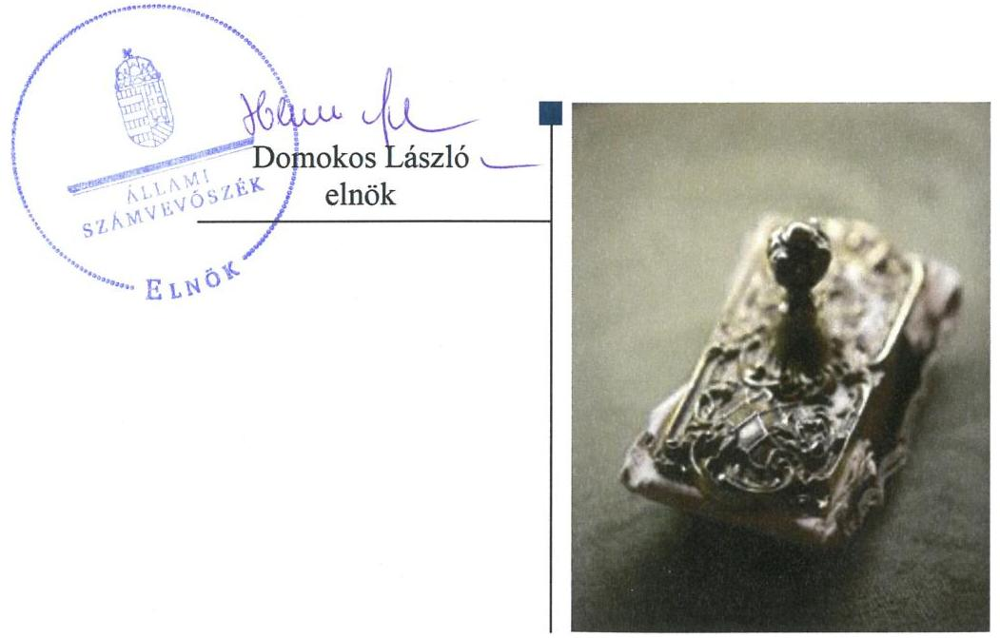
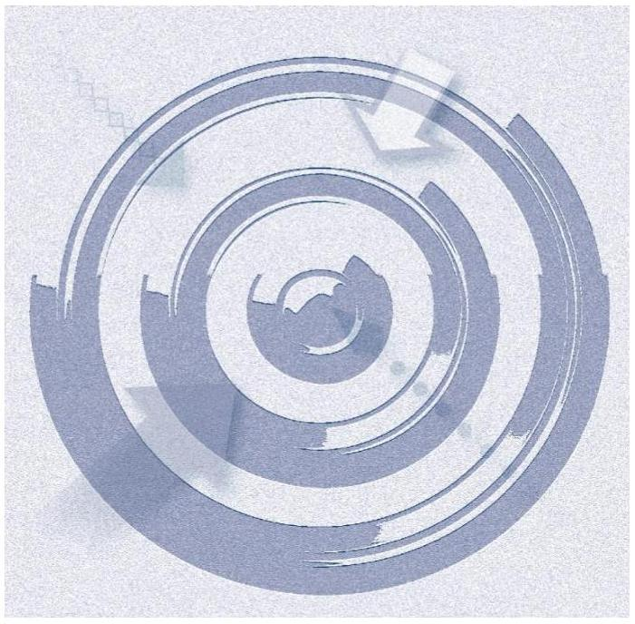
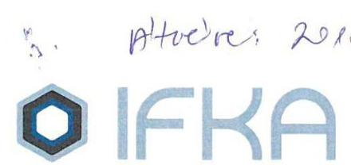
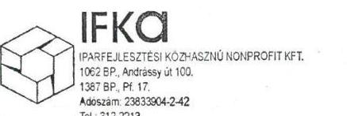
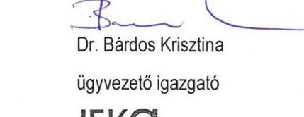
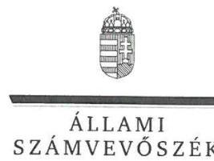
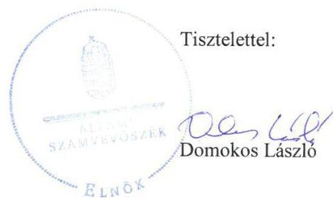
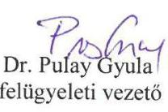

# Jelentés 

## Az állami tulajdonú gazdasági társaságok ellenőrzése

IFKA Iparfejlesztési Közhasznú Nonprofit Kft.
2018.

---

# Jelentés 

## Az állami tulajdonú gazdasági társaságok ellenőrzése

IFKA Iparfejlesztési Közhasznú Nonprofit Kft.
2018. mezőgazdasági hó 19. nap

---

# AZ ELLENŐRZÉST FELÜGYELTE:

DR. PULAY GYULA felügyeleti vezető

## AZ ELLENŐRZÉST VEZETTE ÉS A VÉGREHAJTÁSÁÉRT FELELŐS:

KEREKES PÉTER ellenőrzésvezető

A PROGRAM ÖSSZEÁLLÍTÁSÁÉRT FELELŐS:

TÓTPÁL SZABOLCS osztályvezető

IKTATÓSZÁM: EL-0650-045/2018.

TÉMASZÁM: 2469

ELLENŐRZÉS-AZONOSÍTÓ SZÁM: V-081415

Jelentéseink az Országgyűlés számítógépes hálózatán és az Interneten a www.asz.hu címen is olvashatóak.

---

# TARTALOMJEGYZÉK 

■ ÖSSZEGZÉS ..... 5
■ AZ ELLENŐRZÉS CÉLJA ..... 6
■ AZ ELLENŐRZÉS TERÜLETE ..... 7
■ AZ ELLENŐRZÉS HÁTTERE, INDOKOLTSÁGA ..... 8
■ A JELENTÉS LÉNYEGES KÉRDÉSKÖREI ..... 9
■ AZ ELLENŐRZÉS HATÓKÖRE ÉS MÓDSZEREI ..... 10
■ MEGÁLLAPÍTÁSOK ..... 12
■ JAVASLATOK ..... 14
■ MELLÉKLETEK ..... 15
I. sz. melléklet: Értelmező szótár ..... 15
■ FÜGGELÉK: ÉSZREVÉTELEK ..... 17
■ RÖVIDÍTÉSEK JEGYZÉKE ..... 27

---

.

---

# ÖSSZEGZÉS 

Az IFKA Iparfejlesztési Közhasznú Nonprofit Kft. működésének szabályozottsága és a gazdálkodása nem felelt meg a jogszabályi előírásoknak, ezáltal nem biztosította tevékenységének és gazdálkodásának átláthatóságát és elszámoltathatóságát.

## Az ellenőrzés társadalmi indokoltsága

Az Állami Számvevőszék kiemelt célja, hogy az államháztartáson kívülre nyújtott költségvetési támogatások és ingyenes vagyonjuttatások, valamint az államháztartáson kívül működő feladatellátó rendszerek ellenőrzéseivel hozzájáruljon ahhoz, hogy a közpénzeket az államháztartáson kívül működő szervezetek is átlátható, rendezett módon használják fel.

Az állami tulajdonú gazdálkodó szervezetek a nemzeti vagyon részét képezik. Az állami vagyonnal való gazdálkodást illetően a tulajdonosi joggyakorlás feladata az állami vagyon átlátható, rendeltetésszerű és felelős használatának biztosítása. Az állami tulajdonú gazdasági társaságok feladata az állami vagyon átlátható, hatékony, költségtakarékos működtetése, értékének megőrzése, állagának védelme, értéknövelő használata, hasznosítása.

Minden közpénzt, közvagyont használó szervezettel szemben társadalmi igény, hogy tevékenységükről elszámoljanak. Ezt figyelembe véve és az Állami Számvevőszék Stratégiájával összhangban került sor az állami tulajdonban álló IFKA Iparfejlesztési Közhasznú Nonprofit Kft. ellenőrzésére.

## Főbb megállapítások, következtetések, javaslatok

A Magyar Nemzeti Vagyonkezelő Zrt. a tulajdonosi joggyakorlás kereteit szabályszerűen kialakította. A tulajdonosi joggyakorlás szabályszerű volt.

Az IFKA Iparfejlesztési Közhasznú Nonprofit Kft. működésének szabályozottsága nem felelt meg a jogszabályi előírásoknak, mert a számlarendje nem tartalmazta a bizonylati rendet, nem rendelkezett a közérdekű adatok közzétételével kapcsolatos szabályozással és 2016. május 19-ig nem tett eleget a befektetési szabályzat készítési kötelezettségének.

A pénzügyi műveletek ráfordításainak és a pénzügyi műveletek bevételeinek elszámolása nem volt szabályszerű, ezáltal a gazdálkodása során nem biztosította az elszámoltathatóságot és az átláthatóságot. Az egyszerűsített éves beszámolók mérlegsorait leltárral alátámasztotta, a vagyonnyilvántartása szabályszerű volt.

A megállapítások alapján az Állami Számvevőszék az IFKA Iparfejlesztési Közhasznú Nonprofit Kft. ügyvezetőjének négy javaslatot fogalmazott meg.

---

# AZ ELLENŐRZÉS CÉLJA 

jogszabályi előírásoknak megfeleltek-e.

Az ellenőrzés célja annak értékelése volt, hogy a tulajdonosi jogok gyakorlása szabályszerű volt-e. A gazdálkodó szervezet szabályozottsága, gazdálkodása és vagyongazdálkodási tevékenysége megfelelt-e a jogszabályi és a tulajdonosi előírásoknak. A vagyonváltozást eredményező döntések esetében a tulajdonosi jogok gyakorlója és a gazdálkodó szervezet szabályszerűen jártak-e el. Az ellenőrzés célja továbbá annak megítélése volt, hogy a kormányzati szektorba sorolt állami tulajdonban lévő gazdálkodó szervezetek gazdálkodásának a kormányzati szektor hiányára és az államadósságra befolyással bíró elemei a

---

# AZ ELLENŐRZÉS TERÜLETE 

## IFKA Iparfejlesztési Közhasznú Nonprofit Kft. és a Magyar Nemzeti Vagyonkezelő Zrt.

Az IFKA Iparfejlesztési Közhasznú Nonprofit Kft. a 1125/2011. (IV. 28.) Korm. határozat alapján, 2011. december 16-án alakult az Iparfejlesztési Közhasznú Alapítvány jogutódjaként. A Társaság ${ }^{1}$ 100%-os állami tulajdonban van. Az MNV Zrt. ${ }^{2}$ a tulajdonosi jogokat az $\mathrm{NGM}^{3}$-mel kötött megbízási szerződés útján gyakorolta.

A Társaság közhasznú tevékenységként kutatás-fejlesztéssel, foglalkoztatás bővítéssel, stratégiafejlesztéssel, oktatással, képzéssel, szakképzéssel és tudománykommunikációval foglalkozik.

A Társaság a Számv. tv. ${ }^{4}$ 155. § (3) bekezdése alapján könyvvizsgálatra nem volt kötelezett, de az Alapító okirat ${ }^{5}$ független könyvvizsgáló kijelöléséről rendelkezett.

A Társaság működéséről, vagyoni, pénzügyi és jövedelmi helyzetéről egyszerűsített éves beszámolót készített.

A Társaság mérlegfőösszege 2013-ban 1,285 milliárd Ft, 2016-ban 1,597 milliárd Ft volt. Saját tőkéje a 2013. évi 1,265 milliárd Ft-ról 2016-ra 1,367 milliárd Ft-ra nőtt.

A Társaságnak a Számv. tv. 14. § (6) bekezdése alapján az önköltségszámítás belső rendjére vonatkozó belső szabályzat készítésére nem állt fenn kötelezettsége.

A Társaság 2016. április 13-tól tulajdonosi részesedéssel rendelkezett más gazdasági társaságban. A Társaság 2015. december 30-tól kormányzati szektorba sorolt egyéb szervezetnek minősült. A Társaság az ellenőrzött időszakban nem rendelkezett vagyonkezelésre átvett ingatlanokkal.

---

# AZ ELLENŐRZÉS HÁTTERE, INDOKOLTSÁGA 

Az Európai Unióban 1994. év óta hatályos túlzott hiány eljárás mindig kihívást jelentett a tagállamok számára. Az állami tulajdonú gazdálkodó szervezetek ellenőrzése kiemelten fontos a vagyon megőrzése, megóvása érdekében, valamint a kormányzati szektor elszámolásaiban megjelenő állami tulajdonú gazdálkodó szervezetek esetében, amelyekkel szemben alapvető követelmény, hogy gazdálkodásuk, működésük szabályszerű, az általuk szolgáltatott adatok minél megbízhatóbbak legyenek. Gazdálkodásuk jellemzően a közérdeklődés és a média figyelmének középpontjában áll, amihez hozzájárul a gazdálkodásuk körébe tartozó - közvetlen vagy közvetett állami tulajdonú, tehát végső soron a nemzeti vagyon részét képező - vagyon nagysága, illetve az általuk ellátott közszolgáltatások/közfeladatok minősége és hatékonysága.

Az ellenőrzés rámutathat az állami tulajdonú gazdálkodó szervezetek gazdálkodási tevékenységével jó gyakorlatokra és szabálytalanságokra. Felhívhatja a figyelmet a jogszabályi követelmények teljesítéséhez szükséges feltételek hiányosságaira, hozzájárulhat az államháztartáson kívüli, de (közvetlenül vagy közvetve) állami vagyont használó gazdálkodó szervezetek tevékenységének átláthatóságához. Ellenőrzésünk eredményeképpen javaslatainkkal, megállapításainkkal hozzájárulhatunk a nemzeti vagyonnal való gazdálkodás átláthatóságának, elszámoltathatóságának javításához.

---

# A JELENTÉS LÉNYEGES KÉRDÉSKÖREI 

1. A tulajdonosi joggyakorlás szabályszerű volt-e?
2. A gazdasági társaság működésének szabályozottsága megfelelte a jogszabályi előírásoknak, gazdálkodása, vagyongazdálkodása szabályszerű volt-e?
3. A kormányzati szektorba sorolt gazdasági társaság gazdálkodásának a kormányzati szektor hiányára és az államadósságra befolyással bíró elemei megfeleltek-e a jogszabályi előírásoknak?

---

# AZ ELLENŐRZÉS HATÓKÖRE ÉS MÓDSZEREI 

## Az ellenőrzés típusa

Megfelelőségi ellenőrzés

## Az ellenőrzött időszak

A 2013 - 2016. évek, a 2016. évi beszámoló jóváhagyásáig tartó időszak

## Az ellenőrzés tárgya

A 100%-os állami tulajdonban lévő Társaság feletti tulajdonosi joggyakorlás, valamint a Társaság gazdálkodásának szabályozottsága és szabályszerűsége.

Az ellenőrzés kiterjed minden olyan körülményre és adatra, amely az ÁSZ ${ }^{6}$ jogszabályban meghatározott feladatainak teljesítéséhez, valamint a program végrehajtása folyamán felmerült újabb összefüggések feltárásához szükséges.

## Az ellenőrzött szervezet

IFKA Iparfejlesztési Közhasznú Nonprofit Kft. és a Magyar Nemzeti Vagyonkezelő Zrt.

## Az ellenőrzés jogalapja

Az ellenőrzés jogszabályi alapját az ÁSZ tv. ${ }^{7}$ 1. § (3) bekezdése és 5. § (3)(4)-(5) bekezdései képezik.

## Az ellenőrzés módszerei

Az ellenőrzést a nemzetközi standardokat irányadónak tekintve az ellenőrzési program ellenőrzési kérdései, az ellenőrzött időszakban hatályos jogszabályok, az ellenőrzés szakmai szabályok és módszertanok figyelembe vételével végeztük.

A teljes ellenőrzött időszakra vonatkozóan került ellenőrzésre a gazdasági társaság tervezési, beszámolási, közzétételi, adatszolgáltatási kötelezettségének, valamint belső ellenőrzési tevékenységének szabályszerű-

---

sége. A 2013. és 2016. évekre vonatkozóan a gazdasági társaság működésének szabályozottságát, a bevételei és ráfordításai elszámolását, illetve vagyongazdálkodásának szabályszerűségét is ellenőriztük.

Az ellenőrzés ideje alatt az ellenőrzött szervezettel történő kapcsolattartást az ÁSZ Szervezeti és Működési Szabályzatának vonatkozó előírásai alapján biztosítottuk.

Az ellenőrzési kérdések megválaszolásához szükséges bizonyítékok megszerzése a következő ellenőrzési eljárások alkalmazásával történt: megfigyelés, kérdésfeltevés (információkérés), összehasonlítás, valamint elemző eljárás. Az ellenőrzési bizonyítékként felhasználható adatforrások közé tartoztak egyrészt az ellenőrzési programban felsorolt adatforrások, másrészt adatforrás lehetett még minden - az ellenőrzés folyamán - feltárt, az ellenőrzés szempontjából információkat tartalmazó dokumentum.

Az ellenőrzést a kérdésekre adott válaszok kiértékelésével, valamint a megjelölt adatforrások, a tanúsítványok felhasználásával, továbbá az adott időszakban hatályos jogszabályok figyelembe vételével folytattuk le.

Az immateriális javak, tárgyi eszközök esetében az ellenőrzés azokra a legnagyobb értékű tételekre - a lényeges sokaságra - terjedt ki, melyek összértéke eléri a teljes sokaság összértékének 50%-át.

A személyi jellegű ráfordítások esetében az ellenőrzött tételek kijelölése véletlen mintavételi eljárás alkalmazásával történt a teljes sokaságból.

A mintavétellel ellenőrzött területek esetében minden egyes tétel vonatkozásában a szabályszerűségre vonatkozó kérdéseket tettünk fel, amelyek eredménye összesítésre került. „Szabályszerűnek" értékeltünk egy ellenőrzött területet, amennyiben 95%-os bizonyossággal az ellenőrzött sokaságban az átlagos hibaarány legfeljebb 10%, "nem szabályszerűnek", amennyiben 10%-nál magasabb arányt képviselt.

---

# 1. A tulajdonosi joggyakorlás szabályszerű volt-e? 

## Összegző megállapítás

Az MNV Zrt. tulajdonosi joggyakorlása szabályszerű volt.
Az MNV Zrt. a Társaság feletti tulajdonosi joggyakorlásának rendjét az SZMSZ ${ }^{8}$-ében, a Társasági Monitoring Szabályzatában ${ }^{9}$, a Tulajdonosi Ellenőrzési Szabályzatában ${ }^{10}$ és a Megbízási szerződésben ${ }^{11}$ határozta meg.

A tulajdonosi joggyakorló az Alapító okiratban előírtaknak megfelelően létrehozta a felügyelőbizottságot, amely rendelkezett ügyrenddel.

A tulajdonosi joggyakorló a Társaság egyszerűsített éves beszámolóit és közhasznúsági mellékleteit a felügyelőbizottság írásbeli jelentéseinek és a könyvvizsgálói jelentések birtokában jóváhagyta.

A tulajdonosi joggyakorló 2016. május 24-én megalkotta a Társaság Javadalmazási szabályzatát ${ }^{12}$, ezzel teljesítette a Taktv. erre vonatkozó előírását.

## 2. A gazdasági társaság működésének szabályozottsága megfelelte a jogszabályi előírásoknak, gazdálkodása, vagyongazdálkodása szabályszerű volt-e?

## Összegző megállapítás

2.1. számú megállapítás

A Társaság működésének szabályozottsága és a gazdálkodása nem felelt meg a jogszabályi előírásoknak, a vagyongazdálkodása szabályszerű volt.

A Társaság szabályozottsága nem felelt meg a jogszabályi előírásoknak.

A Társaság teljesítette a Számv. tv.-ben előírt kötelezettségét a Számviteli politika ${ }^{13}$, az annak keretében előírt szabályzatok és a számlarend elkészítésére vonatkozóan.

A Társaság számlarendje az ellenőrzött időszakban a Számv. tv. 161. § (2) bekezdés d) pontban előírtak ellenére nem tartalmazta a bizonylati rendet.

A Társaság befektetési tevékenységet végző közhasznú szervezetként a Civil tv. ${ }^{14}$ 45. §-ban előírtak szerint befektetési szabályzat készítésére volt kötelezett, melynek 2016. május 19-ig nem tett eleget.

A Társaság az Info. tv. ${ }^{15}$ 30. § (6) bekezdésének előírása ellenére nem készített a közérdekű adatok megismerésére irányuló igények teljesítésének rendjét rögzítő szabályzatot, és az Info. tv. 35. § (3) bekezdésében előírtak ellenére a közérdekű adatokra vonatkozó közzétételi kötelezettség teljesítésének részletes szabályait belső szabályzatban nem állapította meg.

---

A Társaság 2015. december 30-tól 2016. szeptember 30-ig a Bkr. ${ }^{16}$ 10. §-ban előírtak ellenére nem alakította ki az operatív tevékenységektől függetlenül működő belső ellenőrzést.

A Társaság 2016. október 1-jétől nem teljesítette a Bkr. 6. § (4) bekezdése előírásait, mert a Társaság nem rendelkezett a szervezeti integritást sértő események kezelésére, valamint az integrált kockázatkezelésre vonatkozó eljárásrenddel.
2.2. számú megállapítás

# A Társaság gazdálkodása nem volt szabályszerű. Vagyongazdálko- 

dási tevékenységét a jogszabályi előírások szerint látta el.

A Társaságnál 2013-ban és 2016-ban a ráfordítások és a bevételek elszámolása nem volt szabályszerű, mert a Társaság a pénzügyi műveletek ráfordításai és a pénzügyi műveletek bevételei könyvviteli elszámolást közvetlenül és közvetetten alátámasztó számviteli bizonylatokkal a Számv. tv. 165. § (1) bekezdésében előírtak ellenére nem rendelkezett. A számviteli bizonylatok hiánya miatt nem állapítható meg, hogy a 2013. és 2016. évi egyszerűsített éves beszámolókban szereplő tételek a valóságban is megtalálhatóak és bizonyíthatóak, ezért sérült a Számv. tv. 15. § (3) bekezdésében előírt valódiság elve.

Az értékcsökkenés elszámolása, valamint a vagyonnyilvántartás szabályszerű
 volt.

A Társaság a Számv. tv.-ben előírtaknak megfelelően az egyszerűsített éves beszámolók mérlegtételeit alátámasztotta az eszközeit és forrásait tételesen, ellenőrizhető módon tartalmazó leltárakkal.
2.3. számú megállapítás

A Társaság nem biztosította az átláthatóságot.
A Társaság a 2013-2016. évekről készült egyszerűsített éves beszámolóit és közhasznúsági mellékleteit közzétette, azonban a 2013. évi és a 2016. évi egyszerűsített éves beszámolói a ráfordítások és a bevételek elszámolásának hiányosságai miatt nem a valós képet mutatták be a Társaság gazdálkodásáról.

## 3. A kormányzati szektorba sorolt gazdasági társaság gazdálkodásának a kormányzati szektor hiányára és az államadósságra befolyással bíró elemei megfeleltek-e a jogszabályi előírásoknak?

Összegző megállapítás

A Társaság gazdálkodásában nem voltak a kormányzati szektor hiányára befolyással bíró elemek.

A Társaság a Stabilitási tv. ${ }^{17}$ szerinti adósságot keletkeztető ügyletet nem kötött. Nem vett fel a kormányzati szektoron kívülről hitelt, nem bocsátott ki kötvényt, kötelezettségvállaláshoz kapcsolódóan nem vállalt garanciát és kezességet.

---

# JAVASLATOK 

Az ÁSZ tv. 33. § (1) bekezdésében foglaltak értelmében az ellenőrzött szervezet vezetője köteles a jelentésben foglalt megállapításokhoz kapcsolódó intézkedési tervet összeállítani és azt a jelentés kézhezvételétől számított 30 napon belül az ÁSZ részére megküldeni. Amennyiben az ellenőrzött szervezet vezetője nem küldi meg határidőben az intézkedési tervet, vagy továbbra sem elfogadható intézkedési tervet küld, az Állami Számvevőszék elnöke az ÁSZ tv. 33. § (3) bekezdése a) és b) pontjaiban foglaltakat érvényesítheti.

## Az IFKA Iparfejlesztési Közhasznú Nonprofit Kft. ügyvezetőjének

1. Intézkedjen annak érdekében, hogy a számlarend tartalma megfeleljen a jogszabályi előírásnak.
(2.1. sz. megállapítás 2. bekezdése alapján)
2. Intézkedjen az Info. tv-ben előírt szabályzatok elkészítése érdekében.
(2.1. sz. megállapítás 4. bekezdése alapján)
3. Intézkedjen a szervezeti integritást sértő események kezelésére, valamint az integrált kockázatkezelésre vonatkozó eljárásrend megalkotása iránt a jogszabályi előírásnak megfelelően.
(2.1. sz. megállapítás 6. bekezdése alapján)
4. Gondoskodjon a könyvviteli elszámolást közvetlenül és közvetetten alátámasztó számviteli bizonylatok (ideértve a részletező nyilvántartásokat is) jogszabályi előírásnak megfelelő kezeléséről.
(2.2. sz. megállapítás 1. bekezdése alapján)

---

# MELLÉKLETEK 

- I. SZ. MELLÉKLET: ÉRTELMEZŐ SZÓTÁR
állami vagyon
a) Az állam tulajdonában lévő dolog, valamint a dolog módjára hasznosítható természeti erő,
b) az a) pont hatálya alá nem tartozó mindazon vagyon, amely vonatkozásában törvény az állam kizárólagos tulajdonjogát nevesíti,
c) az állam tulajdonában lévő tagsági jogviszonyt megtestesítő értékpapír, illetve az államot megillető egyéb társasági részesedés,
d) az államot megillető olyan immateriális, vagyoni értékkel rendelkező jogosultság, amelyet jogszabály vagyoni értékű jogként nevesít.
e) az állam tulajdonában lévő pénzügyi eszközök

## 2013. június 27-ig:

Az állami vagyont az MNV Zrt. maga kezeli, vagy szerződés - így különösen bérlet, haszonbérlet, megbízás - alapján központi költségvetési szervnek, természetes vagy jogi személynek, vagy jogi személyiséggel nem rendelkező gazdálkodó szervezetnek hasznosításra átengedi.
Forrás: Vtv. 23. § (1) bekezdése

## 2013. június 28-ától:

Az állami vagyonnal az MNV Zrt. maga gazdálkodik, vagy szerződés - így különösen bérlet, haszonbérlet, megbízás - alapján központi költségvetési szervnek, természetes vagy jogi személynek, vagy jogi személyiséggel nem rendelkező gazdálkodó szervezetnek hasznosításra átengedi, illetőleg vagyonkezelésbe, haszonélvezetbe adja. Forrás: Vtv. 23. § (1) bekezdése.
a Ptk. ${ }^{18}$ 3:88. § (1) bekezdése szerint „a gazdasági társaságok üzletszerű közös gazdasági tevékenység folytatására, a tagok vagyoni hozzájárulásával létrehozott, jogi személyiséggel rendelkező vállalkozások, amelyekben a tagok a nyereségből közösen részesednek, és a veszteséget közösen viselik".
2013. június 27-ig:

Az állami vagyont az MNV Zrt. maga kezeli, vagy szerződés - így különösen bérlet, haszonbérlet, megbízás - alapján központi költségvetési szervnek, természetes vagy jogi személynek, vagy jogi személyiséggel nem rendelkező gazdálkodó szervezetnek hasznosításra átengedi. Az állami vagyonra vonatkozóan az MNV Zrt. kizárólag az Nvtv-ben meghatározott személyekkel köthet vagyonkezelési szerződést.
Forrás: Vtv. 23. § (1), 27. § (1)

## 2013. június 28-ától:

Az állami vagyonnal az MNV Zrt. maga gazdálkodik, vagy szerződés - így különösen bérlet, haszonbérlet, megbízás - alapján központi költségvetési szervnek, természetes vagy jogi személynek, vagy jogi személyiséggel nem rendelkező gazdálkodó szervezetnek hasznosításra átengedi, illetőleg vagyonkezelésbe, haszonélvezetbe adja. Az állami vagyonra vonatkozóan az MNV Zrt. kizárólag az Nvtv-ben meghatározott személyekkel köthet vagyonkezelési szerződést.
Forrás: Vtv. 23. § (1), 27. § (1)
Az a szervezet, amely az Áht. ${ }^{19}$ alapján nem része az államháztartásnak, azonban az Európai Közösséget létrehozó szerződéshez csatolt, a túlzott hiány esetén követendő eljárásról szóló jegyzőkönyv alkalmazásáról szóló 2009. május 25-i 479/2009/EK rendelet szerint a kormányzati szektorba tartozik.

---

MNV Zrt.
KZ 100%-ban állami tulajdonban álló gazdasági társaságok közül kijelölheti.
Forrás: Vtv. 3. § (1) és (2)

# 2013. június 28-ától: 

A rábízott állami vagyon felett az államot megillető tulajdonosi jogok és kötelezettségek összességét - a hatályos szabályozás szerint - az állami vagyon felügyeletéért felelős miniszter (jelenleg a nemzeti fejlesztési miniszter) gyakorolja. A miniszter feladatát nagy részben az MNV Zrt., mint tulajdonosi joggyakorló szervezet útján látja el.
nonprofit gazdasági társaság Ctv. ${ }^{20}$ 9/F. § (2) bekezdése szerint „az a gazdasági társaság minősül nonprofit gazdasági társaságnak és cégnevében az a gazdasági társaság tüntetheti fel a nonprofit jelleget, amelynek létesítő okirata tartalmazza, hogy a gazdasági társaság tevékenységéből származó nyereség a tagok között nem osztható fel, hanem az a gazdasági társaság vagyonát gyarapítja." (hatályos 2014. március 15-től)
tulajdonosi jogok gyakorlója 1.

### 2013. június 27-ig:

Az állami vagyon felett a Magyar Államot megillető tulajdonosi jogok és kötelezettségek összességét - ha törvény eltérően nem rendelkezik - az állami vagyon felügyeletéért felelős miniszter (a továbbiakban: miniszter) gyakorolja, aki e feladatát a Magyar Nemzeti Vagyonkezelő Zártkörűen Működő Részvénytársaság (a továbbiakban: MNV Zrt.), a Magyar Fejlesztési Bank, illetve a tulajdonosi joggyakorló szervezet útján látja el. A miniszter miniszteri rendeletben, a törvényben meghatározott állami vagyoni kör tekintetében, meghatározott időtartamra, a joggyakorlás egyes szabályainak meghatározásával - az őt megillető tulajdonosi jogok és kötelezettségek összességének, illetve azok meghatározott részének gyakorlóját az Áht. szerinti központi költségvetési szervek, ezek intézménye, továbbá a 100%-ban állami tulajdonban álló gazdasági társaságok közül kijelölheti.
Forrás: Vtv. 3. § (1) és (2)

### 2013. június 28-ától:

A rábízott állami vagyon felett az államot megillető tulajdonosi jogok és kötelezettségek összességét tulajdonosi joggyakorlóként:
a) ha törvény vagy miniszteri rendelet eltérően nem rendelkezik, a Magyar Nemzeti Vagyonkezelő Zártkörűen Működő Részvénytársaság (a továbbiakban: MNV Zrt.), b) törvényben kijelölt személy vagy
c) az állami vagyon felügyeletéért felelős miniszter (a továbbiakban: miniszter) által rendeletben kijelölt személy gyakorolja.
[...] A miniszter e törvény felhatalmazása alapján - a meghatározott célok hatékonyabb elérése érdekében, miniszteri rendeletben, az ott meghatározott állami vagyoni kör tekintetében, meghatározott időtartamra - e törvény keretei között, a joggyakorlás egyes szabályainak meghatározásával - az államot megillető tulajdonosi jogok és kötelezettségek összességének, illetve azok meghatározott részének gyakorlóját az Áht. szerinti központi költségvetési szervek, ezek intézménye, továbbá a 100%-ban állami tulajdonban álló gazdasági társaságok közül kijelölheti.
Forrás: Vtv. 3. § (1) és (2)
2.

Aki a nemzeti vagyon felett az államot vagy a helyi önkormányzatot megillető tulajdonosi jogok és kötelezettségek összességének gyakorlására jogosult
Forrás: Nvtv. 3. § (1) 17. pontja

---

# FÜGGELÉK: ÉSZREVÉTELEK 

A jelentéstervezetet a Számvevőszék 15 napos észrevételezésre megküldte az ellenőrzött szervezetek vezetőinek az ÁSZ tv. 29. § (1) bekezdése előírásának megfelelően.

Az ÁSZ a jelentéstervezetet az IFKA Iparfejlesztési Közhasznú Nonprofit Kft. ügyvezetőjének és a Magyar Nemzeti Vagyonkezelő Zrt. vezérigazgatójának küldte meg.
Észrevételt az IFKA Iparfejlesztési Közhasznú Nonprofit Kft. ügyvezetője tett, észrevételeit és az azokra adott válaszokat a függelék tartalmazza.

[^0]
[^0]:    * 29. § (1) Az Állami Számvevőszék az ellenőrzési megállapításait megküldi az ellenőrzött szervezet vezetőjének vagy az általa megbízott személynek, és annak, akinek személyes felelősségét állapította meg.
    (2) Az ellenőrzött szervezet vezetője és a felelősként megjelölt személy az ellenőrzés megállapításaira tizenöt napon belül írásban észrevételt tehet.
    (3) Az Állami Számvevőszék az észrevételre a beérkezésétől számított harminc napon belül írásban válaszol. A figyelembe nem vett észrevételeket köteles a jelentésben feltüntetni, és megindokolni, hogy azokat miért nem fogadta el.

---

1062 Budapest, Andrássy út 100 . Levelezési cím: 1387 Budapest Pf: 17 tel: +36 13122213 | fax: +36 13320787 | www.ifka.hu

IFKA/2018/2018.

Domokos László
elnök

Állami Számvevőszék
Budapest
Apáczai Csere János utca 10.
1052

ÁLLAMI SZÁMVEVŐSZÉK
05-45484/2018/1
Érkszám: 2018. Aug 28.
Sérdészám: 02-0650-040/2018
Térőket:

Tárgy: Észrevétel EL-0650-036/2018. számú, 2018. július 16-án kelt ellenőrzési jelentés tervezetére

Ikt.szám: EL-0650-037/2018

Tisztelt Elnök Úr!

Az IFKA Iparfejlesztési Közhasznú Nonprofit Kft. EL-0650-037/2018 iktatószámú levelük mellékleteként érkezett ellenőrzési jelentés tervezetre csatoljuk észrevételeinket, mely kapcsán bármilyen további információ nyújtás, egyeztetés szükségessége esetén kérem, hogy Fazekas Terézia gazdasági igazgatót keressék.
Elérhetőségei:
Telefonszáma: 1312 2213, vagy + 36 30 555 6030,
e-mail: fazekas@ifka.hu

Kérjük felvetéseink, indokaink szíves figyelembe vételét.

Mellékletek:
1 Észrevétel "Az Állami tulajdonú gazdasági társaságok ellenőrzése - IFKA Iparfejlesztési Közhasznú Nonprofit Kft" ellenőrzés megállapításaira, az ÁSZ 2018, július 20-án érkezett, EL-0650-036/2018. számú, 2018. július 16-án kelt ellenőrzési jelentés tervezetére, Témaszám: 2469 Ellenőrzés-azonosító szám: V-081415
2 Számviteli politika 3. fejezete
3 Az Iparfejlesztési Közalapítvány Befektetési Politikája
4 Excel táblázat a közzétételi kötelezettségekről
5 Az IFKA 2013-ban, a kérdéses időszakban hatályos Minőségirányítási Kézikönyve
6 Szervezeti integritást sértő események kezelésének eljárásrendje
7 Kockázatkezelési szabályzat
8 Kockázatértékelés - borítólap (A Munka és Tűzvédelem körében elkészített szabályzatok részét képező kötetből.)

Budapest, 2018. augusztus 1.

Tisztelettel:

Dr. Bárdos Krisztina
ügyvezető igazgató

---

# Észrevétel 

"Az Állami tulajdonú gazdasági társaságok ellenőrzése

## - IFKA Iparfejlesztési Közhasznú Nonprofit Kft" ellenőrzés megállapításaira,

az ÁSZ 2018. július 20-án érkezett, EL-0650-036/2018. számú, 2018. július 16-án kelt ellenőrzési jelentés tervezetére

Témaszám: 2469
Ellenőrzés-azonosító szám: V-081415

Észrevételek a Megállapítások fejezetére:

### 2.1 A Társaság szabályozottsága nem felelt meg a jogszabályi előírásoknak

Második bekezdés: A Társaság számlarendje az ellenőrzött időszakban a Számv. tv. 161. %. (2) bekezdés d) pontban előírtak ellenére nem tartalmazta a bizonylati rendet.

A számviteli politika részét képező számlarend az ÁSZ rendszerében feltöltésre került. Hozzá kapcsolódóan kiegészítésül közöljük, hogy a Vagyontárgyak hasznosításának rendje, selejtezési szabályzat tartalmaz bizonylati albumot, valamint a számviteli politika 3. fejezete tartalmazza a bizonylatok feldolgozási rendjét az IFKÁ-nál.

Melléklet: Számviteli politika 3. fejezete
Harmadik bekezdés: A Társaság befektetési tevékenységet végző közhasznú szervezetként a Civil tv. 45. §-ban előírtak szerint befektetési szabályzat készítésére volt kötelezett, melynek 2016. május 19-ig nem tett eleget.

Magyarázat: Az IFKA Iparfejlesztési Közhasznú Nonprofit Kft. az Iparfejlesztési Közalapítvány jogutódja. Tevékenységét 2013. január 1-től vette át a jogelőd szervezettől. A jogelőd szervezet rendelkezett - a működést megalapozó és alátámasztó alapvető - szabályzatokkal, így Befektetési Szabályzattal is. A szabályozottság folyamatos volt. A legfontosabb szabályzatok elkészítése, átvétele és jóváhagyása 2013 folyamán lezajlott. A befektetési szabályzat azon körbe tartozik, melynek jóváhagyása az Alapító hatáskörébe tartozik, függetlenül attól, hogy folytonos volt, alapítói jóváhagyást igényelt. A befektetési szabályzat először 2013. június 10-én belső egyeztetés után továbbküldésre került a szakértők részére véleményezés és javaslattétel, valamint jóváhagyás céljából. Erre hosszú ideig nem kaptunk visszajelzést, majd 2014-ben külső szakértőt bíztunk meg a jogszabályi előírások betartásával kialakítandó szabályzat tervezet
 felülvizsgálatával. Az elkészült tervezetet és a szakértő szakvéleményét előterjesztettük, az ellenőrzési és jóváhagyási folyamat után Felügyelőbizottságunk több ülésén tárgyalta, és az alábbi határozatokat hozta:

FB5/9 Az FB tanulmányozza, véleményezi és a következő ülésen a szakértői vélemény ismeretében foglal állást a Befektetési Szabályzat javaslatáról. (2014. november 24.)

FB5/10 A Felügyelőbizottság az IFKA Kft befektetési szabályzatát egyhangúlag elfogadta. (2014. december 16.)
FB5/12 A Felügyelőbizottság az IFKA Kft befektetési szabályzatával kapcsolatban összeállított választervezetről

---

a jogászi véleményezést egyhangúlag elfogadta. (2015. április 21.)
FB4/15 A Felügyelőbizottság az IFKA NGM jogi osztálya által jóváhagyott Befektetési szabályzatát jóváhagyásra elfogadta. (2016. május 17.)

Az alapító 2016. június 20-án, 6/2016/VI.20. sz. határozatával jóváhagyásra került és az addig érvényben lévő befektetési szabályzat helyére lépett.

Melléklet: az Iparfejlesztési Közalapítvány 2009-től érvényes Befektetési Politikája a jogutód szervezet, IFKA Iparfejlesztési Közhasznú Nonprofit Kft Befektetési Szabályzatának elfogadásáig

Negyedik bekezdés: A Társaság az Info. tv. 30. § (6) bekezdésének előírásai ellenére nem készített a közérdekű adatok megismerésére irányuló igények teljesítésének rendjét rögzítő szabályzatot, és az Info. tv. 35. § (3) bekezdésében előírtak ellenére a közérdekű adatokra vonatkozó közzétételi kötelezettség teljesítésének részletes szabályait belső szabályzatban nem állapította meg.

Az Info. tv. rendelkezéseinek betartásáról a közzétételt ütemezetten végezzük, az IFKA eleget tesz jogszabályi kötelezettségének, ezt feladatlistába foglaltuk, amelyet folyamatosan aktualizálunk.

Melléklet: excel táblázat a közzétételi kötelezettségekről.
Ötödik bekezdés: A Társaság 2015. december 30-tól 2016. szeptember 30-ig a Bkr. 10. §-ban előírtak ellenére nem alakította ki az operatív tevékenységektől függetlenül működő belső ellenőrzést.

Belső ellenőrzéshez kapcsolódóan rendelkezésre áll az IFKA Minőségirányítási Kézikönyve, amelynek fejezetei tartalmazzák a belső ellenőrzés folyamatát.

Melléklet: az IFKA 2013-ban, a kérdéses időszakban hatályos Minőségirányítási Kézikönyve
Hatodik bekezdés: A Társaság 2016. október 1-jétől nem teljesítette a Bkr. 6. § (4) bekezdése előírásait, mert a Társaság nem rendelkezett a szervezeti integritást sértő események kezelésére, valamint az integrált kockázatkezelésre vonatkozó eljárásrenddel.

Szervezeti integritást sértő események kezelése: 2017-ben elkezdett szabályzat összeállítási munkafolyamat befejeztével 2018. február 1-től az IFKA rendelkezik Szervezeti integritást sértő események kezelésének eljárásrendje c. szabályzattal.

Melléklet: Szervezeti integritást sértő események kezelésének eljárásrendje
Integrált kockázatkezelésre vonatkozó eljárásrend: Az IFKA ISO-ban, a Minőségügyi Kézikönyv 7-es fejezetében is kezelte a kockázatokat, minőségügyi vezető irányításával. Erre vonatkozó fejezeteket az előző pontban csatolt melléklet tartalmazza. 2016. szeptember 30-ától önálló Kockázatkezelési Szabályzat készült, akkortól hatályos az IFKA Kockázatkezelési Szabályzata. Továbbá a Munka és Tűzvédelem keretében külön kötetben szabályozásra került a kockázatértékelés rendszere.

Melléklet: Kockázatkezelési szabályzat, borítólap a kockázatértékelési kézikönyvből
2.2 A Társaság gazdálkodása nem volt szabályszerű. Vagyongazdálkodási tevékenységét a jogszabályi előírások szerint látta el.

Első bekezdés: A Társaságnál 2013-ban és 2016-ban a ráfordítások és a bevételek elszámolása nem volt szabályszerű, mert a Társaság a könyvviteli elszámolást közvetlenül és közvetetten alátámasztó számviteli bizonylatokkal a Számv. tv. 165. § (1) bekezdésében előírtak ellenére nem rendelkezett. A számviteli bizonylatok hiánya miatt nem állapítható meg, hogy a 2013. és 2016. évi

---

egyszerűsített éves beszámolókban szereplő tételek a valóságban is megtalálhatóak és bizonyíthatóak, ezért sérült a Számv. tv. 15. § (3) bekezdésében előírt valódiság elve.

Ez a megállapítás csak valamilyen adatbekérési, feltöltés hiányosság következménye lehet, vagy félreértésből adódhat, melyre fény derülhetett volna, ha kapunk hiánypótlási felhívást vagy tisztázó kérdést.

Átnézve a feltöltésre bekért anyagokat, az összes olyan számviteli bizonylatot beküldtük, amelyet kértek. Az IFKA-nál minden esetben a számviteli bizonylat az alapja a könyvelésnek, a kifizetést megelőzően szabályszerű, többlépcsős ellenőrzésen mennek keresztül a bizonylatok, a beszerzési folyamat szigorúan szabályozott. A bevételek elszámolásának is kizárólag szabályszerűen kiállított és/vagy igazolt bizonylat lehet az alapja. A könyvvizsgálat minden évben teljeskörű, a számviteli bizonylatok alapján történik az ellenőrzés, az alapító által kinevezett könyvvizsgáló minden évben átfogóan ellenőriz, és az általa kibocsátott elfogadó záradékkal ellátott beszámolót teszünk közzé. Továbbá a pályázati elszámolások alapján elrendelt ellenőrzések is erre támaszkodnak. Eddig soha - ezekben az években sem - találtak hiányosságot a szervezetnél. A bizonylatok zárt rendszerben lefüzve a szervezet irattárában megtalálhatók.

# 2.3 A Társaság nem biztosította az átláthatóságot. 

Első bekezdés: A Társaság a 2013-2016. évekről készült egyszerűsített éves beszámolóit és közhasznúsági mellékleteit közzétette, azonban a 2013. évi és a 2016. évi egyszerűsített éves beszámolói a ráfordítások és a bevételek elszámolásának hiányosságai miatt nem a valós képet mutatták be a Társaság gazdálkodásáról.

Egyrészt vonatkoztatjuk ide is az előző bekezdés szerinti indoklást. Másrészt vélelmezzük, hogy a mintavételen alapuló ellenőrzés miatt nem kaptunk pontos, jogszabályi megállapítást arra vonatkozóan, hogy konkrétan milyen bizonylatok hiányosságát tárta fel az ellenőrzés és mely bizonylat hiánya vezetett arra a következtetésre, miszerint nem mutatott a Társaság valós képet a gazdálkodásáról. Kérjük konkrét bemutatását a hiányzó könyvelési bizonylatoknak, hogy szükség esetén megfelelő intézkedéseket tehessünk azok bemutatására. A könyvelési bizonylatokat 10 évig őrizzük, irattározzuk.

Az IFKA ügyvezető igazgatója részére megfogalmazott javaslatokra vonatkozó előzetes intézkedési terv, kérjük ennek szíves véleményezését

1. Intézkedjen annak érdekében, hogy a számlarend tartalma megfeleljen az előírásoknak.
(2.1. sz. megállapítás 2. bekezdése alapján)

Intézkedési terv: Az IFKA munkatársai vizsgálják felül az IFKA Számviteli politikáját és annak mellékleteit, hogy az megfeleljen az előírásoknak.

Határidő:
Felelős:
2. Intézkedjen az Info. tv-ben előírt szabályzatok elkészítése érdekében.
(2.1. sz. megállapítás 4. bekezdése alapján)

Intézkedési terv: Az IFKA munkatársai foglalják szabályzatba a meglévő munkafolyamat leírást.
Határidő:
Felelős:

---

3. Intézkedjen a szervezeti integritást sértő események kezelésére, valamint az integrált kockázatkezelésre vonatkozó eljárásrend megalkotása iránt a jogszabályi előírásnak megfelelően.
(2.1. sz. megállapítás 6. bekezdése alapján)

Intézkedési terv: Mindkét belső szabályzat felülvizsgálata a jogszabályi előírásoknak megfelelően.

Határidő:
Felelős:
4. Gondoskodjon a könyvviteli elszámolást közvetlenül és közvetetten alátámasztó számviteli bizonylatok (ideértve a részletező nyilvántartásokat is) jogszabályi előírásnak megfelelő kezeléséről.
(2.2. sz. megállapítás 1. bekezdése alapján)

Intézkedési terv: Kérjük fenti észrevételeink elfogadását, tekintettel, hogy a belső eljárási rend biztosítja a számviteli bizonylatok kezelését a jogszabályi előírásoknak megfelelően. Az ehhez szükséges alátámasztó dokumentumok a szervezetnél rendelkezésre állnak.

Határidő:
Felelős:

1. Számviteli politika 3. fejezete
2. az Iparfejlesztési Közalapítvány Befektetési Politikája
3. excel táblázat a közzétételi kötelezettségekről
4. az IFKA 2013-ban, a kérdéses időszakban hatályos Minőségirányítási Kézikönyve
5. Szervezeti integritást sértő események kezelésének eljárásrendje
6. Kockázatkezelési szabályzat és Kockázatértékelés - borítólap

---

# Dr. Bárdos Krisztina úrhölgy 

ügyvezető
IFKA Iparfejlesztési Közhasznú Nonprofit Kft.

## Budapest

## Tisztelt Ügyvezető Úrhölgy!

„Az állami tulajdonú gazdasági társaságok ellenőrzése - IFKA Iparfejlesztési Közhasznú Nonprofit Kft." címmel készített számvevőszéki jelentéstervezetre az IFKA/76/11/2018. iktatószámú levelében megküldött észrevételét köszönettel megkaptam.
Az Állami Számvevőszék észrevételekre vonatkozó álláspontjáról a felügyeleti vezető által készített részletes tájékoztatást csatoltan megküldöm.
Tájékoztatom Ügyvezető úrhölgyet, hogy a számvevőszéki jelentésben - az Állami Számvevőszékről szóló 2011. évi LXVI. törvény 29. § (3) bekezdése alapján - a figyelembe nem vett észrevételt szerepeltetjük az elutasítás indokának feltüntetésével.

Budapest, 2018. 8. 8. hó 2. nap

Melléklet: Tájékoztatás az el nem fogadott észrevételről

---

# Tájékoztatás az észrevételek kezeléséről 

,,Az állami tulajdonú gazdasági társaságok ellenőrzése - IFKA Iparfejlesztési Közhasznú Nonprofit Kft. " című jelentéstervezetre az IFKA/76/11/2018. iktatószámú levelében megküldött észrevételeit áttekintettem. Az észrevételek kezeléséről az alábbi tájékoztatást adom.

## A 2.1. számú megállapítás 2. bekezdéséhez megfogalmazott észrevételre adott válasz

A 2.1. számú megállapítás 2. bekezdésére tett észrevételét nem fogadtuk el. A Számviteli törvény 161. § (2) bekezdés d) pontja egyértelműen meghatározza, hogy a számlarend kötelező eleme a bizonylati rend, ennek ellenére az ÁSZ részére megküldött számlarend ezt nem tartalmazta. Észrevétele sem cáfolja a megállapítás helytállóságát, ezért a megállapítás módosítása, illetve törlése nem indokolt.

## A 2.1. számú megállapítás 3. bekezdéséhez megfogalmazott észrevételre adott válasz

A 2.1. számú megállapítás 3. bekezdésére tett észrevételét nem fogadtuk el. Az ÁSZ az ellenőrzését a megküldött ellenőrzési programnak megfelelően, a rendelkezésre bocsátott adatok és dokumentumok (bizonyítékok) alapján végezte. Észrevételében nem kifogásolja a megállapítást, csupán magyarázatot fűzött hozzá. A fentiek alapján a megállapítás módosítása, illetve törlése nem indokolt.

## A 2.1. számú megállapítás 4. bekezdéséhez megfogalmazott észrevételre adott válasz

A 2.1. számú megállapítás 4. bekezdésére tett észrevételét nem fogadtuk el. Megállapításunk az Info tv. által előírt szabályzatok hiányát kifogásolja, észrevétele nem cáfolja a megállapítás helytállóságát, csupán tájékoztat a feladatok ütemezett elvégzéséről, mindemellett a bekért adatokra vonatkozó teljességi és hitelességi nyilatkozatában jelezte, hogy a Közérdekű adatok közzétételére vonatkozó szabályzattal a Társaság nem rendelkezik. Fentiekre tekintettel a jelentéstervezet megállapításának módosítása, törlése nem indokolt.

## A 2.1. számú megállapítás 5. bekezdéséhez megfogalmazott észrevételre adott válasz

A 2.1. számú megállapítás 5. bekezdésére tett észrevételét nem fogadtuk el. Megállapításunk arra irányult, hogy ki kellett volna alakítani és működtetni az operatív tevékenységtől független belső ellenőrzést. Ennek az előírásnak a megállapításban jelzett időszakban nem tettek eleget, erről semmilyen dokumentumot nem bocsátottak az ellenőrzés részére. Az észrevétele szintén nem cáfolja a megállapításunk helytállóságát. A megállapítás módosítása nem indokolt.

---

# A 2.1. számú megállapítás 6. bekezdéséhez megfogalmazott észrevételre adott válasz 

Ügyvezető úrhölgy észrevételében nem vitatja, hogy a jelentéstervezetben hiányosságként megállapított szabályzattal a Társaság a megállapításban jelzett időszakban nem rendelkezett. Tájékoztatását - mely szerint a kifogásolt szabályzat elkészült - köszönjük, a megállapítást ez alapján nem módosítjuk.

## A 2.2. számú megállapítás 1. bekezdéséhez és a 2.3. számú megállapítás 1. bekezdéséhez megfogalmazott észrevételre adott válasz

Ügyvezető úrhölgy észrevételében jelezte, hogy a jelentéstervezetben a ráfordítások és bevételek elszámolásával kapcsolatos hiányosság megállapítása adatbekérési, feltöltési hiányosság következménye lehet. Ügyvezető úrhölgy jelezte továbbá, hogy a jelentéstervezetben hiányosságként megállapított számviteli bizonylatok a Társaságnál rendelkezésre állnak. Az ÁSZ az ellenőrzését a megküldött ellenőrzési programnak megfelelően, a rendelkezésre bocsátott adatok és dokumentumok (bizonyítékok) alapján végezte. Az ÁSZ tv. 28. § (2) bekezdése alapján a közreműködésre felhívott szervezet az ÁSZ részére - annak kérésére soron kívül, de legkésőbb öt munkanapon belül - az ellenőrzés lefolytatása érdekében a szükséges adatokat és dokumentumokat rendelkezésre bocsátja.

Az Állami Számvevőszék a 2018. január 20-án kelt, EL-0394-018/2018. iktatószámú adatbekérő levelében bekérte a Társaságtól az ellenőrzési programban meghatározott adatokat, köztük a mintavételezéshez szükséges 2013. és 2016. évre vonatkozó adatállományokat. A Társaság a 2013. és 2016. évre vonatkozó 87 Pénzügyi műveletek ráfordításai és 97 Pénzügyi műveletek bevételei számlacsoportba tartozó számlák forgalmát tartalmazó adatállományt nem küldte be.
Ügyvezető úrhölgy a bekért adatokra vonatkozó teljességi és hitelességi nyilatkozatot kiadta. Ez alapján megállapítottuk, hogy az adott számviteli bizonylatok nem állnak rendelkezésre a Társaságnál.
Fentiekre tekintettel a jelentéstervezet megállapítását pontosítjuk az alábbiak szerint:
„A Társaságnál 2013-ban és 2016-ban a ráfordítások és a bevételek elszámolása nem volt szabályszerű, mert a Társaság a pénzügyi műveletek ráfordításai és a pénzügyi műveletek bevételei könyvviteli elszámolását közvetlenül és közvetetten alátámasztó számviteli bizonylatokkal a Számv. tv. 165. § (1) bekezdésében előírtak ellenére nem rendelkezett.
Ezzel összefüggésben a jelentéstervezet Főbb megállapítások, következtetések, javaslatok rész 3. bekezdése is pontosításra került az alábbiak szerint:
„A pénzügyi műveletek ráfordításainak és a pénzügyi műveletek bevételeinek elszámolása nem volt szabályszerű, ezáltal
 a gazdálkodása során nem biztosította az elszámoltathatóságot és az átláthatóságot."

---

Szíves tájékoztatásául jelzem, hogy az észrevételéhez csatolt dokumentumokat a jelentésben nem tudjuk figyelembe venni tekintettel arra, hogy Ügyvezető úr/hölgy az ellenőrzés során tett teljességi és hitelességi nyilatkozata szerint az Állami Számvevőszék részére átadott dokumentumok a bekért adatokra, dokumentumokra vonatkozóan teljes körű információt tartalmaznak.

Jelzem továbbá, hogy az ellenőrzött időszakot követően megtett intézkedéseket az intézkedési terv összeállítása során indokolt figyelembe venni.
Tájékoztatom, hogy a jelentéstervezetben megfogalmazott javaslatokra készített előzetes intézkedési tervet az ellenőrzés jelenlegi szakaszában nem áll módunkban véleményezni.

Budapest, 2018. október 23. nap

---

# RÖVIDÍTÉSEK JEGYZÉKE 

${ }^{1}$ Társaság
${ }^{2}$ MNV Zrt.
${ }^{3}$ NGM
${ }^{4}$ Számv. tv.
${ }^{5}$ Alapító okirat:
${ }^{6}$ ÁSZ
${ }^{7}$ ÁSZ tv.
${ }^{8}$ SZMSZ
${ }^{9}$ Társasági Monitoring Szabályzat
${ }^{10}$ Tulajdonosi Ellenőrzési Szabályzat
${ }^{11}$ Megbízási szerződések
${ }^{12}$ Javadalmazási szabályzat
${ }^{13}$ Számviteli politika
${ }^{14}$ Civil tv.
${ }^{15}$ Info. tv.
${ }^{16} \mathrm{Bkr}$.
${ }^{17}$ Stabilitási tv.
${ }^{18}$ Ptk.
${ }^{19}$ Áht.
${ }^{20} \mathrm{Ctv}$.

IFKA Iparfejlesztési Közhasznú Nonprofit Kft.
Magyar Nemzeti Vagyonkezelő Zrt.
Nemzetgazdasági Minisztérium
2000. évi C. törvény a számvitelről (hatályos: 2001. január 1-jétől)

Alapító Okirat: (2012. december 16-tól hatályos)
Állami Számvevőszék
2011. évi LXVI. törvény az Állami Számvevőszékről (hatályos: 2011. július 1-jétől)

A Magyar Nemzeti Vagyonkezelő Zrt. szervezeti és működési szabályzata (hatályos 2012. október 10-től, módosítva 2013. március 16-án, 2013. április 22-én, 2013. június 17-én, 2013. július 1-jén és 2016. április 8-án)
A Magyar Nemzeti Vagyonkezelő Zrt. Társasági Monitoring Szabályzata (hatályos 2013. december 19-től, majd 2016. augusztus 2-től)

A Magyar Nemzeti Vagyonkezelő Zrt. Tulajdonosi Ellenőrzési Szabályzata (hatályos 2011. október 5-től, 2013. augusztus 7-től, 2013. október 5-től, 2014. szeptember 10-től, majd 2016. szeptember 21-től)
SZT-39.117 számú megbízási szerződés társasági részesedéshez kapcsolódó tulajdonosi jogok gyakorlására (hatályos 2013. január 11-től)
IFKA Iparfejlesztési Közhasznú Nonprofit Kft. javadalmazási szabályzata (hatályos 2016. május 24-től)

IFKA Iparfejlesztési Közhasznú Nonprofit Kft. számviteli politikája egységes szerkezetben. Mellékletei: Eszközök és források leltárkészítési, leltározási és értékelési szabályzata (1. sz.), Vagyontárgyak hasznosításának rendje és selejtezési szabályzat (2. sz.), Pénzkezelési szabályzat (3. sz.), Számlarend/Számlatükör (4. sz.) (hatályos 2012. szeptember 20-tól)
2011. évi CLXXV. törvény az egyesülési jogról, a közhasznú jogállásról, valamint a civil szervezetek működéséről és támogatásáról
2011. évi CXII. törvény az információs önrendelkezési jogról és az információszabadságról (hatályos 2011. július 27-től)
370/2011. (XII. 31.) Korm. rendelet a költségvetési szervek belső kontrollrendszeréről és belső ellenőrzéséről (hatályos 2012. január 1-jétől)
2011. évi CXCIV. törvény Magyarország gazdasági stabilitásáról (hatályos 2011. december 31-től)
2013. évi V. törvény a Polgári Törvénykönyvről (hatályos 2014. március 15-től) 2011. évi CXCV. törvény az államháztartásról (hatályos 2011. december 30-tól) 2006. évi V. törvény a cégnyilvánosságról, a bírósági cégeljárásról és a végelszámolásról (hatályos 2006. július 1-jétől)

---

# ÁLLAMI SZÁMVEVŐSZÉK 

1052 Budapest, Apáczai Csere János utca 10.
Levélcím: 1364 Budapest 4. Pf. 54
Telefon: +36 14849100 Telefax: +36 14849200
www.asz.hu
