# Jelentés 

## Az állami tulajdonú gazdasági társaságok ellenőrzése

AEROPLEX Közép-Európai Légijármű Műszaki Központ Korlátolt Felelősségű Társaság
2018. 09. hó 19. nap
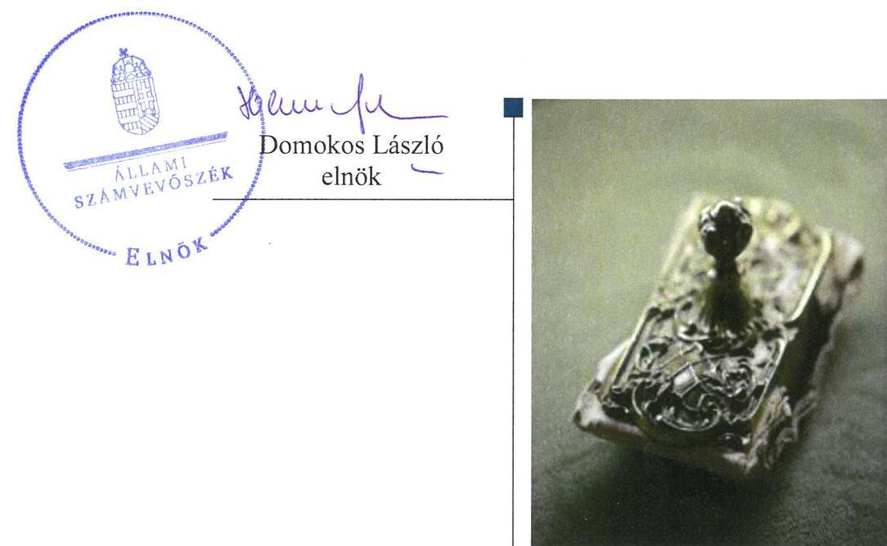

---

# AZ ELLENŐRZÉST FELÜGYELTE:

DR. PULAY GYULA ZOLTÁN felügyeleti vezető

## AZ ELLENŐRZÉST VEZETTE ÉS A VÉGREHAJTÁSÁÉRT FELELŐS:

SIPOSNÉ DÓCZI KLÁRA ellenőrzésvezető

## A PROGRAM ÖSSZEÁLLÍTÁSÁÉRT FELELŐS:

TÓTPÁL SZABOLCS osztályvezető

IKTATÓSZÁM: EL-0632-051/2018

TÉMASZÁM: 2469

ELLENŐRZÉS-AZONOSÍTÓ SZÁM: V081431

Jelentéseink az Országgyűlés számítógépes hálózatán és az Interneten a www.asz.hu címen is olvashatóak.

---

# TARTALOMJEGYZÉK 

■ ÖSSZEGZÉS ..... 5
■ AZ ELLENŐRZÉS CÉLJA ..... 6
■ AZ ELLENŐRZÉS TERÜLETE ..... 7
■ AZ ELLENŐRZÉS HÁTTERE, INDOKOLTSÁGA ..... 9
■ A JELENTÉS LÉNYEGES KÉRDÉSKÖREI ..... 10
■ AZ ELLENŐRZÉS HATÓKÖRE ÉS MÓDSZEREI ..... 11
■ MEGÁLLAPÍTÁSOK ..... 13
■ JAVASLATOK ..... 17
■ KÖVETKEZTETÉSEK ..... 18
■ MELLÉKLETEK ..... 19
I. sz. melléklet: Értelmező szótár ..... 19
II. sz. melléklet: Az éves beszámolók adatai ..... 23
■ FÜGGELÉK: ÉSZREVÉTELEK ..... 25
■ RÖVIDÍTÉSEK JEGYZÉKE ..... 33

---

.

---

# ÖSSZEGZÉS 

A Magyar Nemzeti Vagyonkezelő Zártkörűen Működő Részvénytársaság a tulajdonosi joggyakorlás kereteit szabályszerűen alakította ki, tulajdonosi joggyakorlása szabályszerű volt. Az AEROPLEX Közép-Európai Légijármű Műszaki Központ Korlátolt Felelősségű Társaság működése, gazdálkodása és vagyongazdálkodása szabályszerű volt, beszámolási kötelezettségét az előírások szerint teljesítette. A Társaság a köztulajdonban álló gazdasági társaságok számára előírt közzétételi kötelezettségnek nem tett eleget.

## Az ellenőrzés társadalmi indokoltsága

Az Állami Számvevőszék kiemelt célja, hogy az államháztartáson kívülre nyújtott költségvetési támogatások és ingyenes vagyonjuttatások, valamint az államháztartáson kívül működő feladatellátó rendszerek ellenőrzéseivel hozzájáruljon ahhoz, hogy a közpénzeket az államháztartáson kívül működő szervezetek is átlátható, rendezett módon használják fel.

Az állami tulajdonú gazdálkodó szervezetek a nemzeti vagyon részét képezik. Az állami vagyonnal való gazdálkodást illetően a tulajdonosi joggyakorlás feladata az állami vagyon átlátható, rendeltetésszerű és felelős használatának biztosítása. Az állami tulajdonú gazdasági társaságok feladata az állami vagyon átlátható, hatékony, költségtakarékos működtetése, értékének megőrzése, állagának védelme, értéknövelő használata, hasznosítása.

Minden közpénzt, közvagyont használó szervezettel szemben társadalmi igény, hogy tevékenységükről elszámoljanak. Ezt figyelembe véve és az Állami Számvevőszék Stratégiájával összhangban került sor az állami tulajdonban álló AEROPLEX Közép-Európai Légijármű Műszaki Központ Korlátolt Felelősségű Társaság ellenőrzésére.

## Főbb megállapítások, következtetések, javaslatok

A Magyar Nemzeti Vagyonkezelő Zártkörűen Működő Részvénytársaság a Társaság felett a tulajdonosi joggyakorlásra vonatkozó feladatokat, hatásköröket és jogosultságokat meghatározta, és azokat az előírások szerint gyakorolta.

Az AEROPLEX Közép-Európai Légijármű Műszaki Központ Korlátolt Felelősségű Társaság rendelkezett a szabályszerű működés feltételeit megteremtő, a jogszabályi előírásoknak megfelelő belső szabályzatokkal. A bevételeket és a ráfordításokat szabályszerűen számolta el. A Társaság az éves beszámolókat a jogszabályi előírások szerint elkészítette, azokat az előírt tartalommal és formában közzétette. A Társaság a köztulajdonban álló gazdasági társaságok számára előírt közzétételi kötelezettségnek nem tett eleget, átláthatóságát nem biztosította.

A Társaság a jogszabályi előírások és a tulajdonosi joggyakorló által előírt követelmények szerint elkészítette a vagyonnal való gazdálkodásának a belső szabályozását, és abban kialakította a vagyongazdálkodás feltételeit. Az éves beszámolók leltárral alátámasztottak voltak. A Társaság meghatározta a kapcsolt társaság felé annak adatszolgáltatására vonatkozó követelményeit, és a jogszabályi előírásoknak megfelelően számoltatta be a többségi tulajdonában álló társaságot.

Az Állami Számvevőszék a jelentésben foglalt megállapítások alapján az AEROPLEX Közép-Európai Légijármű Műszaki Központ Korlátolt Felelősségű Társaság ügyvezetőjének egy javaslatot, a Magyar Nemzeti Vagyonkezelő Zártkörűen Működő Részvénytársaság vezérigazgatója felé pedig egy következtetést fogalmazott meg. A javaslatot megalapozó megállapításokra az érintettnek 30 napon belül intézkedési tervet kell készítenie.

---

# AZ ELLENŐRZÉS CÉLJA 

Az ellenőrzés célja annak értékelése, hogy a tulajdonosi jogok gyakorlása szabályszerű volt-e. A gazdálkodó szervezet szabályozottsága, gazdálkodása és vagyongazdálkodási tevékenysége megfelelt-e a jogszabályi és a tulajdonosi előírásoknak; biztosítva volt-e a közfeladatok átláthatósága és elszámoltathatósága érdekében a közszolgáltatás díjának megalapozottsága szabályszerű önköltségszámítással. A vagyonváltozást eredményező döntések esetében a tulajdonosi jogok gyakorlója és a gazdálkodó szervezet szabályszerűen jártak-e el.

---

# AZ ELLENŐRZÉS TERÜLETE 

## AEROPLEX Közép-Európai Légijármű Műszaki Központ Korlátolt Felelősségű Társaság, a Magyar Nemzeti Vagyonkezelő Zártkörűen Működő Részvénytársaság

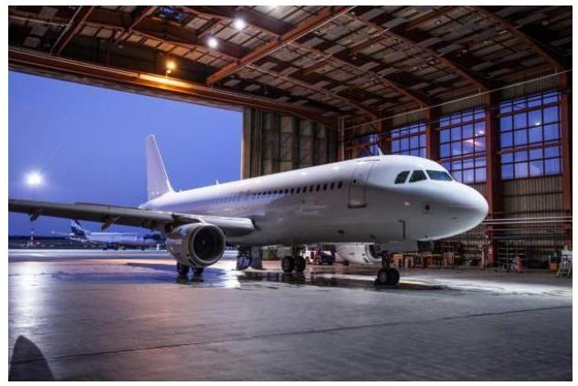

Az AEROPLEX Kft. ${ }^{1}$-t az amerikai Lockheed Aircraft Service International ${ }^{2}$ és a MALÉV Magyar Légiközlekedési Vállalat alapította 1992. január 24-én. Az alapítók tulajdoni hányada az alapításkor 50-50\% volt. 1998-ban a MALÉV Rt. 100\%-os tulajdonossá vált azzal, hogy megvásárolta az 50\%-os Lockheed tulajdonrészt. A Malév Zrt. 2012. februári leállását követően a Társaság ${ }^{3}$ tulajdonosa - 2012. október 30-tól kizárólagosan - a Magyar Állam (tulajdonosi joggyakorló az MNV Zrt. ${ }^{4}$ ).

Az AEROPLEX Kft. az ellenőrzött időszakban 100\%-os állami tulajdonban állt, jegyzett tőkéje 2016-ban 1020 millió Ft volt. A Magyar Államot megillető tulajdonosi jogok és kötelezettségek összességét a Vtv. ${ }^{5}$ 3. § (1) bekezdése alapján az állami vagyon felügyeletéért felelős miniszter gyakorolta az MNV Zrt. útján.

A Társaság főtevékenysége az ellenőrzött időszakban légijármű javítása volt. A Társaságnál a 2013-2016 időszakban egyetlen választott, az ügyvezetési feladatokat ellátó vezető tisztségviselő az ügyvezető volt, kinek személyében az ellenőrzött időszakban 5 alkalommal történt változás. A Társaság ügyvezetését Felügyelőbizottság ${ }^{6}$ ellenőrizte, tagjainak a száma 2013. év elején 3 fő volt, amely 2016. évvégére 5 főre emelkedett. A Társaság éves beszámolóit független könyvvizsgáló auditálta, kinek személyében 2013-ban történt változás.

A Társaság az ellenőrzött időszakban nem minősült közhasznú szervezetnek, közhasznú tevékenységet nem végzett, közfeladatot nem látott el, működéséhez a tulajdonostól támogatásban nem részesült, és nem tartozott az Áht. 1. § 12. pontjában meghatározott kormányzati szektorba sorolt egyéb gazdálkodó szervezetek közé.

A Társaság 2013-ban 386 főt, 2016-ban 374 alkalmazottat foglalkoztatott.

A Társaság gazdálkodásának egyes adatait az 1. ábra szemlélteti, részleteiben a II. sz. melléklet mutatja be.

---

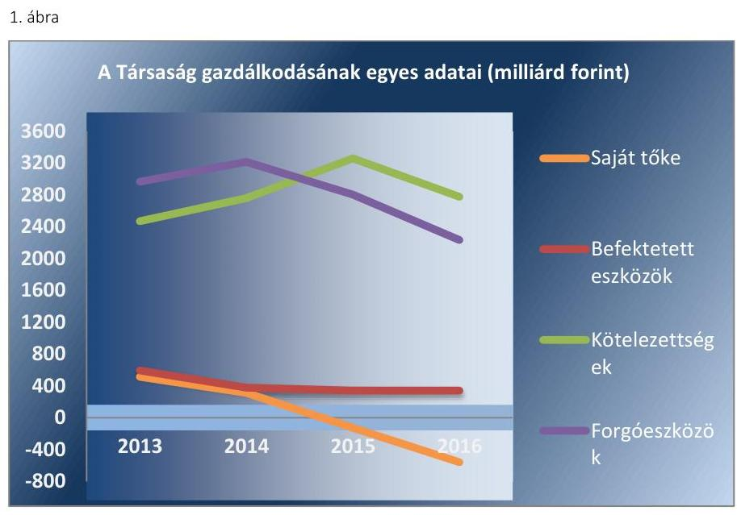

Forrás: A Társaság 2013-2016. évi beszámolói

A Társaság az ellenőrzött időszakban folyamatosan veszteségesen működött. A MALÉV Zrt. felszámolása miatt a Társaság nehéz helyzetbe került, mivel a Társaság árbevételének közel 50\%-a származott a MALÉV-től. A saját tőke összege az ellenőrzött időszakban - főként mindegyik év negatív mérleg szerinti /adózott eredményére, tehát a veszteség termelésre visszavezethetően - folyamatosan csökkent, 2015 végétől már negatív volt. A Magyar Állam, mint tulajdonos 2014. évben 600 millió Ft, 2015. évben 300 millió Ft összegű tőkepótlást hajtott végre, amelyből 10-10 millió Ft-ot a jegyzett tőke emelésére fordított, míg a különbözet a tőketartalékban került nyilvántartásba vételre. A 2016. évi éves beszámoló alapján a saját tőke összege nem érte el az adott társasági formára a törvényben kötelezően előírt jegyzett tőke összegét. Az adatok alapján a 2016-os árbevétel 13\%-kal kisebb volt a 2013. évinél, miközben a foglalkoztatottak száma megközelítőleg azonos volt.

A 2013-2016. években a Társaság nem állt csődeljárás illetve felszámolási eljárás alatt. Az ellenőrzött időszakban a Társaság vagyonkezelésbe vett vagyont nem birtokolt, a Pannon Air Cargo Kft.-n túl más gazdasági társaságban nem rendelkezett tulajdonrésszel.

Az AEROPLEX Kft. 2012. novemberében megvásárolta a Malév Zrt. felszámolójától a Pannon Air Cargo Kft.-t. A Társaság a leányvállalatában az ellenőrzött időszakban többségi tulajdonrésszel rendelkezett. A 2013. évi 80\%-os tulajdonrésze az MNV Zrt. hozzájárulásával történt üzletrész értékesítést követően 2016-ban 60\%-ra csökkent.

---

# AZ ELLENŐRZÉS HÁTTERE, INDOKOLTSÁGA 

Az Európai Unióban 1994. év óta hatályos túlzott hiány eljárás mindig kihívást jelentett a tagállamok számára. Az állami tulajdonú gazdálkodó szervezetek ellenőrzése kiemelten fontos a vagyon megőrzése, megóvása érdekében, valamint a kormányzati szektor elszámolásaiban megjelenő állami tulajdonú gazdálkodó szervezetek esetében, amelyekkel szemben alapvető követelmény, hogy gazdálkodásuk, működésük szabályszerű, az általuk szolgáltatott adatok minél megbízhatóbbak legyenek. Gazdálkodásuk jellemzően a közérdeklődés és a média figyelmének középpontjában áll, amihez hozzájárul a gazdálkodásuk körébe tartozó - közvetlen vagy közvetett állami tulajdonú, tehát végső soron a nemzeti vagyon részét képező - vagyon nagysága, illetve az általuk ellátott közszolgáltatások/közfeladatok minősége és hatékonysága.

Az ellenőrzés rámutathat az állami tulajdonú gazdálkodó szervezetek gazdálkodási tevékenységével jó gyakorlatokra és szabálytalanságokra. Felhívhatja a figyelmet a jogszabályi követelmények teljesítéséhez szükséges feltételek hiányosságaira, hozzájárulhat az államháztartáson kívüli, de (közvetlenül vagy közvetve) állami vagyont használó gazdálkodó szervezetek tevékenységének átláthatóságához. Ellenőrzésünk eredményeképpen javaslatainkkal, megállapításainkkal hozzájárulhatunk a nemzeti vagyonnal való gazdálkodás átláthatóságának, elszámoltathatóságának javításához.

---

# A JELENTÉS LÉNYEGES KÉRDÉSKÖREI 

1.     - A tulajdonosi jogok gyakorlása szabályszerű volt-e?
2.     - A Társaság működésének szabályozottsága megfelelt-e az előírásoknak? A Társaságnál a pénzügyi-számviteli, adatszolgáltatási és ellenőrzési feladatok ellátása szabályszerű volt-e?
3.     - A társaság vagyongazdálkodása szabályszerű volt-e?

---

# AZ ELLENŐRZÉS HATÓKÖRE ÉS MÓDSZEREI 

## Az ellenőrzés típusa

Megfelelőségi ellenőrzés

## Az ellenőrzött időszak

Az ellenőrzött időszak 2013. - 2016. évek, a 2016. évi beszámoló jóváhagyásáig tartó időszak

## Az ellenőrzés tárgya

A Magyar Nemzeti Vagyonkezelő Zártkörűen Működő Részvénytársaság tulajdonosi joggyakorlása, az AEROPLEX Közép-Európai Légijármű Műszaki Központ Korlátolt Felelősségű Társaság gazdálkodása, kiemelten vagyongazdálkodási tevékenysége, továbbá gazdálkodásának a kormányzati szektor hiányára és az államadósságra befolyással bíró elemei.

## Az ellenőrzött szervezet

- Magyar Nemzeti Vagyonkezelő Zártkörűen Működő Részvénytársaság
- AEROPLEX Közép-Európai Légijármű Műszaki Központ Korlátolt Felelősségű Társaság

## Az ellenőrzés jogalapja

Az ellenőrzés jogalapját az ÁSZ tv. 1. § (3) bekezdése és 5. § (3)-(5) bekezdése képezte.

## Az ellenőrzés módszerei

Az ellenőrzést a nemzetközi standardokat irányadónak tekintve az ellenőrzési program ellenőrzési kérdései, az ellenőrzött időszakban hatályos jogszabályok, az ellenőrzés szakmai szabályok és módszertanok figyelembe vételével végeztük.

Az ellenőrzés ideje alatt az ellenőrzött szervezettel történő kapcsolattartást az ÁSZ Szervezeti és Működési Szabályzatának vonatkozó előírásai alapján biztosítottuk.

---

Az ellenőrzési program szerinti feladatokat az AEROPLEX Közép-Európai Légijármű Műszaki Központ Korlátolt Felelősségű Társaságnál, valamint a tulajdonosi jogok gyakorlójánál, a Magyar Nemzeti Vagyonkezelő Zártkörűen Működő Részvénytársaságnál hajtottuk végre.

A gazdasági társaságnál helyszíni adatbetekintés keretében ellenőriztük a kapcsolt vállalkozás számára az adatszolgáltatás előírását, valamint annak a kapcsolt vállalkozás részéről történő teljesítését.

A teljes ellenőrzött időszakra vonatkozóan került ellenőrzésre a gazdasági társaság tervezési, beszámolási, közzétételi, adatszolgáltatási kötelezettségének, valamint belső ellenőrzési tevékenységének szabályszerűsége. A 2013. és 2016. évekre vonatkozóan a gazdasági társaság működésének szabályozottságát, a bevételei és ráfordításai elszámolását, illetve vagyongazdálkodásának szabályszerűségét is ellenőriztük.

A gazdasági társaságnál a bevételek és a ráfordítások közül az értékesítés nettó árbevétele, az egyéb, rendkívüli és pénzügyi műveletek bevételei, a személyi jellegű ráfordítások, az anyagjellegű ráfordítások, az egyéb, rendkívüli és pénzügyi műveletek ráfordításai, valamint értékcsökkenési leírás elszámolásának szabályszerűségét, továbbá az immateriális javak, tárgyi eszközök esetében a vagyonnyilvántartás szabályszerűségét véletlen mintavétellel ellenőriztük. A sokaságok esetében a mintavétel azokra a legnagyobb értékű tételekre - a lényeges sokaságra - terjedt ki, melyek összértéke eléri a teljes sokaság összértékének 50\%-át. A személyi jellegű ráfordítások esetében a mintavétel a teljes sokaságból történt. Amennyiben valamely ellenőrzött sokaság elemszáma kisebb volt, mint az előírt mintaelemszám, az ellenőrzött sokaságot tételesen ellenőriztük.

A mintavétellel ellenőrzött területek esetében minden egyes tétel vonatkozásában a szabályszerűségre vonatkozó kérdéseket tettünk fel, amelyek
 eredménye összesítésre került. „Szabályszerűnek" értékeltünk egy ellenőrzött területet, amennyiben 95%-os bizonyossággal az ellenőrzött sokaságban az átlagos hibaarány legfeljebb 10%, "nem szabályszerűnek", amennyiben 10%-nál magasabb arányt képviselt.

Az ellenőrzési kérdések megválaszolásához szükséges bizonyítékok megszerzése a következő ellenőrzési eljárások alkalmazásával történt: megfigyelés, kérdésfeltevés (információkérés), összehasonlítás, valamint elemző eljárás. Az ellenőrzési bizonyítékként felhasználható adatforrások közé tartoztak egyrészt az ellenőrzési programban felsorolt adatforrások, másrészt adatforrás lehetett még minden - az ellenőrzés folyamán - feltárt, az ellenőrzés szempontjából információkat tartalmazó dokumentum.

Az ellenőrzést a kérdésekre adott válaszok kiértékelésével, valamint a megjelölt adatforrások, a tanúsítványok felhasználásával, továbbá az adott időszakban hatályos jogszabályok figyelembe vételével folytattuk le.

---

# 1. A tulajdonosi jogok gyakorlása szabályszerű volt-e? 

Összegző megállapítás

Az MNV Zrt. a tulajdonosi joggyakorlás kereteit szabályszerűen alakította ki, a tulajdonosi jogok gyakorlása szabályszerű volt.

A TULAJDONOSI JOGGYAKORLÁS KERETEIT az MNV Zrt. mint a Magyar Állam nevében a tulajdonosi jogkör gyakorlója a Gt. ${ }^{8}$ illetve a Ptk. ${ }^{9}$ valamint az SZMSZ ${ }_{1-3}{ }^{10}$ előírásai szerint a Társaság Alapító okirat ${ }_{1-19}{ }^{11}$-ban határozta meg, melyben rögzítették az „Egyedüli Tag"12 számára fenntartott tulajdonosi jogokat és döntési hatásköröket.

A FELÜGYELŐBIZOTTSÁGOT13 ÉS A KÖNYVVIZSGÁLÓT14, a Gt. illetve a Ptk. ${ }_{2}$ előírásai szerint a tulajdonosi joggyakorló választotta meg. Az MNV Zrt. Igazgatósága tevékenységéről minden évben beszámoltatta a Felügyelőbizottságot, és azt határozatban fogadta el.

AZ ANYAGI ÉRDEKELTSÉGI RENDSZER elemeit a Javadalmazási szabályzat ${ }_{1-2}{ }^{15}$-ban rögzítették, mely szabályzat megfelelt a Taktv. ${ }^{16}$ előírásainak.

AZ ÜZLETI TERVET a Társaság minden évben a tulajdonosi joggyakorló tervezési irányelveinek ${ }^{17}$ eleget téve készítette el, melyet a Felügyelő Bizottság véleményezését követően nyújtott be az MNV Zrt. Igazgatósága felé. A Társaság a vagyonvesztés megakadályozására 2016-ban a tulajdonosi joggyakorló előírásai szerinti reorganizációs tervet készített. Az MNV Zrt. Igazgatósága az üzleti- illetve reorganizációs terveket határozataiban elfogadta.

A MONITORING RENDSZERT az MNV Zrt. a Monitoring Szabályzat ${ }^{18}$ szerint működtette, melynek keretében havi gyakorisággal követte nyomon a Társaság gazdálkodását.

Az ellenőrzött időszakban a tulajdonosi joggyakorló négy alkalommal végzett ellenőrzést, melyek a társaság vagyongazdálkodását, pénzgazdálkodását és a szerződéskötéseit érintették. Az ellenőrzések során megfogalmazott megállapításokra a Társaság intézkedési tervet készített.

A TÁRSASÁG SZÁMVITELI BESZÁMOLÓIT - a Felügyelőbizottság előzetes írásbeli jelentését követően - a tulajdonosi joggyakorló a Gt. illetve a Ptk. ${ }_{2}$ előírásainak megfelelően, a könyvvizsgálói jelentések birtokában fogadta el. A tulajdonosi joggyakorló a veszteségpótlás módjáról a Ptk. ${ }_{2}$-ban foglaltaknak megfelelően döntött, és rendelkezett a Társaság saját tőkéje előírások szerinti összegének biztosításáról.

---

# 2. A Társaság működésének szabályozottsága megfelelt-e az előírásoknak? A Társaságnál a pénzügyi-számviteli, adatszolgáltatási és ellenőrzési feladatok ellátása szabályszerű volt-e? 

Összegző megállapítás

A Társaság működésének szabályozottsága megfelelt az előírásoknak. A Társaságnál a bevételek és a ráfordítások elszámolása szabályszerű volt. A Társaság a beszámolási kötelezettségeinek eleget tett, azonban a jogszabályban számára előírt adatok közzétételi kötelezettségét nem teljesítette.
2.1. számú megállapítás

A Társaság rendelkezett a jogszabályokban előírt kötelező szabályzatokkal, melyek megfeleltek az előírásoknak.

AZ SZMSZ ${ }_{1-11}{ }^{19}$ a Társaság tevékenységéhez igazodóan, a PART-145 ${ }^{20}$ előírásainak megfelelően szabályozta az ügyvezetés felelősségét és feladatait, a társaság vezetésére és a gazdálkodására vonatkozó szabályokat, a Társaság szervezeti felépítését. Az SZMSZ ${ }^{21}{ }_{1-11}$-ben szabályozta a Társaság működését, azon belül a különböző tevékenységek folyamatait, a minőségügyi rendszer működtetésének folyamatát továbbá a Társaság szerződött partnereit, az alkalmazott szerződéseket és további, a tevékenység végzéséhez használt dokumentumokat.

SZÁMVITELI SZABÁLYZATOKKAL - Számviteli Politikával ${ }^{22}{ }_{1-4}$, és annak részeként Eszközök és források értékelési szabályzatával ${ }^{23}{ }_{1-4}$, valamint Leltározási szabályzattal ${ }^{24}{ }_{1-3}$, Pénzkezelési szabályzattal ${ }^{25}{ }_{1-3}$ és Önköltség számítási Szabályzattal ${ }^{26}{ }_{1-2}$ - továbbá Számlarenddel ${ }^{27}{ }_{1-2}$ rendelkezett a Társaság, ezzel megfelelt a Számv. tv. ${ }^{28} 14. § (5) és a 161. § (1) bekezdéseiben előírtaknak. A szabályzatok megfeleltek a Számv. tv. előírásainak.

A szabályszerű működést segítette az Eszközök hasznosítási és selejtezési szabályzata ${ }^{29}$, az Iratkezelési szabályzat ${ }^{30}$ valamint az Informatikai biztonsági szabályzat ${ }^{31}$ is. Külön szabályozási rendszerben jelenítette meg a Társaság a minőségügyi felülvizsgálatokat ${ }^{32}$ követő eljárások szabályait, valamint a Társaság éves auditálási terveinek kidolgozásának és kezelésének ${ }^{33}$ követelményeit.
2.2. számú megállapítás

A bevételek és a ráfordítások elszámolása szabályszerű volt.
A BEVÉTELEK ÉS A RÁFORDÍTÁSOK ELSZÁMOLÁSA a Számv. tv. és a belső szabályozások előírásai szerint történtek. Az elszámolásokat megalapozó dokumentumok rendelkezésre álltak, az elszámolásokra a számviteli bizonylatok alapján, a jogszabályban meghatározottak szerint került sor.
2.3. számú megállapítás

A Társaság az üzleti terv készítési, beszámolási és az éves beszámolók közzétételi kötelezettségének eleget tett, azonban a Taktv.-ben meghatározott adatok közzétételi kötelezettségét nem teljesítette.

ÜZLETI TERV KÉSZÍTÉSI, valamint beszámolási kötelezettségének a Társaság az ellenőrzött időszakban a tulajdonosi joggyakorló által

---

megfogalmazott követelményeknek megfelelően elkészített üzleti tervekkel, reorganizációs tervvel, valamint a tulajdonosi joggyakorló által meghatározott adatszolgáltatási- és tájékoztatási kötelezettségek előírásszerű teljesítésével tett eleget.

AZ ÉVES BESZÁMOLÓIT az ellenőrzött időszakban a Társaság a Számv. tv.-ben meghatározott módon és tartalommal elkészítette. Az éves beszámolókat leltárral szabályszerűen alátámasztotta, a könyvvizsgáló által korlátozás nélkül hitelesített beszámolók letétbe helyezési és közzétételi kötelezettségét a jogszabályi előírások szerint teljesítette a Társaság.

A Taktv. 2. § (1) bekezdésében szereplő, a köztulajdonban álló gazdasági társaságok számára előírt adatok nyilvánosságra hozatalát az ellenőrzött időszak alatt a Társaság nem teljesítette, mert nem tette közzé az Mt. ${ }^{34}$ 208. § szerinti vezető állású munkavállalók nevét, munkakörét, a munkaviszony vagy kinevezés kezdetét és végét, az alkalmazás minőségét, személyi alapbérét, az egyéb juttatását, a felmondási időt, illetve a végkielégítés mértékét, valamint a Felügyelőbizottság tagjainak nevét, tisztségét, a megbízás kezdetét és végét, az alkalmazás minőségét és megbízási díját.

# 3. A társaság vagyongazdálkodása szabályszerű volt-e? 

## Összegző megállapítás

### 3.1. számú megállapítás

A Társaság vagyongazdálkodása szabályszerű volt.
A Társaság kialakította és szabályozta a vagyongazdálkodás feltételeit, vagyonát az előírások szerint tartotta nyilván.

A VAGYONGAZDÁLKODÁS FELTÉTELEIT, a vagyonnal való gazdálkodás, ezen belül a kapcsolódó feladat- és hatáskörök, felelősségi viszonyok meghatározását a jogszabályi feltételeken túl a Társaság Alapító okirat ${ }_{1-19}$-a, valamint a belső szabályzatok (KSZMSZ ${ }_{1-11}$ ) tartalmazták. Az Alapító okirat ${ }_{1-19}$ rögzítette a kizárólagos alapítói hatáskörbe tartozó, a vagyongazdálkodással kapcsolatos döntések követelményeit, melyek teljesítéseként az MNV Zrt. döntései az Alapító okirat ${ }_{1-19}$-ban meghatározottak szerint minden esetben rendelkezésre álltak.

A VAGYONNYILVÁNTARTÁS szabályszerű volt. Az analitikus és a főkönyvi nyilvántartás a Számv. tv-ben és a belső szabályzatokban rögzítettek szerint biztosította a Társaság vagyonának folyamatos nyilvántartási- és elszámolási kötelezettségének teljesítését.

AZ ESZKÖZÖK ÉS FORRÁSOK LELTÁROZÁSA az ellenőrzött években szabályszerű volt. A Számv. tv. 69. §-ban és a Leltározási szabályzatban foglaltak szerinti egyeztetéssel és két évente mennyiségi felvétellel leltároztak, és támasztották alá leltárral az éves beszámolókat.

A SAJÁT VAGYON VÁLTOZÁSÁT eredményező döntéseit az Alapító okirat ${ }_{1-19}$-ban meghatározottak szerint hozta meg a Társaság. Minden szükséges esetben rendelkezésre álltak a tulajdonosi jogok gyakorlójának előzetes írásbeli döntései.

---

# 3.2. számú megállapítás 

A Társaság a kapcsolt vállalkozását ${ }^{35}$, mint tulajdonos a jogszabályi előírások szerint beszámoltatta.

A VAGYONGAZDÁLKODÁS KÖVETELMÉNYEIT a Pannon Air Cargo Kft. felé az MNV Zrt. Igazgatósági határozata alapján, a Társaság a kapcsolt vállalkozás Alapító okiratában határozta meg. A Gt. illetve a Ptk. 2 rendelkezéseinek megfelelően, valamint a tulajdonosi joggyakorló határozatában foglaltakat is végrehajtva a Társaság létrehozta a kapcsolt vállalkozás felügyelőbizottságát, megválasztotta tagjait, valamint az ügyvezetőt és a könyvvizsgálót.

A Társaság a kapcsolt vállalkozást a Gt. illetve a Ptk. 2 előírásai szerint szabályszerűen beszámoltatta. A Társaság az MNV Zrt. jóváhagyását követően, a Gt. illetve a Ptk. 2 előírásai szerint, a Felügyelőbizottság írásbeli jelentésének és a könyvvizsgáló írásbeli véleményének ismeretében, alapítói határozattal fogadta el a kapcsolt vállalkozásnak a jogszabályok által előírt határidőben és adattartalommal a Társaságnak megküldött éves beszámolóit.

---

# JAVASLATOK 

Az ÁSZ tv. 33. § (1) bekezdésében foglaltak értelmében az ellenőrzött szervezet vezetője köteles a jelentésben foglalt megállapításokhoz kapcsolódó intézkedési tervet összeállítani és azt a jelentés kézhezvételétől számított 30 napon belül az ÁSZ részére megküldeni. Amennyiben az ellenőrzött szervezet vezetője nem küldi meg határidőben az intézkedési tervet, vagy továbbra sem elfogadható intézkedési tervet küld, az Állami Számvevőszék elnöke az ÁSZ tv. 33. § (3) bekezdése a) és b) pontjaiban foglaltakat érvényesítheti.

## Az AEROPLEX Közép-Európai Légijármű Műszaki Központ Kft. ügyvezetőjének

1. Intézkedjen a jogszabályban előírt közzétételi kötelezettség teljesítéséről.
(2.3. sz. megállapítás 3. bekezdése alapján)

---

# Magyar Nemzeti Vagyonkezelő Zrt. vezérigazgatójának 

1. A MALÉV Zrt. 2012. februári leállása a 100 százalékos tulajdonában álló leányvállalatát, a légijármű javítást végző, közel 400 főt foglalkoztató AEROPLEX Közép-Európai Légijármű Műszaki Központ Kft.-t (a továbbiakban: Társaság) is érzékenyen érintette: nettó árbevétele jelentősen csökkent, készletei leértékelődtek, 2012. évi mérleg szerinti eredménye megközelítette a 4 milliárd forintos veszteséget. A Társaság tevékenységének fenntartása és a munkahelyek megőrzése érdekében a Társaság 2012. októberében a Magyar Állam 100 százalékos tulajdonába került. A Társaság menedzsmentje - a többszöri vezetőváltás ellenére - nem tudta a nyereséges működés feltételeit megteremteni, a Társaság mérleg szerinti eredménye (2016 évben adózott eredménye) 2013 és 2016 évek között minden évben több száz millió forintos veszteséget mutatott. A Társaság súlyos vagyonvesztést szenvedett el: tárgyi eszközállományának értéke folyamatosan csökkent, forgóeszköz-állományának értéke 2014-óta csökkent. Saját tőkéje 2015-ben negatívvá vált. A Magyar Állam 2014. évben 600 millió Ft, 2015. évben 300 millió Ft összegű tőkepótlást hajtott végre. A 2016. évi éves beszámoló alapján további tőkeemelésre volt szükség. Ennek alapján megállapítható, hogy a Társaság működése nem felelt meg a Magyarország Alaptörvénye 38. cikk (5) bekezdésébe foglalt követelménynek, amely szerint az „állam és a helyi önkormányzatok tulajdonában álló gazdálkodó szervezetek törvényben meghatározott módon, önállóan és felelősen gazdálkodnak a törvényesség, a célszerűség és az eredményesség követelményei szerint". A MALÉV Zrt. leállásának időpontjában célszerű lehetett az állami beavatkozás a Társaság működésének fenntartása érdekében. A tartósan veszteséges Társaság állami tulajdonban tartása azonban nem felel meg az állami tulajdonnal szembeni alkotmányos követelményeknek, különös tekintettel arra, hogy a Társaság közfeladatot nem végez.

A nemzeti vagyonról szóló 2011. évi CXCVI. törvény 7. § (2) bekezdése szerint „A nemzeti vagyongazdálkodás feladata a nemzeti vagyon rendeltetésének megfelelő, az állam, az önkormányzat mindenkori teherbíró képességéhez igazodó, elsődlegesen a közfeladatok ellátásához és a mindenkori társadalmi szükségletek kielégítéséhez szükséges, egységes elveken alapuló, átlátható, hatékony és költségtakarékos működtetése, értékének megőrzése, állagának védelme, értéknövelő használata, hasznosítása, gyarapítása, továbbá az állam vagy a helyi önkormányzat feladatának ellátása szempontjából feleslegessé váló vagyontárgyak elidegenítése". Az Alaptörvényben meghatározott követelmény teljesítése, és a további vagyonvesztés elkerülése érdekében szükséges a Társaság
 jövőbeni működésére egy olyan megoldás kidolgozása és végrehajtása, amely megfelel a Nemzeti vagyonról szóló törvény fent idézett rendelkezésébe foglaltaknak.
(Az ellenőrzési terület bemutatásának 1. bekezdése és 5. bekezdése, valamint a 8. oldal ábra alatti 1. bekezdése alapján.)

---

# MELLÉKLETEK 

## I. SZ. MELLÉKLET: ÉRTELMEZŐ SZÓTÁR

állami vagyon
a) Az állam tulajdonában lévő dolog, valamint a dolog módjára hasznosítható természeti erő,
b) az a) pont hatálya alá nem tartozó mindazon vagyon, amely vonatkozásában törvény az állam kizárólagos tulajdonjogát nevesíti,
c) az állam tulajdonában lévő tagsági jogviszonyt megtestesítő értékpapír, illetve az államot megillető egyéb társasági részesedés,
d) az államot megillető olyan immateriális, vagyoni értékkel rendelkező jogosultság, amelyet jogszabály vagyoni értékű jogként nevesít.
Forrás: Vtv. 1. § (2) bekezdése
e) az állam tulajdonában lévő pénzügyi eszközök

Forrás: Vtv. 1. § (2) bekezdése
2013. június 27-ig:

Az állami vagyont az MNV Zrt. maga kezeli, vagy szerződés - így különösen bérlet, haszonbérlet, megbízás - alapján központi költségvetési szervnek, természetes vagy jogi személynek, vagy jogi személyiséggel nem rendelkező gazdálkodó szervezetnek hasznosításra átengedi.
Forrás: Vtv. 23. § (1) bekezdése
2013. június 28-ától:

Az állami vagyonnal az MNV Zrt. maga gazdálkodik, vagy szerződés - így különösen bérlet, haszonbérlet, megbízás - alapján központi költségvetési szervnek, természetes vagy jogi személynek, vagy jogi személyiséggel nem rendelkező gazdálkodó szervezetnek hasznosításra átengedi, illetőleg vagyonkezelésbe, haszonélvezetbe adja.
Forrás: Vtv. 23. § (1) bekezdése
anyavállalat
Az a vállalkozó, amely egy másik vállalkozónál (a továbbiakban: leányvállalat) közvetlenül vagy leányvállalatán keresztül közvetetten meghatározó befolyást képes gyakorolni, mert az alábbi feltételek közül legalább eggyel rendelkezik:
a) a tulajdonosok (a részvényesek) szavazatának többségével (50 százalékot meghaladóval) tulajdoni hányada alapján egyedül rendelkezik, vagy
b) más tulajdonosokkal (részvényesekkel) kötött megállapodás alapján a szavazatok többségét egyedül birtokolja, vagy
c) a társaság tulajdonosaként (részvényesként) jogosult arra, hogy a vezető tisztségviselők vagy a felügyelőbizottság tagjai többségét megválassza vagy visszahívja, vagy
d) a tulajdonosokkal (a részvényesekkel) kötött szerződés (vagy a létesítő okirat rendelkezése) alapján - függetlenül a tulajdoni hányadtól, a szavazati aránytól, a megválasztási és visszahívási jogtól - döntő irányítást, ellenőrzést gyakorol.
Forrás: Számv. tv. 3. § (2) 1. pont
gazdasági társaság
A Ptk. 2. 3:88. § (1) bekezdése szerint „a gazdasági társaságok üzletszerű közös gazdasági tevékenység folytatására, a tagok vagyoni hozzájárulásával létrehozott, jogi személyiséggel rendelkező vállalkozások, amelyekben a tagok a nyereségből közösen részesednek, és a veszteséget közösen viselik".
2013. június 27-ig:

Állami vagyon kezelője/vagyonkezelő

Az állami vagyont az MNV Zrt. maga kezeli, vagy szerződés - így különösen bérlet, haszonbérlet, megbízás - alapján központi költségvetési szervnek, természetes vagy

---

gazdálkodó szervezet
kapcsolt vállalkozás
leányvállalat
meghatározó befolyás
jogi személynek, vagy jogi személyiséggel nem rendelkező gazdálkodó szervezetnek hasznosításra átengedi. Az állami vagyonra vonatkozóan az MNV Zrt. kizárólag az Nvtv-ben meghatározott személyekkel köthet vagyonkezelési szerződést.
Forrás: Vtv. 23. § (1), 27. § (1)

## 2013. június 28-ától:

Az állami vagyonnal az MNV Zrt. maga gazdálkodik, vagy szerződés - így különösen bérlet, haszonbérlet, megbízás - alapján központi költségvetési szervnek, természetes vagy jogi személynek, vagy jogi személyiséggel nem rendelkező gazdálkodó szervezetnek hasznosításra átengedi, illetőleg vagyonkezelésbe, haszonélvezetbe adja. Az állami vagyonra vonatkozóan az MNV Zrt. kizárólag az Nvtv-ben meghatározott személyekkel köthet vagyonkezelési szerződést.
Forrás: Vtv. 23. § (1), 27. § (1)
2014. március 14-ig:

A Ptk. ³⁶ 685. § c) pontja szerint gazdálkodó szervezet: „ az állami vállalat, az egyéb állami gazdálkodó szerv, a szövetkezet, a lakásszövetkezet, az európai szövetkezet, a gazdasági társaság, az európai részvénytársaság, az egyesülés, az európai gazdasági egyesülés, az európai területi együttműködési csoportosulás, az egyes jogi személyek vállalata, a leányvállalat, a vízgazdálkodási társulat, az erdő birtokossági társulat, a végrehajtói iroda, az egyéni cég, továbbá az egyéni vállalkozó."
2014. március 15-től:

A gazdasági társaság: az európai részvénytársaság, az egyesülés, az európai gazdasági egyesülés, az európai területi együttműködési csoportosulás, a szövetkezet, a lakásszövetkezet, az európai szövetkezet, a vízgazdálkodási társulat, az erdő birtokossági társulat, az állami vállalat, az egyéb állami gazdálkodó szerv, az egyes jogi személyek vállalata, a közös vállalat, a végrehajtói iroda, a közjegyzői iroda, az ügyvédi iroda, a szabadalmi ügyvivői iroda, az önkéntes kölcsönös biztosító pénztár, a magánnyugdíjpénztár, az egyéni cég, továbbá az egyéni vállalkozó. Az állam, a helyi önkormányzat, a költségvetési szerv, az egyesület, a köztestület, valamint az alapítvány gazdálkodó tevékenységével összefüggő polgári jogi kapcsolataira is a gazdálkodó szervezetre vonatkozó rendelkezéseket kell alkalmazni.
Forrás: Ptk. 37. 396. §
Az anyavállalat és a leányvállalat és a közös vezetésű vállalkozások (fölérendelt anyavállalat esetében a minősítést a fölérendelt anyavállalat szempontjából kell elvégezni)
Forrás: Számv. tv. 3. § (2) 7. pont
Az a gazdasági társaság, amelyre az anyavállalat meghatározó befolyást képes gyakorolni
Forrás: Számv. tv. 3. § (2) 2. pont
2014. március 14-ig:

A befolyással rendelkező akkor rendelkezik egy jogi személyben meghatározó befolyással, ha annak tagja, illetve részvényese és
a) jogosult e jogi személy vezető tisztségviselői vagy felügyelőbizottsága tagjai többségének megválasztására, illetve visszahívására, vagy
b) a jogi személy más tagjaival, illetve részvényeseivel kötött megállapodás alapján egyedül rendelkezik a szavazatok több mint ötven százalékával.
A meghatározó befolyás akkor is fennáll, ha a befolyással rendelkező számára az előzőek szerinti jogosultságok közvetett módon biztosítottak. A befolyással rendelkezőnek egy jogi személyben a szavazatok több mint ötven százalékával közvetett módon való rendelkezése vagy egy jogi személyben közvetetten fennálló meghatározó befo-

---

minősített többséget biztosító részesedés
rábízott vagyon
többségi befolyást biztosító részesedés
tulajdonosi ellenőrzés
lyása megállapítása során a jogi személyben szavazati joggal rendelkező más jogi személyt (köztes vállalkozást) megillető szavazatokat meg kell szorozni a befolyással rendelkezőnek a köztes vállalkozásban, illetve vállalkozásokban fennálló szavazatával. Ha a köztes vállalkozásban fennálló szavazatok mértéke az ötven százalékot meghaladja, akkor azt egy egészként kell figyelembe venni.
Forrás: Ptk. 1. 685/B. § (2)-(3) bekezdések

## 2014. március 15-től:

A befolyással rendelkező akkor rendelkezik egy jogi személyben meghatározó befolyással, ha annak tagja vagy részvényese, és
a) jogosult e jogi személy vezető tisztségviselői vagy felügyelőbizottsága tagjai többségének megválasztására, illetve visszahívására; vagy
b) a jogi személy más tagjai, illetve részvényesei a befolyással rendelkezővel kötött megállapodás alapján a befolyással rendelkezővel azonos tartalommal szavaznak, vagy a befolyással rendelkezőn keresztül gyakorolják szavazati jogukat, feltéve, hogy együtt a szavazatok több mint felével rendelkeznek.
Forrás: Ptk. 2. 8:2. § (2) bekezdés
A minősített befolyásszerző az ellenőrzött társaságban a szavazatok legalább hetvenöt százalékával rendelkezik. (2014. március 14-ig: Gt. 52. § (2), 2014. március 15-től: Ptk. 2. 3:324. §)
Egyrészt minden a Vtv. alkalmazásában állami vagyonnak minősülő vagyon, amit az MNV Zrt. kezel és nyilvántart.
Másrészt az a vagyon, amely felett a Magyar Állam nevében az MFB Zrt. gyakorolja a tulajdonosi jogokat.
Forrás: MFB tv. 3. § (9)
A rábízott vagyon a tulajdonosi jogokat gyakorló szervezetek saját vagyonától elkülönítendő.
Forrás: Vtv. 22. § (6)
2014. március 14-ig:

Többségi befolyás: az olyan kapcsolat, amelynek révén természetes személy, jogi személy vagy jogi személyiség nélküli gazdasági társaság (a továbbiakban együtt: befolyással rendelkező) egy jogi személyben a szavazatok több mint ötven százalékával vagy meghatározó befolyással rendelkezik.
Forrás: Ptk. 1. 685/B. § (1)
2014. március 15-től:

Többségi befolyás az olyan kapcsolat, amelynek révén természetes személy vagy jogi személy (befolyással rendelkező) egy jogi személyben a szavazatok több mint felével vagy meghatározó befolyással rendelkezik.
Forrás: Ptk. 2. 8:2. § (1)
2014. március 14-ig:

Az állami vagyon kezelőjét, haszonélvezőjét, használóját megillető jogok gyakorlását, annak szabályszerűségét, célszerűségét az MNV Zrt. - szükség szerint területi szervei útján - ellenőrzi.

## 2014. március 15-től:

Az állami vagyon használóját, vagyonkezelőjét és haszonélvezőjét megillető jogok gyakorlását, annak szabályszerűségét, a kötelezettségek teljesítését, valamint a vagyon rendeltetése szerinti célszerűségét a tulajdonosi joggyakorló rendszeresen ellenőrzi.
Forrás: Vtv. vhr. 20. § (1)

---

tulajdonosi jogok gyakorlója 1.

# 2013. június 27-ig: 

Az állami vagyon felett a Magyar Államot megillető tulajdonosi jogok és kötelezettségek összességét - ha törvény eltérően nem rendelkezik - az állami vagyon felügyeletéért felelős miniszter (a továbbiakban: miniszter) gyakorolja, aki e feladatát a Magyar Nemzeti Vagyonkezelő Zártkörűen Működő Részvénytársaság (a továbbiakban: MNV Zrt.), a Magyar Fejlesztési Bank, illetve a tulajdonosi joggyakorló szervezet útján látja el. A miniszter miniszteri rendeletben, a törvényben meghatározott állami vagyoni kör tekintetében, meghatározott időtartamra, a joggyakorlás egyes szabályainak meghatározásával - az őt megillető tulajdonosi jogok és kötelezettségek összességének, illetve azok meghatározott részének gyakorlóját az Áht. szerinti központi költségvetési szervek, ezek intézménye, továbbá a 100%-ban állami tulajdonban álló gazdasági társaságok közül kijelölheti.
Forrás: Vtv. 3. § (1) és (2)

## 2013. június 28-ától:

A rábízott állami vagyon felett az államot megillető tulajdonosi jogok és kötelezettségek összességét tulajdonosi joggyakorlóként:
a) ha törvény vagy miniszteri rendelet eltérően nem rendelkezik, a Magyar Nemzeti Vagyonkezelő Zártkörűen Működő Részvénytársaság (a továbbiakban: MNV Zrt.),
b) törvényben kijelölt személy vagy
c) az állami vagyon felügyeletéért felelős miniszter (a továbbiakban: miniszter) által rendeletben kijelölt személy gyakorolja.
[...] A miniszter e törvény felhatalmazása alapján - a meghatározott célok hatékonyabb elérése érdekében, miniszteri rendeletben, az ott meghatározott állami vagyoni kör tekintetében, meghatározott időtartamra - e törvény keretei között, a joggyakorlás egyes szabályainak meghatározásával - az államot megillető tulajdonosi jogok és kötelezettségek összességének, illetve azok meghatározott részének gyakorlóját az Áht. szerinti központi költségvetési szervek, ezek intézménye, továbbá a 100%-ban állami tulajdonban álló gazdasági társaságok közül kijelölheti.
Forrás: Vtv. 3. § (1) és (2)
2.

Aki a nemzeti vagyon felett az államot vagy a helyi önkormányzatot megillető tulajdonosi jogok és kötelezettségek összességének gyakorlására jogosult
Forrás: Nvtv. 3. § (1) 17. pontja

---

# II. SZ. MELLÉKLET: AZ ÉVES BESZÁMOLÓK ADATAI

|  ÉVES BESZÁMOLÓK ADATAI (MILLIÓ FORINT) |  |  |  |  |   |
| --- | --- | --- | --- | --- | --- |
|  Megnevezés | 2013.01.01. | 2013.12.31. | 2014.12.31. | 2015.12.31. | 2016.12.31.  |
|  Befektetett eszközök | 580 | 623 | 400 | 341 | 341  |
|  Immateriális javak | 18 | 16 | 16 | 14 | 15  |
|  Tárgyi eszközök | 516 | 409 | 344 | 293 | 292  |
|  Befektetett pénzügyi eszközök | 46 | 197 | 40 | 34 | 34  |
|  Forgóeszközök | 2621 | 2800 | 3025 | 2805 | 2234  |
|  Készletek | 1027 | 1433 | 1374 | 1241 | 932  |
|  Követelések | 819 | 777 | 761 | 985 | 992  |
|  Értékpapírok | 0 | 0 | 0 | 0 | 0  |
|  Pénzeszközök | 775 | 590 | 889 | 579 | 311  |
|  Aktív időbeli elhatárolások | 70 | 69 | 56 | 343 | 84  |
|  Saját tőke | 580 | 463 | 235 | -127 | -561  |
|  Jegyzett tőke

 | 1000 | 1000 | 1010 | 1010 | 1020  |
|  Tőketartalék | 5674 | 5674 | 6264 | 6264 | 6554  |
|  Eredménytartalék | $-4232$ | $-8005$ | $-8123$ | $-8951$ | $-9313$  |
|  Lekötött tartalék | 1912 | 1912 | 1912 | 1912 | 1912  |
|  Értékelési tartalék | 0 | 0 | 0 | 0 | 0  |
|  Mérleg szerinti eredmény* | $-3773$ | $-117$ | $-828$ | $-362$ | $-734$  |
|  Céltartalék | 18 | 16 | 39 | 39 | 134  |
|  Kötelezettségek | 2213 | 2404 | 2687 | 3260 | 2780  |
|  Hosszú lejáratú kötelezettségek | 1534 | 1384 | 1384 | 1087 | 686  |
|  Rövid lejáratú kötelezettségek | 679 | 1020 | 1304 | 2173 | 2094  |
|  Passzív időbeli elhatárolás | 460 | 609 | 519 | 318 | 306  |
|  MÉRLEG FŐÖSSZEG | 3271 | 3491 | 3480 | 3489 | 2659  |
|   |  | 2013. | 2014. | 2015. | 2016.  |
|  Értékesítés nettó árbevétele | - | 6546 | 5547 | 6276 | 6008  |
|  Aktivált saját teljesítmény |  | 355 | $-90$ | $-87$ | 39  |
|  Egyéb bevételek | - | 505 | 26 | 111 | 93  |
|  Anyagjellegű ráfordítások | - | 4547 | 2759 | 3578 | 3393  |
|  Személyi jellegű ráfordítások | - | 2610 | 3278 | 2760 | 3000  |
|  Értékcsökkenési leírás | - | 115 | 107 | 92 | 72  |
|  Egyéb ráfordítások | - | 182 | 145 | 159 | 358  |
|  Üzemi tevékenység eredménye | - | $-48$ | $-805$ | $-291$ | $-683$  |
|  Pénzügyi műveletek eredménye | - | $-69$ | $-23$ | $-71$ | $-50$  |
|  Rendkívüli eredmény | - | $-1$ | 1 | $-1$ | -  |
|  Mérleg szerinti eredmény* | - | $-117$ | $-828$ | $-362$ | $-734$  |

*2016-ban adózott eredmény

---

.

---

# FÜGGELÉK: ÉSZREVÉTELEK 

A jelentéstervezetet a Számvevőszék 15 napos észrevételezésre megküldte az ellenőrzött szervezetek vezetőinek az ÁSZ tv. 29. § (1) bekezdése előírásának megfelelően.

Az ÁSZ a jelentéstervezetet az AEROPLEX Közép-Európai Légijármű Műszaki Központ Kft. ügyvezetőjének és a Magyar Nemzeti Vagyonkezelő Zrt. vezérigazgatójának küldte meg.
Észrevételt az AEROPLEX Közép-Európai Légijármű Műszaki Központ Kft. ügyvezetője és a Magyar Nemzeti Vagyonkezelő Zrt. vezérigazgatója is tett, észrevételeiket és az azokra adott válaszokat a függelék tartalmazza.

[^0]
[^0]:    * 29. § (1) Az Állami Számvevőszék az ellenőrzési megállapításait megküldi az ellenőrzött szervezet vezetőjének vagy az általa megbízott személynek, és annak, akinek személyes felelősségét állapította meg.
    (2) Az ellenőrzött szervezet vezetője és a felelősként megjelölt személy az ellenőrzés megállapításaira tizenöt napon belül írásban észrevételt tehet.
    (3) Az Állami Számvevőszék az észrevételre a beérkezésétől számított harminc napon belül írásban válaszol. A figyelembe nem vett észrevételeket köteles a jelentésben feltüntetni, és megindokolni, hogy azokat miért nem fogadta el.

---

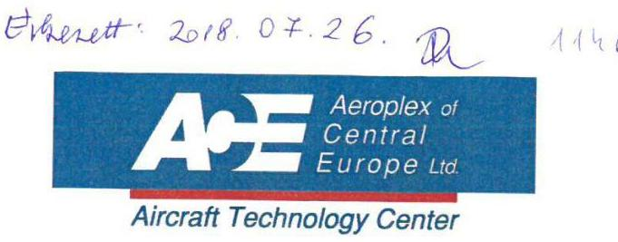

1675 Budapest, P.O. Box 188 Hungary
Phone: (36 1 296-8597
Fax: (36 1) 296-7218
E-mail: headoffice@aeroplex.com
Website: www.aeroplex.com

Állami Számvevőszék
Domokos László Úr részére
Budapest, Apáczai Csere János utca 10 1052

Tisztelt Domokos László Úr!

Iktatószám: 1000/42/2018
ÁLLAMI SZÁMVEVŐSZÉK
ÜGYVITELI IRODA
$10-42628 / 2018 / 1$
20180725
Iktatószám: 000/42/2018
Mulitálati

Hivatkozva az EL-0632-045/2018. iktatószámú levelükre, mely „Az állami tulajdonú gazdasági társaságok ellenőrzése- AEROPLEX Közép-Európai Légijármű Műszaki Központ Korlátolt Felelősségű Társaság" címú jelentéstervezetét valamint az ellenőrzés megállapításait tartalmazza, az alábbi észrevételt kívánjuk tenni:

A Számvevőszéki jelentéstervezetben tett megállapítások 2.3 számú megállapítás 3. bekezdése szerint, a Társaság a köztulajdonban álló gazdasági társaságok számára előírt közzétételi kötelezettségnek nem tett eleget. Ezúton tájékoztatom, hogy Társaságunk honlapján 2012. óta szerepel ezen közzétételi kötelezettség.

Elérési útvonal: http://www.aeroplex.com/content/required_data.html

Budapest, 2018.07.19.

Tisztelettel:

Demény Árpád Szilárd
Ügyvezető Igazgató

AEROPLEX
Közép-Európai Légijármű Műszaki Központ Kft.
1185 Budapest
Uszt Ferenc Nemzetközi Repülőtér
(28)

---

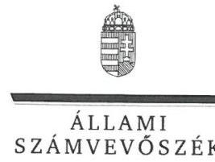

ELNÖK

# Demény Árpád Szilárd úr 

ügyvezető
AEROPLEX Közép-Európai Légijármű Műszaki Központ Kft.

## Budapest

## Tisztelt Ügyvezető Úr!

„Az állami tulajdonú gazdasági társaságok ellenőrzése - AEROPLEX Közép-Európai Légijármű Műszaki Központ Korlátolt Felelősségű Társaság" címmel készített számvevőszéki jelentéstervezetre a 1000/42/2018. iktatószámú levelében megküldött észrevételét köszönettel megkaptam.
Az Állami Számvevőszék észrevételekre vonatkozó álláspontjáról a felügyeleti vezető által készített részletes tájékoztatást csatoltan megküldöm.
Tájékoztatom Ügyvezető urat, hogy a számvevőszéki jelentésben - az Állami Számvevőszékről szóló 2011. évi LXVI. törvény 29. § (3) bekezdése alapján - a figyelembe nem vett észrevételt szerepeltetjük az elutasítás indokának feltüntetésével.

Budapest, 2018. 08. 13.
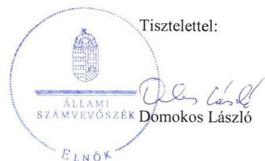

Melléklet: Tájékoztatás az el nem fogadott észrevételről

---

# Tájékoztatás az észrevételek kezeléséről 

„Az állami tulajdonú gazdasági társaságok ellenőrzése - AEROPLEX Közép-Európai Légijármű Műszaki Központ Korlátolt Felelősségű Társaság" című jelentéstervezetre a 1000/42/2018. iktatószámú levelében megküldött észrevételét áttekintettem. Az észrevétel kezeléséről az alábbi tájékoztatást adom.

## A 2.3. számú megállapítás 3. bekezdéséhez megfogalmazott észrevételre adott válasz

A 2.3. számú megállapítás 3. bekezdésére tett észrevételét nem fogadtuk el. Az Állami Számvevőszék az ellenőrzés során az észrevételben jelzett honlapon vizsgálta a közzétételi kötelezettség teljesítését és azt állapította meg, hogy a jelentéstervezet 2.3. számú megállapítás 3. bekezdésében hivatkozott adatok közzétételére nem került sor. Az észrevételben feltüntetett elérési útvonalon található dokumentumok az ellenőrzött időszakra vonatkozóan nem cáfolják a megállapítás helytállóságát, tekintve, hogy a vezető munkavállalókra vonatkozó közérdekű adatok dokumentuma 2018. július 19-én keletkezett, a Felügyelő bizottságra vonatkozó közérdekű adatok dokumentuma pedig 2017. október 31-én, ezért a megállapítás módosítása, illetve törlése nem indokolt.

Budapest, 2018. 08. 13.
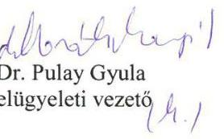

---

# MNV Magyar Nemzeti Vagyonkezelő Zrt. 

## Vezérigazgató

Állami Számvevőszék

## Domokos László

elnök

1052 Budapest
Apáczai Cs. J. u. 10.

Ikt. sz.: MNV/01/8503/ 4 /2018.
Hiv. sz.: EL-0632-046/2018.

Tisztelt Elnök Úr!
A 2018. július 18. napján, „Az állami tulajdonú gazdasági társaságok ellenőrzése - AEROPLEX Közép-Európai Légijármű Műszaki Központ Korlátolt Felelősségű Társaság" tárgyában kézhez vett, EL-0632-046/2018. ikt. sz. levél mellékleteként megküldött jelentéstervezetre az alábbi észrevételt tesszük.
„Következtetések" fejezet / 18. oldal:
A Társaság ellenőrzése kapcsán az MNV Zrt. vezérigazgatójának címzett következtetéssel összefüggésben jelezzük, hogy a Társaság tőkeszerkezetének helyreállítása 2017. év végén megtörtént, a Társaság saját tőkéje a 2018. üzleti évben a törvényes működési rendnek megfelelően alakul. A Társaságnál az elmúlt időszakban végrehajtott átszervezés, valamint a Társaság üzleti kapcsolatainak fejlesztése jelentősen javítani tudott a Társaság piaci megítélésén. A 2018. üzleti év 1-5. havi tényadatai alapján megállapítható, hogy a Társaság nyereségesen működik, likviditása stabil. A Társaság működése jelenleg felfutó ágban van.

Az Állami Számvevőszék következtetésében azt jelzi, hogy a MALÉV Zrt. leállásának időpontjában célszerű lehetett az állami beavatkozás a Társaság működésének fenntartása érdekében, ugyanakkor a tartósan veszteséges, közfeladat ellátásában nem érintett Társaság állami tulajdonban tartása az Alaptörvény és a nemzeti vagyonra vonatkozó előírások alapján is kifogásolható, a Társaság jövőbeli működésére ezen szempontoknak megfelelő megoldás kidolgozását tartja szükségesnek.

Az Állami Számvevőszék szakmai álláspontját tiszteletben tartva az MNV Zrt. felhívja a figyelmet arra, hogy a veszteségesen gazdálkodó szervezeteknek az intézkedési lehetőségei általában korlátozottak, mindig csak az adott piaci viszonyok között érvényesülhetnek és az egyes intézkedések eredményei sem feltétlenül láthatóak azonnal. Ennek megfelelően nem ellentétes az állami vagyonra vonatkozó jogszabályokkal a veszteségesen gazdálkodó társaságok esetében a meghozott - különösen a tulajdonosi forrásjuttatással járó - intézkedések hatásait megvárni, csak azok eredményeit mérlegelve és értékelve szükség szerint - változtatni a korábban elhatározott működési stratégián. Egy gazdasági társaság megszüntetése kapcsán úgyszintén felmerülhet tulajdonosi forrásigény, és emellett az adott cég megszüntetésének iparági, foglalkoztatási és társadalmi hatásait is indokolt lehet figyelembe venni, akárcsak egy esetleges értékesítési tranzakció előkészítésénél és időzítésénél is elengedhetetlen több szempont együttes figyelembevétele (a körben a tulajdonosi forrásjuttatást követően, de még az abból várt pozitív hatások mérhetőségét megelőzően történő értékesítés sem feltétlenül egyeztethető össze a felelős vagyongazdálkodás elveivel).

---

Mindezekre figyelemmel kérjük, hogy a Társaság állami tulajdonban tartására vonatkozó azon következtetéseket, amelyek kifejezetten arra utalnak, hogy az nem felelt meg az Alaptörvény 38. cikk (5) bekezdésében foglaltaknak, valamint az állami tulajdonnal szembeni alkotmányos követelményeknek, illetve vagyonvesztést okoztak volna, törölni szíveskedjenek.

Budapest, 2018. július 22. Üdvözlettel:
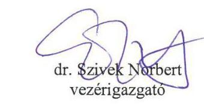

---

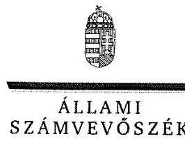

ELNÖK

Ikt.szám: EL-0632-050/2018

# Dr. Szivek Norbert úr 

vezérigazgató
Magyar Nemzeti Vagyonkezelő Zrt.

## Budapest

## Tisztelt Vezérigazgató Úr!

„Az állami tulajdonú gazdasági társaságok ellenőrzése - AEROPLEX Közép-Európai Légijármű Műszaki Központ Korlátolt Felelősségű Társaság" címmel készített számvevőszéki jelentéstervezetre az MNV/01/8503/4/2018. iktatószámú levelében megküldött észrevételét köszönettel megkaptam.
Az Állami Számvevőszék észrevételekre vonatkozó álláspontjáról a felügyeleti vezető által készített részletes tájékoztatást csatoltan megküldöm.
Tájékoztatom Vezérigazgató urat, hogy a számvevőszéki jelentésben - az Állami Számvevőszékről szóló 2011. évi LXVI. törvény 29. § (3) bekezdése alapján - a figyelembe nem vett észrevételt szerepeltetjük az elutasítás indokának feltüntetésével.

Budapest, 2018. 08. 15.
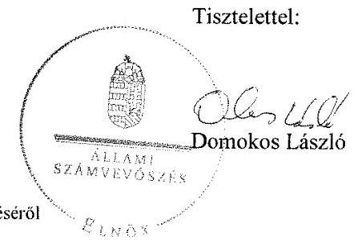

---

# Tájékoztatás az észrevételek kezeléséről 

„Az állami tulajdonú gazdasági társaságok ellenőrzése - AEROPLEX Közép-Európai Légijármű Műszaki Központ Korlátolt Felelősségű Társaság" című jelentéstervezetre az MNV/01/8503/4/2018. iktatószámú levelében megküldött észrevételét áttekintettem. Az észrevétel kezeléséről az alábbi tájékoztatást adom.

## A Magyar Nemzeti Vagyonkezelő Zrt. vezérigazgatójának címzett következtetésre megfogalmazott észrevételre adott válasz

Az Állami Számvevőszéknek a jelentéstervezetben megfogalmazott, a Magyar Nemzeti Vagyonkezelő Zrt. vezérigazgatójának címzett következtetése Magyarország Alaptörvényéből, illetve a nemzeti vagyonról szóló 2011. évi CXCVI. törvényből levezethető. Az észrevételben megfogalmazottak az ellenőrzött időszakon (2013 - 2016. évek, a 2016. évi beszámoló jóváhagyásáig tartó időszak) kívüli időtartamot érintik. Mindezek alapján az észrevételt nem fogadjuk el, a jelentéstervezet módosítása nem indokolt.

Budapest, 2018. 08. 15.
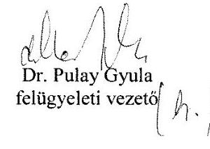

---

# RÖVIDÍTÉSEK JEGYZÉKE 

${ }^{1}$ AEROPLEX Kft.
${ }^{2}$ Lockheed Aircraft Service International
${ }^{3}$ Társaság
${ }^{4}$ MNV Zrt.
${ }^{5}$ Vtv.
${ }^{6}$ Felügyelőbizottság
${ }^{7}$ ÁSZ
${ }^{8}$ Gt.
${ }^{9}$ Ptk.
${ }^{10}$ SZMSZ${ }_{1}$

SZMSZ${ }_{2}$
SZMSZ${ }_{3}$
${ }^{11}$ Alapító okirat${ }_{1}$
Alapító okirat${ }_{2}$
Alapító okirat${ }_{3}$
Alapító okirat${ }_{4}$
Alapító okirat${ }_{5}$
Alapító okirat${ }_{6}$
Alapító okirat${ }_{7}$
Alapító okirat${ }_{8}$
Alapító okirat${ }_{9}$
Alapító okirat${ }_{10}$
Alapító okirat${ }_{11}$
Alapító okirat${ }_{12}$
Alapító okirat${ }_{13}$

AEROPLEX Közép-Európai Légijármű Műszaki Központ Korlátolt Felelősségű Társaság
az 1926-ban alapított amerikai Lockheed Corporation vállalata
AEROPLEX Közép-Európai Légijármű Műszaki Központ Korlátolt Felelősségű Társaság
Magyar Nemzeti Vagyonkezelő Zrt.
az állami vagyonról szóló 2011. évi CVI. törvény
AEROPLEX Kft. Felügyelő bizottsága
Állami Számvevőszék
2006. évi IV. törvény a gazdasági társaságokról (hatályos: 2006. 07. 1-től 2014. 03. 15-ig)
2013. évi V. törvény a Polgári Törvénykönyvről (hatályos: 2014. március 15-től)
508/2012. (X. 8) IG sz. határozat az MNV

 Zrt. szervezeti és működési szabályzatáról, hatályos 2012. október 8-tól
430/2013. (VI. 17.) IG sz. határozat az MNV Zrt. szervezeti és működési szabályzatáról, hatályos 2013. július 1-jétől
158/2016.(IV. 6) IG sz. határozat az MNV Zrt. szervezeti és működési szabályzatáról, hatályos 2016. április 6-tól
2/2013. (I. 14.) számú alapítói határozat az alapító okirat módosításáról, hatályos 2013. január 14-től
67/2013. (III. 11.) számú alapítói határozat az alapító okirat módosításáról, hatályos 2013. március 11-től
88/2013. (III. 25.) számú alapítói határozat az alapító okirat módosításáról, hatályos 2013. március 25-től
134/2013. (IV. 22.) számú alapítói határozat az alapító okirat módosításáról, hatályos 2013. április 22-től
227/2013. (V. 27.) számú alapítói határozat az alapító okirat módosításáról, hatályos 2013. május 27-től
338/2013. (VII. 8.) számú alapítói határozat az alapító okirat módosításáról, hatályos 2013. július 10-től
116/2014. (IV. 14.) számú alapítói határozat az alapító okirat módosításáról, hatályos 2014. április 14-től
164/2014. (V. 12.) számú alapítói határozat az alapító okirat módosításáról, hatályos 2014. május 12-től
438/2014. (XI. 11.) számú alapítói határozat az alapító okirat módosításáról, hatályos 2014. november 11-től
477/2014. (XII. 11.) számú alapítói határozat az alapító okirat módosításáról, hatályos 2014. december 11-től
161/2015. (V. 27.) számú alapítói határozat az alapító okirat módosításáról, hatályos 2015. május 27-től
238/2015. (VII. 6.) számú alapítói határozat az alapító okirat módosításáról, hatályos 2015. július 6-tól
482/2015. (XII. 30.) számú alapítói határozat az alapító okirat módosításáról, hatályos 2015. december 30-tól

---

Alapító okirat ${ }_{14}$

Alapító okirat ${ }_{15}$

Alapító okirat ${ }_{16}$

Alapító okirat ${ }_{17}$

Alapító okirat ${ }_{18}$

Alapító okirat ${ }_{19}$
${ }^{12}$ „Egyedüli Tag"
${ }^{13}$ Felügyelőbizottság
${ }^{14}$ Könyvvizsgáló
${ }^{15}$ Javadalmazási szabályzat ${ }_{1-2}$
${ }^{16}$ Tak.tv.
${ }^{17}$ tervezési irányelvek
${ }^{18}$ Monitoring Szabályzat
${ }^{19}$ Szervezeti és Működési Szabályzat ${ }_{1-11}$
${ }^{20}$ PART-145
${ }^{21}$ SZMSZ
${ }^{22}$ Számviteli politika $_{1-4}$
${ }^{23}$ Eszközök és források értékelési szabályzata ${ }_{1-4}$

150/2016. (III. 2.) számú alapítói határozat az alapító okirat módosításáról, hatályos 2016. március 2-től
312/2016. (V. 18.) számú alapítói határozat az alapító okirat módosításáról, hatályos 2016. május 16-tól
578/2016. (IX. 15.) számú alapítói határozat az alapító okirat módosításáról, hatályos 2016. szeptember 15-től
587/2016. (IX. 22.) számú alapítói határozat az alapító okirat módosításáról, hatályos 2016. szeptember 22-től
747/2016. (XII. 16.) számú alapítói határozat az alapító okirat módosításáról, hatályos 2016. december 16-tól
791/2016. (XII. 23.) számú alapítói határozat az alapító okirat módosításáról, hatályos 2016. december 23-tól
a Társaság egyedüli tagja a Magyar Állam, AEROPLEX Kft. felügyelőbizottsága
AEROPLEX Kft. választott független könyvvizsgálója

1. AEROPLEX Kft. javadalmazási szabályzata (hatályos:2013. április 22-től 2015. december 31-ig)
2. AEROPLEX Kft. javadalmazási szabályzata (hatályos:2016. január 1-től)

A köztulajdonban álló gazdasági társaságok takarékosabb működéséről szóló 2009. évi CXXII. törvény (hatályos 2009. november 17-től)
558/2012. (X.24.) IG határozat, hatályos 2013. évre
774/2013. (X.21.) IG határozat, hatályos 2014. évre
4/2015.(I.12.) IG határozat, hatályos 2015. évre
51/2013. számú vezérigazgatói utasítás az MNV Zrt. Monitoring Szabályzatáról
AEROPLEX Kft. KSZMSZ (Maintenance Organisation Exposition - MOE)
módosítva: 2013.03.28.
módosítva: 2013.04.02.
módosítva: 2013.08.02.
módosítva: 2014.01.30.
módosítva: 2014.09.03.
módosítva: 2014.11.14.
módosítva: 2015.02.28.
módosítva: 2015.11.16.
módosítva: 2016.06.03.
módosítva: 2016.09.19.
módosítva: 2016.12.19.
1321/2014/EU rendelet (és annak módosításai) II. Függeléke
AEROPLEX Kft. KSZMSZ (Maintenance Organisation Exposition - MOE)
AEROPLEX Kft számviteli politika (hatályos: 2008.01.01. - 2014.09.07.)
AEROPLEX Kft számviteli politika (hatályos: 2014.09.08. - 2014.12.31)
AEROPLEX Kft számviteli politika (hatályos: 2015.01.01. - 2015.12.31.)
AEROPLEX Kft számviteli politika (hatályos: 2016.01.01-től)
AEROPLEX Kft Számviteli politika 2. fejezete eszközök és források értékelése (hatályos: 2008.01.01. - 2014.09.07.)
AEROPLEX Kft Számviteli politika 2. fejezete eszközök és források értékelése (hatályos: 2014.09.08. - 2014.12.31)

---

${ }^{24}$ Leltározási szabályzat ${ }_{1-3}$

${ }^{25}$ Pénzkezelési szabályzat ${ }_{1-3}$

${ }^{26}$ Önköltség-számítási szabályzat ${ }_{1-2}$
${ }^{27}$ Számlarend ${ }_{1-2}$
${ }^{28}$ Számv. tv
${ }^{29}$ Eszközök hasznosítási és selejtezési szabályzata
${ }^{30}$ Iratkezelési szabályzat
${ }^{31}$ Informatikai biztonsági szabályzat
${ }^{32}$ minőségügyi eljárások
${ }^{33}$ auditálás tervezés követelménye
${ }^{34}$ Mt.
${ }^{35}$ kapcsolt vállalkozás
${ }^{36}$ Ptk.
${ }^{37}$ Ppt.

AEROPLEX Kft Számviteli politika 2. fejezete eszközök és források értékelése (hatályos: 2015.01.01. - 2015.12.31.)
AEROPLEX Kft Számviteli politika 2. fejezete eszközök és források értékelése (hatályos: 2016.01.01-től)
AEROPLEX Kft Leltározási szabályzat (hatályos:2011. 10. 04-től 2014. 09.07-ig)

AEROPLEX Kft Leltározási szabályzat (hatályos:2014. 09. 08-tól -2015. 12. 31-ig)
AEROPLEX Kft Leltározási szabályzat (hatályos:2016. 01. 01-től)
AEROPLEX Kft Pénzkezelési szabályzat (hatályos: 2008.01.17-től -2014.09.07-ig.)

AEROPLEX Kft Pénzkezelési szabályzat (hatályos:2014.09.08-tól - 2015. 08.23-ig.)

AEROPLEX Kft Pénzkezelési szabályzat (hatályos:2015. 08. 23-tól)
AEROPLEX Kft Önköltség-számítási szabályzat (hatályos:2002.11.22-től 2014.03.31-ig)

AEROPLEX Kft Önköltség-számítási szabályzat (hatályos:2014.04.01-től)
AEROPLEX Kft Számlarend (hatályos:2014. 09. 07-ig.)
AEROPLEX Kft Számlarend (hatályos:2014. 09. 08-tól.)
2000. évi C törvény a számvitelről (hatályos 2001. január 1-től)

AEROPLEX Kft Eszközök hasznosítási és selejtezési szabályzata (hatályos 2016. január 20-tól)

AEROPLEX Kft Iratok kiadmányozása valamint vállalati információk kiadási rendje (hatályos 2015. 12.08-tól)
AEROPLEX Kft Informatikai biztonsági szabályzat (hatályos 2014. 09. 08-tól)
AEROPLEX Kft Quality audit remedial action procedure
AEROPLEX Kft Quality audit of organization procedures
AEROPLEX Kft Quality audit of products
AEROPLEX Kft vállalati auditálások éves tervének kidolgozása és kezelése (hatályos 2016. 01.11-től)
2012. évi I. törvény a munka törvénykönyvéről (hatályos:2012. július 1-től) Pannon Air Cargo Kft.
a Polgári Törvénykönyvről szóló 1959. évi IV. törvény (hatályos
2014. március 14-ig)
a polgári perrendtartásról szóló 1952. évi III. törvény

---

# ÁLLAMI SZÁMVEVŐSZÉK 

1052 Budapest, Apáczai Csere János utca 10.
Levélcím: 1364 Budapest 4. Pf. 54
Telefon: +36 14849100 Telefax: +36 14849200
www.asz.hu
