# Jelentés 

## A központi alrendszer intézményei

A központi alrendszer egyes intézményei pénzügyi és vagyongazdálkodásának ellenőrzése - Gróf Tisza István Kórház 2018.

---

# Jelentés 

## A központi alrendszer intézményei

A központi alrendszer egyes intézményei pénzügyi és vagyongazdálkodásának ellenőrzése - Gróf Tisza István Kórház 2018. regolenter hó 13. nap
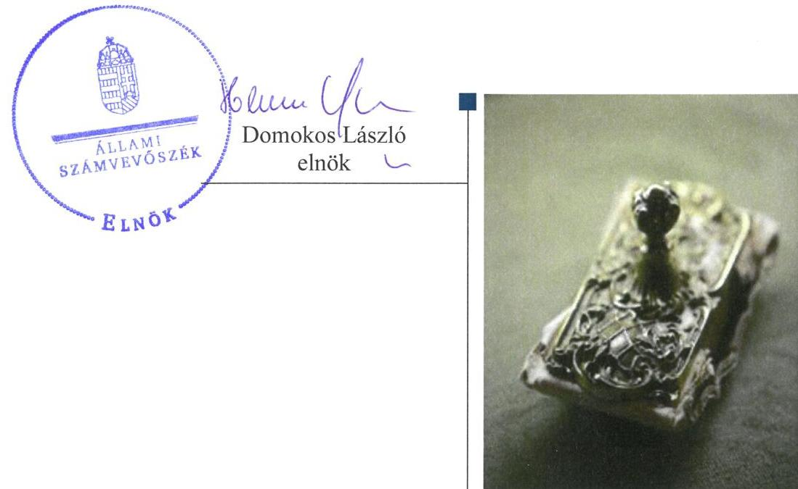

---

# AZ ELLENŐRZÉST FELÜGYELTE:

- PETŐ KRISZTINA felügyeleti vezető
- AZ ELLENŐRZÉST VEZETTE ÉS A VÉGREHAJTÁSÁÉRT FELELŐS:
  - KAKAS SÁNDOR ellenőrzésvezető
  - A PROGRAM ÖSSZEÁLLÍTÁSÁÉRT FELELŐS:
    - TÓTPÁL SZABOLCS osztályvezető

**IKTATÓSZÁM:** EL-0302-026/2018.

**TÉMASZÁM:** 2450

**ELLENŐRZÉS-AZONOSÍTÓ SZÁM:** V079106

Jelentéseink az Országgyűlés számítógépes hálózatán és az Interneta a www.asz.hu címen is olvashatóak.

---

# TARTALOMJEGYZÉK 

■ ÖSSZEGZÉS ..... 5
■ AZ ELLENŐRZÉS CÉLJA ..... 6
■ AZ ELLENŐRZÉS TERÜLETE ..... 7
■ AZ ELLENŐRZÉS HÁTTERE, INDOKOLTSÁGA ..... 8
■ A JELENTÉS LÉNYEGES KÉRDÉSKÖREI ..... 9
■ AZ ELLENŐRZÉS HATÓKÖRE ÉS MÓDSZEREI ..... 10
■ MEGÁLLAPÍTÁSOK ..... 12
■ JAVASLATOK ..... 17
■ MELLÉKLETEK ..... 19
I. sz. melléklet: Értelmező szótár ..... 19
II. sz. melléklet: A vagyon főbb mérlegcsoportonkénti alakulása 2014-2016. években ..... 22
■ FÜGGELÉK: ÉSZREVÉTELEK ..... 23
■ RÖVIDÍTÉSEK JEGYZÉKE ..... 33

---

.

---

# ÖSSZEGZÉS 

A Gróf Tisza István Kórház felett a középirányító szervi jogosultságok gyakorlása nem volt szabályszerű. A belső kontrollrendszer kialakítása és müködtetése nem volt szabályszerű, ezáltal nem volt biztositott az átlátható és elszámoltatható közpénzfelhasználás. A pénzügyi és vagyongazdálkodás nem volt szabályszerű. Az integritás kontrollrendszert kiépítették, azonban annak müködtetése nem volt megfelelő.

## Az ellenőrzés társadalmi indokoltsága

A közpénzek felhasználásában és az állami vagyonnal való gazdálkodásban a központi alrendszer egyes intézményei meghatározó súlyt képviselnek. Ez indokolja, hogy az Állami Számvevőszék ellenőrzéseket folytasson a pénzügyi és vagyongazdálkodás területén. Az Állami Számvevőszék az ellenőrzései során értékeli a belső kontrollrendszer jogszabályi előírások szerinti kialakítását és működtetése szabályszerűségét, feltárja a gazdálkodás esetleges hiányosságait, rámutathat a vagyongazdálkodási tevékenység - ezen belül a tulajdonosi joggyakorlás és vagyonkezelés - esetleges szabálytalanságaira. Az ellenőrzésünkkel hozzá kívánunk járulni a központi intézmények pénzügyi helyzetének pontosabb megítéléséhez, a jó gyakorlat kialakításán és terjesztésén keresztül az ellenőrzéseink elősegíthetik a gazdálkodás szabályszerűségének javítását.

Az egészségügyi ellátások költsége folyamatosan a társadalmi érdeklődés középpontjában áll. A központi költségvetésből az egyik legjelentősebb kiadást az egészségügyi ellátásokra fordított kiadások jelentik, amelyekből a kórházak kapják a legtöbb támogatást. Ezért indokolt, hogy az Állami Számvevőszék az egészségügyi intézmények pénzügyi és vagyongazdálkodását rendszeresen több évre kiterjedően ellenőrizze.

A Gróf Tisza István Kórházat, amely közfeladatot lát el és jelentős állami vagyont kezel, az Állami Számvevőszék korábban a 2014. évben a zárszámadás ellenőrzése keretén belül ellenőrizte.

## Főbb megállapítások, következtetések, javaslatok

A Gróf Tisza István Kórház felett az alapítással kapcsolatos jogosultságait az Emberi Erőforrások Minisztériuma szabályszerűen gyakorolta. A Gyógyszerészeti és Egészségügyi Minőség- és Szervezetfejlesztési Intézet, valamint jogutódja az Állami Egészségügyi Ellátó Központ, mint középirányító szerv átruházott hatáskörben egyéb irányítási, felügyeleti jogosultságait 2014-2015. években nem szabályszerűen gyakorolta, mert a Kórház szervezeti és müködési szabályzatát nem hagyta jóvá.

A belső kontrollrendszer kialakítása és működtetése nem volt szabályszerű, ezáltal nem volt biztosított az átlátható és elszámoltatható közpénzfelhasználás. A kontrollkörnyezetet kialakítása a 2014-2015. években nem volt szabályszerű. A kockázatkezelési rendszert, valamint az információs és kommunikációs folyamatokat kialakították, működtették. A kontrolltevékenységek gyakorlása nem volt szabályszerű. Az eseti és folyamatos nyomon követési rendszert működtették, az operatív tevékenységektől függetlenül működő belső ellenőrzés kialakítása megvalósult.

A pénzügyi gazdálkodás nem volt szabályszerű. A bevételek beszedése és elszámolása, a kiadási előirányzatok felhasználása során a pénzgazdálkodási jogkörök gyakorlása nem felelt meg a jogszabályi előírásoknak.

A vagyongazdálkodás a vagyonkezelési szerződés hiányosságai miatt nem felelt meg a jogszabályi előírásoknak.
Az integritás kontrollrendszert kiépítették, a nem kötelezően előírt integritás kontrollokat csak kis mértékben működtették.

A megállapítások alapján az Állami Számvevőszék az emberi erőforrások miniszterének egy, a Gróf Tisza István Kórház főigazgatójának 11 javaslatot fogalmazott meg, amelyre 30 napon belül intézkedési tervet kell készíteniük.

---

# AZ ELLENŐRZÉS CÉLJA 

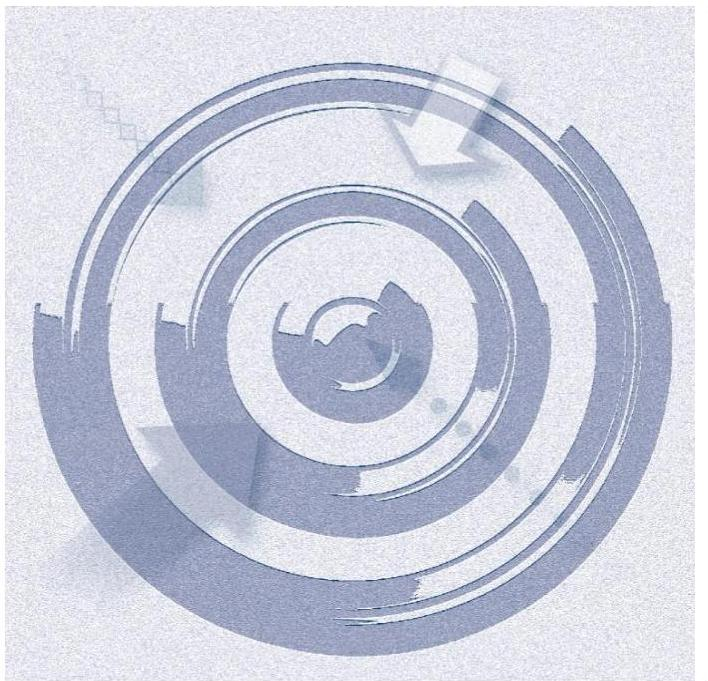

AZ ELLENŐRZÉS CÉLJA annak megítélése volt, hogy az ellenőrzött Kórházra ${ }^{1}$ vonatkozó irányító szervi feladatellátás a jogszabályi előírások betartásával történt-e; a Kórháznál a belső kontrollrendszer kialakítása és múködtetése szabályszerű volt-e; a Kórház pénzügyi és vagyongazdálkodása megfelelt-e a jogszabályi előírásoknak és belső szabályzatainak; a Kórház átalakításának vagy átszervezésének lebonyolítása szabályszerűen történt-e. Az ellenőrzés keretében értékeltük a Kórház korrupciós kockázatainak kezelését szolgáló integritás kontrollok kiépítettségét és az integritás szemlélet érvényesülését.

---

# AZ ELLENŐRZÉS TERÜLETE 

## Gróf Tisza István Kórház

A Kórházat 1980. február 1-jén alapították. A Kórház jogi személy, előirányzatai felett teljes jogkörrel rendelkező költségvetési szerv, amelyet főigazgató vezet.

A Kórház közfeladatot lát el, amely Berettyóújfalu és vonzáskörzetére, mint ellátási területre kiterjedően a járó- és fekvőbetegek diagnosztikus és terápiás szakorvosi ellátása, rehabilitációja és követéses gondozása. A Kórház alapító okiratában foglalt közfeladatát az Eütv. ${ }^{2}$ szabályozza. Az átlagos ágyszám a 2014-2016. években 666 volt.

Az emberi erőforrások minisztere az irányító szervi hatásköröket a Kórház fölött az Emberi Erőforrások Minisztériuma útján gyakorolja. Az egyes fenntartói, valamint az irányítási, középirányítói jogokat az Állami Egészségügyi Ellátó Központ (2015. február 28-ig jogelődje a Gyógyszerészeti és Egészségügyi Minőség- és Szervezetfejlesztési Intézet) gyakorolja.

A Kórház vállalkozási tevékenységet nem folytatott.
A Kórháznál az ellenőrzött időszakban az Áht. ${ }^{3}$ 11. §-ában meghatározott átalakulás nem történt.

A Kórház átlagos statisztikai állományi létszáma a 2014. évben 729 fő, a 2015. évben 740 fő volt, ami a 2016. évben 743 főre emelkedett. A Kórház alkalmazottainak foglalkoztatására a Kjt. ${ }^{4}$ és az Mt. ${ }^{5}$ alapján került sor. Az ellenőrzött időszakban a főigazgató személyében nem történt változás, 2014. október 20-tól új gazdasági vezető került kinevezésre.

A Kórház vagyonkezelt vagyonnal rendelkezett. A vagyon főbb mérlegcsoportonkénti alakulását 2014-2016. évekre a II. számú melléklet mutatja be. A Kórház eredeti és módosított kiadási előirányzatainak főösszegét, a teljesített összes bevétel és kiadás alakulását az 1. ábra mutatja be.
1. ábra

A kiadási előirányzatok, a teljesített összes bevétel és kiadás
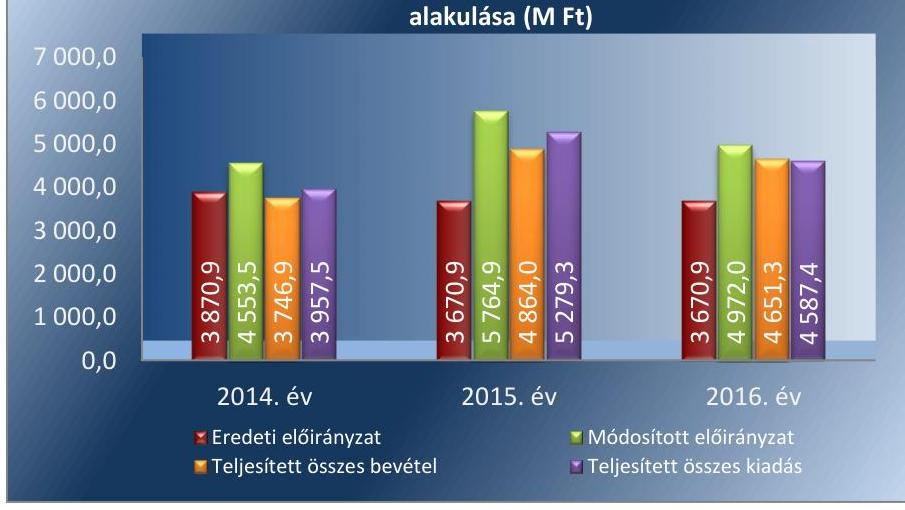

---

# AZ ELLENŐRZÉS HÁTTERE, INDOKOLTSÁGA 

AZ ÁLLAMHÁZTARTÁS KÖZPONTI ALRENDSZERÉNEK KÖZPÉNZ FELHASZNÁLÁSA, az intézmények által ellátott közfeladatok sokrétűsége, valamint a feladatellátásához rendelt vagyon nagyságrendje indokolja, hogy az ÁSZ ${ }^{6}$ ellenőrzéseket folytasson a pénzügyi és vagyongazdálkodás területén. Az ÁSZ az ellenőrzései során feltárja a gazdálkodást, a központi alrendszer intézményei átalakulását, átszervezését érintő szabályozások esetleges hiányosságait, a szabályozással nem érintett gazdálkodási területeket, rámutathat a vagyongazdálkodási tevékenység - ezen belül a tulajdonosi joggyakorlás és vagyonkezelés esetleges szabálytalanságaira, értékeli az állami vagyon nyilvántartására és elszámolására vonatkozó eljárásokat.

AZ ELLENŐRZÉS VÁRHATÓAN HOZZÁJÁRUL a központi intézmények pénzügyi helyzetének pontosabb megítéléséhez, és a jó gyakorlat kialakításán és terjesztésén keresztül az ellenőrzések elősegíthetik a gazdálkodás szabályszerűségének javítását.

---

# A JELENTÉS LÉNYEGES KÉRDÉSKÖREI 

1. Az irányító szerv ellenőrzött Kórházra vonatkozó feladatellátása szabályszerű volt-e?
2. A belső kontrollrendszer kialakítása és müködtetése biztosítóttta-e a közpénzekkel és a nemzeti vagyonnal történő átlátható, szabályszerű gazdálkodást, illetve a beszámolási és adatszolgáltatási kötelezettségek szabályszerű teljesítését?
3. A Kórház pénzügyi gazdálkodása szabályszerű volt-e?
4. A Kórház vagyongazdálkodása szabályszerű volt-e?
5. Érvényesült-e az integritás szemlélet és ennek megfelelően kiépítették-e az integritás kontrollrendszert a Kórháznál?

---

# AZ ELLENŐRZÉS HATÓKÖRE ÉS MÓDSZEREI 

## Az ellenőrzés típusa

Megfelelőségi ellenőrzés.

## Az ellenőrzött időszak

Az ellenőrzött időszak 2014. január 1-jétől 2016. december 31-ig tartott.

## Az ellenőrzés tárgya

A Kórházra vonatkozó irányító szervi feladatok ellátása. A Kórház belső kontroll rendszerének kialakítása és múködtetése. A Kórház pénzügyi és vagyongazdálkodása, átalakításának vagy átszervezésének lebonyolítása. A Kórháznál az integritáskontrollok kiépítettsége, az integritás szemlélet érvényesülése.

Az ellenőrzés kiterjedt minden olyan körülményre és adatra, amely az ÁSZ jogszabályban meghatározott feladatainak teljesítéséhez, valamint a program végrehajtása folyamán felmerült újabb összefüggések feltárásához szükséges volt.

## Az ellenőrzött szervezet

A Gróf Tisza István Kórház és az irányító szervi feladatot ellátó Emberi Erőforrások Minisztériuma, továbbá a középiránytó szervi feladatot ellátó Állami Egészségügyi Ellátó Központ.

## Az ellenőrzés jogalapja

Az ellenőrzés jogszabályi alapját az ÁSZ tv. ${ }^{7}$ 1. § (3) bekezdés, 5. § (2)-(4) és (6) bekezdései, valamint az Áht. 61. § (2) bekezdésének előírásai képezték.

## Az ellenőrzés módszerei

Az ÁSZ az ellenőrzést az ellenőrzési program szempontjai, az ellenőrzött időszakban hatályos jogszabályok, az ellenőrzés szakmai szabályai, a jelen ellenőrzésre irányadó ÁSZ módszertanok figyelembevételével végezte.

Az ÁSZ az ellenőrzés ideje alatt az ellenőrzött szervezetekkel történő kapcsolattartást az ÁSZ SZMSZ ${ }^{8}$-ének vonatkozó előírásai alapján biztosította.

---

Az ellenőrzési kérdések megválaszolásához szükséges bizonyítékok megszerzése az ellenőrzöttek által rendelkezésre bocsátott dokumentumokra, adatokra alapozva megfigyelés, szemle (szemrevételezés), kérdésfeltevés (információkérés), mintavételezés, valamint elemző eljárás útján történt. Az ellenőrzési bizonyítékként felhasználható adatforrások közé tartoztak egyrészt a szakmai program részletes szempontjainál felsorolt adatforrások, másrészt minden egyéb - az ellenőrzés folyamán feltárt, az ellenőrzés szempontjából információt tartalmazó - dokumentum.

Az ellenőrzés lefolytatásához az ellenőrzött szervezetek a tanúsítványok kitöltésével, valamint az ÁSZ által kért dokumentumok megküldésével szolgáltattak adatokat.

A Kórház belső kontrollrendszere jogszabályi előírások szerinti kialakítása és működtetése szabályszerűségének értékelése az erre irányuló kérdésekre adott válaszok összesítése alapján, évente pillérenként (kontrollkörnyezet, kockázatkezelési rendszer, kontrolltevékenységek, információs és kommunikációs rendszer, monitoring rendszer) és összesítetten történt. A belső kontrollrendszer egyes pilléreinek kialakítását „szabályszerü", amennyiben az értékelt területen az elért és az elérhető pontos \%-ban kifejezett, egész számra kerekített hányadosa meghaladta a $85 \%$-ot, „nem szabályszerü", ha nem érte el a $85 \%$-ot. A kontrollrendszer egésze esetében a „szabályszerü" értékelésnek a \%-os értéken felül további feltétele volt, hogy egyik kontrollterület sem kaphatott „nem szabályszerü" értékelést.

A Kórháznál a bevételek (tárgyi eszközök bérbeadásából) beszedésének szabályszerűsége, valamint a kiadási előirányzatok (külső személyi juttatások, dologi kiadások, felhalmozási kiadások) felhasználása szabályszerűsége mintavételes ellenőrzéssel történt. A bevételek beszedése, valamint a kiadási előirányzatok felhasználása „szabályszerü", ha a minta ellenőrzésének eredménye alapján 95\%-os bizonyossággal a teljes sokaságban a hibás tételek aránya kisebb volt, mint 10\%, „nem szabályszerü", ha a hibás tételek aránya a 10\%-ot meghaladta. Abban az esetben, ha a teljes sokaság tekintetében a 10\%-os hibaarányhoz való viszony megítélésnek megbízhatósága nem érte el a 95\%-ot, annak elérése érdekében az értékelés további szempontokkal egészült ki, a feltárt hibák értéke is figyelembe vételre került.

Az integritás szemlélet érvényesülésének értékelése a Kórház tanúsítványi adatszolgáltatása és az ÁSZ ellenőrzés rendelkezésére bocsátott dokumentumai felhasználásával történt.

---

# 1. Az irányító szerv ellenőrzött Kórházra vonatkozó feladatellátása szabályszerű volt-e? 

Összegző megállapítás

A Kórházra vonatkozó irányító szervi feladatellátás szabályszerű volt, a középirányító szervi jogosultságok gyakorlása a 2014-2015. években nem volt szabályszerű.

AZ ALAPÍTÓI JOGOSULTSÁGOT a miniszter ${ }^{9}$ szabályszerűen gyakorolta, az alapító okiratot ${ }_{1,4}{ }^{10}$ az Áht. előírásai alapján kiadta. Az alapító okirat tartalmilag az Ávr. ${ }^{11}$ előírásainak megfelelt.

AZ EGYÉB IRÁNYÍTÁSI, FELÜGYELETI JOGO-
SULTSÁGOKAT a középirányító szerv ${ }_{1,2}{ }^{12}$ 2014-2015. években nem szabályszerűen gyakorolta, mert a Kórház szervezeti és működési szabályzatát a 2014. évben az Áht. 9. § (1) bekezdés a) pontjának, 2015. évben a 9. § b) pontjának előírása ellenére nem hagyta jóvá, a Kórház szervezeti és működési szabályzattal ebben az időszakban nem rendelkezett. 2016. évben az egyéb irányítási, felügyeleti és ellenőrzési jogosultságok gyakorlása szabályszerű volt, a középirányító szerv ${ }_{2}$ jóváhagyta a Kórház SZMSZ ${ }_{1,2}{ }^{13}$-ét.

A MUNKÁLTATÓI JOGOKAT az irányító szerv ${ }^{14}$ a gazdasági igazgató felmentése és kinevezése során az Áht. és az Eütv. alapján szabályszerűen gyakorolta.

## 2. A belső kontrollrendszer kialakítása és működtetése biztosí-totta-e a közpénzekkel és a nemzeti vagyonnal történő átlátható, szabályszerű gazdálkodást, illetve a beszámolási és adatszolgáltatási kötelezettségek szabályszerű teljesítését?

Összegző megállapítás

A Kórház belső kontrollrendszerének kialakítása és müködtetése a közpénzekkel és a nemzeti vagyonnal történő átlátható, szabályszerű gazdálkodást, illetve a beszámolási és adatszolgáltatási kötelezettségek szabályszerű teljesítését nem biztosította.
2.1. számú megállapítás

A kontrollkörnyezet kialakítása 2014. és 2015. években nem volt szabályszerű, 2016. évben szabályszerű volt.

A Kórház a 2014-2015. években szervezeti és működési szabályzattal nem rendelkezett, a 2016. évben az SZMSZ ${ }_{1,2}$ az Ávr. ${ }^{15}$ 13. § (1) bekezdés e)

---

pontja előírása ellenére nem tartalmazta a gazdasági szervezet megnevezését és feladatait. A gazdasági szervezet rendelkezett Ügyrend ${ }_{1-5}$-tel ${ }^{16}$, amely szabályozta a gazdálkodás részletes rendjét.

A Kórház a Számv. tv. ${ }^{17}$ és az Áhsz. ${ }^{18}$ előírásainak eleget téve elkészítette a Számviteli politika ${ }_{1-4}{ }^{19}$-t, a Leltározási szabályzat ${ }_{1,2}{ }^{20}$-t, az Értékelési sza-bályzat ${ }_{1-3}$-t ${ }^{21}$, a Pénzkezelési szabályzat ${ }_{1-4}$-t ${ }^{22}$, valamint az Önköltségszámítási szabályzat ${ }_{1,2}$-t ${ }^{23}$. A Kórház a Számv. tv. és az Áhsz. előírásainak eleget téve rendelkezett Számlarend ${ }_{1-4}$-gyel ${ }^{24}$.

A Kbt. ${ }_{1,2}{ }^{25}$ előírásainak eleget téve a Kórház Közbeszerzési szabályzat ${ }_{1,2}$ vel $^{26}$ rendelkezett. Az Ávr. előírásainak megfelelően belső szabályzatban rögzítették az anyag- és eszközgazdálkodás számviteli szabályzatban nem szabályozott kérdéseit, a belföldi és külföldi kiküldetések elszámolásával kapcsolatos kérdéseket, a reprezentációs kiadások felosztását, azok elszámolásának szabályait, a gépjármúvek igénybevételének és használatának rendjét, a vezetékes- és mobiltelefonok használatának szabályait, a Kbt. ${ }_{1,2}$ hatálya alá nem tartozó beszerzések lebonyolításával kapcsolatos eljárásrendet.

A főigazgató a kontrollkörnyezeten belül - a Bkr. ${ }^{27}$ 6. § (1) bekezdés c) pontja ellenére - nem gondoskodott arról, hogy az etikai elvárások a szervezet minden szintjén meghatározottak, ismertek és elfogadottak legyenek.

# 2.2. számú megállapítás 

A kockázatkezelési rendszer kialakítása és múködtetése szabályszerű volt.

A KOCKÁZATKEZELÉSI RENDSZERT a főigazgató a Bkr. előírásainak megfelelően kialakította, Kockázatkezelési szabályzatban ${ }^{28}$, valamint Belső kontrollrendszer szabályzat ${ }_{1,2}$-ben ${ }^{29}$ meghatározta a szervezeti célok elérését veszélyeztető kockázatok azonosításának, elemzésének, csoportosításának módját.

A főigazgató a Bkr. előírásainak megfelelően gondoskodott a Kórház tevékenységében rejlő és a szervezeti célokkal összefüggő kockázatok felméréséről.

### 2.3. számú megállapítás

A kontrolltevékenységek múködtetése nem volt szabályszerű.
A KONTROLLTEVÉKENYSÉGEK feladatköri elkülönítését, az összeférhetetlenség eseteit - az Ávr.-rel összhangban - az Ügyrend ${ }_{1-5}$ ben rögzítették. A gazdálkodási jogkörök gyakorlóinak aláírás mintáit tartalmazó naprakész nyilvántartás vezetéséről az Ávr.-ben foglaltaknak megfelelően gondoskodtak.

A Kórház a 2014-2016. években az Áhsz. 39. § (1) bekezdésének előírása ellenére nem vezette az Áhsz. 14. melléklet II. pontja szerinti kötelezettségvállalások, más fizetési kötelezettségek nyilvántartását.

A bevételi és kiadási előirányzatok felhasználása során a kontrolltevékenységek gyakorlása nem volt szabályszerű. A kontrolltevékenységek működtetése során feltárt hiányosságokat részletesen a 3. pont tartalmazza.

---

# 2.4. számú megállapítás 

Az információs és kommunikációs folyamatok kialakítása, múködtetése szabályszerű volt.

AZ INFORMÁCIÓS ÉS KOMMUNIKÁCIÓS RENDSZERT a főigazgató a Bkr. előírásai szerint kialakította, meghatározta a beszámolási szinteket, határidőket és módokat. Az Info tv. ${ }^{30}$ előírásainak megfelelően szabályozták a kötelezően közzéteendő adatok nyilvánosságra hozatalának és a közérdekú adatok megismerésére irányuló igények teljesítésének rendjét. Az adatvédelmi és adatbiztonsági szabályokat az egészségügyi és a hozzájuk kapcsolódó személyes adatok kezeléséről és védelméről szóló 1997. évi XLVII. törvény előírásának megfelelően szabályozták az Adatvédelmi és adatbiztonsági szabályzatban ${ }^{31}$. A Kórház Iratkezelési szabályzattal ${ }^{32}$ rendelkezett.

A Kórház az Info tv. előírásainak megfelelően eleget tett közzétételi kötelezettségének.
2.5. számú megállapítás

A Kórház tevékenységének, a célok megvalósításának folyamatos és eseti nyomon követését biztosító rendszert és a belső ellenőrzést a főigazgató kialakította.

BELSŐ ELLENŐRZÉS kialakításáról az Áht. és a Bkr. előírásának megfelelően a főigazgató gondoskodott az ellenőrzött időszakban, a szervezet tevékenységének, a célok megvalósításának folyamatos és eseti nyomon követését biztosító rendszert kialakította. A Kórház rendelkezett a belső ellenőrzés múködéséhez a főigazgató által jóváhagyott Belső ellenőrzési kézikönyvvel ${ }^{33}$, azonban annak felülvizsgálatát a Bkr. 17. § (4) bekezdésének előírása ellenére a belső ellenőrzési vezető nem végezte el. A Bkr. előírásainak megfelelően elkészítették az éves ellenőrzési terveket. A belső ellenőrzési vezető vezette a Bkr.-ben előírt nyilvántartást az elvégzett belső ellenőrzésekről, valamint a belső ellenőrzési jelentésekben tett megállapítások, javaslatok, a vonatkozó intézkedési tervek és azok végrehajtásának nyomon követéséről.

KÜLSŐ ELLENŐRZÉSEK javaslatai alapján készült intézkedési tervek végrehajtásáról éves bontásban a Bkr.-nek megfelelően vezettek nyilvántartást. A Kórháznál az ellenőrzött időszakban az ÁSZ, a KEHi ${ }^{34}$ és az EMMI végzett ellenőrzést.

## 3. A Kórház pénzügyi gazdálkodása szabályszerű volt-e?

Összegző megállapítás

A Kórház pénzügyi gazdálkodása nem volt szabályszerű, mert a bevételek beszedése és elszámolása, a kiadási előirányzatok felhasználása során a jogszabályi előírásokat nem tartották be.

A BEVÉTELEK beszedése és elszámolása nem volt szabályszerű, mert a teljesítésigazolást az Ügyrend ${ }_{1-5}$ VII/5. pontjának előírása ellenére, az érvényesítést a VII/4. pontjának ellenére, az utalványozást pedig az Áht. 38. § (1) bekezdésének és az Ügyrend VII/5. pontjának előírása ellenére nem végezték el. A bérleti szerződések megkötésekor a Kórház nem

---

rendelkezett az Nvtv. ${ }^{35} 3$. § (2) bekezdésében előírtak ellenére a szerződő fél nyilatkozatával arról, hogy átlátható szervezetnek minősül-e.

A KIADÁSI ELŐIRÁNYZATOK felhasználása során a gazdálkodási jogkörök gyakorlása nem felelt meg a jogszabályi és a belső előírásoknak. A jogkörök gyakorlása során az alábbi hiányosságok fordultak elő:
$\longrightarrow$ a kötelezettségvállalások nem feleltek meg az Áht. 37. § (1) bekezdésében foglaltaknak, mert azok pénzügyi ellenjegyzés nélkül történtek;
$\longrightarrow$ az érvényesítés nem volt szabályszerű, mert azt az Ávr. 58. § (4) bekezdése ellenére nem az arra jogosult személy végezte el;
$\longrightarrow$ az utalványozás nem volt szabályszerű, mert azt az Ávr. 59. § (1) bekezdése ellenére nem az arra jogosult személy végezte el.
Az Ávr. 50. § (1) bekezdés a)-c) pontjaiban foglaltak ellenére a kötelezettségvállalás alapját képező szerződések, illetve megrendelések nem tartalmazták a szakmai, műszaki teljesítés határidejét, a pénzügyi teljesítés módját és feltételeit, a kifizetés határidejét, valamint az Ávr. 50. § (1a) bekezdése ellenére a szervezet képviselőjének nyilatkozatát arra vonatkozóan, hogy átlátható szervezetnek minősül.

A MARADVÁNY megállapítása nem volt szabályszerű, mert a Kórház az Áhsz. 39. § (3) bekezdésének előírása ellenére a kötelezettségvállalással terhelt maradvány alátámasztásához nem vezetett részletező nyilvántartást.

# 4. A Kórház vagyongazdálkodása szabályszerű volt-e? 

## Összegző megállapítás

## A Kórház vagyongazdálkodása nem volt szabályszerű.

VAGYONKEZELÉSI SZERZŐDÉSBEN ${ }^{36}$ rögzítették a Kórház, mint vagyonkezelő jogait és kötelezettségeit. A vagyonkezelési szerződés - a szerződésben foglalt vagyon tekintetében - az ellenőrzött időszakban a Vtvr. ${ }^{37}$ előírásainak megfelelően biztosította a tulajdonosi joggyakorlás és a vagyonkezelői feladatok szabályozott, átlátható végrehajtását és a vagyon használatának ellenőrzését, azonban a Vtvr. 20. § (1) bekezdésének előírása ellenére nem tartalmazta, hogy a tulajdonosi ellenőrzés eljárásrendjét a felek a szerződés részének tekintik.

A Kórház 2016. évben átruházási szerződés ${ }^{38}$ alapján átvette egy CT berendezés vagyonkezelői jogát, amelyre vonatkozóan a Vtvr. 11. § (2) bekezdésének előírása ellenére az ellenőrzött időszakban a vagyonkezelési szerződés módosítása nem történt meg.

A Kórház a vagyonkezelt vagyonról a Vtvr. 9. § (3) és 14. § (1) bekezdésében foglaltak ellenére a középirányító szerv felé adatszolgáltatási kötelezettségét nem teljesítette.

A beszerzett eszközök esetében a 2014-2015. években a Számv. tv. 52. § (2) bekezdésének előírása ellenére az üzembe helyezést nem dokumentálták hitelt érdemlően.

---

A mérlegben kimutatott eszközök és források év végi értékelését az Áhsz. előírásainak megfelelően elvégezték, azok meglétét leltárral alátámasztották.

# 5. Érvényesült-e az integritás szemlélet és ennek megfelelően ki-építették-e az integritás kontrollrendszert a Kórháznál? 

| Összegző megállapítás | Az integritás kontrollrendszert a Kórháznál a 2016. évben kiépítették, azonban annak múködtetése nem volt megfelelő. |
| :--: | :--: |
|  | A Kórháznál a jogszabályok által előírt kontrollok kiépítettsége támogatta a szervezet integritását, azonban integritást erősítő, nem kötelezően előírt kontrollokat kis mértékben múködtettek.   A humán erőforrás területen múködtették az egyéni teljesítmény-értékelési rendszert, azonban az értékelések nem befolyásolták az alkalmazottak éves jövedelmét. Korrupcióellenes képzést nem tartottak. |

---

# JAVASLATOK 

Az ÁSZ tv. 33. § (1) bekezdésében foglaltak értelmében az ellenőrzött szervezet vezetője köteles a jelentésben foglalt megállapításokhoz kapcsolódó intézkedési tervet összeállítani és azt a jelentés kézhezvételétől számított 30 napon belül az ÁSZ részére megküldeni. Amennyiben az ellenőrzött szervezet vezetője nem küldi meg határidőben az intézkedési tervet, vagy továbbra sem elfogadható intézkedési tervet küld, az Állami Számvevőszék elnöke az ÁSZ tv. 33. § (3) bekezdése a) és b) pontjaiban foglaltakat érvényesítheti.

## Az emberi erőforrások miniszterének

1. Intézkedjen a feltárt szabálytalanságok tekintetében a munkajogi felelősség tisztázására irányuló eljárás megindításáról, és ennek eredménye ismeretében tegye meg a szükséges intézkedéseket.
(2.1. számú megállapítás 4. bekezdése, 2.3. számú megállapítás 23. bekezdései, 3. összegző megállapítás 1., 3., 4. bekezdései, 3. öszszegző megállapítás 2. bekezdés és annak 1-3. francia bekezdései, 4. összegző megállapítás 1. bekezdése 2. mondatának 2-3. tagmondatai, 2-3. bekezdései alapján)

## A Gróf Tisza István Kórház föigazgatójának

1. Intézkedjen annak érdekében, hogy a szervezeti és müködési szabályzat tartalma megfeleljen a jogszabályi elöírásnak, és kezdeményezze annak jóváhagyását.
(2.1. számú megállapítás 1. bekezdésének 1. mondatának második tagmondata alapján)
2. Intézkedjen, hogy a Kórház kontrollkörnyezetében a szervezet minden szintjén a jogszabályi elöírásnak megfelelően meghatározottak, ismertek és elfogadottak legyenek az etikai elvárások.
(2.1. számú megállapítás 4. bekezdése alapján)
3. Intézkedjen a kötelezettségvállalások, más fizetési kötelezettségek nyilvántartásának jogszabályi elöírásoknak megfelelő vezetéséről.
(2.3. számú megállapítás 2. bekezdése alapján)
4. Intézkedjen, hogy a bevételi és kiadási elöirányzatok felhasználása során a kontrolltevékenységeket szabályszerűen gyakorolják.
(2.3. számú megállapítás 3. bekezdése, 3. összegző megállapítás 1. bekezdésének 1. mondata, 2. bekezdése és annak 1-3. francia bekezdései, 3. bekezdésének 1. mondata alapján)

---

5. Intézkedjen annak érdekében, hogy a belső ellenőrzési vezető a jogszabályi előirásnak megfelelően vizsgálja felül a belső ellenőrzési kézikönyvet.
(2.5. számú megállapítás 1. bekezdése 2. mondatának 2. tagmondata alapján)
6. Intézkedjen annak érdekében, hogy a vagyon hasznosítására irányuló szerződések megkötésére a jogszabályi előirásnak megfelelő nyilatkozat birtokában kerüljön sor.
(3. összegző megállapítás 1. bekezdésének 2. mondata alapján)
7. Intézkedjen a jogszabályi előirásnak megfelelő részletező nyilvántartás vezetéséről.
(3. összegző megállapítás 4. bekezdése alapján)
8. Intézkedjen, hogy a vagyonkezelési szerződés tartalma megfeleljen a jogszabályi előírásnak.
(4. összegző megállapítás 1. bekezdése 2. mondatának 2-3. tagmondatai alapján)
9. Kezdeményezze a vagyonkezelési szerződés jogszabályi előírásoknak megfelelő módosítását a tulajdonosi joggyakorlónál.
(4. összegző megállapítás 2. bekezdése alapján)
10. Intézkedjen a jogszabályi előírásoknak megfelelő adatszolgáltatás teljesítése iránt.
(4. összegző megállapítás 3. bekezdése alapján)
11. Intézkedjen - az értékcsökkenés szabályszerű elszámolása érdekében az üzembe helyezés jogszabályi előírásnak megfelelő, hitelt érdemlő dokumentálása iránt.
(4. összegző megállapítás 4. bekezdése alapján)

---

# MELLÉKLETEK 

- I. SZ. MELLÉKLET: ÉRTELMEZŐ SZÓTÁR
állami vagyon
állami vagyonnak minősül:
a) az állam tulajdonában lévő dolog, valamint a dolog módjára hasznosítható természeti erő,
b) az a) pont hatálya alá nem tartozó mindazon vagyon, amely vonatkozásában törvény az állam kizárólagos tulajdonjogát nevesíti,
c) az állam tulajdonában lévő tagsági jogviszonyt megtestesítő értékpapír, illetve az államot megillető egyéb társasági részesedés,
d) az államot megillető olyan immateriális, vagyoni értékkel rendelkező jogosultság, amelyet jogszabály vagyoni értékű jogként nevesít. (Forrás: Vtv. 1. § (2) bekezdése)
állami vagyon használója Az a természetes vagy jogi személy, jogi személyiséggel nem rendelkező szervezet, aki, vagy amely törvény vagy szerződés alapján, bármely jogcímen (bérlet, haszonbérlet, használat stb.) állami vagyont birtokol, használ, szedi annak hasznait, hasznosít, ide nem értve a haszonélvezőt, a vagyonkezelőt és a tulajdonosi jogok gyakorlóját. (Forrás: Vtvr. 1. § (7) bekezdés a) pontja)
állami vagyon hasznosítása
Az állami vagyont az MNV Zrt. maga kezeli, vagy szerződés - így különösen bérlet, haszonbérlet, megbízás - alapján központi költségvetési szervnek, természetes vagy jogi személynek, vagy jogi személyiséggel nem rendelkező gazdálkodó szervezetnek hasznosításra átengedi.
(Forrás: Vtv. 23. § (1) bekezdése, hatályos 2012. január 1-jétől)
Az állami vagyonnal a tulajdonosi joggyakorló maga gazdálkodik, vagy szerződés - így különösen bérlet, haszonbérlet, megbízás - alapján hasznosításra átengedi, illetőleg vagyonkezelésbe, haszonélvezetbe adja. (Forrás: Vtv. 23. § (1) bekezdése, hatályos 2013. június 28 -ától)
Az állami vagyont az MNV Zrt. maga kezeli, vagy szerződés - így különösen bérlet, haszonbérlet, megbízás - alapján központi költségvetési szervnek, természetes vagy jogi személynek, vagy jogi személyiséggel nem rendelkező gazdálkodó szervezetnek hasznosításra átengedi." Az állami vagyonra vonatkozóan az MNV Zrt. kizárólag az Nvtv.-ben meghatározott személyekkel köthet vagyonkezelési szerződést. (Forrás: Vtv. 27. § (1) bekezdése, hatályos 2012. január 1-jétől)
Az Állami Számvevőszék 2009-ben indította el a „Korrupciós kockázatok feltérképezése - Integritás alapú közigazgatási kultúra terjesztése" című, európai uniós forrásból megvalósított kiemelt projektjét (Integritás Projekt). Az Integritás Projekt célja, hogy felmérje a közszféra intézményei korrupciós kockázatoknak való kitettségét, illetőleg az azok mérséklésére hivatott kontrollok szintjét. Az Állami Számvevőszék a projekt révén az integritás szemlélet minél szélesebb körrel történő megismertetését, gyakorlatba ültetését kívánja elérni. Az integritás követelményeinek megfelelő szervezeti múködést előnyben részesítő közigazgatási kultúra elterjesztését és a korrupció elleni fellépést az ÁSZ önmagára nézve is stratégiai jelentőségű célként fogalmazta meg. A projekt a felmérésben résztvevő intézmények számára helyzetükről egyfajta „tükörképet" mutat be, ami alapot teremt a jövőbeni pozitív irányú elmozduláshoz. (Forrás: a http://integritas.asz.hu honlapon közzétett, a 2013. évi Integritás felmérés eredményeiről készült összefoglaló tanulmány)
átalakítás

A költségvetési szerv általános jogutódlással történő megszüntetése átalakítással történhet. Az átalakítás lehet egyesítés vagy különválás. Az egyesítés lehet beolvadás vagy összeolvadás. (Áht. 11. § (2) bekezdés)

---

belső ellenőrzés
belső kontrollrendszer
belső kontrollrendszer területei
hasznosítás
információs és kommunikációs rendszer
integritás
irányító szerv/felügyeleti szerv
kockázat
kockázatkezelési rendszer
kontrollkörnyezet
kontrolltevékenységek
középirányító szerv
közfeladat

Független, tárgyilagos bizonyosságot adó és tanácsadó tevékenység, amelynek célja, hogy az ellenőrzött szervezet működését fejlessze és eredményességét növelje, az ellenőrzött szervezet céljai elérése érdekében rendszerszemléletű megközelítéssel és módszeresen értékeli, illetve fejleszti az ellenőrzött szervezet irányítási és belső kontrollrendszerének hatékonyságát. (Forrás: Bkr. 2. § b) pontja)
A belső kontrollrendszer a kockázatok kezelése és tárgyilagos bizonyosság megszerzése érdekében kialakított folyamatrendszer, amely azt a célt szolgálja, hogy a müködés és gazdálkodás során a tevékenységeket szabályszerűen, gazdaságosan, hatékonyan, eredményesen hajtsák végre, az elszámolási kötelezettségeket teljesítsék, megvédjék az erőforrásokat a veszteségektől, károktól és nem rendeltetésszerű használattól. (Forrás: Áht. 69. § (1) bekezdése)
A kontrollkörnyezet, a kockázatkezelési rendszer, a kontrolltevékenységek, az információs és kommunikációs rendszer, valamint a nyomon követési (monitoring) rendszer. (Forrás: Bkr. 3. §-a)
A nemzeti vagyon birtoklásának, használatának, hasznok szedése jogának bármely a tulajdonjog átruházását nem eredményező - jogcímen történő átengedése, ide nem értve a vagyonkezelésbe adást, valamint a haszonélvezeti jog alapítását. (Forrás: Nvtv. 3. § (1) bekezdés 4. pontja)
A költségvetési szerv vezetője által kialakított és működtetett olyan rendszer, mely biztosítja, hogy a megfelelő információk a megfelelő időben eljutnak az illetékes szervezethez, szervezeti egységhez, illetve személyhez. (Forrás: Bkr. 9. § (1) bekezdés)
Az integritás az elvek, értékek, cselekvések, módszerek, intézkedések konzisztenciáját jelenti, vagyis olyan magatartásmódot, amely meghatározott értékeknek megfelel. (Forrás: Nemzetgazdasági Minisztérium: Magyarországi államháztartási belső kontroll standardok Útmutató 1.6.1. pontja, 2012. december)
A költségvetési szerv tekintetében az Áht.-ban meghatározott irányítási hatáskört gyakorló szerv. (Forrás: Áht. 1. § 9. pontja)
A kockázat annak a valószínűségét jelenti, hogy egy vagy több esemény vagy intézkedés nem kívánt módon befolyásolja a rendszer müködését, céljainak megvalósulását. (Forrás: Javaslatok a korrupciós kockázatok kezelésére - Kockázatkezelési és ellenőrzési módszertan 35. oldal, ÁSZ)
Olyan irányítási eszközök és módszerek összessége, melynek elemei a szervezeti célok elérését veszélyeztető tényezők (kockázatok) azonosítása, elemzése, csoportosítása, nyomon követése, valamint szükség esetén a kockázati kitettség mérséklése.(Forrás: Bkr. 2. § m) pontja)
A költségvetési szerv vezetője által kialakított olyan elvek, eljárások, belső szabályzatok összessége, amelyben világos a szervezeti struktúra, a folyamatok átláthatók, egyértelműek a felelősségi, hatásköri viszonyok és feladatok, meghatározottak, ismertek és elfogadottak az etikai elvárások a szervezet minden szintjén, átlátható a humáneirőforrás-kezelés. (Forrás: Bkr. 6. § (1) bekezdés)
A költségvetési szerv vezetője által a szervezeten belül kialakított (kontroll) tevékenységek, melyek biztosítják a kockázatok kezelését, hozzájárulnak a szervezet céljainak eléréséhez és erősítik a szervezet integritását. (Forrás: Bkr. 8. § (1) bekezdés)
A költségvetési szerv tekintetében törvény vagy kormányrendelet alapján meghatározott, átruházott irányítási hatásköröket gyakorló szerv. (Forrás: Áht. 9. § (4) bekezdés)
Jogszabályban meghatározott állami vagy önkormányzati feladat, amit az arra kötelezett közérdekből, a jogszabályban meghatározott követelményeknek és feltételeknek megfelelve végez, ideértve a lakosság közszolgáltatásokkal való ellátását, továbbá az

---

|  | állam nemzetközi szerződésekben vállalt kötelezettségeiből adódó közérdekú feladatokat, valamint e feladatok ellátásakor szükséges infrastruktúra biztosítását is. (Forrás: Nvtv. 3. § (1) bekezdés 7. pontja) |
| :--: | :--: |
| maradvány | A költségvetési év során a bevételek és kiadások különbözete, amely az alaptevékenység bevételei és kiadásai tekintetében a költségvetési maradvány, a vállalkozási tevékenység bevételei és kiadásai tekintetében a vállalkozási maradvány. (Forrás: Áht. 1. § 17. pont) |
| nyomon követési rendszer (monitoring) | A költségvetési szerv vezetője köteles kialakítani a szervezet tevékenységének a célok megvalósításának nyomon követését biztosító rendszert, amely az operatív tevékenységek keretében megvalósuló folyamatos és eseti nyomon követésből, valamint az operatív tevékenységektől függetlenül múködő belső ellenőrzésből áll. (Forrás: Bkr. 10. §) |
| tulajdonosi joggyakorló | Aki a nemzeti vagyon felett az államot vagy a helyi önkormányzatot megillető tulajdonosi jogok és kötelezettségek összességének gyakorlására jogosult. (Forrás: Nvtv. 3. § (1) bekezdés 17. pontja) |
| vagyongazdálkodás | A nemzeti vagyongazdálkodás feladata a nemzeti vagyon rendeltetésének megfelelő, az állam, az önkormányzat mindenkori teherbíró képességéhez igazodó, elsődlegesen a közfeladatok ellátásához és a mindenkori társadalmi szükségletek kielégítéséhez szükséges, egységes elveken alapuló, átlátható, hatékony és költségtakarékos múködtetése, értékének megőrzése, állagának védelme, értéknövelő használata, hasznosítása, gyarapítása, továbbá az állam vagy a helyi önkormányzat feladatának ellátása szempontjából feleslegessé váló vagyontárgyak elidegenítése. (Forrás: Nvtv. 7. § (2) bekezdése) |

---

II. SZ. MELLÉKLET: A VAGYON FŐBB MÉRLEGCSOPORTONKÉNTI ALAKULÁSA 2014-2016. ÉVEKBEN

|  A KÓRHÁZ ESZKÖZEINEK ÉS FORRÁSAINAK ÁLLOMÁNYA (ADATOK M Ft-ban és \%-ban) |  |  |  |  |   |
| --- | --- | --- | --- | --- | --- |
|  Megnevezés | 2014.01.01 | 2014.12.31 | 2015.12.31 | 2016.12.31 | 2016.12.31 (\%)  |
|  Immateriális javak | 12,333 | 8,446 | 37,583 | 23,358 | 189,39\%  |
|  Tárgyi eszközök | 4119,461 | 3972,935 | 4639,027 | 4356,256 | 105,75\%  |
|  Nemzeti vagyonba tartozó befektetett eszközök | 4132,054 | 3961,361 | 4676,610 | 4379,614 | 105,99\%  |
|  Készletek | 32,029 | 27,622 | 28,029 | 37,858 | 118,20\%  |
|  Nemzeti vagyonba tartozó forgóeszközök | 32,029 | 27,622 | 28,029 | 37,858 | 118,20\%  |
|  Pénztárak, csekkek, betétkönyvek | 0,000 | 0,000 | 0,000 | 0,000 |   |
|  Forintszámlák | 212,848 | 77,850 | 49,274 | 358,448 | 168,41\%  |
|  Idegen pénzeszközök | 3,515 | 3,324 | 0,000 | 0,000 | 0,00\%  |
|  Pénzeszközök | 223,014 | 52,047 | 49,274 | 358,448 | 160,73\%  |
|  Költségvetési évben esedékes követelések | 52,582 | 50,136 | 19,997 | 21,092 | 40,11\%  |
|  Költségvetési évet követően esedékes követelések | 4,373 | 6,764 | 0,000 | 0,000 | 0,00\%  |
|  Követelés jellegű sajátos elszámolások | 5,597 | 12,730 | 8,202 | 9,961 | 177,97\%  |
|  Követelések | 52,552 | 89,650 | 28,198 | 31,053 | 59,09\%  |
|  Egyéb sajátos eszközoldali elszámolások | 9,692 | 108,406 | 114,576 | 0,000 | 0,00\%  |
|  Aktív időbeli elhatárolások | 0,000 | 556,199 | 559,100 | 649,771 |   |
|  Eszközök összesen | 4459,341 | 4825,305 | 5455,788 | 5456,745 | 122,37\%  |
|  Nemzeti vagyon induláskori értéke | 6456,158 | 6455,158 | 6456,158 | 6456,158 | 100,00\%  |
|  Nemzeti vagyon változása | 0,000 | $-0,260$ | $-0,250$ | $-0,260$ |   |
|  Egyéb eszközök induláskori értéke és változása | 219,499 | 219,499 | 219,499 | 219,499 | 100,00\%  |
|  Felhalmozott eredmény | $-2582,331$ | $-2582,331$ | $-2606,396$ | $-2701,439$ | 104,61\%  |
|  Mérleg szerinti eredmény | 0,000 | $-24,639$ | $-95,041$ | 55,306 |   |
|  Saját tőke | 4093,326 | 4068,427 | 3973,958 | 4029,265 | 98,43\%  |
|  Költségvetési évben esedékes kötelezettségek | 309,521 | 489,275 | 111,111 | 348,657 | 112,64\%  |
|  Költségvetési évet követően esedékes kötelezettségek | 52,979 | 58,916 | 111,111 | 117,400 | 221,60\%  |
|  Kötelezettség jellegű sajátos elszámolások | 0,000 | 0,024 | 4,604 | 79,239 |   |
|  Kötelezettségek | 362,500 | 548,215 | 571,531 | 545,296 | 150,43\%  |
|  Egyéb sajátos forrásoldali elszámolások | 3,515 | 3,324 | 0,000 | 0,000 | 0,00\%  |
|  Passzív időbeli elhatárolások | 0,000 | 205,339 | 910,299 | 882,184 |   |
|  Források összesen | 4459,341 | 4825,305 | 5455,788 | 5456,745 | 122,37\%  |

---

# FÜGGELÉK: ÉSZREVÉTELEK 

A jelentéstervezetet a Számvevőszék 15 napos észrevételezésre megküldte az ellenőrzött szervezetek vezetőinek az ÁSZ tv. 29. §* (1) bekezdése előírásának megfelelően.

A Gróf Tisza István Kórház föigazgatója a jelentéstervezet megállapításaira írásban észrevételt tett. Az Emberi Eröforrások Minisztériuma, valamint az Állami Egészségügyi Ellátó Központ föigazgatója az ÁSZ tv. 29. § (2) bekezdésében foglalt észrevételezési jogával nem élt.
A függelék tartalmazza a Gróf Tisza István Kórház föigazgatója által megküldött észrevételeket, illetve az el nem fogadott észrevételek elutasításának indoklását.

[^0]
[^0]:    * 29. § (1) Az Állami Számvevőszék az ellenőrzési megállapításait megküldi az ellenőrzött szervezet vezetőjének vagy az általa megbízott személynek, és annak, akinek személyes felelősségét állapította meg.
    (2) Az ellenőrzött szervezet vezetője és a felelősként megjelölt személy az ellenőrzés megállapításaira tizenöt napon belül írásban észrevételt tehet.
    (3) Az Állami Számvevőszék az észrevételre a beérkezésétől számított harminc napon belül írásban válaszol. A figyelembe nem vett észrevételeket köteles a jelentésben feltüntetni, és megindokolni, hogy azokat miért nem fogadta el.

---

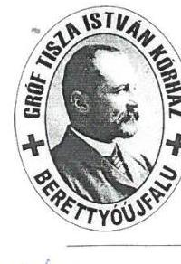

# GRÓF TISZA ISTVÁN KÓRHÁZ 

Dr. Murakőzi Zoltán
fölgazgató
4101 Berettyöújfalu, Orbán B. tér 1. Pf.: 73 Tel: 54/507-536 Fax: 54/402-209
e-mail: titkarsag@berettyokorhaz.hu
drmurakoziz@berettyokorhaz.hu
Felnőttképzési nyilvántartási szám: 09-0025-05
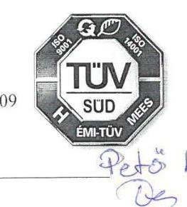
$18 \mid 2 \underline{\underline{2}}, 1 / 2018$.

## Domokos László

elnök Úr

Állami Számvevőszék
1052. Budapest

Apáczai Csere János u. 10.

Tisztelt DOMOKOS LÁSZLÓ Úr!
Ikt.szám:EL-0701-013/2018
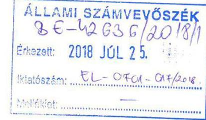
„A központi alrendszer egyes intézményei pénzügyi és vagyongazdálkodásának ellenőrzése Gróf Tisza István Kórház 2018." című, fenti iktatószámú Számvevőszéki jelentéstervezet megállapításaihoz az alábbi kiegészítéseket kívánjuk Önök elé terjeszteni:

### 2.3. ponthoz:

A kötelezettségvállalások nyilvántartása szerepel az októberi beküldött anyag 01. Sarkalatos dokumentumok 7. pontjában. A támogatásokhoz kapcsolódó kötelezettségek nyilvántartása a 13. Mintavételezéshez szükséges adatállomány az adatbázisban szereplő adatok 3. pontja „2014-2015-2016. eimodanal" megnevezéssel szerepel.
A kiadásokhoz kapcsolódóan egyéb kötelezettségvállalásokkal is rendelkezünk, hiszen jellegéből adódóan vagy személyi, vagy dologi, ill. felhalmozási kiadásokról van szó, melyekhez kinevezés, szállítói szerződések, megrendelések, pályázati szerződések tartoznak. Szerződések, megrendelések nyilvántartása a CT-Ecostat program egy-egy külön moduljaként van használatban. A személyekhez kapcsolódó kinevezések, megbízási szerződések a JDolBer Humánügyviteli rendszerben vannak nyilvántartva.

## 3. pont 1. bekezdéséhez:

Az Áht. 38. §-a ugyan nem írja elő a bevételek teljesítés igazolását, érvényesítését, de az Ügyrendben rendelkeztünk erről, ennek ellenére nem végeztük el, ezért intézkedési tervben kívánjuk meghatározni az Ügyrend módosítását a jogszabályi előírásnak megfelelően.
Az utalványozásra vonatkozó Áht. 38 §. (1) bek. illetve az ehhez kapcsolódó Ávr. 59§. (5) bek. szerinti rendelkezéssel szintén módosítani kívánjuk Ügyrendet.

Bérleti szerződésekben a szerződő fél nem rendelkezik nyilatkozatával arról, hogy átlátható szervezetnek minősül-e. Intézkedési tervben rendelkezni kívánunk, minden, az állami vagyon hasznosításából eredő bevételi és kiadási előirányzatainkat érintő szerződések során a szerződéseknek tartalmaznia kell a szerződő fél átláthatóságára vonatkozó nyilatkozatát.
Kiadási előirányzatainkat érintő szerződéses partnereinktől eddigi gyakorlat alapján bekértük nyilatkozataikat, melyeket az „Átlátható szervezetek listája" néven táblázatban nyilvántartjuk, illetve postán vagy e-mailen megküldött nyilatkozatokat ABC sorrendben lefűzve őrizzük.

Kötelezettségvállalások nem feleltek meg az Áht. 37.§.(1) bekezdésében foglaltaknak, mert azok pénzügyi ellenjegyzés nélkül történtek: 2017. évben FEUVE ellenőrzés alkalmával

---

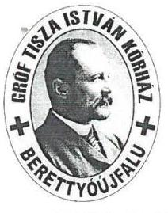

# GRÓF TISZA ISTVÁN KÓRHÁZ 

Dr. Muraközi Zoltán
föigazgató
4101 Berettyóújfalu, Orbán B. tér 1. Pf.: 73 Tel: 54/507-536 Fax: 54/402-209
e-mail: titkarsag@berettyokorhaz.hu
drmurakoziz@berettyokorhaz.hu
Felnöthképzési nyilvántartási szám: 09-0025-05
észrevételezésre került, hogy a megrendelésekről hiányzik a „pénzügyi ellenjegyzés" feltüntetése. Ezzel a kiegészítéssel módosítottuk a megrendelés nyomtatványunkat, 2017. évtől már ennek megfelelően történik az ellenjegyzés.

Az érvényesítés, utalványozás során a jövőben fokozott figyelmet fordítunk rá, hogy beazonosíthatóak legyenek az aláírások. Ellenőriztük, kívülálló számára valóban nem minden esetben beazonosíthatóak az aláírások, azonban olyan munkatárs érvényesített, illetve utalványozott, aki a megfelelő szakmai végzettséggel, illetve az erre vonatkozó megbízással és aláírás mintával rendelkezett.

Maradvány megállapítása: Az ÁEEK minden évben bekéri az éves beszámolóhoz a mellékleteket, melyek közül a 3-as számúban vezetjük le a maradvány összegét. Ezt csatoltuk is az ellenőrzéshez. A Maradvány megállapítása megítélésünk szerint szabályszerű volt, melyhez további részletező analitikákkal is rendelkezünk a 2014., 2015., 2016. évekre vonatkozóan.

## 4. pont 2. bekezdéshez:

A vagyonkezelési szerződés módosítására vonatkozóan a Kenézy Kórháztól kapott CT-vel kapcsolatosan:
Szerződést kötött a Kenézy Gyula Kórház és Rendelőintézet és a Gróf Tisza István Kórház „Vagyonkezelői jog intézmények közötti átruházása" tárgyában az Nvtv. 11. § (9) bekezdése szerint. A szerződést az ÁEEK záradékkal látta el, mely szerint „Alulírott az Állami Egészségügyi Ellátó Központ (1125. Budapest, Diós Árok 3.) képviseletében nyilatkozom, hogy az Eszközök Átadó és Átvevő közötti átadás-átvételével, illetve a vagyonelemeknek az Átadó szervezet vagyonkezeléséből az Átvevő szervezet vagyonkezelésébe történő átkerülésével egyetértek, azt jóváhagyom."
A Vtvr. 11. § (2) bekezdése szerinti esetben „a tulajdonosi joggyakorló az értesítés kézhezvételétől számított 60 napon belül elkészíti a vagyonkezelési szerződés módosítását."

## 4. pont 3. bekezdéshez:

Az ÁSZ ellenőrzéshez a beküldött adatszolgáltatásokat csatoltuk (Bekérendő dokumentumok jegyzéke /09 Vagyongazdálkodás 09. pont). Ezzel kapcsolatosan az ÁEEK-tól hiánypótlásra felszólítást nem kaptunk.
A Kórház a vagyonkezelt vagyonról a középirányító szerv felé adatszolgáltatási kötelezettségének eleget tett az alábbiak szerint (az ÁEEK 004728/2016. iktatószámú 2016. 05. 31-én kelt levele alapján):

| Vagyonkezelő negyedéves   adatszolgáltatása | Az adatszolgáltatás elküldésének   tényleges időpontja |
| :-- | :-- |
| 2015. | 2016.06 .14. |
| 2016. I. | 2016.06 .13. |
| 2016. II. | 2016.07 .25. |
| 2016. III. | 2016.10 .27. |
| 2016. IV. | 2017.02 .22. |

---

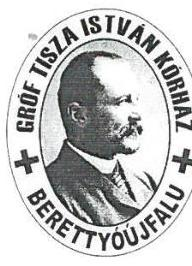

# GRÓF TISZA ISTVÁN KÓRHÁZ 

Dr. Muraközi Zoltán
föigazgató
4101 Berettyóújfalu, Orbán B. tér 1. Pf.: 73 Tel: 54/507-536 Fax: 54/402-209
e-mail: titkarsag@berettyokorhaz.hu
drmurakoziz@berettyokorhaz.hu
Felnőttképzési nyilvántartási szám: 09-0025-05
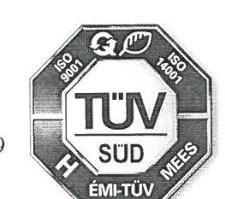

## 4. pont 4. bekezdéshez:

„A beszerzett eszközök esetében a 2014-2015. években a Számviteli tv. 52.§(2) bek. előírása ellenére az üzembe helyezést nem dokumentálták hitelt érdemlően":

Észrevétel:
Az üzembehelyezési bizonylat a gazdasági előadónál van lefűzve minden tárgyi eszköz esetében, mely valójában a CompuTrend tárgyi eszköz moduljában a 00 . Kiadás raktárról felhasználónak mozgásnemmel kerül kiállításra. Ez a bizonylat megtalálható még az átvevő alleltár leltárkönyvében is. A bizonylatok intézményünkben rendelkezésre állnak, sajnálatos módon általunk tévesen értelmezve - a mintavételhez kapcsolódóan nem kerültek feltöltésre, pótlólag meg tudjuk küldeni.

Alapos és szakszerű ellenőrzésüket jelen formában is tisztelettel megköszönjük. Kérjük, amennyiben kiegészítéseink az adott helyen releváns információt tartalmaznak, a jelentés végleges változatában figyelembe venni szíveskedjenek.

Köszönjük!

Berettyóújfalu, 2018. július 23.
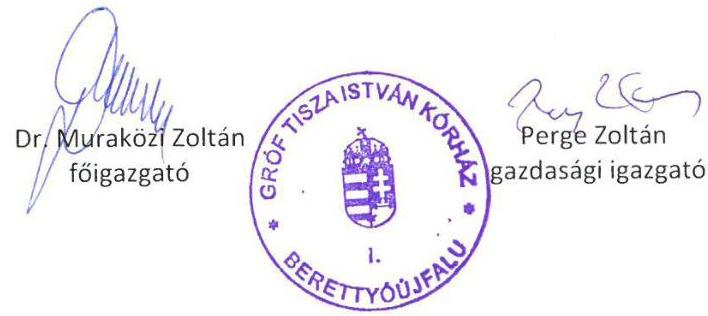

---

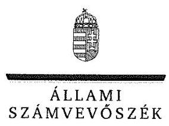

ELNÖK

Ikt.szám: EL-0701-018/2018.

# Dr. Muraközi Zoltán úr 

fóigazgató
Gróf Tisza István Kórház

## Berettyóújfalu

## Tisztelt Föigazgató Úr!

A központi alrendszer intézményei - A központi alrendszer egyes intézményei pénzügyi és vagyongazdálkodásának ellenörzése - Gróf Tisza István Kórház címmel készített számvevőszéki jelentéstervezetre tett észrevételeit megkaptam.
Az Állami Számvevőszék észrevételekre vonatkozó álláspontjáról a felügyeleti vezető által készített részletes tájékoztatást csatoltan megküldöm.
Tájékoztatom Főigazgató urat, hogy a számvevőszéki jelentésben - az Állami Számvevőszékről szóló 2011. évi LXVI. törvény 29. § (3) bekezdése alapján - a figyelembe nem vett észrevételeket szerepeltetjük az elutasítás indokának feltüntetésével.

Budapest, 2018. cugasszha hó 111. nap
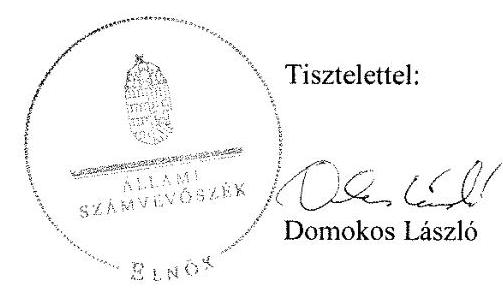

Melléklet: Tájékoztatás az el nem fogadott észrevételekről

---

# Tájékoztatás az el nem fogadott észrevételekröl 

A központi alrendszer intézményei - A központi alrendszer egyes intézményei pénzügyi és vagyongazdálkodásának ellenörzése - Gróf Tisza István Kórház címü jelentéstervezetre levélben megküldött észrevételeit áttekintettem. Az észrevételek kezeléséről az alábbi tájékoztatást adom.

## 1.) A jelentéstervezet 2.3. számú megállapítás alatti 2. bekezdéséhez füzött észrevétele kapcsán

Észrevételében Főigazgató úr jelezte, hogy a Gróf Tisza István Kórház (továbbiakban: Kórház) rendelkezett kötelezettségvállalások nyilvántartásával, amelyet az adatszolgáltatás során rendelkezésre bocsátottak.
A 2014-2016. évekre vonatkozó dokumentumok nem feleltek meg a kötelezettségvállalások, más fizetési kötelezettségek nyilvántartásával szemben támasztott, az államháztartás számviteléről szóló 4/2013. (I. 11.) Korm. rendelet (továbbiakban: Áhsz.) 14. melléklet II. 4. a)-b) és e)g) pontjaiban foglalt tartalmi előírásoknak. A nyilvántartás nem tartalmazta a kötelezettségvállalás, más fizetési kötelezettség sorszámát tanúsító dokumentum megnevezését, iktatószámát, keltét, a pénzügyi ellenjegyzésre vonatkozó adatokat, a kötelezettségvállalást, más fizetési kötelezettséget tanúsító dokumentum megnevezését, iktató- vagy érkeztető számát. A nyilvántartás nem tartalmazta továbbá a költségvetési évben a pénzügyi teljesítési határidőket dátum szerint, a kötelezettségvállalás, más fizetési kötelezettség módosulásaihoz kapcsolódóan az azokat tanúsító dokumentum megnevezését, iktatószámát, keltét, a pénzügyi ellenjegyzésre vonatkozó adatokat. A nyilvántartás nem tartalmazta a pénzügyi teljesítések dátumát, illetve az utalványozás az államháztartásról szóló törvény végrehajtásáról szóló 368/2011. (XII. 31.) Korm. rendelet 59. § (2) bekezdése szerinti dokumentumának azonosításához szükséges adatokat. A fentiekben felsorolt hiányosságok miatt a rendelkezésre bocsátott dokumentum nem volt megfeleltethető a kötelezettségvállalások, más fizetési kötelezettségek Áhsz. 14. melléklet II. pontja szerinti nyilvántartásnak.
A fent leírtakra tekintettel az észrevételt nem fogadjuk el, a jelentéstervezet módosítása nem indokolt.

## 2.) A jelentéstervezet 3. összegző megállapításához füzött észrevételei kapcsán

a. A jelentéstervezet 3. összegző megállapítás alatti első bekezdésének első mondatára vonatkozóan, a teljesítésigazolással, érvényesítéssel és az utalványozással kapcsolatos észrevételében Főigazgató úr jelezte, hogy azok elvégzésére valóban nem került sor, és ezzel összefüggésben módosítani kívánja a Kórház ügyrendjét.

---

Az észrevétel a jelentéstervezet 3. összegző megállapítás alatti első bekezdésének első mondatát nem vitatta, ezért a jelentéstervezet módosítása nem indokolt.
b. A jelentéstervezet 3. összegző megállapítás alatti első bekezdésének második mondatára vonatkozóan, az átláthatósági nyilatkozatokkal kapcsolatos észrevételében Főigazgató úr jelezte, intézkedési tervben kíván rendelkezni arról, hogy az állami vagyon hasznosításából eredő valamennyi szerződésnek tartalmaznia kell a szerződő fél átláthatóságra vonatkozó nyilatkozatát. Az eddigi gyakorlat szerint a kiadási előirányzatokat érintő szerződéses partnerektől bekérték a nyilatkozatokat, azokat nyilvántartják és őrzik.
Az ellenőrzés részére átadott dokumentumok ismételt felülvizsgálatát követően megállapítottuk, hogy az ellenőrzési időszakra vonatkozóan a Főigazgató úr nem adott át olyan dokumentumokat, amelyek igazolják, hogy a bérleti szerződések megkötésekor a Kórház rendelkezett a nemzeti vagyonról szóló 2011. évi CXCVI. törvény (továbbiakban: Nvtv.) 3. § (2) bekezdésében előirtak szerint a szerződő fél nyilatkozatával arról, hogy átlátható szervezetnek minősül-e. Az ÁSZ az ellenőrzését a megküldött ellenőrzési programnak megfelelően, a rendelkezésre bocsátott hiteles adatok és dokumentumok (bizonyítékok) alapján végezte. Az Állami Számvevőszékről szóló 2011. évi LXVI. törvény (továbbiakban: ÁSZ tv.) 28. § (2) bekezdése alapján a közremüködésre felhívott szervezet az ÁSZ részére - annak kérésére soron kívül, de legkésőbb öt munkanapon belül - az ellenőrzés lefolytatása érdekében szükséges adatokat és dokumentumokat rendelkezésre bocsátja. Főigazgató úr a 2017. október 18-án, illetve 2018. március 5-én kelt teljességi, hitelességi nyilatkozatokban kijelentette, hogy az ÁSZ részére átadott dokumentumok, adatok megbízhatóak, és a bekért adatokra, dokumentumokra vonatkozóan teljes körű információt tartalmaznak. Továbbá a teljességi, hitelességi nyilatkozatokban az átadott dokumentumok, adatok hitelességéért, valódiságáért és hiánytalanságáért teljes felelősséget vállalt. Az ellenőrzés részére átadott bérleti szerződésekben a bérbevevő - az Nvtv. 11. § (11) bekezdés a) és c) pontjaiban foglaltak ellenére - 14 esetben nem vállalta, hogy a hasznosításra vonatkozó szerződésben előírt beszámolási, nyilvántartási, adatszolgáltatási kötelezettségeket teljesíti, illetve a hasznosításban - a hasznosítóval közvetlen vagy közvetett módon jogviszonyban álló harmadik félként - kizárólag természetes személyek vagy átlátható szervezetek vesznek részt.
Erre tekintettel az észrevételt nem fogadjuk el, a jelentéstervezet módosítása nem indokolt.
c. A jelentéstervezet 3. összegző megállapítás alatti második bekezdésének első francia bekezdésére vonatkozóan, a kötelezettségvállalások pénzügyi ellenjegyzésének elmaradásával kapcsolatos észrevételében Főigazgató úr is elismerte, hogy a megrendelésekről hiányzik a pénzügyi ellenjegyzés.
Az észrevétel a jelentéstervezet 3. összegző megállapítás alatti második bekezdés első francia bekezdését nem vitatta, ezért a jelentéstervezet módosítása nem indokolt.
d. A jelentéstervezet 3. összegző megállapítás alatti második bekezdésének 2-3. francia bekezdéseire vonatkozóan, az érvényesítéssel, utalványozással kapcsolatos észrevételében Főigazgató úr is elismerte, hogy nem minden esetben beazonosíthatóak az aláírások.
Az észrevétel a jelentéstervezet 3. összegző megállapítás alatti második bekezdésének 2-3. francia bekezdéseit nem vitatta, ezért a jelentéstervezet módosítása nem indokolt.

---

e. A jelentéstervezet 3. összegző megállapítás alatti negyedik bekezdésére vonatkozóan, a maradvány megállapításával kapcsolatos észrevételében Főigazgató úr jelezte, hogy az szabályszerű volt. Az Állami Egészségügyi Ellátó Központ (továbbiakban: ÁEEK) által az éves beszámolóhoz minden évben bekért mellékletek közül a maradvány összege a 3-as számúban kerül levezetésre, amelyet az adatszolgáltatás során rendelkezésre bocsátottak.
Az észrevételben hivatkozott dokumentumok (beszámolók mellékletei) nem az Áhsz. 39. § (3) bekezdésében foglalt részletező nyilvántartások, hanem magának a maradványnak a kimutatása, illetve arról az ÁEEK tájékoztatása. Az Áhsz. 39. § (3) bekezdése szerint a kimutatásban szereplő adatokat részletező nyilvántartások vezetésével szükséges alátámasztani, amelyre vonatkozóan azonban - a 2017. október 10 -én, 18 -án, és 2018. március 5 -én kelt teljességi és hitelességi nyilatkozatok alapján - nem került megküldésre bizonyítékként felhasználható további dokumentum.
A fentiekre tekintettel az észrevételt nem fogadjuk el, a jelentéstervezet módosítása nem indokolt.

# 3.) A jelentéstervezet 4. összegző megállapítás alatti második bekezdéséhez füzött észrevétele kapcsán 

A jelentéstervezet 4. összegző megállapítás alatti második bekezdésére vonatkozóan, a vagyonkezelési szerződés módosításának elmaradásával kapcsolatos észrevételében Főigazgató úr jelezte, hogy a vagyonkezelői jog átruházása tárgyában kötött szerződést az ÁEEK egyetértő záradékkal látta el, és az észrevétel meghivatkozza az állami vagyonnal való gazdálkodásról szóló 254/2007. (X. 4.) Korm. rendelet (továbbiakban: Vtvr.) 11. § (2) bekezdését, amely szerint a tulajdonosi joggyakorló az értesítés kézhezvételétől számított 60 napon belül elkészíti a vagyonkezelési szerződés módosítását.
A rendelkezésünkre bocsátott dokumentumok szerint a hivatkozott CT-berendezés vagyonkezelői jogának Kórház általi átvételére vonatkozó szerződést 2016. április 20-ával, illetve 26 -ával a felek aláírták. A vagyonkezelői jog átadásáról szóló szerződésen kívül azonban a vagyonkezelési szerződés módosításának tényleges megtörténtét alátámasztó dokumentum - a 2017. október 10én, 18 -án, és 2018. március 5 -én kelt teljességi és hitelességi nyilatkozatok alapján - nem került csatolásra.
A fentiekre tekintettel az észrevételt nem fogadjuk el, a jelentéstervezet módosítása nem indokolt.

## 4.) A jelentéstervezet 4. összegző megállapítás alatti harmadik bekezdéséhez füzött észrevétele kapcsán

A jelentéstervezet 4. összegző megállapítás alatti harmadik bekezdésére vonatkozóan, az adatszolgáltatási kötelezettség teljesítésének elmaradásával kapcsolatos észrevételében Főigazgató úr jelezte, hogy a beküldött adatszolgáltatások csatolásra kerültek az ellenőrzéshez, ezzel kapcsolatosan az ÁEEK-tól nem kaptak hiánypótlási felhívást.
A teljességi és hitelességi nyilatkozatokban Főigazgató úr nyilatkozott, hogy az átadott dokumentumok, adatok megbízhatóak, és a bekért adatokra, dokumentumokra vonatkozóan teljes

---

körű információt tartalmaznak. Továbbá Főigazgató úr az átadott dokumentumok, adatok hitelességéért, valódiságáért, hiánytalanságáért teljes felelősséget vállalt. Figyelemmel arra, hogy az Állami Számvevőszék felé való adatszolgáltatás során a vagyonkezelt vagyonra vonatkozó adatszolgáltatási kötelezettség teljesítését alátámasztó dokumentum nem került csatolásra, az észrevételt nem fogadjuk el, így a jelentéstervezet módosítása nem indokolt.

# 5.) A jelentéstervezet 4. összegző megállapítás alatti negyedik bekezdéséhez füzött észrevétele kapcsán 

A jelentéstervezet 4. összegző megállapítás alatti negyedik bekezdésére vonatkozóan, az üzembe helyezés dokumentálásának elmaradásával kapcsolatos észrevételében Főigazgató úr jelezte, hogy minden esetben kiállításra kerülnek az üzembe helyezések dokumentumai, azonban tévedésből nem kerültek feltöltésre.
A teljességi és hitelességi nyilatkozatokban Főigazgató úr nyilatkozott, hogy az átadott dokumentumok, adatok megbízhatóak, és a bekért adatokra, dokumentumokra vonatkozóan teljes körű információt tartalmaznak. Továbbá Főigazgató úr az átadott dokumentumok, adatok hitelességéért, valódiságáért, hiánytalanságáért teljes felelősséget vállalt. Erre tekintettel az adatszolgáltatáson kívül, utólag megküldeni kívánt dokumentumok hitelességét az Állami Számvevőszék nem vizsgálja. Figyelemmel arra, hogy az Állami Számvevőszék felé való adatszolgáltatás során az üzembe helyezés hitelt érdemlő módon történő dokumentálást alátámasztó bizonyíték nem került csatolásra, az észrevételt nem fogadjuk el, a jelentéstervezet módosítása nem indokolt.

Budapest, 2018. angustua hó 14. nap

Pető Krisztina
felügyeleti vezető (

---

.

---

# RÖVIDÍTÉSEK JEGYZÉKE 

${ }^{1}$ Kórház
${ }^{2}$ Eütv.
${ }^{3}$ Áht.
${ }^{4}$ Kjt.
${ }^{5}$ Mt.
${ }^{6}$ ÁSZ
${ }^{7}$ ÁSZ tv.
${ }^{8}$ ÁSZ SZMSZ
${ }^{9}$ miniszter
${ }^{10}$ alapító okirat ${ }_{1}$
alapító okirat ${ }_{2}$
alapító okirat ${ }_{3}$
alapító okirat ${ }_{4}$
${ }^{11}$ Ávr.
${ }^{12}$ középirányító szerv ${ }_{1}$
középirányító szerv ${ }_{2}$
${ }^{13}$ SZMSZ $_{1}$

SZMSZ $_{2}$
${ }^{14}$ irányító szerv
${ }^{15}$ Ávr.
${ }^{16}$ Ügyrend $_{1}$
Ügyrend $_{2}$
Ügyrend $_{3}$
Ügyrend $_{4}$
Ügyrend $_{5}$
${ }^{17}$ Számv. tv.
${ }^{18}$ Áhsz.
${ }^{19}$ Számviteli politika $_{1}$
Számviteli politika $_{2}$

Gróf Tisza István Kórház
1997. évi CLIV. törvény az egészségügyről (hatályos 1998. július 1-jétől)
2011. évi CXCV. törvény az államháztartásról (hatályos 2012. január 1-jétől)
1992. évi XXXIII. törvény a közalkalmazottak jogállásáról (hatályos 1992. július 1-jétől)
2012. évi I. törvény a munka törvénykönyvéről (hatályos 2012. július 1-jétől)

Állami Számvevőszék
2011. évi LXVI. törvény az Állami Számvevőszékről (hatályos 2011. július 1-jétől)

Állami Számvevőszék Szervezeti és Müködési Szabályzata
emberi erőforrások minisztere
Gróf Tisza István Kórház Alapító okirata (hatályos 2014. szeptember 9-ig)
Gróf Tisza István Kórház Alapító okirata (hatályos 2014. szeptember 10-től) 2015. december 27-ig)
Gróf Tisza István Kórház Alapító okirata (hatályos 2015. december 28-tól 2016. szeptember 9-ig)
Gróf Tisza István Kórház Alapító okirata (hatályos 2016. szeptember 10-től) 368/2011. (XII. 31.) Korm. rendelet az államháztartásról szóló törvény végrehajtásáról (hatályos 2012. január 1-jétől)
Gyógyszerészeti és Egészségügyi Minőség- és Szervezetfejlesztési Intézet
Állami Egészségügyi Ellátó Központ
Gróf Tisza István Kórház Szervezeti- és Müködési Szabályzata (hatályos 2016. június 4-től 2016. december 27-ig)
Gróf Tisza István Kórház Szervezeti- és Müködési Szabályzata (hatályos 2016. december 28-tól)
Emberi Erőforrások Minisztériuma
368/2011. (XII. 31.) Korm. rendelet az államháztartásról szóló törvény végrehajtásáról (hatályos 2012. január 1-jétől)
Gróf Tisza István Kórház Gazdasági szervezet Ügyrendje (hatályos 2014. augusztus 31-ig)
Gróf Tisza István Kórház Gazdasági szervezet Ügyrendje (hatályos 2014. szeptember 1-jétől 2015. május 14-ig)
Gróf Tisza István Kórház Gazdasági szervezet Ügyrendje (hatályos 2015. május 15-től 2015. november 31-ig)
Gróf Tisza István Kórház Gazdasági szervezet Ügyrendje (hatályos 2015. december 1-jétől 2016. március 31-ig)
Gróf Tisza István Kórház Gazdasági szervezet Ügyrendje (hatályos 2016. április 1jétől)
2000. évi C. törvény a számvitelről (hatályos 2001. január 1-jétől)

4/2013. (I. 11.) Korm. rendelet az államháztartás számviteléről (hatályos 2014. január 1-jétől)
Gróf Tisza István Kórház Számviteli politika (hatályos 2014. szeptember 1-ig)
Gróf Tisza István Kórház Számviteli politika (hatályos 2014. október 1. - 2015. február 15.)

---

| Számviteli politika3 | Gróf Tisza István Kórház Számviteli politika (hatályos 2015. február 16. - 2016. február 28.) |
| :--: | :--: |
| Számviteli politika4 | Gróf Tisza István Kórház Számviteli politika (hatályos 2016. március 1-től) |
| ${ }^{20}$ Leltározási szabályzat ${ }_{1}$ | Gróf Tisza István Kórház Eszközök és Források Leltározási és Leltárkészítési Szabályzata (hatályos 2014. október 31-ig) |
| Leltározási szabályzat ${ }_{2}$ | Gróf Tisza István Kórház Eszközök és Források Leltározási és Leltárkészítési Szabályzata (hatályos 2014. november 1-jétől) |
| ${ }^{21}$ Értékelési szabályzat ${ }_{1}$ | Gróf Tisza István Kórház Eszközök és Források Értékelési Szabályzata (hatályos 2014. szeptember 1-ig) |
| Értékelési szabályzat ${ }_{2}$ | Gróf Tisza István Kórház Eszközök és Források Értékelési Szabályzata (hatályos 2014. október 1-jétől 2016. október 31-ig) |
| Értékelési szabályzat ${ }_{3}$ | Gróf Tisza István Kórház Eszközök és Források Értékelési Szabályzata (hatályos 2016. november 1-jétől) |
| ${ }^{22}$ Pénzkezelési szabályzat ${ }_{1}$ | Gróf Tisza István Kórház Pénzkezelési Szabályzata (hatályos 2014. augusztus 31ig) |
| Pénzkezelési szabályzat ${ }_{2}$ | Gróf Tisza István Kórház Pénzkezelési Szabályzata (hatályos 2014. szeptember 1jétől 2015. május 14-ig) |
| Pénzkezelési szabályzat ${ }_{3}$ | Gróf Tisza István Kórház Pénzkezelési Szabályzata (hatályos 2015. május 15-től 2016. március 31-ig) |
| Pénzkezelési szabályzat ${ }_{4}$ | Gróf Tisza István Kórház Pénzkezelési Szabályzata (hatályos 2016. április 1-jétől) |
| ${ }^{23}$ Önköltségszámítási szabályzat ${ }_{1}$ | Gróf Tisza István Kórház Önköltségszámítási szabályzata (hatályos 2014. augusztus 31-ig) |
| Önköltségszámítási szabályzat ${ }_{2}$ | Gróf Tisza István Kórház Önköltségszámítási szabályzata (hatályos 2014. szeptember 1-jétől) |
| ${ }^{24}$ Számlarend ${ }_{1}$ | Gróf Tisza István Kórház Számlarendje (hatályos 2014. szeptember 1-ig) |
| Számlarend ${ }_{2}$ | Gróf Tisza István Kórház Számlarend (hatályos 2014. szeptember 2-től 2015. február 15-ig) |
| Számlarend ${ }_{3}$ | Gróf Tisza István Kórház Számlarend (hatályos 2015. február 16-tól 2016. február 28-ig) |
| Számlarend ${ }_{4}$ | Gróf Tisza István Kórház Számlarend (hatályos 2016. március 1-jétől) |
| ${ }^{25} \mathrm{Kbt}_{.1}$ | 2011. évi CVIII. törvény a közbeszerzésekről (hatályos 2015. október 31-ig) |
| Kbt. 2 | 2015. évi CXLIII. törvény a közbeszerzésekről (hatályos 2015. november 1-jétől) |
| ${ }^{26}$ Közbeszerzési szabályzat ${ }_{1}$ | Gróf Tisza István Kórház Közbeszerzési Szabályzata (hatályos 2014. április 14-ig) |
| Közbeszerzési szabályzat ${ }_{2}$ | Gróf Tisza István Kórház Közbeszerzési Szabályzata (hatályos 2014. április 15-től) |
| ${ }^{27} \mathrm{Bkr}$. | a költségvetési szervek belső kontrollrendszeréről és belső ellenőrzéséről szóló 370/2011. (XII. 31.) Korm. rendelet (hatályos 2012. január 1-jétől) |
| ${ }^{28}$ Kockázatkezelési szabályzat | Gróf Tisza István Kórház Kockázatkezelési szabályzata (hatályos 2015. június 20-ig) |
| ${ }^{29}$ Belső kontrollrendszer szabályzat ${ }_{1}$ | Gróf Tisza István Kórház Belső Kontrollrendszer Szabályzata (hatályos 2015. július 20-tól 2016. szeptember 29-ig) |
| Belső kontrollrendszer szabályzat ${ }_{2}$ | Gróf Tisza István Kórház Belső Kontrollrendszer Szabályzata (hatályos 2016. szeptember 30-tól) |
| ${ }^{30}$ Info tv. | 2011. évi CXII. törvény az információs önrendelkezési jogról és az információszabadságról (hatályos 2011. július 27-től) |
| ${ }^{31}$ Adatvédelmi és adatbiztonsági szabályzat | Gróf Tisza István Kórház Adatvédelmi és adatbiztonsági szabályzat (hatályos 2013. december 1-jétől) |
| ${ }^{32}$ Iratkezelési szabályzat ${ }_{1}$ | Gróf Tisza István Kórház iratkezelési szabályzata (hatályos 2014. május 5-ig) |
| Iratkezelési szabályzat ${ }_{2}$ | Gróf Tisza István Kórház iratkezelési szabályzata (hatályos 2014. május 6-tól 2016. április 15-ig) |
| Iratkezelési szabályzat ${ }_{3}$ | Gróf Tisza István Kórház iratkezelési szabályzata (hatályos 2016. április 16-tól) |

---

${ }^{33}$ Belső ellenőrzési kézikönyv
${ }^{34} \mathrm{KEHI}$
${ }^{35}$ Nvtv.
${ }^{36}$ vagyonkezelési szerződés
${ }^{37}$ Vtvr.
${ }^{38}$ átruházási szerződés

Gróf Tisza István Kórház Belső Ellenőrzési Kézikönyve (hatályos 2012. június 1jétől)
Kormányzati Ellenőrzési Hivatal
2011. évi CXCVI. törvény a nemzeti vagyonról (hatályos 2011. december 31-től)

Vagyonkezelési szerződés a GYEMSZI és Gróf Tisza István Kórház között (hatályos: 2013. március 12-től; száma: GYEMSZI/007197/2013)
254/2007. (X. 4.) Korm. rendelet az állami vagyonnal való gazdálkodásról (hatályos 2007. október 4-től)
szerződés vagyonkezelői jog intézmények közötti átruházása tárgyában a Kenézy Gyula Kórház és a Gróf Tisza István Kórház között

---

# ÁLLAMI SZÁMVEVŐSZÉK 

1052 Budapest, Apáczai Csere János utca 10.
Levélcím: 1364 Budapest 4. Pf. 54
Telefon: +36 14849100 Telefax: +36 14849200
www.asz.hu