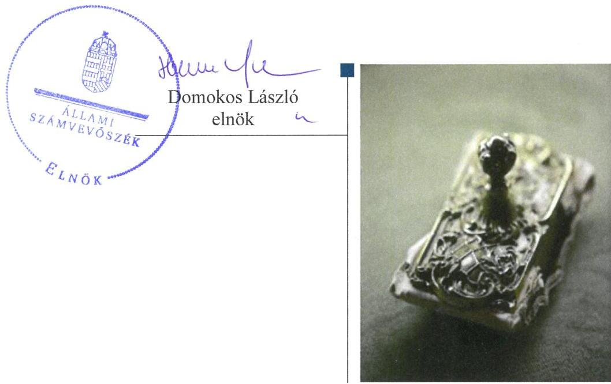
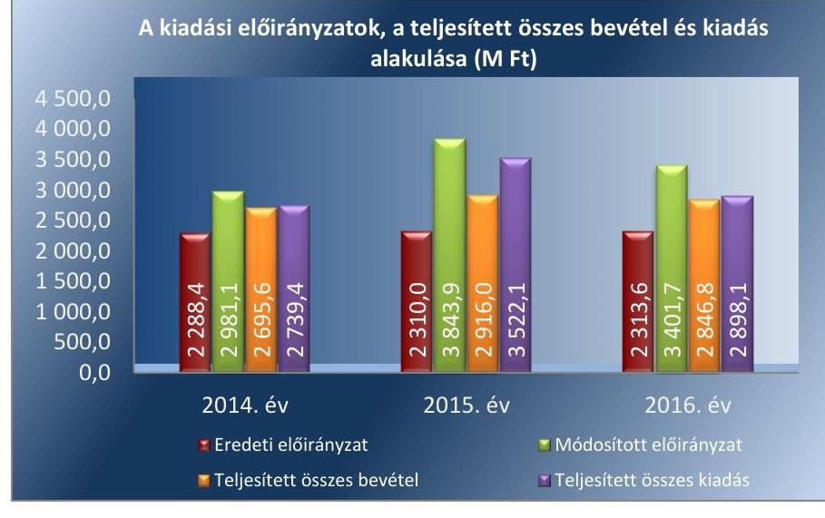
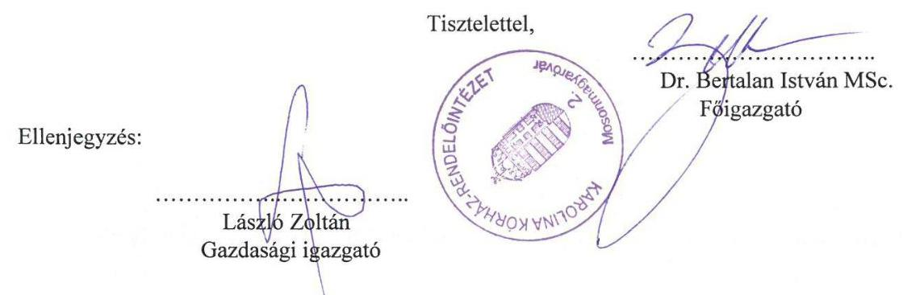
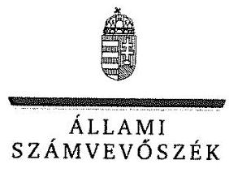
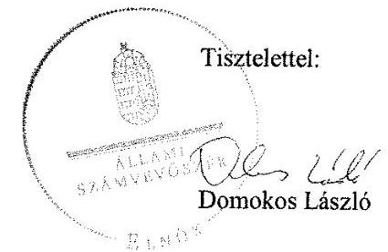
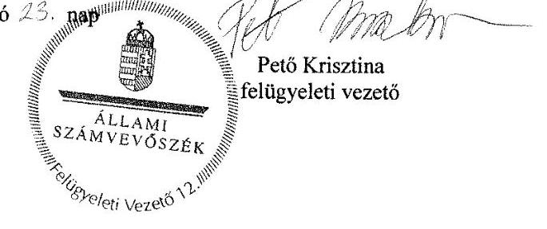

# Jelentés 

## A központi alrendszer intézményei

A központi alrendszer egyes intézményei pénzügyi és vagyongazdálkodásának ellenőrzése - Karolina Kórház-Rendelőintézet
2018.

---

# Jelentés 

## A központi alrendszer intézményei

A központi alrendszer egyes intézményei pénzügyi és vagyongazdálkodásának ellenőrzése - Karolina Kórház-Rendelőintézet
2018. szeptember 13. nap

---

# AZ ELLENŐRZÉST FELÜGYELTE:

- PETŐ KRISZTINA felügyeleti vezető
- AZ ELLENŐRZÉST VEZETTE ÉS A VÉGREHAJTÁSÁÉRT FELELŐS:
  - KAKAS SÁNDOR ellenőrzésvezető
  - A PROGRAM ÖSSZEÁLLÍTÁSÁÉRT FELELŐS:
    - TÓTPÁL SZABOLCS osztályvezető

**IKTATÓSZÁM:** EL-0304-021/2018.

**TÉMASZÁM:** 2450

**ELLENŐRZÉS-AZONOSÍTÓ SZÁM:** V079108

Jelentéseink az Országgyűlés számítógépes hálózatán és az Interneten a www.asz.hu címen is olvashatóak.

---

# TARTALOMJEGYZÉK 

■ ÖSSZEGZÉS ..... 5
■ AZ ELLENŐRZÉS CÉLJA ..... 6
■ AZ ELLENŐRZÉS TERÜLETE ..... 7
■ AZ ELLENŐRZÉS HÁTTERE, INDOKOLTSÁGA ..... 8
■ A JELENTÉS LÉNYEGES KÉRDÉSKÖREI ..... 9
■ AZ ELLENŐRZÉS HATÓKÖRE ÉS MÓDSZEREI ..... 10
■ MEGÁLLAPÍTÁSOK ..... 12
■ JAVASLATOK ..... 17
■ MELLÉKLETEK ..... 21
I. sz. melléklet: Értelmező szótár ..... 21
■ FÜGGELÉK: ÉSZREVÉTELEK ..... 25
■ RÖVIDÍTÉSEK JEGYZÉKE ..... 41

---

.

---

# ÖSSZEGZÉS 

A Karolina Kórház-Rendelőintézet felett a középirányító szervi jogosultságok gyakorlása nem volt szabályszerű. A belső kontrollrendszer kialakítása és működtetése nem volt szabályszerű, ezáltal nem volt biztosított az átlátható és elszámoltatható közpénzfelhasználás. A pénzügyi és vagyongazdálkodás nem volt szabályszerű. Az integritás kontrollrendszert nem a kockázatokkal arányosan építették ki, az integritás szemlélet nem érvényesült.

## Az ellenőrzés társadalmi indokoltsága

A közpénzek felhasználásában és az állami vagyonnal való gazdálkodásban a központi alrendszer egyes intézményei meghatározó súlyt képviselnek. Ez indokolja, hogy az Állami Számvevőszék ellenőrzéseket folytasson a pénzügyi és vagyongazdálkodás területén. Az Állami Számvevőszék az ellenőrzései során értékeli a belső kontrollrendszer jogszabályi előírások szerinti kialakítását és működtetésének szabályszerűségét, feltárja a gazdálkodás esetleges hiányosságait, rámutathat a vagyongazdálkodási tevékenység - ezen belül a tulajdonosi joggyakorlás és vagyonkezelés - esetleges szabálytalanságaira. Az ellenőrzésünkkel hozzá kívánunk járulni a központi intézmények pénzügyi helyzetének pontosabb megítéléséhez, a jó gyakorlat kialakításán és terjesztésén keresztül az ellenőrzéseink elősegíthetik a gazdálkodás szabályszerűségének javítását.

Az egészségügyi ellátások költsége folyamatosan a társadalmi érdeklődés középpontjában áll. A központi költségvetésből az egyik legjelentősebb kiadást az egészségügyi ellátásokra fordított kiadások jelentik, amelyekből a kórházak kapják a legtöbb támogatást. Ezért indokolt, hogy az Állami Számvevőszék az egészségügyi intézmények pénzügyi és vagyongazdálkodását rendszeresen több évre kiterjedően ellenőrizze.

A Karolina Kórház-Rendelőintézetet, amely közfeladatot lát el és jelentős állami vagyont kezel, az Állami Számvevőszék korábban nem ellenőrizte.

## Főbb megállapítások, következtetések, javaslatok

A Karolina Kórház-Rendelőintézet felett az irányító szervi jogosultságok körében az alapítással kapcsolatos és munkáltatói jogosultságait az Emberi Erőforrások Minisztériuma szabályszerűen gyakorolta. A Gyógyszerészeti és Egészségügyi Minőség- és Szervezetfejlesztési Intézet, valamint jogutódja az Állami Egészségügyi Ellátó Központ, mint középirányító szerv átruházott hatáskörben egyéb irányítási, felügyeleti jogosultságait 2014-2015. években nem szabályszerűen gyakorolta, mert a Kórház szervezeti és működési szabályzatát nem hagyta jóvá.

A belső kontrollrendszer kialakítása és működtetése nem volt szabályszerű, ezáltal nem volt biztosított az átlátható és elszámoltatható közpénzfelhasználás. A kockázatkezelési rendszert nem alakították ki, a kontrolltevékenységek gyakorlása nem volt szabályszerű. Az információs és kommunikációs folyamatokat 2014-2015. években nem alakították ki és nem működtették, 2016. évben a kialakítás és működtetés nem volt szabályszerű, amely nem biztosította a szervezeti átláthatóságot. A belső ellenőrzés működtetése nem volt szabályszerű.

A pénzügyi gazdálkodás nem volt szabályszerű. A bevételek beszedése és elszámolása, a kiadási előirányzatok felhasználása során a pénzgazdálkodási jogkörök gyakorlása nem felelt meg a jogszabályi előírásoknak.

A vagyongazdálkodás nem felelt meg a jogszabályi előírásoknak, a mérleget leltárral nem támasztották alá.
Az integritás kontrollrendszert nem a kockázatokkal arányosan építették ki, a kötelezően előírt integritást támogató kontrollokat nem működtették megfelelően, nem kötelezően előírt kontrollokat pedig nem működtettek.

A megállapítások alapján az Állami Számvevőszék az emberi erőforrások miniszterének egy javaslatot, az Állami Egészségügyi Ellátó Központ főigazgatójának egy javaslatot, a Karolina Kórház-Rendelőintézet főigazgatójának tizenkilenc javaslatot fogalmazott meg, amelyre 30 napon belül intézkedési tervet kell készíteniük.

---

# AZ ELLENŐRZÉS CÉLJA 

AZ ELLENŐRZÉS CÉLJA annak megítélése volt, hogy az ellenőrzött Kórházra ${ }^{1}$ vonatkozó irányító szervi feladatellátás a jogszabályi előírások betartásával történt-e; a Kórháznál a belső kontrollrendszer kialakítása és működtetése szabályszerű volt-e; a Kórház pénzügyi és vagyongazdálkodása megfelelt-e a jogszabályi előírásoknak és belső szabályzatainak; a Kórház átalakításának vagy átszervezésének lebonyolítása szabályszerűen történt-e. Az ellenőrzés keretében értékeltük a Kórház korrupciós kockázatainak kezelését szolgáló integritás kontrollok kiépítettségét és az integritás szemlélet érvényesülését.

---

# **AZ ELLENŐRZÉS TERÜLETE**

## **Karolina Kórház-Rendelőintézet**

A Kórház jogi személy, előirányzatai felett teljes jogkörrel rendelkező költségvetési szerv, amelyet főigazgató vezet.

A Kórház közfeladatot lát el, amely Mosonmagyaróvár és vonzáskörzetére, mint ellátási területre kiterjedően a járó- és fekvőbetegek diagnosztikus és terápiás szakorvosi ellátása, rehabilitációja és követéses gondozása. A Kórház alapító okiratában foglalt közfeladatát az Eütv.2 szabályozza. Az átlagos ágyszám a 2014. évben 307 volt, ami a 2015-2016. évekre 311-re emelkedett.

Az emberi erőforrások minisztere az irányító szervi hatásköröket a Kórház fölött az Emberi Erőforrások Minisztériuma útján gyakorolja. Az egyes fenntartói, valamint az irányítási, középirányítói jogokat az Állami Egészségügyi Ellátó Központ (2015. február 28-ig jogelődje a Gyógyszerészeti és Egészségügyi Minőség- és Szervezetfejlesztési Intézet) gyakorolja.

A Kórház vállalkozási tevékenységet nem folytatott.

A Kórháznál az ellenőrzött időszakban az Áht.3 11. §-ában meghatározott átalakulás nem történt.

A Kórház átlagos statisztikai állományi létszáma a 2014. évben 449 fő, a 2015. évben 507 fő volt, ami a 2016. évben 511 főre emelkedett. A Kórház alkalmazottainak foglalkoztatására a Kjt.4 és az Mt.5 alapján került sor. Az ellenőrzött időszakban a főigazgató és a gazdasági vezető személyében változás nem történt.

A Kórház vagyonkezelt vagyonnal rendelkezett. A Kórház eredeti és módosított kiadási előirányzatainak főösszegét, a teljesített összes bevétel és kiadás alakulását az 1. ábra mutatja be.

1. ábra

---

# AZ ELLENŐRZÉS HÁTTERE, INDOKOLTSÁGA 

AZ ÁLLAMHÁZTARTÁS KÖZPONTI ALRENDSZERÉNEK KÖZPÉNZ-FELHASZNÁLÁSA, az intézmények által ellátott közfeladatok sokrétűsége, valamint a feladatellátásához rendelt vagyon nagyságrendje indokolja, hogy az ÁSZ ${ }^{6}$ ellenőrzéseket folytasson a pénzügyi és vagyongazdálkodás területén. Az ÁSZ az ellenőrzései során feltárja a gazdálkodást, a központi alrendszer intézményei átalakulását, átszervezését érintő szabályozások esetleges hiányosságait, a szabályozással nem érintett gazdálkodási területeket, rámutathat a vagyongazdálkodási tevékenység - ezen belül a tulajdonosi joggyakorlás és vagyonkezelés - esetleges szabálytalanságaira, értékeli az állami vagyon nyilvántartására és elszámolására vonatkozó eljárásokat.

AZ ELLENŐRZÉS VÁRHATÓAN HOZZÁJÁRUL a központi intézmények pénzügyi helyzetének pontosabb megítéléséhez, és a jó gyakorlat kialakításán és terjesztésén keresztül az ellenőrzések elősegíthetik a gazdálkodás szabályszerűségének javítását.

---

# A JELENTÉS LÉNYEGES KÉRDÉSKÖREI 

1. Az irányító szerv ellenőrzött Kórházra vonatkozó feladatellátása szabályszerű volt-e?
2. A belső kontrollrendszer kialakítása és működtetése biztosította-e a közpénzekkel és a nemzeti vagyonnal történő átlátható, szabályszerű gazdálkodást, illetve a beszámolási és adatszolgáltatási kötelezettségek szabályszerű teljesítését?
3. A Kórház pénzügyi gazdálkodása szabályszerű volt-e?
4. A Kórház vagyongazdálkodása szabályszerű volt-e?
5. Érvényesült-e az integritás szemlélet és ennek megfelelően kiépítették-e az integritás kontrollrendszert a Kórháznál?

---

# AZ ELLENŐRZÉS HATÓKÖRE ÉS MÓDSZEREI 

## Az ellenőrzés típusa

Megfelelőségi ellenőrzés.

## Az ellenőrzött időszak

Az ellenőrzött időszak 2014. január 1-jétől 2016. december 31-ig tartott.

## Az ellenőrzés tárgya

A Kórházra vonatkozó irányító szervi feladatok ellátása. A Kórház belső kontrollrendszerének kialakítása és működtetése. A Kórház pénzügyi és vagyongazdálkodása, átalakításának vagy átszervezésének lebonyolítása. A Kórháznál az integritáskontrollok kiépítettsége, az integritás szemlélet érvényesülése.

Az ellenőrzés kiterjedt minden olyan körülményre és adatra, amely az ÁSZ jogszabályban meghatározott feladatainak teljesítéséhez, valamint a program végrehajtása folyamán felmerült újabb összefüggések feltárásához szükséges volt.

## Az ellenőrzött szervezet

A Karolina Kórház-Rendelőintézet és az irányító szervi feladatot ellátó Emberi Erőforrások Minisztériuma, továbbá a középirányító szervi feladatot ellátó Állami Egészségügyi Ellátó Központ.

## Az ellenőrzés jogalapja

Az ellenőrzés jogszabályi alapját az ÁSZ tv. ${ }^{7}$ 1. § (3) bekezdés, 5. § (2)-(4) és (6) bekezdései, valamint az Áht. 61. § (2) bekezdésének előírásai képezték.

## Az ellenőrzés módszerei

Az ÁSZ az ellenőrzést az ellenőrzési program szempontjai, az ellenőrzött időszakban hatályos jogszabályok, az ellenőrzés szakmai szabályai, a jelen ellenőrzésre irányadó ÁSZ módszertanok figyelembevételével végezte.

Az ÁSZ az ellenőrzés ideje alatt az ellenőrzött szervezetekkel történő kapcsolattartást az ÁSZ SZMSZ8-ének vonatkozó előírásai alapján biztosította.

---

Az ellenőrzési kérdések megválaszolásához szükséges bizonyítékok megszerzése az ellenőrzöttek által rendelkezésre bocsátott dokumentumokra, adatokra alapozva megfigyelés, szemle (szemrevételezés), kérdésfeltevés (információkérés), mintavételezés, valamint elemző eljárás útján történt. Az ellenőrzési bizonyítékként felhasználható adatforrások közé tartoztak egyrészt a szakmai program részletes szempontjainál felsorolt adatforrások, másrészt minden egyéb - az ellenőrzés folyamán feltárt, az ellenőrzés szempontjából információt tartalmazó - dokumentum.

Az ellenőrzés lefolytatásához az ellenőrzött szervezetek a tanúsítványok kitöltésével, valamint az ÁSZ által kért dokumentumok megküldésével szolgáltattak adatokat.

A Kórház belső kontrollrendszere jogszabályi előírások szerinti kialakítása és működtetésének szabályszerűségének értékelése az erre irányuló kérdésekre adott válaszok összesítése alapján, évente pillérenként (kontrollkörnyezet, kockázatkezelési rendszer, kontrolltevékenységek, információs és kommunikációs rendszer, monitoring rendszer) és összesítetten történt. A belső kontrollrendszer egyes pilléreinek kialakítását „szabályszerűnek" minősítettük, amennyiben az értékelt területen az elért és az elérhető pontos %-ban kifejezett, egész számra kerekített hányadosa meghaladta a 85%-ot, „nem szabályszerűnek", ha nem érte el a 85%-ot. A kontrollrendszer egésze esetében a „szabályszerű" értékelésnek a %-os értéken felül további feltétele volt, hogy egyik kontrollterület sem kaphatott „nem szabályszerű" értékelést.

A Kórháznál a bevételek (tárgyi eszközök bérbeadásából) beszedésének szabályszerűsége, valamint a kiadási előirányzatok (külső személyi juttatások, dologi kiadások, felhalmozási kiadások) felhasználása szabályszerűségének vizsgálata mintavételes ellenőrzéssel történt. A bevételek beszedése, valamint a kiadási előirányzatok felhasználása „szabályszerűnek" minősült, ha a minta ellenőrzésének eredménye alapján 95%-os bizonyossággal a teljes sokaságban a hibás tételek aránya kisebb volt, mint 10%, „nem szabályszerűnek", ha a hibás tételek aránya a 10%-ot meghaladta. Abban az esetben, ha a teljes sokaság tekintetében a 10%-os hibaarányhoz való viszony megítélésének megbízhatósága nem érte el a 95%-ot, annak elérése érdekében az értékelés további szempontokkal egészült ki, a feltárt hibák értéke is figyelembe vételre került.

Az integritás szemlélet érvényesülésének értékelése a Kórház tanúsítványi adatszolgáltatása és az ÁSZ ellenőrzés rendelkezésére bocsátott dokumentumai felhasználásával történt.

---

# 1. Az irányító szerv ellenőrzött Kórházra vonatkozó feladatellátása szabályszerű volt-e? 

Összegző megállapítás

A Kórházra vonatkozó irányító szervi feladatellátás szabályszerű volt, a középirányító szervi jogosultságok gyakorlása a 2014-2015. években nem volt szabályszerű.

AZ ALAPÍTÓI JOGOSULTSÁGOT a miniszter ${ }^{9}$ szabályszerűen gyakorolta, a Kórház alapító okiratát ${ }^{10}$ az Áht. előírásai alapján kiadta. Az alapító okirat tartalmilag az Ávr. ${ }^{11}$ előírásainak megfelel.

AZ EGYÉB IRÁNYÍTÁSI, FELÜGYELETI JOGOSULTSÁGOKAT a középirányító szerv ${ }^{12}$ 2014-2015. években nem szabályszerűen gyakorolta, mert a Kórház szervezeti és működési szabályzatát a 2014. évben az Áht. 9. § (1) bekezdés a) pontjának, 2015. évben a 9. § b) pontjának előírása ellenére nem hagyta jóvá, a Kórház szervezeti és működési szabályzattal ebben az időszakban nem
 rendelkezett. 2016. június 2-ától az egyéb irányítási, felügyeleti és ellenőrzési jogosultságok gyakorlása szabályszerű volt, a középirányító szerv ${ }_{2}$ jóváhagyta a Kórház SZMSZ ${ }^{13}$-ét.

A MUNKÁLTATÓI JOGOKAT az irányító szerv ${ }^{14}$ szabályszerűen gyakorolta.

## 2. A belső kontrollrendszer kialakítása és működtetése biztosította-e a közpénzekkel és a nemzeti vagyonnal történő átlátható, szabályszerű gazdálkodást, illetve a beszámolási és adatszolgáltatási kötelezettségek szabályszerű teljesítését?

Összegző megállapítás

A Kórház belső kontrollrendszerének kialakítása és működtetése a közpénzekkel és a nemzeti vagyonnal történő átlátható, szabályszerű gazdálkodást, illetve a beszámolási és adatszolgáltatási kötelezettségek szabályszerű teljesítését nem biztosította.
2.1. számú megállapítás

A kontrollkörnyezet kialakítása nem volt szabályszerű.
A Kórház a 2014-2015. években szervezeti és működési szabályzattal nem rendelkezett, a 2016. évben az SZMSZ az Ávr. 13. § (1) bekezdés e) pontja előírása ellenére nem tartalmazta a gazdasági szervezet feladatait, a 13. §

---

(1) bekezdés g) pontjában előírtak ellenére az SZMSZ-ben nevesített munkakörökhöz tartozó feladat- és hatásköröket, valamint a hatáskörök gyakorlásának módját. A gazdasági szervezet rendelkezett Ügyrenddel ${ }^{15}$. Az Ávr. 13. § (2) bekezdés a) pontjának előírása ellenére a főigazgató nem szabályozta a gazdálkodási jogköröket gyakorló személyek kijelölésének rendjét, valamint a tervezéssel kapcsolatos belső előírásokat, feltételeket.

A Kórház a Számv. tv. ${ }^{16}$ és az Áhsz. ${ }^{17}$ előírásainak eleget téve elkészítette a Számviteli politika ${ }_{1-3}$-t ${ }^{18}$, a Leltározási szabályzat ${ }_{1,2}$-t ${ }^{19}$, az Értékelési szabályzat ${ }_{1,2}$-t ${ }^{20}$, a Pénzkezelési szabályzat ${ }_{1-3}$-t ${ }^{21}$, valamint a 2016. évben az Önköltségszámítási szabályzatot ${ }^{22}$. A Kórház a Számv. tv. és az Áhsz. előírásainak eleget téve rendelkezett Számlarend ${ }_{1,2}$-vel ${ }^{23}$.

A Kórház ellenőrzési nyomvonalát a főigazgató a Bkr. 6. § (3) bekezdésének előírása ellenére 2014. január 1. - 2016. május 31. között nem készítette el.

A főigazgató a 2014. január 1. - 2016. szeptember 30. közötti időszakban a Bkr. ${ }^{24}$ 6. § (4) bekezdésének előírása ellenére nem szabályozta a szabálytalanságok kezelésének eljárásrendjét, valamint 2016. október 1-jétől a szervezeti integritást sértő események kezelésének eljárásrendjét.

A Kbt. ${ }_{2}{ }^{25}$ előírásainak eleget téve a Kórház a 2016. évben Közbeszerzési szabályzattal ${ }^{26}$ rendelkezett. Az Ávr. előírásainak megfelelően belső szabályzatban rögzítették az anyag- és eszközgazdálkodás számviteli szabályzatban nem szabályozott kérdéseit, a belföldi és külföldi kiküldetések elszámolásával kapcsolatos kérdéseket, a reprezentációs kiadások felosztását, azok elszámolásának szabályait, a gépjárművek igénybevételének és használatának rendjét, a vezetékes- és mobiltelefonok használatának szabályait, a Kbt. ${ }_{2}$ hatálya alá nem tartozó beszerzések lebonyolításával kapcsolatos eljárásrendet.

# 2.2. számú megállapítás 

A kockázatkezelési rendszer kialakítása és működtetése nem volt szabályszerű.

A főigazgató a 2014. január 1. - 2016. szeptember 30. közötti időszakban a Bkr. 3. § b) pontjának előírása ellenére nem alakította ki a Kórház kockázatkezelési rendszerét, valamint 2016. október 1-jétől az integrált kockázatkezelési rendszert.

### 2.3. számú megállapítás

A kontrolltevékenységek működtetése nem volt szabályszerű.

A KONTROLLTEVÉKENYSÉGEK feladatköri elkülönítését, az összeférhetetlenség eseteit az Ávr. előírásainak megfelelően a Gazdálkodási szabályzatban ${ }^{27}$ rögzítették. A gazdálkodási jogkörök gyakorlóinak aláírás mintáit tartalmazó naprakész nyilvántartás vezetéséről az Ávr. 60. § (3) bekezdésének előírása ellenére nem gondoskodtak. Az Ávr. 55. § (2) bekezdés a) pontjában foglaltak ellenére a pénzügyi ellenjegyzésre jogosult személyeket, az Ávr. 58. § (4) bekezdésében foglaltak ellenére az érvényesítésre jogosult személyeket az ellenőrzött időszakban a gazdasági vezető helyett a főigazgató jelölte ki.

A Kórház a 2014-2016. években az Áhsz. 39. § (1) bekezdésének előírása ellenére nem vezette az Áhsz. 14. melléklet II. pontja szerinti kötelezettségvállalások, más fizetési kötelezettségek nyilvántartását.

---

A bevételi és kiadási előirányzatok felhasználása során a kontrolltevékenységek gyakorlása nem volt szabályszerű. A kontrolltevékenységek működtetése során feltárt hiányosságokat részletesen a 3. pont tartalmazza.
2.4. számú megállapítás

# Az információs és kommunikációs folyamatok kialakítása és működtetése nem volt szabályszerű. 

AZ INFORMÁCIÓS ÉS KOMMUNIKÁCIÓS RENDSZERT a főigazgató a Bkr. 9. § (1)-(2) bekezdésének előírása ellenére a 2014-2015. években nem alakította ki és nem működtette. A 2016. évben a kialakítás és működtetés nem volt szabályszerű, mert a főigazgató az Ávr. 13. § (2) bekezdés h) pontjának előírása ellenére nem szabályozta a kötelezően közzéteendő adatok nyilvánosságra hozatalának rendjét, valamint a közérdekű adatok megismerésére irányuló kérelmek intézésének rendjét. Továbbá a Kórház az egészségügyi és a hozzájuk kapcsolódó személyes adatok kezeléséről és védelméről szóló 1997. évi XLVII. törvény 32. § (2) bekezdés h) pontjának előírása ellenére adatvédelmi szabályzatot nem készített és az Info tv. ${ }^{28} 37. § (1) bekezdése és 1. melléklet II/1. pontja előírása ellenére nem tette közzé az SZMSZ-ét. A Kórház Iratkezelési szabályzattal ${ }^{29}$ rendelkezett.

A Kórház tevékenységének, a célok megvalósításának folyamatos és eseti nyomon követését biztosító rendszert nem alakították ki és nem működtették. A belső ellenőrzés működtetése nem volt szabályszerű.

A főigazgató a Bkr. 10. §-ában foglalt előírások ellenére a szervezet tevékenységének, a célok megvalósításának nyomon követését biztosító rendszert nem alakította ki, mert az operatív tevékenységek keretében megvalósuló folyamatos és eseti nyomon követés 2016. szeptember 30-ig nem valósult meg.

A főigazgató a belső ellenőrzés kialakításáról az Áht. és a Bkr. előírásának megfelelően gondoskodott az ellenőrzött időszakban. A Kórház a Bkr. 17. § (1) bekezdésének előírása ellenére nem rendelkezett a belső ellenőrzés működéséhez a főigazgató által jóváhagyott belső ellenőrzési kézikönyvvel. A Bkr. előírásainak megfelelően elkészítették az éves ellenőrzési terveket.

## 3. A Kórház pénzügyi gazdálkodása szabályszerű volt-e?

Összegző megállapítás

A Kórház pénzügyi gazdálkodása nem volt szabályszerű, mert a bevételek beszedése és elszámolása, a kiadási előirányzatok felhasználása során a jogszabályi előírásokat nem tartották be.

A BEVÉTELEK elszámolása nem volt szabályszerű, mert a Gazdálkodási szabályzatban előírt érvényesítést az Ávr. 58. § (4) bekezdése ellenére nem az arra jogosult személy végezte el. A bérleti szerződések megkötésekor a Kórház nem rendelkezett az Nvtv. ${ }^{30}$ 3. § (2) bekezdésében előírtak ellenére a szerződő fél nyilatkozatával arról, hogy átlátható szervezetnek minősül-e.

---

A KIADÁSI ELŐIRÁNYZATOK felhasználása során a gazdálkodási jogkörök gyakorlása nem felelt meg a jogszabályi és a belső előírásoknak. A jogkörök gyakorlása során az alábbi hiányosságok fordultak elő:

- a kötelezettségvállalások nem feleltek meg az Áht. 37. § (1) bekezdésében foglaltaknak, mert azok nem pénzügyi ellenjegyzés után történtek;
- a teljesítésigazolás nem volt szabályszerű, mert az Ávr. 57. § (4) bekezdése ellenére nem az arra jogosult személy végezte el;
- az érvényesítés nem volt szabályszerű, mert az Ávr. 58. § (4) bekezdése ellenére nem az arra jogosult személy végezte el;
- az utalványozás nem volt szabályszerű, mert az Ávr. 59. § (1) bekezdése ellenére nem szabályszerűen érvényesített okmány alapján történt.
Az Ávr. 50. § (1) bekezdés a)-c) pontjaiban foglaltak ellenére a kötelezettségvállalás alapját képező szerződések, illetve megrendelések nem tartalmazták a szakmai, műszaki teljesítés határidejét, a pénzügyi teljesítés módját és feltételeit, a kifizetés határidejét, valamint az Ávr. 50. § (1a) bekezdése ellenére a Kórházzal szerződött fél képviselőjének nyilatkozatát arra vonatkozóan, hogy átlátható szervezetnek minősül. A Kórház a 2015. évben egy esetben nem teljesítette a Kbt. ${ }^{31} 5$. § és 119. §-ban előírt közbeszerzési kötelezettségét.

A MARADVÁNY megállapítása nem volt szabályszerű, mert a Kórház az Áhsz. 39. § (3) bekezdésének előírása ellenére a kötelezettségvállalással terhelt maradvány alátámasztásához nem vezetett részletező nyilvántartást.

# 4. A Kórház vagyongazdálkodása szabályszerű volt-e? 

## Összegző megállapítás

A Kórház vagyongazdálkodása nem volt szabályszerű.
VAGYONKEZELÉSI SZERZŐDÉSBEN ${ }^{32}$ rögzítették a Kórház vagyonkezelői jogát. A vagyonkezelési szerződés - a szerződésben foglalt vagyon tekintetében - az ellenőrzött időszakban a Vtvr. ${ }^{33}$ előírásainak megfelelően biztosította a tulajdonosi joggyakorlás és a vagyonkezelői feladatok szabályozott, átlátható végrehajtását és a vagyon használatának ellenőrzését. A vagyonkezelési szerződés a Vtvr. 14. § (3) bekezdésének előírása ellenére nem tartalmazta, hogy a vagyonkezelő a tulajdonosi joggyakorló vagyon-nyilvántartási szabályzatát megismerte és magára nézve kötelező érvényűnek ismeri el, továbbá a 20. § (1) bekezdésének előírása ellenére nem tartalmazta, hogy a tulajdonosi ellenőrzés eljárásrendjét a felek a szerződés részének tekintik.

A vagyonkezelési szerződés 1.4. pontjának előírása ellenére a Kórház az ellenőrzött időszakban az ingatlanvagyon bővülése miatt a vagyonkezelési szerződés módosítását nem kezdeményezte.

A Kórház a vagyonkezelt vagyonról a Vtvr. 9. § (3) és 14. § (1) bekezdésében foglaltak ellenére a középirányító szerv felé adatszolgáltatási kötelezettségét nem teljesítette.

---

A Kórház a 2014-2016. években a Számv. tv. 69. § (2) bekezdés előírásaival, a Leltározási szabályzat ${ }_{1,2}$ I.4. pontjában foglaltakkal ellentétben nem végezte el a leltározást, a főkönyvi könyvelés és az analitikus nyilvántartások közötti egyeztetést a mérleg fordulónapjára vonatkozóan. A Kórház a 2014-2016. években nem tett eleget a Számv. tv. 69. § (1) bekezdésében foglaltaknak, mert a mérleg tételeinek alátámasztásához nem állított össze olyan leltárt, amely tételesen, ellenőrizhető módon tartalmazta volna a mérleg fordulónapján meglévő eszközeit és forrásait mennyiségben és értékben.

# 5. Érvényesült-e az integritás szemlélet és ennek megfelelően kiépítették-e az integritás kontrollrendszert a Kórháznál? 

## Összegző megállapítás

A Kórház nem a kockázatokkal arányosan építette ki az integritás kontrollrendszert, az integritás szemlélet nem érvényesült.

A Kórház nem működtette megfelelően a kötelezően előírt integritást támogató kontrolljait és nem működtetett az integritást erősítő, nem kötelezően előírt kontrollokat.

Rendszerszerű kockázatelemzést nem alkalmaztak, a kockázati tényezőket nem azonosították, nem rögzítették, nem elemezték, nem értékelték és nem kezelték.

---

# JAVASLATOK 

Az ÁSZ tv. 33. § (1) bekezdésében foglaltak értelmében az ellenőrzött szervezet vezetője köteles a jelentésben foglalt megállapításokhoz kapcsolódó intézkedési tervet összeállítani és azt a jelentés kézhezvételétől számított 30 napon belül az ÁSZ részére megküldeni. Amennyiben az ellenőrzött szervezet vezetője nem küldi meg határidőben az intézkedési tervet, vagy továbbra sem elfogadható intézkedési tervet küld, az Állami Számvevőszék elnöke az ÁSZ tv. 33. § (3) bekezdés a) és b) pontjaiban foglaltakat érvényesítheti.

## Az emberi erőforrások miniszterének

1. Tegyen intézkedéseket a feltárt hiányosságok és/vagy szabálytalanságok tekintetében a felelősség tisztázása érdekében, és szükség szerint intézkedjen a felelősség érvényesítéséről.
(2.1. számú megállapítás 1. bekezdésének 1. és 3. mondata, a 2.2. számú megállapítás, a 2.4. megállapítás 2. bekezdésének 2-3. mondata, a 3. sz. megállapítás 3. bekezdésének 2. mondata és a 4. sz. megállapítás 4. bekezdése alapján)

## Az Állami Egészségügyi Ellátó Központ főigazgatójának

1. Intézkedjen arról, hogy a jogszabályi előírásoknak megfelelő tartalmú szervezeti és működési szabályzat kerüljön jóváhagyásra.
(2.1. számú megállapítás 1. bekezdésének 1. mondata alapján)

## A Karolina Kórház - Rendelőintézet főigazgatójának

1. Intézkedjen az SZMSZ módosítása érdekében, hogy az a jogszabályi előírásokkal összhangban tartalmazza a gazdasági szervezet feladatait, és az SZMSZ-ben nevesített munkakörökhöz tartozó feladat és hatásköröket, a hatáskörök gyakorlásának módját.
(2.1. számú megállapítás 1. bekezdésének 1. mondata alapján)
2. Intézkedjen a
 jogszabályi előírásoknak megfelelően a gazdálkodási jogköröket gyakorló személyek kijelölésének rendjéről szóló, valamint a tervezéssel kapcsolatos belső szabályzat megalkotásáról.
(2.1. számú megállapítás 1. bekezdésének 3. mondata alapján)

---

3. Intézkedjen a szervezeti integritást sértő események kezelésének szabályozásáról a jogszabályi előírásnak megfelelően.
(2.1. sz. megállapítás 4. bekezdése alapján)
4. Intézkedjen a jogszabályi előírásoknak megfelelő integrált kockázatkezelési rendszer kialakítására és működtetésére.
(2.2. sz. megállapítás 1. bekezdése alapján)
5. Intézkedjen a jogszabályi előírásoknak megfelelően a gazdálkodási jogkörök gyakorlóinak aláírásmintáit tartalmazó nyilvántartás naprakész vezetéséről.
(2.3. sz. megállapítás 1. bekezdésének 2. mondata alapján)
6. Intézkedjen, hogy a pénzügyi ellenjegyzésre és érvényesítésre jogosult személyeket a jogszabályi előírásoknak megfelelően, az arra jogosult személy jelölje ki.
(2.3. sz. megállapítás 1. bekezdésének 3. mondata alapján)
7. Intézkedjen a kötelezettségvállalások, más fizetési kötelezettségek nyilvántartásának vezetéséről a jogszabályi előírásnak megfelelően.
(2.3. sz. megállapítás 2. bekezdése alapján)
8. Intézkedjen a jogszabályi előírásoknak megfelelően a kötelezően közzéteendő adatok nyilvánosságra hozatali rendjének, valamint a közérdekű adatok megismerésére irányuló kérelmek intézési rendjének szabályozására.
(2.4. sz. megállapítás 1. bekezdésének 2. mondata alapján)
9. Intézkedjen a jogszabályban előírtaknak megfelelően az adatvédelmi szabályzat elkészítéséről.
( sz. megállapítás 1. bekezdés 3. mondatának 1. részmondata alapján)
10. Intézkedjen a jogszabályi előírásnak megfelelő közzétételi kötelezettség teljesítéséről.
(2.4. sz. megállapítás 1. bekezdés 3. mondatának 2. részmondata alapján)

---

11. Intézkedjen a jogszabályi előírásnak megfelelő belső ellenőrzési kézikönyv kidolgozására.
(2.5. sz. megállapítás 2. bekezdésének 2. mondata alapján)
12. Intézkedjen, hogy a gazdálkodási jogkörök gyakorlása során a jogszabályi előírásoknak megfelelően
a) az érvényesítést az arra jogosult személy végezze el;
b) a kötelezettségvállalásra a pénzügyi ellenjegyzést követően kerüljön sor;
c) a teljesítés igazolását az arra jogosult személy végezze el;
d) az utalványozás szabályszerűen érvényesített okmány alapján történjen.
(3. összegző megállapítás 1. bekezdésének 1. mondata és a 2. bekezdésének 1-4. francia bekezdései alapján)
13. Intézkedjen, hogy a bérleti szerződések megkötésekor a jogszabályi előírásnak megfelelően rendelkezzenek a szerződő fél nyilatkozatával arról, hogy az átlátható szervezetnek minősül.
(3. összegző megállapítás 1. bekezdésének 2. mondata alapján)
14. Intézkedjen, hogy a kötelezettségvállalás dokumentumai - a megkötött visszterhes szerződések, adott megbízások, megrendelések - a jogszabályi előírásoknak megfelelően tartalmazzák a szakmai, műszaki teljesítés határidejét, a pénzügyi teljesítés módját és feltételeit, a kifizetés határidejét, illetve a Kórházzal szerződő fél képviselőjének nyilatkozatát arra vonatkozóan, hogy átlátható szervezetnek minősül.
(3. összegző megállapítás 3. bekezdésének 1. mondata alapján)
15. Intézkedjen a jogszabályi előírásoknak megfelelő közbeszerzési eljárások lefolytatásáról.
(3. összegző megállapítás 3. bekezdésének 2. mondata alapján)
16. Intézkedjen a kötelezettségvállalással terhelt maradvány alátámasztásához részletező nyilvántartás vezetéséről a jogszabályi előírásnak megfelelően.
(3. összegző megállapítás 4. bekezdése alapján)
17. Kezdeményezze a vagyonkezelési szerződés módosítását a vagyonkezelési szerződésnek megfelelően.
(4. összegző megállapítás 2. bekezdése alapján)

---

18. 

Intézkedjen a vagyonkezelésbe tartozó vagyon tekintetében a jogszabályi előírásnak megfelelő adatszolgáltatási kötelezettségről.
(4. összegző megállapítás 3. bekezdése alapján)
19.

Intézkedjen a mérlegben kimutatott eszközök és források jogszabályban előírtaknak megfelelő, teljes körű leltárral történő alátámasztására.
(4. összegző megállapítás 4. bekezdése alapján)

---

# MELLÉKLETEK 

- I. SZ. MELLÉKLET: ÉRTELMEZŐ SZÓTÁR
állami vagyon
állami vagyonnak minősül:
a) az állam tulajdonában lévő dolog, valamint a dolog módjára hasznosítható természeti erő,
b) az a) pont hatálya alá nem tartozó mindazon vagyon, amely vonatkozásában törvény az állam kizárólagos tulajdonjogát nevesíti,
c) az állam tulajdonában lévő tagsági jogviszonyt megtestesítő értékpapír, illetve az államot megillető egyéb társasági részesedés,
d) az államot megillető olyan immateriális, vagyoni értékkel rendelkező jogosultság, amelyet jogszabály vagyoni értékű jogként nevesít. (Forrás: Vtv. 1. § (2) bekezdése)
állami vagyon használója Az a természetes vagy jogi személy, jogi személyiséggel nem rendelkező szervezet, aki, vagy amely törvény vagy szerződés alapján, bármely jogcímen (bérlet, haszonbérlet, használat stb.) állami vagyont birtokol, használ, szedi annak hasznait, hasznosít, ide nem értve a haszonélvezőt, a vagyonkezelőt és a tulajdonosi jogok gyakorlóját. (Forrás: Vtvr. 1. § (7) bekezdés a) pontja)
állami vagyon hasznosítása Az állami vagyont az MNV Zrt. maga kezeli, vagy szerződés - így különösen bérlet, haszonbérlet, megbízás - alapján központi költségvetési szervnek, természetes vagy jogi személynek, vagy jogi személyiséggel nem rendelkező gazdálkodó szervezetnek hasznosításra átengedi.
(Forrás: Vtv. 23. § (1) bekezdése, hatályos 2012. január 1-jétől)
Az állami vagyonnal a tulajdonosi joggyakorló maga gazdálkodik, vagy szerződés - így különösen bérlet, haszonbérlet, megbízás - alapján hasznosításra átengedi, illetőleg vagyonkezelésbe, haszonélvezetbe adja. (Forrás: Vtv. 23. § (1) bekezdése, hatályos 2013. június 28-ától)
ÁSZ Integritás Projekt
átalakítás

Az állami vagyont az MNV Zrt. maga kezeli, vagy szerződés - így különösen bérlet, haszonbérlet, megbízás - alapján központi költségvetési szervnek, természetes vagy jogi személynek, vagy jogi személyiséggel nem rendelkező gazdálkodó szervezetnek hasznosításra átengedi." Az állami vagyonra vonatkozóan az MNV Zrt. kizárólag az Nvtv.-ben meghatározott személyekkel köthet vagyonkezelési szerződést. (Forrás: Vtv. 27. § (1) bekezdése, hatályos 2012. január 1-jétől)
Az Állami Számvevőszék 2009-ben indította el a „Korrupciós kockázatok feltérképezése - Integritás alapú közigazgatási kultúra terjesztése" című, európai uniós forrásból megvalósított kiemelt projektjét (Integritás Projekt). Az Integritás Projekt célja, hogy felmérje a közszféra intézményei korrupciós kockázatoknak való kitettségét, illetőleg az azok mérséklésére hivatott kontrollok szintjét. Az Állami Számvevőszék a projekt révén az integritás szemlélet minél szélesebb körrel történő megismertetését, gyakorlatba ültetését kívánja elérni. Az integritás követelményeinek megfelelő szervezeti működést előnyben részesítő közigazgatási kultúra elterjesztését és a korrupció elleni fellépést az ÁSZ önmagára nézve is stratégiai jelentőségű célként fogalmazta meg. A projekt a felmérésben résztvevő intézmények számára helyzetükről egyfajta „tükörképet" mutat be, ami alapot teremt a jövőbeni pozitív irányú elmozduláshoz. (Forrás: a http://integritas.asz.hu honlapon közzétett, a 2013. évi Integritás felmérés eredményeiről készült összefoglaló tanulmány)
A költségvetési szerv általános jogutódlással történő megszüntetése átalakítással történhet. Az átalakítás lehet egyesítés vagy különválás. Az egyesítés lehet beolvadás vagy összeolvadás. (Áht. 11. § (2) bekezdés)

---

belső ellenőrzés
belső kontrollrendszer
belső kontrollrendszer területei
ellenőrzési nyomvonal
hasznosítás
információs és kommunikációs rendszer
integrált kockázatkezelési rendszer
integritás
irányító szerv/felügyeleti szerv
kockázat
kockázatkezelési rendszer
kontrollkörnyezet

Független, tárgyilagos bizonyosságot adó és tanácsadó tevékenység, amelynek célja, hogy az ellenőrzött szervezet működését fejlessze és eredményességét növelje, az ellenőrzött szervezet céljai elérése érdekében rendszerszemléletű megközelítéssel és módszeresen értékeli, illetve fejleszti az ellenőrzött szervezet irányítási és belső kontrollrendszerének hatékonyságát. (Forrás: Bkr. 2. § b) pontja)
A belső kontrollrendszer a kockázatok kezelése és tárgyilagos bizonyosság megszerzése érdekében kialakított folyamatrendszer, amely azt a célt szolgálja, hogy a működés és gazdálkodás során a tevékenységeket szabályszerűen, gazdaságosan, hatékonyan, eredményesen hajtsák végre, az elszámolási kötelezettségeket teljesítsék, megvédjék az erőforrásokat a veszteségektől, károktól és nem rendeltetésszerű használattól. (Forrás: Áht. 69. § (1) bekezdése)
A kontrollkörnyezet, a kockázatkezelési rendszer, a kontrolltevékenységek, az információs és kommunikációs rendszer, valamint a nyomon követési (monitoring) rendszer. (Forrás: Bkr. 3. §-a)
Az ellenőrzési nyomvonal a költségvetési szerv működési folyamatainak szöveges, táblázatokkal vagy folyamatábrákkal szemléltetett leírása, amely tartalmazza különösen a felelősségi és információs szinteket és kapcsolatokat, irányítási és ellenőrzési folyamatokat, lehetővé téve azok nyomon követését és utólagos ellenőrzését. (Forrás: Bkr. 6. § (3) bekezdés)
A nemzeti vagyon birtoklásának, használatának, hasznok szedése jogának bármely a tulajdonjog átruházását nem eredményező jogcímen történő átengedése, ide nem értve a vagyonkezelésbe adást, valamint a haszonélvezeti jog alapítását. (Forrás: Nvtv. 3. § (1) bekezdés 4. pontja)
A költségvetési szerv vezetője által kialakított és működtetett olyan rendszer, mely biztosítja, hogy a megfelelő információk a megfelelő időben eljutnak az illetékes szervezethez, szervezeti egységhez, illetve személyhez. (Forrás: Bkr. 9. § (1) bekezdés)
Olyan folyamatalapú kockázatkezelési rendszer, amely a szervezet minden tevékenységére kiterjed, egységes módszertan és eljárások alkalmazásával, a szervezet célkitűzéseinek és értékeinek figyelembevételével biztosítja a szervezet kockázatainak teljes körű azonosítását, azok meghatározott kritériumok szerinti értékelését, valamint a kockázatok kezelésére vonatkozó intézkedési terv elkészítését és az abban foglaltak nyomon követését. (Forrás: Bkr. 2. § m) pontja, 2016. október 1-jétől)
Az integritás az elvek, értékek, cselekvések, módszerek, intézkedések konzisztenciáját jelenti, vagyis olyan magatartásmódot, amely meghatározott értékeknek megfelel. (Forrás: Nemzetgazdasági Minisztérium: Magyarországi államháztartási belső kontroll standardok Útmutató 1.6.1. pontja, 2012. december)
A költségvetési szerv tekintetében az Áht-ban meghatározott irányítási hatáskört gyakorló szerv. (Forrás: Áht. 1. § 9. pontja)
A kockázat annak a valószínűségét jelenti, hogy egy vagy több esemény vagy intézkedés nem kívánt módon befolyásolja a rendszer működését, céljainak megvalósulását. (Forrás: Javaslatok a korrupciós kockázatok kezelésére - Kockázatkezelési és ellenőrzési módszertan 35. oldal, ÁSZ)
Olyan irányítási eszközök és módszerek összessége, melynek elemei a szervezeti célok elérését veszélyeztető tényezők (kockázatok) azonosítása, elemzése, csoportosítása, nyomon követése, valamint szükség esetén a kockázati kitettség mérséklése.(Forrás: Bkr. 2. § m) pontja)
A költségvetési szerv vezetője által kialakított olyan elvek, eljárások, belső szabályzatok összessége, amelyben világos a szervezeti struktúra, a folyamatok átláthatók, egyértelműek a felelősségi, hatásköri viszonyok és feladatok, meghatározottak, ismertek és elfogadottak az etikai elvárások a szervezet minden szintjén, átlátható a humán-erőforrás-kezelés. (Forrás: Bkr. 6. § (1) bekezdés)

---

kontrolltevékenységek

középirányító szerv
közfeladat
maradvány
nyomon követési rendszer (monitoring)
tulajdonosi joggyakorló
vagyongazdálkodás

A költségvetési szerv vezetője által a szervezeten belül kialakított (kontroll) tevékenységek, melyek biztosítják a kockázatok kezelését, hozzájárulnak a szervezet céljainak eléréséhez és erősítik a szervezet integritását. (Forrás: Bkr. 8. § (1) bekezdés)
A költségvetési szerv tekintetében törvény vagy kormányrendelet alapján meghatározott, átruházott irányítási hatásköröket gyakorló szerv. (Forrás: Áht. 9. § (4) bekezdés)
Jogszabályban meghatározott állami vagy önkormányzati feladat, amit az arra kötelezett közérdekből, a jogszabályban meghatározott követelményeknek és feltételeknek megfelelve végez, ideértve a lakosság közszolgáltatásokkal való ellátását, továbbá az állam nemzetközi szerződésekben vállalt kötelezettségeiből adódó közérdekű feladatokat, valamint e feladatok ellátásakor szükséges infrastruktúra biztosítását is. (Forrás: Nvtv. 3. § (1) bekezdés 7. pontja)
A költségvetési év során a bevételek és kiadások különbözete, amely az alaptevékenység bevételei és kiadásai tekintetében a költségvetési maradvány, a vállalkozási tevékenység bevételei és kiadásai tekintetében a vállalkozási maradvány. (Forrás: Áht. 1. § 17. pont)
A költségvetési szerv vezetője köteles kialakítani a szervezet tevékenységének a célok megvalósításának nyomon követését biztosító rendszert, amely az operatív tevékenységek keretében megvalósuló folyamatos és eseti nyomon követésből, valamint az operatív tevékenységektől függetlenül működő belső ellenőrzésből áll. (Forrás: Bkr. 10. §)

Aki a nemzeti vagyon felett az államot vagy a helyi önkormányzatot megillető tulajdonosi jogok és kötelezettségek összességének gyakorlására jogosult. (Forrás: Nvtv. 3. § (1) bekezdés 17. pontja)

A nemzeti vagyongazdálkodás feladata a nemzeti vagyon rendeltetésének megfelelő, az állam, az önkormányzat mindenkori teherbíró képességéhez igazodó, elsődlegesen a közfeladatok ellátásához és a mindenkori társadalmi szükségletek kielégítéséhez szükséges, egységes elveken alapuló, átlátható, hatékony és költségtakarékos működtetése, értékének megőrzése, állagának védelme, értéknövelő használata, hasznosítása, gyarapítása, továbbá az állam vagy a helyi önkormányzat feladatának ellátása szempontjából feleslegessé váló vagyontárgyak elidegenítése. (Forrás: Nvtv. 7. § (2) bekezdése)

---

.

---

# FÜGGELÉK: ÉSZREVÉTELEK 

A jelentéstervezetet a Számvevőszék 15 napos észrevételezésre megküldte az ellenőrzött szervezetek vezetőinek az ÁSZ tv. 29. § (1) bekezdése előírásának megfelelően.

A Karolina Kórház-Rendelőintézet főigazgatója a jelentéstervezet megállapításaira írásban észrevételt tett. Az Emberi Erőforrások Minisztériuma, valamint az Állami Egészségügyi Ellátó Központ főigazgatója

 az ÁSZ tv. 29. § (2) bekezdésében foglalt észrevételezési jogával nem élt.
A függelék – mellékletek nélkül – tartalmazza a Karolina Kórház-Rendelőintézet főigazgatója által megküldött észrevételeket, illetve az el nem fogadott észrevételek elutasításának indoklását.

[^0]
[^0]:    * 29. § (1) Az Állami Számvevőszék az ellenőrzési megállapításait megküldi az ellenőrzött szervezet vezetőjének vagy az általa megbízott személynek, és annak, akinek személyes felelősségét állapította meg.
    (2) Az ellenőrzött szervezet vezetője és a felelősként megjelölt személy az ellenőrzés megállapításaira tizenöt napon belül írásban észrevételt tehet.
    (3) Az Állami Számvevőszék az észrevételre a beérkezésétől számított harminc napon belül írásban válaszol. A figyelembe nem vett észrevételeket köteles a jelentésben feltüntetni, és megindokolni, hogy azokat miért nem fogadta el.

---

# 1168 

Ügyiratszám: 2121-5/2018
Ügyintéző: Dr. Bertalan István, főigazgató
Telefon: $\quad+36-96-574-600$

Tárgy: Észrevételek ellenőrzés megállapításaira
Hiv.szám: EL-0702-013/2018.

## ÁLLAMI SZÁMVEVŐSZÉK

Budapest
Apáczai Csere János utca 10.
1052
Postacím: 1364 Budapest 4. Pf. 54.

## Tisztelt Állami Számvevőszék!

Hivatkozással a Tisztelt Állami Számvevőszék EL-0702-013/2018. iktatószámú, A központi alrendszer intézményei – A központi alrendszer egyes intézményei pénzügyi és vagyongazdálkodásának ellenőrzése – Karolina Kórház – Rendelőintézet című számvevőszéki jelentéstervezetére – kiemelten a számvevőszéki javaslatokra – a Karolina Kórház – Rendelőintézet képviseletében eljárva az alábbi észrevételeket teszem:

A jelentéstervezet a Karolina Kórház – Rendelőintézet főigazgatójának címezve a következőket emeli ki:

1. „Intézkedjen az SZMSZ módosítása érdekében, hogy az a jogszabályi előírásokkal összhangban tartalmazza a gazdasági szervezet feladatait, és az SZMSZ-ben nevesített munkakörökhöz tartozó feladatait és hatásköröket, a hatáskörök gyakorlásának módját"
A Karolina Kórház – Rendelőintézet az Állami Számvevőszék által üzemeltetett elektronikus adatszolgáltatási rendszerbe feltöltötte a 2014. április 23-án érvénybe lépett Szervezeti és Működési Szabályzatot, mely a fedlapon megjelölt dátumokkal felülvizsgálatra került. Az utolsó módosítást 2016. december 21. napon került megküldésre az ÁEEK felé, melynek a további módosítására a jogszabályi megfelelhetőség miatt az ÁEEK javaslatot tett, de ezt az 1. számú mellékletben részletezettek miatt (alapító okirat módosítása) még nem tudtuk elkészíteni, jóváhagyatni. A Szervezeti és Működési Szabályzat 2. fejezete tartalmazza (18. oldal) a Gazdasági Igazgató feladatkörébe tartozó munka és határköröket, illetve a hatáskör gyakorlásának módját, úgy hogy az Szervezeti és Működési Szabályzat hivatkozik a mindenkor hatályos Gazdasági és Műszaki ellátás ügyrendjére. Álláspontunk szerint, ezen szabályzat az Szervezeti és Működési Szabályzattal együtt érvényes, annak elválaszthatatlan részeként kezeljük, és tartalmazza a gazdasági szervezet feladatait, és az Szervezeti és Működési Szabályzatban nevesített munkakörökhöz tartozó feladatait és hatásköröket, a hatáskörök gyakorlásának módját.
2. „Intézkedjen a jogszabályi előírásoknak megfelelően a gazdálkodási jogköröket gyakorló személyek kijelölésének rendjéről szóló, valamint a tervezéssel kapcsolatos belső szabályzat megalkotásáról"
A 2014. április 23-án kelt Szervezeti és Működési Szabályzat 2. fejezete tartalmazza (18. oldal) a Gazdasági Igazgató feladatkörébe tartozó munka és határköröket, illetve a hatáskör gyakorlásának

---

módját, úgy, hogy az Szervezeti és Működési Szabályzat hivatkozik a mindenkor hatályos Gazdasági és Műszaki ellátás ügyrendjére. A Gazdasági és Műszaki ellátás ügyrendje 2010. november 01-től hatályos, a szabályzat felülvizsgálatára jogszabály figyelembe vételével a fedlapon szereplő dátumokban sor került. (2012. 11. 01, 2014. 11.01., 2016. 11.01.) A részletes munkaköri leírások felcsatolásra kerültek a 02./5-ös pontban.
A 2014-ben hatályba lépett Gazdálkodási Szabályzat és mellékletei tartalmazzák a gazdálkodási jogköröket gyakorló személyek kijelölésének rendjét, mind a gazdálkodással mind a tervezéssel kapcsolatos szabályokat. A szabályzat felülvizsgálatára jogszabály figyelembe vételével a fedlapon szereplő dátumokban sor került. (2015. 01.01, 2015. 02.01, 2015. 03.01, 2015. 05.01, 2016. 04.01, .). A mellékletek a szabályzat alá külön kerültek felcsatolásra (Gazdálkodási Szabályzat mellékletei 2014, 2015, 2016)
A kötelezettségvállaló, utalványozó felhatalmazásának, pénzügyi ellenjegyző, érvényesítő és teljesítésigazoló kijelölésének dokumentumai a 02./11-es pontban kerültek feltöltésre. Az aláírás minták a 01./4-es pontba kerültek feltöltésre, de részét képezik a Gazdálkodási Szabályzatnak is.
3. „Intézkedjen a szervezeti integritást sértő események kezelésének szabályozásáról a jogszabályi előírásoknak megfelelően"
A jogszabályi előírásoknak megfelelően 2017. május 09-én készült el a Szabályzat, Az Intézmény szervezeti integritást sértő események kezelésének eljárásrendjéről címmel, iktatószáma: K/4831/2017. A dokumentumot jelen levelem mellékleteként, hitelesített másolati példányban csatoltan megküldöm. (5. sz. melléklet)
4. „Intézkedjen a jogszabályi előírásoknak megfelelő integrált kockázatkezelési rendszer kialakítására és működtetésére."
Az integrált kockázatkezelési rendszer az Intézmény Vezetői Információs Rendszer (VIR) keretében működik. A jogszabályi előírásoknak megfelelően 2017. május 09-én készült el a Szabályzat, Az Intézmény integrált kockázatkezeléséről szóló szabályzata címmel, iktatószáma: K/482-1/2017. A dokumentumot jelen levelem mellékleteként, hitelesített másolati példányban csatoltan megküldöm. (6. sz. melléklet)
5. „Intézkedjen a jogszabályi előírásoknak megfelelően a gazdálkodási jogkörök gyakorlóinak aláírás mintáit tartalmazó nyilvántartás naprakész vezetéséről"
A Gazdálkodási jogkörök gyakorlóinak aláírás mintáit tartalmazó naprakész nyilvántartást a Gazdálkodási Szabályzat mindenkor aktuális vonatkozó mellékletei tartalmazzák, így véleményünk szerint a Karolina Kórház – Rendelőintézet az Ávr. 60 § (3) bekezdésének előírásait betartotta, illetve betartja.
6. „Intézkedjen, hogy a pénzügyi ellenjegyzésre és érvényesítésre jogosult személyeket a jogszabályi előírásoknak megfelelően, az arra jogosult személy jelölje ki"
A Karolina Kórház – Rendelőintézet az Ávr. 55 § (2) bekezdés a) pontjában foglaltak ellenére a pénzügyi ellenjegyzésre jogosult személyeket, az Ávr. 58 § (4) bekezdésében foglaltak ellenére az érvényesítésre jogosult személyeket az ellenőrzött időszakban a gazdasági vezető helyett a főigazgató jelölte ki, a jogszabályi követelmények érvényesülése érdekében, a fentiekben előadottakra figyelemmel a módosítások kidolgozását folyamatba teszem.
7. „Intézkedjen a kötelezettségvállalások más fizetési kötelezettségek nyilvántartásának vezetéséről a jogszabályi előírásoknak megfelelően"
A Karolina Kórház – Rendelőintézet által használt Integrált Ügyviteli Rendszer (CT Ecostat) Rendelés és Kötelezettségvállalás modulja a kötelezettségek nyilvántartásának vezetésére vonatkozó az Áhsz. 14 melléklet II. pontjában felsorolt követelményeinek megfelel. Mindkét modul

---

lista menüjében különböző paraméterek megadásával összesített és részletes kötelezettségvállalási listákat leválogathatóak gazdálkodónként, keretenként. Szerződésekre és rendelésekre kimutathatóak, hogy történt-e és melyik számlának érkeztetése, valamint teljesítése. Továbbá összesített és tételes kötelezettségvállalás egyeztető analitikus listák, mely biztosítja a főkönyv alátámasztását. A személyi jellegű ráfordítások, mint kötelezettségek nyilvántartásának vezetését a Karolina Kórház – Rendelőintézet Munkaügyi Csoport vezeti Áhsz. 14 melléklet II. pontjában felsorolt követelményeinek megfelelően.
8. „Intézkedjen a jogszabályi előírásoknak megfelelően a kötelezően közzéteendő adatok nyilvánosságra hozatali rendjének, valamint a közérdekű adatok megismerésére irányuló kérelmek intézési rendjének szabályozásáról"
A Karolina Kórház – Rendelőintézet a kért szabályzattal nem rendelkezik, de a kötelezően közzéteendő adatok nyilvánosságra hozataláról a jogszabályi előírásoknak megfelelően eleget tettünk. A fentiekben előadottakra figyelemmel a szabályzat elkészítését, kidolgozását folyamatba teszem.

# 9. „Intézkedjen a jogszabályi előírásoknak megfelelően az adatvédelmi szabályzat elkészítéséről" 

Az Intézmény Adatvédelmi Szabályzattal rendelkezik (2014. 02.24.) a 2018. május 25-én érvénybe lépett GDPR törvényi változásoknak megfelelően jelenleg módosítás alatt állnak a Szabályzatainkat. A Szabályzat a 04/6-os pontba került feltöltésre.
10. „Intézkedjen a jogszabályi előírásoknak megfelelő közzétételi kötelezettség teljesítéséről" Az 1-es pontban részletezettek miatt, a még jóvá nem hagyott Szervezeti és Működési Szabályzat az Intézmény honlapjára nem került feltöltésre, ezért nem valósult meg a jogszabályi előírás. A Szervezeti és Működési Szabályzat jóváhagyásáig feltöltésre került az Intézmény Szervezeti és működési ábrája.

## 11. „Intézkedjen a jogszabályban előírtaknak megfelelően a szervezet tevékenységének, a célok megvalósulásának nyomon követését biztosító rendszer kialakítására."

Álláspontunk szerint a Karolina Kórház – Rendelőintézet belső ellenőrzése által lefolytatott ellenőrzésekről, vizsgálatokról éves bontásban készített nyilvántartások naprakész vezetésével megvalósul a lefolytatott vizsgálatokban tett megállapításokra, észrevételekre tett javaslatok megvalósításának nyomon követése. A belső ellenőrzés mind a 2013. november 22. napon kelt belső ellenőrzési stratégia, mind pedig az éves belső ellenőrzési ütemtervek készítését megelőzően kockázatelemzést és kockázatértékelést végzett, illetve végez. A kockázatok feltérképezésekor, ezt követően a kockázatok kiértékelésekor figyelembevételre kerültek a korábban lefolytatott belső ellenőrzési jelentésekben tett javaslatok, a javaslatok betartására tett intézkedések nyomon követése a kockázatok csökkentése érdekében.

## 12. „Intézkedjen a jogszabályi előírásoknak megfelelő belső ellenőrzési kézikönyv kidolgozására"

A 2017. január 18. napon felülvizsgált és jóváhagyott Belső Ellenőrzési Kézikönyv 2014. november 28. napon készült el. A Karolina Kórház – Rendelőintézet Belső Ellenőrzési Kézikönyve a Nemzetgazdasági Minisztérium által 2013. február hónapban kiadott Belső ellenőrzési kézikönyv minta alapján készült, felülvizsgálatára 2016. október hónaptól kezdődően került sor, az Integrált kockázatkezelési rendszer bevezetésének, illetve a Bkr. 17. § (4) bekezdésének értelmében. A rendszerbe a legfrissebb szabályzat került feltöltésre. A Belső Ellenőrzési Kézikönyv következő felülvizsgálata 2018. májusában kezdődött a Nemzetgazdasági Minisztérium által 2017. szeptember

---

hónapban kiadott Belső ellenőrzési kézikönyv minta alapján, így a fentiekben előadottakra figyelemmel a módosítások kidolgozását folyamatba teszem.
13. „Intézkedjen a jogszabályi előírásoknak megfelelően a belső ellenőrzési jelentésekben tett megállapításokat, javaslatokat, a vonatkozó intézkedési terveket és azok végrehajtásának nyomon követését tartalmazó nyilvántartás vezetéséről."
A vizsgálat időszakban a belső ellenőrzési jelentésekre tett javaslatok nyilvántartása éves szinten megtörtént (07./9-es pontba feltöltve), a vizsgálat időszakban (2014-2016) a lefolytatott belső ellenőrzések alapján intézkedési terv készítésére belső ellenőrzés nem tett javaslatot, ezért intézkedési tervek és azok végrehajtására vonatkozó nyilvántartására nem volt szükség.
14. „Intézkedjen, hogy a gazdálkodási jogkörök gyakorlása során a jogszabályi előírásoknak megfelelően
a) az érvényesítést az arra jogosult személy végezze el;
b) a kötelezettségvállalásra a pénzügyi ellenjegyzést követően kerüljön sor;
c) a teljesítés igazolását az arra jogosult személy végezze el;
d) az utalványozás szabályszerűen érvényesített okmány alapján történjen."

A gazdálkodási jogkörök gyakorlása összességében a jogszabályi előírásoknak megfelelően történik, az esetleges hiányosságok megszüntetése érdekében a fentiekben előadottakra figyelemmel a módosítások kidolgozását, nyomon követését folyamatba teszem.
15. „Intézkedjen, hogy a bérleti szerződések megkötésekor a jogszabályi előírásoknak megfelelően rendelkezzen a szerződő fél nyilatkozatával arról, hogy átlátható szervezetnek minősül"
Az átláthatósági nyilatkozat a jogszabályi követelményeknek megfelelően az üzleti partnereinknek kiküldésre kerülnek, ezek nem kerültek felcsatolásra az elektronikus rendszerbe. (2. számú melléklet) Ezeket nem a szerződésekkel együtt kezeljük, hanem külön nyilvántartásban szerepelnek.
16. „Intézkedjen, hogy a kötelezettségvállalás dokumentumai – a megkötött visszterhes szerződés, adott megbízások, megrendelések – a jogszabályi előírásoknak megfelelően tartalmazzák a szakma, műszaki teljesítés határidejét, a pénzügyi teljesítés módját és feltételeit, a kifizetés határidejét, illetve a Kórházzal szerződő fél képviselőjének nyilatkozatát arra vonatkozóan, hogy átlátható szervezetnek minősül."
A fentiekben előadottakra figyelemmel a módosítások kidolgozását, azok nyomon követését folyamatba teszem.
17. „Intézkedjen a jogszabályi előírásoknak megfelelő közbeszerzési eljárások lefolytatásáról."
Csatoljuk a Közbeszerzési Hatóságnak írt levelünket, mely alátámasztja, hogy az Intézmény nem sértette a Kbt. 5 § és 119 §-ban előírt közbeszerzési kötelezettséget. (3. számú melléklet)
18. „Intézkedjen a kötelezettségvállalással terhelt maradvány alátámasztásához részletes nyilvántartás vezetéséről a jogszabályi előírásoknak megfelelően."
A kötelezettségvállalással terhelt maradvány alátámasztása a vizsgált időszakban megtörtént, a dokumentumok a 2014-2015-2016. évi költségvetési beszámoló mellékletei, melyek nem kerültek feltöltésre, mellékelten csatoljuk. (4. számú melléklet)

---

# 19. „Kezdeményezze a vagyonkezelési szerződés módosítását a vagyonkezelői szerződésnek megfelelően." 

A hatályos vagyonkezelési szerződés 2018. június 30. naptól az ÁEEK kezdeményezésére módosításra kerül. Bejelentési kötelezettségünknek a vizsgált időszakban nem tettünk eleget, a
 negyedéves adatszolgáltatást teljesítjük. A fentiekben előadottakra figyelemmel a módosítások kidolgozását, azok nyomon követését folyamatba teszem.
20. „Intézkedjen a vagyonkezelésbe tartozó vagyon tekintetében a jogszabályi előírásnak megfelelő adatszolgáltatási kötelezettségről.”
2015. évtől kezdődően negyedéves gyakorisággal a Karolina Kórház - Rendelőintézet középirányító szerv felé folyamatosan beszámolt a vagyonkezelésbe tartozó vagyon tekintetében a jogszabályi előírásoknak megfelelő adatszolgáltatási kötelezettségről, ezek csatolásra kerültek. (09./9)
21. „Intézkedjen a mérlegben kimutatott eszközök és források jogszabályban előírtaknak megfelelő teljes körű leltárral történő alátámasztására.”
Mérlegsorok alátámasztása megtörtént, ezek nem kerültek felcsatolásra, csak a fedlapok, a leltárdokumentáció nagy terjedelme miatt. A 4. számú melléklet 2-es oldalán (évenként) található tanúsítvány igazolja a mérleg tételeinek valódiságát, azt a készített leltár alátámasztja.

## További észrevétel:

A jelentéstervezet megállapítások rész 5. pontja szerint:
„Rendszerszintű kockázatelemzést nem alkalmaztak, a kockázati tényezőket nem azonosították, nem rögzítették, nem elemezték, nem értékelték és nem kezelték”
Ahogyan a 11. sz. javaslatra tett észrevételben is jeleztük az éves belső ellenőrzési ütemtervek elkészítését megelőzően a belső ellenőrzés minden esetben elvégezte a kockázatok feltérképezését, a kockázatok elemzését és kiértékelését, ezek is alapjául szolgáltak az éves belső ellenőrzési tervek elkészítésének. A Karolina Kórház - Rendelőintézet minden szervezeti egységére kiterjedő kockázatelemzést teljes dokumentációjában nagy terjedelme miatt nem került csatolásra. (csatolva a 2016. november 10. napon kelt K/456-2/2016. iktatószámú 2017. évi belső ellenőrzési tervhez kapcsolódó kockázatelemzés és kockázatértékelés dokumentumai címmel - 7. sz. melléklet)

Kérem a megtett észrevételek, a csatolt dokumentumok és a fentiekben foglaltak szíves tudomásulvételét!

Mosonmagyaróvár, 2018. július 23.

---

# Dr. Bertalan István úr 

főigazgató
Karolina Kórház- Rendelőintézet

## Mosonmagyaróvár

## Tisztelt Főigazgató Úr!

A központi alrendszer intézményei - A központi alrendszer egyes intézményei pénzügyi és vagyongazdálkodásának ellenőrzése - Karolina Kórház- Rendelőintézet címmel készített számvevőszéki jelentéstervezetre tett észrevételeit megkaptam.
Az Állami Számvevőszék észrevételekre vonatkozó álláspontjáról a felügyeleti vezető által készített részletes tájékoztatást csatoltan megküldöm.
Tájékoztatom Főigazgató urat, hogy a számvevőszéki jelentésben - az Állami Számvevőszékről szóló 2011. évi LXVI. törvény 29. § (3) bekezdése alapján - a figyelembe nem vett észrevételeket szerepeltetjük az elutasítás indokának feltüntetésével.

Budapest, 2018. augusztus hó 23. nap

Melléklet: Tájékoztatás az el elfogadott és el nem fogadott észrevételekről

---

# Tájékoztatás az elfogadott és el nem fogadott észrevételekről 

A központi alrendszer intézményei - A központi alrendszer egyes intézményei pénzügyi és vagyongazdálkodásának ellenőrzése - Karolina Kórház- Rendelőintézet című jelentéstervezetre (továbbiakban: jelentéstervezet) levélben megküldött észrevételeit áttekintettem. Az észrevételek kezeléséről az alábbi tájékoztatást adom.

## 1.) A Karolina Kórház- Rendelőintézet főigazgatójának címzett 1. javaslathoz füzött észrevétele kapcsán

Észrevételében Főigazgató úr jelezte, hogy a Karolina Kórház- Rendelőintézet (továbbiakban: Kórház) szervezeti és működési szabályzatának 2. fejezete tartalmazza (18. oldal) a gazdasági igazgató feladatkörébe tartozó munka- és hatásköröket, illetve a hatáskör gyakorlásának módját azáltal, hogy hivatkozik a gazdasági szervezet ügyrendjére.
Az államháztartásról szóló törvény végrehajtásáról szóló 368/2011. (XII. 31.) Korm. rendelet (továbbiakban: Ávr.) 13. § (1) bekezdés e) és g) pontja alapján a szervezeti és működési szabályzatnak a szervezeti egységek - ezen belül a gazdasági szervezet - megnevezését, feladatait, továbbá a szervezeti és működési szabályzatban nevesített munkakörökhöz tartozó feladat- és hatásköröket, a hatáskörök gyakorlásának módját kell tartalmaznia. Az Ávr. 13. § (5) bekezdése alapján az ügyrend - amennyiben azt a szervezeti és működési szabályzat vagy más belső szabályzat nem tartalmazza - a szervezeti egységek által ellátott feladatok munkafolyamatainak leírását, a szervezeti egység vezetőinek és alkalmazottainak feladat- és hatáskörét tartalmazhatja. A fent leírtak alapján a gazdasági szervezet feladatait, valamint a szervezeti és működési szabályzatban nevesített munkakörökhöz tartozó feladat- és hatásköröket, a hatáskörök gyakorlásának módját - figyelemmel arra, hogy a szervezeti és működési szabályzat tartalmazza a nevesített munkaköröket - az Ávr. 13. § (1) bekezdés e) és g) pontja alapján a szervezeti és működési szabályzatnak szükséges tartalmaznia. A fent leírtakra tekintettel az észrevételt nem fogadjuk el, a jelentéstervezet módosítása nem indokolt.

## 2.) A Karolina Kórház- Rendelőintézet főigazgatójának címzett 2. javaslathoz füzött észrevétele kapcsán

Az észrevétel szerint a Kórház szervezeti és működési szabályzata tartalmazza a gazdasági igazgató feladatkörébe tartozó munka- és hatásköröket, a hatáskörök gyakorlásának módját, a gazdasági szervezet ügyrendjére való hivatkozással. A 2010-tól hatályos ügyrendet a rajta feltüntetett dátumokban módosították. A részletes munkaköri leírások is megküldésre kerültek. A 2014-ben hatályba lépett gazdálkodási szabályzat és mellékletei tartalmazzák a gazdálkodási jogköröket gyakorló személyek kijelölésének rendjét, mind a gazdálkodással, mind a tervezéssel kapcsolatos szabályokat. A gazdálkodási szabályzatot a rajta feltüntetett dátumokban módosították.

---

A gazdálkodási jogkörök gyakorlására vonatkozó kijelölések dokumentumai szintén megküldésre kerültek, ahogyan az aláírásminták is, amelyek részét képezik a gazdálkodási szabályzatnak.

Az Ávr. 13. § (2) bekezdés a) pontja alapján a költségvetési szerv vezetője belső szabályzatban rendezi a működéséhez kapcsolódó, a költségvetési szerv előirányzatait terhelő pénzügyi kihatással bíró, jogszabályban nem szabályozott kérdéseket, így különösen a tervezéssel, gazdálkodással - a kötelezettségvállalás, ellenjegyzés, teljesítés igazolása, érvényesítés, utalványozás végző személyek kijelölésének rendjével - kapcsolatos belső előírásokat, feltételeket. A hivatkozott jogszabályi rendelkezés értelmében a kijelölés rendjét belső szabályzatban kell meghatározni, ezért az észrevételben hivatkozott munkaköri leírások, kijelölések, aláírásminták dokumentumai irrelevánsak a szabályozási kötelezettség elmulasztásával kapcsolatban feltárt hiányosság megítélése szempontjából. Ahogyan az egyes szabályzatok módosítására vonatkozó információk is, amelyek az ellenőrzött időszakban hatályos szabályzatok Állami Számvevőszék részére történő megküldését nem pótolják. Az észrevételben hivatkozott szervezeti és működési szabályzat (a 2014. évi megalkotásától függetlenül) 2016. június 2-től hatályos, és a gazdasági igazgató tekintetében nem tartalmaz rendelkezést a gazdálkodási jogköröket gyakorló személyek kijelölésének rendjével kapcsolatban. A gazdasági szervezetnek a szervezeti és működési szabályzatban hivatkozott ügyrendje a gazdasági igazgató feladatai között ugyan meghatározza a kötelezettségvállalás ellenjegyzését, de a kijelölés rendjét, illetve azt, hogy maga a gazdasági igazgató hogyan jelöli ki pl. az érvényesítőt, nem tartalmazza. A 2014. január 1. és a 2016. március 31. közötti ellenőrzött időszakra vonatkozóan hatályos szabályzat nem került megküldésre az Állami Számvevőszék részére, amely ezen időszakra vonatkozóan tartalmazta volna a gazdálkodási jogköröket gyakorló személyek kijelölésének rendjét, valamint a tervezéssel kapcsolatos belső előírásokat, feltételeket. Az adatszolgáltatás keretében rendelkezésre bocsátott, 2016. április 1. napjától hatályos gazdálkodási szabályzat tartalmazta a gazdálkodási jogkörök gyakorlásának részletszabályait, de annak szabályaiból a tervezéssel, valamint a gazdálkodási jogköröket gyakorló személyek kijelölésével kapcsolatos eljárásrend nem állapítható meg. A gazdálkodási szabályzat mellékletei formanyomtatványok, nyilatkozatok, nem pedig a kijelölés rendjére vonatkozó normatív rendelkezések.
A fentiekre tekintettel az észrevételt nem fogadjuk el, a jelentéstervezet módosítása nem indokolt.

# 3.) A Karolina Kórház- Rendelőintézet főigazgatójának címzett 3. javaslathoz füzött észrevétele kapcsán 

Az észrevétel szerint a szervezeti integritást sértő események kezelésének eljárásrendje 2017. május 9-én elkészült.
Az észrevétel nem vitatta, hogy a Kórház a szervezeti integritást sértő események kezelésének eljárásrendjével - a költségvetési szervek belső kontrollrendszeréről és belső ellenőrzéséről szóló 370/2011. (XII. 31.) Korm. rendelet (továbbiakban: Bkr.) 6. § (4) bekezdése ellenére - a 2016. október 1. és a 2016. december 31. közötti ellenőrzött időszakban nem rendelkezett, ezért az ellenőrzött időszakon túli időszakra vonatkozó észrevételt nem fogadjuk el, a jelentéstervezet módosítása nem indokolt.

---

# 4.) A Karolína Kórház- Rendelőintézet főigazgatójának címzett 4. javaslathoz füzött észrevétele kapcsán 

Az észrevétel szerint az integrált kockázatkezelési rendszer a Kórház vezetői információs rendszerének keretében működik. A Kórház integrált kockázatkezelési szabályzata 2017. május 9-én elkészült.
Az észrevétel nem vitatta, hogy a Kórház - a Bkr. 3. § b) pontja ellenére - 2014. január 1. és 2016. szeptember 30. között kockázatkezelési, 2016. október 1. és december 31. között integrált kockázatkezelési rendszert nem alakított ki, ezért az ellenőrzött időszakon túli időszakra vonatkozó észrevételt nem fogadjuk el, a jelentéstervezet módosítása nem indokolt.

## 5.) A Karolína Kórház- Rendelőintézet főigazgatójának címzett 5. javaslathoz füzött észrevétele kapcsán

Az észrevétel szerint a gazdálkodási jogkörök gyakorlóinak aláírásmintáit tartalmazó naprakész nyilvántartást a gazdálkodási szabályzat mindenkor aktuális vonatkozó mellékletei tartalmazzák.
A 2014. január 1. és a 2016. március 31. közötti ellenőrzött időszakra vonatkozóan nem került megküldésre az Állami Számvevőszék részére hatályos gazdálkodási szabályzat. A 2016. április 1-jétől hatályos gazdálkodási szabályzat mellékletei üres formanyomtatványok (1-5. mellékletek), illetve a szabályzat megismeréséről és annak alkalmazásáról szóló nyilatkozatok (6-7. mellékletek), amelyek közül egyik sem feleltethető meg a gazdálkodási jogköröket gyakorló személyek aláírásmintái Ávr. 60. § (3) bekezdése szerinti nyilvántartásának. Erre tekintettel az észrevételt nem fogadjuk el, a jelentéstervezet módosítása nem indokolt.

## 6.) A Karolína Kórház- Rendelőintézet főigazgatójának címzett 6. javaslathoz füzött észrevétele kapcsán

Az észrevétel szerint a pénzügyi ellenjegyzésre és az érvényesítésre jogosult személyeket az ellenőrzött időszakban a gazdasági vezető helyett a főigazgató jelölte ki.
Az észrevétel a megállapítást nem vitatta, ezért a jelentéstervezet módosítása nem indokolt.

## 7.) A Karolína Kórház- Rendelőintézet főigazgatójának címzett 7. javaslathoz füzött észrevétele kapcsán

Az észrevétel szerint a kötelezettségvállalások nyilvántartása megfelel az államháztartás számviteléről szóló 4/2013. (I. 11.) Korm. rendelet (továbbiakban: Áhsz.) 14. melléklet II. pontjában felsorolt követelményeknek. Abból gazdálkodónként, keretenként leválogathatóak összesített és részletes kötelezettségvállalási listák, és kimutatható a számlák érkeztetése, teljesítése. Továbbá analitikus listák is, amelyek biztosítják a főkönyv alátámasztását. A személyi jellegű ráfordítások esetében is vezetik az Áhsz. 14. melléklet II. pontjában meghatározott követelményeknek megfelelő nyilvántartást.
Az Ávr. 56. § (1) bekezdése alapján a kötelezettségvállalást követően haladéktalanul gondoskodni kell annak az államháztartási számviteli kormányrendelet szerinti nyilvántartásba vételéről. A részletező nyilvántartás tartalmát az Áhsz. 14. melléklet II. pontja határozza meg. Az Állami Számvevőszék részére szerződések nyilvántartásaként megküldött dokumentum csak a

---

szerződő fél nevét, a szerződés számát és a „dosszié számát” tartalmazzák. Ez nem elegendő ahhoz, hogy azokat az Állami Számvevőszék az Áhsz. 14. melléklet II. pontja szerinti nyilvántartásnak tekintse azt. A rendelések nyilvántartása nem tartalmazza a kötelezettségvállalás, más fizetési kötelezettség sorszámát, az azt tanúsító dokumentum megnevezését, iktatószámát, keltét, a pénzügyi ellenjegyzésre vonatkozó adatokat, a kötelezettségvállalást, más fizetési kötelezettséget tanúsító dokumentum megnevezését, iktató- vagy érkeztető számát, keltét, a jogosult azonosításához és a pénzügyi teljesítéshez szükséges adatokat, a kötelezettségvállalás, más fizetési kötelezettség tárgyát, összegét (értékét) az egységes rovatrend rovatai szerint stb. Erre tekintettel az észrevételt nem fogadjuk el, a jelentéstervezet módosítása nem indokolt.

# 8.) A Karolina Kórház- Rendelőintézet főigazgatójának címzett 8. javaslathoz füzött észrevétele kapcsán 

Az észrevétel szerint a Kórház a kötelezően közzéteendő adatok nyilvánosságra hozatali rendjének, valamint a közérdekű adatok megismerésére irányuló kérelmek intézési rendjének szabályzatával nem rendelkezik.
Az észrevétel a megállapítást nem vitatta, a jelentéstervezet módosítása nem indokolt.

## 9.) A Karolina Kórház- Rendelőintézet főigazgatójának címzett 9. javaslathoz füzött észrevétele kapcsán

Az észrevétel szerint a Kórház rendelkezik adatvédelmi szabályzattal, amely jelenleg módosítás alatt áll.
Az adatszolgáltatás során az Állami Számvevőszék rendelkezésére bocsátott K/509-1/2017. ikt. számú adatvédelmi szabályzat a 2017. május 10.
 -ével kibocsátott módosításával egységes szerkezetbe foglalt szabályzat volt, azonban az Állami Számvevőszék az EL-0304-003/2017. ikt. számú adatbekérő levélben (2. sz. mellékletben) a 2014-2016. évekre vonatkozóan kérte be a dokumentumokat. A 2017. október 9-én, 17-én és a 2018. március 2-án kelt teljességi és hitelességi nyilatkozatokban Főigazgató úr nyilatkozott, hogy az átadott dokumentumok, adatok megbízhatóak, és a bekért adatokra, dokumentumokra vonatkozóan teljes körű információt tartalmaznak. Továbbá Főigazgató úr az átadott dokumentumok, adatok hitelességéért, valódiságáért, hiánytalanságáért teljes felelősséget vállalt. Figyelemmel arra, hogy az Állami Számvevőszék felé való adatszolgáltatás során az ellenőrzött időszakban hatályos adatvédelmi szabályzat nem került csatolásra, az észrevételt nem fogadjuk el, a jelentéstervezet módosítása nem indokolt.

## 10.) A Karolina Kórház- Rendelőintézet főigazgatójának címzett 10. javaslathoz füzött észrevétele kapcsán

Az észrevétel szerint a Kórház szervezeti és működési szabályzata azért nem került feltöltésre a honlapra, mert még nem lett jóváhagyva.
Az észrevétel a megállapítást nem vitatta, ezért az észrevételt nem fogadjuk el, a jelentéstervezet módosítása nem indokolt.

---

# 11.) A Karolina Kórház- Rendelőintézet főigazgatójának címzett 11. javaslathoz füzött észrevétele kapcsán 

Az észrevétel szerint a Kórház belső ellenőrzése által lefolytatott vizsgálatokról készített nyilvántartások naprakész vezetésével megvalósul a lefolytatott vizsgálatok során tett megállapításokra tett javaslatok megvalósításának nyomon követése. A belső ellenőrzés a stratégiai ellenőrzési terv és éves ellenőrzési terv elkészítését megelőzően kockázatelemzést és -értékelést végzett. A kockázatok feltérképezésekor és kiértékelésekor figyelembevételre kerültek a belső ellenőrzési jelentésekben tett javaslatok és az azok alapján megtett intézkedések nyomon követése a kockázatok csökkentése érdekében.
2016. szeptember 30-áig a Bkr. 10. §-a alapján a szervezet tevékenységének, a célok megvalósításának nyomon követését biztosító rendszer (monitoring) két részből állt, az operatív tevékenységek keretében megvalósuló folyamatos és eseti nyomon követésből, valamint az operatív tevékenységektől függetlenül működő belső ellenőrzésből. Figyelemmel arra, hogy a Kórház nem alakította ki a folyamatos és eseti nyomon követési rendszert, ezen hiányosság 2016. szeptember 30. napjáig fennállt. A Bkr. 2016. október 1-jétől hatályos 10. §-a alapján azonban - a költségvetési szervek esetében a belső ellenőrzés kötelező kialakítása mellett - a monitoringrendszer másik összetevője vagylagossá vált. Mivel a Kórház esetében a belső ellenőrzés kialakítása megtörtént, 2016. október 1-jétől a szervezet tevékenységének, a célok megvalósításának nyomon követését biztosító rendszer kialakításra került.
A fentiekre tekintettel az észrevételt elfogadjuk, és a jelentéstervezetet módosítjuk.

## 12.) A Karolina Kórház- Rendelőintézet főigazgatójának címzett 12. javaslathoz füzött észrevétele kapcsán

Az észrevétel szerint a Kórház belső ellenőrzési kézikönyve 2014. november 28. napján készült el, és 2017. január 18-áig felülvizsgálatra és jóváhagyásra került. Az Állami Számvevőszék részére a legfrissebb szabályzat került feltöltésre, amelynek felülvizsgálata 2018 májusában megkezdődött.
A 2017. október 9-én kelt EL-0304-003/2017. ikt. számú adatbekérő levéllel, annak második számú mellékletében a 2014-2016. évekre vonatkozóan kértük be az adatokat, dokumentumokat. A 2017. október 9-én, 17-én és a 2018. március 2-án kelt teljességi és hitelességi nyilatkozatokban Főigazgató úr nyilatkozott, hogy az átadott dokumentumok, adatok megbízhatóak, és a bekért adatokra, dokumentumokra vonatkozóan teljes körű információt tartalmaznak. Továbbá Főigazgató úr az átadott dokumentumok, adatok hitelességéért, valódiságáért, hiánytalanságáért teljes felelősséget vállalt. Figyelemmel arra, hogy az Állami Számvevőszék felé való adatszolgáltatás során az ellenőrzött időszakra vonatkozó belső ellenőrzési kézikönyv nem került csatolásra, az észrevételt nem fogadjuk el, a jelentéstervezet módosítása nem indokolt.

## 13.) A Karolina Kórház- Rendelőintézet főigazgatójának címzett 13. javaslathoz füzött észrevétele kapcsán

Az észrevétel szerint a belső ellenőrzési jelentésekre tett javaslatok nyilvántartása éves szinten megtörtént, az ezt igazoló dokumentum az Állami Számvevőszék részére megküldésre került.

---

Mivel a vizsgált időszakban a belső ellenőrzés javaslatot nem fogalmazott meg, intézkedési tervek és azok végrehajtására vonatkozó nyilvántartásra nem volt szükség.
Az adatszolgáltatás során rendelkezésünkre bocsátott dokumentumokat felülvizsgáltuk, amely alapján az észrevételt elfogadjuk, a jelentéstervezetet módosítjuk.

# 14.) A Karolina Kórház- Rendelőintézet főigazgatójának címzett 14. javaslathoz füzött észrevétele kapcsán 

Az észrevétel szerint a gazdálkodási jogkörök gyakorlása összességében a jogszabályi előírásoknak megfelelően történik, és az esetleges hiányosságok megszüntetése érdekében Főigazgató úr intézkedések megtételét helyezte kilátásba.
Az észrevétel konkrét megállapítás helytállóságát nem vitatta, amelyre tekintettel az észrevételt nem fogadjuk el, a jelentéstervezet módosítása nem indokolt.

## 15.) A Karolina Kórház- Rendelőintézet főigazgatójának címzett 15. javaslathoz füzött észrevétele kapcsán

Az észrevétel szerint az átláthatósági nyilatkozat a jogszabályi követelményeknek megfelelően az üzleti partnereknek kiküldésre kerülnek, ezek nem kerültek felcsatolásra az Állami Számvevőszék elektronikus rendszerébe. Külön nyilvántartásban szerepelnek, nem a szerződésekkel együtt kezelik.
Az ellenőrzési időszakra vonatkozóan nem kerültek átadásra olyan dokumentumok, amelyek igazolják, hogy a bérleti szerződések megkötésekor a Kórház rendelkezett a nemzeti vagyonról szóló 2011. évi CXCVI. törvény (továbbiakban: Nvtv.) 3. § (2) bekezdésében előírtak szerint a szerződő fél nyilatkozatával arról, hogy átlátható szervezetnek minősül-e. Az Állami Számvevőszék az ellenőrzését a megküldött ellenőrzési programnak megfelelően, a rendelkezésre bocsátott hiteles adatok és dokumentumok (bizonyítékok) alapján végezte. Az Állami Számvevőszékről szóló 2011. évi LXVI. törvény (továbbiakban: ÁSZ tv.) 28. § (1) bekezdése alapján a közreműködésre felhívott szervezet az Állami Számvevőszék részére - annak kérésére soron kívül, de legkésőbb öt munkanapon belül - az ellenőrzés lefolytatása érdekében szükséges adatokat és dokumentumokat rendelkezésre bocsátja. Főigazgató úr a 2017. október 9-én, 17-én, illetve 2018. március 2-án kelt teljességi, hitelességi nyilatkozatokban kijelentette, hogy az Állami Számvevőszék részére átadott dokumentumok, adatok megbízhatóak, és a bekért adatokra, dokumentumokra vonatkozóan teljes körű információt tartalmaznak. Továbbá a teljességi, hitelességi nyilatkozatokban az átadott dokumentumok, adatok hitelességéért, valódiságáért és hiánytalanságáért teljes felelősséget vállalt. Erre tekintettel az észrevételt nem fogadjuk el, a jelentéstervezet módosítása nem indokolt.

## 16.) A Karolina Kórház- Rendelőintézet főigazgatójának címzett 16. javaslathoz füzött észrevétele kapcsán

Az észrevétel szerint Főigazgató úr módosítások kidolgozását, azok nyomon követését helyezte kilátásba.

---

Az észrevétel a megállapítást nem vitatta, ezért az észrevételt nem fogadjuk el, a jelentéstervezet módosítása nem indokolt.

# 17.) A Karolina Kórház- Rendelőintézet főigazgatójának címzett 17. javaslathoz füzött észrevétele kapcsán 

Az észrevétel szerint a Kórház nem sértette meg a közbeszerzési eljárás lefolytatásának kötelezettségét, és mellékelte a Közbeszerzési Hatóságnak írt levelüket.
A közbeszerzési eljárás lefolytatásának mellőzésével kapcsolatos szabálytalanság tekintetében a Közbeszerzési Döntőbizottság döntése jelenti az ellenőrzési bizonyítékot, és nem a Közbeszerzési Hatóságnak küldött levél. Erre tekintettel az észrevételt nem fogadjuk el, a jelentéstervezet módosítása nem indokolt.

## 18.) A Karolina Kórház- Rendelőintézet főigazgatójának címzett 18. javaslathoz füzött észrevétele kapcsán

Az észrevétel szerint a kötelezettségvállalással terhelt maradvány alátámasztása a vizsgált időszakban megtörtént, annak dokumentumai az éves beszámolók mellékletei, amelyek nem kerültek megküldésre az adatszolgáltatás során.
A 2017. október 9-én, 17-én és a 2018. március 2-án kelt teljességi és hitelességi nyilatkozatokban Főigazgató úr nyilatkozott, hogy az átadott dokumentumok, adatok megbízhatóak, és a bekért adatokra, dokumentumokra vonatkozóan teljes körű információt tartalmaznak. Továbbá Főigazgató úr az átadott dokumentumok, adatok hitelességéért, valódiságáért, hiánytalanságáért teljes felelősséget vállalt. Figyelemmel arra, hogy az Állami Számvevőszék felé való adatszolgáltatás során a maradvány alátámasztásához részletező nyilvántartás nem került megküldésre, az észrevételt nem fogadjuk el, a jelentéstervezet módosítása nem indokolt.

## 19.) A Karolina Kórház- Rendelőintézet főigazgatójának címzett 19. javaslathoz füzött észrevétele kapcsán

Az észrevétel szerint a hatályos vagyonkezelési szerződés 2018. június 30. naptól az Állami Egészségügyi Ellátó Központ kezdeményezésére módosításra került. Főigazgató úr észrevétele szerint bejelentési kötelezettségüknek nem, de a negyedéves adatszolgáltatási kötelezettségüknek eleget tettek. Erre tekintettel a módosítások kidolgozását, azok nyomon követését helyezte kilátásba.
A megállapításainkat az ellenőrzött időszakra vonatkozóan fogalmazzuk meg, amely 2016. december 31-ével zárult. A vagyonkezelési szerződés módosítására 2018-ban, az ellenőrzött időszakot követően került sor, ezért az észrevételt nem fogadjuk el, a jelentéstervezet módosítása nem indokolt.

## 20.) A Karolina Kórház- Rendelőintézet főigazgatójának címzett 20. javaslathoz füzött észrevétele kapcsán

Az észrevétel szerint 2015-től negyedéves gyakorisággal a Kórház a középirányító szerv felé folyamatosan beszámolt a vagyonkezelésbe tartozó vagyonról.

---

A rendelkezésre bocsátott költségvetési beszámolók a vagyoncsoportokra tartalmaztak összevontan adatokat, azonban az állami vagyonnal való gazdálkodásról szóló 254/2007. (X. 4.) Korm. rendelet (Vtvr.) mellékletének I.1. pontjában előírtak ellenére a földterületekről, épületekről vagyonelemenként nem küldtek tételes jelentést a tulajdonosi joggyakorlónak tárgyévet követő május 31-ig. Erre tekintettel az észrevételt nem fogadjuk el, a jelentéstervezet módosítása nem indokolt.

# 21.) A Karolina Kórház- Rendelőintézet főigazgatójának címzett 21. javaslathoz füzött észrevétele kapcsán 

Az észrevétel szerint a mérlegsorok alátámasztása megtörtént, ugyanakkor nem kerültek megküldésre.

A 2017. október 9-én, 17-én és a 2018. március 2-án kelt teljességi és hitelességi nyilatkozatokban Főigazgató úr nyilatkozott, hogy az átadott dokumentumok, adatok megbízhatóak, és a bekért adatokra, dokumentumokra vonatkozóan teljes körű információt tartalmaznak. Továbbá Főigazgató úr az átadott dokumentumok, adatok hitelességéért, valódiságáért, hiánytalanságáért teljes felelősséget vállalt. Az Állami Számvevőszék felé való adatszolgáltatás során a mérlegben kimutatott eszközök és források mérlegtételeit alátámasztó leltárak nem kerültek megküldésre, amelyet az észrevétel is megerősít. Erre tekintettel az észrevételt nem fogadjuk el, a jelentéstervezet módosítása nem indokolt.

## 22.) A jelentéstervezet 5. pontjához füzött további észrevétele kapcsán

Az észrevétel szerint a belső ellenőrzés minden esetben elvégezte a kockázatok feltérképezését, elemzését és értékelését, amelyek alapjául szolgáltak az éves belső ellenőrzési tervek elkészítéséhez. A Kórház minden szervezeti egységére kiterjedő kockázatelemzés teljes dokumentációja annak nagy terjedelme miatt nem kerültek megküldésre.
A Bkr. 3. § b) pontja, illetve 7. §-a alapján a költségvetési szerv vezetője felelős a szervezet kockázatkezelési rendszerének kialakításáért, működtetéséért. Ettől elkülönülően a Bkr. 22. § b) pontja és a 29. § (1) bekezdése alapján a belső ellenőrzési vezetőnek kockázatelemzéssel kell alátámasztania a stratégiai ellenőrzés tervet és az éves ellenőrzési terveket. A két tevékenység egymástól tartalomban, határidőben, felelősségi viszonyokban is eltér egymástól. Az észrevétel a belső ellenőrzési vezető által végzett kockázatelemzésre vonatkozik, a megállapítás viszont a költségvetési szerv vezetője által kialakítandó és működtetendő kockázatkezelési rendszer hiányára irányul, ezért az észrevételt nem fogadjuk el, a jelentéstervezet módosítása nem indokolt.
Budapest, 2018. augusztus 23. nap

---

.

---

# RÖVIDÍTÉSEK JEGYZÉKE 

${ }^{1}$ Kórház
${ }^{2}$ Eütv.
${ }^{3}$ Áht.
${ }^{4}$ Kjt.
${ }^{5}$ Mt.
${ }^{6}$ ÁSZ
${ }^{7}$ ÁSZ tv.
${ }^{8}$ ÁSZ SZMSZ
${ }^{9}$ miniszter
${ }^{10}$ alapító okirat
${ }^{11}$ Ávr.
${ }^{12}$ középirányító szerv ${ }_{1}$
középirányító szerv ${ }_{2}$
${ }^{13}$ SZMSZ
${ }^{14}$ irányító szerv
${ }^{15}$ Ügyrend
${ }^{16}$ Számv. tv.
${ }^{17}$ Áhsz.
${ }^{18}$ Számviteli politika 1
Számviteli politika 2
Számviteli politika ${ }_{3}$
${ }^{19}$ Leltározási szabályzat ${ }_{1}$
Leltározási szabályzat ${ }_{2}$
${ }^{20}$ Értékelési szabályzat ${ }_{1}$
Értékelési szabályzat ${ }_{2}$
${ }^{21}$ Pénzkezelési szabályzat ${ }_{1}$
Pénzkezelési szabályzat ${ }_{2}$
Pénzkezelési szabályzat ${ }_{3}$

Karolina Kórház- Rendelőintézet
1997. évi CLIV. törvény az egészségügyről (hatályos 1998. július 1-jétől)
2011. évi CXCV. törvény az államháztartásról (hatályos 2012. január 1-jétől)
1992. évi XXXIII. törvény a közalkalmazottak jogállásáról (hatályos 1992. július 1-jétől)
2012. évi I. törvény a munka
 törvénykönyvéről (hatályos 2012. július 1-jétől)

Állami Számvevőszék
2011. évi LXVI. törvény az Állami Számvevőszékről (hatályos 2011. július 1-jétől)

Állami Számvevőszék Szervezeti és Működési Szabályzata
emberi erőforrások minisztere
Karolina Kórház-Rendelőintézet alapító okirata (hatályos 2014. január 1-jétől)
368/2011. (XII. 31.) Korm. rendelet az államháztartásról szóló törvény végrehajtásáról (hatályos 2012. január 1-jétől)
Gyógyszerészeti és Egészségügyi Minőség- és Szervezetfejlesztési Intézet
Állami Egészségügyi Ellátó Központ
Karolina Kórház-Rendelőintézet Szervezeti- és Működési Szabályzata (hatályos 2016. június 2-től)

Emberi Erőforrások Minisztériuma
Karolina Kórház-Rendelőintézet Gazdasági-Műszaki Ellátás Ügyrendje (hatályos 2016. november 1-jétől)
2000. évi C. törvény a számvitelről (hatályos 2001. január 1-jétől)

4/2013. (I. 11.) Korm. rendelet az államháztartás számviteléről (hatályos 2014. január 1-jétől)
Karolina Kórház-Rendelőintézet Szervezeti és Működési Szabályzata (hatályos 2014. december 31-ig)

Karolina Kórház-Rendelőintézet Szervezeti és Működési Szabályzata (hatályos 2015. január 1-jétől 2015. december 31-ig)

Karolina Kórház-Rendelőintézet Szervezeti és Működési Szabályzata (hatályos 2016. január 1-jétől)

Karolina Kórház-Rendelőintézet Leltározási és leltárkészítési szabályzat (hatályos 2014. december 31-ig)

Karolina Kórház-Rendelőintézet Leltározási és leltárkészítési szabályzat (hatályos 2015. január 1-jétől)

Karolina Kórház-Rendelőintézet Eszközök és Források értékelési szabályzata (hatályos 2014. december 31-ig)

Karolina Kórház-Rendelőintézet Eszközök és Források értékelési szabályzata (hatályos 2015. január 1-jétől)

Karolina Kórház-Rendelőintézet Pénzkezelési szabályzat (hatályos 2014. december 31-ig)

Karolina Kórház-Rendelőintézet Pénzkezelési szabályzat (hatályos 2015. január 1-jétől 2016. augusztus 31-ig)

Karolina Kórház-Rendelőintézet Pénzkezelési szabályzat (hatályos 2016. szeptember 1-jétől)

---

${ }^{22}$ Önköltségszámítási szabályzat
${ }^{23}$ Számlarend: Számlarend$_{2}$
${ }^{24}$ Bkr.
${ }^{25}$ Kbt.2
${ }^{26}$ Közbeszerzési szabályzat
${ }^{27}$ Gazdálkodási szabályzat
${ }^{28}$ Info tv.
${ }^{29}$ Iratkezelési szabályzat
${ }^{30}$ Nvtv.
${ }^{31}$ Kbt.1
${ }^{32}$ Vagyonkezelési szerződés
${ }^{33}$ Vtvr.

Karolina Kórház-Rendelőintézet Önköltség-számítási szabályzat (hatályos 2016. január 1-jétől)
Karolina Kórház-Rendelőintézet Számlarend (hatályos 2014. december 31-ig)
Karolina Kórház-Rendelőintézet Számlarend (hatályos 2015. január 1-jétől)
370/2011. (XII. 31.) Korm. rendelet a költségvetési szervek belső
kontrollrendszeréről és belső ellenőrzésről (hatályos 2012. január 1-jétől)
2015. évi CXLIII. törvény a közbeszerzésekről (hatályos 2015. november 1-jétől)

Karolina Kórház-Rendelőintézet Közbeszerzési Szabályzata (hatályos 2015. november 1-jétől)
Karolina Kórház-Rendelőintézet Gazdálkodási szabályzat (hatályos 2016. április 1-jétől)
2011. évi CXII. törvény az információs önrendelkezési jogról és az információszabadságról (hatályos 2011. július 27-től)
Karolina Kórház-Rendelőintézet Iratkezelési szabályzat (hatályos 2013. december 31-től)
2011. évi CXCVI. törvény a nemzeti vagyonról (hatályos 2011. december 31-től) 2011. évi CVIII. törvény a közbeszerzésekről (hatályos 2015. október 31-ig)

Vagyonkezelési szerződés a GYEMSZI és Karolina Kórház-Rendelőintézet között (hatályos: 2013. március 1-jétől; száma: GYEMSZI/006987/2013.)
254/2007. (X. 4.) Korm. rendelet az állami vagyonnal való gazdálkodásról (hatályos 2007. október 4-től)

---

# ÁLLAMI SZÁMVEVŐSZÉK 

1052 Budapest, Apáczai Csere János utca 10.
Levélcím: 1364 Budapest 4. Pf. 54
Telefon: +36 14849100 Telefax: +36 14849200
www.asz.hu
