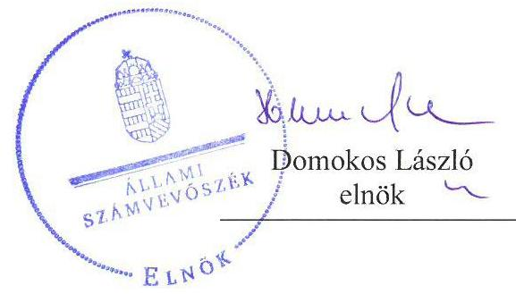
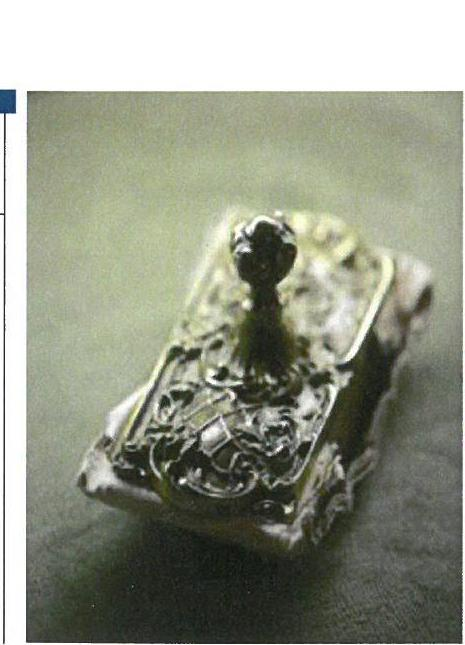
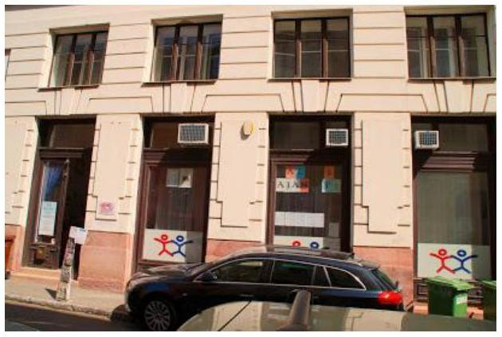
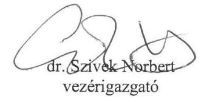
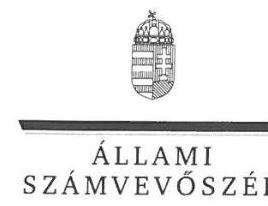
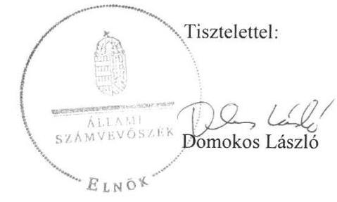
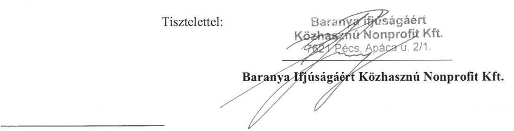
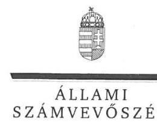
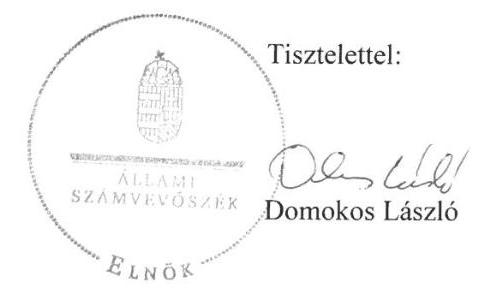

# Jelentés 

## Az állami tulajdonú gazdasági társaságok ellenőrzése

Baranya Ifjúságáért Közhasznú Nonprofit Kft.
2018.

---

# J elentés 

## Az állami tulajdonú gazdasági társaságok ellenőrzése

Baranya Ifjúságáért Közhasznú Nonprofit Kft.
2018. 09. hó 17. nap

---

# AZ ELLENŐRZÉST FELÜGYELTE:

## TÓTH MARIANNA felügyeleti vezető

## AZ ELLENŐRZÉST VEZETTE ÉS A VÉGREHAJTÁSÁÉRT FELELŐS:

### GÁL MAGDOLNA ellenőrzésvezető

## A PROGRAM ÖSSZEÁLLÍTÁSÁÉRT FELELŐS:

### TÓTPÁL SZABOLCS osztályvezető

---

**IKTATÓSZÁM:** EL-0427-051/2018.

**TÉMASZÁM:** 2469

**ELLENŐRZÉS-AZONOSÍTÓ SZÁM:** V081445

---

Jelentéseink az Országgyűlés számítógépes hálózatán és az Interneta a www.asz.hu címen is olvashatóak.

---

# TARTALOMJEGYZÉK 

■ ÖSSZEGZÉS ..... 5
■ AZ ELLENŐRZÉS CÉLJA ..... 6
■ AZ ELLENŐRZÉS TERÜLETE ..... 7
■ AZ ELLENŐRZÉS HÁTTERE, INDOKOLTSÁGA ..... 8
■ A JELENTÉS LÉNYEGES KÉRDÉSKÖRE ..... 9
■ AZ ELLENŐRZÉS HATÓKÖRE ÉS MÓDSZEREI ..... 10
■ MEGÁLLAPÍTÁSOK ..... 12
■ JAVASLATOK ..... 13
■ FÜGGELÉK: ÉSZREVÉTELEK ..... 15
■ RÖVIDÍTÉSEK JEGYZÉKE ..... 25

---

.

---

# ÖSSZEGZÉS 

A Baranya Ifjúságáért Közhasznú Nonprofit Kft. vagyonmegőrzési és gazdálkodási tevékenységének ellenőrzése során teljesitett adatszolgáltatása a teljesség és hitelesség követelményének nem felelt meg, a Társaság gazdálkodása a 2013-2016. évek vonatkozásában nem volt átlátható, elszámoltatható. Az ügyvezető nem igazolta a vagyon megőrzése feltételeinek megteremtését, a vagyonnal való felelős gazdálkodás megvalósitását. Felvetjük a Társaság közvagyonnal való gazdálkodásának létjogosultságát.

## Az ellenőrzés társadalmi indokoltsága

Az Állami Számvevőszék kiemelt célja, hogy az államháztartáson kívülre nyújtott költségvetési támogatások és ingyenes vagyonjuttatások, valamint az államháztartáson kívül múködő feladatellátó rendszerek ellenőrzéseivel hozzájáruljon ahhoz, hogy a közpénzeket az államháztartáson kívül múködő szervezetek is átlátható, rendezett módon használják fel.

Az állami tulajdonú gazdálkodó szervezetek a nemzeti vagyon részét képezik. Az állami vagyonnal való gazdálkodást illetően a tulajdonosi joggyakorlás feladata az állami vagyon átlátható, rendeltetésszerű és felelős használatának biztosítása. Az állami tulajdonú gazdasági társaságok feladata az állami vagyon átlátható, hatékony, költségtakarékos múködtetése, értékének megőrzése, állagának védelme, értéknövelő használata, hasznosítása.

Minden közpénzt, közvagyont használó szervezettel szemben társadalmi igény, hogy tevékenységükről elszámoljanak. Ezt figyelembe véve és az Állami Számvevőszék Stratégiájával összhangban került sor az állami tulajdonban álló Baranya Ifjúságáért Közhasznú Nonprofit Kft. ellenőrzésére.

## Főbb megállapítások, következtetések, javaslatok

A Baranya Ifjúságáért Közhasznú Nonprofit Kft. vezetője az adatszolgáltatáshoz csatolt teljességi és hitelességi nyilatkozatban nem azonosította, nem sorolta fel azokat a dokumentumokat, adatokat, amelyekről a nyilatkozatot kiállította. A Baranya Ifjúságáért Közhasznú Nonprofit Kft. adatszolgáltatása a vagyonmegőrzési és gazdálkodási tevékenységének ellenőrzése során átadott dokumentumok, adatok vonatkozásában azok hitelességét, valódiságát, hiánytalanságát és - az ellenőrzött időszakra vonatkozóan - hatályosságát nem biztosította, ezért a nyilatkozatban foglalt felelősségvállalás sem állt fenn.

A Társaság ${ }^{1}$ gazdálkodása - a hitelesség, valódiság, teljeskörűség, hatályosság követelményeinek megfelelő ellenőrzési bizonyíték hiányában - nem volt átlátható és elszámoltatható. Az ügyvezető² nem igazolta a vagyon megőrzése feltételeinek biztosítását, a vagyonnal való felelős gazdálkodás megvalósulását, ezért az Állami Számvevőszék a megállapításhoz kapcsolódóan kezdeményezi a Társaság ügyvezetője felelősségének tisztázását, érvényesítését.

---

# AZ ELLENŐRZÉS CÉLJA 

Az állami tulajdonú gazdasági társaságok a közérdeklődés és a média figyelmének középpontjában állnak, amihez hozzájárul a gazdálkodásuk körébe tartozó vagyon nagysága, illetve az általuk ellátott közszolgáltatások/közfeladatok minősége és hatékonysága. Az ellenőrzés célja annak értékelése volt, hogy a társaság gazdálkodása megfelel-e az Alaptörvényben megfogalmazott alapvetésnek, amely szerint a társaság hozzájárult-e a Magyarország kiegyensúlyozott, átlátható és fenntartható költségvetési gazdálkodása megvalósulásához.

---

# **AZ ELLENŐRZÉS TERÜLETE**

## **Baranya Ifjúságáért Közhasznú Nonprofit Kft.**

A Baranya Ifjúságáért Közhasznú Nonprofit Korlátolt Felelősségű Társaság jogelődje a 2002. január 01-jén alapított Baranya Ifjúságáért Közhasznú Társaság volt. A Társaság cégformája 2008. július 28-tól nonprofit Kft., tevékenységi körei a cégforma változásával egyidejűleg közhasznú besorolást kaptak.

A Baranya Megyei Önkormányzat és Pécs Megyei Jogú Város Önkormányzata 2010-ben kötött feladat ellátási szerződést a Társasággal a gyermek és ifjúsági feladatok közös ellátására. A megállapodás a Baranya Megyei Önkormányzat Közgyűlése 68/2010. (VI.17.) számú határozata és a Pécs Megyei Jogú Város Önkormányzat Közgyűlése 327/2010. (06.24.) számú határozata alapján jött létre. A Társaság feladatai – egyebek között – a gyermek- és ifjúsági korosztállyal foglalkozó civil szervezetek számára nonprofit tanácsadás, információs adattár működtetése, újonnan alakult szervezetek segítése, képzések szervezése, valamint megyei ifjúsági szakmai koordináció ellátása és az ifjúságsegítő tevékenység fejlesztése.

A Magyar Állam 2012. január 1. óta a társaság tulajdonosa, a tulajdonosi jogokat 2014. január 23-ig a Baranya Megyei Intézményfenntartó Központ, 2014. január 24-től a Magyar Nemzeti Vagyonkezelő Zrt. gyakorolja. A társaság törzstőkéje az ellenőrzött időszakban 3 millió forint volt.

A 2013. és 2016. közötti időszakban az ügyvezető személye kétszer változott, a társaság átlagos létszáma 2013-ban 11 fő, 2014-ben 12 fő, 2015-ben 3 fő volt, a 2016. évben 1 főre csökkent.

---

# AZ ELLENŐRZÉS HÁTTERE, INDOKOLTSÁGA 

Az Európai Unióban 1994. év óta hatályos túlzott hiány eljárás mindig kihívást jelentett a tagállamok számára. Az állami tulajdonú gazdálkodó szervezetek ellenőrzése kiemelten fontos a vagyon megőrzése, megóvása érdekében, valamint a kormányzati szektor elszámolásaiban megjelenő állami tulajdonú gazdálkodó szervezetek esetében, amelyekkel szemben alapvető követelmény, hogy gazdálkodásuk, működésük szabályszerű, az általuk szolgáltatott adatok minél megbízhatóbbak legyenek. Gazdálkodásuk jellemzően a közérdeklődés és a média figyelmének középpontjában áll, amihez hozzájárul a gazdálkodásuk körébe tartozó - közvetlen vagy közvetett állami tulajdonú, tehát végső soron a nemzeti vagyon részét képező - vagyon nagysága, illetve az általuk ellátott közszolgáltatások/közfeladatok minősége és hatékonysága. A közszolgáltatási árképzés megalapozottsága és a rendszeres elszámoltatás feltételeinek kialakítása az ellenőrzése során nagy hangsúlyt kap. A közszolgáltatás árában és annak támogatásában meg kell jelennie az önköltségszámítás szempontjainak, amely biztosítja a működés fenntarthatóságát (eszközpótlást) is.

Az ellenőrzés rámutathat az állami tulajdonú gazdálkodó szervezetek gazdálkodási tevékenységével jó gyakorlatokra és szabálytalanságokra. Felhívhatja a figyelmet a jogszabályi követelmények teljesítéséhez szükséges feltételek hiányosságaira, hozzájárulhat az államháztartáson kívüli, de (közvetlenül vagy közvetve) állami vagyont használó gazdálkodó szervezetek tevékenységének átláthatóságához. Ellenőrzésünk eredményeképpen javaslatainkkal, megállapításainkkal hozzájárulhatunk a nemzeti vagyonnal való gazdálkodás átláthatóságának, elszámoltathatóságának javításához.

---

# A JELENTÉS LÉNYEGES KÉRDÉSKÖRE 

- A társaságnál biztositották-e a vagyon megőrzésének feltételeit, megvalósult-e a vagyonnal való felelős gazdálkodás?

---

# AZ ELLENŐRZÉS HATÓKÖRE ÉS MÓDSZEREI 

## Az ellenőrzés típusa

Megfelelőségi ellenőrzés

## Az ellenőrzött időszak

A 2013. - 2016. évek, a 2016. évi beszámoló jóváhagyásáig tartó időszak

## Az ellenőrzés tárgya

Állami tulajdonban (résztulajdonban) lévő gazdasági társaság gazdálkodása, kiemelten vagyongazdálkodási tevékenysége, a tulajdonosi jogok gyakorlása, továbbá a kormányzati szektorba sorolt gazdasági társaság gazdálkodásának a kormányzati szektor hiányára és az államadósságra befolyással bíró elemei.

## Az ellenőrzött szervezet

- A Baranya Ifjúságáért Közhasznú Nonprofit Kft.
- Magyar Nemzeti Vagyonkezelő Zrt.

## Az ellenőrzés jogalapja

Az ellenőrzés jogszabályi alapját az ÁSZ tv. ${ }^{3}$ 1. § (3) bekezdése és 5. § (3)(5) bekezdései képezik.

## Az ellenőrzés módszerei

Az ellenőrzést az ellenőrzési program ellenőrzési kérdései, az ellenőrzött időszakban hatályos jogszabályok, az ellenőrzés szakmai szabályok és módszertanok figyelembe vételével, valamint a nemzetközi standardokat irányadónak tekintve végeztük.

Az ellenőrzés ideje alatt az ellenőrzött szervezettel történő kapcsolattartást az ÁSZ ${ }^{4}$ Szervezeti és Müködési Szabályzatának vonatkozó előírásai alapján biztosítottuk.

Az ellenőrzési kérdések megválaszolásához szükséges bizonyítékok megszerzése a következő ellenőrzési eljárások alkalmazásával történt: kérdésfeltevés (információkérés), összehasonlítás, valamint elemző eljárás. Az ellenőrzési bizonyítékként felhasználható adat-források közé tartoztak

---

egyrészt az ellenőrzési programban felsorolt adatforrások, másrészt adatforrás lehet még minden - az ellenőrzés folyamán - feltárt, az ellenőrzés szempontjából releváns információkat tartalmazó dokumentum.

Amennyiben egy alapvető jelentőségű dokumentum hiánya alapján valamely lényeges kérdéskörre vonatkozóan az ÁSZ megállapítást tett, további részletes ellenőrzési tevékenységek az adott kérdéskörrel és az azzal szoros logikai kapcsolatban lévő kérdéskörökkel - ráépülő jelleggel - nem kerültek végrehajtásra.

---

# MEGÁLLAPÍTÁSOK 

## A társaságnál biztosították-e a vagyon megőrzésének feltételeit, megvalósult-e a vagyonnal való felelős gazdálkodás?

Összegző megállapítás

A vagyon megőrzése feltételeinek biztosítását, a vagyonnal való felelős gazdálkodás megvalósulását a Társaság nem igazolta.

A Társaság, mint közremúködésre felhívott szervezet az ÁSZ részére az ÁSZ tv. 28. § (1)-(2) bekezdésében foglalt előírás ellenére az ellenőrzés lefolytatása érdekében rendelkezésére bocsájtott dokumentumokhoz kapcsolódó tájékoztatást nem megfelelően adta meg.

A Társaság vezetője az adatszolgáltatáshoz csatolt teljességi és hitelességi nyilatkozatban nem azonosította, nem sorolta fel azokat a dokumentumokat, adatokat, amelyekről a nyilatkozatot kiállította. Ezzel a Társaság adatszolgáltatása az ellenőrzés során átadott dokumentumok, adatok vonatkozásában azok hitelességét, valódiságát, hiánytalanságát és - az ellenőrzött időszakra vonatkozóan - hatályosságát nem biztosította, ezért a nyilatkozatban foglalt felelősségvállalás sem állt fenn.

A Társaság gazdálkodása - a hitelesség, valódiság, teljeskörűség, megbízhatóság, hatályosság követelményeinek megfelelő ellenőrzési bizonyíték hiányában - nem volt átlátható és elszámoltatható, a Társaság nem igazolta a vagyon megőrzése feltételeinek biztosítását, a vagyonnal való felelős gazdálkodás megvalósulását.

---

# JAVASLATOK 

Az ÁSZ tv. 33. § (1) bekezdésében foglaltak értelmében az ellenőrzött szervezet vezetője köteles a jelentésben foglalt megállapításokhoz kapcsolódó intézkedési tervet összeállítani és azt a jelentés kézhezvételétől számított 30 napon belül az ÁSZ részére megküldeni. Amennyiben az ellenőrzött szervezet vezetője nem küldi meg határidőben az intézkedési tervet, vagy továbbra sem elfogadható intézkedési tervet küld, az Állami Számvevőszék elnöke az ÁSZ tv. 33. § (3) bekezdése a) és b) pontjaiban foglaltakat érvényesítheti.

## A Magyar Nemzeti Vagyonkezelő Zrt. Vezérigazgatójának

1. Intézkedjen a Társaságnál a munkajogi felelősség tisztázása érdekében.
(1. sz. megállapítás alapján)

---

.

---

# FÜGGELÉK: ÉSZREVÉTELEK 

A jelentéstervezetet a Számvevőszék 15 napos észrevételezésre megküldte az ellenőrzött szervezetek vezetőinek az ÁSZ tv. 29. §* (1) bekezdése előírásának megfelelően.

A Magyar Nemzeti Vagyonkezelő Zrt. vezérigazgatója és a Társaság ügyvezetője a jelentéstervezet megállapításaira észrevételt tett.
A függelék tartalmazza a megküldött észrevételeket, illetve az el nem fogadott észrevételek elutasításának indoklását.

[^0]
[^0]:    * 29. § (1) Az Állami Számvevőszék az ellenőrzési megállapításait megküldi az ellenőrzött szervezet vezetőjének vagy az általa megbízott személynek, és annak, akinek személyes felelősségét állapította meg.
    (2) Az ellenőrzött szervezet vezetője és a felelősként megjelölt személy az ellenőrzés megállapításaira tizenöt napon belül írásban észrevételt tehet.
    (3) Az Állami Számvevőszék az észrevételre a beérkezésétől számított harminc napon belül írásban válaszol. A figyelembe nem vett észrevételeket köteles a jelentésben feltüntetni, és megindokolni, hogy azokat miért nem fogadta el.

---

# MNV   MAGYAR NÉMZETI   VAGYONKEZELÓ ZRT.   VEZÉRIGAZGATÓ   Állami Számvevőszék   Domokos László   elnök 

1052 Budapest
Apáczai Cs. J. u. 10.

Ikt. sz.: MNV/01/8515/ 4 /2018.
Hiv. sz.: EL-0427-044/2018.

Tisztelt Elnök Úr!
A 2018. július 12. napján, „Az állami tulajdonú (résztulajdonú) gazdasági társaságok ellenőrzése Baranya Ifjúságáért Közhasznú Nonprofit Kft." tárgyban kézhez vett, EL-0427-044/2018. ikt. sz. levél mellékleteként megküldött jelentéstervezetre az MNV Zrt. az alábbi észrevételeket teszi.

A Baranya Ifjúságáért Közhasznú Nonprofit Korlátolt Felelősségủ Társaság 100\%-os tulajdoni arányt megtestesítő üzletrésze - amint arra a jelentéstervezet is utal - 2012. január 1-jétől került állami tulajdonba a megyei önkormányzatok konszolidációjáról, a megyei önkormányzati intézmények és a Fővárosi Önkormányzat egyes egészségügyi intézményeinek átvételéről szóló 2011. évi CLIV. törvény rendelkezései alapján, azonban a Társaság csak 2013. március végétől tartozik az MNV Zrt. közvetlen tulajdonosi joggyakorlása alá. A tulajdonosi joggyakorlás átvételekor a Társaságnak korábbi években megvalósult két pályázat kapcsán (TÁMOP-5.6.1.A-11/2/2011-009, TÁMOP-1.4.1-12/1-2013-0108) volt működési fenntartási kötelezettsége, amely körülményre tekintettel a Társaság jogutód nélküli megszüntetésére nem volt lehetőség.

A Társaság müködése az Állami Számvevőszék által vizsgált 2013-2016. üzleti évek alatt jelentősen megváltozott, feladatai, személyi állománya és pénzügyi forrásai is folyamatosan csökkentek. A 2015. év őszén megválasztott, jelenleg is társasági jogi jogviszony keretében tevékenykedő ügyvezető feladata a megválasztásakor a Társaság részéről elmulasztott, pályázatokhoz kapcsolódó, elszámolási és bevallási kötelezettségek teljesítése és a Társaság jövőbeli pályázati fenntartási kötelezettségei teljesítéséhez szükséges mértékủ müködetése. Mindezen feladatokat az ügyvezetőnek forráshiányos müködés mellett, 1 fő védett korú (gondnok) munkavállalóval kellett biztosítania. Az Állami Számvevőszék által vizsgált időszakban az új ügyvezető elsődleges feladata a kockázatok és a károk felmérése, azok ütemezett rendezése és a fizetésképtelenségi helyzet beálltának elkerülése volt, a megelőző évek müködésére vonatkozóan hiányosan rendelkezésére álló adatok és dokumentumok alapján, belső erőforrások nélkül.

Az Állami Számvevőszék által megindított, tárgyi vizsgálattal kapcsolatosan az MNV Zrt. mint tulajdonosi joggyakorló - a számos más, állami tulajdonú (résztulajdonú) gazdasági társaság ellenőrzésére irányuló vizsgálattal egyező módon - rendelkezésre bocsátotta a tulajdonosi joggyakorlásához kapcsolódó dokumentumokat. A Társaság ügyvezetője - az MNV Zrt. részére adott tájékoztatása szerint - átadta a vizsgálat megkezdéséhez a rendelkezésére álló iratokat, az Állami Számvevőszék által az iratok átadására biztosított határidő figyelembevételével, jóllehet a Társaság adatszolgáltatásának teljesítéséhez - költségtakarékossági megfontolások miatt - belső erőforrások nem álltak rendelkezésére.

---

Az Állami Számvevőszék észrevételezésre megküldött jelentéstervezete valamennyi, ellenőrzéssel kapcsolatos fejezetében a Társaság részéről átadott iratok hitelességét, valódiságát, teljes körűségét és hatályosságát kérdőjelezi meg. A Társaság adatszolgáltatásával - így különösen az iratok átadásának és az Állami Számvevőszék által kért nyilatkozatok megtételének módjával - kapcsolatos hiányosságok értékelésével összefüggésben indokolt lehet figyelembe venni a fentiekben jelzett körülményeket is.

A jelentéstervezet egyebekben nem tér ki az ellenőrzés tárgya szerinti tartalmi vizsgálatra, ezért kérem Elnök Urat, fontolja meg, hogy a jelentéstervezet ebben a formájában ne kerüljön véglegesítésre.

Budapest, 2018. július „ 4 "

Üdvözlettel:

---

# Dr. Szívek Norbert úr 

vezérigazgató
Magyar Nemzeti Vagyonkezelő Zrt.

## Budapest

## Tisztelt Vezérigazgató Úr!

„Az állami tulajdonú gazdasági társaságok ellenőrzése - Baranya Ifjúságáért Közhasznú Nonprofit Kft." címmel készített számvevőszéki jelentéstervezetre a Magyar Nemzeti Vagyonkezelő Zrt. észrevételeit köszönettel megkaptam.
Az Állami Számvevőszék észrevételekre vonatkozó álláspontjáról a felügyeleti vezető által készített részletes tájékoztatást csatoltan megküldöm.
Tájékoztatom Vezérigazgató urat, hogy a számvevőszéki jelentésben - az Állami Számvevőszékről szóló 2011. évi LXVI. törvény 29. § (3) bekezdése alapján - a figyelembe nem vett észrevételeket szerepeltetjük az elutasítás indokának feltüntetésével.

Budapest, 2018. 06 hó 17 nap

Melléklet: Tájékoztatás az észrevételek kezeléséről

---

# Tájékoztatás az észrevételek kezeléséről 

„Az állami tulajdonú gazdasági társaságok ellenőrzése - Baranya Ifjúságáért Közhasznú Nonprofit Kft." című jelentéstervezetre az MNV/01/8515/4/2018. iktatószámú levélben megküldött észrevételeit áttekintettem. Az észrevételek kezeléséről az alábbi tájékoztatást adom.

- A jelentéstervezet 12. oldal 1-3. bekezdéseiben megfogalmazott megállapításokhoz kapcsolódó észrevételre adott válasz

Az ÁSZ az ellenőrzés lefolytatásához az ÁSZ tv. 28. § (1)-(2) bekezdése alapján kérte a Társaság adatszolgáltatását, amelynek értelmében a közreműködésre felhívott szervezet az ÁSZ részére annak kérésére soron kívül, de legkésőbb öt munkanapon belül - az ellenőrzés lefolytatása érdekében szükséges adatokat és dokumentumokat rendelkezésre bocsátani, illetve a kapcsolódó tájékoztatást megadni.

Tekintettel arra, hogy a Társaság az ellenőrzés lefolytatása érdekében rendelkezésére bocsájtott dokumentumokhoz kapcsolódó teljességi és hitelességi nyilatkozatát - az ÁSZ által eszközölt tájékoztatás és figyelemfelhívás ellenére - nem megfelelő tartalommal adta meg, így az ÁSZ az elektronikus felületre feltöltött dokumentumok teljességéről és hitelességéről nem tudott meggyőződni, ezáltal a dokumentumok ellenőrzési bizonyítékként nem használhatóak fel. Mindezek alapján a jelentéstervezet módosítása nem indokolt.

Az előzőeken túl a Társaság feletti tulajdonosi joggyakorlás, a személyi állomány változásáról, valamint az ügyvezető feladatairól szóló tájékoztatását tudomásul veszem, azonban ezen információk a jelentéstervezet megállapítását nem vitatják, a jelentéstervezet módosítása nem szükséges.

Budapest, 2018. 08 hó nap
$\square$ k
Tóth Marianna
felügyeleti vezető

---

# Állami Számvevőszék 

## Domokos László

elnök

1052 Budapest, Apáczai Csere János u. 10.

1364 Budapest,
4. Pf. 54

## Tisztelt Elnök Úr!

Köszönettel vettük kézhez az Állami Számvevőszék 2018. július 9. napján kelt EL-0427-043/2018. iktatószámú - a Magyar Nemzeti Vagyonkezelő Zártkörúen Müködő Részvénytársaság (székhely: 1133 Budapest, Pozsonyi út 56.) tulajdonosi joggyakorlása alá tartozó, kizárólagos állami tulajdonban álló Baranya Ifjúságáért Közhasznú Nonprofit Kft. (székhely: 7621 Pécs, Apáca utca 2/1. a továbbiakban: „Társaság") tekintetében Az állami tulajdonú (résztulajdonú) gazdasági társaságok ellenörzése tárgyban lefolytatott vizsgálathoz kapcsolódó - jelentéstervezetet, amelynek megállapításai vonatkozásban a Társaság nevében az alábbi észrevételeket tesszük.

A Társaság a Magyar Nemzeti Vagyonkezelő Zrt. tulajdonosi joggyakorlása alá a megyei önkormányzatok konszolidációjáról, a megyei önkormányzati intézmények és a Fövárosi Önkormányzat egyes egészségügyi intézményeinek átvételéről szóló 2011. évi CLIV. törvény (MÖK. törvény) alapján került - a korábbi tulajdonos illetékes Baranya Megyei Önkormányzattól - az állam adósságátvállaló intézkedéseihez kapcsolódóan.

A Társaság közfeladatellátásának jellege, illetve projektfeladatainak volumene a vizsgált 2013-2016-os időszakban jelentős változást mutatott, illetve a fentiekkel összhangban a személyi állomány folyamatos leépülése is megfigyelhető volt, különösen ezen időszak második felében. A tulajdonosi jogok gyakorlója a kiüresedés jeleit mutató Társaság esetében új ügyvezető megválasztásáról döntött 2015. első félévében tekintettel arra, hogy a korábbi első számú vezető 2015. elején benyújtotta lemondását. A Társaság szabályozott müködésének biztosítását és gazdaságos továbbmüködtetési lehetőségeinek felmérését nagyban és hátrányosan befolyásolta az, hogy az újonnan megválasztott ügyvezető a tulajdonossal érdemben nem kommunikált, emellett a Társaság életében sem vett részt. Mindezek 2015. év őszére számtalan adminisztrációs, pályázatokhoz tartozó elszámolási és bevallási kötelezettség elmaradását és az ebből eredő megnövekedett munkaterhet eredményezték az ekkorra igen forráshiányosan, 1 fő védett korú (gondnok) munkavállalóval müködő Társaságnál.

Figyelemmel az ügyvezető elérhetetlenségére és arra, hogy a Társaság több pályázat szempontjából kötelezetti pozícióban volt - így a jogutód nélküli megszüntetésére nem volt lehetőség - az MNV Zrt. új ügyvezetőt választott 2015. év végén, aki az MNV Zrt. munkavállalójaként társasági jogi jogviszonyban látja el jelenleg is feladatait. A korábbi vezető tisztségviselő elérhetetlensége miatt átadás-átvételi eljárás lefolytatására nem kerülhetett sor, amely körülmény a jelenlegi ügyvezető munkáját szintén tovább nehezítette.

Ettől az időszaktól kezdve a forráshiányosan müködő és jelentős tartozásokat felhalmozó Társaság vezetésének elsődleges feladata a károk felmérése, azok rendezésének ütemezése és a fizetésképtelenségi helyzet beálltának elkerülése volt egészen a tulajdonosi jogok gyakorlója által a 2017. év végén biztosított forrásjuttatásig.

---

Az MNV Z̈rt. előtt ismert volt a Társaság nehéz helyzete, azonban a tulajdonosi joggyakorló csak a 2017. év végére körvonalazódó továbbmüködtetési lehetőségek alapján hozhatott döntést a forrásjuttatásról és annak módjárólvata Állami Számvevőszék az ezt megelőző, meglehetősen heterogén képet mutató, 2013-2016. évekre vonatkozó időszakot vizsgálta, amely időszak alatt kétszer történt vezető tisztségviselő váltás, legutóbbi alkalommal kifejezetten az előző ügyvezető teljes passzivitása miatt, az ebből eredő további károkozás megszüntetése érdekében, amelyre tekintettel a vezető tisztségviselő munkajogi felelősségének vizsgálatát kezdeményező intézkedési javaslat tervezetből történő törlését kezdeményezzük.
Az Állami Számvevőszék tárgybeli vizsgálatához szükséges adatszolgáltatás minőségét jelentős mértékben befolyásolta a fent leírtakból eredő azon körülmény, hogy a rövid határidejű adatszolgáltatások teljesítéséhez nem állt a Társaság rendelkezésére megfelelő szabad kapacitással és a vizsgált időszakra vonatkozó ismeretekkel is rendelkező személyi állomány.
Meg kívánjuk jegyezni ugyanakkor, hogy a Társaság az Állami Számvevőszék vizsgálatát megelőző, általa előírt, az elektronikus felületre történő dokumentum-feltöltésről rendelkező adatszolgáltatás-kérést legjobb tudása szerint határidőre teljesítette, az ott feltöltött dokumentumokat az előkészített, strukturált mappákba feltöltötte, azt előírásszerűen határidőre lezárta, emellett a postai úton megküldeni kért dokumentumokat az Állami Számvevőszék számára eljuttatta.
A jelentéstervezet megállapításai nem részletezik az adatszolgáltatással kapcsolatos konkrét kifogást, az azok alapján beazonosíthatónak tűnő, formailag nem megfelelően kitöltöttnek ítélt egyetlen dokumentummal kapcsolatban elő kívánjuk adni, hogy az az Állami Számvevőszék által megjelölt felületen nem szerkeszthető, kizárólag pdf formátumban volt elérhető és így dokumentumok felsorolását nem tette lehetővé (ezt kézírással igyekeztünk jelezni az okíraton, a dokumentum cégszerűen aláírt megküldése mellett).
A vizsgálat megindulását megelőző adatszolgáltatásra felhívó levél kézhezvételét követően több alkalommal igyekeztük felvenni a kapcsolatot az Állami Számvevőszék által megküldött dokumentumokon megjelölt személyekkel, az ott megjelölt elérhetőségeken, de mindez nem vezetett eredményre, amelyre tekintettel felmerült kérdéseinkre nem kaphattunk az Állami Számvevőszék munkatársaitól iránymutatást.
Az Állami Számvevőszék honlapján elérhető „A számvevőszéki ellenőrzés általános alapelvei" megnevezésű szabályzat ${ }^{1}$ (2015. július) 3.5.4. Kapcsolattartás a felelős féllel pontjában foglaltak szerint: „A Számvevőszéknek törekednie kell a felelős féllel folytatott hatékony kommunikáció kiépitésére és fenntartására. Elengedhetetlen, hogy a felelős fél az ellenőrzéssel kapcsolatban megfelelően tájékozott legyen, mivel ez eredményesebbé és konstruktívabbá teszi az ellenőrzés folyamatát. A kommunikációnak kétirányának kell lennie a Számvevőszék és a felelős fél vezetősége között... " Megítélésünk szerint jelen vizsgálat kapcsán a fenti módszertani elvek nem teljesültek, és ez nagyban hozzájárult ahhoz, hogy egyetlen dokumentum formailag kifogásolható kitöltése akadályát képezze a vizsgálatnak.
Megítélésünk szerint a jelentéstervezet a Társaság és az adatszolgáltatás körülményeinek ismerete hiányában vont le következtetéseket és jelen formájában érdemi vizsgálat lefolytatása nélkül, meglapozatlanul fogalmaz meg általánosan negatív értékítéletet a Társaság vonatkozásában, amelyre tekintettel a jelentéstervezet jelen formában történő közzétételét nem tartjuk elfogadhatónak.

Budapest, 2018. július 24.

[^0]
[^0]:    ${ }^{1}$ https://www.asz.hu/storage/files/files/Ellenorzes_szakmai_szabalyok/Ellenorzes_szakmai_szabalyok_rendszere/07_altalanos_ellenorzesi_alapelvek.pdf

---

ELNÖK

Ikt.szám: EL-0427-050/2018.

# dr. Závodszky Péter úr 

ügyvezető
Baranya Ifjúságáért Közhasznú Nonprofit Kft.

## Pécs

## Tisztelt Ügyvezető Úr!

„Az állami tulajdonú gazdasági társaságok ellenőrzése - Baranya Ifjúságáért Közhasznú Nonprofit Kft. " címmel készített számvevőszéki jelentéstervezetre az észrevételeit köszönettel megkaptam.
Az Állami Számvevőszék észrevételekre vonatkozó álláspontjáról a felügyeleti vezető által készített részletes tájékoztatást csatoltan megküldöm.
Tájékoztatom Ügyvezető urat, hogy a számvevőszéki jelentésben - az Állami Számvevőszékről szóló 2011. évi LXVI. törvény 29. § (3) bekezdése alapján - a figyelembe nem vett észrevételeket szerepeltetjük az elutasítás indokának feltüntetésével.

Budapest, 2018. O. 8 hó 12 - nap

Melléklet: Tájékoztatás az észrevételek kezeléséről

---

# Tájékoztatás az észrevételek kezeléséről 

„Az állami tulajdonú gazdasági társaságok ellenőrzése - Baranya Ifjúságáért Közhasznú Nonprofit Kft." címú jelentéstervezetre 2018. július 26-án érkezett észrevételeit áttekintettem, annak kezelésével kapcsolatban az alábbi tájékoztatást adom.

- A tulajdonosi joggyakorlás, a feladatellátás, a személyi állomány, a vezető tisztségviselők változásával kapcsolatban tett és a jelentéstervezet 13. oldal 1. pontra (javaslat az MNV Zrt. vezérigazgatójának) vonatkozó észrevételre adott válasz

A tulajdonosi joggyakorlás, a személyi állomány létszámában történt, valamint a korábbi vezető tisztségviselőkkel kapcsolatos változásokról, az ügyvezető feladatairól szóló tájékoztatását kiegészítő tájékoztatásnak tekintem. A korábbi vezetők változása azonban nem indokolja azt, hogy a tulajdonosi joggyakorló ne intézkedjen a munkajogi felelősség tisztázása érdekében, így a jelentéstervezet módosítása nem indokolt.

- A Társaság adatszolgáltatásával, illetve az ÁSZ és a Társaság kommunikációjával kapcsolatban tett észrevétel

Az ÁSZ az ellenőrzés lefolytatásához az ÁSZ tv. 28. § (1)-(2) bekezdése alapján kérte a Társaság adatszolgáltatását, amelynek értelmében a közremüködésre felhívott szervezet az ÁSZ részére annak kérésére soron kívül, de legkésőbb öt munkanapon belül - az ellenőrzés lefolytatása érdekében szükséges adatokat és dokumentumokat rendelkezésre bocsátani, illetve a kapcsolódó tájékoztatást megadni.

Az ÁSZ a 2017. november 27-én kelt levelében tájékoztatta Ügyvezető urat a Társaság ellenőrzésének előkészítéséről, az adatszolgáltatásra történő felkészülésről és felhívta Ügyvezető úr figyelmét arra, hogy a közremüködési kötelezettség - többek között - akkor tekinthető teljesítettnek, ha az ÁSZ által kért és a Társaság rendelkezésére álló valamennyi dokumentumot a teljességi és hitelességi nyilatkozattal ellátva, határidőben bocsátja az ÁSZ rendelkezésére. Megjegyzem, hogy a hivatkozott tájékoztató levél 1. számú melléklet, „Tájékoztató a közremüködési kötelezettségről" című mellékletében az ÁSZ megerősítette, hogy a kért dokumentumokat teljességi és hitelességi nyilatkozattal együtt kell az ÁSZ rendelkezésére bocsátani.

Az ÁSZ a 2017. december 4-én kelt adatbekérő levelében és annak 1. számú mellékletében ismételten felhívta a figyelmet a Társaság, mint ellenőrzött szervezet közremüködési kötelezettségére és jelezte a teljességi és hitelességi nyilatkozat megküldésének kötelezettségét is.

---

A Társaság az ellenőrzés lefolytatása érdekében rendelkezésére bocsájtott dokumentumokhoz kapcsolódó tájékoztatást nem megfelelően adta meg, mivel az Ügyvezető úr az adatszolgáltatáshoz csatolt teljességi és hitelességi nyilatkozatban nem azonosította, nem sorolta fel azokat a dokumentumokat, adatokat, amelyekről a nyilatkozatot kiállította.

Az ÁSZ 2018. február 12-én, a Társaság székhelyén helyszíni adatbetekintést végzett. A helyszíni adatbetekintésről készített EL-0427-024/2018. iktatószámú jegyzőkönyv szerint a teljességi és hitelességi nyilatkozat aláírva, szkennelve 2018. február 13-án az ÁSZ elektronikus rendszerébe felcsatolásra kerül, továbbá még ezen a napon eredeti példányban postai úton is megküldésre kerül az ÁSZ részére. A teljességi és hitelességi nyilatkozat az ÁSZ elektronikus rendszerébe nem került feltöltésre, illetve azt eredetben az ÁSZ részére postai úton sem küldte meg a Társaság.

A fentiek alapján az ÁSZ az elektronikus felületre feltöltött dokumentumok teljességéről és hitelességéről meggyőződni nem tudott, ezért a Társaság az ellenőrzés során átadott dokumentumok, adatok vonatkozásában azok hitelességét, valódiságát, hiánytalanságát nem igazolta, a dokumentumok ellenőrzési bizonyítékként történő felhasználását nem biztosította.

Az előzőeken túl tájékoztatom Ügyvezető urat, hogy az ÁSZ az ellenőrzés végrehajtása során a jogszabályok, az ellenőrzési program, és az ellenőrzési szakmai szabályok, módszerek és az etikai normák szerint járt el. A hatékony kommunikáció fenntartását mind telefon útján, mind elektronikus úton, mind postai úton biztosította az ÁSZ, az ellenőrzés végrehajtásával, illetve a közreműködési kötelezettséggel kapcsolatban több alkalommal tájékoztatta a Társaságot, továbbá a megfelelő tartalmú teljességi és hitelességi nyilatkozat rendelkezésre bocsátására a helyszíni adatbetekintés során is lehetőséget nyújtott, amellyel a Társaság nem élt.

Mindezek alapján a jelentéstervezetben foglalt megállapítás helytálló, a jelentéstervezet módosítása nem indokolt.

Budapest, 2018. 06 hó 17 nap

Tóth Marianna
felügyeleti vezető

---

# RÖVIDÍTÉSEK JEGYZÉKE 

${ }^{1}$ Társaság
${ }^{2}$ ügyvezető
${ }^{3}$ ÁSZ tv.
${ }^{4}$ ÁSZ

Baranya Ifjúságáért Közhasznú Nonprofit Kft.
Baranya Ifjúságáért Közhasznú Nonprofit Kft. ügyvezetője
Az Állami Számvevőszékről szóló 2011. évi LXVI. törvény
Állami Számvevőszék

---

ÁLLAMI SZÁMVEVŐSZÉK
1052 Budapest, Apáczai Csere János utca 10.
Levélcím: 1364 Budapest 4. Pf. 54
Telefon: +36 14849100 Telefax: +36 14849200
www.asz.hu