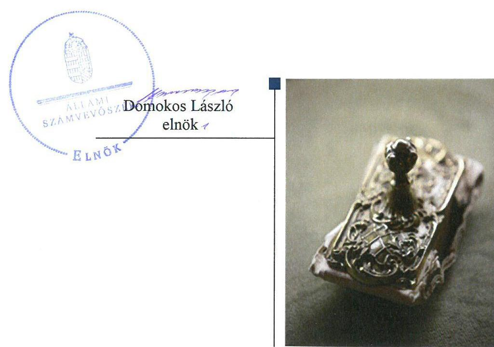
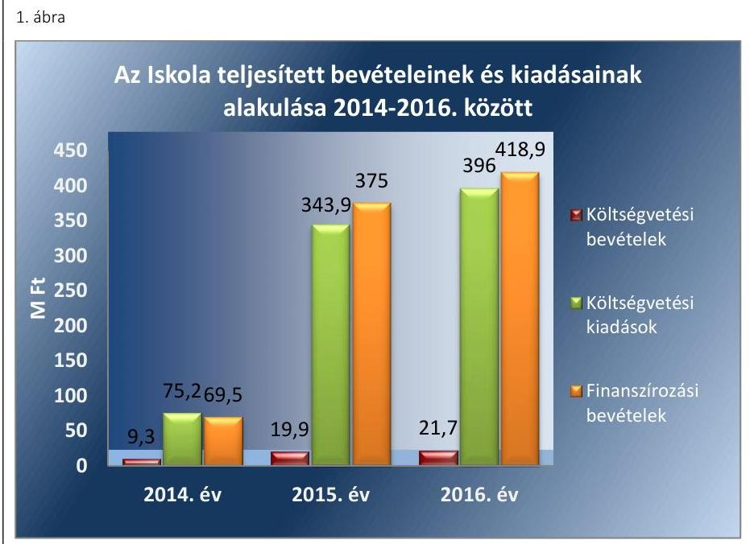

# Jelentés 

## Az országos nemzetiségi önkormányzatok fenntartásában levő intézmények gazdálkodásának ellenőrzése

Szlovák Tanítási Nyelvű Óvoda, Általános Iskola, Gimnázium és Kollégium 2018. 03. hó 18. nap

---

# AZ ELLENŐRZÉST FELÜGYELTE:

DR. NÉMETH ERZSÉBET felügyeleti vezető

## AZ ELLENŐRZÉST VEZETTE ÉS A VÉGREHAJTÁSÁÉRT FELELŐS:

DR. KOVÁCS DIÁNA ellenőrzésvezető

## A PROGRAM ÖSSZEÁLLÍTÁSÁÉRT FELELŐS:

TÓTPÁL SZABOLCS osztályvezető

IKTATÓSZÁM: EL-1082-001/2018.

TÉMASZÁM: 2463

ELLENŐRZÉS-AZONOSÍTÓ SZÁM: V080603

Jelentéseink az Országgyűlés számítógépes hálózatán és az Interneten a www.asz.hu címen is olvashatóak.

---

# TARTALOMJEGYZÉK 

■ ÖSSZEGZÉS ..... 5
■ AZ ELLENŐRZÉS CÉLJA ..... 6
■ AZ ELLENŐRZÉS TERÜLETE ..... 7
■ AZ ELLENŐRZÉS HÁTTERE, INDOKOLTSÁGA ..... 9
■ A JELENTÉS LÉNYEGES KÉRDÉSKÖREI ..... 10
■ AZ ELLENŐRZÉS HATÓKÖRE ÉS MÓDSZEREI ..... 11
■ MEGÁLLAPÍTÁSOK ..... 13
■ JAVASLATOK ..... 18
■ MELLÉKLETEK ..... 21
I. sz. melléklet: Értelmező szótár ..... 21
■ FÜGGELÉK: ÉSZREVÉTELEK ..... 23
■ RÖVIDÍTÉSEK JEGYZÉKE ..... 25

---

.

---

# ÖSSZEGZÉS 

Az Országos Szlovák Önkormányzat irányítószervi jogkörgyakorlása a Szlovák Tanítási Nyelvű Óvoda, Általános Iskola, Gimnázium és Kollégium felett szabályszerű volt. A Szlovák Tanítási Nyelvű Óvoda, Általános Iskola, Gimnázium és Kollégium működése, gazdálkodása szabályozott volt, azonban a belső kontrollrendszer nem védte meg az erőforrásokat a veszteségektől és a nem rendeltetésszerű használattól. A pénzügyi gazdálkodás nem volt szabályszerű. A vagyongazdálkodás a 2014-2015. években szabályszerű volt, 2016. évben nem volt szabályszerű az értékelés hiányosságai miatt.

## Az ellenőrzés társadalmi indokoltsága

Magyarország Alaptörvényének XXIX. cikke kimondja, hogy a magyarországi nemzetiségek államalkotó tényezők. Joguk van anyanyelvük használatához, a sajátnyelven való névhasználathoz, saját kultúrájuk ápolásához és az anyanyelvű oktatáshoz. A nemzetiségek létrehozhatnak helyi és országos önkormányzatokat. A nemzetiségek jogaira vonatkozó részletes szabályokat Magyarországon sarkalatos törvény határozza meg. A nemzetiségi közfeladatok ellátásához az állami központi költségvetés támogatást nyújt, melyet a nemzetiségi önkormányzatok kizárólag e feladataik ellátására használhatnak fel.

## Főbb megállapítások, következtetések, javaslatok

A Szlovák Tanítási Nyelvű Óvoda, Általános Iskola, Gimnázium és Kollégiummal kapcsolatos alapítási, irányítási, felügyeleti, ellenőrzési és munkáltatói jogosultságokat az Országos Szlovák Önkormányzat szabályszerűen gyakorolta.

Az intézmény működésének, gazdálkodásának szabályozottsága megfelelő volt. A kontrollkörnyezet és a kontrolltevékenység kialakítása szabályszerű volt. A kockázatkezelési - ezen belül a korrupciós kockázatokat is kezelő - rendszer kialakítása és működtetése nem volt szabályszerű. Az információs és kommunikációs rendszer kialakítása szabályszerű volt, működtetése nem volt szabályszerű. A tevékenység és a célok megvalósításának folyamatos és eseti nyomon követését biztosító rendszer kialakítása, valamint a belső ellenőrzés kialakítása és működtetése szabályszerű volt.

A pénzügyi gazdálkodás nem volt szabályszerű. A bevételek beszedése, a kiadási előirányzatok felhasználása nem volt szabályszerű. A kiadási előirányzat felhasználása során több esetben nem rendelkezett írásbeli kötelezettségvállalással, több esetben nem történt meg a pénzügyi ellenjegyzés, teljesítésigazolás. A kiadások érvényesítése és utalványozása nem felelt meg az Ávr. előírásainak. A vagyonhasznosítás során nem tartotta be az intézmény az Nvtv. előírásait, mert a nemzeti vagyont a hasznosítási céltól eltérően is használta. Az Országos Szlovák Önkormányzat Hivatala a Kbt. előírásai ellenére nem folytatott le közbeszerzési eljárást egy szolgáltatás beszerzése során. Az előirányzat-maradvány megállapítása az ellenőrzött időszakban nem volt szabályszerű. Az éves költségvetési beszámolók elkészítése szabályszerű volt.

A vagyongazdálkodás a 2014-2015. években szabályszerű, a 2016. évben nem volt szabályszerű. A 2016. évben a mérlegben kimutatott eszközök és források év végi értékelése nem volt szabályszerű. A mérleg alátámasztására az Országos Szlovák Önkormányzat Hivatala az Áhsz. előírásainak megfelelő leltárt készített. A Szlovák Tanítási Nyelvű Óvoda, Általános Iskola, Gimnázium és Kollégium a Vtv. előírásai ellenére az állami vagyon hasznosítására vonatkozóan írásbeli szerződéssel nem rendelkezett az ellenőrzött időszakban.

---

# AZ ELLENŐRZÉS CÉLJA 

AZ ELLENŐRZÉS CÉLJA annak értékelése volt, hogy az Országos Szlovák Önkormányzat által alapított és fenntartott Szlovák Tanítási Nyelvű Óvoda, Általános Iskola, Gimnázium és Kollégium gazdálkodása, a belső kontrollrendszer kialakítása és működése, az Országos Szlovák Önkormányzat által nyújtott támogatás, illetve az államháztartásból meghatározott célra ingyenesen juttatott vagyon felhasználása a jogszabályi előírásoknak megfelelően történt-e.

---

# AZ ELLENŐRZÉS TERÜLETE 

## Szlovák Tanítási Nyelvű Óvoda, Általános Iskola, Gimnázium és Kollégium

A budapesti székhelyű Iskolát¹ 1949-ben alapította a Vallás- és Közoktatásügyi Minisztérium, majd - a KLIK²-ből való kiválást követően - 2014. szeptember 1-jén az Országos Szlovák Önkormányzat alapította újra. Az ellenőrzött időszakban az Önkormányzat ${ }^{3}$ látta el az Iskola fenntartói és irányító szervi feladatait.

Az Iskola nem rendelkezett gazdasági szervezettel, a pénzügyi-számviteli feladatokat az Önkormányzat Hivatala ${ }^{4}$ látta el.

Az ellenőrzött időszakban az Iskola igazgatójának személyében nem következett be változás.

Az Iskola a magyarországi szlovák nemzetiség óvodai nevelésével, alap- és középfokú oktatásával és nevelésével kapcsolatos feladatokat látja el, az oktatás - a magyar nyelv és irodalom tantárgyak kivételével - szlovák nyelven folyik. Az Iskola a 9-12. évfolyamon szlovák nemzetiségi kiegészítő oktatást biztosít.

Az Iskola az ellenőrzött időszakban 2 (2016-ban 3) óvodai csoporttal, 8 általános iskolai osztállyal, 4 gimnáziumi osztállyal, 5 napközis csoporttal és 5 (2016-ban 8) kollégiumi csoporttal működött. A foglalkoztatottak átlagos statisztikai állományi létszáma a 2014. évi 63 főről 2016. évre 57 főre csökkent.

Az Iskola közfeladatai ellátásához szükséges ingatlanvagyon az alapító okirat értelmében a Magyar Állam tulajdonában volt. Az Iskola a feladatellátást biztosító ingó és ingatlan vagyont alapító okirat értelmében ingyenesen használta. Az MNV Zrt. ${ }^{5}$ és az Önkormányzat közötti vagyonkezelési szerződés, valamint az Önkormányzat és az Iskola közötti hasznosítási szerződés megkötésének előkészítése az ellenőrzött időszakban megkezdődött.

Az Iskola ellenőrzött időszakban teljesített bevételeinek és kiadásainak alakulását az 1. számú ábra mutatja be, ahol a 2014. évi adatok 4 havi összeget tartalmaznak. A finanszírozási bevételek jellemzően az irányító szervi támogatásból származtak, míg a költségvetési bevételek nagy részét az ellátási díjak és a működési célú átvett pénzeszközök tették ki. A költségvetési kiadások mintegy felét jelentették a személyi kiadások.

---

Forrás: Az Iskola 2014-2016. évi éves költségvetési beszámolói
Az Iskolát szervezeti, szerkezeti átalakítás nem érintette az ellenőrzött időszakban.

---

# AZ ELLENŐRZÉS HÁTTERE, INDOKOLTSÁGA 

Az országos nemzetiségi önkormányzatok az általuk képviselt nemzetiség kulturális autonómiájának megteremtése érdekében intézményeket hozhatnak létre és vehetnek át. Az éves költségvetési törvények közvetlenül az intézményfenntartó országos nemzetiségi önkormányzatokhoz rendelik az általuk fenntartott intézmények működési támogatását. A nemzetiségi önkormányzati intézmények költségvetési gazdálkodásának, belső kontrollrendszerének kialakítása és működtetése ellenőrzésével biztosítjuk a közpénzfelhasználás minél szélesebb körének ellenőrzését, ennek során azonos szempontok szerint értékeljük az egyes országos nemzetiségi önkormányzatok fenntartásában levő intézmények gazdálkodási tevékenységét.

Az ellenőrzés eredményeként az ellenőrzött költségvetési szervek gazdálkodása javulhat, átfogó képet kaphatunk az országos nemzetiségi önkormányzatok által fenntartott intézmények gazdálkodásának sajátosságairól, hiányosságairól és az alkalmazott jó gyakorlatokról, erősítve a társadalmi bizalmat. Az ellenőrzés tapasztalatai alapján, hiányosságok feltárásával, azok megszüntetésére vonatkozó javaslatokkal hozzájárulunk a közpénzek átlátható, szabályszerű felhasználásához.

---

# A JELENTÉS LÉNYEGES KÉRDÉSKÖREI 

1.- Az Önkormányzat szabályszerűen gyakorolta-e az Iskolával kapcsolatos feladatait?
2.- Az Iskola működése és gazdálkodása során tevékenysége szabályszerű volt-e, teljesítette-e az elszámolási kötelezettségeket, belső kontrollrendszere megvédte-e a veszteségektől és nem rendeltetésszerű használattól az Iskola erőforrásait?
3.- Az Iskola pénzügyi gazdálkodása szabályszerű volt-e?
4.- Az Iskola vagyongazdálkodása szabályszerű volt-e?

---

# AZ ELLENŐRZÉS HATÓKÖRE ÉS MÓDSZEREI 

## Az ellenőrzés típusa

Megfelelőségi ellenőrzés.

## Az ellenőrzött időszak

2014. szeptember 1. és 2016. december 31. közötti időszak.

## Az ellenőrzés tárgya

Az ellenőrzés tárgya az Önkormányzat által alapított és fenntartott Iskola gazdálkodása, a belső kontrollrendszer kialakítása és működése, a fenntartó önkormányzat által nyújtott támogatás, illetve az államháztartásból meghatározott célra ingyenesen juttatott vagyon felhasználása jogszabályi előírásoknak való megfelelőségének értékelése.

## Az ellenőrzött szervezet

Szlovák Tanítási Nyelvű Óvoda, Általános Iskola, Gimnázium és Kollégium, Országos Szlovák Önkormányzat, Országos Szlovák Önkormányzat Hivatala

## Az ellenőrzés jogalapja

Az ellenőrzés jogszabályi alapját az ÁSZ tv. ${ }^{6}$ 1. § (3) bekezdés, 5. § (2)-(6) bekezdései, valamint Áht. ${ }^{7} 61 . \S$ (2) bekezdésének előírásai képezték.

## Az ellenőrzés módszerei

Az ellenőrzést az ellenőrzési program szempontjai, az ellenőrzött időszakban hatályos jogszabályok, az ellenőrzés szakmai szabályai, a jelen ellenőrzésre irányadó ÁSZ módszertanok figyelembevételével végeztük. Az ellenőrzési kérdések megválaszolásához szükséges bizonyítékok megszerzése az Iskola által rendelkezésre bocsátott dokumentumokra, adatokra alapozva megfigyelés, kockázat alapú mintavételezés, valamint elemző eljárás útján történt.

A belső kontrollrendszer kialakítása és működtetése szabályszerűségét csak a 2016. évre vonatkozóan értékelte az ÁSZ.

A kockázat alapú mintavételezés alapja a gazdasági események értékének nagysága volt.

---

A bevételek és a kiadások - külső személyi juttatások, dologi és felhalmozási kiadások - elszámolásának szabályszerűségét véletlen mintavétellel ellenőriztük. A vagyongazdálkodás szabályszerűségét a kiadások sokaságából kiválasztott felhalmozási mintatételek alapján ellenőriztük.

A fenti sokaságok esetében a mintavétel azokra a legnagyobb értékű tételekre - a lényeges sokaságra - terjedt ki, melyek összértéke eléri a teljes sokaság összértékének 50%-át. Amennyiben valamely lényeges sokaság elemszáma kisebb volt, mint az előírt mintaelemszám, a lényeges sokaságot tételesen ellenőriztük.

A mintavétellel ellenőrzött területek esetében minden egyes tétel vonatkozásában a szabályszerűségre vonatkozó kérdéseket tettünk fel, amelyek eredménye összesítésre került. „Szabályszerűnek" értékeltünk egy ellenőrzött területet, amennyiben 95%-os bizonyossággal a lényeges sokaságban az átlagos hibaarány legfeljebb 10%, "nem szabályszerűnek", amennyiben 10%-nál magasabb arányt képviselt.

Az ellenőrzési bizonyítékként felhasznált adatforrások közé tartoztak egyrészt az ellenőrzési program részletes szempontjainál felsorolt adatforrások, másrészt minden egyéb - az ellenőrzés folyamán feltárt, az ellenőrzés szempontjából információt tartalmazó - dokumentum. Az ellenőrzés lefolytatásához az Iskola tanúsítványok kitöltésével, valamint az ÁSZ által kért dokumentumok megküldésével szolgáltatott adatokat.

Az ellenőrzés ideje alatt az ellenőrzött szervezettel történő kapcsolattartás az ÁSZ SZMSZ-ének vonatkozó előírásai alapján volt biztosított.

---

# 1. Az Önkormányzat szabályszerűen gyakorolta-e az Iskolával kapcsolatos feladatait? 

Összegző megállapítás

Az Önkormányzat szabályszerűen gyakorolta az Iskolával kapcsolatos feladatait.

Az Iskolával kapcsolatos alapítási, irányítási, ellenőrzési és munkáltatói jogosultságok gyakorlása szabályszerű volt.

Az Önkormányzat által kiadott Alapító okirat ${ }_{1,2,3,4}{ }^{8}$ megfelel az Ávr. ${ }^{9}$ előírásainak.

Az ellenőrzött időszakban az Önkormányzat Közgyűlése jóváhagyta az Iskola éves költségvetési beszámolóját és előirányzat-maradványát az Áhsz ${ }^{10}$.-nek és az Ávr.-nek megfelelően. Az Iskola éves szakmai beszámolóit az Önkormányzat Közgyűlése minden esetben jóváhagyta.

Az Önkormányzatnak az Iskola igazgatója feletti munkáltatói jogkörgyakorlása szabályszerű volt.

## 2. Az Iskola működése és gazdálkodása során tevékenysége szabályszerű volt-e, teljesítette-e az elszámolási kötelezettségeket, belső kontrollrendszere megvédte-e a veszteségektől és nem rendeltetésszerű használattól az Iskola erőforrásait?

Összegző megállapítás

Az Iskola működésének, gazdálkodásának szabályozottsága megfelelő volt, azonban a belső kontrollrendszer nem védte meg a veszteségektől és a nem rendeltetésszerű használattól az Iskola erőforrásait.

Az Iskola kontrollkörnyezetének kialakítása szabályszerű volt.
Az Iskola rendelkezett SZMSZ ${ }^{11}$-szel. Az SZMSZ az Ávr. 13. § 1) bekezdés e) pontjában meghatározottak ellenére az Iskola szervezeti ábráját nem tartalmazta.

A pénzügyi, számviteli és gazdálkodási feladatokat az Alapító okirat ${ }_{2,3,4}$ alapján az Önkormányzat Hivatala látta el, amelyre vonatkozóan Munkamegosztási megállapodás ${ }_{1,2}{ }^{12}$ megkötésére került sor az Önkormányzat
 Hivatala és az Iskola között. A munkamegosztási megállapodás az Ávr.-ben előírtaknak megfelelően tartalmazta a gazdálkodási feladatokat, az együttműködés területeit.

---

# 2.2. számú megállapítás 

## A kockázatkezelési - ezen belül a korrupciós kockázatokat is kezelő - rendszer kialakítása és működtetése nem volt szabályszerű.

Az Iskola nem mérte fel és nem állapította meg az Iskola tevékenységében, gazdálkodásában rejlő kockázatokat, nem határozta meg az egyes kockázatokkal kapcsolatban szükséges intézkedéseket, valamint azok teljesítésének folyamatos nyomon követésének módját a Bkr. 7. § (2) bekezdésében foglaltak ellenére.
2016. október 1-jétől az Iskola igazgatója nem szabályozta a Bkr. 6. § (4) bekezdésében előírt szervezeti integritást sértő események kezelésének eljárásrendjét. Az Iskola igazgatója az ellenőrzött időszakban a Bkr. 7. § (1) bekezdésben foglaltak ellenére nem működtette a kockázatkezelési, integrált kockázatkezelési rendszert.

## A kontrolltevékenység kialakítása szabályszerű volt, a kontrolltevékenység gyakorlása nem volt szabályszerű.

A kontrolltevékenység kereteinek kialakítása a Bkr., az Áht. és az Ávr. előírásainak megfelelően történt. A Gazdálkodási Szabályzat ${ }^{13}$ hatálya kiterjedt az Iskolára és a gazdálkodás rendjét az Ávr.-ben foglaltaknak megfelelően, szabályszerűen határozta meg.

Az Iskola rendelkezett kötelezettségvállalások nyilvántartásával, azonban annak tartalma nem felelt meg az Áhsz. 14. melléklet II/4. a), d), e), f), és g) pontjában foglalt előírásoknak.

A kontrolltevékenység gyakorlására vonatkozó részletes megállapításokat a 3.1. pont tartalmazza.

## Az információs és kommunikációs folyamatok kialakítása szabályszerű volt, működtetése nem volt szabályszerű.

Az Iskola igazgatója az SZMSZ-ben kialakította az Iskola Bkr. szerinti információs és kommunikációs rendszerét.

Az Iskola rendelkezett Iratkezelési szabályzattal ${ }^{14}$, azonban az Ltv. ${ }^{15} 10. § (1) bekezdés a) pontjában foglaltak ellenére azt úgy adta ki, hogy nem rendelkezett az illetékes közlevéltár egyetértésével.

Az Iskola nem tett eleget az Info tv. ${ }^{16}$ 37. § (1) bekezdésben előírt közzétételi kötelezettségének, mert nem tette közzé az Info tv. 1. melléklet II/1. pontjában, valamint a III/1. pontjában meghatározottak szerinti adatvédelmi és adatbiztonsági szabályzatát, illetve éves költségvetését és éves költségvetési beszámolóját.
2.5. számú megállapítás

Az Iskola tevékenységének, a célok megvalósításának folyamatos és eseti nyomon követését biztosító rendszer és a belső ellenőrzés kialakítása szabályszerű volt.

Az Önkormányzat Hivatala által az Iskolára kiterjesztett belső szabályzatok útján alakította ki a célok elérését szolgáló követelményeket. Az operatív tevékenységek nyomon követésére kialakított ellenőrzési nyomvonal a Bkr. előírásainak megfelelő volt.

Az Iskola belső ellenőri tevékenységének ellátására a Bkr. előírásainak megfelelően az Önkormányzat Hivatala által megkötött megbízási szerződéssel külső szolgáltató alkalmazásával került sor. Az Iskola rendelkezett a

---

# 2.6. számú megállapítás 

Bkr. által előírtaknak megfelelő belső ellenőrzési tervvel. A 2016. évi ellenőrzési tervet azonban a 2015. november 15-i határidő helyett 2016. március 15-én készítették el, megsértve ezzel a Bkr. 32. §-át.

## Az Iskola nem a kockázatokkal arányosan alakította ki az integritás kontrollokat.

Az Iskolánál a jogszabályok által előírt kontrollok kiépítettsége támogatja az Iskola integritását. Az Iskola nem határozta meg az általa követendő értékeket, ezek között az integritás erősítését sem. Az Iskola kockázatelemzése nem teljes körű, nem támogatja megfelelően az integritás kontrollokat. Az Iskola csekély mértékben működtette az integritást erősítő, nem kötelezően előírt kontrollokat.

## 3. Az Iskola pénzügyi gazdálkodása szabályszerű volt-e?

## Összegző megállapítás

### 3.1. számú megállapítás

Az Iskola pénzügyi gazdálkodása nem volt szabályszerű.

## A bevételek beszedése és a kiadási előirányzatok felhasználása során a gazdálkodási jogkörgyakorlás nem volt szabályszerű.

A bevételek teljesítésigazolásáról az Iskola nem gondoskodott, így nem tett eleget az Ávr. 57. § (2) bekezdése alapján a Munkamegosztási megállapodás: 41. pontjában előírt kötelezettségének és az Ávr. 57. § (1) bekezdésében foglaltaknak.

Az Iskola és az Önkormányzat a vagyonhasznosítás során nem tartotta be az Nvtv. ${ }^{17}$ 11. § (11) bekezdésének b) pontjában foglaltakat, mivel a nemzeti vagyont nem a Használati szerződésben ${ }^{18}$ meghatározott hasznosítási célnak megfelelően használta, amikor az iskolai helyiségeket bérbe adta.

Az ingatlant bérbe vevő egyesületektől az Nvtv. 3. § (2) bekezdése ellenére az Iskola nem rendelkezett átláthatósági nyilatkozattal, ezzel az Nvtv. 11. § (10) bekezdésében előírt rendelkezéseknek nem tett eleget.

A kiadásoknál az Iskola több esetben nem rendelkezett írásos kötelezettségvállalással az Ávr. 52. § (1) bekezdés a) pontjában előírtak ellenére. A kötelezettségvállalás dokumentumán nem történt meg az Ávr. 55. § (1) bekezdése szerinti pénzügyi ellenjegyzés. Az Ávr. 57. § (1) és (3) bekezdésében, valamint a Gazdálkodási szabályzat II.1.2.3. pontjában előírt teljesítés igazolás a teljesítésigazolásra felhatalmazottak részéről nem történt meg. Az Iskola nem rendelkezett az Ávr. 57. § (1) bekezdése szerinti teljesítésigazolást alátámasztó, ellenőrizhető okmánnyal.

A kiadások tekintetében az Ávr. 58. § (3) bekezdésében előírt érvényesítés nem történt meg, valamint az utalványozás nem felelt meg az Ávr. 59. § (1)-(3) bekezdéseiben foglaltaknak, mert az érvényesítő és az utalványozó aláírása nem volt beazonosítható az Ávr. 60. § (3) bekezdés szerint vezetett aláírás-minták alapján.

Az Iskolára vonatkozóan érvényesítési feladatra kijelölt személyek nem rendelkeztek az Ávr. 58. § (4) bekezdésére figyelemmel az Ávr. 55. § (3) bekezdésében meghatározott végzettséggel.

---

A bekerülési értéket a Hivatal nem az Áhsz. 16. § (3) bekezdésében előírtaknak megfelelően határozta meg, tekintettel arra, hogy az üzembe helyezéskor az üzembe helyezett eszköz nem volt az Iskola birtokában.

A Hivatal a Kbt. ${ }^{19}$ 10. § (3) bekezdése szerint meghatározott értékhatárt meghaladó, 2015. június 1-jén kötött szerződés esetében nem folytatott le közbeszerzési eljárást, megsértve a Kbt. 5. § alapján fennálló Kbt. 19. § szerinti kötelezettségét.

A Hivatal költségvetési és finanszírozási bevételekhez, kiadásokhoz kapcsolódó nyilvántartásai nem feleltek meg az Áhsz. 40. § (1) bekezdésében előírt, Áhsz. 15. melléklete szerint meghatározott egységes rovatrend szerinti nyilvántartási követelményeknek.

A Számviteli politika ${ }^{20}$, Számlarend ${ }^{21}$, Pénzkezelési szabályzat ${ }^{22}$, Önköltség számítási Szabályzat ${ }^{23}$ hatálya kiterjedt az Iskolára, az megfelelő volt.

# 3.2. számú megállapítás 

Az előirányzat-maradvány megállapítása nem volt szabályszerű.
Az Iskola és a Hivatal az Áhsz. 39. § (3) bekezdésében foglaltak ellenére nem rendelkezett az Áhsz. 14. melléklete II.4. pontjában felsorolt tartalmi követelményeknek megfelelő, a kötelezettségvállalással terhelt maradvány alátámasztásához részletező nyilvántartással, ezért az éves beszámolókban kötelezettségvállalással terhelt maradványként kimutatott összegek nem voltak alátámasztottak.

Az Iskola az éves beszámoló megküldésével együtt teljesítette a maradványhoz kapcsolódó adatszolgáltatási kötelezettségét.
3.3. számú megállapítás

Az Iskola az éves költségvetési beszámolóját az ellenőrzött években a jogszabályi előírásoknak megfelelően elkészítette.

A Hivatal az Iskola éves költségvetési beszámolóit az Áhsz. 6. § (2) bekezdésének megfelelő tartalommal készítette el az ellenőrzött években.

Az Iskola főkönyvi könyvelésének és az analitikus nyilvántartásainak adatai között biztosított volt az egyezőség az ellenőrzött években.

## 4. Az Iskola vagyongazdálkodása szabályszerű volt-e?

Összegző megállapítás
Az Iskola vagyongazdálkodása a 2014-2015. években szabályszerű volt, 2016. évben nem volt szabályszerű.
4.1. számú megállapítás

A mérlegben kimutatott eszközök és a források értékelése a 2014-2015. években szabályszerű volt, a 2016. évben nem volt szabályszerű. Az Iskola leltározása a jogszabályok és a belső szabályzatok előírásainak megfelelően történt.

Az Iskola vagyongazdálkodási feladatait a Hivatal látta el.
Az Eszközök és források leltározási és leltárkészítési szabályzata ${ }^{24}$, Eszközök és források értékelési szabályzata ${ }^{25}$ hatálya kiterjedt az Iskolára, az megfelelő volt.

---

# Megállapítások 

A Hivatal az ellenőrzött időszakban megsértette az Áhsz. 39. § (3) és az Áhsz. 45. § (3) bekezdésben meghatározott kötelezettségeit, mivel az Iskola 2014-2016. évi analitikus nyilvántartásai tartalma nem felelt meg az Áhsz. 14. melléklet előírásainak.

A 2014-2015. években szabályszerűen, a 2016. évben nem szabályszerűen történt a mérlegben kimutatott eszközök és a források év végi értékelése. A 2016. évben a Hivatal megsértette a Számv. tv. 165. § (2) bekezdés előírásait, mivel a tárgyi eszközök bekerülési értékének megállapítása, állományba vétele, az értékcsökkenés elszámolása nem szabályszerűen kiállított számviteli bizonylat alapján történt. A Hivatal a 2016. évben az Iskola eszközeinek üzembe helyezése és ebből adódóan a terv szerinti értékcsökkenésének elszámolása során megsértette a Számv. tv. 52. § (2) bekezdés és az Eszközök és Források értékelési szabályzatának előírásait, mert az üzembe helyezés időpontja megelőzte az átadás időpontját.

A 2014-2016. évi mérleg alátámasztására a Hivatal az Áhsz. előírásainak megfelelően olyan leltárt állított össze, amely tételesen, ellenőrizhető módon tartalmazta a mérlegforduló napján meglévő eszközöket és forrásokat mennyiségben és értékben. A Hivatal az Iskola valamennyi tárgyi eszközére kiterjedő mennyiségi leltározási tevékenységet a 2016. évben végzett, amellyel eleget tett a Számv. tv.-ben és a Leltározási szabályzatban meghatározott leltárfelvételi kötelezettségének. A leltározás végrehajtása, kiértékelése a jogszabályi és belső előírásoknak megfelelően történt.

Az Iskolát a nemzeti vagyon használatához kapcsolódóan használatba adási szerződés hiányában beszámolási és adatszolgáltatási kötelezettség nem terhelte.

A Vtv. ${ }^{26}$ 25. § (4) bekezdésben foglaltak ellenére az Iskola az állami vagyon hasznosítására vonatkozóan írásos szerződéssel nem rendelkezett. Az Nvtv. 11. § (11) bekezdés a) pontjában foglalt beszámolási és adatszolgáltatási kötelezettség nem terhelte.

---

# JAVASLATOK 

Az ÁSZ tv. 33. § (1) bekezdésében foglaltak értelmében az ellenőrzött szervezet vezetője köteles a jelentésben foglalt megállapításokhoz kapcsolódó intézkedési tervet összeállítani és azt a jelentés kézhezvételétől számított 30 napon belül az ÁSZ részére megküldeni. Amennyiben az ellenőrzött szervezet vezetője nem küldi meg határidőben az intézkedési tervet, vagy továbbra sem elfogadható intézkedési tervet küld, az Állami Számvevőszék elnöke az ÁSZ tv. 33. § (3) bekezdés a) és b) pontjaiban foglaltakat érvényesítheti.

## az Országos Szlovák Önkormányzat Hivatala vezetőjének

1. Biztosítsa, hogy az érvényesítési feladatra kijelölt személyek képzettsége feleljen meg az Ávr.-ben előírt végzettségi követelményeknek.
(3.1. sz. megállapítás 6. bekezdése alapján)
2. Gondoskodjon a gazdálkodási jogkörök Ávr. előírásai szerinti gyakorlásáról.
(3.1. sz. megállapítás 4. bekezdés 2. mondata és 5. bekezdés első mondatrésze alapján)
3. A szabályszerű pénzügyi gazdálkodás érdekében intézkedjen a jogszabályban előírt esetekben a közbeszerzési eljárás lefolytatására.
(3.1. sz. megállapítás 8. bekezdése alapján)
4. Gondoskodjon az Áhsz. rendelkezéseinek megfelelő nyilvántartások vezetéséről.
(3.1. sz. megállapítás 9. bekezdése és a 4.1. sz. megállapítás 3. bekezdése alapján)
5. Gondoskodjon az Áhsz. rendelkezéseinek megfelelő előirányzatmaradványkimutatás megállapításáról, valamint a maradvány kimutatásához, illetve annak alátámasztásához szükséges a jogszabály által előírt tartalmi követelményeknek megfelelő nyilvántartás vezetéséről.
(3.2. sz. megállapítás 1. bekezdése alapján)
6. Gondoskodjon a Számv. tv. előírásainak és az Eszközök és Források értékelési szabályzatának megfelelő értékcsökkenés elszámolásáról.
(4.1. sz. megállapítás 4. bekezdés 3. mondata alapján)

---

# a Szlovák Tanítási Nyelvű Óvoda, Általános Iskola, Gimnázium és Kollégium Igazgatójának 

1. Intézkedjen a Bkr. előírásainak megfelelő, integrált kockázatkezelési rendszer működtetéséről, szabályozza a szervezeti integritást sértő események kezelésének eljárásrendjét, továbbá mérje fel és állapítsa meg az Iskola tevékenységében rejlő és szervezeti célokkal összefüggő kockázatokat, határozza meg az egyes kockázatokkal kapcsolatban szükséges intézkedéseket, valamint azok teljesítésének folyamatos nyomon követésének módját.
(2.2. sz. megállapítás 1. és 2. bekezdései alapján)
2. Gondoskodjon a kötelezettségvállalások és Áhsz. szerinti nyilvántartásáról.
(2.3. sz. megállapítás 2. bekezdése alapján)
3. Intézkedjen a Bkr. előírásainak megfelelő információs
 és kommunikációs rendszer működtetéséről,
a) tegyen eleget az Info tv. által meghatározott közzétételi kötelezettségének, továbbá
b) gondoskodjon arról, hogy az Iratkezelési szabályzatot az illetékes közlevéltár egyetértésével adják ki.
(2.4. sz. 2. bekezdése és 3. bekezdése alapján)
4. Gondoskodjon a gazdálkodási jogkörök Ávr. előírásai szerinti gyakorlásáról.
(3.1. sz. megállapítás 1. bekezdése, 4. bekezdés 1., 3-4. mondatai, valamint az 5. bekezdés 2. mondatrésze alapján)
5. A vagyonhasznosítás során vegye figyelembe az Nvtv. átengedett nemzeti vagyon megfelelő használatára, továbbá átlátható szervezetre vonatkozó előírásait.
(3.1. sz. megállapítás 2 és 3. bekezdései alapján)
6. Gondoskodjon az Áhsz. rendelkezéseinek megfelelő előirányzatmaradvány-kimutatás megállapításáról, valamint a maradvány kimutatásához, illetve annak alátámasztásához szükséges, a jogszabály által előírt tartalmi követelményeknek megfelelő nyilvántartás vezetéséről.
(3.2. sz. megállapítás 1. bekezdése alapján)

---

.

---

# MELLÉKLETEK 

- I. SZ. MELLÉKLET: ÉRTELMEZŐ SZÓTÁR
hasznosítás
irányító szerv
közfeladat
működtetés
nemzeti vagyon rendeltetése
nemzetiségi önkormányzat
nemzetiségi köznevelési intézmény
nemzetiségi közügy

A nemzeti vagyon birtoklásának, használatának, hasznok szedése jogának bármely a tulajdonjog átruházását nem eredményező jogcímen történő átengedése, ide nem értve a vagyonkezelésbe adást, valamint a haszonélvezeti jog alapítását. (Forrás: Nvtv. 3. § (1) bekezdés 4. pontja)
A költségvetési szerv tekintetében az e törvényben meghatározott irányítási hatáskört gyakorló szerv. (Forrás: Áht. 1. § 9. pontja)
Jogszabályban meghatározott állami vagy önkormányzati feladat, amit az arra kötelezett közérdekből, a jogszabályban meghatározott követelményeknek és feltételeknek megfelelve végez, ideértve a lakosság közszolgáltatásokkal való ellátását, továbbá az állam nemzetközi szerződésekben vállalt kötelezettségeiből adódó közérdekű feladatokat, valamint e feladatok ellátásakor szükséges infrastruktúra biztosítását is. (Forrás: Nvtv. 3. § (1) bekezdés 7. pontja, hatálytalan: 2015. január 1-jétől)
„Közfeladat a jogszabályban meghatározott állami vagy önkormányzati feladat". A közfeladatok ellátása költségvetési szervek alapításával és működtetésével, vagy azok ellátásához szükséges pénzügyi fedezet törvényben meghatározott eszközökkel, részben, vagy egészben történő biztosításával valósul meg. (Forrás: Áht. 3/A. § (1) bekezdés, hatályos 2015. január 1-jétől)
A nemzeti vagyon birtoklásából, használatából, hasznai szedéséből, a nemzeti vagyon fenntartásából és üzemeltetéséből álló tevékenységek együttese, amely - jogszabály vagy szerződés alapján - a nemzeti vagyon felújítására, fejlesztésére, a birtoklásának, használatának hasznai szedése jogának továbbengedésére is kiterjed. (Forrás: Nvtv. 3. § 10. pontja)

A nemzeti vagyon alapvető rendeltetése a közfeladat ellátásának biztosítása, ideértve a lakosság közszolgáltatásokkal való ellátását és e feladatok ellátásához szükséges infrastruktúra biztosítását. (Forrás: Nvtv. 7. § (1) bekezdés, hatályos 2015. január 1-jétől)
A nemzetiségek jogairól szóló törvényben meghatározott nemzetiségi közszolgáltatási feladatokat ellátó, testületi formában működő, jogi személyiséggel rendelkező, demokratikus választások útján e törvény alapján létrehozott szervezet, amely a nemzetiségi közösséget megillető jogosultságok érvényesítésére, a nemzetiségek érdekeinek védelmére és képviseletére, a feladat- és hatáskörébe tartozó nemzetiségi közügyek települési, területi vagy országos szinten történő önálló intézésére jön létre. (Forrás: a nemzetiségek jogairól szóló 2011. évi CLXXIX. törvény, 2. § 2. pont)
Az a köznevelési intézmény, amelynek alapító okirata a nemzeti köznevelésről szóló törvényben foglaltak szerint tartalmazza a nemzetiségi feladatok ellátását, feltéve, hogy e feladatokat a köznevelési intézmény ténylegesen ellátja, továbbá óvoda, iskola és kollégium esetén a tanulók legalább huszonöt százaléka részt vesz a nemzetiségi óvodai nevelésben, illetve a nemzetiségi iskolai nevelésben-oktatásban.
nemzetiségi közügy
az Nemzetiségi tv.-ben biztosított egyéni és közösségi jogok érvényesülése, a nemzetiséghez tartozók érdekeinek kifejezésre juttatása - különösen az anyanyelv ápolása, őrzése és gyarapítása, továbbá a nemzetiségek kulturális autonómiájának a nemzetiségi önkormányzatok által történő megvalósítása és megőrzése - érdekében a nemzetiséghez tartozók meghatározott közszolgáltatásokkal való ellátásával, ezen ügyek önálló vitelével és az ehhez szükséges szervezeti, személyi és anyagi feltételek megteremtésével összefüggő ügy

---

nemzetiségi többcélú intézmény
tulajdonosi joggyakorló
vagyongazdálkodás

Fejezeti kezelésű előirányzat

Nemzeti vagyon
nemzetiségi többcélú intézményen, nemzetiségi tagintézményen és nemzetiségi köznevelési intézmény intézményegységén a köznevelési törvény szerinti többcélú intézmény, tagintézmény és intézményegység értendő (Forrás: Nemzetiségi tv. 2. § 4. pont b,)

Aki a nemzeti vagyon felett az államot vagy a helyi önkormányzatot megillető tulajdonosi jogok és kötelezettségek összességének gyakorlására jogosult. (Forrás: Nvtv. 3. § (1) bekezdés 17. pontja)

A nemzeti vagyongazdálkodás feladata a nemzeti vagyon rendeltetésének megfelelő, az állam, az önkormányzat mindenkori teherbíró képességéhez igazodó, elsődlegesen a közfeladatok ellátásához és a mindenkori társadalmi szükségletek kielégítéséhez szükséges, egységes elveken alapuló, átlátható, hatékony és költségtakarékos működtetése, értékének megőrzése, állagának védelme, értéknövelő használata, hasznosítása, gyarapítása, továbbá az állam vagy a helyi önkormányzat feladatának ellátása szempontjából feleslegessé váló vagyontárgyak elidegenítése. (Forrás: Nvtv. 7. § (2) bekezdése)

Fejezeti kezelésű előirányzat a fejezeti kezelésű előirányzatok a költségvetési fejezet saját kezelésű, nem központi költségvetési szervekhez rendelt olyan előirányzatai, amelyek a fejezetet irányító szerv sajátos szakmai, ágazati feladatainak ellátására vagy a fejezethez tartozó költségvetési szervek tevékenységével kapcsolatban felmerülő, illetve szakmailag ahhoz kapcsolódó sajátos kötelezettségei teljesítése során felmerülő költségvetési bevételek és költségvetési kiadások elszámolására szolgálnak,
a) az állam vagy a helyi önkormányzat kizárólagos tulajdonában álló dolgok,
b) az a) pont hatálya alá nem tartozó, az állam vagy a helyi önkormányzat tulajdonában lévő dolog,
c) az állam vagy a helyi önkormányzat tulajdonában lévő pénzügyi eszközök, továbbá az államot vagy a helyi önkormányzatot megillető társasági részesedések,
d) az államot vagy a helyi önkormányzatot megillető bármely vagyoni értékkel rendelkező jogosultság, amelyet jogszabály vagyoni értékű jogként nevesít,
e) Magyarország határa által körbezárt terület feletti légtér,
f) az üvegházhatású gázok kibocsátási egységeinek kereskedelméről szóló törvény szerinti kibocsátási egység és légiközlekedési kibocsátási egység, valamint az ENSZ Éghajlatváltozási Keretegyezménye és annak Kiotói Jegyzőkönyve végrehajtási keretrendszeréről szóló törvény szerinti kiotói egység,
g) állami vagy helyi önkormányzati fenntartású közgyűjtemény (muzeális intézmény, levéltár, közgyűjteményként működő kép- és hangarchívum, valamint könyvtár) saját gyűjteményében nyilvántartott kulturális javak körébe tartozó dolog, kivéve, ha az állami vagy önkormányzati tulajdon jogszerű létrejötte kétséget kizáró módon nem bizonyítható és a dologra nézve más a tulajdonjogát bizonyítja vagy a kulturális javakra vonatkozó jogszabályokban meghatározott eljárás keretében valószínűsíti,
h) a régészeti lelet,
i) a nemzeti adatvagyon körébe tartozó állami nyilvántartások fokozottabb védelméről szóló törvény szerinti nemzeti adatvagyon.
(Forrás: Nvtv. 1.§ (2) bekezdés)

---

# FÜGGELÉK: ÉSZREVÉTELEK 

A jelentéstervezetet a Számvevőszék 15 napos észrevételezésre megküldte az ellenőrzött szervezetek vezetőinek az ÁSZ tv. 29. § (1) bekezdése előírásának megfelelően.
Az ellenőrzött szervezetek vezetői a jelentéstervezet megállapításaira nem tettek észrevételt.

[^0]
[^0]:    * 29. § (1) Az Állami Számvevőszék az ellenőrzési megállapításait megküldi az ellenőrzött szervezet vezetőjének vagy az általa megbízott személynek, és annak, akinek személyes felelősségét állapította meg.
    (2) Az ellenőrzött szervezet vezetője és a felelősként megjelölt személy az ellenőrzés megállapításaira tizenöt napon belül írásban észrevételt tehet.
    (3) Az Állami Számvevőszék az észrevételre a beérkezésétől számított harminc napon belül írásban válaszol. A figyelembe nem vett észrevételeket köteles a jelentésben feltüntetni, és megindokolni, hogy azokat miért nem fogadta el.

---

.

---

# RÖVIDÍTÉSEK JEGYZÉKE 

${ }^{1}$ Iskola
${ }^{2}$ KLIK
${ }^{3}$ Önkormányzat
${ }^{4}$ Önkormányzat Hivatala
${ }^{5}$ MNV Zrt.
${ }^{6}$ ÁSZ tv.
${ }^{7}$ Áht.
${ }^{8}$ Alapító okirat ${ }_{1}$

Alapító okirat ${ }_{2}$
Alapító okirat ${ }_{3}$
Alapító okirat ${ }_{4}$
${ }^{9}$ Ávr.
${ }^{10}$ Áhsz.
${ }^{11}$ SZMSZ
${ }^{12}$ Munkamegosztási megállapodás ${ }_{1}$

Munkamegosztási megállapodás ${ }_{2}$
${ }^{13}$ Gazdálkodási Szabályzat
${ }^{14}$ Iratkezelési Szabályzat
${ }^{15}$ Ltv.
${ }^{16}$ Info tv.
${ }^{17}$ Nvtv.
${ }^{18}$ Használati szerződés
${ }^{19}$ Kbt.

Szlovák Tanítási Nyelvű Óvoda, Általános Iskola, Gimnázium és Kollégium
Klebelsberg Intézményfenntartó Központ
Országos Szlovák Önkormányzat
Országos Szlovák Önkormányzat Hivatala
Magyar Nemzeti Vagyonkezelő Zrt.
az Állami Számvevőszékről szóló 2011. évi LXVI. törvény (hatályos: 2011. július 1-jétől)
az államháztartásról szóló 2011. évi CXCV. törvény (hatályos: 2011. december 31-től)
A Szlovák Tanítási Nyelvű Óvoda, Általános Iskola, Gimnázium és Kollégium 2014. május 14-én kelt alapító okirata (hatályos: 2014. szeptember 1. és 2015. június 30. között)

A Szlovák Tanítási Nyelvű Óvoda, Általános Iskola, Gimnázium és Kollégium 3691/2015. sz. alapító okirata (hatályos: 2015. július 1. és 2016. június 30. között)
A Szlovák Tanítási Nyelvű Óvoda, Általános Iskola, Gimnázium és Kollégium 1171/2016. sz. alapító okirata (hatályos: 2016. július 1-jétől)
A Szlovák Tanítási Nyelvű Óvoda, Általános Iskola, Gimnázium és Kollégium 2911/2016. sz. alapító okirata (hatályos: 2016. július 2-tól)
az államháztartásról szóló törvény végrehajtásáról szóló 368/2011. (XII. 31.) Korm. rendelet (hatályos: 2012. január 1-jétől)
az államháztartás számviteléről szóló 4/2013. (I. 11.) Korm. rendelet (hatályos: 2014. január 1-jétől)

A Szlovák Tanítási Nyelvű Óvoda, Általános Iskola, Gimnázium és Kollégium Szervezeti és Működési Szabályzata (hatályos: 2013. március 12-től)
Munkamegosztási megállapodás az Országos Szlovák Önkormányzat és az általa fenntartott, gazdasági szervezettel nem rendelkező költségvetési szervek között (hatályos: 2012. szeptember 26. és 2016. május 23. között)
Munkamegosztási megállapodás az Országos Szlovák Önkormányzat és az általa fenntartott, gazdasági szervezettel nem rendelkező költségvetési szervek között (hatályos: 2016. május 24-től)
Országos Szlovák Önkormányzat Hivatala Gazdálkodási Szabályzata (hatályos: 2015. május 4-től)

Szlovák Tanítási Nyelvű Óvoda, Általános Iskola, Gimnázium és Kollégium Iratkezelési szabályzata (hatályos: 2015. augusztus 25-től)
a közokiratokról, a közlevéltárakról és a magánlevéltári anyagok védelméről szóló 1995. évi LXVI. törvény (hatályos: 1996. január 1-jétől)
az információs önrendelkezési jogról és az információszabadságról szóló 2011. évi CXII. törvény (hatályos: 2011. július 27-től)
a nemzeti vagyonról szóló 2011. évi CXCVI. sz. törvény (hatályos: 2011. december 31-től)
a KLIK és az Országos Szlovák Önkormányzat között 2014. szeptember 1-jei hatállyal kötött Használati szerződés
a közbeszerzésekről szóló 2011. évi CVIII. törvény (hatályos: 2011. augusztus 21. és 2015. október 31. között)

---

${ }^{20}$ Számviteli politika
${ }^{21}$ Számlarend
${ }^{22}$ Pénzkezelési Szabályzat
${ }^{23}$ Önköltség számítási szabályzat
${ }^{24}$ Eszközök és források leltározási és leltárkészítési szabályzata
${ }^{25}$ Eszközök és Források értékelési szabályzata
${ }^{26}$ Vtv.
Országos Szlovák Önkormányzat Hivatala Számviteli Politikája (hatályos: 2016. március 1-jétől)
Országos Szlovák Önkormányzat Hivatala Számlarendje (hatályos: 2016. január 4-től)
Országos Szlovák Önkormányzat Pénzkezelési Szabályzata (hatályos: 2011. szeptember 29-től)
Országos Szlovák Önkormányzat és Hivatala összevont Önköltség-számítási szabályzata (hatályos: 2014. november 3-tól)

Országos Szlovák Önkormányzat hivatala leltározási és leltárkészítési szabályzata (hatályos: 2011. szeptember 1-jétől)

Országos Szlovák Önkormányzat, az Országos Szlovák Önkormányzat Hivatala és a gazdasági szervezettel nem rendelkező intézmények Eszközök és Források értékelési szabályzata (hatályos: 2016. január 1-jétől)
az állami vagyonról szóló 2007. évi CVI. törvény (hatályos: 2007. szeptember 25-től)

---

ÁLLAMI SZÁMVEVŐSZÉK
1052 Budapest, Apáczai Csere János utca 10.
Levélcím: 1364 Budapest 4. Pf. 54
Telefon: +36 14849100 Telefax: +36 14849200
www.asz.hu
