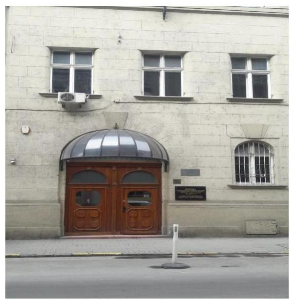

# Jelentés

**Az országos nemzetiségi önkormányzatok fenntartásában levő intézmények gazdálkodásának ellenőrzése**

Országos Roma Foglalkoztatási Központ 2018.

---

# Jelentés 

## Az országos nemzetiségi önkormányzatok fenntartásában levő intézmények gazdálkodásának ellenőrzése

Országos Roma Foglalkoztatási Központ 2018. 09. hó 18. nap

---

# AZ ELLENŐRZÉST FELÜGYELTE: 

DR. NÉMETH ERZSÉBET felügyeleti vezető

## AZ ELLENŐRZÉST VEZETTE ÉS A VÉGREHAJTÁSÁÉRT FELELŐS:

DR. KOVÁCS DIÁNA ellenőrzésvezető

## A PROGRAM ÖSSZEÁLLÍTÁSÁÉRT FELELŐS:

TÓTPÁL SZABOLCS osztályvezető

## A TÉMÁHOZ KAPCSOLÓDÓ KORÁBBI SZÁMVEVŐSZÉKI JELENTÉSEK:

- címe: Az Országos Nemzetiségi Önkormányzatok gazdálkodásának ellenőrzéséről - Országos Roma Önkormányzat
- sorszáma: 15152

IKTATÓSZÁM: EL-1083-001/2018
TÉMASZÁM: 2463
ELLENŐRZÉS-AZONOSÍTÓ SZÁM: V080602

---

# TARTALOMJEGYZÉK 

■ ÖSSZEGZÉS ..... 5
■ AZ ELLENŐRZÉS CÉLJA ..... 7
■ AZ ELLENŐRZÉS TERÜLETE ..... 8
■ AZ ELLENŐRZÉS HÁTTERE, INDOKOLTSÁGA ..... 9
■ A JELENTÉS LÉNYEGES KÉRDÉSKÖREI ..... 10
■ AZ ELLENŐRZÉS HATÓKÖRE ÉS MÓDSZEREI ..... 11
■ MEGÁLLAPÍTÁSOK ..... 13
■ JAVASLATOK ..... 18
■ MELLÉKLETEK ..... 23
I. sz. melléklet: Értelmező szótár ..... 23
■ FÜGGELÉK: ÉSZREVÉTELEK ..... 27
■ RÖVIDÍTÉSEK JEGYZÉKE ..... 29

---

.

---

# ÖSSZEGZÉS 

Az Országos Roma Foglalkoztatási Központ feletti fenntartói jogkörgyakorlás az Országos Roma Önkormányzat részéről nem volt szabályszerű. Az Országos Roma Foglalkoztatási Központ müködése, gazdálkodása nem volt szabályozott, a belső kontrollrendszer nem védte meg az erőforrásokat a veszteségektől és a nem rendeltetésszerü használattól. Az Országos Roma Foglalkoztatási Központ nem rendelkezett éves költségvetési beszámolóval, pénzügyi és vagyongazdálkodása nem volt szabályszerű, gazdálkodása nem volt elszámoltatható.

## Az ellenőrzés társadalmi indokoltsága

Magyarország Alaptörvényének XXIX. cikke kimondja, hogy a magyarországi nemzetiségek államalkotó tényezők. Joguk van anyanyelvük használatához, a sajátnyelven való névhasználathoz, saját kultúrájuk ápolásához és az anyanyelvű oktatáshoz. A nemzetiségek létrehozhatnak helyi és országos önkormányzatokat. A nemzetiségek jogaira vonatkozó részletes szabályokat Magyarországon sarkalatos törvény határozza meg. A nemzetiségi közfeladatok ellátásához az állami központi költségvetés támogatást nyújt, melyet a nemzetiségi önkormányzatok kizárólag e feladataik ellátására használhatnak fel.

## Főbb megállapítások, következtetések, javaslatok

Az Országos Roma Foglalkoztatási Központtal kapcsolatos fenntartói jogosultságok gyakorlása - az alapító okirat kiadásán és kiegészítésén kívül - nem volt szabályszerű. Az Országos Roma Önkormányzat nem hagyta jóvá az Országos Roma Foglalkoztatási Központ elemi költségvetését és éves beszámolóját, nem határozta meg az előirányzat-maradványát, nem látta el a tevékenységének törvényességi, szakszerűségi és hatékonysági ellenőrzését. Az Országos Roma Foglalkoztatási Központ és az Országos Roma Önkormányzat Hivatala munkamegosztási megállapodással nem rendelkezett. Az Országos Roma Önkormányzat nem gyakorolta szabályszerűen a munkáltatói jogkörét, mert 2015. január 1. és 2015. február 12., valamint 2016. január 1. és 2016. május 31. között nem nevezett ki vezetőt az Országos Roma Foglalkoztatási Központ élére.

Az Országos Roma Foglalkoztatási Központ kontrollkörnyezetének kialakítása nem volt szabályszerű, a szervezeti keretek kialakítása nem történt meg, szervezeti és müködési szabályzattal az Országos Roma Foglalkoztatási Központ nem rendelkezett. A gazdálkodás rendjét az Országos Roma Önkormányzat és az Országos Roma Önkormányzat Hivatala eljárásrendjei - az intézményre való kiterjesztéssel - szabályozták. Közbeszerzésre vonatkozó eljárásrendet a szervezet nem alakított ki. Az Országos Roma Önkormányzat és az Országos Roma Önkormányzat Hivatala számviteli politikája az intézményre kiterjesztésre került, a jogszabályi előírásoknak megfelelő volt.

Kockázatkezelési, illetve integrált kockázatkezelési rendszerét az Országos Roma Foglalkoztatási Központ nem alakította ki, nem müködtette. A korrupciós kockázatokat nem mérte fel, nem érvényesült az integritás szemlélet.

Az információs és kommunikációs folyamatok kialakítása és müködtetése nem volt szabályszerű, továbbá az Országos Roma Foglalkoztatási Központ nem tett eleget a jogszabályokban előírt közzétételi kötelezettségének.

Az Országos Roma Foglalkoztatási Központ vezetője nem alakította ki a szervezet tevékenységének nyomon követését biztosító rendszert és a belső ellenőrzést.

A pénzügyi gazdálkodás nem volt szabályszerű. A bevételek beszedése, a kiadási előirányzatok felhasználása nem volt szabályszerű. A külső személyi juttatások és a dologi kiadási előirányzatok felhasználása során a Központ és a Hivatal megsértette az Áht. előírásait, mert nem történt írásbeli kötelezettségvállalás, pénzügyi ellenjegyzés nélkül került sor kötelezettségvállalásra, az Ávr. szabályai ellenére nem került sor teljesítésigazolásra, érvényesítésre, utalványozásra. A tárgyévben esedékes kifizetések pénzügyi teljesítése a fizetési határidőig, illetve a jogszabályban előírt határidőig nem történt meg, az előirányzat-maradvány megállapítása és elszámolása jogszabályi előírás ellenére nem

---

történt meg. Beszámolót a 2014. - 2016. évekre vonatkozóan az Országos Roma Foglalkoztatási Központra vonatkozóan a Hivatal nem készített.

A vagyongazdálkodás nem volt szabályszerű. Az eszközök és források leltározását a Hivatal nem végezte el. Az éves költségvetési beszámoló alátámasztására mérleget a Hivatal a szervezetre vonatkozóan nem készített.

---

# AZ ELLENŐRZÉS CÉLJA 

AZ ELLENŐRZÉS CÉLJA annak értékelése volt, hogy az Országos Roma Önkormányzat által alapított és fenntartott Országos Roma Foglalkoztatási Központ gazdálkodása, a belső kontrollrendszer kialakítása és múködése, az Országos Roma Önkormányzat által nyújtott támogatás, illetve az államháztartásból meghatározott célra ingyenesen juttatott vagyon felhasználása a jogszabályi előírásoknak megfelelően történt-e.

---

# AZ ELLENŐRZÉS TERÜLETE 

## Országos Roma Foglalkoztatási Központ

A Központot ${ }^{1}$ az Önkormányzat ${ }^{2}$ alapította 2004. január 1-jén, amely az ellenőrzött időszakban Roma Nemzetiségi Kulturális és Foglalkoztatási Módszertani Intézményhálózat néven múködött. Székhelye Budapesten található, múködési területe Magyarországra terjed ki.

Közfeladata a nemzetiségi közösség oktatási feltételeinek bővítését, anyanyelvének fejlesztését szolgáló tevékenység, a társadalmi különbségek felszámolása, a társadalmi felzárkózás érdekében folytatott tevékenység, a nemzetiségi közösség sajátos kulturális önazonosságának megerősítése és a nemzetiségi érdekképviselettel összefüggő feladatok ellátása. Alaptevékenysége - többek között - a foglalkoztatást és munkaerőpiaci részvételt elősegítő szolgáltató tevékenység nyújtására, a roma nemzetiségi önkormányzatok szakmai munkájának fejlesztésére, munkatársak képzésére, nyelvhasználat elősegítésére, közösségfejlesztésre terjedt ki.

A Központ önállóan múködő költségvetési szerv, amelynek pénzügyi, számviteli és gazdálkodási feladatait az Önkormányzat Hivatala ${ }^{3}$ látta el.

A Központ vezetője az ellenőrzött időszakban többször változott.
Az Önkormányzat az Emberi Erőforrások Minisztériumának költségvetéséből 2014-ben 78,6 M Ft, míg 2015-ben és 2016-ban 165,9 M Ft központi forrást kapott az általa fenntartott intézmények - köztük a Központ - támogatására.

Szervezeti és szerkezeti átalakítás 2014-2016. években a Központnál nem történt.

---

# AZ ELLENŐRZÉS HÁTTERE, INDOKOLTSÁGA 

Az országos nemzetiségi önkormányzatok az általuk képviselt nemzetiség kulturális autonómiájának megteremtése érdekében intézményeket hozhatnak létre és vehetnek át. Az éves költségvetési törvények közvetlenül az intézményfenntartó országos nemzetiségi önkormányzatokhoz rendelik az általuk fenntartott intézmények működési támogatását. A nemzetiségi önkormányzati intézmények költségvetési gazdálkodásának, belső kontrollrendszerének kialakítása és működtetése ellenőrzésével biztosítjuk a közpénzfelhasználás minél szélesebb körének ellenőrzését, ennek során azonos szempontok szerint értékeljük az egyes országos nemzetiségi önkormányzatok fenntartásában levő intézmények gazdálkodási tevékenységét.

Az ellenőrzés eredményeként az ellenőrzött költségvetési szervek gazdálkodása javulhat, átfogó képet kaphatunk az országos nemzetiségi önkormányzatok által fenntartott intézmények gazdálkodásának sajátosságairól, hiányosságairól és az alkalmazott jó gyakorlatokról, erősítve a társadalmi bizalmat. Az ellenőrzés tapasztalatai alapján, hiányosságok feltárásával, azok megszüntetésére vonatkozó javaslatokkal hozzájárulunk a közpénzek átlátható, szabályszerű felhasználásához.

---

# A JELENTÉS LÉNYEGES KÉRDÉSKÖREI 

1.- Az Önkormányzat szabályszerűen gyakorolta-e a Központtal kapcsolatos feladatait?
2.- A Központ müködésének, gazdálkodásának szabályozottsága megfelelő volt-e, teljesítette-e az elszámolási kötelezettségeket, belső kontrollrendszere megvédte-e a veszteségektől és nem rendeltetésszerü használattól a Központ erőforrásait?
3.- A Központ pénzügyi gazdálkodása szabályszerű volt-e?
4.- A Központ vagyongazdálkodása szabályszerű volt-e?

---

# AZ ELLENŐRZÉS HATÓKÖRE ÉS MÓDSZEREI 

## Az ellenőrzés típusa

Megfelelőségi ellenőrzés.

## Az ellenőrzött időszak

2014-2016. évek.

## Az ellenőrzés tárgya

Az ellenőrzés tárgya az Önkormányzat által alapított és fenntartott Központ gazdálkodása, a belső kontrollrendszer kialakítása és múködése, a fenntartó önkormányzat által nyújtott támogatás, illetve az államháztartásból meghatározott célra ingyenesen juttatott vagyon felhasználása jogszabályi előírásoknak való megfelelőségének értékelése.

## Az ellenőrzött szervezet

Országos Roma Foglalkoztatási Központ, az Országos Roma Önkormányzat mint fenntartó, Országos Roma Önkormányzat Hivatala.

## Az ellenőrzés jogalapja

Az ellenőrzés jogszabályi alapját az ÁSZ tv. ${ }^{4}$ 1. § (3) bekezdés, 5. § (2)-(6) bekezdései, valamint Áht. ${ }^{5} 61 . \S$ (2) bekezdésének előírásai képezték.

## Az ellenőrzés módszerei

Az ellenőrzést az ellenőrzési program szempontjai, az ellenőrzött időszakban hatályos jogszabályok, az ellenőrzés szakmai szabályai, a jelen ellenőrzésre irányadó ÁSZ módszertanok figyelembevételével végezzük. Az ellenőrzési kérdések megválaszolásához szükséges bizonyítékok megszerzése az Intézmény által rendelkezésre bocsátott dokumentumokra, adatokra alapozva megfigyelés, kérdésfeltevés (információkérés), kockázat alapú mintavételezés, valamint elemző eljárás útján történt.

A belső kontrollrendszer kialakítása és múködtetése szabályszerűségét csak a 2016. évre vonatkozóan értékelte az ÁSZ.

A dologi és felhalmozási kiadások, valamint a bevételek esetében teljes körű ellenőrzés történt.

---

A külső személyi juttatásoknál az ellenőrzés azokra a legnagyobb értékű tételekre - a lényeges sokaságra - terjedt ki, melyek összértéke elérte a teljes sokaság összértékének 50\%-át. Szabályszerűségét a lényeges sokaságból véletlen mintavételi eljárással kiválasztott tételek alapján ellenőriztük.

A kiadások és bevételek esetében minden egyes tétel vonatkozásában a szabályszerűségre vonatkozó kérdéseket tettünk fel, amelyek eredménye összesítésre került. „Szabályszerűnek" értékeltünk egy ellenőrzött területet, amennyiben 95\%-os megbízhatósággal az ellenőrzött sokaságban az átlagos hibaarány legfeljebb 10\%, "nem szabályszerűnek", amennyiben 10\%-nál magasabb arányt képviselt.

Az ellenőrzési bizonyítékként felhasznált adatforrások közé tartoztak egyrészt az ellenőrzési program részletes szempontjainál felsorolt adatforrások, másrészt minden egyéb - az ellenőrzés folyamán feltárt, az ellenőrzés szempontjából információt tartalmazó - dokumentum. Az ellenőrzés lefolytatásához a Központ tanúsítványok kitöltésével, valamint az ÁSZ által kért dokumentumok megküldésével szolgáltatott adatokat.

Az ellenőrzés ideje alatt az ellenőrzött szervezettel történő kapcsolattartást az ÁSZ SZMSZ-ének vonatkozó előírásai alapján volt biztosított.

---

# 1. Az Önkormányzat szabályszerűen gyakorolta-e a Központtal kapcsolatos feladatait? 

Összegző megállapítás

Az Önkormányzat nem gyakorolta szabályszerűen a Központtal kapcsolatos feladatait.
1.1. számú megállapítás

Az Önkormányzat irányítási és ellenőrzési jogosultságait nem gyakorolta szabályszerűen.

AZ ALAPÍTÓ OKIRAT ${ }^{6}$ és az Alapító okirat kiegészítés ${ }^{7}$ kiadmányozását az Önkormányzat szabályszerűen végezte, a dokumentumok tartalmazták az Ávr. ${ }^{8}$ által előírt elemeket.

AZ KÖZPONT ELEMI KÖLTSÉGVETÉSÉT ÉS AZ ÉVES BESZÁMOLÓJÁT az Önkormányzat nem hagyta jóvá, megsértve ezzel 2014. január 1. és 2014. december 31. között az Áht. 28. § (5) bekezdésében, 2015. január 1-jétől 2015. június 18-ig az Áht. 28/A. § (4) bekezdésében 2015. július 8. és 2016. december 31. között az Ávr. 33. § (1) bekezdésében foglaltakat, valamint 2014. január 1. és 2015. december 31. között az Áhsz. 32. § (1) bekezdését, 2016. január 1-jétől 2016. december 31-ig Áhsz. 32. § (1a) bekezdésében foglaltakat. Az Önkormányzat az Ávr. 155. § (2) bekezdéseiben foglaltak ellenére nem határozta meg a Központ költségvetési maradványát.

JELENTÉSTÉTELRE, beszámoltatásra az ellenőrzött időszakban nem kötelezte az Önkormányzat a Központ vezetőjét, 2014. január 1. és 2014. december 31. közötti időszakban az Áht. 9. § (1) bekezdésének i) pontjában, 2015. január 1. és 2016. december 31. közötti időszakban az Áht. 9. § i) pontjában foglalt hatáskörét nem gyakorolta. 2015. január 1jétől az Önkormányzat nem látta el a Központ tevékenységének törvényességi, szakszerűségi és hatékonysági ellenőrzését, ezért megsértette az Áht. 9. § e) pontban foglaltakat.

Az Önkormányzat munkáltatói jogkörének gyakorlása nem felelt meg a jogszabályoknak.

MUNKÁLTATÓI JOGKÖRÉT az Önkormányzat nem gyakorolta szabályszerűen, mert 2015. január 1. és 2015. február 12., valamint 2016. január 1. és 2016. május 31. között nem nevezett ki vezetőt a Központ élére, megsértve az Áht. 9. § c) pontban foglaltakat.

---

# 2. A Központ múködésének, gazdálkodásának szabályozottsága megfelelő volt-e, teljesítette-e az elszámolási kötelezettségeket, belső kontrollrendszere megvédte-e a veszteségektől és nem rendeltetésszerű használattól a Központ erőforrásait? 

Összegző megállapítás

A Központ múködésének, gazdálkodásának szabályozottsága nem volt megfelelő, a belső kontrollrendszer nem védte meg az erőforrásokat a veszteségektől és a nem rendeltetésszerű használattól.
2.1. számú megállapítás

A Központ kontrollkörnyezetének kialakítása nem volt szabályszerű.

A SZERVEZETI KERETEK kialakítása nem történt meg, a Központ - megsértve az Áht. 10. § (5) bekezdésében leírtakat - SZMSZ-szel nem rendelkezett, és nem határozta meg a vagyonnyilatkozat-tételi kötelezettséggel járó munkaköröket, így nem tett eleget a Vnytv. ${ }^{9} 4 . \S$ a) pontjában előírt kötelezettségének. A Központ vezetője nem határozta meg az etikai elvárásokat, amivel megsértette a Bkr. ${ }^{10}$ 6. § (1) bekezdésének c) pontjában előírtakat.

A pénzügyi, számviteli és gazdálkodási feladatokat az Alapító okirat alapján az Önkormányzat Hivatala látta el, amelyre vonatkozóan munkamegosztási megállapodást az Önkormányzat Hivatala és a Központ nem kötött egymással, megsértve 2014. január 1. és 2014. december 31. között az Ávr. 10. § (4) bekezdésében, míg 2015. január 1. és 2016. december 31. között az Ávr. 9. § (5) bekezdésének a) pontjában foglaltakat.

A GAZDÁLKODÁS RENDJÉT az Önkormányzat és az Önkormányzat Hivatala eljárásrendjei - a Gazdálkodási szabályzat ${ }_{1,2}{ }^{11}$ - szabályozták, amelyek - a munkamegosztási megállapodás hiányában is - a Központra kiterjesztésre kerültek. A Gazdálkodási szabályzat ${ }_{1}$ a pénzügyi jogkörök gyakorlásának módjával - azaz a felhatalmazással és a kijelöléssel kapcsolatos belső előírásokat az Ávr. alapján határozta meg. A Gazdálkodási szabályzat ${ }_{2}$ azonban - megsértve az Ávr. 13. § (2) bekezdés a) pontjában előírtakat - nem tartalmazta az utalványozásra történő felhatalmazás módját. A Gazdálkodási szabályzat ${ }_{1,2}$ a pénzügyi jogkörök gyakorlásának részletes szabályait - ideértve az összeférhetetlenség kezelésének szabályait is - az Áht. és az Ávr. előírásainak megfelelően mutatta be.

KÖZBESZERZÉSRE vonatkozó eljárásrendet a Központ nem alakított ki, megsértve a Kbt. ${ }^{12}$ 27. § (1) és (2) bekezdéseiben foglaltakat.

A SZÁMVITELI szabályzatok közül az Önkormányzat és az Önkormányzat Hivatala Számviteli politiká ${ }_{1,2}{ }^{13}$-ja a Központra kiterjesztésre került, tartalmában megfelelt a Számv. tv. ${ }^{14}$ és az Áhsz. ${ }^{15}$ előírásainak. A Számviteli politika ${ }_{1,2}$ keretében kialakításra kerültek a Számv. tv.-ben előírt szabályzatok. A Leltározási szabályzat ${ }_{1}{ }^{16}$ megfelelt a jogszabályi előírásoknak, a Leltározási szabályzat ${ }_{2}{ }^{17}$ azonban nem mutatta be a használt, de a

---

mérlegben értékkel nem szereplő immateriális javak, tárgyi eszközök, készletek leltározási módját, ezért 2016. október 1-jét követően az Áhsz. 22. § (2) bekezdés b) pontjában leírtak sérültek. Az Értékelési szabályzat ${ }^{18}$, megsértve az Áhsz. 50. § (2) bekezdés b) pontjában leírtakat, nem tartalmazta követeléstípusonként a kis összegű követelések év végi meghatározásának elveit, dokumentálásának szabályait. A Pénzkezelési szabályzat ${ }_{1,2}{ }^{19}$ és az Önköltség számítási szabályzat ${ }^{20}$ megfelelt a jogszabályi előírásoknak. A Központ számlarenddel nem rendelkezett, így megsértette az Áhsz. 51. § (2) bekezdésében foglaltakat.

# 2.2. számú megállapítás 

## A kockázatkezelési - ezen belül a korrupciós kockázatokat is kezelő - rendszer kialakítása és múködtetése nem volt szabályszerű.

KOCKÁZATKEZELÉSI, illetve integrált kockázatkezelési rendszerét a Központ vezetője nem alakította ki, nem működtette, ezért a 2016. január 1. és szeptember 30. közötti időszakban a Bkr. 7. § (1)-(2), míg a 2016. október 1. és december 31. közötti időszakban Bkr. 7. § (1)-(3) bekezdéseiben foglaltakat megsértette. A Központ vezetője megsértette a Bkr. 6. § (4) bekezdésében foglaltakat, mert 2016. január 1. és október 1. közötti időszakban nem rendelkezett szabálytalanságkezelési eljárásrenddel, valamint a 2016. október 1-jét követő időszakban nem rendelkezett a szervezeti integritást sértő események kezelésének eljárásrendjével.

A KORRUPCIÓS kockázatokat a Központ nem mérte fel, így megsértette a Bkr. 7. § (2) bekezdésében foglaltakat. Nem érvényesült az integritás szemlélet, a Központ nem intézkedett az integritás szemlélet érvényesítése és az integritással összefüggő kontrollrendszer kiépítése, valamint működtetése érdekében.

## Az információs és kommunikációs folyamatok kialakítása és múködtetése nem volt szabályszerű, továbbá a Központ nem tett eleget a jogszabályokban előírt közzétételi kötelezettségének.

A Központ vezetője olyan információs rendszert nem alakított ki, amely biztosította volna a megfelelő információk megfelelő időben való eljutását az illetékes szervezethez, szervezeti egységhez, személyhez, továbbá a beszámolási szintek, határidők és módok világos meghatározását, megsértve a Bkr. 9. § (1)-(2) bekezdésében leírtakat.

A KÖTELEZŐEN KÖZZÉTEENDŐ adatok nyilvánosságra hozatalának rendjét a Központ vezetője nem alakította ki, ezzel megsértette az Info. tv. ${ }^{21}$ 35. § (3) bekezdésében és az Ávr. 13. § (2) bekezdésének h) pontjában leírtakat. A Központ vezetője nem alakította ki a közérdekú adatok megismerésére irányuló kérelmek intézésének rendjét, ezzel megsértette az Info tv. 30. § (6) bekezdésében és az Ávr. 13. § (2) bekezdésének h) pontjában leírtakat. Az Info tv. 37. §-ában előírt, az 1. melléklet II/1. és III/1. pontjában meghatározott közzétételi kötelezettségének a Központ nem tett eleget.

ADATVÉDELMI és adatbiztonsági szabályzattal a Központ nem rendelkezett, amivel megsértette az Info tv. 24. § (3) bekezdésében és az lkr. ${ }^{22}$ 8. § (1) bekezdésében foglaltakat. A Központ nem rendelkezett iratkezelési

---

szabályzattal, ezért megsértette az Ltv. ${ }^{23} 10 . \S$ (1) bekezdés a) pontjában foglaltakat.

# 2.4. számú megállapítás 

A Központ vezetője nem alakította ki a Központ tevékenységének nyomon követését biztosító rendszert és a belső ellenőrzést.

A Központ tevékenységének, a célok megvalósításának nyomon követését biztosító monitoring rendszer nem került kialakításra. A Központ vezetője nem gondoskodott az operatív tevékenységek keretén belül megvalósuló folyamatos és eseti nyomon követésről, ezért a Bkr. 10. §-ában leírtak sérültek.

A BELSŐ ELLENŐRZÉS kialakításáról az Központ vezetője nem gondoskodott, megsértve az Áht. 70. § (1) bekezdésében foglaltakat.

A külső ellenőrzések nyilvántartását a Központ nem vezette, így megsértette a Bkr. 14. § (1) bekezdésében előírt kötelezettségét. A Központ vezetője nyilatkozatban nem értékelte a költségvetési szerv belső kontrollrendszerének minőségét, megsértve a Bkr. 11. § (1) bekezdésében foglaltakat.

## 3. A Központ pénzügyi gazdálkodása szabályszerű volt-e?

## Összegző megállapítás

### 3.1. számú megállapítás

A Központ pénzügyi gazdálkodása nem volt szabályszerű.
A bevételek beszedése, a kiadási előirányzatok felhasználása során a gazdálkodási jogkörökkel összefüggő kontrolltevékenységek gyakorlása nem volt szabályszerű.

A Központ a kötelezettségvállalásra, pénzügyi ellenjegyzésre, teljesítés igazolására, érvényesítésre, utalványozásra jogosult személyekről és aláírásmintájukról az Ávr. 60. § (3) bekezdésében foglaltak ellenére naprakész nyilvántartást nem vezetett.

## A KÜLSŐ SZEMÉLYI JUTTATÁSOK ÉS A DOLOGI

KIADÁSI ELŐIRÁNYZATOK felhasználása során a Központ és a Hivatal megsértette az Áht. 37. § (1) bekezdésében foglaltakat, mivel nem történt írásbeli kötelezettségvállalás, illetve pénzügyi ellenjegyzés nélkül került sor a kötelezettségvállalásra. Az Ávr. 57. § (1) bekezdésében, az Ávr. 58. § (1) bekezdésében, illetve az Ávr. 59. § (1) bekezdésében foglaltak ellenére teljesítésigazolás, érvényesítés, utalványozás nélkül fizettek ki juttatásokat.

A Számv. tv. 165. § (2) bekezdésében előírtak ellenére az elszámolásokat bizonylatok nem támasztották alá.
3.2. számú megállapítás

A tárgyévben esedékes kifizetések pénzügyi teljesítése a fizetési határidőig, illetve a jogszabályban előírt határidőig nem történt meg, az előirányzat-maradvány megállapítása és elszámolása jogszabályi előírás ellenére nem történt meg.

A TÁRGYÉVBEN ESEDÉKES kifizetések pénzügyi teljesítése a fizetési határidőig, - de legkésőbb a tárgyévet követő június 30 -áig - nem

---

történt meg, amivel a Központ megsértette az Ávr. 46. § (1) bekezdésében foglaltakat. A Központ - megsértve az Ávr. 56. § (1) bekezdésében leírtakat - nem gondoskodott a kötelezettségvállalások nyilvántartásba vételéről, továbbá nem rendelkezett az Áhsz. 14. melléklet II. 4. a)-g) pontjaiban meghatározott tartalmi elemeket magában foglaló nyilvántartással sem.

MARADVÁNYKIMUTATÁSÁT a Hivatal nem készítette el a Központra vonatkozóan, miáltal megsértette az Áhsz. 8. § (3) bekezdésében előírtakat. Nem rendelkezett a Hivatal a maradvány kimutatásához, illetve annak alátámasztásához szükséges analitikus nyilvántartással sem, megsértve az Áhsz. 39. § (3) bekezdésében leírtakat.

# 3.3. számú megállapítás 

A Központ a beszámolási kötelezettségét nem teljesítette.
BESZÁMOLÓT a 2014. - 2016. évekre vonatkozóan - megsértve az Áhsz. 5. § (1) bekezdésében leírtakat - a Központ tekintetében a Hivatal nem készítette el. A beszámoló hiányában nem megállapítható a központi költségvetési forrás felhasználása sem, amelyet az Önkormányzat az általa fenntartott intézmények támogatására kapott.

## 4. A Központ vagyongazdálkodása szabályszerű volt-e?

## Összegző megállapítás

### 4.1. számú megállapítás

A Központ vagyongazdálkodása nem volt szabályszerű.
A jogszabályban előírtak ellenére sem mérleget, sem leltárt nem készített a Hivatal.

MÉRLEGET a Hivatal - megsértve az Áhsz. 9. § (1) bekezdésében és a 6. § (2) bekezdés ba) pontjában előírtakat - a Központra vonatkozóan nem készített.

A LELTÁROZÁS végrehajtására nem került sor, leltár nem készült, ezzel a Hivatal a Központra vonatkozóan az Áhsz. 22. § (1) bekezdésében és a Számv. tv. 69. § (1) bekezdésében rögzített előírásokat megsértette.

---

# JAVASLATOK 

Az ÁSZ tv. 33. § (1) bekezdésében foglaltak értelmében az ellenőrzött szervezet vezetője köteles a jelentésben foglalt megállapításokhoz kapcsolódó intézkedési tervet összeállítani és azt a jelentés kézhezvételétől számított 30 napon belül az ÁSZ részére megküldeni. Amennyiben az ellenőrzött szervezet vezetője nem küldi meg határidőben az intézkedési tervet, vagy továbbra sem elfogadható intézkedési tervet küld, az Állami Számvevőszék elnöke az ÁSZ tv. 33. § (3) bekezdése a) és b) pontjaiban foglaltakat érvényesítheti.

## az Országos Roma Önkormányzat elnökének

1. Intézkedjen az Országos Roma Foglalkoztatási Központ elemi költségvetésének és éves beszámolójának jóváhagyásáról.
(1.1. sz. megállapítás 2. bekezdésének 1. mondata alapján)
2. Intézkedjen az Országos Roma Foglalkoztatási Központ költségvetési maradványának meghatározásáról.
(1.1. sz. megállapítás 2. bekezdésének 2. mondata alapján)
3. Az irányitói hatáskörök gyakorlása során intézkedjen az Országos Roma Foglalkoztatási Központ tevékenységének törvényességi, szakszerüségi és hatékonysági ellenőrzéséről, valamint a Központ jelentéstételre vagy beszámolóra való kötelezéséről.
(1.1. sz. megállapítás 3. bekezdése alapján)

## az Országos Roma Önkormányzat Hivatala vezetőjének és az Országos Roma Foglalkoztatási Központ vezetőjének

1. Intézkedjen az Országos Roma Foglalkoztatási Központ és az Országos Roma Önkormányzat Hivatala közötti, Ávr. által előírt munkamegosztási megállapodás megkötésére.
(2.1. sz. megállapítás 2. bekezdése alapján)

---

# az Országos Roma Önkormányzat Hivatala vezetőjének 

1. Intézkedjen annak érdekében, hogy a Leltározási szabályzat az Áhsz. előírásainak megfelelően mutassa be a használt, de a mérlegben értékkel nem szereplő immateriális javak, tárgyi eszközök és készletek leltározási módját.
(2.1. sz. megállapítás 5. bekezdésének 3. mondata alapján)
2. Intézkedjen annak érdekében, hogy az Értékelési szabályzat az Áhsz. előírásainak megfelelően tartalmazza követeléstípusonként a kis öszszegü követelések év végi meghatározásának elveit, dokumentálásának szabályait.
(2.1. sz. megállapítás 5. bekezdésének 4. mondata alapján)
3. Gondoskodjon a külső személyi juttatások és a dologi kiadási előirányzatok felhasználása során a gazdálkodási jogkörök Áht. és Ávr. előírásainak megfelelő gyakorlásáról.
(3.1. sz. megállapítás 2. bekezdése alapján)
4. Intézkedjen arra vonatkozóan, hogy a Számv. tv. alapján csak szabályszerűen kiállított bizonylat alapján kerülhessen sor adatok bejegyzésére a számviteli nyilvántartásokba.
(3.1. sz. megállapítás 3. bekezdése alapján)
5. Gondoskodjon az Áhsz. rendelkezéseinek megfelelő maradványkimutatás elkészitéséről, valamint a maradvány kimutatásához, illetve annak alátámasztásához szükséges nyilvántartás vezetéséről.
(3.2. sz. megállapítás 2. bekezdése alapján)
6. Gondoskodjon a Központ Áhsz. rendelkezéseinek megfelelő éves költségvetési beszámolójának elkészitéséről.
(3.3. sz. megállapítás alapján)
7. Gondoskodjon a Számv. tv. és az Áhsz. előírásainak megfelelő leltár összeállításáról.
(4.1. sz. megállapítás 2. bekezdése alapján)

---

# az Országos Roma Foglalkoztatási Központ vezetőjének 

1. Intézkedjen az Országos Roma Foglalkoztatási Központ szervezeti és müködési szabályzatának Áht. és Vnytv. szerinti elkészitéséről.
(2.1. sz. megállapítás 1. bekezdésének 1. mondata alapján)
2. A Bkr. előírásainak megfelelően határozza meg az etikai elvárásokat, továbbá tegyen intézkedéseket annak érdekében, hogy az etikai elvárások a szervezet minden szintjén ismertek és elfogadottak legyenek.
(2.1. sz. megállapítás 1. bekezdésének 2. mondata alapján)
3. Gondoskodjon a Kbt. előírásainak megfelelő, közbeszerzésre vonatkozó eljárásrend kialakításáról.
(2.1. sz. megállapítás 4. bekezdése alapján)
4. Intézkedjen számlarend elkészítéséről az Áhsz. és a Számv. tv. előírásainak megfelelően.
(2.1. sz. megállapítás 5. bekezdésének 5. mondata alapján)
5. Intézkedjen a Bkr. előírásainak megfelelő, integrált kockázatkezelési rendszer kialakításáról és müködtetéséről, valamint szabályozza a szervezeti integritást sértő események kezelésének eljárásrendjét.
(2.2. sz. megállapítás 1-2. bekezdése alapján)
6. Intézkedjen a Bkr. előírásainak megfelelő információs és kommunikációs rendszer kialakításáról és müködtetéséről, határozza meg a beszámolási szinteket, határidőket és módokat. Az Info tv. és az Ávr. előírásai szerint szabályozza a közérdekü adatok megismerésére irányuló kérelmek intézésének, továbbá a kötelezően közzéteendő adatok nyilvánosságra hozatalának rendjét, tegyen eleget az Info tv. által meghatározott közzétételi kötelezettségének, valamint intézkedjen adatvédelmi és adatbiztonsági szabályzat elkészitéséről.
(2.3. sz. megállapítás 3. bekezdése alapján)
7. Intézkedjen az Ltv. rendelkezései alapján iratkezelési szabályzat elkészitéséről.
(2.3. sz. megállapítás 3. bekezdés, utolsó mondata alapján)

---

8. Intézkedjen a Bkr. rendelkezéseinek megfelelő monitoring rendszer kialakításáról és müködtetéséről, az Áht. előírásai szerint gondoskodjon a belső ellenőrzés kialakításáról, müködtetéséről, valamint gondoskodjon a külső ellenőrzések nyilvántartásáról.
A Bkr. által meghatározott vezetői nyilatkozatban értékelje a költségvetési szerv belső kontrollrendszerének minőségét.
(2.4. sz. megállapítás alapján)
9. Gondoskodjon naprakész nyilvántartás vezetéséről a kötelezettségvállalásra, a pénzügyi ellenjegyzésre, a teljesités igazolására, az érvényesitésre és az utalványozásra jogosult személyek, illetve aláírás-mintájukról vonatkozásában az Ávr. előírásainak megfelelően.
(3.1. sz. megállapítás 1. bekezdése alapján)
10. Gondoskodjon a külső személyi juttatások és a dologi kiadási előirányzatok felhasználása során a gazdálkodási jogkörök Áht. és Ávr. előírásainak megfelelő gyakorlásáról.
(3.1. sz. megállapítás 2. bekezdése alapján)
11. Intézkedjen arra vonatkozóan, hogy a Számv. tv. alapján csak szabályszerűen kiállított bizonylat alapján kerülhessen sor adatok bejegyzésére a számviteli nyilvántartásokba.
(3.1. sz. megállapítás 4. bekezdése alapján)
12. Gondoskodjon a kötelezettségvállalások Ávr. és Áhsz. szerinti nyilvántartásáról. Intézkedjen továbbá annak érdekében, hogy kötelezettségvállalásokból származó valamennyi kifizetés az Ávr. előírásainak megfelelő határidőig megtörténjen.
(3.2. sz. megállapítás 1. bekezdése alapján)

---

.

---

# MELLÉKLETEK 

- I. SZ. MELLÉKLET: ÉRTELMEZŐ SZÓTÁR
beruházás
felújítás
forgalomképtelen nemzeti vagyon
hasznosítás
irányító szerv
kincstári vagyon
középirányító szerv
közfeladat
működtetés

A tárgyi eszköz beszerzése, létesítése, saját előállítása, a beszerzett tárgyi eszköz üzembe helyezése, rendeltetésszerű használatba vétele érdekében az üzembe helyezésig, a rendeltetésszerű használatba vételig végzett tevékenység, beruházás a meglevő tárgyi eszköz bővítését, rendeltetésének megváltoztatását, átalakítása, élettartamának, teljesítőképességének közvetlen növelését eredményező tevékenység is, az előbbiekben felsorolt, e tevékenységhez hozzákapcsolható egyéb tevékenységekkel együtt. (Számv.tv. 3. § (3) bekezdés 7. pontja)
Az elhasználódott tárgyi eszköz eredeti állaga (kapacitása, pontossága) helyreállítását szolgáló időszakonként visszatérő olyan tevékenység, melynek során az eszköz élettartama megnövekszik, minősége, használata jelentősen javul, így a pótlólagos ráfordításból a jövőben gazdasági előnyök származnak. (Forrás: Számv. tv. 3. § (4) bekezdés 8. pontja)
Az a nemzeti vagyon, amely az Nvtv.-ben meghatározott kivétellel nem idegeníthető el, vagyonkezelői jog, jogszabályon alapuló, továbbá az ingatlanra közérdekből külön jogszabályban feljogosított szervek javára alapított használati jog, vezetékjog, vagy ugyanezen okokból alapított szorgalom, továbbá a helyi önkormányzat számára alapított vezetékjog kivételével nem terhelhető meg, biztosítékul nem adható, azon osztott tulajdon nem létesíthető. (Forrás: Nvtv. 3. § 3. pont.)
A nemzeti vagyon birtoklásának, használatának, hasznok szedése jogának bármely a tulajdonjog átruházását nem eredményező - jogcímen történő átengedése, ide nem értve a vagyonkezelésbe adást, valamint a haszonélvezeti jog alapítását. (Forrás: Nvtv. 3. § (1) bekezdés 4. pontja)
A költségvetési szerv tekintetében az e törvényben meghatározott irányítási hatáskört gyakorló szerv. (Forrás: Áht. 1. § 9. pontja)
a kizárólagosan állami tulajdonba tartozó vagyon, valamint a nemzetgazdasági szempontból kiemelt jelentőségű nemzeti vagyonba tartozó, továbbá a korlátozottan forgalomképes állami vagyon. (Forrás Nvtv. 3. § 5. pont)
A költségvetési szerv tekintetében törvény vagy kormányrendelet alapján meghatározott, átruházott irányítási hatásköröket gyakorló szerv. (Forrás: Áht. 9. § (4) bekezdés)
Jogszabályban meghatározott állami vagy önkormányzati feladat, amit az arra kötelezett közérdekből, a jogszabályban meghatározott követelményeknek és feltételeknek megfelelve végez, ideértve a lakosság közszolgáltatásokkal való ellátását, továbbá az állam nemzetközi szerződésekben vállalt kötelezettségeiből adódó közérdekű feladatokat, valamint e feladatok ellátásakor szükséges infrastruktúra biztosítását is. (Forrás: Nvtv. 3. § (1) bekezdés 7. pontja, hatálytalan: 2015. január 1-jétől)
„Közfeladat a jogszabályban meghatározott állami vagy önkormányzati feladat". A közfeladatok ellátása költségvetési szervek alapításával és működtetésével, vagy azok ellátásához szükséges pénzügyi fedezet törvényben meghatározott eszközökkel, részben, vagy egészben történő biztosításával valósul meg. (Forrás: Áht. 3/A. § (1) bekezdés, hatályos 2015. január 1-jétől)
A nemzeti vagyon birtoklásából, használatából, hasznai szedéséből, a nemzeti vagyon fenntartásából és üzemeltetéséből álló tevékenységek együttese, amely - jogszabály vagy szerződés alapján - a nemzeti vagyon felújítására, fejlesztésére, a birtoklásának, használatának hasznai szedése jogának továbbengedésére is kiterjed. (Forrás: Nvtv. 3. § 10. pontja)

---

nemzeti vagyon rendeltetése
nemzetiségi önkormányzat
nemzetiségi köznevelési intézmény
nemzetiségi kulturális intézmény
nemzetiségi közművelődési intézmény
nemzetiségi feladatot ellátó közgyűjtemény
nemzetiségi közösségi színtér
nemzetiségi közügy
nemzetiségi feladatot ellátó tudományos intézmény:
nemzetiségi többcélú intézmény
üzleti vagyon

A nemzeti vagyon alapvető rendeltetése a közfeladat ellátásának biztosítása, ideértve a lakosság közszolgáltatásokkal való ellátását és e feladatok ellátásához szükséges infrastruktúra biztosítását. (Forrás: Nvtv. 7. 0 (1) bekezdés, hatályos 2015. január 1-jétől)
A nemzetiségek jogairól szóló törvényben meghatározott nemzetiségi közszolgáltatási feladatokat ellátó, testületi formában múködő, jogi személyiséggel rendelkező, demokratikus választások útján e törvény alapján létrehozott szervezet, amely a nemzetiségi közösséget megillető jogosultságok érvényesítésére, a nemzetiségek érdekeinek védelmére és képviseletére, a feladat- és hatáskörébe tartozó nemzetiségi közügyek települési, területi vagy országos szinten történő önálló intézésére jön létre. (Forrás: a nemzetiségek jogairól szóló 2011. évi CLXXIX. törvény, 2. § 2. pont)
Az a köznevelési intézmény, amelynek alapító okirata a nemzeti köznevelésről szóló törvényben foglaltak szerint tartalmazza a nemzetiségi feladatok ellátását, feltéve, hogy e feladatokat a köznevelési intézmény ténylegesen ellátja, továbbá óvoda, iskola és kollégium esetén a tanulók legalább huszonöt százaléka részt vesz a nemzetiségi óvodai nevelésben, illetve a nemzetiségi iskolai nevelésben-oktatásban.
olyan kulturális intézmény, amelynek jogszabályban, alapító okiratban előírt feladata a nemzetiségi identitáshoz kötődő tárgyi és szellemi kultúra, kulturális értékek, javak megőrzése, hozzáférhetővé tétele, hagyományok és a közösségi nyelvhasználat megőrzése, gyakorlása, terjesztése és továbbörökítése
a nemzetiséghez tartozók szellemi, kulturális örökségének, kulturális hagyományainak megőrzését, fenntartását, fejlesztését, bemutatását szolgáló intézmény olyan könyvtár, levéltár, muzeális intézmény, kép- illetve hangarchívum, amelynek alapító okiratában szerepel a nemzetiségi feladatellátás, vagy amelynek állományában nemzetiségi nyelvű, vagy nemzetiségre vonatkozó dokumentumok huszonöt százalékot elérő arányban találhatók, függetlenül a fenntartó szervezet típusától nemzetiségi lakosság rendszeres vagy alkalmi közművelődési tevékenységének, a lakosság önszerveződő közösségeinek kulturális szolgáltatásokkal való ellátása érdekében közművelődési megállapodás alapján müködtetett, erre a célra alkalmassá tett és üzemeltetett, adott településen (településeken) rendszeresen müködő intézmény az Nemzetiségi tv.-ben biztosított egyéni és közösségi jogok érvényesülése, a nemzetiséghez tartozók érdekeinek kifejezésre juttatása - különösen az anyanyelv ápolása, őrzése és gyarapítása, továbbá a nemzetiségek kulturális autonómiájának a nemzetiségi önkormányzatok által történő megvalósítása és megőrzése - érdekében a nemzetiséghez tartozók meghatározott közszolgáltatásokkal való ellátásával, ezen ügyek önálló vitelével és az ehhez szükséges szervezeti, személyi és anyagi feltételek megteremtésével összefüggő ügy
alapító okirata, illetve tevékenysége szerint részben vagy egészben egy vagy több nemzetiség anyanyelvén, illetve más nyelveken az adott közösség szellemi, épített és tárgyi emlékeire, hagyományaira, kultúrájára, történelmére, nyelvére, intézményeire, társadalmi viszonyaira vonatkozó adatok gyűjtésével, tudományos értékű feldolgozásával és közzétételével foglakozó intézete, vagy műhelye, tekintet nélkül annak szervezet-típusára
nemzetiségi többcélú intézményen, nemzetiségi tagintézményen és nemzetiségi köznevelési intézmény intézményegységén a köznevelési törvény szerinti többcélú intézmény, tagintézmény és intézményegység értendő (Forrás: Nemzetiségi tv. 2. § 4. pont b,)

A nemzeti vagyon azon része, amely nem tartozik állami vagyon esetén a kincstári vagyonba, az önkormányzati vagyon esetén törzsvagyonba. (Forrás Nvtv. 3. § 18. pont)

---

tulajdonosi joggyakorló

vagyongazdálkodás

Fejezeti kezelésű előirányzat

Nemzeti vagyon

Aki a nemzeti vagyon felett az államot vagy a helyi önkormányzatot megillető tulajdonosi jogok és kötelezettségek összességének gyakorlására jogosult. (Forrás: Nvtv. 3. § (1) bekezdés 17. pontja)

A nemzeti vagyongazdálkodás feladata a nemzeti vagyon rendeltetésének megfelelő, az állam, az önkormányzat mindenkori teherbíró képességéhez igazodó, elsődlegesen a közfeladatok ellátásához és a mindenkori társadalmi szükségletek kielégítéséhez szükséges, egységes elveken alapuló, átlátható, hatékony és költségtakarékos működtetése, értékének megőrzése, állagának védelme, értéknövelő használata, hasznosítása, gyarapítása, továbbá az állam vagy a helyi önkormányzat feladatának ellátása szempontjából feleslegessé váló vagyontárgyak elidegenítése. (Forrás: Nvtv. 7. § (2) bekezdése)
a fejezeti kezelésű előirányzatok a költségvetési fejezet saját kezelésű, nem központi költségvetési szervekhez rendelt olyan előirányzatai, amelyek a fejezetet irányító szerv sajátos szakmai, ágazati feladatainak ellátására vagy a fejezethez tartozó költségvetési szervek tevékenységével kapcsolatban felmerülő, illetve szakmailag ahhoz kapcsolódó sajátos kötelezettségei teljesítése során felmerülő költségvetési bevételek és költségvetési kiadások elszámolására szolgálnak,
a) az állam vagy a helyi önkormányzat kizárólagos tulajdonában álló dolgok,
b) az a) pont hatálya alá nem tartozó, az állam vagy a helyi önkormányzat tulajdonában lévő dolog,
c) az állam vagy a helyi önkormányzat tulajdonában lévő pénzügyi eszközök, továbbá az államot vagy a helyi önkormányzatot megillető társasági részesedések,
d) az államot vagy a helyi önkormányzatot megillető bármely vagyoni értékkel rendelkező jogosultság, amelyet jogszabály vagyoni értékű jogként nevesít,
e) Magyarország határa által körbezárt terület feletti légtér,
f) az üvegházhatású gázok kibocsátási egységeinek kereskedelméről szóló törvény szerinti kibocsátási egység és légiközlekedési kibocsátási egység, valamint az ENSZ Éghajlatváltozási Keretegyezménye és annak Kiotói Jegyzőkönyve végrehajtási keretrendszeréről szóló törvény szerinti kiotói egység,
g) állami vagy helyi önkormányzati fenntartású közgyűjtemény (muzeális intézmény, levéltár, közgyűjteményként működő kép- és hangarchívum, valamint könyvtár) saját gyűjteményében nyilvántartott kulturális javak körébe tartozó dolog, kivéve, ha az állami vagy önkormányzati tulajdon jogszerű létrejötte kétséget kizáró módon nem bizonyítható és a dologra nézve más a tulajdonjogát bizonyítja vagy a kulturális javakra vonatkozó jogszabályokban meghatározott eljárás keretében valószínűsíti,
h) a régészeti lelet,
i) a nemzeti adatvagyon körébe tartozó állami nyilvántartások fokozottabb védelméről szóló törvény szerinti nemzeti adatvagyon.
(Forrás: Nvtv. 1.§ (2) bekezdés)

---

.

---

# FÜGGELÉK: ÉSZREVÉTELEK 

A jelentéstervezetet a Számvevőszék 15 napos észrevételezésre megküldte az ellenőrzött szervezetek vezetőinek az ÁSZ tv. 29. §* (1) bekezdése előírásának megfelelően.
Az ellenőrzött szervezetek vezetői a jelentéstervezet megállapításaira nem tettek észrevételt.

[^0]
[^0]:    * 29. § (1) Az Állami Számvevőszék az ellenőrzési megállapításait megküldi az ellenőrzött szervezet vezetőjének vagy az általa megbízott személynek, és annak, akinek személyes felelősségét állapította meg.
    (2) Az ellenőrzött szervezet vezetője és a felelősként megjelölt személy az ellenőrzés megállapításaira tizenöt napon belül írásban észrevételt tehet.
    (3) Az Állami Számvevőszék az észrevételre a beérkezésétől számított harminc napon belül írásban válaszol. A figyelembe nem vett észrevételeket köteles a jelentésben feltüntetni, és megindokolni, hogy azokat miért nem fogadta el.

---

.

---

# RÖVIDÍTÉSEK JEGYZÉKE 

${ }^{1}$ Központ
${ }^{2}$ Önkormányzat
${ }^{3}$ Önkormányzat Hivatala
${ }^{4}$ ÁSZ tv.
${ }^{5}$ Áht.
${ }^{6}$ Alapító okirat
${ }^{7}$ Alapító okirat kiegészítés
${ }^{8}$ Ávr.
${ }^{9}$ Vnytv.
${ }^{10}$ Bkr.
${ }^{11}$ Gazdálkodási szabályzat; Gazdálkodási szabályzat ${ }_{2}$
${ }^{12} \mathrm{Kbt}$.
${ }^{13}$ Számviteli politika; Számviteli politika;
${ }^{14}$ Számv. tv.
${ }^{15}$ Áhsz.
${ }^{16}$ Leltározási szabályzat;
${ }^{17}$ Leltározási szabályzat;
${ }^{18}$ Értékelési szabályzat
${ }^{19}$ Pénzkezelési szabályzat; Pénzkezelési szabályzat ${ }_{2}$
${ }^{20}$ Önköltség számítási szabályzat
${ }^{21}$ Info tv.
${ }^{22}$ Ikr.
${ }^{23}$ Ltv.

Országos Roma Foglalkoztatási Központ (2017. május 31-től)
Országos Roma Önkormányzat
Országos Roma Önkormányzat Hivatala
az Állami Számvevőszékről szóló 2011. évi LXVI. törvény (hatályos: 2011. július 1-jétől)
az államháztartásról szóló 2011. évi CXCV. törvény (hatályos: 2011. december 31-től)
A Központ 2013. január 10-étől hatályos Alapító Okirata
A Központ Alapító okiratának 2014. január 1-től hatályos kiegészítése
az államháztartásról szóló törvény végrehajtásáról szóló 368/2011. (XII.31.) Korm. rendelet (hatályos: 2012. január 1-jétől)
egyes vagyonnyilatkozat tételi kötelezettségekről szóló 2007. évi CLII. törvény (hatályos: 2007. december 7-től)
a költségvetési szervek belső kontrollrendszeréről és belső ellenőrzéséről szóló 370/2011. (XII.31.) Korm. rendelet (hatályos: 2012. január 1-jétől)
Fenntartó Gazdálkodási szabályzat (Hatályba lépett: 2013. január 1.)
Fenntartó Kötelezettségvállalás, érvényesítés, utalványozás és ellenjegyzés rendje (Érvényes: 2016. november 25.)
a közbeszerzésekről szóló 2015. évi CXLIII. törvény (hatályos 2015. november 1-jétől)
Önkormányzat Számviteli politikája (Hatályba lépett: 2013. január 1.)
Önkormányzat Hivatala Számviteli politikája (Hatályba lépett: 2016. október 1.)
2000. évi C. törvény a Számvitelről (Hatályos 2001. január 1-jétől)
4/2013. (I. 11.) Korm. rendelet az államháztartás számviteléről (Hatályba lépett: 2014. január 1-jétől)

Fenntartó Leltározási szabályzat 2013 (Hatályba lépett: 2013. január 1)
Fenntartó Hivatal, Leltározási szabályzat 2016 (Hatályba lépett: 2016. október 1.)
Fenntartó Értékelési szabályzat (Hatályba lépett: 2012. 01. 01.)
Fenntartó Pénzkezelési szabályzat 2012. (Hatályba lépett: 2012. január 1.)
Fenntartó Hivatal, Pénzkezelési szabályzat 2016. (Hatályba lépett: 2016. október 1.)

ORÖ Önköltség számítási szabályzat (Hatályba lépett: 2013. január 1.)
Az információs önrendelkezési jogról és az információszabadságról szóló 2011. évi CXII. törvény (Hatályos: 2011. július 27.-étől)
335/2005 (XII. 29.) Korm. rendelet a közfeladatot ellátó szervek irat kezelésének általános követelményeiről (Hatályos 2006. január 1-jétől)
1995. évi LXVI törvény a köziratokról, a közlevéltárakról és magánlevéltári anyag védelméről (hatályos 1996. január 1-jétől)

---

ÁLLAMI SZÁMVEVŐSZÉK
1052 Budapest, Apáczai Csere János utca 10.
Levélcím: 1364 Budapest 4. Pf. 54
Telefon: +36 14849100 Telefax: +36 14849200
www.asz.hu