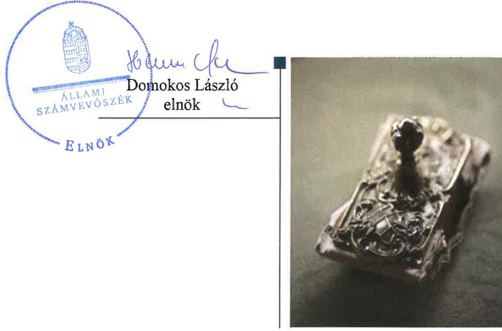
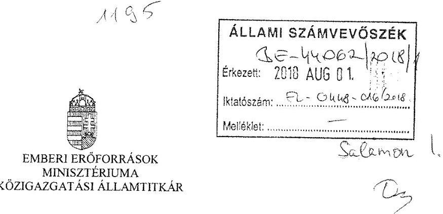
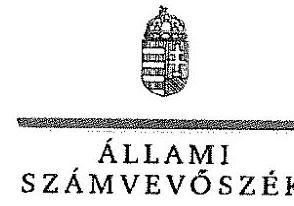
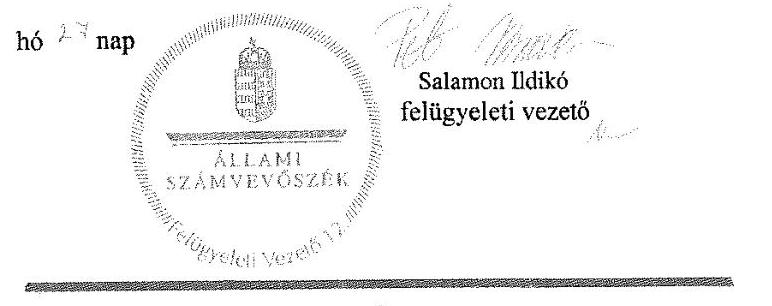
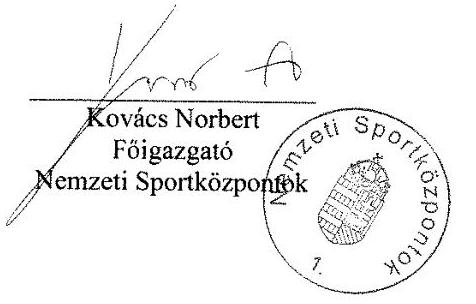
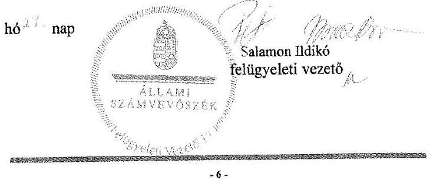

# Jelentés 

## A központi alrendszer intézményei

A központi alrendszer egyes intézményei pénzügyi és vagyongazdálkodásának ellenőrzése - Nemzeti Sportközpontok 2018.

---

# Jelentés 

## A központi alrendszer intézményei

A központi alrendszer egyes intézményei pénzügyi és vagyongazdálkodásának ellenőrzése - Nemzeti Sportközpontok 2018. 03. hó 11. nap

---

# AZ ELLENŐRZÉST FELÜGYELTE:

- **SALAMON ILDIKÓ** felügyeleti vezető

- **AZ ELLENŐRZÉST VEZETTE ÉS A VÉGREHAJTÁSÁÉRT FELELŐS:**

  - **DR. KOVÁCS DIÁNA** ellenőrzésvezető
  - **A PROGRAM ÖSSZEÁLLÍTÁSÁÉRT FELELŐS:**

  - **TÓTPÁL SZABOLCS** osztályvezető

- **IKTATÓSZÁM:** EL-0086-131/2018.
- **TÉMASZÁM:** 2171
- **ELLENŐRZÉS-AZONOSÍTÓ SZÁM:** V076021

Jelentéseink az Országgyűlés számítógépes hálózatán és az Interneta a www.asz.hu címen is olvashatóak.

---

# TARTALOMJEGYZÉK 

■ ÖSSZEGZÉS ..... 5
■ AZ ELLENŐRZÉS CÉLJA ..... 7
■ AZ ELLENŐRZÉS TERÜLETE ..... 8
■ AZ ELLENŐRZÉS HÁTTERE, INDOKOLTSÁGA ..... 9
■ A JELENTÉS LÉNYEGES KÉRDÉSKÖREI ..... 10
■ ELLENŐRZÉS HATÓKÖRE ÉS MÓDSZEREI ..... 12
■ MEGÁLLAPÍTÁSOK ..... 14
■ JAVASLATOK ..... 22
■ KÖVETKEZTETÉSEK ..... 25
■ MELLÉKLETEK ..... 27
I. sz. melléklet: Értelmező szótár ..... 27
■ FÜGGELÉK: ÉSZREVÉTELEK ..... 31
■ RÖVIDÍTÉSEK JEGYZÉKE ..... 45

---

.

---

# ÖSSZEGZÉS 

A Nemzeti Sportközpontok feletti irányítószervi jogkörgyakorlás az ellenőrzött időszakban szabályszerű volt. A belső kontrollrendszer nem biztosította a közpénzekkel és a nemzeti vagyonnal való átlátható, szabályszerű, gazdaságos, hatékony és eredményes gazdálkodás feltételeit. A Nemzeti Sportközpontok nem rendelkezett éves költségvetési beszámolóval, pénzügyi és vagyongazdálkodása nem volt szabályszerű. A szervezeti átalakítás során a jogszabályi előirásokat betartották. A Nemzeti Sportközpontok nem a kockázatokkal arányosan alakította ki az integritás kontroll környezetét.
A Nemzeti Sportközpontok szervezeti és müködési folyamatai, belső szabályozottsága a Margitszigeti Nemzeti Tenisz Versenyközpont megvalósítása átláthatósága, elszámoltathatósága és eredményes megvalósítása szempontjából magas kockázatokat hordoz. A beruházás döntés-előkészítése nem volt megfelelő.

## Az ellenőrzés társadalmi indokoltsága

A központi alrendszer részét képező intézmények alapvető rendeltetése a közfeladatok ellátásának biztosítása. A közpénzek felhasználásában meghatározó, központi alrendszerbe tartozó intézmények pénzügyi és vagyongazdálkodási tevékenységük és/vagy feladatellátásuk súlya miatt jelentős hatást gyakorolhatnak a költségvetés egyensúlyának fenntartására. Hatással vannak továbbá az állami vagyonnal való gazdálkodás minőségére, a kormányzati (szak)politikák végrehajtására, illetve közfeladat ellátásuk vonatkozásában az állampolgárok életminőségére, jogaik és kötelezettségeik gyakorlására. Indokolt ezért, hogy az Állami Számvevőszék ezen intézmények pénzügyi és vagyongazdálkodását, az esetleges átalakulások szabályszerűségét rendszeresen ellenőrizze.

## Főbb megállapítások, következtetések, javaslatok

A Nemzeti Sportközpontok feletti az irányító szervi feladatellátás az ellenőrzött időszakban szabályszerű volt az alapítói, egyéb irányítói jogosultságok tekintetében. A munkáltatói jogkörgyakorlás megfelelt a jogszabályi előírásoknak.

A Nemzeti Sportközpontok belső kontrollrendszere kialakítása és működtetése nem felelt meg a jogszabályi előírásoknak. A kontrollkörnyezet kialakítása nem volt szabályszerű. Az ellenőrzött időszakban a Nemzeti Sportközpontok szervezeti felépítésére, feladataira vonatkozó szabályozást - a beruházások előkészítésével, végrehajtásával, tervezésével kapcsolatos feladatokat is érintően - nem a szervezeti és múködési szabályzat tartalmazta. A Nemzeti Sportközpontok nem határozta meg a dologi és egyéb kiadások tekintetében teljesítésigazolásra jogosult személyek kijelölésének rendjét. 2013. április 17-től az ellenőrzött időszak végéig nem rendelkezett a hatályos múködésének megfelelő ellenőrzési nyomvonallal, 2012. január 1. és 2016. szeptember 30. között szabálytalanságkezelési eljárásrenddel, és 2016. október 1-jétől 2017. június 7-ig nem szabályozta az integritást sértő események kezelésének eljárásrendjét. A teljes ellenőrzött időszakban nem volt szabályszerű a kockázatkezelési rendszer múködtetése. Az ellenőrzött időszakban a teljesítés igazolásra jogosult személyeket a kötelezettségvállalók írásban nem jelölték ki. Az információs és kommunikációs folyamatok múködtetése nem volt szabályszerű. A Nemzeti Sportközpontok nem tett eleget a közzétételi kötelezettségének, mivel 2012-2013. évekre vonatkozóan nem tette közzé az éves költségvetését. Nem kerültek kialakításra a rendelkezésre álló források szabályszerű, gazdaságos, hatékony és eredményes felhasználását biztosító folyamatok. A belső ellenőrzés jogszabályi előírásoknak megfelelő kialakításáról gondoskodott, azonban annak múködtetése nem volt szabályszerű. A 2016. évre vonatkozó éves ellenőrzési terv nem állt rendelkezésre.

---

A Nemzeti Sportközpontoknál a bevételek beszedése és elszámolása, valamint a kiadások előirányzatainak felhasználása során a gazdálkodási jogkörök kontrolltevékenysége nem felelt meg a jogszabályi előírásoknak. A 2016. évi kötelezettségvállalással terhelt maradvány alátámasztásához vezetett részletező nyilvántartás tartalma nem felelt meg a jogszabályi előírásban foglaltaknak. Az Intézmény mennyiségi felvétellel történő leltározást nem végzett a teljes ellenőrzött időszakban. Az ellenőrzött időszakban a Nemzeti Sportközpontok nem rendelkezett leltárral alátámasztott beszámolóval.

A Nemzeti Sportközpontokat érintő két szervezeti átalakítás lebonyolítása megfelelt a jogszabályi előírásoknak.
Az integritás szemlélet nem érvényesült a Nemzeti Sportközpontoknál, az integritás kontrollrendszer kiépítettsége nem megfelelő.

A Nemzeti Sportközpontok szervezeti felépítése nem felel meg az SZMSZ-ben foglaltaknak, a felelősségi viszonyok nem egyértelműek, amelyek az ellenőrzött beruházás megvalósítása szempontjából kockázatot jelentenek. Az Intézmény - 2016. év kivételével - rendelkezett kockázatelemzésen alapuló belső ellenőrzési tervvel, amely azonban az ellenőrzött beruházás előkészítés ellenőrzött szakaszára vonatkozóan nem tartalmazott az ellenőrzött beruházással kapcsolatos ellenőrzést. Az ellenőrzött beruházásnak nem volt ütemterve, ami a megvalósításra vonatkozóan kockázatokat hordoz magában. Az ellenőrzött beruházás döntés-előkészítése az NFM részéről nem volt szabályszerű.

Az Állami Számvevőszék az Emberi erőforrások miniszterének egy, a Nemzeti Sportközpontok főigazgatójának tizenöt javaslatot fogalmazott meg.

---

# AZ ELLENŐRZÉS CÉLJA 

AZ ELLENŐRZÉS CÉLJA annak megítélése volt, hogy az Intézményre ${ }^{1}$ vonatkozó irányító szervi feladatellátás a jogszabályi előírások betartásával történt-e; az Intézménynél a belső kontrollrendszer kialakítása és működtetése szabályszerű volt-e; kialakították-e az erőforrásokkal való szabályszerű, gazdaságos, hatékony és eredményes gazdálkodás követelményeit; szabályszerű volt-e a beszámolási és adatszolgáltatási kötelezettségek teljesítése; az Intézmény pénzügyi és vagyongazdálkodása megfelelt-e a jogszabályi előírásoknak és belső szabályzatainak; az Intézmény átalakításának vagy átszervezésének lebonyolítása szabályszerűen történt-e.

Az ellenőrzés keretében értékelte az ÁSZ² az Intézmény korrupciós kockázatainak kezelését szolgáló integritás kontrollok kiépítettségét és az integritás szemlélet érvényesülését. Az ellenőrzés célja volt továbbá a folyamatban lévő Beruházás ${ }^{3}$ eredményes megvalósulásának elősegítése érdekében a döntés-előkészítésétől a kivitelezés megkezdéséig felmerülő kockázatok beazonosításának és az integritási szempontok érvényesülésének értékelése.

---

# **AZ ELLENŐRZÉS TERÜLETE**

## **Nemzeti Sportközpontok**

A Nemzeti Sportközpontok az olimpiai központok működtetésére és fejlesztésére, a magyar versenysport és utánpótlás-nevelés felkészülési bázisának biztosítására, valamint egyes sporttal kapcsolatos kiemelt feladatok ellátásának elősegítése érdekében 2005. január 1-jétől kezdte meg működését központi költségvetési szervként.

Az Intézmény feletti irányító szervi feladatokat 2012. január 1. és 2012. május 13. között a NEFMI4, 2012. május 14-től 2015. március 30-ig az EMMI5 látta el. 2015. április 1-jétől az ellenőrzött időszak végéig az NFM6 volt az irányító szerv.

Az Intézmény működési területe országos. Az ellenőrzési időszak elején kilenc telephellyel rendelkezett, ami az ellenőrzési időszak végére huszonkettőre emelkedett.

Az Intézményt vezető főigazgató7 és a gazdasági igazgató8 személye az ellenőrzött időszakban kétszer változott.

Az Intézmény előirányzatai minden évben jelentős mértékben növekedtek, döntően az év közben tervezett intézményi beruházások volumenének növekedése miatt. A tervezett beruházások teljes körűen – az adott években – nem valósultak meg, ebből adódóan évenként jelentős mértékű maradvány képződött.

A Margitszigeti Nemzeti Tenisz Versenyközpont megvalósítása – mint az ellenőrzött beruházás – előkészítéséről 2017. június 2-án született döntés, 9977, 9 millió Ft költségvetési forrás biztosításával. A Beruházás kivitelezése nem kezdődött el az ellenőrzött időszakban.

A tenisz mint kiemelt sportág fejlesztése, valamint a nemzetközi tenisztornák magyarországi rendezési feltételeinek biztosítása érdekében született meg a Beruházásra vonatkozó 1279/2017. (VI. 2.) Korm. határozat9, amely a Beruházás építtetőjeként az Intézményt jelölte meg és rendelkezett az összesen bruttó 9977,9 millió forint költségvetési forrás 2017-2018. években történő ütemezett biztosításáról. A Beruházással összefüggő közigazgatási hatósági ügyek kiemelt jelentőségű üggyé nyilvánítását a 122/2017. (VI. 2.) Korm. rendelet10 tartalmazza.

---

# AZ ELLENŐRZÉS HÁTTERE, INDOKOLTSÁGA 

Az államháztartás központi alrendszerének közpénz felhasználása, az intézmények által ellátott közfeladatok sokrétúsége, valamint a feladatellátásához rendelt vagyon nagyságrendje indokolja, hogy az ÁSZ ellenőrzéseket folytasson a pénzügyi és vagyongazdálkodás területén. Az ÁSZ az ellenőrzései során feltárja a gazdálkodást, a központi alrendszer intézményei átalakulását, átszervezését érintő szabályozások esetleges hiányosságait, a szabályozással nem érintett gazdálkodási területeket, rámutathat a vagyongazdálkodási tevékenység - ezen belül a tulajdonosi joggyakorlás vagyonkezelés és a kiemelt jelentőségű beruházás előkészítés - esetleges szabálytalanságaira, értékeli az állami vagyon nyilvántartására és elszámolására vonatkozó eljárásokat.

Az ellenőrzés hozzájárul a központi intézmények pénzügyi helyzetének pontosabb megítéléséhez és a jó gyakorlat kialakításán és terjesztésén keresztül az ellenőrzések elősegítik a gazdálkodás szabályszerűségének javítását.

A közpénzek szabályos és átlátható felhasználásának támogatása céljából az ÁSZ a beruházások ellenőrzését - a megvalósításra fordított költségvetési források nagyságrendjére, a beruházások révén létrehozott nemzeti vagyon hasznosítására tekintettel - kiemelt fontosságú területként kezeli.

A közpénzből létrejövő beruházások eredményes megvalósulása érdekében indokolt már a döntés-előkészítéstől a kivitelezés megkezdéséig tartó szakaszban felmerülő kockázatok beazonosításának és a kezelésükre kidolgozott intézkedések értékelése, az átláthatóság követelményével összhangban az integritási szempontok érvényesülésének biztosítása.

A beruházások előkészítésére fókuszáló ellenőrzés megállapításainak hasznosításaként lehetőség nyílik még a beruházás folyamatában a feltárt hiányosságok, szabálytalanságok megszüntetéséhez szükséges korrekciók megtételére, a kontrollok erősítésére.

Jelen ellenőrzés ezáltal hozzájárul az államháztartásból származó forrásból finanszírozott beruházások eredményességéhez, a beruházási folyamat transzparenciájának biztosításához.

---

# A JELENTÉS LÉNYEGES KÉRDÉSKÖREI 

1.     - Az irányító szerv Intézményre vonatkozó feladatellátása szabályszerű volt-e?
2.     - A belső kontrollrendszer kialakítása és müködtetése biztosította-e a közpénzekkel és a nemzeti vagyonnal történő átlátható, szabályszerű, gazdaságos, hatékony és eredményes gazdálkodást, illetve a beszámolási és adatszolgáltatási kötelezettségek szabályszerű teljesítését?
3.     - Az Intézmény pénzügyi gazdálkodása szabályszerű volt-e?
4.     - Az Intézmény vagyongazdálkodása szabályszerű volt-e?
5.     - Szabályszerűen történt-e az ellenőrzött időszakban az Intézményt érintő szervezeti, szerkezeti átalakítások lebonyolítása?
6.     - Érvényesült-e az integritás szemlélet és ennek megfelelően ki-építették-e az integritás kontrollrendszert az Intézménynél?

---

7.     - A Beruházás döntés-előkészítése, a beruházási folyamat meghatározása az irányadó jogszabályok, közjogi szervezetszabályozó eszközök és a belső szabályzatok előírásainak megfelelően történt-e?
8. Az Intézmény szervezeti és müködési folyamatai, belső szabályozottsága alkalmas volt-e kiemelt beruházás kockázatainak kezelésére?

---

# ELLENŐRZÉS HATÓKÖRE ÉS MÓDSZEREI 

## Az ellenőrzés típusa

Megfelelőségi ellenőrzés.

## Az ellenőrzött időszak

Az ellenőrzött időszak a pénzügyi és vagyongazdálkodás vonatkozásában a 2012. január 1-jétől 2016. december 31-ig tartó időszak, míg a Beruházás tekintetében a 2017. június 2-tól 2017. november 22-ig tartó időszak volt.

## Az ellenőrzés tárgya

Az Intézményre vonatkozó irányító szervi feladatok ellátása. Az Intézmény belső kontroll rendszerének kialakítása és múködtetése. A pénzügyi és vagyongazdálkodás szabályszerűsége. Az Intézmény beszámolási és adatszolgáltatási kötelezettségének teljesítése. Az Intézmény átalakításának vagy átszervezésének lebonyolítása szabályszerűsége. A Beruházásról szóló döntés előkészítése. Az Intézmény Beruházást érintő működési folyamatai, belső szabályozottsága, a Beruházás kivitelezése előkészítésének megfelelősége.

Az ellenőrzés kiterjedt minden olyan körülményre és adatra, amely az ÁSZ jogszabályban meghatározott feladatainak teljesítéséhez, valamint a program végrehajtása folyamán felmerült újabb összefüggések feltárásához szükséges.

## Az ellenőrzött szervezet

Nemzeti Sportközpontok, valamint az Emberi Erőforrások Minisztériuma (Nemzeti Erőforrás Minisztérium) és a Nemzeti Fejlesztési Minisztérium mint irányító szervek, utóbbi mint a Beruházás döntés-előkészítéséért felelős szervezet.

## Az ellenőrzés jogalapja

Az ellenőrzés jogszabályi alapját az ÁSZ tv. ${ }^{11} 1 . \S$ (3) bekezdés, 5. § (2)-(6) bekezdései, valamint Áht. ${ }^{12} 61 . \S$ (2) bekezdésének előírásai képezték.

---

# Az ellenőrzés módszerei 

Az ellenőrzést az ellenőrzési program szempontjai, az ellenőrzött időszakban hatályos jogszabályok, az ellenőrzés szakmai szabályai, a jelen ellenőrzésre irányadó ÁSZ módszertanok figyelembevételével végezte az ÁSZ.

Az ellenőrzési kérdések megválaszolásához szükséges bizonyítékok megszerzése az ellenőrzött által rendelkezésre bocsátott dokumentumokra, adatokra alapozva mintavételezés, valamint elemző eljárás útján történt. Az ellenőrzési bizonyítékként felhasználható adatforrások közé tartoztak egyrészt az ellenőrzési program részletes szempontjainál felsorolt adatforrások, másrészt minden egyéb - az ellenőrzés folyamán feltárt, az ellenőrzés szempontjából információt tartalmazó - dokumentum.

Az ellenőrzés lefolytatásához az Intézmény tanúsítványok kitöltésével, valamint az ÁSZ által kért dokumentumok megküldésével szolgáltatott adatokat.

Az integritás szemlélet érvényesülésének értékelése az Intézmény által 2016. évre kitöltött kérdőív alapján történt.

---

# 1. Az irányító szerv Intézményre vonatkozó feladatellátása szabályszerű volt-e? 

Összegző megállapítás Az irányító szervi feladatellátás megfelelt a jogszabályi előírásoknak.

Az ellenőrzött időszakban az Intézmény rendelkezett az Irányító szerv ${ }_{1,2,3}{ }^{13}$ által kiadott alapító okirat ${ }_{1-6}$-tal ${ }^{14}$, amelyek az Áht. és az Ávr. ${ }^{15}$ rendelkezéseinek megfeleltek.

AZ IRÁNYÍTÓ SZERV ${ }_{1,2,3}$ Intézményre vonatkozó, az Áht.-ban, Ávr.-ben, Áhsz. ${ }_{1,2}$-ben ${ }^{16}$ előírt jóváhagyási, maradvány-megállapítási, beszámoltatási, ellenőrzési, nyomon követési feladatellátása szabályszerű volt.

AZ ELEMI KÖLTSÉGVETÉS tervezésével összefüggő követelményeket az Ávr. előírásai alapján az Irányító szerv ${ }_{1,2,3}$ meghatározta. Az Áht., az Áhsz. ${ }_{1,2}$ előírásainak megfelelően jóváhagyta az elemi költségvetéseket, továbbá beszámoltatta az Intézmény vezetőjét az éves szakmai feladatellátásról, illetve gazdálkodásról. Az Intézmény rendelkezett az irányító szerv ${ }_{1}$ és az irányító szerv ${ }_{2}$ által jóváhagyott SZMSZ ${ }_{1,2}{ }^{17}$-vel.

Az irányító szerv ${ }_{2,3}$ munkáltatói jogkörgyakorlása a főigazgató és a gazdasági vezető vonatkozásában szabályszerű volt.

## 2. A belső kontrollrendszer kialakítása és múködtetése biztosí-totta-e a közpénzekkel és a nemzeti vagyonnal történő átlátható, szabályszerű, gazdaságos, hatékony és eredményes gazdálkodást, illetve a beszámolási és adatszolgáltatási kötelezettségek szabályszerű teljesítését?

Összegző megállapítás

A belső kontrollrendszer kialakítása és múködtetése nem biztosította a közpénzekkel és a nemzeti vagyonnal történő átlátható, szabályszerű, gazdaságos, hatékony és eredményes gazdálkodás feltételeit.

Az Intézmény kontrollkörnyezetének kialakítása nem volt szabályszerű.

Az Intézmény 2015. október 27-től az ellenőrzött időszak végéig az Áht. 10. § (5) bekezdésében és az Ávr. 13. § (1) bekezdés e) pontjában fog-

---

laltakat megsértve az Intézmény szervezeti felépítésére, feladataira vonatkozó szabályozást - a beruházások előkészítésével, végrehajtásával, tervezésével kapcsolatos feladatokat is érintően - nem az SZMSZ ${ }_{2}$-ben, hanem a 24/2015. (X.27.) főigazgatói utasításban ${ }^{18}$ állapította meg.

A GAZDÁLKODÁS RÉSZLETES RENDJÉT a kötelezettségvállalási szabályzat ${ }_{1-3}{ }^{19}$ és a gazdálkodási szabályzat ${ }_{1,2}{ }^{20}$ tartalmazta. Az Intézmény a kötelezettségvállalási szabályzat ${ }_{1-3}$-ban rendelkezett az egyes gazdálkodói jogkörök gyakorlásának módjával kapcsolatos előírásokról és az eljárási szabályokról, azonban az Ávr. 13. § (2) bekezdés a) pontja ellenére a teljesítés igazolásra jogosult személyek kijelölésének rendjét nem határozta meg.

A PÉNZÜGYI ÉS SZÁMVITELI munkafolyamatok szabályozására az Intézmény 2013. évtől rendelkezett számviteli politiká ${ }_{1,2}{ }^{21}$-val, leltározási szabályzat ${ }_{1,2}{ }^{22}$-tal, értékelési szabályzat ${ }_{1,2}{ }^{23}$-tal, pénzkezelési szabályzat ${ }_{1,2}{ }^{24}$-tal.

KÖZBESZERZÉSI SZABÁLYZAT ${ }^{25}$-tal az Intézmény az ellenőrzött időszakban rendelkezett. Az Intézmény az Ávr. 13. § (2) bekezdés b) pontban foglaltak ellenére - az anyagbeszerzés kivételével - nem rendelkezett a Kbt. ${ }_{1,2}{ }^{26}$ hatálya alá nem tartozó beszerzések lebonyolításával kapcsolatos eljárásrenddel.

Az Intézmény - a Bkr. ${ }^{27}$ 6. § (3) bekezdésében foglaltakat megsértve nem rendelkezett 2013. április 17-től az ellenőrzött időszak végéig aktualizált ellenőrzési nyomvonallal, valamint 2012. január 1. és 2016. szeptember 30. között - a Bkr. 6. § (4) bekezdésben előírtak ellenére - szabálytalanságkezelési eljárásrenddel.

Az Intézmény 2016. október 1-jétől 2017. június 7-ig a Bkr 6. § (4) bekezdésében foglaltak ellenére nem rendelkezett integritást sértő események kezelésének eljárásrendjének szabályozásával. A 9/2017. (VI. 8.) főigazgatói utasítás ${ }^{28}$ szabályozta az Intézmény integritást sértő események kezelésének eljárásrendjét.

### 2.2. számú megállapítás

Az Intézmény kockázatkezelési rendszerének múködtetése nem volt szabályszerű.

A KOCKÁZATKEZELÉSI szabályzattal nem rendelkezett az Intézmény 2012. január 1. és 2012. május 1., továbbá 2016. január 1. és 2016. szeptember 30. közötti időszakban, megsértve a Bkr. 3. § b) pontjában foglaltakat. Az Intézmény - a Bkr. 7. § (1) bekezdésben foglaltakat megsértve - 2012. január 1. és 2016. szeptember 30. között a kockázatkezelési rendszert, 2016. október 1. és 2016. december 31. között az integrált kockázatkezelési rendszert nem múködtette.

A Bkr. 7. § (2) bekezdése ellenére az Intézmény az ellenőrzött időszakban nem mérte fel és nem állapította meg a tevékenységében, gazdálkodásában rejlő kockázatokat, nem határozta meg az egyes kockázatokkal kapcsolatban szükséges intézkedéseket, valamint azok teljesítésének folyamatos nyomon követésének módját.

---

Az Intézmény az integrált kockázatkezelési rendszer koordinálásának felelősét nem jelölte ki, amivel megsértette a Bkr. 2016. október 1-jétől hatályos 7. § (4) bekezdését.
2.3. számú megállapítás

# A kontrolltevékenység kialakítása nem volt szabályszerű a teljesítésigazolásra vonatkozó hiányosságok miatt. 

## A KÖTELEZETTSÉGVÁLLALÁSI SZABÁLY-

ZAT $_{1,2,3}$-ban az Intézmény meghatározta a gazdálkodási jogkörök gyakorlására vonatkozó szabályokat, a Bkr.-ben előírtak szerint biztosította kontrolltevékenységekhez kapcsolódó feladatköri elkülönítést.

A dologi és egyéb kiadások esetében - az Ávr. 57. § (4) bekezdésében foglaltakkal ellentétben - az ellenőrzött időszakban a teljesítésigazolásra jogosult személyeket az adott kötelezettségvállalásokhoz kapcsolódóan a kötelezettségvállaló írásban nem jelölt ki.

Az Intézmény az Ávr. 60. § (3) bekezdésében foglaltak szerint a kötelezettségvállalásra, pénzügyi ellenjegyzésre, érvényesítésre, utalványozásra jogosult személyekről és aláírás-mintájukról 2013. szeptember 24. óta vezetett naprakész nyilvántartást. Az ellenőrzött időszakban az Ávr. 60. § (3) bekezdésében foglaltak ellenére a teljesítésigazolásra jogosultak személyéről és aláírás-mintájukról az Intézmény nem vezetett nyilvántartást.
2.4. számú megállapítás

## AZ INTÉZMÉNY INFORMÁCIÓS RENDSZERÉNEK

kialakítása érdekében az SZMSZ $_{1,2}$ meghatározta a szervezet múködésével kapcsolatos külső és a belső információáramlás módját.

Az Intézmény az Info. tv. ${ }^{29}$ előírásainak megfelelő közzétételi szabályzattal ${ }^{30}$ rendelkezett, amelynek III. fejezete a kötelezően közzéteendő adatok nyilvánosságra hozatalának rendjét, IV. fejezete a közérdekú adatok megismerésére irányuló igények teljesítésének rendjét szabályozta.

Az Intézmény a közzétételi kötelezettségének az Info tv. 37. § (1) bekezdésben foglaltak ellenére nem tett eleget, mivel 2012-2013. évekre vonatkozóan nem tette közzé az Info tv. 1. melléklet III/1. pontjában foglalt éves költségvetését.

AZ IRATKEZELÉSI SZABÁLYZATÁT ${ }^{31}$ az Intézmény nem az illetékes közlevéltárral egyetértésben adta ki, amivel megsértette az Ltv. ${ }^{32} 10 . \S$ (1) bekezdés a) pontjában foglaltakat.
2.5. számú megállapítás

## Az Intézmény az operatív tevékenységek folyamatos és eseti nyomon követését biztosító rendszert nem alakította ki, a belső ellenőrzés jogszabályi előírásoknak megfelelő kialakításáról gondoskodott, azonban annak múködtetése nem volt szabályszerű.

Az Intézmény nem alakított ki a szervezeten belül a rendelkezésre álló források szabályszerű, gazdaságos, hatékony és eredményes felhasználását biztosító folyamatokat, megsértve a Bkr. 6. § (2) bekezdésében foglaltakat.

---

A BELSŐ ELLENŐRZÉS kialakítása az Áht. és a Bkr. előírásainak megfelelő volt. Az SZMSZ1,2-ben foglaltak alapján a belső ellenőrzés szervezeti és funkcionális függetlensége biztosított volt. A belső ellenőrzési vezető rendelkezett a Bkr.-ben előírt általános és szakmai követelmények szerinti képesítéssel. Az Intézmény 2012-2015. években rendelkezett a Bkr.-ben előírt éves belső ellenőrzési tervekkel. Az Intézmény a Bkr. 22. § (1) bekezdés b) pontjában foglaltak ellenére nem rendelkezett 2016. évre vonatkozó éves ellenőrzési tervvel.

A Bkr. 22. § (1) bekezdés b) pontjában foglaltakat megsértve az Intézmény 2012-2013. és 2015. évben nem hajtotta végre minden, az éves belső ellenőrzési tervben meghatározott ellenőrzést.

A KÜLSŐ ELLENŐRZÉSEKRŐL a Bkr.-ben előírt nyilvántartást vezették, azonban az a Bkr. 14. § (1) bekezdésében foglaltak ellenére a 2016. évre vonatkozóan nem tartalmazta az irányító szerv3 ellenőrzéseit.

Az Intézmény vezetője az Intézmény belső kontrollrendszerének minőségét pozitívan értékelte a Bkr. alapján, amely nyilatkozat tartalmát a jelen ellenőrzés megállapításai nem támasztották alá. Az Intézmény vezetője a nyilatkozatot a Bkr. 11. § (2) bekezdésében foglaltak ellenére 2016. évben nem küldte meg az irányító szerv3 vezetőjének.

# 3. Az Intézmény pénzügyi gazdálkodása szabályszerű volt-e? 

## Összegző megállapítás

Az Intézmény pénzügyi gazdálkodása nem volt szabályszerű.
3.1. számú megállapítás

A bevételek beszedése és elszámolása, valamint a kiadások előirányzatainak felhasználása során a gazdálkodási jogkörök kontrolltevékenysége nem volt szabályszerű.

A BEVÉTELEK beszedése és elszámolása - a 2013. és a 2015. évek kivételével - nem volt szabályszerű. Az Intézmény a bérleti szerződések megkötése előtt - az Nvtv. ${ }^{33}$ 3. § (1) és (2) bekezdésében, a 11. § (10) bekezdésében meghatározottak ellenére - nem minden esetben győződött meg arról, hogy a szerződő fél átlátható szervezetnek minősül-e.

A KIADÁSOK előirányzatának felhasználása a 2016. évben, a gazdálkodási jogkörök kontrolltevékenysége a kiadásokhoz kapcsolódóan a teljes ellenőrzött időszakban nem volt szabályszerű. A külső személyi juttatásokhoz kapcsolódó kifizetéseknél - az Ávr. 58. § (3) bekezdésében foglaltak ellenére - az érvényesítés, és az Ávr. 59. § (1) bekezdésében rögzítettekkel ellentétben az utalványozás nem történt meg.

Az ellenőrzött időszakban az Ávr. 57. § (4) bekezdésében foglaltak ellenére a dologi és egyéb kiadások esetében a teljesítésigazolást végző személyek a kötelezettségvállaló általi írásbeli kijelölés nélkül, jogosulatlanul jártak el.

Az Intézmény 2012-ben Kbt. 1 5. §-ában és 2016-ban a Kbt. 2 4. § (1) bekezdésében foglaltakat megsértve, a közbeszerzés mellőzésével hajtott végre beszerzést.

---

A Beruházás kivitelezésének előkészítése keretében megkötött szerződések az Ávr.-ben foglalt előírásoknak megfeleltek és az Info tv.-ben foglaltak szerint gondoskodtak azok közzétételéről.

# 3.2. számú megállapítás 

A tárgyévi maradvány megállapítása 2016. évben nem volt szabályszerű.

A TÁRGYÉVI MARADVÁNY megállapításai során 2012-2015. években az Intézmény betartotta a jogszabályi előírásokat. A 2016. évi kötelezettségvállalással terhelt maradvány alátámasztásához vezetett részletező nyilvántartás tartalma nem felelt meg az Áhsz. 14 . melléklet II. fejezet 4. a) és e) pontjaiban foglaltaknak, mert a nyilvántartás nem tartalmazta a pénzügyi ellenjegyzésre vonatkozó adatokat, és a pénzügyi teljesítési határidőket, megsértve ezzel az Áhsz. 2 39. § (3) bekezdésében foglaltakat.

## 4. Az Intézmény vagyongazdálkodása szabályszerű volt-e?

## Összegző megállapítás

Az Intézmény vagyongazdálkodása nem volt szabályszerű.
4.1. számú megállapítás

## A vagyonkezelési szerződések karbantartásáról az Intézmény gondoskodott.

Az Intézmény közfeladatainak ellátására szolgáló vagyon állami vagyon volt. Az ellenőrzött időszak kezdetén hatályos vagyonkezelési szerződés módosítására az ellenőrzött időszakban harmincegy alkalommal került sor vagyonkezelésbe vétel, átadás, vagyonkezelés módosítása, illetve részleges megszüntetése miatt.

A VAGYONKEZELÉSI SZERZŐDÉS módosításai megfeleltek a Nvtv., a Vtv. ${ }^{34}$ és a Vtvr. ${ }^{35}$ vonatkozó előírásainak.

Vagyonkezelői jog átruházására három esetben került sor. Az Intézmény és a központi költségvetési szervek közötti vagyonkezelői jog átruházása szabályszerű volt és feladat átadásához kapcsolódott.
4.2. számú megállapítás

A mérlegben kimutatott eszközök és források értékelése megfelelt, leltározása nem felelt meg a jogszabályok és a belső szabályzatok előírásainak. Az Intézmény az ellenőrzött időszakban nem rendelkezett beszámolóval.

A MÉRLEGBEN KIMUTATOTT ESZKÖZÖK év végi értékelése, bekerülési értékének megállapítása, állományba vétele, az értékcsökkenés elszámolása a jogszabályi előírásoknak és a belső szabályzatoknak megfelelően történt. A vagyonelemekben bekövetkezett változások számviteli nyilvántartásban való rögzítése szabályszerűen kiállított bizonylatok alapján történt.

Az Intézmény megsértette a Számv. tv. 65. § (1) bekezdésének előírását, mert a mérlegben a kimutatott követelések nem a vevők általi elismert és elfogadott összegben szerepeltek.

Az Intézmény az ellenőrzött időszakban nem végezte el a tárgyi eszközök és a készletek mennyiségi felvétellel történő leltározását, megsértve a Számv. tv. ${ }^{36}$ 69. § (3) bekezdésében foglaltakat, és a leltározási szabályzat ${ }_{1}$

---

II. b) 1. pontjában, a leltározási szabályzat ${ }_{2}$ II. 2., és III. d) 1. pontjában foglalt évenkénti mennyiségi felvétel alapján történő leltár elkészítésére vonatkozó előírást.

Az Intézmény az ellenőrzött időszakban megsértette a Számv. tv. 69. § (1) bekezdésében foglaltakat, mert a beszámoló elkészítéséhez, a mérleg tételeinek alátámasztásához nem állított össze olyan leltárt, amely tételesen, ellenőrizhető módon tartalmazza az Intézménynek a mérleg fordulónapján meglévő eszközeit és forrásait mennyiségben és értékben. Az Intézmény a teljes ellenőrzött időszakban nem rendelkezett leltárral alátámasztott beszámolóval.
4.3. számú megállapítás

Az Intézmény a beruházások és felújítások során szabályszerűen járt el.

Az állami tulajdonú eszközökön végzett beruházások során az Intézmény szabályszerűen járt el.

Az Intézmény az állami vagyon állományba vételéről a jogszabályi előírásoknak megfelelően gondoskodott.

# 5. Szabályszerűen történt-e az ellenőrzött időszakban az Intézményt érintő szervezeti, szerkezeti átalakítások lebonyolítása? 

Összegző megállapítás

Az irányító szervnek az átalakítással kapcsolatos feladatellátása
megfelelt a jogszabályoknak.

### 5.1. számú megállapítás

AZ ÁHT. ELŐÍRÁSÁNAK MEGFELELŐEN az irányító szerv $_{3}$ a nemzeti sportinformációs rendszer múködtetése, valamint az egészségüggyel kapcsolatos alkalmazott kutatás és kísérleti fejlesztés feladat átadását az EMMI-vel kötött részletes megállapodásokban szabályozta. Az Áht. 11. § (3b) bekezdés a) pont szerinti, 2016. február 1-jei beolvadásos kiválások szabályszerűek voltak.

## 6. Érvényesült-e az integritás szemlélet és ennek megfelelően kiépí-tették-e az integritás kontrollrendszert az Intézménynél?

## Összegző értékelés

Az integritás kontrollrendszer kiépítése nem volt megfelelő, az integritás szemlélet nem érvényesült az Intézménynél.

Az Intézmény nem a kockázatokkal arányosan alakította ki az integritás kontroll környezetét.

A kockázatmérséklő integritás kontrollok kiépítettségének szintje valamennyi területen - belső szabályozottság, humánerőforrás-gazdálkodás, kockázatelemzés, speciális korrupcióellenes rendszerek és eljárások - alacsony volt.

---

Az Intézmény nem rendelkezett nyilvánosan közzétett stratégiával, munkatervvel így többek közt a szervezeti kultúra javítása, integritás erősítése és a korrupció elleni fellépés nem volt meghatározva. Az Intézmény korrupciós kockázatelemzést nem készített, a belső ellenőrzési tervvel 2016-ra vonatkozóan nem rendelkezett.

Az Intézmény nem müködtetett az integritást erősitő, nem kötelezően elöirt kontrollokat.

# 7. A Beruházás döntés-előkészítése, a beruházási folyamat meghatározása az irányadó jogszabályok, közjogi szervezetszabályozó eszközök és a belső szabályzatok előírásainak megfelelően történt-e? 

Összegző megállapítás

A Beruházás döntés-előkészítése, a beruházási folyamat meghatározása az NFM részéről nem felelt meg az irányadó jogszabályok és közjogi szervezetszabályozó eszközök előírásainak.

A BERUHÁZÁSRA vonatkozó 1279/2017. (VI. 2.) Korm. határozat ${ }^{37}$ előkészítése során az NFM nem készített előterjesztést a Kormány számára.

A Beruházásra vonatkozó kormányzati döntésnek része volt a 122/2017. (VI. 2.) Korm. rendelet ${ }^{38}$ is, amely a Beruházással összefüggő közigazgatási hatósági ügyek kiemelt jelentőségű üggyé nyilvánításával kapcsolatban tartalmazott rendelkezéseket. A kormányrendelet tervezetét az NFM a 2010. évi CXXX. törvény ${ }^{39}$ 16. § (2) bekezdés a) pont előírása ellenére nem egyeztette az igazságügyért felelős miniszterrel.

## 8. Az Intézmény szervezeti és müködési folyamatai, belső szabályozottsága alkalmas volt-e kiemelt beruházás kockázatainak kezelésére?

## Összegző értékelés

Az Intézmény szervezeti és müködési folyamatai, belső szabályozottsága nem volt alkalmas a Beruházás kockázatainak kezelésére.

Az Intézmény szervezeti és müködési folyamatai, belső szabályozottsága a Beruházás átláthatóságát, elszámoltathatóságát, és eredményes megvalósítását nem támogatta, az Intézmény belső kontrollrendszerének hiányosságai a Beruházás szempontjából kockázatot jelentenek.

Az Intézmény szervezeti felépítése nem felel meg az SZMSZ-ben foglaltaknak, a felelősségi viszonyok nem egyértelmúek, amelyek a Beruházás előkészítése szempontjából kockázatot jelentenek.

A belső ellenőrzést az ellenőrzött időszakban az Intézmény müködtette, továbbá a beszámolási rendszerek tekintetében is határozott meg szabá-

---

lyokat. Az Intézmény - 2016. év kivételével - rendelkezett kockázatelemzésen alapuló belső ellenőrzési tervvel. A Beruházás nem került kockázatelemzés alá.

A Beruházás megvalósításával kapcsolatos tevékenységek folyamatos nyomon követését a feladatok ellátására kötött szerződésekben szabályozták.

A monitoring rendszer müködtetésére vonatkozóan a Beruházás lebonyolítási szerződése ${ }^{40}$ tartalmazott előírásokat, előírták a szerződő fél részére a részletes pénzügyi ütemterv és a státuszjelentés készítésének kötelezettségét. A Beruházásnak az ellenőrzött időszakban nem volt a kivitelezésre vonatkozó ütemterve, ami a megvalósítás szempontjából kockázatokat hordoz magában.

A Beruházással kapcsolatos közbeszerzési eljárások szabályszerű lebonyolításának feltételeiről a közbeszerzési szolgáltatásra kötött szerződések rendelkeznek. A tervezett Beruházás megvalósítása érdekében, az előkészítés keretében, az ellenőrzött időszakban az Intézmény négy szerződést kötött: megbízási szerződést az építési műszaki ellenőri feladatok ellátására, megbízási keretszerződést a járulékos közbeszerzési szolgáltatások nyújtására, megbízási szerződést a beruházás-lebonyolítóif feladatok ellátására és egy tervezési szerződést. A megbízási szerződéseket a 122/2017. (VI. 2.) Korm. rendelet 3. § (1) bekezdése alapján a Beruházás járulékos közbeszerzési szolgáltatója, beruházás-lebonyolítója és építési múszaki ellenőre kizárólagos joggal a BMSK ${ }^{41}$-val kötötte meg az Intézmény.

---

# JAVASLATOK 

Az ÁSZ tv. 33. § (1) bekezdésében foglaltak értelmében az ellenőrzött szervezet vezetője köteles a jelentésben foglalt megállapításokhoz kapcsolódó intézkedési tervet összeállítani és azt a jelentés kézhezvételétől számított 30 napon belül az ÁSZ részére megküldeni. Amennyiben az ellenőrzött szervezet vezetője nem küldi meg határidőben az intézkedési tervet, vagy továbbra sem elfogadható intézkedési tervet küld, az Állami Számvevőszék elnöke az ÁSZ tv. 33. § (3) bekezdése a) és b) pontjaiban foglaltakat érvényesítheti.

## Emberi erőforrások miniszterének

1. Tegyen intézkedéseket a feltárt hiányosságok és szabálytalanságok tekintetében a felelősség tisztázása érdekében, és szükség szerint intézkedjen a felelősség érvényesítéséről.
(2.2. számú megállapítás 2-3. bekezdése, 2.3. számú megállapítás 3. bekezdése, 2.5. számú megállapítás 1. bekezdése, 2. bekezdés 5. mondata és 5. bekezdése, 3.1. számú megállapítás 1-4. bekezdése, 3.2. számú megállapítás 1. bekezdés 2. mondata, 4.2. számú megállapítás 2-4. bekezdése alapján)

## Nemzeti Sportközpontok föigazgatójának

1. Intézkedjen, hogy a jogszabályi előírásoknak megfelelően a Szervezeti és Müködési szabályzat tartalmazza
a) az Intézmény szervezeti felépitésére, feladataira vonatkozó szabályozást;
b) a beruházások előkészítésével, tervezésével és végrehajtásával kapcsolatos feladatokat.
(2.1. számú megállapítás 1. bekezdése alapján)
2. Intézkedjen
a) a jogszabályi előírásoknak megfelelően a teljesítés igazolására jogosult személyek kijelölése rendjének belső szabályzatban történő meghatározására;
b) a teljesítésigazolást végzők jogszabályi előírásoknak megfelelő, jogosult általi kijelölésére;
c) a jogszabályban elöirtaknak megfelelően a teljesítés igazolására jogosult személyekről és aláírás-mintájukról naprakész nyilvántartása vezetésére.
(2.1. számú megállapítás 2. bekezdés 2. mondata, és a 2.3. számú megállapítás 2. bekezdése, 3. bekezdés 2. mondata alapján)

---

3. Intézkedjen a jogszabályi előírásoknak megfelelően a közbeszerzési törvény hatálya alá nem tartozó beszerzések lebonyolításával kapcsolatos eljárásrend meghatározására.
(2.1. számú megállapítás 4. bekezdés 2. mondata alapján)
4. Intézkedjen a jogszabályi előírásoknak megfelelően az ellenőrzési nyomvonal aktualizálására.
(2.1. számú megállapítás 5. bekezdése alapján)
5. Intézkedjen a jogszabályi előírásoknak megfelelően
a) az integrált kockázatkezelési rendszer müködtetésére, ennek során az Intézmény tevékenységében, gazdálkodásában rejlő kockázatok felmérésérésre, az egyes kockázatokkal kapcsolatban szükséges intézkedések meghatározására, valamint azok teljesítésének folyamatos nyomon követésének módja meghatározására,
b) az integrált kockázatkezelési rendszer koordinálására szervezeti felelős kijelölésére
(2.2. számú megállapítás 1. bekezdés 2. mondata, és 2-3. bekezdése alapján)
6. Intézkedjen a jogszabályi előírásoknak megfelelően a közzétételi kötelezettség teljesítésére.
(2.4. számú megállapítás 3. bekezdése alapján)
7. Intézkedjen az iratkezelési szabályzat jogszabályi előírásoknak megfelelő kiadásáról.
(2.4. számú megállapítás 4. bekezdése alapján)
8. Intézkedjen a jogszabályi előírásoknak megfelelően az Intézményen belül a rendelkezésre álló források szabályszerü, gazdaságos, hatékony és eredményes felhasználását biztositó folyamatok kialakítására.
(2.5. számú megállapítás 1. bekezdése alapján)
9. Intézkedjen a jogszabályi előírásoknak megfelelően
a) az éves ellenőrzési terv elkészitésére;
b) az éves belső ellenőrzési tervben meghatározott ellenőrzések teljes körü végrehajtására;
c) a külső ellenőrzésekről a nyilvántartás teljes körü vezetésére.
(2.5. számú megállapítás 2. bekezdés 5. mondata, és 3-4. bekezdése alapján)

---

10. Intézkedjen az Intézmény belső kontrollrendszere minőségét értékelő nyilatkozat irányító szerv vezetője részére történő - jogszabályi előírásoknak megfelelő - megküldésére.
(2.5. számú megállapítás 5. bekezdés 2. mondata alapján)
11. Intézkedjen, hogy az Intézmény a bérleti szerződések megkötése előtt minden esetben győződjön meg arról, hogy a szerződő fél átlátható szervezetnek minősül.
(3.1. számú megállapítás 1. bekezdés 2. mondata alapján)
12. Intézkedjen, hogy a gazdálkodási jogkörök gyakorlása során a jogszabályi előírásoknak megfelelően
a) a teljesítésigazolását az arra jogosult, a kötelezettségvállaló által írásban kijelölt személy végezze,
b) az érvényesítés minden esetben megtörténjen,
c) az utalványozás minden esetben megtörténjen.
(xx3.1. számú megállapítás 2. bekezdés 2. mondata, 3. bekezdése)
13. Intézkedjen a jogszabályi előírásoknak megfelelően a közbeszerzési eljárások lefolytatására.
(3.1. számú megállapítás 4. bekezdése alapján)
14. Intézkedjen, hogy a kötelezettségvállalással terhelt maradvány alátámasztásához vezetett részletező nyilvántartást a jogszabályban előírt tartalommal vezessék.
(3.2. számú megállapítás 1. bekezdés 2. mondata alapján)
15. Intézkedjen, hogy a jogszabályi előírásoknak megfelelően
a) a vevők által elismert és elfogadott követeléseket mutassák ki a mérlegben,
b) az Intézmény végezze el a tárgyi eszközök és a készletek mennyiségi felvétellel történő leltározását;
c) a leltár az Intézménynek a mérleg fordulónapján meglévő eszközeit és forrásait mennyiségben is tartalmazza;
d) leltárral alátámasztott éves beszámoló készitésére.
(4.2. számú megállapítás 2-4. bekezdése alapján)

---

# KÖVETKEZTETÉSEK 

A közpénzek szabályos, átlátható és elszámoltatható elköltésének előfeltétele a megfelelően kiépített és működtetett belső kontrollrendszer. Az Intézmény belső kontrollrendszere kialakításának és működtetésének hiányosságai növelték az eredendő korrupciós veszélyeztetettséget, az integritási kockázatokat a Beruházás előkészítési szakaszában. Az integritás szemlélet nem érvényesült az Intézménynél.

Az Intézménynél a szervezeti felépítésre, a feladatokra vonatkozó nem megfelelő szintű szabályozás, a felelősségi viszonyok egyértelmű rögzítésének, valamint a teljesítés igazolására jogosult személyek kijelölésének rendje meghatározásának hiánya az elszámoltathatóság, míg a közbeszerzési törvény hatálya alá nem tartozó beszerzések lebonyolításával kapcsolatos eljárásrend szabályozásának a hiánya az átláthatóság kockázatait növelte.

Az ellenőrzési nyomvonalak aktualizálásának elmaradása, továbbá a kockázatkezelési, 2016. október 1-jétől az integrált kockázatkezelési rendszer működtetésének a hiánya, a belső ellenőrzési rendszerműködésének hiányosságai növelik a kockázatok bekövetkezési valószínűségét.

A teljesítésigazolásra jogosult személyek kijelölésének a hiánya, valamint a teljesítés igazolására jogosult személyekről és aláírás-mintájukról előírt naprakész nyilvántartás vezetésének elmulasztása következtében nem volt biztosított a kiadások teljesítése jogosságának, összegszerűségének, az ellenszolgáltatás teljesítésének szabályszerű igazolása.

Mindezek következtében fennáll a veszélye a költségek növekedésének, illetve a nem megfelelő teljesítésnek.
Az Intézmény belső kontrollrendszerében, a pénzügyi és a vagyongazdálkodásában feltárt szabálytalanságok megszűntetésével, a hiányosságok kijavításával a Beruházás előkészítésével kapcsolatban feltárt kockázatok a megvalósítás során csökkenthetők, illetve kezelhetők. Az integritás kontrollok kiépítése érdekében ezért olyan intézkedések megtétele szükséges, amelyek mérsékelhetik a kockázatok negatív hatását.

---

.

---

# MELLÉKLETEK 

- I. SZ. MELLÉKLET: ÉRTELMEZŐ SZÓTÁR
állami vagyon
állami vagyonnak minősül:
a) az állam tulajdonában lévő dolog, valamint a dolog módjára hasznosítható természeti erő,
b) az a) pont hatálya alá nem tartozó mindazon vagyon, amely vonatkozásában törvény az állam kizárólagos tulajdonjogát nevesíti,
c) az állam tulajdonában lévő tagsági jogviszonyt megtestesítő értékpapír, illetve az államot megillető egyéb társasági részesedés,
d) az államot megillető olyan immateriális, vagyoni értékkel rendelkező jogosultság, amelyet jogszabály vagyoni értékű jogként nevesít. (Forrás: Vtv. 1. § (2) bekezdése)
állami vagyon értékesítése
állami vagyon használója
állami vagyon hasznosítása
állami vagyon hasznosítása kötött szerződés
állami vagyon kezelője /vagyonkezelő
ÁSZ Integritás Projekt
belső ellenőrzés

Állami vagyonnak minősül:
a) az állam tulajdonában lévő dolog, valamint a dolog módjára hasznosítható természeti erő,
b) az a) pont hatálya alá nem tartozó mindazon vagyon, amely vonatkozásában törvény az állam kizárólagos tulajdonjogát nevesíti,
c) az állam tulajdonában lévő tagsági jogviszonyt megtestesítő értékpapír, illetve az államot megillető egyéb társasági részesedés,
d) az államot megillető olyan immateriális, vagyoni értékkel rendelkező jogosultság, amelyet jogszabály vagyoni értékű jogként nevesít. (Forrás: Vtv. 1. § (2) bekezdése)
Állami vagyon tulajdonjogának bármely jogcímen történő, visszterhes átruházása. (Forrás: Vtvr. 1. § (7) bekezdés d) pontja)
Az a természetes vagy jogi személy, jogi személyiséggel nem rendelkező szervezet, aki, vagy amely törvény vagy szerződés alapján, bármely jogcímen (bérlet, haszonbérlet, használat stb.) állami vagyont birtokol, használ, szedi annak használt, hasznosít, ide nem értve a haszonélvezőt, a vagyonkezelőt és a tulajdonosi jogok gyakorlóját". (Forrás: Vtvr. 1. § (7) bekezdés a) pontja)
Az állami vagyont az MNV Zrt. maga kezeli, vagy szerződés - így különösen bérlet, haszonbérlet, megbízás - alapján központi költségvetési szervnek, természetes vagy jogi személynek, vagy jogi személyiséggel nem rendelkező gazdálkodó szervezetnek hasznosításra átengedi.
(Forrás: Vtv. 23. § (1) bekezdése, hatályos 2012. január 1-jétől)
Az állami vagyonnal a tulajdonosi joggyakorló maga gazdálkodik, vagy szerződés - így különösen bérlet, haszonbérlet, megbízás - alapján hasznosításra átengedi, illetőleg vagyonkezelésbe, haszonélvezetbe adja. (Forrás: Vtv. 23. § (1) bekezdése, hatályos 2013. június 28-ától)

Az állami vagyon hasznosítására kötött szerződések elsődleges célja az állami vagyon hatékony működtetése, állagának védelme, értékének megőrzése, illetve gyarapítása, az állami és közfeladatok ellátásának elősegítése. (Forrás: Vtv. 23. § (2) bekezdése)
Az állami vagyont az MNV Zrt. maga kezeli, vagy szerződés - így különösen bérlet, haszonbérlet, megbízás - alapján központi költségvetési szervnek, természetes vagy jogi személynek, vagy jogi személyiséggel nem rendelkező gazdálkodó szervezetnek hasznosításra átengedi." Az állami vagyonra vonatkozóan az MNV Zrt. kizárólag az Nvtv-ben meghatározott személyekkel köthet vagyonkezelési szerződést. (Forrás: Vtv. 27. § (1) bekezdése, hatályos 2012. január 1-jétől)
Az ÁSZ 2011-ben indította el a közintézmények integritását vizsgáló és fejlesztő kérdőíves kutatását, melynek hétéves felmérési időszaka 2017. évben zárult le. Az ÁSZ az Integritás felmérés keretében 2017. évben hetedik alkalommal értékelte a közszféra intézményeinek korrupciós kockázatait, illetve a korrupció ellen védelmet biztosító kontrollok kiépítettségét. (Forrás: https://asz.hu/tanulmanyok-2017-ev Elemzés a közszféra integritás helyzetéről 2017., Vezetői összefoglaló 4. oldal)
Független, tárgyilagos bizonyosságot adó és tanácsadó tevékenység, amelynek célja, hogy az ellenőrzött szervezet működését fejlessze és eredményességét növelje, az ellenőrzött szervezet céljai elérése érdekében rendszerszemléletű megközelítéssel

---

|  | és módszeresen értékeli, illetve fejleszti az ellenőrzött szervezet irányítási és belső kontrollrendszerének hatékonyságát. (Forrás: Bkr. 2. § b) pontja) |
| :--: | :--: |
| belső kontrollrendszer | A belső kontrollrendszer a kockázatok kezelése és tárgyilagos bizonyosság megszerzése érdekében kialakított folyamatrendszer, amely azt a célt szolgálja, hogy a múködés és gazdálkodás során a tevékenységeket szabályszerűen, gazdaságosan, hatékonyan, eredményesen hajtsák végre, az elszámolási kötelezettségeket teljesítsék, megvédjék az erőforrásokat a veszteségektől, károktól és nem rendeltetésszerű használattól. (Forrás: Áht. 69. § (1) bekezdése) |
| belső kontrollrendszer területei | A kontrollkörnyezet, a kockázatkezelési rendszer, a kontrolltevékenységek, az információs és kommunikációs rendszer, valamint a nyomon követési (monitoring) rendszer. (Forrás: Bkr. 3. §-a) |
| beruházás | A tárgyi eszköz beszerzése, létesítése, saját vállalkozásban történő előállítása, a beszerzett tárgyi eszköz üzembe helyezése, rendeltetésszerű használatbavétele érdekében az üzembe helyezésig, a rendeltetésszerű használatbavételig végzett tevékenység (szállítás, vámkezelés, közvetítés, alapozás, üzembe helyezés, továbbá mindaz a tevékenység, amely a tárgyi eszköz beszerzéséhez hozzákapcsolható, ideértve a tervezést, az előkészítést, a lebonyolítást, a hiteligénybevételt, a biztosítást is); beruházás a meglévő tárgyi eszköz bővítését, rendeltetésének megváltoztatását, átalakítását, élettartamának, teljesítőképességének közvetlen növelését eredményező tevékenység is, az előbbiekben felsorolt, e tevékenységhez hozzákapcsolható egyéb tevékenységekkel együtt. (Forrás: Számv. tv. 3. § (4) bekezdés 7. pont). A jelentős beruházásokat érintően beruházásnak tekintjük az immateriális javak beszerzését is. |
| beterjesztő szervezet építési tevékenység | A beruházási döntésre vonatkozó előterjesztésért felelős minisztérium   Építmény, építményrész, épületegyüttes megépítése, átalakítása, bővítése, felújítása, helyreállítása, korszerűsítése, karbantartása, javítása, lebontása, elmozdítása érdekében végzett építési-szerelési vagy bontási munka végzése. (Forrás: Étv. 2. § 36. pont) |
| felújítás | Az elhasználódott tárgyi eszköz eredeti állaga (kapacitása, pontossága) helyreállítását szolgáló időszakonként visszatérő olyan tevékenység, melynek során az eszköz élettartama megnövekszik, minősége, használata jelentősen javul, így a pótlólagos ráfordításból a jövőben gazdasági előnyök származnak. (Forrás: Számv. tv. 3. § (4) bekezdés 8. pontja) |
| hasznosítás | A nemzeti vagyon birtoklásának, használatának, hasznok szedése jogának bármely a tulajdonjog átruházását nem eredményező - jogcímen történő átengedése, ide nem értve a vagyonkezelésbe adást, valamint a haszonélvezeti jog alapítását. (Forrás: Nvtv. 3. § (1) bekezdés 4. pontja) |
| információs és kommunikációs rendszer | A költségvetési szerv vezetője által kialakított és működtetett olyan rendszer, mely biztosítja, hogy a megfelelő információk a megfelelő időben eljutnak az illetékes szervezethez, szervezeti egységhez, illetve személyhez. (Forrás: Bkr. 9. § (1) bekezdés) |
| integritás | Az integritás - egyik gyakran használt jelentése szerint - az elvek, értékek, cselekvések, módszerek, intézkedések konzisztenciáját jelenti, vagyis olyan magatartásmódot, amely meghatározott értékeknek megfelel. Integritás-irányítási rendszer bevezetése a szervezetben a szervezethez rendelt közfeladatok integritás szempontú ellátását, az érték alapú működéssel (integritással) összefüggő szervezeti követelmények következetes érvényesítését jelenti. (Forrás: Nemzetgazdasági Minisztérium: Államháztartási Belső Kontroll Standardok és Gyakorlati Útmutató 1.6. Etikai értékek és integritás 46. oldal, 2017. szeptember) |
| irányító szerv/felügyeleti szerv | A költségvetési szerv tekintetében az Áht-ban meghatározott irányítási hatáskört gyakorló szerv. (Forrás: Áht. 1. § 9. pontja) |

---

kincstári költségvetés
kockázat
kockázatkezelési rendszer
integrált kockázatkezelési rendszer
kontrollkörnyezet
kontrolltevékenységek
kommunikáció
közfeladat
monitoring
monitoring-rendszer
tulajdonosi joggyakorló

A központi költségvetésről szóló törvény elfogadását követően a fejezetet irányító szerv az államháztartás központi alrendszerébe tartozó költségvetési szerv és a fejezeti kezelésű előirányzat kiemelt előirányzatait, valamint az elkülönített állami pénzalapok és a társadalombiztosítás pénzügyi alapjai jogszabályi előírás szerinti bevételeit és kiadásait kincstári költségvetés kiadásával állapítja meg. (Forrás: Áht. 28. § (2) bekezdés)
A kockázat annak a valószínűségét jelenti, hogy egy vagy több esemény vagy intézkedés nem kívánt módon befolyásolja a rendszer múködését, céljainak megvalósulását. (Forrás: Javaslatok a korrupciós kockázatok kezelésére - Kockázatkezelési és ellenőrzési módszertan 35. oldal, ÁSZ)
Olyan irányítási eszközök és módszerek összessége, melynek elemei a szervezeti célok elérését veszélyeztető tényezők (kockázatok) azonosítása, elemzése, csoportosítása, nyomon követése, valamint szükség esetén a kockázati kitettség mérséklése.(Forrás: Bkr. 2. § m) pontja)
Olyan folyamatalapú kockázatkezelési rendszer, amely a szervezet minden tevékenységére kiterjed, egységes módszertan és eljárások alkalmazásával, a szervezet célkitűzéseinek és értékeinek figyelembevételével biztosítja a szervezet kockázatainak teljes körű azonosítását, azok meghatározott kritériumok szerinti értékelését, valamint a kockázatok kezelésére vonatkozó intézkedési terv elkészítését és az abban foglaltak nyomon követését. (Forrás: Bkr. 2. § m) pontja, 2016. október 1-jétől)
A költségvetési szerv vezetője által kialakított olyan elvek, eljárások, belső szabályzatok összessége, amelyben világos a szervezeti struktúra, a folyamatok átláthatók, egyértelmúek a felelősségi, hatásköri viszonyok és feladatok, meghatározottak, ismertek és elfogadottak az etikai elvárások a szervezet minden szintjén, átlátható a humánerőforrás-kezelés. (Forrás: Bkr. 6. § (1) bekezdés)
A költségvetési szerv vezetője által a szervezeten belül kialakított (kontroll) tevékenységek, melyek biztosítják a kockázatok kezelését, hozzájárulnak a szervezet céljainak eléréséhez és erősítik a szervezet integritását. (Forrás: Bkr. 8. § (1) bekezdés)
Az a tevékenység, melynek során információ továbbítása valósul meg. A kommunikációs folyamat résztvevői között tájékoztatás történik, mely során tényeket, ezek magyarázatát közlik.
Jogszabályban meghatározott állami vagy önkormányzati feladat, amit az arra kötelezett közérdekből, a jogszabályban meghatározott követelményeknek és feltételeknek megfelelve végez, ideértve a lakosság közszolgáltatásokkal való ellátását, továbbá az állam nemzetközi szerződésekben vállalt kötelezettségeiből adódó közérdekú feladatokat, valamint e feladatok ellátásakor szükséges infrastruktúra biztosítását is. (Forrás: Nvtv. 3. § (1) bekezdés 7. pontja)
A monitoring általánosságban a különböző szintű szervezeti célok megvalósításának folyamatát kíséri figyelemmel, melynek során a releváns eseményekről és tevékenységekről (együtt: folyamatokról) rendszeres jelleggel, strukturált, döntéstámogató információkhoz jutnak a szervezet vezetői. (Forrás: NGM Útmutató a költségvetési szervek monitoring rendszeréhez 2011. november)
A költségvetési szerv vezetője köteles kialakítani a szervezet tevékenységének a célok megvalósításának nyomon követését biztosító rendszert, amely az operatív tevékenységek keretében megvalósuló folyamatos és eseti nyomon követésből, valamint az operatív tevékenységektől függetlenül múködő belső ellenőrzésből áll. (Forrás: Bkr. 10. §)
Aki a nemzeti vagyon felett az államot vagy a helyi önkormányzatot megillető tulajdonosi jogok és kötelezettségek összességének gyakorlására jogosult. (Forrás: Nvtv. 3. § (1) bekezdés 17. pontja)

---

vagyongazdálkodás

A nemzeti vagyongazdálkodás feladata a nemzeti vagyon rendeltetésének megfelelő, az állam, az önkormányzat mindenkori teherbíró képességéhez igazodó, elsődlegesen a közfeladatok ellátásához és a mindenkori társadalmi szükségletek kielégítéséhez szükséges, egységes elveken alapuló, átlátható, hatékony és költségtakarékos múködtetése, értékének megőrzése, állagának védelme, értéknövelő használata, hasznosítása, gyarapítása, továbbá az állam vagy a helyi önkormányzat feladatának ellátása szempontjából feleslegessé váló vagyontárgyak elidegenítése. (Forrás: Nvtv. 7. § (2) bekezdése)
6. és 8. számú lényeges kérdéskörök dőlt betűs szövege

A 6. és 8. számú lényeges kérdéskörök esetében dőlt betű jelzi a helyénvalósági értékeléseket.

---

# FÜGGELÉK: ÉSZREVÉTELEK 

A jelentéstervezetet a Számvevőszék 15 napos észrevételezésre megküldte az ellenőrzött szervezetek vezetőinek az ÁSZ tv. 29. §* (1) bekezdése előírásának megfelelően.

Az Emberi Erőforrások Minisztériuma, valamint a Nemzeti Sportközpontok föigazgatója a jelentéstervezet megállapításaira írásban észrevételt tett.
A függelék tartalmazza az ellenőrzött szervezetek vezetőinek észrevételeit, illetve az el nem fogadott észrevételek elutasításának indoklását.

[^0]
[^0]:    * 29. § (1) Az Állami Számvevőszék az ellenőrzési megállapításait megküldi az ellenőrzött szervezet vezetőjének vagy az általa megbízott személynek, és annak, akinek személyes felelősségét állapította meg.
    (2) Az ellenőrzött szervezet vezetője és a felelősként megjelölt személy az ellenőrzés megállapításaira tizenöt napon belül írásban észrevételt tehet.
    (3) Az Állami Számvevőszék az észrevételre a beérkezésétől számított harminc napon belül írásban válaszol. A figyelembe nem vett észrevételeket köteles a jelentésben feltüntetni, és megindokolni, hogy azokat miért nem fogadta el.

---

Iktatószám: +1243 - $4 / 2018 / 16416$

Hiv. szám: EL-0448-011/2018
Ügyintéző: Székfiné Nemes Anikó
Tel.szám: +36 (1) 8966595
Melléklet: -

# Domokos László részére 

## Elnök

Állami Számvevőszék

## Budapest

Apáczai Csere János utca 10.
1052
Tárgy: Észrevétel megküldése a V076021 ellenőrzés-azonosítószámú jelentés tervezethez
Tisztelt Elnök Úr!
Köszönettel megkaptam az EL-0448-011/2018. iktatószámú Miniszter Úrnak szóló megkeresését, melyben észrevételezésre megküldte „A központi alrendszer intézményei - A központi alrendszer egyes intézményei pénzügyi és vagyongazdálkodásának ellenőrzése Nemzeti Sportközpontok 2018." számvevőszéki jelentéstervezetet.

A jelentéstervezettel kapcsolatosan az alábbi észrevételt teszem:
A jelentéstervezet 5. oldalán található Összegzésének első bekezdése, valamint a 4. 2. számú megállapítása nincs összhangban a 4.2. pont 4. bekezdésében található megfogalmazással. Ennek alapján nem egyértelmű, hogy az Intézmény beszámolóval nem rendelkezett az ellenőrzött időszakban, vagy leltárral alátámasztott beszámolóval nem rendelkezett az adott időszakra vonatkozóan.

Kérem Elnök Úr szíves felülvizsgálatát a tervezet összhangjának helyreállítása érdekében.
Budapest, 2018. július $2^{25}$.,.

Tisztelettel:

---

Ikt. szám: EL-0448-018/2018.

Dr. Kásler Miklós Úr
miniszter
Emberi Eröforrások Minisztériuma

Budapest

# Tisztelt Miniszter Úr! 

Köszönettel megkaptam „A központi alrendszer intézményei - A központi alrendszer egyes intézményei pénzügyi és vagyongazdálkodásának ellenörzése - Nemzeti Sportközpontok" címü számvevőszéki jelentéstervezetben foglalt megállapításokra a közigazgatási államtitkár úr által, 41243-1/2018/KÖZIG iktatószámú levélben megküldött észrevételeket.

Tájékoztatom miniszter urat, hogy a jelentésben - az Állami Számvevőszékről szóló 2011. évi LXVI. törvény 29. § (3) bekezdése alapján - a figyelembe nem vett észrevételeket szerepeltetjük az el nem fogadás indokának feltüntetésével együtt.

Az Állami Számvevőszék észrevételekre vonatkozó álláspontjáról a felügyeleti vezető által készített részletes tájékoztatást mellékelten megküldöm.
Budapest, 2018. 08 hó 7 nap
Tisztelettel:
D
Domokos László

Melléklet: Tájékoztatás az észrevételek kezeléséről

---

# Tájékoztatás   az észrevétel kezeléséről 

„A központi alrendszer intézményei - A központi alrendszer egyes intézményei pénzügyi és vagyongazdálkodásának ellenörzése - Nemzeti Sportközpontok" címủ számvevőszéki jelentéstervezetre a 41243-1/2018/KÖZIG iktatószámú levélben tett észrevételeket áttekintettük, annak kezeléséről az alábbi tájékoztatást adom.

Jelentéstervezet 5. oldal Összegzés 1. bekezdés 3. mondatára, a 4.2. számú megállapítás 2. mondatára, valamint a 4.2. számú megállapítás 4. bekezdés 2. mondatára tett észrevétel

Az észrevételt nem fogadtuk el. Az állambáztartás számviteléről szóló 4/2013. (I. 11.) Korm. rendelet 5. § (1) bekezdése szerint a költségvetési év kezdetétől a mérleg fordulónapjáig terjedő időszakról „a könyvek zárását követöen bizonylatokkal, szabályszerű könyvvezetéssel, e rendelet szabályai szerint folyamatosan vezetett részletezö nyilvántartásokkal, a könyvviteli zárlat során készített fókönyvi kivonattal, valamint leltárral alátámasztott éves költségvetési beszámolót kell készíteni."

Az ellenőrzéséhez kapcsolódóan, az ellenőrzés lefolytatásához a törvényi határidőben a Nemzeti Sportközpontok (továbbiakban NSK) által rendelkezésre bocsátott, a teljességi és hitelességi nyilatkozattal igazolt dokumentumok alapján az ellenőrzés megállapította, hogy az NSK „az ellenőrzött időszakban megsértette a Számv. tv. 69. § (1) bekezdésében foglaltakat, mert a beszámoló elkészitéséhez, a mérleg tételeinek alátámasztásához nem állitott össze olyan leltárt, amely tételesen, ellenörizhető módon tartalmazza az Intézménynek a mérleg fordulónapján meglévő eszközeit és forrásait mennyiségben és értékben." Leltárral történő alátámasztottság hiányában az NSK éves beszámolói nem feleltek meg a jogszabályi előírásoknak, sérült a számvitelről szóló 2000 . évi C. törvény (Számv. tv.) 15. § (3) bekezdésében előírt valódiság elve, amelynek következtében az ellenőrzés azt a szintetizált megállapítást tette, hogy - jogszabályi előírásoknak megfelelő beszámoló hiányában - az NSK nem rendelkezett beszámolóval.

Fentiek következtében az 5. oldal Összegzés 1. bekezdés 3. mondata és a 4.2. számú megállapítás 2. mondata nincs ellentmondásban a 4.2. számú megállapítás 4. bekezdés 2. mondatával, az észrevétel alapján a megállapítás módosítása nem indokolt.

Budapest, 2018.

---

# Állami Számvevőszék 

Budapest
Apáczai Csere János utca 10. 1052

## Domokos László úr részére Elnök

Tárgy: A központi alrendszer egyes intézményei pénzügyi és vagyongazdálkodásának ellenőrzése Nemzeti Sportközpontok - számvevőszéki jelentéstervezetre tett észrevételek

## Tisztelt Elnök Úr!

A központi alrendszer egyes intézményei pénzügyi és vagyongazdálkodásának ellenőrzése - Nemzeti Sportközpontok tárgyú 2018.07.17. napján kelt és a 2018.07.17-én kelt EL-0448-010/2018. számú, 2018.07.20. napján kézhez vett levelükkel megküldött számvevőszéki jelentéstervezettel kapcsolatban a 2011. évi LXVI. törvény 29. § (2) bek. alapján a Nemzeti Sportközpontok az alábbi észrevételeket teszi.

### 2.1. sz. megállapítás 1. bekezdéshez

A jelentéstervezet 14. oldal 2.1. számú megállapítás első bekezdésében leírttal - mely szerint „a beruházások előkészitésével, végrehajtásával, tervezésével kapcsolatos feladatokat is érintően - nem az SZMSZ-ben, hanem a 24/2015. (X.27.) föigazgatói utasításban állapította meg" - kapcsolatban az alábbi észrevételeket tesszük.

A jelentéstervezetben hivatkozott SZMSZ 2013. április 17-től hatályos. Az intézmény felett 2015-ben történt felügyeleti szervi változást követően a jelentéstervezetben hivatkozott 24/2015.(10.27.) sz. föigazgatói utasítás rendelte el az SZMSZ felülvizsgálatát, módosítását.
A felülvizsgálat és az új SZMSZ felügyeleti szervi jóváhagyásig is szükség volt a belső szervezeti rendszer - az adott szervezeti egység feladatait nem módosító - kisebb átalakítására. A 24/2015.(10.27.) föigazgatói utasítás a beruházásokkal kapcsolatban nem tartalmaz információt, a szervezeti egységek (osztályok főosztályá alakítása) változásáról rendelkezik azok SZMSZ-ben rögzített feladataik megtartásával. A hivatkozott föigazgatói utasítás egyértelműen rendezte a hatályos SZMSZ szerint szervezeti egységek feletti irányítási és ellenőrzési jogokat. A megállapításban is kiemelt, a beruházások előkészítésével, végrehajtásával, tervezéssel kapcsolatos feladatokat az SZMSZ 1.2.3. Mérnöki csoport pontjában részletesen felsorolásra kerültek az egyes beruházásokkal kapcsolatos feladatok. Az SZMSZ 2.3. Üzemeltetési Osztály pontja továbbá részletesen leírja az Osztály feladatai között a beruházások előkészítésével, végrehajtásával, tervezésével kapcsolatos feladatokat. Új SZMSZ elfogadása a felügyeleti szerv által nem történt meg.

### 2.1. sz. megállapítás 4. bekezdéshez

A jelentéstervezet 14. oldal 2.1. számú megállapítás negyedik bekezdésében leírtakkal - mely szerint az Intézmény az Ávr. 13. § (2) bekezdés b) pontban foglaltak ellenére - az anyagbeszerzés kivételével nem rendelkezett a Kbt. hatálya alá nem tartozó beszerzések lebonyolításával kapcsolatos eljárásrenddel - az alábbiakat kérjük figyelembe venni.

---

# NEMZETI SPORTKÖZPONTOK 

A Nemzeti Sportközpontok 2014. január 01. napjától hatályos, az ellenőrzés során feltöltött Gazdálkodási Szabályzatának 16. oldal 2.2. pont 6. bekezdése rögzíti az alapfeladatok ellátásához szükséges anyag-, áru-, tárgyi eszköz, szellemi termék és egyéb beszerzések valamint különféle szolgáltatások megrendelésének, előterjesztésének, a szükséges belső formanyomtatványok használatának szükségességét, a formanyomtatványokat, illetve azok alkalmazásának rendjét külön föigazgatói utasítások rendezik.

### 2.2. sz. megállapítás 1. és 2. bekezdéshez

A jelentéstervezet 15. oldal 2.2. számú megállapítás első és második bekezdésében tett megállapítással kapcsolatban az alábbiakat kérjük figyelembe venni.

Az ellenőrzött időszakban az intézmény felmérte és megállapította a tevékenységében, gazdálkodásában rejlő kockázatokat, a kockázat-felmérési adatlapokat az ellenőrzés során feltöltöttük. Az Intézmény az integrált kockázatkezelési rendszer koordinálásnak felelősét 2017. március 29. napjával kijelölte.

### 2.3. sz. megállapítás 3. bekezdéshez

A jelentéstervezet 16. oldal 2.3. számú megállapítás harmadik bekezdésében tett megállapításhoz az alábbi észrevételt tesszük.

A Nemzeti Sportközpontok a korábbi gyakorlatot felülvizsgálva a hiányosságot saját hatáskörében észlelte, 2017. évtől az Ávr. 60. § (3) bekezdés szerinti nyilvántartás is bevezetésre került.

### 2.5. sz. megállapítás 2. bekezdéshez

A jelentéstervezet 17. oldal 2.5. számú megállapítás második bekezdésében tett megállapítással kapcsolatban kérjük figyelembe venni, hogy az Intézmény 2016. évre is rendelkezik belső ellenőrzési tervvel, az adatszolgáltatás során az elektronikus felületre tévesen nem a 2016. évi, hanem helyette a 2017. évi belső ellenőrzési terv került feltöltésre. A 2016. évi dokumentumot jelen levelünkhöz mellékelt elektronikus adathordozón megküldünk.

### 2.5. sz. megállapítás 5. bekezdéshez

A jelentéstervezet 17. oldal 2.5. számú megállapítás ötödik bekezdésében tett megállapítással kapcsolatban előadjuk, hogy az intézmény belső kontrollrendszeréről szóló 2016. évre vonatkozó vezetői nyilatkozat az irányadó jogszabályok alapján 2016. évi költségvetési intézményi beszámoló keretében, annak 6. sz. mellékleteként megküldésre került a Nemzeti Fejlesztési Minisztérium Intézményfelügyeleti és Számviteli Főosztálya részére. A másolati példányt jelen levelünk mellékleteként elektronikus adathordozón csatoljuk, a dokumentum az elektronikus adatszolgáltatás során is feltöltésre került.

### 3.1. sz. megállapítás 1. bekezdéshez

A jelentéstervezet 17. oldal 3.1. számú megállapítás első bekezdésében tett megállapítással kapcsolatban az alábbi észrevételt tesszük.

A jelentéstervezet nem tartalmaz arra vonatkozóan információt, hogy pontosan melyik szerződő féllel kapcsolatban merült fel a leírt hiányosság, az első bekezdésben tett megállapítás általánosságban fogalmaz. Intézményünk a megkötött szerződések mindegyikét a jogszabályi előírások figyelembe

---

# NEMZETI SPORTKÖZPONTOK 

## Föigazgatóság

1146 Budapest, Hermina út 49.
Tel +30 14714101 Fax +36 14714103
t 草 arsag@mrok.hu
www.mrok.hu
vételével kötötte meg, a szerződéskötésnél fontos szempont volt, hogy a szerződő partner a nemzeti vagyonról szóló 2011. évi CXCVI. törvényben meghatározott feltételek alapján átlátható szervezetnek minősüljön. Az intézmény a partnereket az adott partnerrel időrendben első jogviszony létrejöttekor a szerződésben az átláthatóságáról, továbbá külön okiratban a jogszabály által előirt adatokról lenyilatkoztatta, azzal a felelősséggel és kötelezettséggel, hogy a partner köteles haladéktalanul jelezni az átláthatóságát érintő cégadataiban bekövetkezett változásokat.

### 3.1. sz. megállapítás 2. bekezdéshez

A jelentéstervezet 17. oldal 3.1. számú megállapítás második bekezdésében tett megállapításhoz az alábbiakat adjuk elő.

A külső személyi juttatásokhoz kapcsolódó kifizetéseknél - úgy, mint a személyi juttatások kiemelt előirányzatokhoz kapcsolódó kifizetéseknél is minden esetben - utalványrendelet készül, mely dokumentumon történik az érvényesítés és utalványozás. A minta dokumentumot az intézmény 2010. október 1-től hatályos Bizonylati album E) pénzügyi bizonylatok fejezete tartalmazza. A Bizonylati album nem volt része a bekért és feltöltendő dokumentumoknak, jelen levelünkhöz csatolt elektronikus adathordozón csatoljuk. A külső személyi juttatások mintatételeihez kapcsolódóan a kifizetések utalványrendelete az adatszolgáltatás során az elektronikus felületre tévesen nem került feltöltésre, ezen bizonylatokat a jelen levelünkhöz elektronikus adathordozón csatoljuk.

### 3.1. sz. megállapítás 3. bekezdéshez

A jelentéstervezet 17. oldal 3.1. számú megállapítás harmadik bekezdésében tett megállapítással kapcsolatban kérjük, vegyék figyelembe, hogy az intézmény megkötött szerződéseiben és egyoldalú megrendelői nyilatkozatban a kötelezettségvállaló által is aláírtan kijelölte a teljesítés igazolására jogosult személyeket, ezen esetekben jogosulatlanul tett teljesítésigazolás nem történhetett.

### 3.1. sz. megállapítás 4. bekezdéshez

A jelentéstervezetben tett általános megfogalmazás nem ad elegendő támpontot és információt, hogy a vizsgálat során mely tárgyban mely körben, mely beszerzést érintve vagy mely értékhatárt meghaladóan állapította meg a Kbt. hivatkozott rendelkezéseinek megsértését, így ezen megállapításra információ hiányában nem tudunk észrevételt tenni.

### 4.2. sz. megállapítás 2. bekezdéshez

A jelentéstervezet 18. oldal 4.2. számú megállapítás második bekezdésében tett megállapításhoz az alábbi észrevételeket tesszük.

Az Intézmény a 2012. december 31-i fökönyvi kivonat 034 Kétes követelések nyilvántartási számlán 74.111 .814 Ft el nem ismert vevő követelést, a 2013. december 31-i fökönyvi kivonat szerint 74.652.745 Ft el nem ismert vevő követelést mutatott ki, mely kivonatok az adatszolgáltatás során feltöltésre kerültek.

### 4.2. sz. megállapítás 3. bekezdéshez

A jelentéstervezet 19. oldal 4.2. számú megállapítás harmadik bekezdésében tett megállapítással kapcsolatban az alábbi észrevételt tesszük.

---

A 4/2013 .(I.11.) Korm. rendelet 22. § (2) bekezdése szerint a leltározást a Számviteli törvény 69.§-a szerint kell végrehajtani, mely szerint az Intézmény a számviteli alapelveknek megfelelő folyamatos mennyiségi nyilvántartás vezetése mellett a leltárba kerülő adatok valódiságáról a mérleg fordulónapjára vonatkozó mennyiségi leltárral köteles meggyőződni legalább három évente. Az Intézmény a belső szabályzatában foglaltakkal ellentétben 2014. és 2015. években a befektetett eszközök és készletek vonatkozásában egyeztetési és nyilvántartás-rendezési feladatot rendelt el.

# 4.2. sz. megállapítás 4. bekezdéshez 

A jelentéstervezet 18. oldal 4.2. számú megállapítás negyedik bekezdésében tett megállapítással kapcsolatban kérjük, vegyék figyelembe, hogy az Intézményünk 2012. és 2013. években elvégezte a tárgyi eszközök, készletek mennyiségi felvétellel történő leltározását, az elektronikus adatszolgáltatás során a mérleg leltárt feltöltöttük, azonban a leltározás bizonylatai a dokumentumok nagy terjedelmére tekintettel, az adatszolgáltatás során az elektronikus felületre nem kerültek feltöltésre. Jelen levelünkhöz mellékelt elektronikus adathordozón csatolásra kerültek a 2012., 2013. és 2016. évek leltárfelvételi ívei, valamint mellékelten csatoljuk a 2012 - 2016. évekre vonatkozó föigazgatói utasításokat, melyek a mindenkori költségvetési beszámoló alátámasztásához szükséges leltározási feladatokat rögzítik.

## 6. sz. megállapításhoz

A Nemzeti Sportközpontok részt vett az ÁSZ Integritás Projektében is, a kérdőív kitöltésével és saját belső kockázati rendszere kialakítása során is figyelembe vette a tevékenységével kapcsolatban felmerülő kockázati elemeket.

A jelentéstervezet 19. oldal 6. kérdéskör harmadik bekezdés utolsó mondatában tett megállapítással kapcsolatban kérjük figyelembe venni, hogy az Intézmény 2016. évre is rendelkezik vonatkozó belső ellenőrzési tervvel, melyet jelen levelünkhöz mellékelt elektronikus adathordozón megküldünk. Az adatszolgáltatás során az elektronikus felületre tévesen a 2017. évi belső ellenőrzési terv került feltöltésre.

Kérjük fenti észrevételeink figyelembevételét, és elfogadásuk esetén a jelentéstervezet kifogásolt pontjainak módosítását.

Köszönjük az intézményünk működésével kapcsolatban tett javaslataikat és az ellenőrzésben végzett munkájukat.

Kelt: Budapest, 2018. augusztus 3.

Melléklet: 1 pld DVD melléklet

---

# Kóvács Norbert úr   föigazgató   Nemzeti Sportközpontok 

Budapest

## Tisztelt Föigazgató Úr!

Köszönettel megkaptam „A központi alrendszer intézményei - A központi alrendszer egyes intézményei pénzügyi és vagyongazdálkodásának ellenörzése - Nemzeti Sportközpontok" címủ számvevőszéki jelentéstervezetben foglalt megállapításokra írásban tett, NSK-G1/177-2/2018. iktatószámú levelében megküldött észrevételeit.

Tájékoztatom föigazgató urat, hogy a jelentésben - az Állami Számvevőszékről szóló 2011. évi LXVI. törvény 29. § (3) bekezdése alapján - a figyelembe nem vett észrevételeket szerepeltetjük az el nem fogadás indokának feltüntetésével együtt.

Az Állami Számvevőszék észrevételekre vonatkozó álláspontjáról a felügyeleti vezető által készített részletes tájékoztatást mellékelten megküldöm.

Budapest, 2018. 08 hó ${ }^{27}$ nap

Tisztelettel:

## 08. 110

Domokos László

Melléklet: Tájékoztatás az észrevételek kezeléséről

---

# Tájékoztatás   az észrevételek kezeléséről 

„A központi alrendszer intézményei - A központi alrendszer egyes intézményei pénzügyi és vagyongazdálkodásának ellenörzése - Nemzeti Sportközpontok" címủ számvevőszéki jelentéstervezetre NSK-GI/177-2/2018. iktatószámủ levelében tett észrevételeit áttekintettük, azok kezeléséről az alábbi tájékoztatást adom.

## 1. Jelentéstervezet 14. oldal 2.1. számú megállapítás 1. bekezdésére tett észrevétel

Az észrevételt nem fogadtuk el. Az NSK szervezeti felépítése a 24/2015. (X. 27.) föigazgatói utasítás szerint módosult, amely nem volt összhangban az irányító szerv által jóváhagyott, 2013. április 17-től hatályos szervezeti és müködési szabályzattal, amiben a Fejlesztési Igazgatóság nem szerepelt. A 2.1. számú megállapítást alátámasztó 1. bekezdés megállapítása arra irányult, hogy a Nemzeti Sportközpont (továbbiakban NSK) a beruházás előkészítésével kapcsolatos feladatokat is érintő szervezeti felépítésére, feladataira vonatkozó előírásokat a szervezeti és müködési szabályzat helyett föigazgatói utasításban rendezték. Ennek tényét az észrevétel sem kifogásolta. Az észrevétel szerint „A 24/2015.(10.27.) föigazgatói utasítás a szervezeti egységek (osztályok föosztályá alakítása) változásáról rendelkezik" „föigazgatói utasítás egyértelmüen rendezte a hatályos SZMSZ szerint szervezeti egységek feletti irányitási és ellenőrzési jogokat". A föigazgatói utasításban meghatározott szervezeti egységek kialakításához az NSK nem rendelkezett az irányítószerv jóváhagyásával, annak ellenére, hogy az államháztartásról szóló 2011. évi CXCV. törvény (továbbiakban Ált.) 9. § (b) pontja szerint az irányító szerv hatásköre a költségvetési szerv szervezeti és müködési szabályzatának jóváhagyása.

## 2. Jelentéstervezet 15. oldal 2.1. számú megállapítás 4. bekezdésére tett észrevétel

Az észrevételt nem fogadtuk el. Az ellenőrzés megállapításai az Állami Számvevőszékről szóló 2011. évi LXVI. törvény (ÁSZ tv.) 28. § (2) bekezdése alapján az ellenőrzött szervezet által az ellenőrzéséhez kapcsolódóan, az ellenőrzés lefolytatásához a törvényi határidőben rendelkezésre bocsátott, a teljességi és hitelességi nyilatkozatban feltüntetett dokumentumokon alapulnak. A 2017. április 3-i keltezésű teljességi és hitességi nyilatkozat 34. pontja, valamint a 2017. október 5-i keltezésű, a korábban bekért adatok felhasználhatóságáról szóló nyilatkozat (továbbiakban Nyilatkozat) 26. pontja szerint az NSK beszerzési szabályzata az „Anyag- és eszközgazdálkodási szabályzat 2015". Az ellenőrzés rendelkezésre bocsátott, 2015. szeptember 15-től hatályos „Anyag- és eszközgazdálkodási szabályzat 2015." az anyagbeszerzések lebonyolításának szabályain kívül nem szabályozza a közbeszerzés alá nem tartozó további beszerzéseket. Az észrevételben hivatkozott,

---

2014. január 1-től hatályos Gazdálkodási Szabályzat 2.2. pontjának 6. bekezdése szerinti előírások nem feleltethetők meg az államháztartásról szóló törvény végrehajtásáról szóló 368/2011. (XII. 31.) Korm. rendelet (továbbiakban Ávr.) 13. § (2) bekezdés b) pontjában elóírt, a beszerzések lebonyolításával kapcsolatos eljárásrendnek, nem tartalmazza a beszerzések lebonyolításának részletszabályait, a hatás- és felelősségi köröket.
3. Jelentéstervezet 15-16. oldal 2.2. számú megállapítás 2. és 3. bekezdésére tett észrevétel

Az észrevételt nem fogadtuk el. Az ellenőrzés megállapításai az ÁSZ tv. 28. § (2) bekezdése alapján az ellenőrzött szervezet által az ellenőrzéséhez kapcsolódóan, az ellenőrzés lefolytatásához a törvényl határidőben rendelkezésre bocsátott, a teljességi és hitelességi nyilatkozatban feltüntetett dokumentumokon alapulnak.

Az ellenőrzés részére átadott dokumentumokhoz kapcsolódó 2017. április 3-i keltezésű teljességi és hitességi nyilatkozat 35. pontja szerinti „Kockázatfelmérés 2013." és „Kockázatfelmérés 2014."elnevezésű dokumentum tartalma szerint az Emberi Eröforrások Minisztériuma (továbbiakban: EMMI) belső ellenőre által kért, az éves belső ellenőrzési terv megalapozásához készített kockázatfelmérést, a „Kockázatfelmérés 2015." elnevezésű dokumentum az ÁSZ 2015- évi Integritás kérdőívét takarja. Ezek a kockázatfelmérés címén átadott 2013-2015. évi dokumentumok nem felelnek meg a költségvetési szervek belső kontrollrendszeréről és belső ellenőrzéséről szóló 370/2011. (XII. 31.) Korm. rendelet (továbbiakban: Bkr.) 2016. szeptember 30-ig hatályos 7. § (2) bekezdése szerinti, a költségvetési szerv tevékenységében, gazdálkodásában rejlő kockázatok kockázatkezelési rendszer müködtetése keretében történő felmérésének, továbbá a 2016. évre vonatkozóan nem került átadásra olyan dokumentum, amely igazolná a költségvetési szerv tevékenységében, gazdálkodásában rejlő kockázatok felmérését, megállapítását.

Az észrevétel szerint az integrált kockázatkezelési rendszer koordinálásának felelősét 2017. március 29. napjával, a pénzügyi és vagyongazdálkodás vonatkozásában ellenőrzött 2012-2016. éveken túl jelölték ki. Az ellenőrzés lefolytatásához a törvényi határidőben nem bocsátottak rendelkezésre az integrált kockázatkezelési rendszer koordinálása felelősének kijelölését igazoló dokumentumot, és az ellenőrzés részére átadott dokumentumokhoz kapcsolódó, 2017. október 5-ei keltezésű teljességi és hitességi nyilatkozat sem tartalmaz olyan dokumentumot, amely igazolná, hogy az ellenőrzött időszakban megtörtént a kijelölés.
4. Jelentéstervezet 16. oldal 2.3. számú megállapítás 3. bekezdésére tett észrevétel

Az ellenőrzött időszakot követően, 2017. évtől megtett intézkedésre tekintettel, a pénzügyi és vagyongazdálkodás vonatkozásában ellenőrzött 2012-2016. évekre vonatkozó megállapítás módosítása nem indokolt.

---

# 5. Jelentéstervezet 17. oldal 2.5. számú megállapítás 2. bekezdésére tett észrevétel 

Az észrevételt nem fogadtuk el. Az ellenőrzés megállapításai az ÁSZ tv. 28. § (2) bekezdése alapján az ellenőrzött szervezet által az ellenőrzéséhez kapcsolódóan, az ellenőrzés lefolytatásához a törvényi határidőben rendelkezésre bocsátott, a teljességi és hitelességi nyilatkozatban feltüntetett dokumentumokon alapulnak. A 2017. október 5ei keltezésű teljességi és hitességi nyilatkozat 17. pontjában 2016. évi belső ellenőrzési tervként a „belső ellenőrzési terv 2016." dokumentum rögzítésre került, annak ellenére, hogy 2016. évre vonatkozó belső ellenőrzési tervet nem bocsátották az ellenőrzés rendelkezésére. Az ÁSZ által működtetett elektronikus felületen „2017-évi-terv-BE2016.pdf" fájl néven a 2017. évi belső ellenőrzési terv átadása történt meg. A törvényi határidőben nem bocsátottak az ellenőrzés rendelkezésére 2016. évre vonatkozó ellenőrzési tervet.

## 6. Jelentéstervezet 17. oldal 2.5. számú megállapítás 5. bekezdésére tett észrevétel

Az észrevételt nem fogadtuk el. Az ellenőrzés részére átadott dokumentumokhoz kapcsolódó 2017. október 5-ei keltezésű teljességi és hitességi nyilatkozat „A kért és meg nem küldött dokumentumok tartalom szerinti megnevezése "címủ kimutatás 4. sora szerint az NSK nem bocsátotta az ÁSZ rendelkezésére az intézmény belső kontrollrendszeréről szóló 2016. évre vonatkozó vezetői nyilatkozat irányító szerv részére történő megküldését alátámasztó dokumentumot (,Kölnségvetési szerv belső kontrollrendszerének értékelését tartalmazó dokumentum az irányitó szerv részére történő megküldését alátámasztó dokumentum").

## 7. Jelentéstervezet 17. oldal 3.1. számú megállapítás 1. bekezdésére tett észrevétel

Az észrevételt nem fogadtuk el. A pénzügyi gazdálkodás szabályszerűségének, a bevételek beszedésének és elszámolásának, valamint a kiadási előirányzatok felhasználásának értékelése az NSK által az ellenőrzés során rendelkezésre bocsátott adatállományokból az ellenőrzésre kiválasztott mintatételekhez kapcsolódóan, az EL-0086-045/2017. valamint az EL-0086-91/2017. iktatószámú adatbekérő levelekben bekért, és az NSK által az ellenőrzéshez rendelkezésre bocsátott dokumentumok ellenőrzésén alapult. Az NSK által rendelkezésre bocsátott dokumentumok tájékoztatást adnak az ellenőrzött szerződésekről, így azokból a jelentéstervezetben megállapított hiányosságokat megalapozó szerződések beazonosíthatók.

## 8. Jelentéstervezet 17. oldal 3.1. számú megállapítás 2. bekezdésére tett észrevétel

Az észrevételt nem fogadtuk el. Az ellenőrzés megállapításai az ÁSZ tv. 28. § (2) bekezdése alapján az ellenőrzött szervezet által az ellenőrzéséhez kapcsolódóan, az ellenőrzés lefolytatásához a törvényi határidőben rendelkezésre bocsátott, a teljességi és hitelességi nyilatkozatban feltüntetett dokumentumokon alapulnak. Az EL-0086045/2017. valamint az EL-0086-91/2017. iktatószámú, az ellenőrzésre kiválasztott mintatételekhez kapcsolódó dokumentumokat tartalmazó adatbekérő levelekben bekérésre kerültek az utalványrendeletek, utalványlapok, amelyeket nem bocsátottak az

---

ellenőrzés rendelkezésére. Az észrevételében jelzett „Bizonylati album" nem képezte az ellenőrzés tárgyát, erre vonatkozó megállapítást a jelentéstervezet nem tartalmaz.
9. Jelentéstervezet 17. oldal 3.1. számú megállapítás 3. bekezdésére tett észrevétel

Az észrevételt nem fogadtuk el. Az Ávr. 57. § (4) bekezdése szerint „A teljesités igazolására jogosult személyeket - az adott kötelezettségvállaláshoz, vagy a kötelezettségvállalások elöre meghatározott csoportjaiboz kapcsolódóan - a kötelezettségvállaló irásban jelöli ki." Az ellenőrzés során rendelkezésre bocsátott dokumentumok alapján megállapítottuk, hogy azok nem tartalmazzák a teljesítésigazolásra jogosult személyek kötelezettségvállaló általi írásbeli kijelölését. Az észrevételben hivatkozott, „az intézmény megkötött szerzödéseiben és egyoldalú jognyilatkozatban" nem történt meg a teljesités igazolására jogosult személyek kijelölése, azok a teljesités igazolását végző személyeket nem nevesítették.

# 10. Jelentéstervezet 17. oldal 3.1. számú megállapítás 4. bekezdésére tett észrevétel 

Az észrevételt nem fogadtuk el. A pénzügyi gazdálkodás szabályszerűségének, a kiadási előirányzatok felhasználásának értékelése az NSK által az ellenőrzés során rendelkezésre bocsátott adatállományokból az ellenőrzésre kiválasztott mintatételekhez kapcsolódóan, az EL-0086-045/2017. valamint az EL-0086-91/2017. iktatószámú adatbekérő levelekben bekért, és az NSK által az ellenőrzéshez rendelkezésre bocsátott dokumentumok ellenőrzésén alapult. Az NSK által rendelkezésre bocsátott dokumentumok tájékoztatást adnak az ellenőrzött, közbeszerzés alá tartozó beszerzésekről, így azokból a jelentéstervezetben megállapított hiányosságokat megalapozó beszerzések beazonosíthatók.

## 11. Jelentéstervezet 18. oldal 4.2 számú megállapítás 2. bekezdésére tett észrevétel

Az észrevételt nem fogadtuk el. A számvitelről szóló 2000 . évi C. törvény (továbbiakban: Számv. tv.) 65. § (1) bekezdése szerint a ,,mérlegben a követelést (ideértve a hitelintézetekkel, a pénzügyi vállalkozásokkal szembeni követeléseket, a pénzeszközöket, a kölcsönként, az elölegként adott összegeket is) - függetlenül attól, hogy az a forgóeszközök, illetve a befektetett pénzügyi eszközök között szerepel - az elfogadott, az elismert összegben, illetve a már elszámolt értékvesztéssel csökkentett, az értékvesztés visszairt összegével növelt könyv szerinti értéken kell kimutatni." Az ellenőrzés során rendelkezésre bocsátott dokumentumok nem tartalmaztak a követelések vevők általi elfogadására, elismerésére irányuló bizonyítékot. Az észrevételben szintén megerősítették, elismerték, az NSK mérlegében a vevők által el nem ismert követeléseket mutattak ki.

## 12. Jelentéstervezet 18-19. oldal 4.2. számú megállapítás 3. bekezdésére tett észrevétel

Az észrevételt nem fogadtuk el. A Számv. tv. 69. § (3) bekezdése szerint „Ha a vállalkozó a számviteli alapelveknek megfelelő folyamatos mennyiségei nyilvántartást vezet, a leltárba bekerülő adatok valódiságáról - a leltár összeállítását megelőzően -

---

# leltározással köteles meggyőződni, és azt az eszközök és a források leltárkészitési és 

leltározási szabályzatában meghatározott idöszakonként, de levalább háromévente mennyiségi felvétellel ... kell elvégeznie." Észrevételében Ön sem cáfolta, hogy nem tartották be tárgyi eszközök és a készletek évenkénti mennyiségi felvétel alapján történő leltár készitésére vonatkozó - a 2013. december 31-ig hatályos - leltározási szabályzat II. b) 1. pontjában, és a 2014. január 1-jétől hatályos leltározási szabályzat II. 2. és III. d) 1. pontjában elóírtakat. Az észrevétel szerint „az Intézmény a belsö szabályzatában foglaltakkal ellentétben 2014. és 2015. években a befektetett eszközök és készletek vonatkozásában egyeztetési és nyilvántartás-rendezési feladatot rendelt el.", amely alátámasztja az ellenőrzés megállapítását.

## 13. Jelentéstervezet 19. oldal 4.2. számú megállapítás 4. bekezdésére tett észrevétel

Az észrevételt nem fogadtuk el. Az ellenőrzés megállapításai az ÁSZ tv. 28. § (2) bekezdése alapján az ellenőrzött szervezet által az ellenőrzéséhez kapcsolódóan, az ellenőrzés lefolytatásához a törvényi határidőben rendelkezésre bocsátott, a teljességi és hitelességi nyilatkozatban feltüntetett dokumentumokon alapulnak. Az ellenőrzés részére átadott dokumentumokhoz kapcsolódó, 2017. április 3-i keltezésű teljességi és hitességi nyilatkozat és a 2017. október 5-ei keltezésű teljességi és hitességi nyilatkozat szerint nem került átadásra a Számv. tv. 69. § (1) bekezdésében előírtaknak megfelelő olyan leltár, amely tételesen ellenőrizhető módon tartalmazza a mérleg fordulónapján meglévő eszközöket és forrásokat mennyiségben és értékben. Mindemellett a jelentéstervezet 4.2. számú megállapítás 4. bekezdése a mérleg tételeinek alátámasztásához összeállítandó leltár, és nem az észrevételben jelzett „leltározás bizonylatai és dokumentumok" vonatkozásában tartalmaz megállapítást.

## 14. Jelentéstervezet 6. számú megállapításra tett észrevétel

Az észrevételt nem fogadtuk el, az 5. számú észrevételhez kapcsolódó indoklás szerint.
Fentiek következtében az észrevételek alapján a megállapítások - és így a megállapítások alapján megfogalmazott javaslatok - módosítása nem indokolt.

Tájékoztatom, hogy az észrevételéhez csatolt dokumentumokat az ÁSZ tv. 28. § (2) bekezdésében foglaltakra tekintettel az észrevétel kezelése során nem vettük figyelembe.

Köszönettel vettük a hibák, hiányosságok kijavítása érdekében időközben végrehajtott intézkedésekről szóló tájékoztatását. Az ellenőrzött időszakot követően megtett intézkedésekre tekintettel, az ellenőrzött időszakra vonatkozó megállapítások módosítása nem indokolt.

Budapest, 2018.

---

# RÖVIDÍTÉSEK JEGYZÉKE 

${ }^{1}$ Intézmény
${ }^{2}$ ÁSZ
${ }^{3}$ Beruházás
${ }^{4}$ NEFMI
${ }^{5}$ EMMI
${ }^{6}$ NFM
${ }^{7}$ Föigazgató
${ }^{8}$ Gazdasági Igazgató
${ }^{9}$ 1279/2017. (VI. 2.) Korm. határozat
${ }^{10}$ 122/2017. (VI. 2.) Korm. rendelet
${ }^{11}$ ÁSZ tv.
${ }^{12}$ Áht.
${ }^{13}$ Irányító szerv ${ }_{1}$
Irányító szerv $_{2}$
Irányító szerv $_{3}$
${ }^{14}$ alapító okirat ${ }_{1}$
alapító okirat ${ }_{2}$
alapító okirat ${ }_{3}$
alapító okirat ${ }_{4}$
alapító okirat ${ }_{5}$
alapító okirat ${ }_{6}$
${ }^{15}$ Ávr.
${ }^{16}$ Áhsz. 1

Áhsz. 2
${ }^{17}$ SZMSZ $_{1}$
SZMSZ $_{2}$
${ }^{18}$ 24/2015. (X.27.) főigazgatói utasítás

Nemzeti Sportközpontok
Állami Számvevőszék
Margitszigeti Nemzeti Tenisz Versenyközpont megvalósítása
Nemzeti Erőforrás Minisztérium
Emberi Erőforrások Minisztériuma
Nemzeti Fejlesztési Minisztérium
a Nemzeti Sportközpontok főigazgatója
a Nemzeti Sportközpontok gazdasági igazgatója
a Margitszigeti Nemzeti Tenisz Versenyközpont megvalósításával összefüggő intézkedésekről szóló 1279/2017. (VI. 2.) Korm. határozat
a Margitszigeti Nemzeti Tenisz Versenyközpont megvalósítására irányuló beruházással összefüggő közigazgatási, hatósági ügyek kiemelt jelentőségű üggyé nyilvánításáról szóló 122/2017. (VI. 2.) Korm. rendelet
2011. évi LXVI. törvény az Állami Számvevőszékről, hatályos 2011. július 1-jétől 2011. évi CXCV. törvény az államháztartásról

Nemzeti Erőforrás Minisztérium, 2012. május 13-ig
Emberi Erőforrások Minisztériuma, 2012. május 14-től 2015. március 31-ig
Nemzeti Fejlesztési Minisztérium, 2015. április 1-jétől
a Nemzeti Sportközpontok 2010. október 1-től hatályos alapító okirata (2/2010. (VIII. 3.) NEFMI határozat)
a Nemzeti Sportközpontok 2012. június 15-én kelt alapító okirata (1228011/2012.)
a Nemzeti Sportközpontok 2013. június 28-án kelt alapító okirata (165962/2013.)
a Nemzeti Sportközpontok 2013. december 23-tól hatályos alapító okirata (43353-13/2013/SPORTIG)
a Nemzeti Sportközpontok 2015. június 2-től hatályos alapító okirata (ISZF9868-6/2015-NFM)
a Nemzeti Sportközpontok 2016. április 4-től hatályos alapító okirata (ISZF3509/2015-NFM)
az államháztartásról szóló törvény végrehajtásáról szóló 368/2011. (XII. 31.) Korm. rendelet (hatályos: 2012. január 1-jétől)
az államháztartás szervezetei beszámolási és könyvvezetési kötelezettségének sajátosságairól szóló 249/2000. (XII. 24.) kormányrendelet (hatályon kívül: 2013. december 31-től)
az államháztartás számviteléről szóló 4/2013. (I. 11.) Korm. rendelet (hatályos: 2014. január 1-jétől)
a Nemzeti Sportközpontok Szervezeti és Múködési Szabályzata (hatályos a 2011. augusztus 19 - 2013. április 16. közötti időszakban)
a Nemzeti Sportközpontok Szervezeti és Múködési Szabályzata (hatályos: 2013. április 17-től)
A Nemzeti Sportközpontok Szervezeti és Múködési szabályzatának átmeneti módosításáról, valamint a jelen főigazgatói utasítás közzétételekor hatályos Szervezeti és Múködési Szabályzat felülvizsgálatáról, továbbá a Nemzeti

---

${ }^{19}$ kötelezettségvállalási szabályzat ${ }_{1}$
kötelezettségvállalási szabályzat ${ }_{2}$
kötelezettségvállalási szabályzat ${ }_{3}$
${ }^{20}$ gazdálkodási szabályzat ${ }_{1}$
gazdálkodási szabályzat ${ }_{2}$
${ }^{21}$ számviteli politika $_{1}$
számviteli politika $_{2}$
${ }^{22}$ leltározási szabályzat ${ }_{1}$
leltározási szablyzat ${ }_{2}$
${ }^{23}$ értékelési szabályzat ${ }_{1}$
értékelési szabályzat ${ }_{2}$
${ }^{24}$ pénzkezelési szabályzat ${ }_{1}$
pénzkezelési szabályzat ${ }_{2}$
${ }^{25}$ közbeszerzési szabályzat
${ }^{26} \mathrm{Kbt} .{ }_{1}$

Kbt. $_{2}$
${ }^{27}$ Bkr.
${ }^{28}$ 9/2017. (VI.8.) Főigazgatói utasítás
${ }^{29}$ Info. tv.
${ }^{30}$ közzétételi szabályzat
${ }^{31}$ Iratkezelési szabályzat
${ }^{32}$ Ltv.
${ }^{33} \mathrm{Nvtv}$.

Sportközpontok vagyonkezelésében, üzemeltetésében vagy egyéb jogcímen a használatában álló, jelen utasításban felsorolt ingatlanok üzemeltetésével összefüggő irányítási feladatokkal kapcsolatos módosításokról szóló 24/2015. (X. 27.) számú főigazgatói utasítás

Nemzeti Sportközpontok Kötelezettségvállalási, utalványozási, ellenjegyzési valamint érvényesítési szabályzat (hatályos: 2011. január 1-től 2012. december 31-ig)
Nemzeti Sportközpontok Kötelezettségvállalási, utalványozási, ellenjegyzési, igazolási és érvényesítési rendről szóló szabályzat (hatályos: 2013. január 1-től 2013. december 31-ig)
Nemzeti Sportközpontok Kötelezettségvállalási, utalványozási, ellenjegyzési, igazolási és érvényesítési rendről szóló szabályzat (hatályos: 2014. január 1-től)
Nemzeti Sportközpontok Gazdálkodási szabályzat (hatályos: 2013. január 1-től 2013. december 31-ig)
Nemzeti Sportközpontok Gazdálkodási szabályzat (hatályos: 2014. január 1-től)
Nemzeti Sportközpontok Számviteli politika (hatályos: 2013. január 1-jétől 2013. december 31-ig)
Nemzeti Sportközpontok Számviteli politika (hatályos: 2014. január 1-jétől)
Nemzeti Sportközpontok Eszközök és források leltározási és leltárkészítési szabályzata (hatályos: 2013. január 1-jétől 2013. december 31-ig)
Nemzeti Sportközpontok Eszközök és források leltározási és leltárkészítési szabályzata (hatályos: 2014. január 1-jétől
Nemzeti Sportközpontok Eszközök és források értékelési szabályzata (hatályos: 2013. január 1-jétől 2013. december 31-ig)

Nemzeti Sportközpontok Pénzkezelési Szabályzata (hatályos: 2013. január 1-jétől 2013. december 31-ig

Nemzeti Sportközpontok Pénzkezelési Szabályzata (hatályos: 2014. január 1-jétől)
Nemzeti Sportközpontok Közbeszerzési szabályzata (hatályos: 2012. február 1-től)
a közbeszerzésekről szóló 2011. évi CVIII. törvény (hatályos: 2011. augusztus 21-től 2015. október 31-ig)
a közbeszerzésekről szóló 2015. évi CXLIII. törvény (hatályos: 2015. november 1-jétől)
a költségvetési szervek belső kontrollrendszeréről és belső ellenőrzéséről szóló 370/2011. (XII. 31.) Korm. rendelet (hatályos: 2012. január 1-jétől)
a Nemzeti Sportközpontok Integritását Sértő Események Kezelésének Eljárásrendjéről (hatályos: 2017. június 8-tól)
2011. évi CXII. törvény az információs önrendelkezési jogról és az információszabadságról szóló (hatályos: 2012. január 1-jétől)
Nemzeti Sportközpontok közérdekú és közérdekből nyilvános adatainak közzétételi rendjéről és a közérdekú adatigénylés módjáról szóló szabályzat (hatályos: 2012. november 27-től)
Nemzeti Sportközpontok Iratkezelési Szabályzata (hatályos: 2012. november 28-tól)
a köziratokról, a közlevéltárakról és a magánlevéltári anyag védelméről szóló 1995. évi LXVI. törvény (hatályos: 1996. január 1-től)
a nemzeti vagyonról szóló 2011. évi CXCVI. törvény (hatályos: 2011. 12. 31-től)

---

${ }^{34}$ Vtv.
${ }^{35}$ Vtvr.
${ }^{36}$ Számv. tv.
${ }^{37}$ 1279/2017. (VI. 2.) Korm. határozat
${ }^{38} 122 / 2017$. (VI. 2.) Korm. rendelet
${ }^{39}$ 2010. évi CXXX. törvény
${ }^{40}$ lebonyolítási szerződés
${ }^{41}$ BMSK
az állami vagyonról szóló 2007. évi CVI. törvény (hatályos 2007. 09. 25-től) az állami vagyonnal való gazdálkodásról szóló 254/2007. (X.4.) Korm. rendelet (hatályos 2007. október 4-től)
a számvitelről szóló 2000. évi C. törvény (hatályos: 2001. január 1-től)
a Margitszigeti Nemzeti Tenisz Versenyközpont megvalósításával összefüggő intézkedésekről szóló 1279/2017. (VI. 2.) Korm. határozat
a Margitszigeti Nemzeti Tenisz Versenyközpont megvalósítására irányuló beruházással összefüggő közigazgatási, hatósági ügyek kiemelt jelentőségű üggyé nyilvánításáról szóló 122/2017. (VI. 2.) Korm. rendelet
a jogalkotásról szóló 2010. évi CXXX. törvény
NSK-FEJL/81-11/2017 Megbízási szerződés beruházás-lebonyolítói feladatok ellátására az Intézmény és BMSK Beruházási, Műszaki fejlesztési, Sportüzemeltetési és Közbeszerzési Zártkörűen Müködő Részvénytársaság között BMSK Beruházási, Műszaki fejlesztési, Sportüzemeltetési és Közbeszerzési Zártkörűen Müködő Részvénytársaság

---

# ÁLLAMI SZÁMVEVŐSZÉK 

1052 Budapest, Apáczai Csere János utca 10.
Levélcím: 1364 Budapest 4. Pf. 54
Telefon: +36 14849100 Telefax: +36 14849200
www.asz.hu