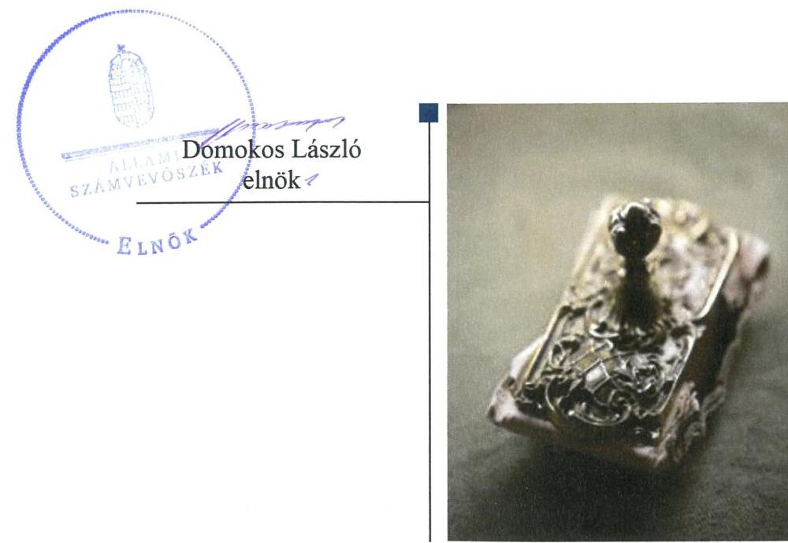
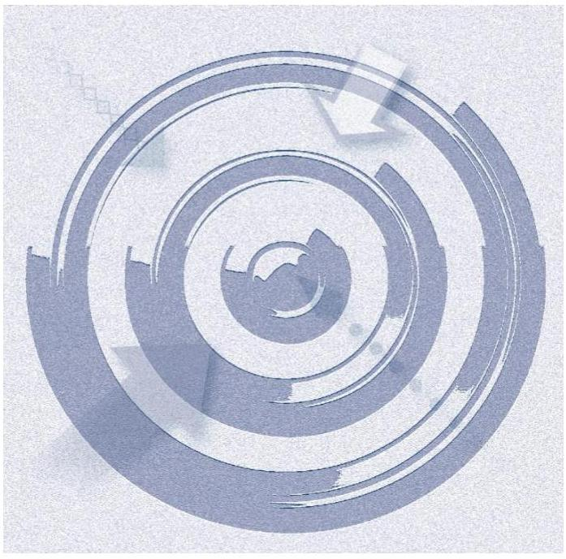
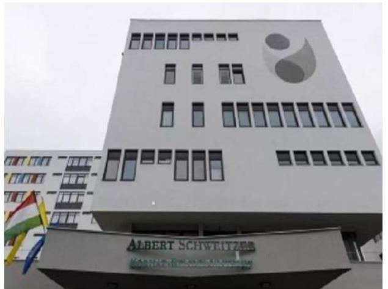
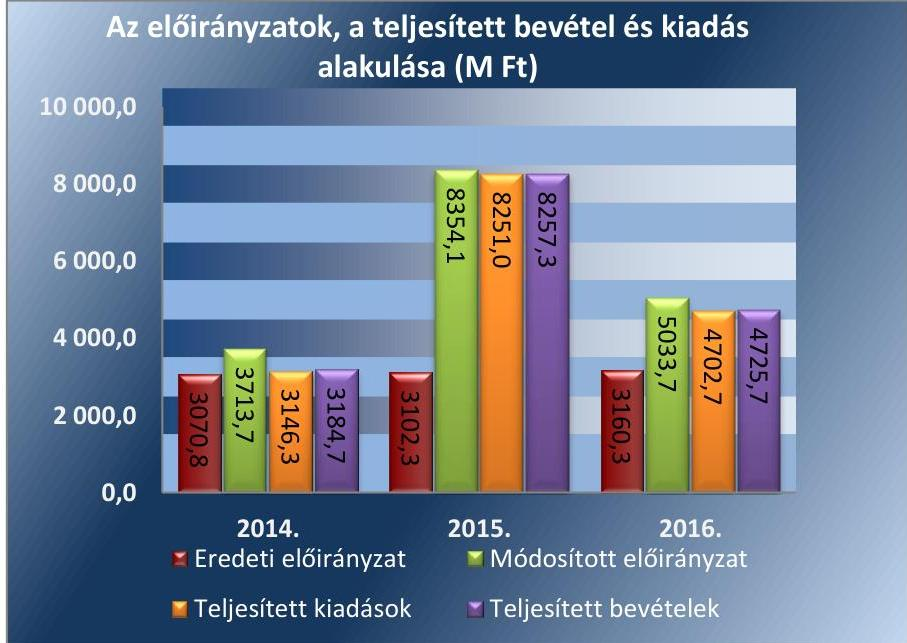
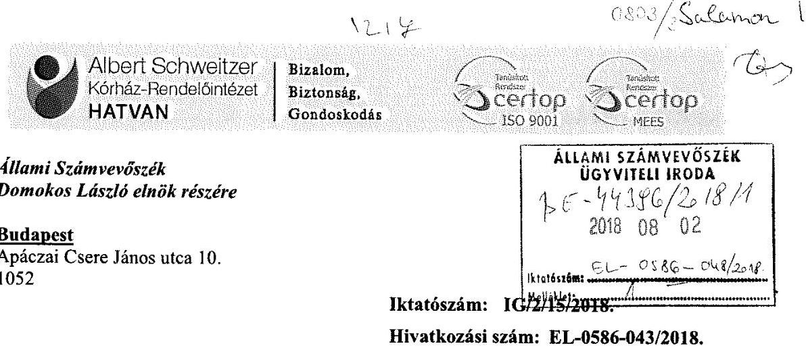
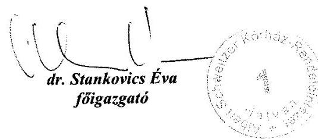
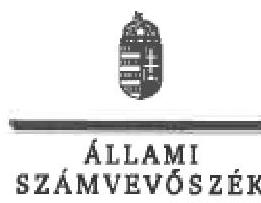
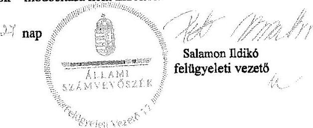

ÁLLAMI
SZÁMVEVŐSZÉK

# Jelentés 

## A központi alrendszer intézményei

A központi alrendszer egyes intézményei pénzügyi és vagyongazdálkodásának ellenőrzése - Albert Schweitzer KórházRendelőintézet
2018.

---

# Jelen 

## Jelentés

## A központi alrendszer intézményei

A központi alrendszer egyes intézményei pénzügyi és vagyongazdálkodásának ellenőrzése - Albert Schweitzer KórházRendelőintézet
2018. nepotumlir hó 13. nap

---

# AZ ELLENŐRZÉST FELÜGYELTE:

- **SALAMON ILDIKÓ** felügyeleti vezető

- **AZ ELLENŐRZÉST VEZETTE ÉS A VÉGREHAJTÁSÁÉRT FELELŐS:**

- **NEMESVÁRI-HORTHY ESZTER** ellenőrzésvezető

- **A PROGRAM ÖSSZEÁLLÍTÁSÁÉRT FELELŐS:**

- **TÓTPÁL SZABOLCS** osztályvezető

**IKTATÓSZÁM:** EL-0303-017/2018.

**TÉMASZÁM:** 2450

**ELLENŐRZÉS-AZONOSÍTÓ SZÁM:** V 079107

Jelentéseink az Országgyűlés számítógépes hálózatán és az Interneta a www.asz.hu címen is olvashatóak.

---

# TARTALOMJEGYZÉK 

■ ÖSSZEGZÉS ..... 5
■ AZ ELLENŐRZÉS CÉLJA ..... 6
■ AZ ELLENŐRZÉS TERÜLETE ..... 7
■ AZ ELLENŐRZÉS HÁTTERE, INDOKOLTSÁGA ..... 9
■ A JELENTÉS LÉNYEGES KÉRDÉSKÖREI ..... 10
■ AZ ELLENŐRZÉS HATÓKÖRE ÉS MÓDSZEREI ..... 11
■ MEGÁLLAPÍTÁSOK ..... 13
■ JAVASLATOK ..... 18
■ KÖVETKEZTETÉSEK ..... 21
■ MELLÉKLETEK ..... 23
I. sz. melléklet: Értelmező szótár ..... 23
■ FÜGGELÉK: ÉSZREVÉTELEK ..... 27
■ RÖVIDÍTÉSEK JEGYZÉKE ..... 43

---

.

---

# ÖSSZEGZÉS 

Az Albert Schweitzer Kórház-Rendelőintézet belső kontrollrendszerének kialakítása és müködtetése nem volt szabályszerű, ezáltal nem volt biztosított az átlátható és elszámoltatható közpénzfelhasználás. A pénzügyi és vagyongazdálkodás nem volt szabályszerű. Az integritás kontrollrendszert nem a kockázatokkal arányosan építették ki, nem érvényesült az integritás szemlélet.

## Az ellenőrzés társadalmi indokoltsága

A közpénzek felhasználásában és az állami vagyonnal való gazdálkodásban a központi alrendszer egyes intézményei meghatározó súlyt képviselnek. Ez indokolja, hogy az Állami Számvevőszék ellenőrzéseket folytasson a pénzügyi és vagyongazdálkodás területén. Az Állami Számvevőszék az ellenőrzései során értékeli a belső kontrollrendszer jogszabályi előírások szerinti kialakítását és működtetése szabályszerűségét, feltárja a gazdálkodás esetleges hiányosságait, rámutathat a vagyongazdálkodási tevékenység - ezen belül a tulajdonosi joggyakorlás és vagyonkezelés - esetleges szabálytalanságaira. Az ellenőrzésünkkel hozzá kívánunk járulni a központi intézmények pénzügyi helyzetének pontosabb megítéléséhez, a jó gyakorlat kialakításán és terjesztésén keresztül az ellenőrzéseink elősegíthetik a gazdálkodás szabályszerűségének javítását.

Az egészségügyi ellátások költsége folyamatosan a társadalmi érdeklődés középpontjában áll. A központi költségvetésből az egyik legjelentősebb kiadást az egészségügyi ellátásokra fordított kiadások jelentik, amelyekből a kórházak kapják a legtöbb támogatást. Ezért indokolt, hogy az Állami Számvevőszék az egészségügyi intézmények pénzügyi és vagyongazdálkodását rendszeresen több évre kiterjedően ellenőrizze.

Az Albert Schweitzer Kórház-Rendelőintézet közfeladatot lát el és jelentős állami vagyont kezel.

## Főbb megállapítások, következtetések, javaslatok

Az Albert Schweitzer Kórház-Rendelőintézet felett az irányító szervi jogosultságokat az Emberi Erőforrások Minisztériuma és átruházott hatáskörben a Gyógyszerészeti és Egészségügyi Minőség- és Szervezetfejlesztési Intézet és az Állami Egészségügyi Ellátó Központ szabályszerűen gyakorolta.

Az Albert Schweitzer Kórház-Rendelőintézetnél a belső kontrollrendszer részeként nem alakítottak ki olyan kontrollkörnyezetet, amelyben a szervezet minden szintjén meghatározottak, ismertek és elfogadottak az etikai elvárások. A kontrollkörnyezet 2014-ben nem, 2015-2016. években szabályszerű volt. A kockázatkezelési rendszert nem működtették, nem gondoskodtak a szervezeti célokkal összefüggő kockázatok felméréséről, az integrált kockázatkezelési rendszer kialakítása érdekében nem intézkedtek. A kontrolltevékenységek gyakorlása nem volt szabályszerű. Az információs és kommunikációs folyamatok kialakítása nem volt szabályszerű. Nem gondoskodtak a müködéssel, gazdálkodással összefüggő dokumentumok közzétételéről, ezáltal nem biztosították a szervezeti átláthatóságot. Az eseti és folyamatos nyomon követési rendszert és az operatív tevékenységektől független belső ellenőrzést szabályszerűen kialakították és működtették.

A kiadási előirányzatok felhasználása során a pénzgazdálkodási jogkörök gyakorlása nem felelt meg a jogszabályi előírásoknak. A vagyongazdálkodás körében a vagyonkezelői jog ingatlan nyilvántartásba történő bejegyeztetésének elmaradása, a 2014. és 2016. években a könyvvezetési kötelezettség teljesítése, a 2015. évben a bevételek beszedése nem volt szabályszerű. A 2014-2016. években a beszámoló mérlegtételeit a jogszabályi előírások ellenére nem támasztották alá leltárakkal.

Az integritás kontrollrendszert nem a kockázatokkal arányosan építették ki és működtették.
Az Állami Számvevőszék az Emberi erőforrások miniszterének egy, az Albert Schweitzer Kórház-Rendelőintézet főigazgatójának tizenhat javaslatot tett.

---

# AZ ELLENŐRZÉS CÉLJA 

AZ ELLENŐRZÉS CÉLJA annak megítélése volt, hogy az Albert Schweitzer Kórház-Rendelőintézetre vonatkozó irányító szervi feladatellátás a jogszabályi előírások betartásával történt-e; az Albert Schweitzer Kór-ház-Rendelőintézetnél a belső kontrollrendszer kialakítása és működtetése szabályszerű volt-e; pénzügyi és vagyongazdálkodása megfelelt-e a jogszabályi előírásoknak és belső szabályzatainak; átalakításának vagy átszervezésének lebonyolítása szabályszerűen történt-e.

Az ellenőrzés keretében sor került az Albert Schweitzer Kórház-Rendelőintézet korrupciós kockázatainak kezelését szolgáló integritás kontrollok kiépítettségének és az integritás szemlélet érvényesülésének értékelésére is.

---

# **AZ ELLENŐRZÉS TERÜLETE**

## **Albert Schweitzer Kórház-Rendelőintézet**

A hatvani székhelyű Kórház¹ jogi személy, előirányzatai felett teljes jogkörrel rendelkező költségvetési szerv. Áht.² szerinti átalakítására az ellenőrzött időszakban nem került sor. Közfeladata a működését meghatározó Eütv.³ alapján az ellátási területére kiterjedően a járó- és fekvőbetegek diagnosztikus és terápiás szakorvosi ellátása, rehabilitációja és követéses gondozása. A Kórház ágyszáma a 2014. évben 295 darab, a 2015. évben 301 darab, a 2016. évben 310 darab volt.

Az emberi erőforrások minisztere az irányító szervi hatásköröket az Albert Schweitzer Kórház-Rendelőintézet fölött az Emberi Erőforrások Minisztériuma útján gyakorolja. Az egyes fenntartói, valamint az irányítási, középirányítói jogokat az Állami Egészségügyi Ellátó Központ (2015. február 28-ig a Gyógyszerészeti és Egészségügyi Minőség- és Szervezetfejlesztési Intézet) gyakorolja.

Mérleg szerinti vagyona a 2014. évi 479,5 M Ft-ról pályázati, állami támogatásokból, alapítványi beszerzésekből megvalósult beruházásokból 2016-ra több, mint tízszeresére, 5010,8 M Ft-ra növekedett. A 2014-2016. évi éves költségvetési beszámolók adatai alapján a teljesített összes bevétele a 2014. évi 3184,7 M Ft-ról 2016-ra 4725,7 M Ft-ra, 48,4%-kal, a teljesített összes kiadás a 2014. évi 3146,3 M Ft-ról a 2016. évre 4702,7 M Ft-ra, 49,5%-kal emelkedett. A költségvetés eredeti és módosított előirányzat főösszegét, a teljesített összes bevétel és kiadás alakulását az 1. ábra mutatja be.

1. ábra

*Forrás: Az Intézmény 2014-2016. évi éves költségvetési beszámolói*

---

Az ellenőrzött időszakban a főigazgató ${ }^{4}$ és a gazdasági igazgató ${ }^{5}$ személyében nem történt változás. A főigazgató munkáját stratégiai igazgató, gazdasági igazgató, orvos igazgató és ápolási igazgató segítette. A munkavállalók átlagos statisztikai állományi létszáma a 2014. évi 561 fơről 2016-ra 527 főre, 6,5\%-kal csökkent.

A Kórház rendelkezett gazdasági szervezettel. A gazdálkodással összefüggő feladatokat a gazdasági igazgató irányításával 2016. május 31-ig a pénzügyi és számviteli, az informatikai, az anyaggazdálkodási, a műszaki és logisztikai, valamint az élelmezési iroda, majd 2016. június 1-jétől az üzemeltetési, a pénzügyi és beszerzési, az informatikai iroda, és a finanszírozási és kontrolling csoport látta el.

---

# AZ ELLENŐRZÉS HÁTTERE, INDOKOLTSÁGA 

Az államháztartás központi alrendszerének közpénz felhasználása, az intézmények által ellátott közfeladatok sokrétúsége, valamint a feladatellátásához rendelt vagyon nagyságrendje indokolja, hogy az ÁSZ ${ }^{6}$ ellenőrzéseket folytasson a pénzügyi és vagyongazdálkodás területén. Az ÁSZ az ellenőrzései során feltárja a gazdálkodást, a központi alrendszer intézményei átalakulását, átszervezését érintő szabályozások esetleges hiányosságait, a szabályozással nem érintett gazdálkodási területeket, rámutathat a vagyongazdálkodási tevékenység - ezen belül a tulajdonosi joggyakorlás és vagyonkezelés - esetleges szabálytalanságaira, értékeli az állami vagyon nyilvántartására és elszámolására vonatkozó eljárásokat.

Az ellenőrzés várhatóan hozzájárul a központi intézmények pénzügyi helyzetének pontosabb megítéléséhez, és a jó gyakorlat kialakításán és terjesztésén keresztül az ellenőrzések elősegíthetik a gazdálkodás szabályszerűségének javítását.

---

# A JELENTÉS LÉNYEGES KÉRDÉSKÖREI 

1.     - Szabályszerú volt-e az irányító szervi feladatellátás?
2.     - A belső kontrollrendszer kialakítása és müködtetése szabályszerű volt-e?
3.     - A pénzügyi és vagyongazdálkodás szabályszerű volt-e?
4.     - Kiépítették-e az integritás kontrollrendszert?

---

# AZ ELLENŐRZÉS HATÓKÖRE ÉS MÓDSZEREI 

## Az ellenőrzés típusa

Megfelelőségi ellenőrzés.

## Az ellenőrzött időszak

2014. január 1-2016. december 31.

## Az ellenőrzés tárgya

Az Albert Schweitzer Kórház-Rendelőintézetre vonatkozó irányító szervi feladatok ellátása. Az Albert Schweitzer Kórház-Rendelőintézet belső kontrollrendszerének kialakítása és múködtetése, pénzügyi és vagyongazdálkodása, az integritáskontrollok kiépítettsége, az integritás szemlélet érvényesülése.

Az ellenőrzés kiterjedt minden olyan körülményre és adatra, amely az ÁSZ jogszabályban meghatározott feladatainak teljesítéséhez, valamint a program végrehajtása folyamán felmerült újabb összefüggések feltárásához szükséges.

## Az ellenőrzött szervezet

Albert Schweitzer Kórház-Rendelőintézet, valamint az irányító szervi feladatellátás tekintetében az Emberi Erőforrások Minisztériuma és az Állami Egészségügyi Ellátó Központ (2015. február 28-ig Gyógyszerészeti és Egészségügyi Minőség- és Szervezetfejlesztési Intézet).

## Az ellenőrzés jogalapja

Az ellenőrzés jogszabályi alapját az ÁSZ tv. ${ }^{7}$ 1. § (3) bekezdés, 5. § (2)-(4) és (6) bekezdései, valamint az Áht. 61. § (2) bekezdésének előírásai képezték.

## Az ellenőrzés módszerei

Az ellenőrzésre a szakmai program szempontjai, az ellenőrzött időszakban hatályos jogszabályok, az ellenőrzés szakmai szabályai, a jelen ellenőrzésre irányadó ÁSZ módszertanok figyelembevételével került sor.

---

Az ellenőrzés ideje alatt a Kórházzal, az Irányító szervvel ${ }^{8}$ és a Középirányító szervvel ${ }^{9}$ a kapcsolattartást az ÁSZ SZMSZ ${ }^{10}$-ének vonatkozó előírásai alapján biztosította az ÁSZ.

Az ellenőrzési kérdések megválaszolásához szükséges bizonyítékok megszerzése a Kórház, az Irányító szerv és a Középirányító szerv által rendelkezésre bocsátott dokumentumokra, adatokra alapozva megfigyelés, szemle (szemrevételezés), kérdésfeltevés (információkérés), mintavételezés, valamint elemző eljárás útján történt. Az ellenőrzési bizonyítékként felhasználható adatforrások közé tartoztak egyrészt a szakmai program részletes szempontjainál felsorolt adatforrások, másrészt minden egyéb az ellenőrzés folyamán feltárt, az ellenőrzés szempontjából információt tartalmazó - dokumentum.

Az ellenőrzés lefolytatásához a Kórház a tanúsítványok kitöltésével, valamint az ÁSZ által kért dokumentumok megküldésével, az Irányító szerv és a Középirányító szerv az ÁSZ által kért dokumentumok megküldésével szolgáltatott adatokat.

A Kórház belső kontrollrendszere jogszabályi előírások szerinti kialakítása és működtetése szabályszerűségének értékelése az erre irányuló kérdésekre adott válaszok összesítése alapján, évente pillérenként (kontrollkörnyezet, kockázatkezelési rendszer, kontrolltevékenységek, információs és kommunikációs rendszer, monitoring rendszer) és összesítetten történt. A belső kontrollrendszer egyes pilléreinek kialakítása „szabályszerü", amennyiben az értékelt területen az elért és az elérhető pontok \%-ban kifejezett, egész számra kerekített hányadosa meghaladta a $85 \%$-ot, „nem szabályszerü", ha nem érte el a $85 \%$-ot. A kontrollrendszer egésze esetében a „szabályszerü" értékelésnek a \%-os értéken felül további feltétele volt, hogy egyik kontrollterület sem kaphatott „nem szabályszerű" értékelést. Az összesített értékelés a \%-os értéktől függetlenül „nem szabályszerű" volt, ha az ellenőrzött kontrollterületek közül több mint egynek „nem szabályszerű" volt az értékelése.

A Kórháznál a 2015. évi bevételek (tárgyi eszközök bérbeadásából és értékesítéséből) beszedésének szabályszerűsége, valamint a 2014-2016. évi kiadási előirányzatok (külső személyi juttatások, dologi kiadások, felhalmozási kiadások) felhasználása szabályszerűsége mintavételes ellenőrzéssel történt. A 2015. évi bevételek beszedése, valamint a 2014-2016. évi kiadási előirányzatok felhasználása „szabályszerű", ha a minta ellenőrzésének eredménye alapján 95\%-os bizonyossággal a teljes sokaságban a hibás tételek aránya kisebb volt, mint 10\%, „nem szabályszerű", ha a hibás tételek aránya a 10\%-ot meghaladta. Abban az esetben, ha a teljes sokaság tekintetében a 10\%-os hibaarányhoz való viszony megítélésének megbízhatósága nem érte el a 95\%-ot, annak elérése érdekében az értékelés további szempontokkal egészült ki, a feltárt hibák értéke is figyelembe vételre került.

---

# 1. Szabályszerú volt-e az irányító szervi feladatellátás? 

## Összegző megállapítás

A Kórházra vonatkozó irányító szervi feladatellátás szabályszerű volt.

Az Irányító szerv az Ávr. ${ }^{11}$ előírásainak megfelelően 2014-ben az alaptevékenységek kormányzati funkciók szerinti besorolása érdekében módosította a Kórház alapító okiratát ${ }^{12}$. A Középirányító szerv - átruházott hatáskörben - jóváhagyta a Kórház SZMSZ ${ }_{2-4}{ }^{13}$-et.

Az Irányító szerv az Ávr. előírásának megfelelően a tervezett bevételek és kiadások megállapításához meghatározta a tervezési követelményeket, az Áht. és az Áhsz. ${ }^{14}$ előírásainak megfelelően jóváhagyta a Kórház elemi költségvetéseit és éves költségvetési beszámolóit. Az Ávr. előírásainak eleget téve az Irányító szerv gondoskodott a Kórház költségvetési maradványának megállapításáról.

## 2. A belső kontrollrendszer kialakítása és múködtetése szabályszerű volt-e?

## Összegző megállapítás

2.1. számú megállapítás

1. táblázat

KONTROLLKÖRNYEZET ÉRTÉKELÉSE 2014-2016.

| Év | Értékelés |
| :--: | :--: |
| 2014. | Nem szabályszerű |
| 2015. | Szabályszerű |
| 2016. | Szabályszerű |

A Kórház belső kontrollrendszerének kialakítása és múködtetése nem volt szabályszerű.

A kontrollkörnyezet kialakítása a 2014. évben nem volt szabályszerű, a 2015-2016. évben szabályszerű volt.

A főigazgató a Bkr. ${ }^{15}$ 6. § (1) bekezdés c) pontja ellenére nem gondoskodott olyan kontrollkörnyezet kialakításáról, amelyben meghatározottak, ismertek és elfogadottak az etikai elvárások a szervezet minden szintjén.

Az SZMSZ ${ }_{1}{ }^{16}$ 2015. október 11-ig - az Ávr. 13. § (1) bekezdés c) pontja ellenére - nem tartalmazta a tevékenységre vonatkozó kormányzati funkciók besorolását. Az SZMSZ ${ }_{1}$ a Vnytv. ${ }^{17}$ 4. § a.) pontja ellenére nem tartalmazta a vagyonnyilatkozat tételi kötelezettséggel járó munkaköröket. Az SZMSZ ${ }_{2-4}$ tartalma az Ávr. előírásainak megfelelt és a Vnytv. előírásainak megfelelően rögzítette a vagyonnyilatkozat tételi kötelezettséggel járó munkaköröket.

A Kórház 2014-2016. június 30. napjáig - az Áht.10. § (5) bekezdése, az Ávr. 13. § (5) bekezdése és 10/A. §-a (2015. február 18-tól) ellenére - nem rendelkezett a gazdasági szervezetre vonatkozó ügyrenddel. A Kórház a gazdasági szervezetére vonatkozó részletes szabályait az Ávr. előírásaival összhangban a 2016. július 1-jétől hatályba lépett Gazdasági Ügyrendben ${ }^{18}$ foglalta össze.

---

A Kórház az Ávr. 13. § (2) bekezdés e) pontja ellenére a 2014-2016. augusztus 31-ig terjedő időszakra reprezentációs kiadások felosztására és elszámolására vonatkozó szabályzattal nem rendelkezett. Az Ávr. előírásainak eleget téve a szabályzatot 2016. szeptember 1-jétől léptette hatályba. A Kórház az Ávr. előírásainak eleget téve rendelkezett a gazdálkodás rendjét meghatározó Kötelezettségvállalási Szabályzat ${ }_{1-8}{ }^{19}$-cal. A Kórház az Ávr. előírásainak megfelelően belső szabályzatban rendezte a belföldi és külföldi kiküldetések elszámolásával kapcsolatos kérdéseket, az anyag és eszközgazdálkodás számviteli politikában nem szabályozott kérdéseit, a gépjárművek igénybevételének és használatának rendjét, a vezetékes és mobiltelefonok használatát.

A Kórház a Számv. tv. ${ }^{20}$ előírásainak eleget téve rendelkezett Számviteli Politika ${ }_{1-3}{ }^{21}$-al, Leltározási Szabályzat ${ }_{1-2}{ }^{22}$-vel, és Pénzkezelési Szabályzat ${ }_{1-}$ ${ }^{23}$-cel. A Kórház az Áhsz. 50. § (3) bekezdése ellenére 2015. április 28-ig önköltségszámítási szabályzattal nem rendelkezett, majd az Áhsz. előírásainak eleget téve 2015. április 29-től rendelkezett az Önköltségszámítási Szabályzat ${ }_{1-2}{ }^{24}$-vel. A Kórház a Számv. tv. 14. § (5) bekezdés b) pontja ellenére 2014. április 29-ig nem, csak 2014. április 30-tól tett eleget a Számv. tv. előírásainak és készítette el az Értékelési Szabályzat ${ }_{1,2}{ }^{25}$-t.

A Számviteli Politka ${ }_{1-3}$ tartalmazta a megbízható, valós képet befolyásoló hiba meghatározását annak ellenére, hogy a fogalom a Számv. tv. 2013. január 1-től hatályos módosítását követően hatálytalan. A Számviteli Politika ${ }_{3}$ a Számv. tv. 2015. július 4-től hatályos 14. § (4) bekezdése ellenére nem rögzítette a kivételes előfordulású, nagyságú bevételek, költségek, ráfordítások meghatározását. A törvénymódosításokat a Számv. tv. 14. § (11) bekezdésében előírt 90 napon belül és azon túl sem vezették át.

A Számlarend ${ }^{26}$ - az Áhsz. 51. § (3) bekezdésben foglaltak ellenére nem tartalmazta a főkönyvi számla és az analitikus nyilvántartások egyeztetésének módjára, annak dokumentálására és a pénzügyi könyvvezetéshez készült összesítő bizonylatok elkészítésének rendjére vonatkozó előírásokat. A Kórház a Számv. tv. előírásainak megfelelően rendelkezett a számviteli rendet alátámasztó Bizonylati Rend ${ }_{1-3}{ }^{27}$-al.

# 2.2. számú megállapítás 

2. táblázat

KOCKÁZATKEZELÉSI RENDSZER ÉRTÉKELÉSE 2014-2016.

| Év | Értékelés |
| :-- | :-- |
| 2014. | Nem szabályszerű |
| 2015. | Nem szabályszerű |
| 2016. | Nem szabályszerű |

A kockázatkezelési rendszer kialakítása és múködtetése nem volt szabályszerű.

A Belső Kontrollrendszer Szabályzat ${ }_{1-4}{ }^{28}$ a Bkr.-nek megfelelően tartalmazta a kockázatkezelési rendszerre vonatkozó előírásokat, azonban a Bkr. 6. § (4) bekezdése ellenére 2016. október 1-jétől nem szabályozták a szervezeti integritást sértő események kezelésének eljárásrendjét, valamint az integrált kockázatkezelés eljárásrendjét.

A főigazgató 2014-2016. években a Bkr. 7. § (2) bekezdése ellenére nem gondoskodott a Kórház tevékenységében rejlő és a szervezeti célokkal öszszefüggő kockázatok felméréséről. A Bkr. 2016. október 1-jétől hatályos 7. § (1) bekezdését figyelmen kívül hagyva a főigazgató nem gondoskodott az integrált kockázatkezelési rendszer működtetéséről. A Bkr. 2016. október 1-jétől hatályos 7. § (4) bekezdése előírása ellenére az integrált kockázatkezelési rendszer koordinálására szervezeti felelőst nem jelölt ki.

---

### 2.3. számú megállapítás

3. táblázat

KONTROLLTEVÉKENYSÉGEK ÉRTÉKELÉSE 2014-2016.

|  Év | Értékelés  |
| --- | --- |
|  2014. | Nem szabályszerű  |
|  2015. | Nem szabályszerű  |
|  2016. | Nem szabályszerű  |

2.4. számú megállapítás
4. táblázat

## INFORMÁCIÓS ÉS KOMMUNIKÁCIÓS FOLYAMATOK ÉRTÉKELÉSE 2014-2016.

|  Év | Értékelés  |
| --- | --- |
|  2014. | Nem szabályszerű  |
|  2015. | Nem szabályszerű  |
|  2016. | Nem szabályszerű  |

A kontrolltevékenység gyakorlása és múködtetése nem volt szabályszerű.

A Kórház kötelezettségvállalásainak nyilvántartása nem felelt meg az Áhsz. 14. melléklet II. 4. a) és c)-g) pontokban meghatározott követelményeknek.

A Kórház a gazdálkodási jogkörök gyakorlására jogosult személyek aláírás-mintáit tartalmazó nyilvántartást az Ávr.-nek megfelelően, naprakészen vezette. Teljesítés igazolására jogosult személyeket a 2014-2015. években az Ávr. 57. § (4) bekezdése ellenére nem a kötelezettségvállaló jelölte ki, hanem a gazdasági igazgató, akinek kötelezettségvállalásra nem volt felhatalmazása. Érvényesítésre jogosult személyt 2015. augusztus 31-ig - az Ávr. 58. § (4) bekezdése és az 55. § (2) bekezdés a) pontjában előírtak ellenére - nem a gazdasági igazgató, hanem pénzügyi és számviteli irodavezető jelölt ki. A pénzgazdálkodási jogkörök gyakorlása során nem tartották be a jogszabályi előírásokat. A hiányosságokat a 3.1. pont tartalmazza.

## Az információs és kommunikációs folyamatok kialakítása és múködtetése nem volt szabályszerű.

A Kórház a kötelezően közzéteendő adatok nyilvánosságra hozatalának rendjét az Ávr. 13. § (2) bekezdés h) pontjában és a 305/2005. (XII.25.) Korm. rendelet ${ }^{29}$ 3. § (1) bekezdésében foglaltak ellenére nem szabályozta. Az Info. tv. ${ }^{30}$ 30. § (6) bekezdése és az Ávr. 13. § (2) bekezdés h) pontja ellenére nem határozta meg a közérdekú adatok megismerésére irányuló igények teljesítésének rendjére vonatkozó szabályokat.

A Kórház - az Info tv. 37. § (1) bekezdése és 1. melléklet II/1. és III/1. pontja ellenére - a szervezeti és múködési szabályzat, az adatvédelmi és adatbiztonsági szabályzat, az éves költségvetések és beszámolók közzétételét nem teljesítette.

A Kórház a vagyonkezelési szerződés ${ }^{31}$ 3.4. pontjában foglalt, a Középirányító szerv, mint tulajdonosi joggyakorló felé a vagyonkezelt vagyon értékcsökkenéséről, az értékét növelő felújításokról, beruházásokról adatszolgáltatási kötelezettségét 2014. évre vonatkozóan nem, a 2015. és a 2016. évben teljesítette. A Kórház az Aszód Város Önkormányzatával kötött vagyonkezelési szerződés ${ }^{32}$ és a vagyonhasználati szerződés ${ }^{33}$ 3.4. pontja ellenére a tulajdonos felé a vagyonkezelt vagyonról 2016. évre, a használatra kapott vagyonról 2014. évre az értékcsökkenésről, értékét növelő felújításokról, beruházásokról adatszolgáltatási kötelezettségét nem teljesítette.

## A Kórház tevékenységének, a célok megvalósításának folyamatos és eseti nyomon követését biztosító rendszert kialakították és múködtették, a belső ellenőrzés tevékenysége szabályszerű volt.

A főigazgató a Bkr. előírásainak megfelelően elkészítette az ellenőrzési nyomvonalakat és gondoskodott azok rendszeres aktualizálásáról. A főigazgató a Bkr. előírásainak megfelelően meghatározta a források gazdaságos, hatékony és eredményes felhasználásához a követelményeket, gondoskodott azok nyomon követéséről.

---

5. táblázat

| MONITORING RENDSZER ÉRTÉKELÉSE 2014-2016. |  |
| :--: | :--: |
| Ev | Értékelés |
| 2014. | Szabályszerú |
| 2015. | Szabályszerú |
| 2016. | Szabályszerú |

A föigazgató az Áht. előírásainak megfelelően gondoskodott a belső ellenőrzés kialakításáról, amelynek a Bkr.-ben foglaltaknak megfelelően biztosított volt a szervezeti és funkcionális függetlensége. A Kórház a Bkr.-ben foglaltaknak megfelelően rendelkezett a főigazgató által jóváhagyott éves belső ellenőrzési tervvel, illetve módosított belső ellenőrzési tervvel. A belső ellenőrzési terveket végrehajtották, az elvégzett ellenőrzésekről a Bkr.-ben foglaltaknak megfelelően elkészítették a jelentéseket. A főigazgató 2014. évben nyilatkozatát nem a Bkr. 1. számú melléklet szerinti tartalommal, 2015-2016. években a Bkr. szerinti nyilatkozatban értékelte.

# 3. A pénzügyi és vagyongazdálkodás szabályszerű volt-e? 

## Összegző megállapítás

### 3.1. számú megállapítás

### 3.2. számú megállapítás

## A pénzügyi és a vagyongazdálkodás nem felelt meg a jogszabályi előírásoknak.

A kiadási előirányzatok felhasználása során nem tartották be a jogszabályi előírásokat, a pénzgazdálkodási jogkörök gyakorlása nem felelt meg a jogszabályi előírásoknak. Az előirányzat-maradvány megállapítása nem volt szabályszerű.

A kötelezettségvállalások esetében az Ávr. 56. § (1) és (3) bekezdése ellenére nem gondoskodtak arról, hogy az adott kötelezettségvállalásokat az azokhoz tartozó szabad előirányzatok terhére nyilvántartásba vegyék. A kötelezettségvállalások dokumentumain - az Ávr. 55. § (1) bekezdésével ellentétben - nem szerepelt a pénzügyi ellenjegyzés dátuma, így nem volt megállapítható a pénzügyi ellenjegyzés és a kötelezettségvállalás időbeli sorrendje, amely sérti az Áht. 37. § (1) bekezdésének előírását, mely szerint kötelezettséget vállalni csak pénzügyi ellenjegyzés után lehet.

A teljesítésigazolást az Ávr. 57. § (4) bekezdése ellenére nem az arra jogosult személy végezte. Az érvényesítést az Ávr. 58. § (4) bekezdése ellenére nem az arra jogosult személy végezte. Az érvényesítő az Ávr. 58. § (1) bekezdése ellenére nem ellenőrizte, hogy a megelőző ügymenetben a jogszabályi és a belső szabályzatban foglaltakat megtartották-e. Az utalványozást az Ávr. 59. § (1) bekezdése ellenére nem az arra jogosult végezte.

A Kórház az éves költségvetési beszámoló részeként elkészített maradvány kimutatását az Áhsz. 39. § (2) és (3) bekezdése ellenére az Áhsz. 14. melléklet II/4-ben foglalt tartalmú részletező nyilvántartással nem támasztotta alá. A kötelezettségvállalással terhelt költségvetési maradványának meghatározása nem felelt meg az Ávr. 150. § (1) bekezdés b) pontjában foglaltaknak.

## A vagyon értékének megőrzését, gyarapítását támogató vagyongazdálkodás feltételeinek kialakítása nem volt szabályszerű. A beszámoló mérlegtételeit 2014-2016. években nem támasztották alá leltárakkal, a 2015. évben a bevételek beszedése és elszámolása során nem tartották be a jogszabályi előírásokat.

A vagyonkezelési szerződés: 1. számú mellékletében felsorolt ingatlanok tekintetében a Kórház, mint vagyonkezelő a Vtvr. ${ }^{34}$ 7. § (2) bekezdésében és a vagyonkezelési szerződés: 1.2. pontjában foglalt előírások ellenére

---

harminc napon belül és azt követően sem gondoskodott a vagyonkezelői jogának ingatlan nyilvántartásba történő bejegyeztetéséről.

A 2014-2016. években a mérleg tételeinek alátámasztásához - a Számv. tv. 69. § (1) bekezdésében foglaltak ellenére - nem állítottak össze leltárat, amely tételesen, ellenőrizhető módon tartalmazza a mérleg fordulónapján meglévő eszközöket és forrásokat mennyiségben és értékben.

A Kórház a 2014. és a 2016. években az Áhsz. 39. § (2) bekezdésében foglalt könyvvezetési kötelezettségét maradéktalanul nem teljesítette, mert a tárgyi eszközök bérbeadásából származó bevételeit a 09. számlacsoportban vezetett nyilvántartási számlán (094023 Szolgáltatások ellenértéke teljesítése) nem mutatta ki. A Kórház vagyonelemeinek bérbeadása 2015-ben nem felelt meg a Számv. tv. 14. § (7) és az Áhsz. 50. § (1) bekezdésében, valamint az Önköltségszámítási szabályzat ${ }_{1,2}$ 5.4. pontjában foglaltaknak, mivel a Kórház a helyiségek bérbeadása során a kiszámlázott bérleti díjakat utókalkulációval nem támasztotta alá.

# 4. Kiépítették-e az integritás kontrollrendszert? 

## Összegző megállapítás

A Kórház nem a kockázatokkal arányosan építette ki az integritás kontrollrendszert.

A Kórháznál az integritás szemlélet nem érvényesült. A jogszabályok által előírt kontrollok kiépítettsége támogatta a szervezeti integritást, azonban a korrupciós veszélyek elhárítására az integritást erősítő, nem kötelezően előírt kontrollokat csekély mértékben működtették. Rendszerszerű kockázatelemzést nem alkalmaztak, a kockázatokat nem azonosították, nem értékelték, nem tartották nyilván, illetve nem elemezték, nem kezelték.

---

# JAVASLATOK 

Az ÁSZ tv. 33. § (1) bekezdésében foglaltak értelmében az ellenőrzött szervezet vezetője köteles a jelentésben foglalt megállapításokhoz kapcsolódó intézkedési tervet összeállítani és azt a jelentés kézhezvételétől számított 30 napon belül az ÁSZ részére megküldeni. Amennyiben az ellenőrzött szervezet vezetője nem küldi meg határidőben az intézkedési tervet, vagy továbbra sem elfogadható intézkedési tervet küld, az Állami Számvevőszék elnöke az ÁSZ tv. 33. § (3) bekezdése a) és b) pontjaiban foglaltakat érvényesítheti.

## az Emberi erőforrások miniszterének

1. Tegyen intézkedéseket a feltárt hiányosságok és szabálytalanságok tekintetében a felelősség tisztázása érdekében és szükség szerint intézkedjen a felelősség érvényesítéséről.
(2.1. számú megállapítás 1. bekezdése, 6. bekezdése, 7. bekezdés 1. mondata, 2.2. számú megállapítás 1. bekezdése, 2. bekezdés 3. mondata, 2.3. számú megállapítás 1. bekezdése, 2.4. számú megállapítás 1-2. bekezdése, 3.1. számú megállapítás 1-2. bekezdése, 3.2. számú megállapítás 1-2. bekezdése alapján)

## az Albert Schweitzer Kórház-Rendelőintézet föigazgatójának

1. Intézkedjen a jogszabályi előirásoknak megfelelően olyan kontrollkörnyezet kialakítására, amelyben meghatározottak, elfogadottak és ismertek az etikai elvárások a szervezet minden szintjén.
(2.1. számú megállapítás 1. bekezdés alapján)
2. Intézkedjen, hogy a számviteli politikán a törvénymódosításból eredő változásokat a jogszabályi előirásoknak megfelelően vezessék át.
(2.1. számú megállapítás 6. bekezdés alapján)
3. Intézkedjen, hogy a jogszabályi előirásoknak megfelelően a számlarend tartalmazza a fökönyvi számla és az analitikus nyilvántartások egyeztetésének módjára, annak dokumentálására, és a pénzügyi könyvvezetéshez készült összesítő bizonylatok elkészítésének rendjére vonatkozó előírásokat.
(2.1. számú megállapítás 7. bekezdés 1. mondata alapján)

---

4. Intézkedjen a jogszabályi előirásoknak megfelelően
a) a szervezeti integritást sértő események kezelésének eljárásrendje, valamint
b) az integrált kockázatkezelés eljárásrendje szabályozására.
(2.2. számú megállapítás 1. bekezdése alapján)
5. Intézkedjen a jogszabályi előirásoknak megfelelően
a) a Kórház tevékenységében rejlő és a szervezeti célokkal összefüggő kockázatok felmérésére;
b) az integrált kockázatkezelési rendszer müködtetésére.
(2.2. számú megállapítás 2. bekezdés 1-2. mondata alapján)
6. Intézkedjen a jogszabályi előirásoknak megfelelően az integrált kockázatkezelési rendszer koordinálására szervezeti felelős kijelölésére.
(2.2. számú megállapítás 2. bekezdés 3. mondata alapján)
7. Intézkedjen, hogy a kötelezettségvállalások nyilvántartását a jogszabályi előírásnak megfelelő tartalommal vezessék.
(2.3. számú megállapítás 1. bekezdése alapján)
8. Intézkedjen a jogszabályi előirásoknak megfelelően
a) a kötelezően közzéteendő adatok nyilvánosságra hozatali rendjének belső szabályzatban történő rendezésére;
b) a közérdekú adatok megismerésére irányuló igények teljesítésének rendjére vonatkozó szabályok meghatározására.
(2.4. számú megállapítás1. bekezdése alapján)
9. Intézkedjen a jogszabályi előirásoknak megfelelően a szervezeti és müködési szabályzat, az adatvédelmi és adatbiztonsági szabályzat, az éves költségvetések és beszámolók közzétételének teljesitésére.
(2.4. számú megállapítás 2. bekezdése alapján)
10. Intézkedjen az Aszód Város Önkormányzatával - mint tulajdonossal kötött vagyonkezelési és vagyonhasználati szerződésben foglalt adatszolgáltatási kötelezettség teljesitésére.
(2.4. számú megállapítás 3. bekezdés 2. mondata alapján)

---

11. Intézkedjen kötelezettségvállalást követően annak - a jogszabályi előírások szerinti - nyilvántartásba vételére.
(3.1. számú megállapítás 1. bekezdés 1. mondata alapján)
12. Intézkedjen, hogy a gazdálkodási jogkörök gyakorlása során
a) a pénzügyi ellenjegyzés a jogszabályban előirtaknak megfelelően történjen meg;
b) a teljesítésigazolást az arra jogosult személy végezze el;
c) az érvényesítést az arra jogosult személy, a jogszabályi előírások betartásával végezze el;
d) az utalványozást az arra jogosult személy végezze el.
(3.1. számú megállapítás 1. bekezdés 2. mondata, 2. bekezdés alapján)
13. Intézkedjen, hogy
a) az éves költségvetési beszámoló részeként elkészített maradvány kimutatását a jogszabályi előírásoknak megfelelő tartalmú részletező nyilvántartással támasszák alá;
b) a kötelezettségvállalással terhelt költségvetési maradvány meghatározása feleljen meg a jogszabályi előírásoknak.
(3.1. számú megállapítás 3. bekezdése alapján)
14. Kezdeményezze a jogszabályi előírásoknak megfelelően a Kórház vagyonkezelésébe került ingatlanokra vonatkozóan a vagyonkezelői jog bejegyeztetését.
(3.2. számú megállapítás 1. bekezdése alapján)
15. Intézkedjen a jogszabályi előírásoknak megfelelően a mérleg tételeinek alátámasztásához az eszközöket és forrásokat mennyiségben és értékben, tételesen, ellenőrizhető módon tartalmazó leltár összeállítására.
(3.2. számú megállapítás 2. bekezdés alapján)
16. Intézkedjen a tárgyi eszközök bérbeadásából származó bevételek jogszabályi előírásoknak megfelelő kimutatására.
(3.2. számú megállapítás 3. bekezdés 1. mondata alapján)

---

# KÖVETKEZTETÉSEK 

A Kórház belső kontrollrendszere keretében nem alakították ki mindazon elveket, eljárásokat és belső szabályzatokat, illetve nem is működtették azokat, amelyek biztosítják a szervezet valamennyi tevékenysége során a szabályozott és szabályszerű feladatellátást. A Kórház működésével kapcsolatosan nem álltak rendelkezésre megfelelő, pontos és naprakész információk. Mindezek alapján nem volt biztosított a rendelkezésre álló eszközök és források átlátható, szabályszerű, pazarlásmentes, rendeltetésszerű felhasználása, valamint a vagyon megőrzése. A Kórház belső kontrollrendszere kialakításának és működtetésének hiányosságai a kórház feladatellátásra is kihatással vannak.

---

.

---

# MELLÉKLETEK 

- I. SZ. MELLÉKLET: ÉRTELMEZŐ SZÓTÁR
állami vagyon
állami vagyonnak minősül:
a) az állam tulajdonában lévő dolog, valamint a dolog módjára hasznosítható természeti erő,
b) az a) pont hatálya alá nem tartozó mindazon vagyon, amely vonatkozásában törvény az állam kizárólagos tulajdonjogát nevesíti,
c) az állam tulajdonában lévő tagsági jogviszonyt megtestesítő értékpapír, illetve az államot megillető egyéb társasági részesedés,
d) az államot megillető olyan immateriális, vagyoni értékkel rendelkező jogosultság, amelyet jogszabály vagyoni értékű jogként nevesít. (Forrás: Vtv. ${ }^{35}$ 1. § (2) bekezdése)
állami vagyon használója Az a természetes vagy jogi személy, jogi személyiséggel nem rendelkező szervezet, aki, vagy amely törvény vagy szerződés alapján, bármely jogcímen (bérlet, haszonbérlet, használat stb.) állami vagyont birtokol, használ, szedi annak hasznait, hasznosit, ide nem értve a haszonélvezőt, a vagyonkezelőt és a tulajdonosi jogok gyakorlóját. (Forrás: Vtvr. 1. § (7) bekezdés a) pontja)
állami vagyon hasznosítása Az állami vagyont az MNV Zrt. maga kezeli, vagy szerződés - így különösen bérlet, haszonbérlet, megbízás - alapján központi költségvetési szervnek, természetes vagy jogi személynek, vagy jogi személyiséggel nem rendelkező gazdálkodó szervezetnek hasznosításra átengedi.
(Forrás: Vtv. 23. § (1) bekezdése, hatályos 2012. január 1-jétől)
Az állami vagyonnal a tulajdonosi joggyakorló maga gazdálkodik, vagy szerződés így különösen bérlet, haszonbérlet, megbízás - alapján hasznosításra átengedi, illetőleg vagyonkezelésbe, haszonélvezetbe adja. (Forrás: Vtv. 23. § (1) bekezdése, hatályos 2013. június 28 -ától)
Az állami vagyont az MNV Zrt. maga kezeli, vagy szerződés - így különösen bérlet, haszonbérlet, megbízás - alapján központi költségvetési szervnek, természetes vagy jogi személynek, vagy jogi személyiséggel nem rendelkező gazdálkodó szervezetnek hasznosításra átengedi." Az állami vagyonra vonatkozóan az MNV Zrt. kizárólag az Nvtv. ${ }^{36}$-ben meghatározott személyekkel köthet vagyonkezelési szerződést. (Forrás: Vtv. 27. § (1) bekezdése, hatályos 2012. január 1-jétől)
Az ÁSZ 2011-ben indította el a közintézmények integritását vizsgáló és fejlesztő kérdőíves kutatását, melynek hétéves felmérési időszaka 2017. évben zárult le. Az ÁSZ az Integritás felmérés keretében 2017. évben hetedik alkalommal értékelte a közszféra intézményeinek korrupciós kockázatait, illetve a korrupció ellen védelmet biztosító kontrollok kiépítettségét. (Forrás: https://asz.hu/tanulmanyok-2017-ev Elemzés a közszféra integritás helyzetéről 2017. Vezetői összefoglaló 4. oldal)
ÁSZ Integritás Projekt
átalakítás
belső ellenőrzés

A költségvetési szerv általános jogutódlással történő megszüntetése átalakítással történhet. Az átalakítás lehet egyesítés vagy különválás. Az egyesítés lehet beolvadás vagy összeolvadás. (2014. december 31-ig, Áht. 9/A. § (3) és (4) bekezdés, 2015. január 1-jétől Áht. 11. § (2) bekezdés)
Független, tárgyilagos bizonyosságot adó és tanácsadó tevékenység, amelynek célja, hogy az ellenőrzött szervezet múködését fejlessze és eredményességét növelje, az ellenőrzött szervezet céljai elérése érdekében rendszerszemléletű megközelítéssel és módszeresen értékeli, illetve fejleszti az ellenőrzött szervezet irányítási és belső kontrollrendszerének hatékonyságát. (Forrás: Bkr. 2. § b) pontja)

---

belső kontrollrendszer

Belső kontrollrendszer területei
ellenőrzési nyomvonal
hasznosítás
információs és kommunikációs rendszer
integritás
irányító szerv/felügyeleti szerv
kockázat
kockázatkezelési rendszer
kontrollkörnyezet

A belső kontrollrendszer a kockázatok kezelése és tárgyilagos bizonyosság megszerzése érdekében kialakított folyamatrendszer, amely azt a célt szolgálja, hogy a múködés és gazdálkodás során a tevékenységeket szabályszerűen, gazdaságosan, hatékonyan, eredményesen hajtsák végre, az elszámolási kötelezettségeket teljesítsék, megvédjék az erőforrásokat a veszteségektől, károktól és nem rendeltetésszerű használattól. (Forrás: Áht. 69. § (1) bekezdése)
A kontrollkörnyezet, a kockázatkezelési rendszer, a kontrolltevékenységek, az információs és kommunikációs rendszer, valamint a nyomon követési (monitoring) rendszer. (Forrás: Bkr. 3. §-a)
Az ellenőrzési nyomvonal a költségvetési szerv működési folyamatainak szöveges, táblázatokkal vagy folyamatábrákkal szemléltetett leírása, amely tartalmazza különösen a felelősségi és információs szinteket és kapcsolatokat, irányítási és ellenőrzési folyamatokat, lehetővé téve azok nyomon követését és utólagos ellenőrzését. (Forrás: Bkr. 6. § (3) bekezdés)
A nemzeti vagyon birtoklásának, használatának, hasznok szedése jogának bármely a tulajdonjog átruházását nem eredményező - jogcímen történő átengedése, ide nem értve a vagyonkezelésbe adást, valamint a haszonélvezeti jog alapítását. (Forrás: Nvtv. 3. § (1) bekezdés 4. pontja)
A költségvetési szerv vezetője által kialakított és működtetett olyan rendszer, mely biztosítja, hogy a megfelelő információk a megfelelő időben eljutnak az illetékes szervezethez, szervezeti egységhez, illetve személyhez. (Forrás: Bkr. 9. § (1) bekezdés)
Az integritás - egyik gyakran használt jelentése szerint - az elvek, értékek, cselekvések, módszerek, intézkedések konzisztenciáját jelenti, vagyis olyan magatartásmódot, amely meghatározott értékeknek megfelel. Integritás-irányítási rendszer bevezetése a szervezetben a szervezethez rendelt közfeladatok integritás szempontú ellátását, az érték alapú működéssel (integritással) összefüggő szervezeti követelmények következetes érvényesítését jelenti. (Forrás: Nemzetgazdasági Minisztérium: Államháztartási Belső Kontroll Standardok és Gyakorlati Útmutató 1.6. Etikai értékek és integritás 46. oldal, 2017. szeptember)
Olyan folyamatalapú kockázatkezelési rendszer, amely a szervezet minden tevékenységére kiterjed, egységes módszertan és eljárások alkalmazásával, a szervezet célkitűzéseinek és értékeinek figyelembevételével biztosítja a szervezet kockázatainak teljes körű azonosítását, azok meghatározott kritériumok szerinti értékelését, valamint a kockázatok kezelésére vonatkozó intézkedési terv elkészítését és az abban foglaltak nyomon követését. (Forrás: Bkr. 2. § m) pontja, 2016. október 1-jétől)
A költségvetési szerv tekintetében az Áht.-ban meghatározott irányítási hatáskört gyakorló szerv. (Forrás: Áht. 1. § 9. pontja)
A kockázat annak a valószínűségét jelenti, hogy egy vagy több esemény vagy intézkedés nem kívánt módon befolyásolja a rendszer múködését, céljainak megvalósulását. (Forrás: Javaslatok a korrupciós kockázatok kezelésére - Kockázatkezelési és ellenőrzési módszertan 35. oldal, ÁSZ)
Olyan irányítási eszközök és módszerek összessége, melynek elemei a szervezeti célok elérését veszélyeztető tényezők (kockázatok) azonosítása, elemzése, csoportosítása, nyomon követése, valamint szükség esetén a kockázati kitettség mérséklése.(Forrás: Bkr. 2. § m) pontja)
A költségvetési szerv vezetője által kialakított olyan elvek, eljárások, belső szabályzatok összessége, amelyben világos a szervezeti struktúra, a folyamatok átláthatók, egyértelműek a felelősségi, hatásköri viszonyok és feladatok, meghatározottak, ismertek és elfogadottak az etikai elvárások a szervezet minden szintjén, átlátható a humán-erőforrás-kezelés. (Forrás: Bkr. 6. § (1) bekezdés)

---

kontrolltevékenységek

középirányító szerv
közfeladat
maradvány
nyomon követési rendszer (monitoring)
tulajdonosi joggyakorló
vagyongazdálkodás

A költségvetési szerv vezetője által a szervezeten belül kialakított (kontroll) tevékenységek, melyek biztosítják a kockázatok kezelését, hozzájárulnak a szervezet céljainak eléréséhez és erősítik a szervezet integritását. (Forrás: Bkr. 8. § (1) bekezdés)
A költségvetési szerv tekintetében törvény vagy kormányrendelet alapján meghatározott, átruházott irányítási hatásköröket gyakorló szerv. (Forrás: Áht. 9. § (4) bekezdés 2014. december 31-ig, Áht. 9/A. § (3) és (4) bekezdés 2015. január 1-jétől)
Jogszabályban meghatározott állami vagy önkormányzati feladat, amit az arra kötelezett közérdekből, a jogszabályban meghatározott követelményeknek és feltételeknek megfelelve végez, ideértve a lakosság közszolgáltatásokkal való ellátását, továbbá az állam nemzetközi szerződésekben vállalt kötelezettségeiből adódó közérdekű feladatokat, valamint e feladatok ellátásakor szükséges infrastruktúra biztosítását is. (Forrás: Nvtv. 3. § (1) bekezdés 7. pontja)
A költségvetési év során a bevételek és kiadások különbözete, amely az alaptevékenység bevételei és kiadásai tekintetében a költségvetési maradvány, a vállalkozási tevékenység bevételei és kiadásai tekintetében a vállalkozási maradvány. (Forrás: Áht. 1. § 17. pont)
A költségvetési szerv vezetője köteles kialakítani a szervezet tevékenységének a célok megvalósításának nyomon követését biztosító rendszert, amely az operatív tevékenységek keretében megvalósuló folyamatos és eseti nyomon követésből, valamint az operatív tevékenységektől függetlenül múködő belső ellenőrzésből áll. (Forrás: Bkr. 10. §)

Aki a nemzeti vagyon felett az államot vagy a helyi önkormányzatot megillető tulajdonosi jogok és kötelezettségek összességének gyakorlására jogosult. (Forrás: Nvtv. 3. § (1) bekezdés 17. pontja)

A nemzeti vagyongazdálkodás feladata a nemzeti vagyon rendeltetésének megfelelő, az állam, az önkormányzat mindenkori teherbíró képességéhez igazodó, elsődlegesen a közfeladatok ellátásához és a mindenkori társadalmi szükségletek kielégítéséhez szükséges, egységes elveken alapuló, átlátható, hatékony és költségtakarékos múködtetése, értékének megőrzése, állagának védelme, értéknövelő használata, hasznosítása, gyarapítása, továbbá az állam vagy a helyi önkormányzat feladatának ellátása szempontjából feleslegessé váló vagyontárgyak elidegenítése. (Forrás: Nvtv. 7. § (2) bekezdése)

---

.

---

# FÜGGELÉK: ÉSZREVÉTELEK 

A jelentéstervezetet a Számvevőszék 15 napos észrevételezésre megküldte az ellenőrzött szervezetek vezetőinek az ÁSZ tv. 29. §* (1) bekezdése előírásának megfelelően.

Az Albert Schweitzer Kórház-Rendelőintézet föigazgatója a jelentéstervezet megállapításaira írásban észrevételt tett. Az Emberi Eröforrások Minisztériuma, valamint az Állami Egészségügyi Ellátó Központ föigazgatója az ÁSZ tv. 29. § (2) bekezdésében foglalt észrevételezési jogával nem élt.
A függelék tartalmazza az Albert Schweitzer Kórház-Rendelőintézet föigazgatója által megküldött észrevételeket, illetve az el nem fogadott észrevételek elutasításának indoklását.

[^0]
[^0]:    * 29. § (1) Az Állami Számvevőszék az ellenőrzési megállapításait megküldi az ellenőrzött szervezet vezetőjének vagy az általa megbízott személynek, és annak, akinek személyes felelősségét állapította meg.
    (2) Az ellenőrzött szervezet vezetője és a felelősként megjelölt személy az ellenőrzés megállapításaira tizenöt napon belül írásban észrevételt tehet.
    (3) Az Állami Számvevőszék az észrevételre a beérkezésétől számított harminc napon belül írásban válaszol. A figyelembe nem vett észrevételeket köteles a jelentésben feltüntetni, és megindokolni, hogy azokat miért nem fogadta el.

---

# Tisztelt Elnök Ür! 

A 2018. július 19-én, az EL-0586-043/2018. iktatószámon futó „A központi alrendszer egyes intézményei pénzügyi és vagyongazdálkodásának ellenörzése - Albert Schweitzer KórházRendelőintézet" címmel készített számvevőszéki jelentéstervezethez az Állami Számvevőszékről szóló 2011. évi LXVI. törvény 29. § (2) alapján az alábbi észrevételeket tesszük:

## Általános észrevétel:

Az Állami Egészségügyi Ellátó Központ Intézményellenőrzési Főosztálya 2016. januártól 2016. áprilisáig „A belső kontrollrendszer kialakítása és müködtetése, valamint a vagyongazdálkodás szabályszerűsége" tárgyban fenntartói ellenőrzést folytatott intézményünkben.

A fenntartó által jóváhagyott, az ellenőrzést követően megtett valamennyi intézkedést, illetve az azokról történő beszámolót,tartalmazó 2016 Év-Külső ellenőrzések-Intézkedések nyilvántartása.pdf, valamint 2016 Év-Külső ell.eljárás-Intézkedési terv.pdf file-okat jelen ellenőrzés által megadott webes felületre feltöltöttük, amely már érinti a jelen vizsgálat által felölet 2016-os évet is.

A megküldött jelentéstervezethez az alábbi észrevételeket tesszük:

## Főbb megállapítások, következtetések, javaslatok

Ezen pontra vonatkozó észrevételeinket a jelentéstervezet egyes megállapításainál fejtjük ki. Az elfogadott észrevételeink alapján kérjük módosítani.

---

# MEGÁLLAPÍTÁSOK 

## 1. Szabályszerü volt-e az irányító szervi feladatellátás?

Az intézmény Alapító Okirata 2013. december 30-tól hatályos, mely nem az aktuális állapotot tükrözi. ${ }^{2}$ A jelen állapotot is tükröző Alapító Okirat módosítási igényt 2017. április 26-án benyújtottuk, mely a mai napig nem került jóváhagyásra.

## 2. A belsö kontrollrendszer kialakítása és müködtetése szabályszerű volt-e?

### 2.1. számú megállapítás 2. bekezdés

2015. október 11-e előtt az SzMSz nem, de a Vagyonnyilatkozattételi Szabályzat tartalmazta a vagyonnyilatkozat tételére kötelezettek körét, melyet minden érintett az előírásoknak megfelelően adott évben be is nyújtott.
A Vagyonnyilatkozattételre vonatkozó szabályzatok 2014.-2015.-2016. években hatályos példányát a jelen ellenőrzés által megadott webes felületre feltöltöttük.

### 2.1. számú megállapítás 6. bekezdés

Intézményünkre, mint költségvetési szervre az államháztartás számviteléről szóló 4/2013. (I. 11.) Korm. rendelet előírásai vonatkoznak. A Korm. rendelet 50§ (1) bekezdése költségvetési szerv részére előírja a „számviteli politika elkészítésére az Szt. 14. § (3)-(5), (8) és (11) bekezdésében foglaltakat a (2)-(7) bekezdésben foglalt kiegészítésekkel kell alkalmazni". A számviteli törvény jelenleg hatályos 14.§ (4) bekezdése az alábbiakat tartalmazza:
„(4) A számviteli politika keretében írásban rögzíteni kell - többek között - azokat a gazdálkodóra jellemző szabályokat, előírásokat, módszereket, amelyekkel meghatározza, hogy mit tekint a számviteli elszámolás, az értékelés szempontjából lényegesnek, jelentősnek, nem lényegesnek, nem jelentősnek, kivételes nagyságú vagy előfordulású bevételnek, költségnek, ráfordításnak továbbá meghatározza azt, hogy a törvényben biztosított választási, minősítési lehetőségek közül melyeket, milyen feltételek fennállása esetén alkalmaz, az alkalmazott gyakorlatot milyen okok miatt kell megváltoztatni".
A fenntartótól a mai napig úgy kapjuk meg a számviteli politikára vonatkozó mintaszabályzatot, hogy az nem tartalmazza a kivételes előfordulású, nagyságú bevételek, költségek, ráfordítások meghatározását. Kérjük, a fenntartó figyelmének is felhívását arra, hogy a kiküldött mintaszabályzatok jogszabálykövetők legyenek.

### 2.2. számú megállapítás

Az intézmény a 2017.04.05-én hatályba léptetett Intézményi Kockázatkezelési Rend szabályzatának hatálybalépését megelőző időszakban a 2013.11.01-től hatályos Belső Kontrollrendszer Szabályzatának IV. fejezetében szabályozta a kockázatkezelés rendjét, mely szabályzatot a jelen ellenőrzés által megadott webes felületre feltöltöttük.

### 2.3. számú megállapítás

A beküldött adatszolgáltatásban az EcoStat által készített lista szerepel, mely a programból elkészíthető legrészletesebb lista. A felületen az adott kötelezettségvállalásra vonatkozó teljes struktúra megtekinthető mind a megrendelések, mind a szerződések vonatkozásában, melyről

---

mellékelten küldünk PrtScr-t. Jelenleg a Computrend Kft. által gyártott Ecostat kötelezettségvállalási modulját használjuk. Felvesszük a kapcsolatot a szoftver gyártójával (Comutrend Kft. EcoStat), hogy meg tudjunk felelni a jogszabályi előírásoknak a leszűrhető listák vonatkozásában is.

A kötelezettségvállalási szabályzatok minden esetben (2015-2016) tartalmazták a teljesítésigazolásra jogosultak körét (keretgazdák, helyetteseik), 2015. január 01-jétől a kötelezettségvállalási szabályzatok melléklete tartalmazza ezeket. A szabályzatokat minden esetben a föigazgató - mint a jogszabály által felhatalmazott kötelezettségvállaló - hagyta jóvá és adományozta ki. A 2015.03.10-én hatályba lépett Kötelezettségvállalási rend IV. pontja utolsó előtti bekezdés tartalmazza, hogy a szakmai igazolásra a keretgazdák, távollétükben a helyetteseik jogosultak. A nevezett szabályzat szignatúra gyűjteményében nevesítésre kerültek a keretgazdák. Idézett szabályzatokat azok mellékleteivel együtt a jelen ellenörzés által megadott webes felületre feltöltöttük.
2016. április 01-jén hatályba lépett szabályzat személy szerint tartalmazta a kötelezettségvállalásra, érvényesítésre, utalványozásra, teljesítés igazolásra jogosultak névét, jogkörét, aláírás és szignó mintáját, mely a fenntartó (ÁEEK) 2016. évi ellenőrzése során tett észrevételek alapján készült. A ellenőrzéshez kapcsolódó intézkedési tervet és annak végrehajtásáról szóló beszámolót tartalmazó dokumentumokat jelen ellenőrzés által megadott webes felületre feltöltöttük.
A pénzgazdálkodási jogkörök gyakorlására történő kijelölések már 2016. április 01-jétől a fenntartói ellenőrzésen tett észrevételeknek megfelelően történnek. Az ezt igazoló dokumentumokat jelen ellenőrzés által megadott webes felületre feltöltöttük.

# 2.4. számú megállapítás 2. bekezdés 

Az éves költségvetések és beszámolók 2016.03.24-től érhetők el Kórházunk weboldalán: http://web.archive.org/web/20160324073930/http://askhatvan.hu/kozerdeku_letolthetok.php.
A közzétételi lista tartalmazza a jogszabályi elemeket, mely 2016.04.07-től érhető el weblapunkon http://web.archive.org/web/20160407052715/http://www.askhatvan.hu:80/.
Az idézett, bárki által megtekinthető weblap archívumok Print Screenjét jelen levelünkhöz csatoljuk.

## 2.4. számú megállapítás 3. bekezdés

2013. április 02-án Aszód Város Önkormányzata és Intézményünk között létrejött vagyonhasználati szerződés 3.4. pontja nem tartalmazza, hogy az értékcsökkenésről kórházunknak adatszolgáltatási kötelezettsége áll fenn, hiszen ez a vonatkozó jogszabályok alapján, a vagyonkezelőnek, tehát az Aszód város Önkormányzatának a feladata. Arra tényre tekintettel, hogy a használatra átvett vagyon tekintetében semmilyen értéknövelő beruházást nem végeztünk, adatszolgáltatási kötelezettségünk sem keletkezett.
A vagyonkezelési szerződés tekintetében az átvett eszközök bekerülési értéke és az átvételig elszámolt amortizáció mértéke megegyezett így további amortizáció elszámolásra nem volt lehetőség, értéknövelő beruházás sem valósult meg, így az elszámolt amortizációról érdemi adatszolgáltatást nem állt módunkban megtenni. Valamint a vagyonkezelési szerződésben foglaltak szerint a tulajdonos felhívására kell csak adatot szolgáltatni az értékcsökkenésre vonatkozóan, azonban ilyen irányú megkeresés a vizsgált időszakban Aszód Városának Önkormányzata részéről nem érkezett.

---

# 3. A pénzügyi és vagyongazdálkodás szabályszerű volt-e? 

### 3.1. számú megállapítás 1. bekezdés

A kötelezettségvállalások szabad előirányzatok terhére történő nyilvántartásba vétele, likviditási helyzetünkre való tekintettel nem lehetséges, mert nem tudnánk az alapító okiratban rögzített alapfeladatainak eleget tenni.
A megrendelésen szereplő dátum a pénzügyi ellenjegyzés és a kötelezettségvállalás dátuma is, az nem különül el azok keltétől. Ez egyúttal azt is jelenti, hogy a gyakorlatban egy napon történnek az aláírások, ami a finanszírozási gondok miatt kialakult centralizált gazdálkodás okán vált gyakorlattá. Intézményünkben minden nap van aláírás, melynek során mind a kötelezettségvállaló, mind az ellenjegyző aláír betartva az Áht. 37. § (1) bekezdés előírásait.

### 3.1. számú megállapítás 2. bekezdés

A teljesítésigazolás és az érvényesítés mindig a Kötelezettségvállalási szabályzatban meghatározott vagy azok mellékletében nevesített személy végezte.
Utalványozást a föigazgató a költségvetési szerv vezetőjeként a jogszabályi kijelölés alapján végzi/végezte. Az intézményben utalványozást a föigazgató helyettesítését ellátó orvosigazgató, illetve 2016.05.23-tól a gazdasági igazgató végezhet. Mindkét személy a föigazgatótól kapott írásbeli kijelölést. A kijelölést tartalmazó dokumentumokat jelen ellenőrzés által megadott webes felületre feltöltöttük.
A beküldött mintatételek mindegyikén eszerint történt az utalványozás.

### 3.1. számú megállapítás 3. bekezdés

A Kórház által használt Computrend gazdálkodási rendszerben az év végi kötelezettségvállalások adatai szerepelnek, abból analitikus kimutatás kinyerhető, a maradvány kötelezettséggel terhelt minősítése megállapítható.

### 3.2. megállapítás 1. bekezdés

Jelen vizsgálat során megvalósult. Csatoljuk az ezt igazoló dokumentumokat.

### 3.2. megállapítás 2. bekezdés

Intézményünk mérlegtételeinek alátámasztásához a jelen ellenőrzés által érintett mindhárom évben rendelkezett a mérlegsorokat alátámasztó leltárakkal. A befektetett eszközök tekintetében a számviteli törvény előírásai szerint három évente lenne szükség a mennyiségi és értékbeli leltárfelvételre, azonban 2017-től a számviteli politikánk az évenkénti tételes leltárfelvételt írja elő.
2014-2016 években a mérlegtételek alátámasztásához a bemutatott leltár dokumentumokat a könyvvizsgáló számviteli törvénynek megfelelőnek minősítette.
2016. december 31-i fordulónapra a befektetett eszközök mennyiségi felvételére vonatkozó leltárfelvétel is megtörtént, melyről a kiértékelés feltöltésre került a mérlegsoroknál.
A fentiekre tekintettel kérjük, ezen pont esetében részletezzék, hogy mit értenek elfogadható leltár alatt.

---

# 3.2. megállapítás 3. bekezdés 

A mintatételek kiválasztásához feltöltött „Vagyontárgyak érékesítéséből, bérbeadásából származó bevételek" 2014-2016-ig excel táblákban látható, hogy a könyvvezetés során a 094023 soron mutattuk ki a helyiség bérleteket. Intézményünkben a vizsgált időszakban nem volt eszköz bérbeadás. Kérjük, ennek megfelelően a 16. számú javaslat átfogalmazását.

## 4. Kiépítették-e az integritás kontrollrendszert?

A 2016. évi fenntartói ellenőrzés észrevételeinek megfelelően 2017.04.05-én elkészítettük az Intézményi Kockázatkezelési Rendet. Csatoljuk.

Ez alapján azóta rendszerszerű kockázatelemzést egy alkalommal végeztünk 2017-ben. A 2018. évi folyamatban van. A 2017. évit igazoló dokumentumokat a 2016. évi külső ellenőrzésekhez kapcsolódó dokumentumok közé, jelen ellenőrzés által megadott webes felületre fel is töltöttük.

A szervezeti integritást sértő események kezelési rendjéről, szóló szabályzat 2018. 02.01-én lépett hatályba. Csatoljuk.

## JAVASLATOK

3. javaslat: A harmadik javaslatot kérjük módosítani vagy törölni, tekintettel arra, hogy a 2017.03.25-én kiadott Számlarend már tartalmazza a dokumentálásra és a pénzügyi könyvvezetéshez készült összesítő bizonylatok elkészítésének rendjét, melyet mellékelten csatolunk.
4.a). javaslat: A fenntartó 2017. májusában indított, valamennyi egészségügyi intézményre kiterjedő belső ellenőrzési vizsgálatának megállapítása alapján 2018.02.01-én elkészült a „Szabályzat a szervezeti integritást sértő események kezelési rendjéről", csatoljuk.
4.b). javaslat: A fenntartó 2016. évi „A belső kontrollrendszer kialakítása és működtetése, valamint a vagyongazdálkodás szabályszerűsége" tárgyban indított ellenőrzésének megállapítása alapján 2017.04.05-én elkészült, az „Intézményi kockázatkezelési rend,, című szabályzat, csatoljuk.
5. a) -b) javaslat: A 2017. évi kockázatelemzést igazoló dokumentumokat a 2016. évi külső ellenőrzésekhez kapcsolódó dokumentumok közé, jelen ellenőrzés által megadott webes felületre fel is töltöttük.
7. javaslat: A 2.3. megállapításnál tettünk észrevételt.
8.a. javaslat: A fenntartó 2017. májusában indított, valamennyi egészségügyi intézményre kiterjedő belső ellenőrzési vizsgálatának megállapítása alapján 2018. 02.01-én elkészült a „A közérdekü adatok megismerésére irányuló kérelmek intézésének és a kötelezően közzéteendő adatok nyilvánosságra hozatalának szabályzata", csatoljuk.

---

8.b. javaslat: A fenntartó 2017. májusában indított, valamennyi egészségügyi intézményre kiterjedő belső ellenőrzési vizsgálatának megállapítása alapján 2018.02.01-én elkészült a „A közérdekü adatok megismerésére irányuló kérelmek intézésének és a kötelezően közzéteendő adatok nyilvánosságra hozatalának szabályzata", csatoljuk.
9. javaslat: $\quad 2016.03 .24$-től, illetve 2016.04.07-től elkészült, az idézett, bárki által megtekinthető weblap archivumok Print Screenjét jelen levelünkhöz csatoljuk.
10. javaslat: A vagyonkezelési szerzödés 2017.06.01-jével közös megegyezéssel megszünt, a megszüntető dokumentumot csatoljuk.
12. javaslat: A fenntartó 2016. évi „A belső kontrollrendszer kialakítása és müködtetése, valamint a vagyongazdálkodás szabályszerűsége" tárgyban indított ellenőrzésének megállapítása alapján a hatályban lévő szabályzatok fokozott betartatásáról igazgatói utasítások kiadása révén intézkedtünk. Csatoljuk a vonatkozó igazgatói utasításokat, melyekre jelen ellenőrzés által megadott webes felületre feltöltött 2016 Év-Külső ell.eljárás-Intézkedési terv.pdf.file-ban hivatkozunk. Az igazgatói utasítások közül a 3.számú szintén feltöltésre került a jelen ellenőrzés által megadott webes felületre.
14. javaslat: Jelen ellenőrzés megkezdését követően megtörtént, csatoljuk.

Kérjük a megállapításokhoz és javaslatokhoz a fentiekben tett észrevételeinket elfogadni szíveskedjenek!

Hatvan, 2018. július 31.

Tisztelettel és köszönettel:

Juhász László
gazdasági igazgató

---

ELKÖK

Ikt.szám: EL-0586-050/2018.

dr. Stankovics Éva Ürhölgy
fölgazgató
Albert Schweitzer Kórház-Rendelőintézet

Hatvan

Tisztelt Fölgazgató Ürhölgy!

Köszönettel megkaptam „A központi alrendszer intézményei – A központi alrendszer egyes intézményei pénzügyi és vagyongazdálkodásának ellenőrzése – Albert Schweitzer Kórház-Rendelőintézet” című számvevőszéki jelentéstervezetben foglalt megállapításokra írásban tett, IG/2/15/2018. iktatószámú levelében megküldött észrevételeit.

Tájékoztatom fölgazgató űrhölgyet, hogy a jelentésben – az Állami Számvevőszékről szóló 2011. évi LXVI. törvény 29. § (3) bekezdése alapján – a figyelembe nem vett észrevételeket szerepeltetjük az el nem fogadás indokának feltüntetésével együtt.

Az Állami Számvevőszék észrevételekre vonatkozó álláspontjáról a felügyeleti vezető által készített részletes tájékoztatást mellékelten megküldöm.

Budapest, 2018. hó 27 nap

Tisztelettel:

Domokos László

Melléklet: Tájékoztatás az észrevételek kezeléséről

1692 BUDAPEST, APÁCZIN CSERE JÁROS UTCA 10. 1364 Budapest 4. Pf. 54 telefon: 494 9101 fax: 494 9201

---

# Tájékoztatás   az észrevételek kezeléséről 

„A központi alrendszer intézményei - A központi alrendszer egyes intézményei pénzügyi és vagyongazdálkodásának ellenörzése - Albert Schweitzer Kórház-Rendelőintézet" címü számvevőszéki jelentéstervezetre IG/2/15/2018. iktatószámú levelében tett észrevételeit áttekintettük, azok kezeléséről az alábbi tájékoztatást adom.

## 1. Jelentéstervezet 13. oldal 1. számú megállapításra tett észrevétel

Az észrevéteit nem fogadtuk el. Az észrevételben hivatkozott okirat módosítási igény 2017. április 26-i benyújtása az ellenőrzött időszakon (2014. január 1-től 2016. december 31-ig terjedő időszak) túl történt, továbbá - amint azt észrevételében is jelezte - nem került jóváhagyásra, így az ellenőrzött időszakra vonatkozó ellenőrzési megállapítást nem módosítja.

Az ellenőrzés megállapításai az Állami Számvevőszékről szóló 2011. évi LXVI. törvény (továbbiakban ÁSZ tv.) 28. § (2) bekezdése alapján az ellenőrzött szervezet által az ellenőrzéséhez kapcsolódóan, az ellenőrzés lefolytatásához a törvényi határidőben rendelkezésre bocsátott, a teljességi és hitelességi nyilatkozatban feltüntetett dokumentumokon alapulnak.
2. Jelentéstervezet 13. oldal 2.1. számú megállapítás 2. bekezdés 2. mondatára tett észrevétel

Az észrevételt nem fogadtuk el. Az egyes vagyonnyilatkozat-tételi kötelezettségekről szóló 2007. évi CLII. törvény 4. § a) pontjának előírása alapján a vagyonnyilatkozattételi kötelezettséget - a 3. § (1)-(2) bekezdésében meghatározott közszolgálatban álló személyek esetében - ide nem értve a közjegyzôt, a bírósági végrehajtót és az ügyészt az őket ilyen minőségében alkalmazó szervezet szervezeti és múködési szabályzatában kell rögzíteni. Észrevételében nem vitatta, hanem megerősítette, hogy a 2015. október 11. előtti szervezeti és múködési szabályzat nem tartalmazta a vagyonnyilatkozat tételi kötelezettséggel járó munkaköröket. Az észrevételben foglaltak nem módosítják az ellenőrzési megállapítást.
3. Jelentéstervezet 14. oldal 2.1. számú megállapítás 6. bekezdésére tett észrevétel

Az észrevételt nem fogadtuk el. Az észrevételben az Albert Schweitzer KórházRendelőintézet (továbbiakban Kórhás) 2016. április 1-jétől hatályos számviteli politikájában jelzett hiányosságot azzal indokolta, hogy „A fenntartótól a mai napig úgy kapjuk meg a számviteli politikára vonatkozó mintaszabályzatot, hogy az nem

---

tartalmazza a kivételes elöfordulású, nagyságú bevételek, költségek, ráforditások meghatározását."

Az államháztartás számviteléröl szóló 4/2013. (I. 11.) Korm. rendelet (továbbiakban Áhsz.) 50. § (1) bekezdésében foglaltak szerint „a számviteli politika elkészitéséért, módositásáért a 31. § (1) bekezdése szerinti személyek felelősek." Az Áhsz. 31. § (1) bekezdése értelmében az elkészitéséért az éves költségvetési beszámolót készitő szerv vezetője - és nem a fenntartó - a felelős. Az észrevételben foglaltak az ellenőrzési megállapítást nem módosítják.

# 4. Jelentéstervezet 14. oldal 2.2. számú megállapítására tett észrevétel 

Az észrevételt nem fogadtuk el. Az észrevételében jelzett tényt, amely szerint a „2013. 11.01-tól hatályos Belsö kontrollrendszer szabályzatának IV. fejezetében szabályozta a kockázatkezelés rendjét", az ellenőrzési megállapításban figyelembe vettük. A jelentéstervezet 2.2. számú megállapítás 1. bekezdés 1. mondatában rögzítésre került „A Belsö Kontrollrendszer Szabályzatı ${ }^{14}$ a Bkr.-nek megfelelően tartalmazta a kockázatkezelési rendszerre vonatkozó elöírásokat...".

A költségvetési szervek belső kontrollrendszeréről és belső ellenőrzéséről szóló 370/2011. (XII. 31.) Korm. rendelet (továbbiakban Bkr.) 2016. október 1-től módosított 6. § (4) bekezdésében foglaltak ellenére a Kórházban nem szabályozták a szervezeti integritást sértő események kezelésének eljárásrendjét, valamint az integrált kockázatkezelés eljárásrendjét. Az észrevételben jelzett „Intézményi Kockázatkezelési Rend" 2017. április 5-én, az ellenőrzött időszakot követően lépett hatályba, az ellenőrzött időszakra vonatkozó megállapítást nem módosítja.
5. Jelentéstervezet 15. oldal 2.3. számú megállapítására, valamint a Kórház föigazgatójának címzett 7. számú javaslatra tett észrevétel

Az észrevételt nem fogadtuk el. A kötelezettségvállalások nyilvántartásával kapcsolatban az észrevételében jelzett, a jogszabályi előírásoknak való megfelelés érdekében tervezett intézkedésről szóló tájékoztatását köszönettel vettük. Az ellenőrzés megállapításai az ÁSZ tv. 28. § (2) bekezdése alapján az ellenőrzött szervezet által az ellenőrzéséhez kapcsolódóan, az ellenőrzés lefolytatásához a törvényi határidőben rendelkezésre bocsátott, a teljességi és hitelességi nyilatkozatban feltüntetett dokumentumokon alapulnak. Ennek következtében „a felületen az adott kötelezettségvállalásra vonatkozó teljes struktúra" megtekintése, valamint a törvényl határidő lejártát követően küldött „Prtscr" a jelentéstervezet 2.3. számú megállapítás 1. bekezdés megállapításának és a kapcsolódó javaslatnak a módosítását nem indokolja.

A gazdálkodási jogkörök gyakorlásával kapcsolatos ellenőrzési megállapítások során az ellenőrzés rendelkezésére bocsátott, a Kórház ellenőrzött időszakban hatályos kötelezettségvállalási szabályzatai, továbbá az egyes gazdálkodási jogkörök gyakorlására adott egyedi felhatalmazások, kijelölések kerültek figyelembe vételre, az államháztartásról szóló törvény végrehajtásáról szóló 368/2011. (XII. 31.) Korm.

---

rendeletben (továbbiakban Ávr.) foglaltaknak megfelelően. Az Ávr. 57. § (4) bekezdésében foglaltak szerint „A teljesités icazolására a kötelezettségvállaló vagy az általa - az adott kötelezettségvállaláshoz vagy a kötelezettségvállalások elöre meghatározott csoportjaihoz kapcsolódóan - írásban kijelölt személy jogosult." Az ellenőrzés rendelkezésére bocsátott dokumentumok alapján, a teljesítés igazolására jogosult személyek írásban történt egyedi - az ellenőrzött időszak 2014-2015. éveiben hatályban volt - kijelöléseit nem a kötelezettségvállaló írta alá, hanem a gazdasági igazgató, akinek kötelezettségvállalásra nem volt felhatalmazása. Ennek következtében a 2.3. számú megállapítás 2. bekezdés 2. mondata megállapításának módosítása nem indokolt.

Az észrevételben foglaltak szerint "A pénzgazdálkodási jogkörök gyakorlására történő kijelölések már 2016. április 1-jétől a fenntartói ellenörzésen tett észrevételeknek megfelelően történnek." A teljesítés igazolására jogosult személyek kijelölésére az ellenőrzés a 2016. évre vonatkozóan megállapítást nem tett.
6. Jelentéstervezet 15. oldal 2.4. számú megállapítás 2. bekezdésére, valamint a Kórház föigazgatójának címzett 9. számú javaslatra tett észrevétel

Az észrevételt nem fogadtuk el. Az ellenőrzés megállapításai az ÁSZ tv. 28. § (2) bekezdése alapján az ellenőrzött szervezet által az ellenőrzéséhez kapcsolódóan, az ellenőrzés lefolytatásához a törvényi határidőben rendelkezésre bocsátott, a teljességi és hitelességi nyilatkozatban feltüntetett dokumentumokon alapulnak. A rendelkezésre bocsátott dokumentumok nem támasztották alá, nem tartalmaztak olyan információt, dokumentumot, hogy az éves költségvetések és beszámolók az észrevételben jelzett 2016. március 24 -től, továbbá a közzétételi lista az észrevételben jelzett 2016. április 7től közzétételre kerültek. Ennek következtében megállapítás és a kapcsolódó javaslat módosítása nem indokolt.
7. Jelentéstervezet 15. oldal 2.4. számú megállapítás 3. bekezdésére tett észrevétel

Az észrevételt nem fogadtuk el. Az Aszódi Önkormányzattal 2013. április 2-án kötött vagyonhasználati szerződés 3.4. pontja és a 2015. szeptember 25 -én kötött vagyonkezelési 3.4. pontja tartalmazza az éves adatszolgáltatási kötelezettséget.

A vagyonhasználati szerződés 3.4. pontja szerint: „Használó a használatba kapott vagyon értékét növelö felújításokról, beruházásokról évente, utólag a tárgyévet követő év május 31. napjáig összesített tájékoztatást ad az Önkormányzatnak." A vagyonkezelési szerződés 3.4. pontja tartalmazza az adatszolgáltatási kötelezettséget, benne az értékcsökkenésre vonatkozóan is. „Vagyonkezelő a vagyonkezeit vagyon értékcsökkenéséről és az értéket növelő felújításokról, beruházásokról évente utólag, a tárgyévet követő év május 31. napjáig összesitett tájékoztatást ad a Tulajdonosnak, külön indokolva, ha az értékcsökkenés mértéke ingatlanonként meghaladja az értéknövekményt. Vagyonkezelő az összesített tájékoztatóban a ténylegesen megvalósitott értéknövelő felújitásra, beruházásra, valamint az új vagyonelem létrehozására forditott összegeket pénzügyi forrásonként részletezni köteles." A

---

szerződések az adatszolgáltatások vonatkozásában nem tartalmaztak feltételtől függő kitételt, így az adatszolgáltatási kötelezettség nemleges esetben is fennállt. Észrevételével ellentétben, a vagyonkezelési szerződés nem tartalmazza, hogy „a tulajdonos felhivására kell csak adatot szolgáltatni az értékcsökkenésre vonatkozóan", a vagyonkezelési szerződés 3.11. pontja szerint „A Vagyonkezelö köteles a vagyonkezelésbe kapott vagyonról adatokat szolgáltatni a Tulajdonos részére a hatályos jogszabályokban szabályozott, valamint a Tulajdonos által kéri tartalommal és módon." Az adatszolgáltatási kötelezettséget az értékcsökkenésre vonatkozóan a 3.4. pont tartalmazta. Tekintettel arra, hogy a Kórház a két szerződés egyike vonatkozásában sem tett eleget az adatszolgáltatási kötelezettségnek, a nem teljesítésre vonatkozó megállapításokat a Jelentéstervezet összevontan tartalmazza, azok módosítása nem indokolt.

# 8. Jelentéstervezet 16. oldal 3.1. számú megállapítás 1. bekezdésére tett észrevétel 

Az észrevételt nem fogadtuk el. Az észrevételben foglaltak, amely szerint „a kötelezettségvállalások szabad elöirányzatok terhére történő nyilvántartásba vétele, likviditási helyzetünkre tekintettel nem lehetséges", nem cáfolják, hanem megerősítik a 3.1. számú megállapítás 1. bekezdés 1. mondatában foglaltakat. A Kórház - mint az államháztartásról szóló 2011. évi CXCV. törvény (továbbiakban Áht.) 3. § (2) bekezdés b) pontja alapján az államháztartás központú alrendszerébe tartozó központi költségvetési szerv - számára a jogszabályok a likviditási helyzetre tekintettel sem adtak felmentést az ellenőrzött időszakban hatályos Ávr. 56. § (1) és (3) bekezdésének alkalmazása alól.

A Kórház észrevételében jelezte, hogy „A megrendelésen szereplő dátum a pénzügyi ellenjegyzés és a kötelezettségvállalás dátuma is, az nem különül el azok keltétől." Az Ávr. 55. § (1) bekezdése előírja, hogy a „pénzügyi ellenjegyzést a kötelezettségvállalás dokumentumán a pénzügyi ellenjegyzés dátumának és a pénzügyi ellenjegyzés tényére történő utalás me:elölésével az arra jogosult személy alálrásával kell igazolni." Az ellenőrzés rendelkezésére bocsátott kötelezettségvállalási dokumentumok nem tartalmazták a pénzügyi ellenjegyzés dátumát, továbbá az arra történő utalást sem, hogy a kötelezettségvállaláson szereplő dátum a kötelezettségvállalás és a pénzügyi ellenjegyzés dátuma is egyben. Ennek következtében nem volt megállapítható a pénzügyi ellenjegyzés és a kötelezettségvállalás idóbeli sorrendje. Az Áht. 37. § (1) bekezdésének elölrását, amely szerint „Kötelezettsé:et vállalni a Kormány rendeletében foglalt kivételekkel csak pénzügyi ellenjegyzés után, a pénzügyi teljesités esedékességét megelőzően, írásban lehet.", az egy napon történő aláírások esetén is szükséges betartani, dokumentálni. Az ellenőrzési megállapítást alátámasztja továbbá az is, hogy a Kórház által az ellenőrzés rendelkezésére bocsátott szabályzatok nem tartalmaztak elölrást az észrevételben leírt, a kötelezettségvállaló és a pénzügyi ellenjegyzó egy napon történő aláírási kötelezettségére vonatkozóan. Mindezek következtében az ellenőrzési megállapítás módosítása nem indokolt.

---

# 9. Jelentéstervezet 16. oldal 3.1. számú megállapítás 2. bekezdésére tett észrevétel 

Az észrevételt nem fogadtuk el. Az ellenőrzés megállapításai az ÁSZ tv. 28. § (2) bekezdése alapján az ellenőrzött szervezet által az ellenőrzéséhez kapcsolódóan, az ellenőrzés lefolytatásához a törvényi határidőben rendelkezésre bocsátott, a teljességi és hitelességi nyilatkozatban feltüntetett dokumentumokon alapulnak.

A gazdálkodási jogkörök gyakorlásával kapcsolatos ellenőrzési megállapítások során az ellenőrzés rendelkezésére bocsátott, a Kórház ellenőrzött időszakban hatályos kötelezettségvállalási szabályzatai mellett, az egyes gazdálkodási jogkörök gyakorlására adott egyedi felhatalmazásokat, kijelöléseket is figyelembe vettük, az Ávr. 57. § (4) bekezdésében, 58. § (1) és (4) bekezdésében, 59. § (1) bekezdésében foglaltaknak megfelelően.

A 2015. évi bevételek (tárgyi eszközök bérbeadásából és értékesítéséből) beszedésének szabályszerűsége, valamint a 2014-2016. évi kiadási előirányzatok (külső személyi juttatások, dologi kiadások, felhalmozási kiadások) felhasználása szabályszerűségének ellenőrzése mintavételes ellenőrzéssel történt. Ennek során a gazdálkodási jogkörök gyakorlását a beküldött mintatételek alapján egyedileg, mintatételenként ellenőriztük, a mintatételhez kapcsolódó, az ellenőrzött időszakban hatályos jogszabályi előírások, valamint a teljesítés igazolására, érvényesítésre jogosult személyek részére adott írásbeli kijelölések, az utalványozásra jogosult személyek részére adott írásbeli felhatalmazások alapján. A szabályszerűség megítélésére az ellenőrzés szakmai szabályok, valamint az ellenőrzésre irányadó ÁSZ módszertanok figyelembevételével került sor. A jelentéstervezet „Az ellenőrzés módszerei" fejezet 12. oldal 5. bekezdésében leírt módszertan alkalmazásával jártunk el, amely szerint a bevételek beszedése, a kiadási előirányzatok felhasználása ,,szabályszerü", ha a minta ellenőrzésének eredménye alapján $95 \%$-os bizonyossággal a teljes sokaságban a hibás tételek aránya kisebb volt, mint $10 \%$, „nem szabályszerű", ha a hibás tételek aránya a $10 \%$-ot meghaladta. Előzőek alapján, az észrevétel az ellenőrzési megállapítások módosítását nem indokolja.

## 10. Jelentéstervezet 16. oldal 3.1. számú megállapítás 3. bekezdésére tett észrevétel

Az észrevételt nem fogadtuk el. A Kórház észrevétele a jelentéstervezet megállapítását nem vitatja. Az ellenőrzés megállapításai az ÁSZ tv. 28. § (2) bekezdése alapján az ellenőrzött szervezet által az ellenőrzéséhez kapcsolódóan, az ellenőrzés lefolytatásához a törvényi határidőben rendelkezésre bocsátott, a teljességi és hitelességi nyilatkozatban feltüntetett dokumentumokon alapulnak. A Kórház az ellenőrzés során nem bocsátott rendelkezésre olyan dokumentumot, amelyből megállapítható lett volna, hogy az éves költségvetési beszámoló részeként elkészített maradvány kimutatást a kötelezettségvállalások adatait tartalmazó, az Áhsz. 39. § (2)-(3) bekezdése és az Áhsz. 14. melléklet II/4-ben foglalt előírások szerinti részletező kimutatással alátámasztották, így a jelentéstervezet megállapításának módosítása nem indokolt.

---

11. Jelentéstervezet 16. oldal utolsó és a 17. oldal első bekezdés 3.2. számú megállapítás 1. bekezdésére tett észrevétel

Az észrevételt nem fogadtuk el. Köszönettel vettük tájékoztatását, amely szerint „Jelen vizsgálat alatt megvalósult." Az ellenőrzés megállapításai az ÁSZ tv. 28. § (2) bekezdése alapján az ellenőrzött szervezet által az ellenőrzéséhez kapcsolódóan, az ellenőrzés lefolytatásához a törvényl határidőben rendelkezésre bocsátott, a teljességi és hitelességi nyilatkozatban feltüntetett dokumentumokon alapulnak, továbbá az észrevételben jelzett igazoló dokumentumok az ellenőrzött időszakon tüliak, így az ellenőrzött idôszakra vonatkozó ellenőrzési megállapításokat nem módosítják.

# 12. Jelentéstervezet 17. oldal 3.2. számú megállapítás 2. bekezdésére tett észrevétel 

Az észrevételt nem fogadtuk el. Az ellenőrzés megállapításai az ÁSZ tv. 28. § (2) bekezdése alapján az ellenőrzött szervezet által az ellenőrzéséhez kapcsolódóan, az ellenőrzés lefolytatásához a törvényl határidőben rendelkezésre bocsátott, a teljességi és hitelességi nyilatkozatban feltüntetett dokumentumokon alapulnak. A Kórház az ellenőrzéséhez kapcsolódóan, az ellenőrzés lefolytatásához a törvényi határidőben nem bocsátott rendelkezésre a mérleg tételeinek alátámasztásához - a számviteltôl szóló 2000. évi C. törvény (továbbiakban Számv. tv.) 69. § (1) bekezdésében foglalt elơírásoknak megfelelő - olyan leltárt, amely tételesen, ellenőrizhető módon tartalmazza a mérleg fordulónapján meglévő eszközöket és forrásokat mennyiségben és értékben.

Észrevételében foglaltakkal ellentétben, a Számv. tv. nem csak a befektetett eszközökre vonatkozóan szabályozza a három évenkénti mennyiségi leltárfelvételt, továbbá „értékbeni leltárfelvétel"-t nem ír elő. A Számv. tv. 69. § (3) bekezdése értelmében „Ha a vállalkozó a számviteli alapelveknek megfelelő folyamatos mennyiségi nyilvántartást vezet, a leltárba bekerülö adatok valódiságáról - a leltár összeállítását megelözően leltározással köteles meggyőződni, és azt az eszközök és a források leltárkészitési és leltározási szabályzatában meghatározott idôszakonként, de legalább háromévente mennyiségi felvétellel, illetve minden üzleti év mérlegfordulónapjára vonatkozóan a csak értékben kimutatott eszközöknél és kötelezettségeknél, valamint az idegen helyen tárolt - letétbe helyezett, portfolió-kezelésben, vagyonkezelésben lévő értékpapíroknál és egyéb, a pénzeszközök közé nem tartozó - eszközöknél, továbbá a dematerializált értékpapiroknál egyeztetéssel kell elvégeznie." A Kórház 2017-től hatályos számviteli politikája, valamint a könyvvizsgáló leltár dokumentumokra vonatkozó minősítése az ellenőrzött 2014-2016. évre vonatkozó ÁSZ megállapításokat nem módosítja. A 2016. december 31-i fordulónapra a befektetett eszközök mennyiségi felvételére vonatkozó leltárfelvételhez kapcsolódóan a jelentéstervezet ellenőrzési megállapítást nem tartalmaz. Mindezek következtében az ellenőrzési megállapítások módosítása nem indokolt.

---

13. Jelentéstervezet 17. oldal 3.2. számú megállapítás 3. bekezdésére, valamint a Kórház föigazgatójának címzett 16. számú javaslatra tett észrevétel

Az észrevételt nem fogadtuk el. Az ellenőrzés megállapításai az ÁSZ tv. 28. § (2) bekezdése alapján az ellenőrzött szervezet által az ellenőrzéséhez kapcsolódóan, az ellenőrzés lefolytatásához a törvényi határidőben rendelkezésre bocsátott, a teljességi és hitelességi nyilatkozatban feltüntetett dokumentumokon alapulnak. Az ellenőrzés rendelkezésére bocsátott 2014-2016. évi állományok (Vagyontárgyak értékesitéséból, bérbeadásából származó bevételek.2014.xlsx, Vagyontárgyak értékesitéséból, bérbeadásából származó bevételek 2015.xlsx, Vagyontárgyak érékesitéséból, bérbeadásából származó bevételek 2016.xlsx) 094023 számlát nem tartalmaztak. Mindegyik évben a 09402003 , továbbá 2015. évben még a 09402013 számlát tartalmazták, továbbá azok alapján a Kórház eszköz bérbeadásból származó bevétellel rendelkezett. Mindezek következtében az ellenőrzési megállapítás és a kapcsolódó javaslat módosítása nem indokolt.

# 14. Jelentéstervezet 17. oldal 4. számú megállapítására tett észrevétel 

Az észrevételt nem fogadtuk el. Az észrevételben jelzett 2017. április 5-én elkészített Intézményi Kockázatkezelési Rend, valamint a 2017-2018-ban végzett kockázatelemzés az ellenőrzött 2014-2016. évek időszakára vonatkozó ellenőrzési megállapításokat nem módosítja.
15. Jelentéstervezet 18-20. oldalak 3. számú, 4.a)-b) számú, 5.a)-b) számú, 8.a)-b) számú, 10. számú, 12. számú és 14. számú javaslatra tett észrevétel

Köszönettel vettük a hibák, hiányosságok kijavítása érdekében idöközben végrehajtott intézkedésekről szóló tájékoztatását. Az ellenőrzött időszakot követően megtett intézkedések az ellenőrzött időszakra vonatkozó megállapításokat és a kapcsolódó javaslatokat nem módosítják, azokat javasoljuk majd a jelentés megállapításaihoz kapcsolódóan összeállítandó intézkedési terv készítésekor figyelembe venni.

Fentiek következtében az észrevételek alapján a megállapítások - és így a megállapítások alapján megfogalmazott javaslatok - módosítása nem indokolt.

Budapest, 2018.

---

Függelék: Észrevételek

---

# RÖVIDÍTÉSEK JEGYZÉKE 

${ }^{1}$ Kórház
${ }^{2}$ Áht.
${ }^{3}$ Eütv.
${ }^{4}$ főigazgató
${ }^{5}$ gazdasági igazgató
${ }^{6}$ ÁSZ
${ }^{7}$ ÁSZ tv.
${ }^{8}$ Irányító szerv
${ }^{9}$ Középirányító szerv
${ }^{10}$ ÁSZ SZMSZ
${ }^{11}$ Ávr.
${ }^{12}$ alapító okirat
${ }^{13}$ SZMSZ ${ }_{2}$

SZMSZ ${ }_{3}$

SZMSZ ${ }_{4}$
${ }^{14}$ Áhsz.
${ }^{15}$ Bkr.
${ }^{16}$ SZMSZ ${ }_{1}$
${ }^{17}$ Vnytv.
${ }^{18}$ Gazdasági Ügyrend
${ }^{19}$ Kötelezettségvállalási Szabályzat ${ }_{1-8}$

[^0]Albert Schweitzer Kórház-Rendelőintézet
2011. évi CXCV. törvény az államháztartásról (hatályos 2012. január 1-jétől)
1997. évi CLIV. törvény az egészségügyről (hatályos 1998. július 1-jétől)

Albert Schweitzer Kórház-Rendelőintézet főigazgatója
Albert Schweitzer Kórház-Rendelőintézet gazdasági igazgatója
Állami Számvevőszék
2011. évi LXVI. törvény az Állami Számvevőszékről (hatályos 2011. július 1-jétől)

Emberi Erőforrások Minisztériuma
Állami Egészségügyi Ellátó Központ, 2015. február 28-ig Gyógyszerészeti és Egészségügyi Minőség- és Szervezetfejlesztési Intézet
Állami Számvevőszék Szervezeti és Müködési Szabályzata
az államháztartásról szóló törvény végrehajtásáról szóló 368/2011. (XII. 31.) Korm. rendelet (hatályos 2012. január 1-jétől)
Albert Schweitzer Kórház-Rendelőintézet alapító okirata (hatályos: 2013. április 1jétől)
Albert Schweitzer Kórház-Rendelőintézet Szervezeti és Müködési Szabályzata (hatályos 2015. október 12-től)
Albert Schweitzer Kórház-Rendelőintézet Szervezeti és Müködési Szabályzata (hatályos 2016.június 1-től)
Albert Schweitzer Kórház-Rendelőintézet Szervezeti és Müködési Szabályzata (hatályos 2016. november 15-től)
az államháztartás számviteléről szóló 4/2013. (I. 11.) Korm. rendelet (hatályos 2014. január 1-jétől)
a költségvetési szervek belső kontrollrendszeréről és belső ellenőrzéséről szóló 370/2011. (XII. 31.) Korm. rendelet (hatályos 2012. január 1-jétől)
Albert Schweitzer Kórház-Rendelőintézet Szervezeti és Müködési Szabályzata (hatályos 2013. július 1-jétől)
2007. évi CLII. törvény az egyes vagyonnyilatkozat-tételi kötelezettségekről (hatályos 2008. január 1-jétől)
Albert Schweitzer Kórház-Rendelőintézet Gazdasági Ügyrend (hatályos 2016.július 1-jétől)
Albert Schweitzer Kórház-Rendelőintézet Kötelezettségvállalási Szabályzat ${ }_{1-8}$
Kötelezettségvállalási Szabályzat ${ }_{1}$ (hatályos 2013. április 1-jétől),
Kötelezettségvállalási Szabályzat ${ }_{2}$ (hatályos 2014. április 30-tól),
Kötelezettségvállalási Szabályzat ${ }_{3}$ (hatályos 2015. március 10-től),
Kötelezettségvállalási Szabályzat ${ }_{4}$ (hatályos 2016. április 1-jétől),
Kötelezettségvállalási Szabályzat ${ }_{5}$ (hatályos 2016. május 23-tól),
Kötelezettségvállalási Szabályzat ${ }_{5}$ (hatályos 2016. június 13-tól),
Kötelezettségvállalási Szabályzat ${ }_{7}$ (hatályos 2016. július 11-től),
Kötelezettségvállalási Szabályzat ${ }_{8}$ (hatályos 2016. augusztus 1-jétől)
2000. évi C. törvény a számvitelről (hatályos 2001. január 1-jétől)

Albert Schweitzer Kórház-Rendelőintézet Számviteli Politika ${ }_{1}$ (hatályos 2013. április 1-jétől)
Albert Schweitzer Kórház-Rendelőintézet Számviteli Politika ${ }_{2}$ (hatályos 2014. április 30-tól)

[^0]:    ${ }^{20}$ Számv. tv.
    ${ }^{21}$ Számviteli Politika ${ }_{1}$

    Számviteli Politika ${ }_{2}$

---

Számviteli Politika3
${ }^{22}$ Leltározási Szabályzat ${ }_{1}$

Leltározási Szabályzat ${ }_{2}$
${ }^{23}$ Pénzkezelési Szabályzat ${ }_{1-9}$
${ }^{24}$ Önköltségszámítási Szabályzat ${ }_{1}$

Önköltségszámítási Szabályzat ${ }_{2}$
${ }^{25}$ Értékelési Szabályzat ${ }_{1}$

Értékelési Szabályzat ${ }_{2}$
${ }^{26}$ Számlarend
${ }^{27}$ Bizonylati Rend ${ }_{1}$

Bizonylati Rend ${ }_{2}$

Bizonylati Rend ${ }_{3}$
${ }^{28}$ Belső Kontrollrendszer Szabályzat ${ }_{1}$

Belső Kontrollrendszer Szabályzat ${ }_{2}$

Belső Kontrollrendszer Szabályzat ${ }_{3}$

Belső Kontrollrendszer Szabályzat ${ }_{4}$
${ }^{29}$ 305/2005. (XII.25.) Korm. rendelet
${ }^{30}$ Info tv.
${ }^{31}$ vagyonkezelési szerződés ${ }_{1}$
${ }^{32}$ vagyonkezelési szerződés ${ }_{2}$
${ }^{33}$ vagyonhasználati szerződés

Albert Schweitzer Kórház-Rendelőintézet Számviteli Politika3 (hatályos 2016.április 1-jétől)
Albert Schweitzer Kórház-Rendelőintézet Leltározási Szabályzata1 (hatályos 2013. július 1-jétől,)

Albert Schweitzer Kórház-Rendelőintézet Leltározási Szabályzata2 (hatályos 2014. április 30-tól)

Albert Schweitzer Kórház-Rendelőintézet Pénzkezelési Szabályzata
(Pénzkezelési Szabályzat ${ }_{1}$ hatályos 2013.04.01-től, Pénzkezelési Szabályzat ${ }_{2}$ hatályos 2014.04.30-tól, Pénzkezelési Szabályzat ${ }_{3}$ hatályos 2015.03.10-től, Pénzkezelési Szabályzat ${ }_{4}$ hatályos 2016.04.01-től, Pénzkezelési Szabályzat ${ }_{5}$ hatályos 2016.04.12-től, Pénzkezelési Szabályzat ${ }_{6}$ hatályos 2016.04.25-től, Pénzkezelési Szabályzat ${ }_{7}$ hatályos 2016.05.23-tól, Pénzkezelési Szabályzat ${ }_{8}$ hatályos 2016.06.30-tól, Pénzkezelési Szabályzat ${ }_{9}$ hatályos 2016.08.01-től)
Albert Schweitzer Kórház-Rendelőintézet Önköltségszámítási Szabályzata1 (hatályos 2015. április 29-től)
Albert Schweitzer Kórház-Rendelőintézet Önköltségszámítási Szabályzata2 (hatályos 2016. április 1-jétől)
Albert Schweitzer Kórház-Rendelőintézet Értékelési Szabályzata1 (hatályos 2014. április 30-tól)
Albert Schweitzer Kórház-Rendelőintézet Értékelési Szabályzata2 (hatályos 2016. április 1-jétől)
Albert Schweitzer Kórház-Rendelőintézet Számviteli politika1-3 kiegészítő előírásai, Számlatükör1-4 és Bizonylati rend1-3
Albert Schweitzer Kórház-Rendelőintézet Bizonylati Rend1 (hatályos 2013.július 1-jétől)
Albert Schweitzer Kórház-Rendelőintézet Bizonylati Rend2 (hatályos 2014. április 30-tól)
Albert Schweitzer Kórház-Rendelőintézet Bizonylati Rend3 (hatályos 2016.április 1-jétől)
Albert Schweitzer Kórház-Rendelőintézet Belső Kontrollrendszer Szabályzat ${ }_{1}$ (hatályos 2013. november 1-től)
Albert Schweitzer Kórház-Rendelőintézet Belső Kontrollrendszer Szabályzat ${ }_{2}$ (hatályos 2015. március 10-től)
Albert Schweitzer Kórház-Rendelőintézet Belső Kontrollrendszer Szabályzat3 (hatályos 2016. április 1-től)
Albert Schweitzer Kórház-Rendelőintézet Belső Kontrollrendszer Szabályzat4 (hatályos 2016. október 15-től)
305/2005. (XII. 25.) Korm. rendelet a közérdekű adatok elektronikus közzétételére, az egységes közadatkereső rendszerre, valamint a központi jegyzék adattartalmára, az adatintegrációra vonatkozó részletes szabályokról (hatályos 2006. január 1-jétől)
2011. évi CXII. törvény az információs önrendelkezési jogról és az információszabadságról (hatályos 2012.január 1-jétől)
Albert Schweitzer Kórház-Rendelőintézet és a GYEMSZI között létrejött kötött vagyonkezelési szerződés, kelte 2014. április 10.
Albert Schweitzer Kórház-Rendelőintézet és Aszód Város Önkormányzatával kötött vagyonkezelési szerződés (kelte 2015. december 25.)
Albert Schweitzer Kórház-Rendelőintézet és Aszód Város Önkormányzata között 2013. évben, SZSZ-K-13/2013. iktatószámú vagyon-használati szerződés (kelt 2013. április 2.)

---

${ }^{34}$ Vtvr.
${ }^{35}$ Vtv.
${ }^{36} \mathrm{Nvtv}$.
az állami vagyonnal való gazdálkodásról szóló 254/2007. (X. 4.) Korm. rendelet (hatályos 2007. október 4-étől)
2007. évi CVI. törvény az állami vagyonról (hatályos 2007. szeptember 25-től)
2011. évi CXCVI. törvény a nemzeti vagyonról (hatályos 2012. január 1-jétől)

---

# ÁLLAMI SZÁMVEVŐSZÉK 

1052 Budapest, Apáczai Csere János utca 10.
Levélcím: 1364 Budapest 4. Pf. 54
Telefon: +36 14849100 Telefax: +36 14849200
www.asz.hu