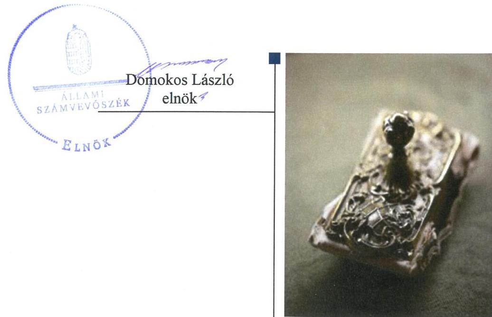
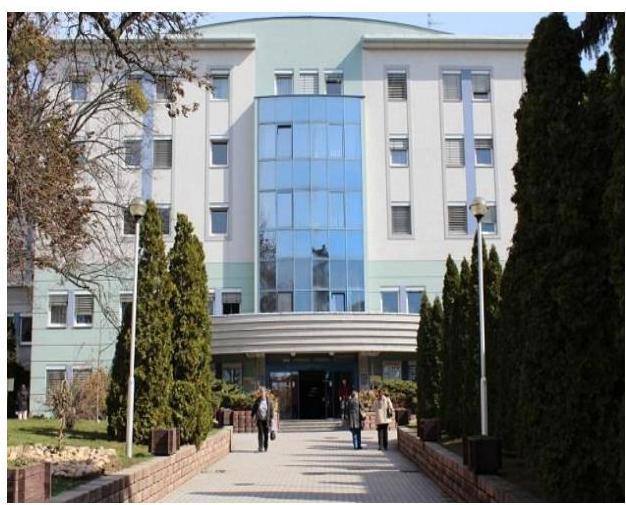
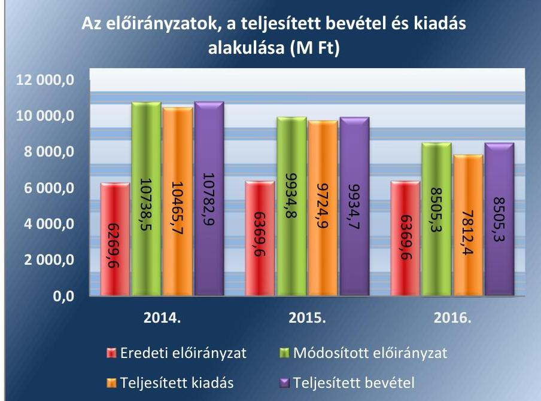
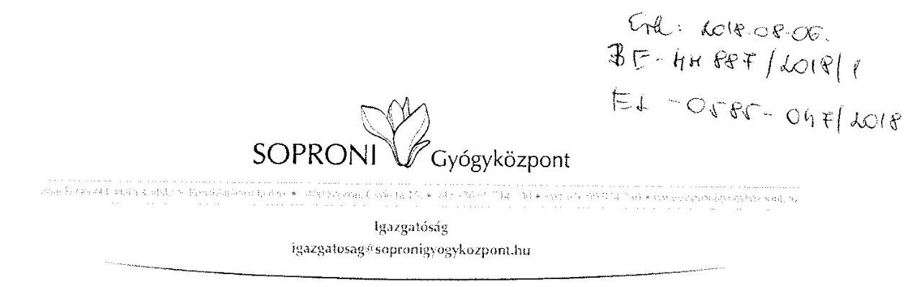
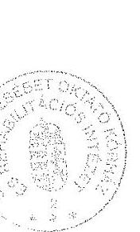
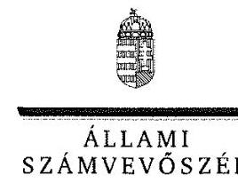
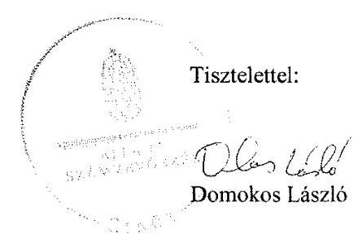
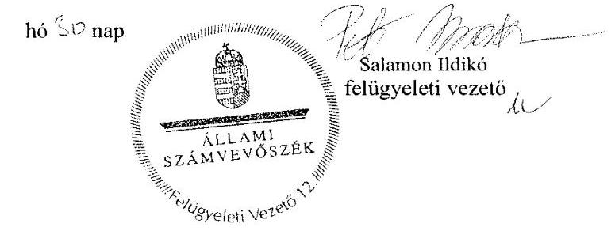

# Jelentés 

## A központi alrendszer intézményei

A központi alrendszer egyes intézményei pénzügyi és vagyongazdálkodásának ellenőrzése - Soproni Erzsébet Oktató Kórház és Rehabilitációs Intézet 2018.

---

# Jelentés 

## A központi alrendszer intézményei

A központi alrendszer egyes intézményei pénzügyi és vagyongazdálkodásának ellenőrzése - Soproni Erzsébet Oktató Kórház és Rehabilitációs Intézet 2018. november 13. nap

---

# AZ ELLENŐRZÉST FELÜGYELTE:

- **SALAMON ILDIKÓ** felügyeleti vezető

- **AZ ELLENŐRZÉST VEZETTE ÉS A VÉGREHAJTÁSÁÉRT FELELŐS:**

- **NEMESVÁRI-HORTHY ESZTER** ellenőrzésvezető

- **A PROGRAM ÖSSZEÁLLÍTÁSÁÉRT FELELŐS:**

- **TÓTPÁL SZABOLCS** osztályvezető

**IKTATÓSZÁM:** EL-0301-015/2018.

**TÉMASZÁM:** 2450

**ELLENŐRZÉS-AZONOSÍTÓ SZÁM:** V 079105

Jelentéseink az Országgyűlés számítógépes hálózatán és az Interneten a www.asz.hu címen is olvashatóak.

---

# TARTALOMJEGYZÉK 

■ ÖSSZEGZÉS ..... 5
■ AZ ELLENŐRZÉS CÉLJA ..... 6
■ AZ ELLENŐRZÉS TERÜLETE ..... 7
■ AZ ELLENŐRZÉS HÁTTERE, INDOKOLTSÁGA ..... 9
■ A JELENTÉS LÉNYEGES KÉRDÉSKÖREI ..... 10
■ AZ ELLENŐRZÉS HATÓKÖRE ÉS MÓDSZEREI ..... 11
■ MEGÁLLAPÍTÁSOK ..... 13
■ JAVASLATOK ..... 18
■ KÖVETKEZTETÉSEK ..... 22
■ MELLÉKLETEK ..... 23
I. sz. melléklet: Értelmező szótár ..... 23
■ FÜGGELÉK: ÉSZREVÉTELEK ..... 27
■ RÖVIDÍTÉSEK JEGYZÉKE ..... 49

---

.

---

# ÖSSZEGZÉS 

A Soproni Erzsébet Oktató Kórház és Rehabilitációs Intézet belső kontrollrendszerének kialakítása és működtetése nem volt szabályszerű, ezáltal nem volt biztosított az átlátható és elszámoltatható közpénzfelhasználás. A pénzügyi és vagyongazdálkodás nem volt szabályszerű. Az integritás kontrollrendszert nem a kockázatokkal arányosan építették ki, nem érvényesült az integritás szemlélet.

## Az ellenőrzés társadalmi indokoltsága

A közpénzek felhasználásában és az állami vagyonnal való gazdálkodásban a központi alrendszer egyes intézményei meghatározó súlyt képviselnek. Ez indokolja, hogy az Állami Számvevőszék ellenőrzéseket folytasson a pénzügyi és vagyongazdálkodás területén. Az Állami Számvevőszék az ellenőrzései során értékeli a belső kontrollrendszer jogszabályi előírások szerinti kialakítását és működtetésének szabályszerűségét, feltárja a gazdálkodás esetleges hiányosságait, rámutathat a vagyongazdálkodási tevékenység - ezen belül a tulajdonosi joggyakorlás és vagyonkezelés - esetleges szabálytalanságaira. Az ellenőrzésünkkel hozzá kívánunk járulni a központi intézmények pénzügyi helyzetének pontosabb megítéléséhez, a jó gyakorlat kialakításán és terjesztésén keresztül az ellenőrzéseink elősegíthetik a gazdálkodás szabályszerűségének javítását.

Az egészségügyi ellátások költsége folyamatosan a társadalmi érdeklődés középpontjában áll. A központi költségvetésből az egyik legjelentősebb kiadást az egészségügyi ellátásokra fordított kiadások jelentik, amelyekből a kórházak kapják a legtöbb támogatást. Ezért indokolt, hogy az Állami Számvevőszék az egészségügyi intézmények pénzügyi és vagyongazdálkodását rendszeresen több évre kiterjedően ellenőrizze.

A Soproni Erzsébet Oktató Kórház és Rehabilitációs Intézet közfeladatot lát el és jelentős állami vagyont kezel.

## Főbb megállapítások, következtetések, javaslatok

A Soproni Erzsébet Oktató Kórház és Rehabilitációs Intézet felett az irányítószervi jogosultságait az Emberi Erőforrások Minisztériuma és átruházott hatáskörben a Gyógyszerészeti és Egészségügyi Minőség- és Szervezetfejlesztési Intézet és az Állami Egészségügyi Ellátó Központ szabályszerűen gyakorolta.

A Soproni Erzsébet Oktató Kórház és Rehabilitációs Intézetnél a belső kontrollrendszer részeként nem alakítottak ki olyan kontrollkörnyezetet, amelyben egyértelműek a felelősségi, hatásköri viszonyok, valamint a szervezet minden szintjén meghatározottak, ismertek és elfogadottak az etikai elvárások. A kockázatkezelési rendszert nem működtették, nem gondoskodtak a szervezeti célokkal összefüggő kockázatok felméréséről, az integrált kockázatkezelési rendszer kialakítása érdekében nem intézkedtek. A kontrolltevékenységek gyakorlása nem volt szabályszerű. Az információs és kommunikációs folyamatokat kialakították, azonban nem gondoskodtak a működéssel, gazdálkodással összefüggő dokumentumok közzétételéről, ezáltal nem biztosították a szervezeti átláthatóságot. A tevékenységének, a célok megvalósításának eseti és folyamatos nyomon követését biztosító rendszert nem alakították ki, az operatív tevékenységektől független belső ellenőrzés tevékenysége nem volt szabályszerű.

A kiadási előirányzatok felhasználása során a pénzgazdálkodási jogkörök gyakorlása nem felelt meg a jogszabályi előírásoknak. A vagyongazdálkodás körében a vagyonkezelői jog bejegyeztetésének elmaradása, a bevételek beszedése nem felelt meg a jogszabályi előírásoknak, a beszámoló mérlegtételeit a jogszabályi előírások ellenére leltárral nem támasztották alá.

Az integritás kontrollrendszert nem a kockázatokkal arányosan építették ki és működtették.
Az Állami Számvevőszék az Emberi erőforrások miniszterének egy, a Soproni Erzsébet Oktató Kórház és Rehabilitációs Intézet főigazgatójának huszonhárom javaslatot tett.

---

# AZ ELLENŐRZÉS CÉLJA

**AZ ELLENŐRZÉS CÉLJA** annak megítélése volt, hogy a Soproni Erzsébet Oktató Kórház és Rehabilitációs Intézetre vonatkozó irányító szervi feladatellátás a jogszabályi előírások betartásával történt-e; a Soproni Erzsébet Oktató Kórház és Rehabilitációs Intézetnél a belső kontrollrendszer kialakítása és működtetése szabályszerű volt-e; pénzügyi és vagyongazdálkodása megfelelt-e a jogszabályi előírásoknak és belső szabályzatainak; átalakításának vagy átszervezésének lebonyolítása szabályszerűen történt-e.

Az ellenőrzés keretében értékeltük a Soproni Erzsébet Oktató Kórház és Rehabilitációs Intézet korrupciós kockázatainak kezelését szolgáló integritás kontrollok kiépítettségét és az integritás szemlélet érvényesülését.

---

# **AZ ELLENŐRZÉS TERÜLETE**

## **Soproni Erzsébet Oktató Kórház és Rehabilitációs Intézet**

A soproni székhelyű Kórház¹ önálló jogi személy, előirányzatai felett teljes jogkörrel rendelkező költségvetési szerv. Áht.² szerinti átalakítására az ellenőrzött időszakban nem került sor. Közfeladata a működését meghatározó Eütv.³ alapján az ellátási területére kiterjedően a járó- és fekvőbetegek diagnosztikus és terápiás szakorvosi ellátása, rehabilitációja és követéses gondozása. A kórházi ágyszám a teljes ellenőrzött időszakban 1001 volt, amelyből 55% volt az aktív, illetve krónikus fekvőbeteg-ellátás és 45% a rehabilitációt, utókezelést és gondozást nyújtó fekvőbeteg-ellátás ágyszáma.

Az emberi erőforrások minisztere az irányító szervi hatásköröket a Kórház fölött az Emberi Erőforrások Minisztériuma útján gyakorolja. Az egyes fenntartói, valamint az irányítási, középirányítói jogokat az Állami Egészségügyi Ellátó Központ (2015. február 28-ig a Gyógyszerészeti és Egészségügyi Minőség- és Szervezetfejlesztési Intézet) gyakorolja.

Mérleg szerinti vagyona a 2014. évben 11 704,3 M Ft volt, ami 2016-ra 35,4%-kal 15 845,6 M Ft-ra növekedett. A 2014-2016. évi éves költségvetési beszámolók adatai alapján a teljesített összes bevétele a 2014. évi 10 782,9 M Ft-ról 2016-ra 8505,3 M Ft-ra, 21,1%-kal, a teljesített összes kiadás a 2014. évi 10 465,7 M Ft-ról a 2016. évre 7812,4 M Ft-ra, 25,4%-kal csökkent. A költségvetés eredeti és módosított előirányzat főösszegét, a teljesített összes bevétel és kiadás alakulását az 1. ábra mutatja be.

1. ábra

*Forrás: A Kórház 2014-2016. évi beszámolói*

---

Alaptevékenysége mellett a Kórház 2015-től vállalkozási tevékenységet is folytatott (2015-től büfé üzemeltetése, 2016-tól a Balfi Kastélyszálló üzemeltetése), amelynek költségvetési kiadásai 2015-ben és 2016-ban sem haladták meg az alapító okiratban a vállalkozási tevékenység mértékeként rögzített arányt, attól mindkét évben jelentősen elmaradtak.

Az ellenőrzött időszakban a főigazgató ${ }^{4}$ személye egy alkalommal változott, a gazdasági igazgató ${ }^{5}$ személyében nem történt változás. A jelenlegi (megbízott) főigazgató 2014. május 1-jétől látja el feladatát. A főigazgató munkáját a gazdasági igazgató, orvos igazgató, valamint ápolási igazgató segítette. A munkavállalók átlagos statisztikai állományi létszáma a 2014. évi 1166 főről 2016-ra 1236 főre, 6,0%-kal emelkedett.

A Kórház rendelkezett gazdasági szervezettel. A gazdálkodással kapcsolatos feladatokat a gazdasági igazgató közvetlen irányítása alatt működő beszerzési és vagyongazdálkodási, valamint pénzügyi és számviteli osztály látta el.

---

# AZ ELLENŐRZÉS HÁTTERE, INDOKOLTSÁGA 

Az államháztartás központi alrendszerének közpénz felhasználása, az intézmények által ellátott közfeladatok sokrétűsége, valamint a feladatellátásához rendelt vagyon nagyságrendje indokolja, hogy az ÁSZ ${ }^{6}$ ellenőrzéseket folytasson a pénzügyi és vagyongazdálkodás területén. Az ÁSZ az ellenőrzései során feltárja a gazdálkodást, a központi alrendszer intézményei átalakulását, átszervezését érintő szabályozások esetleges hiányosságait, a szabályozással nem érintett gazdálkodási területeket, rámutathat a vagyongazdálkodási tevékenység - ezen belül a tulajdonosi joggyakorlás és vagyonkezelés - esetleges szabálytalanságaira, értékeli az állami vagyon nyilvántartására és elszámolására vonatkozó eljárásokat.

Az ellenőrzés várhatóan hozzájárul a központi intézmények pénzügyi helyzetének pontosabb megítéléséhez, és a jó gyakorlat kialakításán és terjesztésén keresztül az ellenőrzések elősegíthetik a gazdálkodás szabályszerűségének javítását.

---

# A JELENTÉS LÉNYEGES KÉRDÉSKÖREI 

1. - Szabályszerű volt-e az irányító szervi feladatellátás?
2.     - A belső kontrollrendszer kialakítása és működtetése szabályszerű volt-e?
3.     - A pénzügyi és vagyongazdálkodás szabályszerű volt-e?
4.     - Kiépítették-e az integritás kontrollrendszert?

---

# AZ ELLENŐRZÉS HATÓKÖRE ÉS MÓDSZEREI 

## Az ellenőrzés típusa

Megfelelőségi ellenőrzés.

## Az ellenőrzött időszak

2014. január 1-2016. december 31.

## Az ellenőrzés tárgya

A Soproni Erzsébet Oktató Kórház és Rehabilitációs Intézetre vonatkozó irányító szervi feladatok ellátása. A Soproni Erzsébet Oktató Kórház és Rehabilitációs Intézet belső kontrollrendszerének kialakítása és működtetése, pénzügyi és vagyongazdálkodása, az integritáskontrollok kiépítettsége, az integritás szemlélet érvényesülése.

Az ellenőrzés kiterjedt minden olyan körülményre és adatra, amely az ÁSZ jogszabályban meghatározott feladatainak teljesítéséhez, valamint a program végrehajtása folyamán felmerült újabb összefüggések feltárásához szükséges.

## Az ellenőrzött szervezet

Soproni Erzsébet Oktató Kórház és Rehabilitációs Intézet, valamint az irányító szervi feladatellátás tekintetében az Emberi Erőforrások Minisztériuma és az Állami Egészségügyi Ellátó Központ (2015. február 28-ig Gyógyszerészeti és Egészségügyi Minőség- és Szervezetfejlesztési Intézet).

## Az ellenőrzés jogalapja

Az ellenőrzés jogszabályi alapját az ÁSZ tv. ${ }^{7}$ 1. § (3) bekezdés, 5. § (2)-(4) és (6) bekezdései, valamint az Áht. 61. § (2) bekezdésének előírásai képezték.

## Az ellenőrzés módszerei

Az ellenőrzésre a szakmai program szempontjai, az ellenőrzött időszakban hatályos jogszabályok, az ellenőrzés szakmai szabályai, a jelen ellenőrzésre irányadó ÁSZ módszertanok figyelembevételével került sor.

---

Az ellenőrzés ideje alatt a Kórházzal, az Irányító szervvel ${ }^{8}$ és a Középirányító szervvel ${ }^{9}$ a kapcsolattartást az ÁSZ SZMSZ ${ }^{10}$-ének vonatkozó előírásai alapján biztosította az ÁSZ.

Az ellenőrzési kérdések megválaszolásához szükséges bizonyítékok megszerzése a Kórház, az Irányító szerv és a Középirányító szerv által rendelkezésre bocsátott dokumentumokra, adatokra alapozva megfigyelés, szemle (szemrevételezés), kérdésfeltevés (információkérés), mintavételezés, valamint elemző eljárás útján történt. Az ellenőrzési bizonyítékként felhasználható adatforrások közé tartoztak egyrészt a szakmai program részletes szempontjainál felsorolt adatforrások, másrészt minden egyéb az ellenőrzés folyamán feltárt, az ellenőrzés szempontjából információt tartalmazó dokumentum.

Az ellenőrzés lefolytatásához a Kórház a tanúsítványok kitöltésével, valamint az ÁSZ által kért dokumentumok megküldésével, az Irányító szerv és a Középirányító szerv az ÁSZ által kért dokumentumok megküldésével szolgáltatott adatokat.

A Kórház belső kontrollrendszere jogszabályi előírások szerinti kialakítása és működtetésének szabályszerűségének értékelése az erre irányuló kérdésekre adott válaszok összesítése alapján, évente pillérenként (kontrollkörnyezet, kockázatkezelési rendszer, kontrolltevékenységek, információs és kommunikációs rendszer, monitoring rendszer) és összesítetten történt. A belső kontrollrendszer egyes pilléreinek kialakítása „szabályszerű", amennyiben az értékelt területen az elért és az elérhető pontok %-ban kifejezett, egész számra kerekített hányadosa meghaladta a 85%-ot, „nem szabályszerű", ha nem érte el a 85%-ot. A kontrollrendszer egésze esetében a „szabályszerű" értékelésnek a %-os értéken felül további feltétele volt, hogy egyik kontrollterület sem kaphatott „nem szabályszerű" értékelést. Az összesített értékelés a %-os értéktől függetlenül „nem szabályszerű" volt, ha az ellenőrzött kontrollterületek közül több mint egynek „nem szabályszerű" volt az értékelése. A Kórháznál a bevételek (tárgyi eszközök bérbeadásából és értékesítéséből) beszedésének szabályszerűsége, valamint a kiadási előirányzatok (külső személyi juttatások, dologi kiadások, felhalmozási kiadások) felhasználása szabályszerűsége mintavételes ellenőrzéssel történt. A bevételek beszedése, valamint a kiadási előirányzatok felhasználása „szabályszerű", ha a minta ellenőrzésének eredménye alapján 95%-os bizonyossággal a teljes sokaságban a hibás tételek aránya kisebb volt, mint 10%, „nem szabályszerű", ha a hibás tételek
 aránya a 10%-ot meghaladta. Abban az esetben, ha a teljes sokaság tekintetében a 10%-os hibaarányhoz való viszony megítélésének megbízhatósága nem érte el a 95%-ot, annak elérése érdekében az értékelés további szempontokkal egészült ki, a feltárt hibák értéke is figyelembe vételre került.

Az integritás szemlélet érvényesülésének értékelése a Kórház által kitöltött integritás kérdőív és az ÁSZ ellenőrzés rendelkezésére bocsátott dokumentumok felhasználásával történt.

---

# 1. Szabályszerű volt-e az irányító szervi feladatellátás? 

## Összegző megállapítás

A Kórházra vonatkozó irányító szervi feladatellátás szabályszerű volt.

A Kórház rendelkezett az Áht. előírásai szerinti, az irányító szerv által jóváhagyott Alapító Okirat ${ }_{1,2}{ }^{11}$-vel. A Középirányító szerv - átruházott hatáskörben - jóváhagyta az SZMSZ ${ }_{2-3}{ }^{12}$-at.

Az Irányító szerv az Ávr. ${ }^{13}$ előírásának megfelelően a tervezett bevételek és kiadások megállapításához meghatározta a tervezési követelményeket, az Áht. és az Áhsz. ${ }^{14}$ előírásainak megfelelően jóváhagyta a Kórház elemi költségvetéseit és éves költségvetési beszámolóit. Az Ávr. előírásainak eleget téve az Irányító szerv gondoskodott a Kórház költségvetési maradványának megállapításáról.

Az Irányító szerv a Kórház korábbi és megbízott főigazgatóját a 2014. évben az Áht. előírásainak megfelelően mentette fel, illetve nevezte ki.

## 2. A belső kontrollrendszer kialakítása és működtetése szabályszerű volt-e?

## Összegző megállapítás

2.1. számú megállapítás

1. táblázat

KONTROLLKÖRNYEZET ÉRTÉKELÉSE 2014-2016.

| Év | Értékelés |
| :--: | :--: |
| 2014. | Nem szabályszerű |
| 2015. | Nem szabályszerű |
| 2016. | Nem szabályszerű |

A Kórház belső kontrollrendszerének kialakítása és működtetése nem volt szabályszerű.

A kontrollkörnyezet kialakítása nem volt szabályszerű.

A Bkr. ${ }^{15}$ 6. § (1) bekezdés c) pontja előírásai ellenére a főigazgató nem alakított ki olyan kontrollkörnyezetet, amelyben meghatározottak, elfogadottak és ismertek az etikai elvárások a szervezet minden szintjén.

A Kórház a szervezetének és működésének kereteit az Ávr. előírásainak eleget téve, SZMSZ ${ }_{1}{ }^{16}{ }_{2,3}$-ban szabályozta. A gazdálkodás részletes rendjét az Áht. és az Ávr. előírásainak megfelelően Gazdálkodási szabályzat ${ }_{1-2}{ }^{17}$ ben meghatározta, azonban a vezetékes telefonok használatát az Ávr. 13. § (2) bekezdés g) pont előírásai ellenére a Kórház belső szabályzatban nem rendezte.

A Kórház a Számv. tv.-ben előírtak szerint rendelkezett Számviteli politika ${ }_{1-3}{ }^{18}$-al, Értékelési szabályzat ${ }_{1-2}{ }^{19}$-vel, Leltározási szabályzat ${ }^{20}$-tal, Pénzkezelési szabályzat ${ }_{1-2}{ }^{21}$-vel, valamint Önköltségszámítási szabályzat ${ }_{1-2}{ }^{22}$-vel. A Számviteli politika ${ }_{1-3}$ keretében a Számv. tv. 14. § (4) bekezdése előírásai ellenére nem rögzítette a Kórház azokat a gazdálkodóra jellemző szabályokat, előírásokat, módszereket, amelyekkel meghatározza a törvényben meghatározott választási, minősítési lehetőségek tekintetében az alkalmazott gyakorlatot milyen okok miatt kell megváltoztatni. A Számviteli poli-

---

tika $_{2-3}$ keretében 2015-2016. években a Számv. tv. 14. § (4) bekezdése előírásai ellenére a Kórház nem rögzítette azokat a gazdálkodóra jellemző szabályokat, előírásokat, módszereket, amelyekkel meghatározza, hogy mit tekint a számviteli elszámolás, az értékelés szempontjából jelentősnek, nem jelentősnek. A Számv. tv. 2013. január 1-jétől hatályos módosítását a Számv. tv. 3. § (3) bekezdés 5. pont (a megbízható és valós képet lényegesen befolyásoló hiba hatályon kívül helyezését) - a Számv. tv. 14. § (11) bekezdés előírásai ellenére a változások hatálybalépését követő 90 napon belül, illetve 2015. január 4-ig nem vezették át a Számviteli politika1-en. A Számviteli politika ${ }_{2-3}$-ban 2015-2016. években a Számv. tv. 14. § (4) bekezdése 2015. július 4-étől hatályos előírásai ellenére a Kórház nem rögzítette, hogy mit tekint kivételes nagyságú vagy előfordulású bevételnek, költségnek, ráfordításnak. A Kórház a Számv. tv. 14. § (11) bekezdés előírásai ellenére a változások hatálybalépését követő 90 napon belül, illetve 2016. december 31-ig nem vezette át a számviteli politikán a törvényi módosítást.

Az Értékelési szabályzat ${ }_{1-2}$-ben 2014-2016. években a Kórház nem rögzítette az Áhsz. 50. § (2) bekezdés b) pont előírásai ellenére követeléstípusonként a kis összegű követelések év végi meghatározásának elveit, dokumentálásának szabályait.

A Kórház az Áhsz. előírásainak eleget téve rendelkezett Számlarend ${ }_{1-2}{ }^{23}$-al, amely tartalmazta a számlarendet alátámasztó bizonylati rendet. A Számlarend ${ }_{1-3}$ 2014-2016. években az Áhsz. 51. § (3) bekezdés előírásai ellenére nem tartalmazta a részletező nyilvántartások vezetésének módját, azoknak a kapcsolódó könyvviteli és nyilvántartási számlákkal való egyeztetését, annak dokumentálását, valamint a részletező nyilvántartások és az egységes rovatrend rovataihoz kapcsolódóan vezetett nyilvántartási számlák adataiból a pénzügyi könyvvezetéshez készült összesítő bizonylatok (feladások) tartalmi és formai követelményeit. A Számlarend ${ }_{2-3}$ a Számv. tv. 161. § (2) bekezdés b) pontja előírásai ellenére a 2015-2016. években nem tartalmazta a számla értéke növekedésének, csökkenésének jogcímeit.

## 2.2. számú megállapítás

2. táblázat

## KOCKÁZATKEZELÉSI RENDSZER ÉRTÉKELÉSE 2014-2016.

|  Év | Értékelés  |
| --- | --- |
|  2014. | Nem szabályszerű  |
|  2015. | Nem szabályszerű  |
|  2016. | Nem szabályszerű  |

Forrás: ÁSZ ellenőrzés 2.3. számú megállapítás

## A kockázatkezelési rendszer kialakítása és működtetése nem volt szabályszerű.

A Kórház Kockázatkezelési szabályzat ${ }_{1,2}{ }^{24}$ ben szabályozta a kockázatkezelési rendszerrel kapcsolatos előírásokat, azonban 2016. október 1-jétől a Bkr. 6. § (4) bekezdés előírásai ellenére nem szabályozták a szervezeti integritást sértő események kezelésének eljárásrendjét, valamint az integrált kockázatkezelés eljárásrendjét.

A főigazgató 2014-2016. években a Bkr. 7. § (2) bekezdése ellenére nem gondoskodott a Kórház tevékenységében rejlő és a szervezeti célokkal összefüggő kockázatok felméréséről. A Bkr. 2016. október 1-jétől hatályos 7. § (1) bekezdését figyelmen kívül hagyva a főigazgató nem gondoskodott integrált kockázatkezelési rendszer működtetéséről. A Bkr. 2016. október 1-jétől hatályos 7. § (4) bekezdése előírása ellenére az integrált kockázatkezelési rendszer koordinálására szervezeti felelőst nem jelölt ki.

## A kontrolltevékenység gyakorlása és működtetése nem volt szabályszerű.

A főigazgató a Bkr. 6. § (1) bekezdés b) pontja ellenére nem alakított ki olyan kontrollkörnyezetet, amelyben egyértelműek a felelősségi, hatásköri

---

3. táblázat

KONTROLLTEVÉKENYSÉGEK ÉRTÉKELÉSE 2014-2016.

| Év | Értékelés |
| :--: | :--: |
| 2014. | Nem szabályszerű |
| 2015. | Nem szabályszerű |
| 2016. | Nem szabályszerű |
|  | Forrás: ÁSZ ellenőrzés |

2.4. számú megállapítás
viszonyok. A kötelezettségvállalás pénzügyi ellenjegyzésére és az érvényesítésre jogosult személyek kijelölése az Áht. 37. § (2) bekezdése, az Ávr. 55. § (2) bekezdés a) pontja és az Ávr. 58. § (4) bekezdése előírásai ellenére nem volt szabályszerű, mert a kötelezettségvállalás pénzügyi ellenjegyzésére és az érvényesítésre a gazdasági vezető helyett a főigazgató adta ki a kijelölést.

A Kórház kötelezettségvállalásainak nyilvántartása nem felelt meg az Áhsz. 14. melléklet II. 4. a) b) d) f) és g) pontok előírásainak.

## Az információs és kommunikációs folyamatok kialakítása és működtetése nem volt szabályszerű.

A Kórház az információs és kommunikációs rendszere tekintetében a Bkr. 9. § (2) bekezdése előírásai ellenére a beszámolási szinteket, határidőket és módokat világosan nem határozta meg.

A Kórház - az Info tv. ${ }^{25}$ 37. § (1) bekezdése és 1. melléklet II/1., és III/1. pontja ellenére - a szervezeti és működési szabályzat, az adatvédelmi és adatbiztonsági szabályzat, az éves költségvetések és beszámolók közzétételét nem teljesítette.

A Kórház a vagyonkezelt vagyon értékcsökkenéséről, az értékét növelő felújításokról, beruházásokról a vagyonkezelési szerződés ${ }^{26}$ 3.4. pontjában foglalt, a Középirányító szerv, mint tulajdonosi joggyakorló felé adatszolgáltatási kötelezettségét 2014. évre vonatkozóan nem, 2015-2016. évben teljesítette.

## A Kórház tevékenységének, a célok megvalósításának folyamatos és eseti nyomon követését biztosító rendszert nem alakította ki és a belső ellenőrzés tevékenysége nem volt szabályszerű.

Az Ellenőrzési nyomvonal ${ }_{12}{ }^{27}$ a Bkr. 6. § (3) bekezdése előírásai ellenére nem tartalmazta a felelősségi és információs szinteket és kapcsolatokat, irányítási és ellenőrzési folyamatokat. A főigazgató a Bkr. 10. §-a előírásai ellenére nem alakította ki a célok megvalósításának nyomon követését biztosító rendszert.

A főigazgató az Áht. és a Bkr. előírásai szerint gondoskodott a belső ellenőrzés kialakításáról, működtetéséről, függetlenségének biztosításáról. A Bkr. 17. § (4) bekezdés előírásai ellenére a belső ellenőrzési vezető a Belső Ellenőrzési Kézikönyvet ${ }^{28}$ legalább kétévente nem vizsgálta felül. A Bkr. 22. § (1) bekezdés b) pont előírásai ellenére a belső ellenőrzési vezető a 2014. évben tervezett 9 ellenőrzésből 4-et nem hajtott végre. A Bkr. 28. § c) pont előírásai ellenére az ellenőrzött szerv, szervezeti egységek vezetői, alkalmazottai a belső ellenőrzés megállapításai, és javaslatai alapján a végrehajtásért felelősöket és a végrehajtás határidejét feltüntető intézkedési tervet nem készítettek. A Bkr. 47. § (1) bekezdés előírásai ellenére a belső ellenőrzési vezető éves bontásban nem vezetett olyan nyilvántartást, amellyel a belső ellenőrzési jelentésekben tett megállapításokat, javaslatokat, a vonatkozó intézkedési terveket és azok végrehajtását nyomon követte.

---

# 3. A pénzügyi és vagyongazdálkodás szabályszerű volt-e? 

## Összegző megállapítás

### 3.1. számú megállapítás

### 3.2. számú megállapítás

A pénzügyi és vagyongazdálkodás a jogszabályi előírásoknak nem felelt meg.

A kiadási előirányzatok felhasználása során a jogszabályi előírásokat nem tartották be, a pénzgazdálkodási jogkörök gyakorlása nem felelt meg a jogszabályi előírásoknak. A maradvány megállapítása nem volt szabályszerű.

A kötelezettségvállalások esetében az Ávr. 56. § (1) bekezdése ellenére nem gondoskodtak arról, hogy az adott kötelezettségvállalásokat az azokhoz tartozó szabad előirányzatok terhére nyilvántartásba vegyék. A kötelezettségvállalások pénzügyi ellenjegyzését és az érvényesítést - az Ávr. 55. § (2) és 58. § (4) bekezdésben foglalt előírások ellenére - nem az arra jogosult személyek végezték, mert az Ávr. 55. § (2) bekezdés a) pontja előírásai ellenére a gazdasági igazgató nem jelölte ki az arra jogosult személyeket.

A teljesítés igazolására az Ávr. 57. § (1) (3) és (4) bekezdései ellenére nem került sor, vagy nem az arra jogosult személy végezte a teljesítés igazolását. Szabályszerű teljesítésigazolás hiányában a teljesítés igazolására jogosult az Ávr. 57. § (1) ellenére a kiadások teljesítésének jogosságát, összegszerűségét nem ellenőrizte.

A Kórház éves költségvetési beszámoló részeként elkészített maradvány kimutatását az Áhsz. 39. § (2) és (3) bekezdése ellenére részletező nyilvántartással nem támasztotta alá, mert a kötelezettségvállalások és más fizetési kötelezettségek nyilvántartása az Áhsz. 14. melléklet II. 4. a), b), d), f), g) pontjaiban foglalt tartalmi hiányosságok következtében nem volt szabályszerű. A Kórház kötelezettségvállalással terhelt költségvetési maradványának meghatározása nem felelt meg az Ávr. 150. § (1) bekezdés b) pontjában foglaltaknak.

A vagyon értékének megőrzését, gyarapítását támogató vagyongazdálkodás feltételeinek kialakítása nem volt szabályszerű. A beszámoló mérlegtételeit leltárral nem támasztották alá, a bevételek beszedése nem felelt meg a jogszabályi előírásoknak.

A Kórház, mint vagyonkezelő a vagyonkezelési szerződés 2014. június 3-án megkötött módosítása során állami vagyonelemekre keletkezett vagyonkezelői jogának ingatlan-nyilvántartásba történő bejegyeztetéséről a Vtvr. ${ }^{29}$ 7. § (2) bekezdése és a vagyonkezelési szerződés 1.2. pontja előírásától eltérően a szerződés megkötésétől számított harminc napon belül és azon túl sem gondoskodott.

A Kórház a
 Számv. tv. 69. § (1) bekezdésében és az Áhsz. 22. § (1) bekezdésében foglalt előírások ellenére az éves költségvetési beszámoló mérlegtételeinek alátámasztásához nem állított össze olyan leltárt, amely tételesen, ellenőrizhető módon tartalmazza a mérleg fordulónapján meglévő eszközöket és forrásokat.

A Kórház a vagyonhasznosítására megkötött szerződésekben a fizetendő bérleti díjakat a Számv. tv. 14. § (7) bekezdésében foglalt előírástól

---

eltérően nem az Önköltségszámítási szabályzat ${ }_{1,2}$ szerinti utókalkuláció módszerével állapította meg. A hasznosításra vonatkozó bérleti szerződésekben a Kórház a bérbe adott ingatlannal kapcsolatban nem írt elő a bérbevevő számára az Nvtv. ${ }^{30}$ 11. § (11) bekezdés a) pontja szerint adatszolgáltatási, b) pontja szerint tulajdonosi rendelkezéseknek, hasznosítási célnak megfelelő használati kötelezettséget.

# 4. Kiépítették-e az integritás kontrollrendszert? 

## Összegző megállapítás

A Kórház nem a kockázatokkal arányosan építette ki az integritás kontrollrendszert.

A Kórháznál az integritás szemlélet nem érvényesült. A jogszabályok által előírt integritás kontrollok kiépítettsége támogatta a szervezet integritását, azonban az integritást erősítő, nem a jogszabályok által előírt kontrollokat alacsony szinten működtették. A Kórház nem alkalmazott rendszerszerű kockázatelemzést.

---

# JAVASLATOK 

Az ÁSZ tv. 33. § (1) bekezdésében foglaltak értelmében az ellenőrzött szervezet vezetője köteles a jelentésben foglalt megállapításokhoz kapcsolódó intézkedési tervet összeállítani és azt a jelentés kézhezvételétől számított 30 napon belül az ÁSZ részére megküldeni. Amennyiben az ellenőrzött szervezet vezetője nem küldi meg határidőben az intézkedési tervet, vagy továbbra sem elfogadható intézkedési tervet küld, az Állami Számvevőszék elnöke az ÁSZ tv. 33. § (3) bekezdése a) és b) pontjaiban foglaltakat érvényesítheti.

## az Emberi erőforrások miniszterének

1. Tegyen intézkedéseket a feltárt hiányosságok és szabálytalanságok tekintetében a felelősség tisztázása érdekében és szükség szerint intézkedjen a felelősség érvényesítéséről.
(2.1. számú megállapítás 1. bekezdése, 2. bekezdés 2. mondata, 3. bekezdés 2-3. és 5. mondata, 4. bekezdése, 5. bekezdés 2-3. mondata, 2.2. számú megállapítás 1-2. bekezdése, 2.3. számú megállapítás 1-2. bekezdése, 2.4. számú megállapítás 2. bekezdése, 2.5. számú megállapítás 1. bekezdése, 3.1. számú megállapítás 1-3. bekezdése, 3.2. számú megállapítás 2. bekezdése alapján)

## a Soproni Erzsébet Kórház és Rehabilitációs Intézet Föigazgatójának

1. Intézkedjen a jogszabályi előírásoknak megfelelően olyan kontrollkörnyezet kialakítására, amelyben meghatározottak, elfogadottak és ismertek az etikai elvárások a szervezet minden szintjén.
(2.1. számú megállapítás 1. bekezdése alapján)
2. Intézkedjen a jogszabályi előírásokkal összhangban a vezetékes telefonok használata rendjének belső szabályzatban történő rendezésére.
(2.1. számú megállapítás 2. bekezdés 2. mondata alapján)
3. Intézkedjen a jogszabályi előírásokkal összhangban a Számviteli politika módosítására annak érdekében, hogy tartalmazza azokat a gazdálkodóra jellemző szabályokat, előírásokat, módszereket, amelyekkel meghatározza
a) az alkalmazott gyakorlatot milyen okok miatt kell megváltoztatni,
b) a számviteli elszámolás, értékelés szempontjából mit tekint jelentősnek, nem jelentősnek, kivételes nagyságú vagy előfordulású bevételnek, költségnek, ráfordításnak.
(2.1. számú megállapítás 3. bekezdés 2-3. és 5. mondata alapján)

---

4. Intézkedjen az Értékelési szabályzat módosítására annak érdekében, hogy a jogszabályi előírásokkal összhangban tartalmazza követeléstipusonként a kis összegű követelések év végi meghatározásának elveit, dokumentálásának szabályait.
(2.1. számú megállapítás 4. bekezdése alapján)
5. Intézkedjen a Számlarend jogszabályi előírásoknak megfelelő módosítására annak érdekében, hogy tartalmazza
a) a részletező nyilvántartások vezetésének módját, azoknak a kapcsolódó könyvviteli és nyilvántartási számlákkal való egyeztetését, annak dokumentálását,
b) a részletező nyilvántartások és az egységes rovatrend rovataihoz kapcsolódóan vezetett nyilvántartási számlák adataiból a pénzügyi könyvvezetéshez készült összesítő bizonylatok (feladások) tartalmi és formai követelményeit,
c) a számla értéke növekedésének, csökkenésének jogcímeit.
(2.1. számú megállapítás 5. bekezdés 2-3. mondata alapján)
6. Intézkedjen a jogszabályi előírásoknak megfelelően
a) a szervezeti integritást sértő események kezelése eljárásrendjének, valamint az integrált kockázatkezelés eljárásrendjének szabályozására,
b) a Kórház tevékenységében rejlő és a szervezeti célokkal összefüggő kockázatok felmérésére, továbbá az egyes kockázatokkal kapcsolatban szükséges intézkedések, valamint azok teljesítésének folyamatos nyomon követésének módja meghatározására,
c) az integrált kockázatkezelési rendszer működtetésére.
(2.2. számú megállapítás 1. bekezdés, 2. bekezdés 1-2. mondata alapján)
7. Intézkedjen a jogszabályi előírásoknak megfelelően az integrált kockázatkezelési rendszer koordinálása szervezeti felelősének kijelölésére.
(2.2. számú megállapítás 2. bekezdés 3. mondata alapján)
8. Intézkedjen a jogszabályi előírásokkal összhangban olyan kontrollkörnyezet kialakítására, amelyben egyértelműek a felelősségi, hatásköri viszonyok.
(2.3. számú megállapítás 1. bekezdés 1. mondata alapján)
9. Intézkedjen, hogy a pénzügyi ellenjegyzésre és az érvényesítésre jogosultak kijelölése megfeleljen a jogszabályi előírásoknak.
(2.3. számú megállapítás 1. bekezdés 2. mondata alapján)

---

10. Intézkedjen a kötelezettségvállalások, más fizetési kötelezettségek nyilvántartásának jogszabályi előírások szerinti vezetésére.
(2.3. számú megállapítás 2. bekezdése, 3.1. számú megállapítás 3. bekezdés 1. mondata alapján)
11. Intézkedjen a jogszabályi előírásnak megfelelően információs rendszer keretében a beszámolási szintek, határidők és módok világos meghatározására.
(2.4. számú megállapítás 1. bekezdése alapján)
12. Intézkedjen a közérdekű adatok - a szervezeti és működési szabályzat, az adatvédelmi és adatbiztonsági szabályzat, az éves költségvetések és beszámolók - jogszabályi előírásoknak megfelelő közzétételére.
(2.4. számú megállapítás 2. bekezdése alapján)
13. Intézkedjen, az Ellenőrzési nyomvonal módosítására annak érdekében, hogy a jogszabályi előírásokkal összhangban tartalmazza a felelősségi és információs szinteket és kapcsolatokat, irányítási és ellenőrzési folyamatokat.
(2.5. számú megállapítás 1. bekezdés 1. mondata alapján)
14. Intézkedjen a jogszabályi előírásoknak megfelelően a célok megvalósításának nyomon követését biztosító rendszer kialakítására.
(2.5. számú megállapítás 1. bekezdés 2. mondata alapján)
15. Intézkedjen a jogszabályi előírásoknak megfelelően
a) a Belső Ellenőrzési Kézikönyv felülvizsgálatára,
b) a belső ellenőrzés megállapításai, javaslatai alapján az intézkedési tervek elkészítésére,
c) a belső ellenőrzésekhez kapcsolódó nyilvántartások vezetésére.
(2.5. számú megállapítás 2. bekezdés 2. és 4-5. mondata alapján)
16. Intézkedjen, hogy kötelezettségvállalások esetén a jogszabályi előírásoknak megfelelően az adott kötelezettségvállalásokat az azokhoz tartozó szabad előirányzatok terhére nyilvántartásba vegyék.
(3.1. számú megállapítás 1. bekezdés 1. mondata alapján)

---

17. Intézkedjen, hogy a kiadási előirányzatok felhasználása során a jogszabályi előírásoknak megfelelően
a) a pénzügyi ellenjegyzést és az érvényesítést az arra jogosult személy végezze el,
b) a teljesítésigazolás történjen meg, és azt az arra jogosult személy, a jogszabály előírásainak betartásával végezze el.
(3.1. számú megállapítás 1. bekezdés 2. mondata és 2. bekezdése alapján)
18. Intézkedjen, hogy
a) az éves költségvetési beszámoló részeként elkészített maradvány kimutatását a jogszabályi előírásoknak megfelelő tartalmú részletező nyilvántartással támaszszák alá;
b) a kötelezettségvállalással terhelt költségvetési maradvány meghatározása feleljen meg a jogszabályi előírásoknak.
(3.1. számú megállapítás 3. bekezdése alapján)
19. Kezdeményezze a jogszabályoknak megfelelően a vagyonkezelői jog ingatlan nyilvántartásba történő bejegyeztetését.
(3.2. számú megállapítás 1. bekezdése alapján)
20. Intézkedjen a mérleg alátámasztásához a jogszabályi előírásoknak megfelelően olyan leltár összeállítására, amely tételesen, ellenőrizhető módon tartalmazza a Kórház mérleg fordulónapján meglévő eszközeit és forrásait.
(3.2. számú megállapítás 2. bekezdése alapján)
21. Intézkedjen a jogszabályi előírásoknak megfelelően a bérleti díjak Ön-költség-számítási szabályzat szerinti megállapítására.
(3.2. számú megállapítás 3. bekezdés 1. mondata alapján)
22. Intézkedjen a jogszabályi előírásoknak megfelelően az ingatlanok használatára kötött bérleti szerződésekben
a) az adatszolgáltatási kötelezettség,
b) a tulajdonosi rendelkezéseknek, hasznosítási célnak megfelelő használati kötelezettség előírására.
(3.2. számú megállapítás 3. bekezdés 2. mondata alapján)
23. Tegyen intézkedéseket a feltárt hiányosságok és szabálytalanságok tekintetében a felelősség tisztázása érdekében, és szükség szerint intézkedjen a felelősség érvényesítéséről.
(2.5. számú megállapítás 2. bekezdés 2. és 4-5. mondata alapján)

---

# KÖVETKEZTETÉSEK 

A Kórház belső kontrollrendszere keretében nem alakították ki mindazon elveket, eljárásokat és belső szabályzatokat, illetve nem is működtették azokat, amelyek biztosítják a szervezet valamennyi tevékenysége során a szabályozott és szabályszerű feladatellátást. A Kórház működésével kapcsolatosan nem álltak rendelkezésre megfelelő, pontos és naprakész információk. Mindezek alapján nem volt biztosított a rendelkezésre álló eszközök és források átlátható, szabályszerű, pazarlásmentes, rendeltetésszerű felhasználása, valamint a vagyon megőrzése. A Kórház belső kontrollrendszere kialakításának és működtetésének hiányosságai a kórház feladatellátásra is kihatással vannak.

---

# MELLÉKLETEK 

- I. SZ. MELLÉKLET: ÉRTELMEZŐ SZÓTÁR
állami vagyon
állami vagyonnak minősül:
a) az állam tulajdonában lévő dolog, valamint a dolog módjára hasznosítható természeti erő,
b) az a) pont hatálya alá nem tartozó mindazon vagyon, amely vonatkozásában törvény az állam kizárólagos tulajdonjogát nevesíti,
c) az állam tulajdonában lévő tagsági jogviszonyt megtestesítő értékpapír, illetve az államot megillető egyéb társasági részesedés,
d) az államot megillető olyan immateriális, vagyoni értékkel rendelkező jogosultság, amelyet jogszabály vagyoni értékű jogként nevesít. (Forrás: Vtv. ${ }^{31}$ 1. § (2) bekezdése)
állami vagyon használója Az a természetes vagy jogi személy, jogi személyiséggel nem rendelkező szervezet, aki, vagy amely törvény vagy szerződés alapján, bármely jogcímen (bérlet, haszonbérlet, használat stb.) állami vagyont birtokol, használ, szedi annak hasznait, hasznosít, ide nem értve a haszonélvezőt, a vagyonkezelőt és a tulajdonosi jogok gyakorlóját. (Forrás: Vtvr. 1. § (7) bekezdés a) pontja)
állami vagyon hasznosítása Az állami vagyont az MNV Zrt. maga kezeli, vagy szerződés - így különösen bérlet, haszonbérlet, megbízás - alapján központi költségvetési szervnek, természetes vagy jogi személynek, vagy jogi személyiséggel nem rendelkező gazdálkodó szervezetnek hasznosításra átengedi.
(Forrás: Vtv. 23. § (1) bekezdése, hatályos 2012. január 1-jétől)
Az állami vagyonnal a tulajdonosi joggyakorló maga gazdálkodik, vagy szerződés - így különösen bérlet, haszonbérlet, megbízás - alapján hasznosításra átengedi, illetőleg vagyonkezelésbe, haszonélvezetbe adja. (Forrás: Vtv. 23. § (1) bekezdése, hatályos 2013. június 28-ától)
Az állami vagyont az MNV Zrt. maga kezeli, vagy szerződés - így különösen bérlet, haszonbérlet, megbízás - alapján központi költségvetési szervnek, természetes vagy jogi személynek, vagy jogi személyiséggel nem rendelkező gazdálkodó szervezetnek hasznosításra átengedi." Az állami vagyonra vonatkozóan az MNV Zrt. kizárólag az Nvtv.-ben meghatározott személyekkel köthet vagyonkezelési szerződést. (Forrás: Vtv. 27. § (1) bekezdése, hatályos 2012. január 1-jétől)
ÁSZ Integritás Projekt Az ÁSZ 2011-ben indította el a közintézmények integritását vizsgáló és fejlesztő kérdőíves kutatását, melynek hétéves felmérési időszaka 2017. évben zárult le. Az ÁSZ az Integritás felmérés keretében 2017. évben hetedik alkalommal értékelte a közszféra intézményeinek korrupciós kockázatait, illetve a korrupció ellen védelmet biztosító kontrollok kiépítettségét. (Forrás: https://asz.hu/tanulmanyok-2017-ev Elemzés a közszféra integritás helyzetéről 2017. Vezetői összefoglaló 4. oldal)
átalakítás
belső ellenőrzés

A költségvetési szerv általános jogutódlással történő megszüntetése átalakítással történhet. Az átalakítás lehet egyesítés vagy különválás. Az egyesítés lehet beolvadás vagy összeolvadás. (2014. december 31-ig, Áht. 9/A. § (3) és (4) bekezdés 2015. január 1-jétől) Áht. 11. § (2) bekezdés)
Független, tárgyilagos bizonyosságot adó és tanácsadó tevékenység, amelynek célja, hogy az ellenőrzött szervezet működését fejlessze és eredményességét növelje, az ellenőrzött szervezet céljai elérése érdekében rendszerszemléletű megközelítéssel és módszeresen értékeli, illetve fejleszti az ellenőrzött szervezet irányítási és belső kontrollrendszerének hatékonyságát. (Forrás: Bkr. 2. § b) pontja)

---

belső kontrollrendszer

A belső kontrollrendszer a kockázatok kezelése és tárgyilagos bizonyosság megszerzése érdekében kialakított folyamatrendszer, amely azt a célt szolgálja, hogy a működés és gazdálkodás során a tevékenységeket szabályszerűen, gazdaságosan, hatékonyan, eredményesen hajtsák végre, az elszámolási kötelezettségeket teljesítsék, megvédjék az erőforrásokat a veszteségektől, károktól és nem rendeltetésszerű használattól. (Forrás: Áht. 69. § (1) bekezdése)
belső kontrollrendszer területei

A kontrollkörnyezet, a kockázatkezelési rendszer, a kontrolltevékenységek, az információs és kommunikációs rendszer, valamint a nyomon követési (monitoring) rendszer. (Forrás: Bkr. 3. §-a)
ellenőrzési nyomvonal

Az ellenőrzési nyomvonal a költségvetési szerv működési folyamatainak
 szöveges, táblázatokkal vagy folyamatábrákkal szemléltetett leírása, amely tartalmazza különösen a felelősségi és információs szinteket és kapcsolatokat, irányítási és ellenőrzési folyamatokat, lehetővé téve azok nyomon követését és utólagos ellenőrzését. (Forrás: Bkr. 6. § (3) bekezdés)
hasznosítás

A nemzeti vagyon birtoklásának, használatának, hasznának szedése jogának bármely a tulajdonjog átruházását nem eredményező jogcímen történő átengedése, ide nem értve a vagyonkezelésbe adást, valamint a haszonélvezeti jog alapítását. (Forrás: Nvtv. 3. § (1) bekezdés 4. pontja)
információs és kommunikációs rendszer

A költségvetési szerv vezetője által kialakított és működtetett olyan rendszer, mely biztosítja, hogy a megfelelő információk a megfelelő időben eljutnak az illetékes szervezethez, szervezeti egységhez, illetve személyhez. (Forrás: Bkr. 9. § (1) bekezdés)
integritás

Az integritás - egyik gyakran használt jelentése szerint - az elvek, értékek, cselekvések, módszerek, intézkedések konzisztenciáját jelenti, vagyis olyan magatartásmódot, amely meghatározott értékeknek megfelel. Integritás-irányítási rendszer bevezetése a szervezetben a szervezethez rendelt közfeladatok integritás szempontú ellátását, az érték alapú működéssel (integritással) összefüggő szervezeti követelmények következetes érvényesítését jelenti. (Forrás: Nemzetgazdasági Minisztérium: Államháztartási Belső Kontroll Standardok és Gyakorlati Útmutató 1.6. Etikai értékek és integritás 46. oldal, 2017. szeptember)
irányító szerv/felügyeleti
A költségvetési szerv tekintetében az Áht-ban meghatározott irányítási hatáskört gyakorló szerv. (Forrás: Áht. 1. § 9. pontja)
szerv
kockázat

A kockázat annak a valószínűségét jelenti, hogy egy vagy több esemény vagy intézkedés nem kívánt módon befolyásolja a rendszer működését, céljainak megvalósulását. (Forrás: Javaslatok a korrupciós kockázatok kezelésére - Kockázatkezelési és ellenőrzési módszertan 35. oldal, ÁSZ)
kockázatkezelési rendszer

Olyan irányítási eszközök és módszerek összessége, melynek elemei a szervezeti célok elérését veszélyeztető tényezők (kockázatok) azonosítása, elemzése, csoportosítása, nyomon követése, valamint szükség esetén a kockázati kitettség mérséklése. (Forrás: Bkr. 2. § m) pontja)
integrált kockázatkezelési rendszer

A költségvetési szerv vezetője által kialakított olyan elvek, eljárások, belső szabályzatok összessége, amelyben világos a szervezeti struktúra, a folyamatok átláthatók, egyértelműek a felelősségi, hatásköri viszonyok és feladatok, meghatározottak, ismertek és elfogadottak az etikai elvárások a szervezet minden szintjén, átlátható a humán-erőforrás-kezelés. (Forrás: Bkr. 6. § (1) bekezdés)

---

kontrolltevékenységek

középirányító szerv
közfeladat
maradvány
nyomon követési rendszer (monitoring)
tulajdonosi joggyakorló
vagyongazdálkodás

A költségvetési szerv vezetője által a szervezeten belül kialakított (kontroll) tevékenységek, melyek biztosítják a kockázatok kezelését, hozzájárulnak a szervezet céljainak eléréséhez és erősítik a szervezet integritását. (Forrás: Bkr. 8. § (1) bekezdés)
A költségvetési szerv tekintetében törvény vagy kormányrendelet alapján meghatározott, átruházott irányítási hatásköröket gyakorló szerv. (Forrás: Áht. 9. § (4) bekezdés)
Jogszabályban meghatározott állami vagy önkormányzati feladat, amit az arra kötelezett közérdekből, a jogszabályban meghatározott követelményeknek és feltételeknek megfelelve végez, ideértve a lakosság közszolgáltatásokkal való ellátását, továbbá az állam nemzetközi szerződésekben vállalt kötelezettségeiből adódó közérdekű feladatokat, valamint e feladatok ellátásakor szükséges infrastruktúra biztosítását is. (Forrás: Nvtv. 3. § (1) bekezdés 7. pontja)
A költségvetési év során a bevételek és kiadások különbözete, amely az alaptevékenység bevételei és kiadásai tekintetében a költségvetési maradvány, a vállalkozási tevékenység bevételei és kiadásai tekintetében a vállalkozási maradvány. (Forrás: Áht. 1. § 17. pont)
A költségvetési szerv vezetője köteles kialakítani a szervezet tevékenységének a célok megvalósításának nyomon követését biztosító rendszert, amely az operatív tevékenységek keretében megvalósuló folyamatos és eseti nyomon követésből, valamint az operatív tevékenységektől függetlenül működő belső ellenőrzésből áll. (Forrás: Bkr. 10. §)

Aki a nemzeti vagyon felett az államot vagy a helyi önkormányzatot megillető tulajdonosi jogok és kötelezettségek összességének gyakorlására jogosult. (Forrás: Nvtv. 3. § (1) bekezdés 17. pontja)

A nemzeti vagyongazdálkodás feladata a nemzeti vagyon rendeltetésének megfelelő, az állam, az önkormányzat mindenkori teherbíró képességéhez igazodó, elsődlegesen a közfeladatok ellátásához és a mindenkori társadalmi szükségletek kielégítéséhez szükséges, egységes elveken alapuló, átlátható, hatékony és költségtakarékos működtetése, értékének megőrzése, állagának védelme, értéknövelő használata, hasznosítása, gyarapítása, továbbá az állam vagy a helyi önkormányzat feladatának ellátása szempontjából feleslegessé váló vagyontárgyak elidegenítése. (Forrás: Nvtv. 7. § (2) bekezdése)

---

.

---

# FÜGGELÉK: ÉSZREVÉTELEK 

A jelentéstervezetet a Számvevőszék 15 napos észrevételezésre megküldte az ellenőrzött szervezetek vezetőinek az ÁSZ tv. 29. § (1) bekezdése előírásának megfelelően.

A Soproni Erzsébet Oktató Kórház és Rehabilitációs Intézet főigazgatója a jelentéstervezet megállapításaira írásban észrevételt tett. Az Emberi Erőforrások Minisztériuma, valamint az Állami Egészségügyi Ellátó Központ főigazgatója az ÁSZ tv. 29. § (2) bekezdésében foglalt észrevételezési jogával nem élt.
A függelék tartalmazza a Soproni Erzsébet Oktató Kórház és Rehabilitációs Intézet főigazgatója által megküldött észrevételeket, illetve az el nem fogadott észrevételek elutasításának indoklását.

[^0]
[^0]:    * 29. § (1) Az Állami Számvevőszék az ellenőrzési megállapításait megküldi az ellenőrzött szervezet vezetőjének vagy az általa megbízott személynek, és annak, akinek személyes felelősségét állapította meg.
    (2) Az ellenőrzött szervezet vezetője és a felelősként megjelölt személy az ellenőrzés megállapításaira tizenöt napon belül írásban észrevételt tehet.
    (3) Az Állami Számvevőszék az észrevételre a beérkezésétől számított harminc napon belül írásban válaszol. A figyelembe nem vett észrevételeket köteles a jelentésben feltüntetni, és megindokolni, hogy azokat miért nem fogadta el.

---

Állami Számvevőszék
Domokos László
elnök

# Budapest 

Pf.: 54
1364

## Tisztelt Elnök Úr!

Az EL-0585-41/2018. iktatószámú levél mellékleteként csatolt „A központi alrendszer intézményei - A központi alrendszer egyes intézményei pénzügyi és vagyongazdálkodási ellenőrzése - Soproni Erzsébet Oktató Kórház és Rehabilitációs Intézet" címmel készített számvevőszéki jelentéstervezettel kapcsolatban a következő észrevételeket teszem:
AZ ELLENŐRZÉS TERÜLETE (7. oldal) részben szükségesnek tartom részletezni a 2014., 2015. és a 2016. évi teljesített összes bevételek, valamint teljesített összes kiadások összehasonlítását követően, ezek működési célú, felhalmozási célú, és finanszírozási bontású összehasonlítását is, hiszen a helyes következtetések levonásához ez elengedhetetlen.

A teljesített összes bevételeken belül 2014. évről 2016. évre a működési célú bevételek 2,6%-kal nőttek, a felhalmozási célú bevételek 97,6%-kal csökkentek, a finanszírozási bevételek pedig 12,9%-kal nőttek. A teljesített összes kiadásokon belül 2014. évről 2016. évre a működési célú kiadások 4,4%-kal, a felhalmozási célú kiadások pedig 97,4%-kal csökkentek. A felhalmozási célú bevételek és kiadások csökkenésének oka, hogy 2014 és 2015 években kerültek elszámolásra a Kórház által sikeresen pályázott és elnyert több milliárd forint összegű TIOP-os támogatások, míg 2016-ban pedig ilyen mértékű pályázati támogatás már nem érkezett.

---

A 8. oldalon a jelentés szinte elmarasztaló a vállalkozási tevékenység alapító okiratban meghatározott maximum korlát vonatkozásában. A Kórház főtevékenységéből kifolyólag elsősorban közfeladatokat lát el, a vállalkozási tevékenység végzésére nem köteles, az alapító okiratban meghatározott arány nem elvárás, hanem egy felső korlát.

Kérem, a javaslatomat megfontolni, és a hivatkozott részeket kiegészíteni és átfogalmazni szíveskedjen!
2.1. számú megállapítás: A kontrollkörnyezet kialakítása nem volt szabályszerű

- Megállapítás: A Bkr. 6. § (1) bekezdés c) pontja előírásai ellenére a főigazgató nem alakított ki olyan kontrollkörnyezetet, amelyben meghatározottak, elfogadottak és ismertek az etikai elvárások a szervezet minden szintjén.

Álláspontunk szerint a Bkr. 6. § (1) bekezdésben foglalt előírásnak az intézmény megfelel. Az (1) bekezdés szabályozza a kontrollkörnyezet kialakítására vonatkozó elvárásokat.

Az intézmény alaptevékenysége a gyógyító tevékenység, s mint ilyen alapvetően orvosok, gyógyszerészek és szakdolgozók állnak jogviszonyban intézményünkkel. Mind az orvosi, mind a gyógyszerészi, mind a szakdolgozói hivatás gyakorlása az egészségügyben működő szakmai kamarákról szóló 2006. évi XCVII. törvény által szabályozottan kötelező kamarai tagsághoz kötött. Valamennyi kamara saját etikai kódexszel rendelkezik, amelyet a tagok magukra nézve kötelezőnek fogadnak el.

Továbbá intézményünk rendelkezik Kollektív szerződéssel, mely az intézményben dolgozó valamennyi munkavállalótól, közalkalmazottól, egyéb jogviszonyban állóktól elvárt magatartási, etikai elvárásokra vonatkozó szabályokat, irányelveket is tartalmaz. Ezen túlmenően, mivel az intézmény működése szerteágazó, valamennyi szervezeti egységre vonatkozóan rendelkezik intézményünk szervezeti és működési renddel, mely az egyes szervezeti egységekre lebontva részletezi az etikai elvárásokat is.

Kérem, hogy a megállapítást és a hozzá tartozó intézkedési javaslatot a jelentésből törölni szíveskedjen!

---

- Megállapítás: A Számlarend 2014-2016. években az Áhsz. 51. (3) bekezdés előírásai ellenére nem tartalmazta a részletező nyilvántartások vezetésének módját, azoknak a kapcsolódó könyvviteli és nyilvántartási számlákkal való egyeztetését, annak dokumentálását, valamint a részletező nyilvántartások és az egységes rovatrend rovataihoz kapcsolódóan vezetett nyilvántartási számlák adataiból a pénzügyi könyvvezetéshez készült összesítő bizonylatok (feladások) tartalmi és formai követelményeit.

Az ellenőrzéshez rendelkezésre bocsátott Számlarend nem csak a bizonylati rendet tartalmazza, hanem szabályozza az analitikus nyilvántartások vezetésének módját, azoknak a kapcsolódó könyvviteli és nyilvántartási számlákkal való egyeztetését, annak dokumentálását is (pl.: 2016 évi Számlarend, II. 4. pont A részletező (analitikus) nyilvántartások köre és a főkönyvi könyvelés kapcsolata). A részletező nyilvántartások és az egységes rovatrend rovataihoz kapcsolódóan vezetett nyilvántartási számlák adataiból a pénzügyi könyvvezetéshez készült összesítő bizonylatok (feladások) tartalmi és formai követelményeit szintén szabályoztuk a Számlarendben. (pl.: 2016 évi Számlarend, II. 5. pont A könyvvezetési feladatokat alátámasztó bizonylati rend és az alkalmazott bizonylatok)

Az intézmény rendelkezik továbbá az Analitikus nyilvántartások rendjéről és a Részletező és kiegészítő nyilvántartások rendjéről szóló dokumentummal, melyeket az 1. és a 2. számú mellékletben jelen levelemhez csatolok.

Kérem, hogy a megállapítást és a hozzá tartozó intézkedési javaslatot a jelentésből törölni szíveskedjen!
2.2. számú megállapítás: A kockázatkezelési rendszer kialakítása és működtetése nem volt szabályszerű

Megállapítás: A Kórház Kockázatkezelési szabályzatban szabályozta a kockázatkezelési rendszerrel kapcsolatos előírásokat, azonban 2016. október 1-jétől a Bkr. 6. § (4) bekezdés előírásai ellenére nem szabályozták a szervezeti integritást sértő események kezelésének eljárásrendjét, valamint az integrált kockázatkezelés eljárásrendjét.

---

Intézményünk a 2018.05.28-án kiadott Integritás szabályzattal ezeket a hiányosságokat megszüntette.

Erre a megállapításra vonatkozó intézkedési javaslatot a fentiekre tekintettel törölni szíveskedjenek!

Megállapítás: A Bkr. 2016. október 1-jétől hatályos 7. § (4) bekezdése előírása ellenére az integrált kockázatkezelési rendszer koordinálására szervezeti felelőst nem jelölt ki.

Intézményünk a 2018.05.28-án kiadott Integritás szabályzat kiadásával egyidejűleg ezt a kijelölést (3. számú melléklet) is megtette.

Erre a megállapításra vonatkozó intézkedési javaslatot a fentiekre tekintettel törölni szíveskedjenek!
2.3. számú megállapítás: A kontrolltevékenység gyakorlása és működtetése nem volt szabályszerű

- Megállapítás: A főigazgató a Bkr. 6. § (1) bekezdés b) pontja ellenére nem alakított ki olyan kontrollkörnyezetet, amelyben egyértelműek a felelősségi, hatásköri viszonyok.

Kérem, szíveskedjenek részletezni, mi alapján került ez a megállapítás megfogalmazásra, hiszen a részletes indoklás nélkül nem tudok sem észrevételt tenni, sem a későbbiek folyamán intézkedést hozni a hiányosság megszüntetésére.

Kérem, hogy a részletek megismerését követően biztosítsanak lehetőséget ismételt észrevétel tételére!

- Megállapítás: A Kórház a kötelezettségvállalásainak nyilvántartása nem felelt meg az Áhsz. 14. melléklet II.4. a) b) d) f) és g) pontok előírásainak.

A kórház a kötelezettségvállalások nyilvántartására az ún. CT ECOSTAT rendszert használja, ahol az üzemeltető Computrend Kft. szerződésben kötelezettséget vállalt arra, hogy a rendszert a jogszabályoknak megfelelően működteti, különös tekintettel

---

arra, hogy a kórházak több, mint 90%-nál ez a rendszer biztosítja gazdasági jogszabályok által előírt nyilvántartások vezetését. A kötelezettségvállalások nyilvántartására a 6.8.a és az 5.27 listák szolgálnak, melyekből 1-1 oldalas mintát mellékelek (4. és 5. melléklet). Sajnos a
 listák lekérdezése során, melyek 1 tételt 1 oldalnyi méretben jelenítenek meg, 1 órányi futtatással csak mindössze 4 oldal kerül generálásra, így azok feltölthető fájl formában való kinyerése a rendszerből ésszerűtlen, ezért egyeztettünk Dr. Dargay Emőkével, aki azt az utasítást adta, hogy elegendő olyan egysoros szállítói listát feltöltenünk a Kötelezettségvállalások nyilvántartása menüponthoz, amely lehetővé teszi Önök számára majd a mintavételezést és a bizonylatok beazonosítását.

Kérjük a megállapítás és a hozzá tartozó intézkedési javaslat törlését, amennyiben az elküldött mintabizonylatok nem elégségesek ezen megállapítás törléséhez, kérem, hogy a helyszínen győződjenek meg arról, hogy a rendszerben rendelkezünk a kötelezettségvállalások nyilvántartásával!
2.4. számú megállapítás: Az információs és kommunikációs folyamatok kialakítása és működtetése nem volt szabályszerű

- Megállapítás: A Kórház az információs és kommunikációs rendszere tekintetében a Bkr. 9. § (2) bekezdései ellenére a beszámolási szinteket, határidőket és módokat világosan nem határozta meg.

Kérem, szíveskedjenek részletezni, mi alapján került ez a megállapítás megfogalmazásra, hiszen a részletes indoklás nélkül nem tudok sem észrevételt tenni, sem a későbbiek folyamán intézkedést hozni a hiányosság megszüntetésére.

Kérem, hogy a részletek megismerését követően biztosítsanak lehetőséget ismételt észrevétel tételére!

- Megállapítás: A Kórház - az Info TV. 37. § (1) bekezdése és 1. melléklet II/1., és III/1. pontja ellenére - a szervezeti és működési szabályzat, az adatvédelmi és adatbiztonsági szabályzat, az éves költségvetések és beszámolók közzétételét nem teljesítette.

---

Az intézmény 2017.11.15-től ennek a jogszabályi kötelezettségnek eleget tesz.

# Erre a megállapításra vonatkozó intézkedési javaslatot a fentiekre tekintettel törölni szíveskedjenek! 

- Megállapítás: A Kórház a vagyonkezelt vagyon értékcsökkenéséről, az értéket növelő felújításokról, beruházásokról a vagyonkezelési szerződés 3.4. pontjában foglalt, a Középirányító szerv, mint tulajdonosi joggyakorló felé adatszolgáltatási kötelezettségét 2014. évre vonatkozóan nem, 2015-2016. évben teljesítette.

Intézményünk a vagyonnal kapcsolatosan több adatszolgáltatási kötelezettséget teljesít a Fenntartó felé, és miután az ÁSZ adatkérés nem volt egyértelmű, nem hivatkozta meg a vagyonkezelési szerződés 3.4. pontját, nem az ehhez tartozó, hanem az ún. rábízott vagyon elnevezésű adatszolgáltatásunkat töltöttük fel ehhez a ponthoz. Természetesen rendelkezünk a vagyonkezelési szerződés 3.4. pontjában előírt adatszolgáltatási kötelezettségünk teljesítését alátámasztó dokumentumokkal is mindhárom év vonatkozásában, melyeket jelen levelemhez mellékelek (6., 7., 8. számú melléklet). Kérem, hogy amennyiben az általam becsatolt iratok nem elegendőek annak igazolására, hogy a Fenntartó felé minden évben ezen adatszolgáltatási kötelezettségünket teljesítettük, úgy végezzen keresztellenőrzést erre vonatkozóan az ÁEEK-nál.

Nyomatékosan kérjük ennek a pontnak és az ehhez kapcsolódó intézkedési javaslatnak a törlését!
2.5. számú megállapítás: A Kórház tevékenységének, a célok megvalósításának folyamatos és eseti nyomon követését biztosító rendszert nem alakította ki és a belső ellenőrzés tevékenysége nem volt szabályszerű

- Megállapítás: Az Ellenőrzési nyomvonal a Bkr. 6. § (3) bekezdése előírásai ellenére nem tartalmazta a felelősségi és információs szinteket és kapcsolatokat, irányítási és ellenőrzési folyamatokat.

---

Intézményünk Ellenőrzési nyomvonal szabályzata az alábbi folyamatok táblázatba foglalt leírását tartalmazza:

- Költségvetési előirányzatok tervezésének, az elemi költségvetés elkészítésének ellenőrzési nyomvonala
- Közbeszerzések ellenőrzési nyomvonala
- Leltározás ellenőrzési nyomvonala
- Költségvetési beszámolás ellenőrzési nyomvonala

A táblázatba foglalt folyamatleírás a folyamatot részekre bontja, a folyamatrészekhez feltünteti a jogszabályi és/vagy belső szabályozási hivatkozást, meghatározza a feladatot, a felelőst (feladatgazda), az elvárt eredményt, valamint a határidőt. A folyamatrészek tartalmaznak a folyamat tartalmának megfelelően egyeztetést, jóváhagyásra való beterjesztést, jóváhagyást, elfogadást is, így véleményem szerint megállapíthatóak a felelősségi és információs szintek és kapcsolatok, az irányítási és ellenőrzési folyamatok, lehetővé téve azok nyomon követését és utólagos ellenőrzését.

Kérem, hogy a megállapítást és a hozzá tartozó intézkedési javaslatot a jelentésből törölni szíveskedjen!

- Megállapítás: A főigazgató a Bkr. 10. §-a előírásai ellenére sem alakította ki a célok megvalósításának nyomon követését biztosító rendszert.

A bekérendő dokumentumok jegyzékében a vezető által kiadott a szervezeti célok elérését szolgáló követelmények meghatározását szolgáló dokumentumok ponthoz csatoltuk a határidős feladatok nyilvántartását, a keretgazdálkodónkénti göngyölített havi keret listáját, a keretfelhasználás alleltáranként és alleltár csoportonkénti havi szintű kimutatását, valamint a betegellátás részlegenkénti havi szintű teljesítményjelentését. A célok megvalósításának nyomon követését természetesen a pénzügyi beszámolási rendszer (havi időközi költségvetési jelentések, éves beszámoló) is szolgálta. Ezenkívül az intézmény saját Kontrolling csoporttal rendelkezik, amely rendszeres napi, heti, havi, negyedéves, éves jelentéseket küld a menedzsmentnek és a középvezetői szintnek, valamint egyedi információs igényeket

---

is kielégít. A rendelkezésre álló szoros határidő miatt ezek teljeskörű feltöltésére nem volt lehetőségünk. Véleményem szerint a belső ellenőrzéssel együtt az intézményi célok megvalósításának nyomon követését a fentiek lehetővé tették.

Kérem, hogy a megállapítást és a hozzá tartozó intézkedési javaslatot a jelentésből törölni szíveskedjen!

- Megállapítás: A Bkr. 22. § (1) bekezdés b) pont előírásai ellenére a belső ellenőrzési vezető a 2014. évben tervezett 9 ellenőrzésből 4-et nem hajtott végre.

A becsatolt 2014. évre vonatkozó éves belső ellenőrzési jelentés a megállapításban foglaltak (9 ellenőrzésből 4-et nem hajtott végre) mellett tartalmazza azt is, hogy a tervtől eltérően főigazgatói döntéssel 5 nem tervezett ellenőrzésre került sor, így összességében a tervezett 9 ellenőrzéssel szemben 10 ellenőrzés valósult meg az év folyamán.

Kérem, hogy a megállapítást és a hozzá tartozó intézkedési javaslatot a jelentésből törölni szíveskedjen!
3.1. számú megállapítás: A kiadási előirányzatok felhasználása során a jogszabályi előírásokat nem tartották be, a pénzgazdálkodási jogkörök gyakorlása nem felelt meg a jogszabályi előírásoknak. A maradvány megállapítása nem volt szabályszerű.

- Megállapítás: A kötelezettségvállalások esetében az Ávr. 56. § (1) bekezdése ellenére nem gondoskodtak arról, hogy az adott kötelezettségvállalásokat az azokhoz tartozó szabad előirányzatok terhére nyilvántartásba vegyék.

Kérem, szíveskedjenek részletezni, mi alapján került ez a megállapítás megfogalmazásra, hiszen a részletes indoklás nélkül nem tudok sem észrevételt tenni, sem a későbbiek folyamán intézkedést hozni a hiányosság megszüntetésére.

Kérem, hogy a részletek megismerését követően biztosítsanak lehetőséget ismételt észrevétel tételére!

---

- Megállapítás: A teljesítés igazolására az Ávr. 57. § (1) (3) és (4) bekezdései ellenére nem került sor, vagy nem az arra jogosult személy végezte a teljesítés igazolását.

Kérem, szíveskedjenek részletezni, mely bizonylatok alapján került ez a megállapítás megfogalmazásra, hiszen a konkrét hibák ismerete nélkül nem tudok sem észrevételt tenni, sem a későbbiek folyamán intézkedést hozni a hiányosság megszüntetésére.

Kérem, hogy a részletek megismerését követően biztosítsanak lehetőséget ismételt észrevétel tételére!

- Megállapítás: A Kórház éves költségvetési beszámoló részeként elkészített maradvány kimutatását az Áhsz 39. § (2) és (3) bekezdése ellenére részletező nyilvántartással nem támasztotta alá, mert a kötelezettségvállalások és más fizetési kötelezettségek nyilvántartása az Áhsz. 14. melléklet II. 4. a), b), d), f), g) pontjaiban foglalt tartalmi hiányosságok következtében nem volt szabályszerű.

A korábbiakban már indokoltuk, hogy a kötelezettségvállalás nyilvántartásához miért az egysoros szállítói listát töltöttük fel.

Kérjük a megállapítás és a hozzá tartozó intézkedési javaslat törlését, amennyiben az előző kötelezettségvállaláshoz kapcsolódó megállapításhoz tett észrevételhez csatolt mintabizonylatok nem elégségesek ezen megállapítás törléséhez, kérem, hogy a helyszínen győződjenek meg arról, hogy a rendszerben rendelkezünk a kötelezettségvállalások nyilvántartásával!

- Megállapítás: A Kórház kötelezettségvállalással terhelt költségvetési maradványának meghatározása nem felelt meg az Ávr. 150. § (1) bekezdés b) pontjában foglaltaknak.

Az adatbekérés során a II.7.11. ponthoz feltöltöttük mindhárom év maradvány meghatározásának dokumentumait. Amennyiben további dokumentumokra van szükségük a maradvány meghatározásának ellenőrzéséhez kérem, jelezzék!

Nyomatékosan kérjük ennek a pontnak és az ehhez kapcsolódó intézkedési javaslatnak a törlését!

---

3.2. számú megállapítás: A vagyon értékének megőrzését, gyarapítását támogató vagyongazdálkodás feltételeinek kialakítása nem volt szabályszerű. A beszámoló mérlegtételeit leltárral nem támasztották alá, a bevételek beszedése nem felelt meg a jogszabályi előírásoknak.

- Megállapítás: A Kórház, mint vagyonkezelő a vagyonkezelési szerződés 2014. június 3.-án megkötött módosítása során állami vagyonelemekre keletkezett vagyonkezelői jogának ingatlan-nyilvántartásba történő bejegyeztetéséről a Vtvr. 7. § (2) bekezdése és a vagyonkezelési szerződés 1.2. pontja előírásától eltérően a szerződés megkötésétől számított harminc napon belül és azon túl sem gondoskodott.

Álláspontunk szerint ezzel kapcsolatosan felelősség intézményünket nem terheli. A 2013. március 28. napján kötött GYEMSZI/008203/2013. iktatószámú Vagyonkezelési Szerződés alapján 2013. május 10. napján - az intézmény 2013. április 15. -én kelt kérelme alapján a Soproni Gyógyközpont vagyonkezelési joga bejegyzésre kerül. Ezt követően 2013. április 1. napjával a Soproni Rehabilitációs Gyógyintézet beolvadt a Soproni Erzsébet Oktató Kórházba és az intézményünk elnevezése Soproni Erzsébet Oktató Kórház és Rehabilitációs Intézet névre módosult. Ennek okán SZT-34106/1 Magyar Nemzeti Vagyonkezelő Zártkörűen működő Részvénytársaság, a Gyógyszerészeti és Egészségügyi Minőség- és Szervezetfejlesztési Intézet, valamint Intézményünk között (GYEMSZI/009790-001/2013, kórházi 1-166/2013 iktatószámon) Szerződés Vagyonkezelési Szerződés Megszüntetéséről - szerződés jött létre, melyet 2013. 12.30. napján a Vagyonkezelő felügyeletét ellátó szerv vezetője, az Emberi Erőforrások Minisztere is záradékolt. Ezen Szerződés II. pontja tartalmazza az Ingatlan-nyilvántartási rendelkezéseket, mely alapján a „Felek megállapodnak abban, hogy a Vagyonkezelő vagyonkezelői jogának törlése, valamint a jogutód Soproni Erzsébet Oktató Kórház és Rehabilitációs Intézet nevének átvezetése iránt az illetékes ingatlanügyi hatóságnál helyettük és nevükben teljes körűen a GYEMSZI jár el. A GYEMSZI vállalja, hogy az illetékes földhivatalnál a vagyonkezelői jog ingatlan-nyilvántartásból történő törlését, valamint a névváltozás

---

bejegyzését a jelen Szerződés hatálybalépésétől számított 8 napon belül kezdeményezi."

A vagyonkezelői jog egyebekben már a Soproni Rehabilitációs Gyógyintézet részére be volt jegyezve, ott csak és kizárólag a névváltozást kellett volna átvezetni, mely névváltozás átvezetésére a GYEMSZI vállalt kötelezettséget.

A vagyonkezelői jog jogutódlásának ingatlan nyilvántartási átvezetésére 2017. évben megkötött Vagyonkezelési Szerződés alapján került sor a Győr-Moson-Sopron Megyei Kormányhivatal Soproni Járási Hivatalának 30074/2018/2017.12.12. iktatószámú határozatával (9 számú melléklet).

Nyomatékosan kérjük ennek a pontnak és az ehhez kapcsolódó intézkedési javaslatnak a törlését!

- Megállapítás: A Kórház a Számv. tv. 69. § (1) bekezdésében és az Áhsz. 22. § (1) bekezdésében foglalt előírások ellenére az éves költségvetési beszámoló mérlegtételeinek alátámasztásához nem állított össze olyan leltárt, amely tételesen, ellenőrizhető módon tartalmazza a mérleg fordulónapján meglévő eszközöket és forrásokat.

A Kórház minden lezárt év vonatkozásában rendelkezik olyan leltárral, mely tételesen, ellenőrizhető módon tartalmazza a mérleg fordulónapján meglévő eszközöket és forrásokat. A kapcsolattartóval egyeztettük, hogy mit töltsünk fel ehhez a ponthoz, tekintettel a leltárakhoz tartozó dokumentumok mennyiségére.

Jelen levelemhez mellékelem mindhárom ellenőrzés alá vont év leltározási dokumentumait az egyes mérlegsorokra vonatkozóan, melyek természetesen az ellenőrzéskor is már rendelkezésre álltak (10., 11., 12. számú melléklet).
(Amennyiben a leltárívekre is szükségük van, természetesen azokat is tudjuk küldeni, bár azok mennyisége tetemes.)

A mérlegtételek leltárral való alátámasztását a Kórház könyvvizsgálója minden évben ellenőrizte és rendben találta, a Kórház beszámolóját korlátozó záradékkal egyik év vonatkozásában sem látta el.

---

Nyomatékosan kérjük ennek a pontnak és az ehhez kapcsolódó intézkedési javaslatnak a törlését!

- Megállapítás: a hasznosításra vonatkozó bérleti szerződésekben a Kórház a bérbe adott ingatlannal kapcsolatban nem írt elő a bérbevevő számára az Nvtv. 11 § (11) bekezdés a) pontja szerint
 adatszolgáltatási, b) pontja szerint tulajdonosi rendelkezéseknek, hasznosítási célnak megfelelő használati kötelezettséget.

Álláspontunk szerint a bérleti szerződések tartalmazzák, hogy milyen célra - lakhatás, vendéglátásra, ügyeleti-egészségügyi tevékenység biztosítására kerültek bérbeadásra, továbbá erre vonatkozó kötelezettségét is a bérbevevő-használónak, hogy csak erre a célra használhatja, a rendeltetésszerű használat ennek megfelelően a szerződésekben előírás.

Tekintettel arra, az Intézmény ellenőrzési jogait folyamatosan gyakorolta a bérlemények, használatra átengedett ingatlanok tekintetében, így olyan adatszolgáltatási, nyilvántartási, beszámolási kötelezettség nem merült fel, mely a bérlőket terhelné, ezért nem került a szerződésekben előírásra. E tekintetben az Intézmény és az ÁEEK (korábban a GYEMSZI) között létrejött Vagyonkezelési szerződés az Intézménynek írt elő adatszolgáltatási kötelezettséget, melynek Intézményünk, a szerződésben szabályozott időszakokban eleget is tett.

Használati szerződések, bérleti szerződések esetében a szerződés készítése során, a cégkivonat lekérésre került. Intézményünk ellenőrizte, hogy a szerződő fél a köztartozásmentes adatbázisban szerepel-e.
2018. 04. 17. napján a fenntartótól érkezett iránymutatás, hogy milyen tartalmú bérleti-használati szerződéseket vár el az intézményektől. Ezen időponttól kezdődően a bérleti-használati szerződéseket már ennek megfelelően köti intézményünk.

Kérem, hogy a megállapítást és a hozzá tartozó intézkedési javaslatot a jelentésből törölni szíveskedjen!

---

Az Intézmény állami fenntartása óta ez az első Állami Számvevőszék által 3 évet átfogó megfelelőségi ellenőrzésünk. Nehézséget okozott, hogy az ellenőrzés nem a helyszínen zajlott, hanem a megküldött szakmai program szempontjai szerint történt. Az egyes pontokhoz szükséges dokumentumok köre sok esetben számunkra nem volt egyértelmű. A kapcsolattartóval való egyeztetés nem biztosította maradéktalanul az Önök által elvárt bizonylatok, dokumentumok körének meghatározását.

A megtett észrevételeinknek kettős célja van, egyrészt a meglévő, az egyes vizsgálati pontok számunkra nem egyértelműségből adódó jelen észrevételeinkhez csatolt, ill. jelzett dokumentumokat vegyék figyelembe, és az ezekkel kapcsolatos megállapításokat a jelentéstervezetből törölni szíveskedjenek, másrészt a jelentéstervezet egyes pontjaiban tett megállapítások alapjai számunkra nem ismertek, ezért kérjük a megállapítások részleteinek ismertetését annak érdekében, hogy ezekre a pontokra is észrevételeket tehessünk, ill. ha szükséges ezt követően intézkedéseket hozhassunk.

Sopron, 2018. augusztus 02.

Tisztelettel:

Kozmáné Farkas Katalin gazdasági igazgató

Dr. Korányi László mb. főigazgató

---

ELNÖK

Ikt. szám: EL-0585-050/2018.

# Dr. Korányi László úr 

mb. főigazgató
Soproni Erzsébet Oktató Kórház és Rehabilitációs Intézet

## Sopron

## Tisztelt Főigazgató Úr!

Köszönettel megkaptam „A központi alrendszer intézményei - A központi alrendszer egyes intézményei pénzügyi és vagyongazdálkodásának ellenőrzése - Soproni Erzsébet Oktató Kórház és Rehabilitációs Intézet" című számvevőszéki jelentéstervezetben foglalt megállapításokra írásban tett, IGAZG/124-16/2018 iktatószámú levelében megküldött észrevételeit.

Tájékoztatom Főigazgató urat, hogy a jelentésben - az Állami Számvevőszékről szóló 2011. évi LXVI. törvény 29. § (3) bekezdése alapján - a figyelembe nem vett észrevételeket szerepeltetjük az el nem fogadás indokának feltüntetésével együtt.

Az Állami Számvevőszék észrevételekre vonatkozó álláspontjáról a felügyeleti vezető által készített részletes tájékoztatást mellékelten megküldöm.

Budapest, 2018. 08. hó 30. nap

Melléklet: Tájékoztatás az észrevételek kezeléséről

---

# Tájékoztatás   az észrevételek kezeléséről 

„A központi alrendszer intézményei - A központi alrendszer egyes intézményei pénzügyi és vagyongazdálkodásának ellenőrzése - Soproni Erzsébet Oktató Kórház és Rehabilitációs Intézet" című számvevőszéki jelentéstervezetre az IGAZG/124-16/2018 iktatószámú levelében tett észrevételeit áttekintettük, azok kezeléséről az alábbi tájékoztatást adom.

## 1. Jelentéstervezet 13. oldal 2.1. számú megállapítás 1. bekezdésére tett észrevétel

Az észrevételt nem fogadtuk el. Az ellenőrzés megállapításai az Állami Számvevőszékről szóló 2011. évi LXVI. törvény (ÁSZ tv.) 28. § (2) bekezdése alapján az ellenőrzött szervezet által az ellenőrzéséhez kapcsolódóan, az ellenőrzés lefolytatásához a törvényi határidőben rendelkezésre bocsátott, a teljességi és hitelességi nyilatkozatban feltüntetett dokumentumokon alapulnak. Az EL-0301-003/2017. iktatószámú adatbekérő levélben bekértük az ,,etikai elvárást meghatározó dokumentum - Etikai kódex/hivatásetikai szabályzat"-ot. A 2018. március 28-ai keltezésű, IGAZG/124-7/2018. iktatószámú teljességi és hitelességi nyilatkozat 22. pontjában kizárólag a Nemzetgazdasági Miniszter által 2012. évben kiadott „A belső ellenőrökre vonatkozó etikai kódex" került átadásra, mint etikai elvárást meghatározó dokumentum. Az észrevételében hivatkozott dokumentumokat (Kollektív szerződés, szervezeti és működési rend) nem bocsátotta az ellenőrzés rendelkezésére, mindezek alapján a megállapítás megalapozott, annak módosítása nem indokolt.

## 2. Jelentéstervezet 14. oldal 2.1. számú megállapítás 5. bekezdés 2. mondatára tett észrevétel

Az észrevételt nem fogadtuk el. Az államháztartás számviteléről szóló 4/2013. (I. 11.) Korm. rendelet (Áhsz.) 51. § (3) bekezdése előírása szerint a részletező nyilvántartások vezetésének módját, azoknak a kapcsolódó könyvviteli és nyilvántartási számlákkal való egyeztetését, annak dokumentálását, valamint a részletező nyilvántartások és az egységes rovatrend rovataihoz kapcsolódóan vezetett nyilvántartási számlák adataiból a pénzügyi könyvvezetéshez készült összesítő bizonylatok (feladások) elkészítésének rendjét, az összesítő bizonylat tartalmi és formai követelményeit a számlarendben kell szabályozni. A 2018. március 28-i keltezésű, IGAZG/124-7/2018. iktatószámú Teljességi és hitelességi nyilatkozat 52. pontja szerinti, észrevételében hivatkozott 2016. évi számlarend II.4. pontja - annak címe „A részletező (analitikus) nyilvántartások köre és a főkönyvi könyvelés kapcsolata" ellenére -, továbbá a II.5. pontja az Áhsz. 51. (3) bekezdés előírása ellenére nem tartalmazta a részletező nyilvántartások vezetésének módját, azoknak a kapcsolódó könyvviteli és nyilvántartási számlákkal való egyeztetését, annak dokumentálását, valamint a részletező nyilvántartások és az egységes rovatrend rovataihoz kapcsolódóan vezetett

---

nyilvántartási számlák adataiból a pénzügyi könyvvezetéshez készült összesítő bizonylatok (feladások) tartalmi és formai követelményeit. A 2018. március 28-i keltezésű, IGAZG/124-7/2018. iktatószámú Teljességi és hitelességi nyilatkozat 48. és 50. pontja szerinti, a 2013. november 15-től, illetve a 2015. január 5-től hatályos számlarendek szintén nem tartalmazták az Áhsz. 51. § (3) bekezdésében előírtakat. Mindezek alapján a megállapítás megalapozott, annak módosítása nem indokolt.

# 3. Jelentéstervezet 14. oldal 2.2. számú megállapítás 1. bekezdésére tett észrevétel 

Az észrevételt nem fogadtuk el. Az észrevétel nem vitatta az ellenőrzési megállapítást, amely szerint „2016. október 1-jétől a Bkr. 6. § (4) bekezdés előírásai ellenére nem szabályozták a szervezeti integritást sértő események kezelésének eljárásrendjét, valamint az integrált kockázatkezelés eljárásrendjét". Az észrevétel szerint az „Integritási szabályzat"-ot 2018. május 28-án, az ellenőrzött 2014-2016. éveken túl adták ki, ezért az ellenőrzött időszakra vonatkozó megállapítás módosítása és a kapcsoló javaslat törlése nem indokolt.
4. Jelentéstervezet 14. oldal 2.2. számú megállapítás 2. bekezdés 3. mondatára tett észrevétel

Az észrevételt nem fogadtuk el. Az észrevétel nem vitatta az ellenőrzési megállapítást, amely szerint a „Bkr. 2016. október 1-jétől hatályos 7. § (4) bekezdése előírása ellenére az integrált kockázatkezelési rendszer koordinálására szervezeti felelőst nem jelölt ki." Az észrevétel szerint az integrált kockázatkezelési rendszer koordinálásának felelősét 2018. május 28-án, az ellenőrzött 2014-2016. éveken túl jelölték ki, ezért az ellenőrzött időszakra vonatkozó megállapítás módosítása és a kapcsolódó javaslat törlése nem indokolt.
5. Jelentéstervezet 14. oldal 2.3. számú megállapítás 1. bekezdés 1. mondatára tett észrevétel

Az észrevételt nem fogadtuk el. Az észrevétel az ellenőrzési megállapítást nem vitatta. A költségvetési szervek belső kontrollrendszeréről és belső ellenőrzéséről szóló 370/2011. (XII. 31.) Korm. rendelet (Bkr.) 6. § (1) bekezdés b) pontja szerint a költségvetési szerv vezetője köteles olyan kontrollkörnyezetet kialakítani, amelyben egyértelműek a felelősségi, hatásköri viszonyok és feladatok. A Soproni Erzsébet Oktató Kórház és Rehabilitációs Intézet (Kórház) 2014-2016. évi pénzügyi és vagyongazdálkodásához kapcsolódóan, többek között a kontrolltevékenység gyakorlása és működtetésének ellenőrzése alapján került megállapításra, hogy a kialakított kontrollkörnyezetben nem egyértelműek a felelősségi, hatásköri viszonyok.

## 6. Jelentéstervezet 15. oldal 2.3. számú megállapítás 2. bekezdésére tett észrevétel

Az észrevételt nem fogadtuk el. Az EL-0301-002/2017. iktatószámú adatbekérő levél 2. számú mellékletében bekérésre került a „Kötelezettségvállalások nyilvántartása", továbbá az EL-0301-003/2017. iktatószámú adatbekérő levél 2. számú mellékletében bekérésre került egyrészt a „kötelezettségek analitikus, főkönyvi nyilvántartása", másrészt - az észrevételben hivatkozott mintavételezéshez - a „2014-2016. évi kötelezettség-vállalásainak

---

nyilvántartása Excel formátumban, évenkénti bontásban". A kért adatszolgáltatásokhoz kapcsolódóan egyik esetben sem bocsátottak rendelkezésre olyan nyilvántartást a kötelezettségvállalásokról, amelyik megfelel az Áhsz. 39. § (1) bekezdésében foglaltaknak. Az Áhsz. 39. § (1) bekezdés előírása szerint „...kötelezettségvállalások, más fizetési kötelezettségek, valamint ezek teljesítésére kiható gazdasági eseményekről a valóságnak megfelelő, folyamatos, zárt rendszerű, áttekinthető nyilvántartást kell vezetni". E követelménynek a Kórháznál a kötelezettségvállalások nyilvántartása - amint azt észrevételben is elismerte „a listák lekérdezése során, melyek 1 tételt 1 oldalnyi méretben jelenítenek meg. 1 órányi futtatással csak mindössze 4 oldal kerül generálásra" - nem felelt meg.

Az ellenőrzés megállapításai az ÁSZ tv. 28. § (2) bekezdése alapján az ellenőrzött szervezet által az ellenőrzéséhez kapcsolódóan, az ellenőrzés lefolytatásához a törvényi határidőben rendelkezésre bocsátott, a teljességi és hitelességi nyilatkozatban feltüntetett dokumentumokon alapulnak, ezért az észrevételhez csatolt dokumentumokat nem értékeltük. Továbbá a főigazgató a IGAZG/124-7/2018. és az IGAZG/553-6/2017. iktatószámú teljességi és hitelességi nyilatkozatokon arról nyilatkozott, hogy az átadott dokumentumok, adatok megbízhatóak, és a bekért adatokra vonatkozóan teljes körű információt tartalmaznak, továbbá felelősséget vállalt az átadott dokumentumok hitelességéért, valódiságáért, hiánytalanságáért. Erre tekintettel a megállapítás módosítása nem indokolt.

# 7. Jelentéstervezet 15. oldal 2.4. számú megállapítás 1. bekezdésére tett észrevétel 

Az észrevételt nem fogadtuk el. A Bkr. 9. § (2) bekezdése szerint „Az információs rendszerek keretében a beszámolási rendszereket úgy kell működtetni, hogy azok hatékonyak, megbízhatóak és pontosak legyenek, a beszámolási szintek, határidők és módok világosan meg legyenek határozva." A 2018. március 28-i keltezésű, IGAZG/124-7/2018. iktatószámú Teljességi és hitelességi nyilatkozat 72. sora szerint az információ áramlás rendjeként, információkezelési szabályzatként átadott 2013. november 22-től hatályos „Vezetői értekezletek, ülések gyakorisága és jegyzőkönyvezési rendje" nem felelt meg a fenti előírásnak, mert abban nem határozták meg a beszámolási szinteket, határidőket és módokat.

## 8. Jelentéstervezet 15. oldal 2.4. számú megállapítás 2. bekezdésére tett észrevétel

Az észrevétel nem vitatta, hogy „A Kórház - az Info tv. 37. § (1) bekezdése és 1. melléklet II/1. és III/1 pontja ellenére - a szervezeti és működési szabályzat, az adatvédelmi és adatbiztonsági szabályzat, az éves költségvetések és beszámolók közzétételét nem teljesítette". Az észrevétel szerint a közzétételi kötelezettségének az ellenőrzött 2014-2016. éveken túli kezdő időponttól, 2017. november 15-től tesz eleget, ezért az ellenőrzött időszakra vonatkozó megállapítás módosítása és a kapcsolódó javaslat törlése nem indokolt.

---

# 9. Jelentéstervezet 15. oldal 2.4. számú megállapítás 3. bekezdésére tett észrevétel 

Az észrevételt nem fogadtuk el. Az állami vagyonnal való gazdálkodásról szóló 254/2007. (X. 4.) Korm. rendelet (Vtvr.) 9. § (3) bekezdése szerint „A vagyonkezelő köteles teljesíteni a jogszabályban, illetve a vagyonkezelési szerződésben előírt, az állami vagyonra vonatkozó nyilvántartási, adatszolgáltatási és elszámolási kötelezettséget, köteles továbbá tűrni az (5) bekezdés szerinti ellenőrzést, illetve annak lefolytatásában közreműködni." Az EL-0301-003/2017. iktatószámú adatkérő levélben kerültek bekérésre 2014-2016. évekre vonatkozóan a ,,vagyonnal kapcsolatos adatszolgáltatási kötelezettség teljesítésének dokumentumai". Észrevétele szerint „az ÁSZ adatkérés nem volt egyértelmű", melynek ellentmond, hogy 2018. március 28-i keltezésű, IGAZG/124-7/2018. iktatószámú Teljességi és hitelességi nyilatkozat 430-461. sora szerint az ellenőrzés részére átadásra kerültek
 a 2015-2016. évre vonatkozó adatszolgáltatás dokumentumai. Ugyanakkor - az azonos adatkérés ellenére - 2014. évi adatszolgáltatási kötelezettség teljesítésére vonatkozó dokumentum nem került az ellenőrzés lefolytatásához átadásra. Az ellenőrzés megállapításai az ÁSZ tv. 28. § (2) bekezdése alapján az ellenőrzött szervezet által az ellenőrzéséhez kapcsolódóan, az ellenőrzés lefolytatásához a törvényi határidőben rendelkezésre bocsátott, a teljességi és hitelességi nyilatkozatban feltüntetett dokumentumokon alapulnak, ezért az észrevételhez csatolt dokumentumokat nem vettük figyelembe.

## 10. Jelentéstervezet 15. oldal 2.5. számú megállapítás 1. bekezdés 1. mondatára tett észrevétel

Az észrevételt nem fogadtuk el. A 2018. március 28-ai keltezésű, IGAZG/124-7/2018. iktatószámú Teljességi és hitelességi nyilatkozattal átadott ellenőrzési nyomvonalak az észrevétellel ellentétben nem tartalmaznak a felelősségi és információs szintekre és kapcsolatokra, valamint az irányítási és ellenőrzési folyamatokra vonatkozó előírásokat. A Bkr. 6. § (3) bekezdésének előírása szerint „A költségvetési szerv vezetője köteles elkészíteni és rendszeresen aktualizálni a költségvetési szerv ellenőrzési nyomvonalát, amely a költségvetési szerv működési folyamatainak szöveges, táblázatokkal vagy folyamatábrákkal szemléltetett leírása, amely tartalmazza különösen a felelősségi és információs szinteket és kapcsolatokat, irányítási és ellenőrzési folyamatokat, lehetővé téve azok nyomon követését és utólagos ellenőrzését." Az észrevétel megerősítette továbbá, hogy az ellenőrzési nyomvonal nem terjed ki a Kórház valamennyi működési folyamatára, mindössze négy területre vonatkozik.
11. Jelentéstervezet 15. oldal 2.5. számú megállapítás 1. bekezdés 2. mondatára tett észrevétel

Az észrevételt nem fogadtuk el. A Bkr. 10. § előírása szerint a költségvetési szerv vezetője köteles kialakítani a szervezet tevékenységének, a célok megvalósításának nyomon követését biztosító rendszert. „A rendelkezésre álló forrásokkal való gazdaságos, hatékony és eredményes gazdálkodás követelményeiről" szóló 1. számú tanúsítványban tájékoztatást kértünk a követelmények számonkérésének módjáról, dokumentálásáról. A 2017. október 9-én aláírt 1. számú tanúsítvány szerint a célok megvalósításának számonkérését illetve

---

ellenőrzését nem dokumentálták, valamennyi esetben „szóbeli kiértékelés" történt, ezáltal a főigazgató nem biztosította a célok megvalósításának nyomon követését.
12. Jelentéstervezet 15. oldal 2.5. számú megállapítás 2. bekezdés 3. mondatára tett észrevétel

Az észrevételt nem fogadtuk el. Az észrevételben nem cáfolta az ellenőrzés azon megállapítását, hogy „A Bkr. 22. § (1) bekezdés b) pont előírásai ellenére a belső ellenőrzési vezető a 2014. évben tervezett 9 ellenőrzésből 4-et nem hajtott végre." Az észrevételben mindössze arról adott tájékoztatást, hogy a 2014. évi belső ellenőrzési tervtől eltérően - az éves ellenőrzési terv Bkr. 31. § (5) bekezdésében lehetővé tett módosítása nélkül „főigazgatói döntéssel 5 nem tervezett ellenőrzésre került sor", amely a megállapítás módosítását nem indokolja.
13. Jelentéstervezet 16. oldal 3.1. számú megállapítás 1. bekezdés 1. mondatára tett észrevétel

Az észrevételt nem fogadtuk el. A pénzügyi gazdálkodás szabályszerűségének, a kiadási előirányzatok felhasználásának értékelése a Kórház által az ellenőrzés során rendelkezésre bocsátott adatállományokból az ellenőrzésre kiválasztott mintatételekhez kapcsolódóan, az EL-0585-013/2018. iktatószámú adatbekérő levélben bekért, és a Kórház által az ellenőrzéshez rendelkezésre bocsátott dokumentumok ellenőrzésén alapult. A Kórház által rendelkezésre bocsátott dokumentumok tájékoztatást adnak az ellenőrzött kötelezettségvállalásokról, így azokból a jelentéstervezetben megállapított hiányosságokat megalapozó kötelezettségvállalások beazonosíthatók.
14. Jelentéstervezet 16. oldal 3.1. számú megállapítás 2. bekezdés 1. mondatára tett észrevétel

Az észrevételt nem fogadtuk el. A pénzügyi gazdálkodás szabályszerűségének, a kiadási előirányzatok felhasználásának értékelése a Kórház által az ellenőrzés során rendelkezésre bocsátott adatállományokból az ellenőrzésre kiválasztott mintatételekhez kapcsolódóan, az EL-0585-013/2018. iktatószámú adatbekérő levélben bekért, és a Kórház által az ellenőrzéshez rendelkezésre bocsátott dokumentumok ellenőrzésén alapult. A Kórház által rendelkezésre bocsátott dokumentumok tájékoztatást adnak az ellenőrzött kifizetésekről, így azokból a jelentéstervezetben a teljesítés igazolásával kapcsolatosan megállapított hiányosságok beazonosíthatók.
15. Jelentéstervezet 16. oldal 3.1. számú megállapítás 3. bekezdés 1. mondatára tett észrevétel

Az észrevételt nem fogadtuk el, a 6. számú észrevételhez kapcsolódó indoklás szerint.

---

# 16. Jelentéstervezet 16. oldal 3.1. számú megállapítás 3. bekezdés 2. mondatára tett észrevétel 

Az észrevételt nem fogadtuk el. Az észrevétel szerint „az adatkérés során feltöltöttük mindhárom év maradvány meghatározásának dokumentumát". A 2018. március 28-i keltezésű, IGAZG/124-7/2018. iktatószámú Teljességi és hitelességi nyilatkozat 387-388. sorszámai szerint maradvány meghatározásként felcsatolt 2014MARELSZ, 2015MARELSZ, 2016MARELSZ dokumentumok a tartalmukat tekintve mindössze a költségvetési maradvány összegét bemutató táblázatok. Az azokban szereplő adatokat, a kötelezettségvállalással terhelt költségvetési maradványt alátámasztó részletező nyilvántartások, további dokumentumok az adatszolgáltatás során nem kerültek átadásra, a megállapítás alátámasztott, annak módosítása nem indokolt.

## 17. Jelentéstervezet 16. oldal 3.2. számú megállapítás 1. bekezdésére tett észrevétel

Az észrevételt nem fogadtuk el. Az észrevételben hivatkozott 2013. március 28-án megkötött vagyonkezelői szerződéssel kapcsolatosan a jelentéstervezet nem tartalmaz megállapítást.

A megállapítás arra irányult, hogy a „Kórház, mint vagyonkezelő a vagyonkezelési szerződés 2014. június 3-án megkötött módosítása során állami vagyonelemekre keletkezett vagyonkezelői jogának ingatlan-nyilvántartásba történő bejegyeztetéséről" nem gondoskodott. A 2018. március 28-i keltezésű, IGAZG/124-7/2018. iktatószámú Teljességi és hitelességi nyilatkozat 412. sorszámú, 2017. október 17-én kelt Igazg/553-3/2017. iktatószámú főigazgatói nyilatkozat szerint a Vagyonkezelői Szerződés 1. számú módosítása kapcsán ingatlan-nyilvántartási eljárást nem kezdeményeztek. Az észrevételében jelzett ingatlan nyilvántartási átvezetés az ellenőrzött 2014-2016. éveken túl, 2017. december 12-én történt. A fentiek következtében a megállapítás módosítása nem indokolt.

## 18. Jelentéstervezet 16. oldal 3.2. számú megállapítás 2. bekezdésére tett észrevétel

Az észrevételt nem fogadtuk el. Az ellenőrzés megállapításai az ÁSZ tv. 28. § (2) bekezdése alapján az ellenőrzött szervezet által az ellenőrzéséhez kapcsolódóan, az ellenőrzés lefolytatásához a törvényi határidőben rendelkezésre bocsátott, a teljességi és hitelességi nyilatkozatban feltüntetett dokumentumokon alapulnak, ezért az észrevételhez csatolt dokumentumokat nem vettük figyelembe. Az ellenőrzés lefolytatásához, a törvényi határidőben a mérleg tételeinek alátámasztásához nem bocsátottak rendelkezésre olyan leltárt, amely a Számv. tv. 69. § (1) bekezdése, valamint az Áhsz. 22. § (1) bekezdése előírásának megfelelően tételesen, ellenőrizhető módon tartalmazza a mérleg fordulónapján meglévő eszközöket és forrásokat mennyiségben és értékben. A főigazgató az IGAZG/1247/2018. iktatószámú teljességi és hitelességi nyilatkozaton arról nyilatkozott, hogy az átadott dokumentumok, adatok megbízhatóak, és a bekért adatokra vonatkozóan teljes körű információt tartalmaznak, továbbá felelősséget vállalt az átadott dokumentumok hitelességéért, valódiságáért, hiánytalanságáért. Erre tekintettel a megállapítás módosítása nem indokolt.

---

# 19. Jelentéstervezet 17. oldal 3.2. számú megállapítás 3. bekezdésére tett észrevétel 

Az észrevételt nem fogadtuk el. Az ellenőrzés lefolytatásához a törvényi határidőben rendelkezésre bocsátott, a 2018. március 10-ei keltezésű, IGAZG/124-6/2018. iktatószámú teljességi és hitelességi nyilatkozatban feltüntetett dokumentumok szerint, a hasznosításra vonatkozó bérleti szerződések nem tartalmazták a nemzeti vagyonról szóló 2011. évi CXCVI. törvény (Nvtv.) 11. § (11) bekezdés b) pontjában előírt, hasznosítási célnak megfelelő használat vállalását. Észrevételében megerősítette azt az ellenőrzési megállapítást, amely szerint a hasznosításra vonatkozó bérleti szerződésekben a Kórház a bérbe adott ingatlannal kapcsolatban nem írt elő a bérbevevő számára az Nvtv. 11. § (11) bekezdés a) pontja szerint adatszolgáltatási kötelezettséget. Az észrevételében jelzett, a bérleti szerződések tartalmára vonatkozó 2018. április 17-én érkezett fenntartói iránymutatás az ellenőrzött 2014-2016. éveken túli. Előzőek következtében az ellenőrzött időszakra vonatkozó megállapítás módosítása nem indokolt.

## 20. Az ellenőrzés területe 7. oldal 3. bekezdésére és 8. oldal 1. bekezdésére tett észrevételek

Az észrevételeket nem értékeltük, mivel az ÁSZ tv. 29. § (2) bekezdésének előírása szerint az ellenőrzött szerv vezetője az ellenőrzés megállapításaira tehet észrevételt. Az ellenőrzés területe 7. oldal 3. bekezdése a Kórház főbb vagyoni és pénzügyi adatait tartalmazza, nem célja a változások okainak feltárása. Az előirányzatok, bevételek és kiadások évenkénti alakulásáról az 1. ábra ad tájékoztatást. Tényként rögzítettük továbbá, hogy a Kórház vállalkozási tevékenységet folytat, s annak kiadásai minden évben alatta maradtak az alapító okiratban rögzített értékhatárnak.

Fentiek következtében az észrevételek alapján a megállapítások - és így a megállapítások alapján megfogalmazott javaslatok - módosítása nem indokolt.

Tájékoztatom, hogy az észrevételéhez csatolt dokumentumokat az ÁSZ tv. 28. § (2) bekezdésében foglaltakra tekintettel az észrevétel kezelése során nem vettük figyelembe.

Köszönettel vettük a hibák, hiányosságok kijavítása érdekében időközben végrehajtott intézkedésekről szóló tájékoztatását. Az ellenőrzött időszakot követően megtett intézkedésekre tekintettel, az ellenőrzött időszakra vonatkozó megállapítások módosítása nem indokolt.

Budapest, 2018.

---

# RÖVIDÍTÉSEK JEGYZÉKE 

${ }^{1}$ Kórház
${ }^{2}$ Áht.
${ }^{3}$ Eütv.
${ }^{4}$ főigazgató
${ }^{5}$ gazdasági igazgató
${ }^{6}$ ÁSZ
${ }^{7}$ ÁSZ tv.
${ }^{8}$ Irányító szerv
${ }^{9}$ Középirányító szerv
${ }^{10}$ ÁSZ SZMSZ
${ }^{11}$ Alapító Okirat ${ }_{1}$

Alapító Okirat ${ }_{2}$
${ }^{12} \mathrm{SZMSZ}_{2}$
SZMSZ ${ }_{3}$
${ }^{13}$ Ávr.
${ }^{14}$ Áhsz.
${ }^{15}$ Bkr.
${ }^{16} \mathrm{SZMSZ}_{1}$
${ }^{17}$ Gazdálkodási szabályzat ${ }_{1}$

Gazdálkodási szabályzat ${ }_{2}$
${ }^{18}$ Számviteli politika ${ }_{1}$

Számviteli politika ${ }_{2}$
Számviteli Politika ${ }_{3}$
${ }^{19}$ Értékelési szabályzat ${ }_{1}$

Értékelési szabályzat ${ }_{2}$

Soproni Erzsébet Oktató Kórház és Rehabilitációs Intézet
2011. évi CXCV. törvény az államháztartásról (hatályos 2012. január 1-jétől)
1997. évi CLIV. törvény az egészségügyről (hatályos 1998. július 1-jétől)

Soproni Erzsébet Oktató Kórház és Rehabilitációs Intézet főigazgatója
Soproni Erzsébet Oktató Kórház és Rehabilitációs Intézet gazdasági igazgatója
Állami Számvevőszék
2011. évi LXVI. törvény az Állami Számvevőszékről (hatályos 2011. július 1-jétől)

Emberi Erőforrások Minisztériuma
Állami Egészségügyi Ellátó Központ, 2015. február 28-ig Gyógyszerészeti és Egészségügyi Minőség- és Szervezetfejlesztési Intézet
Állami Számvevőszék Szervezeti és Működési Szabályzata
Soproni Erzsébet Oktató Kórház és Rehabilitációs Intézet Alapító Okirata a módosításokkal egységes szerkezetben 2014. február 27., hatályos 2014. január 1-jétől

Soproni Erzsébet Oktató Kórház és Rehabilitációs Intézet Alapító Okirata a módosításokkal egységes szerkezetben 2014. szeptember 10., hatályos 2014. szeptember 10-től
Soproni Erzsébet Oktató Kórház és Rehabilitációs Intézet Szervezeti és Működési Szabályzata ${ }_{2}$ (hatályos 2015. január 23-tól)
Soproni Erzsébet Oktató Kórház és Rehabilitációs Intézet Szervezeti és Működési Szabályzata ${ }_{3}$ (hatályos 2016. szeptember 26-tól)
az államháztartásról szóló törvény végrehajtásáról szóló 368/2011. (XII. 31.) Korm. rendelet (hatályos 2012. január 1-jétől)
az államháztartás számviteléről szóló 4/2013. (I. 11.) Korm. rendelet (hatályos 2014. január 1-jétől)
a költségvetési szervek belső kontrollrendszeréről és belső ellenőrzéséről szóló 370/2011. (XII. 31.) Korm. rendelet a költségvetési szervek belső kontrollrendszeréről és belső ellenőrzéséről (hatályos 2012. január 1-jétől)
Soproni Erzsébet Oktató Kórház és Rehabilitációs Intézet Szervezeti és Működési Szabályzata ${ }_{1}$ (hatályos 2013. szeptember 10-től)
Soproni Erzsébet Oktató Kórház és Rehabilitációs Intézet Gazdálkodási Szabályzat (hatályos 2013. december 19-től)
Soproni Erzsébet Oktató Kórház és Rehabilitációs Intézet Gazdálkodási Szabályzat (hatályos: 2014. június 27-től)
Soproni Erzsébet Oktató Kórház és Rehabilitációs Intézet Számviteli Politika (hatályos 2013. szeptember 1-jétől)
Soproni Erzsébet Oktató Kórház és Rehabilitációs Intézet Számviteli Politika (hatályos 2015. január 5-től)
Soproni Erzsébet Oktató Kórház és Rehabilitációs Intézet Számviteli Politika (hatályos: 2016. november 2-től)
Soproni Erzsébet Oktató Kórház és Rehabilitációs Intézet Eszközök és Források Értékelésének Szabályzata (hatályos 2013. november 15-től)
Soproni Erzsébet Oktató Kórház és Rehabilitációs Intézet Eszközök és Források Értékelési Szabályzata (hatályos 2015. január 5-től)

---

${ }^{20}$ Leltározási szabályzat
${ }^{21}$ Pénzkezelési szabályzat ${ }_{1}$
Pénzkezelési szabályzat ${ }_{2}$
${ }^{22}$ Önköltségszámítási szabályzat ${ }_{1}$
Önköltségszámítási szabályzat ${ }_{2}$
${ }^{23}$ Számlarend $_{1}$
Számlarend $_{2}$
Számlarend $_{3}$
${ }^{24}$ Kockázatkezelési szabályzat ${ }_{1}$
Kockázatkezelési szabályzat ${ }_{2}$
${ }^{25}$ Info tv.
${ }^{26}$ Vagyonkezelési
 szerződés
${ }^{27}$ Ellenőrzési nyomvonal ${ }_{1}$

Ellenőrzési nyomvonal ${ }_{2}$
${ }^{28}$ Belső Ellenőrzési Kézikönyv
${ }^{29}$ Vtv.
${ }^{30}$ Nvtv.
${ }^{31}$ Vtv.

Soproni Erzsébet Oktató Kórház és Rehabilitációs Intézet Leltárkészítési és Leltározási Szabályzat (hatályos 2013. november 15-től)
Soproni Erzsébet Oktató Kórház és Rehabilitációs Intézet Pénzkezelési Szabályzat (hatályos 2013. november 15-től)
Soproni Erzsébet Oktató Kórház és Rehabilitációs Intézet Pénzkezelési Szabályzat (hatályos 2015. január 5-től)
Soproni Erzsébet Oktató Kórház és Rehabilitációs Intézet Önköltségszámítási Szabályzat (hatályos 2013. november 18-tól)
Soproni Erzsébet Oktató Kórház és Rehabilitációs Intézet Önköltségszámítási Szabályzat (hatályos 2015. január 1-jétől).
Soproni Erzsébet Oktató Kórház és Rehabilitációs Intézet Számlarend (hatályos 2013. november 15-től)

Soproni Erzsébet Oktató Kórház és Rehabilitációs Intézet Számlarend (hatályos 2015. január 5-től)

Soproni Erzsébet Oktató Kórház és Rehabilitációs Intézet Számlarend (hatályos: 2016. november 2-től)

Soproni Erzsébet Oktató Kórház és Rehabilitációs Intézet Kockázatkezelési Szabályzat (hatályos 2007. február 14-től)
Soproni Erzsébet Oktató Kórház és Rehabilitációs Intézet Kockázatkezelési Szabályzat (hatályos 2014. december 10-től)
2011. évi CXII. törvény az információs önrendelkezési jogról és az információszabadságról (hatályos 2012. január 1-jétől)
A GYEMSZI/007053/2013. szerződés és annak módosítása (módosítás: GYEMSZI/005891-001/2015. szerződés; Módosítás időpontja: 2014.06.03.)
Sopron Megyei Jogú Város Erzsébet Kórház Ellenőrzési Nyomvonal (Hatályos 2007. február 14-től 2015. március 12-ig).
Soproni Erzsébet Oktató Kórház és Rehabilitációs Intézet Ellenőrzési Nyomvonal Szabályzat (hatályos 2015. március 13-tól)
Soproni Erzsébet Oktató Kórház és Rehabilitációs Intézet Igazgatóság Belső Ellenőrzési Kézikönyv (hatályos 2014. január 25-től)
az állami vagyonnal való gazdálkodásról szóló 254/2007. (X. 4.) Korm. rendelet (hatályos 2007. október 4-étől)
2011. évi CXCVI. törvény a nemzeti vagyonról
2007. évi CVI. törvény az állami vagyonról (hatályos 2007. szeptember 25-től)

---

# ÁLLAMI SZÁMVEVŐSZÉK 

1052 Budapest, Apáczai Csere János utca 10.
Levélcím: 1364 Budapest 4. Pf. 54
Telefon: +36 1 4849100 Telefax: +36 1 4849200
www.asz.hu
