# Jelentés 

## A központi alrendszer intézményei

A központi alrendszer egyes intézményei pénzügyi és vagyongazdálkodásának ellenőrzése Tolna Megyei Balassa János Kórház 2018.

---

# Jelentés 

## A központi alrendszer intézményei

A központi alrendszer egyes
intézményei pénzügyi és
vagyongazdálkodásának ellenőrzése -
Tolna Megyei Balassa János Kórház
2018. negeteuntr hó 13. nap
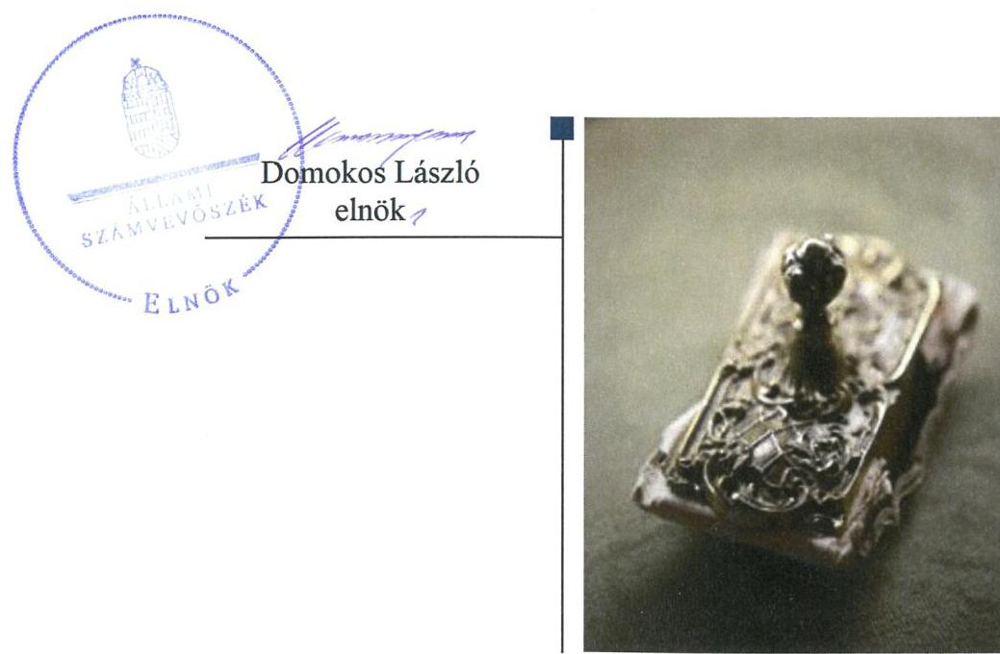

---

# AZ ELLENŐRZÉST FELÜGYELTE:

- **SALAMON ILDIKÓ** felügyeleti vezető

- **AZ ELLENŐRZÉST VEZETTE ÉS A VÉGREHAJTÁSÁÉRT FELELŐS:**

- **NEMESVÁRI-HORTHY ESZTER** ellenőrzésvezető

- **A PROGRAM ÖSSZEÁLLÍTÁSÁÉRT FELELŐS:**

- **TÓTPÁL SZABOLCS** osztályvezető

**IKTATÓSZÁM:** EL-0300-032/2018.

**TÉMASZÁM:** 2450

**ELLENŐRZÉS-AZONOSÍTÓ SZÁM:** V079104

Jelentéseink az Országgyűlés számítógépes hálózatán és az Interneten a www.asz.hu címen is olvashatóak.

---

# TARTALOMJEGYZÉK 

■ ÖSSZEGZÉS ..... 5
■ AZ ELLENŐRZÉS CÉLJA ..... 6
■ AZ ELLENŐRZÉS TERÜLETE ..... 7
■ AZ ELLENŐRZÉS HÁTTERE, INDOKOLTSÁGA ..... 9
■ A JELENTÉS LÉNYEGES KÉRDÉSKÖREI ..... 10
■ AZ ELLENŐRZÉS HATÓKÖRE ÉS MÓDSZEREI ..... 11
■ MEGÁLLAPÍTÁSOK ..... 13
■ JAVASLATOK ..... 18
■ KÖVETKEZTETÉSEK ..... 22
■ MELLÉKLETEK ..... 23
I. sz. melléklet: Értelmező szótár ..... 23
■ FÜGGELÉK: ÉSZREVÉTELEK ..... 27
■ RÖVIDÍTÉSEK JEGYZÉKE ..... 41

---

.

---

# ÖSSZEGZÉS 

A Tolna Megyei Balassa János Kórház belső kontrollrendszerének kialakítása és működtetése nem volt szabályszerű, ezáltal nem voltak biztosítottak az átlátható és elszámoltatható közpénzfelhasználás feltételei. A pénzügyi és vagyongazdálkodás nem volt szabályszerű. Az integritás kontrollrendszert nem a kockázatokkal arányosan építették ki, nem érvényesült az integritás szemlélet.

## Az ellenőrzés társadalmi indokoltsága

A közpénzek felhasználásában és az állami vagyonnal való gazdálkodásban a központi alrendszer egyes intézményei meghatározó súlyt képviselnek. Ez indokolja, hogy az Állami Számvevőszék ellenőrzéseket folytasson a pénzügyi és vagyongazdálkodás területén. Az Állami Számvevőszék az ellenőrzései során értékeli a belső kontrollrendszer jogszabályi előírások szerinti kialakítását és működtetésének szabályszerűségét, feltárja a gazdálkodás esetleges hiányosságait, rámutathat a vagyongazdálkodási tevékenység - ezen belül a tulajdonosi joggyakorlás és vagyonkezelés - esetleges szabálytalanságaira. Az ellenőrzésünkkel hozzá kívánunk járulni a központi intézmények pénzügyi helyzetének pontosabb megítéléséhez, a jó gyakorlat kialakításán és terjesztésén keresztül az ellenőrzéseink elősegíthetik a gazdálkodás szabályszerűségének javítását.

Az egészségügyi ellátások költsége folyamatosan a társadalmi érdeklődés középpontjában áll. A központi költségvetésből az egyik legjelentősebb kiadást az egészségügyi ellátásokra fordított kiadások jelentik, amelyekből a kórházak kapják a legtöbb támogatást. Ezért indokolt, hogy az Állami Számvevőszék az egészségügyi intézmények pénzügyi és vagyongazdálkodását rendszeresen több évre kiterjedően ellenőrizze.

A Tolna Megyei Balassa János Kórházat, amely közfeladatot lát el és jelentős állami vagyont kezel, az Állami Számvevőszék korábban nem ellenőrizte.

## Főbb megállapítások, következtetések, javaslatok

A Tolna Megyei Balassa János Kórház felett az irányító szervi jogosultságokat az Emberi Erőforrások Minisztériuma és átruházott hatáskörben a Gyógyszerészeti és Egészségügyi Minőség- és Szervezetfejlesztési Intézet és az Állami Egészségügyi Ellátó Központ szabályszerűen gyakorolta.

Nem alakítottak ki olyan kontrollkörnyezetet, amelyben a szervezet minden szintjén meghatározottak, ismertek és elfogadottak az etikai elvárások. A gazdasági szervezet feladatait ellátó szervezeti egységek - egy kivétellel - nem rendelkeztek ügyrenddel. A kockázatkezelési rendszert nem működtették, nem gondoskodtak a szervezeti célokkal összefüggő kockázatok felméréséről, az integrált kockázatkezelési rendszer kialakítása érdekében nem intézkedtek. A kontrolltevékenységek gyakorlása nem volt szabályszerű. Az információs és kommunikációs folyamatokat kialakították, azonban nem gondoskodtak a működéssel, gazdálkodással összefüggő dokumentumok közzétételéről, amely nem biztosította a szervezeti átláthatóságot. A tevékenységének, a célok megvalósításának folyamatos és eseti nyomon követését biztosító rendszert nem alakítottak ki. Az operatív tevékenységektől függetlenül működő belső ellenőrzés nem töltötte be szerepét, a tervezett ellenőrzések 14,3%-át hajtották végre, amelyekre nem vagy késedelmesen készítették el az érintettek intézkedési tervüket.

A kiadási előirányzatok felhasználása során a pénzgazdálkodási jogkörök gyakorlása nem felelt meg a jogszabályi előírásoknak és a belső szabályzatokban foglaltaknak. A vagyongazdálkodás körében a vagyonkezelői jog ingatlan nyilvántartásba történő bejegyeztetésének és töröltetésének elmaradása és a bevételek beszedése nem volt szabályszerű. A beszámoló mérlegtételeit a jogszabályi előírások ellenére leltárral nem támasztották alá.

Az integritás kontrollrendszert nem a kockázatokkal arányosan építették ki és működtették.
Az Állami Számvevőszék az Emberi erőforrások miniszterének egy, a Tolna Megyei Balassa János Kórház főigazgatójának tizennyolc javaslatot tett.

---

# AZ ELLENŐRZÉS CÉLJA 

AZ ELLENŐRZÉS CÉLJA annak megítélése volt, hogy a Tolna Megyei Balassa János Kórházra vonatkozó irányító szervi feladatellátás a jogszabályi előírások betartásával történt-e; a Tolna Megyei Balassa János Kórháznál a belső kontrollrendszer kialakítása és működtetése szabályszerű volt-e; pénzügyi és vagyongazdálkodása megfelelt-e a jogszabályi előírásoknak és belső szabályzatainak; átalakításának vagy átszervezésének lebonyolítása szabályszerűen történt-e.

Az ellenőrzés keretében értékeltük a Tolna Megyei Balassa János Kórház korrupciós kockázatainak kezelését
szolgáló integritás kontrollok kiépítettségét és az integritás szemlélet érvényesülését.

---

# AZ ELLENŐRZÉS TERÜLETE 

## Tolna Megyei Balassa János Kórház

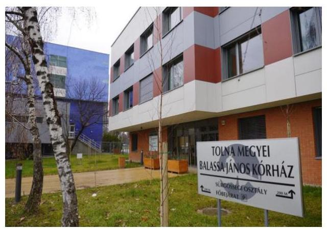

A szekszárdi székhelyű Kórház ${ }^{1}$ jogi személy, előirányzatai felett teljes jogkörrel rendelkező költségvetési szerv. Áht. ${ }^{2}$ szerinti átalakítására az ellenőrzött időszakban nem került sor. Közfeladata a működését meghatározó Eütv. ${ }^{3}$ alapján az ellátási területére kiterjedően a járó- és fekvőbetegek diagnosztikus és terápiás szakorvosi ellátása, rehabilitációja és követéses gondozása. Az átlagos ágyszám a 2014. évi 985-ről 2015-től 972-re változott.

Az emberi erőforrások minisztere az irányító szervi hatásköröket a Kórház fölött az Emberi Erőforrások Minisztériuma útján gyakorolja. Az egyes fenntartói, valamint az irányítási, középirányítói jogokat az Állami Egészségügyi Ellátó Központ (2015. február 28-ig a Gyógyszerészeti és Egészségügyi Minőség- és Szervezetfejlesztési Intézet) gyakorolta.

Mérleg szerinti vagyona a 2014. évben 13 732,9 M Ft volt, ami 2016-ra 0,4%-kal, 13 788,1 M Ft-ra növekedett. A 2014-2016. évi éves költségvetési beszámolók adatai alapján a teljesített összes bevétele a 2014. évi 8 622,6 M Ft-ról 2016-ra 10 380,0 M Ft-ra, 20,4%-kal, a teljesített összes kiadás a 2014. évi 8 531,6 M Ft-ról a 2016. évre 10 063,5 M Ft-ra, 18%-kal emelkedett. Az eredeti és módosított előirányzatok, a teljesített összes bevétel és kiadás alakulását az 1. ábra mutatja be.

1. ábra

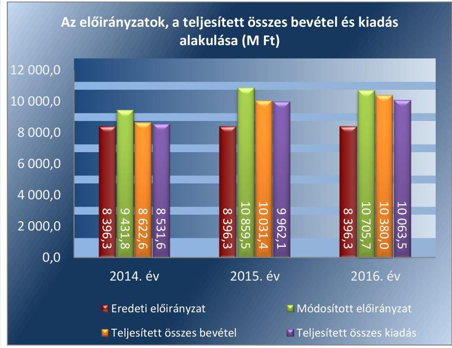

Forrás: A Kórház 2014-2016. évi beszámolói

---

Az ellenőrzött időszakban a főigazgató ${ }^{4}$ személyében két, a gazdasági igazgató ${ }^{5}$ személyében egy alkalommal történt változás. A jelenlegi főigazgató 2016. január 1-jétől, a jelenlegi gazdasági igazgató 2016. június 15-től látja el feladatait. A főigazgató munkáját az ápolási igazgató, az orvos igazgató, valamint a gazdasági-műszaki igazgató segítette. A munkavállalók átlagos statisztikai állományi létszáma a 2014. évi 1548 főről 2016-ra 1478 főre, 4,5%-kal csökkent.

A gazdálkodással kapcsolatos feladatokat a gazdasági-műszaki igazgató irányítása alatt működő bér- és munkaügyi, finanszírozási és számviteli, kontrolling, közbeszerzési, logisztikai, beruházási és eszközgazdálkodási, üzemeltetési és élelmezési osztályok, valamint a munka-, tűz- és környezetvédelmi iroda, mosoda, biztonsági szolgálat és palántagazdaság látták el.

---

# AZ ELLENŐRZÉS HÁTTERE, INDOKOLTSÁGA 

Az államháztartás központi alrendszerének közpénz felhasználása, az intézmények által ellátott közfeladatok sokrétűsége, valamint a feladatellátásához rendelt vagyon nagyságrendje indokolja, hogy az ÁSZ ${ }^{6}$ ellenőrzéseket folytasson a pénzügyi és vagyongazdálkodás területén. Az ÁSZ az ellenőrzései során feltárja a gazdálkodást, a központi alrendszer intézményei átalakulását, átszervezését érintő szabályozások esetleges hiányosságait, a szabályozással nem érintett gazdálkodási területeket, rámutathat a vagyongazdálkodási tevékenység - ezen belül a tulajdonosi joggyakorlás és vagyonkezelés - esetleges szabálytalanságaira, értékeli az állami vagyon nyilvántartására és elszámolására vonatkozó eljárásokat.

Az ellenőrzés várhatóan hozzájárul a központi intézmények pénzügyi helyzetének pontosabb megítéléséhez, és a jó gyakorlat kialakításán és terjesztésén keresztül az ellenőrzések elősegíthetik a gazdálkodás szabályszerűségének javítását.

---

# A JELENTÉS LÉNYEGES KÉRDÉSKÖREI 

1. - Szabályszerű volt-e az irányító szervi feladatellátás?
2.     - A belső kontrollrendszer kialakítása és működtetése szabályszerű volt-e?
3.     - A pénzügyi és vagyongazdálkodása szabályszerű volt-e?
4.     - Kiépítették-e az integritás kontrollrendszert?

---

# AZ ELLENŐRZÉS HATÓKÖRE ÉS MÓDSZEREI 

## Az ellenőrzés típusa

Megfelelőségi ellenőrzés.

## Az ellenőrzött időszak

2014. január 1-2016. december 31.

## Az ellenőrzés tárgya

A Tolna Megyei Balassa János Kórházra vonatkozó irányító szervi feladatok ellátása. A Tolna Megyei Balassa János Kórház belső kontroll rendszerének kialakítása és működtetése, pénzügyi és vagyongazdálkodása, az integritáskontrollok kiépítettsége, az integritás szemlélet érvényesülése.

Az ellenőrzés kiterjedt minden olyan körülményre és adatra, amely az ÁSZ jogszabályban meghatározott feladatainak teljesítéséhez, valamint a program végrehajtása folyamán felmerült újabb összefüggések feltárásához szükséges.

## Az ellenőrzött szervezet

Tolna Megyei Balassa János Kórház, valamint az irányító szervi feladatellátás tekintetében az Emberi Erőforrások Minisztériuma és az Állami Egészségügyi Ellátó Központ (2015. február 28-ig Gyógyszerészeti és Egészségügyi Minőség- és Szervezetfejlesztési Intézet).

## Az ellenőrzés jogalapja

Az ellenőrzés jogszabályi alapját az ÁSZ tv. ${ }^{7}$ 1. § (3) bekezdés, 5. § (2)-(4) és (6) bekezdései, valamint az Áht. 61. § (2) bekezdésének előírásai képezték.

## Az ellenőrzés módszerei

Az ellenőrzésre a szakmai program szempontjai, az ellenőrzött időszakban hatályos jogszabályok, az ellenőrzés szakmai szabályai, a jelen ellenőrzésre irányadó ÁSZ módszertanok figyelembevételével került sor.

Az ellenőrzés ideje alatt a Kórházzal, az Irányító szervvel ${ }^{8}$ és a Középirányító szervvel ${ }^{9}$ a kapcsolattartást az ÁSZ SZMSZ ${ }^{10}$-ének vonatkozó előírásai alapján biztosította az ÁSZ.

---

Az ellenőrzési kérdések megválaszolásához szükséges bizonyítékok megszerzése a Kórház, az Irányító szerv és a Középirányító szerv által rendelkezésre bocsátott dokumentumokra, adatokra alapozva megfigyelés, szemle (szemrevételezés), kérdésfeltevés (információkérés), mintavételezés, valamint elemző eljárás útján történt. Az ellenőrzési bizonyítékként felhasználható adatforrások közé tartoztak egyrészt a szakmai program részletes szempontjainál felsorolt adatforrások, másrészt minden egyéb az ellenőrzés folyamán feltárt, az ellenőrzés szempontjából információt tartalmazó dokumentum.

Az ellenőrzés lefolytatásához a Kórház a tanúsítványok kitöltésével, valamint az ÁSZ által kért dokumentumok megküldésével, az Irányító szerv és a Középirányító szerv az ÁSZ által kért dokumentumok megküldésével szolgáltatott adatokat.

A Kórház belső kontrollrendszere jogszabályi előírások szerinti kialakítása és működtetése szabályszerűségének értékelése az erre irányuló kérdésekre adott válaszok összesítése alapján, évente pillérenként (kontrollkörnyezet, kockázatkezelési rendszer, kontrolltevékenységek, információs és kommunikációs rendszer, monitoring rendszer) és összesítetten történt. A belső kontrollrendszer egyes pilléreinek kialakítása „szabályszerű", amennyiben az értékelt területen az elért és az elérhető pontok %-ban kifejezett, egész számra kerekített hányadosa meghaladta a 85%-ot, „nem szabályszerű", ha nem érte el a 85%-ot. A kontrollrendszer egésze esetében a „szabályszerű" értékelésnek a %-os értéken felül további feltétele volt, hogy egyik kontrollterület sem kaphatott „nem szabályszerű" értékelést. Az összesített értékelés a %-os értéktől függetlenül „nem szabályszerű" volt, ha az ellenőrzött kontrollterületek közül több mint egynek „nem szabályszerű" volt az értékelése. A teljes sokaság tekintetében a 10%-os hibaarányhoz való viszony megítélésének megbízhatósága nem érte el a 95%-ot, annak elérése érdekében az
 értékelés további szempontokkal egészült ki, a feltárt hibák értéke is figyelembe vételre került.

Az integritás szemlélet érvényesülésének értékelése a Kórház tanúsítványi adatszolgáltatása és az ÁSZ ellenőrzés rendelkezésére bocsátott dokumentumai felhasználásával történt.

---

# 1. Szabályszerű volt-e az irányító szervi feladatellátás? 

## Összegző megállapítás

## A Kórházra vonatkozó irányító szervi feladatellátás szabályszerű volt.

Az Irányító szerv az alapító okirat ${ }_{1,2}{ }^{11}$-t az Áht. előírásai alapján kiadta. Az alapító okirat ${ }_{1}$ kiadásához az Ávr ${ }^{12}$. előírásai alapján nem volt szükséges, az alapító okirat ${ }_{2}$ kiadásához az Irányító szerv az Áht. előírásai alapján az államháztartásért felelős miniszter előzetes egyetértését beszerezte. Az Alapító okirat ${ }_{1,2}$ tartalma az Ávr. előírásainak megfelelő. A Középirányító szerv - átruházott hatáskörben - jóváhagyta az SZMSZ ${ }_{2,3}{ }^{13}$-t.

Az Irányító szerv az Ávr. előírásának megfelelően a tervezett bevételek és kiadások megállapításához meghatározta a tervezési követelményeket, az Áht. és az Áhsz. ${ }^{14}$ előírásainak megfelelően jóváhagyta a Kórház elemi költségvetését és éves költségvetési beszámolóit. Az Ávr. előírásainak eleget téve az Irányító szerv gondoskodott a Kórház költségvetési maradványának megállapításáról.

Az Irányító szerv a munkáltatói jogosultságait a főigazgató és a gazdasági igazgató felmentése és kinevezése során az Áht. és az Eütv. alapján szabályszerűen gyakorolta.

## 2. A belső kontrollrendszer kialakítása és működtetése szabályszerű volt-e?

## Összegző megállapítás

### 2.1. számú megállapítás

1. táblázat

KONTROLLKÖRNYEZET ÉRTÉKELÉSE 2014-2016.

| Év | Értékelés |
| :--: | :--: |
| 2014. | Nem szabályszerű |
| 2015. | Nem szabályszerű |
| 2016. | Nem szabályszerű |

A Kórház belső kontrollrendszerének kialakítása és működtetése nem volt szabályszerű.

## A kontrollkörnyezet kialakítása nem volt szabályszerű.

A főigazgató a Bkr. ${ }^{15} 6 . \S$ (1) bekezdés c) pontja ellenére nem gondoskodott olyan kontrollkörnyezet kialakításáról, amelyben meghatározottak, ismertek és elfogadottak az etikai elvárások a szervezet minden szintjén.

Az SZMSZ ${ }_{1}{ }^{16}$ az Ávr. 13. § (1) bekezdés e) pontja előírása ellenére nem tartalmazta a szervezeti egységek létszámát. Az SZMSZ ${ }_{2,3}$ az Ávr. előírásai közül a helyettesítés rendjét tartalmazta, az Ávr. 13. § (5) bekezdése ellenére a gazdálkodási feladatot ellátó szervezeti egységek munkafolyamatainak leírását, a vezetőinek és alkalmazottainak feladat- és hatáskörét (a gazdasági igazgató kivételével), a szervezeti egység költségvetési szerven belüli belső és azon kívüli külső kapcsolattartásának módját, szabályait nem. A gazdasági szervezet feladatait ellátó szervezeti egységek a Bér- és Munkaügyi osztály kivételével - az Ávr. 9. § (5) bekezdése (hatályos 2014.

---

### 2.2. számú megállapítás

2. táblázat

## KOCKÁZATKEZELÉSI RENDSZER ÉRTÉKELÉSE 2014-2016.

|  Év | Értékelés  |
| --- | --- |
|  2014. | Nem szabályszerű  |
|  2015. | Nem szabályszerű  |
|  2016. | Nem szabályszerű  |

2.3. számú megállapítás

## A kockázatkezelési rendszer kialakítása és működtetése nem volt szabályszerű.

A főigazgató Kockázatkezelési szabályzat ${ }^{25}$-ban határozta meg a szervezeti célok elérését veszélyeztető kockázatok azonosításának, elemzésének, csoportosításának módját. A Bkr. 2016. október 1-jétől hatályos 6. § (4) bekezdés előírása ellenére nem szabályozta a szervezeti integritást sértő események kezelésének eljárásrendjét, valamint az integrált kockázatkezelés eljárásrendjét.

A főigazgató 2014-2016. években a Bkr. 7. § (2) bekezdése ellenére nem gondoskodott a Kórház tevékenységében rejlő és a szervezeti célokkal összefüggő kockázatok felméréséről. A Bkr. 2016. október 1-jétől hatályos 7. § (1) bekezdése ellenére a főigazgató nem gondoskodott integrált kockázatkezelési rendszer működtetéséről. A Bkr. 2016. október 1-jétől hatályos 7. § (4) bekezdése előírása ellenére az integrált kockázatkezelési rendszer koordinálására szervezeti felelőst nem jelölt ki.

## A kontrolltevékenység gyakorlása és működtetése nem volt szabályszerű.

A főigazgató a Bkr. 6. § (1) bekezdés b) pontja ellenére nem alakított ki olyan kontrollkörnyezetet, amelyben egyértelműek a felelősségi, hatásköri viszonyok. A kontrolltevékenységek feladatköri elkülönítését, az összeférhetetlenség eseteit az Ávr. előírásainak megfelelően a Gazdálkodási szabályzat ${ }_{1-3}$-ban rögzítették. A gazdálkodási jogkör gyakorlására jogosult személyek aláírás mintáit tartalmazó nyilvántartás naprakész vezetéséről 2014-2015. években - az Ávr. 60. § (3) bekezdésében foglaltak ellenére -

---

3. táblázat

KONTROLLTEVÉKENYSÉGEK ÉRTÉKELÉSE 2014-2016.

|  Év | Értékelés  |
| --- | --- |
|  2014. | Nem szabályszerű  |
|  2015. | Nem szabályszerű  |
|  2016. | Nem szabályszerű  |

2.4. számú megállapítás 4. táblázat

INFORMÁCIÓS ÉS KOMMUNIKÁCIÓS FOLYAMATOK ÉRTÉKELÉSE 2014-2016.

|  Év | Értékelés  |
| --- | --- |
|  2014. | Nem szabályszerű  |
|  2015. | Nem szabályszerű  |
|  2016. | Nem szabályszerű  |

2.5. számú megállapítás 5. táblázat

MONITORING RENDSZER ÉRTÉKELÉSE 2014-2016.

|  Év | Értékelés  |
| --- | --- |
|  2014. | Nem szabályszerű  |
|  2015. | Nem szabályszerű  |
|  2016. | Nem szabályszerű  |

nem gondoskodtak, 2016-tól az Ávr. előírásai szerint a gazdálkodási jogkörök gyakorlóinak aláírás mintáiról folyamatos, naprakész nyilvántartást vezettek.

A kötelezettségvállalások, más fizetési kötelezettségek nyilvántartása 2014-2016. években nem felelt meg az Áhsz. 14. melléklet II. 4. a)-c) és e-g) pontjaiban foglalt tartalmi előírásoknak.

A kiadási előirányzatok felhasználása során a 2014-2016. években a kontrolltevékenységek gyakorlása nem felelt meg a jogszabályi előírásoknak. Az ezzel kapcsolatos ellenőrzési megállapítások a 3.1. számú megállapítás 1-4. bekezdésében szerepelnek.

## Az információs és kommunikációs folyamatokat kialakították, azonban azok működtetése nem volt szabályszerű.

A főigazgató a Bkr. előírásai szerint kialakította a Kórház információs és kommunikációs rendszerét, meghatározta a beszámolási szinteket, határidőket és módokat.

A Kórház - az Info tv. 37. § (1) bekezdése és 1. melléklet II/1. pontja és III/1. pontja ellenére - nem tette közzé az SZMSZ-ét, adatvédelmi és adatbiztonsági szabályzatát, éves költségvetését és beszámolóját.

A Kórház a 2014. és 2015. évi éves költségvetési beszámolók Irányító szerv részére jóváhagyásra történő megküldésére vonatkozó, az Áhsz. 32. § (1) bekezdésében előírt február 28-i határidőt nem tartotta be. A 2016. évi beszámolót a Kórház az Ávr. előírásainak megfelelően, határidőben feltöltötte a Kincstár által működtetett elektronikus adatszolgáltatási rendszerbe.

A Kórház a vagyonkezelési szerződés ${ }^{26}$ 3.4. pontjában meghatározott tartalommal a vagyonkezelt vagyonról (értékcsökkenés, értéket növelő beruházások, felújítások) - a Vtvr. 9. § (3) és 14. § (1) bekezdésében foglaltak ellenére - 2014. évről a Középirányító szerv felé adatszolgáltatási kötelezettségét nem, 2015-2016. években azonban teljesítette.

## A Kórház tevékenységének, a célok megvalósításának folyamatos és eseti nyomon követését biztosító rendszert nem alakítottak ki, a belső ellenőrzés tevékenysége nem volt szabályszerű.

A főigazgató elkészítette az ellenőrzési nyomvonalakat, azonban a Bkr. 6. § (3) bekezdése ellenére rendszeres aktualizálásukról nem gondoskodott. A főigazgató a Bkr. 10. §-ában foglalt előírások ellenére a szervezet tevékenységének, a célok megvalósításának nyomon követését biztosító rendszert nem alakította ki, az operatív tevékenységek keretében megvalósuló folyamatos és eseti nyomon követés nem működött.

Az operatív tevékenységektől függetlenül működő belső ellenőrzés tevékenysége nem volt szabályszerű. A Bkr. 22. § (1) bekezdés b) pontja ellenére a belső ellenőrzési terveket (2014-2016. évekre tervezett 14 ellenőrzésből 12-t) a belső ellenőrzési vezető nem hajtotta végre. A Bkr. 28. § c) pontja ellenére az elkészített két ellenőrzési jelentés közül egyre nem, a másik ellenőrzési jelentésre a Bkr. 45. § (3) bekezdése ellenére az ellenőrzöttek, javaslattal érintettek késedelmesen készítettek intézkedési tervet.

---

# 3. A pénzügyi és vagyongazdálkodása szabályszerű volt-e? 

## Összegző megállapítás

### 3.1. számú megállapítás

### 3.2. számú megállapítás

A pénzügyi és a vagyongazdálkodás a jogszabályi előírásoknak nem felelt meg.

A kiadási előirányzatok felhasználása során a jogszabályi előírásokat és a belső szabályzat előírásait nem tartották be, a pénzgazdálkodási jogkörök gyakorlása nem a jogszabályi előírások és a belső szabályzat előírásai alapján történt.

A kötelezettségvállalások dokumentumán az Ávr. 55. § (1) bekezdése és a Gazdálkodási szabályzat ${ }_{1-3}$ 1.2.2. pontjában foglaltak ellenére a pénzügyi ellenjegyzést nem igazolták. A pénzügyi ellenjegyzés hiányában a kötelezettségvállalás nem felelt meg az Áht. 37. § (1) bekezdésében foglaltaknak, amely szerint kötelezettséget vállalni csak pénzügyi ellenjegyzés után lehet.

A teljesítés igazolója az Ávr. 57. § (1) bekezdése és a Gazdálkodási szabályzat ${ }_{1-3}$ 1.2.3. pontja ellenére a kiadások teljesítésének jogosságát, összegszerűségét nem ellenőrizte. A teljesítés igazolását az Ávr. 57. § (4) bekezdése és a Gazdálkodási szabályzat ${ }_{1-3}$ 1.1.4. pontja ellenére nem az arra jogosult személy végezte.

Az érvényesítő az Ávr. 58. § (1) bekezdése és a Gazdálkodási szabályzat ${ }_{1-3}$ 1.2.4. pontja ellenére nem ellenőrizte, hogy a megelőző ügymenetben a jogszabályi és a belső szabályzatban foglaltakat megtartották-e.

Az utalványozást az Ávr. 59. § (1) bekezdése és a Gazdálkodási szabályzat ${ }_{1-3}$ 1.2.5. pontja ellenére nem az arra jogosult végezte.

A Kórház az éves költségvetési beszámoló részeként elkészített maradvány kimutatását az Áhsz. 39. § (2) és (3) bekezdése ellenére és az Áhsz. 14. melléklet II/4-ben foglalt tartalmú részletező nyilvántartással nem támasztotta alá. A Kórház kötelezettségvállalással terhelt költségvetési maradványának meghatározása az Ávr. 150. § (1) bekezdés b) pontjában foglaltaknak nem felelt meg.

A vagyon értékének megőrzését, gyarapítását támogató vagyongazdálkodás feltételeinek kialakítása nem volt szabályszerű. A beszámoló mérlegtételeit a jogszabályi előírások ellenére leltárakkal nem támasztották alá, a bevételek beszedése során nem tartották be a jogszabályi előírásokat.

A Kórház a Vtvr. ${ }^{27}$ 7. § (2) bekezdésében foglaltak ellenére a vagyonkezelési szerződés 2015. december 30-i módosítása megkötésétől számított harminc napon belül és azon túl sem gondoskodott a vagyonkezelésébe kerülő vagyonelem és a vagyonkezeléséből kikerülő vagyonelemek vonatkozásában a vagyonkezelői jog ingatlan-nyilvántartásban történő bejegyeztetéséről, illetve töröltetéséről.

A 2014. évben a Számv. tv. 69. § (2) bekezdése előírásaival, a Leltározási szabályzat ${ }_{1}$ VI.-VIII. pontjában foglaltakkal ellentétben nem végezte el a leltározást, a főkönyvi könyvelés és az analitikus nyilvántartások közötti egyeztetést a mérleg fordulónapjára vonatkozóan. A Kórház a 2014-2016. években nem tett eleget a Számv. tv. 69. § (1) bekezdésében foglaltaknak,

---

mert a mérleg tételeinek alátámasztásához nem állított össze olyan leltárt, amely tételesen, ellenőrizhető módon tartalmazta volna a mérleg fordulónapján meglévő eszközeit és forrásait mennyiségben és értékben.

A Kórház a Vtvr. 48.§ (1) bekezdésében foglaltak ellenére a versenyeztetés nélküli tárgyi eszköz értékesítések során a forgalmi érték megállapítását az erre jogosult, független szakértővel nem végeztette el. A Kórház 2016-ban a Selejtezési szabályzat ${ }^{28}$ IV./ 1.2. pontjában foglaltak ellenére értékkel nem szereplő, használatból kivont tárgyi eszközöket úgy adott el magánszemélyeknek, hogy azok értékesítését nem hirdette meg.

# 4. Kiépítették-e az integritás kontrollrendszert? 

## Összegző megállapítás

A Kórház nem a kockázatokkal arányosan építette ki az integritás kontrollrendszert.

Az integritás szemlélet nem érvényesült. A Kórház nem működtette megfelelően a jogszabályok által előírt integritást támogató kontrolljait és nem működtetett az integritást erősítő, nem kötelezően előírt kontrollokat. Rendszerszerű kockázatelemzést nem alkalmaztak.

---

# JAVASLATOK 

Az ÁSZ tv. 33. § (1) bekezdésében
 foglaltak értelmében az ellenőrzött szervezet vezetője köteles a jelentésben foglalt megállapításokhoz kapcsolódó intézkedési tervet összeállítani és azt a jelentés kézhezvételétől számított 30 napon belül az ÁSZ részére megküldeni. Amennyiben az ellenőrzött szervezet vezetője nem küldi meg határidőben az intézkedési tervet, vagy továbbra sem elfogadható intézkedési tervet küld, az Állami Számvevőszék elnöke az ÁSZ tv. 33. § (3) bekezdése a) és b) pontjaiban foglaltakat érvényesítheti.

## Az Emberi erőforrások miniszterének

1. Tegyen intézkedéseket a feltárt hiányosságok és szabálytalanságok tekintetében a felelősség tisztázása érdekében, és szükség szerint intézkedjen a felelősség érvényesítéséről
(2.1. számú megállapítás 1. bekezdése, 2. bekezdés 2-3. mondata, 3-4. bekezdése, 2.2. számú megállapítás 1. bekezdés 2. mondata, 2. bekezdése, 2.3. számú megállapítás 2. bekezdése, 2.4. számú megállapítás 2. bekezdése, 2.5. számú megállapítás 1. bekezdése, 3.1. számú megállapítás 1-5. bekezdése, 3.2. számú megállapítás 1. bekezdése, 2. bekezdés 2. mondata, 3. bekezdése alapján)

## A Tolna Megyei Balassa János Kórház Főigazgatójának

1. Intézkedjen a jogszabályi előírásoknak megfelelően olyan kontrollkörnyezet kialakítására, amelyben meghatározottak, ismertek és elfogadottak az etikai elvárások a szervezet minden szintjén.
(2.1. számú megállapítás 1. bekezdése alapján)
2. Intézkedjen az SZMSZ módosítására annak érdekében, hogy az a jogszabályi előírásokkal összhangban tartalmazza a gazdálkodási feladatot ellátó szervezeti egységek
a) által ellátott feladatok munkafolyamatainak leírását,
b) vezetőinek és alkalmazottainak feladat- és hatáskörét,
c) költségvetési szervén belüli és azon kívüli külső kapcsolattartásának módját, szabályait.
(2.1. számú megállapítás 2. bekezdés 2. mondata alapján)
3. Intézkedjen a jogszabályi előírásoknak megfelelően a gazdasági szervezet feladatait ellátó szervezeti egységek ügyrendjének elkészítésére.
(2.1. számú megállapítás 2. bekezdés 3. mondata alapján)

---

4. Intézkedjen a jogszabályi előírásokkal összhangban
a) a tervezéssel kapcsolatos belső előírások, feltételek,
b) a külföldi kiküldetések elrendelésével és bonyolításával, elszámolásával kapcsolatos kérdések,
c) az előzetes írásbeli kötelezettségvállalást nem igénylő kifizetések rendjének
belső szabályzatban történő rendezésére.
(2.1. számú megállapítás 3. és 4. bekezdése alapján)
5. Intézkedjen a jogszabályi előírásoknak megfelelően
a) a szervezeti integritást sértő események kezelése eljárásrendjének, valamint az integrált kockázatkezelés eljárásrendjének szabályozására,
b) a Kórház tevékenységében rejlő és a szervezeti célokkal összefüggő kockázatok felmérésére, továbbá az egyes kockázatokkal kapcsolatban szükséges intézkedések, valamint azok teljesítésének folyamatos nyomon követésének módja meghatározására;
c) az integrált kockázatkezelési rendszer működtetésére.
(2.2. számú megállapítás 1. bekezdés 2. mondata, 2. bekezdés 1. és 2. mondata alapján)
6. Intézkedjen a jogszabályi előírásoknak megfelelően az integrált kockázatkezelési rendszer koordinálása szervezeti felelősének kijelölésére.
(2.2. számú megállapítás 2. bekezdés 3. mondata alapján)
7. Intézkedjen a kötelezettségvállalások, más fizetési kötelezettségek nyilvántartásának jogszabályi előírások szerinti vezetésére.
(2.3. számú megállapítás 2. bekezdése alapján)
8. Intézkedjen a közérdekű adatok - az SZMSZ, az adatbiztonsági szabályzat, az éves költségvetés, valamint az éves beszámoló - jogszabályi előírásoknak megfelelő közzétételére.
(2.4. számú megállapítás 2. bekezdése alapján)
9. Intézkedjen az ellenőrzési nyomvonalak jogszabálynak megfelelő aktualizálására.
(2.5. számú megállapítás 1. bekezdés 1. mondata alapján)
10. Intézkedjen a jogszabályi előírásoknak megfelelően a Kórház tevékenységének, a célok megvalósításának nyomon követését biztosító rendszer kialakítására és működtetésére.
(2.5. számú megállapítás 1. bekezdés 2. mondata alapján)

---

11. Intézkedjen a jogszabályi előírásoknak megfelelően
a) a jóváhagyott éves belső ellenőrzési tervekben foglalt ellenőrzések végrehajtására,
b) a belső ellenőrzés megállapításai, javaslatai alapján az intézkedési tervek elkészítésére.
(2.5. számú megállapítás 2. bekezdése alapján)
12. Intézkedjen, hogy a kiadási előirányzatok felhasználása során a jogszabályi előírásoknak és a belső szabályzatban foglaltaknak megfelelően
a) a kötelezettségvállalások dokumentumán a pénzügyi ellenjegyzést igazolják,
b) a kötelezettségvállalásokra pénzügyi ellenjegyzés után kerüljön sor;
c) a teljesítésigazolást az arra jogosult személy végezze el, történjen meg a kiadások teljesítése jogosságának és összegszerűségének ellenőrzése,
d) az érvényesítő ellenőrizze a jogszabályi és a belső szabályzatban foglaltak betartását,
e) az utalványozást az arra jogosult személy végezze el.
(3.1. számú megállapítás 1-4. bekezdése alapján)
13. Intézkedjen, hogy
a) az éves költségvetési beszámoló részeként elkészített maradvány kimutatását a jogszabályi előírásoknak megfelelő tartalmú részletező nyilvántartással támaszszák alá,
b) a kötelezettségvállalással terhelt költségvetési maradvány meghatározása feleljen meg a jogszabályi előírásoknak.
(3.1. számú megállapítás 5. bekezdése alapján)
14. Kezdeményezze a jogszabályoknak megfelelően a vagyonkezelői jog ingatlan nyilvántartásba történő bejegyeztetését, illetve töröltetését.
(3.2. számú megállapítás 1. bekezdése alapján)
15. Intézkedjen, a mérleg alátámasztásához a jogszabályi előírásoknak megfelelő olyan leltár összeállítására, amely tételesen, ellenőrizhető módon tartalmazza a Kórház mérleg fordulónapján meglévő eszközeit és forrásait mennyiségben és értékben.
(3.2. számú megállapítás 2. bekezdés 2. mondata alapján)

---

16. Intézkedjen a jogszabályi előírásoknak megfelelően a versenyeztetés nélküli tárgyi eszköz értékesítés során az értékesítendő tárgyi eszköz forgalmi értékének független szakértő általi megállapítására.
(3.2. számú megállapítás 3. bekezdés 1. mondata alapján)
17. Intézkedjen az értékkel nem szereplő, használatból kivont tárgyi eszköz értékesítés során, az értékesítés belső szabályzatban foglaltak szerinti meghirdetésére.
(3.2. számú megállapítás 3. bekezdés 2. mondata alapján)
18. Tegyen intézkedéseket a feltárt hiányosságok és szabálytalanságok tekintetében a felelősség tisztázása érdekében és szükség szerint intézkedjen a felelősség érvényesítéséről.
(2.5. számú megállapítás 2. bekezdése alapján)

---

# KÖVETKEZTETÉSEK 

A Kórház belső kontrollrendszere keretében nem alakították ki mindazon elveket, eljárásokat és belső szabályzatokat, illetve nem is működtették azokat, amelyek biztosítják a szervezet valamennyi tevékenysége során a szabályozott és szabályszerű feladatellátást. A Kórház működésével kapcsolatosan nem álltak rendelkezésre megfelelő, pontos és naprakész információk. Mindezek alapján nem volt biztosított a rendelkezésre álló eszközök és források átlátható, szabályszerű, pazarlásmentes, rendeltetésszerű felhasználása, valamint a vagyon megőrzése. A Kórház belső kontrollrendszere kialakításának és működtetésének hiányosságai a kórház feladatellátásra is kihatással vannak.

---

# MELLÉKLETEK 

- I. SZ. MELLÉKLET: ÉRTELMEZŐ SZÓTÁR
állami vagyon
állami vagyonnak minősül:
a) az állam tulajdonában lévő dolog, valamint a dolog módjára hasznosítható természeti erő,
b) az a) pont hatálya alá nem tartozó mindazon vagyon, amely vonatkozásában törvény az állam kizárólagos tulajdonjogát nevesíti,
c) az állam tulajdonában lévő tagsági jogviszonyt megtestesítő értékpapír, illetve az államot megillető egyéb társasági részesedés,
d) az államot megillető olyan immateriális, vagyoni értékkel rendelkező jogosultság, amelyet jogszabály vagyoni értékű jogként nevesít. (Forrás: Vtv. ${ }^{29}$ 1. § (2) bekezdése)
állami vagyon használója Az a természetes vagy jogi személy, jogi személyiséggel nem rendelkező szervezet, aki, vagy amely törvény vagy szerződés alapján, bármely jogcímen (bérlet, haszonbérlet, használat stb.) állami vagyont birtokol, használ, szedi annak hasznait, hasznosít, ide nem értve a haszonélvezőt, a vagyonkezelőt és a tulajdonosi jogok gyakorlóját. (Forrás: Vtvr. 1. § (7) bekezdés a) pontja)
állami vagyon hasznosítása Az állami vagyont az MNV Zrt. maga kezeli, vagy szerződés - így különösen bérlet, haszonbérlet, megbízás - alapján központi költségvetési szervnek, természetes vagy jogi személynek, vagy jogi személyiséggel nem rendelkező gazdálkodó szervezetnek hasznosításra átengedi.
(Forrás: Vtv. 23. § (1) bekezdése, hatályos 2012. január 1-jétől)
Az állami vagyonnal a tulajdonosi joggyakorló maga gazdálkodik, vagy szerződés - így különösen bérlet, haszonbérlet, megbízás - alapján hasznosításra átengedi, illetőleg vagyonkezelésbe, haszonélvezetbe adja. (Forrás: Vtv. 23. § (1) bekezdése, hatályos 2013. június 28-ától)
Az állami vagyont az MNV Zrt. maga kezeli, vagy szerződés - így különösen bérlet, haszonbérlet, megbízás - alapján központi költségvetési szervnek, természetes vagy jogi személynek, vagy jogi személyiséggel nem rendelkező gazdálkodó szervezetnek hasznosításra átengedi." Az állami vagyonra vonatkozóan az MNV Zrt. kizárólag az Nvtv-ben meghatározott személyekkel köthet vagyonkezelési szerződést. (Forrás: Vtv. 27. § (1) bekezdése, hatályos 2012. január 1-jétől)
Az ÁSZ 2011-ben indította el a közintézmények integritását vizsgáló és fejlesztő kérdőíves kutatását, melynek hétéves felmérési időszaka 2017. évben zárult le. Az ÁSZ az Integritás felmérés keretében 2017. évben hetedik alkalommal értékelte a közszféra intézményeinek korrupciós kockázatait, illetve a korrupció ellen védelmet biztosító kontrollok kiépítettségét. (Forrás: https://asz.hu/tanulmanyok-2017-ev Elemzés a közszféra integritás helyzetéről 2017. Vezetői összefoglaló 4. oldal)
átalakítás
belső ellenőrzés

A költségvetési szerv általános jogutódlással történő megszüntetése átalakítással történhet. Az átalakítás lehet egyesítés vagy különválás. Az egyesítés lehet beolvadás vagy összeolvadás. (Áht. 11. § (2) bekezdés)
Független, tárgyilagos bizonyosságot adó és tanácsadó tevékenység, amelynek célja, hogy az ellenőrzött szervezet működését fejlessze és eredményességét növelje, az ellenőrzött szervezet céljai elérése érdekében rendszerszemléletű megközelítéssel és módszeresen értékeli, illetve fejleszti az ellenőrzött szervezet irányítási és belső kontrollrendszerének hatékonyságát. (Forrás: Bkr. 2. § b) pontja)

---

belső kontrollrendszer

A belső kontrollrendszer a kockázatok kezelése és tárgyilagos bizonyosság megszerzése érdekében kialakított folyamatrendszer, amely azt a célt szolgálja, hogy a működés és gazdálkodás során a tevékenységeket szabályszerűen, gazdaságosan, hatékonyan, eredményesen hajtsák végre, az elszámolási kötelezettségeket teljesítsék, megvédjék az erőforrásokat a veszteségektől, károktól és nem rendeltetésszerű használattól. (Forrás: Áht. 69. § (1) bekezdése)
belső kontrollrendszer területei

A kontrollkörnyezet, a kockázatkezelési rendszer, a kontrolltevékenységek, az információs és kommunikációs rendszer, valamint a nyomon követési (monitoring) rendszer. (Forrás: Bkr. 3. §-a)
ellenőrzési nyomvonal

Az ellenőrzési nyomvonal a költségvetési szerv működési folyamatainak szöveges, táblázatokkal vagy folyamatábrákkal szemléltetett leírása, amely tartalmazza különösen a felelősségi és információs szinteket és kapcsolatokat, irányítási és ellenőrzési folyamatokat, lehetővé téve azok nyomon követését és utólagos ellenőrzését. (Forrás: Bkr. 6. § (3) bekezdés)
hasznosítás

A nemzeti vagyon birtoklásának, használatának, hasznok szedése jogának bármely a tulajdonjog átruházását nem eredményező jogcímen történő átengedése, ide nem értve a vagyonkezelésbe adást, valamint a haszonélvezeti jog alapítását. (Forrás: Nvtv. ${ }^{30}$ 3. § (1) bekezdés 4. pontja)
információs és kommunikációs rendszer

A költségvetési szerv vezetője által kialakított és működtetett olyan rendszer, mely biztosítja, hogy a megfelelő információk a megfelelő időben eljutnak az illetékes szervezethez, szervezeti egységhez, illetve személyhez. (Forrás: Bkr. 9. § (1) bekezdés)
integritás - egyik gyakran használt jelentése szerint - az elvek, értékek, cselekvések, módszerek, intézkedések konzisztenciáját jelenti, vagyis olyan magatartásmódot, amely meghatározott értékeknek megfelel. Integritás-irányítási rendszer bevezetése a szervezetben a szervezethez rendelt közfeladatok integritás szempontú ellátását, az érték alapú működéssel (integritással) összefüggő szervezeti követelmények következetes érvényesítését jelenti. (Forrás: Nemzetgazdasági Minisztérium: Államháztartási Belső Kontroll Standardok és Gyakorlati Útmutató 1.6. Etikai értékek és integritás 46. oldal, 2017. szeptember)
irányító szerv/felügyeleti
A költségvetési szerv tekintetében az Áht-ban meghatározott irányítási hatáskört gyakorló szerv. (Forrás: Áht. 1. § 9. pontja)
szerv
kockázat

A kockázat annak a valószínűségét jelenti, hogy egy vagy több esemény vagy intézkedés nem kívánt módon befolyásolja a rendszer működését, céljainak megvalósulását. (Forrás: Javaslatok a korrupciós kockázatok kezelésére - Kockázatkezelési és ellenőrzési módszertan 35. oldal, ÁSZ)
kockázatkezelési rendszer

Olyan irányítási eszközök és módszerek összessége, melynek elemei a szervezeti célok elérését veszélyeztető tényezők (kockázatok) azonosítása, elemzése, csoportosítása, nyomon követése, valamint szükség esetén a kockázati kitettség mérséklése.(Forrás: Bkr. 2. § m) pontja)
integrált kockázatkezelési rendszer

A költségvetési szerv vezetője által kialakított olyan elvek, eljárások, belső szabályzatok összessége, amelyben világos a szervezeti struktúra, a folyamatok átláthatók, egyértelműek a felelősségi, hatásköri viszonyok és feladatok, meghatározottak, ismertek és elfogadottak az etikai elvárások a szervezet minden szintjén, átlátható a humán-erőforrás-kezelés. (Forrás: Bkr. 6. § (1) bekezdés)

---

kontrolltevékenységek

középirányító szerv
közfeladat
maradvány
nyomon követési rendszer (monitoring)
tulajdonosi joggyakorló
vagyongazdálkodás

A költségvetési szerv vezetője által a szervezeten belül kialakított (kontroll) tevékenységek, melyek biztosítják a kockázatok kezelését, hozzájárulnak a szervezet céljainak eléréséhez és erősítik a szervezet integritását. (Forrás: Bkr. 8. § (1) bekezdés)
A költségvetési

 szerv tekintetében törvény vagy kormányrendelet alapján meghatározott, átruházott irányítási hatásköröket gyakorló szerv. (Forrás: Áht. 9. § (4) bekezdés)
Jogszabályban meghatározott állami vagy önkormányzati feladat, amit az arra kötelezett közérdekből, a jogszabályban meghatározott követelményeknek és feltételeknek megfelelve végez, ideértve a lakosság közszolgáltatásokkal való ellátását, továbbá az állam nemzetközi szerződésekben vállalt kötelezettségeiből adódó közérdekű feladatokat, valamint e feladatok ellátásakor szükséges infrastruktúra biztosítását is. (Forrás: Nvtv. 3. § (1) bekezdés 7. pontja)
A költségvetési év során a bevételek és kiadások különbözete, amely az alaptevékenység bevételei és kiadásai tekintetében a költségvetési maradvány, a vállalkozási tevékenység bevételei és kiadásai tekintetében a vállalkozási maradvány. (Forrás: Áht. 1. § 17. pont)
A költségvetési szerv vezetője köteles kialakítani a szervezet tevékenységének a célok megvalósításának nyomon követését biztosító rendszert, amely az operatív tevékenységek keretében megvalósuló folyamatos és eseti nyomon követésből, valamint az operatív tevékenységektől függetlenül működő belső ellenőrzésből áll. (Forrás: Bkr. 10. §)

Aki a nemzeti vagyon felett az államot vagy a helyi önkormányzatot megillető tulajdonosi jogok és kötelezettségek összességének gyakorlására jogosult. (Forrás: Nvtv. 3. § (1) bekezdés 17. pontja)

A nemzeti vagyongazdálkodás feladata a nemzeti vagyon rendeltetésének megfelelő, az állam, az önkormányzat mindenkori teherbíró képességéhez igazodó, elsődlegesen a közfeladatok ellátásához és a mindenkori társadalmi szükségletek kielégítéséhez szükséges, egységes elveken alapuló, átlátható, hatékony és költségtakarékos működtetése, értékének megőrzése, állagának védelme, értéknövelő használata, hasznosítása, gyarapítása, továbbá az állam vagy a helyi önkormányzat feladatának ellátása szempontjából feleslegessé váló vagyontárgyak elidegenítése. (Forrás: Nvtv. 7. § (2) bekezdése)

---

.

---

# FÜGGELÉK: ÉSZREVÉTELEK 

A jelentéstervezetet a Számvevőszék 15 napos észrevételezésre megküldte az ellenőrzött szervezetek vezetőinek az ÁSZ tv. 29. § (1) bekezdése előírásának megfelelően.

A Tolna Megyei Balassa János Kórház főigazgatója a jelentéstervezet megállapításaira írásban észrevételt tett. Az Emberi Erőforrások Minisztériuma, valamint az Állami Egészségügyi Ellátó Központ főigazgatója az ÁSZ tv. 29. § (2) bekezdésében foglalt észrevételezési jogával nem élt.
A függelék tartalmazza a Tolna Megyei Balassa János Kórház főigazgatója által megküldött észrevételeket, illetve az el nem fogadott észrevételek elutasításának indoklását.

[^0]
[^0]:    * 29. § (1) Az Állami Számvevőszék az ellenőrzési megállapításait megküldi az ellenőrzött szervezet vezetőjének vagy az általa megbízott személynek, és annak, akinek személyes felelősségét állapította meg.
    (2) Az ellenőrzött szervezet vezetője és a felelősként megjelölt személy az ellenőrzés megállapításaira tizenöt napon belül írásban észrevételt tehet.
    (3) Az Állami Számvevőszék az észrevételre a beérkezésétől számított harminc napon belül írásban válaszol. A figyelembe nem vett észrevételeket köteles a jelentésben feltüntetni, és megindokolni, hogy azokat miért nem fogadta el.

---

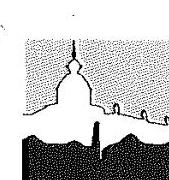

# Tolna Megyei Balassa János Kórház Dr. Németh Csaba főigazgató 

Iktatószám: I/12/21-189/2/2018.

Állami Számvevőszék
1052 Budapest, Apáczai Csere János utca 10.
Domokos László elnök úr részére

Észrevételek az Állami Számvevőszék „A központi alrendszer intézményi - A központi alrendszer egyes intézményei pénzügyi és vagyongazdálkodásának ellenőrzése - Tolna Megyei Balassa János Kórház" címmel készített számvevőszéki jelentéstervezethez.

Tisztelt Elnök Úr!

Jelentéstervezetükhöz általánosságban a következőket szeretnénk hozzáfüzni. Észrevételeikkel kapcsolatban elmondható, hogy az Állami Egészségügyi Ellátó Központtal együttműködve, a kifogásolt szabályzatokat, folyamatokat időközben jelentős részben módosítottuk. Meggyőződésünk, hogy intézményünkben felelős gazdálkodás folyt és folyik, ahogyan azt a könyvvizsgálói jelentések és 2016-2017 években költségvetési felügyelői ellenőrzés is megerősítette. Természetesen a feltárt és még meglevő adminisztratív hiányosságainkat, eltéréseinket korrigálni fogjuk.
A végső jelentés megállapításainak alapján elkészítjük a szükséges intézkedési tervet, aminek végrehajtását megelőzően kérni kívánjuk az Állami Számvevőszék szakmai véleményét arról, hogy a későbbiekben működésünk minden szempontból feleljen meg az előírásoknak.

Szekszárd, 2018. augusztus 2.

Tisztelettel:
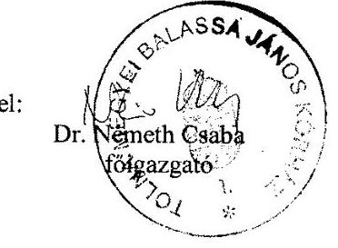

---

Észrevételeink a jelentéstervezetben szereplő megállapításokhoz

# 2. A belső kontrollrendszer kialakítása és működtetése szabályszerű volt-e? 

| Összegzö megállapítás | A Kórház belső kontrollrendszerének kialakítása és működtetése nem volt szabályszerű. |
| :--: | :--: |
| 2.1. számú megállapítás | A kontrollkörnyezet kialakítása nem volt szabályszerű. |
| 1 találat | A főigazgató a Bkr. ¹¹ 6 § (1) bekezdés c) pontja ellenére nem gondoskodott olyan kontrollkörnyezet kialakításáról, amelyben meghatározottak, ismertek és elfogadottak az etikai elvárások a szervezet minden szintjén |
| KONTROLLKÖRNYEZET ÉRTÉKELÉSE 2014-2016. | Az SZMSZ, ¹² az Avr. 13. § (1) bekezdés e) pontja előírása ellenére nem tartalmazta a szervezeti egységek létszámát. Az SZMSZ, az Avr. előírásai közül a helyettesítés rendjét tartalmazta, az Avr. 13. § (5) bekezdése ellenére a gazdálkodási feladatot ellátó szervezeti egységek munkafolyamatainak leírását, a vezetőinek és alkalmazottainak feladat- és hatáskörét (a gazdasági-gazgató kivételeivel), a szervezeti egység költségvetési szerven belül belső és azon kívüli külső kapcsolattartásának módját, szabályait nem. A gazdasági szervezet feladatait ellátó szervezeti egységek a Bér- és Munkaügyi osztály kivételével - az Avr. 9. § (5) bekezdése (hatályos 2015. február 17-ig) és az Avr. 10/A. §-a (hatályos 2015. február 18-tól) ellenére   - nem rendelkeztek az Avr. 13. § (5) bekezdése szerinti tartalmú ügyrenddel.   A Kórház az Avr. 13. § (2) bekezdés a) pontja ellenére nem rendelkezett a tervezéssel kapcsolatos belső előírások, feltételek szabályozásáról, a c) pontja ellenére nem szabályozta a külföldi kiküldetések elszámolásának szabályait. |

A 2014. évi SZMSZ tartalmazta az engedélyezett létszámot szervezeti egységenként (lásd: II. fejezetben az Engedélyezett létszám oszlopot), és az Ávr. 13. § (1) e) pontja értelmében 2015. január 1-től már nem kell az SZMSZ-ben szerepeltetni a létszámadatokat, ezért a 2016. évtől érvényes SZMSZ-ben már nem is tüntettük fel.

A gazdasági-műszaki ellátás szervezeti egységei külön-külön rendelkeznek saját működési szabályzattal, amit a jogszabály ügyrendnek nevez. Ezek a működési szabályzatok/ügyrendek tartalmazzák a munkafolyamatok, a feladat- és hatáskörök leírását, ezen kívül a belső és külső kapcsolatartás módjait és szabályait az SZMSZ IV. fejezet 2. pontja is rögzíti.
Az említett működési szabályzatokra/ügyrendekre az SZMSZ az alábbi helyeken hivatkozik:

- SZMSZ 2008. IX. fejezetben, a szervezeti egységeket ismertető részek végén.
- SZMSZ 2014. III. fejezet 2.2. pontban, a szervezeti egységeket ismertető részek végén.
- SZMSZ 2016. III. fejezet 2.2. pontban, a szervezeti egységeket ismertető részek végén.

Az adatszolgáltatás során, az SZMSZ által hivatkozott dokumentumokat a következő helyre töltöttük fel:

| Mappa / Feltöltött dokumentum neve | Hivatkozási név |
| :-- | :-- |
| 02. Kontrollkörnyezet - a 2014-2016. ÉVEKRE VONATKOZÓAN: | -- |
| 1 gazdasági szervezet ügyrendje, | -- |

---

| Mappa / Feltöltött dokumentum neve | Hivatkozási név |
| :-- | :-- |
| Beruházási Osztály | Beruházás |
| Élelmezési Osztály | Élelmezés |
| Finanszírozási és Számviteli Osztály | Pénzügy |
| Kontrolling Osztály | Kontrolling |
| Logisztikai Osztály | Logisztika |
| Mezőgazdasági üzem | Mezőgazdaság |
| Mosoda | Mosoda |
| Bér- és munkaügyi Osztály | Munkaügy |
| Takarító szolgálat | Takarítás |
| Műszaki Üzemeltetési Osztály | Üzemeltetés |

A kiküldetések elszámolásainak főbb szabályait két belső előírásunk tartalmazta, a külföldi kiküldetés elszámolásának szabályai a Tudományos rendezvényeken történő részvétel szabályozása címú szabályzatban (IG1107) jelentek meg. A vonatkozó dokumentumokat az adatszolgáltatás során a következő helyekre töltöttük fel:

| Mappa / Feltöltött dokumentum neve | Hivatkozási név |
| :-- | :-- |
| 02. Kontrollkörnyezet - a 2014-2016. ÉVEKRE VONATKOZÓAN: | -- |
| 12 belföldi és külföldi kiküldetések elszámolásával kapcsolatos szabályok, | -- |
| Hivatalos kiküldetések rendje | KiküldetésSzab |
| Tudományos rendezvényeken történő részvétel szabályozása | TudományonRészvétel |
| valamint | -- |
| 04. A kontrolltevékenység működésének - a 2014-2016. ÉVEKRE |  |
| VONATKOZÓAN: |  |
| 2 humánpolitikai tevékenység szabályozása, a személyi juttatások |  |
| elszámolásával kapcsolatos belső szabályzatok, a munkavállalókat megillető |  |
| juttatásokkal, költségtérítésekkel kapcsolatos szabályozások, |  |
| Hivatalos kiküldetések rendje | KiküldetésSzab |
| Tudományos rendezvényeken történő részvétel szabályozása | TudományonRészvétel |

---

# 2.1. számú megállapítás 

## 5. bekezdés

A Kórház a Számv. tv. ¹⁹ és az Ahsz. előírásainak eleget téve elkészítette a Számviteli politika ¹²¹⁹-t, a Leltározási szabályzat ¹³²⁰-t, az Értékelési szabályzatot ²¹, Önköltségszámítási szabályzatot ²². Pénzkezelési szabályzattal a Kórház 2014. január 1-november 30. között a Számv tv. 14. § (5) bekezdés d) pontja ellenére nem rendelkezett, majd a Pénzkezelési szabályzat¹²²³ a Számv. tv. előírásainak megfelelő tartalommal készült. A Leltáro-

A Kórház rendelkezett pénzkezelési szabályzattal 2014. január 1-november 30-a között is, sajnálatos módon annak feltöltése elmaradt, így azt jelen levelünk mellékleteként csatolt adathordozón pótoljuk. Adminisztrációs hibánkért elnézést kérünk.

| 2.3. számú megállapítás | A kontrolltevékenység gyakorlása és működtetése nem volt szabályszerű. |
| :--: | :--: |
|  | A főigazgató a Bkr. 6. § (1) bekezdés b) pontja ellenére nem alakított ki olyan kontrollkörnyezetet, amelyben egyértelműek a felelősségi, hatásköri viszonyok. A kontrolltevékenységek feladatkori elkülönítését, az összeférhetetlenség eseteit az Ávr. előírásainak megfelelően a Gazdálkodási szabályzatban rögzítették. A gazdálkodási jogkör gyakorlására jogosult személyek aláírásmintát tartalmazó nyilvántartás naprakész vezetéséről 2014-2015. években - az Ávr. 60. § (3) bekezdésében foglaltak ellenére - |

## Megállapítások

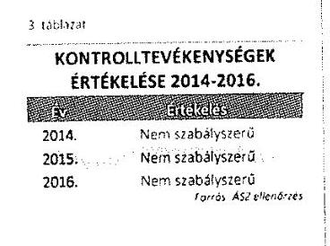
nem gondoskodtak, 2016-tól az Ávr. előírásai szerint a gazdálkodási jogkörök gyakorlójának aláírásmintáról folyamatos, naprakész nyilvántartást vezettek.

A kötelezettségvállalások, más fizetési kötelezettségek nyilvántartása 2014-2016. években nem felelt meg az Ahsz. 14. melléklet II. 4. a)-c) és e, g) pontjaiban foglalt tartalmi előírásoknak.

A kiadás-előirányzatok felhasználása során a 2014-2016. években a kontrolltevékenységek gyakorlása nem felelt meg a jogszabályi előírásoknak. Az ezzel kapcsolatos ellenőrzési megállapítások a 3.1. számú megállapítás 1-4. bekezdésében szerepelnek.

## 2. bekezdéshez

Az intézmény a Computrend Zrt. által fejlesztett Ct-EcoStat gazdasági rendszert használja, melynek kötelezettségvállalás modulja két almodult foglal magába: a kötelezettségvállalást és a rendelés-szerződés nyilvántartó almodult. A rendszerben biztosítva vannak az Áhsz II. mellékletének 2. pontjában felsorolt jogszabályi előírások az adatok széleskörű riportolási lehetőségével.

---

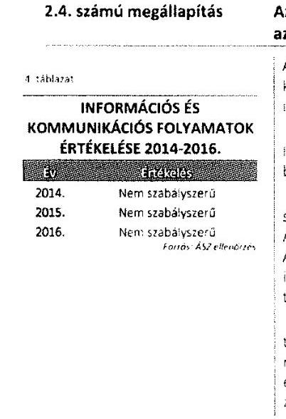

Az információs és kommunikációs folyamatokat kialakították, azonban azok működtetése nem volt szabályszerű.

A főigazgató a Bkr. előírása szerint kialakította a Kórház információs és kommunikációs rendszerét, meghatározta a beszámolási szinteket, határidőket és módokat.

A Kórház - az Infotv. 37. § (1) bekezdése és 1. melléklet II/1. pontja és III/1. pontja ellenére - nem tette közzé az SZMSZ-ét, adatvédelmi és adatbiztonsági szabályzatát, éves költségvetését és beszámolóját.

A Kórház a 2014. és 2015. évi éves költségvetési beszámolók irányító szerv részére jóváhagyásra történő megküldésére vonatkozó, az Ahsz. 32. § (1) bekezdésében előírt február 28. határidőt nem tartotta be. A 2016. évi beszámolót a Kórház az Ávr. előírásainak megfelelően, határidőben feltöltötte a Kincstár által működtetett elektronikus adatszolgáltatási rendszerbe.

A Kórház a vagyonkezelési szerződés 8.4. pontjában meghatározott tartalommal a vagyonkezelő vagyonról (értékcsökkenés, értéket növelő beruházások, felújlások) - a Vtvt. 9. § (3) és 14. § (1) bekezdésében foglaltak ellenére - 2014. évtől
 a Központi irányító szerv felé adatszolgáltatási kötelezettségét nem, 2015-2016. években azonban teljesítette.

Az intézmény aktuálisan érvényes SZMSZ-e és Adatvédelmi szabályzata folyamatosan elérhető, és a korábbi években is elérhető volt a honlapunkon (www.tmkorhaz.hu), a Közérdekű adatok - 2.1. Az intézmény alaptevékenysége, feladat- és hatásköre menüben.
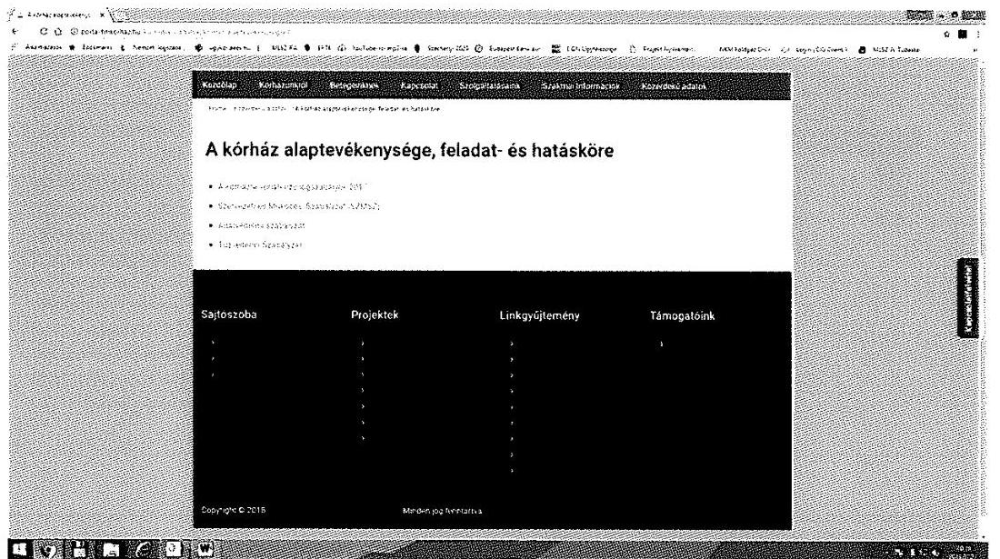

Az intézményi éves beszámolók és költségvetések a Közérdekű adatok -3.1. Költségvetések, beszámolók menüpont alatt találhatók meg 2004. évtől kezdődően.

---

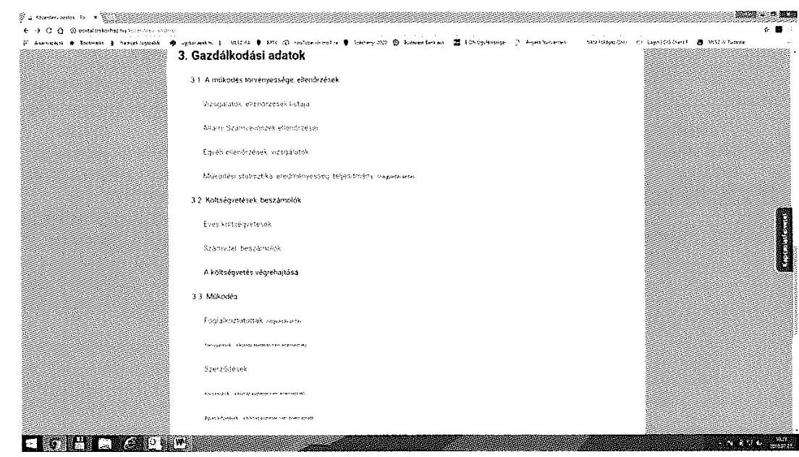
2.5. számú megállapítás

A Kórház tevékenységének, a célok megvalósításának folyamatos és eseti nyomon követését biztosító rendszert nem alakítottak ki, a belső ellenőrzés tevékenysége nem volt szabályszerű.

| 5. táblázat |  |  |
| :--: | :--: | :--: |
| MONITORING RENDSZER ÉRTÉKELÉSE 2014-2016. |  |  |
|  |  |  |
| 2014. | Nem szabályszerű | A főgazgató elkészítette az ellenőrzési nyomvonalakat, azonban a Bkr. 6 § (3) bekezdése ellenére rendszeres aktualizálásokról nem gondoskodott. |
| 2015. | Nem szabályszerű | kodott. A főgazgató a Bkr. 10 §-ában foglalt előírások ellenére a szervezet tevékenységének, a célok megvalósításának nyomon követését biztosító rendszert nem alakította ki. |
| 2016. | Nem szabályszerű | rendszert nem alakította ki, az operatív tevékenységek keretében megvalósuló folyamatos és eseti nyomon követés nem működött. |
|  | Felfeléépítésre beosztott | Az operatív tevékenységektől függetlenül működő belső ellenőrzés tevékenysége nem volt szabályszerű. A Bkr. 22. § (1) bekezdés b) pontja ellenére a belső ellenőrzési terveket (2014-2016. évekre tervezett 14 ellenőrzésből 12-t) a belső ellenőrzési vezető nem hajtotta végre. A Bkr. 28. § c) pontja ellenére az elkészített két ellenőrzési jelentés közül egyre nem, a másik ellenőrzési jelentésre a Bkr. 45 § (3) bekezdése ellenére az ellenőrzöttek, javaslattal érintettek késedelmesen készítettek intézkedési tervet. A belső ellenőrzési vezető a Bkr. 50 § (1) bekezdése ellenére az elvégzett belső ellenőrzésekről, valamint a Bkr. 47 § (1) bekezdése ellenére a belső ellenőrzési jelentésekben tett megállapításokat, javaslatokat, a vonatkozó |

# Megállapítások

---

1. bekezdés 2. mondatához: 2014-2016. években kettőnél több ellenőrzés került végrehajtásra, 6 db jelentésről számolhatunk be.
2. 2015. 2016. évi tervezett ellenőrzések és megvalósulásuk
3. 

|  |   |   |   |   |   |   |   |   |
| --- | --- | --- | --- | --- | --- | --- | --- | --- |
|  1 | Az ellenőrzés tárgya | Az ellenőrzés típusa | Az ellenőrzött szervezeti egység | Az ellenőrzés száma | Az ellenőrzés kezdete | Ellenőrzési jelentés lezárása | Intézkedési terv dátuma | Megjegyzés  |
|  1 | 2013. évi záró leltár | Teljesítmény | Finanszírozási és számviteli osztály | 1/2014. | 2014.07.15. | 2015.08.06 | 2015.08.06. |   |
|  2 | Gazdálkodást érintő szabályzatok helyett áthúzódó a Középénzőforgalom ellenőrzése | Pénzügyi | Műszaki - Gazdasági Igazgatóság | 3/2013. | 2013.08.26. | 2014.07.11. | 2014.07.11. |   |
|  3 | Pénztár és pénzkezelő helyett |  | A végrehajtott ellenőrzésektől függően. (Pénztár és pénzkezelő helyett) | 2/2014. | 2014.12.11. | 2015.07.27. | nem készült |   |
|  4 | Intézkedési terv végrehajtása |  |  |  |  |  |  |   |

1. évben 2 db új és 1 db áthúzódó ellenőrzés 2015.

|  |   |   |   |   |   |   |   |   |
| --- | --- | --- | --- | --- | --- | --- | --- | --- |
|  1 | Az ellenőrzés tárgya | Az ellenőrzés típusa | Az ellenőrzött szervezeti egység | Az ellenőrzés száma | Az ellenőrzés kezdete | Ellenőrzési jelentés lezárása | Intézkedési terv dátuma | Megjegyzés  |
|  1 | 2014. évi záró leltár | Pénzügyi | Finanszírozási és számviteli osztály | Elmaradt |  |  |  | Elmaradt  |
|  2 | Gazdálkodást érintő szabályzatok | Szabályszerűségi | Gazdasági - műszaki igazgatóság | Elmaradt |  |  |  | Elmaradt  |
|  3 | Kiküldetés, napiátalány, munkábajárás, hétvégi hazaút, költségelszámolás | Pénzügyi | Bér- és Munkaügyi Osztály, Finanszírozási és Számviteli Osztály | 1/2015. | 2015.08.27. | ÁTHÚZÓDÓ |  | Egyéb feladat miatt megszakításra került az ellenőrzés  |
|  4 | Térítési díjak megállapításának módja, alkalmazásának ellenőrzése | Szabályszerűségi | Gazdasági - műszaki igazgatóság, Finanszírozási és számviteli osztály | részben a 3/2013. | 2013.08.26. | 2014.07.11. | 2014.07.11. | Érintve a Középénzőforgalom ellenőrzése során (jelentésben az ultralong képek téves áfa és díjmegállapításai részletezve)  |
|  5 | Intézkedési tervek végrehajtása | Utóellenőrzés | A korábban ellenőrzött szervezeti egységek | 2/2015. | 2015.10.11. | 2016.01.25. | nem készült | Főigazgató váltás miatt az új főigazgató nem írta alá a jelentéstervezetet.  |

1. évben 2 db megkezdett ellenőrzés 1 db áthúzódó

---

| 2016. |  |  |  |  |  |  |  |  |
| :--: | :--: | :--: | :--: | :--: | :--: | :--: | :--: | :--: |
| 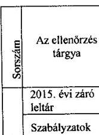 | Az ellenőrzés tárgya | Az ellenőrzés típusa | Az ellenőrzött szervezeti egység | $\begin{gathered} \text { Az } \\ \text { ellenőr } \\ \text { zés } \\ \text { száma } \end{gathered}$ | Az ellenőrzés kezdete | Ellenőrzési jelentés lezárása | Intézkedési terv dátuma | Megjegyzés |
| 1 | 2015. évi záró leltár | Pénzügyi | Finanszírozási és Számviteli Osztály |  |  |  |  | Az ÁEEK Intézményellenőrzési Főosztálya az ellenőrzések tárgyában vizsgálatot végzett, tárgyévben ismételt ellenőrzést nem történt. |
|  | Szabályzatok | Szabályszerűségi | Műszaki - Gazdasági Igazgatóság, Finanszírozási és Számviteli Osztály |  |  |  |  |  |
|  | Önköltség, számítások és önköltség-számítási szabályzat | Teljesítmény | Műszaki - Gazdasági Igazgatóság, Finanszírozási és Számviteli Osztály |  |  |  |  |  |
| 2 | Intézkedési terv végrehajtása | Utóellenőrzés | A végrehajtott ellenőrzésektől függően. |  |  |  |  | Elmaradt |
| 3 | Jelenléti ívek kitöltése, vezetése | Teljesítmény | Műszaki - Gazdasági Igazgatóság, Bér- és Munkaügyi Osztály | $1 / 2015$. | $\begin{aligned} & 2015.09 . \\ & 08 \end{aligned}$ | 2016.12.23. | 2017.02.16. | A korábbi (1/2015.) ellenőrzés érintette a feladatot. |
| 4 | ÁTHÚZÓDÓ   Kiküldetés, napiátalány, munkábajárás, bérségi bocsánat, költségelszámolás | Pénzügyi | Bér- és Munkaügyi Osztály, Finanszírozási és Számviteli Osztály | $1 / 2015$. | $\begin{aligned} & 2015.09 . \\ & 08 \end{aligned}$ | 2016.12.23. | 2017.02.16. | Áthúzódó ellenőrzés befolyásolása |
| 5 | Bérgazdálkodás | SORON   KÍVÜLI -   Pénzügyi | Műszaki - Gazdasági Igazgatóság, Bér- és Munkaügyi Osztály, Finanszírozási és Számviteli Osztály | $2 / 2016$. | $\begin{aligned} & 2016.06 . \\ & 28 \end{aligned}$ | 2017.10. | NEM   KÉSZÜLT | Főigazgatói aláírásra vár |
| 6 | ASZ   vizsgálatok   megállapításai,   javaslatai | Tanácsadói feladat | Más kórházakban végzett ellenőrzések jelentései | $1 / 2016$. | $\begin{aligned} & 2016.04 . \\ & 18 . \end{aligned}$ | 2016.04.18. |  |  |

2016. évben 1 db ellenőrzés lezárása, 1 db soron kívüli áthúzódó ellenőrzés és 1 db tanácsadói tevékenység
2. bekezdés 4. mondatához: 2014-2016. években a kérésnek megfelelően:

- Az ellenőrzésekről vezetett nyilvántartásokat a 07 Belső és külső ellenőrzések 08 Elvégzett belső ellenőrzésekről vezetett nyilvántartás éves bontásban

EllenNyilv2014
EllenNyilv2015
EllenNyilv2016
valamint

- az intézkedési tervekről vezetett nyilvántartásokat a 07 Belső és külső ellenőrzések 09 Belső ellenőrzési jelentésekben tett megállapítások intézkedési terveket és nyomon követést tartalmazó nyilvántartás éves bontásban

IntézkNyilv2014
IntézkNyilv2015
IntézkNyilv2016
néven csatoltuk az Állami Számvevőszék által kért beküldendő dokumentumok között.

---

3.2. számú megállapítás

A vagyon értékének megőrzését, gyarapítását támogató vagyongazdálkodás feltételeinek kialakítása nem volt szabályszerű. A beszámoló mérlegtételeit a jogszabályi előírások ellenére leltárakkal nem támasztották alá, a bevételek beszedése során nem tartották be a jogszabályi előírásokat.

A Kórház a Vtvi. ${ }^{27} 7 . \S$ (2) bekezdésében foglaltak ellenére a vagyonkezelési szerződés 2015. december 30-i módosítása megkötésétől számított harminc napon belül és azon túl sem gondoskodott a vagyonkezelésébe kerülő vagyonelem és a vagyonkezeléséből kikerülő vagyonelemek vonatkozásában a vagyonkezelői jog ingatlan-nyilvántartásban történő bejegyeztetéséről, illetve töröltetéséről.

A 2014. évben a Számv. tv. 69. § (2) bekezdése előírásával, a leltározási szabályzat V. - VIII. pontjában foglaltakkal ellentétben nem végezte el a leltározást, a főkönyv könyvelés és az analitikus nyilvántartások között egyeztetést a mérleg fordulónapjára vonatkozóan. A Kórház a 2014-2016. években nem tett eleget a Számv. tv. 69. § (1) bekezdésében foglaltaknak, mert a mérleg tételeinek alátámasztásához nem állított össze olyan leltárt, amely tételesen, ellenőrzhető módon tartalmazta volna a mérleg fordulónapján meglévő eszközeit és forrásait mennyiségben és értékben.

Az Intézmény 2014-2016. években a mérleg tételeit alátámasztotta, a főkönyv és az analitikus nyilvántartás közötti egyeztetés megtörtént. 2014. évben az egyeztetés ténye nem került jegyzőkönyvbe foglalva, de a hibánk feltárását követően 2015-től az egyeztetés ténye már dokumentált.
Az adatbekérés során az intézményi leltárzáró jegyzőkönyvek kerültek feltöltésre, melyek a leltározás során tapasztalt eltéréseket tartalmazzák, és hivatkoznak további dokumentumokra, amelyek az adatszolgáltatási felületre nem kerültek feltöltésre. A dokumentumokat jelen levelünk mellékleteként adathordozón pótoljuk.

---

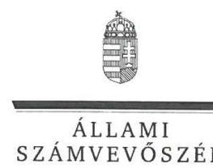

# Dr. Németh Csaba Úr 

főigazgató
Tolna Megyei Balassa János Kórház

## Szekszárd

## Tisztelt Főigazgató Úr!

Köszönettel megkaptam „A központi alrendszer intézményei - A központi alrendszer egyes intézményei pénzügyi és vagyongazdálkodásának ellenőrzése - Tolna Megyei Balassa János Kórház" című számvevőszéki jelentéstervezetben foglalt megállapításokra írásban tett, I/12/21-189/2/2018. iktatószámú levelében megküldött észrevételeit.
Tájékoztatom főigazgató urat, hogy a jelentésben - az Állami Számvevőszékről szóló 2011. évi LXVI. törvény 29. § (3) bekezdése alapján - a figyelembe nem vett észrevételeket szerepeltetjük az el nem fogadás indokának feltüntetésével együtt.

Az Állami Számvevőszék észrevételekre vonatkozó álláspontjáról a felügyeleti vezető által készített részletes tájékoztatást mellékelten megküldöm.

Budapest, 2018. 08. hó 31. nap

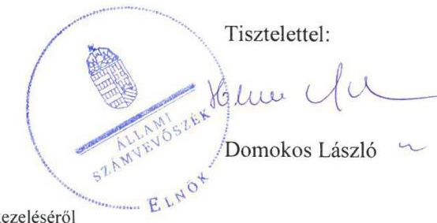

Melléklet: Tájékoztatás az észrevételek kezeléséről

---

# Tájékoztatás   az észrevételek kezeléséről 

„A központi alrendszer intézményei - A központi alrendszer egyes intézményei pénzügyi és vagyongazdálkodásának ellenőrzése - Tolna Megyei Balassa János Kórház" című számvevőszéki jelentéstervezetre 1/12/21-189/2//2018. iktatószámú levelében tett észrevételeit áttekintettük, azok kezeléséről az alábbi
 tájékoztatást adom.

1. Jelentéstervezet 14. oldal 2.1. számú megállapítás 2. bekezdés 1. mondatára tett észrevétel

Az észrevételt nem fogadtuk el. Az észrevételben hivatkozott „2014. évi SZMSZ" a jelentéstervezetben $\mathrm{SZMSZ}_{2}$-vel megjelölt szervezeti és működési szabályzat volt, ami 2014. június 20-tól 2016. május 31-ig volt hatályban. Az ellenőrzés rendelkezésére bocsátott $\mathrm{SZMSZ}_{2}$ II. fejezete tartalmazta az engedélyezett létszámokat. A jelentéstervezet megállapítása ezzel szemben a jelentéstervezetben $\mathrm{SZMSZ}_{1}$ jelöléssel a Tolna Megyei Balassa János Kórház (továbbiakban Kórház) 2008. november 27-től 2014. június 19-ig hatályos szervezeti és működési szabályzatára vonatkozott, amely nem tartalmazta a szervezeti egységek létszámát. Az észrevétel nem a jelentéstervezet megállapításában szereplő dokumentumra vonatkozott, így az ellenőrzési megállapítás módosítása nem indokolt.
2. Jelentéstervezet 14. oldal utolsó három sor és a 15. oldal első két sor 2.1. számú megállapítás 2. bekezdés 3. mondatára tett észrevétel

Az észrevételt nem fogadtuk el. A Kórház által - elektronikus formában - az ellenőrzés rendelkezésére bocsátott egységszintű működési szabályzatok a kiadmányozásra jogosult vezető aláírásának hiányában nem voltak érvényesek, így nem feleltek meg a jogszabályi - az Ávr. 9. § (5) bekezdése (hatályos 2014. december 31-ig) és az Ávr. 10/A. §-a (hatályos 2015. február 18-tól), valamint az Ávr. 13. § (5) bekezdése előírásoknak. Kivételt képezett ez alól a Bér- és Munkaügyi Osztály működési szabályzata, amelynek eredeti példányát papír alapon, aláírt, kiadmányozott formában is bemutatta a Kórház a 2018. február 20-i helyszíni adatbetekintés során. Ennek következtében az ellenőrzési megállapítás és a kapcsolódó javaslat módosítása nem indokolt.
3. Jelentéstervezet 15. oldal 2.1. számú megállapítás 3. bekezdésére tett észrevétel

Az észrevételt nem fogadtuk el. A Kórház észrevételében jelezte, hogy ,, a külföldi kiküldetés elszámolásának szabályai a Tudományos rendezvényeken történő részvétel szabályozása című szabályzatban (IG1107) jelentek meg." Az észrevételben jelzett „Tudományos rendezvényeken történő részvétel szabályozása" mindössze a külföldi kongresszusokon résztvevő előadók részére a Kórház által adható támogatást tartalmazta, nem szabályozta azonban - az Ávr. 13. § (2) bekezdés c) pontja ellenére - a külföldi kiküldetések elszámolásának szabályait. Az észrevétel alapján az ellenőrzési

---

megállapítás és a kapcsolódó javaslat módosítása nem indokolt.
4. Jelentéstervezet 15. oldal 2.1. számú megállapítás 5. bekezdés 2. mondatára tett észrevétel

Az észrevételt nem fogadtuk el. Az ellenőrzés megállapításai az ÁSZ tv. 28. § (2) bekezdése alapján az ellenőrzött szervezet által az ellenőrzéséhez kapcsolódóan, az ellenőrzés lefolytatásához a törvényi határidőben rendelkezésre bocsátott, a teljességi és hitelességi nyilatkozatban feltüntetett dokumentumokon alapulnak. Az észrevételben elismerte, hogy a Kórház 2014. január 1-november 30. között hatályos pénzkezelési szabályzatát nem bocsátotta az ellenőrzés rendelkezésére. A határidőn túl megküldött dokumentum az ellenőrzési megállapítást nem módosítja.
5. Jelentéstervezet 16. oldal 2.3. számú megállapítás 2. bekezdésére tett észrevétel

Az észrevételt nem fogadtuk el. Köszönettel vettük tájékoztatását a Kórház által használt gazdasági rendszerről, és arról, hogy „A rendszerben biztosítva vannak az Áhsz. II. mellékletének 2. pontjában felsorolt jogszabályi előírások az adatok széleskörű riportálási lehetőségével." Erről azonban dokumentumot a törvényi határidőben nem bocsátottak az ellenőrzés rendelkezésére.
Az ellenőrzés megállapításai az ÁSZ tv. 28. § (2) bekezdése alapján az ellenőrzött szervezet által az ellenőrzéséhez kapcsolódóan, az ellenőrzés lefolytatásához a törvényi határidőben rendelkezésre bocsátott dokumentumokon alapulnak. Ennek következtében a megállapítás és a kapcsolódó javaslat módosítása nem indokolt.
6. Jelentéstervezet 16. oldal 2.4. számú megállapítás 2. bekezdésére tett észrevétel

Az észrevételt nem fogadtuk el. Az ellenőrzés megállapításai az ÁSZ tv. 28. § (2) bekezdése alapján az ellenőrzött szervezet által az ellenőrzéséhez kapcsolódóan, az ellenőrzés lefolytatásához a törvényi határidőben rendelkezésre bocsátott, a teljességi és hitelességi nyilatkozatban feltüntetett dokumentumokon alapulnak. Az ÁSZ az El-300005/2017. iktatószámú adatbekérő levele 2. számú melléklet 2. oldal, Információs és kommunikációs rendszer 2. pontjában kérte „a közzétételi kötelezettség teljesítését igazoló dokumentumok" rendelkezésre bocsátását. A kapcsolódó, 2017. október 18-i keltezésű teljességi és hitelességi nyilatkozat szerint a Kórház a közzétételi kötelezettség teljesítését igazoló dokumentumot nem bocsátotta az ellenőrzés rendelkezésére, így az ellenőrzési megállapítás és a kapcsolódó javaslat módosítása nem indokolt.
7. Jelentéstervezet 16. oldal 2.5. számú megállapítás 2. bekezdés 2. mondatára tett észrevétel

Az észrevételt nem fogadtuk el. A költségvetési szervek belső kontrollrendszeréről és belső ellenőrzéséről szóló 370/2011. (XII. 31.) Korm. rendelet (továbbiakban Bkr.) 22. § (1) bekezdés b) pontjában előírtak alapján a belső ellenőrzési vezető feladata „a kockázatelemzéssel alátámasztott stratégiai és éves ellenőrzési tervek összeállítása, a költségvetési szerv vezetőjének - helyi önkormányzatok esetén képviselő-testület jóváhagyása után - a tervek végrehajtása, valamint azok megvalósításának nyomon követése."

---

Az ellenőrzés rendelkezésére bocsátott dokumentumok szerint 2014-ben egy (a 2013-as belső ellenőrzési tervben szereplő, áthúzódó) ellenőrzésről, 2016-ban pedig kettő (2015-ről áthúzódó) ellenőrzésről készült belső ellenőrzési jelentés. A 2014-2016. évek belső ellenőrzési terveiben szereplő összesen 14 ellenőrzésből 12 ellenőrzést nem hajtottak végre. A Kórház nem élt a Bkr. 31. § (5) bekezdés szerinti lehetőséggel és a belső ellenőrzési terveket az elmaradt ellenőrzések ellenére nem módosította. Az éves ellenőrzések nyilvántartásai tartalmaztak olyan belső ellenőrzési jelentéseket, melyeket az éves belső ellenőrzési terv nem tartalmazott, mivel alapvetően nem az éves ellenőrzési tervekben jóváhagyott ellenőrzések kerültek végrehajtásra.
Fentiek következtében az észrevételben foglaltak, amely szerint „2014-2016. években kettőnél több ellenőrzés végrehajtására került sor, 6 db jelentésről számolhatunk be", az ellenőrzési megállapítás és a kapcsolódó javaslat módosítását nem indokolják.
8. Jelentéstervezet 16. oldal utolsó három sor és a 17. oldal első két sor 2.5. számú megállapítás 2. bekezdés 4. mondatára tett észrevétel
Az észrevételt elfogadtuk. A jelentéstervezet 16. oldal utolsó három sor és a 17. oldal első két sorában a 2.5. számú megállapítás 2. bekezdés 4. mondatát és a kapcsolódó javaslatot töröljük.
9. Jelentéstervezet 18. oldal 3.2. számú megállapítás 2. bekezdésére tett észrevétel

Az észrevételt nem fogadtuk el. Az ellenőrzés megállapításai az ÁSZ tv. 28. § (2) bekezdése alapján az ellenőrzött szervezet által az ellenőrzéséhez kapcsolódóan, az ellenőrzés lefolytatásához a törvényi határidőben rendelkezésre bocsátott, a teljességi és hitelességi nyilatkozatban feltüntetett dokumentumokon alapulnak.
Észrevételében elismerte, hogy „2014. évben az egyeztetés ténye nem került jegyzőkönyvbe foglalva, de a hibánk feltárását követően 2015-től az egyeztetés ténye már dokumentált." Jelezte továbbá, hogy „Az adatbekérés során az intézményi feltáró jegyzőkönyvek kerültek feltöltésre, melyek a leltározás során tapasztalt eltéréseket tartalmazzák, és hivatkoznak további dokumentumokra, amelyek az adatszolgáltatási felületre nem kerültek feltöltésre." Tekintettel arra, hogy a 2014. évre vonatkozóan a főkönyvi könyvelés és az analitikus nyilvántartások közötti egyeztetés tényét igazoló dokumentumot, továbbá 2014-2016. évekre vonatkozóan a leltár kimutatást a törvényi határidőben nem bocsátották az ellenőrzés rendelkezésére, az ellenőrzési megállapítás és a kapcsolódó javaslat módosítása nem indokolt.

Az ellenőrzés során feltárt hibák, hiányosságok kijavítására vonatkozó tájékoztatását köszönettel vettük.

Budapest, 2018. 03. hó 5. nap
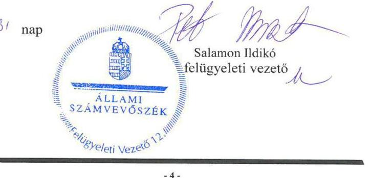

---

# RÖVIDÍTÉSEK JEGYZÉKE 

${ }^{1}$ Kórház
${ }^{2}$ Áht.
${ }^{3}$ Eütv.
${ }^{4}$ főigazgató
${ }^{5}$ gazdasági igazgató
${ }^{6}$ ÁSZ
${ }^{7}$ ÁSZ tv.
${ }^{8}$ Irányító szerv
${ }^{9}$ Középirányító szerv
${ }^{10}$ ÁSZ-SZMSZ
${ }^{11}$ alapító okirat ${ }_{1}$
alapító okirat ${ }_{2}$
${ }^{12}$ Ávr.
${ }^{13}$ SZMSZ $_{2}$
SZMSZ $_{3}$
${ }^{14}$ Áhsz.
${ }^{15}$ Bkr.
${ }^{16}$ SZMSZ $_{1}$
${ }^{17}$ Gazdálkodási szabályzat ${ }_{1}$
Gazdálkodási szabályzat ${ }_{2}$
Gazdálkodási szabályzat ${ }_{3}$
${ }^{18}$ Számv. tv.
${ }^{19}$ Számviteli politika $_{1}$
Számviteli politika $_{2}$
Számviteli politika $_{3}$
${ }^{20}$ Leltározási szabályzat ${ }_{1}$
Leltározási szabályzat ${ }_{2}$

Tolna Megyei Balassa János Kórház
2011. évi CXCV. törvény az államháztartásról (hatályos 2012. január 1-jétől)
1997. évi CLIV. törvény az egészségügyről (hatályos 1998. július 1-jétől)

Tolna Megyei Balassa János Kórház főigazgatója
Tolna Megyei Balassa János Kórház gazdasági igazgatója
Állami Számvevőszék
2011. évi LXVI. törvény az Állami Számvevőszékről (hatályos 2011. július 1-jétől)

Emberi Erőforrások Minisztériuma
Állami Egészségügyi Ellátó Központ, 2015. február 28-ig Gyógyszerészeti és Egészségügyi Minőség- és Szervezetfejlesztési Intézet
Állami Számvevőszék Szervezeti és Működési Szabályzata
Tolna Megyei Balassa János Kórház 2013. július 12-től 2016. szeptember 28-ig hatályos alapító okirata
Tolna Megyei Balassa János Kórház 2016. szeptember 29-től hatályos alapító okirata
az államháztartásról szóló törvény végrehajtásáról szóló 368/2011. (XII. 31.) Korm. rendelet (hatályos 2012. január 1-jétől)
Tolna Megyei Balassa János Kórház Szervezeti és Működési Szabályzat (hatályos 2014. június 20-tól 2016. május 31-ig)

Tolna Megyei Balassa János Kórház Szervezeti és Működési Szabályzat (hatályos 2016. június 1-jétől)
az államháztartás számviteléről szóló 4/2013. (I. 11.) Korm. rendelet (hatályos 2014. január 1-jétől)
a költségvetési szervek belső kontrollrendszeréről és belső ellenőrzéséről szóló 370/2011. (XII. 31.) Korm. rendelet (hatályos 2012. január 1-jétől)
Tolna Megyei Balassa János Kórház Szervezeti és Működési Szabályzat (hatályos 2008. november 27-től 2014. június 19-ig)

Tolna Megyei Balassa János Kórház gazdálkodási szabályzata (hatályos 2012. szeptember 14-től 2014. december 31-ig)
Tolna Megyei Balassa János Kórház gazdálkodási szabályzata (hatályos 2015. január 1-jétől 2015. december 31-ig, felülvizsgálva 2015. március 2.)
Tolna Megyei Balassa János Kórház gazdálkodási szabályzata (hatályos 2016. január 1-jétől)
2000. évi C. törvény a számvitelről (hatályos 2001. január 1-jétől)

Tolna Megyei Balassa János Kórház Számviteli politika (hatályos 2014. január 1-december 31. között)
Tolna Megyei Balassa János Kórház Számviteli politika (hatályos 2015. január 1-2015. december 31. között)
Tolna Megyei Balassa János Kórház Számviteli politika (hatályos 2016. január 1-jétől)
Tolna Megyei Balassa János Kórház leltározási szabályzata (hatályos 2008. január 1-jétől 2014. december 31-ig, felülvizsgálva 2012. szeptember 14-én)
Tolna Megyei Balassa János Kórház leltározási szabályzata (hatályos 2015. január 1-jétől)

---

${ }^{21}$ Értékelési szabályzat
${ }^{22}$ Önköltségszámítási szabályzat
${ }^{23}$ Pénzkezelési szabályzat ${ }_{1}$
Pénzkezelési szabályzat ${ }_{2}$
${ }^{24}$ Számlarend ${ }_{1}$
Számlarend ${ }_{2}$
Számlarend ${ }_{3}$
${ }^{25}$ Kockázatkezelési szabályzat
${ }^{26}$ Vagyonkezelési szerződés
${ }^{27}$ Vtvr.
${ }^{28}$ Selejtezési szabályzat
${ }^{29}$ Vtv.
${ }^{30}$ Nvtv.

Tolna Megyei Balassa János Kórház Eszközök és források értékelési szabályzata (hatályos 2014. január 1-jétől, felülvizsgálva 2014. december 1-jén)
Tolna Megyei Balassa János Kórház Önköltségszámítási szabályzata (hatályos 2010. január 1-jétől)

Tolna Megyei Balassa János Kórház Pénzkezelési szabályzata (hatályos 2014. december 1-jétől 2015. december 31-ig)
Tolna Megyei Balassa János Kórház Pénzkezelési szabályzata (hatályos 2016. január 1-jétől)
Tolna Megyei Balassa János Kórház Számlarend (hatályos 2010. január 1-jétől 2014. december 31-ig)

Tolna Megyei Balassa János Kórház Számlarend (hatályos 2015. január 1-jétől 2015. december 31-ig)

Tolna Megyei Balassa János Kórház Számlarend (hatályos 2016. január 1-jétől)
A Tolna Megyei Balassa János Kórház Kockázatkezelési szabályzata (hatályos 2005. december 21-től)
A GYEMSZI/007053/2013. szerződés és annak módosításai (1. sz. módosítás: GYEMSZI/005891-001/2015. szerződés; Módosítás időpontja: 2015.02.16., 2. sz. módosítás: ÁEEK/005891-003/2015. szerződés; Módosítás időpontja: 2015.12.30., 3. sz. módosítás: ÁEEK/001702/2016. szerződés; Módosítás időpontja: 2016.04.19.)
az állami vagyonnal való gazdálkodásról szóló 254/2007. (X. 4.) Korm. rendelet (hatályos 2007. október 4-étől)
Felesleges vagyontárgyak hasznosításának és selejtezésének szabályzata (hatályos 2010. január 1-jétől)
2007. évi CVI. törvény az állami vagyonról (hatályos 2007. szeptember 25-től)
2011. évi CXCVI. törvény a nemzeti vagyonról (hatályos 2012. január 1-jétől)

---

# ÁLLAMI SZÁMVEVŐSZÉK 

1052 Budapest, Apáczai Csere János utca 10.
Levélcím: 1364 Budapest 4. Pf. 54
Telefon: +36 14849100 Telefax: +36 14849200
www.asz.hu

