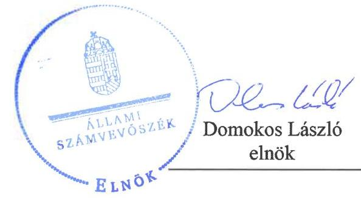

# Jelentés

## Utóellenőrzések

Az önkormányzatok pénzügyi gazdálkodási helyzete értékelésének, és gazdálkodása szabályosságának utóellenőrzése Herend Város Önkormányzata 2018.

---

# Jelentés

## Utóellenőrzések

Az önkormányzatok pénzügyi gazdálkodási helyzete értékelésének, és gazdálkodása szabályosságának utóellenőrzése Herend Város Önkormányzata
2018. 10. hó 01. nap

---

# AZ ELLENŐRZÉST FELÜGYELTE:

PETŐ KRISZTINA felügyeleti vezető

## AZ ELLENŐRZÉST VEZETTE ÉS A VÉGREHAJTÁSÁÉRT FELELŐS:

FÜLÖP IBOLYA ellenőrzésvezető

## A PROGRAM ÖSSZEÁLLÍTÁSÁÉRT FELELŐS:

JANIK JÓZSEF LÁSZLÓ osztályvezető

## A TÉMÁHOZ KAPCSOLÓDÓ KORÁBBI SZÁMVEVŐSZÉKI JELENTÉSEK:

- címe: Jelentés az önkormányzatok pénzügyi gazdálkodási helyzete értékelésének, és gazdálkodása szabályosságának ellenőrzéséről - Herend
- sorszáma: 14075

IKTATÓSZÁM: EL-0179-031/2018
TÉMASZÁM: 2096
ELLENŐRZÉS-AZONOSÍTÓ SZÁM: V0755101

---

# TARTALOMJEGYZÉK

■ ÖSSZEGZÉS ..... 5
■ AZ ELLENŐRZÉS CÉLJA ..... 6
■ AZ ELLENŐRZÉS TERÜLETE ..... 7
■ AZ ELLENŐRZÉS HÁTTERE, INDOKOLTSÁGA ..... 8
■ A JELENTÉS LÉNYEGES KÉRDÉSKÖRE ..... 9
■ ELLENŐRZÉS HATÓKÖRE ÉS MÓDSZEREI ..... 10
■ MEGÁLLAPÍTÁSOK ..... 12
■ MELLÉKLETEK ..... 15
I. sz. melléklet: Az ÁSZ 14075. számú jelentéséhez kapcsolódó intézkedési terv végrehajtása ..... 15
■ FÜGGELÉK: ÉSZREVÉTELEK ..... 19
■ RÖVIDÍTÉSEK JEGYZÉKE ..... 23

---

.

---

# ÖSSZEGZÉS

Az Állami Számvevőszék Herend Város Önkormányzat által készített intézkedési tervben foglaltak utóellenőrzése során megállapította, hogy a vállalt feladatok egyikét sem hajtották végre, ezzel nem biztosított az Önkormányzat pénzügyi helyzetének stabilitása, fennáll az adósságállomány újratermelődésének veszélye.

## Az ellenőrzés társadalmi indokoltsága

Az ÁSZ stratégiájában célul tűzte ki a számvevőszéki munka hasznosulásának javítását. Ezzel összhangban ellenőrzi, hogy az ellenőrzött szervezetek megvalósították-e a korábbi ellenőrzései által feltárt hibák, hiányosságok és szabálytalanságok megszüntetése céljából elkészített intézkedési terveiben foglaltakat. A rendszeres utóellenőrzések hozzájárulnak a szükséges intézkedések tényleges végrehajtásához, ezáltal a közpénzügyek rendezettségének javulásához.

## Főbb megállapítások, következtetések

Az Önkormányzat az intézkedési terv nyolc feladata közül egyet sem hajtott végre. A gazdálkodás hatékonyságának növelése, a pénzügyi egyensúlyi helyzet helyreállítása és hosszú távú fenntartása, az adósságállomány újratermelődésének elkerülése érdekében nem történtek intézkedések.

A pénzügyi egyensúly helyreállítása érdekében az Önkormányzat nem mérte fel a bevételszerző és kiadáscsökkentő lehetőségeket.

Az Önkormányzat az adósságállomány újratermelődésének elkerülését biztosító stabilizációs programot nem készített. Továbbá a gazdálkodás biztonsága, a fizetőképesség megőrzése érdekében nem határozta meg a működési és felhalmozási egyensúly hosszú távú fenntartásához szükséges elkülönített tartalék nagyságát, képzésének, felhasználásának szabályait.

A pénzügyi gazdálkodás szabályszerűségének biztosítása érdekében a gazdálkodási feladatok ellátásával kapcsolatban meglévő szabályszerűségi hibák megszüntetése érdekében az Önkormányzat nem intézkedett.

---

# AZ ELLENŐRZÉS CÉLJA

Az ellenőrzés célja annak értékelése volt, hogy a számvevőszéki jelentésben ${ }^{1}$ foglalt javaslatot megalapozó megállapításokkal összhangban készített intézkedési tervben meghatározott feladatokat az ellenőrzött szervezet végrehajtotta-e.

---

# **AZ ELLENŐRZÉS TERÜLETE**

## **Herend Város Önkormányzata**

Herend városa Veszprém megyében, az Északi- és Déli-Bakony találkozásánál fekszik. A Herendi Porcelánmanufaktúrában dolgozik az aktív korú lakosság jelentős része. Az Európában is egyedülálló porcelánablak a város egyik büszkesége, mely olyan vékony porcelánból készült, hogy lehetővé teszi a helyi római katolikus templom természetes megvilágítását.

Az 1999-ben városi címet kapott település állandó lakosainak száma 3533 fő. A Polgármester² az utóellenőrzés időszakában a 2014. évi választások óta töltötte be tisztségét. A Jegyző³ 2000 szeptembere óta látja el közszolgálati feladatait. Az Önkormányzat⁴ hét fős Képviselő-testülettel⁵ működik, munkáját három bizottság segíti.

A 2010. január 1-je és 2013. június 30-a közötti ellenőrzött időszakban feltárt kockázatok alapján Herend Város Önkormányzata pénzügyi egyensúlyának fenntartása középtávú intézkedéseket igényelt. A folyó bevételek 2010-ben és 2011-ben nem biztosítottak fedezetet a folyó kiadásokra. Kockázatot és egyben bevételi kitettséget jelzett, hogy a működőképesség megőrzését szolgáló kiegészítő támogatás nélkül a működési jövedelem 2012-ben is hiányt mutatott volna. 2010-2012 között adósságszolgálat miatti kockázatot jelentett, hogy a működési jövedelem nem nyújtott fedezetet a tőketörlesztési kötelezettségekre, ezen túl az önként vállalt feladatokra fordított kiadások miatti működési kockázat is fennállt.

Az Önkormányzat 647,1 millió Ft költségvetési kiadással gazdálkodott. Az eszközvagyon értéke 2016. december 31-én könyv szerinti értéken 1955,0 millió Ft volt.

Az ÁSZ⁶ 2013. évben ellenőrizte az Önkormányzat pénzügyi gazdálkodása helyzetét és szabályszerűségét, amelyről a 14075. számú jelentését 2014. június 17-én tette közzé. Az ellenőrzés célja annak értékelése volt, hogy a 2010. január 1. és 2013. június 30. közötti időszakban az Önkormányzat kötelező és önként vállalt feladatainak ellátása és az ellátást biztosító szervezeti formák változása milyen hatást gyakorolt a pénzügyi egyensúlyi helyzetre, az egyensúly milyen irányban változott és milyen intézkedéseket tettek az egyensúly biztosítása, illetve javítása érdekében.

---

# AZ ELLENŐRZÉS HÁTTERE, INDOKOLTSÁGA

Az ÁSZ tv. ${ }^{7}$ 33. § (1) bekezdése értelmében a számvevőszéki jelentések javaslatot megalapozó megállapításaihoz és javaslataihoz kapcsolódóan az ellenőrzött szervezet vezetője intézkedési tervet köteles összeállítani, és az ÁSZ részére megküldeni. Az intézkedési tervben foglaltak megvalósítását - az ÁSZ tv. 33. (7) bekezdésében foglaltak alapján - az ÁSZ utóellenőrzés keretében ellenőrizheti. Az intézkedések megvalósulásának értékelése során az ÁSZ figyelembe veszi az ellenőrzött szervezetek működési feltételeiben, valamint a jogszabályi előírásokban bekövetkezett változásokat.

Az intézkedési tervekben foglalt feladatok hiányos, illetve késedelmes végrehajtása, valamint megvalósításának elmaradása azt mutatja, hogy az ellenőrzések során feltárt hibák, hiányosságok és szabálytalanságok megszüntetése nem kapott kellő hangsúlyt. Ez a szabályszerű működés és a felelős vezetői magatartás vonatkozásában kockázatokat hordoz. E kockázatok feltárásával az ÁSZ utóellenőrzési rendszere fokozza a figyelmet, és igazolja, hogy a közpénzzel való szabályos gazdálkodás felelőssége elől nem lehet kitérni.

Az utóellenőrzés négy szinten hasznosulhat:
$\longrightarrow$ A társadalom szintjén az utóellenőrzés jelzi, hogy a számvevőszéki ellenőrzés megállapításainak van következménye: a hiányosságok megszüntetésére az ellenőrzött szervezet által meghatározott intézkedések végrehajtását is számon kéri az ÁSZ.
$\longrightarrow$ Az ellenőrzött terület szintjén az utóellenőrzés tájékoztatást nyújt a terület döntéshozóinak a hiányosságok kiküszöbölésének jó gyakorlatairól, ezzel lehetőséget biztosítva arra, hogy az ÁSZ ellenőrzési megállapításai, javaslatai a terület nem ellenőrzött szervezeteinek a működése során is hasznosuljanak.
$\longrightarrow$ Az ellenőrzött szervezet szintjén az utóellenőrzés feltárja, hogy a szervezet az intézkedések végrehajtásával hasznosította-e a korábbi ellenőrzési jelentésben a hiányosságok megszüntetése, illetve a kockázatok kezelése érdekében megfogalmazott javaslatokat.
$\longrightarrow$ Az ÁSZ szintjén az utóellenőrzés visszacsatolást ad az ellenőrzési jelentések hasznosulásáról, az intézkedések elmaradása vagy részleges megvalósulása a további ellenőrzésekhez kockázati jelzésként szolgál.

---

# A JELENTÉS LÉNYEGES KÉRDÉSKÖRE

Az Önkormányzat az intézkedési tervben foglaltakat az előírt határidőben végrehajtotta-e?

---

# ELLENŐRZÉS HATÓKÖRE ÉS MÓDSZEREI

## Az ellenőrzés típusa

Megfelelőségi ellenőrzés.

## Az ellenőrzött időszak

Az utóellenőrzés alapját képező ÁSZ jelentés közzétételének napjától (2014. június 17.) az ellenőrzésről szóló kiértesítő levél keltének napjáig (2017. augusztus 22.) tartó időszak.

## Az ellenőrzés tárgya

A számvevőszéki jelentésben foglalt javaslatot megalapozó megállapításokkal és javaslatokkal összhangban Herend Város Önkormányzata képviselő testülete által 88/2014. (VI. 26.) számú önkormányzati határozattal elfogadott intézkedési terv végrehajtásának ellenőrzésére volt.

Az ellenőrzés kiterjedt minden olyan körülményre és adatra, amely az ÁSZ jogszabályban meghatározott feladatainak teljesítéséhez, valamint a program végrehajtása folyamán felmerült újabb összefüggések feltárásához szükséges volt.

## Az ellenőrzött szervezet

Herend Város Önkormányzata

## Az ellenőrzés jogalapja

Az ÁSZ tv. 33. § (7) bekezdése alapján az intézkedési tervben foglaltak megvalósítását az ÁSZ utóellenőrzés keretében ellenőrizheti.

## Az ellenőrzés módszerei

Az ÁSZ az ellenőrzést a nemzetközi standardokat irányadónak tekintve az ellenőrzési program ellenőrzési kérdései, az ellenőrzött időszakban hatályos jogszabályok, az ellenőrzés szakmai szabályok és módszertanok figyelembevételével, önálló ellenőrzés keretében végezte.

Az ÁSZ az ellenőrzés ideje alatt az Önkormányzattal történő kapcsolattartást az ÁSZ SZMSZ ${ }^{\circledR}$-ének vonatkozó előírásai alapján biztosította.

---

Az utóellenőrzés megállapításait elsősorban az ÁSZ rendelkezésére álló, valamint az ellenőrzött szervezettől elektronikusan bekért dokumentumok alapozták meg.

Az ellenőrzési bizonyítékként felhasználható adatforrások közé tartoztak egyrészt a szakmai programban felsorolt adatforrások, másrészt minden - az ellenőrzés folyamán feltárt, az ellenőrzés szempontjából információt tartalmazó - dokumentum.

Az intézkedési tervben előírt feladatokat, azok végrehajthatósága, illetve végrehajtása szempontjából az alábbiak szerint végezte az ÁSZ:
—_ „határidőben végrehajtott" a feladat, ha a teljesítés dokumentáltan, az intézkedési tervben előírt határidőben és tartalommal megtörtént;
—_ „határidőn túl végrehajtott" a feladat, ha annak teljesítése az intézkedési tervben meghatározott módon, de az előírt határidőn túl történt meg;
—_ „részben végrehajtott" a feladat, ha végrehajtása teljes körűen az intézkedési tervben előírt módon nem történt meg;
—_ „nem végrehajtott" a feladat, ha a végrehajtás nem történt meg, vagy amennyiben a teljesítést nem dokumentálták;
—_ „okafogyottá vált" a feladat, ha végrehajtására - meghatározott esemény bekövetkezése, továbbá külső körülmény, a működést érintő feltétel változása miatt - már nincs szükség, illetve lehetőség, és egyértelműen megállapítható, hogy az intézkedést szükségessé tevő körülmény a jövőben nem fordulhat elő;
—_ „nem időszerű" az a feladat, amelynek ellenőrzési időszakon belüli végrehajtására azért nem került (kerülhetett) sor, mert az intézkedés alapjául szolgáló esemény nem következett be, de annak jövőbeni előfordulása lehetséges, a végrehajtása nem volt esedékes, vagy a végrehajtás határideje még nem járt le.
Az ellenőrzés lefolytatásához az ellenőrzött szervezet a tanúsítványok elektronikus kitöltésével, valamint az ÁSZ által kért dokumentumok elektronikus megküldésével szolgáltatott adatokat, amelyek valódiságát és teljes körűségét az ellenőrzött szervezet vezetője által tett teljességi és hitelességi nyilatkozat igazolta. Az így rendelkezésre bocsátott adatok, információk kontrollja az ellenőrzés keretében történt.

---

# MEGÁLLAPÍTÁSOK

## Az Önkormányzat az intézkedési tervben foglaltakat az előírt határidőben végrehajtotta-e?

Összegző megállapítás

Az Önkormányzat az intézkedési tervben meghatározott nyolc feladatból egyet sem hajtott végre. A gazdálkodás hatékonyságának növelése, a pénzügyi egyensúlyi helyzet helyreállítása és hosszú távú fenntartása, az adósságállomány újratermelődésének elkerülése érdekében nem történt intézkedés.

Az intézkedési tervben meghatározott feladatokat, határidőket, felelősöket és a feladatok végrehajtását az I. számú melléklet mutatja be.

Az intézkedési tervben meghatározott feladatok végrehajtásáról az Önkormányzat a Bkr. ${ }^{9}$ 14. § (1) bekezdés előírásainak megfelelő nyilvántartást vezette.

## NEM VÉGREHAJTOTT FELADATOK:

A polgármester nem terjesztett döntési javaslatot a képviselő testület elé:

1.  (I./1.a) a költségvetési rendelettervezet, valamint az évközi módosítás előterjesztését megelőzően a bevételek növelését, a kiadások csökkentését célzó intézkedések bevezetéséhez,
2.  (I./1.b) a stabilizációs program elfogadására az Önkormányzat pénzügyi egyensúlyának hosszú távú fenntartása és az adósságállomány újratermelődésének elkerülése érdekében,
3.  (I./1.c) az elkülönített tartalék nagyságára, az elkülönített tartalék képzésének, felhasználásának szabályaira vonatkozóan, a gazdálkodás biztonsága, a fizetőképesség megőrzése érdekében,
4.  (I./2.) az önkormányzati SZMSZ ${ }^{10}$ sporttámogatások nyújtásával kapcsolatos módosítására vonatkozóan.

A jegyző nem intézkedett a gazdálkodási feladatok ellátásával kapcsolatban meglévő következő szabályszerűségi hibák megszüntetése érdekében:
5.  (II./1.) a költségvetési rendeletben az Önkormányzat és az általa irányított költségvetési szervek költségvetési bevételeinek és költségvetési kiadásainak előirányzat-csoportok, kiemelt előirányzatok és kötelező feladatok, önként vállalt feladatok, állami (államigazgatási) feladatok szerinti bontásban történő feltüntetéséről,
6.  (II./2.a) a mérlegben a kötelezettségek között a végleges kötelezettségvállalások, más fizetési kötelezettségek kimutatásáról,

---

7.  (II/2.b) végleges kötelezettségvállalásként, más fizetési kötelezettségként a pénzértékben kifejezett, jogszabályból, jogerős bírói ítéletből vagy hatósági határozatból, szerződésből jogszerűen eredő elismert tartozás kimutatásáról,
8.  (II.2.c) a kötelezettségvállalások, más fizetési kötelezettségek jogszabályi előírásoknak megfelelő számviteli nyilvántartása érdekében a megfelelő részletező nyilvántartás vezetéséről.

---

.

---

# MELLÉKLETEK

-   I. SZ. MELLÉKLET: AZ ÁSZ 14075. SZÁMÚ JELENTÉSÉHEZ KAPCSOLÓDÓ INTÉZKEDÉSI TERV VÉGREHAJTÁSA

| Sorszám | Intézkedési tervben |
 meghatározott feladat | Az intézkedési tervben meghatározott határidő | Az intézkedési tervben meghatározott feladat felelőse | A feladat végrehajtása  |
| --- | --- | --- | --- | --- |
|   | 1. | 2. | 3.
Nem végrehajtott feladatok |   |
|  1. | (I.1.a) A költségvetési rendelettervezet, valamint annak évközi módosítása előterjesztését megelőzően fel kell mérni a bevételszerző, kiadáscsökkentő lehetőségeket, és a polgármesternek a Képviselő-testület elé kell terjesztenie a bevételek növelését, a kiadások csökkentését célzó intézkedések bevezetéséhez szükséges - a Htv. 140. § (1) bekezdés a) pontja alapján a jegyző által elkészített - döntési javaslatot | 2014. október 31., illetve folyamatos | polgármester, jegyző, gazdasági vezető | Herend Város Önkormányzat Képviselő-testületének 88/2014. (VI. 26.) számú önkormányzati határozatával elfogadott intézkedési tervben a polgármester részére meghatározott feladat ellenére a polgármester a költségvetési rendelettervezet, valamint annak az évközi módosítása előterjesztését megelőzően nem mérte fel a kiadáscsökkentő lehetőségeket és nem terjesztett döntési javaslatot a Képviselő-testület elé a bevételek növelését, a kiadások csökkentését célzó intézkedések bevezetéséhez.
A Képviselő-testület 2015. december 22-i ülésére előterjesztett 2016. évi költségvetési koncepció, valamint a Képviselő-testület 2016. november 28-i ülésére előterjesztett 2017. évi költségvetési koncepció sem tartalmazott konkrét döntési javaslatot a bevételek növelését és a kiadások csökkentését célzó intézkedések vonatkozásában.
Herend Város Önkormányzat Képviselő-testületének 88/2014. (VI. 26.) számú önkormányzati határozatával elfogadott intézkedési tervben a polgármester részére meghatározott feladat ellenére a polgármester nem terjesztett a Képviselő-testület elé az Önkormányzat pénzügyi egyensúlyának fenntartása és az adósságállomány újratermelődésének elkerülése érdekében stabilizációs programot, ezzel nem tartotta be az Áht. ${ }^{1}$ 29/A. § előírásait.  |
|  2. | (I.1.b) A polgármester terjessze a Képviselő-testület elé jóváhagyásra - a Htv. 140. § (1) bekezdés a) pontja alapján a jegyző által elkészített - az Önkormányzat gazdasági helyzetének elemzésén alapuló, a pénzügyi egyensúlyi helyzet hosszú távú fenntartását, valamint az adósságállomány újratermelődésének elkerülését biztosító intézkedéseket tartalmazó stabilizációs programot. | 2015. évi önkormányzati költségvetés beterjesztésével egyidejűleg | polgármester, jegyző, gazdasági vezető |   |
|  3. | (I.1. c) A polgármester az adósságkonszolidációs folyamat lezárultát követően terjesszen a Képviselőtestület elé - a Htv. 140. § (1) bekezdés a) pontja alapján a jegyző által elkészített - döntési javaslatot, amelyben a gazdálkodás biztonsága, a fizetőképesség megőrzése érdekében meghatározzák a | 2015. évi önkormányzati költségvetés beterjesztésével egyidejűleg | polgármester jegyző, gazdasági vezető |   |

Herend Város Önkormányzat Képviselő-testületének 88/2014. (VI. 26.) számú önkormányzati határozatával elfogadott intézkedési tervben a polgármester részére meghatározott feladat ellenére a polgármester nem terjesztett a Képviselő-testület olyan döntési javaslatot, melyben a gazdálkodás biztonsága, a fizetőképesség megőrzése érdekében meghatározták volna a működési és felhalmozási egyensúly hosszú távú fenntartásához szükséges elkülönített tartalék nagyságát, képzésének, felhasználásának szabályait.

---

|  4. |  |  |   |
| --- | --- | --- | --- |
|  |   |   |   |
|  5. | Intézkedési tervben meghatározott feladat | Az intézkedési tervben meghatározott határidő | Az intézkedési tervben meghatározott feladat felelőse  |
|   | 1. | 2. | 3.  |
|   | működési és felhalmozási egyensúly hosszú távú fenntartásához szükséges elkülönített tartalék nagyságát, képzésének, felhasználásának szabályait. |  |   |
|  4. | (I.2.) A polgármester terjessze a Képviselő-testület elé az Önkormányzat SZMSZ-ének a Mötv. 13. § (1) bekezdés 15. pontjában foglalt előírásnak megfelelő
– a jegyző által előkészített – módosítását, melyben a sporttal kapcsolatos önkormányzati feladatok körébe tartozó sporttámogatások nyújtása besorolását a Sport tv. 55. § (1)-(2) bekezdésében foglalt feltételek szerint határozták meg. | 2014. szeptember
30. | polgármester,
jegyző,
gazdasági vezető  |
|  5. | (II.1.) A jegyző intézkedjen, hogy a költségvetési rendelet az Áht. 23. § (2) bekezdés a)-b) pontjaiban foglalt előírások szerint tartalmazza az Önkormányzat és az általa irányított költségvetési szervek költségvetési bevételeit és költségvetési kiadásait előirányzat-csoportok, kiemelt előirányzatok, és kötelező feladatok, önként vállalt feladatok, állami (államigazgatási) feladatok szerinti bontásban. | 2014. szeptember
30. | jegyző
gazdasági vezető  |
|  6. | (II. 2.a.) A jegyző intézkedjen, hogy az Áhsz. 14. § (8) bekezdésében foglalt előírásnak megfelelően a mérlegben a kötelezettségek között az egységes rovatrend szerinti rovatokhoz kapcsolódóan vezetett nyilvántartási számlákon nyilvántartott végleges kötelezettségvállalásokat, más fizetési kötelezettségvállalásokat, más fizetési kötelezettségvállalásokat, és kötelező feladatok, önként vállalt feladatok, állami (államigazgatási) feladatok szerinti bontásban. | 2014. augusztus
30., folyamatos | jegyző
gazdasági vezető  |

|  4. |  |  |   |
| --- | --- | --- | --- |
|  |   |   |   |
|  5. | (II. 2.2.) A jogszó intézkedjei, hogy az Áhsz. 14. § (8) bekezdésében foglalt előírásnak megfelelően a mérlegben a kötelezettségek között az egységes rovatrend szerinti rovatokhoz kapcsolódóan vezetett nyilvántartási számlákon nyilvántartott végleges kötelezettségvállalásokat, más fizetési kötelezettségvállalásokat, és kötelező feladatok, önként vállalt feladatok, állami (államigazgatási) feladatok szerinti bontásban. | 2014. szeptember
30. | jogszó
gazdasági vezető  |
|  6. | (II. 2.a.) A jegyző intézkedjei, hogy az Áhsz. 14. § (8) bekezdésében foglalt előírásnak megfelelően a mérlegben a kötelezettségek között az egységes rovatrend szerinti rovatokhoz kapcsolódóan vezetett nyilvántartási számlákon nyilvántartott végleges kötelezettségvállalásokat, más fizetési kötelezettségvállalásokat, és kötelező feladatok, önként vállalt feladatok, állami (államigazgatási) feladatok szerinti bontásban. | 2014. augusztus
30., folyamatos | jegyző
gazdasági vezető  |

---

|  5
5
5
5 | Intézkedési tervben
meghatározott feladat | Az intézkedési
tervben
meghatározott
határidő | Az intézkedési
tervben meghatározott feladat felelőse | A feladat végrehajtása  |
| --- | --- | --- | --- | --- |
|   | 1. | 2. | 3. | 4.  |
|   | lezettségeket mutassák ki mindaddig, amíg azokat pénzügyileg ki nem egyenlítették, el nem engedték vagy egyéb módon nem rendezték. |  |  |   |
|  7. | (II. 2.b) A jegyző biztosítsa, hogy az Áhsz. 1. § (1) bekezdés 9. pontjában előírtak szerint végleges kötelezettségvállalásként, más fizetési kötelezettségként a pénzértékben kifejezett, jogszabályból, jogerős bírói ítéletből vagy hatósági határozatból, szerződésből - ideértve az átvállalt kötelezettségeket is - jogszerűen eredő elismert tartozást mutassák ki, amely kifizetésének feltételeit a másik fél már teljesítette. Ilyennek minősül többek között - a jogszabályban felsorolt jogcímek közül - a teljesítésigazolással ellátott számlázott termékértékesítésért vagy szolgáltatásnyújtásért fizetendő ellenérték. | 2014. augusztus 30., folyamatos | jegyző
gazdasági vezető | A Jegyző az Áhsz. 1. § (1) bekezdés 9. pontjában előírtak ellenére nem biztosította, hogy végleges kötelezettségvállalásként, más fizetési kötelezettségként a pénzértékben kifejezett, jogszabályból, jogerős bírói ítéletből vagy hatósági határozatból, szerződésből - ideértve az átvállalt kötelezettségeket is - jogszerűen eredő elismert tartozást mutassák ki, amely kifizetésének feltételeit a másik fél már teljesítette, ilyennek minősül többek között - a jogszabályban felsorolt jogcímek közül - a teljesítésigazolással ellátott számlázott termékértékesítésért vagy szolgáltatásnyújtásért fizetendő ellenérték.  |
|  8. | (II. 2.c.) A jegyző intézkedjen a kötelezettségvállalások, más fizetést kötelezettségek (ideértve a szállítókkal szembeni tartozások) jogszabályi előírásoknak megfelelő számviteli nyilvántartása érdekében az Áhsz.14. számú melléklete II. pontjában előírt tartalmi követelményeknek megfelelő részletező nyilvántartás vezetéséről. | 2014. augusztus 30., folyamatos | jegyző
gazdasági vezető | A Jegyző az Áhsz. 14. számú melléklete II. pontjában előírtak ellenére nem intézkedett a kötelezettségvállalások, más fizetési kötelezettségek (ideértve a szállítókkal szembeni tartozások) jogszabályi előírásoknak megfelelő számviteli nyilvántartása érdekében a megfelelő részletező nyilvántartás vezetéséről.  |

Forrás: ÁSZ által készített táblázat

---

.

---

# FÜGGELÉK: ÉSZREVÉTELEK 

A jelentéstervezetet a Számvevőszék 15 napos észrevételezésre megküldte az ellenőrzött szervezet vezetőjének az ÁSZ tv. 29. § (1) bekezdése előírásának megfelelően.

Herend Város Önkormányzatának polgármestere a jelentéstervezet megállapításaira észrevételeket tett.
A függelék tartalmazza a figyelembe nem vett észrevételeket az elutasítás indokának feltüntetésével.

## 1. Az I./1.a intézkedési tervpont végrehajtásával kapcsolatos megállapításra tett észrevétele kapcsán

Az észrevétel szerint az intézkedés végrehajtására vonatkozóan bizottság elé terjesztett munkaanyag adminisztratív hibából adódóan nem került feltöltésre az Állami Számvevőszék (továbbiakban: ÁSZ) elektronikus adatszolgáltatási rendszerébe. Továbbá a bevétel növelését és a kiadások csökkentését célzó következő intézkedési javaslat 2017. szeptember 8-án került előterjesztésre a képviselő-testület elé.

Az Állami Számvevőszék az ellenőrzési megállapításait az adatszolgáltatás során rendelkezésre bocsátott dokumentumokra alapozva fogalmazza meg. A polgármester 2017. július 3-án és 2018. február 7-én kelt teljességi és hitelességi nyilatkozatai szerint az ÁSZ részére átadott dokumentumok, adatok megbízhatóak, és a bekért adatokra, dokumentumokra vonatkozóan teljes körű információt tartalmaznak. Továbbá a polgármester a nyilatkozataiban az átadott dokumentumok, adatok hiteleségéért, valódiságáért, hiánytalanságáért és hatályosságáért teljes felelősséget vállalt. Erre tekintettel az adatszolgáltatás határideje leteltét követően megküldött dokumentumokat az ÁSZ nem értékeli. Az ellenőrzési megállapítások pedig az ellenőrzött - jelen esetben 2014. június 17. és 2017. augusztus 22. közötti - időszakra vonatkozóan kerülnek megfogalmazásra, ezért az ellenőrzött időszakon kívüli, vagyis a 2017. szeptember 8-ai végrehajtás az ellenőrzött időszakban nem történt meg.

A fentiekre tekintettel az észrevételt elutasítottuk, ezért a jelentéstervezet módosítása nem volt indokolt.

[^1]
[^1]:    * 29. § (1) Az Állami Számvevőszék az ellenőrzési megállapításait megküldi az ellenőrzött szervezet vezetőjének vagy az általa megbízott személynek, és annak, akinek személyes felelősségét állapította meg.
    (2) Az ellenőrzött szervezet vezetője és a felelősként megjelölt személy az ellenőrzés megállapításaira tizenöt napon belül írásban észrevételt tehet.
    (3) Az Állami Számvevőszék az észrevételre a beérkezésétől számított harminc napon belül írásban válaszol. A figyelembe nem vett észrevételeket köteles a jelentésben feltüntetni, és megindokolni, hogy azokat miért nem fogadta el.

---

# 2. Az I./1.b intézkedési tervpont végrehajtásával kapcsolatos megállapításra tett észrevétele kapcsán 

Az észrevétel szerint a stabilizációs program a 2017. november 15-ei képviselő-testületi ülésre előterjesztésre került. A polgármester szerint a feladat „részben végrehajtott", mert végrehajtása nem az intézkedési tervben előírt módon, illetve a határidő lejártát követően történt meg.

Az ellenőrzési megállapítások az ellenőrzött - jelen esetben 2014. június 17. és 2017. augusztus 22. közötti - időszakra vonatkozóan kerülnek megfogalmazásra, ezért az ellenőrzött időszakon kívüli, vagyis a 2017. november 15-ei végrehajtás az ellenőrzött időszakban nem történt meg.

A fentiekre tekintettel az észrevételt elutasítottuk, ezért a jelentéstervezet módosítása nem volt indokolt.

## 3. Az I./1.c intézkedési tervpont végrehajtásával kapcsolatos megállapításra tett észrevétele kapcsán

Az észrevétel szerint az intézkedés az intézkedési tervben meghatározott határidőn túl került végrehajtásra, amelynek alátámasztásául 2017. szeptember 8-ai dokumentumok kerültek csatolásra.

Az ellenőrzési megállapítások az ellenőrzött -
 jelen esetben 2014. június 17. és 2017. augusztus 22. közötti időszakra vonatkozóan kerülnek megfogalmazásra, ezért az ellenőrzött időszakon kívüli, vagyis a 2017. szeptember 1-jei végrehajtás az ellenőrzött időszakban nem történt meg.

A fentiekre tekintettel az észrevételt elutasítottuk, ezért a jelentéstervezet módosítása nem volt indokolt.

## 4. Az I./2. intézkedési tervpont végrehajtásával kapcsolatos megállapításra tett észrevétele kapcsán

Az észrevétel szerint az önkormányzati szervezeti és működési szabályzat intézkedésként vállalt módosítása „határidőben megtörtént", azonban adminisztratív hibából adódóan nem az arra vonatkozó önkormányzati rendelet került feltöltésre az ÁSZ elektronikus adatszolgáltatási rendszerébe. A vonatkozó önkormányzati rendeletet és előterjesztést a polgármester csatolta.

Az ÁSZ az ellenőrzési megállapításait az adatszolgáltatás során rendelkezésre bocsátott dokumentumokra alapozva fogalmazza meg. A polgármester 2017. július 3-án és 2018. február 7-én kelt teljességi és hitelességi nyilatkozatai szerint az ÁSZ részére átadott dokumentumok, adatok megbízhatóak, és a bekért adatokra, dokumentumokra vonatkozóan teljes körű információt tartalmaznak. Továbbá a polgármester a nyilatkozataiban az átadott dokumentumok, adatok hiteleségéért, valódiságáért, hiánytalanságáért és hatályosságáért teljes felelősséget vállalt. Erre tekintettel az adatszolgáltatás határideje leteltét követően megküldött dokumentumokat az ÁSZ nem értékeli.

A fentiekre tekintettel az észrevételt elutasítottuk, ezért a jelentéstervezet módosítása nem volt indokolt.

## 5. Az II./1. intézkedési tervpont végrehajtásával kapcsolatos megállapításra tett észrevétele kapcsán

Az észrevétel szerint a feladat végrehajtására az intézkedési tervben meghatározott határidőn túl, a 2017. évi költségvetés 2017. szeptember 1-jei módosításával került sor.

Az ellenőrzési megállapítások az ellenőrzött - jelen esetben 2014. június 17. és 2017. augusztus 22. közötti - időszakra vonatkozóan kerülnek megfogalmazásra, ezért az ellenőrzött időszakon kívüli, vagyis a 2017. szeptember 1-jei végrehajtás az ellenőrzött időszakban nem történt meg.

Az előzőekre tekintettel az észrevételt elutasítottuk, ezért a jelentéstervezet módosítása nem volt indokolt.

---

# 6. Az II./2.a intézkedési tervpont végrehajtásával kapcsolatos megállapításra tett észrevétele kapcsán 

Az észrevétel szerint az intézkedés végrehajtására „határidőn túl" került sor, mert az önkormányzatnál gazdasági vezetőváltás történt, és a polgármester mellékelte a mérlegtétel leltárát.

Az ÁSZ az ellenőrzési megállapításait az adatszolgáltatás során rendelkezésre bocsátott dokumentumokra alapozva fogalmazza meg. A polgármester 2017. július 3-án és 2018. február 7-én kelt teljességi és hitelességi nyilatkozatai szerint az ÁSZ részére átadott dokumentumok, adatok megbízhatóak, és a bekért adatokra, dokumentumokra vonatkozóan teljes körű információt tartalmaznak. Továbbá a polgármester a nyilatkozataiban az átadott dokumentumok, adatok hiteleségéért, valódiságáért, hiánytalanságáért és hatályosságáért teljes felelősséget vállalt. Erre tekintettel az adatszolgáltatás határideje leteltét követően megküldött dokumentumokat az ÁSZ nem értékeli.

A fentiekre tekintettel az észrevételt elutasítottuk, ezért a jelentéstervezet módosítása nem volt indokolt.

## 7. Az II./2.b intézkedési tervpont végrehajtásával kapcsolatos megállapításra tett észrevétele kapcsán

Az észrevétel szerint az intézkedés végrehajtására „határidőn túl" került sor, mert az önkormányzatnál gazdasági vezetőváltás történt, és a polgármester mellékelte a mérlegtétel leltárát.

Az ÁSZ az ellenőrzési megállapításait az adatszolgáltatás során rendelkezésre bocsátott dokumentumokra alapozva fogalmazza meg. A polgármester 2017. július 3-án és 2018. február 7-én kelt teljességi és hitelességi nyilatkozatai szerint az ÁSZ részére átadott dokumentumok, adatok megbízhatóak, és a bekért adatokra, dokumentumokra vonatkozóan teljes körű információt tartalmaznak. Továbbá a polgármester a nyilatkozataiban az átadott dokumentumok, adatok hiteleségéért, valódiságáért, hiánytalanságáért és hatályosságáért teljes felelősséget vállalt. Erre tekintettel az adatszolgáltatás határideje leteltét követően megküldött dokumentumokat az ÁSZ nem értékeli.

A fentiekre tekintettel az észrevételt elutasítottuk, ezért a jelentéstervezet módosítása nem volt indokolt.

## 8. Az II./2.c intézkedési tervpont végrehajtásával kapcsolatos megállapításra tett észrevétele kapcsán

Az észrevétel szerint téves értelmezés miatt nem a megfelelő dokumentumok kerültek megküldésre az ÁSZ részére. A polgármester csatolta az államháztartás számviteléről szóló 4/2013. (I. 11.) Korm. rendelet 14. számú melléklete II. pontja szerinti nyilvántartást.

Az ÁSZ az ellenőrzési megállapításait az adatszolgáltatás során rendelkezésre bocsátott dokumentumokra alapozva fogalmazza meg. A polgármester 2017. július 3-án és 2018. február 7-én kelt teljességi és hitelességi nyilatkozatai szerint az ÁSZ részére átadott dokumentumok, adatok megbízhatóak, és a bekért adatokra, dokumentumokra vonatkozóan teljes körű információt tartalmaznak. Továbbá a polgármester a nyilatkozataiban az átadott dokumentumok, adatok hiteleségéért, valódiságáért, hiánytalanságáért és hatályosságáért teljes felelősséget vállalt. Erre tekintettel az adatszolgáltatás határideje leteltét követően megküldött dokumentumokat az ÁSZ nem értékeli.

A fentiekre tekintettel az észrevételt elutasítottuk, ezért a jelentéstervezet módosítása nem volt indokolt.

---

.

---

# RÖVIDÍTÉSEK JEGYZÉKE 

${ }^{1}$ számvevőszéki jelentésben
${ }^{2}$ Polgármester
${ }^{3}$ Jegyző
${ }^{4}$ Önkormányzat
${ }^{5}$ Képviselő-testület
${ }^{6}$ ÁSZ
${ }^{7}$ ÁSZ tv.
${ }^{8}$ SZMSZ
${ }^{9}$ Bkr.
${ }^{10}$ önkormányzati SZMSZ
${ }^{11}$ Áht.
${ }^{12}$ Mötv.
${ }^{13}$ Sport tv.
${ }^{14}$ Áhsz.
14075. számú Jelentés az önkormányzatok pénzügyi, gazdálkodási helyzete értékelésének, és gazdálkodása szabályosságának ellenőrzéséről - Herend Herend Város Önkormányzatának polgármestere
Herend Város Önkormányzatának jegyzője
Herend Város Önkormányzata
Herend Város Önkormányzatának Képviselő-testülete
Állami Számvevőszék
2011. évi LXVI. törvény az Állami Számvevőszékről (hatályos: 2011. július 1-jétől) az Állami Számvevőszék elnökének 3/2016. (XII. 29.) ÁSZ utasítása az Állami Számvevőszék Szervezeti és Működési Szabályzatáról (hatályos: 2017. január 1-jétől)
a költségvetési szervek belső kontrollrendszeréről és belső ellenőrzéséről szóló 370/2011. (XII. 31.) Korm. rendelet (hatályos: 2012. január 1-jétől)
Herend Város Önkormányzata Képviselő-testületének 14/2014. (X.20.) önkormányzati rendelete Herend Város Önkormányzata Szervezeti és Működési Szabályzatáról szóló 5/2013 (III.2). önkormányzati rendelet módosításáról (hatályos: 2014. október 20. 18 órától)
Az államháztartásról szóló 2011. évi CXCV törvény (hatályos: 2012. január 1-jétől)
Magyarország helyi önkormányzatairól szóló 2011. évi CLXXXIX. törvény (hatályos: 2012. január 1-jétől)
a sportról szóló 2004. évi I. törvény (hatályos: 2004. március 13-ától)
az államháztartás számviteléről szóló 4/2013. (I.11.) Korm. rendelet (hatályos: 2014. január 1-jétől)

---

# ÁLLAMI SZÁMVEVŐSZÉK 

1052 Budapest, Apáczai Csere János utca 10.
Levélcím: 1364 Budapest 4. Pf. 54
Telefon: +36 14849100 Telefax: +36 14849200
www.asz.hu