# Jellentés 

## Az állami felsőoktatási intézmények ellenőrzése a hallgatói önkormányzatok tekintetében

2018.

---

# Jelentés 

## Az állami felsőoktatási intézmények ellenőrzése a hallgatói önkormányzatok tekintetében

2018. 29. hó 28. nap
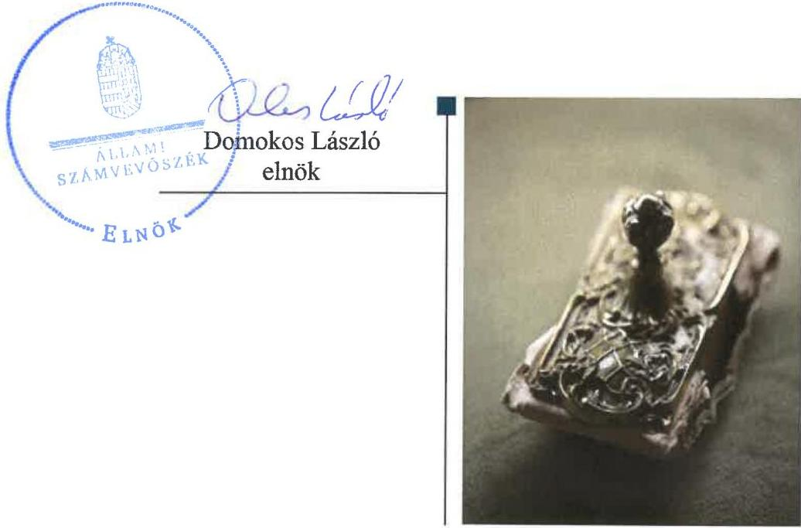

---

# AZ ELLENŐRZÉST FELÜGYELTE:

## MAKKAI MÁRIA felügyeleti vezető

## AZ ELLENŐRZÉST VEZETTE ÉS A VÉGREHAJTÁSÁÉRT FELELŐS:

### DORMÁN ISTVÁN ZOLTÁN ellenőrzésvezető

### A PROGRAM ÖSSZEÁLLÍTÁSÁÉRT FELELŐS:

### TÓTPÁL SZABOLCS osztályvezető

---

**IKTATÓSZÁM:** EL-1102-001/2018.

**TÉMASZÁM:** 2454

**ELLENŐRZÉS-AZONOSÍTÓ SZÁM:** V0798

---

Jelentéseink az Országgyűlés számítógépes hálózatán és az Interneten a www.asz.hu címen is olvashatóak.

---

# TARTALOMJEGYZÉK 

■ ÖSSZEGZÉS ..... 5
■ AZ ELLENŐRZÉS CÉLJA ..... 7
■ AZ ELLENŐRZÉS TERÜLETE ..... 8
■ AZ ELLENŐRZÉS HÁTTERE, INDOKOLTSÁGA ..... 9
■ A JELENTÉS LÉNYEGES KÉRDÉSKÖRE ..... 10
■ AZ ELLENŐRZÉS HATÓKÖRE ÉS MÓDSZEREI ..... 11
■ MEGÁLLAPÍTÁSOK ..... 13
■ MELLÉKLETEK ..... 15
I. sz. melléklet: Értelmező szótár ..... 15
II. sz. melléklet: Pénzügyi adatok ..... 16
■ FÜGGELÉK: ÉSZREVÉTELEK ..... 17
■ RÖVIDÍTÉSEK JEGYZÉKE ..... 117

---

.

---

# ÖSSZEGZÉS 

Az állami fenntartású felsőoktatási intézmények hallgatói önkormányzatai a 2013-2016. években nem szabályszerűen alakultak meg, ezért a nemzeti felsőoktatásról szóló törvényben biztosított jogosítványaik gyakorlásának feltételei nem álltak fenn.

## Az ellenőrzés társadalmi indokoltsága

A nemzeti felsőoktatásról szóló 2011. évi CCIV. törvényben meghatározott feltételek mellett a felsőoktatási intézményekben, azok részeként hallgatói önkormányzatok működnek, amelyek véleményt nyilváníthatnak, javaslattal élhetnek, dönthetnek a felsőoktatási intézmény működésével és a hallgatókkal kapcsolatos kérdésekben, a törvényben és a felsőoktatási intézmény szervezeti és működési szabályzatában meghatározottak szerint. Működésükhöz és feladatellátásukhoz a felsőoktatási intézmények biztosítják a feltételeket és anyagi eszközöket, állami támogatásban részesülnek, továbbá saját bevétellel is rendelkeznek. Működésüket a felsőoktatási intézmények ellenőrizni kötelesek. Az Állami Számvevőszék több alkalommal ellenőrizte az állami felsőoktatási intézmények gazdálkodását és működését. Első alkalommal került sor ugyanakkor a 27 állami felsőoktatási intézmény ellenőrzésére a hallgatói önkormányzatok tekintetében. Az ellenőrzést ezen túl az is indokolta, hogy a hallgatói önkormányzatok működése a jövő nemzedékét széles körben érinti, jelentős összegű közpénzt használnak fel és az állami felsőoktatási intézmények mindennapi működésére hatással vannak.

## Főbb megállapítások, következtetések

Az állami fenntartású felsőoktatási intézmények ellentétesen jártak el az Nftv-ben foglaltakkal, mivel a teljes idejű nappali képzésben részt vevő hallgatók legalább 25\%-a, igazoltan nem vett részt a hallgatói önkormányzati választásokon, valamint a hallgatói önkormányzatok nem rendelkeztek jóváhagyott alapszabállyal. Az állami fenntartású felsőoktatási intézményeknél a 2013-2016. években a hallgatói önkormányzatok nem szabályszerűen alakultak meg, a hallgatói önkormányzatok működése, forrásfelhasználása, gazdálkodása nem volt szabályszerű, nem volt biztosított a közpénzekkel történő átlátható, szabályszerű gazdálkodás. Mivel a hallgatói önkormányzatok nem szabályszerűen alakultak meg a felsőoktatási intézmény hallgatói önkormányzattal kapcsolatos bevételei és kiadásai elszámolásának a felsőoktatási intézmény által kialakított szabályozását, a hallgatói önkormányzat pénzeszköz felhasználásának szabályszerűségét, a felsőoktatási intézmény a hallgatói önkormányzat törvényes működésére vonatkozó Nftv.-ben előírt ellenőrzési kötelezettségének teljesítését nem értékeltük.

A nemzeti felsőoktatásról szóló 2011. évi CCIV. törvény szerint a hallgatói önkormányzatok törvényben biztosított jogosítványai gyakorlásának feltétele a szabályszerű megalakulás. E jogosítványok közé tartozik a működéshez biztosított anyagi eszközök, állami támogatás és saját bevételek felhasználásáról való döntés. A hallgatói önkormányzatok ellenőrzött időszakot érintő megalakulása nem volt szabályszerű, így a közvagyon használatára, a közpénz felhasználására vonatkozó jogosítvánnyal nem rendelkeztek. A felsőoktatási intézmények belső kontrollrendszere nem nyújtott megfelelő védelmet a jogalap nélküli, jogszabályellenes közpénzfelhasználással szemben. Nem ellenőrizték a hallgatói önkormányzatok törvényes működését, valamint annak a feltételeit, hogy az önkormányzat a törvényben meghatározott jogosítványait gyakorolhatja-e. A felsőoktatási intézmények első számú felelős vezetőjeként a rektorok és a gazdasági, pénzügyi, igazgatási tevékenységért felelős vezetőjeként a kancellárok tevékenysége - a felsőoktatási intézmények részeként működő - hallgatói önkormányzatok működése, gazdálkodása tekintetében nem biztosította Magyarország Alaptörvényében rögzített átláthatóság és elszámoltathatóság követelményének érvényesülését, amelynek minden közpénzekkel gazdálkodó szervezetre vonatkozóan érvényesülnie kell, ezáltal felmerül a jogosulatlan közpénzfelhasználás veszélye. Továbbá nem biztosították a korrupciós kockázatok szintjét meghaladó integritás kontrollok kialakítását és működtetését.

---

Az ellenőrzés részletes lefolytatására a közvagyonnal, közpénzzel való szabályszerű gazdálkodás alapfeltételeinek hiánya következtében nem került sor, emiatt az ÁSZ javaslatot nem fogalmazott meg. Az ÁSZ megállapításainak figyelembevételével előtérbe kell helyezni jogszabályi, illetve a felsőoktatási intézmények irányítási szintjén olyan megoldások kialakítását, amelyek biztosítják a hallgatói önkormányzatok tekintetében is Magyarország Alaptörvényében foglalt követelmények maradéktalan érvényesülését.

---

# AZ ELLENŐRZÉS CÉLJA 

AZ ELLENŐRZÉS CÉLJA a hallgatói önkormányzatok működése, a működésükhöz biztosított anyagi eszközök, állami támogatás és saját bevételek felhasználása szabályszerűségének ellenőrzése, a felsőoktatási intézmények törvényben előírt ellenőrzési kötelezettsége teljesítésének értékelése.

---

# **AZ ELLENŐRZÉS TERÜLETE**

## **Felsőoktatási intézmények és hallgatói önkormányzataik**

A hallgatói érdekek képviseletére, a hallgatói önkormányzatok működésére a felsőoktatási intézményekben az Nftv.^{1}$ ad lehetőséget.

Az Nftv.-ben meghatározott jogosítványaikat a hallgatói önkormányzatok akkor gyakorolhatják, ha a felsőoktatási intézmény teljes idejű nappali képzésben résztvevő hallgatóinak 25%-a igazoltan részt vett a hallgatói önkormányzati választáson és a hallgatói önkormányzat tisztségviselőinek megválasztásával döntött a hallgatói önkormányzat létrehozásáról, továbbá, ha a hallgatói önkormányzat működésének szabályait meghatározó alapszabályt a hallgatói önkormányzat küldöttgyűlése elfogadta és a felsőoktatási intézmény vezető testülete, a szenátus jóváhagyta.

Az Nftv.-ben foglaltak szerint a hallgatói önkormányzatok jogaikat az alapszabályukban rögzített módon gyakorolják, döntenek a működésükhöz biztosított állami támogatás és anyagi eszközök, valamint a saját bevételek felhasználásáról, hatásköreik gyakorlásáról. A felsőoktatási intézmények a hallgatói önkormányzatok működéséhez és feladatellátásához biztosítják a feltételeket, a feltételek teljesítését és a hallgatói önkormányzatok törvényes működését ellenőrizni kötelesek.

A felsőoktatási intézmények és a hallgatói önkormányzatok bevétel-kiadás adatait a 2013-2016. években az 1. táblázat szemlélteti, felsőoktatási intézményenként a II. számú melléklet részletezi. Az érintett nappali tagozatos hallgatók létszámadatait a 2. táblázat tartalmazza.

1. táblázat

### **NAPPALI TAGOZATOS HALLGATÓK LÉTSZÁMÁNAK ALAKULÁSA (FŐ)**

|  Iznév | N  |
| --- | --- |
|  2013/2014 | 224 000  |
|  2014/2015 | 217 000  |
|  2015/2016 | 210 000  |
|  2016/2017 | 205 600  |

*Forrás: KSH*

### **A FELSŐOKTATÁSI INTÉZMÉNYEK ÉS A HALLGATÓI ÖNKORMÁNYZATOK BEVÉTEL-KIADÁS ADATAI 2013-2016. ÉVEKBEN**

|  Összeg (M Ft) | 2013. | 2014. | 2015. | 2016.  |
| --- | --- | --- | --- | --- |
|  Egyetemek Összes bevétel | 542 388 | 547 126 | 614 570 | 767 095  |
|  Egyetemek Összes kiadás | 488 682 | 479 170 | 524 837 | 520 764  |
|  Egyetemek Normatív állami támogatás | 89 993 | 88 091 | 91 375 | 85 639  |
|  HÖK Összes bevétel | 3829 | 3727 | 3183 | 3173  |
|  HÖK Összes kiadás | 2875 | 2758 | 2634 | 2847  |
|  HÖK Normatív állami támogatás | 1890 | 1769 | 1579 | 1542  |

*Forrás: ÁSZ tanúsítványok, valamint a 2013-2016. évi éves beszámolók adatai alapján*

---

# AZ ELLENŐRZÉS HÁTTERE, INDOKOLTSÁGA 

A FELSŐOKTATÁSI INTÉZMÉNYEKBEN (annak részeként) a hallgatói érdekek képviseletére hallgatói önkormányzatok működnek. A hallgatói önkormányzat működéséhez és feladataik elvégzéséhez a felsőoktatási intézmény biztosítja a feltételeket, amelynek jogszerű felhasználását, a hallgatói önkormányzat törvényes működését ellenőrizni köteles. A hallgatói önkormányzat feladatainak ellátásához térítésmentesen használhatja a felsőoktatási intézmény helyiségeit, berendezéseit, ha ezzel nem korlátozza a felsőoktatási intézmény működését.

A hallgatói önkormányzatok működését, a működéséhez biztosított anyagi eszközök, állami támogatás és saját bevételek felhasználását az ÁSZ² még nem ellenőrizte. Az ellenőrzés hozzájárulhat a hallgatói önkormányzatok működésének megismeréséhez, a rájuk vonatkozó szabályozás hiányosságainak feltárásához, orvoslásához.

---

# A JELENTÉS LÉNYEGES KÉRDÉSKÖRE 

- A felsőoktatási intézményeknél a hallgatói önkormányzatok működése szabályszerű volt-e?

---

# AZ ELLENŐRZÉS HATÓKÖRE ÉS MÓDSZEREI 

## Az ellenőrzés típusa

Megfelelőségi ellenőrzés.

## Az ellenőrzött időszak

2013. január 1-jétől 2016. december 31-ig tartó időszak.

## Az ellenőrzés tárgya

A felsőoktatási intézmény által a szabályozás kialakítása a hallgatói önkormányzat rendelkezésére bocsátott források felhasználására vonatkozóan. A hallgatói önkormányzat pénzeszköz felhasználásának szabályszerűsége. A felsőoktatási intézmény hallgatói önkormányzatok törvényes működésére vonatkozó ellenőrzési kötelezettségének végrehajtása.

Az ellenőrzés kiterjedt minden olyan körülményre és adatra, amely az ÁSZ jogszabályban meghatározott feladatainak teljesítéséhez, valamint a program végrehajtása folyamán felmerült újabb összefüggések feltárásához szükséges volt.

## Az ellenőrzött szervezet

Budapesti Corvinus Egyetem, Budapesti Gazdasági Egyetem, Budapesti Műszaki és Gazdaságtudományi Egyetem, Debreceni Egyetem, Dunaújvárosi Egyetem, Eötvös József Főiskola, Eötvös Loránd Tudományegyetem, Eszterházy Károly Egyetem, Kaposvári Egyetem, Liszt Ferenc Zeneművészeti Egyetem, Magyar Képzőművészeti Egyetem, Magyar Táncművészeti Egyetem, Moholy-Nagy Művészeti Egyetem, Miskolci Egyetem, Nemzeti Közszolgálati Egyetem, Nyíregyházi Egyetem, Óbudai Egyetem, Pannon Egyetem, Pécsi Tudományegyetem, Pető András Főiskola (Semmelweis Egyetem), Semmelweis Egyetem, Soproni Egyetem, Széchenyi István Egyetem, Szegedi Tudományegyetem, Szent István Egyetem, Színház- és Filmművészeti Egyetem, Testnevelési Egyetem állami felsőoktatási intézmények és hallgatói önkormányzataik.

## Az ellenőrzés jogalapja

Az ellenőrzés jogszabályi alapját az ÁSZ tv. ${ }^{3}$ 1. § (3) bekezdés, 5. § (3) bekezdése képezték.

---

# Az ellenőrzés módszerei 

Az ellenőrzést a szakmai program szempontjai, az ellenőrzött időszakban hatályos jogszabályok, az ellenőrzés szakmai szabályai, a jelen ellenőrzésre irányadó ÁSZ módszertanok figyelembevételével végeztük.

Az ellenőrzés ideje alatt az ellenőrzött szervezettel történő kapcsolattartást az ÁSZ SZMSZ-ének vonatkozó előírásai alapján biztosítottuk.

Az ellenőrzési kérdések megválaszolásához szükséges bizonyítékok megszerzése az ellenőrzött által rendelkezésre bocsátott dokumentumokra, adatokra alapozva megfigyelés, szemle (szemrevételezés), kérdésfeltevés (információkérés), valamint elemző eljárás útján történt. Az ellenőrzési bizonyítékként felhasználható adatforrások közé tartoztak egyrészt a szakmai program részletes szempontjainál felsorolt adatforrások, másrészt minden egyéb - az ellenőrzés folyamán feltárt, az ellenőrzés szempontjából információt tartalmazó - dokumentum.

Az ellenőrzés lefolytatásához az ellenőrzött szervezetek a tanúsítványok kitöltésével, valamint az ÁSZ által kért dokumentumok megküldésével szolgáltattak adatokat.

---

# A felsőoktatási intézményeknél a hallgatói önkormányzatok működése szabályszerű volt-e? 

Összegző megállapítás

Az állami fenntartású felsőoktatási intézményeknél a hallgatói önkormányzat működése nem volt szabályszerű.

Az állami fenntartású felsőoktatási intézményeknél a HÖK ${ }^{4}$ működése nem volt szabályszerű, mert
$\longrightarrow$ a Budapesti Corvinus Egyetem, a Budapesti Gazdasági Egyetem, a Budapesti Műszaki és Gazdaságtudományi Egyetem, a Debreceni Egyetem, a Dunaújvárosi Egyetem, az Eötvös József Főiskola, az Eszterházy Károly Egyetem, az Eötvös Loránd Tudományegyetem, a Kaposvári Egyetem, a Liszt Ferenc Zeneművészeti Egyetem, a Miskolci Egyetem, a Magyar Képzőművészeti Egyetem, a Magyar Táncművészeti Egyetem, a Moholy-Nagy Művészeti Egyetem, a Nemzeti Közszolgálati Egyetem, a Nyíregyházi Egyetem, az Óbudai Egyetem, a Pannon Egyetem, a Pécsi Tudományegyetem, a Soproni Egyetem, a Semmelweis Egyetem, a Pető András Főiskola5, a Széchenyi István Egyetem, a Színház- és Filmművészeti Egyetem, a Szent István Egyetem, a Szegedi Tudományegyetem és a Testnevelési Egyetem teljes idejű nappali képzésben részt vevő hallgatóinak legalább 25\%-a az Nftv. 60. § (1) bekezdés b) pontjában foglaltakkal ellentétesen, igazoltan nem vett részt a hallgatói önkormányzati választásokon;
$\longrightarrow$ a SE$^{6}$ 2013. október 30-a és 2016. március 30. közötti, az OE$^{7}$ 2014. évi, a TE$^{8}$ 2015. évi és az MTE$^{9}$ 2016. évi hallgatói önkormányzatának alapszabályát a Szenátus nem hagyta jóvá az Nftv. 60. § (1) bekezdés a) pontjában foglaltak ellenére, ezért az alapszabály nem volt érvényes;
$\longrightarrow$ a 2013-2014. években az SZFE ${ }^{10}$, az MKE ${ }^{11}$, a 2013-2015. években az MTE, a 2014-2016. években a Pető András Főiskola és a 2013-2016. években a Széchenyi ${ }^{12}$ hallgatói önkormányzata nem rendelkezett alapszabállyal az Nftv. 60. § (2) bekezdésében foglaltak ellenére;
$\longrightarrow$ a 2013. évben az ELTE ${ }^{13}$, az ÓE 2014. évben, az MKE 2015. évben, az MTE 2016. évben, a 2013-2014. években a DUE ${ }^{14}$, az EKE ${ }^{15}$ és az NKE ${ }^{16}$, a 2013-2015. években az EJF ${ }^{17}$, a 2013-2016. években a MOME ${ }^{18}$ hallgatói önkormányzata alapszabályának módosítását a HÖK küldöttgyűlése az Nftv. 60. § (2) bekezdésében foglaltak ellenére nem fogadta el, ezért az alapszabály nem volt érvényes.
Az állami fenntartású felsőoktatási intézményeknél a HÖK által - a hallgatói önkormányzati választások nem szabályszerű lebonyolítása, valamint az alapszabály hiánya, vagy érvénytelensége miatt - az Nftv. 61. § (1)(3) bekezdésében biztosított egyetértési-, vélemény-nyilvánítási- és javaslattételi jogosultságának gyakorlása, valamint az Nftv. 60. § (7) bekezdése

---

alapján a HÖK működéséhez biztosított anyagi eszközök, állami támogatás és saját bevételek felhasználása az Nftv. 60. § (1) bekezdésében meghatározott feltételek teljesülése nélkül, nem a jogszabályi előírásoknak megfelelően történt.

---

# MELLÉKLETEK 

- I. SZ. MELLÉKLET: ÉRTELMEZŐ SZÓTÁR
felsőoktatási intézmény
költségvetési támogatás
az oktatás, a tudományos kutatás, a művészeti alkotótevékenység, mint alaptevékenység folytatására létesített szervezet.
a társadalombiztosítás pénzügyi alapjai kivételével az államháztartás központi alrendszeréből ellenérték nélkül, pénzben nyújtott támogatások, ide nem értve az adományokat, segélyeket, felajánlásokat, a pártok és pártalapítványok támogatását, az országgyűlési képviselők választása kampányköltségeinek támogatásait, a tanulóknak, hallgatóknak biztosított ösztöndíjakat, a fogyatékos és a súlyos mozgáskorlátozott személyeknek ezen élethelyzetére tekintettel nyújtott pénzbeli ellátásokat, a szociális igazgatásról és szociális ellátásokról szóló törvény szerinti pénzbeli és természetbeni szociális és gyermekvédelmi ellátásokat, a foglalkoztatás elősegítéséről és a munkanélküliek ellátásáról szóló törvény szerinti foglalkoztatást elősegítő képzési támogatásokat, a jogszabály alapján nyújtott családtámogatásokat, korhatár alatti ellátásokat, jövedelempótló és jövedelemkiegészítő szociális támogatásokat, az apákat megillető munkaidő-kedvezményekkel összefüggő költségek megtérítését, az energiafelhasználási támogatásokat, a helyi önkormányzatok, nemzetiségi önkormányzatok általános működésének és ágazati feladatai támogatásait, a közfoglalkoztatási támogatásokat, valamint a szociálpolitikai menetdíj támogatásokat.

---

# II. SZ. MELLÉKLET: PÉNZÜGYI ADATOK 

## FELSŐOKTATÁSI INTÉZMÉNYEK ADATSZOLGÁLTATÁSA ALAPJÁN A HALLGATÓI ÖNKORMÁNYZATOK BEVÉTEL, KIADÁS ADATAI (M FT)

| Ellenőrzött szervezet | 2013. | 2014. | 2015. | 2016. | 2013. | 2014. | 2015. | 2016. |
| :--: | :--: | :--: | :--: | :--: | :--: | :--: | :--: | :--: |
|  |  | Bevétel |  |  |  | Kiadás |  |  |
| Budapesti Corvinus Egyetem HÖK | 115 | 75 | 49 | 38 | 59 | 54 | 30 | 19 |
| Budapesti Gazdasági Egyetem HÖK | 80 | 86 | 85 | 100 | 63 | 59 | 84 | 96 |
| Budapesti Műszaki és Gazdaságtudományi Egyetem HÖK | 361 | 341 | 310 | 320 | 276 | 183 | 119 | 99 |
| Debreceni Egyetem HÖK | 1924 | 1938 | 1564 | 1558 | 1416 | 1454 | 1329 | 1448 |
| Dunaújvárosi Egyetem HÖK | 115 | 84 | 64 | 59 | 106 | 84 | 58 | 51 |
| Eötvös József Főiskola HÖK | 0,408 | 0,927 | 0,552 | 1,431 | 0,391 | 0,927 | 0,502 | 1,431 |
| Eötvös Loránd Tudományegyetem HÖK | 90 | 54 | 127 | 166 | 76 | 6 | 85 | 143 |
| Eszterházy Károly Egyetem HÖK | 15 | 13 | 16 | 17 | 27 | 17 | 22 | 26 |
| Kaposvári Egyetem HÖK | 11 | 10 | 7 | 9 | 11 | 10 | 7 | 9 |
| Liszt Ferenc Zeneművészeti Egyetem HÖK | 4 | 5 | 6 | 4 | 2 | 4 | 4 | 4 |
| Magyar Képzőművészeti Egyetem HÖK | 160 | 168 | 181 | 160 | 150 | 137 | 159 | 147 |
| Magyar Táncművészeti Egyetem HÖK | nincs adat | 0,462 | 0,328 | 0,204 | nincs adat | 0,462 | 0,328 | 0.204 |
| Miskolci Egyetem HÖK | 189 | 224 | 226 | 207 | 154 | 172 | 163 | 203 |
| Moholy-Nagy Művészeti Egyetem HÖK | 2 | 2 | 2 | 2 | 1 | 1 | 1 | 2 |
| Nemzeti Közszolgálati Egyetem HÖK | 3 | 1 | 0 | 11 | 43 | 69 | 90 | 91 |
| Nyíregyházi Egyetem HÖK | 15 | 17 | 11 | 10 | 18 | 16 | 10 | 9 |
| Óbudai Egyetem HÖK | 150 | 159 | 143 | 112 | 107 | 111 | 128 | 129 |
| Pannon Egyetem HÖK | 14 | 12 | 9 | 9 | 17 | 12 | 8 | 8 |
| Pécsi Tudományegyetem HÖK | 407 | 395 | 219 | 215 | 231 | 243 | 220 | 239 |
| Pető András Főiskola HÖK | 180 | nincs adat | nincs adat | nincs adat | 0,402 | 0,208 | 0,133 | 0,158 |
| Semmelweis Egyetem HÖK | 56 | 59 | 61 | 60 | 32 | 31 | 19 | 19 |
| Soproni Egyetem HÖK | 30 | 23 | 15 | 17 | 24 | 22 | 19 | 8 |
| Széchenyi István Egyetem HÖK | 33 | 30 | 29 | 39 | 27 | 26 | 24 | 36 |
| Szegedi Tudományegyetem HÖK | 44 | 17 | 39 | 29 | 25 | 34 | 37 | 28 |
| Szent István Egyetem | 10 | 9 | 8 | 16 | 7 | 9 | 6 | 15 |
| Színház- és Filmművészeti Egyetem HÖK | 1 | 2 | 3 | 3 | 0,934 | 2 | 2 | 3 |
| Testnevelési Egyetem HÖK | nincs adat | 0 | 9 | 12 | nincs adat | 0 | 9 | 12 |

---

# FÜGGELÉK: ÉSZREVÉTELEK 

A jelentéstervezetet a Számvevőszék 15 napos észrevételezésre megküldte az ellenőrzött szervezetek vezetőinek az ÁSZ tv. 29. §* (1) bekezdése előírásának megfelelően.

Az ÁSZ a jelentéstervezetet észrevételezésre megküldte az állami felsőoktatási intézmények rektorainak.
A Moholy-Nagy Művészeti Egyetem és a Testnevelési Egyetem észrevételt nem tett. Az Eötvös József Főiskola, a Magyar Képzőművészeti Egyetem, a Magyar Táncművészeti Egyetem, a Miskolci Egyetem, a Soproni Egyetem nemleges észrevételt tett.
A Budapesti Corvinus Egyetem, a Budapesti Gazdasági Egyetem, a Budapesti Műszaki és Gazdaságtudományi Egyetem, a Debreceni Egyetem, a Dunaújvárosi Egyetem, az Eötvös Loránd Tudományegyetem, az Eszterházy Károly Egyetem, a Kaposvári Egyetem, a Liszt Ferenc Zeneművészeti Egyetem, a Nemzeti Közszolgálati Egyetem, a Nyíregyházi Egyetem, az Óbudai Egyetem, a Pannon Egyetem, a Pécsi Tudományegyetem, a Semmelweis Egyetem, a Széchenyi István Egyetem, a Szegedi Tudományegyetem, a Szent István Egyetem, valamint a Színház- és Filmművészeti Egyetem észrevételeit és az arra adott választ a függelék alább tartalmazza.

[^0]
[^0]:    * 29. § (1) Az Állami Számvevőszék az ellenőrzési megállapításait megküldi az ellenőrzött szervezet vezetőjének vagy az általa megbízott személynek, és annak, akinek személyes felelősségét állapította meg.
    (2) Az ellenőrzött szervezet vezetője és a felelősként megjelölt személy az ellenőrzés megállapításaira tizenöt napon belül írásban észrevételt tehet.
    (3) Az Állami Számvevőszék az észrevételre a beérkezésétől számított harminc napon belül írásban válaszol. A figyelembe nem vett észrevételeket köteles a jelentésben feltüntetni, és megindokolni, hogy azokat miért nem fogadta el.

---

# CORVINUS 

## Domokos László részére

elnök

## Állami Számvevőszék   1364 Budapest 4. Pf. 54

Ügyintéző: Dr. Sárközi-Kerezsi Marca Telefonszám: +36 1/482-5112 Iktatószám: R/1686-17/2017. Dátum: 2018. augusztus 7.

## ÁLLAMI SZÁMVEVŐSZÉK

Buc: 4579321204
Émszert: 2018. AUG 19.
Metszert:
Tárgy: észrevétel „Az állami felsőoktatási intézmények ellenőrzése a hallgatói önkormányzatok tekintetében" címmel készített számvevőszéki jelentéstervezetre

Tisztelt Elnök Úr!
A tárgyban jelzett - EL-0525-062/2018. számú - számvevőszéki jelentéstervezet megállapításaira az alábbi észrevételt tesszük:

Elfogadjuk, hogy a becsatolt jegyzőkönyvek alapján az ÁSZ nem tudott meggyőződni az Nftv. 60.§ (1) b) pontja értelmében arról, hogy a hallgatói önkormányzati választásokon a felsőoktatási intézmény teljes idejű nappali képzésben részt vevő hallgatóinak legalább huszonöt százaléka igazoltan részt vett. Ugyanakkor fenntartjuk annak valószínűségét, hogy a 25\%-os részvételi arányt a választásokon részt vevők száma a valóságban elérte - mivel ennek ellenkezőjétől sem lehetséges dokumentáltan meggyőződni -, így a hallgatói önkormányzat működése a valóságban legitim volt.

Az ÁSZ megállapítása, az Nftv. hivatkozott 60. § (1) b) pontja alapján a részvételi arány dokumentált igazolását írja elő, amelyet 2016-ban a BCE vezetése által elrendelt, a HÖK működésének vizsgálata tárgyában lefolytatott - az ÁSZ ellenőrzéshez becsatolt - belső ellenőrzés is megállapított.

A hivatkozott belső ellenőri jelentés alapján intézkedések kerültek megfogalmazásra, amelyek végrehajtása az elmúlt időszakban megtörtént, így a 2016. évet követően lezajlott önkormányzati választások a feltárt hiányosságoktól mentesek a folyamatba épített kontrolloknak köszönhetően.

Az intézkedési tervünkben részletezzük ezen megtett intézkedéseket és szívesen fogadjuk az ÁSZ szakmai állásfoglalását ezek megfelelőségét illetően.

Budapesti Corvinus Egyetem
H. 1089 Budapest, Fővám tér 8.
Tel 0614825124 Fax 0612178803
www.uni-corvinus.hu

---

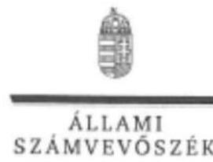

ELNÖK

Ikt.szám: EL-0525-131/2018.

Dr. Lánczi András úr
rektor

Budapesti Corvinus Egyetem

Budapest

Tisztelt Rektor Úr!

„Az állami felsőoktatási intézmények ellenőrzése a hallgatói önkormányzatok tekintetében” címmel készített számvevőszéki jelentéstervezetre tett észrevételét köszönettel megkaptam.

Az Állami Számvevőszék észrevételre vonatkozó álláspontjáról a felügyeleti vezető által készített részletes tájékoztatást mellékelten megküldöm.

Tájékoztatom Rektor urat, hogy a számvevőszéki jelentésben – az Állami Számvevőszékről szóló 2011. évi LXVI. törvény 29. § (3) bekezdése alapján – a figyelembe nem vett észrevételt szerepeltetjük, annak indoklásával, hogy azt az Állami Számvevőszék miért nem fogadta el.

Budapest, 2018. 08. hó 18. nap

Tisztelettel:

Domokos László

Melléklet: Tájékoztatás az észrevétel kezeléséről

1052 BUDAPEST, HYÜZEN CSERE JÁNOS UTCA 10, 1364 Budapest 4. Pf. 54 telefon: 484 9101 fax: 484 9201

---

Melléklet
Ikt.szám: EL-0525-131/2018.

# Tájékoztatás az észrevétel kezeléséről 

„Az állami felsőoktatási intézmények ellenőrzése a hallgatói önkormányzatok tekintetében" című jelentéstervezetre 2018. augusztus 9-én érkezett észrevételt áttekintettük, annak kezelésével kapcsolatban a következő tájékoztatást adom.
Az észrevétel az Állami Számvevőszék megállapításait megerősíti. A jogszabályi előírásoknak megfelelő részvételi arány észrevételben foglalt valószínűsítése és az ez alapján feltételezett legitim működés nem cáfolja
 az ÁSZ rendelkezésére bocsátott dokumentumokon alapuló, tényszerű - észrevétel által is elfogadott - megállapításait. A jelentéstervezet módosítása nem indokolt.
Az ellenőrzött időszakot követően megtett intézkedésekről szóló tájékoztatást köszönjük, azok a jelentéstervezetben foglalt, ellenőrzött időszakra vonatkozó megállapításokat nem érintik.

Budapest, 2018. 08. hó 28 nap

Makkai Mária
felügyeleti vezető

---

Domokos László úr részére
Állami Számvevőszék elnöke

Budapest
Apáczai Csere János u. 10.
1052

Tisztelt Elnök Úr!
„Az állami felsőoktatási intézmények ellenőrzése a hallgatói önkormányzatok tekintetében" címmel készült számvevőszéki jelentéstervezettel, valamint az EL-0525-063/2018. ikt. számú, 2018. július 13-i keltezésű kísérőlevéllel kapcsolatos észrevételeink - az Állami Számvevőszékről szóló 2011. évi LXVI. törvény (a továbbiakban: ÁSz tv.) 29. § (2) bekezdése alapján - az alábbiak szerint összegezhetők.

A jelentéstervezet szerint a BGE Hallgatói Önkormányzat (BGE HÖK) működése, forrásfelhasználása, gazdálkodása - mivel a 2013-2016. években nem szabályszerűen alakult meg - nem volt szabályszerű. Erre tekintettel az Állami Számvevőszék előkészíti az ÁSz tv. 31. § (1) bek. b) pontjában foglaltak szerinti, a hallgatói normatíva intézményi összege 1\%-a folyósításának felfüggesztésére teendő intézkedéseket.

Az ÁSz tv. „Vagyonmegőrzési intézkedések" cím alatt szereplő 31. § (1) bek. b) pontja az alábbiak szerint rendelkezik: „Amennyiben az ellenőrzés rendeltetésellenes vagy pazarló felhasználást tár fel, illetve az ellenőrzött szervezet által a pénzeszközök kezelésére vonatkozó szabályok súlyos megsértésével történő károkozást, illetve ennek veszélyét állapítja meg, a kár megelőzése, illetve enyhítése érdekében az Állami Számvevőszék elnöke az illetékes hatósághoz, illetve szervezethez (a továbbiakban együtt: hatósághoz) fordulhat az államháztartás valamelyik alrendszeréből nyújtott támogatások folyósításának felfüggesztése érdekében".

Álláspontunk szerint az Állami Számvevőszék által előkészítendő intézkedések kezdeményezése újragondolást igényel, mivel a fentiekben megfogalmazott egyes kritériumok, feltételek nem állnak fenn, illetve nem kerültek egyértelműen igazolásra. A jelentéstervezet - az általános megállapításokon túlmenően - ugyanis nem tartalmaz arra vonatkozóan konkrét adatokat, hogy az ellenőrzés mely esetben tárt fel a BGE HÖK működése során rendeltetésellenes vagy pazarló felhasználást, illetve károkozást vagy annak veszélyét.

---

# BGE 

Kérdéses továbbá, hogy az ellenőrzés alá vont időszakra (2013-2016 évek) tett megállapítások mennyiben relevánsak 2018-ban, amikor a hallgatói normatíva intézményi összege 1\%-a folyósításának felfüggesztésére sor kerül(het)ne. A BGE álláspontja szerint a vagyonmegóvási intézkedések célja egy folyamatosan és aktuálisan fennálló, jogszerűtlen magatartáson alapuló kárelhárítás és kármegelőzés, nem pedig egy múltbeli esetlegesen jogszerűtlen működés" joghátránnyal sújtása. Érvérésünket támasztja alá az ÁSZ tv. 31. §-ához fűzött indokolás is:
„A közvagyon védelmét erősítő szabály, hogy a Számvevőszék elnökének az ellenőrzött szervezet jogellenes magatartásának következményeként előidézett kárveszély megelőzésére, illetőleg a már bekövetkezett kár enyhítésére megfelelő eszközöket biztosít a törvény. Ennek célja a közvagyon megóvása és a legszükségesebb intézkedések megtétele annak érdekében, hogy az észleléstől az ellenőrzés befejezéséig terjedő időszakban további kár ne keletkezzen. Az intézkedés hatékonyságát erősíti a megkeresett szerv visszajelzési kötelezettsége a megtett intézkedésekről. Értelemszerűen az intézkedés csak addig tartható hatályban, amíg az annak alapjául szolgált ok, illetőleg körülmény fennáll."

Javasoljuk továbbá figyelembe venni, hogy mivel a BGE esetében a hivatkozott megállapítások jelenlegi fennállása nem képezte az eredeti vizsgálat tárgyát, így a javasolt intézkedések előkészítése sem indokolt álláspontunk szerint. A vizsgált időszakot követően a BGE HÖK 2017-2018-ban az Nftv. 60. § (1) bekezdésének megfelelően képviselő- és biztosítóválasztást tartott. A BGE HÖK adatszolgáltatása szerint a rendelkezésünkre bocsájtott dokumentumok, választási bizottsági jegyzőkönyvekben szereplő megállapítások alapján létrejöttük megfelel a törvényes követelményeknek. A benyújtott dokumentumok szerinti adatszolgáltatások tartalmát az ellenkező bizonyításáig valósnak fogadjuk el.

A jelentéstervezet továbbá nem tartalmaz konkrét, a BGE-re vonatkozó megállapításokat, az csak a többi állami felsőoktatási intézménnyel együtt tesz általános megállapításokat. Ennek alapján nem tartalmaz külön részletes indokolást az általános megállapítások alátámasztására, illetve nélkülöz minden, az általános megállapításokat alátámasztó, azok fennállását igazoló konkrét hivatkozást. Így, véleményünk szerint a jelentéstervezet csupán egy általános megállapítások alapján levont általános következtetést tartalmaz, mely szerint a BGE HÖK forrásfelhasználása, gazdálkodása nem volt szabályszerű, azonban a megállapítás, valamint az alkalmazandó jogkövetkezmény, mint a hallgatói normatíva intézményi összege 1\%-a folyósításának felfüggesztése között ok-okozat összefüggés sem állt fenn, illetve a kár-kárveszély lehetősége sem került külön megvizsgálásra, illetve igazolásra.

A jelentéstervezettel kapcsolatos további észrevételünk, hogy tekintettel arra, hogy a jelentéstervezet főbb megállapításai szerint az Állami Számvevőszék részéről a pénzeszköz-felhasználás szabályszerűsége külön nem került megvizsgálásra, illetve értékelésre, így álláspontunk szerint az esetleges kár bekövetkeztének léte sem

---

# BGE 

kerülhetett konkrétan igazolásra. Ezek alapján igazolt, tényleges megállapítás hiányában álláspontunk szerint az esetlegesen nem jogszerűen megalakult HÖK nem jelenti automatikusan a pénzeszközök rendeltetésellenes felhasználását és főleg nem a károkozás bekövetkezését, illetve annak fennállását.

A kísérőlevélben Elnök Úr felkéri a BGE Rektorát, hogy „a jelentéstervezetben leírt szabálytalanságok vonatkozásában tegye meg a megfelelő intézkedéseket, és azokról az észrevételtől elkülönítetten értesítse az ÁSZ elnökét".

Tájékoztatom Elnök Urat, hogy a fentiek alapján a BGE vezetése által elkészített részletes intézkedéseket tartalmazó intézkedési tervet a mai napon külön levél formájában juttatjuk el Elnök Úr részére.

Javasoljuk azonban figyelembe venni azt is, hogy az ÁSz tv. 33. § (1) bekezdése az ellenőrzött szerv intézkedésiterv-készítési - és ezáltal a konkrét intézkedés megtételének - kötelezettségét a végleges, az Állami Számvevőszék elnöke által jóváhagyott jelentéshez köti. A 33. § (6) bekezdése szerinti figyelemfelhívó levél alapján az ellenőrzött szerv által teendő intézkedések pedig abban az esetben foganatosítandók, amennyiben „az ellenőrzés során feltárt jogszabálysértő gyakorlat, illetve a vagyon rendeltetésellenes vagy pazarló felhasználásának megszüntetése érdekében jogszabálysúlyú jogkövetkezmény alkalmazását nem írja elő". Fentiek alapján álláspontunk szerint az Elnök Úr által kért intézkedések megtétele csak a végleges, jóváhagyott jelentést követően összeállított és Elnök Úr részére megküldött intézkedési terv alapján történhet meg. Továbbá ismételten jelezni kívánjuk, hogy az Állami Számvevőszék által kilátásba helyezett javasolt intézkedés, mint jogkövetkezmény alkalmazhatósága egy jelenleg is fennálló nem szabályszerű működést feltételez, melynek alkalmazhatósága azonban egyrészt mivel már kívül esik a jelen vizsgálat 2013-2016-os évek tárgykörén, másrészt mivel azóta Egyetemünkön már több HÖK választás is lezajlott, álláspontunk szerint nem indokolt, mint tekintettel kérem Tisztelt Elnök Urat, ezen álláspontjukat felülvizsgálni szíveskedjenek.

Budapest, 2018. augusztus 3.

Tisztelettel:

Prof. Dr. Heidrich Balázs
rektor

Dr. Diletz Ferenc
kancellár

---

# FÜGGELÉK: Észrevételek

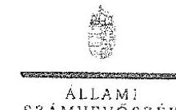

**F. VÉK**

**SZÁMVEVŐSZÉK**

Bulasztár: 11-0523-126/2018.

Prof. Dr. Heidrich Balázs úr
rektor

Budapesti Gazdasági Egyetem

Budapest

Tisztelt Rektor Úr!

Az állami felsőoktatási intézmények ellenőrzése a hallgatói intézményének tekintetében címmel készített számvevőszéki jelentéstervezetre tett észrevételeit köszönettel megkaptam.

Az Állami Számvevőszék észrevételeire vonatkozó álláspontjáról a felügyeleti vezető által készített részletes tájékoztatást mellékelten megküldöm.

Tájékoztatom Rektor Urat, hogy a számvevőszéki jelentésben – az Állami Számvevőszékről szóló 2011. évi LXVI. törvény 29. § (3) bekezdése alapján – a figyelembe nem vett észrevételei szerepelnek, annak indoklásával, hogy azt az Állami Számvevőszék miért nem fogadta el.

Budapest, 2018. 27. hó 29. nap

Tisztelettel:

Domokos László

Melléklet: Tájékoztatás az észrevételei kezeléséről

FREYBERGER ANDER, CROSS ANDERSON 10. 1561 Budapest E. P. 10. tanárk. 444 3031 50 - 40+5201

---

# Tájékoztatás 

az észrevétel kezeléséről
„Az állami felsőoktatási intézmények ellenőrzése a hallgatói önkormányzatok tekintetében" című jelentéstervezetre 2018. augusztus 9-én érkezett észrevételt áttekintettük, annak kezelésével kapcsolatban a következő tájékoztatást adom.
Az észrevétel alapvetően nem a jelentéstervezettel összefüggésben került megfogalmazásra, hanem a Budapesti Gazdasági Egyetem (továbbiakban: BGE) rektora részére megküldött kísérőlevélben foglalt esetleges jogkövetkezményeket érinti.
Az észrevétel jelentéstervezettel összefüggő része rögzíti, hogy a jelentéstervezet nem tartalmaz „konkrét adatokat, hogy az ellenőrzés mely esetben tárt fel a BGE HÖK működése során rendeltetésellenes vagy pazarló felhasználást, illetve károkozást vagy annak veszélyét". Ide vonatkozóan tájékoztatom, hogy a BGE hallgatói önkormányzatának ellenőrzött időszakot érintő megalakulása nem volt szabályszerű, így a közvagyon használatára, a pénzek felhasználására vonatkozó jogosítvánnyal nem rendelkeztek, ezért további „konkrét adatok" nem bírnak relevanciával. A BGE ellenőrzött időszak egyetlen évére sem adott át olyan dokumentumot, amely a küldöttgyűlés választására kötelezett valamennyi (kari) részönkormányzat választásának szabályszerűségét alátámasztotta volna. Az ellenőrzés rendelkezésére bocsátott adatokkal, dokumentumokkal összefüggésben a BGE teljességi és hitelességi nyilatkozatban rögzítette, hogy az ÁSZ részére átadott dokumentumok, adatok megbízhatóak és a bekért adatokra, dokumentumokra vonatkozóan teljes körű információt tartalmaznak. Ebből következően a BGE ellenőrzés rendelkezésére bocsátott dokumentumai a nemzeti felsőoktatásról szóló 2011. évi CCIV. törvény 60. § (1) bekezdés b) pontjában foglalt előírások érvényesülését nem igazolták. Az észrevételt nem fogadjuk el, a jelentéstervezet módosítása nem indokolt.
Az ÁSZ kísérőlevélében foglalt „előkészítendő intézkedésekkel" összefüggésben az Állami Számvevőszékről szóló 2011. évi LXVI. törvény (továbbiakban: ÁSZ tv.) alapján megfogalmazott jogi okfejtést köszönjük, az semmilyen módon nem érinti a jelentéstervezetben foglalt, ellenőrzött időszakra vonatkozó megállapításokat.
Az észrevételben foglalt ÁSZ tv. szerinti intézkedési terv készítési kötelezettségről szóló jogértelmezéseket érintően kiemeljük, hogy az Állami Számvevőszék minden esetben a jogszabályi előírások ismeretében és azoknak megfelelően jár el. Tájékoztatom, hogy a jogértelmezésük téves logikán alapul, mivel a BGE rektora részére küldött kísérőlevélben kért, a megfelelő intézkedések megtételéről szóló, az észrevételtől elkülönített tájékoztatás kizárólag az ÁSZ tv. 31. § (1) bekezdés b) pontjában foglalt jogkövetkezmények szükségességének megítélésével van összefüggésben. Semmilyen formában nem érinti az ÁSZ jelentésben foglalt megállapításokhoz kapcsolódó intézkedési terv készítési kötelezettséget, valamint az ÁSZ tv. szerinti figyelemfelhívó levéllel összefüggő intézkedési kötelezettséggel nincs összefüggésben.

---

Az előzőeken túlmenően az észrevétel tájékoztatást ad az ellenőrzött időszakot követően a jogszabályi előírásoknak megfelelő hallgatói önkormányzati változásokról. A tájékoztatást köszönjük, az nem érinti a jelentéstervezet ellenőrzött időszakra vonatkozó megállapításait, azok helytállóak, a jelentéstervezet módosítása nem indokolt.
Budapest, 2018. 09. hó 5 nap

Makkai Mária
felügyeleti vezető

---

# Függelék: Észrevételek

4249

BME iktatószáma: 007/2018

Domokos László
elnök

Állami Számvevőszék

Budapest

Tárgy: Jelentéstervezettel kapcsolatos észrevételek küldése

Tisztelt Elnök Úr!

Hivatkozással az EL-0525-064/2018. iktatószámú levelére, „Az állami felsőoktatási intézmények ellenőrzése a hallgatói önkormányzatok tekintetében” címmel készített jelentéstervezettel kapcsolatban a Budapesti Műszaki és Gazdaságtudományi Egyetem az alábbi észrevételeket teszi.

1.) A jelentéstervezet 17. oldalán tett megállapítások 1. pontjához (mely szerint a Budapesti Műszaki és Gazdaságtudományi Egyetem) a HÖK működése nem volt szabályszerű, mert a teljes idejű nappali képzésben részt vevő hallgatóinak legalább 25%-a az Nftv. 60. § (1) bekezdés b) pontjában foglaltakkal ellentétesen, igazoltan nem vett részt a hallgatói önkormányzati választásokon):

A BME Hallgatói Önkormányzatának tisztújításai (önkormányzati választásai) során a BME HÖK Alapszabályának és felsőbb szabályozásoknak eleget téve minden hallgatói szavazás lebonyolításához független Szavazási Bizottságot állít fel, mely bizottság a szavazások lezártát követően jegyzőkönyvet készít. Mostani alapos vizsgálatunkból megerősítést nyert, hogy az ellenőrzött időszakban minden tisztújító szavazás szabályosan és eredményesen lett lebonyolítva, azonban azt is el kell ismernünk, hogy az ÁSZ részére átadott anyagokból ezt nem lehetett egyértelműen megállapítani. Az immáron teljes körűen begyűjtött és áttekintett dokumentumok megnyugtatóan alátámasztják, hogy a vizsgált időszakban a BME HÖK hallgatói szavazásain minden esetben igazoltan részt vett az aktív státuszú teljes idejű képzésben részt vevő hallgatók legalább 25%-a. Ennek alapján kérjük a jelentéstervezet vonatkozó megállapításainak megfelelő módosítását, onnan a BME törlését.

2.) A jelentéstervezet 5. oldalán a „Főbb megállapítások, következtetések, javaslatok” ponthoz. Egyetemünknek átfogó, hosszú évek tapasztalatai alapján kidolgozott és finomított szabályrendszere és gyakorlata van a HÖK működésének és gazdálkodásának ellenőrzésére:

A megfogalmazott javaslat alapján intézkedem a hallgatói önkormányzat működéséhez kapcsolódó ellenőrzési útvonalak felülvizsgálatáról, kiegészítve azt a működésére és

Budapesti Műszaki és Gazdaságtudományi Egyetem
1111 Budapest, Műegyetem rkp. 3. B. 1. 11
Postacím: 1521 Budapest
www.bme.hu

Rektor: 1. Kabinet
Telefon: 063-1111 - Fax: 063-1111
E-mail: rektor@rektor.bme.hu

---

gazdálkodására vonatkozó éves HÖK szituációs beszámoló tartalmi bővítésével, illetve annak előzetes egyetemi belső véleményezésével az EHK irányában - természetesen a HÖK autonómia maximális figyelembevétele mellett.

Észrevételeink és a hozzájuk fűzött részletes tájékoztatás és intézkedések alapján bízunk benne, hogy a hallgatói normatíva intézményi összegének 1%-a folyósításának felfüggesztése a BME tekintetében okafogyottá válik.

Budapest, 2018. augusztus 3.

Mellékletek: -

|  |  |
| :-- | :-- |
| Szakály Mónika vezető: Szakály főszemélyi figyelő | Rektor: rektor |
| 1111 Budapest, Műegyetem rkp. 3. B. 1. 11. | Telefon: 463-1111 - Fax: 463-1111 |
| Postacím: 1521 Budapest | E mail: smbt@smbt.hu |
| www.bme.hu |  |

---

# 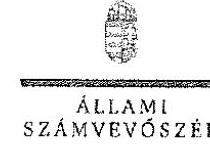 

## Dr. Józsa János Balázs úr

rektor

Budapesti Műszaki és Gazdaságtudományi Egyetem

Budapest

## Tisztelt Rektor Úr!

„Az állami felsőoktatási intézmények ellenőrzésére a hallgatói önkormányzatok tekintetében" címmel készített számvevőszéki jelentéstervezetre tett 1615/2018 iktatószámú észrevételeit köszönettel megkaptam.

Az Állami Számvevőszék észrevételre vonatkozó álláspontjáról a felügyeleti vezető által készített részletes tájékoztatást mellékelten megküldöm.

Tájékoztatom Rektor Urat, hogy a számvevőszéki jelentésben az Állami Számvevőszékről szóló 2011. évi LXVI. törvény 29. § (3) bekezdése alapján - a figyelembe nem vett észrevételt szerepeltetjük, annak indoklásával, hogy azt az Állami Számvevőszék miért nem fogadta el.

Budapest, 2018. 08. hó 23. nap

Tisztelettel:

Domokos László

Melléklet: Tájékoztatás az észrevétel kezeléséről

---

# Tájékoztatás 

az észrevétel kezeléséről
„Az állami felsőoktatási intézmények ellenőrzése a hallgatói önkormányzatok tekintetében" című jelentéstervezetre 2018. augusztus 6-án érkezett észrevételt áttekintettük, annak kezelésével kapcsolatban a következő tájékoztatást adom.
Az észrevétel tájékoztat arról, hogy a BME Hallgatói Önkormányzatának tisztújításai során a szavazások lezártát követően, a hallgatói szavazás lebonyolításához alakított független Szavazási Bizottság jegyzőkönyvei készít. Továbbá az észrevétel rögzíti, hogy az ÁSZ részére átadott dokumentumokból nem lehet egyértelműen megállapítani, hogy minden tisztújító szavazás szabályosan és eredményesen lett lebonyolítva.
Tájékoztatom Rektor Urat, hogy az Állami Számvevőszék ellenőrzési megállapításai az Állami Számvevőszékről szóló 2011. évi LXVI. törvényének megfelelően minden esetben az ellenőrzés során bekért és az arra nyitva álló határidőn belül rendelkezésre bocsátott dokumentumokon alapulnak. Az ellenőrzés rendelkezésére bocsátott adatokkal, dokumentumokkal összefüggésben a BME teljességi és hitelességi nyilatkozatban rögzítette, hogy az ÁSZ részére átadott dokumentumok, adatok megbízhatóak és a bekért adatokra, dokumentumokra vonatkozóan teljes körű információt tartalmaznak.
A BME által a törvényi határidőn belül az ellenőrzés rendelkezésére bocsátott dokumentumok alapján az ÁSZ megállapította, hogy a 2013-2016 évek vonatkozásában több részönkormányzat választási jegyzőkönyve nem tartalmazta azon számszerű adatokat a választásra jogosult teljes idejű nappali képzésben résztvevő, illetve a választáson részt vett teljes idejű nappali képzésben résztvevő hallgatók száma melyek a nemzeti felsőoktatásról szóló 2011. évi CCIV. törvény 60. § (1) bekezdés b) pontjában foglalt előírások érvényesülését igazolják.
Fentiek alapján a jelentéstervezet módosítása nem indokolt, az ÁSZ megállapítása helytálló.

Budapest, 2018. 08. hó 23. nap

Makkai Mária
felügyeleti vezető

---

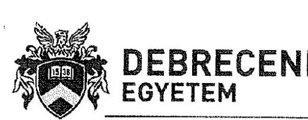

1225
Makkai Mária
REKTOR
(c): H-4032 Debrecen, Egyetem tér 1, H-4002 Debrecen, Pf: 400, (52) 512-998, Fax: (52) 416-490
E-mail: rektor@unideb.hu

Iktatószám: RHF-415-9/2018.
Tárgyára: 51-56.
Kelt: Debrecen, 2018. augusztus 28.

Dr. Domokos László
elnök úr részére
Állami Számvevőszék
Budapest

ÁLLAMI SZÁMVEVŐSZÉK
Dd-41663312121
Érkezett: 2018. AUG. 03
Iktatószám: 02-521-08/2018
Melléklet:

Tisztelt Elnök Úr!

Elnök Úr EL-0525-065/2018. iktatószámú levelére válaszolva, az Állami Számvevőszékről szóló 2011. évi LXVI. törvény 29. § (2) bekezdésének megfelelően, mellékelten megküldöm a Debreceni Egyetem észrevételeit „Az állami felsőoktatási intézmények ellenőrzése a hallgatói önkormányzatok tekintetében" címmel készített jelentéstervezettel kapcsolatban.

Kérem, a végleges jelentés elkészítésekor észrevételeinket figyelembe venni szíveskedjenek.

Tisztelettel:

Dr. Szilvássy Zoltán
rektor

---

# DEBRECENI EGYETEM 

## REKTOR

(c): H-4032 Debrecen, Egyetem tér 1. H-4002 Debrecen, Pf.: 400
(c): (52) 512-998, Fax: (52) 416-490
(c): rector@unideb.hu

## Észrevételek az Állami Számvevőszék „Az állami felsőoktatási intézmények ellenőrzése a hallgatói önkormányzatok tekintetében" címmel készített jelentéstervezetével kapcsolatban

A jelentéstervezet az 5. oldalon a „Főbb megállapítások, következtetések, javaslatok" fejezetben több szabálytalanságot általánosságban állapít meg, majd ezen megállapításokat intézményekre lebontva a 17. oldalon részletezi.

A megállapítások két csoportra bonthatók. Az első csoport, amely minden felsőoktatási intézményre vonatkozik, az, hogy a teljes idejű nappali képzésben részt vevő hallgatóinak legalább 25%-a az Nftv. 60 § (1) bekezdés b) pontjában foglaltakkal ellentétesen, igazoltan nem vett részt a hallgatói önkormányzati választásokon. A második csoport, amely csak bizonyos felsőoktatási intézményekre vonatkozik, az, hogy a hallgatói önkormányzatok nem rendelkeztek jóváhagyott alapszabállyal.

A tervezet 17. oldalán található összegző megállapítás szerint a Debreceni Egyetem Hallgatói Önkormányzata esetében hiányosságot csak az első csoportban, nevezetesen a választáson részt vevő nappali tagozatos hallgatók nem megfelelő számában tárt fel a jelentés.

## A jelentésben feltárt megállapítással nem értünk egyet, azzal kapcsolatban észrevételt teszünk.

Az ellenőrzés során 2017. augusztusától 2018. áprilisig öt alkalommal, az ÁSZ által megjelölt határidőre teljesítettünk adatbekérést, melynek keretében az ellenőrzés rendelkezésére bocsátottunk minden, a Hallgatói Önkormányzat választásával kapcsolatos jegyzőkönyvet a vizsgált időszak vonatkozásában.

A nemzeti felsőoktatásról szóló törvény hallgatói önkormányzatokra vonatkozó szakaszai nem tartalmaznak rendelkezést a hallgatói önkormányzat szervezeti felépítésére vonatkozóan. A Debreceni Egyetem Hallgatói Önkormányzata az egyetem Szenátusa által elfogadott alapszabálya értelmében, az egyetem szervezeti felépítését leképezve, intézményi és kari szinten szerveződik. Szabályzatainkat az Alaptörvény által biztosított módon az intézményi autonómia jegyében alkotjuk meg, melyet minden esetben - a felsőoktatási törvény előírásai szerint- megküldünk a fenntartói és e téren felügyeleti jogokat gyakorló minisztériumnak jóváhagyásra.

Intézményünkben a hallgatók közvetlenül a kari hallgatói önkormányzatok közgyűlésének képviselőit választják meg. A közgyűlések létszáma a karok hallgatói létszámától függően 7-20 fő. A kari hallgatói önkormányzat közgyűlése delegálja képviselőit az egyetemi hallgatói önkormányzat küldöttgyűlésébe, amely megválasztja az egyetemi hallgatói önkormányzat elnökét. Az egyetemi hallgatói önkormányzat küldöttgyűlésébe az egyes kari hallgatói önkormányzatok által delegálásra kerülő képviselők létszámának megállapításakor szintén a karok hallgatói létszáma az irányadó.

---

# DEBRECENI EGYETEM 

A hallgatói önkormányzati választások tisztaságát és jogszerűségét az alapszabályban rögzített összetételű és hatáskörű választási bizottság felügyeli, amelynek elnöke az egyetem rektori vezetésének egyik tagja, általában az oktatási rektorbelyettes, tagjai között az egyetem gazdálkodását irányító Kancellária megbízottja, illetve egyes érintett karok dékánjai, dékánhelyettesei, más vezető oktatói is megtalálhatók. A választási bizottság a választási folyamat során tartott üléseiről jegyzőkönyvet készít, amelyet a tagjai aláírásukkal hitelesítenek. E jegyzőkönyveket az ellenőrzés rendelkezésére bocsátottuk.

A Debreceni Egyetem méretéből, földrajzi elhelyezkedéséből (több városban működünk) és az ehhez igazodó hallgatói önkormányzat szervezeti felépítéséből adódóan a hallgatói önkormányzati választások karonként kerülnek lebonyolításra. A választás eredményének megállapításáról minden kari hallgatói önkormányzat esetében külön jegyzőkönyv készül. A jegyzőkönyvek tartalmazzák a kar választásra jogosult hallgatóinak számát, a leadott szavazatok számát, az érvényes és érvénytelen szavazatok számát, valamint a szavazáson részt vevő hallgatók százalékos arányát a választásra jogosult összes hallgató, illetve a nappali tagozatos hallgatók létszámához viszonyítva. A jegyzőkönyvek alapján megállapítható, hogy a választásokon a nappali tagozatos hallgatók aránya jelentősen meghaladta a 25%-ot.

Amennyiben intézményi szinten kívánjuk vizsgálni a választásokon részt vevő hallgatók arányát, a kari hallgatói önkormányzati választásokon részt vett hallgatók létszámát össze kell adni és az intézmény teljes választásra jogosult, illetve nappali tagozatos hallgatói létszámához kell viszonyítani.

A jegyzőkönyvek tartalmazzák továbbá a választások folyamatának leírását, időpontját és időtartamát is. Minden esetben a választás egy munkaheten keresztül, hétfőtől péntekig tartott. A Debreceni Egyetemen a levelező tagozatos hallgatók órái péntek délután és szombati napokon kerülnek megtartásra. A levelező tagozatos hallgatók is rendelkeznek választójoggal, azonban az egyetemen hétközben a nappali tagozatos hallgatók tartózkodnak, szavazati jogukkal ők élnek. A levelező tagozatos hallgatók, amennyiben szavazni kívánnak a választásokon, általában a pénteki napon tehetik azt meg. A szavazatszámláláskor a választási bizottság rendelkezésére álltak azok a választói névjegyzékek, hallgatói listák, amelyeken a választásokon részt vevő hallgatók aláírásukkal igazolták a szavazólapok átvételét. Ezen ívek alapján került megállapításra a választásokon részt vevő hallgatók száma. A levelező tagozatos hallgatók részvétele a választásokon olyan elenyésző mértékű volt, hogy a választási bizottság a jegyzőkönyvben szükségtelennek tartotta külön számszerűsíteni a választáson részt vevő nappali tagozatos és levelező tagozatos hallgatók számát.

Ahogyan azt a 2018. februárban teljesített adatbekérés során tett nyilatkozatomban jeleztem, a hallgatói önkormányzati választásokon a NEPTUN egységes tanulmányi rendszerből előállított hallgatói lista, mint választói névjegyzék került aláírásra a választásokon megjelenő hallgatók által. Ezek a jelenléti ívek a választásokat követően a jogorvoslatra a Debreceni Egyetem Hallgatói és Doktorandusz Képviseletének Alapszabálya szerint nyitva álló határidőt követően megsemmisítésre kerültek. Továbbra is fenntartom azt az akkori nyilatkozatomban

---

REKTOR
(c): H-4032 Debrecen, Egyetem tér 1. H-4002 Debrecen, Pf.: 400. (52) 512-998, Fax: (52) 416-490 (c): rector@unideb.hu
megfogalmazott állításomat, hogy az eljárás összhangban van az információs önrendelkezési jogról és az információszabadságról szóló 2011. évi CXII. törvény általános alapelveivel, amelyek szerint személyes adat kizárólag meghatározott célból kezelhető csak a cél megvalósulásához szükséges mértékben és ideig. A választásokon részt vevők aláírását tartalmazó névjegyzékek az országgyűlési választások esetében is megsemmisítésre kerülnek a törvényben meghatározott jogorvoslati határidőket követően. Nem látjuk sem okát, sem jogszabályi előírását annak, hogy hallgatói önkormányzati választás esetében ne lehessen hasonló módon eljárni.

A fentiek alapján a Debreceni Egyetem vezetése részéről igazoltnak láttuk és látjuk, hogy a hallgatói önkormányzati választásokon részt vett a nappali tagozatos hallgatók 25%-a. Annak érdekében, hogy ezen álláspontunkat kétséget kizáróan alátámasszuk, a jegyzőkönyvekben rögzített adatok felhasználásával elvégezhetünk egy gondolatkísérletet, amelyben feltételezzük azt az extrém esetet, hogy a választásokon a levelező tagozatos hallgatók 100%-a részt vett. Ebben az esetben a választásokon szavazatot leadott hallgatók létszámából levonjuk a levelező tagozatos hallgatók teljes létszámát, így a két szám különbsége kétséget kizáróan csak nappali tagozatos, a választáson részt vett hallgatók számát adhatja ki. Mivel egyes karok esetében a különbség negatív szám, példánkban ezen esetekben a választáson részt vett nappali tagozatos hallgatók számát 0-nak tekintjük.

A fent ismertetett számítás az alábbi táblázatban látható a 2015-ben lebonyolításra került kari hallgatói önkormányzati választások vonatkozásában:

1. számú táblázat

| Kar | Összes hallgató | Összesen nappali tagozatos | Összesen levelező tagozatos | Leadott szavazatok száma | Biztosan nappali tagozatos szavazók | Biztosan nappali tagozatos szavazók aránya |
| :--: | :--: | :--: | :--: | :--: | :--: | :--: |
| ÁJK | 1865 | 1010 | 855 | 578 | 0 | 0,00% |
| ÁOK | 3396 | 3369 | 27 | 1342 | 1315 | 39,03% |
| BTK | 2915 | 2431 | 484 | 827 | 343 | 14,11\% |
| EK | 1479 | 939 | 540 | 440 | 0 | $0,00 \%$ |
| FOK | 649 | 649 | 0 | 453 | 453 | 69,80\% |
| GTK | 4173 | 3183 | 990 | 1976 | 986 | 30,98\% |
| GYFK | 1292 | 437 | 855 | 371 | 0 | 0,00\% |
| GYTK | 501 | 501 | 0 | 325 | 325 | 64,87\% |
| IK | 1787 | 1597 | 190 | 933 | 743 | 46,52\% |
| MEK | 1872 | 1508 | 364 | 468 | 104 | 6,90\% |
| MK | 2547 | 1925 | 622 | 1195 | 573 | 29,77\% |
| NK | 925 | 718 | 207 | 536 | 329 | 45,82\% |
| TTK | 3129 | 2871 | 258 | 1502 | 1244 | 43,33\% |
| ZK | 228 | 226 | 2 | 206 | 204 | 90,27\% |
| Egyetem összesen | 26758 | 21364 | 5394 | 11152 | 6619 | 30,98\% |

---

# DEBRECENI EGYETEM 

A táblázatból látható, hogy ha a karokon leadott összesen 11152 szavazatból levonjuk a levelező tagozatos hallgatók teljes 5394 fős létszámát, akkor 6619 szavazat kétséget kizáróan csak nappali tagozatos hallgatóktól érkezhetett. A 6619 fő az egyetem akkor választásra jogosult 21364 fő nappali tagozatos hallgatói létszámának a $30,98 \%$-a, azaz ezzel az extrém módszerrel számítva is jóval meghaladja a $25 \%$-ot.

A fenti indokok alapján kérjük a jelentéstervezet valós helyzetnek megfelelő javítását.
A jelentéstervezet 5. oldalán az ellenőrzés megállapítja, hogy a hallgatói önkormányzatok nem szabályszerűen alakultak meg, működésük, forrásfelhasználásuk, gazdálkodásuk nem volt szabályszerű, nem volt biztosított a közpénzekkel történő átlátható, szabályszerű gazdálkodás.

A Debreceni Egyetem részéről mindegyik állítással kapcsolatban észrevételt kívánunk tenni. Álláspontunk szerint a hallgatói önkormányzat intézményünkben szabályszerű módon alakult meg. A hallgatói önkormányzati választások az egyetemi rektori és kancellári szervezet részéről ellenőrizve voltak. Ahogy azt korábban említettük, a választási bizottságok munkájában elnökként és tagokként részt vettek a rektori, kancellári és kari vezetések tagjai. Az egyetemi hallgatói önkormányzat elnökének megválasztásáról döntő küldöttgyűléseken az ellenőrzés rendelkezésére bocsátott jegyzőkönyvek és jelenléti ívek alapján igazolható módon - jelen volt az egyetem vezetésének több tagja, rektor, rektorhelyettesek, illetve a kancellár.

A jelentéstervezetben az szerepel, hogy a gazdálkodással kapcsolatban a részletes ellenőrzés lefolytatására nem került sor. Ennek ellenére mégis megállapításra kerül, hogy a hallgatói önkormányzat gazdálkodása nem volt szabályszerű és az intézmény azt nem ellenőrizte megfelelően.

Az ellenőrzés rendelkezésére bocsátott, az intézményi működéssel és gazdálkodással összefüggő szabályzatokból látható, illetve azt a 2017. decemberben teljesített adatbekérés során tett nyilatkozatban is jeleztük, a Debreceni Egyetem Hallgatói Önkormányzata az egyetem egyik szervezetü egységeként működik, gazdálkodására ugyanúgy vonatkoznak a Debreceni Egyetem gazdálkodási szabályzatában és más szabályzataiban megfogalmazott rendelkezések. Önálló szerződéskötési jogosultsága nincs, szerződéseket kezdeményezhet, de azokat az egyetem gazdálkodási rendszerén keresztül teheti meg, a szerződéseket a Hallgatói Önkormányzat szakmai ellenjegyzése mellett a rektor és a kancellár kötheti meg. A HÖK gazdálkodása teljes mértékben megjelenik az egyetem SAP gazdálkodási rendszerében. Az egyetemi és kancellári vezetés a gazdálkodási folyamat lépései során, folyamatba épített ellenőrzés módszerével is kontrollt gyakorol a HÖK gazdálkodásával kapcsolatban. Továbbá az ÁSZ vizsgálatát megelőző években a hallgatói önkormányzat működésével és gazdálkodásával kapcsolatban az egyetem belső ellenőrzést is lefolytatott. Az ellenőrzés megállapításaival kapcsolatban a HÖK megtette a javasolt intézkedéseket. A fentiek alapján álláspontunk szerint a Debreceni Egyetemen biztosított a közpénzekkel történő átlátható és szabályszerű gazdálkodás az egyetem, illetve ezen belül a hallgatói önkormányzat vonatkozásában is.

---

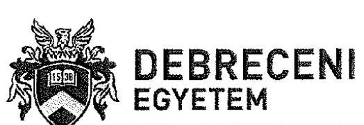

A jelentéstervezet II. számú mellékletében a hallgatói önkormányzatok bevételeinek és kiadásainak összegével kapcsolatban egy táblázatot tartalmaz. Az ebben szereplő pénzügyi adatok vonatkozásában a Debreceni Egyetem részéről az alábbi pontosításokat kérjük figyelembe venni.

A pénzügyi adatok az 5. adatbekérési körben megadott 5. számú tanúsítványból kerültek feltöltésre. A II. számú mellékletben szereplő táblázat adatai alapján a hallgatói önkormányzat kiadásainak és bevételeinek összege a többi intézményhez képest a Debreceni Egyetem esetén kiugró értéket mutat.

Az adatok alapján látható, hogy az adatszolgáltatások eltérő intézményi értelmezés mellett készültek, a hasonló nagyságú intézmények között jelentős eltérések láthatóak.

A Debreceni Egyetem adatszolgáltatásának alapját a 2017. november 27-i keltezésű, EL-0097-047/2017. létszámú adatbekérés során már meghatározott, a teljesítés igazolások kapcsán a HÖK tevékenységéhez rendelhető kereteken elszámolt bevételek és kiadások jelentettek. A tanúsítvány 8. és 16. sorában így olyan tételek is szerepelnek, melyek nem közvetlenül a HÖK működését szolgálják, de azok teljesítés igazolásában a HÖK részt vesz. Ezen tételek nagy részét az ösztöndíj jellegű kiadások (700-900 MF/év), kisebb részét a HÖK működéséhez szükséges feltételek biztosítására fordított beruházási kiadások jelentik, melyek a tanúsítványban külön soron nem is jelennek meg, csupán az összesítő sorban. Mindezek alapján annak érdekében, hogy a Debreceni Egyetem adata az eltérő értelmezés miatt összebasonlíthatóbb legyen a többi intézmény adataival, kérjük, hogy a tanúsítvány összesítő sora helyett az alábontott sorok összegét (személyi juttatások, a munkaadókat terhelő járulékok, dologi kiadások és egyéb működési célú kiadások) és az ennek megfelelően korrigált bevételeket szíveskedjenek figyelembe venni az alábbiak szerint.

|  2. számú táblázat |  |  |  | Me: eFt  |
| --- | --- | --- | --- | --- |
|  Megnevezés | 2013. | 2014. | 2015. | 2016.  |
|  A hallgatói önkormányzat kiadásoknak összege | 491 059 | 518 949 | 535 183 | 671 317  |
|  A hallgatói önkormányzat bevételeinek összege | 491 059 | 518 949 | 535 183 | 671 317  |

Debrecen, 2018. július 30.

Dr. Szilvássy Zoltán rektor

---

# F1888 

Ikt.szám: EL-0525-101/2018

Dr. Szilvássy Zoltán úr
rektor

Debreceni Egyetem

Debrecen

Tisztelt Rektor Úr!
Az állami felsőoktatási intézmények ellenőrzése a hallgatói önkormányzatok tekintetében: címmel készített számvevőszéki jelentéstervezetre tett észrevételét köszönettel megkaptam.

Az Állami Számvevőszék észrevételre vonatkozó álláspontjáról a felügyeleti vezető által készített részletes tájékoztatást mellékelten megküldöm.

Tájékoztatom Rektor Urat, hogy a számvevőszéki jelentésben - az Állami Számvevőszékről szóló 2011. évi LXVI. törvény 29. § (3) bekezdése alapján - a figyelembe nem vett észrevételt szerepeltetjük, annak indoklásával, hogy azt az Állami Számvevőszék miért nem fogadta el.

Budapest, 2018. 06 hó 29 nap

Tisztelettel:

Domokos László

Melléklet: Tájékoztatás az észrevétel kezeléséről

---

# Tájékoztatás 

az észrevétel kezeléséről
„Az állami felsőoktatási intézmények ellenőrzése a hallgatói önkormányzatok tekintetében" című jelentéstervezetre 2018. augusztus 3-án érkezett észrevételt áttekintettük, annak kezelésével kapcsolatban a következő tájékoztatást adom.
A hallgatói önkormányzati választásokkal kapcsolatban az észrevétel tájékoztat arról, hogy a Debreceni Egyetemen a hallgatói önkormányzati választások alkalmával a szavazatszámláláskor a választási bizottság rendelkezésére álltak azok a választói névjegyzékek, hallgatói listák, amelyeken a választásokon részt vevő hallgatók aláírásukkal igazolták a szavazólapok átvételét. Ezen ívek alapján került megállapításra a választásokon részt vevő hallgatók száma. Az észrevétel szerint a levelező tagozatos hallgatók részvétele a választásokon olyan elenyésző mértékű volt, hogy a választási bizottság a jegyzőkönyvben szükségtelennek tartotta külön számszerűsíteni a választáson részt vevő nappali tagozatos és levelező tagozatos hallgatók számát. Továbbá az észrevétel rögzíti, hogy a hallgatói önkormányzati választásokon a NEPTUN egységes tanulmányi rendszerből előállított hallgatói lista, mint választói névjegyzék került aláírásra a választásokon megjelent hallgatók által. Ezek a jelenléti ívek a választásokat követően megsemmisítésre kerültek.
Az Állami Számvevőszék ellenőrzési megállapításai az Állami Számvevőszékről szóló 2011. évi LXVI. törvénynek megfelelően minden esetben az ellenőrzés során bekért és az arra nyitva álló határidőn belül rendelkezésre bocsátott dokumentumokon alapul.
A Debreceni Egyetem a nemzeti felsőoktatásról szóló 2011. évi CCIV. törvény 60. § (1) bekezdés b) pontjában előírtak ellenére a hallgatói önkormányzati választásokon a résztvevő teljes idejű nappali képzésben részt vevő hallgatók számát nem igazolta a következők miatt. A törvényi határidőn belül az ellenőrzés rendelkezésére bocsátott választási jegyzőkönyvek nem rögzítették a választáson részt vett teljes idejű nappali képzésben részt vevő választási jogosultak számát. A választás érvényességét úgy állapították meg, hogy a leadott szavazatok számát viszonyították a választásra jogosult „nappali tagozatos"-ok számához. Az érvényesség megállapításánál nem vették figyelembe, hogy a leadott szavazatok tartalmazhatják nem nappali tagozatosok szavazatát is, mivel a szavazásra jogosultak között a karokon - a 14 karból 12 kar esetében - jelentős volt a nem nappali tagozatos hallgatók aránya. A választási jegyzőkönyvek rögzítették, hogy szavazásra jogosult az adott kar minden beiratkozott hallgatója. Továbbá Rektor Úr 2018. február 20-án tett nyilatkozata szerint a választáson megjelent hallgatók által aláírt jelenléti ívek a választásokat követően megsemmisítésre kerültek.

---

Mindezek alapján az ÁSZ megállapítása helytálló, amelyet az észrevétel is megerősít, a jelentéstervezet módosítása nem indokolt.
A jelentéstervezet II. számú mellékletével kapcsolatban megfogalmazott pontosítási kéri észrevételére tájékoztatom, hogy az Egyetemre vonatkozó pénzügyi adatok megegyeznek a Rektor Úr által aláírt, 2018. április 16-án kelt 5. számú tanúsítványban szereplő adatokkal, módosítása nem indokolt.
Az észrevételben adott tájékoztatást a hallgatói önkormányzat gazdálkodásáról és az intézmény arra vonatkozó ellenőrzéséről köszönjük. Tekintettel arra, hogy a jelentéstervezet a Debreceni Egyetem hallgatói önkormányzatának gazdálkodására vonatkozó megállapítást nem tartalmaz, az észrevétel alapján a jelentéstervezet módosítása nem indokolt.

Budapest, 2018. 05. hó 05 nap

Makkai Mária
felügyeleti vezető

---

# 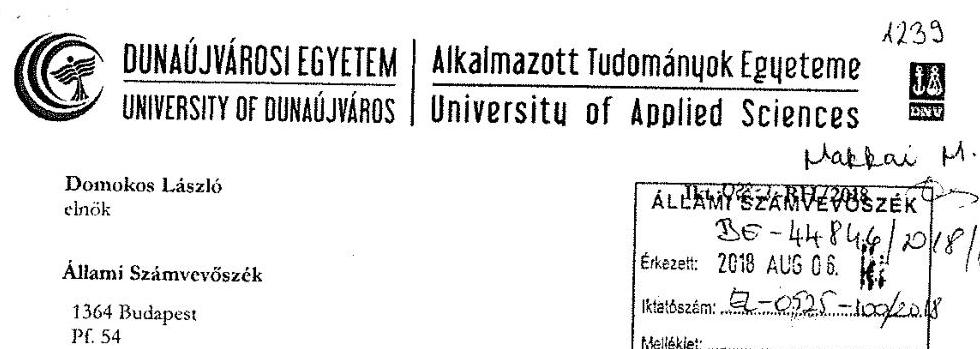 

Tárgy: Észrevételek az Állami Számvevőszék EL-0525-066/2018 iktatószámú jelentéstervezetére

## Tisztelt Elnök Úr!

Az Állami Számvevőszék (a továbbiakban: ÁSZ vagy ellenőrzés) ellenőrzést végzett az állami felsőoktatási intézményünknél a hallgatói önkormányzat tekintetében. Az ellenőrzés eredményeképp a felsőoktatási intézményünknek megküldött jelentéstervezet, minden esetben súlyos szabálytalanságokat vél felfedezni és - álláspontunk szerint tévesen - olyan következtetéseket von le, mintha 2013. január 1. és 2016. december 31. között a Dunaújvárosi Főiskola / Egyetem ellentétesen járt volna el a nemzeti felsőoktatásról szóló 2011. évi CCIV. törvényben (a továbbiakban: Nftv) foglaltakkal. A tervezet szerint ugyanis a teljes idejű nappali képzésben részt vevő hallgatók legalább $25 \%$-a igazoltan nem vett részt a hallgatói önkormányzati választásokon, valamint hallgatói önkormányzat nem rendelkeztek jóváhagyott alapszabállyal 2013-2014-ben.

## Az ellenőrzés jogszerűségével kapcsolatos észrevételek

a) Az Állami Számvevőszékről szóló 2011. évi LXVI. törvény 5. § (2) bekezdése alapján az Állami Számvevőszék az államháztartás gazdálkodásának ellenőrzése keretében ellenőrizheti a központi költségvetési szervek működését. Álláspontunk szerint, ez a típusú ellenőrzés az államháztartástól szóló 2011. évi CXCV. törvényben meghatározott tárgykörök keretein belül értelmezhető, vagyis a gazdálkodással szorosan össze nem függő működési kérdésekre nem terjedhet ki, így nem vizsgálható ebben a körben sem a felsőoktatási intézmények működése, sem pedig azon belül az azok részét képező hallgatói önkormányzatok működése, ideértve a hallgatói önkormányzati választások megfelelőségét is.
b) Az a) pontban foglaltakat támasztja alá az is,
 hogy kifejezetten a felsőoktatási intézmények (és ennek részeként a hallgatói önkormányzatok) működésének ellenőrzésétől a nemzeti felsőoktatásról szóló 2011. évi CCIV. törvény 73. § (1), (4)-(5) bekezdései is külön rendelkeznek, méghozzá a fenntartóhoz (jelen esetben az Emberi Erőforrások Minisztériumához) telepítve ezt a jogként.
Az a)-b) pontokban foglaltakra hivatkozva felhívjuk szíves figyelmüket arra, hogy a jelentéstervezetben szereplő, a hallgatói önkormányzatok működésével (nem gazdálkodásával) összefüggő megállapításokat az Állami Számvevőszék ismereteink szerint nem a törvényben biztosított hatáskörében, illetve a megfelelő jogszabályi felhatalmazás hiányában tette meg.
Így mind az ellenőrzés, mind a jelentés vonatkozásában javasoljuk a törvényi felhatalmazás felülvizsgálatát. Amennyiben információink helytállóak, a jelentéstervezetben a működéssel kapcsolatos megállapítások, valamint ezen megállapítások jogkövetkezményeként, a jogszabály által

## Dunaújvárosi Egyetem

Tel.: +38 (25) 551188 - Fax: +38 (25) 551231
Dunaújvárosi Pf. 152, Táncsics M. u. 1/2, Rongzary H-2401

---

# DUNAÚJVÁROSI EGYETEM 

## Alkalmazott Tudományok Egyeteme UNIVERSITY OF DUNAÚJVÁROS

Úllárt jogosítványok és forrásfelhasználás megvonására vonatkozó következtetések az Állami Számvevőszék részére biztosított törvényi kereteket meghaladják.

## A jelentéstervezetben foglaltakkal kapcsolatos észrevételek

Az eljárás jogszerűsége kapcsán kifejtetteken túl fontosnak tartjuk, hogy a lefolytatott vizsgálattal kapcsolatban érdemi észrevételeket is megfogalmazzunk az alábbiak szerint:
c) Úgy véljük, hogy általánosságban elmondható a jelentéstervezetről, hogy az nem felel meg az Állami Számvevőszékről szóló 2011. évi LXVI. törvény 24. § (1) bekezdés d) pontjának, miszerint az ellenőrzések eredményeinek, a megállapításoknak alátámasztottnak, a következtetéseknek okszerűnek és megalapozottnak kell lenniük. A jelentéstervezetben egyetlen megállapítás sem került alátámasztásra, indokolásra, így nem világos, mi nem megfelelő az ellenőrzött szerv kialakított gyakorlatában, de az sem, hogy milyen kritérium alapján tekintette volna az ÁSZ megfelelőnek a választásokkal kapcsolatos gyakorlatot.
Az ÁSZ Szervezeti és Működési Szabályzatának 47. § (5) bekezdése szerint az ellenőrzés során alkalmazandó dokumentum, „A megfelelőségi ellenőrzés alapelve" szerint „[a] megfelelőségi ellenőrzés arra irányul, hogy elegendő és megfelelő bizonyítékot szerezzen a felelős fél vonatkozó kritériumok szerinti működésének alátámasztására." Hasonlóan „[a] megfelelőségi ellenőrzés lefolytatása során az ellenőrzést végző személy tevékenysége arra irányul, hogy az ellenőrzés eredményeinek célzott felhasználói számára elegendő és megfelelő bizonyítékot szerezzen a felelős fél vonatkozó kritériumok szerinti működésének, az azoknak való megfelelés alátámasztására." Továbbá „[a] Számvevőszék minden ellenőrzése során a bizonyosság észszerűen magas szintjének elérésére [...] törekszik."
d) Az Állami Számvevőszék az esetünkben azt állapította meg, hogy a hallgatói önkormányzati választásokon igazoltan nem vett részt a teljes idejű nappali képzésben részt vevő hallgatók legalább 25%-a. A c) pontban kifejtettekkel összhangban ki kívánjuk emelni, hogy a jelentéstervezetből nem derül ki, hogy milyen dokumentumok áttekintése alapján, milyen észlelt hiányosságok okán vonta le az ellenőrző szerv a következtetését a választások szabálytalansága tekintetében. Ennek azért van különös jelentősége, mert a választások lebonyolításának szabályait, az egyes, a választások során keletkező dokumentumok tartalmi elemeit, és ezen dokumentumok kötelező megőrzésének időtartamát sem rögzíti jogszabály. Kérdésként merül fel, hogy milyen egységes szempontrendszer alapján vizsgálhatta az ÁSZ a választások szabályszerűségét - így például mitől számít a nappalis hallgatók legalább 25%-ának részvétele visszamenőlegesen is igazoltnak - mikor jogszabályban egységes szempontrendszer nem, pusztán érvényességi feltétel került meghatározásra ennek vonatkozásában ${ }^{6}$. Az ellenőrzések során kértek tőlünk erre vonatkozólag is kimutatást, amit a III. számú melléklet az EL-0097-001/2017. számú Ellenőrzési programhoz c. 2. SZÁMÚ

[^0]
[^0]:    ${ }^{6}$ terembeiben az ÁSZ nem kizárólag azt vizsgálta meg a szükséges módon azt sem, hogy esetlegesen az ellenőrzés változtatásában már nem látja teljesítésben igazoltnak, hogy a idejű negatív kójtásban részt vevőmligetsiz 25%-a részt vett az évenked ezelőtti változásom, a KsZ, mintha igazolt volna, hogy 25% kiteryessen nem vett részt. Ehesen az ellenőrzése jelentés így fogadnna: „[Az intézmények] teljes idejű negatív kójtásban részt vevő hallgatónak legalább 25%-a [...] igazoltan nem vett részt a hallgatói útikozmányzati változásukon[.]" ami teljesen agyotretesíten nem felett, különösen az intézmények mindagyleldeni, helyzélő.]

---

# Dunaújvárosi EGYETEM | Alkalmazott Tudományok Egyeteme 

UNIVERSITY OF DUNAÚJVÁROS | University of Applied Sciences

TANUSÍTVÁNY - A felsőoktatási intézményben működő hallgatói önkormányzat megalakulásának és első megválasztásának adatai 2013-2016 években dokumentum adatai támasztják alá, miszerint:

- 2013-ban a teljes idejű nappali képzésben résztvevő hallgatók száma a szavazáson 35,27%-os volt
- 2014-ben a teljes idejű nappali képzésben résztvevő hallgatók száma a szavazáson 25,79%-os volt
- 2015-ben a teljes idejű nappali képzésben résztvevő hallgatók száma a szavazáson 34,19%-os volt
- 2016. májusában a teljes idejű nappali képzésben résztvevő hallgatók száma a szavazáson $36,74 \%$-os volt
- 2016. szeptemberében a teljes idejű nappali képzésben résztvevő hallgatók száma a szavazáson $37,54 \%$-os volt

Ezt a táblázatot is elküldtük Önöknek az ellenőrzések folyamán.
e) Az Állami Számvevőszék megállapította, hogy a hallgatói önkormányzat alapszabályának módosítását 2013-2014. években a küldöttgyűlés nem fogadta el, ezért az alapszabály nem volt érvényes. A Dunaújvárosi Főiskola 2012. dec. 18-i szerinti ülésén a 29-2012/2013. (2012.12.18.) sz. határozatával elfogadja a Hallgatói Önkormányzatának Alapszabályát. Ez az alapszabály 2014. március 11-ig volt hatályban, mivel a 31-2013/2014.(2014.03.11.) sz. határozat alapján a Szenátus 14 igen, 0 nem és 0 tartózkodás mellett jóváhagyja a Dunaújvárosi Főiskola Hallgatói Önkormányzat új Alapszabályát aminek a hatályba lépése: 2014. március 12. volt.

Összefoglalva, a jelentés tervezet meglátásunk szerint, több, a Dunaújvárosi Főiskola / Egyetem vonatkozásában nem helytálló következtetést is tartalmaz. Kérem, szíveskedjék ezért a tervezet 17. oldalán szereplő felsorolásokból a DUE említését törölni (1. és 4. francia bekezdések)
Az ellenőrzés során végzett munkájukat, és segítő szándékukat ezúton is köszönjük!

Kelt: Dunaújváros, 2018. július 30.

Tisztelettel:
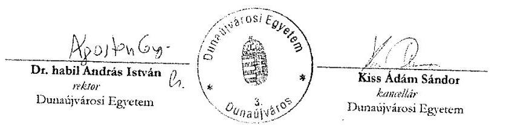

Dunaújvárosi Egyetem
Tel. +36 (25) 339800 - Fax. +36 (25) 331231
Dunaújváros Pf. 152, Táncsics M. u. 1/a., Hungary. H-2401

---

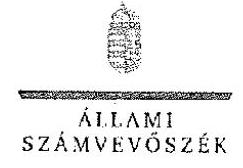

ELKÉK

ÁLLAMI
SZÁMVEVŐSZÉK

Ikt. szám: FI-0525-117/2018

Dr. habil András István úr
rektor

Dunaújvárosi Egyetem

Dunaújváros

Tisztelt Rektor Úr!

---

Az állami felsőoktatási intézmények ellenőrzése a hallgatói önkormányzatok tekintetében címmel készített számvevőszéki jelentéstervezetre tett észrevételét köszönettel megkaptam.

Az Állami Számvevőszék észrevételre vonatkozó álláspontjáról a felügyeleti vezető által készített részletes tájékoztatást mellékelten megküldöm.

Tájékoztatom Rektor urat, hogy a számvevőszéki jelentésben – az Állami Számvevőszékről szóló 2011. évi LXVI. törvény 29. § (3) bekezdése alapján – a figyelembe nem vett észrevételt szerepeltetjük, annak indoklásával, hogy azt az Állami Számvevőszék miért nem fogadta el.

Budapest, 2018. 25. hó 21 nap

Tisztelettel:

Domokos László

Melléklet: Tájékoztatás az észrevétel kezeléséről

---

1932 BUDAPEST, ARÁCJA. CZEMÁ JÁROS UTOLI 3. 1304 Budapest 8. P. 54 telefon. 484 3181 fax 484 3201

---

# Tájékoztatás   az észrevétel kezeléséről 

„Az állami felsőoktatási intézmények ellenőrzése a hallgatói önkormányzatok tekintetében" című jelentéstervezetre 2018. augusztus 6-án érkezett észrevételt áttekintettük, annak kezelésével kapcsolatban a következő tájékoztatást adom.
Az észrevétel a) és b) pontjában az Állami Számvevőszékről szóló 2011. évi LXVI. törvény 5. § (2) bekezdésére hivatkozva azt állítja, hogy a gazdálkodással szorosan össze nem függő működési kérdésekre az ellenőrzés nem terjedhet ki, így nem vizsgálható ebben a körben sem a felsőoktatási intézmények működése, sem pedig azon belül az azok részét képező hallgatói önkormányzatok működése, ideértve a hallgatói önkormányzati választások megfelelőségét is. Ezt támasztja alá az észrevétel szerint az is, hogy kifejezetten a felsőoktatási intézmények (és ennek részeként a hallgatói önkormányzatok) működésének ellenőrzéséről a nemzeti felsőoktatásról szóló 2011. évi CCIV. törvény (továbbiakban: Nftv.) 73. § (1), (4)-(5) bekezdései is külön rendelkeznek, méghozzá a fenntartóhoz (jelen esetben az Emberi Erőforrások Minisztériumához) telepítve ezt a jogkört.
Az ellenőrzés jogszerűségével kapcsolatban tájékoztatom Rektor Urat, hogy észrevételük teljes mértékben megalapozatlan, elfogadhatatlan és megtévesztő. Azt a látszatot kelti, mintha az ellenőrzés jogalapját az Állami Számvevőszék nem vagy nem helyesen határozta volna meg. Ezzel szemben az Önök részére megküldött ellenőrzési program, valamint a jelentéstervezet is pontosan tartalmazza az ellenőrzés jogalapját, amely az Állami Számvevőszékről szóló 2011. évi LXVI. törvény (továbbiakban ÁSZ tv.) 1. § (3) bekezdése és az 5. § (3) bekezdése. Az ÁSZ tv. 1. § (3) bekezdése szerint „az Állami Számvevőszék általános hatáskörrel végzi a közpénzekkel és az állami és önkormányzati vagyonnal való felelős gazdálkodás ellenőrzését". Az ÁSZ tv. 5. § (3) bekezdése szerint „az Állami Számvevőszék az államháztartásból származó források felhasználásának keretében ellenőrzi a központi költségvetésből gazdálkodó szervezeteket (intézményeket), valamint az államháztartásból nyújtott támogatás vagy az államháztartásból meghatározott célra ingyenesen juttatott vagyon felhasználását a helyi önkormányzatoknál, az országos és helyi nemzetiségi önkormányzatoknál, a közalapítványoknál (ide értve a közalapítvány által alapított gazdasági társaságot is), a köztestületeknél, a közhasznú szervezeteknél, a gazdálkodó szervezeteknél, az egyesületeknél, az alapítványoknál és az egyéb kedvezményezett szervezeteknél. Amennyiben a kedvezményezett szervezet az államháztartásból támogatásban - ide nem értve a személyi jövedelemadó meghatározott részének az adózó rendelkezése alapján történő átutalását - vagy ingyenes vagyonjuttatásban részesül, gazdálkodási tevékenységének egésze ellenőrizhető."
Az előzőekben kifejtettek és az idézett ÁSZ tv. egyértelmű és kétségbevonhatatlan felhatalmazása ellenére érthetetlen az ÁSZ hatáskörének megkérdőjelezése. Nem vitatható alaphelyzet, hogy a felsőoktatási intézmény és az annak részeként működő hallgatói önkormányzat is felhasznál államháztartásból származó forrást. A hallgatói önkormányzat működéséhez és feladatellátásához az Nftv. értelmében a felsőoktatási intézmények biztosítják a feltételeket és anyagi eszközöket, állami támogatásban részesülnek, továbbá saját bevétellel

---

is rendelkeznek. Az Nftv. szerint azonban a hallgatói önkormányzatok törvényben biztosított jogosítványai gyakorlásának egyik feltétele a szabályszerű megalakulás. Mindezek alapján az észrevételt nem fogadjuk el, a jelentéstervezetet nem módosítjuk.
Az észrevétel hallgatói önkormányzati választásokkal kapcsolatban megfogalmazott c) és d) pontja vitatja a megállapítások alátámasztottságát, megalapozottságát.
Az ÁSZ ellenőrzési megállapításai az ÁSZ tv.-nek megfelelően minden esetben az ellenőrzés során bekért és az arra nyitva álló határidőn belül rendelkezésre bocsátott dokumentumokon alapulnak. Az ÁSZ az EL-0097-066/2017. iktatószámú levelében kért és az Egyetem által rendelkezésre bocsátott dokumentumok, valamint Rektor Úr 2017. december 13-án kelt Teljességi és hitelességi nyilatkozata alapján tett megállapítást, mi szerint az Nftv. 60. § (1) bekezdés b) pontjában előírtak ellenére nem igazolt a hallgatói önkormányzati választásokon a teljes idejű nappali képzésben részt vevő hallgatók legalább 25%-ának részvétele. Az észrevétel ezt az ellenőrzés rendelkezésére bocsátott 2. számú Tanúsítványban szereplő adatokra hivatkozva vitatja. Az észrevétel ugyanakkor arra nem tér ki, hogy az ellenőrzés a jegyzőkönyvek mellett a részvétel igazolásához bekérte a választások jelenléti íveit is. Az intézmény által rendelkezésre bocsátott jelenléti ívek a következők miatt nem voltak alkalmasak annak alátámasztására, hogy a választásokon a választásra jogosult teljes idejű nappali képzésben résztvevő hallgatói legalább 25%-a igazoltan részt vett. A 2013. február 25. és 2013. március 2. között lebonyolított választásokhoz megküldött jelenléti ívek vagy nem tartalmaztak dátumot, vagy a jelenléti ívek dátuma korábbi volt, mint a választások rektori kiírásában megjelölt választási dátum. A 2014. április 7. és 2014. április 12. között, valamint a 2015. április 7. és 2015. április 11.
 között lebonyolított választásokhoz rendelkezésre bocsátott jelenléti ívek nem tartalmazták, hogy mikor, milyen témában készültek. A 2016. évben lebonyolított két választáshoz kapcsolódó jelenléti ívek nem tartalmazták, hogy melyik 2016. évi választáshoz kapcsolódnak és mikor készültek.
Az észrevétel HÖK alapszabályára vonatkozó e) pontja arról tájékoztat, hogy a hallgatói önkormányzat alapszabályának módosítását a 2013-2014. években a Szenátus határozatával elfogadta. A jelentéstervezetben olyan megállapítás nem szerepel, hogy az alapszabály módosítást a Szenátus nem fogadta el. Az észrevétel azonban nem cáfolja az ÁSZ-nak azt a megállapítását, mely szerint a hallgatói önkormányzat alapszabályát a HÖK küldöttgyűlése az Nftv. 60. § (2) bekezdés előírása ellenére - nem fogadta el, azt a HÖK elnöksége hagyta jóvá. Ezért az észrevételt nem fogadjuk el, az ÁSZ megállapítása helyálló, a jelentéstervezet módosítása nem indokolt.

Budapest, 2018. évi hó 2. nap

Makkai Mária
felügyeleti vezető

---

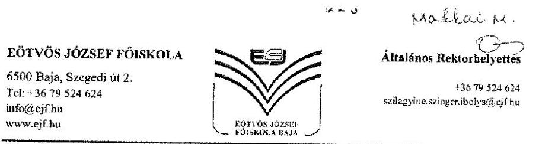

Állami Számvevőszék
Domokos László elnök részére

1052 Budapest
Apáczai Csere János u. 10.

Tárgy: tájékoztatás
Hiv. szám.: EL-0525-067/2018.

Tisztelt Elnök Úr!
„Az állami felsőoktatási intézmények ellenőrzése a hallgatói önkormányzatok tekintetében" tárgyban érkezett jelentéstervezetet megkaptam.

Ezúton tájékoztatom Önt, hogy az Eötvös József Főiskola a jelentéstervezetet elfogadja, észrevételt nem kíván tenni.

Tájékoztatom továbbá, hogy a Főiskola a jelentéstervezetben leírt szabálytalanságok vonatkozásában intézkedési tervet készít, melyet külön levélben küldünk meg az Állami Számvevőszék részére.

Baja, 2018. július 25.

Tisztelettel:
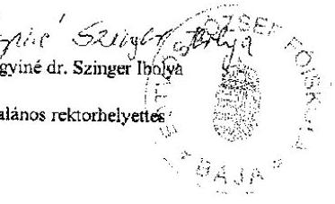

---

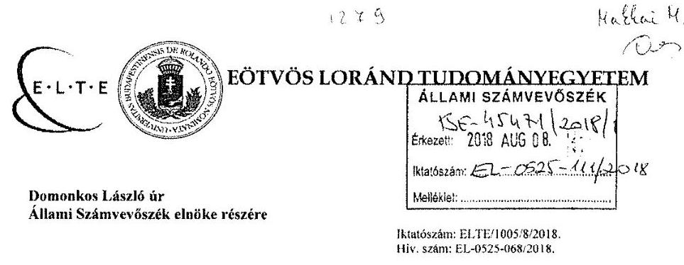

Tisztelt Elnök Úr!
„Az állami felsőoktatási intézmények ellenőrzése a hallgatói önkormányzatok tekintetében" címmel készített számvevőszéki jelentéstervezetre tesszük meg észrevételeinket az alábbiak szerint:

Vitatjuk a jelentéstervezet azon megállapítását, miszerint az ELTE-n a HÖK működése nem volt szabályszerű.

Az ELTE-n a HÖK működési mechanizmusa alapján biztosított, hogy a hallgatói önkormányzati választások csak akkor (voltak) érvényesek és eredményesek, ha a részvétel eléri (elérte) a jogszabályban írt követelményszintet. Az ELTE-n a vizsgált időszakban a hallgatói önkormányzati választásokon a jogszabályban előírt részvételi arány minden esetben biztosított volt.

A vizsgálat során benyújtott dokumentumok [közel 2000 tétel, több mint 2 GB (tömörített) terjedelemben] ezt alá is támasztják, illetve a 2013-2014. évekre vonatkozóan kifejezetten felhívtuk a vizsgálatot végzők figyelmét arra, hogy néhány részönkormányzati tisztviselő választás esetében rendelkezésre állnak további dokumentumok (akár a részvételt igazoló további jelenléti ívek), azonban azok terjedelmük (választásonként 300-350 oldal) és a felkutatásukra, feldolgozásukra és feltöltésükre rendelkezésre állt rövid időtartam (öt munkanap) miatt nem tudtuk teljes terjedelmükben rendelkezésre bocsátani. Ezekre a figyelmeztetésekre semmilyen válasz, figyelmeztetés, póthatáridő, kérdés nem érkezett a számvevőszéki ellenőriától. Éppen emiatt alaptalan az összegző megállapítás. A hallgatói önkormányzati választásokat 2014-től elektronikus rendszer támogatja, mely a hallgatói adatbázisra épül, és beállításainál fogva szintén biztosítékul szolgál a részvételi arány megfigyelésére.

A HÖK 2013. évi alapszabály-módosító küldöttgyűlésének jegyzőkönyveit csatoljuk, egyben felhívjuk a figyelmet, hogy 2013-ban az adott részönkormányzat küldöttgyűlésének kizárólagos hatásköre volt részönkormányzati alapszabály-módosítók elfogadása, ezért nem hiányolható más önkormányzati fórum jóváhagyó döntése. Vitatjuk, hogy az ELTE HÖK alapszabálya érvénytelen lenne 2013. évben.

---

Ugyanakkor kiemeljük, hogy 2014-17. között az ELTE hallgatói önkormányzata átfogó, teljes szerkezeti, működési, választási és tisztújítási reformot hajtott végre a transzparencia és szakmaiság elősegítése érdekében, a részönkormányzatok és egyetemi önkormányzat viszonya és átláthatósága rendezett. A közvetlen demokrácia eszközeként bevezetésre került az ügydöntő és véleménynyilvánító hallgatói szavazás intézménye, ezzel segítve a hallgatói vélemények és kezdeményezések minél hatékonyabb becsatornázását. A képzési reform keretében egységesen koordinált a tisztségviselők képzése. Gazdálkodási reform is megvalósult: előzetesen rögzített, objektív szempontok szerinti forrásallokáció történik a részönkormányzati költségvetések meghatározásában. Az egyetemi gazdálkodásban az EHÖK bár önálló keretgazda, de igényeit a normál gazdálkodás keretei között a kancellária elégíti ki, a beszerzését, szerződéskötését a kancellári szervezet végzi, kötelezettségvállalásra feljogosított a kancellári szervezet erre kijelölt vezetője.

Az előző évek botrányai után (még jóval a jogszabályi kötelezettségek megszületése előtt) teljes megújulás volt a hallgatói rendezvények szervezésében, így a gólyabálok és a gólyatáborok szervezési rendjében, a programok engedélyezési szabályaiban, a professzionális rendezvényszervező és a közreműködő hallgatók feladat- és felelősségi körének meghatározásában és elhatárolásában.

Átalakult az ösztöndíj-rendszer, megújult az ösztöndíj-elbírálás módszere: kizárólag pályázati alapon történik az ösztöndíjak kiosztása, melynek során a kérelmeket vegyes összetételű bizottság bírálja el (EHÖK tisztségviselők és közalkalmazottak), az ösztöndíjak jóváhagyója a dékán, listás utalványozója az oktatási igazgató. Az Egyetem az egyedi közzétételi listán (vagyis azonnal nyilvánosan) jelenteti meg honlapján a hallgatói ösztöndíjak összege és az arra jogosult személy neve adathalmazt (a szociális helyzetre és a tanulmányi teljesítményre figyelemmel adható ösztöndíjak kivételével).

Mindezeket a tényleges eredményeket lényegesen sérti a számvevőszéki jelentés summás megállapítása, termaholja az egyetemi és a hallgatói önkormányzati vezetés több évi erőfeszítésének eredményét. Erre tekintettel kérjük Elnök urat, hogy fontolja meg a jelentés lényeges átdolgozását, az Egyetemünket elmarasztaló kijelentések megváltoztatását.

Budapest, 2018. augusztus 2.

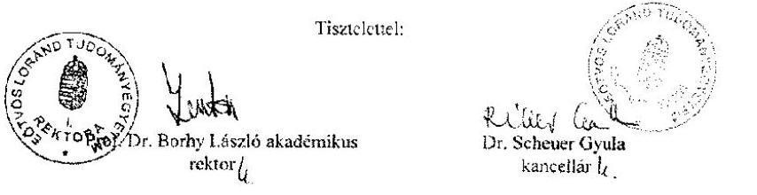

1056 Budapest, Szerb u. 21-23. * Telefon: 460-4446 * Fax: 411-6760 *

---

# Függelék: Észrevételek 

## ELINIK

## SZÁMVEVŐSZÉK

Ikt. szám: EL-0525-132/2018.

Prof. Dr. Borhy László úr
rektor

Eötvös Loránd Tudományegyetem

Budapest

## Tisztelt Rektor Úr!

„Az állami felsőoktatási intézmények ellenőrzése a hallgatói önkormányzatok tekintetében" címmel készített számvevőszéki jelentéstervezetre tett észrevételét köszönettel megkaptam.

Az Állami Számvevőszék észrevételre vonatkozó álláspontjáról a felügyeleti vezető által készített részletes tájékoztatást mellékelten megküldöm.

Tájékoztatom Rektor urat, hogy a számvevőszéki jelentésben - az Állami Számvevőszékről szóló 2011. évi LXVI. törvény 29. § (3) bekezdése alapján - a figyelembe nem vett észrevételt szerepeltetjük, annak indoklásával, hogy azt az Állami Számvevőszék miért nem fogadta el.

Budapest. 2018. 08. 27. nap

Tisztelettel:

## Domokos László

Melléklet: Tájékoztatás az észrevétel kezeléséről

---

# Tájékoztatás 

## az észrevétel kezeléséről

Az állami felsőoktatási intézmények ellenőrzése a hallgatói önkormányzatok tekintetében" című jelentéstervezetre 2018. augusztus 8-án érkezett észrevételt áttekintettük, annak kezelésével kapcsolatban a következő tájékoztatást adom.
Az észrevétel szerint „a vizsgált időszakban a hallgatói önkormányzati választásokon a jogszabályban előírt részvételi arány minden esetben biztosított volt". Az észrevétel azt is tartalmazza, hogy a 2013-2014. évi választások esetében a dokumentum ellenőrzés részére történő rendelkezésre bocsátása teljes körűen nem történt meg, további részönkormányzati dokumentumok állnak rendelkezésre. Egyebekben az észrevétel szerint a rendelkezésre bocsátott dokumentumok alátámasztják a jogszabályi előírásnak megfelelő részvételi arányt. Az észrevétel vitatja továbbá a 2013. évi ELTE HÖK alapszabálya érvénytelenségét.
Tájékoztatom, hogy a nemzeti felsőoktatásról szóló 2011. évi CCIV. törvény 60. § (1) bekezdés b) pontjában foglalt részvételi arány az ellenőrzés rendelkezésére bocsátott dokumentumok alapján egyik ellenőrzött év vonatkozásában sem igazolt, az alábbi okok miatt:

- Több részönkormányzat, illetve annak választási körzetének választási jegyzőkönyvei - aláírás hiányában - nem voltak hitelesek (2013: BTK HÖK, TATK HÖK, TTK HÖK, BGGYK HÖK NBAI körzet) (2014: ÁJTK HÖK, BTK HÖK) (2015: ÁJTK HÖK, BTK HÖK, TATK HÖK) (2016: ÁJTK HÖK, BGGYK HÖK, BTK HÖK, PPK HÖK)
- Egyes részönkormányzatok esetén nem álltak rendelkezésre választási részvételt megjelölői, alátámasztó dokumentumok, bizottsági jegyzőkönyv (2013: TATK HÖK, IK HÖK ) (2014: BGGYK HÖK, PPK HÖK, TATK HÖK, TTK HÖK) (2015: BGGYK HÖK, TTK HÖK) (2016: TTK HÖK, TATK HÖK, TÖK HÖK)
- A részönkormányzati választások eredményét rögzítő jegyzőkönyvek több részönkormányzat esetében nem tartalmazzák az Nftv. 60. § (1) bekezdés b) pontjában foglalt részvételi arány teljesítésének igazolására vonatkozó létszámadatokat (2013: BGGYK HÖK, BTK HÖK, PPK HÖK, TATK HÖK, TTK HÖK ) (2014: BTK HÖK, IK HÖK, PPK HÖK, TATK HÖK) (2015: BTK HÖK, PPK HÖK, TATK HÖK, TÖK HÖK) (2016: ÁJTK HÖK, BGGYK HÖK, IK HÖK, PPK HÖK)
- Egyes részönkormányzatok esetében nem álltak rendelkezésre a szavazásokon résztvevő hallgatók részvételét, és választójogát igazoló választási névjegyzékek (2013: BGGYK HÖK, BTK HÖK, PPK HÖK, TATK HÖK, TÖK HÖK, TTK HÖK) (2014: ÁJTK HÖK, BTK HÖK, IK HÖK, TÖK HÖK) (2015: ÁJTK HÖK, BGGYK HÖK, BTK HÖK, IK HÖK, PPK HÖK, TATK HÖK, TÖK HÖK) (2016: ÁJTK HÖK, BGGYK HÖK, IK HÖK, PPK HÖK)

---

Az ellenőrzés rendelkezésére bocsátott adatokkal, dokumentumokkal összefüggésben az ELTE teljességi és hitelességi nyilatkozatban rögzítette, hogy az ÁSZ részére átadott dokumentumok, adatok megbízhatóak és a bekért adatokra, dokumentumokra vonatkozóan teljes körű információt tartalmaznak. Mindezek alapján a törvényi határidőn belül az ellenőrzés rendelkezésére bocsátott dokumentumok a nemzeti felsőoktatásról szóló 2011. évi CCIV. törvény 60. § (1) bekezdés b) pontjában foglalt előírások érvényesülését nem igazolják. Az észrevételt nem fogadjuk el, az ÁSZ megállapítása helytálló, a jelentéstervezet módosítása nem indokolt.

Az ELTE HÖK alapszabályával kapcsolatban tájékoztatom, hogy az ÁSZ megállapításai az Állami Számvevőszékről szóló 2011. évi LXVI. törvénynek megfelelően minden esetben az ellenőrzés során bekért és az arra nyitva álló határidőn belül rendelkezésre bocsátott dokumentumokon alapulnak. Az ELTE által a törvényi határidőn belül az ellenőrzés rendelkezésére bocsátott dokumentumok nem tartalmazzák az alapszabály módosítás küldöttgyűlés általi elfogadását alátámasztó dokumentumokat a 2013. év vonatkozásában, így a küldöttgyűlés általi elfogadás nem igazolt, amely az Nftv. 60. § (2) bekezdésében foglaltak alapján az alapszabály érvényességének elengedhetetlen feltétele. Az észrevételt nem fogadjuk el, a jelentéstervezet módosítása nem indokolt.

Budapest, 2018. 12. hó 25 nap

Makkai Mária
felügyeleti vezető

---

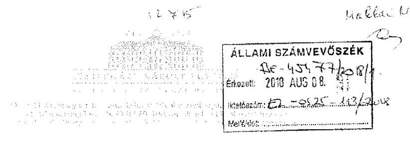

# Állami Számvevőszék 

1052 Budapest
Apáczai Csere János utca 10.
1364 Budapest 4.
Pf. 54 .

Tisztelt Domokos László!

Az állami felsőoktatási intézményeket ellenőrző a hallgatói önkormányzatok tekintetében címmel készített számvevőszéki jelentéstervezetre az alábbi megállapításokat teszem:

1. jelentéstervezet megállapítása: hallgatói önkormányzati választásokon a teljes idejű nappali képzésen résztvevő hallgatók legalább $25 \%$-a igazoltan nem vett részt a választásokon

A Hallgatói Önkormányzat (továbbiakban HÖK) intézményünkben saját szabályozása szerint a vezetőket közvetett módon választja a Küldöttgyűlése által. Az erre vonatkozó dokumentumokat az ellenőrzési időszakban meg is küldtük számvevőszék részére. Itt minden esetben teljesült a $25 \%$, hiszen a Küldöttgyűlés $50 \%$-os részvételi arány fölött határozatképes.

Az Nftv. 60. § (1) bekezdés b) pontjába foglaltak a kari -majd 2016-tól campus- választásokon érvényesültek, ahol a hallgatók megválaszthatják képviselőiket, ők pedig megválasztják a küldöttgyűlésen a vezetőiket, viszont az adatbekérés a képviselőkre nem tért ki, csak a tisztségviselőkre.
2. jelentéstervezet megállapítása: 2013-2015 között az EKE az alapszabályának módosítását a HÖK küldöttgyűlése nem fogadta el.

Ebben az esetben a HÖK az ezt megelőző alapszabálya szerint működhet, így ezt az időszakot figyelembe véve is legitimen gyakorolta hatáskörét.
3. jelentéstervezet megállapítása: a hallgatói önkormányzatok pénzeszköz felhasználásának szabályszerűségét nem értékelte a fenti hiányosságok miatt

Az Egyetemünkön a HÖK nem rendelkezik saját gazdálkodási jogkörrel, a kiadásokra a mindenkori Rektor, majd később a Kancellár által delegált közalkalmazott tehetett kötelezettségvállalást, illetve pénzügyi ellenjegyzést is. Tehát a fentiektől függetlenül, a hallgatói normatíva megfelelő szabályozás mentén került felhasználásra.

---

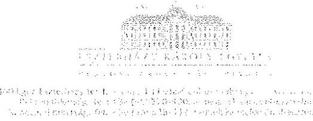

Kérem, hogy az Eszterházy Károly Egyetem képviseletében tett észrevételeimet a nyári szabadságolások miatt történt késedelem ellenére határidőben érkezettnek tekinteni és azt elfogadni szíveskedjen.

Segítő közreműködését előre is köszönöm!
Eger, 2018. augusztus 7.
Üdvözlettel:
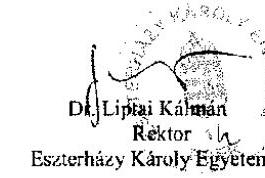

---

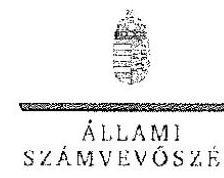

# Dr. Liptai Kálmán úr 

rektor

Eszterházy Károly Egyetem

## Eger

## Tisztelt Rektor Úr!

„Az állami felsőoktatási intézmények ellenőrzése a hallgatói önkormányzatok tekintetében" címmel készített számvevőszéki jelentéstervezetre tett észrevételét köszönettel megkaptam.

Az Állami Számvevőszék észrevételre
 vonatkozó álláspontjáról a felügyeleti vezető által készített részletes tájékoztatást mellékelten megküldöm.

Tájékoztatom Rektor urat, hogy a számvevőszéki jelentésben - az Állami Számvevőszékről szóló 2011. évi LXVI. törvény 29. § (3) bekezdése alapján - a figyelembe nem vett észrevételi szerepeltetjük, annak indoklásával, hogy azt az Állami Számvevőszék miért nem fogadta el.

Budapest, 2018. 4. hó 1. nap

Tisztelettel:

Domokos László

Melléklet: Tájékoztatás az észrevétel kezeléséről

---

# Tájékoztatás

az észrevétel kezeléséről
„Az állami felsőoktatási intézmények ellenőrzése a hallgatói önkormányzatok tekintetében" című jelentéstervezetre 2018. augusztus 8-án érkezett észrevételt áttekintettük, annak kezelésével kapcsolatban a következő tájékoztatást adom.
Az észrevétel 1. pontja rögzíti, hogy a hallgatói önkormányzati választások esetében az Eszterházy Károly Egyetem a hallgatói önkormányzat vezetőinek küldöttgyűlés általi megválasztásának dokumentumait bocsátotta az ellenőrzés rendelkezésére, a hallgatók általi választás dokumentumait nem, mivel arra az adatbekérés nem terjedt ki. Tájékoztatom, hogy az EL-0097-065/2017. iktatószámú adatbekérő levél ,,Bekérendő dokumentumok" melléklete a 2.1. pontban tartalmazta a hallgatói önkormányzat választásának dokumentumait, különös tekintettel a jogszabályi előírás érvényesülésének igazolásához szükséges létszámadatokat igazoló dokumentumokra (a teljes idejű nappali képzésen részt vevő hallgatói önkormányzati választáson részt vevők igazolt létszáma). Ebből következően az észrevétel nem cáfolja az ÁSZ megállapítását, hanem megerősíti, hogy az EKE a nemzeti felsőoktatásról szóló 2011. évi CCIV. törvény 60. § (1) bekezdés b) pontjában foglalt előírások érvényesülését nem igazolta. A hallgatói önkormányzati választásokon a felsőoktatási intézmény teljes idejű nappali képzésben részt vevő hallgatóinak legalább huszonöt százalékának részvételét dokumentumokkal nem támasztotta alá. . Az észrevételt nem fogadjuk el, a jelentéstervezet módosítása nem indokolt.
Az észrevétel 2. pontja szerint, mivel az EKE HÖK a 2013-2015. évi alapszabály módosításokat a HÖK küldöttgyűlése nem fogadta el, ezért ,, a HÖK ezt megelőző alapszabálya szerint működhet, így ezt az időszakot figyelembe véve is legitimen gyakorolta hatáskörét". Tájékoztatom, hogy az Nftv. 60. § (2) bekezdése alapján az alapszabályt a hallgatói önkormányzat küldöttgyűlése fogadja el, amely az alapszabály érvényességi kelléke. Az EKE ellenőrzés során teljesített adatszolgáltatása az alapszabály küldöttgyűlése általi elfogadását igazoló dokumentumot - az ÁSZ ide vonatkozó adatbekérése ellenére - nem tartalmazott. Az észrevételt nem fogadjuk el, a jelentéstervezet módosítása nem indokolt.
Az észrevétel 3. pontja azt tartalmazza, hogy a HÖK nem rendelkezik önálló gazdálkodási jogkörrel, a kötelezettségvállalást és a pénzügyi ellenjegyzést a rektor, illetve a kancellár által delegált közalkalmazott gyakorolta, ezért a hallgatói normatíva megfelelő szabályozás mentén került felhasználásra. Tájékoztatom, hogy a gazdálkodási jogkörök gyakorlására felhatalmazottak személye nem befolyásolja az ÁSZ megállapítását, mivel ha a hallgatói önkormányzat megalakulása nem szabályszerű, annak működésével összefüggésben közvagyont használni, illetve közpénzt felhasználni nem lehet szabályszerűen. Az észrevételt nem fogadjuk el, a jelentéstervezet módosítása nem indokolt.
Budapest, 2018. 3. hó 3. nap

Makkai Mária
felügyeleti vezető

---

# 1273

## KAPOSVÁRI EGYETEM

## Állami Számvevőszék

## Domokos László

## elnök

## részére

1364 Budapest 4
PE 54.

Tárgy: EL-0525-070/2018 ikt. sz. számvevőszéki jelentéstervezethez észrevételek

## Ikt. sz.: RH/17-8/2018

## 1364 Budapest 4.

PE 54.

Tisztelt Elnök Úr!

## ÁLLAMI SZÁMVEVŐSZÉK

$$
\begin{aligned}
& \text { Érkezett: } 2018 \text { AUG. 01. } \\
& \text { Iktatószám: } \\
& \text { Melléklet: }
\end{aligned}
$$

A Kaposvári Egyetem az Állami Számvevőszék EL-0525-070/2018 ikt. sz. levelét 2018. július 20-án kézhez vette, melyben Elnök Úr megküldte „Az állami felsőoktatási intézmények ellenőrzése a hallgatói önkormányzatok tekintetében" címmel készített számvevőszéki jelentéstervezetet.
A hivatkozott levél és az Állami Számvevőszékről szóló 2011. évi LXVI. törvény 29. § (2) bekezdése alapján a számvevőszéki jelentéstervezetben szereplő ellenőrzési megállapítások vonatkozásában ezúton
írásbeli észrevételt
teszek az alábbiak szerint.
A számvevőszéki jelentéstervezetben, a „Megállapítások" címszó alatt, az „Összegző megállapítás" - kifejtő első bekezdésben a Kaposvári Egyetem vonatkozásában a következő szerepel:
„Az állami fenntartású felsőoktatási intézményeknél a HÖK működése nem volt szabályszerű, mert

- [...]a Kaposvári Egyetem [...] teljes idejű nappali képzésben részt vevő hallgatóinak legalább 25\%-a az Nftv. 60. § (1) bekezdés b) pontjában foglaltakkal ellentétben, igazoltan nem vett részt a hallgatói önkormányzati választásokon;
- [...]
- [...]
„Az állami felsőoktatási intézmények ellenőrzése a hallgatói önkormányzatok tekintetében" című ellenőrzés során 5 körben kértek adatszolgáltatást, ebből a 4. kör során (ikt. szám: EL0525-007/2018, posta úton megérkezett 2018. február 20-án) kértek a következőket. A HÖK tisztségviselőinek megválasztási szabályait tartalmazó szabályozás dokumentuma(i), amelyek a 2013-2016. években hatályosak voltak. A 4. számú Tanúsítvány. A hallgatói önkormányzati választások lebonyolítását, a tisztségviselők megválasztását alkalmazó jegyzőkönyvek, dokumentumok. A 4. számú Tanúsítványon jelzett hallgatói önkormányzati választásokon a részt vevőkről vezetett jelenléti ívek.
Ezen adatszolgáltatásnak a Kaposvári Egyetem határidőben, 2018. február 27-én eleget tett. Megküldtük a hallgatók által aláírt jelenléti íveket, mind a kari Hallgatói Önkormányzatok, mind az Egyetemi Hallgatói Önkormányzat tisztségviselőinek megválasztását bizonyító

---

jegyzőkönyveket. A 4. sz. tanúsítvány pedig tartalmazta következőket: a hallgatói önkormányzati választások időpontját, a felsőoktatási intézmény teljes idejű nappali képzésben részt vevő hallgatóinak számát, a hallgatói önkormányzati választáson teljes idejű nappali képzésben résztvevő hallgatók számát, a hallgatói önkormányzati választáson résztvevő teljes idejű nappali képzésben részt vevő hallgatók arányát a felsőoktatási intézmény teljes idejű nappali képzésen részt vevő hallgatók számához képest, a hallgatói önkormányzati tisztségviselők választására jogosultak számát (szavazati jogú tag - résztvevő - arány).

Az Állami Számvevőszéktől a fentiek szerint megküldött adatok, dokumentumok, jegyzőkönyvek vonatkozásában kiegészítés kérése nem érkezett.

A nemzeti felsőoktatásról szóló 2011. évi CCIV. törvény (Nftv.) 60. § (1) bekezdése a következőképpen szól:
„(1) A felsőoktatási intézményekben a hallgatói érdekek képviseletére - a felsőoktatási intézmény részeként - hallgatói önkormányzat működik. A hallgatói önkormányzatnak - a 63. §-ban meghatározott kivétellel - minden hallgató tagja, választó és választható. A hallgatói önkormányzat az e törvényben meghatározott jogosítványait akkor gyakorolhatja, ha
a) megválasztotta tisztségviselőit, és jóváhagyták az alapszabályát, és
b) a hallgatói önkormányzati választásokon a felsőoktatási intézmény teljes idejű nappali képzésben részt vevő hallgatóinak legalább huszonöt százaléka igazoltan részt vett."

A jogszabály további rendelkezéseket nem tartalmaz a választások lebonyolításának szabályairól, az egyes, a választások során keletkező dokumentumok formai és tartalmi elemei, kezelése vonatkozásában.

A Kaposvári Egyetem által a fent hivatkozott 4. adatszolgáltatási kör során megküldött dokumentumokból (jelenléti ívek) kiolvasható, hogy összesítve a nappali képzésben résztvevő hallgatók vonatkozásában teljesült a törvényben előírt részvételi arány.

A jelentéstervezetből sajnos nem derül ki, hogy milyen hiányosság miatt jutott az Állami Számvevőszék arra a következtetésre, hogy a választások okán a HÖK működése nem szabályszerű, miért nem tekinthető igazoltnak a törvényi mérték szerinti hallgatói részvétel a hallgatói önkormányzati választások során, milyen további kritériumokat tekintene elfogadhatónak az igazolás érdekében.

A számvevőszéki jelentéstervezetben, a „Megállapítások" címszó alatt, az „Összegző megállapítás"-t kifejtő második bekezdéséhez pedig el kívánjuk mondani, hogy a Kaposvári Egyetem a gazdálkodása során a jogszabályi előírásoknak megfelelően jár el.

A Kaposvári Egyetem folyamatosan határidőben teljesítette az adatbekéréseket, amennyiben a jelentéstervezet módosításához további adatokra, információkra lenne szükségük az intézmény készséggel áll rendelkezésre, annak érdekében, hogy az Állami Számvevőszék érdemi vizsgálatot tudjon lefolytatni a hallgatói önkormányzatok gazdálkodása vonatkozásában.

---

# K

Kérem a fentiek elfogadását és a jelentéstervezet megállapításainak felülvizsgálatát, a Kaposvári Egyetem hallgatói önkormányzat működése szabályszerűségének megállapítását.

A Kaposvári Egyetem mindig is előtérbe helyezte és helyezi a hallgatói érdekeket, a hallgatói érdekképviselet érvényesülését, segíti a hallgatói önkormányzatot a szabályszerű működésben, figyelemmel kíséri a jogszabályi előírásoknak való megfelelést.

Bízva az észrevétel elfogadásában,

Kaposvár, 2018. augusztus 23."
Tisztelettel:
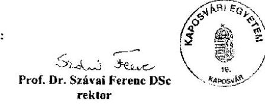

---

# Függelék: Észrevételek

## ㄱ

## 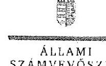

B.1.szám: El. 0525 -134/70/18.

Prof. Dr. Szávai Ferenc Tibor úr
rektor

Kaposvári Egyetem

## Kaposvár

## Tisztelt Rektor Úr!

Az állami felsőoktatási intézmények ellenőrzése a hallgatói önkormányzatok tekintetében címmel készített számvevőszéki jelentéstervezetre tett észrevételét köszönettel megkaptam.

Az Állami Számvevőszék észrevételre vonatkozó álláspontjáról a felügyeleti vezető által készített részletes tájékoztatást mellékelten megküldöm.

Tájékoztatom Rektor urat, hogy a számvevőszéki jelentésben - az Állami Számvevőszékről szóló 2011. évi LXVI. törvény 29. § (3) bekezdése alapján - a figyelembe nem vett észrevételt szerepeltetjük, annak indoklásával, hogy azt az Állami Számvevőszék miért nem fogadta el.

Budapest, 2018. 01. hó 11. nap

Tisztelettel:

## 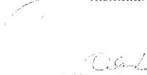

Melléklet: Tájékoztatás az észrevétel kezeléséről

---

# Tájékoztatás
# az észrevétel kezeléséről

„Az állami felsőoktatási intézmények ellenőrzése a hallgatói önkormányzatok tekintetében" című jelentéstervezetre 2018. augusztus 8-án érkezett észrevételt áttekintettük, annak kezelésével kapcsolatban a következő tájékoztatást adom.
Az észrevétel részletezi a Kaposvári Egyetem ellenőrzés során teljesített adatszolgáltatásának körülményeit és annak tartalmát, amely igazolja a jogszabálynak megfelelő részvételi arányt. Továbbá rögzíti, hogy az Egyetem a gazdálkodása során a jogszabályi előírásoknak megfelelően jár el.
A Kaposvári Egyetem adatszolgáltatásáról szóló tájékoztatást és a vonatkozó jogszabályi előírások ismertetését köszönjük. Tájékoztatom, hogy az Állami Számvevőszék minden esetben a jogszabályi környezet ismeretében, annak betartásával jár el és ellenőrzési megállapításai az ellenőrzés során bekért és az arra nyitva álló határidőn belül rendelkezésre bocsátott dokumentumokon alapulnak.
A Kaposvári Egyetem hallgatói önkormányzata a 2013-2016. években négy kari hallgatói részönkormányzatból állt. Kari HÖK választásokra a 2013. és 2016. években került sor, melyekről jegyzőkönyvek készültek. A jegyzőkönyvek karonként tartalmazták a leadott szavazatok számát, azonban nem tartalmazták a választásra jogosult hallgatók számát, a részvételi arányt és a szavazás érvényességét. A 2013. és 2016. évi választások jelenléti íve karonként tartalmazták a neveket és az aláírásokat, valamint a szavazás dátumát. A 2013. évi jelenléti ívek nem utalnak a választáson résztvevő hallgatók esetében arra, hogy teljes idejű nappali tagozatos hallgatók-e. A 2016. évi jelenléti íveken szerepeltek levelező tagozatos hallgatók aláírásai, amelyeket a részvételi arány meghatározásánál az Nftv. előírásai ellenére figyelembe vettek. A KE által rendelkezésre bocsátott 2013. és 2016. évi hallgatói lista karonként tartalmazta a hallgatók nevét és azt, hogy teljes idejű nappali tagozatos hallgatók-e. A hallgatói listán felsorolt hallgatók neve és száma nem volt azonos az aláírt jelenléti íveken szereplő névsorral. A jelenléti íveken megtalálhatóak voltak olyan nevek, akik a hallgatói listán nem szerepeltek, továbbá olyan hallgatók aláírása szerepelt a jelenléti íven, akinek a neve a hallgatói listában nem szerepelt.
Mindezek miatt a rendelkezésére bocsátott dokumentumok a nemzeti felsőoktatásról szóló 2011. évi CCIV. törvény 60. § (1) bekezdés b) pontjában foglalt előírások érvényesülését minden kétséget kizáróan nem igazolják. Az észrevételt nem fogadjuk el, az ÁSZ megállapítása helytálló, a jelentéstervezet módosítása nem indokolt.
Budapest, 2018. 11. hó 4. nap

Makkai Mária
felügyeleti vezető

---

## 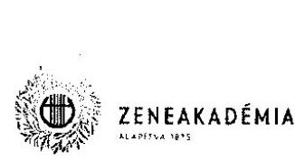

Domokos László
Állami Számvevőszék
elnök részére

1052 Budapest
Apáczai Csere János u. 10.

## Tisztelt Elnök Úr!

2018. július 23. napján, EL-0525-071/2018. iktatószámon kelt levelét, „Az állami felsőoktatási intézmények ellenőrzése a hallgatói önkormányzatok tekintetében" címmel készített számvevőszéki jelentéstervezettel összefüggésben, köszönettel megkapjuk.

Az abban foglaltakkal összhangban a jelentéstervezetben leírt általános megállapítások és az intézményünkre esetlegesen irányadó szabálytalanságok vonatkozásában megbeszéljük az általunk szükségesnek ítélt intézkedéseket, melyről elkülönítetten, de jelen levél megküldésével egyidejűleg tájékoztatjuk a tisztelt ellenőrző
 szervezetet, abban hiava, hogy így az ÁSZ tv 31.§ (1) bekezdés b) alpontjában foglalt jogkövetkezmény alkalmazása okaügyentá válik.

Egyúttal kérjük, hogy alábbi észrevételeink és a külön megküldésre kerülő intézkedési terv alapján szíveskedjenek felülvizsgálni az ÁSZ tv 31.§ (1) bekezdés b) alpontjában foglalt jogkövetkezmény alkalmazásának jogszerűségét és indokoltságát.

A jelentéstervezettel összefüggésben az alábbiak szerint kívánjuk jelezni észrevételeinket:
I.

A jelentéstervezet „ÖSSZEGEZÉS" fejezetének „Főbb megállapítások, következtetések, javaslatok" pontja valamennyi érintett felsőoktatási intézményre általánosabban vonatkoztatva az alábbiakat tartalmazza (idézőjelben):
„Az állami fenntartású felsőoktatási intézmények ellenőrzései jactuk el az a SZtv-ben foglaltukkal, mivel a teljes idejű nappali képzésben részt vevő hallgatói legalább $25 \%$-a igazoltan nem vett részt a hallgatói önkormányzati választásokon, valamint a hallgatói önkormányzatok nem rendelkezé jóváhagyott alapszabályok."

Ezen megállapításra alapozva abból azon következtetési vonták le, hogy „Az állami fenntartású felsőoktatási intézményoktali a 2013-2016. években a hallgatói önkormányzatok nem szabályszerűen alakulnak meg, a hallgatói önkormányzatok működése, forrásfelhasználása, gazdálkodása nem volt szabályszerű, nem volt biztosított a közpánszékel történő átlátható, szabályszerű gazdálkodás."

Ugyanakkor hivatkozott fejezet utolsó bekezdésében leírták, hogy az ellenőrzés részletes lefolytatásán nem került sor, ennek ellenére mégis megállapításra került, hogy a felhasználás nem volt szabályos. Felmerül a

---

# ZSSIQYY 

kérülés, hogy ha részletesen nem elemezték, és énékeíték a jogszerúclen megalkolás - elöfeltevés - nkán a közpédféldhasználást, úgy hogyan lehet azt ültteni, hogy az átlátható gazdálkodés feltételei nem kerültek biztosításra.
„Nem ellenitézisk a hallgatói önkormányzatok törvényes mükedését, valamint annak felcímleli, hogy az önkormányzat a tơrvényben meghatározott jogsuttványait gyakorolhatja-e"

A fenti megállapítás vonatkozásában sem tartalmaz a jelentéstervezet részletezést, hogy ezt a megállapítást mire alapozzák, mi támasztja alá, valamint, hogy milyen elöírás tartalmazza az egyetem ilyen irányú kötelezettségei.

Tekintettel arra, hogy ezen állítások nem tartalmaznak konkrét és részletes megállapítást az LFZE vonatkozásában, és az sem derül ki belőlük, hogy a vizsgálat során az LFZE által rendelkezésre bocsátott anyagok között mely dokumentum volt az, amelyből a fenti megállapítások levonhatóak lennének, illetve, hogy ezek a megállapítások közül egyáltalán melyek vonatkoznak az LFZE-re, így kénytelenek vagyunk a MEGÁLLAPÍTÁSOK fejezet 1. pontjának egyetlen LFZE-re is konkrétizált megállapításából kiindulni, miszerint „az LFZE teljes idejű nappali képzésben részt vevő hallgatók legalább $25 \%$-a az Nfiv. 60.§ (1) (c.) pontjának elteretésesen, igazoltan nem vett részt a hallgatói önkormányzati választásokon." (Azzal együtt, hogy továbbra sem egyértelmű számunkra, hogy ez a megállapítás pontosan mely benyújtott dokumentumokon alapozik.)
Mi'set ezen túlmenően az LFZE az érintett fejezetben máshol nem került nevesítésre, így az idézett konkrét megállapítás kapcsán a következő pontban részletesen észrevételezzük, hogy a konkrét megállapítást, és az arra épülő jelentéstervezetet az LFZE vonatkozásában mely alapon tartjuk megalapozatlannak.

## 2.

A nemzeti felsőoktatásról szóló 2011. évi CCIV. törvény (a továbbiakban: Nftv.) 60. § (1) bekezdése szerint a felsőoktatási intézményekben a hallgatói érdekek képviseletére - a felsőoktatási intézmény részeként hallgatói önkormányzat működik. A hallgatói önkormányzatnak - a 63. §-ban meghatározott kivétellel - minden hallgató tagja, választó és választható. A hallgatói önkormányzat az e törvényben meghatározott jogosítványait akkor gyakorolhatja, ha
a) megválasztotta tisztségviselőit, és jóváhagyták az alapszabályát, és
b) a hallgatói önkormányzati választásokon a felsőoktatási intézmény teljes idejű nappali képzésben részt vevő hallgatóinak legalább huszonöt százaléka igazoltan részt vett.
(2) A hallgatói önkormányzat alapszabálya határozza meg a hallgatói önkormányzat működésének a rendjét. Az alapszabályt a hallgatói önkormányzat küldöttgyűlése fogadja el, és a szenátus jóváhagyásával válik érvényessé. Az alapszabály jóváhagyásáról a szenátusnak legkésőbb a beterjesztést követő harmincadik nap eltelte utáni első ülésen nyilatkoznia kell.

Az ellenőrzés során az LFZE KH-91/8/2018.számon az EL-0525-005/2018. számú adatbékérésre csatolt nyilatkozat, valamint a HÖK alapszabálya szerint is a HÖK Alapszabály III. fejezet 11-12. §-ai szabályozzák a választásokat, míg II. fejezet 3. §-a szabályozza a Közgyűlés működését, melyeknek legfontosabb szabályai a következők:

## 11. § (6) bekezdés:

Az LFZE HÖK választásain
(a) a hallgatók megválasztják a Közgyűlés Tanszéki Képviselőit,
(b) a Közgyűlés megválasztja
(ba) az Elnököt, az Elnökhelyettest, a Titkárt és az Alelnököket,

---

(bb) a Szenátusba delegálandó hallgatói képviselőket,
(be) az EB, az FB, a TB és a VB tagjait oly módon, hogy a bizottságok tagjainak legalább a fele a Tanszéki Képviselők közül kerüljön ki.
(bd) az Egyetem által működtetett bizottságok hallgatói tagjait, amennyiben a jelen Alapszabály nem rendelkezik arról, hogy egy már megválasztott tisztviselő hivatalból tagja az adott bizottságnak.

# 3.§ (1)-(2) bekezdések: 

A Közgyűlés az LFZE HÖK legfőbb döntéshozó, javaslattevő, véleményező és ellenőrző testülete.
A Közgyűlés szavazati jogú tagjai:
(a) A jelen szabályzat 11. és 12. § alapján megválasztott Képviselők,
(b) az LFZE HÖK Elnöke, Elnökhelyettese, Titkára és Alelnökei,
(c) a Közgyűlés ülésén jelenlévő aktív Egyetemi hallgatók.

A fentiek alapján a HÖK tisztségviselőit nem közvetlenül a hallgatók választják meg, hanem a Közgyűlés, melynek tagjai az összes, az Nftv. 60. §-a értelmében választásra jogosult hallgató által közvetlenül megválasztott Tanszéki Képviselő, valamint az LFZE HÖK Elnöke, Elnökhelyettese, Titkára és Alelnökei mellett mindazok az aktív hallgatók is, akik a Közgyűlésen jelen vannak.

Nem a tisztségviselők megválasztásával jön létre a hallgatói önkormányzat, hanem az a törvény erejénél fogva létezik, az egyes testületek és tisztségviselői megbízások jönnek létre a választások, illetve a megválasztás alapján.

Mindezek alapján az Nftv. szerinti 25\%-os hallgatói részvételi arány a HÖK választásokon a Tanszéki Képviselők választására értelmezhető, míg a tisztségviselőket a jelenlévő hallgatók létszámától függően évről évre változó létszámú Közgyűlés választja meg. (Az alátámasztó jegyzőkönyveket a vizsgált időszakból melyek a határozatképességre is köznek -, az ellenőrzés során csatoltuk (KH-91/10/2018. dokumentumként).)

Az Nftv. 60. § (7) bekezdése és 61. § (4) bekezdése az alapszabály tárgykörébe utalja annak szabályozását, hogy a tisztségviselők megválasztása a közvetlen hallgatói önkormányzati választások részét képezik, vagy arra valamely testület jogosult, hiszen ezt kizáró, a HÖK belső rendelkezési jogát szűkítő törvényi rendelkezés nincs. A HÖK működésének megállapítása az Alapszabály elfogadásával a HÖK feladata, az Egyetem Szenátusa ennek jóváhagyását teheti meg, azonban amennyiben a HÖK által elfogadott Alapszabály nem jogszabályellenes, úgy nincs ok arra, hogy ezt az alapszabályt az Egyetem Szenátusa ne hagyja jóvá, így - mivel álláspontunk szerint a fentebb meghatározott választási rendszer nem minősíthető jogellenesnek, így a leírt választási rendet tartalmazó Alapszabály szenátusi jóváhagyása megtörtént.

A fentiek alátámasztására KH-91/9/2018. számom csatoltuk a dokumentum bekérés során a 4. számú tanúsítványt, melyből kiderül, hogy a vizsgált időszakban a hallgatói önkormányzati választásokon részt vevő teljes idejű nappali képzésben részt vevő hallgatók aránya a teljes idejű nappali képzésben részt vevő hallgatók számához képest minden egyes esetben meghaladta a $25 \%$-ot.

Mindezen indokok alapján, a részletes ellenőrzés lefolytatása nélkül nem tartjuk elfogadhatónak az LFZE-re vonatkoztatva azon általánosító megállapításukat, hogy a hallgatói önkormányzat működése, forrásfelhasználása, gazdálkodása nem volt szabályszerű, nem volt biztosított a közpénzekkel történő átlátható, szabályszerű gazdálkodás.

---

Kérjük, szíveskedjenek fenti indokainkat elfogadva az LFZE-t érintő megfelelő változtatásokat a jelentéstervezeten átvezetni, és az ÁSZ tv 31.§ (1) bekezdés b) alpontjában foglalt jogkövetkezmény alkalmazását felülvizsgálni. Amennyiben erre nem kerül sor, akkor tisztelettel kérjük, hogy konkrét, LFZE vonatkozásában megfogalmazott, indokolással alátámasztott javaslatokat szíveskedjenek tenni annak érdekében, hogy az Egyetem a megfelelő, ellenőrző szerv számára is kielégítő intézkedéseket meg tudja hozni.

Budapest, 2018. augusztus 6.

Tisztelettel:
Dr. Vigh Andrea
rektor
Szentgyörgyvölgyi László Zoltán
kancellár

---

# 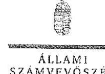 

## Dr. Vigh Andrea úrhölgy

rektor

Liszt Ferenc Zeneművészeti Egyetem

## Budapest

## Tisztelt Rektor Úrhölgy!

...Az állami fclvönkratári intézmények ellenőrzése a hallgatói inkormározzatok tekintetében" címmel készített számvevőszéki jelentéstervezetre tett észrevételét köszönettel megkaptam.

Az Állami Számvevőszék észrevételre vonatkozó álláspontjáról a felügyeleti vezető által készített részletes tájékoztatást mellékelten megküldöm.

Tájékoztatom Rektor úrhölgyet, hogy a számvevőszéki jelentésben - az Állami Számvevőszékről szóló 2011. évi LXVI. törvény 29. § (3) bekezdése alapján - a figyelembe nem vett észrevételt szerepeltetjük, annak indoklásával, hogy azt az Állami Számvevőszék miért nem fogadta el.

Budapest, 2018.
hó $\quad$ nap

Tisztelettel:

Domokos László

Melléklet: Tájékoztatás az észrevétel kezeléséről

---

# Tájékoztatás   az észrevétel kezeléséről 

...Az állami felsőoktatási intézmények ellenőrzése a hallgatói önkormányzatok tekintetében" című jelentéstervezetre 2018. augusztus 8-án érkezett észrevételt áttekintettük, annak kezelésével kapcsolatban a következő tájékoztatást adom.
Az észrevétel 1. pontja kérdésként veti fel, hogy részletes, a közpénzfelhasználást érintő ellenőrzés lefolytatása hiányában mi alapozza meg azt a megállapítást, hogy az átlátható gazdálkodás feltételeit nem biztosították. Továbbá, hogy mi alapozza meg a hallgatói önkormányzatok törvényes működését és a törvényben meghatározott jogosítványainak gyakorlására vonatkozó feltételek fennállását érintő ellenőrzés elmaradására vonatkozó megállapítást, illetve kötelezettséget.
Tájékoztatom, hogy az átlátható gazdálkodás alapvető feltétele, hogy a közvagyonnal, illetve közpénzzel gazdálkodó szervezet a közvagyon használatára, illetve a közpénz felhasználására való jogosultsággal rendelkezzen. A nemzeti felsőoktatásról szóló 2011. évi CCIV. törvény (továbbiakban: Nftv.) 60. § (1) bekezdése alapján a hallgatói önkormányzat a jogosultságait abban az esetben gyakorolhatja, ha megválasztotta tisztségviselőit, és jóváhagyták az alapszabályát, és a hallgatói önkormányzati választásokon a felsőoktatási intézmény teljes idejű nappali képzésben részt vevő hallgatóinak legalább huszonöt százaléka igazoltan részt vett. Többek között a hallgatói önkormányzat működéséhez biztosított anyagi eszközök, állami támogatás és saját bevételek felhasználása is ezen jogosultságok közé tartozik. Továbbá a felsőoktatási intézmény ellenőrzési kötelezettségével összefüggésben tájékoztatom, hogy az Nftv. 60. § (4) bekezdése alapján a hallgatói önkormányzat működéséhez és a feladatai elvégzéséhez a felsőoktatási intézmény biztosítja a feltételeket, amelynek jogszerű felhasználását, a hallgatói önkormányzat törvényes működését ellenőrizni köteles. A kötelezettség teljesítését az ellenőrzés során rendelkezésre bocsátott dokumentumok nem igazolták. Az észrevétel 1. pontjában foglaltak az ÁSZ megállapításait nem cáfolják, a jelentéstervezet módosítása nem indokolt.
Az észrevétel a 2. pontja tartalmazza a hallgatói önkormányzati választásokkal összefüggésben megfogalmazott észrevételt, amely részletezi az alapszabály választásokkal összefüggő rendelkezéseit, a vonatkozó jogszabályi előírásokat. Az észrevétel kiemeli, hogy az ellenőrzés során rendelkezésre bocsátott 4. számú tanúsítvány és a választások jegyzőkönyvei igazolják, hogy a választás megfelelt a jogszabályi előírásoknak.
Tájékoztatom, hogy a Liszt Ferenc Zeneművészeti Egyetem az észrevételben is hivatkozott, az ellenőrzés során rendelkezésre bocsátott dokumentumok az Nftv. 60. § (1) bekezdés b) pontjában foglalt részvételi arány érvényesülését nem igazolják. A választásokon résztvevők igazolt létszámát alátámasztó jelenléti ívek a 2013-2016 évi választások esetében nem álltak rendelkezésre. A HÖK Közgyűlés alakuló ülésén készült és szavazatszámlálásról szóló jegyzőkönyvek nem tartalmazták a választáson megjelent, teljes idejű nappali képzésben résztvevő hallgatók számát. Ezen dokumentumok hiányában nem igazolt, hogy a hallgatói önkormányzati

---

választásokon a felsőoktatási intézmény teljes idejű nappali képzésben részt vevő hallgatóinak legalább huszonöt százaléka részt vett. Az észrevételt nem fogadjuk el, az ÁSZ megállapítása helytálló, a jelentéstervezet módosítása nem indokolt.
Budapest, 2018. hó 27 nap

Makkai Mária
felügyeleti vezető

---

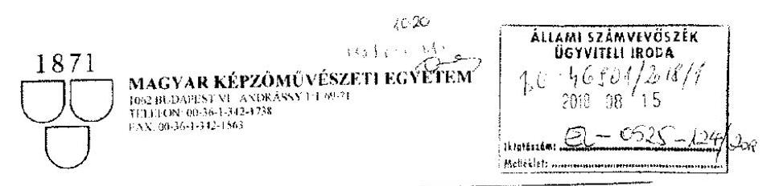

Állami Számvevőszék

Domokos László
elnök
1052 Budapest
Apáczai Csere János u. 10.

Tárgy: ÁSZ jelentéstervezetei
Ügyintéző: Benedek Marianna
Hiv. szám: EL-0525-072/2018
Iktatószám: MKE: 12-8-2018

Tisztelt Elnök Úr!

Hivatkozással EL-0525-072/2018 levelére és az EL-0525-061/2018 iktatószámú „Az állami
felsőoktatási intézmények ellenőrzése a hallgatói önkormányzatok
 tekintetében" címmel
készített számvevőszéki jelentéstervezettel kapcsolatban az abban foglaltakkal egyetértünk,
észrevételt nem kívánunk tenni.

2018-ban a HÖK működését az Nftv. előírásainak megfelelően biztosítjuk.

Köszönettel:

Magyar Képzőművészeti Egyetem

Dr. Radák Eszter
rektor

Magyar Képzőművészeti Egyetem

Budapest, 2018. augusztus 7.

68

---

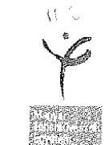

# Állami Számvevőszék 

Budapest

## Tisztelt Elnök Úr!

„Az állami felsőoktatási intézmények ellenőrzése a hallgatói önkormányzatok tekintetében" címmel készített számvevőszéki jelentéstervezetre az ÁSZ tv. 29. § (2) bekezdése alapján
nem kívánok észrevételt tenni.

A jelentéstervezetben leírt szabálytalanságok vonatkozásában az intézkedéseket megteszem, arról egy külön dokumentumban tájékoztatom Elnök urat.

Budapest, 2018. július 24.
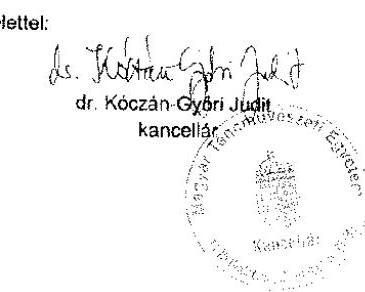

---

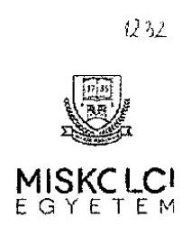

# Domokos László 

## Elnök Úr részére

Állami Számvevőszék
Budapest 4.
Pf. 54.
1364

## Tisztelt Elnök Úr!

Hivatkozással az EL-0525-074/2018. iktatószámú, „Az állami felsőoktatási intézmények ellenőrzése a hallgatói önkormányzatok tekintetében" címmel készített számvevőszéki jelentéstervezetre, a Miskolci Egyetem nem kíván érdemi észrevételt tenni.

Egyidejűleg, kérem, engedje meg, hogy az alkalmazandó, illetve kilátásba helyezett szankció tekintetében a következőket jegyezzem meg: az állam- és jogtudományokban az alkalmazott szankciónak mindig igazodnia kell az elkövetett, vagy elmulasztott cselekmény súlyához. Márpedig a tervezetben kilátásba helyezett egyetlen szankció esetében ez a követelmény nem teljesül, hiszen a 17. oldalon négyféle jogsértés került rögzítésre. A Miskolci Egyetemet a legenyhébb súlyú jogsértés érinti, miközben szankciója ugyanaz, mint a legsúlyosabb jogsértésé. Éppen ezért azt javaslom, hogy a Miskolci Egyetem esetében az Állami Számvevőszék ne alkalmazzon szankciót és az 1%-os hallgatói normatíva befagyasztására ne kerüljön sor.

Egyúttal engedje meg azt is, hogy köszönetemet fejezzem ki az Állami Számvevőszék általi ellenőrzésben részt vett munkatársainak, illetve tájékoztassam Önt arról, hogy az elvégzett ellenőrzés által feltárt szabálytalanságok megszüntetése érdekében azonnali korrekciós intézkedések megtételéről gondoskodtam.

Miskolc, 2018. 07. 30.
Tisztelettel:
Prof. Dr. Horváth András

---

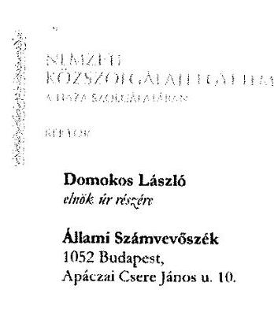

# Tisztelt Elnök Úr! 

A fenti hivatkozási szám alatti, illetve tárgy szerinti, 2018. július 17-én kelt levelében, valamint az azzal megküldött „Az állami felsőoktatási intézmények ellenőrzése a hallgatói önkormányzatok tekintetében" című jelentéstervezetben (továbbiakban: jelentéstervezet) foglaltakkal kapcsolatban az alábbi észrevételeket teszem, a következőkről tájékoztatom.

A jelentéstervezet szerint a Nemzeti Közszolgálati Egyetem Hallgatói Önkormányzatának (továbbiakban: hallgatói önkormányzat) működése az ellenőrzés által vizsgált időszakban nem volt szabályozott, mivel a nemzeti felsőoktatásról szóló 2011. évi CCIV. törvény 60. § (1) bekezdésének b) pontjában megadottaktól eltérően a hallgatói önkormányzati választásokon a teljes idejű nappali képzésben részt vevő hallgatók legalább 25%-a igazoltan nem vett részt.

Ezzel összefüggésben meg kívánom jegyezni, hogy a hallgatói önkormányzati választások közül a kari hallgatói önkormányzati választások 2015. novemberétől elektronikus úton kerülnek lebonyolításra az Egyetem elektronikus tanulmányi nyilvántartó rendszerén (Neptun-rendszer) keresztül. A rendszer által garantált lehetőségeket kihasználva a szavazás anonim, s az ahhoz szükséges technikai feltételeket az Egyetem egyik központi funkcionális szervezeti egysége, a Központi Tanulmányi Iroda biztosítja. Az alkalmazott módszer alapján a szavazáson részt vevő hallgatók száma, munkarendi megoszlása dokumentált és visszamenőlegesen is ellenőrizhető. Ez azért is meghatározó, mivel a kari választások eredménye képezi az alapot a hallgatói önkormányzat vezetésének összetételére, s a kari hallgatói önkormányzatok elnökeiből, valamint - közvetett módon - a kari hallgatói önkormányzat által delegált tagokból álló Küldöttgyűlés útján választott egyetemi hallgatói önkormányzati elnöki tisztség betöltése.

Az előzőekben megadott időszaktól - az ellenőrzés során az Állami Számvevőszék által EL0097/052/2017. iktatási szám alatti levélben bekért, az Egyetem által az adatszolgáltatás során megadott, a hallgatói önkormányzat tisztségviselőinek megválasztásán részt vevő nappali tagozatos hallgatók hallgatói jogviszonyának igazolásáról szóló, valamint a tisztségviselők megválasztása időpontjában teljes idejű nappali képzésben részt vevő hallgatók névsorát tartalmazó dokumentumok alapján megállapítható, hogy a kari hallgatói önkormányzati választásokon részt vett az adott kar teljes idejű képzésben aktív hallgatói jogviszonnyal rendelkező hallgatóinak több mint 25%-a.

Mindezektől függetlenül az ellenőrzés által követett módszertanra tekintettel, valamint az előzetes jelentésben megadottak alapján is előtérbe kerülő követelmény, a visszamenőlegesen is ellenőrizhető jogszerű forrásfelhasználás alapfeltételeinek biztosítása érdekében szükségesnek látom a hallgatói

BÉS Duhajert, Endrődi u. 86, 2., Tel. 4444259840
tvezaidne: 18/1 Duhajert, H. 86 | Email: bbs@szl.utd.ek.hu

---

önkormányzati választások menetére vonatkozó választási eljárás felülvizsgálatát, illetve az alkalmazott egyetemi iratkezelési rend megújítását. Ennek keretében viszont - az egységes követelmények és eljárás megteremtésének igényére figyelemmel - az összes hallgatói önkormányzatra azonos alapfeltételek meghatározása lenne célszerű, amiben kérem tisztelt Elnök Úr segítségét, hogy a lefolytatott ellenőrzés tapasztalatára tekintettel az Állami Számvevőszék szíveskedjen útmutatást adni az általa támasztott elvárások teljesítéséhez: hallgatói önkormányzati választási eljárás során keletkezett dokumentumok megőrzésének szükségessége, annak minimum ideje.

Emellett, az Állami Számvevőszék által ellenőrzött időszakhoz képest új összetételű hallgatói önkormányzat működési költségeinek folyósításával összefüggő intézkedések szükségességének megállapítása céljából intézkedtem a hallgatói önkormányzat - az Állami Számvevőszék erre irányuló ellenőrzésének módszertanát követve (a hallgatói önkormányzati választások, tisztségviselők megválasztása dokumentumainak vizsgálata, ami kiterjed a választás időpontját meghatározó döntés, a választást elrendelő döntés és dokumentumainak, jegyzőkönyvek, nappali képzésben részt vevő hallgatók létszámának, hallgatói önkormányzati választáson részt vevők igazolt létszámának, jelenléti ívek, választás eredmények kihirdetésének, esetleges jogorvoslat dokumentumainak vizsgálatára, továbbá a hallgatói önkormányzat alapszabálya érvényességének ellenőrzése) - 2017. és 2018. évi működésének ellenőrzéséről.

Egyúttal tájékoztatom tisztelt Elnök Urat, hogy a fentiekben részletezett egyetemi ellenőrzés eredménye, valamint az Állami Számvevőszék által folytatott, tárgy szerinti ellenőrzés végleges jelentésének tartalma alapján az Egyetem el fogja készíteni a szükséges intézkedési tervet, amelyet annak kiadását követően továbbítani fogunk az Állami Számvevőszék részére.

Melléklet: Rektori intézkedés az NKE HÖK 2017-2018. évi működésének vizsgálatára
Budapest, 2018. augusztus 7. 7

Tisztelettel:

Prof. Dr. Patyi András
rektor

Készült: 2 példányban
Fig. példány: 1 lap, 1 oldal
Képzett: 2 tépet. 1 oldal
Cresztó
Iktató
2. oldal, összesen: 2

---

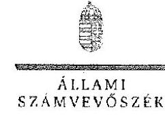

Iktatószám: EL-0525-136/2018.

Prof. Dr. Patyi András úr
rektor

Nemzeti Közszolgálati Egyetem

# Budapest 

## Tisztelt Rektor Úr!

„Az állami felsőoktatási intézmények ellenőrzése a hallgatói önkormányzatok tekintetében" címmel készített számvevőszéki jelentéstervezetre tett észrevételét köszönettel megkaptam.

Az Állami Számvevőszék észrevételre vonatkozó álláspontjáról a felügyeleti vezető által készített részletes tájékoztatást mellékelten megküldöm.

Tájékoztatom Rektor urat, hogy a számvevőszéki jelentésben az Állami Számvevőszékről szóló 2011. évi LXVI. törvény 29. § (3) bekezdése alapján - a figyelembe nem vett észrevételt szerepeltetjük, annak indoklásával, hogy azt az Állami Számvevőszék miért nem fogadta el.

Budapest, 2018. 08. hó 27. nap

Tisztelettel:

Domokos László

Melléklet: Tájékoztatás az észrevétel kezeléséről

---

# Tájékoztatás   az észrevétel kezeléséről 

„Az állami felsőoktatási intézmények ellenőrzése a hallgatói önkormányzatok tekintetében" című jelentéstervezetre 2018. augusztus 13-án érkezett észrevételt áttekintettük, annak kezelésével kapcsolatban a következő tájékoztatást adom.
Az észrevétel ismerteti a hallgatói önkormányzati választásokat támogató, 2015. novemberétől alkalmazott elektronikus tanulmányi nyilvántartó rendszert. Az észrevétel szerint a rendszer bevezetésétől kezdődő időszakban a jogszabályi előírásoknak megfelelő részvételi arány igazolt, az ehhez szükséges dokumentumokat az Nemzeti Közszolgálati Egyetem adatszolgáltatása tartalmazza. A továbbiakban az észrevétel az ellenőrzés megállapításai alapján megtett, illetve tervezett intézkedésekről ad tájékoztatást.
Az észrevétel a 2015. októberig tartó időszak vonatkozásában megerősíti az ÁSZ megállapításait. Az ezt követő - elektronikus rendszerrel támogatott választás - időszakot illetően tájékoztatom, hogy a nemzeti felsőoktatásról szóló 2011. évi CCIV. törvény 60. § (1) bekezdés b) pontjában foglalt, igazolt részvételi arány érvényesülését a rendelkezésre bocsátott dokumentumok az alábbiak miatt maradéktalanul nem igazolták.
A rendes kari választásokkal összefüggésben a választások jelenléti ívei, több esetben a kari választás elrendelő döntése, a kari választás választási bizottság által hitelesített jegyzőkönyvei, eredményhirdetés dokumentumai nem álltak rendelkezésre. Ezt a tényt az NKE a 2017. december 15-i Teljességi és Hitelességi nyilatkozat 2/b mellékletében kimutatott, a választások hiányzó dokumentumai (pl: ÁKK 2013.-2014. évi választások elrendelő döntése, jelenléti ívei, HHK 2013-2015. évi választások elrendelő döntése, jelenléti ívei, RTK 2015-2016. évi jelenléti ívei stb.) megerősítik.
Mindezek miatt az ellenőrzés rendelkezésére bocsátott dokumentumok a nemzeti felsőoktatásról szóló 2011. évi CCIV. törvény 60. § (1) bekezdés b) pontjában foglalt előírások érvényesülését nem igazolják. Az észrevételt nem fogadjuk el, az ÁSZ megállapítása a teljes ellenőrzött időszak vonatkozásában helytálló, a jelentéstervezet módosítása nem indokolt.
Budapest, 2018. 08. hó 27. nap

Makkai Mária
felügyeleti vezető

---

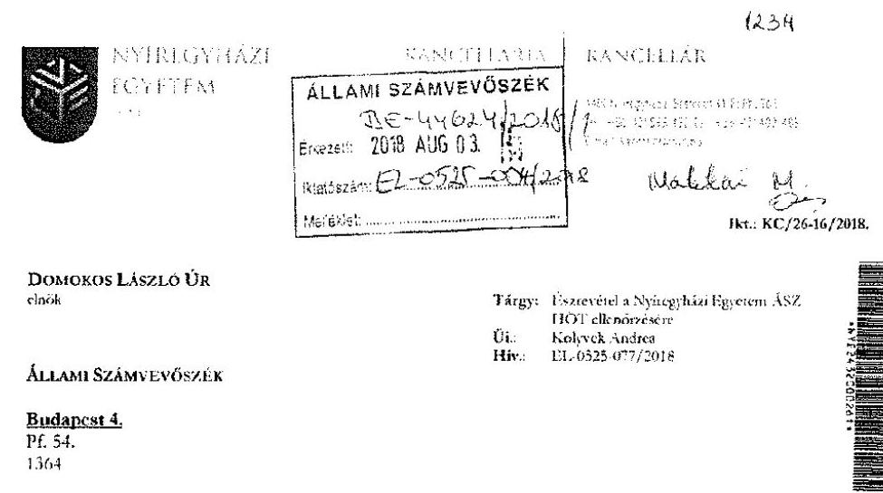

# Tisztelt Elnök Úr! 

A Nyíregyházán 2018. július 13-án kelt, de ténylegesen 2018. július 23-án átvett jelentéstervezetre a rendelkezésére álló törvényes határidőn belül mellékelten észrevételt terjeszt és ezt hivatalosan megküldi Önnek. Tisztelettel kérem, hogy az egyetem által tett észrevételét a végleges jelentés összeállítása során figyelembe venni, azt mérlegelni szíveskedjen.

Amennyiben bármilyen további kérdése merül fel, készséggel állok a rendelkezésére az alábbi elérhetőségen: kancellaria@nye.hu.

Nyíregyháza: 2018. július 31.
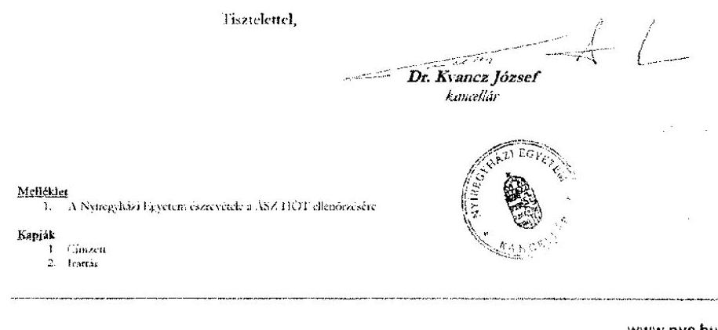

---

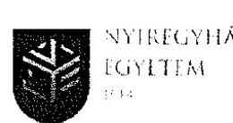

# ÉSZREVÉTEL AZ ÁLLAMI SZÁMVEVŐSZÉK JELENTÉSTERVEZETÉRE

A Nyíregyházi Egyetem (4400 Nyíregyháza, Sóstói út 31/h.) nevében eljárva Dr. Kvancz József kancellár a 2018. július 13-án kelt (EL-0525-077/2018.), ténylegesen 2018. június 25-én átvett jelentéstervezetéhez a rendelkezésre álló törvényes határidőben az alábbi

#### Észrevételeket

terjesztem elő.

1. A jelentéstervezet 17 oldalán tett megállapításra: „az állami fenntartású felsőoktatási intézményeknél a HÖK működése nem volt szabályozott ... Nyíregyházi Egyetem, teljes idejű nappali képzésben részt vett hallgatóinak legalább 25%-a az Nftv. 60. § (1) b) pontjában foglalt előírást ismételten igazoltan nem vett részt a Hallgatói Önkormányzati választáson.”

#### Ellenőrzött észrevétele

Mivel az ellenőrzés a jelentéstervezetében konkrétan tényekkel alátámasztott megállapítást nem tett, így annak törlését kérem a végleges jelentésből, különös tekintettel arra, hogy a Nyíregyházi Egyetem valamennyi évenkénti választása a hivatkozott jogszabályi feltételeknek megfelel.

| Sorcsám | Időpont | Megnevezés | Részt vettek | Összes hallgató | % |
| --- | --- | --- | --- | --- | --- |
| 1 | 2013.03.25.-2013.03.28. | NYF HÖT időközi választása (feltöltő) | 780 | 2335 | 33.40 % |
| 2 | 2013.12.09.-2013.12.11. | NYF HÖT évenkénti választása | 683 | 2441 | 27.98 % |
| 3 | 2013.11.30.-2013.12.02. | NYF HÖT évenkénti választása | 308 | 1750 | 17.6 % |
| 4 | 2013.12.14.-2013.12.16. | NYF HÖT ismételt évenkénti választása | 417 | 1736 | 23.74 % |

Az Állami Számvevőszék (ÁSZ) részére 2017. december 13-án eljuttatott - KC/S30-27/2017 - levélben valamint a feltöltött dokumentumok 104-112 sora tartalmazza valamennyi ügyben releváns dokumentumot hiánytalanul.

Amennyiben az ellenőrzés a fenti kijelentését továbbra is fenntartja, azt konkrét dokumentumokkal kérem alátámasztani.

Nyíregyháza, 2018. július 31.

Tisztelettel,

Dr. Kvancz József kancellár

www.nye.hu

---

# 1188A 

## SZÁMVEVŐSZÉK

Ikt. szám: 11 - 0525-126/2018

Vassné dr. Figula Erika Éva úrhölgy
rektor

Nyíregyházi Egyetem

## Nyíregyháza

## Tisztelt Rektor Úrhölgy!

„Az állami felsőoktatási intézmények ellenőrzése a hallgatói önkormányzatok tekintetében" címmel készített számvevőszéki jelentéstervezetre tett észrevételt köszönettel megkaptam.

Az Állami Számvevőszék észrevételre vonatkozó álláspontjáról a felügyeleti vezető által készített részletes tájékoztatást mellékelten megküldöm.

Tájékoztatom Rektor úrhölgyet, hogy a számvevőszéki jelentésben - az Állami Számvevőszékről szóló 2011. évi LXVI. törvény 29. § (3) bekezdése alapján - a figyelembe nem vett észrevételt szerepeltetjük, annak indoklásával, hogy azt az Állami Számvevőszék miért nem fogadta el.

Budapest, 2018. 08. hó 27. nap

Tisztelettel:

Domokos László

Melléklet: Tájékoztatás az észrevétel kezeléséről

---

# Tájékoztatás 

az észrevétel kezeléséről
„Az állami felsőoktatási intézmények ellenőrzése a hallgatói önkormányzatok tekintetében" című jelentéstervezetre 2018. augusztus 3-án
 érkereti észrevételt áttekintettük, annak kezelésével kapcsolatban a következő tájékoztatást adom.
Az észrevétel szerint a Nyíregyházi Egyetem (továbbiakban: NYE) ,,valamennyi eseti választása a hivatkozott jogszabályi feltételeknek megfelel" , amellyel összefüggésben ,,a felállalót dokumentumok 104-112 sora tartalmazza valamennyi ügyben releváns dokumentumot hiánytalanul és érdemben".
Tájékoztatom, hogy az Állami Számvevőszék ellenőrzési megállapításai az Állami Számvevőszékről szóló 2011. évi LXVI. törvénynek megfelelően minden esetben az ellenőrzés során bekért és az arra nyitva álló határidőn belül rendelkezésre bocsátott dokumentumokon alapul. Az ellenőrzés során több körös adatkérés történt, amely során bekérésre kerültek a hallgatói önkormányzat választásának dokumentumai, különös tekintettel a felsőoktatási teljes idejű nappali képzésben részt vevő hallgatók létszámát és a hallgatói önkormányzati választáson részt vevők létszámát igazoló dokumentumokra, névsorra és a választáson részt vevőkről vezetett jelenléti ívekre.
A Nyíregyházi Egyetem adatszolgáltatása - amelyet az észrevételében is hivatkozott - a választás időpontjában a teljes idejű nappali képzésen résztvevők létszámának és a hallgatói önkormányzati választáson részt vevők létszámának igazolására vonatkozóan a jegyzőkönyveken túlmenően egyéb dokumentumot nem tartalmazott.
Az adatszolgáltatás keretében rendelkezésre bocsátott „Tanulmányi Rendszerből" kinyomtatott, „Nappali hallgatók névsoráról" összefüggésben tájékoztatom, hogy azok nem alkalmasak a nemzeti felsőoktatásról szóló 2011. évi CCIV. törvény 60. § (1) bekezdés b) pontjában foglaltak (a választáson a teljes idejű nappali képzésben résztvevők 25 \%-ának igazolt részvétele) feltétel érvényesülésének igazolására. Ugyanis azok nem a hallgatók általi választás időpontjára, hanem az azt követően tartott vezető tisztségviselők Küldöttgyűlés (2013. évben Közgyűlés) általi megválasztásának időpontjára vonatkoznak. Továbbá a választáson résztvevő hallgatók létszámának igazolására vonatkozó, a jegyzőkönyvben foglalt részvételi adatokat alátámasztó alapdokumentumok - jelenléti ívek - sem kerültek megküldésre.
Mindezek alapján a nemzeti felsőoktatásról szóló 2011. évi CCIV. törvény 60. § (1) bekezdés b) pontjában foglalt előírások érvényesülése nem igazolt. Az észrevételt nem fogadjuk el, az ÁSZ megállapítása helytálló, a jelentéstervezet módosítása nem indokolt.

Budapest, 2018. 07. hó 07 nap

Makkai Mária
felügyeleti vezető

---

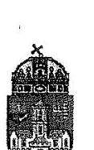

Iktatószám: DE-KA.559-20.2017
Hivatkozási szám: EL-0525-078/2018

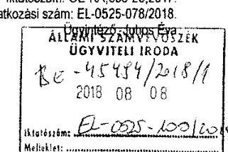

Tisztelt Elnök Úr!

Köszönettel megkaptuk "Az állami felsőoktatási intézmények ellenőrzése a hallgatói önkormányzatok tekintetében" ellenőrzésre vonatkozó. EL-0525-001/2018. iktatószámú jelentéstervezetet és az EL-0525-078/2018. iktatószámú tájékoztató levelét. A tájékoztató levelében leírtaknak megfelelően a jelentéstervezetben foglaltakra az alábbi észrevételeket teszük:

a jelentéstervezet 17. oldal 1. pont 1. megállapítása szerint "a HÖK működése nem volt szabályszerű, mert az Óbudai Egyetem teljes idejű nappali képzésben részt vevő hallgatóinak legalább 25%-a az Nftr. 60. § (1) bekezdés b) pontjában foglaltakkal ellentétesen, igazoltan nem vett részt a hallgatói önkormányzati választásokon", azonban az Óbudai Egyetem által megküldött adatszolgáltatás alapján ez a megállapítás nem alátámasztott, ezért figyelembe véve az Állami Számvevőszékről szóló 2011. évi LXVI. törvény 24. § (1) bekezdés d) pontjában előírtakat, miszerint az ellenőrzés eredményeinek, a megállapításoknak alátámasztottnak, a következtetéseknek okszerűnek és megalapozottnak kell lenniük, kérem szíveskedjenek az Óbudai Egyetemre vonatkozó megállapítást törölni.

a jelentéstervezet 17. oldal 1. pont 2. megállapítása szerint "az ÖE 2014. évi hallgatói önkormányzatának alapszabályát a Szenátus nem hagyta jóvá az Nftr. 60. § (1) bekezdés a) pontjában foglaltak ellenére, ezért az alapszabály nem érvényes", mely megállapítás és következtetés az Óbudai Egyetem adatszolgáltatása alapján nem megalapozott. Az Óbudai Egyetem Hallgatói Önkormányzatának Alapszabályát az Egyetem megalakulását követően, az első ideiglenes Szenátus 2010. január 19-ei ülésén a SZ- KLIV/14/2010. számú határozatban egyhangúan elfogadták (ezt támasztják alá az adatszolgáltatások során megküldött óbudai-egyetem-koztonye-2010-10-evfolyam-1-szama illetve a vizsgált időszakra vonatkozó módosított Alapszabályok), 2014. évben a Hallgatói Önkormányzat Alapszabály módosítást nem nyújtott be a Szenátus elé, márpedig az Nftr. 60. § (2) bekezdést figyelembe véve a Szenátusnak a beterjesztést követően van nyilatkozatételi kötelezettsége. Az Óbudai Egyetem Hallgatói Önkormányzata 2010. január 1-től rendelkezett hatályos Alapszabállyal, 2014. évre pedig a 2012. szeptember 5. verzió volt hatályban, melyet a Szenátus 2012. október 8-ei ülésén elfogadott és adatszolgáltatás keretében szintén megküldözik Önöknek, ezért a fent idézett megállapítás és az alapszabály érvénytelenségére vonatkozó következtetés helytelen. Az észrevétel alapján kérem, hogy az Óbudai Egyetemre vonatkozó megállapítást és következtetést törölni szíveskedjenek.

a jelentéstervezet 17. oldal 1. pont 4. megállapítása szerint "az ÖE 2014. évben hallgatói önkormányzata alapszabályának módosítását a HÖK küldöttgyűlése az Nftr. 60. § (2) bekezdésében foglaltak ellenére nem

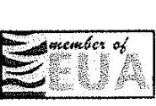

1034 Budapest, Bécsi út 96/B www.uni-obuda.hu

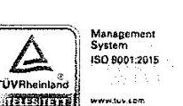

Tel.: (06-1) 666-5856 juhos eva@ka.uni-obuda.hu

79

---

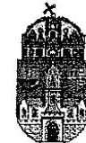

# ÓBUDAI EGYETEM

fogadta el, ezért az alapszabály nem volt érvényes", mely megállapítás és következtetés az Óbudai Egyetem adatszolgáltatása alapján nem megalapozott. Az Óbudai Egyetem Hallgatói Önkormányzatának Alapszabályát az Egyetem megalakulását követően, az első ideiglenes Szenátus 2010. január 19-ei ülésén a SZ-XL/9/14/2015. számú határozatban egyhangúan elfogadták, tehát azóta van az Óbudai Egyetem Hallgatói Önkormányzatnak érvényes és hatályos Alapszabálya, 2014. évben az 8. verzió számú Alapszabály módosítást a Hallgatói Tanács (Küldöttgyűlés) többször tárgyalta és elfogadta, az erre vonatkozó Hallgatói Tanácsi emlékeztetők a teljesített adatszolgáltatás során megküldésre kerültek Önöknek, ezért a fent idézett megállapítás és az alapszabály érvénytelenségére vonatkozó következtetés helytelen. A Szenátus a 6. verzió számú Alapszabály módosítást 2015. január 19-én a SZ-CI/8/S/2015. számú határozatával hagyta jóvá, melyről a vonatkozó dokumentumokat szintén megküldtük az adatszolgáltatás során Önöknek. Az észrevétel alapján kérem, hogy az Óbudai Egyetemre vonatkozó megállapítást és következtetést törölni szíveskedjenek.

Kérem, hogy észrevételeink alapján szíveskedjenek a jelentéstervezetet módosítani.

Budapest, 2018. augusztus 2.

Tisztelettel:

Prof. Dr. Rózsa Váruláné

Varga Judit
kancellárhelyettes

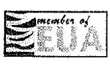

1034 Budapest, Bécsi út 96/B www.uni-obuda.hu

Tel.: (06-1) 666-5856 juhos eva@ka.uni-obuda.hu

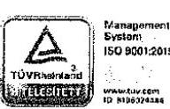

---

# Függelék: Észrevételek 

## 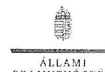

FIRÉK

## 

Filtzztén: F1-4825-172/2018

## Prof. Dr. Réger Mihály Antal úr

rektor

Óbudai Egyetem

Budapest

## Tisztelt Rektor Úr!

Az állami felsőoktatási intézmények ellenőrzése a hallgatói önkormányzatok tekintetében" címmel készített számvevőszéki jelentéstervezetre tett észrevételét köszönettel megkaptam.

Az Állami Számvevőszék észrevételre vonatkozó álláspontjáról a felügyeleti vezető által készített részletes tájékoztatást mellékelten megküldöm.

Tájékoztatom Rektor urat, hogy a számvevőszéki jelentésben - az Állami Számvevőszékről szóló 2011. évi LXVI. törvény 29. § (3) bekezdése alapján - a figyelembe nem vett észrevételt szerepeltetjük, annak indoklásával, hogy azt az Állami Számvevőszék miért nem fogadta el.

Budapest, 2018. 08. 06:00 nap

Tisztelettel:

## 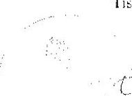

Domokos László

Melléklet. Tájékoztatás az észrevétel kezeléséről

---

# Tájékoztatás 

## az észrevétel kezeléséről

Az „állami felsőoktatási intézmények ellenőrzése a hallgatói önkormányzatok tekintetében" című jelentéstervezetre 2018. augusztus 8 -án érkezett észrevételt áttekintettük, annak kezelésével kapcsolatban a következő tájékoztatást adom.
Az észrevétel szerint az Óbudai Egyetem ellenőrzés során teljesített adatszolgáltatása alapján a hallgatói önkormányzati választásokon a törvényi előírásoknak megfelelő részvételi arány igazolt.
Tájékoztatom, hogy az Állami Számvevőszék ellenőrzési megállapításai az Állami Számvevőszékről szóló 2011. évi LXVI. törvénynek megfelelően minden esetben az ellenőrzés során bekért és az arra nyitva álló határidőn belül rendelkezésre bocsátott dokumentumokon alapulnak. Az ellenőrzés rendelkezésére bocsátott adatokkal, dokumentumokkal összefüggésben az Óbudai Egyetem teljességi és hitelességi nyilatkozatban rögzítette, hogy az ÁSZ részére átadott dokumentumok, adatok megbízhatóak és a bekért adatokra, dokumentumokra vonatkozóan teljes körű információt tartalmaznak. Az Óbudai Egyetem által teljesített adatszolgáltatása az általános választások dokumentumait nem tartalmazta, beleértve a választás időpontjait kijelölő, a választásokat elrendelő döntéseket, a választások lebonyolításával, annak eredményével kapcsolatban készített jegyzőkönyveket, a választásokon részt vevő hallgatók igazolt létszámainak dokumentumait. Az ellenőrzés rendelkezésére bocsátott dokumentumok a nemzeti felsőoktatásról szóló 2011. évi CCIV. törvény 60. § (1) bekezdés b) pontjában foglalt előírások érvényesülését nem igazolják. Az észrevételt nem fogadjuk el, a jelentéstervezet módosítása nem indokolt.
Az észrevétel vitatja továbbá, hogy az Óbudai Egyetem hallgatói önkormányzatának 2014. évi alapszabálya a szentiosi jóváhagyás és a 2014. évi módosítás küldöttgyűlés általi elfogadásának hiányában nem volt érvényes.
Tájékoztatom, hogy az ÁSZ megállapítása a 2014. évben módosított alapszabály vonatkozásában értelmezhető, annak érvényességi kellékeinek számító küldöttgyűlés általi elfogadásának és a szentiosi jóváhagyásának hiányára vonatkozik és nem a korábbi alapszabályokra. A szentiosi jóváhagyás hiányát az észrevétel megerősíti. A küldöttgyűlés általi elfogadásval összefüggésben tájékoztatom, hogy az Óbudai Egyetem ellenőrzés során teljesített adatszolgáltatása nem tartalmazta a 2014. évi módosítás elfogadására vonatkozó dokumentumokat (módosítást elfogadó küldöttgyűlési határozatok, a módosított alapszabályt elfogadó ülések jegyzőkönyvei, jelenléti ívei), ezt támasztja alá az Óbudai Egyetem által kiállított, 2017. december 14-én kelt teljességi és hitelességi nyilatkozat vonatkozó 2.3. pontja. Mindezek alapján az észrevételt nem fogadjuk el, a jelentéstervezet módosítása nem indokolt.
Budapest, 2018. 0. hó 35 nap

Makkai Mária
felügyeleti vezető

---

# Pannon Egyetem 

Domokos László elnök Állami Számvevőszék Tárgy: Észrevétel jelentéstervezetre Ikt.szám: $\mathrm{KK}-5-5 / 2018$.

Budapest 4. Pf. 54 1364

Tisztelt Elnök Úr!

Az EL-0525-079/2018. iktatószámú, „Az állami felsőoktatási intézmények ellenőrzése a hallgatói önkormányzatok tekintetében" tárgyú számvevőszéki jelentéstervezet 2018. július 20. napján megérkezett a Pannon Egyetemre, az abban foglaltakat áttekintettük.

A megállapítással kapcsolatban tájékoztatjuk Elnök Urat, hogy a Pannon Egyetem a vizsgált időszakban számos intézkedést tett annak érdekében, hogy a Hallgatói Önkormányzat szabályszerűen működjön. Ennek keretében például a hallgatói ügyek koordinálása rektori biztos feladatkörébe tartozott 2014. július 17. napjától. A HÖK működéshez szükséges pénzügyi keretek felett a rektori biztos rendelkezett kötelezettségvállalási jogosultsággal.

A Pannon Egyetem kancellári szervezete többször felszólította a PEHÖK elnökét, hogy vizsgálja felül a Hallgatói Önkormányzat Alapszabályát. Ennek eredményeként 2016. évben az Igazgatási és Jogi Igazgatóság és a Hallgatói Önkormányzat együttműködve elkészítette a PEHÖK jelenleg hatályos Alapszabályát, mely részletesen szabályozza a hallgatói önkormányzati tisztségviselők megválasztásának folyamatát, meghatározza a részvételi arányt és dokumentálásának módját is.

Az új Alapszabály elfogadását és jóváhagyását követően az egyetem kancellárja PEHÖK ügyekben illetékes kancellári megbízottal bízott meg 2016. szeptember 20. napjával. A PEHÖK ügyekben illetékes kancellári megbízott feladata a hallgatói önkormányzat igazgatási, jogi, gazdasági és pénzügyi folyamatainak koordinálására, támogatása, ellenőrzése. E közben ellátja különösen a PEHÖK testületi iratkezelésének, a döntések nyilvántartásának és végrehajtásának, továbbá a PEHÖK tisztségviselők költségtérítésének nyilvántartásának ellenőrzését, felhívja a figyelmet a működési zavarokra valamint azon esetekre amikor a PEHÖK működése nem felel meg a jogszabályoknak és a Pannon Egyetem szabályzatainak. Külön megbízás alapján kötelezettséget vállal a PEHÖK témaszámai felett.

---

Tájékoztatjuk Elnök Urat, hogy az új Alapszabály 2016. évi elfogadását követően lebonyolított választások menete megfelel az új Alapszabálynak, meglátásunk szerint a Pannon Egyetemi Hallgatói Önkormányzatának működése szabályszerű.

Veszprém, 2018. augusztus 2.

Ödvözlettel:

Dr. Gelencsér András rektor

Dr. Kovács Gyula kancellár

[^0]
[^0]:    8200 Veszprém, Egyetem u. 10. $\cdot$ 8201 Veszprém, Pf. 158.
    Telefon: (+36 88) 624-130 $\cdot$ Fax: (+36 88) 624-502 $\cdot$ Internet: www.uni-pannon.hu $\cdot$ e-mail: kancellaria@uni-pannon.hu

---

# Függelék: Észrevételek

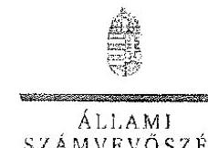

Ikt. szám: EL-0525-138/2018.

Dr. Gelencsér András úr
Rektor

Pannon Egyetem

Veszprém

Tisztelt Rektor Úr!

„Az állami felsőoktatási intézmények ellenőrzése a hallgatói önkormányzatok tekintetében” címmel készített számvevőszéki jelentéstervezetre tett észrevételét köszönettel megkaptam.

Az Állami Számvevőszék észrevételre vonatkozó álláspontjáról a felügyeleti vezető által készített részletes tájékoztatást mellékelten megküldöm.

Tájékoztatom Rektor urát, hogy a számvevőszéki jelentésben – az Állami Számvevőszékről szóló 2011. évi LXVI. törvény 29. § (3) bekezdése alapján – a figyelembe nem vett észrevételt szerepeltetjük, annak indoklásával, hogy azt az Állami Számvevőszék miért nem fogadta el.

Budapest, 2018. 07. hó 24. nap

Tisztelettel:

Domokos László

Melléklet: Tájékoztatás az
 észrevétel kezeléséről

1002 BUDAPEST, HARUS- CSERE HARUS 0526 12-1101 Budapest 8. 30. 54. telefon. 434 8107 fax. 434 8103

---

# Tájékoztatás

az észrevétel kezeléséről
..Az állami felsőoktatási intézmények ellenőrzése a hallgatói önkormányzatok tekintetében" című jelentéstervezetre 2018. augusztus 7-én érkezett észrevételt áttekintettük, annak kezelésével kapcsolatban a következő tájékoztatást adom.
Az észrevétel az Állami Számvevőszék ellenőrzött időszakra vonatkozó megállapításait nem cáfolja, tájékoztatást fogalmaz meg az ellenőrzött időszakban a szabályszerű működés érdekében tett intézkedésekről és arról, hogy a 2016. évi új Alapszabály elfogadását követően lebonyolított választások szabályszerűen történtek.
Az észrevételben megfogalmazott tájékoztatást köszönjük, az nem befolyásolja az Állami Számvevőszék ellenőrzött időszakra vonatkozó megállapításait. A jelentéstervezet módosítása nem indokolt.
Budapest, 2018. 3: hó nap

Makkai Mária
felügyeleti vezető

---

# PÉCSI TUDOMÁNYEGYETEM

## Rektor

Domokos László
cloök
Pécs, 2018. július 30
Bö az.: PTE-5508-13/2018
Hiv.az.: EL-0525-080/2018.

## Állami Számvevőszék

1052 Budapest
Apáczai Csere János u. 10.

Tisztelt Elnök Úr!
„Az állami felsőoktatási intézmények ellenőrzése a hallgatói önkormányzatok tekintetében" készült jelentéstervezetet köszönettel megkaptam.

A jelentéstervezetre a mellékelt dokumentum szerinti észrevételeket teszszük.
Kérem az észrevételek elfogadását és azok figyelembevételét a jelentés véglegesítése során.
Tisztelettel:
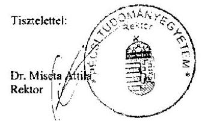

---

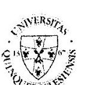

# PÉCSI TUDOMÁNYEGYETEM

Rektor

## A Pécsi Tudományegyetem észrevételét az Állami Számvevőszék „Az állami felsőoktatási intézmények ellenőrzése a hallgatói önkormányzatok tekintetében” címmel készített jelentéstervezet megállapításaira

### Megállapítás

„Az állami fenntartású felsőoktatási intézményeknél a HÖK működése nem volt szabályszerű, mert a Pécsi Tudományegyetem teljes idejű nappali képzésben részt vevő hallgatóinak legalább 25%-a az Nftv. 60.§ (1) bekezdés b) pontjában foglaltakkal ellentétesen, igazoltan nem vett részt a hallgatói önkormányzat választásokon.”

„Az állami fenntartású felsőoktatási intézményeknél a HÖK által –a hallgatói önkormányzati választások nem szabályszerű lebonyolítása, valamint az alapszabály hiánya, vagy érvénytelensége miatt – az Nftv. 61.§ (1)-(3) bekezdésében biztosított egyetértési-, vélemény-nyilvánítási- és javaslattételi jogosultságának gyakorlása, valamint az Nftv. 60.§ (7) bekezdése alapján a HÖK működéséhez biztosított anyagi eszközök, állami támogatás és saját bevételek felhasználása az Nftv. 60.§ (1) bekezdésében meghatározott feltételek teljesülése nélkül, nem a jogszabályi előírásoknak megfelelően történő.”

### Észrevétel

Az Egyetem a vizsgált időszakra vonatkozóan megküldte a hallgatói önkormányzati választásokról a két dokumentumokat. A hallgatói önkormányzati választásokon ebben az időszakban a nappali tagozatos hallgatók legkisebb részvételi aránya 71,42 % volt. Erről a 2018.02.20. napján kelt 4. számú tanúsítványon szerepelhetünk utoljára konkrét adatokat az ellenőrzés folyamán. Jelezítik, hogy az Nftv. 60.§ (1) bekezdés b) pontjában meghatározott részvételi arány az Egyetemi Hallgatói Önkormányzat Alapszabályában, mint a választás érvényességi feltétele a vizsgált időszak teljes időtartama alatt szerepelt a karokon zajló hallgatói (rész)önkormányzati választásokra vonatkozóan. A Pécsi Tudományegyetemre a hallgatók közvetlenül a részönkormányzatok képviselőit, tisztségviselőit választják meg, az Egyetemi Hallgatói Önkormányzat Tisztségviselői a képviselői demokrácia elve alapján a kari delegáltak által kerülnek megválasztásra, mely eljárás álláspontunk szerint – az Nftv. 60.§ (1) bekezdésével is összhangban van.

Kérjük a megállapítás pontosítását azzal, hogy a Pécsi Tudományegyetem vonatkozásában milyen információkból, dokumentumokból vagy azok hiányából volt megállapításuk, hogy a teljes idejű nappali képzésben részt vevő hallgatóinknak legalább 25%-a nem vett részt a vizsgált időszakban a hallgatói önkormányzati választásokon.

A Pécsi Tudományegyetem az ellenőrzés adatgyűjtési időszakában több alkalommal csatolta a Pécsi Tudományegyetem Szenátusa által elfogadott és az Nftv. 73.§ (5) bekezdés c) pontja alapján az Emberi Erőforrások Minisztériuma részére minden módosítás alkalmával megvizsgálásra megküldött Egyetemi Hallgatói Önkormányzat Alapszabályát. Az Egyetemi Hallgatói Önkormányzat a vizsgált időszak teljes egészében rendelkezett érvényes Alapszabállyal. Így a Pécsi Tudományegyetemre vonatkozóan kérjük törölni a megállapításnak az Alapszabály hiányára utaló részeit, illetve kérjük a felsőoktatási intézményekre vonatkozó általános részek esetén az alapszabály érvénytelenségével, hiányával kapcsolatos megállapításoknál a PTE-t kivételként feltüntetni.

A fenti két észrevétel okán kérjük a jelentéstervezet ismételt megküldését és a Pécsi Tudományegyetem általi újabb véleményezés biztosítását.

H-7622 Pécs, Vasvári Pál u. 4
Telefon: +36(72)501-507; Fax: +36 (72)501-508

---

# PÉCSI TUDOMÁNYEGYETEM

## Rektor

E mellett a jelentéstervezet „Főbb megállapítások, következtetések, javaslatok" fejezetében szereplő alábbi megállapítások a Pécsi Tudományegyetem vonatkozásában nem relevánsak.

## Megállapítás

„A felsőoktatási intézmények belső kontrollrendszere nem nyújtott megfelelő védelmet a jogalap nélküli, jogszabályellenes közpénzfelhasználással szemben. Nem ellenőriztek a hallgatói önkormányzatok törvényes működését valamint annak feltételeit valamint, hogy az önkormányzat a törvényben meghatározott jogosítványait gyakorolhatja-e."

## Észrevétel

Az ellenőrzési időszakot megelőzően a PTE Belső Ellenőrzési Főosztályának jogelődje vizsgálatot végzett a témában, a 2011. január 6. napján lezárt jelentés megállapításai alapján az Alapszabály módosításra került. Mivel az intézkedés megtörtént, így a kockázatértékelés alapján nem volt szükséges a következő években újabb vizsgálatot elrendelni. E mellett az Egyetemi Hallgatói Önkormányzat emellett évente elkészíti a belső kontroll nyilatkozatát, az EHÖK ellenőrzési nyomvonalakkal rendelkezik, évente kockázatértékelést készít, melyet megküld az Egyetem vezetésének jóváhagyásra. E mellett az ellenőrzés során az Állami Számvevőszék részére átadott anyagokból is látható, hogy az EHÖK Belső Ellenőrzési Bizottságot működtet, mely félévente beszámolót készít.

## Megállapítás

... nem biztosították a korrupciós kockázatok szintjét meghaladó integritás kontrollok kialakítását és működtetését."

## Észrevétel:

A Pécsi Tudományegyetem 2016. december 15-től hatályos Belső Kontroll Kézikönyvének, mint szabályzatnak hatálya kiterjed az Egyetem valamennyi szervezeti egységére, önálló szervezetére, fenntartott intézményére, így az Egyetemi Hallgatói Önkormányzatra is. Ennek 8. § (9) bekezdése alapján „A Kancellár köteles szabályozni a szervezeti integritást sértő események kezelésének eljárásrendjét, valamint az integrált kockázatkezelés eljárásrendjét. Az Egyetemen belül felmerült szervezeti integritást sértő események, szabálytalanságok bekövetkezéseinek megakadályozásával, előfordulások mérséklésével, feltárásával, kivizsgálásával és kezelésével kapcsolatos eljárásokat az SZMSZ 42. számú melléklete, a Pécsi Tudományegyetem szervezeti integritást sértő események kezelésének szabályozta tartalmazza." A hivatkozott szabályzat 2016. december 15. napjától hatályos, elérhető az Egyetem honlapján is. (Az Egyetem előbbiekben hivatkozott szabályzatai a vonatkozó jogszabályokkal összhangban 2016. október 1. napját követően tartalmazzák az integritással kapcsolatos rendelkezéseket, ezt megelőzően is rendelkezett az Egyetem a hatályos jogszabályoknak megfelelő szabályozással szabálytalanságkezelés tárgyban.)

E mellett a gazdálkodással kapcsolatosan megküldött iratanyagból is látszik, hogy a PTE EHÖK teljes működését biztosító források felhasználása kizárólag az Egyetem gazdálkodási apparátusának ellenőrzése, teljes kontrollja alatt valósulhatnak meg, hallgatók kötelezettségvállalási jogot összhangban az államháztartásról szóló törvény végrehajtásáról szóló 368/2011. (XII.31) Kormányrendelet rendelkezéseivel - nem kaptak és nem gyakoroltak.

---

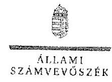

Ikt.szám: EL-0525-130:2018.

Dr. Miseta Attila János úr
rektor

Pécsi Tudományegyetem

Pécs

Tisztelt Rektor Úr!

Az állami felsőoktatási intézmények ellenőrzése a hallgatói önkormányzatok tekintetében címmel készített számvevőszéki jelentéstervezetre tett észrevételét köszönettel megkaptam.

Az Állami Számvevőszék észrevételre vonatkozó álláspontjáról a felügyeleti vezető által készített részletes tájékoztatást mellékelten megküldöm.

Tájékoztatom Rektor urat, hogy a számvevőszéki jelentésben az Állami Számvevőszékről szóló 2011. évi LXVI. törvény 29. § (3) bekezdése alapján - a figyelembe nem vett észrevételt szerepeltetjük, annak indoklásával, hogy azt az Állami Számvevőszék miért nem fogadta el.

Budapest, 2018. - 4. hó 11. nap

Tisztelettel:

ÁLLAMI SZÁMVEVŐSZÉK

Domokos László

Melléklet: Tájékoztatás az észrevétel kezeléséről

1052 BUDAPEST, APÁCZAI CSERE JÁNOS U. 10. 1364 BUDAPEST, Pf. 54. telefon: 481 9100 fax: 481 9200 www.asz.hu

90

---

# Tájékoztatás az észrevétel kezeléséről

„Az állami felsőoktatási intézmények ellenőrzése a hallgatói önkormányzatok tekintetében" című jelentéstervezetre 2018. augusztus 8-án érkezett észrevételt áttekintettük, annak kezelésével kapcsolatban a következő tájékoztatást adom.
Az észrevételt elkülönítve tartalmazza a jelentéstervezet „Megállapítások" és az „Összegzés" fejezetével összefüggő észrevételeket.
A „Megállapítások" fejezettel összefüggésben tett észrevétel rögzíti, hogy a Pécsi Tudományegyetem (PTE) „megküldte a hallgatói önkormányzati választásokról a kért dokumentumokat" és a vizsgált időszakban „a nappali tagozatos hallgatók legkisebb részvételi aránya 71.42 % volt". Az észrevétel tartalmazza továbbá, hogy a PTE hallgatói önkormányzata a vizsgált időszak egészében rendelkezett érvényes alapszabállyal.
Tájékoztatom, hogy A PTE hallgatói önkormányzata a 2013-2016. években kettő szinten szerveződött. Az egyetem hallgatóinak egyetemi szintű szervezete, az Egyetemi Hallgatói Önkormányzat a hallgatók kari szintű képviseletét karonként szerveződött részönkormányzatok útján látta el. A mandátumokat közvetlen választással megszerző részönkormányzati tisztségviselők megválasztásának dokumentumai nem álltak az ellenőrzés rendelkezésére, a bekért dokumentumokat a PTE a 2017. december 13-t, valamint a 2018. február 20-t keltezésű Teljességi és Hitelességi nyilatkozatai 2/b melléklete nem tartalmazza, a PTE a hallgatói önkormányzati választásokat tartalmazó 4. számú tanúsítványon a részönkormányzati választásokat nem tüntette fel. Ebből következően a nemzeti felsőoktatásról szóló 2011. évi CCIV. törvény 60. § (1) bekezdés b) pontjában foglalt előírások érvényesülését az ellenőrzés során teljességi és hitelességi nyilatkozat kíséretében a PTE által átadott dokumentumok nem igazolták. Az észrevételt nem fogadjuk el a jelentéstervezet módosítása nem indokolt.
Az „Összegzés" fejezettel kapcsolatban tett észrevétel kitér arra, hogy a PTE belső ellenőrzési osztálya az ellenőrzött időszakot megelőzően 2011. január 6-án zárta le a témát érintő ellenőrzését és a kockázatértékelés alapján nem volt szükség újabb vizsgálatra. Továbbá tájékoztatást ad, hogy milyen belső kontrollok működnek a hallgatói önkormányzatnál (belső kontroll nyilatkozat, ellenőrzési nyomvonal, kockázatértékelés) valamint, hogy a HÖK belső ellenőrzési bizottsága félévente beszámolót készít. Tájékoztat továbbá, hogy a PTE szabályzatai 2016. október 1. napját követően tartalmazzák integritással kapcsolatos rendelkezéseket a jogszabályi előírásoknak megfelelően, továbbá arról, hogy a források felhasználása az Egyetem gazdasági apparátusának teljes kontrollja alatt történik.
Az ellenőrzött időszakot megelőző belső ellenőrzésről szóló tájékoztatást köszönjük, az ÁSZ megállapításai az ellenőrzött időszakra érvényesek, az ezen kívüli információk a megállapításokat nem befolyásolják. A hallgatói önkormányzat vonatkozásában működtetett belső kontrollokról szóló tájékoztatás nem cáfolja az ÁSZ megállapításait, ugyanis a

---

jelentéstervezet következtetése arra irányul, hogy a PTE belső kontrollrendszere nem nyújtott megfelelő védelmet a szabálytalanságokkal szemben. Tájékoztatom továbbá, hogy a hallgatói önkormányzat törvényes működése és annak feltételei ellenőrzésének elmaradása nem azonos azzal, hogy semmilyen formában nem történt ellenőrzés. A hallgatói önkormányzat nem szabályszerű megalakulása okán és az ellenőrzés rendelkezésére bocsátott dokumentumokból, tényként állapítható meg, hogy az észrevételében is hivatkozott kontrollok nem irányultak a szabályos megalakulás és az alapfeltételek meglétének ellenőrzésére. Tájékoztatom továbbá, hogy az integritás kontrollok esetében sem azok teljes hiányát állapította meg az ellenőrzés, hanem azt, hogy azok kiépítettsége a kockázatok szintjét nem haladta meg. Az észrevételt nem fogadjuk el a jelentéstervezet módosítása nem indokolt.
Budapest, 2018. 4. hó nap

Makkai Mária
felügyeleti vezető

---

# 1085 Budapest, Üllői út 26. 1428 Budapest, Pf. 2.

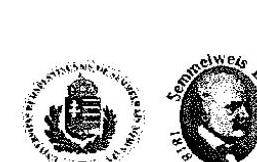

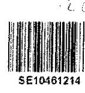

Iktatószám: 77704-3 /KSIIF/2018 Tárgy: HÖK jelentéstervezetre tett észrevétele

| ÁLLAMI SZÁMVEVŐSZÉK |   |
| --- | --- |
| 2018. 12. 14. |   |
| 2018. 12. 14. |   |
| 2018. 12. 14. |   |
| 2018. 12. 14. |   |
| 2018. 12. 14. |   |
| 2018. 12. 14. |   |

## Tisztelt Elnök Úr!

Az Állami Számvevőszék EL-0525-081/2018 iktatószámú, "Az állami felsőoktatási intézmények ellenőrzése a hallgatói önkormányzatok tekintetében" c. ellenőrzés jelentéstervezetét köszönettel megkaptam.

A jelentéstervezet Semmelweis Egyetemre vonatkozó megállapításai, valamint az Állami Számvevőszék által ellenőrzött, további felsőoktatási intézmények hallgatói önkormányzatára vonatkozó megállapításai is számon, a jövőbeni működés szempontjából releváns körülményre hívják fel a
 figyelmet, amelyet ezúton is köszönök.

## A jelentéstervezetre az alábbi pontosító észrevételt teszem:

A Megállapítások 1. pontja szerint: "a Semmelweis Egyetemre a teljes idejű nappali képzésben részt vevő hallgatóinak legalább 25%-a az Nftv. 60.§ (1) bekezdés b) pontjában foglaltakkal ellentétesen, igazoltan nem vett részt a hallgatói önkormányzati választásokon."

2013-2016. között négy választásra került sor a Semmelweis Egyetemre a hallgatói önkormányzat tekintetében. Ebből 2013-ban és 2014-ben papír alapon, míg 2015. és 2016. évben elektronikusan került sor a választás lebonyolítására. 2015. és 2016. évben az ön. "Unipoll" rendszeren keresztül bonyolította le az egyetem a választásokat, amely a Neptun rendszerhez kapcsolódó alkalmazás. Jelen észrevételezés megalapozása érdekében ismételten áttekintettük a részvételre vonatkozóan rendelkezése álló dokumentációt, amelynek során a szavazásban résztvevők esetében a teljes idejű nappali képzésben részesülő hallgatók arányára nézve is – a részidős képzésben részesülők létszámát figyelmen kívül hagyva – megállapítható az Nftv. 60.§ (1) b) pont szerinti feltétel teljesülése. A benyújtott jegyzőkönyvnek (pl. 2017. december 14-én kelt teljességi nyilatkozat 2.a. mellékletében 25. és 66. sorszám alatt feltüntetve) túl a 2015. évi és a 2016. évi választások tekintetében az elektronikus lebonyolításnak köszönhetően rendelkezéseinkre álló, a részt vevő (nappali képzésben tanulói) hallgatók tételes listája is alátámasztja, a statisztikai létszámadatok figyelembevételével, hogy

1085 Budapest, Üllői út 26. 1428 Budapest, Pf. 2.

---

teljesült a nappali hallgatói részvételi arányára vonatkozó, Nftv. 60. § (1) bekezdés b) pontja szerinti feltétel.

A Megállapítások 2. pontja szerint: ,,az SE 2013. október 30-a és 2016. március 30. közötti hallgatói önkormányzatának alapszabályát a Szenátus nem hagyta jóvá az Nftv. 60 § (1) bekezdés a) pontjában foglaltak ellenére, ezért az alapszabály nem volt érvényes."
2013. október 30. és 2016. március 30. között a Hallgatói Önkormányzatnak volt a Semmelweis Egyetem Szenátusa által jóváhagyott Alapszabálya, nevezetesen az érintett időszak elején 49/2013. (IV.25.) számú szenátusi határozattal jóváhagyott Alapszabály.
Ahogy az EL-0097-057/2017. ikt. sz. adatbekérő levélben kért adatok kapcsán a Semmelweis Egyetem kancellárja által 2017. december 14-i keltezéssel aláírt teljességi nyilatkozat 2.a. melléklet 185-211. sorszámú dokumentumai igazolják, a 49/2013. (IV.25.) számú szenátusi határozattal elfogadott Alapszabály módosítása tekintetében a Szenátus a következő döntéseket hozta:
A Szenátus 133/2013. (X.31.) számú határozatával nem fogadta el az Alapszabály módosítását, így továbbra is a 49/2013. (IV.25.) számú szenátusi határozattal jóváhagyott Alapszabály volt érvényben. A Szenátus 87/2014. (VI.18.) számú határozatával jóváhagyta az Alapszabály módosítását.
A Szenátus 2014. szeptember 25-i ülésén tárgyalta újra az Alapszabály módosítását, majd 145/2014 (X.30.) számú határozatával döntött a szeptember 25-i ülésen tárgyalt előterjesztés elutasításáról.

A Hallgatói Önkormányzat 2014. október 29-én fogadta el és terjesztette a Szenátus elé az Alapszabály újabb módosítási javaslatát (a Szenátus nem tárgyalta, de a Semmelweis Egyetem kancellárja által 2017. december 14-i keltezéssel aláírt teljességi nyilatkozat 2.a. melléklet 202. és 206. számú dokumentumai igazolják, hogy a HÖK elfogadta és benyújtotta a Szenátusra), amelyről a Szenátus ugyan nem hozott döntést a 145/2014. (X.30.) szenátusi határozat tanúsága szerint, de az Nftv. 60. § (2)-(3) bekezdései értelmében, mivel arról a Szenátus a törvényben meghatározott határidőn belül nem nyilatkozott, ezért azt a Szenátus által jóváhagyottnak kellett tekinteni, ahogy azt Fővárosi Közigazgatási és Munkaügyi Bíróság 24.Kpk.45.794/2015/7 számú végzésében is később megállapította.
A Szenátus 2015. január 29-i ülésén tárgyalta az Alapszabály újabb módosítását, amelynek elutasításáról döntött (1/2015. (I.29.) számú szenátusi határozat). Ezt követően tehát ismét hatályban maradt a korábban érvényes Alapszabály.
A Semmelweis Egyetem Szenátusa ezt követően 2016. március 30-i ülésén tárgyalta újra a Hallgatói Önkormányzat Alapszabályát és 33/2016. (III.30.) számú határozatával döntött annak jóváhagyásáról. Hivatkozott döntésekből tehát megállapítható, hogy 2013. október 30. és 2016. március 30. között is mindvégig volt a Semmelweis Egyetem Hallgatói Önkormányzatának a Szenátus által jóváhagyott Alapszabálya (a 49/2013. (IV.25.) számú szenátusi határozattal jóváhagyott Alapszabály), amelynek egy módosítását a Szenátus 2014. június 18 -án is elfogadta, és amelynek 2014. október 29-i módosítását - törvényi rendelkezés alapján - a szenátus által jóváhagyottnak kellett tekinteni.

A Megállapítások 3. pontja alapján: 2014-2016. években az SE Pető András Kara nem rendelkezett Alapszabállyal az Nftv. 60 § (2) bekezdésében foglaltak ellenére

2014-2016. években még nem a Semmelweis Egyetem Pető András Kara, hanem maga a Pető András Főiskola hallgatói önkormányzata nem rendelkezett igazoltan Alapszabállyal. A beolvadásra 2017. augusztus 1-én került sor, amely időponttól a Pető András Főiskola a Semmelweis Egyetem Pető András Karaként működik.

---

# Tisztelt Elnök Úr!

Tájékoztatom arról, hogy a Semmelweis Egyetem hallgatói önkormányzatának jelenlegi Alapszabálya elfogadására 2017. november 16-án kerül sor, a Szenátus 134/2017. (XI.16.) számú határozata alapján.

A legutolsó, 2018. május 10. és 2018. június 7. között lefolytatott HÖK küldöttgyűlési választáson a teljes idejű nappali képzésben részt vevő hallgatók 27 %-a igazoltan részt vett, valamint a kari részönkormányzati választásokon is karonként a teljes idejű nappali képzésben részt vevő hallgatók több mint 25 %-a igazoltan részt vett.

Fentiek alapján a Semmelweis Egyetemen működő hallgatói önkormányzati választására, valamint Alapszabályának elfogadására a jogszabályoknak és belső szabályoknak megfelelően került sor.
A Semmelweis Egyetem hallgatói önkormányzata törvényben biztosított jogosítványai gyakorlásának feltételei fentiek alapján jelenleg is biztosítottak.

A Hallgatói Önkormányzat törvényes működésének Semmelweis Egyetem általi ellenőrzése az Alapszabály módosításainak Szenátus által történő jóváhagyásával vagy elutasításával, a HÖK rendelkezésére bocsátott anyagi eszközök jogszerű felhasználásának ellenőrzése a Semmelweis Egyetem gazdálkodására vonatkozó szabályzataiban rögzített szabályok szerint valósul meg.

A jelentéstervezet Semmelweis Egyetemre vonatkozó megállapításai alapján az Egyetem elkészítette és jelen levéllel egyidejűleg mellékelten megküldöm a kancellár úrral közösen készített intézkedési tervet, amely a hallgatói önkormányzat természetének mindenkori szabályos létrehozását és Alapszabályának elfogadását biztosítja. Ezen túl, amennyiben az Állami Számvevőszék az észrevételek mérlegeléséhez igényli, készséggel rendelkezésre bocsátom a fentieket alátámasztó teljes körű dokumentációt, ideértve a kizárólag nappali képzésben résztvevőket tartalmazó hallgatói névsorokat is.

Bízom abban, hogy a Semmelweis Egyetemen a 2018. évi választás alapján kétséget kizáróan jelenleg is szabályosan létrehozott hallgatói önkormányzat, az ellenőrzést követően bevezetett, valamint az intézkedési tervben megjelölt intézkedéseink az Állami Számvevőszék értékelése alapján is alkalmasak az Elnök Úr levelében jelzett jogkövetkezmény elkerülésére.

Végezetül pedig szeretném megköszönni Elnök Úrnak és munkatársainak az ellenőrzést, valamint a jelentéstervezet útján nyújtott információkat, amelyeket a hallgatói önkormányzat létrehozása és működése során hasznosíthatunk.

Budapest, 2018. augusztus 2
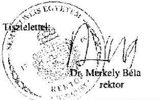

1065 Budapest, Üllői út 26. 1428 Budapest, Pf. 2.

---

# 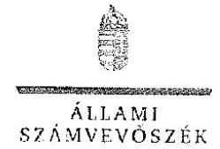 

## Dr. Merkely Béla Péter úr

rektor

Semmelweis Egyetem

Budapest

## Tisztelt Rektor Úr!

„Az állami felsőoktatási intézmények ellenőrzése a hallgatói önkormányzatok tekintetében" címmel készített számvevőszéki jelentéstervezetre tett 77704-3/KSJIF/2018 iktatószámú észrevételét köszönettel megkaptam.

Az Állami Számvevőszék észrevételre vonatkozó álláspontjáról a felügyeleti vezető által készített részletes tájékoztatást mellékelten megküldöm.

Tájékoztatom Rektor urat, hogy a számvevőszéki jelentésben - az Állami Számvevőszékről szóló 2011. évi LXVI. törvény 29. § (3) bekezdése alapján - a figyelembe nem vett észrevételt szerepeltetjük, annak indoklásával, hogy azt az Állami Számvevőszék miért nem fogadta el.

Budapest, 2018. augusztus hó 12 nap

Tisztelettel:

Domokos László

Melléklet: Tájékoztatás az észrevétel kezeléséről

---

# Tájékoztatás   az észrevétel kezeléséről 

„Az állami felsőoktatási intézmények ellenőrzése a hallgatói önkormányzatok tekintetében" című jelentéstervezetre 2018. augusztus 7-én érkezett észrevételt áttekintettük, annak kezelésével kapcsolatban a következő tájékoztatást adom.
Az észrevétel rögzíti, hogy a Semmelweis Egyetemen (továbbiakban SE) a Hallgatói Önkormányzat (továbbiakban HÖK) tekintetében 2013-2016. között négy választásra került sor, amelyek során a szavazásban résztvevők esetében a teljes idejű nappali képzésben részesülő hallgatók arányára nézve is - a részidős képzésben részesülők létszámát figyelmen kívül hagyva - megállapítható az Nftv. 60.§ (1) b) pont szerinti feltétel teljesülése.
Tájékoztatom Rektor Urat, hogy az ÁSZ ellenőrzési megállapításai az Állami Számvevőszékről szóló 2011. évi LXVI. törvénynek megfelelően minden esetben az ellenőrzés során bekért és az arra nyitva álló határidőn belül rendelkezésre bocsátott dokumentumokon alapulnak.
A SE által rendelkezésre bocsátott dokumentumok, valamint a Rektor Úr által hivatkozott 2017. december 14-én kelt teljességi és hitelességi nyilatkozat 2. b mellékletének 2-5. sorai alapján az ÁSZ megállapította, hogy a SE 2013. év hat kari részönkormányzatából kettő, 2014. évben pedig öt kari részönkormányzatából kettő választási dokumentumait nem bocsátotta az ÁSZ rendelkezésére. A 2015. évi SE HÖK tisztújító választásáról készült jegyzőkönyv nem tartalmazza a teljes idejű nappali képzésben résztvevő hallgatók által leadott szavazatok számát. Az SE HÖK 2016. évi tisztújító választás 2016. június 22-én kelt jegyzőkönyv rögzítette a teljes idejű nappali képzésben részt vevő hallgatók közül szavazók számát, mely 2063 fő volt. Az SE által kitöltött és megküldött, 2018. január 23-án kelt 2. számú tanúsítvány szerint 2016. I. félévében a teljes idejű nappali képzésben részt vevő hallgatók száma 8832 fő volt. Az adatok alapján, a szavazáson részt vevők aránya 23,36 %. Mindezek szerint a 2013-2016. években nem igazolt, hogy a nemzeti felsőoktatásról szóló 2011. évi CCIV. törvény 60. § (1) bekezdés b) pontjában előírtaknak megfelelően a hallgatói önkormányzati választásokon részt vett a teljes idejű nappali képzésben részt vevő hallgatók legalább huszonöt százaléka. Az észrevételt nem fogadjuk el, az ÁSZ megállapítása helytálló, a jelentéstervezet módosítása nem indokolt.
Az észrevétel az SE HÖK Alapszabályával kapcsolatban tájékoztat arról, hogy a Szenátus a HÖK Alapszabályra vonatkozó előterjesztését 2013. október 31-én, valamint 2014. október 30-án és 2015. január 29-én elutasította. Az ÁSZ megállapítása szerint, a 2013. október 30-a és 2016. március 30. közötti hallgatói önkormányzatának alapszabályát a Szenátus nem hagyta jóvá, mely a rendelkezésre bocsátott dokumentumok alapján megalapozott és Rektor Úr észrevételében leírtak is megerősítik. Az ÁSZ megállapította, hogy a hivatkozott időszak hallgatói önkormányzatának alapszabálya az Nftv. 60. § (1) bekezdés a) pontjában előírtak alapján nem volt érvényes. Fentiek szerint az észrevételt nem fogadjuk el, nem indokolt a jelentéstervezet módosítása.

---

A jelentéstervezet „Összegző megállapítás" első bekezdés, harmadik pontjához írott észrevételét, mely szerint a „2014-2016. években még nem a Semmelweis Egyetem Pető András Kara, hanem maga a Pető András Főiskola hallgatói önkormányzata nem rendelkezett igazoltan Alapszabállyal" elfogadjuk, mivel a Pető András Főiskola 2017. augusztus 1-től működik a Semmelweis Egyetem Pető András Karaként. A jelentéstervezet érintett részeit a fentiek alapján módosítjuk.
Az ellenőrzött időszakot követően megtett intézkedésekről szóló tájékoztatást köszönjük, azok a jelentéstervezetben foglalt, ellenőrzött időszakra vonatkozó megállapításokat nem érintik.

Budapest, 2018. augusztus hó 27 nap

Makkai Mária
felügyeleti vezető

---

# SOPRONI EGYETEM 

## Rektor: Bartha Tibor

civ. 9400 Sopron, Bajcsy-Zsilinszky utca 4.
v. 99. 518. 210
v. 99. 518. 242
f. 99. 518. 242
e. rektor@uni-sopron.hu

Állami Számvevőszék
Domokos László
elnök úr részére

## Budapest

Apáczai Csere János utca 10. 1051

Tisztelt Elnök Úr!

Hivatkozva az EL-0525-083/2018. sz. levélben foglaltakra ill. „Az állami felsőoktatási intézmények ellenőrzése a hallgatói önkormányzatok tekintetében" c. jelentéstervezetre, tájékoztatom, hogy észrevételt tenni nem kívánok.

A jelentéstervezetben leírt szabálytalanságok megszüntetése érdekében a külön íven csatolt intézkedési tervet terjesztem elő.

Kérem, hogy a mellékelt intézkedési terv alapján az ÁSZ tv. 31. §. (1) bek. b. pontjában foglalt jogkövetkezmények alkalmazásától eltekinteni szíveskedjenek!

Sopron, 2018. augusztus 2.

Tisztelettel:
Prof. Dr. Náhlik András
, rektor

---

# SZÉCHENYI EGYETEM 

Domokos László
Az Állami Számvevőszék Elnöke
Állami Számvevőszék
1052 Budapest, Apáczai Csere János utca 10.

Tárgy: Észrevétel az Állami Számvevőszék EL-0525-061/2018. iktatószámú levelével kapcsolatban

## Tisztelt Elnök Úr!

Köszönettel megkapjuk az EL-0525-061/2018. iktatószámú az „állami felhővátatási intézmények ellenőrzése a hallgatói önkormányzatok tekintetében" elénű számvevőszékű jelentés-tervezetet, melyet 2018. július 20-án vettünk kézhez. Az Állami Számvevőszékről szóló 2011. évi LXVI. törvény (a továbbiakban: ÁSZ tv.) 29.§ (2) bekezdése alapján a jelentés-tervezetre a Széchenyi István Egyetem képviseletében a következő észrevételeket teszem:
A levelük alapján az ellenőrzés keretében feltárásra került, hogy a Széchenyi István Egyetem Hallgatói Önkormányzata 2015-2016. években nem szabályszerűen alakult meg, ezért a Nemzeti Felsőoktatásról szóló 2011. évi CCIV. törvényben (a továbbiakban: Nftv.) biztosított jogonitványaik gyakorlásának a feltételei nem álltak fenn, ennek következtében a működése, forrásfelhasználása, gazdálkodása nem volt szabályszerű. Jelzik továbbá, hogy a szabálytalanságok következményeként az Állami Számvevőszék (továbbiakban: ÁSZ) elkezdi az ÁSZ tv. 31.§ (1) bekezdés b) pontjában foglaltak szerinti hallgatói normatíva intézményi összegének 1\%-a folyósításának felfüggesztésére teendő intézkedéseket.
A konkrét észrevételek előtt szeretnénk tenni néhány általános megállapítást, amely az ellenőrzés tárgyára és módszerére vonatkozik, amelyek alátámasztják a konkrét észrevételeinket:
Az ellenőrzés tárgya és egyben célja is többek között a felsőoktatási intézmények által a hallgatói önkormányzatok rendelkezésére bocsátott források felhasználásának vizsgálata volt. Ehhez kapcsolódóan azt írja a jelentés-tervezet a főbb megállapítások, következtetések, javaslatok pontban, hogy mivel nem szabályszerűen alakult meg a hallgatói önkormányzat ezért nem értékelték többek között a felsőoktatási intézmény ellenőrzési kötelezettségének teljesítését. Ezek után ugyanebben a fejezetben megállapítja a jelentés-tervezet, hogy a felsőoktatási intézmény nem ellenőrizte a hallgatói önkormányzatok törvényes működését.
A jelentéstervezetben leírt megállapítások Egyetemünk Hallgatói Önkormányzatára vonatkozón a következők voltak:
A működés nem volt szabályszerű, mert a teljes idejű nappali képzésben résztvevő hallgatóinak legalább 25\%-a igazoltan nem vett részt a hallgatói önkormányzati választásokon.
Észrevétel: Az ÁSZ többszöri adatkérés során behívták egyrészt a 4. számú tanúsítványt (Teljességi és hitelességi nyilatkozat, 2018. január 26.) amelyben tanúsítjuk, hogy a hallgatói

---

# SZÉCHENYI EGYETEM 

önkormányzati választásokon a teljes idejű nappali képzésben résztvevő hallgatóinak több mint 25%-a igazoltan vett részt a vizsgált időszak mind a négy évében. A tanúsítvány alátámasztására beküldtük az adatbekérésben kért, a választást alátámasztó meghívókat, jegyzőkönyveket és ezek mellékleteként a jelenléti íveket. A jegyzőkönyvek tartalmazzák a közgyűlések/küldöttgyűlések helyszínét, időpontját a határozatképesség megállapításának a módját, Továbbá rögzítik a levezető elnök, a jegyzőkönyvvezető és a két hitelesítő megválasztásától szóló határozatot. A jegyzőkönyv mellékleteként becsatolt jelenléti ívek sorszámmal, névvel aláírásnal ellátva tanúsítják a választásokon résztvevő hallgatók számát és arányait is. A névsor a NEPTUN-ből kinyert adatokkal összevetve készült, és ez hitelesen tanúsítja résztvevők besorolását képzési forma szerint, valamint a nevüket, jogosultságukat. A vizsgált négy évben, mint ahogy a 4. számú tanúsítvány is bizonyítja több (az időszak alatt összesen 4 választás volt és ezekhez kapcsolódóan összesen 3 pótválasztás) választást tartottunk. Az egyes választásokon több-száz, eseteként több-ezer hallgató vett részt. Ezt felszorozva a választások számával egy több tízezres adat jön ki, mely eredmény számokat az egyetem a fent jelzett dokumentumokkal támasztotta alá.

Az ellenőrzés típusa megfelelőségi ellenőrzés volt. Az ellenőrzési észrevétel nem részletezi, hogy miért minősítettek nem megfelelőnek a választás dokumentumait. A hallgatói önkormányzati választások az egyetem belső szabályzatoknak, eljárásrendeknek megfeleltek, melyet tanúsítani tudunk, ezzel kapcsolódóan az igazoló dokumentumok korábban beküldésre kerültek. A jelentéstervezetből nem tűnik ki, hogy az ÁSZ milyen módszerrel és hány érvénytelen szavazatot állapított meg, amely alapján úgy ítélte meg, hogy nem volt érvényes a hallgatói önkormányzati választás, azaz igazoltan nem vett részt a választásokon a teljes idejű nappali képzésben résztvevő hallgatóinak több mint 25%-a. Nem világos továbbá, hogy az ellenőrzés során milyen vizsgálati módszerrel állapították meg a választási dokumentumról, hogy igazolja, vagy sem a választás megbízásától. Az ellenőrzés megállapításában nincs szó az ellenőrzés tárgyáról, így kérdésként merül fel, hogy vizsgálták-e az ellenőrzés tárgyában megjelölt egyetem szabályozást.

A fentiekre hivatkozva kérem a megállapítás egyetemünkre vonatkozó módosítását oly módon, hogy a beküldött és általunk is ellenőrzött számadatokon alapulva minősítsék a hallgatói önkormányzati választási eredményesnek, ezáltal megalakulást szabályszerűnek.

## A jelentés-tervezet egyetemünkre vonatkozó második megállapítása az volt, hogy a hallgatói önkormányzat nem rendelkezett alapszabállyal

Észrevétel. Az ÁSZ részére történt adatszolgáltatás során benyújtásra került a hallgatói önkormányzat által elfogadott alapszabály. Az Alapszabályt több ízben megküldtük az adatszolgáltatások keretében, illetve a helyszíni ellenőrzés során is megvizsgálásra került. A 2012.06.26-tól hatályos Alapszabályt elfogadó Egyetemi Hallgatói Önkormányzati jegyzőkönyv, illetve szenátusi határozat jelen észrevételünk mellékleteként megküldésre kerül. Az Alapszabály 2012.10.30. napjával került első ízben módosításra, az erre vonatkozó Egyetemi Hallgatói Önkormányzati jegyzőkönyv, illetve szerútnol határozó szintén megküldésre kerül jelen levélünk mellékleteként. A 2015-ben és 2016-ben eszközölt módosítások elfogadásáról készült jegyzőkönyvnek a korábbi adatszolgáltatások keretében beküldésre kerültek. A számvevőszéki jelentéstervezetből nem kaptunk választ, arra vonatkozólag, hogy a benyújtott dokumentum alapján miért minősítették nem megfelelőnek az elfogadott és hitelesített alapszabályt.

Kérem, hogy a megállapítás módosítók úgy, hogy az egyetem rendelkezett a hallgatói önkormányzat által elfogadott és a szerútnol által jóváhagyott alapszabályok

---

# SZÉCHENYI   ISTVÁN   EGYETEM 

A szénvesószéki jelentéstervezethez küldött EL 0525-084/2018 iktatószántú levelében Elnök Úr jelezte, hogy az ÁSZ tv.31.§ (1) bekezdés b) pontjában foglaltak szerinti hallgatói normatív intézményi összegének 1\%-a folyósításának felfüggesetésére teendő intézkedéseket. Véleményünk szerint nem lehetséges a kijavítás - hacsak válaszlevelünkben közölt teljes újraválasztás lebonyolításával nem - ha nem jelzik milyen dokumentum és miért nem volt megfelelő, ami alapján a megállapítást tették. Egy megfelelőségi ellenőrzésnél az ellenőrzés részére elvárható segítség, ha jelzik, hogy mi miben nem felelt meg, mert az intékomység szellemében nem kellene egy teljes választást újra lebonyolítani, hanem csak a nem megfelelő eljárásokat kijavítani.
A fentiek tekintetében tisztelettel kérjük Elnök Urat, hogy legyen szíves észrevételeinket áttekinteni és az abban foglaltak alapján a jelentés-tervezet tartalmazó a Széchenyi István Egyetem tekintetében újra értékelni. Amennyiben újabb információkra, dokumentumokra, nyilatkozatnám van szükség a részünkről, természetesen állnak Elnök Úr és az Állami Szénviesószék kollégáinak rendelkezésére.
Mellékletek:

1.  számú melléklet: Egyetemi Hallgatói Önkormányzat 2012.06.20-i ülésének jegyzőkönyve
2.  számú melléklet: Egyetemi Hallgatói Önkormányzat 2012.10.04-i ülésének jegyzőkönyve
3.  számú melléklet: Szenátus 145/2012 (VI.25.) számú határozatának jegyzőkönyvi kivonata
4.  számú melléklet: Szenátus 208/2012 (X.29.) számú határozatának jegyzőkönyvi kivonata

Győr, 2018.08.03.

Tisztelettel:
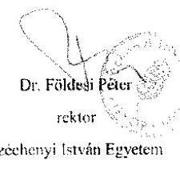

---

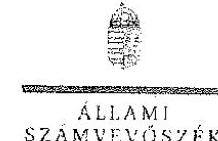

Bt.sz/ns: EL-0525-140/2018

Dr. Földesi Péter úr
rektor

Széchenyi István Egyetem

Győr

# Tisztelt Rektor Úr! 

„Az állami felsőoktatási intézmények ellenőrzése a hallgatói önkormányzatok tekintetében" címmel készített számvevőszéki jelentésére vezetve tett észrevételét köszönettel megkapitam.

Az Állami Számvevőszék észrevételekre vonatkozó álláspontjáról a felügyeleti vezető által készített részletes tájékoztatást mellékelten megküldöm.

Tájékoztatom Rektor urat, hogy a számvevőszéki jelentésben - az Állami Számvevőszékről szóló 2011. évi LXVI. törvény 29. § (3) bekezdése alapján a figyelembe nem vett észrevételt szerepelhetjük, annak indoklásával, hogy azt az Állami Számvevőszék miért nem fogadta el.

Budapest, 2018. 14. hó 14 nap

Melléklet: Tájékoztatási az észrevételi kezeléséről

---

# Tájékoztatás 

az észrevétel kezeléséről
„Az állami felsőoktatási intézmények ellenőrzése a hallgatói önkormányzatok tekintetében" című jelentéstervezetre 2018. augusztus 3-án érkezett észrevételt áttekintettük, annak kezelésével kapcsolatban a következő tájékoztatást adom.
Az észrevétel a jelentéstervezettel összefüggésben általános „megállapításként" megfogalmazza, hogy a főbb megállapítások, következtetések, javaslatok pont szerint az ÁSZ a felsőoktatási intézmények ellenőrzési kötelezettségének teljesülését nem ellenőrizte, valamint azt is tartalmazza, hogy a felsőoktatási intézmény nem ellenőrizte a HÖK törvényes működését.
Tájékoztatom, hogy nincs ellentmondás aközött, hogy az ÁSZ az ellenőrzési kötelezettség teljesítését nem értékelte, de rögzítette, hogy a felsőoktatási intézmények a HÖK törvényes működését nem ellenőrizték. Az ellenőrzési kötelezettség értékelése részletes ellenőrzési alapján lehetséges. Az, hogy „Nem ellenőrzik a hallgatói önkormányzatok törvényes működését, valamint annak a kérdését, hogy az önkormányzat a törvényben meghatározati jogszabályati gyakorolhatja-e" az ÁSZ következtetése, amelyet az alapoz meg, hogy a felsőoktatási intézmények hallgatói önkormányzatai a nem szabályszerű megalakulások ellenére jogosítványaikat gyakorolták. Az észrevételt nem fogadjuk el, a jelentéstervezet módosítása nem indokolt.
Az észrevétel további, a konkrét megállapításokhoz kapcsolódó része arra irányul, hogy a Széchenyi István Egyetem által az ellenőrzés rendelkezésére bocsátott dokumentumok igazolják a választások jogszabályban foglalt részvételi arány érvényesülését.
Tájékoztatom Rektor Urat, hogy az Állami Számvevőszék ellenőrzési megállapításai az Állami Számvevőszékről szóló 2011. évi LXVI. törvénynek megfelelően minden esetben az ellenőrzés során bekért és az arra nyitva álló határidőn belül rendelkezésre bocsátott dokumentumokon alapulnak. Az ellenőrzés rendelkezésére bocsátott adatokkal, dokumentumokkal összefüggésben a Széchényi István Egyetem teljességi és hitelességi nyilatkozatban rögzítette, hogy az ÁSZ részére átadott dokumentumok, adatok megbízhatóak és a bekért adatokra, dokumentumokra vonatkozóan teljes körű információt tartalmaznak.
Az ellenőrzés során rendelkezésre bocsátott dokumentumok a nemzeti felsőoktatástól szóló 2011. évi CCIV. törvény 60. § (1) bekezdés b) pontjában foglalt előírások érvényesülését a következők miatt nem igazolták. A választások hitelességét és eredményességét megállapító, 2013-2016. évekre vonatkozó Választási jegyzőkönyvek hitelt érdemlően nem igazolták a bennük foglaltakat, mivel azokon sem látom, sem bélyegző lenyomat, sem aláírás nem szerepelt. A választások bonyolítása során alkalmazott, a választáson részt vehetők névsorát és választáson megjelentek aláírását tartalmazó jelenléti ívek többsége azonosításra alkalmas adatot - választás időpontja, az egyetemi kar pontos megnevezése, a jelenléti is kitöltését

---

felügyelő (pl.: választási bizottsági tag) aláírását - nem tartalmaztak. A HÖK választásokon részt vevő nappali tagozatos hallgatók névsorát az ÁSZ a 2. számú adatbekérés során a 2.5. pontban. Az adatokat a 2013-2016. évekre összesítve, évenkénti szétbontás nélkül adták át. Az adatok alapján évekre szétbontott hallgatói létszám, az évenkénti választási jegyzőkönyvekben, valamint a 4. számú tanúsítványban szereplő hallgató létszám között jelentős nagyságrendi eltérésé mutatkoztak. Mindezek alapján az észrevételt nem fogadjuk el, a jelentéstervezet módosítása nem indokolt.
Az észrevétel következő pontja szerint az intézmény rendelkezett hallgatói önkormányzat által elfogadott és a szenátus által jóváhagyott alapszabályai, figyelemmel a rendelkezésre bocsátott dokumentumokra.
Tájékoztatom, hogy az ÁSZ tv. 23. § (1) bekezdés értelmében az ÁSZ az általa végzett ellenőrzések szakmai szabályait, módszereit maga alakítja ki, és a kialakított szabályokat nyilvánosságra hozza. Az ÁSZ hivatalos honlapján elérhető „az Állami Számvevőszék ellenőrzését során felhasználandó bizonyítékokról" szóló módszertani útmutató, amely szerint megfelelő ellenőrzési bizonyíték, amely „kétséget kizáróan bizonyítja a benne foglaltakat". A Szécheinyi István Egyetem három Alapszabályt bocsátott az ÁSZ rendelkezésére (a 2012., 2015. és 2016. évekre vonatkozóan), amelyek a következők miatt nem minősülnek megfelelő ellenőrzési bizonyítéknak. A 2012. évre átadott alapszabályon csak bélyegző lenyomat szerepel, dátum és aláírás nem. A 2015. évre átadott alapszabályon bélyegző lenyomat és aláírás szerepel, dátum azonban nem. A 2016. évre átadott alapszabályon bélyegző lenyomat és aláírás szerepel, dátum azonban nem. Az ellenőrzés keretében a helyszíni adatbetekintés során átvett szenátusi határozatok és azok mellékletét képező Alapszabály sem dátumot, sem aláírást, sem bélyegző lenyomatot nem tartalmazott a 2012. és a 2015. évekre (a 2016. évi szenátusi határozat mellé nem csatoltak alapszabályt). Mindezek alapján az észrevételt nem fogadjuk el a jelentéstervezet módosítása nem indokolt.
Budapest, 2018. (1) hó 14 nap

Makkai Mária
felügyeleti vezető

---

Állami Számvevőszék
1053 Budapest
Apáczai Csere János u. 10.

Tisztelt Elnök Úr!

Az állami felsőoktatási intézmények ellenőrzése a hallgatói önkormányzatok tekintetében
címmel megküldött számvevőszéki jelentéstervezettel kapcsolatban a Szegedi
Tudományegyetem (a továbbiakban: SZTE) vonatkozásában észrevételt kívánunk tenni az
alábbiak szerint:

Háttér

A jelentéstervezet Összegzésében szerepel az a számvevőszéki megállapítás, hogy „Az állami
felsőoktatási intézmények hallgatói önkormányzatai 2013-2016. években nem szabályszerűen
alakultak meg, ezért a nemzeti felsőoktatásról szóló törvényben biztosított jogosítványok
gyakorlásának feltételei nem álltak fenn.”

A Főbb megállapítások, következtetések, javaslatok részben szerepel továbbá az a
megállapítás, hogy „Az állami fenntartású felsőoktatási intézmények ellenőrzésen jártak el az
Nftv-ben foglaltakkal, mivel a teljes idejű nappali képzésben részt vevő hallgatók legalább
25%-a igazoltan nem vett részt a hallgatói önkormányzati választásokon, valamint a hallgatói
önkormányzatok nem rendelkeztek jóváhagyott alapszabállyal.”

A fenti két általános megállapítást az SZTE vonatkozásában a jelentéstervezet annyiban
pontosítja a Megállapítások cím alatt, hogy

> „az SZTE-n túl a fent részletezett továbbá 23 egyetemi felmérései hallgatói önkormányzati
választások nem feleltek meg az Nftv. 80. § (1) bekezdés b) pontjában megfogalmazott
minimum 25%-os, igazolt hallgatói részvételi arányi előíró törvényi feltételek, valamint
ebből következően

> a HÖK által gyakoroltató egyetértési-, vélemény-nyilvánítási- és javaslattételi
jogosultságának gyakorlása és a működéséhez biztosított anyagi eszközök, állami
támogatás és saját bevételének felhasználása nem a jogszabályi előírásoknak megfelelően
történt.”

Észrevétel:

A jelentéstervezetben az SZTE vonatkozásában tett megállapításokat vitatjuk.
Dokumentumokkal igazoljuk, hogy egyetemünkön mindenkor, így a vizsgált időszakban is, az
Nftv-ben előírtaknak megfelelően kerültek lefolytatásra a hallgatói önkormányzati
választások.

6720 Szeged, Dugonics tér 13. Tel. (06 62/544 000) Fax: (06 62/546 371)
www.u-szeged.hu

106

---

Az SZTE-n az EHÖK Alapszabálya alapján minden esetben az egyetem által biztosított, naprakész hallgatói létszámadatok alapján került sor a hallgatói önkormányzati választások kiírására.
A Felügyelő Bizottság felelős a választások technikai lebonyolításáért, így különösen a Választási Bizottsággal együttműködve állapítja meg a szavazás végeredményét, majd jegyzőkönyvet készít a választási fordulókról és közzéteszi a választás végeredményét. A jegyzőkönyv közjegyző jelenlétében készül, azt legkésőbb a közjegyzői okirat kiállítását követően tíz munkanapon belül meg kell küldeni az érintett kar vezetőjének és a Szegedi Tudományegyetem EHÖK Elnökének, valamint erről hivatalos tájékoztatást kap az egyetem rektora is.

Az ÁSZ vizsgálat adatbekérésére az SZTE benyújtotta az ellenőrzött időszakban lefolytatott hallgatói önkormányzati választásokról a Felügyelő Bizottság által készített közjegyzői okiratba foglalt jegyzőkönyveket. A jegyzőkönyvek tartalmazzák a választáson résztvevő hallgatók létszámát, valamint a teljes hallgatói létszámhoz mért részvételi arányt, amely minden esetben megfelelő a jogszabályi előírásoknak.

Az adatszolgáltatás során csatolt vonatkozó tanúsítvány minden választás esetében tartalmazza a hallgatói részvételi arányt, amely meghaladta a törvény által előírt minimumot. A dokumentumokat áttekintve megállapítható, hogy a jelentéstervezetben írtak egyetemünk vonatkozásában nem állnak fenn, minden választás esetében megvalósult a törvényben meghatározott minimális részvételi arány. Ennek alátámasztására a dokumentumokat ismételten megküldjük.

A megküldött iratokra tekintettel elsődlegesen azt kérjük, hogy az ÁSZ jelentéstervezet egyetemünk vonatkozásában kerüljön helyesbítésre, a tervezet jelenlegi formájában a szabályszerű működésünket kérdőjelezi meg, annak ellenére, hogy a benyújtott dokumentumok ezt nem támasztják alá.
Másodlagosan kérjük, hogy amennyiben fenntartják álláspontjukat az SZTE vonatkozásában, a megállapításokat alátámasztó adatokat szíveskedjenek elküldeni, ezek hiányában észrevételeinket, kifogásainkat általánosságban tudjuk csak megtenni.

Észrevételünkben megfogalmazottak alapján a jelentéstervezetben leírt szabálytalanságokra vonatkozó rektori intézkedés iránti kérésük tekintetében további iránymutatást kérünk.

Szeged, 2018. július 27.
Melléklet: 1 db CD

Tisztelettel:

Dr. Rovó László
rektor

Dr. Fendler Judit
kancellár

---

# Dr. Rovó László Róbert úr 

rektor

Szegedi Tudományegyetem

Szeged

## Tisztelt Rektor Úr!

„Az állami felsőoktatási intézmények ellenőrzése a hallgatói önkormányzatok tekintetében” címmel készített számvevőszéki jelentéstervezetre tett észrevételét köszönettel megkaptam.

Az Állami Számvevőszék észrevételre vonatkozó álláspontjáról a felügyeleti vezető által készített részletes tájékoztatást mellékelten megküldöm.

Tájékoztatom Rektor urat, hogy a számvevőszéki jelentésben - az Állami Számvevőszékről szóló 2011. évi LXVI. törvény 29. § (3) bekezdése alapján a figyelembe nem vett észrevételt szerepeltetjük, annak indoklásával, hogy azt az Állami Számvevőszék miért nem fogadta el.

Budapest, 2018. (8). hó 31 nap

Melléklet: Tájékoztatás az észrevétel kezeléséről

---

# Tájékoztatás 

az észrevétel kezeléséről

„Az állami felsőoktatási intézmények ellenőrzése a hallgatói önkormányzatok tekintetében” című jelentéstervezetre 2018. július 31-én érkezett észrevételt áttekintettük, annak kezelésével kapcsolatban a következő tájékoztatást adom.
Az észrevétel szerint a Szegedi Tudományegyetem (továbbiakban: SZTE) adatszolgáltatása tartalmazza a hallgatói önkormányzati választásokról készített közjegyzői okiratba foglalt jegyzőkönyveket, amelyek szerint a részvételi arány minden esetben megfelelt a jogszabályi előírásoknak, továbbá rögzíti, hogy az adatszolgáltatás során csatolt tanúsítvány szerint a hallgatói részvételi arány meghaladja a törvény által előírt minimumot.
Tájékoztatom, hogy az Állami Számvevőszék ellenőrzési megállapításai az Állami Számvevőszékről szóló 2011. évi LXVI. törvénynek megfelelően minden esetben az ellenőrzés során bekért és az arra nyitva álló határidőn belül rendelkezésre bocsátott dokumentumokon alapul. Az SZTE által a törvényi határidőn belül az ellenőrzés rendelkezésére bocsátott dokumentumok alapján a teljes idejű nappali képzésben részt vevő hallgatók legalább 25 %-a az alábbiak szerint - igazoltan nem vett részt a hallgatói önkormányzati választásokon.
Az SZTE hallgatói önkormányzata a 2013-2016. években kettő szinten szerveződött, az egyetem hallgatóinak egyetemi szintű szervezete az Egyetemi Hallgatói Önkormányzat, amely a hallgatók kari szintű képviseletét karonként szerveződött 12 részönkormányzat útján látta el.
Az ellenőrzés részére átadott dokumentumok nem tartalmazzák a 2013. évben az Általános Orvosi Kar szavazási fordulójáról készült jegyzőkönyvét, továbbá a Gazdaságtudományi Kar választási dokumentációját, a 2014. évben a Zeneművészeti Kar, a 2015. évben az Általános Orvosi Kar, a 2016. évben a Gazdaságtudományi Kar és a Mezőgazdasági Kar szavazási fordulójáról készült jegyzőkönyvét, ugyanakkor az SZTE által kitöltött tanúsítvány tartalmazza ezeket a választásokat is. A teljes hallgatói létszámhoz viszonyított 25 %-os részvételi arányt az SZTE - a hiányzó választási jegyzőkönyvek miatt dokumentumokkal nem támasztotta alá.
Mindezek miatt a törvényi határidőn belül az ellenőrzés rendelkezésére bocsátott dokumentumok a nemzeti felsőoktatásról szóló 2011. évi CCIV. törvény 60. § (1) bekezdés b) pontjában foglalt előírások érvényesülését nem igazolták. Az észrevételt nem fogadjuk el, az ÁSZ megállapítása helytálló, a jelentéstervezet módosítása nem indokolt.

Budapest, 2018. (12). hó 12 nap

Makkai Márta
felügyeleti vezető

---

SZIE-K/216-8/2018.

# Domokos László 

elnök

Állami Számvevőszék
Budapest

## Tisztelt Elnök Úr!

Az állami felsőoktatási intézmények ellenőrzése a hallgatói önkormányzatok tekintetében elnevezésű ellenőrzés keretében, az EL-0525-086/2018. iktatószámú levélben és a tárgyi ellenőrzés jelentéstervezetében foglaltakra az alábbi észrevételt teszem.

A jelentéstervezet Megállapítások címe alatt a Szent István Egyetemre vonatkoztatva is megállapításra került, hogy „az állami fenntartású felsőoktatási intézményeknél a hallgatói önkormányzat működése nem volt szabályszerű", mivel a nemzeti felsőoktatásról szóló 2011. évi CCIV. törvény 60.§ (1) bekezdés b) pontjában foglaltakkal ellentétesen, igazoltan nem vett részt a hallgatói önkormányzati választásokon a teljes idejű nappali képzésben részt vevő hallgatók legalább 25 %-a.

A vonatkozó szabályozás viszonylagos autonómiát biztosít a hallgatói önkormányzat megválasztására vonatkozó szabályozás során, mivel a hallgatói önkormányzat jogosítványai gyakorlásához az alábbi két feltételt támasztja az Nftv. 60.§ (1) bekezdése:
a) megválasztotta tisztségviselőit, és jóváhagyták az alapszabályát, és
b) a hallgatói önkormányzati választásokon a felsőoktatási intézmény teljes idejű nappali képzésben részt vevő hallgatóinak legalább huszonöt százaléka igazoltan részt vett.

Álláspontom szerint az Állami Számvevőszék tévesen jutott a fenti következtetésre, ugyanis az ellenőrzött időszakban valamennyi Kar hallgatói önkormányzata rendelkezett a Szenátus által elfogadott alapszabállyal és minden kar esetében részt vettek a választásokon a teljes idejű nappali képzésben részt vevő hallgatók a jogszabály által elvárt mennyiségben. A választások minden esetben az Alapszabályban meghatározottak szerint történtek.

Nem lehet teljes mértékben egymáshoz hasonlítani az intézményeket, mivel az alapszabály megalkotása minden esetben egyedileg, szabadon történik, annak érvényességéhez a Szenátus jóváhagyása szükséges, mely a Szent István Egyetem vonatkozásában megvan, ahol küldöttválasztás rendszere működik, tehát a tisztségviselőket nem közvetlenül választják a hallgatók, mivel erre vonatkozó előírás nincs az Nftv.-ben.

---

Valamennyi dokumentumot több alkalommal az ellenőrzés rendelkezésére bocsátottunk, azonban jelen levelem mellékleteként ismét megküldöm az Egyetemi Hallgatói Önkormányzat elnökének összefoglalóját.

A hallgatói normatíva intézményi összegének 1%-a folyósításának felfüggesztése vonatkozásában a végleges jelentésben foglaltak szerint fogunk eljárni.

Gödöllő, 2018. augusztus 3.

---

#  

## Dr. Tőzsér János úr

rektor

Szent István Egyetem

## Gödöllő

## Tisztelt Rektor Úr!

„Az állami felsőoktatási intézmények ellenőrzése a hallgatói önkormányzatok tekintetében” címmel készített számvevőszéki jelentéstervezetre tett SZIE-K/216-8/2018. számú észrevételét köszönettel megkaptam.

Az Állami Számvevőszék észrevételre vonatkozó álláspontjáról a felügyeleti vezető által készített részletes tájékoztatást mellékelten megküldöm.

Tájékoztatom Rektor urat, hogy a számvevőszéki jelentésben - az Állami Számvevőszékről szóló 2011. évi LXVI. törvény 29. § (3) bekezdése alapján - a figyelembe nem vett észrevételt szerepeltetjük, annak indoklásával, hogy azt az Állami Számvevőszék miért nem fogadta el.

Budapest, 2018. (15). hó 10 nap

Tisztelettel:

Domokos László

Melléklet: Tájékoztatás az észrevétel kezeléséről

---

# Tájékoztatás   az észrevétel kezeléséről 

„Az állami felsőoktatási intézmények ellenőrzése a hallgatói önkormányzatok tekintetében” című jelentéstervezetre 2018. augusztus 10-én érkezett észrevételt áttekintettük, annak kezelésével kapcsolatban a következő tájékoztatást adom.
Az észrevétel szerint ,,az ellenőrzött időszakban valamennyi Kar hallgatói önkormányzata rendelkezett a Szenátus által elfogadott alapszabállyal és minden kar esetében részt vettek a választásokon a teljes idejű nappali képzésben részt vevő hallgatók a jogszabály által elvárt mennyiségben. A választások minden esetben az Alapszabályban meghatározottak szerint történtek."

Tájékoztatom Rektor Urat, hogy az Állami Számvevőszék ellenőrzési megállapításai az Állami Számvevőszékről szóló 2011. évi LXVI. törvénynek megfelelően minden esetben az ellenőrzés során bekért és az arra nyitva álló határidőn belül rendelkezésre bocsátott dokumentumokon alapulnak. Az ellenőrzés rendelkezésére bocsátott adatokkal, dokumentumokkal összefüggésben a Szent István Egyetem teljességi és hitelességi nyilatkozatban rögzítette, hogy az ÁSZ részére átadott dokumentumok, adatok megbízhatóak és a bekért adatokra, dokumentumokra vonatkozóan teljes körű információt tartalmaznak.
A Szent István Egyetem által a törvényi határidőn belül az ellenőrzés rendelkezésére bocsátott dokumentumok alapján az ÁSZ megállapította, hogy a Gazdaság- és Társadalomtudományi Kar (továbbiakban: GTK) HÖK 2013. évi kari választásán 3800 fő nappali hallgató volt jogosult részt venni. Az érvényesen szavazók száma a választáson 647 fő volt, ami a jogosultak 17.0 %-át tette ki, így a kar HÖK megalakulása nem volt törvényes, ennek ellenére a választási bizottság érvényesnek minősítette a választást és megnevezték a kar HÖK delegáltakat. A GTK HÖK 2014. évi választásán nem ismert a kar teljes idejű nappali képzésben részt vevő hallgatóinak létszáma, a 2015-2016. évi alakuló gyűlési dokumentumokban nincsenek létszám és szavazatszámra vonatkozó adatok. A Gépészmérnöki Kar és a Mezőgazdaság- és Környezettudományi Kar HÖK alakuló gyűléseiről szóló dokumentumaihoz a választási jegyzőkönyvek, jelenléti ívek nem állnak rendelkezésre a 2013-2016. években.
Fentiek alapján nem igazolt a nemzeti felsőoktatásról szóló 2011. évi CCIV. törvény 60. § (1) bekezdés b) pontjában foglalt előírások érvényesülése, az ÁSZ megállapítása helytálló, a jelentéstervezet módosítása nem indokolt.

Budapest. 2018. 17. hó 45 nap

Makkai Mária
felügyeleti vezető

---

# IRT.SZ: TÁRGY: Észrevétel 

## Domokos László

elnök
Állami Számvevőszék
Budapest

## Tisztelt Elnök Úr!

A 2011. évi LXVI. törvény (ÁSZ tv.) 29. § (2) bekezdése alapján észrevételt teszek az EL-0525-087/2018. számú, 2018. július 23. napján kézhez vett jelentéstervezetük megállapításaira.

A Színház- és Filmművészeti Egyetem Hallgatói Önkormányzata tájékoztatott a Hallgatói Önkormányzatok Országos Konferenciájának állásfoglalásáról. A HÖOK nem tartja indokoltnak az Állami Számvevőszék szankcióját, mivel hitelt érdemlően tudják bizonyítani a $25 \%$-os részvételi arányt a hallgatói önkormányzati választásokon.

A vizsgált időszakban hatályos jogszabályok és egyetemi szabályzatok nem tették kötelezővé a jegyzőkönyvek megőrzésén kívül más dokumentumok archiválását.

A Színház- és Filmművészeti Egyetem Hallgatói Önkormányzata a HÖOK álláspontjával összhangban kijelenti, hogy a vizsgált időszakban tartott választások mind érvényesek voltak, és ezt az Állami Számvevőszéknek megküldött jegyzőkönyvek alátámasztják.

Ennek megfelelően kérem, hogy a jelentéstervezetet szíveskedjék módosítani!

Budapest, 2018. augusztus 06. nap

Tisztelettel:
Dr. M. Tóth Géza
rektor

---

# FÜGGELÉK: Észrevételek 

## 11888

## 11888

## 1st. 11888: EL-0525-129/2018.

Dr. M. Tóth Géza úr
rektor

Színház- és Filmművészeti Egyetem

## Budapest

## Tisztelt Rektor Úr!

Az állami felsőoktatási intézmények ellenőrzése a hallgatói önkormányzatok tekintetében címmel készített számvevőszéki jelentéstervezetre tett SZFE/613/5/2018/16 (ktar/számi) észrevételét köszönettel megkaptam.

Az Állami Számvevőszék észrevételre vonatkozó álláspontját a felügyeleti vezető által készített részletes tájékoztatást mellékelten megküldöm.

Tájékoztatom Rektor Urat, hogy a számvevőszéki jelentésben - az Állami Számvevőszékről szóló 2011. évi LXVI. törvény 29. § (3) bekezdése alapján - a figyelembe nem vett észrevételek szerepelnek, azok indoklásával, hogy azt az Állami Számvevőszék miért nem fogadta el.

Budapest, 2018.
augusztus 10. nap

Tisztelettel:

## 11888

Domokos László

Melléklet: Tájékoztatás az észrevétel kezeléséről

---

# Tájékoztatás 

az észrevétel kezeléséről
„Az állami felsőoktatási intézmények ellenőrzése a hallgatói önkormányzatok tekintetében” című jelentéstervezetre 2018. augusztus 9-én érkezett észrevételt áttekintettük, annak kezelésével kapcsolatban a következő tájékoztatást adom.
Az észrevétel szerint a Színház- és Filmművészeti Egyetem (továbbiakban SZFE) Hallgatói Önkormányzat (továbbiakban HÖK) vizsgált időszakban tartott választásai érvényesek voltak, és azt az Állami Számvevőszéknek megküldött jegyzőkönyvek alátámasztják.
Tájékoztatom Rektor Urat, hogy az ÁSZ ellenőrzési megállapításai az Állami Számvevőszékről szóló 2011. évi LXVI. törvénynek megfelelően minden esetben az ellenőrzés során bekért és az arra nyitva álló határidőn belül rendelkezésre bocsátott dokumentumokon alapulnak. Az ellenőrzés rendelkezésére bocsátott adatokkal, dokumentumokkal összefüggésben az SZFE teljességi és hitelességi nyilatkozatban rögzítette, hogy az ÁSZ részére átadott dokumentumok, adatok megbízhatóak és a bekért adatokra, dokumentumokra vonatkozóan teljes körű információt tartalmaznak.
Az SZFE által rendelkezésre bocsátott dokumentumai alapján az ÁSZ megállapította, hogy a HÖK 2013. és 2015. évi választásáról készített jegyzőkönyvek adatait nem támasztották alá a teljes idejű nappali képzés hallgatói HÖK választásokon részt vevők igazolásával, ezért a nemzeti felsőoktatásról szóló 2011. évi CCIV. törvény 60. § (1) bekezdés b) pontjában foglalt előírások érvényesülése nem megalapozott. Továbbá megállapította, hogy a HÖK 2014. október 6-át megelőző ellenőrzött időszakban nem rendelkezett alapszabállyal, az Nftv. 60. § (1) bekezdés a) pontjában előírtak ellenére.

Fentiek alapján az ÁSZ megállapításai helytállóak, a jelentéstervezet módosítása nem indokolt.
Budapest, 2018. augusztus 23. nap

Makkai Mária
felügyeleti vezető

---

# RÖVIDÍTÉSEK JEGYZÉKE 

${ }^{1}$ Nftv.
${ }^{2}$ ÁSZ
${ }^{3}$ ÁSZ tv.
${ }^{4}$ HÖK
${ }^{5}$ Pető András Főiskola
${ }^{6}$ SE
${ }^{7}$ ÓE
${ }^{8} \mathrm{TE}$
${ }^{9}$ MTE
${ }^{10}$ SZFE
${ }^{11}$ MKE
${ }^{12}$ Széchenyi
${ }^{13}$ ELTE
${ }^{14}$ DUE
${ }^{15}$ EKE
${ }^{16}$ NKE
${ }^{17}$ EJF
${ }^{18}$ MOME
a nemzeti felsőoktatásról szóló 2011. évi CCIV. törvény
Állami Számvevőszék
az Állami Számvevőszékről szóló 2011. évi LXVI. törvény
Hallgatói Önkormányzat
Semmelweis Egyetem Pető András Kar 2017. augusztus 1-étől
Semmelweis Egyetem
Óbudai Egyetem
Testnevelési Egyetem
Magyar Táncművészeti Egyetem
Színház- és Filmművészeti Egyetem
Magyar Képzőművészeti Egyetem
Széchenyi István Egyetem
Eötvös Loránd Tudományegyetem
Dunaújvárosi Egyetem
Eszterházy Károly Egyetem
Nemzeti Közszolgálati Egyetem
Eötvös József Főiskola
Moholy-Nagy Művészeti Egyetem

---

# ÁLLAMI SZÁMVEVŐSZÉK 

1052 Budapest, Apáczai Csere János utca 10.
Levélcím: 1364 Budapest 4. Pf. 54
Telefon: +36 14849100 Telefax: +36 14849200
www.asz.hu
