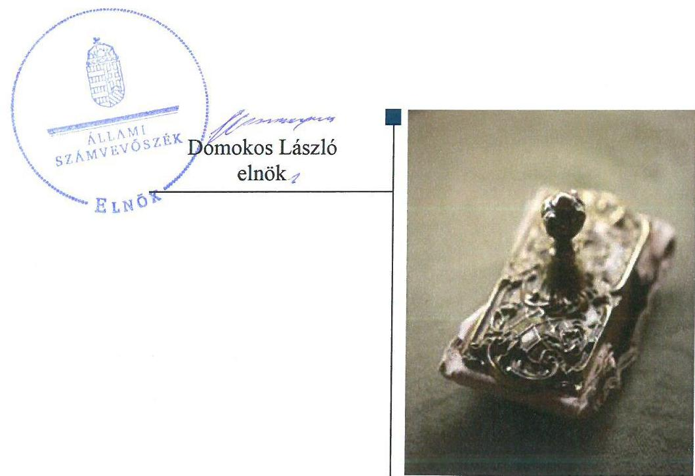
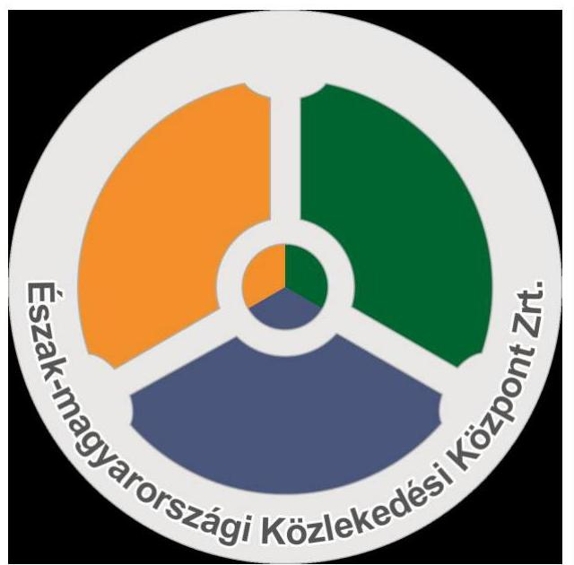
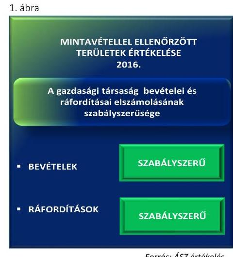

# Jelenetés 

## Az állami tulajdonú gazdasági társaságok ellenőrzése

Észak-magyarországi Közlekedési Központ Zrt. 2018.

18253
www.asz.hu

---

# Jelentés 

## Az állami tulajdonú gazdasági társaságok ellenőrzése

Észak-magyarországi Közlekedési Központ Zrt.
2018. 01. hó 14. nap

---

# AZ ELLENŐRZÉST FELÜGYELTE: 

PETŐ KRISZTINA felügyeleti vezető

## AZ ELLENŐRZÉST VEZETTE ÉS A VÉGREHAJTÁSÁÉRT FELELŐS:

VALASTYÁNNÉ DR. VÍZHÁNYÓ JÚLIA ellenőrzésvezető

## A PROGRAM ÖSSZEÁLLÍTÁSÁÉRT FELELŐS:

TÓTPÁL SZABOLCS osztályvezető

IKTATÓSZÁM: EL-0416-031/2018.
TÉMASZÁM: 2469
ELLENŐRZÉS-AZONOSÍTÓ SZÁM: V081434

---

# TARTALOMJEGYZÉK 

- ÖSSZEGZÉS ..... 5
- AZ ELLENŐRZÉS CÉLJA ..... 6
- AZ ELLENŐRZÉS TERÜLETE ..... 7
- AZ ELLENŐRZÉS HÁTTERE, INDOKOLTSÁGA ..... 9
- A JELENTÉS LÉNYEGES KÉRDÉSKÖREI ..... 10
- AZ ELLENŐRZÉS HATÓKÖRE ÉS MÓDSZEREI ..... 11
- MEGÁLLAPÍTÁSOK ..... 13
- MELLÉKLETEK ..... 17
I. sz. melléklet: Értelmező szótár ..... 17
II. sz. melléklet: A Társaság főbb mérlegadatai ..... 23
- FÜGGELÉK: ÉSZREVÉTELEK ..... 25
- RÖVIDÍTÉSEK JEGYZÉKE ..... 27

---

.

---

# ÖSSZEGZÉS 

A Magyar Nemzeti Vagyonkezelő Zrt. Észak-magyarországi Közlekedési Központ Zrt. feletti tulajdonosi joggyakorlása szabályszerű volt. A Társaság szabályozottsága a 2013. évben nem felelt meg a jogszabályi előírásoknak, a 2016. évre szabályzatai pótlásával szabályozottsága már biztositott volt. A gazdálkodási és vagyongazdálkodási tevékenység a 2016. évben megfelelő, ezáltal elszámoltatható volt. A Társaság müködésének átláthatóságát a 2016. évben biztositotta.

## Az ellenőrzés társadalmi indokoltsága

Az állami vagyonnal való gazdálkodás alapvető célja az állami vagyon átlátható, rendeltetésszerű és felelős felhasználásának biztosítása. Az állami tulajdonban álló gazdálkodó szervezetek államot megillető társasági részesedése a nemzeti vagyon részét képezi és legfőbb rendeltetése szerint a közfeladatok ellátását szolgálja.

Az Állami Számvevőszék stratégiájában megfogalmazta, hogy az államháztartáson kívülre nyújtott költségvetési támogatások és ingyenes vagyonjuttatások, valamint az államháztartáson kívül múködő közfeladat-ellátó rendszerek ellenőrzéseivel hozzájárul ahhoz, hogy a közpénzeket az államháztartáson kívül múködő szervezetek is átlátható, rendezett módon használják fel a közfeladatok szerződésben vállalt ellátása érdekében.

Az Állami Számvevőszék céljaival és a társadalmi igénnyel összhangban, valamint a gazdasági társaságok kiemelt fontosságú szerepe miatt került sor az Észak-magyarországi Közlekedési Központ Zártkörűen működő Részvénytársaság ellenőrzésére.

## Főbb megállapítások, következtetések

Az Észak-magyarországi Közlekedési Központ Zrt. feletti tulajdonosi joggyakorlás a 2013. és 2016. években megfelelt a jogszabályi előírásoknak. A tulajdonosi joggyakorlás a Felügyelőbizottság, a vezérigazgató és a könyvvizsgáló tevékenységéhez kacsolódóan szabályszerű volt. Az Észak-magyarországi Közlekedési Központ Zrt. a 2013. és 2016. évekre vonatkozó üzleti terveit és éves beszámolóit a tulajdonosi jogokat gyakorló Magyar Nemzeti Vagyonkezelő Zrt. a jogszabályi és belső előírásoknak megfelelően jóváhagyta.

Az Észak-magyarországi Közlekedési Központ Zrt. múködésének szabályozottsága, gazdálkodása, vagyongazdálkodása a 2013. évben nem volt szabályszerű, mert a Számviteli politika keretében elkészítendő szabályzatokkal nem rendelkezett.

A 2016. év végére az Észak-magyarországi Közlekedési Központ Zrt. az előírt számviteli szabályzatokkal rendelkezett. A gazdálkodási feladatok ellátása és a vagyongazdálkodása a 2016. évben szabályszerű volt. A bevételek és ráfordítások, valamint az értékcsökkenési leírás elszámolása szabályszerű volt. Az Észak-magyarországi Közlekedési Központ Zrt. a 2016. évi beszámolója mérlegtételeit leltárral alátámasztotta. Az Észak-magyarországi Közlekedési Központ Zrt. vagyonát számviteli rendszerében folyamatosan nyilvántartotta és kimutatta.

Az Észak-magyarországi Közlekedési Központ Zrt. a közérdekú adatok közzétételéről gondoskodott, ezáltal múködésének és gazdálkodásának átláthatósága biztosított volt.

A 2016. évre vonatkozóan nem került megfogalmazásra olyan megállapítás, amelyre az ellenőrzött szervezetek vezetőinek intézkedési kötelezettsége keletkezett volna. Javaslatot megalapozó megállapítás hiányában az Állami Számvevőszék az Észak-magyarországi Közlekedési Központ Zrt. vezérigazgatójának nem fogalmazott meg javaslatot.

---

# AZ ELLENŐRZÉS CÉLJA 

Az ellenőrzés célja annak értékelése volt, hogy a tulajdonosi jogok gyakorlása szabályszerű volt-e. A gazdálkodó szervezet szabályozottsága, gazdálkodása és vagyongazdálkodási tevékenysége megfelelt-e a jogszabályi és a tulajdonosi előírásoknak; biztosítva volt-e a közfeladatok átláthatósága és elszámoltathatósága érdekében a közszolgáltatás díjának megalapozottsága szabályszerű önköltségszámítással. A vagyonváltozást eredményező döntések esetében a tulajdonosi jogok gyakorlója és a gazdálkodó szervezet szabályszerűen jártak-e el.

---

# AZ ELLENŐRZÉS TERÜLETE 

## Észak-magyarországi Közlekedési Központ Zártkörűen müködő Részvénytársaság

A Társaság ${ }^{1}$-ot a magyar állam 2012. november 19-én alapította egyszemélyes, zártkörűen működő részvénytársaságként.

A Társaság miskolci székhellyel rendelkezik, fő tevékenysége, egyben közfeladata az ellenőrzött időszakban a személyszállítás volt. Ellátta Nyíregyháza, Özd, Kazincbarcika, Tiszaújváros, Balmazújváros és Hajdúszoboszló helyi közlekedését az ellenőrzött időszakban, valamint 2015. január 1-jétől a három megyei központú Volán beolvadását követően Borsod-AbaújZemplén, Hajdú-Bihar és Szabolcs-Szatmár-Bereg megyei helyközi közlekedését is biztosította.

A Társaság a 2012. évi XLI. törvény²-ben foglalt előírások szerint a helyi és a helyközi személyszállítási feladatok ellátását közszolgáltatási szerződések alapján végezte.

A Társaság feletti tulajdonosi jogokat a 2013-2016. években az MNV Zrt. ${ }^{3}$ gyakorolta. A 2015. január 1 - október 20. közötti időszakban a három megyei Volán társaság beolvadását követően a Társaság, ezen társaságok jogutódjaként működött. Az Alapszabály ${ }_{1-5}{ }^{4}$ alapján a Társaság legfőbb szerve ebben az időszakban a Közgyűlés ${ }^{5}$ volt. Az Alapszabály ${ }_{1-5}$ alapján a kisrészvényesek kivásárlásával a Társaság ismét egyszemélyes társasággá vált, 2015. október 20-tól Közgyűlés a Társaságnál nem működött, jogait az Alapító ${ }^{6}$ MNV Zrt. gyakorolta.

A Társaság alapításakor 20,0 M Ft ${ }^{7}$ jegyzett tőkével rendelkezett. A Társaság vagyonának szerkezete a 2013. évről a 2016. évre jelentősen átrendeződött a helyközi személyszállítást biztosító Volán társaságok beolvadását követően. A Társaság saját tőkéje 2016. december 31-én 14 474,2 M Ft, a befektetett eszközei értéke 11 234,9 M Ft, a mérlegfőöszszege 21 439,4 M Ft volt.

A Társaság vagyonkezelésbe vett állami vagyonnal nem rendelkezett, tevékenységét saját vagyonával és bérelt eszközökkel látta el.

A Társaság ügyvezetését Igazgatóság ${ }^{8}$ látta el. Az Igazgatóság három tagból állt. A vezérigazgató ${ }^{9}$ a Társaság első számú vezető állású munkavállalója volt, aki felett a munkáltatói jogokat az Igazgatóság gyakorolta. A vezérigazgató személye az ellenőrzött időszakban egy alkalommal, 2016. január 1-jétől változott.

Az MNV Zrt. a Társaság ügyvezetésének ellenőrzése céljából három tagú Felügyelőbizottságot ${ }^{10}$ hozott létre. A Társaság a jogszabályi előírások alapján könyvvizsgálatra kötelezett volt, állandó könyvvizsgálóját az MNV Zrt. választotta meg.

---

A Társaság az ellenőrzött időszakban nem tartozott a kormányzati szektorba sorolt társaságok közé, és nem minősült közhasznú jogállású szervezetnek.

A Társaság gazdálkodásának főbb adatait az 1. táblázat mutatja be.

# A TÁRSASÁG GAZDÁLKODÁSÁVAL KAPCSOLATOS ADATOK ALAKULÁSA (M FT) 

|  | 2013. december 31. | 2014. december 31. | 2015. december 31. | 2016. december 31. |
| :--: | :--: | :--: | :--: | :--: |
| Értékesítés nettó ábevétele | 86,1 | 99,7 | 17693,1 | 18017,3 |
| Egyéb bevételek | 11,0 | 15,0 | 7702,8 | 8256,7 |
| Mérlegfőösszeg | 13703,9 | 13671,4 | 19875,4 | 21439,4 |
| Követelések | 14,0 | 10,6 | 1594,0 | 831,5 |
| ebből: vevő követelések | 14,0 | 10,6 | 158,4 | 271,5 |
| Saját tőke | 13407,9 | 13654,5 | 14456,9 | 14474,2 |
| Jegyzett tőke | 10954,7 | 11198,7 | 11202,8 | 11202,8 |
| Mérleg (adózott) szerinti eredmény | 7,0 | 2,6 | 147,8 | 17,3 |
| Kötelezettségek összesen | 292,4 | 16,2 | 4078,7 | 5874,3 |
| Munkavállalók (átlagos állományi) létszáma | 7,5 | 11,3 | 3316,0 | 3276,4 |

Forrás: A Társaság 2013-2016. évi éves beszámolói

---

# AZ ELLENŐRZÉS HÁTTERE, INDOKOLTSÁGA 

Az Európai Unióban 1994. év óta hatályos túlzott hiány eljárás mindig kihívást jelentett a tagállamok számára. Az állami tulajdonú gazdálkodó szervezetek ellenőrzése kiemelten fontos a vagyon megőrzése, megóvása érdekében, valamint a kormányzati szektor elszámolásaiban megjelenő állami tulajdonú gazdálkodó szervezetek esetében, amelyekkel szemben alapvető követelmény, hogy gazdálkodásuk, működésük szabályszerű, az általuk szolgáltatott adatok minél megbízhatóbbak legyenek. Gazdálkodásuk jellemzően a közérdeklődés és a média figyelmének középpontjában áll, amihez hozzájárul a gazdálkodásuk körébe tartozó - közvetlen vagy közvetett állami tulajdonú, tehát végső soron a nemzeti vagyon részét képező - vagyon nagysága, illetve az általuk ellátott közszolgáltatások/közfeladatok minősége és hatékonysága. A közszolgáltatási árképzés megalapozottsága és a rendszeres elszámoltatás feltételeinek kialakítása az ellenőrzése során nagy hangsúlyt kap. A közszolgáltatás árában és annak támogatásában meg kell jelennie az önköltségszámítás szempontjainak, amely biztosítja a működés fenntarthatóságát (eszközpótlást) is.

Az ellenőrzés rámutathat az állami tulajdonú gazdálkodó szervezetek gazdálkodási tevékenységével jó gyakorlatokra és szabálytalanságokra. Felhívhatja a figyelmet a jogszabályi követelmények teljesítéséhez szükséges feltételek hiányosságaira, hozzájárulhat az államháztartáson kívüli, de (közvetlenül vagy közvetve) állami vagyont használó gazdálkodó szervezetek tevékenységének átláthatóságához. Ellenőrzésünk eredményeképpen javaslatainkkal, megállapításainkkal hozzájárulhatunk a nemzeti vagyonnal való gazdálkodás átláthatóságának, elszámoltathatóságának javításához.

---

# A JELENTÉS LÉNYEGES KÉRDÉSKÖREI 

1.- A tulajdonosi jogok gyakorlása szabályszerű volt-e?
2.- A társaság müködésének szabályozottsága megfelelt-e az előírásoknak? A társaságnál a gazdálkodási, vagyongazdálkodási és adatszolgáltatási feladatok ellátása szabályszerű volt-e?

---

# AZ ELLENŐRZÉS HATÓKÖRE ÉS MÓDSZEREI 

## Az ellenőrzés típusa

|Megfelelőségi ellenőrzés.

## Az ellenőrzött időszak

A 2013. - 2016. évek, a 2016. évi beszámoló jóváhagyásáig tartó időszak.

## Az ellenőrzés tárgya

Állami tulajdonban (résztulajdonban) lévő gazdasági társaság gazdálkodása, kiemelten vagyongazdálkodási tevékenysége, a tulajdonosi jogok gyakorlása, továbbá a kormányzati szektorba sorolt gazdasági társaság gazdálkodásának a kormányzati szektor hiányára és az államadósságra befolyással bíró elemei.

## Az ellenőrzött szervezet

A Magyar Nemzeti Vagyonkezelő Zrt. és az Észak-magyarországi Közlekedési Központ Zártkörűen müködő Részvénytársaság.

## Az ellenőrzés jogalapja

Az ellenőrzés jogalapját az ÁSZ tv. ${ }^{11}$ 1. § (3) bekezdése és 5. § (3)-(5) bekezdése képezi.

## Az ellenőrzés módszerei

Az ellenőrzést a nemzetközi standardokat irányadónak tekintve az ellenőrzési program ellenőrzési kérdései, az ellenőrzött időszakban hatályos jogszabályok, az ellenőrzés szakmai szabályok és módszertanok figyelembevételével végeztük.

Az ellenőrzés ideje alatt az ellenőrzött szervezettel történő kapcsolattartást az ÁSZ Szervezeti és Müködési Szabályzatának vonatkozó előírásai alapján biztosítottuk.

Az ellenőrzésre a nemzetgazdasági szempontból kiemelt jelentőségű nemzeti vagyon körébe tartozó gazdálkodó szervezeteknél és a többségi állami tulajdonban álló gazdálkodó szervezeteknél került sor. A program

---

szerinti feladatokat a kiválasztott gazdálkodó szervezeteknél és azok többségi tulajdonban lévő leányvállalatainál, valamint a tulajdonosi jogok gyakorlójánál kellett végrehajtani.

A teljes ellenőrzött időszakra vonatkozóan került ellenőrzésre a gazdasági társaság tervezési, beszámolási, közzétételi, adatszolgáltatási kötelezettségének, valamint belső ellenőrzési tevékenységének szabályszerűsége. A 2013. és 2016. évekre vonatkozóan a tulajdonosi joggyakorlást, a gazdasági társaság múködésének szabályozottságát, a bevételei és ráfordításai elszámolását, illetve vagyongazdálkodásának szabályszerűségét is ellenőriztük.

A mintavétellel ellenőrzött területek esetében minden egyes tétel vonatkozásában a szabályszerűségre vonatkozó kérdéseket tettünk fel, amelyek eredménye összesítésre került. „Szabályszerűnek" értékeltünk egy ellenőrzött területet, amennyiben 95\%-os bizonyossággal az ellenőrzött sokaságban az átlagos hibaarány legfeljebb 10\%, "nem szabályszerűnek", amennyiben 10\%-nál magasabb arányt képviselt.

Abban az esetben, ha az ellenőrzött sokaság tekintetében a 10\%-os hibaarányhoz való viszony megítélésnek megbízhatósága nem érte el a 95\%ot, annak elérése érdekében értékelésünket további szempontokkal egészítettük ki, és figyelembe vettük a feltárt hibák értékét.

A bevételek és a ráfordítások valamint az értékcsökkenési leírás elszámolásának szabályszerűségét, továbbá az immateriális javak, tárgyi eszközök esetében a vagyonnyilvántartás szabályszerűségét a lényeges sokaságból véletlen mintavételi eljárással kiválasztott tételek alapján ellenőriztük.

A személyi jellegű ráfordítások esetében az ellenőrzött tételek kijelölése véletlen mintavételi eljárás alkalmazásával történt a teljes sokaságból.

A többi terület esetében az ellenőrzés azokra a legnagyobb értékű tételekre - a lényeges sokaságra - terjedt ki, melyek összértéke eléri a teljes sokaság összértékének 50\%-át.

Az ellenőrzési kérdések megválaszolásához szükséges bizonyítékok megszerzése a következő ellenőrzési eljárások alkalmazásával történt: megfigyelés, kérdésfeltevés (információkérés), összehasonlítás, valamint elemző eljárás. Az ellenőrzési bizonyítékként felhasználható adatforrások közé tartoztak egyrészt az ellenőrzési programban felsorolt adatforrások, másrészt adatforrás lehetett még minden - az ellenőrzés folyamán - feltárt, az ellenőrzés szempontjából információkat tartalmazó dokumentum.

Az ellenőrzést a kérdésekre adott válaszok kiértékelésével, valamint a megjelölt adatforrások felhasználásával, továbbá az adott időszakban hatályos jogszabályok figyelembevételével kellett lefolytatni.

---

# 1. A tulajdonosi jogok gyakorlása szabályszerű volt-e? 

Összegző megállapítás

Az MNV Zrt. a Társaság feletti tulajdonosi jogokat az ellenőrzött időszakban a jogszabályi előírásoknak megfelelően gyakorolta.

A TULAJ DONOSI JOGOK GYAKORLÁSÁRA vonatkozó előírásokat az MNV Zrt. az Alapító okirat ${ }_{1-5}$-ben ${ }^{12}$, az Alapszabály $_{1-5}$-ben a Gt. ${ }^{13}$, a Ptk. ${ }^{14}$, a Vtv. ${ }^{15}$ előírásainak megfelelően kialakította. A tulajdonosi joggyakorló a tulajdonában lévő részesedések kezelésének módját a Portfóliós Kódex ${ }_{1,2}$-ben ${ }^{16}$ szabályozta. Az MNV Zrt. rendelkezett Monitoring szabályzat ${ }_{1,2}$-vel ${ }^{17}$, Vagyon-nyilvántartási szabályzat ${ }_{1,2}$-vel ${ }^{18}$, illetve SZMSZ ${ }_{1-6}$-tal ${ }^{19}$. A Társaság feletti tulajdonosi joggyakorlás a MNV Zrt. igazgatósága, illetve vezérigazgatója hatáskörébe tartozott, annak részleteit az SZMSZ ${ }_{1-6}$-ban határozták meg.

A tulajdonosi joggyakorlás a Felügyelőbizottság, a vezérigazgató és a könyvvizsgáló tevékenységéhez kapcsolódóan szabályszerű volt a 2013. és a 2016. években. A Felügyelőbizottság elnökét és tagjait, valamint a könyvvizsgálót a Taktv. ${ }^{20}$, a Gt., illetve a Ptk. ${ }_{2}$ előírásainak megfelelően választották meg.

A 2013. ÉS A 2016. ÉVEK BESZÁMOLÓINAK elfogadásáról, jóváhagyásáról az MNV Zrt. a Gt. és a Ptk.2. előírásainak megfelelően a Felügyelőbizottság írásbeli jelentésének birtokában döntött. Az MNV Zrt. a beszámolókat a könyvvizsgálói vélemények figyelembevételével fogadta el. A Felügyelőbizottság ügyrendjét a Gt. előírásainak megfelelően a tulajdonosi joggyakorló határozatban jóváhagyta.

ÜZLETI TERVEIT a Társaság az MNV Zrt. által kiadott tervezési irányelvekben rögzítetteknek megfelelően a 2013. és 2016. évekre vonatkozóan elkészítette. A Társaság üzleti terveit a Felügyelőbizottság javaslatának figyelembevételével az MNV Zrt. határozatban elfogadta.

Az MNV Zrt. a Taktv.-ben előírtaknak megfelelően megalkotta a Társaság Javadalmazási szabályzat ${ }_{1,2}$ - $t^{21}$.

---

# 2. A társaság múködésének szabályozottsága megfelelt-e az előírásoknak? A társaságnál a gazdálkodási, vagyongazdálkodási és adatszolgáltatási feladatok ellátása szabályszerű volt-e? 

Összegző megállapítás

Míg a Társaság szabályozottsága, gazdálkodása és vagyongazdálkodása a 2013. évben nem volt szabályszerű, addig a 2016. évben megfelelt a jogszabályi előírásoknak. Adatszolgáltatási és közzétételi kötelezettségét teljesítette.
2.1. számú megállapítás

A 2013. évben a Társaság szabályozottsága nem felelt meg a jogszabályi előírásoknak. A 2016. évben a Társaság szabályozottsága biztosított volt.

A TÁRSASÁG SZABÁLYOZOTTSÁGA a 2013. évben nem volt szabályszerű, mert a Számv. tv. ${ }^{22} 14 . \S$ (5) bekezdésében előírtakat megsértve nem készítették el a Számviteli politika ${ }^{23}$ keretében az eszközök és a források leltárkészítési és leltározási szabályzatát, az eszközök és a források értékelési szabályzatát, az önköltségszámítás rendjére vonatkozó belső szabályzatot, valamint a pénzkezelési szabályzatot.

A 2016. évben a Számv. tv.-ben előírt számviteli szabályzatokkal rendelkezett a Társaság, azok az előírásokkal összhangban voltak.

A Társaság 2016. évre vonatkozó működésének alapvető szabályait, a vagyongazdálkodással kapcsolatos feladat- és hatásköröket, felelősségi viszonyokat az Alapszabály3.5-ben, a társasági SZMSZ ${ }_{1,2}$-ben ${ }^{24}$, valamint a Számviteli politika ${ }^{25}$-ben a Leltározási ${ }^{26}$ és Selejtezési ${ }^{27}$ szabályzatokban határozták meg.

A Társaság a 2016. évben a jogszabályi előírásoknak megfelelő Önköltségszámítási szabályzat ${ }^{28}$-tal rendelkezett.
2.2. számú megállapítás

A 2013. évben a Társaság gazdálkodása és vagyongazdálkodása nem volt szabályszerű. A 2016. évben a Társaság gazdálkodása és vagyongazdálkodása szabályszerű volt. A 2016. évi beszámolóját a Társaság leltárral alátámasztotta. A 2016. évben a Társaság az alkalmazott díjakat önköltségszámítással megalapozta.

A 2013. évben a Társaság szabályozottsága nem felelt meg a Számv. tv. 14. § (5) bekezdésében foglalt előírásoknak, ezáltal a gazdálkodási feladatok szabályszerű ellátása nem volt biztosított.

A GAZDÁLKODÁSI FELADATOK ellátása a 2016. évben szabályszerű volt.

Az értékesítés nettó árbevételének és az egyéb bevételek, pénzügyi műveletek bevételeinek elszámolása a Számv. tv. szerint, szabályszerűen történt. Az anyagjellegú ráfordítások, az egyéb és a pénzügyi műveletek ráfordításainak elszámolása, a személyi jellegú ráfordítások elszámolása szabályszerű volt, a Számv. tv. előírásainak megfelelt.

A 2016. évben a személyszállítás közszolgáltatás díjainak megállapítását az előírásoknak megfelelő önköltségszámítással megalapozták, a tevékenységek elkülönített nyilvántartását biztosították.

---

A 2016. évben a vagyonnyilvántartás szabályszerű volt. Az értékcsökkenési leírás elszámolása a Számv. tv. a Számviteli politika2-ban és a Számlarendben foglalt előírásoknak megfelelően történt. Az ellenőrzött területek értékelését a 2016. év vonatkozásában az 1. ábra mutatja be.

A VAGYONGAZDÁLKODÁS a 2013. évben nem volt szabályszerű, mivel a Társaság múködésének szabályozottsága nem felelt meg a Számv. tv.-ben foglalt előírásoknak, ezáltal nem volt biztosított a vagyongazdálkodás szabályszerű ellátása.

A vagyongazdálkodás a 2016. évben szabályszerű volt. A Társaság - a Számv. tv.-ben foglaltak szerint - a mérlegtételek beszámolóban kimutatott állományát leltárral alátámasztotta. A Társaság számviteli rendszerében biztosította a vagyonváltozás folyamatos nyilvántartását és kimutatását a Számv. tv., illetve a saját belső szabályzataiban - Számviteli politika2, Számlarend - foglalt előírásoknak megfelelően. A Társaság a Számv. tv. előírásait betartotta a részesedések, egyéb befektetett pénzügyi eszközök értékelésénél. A saját vagyonát érintő beruházásaival kapcsolatos döntései, és azok döntésre való előterjesztése 2016. évben megfeleltek a tulajdonosi és a Számviteli politika2-ban, valamint a Számlarendben foglalt előírásoknak.

Az eszközök és források alakulását a II. sz. melléklet mutatja be.

# 2.3. számú megállapítás 

## A Társaság adatszolgáltatási és közzétételi kötelezettségét teljesítette.

A MONITORING SZABÁLYZAT ${ }_{1,2}$ alapján a Társaság adatszolgáltatásra kötelezettnek minősült. A Társaság a 2014-2016. években adatszolgáltatási kötelezettségét a Monitoring szabályzat ${ }_{1,2}$-nek megfelelően teljesítette. A Társaság a 2014-2016. években a Számv. tv. és az Alapító okirat5, illetve Alapszabály ${ }_{1-5}$ előírásainak megfelelően teljesítette a tervezési (éves üzleti terv), a beszámolási (éves beszámolók, éves üzleti jelentések, negyedéves jelentések), valamint az adatszolgáltatási (kontrolling adatszolgáltatások) kötelezettségét.

A KÖZÉRDEKŰ ADATOK nyilvánosságra hozatalának szabályozottsága a 2014-2016. években a Társaságnál biztosított volt. A Társaság a honlapján a Taktv. 2. § és az Info tv. ${ }^{29}$ előírásainak megfelelően közzétételi kötelezettségének eleget tett.

---

.

---

# MELLÉKLETEK 

## I. SZ. MELLÉKLET: ÉRTELMEZŐ SZÓTÁR

állami vagyon
a) Az állam tulajdonában lévő dolog, valamint a dolog módjára hasznosítható természeti erő,
b) az a) pont hatálya alá nem tartozó mindazon vagyon, amely vonatkozásában törvény az állam kizárólagos tulajdonjogát nevesíti,
c) az állam tulajdonában lévő tagsági jogviszonyt megtestesítő értékpapír, illetve az államot megillető egyéb társasági részesedés,
d) az államot megillető olyan immateriális, vagyoni értékkel rendelkező jogosultság, amelyet jogszabály vagyoni értékű jogként nevesít.
Forrás: Vtv. 1. § (2) bekezdése
e) az állam tulajdonában lévő pénzügyi eszközök

Forrás: Vtv. 1. § (2) bekezdése
2013. június 27-ig:

Az állami vagyont az MNV Zrt. maga kezeli, vagy szerződés - így különösen bérlet, haszonbérlet, megbízás - alapján központi költségvetési szervnek, természetes vagy jogi személynek, vagy jogi személyiséggel nem rendelkező gazdálkodó szervezetnek hasznosításra átengedi.
Forrás: Vtv. 23. § (1) bekezdése
2013. június 28-ától:

Az állami vagyonnal az MNV Zrt. maga gazdálkodik, vagy szerződés - így különösen bérlet, haszonbérlet, megbízás - alapján központi költségvetési szervnek, természetes vagy jogi személynek, vagy jogi személyiséggel nem rendelkező gazdálkodó szervezetnek hasznosításra átengedi, illetőleg vagyonkezelésbe, haszonélvezetbe adja.
Forrás: Vtv. 23. § (1) bekezdése
anyavállalat
Az a vállalkozó, amely egy másik vállalkozónál (a továbbiakban: leányvállalat) közvetlenül vagy leányvállalatán keresztül közvetetten meghatározó befolyást képes gyakorolni, mert az alábbi feltételek közül legalább eggyel rendelkezik:
a) a tulajdonosok (a részvényesek) szavazatának többségével (50 százalékot meghaladóval) tulajdoni hányada alapján egyedül rendelkezik, vagy
b) más tulajdonosokkal (részvényesekkel) kötött megállapodás alapján a szavazatok többségét egyedül birtokolja, vagy
c) a Társaság tulajdonosaként (részvényeseként) jogosult arra, hogy a vezető tisztségviselők vagy a Felügyelőbizottság tagjai többségét megválassza vagy visszahívja, vagy
d) a tulajdonosokkal (a részvényesekkel) kötött szerződés (vagy a létesítő okirat rendelkezése) alapján - függetlenül a tulajdoni hányadtól, a szavazati aránytól, a megválasztási és visszahívási jogtól - döntő irányítást, ellenőrzést gyakorol.
Forrás: Számv. tv. 3. § (2) 1. pont
gazdasági társaság
A Ptk. 2 3:88. § (1) bekezdése szerint „a gazdasági társaságok üzletszerű közös gazdasági tevékenység folytatására, a tagok vagyoni hozzájárulásával létrehozott, jogi személyiséggel rendelkező vállalkozások, amelyekben a tagok a nyereségből közösen részesednek, és a veszteséget közösen viselik".
állami vagyon hasznosítására kötött szerződés
Az állami vagyon hasznosítására kötött szerződések elsődleges célja az állami vagyon hatékony működtetése, állagának védelme, értékének megőrzése, illetve gyarapítása, az állami és közfeladatok ellátásának elősegítése.

---

állami vagyon használója
állami vagyon kezelője/vagyonkezelő
állami vagyon értékesítése
gazdálkodó szervezet
kapcsolt vállalkozás

Forrás: Vtv. 23. § (2) bekezdése
Az a természetes vagy jogi személy, jogi személyiséggel nem rendelkező szervezet, aki, vagy amely törvény vagy szerződés alapján, bármely jogcímen (bérlet, haszonbérlet, használat stb.) állami vagyont birtokol, használ, szedi annak hasznait, hasznosít, ide nem értve a haszonélvezőt, a vagyonkezelőt és a tulajdonosi jogok gyakorlóját.
Forrás: Vtv. vhr. ${ }^{30}$ 1. § (7) a. pontja

## 2013. június 27-ig:

Az állami vagyont az MNV Zrt. maga kezeli, vagy szerződés - így különösen bérlet, haszonbérlet, megbízás - alapján központi költségvetési szervnek, természetes vagy jogi személynek, vagy jogi személyiséggel nem rendelkező gazdálkodó szervezetnek hasznosításra átengedi. Az állami vagyonra vonatkozóan az MNV Zrt. kizárólag az Nvtv ${ }^{31}$-ben meghatározott személyekkel köthet vagyonkezelési szerződést.
Forrás: Vtv. 23. § (1), 27. § (1)

## 2013. június 28-ától:

Az állami vagyonnal az MNV Zrt. maga gazdálkodik, vagy szerződés - így különösen bérlet, haszonbérlet, megbízás - alapján központi költségvetési szervnek, természetes vagy jogi személynek, vagy jogi személyiséggel nem rendelkező gazdálkodó szervezetnek hasznosításra átengedi, illetőleg vagyonkezelésbe, haszonélvezetbe adja. Az állami vagyonra vonatkozóan az MNV Zrt. kizárólag az Nvtv-ben meghatározott személyekkel köthet vagyonkezelési szerződést.
Forrás: Vtv. 23. § (1), 27. § (1)
Állami vagyon tulajdonjogának bármely jogcímen történő, visszterhes átruházása.
Forrás: Vtv. vhr. 1. § (7) d) pont)
2014. március 14-ig:

A Ptk. ${ }^{32}$ 685. § c) pontja szerint gazdálkodó szervezet: „az állami vállalat, az egyéb állami gazdálkodó szerv, a szövetkezet, a lakásszövetkezet, az európai szövetkezet, a gazdasági társaság, az európai részvénytársaság, az egyesülés, az európai gazdasági egyesülés, az európai területi együttmúködési csoportosulás, az egyes jogi személyek vállalata, a leányvállalat, a vízgazdálkodási társulat, az erdő birtokossági társulat, a végrehajtói iroda, az egyéni cég, továbbá az egyéni vállalkozó."
2014. március 15-től:

A gazdasági társaság, az európai részvénytársaság, az egyesülés, az európai gazdasági egyesülés, az európai területi együttműködési csoportosulás, a szövetkezet, a lakásszövetkezet, az európai szövetkezet, a vízgazdálkodási társulat, az erdőbirtokossági társulat, az állami vállalat, az egyéb állami gazdálkodó szerv, az egyes jogi személyek vállalata, a közös vállalat, a végrehajtói iroda, a közjegyzői iroda, az ügyvédi iroda, a szabadalmi ügyvivői iroda, az önkéntes kölcsönös biztosító pénztár, a magánnyugdíjpénztár, az egyéni cég, továbbá az egyéni vállalkozó. Az állam, a helyi önkormányzat, a költségvetési szerv, az egyesület, a köztestület, valamint az alapítvány gazdálkodó tevékenységével összefüggő polgári jogi kapcsolataira is a gazdálkodó szervezetre vonatkozó rendelkezéseket kell alkalmazni.
Forrás: Ppt. ${ }^{33}$ 396. §
Az anyavállalat és a leányvállalat és a közös vezetésű vállalkozások (fölérendelt anyavállalat esetében a minősítést a fölérendelt anyavállalat szempontjából kell elvégezni)
Forrás: Számv. tv. 3. § (2) 7. pont

---

kormányzati szektorba sorolt egyéb szervezet
közös vezetésű vállalkozás
közszolgáltatás
leányvállalat
meghatározó befolyás
minősített többséget biztosító részesedés

MNV Zrt.

Az a szervezet, amely az Áht. ${ }^{34}$ alapján nem része az államháztartásnak, azonban az Európai Közösséget létrehozó szerződéshez csatolt, a túlzott hiány esetén követendő eljárásról szóló jegyzőkönyv alkalmazásáról szóló 2009. május 25-i 479/2009/EK rendelet szerint a kormányzati szektorba tartozik. A nemzetgazdasági miniszter 2013. június 26-án megjelent Közleményben tette közé ezen szervezetek listáját
Az a gazdasági társaság, ahol egyrészt az anyavállalat (az anyavállalat konszolidálásba bevont leányvállalata), másrészt egy (vagy több) másik vállalkozás az 1. pont szerinti jogosultságokkal paritásos alapon - legalább 33 százalékos szavazati aránnyal - rendelkezik. A közös vezetésű vállalkozást a tulajdonostársak közösen irányítják.
Forrás: Számv. tv. 3. § (2) 3. pont
Az Ebktv. ${ }^{35}$ 3. § d) pontja a következőképpen határozza meg a közszolgáltatást: „szerződéskötési kötelezettség alapján a lakosság alapvető szükségleteinek ellátására irányuló szolgáltatás, így különösen a villamos energia-, gáz-, hő-, víz-, szennyvíz- és hulladékkezelési, köztisztasági, postai és távközlési szolgáltatás, továbbá a menetrend alapján közlekedő járművekkel végzett közforgalmú személyszállítás".
Az a gazdasági társaság, amelyre az anyavállalat meghatározó befolyást képes gyakorolni
Forrás: Számv. tv. 3. § (2) 2. pont

## 2014. március 14-ig:

A befolyással rendelkező akkor rendelkezik egy jogi személyben meghatározó befolyással, ha annak tagja, illetve részvényese és
a) jogosult e jogi személy vezető tisztségviselői vagy felügyelőbizottsága tagjai többségének megválasztására, illetve visszahívására, vagy
b) a jogi személy más tagjaival, illetve részvényeseivel kötött megállapodás alapján egyedül rendelkezik a szavazatok több mint ötven százalékával.
A meghatározó befolyás akkor is fennáll, ha a befolyással rendelkező számára az előzőek szerinti jogosultságok közvetett módon biztosítottak. A befolyással rendelkezőnek egy jogi személyben a szavazatok több mint ötven százalékával közvetett módon való rendelkezése vagy egy jogi személyben közvetetten fennálló meghatározó befolyása megállapítása során a jogi személyben szavazati joggal rendelkező más jogi személyt (köztes vállalkozást) megillető szavazatokat meg kell szorozni a befolyással rendelkezőnek a köztes vállalkozásban, illetve vállalkozásokban fennálló szavazatával. Ha a köztes vállalkozásban fennálló szavazatok mértéke az ötven százalékot meghaladja, akkor azt egy egészként kell figyelembe venni.
Forrás: Ptk. 1 685/B. § (2)-(3) bekezdések

## 2014. március 15-től:

A befolyással rendelkező akkor rendelkezik egy jogi személyben meghatározó befolyással, ha annak tagja vagy részvényese, és
a) jogosult e jogi személy vezető tisztségviselői vagy felügyelőbizottsága tagjai többségének megválasztására, illetve visszahívására; vagy
b) a jogi személy más tagjai, illetve részvényesei a befolyással rendelkezővel kötött megállapodás alapján a befolyással rendelkezővel azonos tartalommal szavaznak, vagy a befolyással rendelkezőn keresztül gyakorolják szavazati jogukat, feltéve, hogy együtt a szavazatok több mint felével rendelkeznek.
Forrás: Ptk. 2 8:2. § (2) bekezdés
A minősített befolyásszerző az ellenőrzött társaságban a szavazatok legalább hetvenöt százalékával rendelkezik. (2014. március 14-ig: Gt. 52. § (2), 2014. március 15től: Ptk. 2 3:324. §)
Az állami vagyon felett, a Magyar Államot megillető tulajdonosi jogok és kötelezettségek összességét - a hatályos szabályozás szerint - az állami vagyon felügyeletéért

---

nemzeti vagyon
nemzeti vagyon hasznosítása
rábízott vagyon
többségi befolyást biztosító részesedés
felelős miniszter (jelenleg a nemzeti fejlesztési miniszter) gyakorolja. A miniszter feladatát nagy részben az MNV Zrt., mint tulajdonosi joggyakorló szervezet útján látja el.
a) az állam vagy a helyi önkormányzat kizárólagos tulajdonában álló dolgok,
b) az a) pont hatálya alá nem tartozó, állam vagy a helyi önkormányzat tulajdonában lévő dolog,
c) az állam vagy a helyi önkormányzatot tulajdonában lévő pénzügyi eszközök, továbbá az államot vagy a helyi önkormányzatot megillető társasági részesedések,
d) az államot vagy a helyi önkormányzatot megillető bármely vagyoni értékkel rendelkező jogosultság, amelyet jogszabály vagyoni értékű jogként nevesít,
e) Magyarország határa által körbezárt terület feletti légtér,
f) az üvegházhatású gázok kibocsátási egységeinek kereskedelméről szóló törvény szerint kibocsátási egység és légiközlekedési kibocsátási egység, valamint az ENSZ Éghajlatváltozási Keretegyezménye és annak Kiotói Jegyzőkönyv végrehajtási keretrendszeréről szóló törvény szerinti kiotói egység,
g) állami vagy helyi önkormányzati fenntartású közgyűjtemény (muzeális intézmény, levéltár, közgyűjteményként müködő kép- és hangarchívum, valamint könyvtár) saját gyűjteményében nyilvántartott kulturális javak körébe tartozó dolog, kivéve, ha az állami vagy önkormányzati tulajdon jogszerű létrejötte kétséget kizáró módon nem bizonyítható és a dologra nézve más a tulajdonjogát bizonyítja vagy a kulturális javakra vonatkozó jogszabályokban meghatározott eljárás keretében valószínűsíti (g. pont módosult 2013. december 7-től),
h) a régészeti lelet,
i) a nemzeti adatvagyon körébe tartozó állami nyilvántartások fokozottabb védelméről szóló törvény szerinti nemzeti adatvagyon.
Forrás: Nvtv. 1. § (2)
A tulajdonosi joggyakorló vagy a nemzeti vagyon használója által a nemzeti vagyon birtoklásának, használatának, hasznok szedése jogának bármely - a tulajdonjog átruházását nem eredményező - jogcímen történő átengedése, ide nem értve a vagyonkezelésbe adást, valamint a haszonélvezeti jog alapítását.
Forrás: Nvtv. 3. § (1) 4. pont
Egyrészt minden a Vtv. alkalmazásában állami vagyonnak minősülő vagyon, amit az MNV Zrt. kezel és nyilvántart.
Másrészt az a vagyon, amely felett a Magyar Állam nevében az MFB Zrt. gyakorolja a tulajdonosi jogokat.
Forrás: MFB tv. ${ }^{36}$ 3. § (9)
A rábízott vagyon a tulajdonosi jogokat gyakorló szervezetek saját vagyonától elkülönítendő.
Forrás: Vtv. 22. § (6)
2014. március 14-ig: Többségi befolyás: az olyan kapcsolat, amelynek révén természetes személy, jogi személy vagy jogi személyiség nélküli gazdasági társaság (a továbbiakban együtt: befolyással rendelkező) egy jogi személyben a szavazatok több mint ötven százalékával vagy meghatározó befolyással rendelkezik.
Forrás: Ptk. 1 685/B. § (1)
2014. március 15-től: Többségi befolyás az olyan kapcsolat, amelynek révén természetes személy vagy jogi személy (befolyással rendelkező) egy jogi személyben a szavazatok több mint felével vagy meghatározó befolyással rendelkezik.
Forrás: Ptk. 2 8:2. § (1)

---

tulajdonosi ellenőrzés
2014. március 14-ig:

Az állami vagyon kezelőjét, haszonélvezőjét, használóját megillető jogok gyakorlását, annak szabályszerűségét, célszerűségét az MNV Zrt. - szükség szerint területi szervei útján - ellenőrzi.

# 2014. március 15-től: 

Az állami vagyon használóját, vagyonkezelőjét és haszonélvezőjét megillető jogok gyakorlását, annak szabályszerűségét, a kötelezettségek teljesítését, valamint a vagyon rendeltetése szerinti célszerűségét a tulajdonosi joggyakorló rendszeresen ellenőrzi.
Forrás: Vtv. vhr. 20. § (1)
tulajdonosi jogok gyakorlója 1.

### 2013. június 27-ig:

Az állami vagyon felett a magyar államot megillető tulajdonosi jogok és kötelezettségek összességét - ha törvény eltérően nem rendelkezik - az állami vagyon felügyeletéért felelős miniszter (a továbbiakban: miniszter) gyakorolja, aki e feladatát a Magyar Nemzeti Vagyonkezelő Zártkörűen Működő Részvénytársaság (a továbbiakban: MNV Zrt.), a Magyar Fejlesztési Bank, illetve a tulajdonosi joggyakorló szervezet útján látja el. A miniszter miniszteri rendeletben, a törvényben meghatározott állami vagyoni kör tekintetében, meghatározott időtartamra, a joggyakorlás egyes szabályainak meghatározásával - az őt megillető tulajdonosi jogok és kötelezettségek összességének, illetve azok meghatározott részének gyakorlóját az Áht. szerinti központi költségvetési szervek, ezek intézménye, továbbá a 100\%-ban állami tulajdonban álló gazdasági társaságok közül kijelölheti.
Forrás: Vtv. 3. § (1) és (2)
2013. június 28-ától:

A rábízott állami vagyon felett az államot megillető tulajdonosi jogok és kötelezettségek összességét tulajdonosi joggyakorlóként:
a) ha törvény vagy miniszteri rendelet eltérően nem rendelkezik, a Magyar Nemzeti Vagyonkezelő Zártkörűen Működő Részvénytársaság (a továbbiakban: MNV Zrt.),
b) törvényben kijelölt személy vagy
c) az állami vagyon felügyeletéért felelős miniszter (a továbbiakban: miniszter) által rendeletben kijelölt személy gyakorolja.
[...] A miniszter e törvény felhatalmazása alapján - a meghatározott célok hatékonyabb elérése érdekében, miniszteri rendeletben, az ott meghatározott állami vagyoni kör tekintetében, meghatározott időtartamra - e törvény keretei között, a joggyakorlás egyes szabályainak meghatározásával - az államot megillető tulajdonosi jogok és kötelezettségek összességének, illetve azok meghatározott részének gyakorlóját az Áht. szerinti központi költségvetési szervek, ezek intézménye, továbbá a 100\%-ban állami tulajdonban álló gazdasági társaságok közül kijelölheti.
Forrás: Vtv. 3. § (1) és (2)
2.

Aki a nemzeti vagyon felett az államot vagy a helyi önkormányzatot megillető tulajdonosi jogok és kötelezettségek összességének gyakorlására jogosult
Forrás: Nvtv. 3. § (1) 17. pontja
vagyonkezelői jog
2013. június 27-től:

A vagyonkezelő köteles a vagyontárgy értékét megőrizni, állagának megóvásáról, jó karban tartásáról, működtetéséről gondoskodni, továbbá - a központi költségvetési szervek kivételével - díjat fizetni vagy a szerződésben előírt más kötelezettséget teljesíteni.

---

Forrás: Vtv. 27. § (2)

# 2013. június 28-ától december 31-ig: 

A vagyonkezelő köteles a vagyontárgy állagának megóvásáról, jó karbantartásáról, működtetéséről gondoskodni, továbbá - a központi költségvetési szervek kivételével - díjat fizetni, jogszabályban és szerződésben előírt más kötelezettségét teljesíteni, valamint a vagyontárgyat jogszabályban vagy szerződésben meghatározott célnak megfelelően használni. Amennyiben a vagyonkezelő ezen kötelezettségének nem tesz eleget, a tulajdonosi joggyakorló jogosult a szerződést azonnali hatállyal felmondani.
Forrás: Vtv. 27. § (2)

## 2014. január 1-jétől:

A vagyonkezelő köteles a vagyontárgy állagának megóvásáról, jó karbantartásáról, működtetéséről gondoskodni, jogszabályban és szerződésben előírt más kötelezettségét teljesíteni, valamint a vagyontárgyat jogszabályban vagy szerződésben meghatározott célnak megfelelően használni.
A vagyonkezelő - a központi költségvetési szervek és a kizárólag közfeladatot ellátó nem központi költségvetési szerv vagyonkezelők kivételével - köteles díjat fizetni, jogszabályban és szerződésben előírt más kötelezettségét teljesíteni, valamint a vagyontárgyat jogszabályban vagy szerződésben meghatározott célnak megfelelően használni. Amennyiben a vagyonkezelő ezen kötelezettségeinek nem tesz eleget, a tulajdonosi joggyakorló jogosult a szerződést azonnali hatállyal felmondani.
Forrás: Vtv. 27. § (2), (2a)

---

II. SZ. MELLÉKLET: A TÁRSASÁG FŐBB MÉRLEGADATAI

| AZ ÉSZAK-MAGYARORSZÁGI KÖZLEKEDÉSI KÖZPONT ZRT. MÉRLEGEINEK KIEMELT ADATAI (M FT) |  |  |  |  |
| :--: | :--: | :--: | :--: | :--: |
| Megnevezés / időszak | 2013.12.31. | 2014.12.31. | 2015.12.31. | 2016.12.31. |
| I. Befektetett eszközök | 13588,5 | 13631,1 | 10160,2 | 11234,9 |
| ebből: tárgyi eszközök | 0,0 | 0,1 | 9540,1 | 10688,9 |
| II. Forgóeszközök | 115,4 | 35,4 | 3932,7 | 6715,6 |
| ebből: készletek | 0,0 | 0,0 | 511,7 | 592,3 |
| ebből: pénzeszközök | 101,4 | 24,9 | 1827,0 | 5291,8 |
| III. Aktív időbeli elhatárolások | 0,0 | 4,9 | 5782,4 | 3488,9 |
| ESZKÖZÖK ÖSSZESEN | 13703,9 | 13671,4 | 19875,4 | 21439,4 |
| IV. Saját tőke | 13407,9 | 13654,5 | 14456,9 | 14474,2 |
| ebből: jegyzett tőke | 10954,7 | 11198,7 | 11202,8 | 11202,8 |
| ebből: mérleg szerinti eredmény | 7,0 | 2,6 | 147,8 | 17,3 |
| V. Céltartalékok | 0,0 | 0,0 | 328,0 | 219,8 |
| VI. Kötelezettségek | 292,4 | 16,2 | 4078,7 | 5874,3 |
| VII. Passzív időbeli elhatárolások | 3,6 | 0,7 | 1011,7 | 871,2 |
| FORRÁSOK ÖSSZESEN | 13703,9 | 13671,4 | 19875,4 | 21439,4 |

---

.

---

# FÜGGELÉK: ÉSZREVÉTELEK 

A jelentéstervezetet a Számvevőszék 15 napos észrevételezésre megküldte az ellenőrzött szervezetek vezetőinek az ÁSZ tv. 29. §* (1) bekezdése előírásának megfelelően.

A Magyar Nemzeti Vagyonkezelő Zrt. és az Észak-magyarországi Közlekedési Központ Zrt. vezérigazgatói részéről észrevétel nem érkezett.

A Magyar Nemzeti Vagyonkezelő Zrt. és az Észak-magyarországi Közlekedési Központ Zrt. vezérigazgatói részéről észrevétel nem érkezett.

[^0]
[^0]:    * 29. § (1) Az Állami Számvevőszék az ellenőrzési megállapításait megküldi az ellenőrzött szervezet vezetőjének vagy az általa megbízott személynek, és annak, akinek személyes felelősségét állapította meg.
    (2) Az ellenőrzött szervezet vezetője és a felelősként megjelölt személy az ellenőrzés megállapításaira tizenöt napon belül írásban észrevételt tehet.
    (3) Az Állami Számvevőszék az észrevételre a beérkezésétől számított harminc napon belül írásban válaszol. A figyelembe nem vett észrevételeket köteles a jelentésben feltüntetni, és megindokolni, hogy azokat miért nem fogadta el.

---

.

---

# RÖVIDÍTÉSEK JEGYZÉKE 

${ }^{1}$ Társaság
${ }^{2}$ 2012. évi XLI. törvény
${ }^{3}$ MNV Zrt.
${ }^{4}$ Alapszabály ${ }_{1}$

Alapszabály ${ }_{2}$

Alapszabály ${ }_{3}$

Alapszabály ${ }_{4}$

Alapszabály ${ }_{5}$

${ }^{5}$ Közgyűlés
${ }^{6}$ Alapító
${ }^{7} \mathrm{M} \mathrm{Ft}$
${ }^{8}$ Igazgatóság
${ }^{9}$ vezérigazgató
${ }^{10}$ Felügyelőbizottság
${ }^{11}$ ÁSZ tv.
${ }^{12}$ Alapító okirat ${ }_{1}$

Alapító okirat ${ }_{2}$

Alapító okirat ${ }_{3}$

Alapító okirat ${ }_{4}$

Alapító okirat ${ }_{5}$

Észak-magyarországi Közlekedési Központ Zártkörűen működő Részvénytársaság 2012. évi XLI. törvényben a személyszállítási szolgáltatásokról, hatályos: 2012. július 1-jétől
Magyar Nemzeti Vagyonkezelő Zrt.
Az Észak-Magyarországi Közlekedési Központ Zártkörűen Működő Részvénytársaság Alapszabálya, hatályos: 2014. július 30-ától 2015. október 20-áig
Az Észak-Magyarországi Közlekedési Központ Zártkörűen Működő Részvénytársaság Alapszabálya, hatályos: 2015. október 20-ától 2015. október 21-éig
Az Észak-Magyarországi Közlekedési Központ Zártkörűen Működő Részvénytársaság Alapszabálya, hatályos: 2015. október 21-étől 2016. április 20-áig
Az Észak-Magyarországi Közlekedési Központ Zártkörűen Működő Részvénytársaság Alapszabálya, hatályos: 2016. április 20-ától 2016. október 24-éig
Az Észak-Magyarországi Közlekedési Központ Zártkörűen Működő Részvénytársaság Alapszabálya, hatályos: 2016. október 24-étől
Az Észak-Magyarországi Közlekedési Központ Zártkörűen Működő Részvénytársaság Közgyűlése
Az Észak-Magyarországi Közlekedési Központ Zártkörűen Működő Részvénytársaság Alapítója, a Magyar Állam millió forint
Az Észak-Magyarországi Közlekedési Központ Zárt-körűen Működő Részvénytársaság Igazgatósága
Az Észak-Magyarországi Közlekedési Központ Zárt-körűen Működő Részvénytársaság Vezérigazgatója
Az Észak-Magyarországi Közlekedési Központ Zártkörűen Működő Részvénytársaság felügyelőbizottsága
2011. évi LXVI. törvény az Állami Számvevőszékről, hatályos: 2011. július 1-jétől Az Észak-Magyarországi Közlekedési Központ Zártkörűen Működő Részvénytársaság Alapító okirata, hatályos: 2012. november 19-étől 2013. január 22-ig
Az Észak-Magyarországi Közlekedési Központ Zártkörűen Működő Részvénytársaság Alapító okirata, hatályos: 2013. január 22-étől 2013. március 20-ig
Az Észak-Magyarországi Közlekedési Központ Zártkörűen Működő Részvénytársaság Alapító okirata, hatályos: 2013. március 20-ától 2013. május 6-ig
Az Észak-Magyarországi Közlekedési Központ Zártkörűen Működő Részvénytársaság Alapító okirata, hatályos: 2013. május 6-ától 2013. december 2-ig
Az Észak-Magyarországi Közlekedési Központ Zártkörűen Működő Részvénytársaság Alapító okirata, hatályos: 2013. december 2-átől 2014. július 30-ig

---

${ }^{13}$ Gt.
${ }^{14}$ Ptk. 2
${ }^{15}$ Vtv.
${ }^{16}$ Portfóliós Kódex1

Portfóliós Kódex2
${ }^{17}$ Monitoring szabályzat ${ }_{1}$
Monitoring szabályzat ${ }_{2}$
${ }^{18}$ Vagyon-nyilvántartási szabályzat ${ }_{1}$
Vagyon-nyilvántartási szabályzat ${ }_{2}$
${ }^{19}$ SZMSZ ${ }_{1}$
SZMSZ ${ }_{2}$
SZMSZ ${ }_{3}$
SZMSZ ${ }_{4}$
SZMSZ ${ }_{5}$
SZMSZ ${ }_{6}$
${ }^{20}$ Taktv.
${ }^{21}$ Javadalmazási szabályzat ${ }_{1}$
Javadalmazási szabályzat ${ }_{2}$
${ }^{22}$ Számv. tv.
${ }^{23}$ Számviteli politika ${ }_{1}$
${ }^{24}$ társasági SZMSZ ${ }_{1}$
társasági SZMSZ ${ }_{2}$
${ }^{25}$ Számviteli politika ${ }_{2}$
2006. évi IV. törvény a gazdasági társaságokról, hatályos: 2006. január 4-étől 2014. március 15-éig
2013. évi V. törvény a Polgári Törvénykönyvről, hatályos: 2013. február 26-ától 2007. évi CVI. törvény az állami vagyonról, hatályos: 2007. szeptember 25-étől 7/2015. számú Vezérigazgató utasítás az MNV Zrt. Portfóliós Kódexéről, hatályos: 2015. március 31-étől 2016. május 31-ig
225/2016. számú Vezérigazgató utasítás az MNV Zrt. Portfóliós Kódexéről, hatályos: 2016. május 31-étől
51/2013. számú vezérigazgatói utasítás a Társasági Monitoring Szabályzatról, hatályos: 2013. december 19-étől 2016. augusztus 1-jéig
34/2016. számú vezérigazgatói utasítás a Társasági Monitoring Szabályzatról hatályos: 2016. augusztus 1-jétől
46/2008. számú vezérigazgatói utasítás az MNV Zrt. vagyon-nyilvántartási szabályzatáról, hatályos: 2008. június 11-étől 2014. március 24-ig
12/2014. számú vezérigazgatói utasítás (egységes szerkezetben a 24/2014. számú vezérigazgatói utasításaal) az MNV Zrt. állami vagyon vagyonkezelőire, állami vagyon használókra és a társasági részesedések esetében az MNV Zrt. tulajdonosi joggyakorlását megbízottként ellátókra vonatkozó vagyonnyilvántartási szabályzatáról, hatályos: 2015. április 8-tól
508/2012. (X. 08.) Igazgatósági Határozat az MNV Zrt. Szervezeti és Működési Szabályzatáról, hatályos: 2012. október 13-ától
123/2013. (III. 07.) Igazgatósági Határozat az MNV Zrt. Szervezeti és Múködési Szabályzatáról, hatályos: 2013. március 16-ától
246/2013. (IV. 22.) Igazgatósági Határozat az MNV Zrt. Szervezeti és Múködési Szabályzatáról, hatályos: 2013. április 25-étől
287/2013. (V. 06.) Igazgatósági Határozat az MNV Zrt. Szervezeti és Múködési Szabályzatáról, hatályos: 2013. július 1-jétől
430/2013. (VI. 17.) Igazgatósági Határozat az MNV Zrt. Szervezeti és Múködési Szabályzatáról, hatályos: 2013. július 1-jétől
158/2016. (IV. 06.) Igazgatósági Határozat az MNV Zrt. Szervezeti és Múködési Szabályzatáról, hatályos: 2016. április 15-étől
2009. évi CXXII. törvény a köztulajdonban álló gazdasági társaságok takarékosabb múködéséről, hatályos: 2009. december 4-étől hatályos: 2001. január 1-jétől
Az Észak-magyarországi Közlekedési Központ Zártkörűen Múködő
Részvénytársaság Javadalmazási szabályzata, hatályos 2012. november 19-től
Az Észak-magyarországi Közlekedési Központ Zártkörűen Múködő
Részvénytársaság Javadalmazási szabályzata, hatályos 2016. február 23-tól
2000. évi C. törvény a számvitelről, hatályos: 2001. január 1-jétől

Az Észak-magyarországi Közlekedési Központ Zártkörűen Múködő
Részvénytársaság Számviteli politikája, hatályos: 2013. évben, jóváhagyva: 2013. február 18-án
Az Észak-magyarországi Közlekedési Központ Zártkörűen Múködő
Részvénytársaság Szervezeti és Múködési Szabályzata, hatályos: 2013. március 13-ától
Az Észak-magyarországi Közlekedési Központ Zártkörűen Múködő
Részvénytársaság Szervezeti és Múködési Szabályzata, hatályos: 2016. november 1-jétől
Az Észak-magyarországi Közlekedési Központ Zártkörűen Múködő
Részvénytársaság Számviteli politikája, hatályos 2016. évben, jóváhagyva 2016. május 31-én

---

${ }^{26}$ Leltározási szabályzat
${ }^{27}$ Selejtezési szabályzat
${ }^{28}$ Önköltségszámítási szabályzat
${ }^{29}$ Info tv.
${ }^{30}$ Vtv. vhr.
${ }^{31}$ Nvtv.
${ }^{32}$ Ptk. 1
${ }^{33}$ Ppt.
${ }^{34}$ Áht.
${ }^{35}$ Ebktv.
${ }^{36}$ MFB tv.

Az Észak-magyarországi Közlekedési Központ Zártkörűen Müködő Részvénytársaság Leltározási szabályzata, hatályos: 2015. november 19-étől Az Észak-magyarországi Közlekedési Központ Zártkörűen Müködő Részvénytársaság Selejtezési szabályzata, hatályos: 2016. április 1-jétől Az Észak-magyarországi Közlekedési Központ Zártkörűen Müködő Részvénytársaság Leltározási szabályzata, hatályos: 2015. január 1-jétől 2011. évi CXII. törvény az információs önrendelkezési jogról és az információszabadságról, hatályos: 2011. július 27-étől 254/2007. (X. 4.) Korm. rendelet az állami vagyonnal való gazdálkodásról, hatályos: 2007. október 4-étől
2011. évi CXCVI törvény a nemzeti vagyonról, hatályos: 2012. január 1-jétől 1959. évi IV. törvény a Polgári Törvénykönyvről, hatálytalan: 2014. március 15-étől
1952. évi III. törvény a polgári perrendtartásról, hatályos: 1953. január 1-jétől 2011. évi CXCV. törvény az államháztartásról, hatályos: 2011. december 31-étől 2003. évi CXXV. törvény az egyenlő bánásmódról és az esélyegyenlőség előmozdításáról, hatályos: 2004. június 27-étől
2001. évi XX. törvény a Magyar Fejlesztési Bank Részvénytársaságról, hatályos: 2001. június 15-étől

---

# ÁLLAMI SZÁMVEVŐSZÉK 

1052 Budapest, Apáczai Csere János utca 10.
Levélcím: 1364 Budapest 4. Pf. 54
Telefon: +36 14849100 Telefax: +36 14849200
www.asz.hu