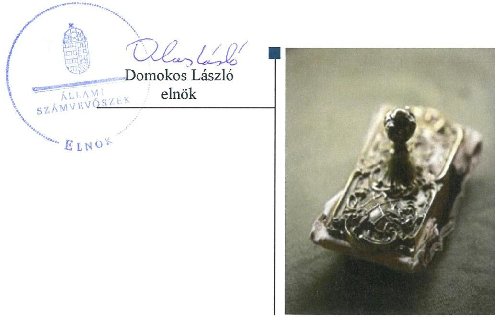
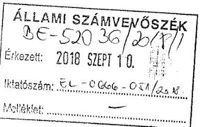
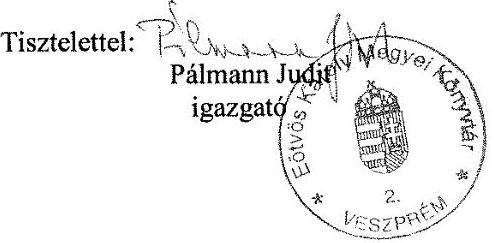
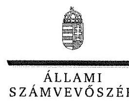
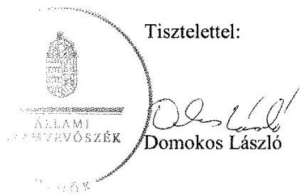

# Jelentés 

## A nyilvános könyvtári ellátás múködésének ellenőrzése

Eötvös Károly Megyei Könyvtár 2018.

18254
www.asz.hu

---

# Jelentés 

## A nyilvános könyvtári ellátás múködésének ellenőrzése

Eötvös Károly Megyei Könyvtár
2018. 11. hó 15. nap

---

# AZ ELLENŐRZÉST FELÜGYELTE:

- VARGA EDIT felügyeleti vezető
- AZ ELLENŐRZÉST VEZETTE ÉS A VÉGREHAJTÁSÁÉRT FELELŐS:
  - **ÓDOR ZOLTÁN TAMÁS** ellenőrzésvezető
  - **A PROGRAM ÖSSZEÁLLÍTÁSÁÉRT FELELŐS:**
    - **TÓTPÁL SZABOLCS** osztályvezető

**IKTATÓSZÁM:** EL-0376-034/2018

**TÉMASZÁM:** 18

**ELLENŐRZÉS-AZONOSÍTÓ SZÁM:** V080903

Jelentéseink az Országgyűlés számítógépes hálózatán és az Interneta a www.asz.hu címen is olvashatóak.

---

# TARTALOMJEGYZÉK 

■ ÖSSZEGZÉS ..... 5
■ AZ ELLENŐRZÉS CÉLJA ..... 6
■ AZ ELLENŐRZÉS TERÜLETE ..... 7
■ AZ ELLENŐRZÉS HÁTTERE, INDOKOLTSÁGA ..... 8
■ A JELENTÉS LÉNYEGES KÉRDÉSKÖREI ..... 9
■ AZ ELLENŐRZÉS HATÓKÖRE ÉS MÓDSZEREI ..... 10
■ MEGÁLLAPÍTÁSOK ..... 12
■ JAVASLATOK ..... 16
■ MELLÉKLETEK ..... 19
I. sz. melléklet: Értelmező szótár ..... 19
■ FÜGGELÉK: ÉSZREVÉTELEK ..... 21
■ RÖVIDÍTÉSEK JEGYZÉKE ..... 39

---

.

---

# ÖSSZEGZÉS 

Az Eötvös Károly Megyei Könyvtár belső kontrollrendszere nem teremtette meg az átlátható, elszámoltatható és ellenőrizhető közpénzfelhasználás feltételeit. A pénzügyi gazdálkodása nem volt szabályszerű, vagyongazdálkodása megfelelt a jogszabályi előírásoknak. Az Eötvös Károly Megyei Könyvtár vezetője nem kezelte a korrupciós kockázatokat.

## Az ellenőrzés társadalmi indokoltsága

Törvényben deklarált célja szerint a könyvtári ellátás fenntartása és fejlesztése az állampolgárok és a társadalom egésze szempontjából szükséges, a könyvtári és információs szolgáltatás állami fenntartása stratégiai fontosságú. A könyvtárak felbecsülhetetlen nemzeti értékeket, az egyetemes kultúrához kapcsolódó dokumentumokat, gyűjteményeket őriznek. A helyi önkormányzati fenntartású közgyűjtemény a nemzeti vagyon körébe tartozik, ezért kiemelten indokolt az Állami Számvevőszék ezen a területen történő ellenőrzése is.

## Főbb megállapítások, következtetések, javaslatok

Veszprém Megyei Jogú Város Önkormányzata az alapítói jogait szabályszerűen, gyakorolta, az Eötvös Károly Megyei Könyvtárhoz kapcsolódó egyéb szabályozási, irányítói feladatait szabályszerűen, de nem eredményesen látta el.

Az Eötvös Károly Megyei Könyvtár nem alakított ki és nem működtetett szabályszerű belső kontrollrendszert. A szabályozási hiányosságok miatt a kontrollkörnyezet kialakítása nem volt szabályszerű. Nem mérték fel a tevékenységben, gazdálkodásban rejlő kockázatokat, nem alakítottak ki és nem működtettek kockázatkezelési rendszert. A kontrolltevékenységek működtetése nem felelt meg a jogszabályokban foglaltaknak, a nem pénzügyi döntések vonatkozásában nem építették ki a kontrollokat. Az Eötvös Károly Megyei Könyvtár vezetője nem alakította ki a szervezet információs-rendszerét, közzétételi kötelezettségét hiányosan teljesítette. Az Eötvös Károly Megyei Könyvtár monitoring rendszerének kialakítása nem történt meg, azonban a belső ellenőrzési rendszer kialakítása szabályszerű volt.

A korrupciós kockázatok kezelése érdekében végzett intézkedések nem voltak hatásosak.
Az Eötvös Károly Megyei Könyvtár pénzügyi gazdálkodása nem volt szabályszerű, vagyongazdálkodása megfelelt a jogszabályi előírásoknak, éves költségvetési beszámolóinak mérlegtételeit leltárral alátámasztotta.

Az Állami Számvevőszék a jelentésben foglalt megállapítások alapján az Eötvös Károly Megyei Könyvtár vezetője részére a belső kontrollrendszer szabályszerű kialakítására és működtetésére, valamint a szabályszerű pénzügyi gazdálkodásra vonatkozóan 12 javaslatot fogalmazott meg. A javaslatokat megalapozó megállapításokra az Eötvös Károly Megyei Könyvtár vezetőjének 30 napon belül intézkedési tervet kell készítenie.

---

# AZ ELLENŐRZÉS CÉLJA 

Az ellenőrzés célja annak megállapítása volt, hogy a nyilvános könyvtárak pénzügyi és vagyongazdálkodása, a könyvtárak által kezelt vagyon nyilvántartása és megőrzése, a belső kontrollrendszer kialakítása és múködtetése, valamint az intézményfenntartói feladatok ellátása szabályszerűen történt-e, érvényesült-e az integritás szemlélet.

---

# **AZ ELLENŐRZÉS TERÜLETE**

## **Eötvös Károly Megyei Könyvtár**

A Fenntartó^{1} a Veszprém városában található Intézményt^{2} 1979. július 20-án alapította, amelynek közfeladata a nyilvános könyvtári ellátás biztosítása és a megyei közművelődési tevékenység támogatása volt. Illetékességi területe Veszprém Megyei Jogú Város, valamint Veszprém megye közigazgatási területe, továbbá az Országos Dokumentum Ellátási Rendszer szolgáltatásai tekintetében Magyarország területe volt.

Az 2014-2016. években az intézményvezető személyében változás nem történt. Az Intézmény pénzügyi-gazdálkodási tevékenységét a Veszprémi Intézményi Szolgáltató Szervezet, mint Gazdasági szervezet^{3} látta el, a munkamegosztás és felelősségvállalás szabályozását az együttműködési megállapodás tartalmazta.

Az Intézmény átlagos statisztikai állományi létszáma az ellenőrzött években 49 fő volt. Az Intézmény eszközvagyonának értéke 2016. december 31-én 48 520 ezer Ft-ot tett ki.

Az Intézmény gazdálkodásának főbb adatait a 1. táblázat mutatja be.

1. táblázat

### **EÖTVÖS KÁROLY MEGYEI KÖNYVTÁR FŐBB GAZDÁLKODÁSI ADATAI (EZER FT)**

|  Megnevezés | 2014. év | 2015. év | 2016. év  |
| --- | --- | --- | --- |
|  Költségvetési bevételek | 65 785 | 60 155 | 48 559  |
|  Költségvetési kiadások | 410 070 | 406 640 | 408 718  |
|  Finanszírozási bevételek | 351 799 | 363 062 | 377 099  |
|  Működés eredménye | 9 555 | -26 990 | -18 734  |

*Forrás: éves költségvetési beszámolók*

---

# AZ ELLENŐRZÉS HÁTTERE, INDOKOLTSÁGA 

A könyvtárak fenntartására fordított közpénz nagysága, a nyilvános könyvtárak fenntartóinak sokszínűsége, a nyilvános könyvtárak, és a feladatellátó helyek számossága, valamint a könyvtárak által kezelt speciális vagyoni kör, továbbá a témakört érintően azonosított kockázatok alátámasztották a nyilvános könyvtárak ellenőrzésének szükségességét. Az egyes ellenőrzések megállapításaival és egy időszak ellenőrzési eredményeinek elemzésével az ÁSZ ${ }^{4}$ ráirányíthatja a jogalkotók figyelmét az önkormányzati alrendszerben vagy annak egy ágazatában esetlegesen felmerülő pénzügyi, szabályozási feszültségekre.

---

# A JELENTÉS LÉNYEGES KÉRDÉSKÖREI 

1. Az Intézmény fenntartója a feladatait szabályszerűen látta-e el?
2. Az Intézmény belső kontrollrendszerének kialakítása és mükötetése megfelelő volt-e?
3. Az Intézmény pénzügyi és vagyongazdálkodása szabályszerű volt-e?

---

# AZ ELLENŐRZÉS HATÓKÖRE ÉS MÓDSZEREI 

## Az ellenőrzés típusa

Megfelelőségi ellenőrzés.

## Az ellenőrzött időszak

A 2014 - 2016. évek, a belső kontrollrendszer tekintetében 2016. év.

## Az ellenőrzés tárgya

Az Intézmény fenntartásával kapcsolatos feladatok ellátása. Az intézmény belső kontrollrendszerének kialakítása és működtetése. A pénzügyi és vagyongazdálkodás szabályszerűsége. Az intézmény egyes pénzügyi és vagyongazdálkodási feladatainak, beszámolási és adatszolgáltatási kötelezettségének teljesítése. Az integritás szemlélet érvényesülése az intézményekben.

## Az ellenőrzött szervezet

Eötvös Károly Megyei Könyvtár, Veszprém Megyi Jogú Város Önkormányzta

## Az ellenőrzés jogalapja

Az Állami Számvevőszékről szóló 2011. évi LXVI. törvény 1. § (3) bekezdése, az 5. § (2)-(3) bekezdései, a (4) bekezdés a) pontja, továbbá az (6) bekezdése

## Az ellenőrzés módszerei

Az ÁSZ az ellenőrzést az ÁSZ hivatalos honlapján (www.asz.hu) az ellenőrzés szakmai szabályai közt közzétett, a jelen ellenőrzésre irányadó módszertani útmutatók alapján, az ellenőrzési programban foglalt értékelési szempontok szerint hajtotta végre. Az ellenőrzést az ÁSZ a program kérdéseire adott válaszok kiértékelésével, valamint a programban ismertetett ellenőrzési kérdések, kritériumok, adatforrások között megjelölt adatforrások, a program III. sz. mellékletben felsorolt tanúsítványok felhasználásával, továbbá az adott időszakban hatályos jogszabályok figyelembevételével folytatta le.

---

Az ÁSZ, az ellenőrzés ideje alatt az ellenőrzött szervezettel történő kapcsolattartást az ÁSZ SZMSZ ${ }^{5}$-ének vonatkozó előírásai alapján biztosította.

Az ellenőrzési kérdések megválaszolásához szükséges bizonyítékok meg-szerzése a következő ellenőrzési eljárások alkalmazásával történt: megfigyelés, kérdésfeltevés (információkérés), mintavételezés, valamint elemző eljárás. Az ÁSZ statisztikai módszereken alapuló mintavételt alkalmazott, a minták értékelését a teljes sokaságra történő kivetítéssel végezte.

---

# 1. Az Intézmény fenntartója a feladatait szabályszerűen látta-e el? 

Összegző megállapítás Az intézmény fenntartója a fenntartói jogokat szabályszerűen gyakorolta, az irányítási feladatait megfelelően látta el.

Az Intézmény Alapító Okiratát ${ }^{6}$ a Fenntartó az Áht. ${ }^{7}$-nak megfelelően kiadta, a módosításokat elvégezte, valamint jóváhagyta az Intézményi SZMSZ ${ }^{8}$-t és annak módosításait, továbbá biztosította az Intézmény működésének tárgyi és személyi feltételeit, munkáltatói jogait megfelelően gyakorolta.

A Fenntartó a Közművelődési rendeletében ${ }^{9}$ határozta meg az Intézmény közművelődéssel kapcsolatos feladatok ellátásának alapelveit.

A Fenntartó költségvetési rendeleteiben állapította meg az Intézmény költségvetéseit, fejlesztésére vonatkozó terveket. A Fenntartó jóváhagyta az Intézmény működésének és használatának szabályait, éves munkaterveit, figyelemmel kísérte az Intézmény bevételi és kiadási előirányzatokkal való gazdálkodását, továbbá beszámoltatta az Intézmény vezetőjét az éves gazdálkodásról.

## 2. Az Intézmény belső kontrollrendszerének kialakítása és mükötetése megfelelő volt-e?

## Összegző megállapítás

Az Intézmény belső kontrollrendszerének kialakítása és múködtetése 2016. évben nem volt szabályszerű.
2.1. számú megállapítás

A kontrollkörnyezet kialakítása nem volt szabályszerű.
Az Intézmény gazdálkodási feladatait ellátó Gazdasági szervezet rendelkezett az Ávr. ${ }^{10}$ előírásainak megfelelően jóváhagyott ügyrenddel ${ }^{11}$. A felek közötti munkamegosztást szabályozó együttműködési megállapodás ${ }^{12}$ szerint, a gazdálkodásra vonatkozó szabályzatokat az Intézmény önállóan készítette el a Gazdasági szervezet iránymutatásai alapján.

Az Intézmény rendelkezett a gazdálkodás részletes rendjét meghatározó kötelezettségvállalási szabályzattal ${ }^{13}$. Az Intézmény Számv. tv ${ }^{14}$,-ben foglaltaknak megfelelően rendelkezett leltárkészítési és leltározási szabályzattal ${ }_{1-2}{ }^{15}$.

Az intézmény vezetője nem gondoskodott:

- az Intézmény valamennyi működési folyamatára kiterjedő ellenőrzési nyomvonal elkészítéséről a Bkr. ${ }^{16}$ 6. § (3) bekezdés előírása ellenére;

---

- a Bkr. 2016. október 1-jétől hatályos 6. § (4) bekezdésében előírt szervezeti integritást sértő események kezelése eljárásrendjének szabályozásáról;
- a Számv. tv. 14. § (3) bekezdésében foglaltak és az együttmúködési megállapodás II. 1. pontja ellenére számviteli politika kialakításáról;
- Számv. tv. 14. § (5) bekezdés c) pontjában, valamint az Áhsz. ${ }^{17}$ 50. § (3) bekezdésben foglaltak ellenére, önköltségszámítás rendjére vonatkozó szabályzat elkészítéséről;
- a Számv. tv. 161. § (1) bekezdése és az Áhsz. 51. § (2) bekezdésben foglaltak ellenére számlarend készítéséről;
- a Bkr. 8. § (4) bekezdés b) pontja szerinti szabályozásról teljes körűen, mert nem szabályozta a dokumentumokhoz és információkhoz való hozzáférést.
2.2. számú megállapítás

# A kockázatkezelési-, és az integrált kockázatkezelési rendszer kiala- 

kítása és múködtetése nem valósult meg.

Az Intézmény vezetője nem alakította ki és nem múködtetette a Bkr. 3. § (b) pontjának és a 7. § (1) bekezdésének 2016. szeptember 30-ig hatályos előírása ellenére a kockázatkezelési rendszert, valamint a Bkr. 3. § b) pontjának és a Bkr. 7. § (1) bekezdésének 2016. október 1-től hatályos előírása ellenére az integrált kockázatkezelési rendszert.

## 2.3. számú megállapítás

2.4. számú megállapítás

## A kontrolltevékenységek múködtetése nem felelt meg a jogszabályokban foglaltaknak.

Az Intézmény belső szabályzataiban, felelősségi körök meghatározásával szabályozta az engedélyezési, jóváhagyási és kontrolleljárásokat, a beszámolási eljárásokat, 2016. október 1-től a nem pénzügyi döntések dokumentumainak vonatkozásában a Bkr. 8. § (2) bekezdés a) pont előírása ellenére azonban nem építették ki a kontrollokat.

## Az információs és kommunikációs folyamatok kialakítása és múködtetése nem volt nem volt szabályszerű.

Az Intézmény vezetője a Bkr. 9. § (1) bekezdése ellenére, nem alakított ki és nem múködtetett olyan rendszereket, amelyek biztosítják, hogy a megfelelő információk a megfelelő időben eljussanak az illetékes szervezethez, szervezeti egységhez, illetve személyhez. Gazdasági szervezet felé történő adatszolgáltatás kapcsán az ellenőrzési nyomvonal tartalmazta a feladatok és határidők megjelölését, illetve az együttműködési megállapodás szabályozta az információszolgáltatás rendjét, és a kapcsolattartást.

Az Intézmény vezetője az Info. tv. ${ }^{18}$ 37.§ (1) bekezdés szerinti közzétételi kötelezettségének - az Info tv. 1. melléklet III. Gazdálkodási adatok 1. pontjában előírt - éves költségvetés és éves költségvetési beszámoló vonatkozásában nem tett eleget.

## 2.5. számú megállapítás

A monitoring rendszer kialakítása nem történt meg, a belső ellenőrzési rendszer kialakítása szabályszerű volt.

Az Intézmény vezetője a Bkr. 10. § előírásai ellenére nem alakította ki az Intézmény tevékenységének, a célok megvalósításának nyomon követését

---

biztosító rendszeren belül az operatív tevékenységek keretében megvalósuló folyamatos- és eseti nyomon követést.

Az Intézmény belső ellenőrzési feladatait a Polgármesteri Hivatal ${ }^{19}$ látta el az együttműködési megállapodás alapján, azonban az Intézmény SZMSZében a Bkr. 15. § (2) bekezdésében foglaltak ellenére nem írták elő a belső ellenőrzést végző szervezet feladatait.
2.6. számú összegző értékelés Az Intézmény vezetője korrupció ellenes tevékenységet végzett, azonban a korrupciós kockázatok értékelésének hiányában azok nem voltak hatásosak.

Az Intézmény vezetője korrupció ellenes tevékenység keretében szabályozta a beszerzéseket és megállapította a vagyonnyilatkozat tétel szabályait. Az Intézmény egyedi korrupciós kockázatainak értékelése azonban elmaradt, a Bkr. 7. § (2) bekezdésben foglaltak ellenére az integrált kockázatkezelési rendszer múködtetése során nem határozták meg az egyes kockázatokkal kapcsolatban szükséges intézkedések teljesítésének folyamatos nyomon követési módját.

# 3. Az Intézmény pénzügyi és vagyongazdálkodása szabályszerű volt-e? 

## Összegző megállapítás

3.1. számú megállapítás

A pénzügyi gazdálkodása nem volt szabályszerű, vagyongazdálkodása megfelelt a jogszabályi előírásoknak.

A bevételek beszedése és elszámolása, a kiadási előirányzatok felhasználása nem volt szabályszerű.

Az Intézmény saját bevételének beszedése és elszámolása nem a jogszabályi előírásoknak megfelelően történt, mert
$\longrightarrow$ a saját bevételekről a Számv. tv. 165. § (1) bekezdés előírása ellenére nem állítottak ki bizonylatot, illetve a Számv. tv. 165. § (2) bekezdés előírása ellenére a könyvviteli nyilvántartásokba nem szabályszerűen kiállított bizonylat alapján jegyeztek be adatokat;
$\longrightarrow$ a saját bevételek főkönyvi nyilvántartására nem az egységes rovatrend szerint került sor, megsértve az Áhsz. 40.§ (1) bekezdését.
Az Intézmény bevételeinek beszedése és elszámolása, továbbá a kiadási előirányzatainak felhasználása nem volt szabályszerű, a kapcsolódó gazdálkodási belső kontrollok nem működtek megfelelően, mert az Intézmény pénzügyi gazdálkodása során nem rendelkezett:
$\longrightarrow$ a Számv. tv. 14. § (3) bekezdése szerinti számviteli politikával;
$\longrightarrow$ a Számv. tv. 161. § (1) bekezdése és az Áhsz. 51. § (2) bekezdése szerinti számlarenddel.

## 3.2. számú megállapítás

A fizetési kötelezettségeket nem teljesítették, az előirányzat-maradvány megállapítása nem volt szabályszerű.

Az Intézménynek 2014. és 2016. évben, év végén lejárt számlatartozása volt, annak ellenére, hogy mindkét évben elegendő pénzeszköz állt rendelkezésre az áthúzódó fizetési kötelezettségek teljesítésére. Az Intézmény az

---

ellenőrzött években nem rendelkezett 60 napon túli lejárt szállítói tartozással.

Az Intézmény a tárgyévi előirányzat-maradványát nem szabályszerűen állapította meg, mutatta ki, mert nem rendelkezett a Számv. tv. 161. § (4) bekezdésében meghatározott felelős által összeállított, a Számv. tv. 161. § (1) bekezdésében rögzített - a Számv. tv. 161. § (2) bekezdésének megfelelő tartalmú - számlarenddel, így az Intézmény vezetője a Számv. tv. 161. § (3) bekezdésének előírása ellenére nem biztosította az analitikus nyilvántartások és a főkönyvi könyvelés között az értékadatok számszerű egyeztetésének a lehetőségét.
3.3. számú megállapítás

## Az Intézmény a beszámolási kötelezettségét a jogszabályi előírásoknak megfelelően teljesítette, a vagyongazdálkodása szabályszerű volt.

Az Intézmény a költségvetési beszámolóit határidőben elkészítette. Az Intézmény a Számv. tv.-ben és az Áhsz.-ben előírtaknak, valamint leltározási szabályzatának megfelelően az éves költségvetési beszámolóinak mérlegtételeit leltárral alátámasztotta.

A feladatellátást szolgáló vagyonnal történő gazdálkodás kereteit, annak kezelését és üzemeltetését a Fenntartó a Vagyonrendeletében ${ }^{20}$ szabályozta. Az Intézmény a rendelkezésére bocsátott vagyont az Áhsz-ben leírtaknak és a vagyongazdálkodás szabályainak megfelelően szerepeltette könyvviteli nyilvántartásaiban.

A könyvtár a muzeális könyvtári dokumentumok kezelését, nyilvántartását és leltározásával kapcsolatos feladatait az NKÖM rendeletnek ${ }^{21}$ megfelelően szabályszerűen elvégezte.

---

# JAVASLATOK 

Az ÁSZ tv. 33. § (1) bekezdésében foglaltak értelmében az ellenőrzött szervezet vezetője köteles a jelentésben foglalt megállapításokhoz kapcsolódó intézkedési tervet összeállítani és azt a jelentés kézhezvételétől számított 30 napon belül az ÁSZ részére megküldeni. Amennyiben az ellenőrzött szervezet vezetője nem küldi meg határidőben az intézkedési tervet, vagy továbbra sem elfogadható intézkedési tervet küld, az Állami Számvevőszék elnöke az ÁSZ tv. 33. § (3) bekezdése a) és b) pontjaiban foglaltakat érvényesítheti.

## Eötvös Károly Megyei Könyvtár vezetőjének

1. A belső kontrollrendszer szabályszerű kialakítása és müködtetése érdekében intézkedjen:
a) az Intézmény valamennyi müködési folyamatára kiterjedő ellenőrzési nyomvonal elkészitéséről;
(2.1. sz. megállapítás 3. bekezdés 1. francia bekezdése alapján)
b) a szervezeti integritást sértő események kezelése eljárásrendjének szabályozásáról;
(2.1. sz. megállapítás 3. bekezdés 2. francia bekezdése alapján)
c) az Intézmény önköltség számítás rendjére vonatkozó szabályzatának elkészitéséről a Gazdasági szervezet iránymutatásai alapján;
(2.1. sz. megállapítás 3. bekezdés 4. francia bekezdése alapján)
d) az Intézmény belső szabályzataiban a felelősségi körök meghatározásával a dokumentumokhoz és információkhoz való hozzáférés szabályozásáról;
(2.1. sz. megállapítás 3. bekezdés 6. francia bekezdése alapján)
e) az integrált kockázatkezelési rendszer kialakításáról és müködtetéséről, ennek keretében határozza meg a korrupciós kockázatokkal kapcsolatban szükséges intézkedések teljesítésének folyamatos nyomon követési módját
(2.2. sz. megállapítás 1. bekezdése, valamint a 2.6. sz. összegző értékelés 1. bekezdése alapján)
f) a kontrolltevékenység részeként az Intézmény valamennyi tevékenységének vonatkozásában a szervezeti célok elérését veszélyeztető kockázatok csökkentésére irányuló kontrollok kiépítéséről;
(2.3. sz. megállapítás 1. bekezdése alapján)

---

g) a jogszabályi előírásoknak megfelelő információs és kommunikációs rendszer kialakításáról és müködtetéséről;
(2.4. sz. megállapítás 1. bekezdés 1. mondata alapján)
h) az Intézmény közzétételi kötelezettségének teljes körű teljesítéséről;
(2.4. sz. megállapítás 2. bekezdése alapján)
i) az Intézmény tevékenységének, a célok megvalósitásának nyomon követését biztositó rendszeren belül az operativ tevékenységek keretében megvalósuló folyamatos- és eseti nyomon követésröl;
(2.5. sz. megállapítás 1. bekezdése alapján)
j) a belső ellenőrzést végző szervezet feladatainak az Intézmény Szervezeti és Müködési Szabályzatában történő előírásáról;
(2.5. sz. megállapítás 2. bekezdése alapján)
2. A belső kontrollrendszer szabályszerú kialakítása, müködtetése, valamint a szabályszerú pénzügyi gazdálkodás érdekében gondoskodjon az Intézmény számviteli politikájának kialakításáról és írásba foglalásáról, valamint számlarendjének elkészitéséről a Gazdasági szervezet iránymutatásai alapján.
(2.1. sz. megállapítás 3. bekezdés 3. és 5. francia bekezdései, a 3.1. sz. megállapítás 2. bekezdése, valamint a 3.2. sz. megállapítás 2. bekezdése alapján)
3. A szabályszerú pénzügyi gazdálkodás érdekében gondoskodjon a saját bevételekhez kapcsolódóan szabályszerú bizonylatok kiállításáról.
(3.1. sz. megállapítás 1. bekezdés 1. francia bekezdése alapján)

---

.

---

# MELLÉKLETEK 

- I. SZ. MELLÉKLET: ÉRTELMEZŐ SZÓTÁR

Könyvtár a muzeális intézményekről, a nyilvános könyvtári ellátásról és a közművelődésről szóló 1997. évi CXL törvényben (Kult. tv-ben) meghatározott könyvtári dokumentumok rendszeres gyűjtését, feltárását, megőrzését és használatát biztosító szervezet.
Könyvtári dokumentum a könyvtár által állományba vett, alap- és kiegészítő feladatai ellátásához szükséges könyv, időszaki kiadvány, egyéb kiadvány, valamint minden szöveg-, kép-, adat- és hangrögzítés - beleértve a könyvtár állományába vett elektronikus dokumentumot is kivéve az Ltv. hatálya alá tartozó, irattári jellegű levéltári anyagnak minősülő dokumentumot.
Könyvtári szakember a könyvtáros, a könyvtári informatikus, a könyvtári asszisztens, a segéd könyvtáros továbbá a könyvtári feladatok ellátásához szükséges más felső- vagy középfokú végzettséggel rendelkező személy. A könyvtáros felsőfokú szakirányú végzettséggel rendelkező szakember.
Kulturális javak az élettelen és élő természet keletkezésének, fejlődésének, az emberiség, a magyar nemzet, Magyarország történelmének kiemelkedő és jellemző tárgyi, képi, hangrögzített, írásos emlékei, és egyéb bizonyítékai - az ingatlanok kivételével -, a művészeti alkotások.
Nyilvános könyvtári ellátás a nyilvános könyvtárak által nyújtott szolgáltatások és az e szolgáltatások nyújtását elősegítő központi szolgáltatások összessége, amelyek biztosítják az információhoz való szabad hozzáférést.
Könyvtári szolgáltatási feladatok a könyvtár gyűjteményének használókhoz való eljuttatása, a nyitva tartás, a könyvtári tájékoztatás, a könyvtárhoz kapcsolódó, a könyvtárhasználókat érintő bármely tevékenységforma, továbbá a könyvtár által nyújtott helybeni vagy elektronikus szolgáltatások igénybe vétele, használata, a könyvtárak közönségkapcsolati és egyéb tevékenységével összefüggő feladatai, az intézmény kommunikációs tevékenysége és a formális, nem formális és informális képzésekben, továbbképzésekben való részvétele (51/2014. (XII. 10.) EMMI rendelet)

---

.

---

# FÜGGELÉK: ÉSZREVÉTELEK 

A jelentéstervezetet a Számvevőszék 15 napos észrevételezésre megküldte az ellenőrzött szervezetek vezetőinek az ÁSZ tv. 29. §* (1) bekezdése előírásának megfelelően.

Az ÁSZ a jelentéstervezetet észrevételezésre megküldte Veszprém Megyei Jogú Város Önkormányzatának polgármestere és az Eötvös Károly Megyei Könyvtár igazgatója részére.
Veszprém Megyei Jogú Város Önkormányzatának polgármestere az ÁSZ tv. 29. § (2) bekezdésében foglalt észrevételezési jogával nem élt, a jelentéstervezet megállapításaira észrevételt nem tett. Az Eötvös Károly Megyei Könyvtár igazgatójának észrevételeit és az azokra adott választ a függelék tartalmazza.

[^0]
[^0]:    * 29. § (1) Az Állami Számvevőszék az ellenőrzési megállapításait megküldi az ellenőrzött szervezet vezetőjének vagy az általa megbízott személynek, és annak, akinek személyes felelősségét állapította meg.
    (2) Az ellenőrzött szervezet vezetője és a felelősként megjelölt személy az ellenőrzés megállapításaira tizenöt napon belül írásban észrevételt tehet.
    (3) Az Állami Számvevőszék az észrevételre a beérkezésétől számított harminc napon belül írásban válaszol. A figyelembe nem vett észrevételeket köteles a jelentésben feltüntetni, és megindokolni, hogy azokat miért nem fogadta el.

---

# VÉSZPRÉM   EÖTVÖS KÁROLY   MEGYEI KÖNYVTÁR 

8200 Veszprém, Komakút tér 3.

## Állami Számvevőszék 1052 Budapest   Apáczai Csere János u. 10.

## Domokos László elnök részére

Tisztelt Elnök Úr!

Intézményünk 2018. augusztus 22-én vette kézhez az EL-0666-050/2018 iktatási számú Jelentéstervezetet.

Szeretném tájékoztatni, hogy az Eötvös Károly Megyei Könyvtár (EKMK) vezetőjeként észrevételt teszek.

## Általános észrevételek:

Az Eötvös Károly Megyei Könyvtár - ellenőrzési időszakban hatályos alapító okirata szerint -pénzügyi-gazdálkodási és könyvvezetési (számviteli) feladatait a Veszprémi Intézményi Szolgáltató Szervezet (VelnSzol) a fenntartó által előírt Együttműködési megállapodás alapján látta el a vizsgált időszakban (2014-2016.), erről az irányító szerv nyilatkozott. A gazdálkodással kapcsolatos munkamegosztás és felelősségvállalás rendje a VelnSzol és az EKMK közötti Együttműködési megállapodásban (2013. 05. 22.), illetve Munkamegosztási megállapodásban (2017. 06. 21.) van rögzítve.
Az EKMK esetében nem, de a VelnSzol esetében történt vezetőváltás, valamint a gazdasági vezető személye és egyéb vezetők is változtak.

Az Összegzés utolsó mondatát, miszerint " Az Eötvös Károly Megyei Könyvtár vezetője nem kezelte a korrupciós kockázatokat." kérem, szíveskedjenek módosítani, mert ez alkalmas lehet arra, hogy az intézmény és annak vezetője iránti bizalmat a szolgálandó közösség (könyvtárhasználók, partnerek) vagy annak egyes tagjai részéről megingassa.
Korrupciós kockázat felmérés és értékelés dokumentáltan nem történt az intézménynél, de a

---

# VÉSZPRÉM 

EÖTVÖS KÁROLY
MEGYEI KÖNYVTÁR
8200 Veszprém, Komakút tér 3.
http://www.ekmk.hu, e-mail: ekmköekmk.hu
Telefon: 88/560-610, 560-620, 424-011
Telefax: 88/560-600, 88/560-610/105 mellék
Számlaszám: 11748007-15426039
Adószám: 15426039-2-19
2.6. pontban leírtakon túlmenően az Eötvös Károly Megyei Könyvtár vezetőjeként szabályoztam a működés (szakmai, gazdálkodási) folyamatait, ügyrenddel rendelkeztünk. Szolgáltatási díjainkat önköltségszámítás alapján javasoltuk, és a Veszprém MJV Önkormányzatának Közjóléti Bizottsága átruházott hatáskörben hagyta jóvá.
A vizsgált időszakban belső és külső ellenőrző szervek, szervezetek, hatóságok vagy minisztérium (pl. NAV, EMMI) korrupcióra utaló eseteket, tevékenységeket nem állapítottak meg. Munkatársaimmal etikus magatartást tanúsítottunk, üzleti ajándék, meghívás vagy üzleti utaztatás az intézmény esetében nem merült fel. A korrupciós fenyegetés esetén megtettük volna a szükséges jogi lépéseket.
Szakmai tanulmányúton pályázat vagy ösztöndíj keretében vettek rész a könyvtár munkatársai. Nincs személyes használatra kiadott vagyontárgy, az intézmény gépjárműveinek magáncélú használatát a Gépjármüvek használatának rendje szabályzatban nem engedélyeztem. Magánhasználatra intézményvezetőként nem vettem soha igénybe a megyei könyvtár gépjárműveit.
A fentieket, mint korrupciós kockázati lehetőségeket szabályoztam és működésüket folyamatosan figyelemmel kísértem. Megítélésem szerint az intézménynél a korrupciós kockázat szintje alacsony volt a vizsgált időszakban, nem volt szükség további korrupció ellenes intézkedések megtételére, illetve a korrupciós kockázatok kezelésére.

## Megállapításokhoz kapcsolódó észrevételek:

- 2.1. számú megállapítás 3. bekezdés 1. francia bekezdés

Az intézmény rendelkezett a könyvtárszakmai működési folyamatokra vonatkozó eljárásrendekkel, a könyvtárakra vonatkozó minőségbiztosítás keretében 2015. októberő̋l.
"A könyvtári szolgáltatások minőségirányítási rendszere kidolgozás alatt van, de számos elemét már alkalmazzák, a tevékenységét dokumentálják. Végzik az igényfelméréseket és elégedettségi vizsgálatokat, megalakult a Minőségirányítási Tanács, készítettek egy több évre szóló fejlesztési tervet, rendelkezésre áll az intézmény minőségpolitikája a kommunikációs terve, az eljárás rendek."

In: Az Emberi Erőforrások Minisztériuma által elrendelt könyvtári szakértői vizsgálat / szakértő: Kiss Gábor.- Budapest, 2015. december 10. Helyszíni vizsgálat adatlapja 10. oldal
2018. január 15-i adatszolgáltatás során a SZAKF_2015.pdf file feltöltésre került.

---

# VÉSZPRÉM

EÖTVÖS KAROLY MEGYEI KÖNYVTÁR 8200 Veszprém, Komakút tér 3. http://www.ekmk.hu, e-mail: ekmk@ekmk.hu Telefon: 88/560-610, 560-620, 424-011 Telefax: 88/560-600, 88/560-610/105 mellék Számlaszám: 11748007-15426039 Adószám: 15426039-2-19

A nagy terjedelem miatt az eljárásrendek, tervek [szabályzatok] feltöltése nem történt meg.

- 2.1. számú megállapítás 3. bekezdés 2. francia bekezdés

Az intézmény rendelkezett a szervezeti integritást sértő események eljárásrendjének szabályozásáról.

1. január 15-i adatszolgáltatás során a Szabálytalanságok kezelésének eljárásrendje (hatályos 2016. 03.01-től) SZABELJREN_2016.pdf file feltöltésre került.

|  11. | 3.1.8. Szabálytalanság kezelésének eljárásrendje 2016 | SZABELJREN_2016.pdf  |
| --- | --- | --- |
|  |   |   |

- 2.1. számú megállapítás 3. francia bekezdés, illetve a 3.1 számú megállapítás 3. francia bekezdése

A Számviteli politika kialakítása megtörtént 2014-től, a Gazdasági szervezet (VeInSzol) az intézményekre is kiterjesztette ennek tárgyi hatályát.

Számviteli politika 2014. 04. 04. 5. oldal

V. A Számviteli politika hatálya

A szabályzat tárgyi hatálya kiterjed az InSzol valamennyi szervezeti egységére, továbbá azon intézményekre amelyek - Együttműködési Megállapodás alapján - pénzügyi-gazdasági feladatait az InSzol látja el.

1. március 13-án feltöltésre került:

|  Sorszám | A kért dokumentum tartalom szerinti megnevezése* | Az Állami Számvevőszék részére megküldött dokumentum  |
| --- | --- | --- |
|  1. | Számviteli politika (ISZSZ) 2014_1 | SZVPOL_2014_1.pdf  |
|  2. | Számviteli politika (ISZSZ) 2014_2 | SZVPOL_2014_2.pdf  |
|  3. | Számviteli politika (VeInSzol) 2016_1 | SZVPOL_2016_1.pdf  |
|  4. | Számviteli politika (VeInSzol) 2016_2 | SZVPOL_2016_2.pdf  |

- 2.1. számú megállapítás 3. bekezdés 4. francia bekezdés

Az intézmény rendelkezett a vizsgált időszakban Önköltség számítási szabályzattal, de mivel konkrét adatbekérés nem történt, ezért ezek feltöltése nem történt meg.

- Önköltség számítási szabályzat: hatályos 2013. december 1-jétől 2014. május 1-jéig
- Önköltség számítási szabályzat : hatályos 2014. május 2-től 2016. február 29-ig

---

# VÉSZPRÉM 

## EÖTVÖS KAROLY

MEGYEI KÖNYVTÁR
8200 Veszprém, Komakút tér 3.
http://www.ekmk.hu, e-mail: ekmk@ekmk.hu

Telefon: 88/560-610, 560-620, 424-011
Telefax: 88/560-600, 88/560-610/105 mellék
Számlaszám: 11748007-15426039
Adószám: 15426039-2-19

- Önköltség számítási szabályzat : jelenleg is hatályos 2016. március 1-jétől

Ezek a szabályzatok, amelyek alapján javasoltuk a Veszprém MJV Önkormányzata Közgyűlése Közjóléti Bizottságának jóváhagyásra a Könyvtárhasználati és Szolgáltatási szabályzat (hatályos 2017. január 1-jétől) díjtételeinek megállapítását.

- 2.1. számú megállapítás 5. francia bekezdés, 3.1 számú megállapítás 4. francia bekezdés, illetve a 3.2 számú megállapítás 2. bekezdés
A Számviteli politika keretében a számlarend és a számlatükör kialakítása megtörtént 2014-től, a Gazdasági szervezet (VelnSzol) az intézményekre is kiterjesztett ennek hatályát.
- pl. Számviteli politika 2014. 04. 04. 19. oldal
XIII. A számlarend és számlatükör

2018. március 13-án feltöltésre került:

| 15. | Számlarend (számlatükör) (ISZSZ) 2014_1 | 2014_1_SZLATUK.pdf |
| :-- | :-- | :-- |
| 16. | Számlarend (számlatükör) (ISZSZ) 2014_2 | 2014_2_SZLATUK.pdf |
| 17. | Számlarend (számlatükör) (VelnSzol) 2016_1 | 2016_1_SZLATUK.pdf |
| 18. | Számlarend (számlatükör) (VelnSzol) 2016_1 | 2016_2_SZLATUK.pdf |

- 2.2. számú megállapítás

Az intézmény rendelkezett Kockázatkezelési szabályzattal és müködtetett ilyen rendszert.
2018. január 15-én feltöltésre került:

---

# VÉSZPRÉM 

EOTVÓS KÁKOLT
MEGYEI KÖNYYTÁR
8200 Veszprém, Komakút tér 3.
http://www.ekmk.hu, e-mail: ekmk@ekmk.hu
Telefon: 88/560-610, 560-620, 424-011
Telefax: 88/560-600, 88/560-610/105 mellék
Számlaszám: 11748007-15426039
Adószám: 15426039-2-19

| 13. | 3.2.1. Kockázatkezelési szabályzat 2016 | KOCKAZAT_2016.pdf |
| :-- | :-- | :-- |
| 14. | 3.2.2. Integrált kockázatkezelési eljárásrend_2016 | KOCKAZELI_2016.pdf |
| 15. | 3.2.3. Kockázatelemzés_2016 | KOCKELM1_2016.pdf |
| 16. | 3.2.3. Kockázatok nyilvántartása1_2016 | KOCKNYILV1_2016.pdf |
| 17. | 3.2.3. Kockázatok nyilvántartása2_2016 | KOCKNYILV2_2016.pdf |
| 18. | 3.2.5.Nyomon követés | KOCKNYILV2_2016.pdf |
| 19. | 3.2.6. Feltárt kockázatok elemzése, értékelése | KOCKELM2_2016.pdf |
| 20. | 3.2.7. Kockázati kezelési rendszer koordinálásáért   felelős... | KOCKNYILV2_2016.pdf |

A nem pénzügyi döntések dokumentumainak vonatkozásában a szakmai eljárásrendeknek megfelelően müködtek a kontrollok.
2018. január 15-i adatszolgáltatás során a SZAKF_2015.pdf file feltöltésre került.

A nagy terjedelem miatt az eljárásrendek [szabályzatok] feltöltése nem történt meg.

- 2.5. megállapítás 1. bekezdés

Az intézmény vezetőjeként a tevékenységnek, a célok megvalósításának követését az 51/2014. (XII. 10.) EMMI rendelet a múzeum, valamint az országos szakkönyvtár és a megyei könyvtár éves munkatervéhez szükséges szakmai mutatókról alapján a szakmai beszámolókban is biztosítottam.

A 2018. január 15-i adatszolgáltatás során az alábbiak feltöltésre kerültek:

---

# VÉSZPRÉM 

EOTVÓS KAROLY
MEGYEI KÖNYVTÁR
8200 Veszprém, Komakút tér 3.
http://www.ekmk.hu, e-mail: ekmk@ekmk.hu

Telefon: 88/560-610, 560-620, 424-011
Telefax: 88/560-600, 88/560-610/105 mellék
Számlaszám: 11748007-15426039
Adószám: 15426039-2-19

| 51. | 3.5.3. A folyamatos és eseti nyomon követést biztosító   operatív monitoring-feladatok meghatározását   tartalmazó dokumentumok. A monitoring tevékenység   eredményeként keletkezett dokumentumok. | MONITORING_2016.pdf |
| :--: | :--: | :--: |
| 52. | 3.5.4. A vezető által kiadott szervezeti célok elérését   szolgáló követelmények meghatározását tartalmazó   dokumentumok, valamint a források szabályszerű,   gazdaságos, hatékony és eredményes felhasználását   biztosító folyamatok kialakításával és müködtetésével   kapcsolatos dokumentumok | MUNKATERV_2016.pdf |
| 53. | 3.5.4. A vezető által kiadott szervezeti célok elérését   szolgáló követelmények meghatározását tartalmazó   dokumentumok, valamint a források szabályszerű,   gazdaságos, hatékony és eredményes felhasználását   biztosító folyamatok kialakításával és müködtetésével   kapcsolatos dokumentumok | BESZAMOLO_2016.pdf |
| 54. | 3.5.4. A vezető által kiadott szervezeti célok elérését   szolgáló követelmények meghatározását tartalmazó   dokumentumok, valamint a források szabályszerű,   gazdaságos, hatékony és eredményes felhasználását   biztosító folyamatok kialakításával és müködtetésével   kapcsolatos dokumentumok | KSZRMTERV_2016.pdf |
| 55. | 3.5.4. A vezető által kiadott szervezeti célok elérését   szolgáló követelmények meghatározását tartalmazó   dokumentumok, valamint a források szabályszerű,   gazdaságos, hatékony és eredményes felhasználását   biztosító folyamatok kialakításával és müködtetésével   kapcsolatos dokumentumok | KSZR_BESZ_2016.pdf |

- 2.6. összegző értékelés

Az integrált kockázatkezelés során a Kockázatok és nyilvántartások dokumentumban, valamint a kockázatok elemzése során a szükséges intézkedéseket meghatároztuk.
Korrupciós kockázatot, fenyegetést, befolyásszerzési kísérletet a működés során nem érzékeltünk.

Belső kontroll szabályzatot elkészítettük. A szolgáltatások díját az önköltség számítás után javasolta az intézmény vezetője, amit az irányító szerv bizottsága hagyott jóvá. Az intézményben nincs lehetőség támogatás, adomány elfogadására, nincs az intézményhez

---

# VÉSZPRÉM 

## EÖTVÖS KÁKOLY

MEGYEI KÖNYYTÁR
8200 Veszprém, Komakút tér 3.
http://www.ekmk.hu, e-mail: ekmk@ekmk.hu

Telefon: 88/560-610, 560-620, 424-011
Telefax: 88/560-600, 88/560-610/105 mellék
Számlaszám: 11748007-15426039
Adószám: 15426039-2-19
köthető alapítvány, egyesület. Folyamatosan részt vettünk az ÁSZ Integritás-felmérésében.

A 2018. január 15-i adatszolgáltatás során feltöltésre került:

| 13. | 3.2.1. Kockázatkezelési szabályzat 2016 | KOCKAZAT_2016.pdf |
| :-- | :-- | :-- |
| 14. | 3.2.2. Integrált kockázatkezelési eljárásrend_2016 | KOCKAZELI_2016.pdf |
| 15. | 3.2.3. Kockázatelemzés_2016 | KOCKELM1_2016.pdf |
| 16. | 3.2.3. Kockázatok nyilvántartása1_2016 | KOCKNYILV1_2016.pdf |
| 17. | 3.2.3. Kockázatok nyilvántartása2_2016 | KOCKNYILV2_2016.pdf |
| 18. | 3.2.5.Nyomon követés | KOCKNYILV2_2016.pdf |
| 19. | 3.2.6. Feltárt kockázatok elemzése, értékelése | KOCKELM2_2016.pdf |
| 20. | 3.2.7. Kockázati kezelési rendszer koordinálásáért   felelős... | KOCKNYILV2_2016.pdf |

### 3.1 számú megállapítás 1. bekezdés:

A számviteli törvény 165. § (1) Minden gazdasági műveletről, eseményről, amely az eszközök, illetve az eszközök forrásainak állományát vagy összetételét megváltoztatja, bizonylatot kell kiállítani (készíteni). A gazdasági műveletek (események) folyamatát tükröző összes bizonylat adatait a könyvviteli nyilvántartásokban rögzíteni kell.
(2) A számviteli (könyvviteli) nyilvántartásokba csak szabályszerűen kiállított bizonylat alapján szabad adatokat bejegyezni. Szabályszerű az a bizonylat, amely az adott gazdasági műveletre (eseményre) vonatkozóan a könyvvitelben rögzítendő és a más jogszabályban előírt adatokat a valóságnak megfelelően, hiánytalanul tartalmazza, megfelel a bizonylat általános alaki és tartalmi követelményeinek, és amelyet - hiba esetén - előírásszerűen javítottak.

A 48/2013. (XI.15.) NGM rendelet 3. mellékletének E fejezet EA)1.pontja szerint:
$E A)$ A pénztárgép nyomtató egysége által kinyomtatható bizonylatok

---

# VÉSZPRÉM 

EOTVOS KAROLY
MEGYEI KÖNYVTÁR
8200 Veszprém, Komakút tér 3.
http://www.ekmk.hu, e-mail: ekmk@ekmk.hu

Telefon: 88/560-610, 560-620, 424-011
Telefax: 88/560-600, 88/560-610/105 mellék
Számlaszám: 11748007-15426039
Adószám: 15426039-2-19

1. A pénztárgép nyomtató egysége kizárólag az alábbiakban meghatározott magyar nyelvű bizonylatokat nyomtathatja ki:
a) nyugta (adóügyi bizonylat),
b) egyszerüsített számla (adóügyi bizonylat),
c) napi forgalmi jelentés (adóügyi bizonylat),
d) nem adóügyi bizonylat,
e) nyugta, egyszerüsített számla sztornó bizonylata (adóügyi bizonylat),
f) nyugta, egyszerüsített számla visszáru bizonylata (adóügyi bizonylat),
g) göngyölegjegy (speciális visszáru bizonylat, adóügyi bizonylat),
h) pénzmozgás (ki- és befizetés) bizonylat (adóügyi bizonylat),
i) napnyitás bizonylat (adóügyi bizonylat).

Fentiek értelmében a gazdasági szervezet szerint, az Intézmény a saját bevételeiről szabályszerű számviteli bizonylatot állított ki a vizsgált időszakban.

- 3.2. megállapítás 1. bekezdés

Az áthúzódó fizetési kötelezettségek esetében a számlák évet követően érkeztek be, tehát a fizetési teljesítés csak később, január hónapban történhetett meg.

Kérem, hogy az észrevételeinket vizsgálják meg.

Veszprém, 2018. szeptember 5.

---

ELNÖK

Ikt.szám: EL-0666-052/2018.

# Pálmann Judit úrhölgy 

igazgató
Eötvös Károly Megyei Könyvtár

## Veszprém

## Tisztelt Igazgató Úrhölgy!

„A nyilvános könyvtári ellátás müködésének ellenörzése - Eötvös Károly Megyei Könyvtár" címmel készített számvevőszéki jelentéstervezetre tett észrevételét köszönettel megkaptam.
Az Állami Számvevőszék észrevételre vonatkozó álláspontjáról a felügyeleti vezető által készített részletes tájékoztatást csatoltan megküldöm.
Tájékoztatom Igazgató úrhölgyet, hogy a számvevőszéki jelentésben - az Állami Számvevőszékről szóló 2011. évi LXVI. törvény (továbbiakban: ÁSZ tv.) 29. § (3) bekezdése alapján - a figyelembe nem vett észrevételeket szerepeltetjük, annak indoklásával, hogy azokat az Állami Számvevőszék miért nem fogadta el.

Budapest, 2018. 10. hó 03 ,nap

Melléklet: Tájékoztatás az észrevételek kezeléséről

---

# Tájékoztatás az észrevételek kezeléséről 

„A nyilvános könyvtári ellátás müködésének ellenörzése - Eötvös Károly Megyei Könyvtár" című jelentéstervezetre a 2018. szeptember 05-én kelt, 59/15/2018. iktatószámú levelében tett észrevételeit áttekintettük, azok kezeléséről az alábbi tájékoztatást adom.

## 1. A jelentéstervezet összegzésének utolsó mondatára vonatkozó észrevétel kapcsán:

Az Állami Számvevőszék (továbbiakban: ÁSZ) a jelentéseinek összegzését a jelentésben tett megállapításaiból szintetizálja. Az összegzés utolsó mondata a 2.6. számú összegző értékelés alapján került megfogalmazásra. Az ÁSZ a 2.6. számú összegző értékelése szerint az intézmény egyedi korrupciós kockázatainak értékelése elmaradt, amit az észrevétel is megerősít. A 2.6. számú összegző értékelés megállapítja továbbá, hogy a költségvetési szervek belső kontrollrendszeréről és belső ellenőrzéséről szóló 370/2011. (XII. 31.) Korm. rendelet (továbbiakban: Bkr.) 7. § (2) bekezdése ellenére az integrált kockázatkezelési rendszer müködtetése során nem határozták meg az egyes kockázatokkal kapcsolatban szükséges intézkedések teljesítésének folyamatos nyomon követési módját.
Az észrevétel azon része, amelyben megállapítja a könyvtár igazgatója, hogy „megítélése szerint az intézménynél a korrupciós kockázat szintje alacsony volt a vizsgált időszakban, nem volt szükség további korrupció ellenes intézkedések megtételére, illetve a korrupciós kockázatok kezelésére" nem volt megalapozott, mert fentiek szerint az intézmény egyedi korrupciós kockázatainak értékelése elmaradt.
Mindezek alapján az észrevételt nem fogadjuk el, az ÁSZ megállapítása helytálló, a jelentéstervezet módosítása nem indokolt.

## 2. A jelentéstervezet 2.1. számú megállapítás 3. bekezdés 1. francia bekezdésére vonatkozó észrevétel kapcsán:

A jelentéstervezet észrevétellel érintett része megállapítja, hogy az intézmény vezetője nem gondoskodott az intézmény valamennyi müködési folyamatára kiterjedő ellenőrzési nyomvonal elkészítéséről a Bkr. 6. § (3) bekezdés előirása ellenére.
Az észrevételben hivatkozott és az ÁSZ részére az adatbekérés során rendelkezésre bocsátott „Helyszíni vizsgálati adatlap" nem tesz említést a jelentéstervezetben hiányosságként megjelölt, az intézmény valamennyi müködési folyamatára kiterjedő ellenőrzési nyomvonal elkészítéséről. A Bkr. 6. § (3) bekezdés előírása szerint a költségvetési szerv ellenőrzési nyomvonala a költségvetési szerv müködési folyamatainak szöveges, táblázatokkal vagy folyamatábrákkal szemléltetett leírása, amely tartalmazza különösen a felelősségi és információs szinteket és kapcsolatokat, irányítási és ellenőrzési folyamatokat, lehetővé téve azok nyomon követését és utólagos ellenőrzését. Az ÁSZ részére az adatbekérés során rendelkezésre bocsátott ellenőrzési nyomvonalak nem terjedtek ki az intézmény valamennyi folyamatára, azok a gazdálkodási folyamatokra vonatkoztak.
Mindezek alapján az észrevételt nem fogadjuk el, az ÁSZ megállapítása helytálló, a jelentéstervezet módosítása nem indokolt.

---

# 3. A jelentéstervezet 2.1. számú megállapítás 3. bekezdés 2. francia bekezdésére vonatkozó észrevétel kapcsán: 

A jelentéstervezet hivatkozott része megállapítja, hogy az intézmény vezetője nem gondoskodott szervezeti integritást sértő események kezelése eljárásrendjének szabályozásáról a Bkr. 2016. október 1-jétől hatályos 6. § (4) bekezdés előírása ellenére.
Az intézmény vezetője észrevételében leírja, hogy az intézmény rendelkezett a szervezeti integritást sértő események eljárásrendjének szabályozásáról, amit az ÁSZ részére az adatbekérés során rendelkezésre bocsátott, 2016. március 1-jétől hatályos „Szabálytalanságok kezelésének eljárásrendje" elnevezésű dokumentummal támaszt alá. A Bkr. 6. § (4) bekezdését 2016. október 1-ei hatállyal a 2016. július 13-án kihirdetett, az egyes kormányrendeleteknek a belső kontrollrendszer és az integritásirányítási rendszer fejlesztésével összefüggő módosításáról szóló 187/2016. (VII. 13.) Korm. rendelet 16. § g) pontja módosította úgy, hogy a Bkr. 6. § (4) bekezdésében a „szabálytalanságok kezelésének eljárásrendjét." szövegrész helyébe a „szervezeti integritást sértő események kezelésének eljárásrendjét, valamint az integrált kockázatkezelés eljárásrendjét." szöveg lépett. Az észrevétel alátámasztására szolgáló dokumentum sem hatálybalépését, sem pedig tartalmát tekintve nem feleltethető meg a szervezeti integritást sértő események eljárásrendjének.
Mindezek alapján az észrevételt nem fogadjuk el, az ÁSZ megállapítása helytálló, a jelentéstervezet módosítása nem indokolt.

## 4. A jelentéstervezet 2.1. számú megállapítás 3. bekezdés 3. francia bekezdésére, továbbá a 3.1. számú megállapítás 3. francia bekezdésére vonatkozó észrevétel kapcsán:

A jelentéstervezet észrevétellel érintett részei megállapítják, hogy az intézmény vezetője nem gondoskodott a számvitelről szóló 2000. évi C. törvény (továbbiakban: Számv. tv.) 14. § (3) bekezdés előirása ellenére számviteli politika kialakításáról. A jelentéstervezet 2.1. számú megállapítás 3. bekezdés 3. francia bekezdése a számviteli politika kialakítása vonatkozásában hivatkozik továbbá az intézmény és a gazdasági feladatokat ellátó szervezet (VeInSzol) között létrejött együttmüködési megállapodás II.1. pontja szerinti intézményvezetőt terhelő számviteli politika készítési kötelezettségre is.
Az intézményvezető észrevétele szerint az intézmény rendelkezik számviteli politikával, mert a gazdasági feladatokat ellátó szervezet (VeInSzol) számviteli politikájának hatálya az abban rögzítettek alapján kiterjed mindazon intézményekre is, amelyek pénzügyi-gazdasági feladatait a szervezet ellátja.
Az ÁSZ adatbekérésére az intézmény az ÁSZ rendelkezésére bocsátotta a számviteli politikát, azonban az ellenőrzés során megállapítottuk, hogy a tárgyi dokumentum nem feleltethető meg Eötvös Károly Megyei Könyvtár számviteli politikájának az alábbiak okán:

Az államháztartás számviteléről szóló 4/2013. (I. 11.) Korm. rendelet (továbbiakban: Áhsz.) 50. § (1) bekezdése alapján a számviteli politika elkészítéséért és módosításáért az Áhsz. 31. § (1) bekezdése szerinti személy felelős, aki a költségvetési beszámolót készitő szerv vezetöje. Szintén az ÁSZ rendelkezésére bocsátott költségvetési beszámolókon a szerv vezetőjeként (a vonatkozó jogszabályoknak megfelelően) az intézményvezető került feltüntetésre. Ennek értelmében a számviteli politika elkészítéséért az intézmény vezetője a felelős.

---

Az ÁSZ részére megküldött 2013. május 22-étől hatályos együttműködési megállapodás II.1.) pontjának 1 . mondata rögzíti, hogy a gazdálkodási tárgyú szabályzatokat az intézmény önállóan készíti el. A megállapodást szabályszerűen mindkét fél aláírta.
Az intézmény vezetője számviteli politikaként a gazdálkodási feladatokat ellátó szervezet (VeInSzol) számviteli politikáját adta át az ÁSZ részére. Tárgyi dokumentum V. fejezete tartalmazza, hogy a szabályzat hatálya kiterjed azon intézményekre, amelyek pénzügyi - gazdasági feladatait a VeInSzol látja el. A dokumentumot a VeInSzol igazgatója írta alá, az Eötvös Károly Megyei Könyvtár vezetője aláírásával nem látta el, így annak hatálya a szervezetre nem terjedt ki. Az ÁSZ a fentiek alapján tette meg azon megállapítását, hogy az intézményvezető nem gondoskodott a számviteli politika kialakításáról.
Mindezek alapján az észrevételt nem fogadjuk el, az ÁSZ megállapítása helytálló, a jelentéstervezet módosítása nem indokolt.

# 5. A jelentéstervezet 2.1. számú megállapítás 3. bekezdés 4. francia bekezdésére vonatkozó észrevétel kapcsán: 

A jelentéstervezet észrevétellel érintett része megállapítja, hogy az intézmény vezetője nem gondoskodott a Számv. tv. 14. § (5) bekezdés c) pontjában, valamint az Áhsz. 50. § (3) bekezdésben foglaltak ellenére, önköltségszámítás rendjére vonatkozó szabályzat elkészítéséről.
Az intézményvezető észrevétele szerint az intézmény rendelkezett a vizsgált időszakban Önköltség számítási szabályzattal, de mivel konkrét adatbekérés nem történt, ezért ezek feltöltése nem történt meg.
Az ÁSZ 2017. december 4-én kelt adatbekérő levele 2. számú mellékletének 3.4. számú pontjában bekérte az intézmény számviteli politikáját. A Számv. tv. 14. § (5) bekezdése felsorolja a számviteli politika keretében elkészítendő szabályzatokat. Az ÁSZ adatbekérő levelében a számviteli politika egészének a megküldését kérte, beleértve annak keretében elkészítendő szabályzatokat. Az intézmény az adatbekérő levélben kért dokumentumokat az adatbekérő levél kézhezvételét követő öt munkanapon belül az ÁSZ tv. 28. § (2) bekezdése alapján köteles volt az ÁSZ részére megküldeni. Ellenőrzési dokumentumként csak az ÁSZ felhívására az ÁSZ által az ÁSZ tv. 28. § (2) bekezdésben meghatározott adatszolgáltatási időszakon belül megküldött és a teljességi és hitelességi nyilatkozatban szereplő dokumentumok vehetők figyelembe.
Mindezek alapján az észrevételt nem fogadjuk el, az ÁSZ megállapítása helytálló, a jelentéstervezet módosítása nem indokolt.
6. A jelentéstervezet 2.1. számú megállapítás 3. bekezdés 5. francia bekezdésére, a 3.1. számú megállapítás 4. francia bekezdésére, továbbá a 3.2. számú megállapítás 2. bekezdésére vonatkozó észrevétel kapcsán:
A jelentéstervezet észrevétellel érintett része megállapítja, hogy az intézmény vezetője nem gondoskodott a Számv. tv. 161. § (1) bekezdése és az Áhsz. 51. § (2) bekezdésben foglaltak ellenére számlarend készítéséről.
Az intézményvezető észrevétele szerint a Számviteli politika keretében a számlarend és a számlatükör kialakítása megtörtént 2014-től, a Gazdasági szervezet (VeInSzol) az intézményekre is kiterjesztett ennek hatályát.

---

A Számv. tv. 161. § (4) bekezdése értelmében a számlarend összeállításáért a gazdálkodó képviseletére jogosult személy a felelős, aki jelen esetben az intézmény vezetője. Az intézmény vezetője által az ÁSZ rendelkezésére bocsátott számlarend a VeInSzol számlarendje, amit intézménye vonatkozásában nem léptetett hatályba.
Mindezek alapján az észrevételt nem fogadjuk el, az ÁSZ megállapítása helytálló, a jelentéstervezet módosítása nem indokolt.

# 7. A jelentéstervezet 2.2. számú megállapítására vonatkozó észrevétel kapcsán: 

A jelentéstervezet észrevétellel érintett része megállapítja, hogy az intézmény vezetője nem alakította ki és nem müködtetette a Bkr. 3. § (b) pontjának és a 7. § (1) bekezdésének 2016. szeptember 30-ig hatályos előírása ellenére a kockázatkezelési rendszert, valamint a Bkr. 3. § b) pontjának és a Bkr. 7. § (1) bekezdésének 2016. október 1-től hatályos előírása ellenére az integrált kockázatkezelési rendszert.
Az intézményvezető észrevétele szerint az intézmény rendelkezett Kockázatkezelési szabályzattal és müködtetett ilyen rendszert.
Az észrevételben az észrevétel alátámasztásához hivatkozott és az ÁSZ adatbekérése során rendelkezésre bocsátott dokumentumok között megtalálható integrált kockázatkezelési eljárásrend 2016 elnevezéssel szereplő, az adatszolgáltatás során 'KOCKAZELJ_2016.pdf' állománynévvel feltöltött dokumentumban szereplő elnevezése „A kockázatkezelés eljárásrendje"volt és 2016. március 1-jétől léptették hatályba. Az ÁSZ rendelkezésére bocsátott és az észrevételben felsorolt dokumentumok nem tartalmazták a Bkr. 2016. szeptember 30-ig hatályos 2. § m) pontjában meghatározott, kockázati kitettség mérséklésének módszerét, továbbá a kockázatok kezelése érdekében szükséges intézkedések teljesítésének nyomon követési módját. Az észrevételben hivatkozott és az adatbekérés során 'KOCKAZAT_2016.pdf' állománynévvel feltöltött, Kockázatkezelési szabályzat 2016 elnevezésű dokumentum hatálybalépésének időpontja 2016. december 1. A szabályzat tartalma nem felel meg a Bkr. 2016. október 1-től hatályos 7. § bekezdésének integrált kockázatkezelési rendszerre vonatkozó előírásainak, mert tartalmában a Bkr. 2016. szeptember 30-ig hatályos rendelkezésein alapult. Az észrevételben hivatkozott és az adatbekérés során rendelkezésre bocsátott dokumentumok nem tartalmazták az egyes kockázatokkal kapcsolatban szükséges intézkedések teljesítése folyamatos nyomon követésének módját (beleértve a csalás és korrupciós kockázatokat is) a Bkr. 7. § (2) bekezdés előírása ellenére, az intézmény vezetője a Bkr. 7. § (4) bekezdés előírása ellenére nem jelölte ki az integrált kockázatkezelési rendszer koordinálásának felelősét.
Mindezek alapján az észrevételt nem fogadjuk el, az ÁSZ megállapítása helytálló, a jelentéstervezet módosítása nem indokolt.

## 8. A jelentéstervezet 2.3. számú megállapítására vonatkozó észrevétel kapcsán:

A jelentéstervezet észrevétellel érintett része megállapítja, hogy 2016. október 1-től a nem pénzügyi döntések dokumentumainak vonatkozásában a Bkr. 8. § (2) bekezdés a) pont előírása ellenére nem építették ki a kontrollokat.
Az intézmény vezetője észrevételében leírja, hogy a nem pénzügyi döntések dokumentumainak vonatkozásában a szakmai eljárásrendeknek megfelelően működtek a kontrollok. Az észrevéte-

---

lének alátámasztására az adatbekérés során az ÁSZ rendelkezésére bocsátott „Helyszíni vizsgálati adatlap"-ra hivatkozik. Észrevételében leírja, hogy nagy terjedelmük miatt az eljárásrendek (szabályzatok) feltöltése nem történt meg.
Az észrevételben hivatkozott és az ÁSZ részére az adatbekérés során rendelkezésre bocsátott, 2015. december 10-én kelt „Helyszíni vizsgálati adatlap" nem tesz említést a nem pénzügyi döntések dokumentumainak vonatkozásában kiépített kontrollokról. Az észrevételben hivatkozott szakmai eljárásrendek nem kerültek feltöltésre. Az intézmény az adatbekérő levélben kért dokumentumokat, így a 2016. október 1-jétől hatályos Bkr. 8. § (2) bekezdés a) pont előirása szerint az intézmény minden tevékenységére vonatkozóan a döntések dokumentumainak elkészítésére vonatkozó kontrollok kiépítését alátámasztó dokumentumokat az adatbekérő levél kézhezvételét követő öt munkanapon belül az ÁSZ tv. 28. § (2) bekezdése alapján köteles volt az ÁSZ részére megküldeni. Ellenőrzési dokumentumként csak az ÁSZ felhívására az ÁSZ által - az ÁSZ tv. 28. § (2) bekezdésben meghatározott adatszolgáltatási időszakon belül megküldött és a teljességi és hitelességi nyilatkozatban szereplő dokumentumok vehetők figyelembe.
Mindezek alapján az észrevételt nem fogadjuk el, az ÁSZ megállapítása helytálló, a jelentéstervezet módosítása nem indokolt.

# 9. A jelentéstervezet 2.5. számú megállapítás 1. bekezdésére vonatkozó észrevétel kapcsán: 

A jelentéstervezet észrevétellel érintett része megállapítja, hogy az intézmény vezetője a Bkr. 10. § előírásai ellenére nem alakította ki az intézmény tevékenységének, a célok megvalósításának nyomon követését biztosító rendszeren belül az operatív tevékenységek keretében megvalósuló folyamatos- és eseti nyomon követést.
Az intézmény vezetője észrevételében leírja, hogy az intézmény vezetőjeként a tevékenységnek, a célok megvalósításának követését az 51/2014. (XII. 10.) EMMI rendelet a múzeum, valamint az országos szakkönyvtár és a megyei könyvtár éves munkatervéhez szükséges szakmai mutatókról alapján a szakmai beszámolókban is biztosította. Az észrevételének alátámasztására az adatbekérés során 2018. január 15-én az ÁSZ részére feltöltött dokumentumokra hivatkozik. Az ÁSZ rendelkezésére bocsátott és az észrevételben felsorolt éves munkatervében (Eötvös Károly Megyei Könyvtár 2016. évi munkaterve) meghatározta a szervezeti célok elérését szolgáló feladatokat, a megvalósulást mérő indikátorokat, azonban az Áht. 69. § (1) bekezdésében előírtak teljesülése érdekében, a Bkr. 5. § (1) bekezdésében megjelölt módszertani útmutatókban ${ }^{1}$ foglaltak ellenére nem rendeltek a mutatószámokhoz, indikátorokhoz a különböző tevékenységek kapcsolódási pontjain alkalmazandó monitoring eszközöket, eljárásokat (felülvizsgálat, utólagos kontroll), továbbá nem írták elő a meghatározott indikátorok folyamatos nyomon követését, a gyűjtött adatok/információk elemzését, értékelését, a kockázatok észlelésének jelzését, az eltérések okainak felderítését, az eltérések mérséklésére, megszüntetésére vonatkozó javaslatok megtételét.
Mindezek alapján az észrevételt nem fogadjuk el, az ÁSZ megállapítása helytálló, a jelentéstervezet módosítása nem indokolt.

[^0]
[^0]:    ${ }^{1}$ Útmutató a költségvetési szervek monitoring rendszeréhez, A magyarországi államháztartási belső kontroll standardok útmutatója, Módszertani útmutató a belső kontrollrendszer és az integritásirányitási rendszer fejlesztéséhez

---

# 10. A jelentéstervezet 2.6. számú összegző értékelésére vonatkozó észrevétel kapcsán: 

A jelentéstervezet észrevétellel érintett része megállapítja, hogy az intézmény vezetője korrupció ellenes tevékenységet végzett, azonban a korrupciós kockázatok értékelésének hiányában azok nem voltak hatásosak.
Az intézmény vezetője észrevételében leírja, hogy az integrált kockázatkezelés során a Kockázatok és nyilvántartások dokumentumban, valamint a kockázatok elemzése során a szükséges intézkedéseket meghatározták. Korrupciós kockázatot, fenyegetést, befolyásszerzési kísérletet a müködés során nem érzékeltek. Belső kontroll szabályzatot elkészítették. A szolgáltatások diját az önköltség számítás után javasolta az intézmény vezetője, amit az irányító szerv bizottsága hagyott jóvá. Az intézményben nincs lehetőség támogatás, adomány elfogadására, nincs az intézményhez köthető alapítvány, egyesület. Folyamatosan részt vettek az ÁSZ Integritás-felmérésében.
Észrevétele a jelentéstervezet megállapításait nem cáfolta, így az ÁSZ megállapítása helytálló, a jelentéstervezet módosítása nem indokolt.

## 11. A jelentéstervezet 3.1. számú megállapítás 1. bekezdés 1. francia bekezdésére vonatkozó észrevétel kapcsán:

A jelentéstervezet észrevétellel érintett része megállapítja, hogy az intézménynél a saját bevételekről a Számv. tv. 165. § (1) bekezdés előirása ellenére nem állítottak ki bizonylatot, illetve a Számv. tv. 165. § (2) bekezdés előirása ellenére a könyvviteli nyilvántartásokba nem szabályszerűen kiállított bizonylat alapján jegyeztek be adatokat.
Az intézmény vezetője észrevételében idézett jogszabályokat követően leírja, hogy az intézmény a saját bevételeiről szabályszerű számviteli bizonylatot állított ki az ellenőrzött időszakban.
Az intézménynél a bevételek főkönyvi elszámolása a jogszabályi rendelkezéseknek, valamint a gazdálkodással kapcsolatos belső szabályozásnak nem felelt meg, mert a Számv. tv. 165. § (1)(2) bekezdéseiben előírtak ellenére a gazdasági események számviteli nyilvántartását alátámasztó megbízható számviteli bizonylatok nem álltak rendelkezésre.
Mindezek alapján az észrevételt nem fogadjuk el, az ÁSZ megállapítása helytálló, a jelentéstervezet módosítása nem indokolt.

## 12. A jelentéstervezet 3.2. számú megállapítás 1. bekezdés 1. mondatára vonatkozó észrevétel kapcsán:

Az intézmény vezetője észrevételében leírja, hogy az áthúzódó fizetési kötelezettségek esetében a számlák évet követően érkeztek be, tehát a fizetési teljesítés csak később, január hónapban történhetett meg.
A jelentéstervezet észrevétellel érintett része megállapítja, hogy az Intézménynek 2014. és 2016. évben, év végén lejárt számlatartozása volt, annak ellenére, hogy mindkét évben elegendő pénzeszköz állt rendelkezésre az áthúzódó fizetési kötelezettségek teljesítésére.
A jelentéstervezet lejárt számlatartozásra vonatkozó megállapítása a 2014. illetve 2016. év végén az intézmény birtokában lévő, a tárgyévben lejárt fizetési határidejű szállítói számlákra vonatkozik, azaz nem a tárgyévet követően beérkező, de a tárgyévre vonatkozó teljesítési idejű és a

---

tárgyévet követő fizetési határidejű (áthúzódó) számlákra. A jelentéstervezet észrevétellel érintett mondata megállapítja, hogy az intézménynek úgy voltak tárgyév végén tárgyévben lejárt fizetési határidejű számlái, hogy az áthúzódó (tárgyévi előirányzatok terhére vállalt, tárgyévben teljesült kötelezettségvállalások tárgyévet követő évben jelentkező fizetési kötelezettséggel) fizetési kötelezettségek teljesítésére a fedezet biztosított volt.
Mindezek alapján az észrevételt nem fogadjuk el, az ÁSZ megállapítása helytálló, a jelentéstervezet módosítása nem indokolt.

Budapest, 2018. 10. hó CS. nap

Varga Edit
felügyeleti vezető

---

.

---

# RÖVIDÍTÉSEK JEGYZÉKE 

${ }^{1}$ Fenntartó
${ }^{2}$ Intézmény
${ }^{3}$ Gazdasági szervezet
${ }^{4}$ ÁSZ
${ }^{5}$ ÁSZ SZMSZ
${ }^{6}$ Alapító Okirat
${ }^{7}$ Áht
${ }^{8}$ Intézményi SZMSZ
${ }^{9}$ Közművelődési rendelet
${ }^{10}$ Ávr.
${ }^{11}$ ügyrend
${ }^{12}$ együttműködési megállapodás
${ }^{13}$ kötelezettségvállalás szabályzat
${ }^{14}$ Számv. tv
${ }^{15}$ leltárkészítési és leltározási szabályzat ${ }_{1}$
leltárkészítési és leltározási szabályzat ${ }_{2}$
${ }^{16}$ Bkr.
${ }^{17}$ Áhsz.
${ }^{18}$ Info. tv.
${ }^{19}$ Polgármesteri Hivatal
${ }^{20}$ Vagyonrendelet
${ }^{21}$ NKÖM rendelet

Veszprém Megyei Jogú Város Önkormányzata
Eötvös Károly Megyei Könyvtár
Veszprémi Intézményi Szolgáltató Szervezet
Állami Számvevőszék
Az Állami Számvevőszék elnökének 4/2017. (XII.29.) ÁSZ utasítása az Állami Számvevőszék Szervezeti és Működési Szabályzatáról
Eötvös Károly Megyei Könyvtár Alapító Okirata (hatályos 2013. január 1-től)
2011. évi CXCV. törvény az államháztartásról (hatályos 2011. december 31-től)

Eötvös Károly Megyei Könyvtár Szervezeti és Müködési Szabályzata (hatályos 2013. szeptember 15-től)

Veszprém Megyei Jogú Város Önkormányzata Közgyűlésének többször módosított 14/2012. (III.30.) számú önkormányzati rendelete a közművelődésről és a művészeti tevékenység támogatásáról
368/2011. (XII. 31.) Korm. rendelet az államháztartásról szóló törvény végrehajtásáról
Veszprémi Intézményi Szolgáltató Szervezet Gazdasági Ügyrend (hatályos 2016. június 30-tól)
Együttműködési megállapodás (kelt 2013. május 22. az Eötvös Károly Megyei Könyvtár és az Intézményi Szolgáltató Szervezet között)
Kötelezettségvállalás, pénzügyi ellenjegyzés, teljesítésigazolás, érvényesítés, utalványozás, kiadmányozás, aláírás rendjéről szóló szabályzattal (hatályos 2014. október 10-től)
2000. évi C. törvény a számvitelről

Eötvös Károly Megyei Könyvtár leltárkészítési és leltározási szabályzata (hatályos 2013. december 10-től)

Eötvös Károly Megyei Könyvtár leltárkészítési és leltározási szabályzata (hatályos 2016. november 1-től)

370/2011. (XII. 31.) Korm. rendelet a költségvetési szervek belső kontrollrendszeréről és belső ellenőrzéséről (Hatályos: 2012. január 1-től) 4/2013. (I. 11.) Korm. rendelet az államháztartás számviteléről 2011. év CXII. törvény az információs önrendelkezési jogról és az információszabadságról (hatályos: 2012. január 1-jétől)
Veszprém Megyei Jogú Város Polgármester Hivatala
Veszprém Megyei Jogú Város Önkormányzata Közgyűlésének 6/2012. (II.24.) önkormányzati rendelete az Önkormányzat vagyonáról, a vagyongazdálkodás és vagyonhasznosítás szabályairól
22/2005. (VII. 18.) NKÖM rendelet a muzeális könyvtári dokumentumok kezelésével és nyilvántartásával kapcsolatos szabályokról

---

# ÁLLAMI SZÁMVEVŐSZÉK 

1052 Budapest, Apáczai Csere János utca 10.
Levélcím: 1364 Budapest 4. Pf. 54
Telefon: +36 14849100 Telefax: +36 14849200
www.asz.hu