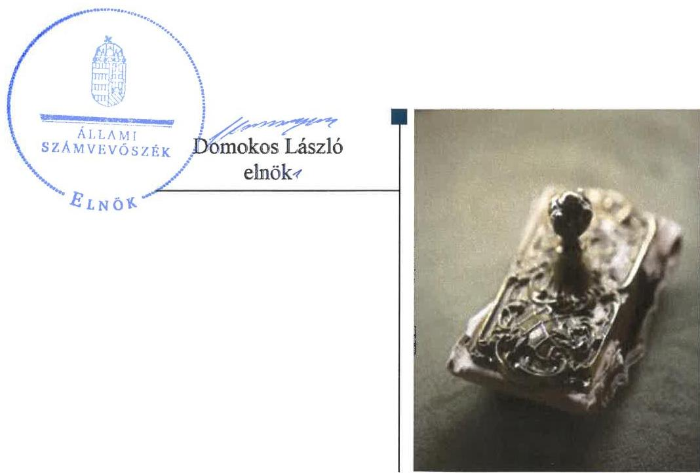
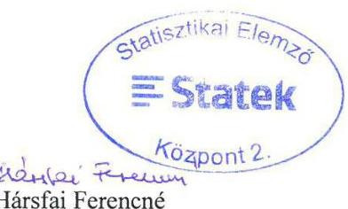
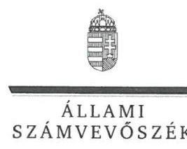
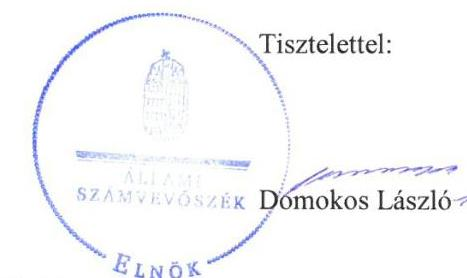
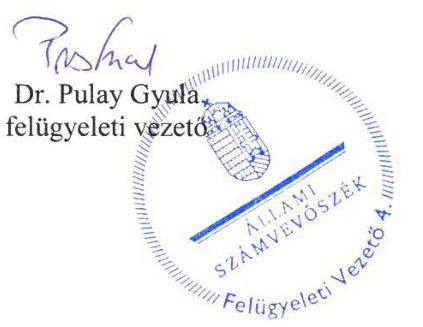
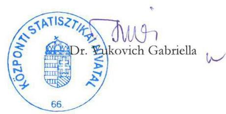
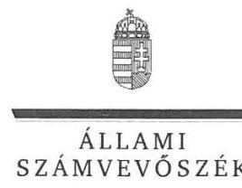
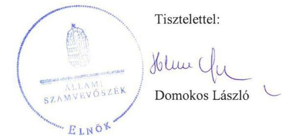
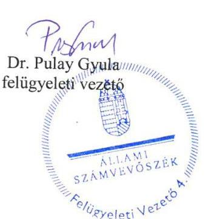

# Jelenetés 

## Az állami tulajdonú gazdasági társaságok ellenőrzése

STATEK Statisztikai Elemző Központ Kft. 2018.

---

# Jelenetés 

## Az állami tulajdonú gazdasági társaságok ellenőrzése

STATEK Statisztikai Elemző Központ Kft.
2018. Jegtethes hó 28. nap

---

# AZ ELLENŐRZÉST FELÜGYELTE:

DR. PULAY GYULA felügyeleti vezető

## AZ ELLENŐRZÉST VEZETTE ÉS A VÉGREHAJTÁSÁÉRT FELELŐS:

GÖRGÉNYI GÁBOR ellenőrzésvezető

A PROGRAM ÖSSZEÁLLÍTÁSÁÉRT FELELŐS:

TÓTPÁL SZABOLCS osztályvezető

IKTATÓSZÁM: EL-0635-136/2018.

TÉMASZÁM: 2469

ELLENŐRZÉS-AZONOSÍTÓ SZÁM: V081427

Jelentéseink az Országgyűlés számítógépes hálózatán és az Interneta a www.asz.hu címen is olvashatóak.

---

# TARTALOMJEGYZÉK 

■ ÖSSZEGZÉS ..... 5
■ AZ ELLENŐRZÉS CÉLJA ..... 6
■ AZ ELLENŐRZÉS TERÜLETE ..... 7
■ AZ ELLENŐRZÉS HÁTTERE, INDOKOLTSÁGA ..... 8
■ A JELENTÉS LÉNYEGES KÉRDÉSKÖREI ..... 9
■ AZ ELLENŐRZÉS HATÓKÖRE ÉS MÓDSZEREI ..... 10
■ MEGÁLLAPÍTÁSOK ..... 12
■ JAVASLATOK ..... 15
■ MELLÉKLETEK ..... 17
I. sz. melléklet: Értelmező szótár ..... 17
II. sz. melléklet: Pénzügyi adatok ..... 18
■ FÜGGELÉK: ÉSZREVÉTELEK ..... 19
■ RÖVIDÍTÉSEK JEGYZÉKE ..... 31

---

.

---

# ÖSSZEGZÉS 

A STATEK Statisztikai Elemző Központ Kft. müködésének szabályozottsága megfelelt a jogszabályi előírásoknak. A pénzügyi-számviteli feladatok ellátása szabályszerü volt. A vagyongazdálkodási tevékenység nem volt szabályszerü. Az adatszolgáltatási és közzétételi kötelezettségének a Társaság eleget tett.

## Az ellenőrzés társadalmi indokoltsága

Az állami tulajdonú gazdálkodó szervezetek ellenőrzése kiemelten fontos a vagyon megőrzése, megóvása érdekében, amelyekkel szemben alapvető követelmény, hogy gazdálkodásuk, müködésük szabályszerű, az általuk szolgáltatott adatok minél megbízhatóbbak legyenek. Az állami tulajdonban álló gazdálkodó szervezetek államot megillető Társasági részesedése a nemzeti vagyon részét képezi és legfőbb rendeltetése szerint a közfeladatok ellátását szolgálja.

Az Állami Számvevőszék stratégiájában megfogalmazta, hogy az államháztartáson kívül múködő közfeladat-ellátó rendszerek ellenőrzéseivel hozzájárul ahhoz, hogy a közpénzeket az államháztartáson kívül múködő szervezetek is átlátható, rendezett módon használják fel a közfeladatok szerződésben vállalt ellátása érdekében. Ellenőrzésünk eredményeképpen javaslatainkkal, megállapításainkkal hozzájárulhatunk a nemzeti vagyonnal való gazdálkodás átláthatóságának, elszámoltathatóságának javításához.

Az Állami Számvevőszék céljaival és a társadalmi igénnyel összhangban, valamint a gazdasági társaságok fontos szerepe miatt került sor a STATEK Statisztikai Elemző Központ Kft. ellenőrzésére. Az ellenőrzést a Társaság feladatellátásából adódó további társadalmi elvárás is indokolta, mert a statisztikai adatgyűjtések eredményeit a társadalom és a gazdaság szereplői széles körben hasznosíthatják.

## Főbb megállapítások, következtetések, javaslatok

A Központi Statisztikai Hivatalnál a tulajdonosi joggyakorlás kereteinek kialakítása és a tulajdonosi jogok gyakorlása szabályszerű volt.

A STATEK Statisztikai Elemző Központ Kft. múködésének szabályozottsága megfelelt a jogszabályi előírásoknak. A pénzügyi-számviteli feladatok ellátása szabályszerű volt.

A Társaság az előírt tervezési, beszámolási és adatszolgáltatási kötelezettségét teljesítette, a közérdekből nyilvános adatokat közzétette.

A Társaság vagyongazdálkodási tevékenysége nem volt szabályszerű a vagyonnyilvántartás hiányosságai miatt. A beszámoló mérlegének adatait a Társaság nem támasztotta alá leltárral.

Az Állami Számvevőszék a Társaság ügyvezetőjének 5 javaslatot fogalmazott meg annak érdekében, hogy a szabálytalanságok, hiányosságok megszüntetésre kerüljenek.

---

# AZ ELLENŐRZÉS CÉLJA 

AZ ELLENŐRZÉS CÉLJA annak értékelése, volt, hogy a tulajdonosi jogok gyakorlása szabályszerű volt-e. A gazdálkodó szervezet szabályozottsága, gazdálkodása és vagyongazdálkodási tevékenysége megfelelt-e a jogszabályi és a tulajdonosi előírásoknak; biztosítva volte a közfeladatok átláthatósága és elszámoltathatósága. A vagyonváltozást eredményező döntések esetében a tulajdonosi jogok gyakorlója és a gazdálkodó szervezet szabályszerűen jártak-e el.

---

# AZ ELLENŐRZÉS TERÜLETE 

## STATEK Statisztikai Elemző Központ Kft.

A STATEK Statisztikai Elemző Központ Kft. budapesti székhelyű 100\%-ban állami tulajdonban lévő, egyszemélyes korlátolt felelősségű társaság. A Társaság ${ }^{1}$ alapítása 2013. június 20-án történt. A Társaság felett a tulajdonosi jogokat az Stt. ${ }^{2}$ alapján a Magyar Állam nevében a $\mathrm{KSH}^{3}$ elnöke gyakorolta.

A Társaság főtevékenysége a KSH lakossági adatgyűjtéseinek megszervezése és elvégzése volt, amely közfeladatnak minősült. A Társaság vállalkozási tevékenység keretében is ellátott statisztikai adatgyűjtési, valamint kutatási feladatokat.

A Társaság vezetését az ügyvezető ${ }^{4}$ látta el, akinek személyében két alkalommal, 2014. április 14-én és 2016. augusztus 1-jén történt változás. A Társaságnál háromtagú felügyelőbizottság és könyvvizsgáló működött. A felügyelőbizottságban egy tag személye változott 2015. április 20-án.

A Társaság 2013-2016. évi nettó árbevétele 0,4 M Ft, 12,4 M Ft, 21,3 M Ft és 76,3 M Ft volt, míg a foglalkoztatottak átlagos statisztikai létszáma 40, 289, 293 és 279 fő volt. Az éves beszámolók részletesebb adatait a II. sz. melléklet tartalmazza.

A Társaság a 2013-2014. években veszteséges volt, ezt követően nyereségesen gazdálkodott. A Társaság vállalkozási tevékenységéből származó bevétele 2013-ban az összes bevétel 1,1\%-át tette ki, 2016-ban ez az arány $14,4 \%$-ra nőtt.

A Társaság alapításkori jegyzett tőkéje 3,0 M Ft volt, mely teljes egészében pénzbeli hozzájárulásból állt. A KSH a törzstőkén felül további 30,0 M Ft-ot bocsátott rendelkezésére pénzbeli hozzájárulás formájában, amelyet a Társaság tőketartalékba helyezett. A tőketartaléknak köszönhetően a saját tőke értéke meghaladta a jegyzett tőke értékét.

A KSH a Társaság által végzett közfeladatok ellátásához a 2013-2016. években $35,7 \mathrm{M} \mathrm{Ft}, 429,0 \mathrm{M} \mathrm{Ft}, 457,1 \mathrm{M}$ Ft és 454,3 M Ft, összesen 1376,1 M Ft támogatást nyújtott.

A Társaság más gazdasági társaságokban tulajdoni részesedésekkel nem rendelkezett.

A Társaság nem tartozott a kormányzati szektorba sorolt egyéb szervezetek körébe. A Társaság vagyonkezelésbe vett állami, vagy önkormányzati vagyonnal nem rendelkezett, tevékenységét saját vagyonával látta el. A Társaság a Számv. tv. alapján nem volt önköltségszámításra kötelezett.

A Társaság nem tartozott a Bkr. ${ }^{5}$ hatálya alá, belső ellenőrzést nem müködtetett.

---

# AZ ELLENŐRZÉS HÁTTERE, INDOKOLTSÁGA 

Az Európai Unióban 1994. év óta hatályos túlzott hiány eljárás mindig kihívást jelentett a tagállamok számára. Az állami tulajdonú gazdálkodó szervezetek ellenőrzése kiemelten fontos a vagyon megőrzése, megóvása érdekében, valamint a kormányzati szektor elszámolásaiban megjelenő állami tulajdonú gazdálkodó szervezetek esetében, amelyekkel szemben alapvető követelmény, hogy gazdálkodásuk, múködésük szabályszerű, az általuk szolgáltatott adatok minél megbízhatóbbak legyenek. Gazdálkodásuk jellemzően a közérdeklődés és a média figyelmének középpontjában áll, amihez hozzájárul a gazdálkodásuk körébe tartozó - közvetlen vagy közvetett állami tulajdonú, tehát végső soron a nemzeti vagyon részét képező - vagyon nagysága, illetve az általuk ellátott közszolgáltatások/közfeladatok minősége és hatékonysága.

Az ellenőrzés rámutathat az állami tulajdonú gazdálkodó szervezetek gazdálkodási tevékenységével összefüggő jó gyakorlatokra és szabálytalanságokra. Felhívhatja a figyelmet a jogszabályi követelmények teljesítéséhez szükséges feltételek hiányosságaira, hozzájárulhat az államháztartáson kívüli, de (közvetlenül vagy közvetve) állami vagyont használó gazdálkodó szervezetek tevékenységének átláthatóságához. Ellenőrzésünk eredményeképpen javaslatainkkal, megállapításainkkal hozzájárulhatunk a nemzeti vagyonnal való gazdálkodás átláthatóságának, elszámoltathatóságának javításához.

---

# A JELENTÉS LÉNYEGES KÉRDÉSKÖREI 

1. A tulajdonosi jogok gyakorlása szabályszerű volt-e?
2. A Társaság múködésének szabályozottsága megfelelt-e a jogszabályi előírásoknak, a pénzügyi-számviteli és adatszolgáltatási feladatok ellátása szabályszerű volt-e?
3. A Társaság vagyongazdálkodása szabályszerű volt-e?

---

# AZ ELLENŐRZÉS HATÓKÖRE ÉS MÓDSZEREI 

## Az ellenőrzés típusa

Megfelelőségi ellenőrzés

## Az ellenőrzött időszak

2013. június 20-tól 2016. december 31-ig, a 2016. évi beszámoló jóváhagyásáig tartó időszak.

## Az ellenőrzés tárgya

Állami tulajdonban lévő gazdasági Társaság gazdálkodása, kiemelten vagyongazdálkodási tevékenysége, a tulajdonosi jogok gyakorlása.

## Az ellenőrzött szervezet

STATEK Statisztikai Elemző Központ Kft., valamint a tulajdonosi jogokat gyakorló Központi Statisztikai Hivatal

## Az ellenőrzés jogalapja

Az ellenőrzés jogszabályi alapját az az Állami Számvevőszékről szóló 2011. évi LXVI. törvény 1. § (3) bekezdése és 5. § (3)-(5) bekezdései képezték.

## Az ellenőrzés módszerei

Az ellenőrzést a nemzetközi standardokat irányadónak tekintve az ellenőrzési program ellenőrzési kérdései, az ellenőrzött időszakban hatályos jogszabályok, az ellenőrzés szakmai szabályok és módszertanok figyelembe vételével végeztük.

Az ellenőrzés ideje alatt az ellenőrzött szervezettel történő kapcsolattartást az ÁSZ ${ }^{6}$ Szervezeti és Müködési Szabályzatának vonatkozó előírásai alapján biztosítottuk.

Az ellenőrzésre a nemzetgazdasági szempontból kiemelt jelentőségű nemzeti vagyon körébe tartozó gazdálkodó szervezeteknél és a többségi állami tulajdonban álló gazdálkodó szervezeteknél került sor. A program szerinti feladatokat a kiválasztott gazdálkodó szervezeteknél (társaságoknál) és azok többségi tulajdonban lévő leányvállalatainál, valamint a tulajdonosi jogok gyakorlójánál kellett végrehajtani. Az ellenőrzés szempontjai

---

és az ellenőrzés alá vont gazdálkodó szervezetek köre az ellenőrzés tapasztalatai alapján - indokolt esetben - változhatott.

A teljes ellenőrzött időszakra vonatkozóan került ellenőrzésre a Társaság tervezési, beszámolási, közzétételi, adatszolgáltatási kötelezettségének szabályszerűsége, valamint a tulajdonosi joggyakorlás szabályszerűsége. A 2013. és 2016. évekre vonatkozóan a Társaság múködésének szabályozottságát, a bevételei és ráfordításai elszámolását, illetve vagyongazdálkodásának szabályszerűségét is ellenőriztük.

A bevételek és a ráfordítások közül az értékesítés nettó árbevétele, az egyéb, rendkívüli és pénzügyi műveletek bevételei, a személyi jellegű ráfordítások, az anyagjellegú ráfordítások, az egyéb, rendkívüli és pénzügyi műveletek ráfordításai, valamint értékcsökkenési leírás elszámolásának szabályszerűségét, továbbá az immateriális javak, tárgyi eszközök esetében a vagyonnyilvántartás szabályszerűségét véletlen mintavétellel ellenőriztük.

A fenti sokaságok esetében a mintavétel azokra a legnagyobb értékű tételekre - a lényeges sokaságra - terjedt ki, melyek összértéke elérte a teljes sokaság összértékének 50\%-át. A személyi jellegű ráfordítások esetében a mintavétel a teljes sokaságból történt. Amennyiben valamely ellenőrzött sokaság elemszáma kisebb volt, mint az előírt mintaelem-szám, az ellenőrzött sokaságot tételesen ellenőriztük.

A mintavétellel ellenőrzött területek esetében minden egyes tétel vonatkozásában a szabályszerűségre vonatkozó kérdéseket tettünk fel, amelyek eredménye összesítésre került. „Szabályszerűnek" értékeltünk egy ellenőrzött területet, amennyiben 95\%-os bizonyossággal az ellenőrzött sokaságban az átlagos hibaarány legfeljebb 10\%, „nem szabályszerűnek", amennyiben 10\%-nál magasabb arányt képviselt.

Az ellenőrzési kérdések megválaszolásához szükséges bizonyítékok megszerzése a következő ellenőrzési eljárások alkalmazásával történt: megfigyelés, kérdésfeltevés (információkérés), összehasonlítás, valamint elemző eljárás. Az ellenőrzési bizonyítékként felhasználható adatforrások közé tartoztak egyrészt az ellenőrzési programban felsorolt adatforrások, másrészt adatforrás lehet még minden - az ellenőrzés folyamán - feltárt, az ellenőrzés szempontjából információkat tartalmazó dokumentum.

Az ellenőrzést a kérdésekre adott válaszok kiértékelésével, valamint a megjelölt adatforrások, a csatolt tanúsítványok felhasználásával, továbbá az adott időszakban hatályos jogszabályok figyelembe vételével folytattuk le.

---

# 1. A tulajdonosi jogok gyakorlása szabályszerű volt-e? 

Összegző megállapítás

A tulajdonosi joggyakorlás kereteinek kialakítása és a tulajdonosi jogok gyakorlása szabályszerű volt.

A TULAJDONOSI JOGGYAKORLÁS KERETEIT a KSH a KSH SZMSZ ${ }_{1-2}{ }^{7}$-ében foglaltak alapján az Alapító okirat ${ }_{1-4}{ }^{8}$, valamint a Társasággal az alaptevékenységként végzett közfeladatok ellátásával kapcsolatosan megkötött együttműködési megállapodás ${ }^{9}$ és támogatási szerződések ${ }^{10}$ útján szabályszerűen alakította ki.

A Társaságnál a Taktv. ${ }^{11}$ alapján felügyelőbizottság működött, melynek tagjait a KSH a Gt. ${ }^{12}$ előírásainak megfelelően az Alapító okirat ${ }_{1}$-ben jelölte ki. A KSH megbízta a Társaság könyvvizsgálóját a Gt., illetve a Ptk. ${ }^{13}$ előírásainak megfelelően.

A KSH az Alapító okirat ${ }_{1-4}$-ban írta elő az ügyvezető számára a Számv. tv. ${ }^{14}$ szerinti beszámoló, az éves mérleg és vagyonkimutatás, az éves üzleti terv, valamint az éves közbeszerzési, beruházási, létszám- és vagyongazdálkodási terv elkészítését.

A KSH megalkotta a Társaság Taktv. szerinti javadalmazási szabályzatát ${ }^{15}$.

A TULAJDONOSI JOGGYAKORLÁS szabályszerű volt. A Társaság üzleti tervét a felügyelőbizottság megtárgyalta és elfogadta, a KSH pedig jóváhagyta. A KSH a Társaság Számv. tv. szerinti éves beszámolóiról a Ptk. ${ }_{1}$ előírásainak megfelelően a könyvvizsgáló és a felügyelőbizottság írásbeli jelentései birtokában hozta meg elfogadó döntését. A KSH döntött a Társaság eredményének felosztásával kapcsolatban, osztalékfizetés nem történt. Az KSH az előírásoknak megfelelően hozott döntést a Társaság saját vagyonának változásáról.

A KSH ellenőrizte a belső szabályozottság, a pénzügyi gazdálkodás és a vagyonnal történő gazdálkodás szabályszerűségét a Társaságnál. Az ellenőrzések intézkedést igénylő megállapítást és javaslatot nem tartalmaztak.

---

# 2. A Társaság múködésének szabályozottsága megfelelt-e a jogszabályi előírásoknak, a pénzügyi-számviteli és adatszolgáltatási feladatok ellátása szabályszerű volt-e? 

Összegző megállapítás

A Társaság múködésének szabályozottsága megfelelt a jogszabályi előírásoknak. A pénzügyi-számviteli feladatok ellátása szabályszerű volt. A Társaság az adatszolgáltatási és közzétételi kötelezettségének eleget tett.

A TÁRSASÁG MÚKÖDÉSÉNEK SZABÁLYOZOTTSÁGA megfelelt a jogszabályi előírásoknak. A Társaság rendelkezett a Számv. tv.-ben előírt Számviteli politikával ${ }_{1-4}{ }^{16}$, Számlarenddel ${ }_{1-2}{ }^{17}$, Pénzkezelési szabályzattal ${ }_{1-4}{ }^{18}$, Leltározási Szabályzattal ${ }_{1-4}{ }^{19}$ és Értékelési szabályzattal ${ }_{1-2}{ }^{20}$, amelyek - két tartalmi elem kivételével - megfeleltek a Számv. tv. előírásainak:

- A Számviteli politika ${ }_{3-4}$ keretében a Számv. tv. 14. § (4) bekezdésében foglaltak ellenére 2015. július 4-től nem rögzítették azokat a szabályokat, előírásokat, módszereket, amelyekkel meghatározzák, hogy a Társaság mit tekint kivételes nagyságú vagy előfordulású bevételnek, költségeknek, ráfordításnak.
- A Pénzkezelési szabályzat ${ }_{1-4}$ a Számv. tv. 14. § (8) bekezdésben foglaltak ellenére nem rendelkezett a készpénzállomány ellenőrzésének gyakoriságáról.

A BEVÉTELEK ÉS RÁFORDÍTÁSOK ELSZÁMOLÁSA szabályszerű volt, megfelelt a Számv. tv. és a belső szabályzatok előírásainak.

## A KÖTELEZŐEN KÖZZÉTEENDŐ KÖZÉRDEKŰ

ADATOKAT a Társaság hozzáférhetővé tette, azonban az Info tv. ${ }^{21} 37$. § (1) bekezdésében foglaltak ellenére elmaradt az Info tv. 1. melléklet (általános közzétételi lista) III. Gazdálkodási adatok 2. és 4. pontja szerinti adatok saját honlapon történő közzététele. A Társaság a Taktv.-ben előírt közzétételi kötelezettségének eleget tett.

A Társaság, mint adatfelelős az Info tv. 35. § (3) bekezdésében foglaltak ellenére a közzétételi kötelezettség teljesítésének részletes szabályait belső szabályzatban nem állapította meg.

BESZÁMOLÁSI KÖTELEZETTSÉGÉT a Társaság teljesítette, a szakmai beszámolóit benyújtotta a KSH részére. A Számv. tv. szerinti éves beszámolóit a Társaság elfogadásra benyújtotta a tulajdonosi joggyakorló részére. Az éves beszámolókat a Társaság az előírásoknak megfelelően letétbe helyezte és közzétette.

TERVEZÉSI KÖTELEZETTSÉGÉT a Társaság - a 2013. üzleti év kivételével - teljesítette. Az Alapítói okirat ${ }_{1-4} 12.2$ pontjában foglaltak ellenére a Társaság 2013. évre vonatkozó üzleti tervet nem készített.

---

A TÁRSASÁG ÁLTAL ALKALMAZOTT DÍJ AK megállapítása szabályszerű volt. A vállalkozási tevékenységek keretében végzett szolgáltatások ármeghatározása piaci alapon történt, jogszabályi előírás a díjmegállapítás vonatkozásában nem volt.

A Társaság alaptevékenysége során végzett közhatalmi feladatainak pénzügyi fedezetét a KSH-val kötött támogatási szerződések alapján folyósított támogatás biztosította.

# 3. A Társaság vagyongazdálkodása szabályszerű volt-e? 

## Összegző megállapítás

A Társaság vagyongazdálkodási tevékenysége nem volt szabályszerű.

A TÁRSASÁG AZ ÉVES BESZÁMOLÓINAK MÉRLEGTÉTELEIT a Számv. tv. 69. § (1) bekezdésében foglaltak ellenére a törvénynek megfelelő leltárral nem támasztotta alá, ebből eredően a mérlegtételek vonatkozásában nem volt biztosított a Számv. tv. 15. § (3) bekezdésében foglalt valódiság elve. A leltározás hiányossága ellenére a könyvvizsgáló a beszámolót korlátozás nélküli hitelesítő záradékkal látta el.

A VAGYON NYILVÁNTARTÁSA ÉS AZ ÉRTÉKCSÖKKENÉS ELSZÁMOLÁSA nem volt szabályszerű. A tárgyi eszközök nyilvántartásba vétele során a Számv. tv. 52. § (2) bekezdésében előírtak ellenére az üzembe helyezést hitelt érdemlően nem dokumentálták, mert a Társaság a Számv. tv. 165. § (1) bekezdésében foglaltak ellenére az üzembe helyezésről nem állított ki bizonylatot. A bekerülési érték megállapítása a gépjármú beszerzés esetében nem felelt meg a Számv. tv. 47. § (1)-(2) bekezdésében és a Számviteli politika ${ }_{1.3-4} 6.2 .3$. pontjában foglaltaknak, mert annak meghatározása során nem vették figyelembe az illetéket és az üzembe helyezési költséget.

---

# JAVASLATOK 

Az ÁSZ tv. 33. § (1) bekezdésében foglaltak értelmében az ellenőrzött szervezet vezetője köteles a jelentésben foglalt megállapításokhoz kapcsolódó intézkedési tervet összeállítani és azt a jelentés kézhezvételétől számított 30 napon belül az ÁSZ részére megküldeni. Amennyiben az ellenőrzött szervezet vezetője nem küldi meg határidőben az intézkedési tervet, vagy továbbra sem elfogadható intézkedési tervet küld, az Állami Számvevőszék elnöke az ÁSZ tv. 33. § (3) bekezdése a) és b) pontjaiban foglaltakat érvényesítheti.

## A STATEK Statisztikai Elemző Központ Kft. ügyvezetőjének

1. Intézkedjen a számviteli politika és a pénzkezelési szabályzat Számv. tv.-ben elöírtaknak megfelelő elkészitéséről.
(2. sz. megállapítás 1. bekezdésének 1-2. francia bekezdései alapján)
2. Intézkedjen az Info tv. szerint a közzétételi kötelezettség teljesitéséről, továbbá a közzétételi kötelezettség teljesitésének részletes szabályait rögzítő szabályzat elkészítéséről.
(2. sz. megállapítás 3-4. bekezdései alapján)
3. Intézkedjen a Számv. tv. előírásainak megfelelően az éves beszámoló mérlegtételeinek leltárral való alátámasztásáról.
(3. sz. megállapítás 1. bekezdése alapján)
4. Intézkedjen a vagyonelemek nyilvántartásba vételének a Számv. tv. előírásainak megfelelő számviteli bizonylattal történő alátámasztásáról.
(3. sz. megállapítás 2. bekezdésének 2. mondata alapján)
5. Intézkedjen annak érdekében, hogy az eszközök bekerülési értéke a Számv. tv. és a belső szabályzatok előírásainak megfelelően kerüljön megállapításra.
(3. sz. megállapítás 2. bekezdésének 3. mondata alapján)

---

.

---

# MELLÉKLETEK 

- I. SZ. MELLÉKLET: ÉRTELMEZŐ SZÓTÁR
gazdasági társaság
gazdálkodó szervezet
kormányzati szektorba sorolt egyéb szervezet
közszolgáltatás
nemzeti vagyon

Ptk. 1 3:88. § (1) bekezdése szerint „a gazdasági Társaságok üzletszerű közös gazdasági tevékenység folytatására, a tagok vagyoni hozzájárulásával létrehozott, jogi személyiséggel rendelkező vállalkozások, amelyekben a tagok a nyereségből közösen részesednek, és a veszteséget közösen viselik".
2014. március 14-ig:

A Ptk. ${ }^{22}$ 685. § c) pontja szerint gazdálkodó szervezet: „az állami vállalat, az egyéb állami gazdálkodó szerv, a szövetkezet, a lakásszövetkezet, az európai szövetkezet, a gazdasági társaság, az európai részvénytársaság, az egyesülés, az európai gazdasági egyesülés, az európai területi együttmúködési csoportosulás, az egyes jogi személyek vállalata, a leányvállalat, a vízgazdálkodási társulat, az erdő birtokossági társulat, a végrehajtói iroda, az egyéni cég, továbbá az egyéni vállalkozó."
2014. március 15-től:

A gazdasági társaság, az európai részvénytársaság, az egyesülés, az európai gazdasági egyesülés, az európai területi együttműködési csoportosulás, a szövetkezet, a lakásszövetkezet, az európai szövetkezet, a vízgazdálkodási társulat, az erdőbirtokossági társulat, az állami vállalat, az egyéb állami gazdálkodó szerv, az egyes jogi személyek vállalata, a közös vállalat, a végrehajtói iroda, a közjegyzői iroda, az ügyvédi iroda, a szabadalmi ügyvivői iroda, az önkéntes kölcsönös biztosító pénztár, a magánnyugdíjpénztár, az egyéni cég, továbbá az egyéni vállalkozó. Az állam, a helyi önkormányzat, a költségvetési szerv, az egyesület, a köztestület, valamint az alapítvány gazdálkodó tevékenységével összefüggő polgári jogi kapcsolataira is a gazdálkodó szervezetre vonatkozó rendelkezéseket kell alkalmazni.
Forrás: Ppt. ${ }^{23} 396 . \S$
az Áht. ${ }^{24}$ 3. § (2) és (3) bekezdésében foglaltakon kívül az Európai Közösséget létrehozó szerződéshez csatolt, a túlzott hiány esetén követendő eljárásról szóló jegyzőkönyv alkalmazásáról szóló 2009. május 25-i 479/2009/EK rendelet (a továbbiakban: 479/2009/EK rendelet) szerint a kormányzati szektorba sorolt szervezet (Áht. 1. § (12))
Az Ebktv. ${ }^{25}$ 3. § d) pontja a következőképpen határozza meg a közszolgáltatást: „szerződéskötési kötelezettség alapján a lakosság alapvető szükségleteinek ellátására irányuló szolgáltatás, így különösen a villamos energia-, gáz-, hő-, víz-, szenny-víz- és hulladékkezelési, köztisztasági, postai és távközlési szolgáltatás, továbbá a menetrend alapján közlekedő járművekkel végzett közforgalmú személyszállítás". Nvtv. ${ }^{26}$ 1. § (2) bekezdése szerint többek között:
„az állam vagy a helyi önkormányzat kizárólagos tulajdonában álló dolgok, az a) pont hatálya alá nem tartozó, állam vagy a helyi önkormányzat tulajdonában lévő dolog,
az állam vagy a helyi önkormányzat tulajdonában lévő pénzügyi eszközök, továbbá az államot vagy a helyi önkormányzatot megillető Társasági részesedések, az államot vagy a helyi önkormányzatot megillető bármely vagyoni értékkel rendelkező jogosultság, amelyet jogszabály vagyoni értékű jogként nevesít."

---

# II. SZ. MELLÉKLET: PÉNZÜGYI ADATOK

|  STATEK STATISZTIKAI ELEMZŐ KÖZPONT KFT. ÉVES BESZÁMOLÓINAK ADATAI (M FT) |  |  |  |   |
| --- | --- | --- | --- | --- |
|  Eredménykimutatás | 2013. év | 2014. év | 2015. év | 2016. év  |
|  Értékesítés nettó árbevétele | 0,4 | 12,4 | 21,3 | 76,3  |
|  Egyéb bevételek | 35,7 | 429,1 | 457,1 | 454,4  |
|  Anyagjellegú ráfordítások | 9,5 | 36,1 | 38,2 | 76,0  |
|  Személyi jellegú ráfordítások | 43,0 | 409,5 | 430,0 | 439,3  |
|  Egyéb ráfordítások | 1,0 | 0,0 | 0,5 | 1,8  |
|   |  |  | Forrás: a Társaság 2013-2016. évi beszámolói |   |

- A 2013-2015. években az adózott eredmény és a mérleg szerinti eredmény megegyezett. A Számv. tv. 2015. július 4-től hatályos módosítása alapján a mérleg szerinti eredmény tétel megszűnt. A 2016. évi éves beszámoló eredménykimutatásában az adózott eredmény levezetését kellett kimutatni.

---

# FÜGGELÉK: ÉSZREVÉTELEK 

A jelentéstervezetet a Számvevőszék 15 napos észrevételezésre megküldte az ellenőrzött szervezetek vezetőinek az ÁSZ tv. 29. §* (1) bekezdése előírásának megfelelően.

Az ÁSZ a jelentéstervezetet a STATEK Statisztikai Elemző Központ Kft. ügyvezetőjének és a Központi Statisztikai Hivatal elnökének küldte meg.
Észrevételt a STATEK Statisztikai Elemző Központ Kft. ügyvezetője és a Központi Statisztikai Hivatal elnöke is tett, észrevételeiket és az azokra adott válaszokat a függelék tartalmazza.

[^0]
[^0]:    * 29. § (1) Az Állami Számvevőszék az ellenőrzési megállapításait megküldi az ellenőrzött szervezet vezetőjének vagy az általa megbízott személynek, és annak, akinek személyes felelősségét állapította meg.
    (2) Az ellenőrzött szervezet vezetője és a felelősként megjelölt személy az ellenőrzés megállapításaira tizenöt napon belül írásban észrevételt tehet.
    (3) Az Állami Számvevőszék az észrevételre a beérkezésétől számított harminc napon belül írásban válaszol. A figyelembe nem vett észrevételeket köteles a jelentésben feltüntetni, és megindokolni, hogy azokat miért nem fogadta el.

---

# ㄷ Statek 

## Domokos László

## elnök

Állami Számvevőszék

Tisztelt Elnök Úr!

Iktatószám: STK-KI-2018-459

## ÁLLAMI SZÁMVEVÖSZÉK

$B E-474571201811$
Érkezeit: 2018 AUG 17.

Iktatószám: EL. 0655-1251
Móókat:

Köszönettel vettem az EL-0635-123/2018. iktatószám alatt megküldött, „Az állami tulajdonú gazdasági társaságok ellenőrzése - Statek Statisztikai Elemző Központ Kft." című jelentéstervezetet.

A jelentéstervezet összegző megállapításainak többségével egyetértek, néhány megállapításhoz az alábbi észrevételt kívánom tenni:

1. A Számviteli politika keretében a Számv. tv. 14. § (4) bekezdésében foglaltakról, a Statek Statisztikai Elemző Központ Kft. 2014. évi (2015. évben is hatályos) Számviteli Politikájának „3.13. A lényegesség elve, valamint a 4.8. Az éves beszámoló adattartalma, jelentősebb összegű hiba, számviteli szempontból lényeges hatású információ, gazdasági esemény" pontjai rendelkeznek. Amennyiben ettől részletesebb szabályozás indokolt, az intézkedési tervben rendelkezni fogunk erről.
2. A Pénzkezelési Szabályzat valóban nem tartalmazza a készpénzállomány ellenőrzésének gyakoriságát, az intézkedési tervben rendelkezünk a Pénzkezelési Szabályzat kiegészítéséről.
3. 3. A bevételek elszámolásánál leírt észrevétel a számla továbbított (szkennelt) változatára jogos, mert a szkennelt változat alig olvasható. A Társaságnál rendelkezésre álló másolati példányon az adatok jól láthatóak.
4. A kötelezően közzéteendő közérdekủ adatokra vonatkozó megállapítás helytálló, az intézkedési tervben rendelkezünk a megállapításban leírt adatok jövőbeni rendszeres közzétételéről.
5. A tervezési kötelezettség keretében tett észrevétel, miszerint 2013. évre üzleti terv nem készült, annyi észrevételtelt kívánok tenni, hogy terv készült (a 2013. évi
beszámoló csomag tartalmazza), de tulajdonosi jóváhagyására nem került sor. Mivel a Társaság alapítása 2013. június 20 -án történt, a működési feltételek megszervezése volt nagyon fontos, elsőrendű feladat.

---

# Statek 

Statisztikai Elemző Központ
6. A Társaság az éves beszámolóinak mérlegtételeit a törvénynek megfelelő leltárral nem támasztotta alá megállapításhoz a következő észrevétel szeretném tenni.
2013. évben a mérlegtételek alátámasztására külön leltári föösszesítő készítése nem történt. A könyvvizsgáló minden mérlegtétel alátámasztására leltárt, vagy egyeztető kimutatást kapott.

A 2013. évi mérlegtételek alátámasztása a következő dokumentumokkal történt:

- tárgyi eszközök értéke a mérlegben nulla forint, a nulla nettó értékben nyilvántartott eszközök leltározása megtörtént,
- vevő követelés 2013. 12. 31-én nem volt,
- készpénzállomány 2013. 12. 31-i értéke leltárral alátámasztott,
- bankszámlák 2013. 12. 31-i egyenlege a 12. havi számlakivonatok záró értékével került egyeztetésre
- szállítók 2013. 12. 31-i egyenlege a szállítók által visszaigazolt egyenlegközlő levelekkel voltak alátámasztva,
- adó jellegű tételeket a NAV adófolyószámla kivonata tartalmazta
- a passzív időbeli elhatárolások összegének megállapítása a támogatás elszámolással egyezően történt, melyre vonatkozóan főkönyvi szám szerinti egyeztetés is sor került.
2014., 2015., 2016. években a mérlegtételek alátámasztásához leltári főösszesítők is készültek, amelyekben a mérlegben megjelenő minden ESZKÖZ és FORRÁS fel van sorolva Ft-ban és ezer Ft-ban, minden tételnél fel van tüntetve a főkönyvi számra történő hivatkozás, a megjegyzésben pedig hivatkozunk az egyes tételeket alátámasztó leltárakra, egyeztető bizonylatokra, dokumentumokra.
(Az STK-KI-2017-826. ikt.szám alatt megküldött Teljeségi nyilatkozat 56., 57., 58., 59. sorai tartalmazzák.)

A fentiekben felsorolt dokumentumokat 2013., 2014., 2015., 2016. évekre vonatkozóan levelemhez csatolom.
7. A vagyon nyilvántartása és az értékcsökkenés elszámolása keretében tett megállapítás jogos, a gépjármủ beszerzés esetében az illeték és az üzembe helyezési költség közvetlenül költségként került elszámolásra.

Két beszerzési tételnél nem került csatolásra és továbbításra az Üzembe helyezési jegyzőkönyv, melyek levelemhez csatolásra kerülnek.

---

# Statek 

Tisztelt Elnök Úr, ezúton szeretném jelezni, hogy az Önök által bekért anyagok feltöltésénél informatikai probléma jelentkezett, melyet a levelükben megadott módon azonnal bejelentettünk.

A vizsgálat eredménye alapján az intézkedési tervet elkészítjük és a megadott határidőn belül továbbítani fogjuk az Önök részére.

Budapest, 2018. augusztus 15.

Tisztelettel:

ügyvezető igazgató

Mellékletek:

- 2013., 2014., 2015., 2016. évi leltáraknál felsorolt dokumentumok
- 2 db üzembe helyezési jegyzőkönyv
- 1 pld. könyvvizsgálói nyilatkozat

---

ELNÖK

Ikt.szám: EL-0635-129/2018.

# Hársfai Ferencné úrhölgy 

ügyvezető
STATEK Statisztikai Elemző Központ Kft.

## Budapest

## Tisztelt Ügyvezetó Úrhölgy!

„Az állami tulajdonú gazdasági társaságok ellenőrzése - STATEK Statisztikai Elemző Központ Kft." címmel készített számvevőszéki jelentéstervezetre a STATEK Statisztikai Elemző Központ Kft. észrevételeit köszönettel megkaptam.
Az Állami Számvevőszék észrevételekre vonatkozó álláspontjáról a felügyeleti vezető által készített részletes tájékoztatást csatoltan megküldöm.
Tájékoztatom Ügyvezető úrhölgyet, hogy a számvevőszéki jelentésben - az Állami Számvevőszékről szóló 2011. évi LXVI. törvény 29. § (3) bekezdése alapján - a figyelembe nem vett észrevételeket szerepeltetjük az elutasítás indokának feltüntetésével.

Budapest, 2018. 0 hó 7 nap

Melléklet: Tájékoztatás az észrevételek kezeléséről

---

# Tájékoztatás az észrevételek kezeléséről 

„Az állami tulajdonú gazdasági társaságok ellenőrzése - STATEK Statisztikai Elemző Központ Kft." című jelentéstervezetre az STK-KI-2018-459. iktatószámú levélben megküldött észrevételeit áttekintettem. Az észrevételek kezeléséről az alábbi tájékoztatást adom.

## 1.) A 2. számú megállapítás 1. bekezdésének 1. francia bekezdéséhez megfogalmazott észrevételre adott válasz

Az észrevételében előadja, hogy „A Számviteli politika keretében a Számv. tv. 14. § (4) bekezdésben foglaltakról, a Statek Statisztikai Elemző Központ Kft. 2014. évi (2015. évben is hatályos) Számviteli politikájának ,3.13. A lényegesség elve, valamint a 4.8. Az éves beszámoló adattartalma, jelentősebb hiba, számviteli szempontból lényeges hatású információs, gazdasági esemény" pontjai rendelkeznek. Amennyiben ettől részletesebb szabályozás indokolt, az intézkedési tervben rendelkezni fogunk erről."
Az észrevételt nem fogadjuk el, ugyanis a számvitelről szóló 2000 . évi C. törvény 14. § (4) bekezdése a számvitelről szóló 2000 . C. évi törvény, valamint egyes pénzügyi tárgyú törvények módosításáról szóló 2015. évi CI. törvény hatályba lépésével, 2015. július 4 -étől módosult, és előírta a kivételes nagyságú vagy előfordulású bevételnek, költségnek, ráfordításnak a számviteli politika keretében írásban történő rögzítését, amelyet a STATEK Statisztikai Elemző Központ Kft. számviteli politikája nem tartalmazott.

## 2.) A 2. számú megállapítás 1. bekezdésének 2. francia bekezdéséhez megfogalmazott észrevételre adott válasz

Az észrevételében előadja, hogy „A Pénzkezelési Szabályzat valóban nem tartalmazza a készpénzállomány ellenőrzésének gyakoriságát, az intézkedési tervben rendelkezünk a Pénzkezelési Szabályzat kiegészítéséről."
Az észrevételt tudomásul vesszük, a jelentéstervezet módosítása nem indokolt.

## 3.) A 2. számú megállapítás 3. bekezdéséhez megfogalmazott észrevételre adott válasz

Az észrevételében előadja, hogy „A bevételek elszámolásánál leirt észrevétel a számla (szkennelt) változatára jogos, mert a szkennelt változat alig olvasható. A Társaságnál rendelkezésre álló másolati példányon az adatok jól láthatóak."
Az észrevétel alapján 2018. szeptember 6-án az ÁSZ helyszíni adatbetekintést végzett a hivatkozott számlára vonatkozóan. A helyszíni adatbetekintés alapján az észrevételt elfogadjuk, a jelentéstervezetet ennek megfelelően módosítjuk.

---

# 4.) A 2. számú megállapítás 4. bekezdéséhez megfogalmazott észrevételre adott válasz 

Az észrevételében előadja, hogy „A kötelezöen közzéteendő adatokra vonatkozó megállapítás helytálló, az intézkedési tervben rendelkezünk a megállapításban leirt adatok jövőbeni rendszeres közzétételéről."
Az észrevételt tudomásul vesszük, a jelentéstervezet módosítása nem indokolt.

## 5.) A 2. számú megállapítás 7. bekezdéséhez megfogalmazott észrevételre adott válasz

Az észrevételében előadja, hogy „A tervezési kötelezettség keretében tett észrevétel, miszerint a 2013. évre üzleti terv nem készült, annyi észrevételt kivánok tenni, hogy terv készült (2013. évi beszámoló csomag tartalmazza), de tulajdonosi jóváhagyásra nem került sor. Mivel a Társaság alapítása 2013. június 20 -án történt, a müködési feltételek megszervezése volt nagyon fontos, elsőrendü feladat".
Az észrevételt nem fogadjuk el. Az EL-0292-003/2017. iktatószámú ellenőrzési program alapján lefolytatott ellenőrzés megállapításai a Társaság által az ÁSZ rendelkezésére bocsátott dokumentumokon alapulnak. A Társaság adatszolgáltatása nem tartalmazta a STATEK Statisztikai Elemző Központ Kft. 2013. évre vonatkozó üzleti tervét annak ellenére, hogy Ügyvezető úrhölgy az adatszolgáltatással összefüggésben „Teljességi és hitelességi nyilatkozat"-ot állított ki, amelyben rögzítette, hogy az adatszolgáltatás teljes körű és hiteles.

## 6.) A 3. számú megállapítás 1. bekezdéséhez megfogalmazott észrevételre adott válasz

Az észrevételében előadja, hogy ,2013. évben a mérlegtételek alátámasztására külön leltári föösszesitő késztése nem történt. A könyvvizsgáló minden mérlegtétel alátámasztására leltárt, vagy egyeztető kimutatást kapott." Emellett felsorolja, hogy a 2013. évi mérlegtételek milyen dokumentumokkal kerültek alátámasztásra.
Továbbiakban kifejti, hogy ,2014., 2015., 2016. években a mérlegtételek alátámasztásához leltári föösszestök is készültek, amelyekben a mérlegben megjelenő minden ESZKÖZ és FORRÁS fel van sorolva Ft-ban és ezer Ft-ban, minden tételnél fel van tüntetve a fökönyvi számra történő hivatkozás, a megjegyzésben pedig hivatkozunk az egyes tételeket alátámasztó leltárakra, egyeztető bizonylatokra, dokumentumokra. (Az STK-KI-2017-826. ikt.szám alatt megküldött Teljességi nyilatkozat 56., 57., 58., 59. sorai tartalmazzák.) A fentiekben felsorolt dokumentumokat a 2013., 2014., 2015., 2016. évekre vonatkozóan levelemhez csatolom."

Az észrevételt nem fogadjuk el. Az EL-0292-003/2017. iktatószámú ellenőrzési program alapján lefolytatott ellenőrzés megállapításai a Társaság által az ÁSZ rendelkezésére bocsátott dokumentumokon alapulnak, amellyel összefüggésben Ügyvezető úrhölgy „Teljességi és hitelességi nyilatkozat"-ot állított ki, amelyben rögzítette, hogy az adatszolgáltatás teljes körű és hiteles.
Az ÁSZ az észrevételében hivatkozott, az adatszolgáltatás során szabályszerűen rendelkezésünkre bocsátott négy darab dokumentum alapján állapította meg, hogy a társaság az éves beszámolóinak mérlegtételeit a Számv. tv. 69. § (1) bekezdésben foglaltaknak nem megfelelő leltárral támasztotta alá, ugyanis:

---

- a 2013-2016. évi leltárak nem tartalmazták tételesen és ellenőrizhető módon a társaság mérleg fordulónapján meglévő eszközeit és forrásait;
- a leltározás során nem tartották be a leltározási szabályzatukban meghatározott határidőket;
- a 2013. évi leltárhoz kapcsolódóan - a leltározási szabályzatukban foglaltaktól eltérően - mennyiségi leltár nem készült;
- a 2013-2016. évekre vonatkozóan - a leltározási szabályzatukban foglaltaktól eltérően nem végeztek leltárkiértékelést;
- a 2014-2016. évi leltári föösszesítőn szereplő leltár mellékletek többségével a társaság nem rendelkezett;
Az adatszolgáltatási szakasz a „Teljességi és hitelességi nyilatkozat" megtételével lezárult, ezért a jelentéstervezet észrevételezése során az ÁSZ rendelkezésére bocsátott dokumentumok ellenőrzési bizonyítékként már nem felhasználhatóak.
7.) A 3. számú megállapítás 2. bekezdéséhez megfogalmazott észrevételre adott válasz

Az észrevételében előadja, hogy „A vagyon nyilvántartása és az értékcsökkenés elszámolása keretében tett megállapítás jogos, a gépjármü beszerzés esetében az illeték és az üzembe helyezési költség közvetlen költségként került elszámolásra. Két beszerzési tételnél nem került csatolásra és továbbításra az Üzembe helyezési jegyzőkönyv, melyek levelemhez csatolásra kerülnek."
Észrevételének első mondatát tudomásul vesszük, a jelentéstervezet módisitása ez alapján nem indokolt. Észrevételének második mondatával kapcsolatban megjegyezzük, hogy az EL-0292003/2017. iktatószámú ellenőrzési program alapján lefolytatott ellenőrzés megállapításai a Társaság által az ÁSZ rendelkezésére bocsátott dokumentumokon alapulnak, amellyel összefüggésben Ügyvezető úrhölgy „Teljességi és hitelességi nyilatkozat"-ot állított ki, amelyben rögzítette, hogy az adatszolgáltatás teljes körű és hiteles.
Az adatszolgáltatási szakasz a „Teljességi és hitelességi nyilatkozat" megtételével lezárult, ezért a jelentéstervezet észrevételezése során az ÁSZ rendelkezésére bocsátott dokumentumok ellenőrzési bizonyítékként már nem felhasználhatóak.

Budapest, 2018. 03. hó 3. nap

---

# 1043 

Pulay Gy
Központi Statisztikai Hivatal Elnök

Iktatószám: KSH/534-11/2018

## Domokos László úr   elnök   Állami Számvevőszék

Budapest

## Tisztelt Elnök Úr!

Köszönettel vettük az EL-0635-124/2018. számú levél mellékleteként megküldött jelentéstervezetet, amelyhez kapcsolódóan az alábbi észrevételt tesszük.

A jelentéstervezet 14. oldalán a harmadik bekezdés második mondatát javasoljuk az alábbiak szerint módosítani:

A Társaság alaptevékenysége során végzett közhatalmi feladatainak pénzügyi fedezetét a KSH-val kötött támogatási szerződések alapján folyósított támogatás biztosította.

Indoklás: a Társaság és a KSH között támogatási szerződések kerültek aláírásra, amelyek nem minősülnek visszterhes szerződésnek.

Egyidejűleg javasoljuk, hogy a támogatási jogviszonyra vonatkozó fenti megállapítás „A Társaság által alkalmazott díjak (...)" bekezdéstől elkülönült módon - külön bekezdésben - szerepeljen.

Budapest, 2018. augusztus 18.
Üdvözlettel:

---

ELNÖK

Ikt.szám: EL-0635-127/2018.

# Dr. Vukovich Gabriella úrhölgy 

elnök
Központi Statisztikai Hivatal

## Budapest

## Tisztelt Elnök Úrhölgy!

„Az állami tulajdonú gazdasági társaságok ellenőrzése - STATEK Statisztikai Elemző Központ Kft. " címmel készített számvevőszéki jelentéstervezetre a Központi Statisztikai Hivatal észrevételeit köszönettel megkaptam.
Az Állami Számvevőszék észrevételekre vonatkozó álláspontjáról a felügyeleti vezető által készített részletes tájékoztatást csatoltan megküldöm.

Budapest, 2018. 05 hó 14 nap

Melléklet: Tájékoztatás az észrevételek kezeléséről

---

# Tájékoztatás az észrevételek kezeléséről 

„Az állami tulajdonú gazdasági társaságok ellenőrzése - STATEK Statisztikai Elemző Központ Kft." című jelentéstervezetre a KSH/534-11/2018. iktatószámú levélben megküldött észrevételeit áttekintettem. Az észrevételek kezeléséről az alábbi tájékoztatást adom.
1.) Az 2. számú megállapítás 8. bekezdéséhez megfogalmazott észrevételre adott válasz

Az észrevételt elfogadjuk, a 2. számú megállapítás 8. bekezdésének 2. mondatát a következőképpen módosítjuk: „A Társaság alaptevékenysége során végzett közhatalmi feladatainak pénzügyi fedezetét a KSH-val kötött támogatási szerződések alapján folyósiott támogatás biztositotta."
A támogatási jogviszonyra vonatkozó megállapítást külön bekezdésben szerepeltetjük.
Budapest, 2018. 05. hó 14. nap

---

.

---

# RÖVIDÍTÉSEK JEGYZÉKE 

${ }^{1}$ Társaság
${ }^{2}$ Stt.
${ }^{3} \mathrm{KSH}$
${ }^{4}$ ügyvezető
${ }^{5}$ Bkr.
${ }^{6}$ ÁSZ
${ }^{7}$ KSH SZMSZ1-2
${ }^{8}$ Alapító okirat ${ }_{1-4}$
${ }^{9}$ Együttműködési megállapodás
${ }^{10}$ Támogatási szerződések
${ }^{11}$ Taktv.
${ }^{12}$ Gt.
${ }^{13}$ Ptk. 1
${ }^{14}$ Számv. tv.
${ }^{15}$ Javadalmazási szabályzat
${ }^{16}$ Számviteli politika $1-4$
${ }^{17}$ Számlarend $1-2$
${ }^{18}$ Pénzkezelési szabályzat ${ }_{1-4}$

STATEK Statisztikai Elemző Központ Kft.
1993. évi XLVI. törvény - a statisztikáról (hatálytalan: 2017. január 1-től)

Központi Statisztikai Hivatal
STATEK Statisztikai Elemző Központ Kft. ügyvezetője
370/2011. (XII. 31.) Korm. rendelet a költségvetési szervek belső
kontrollrendszeréről és belső ellenőrzéséről
Állami Számvevőszék
34/2012. (X. 27.) KIM utasítás a Központi Statisztikai Hivatal Szervezeti és
Múködési Szabályzatáról (hatályos: 2012. október 28-tól)
25/2016. (VIII. 31.) MvM utasítás a Központi Statisztikai Hivatal Szervezeti és
Múködési Szabályzatáról (2016. szeptember 1-től)
A STATEK Kft. alapítói okirata (hatályos: 2013. június 20-tól)
A STATEK Kft. alapítói okirata (hatályos: 2014. április 14-től)
A STATEK Kft. alapítói okirata (hatályos: 2015. április 20-tól)
A STATEK Kft. alapítói okirata (hatályos 2016. július 28-tól)
A KSH és a STATEK Kft. közötti együttműködési megállapodás a KSH és a STATEK
Kft közötti közfeladatok munkamegosztásról (2013. október 1.) módosítva: 2016.
február, 2016. április 20.,2016. október 27.)
A KSH és a STATEK Kft közötti közfeladatok munkamegosztása és finanszírozása tárgyában megkötött támogatási szerződések (2013. október 22, 2016. március 18.)
2009. évi CXXII. törvény a köztulajdonban álló gazdasági társaságok takarékosabb múködéséről (hatályos: 2009. december 4-től)
2006. évi IV. törvény a gazdasági társaságokról (hatálytalan: 2014. március 15étől)
2013. évi V. törvény a Polgári Törvénykönyvről (hatályos 2014. március 15-től)
2000. évi C. törvény a számvitelről szóló (hatályos: 2001. január 1-től)

STATEK Statisztikai Elemző Központ Kft Javadalmazási szabályzata (hatályos:
2013. október 2-től, módosítva: 2016. július 5.-i hatállyal)

STATEK Statisztikai Elemző Központ Kft Számviteli Politika 2013 év (hatályos:
2013. június 20-tól)

STATEK Statisztikai Elemző Központ Kft Számviteli Politika 2014 év2 (hatályos: 2014. július 1-jétől))
STATEK Statisztikai Elemző Központ Kft Számviteli Politika 2016 év (hatályos: 2016. január 1-jétől)

STATEK Statisztikai Elemző Központ Kft Számviteli Politika 2016 év (hatályos: 2016. augusztus 1-jétől)

STATEK Statisztikai Elemző Központ Kft Számlarend 2013 év (hatályos: 2013. június 20-tól)

STATEK Statisztikai Elemző Központ Kft Számlarend 2016 év2 (hatályos: 2016. január 1-től)
STATEK Statisztikai Elemző Központ Kft Pénzkezelési Szabályzat 20131 (hatályos: 2013. október 1-jétől)

---

STATEK Statisztikai Elemző Központ Kft Pénzkezelési Szabályzat 20142 (hatályos: 2014. július 1-jétől)

STATEK Statisztikai Elemző Központ Kft Pénzkezelési Szabályzat 20163 (hatályos: 2016. január 1-jétől)

STATEK Statisztikai Elemző Központ Kft Pénzkezelési Szabályzat 20164 (hatályos: 2016. augusztus 1-jétől)
STATEK Statisztikai Elemző Központ Kft Leltározási Szabályzat 20131 (hatályos: 2013. október 1-jétől)

STATEK Statisztikai Elemző Központ Kft Leltározási Szabályzat 20142 (hatályos: 2014. július 1-jétől)

STATEK Statisztikai Elemző Központ Kft Leltározási Szabályzat 20163 (hatályos: 2016. január 1-jétől)

STATEK Statisztikai Elemző Központ Kft Leltározási Szabályzat 20164 (hatályos: 2016. augusztus 1-jétől)

STATEK Statisztikai Elemző Központ Kft Értékelési Szabályzat 20131 (hatályos: 2013. október 1-jétől)

STATEK Statisztikai Elemző Központ Kft Értékelési Szabályzat 20162 (hatályos: 2016. január 1-jétől)
2011. évi CXII. törvény az információs önrendelkezési jogról és az információszabadságról (hatályos: 2011. július 27-től)
a Polgári Törvénykönyvről szóló 1959. évi IV. törvény (hatálytalan 2014. március 15-től)
a polgári perrendtartásról szóló 1952. évi III. törvény (hatályos: 1953. január 1től)
2011. évi CXCV. törvény az államháztartásról (hatályos 2011. december 31-től)
2003. évi CXXV. törvény az egyenlő bánásmódról és az esélyegyenlőség előmozdításáról (hatályos: 2004. január 27-től)
a nemzeti vagyonról szóló 2011. évi CXCVI. törvény

---

ÁLLAMI SZÁMVEVŐSZÉK
1052 Budapest, Apáczai Csere János utca 10.
Levélcím: 1364 Budapest 4. Pf. 54
Telefon: +36 14849100 Telefax: +36 14849200
www.asz.hu