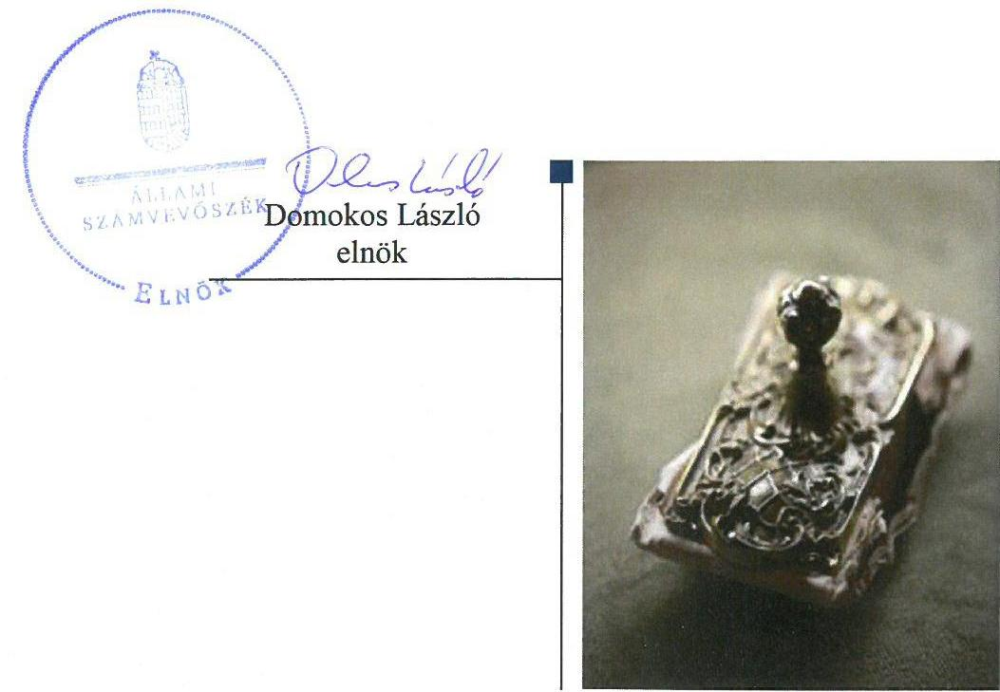
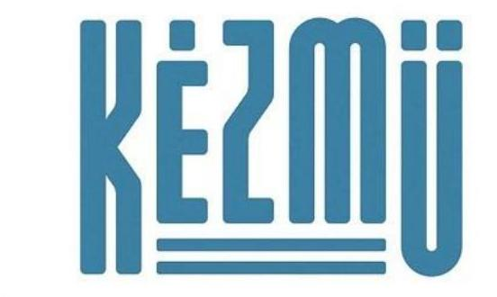
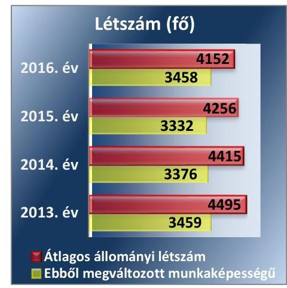
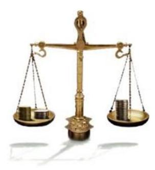
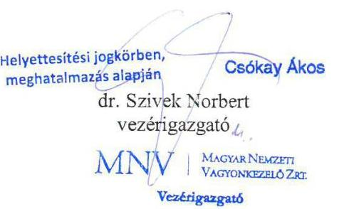
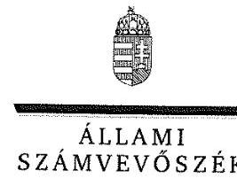
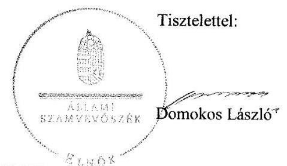
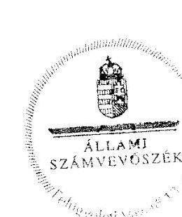

# Jelentés 

## Az állami tulajdonú gazdasági társaságok ellenőrzése

KÉZMŰ Fővárosi Kézműipari Közhasznú Nonprofit Kft.
2018.

18256
www.asz.hu

---

# Jelentés 

## Az állami tulajdonú gazdasági társaságok ellenőrzése

KÉZMŰ Fővárosi Kézműipari Közhasznú Nonprofit Kft.
2018. 10. hó 11. nap

---

# AZ ELLENŐRZÉST FELÜGYELTE:

- **KLINGA LÁSZLÓ** felügyeleti vezető
- **AZ ELLENŐRZÉST VEZETTE ÉS A VÉGREHAJTÁSÁÉRT FELELŐS:**
- **MODER BEATRIX** ellenőrzésvezető
- **A PROGRAM ÖSSZEÁLLÍTÁSÁÉRT FELELŐS:**
- **TÓTPÁL SZABOLCS** osztályvezető
- **IKTATÓSZÁM:** EL-0383-028/2018
- **TÉMASZÁM:** 2469
- **ELLENŐRZÉS-AZONOSÍTÓ SZÁM:** V-081404

Jelentéseink az Országgyűlés számítógépes hálózatán és az Interneta a www.asz.hu címen is olvashatóak.

---

# TARTALOMJEGYZÉK 

■ ÖSSZEGZÉS ..... 5
■ AZ ELLENŐRZÉS CÉLJA ..... 6
■ AZ ELLENŐRZÉS TERÜLETE ..... 7
■ AZ ELLENŐRZÉS HÁTTERE, INDOKOLTSÁGA ..... 8
■ A JELENTÉS LÉNYEGES KÉRDÉSKÖREI ..... 9
■ AZ ELLENŐRZÉS HATÓKÖRE ÉS MÓDSZEREI ..... 10
■ MEGÁLLAPÍTÁSOK ..... 12
■ JAVASLATOK ..... 14
■ MELLÉKLETEK ..... 15
I. sz. melléklet: Értelmező szótár ..... 15
■ FÜGGELÉK: ÉSZREVÉTELEK ..... 17
■ RÖVIDÍTÉSEK JEGYZÉKE ..... 23

---

.

---

# ÖSSZEGZÉS 

A KÉZMŰ Fővárosi Kézműipari Közhasznú Nonprofit Kft. feletti tulajdonosi jogokat a Magyar Nemzeti Vagyonkezelő Zrt. szabályszerűen alakította ki és gyakorolta. A Társaság szabályozottsága, gazdálkodása és vagyongazdálkodási tevékenysége a 2013. évben nem volt szabályszerű, a 2016. évben szabályszerű volt, 2016-ban az elszámoltathatóságot biztosította. A köztulajdonban álló gazdasági társaságokra vonatkozó átláthatósági követelmények érvényesültek.

## Az ellenőrzés társadalmi indokoltsága

Az állami tulajdonú gazdálkodó szervezetek a nemzeti vagyon részét képezik, ezért ellenőrzésük kiemelten fontos a nemzeti vagyon megőrzése, megóvása érdekében. Az állami vagyonnal való gazdálkodás alapvető célja az állami vagyon átlátható, rendeltetésszerű és felelős felhasználásának biztosítása.

Az Állami Számvevőszék stratégiájában megfogalmazta, hogy az államháztartáson kívülre nyújtott költségvetési támogatások és ingyenes vagyonjuttatások, valamint az államháztartáson kívül működő feladatellátó rendszerek ellenőrzéseivel hozzájárul ahhoz, hogy a közpénzeket az államháztartáson kívül működő szervezetek is átlátható, rendezett módon használják fel.

Minden közpénzt, közvagyont használó szervezettel szemben társadalmi igény, hogy tevékenységükről elszámoljanak. Az Állami Számvevőszék céljaival és a társadalmi igénnyel összhangban, a gazdasági társaságok kiemelt fontosságú szerepe miatt került sor a KÉZMŰ Fővárosi Kézműipari Közhasznú Nonprofit Kft. ellenőrzésére.

## Főbb megállapítások, következtetések, javaslatok

A Magyar Nemzeti Vagyonkezelő Zrt. tulajdonosi joggyakorlása a KÉZMŰ Fővárosi Kézműipari Közhasznú Nonprofit Kft. felett szabályszerű volt.

A Társaság gazdálkodása és vagyongazdálkodási tevékenysége a 2013. évben nem volt szabályozott és szabályszerű, mert a jogszabályban előírt eszközök és források értékelési szabályzatával és számlarenddel nem rendelkeztek, így a szabályszerű könyvvezetés feltételeit nem biztosították, továbbá a 2013. évi beszámoló mérlegtételeit leltárral nem támasztották alá.

A Társaság a gazdálkodási szabályzatait a 2016. évben teljes körűen elkészítette, a Társaság gazdálkodása és vagyongazdálkodása, a bevételek és ráfordítások elszámolása a 2016. évben szabályszerű volt. A 2016. évi számviteli beszámoló mérlegében kimutatott eszközök és források állományát leltárral alátámasztották.

A Társaság a közérdekű és a közérdekből nyilvános adatainak szabályszerű közzétételével a gazdálkodás nyilvánosságát biztosította, azonban a közzététel rendjét belső szabályzatban nem rögzítette.

A megállapítások alapján az Állami Számvevőszék a KÉZMŰ Fővárosi Kézműipari Közhasznú Nonprofit Kft. ügyvezetőjének egy javaslatot fogalmazott meg.

---

# AZ ELLENŐRZÉS CÉLJA 

AZ ELLENŐRZÉS CÉLJA annak értékelése, hogy a tulajdonosi jogok gyakorlása szabályszerű volt-e. A gazdálkodó szervezet szabályozottsága, gazdálkodása és vagyongazdálkodási tevékenysége megfelelt-e a jogszabályi és a tulajdonosi előírásoknak; biztosítva volt-e a közfeladatok átláthatósága és elszámoltathatósága érdekében a közszolgáltatás dijának megalapozottsága szabályszerű önköltségszámítással. Értékeltük továbbá, hogy a vagyonváltozást eredményező döntések esetében a tulajdonosi jogok gyakorlója és a gazdálkodó szervezet szabályszerűen jártak-e el.

---

# AZ ELLENŐRZÉS TERÜLETE 

## Kézmú Fővárosi Kézmúipari Közhasznú Nonprofit Kft. és a tulajdonosi jogokat gyakorló Magyar Nemzeti Vagyonkezelő Zrt.

1953

1. ábra

Forrás: A Társaság 2013-2016. évi kiegészítő mellékletei

A kizárólagos állami tulajdonú KÉZMŰ Fővárosi Kézműipari Közhasznú Nonprofit Kft.- a KÉZMŰ Fővárosi Kézműipari Közhasznú Társaság átalakulásával - 2009. április 22-én jött létre.

A Társaságot a megváltozott munkaképességű személyek egészségi állapotának megfelelő munkahelyi környezetben megvalósuló foglalkoztatásának elősegítése céljából alapította a Magyar Állam.

A Társaság feletti tulajdonosi jogokat az ellenőrzött időszakban a Vtv. ${ }^{1}$ alapján az MNV Zrt. ${ }^{2}$ gyakorolta.

A Társaság ${ }^{3}$ jegyzett tőkéje 2013. december 31-én 1343,5 M Ft volt, amely az ellenőrzött időszak végére 1344,8 M Ft-ra emelkedett.

A Társaság alapcél szerinti közhasznú tevékenysége a megváltozott munkaképességű személyek rehabilitációs foglalkoztatása, amelynek keretében a főtevékenysége konfekcionált textiláru gyártása, de nagy tételben készített vegyesipari termékeket és sportszereket is. A Társaság az alapcél szerinti közhasznú tevékenységét nem veszélyeztető vállalkozási tevékenységként ingatlan és gép bérbeadást is végzett. A vállalkozási tevékenység bevétele az ellenőrzött években az összes bevétel 4-9\%-a közötti volt.

A Társaság a feladatait saját eszközeivel látta el, vagyonkezelésbe vett állami vagyonnal nem rendelkezett. A Társaság az ERGONETT Ipari, Kereskedelmi és Szolgáltató Zrt.-ben 71 E Ft névértékű - 1\%-os részesedési arányt el nem érő - törzsrészvénnyel rendelkezett.

A Társaság az ország 17 megyéjében, 6 telephellyel, 76 fiókteleppel rendelkezik. Az átlagos statisztikai állományi létszám a 2013. évi 4495 főről a 2016. év végére 4152 főre csökkent, a megváltozott munkaképességű foglalkoztatottak aránya a 2013. évi 77,0\%-ról a 2016. év végére 83,3\%-ra növekedett.

Az ügyvezető ${ }^{4}$ személye az ellenőrzött években két alkalommal, 2013. június 19-én és 2015. március 3-án változott.

A Társaság az NGM közlemények ${ }^{5}$ alapján az ellenőrzött időszakban nem tartozott a kormányzati szektorba sorolt egyéb szervezetek körébe.

---

# AZ ELLENŐRZÉS HÁTTERE, INDOKOLTSÁGA 

AZ ÁLLAMI TULAJDONÚ GAZDÁLKODÓ SZERVEZETEK ellenőrzése kiemelten fontos a nemzeti vagyon megőrzése, megóvása érdekében. Gazdálkodásuk jellemzően a közérdeklődés és a média figyelmének középpontjában áll, amihez hozzájárul a gazdálkodásuk körébe tartozó - közvetlen vagy közvetett állami tulajdonú, tehát végső soron a nemzeti vagyon részét képező - vagyon nagysága, illetve az általuk ellátott közszolgáltatások/közfeladatok minősége és hatékonysága. A közszolgáltatási árképzés megalapozottsága és a rendszeres elszámoltatás feltételeinek kialakítása az ellenőrzés során nagy hangsúlyt kap. A közszolgáltatás árában és annak támogatásában meg kell jelennie az önköltségszámítás szempontjainak, amely biztosítja a múködés fenntarthatóságát (eszközpótlást) is.

Az ellenőrzés rámutathat az állami tulajdonú gazdálkodó szervezetek gazdálkodási tevékenységével kapcsolatos jó gyakorlatokra és szabálytalanságokra. Felhívhatja a figyelmet a jogszabályi követelmények teljesítéséhez szükséges feltételek hiányosságaira, hozzájárulhat az államháztartáson kívüli, de (közvetlenül vagy közvetve) állami vagyont használó gazdálkodó szervezetek tevékenységének átláthatóságához. Ellenőrzésünk eredményeképpen javaslatainkkal, megállapításainkkal hozzájárulhatunk a nemzeti vagyonnal való gazdálkodás átláthatóságának, elszámoltathatóságának javításához.

---

# A JELENTÉS LÉNYEGES KÉRDÉSKÖREI 

1. A tulajdonosi jogok gyakorlása szabályszerű volt-e?
2. A Társaság müködésének szabályozottsága, gazdálkodása és vagyongazdálkodása megfelelt-e az előírásoknak?

---

# AZ ELLENŐRZÉS HATÓKÖRE ÉS MÓDSZEREI 

## Az ellenőrzés típusa

Megfelelőségi ellenőrzés.

## Az ellenőrzött időszak

Az ellenőrzött időszak a 2013-2016. évek, a 2016. évi beszámoló jóváhagyásáig tartó időszak.

## Az ellenőrzés tárgya

A KÉZMŰ Fővárosi Kézműipari Közhasznú Nonprofit Kft. gazdálkodása, kiemelten vagyongazdálkodási tevékenysége, valamint a Magyar Nemzeti Vagyonkezelő Zrt. KÉZMŰ Fővárosi Kézműipari Közhasznú Nonprofit Kft. feletti tulajdonosi joggyakorlása.

## Az ellenőrzött szervezet

- KÉZMŰ Fővárosi Kézműipari Közhasznú Nonprofit Kft.
- Magyar Nemzeti Vagyonkezelő Zrt., mint a Társaság feletti tulajdonosi joggyakorló.

## Az ellenőrzés jogalapja

Az ellenőrzés jogalapját az ÁSZ tv. 1. § (3) bekezdése és 5. § (3)-(5) bekezdése képezi.

## Az ellenőrzés módszerei

Az ellenőrzést a nemzetközi standardokat irányadónak tekintve az ellenőrzési program ellenőrzési kérdései, az ellenőrzött időszakban hatályos jogszabályok, az ellenőrzés szakmai szabályok és módszertanok figyelembe vételével végeztük.

Az ellenőrzés ideje alatt az ellenőrzött szervezettel történő kapcsolattartást az ÁSZ ${ }^{6}$ Szervezeti és Müködési Szabályzatának vonatkozó előírásai alapján biztosítottuk.

Az ellenőrzési kérdések megválaszolásához szükséges bizonyítékok megszerzése a következő ellenőrzési eljárások alkalmazásával történt: megfigyelés, kérdésfeltevés (információkérés), összehasonlítás, valamint

---

elemző eljárás. Az ellenőrzési bizonyítékként felhasználható adatforrások közé tartoznak egyrészt az ellenőrzési programban felsorolt adatforrások, másrészt adatforrás lehet minden - az ellenőrzés során - feltárt, az ellenőrzés szempontjából információkat tartalmazó dokumentum.

Az ellenőrzést a kérdésekre adott válaszok kiértékelésével, valamint a megjelölt adatforrások, a csatolt tanúsítványok felhasználásával, továbbá az adott időszakban hatályos jogszabályok figyelembe vételével folytattuk le. Amennyiben egy alapvető jelentőségű dokumentum hiánya alapján valamely lényeges kérdéskörre vonatkozóan az ÁSZ megállapítása kellően megalapozott lett, az adott kérdéskör, és azzal szoros logikai kapcsolatban lévő - ráépülő - kérdéskörök vonatkozásában további részletes ellenőrzési tevékenység nem került végrehajtásra.

A teljes ellenőrzött időszakra vonatkozóan került ellenőrzésre a gazdasági társaság tervezési, beszámolási, közzétételi, adatszolgáltatási kötelezettségének, valamint belső ellenőrzési tevékenységének szabályszerűsége. A 2013. és 2016. évekre vonatkozóan a gazdasági társaság működésének szabályozottságát, a bevételei és ráfordításai elszámolását, illetve vagyongazdálkodásának szabályszerűségét is ellenőriztük.

A bevételek és ráfordítások elszámolását, valamint a vagyonnyilvántartás szabályszerűségét mintavétellel ellenőriztük. A mintavételezés az értékesítés nettó árbevétele, az egyéb és rendkívüli bevételek, a pénzügyi műveletek bevételei, illetve az anyagjellegú ráfordítások, az egyéb és rendkívüli ráfordítások, a pénzügyi műveletek ráfordításai, valamint a tárgyi eszközök növekedési tételei esetén azokra a legnagyobb értékű tételekre - a lényeges sokaságra - terjedt ki, amelyek összértéke elérte a teljes sokaság összértékének 50\%-át. Amennyiben valamely lényeges sokaság elemszáma kisebb volt, mint az előírt mintaelemszám, a lényeges sokaságot tételesen ellenőriztük. A személyi jellegű ráfordítások esetében a mintavétel a teljes sokaságból történt.

A mintavétellel ellenőrzött területek esetében minden egyes tétel vonatkozásában a szabályszerűségre vonatkozó kérdéseket tettünk fel, amelyek eredménye összesítésre került. „Szabályszerűnek" értékeltünk egy ellenőrzött területet, amennyiben 95\%-os bizonyossággal az ellenőrzött sokaságban az átlagos hibaarány legfeljebb 10\%, "nem szabályszerűnek", amennyiben 10\%-nál magasabb arányt képviselt. Abban az esetben, ha az ellenőrzött sokaság tekintetében a 10\%-os hibaarányhoz való viszony megítélésnek megbízhatósága nem érte el a 95\%-ot, annak elérése érdekében értékelésünket további szempontokkal egészítettük ki, és figyelembe vettük a feltárt hibák értékét. A mintavételi eredmények alapján megfogalmazott megállapítások csak a lényeges sokaságra vonatkoznak.

---

# 1. A tulajdonosi jogok gyakorlása szabályszerű volt-e? 

Összegző megállapítás

Az MNV Zrt. tulajdonosi joggyakorlása szabályszerű volt.
A TULAJDONOSI JOGGYAKORLÁS kereteit az MNV Zrt. Igazgatósága - a Vtv., valamint a Gt. ${ }^{7}$ és a Ptk. ${ }^{8}$ előírásával összhangban az MNV Zrt. SZMSZ ${ }_{1-3}$-ban ${ }^{9}$ és az Alapító Okirat ${ }_{1-18}$-ban ${ }^{10}$ kialakította.

Az Alapító okirat ${ }_{1-18}$-ban meghatározták az MNV Zrt. kizárólagos hatáskörébe tartozó döntéseket, a Társaság ügyvezetőjének feladat- és hatáskörét, valamint a vagyonváltozással kapcsolatos döntési jogköröket. Előírták továbbá üzleti terv készítésének kötelezettségét, a tervezés követelményeit évente Tervezési irányelvekben ${ }^{11}$ határozták meg.

Az MNV Zrt. a Taktv. ${ }^{12}$ előírásának megfelelően három tagból álló $\mathrm{FB}^{13}$-t működtetett, valamint a Gt. és a Ptk. előírásával összhangban választotta meg a könyvvizsgálót, és elfogadta a Társaság éves számviteli beszámolóit.

Az MNV Zrt. a monitoring szabályzat ${ }_{1-2}{ }^{14}$ előírásainak megfelelő monitoring tevékenységével a Társaság gazdálkodását folyamatosan nyomon követte. Tulajdonosi ellenőrzés keretében az MNV Zrt. Ellenőrzési Igazgatósága rendszeresen ellenőrizte a Társaság múködését, gazdálkodását.

A Társaság tőkehelyzetének rendezése érdekében szükséges intézkedéseket az MNV Zrt. a Gt. és a Ptk. előírásainak megfelelően megtette. A Társaság likviditásának biztosítása, a beszámolókban kimutatott veszteségek és a tőkehelyzet rendezése érdekében az MNV Zrt. az ellenőrzött időszakban összesen 2586,3 M Ft összegű pénzbeli hozzájárulással ázsiós tőkeemeléseket hajtott végre, amelyből 1,3 M Ft-tal a jegyzett tőkét, a további összeggel a tőketartalékot növelte.

A javadalmazási szabályzat ${ }_{1-2}$-t ${ }^{15}$ a Taktv. előírásainak megfelelően az MNV Zrt. megalkotta.

## 2. A Társaság múködésének szabályozottsága, gazdálkodása és vagyongazdálkodása megfelelt-e az előírásoknak?

Összegző megállapítás

A Társaság gazdálkodása és vagyongazdálkodása a 2013. évben nem volt szabályozott és szabályszerű. A szabályozottság, a gazdálkodási és vagyongazdálkodási tevékenység a 2016. évre javult, szabályszerű volt.

A 2013. ÉVBEN a gazdálkodás és vagyongazdálkodás nem volt szabályozott és szabályszerű.

A Társaság szabályozottsága a 2013. évben a szabályszerű gazdálkodás és könyvvezetés feltételeit nem biztosította, mert a Számv. tv. ${ }^{16}$ 14. § (5) bekezdés b) pontjában foglaltak ellenére a Társaság nem rendelkezett

---

eszközök és források értékelési szabályzatával, valamint a Számv. tv. 161. § (1) bekezdés előírása ellenére számlarenddel.

A 2013. évi beszámoló mérlegének alátámasztásához a Számv. tv. 69. § (1) bekezdése ellenére a mérleg fordulónapján meglévő eszközközöket és forrásokat mennyiségben és értékben tartalmazó leltárt a Társaság nem állított össze.

A 2016. ÉVRE a szabályszerű gazdálkodás feltételeit kialakították, a Számv. tv. előírásainak megfelelően rendelkeztek a Társaság sajátosságainak megfelelő Számviteli politika ${ }_{1-2}$-vel ${ }^{17}$, Leltározási szabályzat ${ }_{1,2}$-vel ${ }^{18}$, Pénzkezelési szabályzattal ${ }^{19}$, Értékelési szabályzattal ${ }^{20}$, Számlarenddel ${ }^{21}$, valamint Önköltség számítási szabályzat ${ }_{1-2}$-vel ${ }^{22}$. Rendelkeztek továbbá a kötelezettségvállalás és utalványozás rendjét is tartalmazó SZMSZ ${ }^{23}$-el, valamint Selejtezési szabályzattal ${ }^{24}$.

A 2016. ÉVI BEVÉTELEK ÉS RÁFORDÍTÁSOK elszámolása szabályszerű volt.

A VAGYONGAZDÁLKODÁS A 2016. ÉVBEN szabályszerű volt.

Az eszközök állományba vétele, az értékcsökkenés alapját képező bekerülési érték meghatározása és az értékcsökkenési leírás elszámolása szabályszerű volt. A Társaság vagyonát érintő döntésekre az Alapító okirat ${ }_{1-18}$ és a vonatkozó belső szabályzatok előírásai szerint került sor.

A beszámoló mérlegét a Számv. tv. előírásainak megfelelő, az eszközöket és forrásokat tételesen, mennyiségben és értékben ellenőrizhető módon tartalmazó leltárral támasztották alá.

TERVEZÉSI, BESZÁMOLÁSI kötelezettségét a 2013-2016. években a Társaság határidőben teljesítette. Az MNV Zrt. által előírt üzleti terv készítési, valamint évközi adatszolgáltatási és tájékoztatási, továbbá a külön jogszabályban előírt, akkreditált munkáltatókat terhelő beszámolási, adatszolgáltatási kötelezettségeinek a Társaság eleget tett.

A jóváhagyott éves számviteli beszámolók, közhasznúsági mellékletek, könyvvizsgálói jelentések közzétételét és letétbe helyezését a Társaság a Számv. tv. előírásainak megfelelő határidőben teljesítette. A 2015-2016. évi pozitív eredményeket a Civil tv. ${ }^{25}$ és az Alapító okirat ${ }_{1-18}$ előírásait betartva eredménytartalékba helyezték, osztalékfizetés nem történt.

A KÖZZÉTÉTELI KÖTELEZETTSÉGÉT a Társaság szabályszerűen teljesítette, az Infotv. és a Taktv. előírásainak megfelelően, a közérdekű és közérdekből nyilvános adatai megismerhetőségét biztosította. Az Info tv. ${ }^{26}$ 35. § (3) bekezdés előírása ellenére azonban a 35. § (1)-(2) bekezdésben előírt kötelezettség teljesítésének részletes szabályait a Társaság belső szabályzatban nem határozta meg.

---

# JAVASLATOK 

Az ÁSZ tv. 33. § (1) bekezdésében foglaltak értelmében az ellenőrzött szervezet vezetője köteles a jelentésben foglalt megállapításokhoz kapcsolódó intézkedési tervet összeállítani és azt a jelentés kézhezvételétől számított 30 napon belül az ÁSZ részére megküldeni. Amennyiben az ellenőrzött szervezet vezetője nem küldi meg határidőben az intézkedési tervet, vagy továbbra sem elfogadható intézkedési tervet küld, az Állami Számvevőszék elnöke az ÁSZ tv. 33. § (3) bekezdése a) és b) pontjaiban foglaltakat érvényesítheti.

## Kézmú Fővárosi Kézmúipari Közhasznú Nonprofit Kft. ügyvezetőjének

1. Intézkedjen az Info tv.-ben elöirt kötelezettség teljesitése részletes szabályainak belső szabályzatban történő meghatározásáról.
(2. sz. megállapítás 11. bekezdés 2. mondata alapján)

---

# MELLÉKLETEK 

- I. SZ. MELLÉKLET: ÉRTELMEZŐ SZÓTÁR
állami vagyon
akkreditált munkáltató
ázsiós tőkeemelés
gazdasági társaság
nemzeti vagyon
a) Az állam tulajdonában lévő dolog, valamint a dolog módjára hasznosítható természeti erő,
b) az a) pont hatálya alá nem tartozó mindazon vagyon, amely vonatkozásában törvény az állam kizárólagos tulajdonjogát nevesíti,
c) az állam tulajdonában lévő tagsági jogviszonyt megtestesítő értékpapír, illetve az államot megillető egyéb társasági részesedés,
d) az államot megillető olyan immateriális, vagyoni értékkel rendelkező jogosultság, amelyet jogszabály vagyoni értékű jogként nevesít.
Forrás: Vtv. 1. § (2) bekezdése
2012. november 10-től az állami vagyon fogalma kiegészül a következő ponttal:
e) az állam tulajdonában lévő pénzügyi eszközök

Forrás: Vtv. 1. § (2) bekezdése
A megváltozott munkaképességű munkavállalókat foglalkoztató munkáltatók akkreditációjáról, valamint a megváltozott munkaképességű munkavállalók foglalkoztatásához nyújtható költségvetési támogatásokról szóló 327/2012. (XI. 16.) Korm. rendelet szabályai szerint lefolytatott akkreditációs eljárás alapján kiadott rehabilitációs akkreditációs tanúsítvánnyal rendelkező szervezet vagy személy.
Olyan tőkepótlás, amelynél a jegyzett tőke emelése mellett az átadott vagyon egy része (általában a jelentősebb része) tőketartalékba kerül.
A Ptk. 3:88. § (1) bekezdése szerint „a gazdasági társaságok üzletszerű közös gazdasági tevékenység folytatására, a tagok vagyoni hozzájárulásával létrehozott, jogi személyiséggel rendelkező vállalkozások, amelyekben a tagok a nyereségből közösen részesednek, és a veszteséget közösen viselik".
a) az állam vagy a helyi önkormányzat kizárólagos tulajdonában álló dolgok,
b) az a) pont hatálya alá nem tartozó, állam vagy a helyi önkormányzat tulajdonában lévő dolog,
c) az állam vagy a helyi önkormányzatot tulajdonában lévő pénzügyi eszközök, továbbá az államot vagy a helyi önkormányzatot megillető társasági részesedések,
d) az államot vagy a helyi önkormányzatot megillető bármely vagyoni értékkel rendelkező jogosultság, amelyet jogszabály vagyoni értékű jogként nevesít,
e) Magyarország határa által körbezárt terület feletti légtér,
f) az üvegházhatású gázok kibocsátási egységeinek kereskedelméről szóló törvény szerint kibocsátási egység és légiközlekedési kibocsátási egység, valamint az ENSZ Éghajlatváltozási Keretegyezménye és annak Kiotói Jegyzőkönyve végrehajtási keretrendszeréről szóló törvény szerinti kiotói egység,
g) állami vagy helyi önkormányzati fenntartású közgyűjtemény (muzeális intézmény, levéltár, közgyűjteményként működő kép- és hangarchívum, valamint könyvtár) saját gyűjteményében nyilvántartott kulturális javak körébe tartozó dolog, kivéve, ha az állami vagy önkormányzati tulajdon jogszerű létrejötte kétséget kizáró módon nem bizonyítható és a dologra nézve más a tulajdonjogát bizonyítja vagy a kulturális javakra vonatkozó jogszabályokban meghatározott eljárás keretében valószínűsíti (g. pont módosult 2013. december 7-től),
h) a régészeti lelet,

---

i) a nemzeti adatvagyon körébe tartozó állami nyilvántartások fokozottabb védelméről szóló törvény szerinti nemzeti adatvagyon.
Forrás: Nvtv. ${ }^{27}$ 1. § (2)
nónprofit gazdasági társaság
tulajdonosi jogok gyakor- lója
Civil tv. 9/F. § (2) bekezdése szerint „az a gazdasági társaság minősül nonprofit gazdasági társaságnak és cégnevében az a gazdasági társaság tüntetheti fel a nonprofit jelleget, amelynek létesítő okirata tartalmazza, hogy a gazdasági társaság tevékenységéből származó nyereség a tagok között nem osztható fel, hanem az a gazdasági társaság vagyonát gya-rapítja." (hatályos 2014. március 15-től)

1. 

## 2013. június 27-ig:

Az állami vagyon felett a Magyar Államot megillető tulajdonosi jogok és kötelezettségek összességét - ha törvény eltérően nem rendelkezik - az állami vagyon felügyeletéért felelős miniszter (a továbbiakban: miniszter) gyakorolja, aki e feladatát a Magyar Nemzeti Vagyonkezelő Zártkörűen Működő Részvénytársaság (a továbbiakban: MNV Zrt.), a Magyar Fejlesztési Bank, illetve a tulajdonosi joggyakorló szervezet útján látja el. A miniszter miniszteri rendeletben, a törvényben meghatározott állami vagyoni kör tekintetében, meghatározott időtartamra, a joggyakorlás egyes szabályainak meghatározásával - az őt megillető tulajdonosi jogok és kötelezettségek összességének, illetve azok meghatározott részének gyakorlóját az Áht. szerinti központi költségvetési szervek, ezek intézménye, továbbá a 100\%-ban állami tulajdonban álló gazdasági társaságok közül kijelölheti.
Forrás: Vtv. 3. § (1) és (2)

## 2013. június 28-ától:

A rábízott állami vagyon felett az államot megillető tulajdonosi jogok és kötelezettségek összességét tulajdonosi joggyakorlóként:
a) ha törvény vagy miniszteri rendelet eltérően nem rendelkezik, a Magyar Nemzeti Vagyonkezelő Zártkörűen Működő Részvénytársaság (a továbbiakban: MNV Zrt.),
b) törvényben kijelölt személy vagy
c) az állami vagyon felügyeletéért felelős miniszter (a továbbiakban: miniszter) által rendeletben kijelölt személy gyakorolja.
[...] A miniszter e törvény felhatalmazása alapján - a meghatározott célok hatékonyabb elérése érdekében, miniszteri rendeletben, az ott meghatározott állami vagyoni kör tekintetében, meghatározott időtartamra - e törvény keretei között, a joggyakorlás egyes szabályainak meghatározásával - az államot megillető tulajdonosi jogok és kötelezettségek összességének, illetve azok meghatározott részének gyakorlóját az Áht. szerinti központi költségvetési szervek, ezek intézménye, továbbá a 100\%ban állami tulajdonban álló gazdasági társaságok közül kijelölheti.
Forrás: Vtv. 3. § (1) és (2)
2.

Aki a nemzeti vagyon felett az államot vagy a helyi önkormányzatot megillető tulajdonosi jogok és kötelezettségek összességének gyakorlására jogosult
Forrás: Nvtv. 3. § (1) 17. pontja

---

# FÜGGELÉK: ÉSZREVÉTELEK 

A jelentéstervezetet a Számvevőszék 15 napos észrevételezésre megküldte az ellenőrzött szervezetek vezetőinek az ÁSZ tv. 29. §* (1) bekezdése előírásának megfelelően.

A Magyar Nemzeti Vagyonkezelő Zrt. vezérigazgatója írásban jelezte, hogy a jelentéstervezetre észrevételt nem tesz. A KÉZMÚ Fővárosi Kézmüipari Közhasznú Nonprofit Kft. ügyvezetőjének észrevételét és az arra adott választ a jelentés függeléke tartalmazza.

[^0]
[^0]:    * 29. § (1) Az Állami Számvevőszék az ellenőrzési megállapításait megküldi az ellenőrzött szervezet vezetőjének vagy az általa megbízott személynek, és annak, akinek személyes felelősségét állapította meg.
    (2) Az ellenőrzött szervezet vezetője és a felelősként megjelölt személy az ellenőrzés megállapításaira tizenöt napon belül írásban észrevételt tehet.
    (3) Az Állami Számvevőszék az észrevételre a beérkezésétől számított harminc napon belül írásban válaszol. A figyelembe nem vett észrevételeket köteles a jelentésben feltüntetni, és megindokolni, hogy azokat miért nem fogadta el.

---

# MNV   Magyar Nemzeti VagYonKezzlóZrt   Vezérigazgató 

Állami Számvevőszék

## Domokos László

elnök

1052 Budapest
Apáczai Cs. J. u. 10.

ÁLLAMI SZÁMVEVÖSZÉK
$36-49185140111$
Erksselt: 2018 AUG 27.
Ikt:Sz:2:1: 2018
Hiv. sz.: EL-0667-037/2018.

Tisztelt Elnök Úr!
Tájékoztatom, hogy az MNV Zrt. a 2018. augusztus 15. napján, ,,Állami tulajdonú (résztulajdonú) gazdasági társaságok ellenőrzése - KÉZMÜ Fővárosi Kézmüipari Közhasznú Nonprofit Kft." tárgyában kézhez vett, EL-0667-037/2018. ikt. sz. jelentéstervezetre nem kíván észrevételt tenni.

Budapest, 2018. augusztus , 24 "

Üdvözlettel:

---

# Állami Számvevőszék 

1052 Budapest, Apáczai Csere János utca 10.
1364 Budapest 4. Pf. 54

Ellenőrzés azonosító szám: V-081404
Tárgy: Számvevőszéki jelentéstervezetre vonatkozó észrevétel és intézkedési terv V
Tisztelt Állami Számvevőszék!

Alulírott Becker György László, mint a Kézmű Közhasznú NKft. (székhely: 1147 Budapest, Csömöri út 50-60. Cégjszám: 01-09-919882), továbbiakban Társaság vagy Kézmủ NKft. önálló képviseletre ügyvezetője, az Állami Számvevőszék által indított V-081404 ellenőrzésű számú számvevőszéki jelentéstervezetre az alábbi észrevételeket teszem meg:

- a Kézmủ NKft. 2013. üzleti év gazdálkodására vonatkozó állami számvevőszéki állásfoglalásra nem teszek észrevételt, tekintettel arra, hogy ezen időszak alatt a Társaság ügyvezetői feladatait nem én láttam el.
- a Kézmủ NKft. 2016. üzleti év gazdálkodására vonatkozó állami számvevőszéki állásfoglalást elfogadottnak tekintjük.
- a 2016. évhez kapcsolódó Info tv $35 \S 3$. bekezdésében foglalt előírások szerinti előírt társasági kötelezettségre válaszoljuk, hogy a Kézmủ NKft. idő közben erre a kötelezettségére vonatkozóan már tett intézkedést azzal, hogy 2017. évben meghozott egy belső szabályzatot, így az ellenőrzés idejében ez a szabályzat a Társaságnál már rendelkezésére állt.
Jelen levelünkhöz csatolva megküldjük a közérdekủ adatok megismerésére irányuló igények teljesítésének rendjét rögzítő szabályzatot.

Amennyiben bármilyen kérdésük felmerül, az időszak vonatkozásában kérem, jelezzenek vissza.

Együttműködésüket köszönjük

Budapest, 2018 augusztus 29.

Becker György László
ügyvezető

---

ELNOK

Ikt.szám: EL-0667-042/2018.

# Becker György László úr 

ügyvezető
KÉZMÜ Fővárosi Kézműipari Közhasznú Nonprofit Kft.

## Budapest

## Tisztelt Ügyvezető Úr!

Köszönettel vettem „Az állami tulajdonú gazdasági társaságok ellenörzése - KÉZMÜ Fővárosi Kézmüipari Közhasznú Nonprofit Kft." című ellenőrzésről készített számvevőszéki jelentéstervezetre megküldött észrevételét.
Az Állami Számvevőszék észrevételekre vonatkozó álláspontját a felügyeleti vezető által készített részletes tájékoztatás tartalmazza, amelyet levelemhez mellékeltem. Tájékoztatom Ügyvezető urat, hogy az Állami Számvevőszék a figyelembe nem vett észrevételeket az Állami Számvevőszékről szóló 2011. évi LXVI. törvény 29. § (3) bekezdésében előírtak szerint köteles a jelentésében feltüntetni és megindokolni, hogy azokat miért nem fogadta el.

Budapest, 2018. 23 hó $1 / 1$ nap

Melléklet: Tájékoztatás az észrevételek kezeléséről

---

# Tájékoztatás az észrevétel kezeléséről 

Megköszönöm Ügyvezető úrnak „Az állami tulajdonú gazdasági társaságok ellenőrzése - KÉZMÜ Fövárosi Kézmiüpari Közhasznú Nonprofit Kft." címmel készített jelentés-tervezetre tett észrevételét. Az észrevétel kezeléséről az alábbi tájékoztatást adom:

Ügyvezető úr észrevételében - a közérdekủ adatok megismerésére irányuló igények teljesítésének rendjét rögzítő szabályzattal kapcsolatban - adott tájékoztatást köszönettel tudomásul vettem. Az észrevétel az ellenőrzött 2013-2016. évekre tett megállapításokat nem vitatta, megállapításainkat megerősítette, így a jelentéstervezet módosítása nem indokolt.

Tájékoztatom, hogy az ÁSZ tv. 33. § (1) bekezdésében foglaltak értelmében az ellenőrzött szervezet vezetője köteles a jelentésben foglalt megállapításokhoz kapcsolódó intézkedési tervet összeállítani és azt a jelentés kézhezvételétől számított 30 napon belül az ÁSZ részére megküldeni.

Budapest, 2018. szeptember hó II. nap

Klingá László
felügyéleti vezető

---

.

---

# RÖVIDÍTÉSEK JEGYZÉKE 

${ }^{1}$ Vtv
${ }^{2}$ MNV Zrt.
${ }^{3}$ Társaság
${ }^{4}$ ügyvezető
${ }^{5}$ NGM közlemények
${ }^{6}$ ÁSZ
${ }^{7}$ Gt.
${ }^{8}$ Ptk.
${ }^{9}$ MNV Zrt. SZMSZ ${ }_{1-3}$
${ }^{10}$ Alapító okirat ${ }_{1-18}$

2007. évi CVI. törvény az állami vagyonról (hatályos 2007. szeptember 25-től)
Magyar Nemzeti Vagyonkezelő Zártkörűen működő részvénytársaság
KÉZMŰ Fővárosi Kézműipari Közhasznú Nonprofit Korlátolt Felelősségű Társaság
KÉZMŰ Fővárosi Kézműipari Közhasznú Nonprofit Korlátolt Felelősségű Társaság ügyvezetője
Nemzetgazdasági Minisztérium közleményei a kormányzati szektorba sorolt egyéb szervezetekről (hivatalos értesítő 2012/9. hatályos 2012. február 16-ától; hivatalos értesítő 2013/32. hatályos 2013. június 28-ától; hivatalos értesítő 2013/60. hatályos 2013. december 16ától, valamint hivatalos értesítő 2015/66. hatályos 2015. december 30-ától)
Állami Számvevőszék
2006. évi IV. törvény a gazdasági társaságokról (hatályos 2014. március 14-ig)
2013. évi V. törvény a Polgári Törvénykönyvről (hatályos 2014. március 15-étől)
SZMSZ ${ }_{1}$ MNV Zrt. 123/2013. (III. 07.); 246/2013. (IV. 22.) és 287/2013. (V. 06.); IG. határozatokkal módosított 508/2012. (X. 08.) IG. határozattal jóváhagyott Szervezeti és müködési szabályzata (hatályos 2013. június 30-ig)
SZMSZ ${ }_{2}$ MNV Zrt. 149/2015. (IV. 21.); valamint a 123/2015. (III. 17.) IG. határozatokkal módosított 430/2013. (VI. 17.) IG. határozattal jóváhagyott Szervezeti és müködési szabályzata (hatályos 2016. április 14-ig)
SZMSZ ${ }_{3}$ MNV Zrt. 158/2016. (IV. 06.) IG. határozattal jóváhagyott Szervezeti és müködési szabályzata (hatályos 2016. április 15-tól)
Alapító okirat ${ }_{1}$ : KÉZMŰ Fővárosi Kézműipari Közhasznú Nonprofit Korlátolt Felelősségű Társaság Alapító Okirata (hatályos 2013. március 7-ig)
Alapító okirat ${ }_{2}$ : KÉZMŰ Fővárosi Kézműipari Közhasznú Nonprofit Korlátolt Felelősségű Társaság Alapító Okirata (hatályos 2013. március 8-tól 2013. március 31-ig)
Alapító okirat ${ }_{3}$ : KÉZMŰ Fővárosi Kézműipari Közhasznú Nonprofit Korlátolt Felelősségű Társaság Alapító Okirata (hatályos 2013. április 1-jétől 2013. május 26-ig)
Alapító okirat ${ }_{4}$ : KÉZMŰ Fővárosi Kézműipari Közhasznú Nonprofit Korlátolt Felelősségű Társaság Alapító Okirata (hatályos 2013. május 27-től 2013. június 25-ig)
Alapító okirat ${ }_{5}$ : KÉZMŰ Fővárosi Kézműipari Közhasznú Nonprofit Korlátolt Felelősségű Társaság Alapító Okirata (hatályos 2013. június 26-tól 2014. március 12-ig)
Alapító okirat ${ }_{6}$ : KÉZMŰ Fővárosi Kézműipari Közhasznú Nonprofit Korlátolt Felelősségű Társaság Alapító Okirata (hatályos 2014. március 13-tól 2014. július 31-ig)
Alapító okirat ${ }_{7}$ : KÉZMŰ Fővárosi Kézműipari Közhasznú Nonprofit Korlátolt Felelősségű Társaság Alapító Okirata (hatályos 2014. augusztus 1-jétől 2014. szeptember 30-ig)
Alapító okirat ${ }_{8}$ : KÉZMŰ Fővárosi Kézműipari Közhasznú Nonprofit Korlátolt Felelősségű Társaság Alapító Okirata (hatályos 2014. október 1-jétől 2015. március 8-ig)
Alapító okirat ${ }_{9}$ : KÉZMŰ Fővárosi Kézműipari Közhasznú Nonprofit Korlátolt Felelősségű Társaság Alapító Okirata (hatályos 2015. március 9-től 2015. április 14-ig)
Alapító okirat ${ }_{10}$ : KÉZMŰ Fővárosi Kézműipari Közhasznú Nonprofit Korlátolt Felelősségű Társaság Alapító Okirata (hatályos 2015. április 15-től 2016. március 4-ig)
Alapító okirat ${ }_{11}$ : KÉZMŰ Fővárosi Kézműipari Közhasznú Nonprofit Korlátolt Felelősségű Társaság Alapító Okirata (hatályos 2016. március 5-től 2016. március 21-ig)
Alapító okirat ${ }_{12}$ : KÉZMŰ Fővárosi Kézműipari Közhasznú Nonprofit Korlátolt Felelősségű Társaság Alapító Okirata (hatályos 2016. március 22-től 2016. május 4-ig)
Alapító okirat ${ }_{13}$ : KÉZMŰ Fővárosi Kézműipari Közhasznú Nonprofit Korlátolt Felelősségű Társaság Alapító Okirata (hatályos 2016. május 5-től 2016. augusztus 1-jéig)
Alapító okirat ${ }_{14}$ : KÉZMŰ Fővárosi Kézműipari Közhasznú Nonprofit Korlátolt Felelősségű Társaság Alapító Okirata (hatályos 2016. augusztus 2-tól 2016. augusztus 11-jéig)

---

| 11 tervezési irányelvek | Alapító okirat15: KÉZMŰ Fővárosi Kézműipari Közhasznú Nonprofit Korlátolt Felelősségű Társaság Alapító Okirata (hatályos 2016. augusztus 12-től 2016. szeptember 4-ig) |
| :--: | :--: |
| 12 Taktv. | Alapító okirat ${ }_{16}$ : KÉZMŰ Fővárosi Kézműipari Közhasznú Nonprofit Korlátolt Felelősségű Társaság Alapító Okirata (hatályos 2016. szeptember 5-től 2016. október 13-ig) |
| ${ }^{13} \mathrm{FB}$ | Alapító okirat ${ }_{17}$ : KÉZMŰ Fővárosi Kézműipari Közhasznú Nonprofit Korlátolt Felelősségű Társaság Alapító Okirata (hatályos 2016. október 14-től 2016. október 16-ig) |
| ${ }^{15}$ Javadalmazási szabályzat ${ }_{3-2}$ | Alapító okirat ${ }_{18}$ : KÉZMŰ Fővárosi Kézműipari Közhasznú Nonprofit Korlátolt Felelősségű Társaság Alapító Okirata (hatályos 2016. október 17-től) |
| ${ }^{16}$ Számv. tv. | 2000. évi C. törvény a számvitelről (hatályos 2001. január 1-jétől) |
| ${ }^{17}$ Számviteli politika $_{3-2}$ | Számviteli politika 1: KÉZMŰ Fővárosi Kézműipari Közhasznú Nonprofit Korlátolt Felelősségű Társaság Számviteli politikája (hatályos 2015. december 31-ig) |
|  | Számviteli politika 2: KÉZMŰ Fővárosi Kézműipari Közhasznú Nonprofit Korlátolt Felelősségű Társaság Számviteli politikája (hatályos 2016. január 1-től) |
| ${ }^{18}$ Leltározási szabályzat ${ }_{1-2}$ | Leltározási szabályzat ${ }_{1}$ : KÉZMŰ Fővárosi Kézműipari Közhasznú Nonprofit Korlátolt Felelősségű Társaság Leltározási szabályzata (hatályos 2015. szeptember 30-ig) |
|  | Leltározási szabályzat ${ }_{1}$ : KÉZMŰ Fővárosi Kézműipari Közhasznú Nonprofit Korlátolt Felelősségű Társaság Eszközök és források Leltárkészítési és leltározási szabályzata (hatályos 2015. október 1-jétől) |
| ${ }^{19}$ Pénzkezelési szabályzat | KÉZMŰ Fővárosi Kézműipari Közhasznú Nonprofit Korlátolt Felelősségű Társaság Pénzkezelési szabályzata (hatályos 2011. március 1-jétől) |
| ${ }^{20}$ Értékelési szabályzat | KÉZMŰ Fővárosi Kézműipari Közhasznú Nonprofit Korlátolt Felelősségű Társaság Eszközök és források értékelési szabályzata (hatályos 2015. október 1-jétől) |
| ${ }^{21}$ Számlarend | KÉZMŰ Fővárosi Kézműipari Közhasznú Nonprofit Korlátolt Felelősségű Társaság Számlarendje (hatályos 2016. január 1-jétől) |
| ${ }^{22}$ Önköltség számítási szabályzat ${ }_{2}$ | KÉZMŰ Fővárosi Kézműipari Közhasznú Nonprofit Korlátolt Felelősségű Társaság Önköltség számítási szabályzata (hatályos 2016. január 1-jétől) |
| ${ }^{23}$ SZMSZ | KÉZMŰ Fővárosi Kézműipari Közhasznú Nonprofit Korlátolt Felelősségű Társaság Szervezeti és Működési Szabályzata (hatályos 2011. augusztus 25-től) |
| ${ }^{24}$ Selejtezési szabályzat | KÉZMŰ Fővárosi Kézműipari Közhasznú Nonprofit Korlátolt Felelősségű Társaság Felesleges, selejtes, csökkent értékű eszközök elszámolásának szabályzata (hatályos 2013. november 29-től) |
| ${ }^{25}$ Civil tv. | 2011. évi CLXXV. törvény az egyesülési jogról, a közhasznú jogállásról, valamint a civil szervezetek müködéséről és támogatásáról (hatályos 2011. december 22-től) |
| ${ }^{26}$ Infotv. | 2011. évi CXII. törvény az információs önrendelkezési jogról és az információszabadságról (hatályos 2011. július 27-től) |
| ${ }^{27}$ Nvtv. | 2011. évi CXCVI. törvény a nemzeti vagyonról (hatályos 2012. január 1-jétől) |

---

ÁLLAMI SZÁMVEVŐSZÉK
1052 Budapest, Apáczai Csere János utca 10.
Levélcím: 1364 Budapest 4. Pf. 54
Telefon: +36 14849100 Telefax: +36 14849200
www.asz.hu