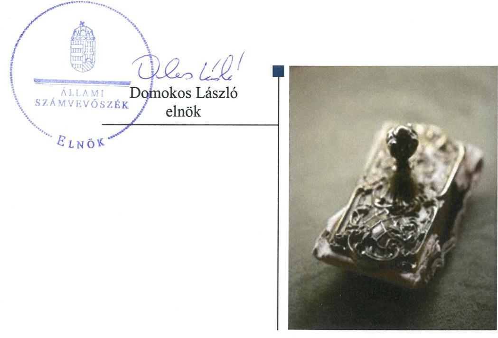
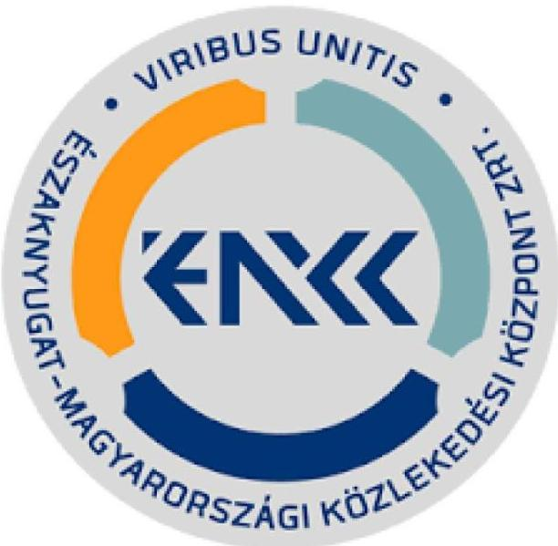
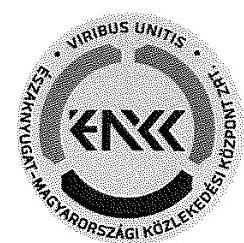
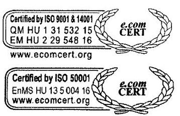
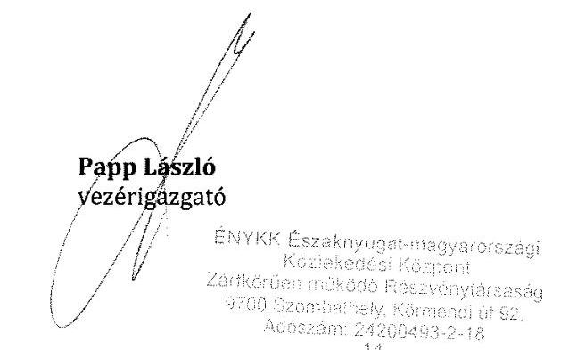
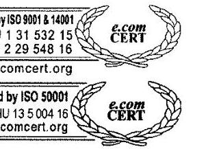
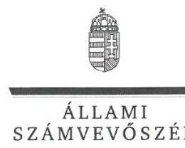
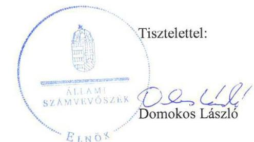
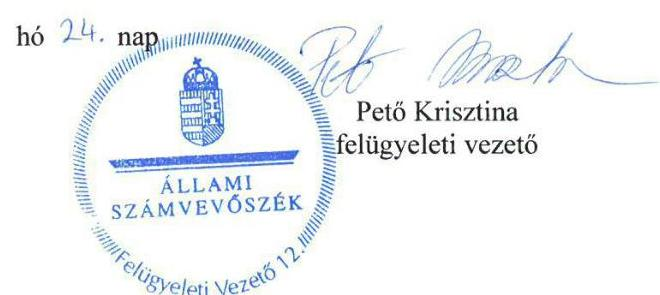

# Jelenetés 

## Az állami tulajdonú gazdasági társaságok ellenőrzése

ÉNYKK Északnyugat-magyarországi Közlekedési Központ Zrt.
2018.

18257
www.asz.hu

---

# Jelentés 

## Az állami tulajdonú gazdasági társaságok ellenőrzése

ÉNYKK Északnyugat-magyarországi
Közlekedési Központ Zrt.
2018. 10. 02.

---

# AZ ELLENŐRZÉST FELÜGYELTE:

- PETŐ KRISZTINA felügyeleti vezető
- AZ ELLENŐRZÉST VEZETTE ÉS A VÉGREHAJTÁSÁÉRT FELELŐS:
  - SALAMIN VIKTOR ellenőrzésvezető
  - A PROGRAM ÖSSZEÁLLÍTÁSÁÉRT FELELŐS:
    - TÓTPÁL SZABOLCS osztályvezető

**IKTATÓSZÁM:** EL-0415-021/2018.

**TÉMASZÁM:** 2469

**ELLENŐRZÉS-AZONOSÍTÓ SZÁM:** V081433

Jelentéseink az Országgyűlés számítógépes hálózatán és az Interneten a www.asz.hu címen is olvashatóak.

---

# TARTALOMJEGYZÉK 

■ ÖSSZEGZÉS ..... 5
■ AZ ELLENŐRZÉS CÉLJA ..... 6
■ AZ ELLENŐRZÉS TERÜLETE ..... 7
■ AZ ELLENŐRZÉS HÁTTERE, INDOKOLTSÁGA ..... 8
■ A JELENTÉS LÉNYEGES KÉRDÉSKÖREI ..... 9
■ AZ ELLENŐRZÉS HATÓKÖRE ÉS MÓDSZEREI ..... 10
■ MEGÁLLAPÍTÁSOK ..... 12
■ JAVASLATOK ..... 15
■ MELLÉKLETEK ..... 17
I. sz. melléklet: Értelmező szótár ..... 17
■ FÜGGELÉK: ÉSZREVÉTELEK ..... 19
■ RÖVIDÍTÉSEK JEGYZÉKE ..... 25

---

.

---

# ÖSSZEGZÉS 

Az ÉNYKK Északnyugat-magyarországi Közlekedési Központ Zrt. vagyongazdálkodása 2013-ban nem volt szabályszerű. 2016-ban a vagyongazdálkodás és a beszámoló nem volt szabályszerű, ami veszélyeztette a vagyon megőrzését és az elszámoltathatóságot.

## Az ellenőrzés társadalmi indokoltsága

Az állami tulajdonú gazdálkodó szervezetek ellenőrzése kiemelten fontos a vagyon megőrzése, megóvása érdekében, amelyekkel szemben alapvető követelmény, hogy gazdálkodásuk, működésük szabályszerű, az általuk szolgáltatott adatok minél megbízhatóbbak legyenek. Az állami tulajdonban álló gazdálkodó szervezetek államot megillető társasági részesedése a nemzeti vagyon részét képezi és legfőbb rendeltetése szerint a közfeladatok ellátását szolgálja.

Az Állami Számvevőszék stratégiájában megfogalmazta, hogy az államháztartáson kívül működő közfeladat-ellátó rendszerek ellenőrzéseivel hozzájárul ahhoz, hogy a közpénzeket az államháztartáson kívül működő szervezetek is átlátható, rendezett módon használják fel a közfeladatok szerződésben vállalt ellátása érdekében. Ellenőrzésünk eredményeképpen javaslatainkkal, megállapításainkkal hozzájárulhatunk a nemzeti vagyonnal való gazdálkodás átláthatóságának, elszámoltathatóságának javításához.

Az Állami Számvevőszék céljaival és a társadalmi igénnyel összhangban, valamint a gazdasági társaságok kiemelt fontosságú szerepe miatt került sor az ÉNYKK Északnyugat-magyarországi Közlekedési Központ Zrt. ellenőrzésére. Az ellenőrzést a Társaság a feladatellátásából adódó további társadalmi elvárás is indokolta, mert az Északnyugati régióban a lakosság rendszeresen kapcsolatba kerül a Társasággal a helyi és helyközi személyszállítási tevékenységére tekintettel.

## Főbb megállapítások, következtetések, javaslatok

Az ÉNYKK Északnyugat-magyarországi Közlekedési Központ Zrt. szabályozottsága 2013. évben nem volt szabályszerű, 2016. évben azonban már megfelelt a jogszabályi előírásoknak, így biztosítva a Társaság ellenőrizhetőségét.

A Társaság vagyongazdálkodása sem 2013-ban, sem 2016-ban nem volt szabályszerű. A 2016. évi beszámoló mérlegtételeit leltár nem támasztotta alá, ami veszélyeztette a vagyon megőrzését és az elszámoltathatóságot.

A Társaság által alkalmazott díjak megállapítása 2016-ban szabályszerű volt. A Társaság a szolgáltatás díjait a jogszabályi előírásnak megfelelően önköltségszámítással alapozta meg. A Társaság teljesítette közzétételi és adatszolgáltatási kötelezettségét, azonban 2016-ban olyan beszámolót tett közzé, amely nem felelt meg a jogszabálynak.

A Magyar Nemzeti Vagyonkezelő Zrt.-nél a tulajdonosi joggyakorlás kereteinek kialakítása és a Társaság feletti tulajdonosi jogok gyakorlása szabályszerű volt.

A megállapítások alapján az Állami Számvevőszék az ÉNYKK Északnyugat-magyarországi Közlekedési Központ Zrt. vezérigazgatójának egy javaslatot fogalmazott meg, amelyre 30 napon belül intézkedési tervet kell készíteni.

---

# AZ ELLENŐRZÉS CÉLJA 

AZ ELLENŐRZÉS CÉLJA annak értékelése volt, hogy a tulajdonosi jogok gyakorlása szabályszerű volt-e. A gazdálkodó szervezet szabályozottsága, gazdálkodása és vagyongazdálkodási tevékenysége megfelelt-e a jogszabályi és a tulajdonosi előírásoknak; biztosítva volt-e a közfeladatok átláthatósága és elszámoltathatósága érdekében a közszolgáltatás díjának megalapozottsága szabályszerű önköltségszámítással. A vagyonváltozást eredményező döntések esetében a tulajdonosi jogok gyakorlója és a gazdálkodó szervezet szabályszerűen jártak-e el.

---

# **AZ ELLENŐRZÉS TERÜLETE**

## **ÉNYKK Északnyugat-magyarországi Közlekedési Központ Zrt.**

Az ÉNYKK Északnyugat-magyarországi Közlekedési Központ Zrt.-t az MNV Zrt. alapította 2012. november 19-én. A Társaság létrehozásának célja az Északnyugat-magyarországi régió hat Volán társaságát (Balaton, Bakony, Kisalföld, Somló, Vas, Zala Volán) magába foglaló vállalatcsoport létrehozása volt a társaság csoportszintű irányításának biztosítása, a gazdasági érdekek egységes és hatékony érvényre juttatása érdekében. A Társaság 2013. és 2016. években a Magyar Állam 100%-os tulajdonában volt. A Magyar Állam nevében a részvényesi jogokat az ellenőrzött időszakban az MNV Zrt. gyakorolta.

A 2014. májusában megkezdett átalakítási folyamat eredményeként a régióba tartozó hat társaság (Balaton, Bakony, Kisalföld, Somló, Vas, Zala Volán Zrt.) 2014. december 31-i hatállyal beolvadt a Társaságba.

Az egyesüléssel létrejött Társaság 2015. január 1-én kezdte meg működését. A Társaság főtevékenysége ekkortól a közszolgáltatói feladatok körébe tartozó belföldi helyközi-, távolsági menetrend szerinti személyszállítás volt. Egyéb tevékenységei körében számottevő volt az üzemanyag és járműalkatrész kiskereskedelem, a gépjármű értékesítés, valamint az autóbusszal végzett egyéb feladatok, a szerződéses járatok és a különjárati személyszállítás. A Társaság a közszolgáltatási tevékenységével összefüggő, bevételekkel nem fedezett, a közszolgáltatási ellátási kötelezettség miatt felmerült indokolt költségekre a Személyszállítási tv. 30. § (1) bekezdése alapján évente ellentételezést kapott.

A Társaság alapításkori jegyzett tőkéje 20 M Ft volt, amely 2016. december 31-re 10 679,3 M Ft-ra nőtt.

A Társaság éves nettó árbevétele a beolvadás után 2015-ben 33 084,1 M Ft, 2016-ban 31 394,4 M Ft volt, melyből 2015-ben 463,8 M Ft, 2016-ban 351,7 M Ft adózott eredmény realizálódott.

A Vezérigazgató személye az ellenőrzött időszakban nem változott, tevékenységét 2012. november 19-től látta el. Az egyesülés következtében a foglalkoztatottak létszáma az ellenőrzött időszakban 3 főről 4 220,9 főre emelkedett.

A Társaság az ellenőrzött időszakban a kormányzati szektorba nem tartozó szervezetnek minősült. Vagyonkezelésre, hasznosításra vonatkozóan szerződéssel nem rendelkezett, vagyonkezelt eszköze nem volt, az állami vagyon apportálásának eredményeként saját tulajdonú vagyonával gazdálkodott.

---

# AZ ELLENŐRZÉS HÁTTERE, INDOKOLTSÁGA 

Az Európai Unióban 1994. év óta hatályos túlzott hiány eljárás mindig kihívást jelentett a tagállamok számára. Az állami tulajdonú gazdálkodó szervezetek ellenőrzése kiemelten fontos a vagyon megőrzése, megóvása érdekében, valamint a kormányzati szektor elszámolásaiban megjelenő állami tulajdonú gazdálkodó szervezetek esetében, amelyekkel szemben alapvető követelmény, hogy gazdálkodásuk, működésük szabályszerű, az általuk szolgáltatott adatok minél megbízhatóbbak legyenek. Gazdálkodásuk jellemzően a közérdeklődés és a média figyelmének középpontjában áll, amihez hozzájárul a gazdálkodásuk körébe tartozó - közvetlen vagy közvetett állami tulajdonú, tehát végső soron a nemzeti vagyon részét képező - vagyon nagysága, illetve az általuk ellátott közszolgáltatások/közfeladatok minősége és hatékonysága.

Az ellenőrzés rámutathat az állami tulajdonú gazdálkodó szervezetek gazdálkodási tevékenységével jó gyakorlatokra és szabálytalanságokra. Felhívhatja a figyelmet a jogszabályi követelmények teljesítéséhez szükséges feltételek hiányosságaira, hozzájárulhat az államháztartáson kívüli, de (közvetlenül vagy közvetve) állami vagyont használó gazdálkodó szervezetek tevékenységének átláthatóságához. Ellenőrzésünk eredményeképpen javaslatainkkal, megállapításainkkal hozzájárulhatunk a nemzeti vagyonnal való gazdálkodás átláthatóságának, elszámoltathatóságának javításához.

---

# A JELENTÉS LÉNYEGES KÉRDÉSKÖREI 

1. A tulajdonosi jogok gyakorlása szabályszerű volt-e?
2. A Társaság szabályozottsága megfelelt-e a jogszabályi előírásoknak, a gazdálkodási, vagyongazdálkodási és adatszolgáltatási feladatok ellátása szabályszerű volt-e?

---

# AZ ELLENŐRZÉS HATÓKÖRE ÉS MÓDSZEREI 

## Az ellenőrzés típusa

Megfelelőségi ellenőrzés.

## Az ellenőrzött időszak

2013-2016. évek, a 2016. évi beszámoló jóváhagyásáig tartó időszak.

## Az ellenőrzés tárgya

Állami tulajdonban lévő gazdasági társaság gazdálkodása, kiemelten vagyongazdálkodási tevékenysége, a tulajdonosi jogok gyakorlása.

## Az ellenőrzött szervezet

ÉNYKK Északnyugat-magyarországi Közlekedési Központ Zrt., valamint a tulajdonosi jogokat gyakorló Magyar Nemzeti Vagyonkezelő Zrt.

## Az ellenőrzés jogalapja

Az ellenőrzés jogszabályi alapját az Állami Számvevőszékről szóló 2011. évi LXVI. törvény 1. § (3) bekezdése és 5. § (3)-(5) bekezdései képezték.

## Az ellenőrzés módszerei

Az ellenőrzést a nemzetközi standardokat irányadónak tekintve az ellenőrzési program ellenőrzési kérdései, az ellenőrzött időszakban hatályos jogszabályok, az ellenőrzés szakmai szabályok és módszertanok figyelembe vételével végeztük.

Az ellenőrzés ideje alatt az ellenőrzött szervezettel történő kapcsolattartást az ÁSZ Szervezeti és Működési Szabályzatának vonatkozó előírásai alapján biztosítottuk.

Az ellenőrzésre a nemzetgazdasági szempontból kiemelt jelentőségű nemzeti vagyon körébe tartozó gazdálkodó szervezeteknél és a többségi állami tulajdonban álló gazdálkodó szervezeteknél került sor. A program szerinti feladatokat a kiválasztott gazdálkodó szervezeteknél (társaságoknál) és azok többségi tulajdonban lévő leányvállalatainál, valamint a tulajdonosi jogok gyakorlójánál kellett végrehajtani. Az ellenőrzés szempontjai

---

és az ellenőrzés alá vont gazdálkodó szervezetek köre az ellenőrzés tapasztalatai alapján - indokolt esetben - változhatott.

A személyi jellegű ráfordítások esetében az ellenőrzött tételek kijelölése véletlen mintavételi eljárás alkalmazásával történt a teljes sokaságból.

A többi terület esetében az ellenőrzés azokra a legnagyobb értékű tételekre - a lényeges sokaságra - terjedt ki, melyek összértéke eléri a teljes sokaság összértékének 50%-át.

A bevételek és a ráfordítások valamint az értékcsökkenési leírás elszámolásának szabályszerűségét, továbbá az immateriális javak, tárgyi eszközök esetében a vagyonnyilvántartás szabályszerűségét a lényeges sokaságból véletlen mintavételi eljárással kiválasztott tételek alapján ellenőriztük.

A mintavétellel ellenőrzött területek esetében minden egyes tétel vonatkozásában a szabályszerűségre vonatkozó kérdéseket tettünk fel, amelyek eredménye összesítésre került. „Szabályszerűnek" értékeltünk egy ellenőrzött területet, amennyiben 95%-os bizonyossággal az ellenőrzött sokaságban az átlagos hibaarány legfeljebb 10%, "nem szabályszerűnek", amennyiben 10%-nál magasabb arányt képviselt.

Az ellenőrzési kérdések megválaszolásához szükséges bizonyítékok megszerzése a következő ellenőrzési eljárások alkalmazásával történt: megfigyelés, kérdésfeltevés (információkérés), összehasonlítás, valamint elemző eljárás. Az ellenőrzési bizonyítékként felhasználható adatforrások közé tartoztak egyrészt az ellenőrzési programban felsorolt adatforrások, másrészt adatforrás lehet még minden - az ellenőrzés folyamán - feltárt, az ellenőrzés szempontjából információkat tartalmazó dokumentum.

A teljes ellenőrzött időszakra vonatkozóan került ellenőrzésre a gazdasági társaság tervezési, beszámolási, közzétételi, adatszolgáltatási kötelezettségének, valamint belső ellenőrzési tevékenységének szabályszerűsége. A 2013. és 2016. évekre vonatkozóan a tulajdonosi joggyakorlást, a gazdasági társaság működésének szabályozottságát, a bevételei és ráfordításai elszámolását, illetve vagyongazdálkodásának szabályszerűségét is ellenőriztük.

Az ellenőrzést a kérdésekre adott válaszok kiértékelésével, valamint a megjelölt adatforrások, a csatolt tanúsítványok felhasználásával, továbbá az adott időszakban hatályos jogszabályok figyelembe vételével folytattuk le.

---

# 1. A tulajdonosi jogok gyakorlása szabályszerű volt-e? 

Összegző megállapítás

Az MNV Zrt. tulajdonosi joggyakorlása 2013. és 2016. években szabályszerű volt.

A TULAJDONOSI JOGGYAKORLÁS KERETEIT az MNV Zrt. kialakította, az SZMSZ-ben szabályozta. Az SZMSZ-ben meghatározott feladatok részletes szabályait a tulajdonosi joggyakorlás területeire vonatkozó belső szabályzatokkal és vezérigazgatói utasításokkal biztosította. Az MNV Zrt. a tulajdonosi joggyakorlás rendjét a Társaság Alapító okiratban kialakította, amely megfelelt a Gt.-ben, illetve a Ptk.-ban foglalt előírásoknak. Az MNV Zrt. a jogszabályi előírásoknak megfelelően a Monitoring szabályzatban, valamint a Portfóliós kódexben alakította ki a részesedések feletti tulajdonosi jogok gyakorlásának rendjét a Társaságnál.

A TULAJDONOSI JOGGYAKORLÁS 2013. és 2016. években szabályszerű volt. Az Alapító okiratban foglaltak szerint a Társaság három főből álló felügyelőbizottságának elnökét és tagjait, valamint a könyvvizsgálót a Taktv., a Gt., illetve a Ptk. előírásainak megfelelően választották meg.

Az MNV Zrt. a Társaság beszámolóit a Gt., illetve a Ptk. előírásainak megfelelően a felügyelőbizottság és a könyvvizsgáló jelentése birtokában jóváhagyta, döntött az nyereség eredménytartalékba helyezéséről. Az MNV Zrt. a Társaság Javadalmazási szabályzatát a Taktv.-ben foglaltaknak megfelelően megalkotta.

---

# 2. A Társaság szabályozottsága megfelelt-e a jogszabályi előírásoknak, a
 gazdálkodási, vagyongazdálkodási és adatszolgáltatási feladatok ellátása szabályszerű volt-e?

Összegző megállapítás

### 2.1. számú megállapítás

A Társaság szabályozottsága 2013-ban nem felelt meg, míg 2016-ban megfelelt a jogszabályi előírásoknak. A Társaság vagyongazdálkodása sem 2013-ban, sem 2016-ban nem volt szabályszerű. A Társaság teljesítette közzétételi és adatszolgáltatási kötelezettségét 2014-2015. között, ezzel biztosította az átláthatóságot.

A Társaság működésének szabályozottsága 2013-ban nem volt megfelelő, 2016-ban megfelelt a jogszabályi előírásoknak.

A Társaság szabályozottsága 2013-ban nem felelt meg a jogszabályi előírásoknak, a Társaság a Számv. tv. ${ }^{13} 14 . \S$ (5) a) pontjában foglalt előírás ellenére az eszközök és a források leltárkészítési és leltározási szabályzattal nem rendelkezett.

A TÁRSASÁG SZABÁLYOZOTTSÁGA 2016. évben megfelel a jogszabályi előírásoknak. Az Alapító okirat ${ }_{1-12}$, valamint a társasági SZMSZ ${ }_{1-5}{ }^{14}$ rögzítette a működés alapvető szabályait, a vagyongazdálkodással kapcsolatos feladat- és hatásköröket, felelősségi viszonyokat.

A Társaság rendelkezett Számviteli politikával ${ }_{1-3}{ }^{15}$, annak részeként elkészítette Leltározási szabályzatát ${ }_{1,2}{ }^{16}$, Értékelési szabályzatát ${ }_{1,2}{ }^{17}$, valamint Pénzkezelési szabályzatát ${ }_{1-3}{ }^{18}$, elkészítette továbbá Számlarendjét ${ }_{1,2}{ }^{19}$ és Selejtezési szabályzatát ${ }^{20}$. A szabályzatok megfeleltek a Számv. tv. előírásainak.

A Társaság a Számv. tv. előírásai szerint elkészítette Önköltségszámítási szabályzatát ${ }_{1,2}{ }^{21}$, az egyes tevékenységek költségeinek elkülönült nyilvántartását biztosították.

A Társaság gazdálkodása és vagyongazdálkodása 2013. évben nem volt szabályszerű. A Társaság gazdálkodása, a bevételek és ráfordítások elszámolása 2016-ban szabályos volt, a díjakat önköltségszámítással alapozták meg. A Társaság vagyongazdálkodása 2016-ban sem volt szabályszerű.

A Társaság működésének szabályozottsága 2013-ban nem volt megfelelő, ezért gazdálkodási, vagyongazdálkodási tevékenysége nem volt szabályszerű.

A BEVÉTELEK ÉS A RÁFORDÍTÁSOK ELSZÁMOLÁSA 2016. évben szabályszerű volt. Az elszámolások megfeleltek Számv. tv. és a belső szabályzatok előírásainak. A Társaság a személyszállítási közfeladat ellátásához, illetve a vállalkozási tevékenységéhez kapcsolódó bevételeit és ráfordításait a Személyszállítási tv.-ben, valamint a Számv. tv.-ben foglaltaknak megfelelően tevékenységenként elkülönítve számolta el. A személyi jellegű ráfordítások elszámolása összhangban volt

---

a munkaszerződésekkel, a belső szabályzatokkal, azok alátámasztottak voltak.

A TÁRSASÁG ÁLTAL ALKALMAZOTT DÍJAK megállapítása 2016-ban szabályszerű volt. A Társaság a nyújtott szolgáltatás díjait önköltségszámítással alapozta meg, amely megfelelt a Számv. tv. és az Önköltségszámítási szabályzat ${ }_{1,2}$-ben foglaltaknak.

A VAGYONGAZDÁLKODÁS feltételeit 2016. évben a Társaság biztosította. A feladat- és hatásköröket, felelősségi viszonyokat az Alapító okirat ${ }_{1-12}$-ban, a társasági SZMSZ ${ }_{1-5}$-ben, valamint belső szabályzatokban rögzítették. A Társaság az éves vagyongazdálkodási, fejlesztési terveket az Alapító okirat ${ }_{1-12}$-ben és az SZMSZ ${ }_{1-5}$-ben előírtaknak megfelelően elkészítette.

AZ ÉRTÉKCSÖKKENÉS elszámolása 2016. évben szabályszerű volt, megfelelt a Számv. tv. és a belső szabályzatok előírásainak.

AZ ÉVES BESZÁMOLÓIT a Társaság 2014-2015. években a jogszabályi előírásoknak megfelelően elkészítette. 2016. évben a tárgyi eszközök leltározása a Számv. tv. 69. § (3) bekezdésében előírtak ellenére nem történt meg, ezért a mérleget alátámasztó leltár 2016. évben nem felelt meg a Számv. tv. 69. § (1) bekezdésében előírtaknak, a mérleg tételeinek leltárral történő alátámasztása nem volt biztosított, így nem érvényesült a Számv. tv. 15. § (3) bekezdésben rögzített valódiság elve.

A hiányosságok ellenére a könyvvizsgáló az ellenőrzött időszakban az éves beszámolókat korlátozás nélküli hitelesítő záradékkal látta el.

# 2.3. számú megállapítás 

A Társaság adatszolgáltatási és közzétételi kötelezettségének 2014-2015. években eleget tett.

## A TERVEZÉSI ÉS ADATSZOLGÁLTATÁSI KÖTELE-

ZETTSÉGÉT 2014-2016. években a Társaság teljesítette. A Társaság üzleti terveit határidőre elkészítette, azokat a felügyelőbizottság jóváhagyta, a tulajdonos elfogadta. Az MNV Zrt. Monitoring szabályzat ${ }_{1,2}$-ben és éves tervezési irányelveiben közzétett adatszolgáltatási kötelezettségét a Társaság teljesítette. Az éves beszámolóit a Társaság az előírásoknak megfelelően letétbe helyezte és közzétette, 2016-ban azonban a beszámoló nem felelt a jogszabályok előírásainak.

KÖZZÉTÉTELI KÖTELEZETTSÉGÉNEK a Társaság 2014-2016. években a Taktv és az Info.tv. előírásainak megfelelően honlapján eleget tett.

---

# JAVASLATOK 

Az ÁSZ tv. 33. § (1) bekezdésében foglaltak értelmében az ellenőrzött szervezet vezetője köteles a jelentésben foglalt megállapításokhoz kapcsolódó intézkedési tervet összeállítani és azt a jelentés kézhezvételétől számított 30 napon belül az ÁSZ részére megküldeni. Amennyiben az ellenőrzött szervezet vezetője nem küldi meg határidőben az intézkedési tervet, vagy továbbra sem elfogadható intézkedési tervet küld, az Állami Számvevőszék elnöke az ÁSZ tv. 33. § (3) bekezdése a) és b) pontjaiban foglaltakat érvényesítheti.

## Az ÉNYKK Északnyugat-magyarországi Közlekedési Központ Zrt. vezérigazgatójának

1. Intézkedjen a jogszabályi előírásoknak megfelelő leltározás, valamint a mérlegtételek jogszabályi előírásoknak megfelelő leltárral történő alátámasztása iránt.
(2.2. sz. megállapítás 6. bekezdésének 2. mondata alapján)

---

.

---

# MELLÉKLETEK 

- I. SZ. MELLÉKLET: ÉRTELMEZŐ SZÓTÁR
gazdasági társaság
gazdálkodó szervezet
kormányzati szektorba sorolt egyéb szervezet
közszolgáltatás
nemzeti vagyon

Ptk. 3:88. § (1) bekezdése szerint „a gazdasági társaságok üzletszerű közös gazdasági tevékenység folytatására, a tagok vagyoni hozzájárulásával létrehozott, jogi személyiséggel rendelkező vállalkozások, amelyekben a tagok a nyereségből közösen részesednek, és a veszteséget közösen viselik".
A Ptk. 685. § c) pontja szerint gazdálkodó szervezet: „az állami vállalat, az egyéb állami gazdálkodó szerv, a szövetkezet, a lakásszövetkezet, az európai szövetkezet, a gazdasági társaság, az európai részvénytársaság, az egyesülés, az európai gazdasági egyesülés, az európai területi együttműködési csoportosulás, az egyes jogi személyek vállalata, a leányvállalat, a vízgazdálkodási társulat, az erdő birtokossági társulat, a végrehajtói iroda, az egyéni cég, továbbá az egyéni vállalkozó." (2014. 03.15-ig hatályos)
az Áht. ${ }^{22}$ 3. § (2) és (3) bekezdésében foglaltakon kívül az Európai Közösséget létrehozó szerződéshez csatolt, a túlzott hiány esetén követendő eljárásról szóló jegyzőkönyv alkalmazásáról szóló 2009. május 25-i 479/2009/EK rendelet (a továbbiakban: 479/2009/EK rendelet) szerint a kormányzati szektorba sorolt szervezet (Áht. 1. § (12))
Az Ebktv. ${ }^{23}$ 3. § d) pontja a következőképpen határozza meg a közszolgáltatást: „szerződéskötési kötelezettség alapján a lakosság alapvető szükségleteinek ellátására irányuló szolgáltatás, így különösen a villamos energia-, gáz-, hő-, víz-, szenny-víz- és hulladékkezelési, köztisztasági, postai és távközlési szolgáltatás, továbbá a menetrend alapján közlekedő járművekkel végzett közforgalmú személyszállítás". Nvtv. ${ }^{24}$ 1. § (2) bekezdése szerint többek között:
„az állam vagy a helyi önkormányzat kizárólagos tulajdonában álló dolgok, az a) pont hatálya alá nem tartozó, állam vagy a helyi önkormányzat tulajdonában lévő dolog,
az állam vagy a helyi önkormányzat tulajdonában lévő pénzügyi eszközök, továbbá az államot vagy a helyi önkormányzatot megillető társasági részesedések, az államot vagy a helyi önkormányzatot megillető bármely vagyoni értékkel rendelkező jogosultság, amelyet jogszabály vagyoni értékű jogként nevesít."

---

.

---

# FÜGGELÉK: ÉSZREVÉTELEK 

A jelentéstervezetet a Számvevőszék 15 napos észrevételezésre megküldte az ellenőrzött szervezetek vezetőinek az ÁSZ tv. 29. §* (1) bekezdése előírásának megfelelően.

Az ÉNYKK Északnyugat-magyarországi Közlekedési Központ Zrt. vezérigazgatója a jelentéstervezet megállapításaira észrevételt tett. A Magyar Nemzeti Vagyonkezelő Zrt. vezérigazgatója nem élt észrevételezési jogával.
A függelék - melléklet nélkül - tartalmazza az ellenőrzött észrevételeit, illetve az el nem fogadott észrevételek elutasításának indoklását.

[^0]
[^0]:    * 29. § (1) Az Állami Számvevőszék az ellenőrzési megállapításait megküldi az ellenőrzött szervezet vezetőjének vagy az általa megbízott személynek, és annak, akinek személyes felelősségét állapította meg.
    (2) Az ellenőrzött szervezet vezetője és a felelősként megjelölt személy az ellenőrzés megállapításaira tizenöt napon belül írásban észrevételt tehet.
    (3) Az Állami Számvevőszék az észrevételre a beérkezésétől számított harminc napon belül írásban válaszol. A figyelembe nem vett észrevételeket köteles a jelentésben feltüntetni, és megindokolni, hogy azokat miért nem fogadta el.

---

# Állami Számvevőszék 

## Pető Krisztina

felügyeleti vezető

## Budapest

Apáczai Cserejános utca 10.
1052

Tisztelt Pető Krisztina!
Az ÉNYKK Északnyugat-magyarországi Közlekedési Központ Zrt. az EL0598-033/2018. Iktatószámú "Az állami tulajdonú gazdasági társaságok ellenőrzése" tárgyában megküldött jelentéstervezetben szereplő megállapításokra az alábbi észrevételeket teszi:
A 2.1. számú megállapításban szerepel, hogy a társaság nem rendelkezett hatályos, a Számviteli törvény 14. § (5) a) pontjában meghatározott leltárkészítési és leltározási szabályzattal 2013. év vonatkozásában. Ezen időszakban az ÉNYKK Zrt. gazdasági tevékenysége kizárólagosan a régió Volántársaságainak integrációs feladataira korlátozódott, ami szinte kizárólag azok eszközeinek és erőforrásainak igénybevételével zajlott. A fentiekből következően az ÉNYKK Zrt-nek 1 db tételesen leltározható tárgyi eszköze volt, készlettel pedig egyáltalán nem rendelkezett. A leltározási és leltárkészítési szabályzat hiánya ellenére a Számviteli törvény 69. § (1) bekezdésében előírt, a mérleg tételeinek alátámasztását biztosító tételes leltár elkészítésre került. A 2018.02.14-én lezajlott helyszíni adategyeztetésről készült jegyzőkönyv 2. pontja szerint ez a leltár - mint a 2013. évi mérleget alátámasztó leltárösszesítő(k) - átadásra került. (A helyszíni adategyeztetésről készült EL-0598-004/2018 Iktató számú jegyzőkönyv mellékletként csatolva.)
A társaság 2015. január 1-jétől, a jogelőd Volán-társaságok beolvadásával átvette azok eszközeit, megkezdte az általuk folytatott tevékenység végzését és ezen időponttól már rendelkezett a jogszabályban előírt leltározási és leltárkészítési szabályzattal is. A beolvadt jogelőd társaságok a vagyonmérleg alátámasztásaként, 2014.12.31-kei fordulónappal a tárgyi eszközeiket teljes körűen leltározták, melyről a tételes leltár is elkészült. Tekintettel arra, hogy a tárgyi eszközök egy jelentős része áthelyezésre került telephelyek között, 2015. évben ismételten leltározásra kerültek a tárgyi eszközök. A fentiek következtében sem a társaság hatályos szabályzata, sem a Számviteli törvényben meghatározottak szerint, a 2016. évi tárgyi eszköz-leltározás nem volt esedékes, a soron következő tételes leltározást 2018. évben kell végrehajtani.
A háromévenkénti mennyiségi felvétellel történő leltározási kötelezettségre vonatkozó társasági szabályzat megfelel a Számviteli törvény 69. § (3) bekezdésében előírtaknak, mely szerint amennyiben folyamatos mennyiségi nyilvántartást vezet a társaság, akkor a leltárba bekerülő adatok valódiságáról az eszközök és a források leltárkészítési és leltározási szabályzatában meghatározott időszakonként, de legalább háromévente leltározással köteles meggyőződni.
www.volantourist.hu

CÉGJEGYZÉKSZÁM: 18-10-100701

9700 Szombathely, Körmendi út 92. Levélcím: 9701 Szombathely, Pf.: 111 Tel.: +36 94517611
Fax: +36 94517625
E-mail: enykk@enykk.hu
Web: www.enykk.hu

---

A társaság tárgyi eszközeinek Számviteli törvény 69. § (3) bekezdésében szereplő, számviteli alapelveknek megfelelő folyamatos mennyiségi nyilvántartására az SAP integrált vállalatirányítási rendszer tárgyieszköz nyilvántartó (AM) modulja szolgál. A modulból bármely időpontra vonatkozóan az eszközök lekérdezési lehetősége - utólagosan is - biztosított. A programból előállított lista biztosítja a törvény 69. § (1) bekezdésében meghatározottakat, azaz megfelel a könyvek üzleti év végi zárását, a beszámoló elkészítését, a mérleg tételeinek alátámasztását biztosító leltárnak. A törvény előírásai szerint megőrizhető, tételesen, ellenőrizhető módon tartalmazza a társaságnak a mérleg fordulónapján meglévő eszközeit mennyiségben és értékben is.
A társaság tárgyieszköz állománya közel 50 ezer eszközből áll, ezért az év végére vonatkozó állományi listát a társaság nyomtatott formában nem tárolja, tekintettel annak nagyságrendjére és arra is, hogy ez utólagosan, bármely időpontban előállítható és kinyomtatható.
Az SAP rendszer AM moduljának a fentiek szerinti használata a beszámoló alátámasztására (a Számviteli törvényben foglalt előírásoknak megfelelve) a gazdasági társaságok körében széleskörűen alkalmazott, ami mind a társaság könyvvizsgálója, mind az egyes hatóságok részéről elfogadásra került.
A 2016. évi tárgyieszköz állományt (vagy annak mérete miatt bármely szúrópróba szerű részét) a társaság az ellenőrzés részére előre egyeztetett módon
 biztosítani tudja, a 2016. évi mérleget alátámasztó egyéb eszközök és források leltárával, a csatolt jegyzőkönyvben foglalt 2013. évi beszámolót alátámasztó leltárral azonos módon.

Nem értünk egyet az EL0598-033/2018. Iktatószámú "Az állami tulajdonú gazdasági társaságok ellenőrzése" tárgyában megküldött jelentéstervezet 2.1., illetve 2.2. pontjában megfogalmazott megállapításokkal, miszerint a társaság működésének szabályozottsága 2013. évben nem volt megfelelő, illetve a társaság gazdálkodása és vagyongazdálkodása 2013. és 2016-ban nem volt szabályszerű.

Kérem, hogy a fentiek alapján szíveskedjenek felülvizsgálni megállapításaikat.

Szombathely, 2018. augusztus 3.

Tisztelettel:

www.volantourist.hu
CEGJEGYZEKSZÁM: 18-10-100701

9700 Szombathely, Körmendi út 92. Levélcím: 9701 Szombathely, Pf.: 111 Tel.: -3694517611 Fax: -36 94517625 E-mail: enykk@enykk.hu Web: www.enykk.hu

---

ELNÖK

Ikt.szám: EL-0598-039/2018.

# Papp László úr 

vezérigazgató

ÉNYKK Északnyugat-magyarországi
Közlekedési Központ Zrt.

## Szombathely

## Tisztelt Vezérigazgató Úr!

„Az állami tulajdonú gazdasági társaságok ellenőrzése - ÉNYKK Északnyugat-magyarországi Közlekedési Központ Zrt." címmel készített számvevőszéki jelentéstervezetre tett észrevételeit megkaptam.
Az Állami Számvevőszék észrevételekre vonatkozó álláspontjáról a felügyeleti vezető által készített részletes tájékoztatást csatoltan megküldöm.
Tájékoztatom Vezérigazgató urat, hogy a számvevőszéki jelentésben - az Állami Számvevőszékről szóló 2011. évi LXVI. törvény 29. § (3) bekezdése alapján - a figyelembe nem vett észrevételeket szerepeltetjük az elutasítás indokának feltüntetésével.

Budapest, 2018. 08. hó 24. nap

Melléklet: Tájékoztatás az el nem fogadott észrevételekről

---

# Tájékoztatás az el nem fogadott észrevételekről 

„Az állami tulajdonú gazdasági társaságok ellenőrzése - ÉNYKK Északnyugat-magyarországi Közlekedési Központ Zrt." címú jelentéstervezetre levélben megküldött észrevételeit áttekintettem. Az észrevételek kezeléséről az alábbi tájékoztatást adom.

## 1.) A jelentéstervezet 2.1. összegző megállapításához füzött észrevételei kapcsán

Észrevételében jelezte, hogy a 2013-as év vonatkozásában a leltározási és leltárkészítési szabályzat hiánya ellenére a Számviteli törvény (Számv. tv.) 69. § (1) bekezdésében előírt, a mérleg tételeinek alátámasztását biztosító tételes leltár elkészítésre került, mely kapcsán a 2018.02.14-én lezajlott helyszíni adategyeztetésről készült jegyzőkönyv értelmében az alátámasztó leltárösszesítők átadásra kerültek.
Ezúton tájékoztatom, hogy az Állami Számvevőszék (ÁSZ) az ellenőrzését a megküldött ellenőrzési programnak megfelelően, kizárólag a rendelkezésre bocsátott hiteles adatok és dokumentumok (bizonyítékok) alapján végezte. Az ellenőrzés megállapította, hogy az ÉNYKK Észak-nyugat-magyarországi Közlekedési Központ Zrt. (Társaság) szabályozottsága 2013-ban nem felelt meg a jogszabályi előírásoknak, mivel a Számv. tv. 14. § (5) bekezdés a) pontjában foglalt előírás ellenére az eszközök és a források leltárkészítési és leltározási szabályzatával nem rendelkezett. A leltározási és leltárkészítési szabályzat 2013. évi hiányát az észrevétel sem vitatta, továbbá az észrevételben hivatkozott jegyzőkönyvben is rögzítésre került. Fentiekre tekintettel észrevételét nem fogadjuk el, a jelentéstervezet módosítása nem indokolt.

## 2.) A jelentéstervezet 2.2. összegző megállapításának 1. és 6. bekezdéséhez füzött észrevételei kapcsán

Észrevételében jelezte, hogy a 2018.02.14-én lezajlott helyszíni adategyeztetésről készült jegyzőkönyv értelmében a 2013. évi mérleg tételeit alátámasztó leltárösszesítők átadásra kerültek az ÁSZ részére. Vezérigazgató úr észrevételében előadja, hogy a háromévenkénti mennyiségi felvétellel történő leltározási kötelezettségre vonatkozó társasági szabályozás megfelel a törvényi előírásoknak, valamint a Társaság által használt SAP integrált vállalatirányítási rendszer AM modulja is biztosítja a beszámoló alátámasztását biztosító tárgyi eszközök állományi listáját, melyet a Társaság előre egyeztetett módon az ÁSZ részére rendelkezésre tud bocsátani.
A 2013-as év vonatkozásában megállapítást nyert, hogy mivel a Társaság működésének szabályozottsága 2013-ban nem volt megfelelő, ezért gazdálkodási, vagyongazdálkodási tevékenysége nem volt szabályszerű.

---

A 2016-os év vonatkozásában az ellenőrzés részére határidőben átadott dokumentumok ismételt felülvizsgálatát követően megállapítottam, hogy a beszámolókat alátámasztó leltárakhoz kapcsolódó dokumentumok között nem kerültek megküldésre a Számv. tv. 69. § (3) bekezdésében foglaltak igazolására olyan dokumentumok, amelyek tételesen, ellenőrizhető módon tartalmazták volna a Társaság mérleg fordulónapján meglévő eszközeit és forrásait, mennyiségben és értékben.

Ezúton tájékoztatom, hogy az ÁSZ az ellenőrzését a megküldött ellenőrzési programnak megfelelően, a rendelkezésre bocsátott hiteles adatok és dokumentumok (bizonyítékok) alapján végezte. Az ÁSZ azon dokumentumokat, amelyeket az adatszolgáltatási időszakot követően bocsátanak rendelkezésére, bizonyítékként nem veszi figyelembe, azok hitelességéről nem áll módjában meggyőződni.
Mindemellett a 2018. április 17-én Vezérigazgató úr által aláirt teljességi és hitelességi nyilatkozatok rögzítik, hogy a Társaság által az Állami Számvevőszék részére átadott nyilatkozatban is rögzített dokumentumai megbízhatóak és a bekért adatokra, dokumentumokra vonatkozóan teljes körű információt tartalmaznak.
Fentiekre tekintettel észrevételét nem fogadjuk el, a jelentéstervezet módosítása nem indokolt.

Budapest, 2018.

---

# RÖVIDÍTÉSEK JEGYZÉKE 

${ }^{1}$ MNV Zrt.
${ }^{2}$ Társaság
${ }^{3}$ Személyszállítási tv.
${ }^{4}$ ÁSZ
${ }^{5}$ SZMSZ $_{1-5}$

[^0]Magyar Nemzeti Vagyonkezelő Zrt.
ÉNYKK Északnyugat-magyarországi Közlekedési Központ Zrt.
2012. évi XLI. törvény a személyszállítási szolgáltatásokról (hatályos 2012. július 1-től)
Állami Számvevőszék
Magyar Nemzeti Vagyonkezelő Zártkörűen Működő Részvénytársaság Szervezeti és Működési Szabályzata (hatályos: 2012. október 8-tól)
Magyar Nemzeti Vagyonkezelő Zártkörűen Működő Részvénytársaság Szervezeti és Működési Szabályzata (hatályos: 2013. március 16-tól)
Magyar Nemzeti Vagyonkezelő Zártkörűen Működő Részvénytársaság Szervezeti és Működési Szabályzata (hatályos: 2013. április 25-től)
Magyar Nemzeti Vagyonkezelő Zártkörűen Működő Részvénytársaság Szervezeti és Működési Szabályzata (hatályos: 2013. július 1-től)
Magyar Nemzeti Vagyonkezelő Zártkörűen Működő Részvénytársaság Szervezeti és Működési Szabályzata (hatályos: 2016. április 6-tól)
Az ÉNYKK Északnyugat-magyarországi Közlekedési Központ Zrt. alapító okiratai és alapszabályai (Hatályos. Alapító Okirat1 2012. november 19-étől, Alapító Okirat2 2013. március 20-ától, Alapító Okirat3 2013. május 6-ától, Alapító Okirat4 2013. december 4-étől, Alapító Okirat5 2013. december 20-ától, Alapító Okirat6 2014. január 13-ától, Alapszabály7 2014. július 30-ától, Alapszabály8 2015. március 31-étől, Alapszabály9 2015. október 20-ától, Alapszabály10 2015. október 21-étől, Alapszabály11 2016. május 19-étől, Alapszabály12 2016. október 24-étől)
2006. évi IV. törvény a gazdasági társaságokról (hatálytalan: 2014. március 15-étől)
2013. évi V. törvény a Polgári Törvénykönyvről (hatályos 2014. március 15-től)

MNV Zrt. Monitoring Szabályzata (hatályos: 2013. december 19-től)
MNV Zrt. Monitoring Szabályzata (hatályos: 2016. augusztus 1-től)
MNV Zrt. Portfóliós Kódexe (hatályos: 2015. március 31-től)
MNV Zrt. Portfóliós Kódexe (hatályos: 2016. május 31-től)
2009. évi CXXII. törvény a köztulajdonban álló gazdasági társaságok takarékosabb működéséről (hatályos: 2009. december 4-től)
Javadalmazási szabályzat (Hatályos: 2012. november 19-től)
Javadalmazási szabályzat (Hatályos: 2016. február 23-tól)
2000. évi C. törvény a számvitelről

ÉNYKK Északnyugat-magyarországi Közlekedési Központ Zrt. Szervezeti és Működési Szabályzata (Hatályos: 2013. június 1-jétől)
ÉNYKK Északnyugat-magyarországi Közlekedési Központ Zrt. Szervezeti és Működési Szabályzata (Hatályos: 2013. június 15-től)
ÉNYKK Északnyugat-magyarországi Közlekedési Központ Zrt. Szervezeti és Működési Szabályzata (Hatályos: 2015. november 17-től)
ÉNYKK Északnyugat-magyarországi Közlekedési Központ Zrt. Szervezeti és Működési Szabályzata (Hatályos: 2016. április 1-jétől)
ÉNYKK Északnyugat-magyarországi Közlekedési Központ Zrt. Szervezeti és Működési Szabályzata (Hatályos: 2016. december 15-től)

[^0]:    ${ }^{6}$ Alapító okirat ${ }_{1-12}$

    7 Gt.
    ${ }^{8}$ Ptk.
    ${ }^{9}$ Monitoring szabályzat ${ }_{1-2}$

    10 Portfóliós kódex ${ }_{1-2}$
    ${ }^{11}$ Taktv.
    ${ }^{12}$ Javadalmazási szabályzat ${ }_{1-2}$
    ${ }^{13}$ Számv. tv.
    ${ }^{14}$ társasági SZMSZ $_{1-5}$

---

${ }^{15}$ Számviteli politika $_{1-3}$
${ }^{16}$ Leltározási szabályzat ${ }_{1-2}$
${ }^{17}$ Értékelési szabályzat ${ }_{1-2}$
${ }^{18}$ Pénzkezelési szabályzat ${ }_{1-3}$
${ }^{19}$ Számlarend $_{1-2}$
${ }^{20}$ Selejtezési szabályzat
${ }^{21}$ Önköltségszámítási szabályzat ${ }_{1-2}$
${ }^{22}$ Áht.
${ }^{23}$ Ebktv.
${ }^{24} \mathrm{Nvtv}$. Számviteli politika ${ }_{1}$ (Hatályos: 2013. március 27-től)
Számviteli politika ${ }_{2}$ (Hatályos: 2015. március 25-től)
Számviteli politika ${ }_{3}$ (Hatályos: 2016. január 1-jétől)
Leltározási szabályzat ${ }_{1}$ (Hatályos: 2015. augusztus 3-tól)
Leltározási szabályzat ${ }_{2}$ (Hatályos: 2016. november 21-től)
Eszközök és források értékelési szabályzata ${ }_{1}$ (Hatályos: 2015. augusztus 3-tól)
Eszközök és források értékelési szabályzata ${ }_{2}$ (Hatályos: 2016. január 1-jétől)
Pénzkezelési szabályzat ${ }_{1}$ (Hatályos: 2013. február 1-jétől)
Pénzkezelési szabályzat ${ }_{2}$ (Hatályos: 2013. június 14-től)
Pénzkezelési szabályzat ${ }_{3}$ (Hatályos: 2015. augusztus 3-tól)
Számlarend $_{1}$ (Hatályos: 2015. augusztus 3-tól)
Számlarend $_{2}$ (Hatályos: 2016. január 1-jétől)
Selejtezési szabályzat (Hatályos: 2015. augusztus 3-tól)
Önköltségszámítási szabályzat ${ }_{1}$ (Hatályos: 2015. augusztus 3-tól)
Önköltségszámítási szabályzat ${ }_{2}$ (Hatályos: 2016. december 1-jétől)
2011. évi CXCV. törvény az államháztartásról (hatályos 2011. december 31-től)
2003. évi CXXV. törvény az egyenlő bánásmódról és az esélyegyenlőség előmozdításáról (hatályos: 2004. január 27-től)
2011. évi CXCVI. törvény a nemzeti vagyonról (hatályos: 2011. december 31-től)

---

ÁLLAMI SZÁMVEVŐSZÉK
1052 Budapest, Apáczai Csere János utca 10.
Levélcím: 1364 Budapest 4. Pf. 54
Telefon: +36 14849100 Telefax: +36 14849200
www.asz.hu
