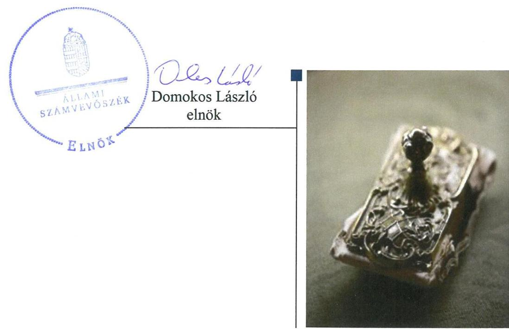
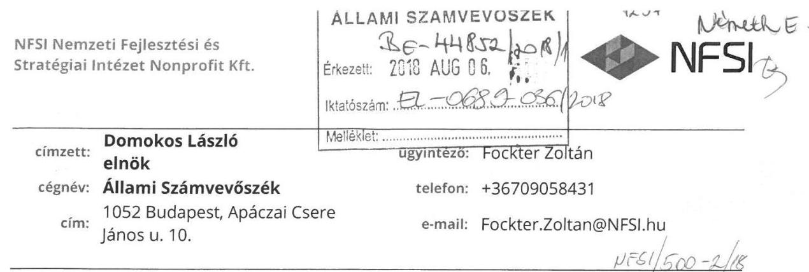
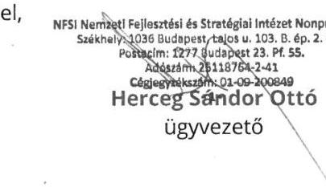
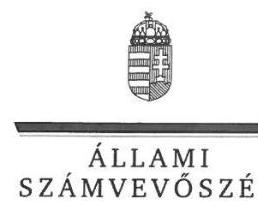
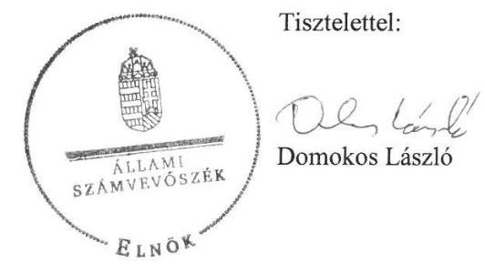
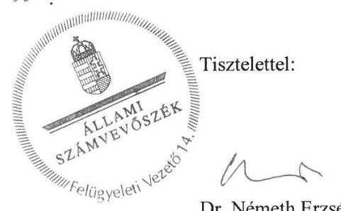

# Jelentés 

## Az állami tulajdonú gazdasági társaságok ellenőrzése

NFSI Nemzeti Fejlesztési és Stratégiai Intézet Nonprofit Kft.
2018.

---

# Jelentés 

## Az állami tulajdonú gazdasági társaságok ellenőrzése

NFSI Nemzeti Fejlesztési és Stratégiai Intézet Nonprofit Kft.
2018. 10. hó 11. nap

---

# AZ ELLENŐRZÉST FELÜGYELTE:

DR. NÉMETH ERZSÉBET felügyeleti vezető

## AZ ELLENŐRZÉST VEZETTE ÉS A VÉGREHAJTÁSÁÉRT FELELŐS:

JÁNOSI ISTVÁN ellenőrzésvezető

A PROGRAM ÖSSZEÁLLÍTÁSÁÉRT FELELŐS:

TÓTPÁL SZABOLCS osztályvezető

IKTATÓSZÁM: EL-0398-056/2018.

TÉMASZÁM: 2469

ELLENŐRZÉS-AZONOSÍTÓ SZÁM: V081419

Jelentéseink az Országgyűlés számítógépes hálózatán és az Interneten a www.asz.hu címen is olvashatóak.

---

# TARTALOMJEGYZÉK 

■ ÖSSZEGZÉS ..... 5
■ AZ ELLENŐRZÉS CÉLJA ..... 6
■ AZ ELLENŐRZÉS TERÜLETE ..... 7
■ AZ ELLENŐRZÉS HÁTTERE, INDOKOLTSÁGA ..... 9
■ A JELENTÉS LÉNYEGES KÉRDÉSKÖREI ..... 10
■ AZ ELLENŐRZÉS HATÓKÖRE ÉS MÓDSZEREI ..... 11
■ MEGÁLLAPÍTÁSOK ..... 13
■ JAVASLATOK ..... 16
■ MELLÉKLETEK ..... 17
I. sz. melléklet: Értelmező szótár ..... 17
■ FÜGGELÉK: ÉSZREVÉTELEK ..... 19
■ RÖVIDÍTÉSEK JEGYZÉKE ..... 25

---

.

---

# ÖSSZEGZÉS 

Az NFSI Nemzeti Fejlesztési és Stratégiai Intézet Nonprofit Kft. felett a tulajdonosi joggyakorlás szabályszerű volt. A Társaság a 2015. évben nem alakította ki a szabályszerű gazdálkodás feltételeit, nem biztosította tevékenysége elszámoltathatóságát. A Társaság 2016. évi szabályozottsága és gazdálkodása szabályszerű volt. Közérdekű adat közzétételi kötelezettségének nem tett eleget, ezáltal nem biztosította tevékenységének átláthatóságát.

## Az ellenőrzés társadalmi indokoltsága

Az állami tulajdonú gazdálkodó szervezetek ellenőrzése kiemelten fontos a vagyon megőrzése, megóvása érdekében, valamint a kormányzati szektor elszámolásaiban megjelenő állami tulajdonú gazdálkodó szervezetek esetében, amelyekkel szemben alapvető követelmény, hogy gazdálkodásuk, működésük szabályszerű, az általuk szolgáltatott adatok minél megbízhatóbbak legyenek. A kiegyensúlyozott, átlátható és fenntartható költségvetési gazdálkodás érvényesítésének elvét az Alaptörvény rögzíti, a nemzeti vagyon megőrzésének, védelmének és a nemzeti vagyonnal való felelős gazdálkodásnak a követelményeit sarkalatos törvény határozza meg.

Az NFSI Nemzeti Fejlesztési és Stratégiai Intézet Nonprofit Kft-t azzal a céllal alapították, hogy a Nemzeti Fejlesztési Minisztérium szakmai kezelésébe tartozó európai uniós és a hazai energiahatékonysági programok keretében a pályázatok lebonyolítási, közbeszerzési feladatait és egyéb háttérintézményi feladatait ellássa.

Az Állami Számvevőszék 2015-2016. évekre kiterjedő ellenőrzése során arra kereste a választ, hogy szabályszerű volt-e a társaság gazdálkodása és az ehhez kapcsolódó tulajdonosi joggyakorlás.

## Főbb megállapítások, következtetések, javaslatok

A Magyar Nemzeti Vagyonkezelő Zrt. és a Nemzeti Fejlesztési Minisztérium tulajdonosi joggyakorlása az NFSI Nemzeti Fejlesztési és Stratégiai Intézet Nonprofit Kft. felett szabályszerű volt.

Az NFSI Nemzeti Fejlesztési és Stratégiai Intézet Nonprofit Kft. tevékenységének szabályozottsága 2015-ben nem felelt meg a jogszabályi előírásoknak, mert nem rendelkezett a szükséges belső szabályzatokkal. 2016-ban a működés szabályozottsága szabályszerű volt.

Pénzügyi-számviteli tevékenysége 2015-ban nem volt szabályszerű, a bevételek és ráfordítások elszámolása nem felelt meg a Számviteli törvény előírásainak. 2016-ban az elszámolások szabályszerűek voltak.

A 2015-16. évi éves beszámolókkal kapcsolatos letétbehelyezési és közzétételi kötelezettségének határidőben eleget tett, azonban az előtársasági beszámoló letétbehelyezésére és közzétételére 2015-ben a jogszabály által előírt határidőn túl került sor.

Jogszabályban előírt közérdekű adat közzétételi kötelezettségeinek nem tett eleget.
A Társaság vagyongazdálkodása szabályszerű volt. Vagyonnyilvántartása megfelelt az előírásoknak. Éves beszámolóit a Számviteli törvény előírásainak megfelelő leltárral alátámasztotta.

---

# AZ ELLENŐRZÉS CÉLJA 

AZ ELLENŐRZÉS CÉLJA annak értékelése volt, hogy a tulajdonosi jogok gyakorlása szabályszerű volt-e. A gazdálkodó szervezet szabályozottsága, gazdálkodása és vagyongazdálkodási tevékenysége megfelelt-e a jogszabályi és a tulajdonosi előírásoknak. A vagyonváltozást eredményező döntések esetében a tulajdonosi jogok gyakorlója és a gazdálkodó szervezet szabályszerűen jártak-e el.

---

# **AZ ELLENŐRZÉS TERÜLETE**

## **NFSI Nemzeti Fejlesztési és Stratégiai Intézet Nonprofit Kft.**

**A MAGYAR ÁLLAM** az NFSI Nemzeti Fejlesztési és Stratégiai Intézet Nonprofit Kft-t 2014. december 22-én alapította három millió Ft jegyzett tőkével, NFSI Nemzeti Fejlesztési és Stratégiai Intézet Kft. néven. A Társaság^{1} 2015. január 14-éig, a cégjegyzékbe történő bejegyzés napjáig előtársaságként működött. A Társaság 2016. december 22-étől kezdődően nonprofit gazdasági társaságként folytatta tevékenységét, ennek megfelelően elnevezése NFSI Nemzeti Fejlesztési és Stratégiai Intézet Nonprofit Kft-re változott.

**A TULAJDONOSI JOGOKAT** a Társaság felett 2015. március 5-éig a Magyar Nemzeti Vagyonkezelő Zrt., ezt követően a Nemzeti Fejlesztési Minisztérium gyakorolta.

**A TÁRSASÁG** 100 %-os állami tulajdonban lévő, közfeladatot ellátó gazdasági társaság, melynek főtevékenysége Egyéb természettudományi, műszaki kutatás, fejlesztés. A Társaság legfontosabb feladatai voltak: az európai uniós pályázatok projektmenedzseri, közbeszerzési feladatainak ellátása az Európai Unió vagy más nemzetközi szervezet felé vállalt kötelezettséggel összefüggő, a 2014–2020 programozási időszakban a Kormány^{2} által a nemzeti fejlesztési miniszter hatáskörébe utalt energiahatékonyság növelését célzó beruházások megvalósításáról szóló 435/2015. (XII.28.) Korm. rendelet alapján, valamint hazai pályázatkezelési feladatok ellátása a Nemzeti Fejlesztési Minisztérium által kezelt hazai energiahatékonysági programok vonatkozásában. Fentiek miatt a Társaságnál kiemelt fontosságú volt a pályázatkezelői feladatok magas színvonalú ellátása, ennek okán pedig a feladatok magas szintű ellátását biztosító, szükséges mértékű és összetételű személyi állomány és infrastrukturális feltételrendszer folyamatos rendelkezésre állása.

A Társaság főbb mérleg adatait az 1. táblázat mutatja be.

1. táblázat

|  A TÁRSASÁG FŐBB MÉRLEGADATAI (MILLIÓ FT) |  |   |
| --- | --- | --- |
|  Megnevezés | 2015.
XII.21. | 2016.
XII.21.  |
|  Mérlegfőösszeg | 433,3 | 7256,9  |
|  Saját tőke | 323,1 | 184,0  |
|  Adózott eredmény | -37,6 | -139,1  |
|  Forrás: Éves beszámolók |  |   |

A Társaság élén ügyvezető^{3} állt, munkáját három tagú felügyelőbizottság^{4} ellenőrizte. Az ügyvezető személye az ellenőrzött időszakban egy alkalommal, 2015. február 1-jén változott.

A foglalkoztatottak átlagos statisztikai állományi létszáma a 2015. évi 19 főről 2016-ban 53 főre emelkedett.

---

Önköltségszámítási szabályzat készítésére a Számv. tv. ${ }^{5}$ előírásai alapján az ellenőrzött időszakban nem volt kötelezett.

Az éves beszámolók felülvizsgálatára 2015. november 25-étől kezdődően állandó könyvvizsgálót foglalkoztatott, azonban a Számv. tv. alapján erre nem volt kötelezett.

A Társaság az ellenőrzött időszakban vagyonkezelt vagyonnal nem rendelkezett.

A Társaság a NGM közleménye alapján az ellenőrzött időszakban nem volt kormányzati szektorba sorolt egyéb szervezet.

---

# AZ ELLENŐRZÉS HÁTTERE, INDOKOLTSÁGA 

AZ ÁLLAMI TULAJDONÚ GAZDÁLKODÓ SZERVEZETEK ellenőrzése kiemelten fontos a vagyon megőrzése, megóvása érdekében, valamint a kormányzati szektor elszámolásaiban megjelenő állami tulajdonú gazdálkodó szervezetek esetében, amelyekkel szemben alapvető követelmény, hogy gazdálkodásuk, működésük szabályszerű, az általuk szolgáltatott adatok minél megbízhatóbbak legyenek. Gazdálkodásuk jellemzően a közérdeklődés és a média figyelmének középpontjában áll, amihez hozzájárul a gazdálkodásuk körébe tartozó - közvetlen vagy közvetett állami tulajdonú, tehát végső soron a nemzeti vagyon részét képező - vagyon nagysága, illetve az általuk ellátott közszolgáltatások/közfeladatok minősége és hatékonysága. A közszolgáltatási árképzés megalapozottsága és a rendszeres elszámoltatás feltételeinek kialakítása az ellenőrzése során nagy hangsúlyt kap. A közszolgáltatás árában és annak támogatásában meg kell jelennie az önköltségszámítás szempontjainak, amely biztosítja a működés fenntarthatóságát (eszközpótlást) is.

Az ellenőrzés rámutathat az állami tulajdonú gazdálkodó szervezetek gazdálkodási tevékenységével jó gyakorlatokra és szabálytalanságokra. Felhívhatja a figyelmet a jogszabályi követelmények teljesítéséhez szükséges feltételek hiányosságaira, hozzájárulhat az államháztartáson kívüli, de (közvetlenül vagy közvetve) állami vagyont használó gazdálkodó szervezetek tevékenységének átláthatóságához. Ellenőrzésünk eredményeképpen javaslatainkkal, megállapításainkkal hozzájárulhatunk a nemzeti vagyonnal való gazdálkodás átláthatóságának, elszámoltathatóságának javításához.

---

# A JELENTÉS LÉNYEGES KÉRDÉSKÖREI 

1.     - A tulajdonosi jogok gyakorlása szabályszerű volt-e?
2.     - A társaság működésének szabályozottsága megfelelt-e az előírásoknak?
3.     - A társaságnál a pénzügyi-számviteli, adatszolgáltatási és ellenőrzési feladatok ellátása szabályszerű volt-e?
4.     - A társaság vagyongazdálkodása szabályszerű volt-e?

---

# AZ ELLENŐRZÉS HATÓKÖRE ÉS MÓDSZEREI 

## Az ellenőrzés típusa

Megfelelőségi ellenőrzés.

## Az ellenőrzött időszak

Az ellenőrzött időszak a 2015. - 2016. évek, a 2016. évi beszámoló jóváhagyásáig tartó időszak.

## Az ellenőrzés tárgya

Az állami tulajdonban lévő gazdasági társaságok gazdálkodása, kiemelten vagyongazdálkodási tevékenysége, a tulajdonosi jogok gyakorlása.

Az ellenőrzés kiterjedt minden olyan körülményre és adatra, amely az ÁSZ ${ }^{6}$ jogszabályban meghatározott feladatainak teljesítéséhez, valamint a program végrehajtása folyamán felmerült újabb összefüggések feltárásához szükséges.

## Az ellenőrzött szervezet

NFSI Nemzeti Fejlesztési és Stratégiai Intézet Nonprofit Kft., valamint a tulajdonosi jogokat gyakorló Magyar Nemzeti Vagyonkezelő Zrt. és a Nemzeti Fejlesztési Minisztérium.

## Az ellenőrzés jogalapja

Az ellenőrzés jogalapját az ÁSZ tv. ${ }^{7}$ 1. § (3) bekezdése és 5. § (3)-(5) bekezdései képezték.

## Az ellenőrzés módszerei

Az ellenőrzést a nemzetközi standardokat irányadónak tekintve az ellenőrzési program ellenőrzési kérdései, az ellenőrzött időszakban hatályos jogszabályok, az ellenőrzés szakmai szabályok és módszertanok figyelembe vételével végeztük.

Az ellenőrzés ideje alatt az ellenőrzött szervezettel történő kapcsolattartást az ÁSZ Szervezeti és Működési Szabályzatának vonatkozó előírásai alapján biztosítottuk.

---

Az ellenőrzési kérdések megválaszolásához szükséges bizonyítékok megszerzése a következő ellenőrzési eljárások alkalmazásával történt: megfigyelés, kérdésfeltevés (információkérés), összehasonlítás, valamint elemző eljárás. Az ellenőrzési bizonyítékként felhasználható adatforrások közé tartoznak egyrészt az ellenőrzési programban felsorolt adatforrások, másrészt adatforrás lehet még minden - az ellenőrzés folyamán - feltárt, az ellenőrzés szempontjából információkat tartalmazó dokumentum.

Az ellenőrzést a kérdésekre adott válaszok kiértékelésével, valamint a megjelölt adatforrások, a csatolt tanúsítványok felhasználásával, továbbá az adott időszakban hatályos jogszabályok figyelembe vételével kellett lefolytatni.

A személyi jellegű ráfordítások esetében az ellenőrzött tételek kijelölése véletlen mintavételi eljárás alkalmazásával történt a teljes sokaságból.

A bevételek és a ráfordítások, valamint az immateriális javak, tárgyi eszközök esetében az ellenőrzés azokra a legnagyobb értékű tételekre - a lényeges sokaságra - terjedt ki, melyek összértéke eléri a teljes sokaság összértékének 50\%-át.

A 2016. évi ráfordítások elszámolásának szabályszerűségét a lényeges sokaságból véletlen mintavételi eljárással kiválasztott tételek alapján ellenőriztük.

A mintavétellel ellenőrzött területek esetében minden egyes tétel vonatkozásában a szabályszerűségre vonatkozó kérdéseket tettünk fel, amelyek eredménye összesítésre került. „Szabályszerűnek" értékeltünk egy ellenőrzött területet, amennyiben 95\%-os bizonyossággal az ellenőrzött sokaságban az átlagos hibaarány legfeljebb 10\%, "nem szabályszerűnek", amennyiben 10\%-nál magasabb arányt képviselt."

---

# 1. A tulajdonosi jogok gyakorlása szabályszerű volt-e? 

Összegző megállapítás

A tulajdonosi jogok gyakorlása szabályszerű volt.
A TULAJDONOSI JOGGYAKORLÁS KERETEIT az MNV Zrt. ${ }^{8}$ és az NFM${ }^{9}$ a jogszabályi előírásoknak megfelelően határozta meg belső szabályzataiban és a Társaság Alapító Okiratában ${ }_{1-5}{ }^{10}$. Az Alapító Okirat ${ }_{1-5}$ a Gt. ${ }^{11}$ és a Ptk. ${ }^{12}$ jogszabályi előírásaival összhangban szabályozta a Társaság feladat- és hatásköreit. Az Alapító Okirat ${ }_{1-5}$ a Társaság ügyvezetője részére üzleti terv készítését, valamint negyedéves rendszerességgel évközi beszámolási, tájékoztatási kötelezettséget írt elő.

Az MNV Zrt. és az NFM a jogszabályi előírásoknak megfelelően döntött a Társaság ügyvezetője, az FB tagok, valamint a könyvvizsgáló kijelöléséről.

A TÁRSASÁG ÉVES ÜZLETI TERVEI közül a 2015. évre vonatkozó tervet az MNV Zrt. elfogadta, azonban a 2016. évi tervet az NFM nem hagyta jóvá arra hivatkozva, hogy azt a Társaság határidőn túl nyújtotta be.

A TÁRSASÁG ÉVES BESZÁMOLÓIT a 2015. és a 2016. év vonatkozásában az NFM a jogszabályi előírásoknak megfelelően, határidőben, a független könyvvizsgálói jelentés és a felügyelőbizottság írásbeli jelentésének ismeretében fogadta el. Ugyanakkor a Társaság előtársasági

 időszakáról szóló beszámolóját a Számv. tv. 135. § (1) bekezdésében előírt, a Társaság cégjegyzékbe történő bejegyzésének napját követő harmadik hónap utolsó napját 55 nappal meghaladóan, 2015. június 25-én hagyta jóvá.

## 2. A társaság működésének szabályozottsága megfelelt-e az előírásoknak?

Összegző megállapítás

A Társaság működésének szabályozottsága 2015-ben nem felelt meg a jogszabályi előírásoknak, 2016-ban szabályszerű volt.

SZMSZ-szel a Társaság az Alapító Okiratban ${ }_{1-5}$ foglalt előírás ellenére a 2015. évben nem rendelkezett. Az SZMSZ ${ }^{13}{ }_{1-2}$ első alkalommal 2015. december 1-jei hatállyal került kiadásra.

SZÁMVITELI POLITIKÁVAL ${ }^{14}$ ${ }_{1-3}$, valamint annak keretében elkészített eszköz-forrás értékelési szabályzattal ${ }^{15}$, leltározási szabályzattal ${ }^{16}$ a Társaság a Számv. tv. előírásainak megfelelően rendelkezett. A Számv. tv. 14. § (5) bekezdésében foglalt előírás ellenére a pénzkezelési

---

szabályzat ${ }_{1-3}{ }^{17}$ kiadására első alkalommal csak 2015. augusztus 25-én került sor.

A SZÁMLAREND ${ }^{18}$ a Számv. tv. 161. § (5) bekezdésében foglalt előírás ellenére első alkalommal 2016. január 1-jén került kiadásra. A számlarend megfelelt a Számv. tv. előírásainak.

JAVADALMAZÁSI SZABÁLYZAT ${ }^{19}$ a Taktv. ${ }^{20}$ 5. § (3) bekezdésében foglalt előírás ellenére első alkalommal 2016. január 1-jén került kiadásra. A javadalmazási szabályzat megfelelt a Taktv. előírásainak. A szabályzatot a tulajdonosi joggyakorló határozatban állapította meg.

# 3. A társaságnál a pénzügyi-számviteli, adatszolgáltatási és ellenőrzési feladatok ellátása szabályszerű volt-e? 

Összegző megállapítás

A társaságnál a pénzügyi-számviteli feladatok ellátása 2015-ben nem volt szabályszerű, 2016-ban szabályszerű volt. Éves beszámolókkal kapcsolatos letétbehelyezési és közzétételi kötelezettségének eleget tett. Közérdekű adat közzétételi kötelezettségét nem teljesítette.
3.1. számú megállapítás

A bevételek és a ráfordítások elszámolása 2015-ben nem volt szabályszerű, 2016-ban szabályszerű volt.

A BEVÉTELEK ÉS RÁFORDÍTÁSOK elszámolása a 2015. évben nem volt szabályszerű, mert a Társaság nem rendelkezett a Számv. tv. 161. § (1) és (2) bekezdéseiben foglalt előírásoknak megfelelő számlarenddel, ezáltal a számviteli nyilvántartásba történő bejegyzés alapjául szolgáló bizonylatok - a bizonylatokon feltüntetett főkönyvi számlák tekintetében - nem voltak megbízhatóak, nem feleltek meg a Számv. tv. 166. § (2) bekezdésében foglalt előírásnak.

A bevételek és ráfordítások elszámolása a 2016. évben szabályszerű volt.
3.2. számú megállapítás

A Társaság az éves beszámolókkal kapcsolatos letétbehelyezési és közzétételi kötelezettségének eleget tett. Közérdekű adat közzétételi kötelezettségét nem teljesítette.

## LETÉTBEHELYEZÉSI ÉS KÖZZÉTÉTELI KÖTELE-

ZETTSÉGEINEK a Társaság a 2015-2016. évi éves beszámolók vonatkozásában a jogszabályi előírásoknak megfelelően eleget tett, ugyanakkor előtársasági időszakáról szóló beszámolóját a Számv. tv. 135. § (1) bekezdésében előírt, a Társaság cégjegyzékbe történő bejegyzésének napját követő harmadik hónap utolsó napját 55 nappal meghaladóan, 2015. június 29-én helyezte letétbe és tette közzé a céginformációs szolgálat honlapján.

---

BESZÁMOLÁSI KÖTELEZETTSÉGÉNEK az évközi jelentéstételi kötelezettsége és a 2015. évi üzleti terv vonatkozásában a Társaság a tulajdonosi joggyakorló irányában eleget tett, azonban a 2016. évi üzleti tervét az NFM által meghatározott 2016. január 15-ei határidőt követően jelentős késedelemmel, 2016. májusában nyújtotta be.

A KÖZÉRDEKŰ ADATOK közzétételére vonatkozó, az Info tv. ${ }^{21}$ 37. § (1) bekezdésében előírt kötelezettségét az ellenőrzött időszakban nem teljesítette, mert az Info tv. 1. mellékletének III.1. pontjában meghatározottak szerint a Számv. tv. szerinti beszámolóit sem a Társaság, sem a tulajdonosi joggyakorló internetes honlapján, sem erre a célra létrehozott más, központi honlapon nem jelenítette meg.

A Társaság az Info tv. 35. § (3) bekezdésében foglalt előírás ellenére az ellenőrzött időszakban - 2015. január 1. és 2016. december 11. között - nem rendelkezett a kötelezően közzéteendő közérdekű adatok közzétételi kötelezettségének teljesítési szabályait tartalmazó szabályzattal.

A BELSŐ ELLENŐRZÉST a Társaság 2016. novemberétől kezdődően működtette, bár erre jogszabályi kötelezettsége nem volt. A 2016. évben két ellenőrzés lefolytatására került sor.

# 4. A társaság vagyongazdálkodása szabályszerű volt-e? 

## Összegző megállapítás

A Társaság vagyongazdálkodása szabályszerű volt. Vagyonnyilvántartása megfelelt az előírásoknak.

A VAGYONGAZDÁLKODÁSSAL kapcsolatos feladat és hatáskörök a Társaság Alapító Okiratában ${ }_{1-5}$ és belső szabályzataiban meghatározásra kerültek. A Társaság az üzleti tervek részeként elkészítette a beruházási terveket.

A Társaság 2015. és 2016. évi éves beszámolóinak mérlegét a Számv. tv. előírásainak megfelelő leltárral alátámasztotta.

A vagyonnyilvántartás megfelelt a Számv. tv. és a Társaság belső szabályzatai előírásainak.

---

# JAVASLATOK 

Az ÁSZ tv. 33. § (1) bekezdésében foglaltak értelmében az ellenőrzött szervezet vezetője köteles a jelentésben foglalt megállapításokhoz kapcsolódó intézkedési tervet összeállítani és azt a jelentés kézhezvételétől számított 30 napon belül az ÁSZ részére megküldeni. Amennyiben az ellenőrzött szervezet vezetője nem küldi meg határidőben az intézkedési tervet, vagy továbbra sem elfogadható intézkedési tervet küld, az Állami Számvevőszék elnöke az ÁSZ tv. 33. § (3) bekezdése a) és b) pontjaiban foglaltakat érvényesítheti.

## az NFSI Nemzeti Fejlesztési és Stratégiai Intézet Nonprofit Kft. ügyvezetőjének

1. Gondoskodjon az Info tv. által előírt közzétételi kötelezettség teljesítéséről.
(3.2 sz. megállapítás 3. bekezdése alapján)

---

# MELLÉKLETEK 

- I. SZ. MELLÉKLET: ÉRTELMEZŐ SZÓTÁR
állami vagyon
gazdasági társaság
kormányzati szektorba sorolt egyéb szervezet
nemzeti vagyon
a) Az állam tulajdonában lévő dolog, valamint a dolog módjára hasznosítható természeti erő,
b) az a) pont hatálya alá nem tartozó mindazon vagyon, amely vonatkozásában törvény az állam kizárólagos tulajdonjogát nevesíti,
c) az állam tulajdonában lévő tagsági jogviszonyt megtestesítő értékpapír, illetve az államot megillető egyéb társasági részesedés,
d) az államot megillető olyan immateriális, vagyoni értékkel rendelkező jogosultság, amelyet jogszabály vagyoni értékű jogként nevesít.
Forrás: Vtv. ${ }^{22}$ 1. § (2) bekezdése
e) az állam tulajdonában lévő pénzügyi eszközök

Forrás: Vtv. 1. § (2) bekezdése
A Ptk. 3:88. § (1) bekezdése szerint „a gazdasági társaságok üzletszerű közös gazdasági tevékenység folytatására, a tagok vagyoni hozzájárulásával létrehozott, jogi személyiséggel rendelkező vállalkozások, amelyekben a tagok a nyereségből közösen részesednek, és a veszteséget közösen viselik".
Az a szervezet, amely az Áht. alapján nem része az államháztartásnak, azonban az Európai Közösséget létrehozó szerződéshez csatolt, a túlzott hiány esetén követendő eljárásról szóló jegyzőkönyv alkalmazásáról szóló 2009. május 25-i 479/2009/EK rendelet szerint a kormányzati szektorba tartozik. A nemzetgazdasági miniszter 2013. június 26-án megjelent Közleményben tette közé ezen szervezetek listáját
a) az állam vagy a helyi önkormányzat kizárólagos tulajdonában álló dolgok,
b) az a) pont hatálya alá nem tartozó, állam vagy a helyi önkormányzat tulajdonában lévő dolog,
c) az állam vagy a helyi önkormányzat tulajdonában lévő pénzügyi eszközök, továbbá az államot vagy a helyi önkormányzatot megillető társasági részesedések,
d) az államot vagy a helyi önkormányzatot megillető bármely vagyoni értékkel rendelkező jogosultság, amelyet jogszabály vagyoni értékű jogként nevesít,
e) Magyarország határa által körbezárt terület feletti légtér,
f) az üvegházhatású gázok kibocsátási egységeinek kereskedelméről szóló törvény szerint kibocsátási egység és légiközlekedési kibocsátási egység, valamint az ENSZ Éghajlatváltozási Keretegyezménye és annak Kiotói Jegyzőkönyv végrehajtási keretrendszeréről szóló törvény szerinti kiotói egység,
g) állami vagy helyi önkormányzati fenntartású közgyűjtemény (muzeális intézmény, levéltár, közgyűjteményként működő kép- és hangarchívum, valamint könyvtár) saját gyűjteményében nyilvántartott kulturális javak körébe tartozó dolog, kivéve, ha az állami vagy önkormányzati tulajdon jogszerű létrejötte kétséget kizáró módon nem bizonyítható és a dologra nézve más a tulajdonjogát bizonyítja vagy a kulturális javakra vonatkozó jogszabályokban meghatározott eljárás keretében valószínűsíti (g. pont módosult 2013. december 7-től),
h) a régészeti lelet,
i) a nemzeti adatvagyon körébe tartozó állami nyilvántartások fokozottabb védelméről szóló törvény szerinti nemzeti adatvagyon.
Forrás: Nvtv. ${ }^{23}$ 1. § (2)

---

tulajdonosi jogok gyakorlója

# 1. 

2013. június 27-ig:

Az állami vagyon felett a Magyar Államot megillető tulajdonosi jogok és kötelezettségek összességét - ha törvény eltérően nem rendelkezik - az állami vagyon felügyeletéért felelős miniszter (a továbbiakban: miniszter) gyakorolja, aki e feladatát a Magyar Nemzeti Vagyonkezelő Zártkörűen Működő Részvénytársaság (a továbbiakban: MNV Zrt.), a Magyar Fejlesztési Bank, illetve a tulajdonosi joggyakorló szervezet útján látja el. A miniszter miniszteri rendeletben, a törvényben meghatározott állami vagyoni kör tekintetében, meghatározott időtartamra, a joggyakorlás egyes szabályainak meghatározásával - az őt megillető tulajdonosi jogok és kötelezettségek összességének, illetve azok meghatározott részének gyakorlóját az Áht. szerinti központi költségvetési szervek, ezek intézménye, továbbá a 100%-ban állami tulajdonban álló gazdasági társaságok közül kijelölheti.
Forrás: Vtv. 3. § (1) és (2)
2013. június 28-ától:

A rábízott állami vagyon felett az államot megillető tulajdonosi jogok és kötelezettségek összességét tulajdonosi joggyakorlóként:
a) ha törvény vagy miniszteri rendelet eltérően nem rendelkezik, a Magyar Nemzeti Vagyonkezelő Zártkörűen Működő Részvénytársaság (a továbbiakban: MNV Zrt.),
b) törvényben kijelölt személy vagy
c) az állami vagyon felügyeletéért felelős miniszter (a továbbiakban: miniszter) által rendeletben kijelölt személy gyakorolja.
[...] A miniszter e törvény felhatalmazása alapján - a meghatározott célok hatékonyabb elérése érdekében, miniszteri rendeletben, az ott meghatározott állami vagyoni kör tekintetében, meghatározott időtartamra - e törvény keretei között, a joggyakorlás egyes szabályainak meghatározásával - az államot megillető tulajdonosi jogok és kötelezettségek összességének, illetve azok meghatározott részének gyakorlóját az Áht. szerinti központi költségvetési szervek, ezek intézménye, továbbá a 100%-ban állami tulajdonban álló gazdasági társaságok közül kijelölheti.
Forrás: Vtv. 3. § (1) és (2)
2.

Aki a nemzeti vagyon felett az államot vagy a helyi önkormányzatot megillető tulajdonosi jogok és kötelezettségek összességének gyakorlására jogosult
Forrás: Nvtv. 3. § (1) 17. pontja

---

# FÜGGELÉK: ÉSZREVÉTELEK 

A jelentéstervezetet a Számvevőszék 15 napos észrevételezésre megküldte az ellenőrzött szervezetek vezetőinek az ÁSZ tv. 29. § (1) bekezdése előírásának megfelelően.

Az NFSI Nemzeti Fejlesztési és Stratégiai Intézet Nonprofit Kft. ügyvezetője a jelentéstervezet megállapításaira észrevételt tett.
Az elfogadott észrevételek alapján a Számvevőszék módosította a jelentést.
A függelék tartalmazza az ellenőrzött észrevételeit, illetve az el nem fogadott észrevételek elutasításának indoklását.

[^0]
[^0]:    * 29. § (1) Az Állami Számvevőszék az ellenőrzési megállapításait megküldi az ellenőrzött szervezet vezetőjének vagy az általa megbízott személynek, és annak, akinek személyes felelősségét állapította meg.
    (2) Az ellenőrzött szervezet vezetője és a felelősként megjelölt személy az ellenőrzés megállapításaira tizenöt napon belül írásban észrevételt tehet.
    (3) Az Állami Számvevőszék az észrevételre a beérkezésétől számított harminc napon belül írásban válaszol. A figyelembe nem vett észrevételeket köteles a jelentésben feltüntetni, és megindokolni, hogy azokat miért nem fogadta el.

---

Tárgy: Számvevőszéki jelentéstervezet - észrevétel

# Tisztelt Elnök Úr! 

Társaságunk részére az EL-0689-032/2018 iktatószámon megküldött, 2018. július 19-én kézhez vett, „Az állami tulajdonú gazdasági társaságok ellenőrzése - NFSI Nemzeti Fejlesztési és Stratégiai Intézet Nonprofit Kft." című jelentéstervezetre az alábbi észrevételeket tesszük.

Megállapítások/3. A társaságnál a pénzügyi-számviteli, adatszolgáltatási és ellenőrzési feladatok ellátása szabályszerű volt-e?/3.2. számú megállapítás/

Beszámolási kötelezettségének az évközi jelentéstételi kötelezettsége és a 2015. évi üzleti terv vonatkozásában a Társaság a tulajdonosi joggyakorló irányában eleget tett, azonban a 2016. évi üzleti tervét az NFM által meghatározott 2016. január 15-ei határidőt követően jelentős késedelemmel, 2016. májusában nyújtotta be.
A 2016. év tervezési időszakában az ellátandó feladatok tekintetében a Nemzeti Fejlesztési Minisztérium és Társaságunk részére nem álltak rendelkezésre elegendő input adatok, mely alapján az
 NFSI 2016. évi üzleti terve elkészíthető lett volna a premissza levélben meghatározott 2016. január 15-ei dátumra, emiatt engedélyezte az NFM Társasági Portfólió Főosztálya, az NFSI Felügyelőbizottságának tájékoztatása és tudomásul vétele mellett, a 2016. évi Üzleti terv későbbi benyújtását.

A közérdekű adatok közzétételére vonatkozó, az Info tv. 37. § (1) bekezdésében előírt kötelezettségét az ellenőrzött időszakban nem teljesítette, mert az Info tv. 1. mellékletének III.1. pontjában meghatározottak szerint a Számv. tv. szerinti beszámolóit sem a Társaság, sem a tulajdonosi joggyakorló internetes honlapján, sem erre a célra létrehozott más, központi honlapon nem jelenítette meg.
Az az Info tv. 1. mellékletének III.1. pontja a közfeladatot ellátó szerv közzétételéről rendelkezik, de Társaságunk a vizsgált időszakban sem látott el közfeladatot, feladatellátásunkat jogszabály nem minősítette közfeladatnak, ezen álláspontot képviselte tájékoztatás formájában az NFM Vagyongazdálkodásért Felelős Helyettes Államtitkársága is.
Az NFSI számviteli törvény szerint beszámolóit az IM Céginformációs szolgálat honlapján letétbe és közzé tette, jelenleg is elérhetőek.
Természetesen, ha a Tisztelt Számvevőszék álláspontja a közzététel az átláthatóság miatt, akkor Társaságunk visszamenőlegesen az internetes honlapján közzéteszi a számviteli törvény szerint beszámolóit.

---

# Nemzeti Fejlesztési és Stratégiai Intézet Kft. 

A Társaság az Info tv. 35. § (3) bekezdésében foglalt előírás ellenére az ellenőrzött időszakban nem rendelkezett a kötelezően közzéteendő közérdekű adatok közzétételi kötelezettségének teljesítési szabályait tartalmazó szabályzattal.
Az NFSI a kérdéses szabályzatot 2016. december 12-ei hatállyal léptette életbe, melyet az ellenőrzés során a Tisztelt Számvevőszék rendelkezésére bocsátottunk.

Kérnénk a Tisztelt Számvevőszéket, észrevételeinket a jelentéstervezet Javaslatok fejezeténél is figyelembe venni.

Budapest, 2018. augusztus 1.

Üdvözlettel,

---

ELNÖK

Ikt.szám: EL-0689-037/2018

# Herceg Sándor Ottó 

ügyvezető
NFSI Nemzeti Fejlesztési és Stratégiai Intézet Nonprofit Kft.

## Budapest

## Tisztelt Ügyvezető Úr!

„Az állami tulajdonú gazdasági társaságok ellenőrzése - NFSI Nemzeti Fejlesztési és Stratégiai Intézet Nonprofit Kft." című jelentéstervezetre tett észrevételét köszönettel megkaptam.

Az ellenőrzési megállapításokra vonatkozó észrevételét az Állami Számvevőszékről szóló 2011. évi LXVI. törvény (a továbbiakban: ÁSZ tv.) 29. § (2) bekezdésében meghatározott tizenöt napos határidőn belül küldte meg. Az Állami Számvevőszék észrevétellel kapcsolatos álláspontját a mellékletként csatolt, a felügyeleti vezető által készített indokolás tartalmazza.

Tájékoztatom, hogy az Állami Számvevőszék a figyelembe nem vett észrevételeket az ÁSZ tv. 29. § (3) bekezdésében előírtak szerint köteles a jelentésében feltüntetni és megindokolni, hogy azokat miért nem fogadta el.

Budapest, 2018. 26. 2. 2. hó 71. nap

Melléklet: Észrevételre adott válasz

---

# „Az állami tulajdonú gazdasági társaságok ellenőrzése - NFSI Nemzeti Fejlesztési és Stratégiai Intézet Nonprofit Kft. " című jelentéstervezethez tett észrevételre adott válasz Nemzeti Fejlesztési és Stratégiai Intézet Nonprofit Kft 

A jelentéstervezetre tett észrevételeket áttekintettem, annak kezelésével kapcsolatban a következő tájékoztatást adom.

1. A jelentéstervezet 3.2 számú megállapítás szerint az NFSI beszámolási kötelezettségének az évközi jelentéstételi kötelezettsége és a 2015. évi üzleti terv vonatkozásában a tulajdonosi joggyakorló irányában eleget tett, azonban a 2016. évi üzleti tervét az NFM által meghatározott 2016. január 15-ei határidőt követően jelentős késedelemmel, 2016. májusában nyújtotta be.

Ügyvezető úr észrevételében arról tájékoztatja az Állami Számvevőszéket, hogy a 2016. év tervezési időszakában az ellátandó feladatok tekintetében a Nemzeti Fejlesztési Minisztérium és a Társaság részére nem álltak rendelkezésre elegendő input adatok, mely alapján az NFSI 2016. évi üzleti terve elkészíthető lett volna a premissza levélben meghatározott 2016. január 15-ei dátumra, emiatt engedélyezte az NFSM Társasági Portfólió Főosztálya, az NFSI Felügyelőbizottságának tájékoztatása és tudomásulvétele mellett, a 2016. évi Üzleti terv későbbi benyújtását.

Ügyvezető úr a jelentéstervezet megállapítását nem vitatja, a késedelmes benyújtás körülményeiről ad tájékoztatást. Az ellenőrzés a végrehajtás tényét értékelte. Az észrevétel során ismételten áttekintettük az ellenőrzési dokumentumokat, amely során megállapítást nyert, hogy a késedelemmel kapcsolatos, hivatkozott dokumentációt a Társaság nem bocsátotta az ellenőrzés rendelkezésére. A megállapítás módosítása a fentiekkel összhangban nem indokolt.
2. A jelentéstervezet szintén 3.2 számú megállapítása szerint a Társaság nem teljesítette az Info. tv. 37. § (1) bekezdésében előírt közérdekű adatokra vonatkozó közzétételi kötelezettségét, mert az Info tv. 1. mellékletének III. 1. pontjában meghatározottak szerint a Számv. tv. szerinti beszámolóit sem a Társaság, sem a tulajdonosi joggyakorló internetes honlapján, sem az erre célra létrehozott más, központi honlapon nem jelenítette meg.

Ügyvezető úr jelzi, hogy a hivatkozott jogszabály által előírt közzétételi kötelezettség a közfeladatot ellátó szerv feladatellátására irányul. A Társaság ugyanakkor a vizsgált időszakban sem látott el közfeladatot, az NFSI feladatellátását jogszabály nem minősítette közfeladatnak, ezen álláspontot képviselte tájékoztatás formájában az NFM Vagyongazdálkodásért Felelős Helyettes Államtitkársága is. Az NFSI számviteli törvény szerinti beszámolóit az Igazságügyi Minisztérium céginformációs szolgálatának honlapján letétbe és közzé tette, azok jelenleg is elérhetőek.

Az észrevétel kapcsán megállapítottuk, hogy az államháztartásról szóló 2011. évi CXCV. törvény 3/A. §-a, valamint a Társaság feladatellátásra vonatkozó 435/2015. (IV.28.)

---

Korm. rendelet alapján az NFSI feladatellátása közfeladat ellátásnak minősül. Az NFM Vagyongazdálkodásért Felelős Helyettes Államtitkársága által kiadott tájékoztatást a Társaság nem bocsátotta az ellenőrzés rendelkezésére. Az NFSI az IM Céginformációs és az Elektronikus Cégeljárásban Közreműködő Szolgálat honlapján közzétette a Társaság számviteli törvény szerinti beszámolóit. A beszámoló Számv. tv. előírásainak megfelelő közzététele és letétbe helyezése azonban nem érinti a gazdasági társaság Info tv. 37. § (1) bekezdésében rögzített közzétételi kötelezettségének részleges teljesítését sem. A megállapítás módosítása ezért nem indokolt.
3. A jelentéstervezet 3.2 számú a közérdekű adatok közzétételére vonatkozó megállapítása szerint a Társaság az Info tv. 35. § (3) bekezdésében foglalt előírás ellenére az ellenőrzött időszakban nem rendelkezett a kötelezően közzéteendő közérdekű adatok közzétételi kötelezettségének teljesítési szabályait tartalmazó szabályzattal.

Ügyvezető úr észrevételében rögzíti, hogy az NFSI a kérdéses szabályzatot 2016. december 12-ei hatállyal léptette életbe, melyet az ellenőrzés során az Állami Számvevőszék rendelkezésére bocsátott.

A jelentéstervezet az ellenőrzés hatóköre és módszerei fejezetben bemutatja, hogy az ellenőrzött időszak a 2015. és 2016. évek, a 2016. évi beszámoló jóváhagyásáig tartó időszak. Ügyvezető úr nem vitatja, hogy a Társaság 2015. január 1. és 2016. december 11. között nem rendelkezett a kifogásolt szabályzattal. A megállapításban foglaltakat a fentiekkel összhangban pontosítjuk.
4. Ügyvezető úr észrevételeit a javaslatok kialakítása során figyelembe vettük, a 2. sz. javaslatot töröltük.

Budapest, 2018. augusztus " 3e.",

Dr. Németh Erzsébet felügyeleti vezető

---

# RÖVIDÍTÉSEK JEGYZÉKE 

${ }^{1}$ Társaság
${ }^{2}$ Kormány
${ }^{3}$ ügyvezető
${ }^{4}$ felügyelőbizottság
${ }^{5}$ Számv.tv.
${ }^{6}$ ÁSZ
${ }^{7}$ ÁSZ tv.
${ }^{8}$ MNV Zrt.
${ }^{9}$ NFM
${ }^{10}$ Alapító Okirat ${ }_{1-5}$
${ }^{11}$ Gt.
${ }^{12}$ Ptk.
${ }^{13}$ SZMSZ ${ }_{1-2}$
${ }^{14}$ számviteli politika $_{1-3}$
${ }^{15}$ eszköz-forrás értékelési szabályzat
${ }^{16}$ leltározási szabályzat
${ }^{17}$ pénzkezelési szabályzat ${ }_{1-3}$
${ }^{18}$ számlarend
${ }^{19}$ javadalmazási szabályzat
${ }^{20}$ Taktv.
${ }^{21}$ Info tv.
${ }^{22}$ Vtv.
${ }^{23} \mathrm{Nvtv}$.

NFSI Nemzeti Fejlesztési és Stratégiai Intézet Nonprofit Kft.
Magyarország Kormánya
A Társaság ügyvezetője
A Társaság felügyelőbizottsága
a számvitelről szóló 2000. évi C. törvény
Állami Számvevőszék
2011. évi LXVI. törvény az Állami Számvevőszékről (hatályos: 2011. július 1-jétől)

Magyar Nemzeti Vagyonkezelő Zrt.
Nemzeti Fejlesztési Minisztérium
A Társaság egységes szerkezetbe foglalt Alapító okirata (hatályos: 2014. december 22-étől, 2015. január 29-étől, 2015. április 8-ától, 2015. november 25étől, 2016. december 22-étől)
2006. évi IV. törvény a gazdasági társaságokról (hatályos 2014. március 14-éig) 2013. évi V. törvény a Polgári Törvénykönyvről (hatályos: 2014. március 15-étől)

A Társaság Szervezeti- és Működési Szabályzata (hatályos: 2015. december 1-jétől, 2016. október 20-ától)
A Társaság számviteli politikája (hatályos 2014. december 22-étől, 2015. augusztus 25-étől, 2016. március 24-étől)
A Társaság eszköz és forrás értékelési szabályzata (hatályos 2014. december 22-étől)
A Társaság leltározási szabályzata (hatályos 2014. december 22-étől)
A Társaság pénzkezelési szabályzata (hatályos 2015. augusztus 25-étől, 2016. január 5-étől, 2015. március 1-jétől)
A Társaság számlarendje (hatályos 2016. január 1-jétől)
A Társaság Javadalmazási Szabályzata (hatályos 2016. január 1-jétől)
2009. évi CXXII. törvény a köztulajdonban álló gazdasági társaságok takarékosabb működéséről (hatályos 2009. december 4-étől)
2011. évi CXII. törvény az információs önrendelkezési jogról és az információszabadságról (hatályos: 2011. július 27-étől)
2007. évi CVI. törvény az állami vagyonról (hatályos: 2007. szeptember 25-étől)
2011. évi CXCVI. törvény a nemzeti vagyonról (hatályos: 2011. december 31-étől)

---

ÁLLAMI SZÁMVEVŐSZÉK
1052 Budapest, Apáczai Csere János utca 10.
Levélcím: 1364 Budapest 4. Pf. 54
Telefon: +36 14849100 Telefax: +36 14849200
www.asz.hu

