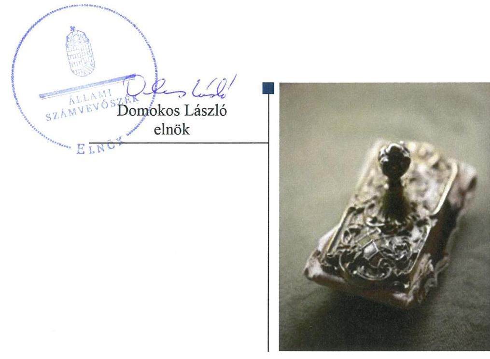

# Jelentés

**Az országos nemzetiségi önkormányzatok fenntartásában lévő intézmények gazdálkodásának ellenőrzése**

Örmény Kulturális, Dokumentációs és Információs Központ 2018.

18259 www.asz.hu

---

# Jelentés 

## Az országos nemzetiségi önkormányzatok fenntartásában lévő intézmények gazdálkodásának ellenőrzése

Örmény Kulturális, Dokumentációs és Információs Központ
2018. 40. hó 02. nap

---

# AZ ELLENŐRZÉST FELÜGYELTE:

- VARGA EDIT felügyeleti vezető
- AZ ELLENŐRZÉST VEZETTE ÉS A VÉGREHAJTÁSÁÉRT FELELŐS:
  - DR. TÓTH VIKTÓRIA ellenőrzésvezető
  - A PROGRAM ÖSSZEÁLLÍTÁSÁÉRT FELELŐS:
    - TÓTPÁL SZABOLCS osztályvezető

**IKTATÓSZÁM:** EL-0371-028/2018

**TÉMASZÁM:** 2463

**ELLENŐRZÉS-AZONOSÍTÓ SZÁM:** V080610

Jelentéseink az Országgyűlés számítógépes hálózatán és az Interneta a www.asz.hu címen is olvashatóak.

---

# TARTALOMJEGYZÉK 

- ÖSSZEGZÉS ..... 5
- AZ ELLENŐRZÉS CÉLJA ..... 6
- AZ ELLENŐRZÉS TERÜLETE ..... 7
- AZ ELLENŐRZÉS HÁTTERE, INDOKOLTSÁGA ..... 8
- A JELENTÉS LÉNYEGES KÉRDÉSKÖRE ..... 9
- AZ ELLENŐRZÉS HATÓKÖRE ÉS MÓDSZEREI ..... 10
- MEGÁLLAPÍTÁSOK ..... 11
- FÜGGELÉK: ÉSZREVÉTELEK ..... 13
- RÖVIDÍTÉSEK JEGYZÉKE ..... 15

---

.

---

# ÖSSZEGZÉS 

Az Örmény Kulturális, Dokumentációs és Információs Központ müködése, pénzügyi gazdálkodása és vagyongazdálkodása a 2014-2016. évek vonatkozásában elegendő és megfelelő ellenőrzési bizonyíték hiányában nem volt átlátható és elszámoltatható.

## Az ellenőrzés társadalmi indokoltsága

Magyarországon a nemzetiségek jogait sarkalatos törvény határozza meg. A nemzetiségek létrehozhatnak helyi és országos önkormányzatokat, amelyek intézményeket alapíthatnak, tarthatnak fenn. A közfeladatok ellátását a nemzetiségi intézmények sajátos jogszabályi környezetben végzik, amely az utóbbi években változáson ment keresztül. A központi költségvetés támogatást nyújt a nemzetiségi önkormányzatok, illetve az általuk fenntartott intézmények számára feladataik ellátásához. A nemzetiségi intézmények gazdálkodásának ellenőrzése kiemelt jelentőséggel bír, mivel az Állami Számvevőszék korábban ezt a területet még nem ellenőrizte. Az ellenőrzések során az Állami Számvevőszék megállapítja, hogy ezen szervezetek a közpénzeket átlátható módon, szabályszerűen használják-e fel, így a közpénzek felhasználása ezen a területen sem marad ellenőrizetlenül.

## Főbb megállapítások, következtetések

Az ellenőrzött szervezet, mint az Állami Számvevőszékről szóló 2011. évi LXVI. törvény 28. § (2) bekezdésében foglaltak szerint közreműködésre kötelezett szervezet, nem bocsájtotta rendelkezésre az ellenőrzés lefolytatásához szükséges dokumentumokat a 2014-2016. évek vonatkozásában. A számvevőszéki ellenőrzés-szakmai szabályokban rögzített elegendő és megfelelő ellenőrzési bizonyíték hiányában az Országos Örmény Önkormányzat által alapított és fenntartott Örmény Kulturális, Dokumentációs és Információs Központ működése, pénzügyi gazdálkodása és vagyongazdálkodása nem volt átlátható és elszámoltatható. A belső kontrollrendszer kialakítása és múködése, a fenntartó által nyújtott támogatás, illetve az államháztartásból meghatározott célra ingyenesen juttatott vagyon felhasználása jogszabályi előírásoknak való megfelelőségét nem igazolták.

---

# AZ ELLENŐRZÉS CÉLJA 

Az ellenőrzés célja annak értékelése volt, hogy az országos nemzetiségi önkormányzat által alapított és fenntartott intézmény gazdálkodása, a belső kontrollrendszer kialakítása és múködése, a fenntartó önkormányzat által nyújtott támogatás, illetve az államháztartásból meghatározott célra ingyenesen juttatott vagyon felhasználása a jogszabályi előírásoknak megfelelően történt-e.

---

# AZ ELLENŐRZÉS TERÜLETE 

## Örmény Kulturális, Dokumentációs és Információs Központ

A közhiteles törzskönyvi nyilvántartásban elérhető, 2009. június 7-én kelt, módosításokkal egységes szerkezetbe foglalt alapító okirat szerint az Országos Örmény Önkormányzat által 2007. évben alapított Örmény Kulturális, Dokumentációs és Információs Központ önállóan működő költségvetési szerv volt, pénzügyi, gazdálkodási, adminisztratív feladatait az Országos Örmény Önkormányzat Hivatala látta el. Irányító szerve az Országos Örmény Önkormányzat közgyűlése volt.

Alaptevékenysége volt figyelemmel kísérni a magyarországi örmények nemzetiség kulturális helyzetének alakulását Magyarországon, összefogni az örmény civil szervezetek kulturális tevékenységét, kezdeményezni és közreműködni az örmény nemzetiség tagjainak képzésében, a turizmus fejlesztése, kulturális csoportok létrehozása és működtetése. Közfeladata a történelmi hagyományok és az anyanyelv ápolása, a tárgyi és szellemi kultúra megőrzése és gyarapítása volt.

Az éves zárszámadási törvények adatai alapján az Országos Örmény Önkormányzat által fenntartott intézmények támogatása jogcím csoporton teljesített támogatás összege a 2014-2016. években összesen 61 millió forint volt.

---

# AZ ELLENŐRZÉS HÁTTERE, INDOKOLTSÁGA 

Magyarország Alaptörvényének XXIX. cikke kimondja, hogy a magyarországi nemzetiségek államalkotó tényezők. Joguk van anyanyelvük használatához, a sajátnyelven való névhasználathoz, saját kultúrájuk ápolásához és az anyanyelvű oktatáshoz. A nemzetiségek létrehozhatnak helyi és országos önkormányzatokat. A nemzetiségek jogaira vonatkozó részletes szabályokat Magyarországon sarkalatos törvény határozza meg. A nemzetiségi közfeladatok ellátásához az állami központi költségvetés támogatást nyújt, melyet a nemzetiségi önkormányzatok kizárólag e feladataik ellátására használhatnak fel.

Az országos nemzetiségi önkormányzatok az általuk képviselt nemzetiség kulturális autonómiájának megteremtése érdekében intézményeket hozhatnak létre és vehetnek át. Az éves költségvetési törvények közvetlenül az intézményfenntartó országos nemzetiségi önkormányzatokhoz rendelik az általuk fenntartott intézmények működési támogatását. A nemzetiségi önkormányzati intézmények költségvetési gazdálkodásának, belső kontrollrendszerének kialakítása és múködtetése ellenőrzésével biztosítjuk a közpénzfelhasználás minél szélesebb körének ellenőrzését, ennek során azonos szempontok szerint értékeljük az egye országos nemzetiségi önkormányzatok által fenntartott intézmények gazdálkodási tevékenységét.

Az ellenőrzés eredményeként az ellenőrzött költségvetési szervek gazdálkodása javulhat, átfogó képet kaphatunk az országos nemzetiségi önkormányzatok által fenntartott intézmények gazdálkodásának sajátosságairól, hiányosságairól és az alkalmazott jó gyakorlatokról, erősítve a társadalmi bizalmat. Az ellenőrzés tapasztalatai alapján, hiányosságok feltárásával, azok megszüntetésére vonatkozó javaslatokkal hozzájárulunk a közpénzek átlátható, szabályszerű felhasználásához.

---

# A JELENTÉS LÉNYEGES KÉRDÉSKÖRE 

- A fenntartó szabályszerűen gyakorolta-e az ellenőrzött intézménnyel kapcsolatos feladatait, az intézmény müködése, pénzügyi gazdálkodása, vagyongazdálkodása szabályszerű volt-e?

---

# AZ ELLENŐRZÉS HATÓKÖRE ÉS MÓDSZEREI 

## Az ellenőrzés típusa

Megfelelőségi ellenőrzés

## Az ellenőrzött időszak

2014-2016 évek

## Az ellenőrzés tárgya

Az Országos Örmény Önkormányzat által alapított és fenntartott Örmény Kulturális, Dokumentációs és Információs Központ gazdálkodása, a belső kontrollrendszer kialakítása és múködése, a fenntartó önkormányzat által nyújtott támogatás, illetve az államháztartásból meghatározott célra ingyenesen juttatott vagyon felhasználása jogszabályi előírásoknak való megfelelőségének értékelése.

## Az ellenőrzött szervezet

Örmény Kulturális, Dokumentációs és Információs Központ

## Az ellenőrzés jogalapja

Az ellenőrzés jogszabályi alapját az ÁSZ tv. ${ }^{1}$ 1. § (3) bekezdése, 5. § (2)-(6) bekezdései, valamint az államháztartásról szóló 2011. évi CXCV. törvény 61. § (2) bekezdésének előírásai képezik.

## Az ellenőrzés módszerei

Az ellenőrzést az ellenőrzési program szempontjai, az ellenőrzött időszakban hatályos jogszabályok, az ellenőrzés szakmai szabályai figyelembevételével végezzük. Az ellenőrzési bizonyítékként felhasználható adatforrások közé tartoznak az ellenőrzési program részletes szempontjainál felsorolt adatforrások. Az ellenőrzés lefolytatásához az ellenőrzött szervezet a tanúsítványok kitöltésével, valamint az ÁSZ² által kért dokumentumok megküldésével szolgáltat adatokat. Az ellenőrzés ideje alatt az ellenőrzött szervezettel történő kapcsolattartást az ÁSZ SZMSZ³-ének vonatkozó előírásai alapján biztosítottuk.

---

# MEGÁLLAPÍTÁSOK 

## A fenntartó szabályszerűen gyakorolta-e az ellenőrzött intézménnyel kapcsolatos feladatait, az intézmény múködése, pénzügyi gazdálkodása, vagyongazdálkodása szabályszerű volt-e?

Összegző megállapítás

Az Intézmény múködése, pénzügyi gazdálkodása és vagyongazdálkodása elegendő és megfelelő ellenőrzési bizonyíték hiányában nem volt átlátható és elszámoltatható.

Az ellenőrzött szervezet, mint az ÁSZ tv. 28. § (2) bekezdése szerint közreműködésre kötelezett szervezet az ÁSZ kérésére nem bocsájtotta rendelkezésre az ellenőrzés lefolytatásához szükséges, 2014-2016. évekre vonatkozó dokumentumokat és a hitelességet igazoló teljességi és hitelességi nyilatkozatot. Az Intézmény ${ }^{4}$ pénzügyi gazdálkodása, vagyongazdálkodása, a belső kontrollrendszer kialakítása és múködése, a fenntartó által nyújtott támogatás, illetve az államháztartásból meghatározott célra ingyenesen juttatott vagyon felhasználása jogszabályi előírásoknak való megfelelőségét nem igazolták.

A számvevőszéki ellenőrzés-szakmai szabályokban rögzített elegendő (szükséges és elégséges) és megfelelő (tárgyhoz tartozó, helytálló és megbízható) ellenőrzési bizonyíték hiányában az Intézmény múködése, pénzügyi gazdálkodása és vagyongazdálkodása nem volt átlátható és elszámoltatható.

---

.

---

# FÜGGELÉK: ÉSZREVÉTELEK 

Az Állami Számvevőszék (továbbiakban: ÁSZ) 2017. november 11-én értesítette az Örmény Kulturális, Dokumentációs és Információs Központot (továbbiakban: Intézmény) az EL-0370-001/2017. iktatószámú levelében, hogy előkészíti az Intézmény ellenőrzését és egyben kérte a kapcsolattartó személy elérhetőségének megadását. Az Intézmény a hivatkozott levelet 2017. november 17-én átvette.
Az ÁSZ az ÁSZ tv. 28. § (2) bekezdése szerinti adatok bekérése érdekében az EL-0370003/2018 iktatószámon 2017. november 27-i keltezéssel adatbekérő levelet küldött az Intézmény részére, amely tartalmazta a bekérendő, ellenőrizendő dokumentumok körét, valamint felhívta a figyelmet a közremüködési kötelezettség megszegése esetén alkalmazható hátrányos jogkövetkezményekre. Az Intézmény a hivatalos székhelyére postázott adatbekérő levelet nem vette át, ezért 2018. január 16-án helyszíni adategyeztetésre került sor az Intézmény székhelyén (1025 Budapest, Palatinus u. 4.).
A helyszíni adategyeztetés során az Intézmény képviselője az ÁSZ által a helyszíni adatbekérés során és az adatbekérő levélben kért dokumentumok rendelkezésre nem állásának bizonyítékaként a következő dokumentumokat mutatta be: határozat házkutatás elrendeléséről, lefoglalási jegyzőkönyv, két bontási jegyzőkönyv, valamint irodahelyiség jogtalan felnyitásáról szóló rendőrségi bejelentés. Az Intézmény képviselője előadta, hogy a Nemzeti Adó- és Vámhivatal (továbbiakban: NAV) által folytatott nyomozás során iratokat, dokumentumokat foglaltak le, továbbá jelezte, hogy 2017 októberében rendőrségi feljelentést tettek, mert illetéktelen behatolás történt irodájukba, ahonnan iratanyagok tüntek el.
Az ÁSZ a fenti tények tisztázása érdekében megkereste a NAV-ot. A nyomozóhatóság azt a tájékoztatást adta, hogy a hivatkozott nyomozást a NAV Közép-magyarországi Bünügyi Igazgatósága az Országos Örmény Önkormányzat (továbbiakban: Önkormányzat) és nem az Intézmény vonatkozásában folytatta le, továbbá a lefoglalt bünjelek többségében a 2010-2013-as időszak könyvelési iratait tartalmazták.
Az ellenőrzés megállapította, hogy a helyszíni adatbekérés során átadott dokumentumok az Intézmény ellenőrzése szempontjából nem megfelelő dokumentumok, mivel azok tartalmukat tekintve nem az Örmény Kulturális, Dokumentációs és Információs Központra, hanem az Országos Örmény Önkormányzatra vonatkoznak, valamint az ÁSZ ellenőrzésének időszaka a 2014-2016. évekre terjedt ki.
Megállapítható tehát, hogy az ellenőrzött szervezet az ÁSZ által bekért dokumentumokat nem adta át és azok hiányát nem igazolta hitelt érdemlően.

---

A jelentéstervezetet a Számvevőszék 15 napos észrevételezésre megküldte az ellenőrzött szervezet vezetőjének az ÁSZ tv. 29. §* (1) bekezdése előírásának megfelelően.
Az ÁSZ a jelentéstervezetet észrevételezésre megküldte az Örmény Kulturális, Dokumentációs és Információs

Központ intézményvezetője részére.
Az Örmény Kulturális, Dokumentációs és Információs Központ intézményvezetője az ÁSZ tv. 29. § (2) bekezdésében foglalt észrevételezési jogával nem élt, a jelentéstervezet megállapításaira a törvényes határidőn belül észrevételt nem tett.

[^0]
[^0]:    * 29. § (1) Az Állami Számvevőszék az ellenőrzési megállapításait megküldi az ellenőrzött szervezet vezetőjének vagy az általa megbízott személynek, és annak, akinek személyes felelősségét állapította meg.
    (2) Az ellenőrzött szervezet vezetője és a felelősként megjelölt személy az ellenőrzés megállapításaira tizenöt napon belül írásban észrevételt tehet.
    (3) Az Állami Számvevőszék az észrevételre a beérkezésétől számított harminc napon belül írásban válaszol. A figyelembe nem vett észrevételeket köteles a jelentésben feltüntetni, és megindokolni, hogy azokat miért nem fogadta el.

---

# RÖVIDÍTÉSEK JEGYZÉKE 

${ }^{1}$ ÁSZ tv.
${ }^{2}$ ÁSZ
${ }^{3}$ ÁSZ SZMSZ
${ }^{4}$ Intézmény
2011. évi LXVI. törvény az Állami Számvevőszékről

Állami Számvevőszék
Állami Számvevőszék Szervezeti és Működési Szabályzata
Örmény Kulturális, Dokumentációs és Információs Központ

---

# ÁLLAMI SZÁMVEVŐSZÉK 

1052 Budapest, Apáczai Csere János utca 10.
Levélcím: 1364 Budapest 4. Pf. 54
Telefon: +36 14849100 Telefax: +36 14849200
www.asz.hu