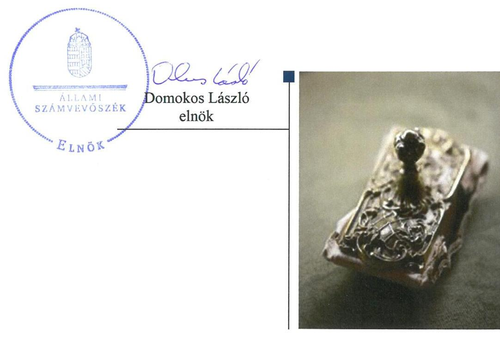

# Jelentés

**Az országos nemzetiségi önkormányzatok fenntartásában levő intézmények gazdálkodásának ellenőrzése**

Udvari István Magyarországi Ruszinok Könyvtára 2018.

---

# Jelentés 

## Az országos nemzetiségi önkormányzatok fenntartásában levő intézmények gazdálkodásának ellenőrzése

Udvari István Magyarországi Ruszinok Könyvtára 2018. 11. hó 06. nap

---

# AZ ELLENŐRZÉST FELÜGYELTE:

- VARGA EDIT felügyeleti vezető
- AZ ELLENŐRZÉST VEZETTE ÉS A VÉGREHAJTÁSÁÉRT FELELŐS:
  - MAROZSÁN LÁSZLÓNÉ ellenőrzésvezető
  - A PROGRAM ÖSSZEÁLLÍTÁSÁÉRT FELELŐS:
    - TÓTPÁL SZABOLCS osztályvezető

**IKTATÓSZÁM:** EL-0373-025/2018.

**TÉMASZÁM:** 2463

**ELLENŐRZÉS-AZONOSÍTÓ SZÁM:** V080613

Jelentéseink az Országgyűlés számítógépes hálózatán és az Interneten a www.asz.hu címen is olvashatóak.

---

# TARTALOMJEGYZÉK 

■ ÖSSZEGZÉS ..... 5
■ AZ ELLENŐRZÉS CÉLJA ..... 6
■ AZ ELLENŐRZÉS TERÜLETE ..... 7
■ AZ ELLENŐRZÉS HÁTTERE, INDOKOLTSÁGA ..... 8
■ A JELENTÉS LÉNYEGES KÉRDÉSKÖREI ..... 9
■ AZ ELLENŐRZÉS HATÓKÖRE ÉS MÓDSZEREI ..... 10
■ MEGÁLLAPÍTÁSOK ..... 12
■ JAVASLATOK ..... 16
■ MELLÉKLETEK ..... 19
I. sz. melléklet: Értelmező szótár ..... 19
■ FÜGGELÉK: ÉSZREVÉTELEK ..... 21
■ RÖVIDÍTÉSEK JEGYZÉKE ..... 23

---

.

---

# ÖSSZEGZÉS 

Az Országos Ruszin Önkormányzat az Udvari István Magyarországi Ruszinok Könyvtára feletti irányítási feladatait nem szabályszerűen látta el. Az Udvari István Magyarországi Ruszinok Könyvtára a belső kontrollrendszerét nem szabályszerűen működtette, ezáltal nem volt biztosított az erőforrások védelme a veszteségektől, a szabálytalan felhasználástól, valamint a korrupciós kockázatokat nem kezelte. Pénzügyi gazdálkodása nem felelt meg a jogszabályi előírásoknak, költségvetési beszámolója nem volt szabályszerű. Vagyongazdálkodása szabályszerű volt.

## Az ellenőrzés társadalmi indokoltsága

Magyarországon a nemzetiségek jogait sarkalatos törvény határozza meg. A nemzetiségek létrehozhatnak helyi és országos önkormányzatokat, amelyek intézményeket alapíthatnak, tarthatnak fenn. A közfeladatok ellátását a nemzetiségi intézmények sajátos jogszabályi környezetben végzik, amely az utóbbi években változáson ment keresztül. A központi költségvetés támogatást nyújt a nemzetiségi önkormányzatok, illetve az általuk fenntartott intézmények számára feladataik ellátásához. A nemzetiségi intézmények gazdálkodásának ellenőrzése kiemelt jelentőséggel bír, mivel az Állami Számvevőszék korábban ezt a területet még nem ellenőrizte. Az ellenőrzések során az Állami Számvevőszék megállapítja, hogy ezen szervezetek a közpénzeket átlátható módon, szabályszerűen használják-e fel, így a közpénzek felhasználása ezen a területen sem marad ellenőrizetlenül.

## Főbb megállapítások, következtetések, javaslatok

Az Országos Ruszin Önkormányzat az általa fenntartott Udvari István Magyarországi Ruszinok Könyvtárával kapcsolatos irányítási feladatait nem szabályszerűen látta el. Jóváhagyta az éves költségvetési beszámolóit, elemi költségvetését, azonban az Udvari István Magyarországi Ruszinok Könyvtára és az Országos Ruszin Önkormányzat Hivatala által készített feladatellátási szerződést nem hagyta jóvá.

Az Udvari István Magyarországi Ruszinok Könyvtára belső kontrollrendszerének kialakítása és működtetése nem volt szabályszerű. Működési, szervezeti kereteit nem a jogszabályi előírásoknak megfelelően alakította ki. Nem rendelkezett az Országos Ruszin Önkormányzat Közgyűlése által jóváhagyott szervezeti és működési szabályzattal. A gazdálkodási folyamatokat szabályozta. Kockázatkezelési rendszert, integrált kockázatkezelési rendszert nem működtetett. A korrupciós kockázatok kezelése érdekében végzett tevékenysége nem volt hatásos. A kiadás elszámolásához kapcsolódó belső kontrollok megfelelően működtek. Az információs folyamatokat kialakították, azonban a közzétételi kötelezettséget nem teljesítették teljes körűen, a monitoring rendszert nem működtették.

Az Udvari István Magyarországi Ruszinok Könyvtára pénzügyi gazdálkodása nem volt szabályszerű, a kiadási előirányzat felhasználása során nem tartották be a jogszabályi előírásokat, költségvetési beszámolója nem volt szabályszerű. Vagyongazdálkodása szabályszerű volt, a beszámoló mérlegtételeit leltárral alátámasztotta.

Az Állami Számvevőszék a jelentésben foglalt megállapítások alapján az Udvari István Magyarországi Ruszinok Könyvtára vezetője részére a belső kontrollrendszer szabályszerű kialakítására és működtetésére valamint a szabályszerű pénzügyi gazdálkodásra vonatkozóan öt javaslatot fogalmazott meg. Az Országos Ruszin Önkormányzat elnöke részére két javaslatot tett az Állami Számvevőszék a fenntartói és irányítói feladatok szabályszerű ellátása érdekében, továbbá a szabályszerű pénzügyi gazdálkodásra vonatkozó három javaslat címzettje az Országos Ruszin Önkormányzat Hivatala hivatalvezetője volt. A javaslatokat megalapozó megállapításokra az érintetteknek 30 napon belül intézkedési tervet kell készíteniük.

---

# AZ ELLENŐRZÉS CÉLJA 

AZ ELLENŐRZÉS CÉLJA annak értékelése volt, hogy az országos nemzetiségi önkormányzat által alapított és fenntartott intézmény gazdálkodása, a belső kontrollrendszer kialakítása és működése, a fenntartó önkormányzat által nyújtott támogatás, illetve az államháztartásból meghatározott célra ingyenesen juttatott vagyon felhasználása a jogszabályi előírásoknak megfelelően történt-e.

---

# **AZ ELLENŐRZÉS TERÜLETE**

## **Udvari István Magyarországi Ruszinok Könyvtára**

Az Udvari István Magyarországi Ruszinok Könyvtárát 2004. március 11-én alapította az Országos Ruszin Önkormányzat. Az Intézmény1 fenntartója az ellenőrzött időszakban az Önkormányzat2, irányító szerve az Önkormányzat Közgyűlése volt.

Az Intézmény megnevezése az ellenőrzött időszakban Magyarországi Ruszinok Könyvtára volt, amely 2017. január 1-től kapta az Udvari István Magyarországi Ruszinok Könyvtára elnevezést.

Az Intézmény közfeladata a ruszin nyelvű, vagy a nemzetiségre vonatkozó könyvek, dokumentumok, kiadványok gyűjtése, az érdeklődők számára az azokhoz való hozzáférés biztosítása és nyilvános könyvtári feladatok ellátása.

Az Intézmény gazdasági szervezettel nem rendelkezett, pénzügyi-gazdálkodási feladatait az Önkormányzat Hivatala3 látta el. Az Intézmény az ellenőrzött időszakban vagyonkezelési szerződéssel nem rendelkezett, helyiségeit az Önkormányzattal kötött megállapodás alapján térítésmentesen használta. Az ellenőrzött időszakban az Intézmény vezetőjének személye egy alkalommal változott, átalakítás, átszervezés az Intézményt nem érintette.

Az Intézmény 2014. évben 4 570 ezer Ft, a 2015. évben 8 270 ezer Ft, a 2016. évben 7 320 ezer Ft központi költségvetési támogatást kapott. Vagyonértékesítésből, bérbeadásból bevétele nem származott.

---

# AZ ELLENŐRZÉS HÁTTERE, INDOKOLTSÁGA 

Magyarország Alaptörvényének XXIX. cikke kimondja, hogy a magyarországi nemzetiségek államalkotó tényezők. Joguk van anyanyelvük használatához, a sajátnyelven való névhasználathoz, saját kultúrájuk ápolásához és az anyanyelvű oktatáshoz. A nemzetiségek létrehozhatnak helyi és országos önkormányzatokat. A nemzetiségek jogaira vonatkozó részletes szabályokat Magyarországon sarkalatos törvény határozza meg. A nemzetiségi közfel-adatok ellátásához az állami központi költségvetés támogatást nyújt, melyet a nemzetiségi önkormányzatok kizárólag e feladataik ellátására használhatnak fel.

Az országos nemzetiségi önkormányzatok az általuk képviselt nemzetiség kulturális autonómiájának megteremtése érdekében intézményeket hozhatnak létre és vehetnek át. Az éves költségvetési törvények közvetlenül az intézményfenntartó országos nemzetiségi önkormányzatokhoz rendelik az általuk fenntartott intézmények működési támogatását. A nemzetiségi önkormányzati intézmények költségvetési gazdálkodásának, belső kontrollrendszerének kialakítása és működtetése ellenőrzésével biztosítja az ÁSZ ${ }^{4}$ a közpénzfelhasználás minél szélesebb körének ellenőrzését, ennek során azonos szempontok szerint értékeli az egyes országos nemzetiségi önkormányzatok fenntartásában levő intézmények gazdálkodási tevékenységét.

Az ellenőrzés eredményeként az ellenőrzött költségvetési szervek gazdálkodása javulhat, átfogó képet kaphatunk az országos nemzetiségi önkormányzatok által fenntartott intézmények gazdálkodásának sajátosságairól, hiányosságairól és az alkalmazott jó gyakorlatokról, erősítve a társadalmi bizalmat. Az ellenőrzés tapasztalatai alapján, hiányosságok feltárásával, azok megszüntetésére vonatkozó javaslatokkal hozzájárulunk a közpénzek átlátható, szabályszerű felhasználásához.

---

# A JELENTÉS LÉNYEGES KÉRDÉSKÖREI 

1. A Fenntartó szabályszerűen gyakorolta-e az ellenőrzött intézménnyel kapcsolatos feladatait?
2. Az Intézmény működése és gazdálkodása során tevékenysége szabályszerű volt-e, teljesítette-e az elszámolási kötelezettségeket, belső kontrollrendszere megvédte-e a veszteségektől és nem rendeltetésszerű használattól az intézmény erőforrásait?
3. Az Intézmény pénzügyi gazdálkodása szabályszerű volt-e?
4. Az Intézmény vagyongazdálkodása szabályszerű volt-e?

---

# AZ ELLENŐRZÉS HATÓKÖRE ÉS MÓDSZEREI 

## Az ellenőrzés típusa

Megfelelőségi ellenőrzés.

## Az ellenőrzött időszak

2014-2016 évek, a belső kontrollrendszer és a kiadási előirányzatok felhasználása vonatkozásában a 2016. év.

## Az ellenőrzés tárgya

Az ÁSZ ellenőrzés tárgya az Országos Ruszin Önkormányzat által alapított és fenntartott Udvari István Magyarországi Ruszinok Könyvtára gazdálkodása, a belső kontrollrendszer kialakítása és működése, a fenntartó önkormányzat által nyújtott támogatás, illetve az államháztartásból meghatározott célra ingyenesen juttatott vagyon felhasználása jogszabályi előírásoknak való megfelelőségének értékelése.

## Az ellenőrzött szervezet

Az Udvari István Magyarországi Ruszinok Könyvtára, a fenntartó Országos Ruszin Önkormányzat és a gazdálkodási feladatokat ellátó Országos Ruszin Önkormányzat Hivatala.

## Az ellenőrzés jogalapja

Az ellenőrzés jogszabályi alapját az ÁSZ tv. ${ }^{5} 1$. § (3) bekezdés, 5. § (2)-(6) bekezdései, valamint Áht. ${ }^{6} 61 . \S$ (2) bekezdésének előírásai képezik.

## Az ellenőrzés módszerei

Az ellenőrzést az ellenőrzési program szempontjai, az ellenőrzött időszakban hatályos jogszabályok, az ellenőrzés szakmai szabályai, a jelen ellenőrzésre irányadó ÁSZ módszertanok figyelembevételével végezte az ÁSZ. Az ellenőrzési kérdések megválaszolásához szükséges bizonyítékok megszerzése az ellenőrzött által rendelkezésre bocsátott dokumentumokra, adatokra alapozva megfigyelés, szemle (szemrevételezés), kérdésfeltevés (információkérés), mintavételezés, valamint elemző eljárás útján történt.

---

A mintavételezés alapja a gazdasági események értékének nagysága volt. Az ellenőrzési bizonyítékként felhasználható adatforrások közé tartoztak egyrészt az ellenőrzési program részletes szempontjainál felsorolt adatforrások, másrészt minden egyéb - az ellenőrzés folyamán feltárt, az ellenőrzés szempontjából információt tartalmazó - dokumentum. Az ellenőrzés lefolytatásához az ellenőrzött szervezet a tanúsítványok kitöltésével, valamint az ÁSZ által kért dokumentumok megküldésével szolgáltatott adatokat.

A kiadások esetében az ellenőrzés arra a legnagyobb értékű tételre - a lényeges sokaságra - terjedt ki, amelynek összértéke elérte a teljes sokaság összértékének 50\%-át.

Az ÁSZ az ellenőrzés ideje alatt az ellenőrzött szervezettel történő kapcsolattartást az ÁSZ SZMSZ²-ének vonatkozó előírásai alapján biztosította.

---

# 1. A Fenntartó szabályszerűen gyakorolta-e az ellenőrzött intézménnyel kapcsolatos feladatait? 

Összegző megállapítás

A Fenntartó az ellenőrzött intézménnyel kapcsolatos munkáltatói jogait szabályszerűen gyakorolta. Irányítási feladatait nem szabályszerűen látta el.

A Fenntartó kiadta az Intézmény az Áht.-ban és a Kult. tv. ${ }^{8}$-ben előírt tartalmú alapító okiratát.

Az Intézmény vezetője fölött a munkáltatói jogokat a vonatkozó jogszabályok figyelembevételével a Közgyűlés szabályszerűen gyakorolta.

Az Intézmény elemi költségvetését, éves beszámolóját a Közgyűlés ${ }^{9}$ jóváhagyta. A Hivatal és az Intézmény által készített feladatellátási szerződést az Ávr. ${ }^{10}$ 9. § (5a) bekezdésében előírtak ellenére a Közgyűlés nem hagyta jóvá.

Az Intézmény 2016. évre vonatkozó SZMSZ ${ }^{11}$-ét a Kult. tv. 68. § (1) bekezdés b) pontjában előírtak ellenére a Közgyűlés hatáskörét elvonva, szabálytalanul az Elnök ${ }^{12}$ hagyta jóvá.

## 2. Az Intézmény működése és gazdálkodása során tevékenysége szabályszerű volt-e, teljesítette-e az elszámolási kötelezettségeket, belső kontrollrendszere megvédte-e a veszteségektől és nem rendeltetésszerű használattól az intézmény erőforrásait?

Összegző megállapítás

Az Intézmény működési és gazdálkodási tevékenysége nem volt szabályszerű, belső kontrollrendszere által nem volt biztosított az Intézmény erőforrásai védelme a veszteségektől, a szabálytalan felhasználástól.
2.1. számú megállapítás

A kontrollkörnyezet kialakítása nem volt szabályszerű.

AZ INTÉZMÉNY SZERVEZETI ÉS MŰKÖDÉSI KERETEINEK kialakítása nem volt szabályszerű. Az Intézmény a Kult. tv. 68. § (1) bekezdésében előírtak ellenére nem rendelkezett a Közgyűlés által jóváhagyott SZMSZ-el.

A Hivatalvezető ${ }^{13}$ az Áhsz. ${ }^{14}$-ben előírt feladatainak megfelelve - kisebb hiányosság mellett - elkészítette a Számviteli politikát ${ }_{1-2}{ }^{15}$ és a Számlarendet ${ }^{16}$. Elkészítette továbbá a Leltározási szabályzatot ${ }_{1-2}{ }^{17}$, Értékelési szabályzatot ${ }_{1-2}{ }^{18}$, Pénzkezelési szabályzatot ${ }^{19}$, valamint az Önköltségszámítási szabályzatot ${ }^{20}$.

---

# 2.2. számú megállapítás 

Az Intézménynél a kockázatkezelési rendszert kialakították, azonban nem működtették.

A KOCKÁZATKEZELÉSI RENDSZER részeként az Intézmény rendelkezett a Bkr. ${ }^{21}$-nek megfelelően szabálytalanságok kezelésének eljárásrendjével, 2016. október 1-jétől a szervezeti integritást sértő események kezelésének eljárásrendjével, azonban az nem tartalmazta a Bkr. 6. § (4a) bekezdés f) pontjában előírtak ellenére az alkalmazható jogkövetkezményeket, valamint a Bkr. 6. § (4a) bekezdés h) pontjában előírt szervezeti integritást sértő események bekövetkezésének megelőzésére kialakított eljárási szabályokat.

A kockázatkezelési rendszert, illetve 2016. október 1-jétől
 az integrált kockázatkezelési rendszert a Bkr. 7. § (1) bekezdésében előírtak ellenére az intézmény vezetője nem működtette. A Bkr. 7. § (2) bekezdésében előírtak ellenére nem mérték fel és nem állapították meg a költségvetési szerv tevékenységében rejlő és szervezeti célokkal összefüggő kockázatokat, valamint nem határozták meg az egyes kockázatokkal kapcsolatban szükséges intézkedéseket.
2.3. számú megállapítás

## A kontrolltevékenység gyakorlása, működtetése szabályszerű volt.

A gazdasági folyamatok, a kontrolltevékenység kereteit a Gazdálkodási szabályzatban ${ }^{22}$ a jogszabályi előírásoknak megfelelően az Intézmény vezetője és a Hivatalvezető meghatározta, továbbá belső szabályzatokban rendezték a pénzügyi kihatással bíró, jogszabályban nem szabályozott kérdéseket.

A belső kontrollokat az előírások szerint működtette az Intézmény vezetője. A gazdálkodási jogkör gyakorlóiról az Ávr.-ben előírtaknak megfelelő naprakész nyilvántartást vezették, a feladatot szabályszerű kijelölések alapján látták el. Az összeférhetetlenségi szabályokat a kontrolltevékenység gyakorlása során betartották.

Az információs és kommunikációs folyamatok kialakítása szabályszerű volt, a közzétételi kötelezettség teljesítése nem volt szabályszerű.

Az intézmény információs és kommunikációs rendszerét az Intézmény vezetője és a Hivatalvezető az Áht. és az Info. tv. ${ }^{23}$ előírásainak megfelelően kialakította, rendelkeztek az intézményi információk kezelésére, az adatok biztonságára, védelmére vonatkozó szabályzatokkal.

Az Intézmény vezetője az Info. tv.-nek és az Ávr.-nek megfelelően szabályozta a kötelezően közzéteendő adatok nyilvánosságra hozatalának rendjét és a közérdekű adatok megismerésére vonatkozó eljárásokat.

Az Intézmény vezetője az Info. tv. 37. § (1) bekezdése alapján az Info. tv. 1. melléklet II. 1. és II.13. pontjában, valamint a III.2. pontban rögzített dokumentumok közzétételéről nem gondoskodott.

---

2.5. számú megállapítás

Az Intézmény vezetője nem alakította ki a szervezet tevékenységének, a célok megvalósításának folyamatos- és eseti nyomon követését biztosító rendszerét, a belső ellenőrzést kialakította.

A monitoring rendszer részeként a Hivatal által ellátott operatív tevékenységekhez kapcsolódóan a Bkr. előírásainak megfelelően meghatározták a szükséges folyamatokat, azonban az Intézmény vezetője a Bkr. 10. §-ában foglaltak ellenére nem alakította ki az Intézmény tevékenységének, a célok megvalósításának nyomon követését biztosító rendszert.

Az Intézmény vezetője az önkormányzati SZMSZ-nek megfelelően külső szolgáltatóval kötött szerződés alapján gondoskodott a belső ellenőrzés kialakításáról. Az ellenőrzött időszakban az Intézmény feladataira vonatkozóan belső ellenőrzést nem végeztek.
2.6. számú megállapítás Kockázatelemzés hiányában nem volt biztosított az Intézménynél a kockázatokkal arányos kontrollok kiépítése.

Az ÁSZ megállapította, hogy az Intézményben végzett korrupció ellenes tevékenység nem volt hatásos. Az Intézmény a jogszabályok által előírt kontrollokat kiépítette és működtette, azonban kockázatelemzést nem készített, a korrupciós kockázatokat nem mérte fel, ezáltal nem volt biztosított a kockázatok és a kontrollok között a megfelelő egyensúly.

# 3. Az Intézmény pénzügyi gazdálkodása szabályszerű volt-e? 

## Összegző megállapítás

Az Intézmény pénzügyi gazdálkodása nem volt szabályszerű.
3.1. számú megállapítás

A kiadási előirányzatok felhasználása nem felelt meg a jogszabályi előírásoknak.

A dologi kiadások elszámolásához kapcsolódó belső kontrollok megfelelően működtek az Intézménynél, a gazdálkodási jogköröket az arra jogosult személyek szabályszerűen gyakorolták. A dologi kiadásokból kiválasztott lényeges összegű gazdasági esemény elszámolásához kapcsolódó kötelezettségvállalás dokumentuma nem tartalmazta azonban az Ávr. 50. § (1) bekezdés b) pontjában előírtak ellenére a gazdasági esemény pénzügyi teljesítésének módját és feltételeit.

Az Intézmény fizetési kötelezettségeinek eleget tett, a költségvetési maradvány megállapítása, elszámolása nem volt szabályszerű.

A fizetési kötelezettségek teljesítése legkésőbb a tárgyév december 31-éig megtörtént, a mérleg fordulónapjain az Intézmény lejárt kötelezettség állománnyal nem rendelkezett.

A költségvetési maradvány alátámasztásáról a Hivatalnál az Áhsz. 39. § (3) bekezdésében foglaltak ellenére nem készítettek analitikus nyilvántartást az Intézményt érintően.

---

# 3.3. számú megállapítás Az Intézmény költségvetési beszámolói nem voltak szabályszerűek. 

Az Intézmény költségvetési beszámolójával kapcsolatos adatszolgáltatási kötelezettség határidőben történő teljesítéséről a hivatalvezető nem gondoskodott. Az Intézmény 2014. és a 2016. évi költségvetési beszámolójának adatait az Áhsz. 32. § (1) bekezdésében foglalt határidőt követően töltötték fel a Kincstár ${ }^{24}$ elektronikus adatszolgáltató rendszerébe. Az Intézmény éves költségvetési beszámolóit az Áhsz. 31. § (1) bekezdésében előírtak ellenére a hivatalvezető, mint a beszámoló elkészítéséért felelős személy nem írta alá, a 2014. évi beszámolót a gazdasági vezetőn kívül szabálytalanul az Elnök, a 2015-2016. évi beszámolót az Intézmény vezetője írta alá.

A beszámolók adatait a főkönyvi könyvelés alátámasztotta, a főkönyvi könyvelés és az analitikus nyilvántartás adatai között az egyezőség biztosított volt.

## 4. Az Intézmény vagyongazdálkodása szabályszerű volt-e?

## Összegző megállapítás

Az Intézmény vagyongazdálkodása szabályszerű volt.
4.1. számú megállapítás

Az Intézmény mérlegében kimutatott eszközök és források leltározása megfelelt a jogszabályoknak.

Az Intézmény saját tulajdonú tárgyi eszközökkel, immateriális javakkal nem rendelkezett, értékcsökkenést nem számolt el.

A leltározás megfelelt a Számv. tv. és az Áhsz. előírásainak, ellenőrizhető módon tartalmazta a mérlegben szereplő eszközöket és forrásokat. Az Intézmény költségvetési beszámolói leltárral alátámasztottak voltak. A közfeladat ellátására az Önkormányzattól ingyenesen használatba vett ingatlant és tárgyi eszközöket évente számba vették.

---

# JAVASLATOK 

Az ÁSZ tv. 33. § (1) bekezdésében foglaltak értelmében az ellenőrzött szervezet vezetője köteles a jelentésben foglalt megállapításokhoz kapcsolódó intézkedési tervet összeállítani és azt a jelentés kézhezvételétől számított 30 napon belül az ÁSZ részére megküldeni. Amennyiben az ellenőrzött szervezet vezetője nem küldi meg határidőben az intézkedési tervet, vagy továbbra sem elfogadható intézkedési tervet küld, az Állami Számvevőszék elnöke az ÁSZ tv. 33. § (3) bekezdés a) és b) pontjaiban foglaltakat érvényesítheti.

## Udvari István Magyarországi Ruszinok Könyvtára igazgatója részére

1. A belső kontrollrendszer szabályszerű kialakítása és működtetése érdekében intézkedjen:
a) a szervezeti integritást sértő események kezelésének eljárásrendje jogszabálynak megfelelő tartalmú szabályozásáról;
(2.2. sz. megállapítás 1. bekezdése alapján)
b) az Intézmény integrált kockázatkezelési rendszerének működtetéséről;
(2.2. számú megállapítás 2. bekezdése alapján)
c) jogszabályi előírásoknak megfelelően az általános közzétételi listán meghatározott adatok közzétételéről;
(2.4. számú megállapítás 3. bekezdése alapján)
d) az Intézmény tevékenységének, a célok megvalósításának nyomon követését biztosító rendszer kialakításáról;
(2.5. számú megállapítás 1. bekezdése alapján)
2. Az Intézmény szabályszerű pénzügyi gazdálkodása érdekében intézkedjen a megkötött visszterhes szerződés, adott megbízás, megrendelés, vagy más hasonló visszterhes magánjogi kötelem (kötelezettségvállalás) jogszabályi előírásoknak megfelelő tartalmú írásba foglalásáról.
(3.1. számú megállapítás 2. mondata alapján)

---

# Országos Ruszin Önkormányzat elnöke részére 

1. Irányítói feladatai szabályszerű ellátása érdekében gondoskodjon az Önkormányzat Hivatala és az Intézmény között létrejött munkamegosztási megállapodás jogszabálynak megfelelő jóváhagyásáról.
(1. sz. megállapítás 3. bekezdés 2. mondata alapján)
2. Fenntartói feladatai szabályszerű ellátása érdekében intézkedjen az Intézmény szervezeti és működési szabályzatának jogszabályi előírásoknak megfelelő jóváhagyásáról.
(1. sz. megállapítás 4. bekezdése alapján)

## Országos Ruszin Önkormányzat Hivatala hivatalvezetője részére

1. Az Intézmény szabályszerű pénzügyi gazdálkodása érdekében, intézkedjen
a) az Intézmény maradvány kimutatásának jogszabályi előírásoknak megfelelő részletező nyilvántartásokkal való alátámasztásáról;
(3.2. sz. megállapítás 2. bekezdése alapján)
b) az Intézmény költségvetési beszámolójának a jogszabályi előírásoknak megfelelő határidőben a Kincstár által működtetett elektronikus adatszolgáltató rendszerbe történő feltöltéséről.
3.3. sz. megállapítás 1. bekezdés 2. mondata alapján
2. A jogszabályi előírásnak megfelelően készítse el az Intézmény költségvetési beszámolóját.
(3.3. sz. megállapítás 1. bekezdés 3. mondata alapján)

---

.

---

# MELLÉKLETEK 

- I. SZ. MELLÉKLET: ÉRTELMEZŐ SZÓTÁR
irányító szerv
működtetés
nemzeti vagyon rendeltetése
nemzetiségi önkormányzat
nemzetiségi kulturális intézmény
nemzetiségi közművelődési intézmény
nemzetiségi feladatot ellátó közgyűjtemény
vagyongazdálkodás
nemzeti vagyon

A költségvetési szerv tekintetében az e törvényben meghatározott irányítási hatáskört gyakorló szerv. (Forrás: Áht. 1. § 9. pontja)
A nemzeti vagyon birtoklásából, használatából, hasznai szedéséből, a nemzeti vagyon fenntartásából és üzemeltetéséből álló tevékenységek együttese, amely - jogszabály vagy szerződés alapján - a nemzeti vagyon felújítására, fejlesztésére, a birtoklásának, használatának hasznai szedése jogának továbbengedésére is kiterjed. (Forrás: Nvtv. 3. § 10. pontja)

A nemzeti vagyon alapvető rendeltetése a közfeladat ellátásának biztosítása, ideértve a lakosság közszolgáltatásokkal való ellátását és e feladatok ellátásához szükséges infrastruktúra biztosítását. (Forrás: Nvtv. 7. 0 (1) bekezdés, hatályos 2015. január 1-jétől)
A nemzetiségek jogairól szóló törvényben meghatározott nemzetiségi közszolgáltatási feladatokat ellátó, testületi formában működő, jogi személyiséggel rendelkező, demokratikus választások útján e törvény alapján létrehozott szervezet, amely a nemzetiségi közösséget megillető jogosultságok érvényesítésére, a nemzetiségek érdekeinek védelmére és képviseletére, a feladat- és hatáskörébe tartozó nemzetiségi közügyek települési, területi vagy országos szinten történő önálló intézésére jön létre. (Forrás: a nemzetiségek jogairól szóló 2011. évi CLXXIX. törvény, 2. § 2. pont) olyan kulturális intézmény, amelynek jogszabályban, alapító okiratban előírt feladata a nemzetiségi identitáshoz kötődő tárgyi és szellemi kultúra, kulturális értékek, javak megőrzése, hozzáférhetővé tétele, hagyományok és a közösségi nyelvhasználat megőrzése, gyakorlása, terjesztése és továbbörökítése
a nemzetiséghez tartozók szellemi, kulturális örökségének, kulturális hagyományainak megőrzését, fenntartását, fejlesztését, bemutatását szolgáló intézmény olyan könyvtár, levéltár, muzeális intézmény, kép- illetve hangarchívum, amelynek alapító okiratában szerepel a nemzetiségi feladatellátás, vagy amelynek állományában nemzetiségi nyelvű, vagy nemzetiségre vonatkozó dokumentumok huszonöt százalékot elérő arányban találhatók, függetlenül a fenntartó szervezet típusától A nemzeti vagyongazdálkodás feladata a nemzeti vagyon rendeltetésének megfelelő, az állam, az önkormányzat mindenkori teherbíró képességéhez igazodó, elsődlegesen a közfeladatok ellátásához és a mindenkori társadalmi szükségletek kielégítéséhez szükséges, egységes elveken alapuló, átlátható, hatékony és költségtakarékos működtetése, értékének megőrzése, állagának védelme, értéknövelő használata, hasznosítása, gyarapítása, továbbá az állam vagy a helyi önkormányzat feladatának ellátása szempontjából feleslegessé váló vagyontárgyak elidegenítése. (Forrás: Nvtv. 7. § (2) bekezdése)
a) az állam vagy a helyi önkormányzat kizárólagos tulajdonában álló dolgok,
b) az a) pont hatálya alá nem tartozó, az állam vagy a helyi önkormányzat tulajdonában lévő dolog,
c) az állam vagy a helyi önkormányzat tulajdonában lévő pénzügyi eszközök, továbbá az államot vagy a helyi önkormányzatot megillető társasági részesedések,
d) az államot vagy a helyi önkormányzatot megillető bármely vagyoni értékkel rendelkező jogosultság, amelyet jogszabály vagyoni értékű jogként nevesít,
e) Magyarország határa által körbezárt terület feletti légtér,

---

f) az üvegházhatású gázok kibocsátási egységeinek kereskedelméről szóló törvény szerinti kibocsátási egység és légiközlekedési kibocsátási egység, valamint az ENSZ Éghajlatváltozási Keretegyezménye és annak Kiotói Jegyzőkönyv végrehajtási keretrendszeréről szóló törvény szerinti kiotói egység,
g) állami vagy helyi önkormányzati fenntartású közgyűjtemény (muzeális intézmény, levéltár, közgyűjteményként működő kép- és hangarchívum, valamint könyvtár) saját gyűjteményében nyilvántartott kulturális javak körébe tartozó dolog, kivéve, ha az állami vagy önkormányzati tulajdon jogszerű létrejötte kétséget kizáró módon nem bizonyítható és a dologra nézve más a tulajdonjogát bizonyítja vagy a kulturális javakra vonatkozó jogszabályokban meghatározott eljárás keretében valószínűsíti, h) a régészeti lelet,
i) a nemzeti adatvagyon körébe tartozó állami nyilvántartások fokozottabb védelméről szóló törvény szerinti nemzeti adatvagyon.
(Forrás: Nvtv. 1.§ (2) bekezdés)

---

# FÜGGELÉK: ÉSZREVÉTELEK 

A jelentéstervezetet a Számvevőszék 15 napos észrevételezésre megküldte az ellenőrzött szervezetek vezetőinek az ÁSZ tv. 29. § (1) bekezdése előírásának megfelelően.

Az ÁSZ a jelentéstervezetet észrevételezésre megküldte az Udvari István Magyarországi Ruszinok Könyvtára igazgatója, az Országos Ruszin Önkormányzat elnöke és az Országos Ruszin Önkormányzat Hivatala hivatalvezetője részére.
Udvari István Magyarországi Ruszinok Könyvtára igazgatója, az Országos Ruszin Önkormányzat elnöke és az Országos Ruszin Önkormányzat Hivatala hivatalvezetője az ÁSZ tv. 29. § (2) bekezdésében foglalt észrevételezési jogával nem élt, a jelentéstervezet megállapításaira a törvényes határidőn belül észrevételt nem tett.

[^0]
[^0]:    * 29. § (1) Az Állami Számvevőszék
 az ellenőrzési megállapításait megküldi az ellenőrzött szervezet vezetőjének vagy az általa megbízott személynek, és annak, akinek személyes felelősségét állapította meg.
    (2) Az ellenőrzött szervezet vezetője és a felelősként megjelölt személy az ellenőrzés megállapításaira tizenöt napon belül írásban észrevételt tehet.
    (3) Az Állami Számvevőszék az észrevételre a beérkezésétől számított harminc napon belül írásban válaszol. A figyelembe nem vett észrevételeket köteles a jelentésben feltüntetni, és megindokolni, hogy azokat miért nem fogadta el.

---

.

---

# RÖVIDÍTÉSEK JEGYZÉKE 

${ }^{1}$ Intézmény
${ }^{2}$ Önkormányzat
${ }^{3}$ Hivatal
${ }^{4}$ ÁSZ
${ }^{5}$ ÁSZ tv.
${ }^{6}$ Áht.
${ }^{7}$ ÁSZ SZMSZ
${ }^{8}$ Kult. tv.
${ }^{9}$ Közgyűlés
${ }^{10}$ Ávr.
${ }^{11}$ SZMSZ
${ }^{12}$ Elnök
${ }^{13}$ Hivatalvezető
${ }^{14}$ Áhsz.
${ }^{15}$ Számviteli politika1
Számviteli politika2
${ }^{16}$ Számlarend
${ }^{17}$ Leltározási szabályzat ${ }_{1}$
Leltározási szabályzat ${ }_{2}$
${ }^{18}$ Értékelési szabályzat ${ }_{1}$
${ }^{18}$ Értékelési szabályzat ${ }_{2}$
${ }^{19}$ Pénzkezelési szabályzat
${ }^{20}$ Önköltség számítási szabályzat
${ }^{21}$ Bkr.
${ }^{22}$ Gazdálkodási szabályzat
${ }^{23}$ Info.tv.
${ }^{24}$ Kincstár

Udvari István Magyarországi Ruszinok Könyvtára
Országos Ruszin Önkormányzat
az Országos Ruszin Önkormányzat Hivatala
Állami Számvevőszék
az Állami Számvevőszékről szóló 2011. évi LXVI. törvény
2011. évi CXCV. törvény az államháztartásról

Állami Számvevőszék elnökének 4/2017. (XII.29.) ÁSZ utasítása az Állami
Számvevőszék Szervezeti és Működési Szabályzatáról
1997. évi CXL. törvény a muzeális intézményekről, a nyilvános könyvtári ellátásról és a közművelődésről
az Országos Ruszin Önkormányzat Közgyűlése
368/2011. (XII.31.) Korm. rendelet az államháztartásról szóló törvény végrehajtásáról
Magyarországi Ruszinok Könyvtárának Szervezeti és Működési Szabályzata (készült: 2015. október 30.)
az Országos Ruszin Önkormányzat elnöke
az Országos Ruszin Önkormányzat Hivatalának vezetője
az államháztartás számviteléről szóló 4/2013. (I.11.) Korm. rendelet
Országos Ruszin Önkormányzat és intézményei Számviteli politikája (hatályos: 2016. január 1-jétől 2016. április 30-ig)
Országos Ruszin Önkormányzat és intézményei Számviteli politikája (hatályos: 2016. május 1-jétől)
Országos Ruszin Önkormányzat és intézményei Számlarendje (hatályos: 2016. január 1-jétől)
Országos Ruszin Önkormányzat és intézményei Leltározási és leltárkészítési szabályzata (hatályos: 2016. január 1-jétől 2016. április 30-ig)
Országos Ruszin Önkormányzat és intézményei Leltározási és Leltárkészítési szabályzata (hatályos: 2016. május 1-jétől)
Országos Ruszin Önkormányzat és intézményei Eszközök és Források értékelési szabályzata (hatályos: 2016. május 1-jétől)
Országos Ruszin Önkormányzat és intézményei Pénzkezelési szabályzata (hatályos: 2016. január 1-jétől)
Országos Ruszin Önkormányzat és intézményei Önköltség számítási szabályzata (hatályos: 2016. január 1-jétől)
370/2011. (XII.31.) Korm. rendelet a költségvetési szervek belső kontrollrendszeréről és belső ellenőrzéséről
Országos Ruszin Önkormányzat és intézményei Gazdálkodási szabályzata (hatályos: 2015. május 1-jétől)
2011. évi CXII. törvény az információs önrendelkezési jogról és az információszabadságról
Magyar Államkincstár

---

# ÁLLAMI SZÁMVEVŐSZÉK 

1052 Budapest, Apáczai Csere János utca 10.
Levélcím: 1364 Budapest 4. Pf. 54
Telefon: +36 14849100 Telefax: +36 14849200
www.asz.hu
