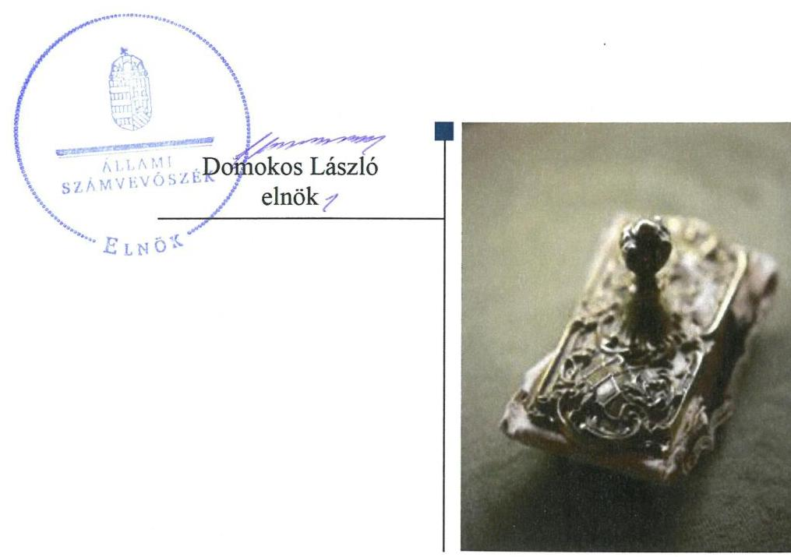
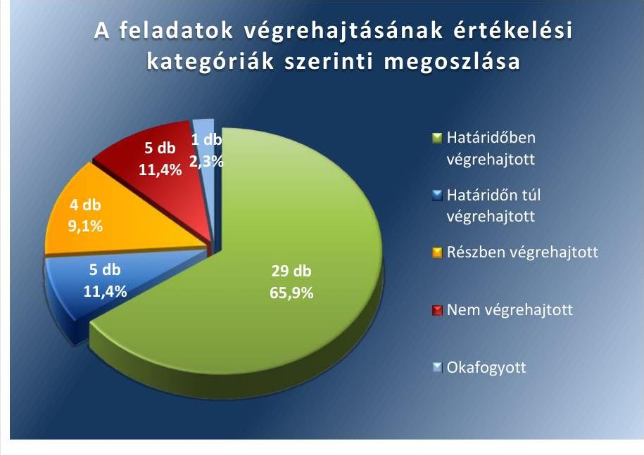
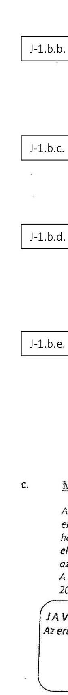
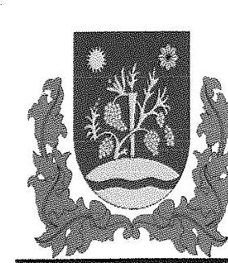
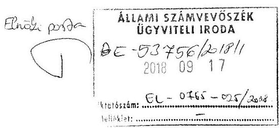
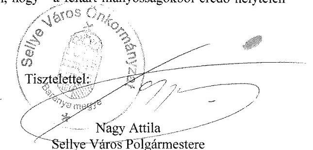
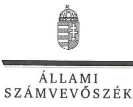
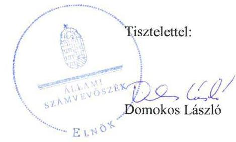

# Jelenetés 

## Utóellenőrzések

Az önkormányzatok pénzügyi és vagyongazdálkodása megfelelőségének utóellenőrzése - Sellye Város Önkormányzat
2018.

---

# Jelentés 

## Utóellenőrzések

Az önkormányzatok pénzügyi és vagyongazdálkodása megfelelőségének utóellenőrzése - Sellye Város Önkormányzat
2018. 10 hó 18 nap

---

# AZ ELLENŐRZÉST FELÜGYELTE: 

VARGA EDIT felügyeleti vezető

## AZ ELLENŐRZÉST VEZETTE ÉS A VÉGREHAJTÁSÁÉRT FELELŐS:

GELENCSÉR ZSOLT ellenőrzésvezető

## A PROGRAM ÖSSZEÁLLÍTÁSÁÉRT FELELŐS:

TÓTPÁL SZABOLCS osztályvezető

## A TÉMÁHOZ KAPCSOLÓDÓ KORÁBBI SZÁMVEVŐSZÉKI JELENTÉSEK:

- címe: Jelentés az önkormányzatok pénzügyi és vagyongazdálkodása megfelelőségének ellenőrzése Sellye
- sorszáma: 16048

Jelentéseink az Országgyúlés számítógépes hálózatán és az Interneten a www.asz.hu címen is olvashatóak.

IKTATÓSZÁM: EL-0210-035/2018.
TÉMASZÁM: 2460
ELLENŐRZÉS-AZONOSÍTÓ SZÁM: V080443

---

# TARTALOMJEGYZÉK 

■ ÖSSZEGZÉS ..... 5
■ AZ ELLENŐRZÉS CÉLJA ..... 6
■ AZ ELLENŐRZÉS TERÜLETE ..... 7
■ AZ ELLENŐRZÉS HÁTTERE, INDOKOLTSÁGA ..... 8
■ A JELENTÉS LÉNYEGES KÉRDÉSKÖRE ..... 10
■ ELLENŐRZÉS HATÓKÖRE ÉS MÓDSZEREI ..... 11
■ MEGÁLLAPÍTÁSOK ..... 13
■ MELLÉKLETEK ..... 15
I. sz. melléklet: Sellye Város Önkormányzat intézkedési terve végrehajtásának értékelése ..... 15
II. sz. melléklet: Az ÁSZ 16048 számú jelentéséhez kapcsolódó intézkedési terv ..... 31
■ FÜGGELÉK: ÉSZREVÉTELEK ..... 55
■ RÖVIDÍTÉSEK JEGYZÉKE ..... 59

---

.

---

# ÖSSZEGZÉS 

Az Állami Számvevőszék Sellye Város Önkormányzat pénzügyi és vagyongazdálkodása megfelelőségének utóellenőrzése során megállapította, hogy az intézkedési tervben meghatározott feladatok jelentős részét végrehajtották. A közpénzekkel, az önkormányzati vagyonnal való felelős gazdálkodás átláthatósága, továbbá a müködés szabályszerűsége javult.

## Az ellenőrzés társadalmi indokoltsága

Az Állami Számvevőszék stratégiájában célul tűzte ki a számvevőszéki munka hasznosulásának javítását. Ezzel összhangban ellenőrzi, hogy az ellenőrzött szervezetek megvalósították-e a korábbi ellenőrzései által feltárt hibák, hiányosságok és szabálytalanságok megszüntetése céljából kialakított intézkedési terveikben foglaltakat. A rendszeres utóellenőrzések hozzájárulnak a szükséges intézkedések tényleges végrehajtáshoz, ezáltal a közpénzügyek rendezettségének javulásához.

## Főbb megállapítások, következtetések

Sellye Város Önkormányzat az intézkedési tervben meghatározott 44 feladatból 29-et határidőben, ötöt határidőn túl hajtott végre.

A végrehajtott intézkedésekkel javult a közpénzekkel, az önkormányzati vagyonnal való gazdálkodás szabályozottsága és átláthatósága. A polgármester határidőben gondoskodott az új szervezeti és működési szabályzat és vagyonrendelet kiadásáról, a közép és hosszú távú vagyongazdálkodási terv kiadásáról, az Önkormányzat államháztartáson kívüli források átadás-átvételéről szóló rendelet kiadásáról. A jegyző gondoskodott a szabályszerű működéshez szükséges szabályzatok kiadásáról. A jegyző felülvizsgálta a gazdálkodási szabályzatot, elkészítette a Belső Kontroll Szabályzatot, az önköltség-számítási szabályzatot.

A végre nem hajtott intézkedések további tennivalókat keletkeztetnek a gazdálkodási feladatok ellátása során. Négy feladatot részben, ötöt pedig nem hajtottak végre, egy feladat okafogyottá vált. A leltározás végrehajtása során egyes körzetek leltározása nem történt meg, a vagyonváltozást érintő döntésekről a beszámolás részben történt meg. A követelések, tartós részesedések és egyéb eszközök értékelése és az értékvesztés elszámolása nem történt meg, a vagyonkimutatások nem készültek el. A munkajogi felelősségre vonás a munkaviszony megszűnése miatt okafogyottá vált.

Sellye Város Önkormányzat az intézkedési tervben meghatározott feladatok végrehajtásáról a jogszabály szerinti nyilvántartást nem vezette.

---

# AZ ELLENŐRZÉS CÉLJA 

Az ellenőrzés célja annak értékelése volt, hogy a számvevőszéki jelentésben ${ }^{1}$ foglalt intézkedést igénylő megállapításokkal és javaslatokkal összhangban készített intézkedési tervben ${ }^{2}$ meghatározott feladatokat az ellenőrzött szervezet végrehajtotta-e.

---

# AZ ELLENŐRZÉS TERÜLETE 

## Sellye Város Önkormányzat

Sellye város Baranya megyében a Sellyei járásában helyezkedik el. A lakónépességének száma a Központi Statisztikai Hivatal Magyarország közigazgatási helységnévtára alapján 2017. január 1-jén 2495 fő volt.

A polgármester²007 óta tölti be tisztségét, a jegyző ${ }^{4}$ 2015től látja el feladatát.

Az Önkormányzat ${ }^{5}$ 2016. évi költségvetésének végrehajtásáról szóló rendelete szerint 1007,9 millió Ft költségvetési bevételt ért el, valamint 983,6 millió Ft költségvetési kiadást teljesített. A könyvviteli mérleg föösszege 2016. december 31-én 2587,9 millió Ft, ezen belül a követelések állománya 32,8 millió Ft, a kötelezettségek állománya 20,9 millió Ft volt.

Az ÁSZ ${ }^{6}$ a 2011. január 1. - 2014. december 31. közötti időszakra végezte el az Önkormányzat pénzügyi és vagyongazdálkodása megfelelőségének ellenőrzését.

Az utóellenőrzés az Önkormányzat pénzügyi és vagyongazdálkodása megfelelőségének ellenőrzéséről készült 16048 számú ÁSZ jelentés intézkedést igénylő megállapításai és javaslatai hasznosítására elfogadott intézkedési tervben foglalt feladatok 2016. április 27. és 2018. május 3-a közötti végrehajtására irányult. Az utóellenőrzés célja annak értékelése volt, hogy az ellenőrzésről készült számvevőszéki jelentésben foglalt intézkedést igénylő megállapításokkal összhangban készített intézkedési tervben meghatározott feladatokat az ellenőrzött szervezet végrehajtotta-e.

---

# AZ ELLENŐRZÉS HÁTTERE, INDOKOLTSÁGA 

Az ÁSZ tv. ${ }^{7}$ 33. § (1) bekezdése értelmében a számvevőszéki jelentések intézkedést igénylő megállapításaihoz és javaslataihoz kapcsolódóan az ellenőrzött szervezet vezetője intézkedési tervet köteles összeállítani, és az Állami Számvevőszék részére megküldeni.

Az ÁSZ tv. 33. § (6) bekezdése értelmében, amennyiben az ÁSZ elnöke az ellenőrzés során feltárt jog-szabálysértő gyakorlat, illetve a vagyon rendeltetésellenes vagy pazarló felhasználásának megszüntetése érdekében figyelemfelhívó levéllel fordult az ellenőrzött szerv vezetőjéhez, az abban foglaltakat az ellenőrzött szerv vezetője köteles elbírálni, a megfelelő intézkedést megtenni és erről az ÁSZ elnökét értesíteni.

Az ÁSZ által befogadott intézkedési tervben foglaltak megvalósítását az ÁSZ törvény 33. § (7) be-kezdésében foglaltak alapján - az Állami Számvevőszék utóellenőrzés keretében ellenőrizheti. Az utó-ellenőrzések keretében - az intézkedések értékelése során - az Állami Számvevőszék figyelembe veszi az ellenőrzött szervezetek működési feltételeiben, valamint a jogszabályi előírásokban bekövetkezett változásokat.

Az utóellenőrzés során az ÁSZ értékeli, hogy az érintett számvevőszéki jelentésben foglalt intézkedést igénylő megállapításokkal és javaslatokkal összhangban, az ellenőrzött szervezet által készített intézkedési tervben meghatározott feladatokat a feladatra kijelöltek végrehajtották-e.

Az intézkedések végrehajtásával az adott terület szabályszerű múködése vonatkozásában a kockázatok csökkenhetnek, azonban hosszabb távon az intézkedési tervben foglaltak végrehajtásával önmagában nem szűnnek meg, csak akkor, ha beépülnek az ellenőrzött szervezet működésébe, azokat folyamatosan karban tartják, figyelembe véve, illetve kezelve a változásokat. Emellett az intézkedések végrehajtásáig újabb kockázatok merülhetnek fel a szabályszerű működés vonatkozásában, amelyek kezelése szintén kiemelten fontos az ellenőrzött szervezet számára.

Az ellenőrzött szervezet vezetője által készített intézkedési tervekben foglalt feladatok hiányos, illetve késedelmes végrehajtása, vagy annak elmaradása a szabályszerűség és a felelős vezetői magatartás vonatkozásában kockázatot hordoz, ami azt mutatja, hogy az ellenőrzések során feltárt hibák, hiányosságok és szabálytalanságok kezelése nem kapott kellő hangsúlyt. Az utóellenőrzés során is fenn-álló szabálytalanságok esetén a közpénz, közvagyon veszélyeztetettségi kockázat valószínűsített ha-tásának értékelése további intézkedéseket vonhat maga után.

Az ellenőrzött szervezet szintjén az utóellenőrzés feltárja, hogy a szervezet az intézkedések végrehajtásával hasznosította-e a korábbi ellenőrzési jelentésben a hiányosságok megszüntetése, illetve a kockázatok kezelése érdekében megfogalmazott javaslatokat, illetve az intézkedések végrehajtása elmaradásának következtében továbbra is fennálló szabálytalanság esetén értékeli a közpénzek, közvagyon veszélyeztetettségét.
$\longrightarrow$ Az ÁSZ szintjén az utóellenőrzés visszacsatolást ad az ellenőrzési jelentések hasznosulásáról, az intézkedések elmaradásának, vagy

---

részleges megvalósulásának a közpénzek, közvagyon veszélyeztetettségére gyakorolt valószínűsített hatásának értékelése, további intézkedéseket vonhat maga után.

---

# A JELENTÉS LÉNYEGES KÉRDÉSKÖRE 

Az Önkormányzat az intézkedési tervben foglaltakat az elöirt határidőben végrehajtotta-e?

---

# ELLENŐRZÉS HATÓKÖRE ÉS MÓDSZEREI 

## Az ellenőrzés típusa

Megfelelőségi ellenőrzés.

## Az ellenőrzött időszak

Az utóellenőrzés alapját képező ÁSZ jelentés közzétételének (2016. április 27.) napjától az ellenőrzésről szóló kiértesítő levél keltének (2018. május 3.) napjáig tartó időszak.

## Az ellenőrzés tárgya

Az ÁSZ tv. 2011. július 1-jei hatálybalépését követően a számvevőszéki jelentésben foglalt intézkedést igénylő megállapításokkal és javaslatokkal összhangban - az ellenőrzött szervezet által - készített intézkedési tervben foglaltak végrehajtásának ellenőrzése.

## Az ellenőrzött szervezet

Sellye Város Önkormányzat

## Az ellenőrzés jogalapja

Az ellenőrzés jogszabályi alapját az ÁSZ tv. 33. § (7) bekezdésének előírása képezi.

## Az ellenőrzés módszerei

Az ÁSZ az ellenőrzést a nemzetközi standardokat irányadónak tekintve az ellenőrzési program ellenőrzési kérdései, az ellenőrzött időszakban hatályos jogszabályok, az ellenőrzés szakmai szabályok és módszertanok figyelembevételével, önállóan vagy ellenőrzéshez kapcsolódóan végezte.

Az ÁSZ az ellenőrzés ideje alatt az ellenőrzött szervezettel történő kapcsolattartást az ÁSZ SZMSZ²-ének vonatkozó előírásai alapján biztosította.

Az utóellenőrzés megállapításait elsősorban az ÁSZ rendelkezésére álló, valamint az ellenőrzött szervezetektől elektronikusan bekért dokumentumok alapozták meg.

---

Az ellenőrzési bizonyítékként felhasználható adatforrások közé tartoznak egyrészt a szakmai programban felsorolt adatforrások, másrészt minden - az ellenőrzés folyamán feltárt, az ellenőrzés szempontjából információt tartalmazó - dokumentum.

Az intézkedési tervben előírt feladatokat azok végrehajthatósága, illetve végrehajtása szempontjából az alábbiak szerint értékelte az ÁSZ:
$\longrightarrow$ „határidőben végrehajtott" a feladat, ha a teljesítés dokumentáltan, az intézkedési tervben előírt határidőben és tartalommal megtörtént;
$\longrightarrow$ „határidőn túl végrehajtott" a feladat, ha annak teljesítése az intézkedési tervben meghatározott módon, de az előírt határidőn túl történt meg;
$\longrightarrow$ „részben végrehajtott" a feladat, ha végrehajtása teljes körűen az intézkedési tervben előírt módon nem történt meg;
$\longrightarrow$ „nem végrehajtott" a feladat, ha a végrehajtás nem történt meg, vagy amennyiben a teljesítést nem dokumentálták;
$\longrightarrow$ „okafogyottá vált" a feladat, ha végrehajtására - meghatározott esemény bekövetkezése, továbbá külső körülmény, a működést érintő feltétel változása miatt - már nincs szükség, illetve lehetőség, és egyértelműen megállapítható, hogy az intézkedést szükségessé tevő körülmény a jövőben nem fordulhat elő;
$\longrightarrow$ „nem időszerű" az a feladat, amelynek ellenőrzési időszakon belüli végrehajtására azért nem került (kerülhetett) sor, mert az intézkedés alapjául szolgáló esemény nem következett be, de annak jövőbeni előfordulása lehetséges, a végrehajtása nem volt esedékes, vagy a végrehajtás határideje még nem járt le.
Az ellenőrzés lefolytatásához az ellenőrzött szervezet a tanúsítványok elektronikus kitöltésével, valamint az ÁSZ által kért dokumentumok elektronikus megküldésével szolgáltat adatokat, amelyek valódiságát és teljes körűségét az ellenőrzött szervezet vezetője által tett teljességi és hitelességi nyilatkozat igazolta. Az így rendelkezésre bocsátott adatok, információk kontrollja az ellenőrzés keretében történt.

Az ellenőrzött szervezet által megküldött intézkedési tervben meghatározott ÁSZ által beazonosított feladatok a II. számú mellékletben kerültek bemutatásra.

---

# MEGÁLLAPÍTÁSOK 

## Az Önkormányzat az intézkedési tervben foglaltakat az előírt határidőben végrehajtotta-e?

Összegző megállapítás

Az Önkormányzat az intézkedési tervben meghatározott 44 feladatból 29-et határidőben, ötöt határidőn túl, négyet részben hajtott végre, ötöt nem hajtott végre, egy feladat okafogyottá vált. Az intézkedési tervben meghatározott feladatok végrehajtásáról a jogszabályban előírt nyilvántartást nem vezette.

Az ÁSZ a számvevőszéki jelentésében a polgármester részére hét, a jegyző részre 12 javaslatot fogalmazott meg. A polgármester által előterjesztett és a Képviselő-testület által jóváhagyott intézkedési tervben a hiányosságok, szabálytalanságok megszüntetésére 44 feladatot határoztak meg.

Az intézkedési tervben meghatározott feladatokat, határidőket, felelősöket és a feladatok végrehajtását az I. számú melléklet mutatja be.

Az Önkormányzat az intézkedési tervben meghatározott feladatok végrehajtásáról nem vezette a Bkr. ${ }^{9} 14 . \S$ (1) bekezdésben előírt nyilvántartást.

Az Önkormányzat intézkedési tervében meghatározott feladatok végrehajtásának értékelési kategóriák szerinti megoszlását az 1. ábra szemlélteti.
1. ábra

Fonós: ÁSZ

---

A SZABÁLYOZOTTSÁG az Önkormányzatnál javult. Elkészült a jogszabályoknak megfelelő SZMSZ ${ }^{10}$, az Önkormányzat új vagyonrendelete ${ }^{11}$, az Önkormányzati Hivatal múködését támogató szabályzatok, a gazdálkodással kapcsolatosan az Önköltség-számítási Szabályzat ${ }^{12}$, a Számlarend ${ }^{13}(1,2,5,7,8,10,11,12,15,16,18,25,26,27)$.

A PÉNZÜGYI ELSZÁMOLTATHATÓSÁG javítása érdekében az Önkormányzat intézkedéseket tett. A jegyző elkészítette a tájékoztatót az Önkormányzat 2016. I. félévi pénzügyi likviditási helyzetéről, a 2016. évi költségvetés módosításával együtt a módosított likviditási tervet a Képviselő-testület a polgármester előterjesztése alapján elfogadta. A Sellye Kommunális Kft. Felügyelő Bizottsága megvizsgálta a gazdasági társaság pénzügyi egyensúlyának megteremtése érdekében rendelkezésre álló eszközöket. Ugyanakkor a jegyző határidőn túl adta ki a gazdálkodási szabályzatban foglaltak érvényesítése érdekében a belső utasítást a szervezeti egységek felé $(4,6,9,17,20,28,30,31,33,41)$.

# A BELSŐ KONTROLLRENDSZER KIÉPÍTETTSÉGE 

javult, a kockázatkezelési rendszert a jegyző múködtette, az érvényesítésre jogosultakat a gazdálkodási szabályzatban kijelölte (13, 23, 24, 42).

AZ ÁTLÁTHATÓSÁG biztosításának érdekében hozott intézkedések közül a jegyző határidőn túl gondoskodott az Info tv.-ben ${ }^{14}$ meghatározott adattartalommal az Önkormányzat közzétételi kötelezettségéről $(29,32,44)$.

A VAGYONGAZDÁLKODÁS szabályozottsága javult, de a rögzített előírások a gyakorlatban nem érvényesültek. A jegyző elkészítette az Önkormányzat közép- és hosszú távú vagyongazdálkodási tervét, azt a polgármester beterjesztette, a Képviselő-testület elfogadta. A jegyző elkészítette Sellye Közös Önkormányzati Hivatal Leltározási és Leltárkészítési szabályzatát. A követelések, és egyéb eszközök értékelése és az értékvesztés elszámolása nem történt meg a Számv. tv. előírása ellenére. Az önkormányzat teljes körű tárgyi eszköz leltárral nem rendelkezett, a vagyonkimutatások nem készültek el az Áhsz. ${ }^{15}$-nek megfelelően (3, 14, 19, 21, 22, $34,35,36,37,38,39,40,43)$.

---

# MELLÉKLETEK

- I. SZ. MELLÉKLET: SELLYE VÁROS ÖNKORMÁNYZAT INTÉZKEDÉSI TERVE VÉGREHAJTÁSÁNAK ÉRTÉKELÉSE

|  5 | Az intézkedési tervben meghatározott feladat | Az intézkedési tervben meghatározott határidő 2. | Az intézkedési tervben meghatározott feladatok felelőse 3. | A feladat végrehajtása  |
| --- | --- | --- | --- | --- |
|  6 |  |  |  | 4.  |
|  1. |  | Határidőben végrehajtott feladatok |  |   |
|  1. | P 1. intézkedés:
"A vonatkozó hatályos jogszabályi előírások alapján - az ÁSZ jelentésben tett észrevételek figyelembe vételével - a jegyző készítse el, polgármester terjessze a Képviselő-testület elé - a Sellyei Közös Önkormányzati Hivatal új Szervezeti és müködési Szabályzatát, amely már tartalmazza az ÁSZ által hiányolt rendelkezéseket, - az új hivatali SZMSZ tartalmazza a szükséges mellékleteket és függelékeket is.
Jelen intézkedést kell alkalmazni a Jegyző számára 1. a. pont alatt tett megállapításra előírt intézkedés vonatkozásában is. Felelős: beterjesztésért: polgármester, a szabályzat-tervezet elkészítéséért: jegyző" | 2016. május 31. | beterjesztésért: polgármester, a szabályzat-tervezet elkészítéséért: jegyző | A polgármester beterjesztette a Sellye Közös Önkormányzati Hivatal új szervezeti és müködési szabályzatát. Az SZMSZ-t a Képviselő-testület a 76/2016. (III. 30.) számú határozattal elfogadta. Az SZMSZ tartalmazta a képviseletre való jogosultság szabályait, az SZMSZ-ben nevesített munkakörökhöz kapcsoló feladat és hatásköröket, illetve azok gyakorlásának módját, a helyettesítés rendjét, a felelősségi szabályokat. Tartalmazta továbbá a szükséges mellékleteket és függelékeket.  |
|  2. | P: 2. a. intézkedés
"A vonatkozó hatályos jogszabályi előírások alapján - az ÁSZ jelentésben tett észrevételek figyelembe vételével - a jegyző készítse el, polgármester terjessze a Képviselő-testület elé Sellye város Önkormányzat vagyonáról és vagyontárgyak feletti tulajdonosi jogok gyakorlásáról szóló, 22/2012. (XI. 30.) rendelet felülvizsgálatát, és a hatályos jogszabályoknak megfelelő új rendelet-tervezetet.
Jelen intézkedést kell alkalmazni a Jegyző számára 1. c. pont alatt tett megállapításra előírt intézkedés vonatkozásában is. Felelős:
- a rendelet-tervezet elkészítéséért: jegyző
- a testület elé terjesztésért: polgármester" | 2016. június 30. | - a rendelet-tervezet elkészítéséért: jegyző
- a testület elé terjesztésért: polgármester | 2016. június 30-ai Képviselő-testületi ülésre az előkészített vagyongazdálkodási ren-delet-tervezetet a polgármester beterjesztette. A Képviselő-testület a Sellye Város Önkormányzatának vagyonáról és a vagyontárgyak feletti tulajdonosi jogok gyakorlásáról szóló 10/2016. (VII.1.) számú rendeletet elfogadta.
A hatályba helyezett, jogszabályoknak megfelelő új vagyongazdálkodási rendelet tartalmazta - a hatályon kívül helyezett vagyongazdálkodási rendeletben - ÁSZ által hiányosságként feltárt tartalmi elemeket, a vagyonkezelésbe adás ellenőrzésének szabályait, valamint a követelésekről való lemondás módját, eseteit is.  |

---

|  E
7
5
5 | Az intézkedési tervben meghatározott feladat | Az intézkedési tervben meghatározott határidő | Az intézkedési tervben meghatározott feladatok felelőse | A feladat végrehajtása  |
| --- | --- | --- | --- | --- |
|   | 1. | 2. | 3. | 4.  |
|  3. | P 1. b intézkedés
A jegyző a Képviselő-testület 2016. novemberi ülésére készítse el a közép- és hosszú távú vagyongazdálkodási tervet, s azt a polgármester terjessze a Képviselő-testület elé.
Határidő: 2016. novemberi testületi ülés.
Felelős:
- tervezet elkészítéséért: jegyző
- testület elé terjesztésért: polgármester" | 2016. novemberi testületi ülés | - tervezet elkészítéséért: jegyző
- testület elé terjesztésért: polgármester | A polgármester az előírt határidőben - a 2016. október 27-ei Képviselő-testületi ülésre - előterjesztette a jegyző által készített, Sellye Város Önkormányzatának közép- és hosszú távú vagyongazdálkodási tervét. A Képviselő-testület a 273/2016. (X. 27.) számú határozatában elfogadta a vagyongazdálkodási tervet.  |
|  4. | P 3. intézkedés
"A pénzügyi egyensúly biztosítása érdekében a polgármester - a közép és hosszú távú fenntarthatóság elvének prioritása mellett vizsgálja meg és tegyen javaslatot a bevételek növelésére, illetve a kiadások csökkentésére, azzal, hogy a kötelező és önként vállalt önkormányzati feladatok ellátása ne sérüljön.
A fentiek szerint elkészült javaslat megállapításait a polgármester terjessze a Képviselő-testület elé.
Felelős:
- előterjesztés elkészítéséért: jegyző
- testület elé terjesztésért: polgármester." | 2016. október 30. | - előterjesztés elkészítéséért: jegyző
- testület elé terjesztésért: polgármester | A bevételek növelésére és a kiadások csökkentésére készített javaslatokat a 2016. évi költségvetés indoklása tartalmazza, azokat a 2016. évi költségvetési rendelettel együtt terjesztette elő a polgármester a 2016. február 24.-ei Képviselő-testületi ülés elé. Az előterjesztés hosszabb távra ható javaslatokat is tartalmazott, a nem lakás céljára szolgáló helyiségek bérleti dijának növelésére, a megüresedett önkormányzati ingatlanok hasznosítási lehetőségének vizsgálatát.
A beszámolót a Képviselő-testület a 133/2016. (V. 26.) számú határozatával elfogadta.  |
|  5. | P 4. a. intézkedés
"A vagyongazdálkodás szabályszerűségének biztosítása, valamint a vagyont érintő döntések végrehajtása során fokozott figyelmet kell fordítani a szerződésben, megállapodásban foglaltak érvényesítésére, ennek érdekében:
a) a jegyző készítse el, a polgármester terjessze a Képviselő-testület elé az államháztartáson kívüli forrás átadásáról-átvételéről szóló rendelet-tervezetet, és annak elfogadását követően az államháztartáson kívülre történő pénzeszköz átadásának eljárásrendjét az előírásoknak megfelelően alakítsa ki, és az abban foglalt eljárásrendet alkalmazza. Jelen intézkedést kell alkalmazni a jegyző számára 2. c. pont alatt tett megállapításra előírt intézkedés vonatkozásában. | 2016. május 31. | - rendelet-tervezet elkészítése: jegyző
- rendelet-tervezet Képviselő-testület elé terjesztéséért: polgármester
- elszámolás rendjének kialakítása és alkalmazása: pénzügyi osztályvezető | A polgármester a jegyző által készített rendelettervezetet a 2016. március 30-ai Képviselő-testületi ülésre terjesztette elő. Sellye Város Önkormányzat Képviselő-testületének 5/2016. (IV. 1.) számú rendeletében az államháztartáson kívüli forrás átadás és átvétel szabályait meghatározta.
A polgármester a rendelettervezettel együtt beterjesztette az elszámolás rendjével kapcsolatos részletszabályokat. A rendelet mellékletei tartalmazzák az elszámolás rendjével kapcsolatos szabályokat, dokumentumokat, támogatási megállapodás tartalmi elemeit, elszámoló lap tartalmi követelményeit, a támogatások nyilvántartási formáját, tartalmát.  |

---

|  E
F
S
Z | Az intézkedési tervben meghatározott feladat | Az intézkedési tervben meghatározott határidő | Az intézkedési tervben meghatározott feladatok felelőse | A feladat végrehajtása  |
| --- | --- | --- | --- | --- |
|   | 1. | 2. | 3. | 4.  |
|   | Felelős:
- rendelet-tervezet elkészítése: jegyző
- rendelet-tervezet Képviselő-testület elé terjesztéséért: polgármester
- elszámolás rendjének kialakítása és alkalmazása: pénzügyi osztályvezető." |  |  |   |
|  6. | P 4. d. intézkedés
A polgármester kezdeményezze a Sziget-Víz Kft-vel kötött üzemeltetési szerződés felülvizsgálatát a Számvevőszék jelentésében az Önkormányzat terhére rótt késedelmi kamat érvényesítésére vonatkozó V.c. tekintetében."
Felelős: polgármester | 2016. július 31. | polgármester | A polgármester javaslatára a Képviselő-testület 190/2016. (VII. 25.) sz. határozatában döntés született az üzemeltetési szerződés felülvizsgálatának kezdeményezésére.  |
|  7. | P 5. intézkedés
"A vagyongazdálkodás szabályszerűségének biztosítása érdekében:
- a többségi önkormányzati tulajdonú Ormánság Egészségért Nonprofit Kft. Taggyűlése részére a Képviselő-testület 188/2015. (XI. 24.) Képviselő-testületi. sz. valamint 228/2015. (XII. 21.) sz. Képviselő-testületi határozatával javasolt felügyelő bizottságot, melyet a taggyűlés megválasztott, az megkezdte működését;
- a Képviselő-testület 184/2015. (XI. 24.) sz. Képviselő-testület, határozatával a 100%-os önkormányzati tulajdonú Sellye Kommunális Beruházó és Szolgáltató Kft. Felügyelő bizottságát megválasztotta, az megkezdte működését. Az Önkormányzat a javaslatban megfogalmazott intézkedési kötelezettségének eleget tett.
Felelős: polgármester" | 2016. május 31. | polgármester | Sellye Város Önkormányzat Képviselő-testülete a 228/2015. számú határozatával módosította a 188/2015. (XI. 24.) számú "Ormánság Egészségéért" Nonprofit Kft. Felügyelő Bizottság tagjainak delegálásáról szóló Képviselő-testületi határozatot.
Sellye Város Önkormányzat Képviselő-testülete a 184/2015. (XI. 24.) sz. Képviselő-testületi határozattal megválasztotta a Sellye Kommunális Kft. Felügyelő Bizottságának tagjait.  |
|  8. | P 3. c./b.) a. intézkedés
A vagyongazdálkodás szabályszerűségének biztosítása érdekében a kizárólagos önkormányzati tulajdonú Sellye Kommunális Beruházó és Szolgáltató Kft. vonatkozásában a Képviselő-testület hívja fel: | 2016. évi üzleti tervre vonatkozóan 2016. augusztus 31. | A Képviselő-testület elé terjesztésért a polgármester, a véleményezésért és jelentések elkészítéséért a | a) A Felügyelő Bizottság véleményezte a Sellye Kommunális Kft. üzleti tervét és beszámolóját. 5/2016. (IV.25.) határozatával a Felügyelő Bizottság megtárgyalta és elfogadta a Kommunális Kft. 2015. évi beszámolóját.
b) A Felügyelő Bizottság megállapította, hogy a 2016. évi üzleti tervnek megfelelően gazdálkodott a Sellye Kommunális Kft.  |

---

|  Az intézkedési tervben meghatározott feladat | Az intézkedési tervben meghatározott határidő | Az intézkedési tervben meghatározott feladatok felelőse | A feladat végrehajtása  |
| --- | --- | --- | --- |
|  1. | 2. | 3. | 4.  |
|  a) Felügyelő Bizottságot, hogy véleményezze és ellenőrizze a gazdasági társaság tárgyévi üzleti tervét és a beszámolóját
b) A Felügyelő Bizottság véleményében külön mutassa be a gazdasági társaság működési egyensúlyának folyamatos biztosítása érdekében az üzleti tervben a tárgyév vonatkozásában tervezett intézkedéseket, illetve a beszámoló véleményezése során mutassa be azok megvalósulását
c) A 2016 évi üzleti terv és a 2015. évi beszámoló vonatkozásában a Képviselő-testület kötelezze a Sellye Kommunális Beruházó és Szolgáltató Kft. Felügyelő Bizottságát, hogy a 2016. évi üzleti terv, és a 2015. évi beszámoló vonatkozásában a működési egyensúly biztosítását, illetve annak érvényesülését utólag véleményezze.
d) A Felügyelő Bizottság a 2015. évi beszámolóval és a 2016. évi üzleti tervvel kapcsolatosan - a fenti szempontok szerint - kialakított véleményét küldje meg írásban a Képviselő-testületnek, s azt polgármester terjessze a Képviselő-testület elé. | 2015. évi beszámolóra vonatkozóan
2016. augusztus 31. ezt követően az üzleti terv vonatkozásában minden év február 15., illetve a beszámoló vonatkozásában május 31. | Felügyelő Bizottság elnöke | c) A 7/2016.(VIII.11.) sz. FB. határozatában véleményezte a Sellye Kommunális Kft. 2015. évi beszámolóját és a 2016. évi üzleti tervét.
d) A Felügyelő Bizottság a Sellye Kommunális Kft. 2015. évi beszámolójáról és a 2016. évi üzleti tervéről szóló írásos véleményét a Képviselő-testület 2016. augusztus 25-i ülésére beterjesztette.  |
|  9. | P (3. c./b.) c.) intézkedés
A kizárólagos önkormányzati tulajdonban lévő gazdasági társaság Felügyelő Bizottsága az éves üzleti terv elfogadását megelőzően vizsgálja meg a gazdasági társaság működési egyensúlyának megteremtése érdekében rendelkezésre álló eszközöket, és mutassa be a lehetséges döntési alternativákat, s ezek alapján a javaslatát, véleményét a polgármester terjessze a Képviselő-testület elé. | évente február 15. | A javaslat elkészítéséért a Felügyelő Bizottság elnöke, a Képviselő-testület elé terjesztésért a polgármester  |
|  10. | J- 1 a) pont
A Polgármester számára 1. a. pont alatt tett megállapításra előírt INTÉZKEDÉS végrehajtása az ott írt határidőkkel és felelősökkel | 2016. május 31. | Beterjesztésért: polgármester a szabályzat-tervezet elkészítéséért: jegyző  |

---

|  Az intézkedési tervben meghatározott feladat | Az intézkedési tervben meghatározott határidő | Az intézkedési tervben meghatározott feladatok felelőse | A feladat végrehajtása  |
| --- | --- | --- | --- |
|  1. | 2. | 3. | 4.  |
|   | J- 1 b) pont a) bekezdés
Az erőforrásokkal való szabályszerű és hatékony gazdálkodás érdekében a jegyző készítse el az alábbi szabályzatokat és azokat polgármester terjessze a Képviselő-testület elé: - A tervezéssel kapcsolatos belső előírások (Ávr. 13. § (2) bekezdés a) pont
- Belföldi és külföldi kiküldetések elrendelésével, lebonyolításával és elszámolásával kapcsolatos szabályzat (Ámr. 17 20. § (3) bekezdés c) pont, Ávr. 13. § (2) bekezdés c) pont)
- A reprezentációs kiadások felosztását és azok teljesítésének, elszámolásának szabályairól szóló szabályzatban a szervezeti változásokat vezesse át (Ámr. 20. § (3) bekezdés f) pont, Ávr. 13. § (2) bekezdés e) pont)
- a vezetékes és rádiótelefonok használatára vonatkozó szabályzatban a szervezeti változásokat vezesse át (Ámr. 20. § (3) bekezdés b) pont, Ávr. 13. § (2) bekezdés g) pont)
- a gépjárművek igénybevételének és használatának rendjére vonatkozó szabályzatban a szervezeti változásokat vezesse át (Ámr. 20. § (3) bekezdés g) pont, Ávr. 13. § (2) bekezdés f) pont) | 2016. augusztus 31. aktualizálása folyamatos | Szabályzatok elkészítéséért: jegyző | A jegyző Ávr.-ben foglaltak szerint elkészítette és a polgármester beterjesztette a Sellye Közös Önkormányzati Hivatal tervezési és beszámolási, belföldi és külföldi kiküldetésének elrendelésének és lebonyolításának, az utazási költségtérítés és saját gépjármű hivatalos történő használatának, reprezentációs kiadások felosztásáról és azok teljesítésének, elszámolásának szabályairól szóló, vezetékes és mobiltelefonok, valamint az internet használatának és a gépjárművek üzemeltetésének, költségelszámolásának szabályzatait. Ezen szabályzatokat a Képviselő-testület a 216/2016. (VIII. 25.) Képviselő-testületi határozattal elfogadta.  |
|  12. | J- 1 b) pont b) bekezdés
A kötelezettségvállalás pénzügyi ellenjegyzésre az Ávr. 55. § (2) bekezdés f) pontja alkalmazásával kerülhet sor, ennek érdekében jegyző készítse el Gazdálkodási Szabályzat felülvizsgálatát, annak szükséges módosítását, és azt polgármester terjessze a Képviselő-testület elé. | 2016. június 30. | Szabályzat felülvizsgálatáért és a szükséges módosítások elkészítéséért: jegyző; Képviselő-testület elé terjesztésért: polgármester  |
|  13. | J- 1 b) pont c) bekezdés | 2016. június 30. | Szabályzat felülvizsgálatáért és a szükséges  |

---

|  1. | Az intézkedési tervben meghatározott feladat | Az intézkedési tervben meghatározott határidő | Az intézkedési tervben meghatározott feladatok felelőse | A feladat végrehajtása  |
| --- | --- | --- | --- | --- |
|  2. | Az érvényesítésre az Ávr. 55. § (2) bekezdés f) pontja alkalmazásával kerülhet sor, ennek érdekében a Gazdálkodási Szabályzat felülvizsgálata, módosítása és annak Képviselő-testület elé terjesztése szükséges. |  | 3. módosítások elkészítéséért: jegyző; Képviselő-testület elé terjesztésért: polgármester | Ávr. 55. § (2) bekezdés f) pontjában foglaltak szerint szabályozta. A polgármester a gazdálkodási szabályzatot a Képviselő-testület elé terjesztette és azt a 157/2016. (VI. 30.) Képviselő-testületi határozattal a Képviselő-testület elfogadta.  |
|  3. | J- 1 c) pont a) bekezdés
Az erőforrásokkal való szabályszerű és hatékony gazdálkodás érdekében - a szükséges rendelet-tervezetek elkészítése és Képviselő-testület elé terjesztése érdekében - az alábbi intézkedéseket kell megtenni: A Polgármester számára 1. b. pont alatt tett megállapításra előírt INTÉZKEDÉS végrehajtása az ott írt határidőkkel és felelősökkel | 2016. novemberi testületi ülés | A tervezet elkészítéséért: jegyző; Testület elé terjesztésért: polgármester | A jegyző a Képviselő-testület 2016. októberi ülésére elkészítette az Önkormányzat jogszabályoknak megfelelő közép- és hosszú távú vagyongazdálkodási tervét. A polgármester beterjesztette és a Képviselő-testület a 273/2016. (X. 27.) határozattal elfogadta.  |
|  4. | J- 1 c) pont b) bekezdés
Az erőforrásokkal való szabályszerű és hatékony gazdálkodás érdekében - a szükséges rendelet-tervezetek elkészítése és Képviselő-testület elé terjesztése érdekében - az alábbi intézkedéseket kell megtenni: A Polgármester számára 3. a. pont alatt tett megállapításra előírt INTÉZKEDÉS a.) pontjában foglaltak végrehajtása az ott írt határidőkkel és felelősökkel. | A rendelet testület elé terjesztése: 2016. május 31.; Áht-n kívüli pénzeszközök elszámolása eljárásrendjének kialakítása a rendelet-tervezett egyidejűleg 2016. május 31. | Rendelet-tervezet elkészítése: jegyző; Rendelet-tervezet Képviselő-testület elé terjesztéséért: polgármester; Elszámolás rendjének kialakítása és alkalmazása: Pénzügyi osztályvezető | A jegyző elkészítette az Önkormányzat államháztartáson kívüli forrás átadás-átvételéről szóló rendelet-tervezetét, amelyet a Képviselő-testület 5/2016. (IV. 1.) számú Önkormányzati rendelettel elfogadott.  |
|  5. | J- 2 a) pont a) bekezdés
A JEGYZŐ számára 1.b. pont alatt tett megállapításra előírt INTÉZKEDÉSI TERV -ben írt intézkedések végrehajtása az ott írt határidőben és felelősökkel / gazdálkodási jogkörök Ávr. ben írtak szerinti szabályozásával a gazdálkodási szabályzat módosítása. | Gazdálkodási szabályzat felülvizsgálatára: 2016. június 30., az abban foglaltak végrehajtása | Szabályzat felülvizsgálatáért és a szükséges módosítások elkészítéséért: jegyző; Képviselő-testület elé terjesztésért: polgármester | A jegyző az Ávr.-ben előírtaknak megfelelően Sellye Közös Önkormányzati Hivatal gazdálkodási szabályzatát felülvizsgálta és módosította.  |

---

|  Az intézkedési tervben meghatározott feladat | Az intézkedési tervben meghatározott határidő | Az intézkedési tervben meghatározott feladatok felelőse | A feladat végrehajtása  |
| --- | --- | --- | --- |
|  1. | 2. | 3. | 4.  |
|   | szabályzat kiadását követően folyamatosan |  |   |
|  J-2.b.b.
A KÖH Pénzügyi osztálya a költségvetés évközi módosításával egyidejűleg tájékoztassa a Képviselő-testületet az Önkormányzat pénzügyi gazdasági helyzetéről, külön bemutatva a likviditási terv teljesülését. | 2016. szeptember 30., majd a költségvetés módosításával egyidejűleg | tájékoztatás elkészítéséért Pénzügyi Osztályvezető; testületi ülés elé terjesztésért Polgármester | A Jegyző előkészítette a Képviselő-testület 2016. május 26-i ülésére a Tájékoztatót az Önkormányzat 2016. I. félévi pénzügyi likviditási helyzetéről, amelyet Sellye Város Önkormányzat 133/2016. (V. 26.) sz. Képviselő-testületi határozatával elfogadott. A 2016. évi költségvetés módosításával együtt a felülvizsgált likviditási terv szerepelt a Képviselő-testület előterjesztésben, amelyről Sellye Város Önkormányzat 323/2016. (XII. 28.) sz. Képviselő-testületi határozatában, valamint a 21/2016. (XII. 29.) sz. önkormányzati rendeletben döntött.  |
|  J-2.c.
A vagyongazdálkodás szabályszerűségének biztosítása érdekében a vagyont érintő döntések végrehajtása során fokozott figyelmet kell fordítani a szerződésben, megállapodásban foglaltak érvényesítésére, ennek érdekében:
A Polgármester számára az 1.b. pont alatt, és a 2. pont alatt tett megállapításra írt Intézkedési Tervben, valamint a 3.a. megállapításra írt Intézkedési Tervben foglaltak végrehajtása, az ott írt felelősökkel és határidőkkel." | 2016. június 30. | - a rendelet-tervezet elkészítéséért: Jegyző
- a testület elé terjesztésért: Polgármester | A Jegyző előkészítette, Sellye Város Képviselő-testülete 2016. június 30-i ülésén 10/2016. (VII. 1.) sz. rendeletében új Vagyonrendeletet alkotott, amelyben megállapította a Mötv. 109. § (4) bekezdésében előírtak szerint a vagyonkezelés ellenőrzésének részletes szabályait; valamint a z Áht. 97. § (2) bekezdésben előírtak alapján a követelésekre vonatkozó anyagi és eljárási szabályok között a követelésről lemondás szabályát.  |

---

|  1. | Az intézkedési tervben meghatározott feladat | Az intézkedési tervben meghatározott határidő | Az intézkedési tervben meghatározott feladatok felelőse | A feladat végrehajtása  |
| --- | --- | --- | --- | --- |
|  19. | J-2.b.
A Jegyző a Képviselőtestület 2016. novemberi ülésére készítse el a közép- és hosszú távú vagyongazdálkodási tervet, s azt a polgármester terjessze a Képviselőtestület elé. [megegyezik a Polgármester 1.b/ pontjához irt b./ intézkedésekkel] | 2016. novemberi testületi ülés. | Jegyző | A Jegyző előkészítette, Sellye Város Képviselőtestülete 2016. október 27-i ülésén a 273/2016. (X. 27.) sz. Képviselőtestületi határozatával elfogadta az Nvtv. 9. § (1) bekezdésének előírása alapján Sellye Város Önkormányzat közép és hosszú távú vagyongazdálkodási tervét.  |
|  20. | J-2.c.
A pénzügyi egyensúly biztosítása érdekében a polgármester a közép és hosszú távú fenntarthatóság elvének prioritása mellett vizsgálja meg és tegyen javaslatot a bevételek növelésére, illetve a kiadások csökkentésére, azzal, hogy a kötelező és önként vállalt önkormányzati feladatok ellátása ne sérüljön.
A fentiek szerint elkészült javaslat megállapításait a polgármester terjessze a Képviselő-testület elé. [megegyezik a Polgármester 2. pontjához irt intézkedésekkel] | 2016. október 30. | - előterjesztés elkészítéséért: Jegyző
- testület elé terjesztésért: Polgármester | A bevételek növelésére és a kiadások csökkentésére készített javaslatokat a 2016. évi költségvetés indoklása tartalmazza, azokat a 2016. évi költségvetési rendelettel együtt készítette el a jegyző a 2016. február 24.-ei Képviselő-testületi ülésre. Az előterjesztés hosszabb távra ható javaslatokat is tartalmazott, a nem lakás céljára szolgáló helyiségek bérleti dijának növelésére, a megüresedett önkormányzati ingatlanok hasznosítási lehetőségének vizsgálatát.
A jegyző elkészítette, a polgármester a Képviselő-testület elé terjesztette a pénzügyi helyzet bemutatását, értékelését, beszámolt a bevételt növelő, kiadást csökkentő tételekről. A beszámolót a Képviselő-testület a 133/2016. (V. 26.) számú határozatával elfogadta.  |
|  21. | J-2.c.
A vagyongazdálkodás szabályszerűségének biztosítása, valamint a vagyont érintő döntések végrehajtása során fokozott figyelmet kell fordítani a szerződésben, megállapodásban foglaltak érvényesítésére, ennek érdekében:
a./ 1. tagmondat "a jegyző készítse el, a polgármester terjesszze a Képviselő-testület elé az államháztartáson kívüli forrás átadásáról-átvételéről szóló rendelet-tervezetet,
Jelen intézkedést kell alkalmazni a jegyző számára 2.c. pont alatt tett megállapításra előírt intézkedés vonatkozásában." [megegyezik a Polgármester 3.a/ pontjához irt a. intézkedésekkel] | 2016. május 31. | - rendelet-tervezet elkészítése: Jegyző
- rendelet-tervezet Képviselő-testület elé terjesztéséért: Polgármester | A Jegyző határidőre előkészítette a rendelet tervezetét, Sellye Város Képviselő-testülete 2016. március 30-i ülésén megtárgyalta az előterjesztést - "Az államháztartáson kívüli források átadásáról-átvételéről". Sellye Város Önkormányzat Képviselő-testülete az 5/2016. (IV. 1.) számú rendeletében szabályozta az államháztartáson kívüli forrás átadását és átvételét.  |
|  22. | J-2.c. a./ 2. tagmondat | 2016. május 31. | - elszámolás rendjének kialakítása: Pénzügyi osztályvezető | Az államháztartáson kívüli források átadásáról és átvételéről szóló 5/2016. (IV. 1.) számú rendelet mellékletei tartalmazzák az elszámolás rendjével kapcsolatos szabályokat, dokumentumokat, támogatási megállapodás tartalmi elemeit, elszámoló lap tartalmi követelményeit, a támogatások nyilvántartási formáját, tartalmát; az eljárási  |

---

|  1. | Az intézkedési tervben meghatározott feladat | Az intézkedési tervben meghatározott határidő | Az intézkedési tervben meghatározott feladatok felelőse | A feladat végrehajtása  |
| --- | --- | --- | --- | --- |
|   | 1. | 2. | 3. | 4.  |
|   | és annak elfogadását követően az államháztartáson kívülre történő pénzeszköz átadásának eljárásrendjét az előírásoknak megfelelően alakítsa ki, és az abban foglalt eljárásrendet alkalmazza. |  | - testület elé terjesztése: Polgármester | rend (támogatás igénylése, megállapodás, elszámolás, nyilvántartás) nyomtatványait.  |
|   | [megegyezik a Polgármester 3.a/ pontjához írt a. intézkedésekkel] |  |  |   |
|  23. | J-2.c.
a/ A Jegyző készítse el a Sellye Közös Önkormányzati Hivatal SZMSZ mellékleteként a Belső Kontroll Szabályzat. Bkr. 7. § (1)-(2) bekezdéseknek megfelelő módosítását." | 2016. május 31. | a szabályzat kidolgozásáért: a Jegyző; Képviselő-testület elé terjesztésért: a Polgármester | A Jegyző az SZMSZ módosítását határidőre, 2016. március 30-ára a Képviselő-testület elé terjesztette, melyet a 76/2016. (III. 30.) sz. Képviselő-testületi határozatával jóváhagyott, 2016. április 1-től volt hatályos az SZMSZ 7. mellékletében a Belső Kontroll Szabályzat.  |
|  24. | J-2.d.
b/ A Belső Kontroll Szabályzatban meghatározott kockázatkezelési rendszert a jogszabályi előírásnak és a belső szabályzatnak megfelelően kell működtetni."
[megegyezik a Polgármester 2. d./ pontjához írt b. intézkedésekkel] | 2016. szeptember 31. majd folyamatos | Jegyző | A Jegyző 8kr. 7. § (2) bekezdés szerint felmérte és megállapította a költségvetési szerv tevékenységében, gazdálkodásában rejlő kockázatokat, meghatározta az egyes kockázatokkal kapcsolatban szükséges intézkedéseket, valamint azok teljesítésének folyamatos nyomon követésének módját.
--A Belső Kontroll Szabályzat az SZMSZ 7. sz. mellékletében történt változások 2016. március 30-i hatálybalépésével elkészültek az ellenőrzési nyomvonalak; a kockázat értékelés;
--az ellenőrzési nyomvonalak és a kockázatértékelés felülvizsgálata megtörtént a szabályzat 2017. évi módosításakor.  |
|  25. | J-3.a.
b.) A Jegyző vizsgálja felül és szükség szerint módosítsa, a Polgármester terjessze a Képviselő-testület elé az Önköltség számítási Szabályzatot." | 2016. szeptember 30. | Jegyző | A Jegyző elkészítette a 2016. szeptember 29-i Képviselő-testületi ülésre előterjesztette az Önköltség-számítási Szabályzat tervezetét. A Képviselő-testület megismerte a szabályzatot, felhívta a jegyzőt az Ávr-ben foglaltak teljesítésére (243/2016. (IX. 29.) sz. határozat).  |
|  26. | J-3.a.
c.) A Jegyző vizsgálja felül és szükség szerint módosítsa, a Polgármester terjessze a Képviselő-testület elé a Számlarendet." | 2016. szeptember 30. | Jegyző | A Jegyző elkészítette a 2016. szeptember 29-i Képviselő-testület ülés elő terjesztette a Számlarend tervezetét. A Képviselő-testület a 243/2016. (IX. 29.) sz. határozatában a szabályozást jóváhagyta.  |
|  27. | J 3 b./a./a. intézkedés
Az önkormányzati vagyongazdálkodás szabályszerűségének biztosítása érdekében a JEGYZŐ számára 3. a. pont alatt tett megállapításra előírt INTÉZKEDÉSI TERVBEN foglaltak végrehajtása az ott írt felelősökkel és határidőkkel: | 2016. szeptember 30. | jegyző | Az Eszközök és források értékelési szabályzatát a polgármester beterjesztette Sellye Város Önkormányzat 2016. szeptember 29-i Képviselő-testületi ülésére, a jegyző 2016. szeptember 1-én kiadta a szabályzatot.  |

---

|  Az intézkedési tervben meghatározott feladat | Az intézkedési tervben meghatározott határidő | Az intézkedési tervben meghatározott feladatok felelőse | A feladat végrehajtása  |
| --- | --- | --- | --- |
|  1. | 2. | 3. | 4.  |
|  Az önkormányzati vagyongazdálkodás szabályszerűségének biztosítása érdekében:
a) jegyző vizsgálja felül és szükség szerint módosítsa, és polgármester terjessze a Képviselő-testület elé az eszközök és források értékelési szabályzatát. |  |  |   |
|  28. | J 3 c./b. intézkedés
b) A jegyző által elkészített zárszámadási rendelet-tervezetet - amely tartalmazza a vagyonkimutatást is - a Polgármester terjessze a képviselő- testület elé. | évente Áht.
91. § (1) bekezdése szerint határidő | rendelet-tervezet elkészítésért: jegyző
A Képviselő-testület elé terjesztésért: polgármester  |
|  29. | J 4. intézkedés
Az Állami Számvevőszék ellenőrzése során feltárt hiányosságok és/vagy szabálytalanságok tekintetében a munkajogi felelősség tisztázása érdekében - a közszolgálati tisztviselőkkel szembeni fegyelmi eljárásról szóló 31/2012(II.7.) korm. rendelet alapján a jegyző a hatáskörébe tartozó köztisztviselő munkavállalókat érintően a munkajogi felelősség megállapítására vonatkozó vizsgálatot rendelje el, melyben vizsgálni szükséges, hogy a szabálytalanságok tárgyában történt-e felróható vétkes mulasztás, s az ügyben indokolt-e a felelősségre vonás kezdeményezése, s az eljárás eredményének ismeretében jelenleg is köztisztviselő munkakörű dolgozóval szemben a munkajogi következményeket a törvény rendelkezéseinek megfelelően, a vétkességükkel arányos mértékben alkalmazza. | 2016. augusztus 31. | jegyző  |

# Határidőn túl végrehajtott feladatok

30. J- 2 a) pont b) bekezdés

A gazdálkodási szabályzatban foglaltak nyomatékosítása érdekében belső utasítást kell kiadni a szervezeti egységek felé az Ávr. 55. §. (1) és (2) bekezdésében, valamint az 58. §. (4) bekezdésében írt rendelkezések maradéktalan betartására, ennek keretében az utasítás tartalmazza, hogy: - minden utasítás kiadása: 2016.06.30., az utasítás végre-

Utasítás kiadásáért jegyző, az abban foglaltak végrehajtásáért, és ellenőrzéséért: Pénzügyi osztályvezető

A jegyző az intézkedési tervben szereplő 2016. június 30-ai határidő helyett 2016. október 19-én készítette el a belső jegyzői utasítást.

---

|  1. | 2. | 3. | 4.  |
| --- | --- | --- | --- |
|  esetben a kötelezettségvállalás dokumentumain szerepeljen a pénzügyi ellenjegyző aláírása, és azt mindig a belső szabályzat szerint kijelölt személy végezze;
- az érvényesítésre kijelölt köztisztviselő minden esetben, aláírásával dokumentálja az érvényesítés meglétét, és azt a belső szabályzat szerint kijelölt személy végezze. |  |  |   |
|  31. | P 4.1. a. intézkedés
Az Állami Számvevőszék ellenőrzése során feltárt hiányosságok és/vagy szabálytalanságok megszüntetése érdekében jegyző rendelje el: a. az Áht. 78.§.(2) bekezdésében, és 368/2011 (XII.31.) korm. rendelet 122.§.(2) bekezdésében előírt likviditási terv készítését és annak havonkénti felülvizsgálatát. A költségvetési jelentések, és a tényadatok alapján kell a likviditási tervet havonta felülvizsgálni.
Jelen intézkedést kell alkalmazni a Jegyző számára megállapított 2.b. pont vonatkozásában is. | 2016. június 30. ezt követően havonta folyamatos; 2016. június 30. ezt követően a havi felülvizsgálat folyamatos | Az utasítás kiadásáért a jegyző, a végrehajtásért a Pénzügyi Osz- tályvezető  |
|  32. | P 4.1. c. intézkedés
A jegyző gondoskodjon az Info tv. 37. § (1) bekezdésében és az Info tv. 1. melléklet III/4. és III/8. pontban meghatározott adattartalommal az Önkormányzat közzétételi kötelezettségének folyamatosan tegyen eleget, különös tekintettel a közbeszerzési szerződéseivel kapcsolatos információk teljes körű megjelentetésére.
Jelen intézkedést kell alkalmazni a Jegyző számára megállapított 3.d. pont vonatkozásában is. | információk pótlására 2016. szeptember 30. azt követően folyamatos | jegyző  |
|  33. | J-2.b.a. A Polgármester számára 4. pont alatt tett megállapításra az Intézkedési Terv a) pontjában foglaltak végrehajtása az ott írt határidőben és felelősökkel"
"A Polgármester 4.a. első mondat szerinti feladata: a szabálytalanságok megszüntetése érdekében a jegyző rendelje el az Áht. 78.§(2) bekezdésben, az Ávr.122.§(2) bekezdésben előírt likviditási terv elkészítését és annak havonkénti felülvizsgálatát. | 2016.június30. majd folyamatosan | jegyző  |

|  Az intézkedési tervben meghatározott határidő | Az intézkedési tervben meghatározott határidő  |
| --- | --- |
|  2. | 3.  |

|  Az intézkedési tervben meghatározott feladatok felelőse | Az intézkedési tervben meghatározott feladatok felelőse  |
| --- | --- |
|  3. | 4.  |

A feladat végrehajtása 4. 4.

---

|  Az intézkedési tervben meghatározott feladat | Az intézkedési tervben meghatározott határidő | Az intézkedési tervben meghatározott feladatok felelőse | A feladat végrehajtása  |
| --- | --- | --- | --- |
|  1. | 2. | 3. | 4.  |
|  [megegyezik a Polgármester 4.a/ pontban írt intézkedésekkel] |  |  |   |
|  J 3 a./d. intézkedés |  |  |   |
|  d) Belső utasítást kell kiadni a szervezeti egységek felé az eszközök és források számviteli (főkönyvi és analitikus) nyilvántartásokban történő jogszabályi előírásoknak megfelelő, szabályszerű számviteli bizonylatokon alapuló kimutatásának eljárásrendjére vonatkozóan. | 2016. június 30., ezt követően a végrehajtás folyamatos | jegyző | A 2016. szeptember 1-jétől hatályos Számlarendben szabályozásra kerültek a havi, negyedéves és éves könyvviteli zárlati teendők keretében elvégzendő feladatok, így a főkönyv és analitikus nyilvántartások közötti egyeztetések.  |

## Részben végrehajtott feladatok

### P 3. c. intézkedés

"A polgármester hívja fel a KLIK^{18}-et a vagyonkezelői szerződés 25. pontjában vállalt kötelezettségének teljesítésére, s arra, hogy azt 2013-2014. évekre vonatkozóan pótolja, ezt követően pedig évente beszámolási kötelezettségének a vagyonkezelői szerződés, valamint az Önkormányzat rendelete alapján tegyen eleget. A vagyonkezelő előző évekre vonatkozó beszámolójáról tájékoztassa a Képviselő-testület az Intézkedési terv 3.b. pontja keretében.

**Felelős:** - KLIK beszámolási kötelezettségének pótlására felhívás: polgármester - testület elé terjesztéséért: polgármester"

### P 3. c.b. intézkedés

A vagyongazdálkodás szabályszerűségének biztosítása érdekében a többségi tulajdonú Ormánság Egészségéért Nonprofit Kft. vonatkozásában:

a) a Kft. Felügyelő Bizottsága véleményezze, ellenőrizze a gazdasági társaság tárgyévi üzleti tervét és az előző év teljesítéséről szóló beszámolóját azok elfogadása előtt, s az írásba foglalt véleményét a többségi tulajdonos Sellye Város Önkormányzat Képviselő-testülete felé nyújtsa be, s azt a Képviselő-testület tárgyalja meg.

2016. évi üzleti tervre vonatkozóan 2016. augusztus 31. 2015. évi beszámolóra vonatkozóan 2016. augusztus 31. ezt követően az üzleti terv vonatkozóan 2016. augusztus 31. 2016. évi üzleti tervéről és 2017. évi üzleti tervéről és 2016. évi üzleti tervéről és 2017. évi üzleti tervéről és 2016. évi üzleti tervéről és 2016. évi üzleti tervéről és 2016. évi üzleti tervéről és 2016. évi üzleti tervéről és 2016. évi üzleti tervéről és 2016. évi üzleti tervéről és 2016. évi üzleti tervéről és 2016. évi üzleti tervéről és 2016. évi üzleti tervéről és 2016. évi üzleti tervéről és 2016. évi üzleti tervéről és 2016. évi üzleti tervéről és 2016. évi üzleti tervéről és 2016. évi üzleti tervéről és 2016. évi üzleti tervéről és 2016. évi üzleti tervéről és 2016. évi üzleti tervéről és 2016. évi üzleti tervéről és 2016. évi üzleti tervéről és 2016. évi üzleti tervéről és 2016. évi üzleti tervéről és 2016. évi üzleti tervéről és 2016. évi üzleti tervéről és 2016. évi üzleti tervéről és 2016. évi üzleti tervéről és 2016. évi üzleti tervéről és 2016. évi üzleti tervéről és 2016. évi üzleti tervéről és 2016. évi üzleti tervéről és 2016. évi üzleti tervéről és 2016. évi üzleti tervéről és 2016. évi üzleti tervéről és 2016. évi üzleti tervéről és 2016. évi üzleti tervéről és 2016. évi üzleti tervéről és 2016. évi üzleti tervéről és 2016. évi üzleti tervéről és 2016. évi üzleti tervéről és 2016. évi üzleti tervéről és 2016. évi üzleti tervéről 2016. évi

---

|  Az intézkedési tervben meghatározott feladat | Az intézkedési tervben meghatározott határidő | Az intézkedési tervben meghatározott feladatok felelőse | A feladat végrehajtása  |
| --- | --- | --- | --- |
|  1. | 2. | 3. | 4.  |
|  b) A Felügyelő Bizottság véleményében külön mutassa be a gazdasági társaság működési egyensúlyának folyamatos biztosítása érdekében az üzleti tervben a tárgyév vonatkozásában tervezett intézkedéseket, illetve a beszámoló véleményezése során mutassa be azok megvalósulását. c) A 2016. évi üzleti terv és a 2015. évi beszámoló vonatkozásában a Képviselő-testület felhívja az Ormánság Egészségéért Nonprofit Kft. Felügyelő Bizottságát, hogy a 2016. évi üzleti terv, és a 2015. évi beszámoló vonatkozásában a müködési egyensúly biztosítását, illetve annak érvényesülését utólag véleményezze. A Felügyelő Bizottság a 2015. évi beszámolóval és a 2016. évi üzleti tervvel kapcsolatosan - a fentiek szempontok szerint kialakított véleményét küldje meg a Képviselő-testületnek, s azt polgármester terjessze a Képviselő-testület elé. |  |   |
|  J- 1 b) pont d) bekezdés | A leltár végrehajtása a költségvetési beszámoló végrehajtása érdekében minden év január 31-ig a megelőző évre vonatkozóan | A leltár elrendeléséért, a leltári utasítás kiadásáért: jegyző; A leltározási feladatok végrehajtásért: Pénzügyi osztályvezető | Végrehajtott feladatrész: A jegyző az intézkedési tervben foglaltaknak megfelelően az Önkormányzatnál elrendelte a tárgyévi leltárt. Elkészítette a leltározási ütemtervet, illetve a leltározási utasítást a 2016. évre. Az Önkormányzatnál egyes körzetekben lefolytatott leltározásról a Sellyei Közös Önkormányzati Hivatal elkészítette a leltár záró jegyzőkönyvet, amelyben értékelte a leltározás eredményét. A tárgyi eszközök, üzemeltetésre és a vagyonkezelésre átadott eszközök mennyiségi felvétellel történő leltározását hajtotta végre az Önkormányzat. Nem végrehajtott feladatrész: A leltározási ütemterv szerint nem történt meg valamennyi leltárkörzetben a leltározás.  |
|  J-2.c. b./-1. bekezdés "a Polgármester: |  |  |   |
|  - félévente számoljon be - januártól júniusig, illetve júliustól decemberig terjedő 6 hónap időtartamra vonatkozóan - a Képviselő-testületnek a vagyont érintő döntések végrehajtásával kapcsolatosan tett intézkedésekről, |  |  |   |
|  38. |  |  |   |

- elsőtő 6. hónap időtartamra vonatkozóan - a Képviselő-testületnek a vagyont érintő döntések végrehajtásával kapcsolatosan tett intézkedésekről,

minden év augusztus 31.; február 28.

- elszámolás ellenőrzése, beszámolók készítése: Pénzügyi Osztályvezető

Végrehajtott feladatrész: A Jegyző határidőre beszámolót készített a vagyonváltozást érintő döntések 2016. I. félévi végrehajtásáról, amelyet Sellye Város Képviselő-testülete 2016. július 25-i ülésére terjesztett elő. Az Önkormányzat a 191/2016. (VII. 25.) sz. Képviselő-testületi határozatával elfogadta.

---

|  1. | Az intézkedési tervben meghatározott feladat | Az intézkedési tervben meghatározott határidő | Az intézkedési tervben meghatározott feladatok felelőse | A feladat végrehajtása  |
| --- | --- | --- | --- | --- |
|  2. |  |  |  | 4.  |
|   | Határidő: féléves beszámolók testület elé terjesztése minden év augusztus 31., illetve február 28." [megegyezik a Polgármester 3. a/ pontjához írt b. intézkedésekkel] |  | - testület elé terjesztése: Polgármester | Nem végrehajtott feladatrész:
A 2016. II. félévi beszámolási kötelezettségét a Képviselő-testületnek a polgármester nem teljesítette 2017.február 28-ig.  |
|   |  |  | Nem végrehajtott feladatok |   |
|   | J- 1 b) pont e) bekezdés
A belső szabályzatok összhangjának megteremtése érdekében legalább évente, de a jogszabályi, illetve szervezeti változásokat követő 90 napon belül felül kell vizsgálni a belső szabályzatokat, s amennyiben szükséges, azokat módosítani, kiegészíteni kell, majd a polgármester azokat terjessze a Képviselő-testület elé. | Minden év március 31-ig, jogszabályi vagy szervezeti változást követően 90 napon belül | Szabályzatok felülvizsgálatáért, és a szükséges módosítások, kiegészítések elvégzéséért: jegyző; Képviselőtestület elé terjesztésért: polgármester | Az intézkedési tervben foglaltak szerinti belső szabályozás (leltározási utasítás) összhangját nem lehetett ellenőrizni a Sellye Közös Önkormányzati Hivatal Számviteli politikájával, mert az Önkormányzat nem küldte meg a Számviteli politikáját az ÁSZ-nak.  |
|  39. |  |  |  |   |
|   | P 4.1. b. intézkedés
- A közhatalmi bevételek értékvesztésének elszámolását az Áhsz. előírásai szerint végezze el a Pénzügyi Osztály. A közhatalmi bevételekkel összefüggő követelések esetében az értékvesztés elszámolásával kapcsolatos értékelést folytassák le, az értékvesztés elszámolásának szükségességét vizsgálják. A mérlegben a Számv. tv. és az Áhsz. előírásainak betartására kiemelt figyelmet fordítsanak. |  | közhatalmi bevételek értékelése, értékvesztésének elszámolása: negyedévet követő hó 15-ig, tartós részesedések, követelések, eszközök értékelése, elszámolása: tárgyévet követő év január 31. | Pénzügyi Osztályvezető  |
|  40. |  |  |  |   |

Az intézkedési tervben meghatározott feladatok felelőse

- 4.

---

|  Az intézkedési tervben meghatározott feladat | Az intézkedési tervben meghatározott határidő | Az intézkedési tervben meghatározott feladatok felelőse | A feladat végrehajtása  |
| --- | --- | --- | --- |
|  1. | 2. | 3. | 4.  |
|  Az eszközök értékelését az Áhsz. előírásainak megfelelően el kell végezni, értékelni kell, és amennyiben szükséges el kell számolni az értékvesztést. |  |  |   |
|  J-2.b.a. "A P-4.a. 2. mondat szerinti feladata: A költségvetési jelentések, és a tényadatok alapján kell a likviditási tervet havonként felülvizsgálni. Határidő:2016. június 30., majd folyamatos Felelős: Jegyző, Pénzügyi vezető." | 2016. június 30. majd folyamatos | Jegyző, Pénzügyi vezető. | A Jegyző az Ávr. 122. § (3) bekezdése ellenére nem gondoskodott 2016. június 30. és 2016. december 31. között a likviditási terv havi felülvizsgálatáról.  |
|  J 2. c. b./ 2. bekezdés "- valamint a polgármester évente február 28-ig számoljon be a Képviselő-testületnek a tárgyévet megelőző évre vonatkozóan az Önkormányzat tulajdonosi ellenőrzési kötelezettségének teljesítéséről. | minden év február 28. | beszámolók elkészítése: Pénzügyi Osztályvezető
- testület elé terjesztése: Polgármester | A tárgyévet megelőző évre vonatkozóan tulajdonosi ellenőrzési tevékenységről beszámoló nem készült 2017. február 28-ig.  |
|  J 3 c./a. intézkedés
a) Jegyző intézkedjen az önkormányzati vagyongazdálkodás szabályszerűségének biztosítása érdekében a vagyonkimutatás jogszabályi előírásoknak és az aktualizált belső szabályoknak megfelelő elkészítéséről. Az előírásoknak megfelelő vagyonkimutatást évente el kell készíteni. | szabályzat kiadása: 2016. szeptember 30. vagyonkimutatás elkészítése: évente február 28-ig | A szabályzat elkészítéséért: jegyző A vagyonkimutatás elkészítéséért: Pénzügyi Osztályvezető | A jegyző az Önkormányzat vagyonáról és vagyongazdálkodásáról szóló 10/2016. (VII. 01.) rendelet 4. számú mellékletében szabályozta a vagyonleltár és a vagyonkimutatás tartalmi elemeit. A szabályzat tartalmát tekintve nem felelt meg az Áhsz. 30 § (2)(3) bekezdésében foglalt jogszabályi előírásoknak. A vagyonkimutatások 2017. és 2018. február 28-ig történt elkészítése nem dokumentált.  |
|  Okafogyottá vált feladat |  |  |   |
|  P (4. 2.) intézkedés
Az Állami Számvevőszék ellenőrzése során feltárt hiányosságok és/vagy szabálytalanságok tekintetében a munkajogi felelősség tisztázása érdekében a közszolgálati tisztviselőkkel szembeni fegyelmi eljárásról szóló 31/2012, (III.7.) korm. rendelet alapján Polgármester a határkörébe tartozó köztisztviselő munkavállalókat érintően a munkajogi felelősség megállapítására vonatkozó vizsgálatot rendelje el, melyben vizsgálni szükséges, hogy a szabálytalanságok tárgyában történt-e felróható vétkes mulasztás, s az ügyben indokolt-e a felelős- | 2016. augusztus 31. | A polgármester | Az ellenőrzött időszakban foglalkoztatott jegyzők közszolgálati jogviszonya megszűnt, ezért a polgármester a feladat okafogyottá válását követően felelősségre vonási eljárást nem indított.  |

---

|  Az intézkedési tervben meghatározott feladat | Az intézkedési tervben meghatározott határidő | Az intézkedési tervben meghatározott feladatok felelőse | A feladat végrehajtása  |
| --- | --- | --- | --- |
|  1. | 2. | 3. | 4.  |

*Főrzés:* - *Aszé* : *A 12. által készített táblázat*

*ségre vonás kezdeményezése, s az eljárás eredményének ismeretében jelenleg is köztisztviselő munkakörű dolgozóval szemben a munkajogi következményeket a törvény rendelkezéseinek megfelelően, a vétkességükkel arányos mértékben alkalmazza.*

---

# MÓDOSITOTT INTÉZKEDÉSI TERVII. 

## ÁLLAMI SZÁMVEVŐSZÉK „Az önkormányzatok pénzügyi és vagyongazdálkodása megfelelőségének ellenőrzése- SELLYE „ címmel készített jelentésben foglaltak megállapításainak végrehajtására

## POLGÁRMESTERNEK

1. 

a. Megállapítás: (1.1.sz. megállapítás 2. bekezdése alapján )

A Hivatali SZMSZ a 2011-2014.években az Ámr.20. § (2) bekezdés g)pontjában illetve az Ávr.13. § (1) bekezdés f) pontjában foglaltak ellenére nem tartalmazta azon ügyköröket, amelyek során a szervezeti egységek vezetői a Hivatal képviselőjeként járhatnak el. Nem tartalmazta továbbá az Ámr. 20. § (2) bekezdés h) pontjában, valamint az Ávr. 13. § (1) bekezdés g) pontjában foglaltak ellenére a Hivatali SZMSZ -ben nevesített munkakörökhöz tartozó feladat- és hatásköröket, a hatáskörök gyakorlásának módját, a helyettesítés rendjét, az ezekhez kapcsolódó felelősségi szabályokat

## JAVASLAT

Az eröforrásokkal való szabályszerű és hatékony gazdálkodás érdekében intézkedjen:
a.) a Hivatal jogszabályi elöírásoknak megfelelő szervezeti és müködési szabályzata jóváhagyásáról

## INTÉZKEDÉS

A vonatkozó hatályos jogszabályi előirások alapján - az ÁSZ jelentésben tett észrevételek figyelembe vételével -jegyzö készítse el, polgármester terjessze a képviselő-testület elé

- a Sellyei Közös Önkormányzati Hivatal új Szervezeti és Müködési Szabályzatát, amely már tartalmazza az ÁSZ által hiányolt rendelkezéseket
- Az új hivatali SZMSZ tartalmazza a szükséges mellékleteket és függelékeket is.
Jelen intézkedést kell alkalmazni a Jegyző számára 1. a. pont alatt tett megállapításra elöírt INTÉZKEDÉS vonatkozásában is.
HATÁBIDÓ: 2016, május 31.
PELELŐS: beterjesztésért:Nagy Attila polgármester
a szabályzat - tervezet elkészítéséért: dr.Szalóky Ildikó jegyző
b. Megállapítás: (1.4.sz. megállapítás 2.-3. bekezdés alapján )

A Képviselő-testület annak ellenére nem szabályozta az Mötv.109.§(4)bekezdésében előírtaknak megfelelően rendeletében a vagyonkezelés ellenőrzésének részletes szabályait, hogy 2013. január 1-jével törvényi rendelkezés alapján a köznevelési intézmény feladatainak ellátását szolgáló állami intézményfenntartó központot önkormányzati tulajdonon illette meg az ingyenes vagyonkezelői jog.
A követelés lemondás módját és eseteit az Áht.97.§(2) bekezdés előirása ellenére a 2012.november1-jétől hatályos vagyonrendeletben nem szabályozták

---

# JAVASLAT 

Az eröforrásokkal való szabályszerũ és hatékony gazdálkodás érdekében intézkedjen:
b.) a vagyongazdálkodással kapcsolatos szabályok meghatározása érdekében szükséges rendelettervezet képviselő-testület elé terjesztéséröl

## INTÉZKEDÉS

a. A vonatkozó hatályos jogszabályi elöírások alapján - az ÁSZ jelentésben tett észrevételek figyelembe vételével - jegyző készítse el, polgármester terjessze a képviselő-testület elé Sellye Város Önkormányzat vagyonáról, és a vagyon tárgyak feletti tulajdonosi jogok gyakorlásáról szóló 22/2012.(XL30.) rendelet felülvizsgálatát, és a hatályos jogszabályoknak megfelelő új rendelet-tervezetet jelen intézkedést kell alkalmazni a jegyző számára 1. c. pont alatt tett megállapításra elölrt INTÉZKEDÉS vonatkozásában is.

HATÁRIDŐ: beterjesztésére: 2016. június 30-i testületi ülés FELELŐS:

- a rendelet-tervezet elkészítéséért: dr.Szalóky Ildikó jegyző
- testület elé terjesztésért: Nagy Attila polgármester
b. Jegyző a képviselő-testület 2016. novemberi ülésére készítse el a közép-és hosszú távú vagyongazdálkodási tervet, s azt polgármester terjessze a képviselö-testület elé.
HATÁRIDŐ: 2016. novemberi testületi ülés
FELELŐS: tervezet elkészítésért: dr.Szalóky Ildikó jegyző
testület elé terjesztésért: Nagy Attila polgármester

2. 

Megállapítás: (3.2.sz. megállapítás 7. bekezdése alapján )
A NETTŐ MŰKÖDÉSI JÖVEDELEM a 2013. év kivételével negatív volt, azaz az Önkormányzat pénzügyi egyensúlya a 2011., 2012. és 2014. években nem volt biztosított. A 2011. évi müködési jövedelem nem nyújtott fedezetet a 71,5 millió Ft-os hiteltörlesztési kötelezettségre, a müködőképességet csak további hitelfelvétellel 81,0 millió Ft -tudták biztosítani. A 2012. évben a hiteltörlesztés összegének finanszírozásához szükséges mértékü müködési jövedelem nem képződött. A 2014. évi negatív müködési jövedelem rámutatott arra, hogy a jelenlegi feladat-finanszírozási rendszer mellett az Önkormányzat gazdálkodásában változtatásokra van szükség. Az adósságkonszolidáció nélkül a 2012. évben 43,5 millió Ft-tal, a 2013. évben 8,8 millió Ft-tal, a 2014. évben 8,0 millió Ft-tal lett volna kevesebb a nettó müködési jövedelem összege.
A BEVÉTELNÖVELŐ ÉS KIADÁSCSÖKKENTŐ INTÉZKEDÉSEK a pénzügyi egyensúly helyreállításához, stabilizálásához nem voltak elégségesek.
A 2011-2014. évi feladatátadások/átvételek az Önkormányzat adatszolgáltatása szerint -különös tekintettel a köznevelési feladatok állomnak történő átadására - összesen 4,4 millió Ft megtakarítást eredményeztek. Az Önkormányzat bevételnövelő intézkedései eredményeképpen 90,2 millió Ft-ot mutatott ki. Eszközök hasznosításából 74,4 millió Ft, helyi adókkal kapcsolatos intézkedésekből (adó-hátralék behajtás) 7,2 millió Ft,

---

intézményi térítési dijak emeléséből 6,6 millió Ft, egyéb szerződésmódosításhoz kapcsolódóan 2,0 millió Ft többletbevétel keletkezett. A kiadáscsökkentő intézkedések eredményeként az Önkormányzat 28,2 millió Ft-ot mutatott ki. A személyi jellegü kiadásokhoz kapcsolódó megtakarítás 9,6 millió Ft volt, amely a bérköltségek (vezetők illetménykiegészitésének eltörlése), valamint cafeteria juttatások csökkentéséből származott. Beszerzéseket érintő intézkedések miatt 4,2 millió Ft kiadáscsökkentést értek el. Civil szervezetek részére átadott pénzeszközök csökkentésével 3,2 millió Ft megtakarítást mutattak ki. Egyéb szerződésmódosításokhoz kapcsolódóan 11,2 millió Ft megtakaritás keletkezett.

# JAVASLAT 

A pénzügyi egyensúly biztosítása érdekében intézkedjen a pénzügyi egyensúly hosszú távú fenntarthatósága érdekében szükséges intézkedésekröl szóló döntési javaslatra vonatkozó elöterjesztés képviselő-testület elé terjesztéséröl

## LNTÉZKEDÉS

A pénzügyi egyensúly biztosítása érdekében polgármester

- a közép és hosszú távú fenntarthatóság elvének prioritása mellett vizsgálja meg és tegyen javaslatot a bevételek növelésére, illetve a kiadások csökkentésére azzal., hogy a kötelezö és önként vállalt önkormányzati feladatok ellátás ne sérüljön.
A fentiek szerint elkészült javaslat megállapításait polgármester terjessze a képviselö-testület elé.
HATÁRIDŐ: 2016. október 30-i képviselő-testületi ülés
FELELŐS: elöterjesztés elkészitésért: dr.Szalóky Ildikó jegyzö
testület elé terjesztésért: Nagy Attila polgármester

3.
a. Megállapítás: (5.1.sz. megállapítás 4. bekezdése alapján)

A vagyonkezelési szerzödés 10-11. pontjaiban meghatározottak ellenére a KIK a 2013 -2014. években az elöirt adatszolgáltatási kötelezettségének nem tett eleget, nem szolgáltatott adatot a vagyonkezelésbe vett eszközök állapotában bekövetkezett változásokról. Az Önkormányzat a szerzödés 25. pontjában foglalt tulajdonosi ellenörzési jogával nem élt.

## Megállapítás: (5.6.sz. megállapítás 3. bekezdése alapján)

A bevételt minden esetben kiszámlázták, amely valamennyi esetben befolyt.
A szerződésben elöirt és kiszámlázott bérleti dijak kisebb késedelmekkel realizálódtak. A Sziget-VizKft.-vel 2012. év júniusában -öt éves határozott idöre kötött vizi-közmüvek üzemeltetésére vonatkozó szerzödés alapján az önkormányzatot a közmüvagyon huzatlatáért évente nettó 14,0 millió Ft bérleti dij és nettó 4,0 millió Ft eszközhasználati (i) 11.1i meg 2013.évtöl, évente. A szerzödést a Ptk. 301. § (1) bekezdésében elöirtak (i) 11.1.azása nélkül kötötték meg, amelyben a Ptk. 301/A§(2)bekezdésében foglaltak el̄̄̄t, 11. kizárták a késedelmes kamatfizetés érvényesitését.

---

Megállapítás: (6.2.sz. megállapítás 3. bekezdése alapján )
Az Önkormányzat az Ormánság Nonprofit Kft.-vel kötött,a 65/2011. (III.24.) KT határozattal jóváhagyott feladat-ellátási szerződés I.3. és IV.3. pontjaiban, illetve a társasági szerződés 13. 1. pontjában rögzített feltételeket figyelmen kívül hagyva, az Ormánság Nonprofit Kft. részére -annak ellenére, hogy az a 2012. évtől már nem volt veszteséges - rendszeresen müködési célú pénzeszköz átadást folyósított

# JAVASLAT 

A vagyongazdálkodás szabályszerűségének biztosítása érdekében intézkedjen:
a) az önkormányzati vagyont érintő döntések végrehajtása során a szerződésben, megállapodásban foglaltak érvényesítéséról, valamint a jogszabályi elơírások betartásáról;

## INTÉZKEDÉS

A vagyongazdálkodás szabályszerűségének biztosítása, valamint a vagyont érintő döntések végrehajtása során fokozott figyelmet kell fordítani a szerződésben, megállapodásban foglaltak érvényesítésére, ennek érdekében:
a. jegyző készítse el, polgármester terjessze a képviselő-testület elé az államháztartáson kívüli forrás átadásáról-átvételéről szóló rendelet-tervezetet, és annak elfogadását követően az államháztartáson kívülre történő pénzeszköz átadásának eljárásrendjét az elöírásoknak megfelelően alakítsa ki, és az abban foglalt eljárásrendet alkalmazza.
Jelen intézkedést kell alkalmazni a Jegyző számára 2.c. pont alatt tett megállapításra elöírt INTÉZKEDÉS vonatkozásában is.
HATÁRIDÓ:

- a rendelet testület elé terjesztése: 2016. május 31.
- Áht-n kívüli pénzeszközök elszámolása eljárásrendjének kialakítása a rendelet-tervezettel egyidejűleg 2016. május 31.
FELELŐS:
rendelet-tervezet elkészítése: Dr.Szatóky ildikó jegyző
rendelet-tervezet képviselő-testület elé terjesztéséért Nagy Attila polgármester elszámolás rendjének kialakítása és alkalmazása: Balaskovicsné Kiss Adrienn Pénzügyi osztályvezető

## b. Polgármester

- félévente számoljon be - a januártól júniusig, illetve a júliustól decemberig
J-2. c.b. terjedő 6 hónap időtartamra vonatkozóan - a képviselő-testületnek a vagyont érintő döntések végrehajtásával kapcsolatosan tett intézkedésekről,
- valamint a polgármester évente február 28-ig számoljon be a képviselőtestületnek a tárgyévet megelőző évre vonatkozóan az önkormányzat tulajdonosi ellenőrzési kötelezettségének teljesítéséről
HATÁRIDÓ:
- féléves beszámolók testület elé terjesztése minden év augusztus 31, illetve február 28.
- tulajdonosi ellenőrzésről beszámoló testület elé terjesztése minden év február 28-ig

---

# FELELŐS: 

- elszámolás ellenőrzése, beszámolók elkészitése : Balaskovicsné Kiss Adrienn Pénzügyi Osztályvezető
-testület elé terjesztése: Nagy Attila polgármester
c. Polgármester hívja fel a KLIK-et a vagyonkezelői szerződés 25. pontjában vállalt kötelezettségének teljesitésére, s arra, hogy azt 2013-14. évekre vonatkozóan pótolja, ezt követően pedig évente beszámolási kötelezettségének a vagyonkezelői szerződés, valamint az önkormányzat rendelete alapján tegyen eleget. A vagyonkezelő előző évekre vonatkozó beszámolójáról tájékoztassa a képviselő-testület az Intézkedési Terv 3.b. előterjesztés keretében.
HATÁRIDŐ:
- KLIK beszámolási kötelezettségének pótlása: 2016. július 31.
- illetve a vagyonkezelő éves beszámolása az előző évre vonatkozóan minden év január 31.
FELELŐS:
- KLIKK beszámoltatási kötelezettség pótlására felhívás : Nagy Attila polgármester
- testület elé terjesztésért: Nagy Attila polgármester
d. Polgármester kezdeményezze a Sziget- Víz Kft-vel kötött üzemeltetési szerződés felülvizsgálatát a Számvevőszék jelentésében az önkormányzat terhére rótt késedelmi kamat érvényesítésének kizárására vonatkozó V.c. pont tekintetében.
HATÁRIDŐ: 2016. július 31.
FELELŐS: Nagy Attila polgármester
b. Megállapítás: (6.1.sz. megállapítás 4. bekezdése alapján )

Az Önkormányzat gazdasági társaságainál a Taktv.ss 4. § (1) bekezdés elöirása ellenére nem hoztak létre felügyelő bizottságot.

## JAVASLAT

A vagyongazdálkodás szabályszerűségének biztosítása érdekében intézkedjen:
a.) az önkormányzati tulajdonú gazdasági társaságok felügyelö bizottságainak létrehozásáról;

## INTÉZKEDÉS

A vagyongazdálkodás szabályszerűségének biztosítása érdekében

- A többségi önkormányzati tulajdonú Ormánság Egészségéért Nonprofit Kft. taggyülése részére a képviselő-testület 188/2015(XL24.). KT.sz., valamint 228/2015(XIL21.) KT.sz. határozatával javasolt felügyelö
P-5. bizottságot, melyet a taggyülés megválasztott, az megkezdte müködését
- a képviselő-testület 184/2015.(XL24)Kt.sz. határozatával a 100\%-os önkormányzati tulajdonú Sellye Kommunális Beruházó és Szolgáltató Kft. felügyelő bizottságát megválasztotta, az megkezdte müködését
Az önkormányzat a javaslatban megfogalmazott intézkedési kötelezettségének eleget tett.
HATÁRIDŐ: 2016. május 31.
FELELŐS: Nagy Attila polgármester

---

# c. Megállapítás: (6.3.sz. megállapítás 1. bekezdése alapján ) 

A Kommunális Kft-nek a 2012. évben 6,8 millió Ft vesztesége volt, saját tőkéje a jegyzett tőke több mint felére csökkent a veszteség folytán. Ezért a Képviselő-testület a 104/2013. (V.29.) KT határozatával - a Gt. 143. § (3) bekezdés elơlrásának eleget téve - a törzstőkét 2,5 millió Ft-tal 6,0 millió Ft-ra leszállította, amely változást az Önkormányzat könyveiben átvezették. A vagyon megóvása érdekében a Képviselö-testület a Kommunális Kft. tevékenységét bővítette, azonban ennek ellenére a 2014. évben a saját tőke ismételten a jegyzett tőke alá csökkent 0,6 millió Ft-tal. Ennek alapvető oka volt, hogy 2014. évben a Kommunális Kft. fő tevékenységén, a közterületek- és a parkok karbantartásán 4,4 millió Ft összegű vesztesége keletkezett.

## JAVASLAT

A vagyongazdálkodás szabályszerűségének biztosítása érdekében intézkedjen:
b.) a kizárólagos önkormányzati tulajdonban lévő gazdasági társaság müködési egyensúlyát megteremtő intézkedésekről szóló döntési javaslat képviselő-testület elé terjesztéséröl.

## INTÉZKEDÉS

a. A vagyongazdálkodás szabályszerűségének biztosítása érdekében a kizárólagos önkormányzati tulajdonú Sellye Kommunális Beruházó és Szolgáltató Kft. vonatkozásában a képviselő-testület hívja fel:

- Felügyelő Bizottságot, hogy véleményezze és ellenőrizze a gazdasági társaság tárgyévi üzleti tervét és a beszámolóját
- A Felügyelő Bizottság véleményében külön mutassa be a gazdasági társaság müködési egyensúlyának folyamatos biztosítása érdekében az üzleti tervben a tárgyév vonatkozásában tervezett intézkedéseket, illetve a beszámoló véleményezése során mutassa be azok megvalósulását
- A 2016 évi üzleti terv és a 2015.évi beszámoló vonatkozásában a képviselő-testület kötelezze a Sellye Kommunális Beruházó és Szolgáltató Kft. Felügyelő Bizottságát , hogy a 2016. évi üzleti terv, és a 2015. évi beszámoló vonatkozásában a müködési egyensúly biztosítását, illetve annak érvényesülését utólag véleményezze.
- A Felügyelő Bizottság a 2015.évi beszámolóval és a 2016.évi üzleti tervvel kapcsolatosan - a fenti szempontok szerint - kialakított véleményét küldje meg írásban a képviselő-testületnek, s azt polgármester terjessze a képviselő-testület elé.
HATÁRIDŐ:
2016. évi üzleti tervre vonatkozóan 2016. augusztus 31.
- 2015.évi beszámolóra vonatkozóan 2016. augusztus 31.
- ezt követően az üzleti terv vonatkozásában minden év február 15., illetve a beszámoló vonatkozásában május 31.
FELELŐS: a Felügyelő Bizottságok jelentéseinek képviselő-testület elé terjesztésért: Nagy Attila polgármester
A véleményezésért, valamint a jelentések elkészítéséért: FB elnökök

---

# Mellékletek 

b. A vagyongazdálkodás szabályszerűségének biztositása érdekében a többségi tulajdonú Ormánság Egészségéért Nonprofit Kft. vonatkozásában:

- a Kft. Felügyelő Bizottsága véleményezze, ellenőrizze a gazdasági társaság tárgyévi üzleti tervét és az előző év teljesitéséről szóló beszámolóját azok elfogadása előtt, s az írásba foglalt véleményét a többségi tulajdonos Sellye Város Önkormányzat képviselő-testülete felé nyújtsa be, s azt a képviselö-testület tárgyalja meg
- A Felügyelő Bizottság véleményében külön mutassa be a gazdasági társaság müködési egyensúlyának folyamatos biztosítása érdekében az üzleti tervben a tárgyév vonatkozásában tervezett intézkedéseket, illetve a beszámoló véleményezése során mutassa be azok megvalósulását
- A 2016 évi üzleti terv és a 2015.évi beszámoló vonatkozásában a képviselö-testület felhívja a Ormánság Egészségéért Nonprofit Kft. Felügyelő Bizottságát , hogy a 2016.évi üzleti terv, és a 2015.évi beszámoló vonatkozásában a müködési egyensúly biztosítását, illetve annak érvényesülését utólag véleményezze.
- A Felügyelő Bizottság a 2015.évi beszámolóval és a 2016.évi üzleti tervvel kapcsolatosan - a fentiek szempontok szerint - kialakított véleményét küldje meg a képviselö-testületnek, s azt polgármester terjessze a képviselö-testület elé.

## HATÁRIDŐ:

- 2016. évi üzleti tervre vonatkozóan 2016. augusztus 31.
- 2015.évi beszámolóra vonatkozóan 2016. augusztus 31.
- ezt követően az üzleti terv vonatkozásában minden év február 15., illetve a beszámoló vonatkozásában május 31.
FELELŐS: a Felügyelő Bizottságok jelentéseinek képviselö-testület elé terjesztésért: Nagy Attila polgármester
A véleményezésért, valamint a jelentések elkészitéséért: FB elnökök
c. A kizárólagos önkormányzati tulajdonban lévő gazdasági társaság Felügyelő Bizottsága az éves üzleti terv elfogadását megelőzően vizsgálja meg a gazdasági társaság müködési egyensúlyának megteremtése érdekében rendelkezésre álló eszközöket, és mutassa be a lehetséges döntési alternatívákat, s ezek alapján a javaslatát, véleményét a polgármester terjessze a képviselö-testület elé.. HATÁRIDŐ: évente február 15.
FELELŐS: A javaslat elkészitéséért: FB elnöke
az előterjesztés elkészitéséért; Balaskovicsné Kiss Adrienn Pénzügyi Osztályvezető
a képviselö-testület elé terjesztésért: Nagy Attila polgármester

4. 

Megállapítás: (3.1.sz. megállapítás 1. bekezdése alapján )
A bevételek beérkezésének és a kiadások teljesítésének ütemezésére a jogszabályi előírásoknak megfelelően a likviditási terveket elkészítettek, azonban a 2012-2014. években az Ávr. 122. § (3) bekezdésében foglalt, a likviditási tervek havonkénti felülvizsgálatára vonatkozó előírásnak nem tettek eleget.

---

# Megállapítás: (4.5.sz. megállapítás 1. 2. bekezdése alapján ) 

A közhatalmi bevételekre vonatkozó követelésekre - az Áhsz. 18. § (3) bekezdésében elölrtakkal összhangban a számviteli politikas-ban az értékvesztés elszámolására - az egyszerűsített értékelési eljárás alkalmazását határozták meg. A 2014. évben a - 29,4 millió Ft összegű - közhatalmi bevételekkel összefüggő követelések esetében az értékvesztés elszámolásával kapcsolatos értékelést nem folytatták le, az értékvesztés elszámolásának szükségességét nem vizsgálták, ezért a mérlegben a követelések kimutatásánál a Számv. tv. 15. § (3) bekezdésében foglalt valódiság elve és az Áhsz. 21. § (8) bekezdésének elöírása nem érvényesült.
Az értékelési eljárás lefolytatásának elmaradásával a hivatkozott jogszabályi helyen túl, egyidejöleg megsértették a számviteli politikas 6.1. és 6.3.pontjában, valamint az értékelési szabályzatı 3.4. pontjában foglaltakat is.

## Megállapítás: (5.7.sz. megállapítás 1. bekezdése alapján )

Az Önkormányzat a 2011. évben az Eisztviı. 6. § (1) bekezdésében és az Eisztv. melléklet III/4., az Áht.: 15/8 § (1) bekezdésében, a 2012. évtől az Info tv. 37. § (1) bekezdésében és az Info tv. 1. melléklet III/4. és III/8. pontban meghatározott adattartalommal közzétételi kötelezettségének több esetben nem tett eleget, mivel az ellenőrzött vagyonkezelői, térítésmentes vagyonátadási, üzemeltetési, beruházási, felújítási szerződéseket, közbeszerzési információkat a honlapon nem jelentette meg.

## Megállapítás: (6.5.sz. megállapítás 1. bekezdése alapján )

Az Önkormányzat a 2011-2014. években nem tett eleget a Számv.tv. 46. § (3), az Áhsz.132. § (1) és az Áhsz. 20. § (1) bekezdésében, valamint a számviteli politikas-s-ban foglalt elöírásnak, mivel tartós részesedéseit egyedenként nem értékelte, az értékvesztés elszámolásának szükségességét nem vizsgálta. A szabálytalansággal megsértették a Számv.tv. 15. § (8) bekezdés óvatosság elvét és a 16. § (1) bekezdés egyedi értékelés elvét.

## JAVASLAT

Intézkedjen az Állami Számvevőszék ellenőrzése során feltárt hiányosságok és/vagy szabálytalanságok tekintetében a munkajogi felelősség tisztázására irányuló eljárás megindításáról, és ennek eredménye ismeretében tegye meg a szükséges intézkedéseket

## INTÉZKEDÉS

1. Az Állami Számvevőszék ellenőrzése során feltárt hiányosságok és/vagy szabálytalanságok megszüntetése érdekében jegyző rendelje el:
a. az Áht. 78.§.(2) bekezdésében, és 368/2011(XII.31.)korm.rendelet 122.§.(2) bekezdésében elöírt likviditási terv készitését és annak havonkénti felülvizsgálatát. A költségvetési jelentések, és a tényadatok alapján kell a likviditási tervet havonta felülvizsgálni.
Jelen intézkedést kell alkalmazni a Jegyző számára megállapított 2.b. pont vonatkozásában is.
HATÁRIDÓ: 2016. június 30., ezt követően havonta folyamatos FELELŐS: utasítás kiadásáért: dr.Szalóky Ildikó jegyző, végrehajtásért Balaskovicsné Kiss Adrienn Pénzügyi Osztályvezető
HATÁRIDÓ: 2016. június 30, ezt követően a havi felülvizsgálat folyamatos FELELŐS: elrendelésért: dr.Szalóky Ildikó jegyző, végrehajtásért Balaskovicsné Kiss Adrienn Pénzügyi Osztályvezető

---

# Mellékletek 

## P-4.1.b.

b. A közhatalmi bevételek értékvesztésének elszámolását az Áhsz. előírásai szerint végezze el a Pénzügyi Osztály. A közhatalmi bevételekkel összefüggő követelések esetében az értékvesztés elszámolásával kapcsolatos értékelést folytassák le, az értékvesztés elszámolásának szükségességét vizsgálják. A mérlegben a Számv. tv. és az Áhsz. előírásainak betartására kiemelt figyelmet fordítsanak.
A követelések esetében az értékvesztés elszámolásával kapcsolatos értékelést folytassák le, az értékvesztés elszámolásának szükségességét vizsgálták meg annak érdekében, hogy a mérlegben a követelések kimutatásánál a Számv. tv. 15. § (3) bekezdésében foglalt valódiság elve és az Áhsz. 2 21. § (8) bekezdésének előírása érvényesüljön.
Tartós részesedések egyedenkénti értékelését, illetve az értékvesztés elszámolását a Pénzügyi Osztály a Számv. tv. 15.§.(8) bekezdésének, valamint a 16.§.(1) bekezdés előírásai alapján végezze el.

Az eszközök értékelését az Áhsz. előírásainak megfelelően el kell végezni, értékelni kell, és amennyiben szükséges el kell számolni az értékvesztést.
HATÁRIDŐ: : közhatalmi bevételek értékelése, értékvesztésének elszámolása: negyedévet követő hó 15-ig,
tartós részesedések, követelések, eszközök értékelése, elszámolása: tárgyévet követő év január 31.
FELELŐS: értékelés végrehajtása, és az értékvesztés elszámolásáért: Balaskovicsné Kiss Adrienn Pénzügyi Osztályvezető
c. a jegyző gondoskodjon az Info tv. 37. § (1) bekezdésében és az Info tv. 1. melléklet III/4. és III/8. pontban meghatározott adattartalommal az önkormányzat közzétételi kötelezettségének folyamatosan tegyen eleget, különös tekintettel az önkormányzat vagyonkezelői, térítésmentes vagyonátadási, üzemeltetési, beruházási, felújítási szerződéseket, közbeszerzési szerződéseivel kapcsolatos információk teljes körü megjelentetésére.
Jelen intézkedést kell alkalmazni a Jegyző számára megállapított 3.d. pont vonatkozásában is.
HATÁRIDŐ: információk pótlására 2016. szeptember 30. azt követően folyamatos FELELŐS: ár Szalóky Ildikó jegyző
2. Az Állami Számvevőszék ellenőrzése során feltárt hiányosságok és/vagy szabálytalanságok tekintetében a munkajogi felelősség tisztázása érdekében a közszolgálati tisztviselőkkel szembeni fegyelmi eljárásról szóló 31/2012(III.7.)korm. rendelet alapján Polgármester a határkörébe tartozó köztisztviselő munkavállalókat érintően a munkajogi felelősség megállapítására vonatkozó vizsgálatot rendelje el, melyben vizsgálni szükséges, hogy a szabálytalanságok tárgyában történt-e felróható vétkes mulasztás, s az ügyben indokolt-e a felelősségre vonás kezdeményezése, s az eljárás eredményének ismeretében jelenleg is köztisztviselö munkakörü dolgozóval szemben a munkajogi következményeket a törvény rendelkezéseinek megfelelően, a vétkességükkel arányos mértékben alkalmazza. HATÁRIDŐ: 2016. augusztus 31.
FELELŐS: Nagy Attila polgármester

---

# JEGYZŐNEK 

## 1.

a. Megállapítás: (1.1.sz. megállapítás 2. bekezdése alapján )

A Hivatali SZMSZ a 2011-2014.években az Ámr.20. § (2) bekezdés g)pontjában illetve az Avr.13. § (1) bekezdés f) pontjában foglaltak ellenére nem tartalmazta azon ügyköröket, amelyek során a szervezeti egységek vezetői a Hivatal képviselöjeként járhatnak el. Nem tartalmazta továbbá az Ámr. 20. § (2) bekezdés h) pontjában, valamint az Avr. 13. § (1) bekezdés g) pontjában foglaltak ellenére a Hivatali SZMSZ-ben nevesített munkakörökhöz tartozó feladat- és hatásköröket, a hatáskörök gyakorlásának módját, a helyettesítés rendjét, az ezekhez kapcsolódó felelősségi szabályokat

## JAVASLAT

Az eröforrásokkal való szabályszerű és hatékony gazdálkodás érdekében intézkedjen:
c.) a Hivatal jogszabályi elöírásoknak megfelelő szervezeti és müködési szabályzata jóváhagyásáról

## INTÉZKEDÉS:

A Polgármester számára 1. a. pont alatt tett megállapításra elöirt INTÉZKEDÉS végrehajtása az ott írt határidőkkel és felelősökkel
b.)

## Megállapítás: (1.3.sz. megállapítás 1.táblázat alapján )

A jegyző az Ámr., Ávr. előírásaknak megfelelően a müködéshez kapcsolódó, pénzügyi
kihatással bíró, jogszabályban nem szabályozott kérdéseket belső szabályzatban hiányosan
rendezte, illetve a szervezeti változásokat követően azokat nem módosította (1. táblázat).
Megjegyzés
1.
a tervezéssel kapcsolatos belső elöírások, feltételek
2.
a belföldi és külföldi kiküldetések elrendelésével és lebonyolításával és elszámolásával 3.
a reprezentációs kiadások felosztását, azok teljesítésének és
elszámolásának szabályai
4.
a gépjárművek igénybevételének és használatának rendjét
5.
a vezetékes és rádiótelefonok használatának rendje

Ávr. 13. § (2) bekezdés a) pont
Ámr. 20. § (3) bekezdés c) pont, Ávr. 13. § (2) bekezdés c) pont

Ámr. 20. § (3) bekezdés f) pont, Ávr. 13. § (2) bekezdés e) pont

Ámr. 20. § (3) bekezdés g) pont, Ávr. 13. § (2) bekezdés f) pont

A 2011. január 3-tól hatályos szabályzatban a szervezeti változások átvezetése nem történt meg

A 2010-tól hatályos szabályzatban a szervezeti változások átvezetése nem történt meg

A 2006-tól hatályos belső utasításban a szervezeti változások átvezetése nem történt meg

---

6. 

a kötérdekú adatok megismerésére irányuló 15 -vel kérelmek intézésének, továbbá a kötelezően közzéteendő adatok nyilvánosságra hozatalának rendjét

Ámr. 20. § (3) bekezdés i) pont, Ávr. 13. § (2) bekezdés h) pont;

A szabályzatot 2013. október kiadták

# Megállapítás: (2.4.sz. megállapítás 3.bekezdés alapján ) 

A 2011-2012. években az operatív gazdálkodási jogkörökkel kapcsolatos előírásokat a 2004. évben kiadott gazdálkodási szabályzat1-ben határozták meg, amelyen a jogszabályi - Ámr., Ávr. - változásokat nem vezették át.
A 2012. évben belső szabályzatban - az Ávr. 13. § (2) bekezdés a) pontjában foglaltak ellenére - az Önkormányzat vonatkozásában nem rendelkeztek a kötelezettségvállalás, az ellenjegyzés, az utalványozás, a teljesítésigazolás és az érvényesítés gyakorlásának módjáról, eljárási és dokumentációs részletszabályairól, valamint az ezeket végző személyek kijelölésének rendjéről. Az Önkormányzat kiadási előirányzatai esetében 2012. évben - az Ávr. 55. § (2) bekezdés f) pontjában, valamint az Ávr. 58. § (4) bekezdésében foglaltak ellenére - a jegyző a pénzügyi ellenjegyzőket és az érvényesítőket, a polgármester az Ávr. 57. § (4) bekezdésében foglaltak ellenére a teljesítés igazolókat nem jelölte ki.
A 2013. január 1-jével hatályba helyezett gazdálkodási szabályzat2 III.- IV. fejezetekben, az Ávr. 55. § (2) bekezdés f) pontjában, valamint az Ávr. 58. § (4) bekezdésében foglaltak ellenére a jegyző helyett a pénzügyi osztályvezető feladat és hatásköreként rögzítették a pénzügyi ellenjegyzésre és az érvényesítésre jogosult személyek kijelölését.
A kulcsszerepet betöltő pénzügyi ellenjegyzés és érvényesítés kontrollok múködése a beruházási, felújítási célú kifizetéseknél „nem megfelelő" volt. A gazdálkodási jogkörök gyakorlásának ellenőrzése során tapasztalt hiányosságokat a 2. táblázat mutatja be.

## GAZDÁLKODÁSI JOGKÖRÖK GYAKORLÁSÁNAK ELLENŐRZÉSE SORÁN TAPASZTALT HIÁNYOSSÁGOK

## Gazdálkodási Jogkör Megállapított szabálytalaná

Pénzügyi ellenjegyzés: A 2012. évben az önkormányzati kiadások vonatkozásában a pénzügyi ellenjegyzést szabálytalanul látták el, mivel azt, kijelöléssel nem rendelkező személyek végezték az Ávr. 55. § (2) bekezdés f) pontjában foglaltak ellenére.
A 2011, 2013-2014. években, több esetben az Ámr. 74. § (1) bekezdése, illetve az Ávr. 55. § (1) bekezdésében foglaltak ellenére a kötelezettségvállalás dokumentumán a pénzügyi ellenjegyzés tényére történő utalás megjelölés hiányzott. A 2013-2014. években az önkormányzati és a hivatali kiadások tekintetében az Ávr. 55. § (2) bekezdés f) pontja ellenére a jegyző helyett a pénzügyi osztályvezető végezte el az ellenjegyzésre jogosult személyek kijelölését, ezért a pénzügyi ellenjegyzést szabálytalanul hajtották végre.
érvényesítés A 2011. évi szabálytalan pénzügyi ellenjegyzésű tételek esetében az érvényesítő az Ámr. 77. § (1) bekezdése, illetve az Ávr. 58. § (1) bekezdése ellenére nem ellenőrizte, hogy a megelőző ügymenetben az Áht. 1, az Áhsz.1és az Ámr./Ávr. előírásait, továbbá a belső szabályzatokban foglaltakat megtartották-e.
A 2012. évben az önkormányzati kiadások vonatkozásában az érvényesítést szabálytalanul látták el, mivel azt, kijelöléssel nem rendelkező személyek végezték az Ávr. 58. § (4) bekezdésben foglaltak ellenére.
A 2013-2014. években az önkormányzati és a hivatali kiadások tekintetében az Ávr. 55. § (2) bekezdés f) pontja, valamint az Ávr. 58. § (4) bekezdésben ellenére a jegyző helyett a pénzügyi osztályvezető végezte el az érvényesítésre jogosult személyek kijelölését, ezért az érvényesítést szabálytalanul hajtották végre.

## Megállapítás: (4.4.sz. megállapítás 2.bekezdés alapján )

Az eszközökről és azok állományváltozásairól folyamatosan részletező nyilvántartást vezettek mennyiségben és értékben. 2012. évben a belső szabályozással összhangban

---

mennyiségi felvétellel a leltározást végrehajtották. A 2012. évben a részesedések analitikus nyilvántartás adata 2,5 millió Ft-tal eltért a főkönyvi és a mérlegadatoktól, mivel a Kommunális Kft-ben lévő részesedés nyilvántartási értékét 8,5 millió Ft helyett 6,0 millió Ft-ban tüntették fel, megsértve ezzel a Számv.tv. 69. § (2) bekezdéseiben foglaltakat.
A belső szabályozás összhangját 2014. évben nem biztosították, mivel a leltározási és leltárkészítési szabályzat alapján a tárgyi eszközök mennyiségi felvétellel történő leltározását kétévente, a számviteli politika alapján viszont három éves időszakonként kellett végrehajtani. A számviteli politika-ban rögzített három évenkénti leltározási szabályra tekintettel 2014. évben a leltározást egyeztetéssel folytatták le.
A leltározási szabályzat2 II.4. pontja alapján a Hivatal pénzügyi vezetője, illetve az általa megbízott személyek részéről a 2014. évi leltározás megkezdése előtt kötelezően elkészítendő leltározási ütemterv nem készült, továbbá nem készítették el a leltározási utasítást, nem jelölték ki a leltározás
vezetőjét, a leltározási bizottságokat, azok tagjait, továbbá a leltárellenőröket.
A 2014. évben a jogszabályi és belső szabályozásnak megfelelően a főkönyv és az analitika közötti egyeztetéseket végrehajtották. Az egyeztetéssel végrehajtott leltározás keretében a mérleget alátámasztó dokumentáció, az analitika, a főkönyv és a beszámoló között az egyezőséget biztosították.

# JAVASLAT: 

Az eröforrásokkal való szabályszzerű és hatékony gazdálkodás érdekében intézkedjen: b.a pénzügyi és vagyongazdálkodással kapcsolatos jogszabályokban elö̈rt belső szabályzatok elöirásoknak megfelelő tartalommal történő - kiadásáról, a belső szabályzatokban lévő elöirások közötti összhang megteremtéséröl;

## LNTÉZKEDÉS

g. Az eröforrásokkal való szabályszerü és hatékony gazdálkodás érdekében a jegyző készítse el az alábbi szabályzatokat és azokat polgármester terjessze a képviselö-testület elé:
$>$ A tervezéssel kapcsolatos belső elöírások_(Ávr. 13. § (2) bekezdés a) pont)
> Belföldi és külföldi kiküldetések elrendelésével, lebonyolításával és elszámolásával kapcsolatos szabályzat (Ámr. 20. § (3) bekezdés c) pont, Ávr. 13. § (2) bekezdés c) pont)
$>$ A reprezentációs kiadások felosztását és azok teljesítésének, elszámolásának szabályairól szóló szabályzatban a szervezeti változásokat vezesse át (Ámr. 20. § (3) bekezdés f) pont, Ávr. 13. § (2) bekezdés e) pont)
$>$ a vezetékes és rádiótelefonok használatára vonatkozó szabályzatban a szervezeti változásokat vezesse át (Ámr. 20. § (3) bekezdés h) pont, Ávr.13.§. (2)bekezdés g.) pont )
$>$ a gépjárművek igénybevételének és használatának rendjére vonatkozó szabályzatban a szervezeti változásokat vezesse át (Ámr. 20. § (3) bekezdés g) pont, Ávr.13.§. (2)bekezdés f.) pont )

HATÁRIDŐ: 2016. augusztus 31. aktualizálása folyamatos FELELŐS:szabályzatok elkészitéséért: Dr.Szalóky Ildikó jegyző

---

# Mellékletek 

képviselö-testület elé terjesztésért: Nagy Attila polgármester
b. A kötelezettségvállalás pénzügyi ellenjegyzésre az Ávr. 55. § (2) bekezdés f) pontja alkalmazásával kerülhet sor, ennek érdekében jegyző készítse el Gazdálkodási Szabályzat felülvizsgálatát, annak szükséges módosítását, és azt polgármester terjessze a képviselő-testület elé. HATÁRIDÓ: 2016. június 30.
FELELŐS: szabályzat felülvizsgálatáért és a szükséges módosítások elkészitéséért: dr.Szalóky Ildikó jegyzö,
képviselö-testület elé terjesztésért: Nagy Attila polgármester
c. Az érvényesitésre az Ávr. 55. § (2) bekezdés f) pontja alkalmazásával Kerülhet sor, ennek érdekében a Gazdálkodási Szabályzat felülvizsgálata, módosítása és annak képviselö-testület elé terjesztése szükséges. HATÁRIDÓ: 2016. június 30.
FELELŐS: szabályzatok felülvizsgálatáért: dr.Szalóky Ildikó jegyzö, képviselő-testület elé terjesztésért: Nagy Attila polgármester
d. Jegyző a tárgyévi leltárt a vonatkozó szabályzatoknak megfelelő förmában rendelje el, s azt a Pénzügyi Osztály folytassa le, s azt értékelje és dokumentálja
HATÁRIDŐ: a leltár végrehajtása a költségvetési beszámoló végrehajtása érdekében minden év január 31-ig a megelőző évre vonatkozóan
FELELŐS: leltár elrendeléséért, a leltári utasítás kiadásáért: dr.Szalóky Ildikó jegyzö,
a leltározási feladatok végrehajtásért: Balaskovicsné Kiss Adrienn Pénzügyi Osztályvezető
e. A belső szabályzatok összhangjának megteremtése érdekében legalább évente, de a jogszabályi, illetve szervezeti változásokat követő 90 napon belül felül kell vizsgálni a belső szabályzatokat, s amennyiben szükséges, azokat módosítani, kiegészíteni kell, majd a polgármester azokat terjessze a képviselö-testület elé.
HATÁRIDŐ: minden év március 31-ig, jogszabályi vagy szervezeti változást követően 90 napon belül
FELELŐS:
Szabályzatok felülvizsgálatáért, és a szükséges módosítások, kiegészítések elvégzéséért: Dr.Szalóky Ildikó jegyzö
képviselő-testület elé terjesztésért: Nagy Attila polgármester
C. Megállapítás: (1.4.sz. megállapítás 2.-3. bekezdés alapján.)

A Képviselö-testület annak ellenére nem szabályozta az Mötv.109.\$(4)bekezdésében elöirtoknak megfelelően rendeletében a vagyonkezelés ellenőrzésének részletes szabályait, hogy 2013. január 1-jével törvényi rendelkezés alapján a köznevelési intézmény feladatainak ellátását szolgáló állami intézményfenntartó központot önkormányzati tulajdonon illette meg az ingyenes vagyonkezelői jog.
A követelés lemondás módját és eseteit az Áht.97.\$(2) bekezdés elöirása ellenére a 2012.november1-jétől hatályos vagyonrendeletben nem szabályozták

## JA V A S L A T:

Az erőforrásokkal való szabályszerű és hatékony gazdálkodás érdekében intézkedjen:
d.) A vagyongazdálkodással kapcsolatos szabályok meghatározása érdekében szükséges rendelettervezet elkészitéséről és beterjesztésének kezdeményezéséről

---

# INTÉZKEDÉS 

Az eröforrásokkal való szabályszerű és hatékony gazdálkodás érdekében - a szükséges rendelet-tervezetek elkészitése és képviselö-testület elé terjesztése érdekében - az alábbi intézkedéseket kell megtenni:
a. A Polgármester számára 1. b. pont alatt tett megállapításra elöirt INTÉZKEDÉS végrehajtása az ott írt határidőkkel és felelősökkel
b. A Polgármester számára 3. a. pont alatt tett megállapításra elöirt INTÉZKEDÉS a. ) pontjában foglaltak végrehajtása az ott írt határidőkkel és felelősökkel

## 2.

## Megállapítás: (2.4.sz. megállapítás 2.táblázat alapján ]

A 2011-2012. években az operatív gazdálkodási jogkörökkel kapcsolatos előírásokat a 2004. évben kiadott gazdálkodási szabályzatı-ben határozták meg, amelyen a jogszabályi - Ámr., Ávr. - változásokat nem vezették át.

A 2012. évben belső szabályzatban - az Ávr. 13. § (2) bekezdés a) pontjában foglaltak ellenére - az Önkormányzat vonatkozásában nem rendelkeztek a kötelezettségvállalás, az ellenjegyzés, az utalványozás, a teljesítésigazolás és az érvényesités gyakorlásának módjáról, eljárási és dokumentációs részletszabályairól, valamint az ezeket végző személyek kijelölésének rendjéről. Az Önkormányzat kiadási előirányzatai esetében 2012. évben - az Ávr. 55. § (2) bekezdés f) pontjában, valamint az Ávr. 58. § (4) bekezdésében foglaltak ellenére - a jegyző a pénzügyi ellenjegyzöket és az érvényesitőket, a polgármester az Ávr. 57. § (4) bekezdésében foglaltak ellenére a teljesítés igazolókat nem jelölte ki.
A 2013. január 1-jével hatályba helyezett gazdálkodási szabályzatı III.- IV. fejezetekben, az Ávr. 55. § (2) bekezdés f) pontjában, valamint az Ávr. 58. § (4) bekezdésében foglaltak ellenére a jegyző helyett a pénzügyi osztályvezető feladat és hatásköreként rögzítették a pénzügyi ellenjegyzésre és az érvényesitésre jogosult személyek kijelölését.
A kulcsszerepet betöltő pénzügyi ellenjegyzés és érvényesités kontrollok müködése a beruházási, felújítási célú kifizetéseknél „nem megfelelő" volt. A gazdálkodási jogkörök gyakorlásának ellenőrzése során tapasztalt hiányosságokat a 2. táblázat mutatja be.

## GAZDÁLKODÁSI JOGKÖRÖK GYAKORLÁSÁNAK ELLENŐRZÉSE SORÁN TAPASZTALT HIÁNYOSSÁGOK

Gazdálkodási jogkör Megállapított szabálytalasság
Pénzügyi ellenjegyzés: A 2012. évben az önkormányzati kiadások vonatkozásában a pénzügyi ellenjegyzést szabálytalanul látták el, mivel azt, kijelöléssel nem rendelkező személyek végezték az Ávr. 55. § (2) bekezdés f) pontjában foglaltak ellenére.
A 2011, 2015-2014. években, több esetben az Ámr. 74. § (1) bekezdése, illetve az Ávr. 55. § (1) bekezdésében foglaltak ellenére a kötelezettségvállalás dokumentumán a pénzügyi ellenjegyzés tényére történő utalás megjelölés hiányzott. A 2013-2014. években az önkormányzati és a hivatali kiadások tekintetében az Ávr. 55. § (2) bekezdés f) pontja ellenére a jegyző helyett a pénzügyi osztályvezető végezte el az ellenjegyzésre jogosultszemélyek kijelölését, ezért a pénzügyi ellenjegyzést szabálytalanul hajtották végre.
érvényesités
A 2011. évi szabálytalan pénzügyi ellenjegyzésű tételek esetében az érvényesitő az Ámr. 77. § (1) bekezdése, illetve az Ávr. 58. § (1) bekezdése ellenére nem ellenőrizte, hogy a

---

megelơsô ügymenetben az Ánt. 1, az Ához.1és az Ámr./Ávr. elơlrásait, továbbá a belsó szabályzatokban foglaltakat megtartották-e.
A 2012. évben az önkormányzati kiadások vonatkozásában az érvényesítést szabálytalanul látták el, mivel azt, kijelöléssel nem rendelkező személyek végezték az Ávr. 58. § (4) bekezdésben foglaltak ellenére.
A 2013-2014. években az önkormányzati és a hivatali kiadások tekintetében az Áv. 55. § (2) bekezdés f) pontja, valamint az Ávr. 58. § (4) bekezdésben ellenére a jegyző helyett a pénzügyi osztályvezető végezte el az érvényesítésre jogosult személyek kijelölését, ezért az érvényesítést szabálytalanul hajtották végre.

# JAVASLAT: 

A pénzügyi gazdálkodás szabályszerúsége és a pénzügyi egyensúly biztosítása érdekében intézkedjen:
a) a belsó kontrollrendszer részét képezó kontrolltevékenységek jogszabályi elöírásoknak megfelelő müködtetésérơ̋;

## LNTÉZKEDÉS:

A kulcsfontosságú kontrollok müködtetése érdekében
(a. A JEGYZŐ számára 1.b. pont alatt tett megállapításra elöírt INTÉZKEDÉSI TERV -ben írt intézkedések végrehajtása az ott írt határidőben és felelősökkel / gazdálkodási jogkörök Ávr-ben írtak szerinti szabályozásával a gazdálkodási szabályzat módosítása /
HATÁRIDŐ: Gazdálkodási szabályzat felülvizsgálatára: 2016. június 30., az abban foglaltak végrehajtása szabályzat kiadását követően folyamatosan
Felelős: szabályzat felülvizsgálatáért és a szükséges módosítások elkészítéséért: dr.Szalóky Ildikó jegyzö, képviselő-testület elé terjesztésért: Nagy Attila polgármester
(b.) A gazdálkodási szabályzatban foglaltak nyomatékosítása érdekében belsó utasítást kell kiadni a szervezeti egységek felé az Ávr.55.§.(1) és (2) bekezdésében, valamint az 58.§. (4) bekezdésében írt rendelkezések maradéktalan betartására, ennek keretében az utasítás tartalmazza, hogy:

- minden esetben a kötelezettségvállalás dokumentumain szerepeljen a pénzügyi ellenjegyzó aláirása, és azt mindig a belsó szabályzat szerint kijelölt személy végezze
- az érvényesítésre kijelölt köztisztviselő minden esetben, aláírásával dokumentálja az érvényesítés meglétét, és azt a belsó szabályzat szerint kijelölt személy végezze
HATÁRIDŐ; utasítás kiadása: 2016. június 30., az utasítás végrehajtására a kiadást követően folyamatosan
FELELŐS: utasítás kiadásáért dr. Szalóky Ildikó jegyzö, az abban foglaltak végrehajtásáért, és ellenőrzésérért: Balaskovicsné Kiss Adrienn Pénzügyi Osztályvezető
b. Megállapítás: [3.1.sz. megállapítás 1.táblázat alapján ]

---

A bevételek beérkezésének és a kiadások teljesítésének ütemezésére a jogszabályi előírásoknak megfelelően a likviditási terveket elkészítettek, azonban a 2012-2014. években az Ávr. 122. § (3) bekezdésében foglalt, a likviditási tervek havonkénti felülvizsgálatára vonatkozó előírásnak nem tettek eleget.

A likviditási mutatók értéke a 2011. évet kivéve 1,0 feletti volt, a pénzeszközök, illetve a forgóeszközök fedezetet nyújtottak a rövid lejáratú kötelezettségekre.

A 2012. évi javulást egyrészt a szállítói állomány, másrészt az adósságkonszolidáció miatti rövid lejáratú hitelállomány csökkenés okozta. A mutatók értéke a 2014. évre a rövid lejáratú kötelezettségek további csökkenése, valamint a mérlegstruktúra 2014. évi változása miatt jelentősen megemelkedett, de a mérlegstruktúra változása hatásának kiszűrése után is növekedést mutatott. A likviditási mutatók alakulását a 3.sz. táblázat tartalmazza.

### 3. táblázat

#### LIKVIDITÁSI MUTATÓK

|  időpont | likviditás | pénzeszköz likviditás  |
| --- | --- | --- |
|  2011.01.01. | 0,60 | 0,03  |
|  2011.12.31. | 0,43 | 0,13  |
|  2012.12.31. | 4,83 | 2,28  |
|  2013.12.31. | 2,55 | 1,90  |
|  2014.12.31. | 14,23* | 7,4*  |

#### JAVASLAT

A pénzügyi gazdálkodás szabályszerűsége és a pénzügyi egyensúly biztosítása érdekében intézkedjen: a likviditási terv jogszabályi előírásoknak megfelelő felülvizsgálatáról;

#### INTÉZKEDÉSI

a. A POLGÁRMESTER számára 4. pont alatt tett megállapításra előírt INTÉZKEDÉSI TERV a.) pontjában foglaltak végrehajtása az ott írt határidőben és felelőzőkkel.

b. A KÖH Pénzügyi Osztálya a költségvetés évközi módosításaival egyidejűleg tájékoztassa a képviselő-testületet az önkormányzat pénzügyi-gazdasági helyzetéről, külön bemutatva a likviditási terv teljesülését.

HATÁRIDÓ: 2016. évre vonatkozóan 2016. szeptember 30, ezt követően a költségvetési rendelet módosításával egyidejűleg

FELELŐS: tájékoztató elkészítéséért: Balaskovicsné Kiss Adrienn Pénzügyi Osztályvezető testületi ülés elé terjesztésért; Nagy Attila polgármester

c. Megállapítás: (3.2.sz. megállapítás 7. bekezdés alapján)

A NETTÓ MŰKÖDÉSI JÖVEDELEM a 2013. év kivételével negatív volt, azaz az Önkormányzat pénzügyi egyensúlya a 2011., 2012. és 2014. években nem volt biztosított. A 2011. évi működési jövedelem nem nyújtott fedezetet a 71,5 millió Ft-os hiteltőrlesztési kötelezettségre, a működőképességet csak további hitelfelvétellel - 81,0 millió Ft - tudták biztosítani.

---

A 2012. évben a hiteltőrlesztés összegének finanszírozásához szükséges mértékű müködési jövedelem nem képződött. A 2014. évi negatív müködési jövedelem rámutatott arra, hogy a jelenlegi feladat-finanszírozási rendszer mellett az Önkormányzat gazdálkodásában változtatásokra van szükség. Az adósságkonszolidáció nélkül a 2012. évben 43,5 millió Fttal,a 2013. évben 8,8 millió Ft-tal, a 2014. évben 8,0 millió Ft-tal lett volna kevesebb a nettó müködési jövedelem összege.

# JAVASLAT: 

A pénzügyi gazdálkodás szabályszerűsége és a pénzügyi egyensúly biztosítása érdekében intézkedjen:
c.a pénzügyi egyensúly hosszú távú fenntarthatásága érdekében szükséges intézkedésekröl szóló döntési javaslat elkészitésérö̀;

## INTÉZKEDÉS:

A vagyongazdálkodás szabályszerűségének biztosítása érdekében a vagyont érintő döntések végrehajtása során fokozott figyelmet kell fordítani a szerzödésben, megállapodásban foglaltak érvényesitésére, ennek érdekében: a. A Polgármester számára 1.b. pont alatt, és a 2. pont alatt tett megállapításra írt INTÉZKEDÉSI TERV-ben, valamint a 3. a. megállapításra írt INTÉZKEDÉSI TERV-ben foglaltak végrehajtása, az ott írt felelősökkel és határidökkel.
d. Megállapítás: (3.5.sz. megállapítás 1.bekezdés alapján )

A kockázatkezelési rendszert a gazdálkodással összefüggő, pénzügyi egyensúlyt befolyásoló kockázatok szempontjából nem müködtették megfelelően, 2011. évben az Áht.ı 121. § (2) bekezdés b) pont, az Ámr. 157. § (1)-(3) bekezdései a 2012. évtől a Bkr. 7. § (1)-(2) bekezdései ellenére. A Belső kontrollrendszer szabályzat nem terjedt ki az Önkormányzatot egyedileg jellemző, gazdálkodásával összefüggő, a pénzügyi egyensúlyi helyzetét befolyásoló kockázatokra, valamint azok kezelésére, mérséklésére szolgáló módszerekre. Általános pénzügyi kockázatként rögzítették a csalás/lopás, a biztosítási és a felelősségvállalási kockázatokat, így a kockázatkezelési rendszerben a pénzügyi egyensúlyi helyzetet befolyásoló egyéb kockázatokat nem értékelték.

## JAVASLAT:

A pénzügyi gazdálkodás szabályszerűsége és a pénzügyi egyensúly biztosítása érdekében intézkedjen:
d.a pénzügyi egyensúlyt befolyásoló kockázatok kezelésére alkalmas kockázatkezelési rendszer müködtetéséröl.

INTÉZKEDÉS:

---

a. Jegyző készítse el a Sellyei Közös Önkormányzati Hivatal Szervezeti és Müködési Szabályzatának mellékleteként, és a polgármester terjessze a képviselő-testület elé a Belső Kontroll Szabályzat Bkr. 7.§.(1)-(3) elöírásainak megfelelő módosítását
HATÁRIDŐ: 2016. május 31.
FELELŐS: szabályzat kidolgozása dr.Szalóky Ildikó jegyző, képviselő-testület elé terjesztése: Nagy Attila polgármester
b. A Belső Kontroll Szabályzatban meghatározott kockázatkezelési rendszert a vonatkozó jogszabályi elöírásoknak, valamint a Kockázatkezelési Szabályzatnak megfelelően müködtetni kell.
HATÁRIDŐ: 2016.szeptember 30., kockázatkezelési intézkedések: folyamatos
FELELŐS: dr.Szalóky Ildikó jegyző,
a. Megállapítás: (4.1.sz. megállapítás 1-2.bekezdés alapján.)

A vagyon nyilvántartása során a részletező nyilvántartások vezetésével a 2014. évben biztosították az Áhsz.s elöírásaival összhangban a törzsvagyon, ezen belül a forgalomképtelen és a korlátozottan forgalomképes, illetve az üzleti vagyon elkülönített nyilvántartását. A KIK, mint államháztartáson belüli
szervezet részére vagyonkezelésbe adott eszközöket az Áhsz.s 47. § (3) bekezdésben foglaltak ellenére a 2014. évben a könyvekben nyilvántartották, a mérlegben 16,9 millió Ft összegben kimutatták, megsértve ezzel a Számv.tv. 15. § (2) és (3) bekezdésében foglalt teljesség és valódiság alapelveket,
valamint az Áhszı 10. § (2) bekezdésének előírását. A hiba összege a Számv.tv.-ben, a számviteli politika»-ban meghatározott mérlegfőösszeg 2\%-át nem haladta meg.
A főkönyvi számlák és a kapcsolódó analitikus nyilvántartások 2014. év végi értékadatai számszerűen - a függő kötelezettségek kivételével - megegyeztek.
A Számv.tv. 3. § (8) bekezdés 14) pontjában és az Áhsz.s 41. § (2) bekezdésében foglaltak ellenére 23,7 millió Ft összegű kezességvállalást a 04. számlacsoportban, a függő kötelezettségek között nem mutattak ki.

# Megállapítás: (5.4.sz. megállapítás 2.bekezdés alapján ) 

A fejlesztési döntések végrehajtásának szabályszerűsége részben megfelelő volt. Az Európai uniós projektek keretében megvalósított építési beruházásoknál, felújításoknál a műszaki átadás-átvételek szabályszerűen megtörténtek. A Sziget-Víz Kft. által 2012. július 30-án, december 14-én és 2013. január 4-én kiállított, fejlesztéseket tartalmazó számlák és az Önkormányzat által kiállított bérleti díjakat tartalmazó számlák rendezését 2013. december 19-én kompenzálással hajtották végre (a bruttó elszámolás alapelvének megfelelő módon). A 2012. december havi közel 4 millió Ft összegű fejlesztést egy évvel később, helytelenül, az Áhsz. 28. § (5) bekezdésében foglaltak ellenére a használatba vétel helyett (jelen esetben 2012. július 16, december 14. és 28-án üzemeltetésre átadáskor) a kompenzáláskor, 2013. december 31-én aktiválták. Az Áhsz. 30. § (1)-(2) bekezdésében meghatározott terv szerinti értékcsökkenés elszámolása a 2011-2013. években nem történt meg, megsértve a Számv.tv. 15. § (2) bekezdésben meghatározott teljesség elvét. A 2014. évi ellenőrzött tételek esetében a kompenzálás a fizetési határidővel összhangban történt, és az aktiválás is szabályszerű volt.

---

# Megállapítás: (5.5.sz. megállapítás 2.bekezdés alapján.) 

Az ellenőrzött szerződések esetében a vagyonértékesítéssel kapcsolatos döntéseket az arra jogosult - Képviselö-testület - hozta meg. A forgalomképtelen és korlátozottan forgalomképes törzsvagyon elidegenitésére vonatkozó szabályokat betartották. Az önkormányzati SZMSZ1-a tartalmazta a vagyongazdálkodással kapcsolatos rendelkezéseket, amely alapján a korlátozottan forgalomképes vagyontárgyat szakértővel elözetesen fel kell értékeltetni.
A vagyonértékesítések szabályszerűsége részben megfelelő volt. Az értékesített tárgyi eszközök számviteli nyilvántartásból való kivezetése során nem a számlarendı-ben szabályozott tárgyi eszközök állománycsökkenési bizonylatot alkalmazták. A kivezetés alapja a kiállított számla és utalványrendelet voltak, amelyek nem tartalmazták a Számv.tv. 167. § (1) bekezdés h) pontjában elöírt érintett könyvviteli számlákra történő hivatkozást. Az értékesített ingatlanok értékével a 147/1992. (XI. 6.) Korm. rendeletben elölrtaknak megfelelően a vagyonkatasztert módosították, az ingatlanok esetében a földhivatali nyilvántartásban történő módosítások átvezetését kezdeményezték.

## Megállapítás: (6.4.sz. megállapítás 2.bekezdés alapján.)

A tartós részesedéseket 2011-2014-között az Áhsz.1-1 elöírásainak megfelelően - 2012. évben a Kommunális Kft. kivételével - bekerülési értéken vették nyilvántartásba. A tartós részesedések analitikus nyilvántartási-, fókönyvi- és mérlegadatai a 2011. évben, valamint a 2013-2014. években egyezőséget mutattak, a 2012. évi eltérés okát a 4.4. megállapítás tartalmazza.

## JAVASLAT:

A vagyongazdálkodás szabályszerűségének biztosítása érdekében intézkedjen:
a) az eszközök és források számviteli (főkönyvi és részletező) nyilvántartásokban történő jogszabályi elöírásoknak megfelelő, szabályszerű számviteli bizonylatokon alapuló kimutatásáról;

## INTÉZKEDÉS:

Az önkormányzati vagyongazdálkodás szabályszerűségének biztosítása érdekében:
a. jegyző vizsgálja felül és szükség szerint módosítsa, és polgármester terjessze a képviselő-testület elé az eszközök és források értékelési szabályzatát
HATÁRIDÓ: 2016. szeptember 30.
FELELŐS: szabályzat elkészítéséért: dr.Szalóky Ildikó jegyzö, képviselő-testület elé terjesztésér: Nagy Attila polgármester
b. jegyző vizsgálja felül és szükség szerint módosítsa, és polgármester terjessze a képviselő-testület elé az önköltség számítási szabályzatot HATÁRIDÓ: 2016. szeptember 30.
FELELŐS: szabályzat elkészítéséért: dr.Szalóky Ildikó jegyzö, képviselő-testület elé terjesztésér: Nagy Attila polgármester
c. jegyző vizsgálja felül és szükség szerint módosítsa, és polgármester terjessze a képviselő-testület elé a számlarendet HATÁRIDÓ: 2016. szeptember 30.

---

# FELELŐS: szabályzat elkészitéséért: dr.Szalóky Ildikó jegyzö, 

képviselő-testület elé terjesztésér: Nagy Attila polgármester
d. Belső utasitást kell kiadni a szervezeti egységek felé az eszközök és
források számviteli (fökönyvi és analitikus) nyilvántartásokban történő
jogszabályi elöírásoknak megfelelő, szabályszerű számviteli bizonylatokon alapuló kimutatásának eljárásrendjére vonatkozóan.
HATÁRIDŐ: utasítás kiadása: 2016. június 30., ezt követően a végrehajtás folyamatos
FELELŐS: utasítás kiadásáért dr.Szalóky Ildikó jegyzö
b. Megállapítás: (4.5.sz. megállapítás 1-2.bekezdés alapján )

A közhatalmi bevételekre vonatkozó követelésekre - az Áhsz.: 18. § (3) bekezdésében elöírtakkal összhangban a számviteli politikas-ban az értékvesztés elszámolására - az egyszerüsített értékelési eljárás alkalmazását határozták meg. A 2014. évben a - 29,4 millió Ft összegű - közhatalmi bevételekkel összefüggő követelések esetében az értékvesztés elszámolásával kapcsolatos értékelést nem folytatták le, az értékvesztés elszámolásának szükségességét nem vizsgálták, ezért a mérlegben a követelések kimutatásánál a Számv. tv. 15. § (3) bekezdésében foglalt valódiság elve és azÁhsz.: 21. § (8) bekezdésének elöírása nem érvényesült.
Az értékelési eljárás lefolytatásának elmaradásával a hivatkozott jogszabályi helyen túl, egyidejűleg megsértették a számviteli politikas 6.1. és 6.3.pontjában, valamint az értékelési szabályzat: 3.4. pontjában foglaltakat is.

## Megállapítás: (6.5.sz. megállapítás 1.bekezdés alapján )

Az Önkormányzat a 2011-2014. években nem tett eleget a Számv.tv. 46. § (3), az Áhsz.: 32. § (1) és az Áhsz.: 20. § (1) bekezdéseiben, valamint a számviteli politika13-ban foglalt elöírásnak, mivel tartós részesedéseit egyedenként nem értékelte, az értékvesztés elszámolásának szükségességét nem vizsgálta. A szabálytalansággal megsértették a Számv.tv. 15. § (8) bekezdés óvatosság elvét és a 16. § (1) bekezdés egyedi értékelés elvét.

## JAVASLAT:

A vagyongazdálkodás szabályszerűségének biztosítása érdekében intézkedjen:
b) az eszközök értékelésének jogszabályi elöírásoknak és belső szabályzatnak megfelelő elvégzéséről;

## INTÉZKEDÉS:

a. Az önkormányzati vagyongazdálkodás szabályszerűségének biztosítása érdekében a JEGYZŐ számára 3. a. pont alatt tett megállapításra elöírt INTÉZKEDÉS TERVBEN foglaltak végrehajtása az ott irt felelősökkel és határidökkel
b. A POLGÁRMESTER számára 4. pont alatt tett megállapításra elöírt INTÉZKEDÉSI TERV b.) pontjában foglaltak végrehajtása az ott írt határidöben és felelősökkel.

---

c. - A közhatalmi követelések értékvesztésének elszámolását az Áhsz. elöirásainak megfelelöen az ONKADÓ program által elöállitott követelések értévesztése listája alapján negyedévet követő hónap 15. napjáig kell elvégezni.

- A közhatalmi bevételek értékvesztésének elszámolását az Áhsz. elöirásai :zerint végezze el a Pénzügyi Osztály. A közhatalmi bevételekkel összefüggö követelések esetében az értékvesztés elszámolásával kapcsolatos értékelést folytassák le, az értékvesztés elszámolásának szükségességét vizsgálják. A mérlegben a Számv. tv. és az Áhsz. elöirásainak betartására kiemelt figyelmet fordítsanak.
A követelések esetében az értékvesztés elszámolásával kapcsolatos értékelést folytassák le, az értékvesztés elszámolásának szükségességét vizsgálták meg annak érdekében, hogy a mérlegben a követelések kimutatásánál a Számv. tv. 15. § (3) bekezdésében foglalt valódiság elve és az Áhsz. 2 21. § (8) bekezdésének elöirása érvényesüljön.
- Tartós részesedések egyedenkénti értékelését, illetve az értékvesztés elszámolását a Pénzügyi Osztály a Számv. tv. 15.§.(8) bekezdésének, valamint a 16.§.(1) bekezdés elöírásai alapján végezze el.
- Az eszközök értékelését az Áhsz. elöirásainak megfelelöen el kell végezni, értékelni kell, és amennyiben szükséges el kell számolni az értékvesztést.
HATÁRIDŐ: közhatalmi bevételek értékelése, értékvesztésének elszámolása: negyedévet követő hó 15 -ig,
tartós részesedések, követelések, eszközök értékelése, elszámolása: tárgyévet követő év január 31.
FELELŐS: értékelés végrehajtása, és az értékvesztés elszámolásáért: Balaskovicsné Kiss Adrienn Pénzügyi Osztályvezető
c. Megállapítás: (4.2.sz. megállapítás 2.bekezdés alapján.)

A 2011-2013. évi vagyonkimutatások nem feleltek meg az Áhsz.1 44/A. § (2) bekezdésében elöíraknak, mivel azok kizárólag a befektetett eszközöket tartalmazták forgalomképtelen, korlátozottan fogalomképes, valamint forgalomképes vagyon szerinti tagolásban, valamint nem tartalmazták a 44/A.§ (3) bekezdés szerinti értékkel nem szereplő kötelezettségeket. A 2014. évi vagyonkimutatás nem tartalmazta az Áhsz. 30 . § (3) bekezdés a) pontjában (,0"-ra leírt eszközök, a használatban lévő kis értékủ immateriális javak, tárgyi eszközök) elöírt eszközök állományát.

# JAVASLAT: 

A vagyongazdálkodás szabályszerűségének biztosítása érdekében intézkedjen:
c. a vagyonkimutatás jogszabályi elöírásoknak megfelelő elkészítéséröi;

## INTÉZKEDÉS:

a. Jegyző intézkedjen az önkormányzati vagyongazdálkodás
J-3.c.a.
szabályszerüségének biztosítása érdekében a vagyonkimutatás jogszabályi elöírásoknak és az aktualizált belső szabályoknak megfelelő

---

# ellészítéséról . Az elöírásoknak megfelelő vagyonkimutatást évente el kell készíteni.   HATÁRIDŐ:szabályzat kiadása: 2016. szeptember 30.   vagyonkimutatás elkészitése: évente február 28-ig   FELELŐS: szabályzat elkészitéséért: dr.Szalóky Ildikó jegyzö   vagyonkimutatás elkészitéséért: Balaskovicsné Kiss Adrienn   Pénzügyi Osztályvezető   b. A jegyző által elkészített zárszámadási rendelet-tervezetet - amely tartalmazza a vagyonkimutatást is - a Polgármester terjessze a képviselőtestület elé.   HATÁRIDŐ: évente Áht. 91.§.(1) bekezdése szerint határidő   FELELŐS: rendelet-tervezet elkészitéséért: dr.Szalóky Ildikó jegyzö képviselő-testület elé terjesztésért: Nagy Attila polgármester 

d. Megállapítás: (5.7.sz. megállapítás 1. bekezdése alapján )

Az Önkormányzat a 2011. évben az Eisztvu. 6. § (1) bekezdésében és az Eisztv. melléklet III/4., az Áht.: 15/8 § (1) bekezdésében, a 2012. évtől az Info tv. 37. § (1) bekezdésében és az Info tv. 1. melléklet III/4. és III/8. pontban meghatározott adattartalommal közzétételi kötelezettségének több esetben nem tett eleget, mivel az ellenőrzött vagyonkezelői, térítésmentes vagyonátadási, üzemeltetési, beruházási, felújítási szerződéseket, közbeszerzési információkat a honlapon nem jelentette meg.

## JAVASLAT:

A vagyongozdálkodás szabályszerűségének biztosítása érdekében intézkedjen: a közérdekü adatok jogszabályi elöírásoknak megfelelő közzétételéről.

## INTÉZKEDÉS:

A POLGÁRMESTER számára 4. pont alatt tett megállapításra elöirt INTÉZKEDÉSI TERV c.) pontjában foglaltak végrehajtása az ott írt határidőben és felelősökkel.

## 4.

## Megállapítás: (2.4.sz. megállapítás 2. táblázat alapján )

## GAZDÁLKODÁSI JOGKÖRÖK GYAKORLÁSÁNAK ELLENŐRZÉSE SORÁN TAPASZTALT HIÁNYOSSÁGOK   Gazdálkodási jogkör Megállapított szabálytalanság pénzügyi ellenjegyzés

A 2012. évben az önkormányzati kiadások vonatkozásában a pénzügyi ellenjegyzést szabálytalanul látták el, mivel azt, kijelöléssel nem rendelkező személyek végezték az Ávr. 55. § (2) bekezdés f) pontjában foglaltak ellenére.

A 2011, 2013-2014. években, több esetben az Ámv. 74. § (1) bekezdése, illetve az Ávr. 55. § (1) bekezdésében

---

# Mellékletek

foglaltak ellenére a kötelezettségvállalás dokumentumán a pénzügyi ellenjegyzés tényére történő utalás megjelölés hiányzott. A 2013-2014. években az önkormányzati és a hivatali kiadások tekintetében az Ávr. 55. § (2) bekezdés f) pontja ellenére a jegyző helyett a pénzügyi osztályvezető végezte el az ellenjegyzésre jogosult – – – – – – – – – – – – – – – – – – – – – – – – – – – – – – – – – – – – – – – – – – – – – – – – – – – – – – – – – – – – – – – – – – – – – – – – – – – – – – – – – – – – – – – – – – – – – – – – – – – – – – – – – – – – – – – – – – – – – – – – – – – – – – – – – – – – – – – – – – – – – – – – – – – – – – – – – – – – – – – – – – – – – – – – – – – – – – – – – – – – – – – – – – – – – – – – – – – – – – – – –

---

.

---

# FÜGGELÉK: ÉSZREVÉTELEK 

A jelentéstervezetet a Számvevőszék 15 napos észrevételezésre megküldte az ellenőrzött szervezet vezetőjének az ÁSZ tv. 29. §* (1) bekezdése előírásának megfelelően.

Az ÁSZ a jelentéstervezetet észrevételezésre megküldte Sellye Város Önkormányzat polgármestere részére.
Sellye Város Önkormányzat polgármestere élt az ÁSZ tv. 29. § (2) bekezdésében foglalt észrevételezési jogával. Sellye Város Önkormányzat polgármesterének észrevételeit és az azokra adott választ a függelék tartalmazza.

[^0]
[^0]:    * 29. § (1) Az Állami Számvevőszék az ellenőrzési megállapításait megküldi az ellenőrzött szervezet vezetőjének vagy az általa megbízott személynek, és annak, akinek személyes felelősségét állapította meg.
    (2) Az ellenőrzött szervezet vezetője és a felelősként megjelölt személy az ellenőrzés megállapításaira tizenöt napon belül írásban észrevételt tehet.
    (3) Az Állami Számvevőszék az észrevételre a beérkezésétől számított harminc napon belül írásban válaszol. A figyelembe nem vett észrevételeket köteles a jelentésben feltüntetni, és megindokolni, hogy azokat miért nem fogadta el.

---

Ügyiratszám:SE/1061-8/2018

Hiv.szám: EL-0765-017/2018

# ÁLLAMI SZÁMVEVŐSZÉK 

Budapest
Pf. 54 .
1364 .

Tisztelt Felügyeleti Vezető Asszony!
„Az önkormányzatok pénzügyi és vagyongazdálkodása megfelelőségének utóellenörzése Sellye Város Önkormányzat" tárgyában készült számvevőszéki jelentéstervezetet megkaptuk, az abban foglaltak áttanulmányozását követően önkormányzatom nevében kijelenthetem, hogy segítő szándékú megállapításaikkal jelentősen hozzájárultak pénzügyi és vagyongazdálkodásunk szabályozottságának, valamint átláthatóságának javításához.

Az Intézkedési Terv végrehajtásának értékelését tudomásul vesszük, azonban engedje meg, hogy a részben végrehajtottnak, illetve nem végrehajtottnak minősített egyes intézkedésekkel kapcsolatosan az alábbiakról tájékoztassam:

- A 35. sorszám alatt nem végrehajtott feladatrészben mulasztásként állapította meg a jelentés-tervezet, hogy a képviselő-testület határozata nem tért ki a KLIK vagyonkezelt eszközeiről pótolt beszámolójának teljesítésére. Tájékoztatom, hogy a KLIK a vagyonkezelői beszámoló benyújtására vonatkozó egyetlen megkeresésünknek sem tett eleget.
- 39. sorszám alatt nem végrehajtott feladatként vette figyelembe a belső szabályozás összhangjának megteremtését, mert „az Önkormányzat nem küldte be a számviteli politikáját az ÁSZ-nak. Saját nyilvántartásunk alapján úgy találtam, hogy 2017.július 26-án a teljességi nyilatkozat 13. sorszámú dokumentumai közé számvitel_pol néven feltöltöttük a Számlarend mellett a Számviteli politikát is.

Az utóellenőrzésről készült jelentés képviselő-testület elé terjesztésével egyidejűleg indítványozni fogom, hogy az Intézkedési Terv részben, illetve végre nem hajtott feladataira vonatkozó póthatáridő tűzését, illetve a megállapítások maradéktalan beépítését a pénzügyi és vagyongazdálkodásunkba annak érdekében, hogy a feltárt hiányosságokból eredő helytelen gyakorlat a jövőben elkerülhetővé váljon.

Sellye, 2018. szeptember 11.

---

ELNÖK

Ikt.szám: EL-0765-026/2018.

# Nagy Attila úr 

polgármester
Sellye Város Önkormányzat

## Sellye

## Tisztelt Polgármester Úr!

„Utóellenőrzések - Az önkormányzatok pénzügyi és vagyongazdálkodása megfelelőségének utó-ellenőrzése - Sellye Város Önkormányzat"címmel készített számvevőszéki jelentéstervezetre tett észrevételét köszönettel megkaptam.
Az Állami Számvevőszék észrevételre vonatkozó álláspontjáról a felügyeleti vezető által készített részletes tájékoztatást csatoltan megküldőm.
Tájékoztatom Polgármester urat, hogy a számvevőszéki jelentésben - az Állami Számvevőszékről szóló 2011. évi LXVI. törvény 29. § (3) bekezdése alapján - a figyelembe nem vett észrevételeket szerepeltetjük, annak indoklásával, hogy azokat az Állami Számvevőszék miért nem fogadta el.

Budapest, 2018. 10. hó 02. nap

Melléklet: Tájékoztatás az észrevételek kezeléséről

---

# Tájékoztatás az észrevételek kezeléséről 

„Utóellenörzések - Az önkormányzatok pénzügyi és vagyongazdálkodása megfelelöségének utóellenörzése - Sellye Város Önkormányzat" címủ jelentéstervezetre az SE/1061-8/2018. ügyiratszámú levelében tett észrevételeit áttekintettük, azok kezeléséről az alábbi tájékoztatást adom.

## 1. A jelentéstervezet I. melléklet 35. pontja megállapítására tett észrevétel kapcsán

Az észrevételben az ellenőrzött tájékoztatta az Állami Számvevőszéket (továbbiakban: ÁSZ), hogy a KLIK a vagyonkezelői beszámoló benyújtására vonatkozó egyetlen megkeresésének sem tett eleget.
A jelentéstervezet észrevétellel érintett megállapítása rögzíti, hogy a KLIK előző éveket érintő vagyonkezelés helyzetéről beszámolót a polgármester nem terjesztett a Képviselő-testület elé, továbbá a polgármester az intézkedésben megfogalmazott „3.b pont keretében" teljesítendő beszámolási - tájékoztatási kötelezettségének nem tett eleget.
Az észrevétel a jelentéstervezet megállapítását nem cáfolta, így a jelentéstervezet módosítása nem indokolt.

## 2. A jelentéstervezet I. melléklet 39. pontja megállapítására tett észrevétel kapcsán

A jelentéstervezet észrevétellel érintett megállapítása rögzíti, hogy az intézkedési tervben foglaltak szerinti belső szabályozás (leltározási utasítás) összhangját nem lehetett ellenőrizni a Selylye Közös Önkormányzati Hivatal Számviteli politikájával, mert az Önkormányzat nem küldte meg a Számviteli politikáját az ÁSZ-nak.
Az ellenőrzött észrevételében jelezte, hogy 2017. július 26-án kelt teljességi nyilatkozatának 13. sorában szerepel a számviteli politika, amit 'számvitel_pol' néven megküldött az ÁSZ részére.
Az ellenőrzött 2017. július 26-án kelt teljességi és hitelességi nyilatkozatának 13. sorában a „vagyonelemek értékelése, értékvesztés elszámolása" elnevezésủ dokumentum szerepel, a dokumentum elektronikus feltöltésére utaló állománynév nélkül. Hivatkozott teljességi és hitelességi nyilatkozat nem tartalmazza Sellye Közös Önkormányzati Hivatal Számviteli politikáját.
Az ellenőrzött Sellye Közös Önkormányzati Hivatal Számviteli politikáját nem küldte meg az ÁSZ részére, ezért az ÁSZ megállapítása helytálló, a jelentéstervezet módosítása nem indokolt, az észrevételt nem fogadjuk el.

Budapest, 2018. 10. hó 02. nap

Varga Edit
felügyeleti vezető

---

# RÖVIDÍTÉSEK JEGYZÉKE 

${ }^{1}$ számvevőszéki jelentés
${ }^{2}$ intézkedési terv
${ }^{3}$ polgármester
${ }^{4}$ jegyző
${ }^{5}$ Önkormányzat
${ }^{6}$ ÁSZ
${ }^{7}$ ÁSZ tv.
${ }^{8}$ ÁSZ SZMSZ
${ }^{9}$ Bkr.
${ }^{10}$ SZMSZ
${ }^{11}$ vagyonrendelet
${ }^{12}$ Önköltség-számítási Szabályzat
${ }^{13}$ Számlarend
${ }^{14}$ Info tv.
${ }^{15}$ Áhsz.
${ }^{16}$ Ávr.
${ }^{17}$ Ámr.
${ }^{18}$ KLIK

Az ÁSZ 16048 számú jelentése - Jelentés az önkormányzatok pénzügyi és vagyongazdálkodása megfelelőségének ellenőrzéséről - Sellye (elérhető a www.asz.hu honlapon)
Sellye Város Önkormányzat intézkedési terve
Sellye Város Önkormányzat polgármestere
Sellye Város Önkormányzat jegyzője
Sellye Város Önkormányzat
Állami Számvevőszék
2011. évi LXVI. törvény az Állami Számvevőszékről

Az Állami Számvevőszék Szervezeti és Működési Szabályzata
370/2011. (XII.31.) Korm. rendelet a költségvetési szervek belső kontrollrendszeréről és belső ellenőrzéséről (hatályos 2012. január 1-jétől)
A Sellyei Közös Önkormányzati Hivatal Szervezeti és Müködési Szabályzata (Hatályos: 2017. június 1-től)
Sellye Város Önkormányzat Képviselő-testülete 10/2016. (VII. 1.) rendelete Sellye Város Önkormányzatának vagyonáról, és a vagyontárgyak feletti tulajdonosi jogok gyakorlásáról
Sellyei Közös Önkormányzati Hivatal Önköltség-számítási Szabályzata (Érvényes: 2016. szeptember 1-től)

Sellyei Közös Önkormányzati Hivatal Számlarend (Hatályos: 2016. szeptember 1től)
2011. évi CXII. törvény az információs önrendelkezési jogról és az információszabadságról
4/2013. (I. 11.) Korm. rendelet - az államháztartás számviteléről
368/2011. (XII. 31.) Korm. rendelet - az államháztartásról szóló törvény végrehajtásáról
292/2009. (XII. 19.) Korm. rendelet - az államháztartás müködési rendjéről (Hatálytalan 2012. I. 1-től)
Klebelsberg Intézményfenntartó Központ

---

# ÁLLAMI SZÁMVEVŐSZÉK 

1052 Budapest, Apáczai Csere János utca 10.
Levélcím: 1364 Budapest 4. Pf. 54
Telefon: +36 14849100 Telefax: +36 14849200
www.asz.hu