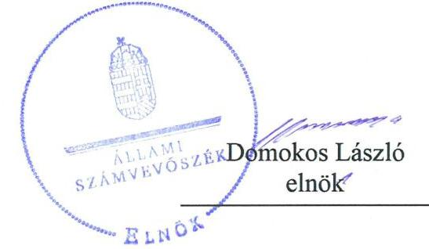
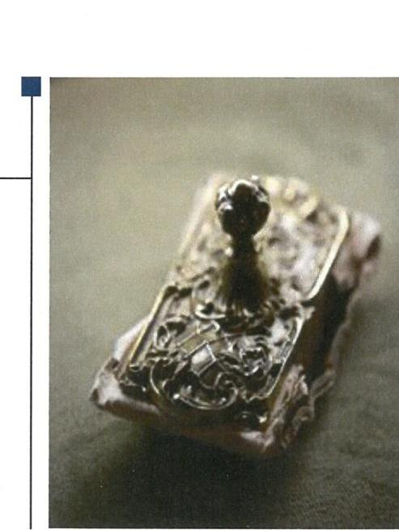
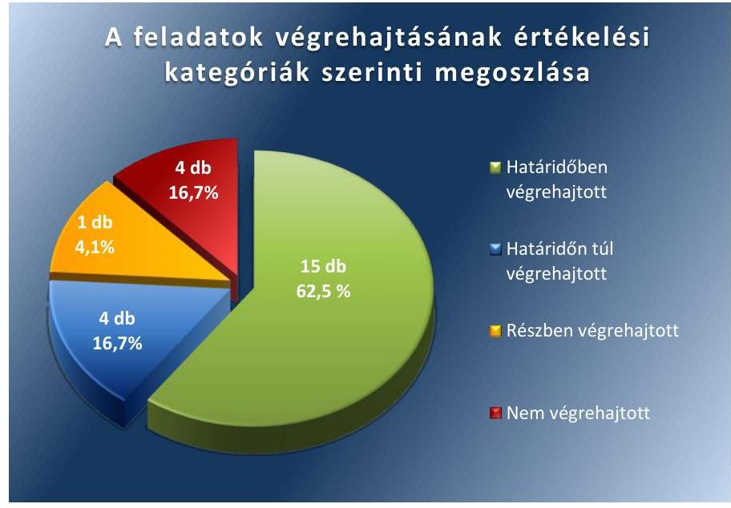
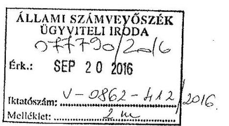
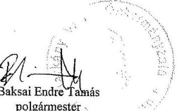
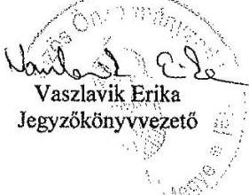
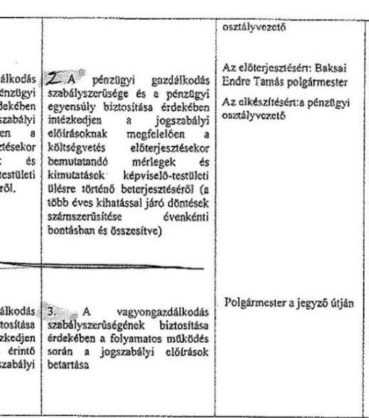
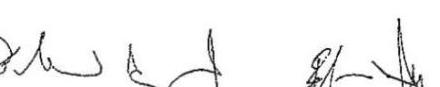
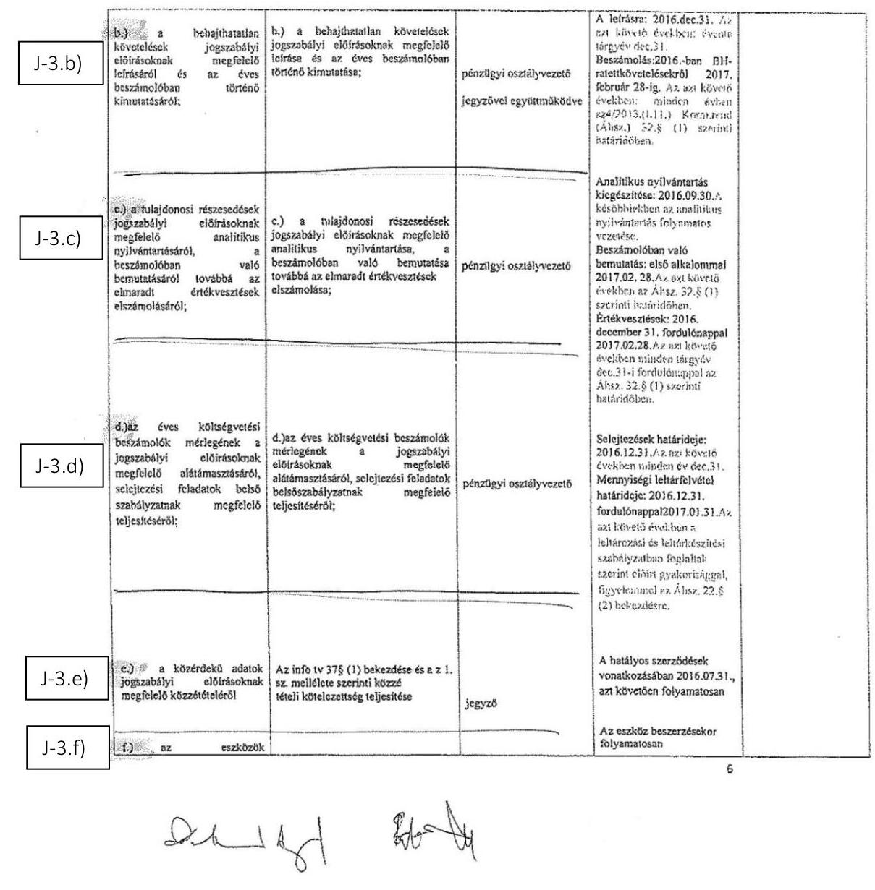

# Jelentés 

## Utóellenőrzések

Az önkormányzatok pénzügyi és vagyongazdálkodása megfelelőségének utóellenőrzése - Harkány Város Önkormányzata
2018.

---

# Jelentés 

## Utóellenőrzések

Az önkormányzatok pénzügyi és vagyongazdálkodása megfelelőségének utóellenőrzése - Harkány Város Önkormányzata
2018. 10 hó 18 nap

---

# AZ ELLENŐRZÉST FELÜGYELTE: 

VARGA EDIT felügyeleti vezető

## AZ ELLENŐRZÉST VEZETTE ÉS A VÉGREHAJTÁSÁÉRT FELELŐS:

GELENCSÉR ZSOLT ellenőrzésvezető

## A PROGRAM ÖSSZEÁLLÍTÁSÁÉRT FELELŐS:

TÓTPÁL SZABOLCS osztályvezető

## A TÉMÁHOZ KAPCSOLÓDÓ KORÁBBI SZÁMVEVŐSZÉKI JELENTÉSEK:

- címe: Jelentés az önkormányzatok pénzügyi és vagyongazdálkodása megfelelőségének ellenőrzése Harkány
- sorszáma: 16047

IKTATÓSZÁM: EL-0211-025/2018.
TÉMASZÁM: 2460
ELLENŐRZÉS-AZONOSÍTÓ SZÁM: V080444

---

# TARTALOMJEGYZÉK 

■ ÖSSZEGZÉS ..... 5
■ AZ ELLENŐRZÉS CÉLJA ..... 6
■ AZ ELLENŐRZÉS TERÜLETE ..... 7
■ AZ ELLENŐRZÉS HÁTTERE, INDOKOLTSÁGA ..... 8
■ A JELENTÉS LÉNYEGES KÉRDÉSKÖRE ..... 10
■ AZ ELLENŐRZÉS HATÓKÖRE ÉS MÓDSZEREI ..... 11
■ MEGÁLLAPÍTÁSOK ..... 13
■ MELLÉKLETEK ..... 15
I. sz. melléklet: Harkány Város Önkormányzat intézkedési terve végrehajtásának értékelése ..... 15
II. sz. melléklet: Az ÁSZ 16047 számú jelentéséhez kapcsolódó intézkedési terv ..... 21
■ FÜGGELÉK: ÉSZREVÉTELEK ..... 31
■ RÖVIDÍTÉSEK JEGYZÉKE ..... 33

---

.

---

# ÖSSZEGZÉS 

Az Állami Számvevőszék Harkány Város Önkormányzata pénzügyi és vagyongazdálkodása megfelelőségének utóellenőrzése során megállapította, hogy az intézkedési tervben meghatározott feladatok többségét végrehajtották, így a szabályozottság javult, azonban a szabályszerű vagyongazdálkodást biztosító intézkedések végrehajtásának elmaradása továbbra is veszélyezteti a közpénzekkel való felelős, elszámoltatható és átlátható gazdálkodást.

## Az ellenőrzés társadalmi indokoltsága

Az Állami Számvevőszék stratégiájában célul tűzte ki a számvevőszéki munka hasznosulásának javítását. Ezzel összhangban ellenőrzi, hogy az ellenőrzött szervezetek megvalósították-e a korábbi ellenőrzései által feltárt hibák, hiányosságok és szabálytalanságok megszüntetése céljából kialakított intézkedési terveikben foglaltakat. A rendszeres utóellenőrzések hozzájárulnak a szükséges intézkedések tényleges végrehajtáshoz, ezáltal a közpénzügyek rendezettségének javulásához.

## Főbb megállapítások, következtetések

Harkány Város Önkormányzata az intézkedési tervben meghatározott huszonnégy feladatból tizenötöt határidőben, négyet határidőn túl, egyet részben hajtott végre, míg négy feladatot nem hajtott végre.

A Harkányi Közös Önkormányzatai Hivatal szabályozottsága javult. A Szervezeti és Múködési Szabályzat elkészítésével a múködés kereteit és szervezetét, a szervezeti egységek feladatköreit meghatározták, a kötelezően elkészítendő - múködésre vonatkozó - szabályzatokat kiadták. A Harkány Város Önkormányzatának vagyonáról, és a vagyontárgyak feletti tulajdonosi jogok gyakorlásáról szóló rendelet elfogadásával megállapították a vagyongazdálkodás kereteit és módját.

A szabályszerű pénzügyi és vagyongazdálkodás biztosítása érdekében vállalt, de végre nem hajtott intézkedések továbbra is veszélyeztetik a szabályszerű gazdálkodást. Harkány Város Önkormányzata nem gondoskodott az éves költségvetési beszámolók mérlegének a jogszabályi előírásnak megfelelő leltárral való alátámasztásáról, az eszközök állományba vételének megfelelő dokumentálásáról, valamint az önkormányzati vagyont érintő döntések során a szabályszerű döntéshozatal biztosításáról.

Harkány Város Önkormányzata az intézkedési tervben meghatározott feladatok végrehajtásáról a jogszabály szerinti nyilvántartást vezette.

---

# AZ ELLENŐRZÉS CÉLJA 

Az ellenőrzés célja annak értékelése volt, hogy a számvevőszéki jelentésben ${ }^{1}$ foglalt intézkedést igénylő megállapításokkal és javaslatokkal összhangban készített intézkedési tervben ${ }^{2}$ meghatározott feladatokat az ellenőrzött szervezet végrehajtotta-e.

---

# **AZ ELLENŐRZÉS TERÜLETE**

## **Harkány Város Önkormányzata**

Harkány városa Baranya megyében, a Siklósi járásban fekszik. A lakónépességének száma a Központi Statisztikai Hivatal Magyarország közigazgatási helységnévtára alapján 2017. január 1-jén 4454 fő volt.

A polgármester³ a 2014. évi önkormányzati választások óta tölti be hivatalát, a jegyző⁴ 2015. januárjától látja el feladatát.

Az Önkormányzat⁵ 2016. évi költségvetésének végrehajtásáról szóló rendelete szerint 1527,8 millió Ft költségvetési bevételt ért el, valamint 1303,9 millió Ft költségvetési kiadást teljesített. A könyvviteli mérleg főösszege 2016. december 31-én 10 034,3 millió Ft, ezen belül a követelések állománya 183,5 millió Ft, a kötelezettségek állománya 106,4 millió Ft volt.

Az ÁSZ⁶ a 2011. január 1. – 2014. december 31. közötti időszakra végezte el az Önkormányzat pénzügyi és vagyongazdálkodása megfelelőségének ellenőrzését. Az ÁSZ jelentés a polgármesternek hat, a jegyzőnek tizennyolc javaslatot tartalmazott, amelyek alapján az Önkormányzat az intézkedési tervében összesen 25 feladat végrehajtásáról rendelkezett. Az utóellenőrzés célja annak értékelése, hogy az ezen időszakban elvégzett ellenőrzésről készült számvevőszéki jelentésben foglalt intézkedést igénylő megállapításokkal összhangban készített intézkedési tervben meghatározott feladatokat az ellenőrzött szervezet végrehajtotta-e.

Az utóellenőrzés az Önkormányzat pénzügyi és vagyongazdálkodásának ellenőrzéséről készült 16047 számú ÁSZ jelentés intézkedést igénylő megállapításai és javaslatai hasznosítására elfogadott intézkedési tervben foglalt feladatok 2016. április 27. és 2018. május 3-a közötti végrehajtására irányult.

---

# AZ ELLENŐRZÉS HÁTTERE, INDOKOLTSÁGA 

Az ÁSZ tv. ${ }^{7}$ 33. § (1) bekezdése értelmében a számvevőszéki jelentések intézkedést igénylő megállapításaihoz és javaslataihoz kapcsolódóan az ellenőrzött szervezet vezetője intézkedési tervet köteles összeállítani, és az Állami Számvevőszék részére megküldeni.

Az ÁSZ tv. 33. § (6) bekezdése értelmében, amennyiben az ÁSZ elnöke az ellenőrzés során feltárt jog-szabálysértő gyakorlat, illetve a vagyon rendeltetésellenes vagy pazarló felhasználásának megszüntetése érdekében figyelemfelhívó levéllel fordult az ellenőrzött szerv vezetőjéhez, az abban foglaltakat az ellenőrzött szerv vezetője köteles elbírálni, a megfelelő intézkedést megtenni és erről az ÁSZ elnökét értesíteni.

Az ÁSZ által befogadott intézkedési tervben foglaltak megvalósítását az ÁSZ törvény 33. § (7) be-kezdésében foglaltak alapján - az Állami Számvevőszék utóellenőrzés keretében ellenőrizheti. Az utó-ellenőrzések keretében - az intézkedések értékelése során - az Állami Számvevőszék figyelembe veszi az ellenőrzött szervezetek működési feltételeiben, valamint a jogszabályi előírásokban bekövetkezett változásokat.

Az utóellenőrzés során az ÁSZ értékeli, hogy az érintett számvevőszéki jelentésben foglalt intézkedést igénylő megállapításokkal és javaslatokkal összhangban, az ellenőrzött szervezet által készített intézkedési tervben meghatározott feladatokat a feladatra kijelöltek végrehajtották-e.

Az intézkedések végrehajtásával az adott terület szabályszerű múködése vonatkozásában a kockázatok csökkenhetnek, azonban hosszabb távon az intézkedési tervben foglaltak végrehajtásával önmagában nem szűnnek meg, csak akkor, ha beépülnek az ellenőrzött szervezet működésébe, azokat folyamatosan karban tartják, figyelembe véve, illetve kezelve a változásokat. Emellett az intézkedések végrehajtásáig újabb kockázatok merülhetnek fel a szabályszerű működés vonatkozásában, amelyek kezelése szintén kiemelten fontos az ellenőrzött szervezet számára.

Az ellenőrzött szervezet vezetője által készített intézkedési tervekben foglalt feladatok hiányos, illetve késedelmes végrehajtása, vagy annak elmaradása a szabályszerűség és a felelős vezetői magatartás vonatkozásában kockázatot hordoz, ami azt mutatja, hogy az ellenőrzések során feltárt hibák, hiányosságok és szabálytalanságok kezelése nem kapott kellő hangsúlyt. Az utóellenőrzés során is fenn-álló szabálytalanságok esetén a közpénz, közvagyon veszélyeztetettségi kockázat valószínűsített ha-tásának értékelése további intézkedéseket vonhat maga után.

Az ellenőrzött szervezet szintjén az utóellenőrzés feltárja, hogy a szervezet az intézkedések végrehajtásával hasznosította-e a korábbi ellenőrzési jelentésben a hiányosságok megszüntetése, illetve a kockázatok kezelése érdekében megfogalmazott javaslatokat, illetve az intézkedések végrehajtása elmaradásának következtében továbbra is fennálló szabálytalanság esetén értékeli a közpénzek, közvagyon veszélyeztetettségét.
$\longrightarrow$ Az ÁSZ szintjén az utóellenőrzés visszacsatolást ad az ellenőrzési jelentések hasznosulásáról, az intézkedések elmaradásának, vagy

---

részleges megvalósulásának a közpénzek, közvagyon veszélyeztetettségére gyakorolt valószínűsített hatásának értékelése, további intézkedéseket vonhat maga után.

---

# A JELENTÉS LÉNYEGES KÉRDÉSKÖRE 

Az Önkormányzat az intézkedési tervben foglaltakat az elöirt határidőben végrehajtotta-e?

---

# AZ ELLENŐRZÉS HATÓKÖRE ÉS MÓDSZEREI 

## Az ellenőrzés típusa

Megfelelőségi ellenőrzés.

## Az ellenőrzött időszak

Az utóellenőrzés alapját képező ÁSZ jelentés közzétételének (2016. április 27.) napjától az ellenőrzésről szóló kiértesítő levél keltének (2018. május 3.) napjáig tartó időszak.

## Az ellenőrzés tárgya

Az ÁSZ tv. 2011. július 1-jei hatálybalépését követően a számvevőszéki jelentésben foglalt intézkedést igénylő megállapításokkal és javaslatokkal összhangban - az ellenőrzött szervezet által - készített intézkedési tervben foglaltak végrehajtásának ellenőrzése.

## Az ellenőrzött szervezet

Harkány Város Önkormányzata

## Az ellenőrzés jogalapja

Az ellenőrzés jogszabályi alapját az ÁSZ tv. 33. § (7) bekezdésének előírása képezi.

## Az ellenőrzés módszerei

Az ÁSZ az ellenőrzést a nemzetközi standardokat irányadónak tekintve az ellenőrzési program ellenőrzési kérdései, az ellenőrzött időszakban hatályos jogszabályok, az ellenőrzés szakmai szabályok és módszertanok figyelembevételével, önállóan vagy ellenőrzéshez kapcsolódóan végezte.

Az ÁSZ az ellenőrzés ideje alatt az ellenőrzött szervezettel történő kapcsolattartást az ÁSZ SZMSZ²-ének vonatkozó előírásai alapján biztosította.

Az utóellenőrzés megállapításait elsősorban az ÁSZ rendelkezésére álló, valamint az ellenőrzött szervezetektől elektronikusan bekért dokumentumok alapozták meg.

---

Az ellenőrzési bizonyítékként felhasználható adatforrások közé tartoznak egyrészt a szakmai programban felsorolt adatforrások, másrészt minden - az ellenőrzés folyamán feltárt, az ellenőrzés szempontjából információt tartalmazó - dokumentum.

Az intézkedési tervben előírt feladatokat azok végrehajthatósága, illetve végrehajtása szempontjából az alábbiak szerint értékelte az ÁSZ:
$\longrightarrow$ „határidőben végrehajtott" a feladat, ha a teljesítés dokumentáltan, az intézkedési tervben előírt határidőben és tartalommal megtörtént;
$\longrightarrow$ „határidőn túl végrehajtott" a feladat, ha annak teljesítése az intézkedési tervben meghatározott módon, de az előírt határidőn túl történt meg;
$\longrightarrow$ „részben végrehajtott" a feladat, ha végrehajtása teljes körűen az intézkedési tervben előírt módon nem történt meg;
$\longrightarrow$ „nem végrehajtott" a feladat, ha a végrehajtás nem történt meg, vagy amennyiben a teljesítést nem dokumentálták;
$\longrightarrow$ „okafogyottá vált" a feladat, ha végrehajtására - meghatározott esemény bekövetkezése, továbbá külső körülmény, a működést érintő feltétel változása miatt - már nincs szükség, illetve lehetőség, és egyértelműen megállapítható, hogy az intézkedést szükségessé tevő körülmény a jövőben nem fordulhat elő;
$\longrightarrow$ „nem időszerű" az a feladat, amelynek ellenőrzési időszakon belüli végrehajtására azért nem került (kerülhetett) sor, mert az intézkedés alapjául szolgáló esemény nem következett be, de annak jövőbeni előfordulása lehetséges, a végrehajtása nem volt esedékes, vagy a végrehajtás határideje még nem járt le.
Az ellenőrzés lefolytatásához az ellenőrzött szervezet a tanúsítványok elektronikus kitöltésével, valamint az ÁSZ által kért dokumentumok elektronikus megküldésével szolgáltat adatokat, amelyek valódiságát és teljes körűségét az ellenőrzött szervezet vezetője által tett teljességi és hitelességi nyilatkozat igazolta. Az így rendelkezésre bocsátott adatok, információk kontrollja az ellenőrzés keretében történt.

Az ellenőrzött szervezet által megküldött intézkedési tervben meghatározott ÁSZ által beazonosított feladatok a II. számú mellékletben kerültek bemutatásra.

---

# MEGÁLLAPÍTÁSOK 

## Az Önkormányzat az intézkedési tervben foglaltakat az előírt határidőben végrehajtotta-e?

Összegző megállapítás

Az Önkormányzat az intézkedési tervben meghatározott huszonnégy feladatból tizenötöt határidőben, négyet határidőn túl, egyet részben hajtott végre, míg négy feladatot nem hajtott végre. Az intézkedési tervben meghatározott feladatok végrehajtásáról a jogszabályban előírt nyilvántartást vezette.

Az ÁSZ a számvevőszéki jelentésében a polgármester részére hat, a jegyző részre tizennyolc javaslatot fogalmazott meg. A polgármester által előterjesztett és a Képviselő-testület által jóváhagyott intézkedési tervben a hiányosságok, szabálytalanságok megszüntetésére huszonnégy feladatot határoztak meg.

Az intézkedési tervben meghatározott feladatokat, határidőket, felelősöket és a feladatok végrehajtását az I. számú melléklet mutatja be.

Az Önkormányzat az intézkedési tervben meghatározott feladatok végrehajtásáról vezette a Bkr. ${ }^{9}$-ben előírt nyilvántartást.

Az Önkormányzat intézkedési tervében meghatározott feladatok végrehajtásának értékelési kategóriák szerinti megoszlását az 1. ábra szemlélteti.

1. ábra

Fonós: ÁSZ

---

A SZABÁLYOZOTTSÁG az Önkormányzatnál javult, a jegyző elkészítette, a polgármester a Képviselő-testület elé terjesztette a Harkányi Közös Önkormányzati Hivatal szervezeti és múködési szabályzatát, a jegyző szabályzatok kiadásával javította a Harkányi Közös Önkormányzati Hivatal szabályozott múködését a kiküldetések, a reprezentációs kiadások elszámolása, a beszerzés, a gépjárművek igénybevétele, a vezetékes és rádiótelefonok használata területén $(1,5,6,7,15)$.

A PÉNZÜGYI ELSZÁMOLTATHATÓSÁGGAL kapcsolatos intézkedési terv pontok többsége teljesült, a jegyző és a polgármester gondoskodtak a jogszabálynak megfelelő költségvetési rendelet elkészítéséről és jóváhagyásáról, a likviditási tervek felülvizsgálatáról, a behajthatatlan követelések elszámolásáról (4, 11, 12, 18, 20).

# A BELSŐ KONTROLLRENDSZER KIÉPÍTETTSÉGE 

javult, elkészült és a Képviselő-testület felé előterjesztésre került a Szociális Szolgáltatástervezési Koncepció, a jegyző elkészítette a Bkr. -nek megfelelő ellenőrzési nyomvonalat, azonban annak naprakészen tartása nem történt meg. A jegyző belső intézkedési tervet készített a kockázatelemzésben felmerült kockázatok kezelésére, valamint elkészítette a Környezetvédelmi programot, amit a polgármester a Képviselő-testület elé terjesztett. A jegyző és a pénzügyi osztályvezető ugyanakkor nem gondoskodott a belső kontrollrendszer - ennek keretében a pénzügyi folyamatokban kulcsszerepet betöltő teljesítésigazolás és érvényesítés kontrollok, továbbá a pénzügyi ellenjegyzés és utalványozás - jogszabályi előírásoknak illetve belső szabályzatoknak megfelelő múködtetéséről (3, 9, 10, 16, 17, 21).

AZ ÁTLÁTHATÓSÁG érdekében hozott intézkedés keretében az Info tv. ${ }^{10}$ szerinti adatok közzététele biztosított volt (14).

A VAGYONGAZDÁLKODÁS nem javult, a költségvetési beszámolók mérlegsorait leltárral nem támasztották alá és az eszközök állományba vétele szabályszerűsége sem volt biztosított. A vagyongazdálkodás szabályozottsága javult, a jegyző elkészítette, a polgármester a Képviselőtestület elé terjesztette a Harkány Város Önkormányzatának vagyonáról, és a vagyontárgyak feletti tulajdonosi jogok gyakorlásáról szóló rendeletet. A jegyző gondoskodott arról, hogy a vagyonkimutatásban szereplő ingatlanvagyon számviteli nyilvántartás bruttó értéke megegyezzen az ingatlan vagyonkataszteri nyilvántartásban szereplő ingatlanvagyon bruttó értékével, elkészítette a tulajdonosi részesedésekhez kapcsolódó analitikus nyilvántartást, ugyanakkor nem gondoskodott az önkormányzati vagyont érintő döntések során a Képviselő-testület által meghatározott szabályok és jogszabályi előírások betartásáról (2, 8, 13, 19, 22, 23, 24).

---

# MELLÉKLETEK

- I. SZ. MELLÉKLET: HARKÁNY VÁROS ÖNKORMÁNYZAT INTÉZKEDÉSI TERVE VÉGREHAJTÁSÁNAK ÉRTÉKELÉSE

|  1. | Az intézkedési
tervben meghatá-
rozott határidő | Az intézkedési
tervben megha-
tározott felada-
tok felelőse | A feladat végrehajtása  |
| --- | --- | --- | --- |
|   | 2. | 3. | 4.  |
|  Határidőben végrehajtott feladatok |  |  |   |
|  1. P-1.a)
Harkányi Közös Önkormányzati Hivatal Szervezeti és Müködési Szabályzatát Harkány Város önkormányzat Képviselő-testülete 54/2015. (III. 27.) számú határozatával jóváhagyta; szükséges az elfogadott SZMSZ ${ }^{11}$ felülvizsgálatát követően annak képviselő-testület elé terjesztése. | Az előterjesztésre:
2016. 09. 30.
Az elkészítésre: 2016.
08. 31. | Az előterjesztésre:
polgármester
Az elkészítésért:
jegyző | A polgármester a Képviselő-testület elé terjesztette a - jegyző által elkészített - Harkányi Közös Önkormányzati Hivatal Szervezeti és Müködési Szabályzatát, amelyet a Képviselő-testület a 201/2016. (IX. 08.) számú határozatával jóváhagyott. A Szervezeti és Müködési Szabályzat 2016. november 1-jén lépett hatályba.  |
|  2. P-1.b)
Harkány Város Önkormányzata az önkormányzat tulajdonában álló nemzeti vagyonról, és a vagyongazdálkodás szabályairól szóló 6/2012. (IV. 06.) számú rendeletének felülvizsgálata és módosítása szükséges. | Az előterjesztésre:
2016. 09. 30.
Az elkészítésre: 2016.
08. 31. | Az előterjesztésre:
polgármester
Az elkészítésért:
jegyző, együttmüködve a műszaki és pénzügyi osztályvezetőkkel | A jegyző által elkészített a Harkány Város Önkormányzatának vagyonáról, és a vagyontárgyak feletti tulajdonosi jogok gyakorlásáról szóló rendelettervezetet a polgármester határidőben a Képviselő-testület elé terjesztette. A Képvi-selő-testület 2016. szeptember 29-i ülésén megtárgyalta és elfogadta a 20/2016. (X. 04.) számú, Harkány Város Önkormányzatának vagyonáról, és a vagyontárgyak feletti tulajdonosi jogok gyakorlásáról szóló rendeletét.  |
|  3. P-1.c)
A jogszabályi előírásoknak megfelelő szociális szolgáltatástervezési koncepció elkészítését követően annak képviselő-testület elé terjesztése. | Az előterjesztésre:
2016. 11. 30.
Az elkészítésre: 2016.
10. 31. | Az előterjesztésre:
polgármester
Az elkészítésért: aljegyző | A jegyző által elkészített Szociális Szolgáltatástervezési Koncepciót a polgármester határidőben a Képviselő-testület elé terjesztette. A Képviselő-testület a 2016. október 27-i ülésén ezt megtárgyalta és a 234/2016. (X. 27.) sz. Önkormányzati határozattal elfogadta.  |
|  4. P-2.
A pénzügyi gazdálkodás szabályszerűsége és a pénzügyi egyensúly biztosítása érdekében intézkedjen a jogszabályi előírásoknak megfelelően a költségvetés előterjesztésekor bemutatandó mérlegek és kimutatások képviselő-testületi ülésre történő beterjesztéséről (a több éves kihatással járó | A 2016.évi költségvetés első módosításánál. Az előterjesztésre: 2016.09.30. Az elkészítésre: 2016.08.31. | Az előterjesztésre:
polgármester
Az elkészítésért: pénzügyi osztályvezető | Az Önkormányzat a 2016. évi költségvetési rendelet első alkalommal 2016. szeptember 29-ei ülésén módosította. A 2016. évi költségvetési rendelet módosítása tartalmazta "A közvetett támogatások bemutatása" és a "Többéves kihatással járó döntésekből származó kötelezettségei célok szerint, évenkénti bontásban" táblázatokat, amelyet a Képviselő-testület a 19/2016. (X. 12.) számú rendeletével fogadott el. Az Önkormányzat 2017. évi költségvetési  |

---

|   | döntések számszerűsítése évenkénti bontásban és össze-
sítve). | A 2016-ot követő években minden évben az aktuális költségvetés előterjesztésével egyidejűleg, legkésőbb az Áht. által megadott határidőig. |  | rendelete, amelyet a Képviselő-testület 2017. február 15-én fogadott el, valamint a 2018. évi költségvetési rendelete, amelyet a Képviselő-testület 2018. február 15-én fogadott el tartalmazta az intézkedési tervben előírt kimutatásokat.  |
| --- | --- | --- | --- | --- |
|  5. | P-3.
A vagyongazdálkodás szabályszerűségének biztosítása érdekben a folyamatos működés során a jogszabályi előírások betartása. | Azonnali és folyamatos | Polgármester a jegyző útján. | A feladat végrehajtását a Vagyonrendelet ${ }^{12}$, és az SZMSZ hatálybaléptetése biztosítja, ezek szabályozzák a vonatkozó jogszabályi előírások szervezeti szintű betartását.
A 2016. szeptember 19.-i képviselő testületi ülés elfogadott Vagyonrendelet rögzítette az önkormányzati vagyonra vonatkozó hatásköröket, az önkormányzati döntésekhez kapcsolódó feladatokat, dokumentumokat.
A 2016. november 1-től hatályos SZMSZ "7. Vagyongazdálkodással kapcsolatos feladatok" című fejezetében hivatkozva a Vagyonrendeletre, a vagyongazdálkodással kapcsolatos tevékenységek a Műszaki osztály, illetve a Gazdasági szervezet feladatai között szerepelnek, az Igazgatási osztály közreműködésével. A két szabályzat végrehajtása biztosítja, hogy a vagyonra vonatkozó döntések a szabályzatok hatálya alatt folyamatosan megfeleljenek a jogszabályi előírásoknak.  |
|  6. | J-1.a.
Harkányi Közös Önkormányzati Hivatal Szervezeti és Működési Szabályzatát Harkány Város önkormányzat Képviselő-testülete 54/2015. (III. 27.) számú határozatával jóváhagyta; szükséges az elfogadott SZMSZ felülvizsgálatát követően annak képviselő-testület elé terjesztése. | Elkészítés: 2016.08.31.
Előterjesztés: 2016. 09. 30. | Előterjesztésért: a polgármester
Elkészítésért: a jegyző | A jegyző elkészítette a Harkányi Közös Önkormányzati Hivatal Szervezeti és Müködési Szabályzatát, amelyet a Képviselő-testület a 201/2016. (IX. 08.) számú Önkormányzati határozatával jóváhagyott.  |
|   | J-1.c.
beszerzési szabályzat (1.c.a);
gépjárművek igénybevételét és használatát rendező szabály-
zat (1.c.d.) | 2016.08.31.
2016.08.31. | Már rendelkezésre áll.
Már rendelkezésre áll. | A Képviselő-testület 38/2015. számú határozatával fogadta el, és 106/2016. sz. határozatával módosította a beszerzési szabályzatot ${ }^{13}$.
A Képviselő-testület 178/2015. számú határozatával fogadta el, majd 107/2016. sz. határozatával módosította a gépjárművek igénybevételét és használatát rendező szabályzatot ${ }^{14}$.
A Képviselő-testület 179/2015. számú határozatával fogadta el a vezetékes és rádiótelefonok használatát rendező szabályzatot ${ }^{15}$.
7/2015. számú jegyzői intézkedés keretében került kiadásra a közérdekű adatok megismerésére irányuló kérelmek intézésének és kötelezően közzéteendő adatok nyilvánosságra hozatalának rendjét tartalmazó szabályzat ${ }^{16}$.  |

---

|   | belföldi és külföldi kiküldetések elrendelésével, lebonyolításával és elszámolásával kapcsolatos kérdéseket rendező szabályzat (1.c.b) reprezentációs kiadások felosztását, azok teljesítésének és elszámolásának szabályait tartalmazó szabályzat (1.c.c) | 2016.08.31. | Elkészítésért: a pénzügyi osztályvezető | A pénzügyi osztályvezető határidőn belül elkészítette a Harkányi Közös Önkormányzati Hivatal Kiküldetési Szabályzatát ${ }^{17}$.  |
| --- | --- | --- | --- | --- |
|   |  | 2016.08.31. | Elkészítésért: a pénzügyi osztályvezető |   |
|  8. | J-1.d.
Harkány Város Önkormányzata az önkormányzat tulajdonában álló nemzeti vagyonról, és a vagyongazdálkodás szabályairól szóló 6/2012. (IV. 06.) számú rendeletének felülvizsgálata és módosítása szükséges. |  | Előterjesztésért: a polgármester
Elkészítésért: a jegyző; együttműködve a Harkányi Közös Önkormányzati Hivatal műszaki és pénzügyi osztályvezetőkkel | A pénzügyi osztályvezető határidőn belül elkészítette a reprezentációs kiadások felosztását, azok teljesítésének és elszámolásának szabályait tartalmazó szabályzatot ${ }^{18}$, amely 2016. szeptember 1-ével lépett hatályba.  |
|  9. | J-1.e.
e) a jogszabályi előírásoknak megfelelő ellenőrzési nyomvonal elkészítéséről | 2016.12.31. |  | A jegyző előkészítette és kezdeményezte a Harkány Város Önkormányzatának vagyonáról, és a vagyontárgyak feletti tulajdonosi jogok gyakorlásáról szóló rendelettervezet Képviselő-testület általi tárgyalását. A Képviselő-testület 2016. szeptember 29-i ülésén megalkotta a 20/2016. (X. 04.) számú, Harkány Város Önkormányzatának vagyonáról, és a vagyontárgyak feletti tulajdonosi jogok gyakorlásáról szóló rendeletét.  |
|  10. | J-1.f.
A jogszabályi előírásoknak megfelelő szociális szolgáltatástervezési koncepció elkészítése és előterjesztése. | Határidő az előterjesztésre: 2016. 11. 30. Határidő az elkészítésre: 2016. 10. 31. | Felelős az előterjesztésért: polgármester Felelős az elkészítésért: aljegyző | A jegyző, eleget téve a szociális igazgatásról és szociális ellátásokról szóló 1993. évi III. tv. 92. § (3) bekezdésében előírtaknak, gondoskodott a Szociális Szolgáltatástervezési Koncepció elkészítéséről és beterjesztésének kezdeményezéséről, amit az Önkormányzat Képviselő-testülete 2016. október 27-én megtárgyalt és a 234/2016. (X. 27.) sz. Önkormányzati határozattal elfogadott.  |
|  11. | J-2.a.
A pénzügyi gazdálkodás szabályszerűsége és a pénzügyi egyensúly biztosítása érdekében intézkedni kell a jogszabályi előírásoknak megfelelően a költségvetés előterjesztésekor bemutatandó mérlegek és kimutatások elkészítéséről és beterjesztésének kezdeményezéséről. | A 2016.évi költségvetés első módosításakor, elkészítés: 2016.08.31. elfogadás: 2016.09.30. A 2016-ot követő években minden évben a költségvetés előterjesztésével egyidejűleg, legkésőbb az Áht. által megadott határidőig. | Az elkészítésért a pénzügyi osztályvezető. Előterjesztésért a jegyző | Az Önkormányzat 2016 április 27-e után 2 alkalommal, a 2016 szeptember 29-i, és a 2017. május 29.-i képviselő testületi ülésein módosította a 2016. évi költségvetést. Az Önkormányzat a költségvetési rendelete tartalmazza "A közvetett támogatások bemutatása" és a "Többéves kihatással járó döntésekből származó kötelezettségei célok szerint, évenkénti bontásban" táblázatokat. A 2017. évi Önkormányzati költségvetésre vonatkozó 2017. február 15.- i előterjesztés, a 2018. évi Önkormányzati költségvetés elfogadására vonatkozóan a 2018. február 15.-i előterjesztés tartalmazta az Intézkedési tervben előírt két kimutatást.  |
|  12. | J-2.c. A pénzügyi gazdálkodás szabályszerűsége és a pénzügyi egyensúly biztosítása érdekében intézkedni kell, a likviditási tervet jogszabályi előírásoknak megfelelően aktualizálni kell. | Első alkalommal: 2016 június 30. A továbbiakban minden hó 30-ig. | Pénzügyi osztályvezető | A likviditási tervek 2016. júniustól 2016. decemberig havonta felülvizsgálatra kerültek. Az Áht. ${ }^{19} 78 . \S$ (2) bekezdésében előírt likviditási tervvel kapcsolatos  |

---

|   |  |  | feladat végrehajtását az Ávr. ${ }^{20}$ 122. § (3) bekezdése hatályon kívül helyezte, megszűnt a havi felülvizsgálati kötelezettség.  |
| --- | --- | --- | --- |
|  13. | J-3.a.
A vagyongazdálkodás szabályszerűségének biztosítása érdekében:
a) A vagyonkimutatásban és a vagyonkataszteri nyilvántartásban szereplő ingatlanvagyon jogszabályi előírásoknak megfelelő egyezőségének biztosítása. | Az egyezőséget negyedévente, legkésőbb az éves beszámoló elkészültéig biztosítani és dokumentálni kell. | pénzügyi osztályvezető  |
|  14. | J-3.e. e) Az Info tv. 37 § (1) bekezdése és az 1 sz. melléklete szerinti közzétételi kötelezettség teljesítése | A hatályos szerződések vonatkozásában 2016. 07. 31., azt követően folyamatosan | jegyző  |
|  15. | J-1.b.
b) a jogszabályi előírásoknak megfelelő tartalmú számlarend kiadásáról, valamint a FEUVE ${ }^{22}$ szabályainak kiegészítéséről | 2016.09.30 2016.12.31 | Elkészítésért: a pénzügyi osztályvezető, Jóváhagyásért a jegyző  |
|   |  | Határidőn túl végrehajtott feladatok |   |
|  16. | P-1.d.
A jogszabályi előírásoknak megfelelő környezetvédelmi program elkészítését követően annak képviselő-testület elé terjesztése. | Az előterjesztésre: 2016. 11. 30. Az elkészítésre: 2016. 10. 31. | Az előterjesztésre: polgármester Az elkészítésért: műszaki osztályvezető  |
|  17. | J-1.g)
A jogszabályi előírásoknak megfelelő környezetvédelmi program elkészítését követően annak képviselő-testület elé terjesztése. | Határidő az előterjesztésre: 2016. 11. 30. Határidő az elkészítésre: 2016. 10. 30. | Felelős az előterjesztésért: polgármester Felelős az elkészítésért: műszaki osztályvezető  |
|  18. | J-3.b.
b) A behajthatatlan követelések jogszabályi előírásoknak megfelelő leírása és az éves beszámolóban történő kimutatása. | Határidő a leírásra: 2016. dec. 31. Az azt követő években: évente tárgyév dec. 31. Beszámolás: 2016-ban BH-ra tett követelésekről 2017. február 28-ig. Az azt követő években: minden évben a 4/2013. (I. 11.) Korm. | pénzügyi osztályvezető, a jegyzővel együttműködve  |

A jegyző a vagyongazdálkodás szabályszerűségének biztosítása érdekében, eleget téve az Áhsz. ${ }^{21} 30 .$ § (4) bekezdésében előírtaknak, gondoskodott arról, hogy a vagyonkimutatásban szereplő ingatlanvagyon számviteli nyilvántartás bruttó értéke megegyezzen az ingatlan vagyonkataszteri nyilvántartásban szereplő ingatlanvagyon bruttó értékével a 2016. és a 2017. évek vonatkozásában. Az Önkormányzat a http://varos.harkany.hu/uvegzselj oldalon az 5,0 M Ft-ot elérő, vagy azt meghaladó összegű szerződéseit is szerepelteti, ezzel megfelel az Info tv. előírásainak.

A Számlarend ${ }^{23}$ elkészült, 2016. szeptember 30-án hatályba lépett. A FEUVE szabályait tartalmazó Belső kontrollrendszer szabályzat ${ }^{24}$ elkészült, 2016. október 1-től lépett hatályba.

A jegyző által elkészített a 2016-2021. évekre vonatkozó Környezetvédelmi programot a polgármester határidőn túl terjesztette a Képviselő-testület elé. A 2016-2021. évekre vonatkozó Környezetvédelmi programot a Képviselőtestület megtárgyalta és 272/2016. (XII. 22) számú határozatával elfogadta. A jegyző, eleget téve a környezet védelmének általános szabályairól szóló 1995. évi LIII. tv. 46. § (1) bekezdésének b) pontjában előírtaknak, határidőn túl gondoskodott a 2016-2021. évekre vonatkozó Környezetvédelmi program elkészítéséről, amelyet a Képviselő-testület megtárgyalt és 272/2016. (XII. 22) számú határozatával elfogadott. A jegyző a vagyongazdálkodás szabályszerűségének biztosítása érdekében, eleget téve az Áhsz. 53. § (8) bekezdésének e) pontjában előírtaknak, gondoskodott arról, hogy a behajthatatlan követelések elszámolásra kerüljenek. A 2016. decemberi fordulónappal a behajthatatlan követelések leírásra kerültek. A beszámolás 2017. február 28-ig való megtörténte dokumentumokkal nem volt igazolható. A 2017. évről szóló Számv. tv. szerinti beszámoló és a 2017. évi zárszámadás elkészítése az ellenőrzési időszakban még folyamatban volt.

---

### *Mellékletek*

|   |  | rend (Áhsz.) 32. § (1) |   |
| --- | --- | --- | --- |
|   |  | szerinti határidőben. |   |
|  19. | J-3. c. | Analitikus nyilvántartás kiegészítése: | pénzügyi osztályvezető  |
|   | a tulajdonosi részesedések jogszabályi előírásoknak megfelelő analitikus nyilvántartása beszámolóban való bemutatásáról továbbá az elmaradt értékvesztések elszámolása; | 2016.09.30. A későbbiekben az analitikus nyilvántartás folyamatos vezetése. Beszámolóban való bemutatás; első alkalommal 2017.02. 28. Az azt követő években az Áhsz. 32. § (1) szerinti határidőben. |   |
|   |  | Értékvesztések: 2016. december 31. fordulónappal 2017.02.28. Az azt követő években minden tárgyév dec.31. El fordulónappal az Áhsz. 32. § (1) szerinti határidőben. |   |
|   |  |  | A jegyző a tulajdonosi részesedések analitikus nyilvántartását 2016. szeptember 30. helyett a 2016. évi zárszámadási rendelethez[^25] készítette el, amelyet a Képviselő-testület 2017. május 27-én fogadott el.  |
|   |  |  | Az értékvesztések elszámolása a 2016 évi zárszámadási rendelet 12. számú mellékletével támasztható alá, amit a Képviselő-testület 2017. május 27-én fogadott el.  |
|  |   |   |   |
|  |   |   |   |
|  |   |   |   |
|  |   |   |   |
|  |   |   |   |
|  |   |   |   |
|  20. | J-2.d. | Szabályzat megalkotása: | Szabályzat megalkotása:  |
|   | A kockázatkezelési rendszer a belső kontrollrendszer részeként kerül kialakításra szabályzat formájában. | 2016. szeptember 30. Kockázatelemzések elvégzése: 2016. október 30. Az azt követő években minden év október 30. | Pénzügyi osztályvezető  |
|   | A kialakított szabályzat előírásainak megfelelő kockázatelemzések elvégzése. |  | Kockázatelemzések elvégzéséért: Jegyző  |
|   | Az azonosított legsúlyosabb kockázati területek a 2017. évi belső ellenőrzési munkatervbe felvételre kerülnek. | 2017. évi belső ellenőrzési munkaterv elkészítése: 2016. november 30. Az ezt követő években: | A legsúlyosabb kockázati területek munkatervbe történő felvételéért: Jegyző  |
|   | A belső ellenőrzési munkatervbe be nem került, de a kockázatelemzés során azonosított egyéb kockázatokra belső intézkedési terv készül. |  |   |
|  |   |   |   |
|  |   |   |   |
|  |   |   |   |
|  |   |   |   |
|  |   |   |   |
|  |   |   |   |
|  |   |   |   |
|  |   |   |   |
|  |   |   |   |
|  |   |   |   |
|  |   |   |   |
|  |   |   |   |
|  |   |   |   |
|  |   |   |   |
|  |   |   |   |
|  |   |   |   |
|  |   |   |   |
|  |   |   |   |
|  |   |   |   |
|  |   |   |   |
|  |   |   |   |
|  |   |   |   |
|  |   |   |   |
|  |   |   |   |
|  |   |   |   |
|  |   |   |   |
|  |   |   |   |
|  |   |   |   |
|  |   |   |   |
|  |   |   |   |
|  |   |   |   |

---

|   | A belső intézkedési terv készítésére: 2016. nov. 30. | A belső intézkedési terv készítéséért: Jegyző | A 2017. és 2018. évi kockázatelemzések határideje 2016. és 2017. október 30. volt, tárgyi kockázatelemzések az ellenőrzött időszak végéig nem történtek meg, így az azonosított legsúlyosabb kockázati területek 2017. évi belső ellenőrzési munkatervbe kerülése nem volt biztosított.  |
| --- | --- | --- | --- |
|  Nem végrehajtott feladatok |  |  |   |
|  21. J-2.b.
A pénzügyi gazdálkodás szabályszerűsége és a pénzügyi egyensúly biztosítása érdekében intézkedjen a belső kontrollrendszer- ennek keretében a pénzügyi folyamatokban kulcsszerepet betöltő teljesítésigazolás és érvényesítés kontrollok, továbbá a pénzügyi ellenjegyzés és utalványozás jogszabályi előírásoknak illetve belső szabályzatoknak megfelelő működtetéséről. | folyamatos | Jegyző, pénzügyi osztályvezető | Az Önkormányzat az intézkedése megtörténtét nem támasztotta alá.  |
|  22. J-3. d.
az éves költségvetési beszámolók mérlegének a jogszabályi előírásoknak megfelelő alátámasztásáról, selejtezési feladatok belső szabályzatnak megfelelő teljesítéséről; | Selejtezések határideje:2016. 12. 31. Az azt követő években minden év dec. 31. Mennyiségi leltárfelvétel határideje: 2016.12.31. fordulónappal 17.01.31. Az azt követő években a leltározási és leltárkészítési szabályzatban foglaltak szerint előírt gyakorisággal, figyelemmel az Áhsz. 22. § (2) bekezdésre. | pénzügyi osztályvezető | Az Önkormányzat és a Harkányi Közös Önkormányzati Hivatal nem hajtott végre selejtezéseket.
A jegyző az Önkormányzatnál és a Harkányi Közös Önkormányzati Hivatalnál leltárt a Számv tv. ${ }^{26}$ 69. § (1) bekezdés ellenére az ellenőrzési időszakban nem állított össze.  |
|  23. J-3. f.
Az eszközök nyilvántartásba vételénél a belső szabályzatnak megfelelő állományba vételi bizonylatok alkalmazása | folyamatos | pénzügyi osztályvezető, valamint az eszköz nyilvántartója | Az Önkormányzat az intézkedése megtörténtét - a Bizonylati rend II/1.2.2. pontjában rendszeresített - kitöltött állományba vételi bizonylatokkal nem támasztotta alá.  |
|  24. J-3. g.
az Önkormányzati vagyont érintő döntések során a Képvi-selő-testület által meghatározott szabályok és jogszabályi előírások betartásáról. | folyamatos | jegyző | Az Önkormányzat az intézkedése megtörténtét nem támasztotta alá.  |

---

# II. SZ. MELLÉKLET: AZ ÁSZ 16047 SZÁMÚ JELENTÉSÉHEZ KAPCSOLÓDÓ INTÉZKEDÉSI TERV 

## 1182

## HARKÁNY VÁROS POLGÁRMESTERÉTŐL

H A R K Á N Y Petőfi S. u. 2-4. 7815
(72) 480-100 (72) 480-202 Fax: (72) 480-518

E-mail: polgarmester@harkany.hu
Web: www.harkany.hu

Hiv.sz.: V-0862-407/2016.
Tárgy: Módosított intézkedési terv megküldése

## Állami Számvevőszék

Domokos László Elnök úr részére

## Budapest 4.

Pf.: 54
1364

Tisztelt Elnök Úr!

A fenti tárgyban megjelölt, Harkány Város Önkormányzatánál lefolytatott ellenőrzési jelentésre készült módosított intézkedési tervre tett észrevételét Harkány Város Önkormányzatának Képviselőtestülete megtárgyalta és a korábban 175/2016. (VII.21.) számú önkormányzati határozatával elfogadott intézkedési tervet megkeresésük tartalmának megfelelően a képviselő-testület 191/2016.(IX.08.) számú határozatával ismételten módosította.
A kiegészített, 2. számú módosítással egységes szerkezetbe foglalt, képviselő-testület által elfogadott intézkedési tervet, valamint az elfogadó képviselő-testületi határozati kivonatot jelen levelemhez csatoltan küldöm.
A könnyebb áttekinthetőség érdekében az intézkedési terv piros színnel tartalmazza a módosításokat.
Reményeink szerint a 2. számú módosított intézkedési terv már az Önök részéről is megfelelő, elfogadható, így az abban foglaltak betartásával a feltárt hibák, hiányosságok maradéktalanul orvosolhatók.

Harkány, 2016. szeptember 15.

Tisztelettel:

Csatolmányok:

- módosított egységes szerkezetbe foglalt intézkedési terv
- önkormányzati kivonat

---

# Kivonat 

## Harkány Város Önkormányzat Képviselő-testületének 2016. szeptember 8-án megtartott testületi ülésének jegyzőkönyvéből:

## 191/2016. (IX.08.) sz. Önkormányzati határozat:

2. számú módosításokkal kiegészített intézkedési terv elfogadásáról
1.) Harkány Város Önkormányzatának Képviselő-testülete az Állami Számvevőszék által „Az önkormányzatok pénzügyi és vagyongazdálkodása megfelelőségének ellenőrzése Harkány" megnevezéssel lefolytatott ellenőrzés eredményeképp készült Jelentésben foglaltak alapján, a hiányosságok felszámolása érdekében elkészült, 131/2016.(V.12.) számú önkormányzati határozattal már elfogadott, és 175/2016.(VII.21.) számú határozattal módosított Intézkedési terv2. számú módosításokkal kiegészített, egységes szerkezetbe foglalt tartalmát az előterjesztéssel egyezően elfogadja.
2.) A képviselő-testület utasítja a polgármestert és a jegyzőt a 2 . számú módosításokkal kiegészített és egységes szerkezetbe foglalt „Intézkedési terv"-ben foglaltak végrehajtására, valamint arra,hogy a megtett intézkedésekről az egyes feladatok teljesítéséről az adott feladat határidejének lejártát követő első Képviselő-testületi ülésen, a „Jelentés a lejárt határidejű határozatok végrehajtásáról" címủ napirend keretében tájékoztassa a Képviselő-testületet.
3.) A képviselő-testület utasítja a polgármestert, hogy a jóváhagyott, 2. számú módosításokkal kiegészített és egységes szerkezetbe foglalt „Intézkedési terv"-et az Állami Számvevőszéknek az előírt határidőben küldje meg.

Felelős: polgármester, jegyző
Határidő: értelemszerủen

A kivonat hiteléül:

Harkány, 2016. szeptember 15.

---

Mellékletek

INTÉZKEDÉSÍTERV (MŰDOSÍTVA 2016.07.21. 2. sz. módosítási 2016.09.06.) Amely készítő: Amelý készítő: (V-0862-398/2016.számájelentés és V-0862-401/2016. számávalamint V-0862-407/2016. számú feltételezékhal kiegészítve)

Az Államfőzámvevőszékjavaslatai az Államfőzámvevőszékjavaszlatai az Államfőzámvevőszékjavaszlatai az Államfőzámvevőszékjavaszlatai

|   |  | ÁSZjelentésben foglatási határozat |  |  |  |  |  |  |  |  |  |  |  |  |  |  |  |  |  |  |  |  |  |  |  |  |  |  |  |  |  |  |  |  |  |  |  |  |  |  |  |  |  |  |  |   |
| --- | --- | --- | --- | --- | --- | --- | --- | --- | --- | --- | --- | --- | --- | --- | --- | --- | --- | --- | --- | --- | --- | --- | --- | --- | --- | --- | --- | --- | --- | --- | --- | --- | --- | --- | --- | --- | --- | --- | --- | --- | --- | --- | --- | --- | --- | --- | --- |
|   |  |  |  |  |  |  |  |  |  |  |  |  |  |  |  |  |  |  |  |  |  |  |  |  |  |  |  |  |  |  |  |  |  |  |  |  |  |  |  |  |  |  |  |  |   |
|   |  |  |  |  |  |  |  |  |  |  |  |  |  |  |  |  |  |  |  |  |  |  |  |  |  |  |  |  |  |  |  |  |  |  |  |  |  |  |  |  |  |  |  |  |   |
|   |  |  |  |  |  |  |  |  |  |  |  |  |  |  |  |  |  |  |  |  |  |  |  |  |  |  |  |  |  |  |  |  |  |  |  |  |  |  |  |  |  |  |  |   |
|   |  |  |  |  |  |  |  |  |  |  |  |  |  |  |  |  |  |  |  |  |  |  |  |  |  |  |  |  |  |  |  |  |  |  |  |  |  |  |  |  |  |  |  |  |   |
|   |  |  |  |  |  |  |  |  |  |  |  |  |  |  |  |  |  |  |  |  |  |  |  |  |  |  |  |  |  |  |  |  |  |  |  |  |  |  |  |  |  |  |  |   |
|   |  |  |  |  |  |  |  |  |  |  |  |  |  |  |  |  |  |  |  |  |  |  |  |  |  |  |  |  |  |  |  |  |  |  |  |  |  |  |  |  |  |  |  |   |
|   |  |  |  |  |  |  |  |  |  |  |  |  |  |  |  |  |  |  |  |  |  |  |  |  |  |  |  |  |  |  |  |  |  |  |  |  |  |  |  |  |  |  |  |   |
|   |  |  |  |  |  |  |  |  |  |  |  |  |  |  |  |  |  |  |  |  |  |  |  |  |  |  |  |  |  |  |  |  |  |  |  |  |  |  |  |  |  |  |  |   |
|   |  |  |  |  |  |  |  |  |  |  |  |  |  |  |  |  |  |  |  |  |  |  |  |  |  |  |  |  |  |  |  |  |  |  |  |  |  |  |  |  |  |  |  |   |
|   |  |  |  |  |  |  |  |  |  |  |  |  |  |  |  |  |  |  |  |  |  |  |  |  |  |  |  |  |  |  |  |  |  |  |  |  |  |  |  |  |  |  |  |   |
|   |  |  |  |  |  |  |  |  |  |  |  |  |  |  |  |  |  |  |  |  |  |  |  |  |  |  |  |  |  |  |  |  |  |  |  |  |  |  |  |  |  |  |  |   |
|   |  |  |  |  |  |  |  |  |  |  |  |  |  |  |  |  |  |  |  |  |  |  |  |  |  |  |  |  |  |  |  |  |  |  |  |  |  |  |  |  |  |  |  |   |
|   |  |  |  |  |  |  |  |  |  |  |  |  |  |  |  |  |  |  |  |  |  |  |  |  |  |  |  |  |  |  |  |  |  |  |  |  |  |  |  |  |  |  |  |  |   |
|   |  |  |  |  |  |  |  |  |  |  |  |  |  |  |  |  |  |  |  |  |  |  |  |  |  |  |  |  |  |  |  |  |  |  |  |  |  |  |  |  |  |  |  |   |
|   |  |  |  |  |  |  |  |  |  |  |  |  |  |  |  |  |  |  |  |  |  |  |  |  |  |  |  |  |  |  |  |  |  |  |  |  |  |  |  |  |  |  |  |   |
|   |  |  |  |  |  |  |  |  |  |  |  |  |  |  |  |  |  |  |  |  |  |  |  |  |  |  |  |  |  |  |  |  |  |  |  |  |  |  |  |  |  |  |  |   |
|   |  |  |  |  |  |  |  |  |  |  |  |  |  |  |  |  |  |  |  |  |  |  |  |  |  |  |  |  |  |  |  |  |  |  |  |  |  |  |  |  |  |  |  |   |
|   |  |  |  |  |  |  |  |  |  |  |  |  |  |  |  |  |  |  |  |  |  |  |  |  |  |  |  |  |  |  |  |  |  |  |  |  |  |  |  |  |  |  |  |   |
|   |  |  |  |  |  |  |  |  |  |  |  |  |  |  |  |  |  |  |  |  |  |  |  |  |  |  |  |  |  |  |  |  |  |  |  |  |  |  |  |  |  |  |  |   |
|   |  |  |  |  |  |  |  |  |  |  |  |  |  |  |  |  |  |  |  |  |  |  |  |  |  |  |  |  |  |  |  |  |  |  |  |  |  |  |  |  |  |  |  |   |
|   |  |  |  |  |  |  |  |  |  |  |  |  |  |  |  |  |  |  |  |  |  |  |  |  |  |  |  |  |  |  |  |  |  |  |  |  |  |  |  |  |  |  |  |   |
|   |  |  |  |  |  |  |  |  |  |  |  |  |  |  |  |  |  |  |  |  |  |  |  |  |  |  |  |  |  |  |  |  |  |  |  |  |  |  |  |  |  |  |  |   |
|   |  |  |  |  |  |  |  |  |  |  |  |  |  |  |  |  |  |  |  |  |  |  |  |  |  |  |  |  |  |  |  |  |  |  |  |  |  |  |  |  |  |  |  |   |
|   |  |  |  |  |  |  |  |  |  |  |  |  |  |  |  |  |  |  |  |  |  |  |  |  |  |  |  |  |  |  |  |  |  |  |  |  |  |  |  |  |  |  |  |   |
|   |  |  |  |  |  |  |  |  |  |  |  |  |  |  |  |  |  |  |  |  |  |  |  |  |  |  |  |  |  |  |  |  |  |  |  |  |  |  |  |  |  |  |  |   |
|   |  |  |  |  |  |  |  |  |  |  |  |  |  |  |  |  |  |  |  |  |  |  |  |  |  |  |  |  |  |  |  |  |  |  |  |  |  |  |  |  |  |  |  |   |
|   |  |  |  |  |  |  |  |  |  |  |  |  |  |  |  |  |  |  |  |  |  |  |  |  |  |  |  |  |  |  |  |  |  |  |  |  |  |  |  |  |  |  |  |   |
|   |  |  |  |  |  |  |  |  |  |  |  |  |  |  |  |  |  |  |  |  |  |  |  |  |  |  |  |  |  |  |  |  |  |  |  |  |  |  |  |  |  |  |  |   |
|   |  |  |  |  |  |  |  |  |  |  |  |  |  |  |  |  |  |  |  |  |  |  |  |  |  |  |  |  |  |  |  |  |  |  |  |  |  |  |  |  |  |  |  |  |   |
|   |  |  |  |  |  |  |  |  |  |  |  |  |  |  |  |  |  |  |  |  |  |  |  |  |  |  |  |  |  |  |  |  |  |  |  |  |  |  |  |  |  |  |  |  |   |
|   |  |  |  |  |  |  |  |  |  |  |  |  |  |  |  |  |  |  |  |  |  |  |  |  |  |  |  |  |  |  |  |  |  |  |  |  |  |  |  |  |  |  |  |  |   |
|   |  |  |  |  |  |  |  |  |  |  |  |  |  |  |  |  |  |  |  |  |  |  |  |  |  |  |  |  |  |  |  |  |  |  |  |  |  |  |  |  |  |  |  |  |   |
|   |  |  |  |  |  |  |  |  |  |  |  |  |  |  |  |  |  |  |  |  |  |  |  |  |  |  |  |  |  |  |  |  |  |  |  |  |  |  |  |  |  |  |  |  |   |
|   |  |  |  |  |  |  |  |  |  |  |  |  |  |  |  |  |  |  |  |  |  |  |  |  |  |  |  |  |  |  |  |  |  |  |  |  |  |  |  |  |  |  |  |  |   |
|   |  |  |  |  |  |  |  |  |  |  |  |  |  |  |  |  |  |  |  |  |  |  |  |  |  |  |  |  |  |  |  |  |  |  |  |  |  |  |  |  |  |  |  |  |   |
|   |  |  |  |  |  |  |  |  |  |  |  |  |  |  |  |  |  |  |  |  |  |  |  |  |  |  |  |  |  |  |  |  |  |  |  |  |  |  |  |  |  |  |  |  |   |
|   |  |  |  |  |  |  |  |  |  |  |  |  |  |  |  |  |  |  |  |  |  |  |  |  |  |  |  |  |  |  |  |  |  |  |  |  |  |  |  |  |  |  |  |  |   |
|   |  |  |  |  |  |  |  |  |  |  |  |  |  |  |  |  |  |  |  |  |  |  |  |  |  |  |  |  |  |  |  |  |  |  |  |  |  |  |  |  |  |  |  |  |   |
|   |  |  |  |  |  |  |  |  |  |  |  |  |  |  |  |  |  |  |  |  |  |  |  |  |  |  |  |  |  |  |  |  |  |  |  |  |  |  |  |  |  |  |  |  |   |
|   |  |  |  |  |  |  |  |  |  |  |  |  |  |  |  |  |  |  |  |  |  |  |  |  |  |  |  |  |  |  |  |  |  |  |  |  |  |  |  |  |  |  |  |  |   |
|   |  |  |  |  |  |  |  |  |  |  |  |  |  |  |  |  |  |  |  |  |  |  |  |  |  |  |  |  |  |  |  |  |  |  |  |  |  |  |  |  |  |  |  |  |   |
|   |  |  |  |  |  |  |  |  |  |  |  |  |  |  |  |  |  |  |  |  |  |  |  |  |  |  |  |  |  |  |  |  |  |  |  |  |  |  |  |  |  |  |  |  |   |
|   |  |  |  |  |  |  |  |  |  |  |  |  |  |  |  |  |  |  |  |  |  |  |  |  |  |  |  |  |  |  |  |  |  |  |  |  |  |  |  |  |  |  |  |  |   |
|   |  |  |  |  |  |  |  |  |  |  |  |  |  |  |  |  |  |  |  |  |  |  |  |  |  |  |  |  |  |  |  |  |  |  |  |  |  |  |  |  |  |  |  |  |   |
|   |  |  |  |  |  |  |  |  |  |  |  |  |  |  |  |  |  |  |  |  |  |  |  |  |  |  |  |  |  |  |  |  |  |  |  |  |  |  |  |  |  |  |  |  |   |
|   |  |  |  |  |  |  |  |  |  |  |  |  |  |  |  |  |  |  |  |  |  |  |  |  |  |  |  |  |  |  |  |  |  |  |  |  |  |  |  |  |  |  |  |  |   |
|   |  |  |  |  |  |  |  |  |  |  |  |  |  |  |  |  |  |  |  |  |  |  |  |  |  |  |  |  |  |  |  |  |  |  |  |  |  |  |  |  |  |  |  |  |   |
|   |  |  |  |  |  |  |  |  |  |  |  |  |  |  |  |  |  |  |  |  |  |  |  |  |  |  |  |  |  |  |  |  |  |  |  |  |  |  |  |  |  |  |  |  |   |
|   |  |  |  |  |  |  |  |  |  |  |  |  |  |  |  |  |  |  |  |  |  |  |  |  |  |  |  |  |  |  |  |  |  |  |  |  |  |  |  |  |  |  |  |  |   |
|   |  |  |  |  |  |  |  |  |  |  |  |  |  |  |  |  |  |  |  |  |  |  |  |  |  |  |  |  |  |  |  |  |  |  |  |  |  |  |  |  |  |  |  |  |   |
|   |  |  |  |  |  |  |  |  |  |  |  |  |  |  |  |  |  |  |  |  |  |  |  |  |  |  |  |  |  |  |  |  |  |  |  |  |  |  |  |  |  |  |  |  |   |
|   |  |  |  |  |  |  |  |  |  |  |  |  |  |  |  |  |  |  |  |  |  |  |  |  |  |  |  |  |  |  |  |  |  |  |  |  |  |  |  |  |  |  |  |  |   |
|   |  |  |  |  |  |  |  |  |  |  |  |  |  |  |  |  |  |  |  |  |  |  |  |  |  |  |  |  |  |  |  |  |  |  |  |  |  |  |  |  |  |  |  |  |   |
|   |  |  |  |  |  |  |  |  |  |  |  |  |  |  |  |  |  |  |  |  |  |  |  |  |  |  |  |  |  |  |  |  |  |  |  |  |  |  |  |  |  |  |  |  |  |   |
|   |  |  |  |  |  |  |  |  |  |  |  |  |  |  |  |  |  |  |  |  |  |  |  |  |  |  |  |  |  |  |  |  |  |  |  |  |  |  |  |  |  |  |  |  |  |   |
|   |  |  |  |  |  |  |  |  |  |  |  |  |  |  |  |  |  |  |  |  |  |  |  |  |  |  |  |  |  |  |  |  |  |  |  |  |  |  |  |  |  |  |  |  |  |   |
|   |  |  |  |  |  |  |  |  |  |  |  |  |  |  |  |  |  |  |  |  |  |  |  |  |  |  |  |  |  |  |  |  |  |  |  |  |  |  |  |  |  |  |  |  |  |   |
|   |  |  |  |  |  |  |  |  |  |  |  |  |  |  |  |  |  |  |  |  |  |  |  |  |  |  |  |  |  |  |  |  |  |  |  |  |  |  |  |  |  |  |  |  |   |
|   |  |  |  |  |  |  |  |  |  |  |  |  |  |  |  |  |  |  |  |  |  |  |  |  |  |  |  |  |  |  |  |  |  |  |  |  |  |  |  |  |  |  |  |  |  |   |
|   |  |  |  |  |  |  |  |  |  |  |  |  |  |  |  |  |  |  |  |  |  |  |  |  |  |  |  |  |  |  |  |  |  |  |  |  |  |  |  |  |  |  |  |  |  |   |
|   |  |  |  |  |  |  |  |  |  |  |  |  |  |  |  |  |  |  |  |  |  |  |  |  |  |  |  |  |  |  |  |  |  |  |  |  |  |  |  |  |  |  |  |  |  |   |
|   |  |  |  |  |  |  |  |  |  |  |  |  |  |  |  |  |  |  |  |  |  |  |  |  |  |  |  |  |  |  |  |  |  |  |  |  |  |  |  |  |  |  |  |  |  |   |
|   |  |  |  |  |  |  |  |  |  |  |  |  |  |  |  |  |  |  |  |  |  |  |  |  |  |  |  |  |  |  |  |  |  |  |  |  |  |  |  |  |  |  |  |  |  |   |
|   |  |  |  |  |  |  |  |  |  |  |  |  |  |  |  |  |  |  |  |  |  |  |  |  |  |  |  |  |  |  |  |  |  |  |  |  |  |  |  |  |  |  |  |  |  |   |
|   |  |  |  |  |  |  |  |  |  |  |  |  |  |  |  |  |  |  |  |  |  |  |  |  |  |  |  |  |  |  |  |  |  |  |  |  |  |  |  |  |  |  |  |  |  |  |   |
|   |  |  |  |  |  |  |  |  |  |  |  |  |  |  |  |  |  |  |  |  |  |  |  |  |  |  |  |  |  |  |  |  |  |  |  |  |  |  |  |  |  |  |  |  |  |  |   |
|   |  |  |  |  |  |  |  |  |  |  |  |  |  |  |  |  |  |  |  |  |  |  |  |  |  |  |  |  |  |  |  |  |  |  |  |  |  |  |  |  |  |  |  |  |  |  |   |
|   |  |  |  |  |  |  |  |  |  |  |  |  |  |  |  |  |  |  |  |  |  |  |  |  |  |  |  |  |  |  |  |  |  |  |  |  |  |  |  |  |  |  |  |  |  |  |  |   |
|   |  |  |  |  |  |  |  |  |  |  |  |  |  |  |  |  |  |  |  |  |  |  |  |  |  |  |  |  |  |  |  |  |  |  |  |  |  |  |  |  |  |  |  |  |  |  |  |   |
|   |  |  |  |  |  |  |  |  |  |  |  |  |  |  |  |  |  |  |  |  |  |  |  |  |  |  |  |  |  |  |  |  |  |  |  |  |  |  |  |  |  |  |  |  |  |  |  |   |
|   |  |  |  |  |  |  |  |  |  |  |  |  |  |  |  |  |  |  |  |  |  |  |  |  |  |  |  |  |  |  |  |  |  |  |  |  |  |  |  |  |  |  |  |  |  |  |  |  |   |
|   |  |  |  |  |  |  |  |  |  |  |  |  |  |  |  |  |  |  |  |  |  |  |  |  |  |  |  |  |  |  |  |  |  |  |  |  |  |  |  |  |  |  |  |  |  |  |  |  |  |   |
|   |  |  |  |  |  |  |  |  |  |  |  |  |  |  |  |  |  |  |  |  |  |  |  |  |  |  |  |  |  |  |  |  |  |  |  |  |  |  |  |  |  |  |  |  |  |  |  |  |  |  |   |
|   |  |  |  |  |  |  |  |  |  |  |  |  |  |  |  |  |  |  |  |  |  |  |  |  |  |  |  |  |  |  |  |  |  |  |  |  |  |  |  |  |  |  |  |  |  |  |  |  |  |  |   |
|   |  |  |  |  |  |  |  |  |  |  |  |  |  |  |  |  |  |  |  |  |  |  |  |  |  |  |  |  |  |  |  |  |  |  |  |  |  |  |  |  |  |  |  |  |  |  |  |  |  |  |   |
|   |  |  |  |  |  |  |  |  |  |  |  |  |  |  |  |  |  |  |  |  |  |  |  |  |  |  |  |  |  |  |  |  |  |  |  |  |  |  |  |  |  |  |  |  |  |  |  |  |  |  |  |   |
|   |  |  |  |  |  |  |  |  |  |  |  |  |  |  |  |  |  |  |  |  |  |  |  |  |  |  |  |  |  |  |  |  |  |  |  |  |  |  |  |  |  |  |  |  |  |  |  |  |  |  |  |  |  |  |   |
|   |  |  |  |  |  |  |  |  |  |  |  |  |  |  |  |  |  |  |  |  |  |  |  |  |  |  |  |  |  |  |  |  |  |  |  |  |  |  |  |  |  |  |  |  |  |  |  |  |  |  |  |  |  |  |  |  |   |
|   |  |  |  |  |  |  |  |  |  |  |  |  |  |  |  |  |  |  |  |  |  |  |  |  |  |  |  |  |  |  |  |  |  |  |  |  |  |  |  |  |  |  |  |  |  |  |  |  |  |  |  |  |  |  |  |  |  |   |
|   |  |  |  |  |  |  |  |  |  |  |  |  |  |  |  |  |  |  |  |  |  |  |  |  |  |  |  |  |  |  |  |  |  |  |  |  |  |  |  |  |  |  |  |  |  |  |  |  |  |  |  |  |  |  |  |  |  |  |  |   |
|   |  |  |  |  |  |  |  |  |  |  |  |  |  |  |  |  |  |  |  |  |  |  |  |  |  |  |  |  |  |  |  |  |  |  |  |  |  |  |  |  |  |  |  |  |  |  |  |  |  |  |  |  |  |  |  |  |  |  |  |  |  |   |
|   |  |  |  |  |  |  |  |  |  |  |  |  |  |  |  |  |  |  |  |  |  |  |  |  |  |  |  |  |  |  |  |  |  |  |  |  |  |  |  |  |  |  |  |  |  |  |  |  |  |  |  |  |  |  |  |  |  |  |  |  |  |  |  |   |
|   |  |  |  |  |  |  |  |  |  |  |  |  |  |  |  |  |  |  |  |  |  |  |  |  |  |  |  |  |  |  |  |  |  |  |  |  |  |  |  |  |  |  |  |  |  |  |  |  |  |  |  |  |  |  |  |  |  |  |  |  |  |  |  |   |
|   |  |  |  |  |  |  |  |  |  |  |  |  |  |  |  |  |  |  |  |  |  |  |  |  |  |  |  |  |  |  |  |  |  |  |  |  |  |  |  |  |  |  |  |  |  |  |  |  |  |  |  |  |  |  |  |  |  |  |  |  |  |  |  |  |  |  |  |  |  |  |  |  |  |  |  |  |  |  |  |  |  |  |  |  |  |  |  |  |  |  |  |  |  |  |  |  |  |  |  |  | 

---

# Mellékletek

|  A. A pénzügyi gazdálkodás szabályozórúsága és a pénzügyi egyensúly biztosítása érdekében intézkedjen a jogszabályi előírásoknak megfelelően a költségvetés előterjesztésekor bemutatandó mérlegek és kimutatások képviselő-testületi illetve történő beterjesztéséről. | A. A pénzügyi gazdálkodás szabályozórúsága és a pénzügyi egyensúly biztosítása érdekében intézkedjen a jogszabályi előírásoknak megfelelően a költségvetés előterjesztésekor bemutatandó mérlegek és kimutatások képviselő-testületi illetve történő beterjesztéséről (a több éves kihasásai járó ötlemnek számoszerződés éveskénti hordásban és ésszesítve)  |
| --- | --- |
|  A. A vagyongazdálkodás szabályozórúságának biztosítása érdekében intézkedjen a szétekormányzati vagyoni érintő ötlemnek során a jogszabályi előírások betartásáról. | A. A vagyongazdálkodás szabályozórúságának biztosítása érdekében a folyamatos szűkítéts során a jogszabályi előírások betartása  |

---

# Mellékletek

Az Állentőzőnevezészőtípavaslatairaa: Herkányi Köztés Önkormányzati Hivatal ágyasításai megfogalmazottütőfokszáinsáztartalma

|  ÁSZjuhostáskonfiguáltípavaslatámasztotárkodástartalma | A javaslatvágrehajtásdár
tüzérőle | Hivataláti | Intézkedésbevvéltázati
énőgeregizettintézkedés
mégmúltás  |
| --- | --- | --- | --- |
|  1.Az előforrásokkal való
szabályozott és hatékony
gratikkezés
trételeben
intézkedjen:
a.) a Hivatal jogszabályi
előtárkodsak megférült
tartalmii szervezeti és
működési szabályzati
elbészítéséről;
b.) a jogszabályi előtárásának
megférült tartalmii számfizetést
készítéséről, valamint
FEUVE szabályzatát
kiegészítéséről; | 1.a.) Herkányi Köztés Önkormányzati Hivatal Szervezeti és Működési Szabályzati Hartvány Város
töröszményeit Képviselő-testületi
54/2015.(III.27.) számú határozatával
jövétlagyta; - szükséges az elfogadott
SZMSZ feltételeggételei követően
szerok képviselő-testület elé
terjesztése. | Az előterjesztésre:
2016.09.30.
Az elkészítésére: 2016.08.31. | Az előterjesztésre:
2016.09.30.
Az elkészítésére:
2016.08.31.  |
|  1.b.) a jogszabályi előtárásának
megférült tartalmii számfizetést
készítéséről, valamint
FEUVE szabályzatát
kiegészítéséről; | 1.b.) A jogszabályi előtárásának
megférült tartalmii számfizetést elkészítése és a FEUVE szabályzatát
kiegészítése. | Az elkészítésére: A pénzügyi osztályvezető
A jövétlagyázatát: Dr.
Markovica Begütűs
jegyző | Az előterjesztésre:
2016.09.30.
A záróslavod elkészítésére:
2016.09.30.
A FEUVE elkészítésére:
2016. december 31.  |
|  c.) a jogszabályban nem
szabályozott, pénzügyi
kihatással hozó belső
szabályozások kiadásáról; | 1.c.) a megjelölt szabályzatok:
- hivatászási szabályzat (1.c.a.)
- aktiválti változás és rendelkezésre
áll, intézkedést nem igényel
- betöltiő és kitöltiő feltételeink
elkezdetésével, lebonyolításával és
elszámolításával kapcsolatos
kérdéseket rendező szabályzat (1.c.b.)
- elkészítéséről
- reprezentációs kiadások felosztását,
azok teljesítésének és elszámolításnak
szabályait tartalmazó szabályzat
(1.c.c.) - elkészítéséről
- gdyżérnőknek igénybevételét és
használatát rendező szabályzat
(1.c.d.) - rendelkezésre áll,
intézkedésbevívá igényel
- vezetékes és rádiótelefonok
beosztását rendező szabályzat
(1.c.e.) - rendelkezésre áll,
intézkedést nem igényel
- feltételekél adatok megismerésére
irányuló kételések intézkedését és a
kötétszám készenzelső adatok
nyilvánosságra beosztásnak rendjét
tartalmaait szabályzat (1.c.f.)
- rendelkezésre áll, intézkedést nem
igényel | 1.c.f. pont alatt
hivatászám szabályzat
mét rendelkezésre áll,
intézkedést nem igényel
Pénzügyi osztályvezető
telefés az alábbi
szabályzatok
elkészítéséről:
1.c.b.
1.c.c. | A szabályzatok
elkészítésének határidője:
2016.08.31.  |

3

25

---

|  J-1.d) | d.) a vagyongasállíhozdások
képzéséhez
meghatározása érdekében
a jogszabályi
címlekszázat
megházó
tizedelmérezést
elkészítéséről
a
beterjesztésének
kezdésményezéséről; | 1.d) Marketing Vérus Önkormányzat
csószabályi
címlekszázat
megházó
tizedelmérezést
elkészítéséről és
a jogszabályi
címlekszázat
megházó
tizedelmérezést
elkészítéséről és
a jogszabályi
címlekszázat
megházó
tizedelmérezést
elkészítéséről és
a jogszabályi
címlekszázat
megházó
tizedelmérezést
elkészítéséről és
a jogszabályi
címlekszázat
megházó
tizedelmérezést
elkészítéséről és
a jogszabályi
címlekszázat
megházó
tizedelmérezést
elkészítéséről és
a jogszabályi
címlekszázat
megházó
tizedelmérezést
elkészítéséről és
a jogszabályi
címlekszázat
megházó
tizedelmérezést
elkészítéséről és
a jogszabályi
címlekszázat
megházó
tizedelmérezést
elkészítéséről és
a jogszabályi
címlekszázat
megházó
tizedelmérezést
elkészítéséről és
a jogszabályi
címlekszázat
megházó
tizedelmérezést
elkészítéséről és
a jogszabályi
címlekszázat
megházó
tizedelmérezést
elkészítéséről és
a jogszabályi
címlekszázat
megházó
tizedelmérezést
elkészítéséről és
a jogszabályi
címlekszázat
megházó
tizedelmérezést
elkészítéséről és
a jogszabályi
címlekszázat
megházó
tizedelmérezést
elkészítéséről és
a jogszabályi
címlekszázat
megházó
tizedelmérezést
elkészítéséről és
a jogszabályi
címlekszázat
megházó
tizedelmérezést
elkészítéséről és
a jogszabályi
címlekszázat
megházó
tizedelmérezést
elkészítéséről és
a jogszabályi
címlekszázat
megházó
tizedelmérezést
elkészítéséről és
a jogszabályi
címlekszázat
megházó
tizedelmérezést
elkészítéséről és
a jogszabályi
címlekszázat
megházó
tizedelmérezést
elkészítéséről és
a jogszabályi
címlekszázat
megházó
tizedelmérezést
elkészítéséről és
a jogszabályi
címlekszázat
megházó
tizedelmérezést
elkészítéséről és
a jogszabályi
címlekszázat
megházó
tizedelmérezést
elkészítéséről és
a jogszabályi
címlekszázat
megházó
tizedelmérezést
elkészítéséről és
a jogszabályi
címlekszázat
megházó
tizedelmérezést
elkészítéséről és
a jogszabályi
címlekszázat
megházó
tizedelmérezést
elkészítéséről és
a jogszabályi
címlekszázat
megházó
tizedelmérezést
elkészítéséről és
a jogszabályi
címlekszázat
megházó
tizedelmérezést
elkészítéséről és
a jogszabályi
címlekszázat
megházó
tizedelmérezést
elkészítéséről és
a jogszabályi
címlekszázat
megházó
tizedelmérezést
elkészítéséről és
a jogszabályi
címlekszázat
megházó
tizedelmérezést
elkészítéséről és
a jogszabályi
címlekszázat
megházó
tizedelmérezést
elkészítéséről és
a jogszabályi
címlekszázat
megházó
tizedelmérezést
elkészítéséről és
a jogszabályi
címlekszázat
megházó
tizedelmérezést
elkészítéséről és
a jogszabályi
címlekszázat
megházó
tizedelmérezést
elkészítéséről és
a jogszabályi
címlekszázat
megházó
tizedelmérezést
elkészítéséről és
a jogszabályi
címlekszázat
megházó
tizedelmérezést
elkészítéséről és
a jogszabályi
címlekszázat
megházó
tizedelmérezést
elkészítéséről és
a jogszabályi
címlekszázat
megházó
tizedelmérezést
elkészítéséről és
a jogszabályi
címlekszázat
megházó
tizedelmérezést
elkészítéséről és
a jogszabályi
címlekszázat
megházó
tizedelmérezést
elkészítéséről és
a jogszabályi
címlekszázat
megházó
tizedelmérezést
elkészítéséről és
a jogszabályi
címlekszázat
megházó
tizedelmérezést
elkészítéséről és
a jogszabályi
címlekszázat
megházó
tizedelmérezést
elkészítéséről és
a jogszabályi
címlekszázat
megházó
tizedelmérezést
elkészítéséről és
a jogszabályi
címlekszázat
megházó
tizedelmérezést
elkészítéséről és
a jogszabályi
címlekszázat
megházó
tizedelmérezést
elkészítéséről és
a jogszabályi
címlekszázat
megházó
tizedelmérezést
elkészítéséről és
a jogszabályi
címlekszázat
megházó
tizedelmérezést
elkészítéséről és
a jogszabályi
címlekszázat
megházó
tizedelmérezést
elkészítéséről és
a jogszabályi
címlekszázat
megházó
tizedelmérezést
elkészítéséről és
a jogszabályi
címlekszázat
megházó
tizedelmérezést
elkészítéséről és
a jogszabályi
címlekszázat
megházó
tizedelmérezést
elkészítéséről és
a jogszabályi
címlekszázat
megházó
tizedelmérezést
elkészítéséről és
a jogszabályi
címlekszázat
megházó
tizedelmérezést
elkészítéséről és
a jogszabályi
címlekszázat
megházó
tizedelmérezést
elkészítéséről és
a jogszabályi
címlekszázat
megházó
tizedelmérezést
elkészítéséről és
a jogszabályi
címlekszázat
megházó
tizedelmérezést
elkészítéséről és
a jogszabályi
címlekszázat
megházó
tizedelmérezést
elkészítéséről és
a jogszabályi
címlekszázat
megházó
tizedelmérezést
elkészítéséről és
a jogszabályi
címlekszázat
megházó
tizedelmérezést
elkészítéséről és
a jogszabályi
címlekszázat
megházó
tizedelmérezést
elkészítéséről és
a jogszabályi
címlekszázat
megházó
tizedelmérezést
elkészítéséről és
a jogszabályi
címlekszázat
megházó
tizedelmérezést
elkészítéséről és
a jogszabályi
címlekszázat
megházó
tizedelmérezést
elkészítéséről és
a jogszabályi
címlekszázat
megházó
tizedelmérezést
elkészítéséről és
a jogszabályi
címlekszázat
megházó
tizedelmérezést
elkészítéséről és
a jogszabályi
címlekszázat
megházó
tizedelmérezést
elkészítéséről és
a jogszabályi
címlekszázat
megházó
tizedelmérezést
elkészítéséről és
a jogszabályi
címlekszázat
megházó
tizedelmérezést
elkészítéséről és
a jogszabályi
címlekszázat
megházó
tizedelmérezést
elkészítéséről és
a jogszabályi
címlekszázat
megházó
tizedelmérezést
elkészítéséről és
a jogszabályi
címlekszázat
megházó
tizedelmérezést
elkészítéséről és
a jogszabályi
címlekszázat
megházó
tizedelmérezést
elkészítéséről és
a jogszabályi
címlekszázat
megházó
tizedelmérezést
elkészítéséről és
a jogszabályi
címlekszázat
megházó
tizedelmérezést
elkészítéséről és
a jogszabályi
címlekszázat
megházó
tizedelmérezést
elkészítéséről és
a jogszabályi
címlekszázat
megházó
tizedelmérezést
elkészítéséről és
a jogszabályi
címlekszázat
megházó
tizedelmérezést
elkészítéséről és
a jogszabályi
címlekszázat
megházó
tizedelmérezést
elkészítéséről és
a jogszabályi
címlekszázat
megházó
tizedelmérezést
elkészítéséről és
a jogszabályi
címlekszázat
megházó
tizedelmérezést
elkészítéséről és
a jogszabályi
címlekszázat
megházó
tizedelmérezést
elkészítéséről és
a jogszabályi
címlekszázat
megházó
tizedelmérezést
elkészítéséről és
a jogszabályi
címlekszázat
megházó
tizedelmérezést
elkészítéséről és
a jogszabályi
címlekszázat
megházó
tizedelmérezést
elkészítéséről és
a jogszabályi
címlekszázat
megházó
tizedelmérezést
elkészítéséről és
a jogszabályi
címlekszázat
megházó
tizedelmérezést
elkészítéséről és
a jogszabályi
címlekszázat
megházó
tizedelmérezést
elkészítéséről és
a jogszabályi
címlekszázat
megházó
tizedelmérezést
elkészítéséről és
a jogszabályi
címlekszázat
megházó
tizedelmérezést
elkészítéséről és
a jogszabályi
címlekszázat
megházó
tizedelmérezést
elkészítéséről és
a jogszabályi
címlekszázat
megházó
tizedelmérezést
elkészítéséről és
a jogszabályi
címlekszázat
megházó
tizedelmérezést
elkészítéséről és
a jogszabályi
címlekszázat
megházó
tizedelmérezést
elkészítéséről és
a jogszabályi
címlekszázat
megházó
tizedelmérezést
elkészítéséről és
a jogszabályi
címlekszázat
megházó
tizedelmérezést
elkészítéséről és
a jogszabályi
címlekszázat
megházó
tizedelmérezést
elkészítéséről és
a jogszabályi
címlekszázat
megházó
tizedelmérezést
elkészítéséről és
a jogszabályi
címlekszázat
megházó
tizedelmérezést
elkészítéséről és
a jogszabályi
címlekszázat
megházó
tizedelmérezést
elkészítéséről és
a jogszabályi
címlekszázat
megházó
tizedelmérezést
elkészítéséről és
a jogszabályi
címlekszázat
megházó
tizedelmérezést
elkészítéséről és
a jogszabályi
címlekszázat
megházó
tizedelmérezést
elkészítéséről és
a jogszabályi
címlekszázat
megházó
tizedelmérezést
elkészítéséről és
a jogszabályi
címlekszázat
megházó
tizedelmérezést
elkészítéséről és
a jogszabályi
címlekszázat
megházó
tizedelmérezést
elkészítéséről és
a jogszabályi
címlekszázat
megházó
tizedelmérezést
elkészítéséről és
a jogszabályi
címlekszázat
megházó
tizedelmérezést
elkészítéséről és
a jogszabályi
címlekszázat
megházó
tizedelmérezést
elkészítéséről és
a jogszabályi
címlekszázat
megházó
tizedelmérezést
elkészítéséről és
a jogszabályi
címlekszázat
megházó
tizedelmérezést
elkészítéséről és
a jogszabályi
címlekszázat
megházó
tizedelmérezést
elkészítéséről és
a jogszabályi
címlekszázat
megházó
tizedelmérezést
elkészítéséről és
a jogszabályi
címlekszázat
megházó
tizedelmérezést
elkészítéséről és
a jogszabályi
címlekszázat
megházó
tizedelmérezést
elkészítéséről és
a jogszabályi
címlekszázat
megházó
tizedelmérezést
elkészítéséről és
a jogszabályi
címlekszázat
megházó
tizedelmérezést
elkészítéséről és
a jogszabályi
címlekszázat
megházó
tizedelmérezést
elkészítéséről és
a jogszabályi
címlekszázat
megházó
tizedelmérezést
elkészítéséről és
a jogszabályi
címlekszázat
megházó
tizedelmérezést
elkészítéséről és
a jogszabályi
címlekszázat
megházó
tizedelmérezést
elkészítéséről és
a jogszabályi
címlekszázat
megházó
tizedelmérezést
elkészítéséről és
a jogszabályi
címlekszázat
megházó
tizedelmérezést
elkészítéséről és
a jogszabályi
címlekszázat
megházó
tizedelmérezést
elkészítéséről és
a jogszabályi
címlekszázat
megházó
tizedelmérezést
elkészítéséről és
a jogszabályi
címlekszázat
megházó
tizedelmérezést
elkészítéséről és
a jogszabályi
címlekszázat
megházó
tizedelmérezést
elkészítéséről és
a jogszabályi
címlekszázat
megházó
tizedelmérezést
elkészítéséről és
a jogszabályi
címlekszázat
megházó
tizedelmérezést
elkészítéséről és
a jogszabályi
címlekszázat
megházó
tizedelmérezést
elkészítéséről és
a jogszabályi
címlekszázat
megházó
tizedelmérezést
elkészítéséről és
a jogszabályi
címlekszázat
megházó
tizedelmérezést
elkészítéséről és
a jogszabályi
címlekszázat
megházó
tizedelmérezést
elkészítéséről és
a jogszabályi
címlekszázat
megházó
tizedelmérezést
elkészítéséről és
a jogszabályi
címlekszázat
megházó
tizedelmérezést
elkészítéséről és
a jogszabályi
címlekszázat
megházó
tizedelmérezést
elkészítéséről és
a jogszabályi
címlekszázat
megházó
tizedelmérezést
elkészítéséről és
a jogszabályi
címlekszázat
megházó
tizedelmérezést
elkészítéséről és
a jogszabályi
címlekszázat
megházó
tizedelmérezést
elkészítéséről és
a jogszabályi
címlekszázat
megházó
tizedelmérezést
elkészítéséről és
a jogszabályi
címlekszázat
megházó
tizedelmérezést
elkészítéséről és
a jogszabályi
címlekszázat
megházó
tizedelmérezést
elkészítéséről és
a jogszabályi
címlekszázat
megházó
tizedelmérezést
elkészítéséről és
a jogszabályi
címlekszázat
megházó
tizedelmérezést
elkészítéséről és
a jogszabályi
címlekszázat
megházó
tizedelmérezést
elkészítéséről és
a jogszabályi
címlekszázat
megházó
tizedelmérezést
elkészítéséről és
a jogszabályi
címlekszázat
megházó
tizedelmérezést
elkészítéséről és
a jogszabályi
címlekszázat
megházó
tizedelmérezést
elkészítéséről és
a jogszabályi
címlekszázat
megházó
tizedelmérezést
elkészítéséről és
a jogszabályi
címlekszázat
megházó
tizedelmérezést
elkészítéséről és
a jogszabályi
címlekszázat
megházó
tizedelmérezést
elkészítéséről és
a jogszabályi
címlekszázat
megházó
tizedelmérezést
elkészítéséről és
a jogszabályi
címlekszázat
megházó
tizedelmérezést
elkészítéséről és
a jogszabályi
címlekszázat
megházó
tizedelmérezést
elkészítéséről és
a jogszabályi
címlekszázat
megházó
tizedelmérezést
elkészítéséről és
a jogszabályi
címlekszázat
megházó
tizedelmérezést
elkészítéséről és
a jogszabályi
címlekszázat
megházó
tizedelmérezést
elkészítéséről és
a jogszabályi
címlekszázat
megházó
tizedelmérezést
elkészítéséről és
a jogszabályi
címlekszázat
megházó
tizedelmérezést
elkészítéséről és
a jogszabályi
címlekszázat
megházó
tizedelmérezést
elkészítéséről és
a jogszabályi
címlekszázat
megházó
tizedelmérezést
elkészítéséről és
a jogszabályi
címlekszázat
megházó
tizedelmérezést
elkészítéséről és
a jogszabályi
címlekszázat
megházó
tizedelmérezést
elkészítéséről és
a jogszabályi
címlekszázat
megházó
tizedelmérezést
elkészítéséről és
a jogszabályi
címlekszázat
megházó
tizedelmérezést
elkészítéséről és
a jogszabályi
címlekszázat
megházó
tizedelmérezést
elkészítéséről és
a jogszabályi
címlekszázat
megházó
tizedelmérezést
elkészítéséről és
a jogszabályi
címlekszázat
megházó
tizedelmérezést
elkészítéséről és
a jogszabályi
címlekszázat
megházó
tizedelmérezést
elkészítéséről és
a jogszabályi
címlekszázat
megházó
tizedelmérezést
elkészítéséről és
a jogszabályi
címlekszázat
megházó
tizedelmérezést
elkészítéséről és
a jogszabályi
címlekszázat
megházó
tizedelmérezést
elkészítéséről és
a jogszabályi
címlekszázat
megházó
tizedelmérezést
elkészítéséről és
a jogszabályi
címlekszázat
megházó
tizedelmérezést
elkészítéséről és
a jogszabályi
címlekszázat
megházó
tizedelmérezést
elkészítéséről és
a jogszabályi
címlekszázat
megházó
tizedelmérezést
elkészítéséről és
a jogszabályi
címlekszázat
megházó
tizedelmérezést
elkészítéséről és
a jogszabályi
címlekszázat
megházó
tizedelmérezést
elkészítéséről és
a jogszabályi
címlekszázat
megházó
tizedelmérezést
elkészítéséről és
a jogszabályi
címlekszázat
megházó
tizedelmérezést
elkészítéséről és
a jogszabályi
címlekszázat
megházó
tizedelmérezést
elkészítéséről és
a jogszabályi
címlekszázat
megházó
tizedelmérezést
elkészítéséről és
a jogszabályi
címlekszázat
megházó
tizedelmérezést
elkészítéséről és
a jogszabályi
címlekszázat
megházó
tizedelmérezést
elkészítéséről és
a jogszabályi
címlekszázat
megházó
tizedelmérezést
elkészítéséről és
a jogszabályi
címlekszázat
megházó
tizedelmérezést
elkészítéséről és
a jogszabályi
címlekszázat
megházó
tizedelmérezést
elkészítéséről és
a jogszabályi
címlekszázat
megházó
tizedelmérezést
elkészítéséről és
a jogszabályi
címlekszázat
megházó
tizedelmérezést
elkészítéséről és
a jogszabályi
címlekszázat
megházó
tizedelmérezést
elkészítéséről és
a jogszabályi
címlekszázat
megházó
tizedelmérezést
elkészítéséről és
a jogszabályi
címlekszázat
megházó
tizedelmérezést
elkészítéséről és
a jogszabályi
címlekszázat
megházó
tizedelmérezést
elkészítéséről és
a jogszabályi
címlekszázat
megházó
tizedelmérezést
elkészítéséről és
a jogszabályi
címlekszázat
megházó
tizedelmérezést
elkészítéséről és
a jogszabályi
címlekszázat
megházó
tizedelmérezést
elkészítéséről és
a jogszabályi
címlekszázat
megházó
tizedelmérezést
elkészítéséről és
a jogszabályi
címlekszázat
megházó
tizedelmérezést
elkészítéséről és
a jogszabályi
címlekszázat
megházó
tizedelmérezést
elkészítéséről és
a jogszabályi
címlekszázat
megházó
tizedelmérezést
elkészítéséről és
a jogszabályi
címlekszázat
megházó
tizedelmérezést
elkészítéséről és
a jogszabályi
címlekszázat
megházó
tizedelmérezést
elkészítéséről és
a jogszabályi
címlekszázat
megházó
tizedelmérezést
elkészítéséről és
a jogszabályi
címlekszázat
megházó
tizedelmérezést
elkészítéséről és
a jogszabályi
címlekszázat
megházó
tizedelmérezést
elkészítéséről és
a jogszabályi
címlekszázat
megházó
tizedelmérezést
elkészítéséről és
a jogszabályi
címlekszázat
megházó
tizedelmérezést
elkészítéséről és
a jogszabályi
címlekszázat
megházó
tizedelmérezést
elkészítéséről és
a jogszabályi
címlekszázat
megházó
tizedelmérezést
elkészítéséről és
a jogszabályi
címlekszázat
megházó
tizedelmérezést
elkészítéséről és
a jogszabályi
címlekszázat
megházó
tizedelmérezést
elkészítéséről és
a jogszabályi
címlekszázat
megházó
tizedelmérezést
elkészítéséről és
a jogszabályi
címlekszázat
megházó
tizedelmérezést
elkészítéséről és
a jogszabályi
címlekszázat
megházó
tizedelmérezést
elkészítéséről és
a jogszabályi
címlekszázat
megházó
tizedelmérezést
elkészítéséről és
a jogszabályi
címlekszázat
megházó
tizedelmérezést
elkészítéséről és
a jogszabályi
címlekszázat
megházó
tizedelmérezést
elkészítéséről és
a jogszabályi
címlekszázat
megházó
tizedelmérezést
elkészítéséről és
a jogszabályi
címlekszázat
megházó
tizedelmérezést
elkészítéséről és
a jogszabályi
címlekszázat
megházó
tizedelmérezést
elkészítéséről és
a jogszabályi
címlekszázat
megházó
tizedelmérezést
elkészítéséről és
a jogszabályi
címlekszázat
megházó
tizedelmérezést
elkészítéséről és
a jogszabályi
címlekszázat
megházó
tizedelmérezést
elkészítéséről és
a jogszabályi
címlekszázat
megházó
tizedelmérezést
elkészítéséről és
a jogszabályi
címlekszázat
megházó
tizedelmérezést
elkészítéséről és
a jogszabályi
címlekszázat
megházó
tizedelmérezést
elkészítéséről és
a jogszabályi
címlekszázat
megházó
tizedelmérezést
elkészítéséről és
a jogszabályi
címlekszázat
megházó
tizedelmérezést
elkészítéséről és
a jogszabályi
címlekszázat
megházó
tizedelmérezést
elkészítéséről és
a jogszabályi
címlekszázat
megházó
tizedelmérezést
elkészítéséről és
a jogszabályi
címlekszázat
megházó
tizedelmérezést
elkészítéséről és
a jogszabályi
címlekszázat
megházó
tizedelmérezést
elkészítéséről és
a jogszabályi
címlekszázat
megházó
tizedelmérezést
elkészítéséről és
a jogszabályi
címlekszázat
megházó
tizedelmérezést
elkészítéséről és
a jogszabályi
címlekszázat
megházó
tizedelmérezést
elkészítéséről és
a jogszabályi
címlekszázat
megházó
tizedelmérezést
elkészítéséről és
a jogszabályi
címlekszázat
megházó
tizedelmérezést
elkészítéséről és
a jogszabályi
címlekszázat
megházó
tizedelmérezést
elkészítéséről és
a jogszabályi
címlekszázat
megházó
tizedelmérezést
elkészítéséről és
a jogszabályi
címlekszázat
megházó
tizedelmérezést
elkészítéséről és
a jogszabályi
címlekszázat
megházó
tizedelmérezést
elkészítéséről és
a jogszabályi
címlekszázat
megházó
tizedelmérezést
elkészítéséről és
a jogszabályi
címlekszázat
megházó
tizedelmérezést
elkészítéséről és
a jogszabályi
címlekszázat
megházó
tizedelmérezést
elkészítéséről és
a jogszabályi
címlekszázat
megházó
tizedelmérezést
elkészítéséről és
a jogszabályi
címlekszázat
megházó
tizedelmérezést
elkészítéséről és
a jogszabályi
címlekszázat
megházó
tizedelmérezést
elkészítéséről és
a jogszabályi
címlekszázat
megházó
tizedelmérezést
elkészítéséről és
a jogszabályi
címlekszázat
megházó
tizedelmérezést
elkészítéséről és
a jogszabályi
címlekszázat
megházó
tizedelmérezést
elkészítéséről és
a jogszabályi
címlekszázat
megházó
tizedelmérezést
elkészítéséről és
a jogszabályi
címlekszázat
megházó
tizedelmérezést
elkészítéséről és
a jogszabályi
címlekszázat
megházó
tizedelmérezést
elkészítéséről és
a jogszabályi
címlekszázat
megházó
tizedelmérezést
elkészítéséről és
a jogszabályi
címlekszázat
megházó
tizedelmérezést
elkészítéséről és
a jogszabályi
címlekszázat
megházó
tizedelmérezést
elkészítéséről és
a jogszabályi
címlekszázat
megházó
tizedelmérezést
elkészítéséről és
a jogszabályi
címlekszázat
megházó
tizedelmérezést
elkészítéséről és
a jogszabályi
címlekszázat
megházó
tizedelmérezést
elkészítéséről és
a jogszabályi
címlekszázat
megházó
tizedelmérezést
elkészítéséről és
a jogszabályi
címlekszázat
megházó
tizedelmérezést
elkészítéséről és
a jogszabályi
címlekszázat
megházó
tizedelmérezést
elkészítéséről és
a jogszabályi
címlekszázat
megházó
tizedelmérezést
elkészítéséről és
a jogszabályi
címlekszázat
megházó
tizedelmérezést
elkészítéséről és
a jogszabályi
címlekszázat
megházó
tizedelmérezést
elkészítéséről és
a jogszabályi
címlekszázat
megházó
tizedelmérezést
elkészítéséről és
a jogszabályi
címlekszázat
megházó
tizedelmérezést
elkészítéséről és
a jogszabályi
címlekszázat
megházó
tizedelmérezést
elkészítéséről és
a jogszabályi
címlekszázat
megházó
tizedelmérezést
elkészítéséről és
a jogszabályi
címlekszázat
megházó
tizedelmérezést
elkészítéséről és
a jogszabályi
címlekszázat
megházó
tizedelmérezést
elkészítéséről és
a jogszabályi
címlekszázat
megházó
tizedelmérezést
elkészítéséről és
a jogszabályi
címlekszázat
megházó
tizedelmérezést
elkészítéséről és
a jogszabályi
címlekszázat
megházó
tizedelmérezést
elkészítéséről és
a jogszabályi
címlekszázat
megházó
tizedelmérezést
elkészítéséről és
a jogszabályi
címlekszázat
megházó
tizedelmérezést
elkészítéséről és
a jogszabályi
címlekszázat
megházó
tizedelmérezést
elkészítéséről és
a jogszabályi
címlekszázat
megházó
tizedelmérezést
elkészítéséről és
a jogszabályi
címlekszázat
megházó
tizedelmérezést
elkészítéséről és
a jogszabályi
címlekszázat
megházó
tizedelmérezést
elkészítéséről és
a jogszabályi
címlekszázat
megházó
tizedelmérezést
elkészítéséről és
a jogszabályi
címlekszázat
megházó
tizedelmérezést
elkészítéséről és
a jogszabályi
címlekszázat
megházó
tizedelmérezést
elkészítéséről és
a jogszabályi
címlekszázat
megházó
tizedelmérezést
elkészítéséről és
a jogszabályi
címlekszázat
megházó
tizedelmérezést
elkészítéséről és
a jogszabályi
címlekszázat
megházó
tizedelmérezést
elkészítéséről és
a jogszabályi
címlekszázat
megházó
tizedelmérezést
elkészítéséről és
a jogszabályi
címlekszázat
megházó
tizedelmérezést
elkészítéséről és
a jogszabályi
címlekszázat
megházó
tizedelmérezést
elkészítéséről és
a jogszabályi
címlekszázat
megházó
tizedelmérezést
elkészítéséről és
a jogszabályi
címlekszázat
megházó
tizedelmérezést
elkészítéséről és
a jogszabályi
címlekszázat
megházó
tizedelmérezést
elkészítéséről és
a jogszabályi
címlekszázat
megházó
tizedelmérezést
elkészítéséről és
a jogszabályi
címlekszázat
megházó
tizedelmérezést
elkészítéséről és
a jogszabályi
címlekszázat
megházó
tizedelmérezést
elkészítéséről és
a jogszabályi
címlekszázat
megházó
tizedelmérezést
elkészítéséről és
a jogszabályi
címlekszázat
megházó
tizedelmérezést
elkészítéséről és
a jogszabályi
címlekszázat
megházó
tizedelmérezést
elkészítéséről és
a jogszabályi
címlekszázat
megházó
tizedelmérezést
elkészítéséről és
a jogszabályi
címlekszázat
megházó
tizedelmérezést
elkészítéséről és
a jogszabályi
címlekszázat
megházó
tizedelmérezést
elkészítéséről és
a jogszabályi
címlekszázat
megházó
tizedelmérezést
elkészítéséről és
a jogszabályi
címlekszázat
megházó
tizedelmérezést
elkészítéséről és
a jogszabályi
címlekszázat
megházó
tizedelmérezést
elkészítéséről és
a jogszabályi
címlekszázat
megházó
tizedelmérezést
elkészítéséről és
a jogszabályi
címlekszázat
megházó
tizedelmérezést
elkészítéséről és
a jogszabályi
címlekszázat
megházó
tizedelmérezést
elkészítéséről és
a jogszabályi
címlekszázat
megházó
tizedelmérezést
elkészítéséről és
a jogszabályi
címlekszázat
megházó
tizedelmérezést
elkészítéséről és
a jogszabályi
címlekszázat
megházó
tizedelmérezést
elkészítéséről és
a jogszabályi
címlekszázat
megházó
tizedelmérezést
elkészítéséről és
a jogszabályi
címlekszázat
megházó
tizedelmérezést
elkészítéséről és
a jogszabályi
címlekszázat
megházó
tizedelmérezést
elkészítéséről és
a jogszabályi
címlekszázat
megházó
tizedelmérezést
elkészítéséről és
a jogszabályi
címlekszázat
megházó
tizedelmérezést
elkészítéséről és
a jogszabályi
címlekszázat
megházó
tizedelmérezést
elkészítéséről és
a jogszabályi
címlekszázat
megházó
tizedelmérezést
elkészítéséről és
a jogszabályi
címlekszázat
megházó
tizedelmérezést
elkészítéséről és
a jogszabályi
címlekszázat
megházó
tizedelmérezést
elkészítéséről és
a jogszabályi
címlekszázat
megházó
tizedelmérezést
elkészítéséről és
a jogszabályi
címlekszázat
megházó
tizedelmérezést
elkészítéséről és
a jogszabályi
címlekszázat
megházó
tizedelmérezést
elkészítéséről és
a jogszabályi
címlekszázat
megházó
tizedelmérezést
elkészítéséről és
a jogszabályi
címlekszázat
megházó
tizedelmérezést
elkészítéséről és
a jogszabályi
címlekszázat
megházó
tizedelmérezést
elkészítéséről és
a jogszabályi
címlekszázat
megházó
tizedelmérezést
elkészítéséről és
a jogszabályi
címlekszázat
megházó
tizedelmérezést
elkészítéséről és
a jogszabályi
címlekszázat
megházó
tizedelmérezést
elkészítéséről és
a jogszabályi
címlekszázat
megházó
tizedelmérezést
elkészítéséről és
a jogszabályi
címlekszázat
megházó
tizedelmérezést
elkészítéséről és
a jogszabályi
címlekszázat
megházó
tizedelmérezést
elkészítéséről és
a jogszabályi
címlekszázat
megházó
tizedelmérezést
elkészítéséről és
a jogszabályi
címlekszázat
megházó
tizedelmérezést
elkészítéséről és
a jogszabályi
címlekszázat
megházó
tizedelmérezést
elkészítéséről és
a jogszabályi
címlekszázat
megházó
tizedelmérezést
elkészítéséről és
a jogszabályi
címlekszázat
megházó
tizedelmérezést
elkészítéséről és
a jogszabályi
címlekszázat
megházó
tizedelmérezést
elkészítéséről és
a jogszabályi
címlekszázat
megházó
tizedelmérezést
elkészítéséről és
a jogszabályi
címlekszázat
megházó
tizedelmérezést
elkészítéséről és
a jogszabályi
címlekszázat
megházó
tizedelmérezést
elkészítéséről és
a jogszabályi
címlekszázat
megházó
tizedelmérezést
elkészítéséről és
a jogszabályi
címlekszázat
megházó
tizedelmérezést
elkészítéséről és
a jogszabályi
címlekszázat
megházó
tizedelmérezést
elkészítéséről és
a jogszabályi
címlekszázat
megházó
tizedelmérezést
elkészítéséről és
a jogszabályi
címlekszázat
megházó
tizedelmérezést
elkészítéséről és
a jogszabályi
címlekszázat
megházó
tizedelmérezést
elkészítéséről és
a jogszabályi
címlekszázat
megházó
tizedelmérezést
elkészítéséről és
a jogszabályi
címlekszázat
megházó
tizedelmérezést
elkészítéséről és
a jogszabályi
címlekszázat
megházó
tizedelmérezést
elkészítéséről és
a jogszabályi
címlekszázat
megházó
tizedelmérezést
elkészítéséről és
a jogszabályi
címlekszázat
megházó
tizedelmérezést
elkészítéséről és
a jogszabályi
címlekszázat
megházó
tizedelmérezést
elkészítéséről és
a jogszabályi
címlekszázat
megházó
tizedelmérezést
elkészítéséről és
a jogszabályi
címlekszázat
megházó
tizedelmérezést
elkészítéséről és
a jogszabályi
címlekszázat
megházó
tizedelmérezést
elkészítéséről és
a jogszabályi
címlekszázat
megházó
tizedelmérezést
elkészítéséről és
a jogszabályi
címlekszázat
megházó
tizedelmérezést
elkészítéséről és
a jogszabályi
címlekszázat
megházó
tizedelmérezést
elkészítéséről és
a jogszabályi
címlekszázat
megházó
tizedelmérezést
elkészítéséről és
a jogszabályi
címlekszázat
megházó
tizedelmérezést
elkészítéséről és
a jogszabályi
címlekszázat
megházó
tizedelmérezést
elkészítésről és
a jogszabályi
címlekszázat
megházó
tizedelmérezést
elkészítéséről és
a jogszabályi
címlekszázat
megházó
tizedelmérezést
elkészítéséről és
a jogszabályi
címlekszázat
megházó
tizedelmérezést
elkészítéséről és
a jogszabályi
címlekszázat
megházó
tizedelmérezést
elkészítésről és
a jogszabályi
címlekszázat
megházó
tizedelmérezést
elkészítésről és
a jogszabályi
címlekszázat
megházó
tizedelmérezést
elkészítésről és
a jogszabályi
címlekszázat
megházó
tizedelmérezést
a jogszabályi
címlekszázat
megházó
tizedelmérezést
elkészítésről és
a jogszabályi
címlekszázat
megházó
tizedelmérezést
a jogszabályi
címlekszázat
megházó
tizedelmérezést
a jogszabályi
címlekszázat
megházó
tizedelmérezést
a jogszabályi
címlekszázat
megházó
tizedelmérezést
a jogszabályi
címlekszázat
megházó
tizedelmérezést
a jogszabályi
címlekszázat
megházó
tizedelmérezést
a jogszabályi
címlekszázat
megházó
tizedelmérezést
a jogszabályi
címlekszázat
megházó
tizedelmérezést
a jogszabályi
címlekszázat
megházó
tizedelmérezést
a jogszabályi
címlekszázat
megházó
tizedelmérezést
a jogszabályi
címlekszázat
megházó
tizedelmérezést
a jogszabályi
címlekszázat
megházó
tizedelmérezést
a jogszabályi
címlekszázat
megházó
tizedelmérezést
a jogszabályi
címlekszázat
megházó
tizedelmérezést
a jogszabályi
címlekszázat
megházó
tizedelmérezést
a jogszabályi
címlekszázat
megházó
tizedelmérezést
a jogszabályi
címlekszázat
megházó
tizedelmérezést
a jogszabályi
címlekszázat
megházó
tizedelmérezést
a jogszabályi
címlekszázat
megházó
tizedelmérezést
a jogszabályi
címlekszázat
megházó
tizedelmérezést
a jogszabályi
címlekszázat
megházó
tizedelmérezést
a jogszabályi
címlekszázat
megházó
tizedelmérezést
a jogszabályi
címlekszázat
megházó
tizedelmérezést
a jogszabályi
címlekszázat
megházó
tizedelmérezést
a jogszabályi
címlekszázat
megházó
tizedelmérezést
a jogszabályi
címleksz

---

|  J-2.b) | a) a b) a b) a b) a b) a b) a b) a b) a b) a b) a b) a b) a b) a b) a b) a b) a b) a b) a b) a b) a b) a b) a b) a b) a b) a b) a b) a b) a b) a b) a b) a b) a b) a b) a b) a b) a b) a b) a b) a b) a b) a b) a b) a b) a b) a b) a b) a b) a b) a b) a b) a b) a b) a b) a b) a b) a b) a b) a b) a b) a b) a b) a b) a b) a b) a b) a b) a b) a

---

# Mellékletek

|   | a
belyíthatatlan
jogasabályi
célérásoknak
megbízó
tártára és az éves
beszámolótban
tártánő kimutatása; | a
belyíthatatlan
követelések
jogasabályi
célérásoknak
megbízó
tártára és az
éves
beszámolótban
tártánő kimutatása; | a
pénzügyi osztályvezető
jogasźvosi egyértelműekre
jogasźvosi egyértelműekre | A tartásra: 2016.6a.31. Az
azt követő évekhez: évszer
szegére éss.31.
Beszámolók:2016.-ben 201-
eszetletvesítéséről 2017.
Izárvár 28-ig. Az azt követő
évekhez: minden évben
ap 2015.11.11.). Keresztési
válasz 32.§ (1) szerinti
határidőben.  |
| --- | --- | --- | --- | --- |
|  J-3.c) | a) a/helybiztos
részredek
jogasabályi
célérásoknak
megbízó
szabálytartásárol,
a
beszámolótban
való
benyutatásárol
továbbá az
vártaradt
értékvesítéséről;
a
bénszínező
értékvesítéséről;
a
bénszínező
értékvesítéséről;
a
bénszínező
értékvesítéséről;
a
bénszínező
értékvesítéséről; | c.) a
bélyfiztos
részredek
jogasabályi
célérásoknak
megbízó
szabálytartásárol,
a
beszámolótban
való
benyutatásárol;
a
bénszínező
értékvesítéséről;
a
bénszínező
értékvesítéséről;
a
bénszínező
értékvesítéséről; | a
pénzügyi osztályvezető
jogasźvosi egyértelműekre
jogasźvosi egyértelműekre | a
Amfittikus nyilvántartás
kiegészítése: 2016.09.30. A
kezdésiødése az amfittikus
nyilvántartás folyamatos
vézesése.
Beszámolótban való
benyutatás: első alkalommal
2017.02.28. Az azt követő
évekhez az Áltaz. 25.§ (1)
szerinti határidőben.
Érstévesztések: 2016.
összméter 31. fordulásappal
2017.02.28. Az azt követő
évekhez minden megné
dva.31-i fordulásappal az
Áltaz. 22.§ (1) szerinti
határidőben.  |
|  J-3.d) | a) az
éves
köllségvetési
beszámolók
médegések
jogasabályi
célérásoknak
megbízó
sátároszatágtól,
sárjózási feladatok
szabályzatnak
megbízó
talpozitásból; | a) az
éves
köllségvetési
beszámolók
médegések
jogasabályi
célérásoknak
megbízó
sátároszatágtól,
sárjózási feladatok
szabályzatnak
megbízó
talpozitásból; | a
pénzügyi osztályvezető
jogasźvosi egyértelműekre
jogasźvosi egyértelműekre | a
Sárjózások határidője:
2016.12.21. Az azt követő
évekhez minden év élet 31.
Mennyiségig behárítóvátsá
határidője: 2016.12.31.
Fordulásappal 2017.01.31. Az
azt követő évekhez a
békesséstől és beletétskiztos
szabályzatban foglaltak
szerint előbb gyakorlójajok,
figyelezsnek az Áltaz. 25.§
(2) bekezdésre.  |
|  J-3.e) | a) a
a közérődől adatok
jogasabályi
célérásoknak
megbízó
közelésbeérő | Az erős (v 37§ (1) bekezdése és a z 1.
az. melléklet szerinti közel
tételi kötelezettség teljesítése | a
jegyző | A hatályos szerződések
vonaloszkákban 2016.07.31.,
azt követően folyamatosan  |
|  J-3.f) | az
szabitátb |  | a
jegyző | Az eszköz beszerzésekre
folyamatosan  |

---

|  1.1.1.1. |  |  |  |  |  |  |  |  |  |  |  |  |  |  |  |  |  |  |  |  |  |  |  |  |  |  |  |  |  |  |  |  |  |  |  |  |  |  |  |  |  |  |  |  |  |  |  |  |  |  |  |  |  |  |  |  |  |  |  |  |  |  |  |  |  |  |  |  |  |  |  |  |  |  |  |  |  |  |  |  |  |  |  |  |  |  |  |  |  |  |  |  |  |  |  |  |  |  |  | 

---

.

---

# FÜGGELÉK: ÉSZREVÉTELEK 

A jelentéstervezetet a Számvevőszék 15 napos észrevételezésre megküldte az ellenőrzött szervezet vezetőjének az ÁSZ tv. 29. §* (1) bekezdése előírásának megfelelően.

Az ÁSZ a jelentéstervezetet észrevételezésre megküldte Harkány Város Önkormányzata polgármestere részére.
Harkány Város Önkormányzata polgármestere az ÁSZ tv. 29. § (2) bekezdésében foglalt észrevételezési jogával nem élt, írásban jelezte, hogy nem kíván a jelentéstervezet megállapításaira vonatkozóan észrevételt tenni.

[^0]
[^0]:    * 29. § (1) Az Állami Számvevőszék az ellenőrzési megállapításait megküldi az ellenőrzött szervezet vezetőjének vagy az általa megbízott személynek, és annak, akinek személyes felelősségét állapította meg.
    (2) Az ellenőrzött szervezet vezetője és a felelősként megjelölt személy az ellenőrzés megállapításaira tizenöt napon belül írásban észrevételt tehet.
    (3) Az Állami Számvevőszék az észrevételre a beérkezésétől számított harminc napon belül írásban válaszol. A figyelembe nem vett észrevételeket köteles a jelentésben feltüntetni, és megindokolni, hogy azokat miért nem fogadta el.

---

.

---

# RÖVIDÍTÉSEK JEGYZÉKE 

${ }^{1}$ számvevőszéki jelentés
${ }^{2}$ intézkedési terv
${ }^{3}$ polgármester
${ }^{4}$ jegyző
${ }^{5}$ Önkormányzat
${ }^{6}$ ÁSZ
${ }^{7}$ ÁSZ tv.
${ }^{8}$ ÁSZ SZMSZ
${ }^{9}$ Bkr.
${ }^{10}$ Info tv.
${ }^{11}$ SZMSZ
${ }^{12}$ Vagyonrendelet
${ }^{13}$ beszerzési szabályzat
${ }^{14}$ gépjárművek igénybevételét és használatát rendező szabályzat
${ }^{15}$ a vezetékes és rádiótelefonok használatát rendező szabályzat
${ }^{16}$ a közérdekú adatok megismerésére irányuló kérelmek intézésének és kötelezően közzéteendő adatok nyilvánosságra hozatalának rendjét tartalmazó szabályzat
${ }^{17}$ a Harkányi Közös Önkormányzati Hivatal Kiküldetési Szabályzata
${ }^{18}$ a reprezentációs kiadások felosztását, azok teljesítésének és elszámolásának szabályait tartalmazó szabályzat
${ }^{19}$ Áht.

Az ÁSZ 16047 számú jelentése - Jelentés az önkormányzatok pénzügyi és vagyongazdálkodása szabályszerűségének ellenőrzéséről - Harkány (elérhető a www.asz.hu honlapon)
Harkány Város Önkormányzata intézkedési terve
Harkány Város Önkormányzatának polgármestere
Harkány Város Önkormányzatának jegyzője
Harkány Város Önkormányzata
Állami Számvevőszék
2011. évi LXVI. törvény az Állami Számvevőszékről

Az Állami Számvevőszék elnökének 3/2016. (XII.29.) ÁSZ utasítása az Állami Számvevőszék Szervezeti és Müködési Szabályzatáról (hatályos 2017. január 1-jétől)
370/2011. (XII. 31.) Korm. rendelet - a költségvetési szervek belső kontrollrendszeréről és belső ellenőrzéséről (hatályos 2012. január 1-től)
2011. évi CXII. törvény az információs önrendelkezési jogról és az információszabadságról
Harkányi Közös Önkormányzati Hivatal Szervezeti és Müködési Szabályzata (hatályos 2016. november 1-től)
Harkány Város Önkormányzat képviselő-testülete 20/2016. (X.04.) rendelete Harkány Város Önkormányzatának vagyonáról és a vagyontárgyak feletti tulajdonosi jogok gyakorlásáról
Harkány Város Önkormányzat Beszerzési Szabályzata (hatályos: 2016. április 29től)

Gépjármú Üzemeltetési Szabályzat (hatályos: 2016. április 29-től)

Vezetékes és rádiótelefonok használatának szabályzata (hatályos: 2015. szeptember 18 -tól)

7/2015. (V.7.) számú jegyzői intézkedés a Harkányi Közös Önkormányzati Hivatal a közérdekú adatok megismerésére irányuló kérelmek intézésének, továbbá a kötelezően közzéteendő adatok nyilvánosságra hozatalának rendjéről szól szabályzatáról

Harkányi Közös Önkormányzati Hivatal Kiküldetési Szabályzata (érvényes 2016. augusztus 31-től)

Harkányi Közös Önkormányzati Hivatal reprezentációs kiadások
felosztásának,azok teljesítésének és elszámolásának szabályzata (hatályos: 2016. szeptember 1-től)
2011. évi CXCV. törvény az államháztartásról

---

${ }^{20}$ Ávr.
${ }^{21}$ Áhsz.
${ }^{22}$ FEUVE
${ }^{23}$ Számlarend
${ }^{24}$ Belső Kontrollrendszer szabályzat
${ }^{25}$ zárszámadási rendelet
${ }^{26}$ Számv. tv.

368/2011. (XII. 31.) Korm. rendelet - az államháztartásról szóló törvény végrehajtásáról
4/2013. (I. 11.) Korm. rendelet az államháztartás számviteléről
Folyamatba épített, előzetes, utólagos és vezetői ellenőrzés
Harkányi Közös Önkormányzati Hivatal Számlarend (érvényes: 2016. szeptember 30-tól)
Harkányi Közös Önkormányzati Hivatal Belső Kontrollrendszer (érvényes: 2016. október 1-től)
Harkány Város Önkormányzata Képviselő-testületének 10 /2017. (V.30.) sz. rendelete az önkormányzat 2016. évi zárszámadásáról
2000. évi C. törvény a számvitelről

---

# ÁLLAMI SZÁMVEVŐSZÉK 

1052 Budapest, Apáczai Csere János utca 10.
Levélcím: 1364 Budapest 4. Pf. 54
Telefon: +36 14849100 Telefax: +36 14849200
www.asz.hu