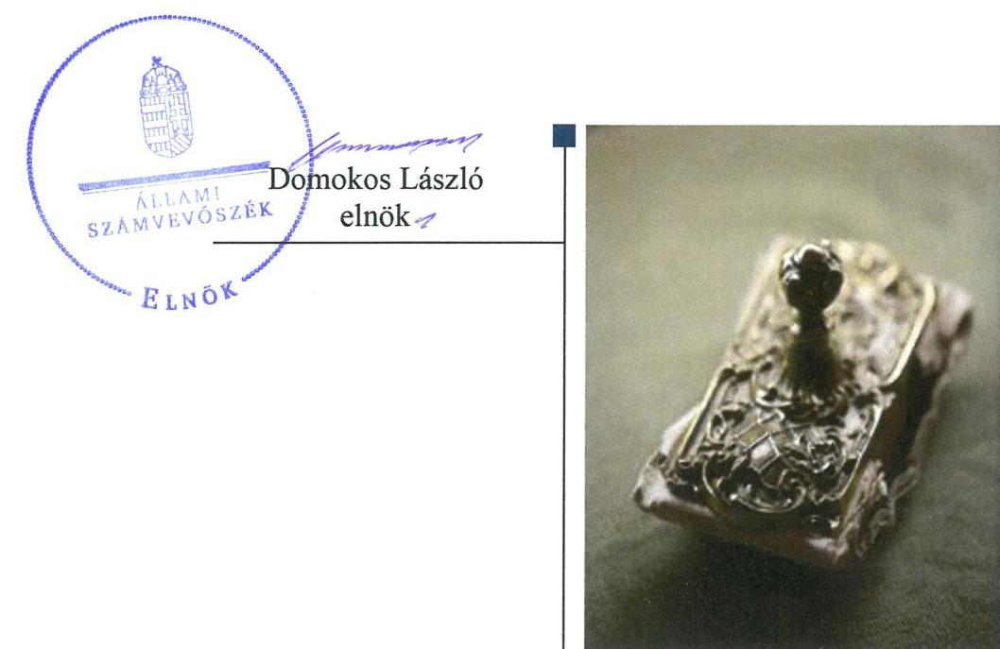
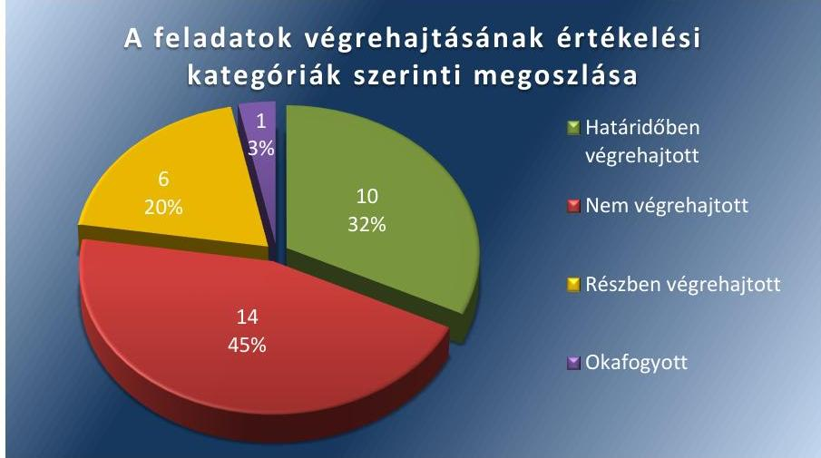
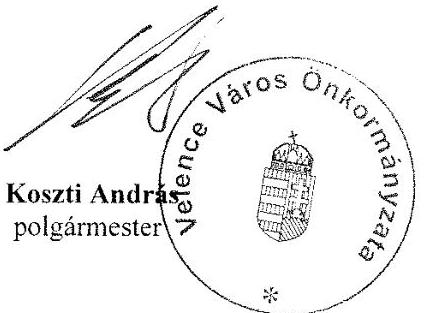
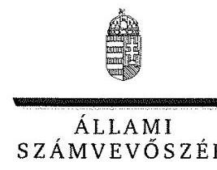
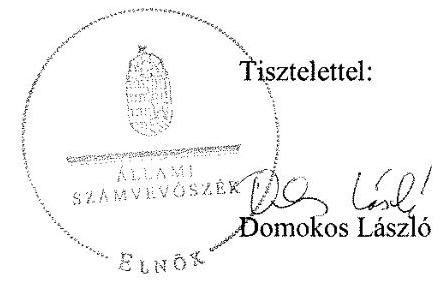

# Jelentés 

## Utóellenőrzések

Az önkormányzatok pénzügyi és vagyongazdálkodása megfelelőségének utóellenőrzése - Velence Város Önkormányzata
2018. 10. 18.

---

# AZ ELLENŐRZÉST FELÜGYELTE: 

VARGA EDIT felügyeleti vezető

## AZ ELLENŐRZÉST VEZETTE ÉS A VÉGREHAJTÁSÁÉRT FELELŐS:

BÍRÓ ZSOLT ellenőrzésvezető

## A PROGRAM ÖSSZEÁLLÍTÁSÁÉRT FELELŐS:

TÓTPÁL SZABOLCS osztályvezető

## A TÉMÁHOZ KAPCSOLÓDÓ KORÁBBI SZÁMVEVŐSZÉKI JELENTÉSEK:

- címe: Jelentés az önkormányzatok pénzügyi és vagyongazdálkodása megfelelőségének ellenőrzése Velence
- sorszáma: $\quad 16023$

IKTATÓSZÁM: EL-0212-030/2018.
TÉMASZÁM: 2460
ELLENŐRZÉS-AZONOSÍTÓ SZÁM: V080419

---

# TARTALOMJEGYZÉK 

■ ÖSSZEGZÉS ..... 5
■ AZ ELLENŐRZÉS CÉLJA ..... 6
■ AZ ELLENŐRZÉS TERÜLETE ..... 7
■ AZ ELLENŐRZÉS HÁTTERE, INDOKOLTSÁGA ..... 8
■ A JELENTÉS LÉNYEGES KÉRDÉSKÖRE ..... 9
■ AZ ELLENŐRZÉS HATÓKÖRE ÉS MÓDSZEREI ..... 10
■ MEGÁLLAPÍTÁSOK ..... 12
■ MELLÉKLETEK ..... 15
I. sz. melléklet: Velence Város Önkormányzata intézkedési terve végrehajtásának értékelése ..... 15
II. sz. melléklet: Velence Város Önkormányzata sorszámozott intézkedési terve. ..... 24
■ FÜGGELÉK: ÉSZREVÉTELEK ..... 55
■ RÖVIDÍTÉSEK JEGYZÉKE ..... 83

---

.

---

# ÖSSZEGZÉS 

Az Állami Számvevőszék Velence Város Önkormányzata pénzügyi és vagyongazdálkodása megfelelőségének utóellenőrzése során megállapította, hogy a pénzügyi és vagyongazdálkodás szabályozottsága javult, azonban a szabályszerű pénzügyi és vagyongazdálkodás végrehajtását biztosító intézkedések elmaradása továbbra is veszélyeztetik a közpénzekkel való felelős, elszámoltatható és átlátható gazdálkodást.

## Az ellenőrzés társadalmi indokoltsága

Az Állami Számvevőszék stratégiájában célul tűzte ki a számvevőszéki munka hasznosulásának javítását. Ezzel összhangban ellenőrzi, hogy az ellenőrzött szervezetek megvalósították-e a korábbi ellenőrzései által feltárt hibák, hiányosságok és szabálytalanságok megszüntetése céljából kialakított intézkedési terveikben foglaltakat. A rendszeres utóellenőrzések hozzájárulnak a szükséges intézkedések tényleges végrehajtásához, ezáltal a közpénzügyek rendezettségének javulásához, igazolják, hogy lezárult a következmények nélküli ellenőrzések időszaka.

## Főbb megállapítások, következtetések

Velence Város Önkormányzata az intézkedési tervben meghatározott harmincegy feladatból tízet határidőben, hatot részben hajtott végre, tizennégyet nem hajtott végre, egy okafogyottá vált.

A pénzügyi és vagyongazdálkodás szabályozási környezetének kialakítása érdekében végrehajtott intézkedések eredményeként javult Velence Város Önkormányzatának szabályozottsága. A Polgármesteri Hivatal rendelkezett a jogszabályi előírásoknak megfelelő szervezeti és működési szabályzattal, az Önkormányzat megalkotta vagyonrendeletét, a behajthatatlan követelésekkel kapcsolatos eljárásrendjét, a 2015. évi és a 2016. évi zárszámadási rendeletben bemutatásra került a jogszabályi előírásoknak megfelelően az Önkormányzat vagyonkimutatása.

A szabályszerű pénzügyi és vagyongazdálkodás biztosítása érdekében vállalt, de végre nem hajtott intézkedések továbbra is veszélyeztetik a szabályszerű gazdálkodást. Az Önkormányzatnál nem vizsgálták felül a fennálló területbérleti, illetve földhasználati díjra vonatkozó szerződéseket, nem gondoskodtak az önkormányzati rendeletek előírásainak megfelelő garanciális elemek szerződésekbe való beépítésének biztosításáról, nem gondoskodtak az önkormányzati tulajdonú gazdasági társaságok társasági szerződéseivel kapcsolatos döntések szabályszerűségének folyamatos biztosításáról. A jegyző nem gondoskodott az eszközök értékelésének elvégzéséről, az Önkormányzat 2016. és 2017. évi beszámoló mérlegének leltárral történő alátámasztásáról. Nem gondoskodott az ingatlanvagyon-kataszter elkészítéséről és folyamatos vezetéséről, így nem volt biztosított a számviteli nyilvántartásokban és az ingatlanvagyon-kataszterben szereplő vagyon bruttó értékének egyezősége. Nem gondoskodott az ÁSZ ellenőrzés által 2011-2014. évekre feltárt jelentős összegű számviteli hibák számviteli nyilvántartásban történő javításáról.

A jegyző az intézkedési tervben meghatározott feladatok végrehajtásáról nem vezette a jogszabály szerinti nyilvántartást.

---

# AZ ELLENŐRZÉS CÉLJA 

Az ellenőrzés célja annak értékelése volt, hogy a számvevőszéki jelentésben foglalt intézkedést igénylő megállapításokkal összhangban készített intézkedési tervben meghatározott feladatokat az ellenőrzött szervezet végrehajtotta-e.

---

# AZ ELLENŐRZÉS TERÜLETE 

## Velence Város Önkormányzata

Velence város Fejér megyében, a gárdonyi járásban a Velen-cei-tó keleti partján fekszik. A lakónépességének száma a $\mathrm{KSH}^{1}$ Magyarország közigazgatási helynévkönyve alapján 2017. január 1-jén 5739 fő volt.

A polgármester ${ }^{2}$ a 2014. október 12-én, a 2014-es önkormányzati választások óta töltötte be hivatalát, a jegyző ${ }^{3}$ 2015. június 15-től látta el feladatát.

Az Önkormányzat ${ }^{4}$ 2016. évi költségvetésének végrehajtásáról szóló rendelete szerint 1982,2 millió Ft költségvetési bevételt ért el, valamint 1677,6 millió Ft költségvetési kiadást teljesített. A könyvviteli mérleg főösszege 2016. december 31-én 10 367,5 millió Ft, ezen belül a követelések állománya 169,4 millió Ft, a kötelezettségek állománya 423,5 millió Ft volt.

Az ÁSZ ${ }^{5}$ a 2011. január 1. és 2014. december 31. közötti időszakra végezte el az Önkormányzat pénzügyi és vagyongazdálkodása megfelelőségének ellenőrzését. Az ellenőrzés célja volt az Önkormányzat pénzügyi és vagyoni helyzetének, a gazdálkodás szabályosságának megítélése a költségvetési tervezés, a pénzügyi egyensúly megteremtése, az éves költségvetési beszámolás, a vagyongazdálkodás, a vagyon számbavétele, a gazdasági események elszámolása és a pénzgazdálkodás szabályszerűsége alapján; valamint annak értékelése, hogy kialakított-e az önkormányzat az erőforrásokkal való szabályszerű és hatékony gazdálkodáshoz szükséges követelményeket, megvalósította-e azok számon kérését, ellenőrzését.

Az utóellenőrzés arra irányult, hogy az Önkormányzat 2016. március 8. és 2018. május 8. között a pénzügyi és vagyongazdálkodása megfelelőségének ellenőrzéséről készült 16023 számú ÁSZ jelentésben szereplő intézkedést igénylő megállapításokkal és javaslatokkal összhangban készített intézkedési tervben meghatározott feladatokat végrehajtotta-e.

---

# AZ ELLENŐRZÉS HÁTTERE, INDOKOLTSÁGA 

Az ÁSZ tv. ${ }^{6}$ 33. § (1) bekezdése értelmében a számvevőszéki jelentések intézkedést igénylő megállapításaihoz és javaslataihoz kapcsolódóan az ellenőrzött szervezet vezetője intézkedési tervet köteles összeállítani, és az ÁSZ részére megküldeni.

Az ÁSZ által befogadott intézkedési tervben foglaltak megvalósítását az ÁSZ törvény 33. § (7) bekezdésében foglaltak alapján - az ÁSZ utóellenőrzés keretében - ellenőrizheti. Az utóellenőrzések keretében - az intézkedések értékelése során - az ÁSZ figyelembe veszi az ellenőrzött szervezetek működési feltételeiben, valamint a jogszabályi előírásokban bekövetkezett változásokat.

Az utóellenőrzés során az ÁSZ értékeli, hogy az érintett számvevőszéki jelentésben foglalt intézkedést igénylő megállapításokkal és javaslatokkal összhangban, az ellenőrzött szervezet által készített intézkedési tervben meghatározott feladatokat a feladatra kijelöltek végrehajtották-e.

Az intézkedések végrehajtásával az adott terület szabályszerű működése vonatkozásában a kockázatok csökkenhetnek, azonban hosszabb távon az intézkedési tervben foglaltak végrehajtásával önmagában nem szűnnek meg, csak akkor, ha beépülnek az ellenőrzött szervezet működésébe, azokat folyamatosan karban tartják, figyelembe véve, illetve kezelve a változásokat. Emellett az intézkedések végrehajtásáig újabb kockázatok merülhetnek fel a szabályszerű működés vonatkozásában, amelyek kezelése szintén kiemelten fontos az ellenőrzött szervezet számára.

Az ellenőrzött szervezet vezetője által készített intézkedési tervekben foglalt feladatok hiányos, illetve késedelmes végrehajtása, vagy annak elmaradása a szabályszerűség és a felelős vezetői magatartás vonatkozásában kockázatot hordoz, ami azt mutatja, hogy az ellenőrzések során feltárt hibák, hiányosságok és szabálytalanságok kezelése nem kapott kellő hangsúlyt. Az utóellenőrzés során is fennálló szabálytalanságok esetén a közpénz, közvagyon veszélyeztetettségi kockázat valószínűsített hatásának értékelése további intézkedéseket vonhat maga után.

Az ellenőrzött szervezet szintjén az utóellenőrzés feltárja, hogy a szervezet az intézkedések végrehajtásával hasznosította-e a korábbi ellenőrzési jelentésben a hiányosságok megszüntetése, illetve a kockázatok kezelése érdekében megfogalmazott javaslatokat, illetve az intézkedések végrehajtása elmaradásának következtében továbbra is fennálló szabálytalanság esetén értékeli a közpénzek, közvagyon veszélyeztetettségét.

Az ÁSZ szintjén az utóellenőrzés visszacsatolást ad az ellenőrzési jelentések hasznosulásáról, az intézkedések elmaradásának, vagy részleges megvalósulásának a közpénzek, közvagyon veszélyeztetettségére gyakorolt valószínűsített hatásának értékelése további intézkedéseket vonhat maga után.

---

# A JELENTÉS LÉNYEGES KÉRDÉSKÖRE 

Az Önkormányzat az intézkedési tervben foglaltakat az előírt határidőben végrehajtotta-e?

---

# AZ ELLENŐRZÉS HATÓKÖRE ÉS MÓDSZEREI 

## Az ellenőrzés típusa

Megfelelőségi ellenőrzés.

## Az ellenőrzött időszak

Az utóellenőrzés alapját képező ÁSZ jelentés ${ }^{7}$ közzétételének napjától (2016. március 8.) az utóellenőrzésről szóló kiértesítő levél keltének napjáig (2018. május 8.) tartó időszak.

## Az ellenőrzés tárgya

Az ÁSZ tv. 2011. július 1-jei hatálybalépését követően a számvevőszéki jelentésben foglalt intézkedést igénylő megállapításokkal és javaslatokkal összhangban - az ellenőrzött szervezet által - készített intézkedési tervben foglaltak végrehajtásának ellenőrzése.

## Az ellenőrzött szervezet

Velence Város Önkormányzata

## Az ellenőrzés jogalapja

Az ellenőrzés jogszabályi alapját az ÁSZ tv. 33. § (7) bekezdés előírása képezi.

## Az ellenőrzés módszerei

Az ÁSZ az ellenőrzést az ellenőrzött időszakban hatályos jogszabályok, az ellenőrzés szakmai szabályai, a jelen ellenőrzésre irányadó ÁSZ módszertanok, az ellenőrzési programban foglalt értékelési szempontok szerint, önálló ellenőrzés keretében végezte.

Az ÁSZ az ellenőrzés ideje alatt az ellenőrzött szervezettel történő kapcsolattartást az ÁSZ SZMSZ ${ }^{\text {® }}$-ének vonatkozó előírásai alapján biztosította.

Az utóellenőrzés megállapításait az ÁSZ rendelkezésére álló dokumentumok, valamint az ÁSZ adatbekérése szerint, az ellenőrzött szervezet által rendelkezésre bocsátott dokumentumok, adatok alapozták meg.

---

Az ellenőrzési kérdések megválaszolásához szükséges bizonyítékok megszerzése az ellenőrzött által rendelkezésre bocsátott dokumentumokra, adatokra alapozva elemző eljárás alkalmazásával történt. Az ellenőrzési bizonyítékként felhasználható adatforrások közé tartoztak egyrészt az ellenőrzési program részletes szempontjainál felsorolt adatforrások, másrészt minden - az ellenőrzés folyamán feltárt, az ellenőrzés szempontjából információt tartalmazó - dokumentum.

Az intézkedési tervekben előírt feladatokat, azok végrehajtása szempontjából az alábbiak szerint értékelte az ÁSZ:
"határidőben végrehajtott" a feladat, ha a teljesítés dokumentáltan, az intézkedési tervben előírt határidőben és tartalommal megtörtént;
"határidőn túl végrehajtott" a feladat, ha annak teljesítése az intézkedési tervben meghatározott módon, de az abban előírt határidőn túl történt meg;
"részben végrehajtott" a feladat, ha annak végrehajtása nem teljes körűen az intézkedési tervben előírt módon történt meg;
"nem végrehajtott" a feladat, ha a végrehajtás nem történt meg, dokumentumokkal nem igazolt annak teljesítése;
"okafogyottá vált" a feladat, ha végrehajtására - meghatározott esemény bekövetkezése, továbbá külső körülmény, a működést érintő feltétel változása miatt - már nincs szükség, illetve lehetőség, és egyértelműen megállapítható, hogy az intézkedést szükségessé tevő körülmény a jövőben nem fordulhat elő;
"nem időszerű" az a feladat, amelynek ellenőrzési időszakon belüli végrehajtására azért nem került (kerülhetett) sor, mert az intézkedés alapjául szolgáló esemény nem következett be, de annak jövőbeni előfordulása lehetséges, a végrehajtása nem volt esedékes, vagy a végrehajtás határideje még nem járt le.
Az ellenőrzés lefolytatásához az ellenőrzött szervezet a tanúsítványok elektronikus kitöltésével, valamint az ÁSZ által kért dokumentumok elektronikus megküldésével szolgáltatott adatokat, amelyek valódiságát és teljes körűségét az ellenőrzött szervezet vezetője által tett teljességi és hitelességi nyilatkozat igazolta. Az így rendelkezésre bocsátott adatok, információk kontrollja az ellenőrzés keretében történt.

Az ellenőrzött szervezet által megküldött intézkedési tervben meghatározott ÁSZ által beazonosított feladatok a II. számú mellékletben kerültek bemutatásra.

---

# MEGÁLLAPÍTÁSOK 

## Az Önkormányzat az intézkedési tervben foglaltakat az előírt határidőben végrehajtotta-e?

Összegző megállapítás

Az Önkormányzat az intézkedési tervben meghatározott harmincegy feladatból tízet határidőben, hatot részben, tizennégyet nem hajtott végre és egy feladat végrehajtása okafogyottá vált. Az intézkedési tervben meghatározott feladatok végrehajtásáról nem vezette az előírásoknak megfelelő nyilvántartást.

Az Önkormányzat az intézkedési terv ${ }^{9}$-ben a hiányosságok, szabálytalanságok megszüntetésére harmincegy feladatot határozott meg. Az intézkedési tervében meghatározott feladatokat, határidőket, a feladatok végrehajtásáért felelős személyeket és a feladatok végrehajtását az I. számú melléklet mutatja be.

A jegyző az intézkedési tervben meghatározott feladatok végrehajtásáról a Bkr. ${ }^{10} 14$. § (1) bekezdésében foglaltak ellenére nem vezette a Bkr. 47. § (2) bekezdésében foglaltaknak megfelelő nyilvántartást.

Az intézkedési tervben meghatározott feladatok végrehajtásának értékelési kategóriák szerinti megoszlását az 1. ábra szemlélteti.

1. ábra

A PÉNZÜGYI ÉS VAGYONGAZDÁLKODÁS SZABÁLYOZÁSI KÖRNYEZETÉNEK kialakítása érdekében a Polgármesteri Hivatal SZMSZ
 }^{11}-e tartalmazta a szervezeti felépítést, a szervezeti ábrát és a belső szervezeti egységekre vonatkozó részletes szabályokat. Az Önkormányzat szabályozta a behajthatatlan követelésekkel kapcsolatos eljárásrendet, a követelések elengedésének eseteit és módjait. A 2015. évi és a 2016. évi zárszámadási rendeletben ${ }^{12}$ bemutatásra került a jogszabályi

---

előírásoknak megfelelően az Önkormányzat vagyonkimutatása. Az Önkormányzat megalkotta új vagyonrendeletét ${ }^{13}$, amely tartalmazta a versenyeztetés szabályait. A jegyző a Számv. tv. ${ }^{14}$-ben előírtak ellenére azonban nem rögzítette a számviteli politikában ${ }^{15}$, hogy mit tekint a számviteli elszámolás és értékelés szempontjából lényegesnek és nem lényegesnek.

# A PÉNZÜGYI ÉS VAGYONGAZDÁLKODÁS SZABÁLYSZERŰ MŰKÖDTETÉSE érdekében meghatározott 

intézkedéseket nem vagy nem teljes körűen hajtották végre a felelősök. Nem vizsgálták felül a fennálló területbérleti, illetve földhasználati díjra vonatkozó szerződéseket, nem kezdeményezték azok módosítását. Nem gondoskodtak az önkormányzati rendeletek előírásainak megfelelő garanciális elemek szerződésekbe való beépítésének biztosításáról. Nem gondoskodtak az önkormányzati tulajdonú gazdasági társaságok társasági szerződéseivel kapcsolatos döntések szabályszerűségének folyamatos biztosításáról. Nem gondoskodtak a követelésről való lemondások jogszabályi előírásoknak való megfelelősége folyamatos biztosításáról, megsértve ezzel az Áht.-ben és a 13/2016. (VII. 4.) önkormányzati rendeletben ${ }^{16}$ a követelés elengedésével kapcsolatos előírásokat. A jegyző nem gondoskodott a Számv. tv.-ben foglaltak ellenére az eszközök értékelésének elvégzéséről. A jegyző nem gondoskodott a Számv. tv-ben, valamint a leltározási szabályzatban ${ }^{17}$ előírtak ellenére az Önkormányzat 2016. és 2017. évi beszámoló mérlegének leltárral történő alátámasztásáról. Nem gondoskodott továbbá a leltározási és a selejtezési szabályzatokban ${ }^{18}$ előírt leltározási és selejtezési feladatok teljesítéséről. A jegyző nem gondoskodott a 147/1992. (XI. 6.) Korm. rendeletben ${ }^{19}$ előírtak ellenére az ingatlanvagyon-kataszter elkészítéséről és folyamatos vezetéséről, így az Áhsz. ${ }^{20}$-ben előírtak ellenére nem volt biztosított a számviteli nyilvántartásokban és az ingatlanvagyon-kataszterben szereplő vagyon bruttó értékének egyezősége. A jegyző nem gondoskodott az Áhsz.-ben előírtak ellenére az ÁSZ ellenőrzés által 2011-2014. évekre feltárt jelentős összegű számviteli hibák számviteli nyilvántartásban történő javításáról és a jelentős összegű hibák javításának évében az éves költségvetési beszámolóban történő bemutatásáról, ezzel az Önkormányzat megsértette a Számv. tv.-ben rögzített „valódiság” számviteli alapelvet.

A jegyző gondoskodott az Önkormányzat honlapján az ötmillió forintot elérő vagy azt meghaladó szerződések évenkénti bontásban történő közzétételéről, azonban a közbeszerzési eljárás eredményeként megkötött 2016., 2017., és 2018. évi szerződések Közbeszerzési Adatbázisban történő közzétételéről nem.

Az ellenőrzött időszakban okafogyottá vált feladat volt a gazdálkodási hiányosságok és szabálytalanságok miatt a fegyelmi eljárás megindítása.

---

.

---

# MELLÉKLETEK

- I. SZ. MELLÉKLET: VELENCE VÁROS ÖNKORMÁNYZATA INTÉZKEDÉSI TERVE VÉGREHAJTÁSÁNAK ÉRTÉKELÉSE

|  Sorszám | Intézkedési
tervben
meghatározott
határidő | Az intézkedési
tervben meghatározott feladat felelőse | A feladat végrehajtása  |
| --- | --- | --- | --- |
|   | Határidőben végrehajtott feladatok |  |   |
|  1. | (P1.a.) Velence Város Önkormányzat Képviselő-testülete elfogadta a 14/2015. (IX.25.) önkormányzati rendeletét a Képviselő-testület Szervezeti és Működési Szabályzatáról, amely rendelkezik a polgármesteri hivatal felépítéséről (organogram), és munkarendjéről. A képviselőtestület SZMSZ-ével egyidejűleg elkészült a Polgármesteri Hivatal Szervezeti és Működési Szabályzata is, így a megállapítás további intézkedést nem igényel. | 2016. április 7. | $\begin{gathered} \text { polgármester, } \ \text { jegyző } \end{gathered}$  |
|  2. | (P1.b/1.) Az ellenőri jelentésben megadott szempontokra kiemelt figyelemmel elő kell készíteni és elfogadásra a képviselő-testület elé kell terjeszteni a Velence Város Önkormányzat vagyonáról és vagyongazdálkodásáról szóló 3/2013. (II.19.) önkormányzati rendelet módosítását, vagy szükség esetén új vagyonrendeletet kell alkotni. | 2016. június 30. | $\begin{gathered} \text { polgármester, } \ \text { jegyző } \end{gathered}$  |
|  3. | (P1.b/2.) Ezzel egyidejűleg elő kell készíteni és elfogadásra a képviselőtestület elé kell terjeszteni a követelésről való lemondás módját és eseteit szabályozó önkormányzati rendeletet. | 2016. június 30. | $\begin{gathered} \text { polgármester, } \ \text { jegyző } \end{gathered}$  |
|  4. | (P2/1.) Kezdeményezni szükséges a behajthatatlan követeléssel kapcsolatos, valamint a követelés elengedésének eseteiről és módjáról szóló önkormányzati rendelet megalkotását, amely szabályozni fogja a követelés elengedésről lemondás módjait és eseteit. | 2016. június 30. | $\begin{gathered} \text { polgármester, } \ \text { jegyző } \end{gathered}$  |

---

|  5. | (P3./1.) A belső kontroll-rendszer kialakításra került. A képviselő-testület valamennyi önkormányzati vagyont érintő döntésről, az önkormányzat részesedésével működő gazdasági társaságok működéséről, az ezeket érintő jogszabályi előírások betartásáról beszámolót kér. A már megszűnt szerződések vonatkozásában nincs szükség intézkedésre. |  |  |   |
| --- | --- | --- | --- | --- |
|  6. | (P3./6.) Gondoskodni kell a követelés elengedések és behajthatatlanná minősítés szabályszerűségének biztosításáról. | (J1.a) Velence Város Önkormányzat Képviselő-testülete elfogadta a 14/2015. (IX. 25.) rendeletét a Képviselő-testület Szervezeti és Működési Szabályzatáról, amely rendelkezik a Polgármesteri Hivatal felépítéséről (organogram) és munkarendjéről. A Képviselő-testület SZMSZével egyidejűleg elkészült a Polgármesteri Hivatal Szervezeti és Működési Szabályzata is, így a megállapítás további intézkedést nem igényel. | 2016. április 7. | polgármester, jegyző | Az önkormányzati részesedéssel rendelkező gazdasági társaságok beszámolóit a Képviselő-testület az intézkedési tervben előírt határidőben megtárgyalta és elfogadta.  |
|   |  |  | polgármester, jegyző | Az Önkormányzat gondoskodott a követelés elengedések és behajthatatlanná minősítés szabályszerűségének biztosításáról, mivel kialakította a szabályozás kereteit, megalkotta a 13/2016. (VII. 4.) önkormányzati rendeletet, amelyben szabályozta a behajthatatlan követelésekkel kapcsolatos eljárásrendet, a követelések elengedésének eseteit és módjait.  |
|   |  |  | polgármester, jegyző | A Képviselő-testület az intézkedési tervben előírt határidőben elfogadta a 14/2015. (IX. 25.) önkormányzati rendeletét a képviselő-testületi SZMSZről, amely rendelkezett a Polgármesteri Hivatal felépítéséről és munkarendjéről. Továbbá az intézkedési tervben előírt határidőre elkészítették – 2016. január 4-én – a Polgármesteri Hivatal SZMSZ-et.  |

---

|  8. | (J1.c.) Az ellenőri jelentésben megadott szempontokra kiemelt figyelemmel elő kell készíteni és elfogadásra a Képviselő-testület elé kell terjeszteni a Velence Város Önkormányzat vagyonáról és vagyongazdálkodásáról szóló 3/2013. (II. 19.) önkormányzati rendeletek módosítását vagy szükség esetén új vagyonrendeletet kell alkotni. | 2016. június 30. | polgármester, jegyző | Az Önkormányzat megalkotta vagyonrendeletét, amelyben a versenyeztetés szabályait a Kvtv. 5. § (5) bekezdésének figyelembevételével alakították ki.  |
| --- | --- | --- | --- | --- |
|  9. | (J3a./2.) Gondoskodni kell a zárszámadási rendelet tervezet előterjesztésekor a képviselő-testület részére bemutatásra kerülő vagyonkimutatás jogszabályi előírásoknak megfelelő elkészítéséről. | 2016. június 30. A zárszámadási rendelettervezet vonatkozásában évenkénti rendszerességgel, a jogszabályban meghatározott határidő figyelembevételével | Polgármester, jegyző | A 2015. évi a 2016. évi zárszámadási rendelet 15. sz. melléklete tartalmazta az Önkormányzati vagyonkimutatását, amely a jogszabályi előírásoknak megfelelt.  |
|  10. | (J3.b) A számviteli politika a jogszabályoknak megfelelően kialakításra került, ennek keretében a képviselő-testület megalkotta a vagyonkimutatás, az eszközök és források nyilvántartásainak, értékeléseinek szabályait, intézkedett az éves költségvetési beszámolók mérlegének megfelelő alátámasztásáról, a leltározási és selejtezési feladatokról. Gondoskodni szükséges az eszközök és források intézkedést igénylő megállapításban hivatkozott jogszabályi előírások szerinti számviteli nyilvántartásokban való kimutatásáról. | Az intézkedési terv elfogadását követően folyamatos | Polgármester, jegyző | A jegyző – a jogszabályi előírásoknak megfelelően – az önkormányzat 2016. évi zárszámadási rendeletében, valamint a IV. negyedévi időközi mérlegjelentés (éves elszámolás) 1A táblázataiban, az eszközök és források állományát kimutatta.  |
|   |  | Részben végrehajtott feladatok |  |   |
|  11. | (P2./2.) A jegyző intézkedjen a javaslatot megalapozó intézkedést igénylő megállapításban hivatkozott jogszabályi előírásoknak megfelelő költségvetési rendelettervezet elkészítéséről és beterjesztésének kezdeményezéséről. | 2016. június 30. A költségvetési rendelettervezet vonatkozásában az intézkedési terv elfogadását követően évenkénti rendszerességgel a vonatkozó jogszabályi előírásoknak megfelelően. | polgármester, jegyző | Végrehajtott feladatrész:
A Képviselő-testület a jogszabályi előírásoknak megfelelő 2017. évi költségvetési rendeletet23 elfogadta.
Nem végrehajtott feladatrész:
A jegyző az Áht. 24. § (2) bekezdésében foglaltak ellenére a 2018. évi költségvetési rendelettervezetet nem készítette el.  |

---

|  11. | (J2.a) A pénzügyi gazdálkodás szabályszerűsége és a pénzügyi egyensúly biztosítása érdekében gondoskodjon a 2017. évi és a további évek vonatkozásában a jogszabályi előírásoknak megfelelő költségvetési rendelettervezetek elkészítéséről, továbbá a költségvetési rendelettervezetek elfogadásáról szóló előterjesztés képviselő-testületi ülés napirendjére vételének kezdeményezéséről. | Az intézkedési terv elfogadását követően évenkénti rendszerességgel, a vonatkozó előírások figyelembe vételével | A feladat végrehajtása  |
| --- | --- | --- | --- |
|  12. | (J2.b.) A belső kontrollrendszer kialakításra került. Ennek megfelelően gondoskodni szükséges a pénzügyi ellenjegyzés és az érvényesítés – jogszabályi előírásoknak, illetve belső szabályzatoknak megfelelő működtetéséről. | Az intézkedési terv elfogadását követően folyamatos. | A Képviselő-testület a jogszabályi előírásoknak megfelelő 2017. évi költségvetési rendeletet elfogadta.  |
|   |  |  | Nem végrehajtott feladatrész:  |
|   |  |  | A jegyző az Áht. 24. § (2) bekezdésében foglaltak ellenére a 2018. évi költségvetési rendelettervezetet nem készítette el.  |
|  13. | (J2.b.) A belső kontrollrendszer kialakításra került. Ennek megfelelően gondoskodni szükséges a pénzügyi ellenjegyzés és az érvényesítés – jogszabályi előírásoknak, illetve belső szabályzatoknak megfelelő működtetéséről. | Az intézkedési terv elfogadását követően folyamatos. | A jegyző kiadta a Gazdálkodási szabályzatot^{24}, amely tartalmazta a pénzügyi ellenjegyzés és az érvényesítés eljárás rendjét, a kijelöléseket és aláírás mintákat.  |
|   |  |  | Nem végrehajtott feladatrész:  |
|   |  |  | Az Önkormányzat ugyanakkor a pénzügyi ellenjegyzési, illetve érvényesítési jogkörök szabályszerű gyakorlását nem biztosította.  |
|  14. | (J2.d.) A pénzügyi egyensúlyt befolyásoló kockázatok kezelésére alkalmas kockázatkezelési rendszer kialakítása megtörtént, a működtetése folyamatos. | Az intézkedési terv elfogadását követően folyamatos. | A jegyző kiadta a Belső kontrollrendszer szabályzatot^{25}.  |
|   |  |  | Nem végrehajtott feladatrész:  |
|   |  |  | A jegyző a pénzügyi egyensúlyt befolyásoló kockázatok kezelésére alkalmas kockázatkezelési 2016. október 1-jétől integrált kockázatkezelési rendszert nem működtetett, nem mérte fel a pénzügyi egyensúlyt befolyásoló kockázatokat és nem határozta meg a kockázatokkal kapcsolatban szükséges intézkedéseket.  |
|  15. | (J3.a/1.) Az ellenőri jelentésben megadott szempontokra kiemelt figyelemmel elő kell készíteni, és elfogadásra a képviselő-testület elé kell terjeszteni Velence Város Önkormányzat vagyonáról és vagyongazdálkodásáról szóló 3/2013 (II.19) önkormányzati rendeletének módosítását. Ennek mellékleteként el kell készíteni a vagyonkimutatást.

 | 2016. június 30. A zárszámadási rendelettervezet vonatkozásában évenkénti rendszerességgel, a jogszabályban meghatározott határidő figyelembevételével. | A jegyző kiadta a Végrehajtott feladatrész:  |
|   |  |  | Az Önkormányzat megalkotta vagyonrendeletét.  |
|   |  |  | Nem végrehajtott feladatrész:  |
|   |  |  | A vagyonrendelet – ellentétben az intézkedési terv előírásaival – mellékletként nem tartalmazta az Önkormányzat vagyonkimutatását.  |

---

|  15
16. | Intézkedési
tervben meghatározott feladat | Az intézkedési
tervben
meghatározott
határidő | Az intézkedési
tervben meghatározott feladat felelőse | A feladat végrehajtása  |
| --- | --- | --- | --- | --- |
|  16. | (J3.f.) Gondoskodni kell a közbeszerzési eljárások eredményeként megkötött szerződéseknek a közbeszerzésekről szóló 2015. évi CXLIII. törvénynek megfelelő, a Közbeszerzési Adatbázisban történő közzétételéről. Gondoskodni kell továbbá az ötmillió forintot elérő vagy azt meghaladó értékű árubeszerzésre, építési beruházásra, szolgáltatás megrendelésre, vagyonértékesítésre, vagyonhasznosításra, vagyon vagy vagyoni értékű jog átadásra, valamint koncesszióba adásra vonatkozó szerződéseknek az információs és önrendelkezési jogról és az információszabadságról szóló 2011. évi CXII. törvény 1. melléklet III/4. pontjának megfelelő közzétételéről. | Az intézkedési terv elfogadását követően folyamatos. | Polgármester, jegyző | Végrehajtott feladatrész:
A jegyző a közérdekű adatok megismeréséről szóló szabályzatban$^{26}$ rendezte a kötelezően közzéteendő adatok közzétételének rendjét. A jegyző gondoskodott az Önkormányzat honlapján az ötmillió forintot elérő vagy azt meghaladó szerződések évenkénti bontásban történő közzétételéről.
Nem végrehajtott feladatrész:
Az Önkormányzat a közbeszerzési eljárás eredményeként megkötött a 2016., 2017., és 2018. évi szerződéseknek a Közbeszerzési Adatbázisban történő közzétételéről nem gondoskodott.  |
|   |  | Nem végrehajtott feladatok |  |   |
|  17. | (P3./2.) Szükséges felülvizsgálni a fennálló területbérleti, illetve földhasználati díjra vonatkozó szerződéseket, és kezdeményezni kell azok módosítását. Szabálytalanság észlelése esetén a módosítás során gondoskodni kell a szerződések szabályszerűségéről. Ha a szabályosság nem állítható helyre, az érintett szerződést fel kell mondani. | 2016. december 31. | polgármester, jegyző | Az Önkormányzatnál nem vizsgálták felül a fennálló területbérleti, illetve földhasználati díjra vonatkozó szerződéseket, nem kezdeményezték azok módosítását, szabálytalanság esetén nem gondoskodtak a szerződések szabályszerűségéről, amennyiben a szabályosság nem állítható helyre az érintett szerződés felmondásáról.  |
|  18. | (P3./3.) Tekintettel arra, hogy Gárdony Városa jelezte belépési szándékát a Velencei-tavi Kistérségi Járóbeteg Szakellátó Nonprofit Kft-be, elő kell készíteni és a képviselő-testület elé kell terjeszteni jóváhagyásra a társasági szerződés módosítását, amelynek során gondoskodni kell a működés jogszerűségének helyreállításáról. Utólagosan a képviselő-testület elé kell terjeszteni jóváhagyásra a korábbi módosításokat, továbbá a társaság vezető tisztségviselőinek pozíciójukban történő megerősítését. | 2016. december 31. | polgármester, jegyző | Az Önkormányzatnál nem készítették elő és nem nyújtották be a Képviselő-testület elé jóváhagyásra a Velence-tavi Kistérségi Járóbeteg Szakellátó Nonprofit Kft. társasági szerződés módosítását és a korábbi módosításokat, a társaság vezető tisztségviselőinek pozíciójukban történő megerősítését.  |

---

|  18
19. | Intézkedési
tervben
meghatározott
feladat | Az intézkedési
tervben
meghatározott
határidő | Az intézkedési
tervben meghatározott feladat
felelőse | A feladat végrehajtása  |
| --- | --- | --- | --- | --- |
|  19. | (P3./4.) Gondoskodni kell a jövőbeli beszerzések vonatkozásában a hatályos közbeszerzési szabályzatnak megfelelően a szerződéses partner kiválasztását megelőző ajánlatok bekéréséről; a megkötött szerződésben foglaltak alapján - indokolt esetben - a késedelmi kötbér, illetve késedelmi kamat érvényesítéséről, az Önkormányzati rendeletek előírásainak megfelelően a garanciális elemek szerződésekbe való beépítéséről. |  | polgármester,
jegyző | Az Önkormányzat nem gondoskodott a hatályos közbeszerzési szabályzatnak megfelelő szerződéses partner kiválasztását megelőző ajánlatok bekérésének biztosításáról – indokolt esetben – késedelmi kötbér, illetve késedelmi kamat érvényesítéséről. Nem gondoskodott továbbá az önkormányzati rendeletek előírásainak megfelelő garanciális elemek szerződésekbe való beépítésének biztosításáról.  |
|  20. | (P3./5.) Gondoskodni kell a vagyonértékesítést megelőzően előírt hirdetések lebonyolítása, a vagyonértékesítésről szóló döntések meghozatala szabályszerűségének biztosításáról.
Gondoskodni kell a jogszabályi előírásoknak megfelelő vagyonértékesítési döntések előkészítéséről. |  | polgármester,
jegyző | Az Önkormányzat a vagyonrendelet 20. § (1), a 24. § (3) bekezdésében foglaltak ellenére nem gondoskodott a vagyonértékesítést megelőzően előírt hirdetések lebonyolításáról, a vagyonértékesítésről szóló döntések előkészítése és meghozatala szabályszerűségének biztosításáról.  |
|  21. | (P3./7.) Gondoskodni kell az Önkormányzati tulajdonú gazdasági társaságok társasági szerződéseivel kapcsolatos döntések szabályszerűségének folyamatos biztosításáról. | 2016. december
31. | polgármester,
jegyző | Az Önkormányzat nem gondoskodott az önkormányzati tulajdonú gazdasági társaságok társasági szerződéseivel kapcsolatos döntések szabályszerűségének folyamatos biztosításáról.  |
|  22. | (P3./8.) Gondoskodni kell a képviselő-testület döntésének és a vonatkozó jogszabályi előírásoknak megfelelő írásbeli kölcsönszerződés megkötéséről, folyamatos biztosításáról. | 2016. december
31. | polgármester,
jegyző | Az Önkormányzat nem gondoskodott a Képviselő-testület döntésének és az Áht. 37. § (1) bekezdésben előírtak érvényesítéséről az írásbeli kölcsönszerződés megkötéséről.  |

---

|  E
7
5
5 | Intézkedési
tervben meghatározott feladat | Az intézkedési
tervben
meghatározott
határidő | Az intézkedési
tervben meghatározott feladat
felelőse | A feladat végrehajtása  |
| --- | --- | --- | --- | --- |
|  23. | (P3./9.) Gondoskodni kell a követelésről való lemondások jogszabályi előírásoknak való megfelelőségének folyamatos biztosításáról. | 2016. december
31. A beszerzések,
a vagyonértékesítések és a követelésekről való lemondások folyamatos szabályszerűségének biztosítása vonatkozásában: az intézkedési terv elfogadását követően folyamatos. | polgármester,
jegyző | Az Önkormányzat nem gondoskodott a követelésről való lemondások jogszabályi előírásoknak való megfelelőségének folyamatos biztosításáról, megsértve ezzel az Áht. 97. (2) bekezdésében és a 13/2016. (VII. 4.) önkormányzati rendelet 3. §-ában a követelés elengedésével kapcsolatos előírásokat.  |
|  24. | (J1/b.) Az intézkedést igénylő megállapításban foglaltaknak megfelelően a Számviteli politikában meg kell határozni, hogy a számviteli elszámolás, az értékelés szempontjából az Önkormányzat mit tekint lényegesnek és nem lényegesnek. | 2016. július 30. | polgármester,
jegyző | A jegyző a Számv. tv. 14. § (4) bekezdésében foglaltak ellenére a Számviteli politikában nem rögzítette, hogy mit tekint a számviteli elszámolás, az értékelés szempontjából lényegesnek, nem lényegesnek.  |
|  25. | (J2c.) A pénzügyi, számviteli szabályzatok felülvizsgálata és aktualizálása megtörtént, a 2016. évi költségvetésről szóló rendeletet a képviselő-testület elfogadta. A likviditási terv havi felülvizsgálata folyamatos, a likviditás biztosított. Az észrevétel további intézkedést nem igényel. | az intézkedési terv elfogadását követően a jogszabályi előírásoknak megfelelő rendszerességgel | Polgármester,
jegyző | A Képviselő-testület megalkotta 2016. évi költségvetési rendeletet$^{27}$, amelynek 12. sz. melléklete tartalmazta az Önkormányzat tárgyévi likviditási tervét. Az Önkormányzat a 2016. évi likviditási terv havonkénti felülvizsgálatát – az Ávr. 28 122.§ (3) bekezdése, valamint intézkedési terv előírásainak ellenére – nem végezte el. (A likviditási terv felülvizsgálatának jogszabályi kötelezettsége 2016. december 31-i hatállyal – az Ávr. 122.§ (3) bekezdésének – módosításával megszűnt, így a feladat 2017. január elsejével okafogyottá vált.  |
|  26. | (J3c.) Gondoskodni kell az eszközök értékelésének jogszabályi előírásoknak megfelelő elvégzéséről. | Az intézkedési terv elfogadását követően a jogszabályban foglaltaknak megfelelő rendszerességgel, illetve határidőben. | Polgármester,
jegyző | Az Önkormányzat az eszközök és források értékelésének szabályzatával a Számv. tv 14.§ (5) bekezdésének b) pontjában foglaltak ellenére nem rendelkezett. Az Önkormányzat – a Számv. tv. 46 § (3) bekezdés előírása ellenére – az eszközök évenkénti értékelését nem végezte el.  |

---

|  26
27. | Intézkedési
tervben
meghatározott
feladat | Az intézkedési
tervben
meghatározott
határidő | Az intézkedési
tervben
meghatározott feladat
felelőse | A feladat végrehajtása  |
| --- | --- | --- | --- | --- |
|  28. | (J3d.) A vagyonkimutatás megfelelő alátámasztásának szabályozása megtörtént. A következő teljes körű leltár 2016. évben lesz, a vagyonkimutatást szolgáló egyeztető leltárok rendelkezésre állnak. Gondoskodni kell az éves költségvetési beszámoló mérlegének jogszabályi előírásoknak megfelelő alátámasztásáról, a leltározási és selejtezési feladatok belső szabályzatok szerinti teljesítéséről. | 2016. december
31. Az éves költségvetési beszámoló és a leltározási és selejtezési feladatok vonatkozásában: az intézkedési terv elfogadását követően a jogszabályban, illetve a belső szabályzatokban foglaltaknak megfelelő rendszerességgel, illetve határidőben. | Polgármester, jegyző | A jegyző nem gondoskodott a Számv. tv. 69. § (1) bekezdésének, valamint a leltározási szabályzatban foglaltak ellenére a 2016. és 2017. évi beszámoló mérlegének leltárral történő alátámasztásáról. Nem gondoskodott továbbá a leltározási és a selejtezési szabályzatokban előírt leltározási és selejtezési feladatok teljesítéséről.  |
|  29. | (J3e.) A vagyonkimutatás elkészítésével párhuzamosan el kell készíteni a vagyonkatasztert, amelyet az ingatlan nyilvántartáshoz kell igazítani, el kell végezni az újraértékelést, és biztosítani kell a vagyonkataszter és a főkönyv egyezőségét. Gondoskodni kell az ingatlanvagyon kataszter intézkedést igénylő megállapításban hivatkozott jogszabályi előírásnak megfelelő módon történő, folyamatos vezetéséről (ideértve a változások jogszabályi előírás szerinti határidőig történő átvezetését, a rendezendő tételek elkülönítését). | 2016. július 31. Az ingatlanvagyon kataszter folyamatos vezetése vonatkozásában az intézkedési terv elfogadását követően folyamatos. | Polgármester, jegyző | A jegyző nem gondoskodott a 147/1992. (XI. 6.) Korm. rendelet 1. § (1) bekezdésben és a vagyonrendelet 3. § (1) bekezdésében előírtak ellenére az ingatlanvagyon-kataszter elkészítéséről és folyamatos vezetéséről, így az Áhsz. 30. § (4) bekezdésében előírtak ellenére nem volt biztosított a számviteli nyilvántartásokban és az ingatlanvagyon-kataszterben szereplő vagyon bruttó értékének egyezősége.  |
|  30. | (J3g/1.) Az ellenőrzés során feltárt jelentős összegű, a 2016. évben még aktuális számviteli hibák számviteli nyilvántartásban történő jogszabályi előírásoknak megfelelő javítását és kimutatását el kell végezni. | 2016. december
31. | Polgármester, jegyző | Az Önkormányzat az ÁSZ ellenőrzés által 2011-2014. évekre a könyvviteli nyilvántartásban feltárt jelentős összegű hibák kijavítását – az Áhsz. 54/B §. (1) bekezdése ellenére - nem végezte el, ezzel megsértette a Számv. tv. 15. § (3) bekezdésében foglalt „valódiság” számviteli alapelvet.  |
|  31. | (J3g/2.) Gondoskodni kell az államháztartás számviteléről szóló 4/2013 (I.11) Korm. rendelet 54/b. §-ában foglaltak szerint az előző évek költségvetési beszámolóiban a mérlegkészítés időpontját követően feltárt hibák javításáról, a hiba javításának évében a jelentős összegű hibák éves költségvetési beszámolóban való bemutatásáról. | 2016. december
31. | Polgármester, jegyző | A jegyző nem gondoskodott az ÁSZ ellenőrzés során feltárt 2011-2014. évet érintő jelentős összegű hibák kijavításáról és az Áhsz. 54/B §. (5) bekezdése ellenére a 2016. évi beszámolójában történő bemutatásáról.  |

---

|  3 | Intézkedési
tervben
meghatározott
feladat | Az intézkedési
tervben
meghatározott
határidő
Okafogyottá vált feladat | Az intézkedési
tervben meghatározott feladat felelőse  |
| --- | --- | --- | --- |
|  (J4.) Az ellenőrzés során feltárt hiányosságok, szabálytalanságok vonatkozásában a Kttv. 156. §-a szerint alapos gyanú csak olyan személyekkel szemben állapítható meg, akik már nem dolgoznak az Önkormányzatnál vagy a polgármesteri hivatalban. A

 hiányosságok, szabálysértések óta új polgármestert választottak, új jegyzőt és pénzügyi vezetőt neveztek ki. Ennek alapján a fent idézett törvényi rendelkezéseknek megfelelően fegyelmi eljárás megindításának, fegyelmi felelősség megállapításának, illetőleg fegyelmi büntetés alkalmazásának nincs helye. A kártérítési felelősség megállapításának akadálya, hogy azon észrevételek esetében, amelyek kimutatható kárt okoztak az önkormányzatnak, a döntést minden esetben a képviselő-testület hozta meg. Emellett a megállapított szabálytalanságok túlnyomó részénél a Kttv. rendelkezései szerint az elévülési idő már eltelt. Ennek megfelelően a jelentésben javasolt intézkedések megtételére nincs jogszabályban biztosított lehetőség. | 2016. július 13. | polgármester, jegyző | A gazdálkodási hiányosságok és szabálytalanságok ÁSZ általi feltárása óta a polgármester, a jegyző és a pénzügyi vezető személye változott, a szabálytalanságokat elkövető személyek közszolgálati jogviszonya megszűnt. A gazdálkodási hiányosságok és szabálytalanságok miatt a fegyelmi eljárás megindítása okafogyottá vált.  |

---

# Intézkedési terv 

## Velence Város Önkormányzatánál a 2011-2014. évek közötti időszakra vonatkozóan lefolytatott Állami Számvevőszék V-0865-488/2016. iktatószámú, a V-0865-482/2016. iktatószámú, valamint a V-0865-488/2016. iktatószámú jelentés vizsgálatának megállapításaira

## A polgármester részére tett ÁSZ javaslatok:

1. Az erőforrásokkal való szabályszerű és hatékony gazdálkodás érdekében intézkedjen:
a) a Polgármesteri Hivatal jogszabályi előírásoknak megfelelő tartalmú szervezeti és működési szabályzatának jóváhagyásáról; (1.1. sz. megállapítás 1. bekezdés alapján)

## Megállapítás:

„1.1. számú megállapítás: A Polgármesteri Hivatal 2011. október 25-től SZMSZ-szel nem rendelkezett, amelynek hiányában nem határozták meg a működés egyértelmű szabályait. A számviteli politika nem felelt meg teljes körűen a jogszabályban előírtaknak, ezáltal nem támogatta maradéktalanul a számviteli elszámolások szabályszerű végrehajtását.

A képviselő-testületi működés részletes szabályait tartalmazó SZMSZ-szel rendelkezett az Önkormányzat, azonban az SZMSZ-t nem aktualizálták az Mötv. - a helyi önkormányzatok szervezetére és működésére vonatkozó- rendelkezéseinek 2013. január 1. napján történő hatályba lépését követően, arra a Kormányhivatal törvényességi felhívása után, 2014. február 10. napjával került sor. A Polgármesteri Hivatal feladatai ellátásának rendjét és módját az önkormányzati SZMSZ keretében, annak mellékleteként határozták meg. A 2011. október 25. napjától hatályos SZMSZ a Polgármesteri Hivatal feladatai ellátásának részletes belső rendjére és módjára vonatkozó rendelkezést nem tartalmazott, és azok meghatározására egyéb módon sem került sor. Ezáltal a Polgármesteri hivatal ezen időpontot követően - az Áht. 91. § (2) és az Áht. 10. § (5) bekezdését megsértve - SZMSZ-szel nem rendelkezett."

## Észrevétel:

Velence Város Önkormányzat Polgármesteri Hivatalának Ügyrendje 2007. január 1. napján lépett hatályba, Oláhné Surányi Ágnes akkori polgármester és dr. Papp Gyula Gábor akkori jegyző aláírásával, tehát a vizsgált 2011-2014. közötti időszakban a Polgármesteri Hivatal rendelkezett működési szabályzattal, amelyet azonban a képviselő-testület, mint az irányító szervi jogok gyakorlója 2012. január 1-jét követően nem hagyott jóvá.

A 2015. évben átruházott hatáskörben a polgármester és a jegyző együttesen adta ki Velence Város Polgármesteri Hivatalának Szervezeti és Működési Szabályzatát, amely 2015. szeptember 25. napján lépett hatályba, és részletesen szabályozza a polgármesteri hivatal mint önálló költségvetési szerv - szervezetét, működését, feladatai ellátásának belső rendjét és módját.

## Intézkedés:

Velence Város Önkormányzat Képviselő-testülete elfogadta a 14/2015. (IX.25.) önkormányzati rendeletét a Képviselő-testület Szervezeti és Működési Szabályzatáról, amely rendelkezik a polgármesteri hivatal felépítéséről (organogram), és munkarendjéről.

---

A képviselő-testület SZMSZ-ével egyidejűleg elkészült a Polgármesteri Hivatal Szervezeti és Működési Szabályzata is, így a megállapítás további intézkedést nem igényel.

# Felelős: Koszti András polgármester   Dr. Szvercsák Szilvia jegyző   Határidő: 2016. április 7. 

b) a vagyongazdálkodással kapcsolatos szabályok meghatározása érdekében a jogszabályi előírásoknak megfelelő rendelettervezet elfogadásáról szóló előterjesztés képviselő-testületi ülés napirendjére vételének kezdeményezéséről. (1.3. sz. megállapítás 3-4. bekezdés alapján)

## Megállapítás:

„1.3. számú megállapítás: A vagyongazdálkodás kereteinek kialakítása során a versenyeztetéssel, továbbá a követelésről való lemondással kapcsolatosan feltárt szabályozásbeli hiányosságok kockázatot jelentettek az önkormányzati vagyon védelme szempontjából.

A Képviselő-testület a vagyonrendeletben meghatározta azt az értékhatárt, amely felett csak nyilvános pályázat útján lehet a vagyont értékesíteni, kezelésbe adni, továbbá a használat jogát átadni, amelyet a korábban hatályban lévő vagyonrendelet - Áht. 108. § (1) bekezdés előírása ellenére - nem tartalmazott.

A vagyonrendeletben az önkormányzati tulajdonban lévő vagyon, értékesítésére, hasznosítására vonatkozóan a versenyeztetés szabályai nem feleltek meg a 2013. évi Kvtv. 6. § (3) bekezdésében, illetve a 2014. évi Kvtv. 6. § (5) bekezdésében foglaltaknak, mivel a vagyon értékének a meghatározásakor az egyedi bruttó forgalmi érték helyett az értékesítésnél a becsült értéket, a hasznosításnál a becsült bevételt vették alapul. A vagyonrendelet továbbá nem felelt meg a 2013. évi Kvtv. 77. § (3) bekezdésében, illetve a 2014. évi Kvtv. 76. § (4) bekezdésében foglaltaknak, mivel a Képviselő-testület az Önkormányzat tulajdonában lévő vagyontárgyak értékesítéséhez kapcsolódó versenyeztetési kötelezettséget a 2013. évi Kvtv. 6. § (5) bekezdés c) pontjában, illetve 2014. évi Kvtv. 6. § (5) bekezdés c) pontjában szereplő 25 millió Ft egyedi bruttó forgalmi értéknél magasabb összegben, 60 millió Ft-ban határozta meg."

## Észrevétel:

A jelentéssel érintett időszak vonatkozásában intézkedésre már nincs lehetőség, a vagyonrendeletet csak a jövőre nézve lehet módosítani. A vagyonrendelet felülvizsgálata során tekintettel kell lenni a jelentésben foglaltakra.

## Intézkedés:

A számviteli politika a jogszabályoknak megfelelően kialakításra került, ennek keretében a képviselő-testület megalkotta a vagyonkimutatás, az eszközök és források nyilvántartásainak, értékeléseinek szabályait, intézkedett az éves költségvetési beszámolók mérlegének megfelelő alátámasztásáról, a leltározási és selejtezési feladatokról.
Az ellenőri jelentésben megadott szempontokra kiemelt figyelemmel elő kell készíteni és elfogadásra a képviselő-testület elé kell terjeszteni a Velence Város Önkormányzat vagyonáról és vagyongazdálkodásáról szóló 3/2013. (II.19.) önkormányzati rendelet módosítását, vagy szükség esetén új vagyonrendeletet kell alkotni.

---

Ezzel egyidejűleg elő kell készíteni és elfogadásra a képviselő-testület elé kell terjeszteni a követelésről való lemondás módját és eseteit szabályozó önkormányzati rendeletet.

# Felelős: Koszti András polgármester   Dr. Szvercsák Szilvia jegyző   Határidő: 2016. június 30. 

2. A pénzügyi gazdálkodás szabályszerűsége és a pénzügyi egyensúly biztosítása érdekében intézkedjen a jogszabályi előírásoknak megfelelő költségvetési rendelettervezetek elfogadásáról szóló előterjesztés képviselő-testületi ülés napirendjére vételének kezdeményezéséről. (2.1. sz. megállapítás 2-4. bekezdés alapján)

## Megállapítás:

„2.1. számú megállapítás: A költségvetési tervezés során a tervezett működési bevételek közgazdasági megalapozottságát teljes körűen nem biztosították, amely a gazdálkodás biztonsága szempontjából kockázatot jelentett.

A 2012. és 2014. éves költségvetések készítése során az Áht. 12. § (1) bekezdésében foglaltak nem érvényesültek, mert a tervezett bevételek közgazdasági megalapozottsága nem volt teljes körűen biztosított. Ezen túl a közfeladat ellátás megfelelő szintjéhez szükséges mértékű kiadások alátámasztottsága hiányát állapította meg az ellenőrzés. Az ellenőrzés során felülvizsgálatra a legnagyobb mérlegfőösszegű intézmény az Iskola és az Óvoda költségvetésének mellékszámításokkal történő megalapozottsága került. Az Iskola 2012. évi személyi juttatásainak eredeti előirányzatát dokumentumok nem alapozták meg. Nem támasztották alá az Óvoda 2014. évi személyi és dologi előirányzatainak kialakítását, a szervezeti változásból, illetve a feladatellátás évközi módosulásából adódó szerkezeti változások és szintre hozások hatását.

A 2014. évben a működési bevételek tervezése során a pénzforgalmi bevételt nem jelentő, a 38/2013. NGM rendelet XII. fejezet C) 9. pontjában foglaltak értelmében nem működési bevételként elszámolandó beruházáshoz kapcsolódó 299,3 millió Ft, levonható fordított ÁFA összegét vették figyelembe ÁFA visszatérülésből származó bevételként. A 2014. évi költségvetési rendelet elfogadásakor az Önkormányzat még nem rendelkezett az adósságkonszolidáció keretében aláírt megállapodással, az Áht. 23. § (2) bekezdés g) pontjának előírása ellenére a költségvetési rendeletben a 613,5 millió Ft kötvénytartozást nem szerepeltették, mint adósságként keletkezett ügylethely fennálló kötelezettséget."

## Észrevétel:

A jelentésben vizsgált időszak vonatkozásában az adott évi költségvetések végrehajtása megtörtént, továbbá az iskola már nem az önkormányzat fenntartásába tartozik, így azok analitikával történő alátámasztása okafogyottá vált. Az ÁFA visszatérítésből származó bevétel, továbbá a kötvénytartozás könyvelésben történő helyesbítése nem lehetséges, a 2016. évi költségvetésre ezeknek a tételeknek nincs számviteli vonzata, így intézkedést nem igényel.

---

# Intézkedés: 

A pénzügyi, számviteli szabályzatok felülvizsgálata és aktualizálása megtörtént, a 2016. évi költségvetést alátámasztó, a jelentésben hivatkozott analitikák elkészültek, a 2016. évi költségvetésről szóló rendeletet a képviselő-testület elfogadta.
A likviditási terv havi felülvizsgálata folyamatos, a likviditás biztosított.
Kezdeményezni szükséges a behajthatatlan követeléssel kapcsolatos, valamint a követelés elengedésének eseteiről és módjáról szóló önkormányzati rendelet megalkotását, amely szabályozni fogja a követelés elengedésről lemondás módjait és eseteit.

A Jegyző intézkedjen a javaslatot megalapozó intézkedést igénylő megállapításban hivatkozott jogszabályi előírásoknak megfelelő költségvetési rendelettervezet elkészítéséről és
% 2/2. beterjesztésének kezdeményezéséről.

## Felelős: Koszti András polgármester   Dr. Szvercsák Szilvia jegyző   Határidő: 2016. június 30. A költségvetési rendelettervezet vonatkozásában az intézkedési terv elfogadását követően évenkénti rendszerességgel a vonatkozó jogszabályi előírásoknak megfelelően.

3. A vagyongazdálkodás szabályszerűségének biztosítása érdekében intézkedjen az önkormányzati vagyont érintő döntések során a képviselő-testület által meghatározott szabályok, a jogszabályi előírások betartásáról, valamint a megkötött szerződésekben foglaltak érvényesítéséről. (5.1. sz. megállapítás 10. bekezdés, 12. bekezdés, 13. bekezdés, 5.2. sz. megállapítás 7. és 10. bekezdés, 5.3. sz. megállapítás 1-2. és 4. bekezdés, 6.1. sz. megállapítás 4. bekezdés, 6.2. sz. megállapítás 2. és 5. bekezdés alapján)

## Megállapítás:

„5.1. számú megállapítás: A megkötött szerződésekben a garanciális elemek beépítéséről, valamint a szerződésben foglaltak szerint a késedelmi kötbér érvényesítéséről nem gondoskodtak, amely kockázatot jelentett a vagyonnal való gazdálkodás biztonsága szempontjából. Az önkormányzati vagyont üzemeltetőket nem számoltatták be, és nem bizonyosodtak meg róla, hogy azok a jogszabály szerint átlátható szervezetnek minősülnek-e, ezáltal nem biztosították az átláthatóság teljes érvényesülését.

Az ellenőrzött beruházási és felújítási mintatételek esetében a szükséges közbeszerzési eljárásokat lefolytatták. Egy, a közbeszerzési értékhatár alatti, 2013. évi beszerzéssel kapcsolatban a közbeszerzési és beszerzési szabályzat 13.4.1. pontjának előírása ellenére a szerződéses partner kiválasztásához nem kértek ajánlatot.

Garanciális elemeket - az Önkormányzat érdekei védelmében - a vagyonrendelet 5. § (2) bekezdése ellenére a szerződésekben több esetben nem rögzítették. A késedelmes fizetés szankciójaként mindössze egy bérleti szerződésben rögzítették a késedelmi kamat felszámítását, azonban a bérlő késedelmes fizetése ellenére a késedelmi kamat felszámítására nem került sor.

Az üzemeltetési szerződések nem tartalmazták:

- kettő esetben a vagyon állagának, értékének megőrzésére és védelmére vonatkozó előírásokat, garanciális elemeket;

---

- az önkormányzati vagyonnal kapcsolatos nyilvántartási és adatszolgáltatási kötelezettségeket - egy kivétellel.
5.2. számú megállapítás: A beruházási és felújítási döntések szabályszerűek voltak, azonban azok végrehajtása során a vagyonváltozás nyilvántartásával kapcsolatosan a tárgyi eszközök üzembe helyezésének dokumentálása, az értékcsökkenés számviteli elszámolása, valamint az ingatlanvagyon kataszter vezetése nem felelt meg az előírásoknak, ezáltal nem volt biztosított a vagyoni helyzetre vonatkozó nyilvántartások teljes megbízhatósága.

A számviteli nyilvántartásból az értékesített tárgyi eszközök kivezetése általában szabályszerűen kiállított bizonylat alapján történt. Egyedi hiba volt, hogy ingatlan értékesítése során a kiállított állománycsökkenési bizonylat a Számv. tv. 165. § (2) bekezdése és a Számv. tv. 167. § (1) bekezdés d) pontja ellenére a könyvvitelben rögzítendő és a más jogszabályban előírt adatokat nem a valóságnak megfelelően tartalmazta, nem felelt meg
 a bizonylat általános tartalmi követelményeinek, mivel az értékesítésre 2013. április 4-én került sor, az állománycsökkenési bizonylat dátuma 2013. december 31. volt.

A bevételt minden esetben kiszámlázták. A bérleti díj biztosította a bérbe adott eszközök amortizációjának időarányos részét. A kiszámlázott bérleti díjak döntő részét a fizetési határidőkre teljesültek. A befizetések határidőben történő teljesítésének figyelését, a fizetési felszólítások, a bevétel behajtása érdekében tett intézkedések eljárásrendjét nem szabályozták. A pénzügyi-gazdasági főelőadó munkaköri leírásában rögzítették, hogy figyeli a számlák pénzügyi rendezését, nemfizetés esetében felszólítást küld, azonban a feladathoz tartozó határidőket nem határozták meg. A jegyző által elkészített ellenőrzési nyomvonal az Ámr. 136. § (2) bekezdése, illetve a Bkr. 6. § (3) bekezdése ellenére nem tartalmazta a folyamattal kapcsolatos felelősségi és információs szinteket és kapcsolatokat, irányítási és ellenőrzési folyamatokat.
5.3. számú megállapítás: A követelések számviteli nyilvántartása, a követelésekről való lemondás, valamint a behajthatatlan követelések leírása az ellenőrzött tételek esetében nem szabályszerűen történt, amely kiemelt kockázatot jelentett a közvagyon védelme szempontjából.

Az Áht. 108. § (2) bekezdése, illetve az Áht. 97. § (2) bekezdése ellenére a követelésről történő lemondás módját és eseteit rendeletben nem szabályozták.
Az Önkormányzat adatszolgáltatása alapján 2011-2012. években követelés elengedésre nem került sor. A 2013. évi 1,4 millió Ft követelés elengedésre a Képviselő-testület határozatát önkormányzati szabályozás hiányában hozta, a számviteli nyilvántartásokban való rögzítés megfelelt az Ahsz.-ben foglalt előírásoknak.
2014. években a 87/2014. (V.19.) és a 88/2014. (V.19) számú határozatokban a Képviselőtestület nettó 26,0 millió Ft követelésről úgy mondott le, hogy dokumentumokkal az alátámasztás nem történt meg, a számviteli nyilvántartásban a követelés-kiszámlázott összeget kivéve - nem szerepelt.
2011 előtt több bérlővel területbérleti, illetve felhasználati díjra vonatkozó szerződéseket kötöttek. A szerződésekben rögzítették, hogy a földhasználó köteles az engedélyezett szolgáltató tevékenységet minden év június 1-től augusztus 31-ig folyamatos nyitva tartással biztosítani. Ugyanakkor a földhasználatért meghatározott bérleti díjat a szerződésben foglaltak szerint attól függetlenül is fizetni kellett, hogy az épületet és a földterületet ténylegesen használni tudták-e. A földterület-használók részére a 2011. év I. félévi területhasználati díjáról összesen bruttó 4,8 millió Ft értékben bocsátottak ki számlát. A bérlők a bérleti díjat nem fizették meg.

---

az elismerésről dokumentum nem állt rendelkezésre, így a követelésként történő nyilvántartásba vétel az Ahsz. 22. § (1) bekezdés a) pontjában foglaltak nem teljesülése ellenére történt. 2014. május 19-én a Képviselő-testület elé nettó 26 millió Ft összegű követelés elengedést terjesztett a polgármester, amely 2011-2013. időszakra nettó 19,3 millió Ft, és 2014. időarányos időszakára nettó 6,7 millió Ft volt. A 2014. május 19-én hozott képviselő-testületi döntés nem volt szabályszerű, mivel az Áht. 97. § (2) bekezdésében meghatározottak ellenére önkormányzati rendeletben nem határozták meg a követelésről lemondás eseteit és módját.

A 2013. évben 13,6 ezer Ft összeget a belső szabályozástól eltérően, a vagyonrendelet 6. § (1) bekezdése ellenére minősített a pénzügyi-gazdasági vezető behajthatatlannak. A követelés behajthatatlanná minősítésének oka az ellenőrzött mintatételek esetében megfelelt az Ahsz. 5. § 3. bekezdés c) pontjában foglaltaknak. A behajthatatlanság tényét és mértékét az Ahsz. 5. § 3. pontjában foglalt előírásoknak megfelelően alátámasztották, azonban a 2013. február 19-től hatályos vagyonrendelet értelmében 50,0 ezer Ft-os összeghatárig a polgármester, ezt meghaladóan a Képviselő-testület hatásköre volt a követelést behajthatatlanná minősíteni.
6.1. számú megállapítás: A gazdasági társaságokkal kapcsolatos eljárás során a hatásköröket nem a jogszabályi előírásnak, illetve a képviselő-testületi döntésnek megfelelően gyakorolták, amely kockázatot jelentett a vagyongazdálkodás szabályszerűsége, a vagyon védelme szempontjából.

A Velence-Plus Kft. ügyvezetőjének és felügyelőbizottsága tagjainak megbízását meghosszabbító, 2013. május 15-i társasági szerződésmódosításra képviselő-testületi döntés nem volt. A Velencei Járóbeteg Szakellátó Kft. 2012. május 16-i társasági szerződés módosítását - amely a könyvvizsgáló megbízását hosszabbította meg 2013. május 31-ig - a 2012. július 19-i társasági szerződés módosítását - amely a tevékenységi kör fogorvosi ellátással történő kibővítését tartalmazta - képviselő-testületi döntés nem támasztotta alá. A társasági szerződésmódosítások szabálytalanul történtek, az aláíró polgármester és alpolgármester saját hatáskörben, testületi felhatalmazás hiányában járt el, az Ötv. 9. § (3) és az Mötv. 41. § (1) és (4) bekezdéseinek érvényesítése nélkül.
6.2. számú megállapítás: A minősített többségi tulajdonban lévő gazdasági társaság részére írásbeli szerződés hiányában folyósított tagi kölcsön, továbbá a kölcsönkövetelésről való lemondás jogszabályi előírást sértő módon, a nemzeti vagyongazdálkodás alapelveivel ellentétesen történt. A 2011-2012. években a pénzügyi egyensúly nem volt biztosított, ezáltal az önként vállalt feladatra (járó beteg ellátásra) fordított kiadások teljesítése veszélyeztette a gazdálkodás biztonságát, a közvagyon védelmét.

A Velencei Járóbeteg Szakellátó Kft. 2011. évi vesztesége 14,7 millió Ft, 2013. évi vesztesége 15,7 millió Ft volt. A társaság megalakításakor az volt az Önkormányzat terve, hogy a rentábilis működés érdekében az állami finanszírozást a Velence Gyógyszertár Kft. által fizetett osztalékból és bérleti díjból egészítette ki. Az Önkormányzat tőkehiányosan alapította meg a Velencei Járóbeteg Szakellátó Kft-t, mivel 2010-ben 60,0 millió Ft tagi kölcsön nyújtására volt szükség a szakorvosi rendelőintézet épületének befejezéséhez és a működés elindításához. A képviselő-testületi határozat szerint a kölcsönt hat hónap alatt, egyenlő részletekben kellett volna a Velencei Járóbeteg Szakellátó Kft.-nek visszafizetnie, havi rendszerességgel történő kamatfizetés mellett. A kamat mértékét a mindenkori jegybanki alapkamat +1% összegben határozták meg. Az Önkormányzat és a társaság között a képviselő-testületi döntéssel ellentétesen a tagi kölcsön nyújtásáról írásbeli szerződés nem készült, megsértve az Amr. 74. § (1) bekezdését, amely szerint kötelezettséget vállalni kizárólag ellenjegyzés után, írásban lehet.

---

A képviselő-testületi határozatban foglalt „jogi feltételek biztosítására” sem került sor. A kölcsönt az eredeti feltételek szerint a Velencei Járóbeteg Szakellátó Kft. nem tudta törleszteni, mivel annak jelentős hányada beruházási forrásként szolgált. A Képviselő-testület határozatban, SZMSZ-ben rögzített hatáskörében a kölcsön visszafizetésének határidejét kétszer - a fizetési határidőt megelőzve - módosította, az addig fizetendő kamatról (összesen 4,2 millió Ft) mindkét esetben lemondott, annak ellenére, hogy az Áht. 108. § (2) bekezdésében foglalt követelés elengedés eseteit önkormányzati rendeletben nem rögzítették. A tagi kölcsönből fennálló tartozás alakulását a 12. táblázat mutatja be.

A tagi kölcsön teljes összegének visszafizetése a kölcsönből eredő követelés apportjával, tőkeemelésbe történő beszámításával történt meg, két részletben. A döntéshez kapcsolódó előterjesztés tévesen határozta meg a visszafizetésig (2014. május 19-ig) számítandó kamat összegét, mivel egyrészt nem vette figyelembe, hogy a Képviselő-testület 114/2011. (VI.20.) határozata az 1,9 millió Ft kamatot 2011. június 16-ig engedte el, másrészt ezt követően a kölcsön lejáratát határozattal nem módosították, ezért a Ptk. 301. § (1) bekezdés szerinti késedelmi kamatfizetés feltételei bekövetkeztek. (A késedelmi kamat összege 8,6 millió Ft lett volna.) Az Önkormányzat az Áht. 108. § (2) bekezdés előírását megsértve mondott le a tagi kölcsön utáni kamatköveteléséről.

# Észrevétel: 

A közbeszerzési szabályzat rendelkezéseivel ellentétesen, ajánlatkérés nélkül megkötött szerződés teljesült, így arra utólagosan nincs lehetőség semmilyen intézkedést tenni.

Az üzemeltetési szerződések tartalmával kapcsolatos hiányosságok megszüntetésével kapcsolatos feladat:
Az üzemeltetési szerződéseket a jelentésben foglaltaknak megfelelően módosítani szükséges, a következők szerint:
A megkötött szerződésekbe garanciális elemeket, megfelelő szerződést biztosító mellékkötelezettségeket kell beépíteni, valamint a szerződésekben foglalt mellékkötelezettségek (kötbér) érvényesítéséről a szerződés teljesítése során gondoskodni szükséges. A szerződésekben megfelelően szabályozni kell az üzemeltetők beszámoltatásának módját és feltételeit, továbbá rögzíteni szükséges az üzemeltetők átláthatóságát. Ennek megfelelően a teljesítés során az önkormányzati vagyont üzemeltetőket be kell számoltatni, és meg kell bizonyosodni arról, hogy azok a jogszabály szerint átlátható szervezetnek minősülnének.
A jövőbeli szerződések előkészítése során különös figyelmet kell fordítani arra, hogy az önkormányzat érdekeit biztosító, megfelelő garanciális elemek, biztosítékok kerüljenek a szerződésbe.

A „követelésekről való lemondás” körülményeiből egyértelműen kiderül, hogy a „Velencei-tó Kapuja” projekt megvalósítása során a bérlemények nem voltak használhatók, így a bérbeadó vagy területhasználatot biztosító önkormányzat valójában nem teljesítette az alapvető szerződési kötelezettségét, vagyis a bérlemény rendelkezésre bocsátását.
A szerződések megkötésekor hatályos Ptk. 424. § (1) bekezdése alapján a bérbeadó - ha jogszabály eltérően nem rendelkezik - szavatol azért, hogy a bérelt dolog a bérlet egész tartama alatt szerződésszerű használatra alkalmas, és egyébként is megfelel a szerződés előírásainak. Erre a szavatosságra a hibás teljesítés miatti szavatosság szabályait azzal az eltéréssel kell alkalmazni, hogy a bérlőt az elállás helyett az azonnali hatályú felmondás joga illeti meg, kicserélést pedig nem követelhet.

---

Mindezek alapján tehát az Önkormányzat a Ptk. 306. § (1) bekezdés b) pontjának megfelelően - miután sem a bérlemény kijavítása, sem a kicserélése jelen esetben nem értelmezhető - arról döntött, hogy az ellenszolgáltatást csökkenti, vagyis felajánlja a bérlőknek, hogy a bérlemény rendelkezésre nem állása idejére nem kell bérleti díjat fizetniük.
Ez megfelelt a polgári jog alapvető szabályainak, hiszen az ellenszolgáltatással szemben az adott időszakban nem állt megfelelő szolgáltatás. Megjegyezzük, hogy a „bérleti díjról való lemondás” hiányában a bérlők a Ptk. 306. § (1) bekezdés b) pontjának megfelelően felmondhatták volna a szerződést és kártérítést követelhettek volna, ami figyelemmel a bérlet időtartamára, bizonyosan magasabb összegű lett volna, mint az elengedett „követelés”.
A képviselő-testület a döntésével ennek ment elébe.
Ennek figyelembevételével - a téves megfogalmazás ellenére - az önkormányzat valójában nem mondott le követelésről.

Az önkormányzat tulajdonában álló gazdasági társaságokkal kapcsolatos tulajdonosi jogok gyakorlása vonatkozásában a jogszabálysértő működés helyreállítása érdekében eddig tett intézkedések:

1. 2014. október 13. napjától Koszti András Velence Város polgármestere. Ettől az időszaktól kezdődően a polgármester a képviselő-testületi felhatalmazásával gyakorolja a tulajdonost megillető jogokat a többségi tulajdonban lévő gazdasági szervezetek - köztük a Velencei Járóbeteg Szakellátó Kft. és a VELENCE PLUS Kft. - kapcsán.
2. Velence Város Önkormányzat Képviselő-testülete a Z-85/2015. (III.24.) határozatában a következő döntések meghozatalára adott felhatalmazást:
„I. Velence Város Önkormányzat Képviselő-testülete felhatalmazza a Polgármestert, hogy az AQUAPLUS Kft. által értékesíteni kívánt, a Velence Plus Kft. 49%-os üzletrészének, 10.000.000,- Ft-os értéken történő átruházásával kapcsolatban az Önkormányzatot és a Társaságot megillető elővásárlási jogról feltétel nélkül és visszavonhatatlanul lemondjon a Kenyeresház Kft. javára;
II. Velence Város Önkormányzat Képviselő-testülete felhatalmazza a Polgármestert, hogy névértéken értékesítsen a Velence Plus Kft. 51%-os üzletrészből 11%-nyi üzletrészt a Velenceitavi Úszó és Vízilabda Egyesületnek, illetve hozzájárul, hogy a Velence Plus Kft. Kenyeresház Kft. által birtokolt 49%-os üzletrészből 9%-nyi üzletrészt a Velencei-tavi Úszó és Vízilabda Egyesületnek értékesítsen, akként hogy a Velence Plus Kft-ben kialakuljon az alábbi tulajdonosi struktúra: 40% üzletrész Velence Város Önkormányzata (120 szavazat); 40% üzletrész Kenyeresház Kft. (120 szavazat); 20% üzletrész Velencei-tavi Úszó és Vízilabda Egyesület (60 szavazat).
A Velencei-tavi Úszó és Vízilabda Egyesületnek értékesített üzletrészek tekintetében az eladók alapítsanak vételi jogot az üzletrészre, akként hogy amennyiben az Egyesület a TAO látványcsapatsport támogatás keretében
 az idei évben benyújtásra kerülő pályázat nem részesül pozitív elbírálásban, akkor az Egyesület a Velence Plus Kft.-ben megszerzett üzletrészeit adja vissza az eladóknak.
III. Velence Város Önkormányzat Képviselő-testülete felhatalmazza a Polgármestert, hogy az újonnan kialakult tulajdonosi struktúrához alkalmazkodva Fésűs Attilát jelölje a Velence Plus Kft. felügyelő bizottságába, illetve hogy elfogadja a másik két tag felügyelő bizottsági tagra vonatkozó javaslatát.
IV. Velence Város Önkormányzat Képviselő-testülete felhatalmazza a Polgármestert, hogy a Velence Plus Kft. taggyűlésén az említett céloknak megfelelően kibővítésre kerüljenek a Társaság tevékenységi körei; illetve az új Ptk. rendelkezéseivel összhangban álló egységes szerkezetű Társasági szerződésének elfogadására; illetve a Társaság taggyűlésén esetlegesen felmerülő a céloknak megfelelő egyéb ésszerű rendelkezések elfogadására.
V. Velence Város Önkormányzat Képviselő-testülete felhatalmazza a Polgármestert, hogy a Velence Plus Kft. tagjaival (Kenyeresház Kft. és Velencei-tavi Úszó és Vízilabda Egyesület) tárgyalásokat folytasson és Együttműködési megállapodást készítsen elő az uszoda beruházás kapcsán.

# 3. Velence Város Önkormányzat Képviselő-testületének 312/2015. (XII.17.) határozata: 

„1. Velence Város Önkormányzat Képviselő-testülete utólagosan jóváhagyta a VELENCE PLUS Termálvíz- és Geotermikus Energiaszolgáltató Kft. 2015. november 30. napján tartott taggyűlésen elfogadott alábbi határozatokat:
a) a 13/2015. számú taggyűlési határozattal a taggyűlés a Társaság elnevezését VELENCE PLUS Termálvíz- és Geotermikus Energiaszolgáltató Korlátolt Felelősségű Társaság elnevezésről VELENCE PLUS Sport, Termálvíz- és Geotermikus Energiaszolgáltató Korlátolt Felelősségű Társaság elnevezésre változtatja azzal, hogy a Társaság rövidített neve továbbra is VELENCE PLUS Kft. Ennek megfelelően a társasági szerződés 1. pontja megfelelően módosult.
b) a 14/2015. számú taggyűlési határozattal a Társaság főtevékenységi körre az alábbi tevékenységi körre módosult:
931908 Egyéb sporttevékenység.
Ennek megfelelően a társasági szerződés 5. pontja módosításra került.
c) a 15/2015. számú taggyűlési határozattal 2015. november 30. napjától határozatlan időre ügyvezetőnek választotta László Csabát (an: Híró Irén, lakcím: 8000 Székesfehérvár, Zólyomi u. 11.). A határozat értelmében a társaság ügyvezetői: Joó Mátyás András és László Csaba.
d) a 16/2015. számú taggyűlési határozattal a Társaság 2015.03.25. napján kelt Társasági Szerződését hatályon kívül helyezte, és a taggyűlésre előterjesztett szöveggel azonos tartalommal, a Társaság új módosításokkal egységes szerkezetű társasági szerződést fogadta el 2015. november 30. napjával.
2. Velence Város Önkormányzat Képviselő-testülete felhatalmazza Koszti András polgármestert, hogy a következő taggyűlésen úgy döntsön, hogy a VELENCE PLUS Sport Termálvíz- és Geotermikus Energiaszolgáltató Korlátolt Felelősségű Társaság munkavállalói felett a munkáltatói jogokat Fritsch Margit gyakorolja.
3. Velence Város Önkormányzat Képviselő-testülete felhatalmazza Koszti András polgármestert, hogy a következő taggyűlésen úgy döntsön, hogy a TAO pályázatképesség megszerzése és fenntartása miatt a Vizilabda Országos Bajnokságban való indulással kapcsolatban felmerülő költségeket a VELENCE PLUS Sport, Termálvíz- és Geotermikus Energiaszolgáltató Korlátolt Felelősségű Társaság finanszírozza.
4. Velence Város Önkormányzat Képviselő-testülete felhatalmazza Koszti András polgármestert, hogy az előző pontokban meghatározott döntésekhez kapcsolódó jognyilatkozatokat megtegye."
4. Velence Város Önkormányzat Képviselő-testülete a 45/2016. (II.24.) határozatában a következő döntések meghozatalára adott felhatalmazást:
„1. Velence Város Önkormányzat Képviselő-testülete felhatalmazza Koszti András polgármestert, hogy a Velence Plus Sport, Termálvíz-és Geotermikus Energiaszolgáltató Korlátolt felelősségű Társaság (a továbbiakban: Társaság) taggyűlésén úgy döntsön, hogy a Társaság az adózás előtti eredménye alapján maximális fejlesztési tartalékot képezzen, továbbá, hogy a Társaság a 2015. évi eredménye vonatkozásában osztalékot nem fizet.

2. Velence Város Önkormányzat Képviselő-testülete felhatalmazza Koszti András polgármestert, hogy a Társaság taggyűlésén úgy döntsön, hogy hatalmazza fel László Csaba ügyvezetőt a 2015. évi elnyert pályázatban foglaltak teljes körű végrehajtására, továbbá a 2016. évi TAO pályázat előkészítésére és beadására.
3. Velence Város Önkormányzat Képviselő-testülete felhatalmazza Koszti András polgármestert, hogy a Társaság taggyűlésén úgy döntsön, hogy amennyiben a TAO támogatást nyújtó belső szabályzata okán a kiegészítő támogatást csak a számára tudja biztosítani, akkor az így beérkező kiegészítő támogatást a Tagok a Velencei-tavi Úszó és Vízilabda Egyesület (a továbbiakban: Egyesület) tag önerő befizetéseként fogadják el, és vállalják, hogy tulajdoni arányuk mértékéig, vagyis az Egyesület által teljesített önerő megfizetésének kétszerese összegében, tagi kölcsön formában önerőt biztosítanak a Társaság számára a pályázat lebonyolításához.
4. Velence Város Önkormányzat Képviselő-testülete felhatalmazza Koszti András polgármestert, hogy a Társaság taggyűlésén úgy döntsön, hogy Fritsch Margit, a Társaság munkáltatói jogkörének gyakorlója kösse meg Joó Mátyás és László Csaba ügyvezetők munkaszerződését akként, hogy Joó Mátyás ügyvezető esetében a jogviszony 2015. március 25. napjára, László Csaba ügyvezető esetében 2015. december 1. napjára visszamenőlegesen hatályos.
5. Velence Város Önkormányzat Képviselő-testülete felhatalmazza Koszti András polgármestert, hogy a Társaság taggyűlésén úgy döntsön, hogy az ügyvezetés 60 napon belül készítse el a Társaság Szervezeti és Működési Szabályzatának tervezetét úgy, hogy a termálvíz kitermeléssel és hasznosítással, valamint a kitermelő és szállítórendszer üzemeltetésével kapcsolatos kérdések továbbra is Joó Mátyás ügyvezetőhöz tartoznak, míg a sporttevékenységgel, uszodafejlesztéssel és annak későbbi hasznosításával kapcsolatos kérdések László Csaba ügyvezetőhöz tartoznak.
6. Velence Város Önkormányzat Képviselő-testülete felhatalmazza Koszti András polgármestert, hogy a Társaság taggyűlésén úgy döntsön, hogy elfogadja az Abovolus Kft. ajánlatát, és felhatalmazza László Csaba ügyvezetőt a vonatkozó könyvelési szerződés megkötésére.
7. Velence Város Önkormányzat Képviselő-testülete felhatalmazza Koszti András polgármestert, hogy a Társaság taggyűlésén úgy döntsön, hogy a Társaság postája kerüljön átirányításra, egy postafiókra. Ezen felül a Kenyeresház Kft. biztosítja, hogy a levelek postafiókból történő átvételét követően 24 órán belül azokat szkennelve megküldi a posta@velenceitosport.hu <mailto:posta@velenceitosport.hu> címre, továbbá szerverein archiválja azokat. Az eredeti dokumentumokat László Csaba ügyvezető köteles heti rendszerességgel Kenyeresház Kft.-től összegyűjteni és letárolásáról gondoskodni.
8. Velence Város Önkormányzat Képviselő-testülete felhatalmazza Koszti András polgármestert, hogy az előző pontokban meghatározott döntésekhez kapcsolódó jognyilatkozatokat megtegye."

A képviselő-testület idézett döntéseinek megfelelően a VELENCE PLUS Kft. vonatkozásában észlelt törvénytelen tulajdonosi döntések orvoslása utólag megtörtént.
A vizsgált 2011-2014. években hozott tulajdonosi döntések az időmúlás folytán okafogyottá váltak, így az utólagos reparálásukra nincs lehetőség.

A VELENCE PLUS Kft. vonatkozásában megállapított hiányosságok további intézkedést nem igényelnek.

# Intézkedések: 

A belső kontroll-rendszer kialakításra került. A képviselő-testület valamennyi önkormányzati vagyont érintő döntésről, az önkormányzat részesedésével működő gazdasági társaságok működéséről, az ezeket érintő jogszabályi előírások betartásáról beszámolót kér. A már megszűnt szerződések vonatkozásában nincs szükség intézkedésre.

Szükséges felülvizsgálni a fennálló területbérleti, illetve földhasználati díjra vonatkozó szerződéseket, és kezdeményezni kell azok módosítását. Szabálytalanság észlelése esetén a módosítás során gondoskodni kell a szerződések szabályszerűségéről. Ha a szabályosság nem állítható helyre, az érintett szerződést fel kell mondani.

Tekintettel arra, hogy Gárdony Városa jelezte belépési szándékát a Velencei-tavi Kistérségi Járóbeteg Szakellátó Nonprofit Kft.-be, elő kell készíteni és a képviselő-testület elé kell terjeszteni jóváhagyásra a társasági szerződés módosítását, amelynek során gondoskodni kell a működés jogszerűségének helyreállításáról.

Utólagosan a képviselő-testület elé kell terjeszteni jóváhagyásra a korábbi módosításokat, továbbá a társaság vezető tisztségviselőinek pozíciójukban történő megerősítését.

Gondoskodni kell a jövőbeli beszerzések vonatkozásában a hatályos közbeszerzési szabályzatnak megfelelően a szerződéses partner kiválasztását megelőző ajánlatok bekéréséről; a megkötött szerződésben foglaltak alapján - indokolt esetben - a késedelmi kötbér, illetve késedelmi kamat érvényesítéséről, az Önkormányzati rendeletek előírásainak megfelelően a garanciális elemek szerződésekbe való beépítéséről.

Gondoskodni kell a vagyonértékesítést megelőzően előírt hirdetések lebonyolításáról, a vagyonértékesítésről szóló döntések meghozataláról a követelés elengedések és behajthatatlanná minősítés szabályszerűségének biztosításáról, a jogszabályi előírásoknak megfelelő 73/6. vagyonértékesítési döntések előkészítéséről az önkormányzati tulajdonú gazdasági társaságok társasági szerződéseivel kapcsolatos döntések szabályszerűségének folyamatos biztosításáról a képviselő-testület döntésének és a vonatkozó jogszabályi előírásoknak megfelelő írásbeli 73/8. kölcsönszerződés megkötéséről, a követelésről való lemondások jogszabályi előírásoknak való megfelelőségének folyamatos biztosításáról.

## Felelős: Koszti András polgármester   Dr. Szvercsák Szilvia jegyző

Határidő: 2016. december 31. A beszerzések, a vagyonértékesítések és a követelésről való lemondások folyamatos szabályszerűségének biztosítása vonatkozásában: az intézkedési terv elfogadását követően folyamatos.

# A jegyző részére tett ÁSZ javaslatok: 

1. Az erőforrásokkal való szabályszerű és hatékony gazdálkodás érdekében intézkedjen:
a) a Polgármesteri Hivatal jogszabályi előírásoknak megfelelő tartalmú szervezeti és működési szabályzata elkészítéséről; (1.1. sz. megállapítás 1. bekezdés, 2.3. sz. megállapítás 2. bekezdés, 7. sz. megállapítás 3. bekezdés alapján)

## Megállapítás:

„1.1. számú megállapítás: A Polgármesteri Hivatal 2011. október 25-től SZMSZ-szel nem rendelkezett, amelynek hiányában nem határozták meg a működés egységes szabályait. A számviteli politika nem felelt meg teljes körűen a jogszabályban előírtaknak, ezáltal nem támogatta maradéktalanul a számviteli elszámolások szabályszerű végrehajtását.

A képviselő-testületi működés részletes szabályait tartalmazó SZMSZ-szel rendelkezett az Önkormányzat, azonban az SZMSZ-t nem aktualizálták az Ötv. - a helyi önkormányzatok szervezetére és működésére vonatkozó - rendelkezéseinek 2013. január 1. napján történő hatályba lépését követően, arra a Kormányhivatal törvényességi felhívása után, 2014. február 10. napjával került sor. A Polgármesteri Hivatal feladatai ellátásának rendjét és módját az önkormányzati SZMSZ keretében, annak mellékleteként határozták meg. A 2011. október 25. napjától hatályos SZMSZ a Polgármesteri Hivatal feladatai ellátásának részletes belső rendjére és módjára vonatkozó rendelkezést nem tartalmazott, és azok meghatározására egyéb módon sem került sor. Ezáltal a Polgármesteri hivatal ezen időpontot követően - az Áht. 91. § (2) és az Áht. 10. § (3) bekezdését megsértve - SZMSZ-szel nem rendelkezett.
2.3. számú megállapítás: 2011 októberét követően az SZMSZ hiányában az elszámoltathatóság feltétele nem volt biztosított, ebből következően a gazdálkodási jogkörök működésének megfelelősége nem volt megítélhető.

Az ellenőrzött felhalmozási kifizetések esetében a 2011. január-október időszakban a gazdálkodási jogkörök gyakorlása nem volt megfelelő.
A 2011-2013. években jogszabályi rendelkezés a gazdasági szervezet létrehozása kötelezettségét nem írta elő, a Képviselő-testület annak létrehozásáról nem döntött, a gazdálkodási feladatok ellátását a Polgármesteri Hivatal biztosította. A 2014. évben a Polgármesteri Hivatal nem tett eleget az Avr. 8. § (1) bekezdés c) pontjában foglalt előírásnak, mivel gazdasági szervezet létrehozásáról nem rendelkezett. A gazdasági szervezet megnevezését, engedélyezett létszámát, feladatait az Avr. 13. § (1) bekezdés e) pontja ellenére szervezeti és működési szabályzatban - tekintettel annak hiányára - nem határozták meg. Az Ámr. 20. § (2) bekezdés e) és h) pontjaiban, 2012-től az Avr. 13. § (1) bekezdés e) és g) pontjaiban előírtak alapján a szervezeti felépítést, a működés rendjét, a feladat- és hatásköröket, a hatáskörök gyakorlásának módját, a helyettesítés rendjét és az ezekhez kapcsolódó felelősségi szabályokat a szervezeti és működési szabályzatnak kell tartalmaznia. Az előzőekben felsorolt kérdések SZMSZ-ben történő szabályozása hiányában a gazdálkodási tevékenységre vonatkozó kijelöléseknek és a gazdálkodási jogkörök gyakorlásának megfelelősége nem volt megállapítható. Ennek eredményeként a 2011 októberét követően a felelősségre vonás és az elszámoltathatóság alapvető feltétele nem volt biztosított.
7. Összegzö megállapítás: A felelős gazdálkodás érvényesítése tekintetében kockázatot jelentettek az erőforrásokkal való szabályszerű gazdálkodáshoz szükséges követelmények kialakításában, számonkérésében feltárt hiányosságok.

A belső ellenőrzést végző személy jogállását, feladatait a Polgármesteri Hivatal SZMSZ-ének hiányában a Ber. 4. § (2) bekezdése, illetve a Bkr. 15. § (2) bekezdésében rögzítettek ellenére SZMSZ-ben nem, csak a Polgármesteri Hivatal ügyrendjében szabályozták. A jegyző külső szakértő cég megbízásával gondoskodott a belső
 ellenőrzés működtetéséről. A 2011-2014. években az elszámolások megfelelőségével, a vagyon megóvásával, a beszámolók szabályszerűségével kapcsolatban folytattak le ellenőrzéseket."

# Észrevétel: 

Velence Város Önkormányzat Képviselő-testülete elfogadta a 14/2015. (IX.25.) rendeletét a Képviselő-testület Szervezeti és Működési Szabályzatáról, amely rendelkezik a polgármesteri hivatal felépítéséről (organogram), és munkarendjéről. A képviselő-testület SZMSZ-ével egyidejűleg elkészült a Polgármesteri Hivatal Szervezeti és Működési Szabályzata is, így a megállapítás további intézkedést nem igényel.

## Felelős: Koszti András polgármester   Dr. Szvercsák Szilvia jegyző   Határidő: 2016. április 7.

b) a jogszabályi előírásoknak megfelelő tartalmú számviteli politika kiadásáról; (1.1 sz. megállapítás 2. bekezdés alapján)

## Megállapítás:

„1.1. számú megállapítás: A Polgármesteri Hivatal 2011. október 25-től SZMSZ-szel nem rendelkezett, amelynek hiányában nem határozták meg a működés cégszerű szabályait. A számviteli politika nem felelt meg teljes körűen a jogszabályban előírtaknak, ezáltal nem támogatta maradéktalanul a számviteli elszámolások szabályszerű végrehajtását.

A jegyző a jogszabályi előírások szerint a helyi sajátosságoknak megfelelően elkészítette és aktualizálta a számviteli politikát, a számlarendet, a bizonylati rendet, a leltározási szabályzatot, az értékelési szabályzatot, az önköltségszámítási szabályzatot és a pénzkezelési szabályzatot. A Számv. tv. 14. § (4) bekezdésében és az Ahsz. 50. § (1) bekezdésében foglaltak ellenére a számviteli politikában a 2014. évben nem rögzítették, hogy mit tekintenek a számviteli elszámolás, az értékelés szempontjából lényegesnek, nem lényegesnek."

## Észrevétel:

A számviteli politika a jogszabályoknak megfelelően kialakításra került, ennek keretében a képviselő-testület megalkotta a vagyonkimutatás, az eszközök és források nyilvántartásainak, értékeléseinek szabályait, intézkedett az éves költségvetési beszámolók mérlegének megfelelő alátámasztásáról, a leltározási és selejtezési feladatokról. Az észrevétel további intézkedést nem igényel.

## Intézkedés:

Az intézkedést igénylő megállapításban foglaltaknak megfelelően a számviteli politikában meg kell határozni, hogy a számviteli elszámolás, az értékelés szempontjából az Önkormányzat mit tekint lényegesnek és nem lényegesnek.

---

# Felelős: Koszti András polgármester   Dr. Szvercsák Szilvia jegyző   Határidő: 2016. július 30. 

c) a vagyongazdálkodással kapcsolatos szabályok meghatározása érdekében a jogszabályi előírásoknak megfelelő rendelettervezet elkészítéséről és beterjesztésének kezdeményezéséről. (1.3. sz. megállapítás 3-4. bekezdés alapján)

## Megállapítás:

„1.3. számú megállapítás: A vagyongazdálkodás kereteinek kialakítása során a versenyeztetéssel, továbbá a követelésről való lemondással kapcsolatosan feltárt szabályozásbeli hiányosságok kockázatot jelentettek az önkormányzati vagyon védelme szempontjából.

A vagyonrendeletben az önkormányzati tulajdonban lévő vagyon értékesítésére, hasznosítására vonatkozóan a versenyeztetés szabályai nem feleltek meg a 2013. évi Kvtv. 6. § (5) bekezdésében, illetve a 2014. évi Kvtv. 6. § (5) bekezdésében foglaltaknak, mivel a vagyon értékének a meghatározásakor az egyedi bruttó forgalmi érték helyett az értékesítésnél a becsült értéket, a hasznosításnál a becsült bevételt vették alapul.
A vagyonrendelet továbbá nem felelt meg a 2013. évi Kvtv. 77. § (3) bekezdésében, illetve a 2014. évi Kvtv. 76. § (4) bekezdésében foglaltaknak, mivel a Képviselő-testület az Önkormányzat tulajdonában lévő vagyontárgyak értékesítéséhez kapcsolódó versenyeztetési kötelezettséget a 2013. évi Kvtv. 6. § (5) bekezdés c) pontjában, illetve 2014. évi Kvtv. 6. § (5) bekezdés c) pontjában szereplő 25 millió Ft egyedi bruttó forgalmi értéknél magasabb összegben, 60 millió Ft-ban határozta meg.
A követelésről történő lemondás módját és eseteit az Önkormányzat az Áht. 108. § (2) bekezdése, illetve az Áht. 97. § (2) bekezdése ellenére rendeletben nem szabályozta."

## Intézkedés:

Az ellenőri jelentésben megadott szempontokra kiemelt figyelemmel elő kell készíteni, és elfogadásra a képviselő-testület elé kell terjeszteni Velence Város Önkormányzat vagyonáról és vagyongazdálkodásáról szóló 3/2013. (II.19.) önkormányzati rendeletének módosítását, vagy szükség esetén új vagyonrendeletet kell alkotni.

## Felelős: Koszti András polgármester   Dr. Szvercsák Szilvia jegyző   Határidő: 2016. június 30.

2. A pénzügyi gazdálkodás szabályszerűsége és a pénzügyi egyensúly biztosítása érdekében intézkedjen:
a) a jogszabályi előírásoknak megfelelő költségvetési rendelettervezetek elkészítéséről és beterjesztésének kezdeményezéséről; (2.1. sz. megállapítás 2-4. bekezdés alapján)

A pénzügyi gazdálkodás szabályszerűsége és a pénzügyi egyensúly biztosítása érdekében gondoskodjon a 2017. évi és a további évek vonatkozásában a jogszabályi előírásoknak megfelelő költségvetési rendelettervezetek elkészítéséről, továbbá a költségvetési

---

rendelettervezetek elfogadásáról szóló előterjesztés képviselő-testületi ülés napirendjére vételének kezdeményezéséről.

# Megállapítás: 

„2.1. számú megállapítás: A költségvetési tervezés során a tervezett működési bevételek közgazdasági megalapozottságát teljes körűen nem biztosították, amely a gazdálkodás biztonsága szempontjából kockázatot jelentett.

A 2012. és 2014. éves költségvetések készítése során az Áht. 12. § (1) bekezdésében foglaltak nem érvényesültek, mert a tervezett bevételek közgazdasági megalapozottsága nem volt teljes körűen biztosított. Ezen túl a közfeladat ellátás megfelelő szintjéhez szükséges mértékű kiadások alátámasztottsága hiányát állapította meg az ellenőrzés. Az ellenőrzés során felülvizsgálatra a legnagyobb mérlegfőösszegű intézmény az Iskola és az Óvoda költségvetésének mellékszámításokkal történő megalapozottsága került. Az Iskola 2012. évi személyi juttatásainak eredeti előirányzatát dokumentumok nem alapozták meg. Nem támasztották alá az Óvoda 2014. évi személyi és dologi előirányzatainak kialakítását, a szervezeti változásból, illetve a feladatellátás évközi módosulásából adódó szerkezeti változások és szintre hozások hatását.
A 2014. évben a működési bevételek tervezése során a pénzforgalmi bevételt nem jelentő, a 38/2013. NGM rendelet XII. fejezet C) 9. pontjában foglaltak értelmében nem működési bevételként elszámolandó beruházáshoz kapcsolódó 299,3 millió Ft, levonható fordított ÁFA összegét vették figyelembe ÁFA visszatérülésből származó bevételként.
A 2014. évi költségvetési rendelet elfogadásakor az Önkormányzat még nem rendelkezett az adósságkonszolidáció keretében aláírt megállapodással, az Áht. 23. § (2) bekezdés g) pontjának előírása ellenére a költségvetési rendeletben a 613,5 millió Ft kötvénytartozást nem szerepeltették, mint adósság keletkezéséből fennálló kötelezettséget."

## Észrevétel:

A pénzügyi, számviteli szabályzatok felülvizsgálata és aktualizálása megtörtént, a 2016. évi költségvetésről szóló rendeletet a képviselő-testület elfogadta.
A likviditás biztosított. Az észrevétel további intézkedést nem igényel.

## Felelős: Koszti András polgármester

Dr. Szvercsák Szilvia jegyző
Határidő: az intézkedési terv elfogadását követően évenkénti rendszerességgel, a vonatkozó előírások figyelembe vételével.
b) a belső kontrollrendszer - ennek keretében a pénzügyi ellenjegyzés és az érvényesítés jogszabályi előírásoknak, illetve belső szabályzatoknak megfelelő működtetéséről; (2.3. sz. megállapítás 4. bekezdés alapján)

## Megállapítás:

„2.3. számú megállapítás: 2011 októberét követően az SZMSZ hiányában az elszámoltathatóság feltétele nem volt biztosított, ebből következően a gazdálkodási jogkörök működésének megfelelősége nem volt megítélhető.
Mindez kiemelt kockázatot jelent a gazdálkodás biztonsága, a közvagyon védelme szempontjából.

---

A kifizetéseket megalapozó kötelezettségvállalás (pénzügyi) ellenjegyzése és az érvényesítés ellenőrzése során tett megállapítások az ellenőrzött mintatételeknél:

- a 2011-es tételek esetében az Ámr. 74. § (1) bekezdésében foglaltak ellenére az ellenjegyzés tényére történő utalás megjelölése nem történt meg. Az érvényesítő nem ellenőrizte az Ámr. 77. § (1) bekezdésében előírtaknak megfelelően, hogy a megelőző ügymenetben az Áht., az Áhsz. és az Ámr. előírásait, továbbá a belső szabályzatokban foglaltakat megtartották-e. Az Ámr. 78. § (2) bekezdés e) és g) pontjaiban előírtak ellenére a fizetés időpontja és a kötelezettségvállalás nyilvántartási száma az utalványon nem került feltüntetésre;
- a 2011. XI. hótól a 2014. évig terjedő időszakban az ellenőrzött tételek vonatkozásában az SZMSZ hiánya miatt a gazdálkodási jogkörök gyakorlásának megfelelősége nem volt megállapítható."

# Észrevétel: 

A belső kontroll-rendszer kialakításra került. Ennek megfelelően gondoskodni szükséges a pénzügyi ellenjegyzés és az érvényesítés - jogszabályi előírásoknak, illetve belső szabályzatoknak megfelelő működtetéséről.

Felelős: Koszti András polgármester
Dr. Szvercsák Szilvia jegyző
Határidő: Az intézkedési terv elfogadását követően folyamatos.
c) a likviditási terv jogszabályi előírásoknak megfelelő felülvizsgálatáról; (3.1. sz. megállapítás 1. bekezdés alapján)

## Megállapítás:

„3.1. számú megállapítás: A feladatellátásban bekövetkezett változások és a saját hatáskörben megtett intézkedések eredményeként a 2013-2014. években a pénzügyi egyensúly már biztosított volt, amely hozzájárult a közfeladat ellátás jövőbeni biztonságos teljesítéséhez. A likviditási tervek előírásoknak megfelelő felülvizsgálata elmaradt, amely a pénzügyi gazdálkodásra, az egyensúly fenntartása szempontjából kockázatot hordoz.

A likviditási terveket a 2011-2014. években elkészítették, azonban a 2012-2014. években esetenként - az előirányzat-felhasználási ütemterv aktualizálásával egyidejűleg - vizsgálták felül, ezért az Ávr. 122. § (3) bekezdésében foglalt, a likviditási terv havonkénti felülvizsgálatára vonatkozó előírásának nem tettek eleget."

## Észrevétel:

A pénzügyi, számviteli szabályzatok felülvizsgálata és aktualizálása megtörtént, a 2016. évi költségvetésről szóló rendeletet a képviselő-testület elfogadta.
A likviditási terv havi felülvizsgálata folyamatos, a likviditás biztosított. Az észrevétel további intézkedést nem igényel.

Felelős: Koszti András polgármester
Dr. Szvercsák Szilvia jegyző
Határidő: Az intézkedési terv elfogadását követően a jogszabályi előírásnak megfelelő rendszerességgel.

---

d) a pénzügyi egyensúlyt befolyásoló kockázatok kezelésére alkalmas kockázatkezelési rendszer működtetéséről. (3.3. sz. megállapítás 1. bekezdés alapján)

# Megállapítás: 

„3.3. számú megállapítás: A kockázatkezelési rendszer működtetése során a pénzügyi egyensúlyt befolyásoló kockázatokat csak részben azonosították be, ezáltal nem tettek meg mindent a közfeladat ellátás biztonságának érdekében.

A kockázatkezelési rendszert részben megfelelően működtették a pénzügyi egyensúlyt befolyásoló kockázatok mérséklésére. A FEUVE és a belső kontrollrendszer szabályzatban nem mérték fel az egyedileg jellemző, gazdálkodással összefüggő, a pénzügyi egyensúlyi helyzetet befolyásoló kockázatokat, valamint nem határozták meg az azokkal kapcsolatban szükséges intézkedéseket, valamint azok teljesítésének folyamatos nyomon követésének módját, 2011. évben az Aht. 121. § (2) bekezdés b) pont, az Ámr. 157. § (1)-(3) bekezdései a 2012. évtől a Bkr. 7. § (1)-(2) bekezdései ellenére. A szabályzatok általános pénzügyi kockázatként rögzítették a költségvetési, a csalás/lopás, a biztosítási és a felelősségvállalási kockázatokat, így a kockázatkezelési rendszerben a pénzügyi egyensúlyi helyzetet befolyásoló kockázatokat csak részben értékelték. A kockázatok (árfolyam-, kamat-, törlesztési kockázatok) alakulására vonatkozóan a polgármester és a jegyző a Képviselő-testületet 2012. szeptember és 2013. június között rendszeresen tájékoztatta:

- a folyószámlahitel igénybevételéről;
- a Velencei-tó Kapuja projekt 382,0 M Ft-os beruházási előleg követelése ügyének állásáról;
- a kötvénnyel kapcsolatos fizetési kötelezettségről;
- esetenként az adósságkonszolidációról, valamint az új kintlévőségekről."

## Észrevétel:

A pénzügyi egyensúlyt befolyásoló kockázatok kezelésére alkalmas kockázatkezelési rendszer kialakítása megtörtént, a működtetése folyamatos.

## Felelős: Koszti András polgármester   Dr. Szvercsák Szilvia jegyző   Határidő: Az intézkedési terv elfogadását követően folyamatos.

3. A vagyongazdálkodás szabályszerűségének biztosítása érdekében intézkedjen:
a) a jogszabályi előírásnak megfelelő vagyonkimutatás elkészítéséről; (2.2. sz. megállapítás 2. bekezdés alapján)

## Megállapítás:

„2.2. számú megállapítás: A zárszámadási rendelet előterjesztése keretében elkészített vagyonkimutatás hiányosságai miatt nem biztosították az átláthatóságot, a vagyonnal való felelős gazdálkodás támogatása érdekében az információk teljes körű, szabályszerű bemutatását.

A polgármester a jegyző által elkészített zárszámadási rendelettervezetet határidőben terjesztette a Képviselő-testület elé. Az Önkormányzat a 2011. éves elemi költségvetési beszámoló kiegészítő melléklet szöveges értékelésében kimutatott részesedéseket nem az Áhsz.

---

40. § (9) bekezdésében előírt tulajdoni hányadok szerinti bontásban történt. Az éves zárszámadásokhoz elkészített vagyonkimutatás részben felelt meg az Ahsz. előírásainak. A 2011-2013. évi vagyonkimutatások szerkezete, tartalma nem felelt meg az Ahsz. 44/A. § (2)-(3) bekezdéseiben előírt tartalmi követelményeknek, mivel nem tartalmazták a mérleg legalább római számmal jelzett eszköz-, illetve forráscsoportonkénti tagolású tételeit, a tárgyi eszköz és a befektetett pénzügyi eszközcsoportok esetében az arab számmal jelzett tételeit, az Önkormányzat vagyonát törzsvagyon, illetve törzsvagyonon kívüli egyéb vagyonbontásban, továbbá nem tartalmazták a „0"-ra leírt, de használatban lévő, illetve használaton
 kivüli eszközök állományát.
A 2014. évi zárszámadási rendelet mellékleteként elkészített vagyonkimutatás nem tartalmazta a „0"-ra leírt eszközök állományát az Áhsz. 30. § (3) bekezdésében előírtak szerint.

# Megjegyzés: 

A korábbi évek zárszámadásához készített vagyonkimutatások módosítása okafogyottá vált.

## Intézkedés:

Az ellenőri jelentésben megadott szempontokra kiemelt figyelemmel elő kell készíteni, és elfogadásra a képviselő-testület elé kell terjeszteni Velence Város Önkormányzat vagyonáról és vagyongazdálkodásáról szóló 3/2013. (II.19.) önkormányzati rendeletének módosítását. Ennek mellékleteként el kell készíteni a vagyonkimutatást.

Gondoskodni kell a zárszámadási rendelet tervezet előterjesztésekor a képviselő-testület részére bemutatásra kerülő vagyonkimutatás jogszabályi előírásoknak megfelelő elkészítéséről.

## Felelős: Koszti András polgármester

Dr. Szvercsák Szilvia jegyző
Határidő: 2016. június 30. A zárszámadási rendelettervezet vonatkozásában évenkénti rendszerességgel, a jogszabályban meghatározott határidő figyelembe vételével.
b) az eszközök és források számviteli (főkönyvi és részletező) nyilvántartásokban történő jogszabályi előírásoknak megfelelő kimutatása érdekében; (3.2. sz. megállapítás 13. bekezdés, 4.1. sz. megállapítás 1-2. bekezdés, 4.2. sz. megállapítás 4-5. bekezdés, 5.1. sz. megállapítás 9. bekezdés, 5.2. sz. megállapítás 10. táblázat, 5.3. sz. megállapítás 2. és 5. bekezdés, 6.3. sz. megállapítás 1-3. bekezdés alapján)

## Megállapítás:

„3.2. számú megállapítás: A fizetési kötelezettségek teljesítése részben eredeti határidőben, részben az átütemezésnek megfelelően történt, a követelések behajtása érdekében rendszeresen intézkedéseket tettek. A követelések és kötelezettségek számviteli nyilvántartásában, értékelésében feltárt hiányosságok miatt viszont az átláthatóság érvényesülése, a pénzügyi helyzet valóságnak megfelelő bemutatása nem volt biztosított.

A beruházásra adott előlegek állománya a 2011. január 1-jei nyitó 537,9 M Ft-ról a 2013. év végére 382,0 millió Ft-ra csökkent. A Képviselő-testület Z-187/2011. (X. 11.) határozatával a vállalkozó nem teljesítése miatt a Velencei-tó Kapuja projekt kivitelezőjével kötött szerződés felmondásáról döntött. A szerződés felmondásáról szóló döntéssel egyidejűleg a Képviselőtestület Z-189/2011. (X. 11.) határozatával döntött arról, hogy a kivitelező 2010. évi

---

mérlegadatai és a felszámoló előzetes tájékoztatása alapján ismeretlen tettes ellen büntető feljelentést tesz. A felszámolási eljárás alatt álló kivitelezővel szemben fennálló követelések, illetve a kötbér érvényesítése érdekében a hitelezői igényt bejelentették. A felszámolási eljárás 2014. december 31-ig nem zárult le. A felszámoló-biztos 2011. november 18-i hitelezői igény visszaigazolását - 382,0 millió Ft tőke (beruházási előleg), 227,1 millió Ft kötbér, 6,3 millió Ft egyéb költség és 0,2 millió Ft regisztrációs díj - követően a követelések közé nem vezették át, azt továbbra is könyveikben, mint beruházási előleg mutatták ki, ezzel megsértve a Számv. tv. 15. § (2)-(3) bekezdésekben foglalt teljesség és valódiság elvét.
4.1. számú megállapítás: Az analitikus (részletező) nyilvántartások vezetésében feltárt hiányosságokból, valamint a vagyonnyilvántartások közötti egyezőség hiányából adódóan az Önkormányzat vagyoni helyzetének valóságnak megfelelő bemutatása maradéktalanul nem volt biztosított.

A 2014. évben a főkönyvi számlák alábontásával és analitikus nyilvántartások vezetésével biztosították a törzsvagyon (forgalomképtelen és a korlátozottan forgalomképes), illetve az üzleti (forgalomképes) vagyon elkülönített nyilvántartását. A főkönyvi számlákhoz kapcsolódtak analitikus nyilvántartások, amelyek a jogszabályi előírásoknak teljes körűen nem feleltek meg, mivel a 2014. évben a részesedések részletező nyilvántartása nem tartalmazta az Áhsz. 39. § (3) bekezdés, 14. melléklet VIII. 2. pont c), e), g), h) és i) alpontjai, valamint a 3. pontja szerint a részesedés megszerzésének célját, a részesedés százalékos arányát, gazdasági társaság esetén annak minősítését (többségi, stb.), a követelések és a kötelezettségvállalások, más fizetési kötelezettségek nyilvántartásával való kapcsolatok leírását, a társaság piaci megítélésének főbb mutatóit, és a részesedés Nvtv. szerinti besorolását, ezen túl a részvénytársaságok esetében a nyilvántartás nem tartalmazta a részvények, mint értékpapírok azonosításához szükséges adatokat, a részvények típusát, a letéti igazolások sorszámát, valamint a részvénykönyvet vezető megnevezését.
A főkönyvi számlák és a kapcsolódó analitikus nyilvántartás adatai nem egyeztek meg minden eszköz és forrás adat esetében, a Számv. tv. 69. § (2) bekezdésében előírt egyeztetést nem végezték el. A költségvetési évben esedékes kötelezettségként dologi kiadásokra az analitikus nyilvántartásban 14,5 millió Ft, a főkönyvi könyvelésben 14,9 millió Ft szerepelt.
A befektetett pénzügyi eszközökhöz kapcsolódóan a részvények analitikus nyilvántartásában a KÖZVIL Zrt. részvény év végi záró értéke 55,8 millió Ft.
A 2014. év végi 1,1 millió Ft vásárlásból származó növekedés a főkönyvi könyvelésbe nem került feladásra. A nem szabályszerű könyveléssel megsértették a Számv. tv. 15. § (2) bekezdésében foglalt teljesség elvét.
4.2. számú megállapítás: A mérlegtételek leltárral történő alátámasztása nem volt teljes körű, a leltározást és a selejtezést nem az előírásoknak megfelelően végezték, amely kiemelt kockázatot jelent a közfeladat ellátáshoz rendelkezésre álló vagyon védelme szempontjából.

Az eredményszemléletű számvitel bevezetésével kapcsolatos 2013. év végi feladatokat végrehajtották. Előírás szerint a 2013. évi leltározás keretében elkészítették a rendező mérleget alátámasztó leltárt, amely tartalmazta a költségvetési évben és az azt követően esedékes bontásnak megfelelően az eszközöket és forrásokat, azonban a 36/2013. (IX. 13.) NGM rendelet 2. § (1) bekezdésében foglalt kötelezettségvállalások között a támogatási előleg visszafizetési kötelezettsége szabálytalan nyilvántartás miatt nem jelent meg. A rendező mérleg elkészítése megelőzően a jogszabály által előírt feladatokat elvégezték.
A 2014. évben a támogatási előlegből fennálló 124,8 M Ft-ot a mérlegrendezés során, a 36/2013. (IX. 13.) NGM rendelet előírása alapján a 0. számlaosztályba - mint támogatási

---

program előleg miatti kötelezettséget - átvezették, mivel azt az Áhsz. 9. melléklet 4. de), di) pontjaiban foglaltak ellenére nem a megfelelő főkönyvi számlán (szabálytalan kifizetés miatti kötelezettség helyett támogatási program előlege miatti kötelezettségként) tartották nyilván. 5.1. számú megállapítás: A megkötött szerződésekben a garanciális elemek beépítéséről, valamint a szerződésben foglaltak szerint a késedelmi kötbér érvényesítéséről nem gondoskodtak, amely kockázatot jelentett a vagyonnal való gazdálkodás biztonsága szempontjából. Az önkormányzati vagyont üzemeltetőket nem számoltatták be, és nem bizonyosodtak meg róla, hogy azok a jogszabály szerint átlátható szervezetnek minősülnek-e, ezáltal nem biztosították az átláthatóság teljes érvényesülését.

A 2011-2013. években a számviteli nyilvántartásokban az Áhsz. 20. § (1) bekezdésében előírtak ellenére az Északi (109,1 millió Ft) és a Töbíró strand (88,8 millió Ft) üzemeltetéséhez kapcsolódó eszközöket az üzemeltetésre átadott eszközök közé nem vezették át. A 2013. évi mérlegben az üzemeltetésre átadott eszközöket elkülönítve nem szerepeltették, azok értékét a 56/2013. (IX. 13.) NGM rendelet 1. §-a és a 8. § (1) bekezdés a) pontjában és az 1. sz. mellékletben előírtak ellenére, a 2013. évi folyó könyvelés részeként számolták el rendező tételként. 5.2. számú megállapítás: A beruházási és felújítási döntések szabályszerűek voltak, azonban azok végrehajtása során a vagyonváltozás nyilvántartásával kapcsolatosan a tárgyi eszközök üzembe helyezésének dokumentálása, az értékcsökkenés számviteli elszámolása, valamint az ingatlanvagyon kataszter vezetése nem felelt meg az előírásoknak, ezáltal nem volt biztosított a vagyoni helyzetre vonatkozó nyilvántartások teljes megbízhatósága. 10. táblázat

|  A TÁRGYI ESZKÖZÖK ÜZEMBE HELYEZÉSE, AKTIVÁLÁSA SORÁN TAPASZTALT HIÁNYOSSÁGOK |  |  |   |
| --- | --- | --- | --- |
|  Megnevezés | Tény | Megsértett jogszabály | Hiba összege (millió Ft)  |
|  Járdaépítés | Aktiválás az üzembe helyezési okmány szerint: 2011. március 25., számviteli nyilvántartás szerint: 2011. április 1. 2011. március 25-31. között nem számoltak el értékcsökkenést. | $\begin{gathered} \text { Áhsz. 30. } \S(1)-(2) \ \text { bekezdései } \end{gathered}$ | 1,1  |
|  Velencei-tó Kapuja | Aktiválás az üzembe helyezési okmány szerint: 2014. július 14., számviteli nyilvántartás szerint: 2014. november 26. 2014. július 14-2014. november 25. | Számv. tv. 52. § (2), (7) bekezdései Áhsz 17. § (1) bekezdése | 2325,6  |

---

|  | között nem   számoltak el   értékcsökkenést. |  |   |
| --- | --- | --- | --- |
|  Gépek,   berendezések,   felszerelések   beszerzése,   felújítása, illetve   illemhely építési   munkálatok,   kerékpárút építése | 2011-2014. években   az üzembe helyezést   nem dokumentálták   hitelt érdemlően.   Nem állapítható meg   az értékcsökkenés   elszámolásának   szabályossága. | 2011-2013. években   az Áhsz. 30. § (1)   bekezdése, a 2014.   évben a Számv. tv.   52. § (2) bekezdése,   valamint a számviteli   politika III. 2.   pontja, illetve a   számviteli politika   IV. 2. pontja | 45,4 |

5.3. számú megállapítás: A követelések számviteli nyilvántartása, a követelésekről való lemondás, valamint a behajthatatlan követelések leírása az ellenőrzött tételek esetében nem szabályszerűen történt, amely kiemelt kockázatot jelentett a közvagyon védelme szempontjából. 2014. években a 87/2014. (V.19.) és a 88/2014. (V.19) számú határozatokban a Képviselőtestület nettó 26,0 millió Ft követelésről úgy mondott le, hogy dokumentumokkal az alátámasztás nem történt meg, a számviteli nyilvántartásban a követelés-kiszámlázott összeget kivéve - nem szerepelt. 2011 előtt több bérlővel területbérleti, illetve földhasználati díjra vonatkozó szerződéseket kötöttek. A szerződésekben rögzítették, hogy a földhasználó köteles az engedélyezett szolgáltató tevékenységet minden év június 1-tól augusztus 31-ig folyamatos nyitva tartással biztosítani. Ugyanakkor a földhasználatért meghatározott bérleti díjat a szerződésben foglaltak szerint attól függetlenül is fizetni kellett, hogy az épületet és a földterületet ténylegesen használni tudták-e. A földterület-használók részére a 2011. év I. félévi területhasználati díjról összesen bruttó 4,8 millió Ft értékben bocsátottak ki számlát. A bérlők a bérleti díjat nem fizették meg, az elismerésről dokumentum nem állt rendelkezésre, így a követelésként történő nyilvántartásba vétel az Áhsz. 122. § (1) bekezdés a) pontjában foglaltak nem teljesülése ellenére történt. 2014. május 19-én a Képviselő-testület elé nettó 26 millió Ft összegű követelés elengedést terjesztett a polgármester, amely 2011-2013. időszakra nettó 19,3 millió Ft, és 2014. időarányos időszakára nettó 6,7 millió Ft volt. A 2014. május 19-én hozott képviselő-testületi döntés nem volt szabályszerű, mivel az Áht. 97. § (2) bekezdésében meghatározottak ellenére önkormányzati rendeletben nem határozták meg a követelésről lemondás eseteit és módját.

A követelések könyvekből történő kivezetése a 2011. évben nem felelt meg a jogszabályi előírásoknak, a 2013. évben szabályszerűen történt. A 2011. évben a behajthatatlan követeléseket az Áhsz. 134. § (10) bekezdése ellenére nem hitelezési veszteségként írták le a saját tőkével szemben. 6.3. számú megállapítás: A részesedések számviteli nyilvántartása, év végi értékelése, az értékvesztés elszámolása nem felelt meg az előírásoknak, így a mérlegben nem a valóságnak megfelelő állapot szerepelt, amely nem támogatta az átláthatóság, a közvagyon védelme érvényesülését.

A gazdasági társaságok bemutatása 2011. évben az Önkormányzat beszámolójának szöveges értékelésében nem felelt meg az Áhsz. 40.§ (9) bekezdés előírásának, mert a tulajdoni

---

hányadok feltüntetése nem történt meg. A részesedések részletező nyilvántartása 2014. évben nem tartalmazta az Áhsz. 14. melléklet VIII. 2-3. pontjaiban előírtakat.
A Részesedések nyilvántartásba vétele a KÖZVIL Zrt. részvényei és a Velence Gyógyszertár Kft. üzletrésze esetében nem bekerülési (beszerzési)
 értéken történt, hanem a névértéknek megfelelő összegben. A KÖZVIL Zrt. részvények megvásárlására két szerződést kötöttek 2011. évet megelőzően - amelyben a vételár megfizetését 10 évre ütemezetten határozták meg. A részvények a szerződésekben rögzített fizetési ütemezésnek megfelelően kerültek az Önkormányzat tulajdonába. Az első ütemben a részvények vételára megegyezett a névértékkel, a másodiknál azonban már nem. A második esetben a részvényvásárlást nem a Számv. tv. 49. § (3) és az Ahsz. 1 29. § (1) bekezdése szerinti beszerzési értéken vették nyilvántartásba, hanem a névértéknek megfelelő összegben, ezért 2011. december 31-én a mérlegben - az ASZ ellenőrzésszámitása szerint - 1,7 millió Ft-tal alacsonyabb összegben mutatták ki a tartós részesedések értékét a valóságosnál. A hiba végig húzódik az ellenőrzött időszakon, évente növekedve az adott évi beszerzés névértéke és a beszerzési ár eltéréséből adódó különbözettel. 2012. december 31-én 2,3 millió Ft, 2013. december 31-én 2,9 millió Ft, 2014. december 31-én 4,6 millió Ft volt a differencia.

A Velence Gyógyszertár Kft. üzletrészének bekerülési értéke a 2013. évi beszámolóban nem felelt meg a Számv. tv. 49. § (3) és az Ahsz. 29. § (1) bekezdései előírásának, mivel azokat nem a beszerzési értéken tartották nyilván a könyvekben, továbbá az üzletrész értékesítésekor a csökkenés összegét a téves árból kiindulva határozták meg. Az ebből eredő hiba következtében 2013. december 31-én a mérlegben kimutatott tartós részesedések értéke 4,4 millió Ft-tal alacsonyabb a valóságosnál.

# Észrevétel: 

A számviteli politika a jogszabályoknak megfelelően kialakításra került, ennek keretében a képviselő-testület megalkotta a vagyonkimutatás, az eszközök és források nyilvántartásainak, értékeléseinek szabályait, intézkedett az éves költségvetési beszámolók mérlegének megfelelő alátámasztásáról, a leltározási és selejtezési feladatokról.

A beruházási előleg számviteli nyilvántartásával kapcsolatos szabályok az ellenőrzött időszakot követően többször módosultak. A támogatási előleg jelenleg a hatályos szabályoknak megfelelően szerepel a nyilvántartásban. A Velencei-tó Kapuja projekt kivitelezőjével kötött szerződés felmondásából származó követelés jelenleg per tárgya, ennek megfelelően szerepel a számviteli nyilvántartásban.

A főkönyvi számlák és a kapcsolódó analitikus nyilvántartás adatainak összhangja biztosított.
A befektetett pénzügyi eszközök nyilvántartásának szabályszerűsége biztosított.
Az Északi és a Tóbíró Strand üzemeltetéséhez kapcsolódó eszközök nyilvántartása a jelenleg hatályos jogszabályoknak megfelelően történik. A korábbi nyilvántartási szabálytalanságok orvoslása okafogyottá vált.

A 10. számú táblázatban felsorolt beruházások értékcsökkenése a vizsgált időszakot követően szabályszerűen elszámolásra került. A táblázatban „hiba összege”-ként felsorolt összegek sem jelenleg, sem a vizsgált időszakban hatályos jogszabályok alapján nem támaszthatók alá.

---

A követelésekről való lemondással kapcsolatban az intézkedési terv előzőekben már tartalmaz rendelkezést.

A KÖZVIL Zrt. részvények és a Velence Gyógyszertár Kft. üzletrésze bekerülési értékének helyes számviteli nyilvántartása megtörtént.

A fenti észrevételeknek megfelelő megállapítások további intézkedést nem igényelnek.

# Intézkedés: 

A számviteli politika a jogszabályoknak megfelelően kialakításra került, ennek keretében a képviselő-testület megalkotta a vagyonkimutatás, az eszközök és források nyilvántartásainak, értékeléseinek szabályait, intézkedett az éves költségvetési beszámolók mérlegének megfelelő alátámasztásáról, a leltározási és selejtezési feladatokról.

Gondoskodni szükséges az eszközök és források intézkedést igénylő megállapításban hivatkozott jogszabályi előírások szerinti számviteli nyilvántartásokban való kimutatásáról.

## Felelős: Koszti András polgármester Dr. Szvercsák Szilvia jegyző   Határidő: Az intézkedési terv elfogadását követően folyamatos

c) az eszközök értékelésének jogszabályi előírásoknak megfelelő elvégzéséről; (3.2. sz. megállapítás 14. bekezdés, 6.3. sz. megállapítás 5-7. bekezdés alapján)

## Megállapítás:

„3.2. számú megállapítás: A fizetési kötelezettségek teljesítése részben eredeti határidőben, részben az átütemezésnek megfelelően történt, a követelések behajtása érdekében rendszeresen intézkedéseket tettek. A követelések és kötelezettségek számviteli nyilvántartásában, értékelésében feltárt hiányosságok miatt viszont az átláthatóság érvényesülése, a pénzügyi helyzet valóságnak megfelelő bemutatása nem volt biztosított.

A 2012-2013. években értékvesztés elszámolása a Számv. tv. 15. § (8) és az Áhsz. 1 31. § (2) bekezdésekben előírtak ellenére nem történt. A 2014. évi évzárás keretében az értékvesztést 90%-ban elszámolták, a 38,2 millió Ft-t, mint követelés vették nyilvántartásba.
6.3. számú megállapítás: A részesedések számviteli nyilvántartása, év végi értékelése, az értékvesztés elszámolása nem felelt meg az előírásoknak, így a mérlegben nem a valóságnak megfelelő állapot szerepelt, amely nem támogatta az átláthatóság, a közvagyon védelme érvényesülését.

A részesedések értékeléséhez a gazdasági társaságok beszámolói nem álltak teljes körűen rendelkezésre, amelyek hiányában helyes következtetést értékelést nem vontak le, így az indokolt értékvesztés elszámolását nem hajtották végre. A 2013-2014. években az értékelési szabályzat 9.2.1. pontjában, az értékelési szabályzat 12.1. pontjában előírt jegyzőkönyv a február 15-i határidőt követően készült el, a hivatkozott értékelési szabályzatok előírásait megsértve az értékelést nem az arra kijelölt felelős végezte el és a jegyzői jóváhagyás nem volt dokumentált.

---

Nem megfelelően végezték el a részesedések értékelését, mivel nem számolták el az értékvesztést a KÖZVIL Zrt. részvényei után 2011. évtől, és a Velencei Járóbeteg Szakellátó Kft.-nél 2012. évtől kezdődően, megsértve ezáltal a Számv. tv. 54. § (1), valamint az Áhsz. 31. § (1) és az Ahsz. 18. § (1) bekezdéseit. A Velencei Járóbeteg Szakellátó Kft.-nél az értékvesztés elszámolása a 2014. évi értékelés során történt meg.

A téves könyv szerinti érték és az Önkormányzat által nem megállapított értékvesztések következtében a mérlegekben a tartós részesedések kimutatása nem felelt meg a Számv. tv. 15. § (2)-(3) és (8) bekezdéseiben megfogalmazott teljesség, valódiság, óvatosság alapelveknek, továbbá az Ahsz. 32. § (1) bekezdésében és az Ahsz. 21. § (3) bekezdésében foglaltaknak, az ÁSZ ellenőrzés által számított eltéréseket a 13. táblázat szemlélteti."

# Észrevétel: 

Az értékvesztés elszámolása a számvitelről szóló 2000. évi C. törvény rendelkezéseinek megfelelően történik. A korábbi hibák korrigálása megtörtént.
A gazdasági társaságok beszámolói a 2015. évben teljes körűen rendelkezésre álltak, a részesedések értékelésének elvégzése megfelelően megtörtént.
A megállapítások további intézkedést nem igényelnek.

## Intézkedés:

Gondoskodni kell az eszközök értékelésének jogszabályi előírásoknak megfelelő elvégzéséről. JSc.

## Felelős: Koszti András polgármester

Dr. Szvercsák Szilvia jegyző
Határidő: Az intézkedési terv elfogadását követően a jogszabályban foglaltaknak megfelelő rendszerességgel, illetve határidőben
d) az éves költségvetési beszámolók mérlegének a jogszabályi előírásoknak megfelelő alátámasztásáról, a leltározási és selejtezési feladatok belső szabályzatoknak megfelelő teljesítéséről; (4.2. sz. megállapítás 1-3. bekezdés alapján)

## Megállapítás:

„4.2. számú megállapítás: A mérlegtételek leltárral történő alátámasztása nem volt teljes körű, a leltározást és a selejtezést nem az előírásoknak megfelelően végezték, amely kiemelt kockázatot jelent a közfeladat ellátáshoz rendelkezésre álló vagyon védelme szempontjából.

Leltárral dokumentáltan nem támasztották alá - a 2011. év kivételével - a mérlegeket teljes körűen, megsértve ezzel az Ahsz. 37. § (1)-(2) bekezdésében és az Ahsz. 2 22. § (1) bekezdésében foglalt előírásokat.

A leltározási eljárást 2012. és 2013. években mennyiségi felvétellel, 2014-ben egyeztetéssel hajtották végre a jogszabályi és az azzal összhangban lévő belső szabályzatnak megfelelően. 2012. évben az idegen helyen tárolt részvények egyeztetése a Számv. tv. 69. § (3) és az Ahsz. 37. § (3) bekezdésekben előírtak ellenére nem történt meg. 2013. évben az Ahsz. 37. § (2) bekezdésben foglaltakat megsértve a kötelezettségek leltárából hiányzott a támogatási előleg visszafizetéséből adódó kötelezettség. 2014. évben a leltározási szabályzat 5.2 pont előírása ellenére az ingatlanok leltárral való alátámasztását nem az aktuális tulajdoni lapok főkönyvvel történő egyeztetésével végezték el. A főkönyvi számlák és a kapcsolódó analitikus

---

nyilvántartások adatainak egyeztetéséről nem gondoskodtak teljes körűen, megsértve ezzel a Számv. tv. 69. § (2) bekezdéseiben foglaltakat, mivel a befektetett pénzügyi eszközöknél 1,1 millió Ft, a költségvetési évben esedékes kötelezettségeknél 0,4 millió Ft eltérés volt a főkönyvi és a téves adatokat tartalmazó analitikus nyilvántartás adatai között. Az üzemeltetésre átadott eszközök, 2011-2014. december 31-i fordulónapra vonatkozó értékét az üzemeltető által készített, hitelesített leltárral alátámasztották.

A 2014. január 1-jétől hatályos leltározási szabályzatban a Számv. tv.-vel összhangban, három évenkénti gyakoriságban határozták meg a leltározást. A leltározási tevékenység 2014. évben nem felelt meg a leltározási szabályzat 3.1 és 3.4 pontjaiban foglaltaknak, mivel nem készült leltározási ütemterv, nem jelölték ki a leltározásban résztvevőket. Az eszközök 2014. évi selejtezése során a selejtezési szabályzat IV. 3.2., és IV. 2. pontjainak előírásait nem tartották be, mivel a selejtezési jegyzőkönyvet a jegyző helyett a polgármester hagyta jóvá, továbbá az abban feltüntetett selejtezési bizottsági tagok kijelölése nem történt meg."

# Észrevétel: 

A főkönyvi számlák és a kapcsolódó analitikus nyilvántartások adatainak egyeztetése szükséges. A vagyonnyilvántartás felülvizsgálata során ez is biztosítani kell.

## Intézkedés:

A vagyonkimutatás megfelelő alátámasztásának szabályozása megtörtént. A következő teljes körű leltár 2016. évben lesz, a vagyonkimutatást szolgáló egyeztető leltárok rendelkezésre állnak.

Gondoskodni kell az éves költségvetési beszámoló mérlegének jogszabályi előírásoknak megfelelő alátámasztásáról, a leltározási és selejtezési feladatok belső szabályzatok szerinti teljesítéséről.

## Felelős: Koszti András polgármester

Dr. Szvercsák Szilvia jegyző
Határidő: 2016. december 31. Az éves költségvetési beszámoló és a leltározási és selejtezési feladatok vonatkozásában: az intézkedési terv elfogadását követően a jogszabályban, illetve a belső szabályzatokban foglaltaknak megfelelő rendszerességgel, illetve határidőben.
e) az ingatlanvagyon kataszteri és számviteli nyilvántartások jogszabályi előírásoknak megfelelő vezetéséről és egyezőségének biztosításáról; (4.1. sz. megállapítás 3. bekezdés 5.2 sz. megállapítás 2-4. és 9. bekezdés alapján)

## Megállapítás:

„4.1. számú megállapítás: Az analitikus (részletező) nyilvántartások vezetésében feltárt hiányosságokból, valamint a vagyonnyilvántartások közötti egyezőség hiányából adódóan az Önkormányzat vagyoni helyzetének valóságnak megfelelő bemutatása maradéktalanul nem volt biztosított.

---

A 2011-2014. évi vagyonkimutatások szerkezete, tartalma teljes körűen nem felelt meg az Áhszben előírt tartalmi követelményeknek, a hiányosságokra vonatkozó megállapításokat a 2.2. számú pontban rögzítettük.
A 2014. évi vagyonkimutatásban szereplő ingatlanvagyon számviteli nyilvántartás szerinti bruttó értékének és az ingatlan vagyonkataszteri nyilvántartásban szereplő ingatlanvagyon bruttó értékének egyezőségét nem biztosították, megsértve ezzel az Áhsz 30. § (4) bekezdésében foglaltakat.
Az eltéréseket a 8. táblázat mutatja be. A belső ellenőrzés a 2013. évi ellenőrzése alapján javaslatot fogalmazott meg a nyilvántartások egyezőségének biztosítására, amelyet annak ellenére nem hajtottak végre, hogy intézkedési tervben is előírták, mint feladat 2014. június 30-i határidővel.
5.2. számú megállapítás: A beruházási és felújítási döntések szabályszerűek voltak, azonban azok végrehajtása során a vagyonváltozás nyilvántartásával kapcsolatosan a tárgyi eszközök üzembe helyezésének dokumentálása, az értékcsökkenés számviteli elszámolása, valamint az ingatlanvagyon
kataszter vezetése nem felelt meg az előírásoknak, ezáltal nem volt biztosított a vagyoni helyzetre vonatkozó nyilvántartások teljes megbízhatósága.

A kataszteri nyilvántartásban az ingatlan valóságos állapotában, értékében bekövetkezett változást a 147/1992. (XI. 6.) Korm. rendelet 4. § (1) bekezdésében foglaltak szerint átvezették, azonban:

- a 2011. évi kerékpárút építés kapcsán a változást a 147/1992. (XI. 6.) Korm. rendelet 4. § (1) bekezdése ellenére a kataszterben 90 napon túl, az aktiválást követően másfél évvel vezették át; - a Velencei-tó Kapuja projekt esetében az üzembe helyezési okmányon az üzembe helyezés dátumaként 2014. július 14-e szerepelt, a kataszteri nyilvántartásban 2014. május 31-ei dátummal rögzítették.

A földhivatali ingatlan-nyilvántartásban az átvezetés 2014. november 25-én történt meg. Ezzel megsértették a 147/1992. (XI. 6.) Korm. rendelet 4. § (3) bekezdésében
 foglalt előírást, mely szerint a földhivatali ingatlan-nyilvántartásban való átvezetéséig az ingatlant a kataszterben elkülönítve, földhivatallal rendezendő tételként kell nyilvántartani.
A működtetéshez, üzemeltetéshez szükséges költségeket az éves költségvetésekben betervezték, azonban számításokkal nem támasztották alá.
Velencei-tó Kapuja projekt eredményeként elkészült Velence Korzót üzemeltetésre átadták.
A vagyon értékesítése, előkészítő dokumentumokkal alátámasztottan, az arra jogosult által hozott döntések alapján, szabályszerűen történt. A tulajdonost megillető jogok gyakorlásáról az Ötv., illetve az Mötv. előírásainak megfelelően a Képviselő-testület a vagyonrendeletben rendelkezett.

# Intézkedés: 

A vagyonkimutatás elkészítésével párhuzamosan el kell készíteni a vagyonkatasztert, amelyet az ingatlan-nyilvántartáshoz kell igazítani, el kell végezni az újraértékelést, és biztosítani kell a vagyonkataszter és a főkönyv egyezőségét.

Gondoskodni kell az ingatlanvagyon kataszter intézkedést igénylő megállapításban hivatkozott jogszabályi előírásnak megfelelő módon történő, folyamatos vezetéséről (ideértve a változások jogszabályi előírás szerinti határidőig történő átvezetését, a rendezendő tételek elkülönítését).

---

# Felelős: Koszti András polgármester   Dr. Szvercsák Szilvia jegyző 

Határidő: 2016. július 31. Az ingatlanvagyon kataszter folyamatos vezetése vonatkozásában az intézkedési terv elfogadását követően folyamatos.
f) a közérdekű adatok jogszabályi előírásoknak megfelelő közzétételéről; (5.4. sz. megállapítás 1. bekezdés alapján)

## Megállapítás:

„5.4. számú megállapítás Az Önkormányzat megkötött szerződései vonatkozásában a közzétételi kötelezettséget teljes körűen nem teljesítette, ezáltal a nyilvánosság tájékoztatása nem volt biztosított.

A szerződések közzétételéről a 2011. évben az Eisztv. 6. § (1) bekezdésében és az Eisztv. mellékletének III/4. pontjában, az Áht. 15/B. § (1) bekezdésében, a 2012. évtől az Info tv. 37. § (1) bekezdésében és az Info tv. 1. melléklet III/4. pontjában, illetve a közzétételi szabályzat 7.2. pontjában előírtak ellenére az üzemeltetési szerződések esetében teljes körűen nem gondoskodtak (közoktatási megállapodás, szennyvízhálózat üzemeltetése).
Az Önkormányzat honlapján a beruházásra és üzemeltetésre kötött szerződések közzététele részben felelt meg az előírtaknak, mivel nem tüntették fel a beruházásra és a vagyonhasznosítására vonatkozó szerződés megnevezését (típusát)."

## Intézkedés:

Gondoskodni kell a közbeszerzési eljárások eredményeként megkötött szerződéseknek a közbeszerezésekről szóló 2015. évi CXLIII. törvénynek megfelelő, a Közbeszerzési Adatbázisban történő közzétételéről, továbbá az ötmillió forintot elérő vagy azt meghaladó értékű árubeszerzésre, építési beruházásra, szolgáltatás megrendelésre, vagyonértékesítésre, vagyonhasznosításra, vagyon vagy vagyoni értékű jog átadására, valamint koncesszióba adásra vonatkozó szerződéseknek az információs önrendelkezési jogról és az információszabadságról szóló 2011. évi CXII. törvény 1. melléklet III/4. pontjának megfelelő közzétételéről.

## Felelős: Koszti András polgármester

Dr. Szvercsák Szilvia jegyző
Határidő: Az intézkedési terv elfogadását követően folyamatos.
g) az ellenőrzés során feltárt jelentős összegű számviteli hibák jogszabályi előírásoknak megfelelő javításáról és kimutatásáról. (5.5. sz. megállapítás 1. bekezdés alapján)

## Megállapítás:

„5.5. számú megállapítás Az ellenőrzés által feltárt, a jogszabályi előírás alapján jelentős összegűnek minősülő számviteli hiba kiemelt kockázatot jelentett a vagyonnyilvántartások megbízhatósága szempontjából.

A vagyon változásának ellenőrzése során feltárt szabálytalan könyvviteli nyilvántartással és beszámolóban történő szerepeltetéssel megsértették a Számv. tv. 15. § (3) bekezdésében és a 16. § (5) bekezdésében foglalt „valódiság” és „a tartalom elsődlegessége a formával szemben” elveket.

---

A könyvvizsgáló a 2011-2014. évi jelentéseiben a hitelesítő záradékot kiadta, az éves beszámoló alapján a pénzügyi és jövedelmi helyzetet megbízhatónak és valósnak minősítette. A számvevőszéki ellenőrzés által feltárt, a Számv.tv. 3. § (3) bekezdés 3) pontjának, az Ahsz. 21. § (1) bekezdés 3. pontjának megfelelő jelentős összegű hibát - a részesedések ellenőrzés által számított értékvesztés és nyilvántartási hibák nélkül - a 11. táblázat szemlélteti.

|  AZ ASZ ELLENŐRZÉS ÁLTAL A KÖNYVVITELINYILVÁNTARTÁSBAN FELTÁRT HIBÁK (MILLIÓ FT) |  |  |  |  |   |
| --- | --- | --- | --- | --- | --- |
|  Mérleg sorok | 2011 | 2012 | 2013 | 2014 | Jogszabályi hivatkozás  |
|  Mérlegfőösszeg | 8161,3 | 8267,3 | 8599,5 | 9413,0 |   |
|  Beruházásra adott előlegek |  |  |  |  |   |
|  HIBA (kivitelezői szerződés felbontását követően vált követelésévé) | 382,0 | 382,0 | 382,0 |  | Számv. tv. 29. § (1) bekezdés  |
|  Üzemeltetésre átadott eszközök |  |  |  |  |   |
|  HIBA (év közbeni kivezetés) |  |  | 2238,9 |  | 36/2013. (IX.13.) NOM rend.1. §, 3. § (2), 8. § (1) a) pont, 1. sz. mell.  |
|  $\begin{aligned} & \text { HIBA (üzemeltetéséhez } \ & \text { kapcsolódó eszközöket az } \ & \text { üzemeltetésre } \ & \text { átadott eszközök közé nem } \ & \text { vezették át) } \end{aligned}$ | 197,2 | 197,2 |  |  | Ahsz. 20. § (1) bekezdése  |
|  Követelés |  |  |  |  |   |
|  HIBA (beruházást előleg)* | 382,0 | 382,0 | 382,0 |  | Számv. tv. 29.§ (1) bekezdés  |
|  Kötelezettség |  |  |  |  |   |
|  HIBA (támogatási program előleg 0. számtassztályba történő átvezetése és az azt terhelő kamat kötelezettségként való állományba vételének elmulasztása) |  |  |  | 131,6** | Ahsz. 5. melléklet III. 1.  |
|  HIBA (téves árfolyam alkalmazása, kötvény) |  |  | 16,8 |  | Számv. tv. 68. § (4) bekezdés  |
|  HIBA összesen | 961,2 | 961,2 | 4084,2 | 131,6 |   |
|  HIBA hatás | 961,2 | 961,2 | 4084,2 | 263,2 |   |
|  Mérlegfőösszeg 2\%-a | 163,2 | 163,3 | 172,0 | 188,3 | Számv. tv. 3.§ (3) bekezdés 3. pont, Ahsz. 21. § (2) bekezdés  |
|  * el nem számolt értékvesztés miatti hibák számszerűsítését a táblázat nem tartalmazza **124,8 millió Ft tőke + 6,8 millió Ft kamat |  |  |  |  |   |

# Megjegyzés:

A táblázatban felsorolt hibák nem okoztak anyagi hátrányt az önkormányzatnak.

---

# Intézkedés: 

Az ellenőrzés során feltárt jelentős összegű, a 2016. évben még aktuális számviteli hibák számviteli nyilvántartásban történő jogszabályi előírásoknak megfelelő javítását és kimutatását § 3g/4, el kell végezni.

Gondoskodni kell az államháztartás számviteléről szóló 4/2013. (I. 11.) Korm. rendelet 54/B. §-ában foglaltak szerint az előző évek költségvetési beszámolóiban a mérlegkészítés időpontját követően feltárt hibák javításáról, a hiba javításának évében a jelentős összegű hibák éves költségvetési beszámolóban való bemutatásáról.

## Felelős: Koszti András polgármester Dr. Szvercsák Szilvia jegyző   Határidő: 2016. december 31.

4. Intézkedjen az Állami Számvevőszék ellenőrzése során feltárt hiányosságok és/vagy szabálytalanságok tekintetében a munkajogi felelősség tisztázására irányuló eljárás megindításáról, és ennek eredménye ismeretében tegye meg a szükséges intézkedéseket. (2.2. sz. megállapítás 2. bekezdés, 3.1. sz. megállapítás 1. bekezdés, 3.2. sz. megállapítás 13. bekezdés., 4.1. sz. megállapítás 1-3. bekezdés, 4.2. sz. megállapítás 1-5. bekezdés, 5.2. sz. megállapítás 10. tábla, 2-4. és 9. bekezdés, 5.3. sz. megállapítás 2. és 5. bekezdés, 5.4. sz. megállapítás 1. bekezdés, 5.5. sz. megállapítás 1. bekezdés, 6.3. sz. megállapítás 1-3. és 5-7. sz. megállapítás bekezdés alapján)

A megállapításokat az intézkedési terv korábbi pontjai tartalmazzák.

## Megjegyzés:

A köztisztviselők jogállásáról szóló 1992. évi XXIII. törvény (a továbbiakban: Ktv.) 51. § (1) bekezdése alapján nem lehet fegyelmi eljárást indítani, ha a kötelezettségszegés felfedezése óta három hónap, illetőleg a fegyelmi vétség elkövetése óta három év eltelt.
A Ktv. 55/A. § (1) bekezdésének a) pontja alapján meg kell szüntetni a fegyelmi eljárást, ha annak tartama alatt a közszolgálati jogviszony megszűnik.

A 2012. március 1. napjától hatályos, az ellenőrzési időszakra vonatkozó, a közszolgálati tisztviselőkről szóló 2011. évi CXCIX. törvény (a továbbiakban: Kttv.) 156. § (1) bekezdése alapján nem lehet fegyelmi eljárást indítani, ha a kötelezettségszegés felfedezése óta három hónap, illetve a fegyelmi vétség elkövetése óta három év eltelt.
A Kttv. 158. § (1) bekezdése szerint meg kell szüntetni a fegyelmi eljárást, ha annak tartama alatt a kormányzati szolgálati jogviszony megszűnik.
A Kttv. hatálya kiterjed a köztisztviselőkre is.
A hivatkozott jogszabályi előírások alapján fegyelmi eljárást az elévülési időn belül csak azzal a személlyel szemben lehet lefolytatni, aki az eljárás megindításakor köztisztviselő, illetőleg közszolgálati tisztviselő.

Az ellenőrzés során feltárt hiányosságok, szabálytalanságok vonatkozásában a Kttv. 156. §-a szerinti alapos gyanú csak olyan személyekkel szemben állapítható meg, akik már nem dolgoznak az önkormányzatnál vagy a polgármesteri hivatalban. A hiányosságok, szabálysértések óta új polgármestert választottak, új jegyzőt és új pénzügyi vezetőt neveztek ki.

---

Ennek alapján a fent idézett törvényi rendelkezéseknek megfelelően fegyelmi eljárás megindításának, fegyelmi felelősség megállapításának, illetőleg fegyelmi büntetés alkalmazásának nincs helye.
A kártérítési felelősség megállapításának akadálya, hogy azon észrevételek esetében, amelyek kimutatható kárt okoztak az önkormányzatnak, a döntést minden esetben a képviselő-testület hozta meg. Emellett a megállapított szabálytalanságok túlnyomó részénél a Kttv. rendelkezései szerint az elévülési idő már eltelt.

Ennek megfelelően a jelentésben javasolt intézkedések megtételére nincs jogszabályban biztosított lehetőség.

# Felelős: Koszti András polgármester   Dr. Szvercsák Szilvia jegyző   Határidő: 2016. július 13.

---

.

---

# FÜGGELÉK: ÉSZREVÉTELEK 

A jelentéstervezetet a Számvevőszék 15 napos észrevételezésre megküldte az ellenőrzött szervezet vezetőjének az ÁSZ tv. 29. § (1) bekezdése előírásának megfelelően.

Az ÁSZ a jelentéstervezetet észrevételezésre megküldte Velence Város Önkormányzata polgármestere részére.
Velence Város Önkormányzata polgármestere az ÁSZ tv. 29. § (2) bekezdésében foglalt észrevételezési jogával élt, a jelentéstervezet megállapításaira észrevételt tett. Velence Város Önkormányzata polgármestere észrevételét és az arra adott választ a függelék tartalmazza.

[^0]
[^0]:    * 29. § (1) Az Állami Számvevőszék az ellenőrzési megállapításait megküldi az ellenőrzött szervezet vezetőjének vagy az általa megbízott személynek, és annak, akinek személyes felelősségét állapította meg.
    (2) Az ellenőrzött szervezet vezetője és a felelősként megjelölt személy az ellenőrzés megállapításaira tizenöt napon belül írásban észrevételt tehet.
    (3) Az Állami Számvevőszék az észrevételre a beérkezésétől számított harminc napon belül írásban válaszol. A figyelembe nem vett észrevételeket köteles a jelentésben feltüntetni, és megindokolni, hogy azokat miért nem fogadta el.

---

VELENCE VÁROS
ÖNKORMÁNYZATA
222481 Velence, Tópart u. 26.
22/589-402, Fax: 22/472-747
E-mail: hivatal@velence.hu

Ikt. sz.: 492-8/2018.
Ü.i.: Nochtáné Sulyok Mariann
Tel: 22/589-410
E-mail: penzugyivezeto@velence.hu
Melléklet: Dokumentumjegyzék
1 csomag dokumentum

Állami Számvevőszék
ÜGYVITELI IRODA

3E-5245/2018/1
2018 09 10

iktatószám: EL-0785-030/2018
Iktatószám: EL-0785-030/2018
Iktatószám: 2018 09 10

Tárgy: Észrevétel „Az önkormányzatok
pénzügyi és vagyongazdálkodása
megfelelőségének utóellenőrzése –
Velence Város Önkormányzata” címmel
készített számvevőszéki
jelentéstervezethez

Állami Számvevőszék

Domokos László elnök úr részére

1052 Budapest
Apáczai Csere János utca 10.

Tisztelt Elnök Úr!

Az EL-0785-030/2018. iktatószámú, „Az önkormányzatok pénzügyi és vagyongazdálkodása
megfelelőségének utóellenőrzése – Velence Város Önkormányzata” címmel készített
számvevőszéki jelentéstervezet kapcsán az Állami Számvevőszékről szóló 2011. évi LXVI.
törvény 29. § (2)
 bekezdése alapján Velence Város Önkormányzata az alábbi észrevételeket
teszi:

I. Ellenőrzési jelentés-tervezet részben végrehajtott feladatok

1. Az Intézkedési tervben meghatározott feladat:
(P2/2.) A Jegyző intézkedjen a javaslatot megalapozó intézkedést igénylő
megállapításban hivatkozott jogszabályi előírásoknak megfelelő költségvetési
rendelettervezet elkészítéséről és beterjesztésének kezdeményezéséről.

Nem végrehajtott feladatrész:
A jegyző az Áht. 24. § (2) bekezdésében foglaltak ellenére a 2018. évi költségvetési
rendelettervezetet nem készítette el.

Észrevétel

A megállapítás az alábbiak okán nem állja meg a helyét:

A jegyző elkészítette, Velence Város Önkormányzatának Képviselő-testülete (a
továbbiakban: képviselő-testület) a 377/2017. (XII.21.) határozatával pedig

---

elfogadta Velence Város Önkormányzatának (a továbbiakban: önkormányzat) 2018. évi költségvetési koncepcióját.

A jegyző az államháztartásról szóló 2011. évi CXCV. törvény (a továbbiakban: Áht.) 24. § (2) bekezdésében foglaltak szerint elkészítette, a képviselő-testület pedig az 5/2018. (II.23.) önkormányzati rendeletével elfogadta az önkormányzat 2018. évi költségvetését, és a költségvetés végrehajtásának szabályait.
2. Az Intézkedési tervben meghatározott feladat:
(J2.a) A pénzügyi gazdálkodás szabályszerűsége és a pénzügyi egyensúly biztosítása érdekében gondoskodjon a 2017. évi és a további évek vonatkozásában a jogszabályi előírásoknak megfelelő költségvetési rendelettervezetek elkészítéséről, továbbá a költségvetési rendelettervezetek elfogadásáról szóló előterjesztés képviselő-testületi ülés napirendjére vételének kezdeményezéséről.

Nem végrehajtott feladatrész:
A jegyző az Áht. 24. § (2) bekezdésében foglaltak ellenére a 2018. évi költségvetési rendelettervezetet nem készítette el.

# Észrevétel 

A megállapítás az alábbiak okán nem állja meg a helyét:
A jegyző elkészítette, a képviselő-testület a 377/2017. (XII.21.) határozatával pedig elfogadta az önkormányzat 2018. évi költségvetési koncepcióját.

A jegyző az Áht. 24. § (2) bekezdésében foglaltak szerint elkészítette, a képviselőtestület pedig az 5/2018. (II.23.) önkormányzati rendeletével elfogadta az önkormányzat 2018. évi költségvetését, és a költségvetés végrehajtásának szabályait.
3. Az Intézkedési tervben meghatározott feladat:
(J2.b.) A belső kontrollrendszer kialakításra került. Ennek megfelelően gondoskodni szükséges a pénzügyi ellenjegyzés és az érvényesítés - jogszabályi előírásoknak, illetve belső szabályzatoknak megfelelő működtetéséről.

Nem végrehajtott feladatrész:
Az Önkormányzat ugyanakkor a pénzügyi ellenjegyzési, illetve érvényesítési jogkörök szabályszerű gyakorlását nem biztosította.

## Észrevétel

A megállapítás az alábbiak okán nem állja meg a helyét:
A polgármester és a jegyző az 1/2017. (VII.3.) együttes utasításban rendelte el, hogy:
„A kötelezettségvállalás, pénzügyi ellenjegyzés, teljesítésigazolás, érvényesítés, utalványozás esetén fokozottan figyelni kell arra, hogy az államháztartásról szóló 2011. évi CXCV. törvény 36-38. §-aiban, valamint az államháztartásról szóló

---

törvény végrehajtásáról szóló 368/2011. (XII.31.) Korm. rendelet 52-60. §-aiban foglalt előírások maradéktalanul teljesüljenek.

A Velencei Polgármesteri Hivatal Gazdálkodási Szabályzatának (a továbbiakban: Szabályzat) 1. mellékletében nevesített jogkörgyakorlóknak a dokumentumokat a Szabályzat 1. mellékletében rögzített aláírásokkal megegyezően kell aláírniuk."

Az önkormányzat maradéktalanul biztosítja a jogszabályok és belső szabályzatok alapján a pénzügyi ellenjegyzés, illetve érvényesítési jogkörök szabályszerű gyakorlását.
4. Az Intézkedési tervben meghatározott feladat:
(J2.d.) A pénzügyi egyensúlyt befolyásoló kockázatok kezelésére alkalmas kockázatkezelési rendszer kialakítása megtörtént, a működtetése folyamatos.

Nem végrehajtott feladatrész:
A jegyző a pénzügyi egyensúlyt befolyásoló kockázatok kezelésére alkalmas kockázatkezelési 2016. október 1-jétől integrált kockázatkezelési rendszert nem működtetett, nem mérte fel a pénzügyi egyensúlyt befolyásoló kockázatokat és nem határozta meg a kockázatokkal kapcsolatban szükséges intézkedéseket.

# Észrevétel 

A megállapítás az alábbiak miatt nem állja meg a helyét:
A Velencei Polgármesteri Hivatal (a továbbiakban: polgármesteri hivatal) rendelkezik „Szervezeti integritást sértő események kezelése" szabályzattal, illetve „Integrált kockázatkezelés eljárásrend" szabályzattal, amelyben rögzítésre kerültek a pénzügyi egyensúlyt befolyásoló kockázatok, és meghatározásra kerültek a kockázatokkal kapcsolatban szükséges intézkedések. A jegyző a fenti szabályzatokban rögzített prioritások mellett működteti az integrált kockázatkezelési rendszert.

A jegyző integritásfelelőst jelölt ki, kialakításra került egy önálló e-mail cím, amelynek segítségével probléma esetén a lakosság közvetlenül tudja megszólítani az integritásfelelőst, illetve itt lehet közvetlenül kérdéseket feltenni.
5. Az Intézkedési tervben meghatározott feladat:
(J3.a/1.) Az ellenőri jelentésben megadott szempontokra kiemelt figyelemmel elő kell készíteni, és elfogadásra a képviselő-testület elé kell terjeszteni Velence Város Önkormányzat vagyonáról és vagyongazdálkodásáról szóló 3/2013. (II.19.) önkormányzati rendeletének módosítását. Ennek mellékleteként el kell készíteni a vagyonkimutatást.

Nem végrehajtott feladatrész:
A vagyonrendelet - ellentétben az intézkedési terv előírásaival - mellékletként nem tartalmazta az Önkormányzat vagyonkimutatását.

---

# Észrevétel 

A megállapítás az alábbiak miatt nem pontos:
A képviselő-testület megalkotta az önkormányzat vagyonáról és a vagyon feletti rendelkezési jog gyakorlásának szabályairól szóló 14/2016. (VII.) önkormányzati rendeletet (a továbbiakban: vagyonrendelet), amelynek 1. melléklete tartalmazta az önkormányzat vagyonkimutatását.

A képviselő-testület a 22/2016. (X.28.) önkormányzati rendeletével módosította a vagyonrendeletet, amely módosítás után a vagyonkimutatás nem melléklete, hanem függeléke a rendeletnek.
6. Az Intézkedési tervben meghatározott feladat:
(J3.f) Gondoskodni kell a közbeszerzési eljárások eredményeként megkötött szerződéseknek a közbeszerzésekről szóló 2015. évi CXLIII. törvénynek megfelelő, a Közbeszerzési Adatbázisban történő közzétételéről. Gondoskodni kell továbbá az ötmillió forintot elérő vagy azt meghaladó értékű árabeszerzésre, építési beruházásra, szolgáltatás megrendelésre, vagyonértékesítésre, vagyonhasznosításra, vagyon vagy vagyoni értékű jog átadásra, valamint koncesszióba adásra vonatkozó szerződéseknek az információs és önrendelkezési jogról és az információszabadságról szóló 2011. évi CXII. törvény 1. melléklet III/4. pontjának megfelelő közzétételéről.

Nem végrehajtott feladatrész:
Az Önkormányzat a közbeszerzési eljárás eredményeként megkötött a 2016., 2017., és 2018. évi szerződéseknek a Közbeszerzési Adatbázisban történő közzétételéről nem gondoskodott.

## Észrevétel

A Közbeszerzési Adatbázisba az összes közbeszerzési eljárás eredményeként megkötött szerződés feltöltésre került.

## II. Ellenőrzési jelentés-tervezet nem végrehajtott feladatok

1. Az Intézkedési tervben meghatározott feladat:
(P3./2.) Szükséges felülvizsgálni a fennálló területbérleti, illetve földhasználati díjra vonatkozó szerződéseket, és kezdeményezni kell azok módosítását. Szabálytalanság észlelése esetén a módosítás során gondoskodni kell a szerződések szabályszerűségéről. Ha a szabályosság nem állítható helyre, az érintett szerződést fel kell mondani.

## Nem végrehajtott feladat:

Az Önkormányzatnál nem vizsgálták felül a fennálló területbérleti, illetve földhasználati díjra vonatkozó szerződéseket, nem kezdeményezték azok módosítását, szabálytalanság esetén nem gondoskodtak a szerződések szabályszerűségéről, amennyiben a szabályosság nem állítható helyre, az érintett szerződés felmondásáról.

---

| Üzemeltetési feladat | Üzemeltető | Szerződéskötés   éve | Nettó érték (millió   Ft) |
| :-- | :-- | --: | --: |
| Velencei-tó Kapuja Korzó | Gomi Kft. | 2009. | 2487.5 |
| Általános iskolai oktatás-   nevelés | Baptista   Szeretetszolgálat | 2012. | 1146 |
| Szennyvizeivezető rendszer | DRV Zrt. | 2007. | 1142.9 |
| Északi strand | G-T Kft. | 2003. | 109.1 |
| Tóbíró strand | Kaltob Bt. | 2011. | 88.8 |
| Szociális feladatok | Humán Társulás | 2013. | 7 |

# Észrevétel 

A megállapítás az alábbiak miatt nem állja meg a helyét:
A Velencei-tó Kapuja (Korzó) vonatkozásában a GOMI Kft.-vel (Velence, Strand u. 25., adószáma:10949597-2-07, képviseli: Görgő Zsolt ügyvezető) kötött szerződés esetleges módosításáról állásfoglalást kértünk a Közbeszerzési Hatóságtól. Az állásfoglalás alapján a szerződés érdemben nem módosítható.

Az általános iskolai oktatás-nevelés vonatkozásában a Baptista Szeretetszolgálat Egyházi Jogi Személlyel (1111 Budapest, Budafoki út 34/b., adószáma: 18264825-1-43, képviseli: Hári Tibor törvényes képviselő) haszonélvezeti jogot alapító szerződést kötött 2017. augusztus 22. napján az önkormányzat, ezért az üzemeltetési szerződés megszűnt.

A víziközmű-szolgáltatásról szóló 2011. évi CCXI. törvény 79. § (4) bekezdése alapján a törvény erejénél fogva a szennyvízelvezető rendszer (víziközmű vagyon) 2017. július 1. napjától a Magyar Államra szállt, így a bérleti szerződés megszűnt.

Az Északi Strand vonatkozásában - az önkormányzat kezdeményezésére - a G-T Vendéglátóipari és Kereskedelmi Kft.-vel ( 8000 Székesfehérvár, Budai út 318., adószám: 12277300-2-07, képviseli: Bárdos Barnabás ügyvezető) kötött területbérleti szerződés módosításra került.

Az önkormányzat és a GT SPRINT Kft. (2481 Velence, Halász u. 20., adószáma: 14462478-2-07, képviseli: Krausz György cégvezető) között létrejött, a Tóbíró Strand tekintetében kötött megállapodást a szerződő felek közös megegyezéssel megszüntették. Az önkormányzat a Tóbíró Strand üzemeltetésére a WASSERBAU Kft.-vel (2481 Velence, Halász u. 20., adószáma: 25031586-2-07, képviseli: Krausz György ügyvezető) koncessziós szerződést kötött.

A fentieken túl az önkormányzat az összes, jelenleg is hatályban lévő területbérleti, illetve földhasználati díjra vonatkozó szerződését folyamatosan felülvizsgálja. Amennyiben szabálytalanságot állapít meg, kezdeményezi annak módosítását vagy megszüntetését.

---

# 2. Az Intézkedési tervben meghatározott feladat: 

(P3./3.) Tekintettel arra, hogy Gárdony Városa jelezte belépési szándékát a Velenceitavi Kistérségi Járóbeteg Szakellátó Nonprofit Kft.-be, elő kell készíteni és a képviselőtestület elé kell terjeszteni jóváhagyásra a társasági szerződés módosítását, amelynek során gondoskodni kell a működés jogszerűségének helyreállításáról.
Utólagosan a képviselő-testület elé kell terjeszteni jóváhagyásra a korábbi módosításokat, továbbá a társaság vezető tisztségviselőinek pozíciójukban történő megerősítését.

## Nem végrehajtott feladat:

Az Önkormányzatnál nem készítették elő és nem nyújtották be a Képviselő-testület elé jóváhagyásra a Velence-tavi Kistérségi Járóbeteg Szakellátó Nonprofit Kft. társasági szerződés módosítását és a korábbi módosításokat, a társaság vezető tisztségviselőinek pozíciójukban történő megerősítését.

## Észrevétel

A Velencei-tavi Kistérségi Járóbeteg Szakellátó Közhasznú Nonprofit Kft. (a továbbiakban: Járóbeteg Szakellátó) XI. számú módosítással egységes szerkezetbe foglalt Társasági Szerződése 2016. június 22. napjától, a XII. számú módosítással egységes szerkezetbe foglalt Társasági Szerződése 2017. március 9. napjától, a XII. számú módosítással egységes szerkezetbe foglalt Társasági Szerződése 2017. március 9. napjától, a XIII. számú módosítással egységes szerkezetbe foglalt Társasági Szerződése 2017. december 14. napjától hatályos. A jelenleg hatályos egységes szerkezetbe foglalt Társasági Szerződést a képviselő-testület a 333/2017. (XI.30.) határozatával hagyta jóvá.

Gárdony Város csatlakozási szándéka jelenleg határozatlan időre felfüggesztésre került, mert a többletfinanszírozáshoz szükséges kreditpontok nem kerültek át a Fejér Megyei Szent György Egyetemi Oktató Kórháztól a Járóbeteg Szakellátóhoz.

## 3. Az Intézkedési tervben meghatározott feladat:

(P3./4.) Gondoskodni kell a jövőbeli beszerzések vonatkozásában a hatályos közbeszerzési szabályzatnak megfelelően a szerződéses partner kiválasztását megelőző ajánlatok bekéréséről; a megkötött szerződésben foglaltak alapján - indokolt esetben a késedelmi kötbér, illetve késedelmi kamat érvényesítéséről, az Önkormányzati rendeletek előírásainak megfelelően a garanciális elemek szerződésekbe való beépítéséről.

## Nem végrehajtott feladat:

Az Önkormányzat nem gondoskodott a hatályos közbeszerzési szabályzatnak megfelelő szerződéses partner kiválasztását megelőző ajánlatok bekérésének biztosításáról indokolt esetben - késedelmi kötbér, illetve késedelmi kamat érvényesítéséről. Nem gondoskodott továbbá az önkormányzati rendeletek előírásainak megfelelő garanciális elemek szerződésekbe való beépítésének biztosításáról.

## Észrevétel

A megállapítás az alábbiak miatt nem állja meg a helyét:

---

Az önkormányzat valamennyi beszerzését a mindenkor hatályos Közbeszerzési és Beszerzési Szabályzata (a továbbiakban: Közbeszerzési szabályzat) alapján végezte és végzi el. A Közbeszerzési szabályzat a közbeszerzésekről szóló 2015. évi CXLIII. törvény 27. § (1) bekezdésének megfelelően részletesen tartalmazza a közbeszerzési eljárás előkészítésének, lefolytatásának, belső ellenőrzésének felelősségi rendjét, a nevében eljáró, illetve az eljárásba bevont személyek, valamint szervezetek felelősségi körét és a közbeszerzési eljárás dokumentálási rendjét, összhangban a vonatkozó jogszabályokkal. A Közbeszerzési szabályzat V. pontja részletesen szabályozza a közbeszerzési értékhatár alatti beszerzésekre vonatkozó rendelkezéseket. Az önkormányzati beszerzések során minden nettó 3 millió forintot elérő beszerzés esetén megtörtént a 3 árajánlat bekérése, illetve minden esetben a képviselő-testület döntött az eljárás érvényességéről, eredményességéről és a nyertes ajánlattevő kiválasztásáról.

Az önkormányzat valamennyi beszerzési eljárás eredményeként kötött szerződésben késedelmi kötbért, meghiúsulási kötbért és adott esetben hibás teljesítési kötbért, illetve a fizetési kötelezettségek esetén a Ptk. szerinti késedelmi kamatot kikötötte. Ezek érvényesítésére eddig nem volt szükség. Az önkormányzati rendeletek előírásainak megfelelő
 garanciális elemek szerződésekbe való beépítésének biztosításáról a beszerzési eljárások eredményeként kötött szerződések esetében azért nem került sor, mert a hatályos önkormányzati rendeletek nem határoznak meg olyan garanciális elemet, amelyet magasabb szintű jogszabály nem szabályoz.

# 4. Az Intézkedési tervben meghatározott feladat: 

(P3./5.) Gondoskodni kell a vagyonértékesítést megelőzően előírt hirdetések lebonyolításáról, a vagyonértékesítésről szóló döntések meghozatalának szabályszerűségének biztosításáról.
Gondoskodni kell a jogszabályi előírásoknak megfelelő vagyonértékesítési döntések előkészítéséről.

## Nem végrehajtott feladat:

Az Önkormányzat a vagyonrendelet 20. § (1), a 24. § (3) bekezdésében foglaltak ellenére nem gondoskodott a vagyonértékesítést megelőzően előírt hirdetések lebonyolításáról, a vagyonértékesítésről szóló döntések előkészítéséről és meghozatalának szabályszerűségének biztosításáról.

## Észrevétel

A megállapítás az alábbiak miatt nem állja meg a helyét:
A vagyonrendelet szabályozza az önkormányzat tulajdonában lévő ingatlanok értékesítésének eljárásrendjét, figyelembe véve a nemzeti vagyonról szóló 2011. évi. CXCVI. törvény (a továbbiakban: Nvtv.) 14. § (2) bekezdését, amely alapján a helyi önkormányzat tulajdonában lévő ingatlan értékesítése esetén az államot - a 13. § (1) bekezdése szerint meghatározott értékhatár 20%-át elérő vagy az azt meghaladó értékű ingatlan értékesítése során - minden más jogosultat megelőző elővásárlási jog illeti meg.

---

Az Nvtv. 13. § (1) bekezdése szerint meghatározott értékhatárt a Magyarország 2018. évi központi költségvetéséről szóló 2017. évi C. törvény 5. § (5) bekezdése alapján a 2018. évben 25,0 millió forint egyedi bruttó forgalmi érték képezi.

A Vagyonrendelet 19. §-a értelmében
„Az önkormányzati vagyon elidegenítése az alábbi eljárások keretében történhet:
a) nyilvános vagy zártkörű pályázat
b) árverés (a továbbiakban a) és b) együtt: versenyeztetés),
c) elidegenítés versenyeztetés nélkül."

Az önkormányzat minden vagyonértékesítés alkalmával gondoskodott a szabályszerű eljárás lebonyolításáról, a képviselő-testületi döntések előkészítése és a döntés maga is minden esetben szabályszerű volt.
5. Az Intézkedési tervben meghatározott feladat:
(P3./7.) Gondoskodni kell az önkormányzati tulajdonú gazdasági társaságok társasági szerződéseivel kapcsolatos döntések szabályszerűségének folyamatos biztosításáról.

Nem végrehajtott feladat:
Az Önkormányzat nem gondoskodott az önkormányzati tulajdonú gazdasági társaságok társasági szerződéseivel kapcsolatos döntések szabályszerűségének folyamatos biztosításáról.

# Észrevétel 

A megállapítás az alábbiak miatt nem állja meg a helyét:
Az önkormányzat tulajdonában lévő gazdasági társaságokat érintő döntések a mindenkor hatályos jogszabályi előírások szerint történnek meg.
A jogszerű döntések meghozatalának egyik garanciája a felügyelő bizottságok működése, amelyek ún. belső kontrollként biztosítják a törvényes működést.
A külső kontrollt a könyvvizsgáló garantálja, hiszen a könyvvizsgáló a tevékenységét a hatályos törvényi előírások és a szakma által kidolgozott standardok alapján végzi.
A képviselő-testület az önkormányzati tulajdonú gazdasági társaságok kapcsán minden évben rendelkezik a munkatervében a gazdasági társaságok beszámoltatásáról, amelyek nyilvános ülésen, önálló előterjesztéssel és önálló döntéssel kerülnek megtárgyalásra és elfogadásra.
Az önkormányzat tulajdonában lévő gazdasági társaságok taggyűléseit minden esetben megelőzi a képviselő-testületi döntés, amelynek során a polgármestert a gazdasági társaság taggyűlési napirendjéhez igazodva, a képviselő-testület egyedi mandátummal hatalmazza fel. Ennek azért van jelentősége, mert a polgármester a képviselő-testület ezen felhatalmazó döntésétől nem térhet el a taggyűlésen történő szavazása során.
Utólagos felhatalmazásra egy alkalommal került sor, amely esetén a taggyűlési döntés és a képviselő-testület határozata tartalmában teljes mértékben megegyezett.

Az önkormányzatnak egy olyan gazdasági társasága van, amelyben 100%-os mértékben a tulajdonos.

---

Ezen gazdasági társaságot érintő döntések meghozatalakor a képviselő-testület a gazdasági társaság taggyűléseként funkcionál, külön jegyzőkönyvvezetőt és jegyzőkönyv hitelesítőt választ, ún. alapítói döntést hoz.
6. Az Intézkedési tervben meghatározott feladat:
(P3./8) Gondoskodni kell a képviselő-testület döntésének és a vonatkozó jogszabályi előírásoknak megfelelő írásbeli kölcsönszerződés megkötéséről, folyamatos biztosításáról.

# Nem végrehajtott feladat: 

Az Önkormányzat nem gondoskodott a Képviselő-testület döntésének és az Áht. 37. § (1) bekezdésében előírtak érvényesítéséről az írásbeli kölcsönszerződés megkötésénél.

## Észrevétel

A megállapítás az alábbiak miatt nem pontos:
Az önkormányzat egyetlen alkalommal, a 2010. évben adott tagi kölcsönt a Járóbeteg Szakellátónak. A V-0865-472/2016. iktatószámú, „Az önkormányzatok pénzügyi és vagyongazdálkodása megfelelőségének ellenőrzése - Velence" címmel készített számvevőszéki jelentés 6.2. megállapítása részletesen leírja a kölcsön visszafizetésének folyamatát.
Az önkormányzat a továbbiakban gazdasági társaság részére nem folyósított kölcsönt, ezért kölcsönszerződés megkötésére nem került sor.
7. Az Intézkedési tervben meghatározott feladat:
(P3./9.) Gondoskodni kell a követelésről való lemondások jogszabályi előírásoknak való megfelelőségének folyamatos biztosításáról.

## Nem végrehajtott feladat:

Az Önkormányzat nem gondoskodott a követelésről való lemondások jogszabályi előírásoknak való megfelelőségének folyamatos biztosításáról, megsértve ezzel az Áht. 97. § (2) bekezdésében és a 13/2016. (VII.4.) önkormányzati rendelet 3. §-ában a követelés elengedésével kapcsolatos előírásokat.

## Észrevétel

A megállapítás az alábbiak miatt nem állja meg a helyét:
A képviselő-testület a behajthatatlan követeléssel kapcsolatos eljárásról, valamint a követelés elengedésének eseteiről és módjáról szóló 13/2016. (VII.4.) önkormányzati rendeletében (a továbbiakban: behajthatatlan követelésről szóló önkormányzati rendelet) részletesen szabályozza a behajthatatlan követeléssel kapcsolatos eljárásrendet, a követelés elengedésének eseteit és módjait. Az önkormányzat a 2017. évben három, 2018. I. félévében egy követelésről mondott le. Minden alkalommal a képviselő-testület döntött a követelésről történő lemondásról, és mind a négy követelés esetén az eljárásrend megfelelt az Áht. 97. § (2) bekezdésének, valamint a behajthatatlan követelésről szóló önkormányzati rendelet 3. §-ában a követelés elengedésével kapcsolatos előírásoknak.

---

# 8. Az Intézkedési tervben meghatározott feladat: 

(J1/b.) Az intézkedést igénylő megállapításban foglaltaknak megfelelően a Számviteli politikában meg kell határozni, hogy a számviteli elszámolás, az értékelés szempontjából az Önkormányzat mit tekint lényegesnek és nem lényegesnek.

## Nem végrehajtott feladat:

A jegyző a Számv. tv. 14. § (4) bekezdésében foglaltak ellenére a Számviteli politikában nem rögzített, hogy mit tekint a számviteli elszámolás, az értékelés szempontjából lényegesnek, nem lényegesnek.

## Észrevétel

A megállapítás az alábbiak miatt nem állja meg a helyét:
Az Áht. 10. § (4a) bekezdése alapján a polgármesteri hivatal látja el az önkormányzatnak az államháztartásról szóló törvény végrehajtásáról szóló 368/2011. (XII.31.) Korm.rendelet 9. § (1) (a továbbiakban: Ávr.) bekezdésében meghatározott feladatait. A polgármesteri hivatal jelenleg hatályos Számviteli Politikájáról Szóló Szabályzatának 3.2. pontja részletesen leírja, hogy a számviteli elszámolás és értékelés szempontjából mi tekinthető lényeges és jelentős információnak, lényeges szempontnak, nem lényeges szempontnak, jelentős összegnek, illetve nem jelentős összegnek.

## 9. Az Intézkedési tervben meghatározott feladat:

(J2/c.) A pénzügyi, számviteli szabályzatok felülvizsgálata és aktualizálása megtörtént, a 2016. évi költségvetésről szóló rendeletet a képviselő-testület elfogadta. A likviditási terv havi felülvizsgálata folyamatos, a likviditás biztosított. Az észrevétel további intézkedést nem igényel.

## Nem végrehajtott feladat:

A Képviselő-testület megalkotta 2016. évi költségvetési rendeletet, amelynek 12. sz. melléklete tartalmazta az Önkormányzat tárgyévi likviditási tervét. Az Önkormányzat a 2016. évi likviditási terv havonkénti felülvizsgálatát - az Ávr. 122. § (3) bekezdése, valamint az intézkedési terv előírásainak ellenére - nem végezte el.

## Észrevétel

A megállapítás az alábbiak miatt nem állja meg a helyét:
Az önkormányzat likviditási tervének és előirányzat-felhasználási ütemtervének havonkénti felülvizsgálata folyamatos.

## 10. Az Intézkedési tervben meghatározott feladat:

(J3/c.) Gondoskodni kell az eszközök értékelésének jogszabályi előírásoknak megfelelő elvégzéséről.

## Nem végrehajtott feladat:

Az Önkormányzat az eszközök és források értékelésének szabályzatával a Számv. tv. 14. § (5) bekezdésének b) pontjában foglaltak ellenére nem rendelkezett. Az Önkormányzat

---

- a Számv. tv. 46. § (3) bekezdés előírása ellenére - az eszközök évenkénti értékelését nem végezte el.

# Észrevétel 

A megállapítás az alábbiak miatt nem állja meg a helyét:
Az önkormányzat az Ávr. 9. § (1) bekezdése szerinti feladatait ellátó polgármesteri hivatal rendelkezik Eszközök és Források Értékelési Szabályzatával.

Az önkormányzat a 2016. évben és a 2017. évben is elvégezte a számvitelről szóló 2000. évi C. törvény (a továbbiakban: Sztv.) 46. § (3) bekezdésében előírt leltározást és egyedi értékelést.

## 11. Az Intézkedési tervben meghatározott feladat:

(J3/d.) A vagyonkimutatás megfelelő alátámasztásának szabályozása megtörtént. A következő teljes körű leltár 2016. évben lesz, a vagyonkimutatást szolgáló egyeztető leltárok rendelkezésre állnak.
Gondoskodni kell az éves költségvetési beszámoló mérlegének jogszabályi előírásoknak megfelelő alátámasztásáról, a leltározási és selejtezési feladatok belső szabályzatok szerinti teljesítéséről.

## Nem végrehajtott feladat:

A jegyző nem gondoskodott a Számv. tv. 69. § (1) bekezdésének, valamint a leltározási szabályzatban foglaltak ellenére a 2016. és 2017. évi beszámoló mérlegének leltárral történő alátámasztásáról. Nem gondoskodott továbbá a leltározási és selejtezési szabályzatokban előírt leltározási és selejtezési feladatok teljesítéséről.

## Észrevétel

A megállapítás az alábbiak miatt nem állja meg a helyét:
A 2016. és a 2017. évi beszámoló leltárral történő alátámasztása a Sztv. 69. § (1) bekezdésének megfelelően megtörtént. A 2016. és a 2017. évben megtörtént az immateriális javak, tárgyi eszközök és készletek selejtezése.

## 12. Az Intézkedési tervben meghatározott feladat:

A vagyonkimutatás elkészítésével párhuzamosan el kell készíteni a vagyonkatasztert, amelyet az ingatlan-nyilvántartáshoz kell igazítani, el kell végezni az újraértékelést, és biztosítani kell a vagyonkataszter és a főkönyv egyezőségét.
Gondoskodni kell az ingatlanvagyon kataszter intézkedést igénylő megállapításban hivatkozott jogszabályi előírásnak megfelelő módon történő, folyamatos vezetéséről (ideértve a változások jogszabályi előírás szerinti határidőig történő átvezetését, a rendezendő tételek elkülönítését).

## Nem végrehajtott feladat:

A jegyző nem gondoskodott a 147/1992. (XI.6.) Korm.rendelet 1. § (1) bekezdésben és a vagyonrendelet 3. § (1) bekezdésében előírtak ellenére az ingatlanvagyon-kataszter elkészítéséről és folyamatos vezetéséről, így az Ahsz. 30. § (4) bekezdésében előírtak

---

ellenére nem biztosított a számviteli nyilvántartásokban és az ingatlanvagyonkataszterben szereplő vagyon bruttó értékének egyezősége.

# Észrevétel 

A megállapítás az alábbiak miatt nem pontos:
Az önkormányzat rendelkezik ingatlanvagyon-kataszterrel, amelyet az eKata programban folyamatosan vezetett. 2018. január 1. napjától az önkormányzat kötelezően áttért az ASP rendszer használatára. Az eKata programból az adatok az ASP rendszer IVK modulba történő migrálása megtörtént, azonban a migrálás számos hibát okozott, amelynek javítása jelenleg is folyamatban van.

## 13. Az Intézkedési tervben meghatározott feladat:

(J3g/1.) Az ellenőrzés során feltárt jelentős összegű, a 2016. évben még aktuális számviteli hibák számviteli nyilvántartásban történő jogszabályi előírásoknak megfelelő javítását és kimutatását el kell végezni.

## Nem végrehajtott feladat:

Az Önkormányzat az ÁSZ ellenőrzés által 2011-2014. évekre a könyvviteli nyilvántartásban feltárt jelentős összegű hibák javítását - az Ahsz. 54/B. § (1) bekezdése ellenére - nem végezte el, ezzel megsértette a Számv. tv. 15. § (3) bekezdésében foglalt „valódiság” számviteli alapelvét.

---

| Mérleg sorok | 2011. | 2012. | 2013. | 2014. | Jogszabályi hivatkozás |
| :--: | :--: | :--: | :--: | :--: | :--: |
| Beruházásra adott előlegek |  |  |  |  |  |
| HIBA (kivitelezői szerződés felbontását követően vált követeléssé) | 382 | 382 | 382 |  | Számv.tv.29.§ (1) bekezdése |
| Üzemeltetésre átadott eszközök |  |  |  |  |  |
| HIBA (év közbeni kivezetés) |  |  | 2238,9 |  | 36/2013.(IX.13.) NGM rend.1.§-3.§. (2), 8.§ (1)   a) pont, 1.sz..mell. |
| HIBA (üzemeltetéséhez kapcsolódó eszközöket az üzemeltetésre átadott eszközök közé nem vezették át) | 197,2 | 197,2 |  |  | Áhsz. 20.§. (1) bekezdés |
| Követelés |  | 
 |  |  |  |
| HIBA (beruházási előleg) | 382 | 382 | 382 |  | Számv.tv. 29.§. (1) bekezdés |
| Kötelezettség |  |  |  |  |  |
| HIBA (támogatási program előleg 0. számlaosztályba történő átvitel és az azt terhelő kamat kötelezettségként való állományba vételének elmulasztása) |  |  |  | 131,6 | Áhsz. 5. melléklet III.1. |
| HIBA (téves árfolyam alkalmazása, kötvény) |  |  | 16,8 |  | Számv.tv. 68.§. (4) bekezdés |
| HIBA összesen | 961,2 | 961,2 | 4084,2 | 131,6 |  |
| HIBA hatás | 961,2 | 961,2 | 4084,2 | 263,2 |  |
| Mérlegfőösszeg 2%-a | 163,2 | 165,3 | 172 | 188,3 | Számv.tv. 3.§. (3) bekezdés 3. pont, Áhsz. 1.§. (2) bekezdés |

# Észrevétel 

A megállapítás az alábbiak miatt nem állja meg a helyét:
Beruházásra adott előlegek:
A hibaként jelölt 382 millió forint jelenleg is a beruházásra adott előlegek között van kimutatva. Időközben a K+K Bau Profil Zrt. felszámolása megtörtént, a

---

Zalaegerszegi Törvényszék 2017. június 2. napján megküldött 7.Fpk.20-10020914/120. végzése értelmében a megtérülésnek nincs esélye.
Az államháztartás számviteléről szóló 4/2013. Korm. rendelet 17. melléklet 4.a) pontjában foglalt kötelező egyezőségek miatt azonban a fenti összeget az önkormányzat könyveiből pénzforgalom nélkül kivezetni nem lehet. A problémát 2018. március 5. napján írásban jeleztük a Nemzetgazdasági Minisztérium felé, azonban választ még nem kaptunk rá.

# Üzemeltetésre átadott eszközök: 

A 2013. évi mérleg rendezése során az üzemeltetésre átadott eszközöket az önkormányzat a 16-os főkönyvi számlacsoportból visszavezette a 11-13 főkönyvi számlacsoport megfelelő főkönyvi számláira, ahol az alábontás nem történt meg, azonban az üzembe adott eszközök elkülönítése az analitikában, alletáronként megtörtént. Az ÁSZ jelentés észrevételei alapján az alletárak elnevezése megtörtént, ezáltal egyértelműen beazonosíthatóak az eszközök.

Követelés:
Ez a hiba a beruházási előleggel összefügg, ezért ennek a hiba javítása a fentebb részletezett okok miatt nem lehetséges, csak a beruházási előleg javításával egyidejűleg.

## Kötelezettség:

Ennek a hiba 2015. évi könyvelése a mellékelt könyvelési bizonylat alapján megtörtént.

Itt kívánjuk megjegyezni, hogy a fentiekben bemásolt, az ellenőrzési jelentés 11. táblázata számszakilag hibás. A 2013. évi HIBA összesen helyesen 3019,7. A 2014. évben a HIBA hatás 131,6, amely nem éri el a mérleg főösszeg 2%-át.

## Tisztelt Elnök Úr!

Kérem, hogy a jelentés-tervezet kapcsán tett észrevételeinket a jelentés elkészítésekor szíveskedjenek figyelembe venni.

Az Állami Számvevőszék (a továbbiakban: ÁSZ) 2018. április 20. napján kelt, EL-0212018/2018. iktatószámú levelében (a továbbiakban: adatbekérő levél) értesítette az önkormányzatot, hogy az ÁSZ 2018. első félévi ellenőrzési terve alapján „Az önkormányzati vagyongazdálkodás szabályszerűségének utóellenőrzése" keretében előkészítette az önkormányzat ellenőrzését.

A levél 2. mellékletében ez áll: „A felsorolt dokumentumokat az ellenőrzött időszakra vonatkozóan elektronikusan - az aláírt és hiteles dokumentumokat pdf formátumban, szkennelve - kérem az ÁSZ ellenőrzést támogató online rendszerébe (web-es felületre) feltölteni."

---

Az ÁSZ által ellenőrzött időszak 2011. január 1. napja és 2014. december 31. napja közötti időszak volt, amely kapcsán a kért iratokat az ÁSZ Elektronikus Adatszolgáltatási Rendszerébe 2017. július 26. napján feltöltöttük.

Az adatbekérő levélre válaszolva a 2017. július 26. napján feltöltött dokumentumok jegyzékét az önkormányzat a 2018. május 3. napján kelt, 492/4/2018. iktatószámú levelében megküldte, egyben nyilatkozott a polgármester arról, hogy az ellenőrzés alá vont időszakra vonatkozóan nem keletkezett újabb irat.

Azt a tényt, hogy az adatszolgáltatás az ellenőrzött időszakra vonatkozik, az ÁSZ munkatársai telefonon történt egyeztetés során több alkalommal is megerősítették.

A fentiek miatt nem tudom elfogadni a számvevőszéki jelentéstervezet azon megállapításait, amelyekben például a 2018. évi költségvetési rendelet megalkotását vonják kétségbe.

Ugyancsak elfogadhatatlanok számomra a jelentés azon megállapításai is, amelyek szerint az önkormányzat nem biztosítja a pénzügyi ellenjegyzési, érvényesítési jogkörök szabályszerű gyakorlását, nem szabályszerűen értékesíti a vagyonát, nem folytatja le a beszerzések esetén a szabályos beszerzési eljárást, vagy, hogy nem történt például leltár.
(Itt jegyzem meg, hogy a számvevőszéki jelentéstervezet megállapításaival szemben minden jogszabályi kötelezettségünknek határidőben eleget tettünk és teszünk.)

Szeretnék részletes, tényadatokkal alátámasztott választ kapni arra, hogy a jelentéstervezet mire alapozza az ellenőrzött időszakon kívül eső, „nem végrehajtott" feladatrészeket.

Azon túlmenően, hogy az önkormányzat és a polgármesteri hivatal működése álláspontom szerint maximálisan törvényes, a számvevőszéki jelentéstervezet egyes - a fentiekben megemlített - megállapításai nem helytállóak.

Velence, 2018. szeptember 4.

Tisztelettel:

---

ELNÖK

# Koszti András Zoltán úr 

polgármester
Velence Város Önkormányzata

## Velence

## Tisztelt Polgármester Úr!

„Az önkormányzatok pénzügyi és vagyongazdálkodása megfelelőségének utóellenőrzése-Velence Város Önkormányzata" címmel készített számvevőszéki jelentéstervezetre tett észrevételét köszönettel megkaptam.
Az Állami Számvevőszék észrevételre vonatkozó álláspontjáról a felügyeleti vezető által készített részletes tájékoztatást csatoltan megküldöm.
Tájékoztatom Polgármester urat, hogy az Állami Számvevőszék a figyelembe nem vett észrevételeket az Állami Számvevőszékről szóló 2011. évi LXVI. törvény 29. § (3) bekezdésében előírtak szerint köteles a jelentésében feltüntetni és megindokolni, hogy azokat miért nem fogadta el.

Budapest, 2018. szeptember 0. nap

Melléklet: Tájékoztatás az észrevételek kezeléséről

---

# Tájékoztatás az észrevételek kezeléséről 

„Az önkormányzatok pénzügyi és vagyongazdálkodása megfelelőségének utóellenőrzése-Velence Város Önkormányzata"című jelentéstervezetre a 2018. szeptember 4-én kelt, ,,Észrevétel „Az önkormányzatok pénzügyi és vagyongazdálkodása megfelelőségének utóellenőrzése-Velence Város Önkormányzata"címmel készített számvevőszéki jelentéstervezethez" tárgyú írt levelében tett észrevételét áttekintettük, annak kezeléséről az alábbi tájékoztatást adom.

## 1. A jelentéstervezet I. melléklet 11-12. pontjainak (P2./2.) megállapításaira tett 1-2. számú észrevételek kapcsán - „Részben végrehajtott feladatok"

A jelentéstervezet 11-12. pontjaiban nem végrehajtott feladatrész: „A jegyző az Áht. 24. § (2) bekezdésében foglaltak ellenére a 2018. évi költségvetési rendelettervezetet nem készítette el."
Az 1-2 számú észrevételekben leírtak szerint: „A megállapítás az alábbiak okán nem állja meg a helyét: A jegyző elkészítette, Velence Város Önkormányzatának Képviselő-testülete (a továbbiakban: képviselő-testület) a 377/2017. (XII.21.) határozatával pedig elfogadta Velence Város Önkormányzatának (a továbbiakban: önkormányzat) 2018. évi költségvetési koncepcióját.
A jegyző az államháztartásról szóló 2011. évi CXCV. törvény (a továbbiakban: Áht.) 24. § (2) bekezdésében foglaltak szerint elkészítette, a képviselő-testület pedig az 5/2018. (II.23.) önkormányzati rendeletével elfogadta az önkormányzat 2018. évi költségvetését, és a költségvetés végrehajtásának szabályait."
Az Állami Számvevőszékről szóló 2011. évi LXVI. törvény (továbbiakban: ÁSZ tv.) 28. § (2) bekezdésében előírtak szerint a közreműködésre felhívott szervezet az ÁSZ részére - annak kérésére soron kívül, de legkésőbb öt munkanapon belül - az ellenőrzés tervezhetősége, meghatározása, illetve lefolytatása érdekében szükséges adatokat és dokumentumokat rendelkezésre bocsátja, illetve a kapcsolódó tájékoztatást köteles megadni.
Az Állami Számvevőszék (továbbiakban: ÁSZ) az EL-0212-001/2017 továbbá az EL-0212018/2018. iktatószámú adatbekérő levelében felsorolta azon dokumentumokat, amelyeket jelen ellenőrzés lefolytatásához szükségesnek tartott, és amelyeket az adatbekérő levél kézhezvételét követő öt munkanapon belül az ellenőrzött az ÁSZ tv. 28. § (2) bekezdése alapján köteles volt az ÁSZ részére megküldeni. Ellenőrzési dokumentumként csak az ÁSZ felhívására az ÁSZ által - az ÁSZ tv. 28. § (2) bekezdésben - meghatározott adatszolgáltatási időszakon belül megküldött és a teljességi és hitelességi nyilatkozatban szereplő dokumentumok vehetők figyelembe. Az ellenőrzött által az adatszolgáltatásra nyitva álló határidőt követően az adott ellenőrzéshez megküldött dokumentumokat az ÁSZ nem veszi figyelembe. A 2018. évi költségvetési rendelettervezet dokumentumokkal való alátámasztása nem került feltöltésre. Polgármester úr 2017. július 26-i és 2018. május 3-i teljességi és hitelességi nyilatkozata szerint az ÁSZ részére átadott dokumentumok a bekért adatokra, dokumentumokra vonatkozóan teljes körű információt tartalmaztak.
Mindezek alapján az ÁSZ a megküldött dokumentumot nem értékeli, az 1-2. számú észrevételt nem fogadja el, erre tekintettel a megállapítás helytálló, a jelentéstervezet módosítása nem indokolt.

---

# 2. A jelentéstervezet 1. melléklet 13. pontjának (J2.b.) megállapítására tett 3. számú észrevétel kapcsán - „Részben végrehajtott feladatok" 

A jelentéstervezet 13. pontjában nem végrehajtott feladatrész: „Az Önkormányzat ugyanakkor a pénzügyi ellenjegyzési, illetve érvényesítési jogkörök szabályszerű gyakorlását nem biztosította."
Az észrevételben leírtak szerint: „A megállapítás az alábbiak okán nem állja meg a helyét: A polgármester és a jegyző az 1/2017. (VII.3.) együttes utasításban rendelte el, hogy: „A kötelezettségvállalás, pénzügyi ellenjegyzés, teljesítésigazolás, érvényesítés, utalványozás esetén fokozottan figyelni kell arra, hogy az államháztartásról szóló 2011. évi CXCV. törvény 36-38. §-aiban, valamint az államháztartásról szóló törvény végrehajtásáról szóló 368/2011. (XII.31.) Korm. rendelet 52-60. §-aiban foglalt előírások maradéktalanul teljesüljenek. A Velencei Polgármesteri Hivatal Gazdálkodási Szabályzatának (a továbbiakban: Szabályzat) 1. mellékletében nevesített jogkörgyakorlóknak a dokumentumokat a Szabályzat 1. mellékletében rögzített aláírásokkal megegyezően kell aláírniuk." Az önkormányzat maradéktalanul biztosítja a jogszabályok és belső szabályzatok alapján a pénzügyi ellenjegyzés, illetve érvényesítési jogkörök szabályszerű gyakorlását."
Az adatbekérést követően az előírt határidőben beküldött dokumentumok alapján, Velence Város Jegyzőjének 4/2016 (I. 4.) szabályzata a gazdálkodásról, a pénzügyi ellenjegyzés eljárásrendjét, valamint az érvényesítés eljárásrendjét szabályozta, azonban a bekért dokumentumok között nem került feltöltésre a fenti jogkörök szabályszerű gyakorlása biztosításának alátámasztása. Észrevétele a jelentéstervezet megállapításait nem cáfolta, így azt nem módosítjuk.

## 3. A jelentéstervezet 1. melléklet 14. pontjának (J2.d.) megállapítására tett 4. számú észrevétel kapcsán - „Részben végrehajtott feladatok"

A jelentéstervezet 14. pontjában nem végrehajtott feladatrész: „A jegyző a pénzügyi egyensúlyt befolyásoló kockázatok kezelésére alkalmas kockázatkezelési 2016. október 1-jétől integrált kockázatkezelési rendszert nem működtetett, nem mérte fel a pénzügyi egyensúlyt befolyásoló kockázatokat és nem határozta meg a kockázatokkal kapcsolatban szükséges intézkedéseket."
Az észrevételben leírtak szerint: „A megállapítás az alábbiak miatt nem állja meg a helyét: A Velencei Polgármesteri Hivatal rendelkezik ,,Szervezeti integritást sértő események kezelése" szabályzattal, illetve „Integrált kockázatkezelés eljárásrend" szabályzattal, amelyben rögzítésre kerültek a pénzügyi egyensúlyt befolyásoló kockázatok, és meghatározásra kerültek a kockázatokkal kapcsolatban szükséges intézkedések. A jegyző a fenti szabályzatokban rögzített prioritások mellett működteti az integrált kockázatkezelési rendszert. A jegyző integritásfelelőst kijelölt, kialakításra került egy önálló e-mail cím, amelynek segítségével probléma esetén a lakosság közvetlenül tudja megszólítani az integritásfelelőst, illetve itt lehet közvetlenül kérdéseket feltenni."
A beküldött dokumentumok között nem került feltöltésre az integrált kockázatkezelési rendszer működtetésének, a pénzügyi egyensúlyt befolyásoló kockázatok felmérésének és a kockázatokkal kapcsolatban szükséges intézkedéseknek dokumentumokkal való alátámasztása. Polgármester úr teljességi és hitelességi nyilatkozata szerint az ÁSZ részére átadott dokumentumok a bekért adatokra, dokumentumokra vonatkozóan teljes körű információt tartalmaztak. Erre, valamint az ÁSZ tv. 28. § (2) bekezdésében előírtakra tekintettel az ÁSZ az észrevétel mellékleteként megküldött dokumentumokat nem értékeli, az észrevételt nem fogadja el, a jelentéstervezet módosítása nem indokolt.

---

# 4. A jelentéstervezet I. melléklet 15. pontjának (J3.a/1.) megállapítására tett 5. számú észrevétel kapcsán - „Részben végrehajtott feladatok" 

A jelentéstervezet 15. pontjában nem végrehajtott feladatrész: „A vagyonrendelet - ellentétben az intézkedési terv előírásaival - mellékletként nem tartalmazta az Önkormányzat vagyonkimutatását."
Az észrevételben leírtak szerint: „A megállapítás az alábbiak miatt nem pontos: A képviselőtestület megalkotta az önkormányzat vagyonáról és a vagyon feletti rendelkezési jog
 gyakorlásának szabályairól szóló 14/2016. (VII.) önkormányzati rendeletet (a továbbiakban: vagyonrendelet), amelynek 1. melléklete tartalmazta az önkormányzat vagyonkimutatását. A képviselő-testület a 22/2016. (X.28.) önkormányzati rendeletével módosította a vagyonrendeletet, amely módosítás után a vagyonkimutatás nem melléklete, hanem függeléke a rendeletnek.
Velence Város Önkormányzat Képviselő-testületének az előírt határidőben az ellenőrzés rendelkezésére bocsátott 14/2016. (VII. 4.) önkormányzati rendelete az önkormányzat vagyonáról és a vagyon feletti rendelkezési jog gyakorlásának szabályairól 1. melléklete nem felelt meg az államháztartás számviteléről szóló 4/2013. (I. 11.) Korm. rendelet (továbbiakban Áhsz.) 30. § (4) bekezdés előírásában foglaltaknak, nem tartalmazta a számviteli nyilvántartás szerinti bruttó értékeket. Polgármester úr teljességi és hitelességi nyilatkozata szerint az ÁSZ részére átadott dokumentumok a bekért adatokra, dokumentumokra vonatkozóan teljes körű információt tartalmaznak. Erre, valamint az ÁSZ tv. 28. § (2) bekezdésében előírtakra tekintettel az ÁSZ az észrevétel mellékleteként megküldött dokumentumot nem értékeli, az észrevételt nem fogadja el, a jelentéstervezet módosítása nem indokolt.

## 5. A jelentéstervezet I. melléklet 16. pontjának (J3.f.) megállapítására tett 6. számú észrevétel kapcsán - „Részben végrehajtott feladatok"

A jelentéstervezet 16. pontjában nem végrehajtott feladatrész: „Az Önkormányzat a közbeszerzési eljárás eredményeként megkötött a 2016., 2017., és 2018. évi szerződéseknek a Közbeszerzési Adatbázisban történő közzétételéről nem gondoskodott."
Az észrevételben leírtak szerint: „A Közbeszerzési Adatbázisba az összes közbeszerzési eljárás eredményeként megkötött szerződés feltöltésre került."
A beküldött dokumentumok között nem került feltöltésre a Közbeszerzési Adatbázisban történő közzététel dokumentumokkal való alátámasztása. Polgármester úr teljességi és hitelességi nyilatkozata szerint az ÁSZ részére átadott dokumentumok a bekért adatokra, dokumentumokra vonatkozóan teljes körű információt tartalmaznak. Az ÁSZ az észrevételt nem fogadja el, a megállapítás helytálló, a jelentéstervezet módosítása nem indokolt.

## 6. A jelentéstervezet I. melléklet 17. pontjának (P3./2.) megállapítására tett 1. számú észrevétel kapcsán - „Nem végrehajtott feladatok"

A jelentéstervezet 17. pontjában nem végrehajtott feladatrész: „Az Önkormányzatnál nem vizsgálták felül a fennálló területbérleti, illetve földhasználati díjra vonatkozó szerződéseket, nem kezdeményezték azok módosítását, szabálytalanság esetén nem gondoskodtak a szerződések szabályszerűségéről, amennyiben a szabályosság nem állítható helyre az érintett szerződés felmondásáról."
Az észrevételben leírtak szerint: „A megállapítás az alábbiak miatt nem állja meg a helyét: A Velencei-tó Kapuja (Korzó) vonatkozásában a GOMI Kft.-vel (Velence, Strand u. 25, adószám: 10949597-2-07, képviseli: Görgicze Zoltán ügyvezető) kötött szerződés esetleges módosításáról állásfoglalást kértünk a Közbeszerzési Hatóságtól. Az állásfoglalás alapján a szerződés érdemben nem módosítható. Az általános iskolai oktatás-nevelés vonatkozásában a Baptista Szeretetszolgálat Egyházi Jogi Személlyel (1111 Budapest, Budafoki út 34/b., adószám: 18264825-1-43, képviseli: Hári Tibor törvényes képviselő) haszonélvezeti jogot alapító szerződést kötött 2017. augusztus 22. napján az önkormányzat, ezért az üzemeltetési szerződés megszűnt. A víziközmű-szolgáltatásról szóló 2011. évi CCXI. törvény 79. § (4) bekezdése alapján a törvény erejénél fogva a szennyvízvezetéő rendszer (víziközmű vagyon) 2017. július 1. napjától a Magyar Államra szállt, így a bérleti szerződés megszűnt. Az Északi Strand vonatkozásában az önkormányzat kezdeményezésére a G-T Vendéglátóipari és Kereskedelmi Kft.-vel (8000 Székesfehérvár, Budai út 318., adószám: 12277300-2-07, képviseli: Bárdos Barnabás ügyvezető) kötött területbérleti szerződés módosításra került. Az önkormányzat és a GT SPRINT Kft. (2481 Velence, Halász u. 20., adószáma: 14462478-2-07, képviseli: Krausz György cégvezető) között létrejött, a Tóbíró Strand tekintetében kötött megállapodást a szerződő felek közös megegyezéssel megszüntették. Az önkormányzat a Tóbíró Strand üzemeltetésére a WASSERBAU Kft.-vel (2481 Velence, Halász u. 20., adószáma: 25031586-2-07, képviseli: Krausz György ügyvezető) koncessziós szerződést kötött. A fentieken túl az önkormányzat az összes, jelenleg is hatályban lévő területbérleti, illetve földhasználati díjra vonatkozó szerződését folyamatosan felülvizsgálja, Amennyiben szabálytalanságot állapít meg, kezdeményezi annak módosítását vagy megszüntetését."
A beküldött dokumentumok között nem került feltöltésre a fennálló területbérleti, illetve földhasználati díjra vonatkozó szerződések felülvizsgálatára, azok módosításának kezdeményezésére, a szerződések szabályszerűségéről való gondoskodásra vonatkozó dokumentum. Polgármester úr teljességi és hitelességi nyilatkozata szerint az ÁSZ részére átadott dokumentumok a bekért adatokra, dokumentumokra vonatkozóan teljes körű információt tartalmaznak. Erre, valamint az ÁSZ tv. 28. § (2) bekezdésében előírtakra tekintettel az ÁSZ az észrevétel mellékleteként megküldött dokumentumot nem értékeli, az észrevételt nem fogadja el, a megállapítás helytálló, a jelentéstervezet módosítása nem indokolt.

# 7. A jelentéstervezet 1. melléklet 18. pontjának (P3./3.) megállapítására tett 2. számú észrevétel kapcsán - „Nem végrehajtott feladatok" 

A jelentéstervezet 18. pontjában nem végrehajtott feladatrész: „Az Önkormányzatnál nem készítették elő és nem nyújtották be a Képviselő-testület elé jóváhagyásra a Velence-tavi Kistérségi Járóbeteg Szakellátó Nonprofit Kft. társasági szerződés módosítását és a korábbi módosításokat, a társaság vezető tisztségviselőinek pozíciójukban történő megerősítését."
Az észrevételben leírtak szerint: „A Velencei-tavi Kistérségi Járóbeteg Szakellátó Közhasznú Nonprofit Kft (a továbbiakban: Járóbeteg Szakellátó) XI. számú módosítással egységes szerkezetbe foglalt Társasági Szerződése 2016. június 22. napjától, a XII. számú módosítással egységes szerkezetbe foglalt Társasági Szerződése 2017. március 9. napjától, a XII. számú módosítással egységes szerkezetbe foglalt Társasági Szerződése 2017. március 9. napjától, a XIII. számú módosítással egységes szerkezetbe foglalt Társasági Szerződése 2017. december 14. napjától hatályos. A jelenleg hatályos egységes szerkezetbe foglalt Társasági Szerződést a képviselő-testület a 333/2017. (XI.30.) határozatával hagyta jóvá. Gárdony Város csatlakozási szándéka jelenleg határozatlan időre felfüggesztésre került, mert a többletfinanszírozáshoz szükséges kreditpontok nem kerültek át a Fejér Megyei Szent György Egyetemi Oktató Kórháztól a Járóbeteg Szakellátóhoz."

A beküldött dokumentumok között nem került feltöltésre a társasági szerződés módosítását és a korábbi módosításokat, a társaság vezető tisztségviselőinek pozíciójukban történő megerősítését alátámasztó dokumentum. Polgármester úr teljességi és hitelességi nyilatkozata szerint az ÁSZ részére átadott dokumentumok a bekért adatokra, dokumentumokra vonatkozóan teljes körű információt tartalmaznak. Erre, valamint az ÁSZ tv. 28. § (2) bekezdésében előírtakra tekintettel az ÁSZ az észrevétel mellékleteként megküldött dokumentumot nem értékeli, az észrevételt nem fogadja el, a jelentéstervezet módosítása nem indokolt.

# 8. A jelentéstervezet I. melléklet 19. pontjának (P3./4.) megállapítására tett 3. számú észrevétel kapcsán - „Nem végrehajtott feladatok" 

A jelentéstervezet 19. pontjában nem végrehajtott feladatrész: „Az Önkormányzat nem gondoskodott a hatályos közbeszerzési szabályzatnak megfelelő szerződéses partner kiválasztását megelőző ajánlatok bekérésének biztosításáról - indokolt esetben - késedelmi kötbér, illetve késedelmi kamat érvényesítéséről. Nem gondoskodott továbbá az önkormányzati rendeletek előírásainak megfelelő garanciális elemek szerződésekbe való beépítésének biztosításáról."
Az észrevételben leírtak szerint: „A megállapítás az alábbiak miatt nem állja meg a helyét: Az önkormányzat valamennyi beszerzését a mindenkor hatályos Közbeszerzési és Beszerzési Szabályzata (a továbbiakban: Közbeszerzési szabályzat) alapján végezte és végzi el. A Közbeszerzési szabályzat a közbeszerzésekről szóló 2015. évi CXLIII. törvény 27. § (1) bekezdésének megfelelően részletesen tartalmazza a közbeszerzési eljárás előkészítésének, lefolytatásának, belső ellenőrzésének felelősségi rendjét, a nevében eljáró, illetve az eljárásba bevont személyek, valamint szervezetek felelősségi körét és a közbeszerzési eljárás dokumentálási rendjét, összhangban a vonatkozó jogszabályokkal. A Közbeszerzési szabályzat V. pontja részletesen szabályozza a közbeszerzési értékhatár alatti beszerzésekre vonatkozó rendelkezéseket. Az önkormányzati beszerzések során minden nettó 3 millió forintot elérő beszerzés esetén megtörtént a 3 árajánlat bekérése, illetve minden esetben a képviselő-testület döntött az eljárás érvényességéről, eredményességéről és a nyertes ajánlattevő kiválasztásáról. Az önkormányzat valamennyi beszerzési eljárás eredményeként kötött szerződésben késedelmi kötbért, megbízási kötbért és adott esetben hibás teljesítési kötbért, illetve a fizetési kötelezettségek esetén a Ptk. szerinti késedelmi kamatot kötötte ki. Ezek érvényesítésére eddig nem volt szükség. Az önkormányzati rendeletek előírásainak megfelelő garanciális elemek szerződésekbe való beépítésének biztosításáról a beszerzési eljárások eredményeként kötött szerződések esetében azért nem került sor, mert a hatályos önkormányzati rendeletek nem határoznak meg olyan garanciális elemet, amelyet magasabb szintű jogszabály nem szabályoz."
A beküldött dokumentumok között nem kerültek feltöltésre a közbeszerzési szabályzatban és az önkormányzati rendeletekben előírtak alátámasztása. Polgármester úr teljességi és hitelességi nyilatkozata szerint az ÁSZ részére átadott dokumentumok a bekért adatokra, dokumentumokra vonatkozóan teljes körű információt tartalmaznak. Erre, valamint az ÁSZ tv. 28. § (2) bekezdésében előírtakra tekintettel az ÁSZ az észrevétel mellékleteként megküldött dokumentumot nem értékeli, a jelentéstervezet módosítása nem indokolt.

## 9. A jelentéstervezet I. melléklet 20. pontjának (P3./5) megállapítására tett 4. számú észrevétel kapcsán - „Nem végrehajtott feladatok"

A jelentéstervezet 20. pontjában nem végrehajtott feladatrész: „Az Önkormányzat a vagyonrendelet 20. § (1), a 24. § (3). bekezdésében foglaltak ellenére nem gondoskodott a vagyonértékesítést megelőzően előírt hirdetések lebonyolítása, a vagyonértékesítésről szóló döntések előkészítése és meghozatala szabályszerűségének biztosításáról."
Az észrevételben leírtak szerint: „A megállapítás az alábbiak miatt nem állja meg a helyét: A vagyonrendelet szabályozza az önkormányzat tulajdonában lévő ingatlanok értékesítésének eljárásrendjét, figyelembe véve a nemzeti vagyonról szóló 2011. évi. CXCVI. törvény (a továbbiakban: Nvtv.) 14. § (2) bekezdését, amely alapján a helyi önkormányzat tulajdonában lévő ingatlan értékesítése esetén az államot - a 13. § (1) bekezdése szerint meghatározott értékhatár 20 %-át elérő vagy az azt meghaladó értékű ingatlan értékesítése során - minden más jogosultat megelőző elővásárlási jog illeti meg. Az Nvtv. 13. § (1) bekezdése szerint meghatározott értékhatárt a Magyarország 2017. évi központi költségvetéséről szóló 2017. évi C. törvény 5. § (5) bekezdése alapján a 2018. évben 25,0 millió forint egyedi bruttó forgalmi érték képezi."
A beküldött dokumentumok között nem került feltöltésre a vagyonértékesítést megelőzően előírt hirdetések lebonyolítása, a vagyonértékesítésről szóló döntések előkészítése és meghozatala szabályszerűségének alátámasztása. Polgármester úr teljességi és hitelességi nyilatkozata szerint az ÁSZ részére átadott dokumentumok a bekért adatokra, dokumentumokra vonatkozóan teljes körű információt tartalmaznak. Erre, valamint az ÁSZ tv. 28. § (2) bekezdésében előírtakra tekintettel az ÁSZ az észrevétel mellékleteként megküldött dokumentumot nem értékeli, az észrevételt nem fogadja el, a jelentéstervezet módosítása nem indokolt.

# 10. A jelentéstervezet I. melléklet 21. pontjának (P3./7.) megállapítására tett 5. számú észrevétel kapcsán - „Nem végrehajtott feladatok" 

A jelentéstervezet 21. pontjában nem végrehajtott feladatrész: „Az Önkormányzat nem gondoskodott az önkormányzati tulajdonú gazdasági társaságok társasági szerződéseivel kapcsolatos döntések szabályszerűségének folyamatos biztosításáról."
Az észrevételben leírtak szerint: „A megállapítás az alábbiak miatt nem állja meg a helyét: Az önkormányzat tulajdonában lévő gazdasági társaságokat érintő döntések a mindenkor hatályos jogszabályi előírások szerint történnek meg. A jogszerű döntések meghozatalának egyik garanciája a felügyelő bizottságok működése, amelyek ún. belső kontrollként biztosítják a törvényes működést. A külső kontrollt a könyvvizsgáló garantálja, hiszen a könyvvizsgáló a tevékenységét a hatályos törvényi előírások és a szakma által kidolgozott standardok alapján végzi. A képviselő-testület az önkormányzati tulajdonú gazdasági társaságok kapcsán minden évben rendelkezik a munkatervében a gazdasági társaságok beszámoltatásáról, amelyek nyilvános ülésen, önálló előterjesztéssel és önálló döntéssel kerülnek megtárgyalásra és elfogadásra. Az önkormányzat tulajdonában lévő gazdasági társaságok taggyűléseit minden esetben megelőzi a képviselő-testületi döntés, amelynek során a polgármestert
 a gazdasági társaság taggyülési napirendjéhez igazodva, a képviselő-testület egyedi mandátummal hatalmazza fel. Ennek azért van jelentősége, mert a polgármester a képviselő-testület ezen felhatalmazó döntésétől NEM térhet el a taggyülésen történő szavazása során. Utólagos felhatalmazásra egy alkalommal került sor, amely esetén a taggyülési döntés és a képviselő-testület határozata tartalmában teljes mértékben megegyezett. Az önkormányzatnak egy olyan gazdasági társasága van, amelyben 100%-os mértékben a tulajdonos. Ezen gazdasági társaságot érintő döntések meghozatalakor a képviselő-testület a gazdasági társaság taggyüléseként funkcionál, külön jegyzőkönyvvezetőt és jegyzőkönyvhitelesítőt választ, ún. alapítói döntést hoz.

---

A beküldött dokumentumok között nem került feltöltésre az önkormányzati tulajdonú gazdasági társaságok társasági szerződéseivel kapcsolatos döntések szabályszerűségének alátámasztása. Polgármester úr teljességi és hitelességi nyilatkozata szerint az ÁSZ részére átadott dokumentumok a bekért adatokra, dokumentumokra vonatkozóan teljes körű információt tartalmaznak. Az ÁSZ az észrevételt nem fogadja el, a jelentéstervezet módosítása nem indokolt.

# 11. A jelentéstervezet I. melléklet 22. pontjának (P3./8.) megállapítására tett 6. számú észrevétel kapcsán - „Nem végrehajtott feladatok" 

A jelentéstervezet 22. pontjában nem végrehajtott feladatrész: „Az Önkormányzat nem gondoskodott a Képviselő-testület döntésének és az Áht. 37. § (1) bekezdésben előírtak érvényesítéséről az írásbeli kölcsönszerződés megkötésénél."
Az észrevételben leírtak szerint: „A megállapítás az alábbiak miatt nem pontos: Az önkormányzat egyetlen alkalommal, a 2010. évben adott tagi kölcsönt a Járóbeteg Szakellátónak. A V-0865472/2016. iktatószámú, ,,Az önkormányzatok pénzügyi és vagyongazdálkodása megfelelőségének ellenőrzése - Velence" címmel készített számvevőszéki jelentés 6.2. megállapítása részletesen leírja a kölcsön visszafizetésének folyamatát. Az önkormányzat a továbbiakban gazdasági társaság részére nem folyósított kölcsönt, ezért kölcsönszerződés megkötésére nem került sor."
A beküldött dokumentumok között nem került feltöltésre az intézkedési tervben az írásbeli kölcsönszerződésre meghatározott feladat végrehajtására vonatkozó dokumentum. Polgármester úr teljességi és hitelességi nyilatkozata szerint az ÁSZ részére átadott dokumentumok a bekért adatokra, dokumentumokra vonatkozóan teljes körű információt tartalmaznak. Az ÁSZ az észrevételt nem fogadja el, a megállapítás helytálló, a jelentéstervezet módosítása nem indokolt.

## 12. A jelentéstervezet I. melléklet 23. pontjának (P3./9.) megállapítására tett 7. számú észrevétel kapcsán - „Nem végrehajtott feladatok"

A jelentéstervezet 23. pontjában nem végrehajtott feladatrész: „Az Önkormányzat nem gondoskodott a követelésről való lemondások jogszabályi előírásoknak való megfelelőségének folyamatos biztosításáról, megsértve ezzel az Áht. 97. (2) bekezdésében és a 13/2016. (VII. 4.) önkormányzati rendelet 3. §-ában a követelés elengedésével kapcsolatos előírásokat."
Az észrevételben leírtak szerint: „A megállapítás az alábbiak miatt nem állja meg a helyét: A képviselő-testület a behajthatatlan követeléssel kapcsolatos eljárásról, valamint a követelés elengedésének eseteiről és módjáról szóló 13/2016. (VII.4.) önkormányzati rendeletében (a továbbiakban: behajthatatlan követelésről szóló önkormányzati rendelet) részletesen szabályozza a behajthatatlan követeléssel kapcsolatos eljárásrendet, a követelés elengedésének eseteit és módjait. Az önkormányzat a 2017. évben három, 2018. I. félévében egy követelésről mondott le. Minden alkalommal a képviselő-testület döntött a követelésről történő lemondásról, és mind a négy követelés esetén az eljárásrend megfelelt az Áht. 97. § (2) bekezdésének, valamint a behajthatatlan követelésről szóló önkormányzati rendelet 3. §-ában a követelés elengedésével kapcsolatos előírásoknak."
A beküldött dokumentumok között nem került feltöltésre a követelésről való lemondások jogszabályi előírásoknak való megfelelőségének folyamatos biztosítását alátámasztó dokumentum. Polgármester úr teljességi és hitelességi nyilatkozata szerint az ÁSZ részére átadott dokumentumok a bekért adatokra, dokumentumokra vonatkozóan teljes körű információt tartalmaznak. Erre, valamint az ÁSZ tv. 28. § (2) bekezdésében előírtakra tekintettel az ÁSZ az észrevétel

---

mellékleteként megküldött dokumentumot nem értékeli, a megállapítás helytálló, a jelentéstervezet módosítása nem indokolt.

# 13. A jelentéstervezet I. melléklet 24. pontjának (J1.b.) megállapítására tett 8. számú észrevétel kapcsán - „Nem végrehajtott feladatok" 

A jelentéstervezet 24. pontjában nem végrehajtott feladatrész: „A jegyző a Számv. tv. 14. § (4) bekezdésében foglaltak ellenére a Számviteli politikában nem rögzítette, hogy mit tekint a számviteli elszámolás, az értékelés szempontjából lényegesnek, nem lényegesnek."
Az észrevételben leírtak szerint: „A megállapítás az alábbiak miatt nem állja meg a helyét: Az Áht. 10. § (4a) bekezdése alapján a polgármesteri hivatal látja el az Önkormányzatnak az államháztartásról szóló törvény végrehajtásáról szóló 368/2011. (XII.31.) Korm.rendelet 9. § (1) (a továbbiakban: Ávr.) bekezdésében meghatározott feladatait. A polgármesteri hivatal jelenleg hatályos Számviteli Politikájáról Szóló Szabályzatának 3.2. pontja részletesen leírja, hogy a számviteli elszámolás és értékelés szempontjából mi tekinthető lényeges és jelentős információnak, lényeges szempontnak, nem lényeges szempontnak, jelentős összegnek, illetve nem jelentős összegnek."
A beküldött Számviteli politika a számvitelről szóló 2000. évi C. törvény (továbbiakban Számv. tv.) 14. § (4) bekezdésében foglaltak ellenére nem tartalmazta a számviteli elszámolás, az értékelés szempontjából lényeges, nem lényeges kritériumokat. Polgármester úr teljességi és hitelességi nyilatkozata szerint az ÁSZ részére átadott dokumentumok a bekért adatokra, dokumentumokra vonatkozóan teljes körű információt tartalmaznak. Erre, valamint az ÁSZ tv. 28. § (2) bekezdésében előírtakra tekintettel az ÁSZ az észrevétel mellékleteként megküldött dokumentumot nem értékeli, az észrevételt nem fogadja el, a megállapítás helytálló, a jelentéstervezet módosítása nem indokolt.

## 14. A jelentéstervezet I. melléklet 25. pontjának (J2.c.) megállapítására tett 9. számú észrevétel kapcsán - „Nem végrehajtott feladatok"

A jelentéstervezet 25. pontjában nem végrehajtott feladatrész: „Az Önkormányzat a 2016. évi likviditási terv havonkénti felülvizsgálatát - az Ávr. 122.§ (3) bekezdése, valamint intézkedési terv előírásainak ellenére - nem végezte el."
Az észrevételben leírtak szerint: „A megállapítás az alábbiak miatt nem állja meg a helyét: Az önkormányzat likviditási tervének és előirányzat-felhasználási ütemtervének havonkénti felülvizsgálata folyamatos"
A beküldött dokumentumok között nem került feltöltésre a likviditási terv havonkénti felülvizsgálatának alátámasztása. Polgármester úr teljességi és hitelességi nyilatkozata szerint az ÁSZ részére átadott dokumentumok a bekért adatokra, dokumentumokra vonatkozóan teljes körű információt tartalmaznak. Erre, valamint az ÁSZ tv. 28. § (2) bekezdésében előírtakra tekintettel az ÁSZ az észrevétel mellékleteként megküldött dokumentumot nem értékeli, az észrevételt nem fogadja el, a megállapítás helytálló, a jelentéstervezet módosítása nem indokolt.
15. A jelentéstervezet I. melléklet 26. pontjának (J3./c.) megállapítására tett 10. számú észrevétel kapcsán - „Nem végrehajtott feladatok"

---

A jelentéstervezet 26. pontjában nem végrehajtott feladatrész: „Az Önkormányzat az eszközök és források értékelésének szabályzatával a Számv. tv 14.§ (5) bekezdésének b) pontjában foglaltak ellenére nem rendelkezett. Az Önkormányzat - a Számv. tv. 46 § (3) bekezdés előírása ellenére - az eszközök évenkénti értékelését nem végezte el."
Az észrevételben leírtak szerint: „A megállapítás az alábbiak miatt nem állja meg a helyét: Az önkormányzat az Ávr. 9. § (X) bekezdése szerinti feladatait ellátó polgármesteri hivatal rendelkezik Eszközök és Források Értékelési Szabályzatával. Az önkormányzat a 2016. évben és a 2017. évben is elvégezte a számvitelről szóló 2000. évi C. törvény (a továbbiakban: Sztv.) 46. § (3) bekezdésében előírt leltározást és egyedi értékelést."
A beküldött dokumentumok között nem került feltöltésre az eszközök és források értékelésének szabályzata, továbbá az eszközök évenkénti értékelésének alátámasztása. Polgármester úr teljességi és hitelességi nyilatkozata szerint az ÁSZ részére átadott dokumentumok a bekért adatokra, dokumentumokra vonatkozóan teljes körű információt tartalmaznak. Erre, valamint az ÁSZ tv. 28. § (2) bekezdésében előírtakra tekintettel az ÁSZ az észrevétel mellékleteként megküldött dokumentumot nem értékeli, az észrevételt nem fogadja el, a megállapítás helytálló, a jelentéstervezet módosítása nem indokolt.

# 16. A jelentéstervezet I. melléklet 27. pontjának (J3./d.) megállapítására tett 11. számú észrevétel kapcsán - „Nem végrehajtott feladatok" 

A jelentéstervezet 27. pontjában nem végrehajtott feladatrész: „A jegyző nem gondoskodott a Számv. tv. 69. § (1) bekezdésének, valamint a leltározási szabályzatban foglaltak ellenére a 2016. és 2017. évi beszámoló mérlegének leltárral történő alátámasztásáról. Nem gondoskodott továbbá a leltározási és a selejtezési szabályzatokban előírt leltározási és selejtezési feladatok teljesítéséről."
Az észrevételben leírtak szerint: „A megállapítás az alábbiak miatt nem állja meg a helyét: A 2016. és a 2017. évi beszámoló leltárral történő alátámasztása a Sztv. 69. § (1) bekezdésének megfelelően megtörtént. A 2016. és a 2017. évben megtörtént az immateriális javak, tárgyi eszközök és készletek selejtezése."
A beküldött dokumentumok között nem került feltöltésre a leltározási és a selejtezési szabályzatokban előírt leltározási és selejtezési feladatok 2016-2017. években történt teljesítésének alátámasztása. Polgármester úr teljességi és hitelességi nyilatkozata szerint az ÁSZ részére átadott dokumentumok a bekért adatokra, dokumentumokra vonatkozóan teljes körű információt tartalmaznak. Erre, valamint az ÁSZ tv. 28. § (2) bekezdésében előírtakra tekintettel az ÁSZ az észrevétel mellékleteként megküldött dokumentumot nem értékeli, az észrevételt nem fogadja el, a megállapítás helytálló, a jelentéstervezet módosítása nem indokolt.

## 17. A jelentéstervezet I. melléklet 28. pontjának (J3./e.) megállapítására tett 12. számú észrevétel kapcsán - „Nem végrehajtott feladatok"

A jelentéstervezet 28. pontjában nem végrehajtott feladatrész: „A jegyző nem gondoskodott a 147/1992. (XI. 6.) Korm. rendelet 1. § (1) bekezdésben és a vagyonrendelet 3. § (1) bekezdésében előírtak ellenére az ingatlanvagyon-kataszter elkészítéséről és folyamatos vezetéséről, így az Áhsz. 30. § (4) bekezdésében előírtak ellenére nem volt biztosított a számviteli nyilvántartásokban és az ingatlanvagyon-kataszterben szereplő vagyon bruttó értékének egyezősége."

---

Az észrevételben leírtak szerint: „A megállapítás az alábbiak miatt nem pontos: Az önkormányzat rendelkezik ingatlanvagyon-kataszterrel, amelyet az eKata programban folyamatosan vezetett. 2018. január 1. napjától az önkormányzat kötelezően áttért az ASP rendszer használatára. Az eKata programból az adatok az ASP rendszer IVK modulba történő migrálása megtörtént, azonban a migrálás számos hibát okozott, amelynek javítása jelenleg is folyamatban van."
A beküldött dokumentumok között nem került feltöltésre a vagyonkataszter 147/1992. (XI. 6.) Korm. rendelet 1. § (1) bekezdésben és a vagyonrendeletben előírtak szerinti elkészítésének és folyamatos vezetésének alátámasztása. Polgármester úr teljességi és hitelességi nyilatkozata szerint az ÁSZ részére átadott dokumentumok a bekért adatokra, dokumentumokra vonatkozóan teljes körű információt tartalmaznak. Az ÁSZ az észrevételt nem fogadja el, a megállapítás helytálló, a jelentéstervezet módosítása nem indokolt.

# 18. A jelentéstervezet I. melléklet 29. pontjának (J3g/1.) megállapítására tett 13. számú észrevétel kapcsán - „Nem végrehajtott feladatok" 

A jelentéstervezet 29. pontjában nem végrehajtott feladatrész: „Az Önkormányzat az ÁSZ ellenőrzés által 2011-2014. évekre a könyvviteli nyilvántartásban feltárt jelentős összegű hibák kijavítását - az Áhsz. 54/B §. (1) bekezdése ellenére - nem végezte el, ezzel megsértette a Számv. tv. 15.§ (3) bekezdésében foglalt „valódiság" számviteli alapelvet."
Az észrevételben leírtak szerint: „A megállapítás az alábbiak miatt nem állja meg a helyét: Beruházásra adott előlegek: A hibaként jelölt 382 millió forint jelenleg is a beruházásra adott előlegek között van kimutatva. Időközben a K+K Bau Profil Zrt. felszámolása megtörtént, a Zalaegerszegi Törvényszék 2017. június 2. napján megküldött 7.Fpk.2Ö-10-020914/120. végzése értelmében a megtörülésnek nincs esélye. Az államháztartás számviteléről szóló 4/2013. Korm. rendelet 17. melléklet 4. a) pontjában foglalt kötelező
 egyezőségek miatt azonban a fenti összeget az önkormányzat könyveiből pénzforgalom nélkül kivezetni nem lehet. A problémát 2018. március 5. napján írásban jeleztük a Nemzetgazdasági Minisztérium felé, azonban választ még nem kaptunk rá. Üzemeltetésre átadott eszközök: A 2013. évi mérleg rendezése során az üzemeltetésre átadott eszközöket az önkormányzat a 16-os főkönyvi számlacsoportból visszavezette a 11-13 főkönyvi számlacsoport megfelelő főkönyvi számláira, ahol az alábontás nem történt meg, azonban az üzembe adott eszközök elkülönítése az analitikában, alletárként megtörtént. Az ÁSZ jelentés észrevételei alapján az alletárak elnevezése megtörtént, ezáltal egyértelműen beazonosíthatóak az eszközök. Követelés: Ez a hiba a beruházási előleggel összefügg, ezért ennek a hiba javítása a fentebb részletezett okok miatt nem lehetséges, csak a beruházási előleg javításával egyidejűleg. Kötelezettség: Ennek a hiba 2015. évi könyvelése a mellékelt könyvelési bizonylat alapján megtörtént. Itt kívánjuk megjegyezni, hogy a fentiekben bemásolt, az ellenőrzési jelentés 11. táblázata számszakilag hibás. A 2013. évi HIBA Összesen helyesen 3019,7. A 2014. évben a HIBA hatás 131,6, amely nem éri el a mérleg fő összeg 2%-át.
A beküldött dokumentumok között nem került feltöltésre a könyvviteli nyilvántartásban feltárt jelentős összegű hibák kijavításának alátámasztása. Polgármester úr teljességi és hitelességi nyilatkozata szerint az ÁSZ részére átadott dokumentumok a bekért adatokra, dokumentumokra vonatkozóan teljes körű információt tartalmaznak. Erre, valamint az ÁSZ tv. 28. § (2) bekezdésében előírtakra tekintettel az ÁSZ az észrevétel mellékleteként megküldött dokumentumot nem értékeli, az észrevételt nem fogadja el, a megállapítás helytálló, a jelentéstervezet módosítása nem indokolt.

---

Polgármester úr 16023 számú „Jelentés az önkormányzatok pénzügyi és vagyongazdálkodása megfelelőségének ellenőrzéséről - Velence címủ ÁSZ jelentés 11. számú táblázatában foglaltakra tett megjegyzése jelen ellenőrzés kereteiben nem releváns.

# Általános észrevételek: 

- „Az ÁSZ által ellenőrzött időszak 2011. január 1. napja és 2014. december 31. napja közötti időszak volt, amely kapcsán a kért iratokat az ÁSZ Elektronikus Adatszolgáltatási Rendszerébe 2017. július 26. napján feltöltöttük.”
- „Szeretnék részletes, tényadatokkal alátámasztott választ kapni arra, hogy a jelentéstervezet mire alapozza az ellenőrzött időszakon kívül eső, ,,nem végrehajtott" feladatrészeket.”
- „Ugyancsak elfogadhatatlanok számomra a jelentés azon megállapításai is, amelyek szerint az önkormányzat nem biztosítja a pénzügyi ellenjegyzési, érvényesítési jogkörök szabályszerű gyakorlását, nem szabályszerűen értékesíti a vagyonát, nem folytatja le a beszerzések esetén a szabályos beszerzési eljárást, vagy hogy nem történt például leltározás.”
Az EL-0212-001/2017 továbbá az EL-0212-018/2018 iktatószámon kiküldött adatbekérő levelek Dokumentumjegyzék címủ 2. számú melléklete tartalmazta a tájékoztató információk 4. bekezdésében:
„Az utóellenőrzés esetében az ÁSZ jelentés közzétételének napjától az utóellenőrzés megkezdéséig tartó időszakra vonatkozó, hatályos dokumentumokat kérjük megküldeni.”
Ennek értelmében „Az önkormányzatok pénzügyi és vagyongazdálkodása megfelelőségének utóellenőrzése-Velence Város Önkormányzata” című jelentésre vonatkozóan az ellenőrzött időszak, az utóellenőrzés alapját képező ÁSZ jelentés közzétételének napjától (2016. március 8.) az utóellenőrzésről szóló kiértesítő levél (EL-0212-016/2018 (polgármesternek) EL-0212015/2018 (jegyzőnek) iktatószámon kiküldött) keltének napjáig (2018. május 8.) tartó időszak. Az ÁSZ ezen időszakra vonatkozóan értékelte a vállalt feladatok végrehajtását (köztük a gazdálkodási jogkörök gyakorlására, beszerzésekre, leltározásra vonatkozó feladatokat is) a határidőre beküldött dokumentumok alapján.

Budapest, 2018. október 01. nap

Varga Edit
felügyeleti vezető

---

# RÖVIDÍTÉSEK JEGYZÉKE 

${ }^{1}$ KSH
${ }^{2}$ polgármester
${ }^{3}$ jegyző
${ }^{4}$ Önkormányzat
${ }^{5}$ ÁSZ
${ }^{6}$ ÁSZ tv.
${ }^{7}$ ÁSZ jelentés
${ }^{8}$ ÁSZ SZMSZ
${ }^{9}$ intézkedési terv
${ }^{10}$ Bkr.
${ }^{11}$ Polgármesteri Hivatal SZMSZ
${ }^{12}$ 2015. évi zárszámadási rendelet
2016. évi zárszámadási rendelet
${ }^{13}$ vagyonrendelet
${ }^{14}$ Számv. tv.
${ }^{15}$ számviteli politika
${ }^{16}$ 13/2016. (VII. 4.) önkormányzati rendelet
${ }^{17}$ leltározási szabályzat
${ }^{18}$ selejtezési szabályzat
${ }^{19}$ 147/1992. (XI. 6.) Korm. rendelet
${ }^{20}$ Áhsz
${ }^{21}$ Képviselő-testület
${ }^{22}$ Kvtv.

Központi Statisztikai Hivatal
Velence Város Önkormányzatának polgármestere
Velence Város Önkormányzatának jegyzője
Velence Város Önkormányzata
Állami Számvevőszék
2011. évi LXVI. törvény az Állami Számvevőszékről (hatályos: 2011. július 1-jétől)

16023 számú, 2016. március 8-án közzétett Jelentés
Az Állami Számvevőszék elnökének 4/2017. (XII. 29.) ÁSZ utasítása az Állami Számvevőszék Szervezeti és Működési Szabályzatáról (hatályos 2018. január 1-jétől)
Velence Város Önkormányzata 248/2016. (IX. 28.) Kt. határozattal elfogadott intézkedési terve
370/2011. (XII. 31.) Korm. rendelet a költségvetési szervek belső kontrollrendszeréről és belső ellenőrzéséről (hatályos 2012. január 1-től)
Velence Város Jegyzőjének 19/2016. (I. 4.) intézkedése Velence Város Polgármesteri Hivatalának Szervezeti és Működési Szabályzatáról (hatályos 2016. január 1-jétől)
Velence Város Önkormányzat Képviselő-testületének 12/2016 (V. 30) önkormányzati rendelete a Velence Város Önkormányzata 2015. évi költségvetésének a végrehajtásáról.
Velence Város Önkormányzat Képviselő-testületének 10/2017 (V. 29) önkormányzati rendelete a Velence Város Önkormányzata 2016. évi költségvetésének a végrehajtásáról.
Velence Város Önkormányzat Képviselő-testületének 14/2016. (VII. 4.) önkormányzati rendelete az önkormányzat vagyonáról és a vagyon feletti rendelkezési jog gyakorlásának szabályairól (hatályos 2016. július 5-től)
2000. évi C. törvény a számvitelről

Velence Város jegyzőjének 16/2016 (I. 4) szabályzata a számviteli politikáról (hatályos 2016. január 4-től)
Velence Város Önkormányzata Képviselő-testületének 13/2016. (VII. 4.) önkormányzati rendelete a behajthatatlan követeléssel kapcsolatos eljárásról, valamint a követelés elengedésének eseteiről és módjáról (hatályos 2016. július 5-én)
Velence Város jegyzőjének 9/2016 (I. 4) szabályzata a leltárkészítésről és a leltározásról (hatályos 2016. január 4-től)
Velence Város jegyzőjének 14/2016 (I. 4) szabályzata a felesleges vagyontárgyak hasznosításának és selejtezésének szabályairól (hatályos 2016. január 4-től)
147/1992. (XI. 6.) Korm. rendelet az önkormányzatok tulajdonában lévő ingatlanvagyon nyilvántartási és adatszolgáltatási rendjéről (hatályos 1993. január 1-jétől)
4/2013 (I. 11) Korm. rendelet az államháztartás számviteléről (hatályos 2014. január 1-jétől)
Velence Város Önkormányzata Képviselő-testülete
2015. évi C. törvény Magyarország 2016. évi központi költségvetéséről (hatályos 2015. július 4-től)

---

${ }^{23}$ 2017. évi költségvetési rendelet
${ }^{24}$ Gazdálkodási szabályzat
${ }^{25}$ Belső kontrollrendszer szabályzat
${ }^{26}$ közérdekű adatok megismeréséről szóló szabályzat
${ }^{27}$ 2016. évi költségvetési rendelet
${ }^{28}$ Ávr

Velence Város Önkormányzat Képviselő-testületének 2/2017 (II. 24) önkormányzati rendelete Velence Város Önkormányzat 2017. évi költségvetésről és annak végrehajtási szabályairól
Velence Város jegyzőjének 4/2016 (I. 4) szabályzata a gazdálkodásról (hatályos 2016. január 4-től)

Velence Város jegyzőjének 1/2016 (I. 4.) szabályzata az önkormányzat belső kontrollrendszeréről (hatályos 2016. január 4-től)
Velence Város jegyzőjének 7/2016 (I. 4) szabályzata a közérdekű adatok megismerésére irányuló kérelmek intézésének, továbbá a kötelezően közzeteendő adatok nyilvánosságra hozatalának rendjéről (hatályos 2016. január 4-től)
Velence Város Önkormányzat Képviselő-testületének 8/2016 (II. 25) önkormányzati rendelete a 2016. évi költségvetésről és annak végrehajtásáról 368/2011 (XII. 31) Korm. rendelet az államháztartásról szóló törvény végrehajtásáról (hatályos 2012. január 1-jétől)

---

# ÁLLAMI SZÁMVEVŐSZÉK 

1052 Budapest, Apáczai Csere János utca 10.
Levélcím: 1364 Budapest 4. Pf. 54
Telefon: +36 14849100 Telefax: +36 14849200
www.asz.hu
