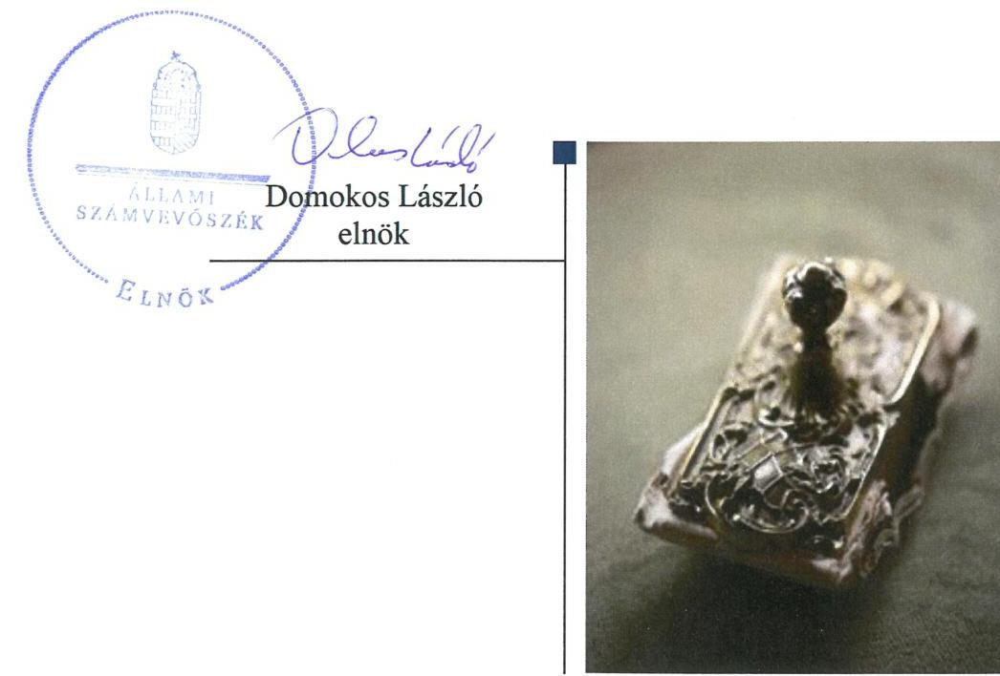
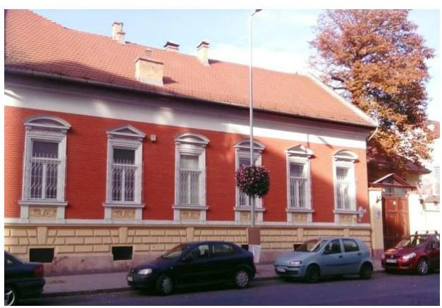
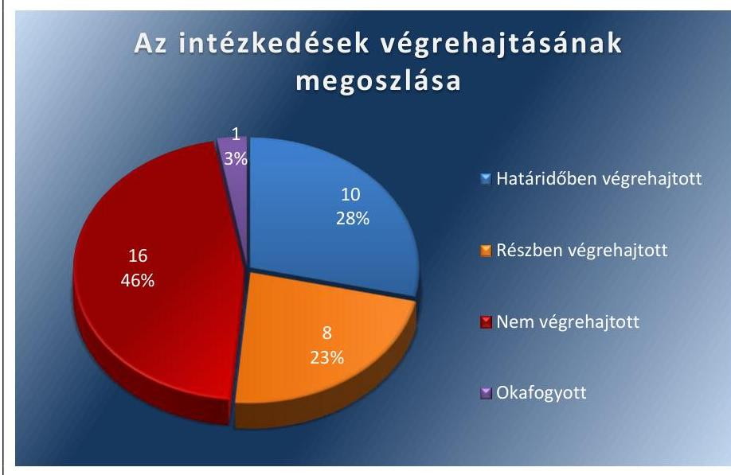
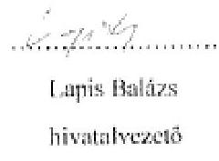

# Jelentés 

## Utóellenőrzések

Az országos nemzetiségi önkormányzatok gazdálkodásának utóellenőrzése - Országos Lengyel Önkormányzat
2018. 10. hó 08. nap

---

# AZ ELLENŐRZÉST FELÜGYELTE: 

VARGA EDIT felügyeleti vezető

## AZ ELLENŐRZÉST VEZETTE ÉS A VÉGREHAJTÁSÁÉRT FELELŐS:

MAROZSÁN LÁSZLÓNÉ ellenőrzésvezető

## A PROGRAM ÖSSZEÁLLÍTÁSÁÉRT FELELŐS:

TÓTPÁL SZABOLCS osztályvezető

## A TÉMÁHOZ KAPCSOLÓDÓ KORÁBBI SZÁMVEVŐSZÉKI JELENTÉSEK:

- címe: Jelentés az Országos Nemzetiségi Önkormányzatok gazdálkodásának ellenőrzéséről
Országos Lengyel Önkormányzat
- sorszáma: 15154

IKTATÓSZÁM: EL-0611-026/2018
TÉMASZÁM: 2460
ELLENŐRZÉS-AZONOSÍTÓ SZÁM: V080404

---

# TARTALOMJEGYZÉK 

- ÖSSZEGZÉS ..... 5
- AZ ELLENŐRZÉS CÉLJA ..... 6
- AZ ELLENŐRZÉS TERÜLETE ..... 7
- AZ ELLENŐRZÉS HÁTTERE, INDOKOLTSÁGA ..... 8
- A JELENTÉS LÉNYEGES KÉRDÉSKÖRE ..... 9
- AZ ELLENŐRZÉS HATÓKÖRE ÉS MÓDSZEREI ..... 10
- MEGÁLLAPÍTÁSOK ..... 12
- MELLÉKLETEK ..... 15
I. sz. melléklet: Az ÁSZ 15154 számú jelentéséhez kapcsolódóan az Országos Lengyel Önkormányzat intézkedési terve végrehajtásának értékelése ..... 15
II. sz. melléklet: Az Országos Lengyel Önkormányzat intézkedési terve ..... 22
- FÜGGELÉK: ÉSZREVÉTELEK ..... 35
- RÖVIDÍTÉSEK JEGYZÉKE ..... 37

---

.

---

# ÖSSZEGZÉS 

Az Állami Számvevőszék az Országos Lengyel Önkormányzat gazdálkodásának utóellenőrzése során megállapította, hogy a működés szabályozottsága javult, azonban az intézkedési tervben foglalt és végre nem hajtott feladatok miatt a közpénzzel való gazdálkodásának a kockázata nőtt.

## Az ellenőrzés társadalmi indokoltsága

Az Állami Számvevőszék stratégiájában célul tűzte ki a számvevőszéki munka hasznosulásának javítását. Ezzel összhangban ellenőrzi, hogy az ellenőrzött szervezetek megvalósították-e a korábbi ellenőrzései által feltárt hibák, hiányosságok és szabálytalanságok megszüntetése céljából kialakított intézkedési terveikben foglaltakat. Az intézkedések végrehajtásával az adott terület szabályszerű működése vonatkozásában a kockázatok csökkenhetnek, ugyanakkor a nem végrehajtott intézkedések következtében újabb kockázatok merülhetnek fel, amelyek kezelése kiemelten fontos. A rendszeres utóellenőrzések hozzájárulnak a szükséges intézkedések tényleges végrehajtásához, ezáltal a közpénzügyek rendezettségének javulásához, a szabálytalan közpénzfelhasználás kockázatának a csökkentéséhez.

## Főbb megállapítások, következtetések

Az Országos Lengyel Önkormányzat az Állami Számvevőszék intézkedést igénylő megállapításai alapján tett javaslataira készített intézkedési tervében 35 végrehajtandó feladatot határozott meg, amelyből tízet határidőben, nyolcat részben, tizenhatot nem hajtott végre. Egy intézkedés jogszabályi változás miatt okafogyottá vált.

Az Országos Lengyel Önkormányzat működésének szabályozottsága javult, mert a hivatalvezető kiegészítette az SZMSZ-t a vagyonnyilatkozat tételre kötelezettek meghatározásával, a Közgyűlés és az elnök közötti hatáskör átruházására vonatkozó kérdéssel. A Közgyűlés jóváhagyta a Hivatal Gazdálkodási szabályzatát, Számviteli politikáját, Bizonylati rendjét.

A támogatások felhasználásának elkülönített nyilvántartását a hivatalvezető biztosította. A hivatalvezető nem biztosította a pénzügyi elszámoltathatóság feltételeit, mert nem egyeztette a költségvetési határozattervezetet a költségvetési szervek vezetőivel, nem adta át a 2017. évi költségvetés-tervezetét a Pénzügyi Bizottságnak véleményezésre. A hivatalvezető a jogszabályi előírások ellenére nem mutatta be előirányzat felhasználási tervet tájékoztatásul a Közgyűlés részére a 2016. évi és a 2017. évi költségvetés előterjesztésekor.

A belső kontrollrendszer működése továbbra is kockázatos maradt, mert a hivatalvezető nem értékelte a 2016. évre vonatkozóan a belső kontrollrendszer minőségét, nem működtette kockázatkezelési rendszert, 2016. október 1-jétől az integrált kockázatkezelési rendszert. A hivatalvezető nem intézkedett a kockázatelemzéssel alátámasztott éves ellenőrzési terv elkészítéséről. A hivatalvezető a belső ellenőrzési kézikönyvet jóváhagyta.

Az Országos Lengyel Önkormányzatnál a vagyongazdálkodás szabályszerűségét továbbra sem biztosították, mert az éves költségvetési beszámolóinak mérlegsorait nem támasztották alá leltárral.

---

# AZ ELLENŐRZÉS CÉLJA 

Az ellenőrzés célja annak értékelése volt, hogy a számvevőszéki jelentésben ${ }^{1}$ foglalt intézkedést igénylő megállapításokkal összhangban készített intézkedési tervben meghatározott feladatokat az ellenőrzött szervezet vég-rehajtotta-e.

---

# **AZ ELLENŐRZÉS TERÜLETE**

## **Országos Lengyel Önkormányzat**

Az Országos Lengyel Önkormányzat 1995. március 24-én alakult meg. Az Önkormányzat² Közgyűlése³ három bizottság (Pénzügyi Bizottság, Kulturális, Ifjúsági és Sport Bizottság, Vallási és Szociális Bizottság) létrehozásáról döntött. Az ellenőrzött időszakban az Önkormányzat irányítása alá négy költségvetési szerv tartozott.

Az Önkormányzat Hivatala⁴ látta el az ellenőrzött időszakban az Önkormányzat igazgatási és gazdálkodási feladatait.

Az ÁSZ⁵ a 2015. évben ellenőrizte az Önkormányzat gazdálkodását a 2010. január 1. – 2014. június 30. közötti időszak vonatkozásában. Az erről szóló 15154 sorszámú jelentését 2015. szeptember 24-én hozta nyilvánosságra. Az ellenőrzés célja annak értékelése volt, hogy az Országos Lengyel Önkormányzat gazdálkodása, a belső kontrollrendszer kialakítása és működése, az államháztartásból nyújtott támogatás, illetve az államháztartásból meghatározott célra ingyenesen juttatott vagyon felhasználása a jogszabályi előírásoknak megfelelően történt-e; az önkormányzat a Nek.tv.⁶-ben és az Njtv.⁷-ben előírt feladat és hatásköröket ellátta-e. A számvevőszéki jelentésben feltárt szabálytalanságok, működésbeli hiányosságok kiküszöbölése érdekében a Közgyűlés 5/2016. (I. 22.) határozatával intézkedési tervet készített, amelyet az ÁSZ elfogadott.

Az utóellenőrzés az Önkormányzat ellenőrzéséről készült 15154 számú ÁSZ jelentés intézkedést igénylő megállapításai és javaslatai hasznosítására elfogadott intézkedési tervben foglalt feladatok 2015. szeptember 24.- 2018. február 13. közötti végrehajtására irányult.

---

# AZ ELLENŐRZÉS HÁTTERE, INDOKOLTSÁGA 

Az ÁSZ tv. 33. § (1) bekezdése értelmében a számvevőszéki jelentések intézkedést igénylő megállapításaihoz és javaslataihoz kapcsolódóan az ellenőrzött szervezet vezetője intézkedési tervet köteles összeállítani, és az Állami Számvevőszék részére megküldeni. Az ÁSZ tv. 33. § (6) bekezdése értelmében, amennyiben az ÁSZ elnöke az ellenőrzés során feltárt jogszabálysértő gyakorlat, illetve a vagyon rendeltetésellenes vagy pazarló felhasználásának megszüntetése érdekében figyelemfelhívó levéllel fordult az ellenőrzött szerv vezetőjéhez, az abban foglaltakat az ellenőrzött szerv vezetője köteles elbírálni, a megfelelő intézkedést megtenni és erről az ÁSZ elnökét értesíteni.

Az ÁSZ által befogadott intézkedési tervben foglaltak megvalósítását az ÁSZ törvény 33. § (7) be-kezdésében foglaltak alapján - az Állami Számvevőszék utóellenőrzés keretében ellenőrizheti. Az utóellenőrzések keretében - az intézkedések értékelése során - az Állami Számvevőszék figyelembe veszi az ellenőrzött szervezetek működési feltételeiben, valamint a jogszabályi előírásokban bekövetkezett változásokat. Az utóellenőrzés során az ÁSZ értékeli, hogy az érintett számvevőszéki jelentésben foglalt intézkedést igénylő megállapításokkal és javaslatokkal összhangban, az ellenőrzött szervezet által készített intézkedési tervben meghatározott feladatokat a feladatra kijelöltek végrehajtották-e.

Az intézkedések végrehajtásával az adott terület szabályszerű működése vonatkozásában a kockázatok csökkenhetnek, azonban hosszabb távon az intézkedési tervben foglaltak végrehajtásával önmagában nem szűnnek meg, csak akkor, ha beépülnek az ellenőrzött szervezet működésébe, azokat folyamatosan karban tartják, figyelembe véve, illetve kezelve a változásokat. Emellett az intézkedések végrehajtásáig újabb kockázatok merülhetnek fel a szabályszerű működés vonatkozásában, amelyek kezelése szintén kiemelten fontos az ellenőrzött szervezet számára.

Az ellenőrzött szervezet vezetője által készített intézkedési tervekben foglalt feladatok hiányos, illetve késedelmes végrehajtása, vagy annak elmaradása a szabályszerűség és a felelős vezetői magatartás vonatkozásában kockázatot hordoz, ami azt mutatja, hogy az ellenőrzések során feltárt hibák, hiányosságok és szabálytalanságok kezelése nem kapott kellő hangsúlyt. Az utóellenőrzés során is fenn-álló szabálytalanságok esetén a közpénz, közvagyon veszélyeztetettségi kockázat valószínűsített hatásának értékelése további intézkedéseket vonhat maga után.

Az ellenőrzött szervezet szintjén az utóellenőrzés feltárja, hogy a szervezet az intézkedések végrehajtásával hasznosította-e a korábbi ellenőrzési jelentésben a hiányosságok megszüntetése, illetve a kockázatok kezelése érdekében megfogalmazott javaslatokat, illetve az intézkedések végrehajtása elmaradásának következtében továbbra is fennálló szabálytalanság esetén értékeli a közpénzek, közvagyon veszélyeztetettségét. Az ÁSZ szintjén az utóellenőrzés visszacsatolást ad az ellenőrzési jelentések hasznosulásáról, az intézkedések elmaradásának, vagy részleges megvalósulásának a közpénzek, közvagyon veszélyeztetettségére gyakorolt valószínűsített hatásának értékelése, további intézkedéseket vonhat maga után.

---

# A JELENTÉS LÉNYEGES KÉRDÉSKÖRE 

Az Önkormányzat az intézkedési tervben foglaltakat az előírt határidőben végrehajtotta-e?

---

# AZ ELLENŐRZÉS HATÓKÖRE ÉS MÓDSZEREI 

## Az ellenőrzés típusa

Megfelelőségi ellenőrzés

## Az ellenőrzött időszak

Az utóellenőrzés alapját képező számvevőszéki jelentés közzétételének napjától (2015. szeptember 24.) az ellenőrzésről szóló kiértesítő levél keltének napjáig (2018. február 13.) tartó időszak.

## Az ellenőrzés tárgya

Az ÁSZ tv. 2011. július 1-jei hatálybalépését követően a számvevőszéki jelentésben foglalt intézkedést igénylő megállapításokkal és javaslatokkal összhangban - az Önkormányzat által - készített intézkedési tervben foglaltak végrehajtásának ellenőrzése volt.

## Az ellenőrzött szervezet

Országos Lengyel Önkormányzat és az Országos Lengyel Önkormányzat Hivatala

## Az ellenőrzés jogalapja

Az utóellenőrzés jogszabályi alapját az ÁSZ tv. 33. § (7) bekezdésének az előírása képezi.

## Az ellenőrzés módszerei

Az ellenőrzést az ellenőrzött időszakban hatályos jogszabályok, az ellenőrzés szakmai szabályai, a jelen ellenőrzésre irányadó ÁSZ módszertanok, az ellenőrzési programban foglalt értékelési szempontok szerint, önállóan végezte az ÁSZ.

Az ÁSZ az ellenőrzés ideje alatt az ellenőrzött szervezettel történő kapcsolattartást az ÁSZ SZMSZ ${ }^{6}$-ének vonatkozó előírásai alapján biztosította.

Az utóellenőrzés megállapításait az ÁSZ rendelkezésére álló dokumentumok, valamint az ÁSZ adatbekérése szerint, az ellenőrzött szervezetek által rendelkezésre bocsátott dokumentumok, adatok alapján fogalmazta meg, amely kiegészült az ellenőrzött szervezet székhelyén történő adatbetekintéssel.

Az ellenőrzési kérdések megválaszolásához szükséges bizonyítékok megszerzése az ellenőrzött által rendelkezésre bocsátott dokumentumokra, adatokra alapozva megfigyelés, szemle (szemrevételezés), kérdésfeltevés (információkérés), alkalmazásával történt. Az ellenőrzési bizonyítékként felhasználható adatforrások közé tartoztak egyrészt az ellenőrzési program részletes szempontjainál felsorolt adatforrások, másrészt minden - az ellenőrzés folyamán feltárt, az ellenőrzés szempontjából információt tartalmazó - dokumentum.

Az intézkedési tervekben előírt feladatokat azok végrehajthatósága, illetve végrehajtása szempontjából az alábbiak szerint értékelte az ÁSZ:
$\longrightarrow$ „határidőben végrehajtott" a feladat, ha a teljesítés dokumentáltan, az intézkedési tervben előírt határidőben és tartalommal megtörtént;
$\longrightarrow$ „határidőn túl végrehajtott" a feladat, ha annak teljesítése az intézkedési tervben meghatározott módon, de az abban előírt határidőn túl történt meg;
$\longrightarrow$ „részben végrehajtott" a feladat, ha annak végrehajtása nem teljes körűen az intézkedési tervben előírt módon történt meg;
$\longrightarrow$ „nem végrehajtott" a feladat, ha a végrehajtás nem történt meg, dokumentumokkal nem igazolt annak teljesítése;
$\longrightarrow$ „okafogyottá vált" a feladat, ha végrehajtására - meghatározott esemény bekövetkezése, továbbá külső körülmény, a működést érintő feltétel változása miatt - már nincs szükség, illetve lehetőség, és egyértelműen megállapítható, hogy az intézkedést szükségessé tevő körülmény a jövőben nem fordulhat elő;
$\longrightarrow$ „nem időszerű" az a feladat, amelynek ellenőrzési időszakon belüli végrehajtására azért nem került (kerülhetett) sor, mert az intézkedés alapjául szolgáló esemény nem következett be, de annak jövőbeni előfordulása lehetséges, a végrehajtása nem volt esedékes, vagy a végrehajtás határideje még nem járt le.
Az ellenőrzés lefolytatásához az ellenőrzött szervezet a tanúsítványok elektronikus kitöltésével, valamint az ÁSZ által kért dokumentumok elektronikus megküldésével szolgáltatott adatokat, amelyek valódiságát és teljes körűségét az ellenőrzött szervezet vezetője által tett teljességi és hitelességi nyilatkozat igazolta. Az így rendelkezésre bocsátott adatok, információk kontrollja az ellenőrzés keretében történt. A II. sz. melléklet tartalmazza az Önkormányzat által készített intézkedési tervet. A sorszámozott intézkedések részletes értékelését az I. sz. melléklet tartalmazza.

---

# MEGÁLLAPÍTÁSOK 

## Az Önkormányzat az intézkedési tervben foglaltakat az előírt határidőben végrehajtotta-e?

Összegző megállapítás

Az Önkormányzat az intézkedési tervében meghatározott 35 feladat közül tízet határidőben, nyolcat részben, 16-ot nem hajtott végre, egy feladat végrehajtása okafogyottá vált.

Az ÁSZ a 15154. számú jelentésében az elnök ${ }^{10}$ részére öt, a hivatalvezető ${ }^{11}$ részére pedig 23 javaslatot fogalmazott meg. Az elnök és a hivatalvezető a javaslatok kezelésére, a szabálytalanságok megszüntetésére összesen 35 intézkedésből álló intézkedési tervet küldött az ÁSZ részére.

Az Önkormányzat
 intézkedési tervében meghatározott feladatokat, határidőket, a feladatok végrehajtásáért felelős személyeket és a feladatok végrehajtását az I. sz. melléklet mutatja be.

Az ÁSZ javaslatai alapján készített intézkedési tervben rögzített feladatok végrehajtásáról a hivatalvezető a Bkr. ${ }^{12} 14 . \S$ (1) bekezdésében előírtak ellenére nem éves bontásban vezette a nyilvántartást. A nyilvántartás nem tartalmazta a Bkr. 47. § (2) bekezdésében hivatkozott államháztartásért felelős miniszter által közzétett módszertani útmutatóban ${ }^{13}$ meghatározottak ellenére az intézkedési terv iktatószámát, a külső ellenőrzést bejelentő levél iktatószámát, a vizsgálatvezető nevét, elérhetőségét.

Az intézkedési tervben meghatározott feladatok végrehajtásának értékelési kategóriák szerinti megoszlását az 1. ábra szemlélteti.

1. ábra

Forrás: ÁSZ

---

# A MŰKÖDÉSI, GAZDÁLKODÁSI FOLYAMATOK 

SZABÁLYOZOTTSÁGA javult az Önkormányzatnál. Kiegészítették az SZMSZ-t a vagyonnyilatkozat tételre kötelezettek meghatározásával, a Közgyűlés és az elnök közötti hatáskör átruházására vonatkozó kérdéssel (2-3.). Jóváhagyta a Közgyűlés a Gazdálkodási szabályzatot, a Számviteli politikát, Bizonylati rendet $(4; 6.)$.

A VAGYONGAZDÁLKODÁS az ellenőrzött időszakban kockázatot hordozott, mivel az éves költségvetési beszámoló mérlegsorait az Önkormányzatnál a Számv. tv. ${ }^{14}$ előírása ellenére nem támasztották alá leltárral (35).

A PÉNZÜGYI ELSZÁMOLTATHATÓSÁG javítása érdekében a támogatások felhasználásának elkülönített nyilvántartását a hivatalvezető biztosította, a nyújtott támogatások felhasználását ellenőrizték (10-11.). A pénzügyi folyamatok szabályszerűségére továbbra is kockázatot jelentett, hogy az Ávr. ${ }^{15}$ előírása ellenére a hivatalvezető nem egyeztette a költségvetési határozattervezetet a költségvetési szervek vezetőivel, a 2017. évi költségvetés-tervezetét nem adta át a Pénzügyi Bizottságnak véleményezésre (31-17.). A 2016. és a 2017. évre a hivatalvezető nem igazolta, hogy az Önkormányzat és intézményei gazdálkodása során az Áht. ${ }^{16}$ előírásának megfelelően betartotta a jóváhagyott kiadási előirányzaton belüli gazdálkodási szabályokat (19.). A hivatalvezető az Áht. előírása ellenére nem mutatta be tájékoztatásul az előirányzat felhasználási tervet a Közgyűlés részére a 2016. évi és a 2017. évi költségvetés előterjesztésekor (32.).

## A BELSŐ KONTROLLOK, A BELSŐ ELLENŐRZÉS

működése továbbra is kockázatokat hordozott, mert a hivatalvezető nem intézkedett a Bkr.-ben foglaltak ellenére kockázatelemzésen alapuló stratégiai és éves ellenőrzési terv elkészítéséről (14.). A hivatalvezető a Bkr. előírásai ellenére nem írta elő az SZMSZ-ben a belső ellenőrzést végző személy, vagy szervezet feladatait, nem működtetett kockázatkezelési rendszert, 2016. október 1-jétől integrált kockázatkezelési rendszert, továbbá nem értékelte a 2016. évi belső kontrollrendszer minőségét (16; 23; 29.).

---

.

---

# MELLÉKLETEK

- I. SZ. MELLÉKLET: AZ ÁSZ 15154 SZÁMÚ JELENTÉSÉHEZ KAPCSOLÓDÓAN AZ ORSZÁGOS LENGYEL ÖNKORMÁNYZAT INTÉZKEDÉSI TERVE VÉGREHAJTÁSÁNAK ÉRTÉKELÉSE

|  Sorszám | Az intézkedési terv alapján meghatározott feladat | Az intézkedési tervben meghatározott határidő | Az intézkedési tervben meghatározott feladatok elvégzésének felelőse | A feladat végrehajtása  |
| --- | --- | --- | --- | --- |
|  1. | (E-03) További intézkedést nem igényel, mivel megváltozott a jogszabályi környezet és a hivatkozott jogszabályi előírást a 2011. évi CXCV törvény 24. § (1) bekezdését a 2014. évi XXXIX. törvény 64. § (1) bekezdése hatályon kívül helyezte 2014. IX. 30.-ával. | - | - | A feladat végrehajtása a jogszabályi környezet változása miatt okafogyottá vált. Az Áht. 2014. szeptember 30-ától nem írta elő költségvetési koncepció készítését.  |
|  2. | (E-02) A Közgyűlés elé kell terjeszteni a Szervezeti és Működési Szabályzat módosítását, hogy az tartalmazza a vagyonnyilatkozat tételre kötelezettek körét. | 2016. május 31. | elnök a javaslat közgyűlés elé terjesztéséért; hivatalvezető az előterjesztés előkészítésért | Az elnök a 2015. november 21-i Közgyűlésen előterjesztette az önkormányzati SZMSZ V. fejezetének módosítását a vagyonnyilatkozat-tételre kötelezettek körének meghatározásával, amelyet a Közgyűlés a 79/2015. (XI. 21.) határozatával elfogadott.  |
|  3. | (E-05) Közgyűlés elé kell terjeszteni a Szervezeti és Működési Szabályzat módosítási javaslatát az önkormányzat vélemény-nyilvánítási, egyetértési és közreműködési kötelezettség ellátására vonatkozó hatáskör átruházással kapcsolatban. | 2016. május 31. | elnök a javaslat közgyűlés elé terjesztéséért; hivatalvezető az előterjesztés előkészítésért | Az elnök a 2016. február 27-i Közgyűlésen előterjesztette az önkormányzati SZMSZ kiegészítését, amelynek 2. számú mellékletében rendelkeztek az önkormányzat vélemény-nyilvánítási, egyetértési és közreműködési kötelezettség ellátására vonatkozó hatáskör átruházásáról. Az SZMSZ módosítását a Közgyűlés a 19/2016. (II. 27.) határozatával elfogadta.  |
|  4. | (H-01) Elfogadásra került az Országos Lengyel Önkormányzat 107/2014.(XII.06) számú közgyűlés határozatával a »Gazdálkodási szabályzata« és a 111/2014.(XII.06) számú közgyűlési határozatával a »Számviteli Politika« szabályzata. | - | - | A Gazdálkodási szabályzatot a Közgyűlés a 107/2014.(XII.06) számú határozatával, a Számviteli politikát a 111/2014.(XII.06) számú határozatával jóváhagyta.  |

---

|  5. | (H-03) Elfogadásra került az Országos Lengyel Önkormányzat 104/2014.(XII.06.) számú közgyűlési határozatával a »Belső Kontroll Rendszer, FEUVE Szabályzat« elnevezésű szabályzata. | - | - | Az OLÖ ${ }^{17}$ Belső kontroll rendszer, FEUVE szabályzat"-ot a Közgyűlés a 104/2014.(XII.06.) számú határozatával jóváhagyta.  |
| --- | --- | --- | --- | --- |
|  6. | (H-05) Elfogadásra került az Országos Lengyel Önkormányzat 106/2014.(XII.06.) számú közgyűlési határozatával a »Bizonylati Rend« és a 107/2014. (XII.06.) számú közgyűlési határozatával a »Gazdálkodási Szabályzat« elnevezésű szabályzata, melyek a gazdálkodási jogkörök (teljesítésigazolás és érvényesítés) gyakorlását is szabályozzák. | - | - | A gazdálkodási jogkörök (teljesítésigazolás és érvényesítés) gyakorlását szabályozó Gazdálkodási szabályzatot a Közgyűlés a 107/2014. (XII.06.) számú határozatával, a Bizonylati rendet a 106/2014.(XII.06.) számú határozatával jóváhagyta.  |
|  7. | (H-08) Az Országos Lengyel Önkormányzat saját weboldalt üzemeltet 2015. január 01-től a www.lengyelonkormányzat.hu címen, melyre elkezdtük feltölteni a 2011. évi CXII. törvény 1. számú mellékletében található adatokat. | - | - | Az Önkormányzat részéről megkezdődtek az adatok feltöltése a weboldalára. Az Info tv ${ }^{18}$. 1. számú mellékletében előírt adatok közül a Közgyűlés ülésének jegyzőkönyvei 2014. május 31-től kezdve kerültek fel az Önkormányzat weboldalára.  |
|  8. | (H-12) Elfogadásra került az Országos Lengyel Önkormányzat 104/2014.(XII.06.) számú közgyűlési határozatával a »Belső Kontroll Rendszer, FEUVE szabályzat« elnevezésű szabályzata, mely a fentieket szabályozza. | - | - | Az „OLÖ Belső kontroll rendszer, FEUVE szabályzat"-ot a 104/2014.(XII.6) számú közgyűlési határozatával a Közgyűlés jóváhagyta.  |
|  9. | (H-16) 2015. január 01. óta a Hivatal rendelkezik belső ellenőrzési kézikönyvvel. | - | - | A hivatalvezető a Bkr.-ben foglaltaknak megfelelően intézkedett a belső ellenőrzési kézikönyv elkészítéséről, jóváhagyásáról, amely 2014. november 1-jén lépett hatályba.  |
|  10. | (H-29) Intézkedni kell, hogy az önkormányzat a működési támogatások felhasználásáról elkülönített nyilvántartást vezessen. | 2015. november 30. majd folyamatosan | hivatalvezető | A hivatalvezető intézkedett az Önkormányzat által kapott támogatások felhasználásának elkülönített nyilvántartásáról. A nyilvántartást az EPER program segítségével biztosította.  |
|  11. | (H-30) Ellenőrizni kell az önkormányzat által nyújtott támogatások felhasználását, írásbeli beszámolók keretében. | folyamatosan | hivatalvezető | A hivatalvezető az Önkormányzat által nyújtott támogatások felhasználását írásbeli beszámolókon keresztül ellenőrizte.  |

---

|  1. | Az intézkedési terv alapján meghatározott feladat | Az intézkedési tervben meghatározott határidő | Az intézkedési tervben meghatározott feladatok elvégzésének felelőse | A feladat végrehajtása  |
| --- | --- | --- | --- | --- |
|  12. | (H-06) Szabályzat keretében kell meghatározni a kontroll folyamatok felelősségi és információs szintjeit, kapcsolatait, valamint az irányítási és ellenőrzési folyamatokat. | 2016. május 31. majd folyamatosan | hivatalvezető a szabályzat elkészítéséért; elnök a javaslat közgyűlés elé terjesztésért | Határidőben végrehajtott feladatrész:
Az „OLÓ Belső kontroll rendszer, FEUVE szabályzat" tartalmazott előírásokat a kontroll folyamatok felelősségi és információs szintek vonatkozásában.
Nem végrehajtott feladatrész:
Nem készítette el a hivatalvezető a Bkr. 6. § (3) bekezdésében előírtak ellenére az ellenőrzési nyomvonalat.  |
|  13. | (H-07) Ki kell alakítani az elektronikus közzététel rendjét. El kell készíteni az önkormányzat hivatalának adatvédelmi és adatbiztonsági szabályzatát. | 2016. május 31. | hivatalvezető a szabályzatok elkészítéséért; elnök a javaslat közgyűlés elé terjesztésért | Határidőben végrehajtott feladatrész:
A Hivatal adatvédelmi és adatbiztonsági szabályzatát a hivatalvezető elkészítette.
Nem végrehajtott feladatrész:
A hivatalvezető az Info tv. 35. § (3) bekezdésben előírtak ellenére nem határozta meg belső szabályzatban az elektronikus közzététel szabályait a Hivatalnál.  |
|  14. | (H-17) A belső ellenőrzési vezető készítsen stratégiai és kockázatelemzéssel alátámasztott éves ellenőrzési tervet, valamint éves ellenőrzési jelentést. | minden év december 31. | hivatalvezető | Határidőben végrehajtott feladatrész:
A belső ellenőrzési vezető a Bkr.-nek megfelelően elkészítette a 2016. évi éves ellenőrzési jelentést.
Nem végrehajtott feladatrész:
A hivatalvezető a Bkr. 55. § (2) bekezdésében előírt feladatköréhez kapcsolódóan nem intézkedett a Bkr. 29. § (1) bekezdésében előírt kockázatelemzéssel alátámasztott stratégiai ellenőrzési terv és éves ellenőrzési terv elkészítéséről, valamint a Bkr. 55. § (4) bekezdésében előírt 2015. és a 2017. évi éves ellenőrzési jelentés elkészítéséről.  |

---

|  Sorszám | Az intézkedési terv alapján meghatározott feladat | Az intézkedési tervben meghatározott határidő | Az intézkedési tervben meghatározott feladatok elvégzésének felelőse | A feladat végrehajtása  |
| --- | --- | --- | --- | --- |
|  15. | (H-18) A belső ellenőrzések során feltárt hiányosságok illetve ezek megszüntetésére tett javaslatok kapcsán a hivatalvezető készítsen intézkedési tervet. | folyamatos | hivatalvezető | Határidőben végrehajtott feladatrész:
A hivatalvezető intézkedési tervet készített két, 2016. évben végrehajtott belső ellenőrzés során feltárt hiányosságok, illetve ezek megszüntetésére tett javaslatok kapcsán.
Nem végrehajtott feladatrész:
A hivatalvezető a Bkr. 45. § (3) bekezdésében foglaltak ellenére nem készített intézkedési tervet a 2/2016. számú belső ellenőrzés során feltárt hiányosságok, illetve ezek megszüntetésére tett javaslatok kapcsán.  |
|  16. | (H-20) A hivatalvezető értékelje a kontrollrendszer működését a 370/2011. (XII. 31.) Kormányrendelet 1. számú melléklete szerint. | a költségvetési évet követő év február 28. | hivatalvezető | Határidőn túl végrehajtott feladatrész:
A hivatalvezető elkészítette a Bkr. 1. melléklete szerinti nyilatkozatát a Hivatal belső kontrollrendszere 2015. évi minőségének értékeléséről.
Nem végrehajtott feladatrész:
A hivatalvezető a Bkr. 11. § (1) bekezdésében előírtak ellenére nem értékelte a belső kontrollrendszer 2016. évi minőségét a Bkr. 1. melléklete szerinti nyilatkozatában.  |
|  17. | (H-21) A továbbiakban az éves költségvetés tervezetét az Önkormányzat Pénzügyi Bizottságának ki kell adni véleményezésre. | Minden költségvetési évben a költségvetést elfogadó Közgyűlés napjáig. | hivatalvezető | Végrehajtott feladatrész:
A hivatalvezető gondoskodott a 2016. évi költségvetés-tervezet Pénzügyi Bizottság általi véleményeztetéséről.
Nem végrehajtott feladatrész:
A 2017. évi költségvetés-tervezetét a hivatalvezető nem adta át a Pénzügyi Bizottságnak véleményezésre, az Njtv. 135. §-ában foglalt előírások ellenére nem történt meg annak véleményezése.  |
|  18. | (H-25) A Hivatalvezető
 az éves elemi költségvetést határidőben megküldi a Kincstár területileg illetékes szervének | Az éves költségvetési tervezet Közgyűlés elé terjesztését követő 30 napon belül. | hivatalvezető | Végrehajtott feladatrész:
A hivatalvezető a 2016. évben határidőben megküldte az éves elemi költségvetést a Kincstár által működtetett elektronikus adatszolgáltató rendszerbe.
Nem végrehajtott feladatrész:
A hivatalvezető a jóváhagyott 2017. évi elemi költségvetésről az Ávr. 33. § (2) bekezdésének előírása ellenére, figyelemmel az Ávr. 33. § (3) bekezdésében foglaltakra, nem szolgáltatott adatot a Kincstár által működtetett elektronikus adatszolgáltató rendszerben.  |

---

|  1. | Az intézkedési terv alapján meghatározott feladat | Az intézkedési tervben meghatározott határidő | Az intézkedési tervben meghatározott feladatok elvégzésének felelőse | A feladat végrehajtása  |
| --- | --- | --- | --- | --- |
|  19. | (H 26) Az önkormányzat és intézményei gazdálkodása során be kell tartani a jóváhagyott kiadási előirányzatokon belüli gazdálkodásra vonatkozó előírásokat. | Folyamatos | hivatalvezető | Végrehajtott feladatrész:
Az Önkormányzat 2015. évi beszámolója alapján a hivatalvezető gondoskodott a jóváhagyott kiadási előirányzatok 2015. évi betartásáról a gazdálkodás során.
Nem végrehajtott feladatrész:
A 2016. és a 2017. évre a hivatalvezető nem igazolta, hogy az Önkormányzat és intézményei gazdálkodása során az Áht. 5. § (4) bekezdésének előírásának megfelelően betartotta a jóváhagyott kiadási előirányzaton belüli gazdálkodási szabályokat.  |
|   |  |  | Nem végrehajtott feladatok |   |
|  20. | (E-01) Az elnök megvizsgálta a hivatalvezető felelősségre vonásának lehetőségét, szükségességét a fentiek vonatkozásában. A vizsgálat eredménye alapján semminemű munkajogi felelősségre vonást nem tartott indokoltnak. | - | - | Az elnök dokumentumokkal nem igazolta a hivatalvezetői felelősségre vonás ügyében végzett vizsgálatot.  |
|  21. | (E-04) Biztosítani kell, hogy a közgyűlés részére kerüljenek bemutatásra a zárszámadási határozat beterjesztésekor a jogszabályban előírt kimutatások. | az éves zárszámadási határozat beterjesztésekor | elnök a kimutatások közgyűlés elé terjesztéséért
hivatalvezető a kimutatások elkészítésért | A zárszámadási határozat előterjesztésekor elnök nem mutatta be a közgyűlés részére az Áht. 91. § (2) bekezdés b) pontjában előírtak ellenére az adósságállományt lejárat szerinti bontásban és az Áht. 91. § (2) bekezdés c) pontjában előírtak ellenére a vagyonkimutatást.  |
|  22. | (H-02) Naprakész nyilvántartást kell készíteni és vezetni az ellenjegyzésre jogosultakról és aláírás-mintájukról.
A kontroll környezet kialakításának keretében meg kell határozni az etikai elvárásokat a szervezet minden szintjén. | 2016. május 31. | hivatalvezető a nyilvántartás elkészítéséért, naprakész vezetéséért, a szabályzat módosításának előkészítésért.
elnök a módosító javaslat közgyűlés elé terjesztésért | A hivatalvezető az Ávr. 60.§ (3) bekezdésében előírtak ellenére nem vezetett naprakész nyilvántartást az ellenjegyzésre jogosultakról és aláírásmintájukról.
A hivatalvezető a Bkr. 6. § (1) bekezdés c) pontjában foglaltak ellenére nem határozta meg az etikai elvárásokat a Hivatal szervezetének minden szintjén.  |
|  23. | (H-04) Az elfogadott szabályzatnak megfelelően működtetni kell a kockázatkezelési rendszert. | Folyamatos | hivatalvezető | A hivatalvezető a Bkr. 7. § (1) bekezdésében előírtak ellenére nem működtetett kockázatkezelési rendszert, 2016. október 1-jétől integrált kockázatkezelési rendszert.  |

---

|  24. | (H-09) Az önkormányzat web oldalára fel kell tölteni a jogszabály által meghatározott adatokat, azokat folyamatosan frissíteni kell. | 2016. január 31., ezt követően folyamatosan | hivatalvezető | A hivatalvezető az Info. tv. 37. § (1) bekezdésében előírtak ellenére honlapján nem tette közzé az Info tv. 1. melléklet szerinti általános közzétételi listában meghatározott adatokat.  |
| --- | --- | --- | --- | --- |
|  25. | (H-10) Előírásoknak megfelelő irattár került kialakításra 2015-ben. | - |  | A hivatalvezető az Ikr. 19. 5. §-a ellenére nem alakította ki az iratok szakszerű és biztonságos megőrzésére alkalmas irattárat.  |
|  26. | (H-11) Az EMMI 2016-ban valamennyi országos nemzetiségi önkormányzat számára lehetővé teszi az ASP rendszerű irattározást, ennek az előkészítése folyamatban van, a szükséges forrásokat uniós forrásból biztosítják. | 2016. szeptember 30. az elektronikus irattározás bevezetésére, folyamatos az irattári anyagok kezelésére, visszakereshetőségére | hivatalvezető | Az elektronikus irattározást nem vezették be.  |
|  27. | (H-13) Működtetni kell a hivatal tevékenységének, a célok megvalósításának nyomon követését biztosító rendszert. | folyamatos | hivatalvezető | A hivatalvezető a Bkr. 3. § e) pontja ellenére nem működtette a Hivatal tevékenységének, a célok megvalósításának nyomon követését biztosító rendszert.  |
|  28. | (H-14) Az Országos Lengyel Önkormányzat közgyűlése 58/2015.(IX.26.) számú határozatával feljogosította a hivatalvezetőt az új belső ellenőr kiválasztására és a vele való szerződés megkötésére. | - | - | A hivatalvezető nem igazolta a közgyűlési döntést.  |
|  29. | (H-15) A Szervezeti és Működési Szabályzatot módosítani szükséges, hogy az tartalmazza a belső ellenőrzést végző személy vagy szervezet jogállását, feladatait a jogszabályi előírásoknak megfelelően. A belső ellenőrzéssel kapcsolatos szerződést úgy kell megkötni, hogy az tartalmazza a jogszabályban előírt tartalmi elemeket. | 2016. május 31. illetve a belső ellenőrrel kötendő szerződés tekintetében 2015. december 31. | hivatalvezető az előterjesztés előkészítésért és a belső ellenőrrel kötendő szerződés tartalmáért. Elnök a javaslat közgyűlés elé terjesztéséért | A hivatalvezető nem írta elő az SZMSZ-ben a Bkr. 15. § (2) bekezdése ellenére a belső ellenőrzést végző személy vagy szervezet feladatait. A hivatalvezető nem igazolta a belső ellenőrrel való szerződés megkötését.  |

---

|  3. | Az intézkedési terv alapján meghatározott feladat | Az intézkedési tervben meghatározott határidő | Az intézkedési tervben meghatározott feladatok elvégzésének felelőse | A feladat végrehajtása  |
| --- | --- | --- | --- | --- |
|  30. | (H-19) A hivatalvezetőnek gondoskodnia kell arról, hogy a belső ellenőrzést végző vezessen nyilvántartást a belső ellenőrzési jelentésekben tett megállapításokról, javaslatokról. | folyamatos | hivatalvezető | A hivatalvezető nem gondoskodott arról, hogy a belső ellenőrzési vezető vezesse a Bkr. 47. § (1) bekezdésében előírt nyilvántartást a belső ellenőrzési jelentésekben tett megállapításokról, javaslatokról.  |
|  31. | (H-22) A Hivatalvezető egyeztesse a költségvetési határozat-tervezeteket a költségvetési szervek vezetőivel, annak eredményét írásban rögzítse, azt terjessze elő. | Minden költségvetési évben a költségvetést elfogadó Közgyűlés napjáig. | hivatalvezető | Az Ávr. 27. § (1) bekezdése előírása ellenére a hivatalvezető nem egyeztette a költségvetési határozattervezetet a költségvetési szervek vezetőivel.  |
|  32. | (H-23) A Hivatalvezető készítse el az éves előirányzat felhasználási tervet és azt a Közgyűlés részére tájékoztatásul mutassa be a költségvetés előterjesztésekor. | Minden év február 15-ig. | hivatalvezető | A hivatalvezető az Áht. 24. § (4) bekezdés a) pontja előírása ellenére nem mutatta be az előirányzat felhasználási tervet a 2016. évi és a 2017. évi költségvetés előterjesztésekor a Közgyűlés részére.  |
|  33. | (H-24) A Hivatalvezető intézkedjen, hogy az éves költségvetések szerkezete a jogszabályi előírásoknak megfelelő tagolásban készüljön el. | Minden év február 15-ig." | hivatalvezető | A hivatalvezető a 2016. és a 2017. évi költségvetéseket nem az Áht. 23. § (2) bekezdés szerinti tartalommal készítette el.  |
|  34. | (H-27) Intézkedni kell az önkormányzat törzsvagyonának és vagyonleltárának jogszabályi előírásoknak megfelelő elkészítéséről és azt jóváhagyás céljából a Közgyűlés elé kell terjeszteni. | 2016. május 31. | hivatalvezető | A hivatalvezető nem készítette el, nem terjesztette a Közgyűlés elé az Önkormányzat vagyonleltárát, és a törzsvagyonát.  |
|  35. | (H-28) A Hivatalvezető a mérlegtételek alátámasztására szolgáló leltárt a továbbiakban is készítse el. | Minden költségvetési év december 31-ig | hivatalvezető | A 2015-2017. évi mérlegtételeket - a Számv. tv. 69. § (1) bekezdésében és az Áhsz. 20. 22. § (1) bekezdéseiben előírtakkal ellentétesen - a hivatalvezető nem támasztotta alá leltárral.  |

---

# ORSZÁGOS LENGYEL ÖNKORMÁNYZAT 

## OGÓLNOKRAJOWY SAMORZĄD POLSKI NA WĘGRZECH

1102 Budapest, Állomás u. 10.
Telefon: +3612611798,3612607298
e-mail cím: olko@polonia.hu
www.lengyelonkormanyzat.hu
web: www.polonia.hu
Ikt.sz.:OIö/ 11112 /2016

## INTÉZKEDÉSTERV

a V-0693-081/2015 számú „Jelentés az Országos Nemzetiségi Önkormányzatok gazdálkodásának ellenőrzéséről- Országos Lengyel Önkormányzat" címmel készített számvevőszéki jelentésben foglalt megállapítások és javaslatok megvalósítására:

## Elnöknek címzett javaslatok

## 1. Javaslat:

Az Önkormányzat és költségvetési szervei a 2010-2012. évi eszköz és forrás mérlegsorokat leltárral - a Számv. tv. 69. § (1) bekezdésében és az Áhsz. 37. § (1) és (3) bekezdésében előírtakkal ellentétesen - nem támasztották alá. Mindezek következtében a könyvviteli mérlegadatok valódisága nem volt igazolható, sérült a Számv. tv. 15. § (3) bekezdése alapján megkövetelt valódiság elve.

Tegyen intézkedéseket a leltár alátámasztásánál feltárt hiányosságok és szabálytalanságok tekintetében a felelősség tisztázása érdekében, és szükség szerint intézkedjen a felelősség érvényesítéséről.

## Megtett intézkedés:

Az elnök megvizsgálta a hivatalvezető felelősségre vonásának lehetőségét, szükségességét a fentiek vonatkozásában. A vizsgálat eredménye alapján semminemű munkajogi felelősségre vonást nem tartott indokoltnak.

## 2. Javaslat:

Terjeszze be a Közgyűlés elé jóváhagyásra a Szervezeti és Működési Szabályzat módosítását a vagyonnyilatkozat tételre kötelezettek körének kiegészítésével.

Intézkedés leírása:

---

A Közgyűlés elé kell terjeszteni a Szervezeti és Működési Szabályzat módosítását, hogy az tartalmazza a vagyonnyilatkozat tételre kötelezettek körét.

# Végrehajtásért felelős: 

Hivatalvezető az előterjesztés előkészítésért.
Elnök a javaslat közgyűlés elé terjesztéséért.

## Határidő:

2016. május 31.

## 3. Javaslat:

Terjessze be a közgyűlésnek az éves költségvetési koncepciót a jogszabályi előírások szerint.

## Intézkedés leírása:

További intézkedést nem igényel, mivel megváltozott a jogszabályi környezet és a hivatkozott jogszabályi előírást a 2011. évi CXCV törvény 24. § (1) bekezdését a 2014. évi XXXIX törvény 64. § (1) bekezdése hatályon kívül helyezte 2014. IX. 30.-val.

## 4. Javaslat:

Intézkedjen, hogy a jövőben a közgyűlés részére kerüljenek bemutatásra a zárszámadási határozat beterjesztésekor a jogszabályban előírt kimutatások.

## Intézkedés leírása:

Biztosítani kell, hogy a közgyűlés részére kerüljenek bemutatásra a zárszámadási határozat beterjesztésekor a jogszabályban előírt kimutatások.

## Végrehajtásért felelős:

Hivatalvezető a kimutatások elkészítésért
Elnök a kimutatások közgyűlés elé terjesztéséért.

## Határidő:

Az éves zárszámadási határozat beterjesztésekor.

## 5. Javaslat:

Az elnök biztosítsa, hogy a jövőben, az Önkormányzat vélemény-nyilvánítási, egyetértési és közreműködési kötelezettsége szabályszerű ellátása érdekében a feladatellátással összefüggő hatáskört - beszámolási kötelezettség előírásával - közgyűlési felhatalmazás alapján lássa el.

## Intézkedés leírása:

---

# Mellékletek

Közgyűlés elé kell terjeszteni a Szervezeti és Működési Szabályzat módosítási javaslatát az önkormányzat vélemény-nyilvánítási, egyetértési és közreműködési kötelezettség ellátására vonatkozó hatáskör átruházással kapcsolatban.

## Végrehajtásért felelős:

Hivatalvezető az előterjesztés elkészítéséért.

Elnök a javaslat közgyűlés elé terjesztéséért.

## Határidő:

2016. május 31.

## Hivatalvezetőnek címzett javaslatok

### I. A Belső kontroll rendszeren belül.

#### 1. Javaslat:

Intézkedjen a jogszabályok által rögzített számviteli, illetve gazdálkodási szabályok (kontrollok) belső szabályzatok keretében történő előírására, az ellenjegyzésre jogosult személyekről és
 aláírás-mintájukról naprakész nyilvántartás vezetésére és az etikai elvárások meghatározására.

#### Megtett intézkedés:

Elfogadásra került az Országos Lengyel Önkormányzat 107/2014.(XII.06.) számú közgyűlési határozatával a "Gazdálkodási szabályzata" és a 111/2014.(XII.06.) számú közgyűlési határozatával a "Számviteli Politika" szabályzata.

#### Intézkedés leírása:

Naprakész nyilvántartást kell készíteni és vezetni az ellenjegyzésre jogosultakról és aláírás-mintájukról. A kontroll környezet kialakításának keretében meg kell határozni az etikai elvárásokat a szervezet minden szintjén.

#### Végrehajtásért felelős:

Hivatalvezető a nyilvántartás elkészítéséért, naprakész vezetéséért, a szabályzat módosításának előkészítéséért.

Elnök a módosító javaslat közgyűlés elé terjesztéséért.

#### Határidő:

Folyamatos illetve 2016. május 31.

---

# 2. Javaslat: 

Alakítsa ki és működtesse a kockázatkezelési rendszert.

## Megtett intézkedés:

Elfogadásra került az Országos Lengyel Önkormányzat 104/2014.(XII.06.) számú közgyűlési határozatával a „Belső Kontroll Rendszer, Feuve Szabályzat" elnevezésű szabályzata.

## Intézkedés leírása:

Az elfogadott szabályzatnak megfelelően működtetni kell a kockázatkezelési rendszert.
Végrehajtásért felelős:
Hivatalvezető.
Határidő:
Folyamatos.

## 3. Javaslat:

Intézkedjen a folyamatok felelősségi és információs szintjei, kapcsolatai, az irányítási és ellenőrzési folyamatok - különösen az éves költségvetés, a zárszámadás, illetve a költségvetési beszámoló készítésének területén történő - szabályozásáról. Intézkedjen a gazdálkodási jogkörök (teljesítésigazolás és érvényesítés) szabályszerű gyakorlásának érvényesítéséről.

## Megtett intézkedés:

Elfogadásra került az Országos Lengyel Önkormányzat 106/2014.(XII.06.) számú közgyűlési határozatával a „Bizonyítási Rend" és a 107/2014.(XII.06.) számú közgyűlési határozatával a „Gazdálkodási Szabályzat" elnevezésű szabályzata, melyek a gazdálkodási jogkörök (teljesítésigazolás és érvényesítés) gyakorlását is szabályozzák.

## Intézkedés leírása:

Szabályzat keretében kell meghatározni a kontroll folyamatok felelősségi és információs szintjeit, kapcsolatait, valamint az irányítási és ellenőrzési folyamatokat.

## Végrehajtásért felelős:

Hivatalvezető a szabályzat elkészítéséért, a kontroll folyamatok működtetéséért.
Elnök a javaslat közgyűlés elé terjesztéséért.
Határidő:
2016. május 31. majd folyamatosan.

## 4. Javaslat:

---

Alakítsa ki az elektronikus közzététel szabályainak rendjét. Intézkedjen az önkormányzat hivatalának adatvédelmi és adatbiztonsági szabályzatának elkészítésére.

# Intézkedés leírása: 

Ki kell alakítani az elektronikus közzététel rendjét. El kell készíteni az önkormányzat hivatalának adatvédelmi és adatbiztonsági szabályzatát.

## Végrehajtásért felelős:

Hivatalvezető a szabályzatok elkészítéséért.
Elnök a javaslatok közgyűlés elé terjesztéséért.

## Határidő:

2016. május 31.

## 5. Javaslat:

Gondoskodjon az Önkormányzat szervezetére, tevékenységére és működésére vonatkozó adatok, az éves költségvetések, költségvetési beszámolók, valamint az támogatók által nyújtott támogatások tényének közzétételéről.

Megtett intézkedés:
Az Országos Lengyel Önkormányzat saját weboldalt üzemeltet 2015. január 01-től a www.lengyelenkormanyzat.hu címen, melyre elkezdtük feltölteni a 2011. évi CXII. törvény 1. számú mellékletében található adatokat.

## Intézkedés leírása:

Az önkormányzat weboldalára fel kell tölteni a jogszabály által meghatározott adatokat, azokat folyamatosan frissíteni kell.

## Végrehajtásért felelős:

Hivatalvezető

## Határidő:

2016. január 31., ezt követően folyamatosan.

## 6. Javaslat:

Működtessen az iratok szakszerű és biztonságos megőrzésére alkalmas irattárat, biztosítsa és felügyelje az iratkezelés megfelelő tárgyi, technikai és személyi feltételeit, gondoskodjon az irattári anyagok kezelésének dokumentáltságáról, visszakereshetőségéről.

## Megtett intézkedés:

Előírásoknak megfelelő irattár került kialakításra 2015-ben.
Intézkedés leírása:

---

Az EMMI 2016-ban valamennyi országos nemzetiségi önkormányzat számára lehetővé teszi az ASP rendszerű irattározást, ennek az előkészítése folyamatban van, a szükséges forrásokat uniós forrásból biztosítják.

# Végrehajtásért felelős: 

Hivatalvezető

## Határidő:

2016. szeptember 30. az elektronikus irattározás bevezetésére, folyamatos az irattári anyagok kezelésére, visszakereshetőségére.

## 7. Javaslat:

Alakítsa ki a Hivatal tevékenységének, a célok megvalósításának nyomon követését biztosító rendszert és gondoskodjon annak működtetéséről. Intézkedjen az ellenőrzési nyomvonal elkészítéséről.

## Megtett intézkedés:

Elfogadásra került az Országos Lengyel Önkormányzat 104/2014.(XII.06.) számú közgyűlési határozatával a „Belső Kontroll Rendszer. Feuve szabályzat" elnevezésű szabályzata, mely a fentieket szabályozza.

## Intézkedés leírása:

Működtetni kell a hivatal tevékenységének, a célok megvalósításának nyomon követését biztosító rendszert.

Végrehajtásért felelős:
Hivatalvezető.

## Határidő:

Folyamatosan.

## 8. Javaslat:

Intézkedjen a belső ellenőrzést végző személy vagy szervezet jogállásának, feladatainak SzMSz-ben történő meghatározásáról, továbbá a belső ellenőrzési vezetői feladatok ellátása módjának szerződésben történő rögzítéséről.

## Megtett intézkedés:

Az Országos Lengyel Önkormányzat közgyűlése 58/2015.(IX.26.) számú határozatával feljogosította a hivatalvezetőt az új belső ellenőr kiválasztására és a vele való szerződés megkötésére.

---

# Intézkedés leírása: 

A Szervezeti és Működési Szabályzatot módosítani szükséges, hogy az tartalmazza a belső ellenőrzést végző személy vagy szervezet jogállását, feladatait a jogszabályi előírásoknak megfelelően. A belső ellenőrzéssel kapcsolatos szerződést úgy kell megkötni, hogy az tartalmazza a jogszabályban előírt tartalmi elemeket.

## Végrehajtásáért felelős:

Hivatalvezető az előterjesztés elkészítéséért és a belső ellenőrrel kötendő szerződés tartalmáért.
Elnök a javaslat közgyűlés elé terjesztéséért.

## Határidő:

2016. május 31. illetve belső ellenőrrel kötendő szerződés tekintetében 2015. december 31.

## 9. Javaslat:

Intézkedjen, hogy a Hivatal rendelkezzen jóváhagyott belső ellenőrzési kézikönyvvel.

## Megtett intézkedés:

2015. január 01. óta a Hivatal rendelkezik belső ellenőrzési kézikönyvvel.

## 10. Javaslat:

Intézkedjen, hogy a belső ellenőrzési vezető a stratégiai- és kockázatelemzéssel alátámasztott éves ellenőrzési tervet, valamint éves ellenőrzési jelentést elkészítsen.

## Intézkedés leírása:

A belső ellenőrzési vezető készítsen stratégiai- és kockázatelemzéssel alátámasztott éves ellenőrzési tervet, valamint éves ellenőrzési jelentést.

## Végrehajtásért felelős:

Hivatalvezető.

## Határidő:

Minden év december 31.

## 11. Javaslat:

Készítsen a belső ellenőrzések javaslataira intézkedési tervet.

## Intézkedés leírása:

A belső ellenőrzések során feltárt hiányosságok illetve ezek megszüntetésére tett javaslatok kapcsán a hivatalvezető készítsen intézkedési tervet.

Végrehajtásért felelős:

---

# 12. Javaslat: 

Intézkedjen annak érdekében, hogy a belső ellenőrzési vezető vezessen nyilvántartást a belső ellenőrzési jelentésekben tett megállapításokról, javaslatokról.

## Intézkedés leírása:

A hivatalvezetőnek gondoskodnia kell arról, hogy a belső ellenőrzést végző vezessen nyilvántartást a belső ellenőrzési jelentésekben tett megállapításokról, javaslatokról.

## Végrehajtásért felelős:

Hivatalvezető.

## Határidő:

Folyamatos.

## 13. Javaslat:

Értékelje a belső kontrollrendszer minőségét a jogszabályban előírt nyilatkozatban.

## Intézkedés leírása:

A hivatalvezető értékelje a kontrollrendszer működését a 370/2011. (XII. 31.) Kormányrendelet 1. számú melléklete szerint.

## Végrehajtásért felelős:

Hivatalvezető.

## Határidő:

A Költségvetési évet követő év február 28.

## II. A pénzügyi és vagyongazdálkodás területén

## 1. Javaslat:

Intézkedjen, hogy a Pénzügyi bizottság az éves költségvetés tervezetét véleményezze.

## Megtett intézkedés:

---

A 2015-ös év költségvetési tervezetét a Pénzügyi bizottság véleményezte, azt a közgyűlés elé terjesztette.

# Intézkedés leírása: 

A továbbiakban az éves költségvetés tervezetét az önkormányzat Pénzügyi bizottságának ki kell adni véleményezésre.

Végrehajtásért felelős:
Hivatalvezető.
Határidő:
Minden költségvetési évben a költségvetést elfogadó közgyűlés napjáig.

## 2. Javaslat:

Egyeztesse a költségvetési határozat-tervezeteket a költségvetési szerv vezetőjével és annak eredményét rögzítse.

## Intézkedés leírása:

A hivatalvezető egyeztesse a költségvetési határozat-tervezeteket a költségvetési szervek vezetőivel, annak eredményét írásban rögzítse, azt terjessze elő.

Végrehajtásért felelős:
Hivatalvezető.
Határidő:
Minden költségvetési évben a költségvetést elfogadó közgyűlés napjáig.

## 3. Javaslat:

Intézkedjen az éves előirányzat felhasználási terv elkészítéséről.

## Intézkedés leírása:

Hivatalvezető készítse el az éves előirányzat felhasználási tervet és azt a közgyűlés részére tájékoztatásul mutassa be a költségvetés előterjesztésekor.

Végrehajtásért felelős:
Hivatalvezető.
Határidő:
Minden év február 15-ig.

## 4. Javaslat:

---

Intézkedjen az éves költségvetés jogszabályi előírások szerinti tartalmi tagolásban történő előkészítéséről.

# Intézkedés tartalma: 

A hivatalvezető intézkedjen, hogy az éves költségvetések szerkezete a jogszabályi előírásoknak megfelelő tagolásban készüljön el.

## Végrehajtásért felelős:

Hivatalvezető.

## Határidő:

Minden év február 15-ig.

## 5. Javaslat:

Küldje meg az éves elemi költségvetéseket a Kincstár területileg illetékes szervének.

## Megtett intézkedés:

A 2014. évi elemi költségvetés megküldésre került a Kincstár területileg illetékes szervének.

## Intézkedés leírása:

A hivatalvezető az éves elemi költségvetést határidőben megküldi a Kincstár területileg illetékes szervének.

## Végrehajtásért felelős:

Hivatalvezető.

## Határidő:

Az éves költségvetési tervezet közgyűlés elé terjesztését követő 30 napon belül.

## 6. Javaslat:

Biztosítsa a jóváhagyott kiadási előirányzatokon belüli gazdálkodásra vonatkozó jogszabályi előírást.

## Intézkedés leírása:

Az önkormányzat és intézményei gazdálkodása során be kell tartani a jóváhagyott kiadási előirányzatokon belüli gazdálkodásra vonatkozó előírásokat.

## Végrehajtásért felelős:

Hivatalvezető.

## Határidő:

Folyamatos.

---

# Mellékletek

## 7. Javaslat:

Intézkedjen az Önkormányzat törzsvagyonának és vagyonleltárának jogszabályi előírások szerinti meghatározása érdekében, és terjessze jóváhagyásra a Közgyűlés elé.

### Intézkedés leírása:

Intézkedni kell az önkormányzat törzsvagyonának és vagyonleltárának jogszabályi előírásoknak megfelelő elkészítése felől és azt jóváhagyás céljából a közgyűlés elé kell terjeszteni.

### Végrehajtásért felelős:

Hivatalvezető a leltározásért és az előterjesztés elkészítéséért.

Elnök a javaslat közgyűlés elé terjesztéséért.

### Határidő:

2016. május 31.

## 8. Javaslat:

Intézkedjen a mérlegtételek alátámasztására szolgáló leltár jogszabályok szerinti elkészíttetéséről, amely az eszközök és források állományát tételesen és ellenőrizhető módon tartalmazza.

### Megtett intézkedések:

A 2014-es költségvetési évtől kezdve a mérlegtételek alátámasztására szolgáló leltár a jogszabályi előírásoknak megfelelően elkészült.

### Intézkedés leírása:

A hivatalvezető a mérlegtételek alátámasztására szolgáló leltárt a továbbiakban is készítse el.

### Végrehajtásért felelős:

Hivatalvezető

### Határidő:

Minden költségvetési év december 31-ig.

## III. Az országos nemzetiségi önkormányzat részére adott, illetve az által nyújtott támogatások tekintetében:

### 1. Javaslat:

Intézkedjen, hogy az Önkormányzat a működési támogatások felhasználásáról elkülönített nyilvántartást vezessen.

---

# Intézkedés leírása: 

Intézkedni kell, hogy az önkormányzat a működési támogatások felhasználásáról elkülönített nyilvántartást vezessen.

Végrehajtásért felelős:
Hivatalvezető.
Határidő:
2015. november 30. majd folyamatosan.

## 2. Javaslat:

Intézkedjen az önkormányzat által nyújtott támogatások felhasználásának ellenőrzéséről.
Intézkedés leírása:
Ellenőrizni kell, hogy az önkormányzat által nyújtott támogatások felhasználását, írásbeli beszámolók keretében.

Végrehajtásért felelős:
Hivatalvezető.
Határidő:
Folyamatosan.

Budapest, 2016. január 22.

l.apis Balázs
hivatalvezető
dr. Rónayné Slaba E.iva
elnök

---

.

---

# FÜGGELÉK: ÉSZREVÉTELEK 

A jelentéstervezetet a Számvevőszék 15 napos észrevételezésre megküldte az ellenőrzött szervezetek vezetőinek az ÁSZ tv. 29. § (1) bekezdése előírásának megfelelően.

Az ÁSZ a jelentéstervezetet észrevételezésre megküldte az Országos Lengyel Önkormányzat elnökének, valamint az Országos Lengyel Önkormányzat Hivatala hivatalvezetőjének.
Országos Lengyel Önkormányzat elnöke, valamint az Országos Lengyel Önkormányzat Hivatala hivatalvezetője az ÁSZ tv. 29. § (2) bekezdésében foglalt észrevételezési jogával nem élt, a jelentéstervezet megállapításaira a törvényes határidőn belül észrevételt nem tett.

[^0]
[^0]:    * 29. § (1) Az Állami Számvevőszék az ellenőrzési megállapításait megküldi az ellenőrzött szervezet vezetőjének vagy az általa megbízott személynek, és annak, akinek személyes felelősségét állapította meg.
    (2) Az ellenőrzött szervezet vezetője és a felelősként megjelölt személy az ellenőrzés megállapításaira tizenöt napon belül írásban észrevételt tehet.
    (3) Az Állami Számvevőszék az észrevételre a beérkezésétől számított harminc napon belül írásban válaszol. A figyelembe nem vett észrevételeket köteles a jelentésben feltüntetni, és megindokolni, hogy azokat miért nem fogadta el.

---

.

---

# RÖVIDÍTÉSEK JEGYZÉKE 

${ }^{1}$ számvevőszéki jelentés
${ }^{2}$ Önkormányzat
${ }^{3}$ Közgyűlés
${ }^{4}$ Hivatal
${ }^{5}$ ÁSZ
${ }^{6}$ Nek.tv.
${ }^{7}$ Njtv.
${ }^{8}$ ÁSZ tv.
${ }^{9}$ ÁSZ SZMSZ
${ }^{10}$ Elnök
${ }^{11}$ hivatalvezető
${ }^{12}$ Bkr.
${ }^{13}$ útmutató
${ }^{14}$ Számv. tv.
${ }^{15}$ Ávr.
${ }^{16}$ Áht
${ }^{17}$ ÖLO
${ }^{18}$ Info. tv.
${ }^{19}$ Ikr.
${ }^{20}$ Áhsz.
„Az Országos Nemzetiségi Önkormányzatok gazdálkodásának ellenőrzése Országos Lengyel Önkormányzat" című 15154. számú jelentés
Országos Lengyel Önkormányzat
Országos Lengyel Önkormányzat Közgyűlése
Országos Lengyel Önkormányzat Hivatala
Állami Számvevőszék
1993. évi LXXVII. törvény a nemzeti és etnikai kisebbségek jogairól (hatályos 2011. december 31-ig)
2011. évi CLXXIX. törvény a nemzetiségek jogairól
az Állami Számvevőszékről szóló 2011. évi LXVI. törvény
Az Állami Számvevőszék elnökének 4/2017. (XII. 29.) ÁSZ utasítása az Állami Számvevőszék Szervezeti és Működési Szabályzatáról (hatályos 2018. január 1-jétől)
Országos Lengyel Önkormányzat elnöke
Országos Lengyel Önkormányzat Hivatalának vezetője
370/2011. (XII. 31.) Kormányrendelet a költségvetési szervek belső kontrollrendszeréről és belső ellenőrzéséről (hatályos: 2012. január 1-jétől)
Útmutató a külső és belső ellenőrzésekhez kapcsolódó intézkedések nyilvántartásának vezetéséhez
2000. évi C. törvény a számvitelről

368/2011. (XII. 31.) Korm. rendelet az államháztartásról szóló törvény végrehajtásáról
2011. évi CXCV. törvény az államháztartásról

Országos Lengyel Önkormányzat
2011. évi CXII. törvény az információs önrendelkezési jogról és az információszabadságról
335/2005.(XII.29.) Korm. rendelet a közfeladatot ellátó szervek iratkezelésének általános követelményeiről
az államháztartás számviteléről szóló 4/2013. (I.11.) Korm. rendelet

---

# ÁLLAMI SZÁMVEVŐSZÉK 

1052 Budapest, Apáczai Csere János utca 10.
Levélcím: 1364 Budapest 4. Pf. 54
Telefon: +36 14849100 Telefax: +36 14849200
www.asz.hu
