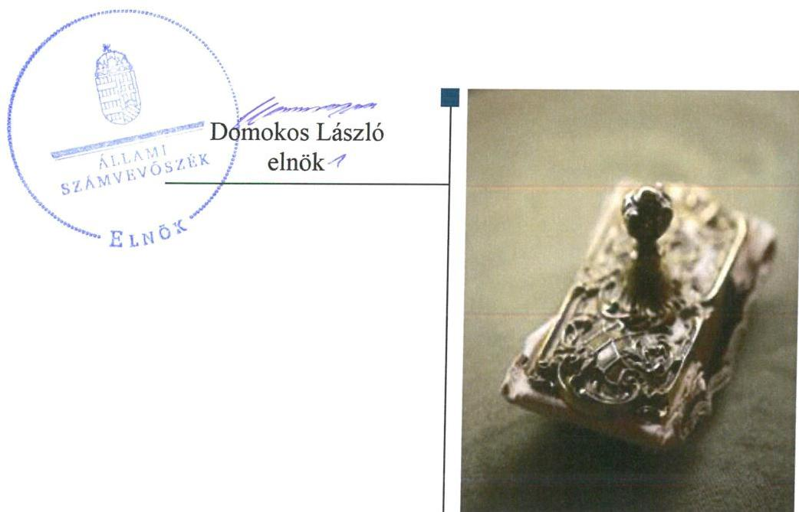
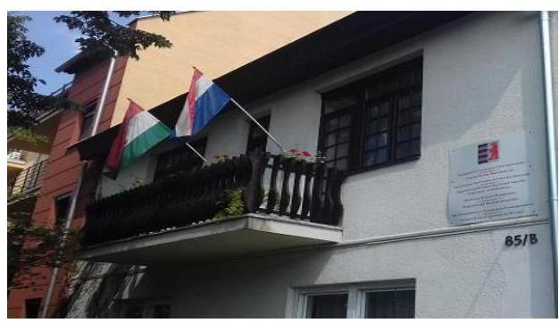

# Jelentés 

## Utóellenőrzések

Az országos nemzetiségi önkormányzatok gazdálkodásának utóellenőrzése - Országos Ruszin Önkormányzat
2018. 10. hó 16. nap

---

# AZ ELLENŐRZÉST FELÜGYELTE: 

VARGA EDIT felügyeleti vezető

## AZ ELLENŐRZÉST VEZETTE ÉS A VÉGREHAJTÁSÁÉRT FELELŐS:

JÁNOSI ISTVÁN ellenőrzésvezető

## A PROGRAM ÖSSZEÁLLÍTÁSÁÉRT FELELŐS:

TÓTPÁL SZABOLCS osztályvezető

## A TÉMÁHOZ KAPCSOLÓDÓ KORÁBBI SZÁMVEVŐSZÉKI JELENTÉSEK:

- címe: Jelentés - Az Országos Nemzetiségi Önkormányzatok gazdálkodásának ellenőrzéséről - Országos Ruszin Önkormányzat
- sorszáma: 15123

IKTATÓSZÁM: EL-1136-001/2018.
TÉMASZÁM: 2460
ELLENŐRZÉS-AZONOSÍTÓ SZÁM: V080409

---

# TARTALOMJEGYZÉK 

■ ÖSSZEGZÉS ..... 5
■ AZ ELLENŐRZÉS CÉLJA ..... 6
■ AZ ELLENŐRZÉS TERÜLETE ..... 7
■ AZ ELLENŐRZÉS HÁTTERE, INDOKOLTSÁGA ..... 8
■ A JELENTÉS LÉNYEGES KÉRDÉSKÖRE ..... 9
■ ELLENŐRZÉS HATÓKÖRE ÉS MÓDSZEREI ..... 10
■ MEGÁLLAPÍTÁSOK ..... 12
■ MELLÉKLETEK ..... 15
I. sz. melléklet: Országos Ruszin Önkormányzat intézkedési terve végrehajtásának értékelése ..... 15
II. sz. melléklet: Országos Ruszin Önkormányzat intézkedési terve. ..... 19
■ FÜGGELÉK: ÉSZREVÉTELEK ..... 23
■ RÖVIDÍTÉSEK JEGYZÉKE ..... 25

---

.

---

# ÖSSZEGZÉS 

Az Állami Számvevőszék az Országos Ruszin Önkormányzat gazdálkodásának utóellenőrzése során megállapította, hogy az intézkedési tervben foglalt feladatok végrehajtása következtében a belső kontrollrendszer szabályozottsága javult, azonban annak szabályszerű működtetését nem biztosították. A pénzügyi- és vagyongazdálkodás szabályszerűségének biztosítására vonatkozó intézkedések elmaradása továbbra is veszélyezteti a közpénzekkel való felelős, elszámoltatható és átlátható gazdálkodást.

## Az ellenőrzés társadalmi indokoltsága

Az Állami Számvevőszék stratégiájában célul tűzte ki a számvevőszéki munka hasznosulásának javítását. Ezzel összhangban ellenőrzi, hogy az ellenőrzött szervezet megvalósította-e a korábbi ellenőrzései által feltárt hibák, hiányosságok és szabálytalanságok megszüntetése céljából elkészített intézkedési tervében foglaltakat. A rendszeres utóellenőrzések hozzájárulnak a szükséges intézkedések tényleges végrehajtásához, ezáltal a közpénzügyek rendezettségének javulásához.

## Főbb megállapítások, következtetések

Az Országos Ruszin Önkormányzat az intézkedési tervében 18 végrehajtandó feladatot határozott meg, amelyből ötöt határidőben, hármat részben, hetet nem hajtott végre, továbbá egy feladat okafogyottá vált, kettő nem volt időszerű.

Az integritás biztosítása érdekében intézkedtek a hivatalvezető személyének cseréjéről.
A belső kontrollrendszer szabályozottsága a végrehajtott intézkedések eredményeként javult. Gondoskodtak a számviteli-gazdálkodási szabályzatok felülvizsgálatáról és módosításáról, az Országos Ruszin Önkormányzat Hivatalának SZMSZ-ét és a kapcsolódó ügyrendet a jogszabályi előírásokkal összhangban kiegészítették. Szabályozták a kockázatkezelési rendszert, az ügyintézési folyamatok nyomon követését, valamint az adatok védelmét és az iratok, bizonylatok biztonságos megőrzését. A belső kontrollrendszer szabályszerű működtetését ugyanakkor nem biztosították: nem működtették a kockázatkezelési rendszert és a belső ellenőrzést, továbbá nem gondoskodtak a közérdekű adatok közzétételéről.

A pénzügyi gazdálkodás szabályszerűsége nem javult. A költségvetési határozat-tervezeteket a jogszabályi előírásokkal összhangban készítették el, azonban az éves költségvetési beszámolókra vonatkozó, jogszabályban előírt adatszolgáltatási kötelezettségnek nem tettek eleget.

A vagyongazdálkodás szabályszerűsége nem javult. A jogszabályi előírások ellenére nem gondoskodtak az éves beszámolók mérlegét alátámasztó leltár összeállításáról, nem dokumentálták a tárgyi eszközök és immateriális javak üzembe helyezését.

Az intézkedési tervben rögzített feladatok végrehajtását tartalmazó nyilvántartást a jogszabályi előírásoknak megfelelően vezették.

---

# AZ ELLENŐRZÉS CÉLJA 

Az ellenőrzés célja annak értékelése volt, hogy a számvevőszéki jelentésben ${ }^{1}$ foglalt intézkedést igénylő megállapításokkal összhangban készített intézkedési tervben meghatározott feladatokat az ellenőrzött szervezet vég-rehajtotta-e.

---

# AZ ELLENŐRZÉS TERÜLETE

## Országos Ruszin Önkormányzat

Az Országos Ruszin Önkormányzat 1999. évben alakult, ellátja az általa képviselt kisebbség érdekeinek országos, illetve szükség szerint a területi képviseletét és védelmét. Az Önkormányzat² elnöke 2014. október 28-ától kezdődően látta el feladatát.

Az Országos Ruszin Önkormányzat Hivatalát 2009. november 5-én hozta létre az Önkormányzat. A Hivatal³ feladata az Önkormányzat és intézményei gazdálkodásával kapcsolatos feladatok ellátása volt.

Az ÁSZ⁴ a 2015. évben ellenőrizte az Önkormányzat gazdálkodását a 2010. január 1. – 2014. június 30. közötti időszak vonatkozásában. Az ellenőrzés célja annak értékelése volt, hogy az országos nemzetiségi önkormányzat gazdálkodása, a belső kontrollrendszer kialakítása és működtetése, az államháztartásból nyújtott támogatás, illetve az államháztartásból meghatározott célra ingyenesen juttatott vagyon felhasználása a jogszabályi előírásoknak megfelelően történt-e. Az ÁSZ az ellenőrzésről szóló 15123. sorszámú jelentését 2015. szeptember 24-én hozta nyilvánosságra.

Az utóellenőrzés az Önkormányzat ellenőrzéséről készült 15123. számú ÁSZ jelentés intézkedést igénylő megállapításai és javaslatai hasznosítására elfogadott intézkedési tervben foglalt feladatok 2015. szeptember 24. – 2018. május 23. közötti végrehajtására irányult.

---

# AZ ELLENŐRZÉS HÁTTERE, INDOKOLTSÁGA 

Az ÁSZ tv. ${ }^{5}$ 33. § (1) bekezdése értelmében a számvevőszéki jelentések intézkedést igénylő megállapításaihoz és javaslataihoz kapcsolódóan az ellenőrzött szervezet vezetője intézkedési tervet köteles összeállítani, és az Állami Számvevőszék részére megküldeni.

Az ÁSZ által befogadott intézkedési tervben foglaltak megvalósítását - az ÁSZ tv. 33. § (7) bekezdésében foglaltak alapján - az Állami Számvevőszék utóellenőrzés keretében ellenőrizheti. Az utóellenőrzések keretében - az intézkedések értékelése során - az Állami Számvevőszék figyelembe veszi az ellenőrzött szervezetek működési feltételeiben, valamint a jogszabályi előírásokban bekövetkezett változásokat.

Az utóellenőrzés során az ÁSZ értékeli, hogy az érintett számvevőszéki jelentésben foglalt intézkedést igénylő megállapításokkal és javaslatokkal összhangban, az ellenőrzött szervezet által készített intézkedési tervben meghatározott feladatokat a feladatra kijelöltek végrehajtották-e.

Az intézkedések végrehajtásával az adott terület szabályszerű működése vonatkozásában a kockázatok csökkenhetnek, azonban hosszabb távon az intézkedési tervben foglaltak végrehajtásával önmagában nem szűnnek meg, csak akkor, ha beépülnek az ellenőrzött szervezet működésébe, azokat folyamatosan karban tartják, figyelembe véve, illetve kezelve a változásokat. Emellett az intézkedések végrehajtásáig újabb kockázatok merülhetnek fel a szabályszerű működés vonatkozásában, amelyek kezelése szintén kiemelten fontos az ellenőrzött szervezet számára.

Az ellenőrzött szervezet vezetője által készített intézkedési tervekben foglalt feladatok hiányos, illetve késedelmes végrehajtása, vagy annak elmaradása a szabályszerűség és a felelős vezetői magatartás vonatkozásában kockázatot hordoz, ami azt mutatja, hogy az ellenőrzések során feltárt hibák, hiányosságok és szabálytalanságok kezelése nem kapott kellő hangsúlyt. Az utóellenőrzés során is fennálló szabálytalanságok esetén a közpénz, közvagyon veszélyeztetettségi kockázat valószínűsített hatásának értékelése további intézkedéseket vonhat maga után.

Az ellenőrzött szervezet szintjén az utóellenőrzés feltárja, hogy a szervezet az intézkedések végrehajtásával hasznosította-e a korábbi ellenőrzési jelentésben a hiányosságok megszüntetése, illetve a kockázatok kezelése érdekében megfogalmazott javaslatokat, illetve az intézkedések végrehajtása elmaradásának következtében továbbra is fennálló szabálytalanság esetén értékeli a közpénzek, közvagyon veszélyeztetettségét.

Az ÁSZ szintjén az utóellenőrzés visszacsatolást ad az ellenőrzési jelentések hasznosulásáról, az intézkedések elmaradásának, vagy részleges megvalósulásának a közpénzek, közvagyon veszélyeztetettségére gyakorolt valószínűsített hatásának értékelése, további intézkedéseket vonhat maga után.

---

# A JELENTÉS LÉNYEGES KÉRDÉSKÖRE 

Az Önkormányzat az intézkedési tervben foglaltakat az előírt határidőben végrehajtotta-e?

---

# ELLENŐRZÉS HATÓKÖRE ÉS MÓDSZEREI 

## Az ellenőrzés típusa

Megfelelőségi ellenőrzés.

## Az ellenőrzött időszak

Az utóellenőrzés alapját képező számvevőszéki jelentés közzétételének napjától (2015. szeptember 24.) az ellenőrzésről szóló kiértesítő levél keltének napjáig (2018. május 23.) tartó időszak.

## Az ellenőrzés tárgya

Az ÁSZ tv. 2011. július 1-jei hatálybalépését követően a számvevőszéki jelentésben foglalt intézkedést igénylő megállapításokkal összhangban - az Önkormányzat által - készített Intézkedési tervben foglaltak végrehajtásának ellenőrzése.

## Az ellenőrzött szervezet

Országos Ruszin Önkormányzat és az Országos Ruszin Önkormányzat Hivatala

## Az ellenőrzés jogalapja

Az ellenőrzés jogszabályi alapját az ÁSZ tv. 33. § (7) bekezdésének előírása képezi.

## Az ellenőrzés módszerei

Az ellenőrzést az ellenőrzött időszakban hatályos jogszabályok, az ellenőrzés szakmai szabályai, a jelen ellenőrzésre irányadó ÁSZ módszertanok, az ellenőrzési programban foglalt értékelési szempontok szerint, végeztük.

Az ellenőrzés ideje alatt az Önkormányzattal történő kapcsolattartást az ÁSZ SZMSZ ${ }^{6}$-ének vonatkozó előírásai alapján biztosítottuk.

Az utóellenőrzés megállapításait az ÁSZ rendelkezésére álló, valamint az ÁSZ adatbekérése szerint, az Önkormányzat által rendelkezésre bocsátott dokumentumok alapozták meg.

Az ellenőrzési bizonyítékként felhasználható adatforrások közé tartoztak egyrészt az ellenőrzési program részletes szempontjainál felsorolt

---

adatforrások, másrészt minden - az ellenőrzés folyamán feltárt, az ellenőrzés szempontjából információt tartalmazó - dokumentum.

Az intézkedési tervekben előírt feladatokat azok végrehajthatósága, illetve végrehajtása szempontjából az alábbiak szerint értékeltük:
$\longrightarrow$ „határidőben végrehajtott" a feladat, ha a teljesítés dokumentáltan, az intézkedési tervben előírt határidőben és tartalommal megtörtént;
$\longrightarrow$ „határidőn túl végrehajtott" a feladat, ha annak teljesítése az intézkedési tervben meghatározott módon, de az előírt határidőn túl történt meg;
$\longrightarrow$ „részben végrehajtott" a feladat, ha végrehajtása teljes körűen az intézkedési tervben előírt módon nem történt meg;
$\longrightarrow$ „nem végrehajtott" a feladat, ha a végrehajtás nem történt meg, vagy amennyiben a teljesítést nem dokumentálták;
$\longrightarrow$ „okafogyottá vált" a feladat, ha végrehajtására - meghatározott esemény bekövetkezése, továbbá külső körülmény, a működést érintő feltétel változása miatt - már nincs szükség, illetve lehetőség, és egyértelműen megállapítható, hogy az intézkedést szükségessé tevő körülmény a jövőben nem fordulhat elő;
$\longrightarrow$ „nem időszerű" az a feladat, amelynek ellenőrzési időszakon belüli végrehajtására azért nem került (kerülhetett) sor, mert az intézkedés alapjául szolgáló esemény nem következett be, de annak jövőbeni előfordulása lehetséges, a végrehajtása nem volt esedékes, vagy a végrehajtás határideje még nem járt le.
Az ellenőrzés lefolytatásához az Önkormányzat a tanúsítványok elektronikus kitöltésével, valamint az ÁSZ által kért dokumentumok elektronikus megküldésével szolgáltatott adatokat, amelyek valódiságát és teljes körűségét az ellenőrzött szervezet vezetője által tett teljességi és hitelességi nyilatkozat igazolja. Az így rendelkezésre bocsátott adatok, információk kontrollja az ellenőrzés keretében megtörtént.

Az ellenőrzött szervezet által megküldött intézkedési tervben meghatározott, ÁSZ által beazonosított feladatok a II. számú mellékletben kerültek bemutatásra.

---

# MEGÁLLAPÍTÁSOK 

## Az Önkormányzat az intézkedési tervben foglaltakat az előírt határidőben végrehajtotta-e?

Összegző megállapítás

Az Önkormányzat az intézkedési tervben szereplő 18 feladatból ötöt határidőben végrehajtott, három feladatot részben, hét feladatot nem hajtott végre, egy feladat okafogyottá vált, két feladat nem volt időszerű. Az intézkedési tervben meghatározott feladatok végrehajtásáról vezettek nyilvántartást.

Az Önkormányzat az általa elkészített és az ÁSZ által elfogadott intézkedési tervében meghatározott 18 feladatból ötöt határidőben végrehajtott, három feladatot részben, hét feladatot nem hajtott végre, egy feladat okafogyottá vált, két feladat nem volt időszerű.

Az Önkormányzat intézkedési tervében meghatározott feladatokat, határidőket, a feladatok végrehajtásáért felelős személyeket és a feladatok végrehajtását az I. sz. melléklet mutatja be.

A hivatalvezető ${ }^{7}$ gondoskodott az intézkedési tervben meghatározott feladatok végrehajtásának Bkr. ${ }^{8} 14 . \S$ (1) bekezdés előírása szerinti nyilvántartásáról.

Az Önkormányzat intézkedési tervében vállalt feladatok végrehajtásának értékelését az 1. ábra szemlélteti.

1. ábra

A feladatok végrehajtásának értékelési kategóriák szerinti megoszlása

- Nem végrehajtott
- határidőben végrehajtott
- Részben végrehajtott
- Okafogyottá vált
- Nem időszerű

---

AZ INTEGRITÁS biztosítása érdekében az elnök ${ }^{9}$ intézkedett a hivatalvezető személyének cseréjéről. A korábbi hivatalvezető közszolgálati jogviszonyát megszüntette, az új hivatalvezető kinevezését megelőzően a pályázati felhívás tervezetét elkészítette és azt a Közgyűlés ${ }^{10}$ határozatban fogadta el (6).

A BELSŐ KONTROLL RENDSZER szabályszerű működtetésének biztosítása érdekében a hivatalvezető gondoskodott a Hivatal számviteli-gazdálkodási szabályzatainak felülvizsgálatáról és azok jogszabályi előírásoknak megfelelő kiadásáról (1). A hivatali SZMSZ ${ }^{11}$-t és a kapcsolódó hivatali Ügyrendet ${ }^{12}$ az Ávr. ${ }^{13}$ előírásaival összhangban módosította (2). Ugyanakkor a gazdasági szervezet ügyrendjét nem egészítette ki az Ávr. és a Bkr. által előírt tartalmi elemekkel (9,10).

A hivatalvezető gondoskodott az Informatikai biztonsági szabályzat ${ }^{14}$ és
 a Közszolgálati adatvédelmi szabályzat ${ }^{15}$ kiadásáról (3).

A hivatalvezető a Bkr. előírásaival összhangban kiadta a Belső Ellenőrzési Kézikönyvet ${ }^{16}$, továbbá gondoskodott arról, hogy a belső ellenőrzési tevékenység végzésével megbízott külső szolgáltató megbízási szerződése tartalmazta a belső ellenőrzési vezető feladatait (4). A Bkr.-ben és az Áht.-ban foglalt előírások ellenére nem gondoskodott a nyomonkövetési rendszer, valamint a belső ellenőrzés működtetéséről (11,12).

A hivatalvezető a 2016. január 1-jétől hatályos Belső kontrollrendszer szabályzatban a Bkr. előírásainak megfelelően kialakította a kockázatkezelési rendszert, azonban a kockázatkezelési rendszer működtetéséről nem gondoskodott (7).

A hivatalvezető és a gazdasági vezető az Info. tv. ${ }^{17}$ előírásai ellenére nem gondoskodott a közérdekű adatok közzétételéről (8).

A PÉNZÜGYI GAZDÁLKODÁS szabályszerűsége érdekében a hivatalvezető a költségvetési határozat-tervezeteket az Áht. előírásaival összhangban készítette el (5). Ugyanakkor nem intézkedett annak érdekében, hogy az éves költségvetési beszámolók az Áhsz. ${ }^{18}$-ben előírt határidőn belül feltöltésre kerüljenek a Kincstár által működtetett elektronikus adatszolgáltatási rendszerbe (13).

A VAGYONGAZDÁLKODÁS szabályszerűsége érdekében a hivatalvezető a Számv. tv. ${ }^{19}$-ben foglalt előírások ellenére nem gondoskodott az éves beszámolók mérlegeiben szereplő leltárral történő alátámasztásáról (14).

A hivatalvezető az Áhsz. előírásai ellenére nem dokumentálta a tárgyi eszközök és immateriális javak üzembe helyezését (15).

---

.

---

# MELLÉKLETEK

- I. SZ. MELLÉKLET: ORSZÁGOS RUSZIN ÖNKORMÁNYZAT INTÉZKEDÉSI TERVE VÉGREHAJTÁSÁNAK ÉRTÉKELÉSE

|  5
2015 | Intézkedési tervben meghatározott feladat | Az intézkedési tervben meghatározott határidő | Az intézkedési tervben meghatározott feladat felelőse | A feladat végrehajtása  |
| --- | --- | --- | --- | --- |
|  1. | (H.1) A Hivatal számviteli-gazdálkodási szabályzatai felülvizsgá-
latra kerülnek, amelyeket a hivatalvezető hagyja jóvá. | 2016. március 1. | hivatalvezető | A hivatalvezető a Hivatal számviteli-gazdálkodási szabályzatait felülvizsgálta és az Áht. 69. (2) bekezdésében foglalt előírással összhangban intézkedett azok 2016. január 1-jei hatállyal történő kiadásáról.  |
|  2. | (H.2) A Hivatal SZMSZ-e felülvizsgálatra kerül, amelynek során beépítésre kerülnek a jelentés 2. számú javaslatában foglaltak. | 2016. március 1. | hivatalvezető | A felülvizsgált, 2016. január 1-jétől hatályos hivatali SZMSZ és a kapcsolódó hivatali Ügyrend az Ávr. 13. § (1) bekezdés c), e), valamint g)-i) pontjaiban, továbbá 13. § (5) bekezdésében foglalt előírásoknak megfelelően tartalmazta
- az ellátandó, kormányzati funkció szerint besorolt alaptevékenységeket,
- a szervezeti felépítést és a működés rendjét, a szervezeti egységeken belül a gazdasági szervezet - megnevezését, feladatait, a költségvetési szerv szervezeti ábráját,
- a nevesített munkakörökhöz tartozó hatásköröket, nevesített munkakörökhöz tartozó hatáskörök gyakorlásának módját, az ezekhez kapcsolódó felelősségi szabályokat, a helyettesítés általános rendjét,
- a munkáltatói jogok gyakorlásának - ideértve az átruházott munkáltatói jogokat is - rendjét,
valamint a hivatalhoz rendelt más költségvetési szervek felsorolását.  |
|  3. | (H.7) A jelentés 7. számú megállapításában foglaltakra tekintettel a jövőben biztosításra kerül az ügyintézési folyamatok nyomon követése, az adatok védelme, valamint az iratok, bizonylatok biztonságos megőrzése. | folyamatos | hivatalvezető, titkársági ügyintéző | A hivatalvezető kiadta az Informatikai biztonsági szabályzatot és a Közszolgálati adatvédelmi szabályzatot, amivel az lkr. ${ }^{20}$ előírásaival összhangban biztosította az Önkormányzat és a Hivatal ügyintézési folyamatainak nyomon követését, az adatok védelmét, valamint az iratok, bizonylatok biztonságos megőrzését.  |
|  4. | (H.9) A jelentés 9. számú megállapításában foglaltakra tekintettel jóváhagyásra kerül a belső ellenőrzési kézikönyv. A feladat-ellátási | folyamatos, 2016.
március 31. | hivatalvezető | A hivatalvezető a Bkr. 17. § (1) bekezdésében foglalt előírásokkal összhangban 2015. október 31-ei hatállyal kiadta a Belső Ellenőrzési Kézikönyvet.  |

---

|  5. | Intézkedési tervben meghatározott feladat | Az intézkedési tervben meghatározott határidő | Az intézkedési tervben meghatározott feladat felelőse | A feladat végrehajtása  |
| --- | --- | --- | --- | --- |
|   | szerződés felülvizsgálatra kerül, amelynek eredményeként a megbízási szerződést az ÁSZ jelentésben foglaltakra tekintettel módosítják. |  |  | A belső ellenőrzési tevékenység végzésével megbízott külső szolgáltató 2015. május 1-jétől hatályos megbízási szerződése a Bkr. 22. § (1)-(2) bekezdéseiben foglalt előírásokkal összhangban rögzítette a belső ellenőrzési vezető feladatait.  |
|  5. | (H.11) A jelentés 11. számú megállapításában foglaltakra tekintettel a jövőben a költségvetési határozat-tervezetek a jogszabályban meghatározottak szerint kerülnek elkészítésre. | értelem szerint, folyamatos | hivatalvezető | A hivatalvezető által készített költségvetési határozat-tervezetek az Áht. 23. § (2) bekezdés aa) pontjában és 24. § (4) bekezdés a) pontjában foglalt előírásoknak megfelelően tartalmazták a költségvetési bevételi és kiadási előirányzatokat kötelező és önként vállalt feladatok bontásban, a költségvetési mérleget közgazdasági tagolásban, az előirányzat felhasználási tervet, valamint ezek szöveges indoklását.  |
|   |  | Részben végrehajtott feladatok |  |   |
|  6. | (E.1) A Közgyűlés intézkedést tesz a hivatalvezetői álláshely betöltése érdekében. Figyelembe veszi a jogszabályi előírásokat a foglalkoztatás során: - képesítési előírásoknak megfelelő személyt nevez ki; - a vezető kinevezés feltétele - helyettesítés kivételével a hivatalvezető más költségvetési szervnél nem lehet vezető. Az elnök a hivatalvezetőre vonatkozó pályázati felhívást tervezetét elkészíti és a közgyűlés elé terjeszti. | 2015. december 15. | elnök | Végrehajtott feladatrész:
Az elnök intézkedett a hivatalvezetői feladatokat ellátó személy cseréjéről. A korábbi hivatalvezető közszolgálati jogviszonyát megszüntette, az új hivatalvezető foglalkoztatására vonatkozó pályázati felhívás tervezetét elkészítette és azt a Közgyűlés a 101/2015. (XII. 3.) ORÖ számú határozattal elfogadta.
Nem végrehajtott feladatrész:
Az elnök nem igazolta, hogy a Közgyűlés a pályázat értékelése és az új hivatalvezető kinevezése során betartotta az Áht. 10. § (2) bekezdésében foglalt előírást, amely szerint a költségvetési szerv vezetője - helyettesítés kivételével - más költségvetési szervnél nem lehet vezető.  |
|  7. | (H.4) A kockázatkezelési rendszer kialakítása és működtetése során figyelembe és végrehajtásra kerülnek a 4. számú javaslatban megfogalmazottak. | 2016. március 1. | hivatalvezető | Végrehajtott feladatrész:
A hivatalvezető a 2016. január 1-jétől hatályos Belső kontrollrendszer szabályzatban a Bkr. 6. § (4) bekezdésében foglalt előírásnak megfelelően kialakította a kockázatkezelési rendszert.
Nem végrehajtott feladatrész:
A hivatalvezető a Bkr. 7. § (1) bekezdésében foglalt előírás ellenére nem gondoskodott a kockázatkezelési rendszer működtetéséről.  |

---

|  8. | Intézkedési tervben meghatározott feladat | Az intézkedési tervben meghatározott feladati feladat | Az intézkedési tervben meghatározott feladat felelőse | A feladat végrehajtása  |
| --- | --- | --- | --- | --- |
|  8. | (H.6) A jelentés 6. számú javaslatában foglaltak alapján az Önkormányzat működésére vonatkozó adatok, az éves költségvetések, valamint az Önkormányzat által kapott és nyújtott támogatások adatai közzétételre kerülnek. | folyamatos | hivatalvezető, gazdasági vezető | Végrehajtott feladatrész:
A hivatalvezető és a gazdasági vezető gondoskodott az Önkormányzat által alapított lap (Ruszin Világ) adatainak (szerkesztőség, kiadó neve és címe, főszerkesztő neve), a 2016-2017. évi éves költségvetéseinek, valamint a kapott támogatások adatainak közzétételéről.
Nem végrehajtott feladatrész:
A hivatalvezető és a gazdasági vezető az Info. tv. 37. § (1) bekezdésében és 1. mellékletében foglalt előírások ellenére nem tette közzé az Önkormányzat felett törvényességi ellenőrzést gyakorló szervének adatait, elérhetőségeit, a 2018. évi éves költségvetését, a foglalkoztatottak létszámára és személyi juttatásaira vonatkozó összesített adatokat, illetve összesítve a vezetők és vezető tisztségviselők illetményére, munkabérére, és rendszeres juttatásaira, valamint költségtérítéseire, az egyéb alkalmazottaknak nyújtott juttatások fajtájára és mértékére összesítve, valamint a nyújtott támogatások adatait.  |
|  9. | (H.3) A gazdasági szervezet ügyrendje felülvizsgálatra kerül, amely során a 3. számú javaslatban meghatározottakkal kiegészül. | 2016. március 1. | hivatalvezető | A hivatalvezető az Ávr. 13. § (5) bekezdésében foglalt előírás ellenére a gazdasági szervezet ügyrendjébe nem építette be a gazdasági szervezet belső és külső kapcsolattartásának szabályait, valamint a gazdasági szervezetben dolgozó munkavállalók helyettesítési rendjét.  |
|  10. | (H.5) A gazdasági szervezet ügyrendje felülvizsgálatra kerül, amelynek során kiegészül az 5. számú javaslatban foglalt szabályokkal. | 2016. március 1. | hivatalvezető | A hivatalvezető a gazdasági szervezet beszámolási határidőit nem rögzítette a gazdasági szervezet ügyrendjében.  |
|  11. | (H.8) A jelentés 8. számú megállapításában foglaltakra tekintettel kialakításra kerül a Hivatal tevékenységének, a célok megvalósításának nyomon követését biztosító rendszer, amelynek működtetése folyamatos lesz. | 2016.március 1., folyamatos | hivatalvezető | A hivatalvezető a Bkr. 3. § e) pontjában foglalt előírás ellenére nem gondoskodott a nyomon követési rendszer működtetéséről, továbbá az Áht. 70.§ (1) bekezdése ellenére nem gondoskodott a belső ellenőrzés kialakításáról és megfelelő működtetéséről.  |
|  12. | (H.10) A jelentés 10. számú megállapításában foglaltakra tekintettel a hivatalvezető intézkedik a belső ellenőrzési vezetőnél az intézkedési tervek végrehajtásának nyomon követésének dokumentálása ügyében. A belső ellenőrzési vezető az ÁSZ javaslatra tekintettel vezessen fel nyilvántartást az intézkedési tervek végrehajtásának nyomon követéséről. | azonnal, folyamatos | hivatalvezető | A hivatalvezető a Bkr. 16. § (2) bekezdésében, 22. §-ában és 48. §-ában foglalt előírások ellenére nem gondoskodott a belső ellenőrzés működtetéséről.  |

---

|  12
13
14 | Intézkedési
tervben
meghatározott
feladat | Az intézkedési
tervben
meghatározott
határidő | Az intézkedési
tervben
meghatározott fel-
adat felelőse | A feladat végrehajtása  |
| --- | --- | --- | --- | --- |
|  13. | (H.12) A jelentés 12. számú megállapításában foglaltakra tekintet-
tel a jövőben a pénzügyi gazdasági beszámoló határidőn belüli
megküldéséről intézkedés megtörtént. | értelem szerint, folyamatos | hivatalvezető, gaz-
dasági vezető | A hivatalvezető nem intézkedett annak érdekében, hogy az éves költség-
vetési beszámoló határidőn belül feltöltésre kerüljön a Kincstár által mű-
ködtetett elektronikus adatszolgáltatási rendszerbe. A 2015. évi költség-
vetési beszámoló az Áhsz. 32. § (4) bekezdésben rögzített március 20-ai
határidőt követően, 16 naptári nap késedelemmel került feltöltésre. A hi-
vatalvezető a 2016. és 2017. évi költségvetési beszámolókat a Kincstár ál-
tal működtetett elektronikus adatszolgáltatási rendszerbe nem töltötte
fel.  |
|  14. | (H.13) A jelentés 13. számú megállapításában foglaltakra tekintet-
tel a mérlegkészítés időszakában elkészül az alátámasztó leltár,
amely az eszközök tételes és ellenőrizhető módon tartalmazza. | értelem szerint, folyamatos | hivatalvezető, gaz-
dasági vezető | A hivatalvezető a Számv. tv. 69. § (1) bekezdésében, valamint az Áhsz. 22.
§ (1) bekezdésében foglalt előírások ellenére – a 2015. évi beszámoló
mérlegében szereplő Gépek, berendezések, felszerelések, járművek mér-
legsor kivételével – nem gondoskodott a 2015-2017. évi éves beszámolók
mérlegeiben szereplő tételek alátámasztásához olyan leltár összeállításá-
ról, amely tételesen, ellenőrizhető módon tartalmazza a mérlegben sze-
replő eszközöket és forrásokat.  |
|  15. | (H.14) A jelentés 14. számú megállapításában foglaltakra tekintet-
tel a tárgyi eszközök és immateriális javak vonatkozásában az
üzembehelyezési kötelezettség a

 jövőben megtörténik. | értelem szerint, folyamatos | hivatalvezető, gazdasági vezető | A hivatalvezető a 2015-2017. években a Számv. tv. 52. § (2) bekezdésében foglalt előírás ellenére nem dokumentálta a tárgyi eszközök és immateriális javak üzembe helyezését.  |
|   |  |  |  | Ökafogyottá vált feladat  |
|  16. | (H.15) A jelentés 15. számú megállapításában foglaltakra tekintettel az Önkormányzat működési támogatások felhasználásáról elkülönített nyilvántartás kerül vezetésre. | értelem szerint, folyamatos | hivatalvezető, gazdasági vezető | A feladatot megalapozó 428/2012. (XII. 29.) Korm. rendelet 2017. január 1-jén hatályát vesztette.  |
|   |  |  |  | Nem időszerű feladatok  |
|  17. | (H.16) A jelentés 16. számú megállapításában foglaltakra tekintettel a támogatási pályázatok elbírálása során előírt igazolások megléte, az előzőleg kapott támogatásokról az elszámolások megtörténte kerüljön ellenőrzésre a vonatkozó szabályoknak megfelelően. | folyamatos, 2016. március 31. | hivatalvezető, gazdasági vezető | Az ellenőrzött időszakban nem került sor új támogatási pályázatok kiírására.  |
|  18. | (H.17) A jelentés 17. számú megállapításában foglaltakra tekintettel a jövőben az Önkormányzat által nyújtott támogatások során ellenőrzésre kerül a kapott támogatások felhasználásának elszámolása. | értelem szerint, folyamatos | hivatalvezető, gazdasági vezető | Az ellenőrzött időszakban nem került sor új támogatási pályázatok kiírására.  |

---

# INTÉZKEDÉSI TERV   (Egységes szerkezetbe foglalva) 

Az Állami Számvevőszék „Az Országos Nemzetiségi Önkormányzatok gazdálkodásának ellenőrzéséről - Országos Ruszín Önkormányzat" szóló jelentés végrehajtására

## Az ÁSZ ellenőrzés intézkedést igénylő javaslatai:

## Az Elnöknek:

E. 1. számú intézkedés: A Közgyűlés intézkedést tesz a hivatalvezetői álláshely betöltése érdekében. Figyelemben veszi a jogszabályi előírásokat a foglalkoztatás során:

- képesítési előírásoknak megfelelő személyt nevez ki;
- a vezető kinevezés feltétele - helyettesítés kivételével -, a hivatalvezető más költségvetési szervnél nem lehet vezető.
Az elnök a hivatalvezetőre vonatkozó pályázati felhívás tervezetét elkészíti és a közgyűlés elé terjeszti.

Határidő: 2015. december 15.
Felelős: elnök

## A Hivatalvezetőnek:

A belső kontroll rendszer tekintetében:
H. 1

1. számú intézkedés: A Hivatal számviteli-gazdálkodási szabályzatai felülvizsgálatra kerülnek, amelyeket a hivatalvezető hagy jóvá.
Határidő: 2016. március 1.
Felelős: hivatalvezető
2. számú intézkedés: A Hivatal SZMSZ-e felülvizsgálata kerül, amelynek során beépítésre kerülnek a jelentés 2. számú javaslatában foglaltak.
Határidő: 2016. március 1.
Felelős: hivatalvezető
3. számú intézkedés: A gazdasági szervezet ügyrendje felülvizsgálatra kerül, amely során a 3. számú javaslatban meghatározottakkal kiegészül.
Határidő: 2016. március 1.
Felelős: hivatalvezető

---

H. 4 4. számú intézkedés: A kockázatkezelési rendszer kialakítása és működtetése során figyelembe és végrehajtásra kerülnek a 4. számú javaslatban megfogalmazottak. Határidő: 2016. március 1.
Felelős: hivatalvezető
H. 5 5. számú intézkedés: A gazdasági szervezet ügyrendje felülvizsgálatra kerül, amelynek során kiegészül az 5. számú javaslatban foglalt szabályokkal.
Határidő: 2016. március 1.
Felelős: hivatalvezető
H. 6 6. számú intézkedés: A jelentés 6. számú javaslatában foglaltak alapján az Önkormányzat működésére vonatkozó adatok az éves költségvetések, valamint az Önkormányzat által kapott és nyújtott támogatások adatai közzétételre kerülnek. Határidő: folyamatos
Felelős: hivatalvezető, gazdasági vezető
H. 7 7. számú intézkedés: A jelentés 7. számú megállapításában foglaltakra tekintettel a jövőben biztosításra kerül az ügyintézési folyamatok nyomon követése, az adatok védelme, valamint az iratok, bizonylatok biztonságos megőrzése.
Határidő: folyamatos
Felelős: hivatalvezető, titkársági ügyintéző
H. 8 8. számú intézkedés: A jelentés 8. számú megállapításában foglaltakra tekintettel a kialakításra kerül a Hivatal tevékenységének, a célok megvalósításának nyomon követését biztosító rendszer, amelynek működtetése folyamatos lesz.
Határidő: 2016. március 1., folyamatos
Felelős: hivatalvezető
H. 9 9. számú intézkedés: A jelentés 9. számú megállapításában foglaltakra tekintettel jóváhagyásra kerül a belső ellenőrzési kézikönyv. A feladat-kölcsönzési szerződés felülvizsgálatra kerül, amelynek eredményeként a megbízási szerződést az ÁSZ-jelentésben foglaltakra tekintettel módosítják.
Határidő: folyamatos, 2016. március 31.
Felelős: hivatalvezető
H. 10 10. számú intézkedés: A jelentés 10. számú megállapításában foglaltakra tekintettel a hivatalvezető intézkedik a belső ellenőrzési vezetőnél az intézkedési tervek végrehajtásának nyomon követésének dokumentálása ügyében. A belső ellenőrzési vezető az ÁSZ javaslatára tekintettel vezessen fel nyilvántartást az intézkedési tervek végrehajtásának nyomon követéséről.
Határidő: azonnal, folyamatos
Felelős: hivatalvezető

---

# A pénzügyi- és vagyongazdálkodás területén: 

H. 11. számú intézkedés: A jelentés 11. számú megállapításában foglaltakra tekintettel a jövőben a költségvetési határozattervezetek a jogszabályban meghatározottak szerint kerülnek elkészítésre.
Határidő: értelem szerint, folyamatos
Felelős: hivatalvezető
H. 12
12. számú intézkedés: A jelentés 12. számú megállapításában foglaltakra tekintettel a jövőben a pénzügyi-gazdasági beszámoló határidőn belüli megküldéséről intézkedés megtörténik.
Határidő: értelem szerint, folyamatos
Felelős: hivatalvezető, gazdasági vezető
H. 13. számú intézkedés: A jelentés 13. számú megállapításában foglaltakra tekintettel a mérlegkészítés időszakában elkészül az alátámasztó leltár, amely az eszközök tételes és ellenőrizhető módon tartalmazza.
Határidő: értelem szerint, folyamatos
Felelős: hivatalvezető, gazdasági vezető
14. számú intézkedés: A jelentés 14. számú megállapításában foglaltakra tekintettel a tárgyi eszközök és immateriális javak vonatkozásában az üzembehelyezési kötelezettség a jövőben megtörténik.
Határidő: értelem szerint, folyamatos
Felelős: hivatalvezető, gazdasági vezető

Az országos nemzetiségi önkormányzat részére adott, illetve az által nyújtott támogatások tekintetében:
H. 15. számú intézkedés: A jelentés 15. számú megállapításában foglaltakra tekintettel az Önkormányzat működési támogatások felhasználásáról elkülönített nyilvántartás kerül vezetésre.
Határidő: értelem szerint, folyamatos
Felelős: hivatalvezető, gazdasági vezető
H. 16. 16. számú intézkedés: A jelentés 16. számú megállapításában foglaltakra tekintettel a támogatási pályázatok elbírálása során előírt igazolások megléte, az előzőleg kapott támogatásokról az elszámolások megtörténte kerüljön ellenőrzésre a vonatkozó szabályoknak megfelelően.
Határidő: folyamatos, 2016. március 31.
Felelős: hivatalvezető, gazdasági vezető

---

17. számú intézkedés: A jelentés 17. számú megállapításában foglaltakra tekintettel a jövőben az Önkormányzat által nyújtott támogatások során ellenőrzésre kerül a kapott támogatások felhasználásának elszámolása.
Határidő: értelem szerint, folyamatos
Felelős: hivatalvezető, gazdasági vezető

Záradék: Az intézkedési terv módosítását az Országos Ruszín Önkormányzat Közgyűlése 2016. február 13-ai ülésén fogadta el, majd ezt követően került sor egységes szerkezetbe foglalására.

Budapest, 2016. február 13.

Kramarenko Viktor
elnök

Giricz Gabriella
hivatalvezető-helyettes

* Módosította a 12/2016.(II.13.) számú határozat, hatályos 2016. február 13-tól

---

# FÜGGELÉK: ÉSZREVÉTELEK 

A jelentéstervezetet a Számvevőszék 15 napos észrevételezésre megküldte az ellenőrzött szervezetek vezetőinek az ÁSZ tv. 29. § (1) bekezdése előírásának megfelelően.

Az ÁSZ a jelentéstervezetet észrevételezésre megküldte az Országos Ruszin Önkormányzat elnökének, valamint az Országos Ruszin Önkormányzat Hivatala hivatalvezetőjének.
Az Országos Ruszin Önkormányzat elnöke, valamint az Országos Ruszin Önkormányzat Hivatala hivatalvezetője az ÁSZ tv. 29. § (2) bekezdésében foglalt észrevételezési jogával nem élt, a jelentéstervezet megállapításaira a törvényes határidőn belül észrevételt nem tett.

[^0]
[^0]:    * 29. § (1) Az Állami Számvevőszék az ellenőrzési megállapításait megküldi az ellenőrzött szervezet vezetőjének vagy az általa megbízott személynek, és annak, akinek személyes felelősségét állapította meg.
    (2) Az ellenőrzött szervezet vezetője és a felelősként megjelölt személy az ellenőrzés megállapításaira tizenöt napon belül írásban észrevételt tehet.
    (3) Az Állami Számvevőszék az észrevételre a beérkezésétől számított harminc napon belül írásban válaszol. A figyelembe nem vett észrevételeket köteles a jelentésben feltüntetni, és megindokolni, hogy azokat miért nem fogadta el.

---

.

---

# RÖVIDÍTÉSEK JEGYZÉKE 

${ }^{1}$ számvevőszéki jelentés
${ }^{2}$ Önkormányzat
${ }^{3}$ Hivatal
${ }^{4}$ ÁSZ
${ }^{5}$ ÁSZ tv.
${ }^{6}$ ÁSZ SZMSZ
${ }^{7}$ hivatalvezető
${ }^{8}$ Bkr.
${ }^{9}$ elnök
${ }^{10}$ Közgyűlés
${ }^{11}$ hivatali SZMSZ
${ }^{12}$ hivatali Ügyrend
${ }^{13}$ Ávr.
${ }^{14}$ Informatikai biztonsági szabályzat
${ }^{15}$ Közszolgálati adatvédelmi szabályzat
${ }^{16}$ Belső Ellenőrzési Kézikönyv
${ }^{17}$ Info. tv.
${ }^{18}$ Áhsz.
${ }^{19}$ Számv. tv.
${ }^{20}$ Ikr.
„Az Országos Nemzetiségi Önkormányzatok gazdálkodásának ellenőrzése Országos Ruszin Önkormányzat" című 15123. számú jelentés
Országos Ruszin Önkormányzat
Országos Ruszin Önkormányzat Hivatala
Állami Számvevőszék
2011. évi LXVI. törvény az Állami Számvevőszékről
az Állami Számvevőszék Szervezeti és Működési Szabályzata
Országos Ruszin Önkormányzat Hivatalának vezetője
370/2011. (XII. 31.) Korm. rendelet a költségvetési szervek belső kontrollrendszeréről és belső ellenőrzéséről (hatályos: 2012. január 1-jétől)
Országos Ruszin Önkormányzat elnöke
Országos Ruszin Önkormányzat Közgyűlése
Országos Ruszin Önkormányzat Hivatala Szervezeti és Működési Szabályzata (hatályos: 2016. január 1-jétől)
Országos Ruszin Önkormányzat Hivatala Ügyrendje (hatályos: 2016. január 1-jétől)
368/2011. (XII. 31.) Korm. rendelet az államháztartásról szóló törvény végrehajtásáról (hatályos: 2012. január 1-jétől)
Országos Ruszin Önkormányzat és intézményei Informatikai biztonsági szabályzata (hatályos: 2016. január 1-jétől)
Országos Ruszin Önkormányzat és intézményei Közszolgálati adatvédelmi szabályzata (hatályos: 2016. január 1-jétől)
Országos Ruszin Önkormányzat és intézményei Belső Ellenőrzési Kézikönyve (hatályos: 2015. október 31-étől)
2011. évi CXII. törvény az információs önrendelkezési jogról és az információszabadságról (hatályos: 2011. július 27-étől)
4/2013. (I. 11.) Korm. rendelet az államháztartás számviteléről (hatályos: 2014. január 1-jétől)
2000. évi C. törvény a számvitelről (hatályos: 2001. január 1-jétől)

335/2005. (XII. 29.) Korm. rendelet a közfeladatot ellátó szervek iratkezelésének általános követelményeiről (hatályos: 2006. január 1-jétől)

---

# ÁLLAMI SZÁMVEVŐSZÉK 

1052 Budapest, Apáczai Csere János utca 10.
Levélcím: 1364 Budapest 4. Pf. 54
Telefon: +36 14849100 Telefax: +36 14849200
www.asz.hu

