# Jelenetés 

## Az állami tulajdonú gazdasági társaságok ellenőrzése

Kazincbarcikai Kórház Nonprofit Kft. 2018.

---

# Jelentés 

## Az állami tulajdonú gazdasági társaságok ellenőrzése

Kazincbarcikai Kórház Nonprofit Kft.
2018. 09. hó 24. nap
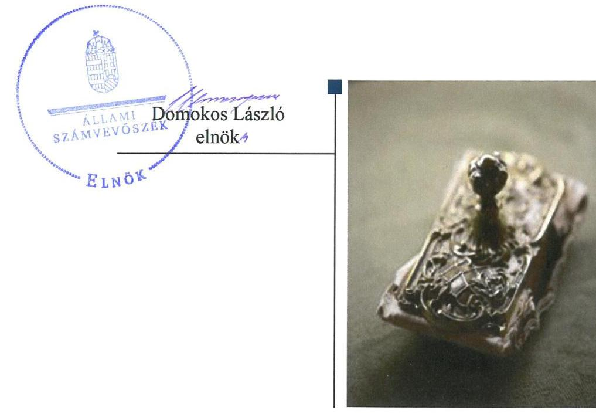

---

# AZ ELLENŐRZÉST FELÜGYELTE: 

PETŐ KRISZTINA felügyeleti vezető

## AZ ELLENŐRZÉST VEZETTE ÉS A VÉGREHAJTÁSÁÉRT FELELŐS:

SALI SÁNDORNÉ ellenőrzésvezető

## A PROGRAM ÖSSZEÁLLÍTÁSÁÉRT FELELŐS:

TÓTPÁL SZABOLCS osztályvezető

IKTATÓSZÁM: EL-0384-019/2018.
TÉMASZÁM: 2469

## ELLENŐRZÉS-AZONOSÍTÓ SZÁM: V081405

Jelentéseink az Országgyűlés számítógépes hálózatán és az Interneten a www.asz.hu címen is olvashatóak.

---

# TARTALOMJEGYZÉK 

■ ÖSSZEGZÉS ..... 5
■ AZ ELLENŐRZÉS CÉLJA ..... 6
■ AZ ELLENŐRZÉS TERÜLETE ..... 7
■ AZ ELLENŐRZÉS HÁTTERE, INDOKOLTSÁGA ..... 8
■ A JELENTÉS LÉNYEGES KÉRDÉSKÖREI ..... 9
■ AZ ELLENŐRZÉS HATÓKÖRE ÉS MÓDSZEREI ..... 10
■ MEGÁLLAPÍTÁSOK ..... 12
■ JAVASLATOK ..... 15
■ MELLÉKLETEK ..... 17
I. sz. melléklet: Értelmező szótár ..... 17
■ FÜGGELÉKEK ..... 21
I. sz. függelék a Megállapítások fejezethez ..... 21
II. sz. függelék: Észrevételek ..... 22
■ RÖVIDÍTÉSEK JEGYZÉKE ..... 39

---

.

---

# ÖSSZEGZÉS 

A Kazincbarcikai Kórház Nonprofit Kft. működésének szabályozottsága, gazdálkodása, vagyongazdálkodása a 2013. és a 2016. években nem volt szabályszerű, így az ügyvezető nem biztosította az elszámoltathatóságot és a vagyon védelmét. A Társaság közérdekű adatait nem tette közzé, ezáltal a működése nem volt átlátható. Az Állami Egészségügyi Ellátó Központ tulajdonosi joggyakorlása a Társaság felett 2013. és a 2016. évben nem volt szabályszerű.

## Az ellenőrzés társadalmi indokoltsága

Az állami tulajdonú gazdálkodó szervezetek a nemzeti vagyon részét képezik. Gazdálkodásuk, valamint a feladatellátásuk minősége és hatékonysága a közérdeklődés figyelmének középpontjában áll. A közpénzt, közvagyont felhasználó állami tulajdonú gazdálkodó szervezetekkel szemben társadalmi igény, hogy működésük, gazdálkodásuk szabályszerű, az általuk szolgáltatott adatok megbízhatóak legyenek. Az Állami Számvevőszék a közvagyon, a közpénzek szabályos, átlátható és elszámoltatható felhasználásának elősegítése érdekében, stratégiájával összhangban végzi az államháztartáson kívül működő szervezetek ellenőrzését.

Az egészségügy folyamatosan a társadalmi érdeklődés középpontjában áll, a központi költségvetés kiadásai között az egyik legjelentősebb területet jelentik az egészségügyi kiadások. Az Állami Számvevőszék céljaival és a terület kiemelt szerepével összhangban került sor a Kazincbarcikai Kórház Nonprofit Kft. ellenőrzésére.

## Főbb megállapítások, következtetések, javaslatok

A Kazincbarcikai Kórház Nonprofit Kft. működésének szabályozottsága, valamint gazdálkodása nem volt szabályszerű, mert a 2013. és a 2016. évben a számviteli törvényben előírt számlarenddel nem rendelkezett. A Társaság vagyongazdálkodása a 2016. évben nem volt szabályszerű, ezzel az elszámoltathatóságot és a vagyon védelmét nem biztosították. A jogszabály szerinti adatszolgáltatás tulajdonosi joggyakorló írásbeli elfogadása hiányában a kezelt vagyon érték növekedésének számviteli szabályok szerinti elszámolására nem került sor. Ezáltal a 2016. évi beszámoló mérlege nem adott valós képet a vagyoni helyzetről, sérült a valódiság elve. A Társaság a 2014-2016. években kormányzati szektorba sorolt szervezetként a jogszabályban előírt adatszolgáltatási kötelezettségének nem tett eleget. Ezzel összefüggésben az előírás ellenére a 2014. január 1-jétől 2016. szeptember 30-ig nem gondoskodott a szervezet tevékenységének, a célok megvalósításának nyomon követését biztosító rendszer kialakításáról. Mindezekkel nem volt biztosított az elszámoltathatóság és a vagyon védelme. A Társaság közérdekű adatait nem tette közzé, ezáltal a működése nem volt átlátható.

Az Állami Egészségügyi Ellátó Központ tulajdonosi joggyakorlása a Kazincbarcikai Kórház Nonprofit Kft. felett a 2013. és a 2016. évben nem volt szabályszerű. Az Állami Egészségügyi Ellátó Központ az előírás ellenére nem határozott a pótbefizetés előírásáról, a törzstőke mértékét elérő saját tőke más módon való biztosításáról vagy a törzstőke leszállításáról, illetve a Társaság átalakulásáról, egyesüléséről, szétválásáról vagy jogutód nélküli megszüntetéséről. A kezelt vagyon tekintetében a vagyonkezelési szerződést a felek a jogszabályi előírás változása ellenére nem módosították a 2016. évben.

A megállapítások alapján az Állami Számvevőszék az Állami Egészségügyi Ellátó Központ főigazgatójának kettő javaslatot, a Kazincbarcikai Kórház Nonprofit Kft. ügyvezetőjének hat javaslatot fogalmazott meg, amelyre 30 napon belül intézkedési tervet kell készíteniük.

---

# AZ ELLENŐRZÉS CÉLJA 

Az ellenőrzés célja annak értékelése, hogy a tulajdonosi jogok gyakorlása szabályszerű volt-e. A gazdálkodó szervezet szabályozottsága, gazdálkodása és vagyongazdálkodási tevékenysége megfelelt-e a jogszabályi és a tulajdonosi előírásoknak, biztosítva volt-e a közfeladatok átláthatósága, elszámoltathatósága érdekében a közszolgáltatás díjának megalapozottsága szabályszerű önköltségszámítással. A vagyonváltozást eredményező döntések esetében a tulajdonosi jogok gyakorlója és a gazdálkodó szervezet szabályszerűen jártak-e el. Az ellenőrzés célja volt továbbá annak megítélése, hogy a kormányzati szektorba sorolt állami tulajdonban (résztulajdonban) lévő gazdálkodó szervezetek gazdálkodásának a kormányzati szektor hiányára és az államadósságra befolyással bíró elemei a jogszabályi előírásoknak megfeleltek-e.

---

# AZ ELLENŐRZÉS TERÜLETE 

## A Kazincbarcikai Kórház Nonprofit Kft., valamint a Debreceni Egyetem és Állami Egészségügyi Ellátó Központ

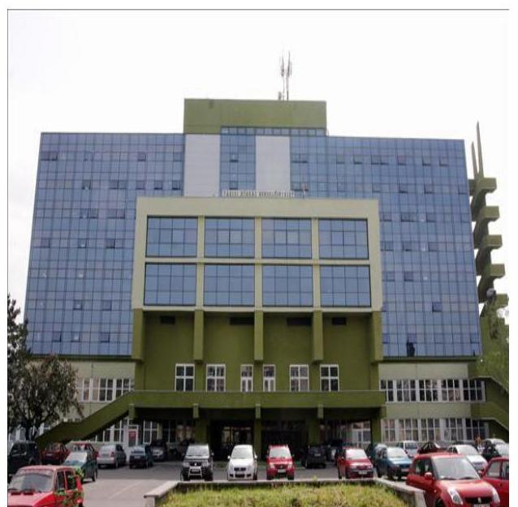

A Kazincbarcikai Kórház Nonprofit Kft.-t a Debreceni Egyetem alapította a 2008. évben. A jegyzett tőke összege $30,0 \mathrm{M} \mathrm{Ft}^{1}$ volt, mely az alapítás óta nem változott. A Társaság² ${ }^{2}$ közhasznú jogállású szervezetként működött. A Társaság a 2014. évtől kormányzati szektorba sorolt gazdálkodó szervezet.

A Társaság fő tevékenysége a fekvő- és járóbeteg-ellátás, valamint egyéb humán-egészségügyi ellátás biztosítása.

A Társaság feladatellátását szolgáló vagyont a Ttv. ${ }^{3}$ alapján az ellenőrzött időszakot megelőzően vagyonkezelési szerződés ${ }^{4}$ keretében a magyar állam biztosította, a kezelt vagyon feletti tulajdonosi jogok gyakorlására az ÁEEK⁵-et jelölte ki. A Társaság által kezelt vagyon értéke 2016. december 31. napján 3521,6 M Ft volt.

A Társaság üzletrészeinek kizárólagos tulajdonosa 2013. július 31. napjáig a Debreceni Egyetem volt. A 2013. augusztus 1. napján kötött üzletrész átruházási szerződés ${ }^{6}$ alapján a Társaság tulajdonosává 100%-ban a magyar állam és a tulajdonosi
jogok gyakorlására kijelölt szervezet az ÁEEK lett. A Társaság jogszabály alapján könyvvizsgálatra volt kötelezett.

A Társaság az ellenőrzött időszakban adósságot keletkeztető ügyletet nem kötött, tulajdonosi részesedéssel más gazdasági társaságban nem rendelkezett. A Társaságnál foglalkoztatottak átlagos állományi létszáma 2013-ban 327 fő, 2016-ban 373 fő volt. Az eszközök és források alakulását a II. sz. melléklet mutatja.

A Társaság 2016-ban a fekvőbeteg ellátást 215 ággyal biztosította (55 aktív és 160 krónikus ágy), a járóbeteg-szakellátásra fordított óraszám 1203 óra volt.

A Társaság ügyvezetőjének személye az ellenőrzött időszakban egy alkalommal - 2013. október 1-jével - változott.

---

# AZ ELLENŐRZÉS HÁTTERE, INDOKOLTSÁGA 

Az Európai Unióban 1994. év óta hatályos túlzott hiány eljárás mindig kihívást jelentett a tagállamok számára. Az állami tulajdonú gazdálkodó szervezetek ellenőrzése kiemelten fontos a vagyon megőrzése, megóvása érdekében, valamint a kormányzati szektor elszámolásaiban megjelenő állami tulajdonú gazdálkodó szervezetek esetében, amelyekkel szemben alapvető követelmény, hogy gazdálkodásuk, működésük szabályszerű, az általuk szolgáltatott adatok minél megbízhatóbbak legyenek. Gazdálkodásuk jellemzően a közérdeklődés és a média figyelmének középpontjában áll, amihez hozzájárul a gazdálkodásuk körébe tartozó - közvetlen vagy közvetett állami tulajdonú, tehát végső soron a nemzeti vagyon részét képező - vagyon nagysága, illetve az általuk ellátott közszolgáltatások/közfeladatok minősége és hatékonysága.

Az ellenőrzés rámutathat az állami tulajdonú gazdálkodó szervezetek gazdálkodási tevékenységével jó gyakorlatokra és szabálytalanságokra. Felhívhatja a figyelmet a jogszabályi követelmények teljesítéséhez szükséges feltételek hiányosságaira, hozzájárulhat az államháztartáson kívüli, de (közvetlenül vagy közvetve) állami vagyont használó gazdálkodó szervezetek tevékenységének átláthatóságához. Ellenőrzésünk eredményeképpen javaslatainkkal, megállapításainkkal hozzájárulhatunk a nemzeti vagyonnal való gazdálkodás átláthatóságának, elszámoltathatóságának javításához.

---

# A JELENTÉS LÉNYEGES KÉRDÉSKÖREI 

1. A tulajdonosi jogok gyakorlása szabályszerű volt-e?
2. A Társaság szabályozottsága, gazdálkodási, vagyongazdálkodási, valamint adatszolgáltatási és ellenőrzési feladatainak ellátása szabályszerű volt-e?

---

# AZ ELLENŐRZÉS HATÓKÖRE ÉS MÓDSZEREI 

## Az ellenőrzés típusa

Megfelelőségi ellenőrzés.

## Az ellenőrzött időszak

A 2013-2016. évek, a 2016. évi beszámoló jóváhagyásáig tartó időszak.

## Az ellenőrzés tárgya

Állami tulajdonban lévő gazdasági társaság gazdálkodása, kiemelten vagyongazdálkodási tevékenysége, a tulajdonosi jogok gyakorlása, továbbá a kormányzati szektorba sorolt gazdasági társaság gazdálkodásának a kormányzati szektor hiányára és az államadósságra befolyással bíró elemei.

## Az ellenőrzött szervezet

A Kazincbarcikai Kórház Nonprofit Kft., a Debreceni Egyetem, valamint az Állami Egészségügyi Ellátó Központ.

## Az ellenőrzés jogalapja

Az ellenőrzés jogalapját az ÁSZ tv. ${ }^{7}$ 1. § (3) bekezdése és 5. § (3)-(5) bekezdései képezték.

## Az ellenőrzés módszerei

Az ellenőrzést a nemzetközi standardokat irányadónak tekintve az ellenőrzési program ellenőrzési kérdései, az ellenőrzött időszakban hatályos jogszabályok, az ellenőrzés szakmai szabályok és módszertanok figyelembevételével végeztük.

Az ellenőrzés ideje alatt az ellenőrzött szervezettel történő kapcsolattartást az ÁSZ ${ }^{8}$ Szervezeti és Működési Szabályzatának vonatkozó előírásai alapján biztosítottuk.

A tárgyi ellenőrzésre a nemzetgazdasági szempontból kiemelt jelentőségű nemzeti vagyon körébe tartozó gazdálkodó szervezeteknél és a többségi állami tulajdonban álló gazdálkodó szervezeteknél került sor. A program szerinti feladatokat a kiválasztott gazdálkodó szervezeteknél (társasá-

---

goknál) és azok többségi tulajdonban lévő leányvállalatainál, valamint a tulajdonosi jogok gyakorlójánál kellett végrehajtani. Az ellenőrzés szempontjai és az ellenőrzés alá vont gazdálkodó szervezetek köre az ellenőrzés tapasztalatai alapján - indokolt esetben - változhatott.

A teljes ellenőrzött időszakra vonatkozóan került ellenőrzésre a gazdasági társaság tervezési, beszámolási, közzétételi, adatszolgáltatási kötelezettségének, valamint belső ellenőrzési tevékenységének szabályszerűsége. A 2013. és 2016. évekre vonatkozóan a tulajdonosi joggyakorlást, a gazdasági társaság működésének szabályozottságát, a bevételei és ráfordításai elszámolását, illetve vagyongazdálkodásának szabályszerűségét is ellenőriztük.

A bevételek és a ráfordítások közül az értékesítés nettó árbevétele, az egyéb, rendkívüli és pénzügyi műveletek bevételei, a személyi jellegű ráfordítások, az anyagjellegű ráfordítások, az egyéb, rendkívüli és pénzügyi műveletek ráfordításai, valamint értékcsökkenési leírás elszámolásának szabályszerűségét, továbbá az immateriális javak, tárgyi eszközök esetében a vagyonnyilvántartás szabályszerűségét véletlen mintavétellel ellenőriztük.

A fenti sokaságok esetében a mintavétel azokra a legnagyobb értékű tételekre - a lényeges sokaságra - terjedt ki, melyek összértéke eléri a teljes sokaság összértékének 50%-át. A személyi jellegű ráfordítások esetében a mintavétel a teljes sokaságból történt. Amennyiben valamely ellenőrzött sokaság elemszáma kisebb volt, mint az előírt minta elemszám, az ellenőrzött sokaságot tételesen ellenőriztük.

A mintavétellel ellenőrzött területek esetében minden egyes tétel vonatkozásában a szabályszerűségre vonatkozó kérdéseket tettünk fel, amelyek eredménye összesítésre került. „Szabályszerűnek" értékeltünk egy ellenőrzött területet, amennyiben 95%-os bizonyossággal az ellenőrzött sokaságban az átlagos hibaarány legfeljebb 10%, „nem szabályszerűnek", amennyiben 10%-nál magasabb arányt képviselt.

Az ellenőrzési kérdések megválaszolásához szükséges bizonyítékok megszerzése a következő ellenőrzési eljárások alkalmazásával történt: megfigyelés, kérdésfeltevés (információkérés), összehasonlítás, valamint elemző eljárás. Az ellenőrzési bizonyítékként felhasználható adatforrások közé tartoztak egyrészt az ellenőrzési programban felsorolt adatforrások, másrészt adatforrás lehet még minden - az ellenőrzés folyamán - feltárt, az ellenőrzés szempontjából információkat tartalmazó dokumentum.

Az ellenőrzést a kérdésekre adott válaszok kiértékelésével, valamint a megjelölt adatforrások, a csatolt tanúsítványok felhasználásával, továbbá az adott időszakban hatályos jogszabályok figyelembevételével kellett lefolytatni.

---

# 1. A tulajdonosi jogok gyakorlása szabályszerű volt-e? 

Összegző megállapítás

Az ÁEEK tulajdonosi joggyakorlása a Társaság részesedése felett 2013. és 2016. évben, valamint a kezelt vagyon felett 2016. évben nem volt szabályszerű.

A RÉSZESEDÉS felett a tulajdonosi joggyakorló ${ }^{9}$ tulajdonosi joggyakorlása a 2013. és a 2016. évben nem volt szabályszerű. A 2013. évben a Társaság saját tőkéje a veszteség folytán a törzstőke felére, továbbá 2016-ban a törzstőke törvényben meghatározott minimális összege alá csökkent.
 A könyvvizsgáló az éves beszámolókról szóló jelentésében felhívta a figyelmet a tőkerendezési kötelezettségre. Az ÁEEK kötelezte az ügyvezetőt a tőkehelyzet miatt évközi beszámoló készítésére. Az ügyvezető az előírt kötelezettségének eleget téve 2016 januárjában az $\mathrm{FB}^{10}$ írásos véleményével együtt beterjesztette az évközi beszámolót, azonban az ÁEEK 2016. év végéig ezzel kapcsolatban nem döntött. Az ÁEEK a Ptk. ${ }^{11}$ 3:189. § (2) bekezdésében foglalt előírás ellenére nem határozott a pótbefizetés előírásáról, a törzstőke mértékét elérő saját tőke más módon való biztosításáról, illetve a Társaság átalakulásáról, egyesüléséről, szétválásáról vagy jogutód nélküli megszüntetéséről.

A tulajdonosi joggyakorlásra vonatkozó előírásokat a tulajdonosi joggyakorló ${ }_{1}{ }^{12}{ }_{3}$ az Alapító okiratban ${ }^{13}$, a belső szabályzatokban ${ }^{14}$ a Gt. ${ }^{15}$, a Ptk., a Vtv. ${ }^{16}$, valamint az Nvtv. ${ }^{17}$ előírásainak megfelelően kialakította. A tulajdonosi joggyakorlás az FB, az ügyvezető és a könyvvizsgáló tevékenységéhez kapcsolódóan szabályszerű volt. A három főből álló FB elnökét és tagjait, valamint a könyvvizsgálót a Taktv. ${ }^{18}$, a Gt., illetve a Ptk. előírásainak megfelelően választották meg. A tulajdonosi joggyakorló ${ }_{1,2}$ az éves beszámolók elfogadásáról, jóváhagyásáról a Gt. és a Ptk. előírásainak megfelelően az FB írásbeli jelentésének birtokában döntött.

A tulajdonosi joggyakorló ${ }_{1}$ részesedése feletti tulajdonosi joggyakorlása megfelelt a jogszabályi előírásnak.

A KEZELT VAGYON feletti tulajdonosi joggyakorlásra vonatkozó előírásokat a vagyonkezelői szerződésben, továbbá a 2016. évben a Vhr. ${ }^{19}$ előírásaival összhangban a vagyonnyilvántartási szabályzatban ${ }^{20}$ határozta meg a tulajdonosi joggyakorló.

A 2016. évben a vagyonkezelési szerződés nem felelt meg a jogszabályi előírásnak. A vagyonkezelési szerződést a felek a jogszabályi előírás változása ellenére nem módosították a 2016. évben, nem írták elő a Vhr. 14. § (3) bekezdésében előírtak ellenére, hogy a Társaság a tulajdonosi joggyakorló ${ }_{2}$ vagyonnyilvántartási szabályzatát megismerte és azt magára nézve kötelező érvényűnek tekintette. A tulajdonosi joggyakorló ${ }_{2}$ nem írta elő továbbá a Vhr. 20. § (1) bekezdésében előírtak ellenére, hogy a tulajdonosi ellenőrzés eljárásrendjét, a felek jogait, kötelezettségeit a felek a szerződés részének tekintik.

---

Javadalmazási szabályzatot a tulajdonosi joggyakorló ${ }_{1,2}$ a Taktv. 5. § (3) bekezdésében foglaltak ellenére 2013-ban és 2016. január 1. és augusztus 31. között nem alkotott. A 2016. szeptember 1-jétől hatályos javadalmazási szabályzat ${ }^{21}$ a Taktv. előírásainak megfelelt.

# 2. A Társaság szabályozottsága, gazdálkodási, vagyongazdálkodási, valamint adatszolgáltatási és ellenőrzési feladatainak ellátása szabályszerű volt-e? 

Összegző megállapítás

## 2.1. számú megállapítás

A Társaság működésének szabályozottsága, gazdálkodása, vagyongazdálkodása, valamint az adatszolgáltatási és az ellenőrzési feladatok ellátása nem volt szabályszerű.

A Társaság szabályozottsága nem felelt meg a jogszabályi előírásoknak.

AZ ELŐÍRT SZÁMLARENDDEL a Társaság 2013. és a 2016. évben - a Számv. tv. ${ }^{22}$ 161. § (1) bekezdésében foglalt előírás ellenére - nem rendelkezett. Az önköltségszámítás rendjére vonatkozó belső szabályzat ${ }^{23}$ és a hatályos számviteli szabályzatok ${ }^{24}$ a Számv. tv. előírásaival összhangban voltak.

A Társaság működésének alapvető szabályait, a vagyongazdálkodással kapcsolatos feladat- és hatásköröket, felelősségi viszonyokat az Alapító okiratban, valamint a társasági SZMSZ ${ }_{1,2}$-ben ${ }^{25}$ a jogszabályi előírásokkal összhangban határozták meg.

## 2.2. számú megállapítás

A gazdálkodás, vagyongazdálkodás nem volt szabályszerű.
A GAZDÁLKODÁS a 2013. és a 2016. évben nem volt szabályszerű, mert a Társaság 2013. és a 2016. évben számlarenddel nem rendelkezett. A Társaság a bevételeket és a ráfordításokat a számlarend hiánya miatt a Számv. tv. 161. § (1) bekezdésében foglalt előírás figyelmen kívül hagyásával számolta el.

A VAGYONGAZDÁLKODÁS a 2016. évben nem volt szabályszerű. A Társaság 2016. évben a megvalósított értéknövelő beruházás, felújítás, valamint a létrehozott új eszköz értékét adatszolgáltatás keretében nem igazolta az ÁEEK felé a Vhr. 18. § (3) bekezdésében és a vagyonkezelési szerződés 2.2.10. pontban előírtak ellenére. A kezelt vagyon értéke az elszámolt értékcsökkenést meghaladó - növekedésének számviteli szabályok szerinti elszámolására nem került sor. A kezelt vagyon értéknövekedése a Számv. tv. 42. § (5) bekezdésében foglaltak ellenére a vagyonkezelésbe vételhez kapcsolódó egyéb hosszú lejáratú kötelezettségként nem került kimutatásra, mivel az adatszolgáltatás ÁEEK felé történő elmaradása miatt a Vhr. 18. § (3c) bekezdésében előírt feltétel nem teljesült. Ezáltal a 2016. évi beszámoló mérlege nem adott valós képet a vagyoni helyzetről, sérült a Számv. tv. 15. § (3) bekezdésében foglalt valódiság elve.

A Társaság - a Számv. tv.-ben foglaltak szerint - a mérlegtételek beszámolóban kimutatott állományát leltárral alátámasztotta.

---

A Társaság üzleti tervkészítési kötelezettségének nem tett eleget, ezzel nem felelt meg a társasági SZMSZ1,2 3.2. pontjában foglaltaknak.

Éves beszámolóit, valamint a közhasznúsági mellékleteit a Társaság az ellenőrzött években a Számv. tv., valamint a Civil tv. ${ }^{26}$ előírásainak megfelelően elkészítette, azokat határidőben letétbe helyezte.

# 2.3. számú megállapítás 

A Társaság az adatszolgáltatási, ellenőrzési, valamint közzétételi kötelezettségének nem az előírások szerint tett eleget.

AZ ADATSZOLGÁLTATÁSI ÉS KÖZZÉTÉTELI kötelezettségét a Társaság a 2013-2016. években, valamint az ellenőrzési feladatok ellátását 2014. január 1-jétől 2016. szeptember 30-ig nem az előírások szerint teljesítette.

A Társaság a kezelt vagyonnal kapcsolatos adatszolgáltatási kötelezettségének a vagyonkezelési szerződés 2.2.10. pontjában foglaltak ellenére a 2013-2016. években nem tett eleget.

A Társaság, mint 2014-től kormányzati szektorba sorolt egyéb szervezet az Ávr. ${ }^{27}$ 5. számú mellékletének 23. pontjában foglaltak ellenére a 2014-2016. évi számviteli jogszabályok szerinti beszámolója és az arról készített könyvvizsgálói jelentés, kiemelt mutatói, költségvetési kapcsolatai bemutatására vonatkozó adatszolgáltatási kötelezettségét nem teljesítette.

A Társaság - tekintettel a Bkr. ${ }^{28}$ 54/A. §-ára - a Bkr. 10. §-ában foglaltak ellenére 2014. január 1-jétől 2016. szeptember 30-ig nem gondoskodott a szervezet tevékenységének, a célok megvalósításának nyomon követését biztosító rendszer kialakításáról.

A közérdekű adatok közzétételére vonatkozó szabályzatot a Társaság az Info tv. ${ }^{29}$ 35. § (3) bekezdésében foglaltak ellenére a 2013. január 1. és 2015. február 28. közötti időszakra nem alkotott. A 2015. március 1-jétől hatályos információs és kommunikációs szabályzat ${ }^{30}$ az Info. tv. előírásainak megfelelt.

A Társaság közérdekű adatait az ellenőrzött időszakban Info tv. 37. § (1) bekezdésében, valamint a jogszabály 1. melléklete III. gazdálkodási adatok 1. pontjában foglaltak ellenére nem tette közzé. A Társaság nem biztosította továbbá a Taktv. 2. § (1) bekezdésében meghatározott közérdekből nyilvános adatok közzétételét.

---

# JAVASLATOK 

Az ÁSZ tv. 33. § (1) bekezdésében foglaltak értelmében az ellenőrzött szervezet vezetője köteles a jelentésben foglalt megállapításokhoz kapcsolódó intézkedési tervet összeállítani és azt a jelentés kézhezvételétől számított 30 napon belül az ÁSZ részére megküldeni. Amennyiben az ellenőrzött szervezet vezetője nem küldi meg határidőben az intézkedési tervet, vagy továbbra sem elfogadható intézkedési tervet küld, az Állami Számvevőszék elnöke az ÁSZ tv. 33. § (3) bekezdése a) és b) pontjaiban foglaltakat érvényesítheti.

## Az Állami Egészségügyi Ellátó Központ főigazgatójának

1. Intézkedjen a Társaság saját tőkéjének rendezésére a jogszabályban előírtaknak megfelelően.
(1. összegző megállapítás 1. bekezdése alapján)
2. Intézkedjen annak érdekében, hogy a vagyonkezelési szerződés tartalma megfeleljen a jogszabályi előírásoknak.
(1. összegző megállapítás 5. bekezdése alapján)

## A Kazincbarcikai Kórház Nonprofit Kft. ügyvezetőjének

1. Intézkedjen a számlarend jogszabályi előírásnak megfelelő elkészítése érdekében.
(2.1. számú megállapítás 1. bekezdésének 2. mondata alapján)
2. Intézkedjen a vagyonkezelt vagyon növekedésével kapcsolatos adatszolgáltatási kötelezettség jogszabályi előírásnak megfelelő teljesítése, és az értéknövekedés jogszabályi előírásnak megfelelő elszámolása és kimutatása érdekében.
(2.2. számú megállapítás 2. bekezdésének 2-4. mondatai alapján)
3. Intézkedjen az üzleti tervkészítési kötelezettség belső előírásoknak megfelelő teljesítése iránt.
(2.2. számú megállapítás 4. bekezdése alapján)
4. Intézkedjen a vagyonkezelt vagyonnal kapcsolatos és egyéb adatszolgáltatási kötelezettségek jogszabályi és belső előírásnak megfelelő teljesítése iránt.
(2.3. számú megállapítás 2-3. bekezdései alapján)

---

5. Intézkedjen a nyomon követési rendszer jogszabályi előírásnak megfelelő kialakítása iránt.
(2.3. számú megállapítás 4. bekezdése alapján)
6. Intézkedjen az Info. tv. 1. melléklete és a Taktv. szerinti - a Társaság tekintetében releváns - adatok jogszabályi előírásoknak megfelelő közzététele iránt.
(2.3. számú megállapítás 6. bekezdése alapján)

---

# MELLÉKLETEK 

- I. SZ. MELLÉKLET: ÉRTELMEZŐ SZÓTÁR
állami vagyon
a) Az állam tulajdonában lévő dolog, valamint a dolog módjára hasznosítható természeti erő,
b) az a) pont hatálya alá nem tartozó mindazon vagyon, amely vonatkozásában törvény az állam kizárólagos tulajdonjogát nevesíti,
c) az állam tulajdonában lévő tagsági jogviszonyt megtestesítő értékpapír, illetve az államot megillető egyéb társasági részesedés,
d) az államot megillető olyan immateriális, vagyoni értékkel rendelkező jogosultság, amelyet jogszabály vagyoni értékű jogként nevesít.
Forrás: Vtv. 1. § (2) bekezdése
e) az állam tulajdonában lévő pénzügyi eszközök
Forrás: Vtv. 1. § (2) bekezdése
állami vagyon hasznosítására kötött szerződések elsődleges célja az állami vagyon hatékony működtetése, állagának védelme, értékének megőrzése, illetve gyarapítása, az állami és közfeladatok ellátásának elősegítése.
Forrás: Vtv. 23. § (2) bekezdése
állami vagyon használója
Az a természetes vagy jogi személy, jogi személyiséggel nem rendelkező szervezet, aki, vagy amely törvény vagy szerződés alapján, bármely jogcímen (bérlet, haszonbérlet, használat stb.) állami vagyont birtokol, használ, szedi annak hasznait, hasznosít, ide nem értve a haszonélvezőt, a vagyonkezelőt és a tulajdonosi jogok gyakorlóját.
Forrás: Vhr. 1. § (7) a. pontja
gazdasági társaság
a Ptk. 3:88. § (1) bekezdése szerint „a gazdasági társaságok üzletszerű közös gazdasági tevékenység folytatására, a tagok vagyoni hozzájárulásával létrehozott, jogi személyiséggel rendelkező vállalkozások, amelyekben a tagok a nyereségből közösen részesednek, és a veszteséget közösen viselik."
kormányzati szektorba sorolt egyéb szervezet
Az a szervezet, amely az Áht. ${ }^{31}$ alapján nem része az államháztartásnak, azonban az Európai Közösséget létrehozó szerződéshez csatolt, a túlzott hiány esetén követendő eljárásról szóló jegyzőkönyv alkalmazásáról szóló 2009. május 25-i 479/2009/EK rendelet szerint a kormányzati szektorba tartozik. A nemzetgazdasági miniszter 2013. június 26-án megjelent Közleményben tette közé ezen szervezetek listáját
közhasznú tevékenység
A Civil tv. 2. § 20. pontja szerint „közhasznú tevékenység: minden olyan tevékenység, amely a létesítő okiratban megjelölt közfeladat teljesítését közvetlenül vagy közvetve szolgálja, ezzel hozzájárulva a társadalom és az egyén közös szükségleteinek kielégítéséhez".
közszolgáltatás
Az Ebktv. ${ }^{32}$ 3. § d) pontja a következőképpen határozza meg a közszolgáltatást: „szerződéskötési kötelezettség alapján a lakosság alapvető szükségleteinek ellátására irányuló szolgáltatás, így különösen a villamos energia-, gáz-, hő-, víz-, szennyvíz- és hulladékkezelési, köztisztasági, postai és távközlési szolgáltatás, továbbá a menetrend alapján közlekedő járművekkel végzett közforgalmú személyszállítás".
nemzeti vagyon
a) az állam vagy a helyi önkormányzat kizárólagos tulajdonában álló dolgok,
b) az a) pont hatálya alá nem tartozó, állam vagy a helyi önkormányzat tulajdonában lévő dolog,
c) az állam vagy a helyi önkormányzat tulajdonában lévő pénzügyi eszközök, továbbá az államot vagy a helyi önkormányzatot megillető társasági részesedések,

---

d) az államot vagy a helyi önkormányzatot megillető bármely vagyoni értékkel rendelkező jogosultság, amelyet jogszabály vagyoni értékű jogként nevesít,
e) Magyarország határa által körbezárt terület feletti légtér,
f) az üvegházhatású gázok kibocsátási egységeinek kereskedelméről szóló törvény szerint kibocsátási egység és légiközlekedési kibocsátási egység,

 valamint az ENSZ Éghajlatváltozási Keretegyezménye és annak Kiotói Jegyzőkönyve végrehajtási keretrendszeréről szóló törvény szerinti kiotói egység,
g) állami vagy helyi önkormányzati fenntartású közgyűjtemény (muzeális intézmény, levéltár, közgyűjteményként működő kép- és hangarchívum, valamint könyvtár) saját gyűjteményében nyilvántartott kulturális javak körébe tartozó dolog, kivéve, ha az állami vagy önkormányzati tulajdon jogszerű létrejötte kétséget kizáró módon nem bizonyítható és a dologra nézve más a tulajdonjogát bizonyítja vagy a kulturális javakra vonatkozó jogszabályokban meghatározott eljárás keretében valószínűsíti (g. pont módosult 2013. december 7-étől),
h) a régészeti lelet,
i) a nemzeti adatvagyon körébe tartozó állami nyilvántartások fokozottabb védelméről szóló törvény szerinti nemzeti adatvagyon.
Forrás: Nvtv. 1. § (2)
nonprofit gazdasági társaság Civil tv. 9/F. § (2) bekezdése szerint „az a gazdasági társaság minősül nonprofit gazdasági társaságnak és cégnevében az a gazdasági társaság tüntetheti fel a nonprofit jelleget, amelynek létesítő okirata tartalmazza, hogy a gazdasági társaság tevékenységéből származó nyereség a tagok között nem osztható fel, hanem az a gazdasági társaság vagyonát gyarapítja." (hatályos: 2014. március 15-étől)
tulajdonosi ellenőrzés
2014. március 14-éig:

Az állami vagyon kezelőjét, haszonélvezőjét, használóját megillető jogok gyakorlását, annak szabályszerűségét, célszerűségét az MNV Zrt. - szükség szerint területi szervei útján - ellenőrzi.

# 2014. március 15-étől: 

Az állami vagyon használóját, vagyonkezelőjét és haszonélvezőjét megillető jogok gyakorlását, annak szabályszerűségét, a kötelezettségek teljesítését, valamint a vagyon rendeltetése szerinti célszerűségét a tulajdonosi joggyakorló rendszeresen ellenőrzi.
Forrás: Vtv.vhr. ${ }^{33}$ 20. § (1)
tulajdonosi jogok gyakorlója 1.

### 2013. június 27-éig:

Az állami vagyon felett a Magyar Államot megillető tulajdonosi jogok és kötelezettségek összességét - ha törvény eltérően nem rendelkezik - az állami vagyon felügyeletéért felelős miniszter (a továbbiakban: miniszter) gyakorolja, aki e feladatát az MNV Zrt., a Magyar Fejlesztési Bank, illetve a tulajdonosi joggyakorló szervezet útján látja el. A miniszter miniszteri rendeletben, a törvényben meghatározott állami vagyoni kör tekintetében, meghatározott időtartamra, a joggyakorlás egyes szabályainak meghatározásával - az őt megillető tulajdonosi jogok és kötelezettségek összességének, illetve azok meghatározott részének gyakorlóját az Áht. szerinti központi költségvetési szervek, ezek intézménye, továbbá a 100%-ban állami tulajdonban álló gazdasági társaságok közül kijelölheti.
Forrás: Vtv. 3. § (1) és (2)
2013. június 28-ától:

A rábízott állami vagyon felett az államot megillető tulajdonosi jogok és kötelezettségek összességét tulajdonosi joggyakorlóként:

---

a) ha törvény vagy miniszteri rendelet eltérően nem rendelkezik, az MNV Zrt.),
b) törvényben kijelölt személy vagy
c) az állami vagyon felügyeletéért felelős miniszter (a továbbiakban: miniszter) által rendeletben kijelölt személy gyakorolja.
[...] A miniszter e törvény felhatalmazása alapján - a meghatározott célok hatékonyabb elérése érdekében, miniszteri rendeletben, az ott meghatározott állami vagyoni kör tekintetében, meghatározott időtartamra - e törvény keretei között, a joggyakorlás egyes szabályainak meghatározásával - az államot megillető tulajdonosi jogok és kötelezettségek összességének, illetve azok meghatározott részének gyakorlóját az Áht. szerinti központi költségvetési szervek, ezek intézménye, továbbá a 100%-ban állami tulajdonban álló gazdasági társaságok közül kijelölheti.
Forrás: Vtv. 3. § (1) és (2)
2.

Aki a nemzeti vagyon felett az államot vagy a helyi önkormányzatot megillető tulajdonosi jogok és kötelezettségek összességének gyakorlására jogosult
Forrás: Nvtv. 3. § (1) 17. pontja
visszapótlási kötelezettség A kezelt állami vagyonon elszámolt terv szerinti és terven felüli értékcsökkenési leírás összegének megfelelő összegű beruházási, felújítási és karbantartási kötelezettség.

---

.

---

# FÜGGELÉKEK 

- I. SZ. FÜGGELÉK A MEGÁLLAPÍTÁSOK FEJEZETHEZ

Az ÁSZ tv. 30. § (2) bekezdése alapján az ellenőrzés felügyeleti vezetője írásban ismertette a számlarend hiánya, a nem szabályszerű vagyongazdálkodás, valamint az adatszolgáltatási, a közzétételi kötelezettség és a szervezet tevékenységének nyomon követését biztosító rendszer kialakításának elmulasztása miatt felelősként megjelölt ügyvezetővel a vonatkozó megállapításokat, és tőle írásbeli magyarázatot kért.
Az ügyvezető a vonatkozó megállapításokra a 15 napos törvényi határidőn belül írásbeli magyarázatot nem adott. Mindezek alapján az Állami Számvevőszék az ÁSZ tv. 30. § (1) bekezdésének megfelelően kezdeményezte az ügyvezető felelősségének tisztázását, érvényesítését.

---

A jelentéstervezetet a Számvevőszék 15 napos észrevételezésre megküldte az ellenőrzött szervezetek vezetőinek az ÁSZ tv. 29. § (1) bekezdése előírásának megfelelően.

A Debreceni Egyetem rektora és a Kazincbarcikai Kórház Nonprofit Kft. ügyvezető igazgatója a jelentéstervezet megállapításaira írásban észrevételeket tettek. Az Állami Egészségügyi Ellátó Központ főigazgatója nem élt észrevételezési jogával.
Az elfogadott észrevételek alapján a Számvevőszék módosította a jelentést. A függelék mellékletek nélkül - tartalmazza az ellenőrzöttek észrevételeit, illetve az el nem fogadott észrevételek elutasításának indoklását.

[^0]
[^0]:    * 29. § (1) Az Állami Számvevőszék az ellenőrzési megállapításait megküldi az ellenőrzött szervezet vezetőjének vagy az általa megbízott személynek, és annak, akinek személyes felelősségét állapította meg.
    (2) Az ellenőrzött szervezet vezetője és a felelősként megjelölt személy az ellenőrzés megállapításaira tizenöt napon belül írásban észrevételt tehet.
    (3) Az Állami Számvevőszék az észrevételre a beérkezésétől számított harminc napon belül írásban válaszol. A figyelembe nem vett észrevételeket köteles a jelentésben feltüntetni, és megindokolni, hogy azokat miért nem fogadta el.

---

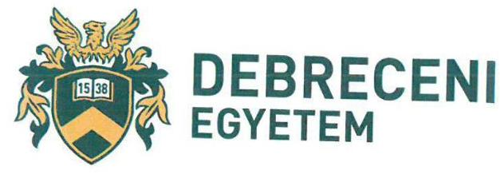

# Ésrevételek az Állami Számvevőszék „Az állami tulajdonú gazdasági társaságok ellenőrzése - Kazincbarcikai Kórház Nonprofit Kft." címmel elkészített számvevőszéki jelentéstervezetével kapcsolatban 

A jelentéstervezet az 5. oldalon a „Főbb megállapítások, következtetések, javaslatok" alfejezetben több szabálytalanságot állapít meg, majd ezen megállapításokat a 12. oldaltól részletezi.
A megállapítások két csoportra bonthatók. Az első csoport a tulajdonosi joggyakorlás szabályszerűségének, a második csoport a társaság szabályozottságát, gazdálkodási, vagyongazdálkodási, valamint adatszolgáltatási és ellenőrzési feladatainak szabályszerűségének megállapítását vizsgálja.
A megállapítások a Debreceni Egyetemre vonatkozóan 2013. augusztus 1-ig relevánsak, tekintettel arra, hogy a Kazincbarcikai Kórház Nonprofit Korlátolt Felelősségű Társaság üzletrésze a Debreceni Egyetemtől 2013. augusztus 1-jével átruházásra került a Magyar Állam részére az üzletrész-átruházási szerződés 9. pontja értelmében.

A jelentéstervezetben feltárt megállapításokkal kapcsolatban észrevételt kívánunk tenni a jelentéstervezet alábbi megállapítására:
„A Kazincbarcikai Kórház Nonprofit Kft. működésének szabályozottsága, valamint gazdálkodása nem volt szabályszerű, mert 2013. január 1. és 2013. szeptember 30. között a számviteli törvényben előírt szabályzatokkal, valamint 2013. és a 2016. évben az előírt számlarenddel nem rendelkezett..."

A Debreceni Egyetem szempontjából releváns időszakban, a Kazincbarcikai Kórház Nonprofit Kft. rendelkezett a számviteli törvényben előírt szabályzatokkal, mely szabályzatok a 2018. február 12-i helyszíni ellenőrzés során bemutatásra és átadásra kerültek az Állami Számvevőszék részére.

A fentiek alapján kérjük a jelentéstervezet módosítását, tekintettel arra, hogy a Kazincbarcikai Kórház Nonprofit Kft. működésének szabályozottsága, valamint gazdálkodása a hivatkozott szabályzatok tekintetében megfelelő volt. A Kft. rendelkezett a jelentéstervezetben kifogásolt, számviteli törvényben előírt szabályzatokkal, így nem megfelelő az a megállapítás, hogy a működése, valamint gazdálkodása nem volt szabályszerű.

Debrecen, 2018. augusztus 9.
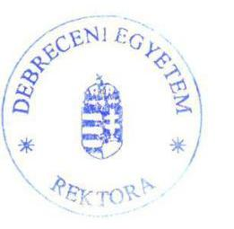

Prof. Dr. Szilvassy Zoltán
rektor

---

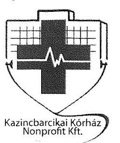

# KAZINCBARCIKAI KÓRHÁZ NONPROFIT KFT. 

3700 Kazincbarcika, Május I út 56.

Adószám: 14514166-2-05

## ÁLLAMI SZÁMVEVŐSZÉK   Domonkos László   Elnök Úr   részére   1364 BUDAPEST 4.   Pf.: 54.

## Tisztelt Elnök Úr!

Köszönettel vettük kézhez az Állami Számvevőszékről szóló 2011. évi LXVI. törvény 29. § (1) bekezdése alapján észrevételezés céljából megküldött, a Kazincbarcikai Kórház Nonprofit Kft.-hez (továbbiakban Kórház) 2018. július 30-án érkezett „Az állami tulajdonú gazdasági társaságok ellenőrzése - Kazincbarcikai Kórház Nonprofit Kft" címû ellenőrzésről készült számvevőszéki jelentéstervezetet (továbbiakban jelentéstervezet), melyre a hivatkozott jogszabályi felhatalmazás alapján az alábbi észrevételeket tesszük:

## I. Előzmények

Az Állami Számvevőszékről szóló 2011. évi LXVI. törvény 1. § (3) bekezdésében, az 5. § (2)-(3) bekezdéseiben foglaltak, valamint az Állami Számvevőszék 2018. első félévi ellenőrzése terve alapján az Állami Számvevőszéknél folytatott ellenőrzés célja, hogy a tulajdonosi jogok gyakorlása szabályszerű volt-e, a gazdálkodó szervezet szabályozottsága, gazdálkodása és vagyongazdálkodási tevékenysége megfelelt-e a jogszabályi és a tulajdonosi előírásoknak, biztosítva volt-e a közfeladatok átláthatósága. A vagyonváltozást eredményező döntések esetében a tulajdonosi jogok gyakorlója és a gazdálkodó szervezet szabályszerűen jártak el.
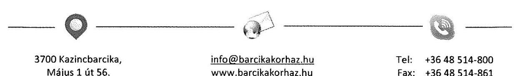

---

# KAZINCBARCIKAI KÓRHÁZ NONPROFIT KFT. 

3700 Kazincbarcika, Május 1. út 56.

Adószám: 14514166-2-05

## II. Általános észrevételek

A jelentéstervezet összegzésének megállapításához, mely szerint Kórház működésének szabályozottsága, gazdálkodása, vagyongazdálkodása a 2013. és a 2016. években nem volt szabályszerű, az alábbi részmegállapításokban leírt hiányosságokat kívánjuk észrevételezni:

- ,,A Társaság szabályozottsága nem felelt meg a jogszabályi előírásoknak"
- ,,A gazdálkodás, vagyongazdálkodás nem volt szabályszerű"
- A Társaság az adatszolgáltatási, ellenőrzési, valamint közzétételi kötelezettségének nem az előírások szerint tett eleget."

## III. Részletes észrevételek

## 2.1. számú megállapítás A Társaság szabályozottsága nem felelt meg a jogszabályi előírásoknak

- Észrevételezett megállapítás

Az előírt számviteli szabályzatokkal a Társaság 2013. január 1. és 2013. szeptember 30. között a Számv. tv.14. § (3) bekezdésében, (5) bekezdés a), b) és d) pontjaiban foglaltak ellenére nem rendelkezett. Nem rendelkezett továbbá a 2013. és a 2016. évben számlarenddel a Számv. tv. 161. § (1) bekezdésében foglalt előírás ellenére. Az önköltségszámítás rendjére vonatkozó belső szabályzat és a 2013. október 1-jétől hatályos számviteli szabályzatok a Számv. tv. előírásaival összhangban voltak. A Társaság működésének alapvető szabályait, a vagyongazdálkodással kapcsolatos feladat- és hatásköröket, felelősségi viszonyokat az Alapító okiratban, valamint a társasági SZMSZ-ben a jogszabályi előírásokkal összhangban határozták meg.

## Észrevétel:

A Kórház az előírt számviteli szabályzatokkal (Számv.tv. 14.§ (3) bek, (5) bekezdés a),b) és d) pontja) a 2013. január 01. és 2013. szeptember 30. közötti időszakra vonatkozóan rendelkezett. Ezen szabályzatok és azok módosításai a 2018. február 12-én a Kazincbarcikai Kórház Nonprofit Kft-nél helyszíni adatbetekintés folytán bemutatásra került. A helyszíni ellenőrzésről készült jegyzőkönyv másolati példányát jelen levelemhez mellékelem.
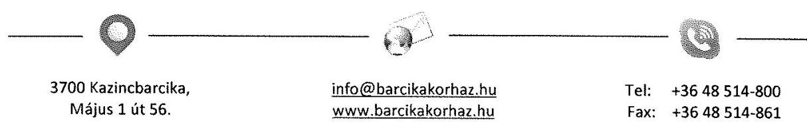

---

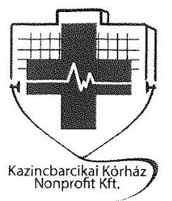

# KAZINCBARCIKAI KÓRHÁZ NONPROFIT KFT. 

3700 Kazincbarcika, Május 1. út 56.

Adószám: 14514166-2-05

Kórházunk a 2013. és 2016. években is eleget tett a Számv. tv. 161. § (1) bekezdésében foglaltaknak, rendelkezett a jogszabályi változásokat lekövető érvényes Számlarenddel. A többkörös ellenőrzés folytán egy körben sem tartalmazta a dokumentum jegyzék a Számlarend bekérését, ezért nem került intézményünk részéről feltöltésre az online rendszerbe, továbbá a helyszíni adatbetekintés alkalmával sem kellett a Számlarendet bemutatni.

## 2.2 számú megállapítás A gazdálkodás, vagyongazdálkodás nem volt szabályszerű.

- Észrevételezett megállapítás
„A gazdálkodás a 2013. és a 2016. évben nem volt szabályszerű, mert 2013. január 1. és 2013. szeptember 30. között a Számv. tv. által előírt szabályzatokkal nem rendelkezett a Társaság, valamint a 2013. és a 2016. évben számlarenddel nem rendelkezett. A Társaság a bevételeket és a ráfordításokat a számlarend hiánya miatt a Számv. tv. 161. § (1) bekezdésében foglalt előírás figyelmen kívül hagyásával számolta el.

A vagyongazdálkodás a 2016. évben nem volt szabályszerű. A Társaság 2016. évben a megvalósított értéknövelő beruházás, felújítás, valamint a létrehozott új eszköz értékét adatszolgáltatás keretében nem igazolta az ÁEEK felé a Vhr. 18. § (3) bekezdésében és a vagyonkezelési szerződés 2.2.10. pontban előírtak ellenére. A kezelt vagyon értéke - az elszámolt értékcsökkenést meghaladó - növekedésének számviteli szabályok szerinti elszámolására nem került sor. A kezelt vagyon értéknövekedése a Számv. tv. 42. § (5) bekezdésében foglaltak ellenére a vagyonkezelésbe vételhez kapcsolódó egyéb hosszú lejáratú kötelezettségként nem
 került kimutatásra, mivel az adatszolgáltatás ÁEEK felé történő elmaradása miatt a Vhr. 18. § (3c) bekezdésében előírt feltétel nem teljesült. Ezáltal a 2016. évi beszámoló mérlege nem adott valós képet a vagyoni helyzetről, sérült a Számv. tv. 15. § (3) bekezdésében foglalt valódiság elve.

A Társaság - a Számv. tv.-ben foglaltak szerint - a mérlegtételek beszámolóban kimutatott állományát leltárral alátámasztotta.

A Társaság üzleti tervkészítési kötelezettségének nem tett eleget, ezzel nem felelt meg a társasági SZMSZ 3.2. pontjában foglaltaknak.

Éves beszámolóit, valamint a közhasznúsági mellékleteit a Társaság az ellenőrzött években a Számv. tv.,

3700 Kazincbarcika, Május 1 út 56.
info@barcikakorhaz.hu www.barcikakorhaz.hu

Tel: +36 48514-800
Fax: +36 48514-861

---

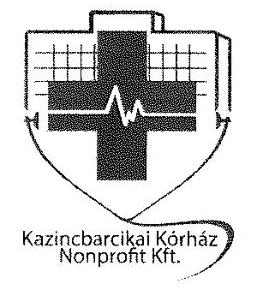

# KAZINCBARCIKAI KÖRHÁZ NONPROFIT KFT. 

3700 Kazincbarcika, Május 1 út 56.

Adószám: 14514166-2-05
valamint a Civil tv. előírásainak megfelelően elkészítette, azokat határidőre letétbe helyezte."

## Észrevétel:

A gazdálkodással kapcsolatos megállapításokra a 2.1. számú megállapodáshoz leírtakat kívánjuk újra megjegyezni.

## Vagyongazdálkodás:

1. Az adatszolgáltatási kötelezettség ,, az ÁEEK felé a Vhr. 18 § (3) bekezdésében és a vagyonkezelési szerződés 2.2.10. pontban előírtak ellenére nem megfelelően történt" megállapítására vonatkozóan megjegyezni kívánjuk az alábbiakat:
A jelentéstervezetben az ÁEEK részére tett megállapítások is egyértelműen mutatják, hogy a jelenleg rendelkezésünkre álló vagyonkezelési szerződés nem felelt meg a jogszabályi előírásoknak, nem történt meg a megváltozott helyzethez igazodó vagyonkezelői szerződésmódosítás, (2013. augusztus 1. napjától a Társaság tulajdonosa 100%-ban a Magyar Állam és a tulajdonosi jogok gyakorlására kijelölt szervezet az ÁEEK lett), ennek értelmében a vagyonkezelési szerződés 2.2.10. pontja nem alkalmazható.
2. ,,A kezelt vagyon értéke - az elszámolt értékcsökkenést meghaladó - növekedésének számviteli szabályok szerinti elszámolására nem került sor."
Minden évben a Kórház gazdálkodásáról, működéséről készített Éves beszámoló tartalmazza a vagyonkezelésbe vett eszközök tekintetében a visszapótlási kötelezettséget az alábbiak szerint.

Hivatkozva 2016. évi Beszámoló:

## „Lekötött tőketartalék és eredménytartalék

A vagyonkezelésre vonatkozó jogszabályok illetve a vagyonkezelési szerződés rendelkezései alapján a társaságnak a vagyonkezelésbe vett eszközök tekintetében visszapótlási kötelezettsége van. A visszapótlást az elszámolt amortizáció mértékében vagy tárgyévben elvégzett beruházások, pótlások formájában teljesítheti vagy ezen értékben 70%-os tartalékot kell képeznie a következő időszakban elvégzendő visszapótlások fedezetére.

A számviteli törvény szerint a lekötött tartalék negatív összeg, vagyis tartozik egyenlegű nem lehet, ezért a 2016. évi mérlegben ilyen jogcímen nem került összeg kimutatásra.

---

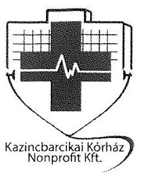

# KAZINCBARCIKAI KÓRHÁZ NONPROFIT KFT. 

3700 Kazincbarcika, Május 1 út 56.

Adószám: 14514166-2-05

A lekötött tartalék alakulását az alábbi táblázat mutatja:

| Lekötött tartalék 2013-2016. év |  |  |  |  |  |  |  |  |
| :--: | :--: | :--: | :--: | :--: | :--: | :--: | :--: | :--: |
|  | 2009. év | 2010. év | 2011. év | 2012. év | 2013. év | 2014. év | 2015. év | 2016. év |
| Elszámolt   értéknökkenés | 132651797 | 162307507 | 165916375 | 171474977 | 153085022 | 168172647 | 182515738 | 84165939 |
| Elszámolt   értéknökkenés   70%-a | 92856258 | 113615255 | 116141463 | 120032484 | 107159515 | 117720853 | 127761017 | 58916157 |
| Beruházás | 37010568 | 54855672 | 85402593 | 140547513 | 11420517 | 287730543 | 680246643 | 4511586 |
| Lekötött tartalék | 55845690 | 58759583 | 30738870 | -20515029 | 95738998 | -170009690 | -552485626 | 54404571 |

3. ,,A kezelt vagyon értéknövekedése a Számv. tv. 42. § (5) bekezdésében foglaltak ellenére a vagyonkezelésbe vételhez kapcsolódó egyéb hosszú lejáratú kötelezettségként nem került kimutatásra, mivel az adatszolgáltatás ÁEEK felé történő elmaradása miatt a Vhr. 18. § (3c) bekezdésében előírt feltétel nem teljesült. Ezáltal a 2016. évi beszámoló mérlege nem adott valós képet a vagyoni helyzetről, sérült a Számv. tv. 15. § (3) bekezdésében foglalt valódiság elve."

A kezelt vagyon értéknövekedése kimutatásra került az adott év Mérlegében egyéb hosszú lejáratú kötelezettségként. Intézményünknél értéknövelő beruházásra csak a Tulajdonosi hozzájárulást követően került sor.
4. „A Társaság üzleti tervkészítési kötelezettségének nem tett eleget, ezzel nem felelt meg a társasági SZMSZ 3.2. pontjában foglaltaknak."

Elfogadjuk azon észrevételezett megállapításukat, hogy a Társaság az ellenőrzött időszakban nem tett eleget Üzleti terv készítési kötelezettségének. Megjegyezni kívánjuk azonban, hogy 2018. évre vonatkozóan intézményünk rendelkezik az ÁEEK által jóváhagyott, elfogadott Üzleti tervvel.
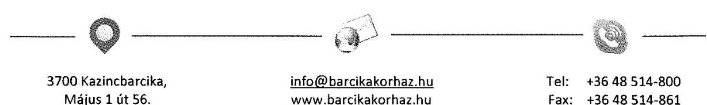

---

# KAZINCBARCIKAI KÓRHÁZ NONPROFIT KFT. 

3700 Kazincbarcika, Május 1 út 56.

Adószám: 14514166-2-05
2.3. számú megállapítás A Társaság az adatszolgáltatási, ellenőrzési, valamint közzétételi kötelezettségének nem az előírások szerint tett eleget.

- Észrevételezett megállapítás
..Az adatszolgáltatási és közzétételi kötelezettségét a Társaság a 2013-2016. években, valamint az ellenőrzési feladatok ellátását 2014. január 1-jétől 2016. szeptember 30-ig nem az előírások szerint teljesítette.
A Társaság a kezelt vagyonnal kapcsolatos adatszolgáltatási kötelezettségének a vagyonkezelési szerződés 2.2.10. pontjában foglaltak ellenére a 2013-2016. években nem tett eleget.
A Társaság, mint 2014-től kormányzati szektorba sorolt egyéb szervezet az Ávr. 5. számú mellékletének 23. pontjában foglaltak ellenére a 2014-2016. évi számviteli jogszabályok szerinti beszámolója és az arról készített könyvvizsgálói jelentés, kiemelt mutatói, költségvetési kapcsolatai bemutatására vonatkozó adatszolgáltatási kötelezettségét nem teljesítette.
A Társaság -tekintettel a Bkr. 54/A. §-ára - a Bkr. 10. §-ában foglaltak ellenére 2014. január 1-jétől 2016. szeptember 30-ig nem gondoskodott a szervezet tevékenységének, a célok megvalósításának nyomon követését biztosító rendszer kialakításáról.
A közérdekű adatok közzétételére vonatkozó szabályzatot a Társaság az Info tv. 35. § (3) bekezdésében foglaltak ellenére a 2013. január 1. és 2015. február 28. közötti időszakra nem alkotott. A 2015. március 1-jétől hatályos információs és kommunikációs szabályzat az Info. tv. előírásainak megfelelt.
A Társaság közérdekű adatait az ellenőrzött időszakban Info tv. 37. § (1) bekezdésében, valamint a jogszabály 1. melléklete III. gazdálkodási adatok 1. pontjában foglaltak ellenére nem tette közzé. A Társaság nem biztosította továbbá a Taktv. 2. § (1) bekezdésében meghatározott közérdekből nyilvános adatok közzétételét."

## Észrevétel

1. ..A Társaság a kezelt vagyonnal kapcsolatos adatszolgáltatási kötelezettségének a vagyonkezelési szerződés 2.2.10. pontjában foglaltak ellenére a 2013-2016. években nem tett eleget."

A 2.2 megállapításra tett észrevételünk Vagyongazdálkodás 1. pontjában leírtakat kívánjuk újra közölni.
2. ..A Társaság -tekintettel a Bkr. 54/A. §-ára - a Bkr. 10. §-ában foglaltak ellenére 2014. január 1-jétől 2016. szeptember 30-ig nem gondoskodott a szervezet tevékenységének, a célok megvalósításának
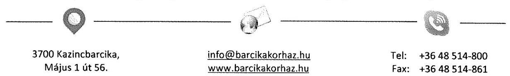

---

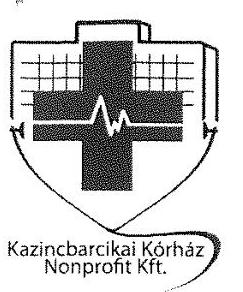

# KAZINCBARCIKAI KÓRHÁZ NONPROFIT KFT. 

3700 Kazincbarcika, Május 1 út 56.

Adószám: 14514166-2-05
nyomon követését biztosító rendszer kialakításáról. "
Intézményünk elfogadja a fent észrevételezett megállapítását, azonban 2018. május 11-től rendelkezünk főállású Belső ellenőrrel, illetve kialakításra került a célok megvalósításának nyomon követését biztosító rendszer.

## IV. Javaslatok

## 1. Az összegzéshez tett javaslatok

Az előzőekben részletezett észrevételeink alapján az összegző megállapításukban szereplő azon minősítést, mely szerint a Kazincbarcikai Kórház Nonprofit Kft. gazdálkodása nem volt szabályszerű, a rendelkezésre bocsátott dokumentumok mennyiségére, (az Elektronikus Adatszolgáltatási Rendszerbe feltöltött, illetve helyszínen bemutatott) a megállapítások tartalmára és súlyára való tekintettel nem fogadjuk el.

Javasoljuk az összegző megállapítás felülvizsgálatát és az alábbi megfogalmazást szerepeltetni:

A Kazincbarcikai Kórház Nonprofit Kft. működésének szabályozottsága nem volt teljeskörű, gazdálkodása, vagyongazdálkodása a 2013. és a 2016. években részben biztosított volt. A Társaság közérdekű adatait nem teljeskörűen tette közzé, ezáltal a működése nem teljeskörűen volt átlátható.

## 2. A „Főbb megállapítások, következtetések, javaslatok" cím szövegével kapcsolatos javaslatok

A 2.1. megállapítás kapcsán leírt észrevételünk alapján fenntartjuk, hogy a Kórház eleget tett a számviteli törvény által előírt szabályozottságnak, továbbá rendelkezett a vizsgált időszakban a számviteli törvény által előírt érvényes Számlarenddel. Javasoljuk ezen szövegrészt figyelmen kívül hagyni.

A vagyongazdálkodás szabályszerűsége és elszámoltathatósága, a vagyon védelme teljeskörűen biztosított volt.
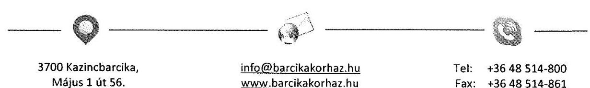

---

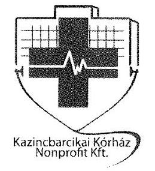

# KAZINCBARCIKAI KÓRHÁZ NONPROFIT KFT. 

3700 Kazincbarcika, Május 1 út 56.

Adószám: 14514166-2-05

Kérjük, hogy az előzőekben megfogalmazott észrevételeinket megfontolni, javaslatainkat és a jelentés tervezetben lehetőség szerint átvezetni szíveskedjék.

Kazincbarcika, 2018. augusztus 08.

Tisztelettel:
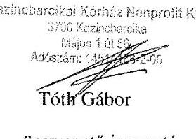
ügyvezető igazgató

---

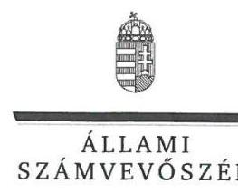

ELNÖK

Ikt.szám: EL-0588-088/2018.

# Prof. Dr. Szilvássy Zoltán úr 

rektor

Debreceni Egyetem

## Debrecen

## Tisztelt Rektor Úr!

Az állami tulajdonú gazdasági társaságok ellenőrzése - Kazincbarcikai Kórház Nonprofit Kft. címmel készített számvevőszéki jelentéstervezetre tett észrevételét megkaptam.
Az Állami Számvevőszék észrevételekre vonatkozó álláspontjáról a felügyeleti vezető által készített részletes tájékoztatást csatoltan megküldöm.
Tájékoztatom Rektor urat, hogy a számvevőszéki jelentésben - az Állami Számvevőszékről szóló 2011. évi LXVI. törvény 29. § (3) bekezdése alapján - a figyelembe nem vett észrevételeket szerepeltetjük az elutasítás indokának feltüntetésével.

Budapest, 2018. 05. hó 03. nap
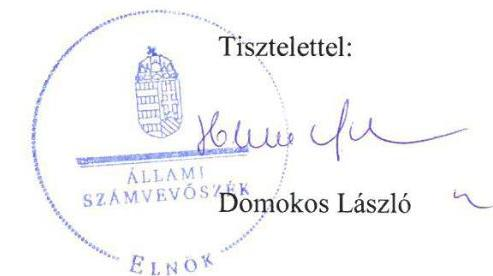

Melléklet: Tájékoztatás az észrevételek kezeléséről

---

# Tájékoztatás az észrevételek kezeléséről 

Az állami tulajdonú gazdasági társaságok ellenőrzése - Kazincbarcikai Kórház Nonprofit Kft. című jelentéstervezetre levélben megküldött észrevételeit áttekintettem. Az észrevételek kezeléséről az alábbi tájékoztatást adom.

## 1.) A Debreceni Egyetem tulajdonosi joggyakorlásának időtartamához füzött észrevétele kapcsán

Észrevételében Rektor úr jelezte, hogy a jelentéstervezet megállapításai a Debreceni Egyetemre vonatkozóan 2013. augusztus 1-ig relevánsak, mivel ezen nappal került átruházásra a Kazincbarcikai Kórház Nonprofit Kft. (továbbiakban: Kórház) üzletrésze a magyar államra.
A jelentéstervezet 21. oldalán kezdődő rövidítések jegyzékében a 12. végjegyzet tartalmazza a tulajdonosi joggyakorló; rövidítést, amely egyértelműen megjelöli, hogy meddig tartott a Debreceni Egyetem tulajdonosi joggyakorlása. Erre tekintettel Rektor úrnak a tájékoztatása a jelentéstervezet módosítását nem teszi indokolttá.

## 2.) A számviteli szabályzatokra vonatkozó észrevétele kapcsán

Az észrevétel szerint a Debreceni Egyetem szempontjából releváns időszakban a Kórház rendelkezett a számviteli törvényben előírt szabályzatokkal, mely szabályzatok a 2018. február 12-én a helyszínen bemutatásra és átadásra kerültek az Állami Számvevőszék részére.
A rendelkezésre bocsátott dokumentumokat felülvizsgáltuk, és megállapítottuk, hogy a Kórház rendelkezett a 2013. évre vonatkozó számviteli politikával és a keretében elkészült leltározási, értékelési és pénzkezelési szabályzattal. A fentiekre tekintettel az észrevételt elfogadjuk, a jelentéstervezetet módosítjuk.

Budapest, 2018.
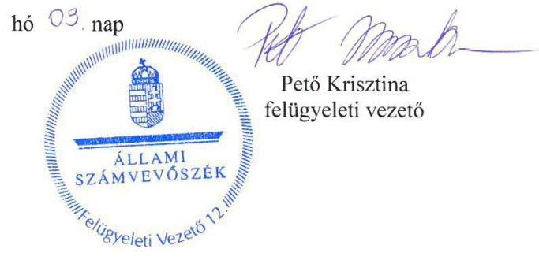

---

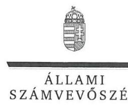

# Tóth Gábor úr 

ügyvezető
Kazincbarcikai Kórház Nonprofit Kft.

## Kazincbarcika

## Tisztelt Ügyvezető Úr

Az állami tulajdonú gazdasági társaságok ellenőrzése - Kazincbarcikai Kórház Nonprofit Kft. címmel készített számvevőszéki jelentéstervezetre tett észrevételét megkaptam.
Az Állami Számvevőszék észrevételekre vonatkozó álláspontjáról a felügyeleti vezető által készített részletes tájékoztatást csatoltan megküldöm.
Tájékoztatom Ügyvezető urat, hogy a számvevőszéki jelentésben - az Állami Számvevőszékről szóló 2011. évi LXVI. törvény 29. § (3) bekezdése alapján - a figyelembe nem vett észrevételeket szerepeltetjük az elutasítás indokának feltüntetésével.

Budapest, 2018. 09. hó 03. nap
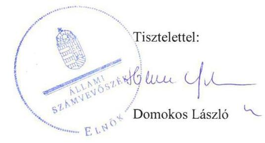

Melléklet: Tájékoztatás az észrevételek kezeléséről

---

# Tájékoztatás az észrevételek kezeléséről 

Az állami tulajdonú gazdasági társaságok ellenőrzése - Kazincbarcikai Kórház Nonprofit Kft. című jelentéstervezetre (továbbiakban: jelentéstervezet) levélben megküldött észrevételeit áttekintettem. Az észrevételek kezeléséről az alábbi tájékoztatást adom.

## 1.) 2.1. számú megállapítás 1. bekezdéséhez kapcsolódó észrevétele kapcsán

Az észrevétel szerint a Kazincbarcikai Kórház Nonprofit Kft. (továbbiakban: Kórház) 2013. január 1. és szeptember 30. közötti időszakra vonatkozóan rendelkezett a számviteli törvényben előírt szabályzatokkal, amely szabályzatok a 2018. február 12-én a helyszínen bemutatásra és átadásra kerültek az Állami Számvevőszék (továbbiakban: ÁSZ) részére.
A rendelkezésre bocsátott dokumentumokat felülvizsgáltuk, és megállapítottuk, hogy a Kórház rendelkezett a 2013. évre vonatkozó számviteli politikával és annak keretében elkészült

 leltározási, értékelési és pénzkezelési szabályzattal. A fentiekre tekintettel az észrevételt elfogadjuk, a jelentéstervezetet módosítjuk.
Az észrevétel szerint a Kórház a 2013. és 2016. években eleget tett a számvitelről szóló 2000. évi C. törvény (továbbiakban: Számv. tv.) 161. § (1) bekezdésében foglaltaknak és rendelkezett a jogszabályi változásokat lekövető érvényes számlarenddel. Ügyvezető úr észrevételében jelezte, hogy az ÁSZ az ellenőrzés során a számlarendet nem kérte, ezért az nem is került megküldésre.
Az ÁSZ az EL-0588-017/2018. iktatószámú adatbekérő levelének 2. számú mellékletében (,,Dokumentumjegyzék") mindhárom francia bekezdés tartalmazza „A főkönyvi könyvelés helyességét alátámasztó számlarend... " dokumentum bekérését. A tértivevény tanúsága szerint 2018. március 6-án vették át az ÁSZ levelét a Kórház részéről. Az ÁSZ részére nem került átadásra sem a 2013. évben, sem a 2016. évben hatályos számlarend, ezért a számlarend tekintetében az észrevételt nem fogadjuk. Továbbra is fenntartjuk azt a megállapításunkat, hogy a Kórház az előírt számlarenddel 2013. és a 2016. évben - Számv. tv. 161. § (1) bekezdésében foglalt előírás ellenére - nem rendelkezett.

## 2.) 2.2. számú megállapítás 1. bekezdéséhez kapcsolódó észrevétele kapcsán

Az Ügyvezető úr észrevételében visszautal a 2.1. számú megállapításhoz leírtakra.
A rendelkezésre bocsátott dokumentumokat felülvizsgáltuk, és megállapítottuk, hogy a Kórház rendelkezett a 2013. évre vonatkozó számviteli politikával és annak keretében elkészült leltározási, értékelési és pénzkezelési szabályzattal. A fentiekre tekintettel az észrevételt elfogadjuk, a jelentéstervezetet módosítjuk.
Az ÁSZ az EL-0588-017/2018. iktatószámú adatbekérő levelének 2. számú mellékletében (,,Dokumentumjegyzék") mindhárom francia bekezdés tartalmazza „A főkönyvi könyvelés helyességét alátámasztó számlarend... " dokumentum bekérését. A tértivevény tanúsága szerint 2018. március 6-án vették át az ÁSZ levelét a Kórház részéről. Az ÁSZ részére nem került átadásra sem a 2013. évben, sem a 2016. évben hatályos számlarend, ezért a számlarend tekintetében az észrevételt nem fogadjuk. Továbbra is fenntartjuk azt a megállapításunkat, hogy a Kórház a bevételeket és a ráfordításokat a számlarend hiánya miatt Számv. tv. 161. § (1) bekezdésében foglalt előírás figyelmen kívül hagyásával számolta el.

# 3.) 2.2. számú megállapítás 2. bekezdéséhez kapcsolódó észrevétele kapcsán 

Az Ügyvezető úr észrevételében jelezte, hogy mivel a vagyonkezelői szerződés nem felelt meg a jogszabályi előírásoknak ezért a 2.2.10. pontjában leírtak nem is alkalmazhatóak.
Ügyvezető úr észrevételében nem vitatta, hogy a Társaság 2016. évben a megvalósított értéknövelő beruházás, felújítás, valamint a létrehozott új eszköz értékét adatszolgáltatás keretében nem igazolta az Állami Egészségügyi Ellátó Központ (továbbiakban: ÁEEK) felé az állami vagyonnal való gazdálkodásról szóló 254/2007. (X. 4.) Korm. rendelet (továbbiakban: Vhr.) 18. § (3) bekezdésében és a vagyonkezelési szerződés 2.2.10. pontban előírtak ellenére. Megjegyezni kívánjuk, hogy az ÁSZ részére átadott vagyonkezelési szerződés érvényben és hatályban volt az ellenőrzött időszakban, így az abban foglaltak módosítás hiányában, a megváltozott körülményeknek megfelelően (pl. tulajdonos felé történő adatszolgáltatás) kellett eljárnia a Kórháznak mindaddig, amíg a szerződést nem módosítják. Mindezek alapján észrevételét nem fogadjuk el, a jelentéstervezet módosítása nem indokolt.
Ügyvezető úr továbbá jelezte észrevételében, hogy a Kórház gazdálkodásáról, működéséről készített éves beszámoló tartalmazza a vagyonkezelésbe vett eszközök tekintetében a visszapótlási kötelezettséget, továbbá a kezelt vagyon értéknövekedése kimutatásra került az adott év mérlegében egyéb hosszú lejáratú kötelezettségként. A Kórháznál értéknövelő beruházásra csak a tulajdonosi joggyakorló hozzájárulását követően került sor.
Észrevételeit a következőkre tekintettel nem fogadjuk el. Az ÁSZ nem a visszapótlási kötelezettséggel kapcsolatban fogalmazta meg megállapítását, hanem a kezelt vagyon értéke - az elszámolt értékcsökkenést meghaladó - növekedésének számviteli szabályok szerinti elszámolása tekintetében. Az ÁSZ rendelkezésére bocsátott dokumentumok alapján a kezelt vagyon értéknövekedése a Számv. tv. 42. § (5) bekezdésében foglaltak ellenére a vagyonkezelésbe vételhez kapcsolódó egyéb hosszú lejáratú kötelezettségként nem került kimutatásra, mivel az adatszolgáltatás ÁEEK felé történő elmaradása miatt a Vhr. 18. § (3c) bekezdésében előírt feltétel nem teljesült. Megjegyezni kívánjuk, hogy a Vhr. 18. § (3c) bekezdése nem az értéknövelő beruházás tulajdonosi joggyakorló hozzájárulását, hanem az értéknövelő beruházás számviteli szabályok szerinti elszámolására vonatkozik, amelyre a Kórház által teljesített adatszolgáltatás tulajdonosi joggyakorló írásbeli elfogadása alapján kerülhet csak sor. Az ÁSZ részére olyan dokumentum, amely a 2016. év vonatkozásában igazolja az ÁEEK felé történő adatszolgáltatást nem került átadásra. Továbbra is fenntartjuk azt a megállapításunkat, hogy mindezek alapján a 2016. évi beszámoló mérlege nem adott valós képet a vagyoni helyzetről, sérült a Számv. tv. 15. § (3) bekezdésében foglalt valódiság elve.

# 4.) 2.2. számú megállapítás 5. bekezdéséhez kapcsolódó észrevétele kapcsán 

Ügyvezető úr elfogadta az ÁSZ megállapítását, ezért a jelentéstervezet módosítása nem indokolt.

## 5.) 2.3. számú megállapítás 2. bekezdéséhez kapcsolódó észrevétele kapcsán

Ügyvezető úr észrevételében visszautalt a 2.2. számú megállapítás 2. bekezdésére tett észrevételére.
Észrevételét nem fogadjuk el, az észrevétel kezelése tekintetében jelent levél 3. pontjának 2. bekezdésében foglaltak az irányadók.

## 6.) 2.3. számú megállapítás 4. bekezdéséhez kapcsolódó észrevétele kapcsán

Ügyvezető úr elfogadta az ÁSZ megállapítását, ezért a jelentéstervezet módosítása nem indokolt.

## 7.) Összegzés fejezethez kapcsolódó észrevételei kapcsán

Ügyvezető úr jelezte észrevételében, hogy nem fogadja el az Összegző fejezet első bekezdésében és a „Főbb megállapítások, következtetések, javaslatok" fejezetben szereplő ÁSZ megállapításokat. Az Ügyvezető úr szövegjavaslatokat is megfogalmazott az ÁSZ részére.
Észrevételét nem fogadjuk el a következőkre tekintettel. Észrevételei - egy kivétellel - nem kerültek elfogadásra, amelynek indokolását jelen levél 1)-6) pontjai tartalmaznak. Ezért továbbra is megalapozott az a megállapítás, hogy a Kórház működésének szabályozottsága, gazdálkodása, vagyongazdálkodása a 2013. és a 2016. években nem volt szabályszerű, így az ügyvezető nem biztosította az elszámoltathatóságot és a vagyon védelmét. A Társaság közérdekű adatait nem tette közzé, ezáltal a működése nem volt átlátható. Ez utóbbi megállapításra Ügyvezető úr konkrét észrevételt levelében nem fogalmazott meg.
A „Főbb megállapítások, következtetések, javaslatok" fejezetben, összhangban az elfogadott észrevételével töröljük a számviteli politika keretében elkészítendő szabályzatokra vonatkozó megállapításunkat. Ezen kívül továbbra is fenntartjuk a fejezetben leírtakat.
Az Ügyvezető úr által adott szövegjavaslatokkal nem értünk egyet, azt nem fogadjuk el. Megjegyezni kívánom, hogy az ÁSZ tv. alapján az ellenőrzött szervezet vezetője a megállapításokra tehet észrevételt, amely nem foglalja magában a megállapítások megfogalmazására adott szövegjavaslatokat, ami az ÁSZ hatáskörébe tartozik.

Budapest, 2018.
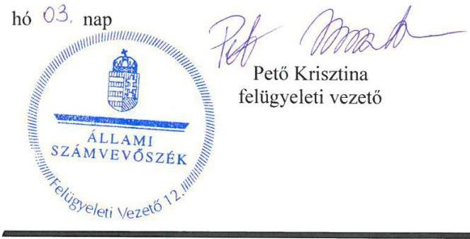

.

# RÖVIDÍTÉSEK JEGYZÉKE 

${ }^{1} \mathrm{M} \mathrm{Ft}$
${ }^{2}$ Társaság
${ }^{3}$ Ttv.
${ }^{4}$ vagyonkezelési szerződés
${ }^{5}$ ÁEEK
${ }^{6}$ üzletrész átruházási szerződés
${ }^{7}$ ÁSZ tv.
${ }^{8}$ ÁSZ
${ }^{9}$ tulajdonosi joggyakorló2
${ }^{10} \mathrm{FB}$
${ }^{11}$ Ptk.
${ }^{12}$ tulajdonosi joggyakorló2
${ }^{13}$ Alapító okirat
${ }^{14}$ belső szabályzatok
${ }^{15} \mathrm{Gt}$.
${ }^{16} \mathrm{Vtv}$.
${ }^{17} \mathrm{Nvtv}$.
${ }^{18}$ Taktv.
${ }^{19} \mathrm{Vhr}$.
${ }^{20}$ vagyonnyilvántartási szabályzat
millió forint
Kazincbarcikai Kórház Nonprofit Korlátolt Felelősségű Társaság
a települési önkormányzatok fekvőbeteg-szakellátó intézményeinek átvételéről és az átvételhez kapcsolódó egyes törvények módosításáról szóló 2012. évi XXXVIII. törvény (hatályos 2012. április 24-étől)
a Kazincbarcikai Kórház Nonprofit Kft., Kazincbarcika Város Önkormányzata, a Debreceni Egyetem és a Kazincbarcikai Városi Kórház között 2008. október 22-én létrejött vagyonkezelési szerződés és a 2011. szeptember 23-ai módosítása
Állami Egészségügyi Ellátó Központ a kezelt vagyon felett 2012. május 1-jétől (jogelődje, a Gyógyszerészeti és Egészségügyi Minőség- és Szervezetfejlesztési Intézet a kezelt vagyon feletti tulajdonosi jogokat 2012. május 1-jétől 2015. április 30. napjáig, ezt követően Állami Egészségügyi Ellátó Központ néven)
a Kazincbarcikai Kórház Nonprofit Kft., Kazincbarcika Város Önkormányzata és a Gyógyszerészeti és Egészségügyi Minőség- és Szervezetfejlesztési Intézet között 2012. június 5-én létrejött üzletrész átruházási szerződés
az Állami Számvevőszékről szóló 2011. évi LXVI. törvény (hatályos 2011. július 1-jétől)
Állami Számvevőszék
Állami Egészségügyi Ellátó Központ 2013. augusztus 1-jétől a részesedés felett (jogelődje, a Gyógyszerészeti és Egészségügyi Minőség- és Szervezetfejlesztési Intézet a részesedések feletti tulajdonosi jogokat 2013. augusztus 1. napjától 2015. április 30. napjáig, ezt követően Állami Egészségügyi Ellátó Központ néven)
a Kazincbarcikai Kórház Nonprofit Kft. Felügyelő Bizottsága
a Polgári Törvénykönyvről szóló 2013. évi V. törvény (hatályos 2014. március 15-től)
Debreceni Egyetem 2013. július 31-éig a részesedés felett
a Kazincbarcikai Kórház Nonprofit Kft. alapító okirata és annak módosításai
Debreceni Egyetem Gazdasági társaságok tulajdonkezelési szabályzata (hatályos 2012. július 1-jétől)
az Állami Egészségügyi Ellátó Központ 14/2015. Főigazgatói utasítással kiadott Vagyonnyilvántartási szabályzata (hatályos 2015. július 1-jétől)
az Állami Egészségügyi Ellátó Központ 20/2016. Főigazgatói utasítással kiadott, a tulajdonosi joggyakorlásába tartozó ingatlanok tekintetében az állami vagyon védelmének, felelős őrzésének, rendeltetésszerű használatának tulajdonosi ellenőrzéséről szóló szabályzat (hatályos 2016. október 1-jétől)
a gazdasági társaságokról szóló 2006. évi IV. törvény (hatálytalan 2014. március 15-től)
az állami vagyonról szóló 2007. évi CVI. törvény (hatályos: 2007. január 1-jétől)
a nemzeti vagyonról szóló 2011. évi CXCVI törvény (hatályos 2011. január 1-jétől)
a köztulajdonban álló gazdasági társaságok takarékosabb működéséről szóló 2009. évi CXXII. törvény (hatályos 2009. december 4-től)
az állami vagyonnal való gazdálkodásról szóló 254/2007. (X. 4.) Korm. rendelet (hatályos 2007. október 4-étől)
az Állami Egészségügyi Ellátó Központ 14/2015. Főigazgatói utasítással kiadott Vagyonnyilvántartási szabályzata (hatályos 2015. július 1-jétől)

${ }^{21}$ javadalmazási szabályzat
${ }^{22}$ Számv. tv.
${ }^{23}$ önköltségszámítás rendjére vonatkozó belső szabályzat
${ }^{24}$ számviteli szabályzatok
${ }^{25}$ társasági SZMSZ1,2
${ }^{26}$ Civil tv.
${ }^{27}$ Ávr.
${ }^{28} \mathrm{Bkr}$.
${ }^{29}$ Info tv.
${ }^{30}$ információs és kommunikációs szabályzat
${ }^{31}$ Áht.
${ }^{32}$ Ebktv.
${ }^{33}$ Vtv.vhr.
a Kazincbarcikai Kórház Nonprofit Kft. javadalmazási szabályzata (hatályos 2016. szeptember 1-jétől)
a számvitelről szóló 2000. évi C. törvény
a Kazincbarcikai Kórház Nonprofit Kft. Önköltségszámítási szabályzata (hatályos 2009. október 1-jétől 2015. december 31-éig, illetve 2016. január 1-jétől)
a Kazincbarcikai Kórház Nonprofit Kft. Számviteli politikája, Leltározási és leltárkészítési szabályzata, Értékelési szabályzata, Pénzkezelési szabályzata (hatályos 2013. szeptember 30-ig)
a Kazincbarcikai Kórház Nonprofit Kft. Számviteli politikája és módosításai, Leltárkészítési és leltározási szabályzata, Értékelési szabályzata, Pénzkezelési szabályzata (hatályos 2013. október 1-jétől)
társasági SZMSZ1: a Kazincbarcikai Kórház Nonprofit Kft. Szervezeti és Működési Szabályzata (hatályos 2012. július 2-ától 2015. október 20-áig),
társasági SZMSZ2: a Kazincbarcikai Kórház Nonprofit Kft. Szervezeti és Működési Szabályzata (hatályos 2015. október 21-étől)
az egyesülési jogról, a közhasznú jogállásról, valamint a civil szervezetek működéséről és támogatásáról szóló 2011. évi CLXXV. törvény (hatályos 2011. december 22-étől)
az államháztartási törvény végrehajtásáról szóló 368/2011. (XII. 31.) Korm. rendelet (hatályos 2012. január 1-jétől)
a költségvetési szervek belső kontrollrendszeréről és belső ellenőrzéséről szóló 370/2011. (XII. 31.) Korm. rendelet (hatályos 2012. január 1-jétől)
az információs önrendelkezési jogról és az információszabadságról szóló 2011. évi CXII. törvény (hatályos 2011. július 27-től)
a Kazincbarcikai Kórház Nonprofit Kft. Információs és Kommunikációs szabályzata (hatályos 2015. március 1-jétől)
az államháztartásról szóló 2011. évi CXCV. törvény (hatályos 2011. december 31-étől)
az egyenlő bánásmódról és az esélyegyenlőség előmozdításáról szóló 2003. évi CXXV. törvény (hatályos 2004. június 27-től)
az állami vagyonnal való gazdálkodásról szóló 254/2007. (X. 4.) Korm. rendelet (hatályos 2007. október 4-től)

# ÁLLAMI SZÁMVEVŐSZÉK 

1052 Budapest, Apáczai Csere János utca 10.
Levélcím: 1364 Budapest 4. Pf. 54
Telefon: +36 14849100 Telefax: +36 14849200
www.asz.hu

