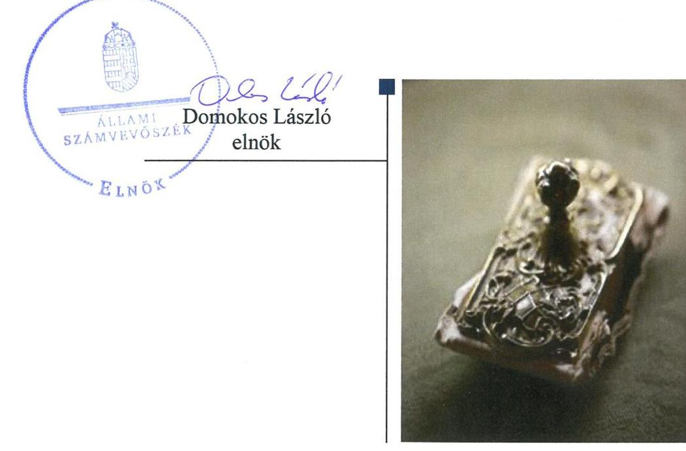

# Jelentés 

## Önkormányzatok integritás- és belső kontrollrendszere

Az önkormányzatok belső kontrollrendszere kialakításának és múködtetésének ellenőrzése - Nyírkarász Községi Önkormányzat
2018.

---

# Jelenctés 

## Önkormányzatok integritás- és belsö kontrollrendszere

Az önkormányzatok belső kontrollrendszere kialakításának és működtetésének ellenőrzése - Nyírkarász Községi Önkormányzat
2018. 10. hó 09. nap

---

# AZ ELLENŐRZÉST FELÜGYELTE:

- VARGA EDIT felügyeleti vezető
- AZ ELLENŐRZÉST VEZETTE ÉS A VÉGREHAJTÁSÁÉRT FELELŐS:
  - DR. TÓTH VIKTÓRIA ellenőrzésvezető
  - A PROGRAM ÖSSZEÁLLÍTÁSÁÉRT FELELŐS:
    - TÓTPÁL SZABOLCS osztályvezető

**IKTATÓSZÁM:** EL-0343-020/2018

**TÉMASZÁM:** 2444

**ELLENŐRZÉS-AZONOSÍTÓ SZÁM:** V0789

Jelentéseink az Országgyűlés számítógépes hálózatán és az Interneta a www.asz.hu címen is olvashatóak.

---

# TARTALOMJEGYZÉK 

- ÖSSZEGZÉS ..... 5
- AZ ELLENŐRZÉS CÉLJA ..... 6
- AZ ELLENŐRZÉS TERÜLETE ..... 7
- AZ ELLENŐRZÉS HÁTTERE, INDOKOLTSÁGA ..... 8
- A JELENTÉS LÉNYEGES KÉRDÉSKÖREI ..... 9
- AZ ELLENŐRZÉS HATÓKÖRE ÉS MÓDSZEREI ..... 10
- MEGÁLLAPÍTÁSOK ..... 12
- JAVASLATOK ..... 15
- MELLÉKLETEK ..... 19
I. sz. melléklet: Értelmező szótár ..... 19
- FÜGGELÉK: ÉSZREVÉTELEK ..... 21
- RÖVIDÍTÉSEK JEGYZÉKE ..... 23

---

.

---

# ÖSSZEGZÉS 

Nyírkarász Községi Önkormányzat belső kontrollrendszerének kialakítása és müködtetése nem volt szabályszerű, ezáltal nem volt biztositott a közpénzfelhasználás szabályossága, a nemzeti vagyonnal történő felelős gazdálkodás. Az integritás szemlélet nem érvényesült az Önkormányzatnál, az integritás kontrollok kialakítása nem a kockázatokkal arányosan történt.

## Az ellenőrzés társadalmi indokoltsága

Az Állami Számvevőszék a stratégiai céljával összhangban - az Állami Számvevőszékről szóló 2011. évi LXVI. törvény felhatalmazása alapján - végzi a közpénzekkel, az állami és önkormányzati vagyonnal való felelős gazdálkodás, valamint a helyi önkormányzatok számviteli rendje betartásának és belső kontrollrendszere múködésének ellenőrzését. Magyarország Alaptörvénye az önkormányzatoktól is elvárja a kiegyensúlyozott, átlátható és fenntartható költségvetési gazdálkodás elvének érvényesítését, továbbá a nemzeti vagyonnal való rendeltetésszerű és felelős módon való gazdálkodást. Az Állami Számvevőszék stratégiájában az is megfogalmazódott, hogy támogatja az integritás alapú, átlátható és elszámoltatható közpénzfelhasználás megteremtését. Mindezekre tekintettel, a közpénzzel gazdálkodó szervezetek esetében a belső kontrollrendszer megfelelő múködése ellenőrzését prioritásként kezeli az Állami Számvevőszék.

Az Állami Számvevőszék Nyírkarász Községi Önkormányzatot korábban nem ellenőrizte.

## Főbb megállapítások, következtetések

Nyírkarász Községi Önkormányzat belső kontrollrendszerének kialakítása és múködtetése nem volt szabályszerű. A kontrollkörnyezet kialakítása nem felelt meg a jogszabályi előírásoknak, mert a Polgármesteri Hivatal nem rendelkezett a jogszabályi előírásoknak megfelelő szervezeti és múködési szabályzattal, a számviteli politika, a számlarend, a leltározási szabályzat nem felelt meg a jogszabályi előírásoknak.

Nem állapították meg az Önkormányzat gazdálkodásában rejlő, továbbá a szervezeti célokkal összefüggő kockázatokat, valamint nem rendelkeztek integrált kockázatkezelési eljárásrenddel. A szabályszerű közpénzfelhasználás nem volt biztosított, mert a kontrolltevékenységek gyakorlása a kötelezettségvállalások, valamint a kiadások elszámolásának szabálytalanságai miatt nem felelt meg a jogszabályi előírásoknak.

Nem alakították ki a szervezet tevékenységének, a célok megvalósításának folyamatos és eseti nyomon követését biztosító rendszert. A jogszabályban előírt közérdekú adatokat nem tették közzé, ezzel nem biztosították az átlátható múködést. Az Önkormányzat gazdálkodásában rejlő, a szervezeti célokkal összefüggő, illetve a korrupciós kockázatok felmérésének és azonosításának elmaradása miatt az integritás kontrollok kialakítása nem a kockázatokkal arányosan történt.

---

# AZ ELLENŐRZÉS CÉLJA

lélet érvényesülését.

AZ ELLENŐRZÉS CÉLJA annak megállapítása volt, hogy szabályszerűen történt-e Nyírkarász Községi Önkormányzat belső kontrollrendszerének kialakítása és működtetése, az biztosította-e Nyírkarász Községi Önkormányzatnál a közpénzfelhasználás szabályosságát, a közpénzekkel és a nemzeti vagyonnal történő szabályszerű és felelős gazdálkodást, a beszámolási és adatszolgáltatási kötelezettségek szabályszerű teljesítését.

Az ellenőrzés keretében értékeltük Nyírkarász Községi Önkormányzat korrupciós kockázatainak kezelését szolgáló integritás kontrollok kiépítettségét és az integritás szemlélet érvényesülését.

---

# **AZ ELLENŐRZÉS TERÜLETE**

## **Nyírkarász Községi Önkormányzat**

Nyírkarász Község Szabolcs-Szatmár-Bereg Megyében található település, állandó lakosainak száma 2016. január 1-jén 2241 fő volt.

Az Önkormányzat1 hét tagú Képviselő-testületének2 munkáját két állandó bizottság segítette. A településen helyi nemzetiségi önkormányzat nem működött.

Az Önkormányzat a Polgármesteri Hivatal3 mellett két költségvetési intézményt tartott fenn, a Nyírkarászi Óvodát és az Idősek Otthonát.

A polgármester4 a 2014. évi önkormányzati választások óta, a jegyző5 2015. június 26. óta töltötte be a tisztségét. A Polgármesteri Hivatal gazdasági szervezettel nem rendelkezett, a Polgármesteri Hivatalban foglalkoztatott köztisztviselők száma 2016. évben 6 fő volt.

Az Önkormányzat a 2016. évi konszolidált költségvetési beszámolója szerint 646,3 millió Ft költségvetési bevételt ért el, valamint 577,7 millió Ft költségvetési kiadást teljesített.

---

# AZ ELLENŐRZÉS HÁTTERE, INDOKOLTSÁGA 

A demokratikus társadalmakban alapvető igény, hogy a közpénzeket, a közvagyont használók tevékenységükről elszámoljanak, ahhoz egyértelmű és érvényesíthető felelősségi szabályok társuljanak. Ennek a jogos igénynek az érvényesítéséhez meg kell teremteni azokat a folyamatokat, rendszereket, amelyek nélkülözhetetlenek az elszámoltatáshoz. Az elszámoltatás eredményes működtetéséhez szükség van a megfelelő információs, kontroll-, értékelési - és beszámolási rendszerek kialakítására. A belső kontrollok kiépítettsége hozzájárul az integritási szemlélet kialakításához és érvényesüléséhez. A belső kontrollrendszer kialakítása és működtetése nélkül nem valósítható meg a közpénzek, a közvagyon szabályos, gazdaságos, hatékony és eredményes felhasználása.

A BELSŐ KONTROLLRENDSZER azt a célt szolgálja, hogy az államháztartás szervei működésük és gazdálkodásuk során a tevékenységeket szabályszerűen, gazdaságosan, hatékonyan, eredményesen hajtsák végre, teljesítsék elszámolási kötelezettségeiket és megvédjék az erőforrásokat a veszteségektől, a károktól, a nem rendeltetésszerű használattól. A belső kontrollrendszer magában foglalja mindazon szabályokat, eljárásokat, gyakorlati módszereket és szervezeti struktúrákat, kockázatkezelési technikákat, kontrolltevékenységeket, amelyek segítséget nyújtanak a szervezetnek céljai eléréséhez.

A megfelelő belső kontrollrendszer jelentősen csökkenti a hibák és szabálytalanságok kockázatát. Az ÁSZ ${ }^{6}$ célja, hogy javuljon az ellenőrzött önkormányzatok belső kontrollrendszerének szabályozottsága, működésének megfelelősége, szabályszerűsége, hozzájárulva ezzel az egyensúlyi helyzet fenntarthatóságának biztosításához, biztosítva az önkormányzatnál a közpénzfelhasználás szabályosságát, a közpénzekkel és a nemzeti vagyonnal történő szabályszerű, gazdaságos, hatékony és eredményes gazdálkodást. Az ÁSZ ellenőrzés tapasztalatai nem csupán a közvetlenül ellenőrzött önkormányzatokat támogathatják, hanem a „jó gyakorlat" elterjesztésével azok az önkormányzatok is átvehetik a pozitív példákat, ahol az ÁSZ ellenőrzést nem végez.

AZ ELLENŐRZÉS VÁRHATÓ HASZNOSULÁSA négy szinten valósul meg. A törvényalkotás számára összegzett tapasztalatok állnak rendelkezésre a belső kontrollrendszer önkormányzati területen való kialakításáról, működtetéséről és hatásairól. Az ellenőrzés az ellenőrzött számára visszajelzést ad a belső kontrollrendszer kialakításában és müködésében lévő hiányosságokról, javaslataival hozzájárul azok kiküszöböléséhez. Az ellenőrzés megállapításait és javaslatait más szervezetek is hasznosíthatják a rendezett gazdálkodási keretek kialakításához. A társadalom számára jelzi, hogy közpénz nem maradhat ellenőrizetlenül, az ÁSZ értékteremtő rend kialakításához és megőrzéséhez hozzájáruló tevékenysége pozitív hatással lesz a szervezetről kialakított összkép formálásában.

---

# A JELENTÉS LÉNYEGES KÉRDÉSKÖREI 

1. Az Önkormányzat belső kontrollrendszerének kialakítása és müködtetése szabályszerű volt-e, az biztositotta-e az Önkormányzatnál a közpénzfelhasználás szabályosságát, a nemzeti vagyonnal történő felelős gazdálkodást?
2. Érvényesült-e az integritás szemlélet, és ennek megfelelően ki-építették-e az integritás kontrollrendszert az Önkormányzatnál?

---

# AZ ELLENŐRZÉS HATÓKÖRE ÉS MÓDSZEREI 

## Az ellenőrzés típusa

Megfelelőségi ellenőrzés

## Az ellenőrzött időszak

2016. január 1 - december 31.

## Az ellenőrzés tárgya

A helyi önkormányzatnak, mint éves költségvetési beszámoló készítésére kötelezett szervezetnek és polgármesteri hivatalának belső kontrollrendszere. Az integritás szemlélet érvényesülése.

Az ellenőrzés kiterjedt minden olyan körülményre és adatra, amely az ÁSZ jogszabályban meghatározott feladatainak teljesítéséhez, valamint a program végrehajtása folyamán felmerült újabb összefüggések feltárásához szükséges volt.

## Az ellenőrzött szervezet

Nyírkarász Községi Önkormányzat

## Az ellenőrzés jogalapja

Az ÁSZ tv. ${ }^{7}$ 1. § (3) bekezdésében foglaltak alapján az ÁSZ általános hatáskörrel végzi a közpénzekkel és az állami és önkormányzati vagyonnal való felelős gazdálkodás ellenőrzését. Az ÁSZ tv. 5. § (2) bekezdése alapján az államháztartás gazdálkodásának ellenőrzése keretében az ÁSZ ellenőrzi a helyi önkormányzatok gazdálkodását, valamint az ÁSZ tv. 5. § (6) bekezdése alapján ellenőrzése során értékeli az államháztartás számviteli rendjének betartását és a belső kontrollrendszer múködését.

## Az ellenőrzés módszerei

Az ÁSZ az ellenőrzést az ellenőrzési program szempontjai, az ellenőrzött időszakban hatályos jogszabályok, az ellenőrzés szakmai szabályai, az egyes ellenőrzési típusokhoz kapcsolódó ÁSZ módszertanok figyelembe vételével végezte.

---

Az ellenőrzés ideje alatt az ÁSZ az Önkormányzattal a kapcsolattartást az ÁSZ SZMSZ ${ }^{6}$-ének vonatkozó előírásai alapján biztosította.

Az ellenőrzési kérdések megválaszolásához szükséges bizonyítékok megszerzése az Önkormányzat által rendelkezésre bocsátott dokumentumokra, adatokra alapozva megfigyelés, szemle (szemrevételezés), valamint elemző eljárás keretében történt. Az ellenőrzés lefolytatásához az Önkormányzat az ÁSZ által kért dokumentumok elektronikus megküldésével szolgáltatott adatokat.

Az ellenőrzési bizonyítékként felhasználható adatforrások közé tartoztak egyrészt az ellenőrzési program részletes szempontjainál felsorolt adatforrások, másrészt minden - az ellenőrzés folyamán feltárt, az ellenőrzés szempontjából releváns információt tartalmazó - dokumentum.

Az Önkormányzat belső kontrollrendszere jogszabályi előírások szerinti kialakításának és működtetésének szabályszerűségét, az erre irányuló ellenőrzési kérdésekre adott válaszok összesítése alapján pillérenként (kontrollkörnyezet, kockázatkezelési rendszer, kontrolltevékenységek, információs és kommunikációs rendszer, monitoring rendszer) és összesítetten is értékeltük. A belső kontrollrendszer egésze esetében a „szabályszerű" értékelésnek feltétele volt, hogy egyik kontrollterület sem kaphatott „nem szabályszerű" értékelést. Az összesített értékelés „nem szabályszerű", ha az ellenőrzött kontrollterületek közül több mint egynek „nem szabályszerű" az értékelése.

A kontrolltevékenységek gyakorlása, működtetése megfelelőségét a pénzforgalmi kiadások területen 30 elemű minta kiválasztásával, rétegzett, véletlen mintavételi eljárás alkalmazásával ellenőriztük. A pénzforgalmi kiadások esetében az ellenőrzés azokra a legnagyobb értékű tételekre - a lényeges sokaságra - terjedt ki, melyek összértéke eléri a teljes sokaság összértékének 50\%-át. A lényeges sokaságból véletlen mintavételi eljárással kiválasztott tételek kerültek ellenőrzésre.

A mintavétellel ellenőrzött terület esetében minden egyes tétel vonatkozásában a szabályszerűségre vonatkozó kérdéseket tettünk fel, amelyek eredménye összesítésre került. „Szabályszerűnek" értékeltünk egy ellenőrzött területet, amennyiben 95\%-os bizonyossággal az ellenőrzött sokaságban az átlagos hibaarány legfeljebb 10\%, "nem szabályszerűnek", amenynyiben 10\%-nál magasabb arányt képviselt.

A közszféra integritás alapú kultúrájának kialakítása, megerősítése és működése szorosan összefügg a belső kontrollrendszer működésével, ezért az ellenőrzés kiterjedt annak értékelésére is, hogy a belső kontrollrendszer kialakítása és működtetése hogyan hatott az integritás szemlélet érvényesülésére.

---

# 1. Az Önkormányzat belső kontrollrendszerének kialakítása és múködtetése szabályszerű volt-e, az biztosította-e az Önkormányzatnál a közpénzfelhasználás szabályosságát, a nemzeti vagyonnal történő felelős gazdálkodást? 

Összegző megállapítás

A belső kontrollrendszer kialakítása és múködtetése nem volt szabályszerű.

A KONTROLLKÖRNYEZET kialakítása nem felelt meg a jogszabályi előírásoknak. A Polgármesteri Hivatal nem rendelkezett az Áht. ${ }^{9}$ 10. § (5) bekezdésében szabályozott SZMSZ ${ }^{10}$-szel. A jegyző elkészítette a Polgármesteri Hivatal SZMSZ-ét, azonban az Áht. 9. § b) pontja előírása ellenére azt a Képviselő-testület nem hagyta jóvá. A hivatásetikai alapelvek részletes tartalmát, valamint az etikai eljárás szabályait a Kttv. ${ }^{11}$ 231. § (1) bekezdésében foglaltak ellenére nem a Képviselő-testület állapította meg, azokat a jegyző határozta meg a Közszolgálati Szabályzatban ${ }^{12}$.

A Számviteli politika ${ }^{13}$ keretében nem rögzítették a Számv. tv. ${ }^{14} 14 . \S$ (4) bekezdése ellenére, hogy mit tekintenek a számviteli elszámolás, az értékelés szempontjából lényegesnek, jelentősnek, nem lényegesnek, nem jelentősnek, kivételes nagyságú vagy előfordulású bevételnek, költségnek, ráfordításnak.

A Számlarend ${ }^{15}$ nem tartalmazta a Számv. tv. 161. § (2) bekezdés d) pontjában előírt, a számlarendben foglaltakat alátámasztó bizonylati rendet, valamint az Áhsz. ${ }^{16} 51 . \S$ (3) bekezdés ellenére nem tartalmazta a részletező nyilvántartások vezetésének módját, azoknak a kapcsolódó könyvviteli és nyilvántartási számlákkal való egyeztetését, annak dokumentálását, valamint a részletező nyilvántartások és az egységes rovatrend rovataihoz kapcsolódóan vezetett nyilvántartási számlák adataiból a pénzügyi könyvvezetéshez készült összesítő bizonylatok (feladások) elkészítésének rendjét, az összesítő bizonylat tartalmi és formai követelményeit. A Leltározási szabályzatban ${ }^{17}$ nem határozták meg az Áhsz. 22. § (2) bekezdés b) pontjában előírt, a használt, de a mérlegben értékkel nem szereplő immateriális javak, tárgyi eszközök, készletek leltározásának módját.

A jegyző 2016. október 1-jétől nem szabályozta a Bkr. 6. § (4) bekezdésében előírt szervezeti integritást sértő események kezelésének eljárásrendjét.

A KOCKÁZATKEZELÉSI RENDSZER működtetése 2016. szeptember 30-ig nem felelt meg a jogszabályi előírásoknak. A Kockázatkezelési Szabályzatban meghatározták a kockázatkezeléssel kapcsolatos szabályokat, módszereket, azonban a Mötv. ${ }^{18} 119$. § (3) bekezdésére figyelemmel, a Bkr. 7. § (2) bekezdésében előírtak ellenére nem mérték fel, nem állapították meg az Önkormányzat gazdálkodásában rejlő kockázatokat.

---

# AZ INTEGRÁLT KOCKÁZATKEZELÉSI RENDSZER 

működtetése 2016. október 1-jétől nem felelt meg a jogszabályi előírásoknak. A Bkr. 6. § (4) bekezdése ellenére nem rendelkeztek integrált kockázatkezelési eljárásrenddel, valamint nem mérték fel, nem állapították meg a szervezeti célokkal összefüggő (beleértve a csalás és korrupciós) kockázatokat a Bkr. 7. § (2) bekezdése ellenére.

## A KONTROLLTEVÉKENYSÉGEK KERETEI KIALA-

KÍTÁSA megfelelt a jogszabályi előírásoknak. A gazdálkodás részletes rendjét meghatározó szabályzattal ${ }^{19}$, a Polgármesteri Hivatal múködési folyamatainak megfelelő ellenőrzési nyomvonallal rendelkeztek. Meghatározták a gazdálkodási jogköröket, az Ávr. ${ }^{20}$-nek megfelelően kijelölték a pénzügyi ellenjegyzésre, érvényesítésre, teljesítésigazolásra, utalványozásra jogosultakat.

## A KONTROLLTEVÉKENYSÉGEK GYAKORLÁSA,

MŰKÖDTETÉSE nem felelt meg a jogszabályi előírásoknak. A kötelezettségvállalások nem szabályosan történtek, mert az Áht. 37. § (1) bekezdésében foglaltak ellenére azok pénzügyi ellenjegyzése nem történt meg. Az Ávr. 56. § (1) bekezdésében előírtak ellenére a kötelezettségvállalásokat nem vették nyilvántartásba. A számviteli nyilvántartásokba a Számv. tv. 165. § (2) bekezdés előírása ellenére bizonylat nélkül jegyeztek be adatokat.

## AZ INFORMÁCIÓS ÉS KOMMUNIKÁCIÓS RENDSZER kialakítása és múködtetése nem felelt meg a jogszabályi előírások-

nak. A közérdekú adatok megismerésére irányuló kérelmek intézésének, továbbá a kötelezően közzéteendő adatok nyilvánosságra hozatalának eljárásrendjével, valamint adatvédelmi és adatbiztonsági előírásokkal rendelkeztek, azonban az Info tv. ${ }^{21}$ 37. §-ában és 1. mellékletében (általános közzétételi lista) meghatározott közérdekú adatokat nem tették közzé.

A MONITORING RENDSZER, EZEN BELÜL A BELSŐ ELLENŐRZÉSI RENDSZER kialakítása és múködtetése nem felelt meg a jogszabályi előírásoknak. A jegyző nem alakította ki a Bkr. 10. §-ában előírt, az operatív tevékenységek keretében megvalósuló folyamatos és eseti nyomon követést biztosító rendszert. Nem vezette a Bkr. 14. § (1) bekezdés szerinti nyilvántartást a külső ellenőrzések alapján készült intézkedési tervek végrehajtásáról, a megtett intézkedéseket nem követte nyomon. A belső ellenőrzés kialakítása megfelelt a jogszabályi előírásoknak, azonban a belső ellenőrzés javaslatainak végrehajtása érdekében nem készítettek a Bkr. 28. § c) pontjában szabályozott intézkedési terveket.

---

# 2. Érvényesült-e az integritás szemlélet, és ennek megfelelően ki- 

építették-e az integritás kontrollrendszert az Önkormányzatnál?

## Összegző megállapítás Az integritás szemlélet nem érvényesült az Önkormányzatnál.

Az integritás kontrollok múködését támogatta, hogy rendelkeztek a gazdálkodás részletes rendjét meghatározó szabályzattal, pénzkezelési szabály-zattal ${ }^{22}$, a gépjármúvek használatának szabályzatával ${ }^{23}$, beszerzések lebonyolításának szabályzatával ${ }^{24}$, Képviselő-testületre vonatkozó SZMSZszel ${ }^{25}$. Az integritás kontrollok múködését gátolta, hogy nyilvánosan nem voltak hozzáférhetőek a gazdálkodásra vonatkozó kötelezően közzéteendő adatok. Az Önkormányzat gazdálkodásában rejlő, a szervezeti célokkal öszszefüggő, illetve a korrupciós kockázatok felmérésének és azonosításának elmaradása miatt az integritás kontrollok kialakítása nem a kockázatokkal arányosan történt. Középtávú stratégiával rendelkeztek, azonban abban nem szerepel az integritás erősítése, a korrupció elleni fellépés.

---

# JAVASLATOK 

Az ÁSZ tv. 33. § (1) bekezdésében foglaltak értelmében az ellenőrzött szervezet vezetője köteles a jelentésben foglalt megállapításokhoz kapcsolódó intézkedési tervet összeállítani és azt a jelentés kézhezvételétől számított 30 napon belül az ÁSZ részére megküldeni. Amennyiben az ellenőrzött szervezet vezetője nem küldi meg határidőben az intézkedési tervet, vagy továbbra sem elfogadható intézkedési tervet küld, az Állami Számvevőszék elnöke az ÁSZ tv. 33. § (3) bekezdése a) és b) pontjaiban foglaltakat érvényesítheti.

## Nyírkarász Községi Önkormányzat jegyzőjének

1. A Polgármesteri Hivatal szabályszerű kontrollkörnyezetének kialakítása érdekében gondoskodjon:
a) a Polgármesteri Hivatal számviteli politikája keretében annak a rögzítéséről, hogy mit tekint a számviteli elszámolás, az értékelés szempontjából lényegesnek, jelentősnek, nem lényegesnek, nem jelentősnek, kivételes nagyságú vagy előfordulású bevételnek, költségnek, ráfordításnak;
(1. sz. megállapítás 2. bekezdése alapján)
b) a jogszabályi előírásoknak megfelelő tartalmú számlarend és leltározási szabályzat elkészítéséről;
(1. sz. megállapítás 3. bekezdése alapján)
c) a szervezeti integritást sértő események kezelése eljárásrendjének szabályozásáról;
(1. sz. megállapítás 4. bekezdése alapján)
2. A Polgármesteri Hivatal szabályszerű integrált kockázatkezelési rendszerének kialakítása és müködtetése érdekében gondoskodjon:
a) az integrált kockázatkezelés eljárásrendjének szabályozásáról;
(1. sz. megállapítás 6. bekezdés 2. mondat 1. tagmondata alapján)
b) a szervezeti célokkal összefüggő (beleértve a csalás és korrupciós) kockázatok felméréséről és megállapításáról;
(1. sz. megállapítás 6. bekezdés 2. mondat 2. tagmondata alapján)

---

3. A kontrolltevékenységek szabályszerű gyakorlása és müködtetése érdekében intézkedjen:
a) a gazdálkodási jogkörök szabályszerű gyakorlásának biztosításáról;
(1. sz. megállapítás 8. bekezdés 2. mondata alapján)
b) a kötelezettségvállalások szabályszerű nyilvántartásba vételéről;
(1. sz. megállapítás 8. bekezdés 3. mondata alapján)
c) arról, hogy a számviteli (könyvviteli) nyilvántartásokba csak szabályszerűen kiállított bizonylat alapján jegyezzenek be adatokat;
(1. sz. megállapítás 8. bekezdés 4. mondata alapján)
4. Az információs és kommunikációs rendszer szabályszerű kialakítása és müködtetése érdekében gondoskodjon a jogszabályi előírásoknak megfelelően az általános közzétételi listán meghatározott adatok közzétételéről;
(1. sz. megállapítás 9. bekezdés 2. mondat 4. tagmondata alapján)
5. A nyomon követési rendszer szabályszerű kialakítása és müködtetése érdekében gondoskodjon:
a) az operatív tevékenységek keretében megvalósuló folyamatos és eseti nyomon követést biztosító rendszer kialakításáról;
(1. sz. megállapítás 10. bekezdés 2. mondata alapján)
b) a külső ellenőrzések javaslatai alapján készült intézkedési tervek végrehajtására vonatkozó, jogszabályban előírt tartalmú nyilvántartás vezetéséről;
(1. sz. megállapítás 10. bekezdés 3. mondata alapján)
c) a jogszabályi előírásoknak megfelelően a belső ellenőrzés javaslatainak végrehajtása érdekében intézkedési tervek készítéséről;
(1. sz. megállapítás 10. bekezdés 4. mondata alapján)

---

# Nyírkarász Községi Önkormányzat polgármesterének 

1. A Polgármesteri Hivatal szabályszerű kontrollkörnyezetének kialakítása érdekében intézkedjen:
a) a Polgármesteri Hivatal SZMSZ Képviselő-testület által történő jóváhagyásáról;
(1. sz. megállapítás 1. bekezdés 2. mondata alapján)
b) a hivatásetikai alapelvek részletes tartalmának, valamint az etikai eljárás szabályainak Képviselő-testület elé terjesztéséről.
(1. sz. megállapítás 1. bekezdés 4. mondata alapján)

---

.

---

# MELLÉKLETEK 

- I. SZ. MELLÉKLET: ÉRTELMEZŐ SZÓTÁR
belső ellenőrzés
belső kontrollrendszer
belső kontrollrendszer területei
információs és kommunikációs rendszer
integritás
kockázatkezelési rendszer
kontrollkörnyezet
kontrolltevékenységek

Független, tárgyilagos bizonyosságot adó és tanácsadó tevékenység, amelynek célja, hogy az ellenőrzött szervezet működését fejlessze és eredményességét növelje, az ellenőrzött szervezet céljai elérése érdekében rendszerszemléletű megközelítéssel és módszeresen értékeli, illetve fejleszti az ellenőrzött szervezet irányítási és belső kontrollrendszerének hatékonyságát. (Forrás: Bkr. 2. § b) pontja)
A belső kontrollrendszer a kockázatok kezelése és tárgyilagos bizonyosság megszerzése érdekében kialakított folyamatrendszer, amely azt a célt szolgálja, hogy a müködés és gazdálkodás során a tevékenységeket szabályszerűen, gazdaságosan, hatékonyan, eredményesen hajtsák végre, az elszámolási kötelezettségeket teljesítsék, megvédjék az erőforrásokat a veszteségektől, károktól és nem rendeltetésszerű használattól. (Forrás: Áht. 69. § (1) bekezdése)
A kontrollkörnyezet, a (integrált) kockázatkezelési rendszer, a kontrolltevékenységek, az információs és kommunikációs rendszer, valamint a nyomon követési (monitoring) rendszer. (Forrás: Bkr. 3. §-a)
A költségvetési szerv vezetője által kialakított és müködtetett olyan rendszer, mely biztosítja, hogy a megfelelő információk a megfelelő időben eljutnak az illetékes szervezethez, szervezeti egységhez, illetve személyhez. (Forrás: Bkr. 9. § (1) bekezdés)
Az integritás - egyik gyakran használt jelentése szerint - az elvek, értékek, cselekvések, módszerek, intézkedések konzisztenciáját jelenti, vagyis olyan magatartásmódot, amely meghatározott értékeknek megfelel. Integritás-irányítási rendszer bevezetése a szervezetben a szervezethez rendelt közfeladatok integritás szempontú ellátását, az érték alapú müködéssel (integritással) összefüggő szervezeti követelmények következetes érvényesítését jelenti. (Forrás: Nemzetgazdasági Minisztérium: Államháztartási Belső Kontroll Standardok és Gyakorlati Útmutató 1.6. Etikai értékek és integritás 46. oldal, 2017. szeptember)
Olyan irányítási eszközök és módszerek összessége, melynek elemei a szervezeti célok elérését veszélyeztető tényezők (kockázatok) azonosítása, elemzése, csoportosítása, nyomon követése, valamint szükség esetén a kockázati kitettség mérséklése.(Forrás: Bkr. 2. § m) pontja)
A költségvetési szerv vezetője által kialakított olyan elvek, eljárások, belső szabályzatok összessége, amelyben világos a szervezeti struktúra, a folyamatok átláthatók, egyértelműek a felelősségi, hatásköri viszonyok és feladatok, meghatározottak, ismertek és elfogadottak az etikai elvárások a szervezet minden szintjén, átlátható a humán-erőforrás-kezelés. (Forrás: Bkr. 6. § (1) bekezdés)
A költségvetési szerv vezetője által a szervezeten belül kialakított (kontroll) tevékenységek, melyek biztosítják a kockázatok kezelését, hozzájárulnak a szervezet céljainak eléréséhez és erősítik a szervezet integritását. (Forrás: Bkr. 8. § (1) bekezdés)

---

.

---

# FÜGGELÉK: ÉSZREVÉTELEK 

A jelentéstervezetet a Számvevőszék 15 napos észrevételezésre megküldte az ellenőrzött szervezet vezetőjének az ÁSZ tv. 29. §* (1) bekezdése előírásának megfelelően.

Az ÁSZ a jelentéstervezetet észrevételezésre megküldte Nyírkarász Községi Önkormányzat polgármestere részére.
Nyírkarász Községi Önkormányzat polgármestere az ÁSZ tv. 29. § (2) bekezdésében foglalt észrevételezési jogával nem élt, a jelentéstervezet megállapításaira a törvényes határidőn belül észrevételt nem tett.

[^0]
[^0]:    * 29. § (1) Az Állami Számvevőszék az ellenőrzési megállapításait megküldi az ellenőrzött szervezet vezetőjének vagy az általa megbízott személynek, és annak, akinek személyes felelősségét állapította meg.
    (2) Az ellenőrzött szervezet vezetője és a felelősként megjelölt személy az ellenőrzés megállapításaira tizenöt napon belül írásban észrevételt tehet.
    (3) Az Állami Számvevőszék az észrevételre a beérkezésétől számított harminc napon belül írásban válaszol. A figyelembe nem vett észrevételeket köteles a jelentésben feltüntetni, és megindokolni, hogy azokat miért nem fogadta el.

---

.

---

# RÖVIDÍTÉSEK JEGYZÉKE 

${ }^{1}$ Önkormányzat
${ }^{2}$ Képviselő-testület
${ }^{3}$ Polgármesteri Hivatal
${ }^{4}$ polgármester
${ }^{5}$ jegyző
${ }^{6}$ ÁSZ
${ }^{7}$ ÁSZ tv.
${ }^{8}$ ÁSZ SZMSZ
${ }^{9}$ Áht.
${ }^{10}$ SZMSZ
${ }^{11}$ Kttv.
${ }^{12}$ Közszolgálati Szabályzat
${ }^{13}$ Számviteli politika
${ }^{14}$ Számv. tv.
${ }^{15}$ Számlarend
${ }^{16}$ Áhsz.
${ }^{17}$ Leltározási szabályzat
${ }^{18}$ Mötv.
${ }^{19}$ Gazdálkodás részletes rendjét meghatározó szabályzat

Nyírkarász Községi Önkormányzat
Nyírkarász Községi Önkormányzat Képviselő-testülete
Nyírkarászi Polgármesteri Hivatal
Nyírkarász Községi Önkormányzat polgármestere
Nyírkarász Községi Önkormányzat jegyzője
Állami Számvevőszék
2011. évi LXVI. törvény az Állami Számvevőszékről

Állami Számvevőszék Szervezeti és Működési Szabályzata
2011. évi CXCV. törvény az államháztartásról

Szervezeti és Müködési Szabályzat
2011. évi CXCIX. törvény a közszolgálati tisztviselőkről
Nyírkarászi Polgármesteri Hivatal Közszolgálati Szabályzata
Nyírkarász Községi Önkormányzat Számviteli politikája
2000. évi C. törvény a számvitelről
Nyírkarász Községi Önkormányzat Számlarendje
4/2013. (I. 11.) Korm. rendelet az államháztartás számviteléről
Nyírkarász Községi Önkormányzat Leltározási és leltárkészítési szabályzata, hatályos 2016. január 1-jétől
2011. évi CLXXXIX. törvény Magyarország helyi önkormányzatairól

Nyírkarász Községi Önkormányzat és költségvetési szervei Gazdálkodási Szabályzata, hatályos 2015. december 10-től
Nyírkarász Községi Önkormányzat és költségvetési szervei Gazdálkodási Szabályzata, hatályos 2016. július 1-jétől
Nyírkarász Községi Önkormányzat és költségvetési szervei Gazdálkodási Szabályzata, hatályos 2016. július 1-jétől a 2016. szeptember 1-jétől hatályos változásokkal bővítve
368/2011. (XII. 31.) Korm. rendelet az államháztartásról szóló törvény végrehajtásáról
2011. évi CXII. törvény az információs önrendelkezési jogról és az információszabadságról
Nyírkarász Községi Önkormányzat és költségvetési szervei Pénzkezelési Szabályzata
Nyírkarász Községi Önkormányzat gépjárművek igénybevételének és használatának szabályzata
Nyírkarász Községi Önkormányzat beszerzések lebonyolításának szabályzata
Nyírkarász Községi Önkormányzat Képviselő-testületének 7/2014. (XI. 12.) önkormányzati rendelete a képviselő-testület szervezeti és működési szabályzatáról

---

# ÁLLAMI SZÁMVEVŐSZÉK 

1052 Budapest, Apáczai Csere János utca 10.
Levélcím: 1364 Budapest 4. Pf. 54
Telefon: +36 14849100 Telefax: +36 14849200
www.asz.hu