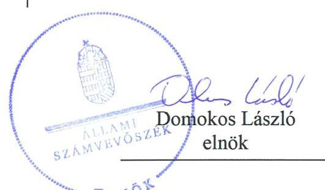
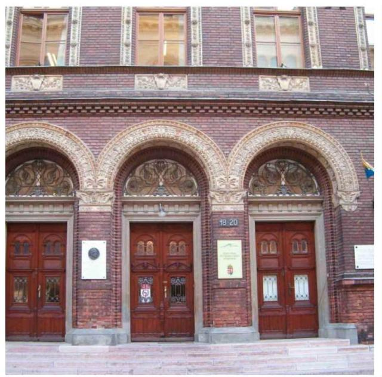
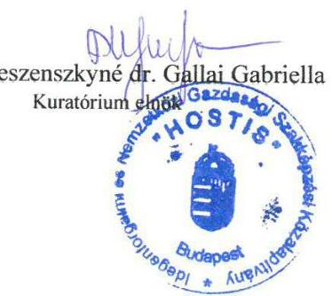
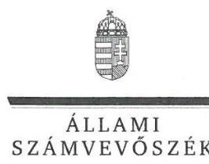
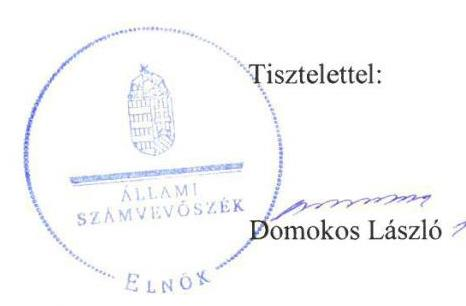

# Jelentés 

## Nem állami humánszolgáltatók ellenőrzése

A humánszolgáltatást nyújtó államháztartáson kívüli köznevelési és szociális intézmények, szolgáltatók fenntartói központi költségvetésből kapott támogatásai felhasználásának ellenőrzése - „HOSTIS" Idegenforgalmi és Nemzetközi Gazdasági Szakképzési Közalapítvány 2018.

---

# Jelentés 

## Nem állami humánszolgáltatók ellenőrzése

A humánszolgáltatást nyújtó államháztartáson kívüli köznevelési és szociális intézmények, szolgáltatók fenntartói központi költségvetésből kapott támogatásai felhasználásának ellenőrzése - „HOSTIS" Idegenforgalmi és Nemzetközi Gazdasági Szakképzési Közalapítvány

2018

---

# AZ ELLENŐRZÉST FELÜGYELTE:

- **SALAMON ILDIKÓ** felügyeleti vezető
- **DR. NAGY IMRE** felügyeleti vezető

# AZ ELLENŐRZÉST VEZETTE ÉS A VÉGREHAJTÁSÁÉRT FELELŐS:

- **DR. KOVÁCS DIÁNA** ellenőrzésvezető

# A PROGRAM ÖSSZEÁLLÍTÁSÁÉRT FELELŐS:

- **TÓTPÁL SZABOLCS** osztályvezető

**IKTATÓSZÁM:** EL-0442-021/2018.

**TÉMASZÁM:** 2448

**ELLENŐRZÉS-AZONOSÍTÓ SZÁM:** V079416

Jelentéseink az Országgyűlés számítógépes hálózatán és az Interneta a www.asz.hu címen is olvashatóak.

---

# TARTALOMJEGYZÉK 

■ ÖSSZEGZÉS ..... 5
■ AZ ELLENŐRZÉS CÉLJA ..... 6
■ AZ ELLENŐRZÉS TERÜLETE ..... 7
■ AZ ELLENŐRZÉS HÁTTERE, INDOKOLTSÁGA ..... 8
■ A JELENTÉS LÉNYEGES KÉRDÉSKÖREI ..... 9
■ AZ ELLENŐRZÉS HATÓKÖRE ÉS MÓDSZEREI ..... 10
■ MEGÁLLAPÍTÁSOK ..... 12
■ JAVASLATOK ..... 15
■ MELLÉKLETEK ..... 17
I. sz. melléklet: Értelmező szótár ..... 17
II. sz. melléklet: A központi költségvetési támogatások alakulása ..... 19
■ FÜGGELÉK: ÉSZREVÉTELEK ..... 21
■ RÖVIDÍTÉSEK JEGYZÉKE ..... 27

---

.

---

# ÖSSZEGZÉS 

A „HOSTIS" Idegenforgalmi és Nemzetközi Gazdasági Szakképzési Közalapítvány intézményfenntartóként a köznevelési humánszolgáltatási közfeladat ellátásához szabályszerűen kialakította a központi költségvetési támogatások átlátható és elszámoltatható igénybevételének és felhasználásának feltételeit. A köznevelési közfeladathoz biztosított központi költségvetési támogatásokat szabályszerűen átadta intézménye müködtetésére. A köznevelési intézménye müködtetésénél a közpénzek felhasználásának átláthatósága nem volt biztosított.

## Az ellenőrzés társadalmi indokoltsága

Az Állami Számvevőszék stratégiájában hangsúlyos szerepet szán annak, hogy szilárd szakmai alapon álló, értékteremtő ellenőrzéseivel előmozdítsa a közpénzügyek átláthatóságát, rendezettségét és javaslataival a közpénzek és a közvagyon szabályos, gazdaságos, hatékony és eredményes felhasználását segítse. Az Állami Számvevőszék a stratégiájában célul tűzte ki, hogy az államháztartáson kívülre nyújtott költségvetési támogatások ellenőrzésével hozzájárul ahhoz, hogy a közpénzeket az államháztartáson kívüli szervezetek is átlátható módon használják fel a közfeladatok szerződésben vállalt ellátása érdekében. Az Állami Számvevőszék e stratégiai céljaival összhangban - az Állami Számvevőszékről szóló 2011. évi LXVI. törvény felhatalmazása alapján - végzi a központi költségvetésből származó források, nyújtott támogatások - kedvezményezett szervezetek közfeladat ellátásához való - felhasználásának az ellenőrzését. Az Állami Számvevőszék hozzájárul ezzel ahhoz is, hogy a nyilvánosság és az igénybevevők megfelelő tájékoztatást kapjanak az államháztartáson kívüli közfeladatot ellátók müködéséről.

## Főbb megállapítások, következtetések, javaslatok

A „HOSTIS" Idegenforgalmi és Nemzetközi Gazdasági Szakképzési Közalapítvány a jogszabályi előírásoknak megfelelően kialakította a köznevelési humánszolgáltatási közfeladat ellátásának szervezeti és szabályozási kereteit. Beszámolási formája és könyovezetése a jogszabályi előírásoknak megfelelő volt. A költségvetési támogatások igénylési, módosítási és elszámolási feladatait szabályszerűen látta el.

A „HOSTIS" Idegenforgalmi és Nemzetközi Gazdasági Szakképzési Közalapítvány nem szabályszerűen biztosította a köznevelési intézménye működésének feltételeit. A központi költségvetési támogatásokat szabályszerűen továbbutalta az intézménynek. Nem biztosította azonban a központi költségvetési támogatások elkülönített nyilvántartását és nem gondoskodott arról, hogy a támogatások cél szerinti felhasználása alapfeladatonként megállapítható legyen.

A „HOSTIS" Idegenforgalmi és Nemzetközi Gazdasági Szakképzési Közalapítvány a köznevelési intézménye müködtetéséhez felhasznált közpénzekkel a nyilvánosság előtt nem szabályszerűen számolt el, az átláthatóságot nem biztosította.

Az Állami Számvevőszék a „HOSTIS" Idegenforgalmi és Nemzetközi Gazdasági Szakképzési Közalapítvány kuratóriuma elnökének öt javaslatot fogalmazott meg a köznevelési intézmény költségvetésének, a kérhető térítési díj és tandíj megállapítása szabályainak, valamint a szociális alapon adható kedvezmények feltételeinek meghatározására, a központi költségvetési támogatások jogszabályi előírás szerinti nyilvántartására, az Info tv. előírásai alapján a szükséges intézkedések megtételére, továbbá a közzétételi kötelezettség teljesítésének részletes szabályainak megállapítására és a közzétételi kötelezettség teljesítésére vonatkozóan.

---

# AZ ELLENŐRZÉS CÉLJA 

AZ ELLENŐRZÉS CÉLJA annak értékelése volt, hogy a „HOSTIS" Idegenforgalmi és Nemzetközi Gazdasági Szakképzési Közalapítvány, mint Fenntartó ${ }^{1}$ központi költségvetésből kapott támogatásainak felhasználása szabályszerű volt-e, a támogatások igénylése, évközi módosítása és év végi elszámolása megfelelt-e a jogszabályi előírásoknak.

---

# AZ ELLENŐRZÉS TERÜLETE 

## „HOSTIS" Idegenforgalmi és Nemzetközi Gazdasági Szakképzési Közalapítvány

A „HOSTIS" Idegenforgalmi és Nemzetközi Gazdasági Szakképzési Közalapítványt Budapest Főváros Önkormányzata hozta létre 1990-ben közérdekú célra, magas színvonalú idegenforgalmi, idegen nyelvi képzés, nemzetközi, gazdasági kapcsolatok és vállalkozások szakember igényének megfelelő középfokú képzés, valamint át-, tovább-, és felsőfokú képzés biztosítására. A Közalapítvány az ellenőrzött időszakban közhasznú jogállással rendelkezett. Közhasznú tevékenységei nevelés és oktatás, képességfejlesztés, valamint az ismeretterjesztés voltak. A Közalapítvány ügyvezető szerve a Kuratórium². A Kuratórium elnöke az ellenőrzött időszakban nem változott. Az ellenőrzött időszakban a Fenntartó alapító okiratának módosítására két esetben került sor a kuratóriumi tagok, illetve a képviseletre jogosult személy változása miatt.

A Fenntartó közfeladat-ellátását az ellenőrzött időszakban egy többcélú köznevelési intézmény ${ }^{3}$ fenntartásával végezte. Az intézmény önálló jogi személyként múködött és önállóan gazdálkodott.

A Fenntartó 2014-2016. években köznevelési célra átlagbéralapú normatív köznevelési támogatás igénybevételére volt jogosult. A Fenntartó Magyarország éves központi költségvetéséből a megállapított éves tám-o-gatás-elszámolások kincstári határozatai alapján 2014-ben 294 millió Ft, 2015-ben 315 millió Ft, 2016-ban 336 millió Ft összegű támogatást kapott.

Az intézmény engedélyezett tanulói létszáma 2014-2016. években 1140 fő volt, a statisztikai adatok szerinti tényleges létszám minden évben az engedélyezett alatt alakult, 2014-ben 813 fő, 2015-ben 837 fő, 2016ban 818 fő volt.

Az ellenőrzött időszakban a szakmai irányító szervi feladatokat a Minisztérium ${ }^{4}$ látta el, a törvényességi ellenőrzési feladatokat a területileg illetékes Kormányhivatal végezte.

---

# AZ ELLENŐRZÉS HÁTTERE, INDOKOLTSÁGA 

A köznevelési feladatokat ellátó nem állami intézményfenntartók részére közfeladataik ellátására a 2014. - 2016. években jelentős összegű pénzügyi támogatást biztosítottak a mindenkori költségvetési törvények a bennük megfogalmazott feltételek mellett.

A 2013. évben jelentős változások következtek be a normatív finanszírozás rendszerében. Az Országgyűlés elfogadta a nemzeti köznevelésről szóló 2011. évi CXC. törvényt, amely jelentősen átalakította a korábbi finanszírozási rendszert 2013 szeptemberétől. Új feladatfinanszírozási forma (átlagbéralapú támogatás) jelent meg, amely az államháztartáson kívüli intézményfenntartókra is vonatkozik. Az ellenőrzés a finanszírozási rendszerben 2011-2015 között bekövetkezett változásokra, azok közfeladat ellátásra gyakorolt hatására fókuszál a költségvetési támogatásokat felhasználó államháztartáson kívüli szervezetek körében. Az ellenőrzések indokoltságát az is alátámasztja, hogy az ÁSZ ${ }^{5}$ még nem ellenőrizte átfogóan e területet.

Az ÁSZ stratégiájában foglaltak alapján is indokolt az ellenőrzés, ami a társadalom számára jelzi, hogy a közpénz államháztartáson kívüli felhasználása sem maradhat ellenőrizetlenül. Az államháztartáson kívülre nyújtott költségvetési támogatások ellenőrzésével az ÁSZ hozzájárul ahhoz, hogy a közpénzeket a nem állami humán fenntartók átlátható módon használják fel a közfeladatok ellátására kötött szerződésekben vállalt kötelezettségek teljesítése érdekében. Az ellenőrzés javaslataival hozzájárul az említett rendszerek szabályszerű támogatás felhasználásához, javítja a társadalmigazdasági döntések megalapozottságát, ami a „jó kormányzás" feltétele.

---

# A JELENTÉS LÉNYEGES KÉRDÉSKÖREI 

1. A köznevelési közfeladatot ellátó Fenntartó szabályszerű müködési és gazdálkodási környezet kialakításával megteremtette-e a költségvetési támogatások átlátható, elszámoltatható igénybevételének, felhasználásának feltételeit?
2. A Fenntartó az átvállalt köznevelési közfeladathoz biztositott költségvetési támogatásokat szabályszerűen fordította-e a humánszolgáltató intézménye müködtetésére?
3. A Fenntartó a köznevelési intézménye müködtetéséhez felhasznált közpénzekre vonatkozó gazdálkodásával a nyilvánosság előtt elszámolt-e, ennek megalapozása érdekében ellenőrzési, értékelési és a külső ellenőrzésekkel kapcsolatos intézkedési feladatait szabályszerűen látta-e el?

---

# AZ ELLENŐRZÉS HATÓKÖRE ÉS MÓDSZEREI 

## Az ellenőrzés típusa

Megfelelőségi ellenőrzés.

## Az ellenőrzött időszak

A 2014. január 1-je és 2016. december 31-e közötti időszak.

## Az ellenőrzés tárgya

Az ellenőrzés a köznevelési közfeladatokat ellátó Fenntartó humánszolgáltatási közfeladatai ellátásához a költségvetési törvényekben biztosított központi költségvetési támogatások igénylése, évközi módosítása és év végi elszámolása fenntartói feladatainak ellátása, illetve e központi költségvetésből kapott támogatások humánszolgáltatási közfeladatokra való fenntartó általi felhasználása szabályszerűségének értékelésére terjedt ki.

Az ellenőrzés kiterjedt minden olyan körülményre és adatra, amely az ÁSZ jogszabályban meghatározott feladatainak teljesítéséhez, valamint a program végrehajtása folyamán felmerült újabb összefüggések feltárásához szükséges volt.

## Az ellenőrzött szervezet

„HOSTIS" Idegenforgalmi és Nemzetközi Gazdasági Szakképzési Közalapítvány

## Az ellenőrzés jogalapja

Az ellenőrzés jogszabályi alapját az ÁSZ tv. ${ }^{6} 1 . \S$ (3) bekezdése, valamint az 5. § (3) bekezdésében foglalt előírások adták.

## Az ellenőrzés módszerei

Az ellenőrzést az ellenőrzési program szempontjai, kérdései, az ellenőrzött időszakban hatályos jogszabályok, a nemzetközi standardokat irányadónak tekintve, az ellenőrzés szakmai szabályok és módszertanok figyelembevételével végezte az ÁSZ. A közpénzekkel való felelős gazdálkodás segítésére irányuló javaslatok kidolgozásakor a hatályos jogszabályok voltak az irányadóak.

---

Az ellenőrzés ideje alatt az ellenőrzött szervezettel történő kapcsolattartást az ÁSZ SZMSZ ${ }^{7}$-ének vonatkozó előírásai alapján biztosította az ÁSZ.

Az ellenőrzési kérdések megválaszolásához szükséges bizonyítékok megszerzése az ellenőrzött által rendelkezésre bocsátott dokumentumokra, adatokra alapozva elemző eljárással történt.

Az ellenőrzési bizonyítékként felhasználható adatforrások közé tartoztak egyrészt a szakmai program részletes szempontjainál felsorolt adatforrások, másrészt minden - az ellenőrzés folyamán feltárt, az ellenőrzés szempontjából információt tartalmazó - dokumentum.

Az ellenőrzés lefolytatásához az ellenőrzött szervezet a kitöltött tanúsítványok, valamint az ÁSZ által kért dokumentumok elektronikus úton való megküldésével szolgáltatott adatokat, információkat. Az így rendelkezésre bocsátott adatok, információk és a tanúsítványok adatai valódiságának kontrollja az ellenőrzés keretében történt.

A fenntartott intézménynél helyszíni szemle keretében győződött meg az ÁSZ a tényleges feladatellátásról (verifikáció).

A köznevelési humánszolgáltatások központi költségvetési támogatásai igénylésével, módosításával, elszámolásával kapcsolatos, államháztartáson kívüli fenntartó jogszabályokban előírt feladatai betartását, továbbá a központi költségvetési támogatások szabályszerű kezelését, nyilvántartását ellenőrizte az ÁSZ a Fenntartónál határozatok, nyilvántartások, beszámolók és egyéb dokumentumok alapján. Az ellenőrzés nem terjedt ki a köznevelési humánszolgáltatások központi költségvetési támogatásai igénylése, módosítása, elszámolása valódiságának, megalapozottságának, helyességének - sem a Fenntartónál, sem az intézménynél való - értékelésére. Továbbá nem terjedt ki az ellenőrzés e források intézmény általi szabályszerű felhasználásának értékelésére. A szabályosság megítélésének alapját képezte, hogy a központi költségvetési támogatások Fenntartó általi igénylése, módosítása és elszámolása a Kincstár ${ }^{8}$ felé megtörtént.

---

# 1. A köznevelési közfeladatot ellátó Fenntartó szabályszerű múködési és gazdálkodási környezet kialakításával megteremtette-e a költségvetési támogatások átlátható, elszámoltatható igénybevételének, felhasználásának feltételeit? 

Összegző megállapítás

A Fenntartó köznevelési közfeladata ellátása során a szabályszerű múködési és gazdálkodási környezet kialakításával megteremtette a költségvetési támogatások átlátható, elszámoltatható igénybevételének, felhasználásának feltételeit.
1.1. számú megállapítás

A Fenntartó köznevelési közfeladata ellátásának megszervezése és belső szabályozottságának kialakítása szabályszerű volt.

A Fenntartó rendelkezett a Ptk. ${ }^{9}$ előírásainak megfelelő alapító okirat ${ }_{1,2,3}{ }^{10}$ mal. Közfeladat ellátásában közremúködött, erre vonatkozóan 2014. szeptember 1-jétől 2016. december 31-ig rendelkezett köznevelési megállapodással ${ }^{11}$, valamint 2019. augusztus 31-ig szakképzési megállapodás ${ }_{1,2}$ vel $^{12}$.

A Fenntartó rendelkezett szervezeti és múködési szabályzat ${ }^{13}$-tal, amely a Ptk.-nak megfelelő volt.

A Fenntartó a Civilszr. ${ }^{14}$ és a Számv. tv. ${ }^{15}$ értelmében kettős könyvvitellel alátámasztott egyszerűsített éves beszámoló, valamint közhasznúsági melléklet készítésére volt kötelezett, amelynek eleget tett. A számviteli beszámolók mérlegének és eredménykimutatásának tagolása megfelelt a Civilszr. előírásainak.

A Fenntartó a pénzgazdálkodással kapcsolatos folyamatokat, feladat- és hatásköröket a Számv. tv. előírásainak megfelelően alakította ki. A számviteli politika, illetve ahhoz kapcsolódó gazdálkodást meghatározó belső szabályzatok - a Civilszr. előírásaival összhangban - rendelkeztek az elszámolási kötelezettségéről, valamint a továbbutalási céllal kapott támogatások bevételként való elszámolásáról.
1.2. számú megállapítás

A költségvetési támogatások igénylési, módosítási és elszámolási feladatait a Fenntartó szabályszerűen látta el.

A Fenntartó a támogatásokra vonatkozó kérelmeit minden évben határidőben, az Nkt. vhr. ${ }^{16}$ rendelkezéseinek megfelelően a Kincstárhoz benyújtotta.

A Fenntartó rendelkezett az őt megillető költségvetési támogatást megállapító kincstári határozatokkal, amelyekben meghatározták a megállapított támogatások körét, mértékét jogcímenként a köznevelési intézményre vonatkozóan, a folyósítás ütemezését, a támogatások elszámolásának határidejét.

---

A Fenntartó szabályszerűen elszámolt a központi költségvetésből juttatott támogatásokkal. A költségvetési támogatás elszámolásáról minden évben rendelkezett a Kincstár elfogadó határozatával.

# 2. A Fenntartó az átvállalt köznevelési közfeladathoz biztosított költségvetési támogatásokat szabályszerűen fordította-e a humánszolgáltató intézménye múködtetésére? 

Összegző megállapítás

### 2.1. számú megállapítás

2.2. számú megállapítás

A Fenntartó az átvállalt köznevelési közfeladathoz biztosított költségvetési támogatásokat szabályszerűen fordította a humánszolgáltató intézménye múködtetésére.

A Fenntartó a köznevelési intézménye működtetésének feltételeit nem szabályszerűen biztosította.

A Fenntartó az Nkt. előírásának megfelelően a köznevelési intézménye alapító okiratát kiadta, annak módosításáról gondoskodott. Az alapító okirat tartalmazta a gazdálkodással összefüggő jogosítványokat.

A Fenntartó a köznevelési intézménye Nkt. ${ }^{17}$ szerinti nyilvántartásba vételéről gondoskodott, a kiadott múködési engedélyekről nyilvántartást vezetett.

A Fenntartó biztosította a köznevelési intézménye számára a közfeladat ellátásához szükséges pénzeszközöket, a központi költségvetési támogatásokat szabályszerűen, teljes összegében továbbutalta intézményének.

A Fenntartó az Nkt. 83. § (2) bekezdés c) pontjában foglaltak ellenére nem határozta meg az intézmény költségvetését és a kérhető térítési díj és tandíj megállapításának szabályait, a szociális alapon adható kedvezmények feltételeit.

A Fenntartó a köznevelési közfeladathoz rendelt költségvetési támogatást nem szabályszerűen kezelte, mert a költségvetési támogatások felhasználását nem alapfeladatonkénti bontásban tartotta nyilván.

A központi költségvetésből kapott 2014-2016. évi támogatások felhasználásának a nyilvántartása a Fenntartónál nem felelt meg az Nkt. vhr. 37/G. § (1) bekezdésében foglalt előírásnak, mert a Fenntartó a támogatások felhasználását nem alapfeladatonkénti bontásban tartotta nyilván és nem gondoskodott saját nyilvántartásai olyan kialakításáról, hogy abból megállapítható legyen, hogy a költségvetési támogatások milyen célra kerültek felhasználásra.

A Fenntartó az intézményi beszámolók elfogadásáról kuratóriumi határozatokban döntött az Nkt. alapján.

---

# 3. A Fenntartó a köznevelési intézménye múködtetéséhez felhasznált közpénzekre vonatkozó gazdálkodásával a nyilvánosság előtt elszámolt-e, ennek megalapozása érdekében ellenőrzési, értékelési és a külső ellenőrzésekkel kapcsolatos intézkedési feladatait szabályszerűen látta-e el? 

Összegző megállapítás

A Fenntartó ellenőrzési feladatait szabályszerűen ellátta. Az intézménye múködtetéséhez felhasznált közpénzekre vonatkozó gazdálkodásáról a nyilvánosság előtt nem szabályszerűen számolt el.

### 3.1. számú megállapítás

A Fenntartó ellenőrzési feladatainak szabályszerűen eleget tett.
A Fenntartó az Nkt. előírása alapján ellenőrizte az intézmény gazdálkodását, beszámoltatta az intézményt a gazdálkodásáról, számviteli beszámolóját elfogadta, a költségvetési támogatások felhasználását a beszámolókon keresztül vizsgálta. A Fenntartó Felügyelő Bizottságának ${ }^{18}$ vezetője évente végzett ellenőrzést az éves beszámolóhoz kapcsolódóan.

A Fenntartó az Nkt. 83. § (2) bekezdés h) pontjában foglalt értékelést az ellenőrzött időszakban nem végzett.

A Civilszr. alapján a Fenntartó könyvvizsgálatra volt kötelezett, melynek eleget tett.

A Fenntartó az intézmény múködtetéséhez felhasznált közpénzekre vonatkozó gazdálkodásával a nyilvánosság előtt nem szabályszerűen számolt el.

A Fenntartó az ellenőrzött időszakban nem határozta meg az Info tv. ${ }^{19} 7$ § (2) bekezdése előírásai ellenére az adat- és titokvédelmi szabályok érvényre juttatásához szükséges eljárási szabályait.

A Fenntartó, mint adatfelelős a közzétételi listákon szereplő adatok pontos, naprakész és folyamatos közzétételi kötelezettség teljesítésének részletes szabályait - az Info tv. 35. § (3) bekezdésében foglaltak ellenére - nem állapította meg belső szabályzatban, továbbá az Info tv. 37. § (1) bekezdésében előírtak ellenére az Info tv. 1. melléklete szerinti általános közzétételi listában meghatározott, a tevékenységével, múködésével és gazdálkodásával összefüggő adatok közül az I. 3.; I.6.; II. 1.; II. 5.; 8.; 12-13.; 15., valamint a III. 4.pontban meghatározott adatokat nem tette közzé.

A Fenntartó mindhárom évre vonatkozóan, határidőben elkészítette a múködéséről, vagyoni, pénzügyi és jövedelmi helyzetéről az egyszerűsített éves beszámolóját és a közhasznúsági mellékletét, amit kuratóriumi jóváhagyás után a Civilszr. előírásai szerint letétbe helyezett és közzétett az intézménye honlapján.

---

# JAVASLATOK 

Az ÁSZ tv. 33. § (1) bekezdésében foglaltak értelmében az ellenőrzött szervezet vezetője köteles a jelentésben foglalt megállapításokhoz kapcsolódó intézkedési tervet összeállítani és azt a jelentés kézhezvételétől számított 30 napon belül az ÁSZ részére megküldeni. Amennyiben az ellenőrzött szervezet vezetője nem küldi meg határidőben az intézkedési tervet, vagy továbbra sem elfogadható intézkedési tervet küld, az Állami Számvevőszék elnöke az ÁSZ tv. 33. § (3) bekezdése a) és b) pontjaiban foglaltakat érvényesítheti.

## A „HOSTIS" Idegenforgalmi és Nemzetközi Gazdasági Szakképzési Közalapítvány kuratóriuma elnökének

1. Határozza meg a jogszabályban foglalt elöírások szerint a köznevelési intézmény költségvetését, továbbá a kérhető térítési díj és tandíj megállapításának szabályait, a szociális alapon adható kedvezmények feltételeit.
(2.1. sz. megállapítás 4. bekezdése alapján)
2. Intézkedjen a központi költségvetési támogatások jogszabályi előirás szerinti nyilvántartásáról.
(2.2. sz. megállapítás 1. bekezdése alapján)
3. Intézkedjen az Info tv. előírásai alapján a szükséges intézkedések megtételéről.
(3.2. sz. megállapítás 1. bekezdése alapján)
4. Állapítsa meg belső szabályzatban az Info tv. előírása alapján a közzétételi kötelezettség tejesítésének részletes szabályait.
(3.2. sz. megállapítás 2. bekezdés 1. tagmondata alapján)
5. Tegyen eleget az Info tv. által elöírt közzétételi kötelezettségnek.
(3.2. sz. megállapítás 2. bekezdés 2. tagmondata alapján)

---

.

---

# MELLÉKLETEK 

- I. SZ. MELLÉKLET: ÉRTELMEZŐ SZÓTÁR
civil szervezet
humánszolgáltatás
költségvetési támogatás
köznevelési közfeladat

A Civil tv. 2. § 6. pontja szerint civil szervezet a civil társaság, a Magyarországon nyilvántartásba vett egyesület (a párt, a szakszervezet és a kölcsönös biztosító egyesület kivételével), a közalapítvány és a pártalapítvány kivételével az alapítvány.
Külön törvényben meghatározott szociális, gyermekjóléti, gyermekvédelmi, közoktatási, felsőoktatási, kulturális közfeladatok (2014. évi Kvtv. 34. § (1), (4) bekezdés, 1. számú melléklet XX/20/2. alcím, 19. alcím, 2015. évi Kvtv. 43. § (1), (4) bekezdés, 1. számú melléklet XX/20/2/3. jogcím csoport, 19. alcím, 2016. évi Kvtv. 41. § (1), (4) bekezdés, 1. számú melléklet XX/20/2/3. jogcím csoport, 19. alcím).
a társadalombiztosítás pénzügyi alapjai kivételével az államháztartás központi alrendszeréből ellenérték nélkül, pénzben nyújtott támogatások (Áht. ${ }^{20}$ 1. § 14. pont)
A költségvetési törvényekben (2013. évi CCXXX. törvény 33-34. §, 2014. évi C. törvény 42-43. §, 2015. évi C. törvény 40-41. §) megállapított támogatás. A 2015. évi C. törvény 40-41. § szerint többek között: Az Országgyúlés a köznevelési feladat ellátására átlagbéralapú támogatást állapít meg. A nevelési-oktatási, valamint pedagógiai szakszolgálati intézményt fenntartó nemzetiségi önkormányzat, az egyházi és magán köznevelési intézmény fenntartója részére az általuk fenntartott nevelési-oktatási intézményben, továbbá pedagógiai szakszolgálati intézményben pedagógus és - a b) pont kivételével -nevelő-oktató munkát közvetlenül segítő munkakörben foglalkoztatottak után a 7. melléklet I. pontja, valamint az óvoda, egységes óvoda-bölcsőde esetében a 2. melléklet II. pont 1. alpontja szerint és az 5. alpontjában meghatározott jogosultak után, az őket ott megillető mértékek szerint. Müködési támogatást állapít meg a nemzetiségi önkormányzat vagy az egyházi jogi személy által fenntartott nevelési-oktatási intézményekben ellátott, továbbá a pedagógiai szakszolgálati intézményekben gyógypedagógiai tanácsadásban, korai fejlesztésben, oktatásban és gondozásban, valamint a fejlesztő nevelésben részt vevő gyermekekre, tanulókra tekintettel a nemzetiségi önkormányzat és a b--evett egyház részére a 7. melléklet II. pontja szerint.
Az Országgyűlés a szociális, gyermekjóléti, gyermekvédelmi közfeladatot ellátó intézményt, szolgáltatást fenntartó egyházi jogi személy, civil szervezet, közalapítvány, országos nemzetiségi önkormányzat, települési vagy területi nemzetiségi önkormányzat, gazdasági társaság, és a humánszolgáltatást alaptevékenységként végző, az Szja tv. hatálya alá tartozó egyéni vállalkozó (a továbbiakban együtt: nem állami szociális fenntartó) részére támogatást állapít meg a következők szerint: a támogatás a nem állami szociális fenntartót a települési önkormányzatok 2. melléklet III. pont 3. alpont c)-k) pontjában és III. pont 5. alpont a) pontjában meghatározott támogatásaival azonos jogcímeken, összegben és feltételek mellett illeti meg.
A köznevelési intézmény alapító okiratában foglalt feladat: óvodai nevelés, nemzetiséghez tartozók óvodai nevelése, általános iskolai nevelés-oktatás, nemzetiséghez tartozók általános iskolai nevelése-oktatása, kollégiumi ellátás, nemzetiségi kollégiumi ellátás, gimnáziumi nevelés-oktatás, szakközépiskolai nevelés-oktatás, szakiskolai nevelés-oktatás, nemzetiség gimnáziumi nevelés-oktatása, nemzetiség szakközépiskolai nevelés-oktatása, nemzetiség szakiskolai nevelés-oktatása, Köznevelési Hídprogramok keretében folyó nevelés-oktatás, felnőttoktatás, alapfokú művészetoktatás, fejlesztő nevelés, fejlesztő nevelés-oktatás, pedagógiai szakszolgálati feladat, a többi gyermekkel, tanulóval együtt nevelhető, oktatható sajátos nevelési igényű gyermekek, tanulók óvodai nevelése és iskolai nevelése-oktatása, azoknak a sajátos nevelési igényű gyermekeknek, tanulóknak az óvodai, iskolai, kollégiumi ellátása, akik a többi gyermekkel, tanulóval nem foglalkoztathatók együtt, a gyermekgyógyüdülőkben, egészségügyi intézményekben,

---

## köznevelési intézmény

nem állami, nem önkormányzati (államháztartáson kívüli) intézmény fenntartó
rehabilitációs intézményekben tartós gyógykezelés alatt álló gyermekek tankötelezettségének teljesítéséhez szükséges oktatás, pedagógiai-szakmai szolgáltatás.
A nevelési- oktatási intézmény, pedagógiai szakszolgálati intézmény, pedagógiai-szakmai szolgáltatást nyújtó intézmény.
A köznevelési és szociális, gyermekjóléti és gyermekvédelmi közfeladatokat/humánszolgáltatásokat ellátó intézményt fenntartó egyházi jogi személy, társadalmi szervezet, alapítvány, közalapítvány, civil szervezet, országos nemzetiségi önkormányzat, nonprofit gazdasági társaság, gazdasági társaság és a humánszolgáltatást alaptevékenységként végző, Szja tv. hatálya alá tartozó egyéni vállalkozó. (2013. évi Kvtv. 35. § (1), (3) bekezdés, 2014. évi Kvtv. 33. §, 34. § (1), (4) bekezdés, 2015. évi Kvtv. 42. §, 43. § (1), (4) bekezdés, 2016. évi Kvtv. 40. §, 41. § (1), (4) bekezdés)

---

II. SZ. MELLÉKLET: A KÖZPONTI KÖLTSÉGVETÉSI TÁMOGATÁSOK ALAKULÁSA

# A FENNTARTÓ ÁLTAL A KÖZNEVELÉSI FELADATHOZ KAPOTT KÖZPONTI KÖLTSÉGVETÉSI TÁMOGATÁS JOGCÍMENKÉNTI ALAKULÁSA (EZER FT)

|  Megnevezés | 2014. év | 2015. év | 2016. év  |
| --- | --- | --- | --- |
|  gyermekétkeztetés támogatása | 930 | 718 | 1044  |
|  pedagógusok átlagbér alapú támogatása | 276232 | 294999 | 310041  |
|  pedagógusok munkáját közvetlen segítők átlagbér alapú támogatása | 15335 | 15335 | 16568  |
|  minősített pedagógusok után járó átlagbér alapú kiegészítő támogatás | - | 2702 | 7533  |
|  tanulók ingyenes tankönyvellátásának támogatása | 1452 | 1380 | 1248  |
|  Összesen | 293949 | 315133 | 336434  |

Forrás: 2014-2016. évi költségvetési támogatás elszámolások kincstári határozatai

---

.

---

# FÜGGELÉK: ÉSZREVÉTELEK 

A jelentéstervezetet a Számvevőszék 15 napos észrevételezésre megküldte az ellenőrzött szervezet vezetőjének az ÁSZ tv. 29. §* (1) bekezdése előírásának megfelelően.

A „HOSTIS" Idegenforgalmi és Nemzetközi Gazdasági Szakképzési Közalapítvány kuratóriuma elnöke élt az ÁSZ tv. 29. § (2) bekezdésében foglalt észrevételezési jogával, a törvényes határidőn belül észrevételt tett.
A függelék tartalmazza az ellenőrzött észrevételeit, illetve az el nem fogadott észrevételek elutasításának indoklását.

[^0]
[^0]:    * 29. § (1) Az Állami Számvevőszék az ellenőrzési megállapításait megküldi az ellenőrzött szervezet vezetőjének vagy az általa megbízott személynek, és annak, akinek személyes felelősségét állapította meg.
    (2) Az ellenőrzött szervezet vezetője és a felelősként megjelölt személy az ellenőrzés megállapításaira tizenöt napon belül írásban észrevételt tehet.
    (3) Az Állami Számvevőszék az észrevételre a beérkezésétől számított harminc napon belül írásban válaszol. A figyelembe nem vett észrevételeket köteles a jelentésben feltüntetni, és megindokolni, hogy azokat miért nem fogadta el.

---

# „HOSTIS" Idegenforgalmi és Nemzetközi Gazdasági Szakképzési Közalapítvány 

Budapest
PF: 37/1
1055

ÁLLAMI SZÁMVEVÓSZÉK
Domokos László
Elnök

Budapest

## Tisztelt Elnök Úr!

Köszönettel megkaptuk a „Nem állami humánszolgáltatók ellenőrzése - A humánszolgáltatást nyújtó államháztartáson kívüli köznevelési és szociális intézmények, szolgáltatók fenntartói központi költségvetésből kapott támogatásának ellenőrzése - „HOSTIS" Idegenforgalmi és Nemzetközi Gazdasági Szakképzési Közalapítvány" címmel készült számvevői jelentés tervezetet, melyre az alábbi észrevételt tesszük.

A 2.1. számú megállapítás utolsó bekezdéséhez szeretnénk jelezni, hogy a „HOSTIS" Idegenforgalmi és Nemzetközi Gazdasági Szakképzési Közalapítvány fenntartásában müködő Xántus János Két Tanítási Nyelvű Középiskola tanulóinak nincs tandíjfizetési kötelezettsége, ezért nem kerültek szabályozásra a tandíjjal kapcsolatos kérdések.
Szintén e ponthoz szeretnénk jelezni, hogy 2017. évtől készül az Intézményre vonatkozó, átfogó költségvetés kiemelt előirányzatonként.

A Közalapítvány Kuratóriuma 2018. januárjától új felállásban müködik, a szabályosság minden részletére ügyelve végzi munkáját.

Budapest, 2018. augusztus 24.

Tisztelettel:

---

ELNÖK

# Dr. Jeszenszkyné dr. Gallai Gabriella úrhölgy 

kuratórium elnöke
„HOSTIS" Idegenforgalmi és Nemzetközi Gazdasági Szakképzési Közalapítvány

## Budapest

## Tisztelt Elnök Úrhölgy!

A „Nem állami humánszolgáltatók ellenörzése - A humánszolgáltatást nyújtó államháztartáson kivüi köznevelési és szociális intézmények, szolgáltatók fenntartói központi költségvetésböl kapott támogatásai felhasználásának ellenörzése - „HOSTIS" Idegenforgalmi és Nemzetközi Gazdasági Szakképzési Közalapítvány" címmel készített számvevőszéki jelentéstervezetre küldött észrevételeit köszönettel megkaptam.
Az Állami Számvevőszék észrevételekre vonatkozó álláspontjáról a felügyeleti vezető által készített részletes tájékoztatást csatoltan megküldöm.
Tájékoztatom Elnök úrhölgyet, hogy a számvevőszéki jelentésben - az Állami Számvevőszékről szóló 2011. évi LXVI. törvény 29. § (3) bekezdése alapján - a figyelembe nem vett észrevételeket szerepeltttjük annak megindoklásával, hogy azokat miért nem fogadtuk el.

Budapest, 2018.

Melléklet: Tájékoztatás az észrevételek kezeléséről

---

# Tájékoztatás 

## az észrevételek kezeléséről

A „Nem állami humánszolgáltatók ellenőrzése - A humánszolgáltatást nyújtó államháztartáson kivüli köznevelési és szociális intézmények, szolgáltatók fenntartói központi költségvetésböl kapott támogatásai felhasználásának ellenőrzése - „HOSTIS" Idegenforgalmi és Nemzetközi Gazdasági Szakképzési Közalapítvány" címú jelentéstervezetre az ellenőrzött szervezet vezetője által 2018. augusztus 24-én tett (az Állami Számvevőszékhez 2018. augusztus 29-én érkezett) észrevételét áttekintettük, annak kezelésével kapcsolatban a következő tájékoztatást adom.

## 1. A jelentéstervezet Megállapítások 2.1. számú megállapítás 4. bekezdés második mondatrészére vonatkozó észrevételek:

Az észrevétel 2. bekezdésében foglaltak szerint, - amely a számvevőszéki jelentéstervezet 2.1. számú megállapítás 4. (utolsó) bekezdésére tett észrevételt - a „HOSTIS" Idegenforgalmi és Nemzetközi Gazdasági Szakképzési Közalapítvány fenntartásában müködő Xántus János Két Tanítási Nyelvű Középiskola tanulóinak nincs tandíjfizetési kötelezettsége, ezért nem kerültek szabályozásra a tandíjjal kapcsolatos kérdések.
Az észrevételt nem fogadjuk el. A számvevőszéki jelentés 2.1. számú megállapítás 4. bekezdés második mondatrésze szerint „A Fenntartó az Nkt. 83. § (2) bekezdés c) pontjában foglaltak ellenére nem határozta meg ............ a kérhető térítési dij és tandij megállapitásának szabályait, a szociális alapon adható kedvezmények feltételeit." Az ellenőrzéshez benyújtott dokumentumok (éves beszámolók, intézményi SZMSZ) alapján a fenntartónak a központi költségvetési és a normatív támogatásból származó bevételei mellett egyéb, a félévente fizetendő hozzájárulásból származó bevétele keletkezett. Ezen fizetendő hozzájárulás, térítési díj megállapításának szabályait, továbbá a szociális alapon adható kedvezmények feltételeit a jogszabály előírása ellenére a fenntartó nem határozta meg.
Az észrevétel alapján a jelentéstervezet módosítása nem indokolt.

## 2. A jelentéstervezet Megállapítások 2.1. számú megállapítás 4. bekezdésére vonatkozó észrevételek:

Az észrevétel 3. bekezdésében foglaltak szerint, - amely a számvevőszéki jelentés 2.1. számú megállapítás 4. bekezdés első mondatrészére tett észrevételt - az Intézményre vonatkozó átfogó költségvetés kiemelt előirányzatonként a 2017. évtől készül.

---

Az észrevételt nem fogadjuk el. A számvevőszéki jelentés 2.1. számú megállapítás 4. bekezdés második mondatrésze szerint „A Fenntartó az Nkt. 83. § (2) bekezdés c) pontjában foglaltak ellenére nem határozta meg az intézmény költségvetését ...... " A számvevőszéki jelentés megállapítását az észrevételben jelzett müködés 2017. évtől történő bevezetése nem érinti, az észrevétel az ellenőrzött időszakra vonatkozó (2014-2016. évek) megállapítást nem cáfolja, azt megerősíti.

Az észrevétel alapján a jelentéstervezet módosítása nem indokolt.
3. Az észrevétel 3. bekezdésében a Közalapítvány irányító szervének 2018. évtől hatályos müködéséről jelzett információ nem érinti a jelentéstervezet megállapításait, így azt nem értékeltük.

Budapest, 2018. 09 . hó 13 . nap
Dr. Nagy Imre
felügyeleti vezető

---

.

---

# RÖVIDÍTÉSEK JEGYZÉKE 

${ }^{1}$ Fenntartó ${ }^{2}$ Kuratórium ${ }^{3}$ intézmény

${ }^{4}$ EMMI
${ }^{5}$ ÁSZ
${ }^{6}$ ÁSZ tv.
${ }^{7}$ ÁSZ SZMSZ
${ }^{8}$ Kincstár
${ }^{9}$ Ptk.
${ }^{10}$ alapító okirat ${ }_{1}$
alapító okirat ${ }_{2}$
alapító okirat ${ }_{3}$
${ }^{11}$ köznevelési megállapodás ${ }_{1}$
köznevelési megállapodás ${ }_{2}$
${ }^{12}$ szakképzési megállapodás ${ }_{1}$
szakképzési megállapodás ${ }_{2}$
${ }^{13}$ szervezeti és múködési szabályzat
${ }^{14}$ Civilszr.
${ }^{15}$ Számv. tv.
${ }^{16} \mathrm{Nkt}$. vhr.
${ }^{17} \mathrm{Nkt}$.
„HOSTIS" Idegenforgalmi és Nemzetközi Gazdasági Szakképzési Közalapítvány „HOSTIS" Idegenforgalmi és Nemzetközi Gazdasági Szakképzési Közalapítvány kuratóriuma
Xántus János Két Tanítási Nyelvű, Gyakorló Gimnázium és Idegenforgalmi Szakközépiskola, Szakiskola és Szakképző Iskola 2015. augusztus 31-ig, Xántus János Két Tanítási Nyelvű Gimnázium és Szakközépiskola 2015. szeptember 1-től 2016. augusztus 31-ig,
Xántus János Két Tanítási Nyelvű Gimnázium és Szakgimnázium 2016. szeptember 1-től

Emberi Erőforrások Minisztériuma
Állami Számvevőszék
az Állami Számvevőszékről szóló 2011. évi LXVI. törvény (hatályos: 2011. július 1jétől)
az Állami Számvevőszék Szervezeti és Múködési Szabályzata
Magyar Államkincstár
a Polgári Törvénykönyvről szóló 2013. évi V. törvény (hatályos: 2014. március 15től)
„HOSTIS" Idegenforgalmi és Nemzetközi Gazdasági Szakképzési Közalapítvány alapító okirata egységes szerkezetben (hatályos: 2013. november 22-től)
„HOSTIS" Idegenforgalmi és Nemzetközi Gazdasági Szakképzési Közalapítvány alapító okirata egységes szerkezetben (hatályos: 2015. március 27-től)
„HOSTIS" Idegenforgalmi és Nemzetközi Gazdasági Szakképzési Közalapítvány alapító okirata egységes szerkezetben (hatályos: 2015. december 22-től)
HOSTIS Idegenforgalmi és Nemzetközi Gazdasági Szakképzési Közalapítvány és az EMMI között létrejött köznevelési megállapodás (hatályos: 2014. szeptember 1. és 2015. augusztus 31. között)
HOSTIS Idegenforgalmi és Nemzetközi Gazdasági Szakképzési Közalapítvány és az EMMI között létrejött köznevelési megállapodás (hatályos: 2015. szeptember 1. és 2016. december 31. között)
„HOSTIS" Idegenforgalmi és Nemzetközi Gazdasági Szakképzési Közalapítvány és a Budapest Főváros Kormányhivatal között létrejött szakképzési megállapodás (hatályos: 2013. szeptember 13. és 2014. augusztus 31. között)
HOSTIS Idegenforgalmi és Nemzetközi Gazdasági Szakképzési Közalapítvány és a Budapest Főváros Kormányhivatal között létrejött szakképzési megállapodás (hatályos: 2014. augusztus 31. és 2019. augusztus 31. között)
HOSTIS Idegenforgalmi és Nemzetközi Gazdasági Szakképzési Közalapítvány Szervezeti és Múködési Szabályzata (hatályos: 2014. március 13-tól)
a számviteli törvény szerinti egyes egyéb szervezetek beszámoló készítési és könyvvezetési kötelezettségének sajátosságairól szóló 224/2000. (XII. 19.) Korm. rendelet (hatályos: 2001. január 1. és 2016. december 31. között)
a számvitelről szóló 2000. évi C. törvény (hatályos: 2001. január 1-jétől)
a nemzeti köznevelésről szóló törvény végrehajtásáról szóló 229/2012. (VIII. 28.) Korm. rendelet (hatályos: 2012. szeptember 1-jétől)
a nemzeti köznevelésről szóló 2011. évi CXC. törvény

---

${ }^{18}$ Felügyelő Bizottság
${ }^{19}$ Info tv
${ }^{20}$ Áht.
„HOSTIS" Idegenforgalmi és Nemzetközi Gazdasági Szakképzési Közalapítvány Felügyelő Bizottsága
az információs önrendelkezési jogról és az információszabadságról szóló 2011. évi CXII. törvény (hatályos: 2011 július 27-től)
az államháztartásról szóló 2011. évi CXCV. törvény (hatályos: 2012. január 1jétől)

---

ÁLLAMI SZÁMVEVŐSZÉK
1052 Budapest, Apáczai Csere János utca 10.
Levélcím: 1364 Budapest 4. Pf. 54
Telefon: +36 14849100 Telefax: +36 14849200
www.asz.hu