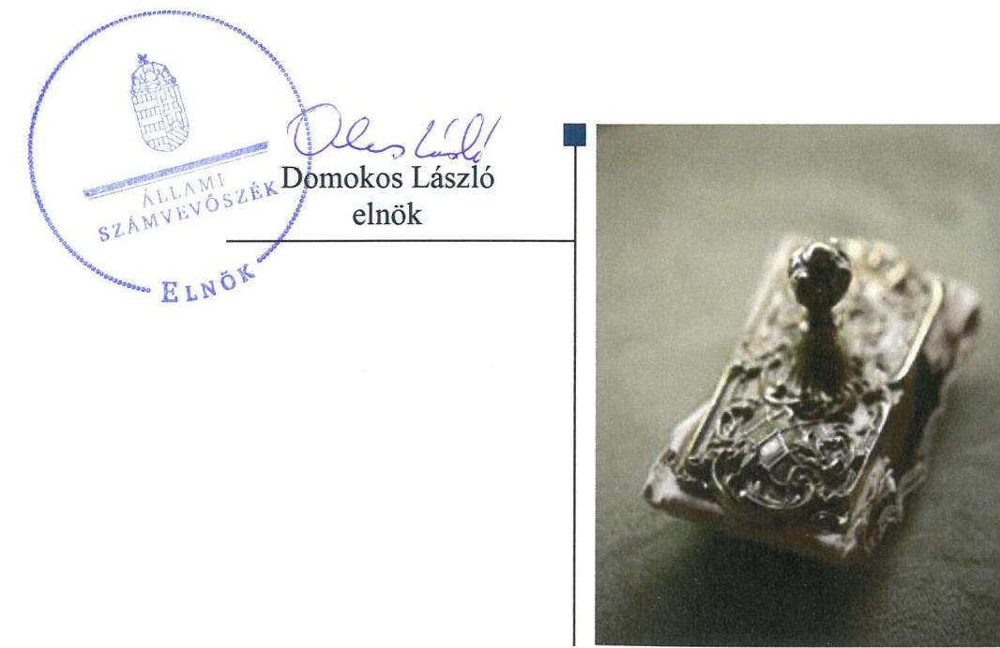
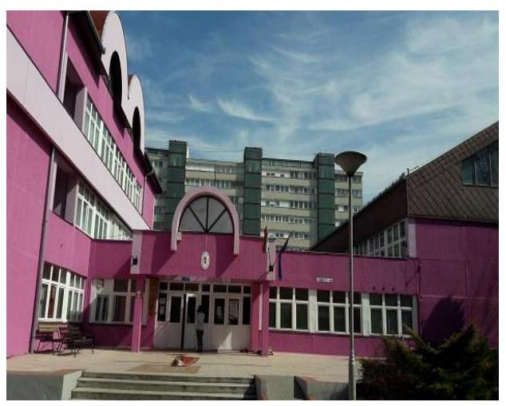
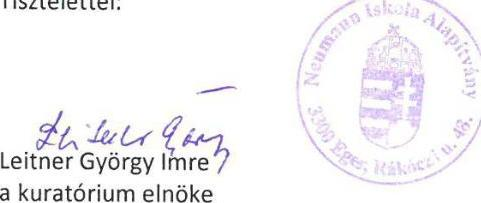
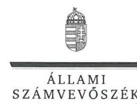
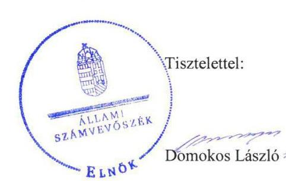
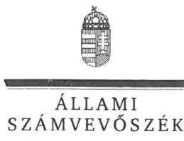

# Jelentés 

## Nem állami humánszolgáltatók ellenőrzése

A humánszolgáltatást nyújtó államháztartáson kívüli köznevelési és szociális intézmények, szolgáltatók fenntartói központi költségvetésből kapott támogatásai felhasználásának ellenőrzése - Neumann Iskola Alapítvány
2018.

---

# Jelentés 

## Nem állami humánszolgáltatók ellenőrzése

A humánszolgáltatást nyújtó államháztartáson kívüli köznevelési és szociális intézmények, szolgáltatók fenntartói központi költségvetésből kapott támogatásai felhasználásának ellenőrzése - Neumann Iskola Alapítvány
2018. 10 hó 17 nap

---

# AZ ELLENŐRZÉST FELÜGYELTE:

DR. NAGY IMRE felügyeleti vezető

# AZ ELLENŐRZÉST VEZETTE ÉS A VÉGREHAJTÁSÁÉRT FELELŐS:

MOLNÁR ZSUZSANNA ellenőrzésvezető

# A PROGRAM ÖSSZEÁLLÍTÁSÁÉRT FELELŐS:

TÓTPÁL SZABOLCS osztályvezető

---

IKTATÓSZÁM: EL-0331-020/2018.

TÉMASZÁM: 2448

ELLENŐRZÉS-AZONOSÍTÓ SZÁM: V079407

---

Jelentéseink az Országgyűlés számítógépes hálózatán és az Interneta a www.asz.hu címen is olvashatóak.

---

# TARTALOMJEGYZÉK 

■ ÖSSZEGZÉS ..... 5
■ AZ ELLENŐRZÉS CÉLJA ..... 6
■ AZ ELLENŐRZÉS TERÜLETE ..... 7
■ AZ ELLENŐRZÉS HÁTTERE, INDOKOLTSÁGA ..... 8
■ A JELENTÉS LÉNYEGES KÉRDÉSKÖREI ..... 9
■ AZ ELLENŐRZÉS HATÓKÖRE ÉS MÓDSZEREI ..... 10
■ MEGÁLLAPÍTÁSOK ..... 12
■ JAVASLATOK ..... 16
■ MELLÉKLETEK ..... 17
I. sz. melléklet: Értelmező szótár ..... 17
■ FÜGGELÉK: ÉSZREVÉTELEK ..... 19
■ RÖVIDÍTÉSEK JEGYZÉKE ..... 33

---

.

---

# ÖSSZEGZÉS 

A Neumann Iskola Alapítvány - mint intézményfenntartó - a költségvetési támogatások átlátható, elszámoltatható felhasználásának feltételeit nem teremtette meg. A közérdekü adatok közzétételi kötelezettségének nem tett eleget, ezáltal közpénzekkel való gazdálkodásának átláthatóságát a nyilvánosság előtt nem biztositotta.

## Az ellenőrzés társadalmi indokoltsága

Az Állami Számvevőszék stratégiájában hangsúlyos szerepet szán annak, hogy szilárd szakmai alapon álló, értékteremtő ellenőrzéseivel előmozdítsa a közpénzügyek átláthatóságát, rendezettségét, javaslataival a közpénzek és a közvagyon szabályos, gazdaságos, hatékony és eredményes felhasználását segítse. Stratégiájában az Állami Számvevőszék célul tűzte ki, hogy az államháztartáson kívülre nyújtott költségvetési támogatások ellenőrzésével hozzájárul ahhoz, hogy a közpénzeket az államháztartáson kívüli szervezetek is átlátható módon használják fel a közfeladatok szerződésben vállalt ellátása érdekében. Tekintettel az elmúlt években a köznevelés finanszírozását és a köznevelési intézmények fenntartását érintően végbement változásokra, a társadalom fokozott érdeklődéssel figyeli a köznevelési feladatok ellátására fordított források felhasználását. Fontos ezért az Állami Számvevőszéknek a közvéleményt biztosítani arról, hogy a közpénz államháztartáson kívüli felhasználása ezen a területen sem marad ellenőrizetlenül. Hozzájárul ezzel ahhoz is, hogy a nyilvánosság és a közszolgáltatást igénybevevők megfelelő tájékoztatást kapjanak az államháztartáson kívüli közfeladatot ellátók múködéséről. Az Állami Számvevőszék által a Neumann Iskola Alapítványnál végzett ellenőrzést további társadalmi elvárás is indokolja tevékenységéből adódóan, mivel köznevelési közfeladat ellátására több mint 1,7 Mrd Ft központi költségvetési támogatásban részesült az Alapítvány az ellenőrzött időszakban.

## Főbb megállapítások, következtetések, javaslatok

A Neumann Iskola Alapítvány nem teremtette meg a szabályszerű múködési és gazdálkodási környezet kialakításával a költségvetési támogatások átlátható, elszámoltatható felhasználásának feltételeit. A köznevelési közfeladat ellátás fenntartói kereteinek kialakítása nem volt szabályszerű, a költségvetési támogatások elkülönített nyilvántartására vonatkozó belső szabályozás tartalma ellentétes volt a jogszabályi előírással. A költségvetési támogatásokkal kapcsolatos igénylési, módosítási, elszámolási kötelezettségnek a Magyar Államkincstár felé a jogszabályi előírásoknak megfelelően eleget tett.

A Neumann Iskola Alapítvány a köznevelési közfeladat ellátására szolgáló támogatások felhasználását nem a jogszabályi előírásnak megfelelően tartotta nyilván, a támogatások cél szerinti felhasználása szabályszerű nyilvántartás hiányában nem volt megállapítható.

A Neumann Iskola Alapítvány ellenőrzési és értékelési feladatait szabályszerűen ellátta. A közérdekű adatok közzétételi kötelezettségének nem tett eleget, ezáltal a humánszolgáltatási közfeladatot ellátó intézménye múködtetéséhez felhasznált közpénzekre vonatkozó gazdálkodásának átláthatóságát a nyilvánosság előtt nem biztosította. Az Állami Számvevőszék a jelentésben foglalt megállapítások alapján a Neumann Iskola Alapítvány kuratóriuma elnökének a szabályozottsággal, a nyilvántartási és közzétételi kötelezettségek teljesítésével kapcsolatban 4 javaslatot fogalmazott meg. A javaslatokat megalapozó megállapításokra az érintettnek 30 napon belül intézkedési tervet kell készítenie.

---

# AZ ELLENŐRZÉS CÉLJA

**AZ ELLENŐRZÉS CÉLJA** annak értékelése volt, hogy a Neumann Iskola Alapítvány, mint köznevelési intézményfenntartó központi költségvetésből kapott támogatásainak felhasználása szabályszerű volt-e, a támogatások igénylése, évközi módosítása és év végi elszámolása megfelelte-e a jogszabályi előírásoknak.

---

# **AZ ELLENŐRZÉS TERÜLETE**

## **A Neumann Iskola Alapítvány, mint intézményfenntartó**

A Neumann Iskola Alapítványt 1993-ban a Neumann Alapítvány és Eger Megyei Jogú Város Önkormányzata hozta létre azzal a céllal, hogy a Neumann János Gimnázium, Szakgimnázium és Kollégium nevet viselő iskola egykori jogelőd intézményét megalapítsa és működtesse. A Fenntartó1 nyílt, közhasznú alapítvány volt.

Úgyvezető szerve a kilenc főből álló kuratórium volt, melynek elnöke képviselte az Alapítványt. Az elnök személye az ellenőrzött időszakban nem változott.

A Fenntartó gazdasági, pénzügyi, számviteli feladatait a fenntartott intézmény2 gazdasági szervezeti egysége látta el.

Az intézmény székhelyén kívül négy egri telephelyen működött, gimnáziumi, szakgimnáziumi, felnőtt oktatási és a többi tanulóval együtt nevelhető, oktatható sajátos nevelési igényű tanulók nevelési-oktatási feladatait látta el, továbbá kollégiumi ellátást biztosított.

Az intézmény 2016. évi engedélyezett nappali tagozatos létszáma 1305 fő, kollégiumi férőhelyeinek száma 456 fő volt. Az intézmény 2016-ban 107 főállású pedagógust alkalmazott.

A Fenntartó a 2014-2016. években vállalkozási tevékenységet nem végzett.

A Fenntartó összes bevétele 2014-ben 862,0 M Ft, 2016-ban 874,4 M Ft volt. A Fenntartó 2014. évi összes bevételének 75%-át a központi költségvetési támogatás tette ki. 2016-ban a központi költségvetési támogatás aránya 62% volt. A Fenntartó 2014. évi 163,6 M Ft összegű befektetett eszköz állománya 2016-ra közel 40%-kal nőtt, rövid lejáratú kötelezettség állománya 71,4%-kal csökkent, hosszú lejáratú kötelezettsége a Fenntartónak 2014-2016. között nem volt.

---

# **AZ ELLENŐRZÉS HÁTTERE, INDOKOLTSÁGA**

A köznevelési feladatokat ellátó nem állami intézményfenntartók részére közfeladataik ellátására évente jelentős összegű pénzügyi támogatást biztosítottak a mindenkori költségvetési törvények a bennük megfogalmazott feltételek mellett.

Az Országgyűlés elfogadta a nemzeti köznevelésről szóló 2011. évi CXC. törvényt, amely jelentősen átalakította a korábbi finanszírozási rendszert 2013 szeptemberétől. Új feladatfinanszírozási forma (átlagbéralapú támogatás) jelent meg, amely az államháztartáson kívüli intézményfenntartókra is vonatkozik. Az ellenőrzés a finanszírozási rendszerben bekövetkezett változásokra, azok közfeladat ellátásra gyakorolt hatására fókuszált a költségvetési támogatásokat felhasználó államháztartáson kívüli szervezetek körében. Az ellenőrzés indokoltságát az is alátámasztotta, hogy az ÁSZ3 még nem ellenőrizte átfogóan e területet.

Az ÁSZ stratégiájában foglaltak alapján is indokolt az ellenőrzés, amely a társadalom számára jelzi, hogy a közpénz államháztartáson kívüli felhasználása sem maradhat ellenőrizetlenül. Az államháztartáson kívülre nyújtott költségvetési támogatások ellenőrzésével az ÁSZ hozzájárul ahhoz, hogy a közpénzeket a nem állami fenntartók átlátható módon használják fel a közfeladatok ellátására kötött szerződésekben vállalt kötelezettségek teljesítése érdekében. Az ÁSZ az ellenőrzés javaslataival hozzájárulhat az említett rendszerek szabályszerű támogatás-felhasználásához, javíthatja a társadalmi-gazdasági döntések megalapozottságát, amely a "jó kormányzás" feltétele.

---

# A JELENTÉS LÉNYEGES KÉRDÉSKÖREI 

1. A köznevelési humánszolgáltatási közfeladatot ellátó Fenntartó szabályszerű müködési - és gazdálkodási környezet kialakításával megteremtette-e a költségvetési támogatások átlátható, elszámoltatható igénybevételének, felhasználásának feltételeit?
2. Az államháztartáson kívüli Fenntartó az átvállalt köznevelési közfeladathoz biztosított költségvetési támogatásokat szabályszerűen fordította-e a humánszolgáltató intézménye müködtetésére?
3. Az államháztartáson kívüli Fenntartó a köznevelési intézménye müködtetéséhez felhasznált közpénzekre vonatkozó gazdálkodásával a nyilvánosság előtt elszámolt-e, ennek megalapozása érdekében ellenőrzési, értékelési és a külső ellenőrzésekkel kapcsolatos intézkedési feladatait szabályszerűen látta-e el?

---

# AZ ELLENŐRZÉS HATÓKÖRE ÉS MÓDSZEREI 

## Az ellenőrzés típusa

Megfelelőségi ellenőrzés.

## Az ellenőrzött időszak

A 2014. január 1-je és 2016. december 31-e közötti időszak.

## Az ellenőrzés tárgya

Az ellenőrzés a köznevelési közfeladatokat ellátó államháztartáson kívüli fenntartó közfeladatai ellátásához a költségvetési törvényekben biztosított központi költségvetési támogatások igénylése, évközi módosítása és év végi elszámolása fenntartói feladatainak ellátása, illetve e központi költségvetésből kapott támogatásaik közfeladatokra való fenntartó általi felhasználása szabályszerűségének értékelésére terjedt ki.

Az ellenőrzés nem terjedt ki a költségvetési támogatás igénylése, módosítása, elszámolása valódiságának, megalapozottságának, helyességének értékelésére, valamint a források intézmény általi felhasználásának értékelésére.

## Az ellenőrzött szervezet

A Neumann Iskola Alapítvány, mint intézményfenntartó.

## Az ellenőrzés jogalapja

Az ellenőrzés jogszabályi alapját az ÁSZ tv. 1. § (3) bekezdésében, valamint az 5. § (3) bekezdésében foglalt előírások adták.

## Az ellenőrzés módszerei

Az ellenőrzést az ellenőrzési program kérdései, az adott időszakban hatályos jogszabályok, az ellenőrzés szakmai szabályok és módszertanok, valamint a nemzetközi standardok figyelembevételével végezte az ÁSZ.

A közpénzekkel való felelős gazdálkodás segítésére irányuló javaslatok kidolgozásakor a hatályos jogszabályok voltak az irányadóak.

Az ellenőrzés ideje alatt az ÁSZ a Fenntartóval történő kapcsolattartást az ÁSZ SZMSZ4-ének vonatkozó előírásai alapján biztosította.

---

Az ellenőrzési kérdések megválaszolásához szükséges bizonyítékok megszerzése az ellenőrzött által rendelkezésre bocsátott dokumentumokra, adatokra alapozva történt.

Az ellenőrzési bizonyítékként felhasznált adatforrások közé tartoztak egyrészt a szakmai program részletes szempontjainál felsorolt adatforrások, másrészt minden - az ellenőrzés folyamán feltárt, az ellenőrzés szempontjából információt tartalmazó - dokumentum.

Az ellenőrzés lefolytatásához a Fenntartó a kitöltött tanúsítványok, valamint az ÁSZ által kért dokumentumok átadásával szolgáltatott adatokat, információkat. Az így rendelkezésre bocsátott adatok, információk és a tanúsítványok adatai valódiságának kontrollja az ellenőrzés keretében történt.

A fenntartott intézménynél helyszíni szemle keretében győződtünk meg a tényleges feladatellátásról. A köznevelési humánszolgáltatások központi költségvetési támogatásai igénylésével, módosításával, elszámolásával kapcsolatos, államháztartáson kívüli fenntartó jogszabályokban előírt feladatai betartását, továbbá a központi költségvetési támogatások szabályszerű kezelését, nyilvántartását ellenőriztük a Fenntartónál, az ott rendelkezésre álló határozatok, nyilvántartások, beszámolók és egyéb dokumentumok alapján. Továbbá nem terjedt ki az ellenőrzés e források, intézmény általi szabályszerű felhasználásának értékelésére.

---

# MEGÁLLAPÍTÁSOK 

## 1. A köznevelési humánszolgáltatási közfeladatot ellátó Fenntartó szabályszerű múködési - és gazdálkodási környezet kialakításával megteremtette-e a költségvetési támogatások átlátható, elszámoltatható igénybevételének, felhasználásának feltételeit?

Összegző megállapítás

A Fenntartó nem teremtette meg a szabályszerű múködési és gazdálkodási környezet kialakításával a költségvetési támogatások átlátható, elszámoltatható felhasználásának feltételeit. A költségvetési támogatások igénylésével, módosításával és elszámolásával kapcsolatos feladatait szabályszerűen látta el.

A Fenntartónál a köznevelési közfeladat ellátás kereteinek kialakítása nem volt szabályszerű, a belső szabályozások tartalma nem felelt meg a jogszabályi előírásoknak.

A köznevelési közfeladat ellátás kereteit a 2014. január 1-jétől november 20-ig tartó időszakban a Fenntartó nem a jogszabályi előírásoknak megfelelően alakította ki. Nem gondoskodott - a 335/2005. (XII. 29.) Korm. rendelet ${ }^{5} 6 . \S$ f) pontjában foglalt előírás ellenére - arról, hogy a 2014. január 1-jétől november 20-ig tartó időszakban hatályos alapító okirat megőrzése biztosított legyen. Szervezeti és múködési szabályai a 2014. január 1-jétől november 20-ig tartó időszakban nem kerültek meghatározásra, azokat a 2014. november 21-től hatályos alapító okirat ${ }^{6}$, illetve SZMSZ ${ }^{7}$ tartalmazza. A Fenntartót a Bíróság ${ }^{8}$ nyilvántartásba vette és rendelkezett az Nkt.-ban ${ }^{9}$ meghatározott köznevelési szerződéssel.

A támogatások elkülönített nyilvántartására vonatkozó szabályozás ellentétes volt az Nkt. vhr. ${ }^{10}$ 37/G. § (1) bekezdésében előírtakkal, mert nem írták elő a támogatások felhasználásának alapfeladatonkénti bontásban elkülönítetten történő nyilvántartását akként, hogy abból megállapítható legyen, hogy a támogatások milyen célra kerültek felhasználásra.

Nem gondoskodott a Fenntartó - a Számv. tv. ${ }^{11}$ 14.§ (11) bekezdésben foglaltak ellenére - a számviteli politika ${ }_{1,2}$ törvényi változások hatálybalépését követő 90 napon belüli módosításáról, mert a számviteli politika ${ }_{1}$ ben - Számv. tv. 14. § (4) bekezdésében foglalt előírás ellenére - nem rögzítették, hogy mit tekintenek a számviteli elszámolás, az értékelés szempontjából jelentősnek és nem jelentősnek, a számviteli politika ${ }_{2}$-ben pedig, hogy mit tekintenek kivételes nagyságú vagy előfordulású bevételnek, költségnek, ráfordításnak.

---

# 1.2. számú megállapítás 

A Fenntartó a költségvetési támogatások igénylési, módosítási és elszámolási feladatait szabályszerűen látta el.

A költségvetési támogatások iránti igényét a Fenntartó az Nkt. vhr.-ben előírt nyilatkozatokkal a 2014-2016. évekre vonatkozóan határidőre benyújtotta a Kincstárhoz ${ }^{12}$. A Fenntartó rendelkezett a költségvetési támogatásokat megállapító kincstári határozatokkal.

A Fenntartó - 2015-ben a fenntartott intézmény feladataiban, 2016ban az intézmény nevében és feladataiban történt változással kapcsolatos - bejelentési kötelezettségének az Nkt. vhr.-ben előírt határidőre eleget tett a Kincstár felé.

A Fenntartó a közfeladat ellátására kapott támogatásokkal elszámolt a tényleges feladatmutatók alapján a Kincstár felé az Nkt. vhr.-ben előírt határidőben és formában.

## 2. Az államháztartáson kívüli Fenntartó az átvállalt köznevelési közfeladathoz biztosított költségvetési támogatásokat szabályszerűen fordította-e a humánszolgáltató intézménye múködtetésére?

Összegző megállapítás

### 2.1. számú megállapítás

A köznevelési közfeladathoz biztosított költségvetési támogatások cél szerinti felhasználása szabályszerű nyilvántartás hiányában nem volt megállapítható.

A Fenntartó szabályszerűen biztosította intézménye múködtetésének szervezeti, személyi és tárgyi feltételeit.

Az intézmény alapító okiratát ${ }^{13}$ - amely az Nkt. előírásainak megfelelően tartalmazta az intézmény és a fenntartó nevét, székhelyét, az intézmény feladat-ellátási helyeit, a feladat-ellátási helyenként felvehető maximális gyermek-, tanulólétszámot, a feladatellátást szolgáló vagyon feletti rendelkezési jogot és a gazdálkodással összefüggő jogosítványokat - a Fenntartó kiadta. Az intézményt a Kormányhivatal ${ }^{14}$ nyilvántartásba vette, múködési engedélyét kiadta.

A Fenntartó az Nkt. rendelkezésének megfelelően kinevezte az intézmény vezetőjét, meghatározta az ellenőrzött időszakban az intézmény költségvetéseit, az intézmény által kérhető térítési díj megállapításának szabályait, valamint a szociális alapon adható kedvezmények feltételeit. A Fenntartó jóváhagyta az intézmény SZMSZ-ét, pedagógiai programját és házirendjét.

A Fenntartó rendelkezett az ellenőrzési időszakban az intézmény - a közfeladat ellátáshoz szükséges személyi és tárgyi feltételek meglétét igazoló - múködési engedélyével.

---

# 2.2. számú megállapítás 

A Fenntartó a köznevelési közfeladat ellátására szolgáló támogatások felhasználását nem a jogszabályi előírásnak megfelelően tartotta nyilván.

A köznevelési közfeladat ellátására kapott támogatások felhasználásának nyilvántartása nem felelt meg az Nkt. vhr.-ben előírtaknak, mert a Fenntartó a támogatások felhasználásáról - az Nkt. vhr. 37/G. § (1) bekezdésében foglaltak ellenére - nem vezetett alapfeladatonkénti bontásban elkülönített nyilvántartást és nem gondoskodott a nyilvántartás kialakításáról akként, hogy abból megállapítható legyen, hogy a támogatások milyen célra kerültek felhasználásra.

## 3. Az államháztartáson kívüli Fenntartó a köznevelési intézménye müködtetéséhez felhasznált közpénzekre vonatkozó gazdálkodásával a nyilvánosság előtt elszámolt-e, ennek megalapozása érdekében ellenőrzési, értékelési és a külső ellenőrzésekkel kapcsolatos intézkedési feladatait szabályszerűen látta-e el?

Összegző megállapítás

A Fenntartó ellenőrzési és értékelési feladatait szabályszerűen látta el, azonban közzétételi kötelezettségének nem tett eleget, ezáltal az intézmény müködtetéséhez felhasznált közpénzek elszámolását a nyilvánosság számára nem tette átláthatóvá.

### 3.1. számú megállapítás

A Fenntartó ellenőrzésének szervezeti kereteit megteremtette, ellenőrzési és értékelési feladatait szabályszerűen végezte.

A Fenntartó működésének és gazdálkodásának ellenőrzéséről a Civil.tv.ben ${ }^{15}$ foglaltaknak megfelelően felügyelő bizottság létrehozásával gondoskodott. A Fenntartó köznevelési intézménye költségvetési gazdálkodásának ellenőrzéséről alapító okiratában és SZMSZ-ében rendelkezett.

A Felügyelő Bizottság ${ }^{16}$ az ellenőrzött időszak minden évében ellenőrizte a Fenntartó pénzforgalmi tájékoztatóit, az éves költségvetési tervet, az éves számviteli, szakmai, szöveges beszámolóit, valamint az intézmény éves beszámolóit, pénzforgalmi tájékoztatóit.

A Fenntartó számviteli politikája ${ }_{1,2}$ alapján független szakértőt bízott meg a saját és az intézménye éves beszámolójának felülvizsgálatával. A Fenntartó - külső könyvszakértő és tanácsadó társasággal kötött szerződés keretében - évente ellenőriztette az intézménye által igényelt költségvetési támogatás elszámolásának jogszerűségét.

A Fenntartó az Nkt.-ban foglaltak alapján értékelte a pedagógiai programban meghatározott feladatok végrehajtását és a pedagógiai-szakmai munka eredményességét. Az Nkt. 83. § (2) bekezdés i) pontban foglalt, a házirendre vonatkozó ellenőrzést a Fenntartó az ellenőrzött időszakban nem végzett.

---

A külső ellenőrzések eredményeként a Fenntartónak intézkedési kötelezettsége az ellenőrzött időszakban nem keletkezett.

# 3.2. számú megállapítás 

A Fenntartó a köznevelési intézménye múködtetéséhez felhasznált közpénzekre vonatkozó közzétételi kötelezettségének nem tett eleget.

A közérdekú adatok megismerésére irányuló igények teljesítésének a rendjét a Fenntartó az Info tv. ${ }^{17} 30$. § (6) bekezdésében előírtak ellenére nem szabályozta.

Az adatok biztonságának, védelmének érvényre juttatásához szükséges eljárási szabályokat és az Info tv.-ben meghatározott közzétételi listákon szereplő adatok pontos, naprakész és folyamatos közzétételének a részletes szabályait 2014. január 1. és 2014. augusztus 31. közötti időszakban az Info tv. 7. § (2) bekezdésben és a 35. § (3) bekezdésben foglalt előírások ellenére - nem alakították ki.

A Fenntartó, mint adatfelelős szerv nem gondoskodott- az Info tv. 37. § (1) bekezdésében foglaltak ellenére - az 1. melléklet általános közzétételi lista - II/8., II/12., III/1., és III/7. részben felsorolt adatok közzétételéről, mert nem tette közzé
— az alapítvány tevékenységéhez kapcsolódó kuratóriumi döntéseket, a kuratórium üléseinek jegyzőkönyveit, összefoglalóit,
— az alaptevékenységgel kapcsolatos vizsgálatok, ellenőrzések nyilvános megállapításait,
— az alapítvány költségvetésére vonatkozó adatokat és
— az Európai Unió támogatásával megvalósuló fejlesztésekre vonatkozó szerződéseket.
Beszámolási kötelezettségének a Fenntartó eleget tett, a jogszabályi előírásoknak megfelelően egyszerűsített éves beszámolót készített a Civil. tv., illetve a Civilszr. előírásainak megfelelő közhasznúsági melléklettel és eredmény-kimutatással.

---

# JAVASLATOK 

Az ÁSZ tv. 33. § (1) bekezdésében foglaltak értelmében az ellenőrzött szervezet vezetője köteles a jelentésben foglalt megállapításokhoz kapcsolódó intézkedési tervet összeállítani és azt a jelentés kézhezvételétől számított 30 napon belül az ÁSZ részére megküldeni. Amennyiben az ellenőrzött szervezet vezetője nem küldi meg határidőben az intézkedési tervet, vagy továbbra sem elfogadható intézkedési tervet küld, az Állami Számvevőszék elnöke az ÁSZ tv. 33. § (3) bekezdése a) és b) pontjaiban foglaltakat érvényesítheti.

## A Neumann Iskola Alapítvány kuratóriuma elnökének

1. Intézkedjen, hogy a költségvetési támogatások felhasználásának nyilvántartása feleljen meg a jogszabályban elöírtaknak.
(1.1. sz. megállapítás 2. bekezdése, valamint a 2.2. számú megállapítás 1. bekezdése alapján)
2. Intézkedjen a számviteli politika jogszabályban foglalt elöírásoknak megfelelő módosításáról.
(1.1. sz. megállapítás 3. bekezdése alapján
3. Gondoskodjon az Info tv. előírásai alapján a közérdekü adatok megismerésére irányuló igények teljesitési rendjét rögzítő szabályzat készítéséről.
(3.2. sz. megállapítás 1. bekezdése alapján)
4. Tegyen eleget az Info tv.-ben elöírt közzétételi kötelezettségnek.
(3.2. sz. megállapítás 3. bekezdése alapján)

---

# MELLÉKLETEK 

## I. SZ. MELLÉKLET: ÉRTELMEZŐ SZÓTÁR

humánszolgáltatás
költségvetési támogatás
köznevelési közfeladat
köznevelési intézmény

Külön törvényben meghatározott szociális, gyermekjóléti, gyermekvédelmi, közoktatási, felsőoktatási, kulturális közfeladatok (2014. évi Kvtv. 34. § (1), (4) bekezdés, 1. számú melléklet XX/20/2. alcím, 19. alcím, 2015. évi Kvtv. 43. § (1), (4) bekezdés, 1. számú melléklet XX/20/2/3. jogcím csoport, 19. alcím, 2016. évi Kvtv. 41. § (1), (4) bekezdés, 1. számú melléklet XX/20/2/3. jogcím csoport, 19. alcím).
a társadalombiztosítás pénzügyi alapjai kivételével az államháztartás központi alrendszeréből ellenérték nélkül, pénzben nyújtott támogatások (Áht. 1. § 14. pont)
A Kvtv-ekben (2013. évi CCXXX. törvény 33-34. §, 2014. évi C. törvény 42-43. §, 2015. évi C. törvény 40-41. §) megállapított támogatás. Például a 2015. évi C. törvény 40-41. § szerint többek között: Az Országgyűlés a köznevelési feladat ellátására átlagbéralapú támogatást állapít meg. A nevelési-oktatási, valamint pedagógiai szakszolgálati intézményt fenntartó nemzetiségi önkormányzat, az egyházi és magán köznevelési intézményfenntartója részére az általuk fenntartott nevelési-oktatási intézményben, továbbá pedagógiai szakszolgálati intézményben pedagógus és - a b) pont kivételével -nevelő-oktató munkát közvetlenül segítő munkakörben foglalkoztatottak után a 7. melléklet I. pontja, valamint az óvoda, egységes óvoda-bölcsőde esetében a 2. melléklet II. pont 1. alpontja szerint és az 5. alpontjában meghatározott jogosultak után, az őket ott megillető mértékek szerint. Múködési támogatást állapít meg a nemzetiségi önkormányzat vagy az egyházi jogi személy által fenntartott nevelési-oktatási intézményekben ellátott, továbbá a pedagógiai szakszolgálati intézményekben gyógypedagógiai tanácsadásban, korai fejlesztésben, oktatásban és gondozásban, valamint a fejlesztő nevelésben részt vevő gyermekekre, tanulókra tekintettel a nemzetiségi önkormányzat és a bevett egyház részére a 7. melléklet II. pontja szerint.
Az Országgyűlés a szociális, gyermekjóléti, gyermekvédelmi közfeladatot ellátó intézményt, szolgáltatást fenntartó egyházi jogi személy, civil szervezet, közalapítvány, országos nemzetiségi önkormányzat, települési vagy területi nemzetiségi önkormányzat, gazdasági társaság, és a humánszolgáltatást alaptevékenységként végző, az Szja tv. hatálya alá tartozó egyéni vállalkozó (a továbbiakban együtt: nem állami szociális fenntartó) részére támogatást állapít meg a következők szerint: a támogatás a nem állami szociális fenntartót a települési önkormányzatok 2. melléklet III. pont 3. alpont c)-k) pontjában és III. pont 5. alpont a) pontjában meghatározott támogatásaival azonos jogcímeken, összegben és feltételek mellett illeti meg.
A köznevelési intézmény alapító okiratában foglalt feladat: óvodai nevelés, nemzetiséghez tartozók óvodai nevelése, általános iskolai nevelés-oktatás, nemzetiséghez tartozók általános iskolai nevelése-oktatása, kollégiumi ellátás, nemzetiségi kollégiumi ellátás, gimnáziumi nevelés-oktatás, szakközépiskolai nevelés-oktatás, szakiskolai nevelés-oktatás, nemzetiség gimnáziumi nevelés-oktatása, nemzetiség szakközépiskolai nevelésoktatása, nemzetiség szakiskolai nevelés-oktatása, Köznevelési Hídprogramok keretében folyó nevelés-oktatás, felnőttoktatás, alapfokú művészetoktatás, fejlesztő nevelés, fejlesztő nevelés-oktatás, pedagógiai szakszolgálati feladat, a többi gyermekkel, tanulóval együtt nevelhető, oktatható sajátos nevelési igényű gyermekek, tanulók óvodai nevelése és iskolai nevelése-oktatása, azoknak a sajátos nevelési igényű gyermekeknek, tanulóknak az óvodai, iskolai, kollégiumi ellátása, akik a többi gyermekkel, tanulóval nem foglalkoztathatók együtt, a gyermekgyógyüdülőkben, egészségügyi intézményekben, rehabilitációs intézményekben tartós gyógykezelés alatt álló gyermekek tankötelezettségének teljesítéséhez szükséges oktatás, pedagógiai-szakmai szolgáltatás.
A nevelési- oktatási intézmény, pedagógiai szakszolgálati intézmény, pedagógiai-szakmai szolgáltatást nyújtó intézmény.

---

nem állami, nem önkormányzati (államháztartáson kívüli) intézményfenntartó

A köznevelési és szociális, gyermekjóléti és gyermekvédelmi közfeladatokat/humánszolgáltatásokat ellátó intézményt fenntartó egyházi jogi személy, társadalmi szervezet, alapítvány, közalapítvány, civil szervezet, országos nemzetiségi önkormányzat, nonprofit gazdasági társaság, gazdasági társaság és a humánszolgáltatást alaptevékenységként végző, Szja tv. hatálya alá tartozó egyéni vállalkozó. (2013. évi Kvtv. 35. § (1), (3) bekezdés, 2014. évi Kvtv. 33. §, 34. § (1), (4) bekezdés, 2015. évi Kvtv. 42. §, 43. § (1), (4) bekezdés, 2016. évi Kvtv. 40. §, 41. § (1), (4) bekezdés)

---

# FÜGGELÉK: ÉSZREVÉTELEK 

A jelentéstervezetet a Számvevőszék 15 napos észrevételezésre megküldte az ellenőrzött szervezet vezetőjének az ÁSZ tv. 29. §* (1) bekezdése előírásának megfelelően.

A Neumann Iskola Alapítvány kuratóriuma elnöke élt az ÁSZ tv. 29. § (2) bekezdésében foglalt észrevételezési jogával, a törvényes határidőn belül észrevételt tett.
A függelék tartalmazza az ellenőrzött észrevételeit, illetve az el nem fogadott észrevételek elutasításának indoklását.

[^0]
[^0]:    * 29. § (1) Az Állami Számvevőszék az ellenőrzési megállapításait megküldi az ellenőrzött szervezet vezetőjének vagy az általa megbízott személynek, és annak, akinek személyes felelősségét állapította meg.
    (2) Az ellenőrzött szervezet vezetője és a felelősként megjelölt személy az ellenőrzés megállapításaira tizenöt napon belül írásban észrevételt tehet.
    (3) Az Állami Számvevőszék az észrevételre a beérkezésétől számított harminc napon belül írásban válaszol. A figyelembe nem vett észrevételeket köteles a jelentésben feltüntetni, és megindokolni, hogy azokat miért nem fogadta el.

---

Neumann Iskola Alapítvány
3300 Eger, Rákóczi út 48.

Állami Számvevőszék
Domokos László Elnök Úr

## BUDAPEST

Apáczai Csere János u. 10.
1052

ÁLLAMI SZÁMVEVŐSZÉK
26-69460/2018
Erkezeit: 2018 AUG 29.
Iktatószám: SL-0663-076/2018
Moliékiot:
Ikt. szám: NIA-37/1/2018

Tárgy: Észrevétel „a Humánszolgáltatást nyújtó államháztartáson kívüli köznevelési és szociális intézmények, szolgáltatók fenntartói központi költségvetésből kapott támogatásai felhasználásának ellenőrzése - Neumann Iskola Alapítvány,, című számvevőszéki jelentéstervezetre

Tisztelt Számvevőszék!
Tisztelt Elnök Úr!
2018. augusztus 17-én átvett (Ikt. szám: EL-0663-055/2018) tárgyban szereplő jelentéstervezettel kapcsolatban a Neumann Iskola Alapítvány (továbbiakban alapítvány) az alábbi észrevételeket terjeszti elő a 2011. évi LXVI. törvényben biztosított határidőn belül.

1. Az Állami Számvevőszék 1.1. számú megállapítására az alábbi észrevételt tesszük:

Vitatjuk a jelentéstervezet 1.1 számú megállapításában foglaltakat, miszerint „a Fenntartónál a köznevelési közfeladat ellátás kereteinek kialakítása nem volt szabályszerű, belső szabályozások tartalma nem felelt meg a jogszabályi előírásoknak". A vizsgálatot megalapozó dokumentumok feltöltése során a vizsgált időszak végén, azaz 2016.12.31. napján hatályos alapító okirat és SZMSZ került benyújtásra figyelemmel arra, hogy azok tartalmazzák mindazon lényeges rendelkezéseket, amelyek az egész vizsgált időszakra a vizsgálat szempontjából meghatározó információkat hordozhatnak. A becsatolt Alapító okirat és SZMSZ jogfolytonos a korábbi alapító okirat és SZMSZ rendelkezésein alapuló, az időközben az új Polgári Törvénykönyv és Civil törvény rendelkezéseinek megfeleltetett létesítő és a szervezeti struktúra müködését szabályozó okirat, tehát a benyújtott dokumentumok tartalmából lényegében rekonstruálhatóak a korábbi időszakokra vonatkozó fontosabb rendelkezések. A tervezet helyesen hivatkozik arra, hogy a 2014. november 21-től hatályos alapító okirat illetve SZMSZ rendelkezésre állt és ezek tartalmazzák az alapítvány szervezeti és működési rendjét. Természetesen a 2014. január 1-től 2014. november 20-ig terjedő időszakra vonatkozó alapító okirat, mint ahogy azt a nyilvántartó bíróságnál is bárki által lényegében korlátozás nélkül fellelhető és SZMSZ az adatszolgáltatás időpontjában is rendelkezésre állt, ezek benyújtásának hiánya a fentiekben megjelölt értelmezési anomália miatt történt. A Neumann Iskola Alapítvány irattárában az alapítástól kezdve megtalálhatóak a jogszabály szerinti maradandó értékű iratok, így az alapító okiratok és SZMSZ- ek is.
A beküldött számviteli politikák - a jogszabályi előírásoknak megfelelően - rendelkeznek arról, a számviteli elszámolás, az értékelés szempontjából mit tekintünk jelentősnek és nem jelentősnek. A 2014. január 1-jétől hatályos számviteli politika 9. pontja, a 2016. január 1-jétől hatályos számviteli politika 10. pontja tartalmazza ezeket a rendelkezéseket.
A kivételes nagyságú vagy előfordulású bevételek, költségek, ráfordítások az alapítvány gazdálkodásának sajátosságai miatt nem értelmezhetők.

---

Az Állami Számvevőszékhez az indoklásban szereplő számviteli politikán kívül benyújtásra került valamennyi szabályzat, melyet a számvitelről szóló 2000. évi C. törvény előír, melyekre vonatkozóan a jelentéstervezet nem állapít meg szabályszerűtlenséget.
A jelentéstervezet hivatkozott pontjában foglalt, fentiekben általunk nem kifogásolt rendelkezései és a rögzített észrevételeink alapján a következő megállapítási javaslattal élünk:

Az 1.1. számú megállapítás: A fenntartónál a köznevelési közfeladat ellátás kereteinek kialakítása szabályszerű volt, a belső szabályozások tartalma megfelelt a jogszabályi előírásoknak.

Abban az esetben, amennyiben az Állami Számvevőszék nem fogadja el a fenti észrevételeinket, kifejezetten a jelentéstervezet ténymegállapításait, a vizsgált időszakban hatályos számviteli jogszabályokat és a nem vitatottan megvalósult követelményeket figyelembe véve a következő megállapítási javaslattal élünk:

Az 1.1 számú megállapítás: A Fenntartónál a Köznevelési közfeladat ellátás keretének kialakítása 2014. január 1-jétől 2014. november 20-ig tartó időszakban nem volt szabályszerű, ezt követően 2014. november 21-től 2016. december 31-ig tartó időszakban szabályszerű volt, a belső szabályzások megfeleltek a jogszabályi előírásoknak.
2. Az Állami Számvevőszék 1. számú összegző megállapítására az alábbi észrevételt tesszük:

Figyelemmel az általunk 1. pontban foglaltakban tett észrevételeinkre a 1. számú összegző megállapítása nem helytálló, hiszen amennyiben az Állami Számvevőszék elfogadja az 1.1 számú megállapításhoz tett észrevételeinket az összegző megállapítás tartalma a tervezetben foglaltaktól el kell, hogy térjen. A fentiek alapján javaslatunk a következő:

1. számú összegző megállapítás: A Fenntartó megteremtette a szabályszerű működési és gazdálkodási környezet kialakításával a költségvetési támogatások átlátható, elszámoltatható felhasználásának feltételeit.

Abban az esetben, amennyiben az Állami Számvevőszék nem fogadja el a fenti észrevételeinket, kifejezetten a jelentéstervezet ténymegállapításait, a vizsgált időszakban hatályos jogszabályokat és a nem vitatottan megvalósult követelményeket figyelembe véve a következő megállapítási javaslattal élünk:

1. számú összegző megállapítás: A Fenntartó a 2014. január 1-jétől 2014. november 20-ig tartó időszakban nem, 2014. november 21-től 2016. december 31-ig tartó időszakban megteremtette a szabályszerű működési és gazdálkodási környezet kialakításával, a költségvetési támogatások átlátható, elszámolható felhasználásának feltételeit. A költségvetési támogatások igénylésével, módosításával és elszámolásával kapcsolatos feladatait szabályszerűen látta el.
2. Az Állami Számvevőszék 2.2. számú megállapítására, mi szerint „a Fenntartó a köznevelési közfeladat ellátására szolgáló támogatások felhasználását nem a jogszabályi előírásoknak megfelelően tartotta nyilván", az alábbi észrevételt tesszük:

Vitatjuk, hogy a megküldött anyagokból nem állapítható meg, hogy milyen célra kerültek felhasználásra a támogatások. Az alapfeladatonkénti elkülönített nyilvántartás hiánya, nem jelenti a támogatások jogszabályellenes felhasználását.

Indokaink:

---

- Az alapítványnak, mint fenntartónak egyetlen célja van a Neumann János Középiskola és Kollégium fenntartása, müködtetése, semmilyen egyéb tevékenységet nem végez, vállalkozási tevékenysége nincs. A megküldött és minden évben a jogszabályi előírásoknak megfelelően a www.nejanet.hu honlapon nyilvánosságra hozott, és az Országos Bírósági Hivatalnál letétbe helyezett beszámoló tartalmazza a kapott és az átadott költségvetési támogatás összegét, a cél megnevezését.
- A csatolt pénzforgalmi tájékoztatók részletesen tartalmazzák az átadás tényét, illetve a fenntartott iskolánál történő felhasználást.
- A beküldött főkönyvi számlákból, és számlarend kivonatokból megállapítható, hogy minden támogatást mind az alapítvány, mind az iskola elkülönítetten kezel.
- Elkülönített, analitikus nyilvántartásaink közül a „kimut_tam_14_16" fájlt töltöttük fel, mivel az éves költségvetési törvények előírják (ez magasabb szintű jogszabály, mint a Nkt.vhr-e), hogy a kapott költségvetési támogatást azok folyósítását követő 15 napon belül az alapítvány az általa fenntartott nevelési oktatási intézménynek átadja. Ebből a kimutatásból megállapítható, hogy a költségvetési törvény rendelkezéseit, maradéktalanul minden évben betartottuk. A kapott támogatás folyósításáról és az alapítvány a fenntartott intézményének történő átadásról a bankszámla kivonatok is feltöltésre kerültek.
- A 229/2012. (VIII.28.) Kormányrendelet a Nemzeti köznevelésről szóló törvény végrehajtásáról szóló rendelet I. fejezet 7. alcíme részletesen meghatározza a köznevelési intézmények fenntartásával kapcsolatos pénzügyi és gazdasági adatok nyilvántartására vonatkozó rendelkezést. E szerint „19. § (1) A fenntartó minden év április 1. és május 31. között a KIR honlapján keresztül köznevelési intézményenként és feladatonként az adatszolgáltatás évét megelőző naptári évről statisztikai célra a 20. § szerinti közérdekű pénzügyi és gazdálkodási adatokat közöl." Az alapítvány, mint fenntartó minden évben határidőre eleget tett az adatszolgáltatásnak, alapfeladatonként.
- A fentiek alapján egyértelműen megállapítható az, hogy rendelkezünk a támogatások alapfeladatonkénti nyilvántartásával, hiszen a KIR rendszerben más módon nem lett volna lehetőség az adatok feltöltésére . Az ÁSZ részére azért került sor a határnap alapú kimutatás feltöltésre, mert ez több információt tartalmaz, mint az alapfeladatokhoz kötött nyilvántartás. Megjegyezzük, mint ahogy a fentiekben hivatkoztunk rá, hogy a vizsgált időszakban hatályos költségvetési törvény előírja, hogy a kapott támogatásokat 15 napon belül át kell adni a fenntartott intézménynek, ennek igazolhatósága céljából vezetjük a határnap alapú kimutatást, amit egyébként az NKt. vhr. 37/G § (1) 3. mondatának 2. fordulata is alátámaszt:

37/G. § (1) A fenntartó a támogatások felhasználását, az ingyenesség, tandíj, térítési díj megállapításával, beszedésével kapcsolatos rendelkezéseket, okiratokat alapfeladatonkénti bontásban elkülönítetten és naprakészen tartja nyilván. Az adatok valódiságát az egyes fenntartónál, köznevelési intézménynél megfelelő nyilvántartással, szakmai és pénzügyi dokumentációval kell alátámasztani. A fenntartó a nyilvántartás kialakításáról akként gondoskodik, hogy abból megállapítható legyen, hogy a támogatások milyen határnappal kerültek átadásra és milyen célra kerültek felhasználásra.

---

Tehát a feltöltött kimutatás megfelelt az ÁSZ által kifogásként felhozott Nkt. vhr. hivatkozott rendelkezéseinek.

A jelentéstervezet hivatkozott pontjában foglalt, fentiekben általunk nem kifogásolt rendelkezései és a rögzített észrevételeink alapján a következő megállapítási javaslattal élünk:
2.2. számú megállapítás: A Fenntartó a köznevelési közfeladat ellátására szolgáló támogatások felhasználását a jogszabályi előírásnak megfelelően tartotta nyilván.

Abban az esetben, amennyiben az Állami Számvevőszék nem fogadja el a fenti észrevételeinket, a vizsgált időszakban hatályos jogszabályokat (költségvetési törvények, Nkt. vhr.) és a nem vitatottan megvalósult követelményeket figyelembe véve a következő megállapítási javaslattal élünk:
2.2. számú megállapítás: A Fenntartó a köznevelési közfeladat ellátására szolgáló támogatások felhasználását csak részben a jogszabályi előírásnak megfelelően tartotta nyilván, mert a hatályos költségvetési törvényben előírt rendelkezéseknek teljes mértékben megfelelt, azonban a Nkt. Vhr. 37/G (1) bekezdése előírásait, csak részben tartotta be.
4. Az Állami Számvevőszék 2. számú Összegző megállapítására az alábbi észrevételt tesszük:

Figyelemmel az általunk 3. pontban foglaltakban tett észrevételeinkre a 2. számú összegző megállapítása nem helytálló, hiszen amennyiben az Állami Számvevőszék elfogadja a 2.2. számú megállapításhoz tett észrevételeinket az összegző megállapítás tartalma a tervezetben foglaltaktól el kell, hogy térjen. Megjegyezzük továbbá azt, is, hogy a 2. számú összegző megállapítás nem tartalmazza a 2.1. számú megállapításokat, miszerint a Fenntartó szabályszerűen biztosította intézménye müködtetésének szervezeti, személyi és tárgyi feltételeit. A fentiek alapján javaslatunk a következő:
2. számú összegző megállapítás: A köznevelési közfeladathoz biztosított költségvetési támogatások cél szerinti felhasználása szabályszerű volt, a fenntartó az átvállalt köznevelési feladathoz biztosított költségvetési támogatásokat a jogszabályi előírásoknak megfelelően fordította az intézménye működésére. A Fenntartó szabályszerűen biztosította intézménye müködtetésének szervezeti, személyi és tárgyi feltételeit.

Abban az esetben, amennyiben az Állami Számvevőszék nem fogadja el a fenti észrevételeinket, kifejezetten a jelentéstervezet ténymegállapításait, a vizsgált időszakban hatályos jogszabályokat és a nem vitatottan megvalósult követelményeket figyelembe véve a következő megállapítási javaslattal élünk:
2. számú összegző megállapítás: A köznevelési közfeladathoz biztosított költségvetési támogatások cél szerinti felhasználása teljes körűen nem volt szabályszerű, a fenntartó az átvállalt köznevelési feladathoz biztosított költségvetési támogatásokat a jogszabályi előírásoknak megfelelően fordította az intézménye müködésére. A Fenntartó szabályszerűen biztosította intézménye müködtetésének szervezeti, személyi és tárgyi feltételeit.
5. Az Állami Számvevőszék 3.2. számú megállapítására az alábbi észrevételt tesszük:

Vitatjuk az Állami Számvevőszéknek az adatok biztonságának és védelmének érvényre juttatásához szükséges és az Info. tv-ben meghatározott közzétételi listákon szereplő adatok pontos, naprakész és folyamatos közzétételének részletes szabályait a 2014. január 1. és 2014.

---

augusztus 31. közötti időszakban hiányoló megállapítását. A vizsgált időszakot érintően annak utolsó napján, azaz 2016. december 31. napján hatályos és a jogszabályok által a fentiekben megjelölt kritériumoknak megfelelő Számítástechnikai és szoftvervédelmi szabályzatot nyújtottuk be, tekintettel arra, hogy az magában foglalja azokat az alapvető rendelkezéseket, amelyek az egész vizsgált időszakra, a vizsgálat szempontjából meghatározó tájékoztatást tartalmazhat. A benyújtott szabályzat folytonos, a korábbi szabályzat rendelkezésein alapuló, annak felülvizsgált, hatályosított változata, melyből megismerhetőek a korábbi időszakra vonatkozó lényegesebb rendelkezések. Rendelkezésre állt és jelenleg is irattárunkban rendelkezésre áll a 2014. január 1. és 2014. augusztus 31. időszakban használt szabályzat.

- Észrevételezzük az Állami Számvevőszék azon megállapítását, mely szerint a Fenntartó, mint adatfelelős szerv nem gondoskodott - az Info tv. 37. § (1) bekezdésében foglaltak ellenére - az 1. sz. melléklet általános közzétételi lista - II/B., II/12., III/1., III/7. részben felsorolt adatok közzétételéről, mert nem tette közzé
- az alapítvány tevékenységéhez kapcsolódó kuratóriumi döntéseket, a kuratórium üléseinek jegyzőkönyveit, összefoglalóit
> Észrevétel: az alapítvány alaptevékenységével kapcsolatos meghatározó döntések, a vizsgált időszakban közzétételre kerültek, amelyek a Számítástechnikai és szoftvervédelmi szabályzatban megjelölt honlapon (www.nejanet.hu) a mai napig elérhetőek, az 1 éves archívumban tartási kötelezettség ellenére.
- az alaptevékenységgel kapcsolatos vizsgálatok, ellenőrzések nyilvános megállapításait
> Észrevétel: az alaptevékenységgel kapcsolatos vizsgálatok, ellenőrzések megállapításai vonatkozásában az azt végző szervek nem jelölték meg számunkra egyértelműen és kétséget kizáróan, mely megállapításokat tekinthetjük nyilvánosnak. Megjegyezzük továbbá, ahogy az a jelentéstervezetben is szerepel, hogy külső ellenőrzések eredményeként a Fenntartónak intézkedési kötelezettsége az ellenőrzött időszakban nem keletkezett.
- az alapítvány költségvetésére vonatkozó adatokat
> Észrevétel: az alapítvány költségvetésére vonatkozó adatok az Info tv. 1. melléklet III/1. pontja szerint az éves költségvetés beszámolójában közzétételre kerültek a fent megjelölt honlapon is, a számviteli beszámoló az éves költségvetés megvalósulásának adatait tartalmazza. A jelentéstervezet ide vonatkozó indoklás része is hivatkozik arra, hogy a beszámolási kötelezettségnek a jogszabályi előírásoknak megfelelően eleget tettünk. A számviteli beszámolók, megtalálhatók a honlapon illetve az Országos Bírósági Hivatal adatbázisában. A számviteli beszámolók, mind a fenntartó, mind az intézmény tekintetében a jogszabályi előírásokon kívül szöveges beszámoló részt is tartalmaznak, biztosítva ezzel, hogy még részletesebb információt nyújtsunk a közérdekü adatokról.
- Európai Unió támogatásával megvalósuló fejlesztésekre vonatkozó szerződéseket.
- Észrevétel: A vizsgált időszakban az alapítványnál nem volt Európai Unió támogatásával megvalósuló fejlesztésre vonatkozó pályázat, így nem kerülhetettek feltöltésre az ehhez kapcsolódó szerződések. A

---

honlapon az Info tv. 1. mellékletében szereplő megőrzés ellenére (legalább 1 év archívumban tartásával) valamennyi pályázatunkra (alapítvány és intézménye tekintetében) vonatkozóan a beszámolók megtalálhatók. A Neumann Iskola Alapítvány, mint kedvezményezett EU támogatású projektjeiről leírás az alábbi linkeken olvasható: https://iskola.nejanet.hu/news_view.php?id=769\&neumann=tiop_1. 1.1-07/1-2008-562\&newsgroupid= ; valamint https://iskola.nejanet.hu/news_view.php?id=1502\&neumann=amop -3.2.1.a-11/2-2012-0006, sz. projekt

- Alapvetően vitatjuk a 3.2. sz. megállapítást, miszerint a Fenntartó a köznevelési intézménye müködtetéséhez felhasznált közpénzekre vonatkozó közzétételi kötelezettségének nem tett eleget. A jelen észrevételeinkben hivatkozottakon túlmenően megjegyezni kívánjuk, hogy az Önök által megjelölt, általunk a fentiekben észrevételezett 4 adatkategória kivételével az Info tv. 1. sz. melléklet általános közzétételi listájában intézményünkre releváns és közzéteendő adatként megjelölt egyéb adatkategóriákba tartozó adatok közzétételre kerültek.

A jelentéstervezet hivatkozott pontjában foglalt, fentiekben általunk nem kifogásolt rendelkezései és a rögzített észrevételeink alapján a következő megállapítási javaslattal élünk:
3.2. számú megállapítás: a Fenntartó a köznevelési intézménye müködtetéséhez felhasznált közpénzekre vonatkozó közzétételi kötelezettségének eleget tett.

Abban az esetben, amennyiben az Állami Számvevőszék nem fogadja el a fenti észrevételeinket, a vizsgált időszakban hatályos jogszabályokat és a nem vitatottan megvalósult követelményeket figyelembe véve a következő megállapítási javaslattal élünk:
3.2. számú megállapítás: a Fenntartó a köznevelési intézménye müködtetéséhez felhasznált közpénzekre vonatkozó közzétételi kötelezettségének részben tett eleget, beszámolási kötelezettségét a jogszabályi előírások megfelelően teljesítette.
6. Az Állami Számvevőszék 3. számú Összegző megállapítására az alábbi észrevételt tesszük:

Figyelemmel az általunk 5. pontban foglaltakban tett észrevételeinkre a 3. számú összegző megállapítás nem helytálló, hiszen amennyiben az Állami Számvevőszék elfogadja a 3.2 számú megállapításhoz tett észrevételeinket az összegző megállapítás tartalma a tervezetben foglaltaktól el kell, hogy térjen. Mindezek alapján javaslatunk a következő:
3. számú összegző megállapítás: A Fenntartó ellenőrzési és értékelési feladatait szabályszerűen látta el, közzétételi kötelezettségének eleget tett, ezáltal az intézmény müködtetéséhez felhasznált közpénzek elszámolását a nyilvánosság számára átláthatóvá tette.

Abban az esetben, amennyiben az Állami Számvevőszék nem fogadja el a fenti észrevételeinket, kifejezetten a jelentéstervezet ténymegállapításait, a vizsgált időszakban hatályos jogszabályokat és a nem vitatottan megvalósult követelményeket figyelembe véve a következő megállapítási javaslattal élünk:
3. számú összegző megállapítás: A Fenntartó ellenőrzési és értékelési feladatait szabályszerűen látta el, a Fenntartó a köznevelési intézménye müködtetéséhez felhasznált közpénzekre vonatkozó közzétételi kötelezettségének részben tett eleget, beszámolási kötelezettségét a jogszabályi előírások megfelelően teljesítette.

---

7. Az Állami Számvevőszék által megküldött Jelentéstervezet 5. oldalán található Összegzés címszó alatti megállapításra, mely szerint „A Neumann Iskola Alapítvány - mint intézményfenntartó - a költségvetési támogatások átlátható, elszámoltatható felhasználásának feltételeit nem teremtette meg. A közérdekű adatok közzétételi kötelezettségének nem tett eleget, ezáltal közpénzekkel való gazdálkodásának átláthatóságát a nyilvánosság előtt nem biztosította" az alábbi észrevételt tesszük:

- A fentiekben foglalt hivatkozásainkra, továbbá az Állami Számvevőszék alapítvánnyal kapcsolatos pozitív, szabályszerűséget elismerő megállapításaira és a nem vitatottan megvalósult követelményekre figyelemmel kategorikusan nem helytálló az összegzésben (5. oldal) foglalt megállapítás, hiszen többek között a már hivatkozott honlapokon, benyújtott szabályzatokban foglalt eljárásrend szerint az alapítvány költségvetési támogatásainak átlátható, elszámoltatható felhasználásának feltételei fennálltak, a közérdekű adatok közzétételi kötelezettségének eleget tett.

A jelentéstervezet hivatkozott pontjában foglalt, fentiekben általunk nem kifogásolt rendelkezései és a rögzített észrevételeink alapján a következő megállapítási javaslattal élünk:

Összegzés: A Neumann Iskola Alapítvány - mint intézményfenntartó - a köznevelési közfeladatellátás kereteit és a költségvetési támogatások átlátható, elszámoltatható felhasználásának feltételeit megteremtette. A közérdekű adatok közzétételi kötelezettségének eleget tett, ezáltal közpénzekkel való gazdálkodásának átláthatóságát a nyilvánosság előtt biztosította.

Abban az esetben, amennyiben az Állami Számvevőszék nem fogadja el a fenti észrevételeinket, kifejezetten a jelentéstervezet ténymegállapításait, a vizsgált időszakban hatályos jogszabályokat és a nem vitatottan megvalósult követelményeket figyelembe véve a következő megállapítási javaslattal élünk:

Összegzés: A Neumann Iskola Alapítvány - mint intézményfenntartó - a köznevelési közfeladatellátás kereteit és a költségvetési támogatások átlátható, elszámoltatható felhasználásának feltételeit 2014. január 1-jétől 2014. november 20-ig nem, ezt követően 2014. november 21-től 2016. december 31-ig megteremtette. A közérdekű adatok közzétételi kötelezettségének részben eleget tett, ezáltal közpénzekkel való gazdálkodásának átláthatóságát a nyilvánosság előtt részben biztosította.

Tisztelettel kérjük az Állami Számvevőszéket és Elnök Urat, hogy észrevételeinket és azok indoklását szíveskedjen elfogadni és a végleges jelentés elkészítésekor azokat figyelembe venni.

Eger, 2018. augusztus 28.
Megköszönöm eddigi munkájukat, s további sikeres együttműködést kívánva,
Tisztelettel:

a kuratórium elnöke
Neumann Iskola Alapítvány

---

# Leitner György Imre úr 

kuratóriumi elnök
Neumann Iskola Alapítvány

## Eger

## Tisztelt Elnök Úr!

A ,,Nem állami humánszolgáltatók ellenörzése - A humánszolgáltatást nyújtó államháztartáson kivüli köznevelési és szociális intézmények, szolgáltatók fenntartói központi költségvetésböl kapott támogatásai felhasználásának ellenörzése - Neumann Iskola Alapítvány" címmel készített számvevőszéki jelentéstervezetre tett észrevételeit köszönettel megkaptam.
Az Állami Számvevőszék észrevételekre vonatkozó álláspontjáról a felügyeleti vezető által készített részletes tájékoztatást csatoltan megküldöm.
Tájékoztatom Elnök urat, hogy a számvevőszéki jelentésben - az Állami Számvevőszékről szóló 2011. évi LXVI. törvény 29. § (3) bekezdése alapján - a figyelembe nem vett észrevételeket szerepeltetjük annak megindoklásával, hogy azokat miért nem fogadtuk el.

Budapest, 2018.

Melléklet: Tájékoztatás az észrevételek kezeléséről

---

FELÜGYELETI VEZETŐ

Melléklet
Ikt.szám: EL-0663-058/2018.

# Tájékoztatás   az észrevételek kezeléséről 

A „Nem állami humánszolgáltatók ellenőrzése - A humánszolgáltatást nyújtó államháztartáson kivüli köznevelési és szociális intézmények, szolgáltatók fenntartói központi költségvetésböl kapott támogatásai felhasználásának ellenörzése - Neumann Iskola Alapítvány"címủ jelentéstervezetre 2018. augusztus 28 -án tett (az Állami Számvevőszékhez 2018. augusztus 29-én érkezett) észrevételét áttekintettük, annak kezelésével kapcsolatban a következő tájékoztatást adom.

## 1. A jelentéstervezet 1.1. számú megállapítására, valamint az 1. és 3. bekezdésekre vonatkozó észrevétel:

Az észrevételben leírtak szerint a 2016. december 31-én hatályos alapító okirat és SZMSZ került átadásra az ellenőrzés részére, amelyek jogfolytonosak és tartalmukból rekonstruálhatóak a korábbi dokumentumok rendelkezései. A Neumann Iskola Alapítvány (a továbbiakban: Fenntartó) irattárában az alapítástól kezdve megtalálhatóak a dokumentumok. A 2014. november 21 -tól hatályos alapító okirat és SZMSZ tartalmazták a Fenntartó szervezeti és müködési rendjét. A 2014. január 1-től 2014. november 20-ig terjedő időszakra vonatkozó alapító okirat a nyilvántartó bíróságnál bárki által korlátozás nélkül fellelhető és SZMSZ az adatszolgáltatás időpontjában is rendelkezésre állt.
Az észrevétele szerint továbbá a benyújtott számviteli politikák rendelkeztek arról, hogy az értékelés szempontjából mit tekintenek jelentősnek, nem jelentősnek. A kivételes nagyságú vagy előfordulású bevételek, költségek, ráfordítások a Fenntartó sajátosságai miatt nem értelmezhetőek.
Az észrevételt nem fogadjuk el. Az ÁSZ EL-0331-002/2017. iktatószámú, 2017. október 24-ei adatbekérő levelében szerepelt, hogy az ellenőrzött időszak 2014. január 1.-2016. december 31. Az ÁSZ az ellenőrzött időszakot lefedően kérte a Fenntartó alapító okiratait és SZMSZ-eit. Az észrevételben jelzett alapító okiratot és SZMSZ-t a Fenntartó nem adta át az ellenőrzés részére. Az Állami Számvevőszék ellenőrzési megállapításait az adatbekérés folyamán bekért és az ellenőrzött által az ÁSZ rendelkezésére bocsátott adatok és dokumentumok alapján hozza meg. Az Állami Számvevőszékről szóló 2011. évi LXVI. törvény 28. § (2) bekezdése értelmében a közremüködésre felhívott szervezet az Állami Számvevőszék részére - annak kérésére soron kívül, de legkésőbb öt munkanapon belül - az ellenőrzés tervezhetősége, meghatározása, illetve lefolytatása érdekében szükséges adatokat és dokumentumokat rendelkezésre bocsátja, illetve a kapcsolódó tájékoztatást köteles megadni. Az ÁSZ adatbekéréseihez megküldött, 2017. november 3-án kelt teljességi és hitelességi nyilatkozatában kijelentette, hogy az ÁSZ részére átadott dokumentumok, adatok a bekért adatokra, dokumentumokra vonatkozóan teljes körű információt tartalmaznak.
Az észrevételt nem fogadjuk el. A Fenntartó 2014. január 1-jétől és 2016. január 1-jétől hatályos számviteli politikái a jelentős összegű hiba, nem jelentős összegű hiba meghatározását tartalmazták, melyet a számvitelről szóló 2000 . évi C. törvény (a továbbiakban: Sztv.) 3. § (3). bekezdés 3-

---

4. pontja rögzít. A megállapítás ezzel szemben arra irányult, hogy a Sztv. 14.§ (4) bekezdése ellenére a Fenntartó a számviteli politika keretében írásban nem rögzítette, hogy mit tekint a számviteli elszámolás, az értékelés szempontjából jelentősnek, nem jelentősnek. A 2016. január 1-től hatályos számviteli politika pedig nem tartalmazta, hogy mit tekint kivételes nagyságú vagy előfordulású bevételnek, költségnek, ráfordításnak. A számviteli törvény szerinti egyes egyéb szervezetek beszámolókészítési és könyvvezetési sajátosságairól szóló 224/2000. (XII.19.) Korm. rendelet nem ír elő az alapítványok (egyéb szervezetek) által készítendő számviteli politikára külön szabályozást. Így a Fenntartó, mint egyéb szervezet (Sztv. 3.§ (1) bekezdés 1. pont alapján gazdálkodó) a Sztv. tv. 14. § (3)-(4) bekezdésének hatálya alá tartozik. A Sztv. tv. 14. § (3)-(4) bekezdése pedig úgy fogalmaz, hogy a törvényben rögzített alapelvek, értékelési előírások alapján ki kell alakítani és írásba kell foglalni a gazdálkodó adottságainak, körülményeinek leginkább megfelelő - a törvény végrehajtásának módszereit, eszközeit meghatározó - számviteli politikát, melynek keretében írásban rögzíteni kell - többek között - azokat a gazdálkodóra jellemző szabályokat, előírásokat, módszereket, amelyekkel meghatározza, hogy mit tekint a számviteli elszámolás, az értékelés szempontjából lényegesnek, jelentősnek, nem lényegesnek, nem jelentősnek, kivételes nagyságú vagy előfordulású bevételnek, költségnek, ráfordításnak. A Fenntartónak ennek megfelelően számviteli politikájában rögzítenie kell, hogy mit tekint kivételes nagyságú vagy előfordulású bevételnek, költségnek, ráfordításnak.
Az észrevételek alapján a jelentéstervezet módosítása nem indokolt.

# 2. A jelentéstervezet 1. számú összegző megállapítására vonatkozó észrevétel: 

Az észrevételben az 1. pontban leírtak alapján kérik az 1. számú összegző megállapítás módosítását.
Az észrevételt nem fogadjuk el, az 1. pontban részletezettek és az 1.1. számú megállapítás 2. bekezdésében rögzített szabálytalanságra tekintettel a jelentéstervezet módosítása nem indokolt.

## 3. A jelentéstervezet 2.2. számú megállapítására vonatkozó észrevétel:

Az észrevételben leírtak szerint a megküldött anyagból megállapítható, hogy milyen célra kerültek felhasználásra a támogatások. Az alapfeladatonkénti elkülönített nyilvántartás hiánya nem jelenti a támogatások jogszabályellenes felhasználását. A Fenntartó beszámolója tartalmazta a kapott és átadott költségvetési támogatás összegét, a cél megnevezését. Az átadott dokumentumok tartalmazták az átadás tényét és a fenntartott iskolánál történő felhasználást. A támogatást a Fenntartó és intézménye is elkülönítetten kezelte. A költségvetési törvény rendelkezéseit betartották, a kapott támogatásokat 15 napon belül folyósították az intézménynek, a vonatkozó bankszámlakivonatokat és határnap alapú kimutatást csatolták. A KIR rendszerben a Fenntartó a pénzügyi és gazdálkodási adatokat közölte.
Az észrevételeket nem fogadjuk el. A Fenntartó az Nkt.vhr. 37/G. § (1) bekezdésének rendelkezését megsértve a költségvetési támogatás felhasználás alapfeladatonkénti (gimnáziumi nevelés-oktatás, szakgimnáziumi nevelés-oktatás, kollégiumi ellátás, felnőttoktatás, különleges oktatást igénylő gyermekek nevelése-oktatása) naprakész elkülönített megbontásának nyilvántartásával nem rendelkezett, azt dokumentumokkal nem tudta alátámasztani, a támogatások cél szerinti felhasználása szabályszerű nyilvántartás hiányában nem volt megállapítható. Az észrevételben jelzett további körülményekre vonatkozóan nem szerepelt megállapítás a jelentéstervezetben.

---

Az észrevételek alapján a jelentéstervezet módosítása nem indokolt.

# 4. A jelentéstervezet 2. számú összegző megállapítására vonatkozó észrevétel: 

Az észrevételben a 3. pontban leírtak alapján kérik a 2. számú összegző megállapítás módosítását. Továbbá észrevételezik, hogy a 2.1. számú megállapítás nem szerepel az összegző megállapításban.
Az észrevételt nem fogadjuk el. A 3. pontban részletezettek a jelentéstervezet módosítását nem támasztják alá, a 2. számú összegző megállapítás pedig a 2. lényeges kérdésre adott választ tartalmazza, mindezek miatt módosítása nem indokolt.

## 5. A jelentéstervezet 3.2. számú megállapítására vonatkozó észrevétel:

Az észrevételben leírtak szerint a 2016. december 31-én hatályos Számítástechnikai és szoftvervédelmi szabályzat került átadásra az ellenőrzés részére, amely az egész vizsgált időszakra meghatározó tájékoztatást tartalmaz, folytonos, a korábbi szabályzat rendelkezésein alapul és tartalmából megismerhetőek a korábbi időszakra vonatkozó lényegesebb rendelkezések. A Fenntartó irattárában a 2014. január 1. - 2014. augusztus 31. időszakban használt szabályzat megtalálható. Az észrevételben leírtak szerint a Fenntartó gondoskodott a tevékenységéhez kapcsolódó meghatározó döntések közzétételéről. Az alaptevékenységgel kapcsolatos vizsgálatok, ellenőrzések nyilvános megállapítások esetében bizonytalan, hogy mely megállapítások nyilvánosak, illetve a jelentéstervezetben szerepel, hogy a külső ellenőrzések eredményeként a Fenntartónak intézkedési kötelezettsége az ellenőrzött időszakban nem keletkezett. A Fenntartó költségvetésére vonatkozó adatok az éves költségvetési beszámolóban közzétételre kerültek a honlapon, a Fenntartó beszámolási kötelezettségének eleget tett. Az Európai Unió támogatásával megvalósuló fejlesztésekre vonatkozó szerződések a vizsgált időszakban nem voltak, így nem is kerülhettek feltöltésre, de a pályázatokhoz kapcsolódó beszámolók a honlapon megtalálhatóak. Az ÁSZ által jelzett 4 adatkategórián kívül az egyéb adatkategóriákhoz tartozó adatok közzétételre kerültek.
Az észrevételeket nem fogadjuk el. Az ÁSZ EL-0331-0010/2017. iktatószámú, 2017. november 21-ei adatbekérő levelében szerepelt, hogy az ellenőrzött időszak 2014. január 1. - 2016. december 31. és az ÁSZ az ellenőrzött időszakban hatályos, illetve erre az időszakra vonatkozó informatikai szabályozás benyújtását kérte. Az észrevételben jelzett 2014. január 1.-2014. augusztus 31. időszakban hatályos Számítástechnikai és szoftvervédelmi szabályzatot a Fenntartó nem adta át az ellenőrzés részére. Az ÁSZ adatbekéréseihez megküldött, 2017. november 30-án kelt teljességi és hitelességi nyilatkozatában kijelentette, hogy az ÁSZ részére átadott dokumentumok, adatok a bekért adatokra, dokumentumokra vonatkozóan teljes körű információt tartalmaznak.
Az információs önrendelkezési jogról és az információszabadságról szóló 2011. évi CXII. törvény (a továbbiakban: Info tv.) 1. melléklet szerinti általános közzétételi lista II/8. része értelmében közzé kell tenni a testületi szerv döntései előkészítésének rendjét, az állampolgári közreműködés (véleményezés) módját, eljárási szabályait, a testületi szerv üléseinek helyét, idejét, továbbá nyilvánosságát, döntéseit, ülésének jegyzőkönyveit, illetve összefoglalóit; a testületi szerv szavazásának adatait, ha ezt jogszabály nem korlátozza. A Számítástechnikai és szoftvervédelmi szabályzat a kötelezően közzéteendő adatok nyilvánosságra hozatalát is szabályozta, mely alapján a közzéteendő adatokat a www.nejanet.hu honlapon kellett a Fenntartónak, valamint az iskolának is közzé-

---

tennie. A megjelölt honlap az iskola honlapja. Az ellenőrzést ezen a honlapon, az ellenőrzés időszakában hajtottuk végre. A honlapon nem voltak megtalálhatóak a Fenntartó kuratóriumának döntései, a kuratórium üléseinek jegyzőkönyvei, összefoglalói.
Az Info tv.1. melléklet II/12. része értelmében közzé kell tenni a közfeladatot ellátó szervnél végzett alaptevékenységgel kapcsolatos vizsgálatok, ellenőrzések nyilvános megállapításait, amelynek a Fenntartó nem tett eleget és ezt észrevétele sem cáfolta. Az észrevételben jelzettek szerint a külső ellenőrzésekkel kapcsolatban a Fenntartónak intézkedési kötelezettsége nem keletkezett, míg a jogszabály az ellenőrzések nyilvános megállapításai közzétételéről rendelkezik.
Az Info tv. 1. melléklet III/1. része értelmében a közfeladatot ellátó szerv éves költségvetését, számviteli törvény szerint beszámolóját vagy éves költségvetés beszámolóját közzé kell tenni. A Fenntartó költségvetését nem tartalmazták a közzétett adatok.
Az Info tv. 1. melléklet III/7. része értelmében az Európai Unió támogatásával megvalósuló fejlesztések leírását, az azokra vonatkozó szerződéseket közzé kell tenni, melynek a Fenntartó nem tett eleget. Észrevételében az EU-s támogatású projektként említett „Közösségi szolgálat a Neumannban" c. TÁMOP-projekt 2014. évben fejeződött be, záró kifizetése - a 2014. és 2015. évi szöveges beszámolók szerint - 2015. évben valósult meg. Az ellenőrzés rendelkezésére bocsátott, a TÁMOP-projekt helyszíni ellenőrzési jegyzőkönyv 3. számú melléklete szerint 2014. 03.11-én történt a beszerzéshez kapcsolódóan szerződés, tehát a vizsgált időszakban volt a Fenntartónál az Európai Unió támogatásával megvalósult fejlesztésre vonatkozóan szerződés. Az Európai Uniós támogatásokkal kapcsolatos információk közül a honlapon az Európai Unió támogatásával megvalósuló fejlesztésekre vonatkozó szerződések közzététele nem történt meg.
Az ÁSZ a jelzett 4 adatkategórián kívül az egyéb adatkategóriákhoz tartozó adatok közzétételéről megállapítást nem tett.
Az észrevételek alapján a jelentéstervezet módosítása nem indokolt.

# 6. A jelentéstervezet 3. számú összegző megállapítására vonatkozó észrevétel: 

Az észrevételben az 5. pontban leírtak alapján kérik az 3. számú összegző megállapítás módosítását, amire szövegszerü javaslatokat tettek.
Az észrevételt nem fogadjuk el, az 5. pontban részletezettek alapján a jelentéstervezet módosítása nem indokolt.

## 7. A jelentéstervezet 5. oldal Összegzés megállapításaira vonatkozó észrevétel:

Az észrevétel szerint az 1-6. pontban leírtakra, illetve a pozitív megállapításokra tekintettel a jelentéstervezetben szereplő megállapítás nem helytálló, kérik az Összegző megállapítások módosítását, amire szövegszerü javaslatokat tettek.
Az észrevételt nem fogadjuk el, az 1-6. pontban részletezettek alapján az Összegzés módosítása nem indokolt.
Budapest, 2018. 09. hó 20. nap
Dr. Nagy Imre
felügyeleti vezető

---

.

---

# RÖVIDÍTÉSEK JEGYZÉKE 

${ }^{1}$ Fenntartó
${ }^{2}$ intézmény
${ }^{3}$ ÁSZ
${ }^{4}$ ÁSZ SZMSZ
${ }^{5}$ 335/2005. (XII. 29.) Korm. rendelet
${ }^{6}$ alapító okirat
${ }^{7}$ SZMSZ
${ }^{8}$ Bíróság
${ }^{9} \mathrm{Nkt}$.
${ }^{10}$ Nkt.vhr.
${ }^{11}$ Számv. tv.
${ }^{12}$ Kincstár
${ }^{13}$ intézmény alapító okirata
${ }^{14}$ Kormányhivatal
${ }^{15}$ Civil.tv.
${ }^{16}$ Felügyelő Bizottság
${ }^{17}$ Info tv.

Neumann Iskola Alapítvány
Neumann János Gimnázium, Szakgimnázium és Kollégium
Állami Számvevőszék
Állami Számvevőszék szervezeti és működési szabályzata
335/2005. (XII. 29.) Korm. rendelet a közfeladatot ellátó szervek iratkezelésének általános követelményeiről (hatályos: 2006. január 1-jétől)
Neumann Iskola Alapítvány Alapító Okirata módosítással egységes szerkezetben (hatályos: 2014. november 21-től)
Neumann Iskola Alapítvány Szervezeti és Működési Szabályzata (hatályos: 2014. november 21-től)
Heves Megyei Bíróság
2011. évi CXC. törvény a nemzeti köznevelésről (hatályos 2012. szeptember 1jétől)
229/2012. (VIII. 28.) Korm. rendelet a nemzeti köznevelésről szóló törvény végrehajtásáról, hatályos 2012. szeptember 1-jétől
2000. évi C. törvény - a számvitelről (hatályos: 2001. január 1-től)

Magyar Államkincstár
1: Alapító Okirat - Neumann János Középiskola és Kollégium, (hatályos: 2013. szeptember 1-jétől)
2: Alapító Okirat - Neumann János Középiskola és Kollégium, (hatályos: 2015. szeptember 1-jétől)
3: Alapító Okirat - Neumann János Gimnázium, Szakgimnázium és Kollégium, (hatályos: 2016. szeptember 1-jétől)
Heves Megyei Kormányhivatal
2011. évi CLXXV. törvény - az egyesülési jogról, a közhasznú jogállásról, valamint a civilszervezetek müködéséről és támogatásáról (hatályos: 2011. december 22től)
Neumann Iskola Alapítvány Felügyelő Bizottsága
2011. évi CXII. törvény az információs önrendelkezési jogról és az információszabadságról (hatályos: 2011. július 27-től)

---

ÁLLAMI SZÁMVEVŐSZÉK
1052 Budapest, Apáczai Csere János utca 10.
Levélcím: 1364 Budapest 4. Pf. 54
Telefon: +36 14849100 Telefax: +36 14849200
www.asz.hu