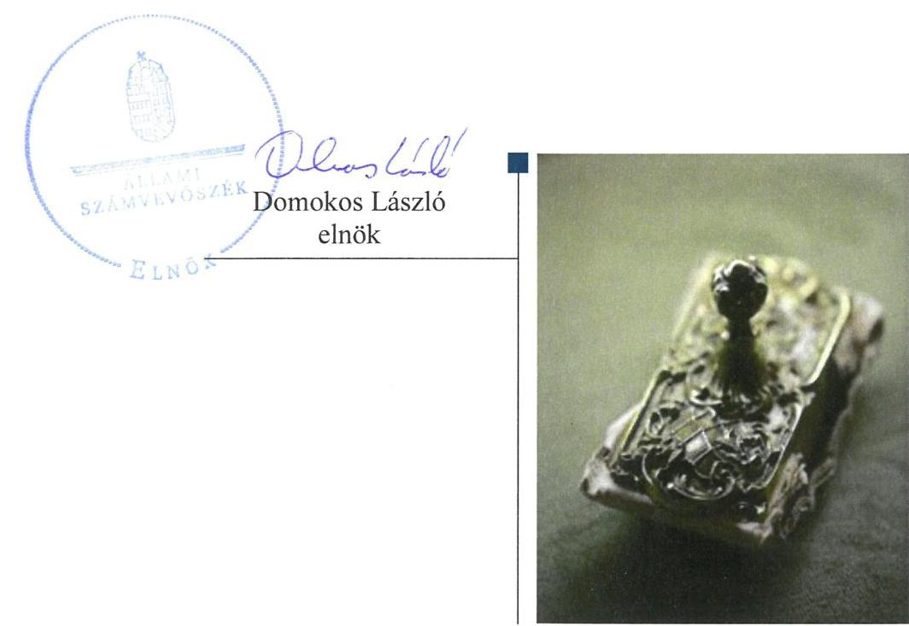
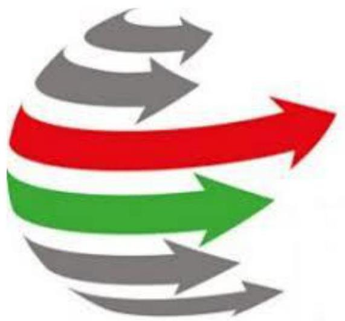
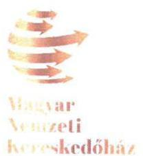
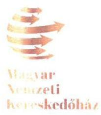
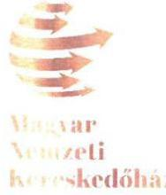
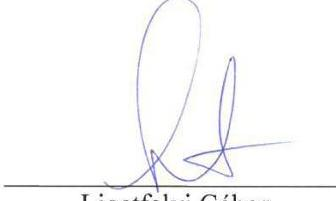
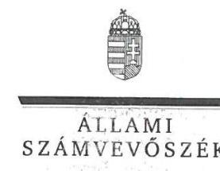
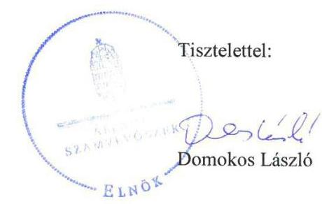

# Jelenetés 

## Az állami résztulajdonú gazdasági társaságok ellenőrzése

MNKH Magyar Nemzeti Kereskedőház Zrt.
2018. 10. hó 26. nap

---

# AZ ELLENŐRZÉST FELÜGYELTE:

DR. NAGY IMRE felügyeleti vezető

# AZ ELLENŐRZÉST VEZETTE ÉS A VÉGREHAJTÁSÁÉRT FELELŐS:

KORSÓSNÉ VIGH ANDREA ellenőrzésvezető

# A PROGRAM ÖSSZEÁLLÍTÁSÁÉRT FELELŐS:

TÓTPÁL SZABOLCS osztályvezető

---

IKTATÓSZÁM: EL-0385-036/2018.

TÉMASZÁM: 2469

---

Jelentéseink az Országgyűlés számítógépes hálózatán és az Interneten a www.asz.hu címen is olvashatóak.

---

ELLENŐRZÉS-AZONOSÍTÓ SZÁM: V081406

---

# TARTALOMJEGYZÉK 

■ ÖSSZEGZÉS ..... 5
■ AZ ELLENŐRZÉS CÉLJA ..... 7
■ AZ ELLENŐRZÉS TERÜLETE ..... 8
■ AZ ELLENŐRZÉS HÁTTERE, INDOKOLTSÁGA ..... 10
■ A JELENTÉS LÉNYEGES KÉRDÉSKÖREI ..... 11
■ AZ ELLENŐRZÉS HATÓKÖRE ÉS MÓDSZEREI ..... 12
■ MEGÁLLAPÍTÁSOK ..... 14
■ JAVASLATOK ..... 18
■ MELLÉKLETEK ..... 19
I. sz. melléklet: Értelmező szótár ..... 19
■ FÜGGELÉK: ÉSZREVÉTELEK ..... 23
■ RÖVIDÍTÉSEK JEGYZÉKE ..... 31

---

.

---

# ÖSSZEGZÉS 

Az MNKH Magyar Nemzeti Kereskedőház Zrt. pénzügyi-számviteli feladatellátása és vagyongazdálkodása nem volt szabályszerű, mert a beszámoló nem volt főkönyvi adatokkal és leltárral alátámasztott, az elszámoltathatóság nem volt biztosított. A 2014-2016. évi éves beszámolók letétbe helyezése a törvényi határidőben nem történt meg.

## Az ellenőrzés társadalmi indokoltsága

Az állami tulajdonú gazdálkodó szervezetek ellenőrzése kiemelten fontos a vagyon megőrzése, megóvása érdekében, valamint a kormányzati szektor elszámolásaiban megjelenő állami tulajdonú gazdálkodó szervezetek esetében, amelyekkel szemben alapvető követelmény, hogy gazdálkodásuk, működésük szabályszerű, az általuk szolgáltatott adatok minél megbízhatóbbak legyenek. A kiegyensúlyozott, átlátható és fenntartható költségvetési gazdálkodás érvényesítésének elvét az Alaptörvény rögzíti, a nemzeti vagyon megőrzésének, védelmének és a nemzeti vagyonnal való felelős gazdálkodásnak a követelményeit sarkalatos törvény határozza meg.

A magyar kereskedelem-fejlesztéssel összefüggő közfeladatok ellátásában stratégiai szerepet játszó MNKH Magyar Nemzeti Kereskedőház Zrt. ellenőrzését a 10 Mrd Ft nagyságrendű vagyona, továbbá a 2016. évben közszolgáltatási szerződés alapján az állami költségvetésből finanszírozott 6 Mrd Ft nagyságrendű közszolgáltatási díj indokolta.

## Főbb megállapítások, következtetések, javaslatok

A Magyar Állam többségi tulajdonában lévő MNKH Magyar Nemzeti Kereskedőház Zrt. tekintetében a Magyar Állam nevében tulajdonosi joggyakorlók a jogszabályi előírásokkal összhangban kialakították a társasági részesedések felett a tulajdonosi joggyakorlás kereteit és szabályszerűen gyakorolták a tulajdonosi jogokat.

Az MNKH Magyar Nemzeti Kereskedőház Zrt. rendelkezett a pénzügyi-számviteli feladatellátás és a vagyongazdálkodás területén a jogszabályban előírt szabályzatokkal. A számlarend azonban a jogszabályi előírás ellenére nem tartalmazta az abban foglaltakat alátámasztó bizonylati rendet.

A pénzügyi-számviteli feladatellátás nem volt szabályszerű, mert a beszámolóban kimutatott ráfordításokat főkönyvi adatokkal nem támasztották alá. A bevételek elszámolása a jogszabályi előírásoknak megfelelt, a közszolgáltatási díjat önköltségszámítással megalapozták. Az értékcsökkenés elszámolása a jogszabályokkal és a belső szabályozással összhangban történt.

A Társaság vagyonnyilvántartása - ezáltal a vagyongazdálkodása - nem volt szabályszerű, mert a mérlegben kimutatott eszközök és források állományát nem támasztották alá leltárral, a valódiság elve nem érvényesült. A saját vagyon változását eredményező döntéshozatal során a jogszabályban előírt és az Alapszabályban rögzített hatásköri előírásokat betartották. A Társaság belső ellenőrzést működtetett a kormányzati szektorba sorolt egyéb szervezetekre vonatkozó jogszabályi előírásnak megfelelően.

A 2014-2016. évi éves beszámolók letétbe helyezése a törvényben előírt határidőben nem történt meg. Az MNKH Magyar Nemzeti Kereskedőház Zrt. 2016-ban a közszolgáltatási szerződésben előírt beszámolási kötelezettségeinek eleget tett. A közérdekű adatokra és a köztulajdonban álló gazdasági társaságokra előírt közzétételi kötelezettségeit a Társaság teljesítette.

Ugyanakkor a számviteli szabályozottság, a könyvvezetés és a leltár készítése területén feltárt szabálytalanságok miatt az éves beszámoló nem felelt meg a valódiság elvének. Így a beszámoló, és az abban foglalt adatok közzététele megtévesztő képet adott a Társaság gazdálkodásáról, pénzügyi és vagyoni helyzetének alakulásáról, ezáltal nem biztosította a Társaság gazdálkodásának átláthatóságát.

---

A megállapított szabálytalanságokkal összefüggésben az ÁSZ az MNKH Magyar Nemzeti Kereskedőház Zrt. vezérigazgatójának négy javaslatot fogalmazott meg. A javaslatok a bizonylati rend elkészítésére, a beszámolóban kimutatott anyagjellegű és személyi jellegű ráfordítások jogszabályban előírt alátámasztására, a mérlegben kimutatott eszközök és források leltárral történő alátámasztására, valamint a beszámoló jogszabályban előírt határidőben való letétbe helyezésére irányultak. A javaslatokat megalapozó megállapításokra az érintettnek 30 napon belül intézkedési tervet kell készíteni.

---

# AZ ELLENŐRZÉS CÉLJA 

Az ellenőrzés célja annak értékelése volt, hogy a tulajdonosi jogok gyakorlása szabályszerű volt-e. A gazdálkodó szervezet szabályozottsága, gazdálkodása és vagyongazdálkodási tevékenysége megfelelt-e a jogszabályi és a tulajdonosi előírásoknak, biztosítva volt-e a közfeladatok átláthatósága és elszámoltathatósága érdekében a közszolgáltatás díjának megalapozottsága szabályszerű önköltségszámítással. A vagyonváltozást eredményező döntések esetében a tulajdonosi jogok gyakorlója és a gazdálkodó szervezet szabályszerűen jártak-e el. Az ellenőrzés célja továbbá annak megítélése volt, hogy a kormányzati szektorba sorolt állami tulajdonban (résztulajdonban) lévő gazdálkodó szervezetek gazdálkodásának a kormányzati szektor hiányára és az államadósságra befolyással bíró elemei a jogszabályi előírásoknak megfeleltek-e.

---

# **AZ ELLENŐRZÉS TERÜLETE**

## **MNKH Magyar Nemzeti Kereskedőház Zrt.**

A Társaságot1 2012. november 20-án 500,0 M Ft jegyzett tőkével a Magyar Állam 90%-os és a Magyar Kereskedelmi és Iparkamara 10%-os részesedéssel alapította.

A Társaságot az 1109/2012. (IV.12.) Korm. határozat2 alapján a 2012-2020. évekre szóló külgazdasági stratégia végrehajtása céljából hozták létre. Az SZMSZ3-ben megfogalmazottak szerint a Társaság alapításának célja többek között a kis- és középvállalkozások tartalékainak hatékony mozgósítása, a piaci tevékenységeik bővülésének támogatása, valamint az export kapacitásuk fejlesztése, külpiaci aktivitásuk szervezettebbé tétele, a külpiacokon való megjelenésük hatékony segítése volt. A Társaság kereskedelem-fejlesztési feladatait 2016. március 1-jétől közfeladatként látta el a 19/2016. (II.10.) Korm. rendelet4 és az ebben kapott felhatalmazás alapján a Külgazdasági és Külügyminisztériummal megkötött közszolgáltatási szerződés alapján.

A Magyar Állam nevében a tulajdonosi jogokat a gazdasági kamarákról szóló törvény5 13/B. § (2) bekezdés előírása alapján 2013. április 4-ig a gazdaságpolitikáért felelős miniszter, 2013. április 5. - 2014. június 5. között a Miniszterelnökségen működő külügyi és külgazdasági ügyekért felelős államtitkár, 2014. június 6-tól a külgazdasági ügyekért felelős miniszter gyakorolta.

A Társaság jegyzett tőkéje 2013-2016 között 4000,0 M Ft-ról 3501,0 M Ft-ra, a saját tőke 9201,9 M Ft-ról 2673,1 M Ft-ra csökkent. Az ellenőrzött időszakban a Magyar Állam tulajdoni részaránya 98,75%-ra nőtt, a Magyar Kereskedelmi és Iparkamaráé 1,25%-ra mérséklődött.

A Társaság bevételei a 2013-2015. években nem fedezték a költségeit, ráfordításait, 2013-ban 132,9 M Ft, 2014-ben 2367,5 M Ft, 2015-ben 5998,8 M Ft veszteséget ért el. A 2016. évben a Külgazdasági és Külügyminisztériummal megkötött 6438,0 M Ft összegű közszolgáltatási szerződés biztosította a közfeladat ellátás forrásait, a Társaság 169,2 M Ft adózott eredménnyel zárta az üzleti évet.

A Társaság a 2013-2016. években 8,7-12,5 Mrd Ft között változó eszközvagyonnal látta el feladatait, amelynek meghatározó (85%-ot meghaladó) részét a forgóeszközök tették ki, kezelt vagyonnal nem rendelkezett. Követelés állománya a 2015. év végére 4 Mrd Ft fölé emelkedett, 2016. év végére 1 Mrd Ft alá csökkent. A kötelezettség állomány folyamatosan nőtt, 2016-ban meghaladta a 6 Mrd Ft-ot, amelyből 5 Mrd Ft a Külgazdasági és Külügyminisztériummal szembeni, 2014-ben keletkezett 2017. év végén lejáró kölcsöntartozás volt.

A Társaságnál foglalkoztatottak átlagos állományi létszáma 2013-ban 15 fő, 2014-ben 90 fő, 2015-ben 141 fő, 2016-ban 95 fő volt.

---

A Társaság ügyvezető szerve 2013. május 10-ig az öt tagú igazgatóság volt, ezt követően az igazgatóság jogait vezérigazgató gyakorolta, amelynek személye 2013-ban és 2015-ben változott.

A Társaság a 2013. évben nyolc, 2014-ben további egy kizárólagos tulajdonú leányvállalatot (kereskedőházat) alapított, mindegyiket egységesen 3,0 M Ft jegyzett tőkével. 2015-ben négy leányvállalat beolvadással megszűnt, további három leányvállalat 2016. október 1-től végelszámolás alatt állt, így 2016. év végén két működő kizárólagos tulajdonú leányvállalata az MNKH Közép-európai Kereskedelemfejlesztési Hálózat Kft. és az MNKH Kereskedelem-fejlesztési és Promóciós Kft. volt. A Társaság kapcsolt vállalkozásait (kizárólagos tulajdonú leányvállalatait), azok számában és jogi helyzetében bekövetkezett változásokat az 1. táblázat szemlélteti.

1. táblázat

A TÁRSASÁG LEÁNYVÁLLALATAI 2013-2016. KÖZÖTT

| Gazdasági társaság neve | Alapítás éve | 2016. évi   státusz |
| :--: | :--: | :--: |
| Azeri - Magyar Kereskedőház Kft. | 2013. | beolvadással |
| Emirátusok - Magyar Kereskedőház Kft. | 2013. | megszűnt |
| Jordán - Magyar Kereskedőház Kft. | 2013. | 2015.05.21-el |
| Kazahsztáni - Magyar Kereskedőház Kft. | 2013. |  |
| Szaúdi - Magyar Kereskedőház Kft. | 2013. |  |
| átalakulás után: MNKH Közép-európai |  | működő |
| Kereskedelem-fejlesztési Hálózat Kft. |  |  |
| Kínai - Magyar Kereskedőház Kft. | 2013. | végelszámolás |
| Orosz - Magyar Kereskedőház Kft. | 2013. | alatt |
| Török - Magyar Kereskedőház Kft. | 2013. | 2016.10.01-től |
| MNKH Kereskedelem-fejlesztési és Promóciós Kft. | 2014. | működő |

A Társaság az ellenőrzött időszakban további két gazdasági társaságban rendelkezett részesedéssel, a 2015. évben az Áldomás Minősítő, Termelésszervező és Szolgáltató Kft.-ben 50%-os, a Prominence Food Zrt.-ben 15%-os részesedést szerzett.

A Társaságot a nemzetgazdasági miniszter 2015. december 30-án megjelent közleményében sorolta be a kormányzati szektorba sorolt egyéb szervezetek közé. 2016. december 31-ig a Társaságnak az államadósságra befolyással bíró adósságot keletkeztető ügylete nem volt.

---

# AZ ELLENŐRZÉS HÁTTERE, INDOKOLTSÁGA 

Az ellenőrzés rámutathat az állami tulajdonú gazdálkodó szervezetek gazdálkodási tevékenységével kapcsolatos jó gyakorlatokra és szabálytalanságokra. Felhívhatja a figyelmet a jogszabályi követelmények teljesítéséhez szükséges feltételek hiányosságaira, hozzájárulhat az államháztartáson kívüli, de (közvetlenül vagy közvetve) állami vagyont használó gazdálkodó szervezetek tevékenységének átláthatóságához. Ellenőrzésünk eredményeképpen javaslatainkkal, megállapításainkkal hozzájárulhatunk a nemzeti vagyonnal való gazdálkodás átláthatóságának, elszámoltathatóságának a javításához.

---

# A JELENTÉS LÉNYEGES KÉRDÉSKÖREI 

1. A tulajdonosi jogok gyakorlása szabályszerű volt-e?
2. A Társaság pénzügyi-számviteli feladatellátása és vagyongazdálkodása szabályszerű volt-e?

---

# AZ ELLENŐRZÉS HATÓKÖRE ÉS MÓDSZEREI 

## Az ellenőrzés típusa

Megfelelőségi ellenőrzés

## Az ellenőrzött időszak

Az ellenőrzött időszak a Társaság bejegyzésétől, 2013. január 7-től 2016. december 31-ig, illetve a 2016. évi beszámoló jóváhagyásáig tartó időszak.

## Az ellenőrzés tárgya

Az állami tulajdonban (résztulajdonban) lévő gazdasági társaságok gazdálkodása, kiemelten vagyongazdálkodási tevékenysége, a tulajdonosi jogok gyakorlása, továbbá a kormányzati szektorba sorolt gazdasági társaságok gazdálkodásának a kormányzati szektor hiányára és az államadósságra befolyással bíró elemei.

## Az ellenőrzött szervezet

Az MNKH Magyar Nemzeti Kereskedőház Zrt. és a tulajdonosi jogokat gyakorló gazdaságpolitikáért felelős miniszter, a Miniszterelnökséget vezető miniszter, valamint a külügyi és külgazdasági ügyekért felelős miniszter.

## Az ellenőrzés jogalapja

Az ellenőrzés jogalapját az ÁSZ tv. ${ }^{6}$ 1. § (3) bekezdése és 5. § (3)-(5) bekezdései képezték.

## Az ellenőrzés módszerei

Az ellenőrzést az ellenőrzési program ellenőrzési kérdései, az ellenőrzött időszakban hatályos szabályok, az ellenőrzés szakmai szabályok és módszertanok figyelembe vételével végeztük el.

Az ellenőrzött szervezetek az ellenőrzés lefolytatásához tanúsítványok kitöltésével, valamint az ÁSZ ${ }^{7}$ által kért dokumentumok megküldésével szolgáltattak adatokat.

A tulajdonosi joggyakorlást a 2013. és a 2016. évekre vonatkozóan ellenőriztük. A teljes ellenőrzött időszakra vonatkozóan került ellenőrzésre a

---

gazdasági társaság tervezési, beszámolási, közzétételi, adatszolgáltatási kötelezettségének, valamint a belső ellenőrzési tevékenységének szabályszerűsége. A
 2013. és 2016. évekre vonatkozóan a gazdasági társaság működésének szabályozottságát, a bevételei és ráfordításai elszámolását, illetve vagyongazdálkodásának szabályszerűségét is ellenőriztük.

A bevételek közül az értékesítés nettó árbevétele, az egyéb, rendkívüli és pénzügyi műveletek bevételei, valamint az immateriális javak és tárgyi eszközök esetében a vagyonnyilvántartás és az értékcsökkenési leírás esetében a szabályszerű működést mintavétellel ellenőriztük.

A fenti sokaságok esetében a mintavétel azokra a legnagyobb értékű tételekre - a lényeges sokaságra - terjedt ki, melyek összértéke elérte a teljes sokaság összértékének 50%-át. A személyi jellegű ráfordítások esetében a mintavétel a teljes sokaságból történt. Amennyiben valamely ellenőrzött sokaság elemszáma kisebb volt, mint az előírt minta elemszám, az ellenőrzött sokaságot tételesen ellenőriztük.

A mintavétellel ellenőrzött területek esetében minden egyes tétel vonatkozásában a szabályszerűségre vonatkozó kérdéseket tettünk fel, amelyek eredménye összesítésre került. „Szabályszerűnek" értékeltünk egy ellenőrzött területet, amennyiben 95%-os bizonyossággal az ellenőrzött sokaságban az átlagos hibaarány legfeljebb 10%, „nem szabályszerűnek", amennyiben 10%-nál magasabb arányt képviselt.

---

# 1. A tulajdonosi jogok gyakorlása szabályszerű volt-e? 

## Összegző megállapítás

2. táblázat

## A MAGYAR ÁLLAM NEVÉBEN TULAJDONOSI JOGGYAKORLÓK

| Időszak | Megnevezés |
| :--: | :--: |
| 2012.11.20.- | gazdaságpolitikáért |
| 2013.04.04. | felelős miniszter |
| 2013.04.05.- | Miniszterelnökségen |
| 2014.06.05. | működő külügyi és kül- |
|  | gazdasági ügyekért fe- |
|  | lelős államtitkár |
| 2014.06.06- | külügyi és külgazdasági |
| tól | miniszter |
|  | Farrás: A Társaság Alapszabálya |

## A Magyar Állam nevében tulajdonosi joggyakorlók szabályszerűen gyakorolták a Társaság tekintetében a tulajdonosi jogokat.

A Magyar Állam nevében tulajdonosi joggyakorlókat a 2. táblázat mutatja be.

A TÁRSASÁG LEGFŐBB SZERVE, a Közgyűlés ${ }^{8}$ szabályszerűen, a Gt. ${ }^{9}$ és a Ptk. ${ }^{10}$ előírásaival összhangban döntött a legfőbb szerv hatáskörébe tartozó kérdésekben. A Társaság Alapszabályában ${ }^{11}$ a jogszabályi előírásokkal összhangban meghatározta a legfőbb szerv kizárólagos hatásköreit, az igazgatóság, az $\mathrm{FB}^{12}$ tagjait és hatáskörét, a vezérigazgató személyét és feladatait, a cégvezető személyét, kijelölte a könyvvizsgálót. Szabályszerűen meghatározta az igazgatóság, illetve a vezérigazgató, továbbá az FB és a könyvvizsgáló díjazását. Elfogadta az FB ügyrendjét, továbbá a Taktv. ${ }^{13}$ előírása szerint a Társaság javadalmazási szabályzatát.

A Közgyűlés a Gt. és a Ptk. ${ }_{2}$ előírásait betartva, a könyvvizsgáló és az FB írásbeli jelentése birtokában megtárgyalta és elfogadta a Társaság éves beszámolóit és döntött az eredményre vonatkozóan, elfogadta a Társaság üzleti jelentéseit.

A Közgyűlés szabályszerűen döntött a Társaság jegyzett tőkéje változásáról:
$\longrightarrow$ 2013-ban összesen 8844,1 M Ft, ebből 3500,0 M Ft jegyzett tőke és 5344,1 M Ft tőketartalék emelésről a Gt. 231. § (2) bekezdés j) pont előírásának megfelelően, amelyhez az Áht. 45. § (2) bekezdésben előírtak szerint az állami vagyon felügyeletéért felelős miniszter jóváhagyása rendelkezésre állt;
$\longrightarrow$ 2016-ban a jegyzett tőke 500 M Ft-tal való leszállításáról a Ptk. 2 3:270. § (1) bekezdés a) pontjában megjelölt ok - a Társaság saját tőkéje veszteség következtében az alaptőke kétharmada alá csökkent - megszüntetése miatt, a Ptk. 2 3:270. § (2) bekezdés előírásával összhangban.
A kizárólagos tulajdonú leányvállalatok alapításáról, átalakulásáról, tőkeemeléséről, megszüntetéséről, az alapító okiratok módosításáról, leányvállalat részére tagi kölcsön nyújtásáról az Alapszabály előírásával összhangban, szabályszerűen a Közgyűlés döntött.

KÖZSZOLGÁLTATÁSI SZERZŐDÉSBEN ${ }^{14}$ meghatározta a Külgazdasági és Külügyminisztérium a Társaság által 2016. március 1-jétől ellátni köteles közfeladatokat a 19/2016. (II. 10.) Kormányrendelet 1-3. §-okban foglalt előírásokkal összhangban. Ebben rögzítette továbbá az ellá-

---

tás és finanszírozás módját, a közszolgáltatásból fakadó jogokat és kötelezettségeket, a beszámolási, elszámolási, nyilvántartási kötelezettségeket, az ellenőrzésre, a szerződés megszűnésére és a szerződésszegésre vonatkozó előírásokat.

# A TÁRSASÁG TEVÉKENYSÉGE NYOMON KÖVETÉ- 

SÉT az igazgatóság, illetve a vezérigazgató beszámolási, az FB véleményezési kötelezettségének az Alapszabályban történő rögzítése, továbbá 2016. március 1-jétől az ellátott közfeladatokról való havi beszámolási kötelezettségnek közszolgáltatási szerződésben történő előírása biztosította.

## 2. A Társaság pénzügyi-számviteli feladatellátása és vagyongazdálkodása szabályszerű volt-e?

Összegző megállapítás

A pénzügyi-számviteli feladatellátás nem volt szabályszerű. A vagyonnyilvántartás, ezáltal a vagyongazdálkodás nem volt szabályszerű.
2.1. számú megállapítás

A Társaság pénzügyi-számviteli feladatellátása és vagyongazdálkodása szabályozott volt, a Számv. tv.-ben előírt szabályzatokkal rendelkezett.

A Társaság az ellenőrzött időszakban a Számv. tv. ${ }^{15}$ előírásaival összhangban elkészítette a számviteli politikát, ${ }^{16}$ ennek részeként az eszközök és források értékelési szabályzatát, a leltározási és leltárkészítési, valamint a pénzkezelési szabályzatát.

A Társaság a Számv. tv. 161. § (1) bekezdésében előírt számlarenddel ${ }^{17}$ rendelkezett. A számlarend nem tartalmazta az abban foglaltakat alátámasztó bizonylati rendet a Számv. tv. 161. § (2) bekezdés d) pont előírása ellenére.

2016-ban a Társaság eleget tett az önköltségszámítás belső rendjének szabályozására ${ }^{18}$ vonatkozó kötelezettségének a Számv. tv. 14. § (5) bekezdés c) pontjában és a Számv. tv. 14. § (7) bekezdésben foglalt előírásoknak megfelelően.
2.2. számú megállapítás

A ráfordítások elszámolása - ezáltal a pénzügyi-számviteli feladatellátás - nem volt szabályszerű. A bevételek és az értékcsökkenés elszámolása szabályszerű volt. A vagyon nyilvántartása, ezáltal a vagyongazdálkodás nem volt szabályszerű.

A BEVÉTELEK elszámolása szabályszerű volt. A könyvelést szabályszerű bizonylattal alátámasztották, a kiszámlázott közszolgáltatások esetében a közszolgáltatási szerződésben foglalt díjakat vették figyelembe. A közszolgáltatási szerződésben megállapított díjtételeket a közszolgáltatási szerződés 1. sz. melléklete szerinti önköltségszámítással megalapozták.

A RÁFORDÍTÁSOK elszámolása szabályszerűségének ellenőrzéséhez bekért, a mintavételt megalapozó adatbázisokat a Társaság a személyi jellegű ráfordítások tekintetében nem, az anyagjellegű ráfordításoknál

---

nem minden érintett számlacsoportra vonatkozóan küldte meg, ezért ezeken a területeken nem történt mintavétel. A ráfordítások elszámolása szabályszerűségét a főkönyvi adatok hiánya alapján értékeltük.

A ráfordítások elszámolása nem volt szabályszerű, mert a beszámolóban kimutatott anyagjellegű és személyi jellegű ráfordításokat nem támasztották alá a szabályszerűen vezetett kettős könyvvitel adataival, a Számv. tv. 20. § (1) bekezdés előírása ellenére.

AZ ÉRTÉKCSÖKKENÉS elszámolása a jogszabályoknak és a belső szabályozásnak megfelelően történt. Az üzembe helyezés dokumentálása, a bekerülési érték megállapítása, az alkalmazott leírási mód, leírási kulcs és gyakoriság, továbbá a könyvelés, a jogszabályi és a belső szabályzatok előírásával összhangban történt.

A VAGYON NYILVÁNTARTÁSA - ezáltal a vagyongazdálkodás - nem volt szabályszerű, mert a beszámoló elkészítéséhez, a mérleg tételeinek alátámasztásához nem készítettek olyan leltárt, amely tételesen és ellenőrizhető módon tartalmazza a Társaságnak a mérleg fordulónapján meglévő eszközeit és forrásait mennyiségben és értékben, a Számv. tv. 69. § (1) bekezdésében, valamint a leltározási és leltárkészítési szabályzat 1.4 pontjában foglalt előírások ellenére:
$\longrightarrow$ a 2013-évi mérlegben kimutatott tételek közül nem volt leltárral alátámasztott az immateriális javak; a tárgyi eszközök közül az ingatlanok, egyéb berendezések és felszerelések; továbbá a saját tőke elemeinek az értéke;
$\longrightarrow$ a 2016-évi mérlegben kimutatott tételek közül nem volt leltárral alátámasztott az immateriális javak; a tárgyi eszközök közül az ingatlanok, egyéb berendezések és felszerelések; a követelések; a pénzeszközök közül a bankbetétek; a saját tőke elemei; valamint a rövid lejáratú kötelezettségek értéke.
A Társaság nem biztosította a könyvvezetés és a beszámolás során a Számv. tv. 15. § (3) bekezdésében előírt valódiság elvének az érvényesülését: azt, hogy a könyvvitelben rögzített és a beszámolóban szereplő tételeknek a valóságban is megtalálhatónak, bizonyíthatónak, kívülállók által is megállapíthatónak kell lenniük, értékelésüknek meg kell felelni a Számv. tv-ben előírt értékelési elveknek, eljárásoknak.

A könyvvizsgáló annak ellenére korlátozás nélküli hitelesítő záradékkal látta el a 2013. és 2016. évi beszámolókat, hogy a Társaság a beszámolók mérlegadatainak az alátámasztására a Számv. tv. 69. § (1) bekezdésben előírt leltárt nem készített.

A Társaságnál a saját vagyon változását eredményező döntéshozatal során az Alapszabályban rögzített hatásköri előírásokat betartották.

# 2.3. számú megállapítás 

A 2014-2016. évi beszámolók letétbe helyezése a törvényi határidőben nem történt meg.

ÜZLETI TERV készítésére vonatkozó kötelezettsége a Társaságnak nem volt, üzleti tervet a 2015. és 2016. üzleti évekre - a 2016. évben az MNKH cégcsoportra ${ }^{19}$ - készített, amelyek jóváhagyásáról az Alapszabály előírásával összhangban a Közgyűlés döntött.

---

AZ ÉVES BESZÁMOLÓKAT a 2013-2016. üzleti évek tekintetében a Társaság a Számv. tv. által előírt formában elkészítette és jóváhagyásra a Közgyűlés elé terjesztette, a jóváhagyott 2013. évi beszámolót határidőben letétbe helyezte.

A 2014-2016. évi éves beszámolók letétbe helyezése a Számv. tv. 153. § (1) bekezdésében előírt határidőben nem történt meg, arra határidőn túl intézkedtek.

A KÖZSZOLGÁLTATÁSI SZERZŐDÉSBEN a Külgazdasági és Külügyminisztérium felé előírt beszámolási kötelezettségének a Társaság eleget tett.
2.4. számú megállapítás

Közzétételi kötelezettségeinek a Társaság eleget tett. A Társaság vezetője kialakította és működtette a szervezet tevékenysége és a célok megvalósítása nyomon követésének jogszabályban előírt rendszerét.

KÖZZÉTÉTELI KÖTELEZETTSÉGEIT a Társaság az Info tv. ${ }^{20}$ előírásainak megfelelően szabályozta, a közérdekű adatokat az Info tv., a köztulajdonban álló gazdasági társaságokra előírt közzétételi kötelezettségeket a Taktv. előírásainak megfelelően teljesítette.

# A KORMÁNYZATI SZEKTORBA SOROLT EGYÉB 

SZERVEZET vezérigazgatója kialakította a szervezet tevékenységének, a célok megvalósításának nyomon követését biztosító rendszert, a Bkr. ${ }^{21}$ előírásának megfelelően. A Társaság 2014-től független belső ellenőrzést működtetett, amely ellenőrizte - többek között - a vagyongazdálkodást, továbbá 2016-ban a leányvállalatok gazdálkodása szabályszerűségének ellenőrzésére is kiterjedt. A Társaság intézkedett az FB, a könyvvizsgáló, a külső ( $\mathrm{NAV}^{22}$ ) és belső ellenőrzések javaslatainak végrehajtására.

---

# JAVASLATOK 

Az ÁSZ tv. 33. § (1) bekezdésében foglaltak értelmében az ellenőrzött szervezet vezetője köteles a jelentésben foglalt megállapításokhoz kapcsolódó intézkedési tervet összeállítani és azt a jelentés kézhezvételétől számított 30 napon belül az ÁSZ részére megküldeni. Amennyiben az ellenőrzött szervezet vezetője nem küldi meg határidőben az intézkedési tervet, vagy továbbra sem elfogadható intézkedési tervet küld, az Állami Számvevőszék elnöke az ÁSZ tv. 33. § (3) bekezdés a) és b) pontjaiban foglaltakat érvényesítheti.

## MNKH Magyar Nemzeti Kereskedőház Zrt. Vezérigazgatójának

1. Intézkedjen a jogszabályi előírások szerint a számlarendben foglaltakat alátámasztó bizonylati rend elkészítéséről.
(2.1. számú megállapítás 2. bekezdés 2. mondata alapján)
2. Intézkedjen, hogy a beszámolóban kimutatott anyagjellegű és a személyi jellegű ráfordítások elszámolását a jogszabályban foglalt előírásoknak megfelelően támasza alá.
(2.2. számú megállapítás 3. bekezdés alapján)
3. Biztosítsa, hogy az éves beszámoló mérlegének tételeit a jogszabályban, valamint a leltározási és leltárkészítési szabályzatában előírtaknak megfelelő leltárral támasza alá.
(2.2. számú megállapítás 5. bekezdés alapján)
4. Intézkedjen az éves beszámoló jogszabályban meghatározott határidőben történő letétbe helyezéséről.
(2.3. számú megállapítás 3. bekezdés alapján)

---

# MELLÉKLETEK 

- I. SZ. MELLÉKLET: ÉRTELMEZŐ SZÓTÁR
állami vagyon
gazdasági társaság
gazdálkodó szervezet
kapcsolt vállalkozás
kormányzati szektorba sorolt egyéb szervezet
a) Az állam tulajdonában lévő dolog, valamint a dolog módjára hasznosítható természeti erő,
b) az a) pont hatálya alá nem tartozó mindazon vagyon, amely vonatkozásában törvény az állam kizárólagos tulajdonjogát nevesíti,
c) az állam tulajdonában lévő tagsági jogviszonyt megtestesítő értékpapír, illetve az államot megillető egyéb társasági részesedés,
d) az államot megillető olyan immateriális, vagyoni értékkel rendelkező jogosultság, amelyet jogszabály vagyoni értékű jogként nevesít.
Forrás: Vtv. ${ }^{23}$ 1.
 § (2) bekezdése
e) az állam tulajdonában lévő pénzügyi eszközök
Forrás: Vtv. 1. § (2) bekezdése
A Ptk. 3:88. § (1) bekezdése szerint „a gazdasági társaságok üzletszerű közös gazdasági tevékenység folytatására, a tagok vagyoni hozzájárulásával létrehozott, jogi személyiséggel rendelkező vállalkozások, amelyekben a tagok a nyereségből közösen részesednek, és a veszteséget közösen viselik".
2014. március 14-ig:

A Ptk. ${ }^{24} 685 . \quad$ § c) pontja szerint gazdálkodó szervezet: „az állami vállalat, az egyéb állami gazdálkodó szerv, a szövetkezet, a lakásszövetkezet, az európai szövetkezet, a gazdasági társaság, az európai részvénytársaság, az egyesülés, az európai gazdasági egyesülés, az európai területi együttműködési csoportosulás, az egyes jogi személyek vállalata, a leányvállalat, a vízgazdálkodási társulat, az erdő birtokossági társulat, a végrehajtói iroda, az egyéni cég, továbbá az egyéni vállalkozó."
2014. március 15-től:

A gazdasági társaság, az európai részvénytársaság, az egyesülés, az európai gazdasági egyesülés, az európai területi együttműködési csoportosulás, a szövetkezet, a lakásszövetkezet, az európai szövetkezet, a vízgazdálkodási társulat, az erdőbirtokossági társulat, az állami vállalat, az egyéb állami gazdálkodó szerv, az egyes jogi személyek vállalata, a közös vállalat, a végrehajtói iroda, a közjegyzői iroda, az ügyvédi iroda, a szabadalmi ügyvivői iroda, az önkéntes kölcsönös biztosító pénztár, a magánnyugdíjpénztár, az egyéni cég, továbbá az egyéni vállalkozó. Az állam, a helyi önkormányzat, a költségvetési szerv, az egyesület, a köztestület, valamint az alapítvány gazdálkodó tevékenységével összefüggő polgári jogi kapcsolataira is a gazdálkodó szervezetre vonatkozó rendelkezéseket kell alkalmazni.
Forrás: Ppt. ${ }^{25} 396 . \S$
Az anyavállalat és a leányvállalat és a közös vezetésű vállalkozások (fölérendelt anyavállalat esetében a minősítést a fölérendelt anyavállalat szempontjából kell elvégezni) Forrás: Számv. tv. 3. § (2) bekezdés 7. pont
Az a szervezet, amely az Áht. alapján nem része az államháztartásnak, azonban az Európai Közösséget létrehozó szerződéshez csatolt, a túlzott hiány esetén követendő eljárásról szóló jegyzőkönyv alkalmazásáról szóló 2009. május 25-i 479/2009/EK rendelet szerint a kormányzati szektorba tartozik. A nemzetgazdasági miniszter 2013. június 26-án megjelent Közleményben tette közé ezen szervezetek listáját

---

közszolgáltatás
leányvállalat
meghatározó befolyás
nemzeti vagyon

Az Ebktv ${ }^{26}$. 3. § d) pontja a következőképpen határozza meg a közszolgáltatást: „szerződéskötési kötelezettség alapján a lakosság alapvető szükségleteinek ellátására irányuló szolgáltatás, így különösen a villamos energia-, gáz-, hő-, víz-, szennyvíz- és hulladékkezelési, köztisztasági, postai és távközlési szolgáltatás, továbbá a menetrend alapján közlekedő járművekkel végzett közforgalmú személyszállítás".
Az a gazdasági társaság, amelyre az anyavállalat meghatározó befolyást képes gyakorolni
Forrás: Számv. tv. 3. § (2) bekezdés 2. pont
2014. március 14-ig:

A befolyással rendelkező akkor rendelkezik egy jogi személyben meghatározó befolyással, ha annak tagja, illetve részvényese és
a) jogosult e jogi személy vezető tisztségviselői vagy felügyelőbizottsága tagjai többségének megválasztására, illetve visszahívására, vagy
b) a jogi személy más tagjaival, illetve részvényeseivel kötött megállapodás alapján egyedül rendelkezik a szavazatok több mint ötven százalékával.
A meghatározó befolyás akkor is fennáll, ha a befolyással rendelkező számára az előzőek szerinti jogosultságok közvetett módon biztosítottak. A befolyással rendelkezőnek egy jogi személyben a szavazatok több mint ötven százalékával közvetett módon való rendelkezése vagy egy jogi személyben közvetetten fennálló meghatározó befolyása megállapítása során a jogi személyben szavazati joggal rendelkező más jogi személyt (köztes vállalkozást) megillető szavazatokat meg kell szorozni a befolyással rendelkezőnek a köztes vállalkozásban, illetve vállalkozásokban fennálló szavazatával. Ha a köztes vállalkozásban fennálló szavazatok mértéke az ötven százalékot meghaladja, akkor azt egy egészként kell figyelembe venni.
Forrás: $\mathrm{Ptk}_{1}$. 685/B. § (2)-(3) bekezdések
2014. március 15-től:

A befolyással rendelkező akkor rendelkezik egy jogi személyben meghatározó befolyással, ha annak tagja vagy részvényese, és
a) jogosult e jogi személy vezető tisztségviselői vagy felügyelőbizottsága tagjai többségének megválasztására, illetve visszahívására; vagy
b) a jogi személy más tagjai, illetve részvényesei a befolyással rendelkezővel kötött megállapodás alapján a befolyással rendelkezővel azonos tartalommal szavaznak, vagy a befolyással rendelkezőn keresztül gyakorolják szavazati jogukat, feltéve, hogy együtt a szavazatok több mint felével rendelkeznek.
Forrás: $\mathrm{Ptk}_{2}$. 8:2. § (2) bekezdés
a) az állam vagy a helyi önkormányzat kizárólagos tulajdonában álló dolgok,
b) az a) pont hatálya alá nem tartozó, állam vagy a helyi önkormányzat tulajdonában lévő dolog,
c) az állam vagy a helyi önkormányzat tulajdonában lévő pénzügyi eszközök, továbbá az államot vagy a helyi önkormányzatot megillető társasági részesedések,
d) az államot vagy a helyi önkormányzatot megillető bármely vagyoni értékkel rendelkező jogosultság, amelyet jogszabály vagyoni értékű jogként nevesít,
e) Magyarország határa által körbezárt terület feletti légtér,
f) az üvegházhatású gázok kibocsátási egységeinek kereskedelméről szóló törvény szerint kibocsátási egység és légiközlekedési kibocsátási egység, valamint az ENSZ Éghajlatváltozási Keretegyezménye és annak Kiotói Jegyzőkönyve végrehajtási keretrendszeréről szóló törvény szerinti kiotói egység,
g) állami vagy helyi önkormányzati fenntartású közgyűjtemény (muzeális intézmény, levéltár, közgyűjteményként működő kép- és hangarchívum, valamint könyvtár)

---

tulajdonosi ellenőrzés
saját gyűjteményében nyilvántartott kulturális javak körébe tartozó dolog, kivéve, ha az állami vagy önkormányzati tulajdon jogszerű létrejötte kétséget kizáró módon nem bizonyítható és a dologra nézve más a tulajdonjogát bizonyítja vagy a kulturális javakra vonatkozó jogszabályokban meghatározott eljárás keretében valószínűsíti (g. pont módosult 2013. december 7-től),
h) a régészeti lelet,
i) a nemzeti adatvagyon körébe tartozó állami nyilvántartások fokozottabb védelméről szóló törvény szerinti nemzeti adatvagyon.
Forrás: Nvtv. ${ }^{27}$ 1. § (2) bekezdés
2014. március 14-ig:

Az állami vagyon kezelőjét, haszonélvezőjét, használóját megillető jogok gyakorlását, annak szabályszerűségét, célszerűségét az MNV Zrt. - szükség szerint területi szervei útján - ellenőrzi.
2014. március 15-től:

Az állami vagyon használóját, vagyonkezelőjét és haszonélvezőjét megillető jogok gyakorlását, annak szabályszerűségét, a kötelezettségek teljesítését, valamint a vagyon rendeltetése szerinti célszerűségét a tulajdonosi joggyakorló rendszeresen ellenőrzi.
Forrás: Vtv.vhr. ${ }^{28}$ 20. § (1) bekezdés
tulajdonosi jogok gyakorlója 1.

# 2013. június 27-ig: 

Az állami vagyon felett a Magyar Államot megillető tulajdonosi jogok és kötelezettségek összességét - ha törvény eltérően nem rendelkezik - az állami vagyon felügyeletéért felelős miniszter (a továbbiakban: miniszter) gyakorolja, aki e feladatát a Magyar Nemzeti Vagyonkezelő Zártkörűen Működő Részvénytársaság (a továbbiakban: MNV Zrt.), a Magyar Fejlesztési Bank, illetve a tulajdonosi joggyakorló szervezet útján látja el. A miniszter miniszteri rendeletben, a törvényben meghatározott állami vagyoni kör tekintetében, meghatározott időtartamra, a joggyakorlás egyes szabályainak meghatározásával - az őt megillető tulajdonosi jogok és kötelezettségek összességének, illetve azok meghatározott részének gyakorlóját az Áht. szerinti központi költségvetési szervek, ezek intézménye, továbbá a 100%-ban állami tulajdonban álló gazdasági társaságok közül kijelölheti.
Forrás: Vtv. 3. § (1) és (2) bekezdései

## 2013. június 28-ától:

A rábízott állami vagyon felett az államot megillető tulajdonosi jogok és kötelezettségek összességét tulajdonosi joggyakorlóként:
a) ha törvény vagy miniszteri rendelet eltérően nem rendelkezik, a Magyar Nemzeti Vagyonkezelő Zártkörűen Működő Részvénytársaság (a továbbiakban: MNV Zrt.),
b) törvényben kijelölt személy vagy
c) az állami vagyon felügyeletéért felelős miniszter (a továbbiakban: miniszter) által rendeletben kijelölt személy gyakorolja.
[...] A miniszter e törvény felhatalmazása alapján - a meghatározott célok hatékonyabb elérése érdekében, miniszteri rendeletben, az ott meghatározott állami vagyoni kör tekintetében, meghatározott időtartamra - e törvény keretei között, a joggyakorlás egyes szabályainak meghatározásával - az államot megillető tulajdonosi jogok és kötelezettségek összességének, illetve azok meghatározott részének gyakorlóját az Áht. szerinti központi költségvetési szervek, ezek intézménye, továbbá a 100%-ban állami tulajdonban álló gazdasági társaságok közül kijelölheti.
Forrás: Vtv. 3. § (1) és (2) bekezdései

---

2. 

Aki a nemzeti vagyon felett az államot vagy a helyi önkormányzatot megillető tulajdonosi jogok és kötelezettségek összességének gyakorlására jogosult
Forrás: Nvtv. 3. § (1) bekezdés 17. pontja

---

# FÜGGELÉK: ÉSZREVÉTELEK 

A jelentéstervezetet a Számvevőszék 15 napos észrevételezésre megküldte az ellenőrzött szervezetek vezetőinek az ÁSZ tv. 29. § (1) bekezdése előírásának megfelelően.

Az ÁSZ a jelentéstervezetet észrevételezésre megküldte a pénzügyminiszternek, a Miniszterelnökséget vezető miniszternek, a külgazdasági és külügyminiszternek és az MNKH Magyar Nemzeti Kereskedőház Zrt. vezérigazgatójának.
A tulajdonosi joggyakorlók nem éltek az ÁSZ tv. 29. § (2) bekezdésében foglalt észrevételezési jogukkal, a törvényes határidőn belül észrevételt nem tettek.
A függelék tartalmazza az MNKH Magyar Nemzeti Kereskedőház Zrt. vezérigazgatójának észrevételeit, illetve az el nem fogadott észrevételek elutasításának indoklását.

[^0]
[^0]:    * 29. § (1) Az Állami Számvevőszék az ellenőrzési megállapításait megküldi az ellenőrzött szervezet vezetőjének vagy az általa megbízott személynek, és annak, akinek személyes felelősségét állapította meg.
    (2) Az ellenőrzött szervezet vezetője és a felelősként megjelölt személy az ellenőrzés megállapításaira tizenöt napon belül írásban észrevételt tehet.
    (3) Az Állami Számvevőszék az észrevételre a beérkezésétől számított harminc napon belül írásban válaszol. A figyelembe nem vett észrevételeket köteles a jelentésben feltüntetni, és megindokolni, hogy azokat miért nem fogadta el.

---

# 1223 

Állami Számvevőszék
Domokos László elnök részére

Apáczai Cs. J. u. 10.
Budapest
1052

Postacím: 1364 Budapest 4. Pf. 54
Iktatószám: EL - 0592-077/2018
Tárgy: Észrevétel jelentés-tervezetre

## Tisztelt Elnök Úr!

Alulírott Ligetfalvi Gábor, mint az MNKH Magyar Nemzeti Kereskedőház Zártkörűen Működő Részvénytársaság (Cg. 01-10-047651; székhely: 1095 Budapest, Ipar utca 5.; adószám: 24220099-2-43; a továbbiakban: „Társaság") vezérigazgatója, 2018. augusztus 22. napján kelt „Az állami tulajdonú gazdasági társaságok ellenőrzése - MNKH Magyar Nemzeti Kereskedőház Zrt." elnevezésű jelentés-tervezethez, valamint a jelentés-tervezetben foglalt megállapításokhoz kapcsolódóan, a törvényes határidőn belül, az alábbi

## észrevételt

teszem.

1. Az Állami Számvevőszék megállapítása szerint a Társaság pénzügyi-számviteli feladatellátása és vagyongazdálkodása szabályszerű volt, a számvitelről szóló 2000. évi C. törvényben előírt szabályzatokkal rendelkezett, azonban a Társaság számlarendje a vizsgált időszakban nem tartalmazott bizonylati rendet.

A 2018. február 14. napján a Társaság székhelyén zajlott helyszíni ellenőrzés során a Társaság által elektronikus adathordozón átadásra kerültek az alábbi szabályzatok, amelyekben szabályozásra kerültek a vonatkozó bizonylati előírások.

- Gépjármű használati szabályzat
- Kiküldetési szabályzat
- Kötelezettségvállalások rendje szabályzat
- Keretgazdálkodás, előterjesztés szabályzat
- Beszerzések szabályzata

---

- Közbeszerzések szabályzata
- Mobiltelefon használati szabályzat
- Reprezentációs és ajándékozási szabályzat
- Jóléti és szociális juttatásokról szóló szabályzat

Fentiek tükrében tisztelettel tájékoztatjuk a T. Számvevőszéket, hogy a bizonylati rend hiányát és a vonatkozó megoldási javaslatot az intézkedési tervben rögzítjük, és haladéktalanul gondoskodunk annak pótlásáról.
2. Az Állami Számvevőszék második megállapítása szerint a ráfordítások elszámolása ezáltal a pénzügyi-számviteli feladatellátás - nem volt szabályszerű, mert a mérlegben kimutatott ráfordításokat a Társaság főkönyvi adatokkal nem támasztotta alá.

Társaságunk az anyagjellegű ráfordítások vonatkozásában nem küldött meg valamennyi főkönyvi számlaszámra kimutatást kizárólag az 52-es számlaosztályra. A 2.2.2.1. dokumentumjegyzék soron feltöltött főkönyvi kivonatokból látható azonban, hogy a kért anyagjellegű ráfordítások 92%-98%-át a feltöltött 52-es számlaosztály főkönyvi kartonja lefedi.

$$
\begin{array}{ll}
2013 & 92 \% \\
2014 & 96 \% \\
2015 & 98 \% \\
2016 & 98 \%
\end{array}
$$

Társaságunk a személyi jellegű ráfordítások vonatkozásában nem küldött kimutatást, mivel az adatszolgáltatási megkeresésekben nem találtunk erre vonatkozó hivatkozást.

Társaságunk rendelkezik és az ellenőrzés időpontjában is rendelkezett a T. Számvevőszék által kért főkönyvi adatokkal, az ellenőrzés során bekért nagy mennyiségű anyag átláthatósága és rendszerezése érdekében igyekezett
 az egyes dokumentumokat a leghatékonyabb és legátláthatóbb formában megküldeni. Amennyiben lehetőség van a fentiek szerinti adatok pótlólagos benyújtására, úgy erről Társaságunk haladéktalanul intézkedik.
3. Az Állami Számvevőszék harmadik megállapítása szerint a vagyon nyilvántartása, ezáltal a vagyongazdálkodás nem volt szabályszerű, mert a mérlegben kimutatott eszközök és források állománya leltárral nem került alátámasztásra, a valódiság elve nem érvényesült. Társaságunk a T. Számvevőszék megállapításaival egyezően a korábbi évek leltárkészítés hiányát a tárgyév elején észlelte, és ennek megfelelően a leltárt a 2018. évben elkészítette. Társaságunk a jövőben a belső szabályzóknak és számviteli törvénynek megfelelően készít leltárt.

---

Kérem, hogy „Az állami tulajdonú gazdasági társaságok ellenőrzése - MNKH Magyar Nemzeti Kereskedőház Zrt." elnevezésű jelentés közzététele során a fenti észrevételeket figyelembe venni szíveskedjenek.

Kelt: Budapest, 2018. szeptember 10.

Ligetfalvi Gábor
vezérigazgató
MNKH Magyar Nemzeti
Kereskedőház Zártkörűen Működő
Részvénytársaság

---

ELNÖK

Ikt.szám: EL-0592-086/2018.

# Ligetfalvi Gábor úr 

vezérigazgató

MNKH Magyar Nemzeti Kereskedőház Zrt.

## Budapest

## Tisztelt Vezérigazgató Úr!

„Az állami résztulajdonú gazdasági társaságok ellenőrzése - MNKH Magyar Nemzeti Kereskedőház Zrt. "címmel készített számvevőszéki jelentéstervezetre tett észrevételeit köszönettel megkaptam.
Az Állami Számvevőszék észrevételekre vonatkozó álláspontjáról a felügyeleti vezető által készített részletes tájékoztatást csatoltan megküldöm.
Tájékoztatom Vezérigazgató urat, hogy a számvevőszéki jelentésben - az Állami Számvevőszékről szóló 2011. évi LXVI. törvény 29. § (3) bekezdése alapján - a figyelembe nem vett észrevételeket szerepeltetjük annak megindoklásával, hogy azokat miért nem fogadtuk el.

Budapest, 2018. 10. hó 01. nap

Melléklet: Tájékoztatás az észrevételek kezeléséről

---

# Tájékoztatás   az észrevételek kezeléséről 

,,Az állami résztulajdonú gazdasági társaságok ellenőrzése - MNKH Magyar Nemzeti Kereskedőház Zrt. "című jelentéstervezetre 2018. szeptember 10-én tett (az Állami Számvevőszékhez 2018. szeptember 11-én érkezett) észrevételét áttekintettük, annak kezelésével kapcsolatban a következő tájékoztatást adom.

## 1. A jelentéstervezet 2.1. számú megállapítás 2. bekezdés 2. mondatára vonatkozó észrevétel:

Az észrevételben leírtak szerint a helyszíni ellenőrzés részére átadott szabályzatokban szabályozásra kerültek a vonatkozó bizonylati előírások. A bizonylati rend pótlásáról gondoskodnak.
Az észrevételt nem fogadjuk el, az alapján a jelentéstervezet módosítása nem indokolt. A számvitelről szóló 2000. évi C. törvény (a továbbiakban: Sztv.) 161. § (1) bekezdése értelmében a vállalkozó olyan számlarendet köteles készíteni, amely szerinti könyvvezetés az Sztv.-ben előírt beszámoló készítését maradéktalanul biztosítja. A (2) bekezdés d) pontja értelmében a számlarendnek kell tartalmaznia a számlarendben foglaltakat alátámasztó bizonylati rendet. A helyszíni ellenőrzés részére átadott szabályzatok nem tekinthetők bizonylati rendnek, mivel nem a számlarendben foglaltakat támasztják alá. A bizonylati rend célja, hogy biztosítsa a vállalkozásnál a számviteli elszámolásokhoz kapcsolódó bizonylatok kiállításának, ellenőrzésének, továbbításának, felhasználásának, kezelésének és megőrzésének rendjét. A Társaság számlarendje - a Sztv. 161. § (2) bekezdés d) pont előírása ellenére - nem tartalmazta az abban foglaltakat alátámasztó bizonylati rendet. Tájékoztatását a bizonylati rend pótlásáról köszönettel vettük.

## 2. A jelentéstervezet 2.2. számú összegző megállapítás 1. mondatára, illetve a 2.2. számú megállapítás 2. és 3. bekezdéseire vonatkozó észrevétel:

Az észrevétel szerint a Társaság nem küldött meg valamennyi főkönyvi számlaszámra kimutatást, kizárólag az 52-es számlaosztályra, azonban az az anyagjellegű ráfordítások 92-98%-át lefedi. Az adatszolgáltatási megkeresésében nem találtak arra vonatkozó hivatkozást, hogy a személyi jellegű ráfordításokról is kell küldeni adatállományt. A Társaság rendelkezik a kért bizonylatokkal, amennyiben van lehetőség az adatok pótlólagos benyújtására, arról a Társaság intézkedik.
Az észrevételt nem fogadjuk el. Az észrevétel nem cáfolta, hanem megerősítette a jelentéstervezet megállapítását, miszerint a személyi jellegű ráfordítások tekintetében nem, az anyagjellegű ráfordításoknál nem minden érintett számlacsoportra vonatkozóan kerültek megküldésre az ellenőrzés számára a mintavételt megalapozó adatbázisok. Az Állami Számvevőszék 2018. január 23-án kelt, EL-0385-025/2018. iktatószámú adatbekérő levele 2. melléklet 3.1.1.1. pontjában az anyagjellegű ráfordítások, míg 3.1.5. pontjában a vezető tisztségviselőket - külön jelölve - is tartalmazó munkavállalók listáját évente (kilépés és belépés dátuma megjelölésével) adatállományokat kérte 2013. és 2016. évre vonatkozóan. A Társaság vezérigazgatójának 2018. február 5-én kelt Teljességi és hitelességi nyilatkozata szerint az Állami Számvevőszék részére átadott dokumentumok a bekért

---

adatokra, dokumentumokra vonatkozóan teljes körű információt tartalmaznak. Az Állami Számvevőszék ellenőrzési megállapításait az adatbekérés folyamán bekért és az ellenőrzött által az ÁSZ rendelkezésére bocsátott adatok és dokumentumok alapján hozza meg. Az Állami Számvevőszékről szóló 2011. évi LXVI. törvény 28. § (2) bekezdése értelmében a közreműködésre felhívott szervezet az Állami Számvevőszék részére - annak kérésére soron kívül, de legkésőbb öt munkanapon belül - az ellenőrzés tervezhetősége, meghatározása, illetve lefolytatása érdekében szükséges adatokat és dokumentumokat rendelkezésre bocsátja, illetve a kapcsolódó tájékoztatást köteles megadni. Így adatok pótlólagos benyújtására nincs lehetőség.

# 3. A jelentéstervezet 2.2. számú összegző megállapítás 3. mondatára megállapításra, valamint a 2.2. számú megállapítás 5. bekezdésére vonatkozó észrevétel: 

Az észrevételben leírtak szerint a Társaság is észlelte a leltárkészítés hiányát, és ennek megfelelően a leltárt a 2018. évben elkészítette. A Társaság a jövőben a belső szabályozóknak és az Sztv. előírásainak megfelelően készít leltárt.

Az észrevétel nem cáfolta, hanem megerősítette a jelentéstervezet megállapítását, ez alapján a jelentéstervezet módosítása nem indokolt. Az ellenőrzött időszakot követően megtett intézkedést az intézkedési terv összeállítása során indokolt figyelembe venni.

Budapest, 2018. 09. hó 28. nap

Dr. Nagy Imre felügyeleti vezető

---

.

---

# RÖVIDÍTÉSEK JEGYZÉKE 

${ }^{1}$ Társaság
${ }^{2}$ 1109/2012. (IV.12.) Korm. határozat
${ }^{3}$ SZMSZ $_{1-4}$
${ }^{4}$ 19/2016. (II. 10.) Korm. rendelet
${ }^{5}$ gazdasági kamarákról szóló törvény
${ }^{6}$ ÁSZ tv.
${ }^{7}$ ÁSZ
${ }^{8}$ Közgyűlés
${ }^{9}$ Gt.
${ }^{10}$ Ptk. 2
${ }^{11}$ Alapszabály
${ }^{12}$ FB
${ }^{13}$ Taktv.
${ }^{14}$ közszolgáltatási szerződés
${ }^{15}$ Számv. tv.
${ }^{16}$ számviteli politika
${ }^{17}$ számlarend
${ }^{18}$ önköltségszámítási szabályzat
${ }^{19}$ MNKH cégcsoport
${ }^{20}$ Info tv.
${ }^{21}$ Bkr.
${ }^{22}$ NAV
${ }^{23}$ Vtv.
${ }^{24}$ Ptk. 1
${ }^{25}$ Ppt.

MNKH Magyar Nemzeti Kereskedőház Zrt.
1109/2012. (IV. 12.) Korm. határozat Magyarország 2012-2020. évre szóló
külgazdasági stratégiájának végrehajtásáról
MNKH Magyar Nemzeti Kereskedőház Zrt. Szervezeti és Működési Szabályzata

1. hatályos: 2014.07.14. - 2015.06.16.
2. hatályos: 2015.06.17. - 2016.03.14.
3. hatályos: 2016.03.15. - 2016.10.31.
4. hatályos: 2016.11.01-től

19/2016. (II. 10.) Korm. rendelet az MNKH Magyar Nemzeti Kereskedőház Zártkörűen Működő Részvénytársaság feladatainak meghatározásáról
1999. évi CXXI. törvény a gazdasági kamarákról
2011. évi LXVI. törvény az Állami Számvevőszékről

Állami Számvevőszék
Az MNKH Magyar Nemzeti Kereskedőház Zrt. legfőbb szerve
2006. évi IV. törvény a gazdasági társaságokról (hatályos: 2014. március 14-éig)
2013. évi V. törvény a Polgári Törvénykönyvről (hatályos: 2014. március 15-től) az MNKH Magyar Nemzeti Kereskedőház 2013-2016. években hatályos (többször módosított) Alapszabálya
MNKH Magyar Nemzeti Kereskedőház Zrt. Felügyelőbizottsága
2009. évi CXXII. törvény a köztulajdonban álló gazdasági társaságok takarékosabb működéséről
A Külgazdasági és Külügyminisztérium, valamint az MNKH Magyar Nemzeti Kereskedőház Zrt. által 2016. február 16-án megkötött és 2016. december 21-én módosított közszolgáltatási szerződés
2000. évi C. törvény a számvitelről

Az MNKH Magyar Nemzeti Kereskedőház Zrt. többször módosított számviteli politikája (hatályos: 2012. december 20-tól, módosítva 2013. május 2-től, 2013. december 1-től és 2016. január 1-jétől)
MNKH Magyar Nemzeti Kereskedőház Zrt. számlarendje (hatályos: 2013. december 1-jétől, módosítva 2016. január 1-jétől)
MNKH Magyar Nemzeti Kereskedőház Zrt. önköltségszámítási szabályzata (hatályos: 2016. január 1-től)
MNKH Magyar Nemzeti Kereskedőház Zrt. és két kizárólagos tulajdonú leányvállalata (MNKH Közép-európai Kereskedelemfejlesztési Hálózat Kft. és MNKH Magyar Kereskedelem-fejlesztési és Promóciós Kft.,)
2011. évi CXII. törvény az információs önrendelkezési jogról és az információszabadságról
370/2011. (XII. 31.) Korm. rendelet a költségvetési szervek belső kontrollrendszeréről és belső ellenőrzéséről
Nemzeti Adó- és Vámhivatal
2007. évi CVI. törvény az állami vagyonról

1959. évi IV. törvény a Polgári Törvénykönyvről (hatálytalan: 2014. március 15-től)
1952. évi III. törvény a polgári perrendtartásról

---

${ }^{26}$ Ebktv.
${ }^{27}$ Nvtv.
${ }^{28}$ Vtv.vhr.
2003. évi CXXV. törvény az egyenlő bánásmódról és az esélyegyenlőség előmozdításáról
2011. évi CXCVI. törvény a nemzeti vagyonról

254/2007. (X.4.) Korm. rendelet az állami vagyonnal való gazdálkodásról

---

ÁLLAMI SZÁMVEVŐSZÉK
1052 Budapest, Apáczai Csere János utca 10.
Levélcím: 1364 Budapest 4. Pf. 54
Telefon: +36 14849100 Telefax: +36 14849200
www.asz.hu
