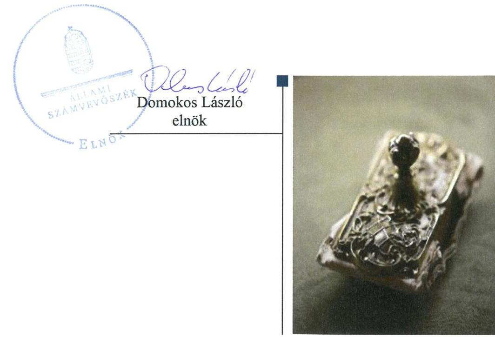
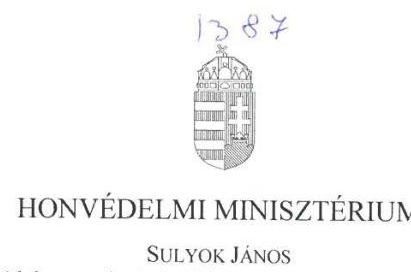
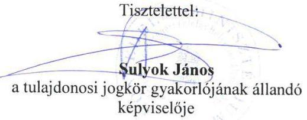
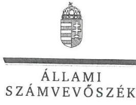
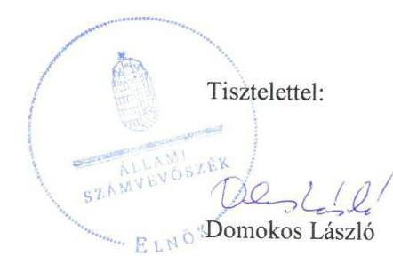
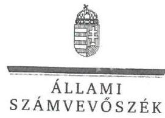
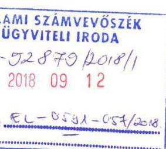
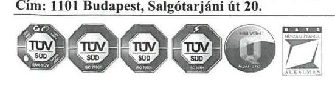
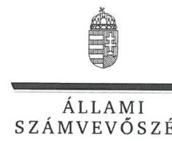
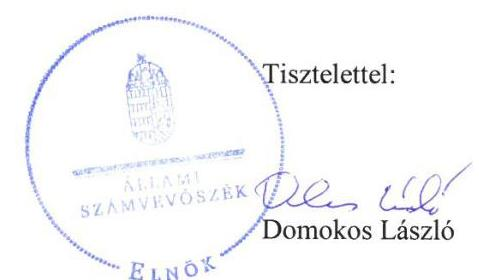

# Jelenetés 

## Az állami tulajdonú gazdasági társaságok ellenőrzése

Honvédelmi Minisztérium Elektronikai, Logisztikai és Vagyonkezelő Zrt. 2018.

---

# Jelentés 

## Az állami tulajdonú gazdasági társaságok ellenőrzése

Honvédelmi Minisztérium Elektronikai, Logisztikai és Vagyonkezelő Zrt.
2018. 10. hó 26. nap

---

# AZ ELLENŐRZÉST FELÜGYELTE:

DR. NAGY IMRE felügyeleti vezető

# AZ ELLENŐRZÉST VEZETTE ÉS A VÉGREHAJTÁSÁÉRT FELELŐS:

KORSÓSNÉ VIGH ANDREA ellenőrzésvezető

# A PROGRAM ÖSSZEÁLLÍTÁSÁÉRT FELELŐS:

TÓTPÁL SZABOLCS osztályvezető

---

IKTATÓSZÁM: EL-0386-023/2018.

TÉMASZÁM: 2469

---

Jelentéseink az Országgyűlés számítógépes hálózatán és az Interneten a www.asz.hu címen is olvashatóak.

---

ELLENŐRZÉS-AZONOSÍTÓ SZÁM: V081407

---

# TARTALOMJEGYZÉK 

■ ÖSSZEGZÉS ..... 5
■ AZ ELLENŐRZÉS CÉLJA ..... 6
■ AZ ELLENŐRZÉS TERÜLETE ..... 7
■ AZ ELLENŐRZÉS HÁTTERE, INDOKOLTSÁGA ..... 8
■ A JELENTÉS LÉNYEGES KÉRDÉSKÖREI ..... 9
■ AZ ELLENŐRZÉS HATÓKÖRE ÉS MÓDSZEREI ..... 10
■ MEGÁLLAPÍTÁSOK ..... 12
■ JAVASLATOK ..... 15
■ MELLÉKLETEK ..... 17
I. sz. melléklet: Értelmező szótár ..... 17
■ FÜGGELÉK: ÉSZREVÉTELEK ..... 21
■ RÖVIDÍTÉSEK JEGYZÉKE ..... 33

---

.

---

# ÖSSZEGZÉS 

A Honvédelmi Minisztérium Elektronikai, Logisztikai és Vagyonkezelő Zrt. felett a Honvédelmi Minisztérium szabályszerűen gyakorolta a tulajdonosi jogokat. A Honvédelmi Minisztérium Elektronikai, Logisztikai és Vagyonkezelő Zrt. pénzügyi-számviteli feladatellátása és vagyongazdálkodása nem volt szabályszerű, a beszámolót alátámasztó könyvvezetés és bizonylatolás szabályozásának hiánya miatt. A tervezési, beszámoló-készítési, adatszolgáltatási, közzétételi kötelezettségek teljesitése szabályszerű volt.

## Az ellenőrzés társadalmi indokoltsága

Az állami tulajdonú gazdálkodó szervezetek ellenőrzése kiemelten fontos a vagyon megőrzése, megóvása érdekében, valamint a kormányzati szektor elszámolásaiban megjelenő állami tulajdonú gazdálkodó szervezetek esetében, amelyekkel szemben alapvető követelmény, hogy gazdálkodásuk, működésük szabályszerű, az általuk szolgáltatott adatok minél megbízhatóbbak legyenek. A kiegyensúlyozott, átlátható és fenntartható költségvetési gazdálkodás érvényesítésének elvét az Alaptörvény rögzíti, a nemzeti vagyon megőrzésének, védelmének és a nemzeti vagyonnal való felelős gazdálkodásnak a követelményeit sarkalatos törvény határozza meg.

A honvédelmi szempontból kiemelt jelentőségű feladatokat ellátó Honvédelmi Minisztérium Elektronikai, Logisztikai és Vagyonkezelő Zrt. ellenőrzését a 30 Mrd Ft nagyságrendű vagyona és a 2013-2016. években 40-48 Mrd Ft nagyságrendű éves árbevétele indokolta.

## Főbb megállapítások, következtetések, javaslatok

A Honvédelmi Minisztérium a Honvédelmi Minisztérium Elektronikai, Logisztikai és Vagyonkezelő Zrt. feletti tulajdonosi joggyakorlás rendjét a jogszabályi előírásoknak megfelelően kialakította, és szabályszerűen gyakorolta a tulajdonosi jogokat.

A Honvédelmi Minisztérium Elektronikai, Logisztikai és Vagyonkezelő Zrt. nem rendelkezett a beszámoló készítést megalapozó könyvvezetés, és bizonylatolás részletes szabályait rögzítő számlarenddel a törvényi előírás ellenére, ezért a pénzügyi-számviteli feladatellátás és a vagyonnyilvántartás nem volt szabályozott, és nem volt szabályszerű. Számlarend hiányában a bevételek, ráfordítások, az immateriális javak és tárgyi eszközök állománya növekedési tételeinek, valamint az értékcsökkenés főkönyvi elszámolása nem volt szabályszerű. A vagyonnyilvántartás értékelése alapján a vagyongazdálkodás sem volt szabályszerű. Az árképzés szabályszerű önköltségszámítással megalapozott volt. A Társaság a mérlegben kimutatott eszközök és források állományát a törvényi és a belső szabályzat előírása szerinti leltárral alátámasztotta. A saját vagyon változását eredményező döntéshozatal során az Alapszabályban rögzített hatásköri előírásokat betartották.

A Honvédelmi Minisztérium Elektronikai, Logisztikai és Vagyonkezelő Zrt. eleget tett a jogszabályban és a Honvédelmi Minisztérium által előírt tervezési, beszámoló-készítési, adatszolgáltatási és adatvédelmi kötelezettségeknek. A köztulajdonban álló gazdasági társaságokra előírt közzétételi, valamint a kormányzati szektorba sorolt egyéb szervezetekre előírt adatszolgáltatási kötelezettségeket teljesítette, továbbá belső ellenőrzést működtetett a jogszabályi előírásnak megfelelően.

A megállapított szabálytalanságokkal összefüggésben az ÁSZ a Honvédelmi Minisztérium Elektronikai, Logisztikai és Vagyonkezelő Zrt. vezérigazgatójának kettő javaslatot fogalmazott meg. A javaslatok a számlarend elkészítésére, valamint a tárgyi eszközök főkönyvi elszámolásának bizonylattal történő alátámasztására irányultak. A javaslatokat megalapozó megállapításokra az érintettnek 30 napon belül intézkedési tervet kell készíteni.

---

# AZ ELLENŐRZÉS CÉLJA 

Az ellenőrzés célja annak értékelése volt, hogy a tulajdonosi jogok gyakorlása szabályszerű volt-e. A gazdálkodó szervezet szabályozottsága, gazdálkodása és vagyongazdálkodási tevékenysége megfelelt-e a jogszabályi és a tulajdonosi előírásoknak. A vagyonváltozást eredményező döntések esetében a tulajdonosi jogok gyakorlója és a gazdálkodó szervezet szabályszerűen jártak-e el. Az ellenőrzés célja továbbá annak megítélése volt, hogy a kormányzati szektorba sorolt állami tulajdonban (résztulajdonban) lévő gazdálkodó szervezetek gazdálkodásának a kormányzati szektor hiányára és az államadósságra befo-
lyással bíró elemei a jogszabályi előírásoknak megfeleltek-e.

---

# **AZ ELLENŐRZÉS TERÜLETE**

## **Honvédelmi Minisztérium Elektronikai, Logisztikai és Vagyonkezelő Zrt.**

A Magyar Állam kizárólagos tulajdonában lévő Társaságot^{1} 1993. január 1-jei hatállyal a honvédelmi miniszter alapította 70,0 M Ft jegyzett tőkével. Fő tevékenysége a honvédelmi ingatlanok üzemeltetése, őrzés-védelme volt, e mellett speciális honvédelmi célokat szolgáló informatikai fejlesztési, szolgáltatási tevékenységeket látott el. Közszolgáltatást nem végzett. A Társaság 2000-től minősített NATO^{2} beszállító.

A társasági részesedés feletti tulajdonosi jogokat és kötelezettségeket a Hvt.^{3} 2013. január 1-jétől hatályos 22/A. §-a alapján a HM^{4} gyakorolta, a HM és az MNV Zrt.^{5} között létrejött Együttműködési megállapodásban^{6} foglalt korlátozásokkal. Az MNV Zrt. tulajdonosi joggyakorlási körébe tartozó ügy az ellenőrzött időszakban nem volt.

A Társaság 2013-2016. évi gazdálkodásának kiemelt adatait az 1. táblázat mutatja be.

1. táblázat

|  A TÁRSASÁG GAZDÁLKODÁSÁNAK KIEMELT ADATAI (M FT) |  |  |  |   |
| --- | --- | --- | --- | --- |
|  Megnevezés | 2013.
XII. 31. | 2014.
XII. 31. | 2015.
XII. 31. | 2016.
XII. 31.  |
|  Mérlegfőösszeg | 36 067,6 | 29 483,2 | 20 653,1 | 31 622,1  |
|  Mérleg szerinti eredmény/
Adózott eredmény | 547,9 | 626,0 | 806,5 |   |
|  Saját tőke | 6013,3 | 6631,3 | 7435,0 | 8700,1  |
|  Jegyzett tőke | 1948,0 | 1948,0 | 1948,0 | 1948,0  |
|  Követelések | 30 201,9 | 22 222,0 | 10 827,6 | 16 316,4  |
|  ebből: vevők | 29 762,2 | 21 614,5 | 10 708,6 | 14 062,5  |
|  Kötelezettségek | 28 891,1 | 22 127,1 | 12 306,4 | 22 054,9  |
|  ebből: rövid lejáratú | 28 811,1 | 20 747,1 | 11 412,0 | 21 890,3  |
|  Értékesítés nettó árbevétele | 45 248,0 | 40 052,0 | 43 268,1 | 47 566,8  |

A Társaság ügyvezető szerve a három főből álló igazgatóság volt, melynek operatív vezetését a vezérigazgató látta el. A Társaság 2013-ban 4448 fő, 2016-ban 4101 fő átlagos állományi létszámmal látta el feladatait.

A Társaságnak az ellenőrzött időszakban két többségi tulajdonú leányvállalata volt: a Terra Ingatlankezelő- és Forgalmazó Kft.-ben 2013-ban 99,9%-os, 2016-ban 96,7%-os, az ITEA Információtechnikai és Elektronikus Adatvédelem Kft.-ben 90,0%-os részesedéssel rendelkezett.

A Társaság a nemzetgazdasági miniszter közleménye szerint 2015. december 30-ától kormányzati szektorba sorolt egyéb szervezet volt.

---

# AZ ELLENŐRZÉS HÁTTERE, INDOKOLTSÁGA 

Az ellenőrzés rámutathat az állami tulajdonú gazdálkodó szervezetek gazdálkodási tevékenységével kapcsolatos jó gyakorlatokra és szabálytalanságokra. Felhívhatja a figyelmet a jogszabályi követelmények teljesítéséhez szükséges feltételek hiányosságaira, hozzájárulhat az államháztartáson kívüli, de (közvetlenül vagy közvetve) állami vagyont használó gazdálkodó szervezetek tevékenységének átláthatóságához. Ellenőrzésünk eredményeképpen javaslatainkkal, megállapításainkkal hozzájárulhatunk a nemzeti vagyonnal való gazdálkodás átláthatóságának, elszámoltathatóságának a javításához.

---

# A JELENTÉS LÉNYEGES KÉRDÉSKÖREI 

1. A tulajdonosi jogok gyakorlása szabályszerű volt-e?
2. A Társaság pénzügyi-számviteli feladatellátása és vagyongazdálkodása szabályszerű volt-e?

---

# AZ ELLENŐRZÉS HATÓKÖRE ÉS MÓDSZEREI 

## Az ellenőrzés típusa

Megfelelőségi ellenőrzés.

## Az ellenőrzött időszak

Az ellenőrzött időszak a 2013-2016. évek, a 2016. évi beszámoló jóváhagyásáig tartó időszak.

## Az ellenőrzés tárgya

Az állami tulajdonban (résztulajdonban) lévő gazdasági társaságok gazdálkodása, kiemelten vagyongazdálkodási tevékenysége, a tulajdonosi jogok gyakorlása, továbbá a kormányzati szektorba sorolt gazdasági társaságok gazdálkodásának a kormányzati szektor hiányára és az államadósságra befolyással bíró elemei.

## Az ellenőrzött szervezet

A HM Elektronikai, Logisztikai és Vagyonkezelő Zrt. és a tulajdonosi jogokat gyakorló Honvédelmi Minisztérium.

## Az ellenőrzés jogalapja

Az ellenőrzés jogalapját az ÁSZ tv. ${ }^{7}$ 1. § (3) bekezdése és 5. § (3)-(5) bekezdései képezték.

## Az ellenőrzés módszerei

Az ellenőrzést az ellenőrzési program ellenőrzési kérdései, az ellenőrzött időszakban hatályos szabályok, az ellenőrzés szakmai szabályok és módszertanok figyelembe vételével végeztük el.

Az ellenőrzött szervezetek az ellenőrzés lefolytatásához tanúsítványok kitöltésével, valamint az ÁSZ ${ }^{8}$ által kért dokumentumok megküldésével szolgáltattak adatokat.

A tulajdonosi joggyakorlást a 2013. és a 2016. évekre vonatkozóan ellenőriztük. A teljes ellenőrzött időszakra került ellenőrzésre a gazdasági társaság tervezési, beszámolási, közzétételi, adatszolgáltatási, valamint belső ellenőrzési tevékenységének a szabályszerűsége. A 2013. és 2016.

---

évekre vonatkozóan a gazdasági társaság múködésének szabályozottságát, a bevételei és ráfordításai elszámolását, illetve vagyongazdálkodásának szabályszerűségét is ellenőriztük.

A bevételek és ráfordítások közül az értékesítés nettó árbevétele, az egyéb, rendkívüli és pénzügyi műveletek ráfordításai és bevételei és a személyi jellegű ráfordítások elszámolása esetében a szabályszerű működést mintavétellel ellenőriztük.

A fenti sokaságok esetében a mintavétel azokra a legnagyobb értékű tételekre - a lényeges sokaságra - terjedt ki, melyek összértéke elérte a teljes sokaság összértékének 50\%-át. A személyi jellegű ráfordítások esetében a mintavétel a teljes sokaságból történt. Amennyiben valamely ellenőrzött sokaság elemszáma kisebb volt, mint az előírt minta elemszám, az ellenőrzött sokaságot tételesen ellenőriztük.

A mintavétellel ellenőrzött területek esetében minden egyes tétel vonatkozásában a szabályszerűségre vonatkozó kérdéseket tettünk fel, amelyek eredménye összesítésre került. „Szabályszerűnek" értékeltünk egy ellenőrzött területet, amennyiben 95\%-os bizonyossággal az ellenőrzött sokaságban az átlagos hibaarány legfeljebb 10\%, „nem szabályszerűnek", amennyiben 10\%-nál magasabb arányt képviselt.

---

# 1. A tulajdonosi jogok gyakorlása szabályszerű volt-e? 

Összegző megállapítás

A HM szabályszerűen kialakította a tulajdonosi joggyakorlás rendjét és szabályszerűen gyakorolta a tulajdonosi jogokat.

AZ EGYSZEMÉLYES TÁRSASÁGNÁL a Gt. ${ }^{9}$ és a Ptk. ${ }^{10}$ előírása szerint a legfőbb szerv hatáskörébe tartozó kérdésekben a HM tulajdonosi határozattal döntött.

A HM szabályszerűen kialakította a tulajdonosi joggyakorlás rendjét:
$\longrightarrow$ HM utasításban ${ }^{11}$ rögzítette a tulajdonosi joggyakorlásra vonatkozó szabályokat, a HM hatáskörébe tartozó feladatokat és kötelezettségeket;
$\longrightarrow$ a Társaság Alapszabályában ${ }^{12}$ meghatározta a HM kizárólagos, valamint az MNV Zrt. jóváhagyását igénylő tulajdonosi jogosítványait, az igazgatóság, az $\mathrm{FB}^{13}$ tagjait és hatáskörét, a vezérigazgató személyét és feladatait, kijelölte a könyvvizsgálót.
Az FB szabályszerűen, a HM által jóváhagyott ügyrend alapján működött, az üzleti tervekről, az éves beszámolókról, továbbá az Alapszabályban és az ügyrendben meghatározott körben írásbeli jelentése a tulajdonosi joggyakorló döntését megelőzően rendelkezésre állt. Az FB ellenőrizte a tulajdonosi határozatok végrehajtását, figyelemmel kísérte az Igazgatóság munkáját, az igazgatósági határozatok teljesítését. Megtárgyalta a Társaság negyedéves gazdálkodásáról készített jelentéseket, a belső ellenőrzési jelentéseket, figyelemmel kísérte a Társaság likviditási helyzetét.

A HM az Alapszabály rendelkezése szerint - a Gt., illetve a Ptk. ${ }_{2}$ előírásait betartva - jóváhagyta a Társaság üzleti terveit, a könyvvizsgáló írásbeli jelentése birtokában megtárgyalta és elfogadta a Társaság éves beszámolóit és üzleti jelentéseit. Döntött a Társaság eredményére vonatkozóan, valamint elfogadta a Tak.tv. ${ }^{14}$ előírásának megfelelő tartalommal a Társaság javadalmazási szabályzatát ${ }^{15}$. A HM az Alapszabály előírásait betartva döntött a Társaság vagyonváltozását eredményező ügyekben.

A HM tulajdonosi határozatban ${ }^{16}$ írta elő a monitoring tevékenységet támogató éves és évközi rendszeres és eseti adatszolgáltatási/beszámolási kötelezettségeket, azok tartalmát, formáját és határidejét. A HM a havi pénzforgalmi jelentések, a gazdálkodásról készített negyedéves jelentések, valamint az éves beszámolók, üzleti jelentések útján nyomon követte a Társaság gazdálkodását.

---

# 2. A Társaság pénzügyi-számviteli feladatellátása és vagyongazdálkodása szabályszerű volt-e? 

Összegző megállapítás

2.1. számú megállapítás

A Társaság pénzügyi-számviteli feladatellátása és vagyongazdálkodása nem volt szabályszerű.

A Társaság nem határozta meg a beszámoló készítést megalapozó könyvvezetés és bizonylatolás részletes szabályait, ennek hiányában a pénzügyi-számviteli feladatellátás és a vagyonnyilvántartás nem volt a Számv. tv. előírásának megfelelően szabályozott és nem volt szabályszerű. A mérlegben kimutatott eszközök és források állományát szabályszerű leltárral alátámasztották.

A Társaság tevékenységének alapvető szabályait, a vagyongazdálkodással kapcsolatos feladat- és hatásköröket, felelősségi viszonyokat az Alapszabály, valamint az SZMSZ ${ }^{17}$ tartalmazta.

A Társaság a Számv. tv. ${ }^{18}$ előírásaival összhangban elkészítette a számviteli politikát ${ }^{19}$, az eszközök és források értékelési ${ }^{20}$, a leltárkészítési és leltározási ${ }^{21}$, az önköltségszámítási ${ }^{22}$, valamint a pénzkezelési szabályzatokat ${ }^{23}$.

SZÁMLARENDDEL a Számv. tv. 161. § (1) bekezdés előírása ellenére a Társaság nem rendelkezett, ennek hiányában nem határozta meg a Számv. tv. előírásainak megfelelő beszámoló készítést biztosító könyvvezetés és bizonylatolás részletes szabályait a Számv. tv. 161. § (2) bekezdésben szabályozott tartalommal, a Számv. tv. 161. § (3)-(5) bekezdéseiben és a Számv. tv. 161/A. §-ban foglalt előírásokra is figyelemmel.

A PÉNZÜGYI-SZÁMVITELI FELADATOK ellátása számlarend hiányában nem volt szabályozott és nem volt szabályszerű. A bevételek és a ráfordítások főkönyvi elszámolása szabályszerűségét nem támasztotta alá belső szabályzat.

A Társaság árképzése az önköltségszámítási szabályzat előírása szerinti önköltségszámításon alapult.

A VAGYONNYILVÁNTARTÁS nem volt szabályszerű, mert:
— az immateriális javak és a tárgyi eszközök állománya növekedésének, valamint az értékcsökkenés főkönyvi elszámolása szabályszerűségét - számlarend hiányában - nem támasztotta alá belső szabályzat, továbbá
—_ a Társaság 2013-ban és 2016-ban a tárgyi eszköz állomány növekedések számviteli elszámolását a Számv. tv. 165. § (1)-(2) bekezdései előírása ellenére bizonylattal nem támasztotta alá.
Társaság - a Számv. tv.-ben foglaltak szerint - a mérlegtételek beszámolóban kimutatott állományát leltárral alátámasztotta.

A saját vagyon változását eredményező döntésekre szabályszerűen, az Alapszabályban rögzített hatásköri előírások betartásával került sor.

---

# 2.2. számú megállapítás 

A Társaság teljesítette a jogszabályban és HM által előírt tervezési, beszámoló-készítési, adatszolgáltatási, adatvédelmi és közzétételi kötelezettségeket.

Üzleti terv-készítési kötelezettségének a Társaság a HM által kiadott irányelveknek megfelelően eleget tett.

Az éves beszámolókat és üzleti jelentéseket a Társaság elkészítette, a HM-nek jóváhagyásra előterjesztette, jóváhagyást követően a Számv. tv.ben előírt határidőben letétbe helyezte és közzétette.

A Társaság a HM által előírt rendszeres (havi, negyedéves, éves) és eseti adatszolgáltatási kötelezettségeit teljesítette.

Adatvédelmi és adatkezelési szabályzattal a Társaság az Info. tv. ${ }^{24}$ 24. § (3) bekezdés előírásának megfelelően rendelkezett.

A Társaság gondoskodott a köztulajdonban álló társaságokra a Tak.tv. 2. § (1)-(3) bekezdéseiben előírt adatok közzétételéről.
2.3. számú megállapítás

Eleget tett a Társaság a kormányzati szektorba sorolt egyéb szervezetekre előírt adatszolgáltatási kötelezettségeinek, továbbá belső ellenőrzést múködtetett a jogszabályi előírásnak megfelelően.

Eleget tett a Társaság a 2015-2016. években - az Áht. ${ }^{25}$ 107. § (1) bekezdés és az Ávr. ${ }^{26}$ 167/M. § (1) bekezdés előírása alapján - az Ávr. 5. melléklet 3, 23, és 24. pontjaiban a kormányzati szektorba besorolt társaságokra előírt adatszolgáltatási kötelezettségeknek.

Belső ellenőrzést múködtetett a Társaság a 2013-2016. években, ezzel a Társaság vezérigazgatója eleget tett a Bkr. ${ }^{27}$ 10. § előírásának, a Bkr. 54/A. §-ában foglalt előírásokra figyelemmel. A belső ellenőrzés az FB által jóváhagyott éves munkatervek alapján múködött, 2013-2016 között több alkalommal végzett a vagyongazdálkodást érintő ellenőrzéseket. A belső ellenőrzés és a külső ellenőrző szervek által megfogalmazott javaslatokra a Társaság intézkedési terveket készített, azok teljesítését nyomon követték.

---

# JAVASLATOK 

Az ÁSZ tv. 33. § (1) bekezdésében foglaltak értelmében az ellenőrzött szervezet vezetője köteles a jelentésben foglalt megállapításokhoz kapcsolódó intézkedési tervet összeállítani és azt a jelentés kézhezvételétől számított 30 napon belül az ÁSZ részére megküldeni. Amennyiben az ellenőrzött szervezet vezetője nem küldi meg határidőben az intézkedési tervet, vagy továbbra sem elfogadható intézkedési tervet küld, az Állami Számvevőszék elnöke az ÁSZ tv. 33. § (3) bekezdése a) és b) pontjaiban foglaltakat érvényesítheti.

## A Honvédelmi Minisztérium Elektronikai, Logisztikai és Vagyonkezelő Zrt. vezérigazgatójának

1. |Intézkedjen a jogszabályi előírások szerinti számlarend elkészítéséről.
(2.1. sz. megállapítás 3-4. bekezdései és a 6. bekezdés 1. francia be-
kezdése alapján)
2. Intézkedjen a tárgyi eszközök fökönyvi elszámolásának bizonylattal történő alátámasztásáról a jogszabályi előírásoknak megfelelően.
(2.1. sz. megállapítás 6. bekezdés 2. francia bekezdése alapján)

---

.

---

# MELLÉKLETEK 

- I. SZ. MELLÉKLET: ÉRTELMEZŐ SZÓTÁR
állami vagyon
gazdasági társaság
gazdálkodó szervezet
kormányzati szektorba sorolt egyéb szervezet
leányvállalat
a) Az állam tulajdonában lévő dolog, valamint a dolog módjára hasznosítható természeti erő,
b) az a) pont hatálya alá nem tartozó mindazon vagyon, amely vonatkozásában törvény az állam kizárólagos tulajdonjogát nevesíti,
c) az állam tulajdonában lévő tagsági jogviszonyt megtestesítő értékpapír, illetve az államot megillető egyéb társasági részesedés,
d) az államot megillető olyan immateriális, vagyoni értékkel rendelkező jogosultság, amelyet jogszabály vagyoni értékű jogként nevesít.
Forrás: Vtv. ${ }^{28}$ 1. § (2) bekezdése
e) az állam tulajdonában lévő pénzügyi eszközök
Forrás: Vtv. 1. § (2) bekezdése
A Ptk. 3:88. § (1) bekezdése szerint „a gazdasági társaságok üzletszerű közös gazdasági tevékenység folytatására, a tagok vagyoni hozzájárulásával létrehozott, jogi személyiséggel rendelkező vállalkozások, amelyekben a tagok a nyereségből közösen részesednek, és a veszteséget közösen viselik".
2014. március 14-ig:

A Ptk. ${ }^{29}$ 685. § c) pontja szerint gazdálkodó szervezet:
„az állami vállalat, az egyéb állami gazdálkodó szerv, a szövetkezet, a lakásszövetkezet, az európai szövetkezet, a gazdasági társaság, az európai részvénytársaság, az egyesülés, az európai gazdasági egyesülés, az európai területi együttmúködési csoportosulás, az egyes jogi személyek vállalata, a leányvállalat, a vízgazdálkodási társulat, az erdő birtokossági társulat, a végrehajtói iroda, az egyéni cég, továbbá az egyéni vállalkozó."
2014. március 15-től:

A gazdasági társaság, az európai részvénytársaság, az egyesülés, az európai gazdasági egyesülés, az európai területi együttműködési csoportosulás, a szövetkezet, a lakásszövetkezet, az európai szövetkezet, a vízgazdálkodási társulat, az erdőbirtokossági társulat, az állami vállalat, az egyéb állami gazdálkodó szerv, az egyes jogi személyek vállalata, a közös vállalat, a végrehajtói iroda, a közjegyzői iroda, az ügyvédi iroda, a szabadalmi ügyvivői iroda, az önkéntes kölcsönös biztosító pénztár, a magánnyugdíjpénztár, az egyéni cég, továbbá az egyéni vállalkozó. Az állam, a helyi önkormányzat, a költségvetési szerv, az egyesület, a köztestület, valamint az alapítvány gazdálkodó tevékenységével összefüggő polgári jogi kapcsolataira is a gazdálkodó szervezetre vonatkozó rendelkezéseket kell alkalmazni.
Forrás: Ppt. ${ }^{30}$ 396. §
Az a szervezet, amely az Áht. alapján nem része az államháztartásnak, azonban az Európai Közösséget létrehozó szerződéshez csatolt, a túlzott hiány esetén követendő eljárásról szóló jegyzőkönyv alkalmazásáról szóló 2009. május 25-i 479/2009/EK rendelet szerint a kormányzati szektorba tartozik. A nemzetgazdasági miniszter 2013. június 26-án megjelent Közleményben tette közé ezen szervezetek listáját
Az a gazdasági társaság, amelyre az anyavállalat meghatározó befolyást képes gyakorolni.
Forrás: Számv. tv. 3. § (2) bekezdés 2. pont

---

meghatározó befolyás

# 2014. március 14-ig: 

A befolyással rendelkező akkor rendelkezik egy jogi személyben meghatározó befolyással, ha annak tagja, illetve részvényese és
a) jogosult e jogi személy vezető tisztségviselői vagy felügyelőbizottsága tagjai többségének megválasztására, illetve visszahívására, vagy
b) a jogi személy más tagjaival, illetve részvényeseivel kötött megállapodás alapján egyedül rendelkezik a szavazatok több mint ötven százalékával.
A meghatározó befolyás akkor is fennáll, ha a befolyással rendelkező számára az előzőek szerinti jogosultságok közvetett módon biztosítottak. A befolyással rendelkezőnek egy jogi személyben a szavazatok több mint ötven százalékával közvetett módon való rendelkezése vagy egy jogi személyben közvetetten fennálló meghatározó befolyása megállapítása során a jogi személyben szavazati joggal rendelkező más jogi személyt (köztes vállalkozást) megillető szavazatokat meg kell szorozni a befolyással rendelkezőnek a köztes vállalkozásban, illetve vállalkozásokban fennálló szavazatával. Ha a köztes vállalkozásban fennálló szavazatok mértéke az ötven százalékot meghaladja, akkor azt egy egészként kell figyelembe venni.
Forrás: $\mathrm{Ptk}_{1}$. 685/B. § (2)-(3) bekezdései

## 2014. március 15-től:

A befolyással rendelkező akkor rendelkezik egy jogi személyben meghatározó befolyással, ha annak tagja vagy részvényese, és
a) jogosult e jogi személy vezető tisztségviselői vagy felügyelőbizottsága tagjai többségének megválasztására, illetve visszahívására; vagy
b) a jogi személy más tagjai, illetve részvényesei a befolyással rendelkezővel kötött megállapodás alapján a befolyással rendelkezővel azonos tartalommal szavaznak, vagy a befolyással rendelkezőn keresztül gyakorolják szavazati jogukat, feltéve, hogy együtt a szavazatok több mint felével rendelkeznek.
Forrás: $\mathrm{Ptk}_{2}$. 8:2. § (2) bekezdése
nemzeti vagyon
a) az állam vagy a helyi önkormányzat kizárólagos tulajdonában álló dolgok,
b) az a) pont hatálya alá nem tartozó, állam vagy a helyi önkormányzat tulajdonában lévő dolog,
c) az állam vagy a helyi önkormányzatot tulajdonában lévő pénzügyi eszközök, továbbá az államot vagy a helyi önkormányzatot megillető társasági részesedések,
d) az államot vagy a helyi önkormányzatot megillető bármely vagyoni értékkel rendelkező jogosultság, amelyet jogszabály vagyoni értékű jogként nevesít,
e) Magyarország határa által körbezárt terület feletti légtér,
f) az üvegházhatású gázok kibocsátási egységeinek kereskedelméről szóló törvény szerint kibocsátási egység és légiközlekedési kibocsátási egység, valamint az ENSZ Éghajlatváltozási Keretegyezménye és annak Kiotói Jegyzőkönyve végrehajtási keretrendszeréről szóló törvény szerinti kiotói egység,
g) állami vagy helyi önkormányzati fenntartású közgyűjtemény (muzeális intézmény, levéltár, közgyűjteményként működő kép- és hangarchívum, valamint könyvtár) saját gyűjteményében nyilvántartott kulturális javak körébe tartozó dolog, kivéve, ha az állami vagy önkormányzati tulajdon jogszerű létrejötte kétséget kizáró módon nem bizonyítható és a dologra nézve más a tulajdonjogát bizonyítja vagy a kulturális javakra vonatkozó jogszabályokban meghatározott eljárás keretében valószínűsíti (g. pont módosult 2013. december 7-től),
h) a régészeti lelet,
i) a nemzeti adatvagyon körébe tartozó állami nyilvántartások fokozottabb védelméről szóló törvény szerinti nemzeti adatvagyon.

---

tulajdonosi ellenőrzés

Tolajdonosi jogok gyakorlója

Forrás: Nvtv. ${ }^{31}$ 1. § (2) bekezdése
2014. március 14-ig:

Az állami vagyon kezelőjét, haszonélvezőjét, használóját megillető jogok gyakorlását, annak szabályszerűségét, célszerűségét az MNV Zrt. - szükség szerint területi szervei útján - ellenőrzi.
2014. március 15-től:

Az állami vagyon használóját, vagyonkezelőjét és haszonélvezőjét megillető jogok gyakorlását, annak szabályszerűségét, a kötelezettségek teljesítését, valamint a vagyon rendeltetése szerinti célszerűségét a tulajdonosi joggyakorló rendszeresen ellenőrzi.
Forrás: Vtv.vhr. ${ }^{32}$ 20. § (1) bekezdése
1.

# 2013. június 27-ig: 

Az állami vagyon felett a Magyar Államot megillető tulajdonosi jogok és kötelezettségek összességét - ha törvény eltérően nem rendelkezik - az állami vagyon felügyeletéért felelős miniszter (a továbbiakban: miniszter) gyakorolja, aki e feladatát a Magyar Nemzeti Vagyonkezelő Zártkörűen Működő Részvénytársaság (a továbbiakban: MNV Zrt.), a Magyar Fejlesztési Bank, illetve a tulajdonosi joggyakorló szervezet útján látja el. A miniszter miniszteri rendeletben, a törvényben meghatározott állami vagyoni kör tekintetében, meghatározott időtartamra, a joggyakorlás egyes szabályainak meghatározásával - az őt megillető tulajdonosi jogok és kötelezettségek öszszességének, illetve azok meghatározott részének gyakorlóját az Áht. szerinti központi költségvetési szervek, ezek intézménye, továbbá a 100\%-ban állami tulajdonban álló gazdasági társaságok közül kijelölheti.
Forrás: Vtv. 3. § (1) és (2) bekezdései

## 2013. június 28-ától:

A rábízott állami vagyon felett az államot megillető tulajdonosi jogok és kötelezettségek összességét tulajdonosi joggyakorlóként:
a) ha törvény vagy miniszteri rendelet eltérően nem rendelkezik, a Magyar Nemzeti Vagyonkezelő Zártkörűen Működő Részvénytársaság (a továbbiakban: MNV Zrt.),
b) törvényben kijelölt személy vagy
c) az állami vagyon felügyeletéért felelős miniszter (a továbbiakban: miniszter) által rendeletben kijelölt személy gyakorolja.
[...] A miniszter e törvény felhatalmazása alapján - a meghatározott célok hatékonyabb elérése érdekében, miniszteri rendeletben, az ott meghatározott állami vagyoni kör tekintetében, meghatározott időtartamra - e törvény keretei között, a joggyakorlás egyes szabályainak meghatározásával - az államot megillető tulajdonosi jogok és kötelezettségek összességének, illetve azok meghatározott részének gyakorlóját az Áht. szerinti központi költségvetési szervek, ezek intézménye, továbbá a 100\%-ban állami tulajdonban álló gazdasági társaságok közül kijelölheti.
Forrás: Vtv. 3. § (1) és (2) bekezdései
2.

Aki a nemzeti vagyon felett az államot vagy a helyi önkormányzatot megillető tulajdonosi jogok és kötelezettségek összességének gyakorlására jogosult
Forrás: Nvtv. 3. § (1) 17. pontja

---

.

---

# FÜGGELÉK: ÉSZREVÉTELEK 

A jelentéstervezetet a Számvevőszék 15 napos észrevételezésre megküldte az ellenőrzött szervezet vezetőjének az ÁSZ tv. 29. §* (1) bekezdése előírásának megfelelően.

Az ÁSZ a jelentéstervezetet észrevételezésre megküldte a honvédelmi miniszternek és a HM Elektronikai, Logisztikai és Vagyonkezelő Zrt. vezérigazgatójának.
A függelék tartalmazza a honvédelmi miniszter és a HM Elektronikai, Logisztikai és Vagyonkezelő Zrt. vezérigazgatójának az észrevételeit, illetve az el nem fogadott észrevételek elutasításának indoklását.

[^0]
[^0]:    * 29. § (1) Az Állami Számvevőszék az ellenőrzési megállapításait megküldi az ellenőrzött szervezet vezetőjének vagy az általa megbízott személynek, és annak, akinek személyes felelősségét állapította meg.
    (2) Az ellenőrzött szervezet vezetője és a felelősként megjelölt személy az ellenőrzés megállapításaira tizenöt napon belül írásban észrevételt tehet.
    (3) Az Állami Számvevőszék az észrevételre a beérkezésétől számított harminc napon belül írásban válaszol. A figyelembe nem vett észrevételeket köteles a jelentésben feltüntetni, és megindokolni, hogy azokat miért nem fogadta el.

---

HONVÉDELMI MINISZTÉRIUM
SULYOK JANOS
védelemgazdaságért felelős helyettes államtitkár

Nyt. szám: 5169-64/2018.
Hiv. szám: EL-0591-055/2018.

Domokos László úr
Állami Számvevőszék
elnök

# Budapest 

## Tisztelt Elnök Úr!

A HM Elektronikai, Logisztikai és Vagyonkezelő Zrt. ellenőrzésével kapcsolatos jelentéstervezetben a tulajdonosi joggyakorlást érintően tett megállapításokkal egyet értek, arra vonatkozóan módosító javaslatot nem teszek.

A Társaság pénzügyi-számviteli feladatellátására és vagyongazdálkodására vonatkozó megállapítások tekintetében az alábbi javaslat beillesztését kérem az összegző megállapításhoz:

A Honvédelmi Minisztérium Elektronikai, Logisztikai és Vagyonkezelő Zrt. pénzügyiszámviteli feladatellátásának és vagyongazdálkodásának egyes folyamatai nem voltak szabályszerűek, a beszámolót alátámasztó könyvvezetés és bizonylatok szabályozásának hiánya miatt."

A Társaság rendelkezett a számvitelről szóló 2000. évi C. törvény által megkövetelt szabályozással. A könyvvezetés és bizonylatolás részletes szabályait a hatályos jogszabályoknak megfelelő, valamennyi pénzügyi-, számviteli-, gazdálkodási területet érintő, a HM El Zrt. nevében kibocsátott, számos belső intézkedés, utasítás, szabályzat együttesen tartalmazta. Erre tekintettel javasolom a jelentéstervezet fentiek szerinti módosítását.

Budapest, 2018. szeptember

---

ELNÖK

Ikt.szám: EL-0591-059/2018.

# Dr. Benkő Tibor úr 

miniszter
Honvédelmi Minisztérium

## Budapest

## Tisztelt Miniszter Úr!

„Az állami tulajdonú gazdasági társaságok ellenőrzése - Honvédelmi Minisztérium Elektronikai, Logisztikai és Vagyonkezelő Zrt. " címmel készített számvevőszéki jelentéstervezetre a védelemgazdaságért felelős helyettes államtitkár, mint a tulajdonosi jogkör gyakorlójának állandó képviselője által tett észrevételeit köszönettel megkaptam.
Az Állami Számvevőszék észrevételekre vonatkozó álláspontjáról a felügyeleti vezető által készített részletes tájékoztatást csatoltan megküldőm.
Tájékoztatom Miniszter urat, hogy a számvevőszéki jelentésben - az Állami Számvevőszékről szóló 2011. évi LXVI. törvény 29. § (3) bekezdése alapján - a figyelembe nem vett észrevételeket szerepeltetjük annak megindoklásával, hogy azokat miért nem fogadtuk el.

Budapest, 2018. 05 . hó 28. nap

Melléklet: Tájékoztatás az észrevételek kezeléséről

---

FELÜGYELETI VEZETŐ

Melléklet
Ikt.szám: EL-0591-059/2018.

# Tájékoztatás   az észrevételek kezeléséről 

„Az állami tulajdonú gazdasági társaságok ellenőrzése - Honvédelmi Minisztérium Elektronikai, Logisztikai és Vagyonkezelö Zrt. " címủ jelentéstervezetre 2018. szeptember 11-én tett (az Állami Számvevőszékhez 2018. szeptember 13-án érkezett) észrevételét áttekintettük, annak kezelésével kapcsolatban a következő tájékoztatást adom.

## A jelentéstervezet Összegzés fejezetére vonatkozó észrevétel:

Az észrevételben leírtak szerint a tulajdonosi joggyakorlást érintően tett megállapításokkal a Honvédelmi Minisztérium egyetért. A Társaság pénzügyi-számviteli feladatellátására és vagyongazdálkodására vonatkozóan az összegző megállapítás kiegészítését kérte az ,,egyes folyamatai" kifejezéssel, mivel a Társaság szabályzatai, belső intézkedései, utasításai együttesen tartalmazzák a könyvvezetés és bizonylatolás részletes szabályait.
Az észrevételt nem fogadjuk el. A számvitelről szóló 2000. évi C. törvény 161. §-ának megfelelő számlarend elkészítését a Társaság egyéb, a könyvvezetésre és bizonylatolásra vonatkozó szabályzatai nem helyettesítik. Az észrevétel nem cáfolta a jelentéstervezet megállapításait, az alapján a jelentéstervezet módosítása nem indokolt.

Budapest, 2018. 09 . hó 24 . nap

Dr. Nagy Imre felügyeleti vezető

---

# 1221 

HONVÉDELMI MINISZTÉRIUM
ELEKTRONIKAI, LOGISZTIKAI ÉS VAGYONKEZELŐ ZÁRTKÖRÜEN MÜKÖDŐ RÉSZVÉNYTÁRSASÁG (HM EI Zrt.) www.hmel.hu

Nyt. szám: 649-8/2018.
Hivatkozási szám: EL-0591-055/2018.

1. számú példány „Futárral továbbítandó",

Budapest
Pf.: 54.
1364

Tárgy: Észrevétel az EL-0591-055/2018. iktatószámú levél mellékleteként megküldött számvevőszéki jelentéstervezethez

## Tisztelt Elnök Úr!

Alulírott, Dr. Trembeczki László András a Honvédelmi Minisztérium Elektronikai, Logisztikai és Vagyonkezelő Zártkörűen Müködő Részvénytársaság (székhely: 1101 Budapest, Salgótarján út 20., cégjegyzékszám: 01-10-042134, adószám: 10815135-2-51, a továbbiakban: HM EI Zrt.) vezérigazgatója az Állami Számvevőszékről szóló 2011. évi LXVI. törvény 29. § (2) bekezdése alapján, az EL-0591-055/2018. iktatószámú levél mellékleteként megküldött számvevőszéki jelentéstervezethez, a HM EI Zrt. nevében az alábbi
észrevételt
teszem.
1./ A fent hivatkozott számvevőszéki jelentéstervezet azon összegző megállapításával, mely szerint a HM EI Zrt. pénzügyi-számviteli feladatellátása és vagyongazdálkodása nem volt a számvitelről szóló 2000. évi C. törvény (a továbbiakban: Sztv.) előírásainak megfelelően szabályozott és nem volt szabályszerű, és amely megállapítást az Sztv. előírásainak megfelelő, kötelezően elkészítendő, a beszámolót alátámasztó könyvvezetés és bizonylatolás szabályait

Postacím: 1581 Budapest, Pf.: 6.
Reg: Fővárosi Törvényszek Cégbírósága Cg. 01-10-042134
Adószám: 10815135-2-51; HU10815135
Telefon: 06/1-431-2900; HM: 45-111
Fax:06/1-275-0972, HM: 45-672
E-mail: hmel@hmel.hu

---

meghatározó Számlarend hiányával indokol, az alábbiakban részletesen kifejtett indokok és csatolt okiratok alapján a HM EI Zrt. nem ért egyet.

A HM EI Zrt.-nél ugyanis a gazdasági ügyleteket és eseményeket a tényleges gazdasági tartalmuknak megfelelően, az Sztv. alapelveihez igazodóan és az Sztv. előírásainak megfelelően, a valódiság elve alapján és a tisztességes gazdasági szereplőtől elvárható gondossággal végezték az ellenőrzés tárgya szerinti időszakban is.

A pénzügyi és számviteli feladatok ellátása, a vagyonnyilvántartás és vagyongazdálkodás a beszámolóban, és az azt alátámasztó könyvvezetés során szabályozottan, és jogszerűen történt, a bizonylati rendet és fegyelmet a HM EI Zrt. megtartotta.

# 2./ A pénzügyi-számviteli feladatellátás 

Az ellenőrzés során a HM EI Zrt. ugyan nem csatolt „Számlarend" megnevezésű szabályzatot, azonban a beszámoló készítést biztosító könyvvezetés és bizonylatolás részletes szabályait a hatályos jogszabályoknak megfelelő, valamennyi pénzügyi-, számviteli-, gazdálkodási területet érintő, a HM EI Zrt. nevében kibocsátott, számos belső intézkedés, utasítás, szabályzat összhangban az Sztv. 16. § (3) bekezdésében megfogalmazott a „tartalom elsődlegessége a formával szemben" alapelvvel - együttesen tartalmazta.
E társasági szabályozók közül külön utalok a HM EI Zrt. által elfogadott és bevezetett SAP integrált vállalatirányítási rendszer koncepciótervére és kézikönyveire, amelyeket a HM EI Zrt. szintén szabályzatként alkalmazott, hiszen magát az SAP vállalatirányítási rendszert, mint szoftvert úgy alkották meg és fogadták el, hogy az abban rögzített szabályoktól, eljárási rendtől eltérni ne lehessen, valamint abba adatot csak a megfelelő jogosultsággal rendelkező ügyintéző tudjon rögzíteni, vezetői jóváhagyást követően.
Mindezeket 1. számú mellékletként csatolom, külön utalva arra is, hogy azok rendelkezései az Sztv. 161. §-ban és 161/A. §-ban foglalt feltételek mely pontjának tesznek eleget.

Tájékoztatom Elnök Urat, hogy 2017. december 6. napján elkészült a HM EI Zrt. Bizonylati szabályzata (2. számú melléklet), amelyet 2017. január 1. napjától visszamenőleg lépett hatályba. Társaságunk Számlarendje (3. számú melléklet) 2018. február 26. napján lépett hatályba. E dokumentumok immár önálló szabályzat formájában kerültek kibocsátásra, de az 1. számú mellékletben hivatkozott szabályzatokban fellelhető rendelkezésekkel azonos tartalommal. Az elkészült szabályzatokat jelen észrevételhez csatolom.

A számlarend követelményeit meghatározó, az Sztv. 161. §-ban és a 161/A. §-ban foglalt feltételeknek az 1. számú mellékletben felsorolt, és az ellenőrzés során az Állami Számvevőszék részére átadott, a HM EI Zrt. által kibocsátott szabályzatok, előírások tartalmilag teljes mértékben megfelelnek. Rögzíteni kívánom, hogy a számvevőszéki jelentéstervezet utal rá, ${ }^{1}$ hogy a HM EI Zrt. elkészítette az Sztv. szerinti számviteli politikát és annak kötelező négy szabályzatát, amely fogalmilag kizárja, hogy a pénzügyi-számviteli feladatellátás ne legyen szabályozott és szabályszerű.

## 3./ A vagyongazdálkodás

A vagyongazdálkodással összefüggő tárgyi eszköz állomány számviteli elszámolását a fentiekben hivatkozott Számviteli politika, az Eszközök és források érékelési szabályzata, az SAP integrált vállalatirányítási rendszer tárgyi és immateriális javak rendszermodulja (AA), valamint az egyedi

[^0]
[^0]:    ${ }^{1}$ Számvevőszéki jelentéstervezet 13. oldal

---

tárgyi eszközök és immateriális javak mozgásainak nyilvántartási rendjéről szóló 14/2014. számú vezérizgatói intézkedés részletesen tartalmazza.

Az immateriális javak és tárgyi eszközök állomány változásainak kezelése és részletes dokumentálása az SAP FI-AA Tárgyi eszköz moduljában történik. Az SAP AA modulban történő rögzítések kizárólag az Sztv. 165. § (1)-(2) bekezdésében foglaltaknak megfelelően, a 167. § szerinti bizonylatok alapján történik.

A tárgyi eszköz állomány növekedésének számviteli elszámolását alátámasztó bizonylatok:

- a költségelszámolást megalapozó szerződés,
- a beruházáshoz kapcsolódó számla, teljesítés igazolás, átadás-átvételi jegyzőkönyv,
- a számviteli elszámolást igazoló számviteli bizonylat,
- a beszerzett eszköz üzembehelyezési okmánya.

A felsorolt bizonylatok a HM EI Zrt. részéről hiánytalanul megküldésre kerültek (4. számú melléklet) az Állami Számvevőszék részére.

Az SAP ERP integrációjának megfelelően az Eszközkönyvelés (FI-AA) közvetlen adatcserét folytat, a modulon belüli tranzakciók használatával automatikusan, párhuzamosan történik a könyvelés analitikában (SAP FI-AA) és a főkönyvben (SAP FI), ezáltal a tárgyi eszközök főkönyvi elszámolásnak a bizonylatai azonosak az SAP-AA modulban történő rögzítések bizonylataival.

# 4./ Összegzés 

Fentieket összegezve a HM EI Zrt. arra a megállapításra jutott, hogy a számvevőszéki jelentéstervezet azon összegző megállapítása, mely szerint a HM EI Zrt. pénzügyi-számviteli feladatellátása és vagyongazdálkodása a szabályozás hiányából következően nem volt szabályszerű, nem felel meg a valóságnak. A HM EI Zrt. pénzügyi-számviteli feladatellátása és vagyongazdálkodása jogszerú volt és a jelentéstervezetben foglaltakkal szemben az Sztv. által megkövetelt szabályozással is rendelkezett. Erre figyelemmel a HM EI Zrt. kéri a T. Állami Számvevőszéket, hogy a jelen észrevételben foglaltakat figyelembe venni, és a véglegesítésre kerülő jelentését ennek megfelelően módosítani szíveskedjék.

Budapest, 2018. szeptember 12.
Mellékletek:

1. számú melléklet: Kimutatás a HM EI Zrt. Sztv.-nek megfelelő szabályzatairól, valamint e szabályzatok másolata
2. számú melléklet: Bizonylati szabályzat (Nytsz.: 887/458.)
3. számú melléklet: Számlarend (Nytsz.: 887/488.)
4. számú melléklet: Vagyonnyilvántartások ellenőrzéséhez kapcsolódó dokumentumok az EL-0591-015/2018. ikt. számú adatbekéréshez

Tisztelettel:
Dr. Trembeczki László András
vezérigazgató

---

ELNÖK

# Dr. Trembeczki László András úr 

vezérigazgató

Honvédelmi Minisztérium Elektronikai, Logisztikai és Vagyonkezelő Zrt.

## Budapest

## Tisztelt Vezérigazgató Úr!

,.Az állami tulajdonú gazdasági társaságok ellenőrzése- Honvédelmi Minisztérium Elektronikai, Logisztikai és Vagyonkezelö Zrt. " címmel készített számvevőszéki jelentéstervezetre tett észrevételeit köszönettel megkaptam.
Az Állami Számvevőszék észrevételekre vonatkozó álláspontjáról a felügyeleti vezető által készített részletes tájékoztatást csatoltan megküldőm.
Tájékoztatom Vezérigazgató urat, hogy a számvevőszéki jelentésben - az Állami Számvevőszékről szóló 2011. évi LXVI. törvény 29. § (3) bekezdése alapján - a figyelembe nem vett észrevételeket szerepeltetjük annak megindoklásával, hogy azokat miért nem fogadtuk el.

Budapest, 2018. 10. hó 08 -nap

Melléklet: Tájékoztatás az észrevételek kezeléséről

---

# Tájékoztatás   az észrevételek kezeléséről 

„Az állami tulajdonú gazdasági társaságok ellenőrzése - Honvédelmi Minisztérium Elektronikai, Logisztikai és Vagyonkezelö Zrt. "címủ jelentéstervezetre 2018. szeptember 12-én tett (az Állami Számvevőszékhez 2018. szeptember 12-én érkezett) észrevételét áttekintettük, annak kezelésével kapcsolatban a következő tájékoztatást adom.

## 1. A jelentéstervezet Főbb megállapítások 2. bekezdésére vonatkozó észrevétel:

Az észrevételben leírtak szerint nem értenek egyet azzal a megállapítással, hogy a beszámolót alátámasztó könyvvezetés és bizonylatolás szabályait meghatározó számlarend hiánya miatt a Honvédelmi Minisztérium Elektronikai, Logisztikai és Vagyonkezelő Zrt. (a továbbiakban: Társaság) pénzügyi-számviteli feladatellátása és vagyongazdálkodása nem volt szabályozott és szabályszerű. A Társaság a gazdasági ügyleteket és eseményeket a tényleges tartalmuknak megfelelően, a 2000. évi C. törvény (a továbbiakban: Sztv.) előírásainak megfelelően, a valódiság elve alapján és a tisztességes gazdasági szereplőktől elvárható gondossággal végezte. A pénzügyi és számviteli feladatok ellátása, a vagyonnyilvántartás és a vagyongazdálkodás szabályozottan és jogszerűen történt, a bizonylati rendet és fegyelmet a Társaság betartotta.
Az észrevétel nem megalapozott, azt nem fogadjuk el. A Társaságnál a pénzügyi és számviteli feladatok ellátása, a vagyonnyilvántartás és a vagyongazdálkodás nem volt szabályozott és nem szabályszerű. Az Sztv. 161. § (1) bekezdése értelmében a vállalkozó olyan számlarendet köteles készíteni, amely szerinti könyvvezetés az Sztv.-ben előírt beszámoló készítését maradéktalanul biztosítja. A (2) bekezdés a-d) pontjai alapján a számlarendnek tartalmaznia kell minden alkalmazásra kijelölt számla számjelét és megnevezését, a számla tartalmát, ha az a számla megnevezéséből egyértelműen nem következik, továbbá a számla értéke növekedésének, csökkenésének jogcímeit, a számlát érintő gazdasági eseményeket, azok más számlákkal való kapcsolatát, a fökönyvi számla és az analitikus nyilvántartás kapcsolatát, valamint a számlarendben foglaltakat alátámasztó bizonylati rendet. Számlarenddel az Sztv. 161. § (1) bekezdés előírása ellenére a Társaság nem rendelkezett, ennek hiányában nem határozta meg az Sztv. előírásainak megfelelő beszámoló készítést biztosító könyvvezetés és bizonylatolás részletes szabályait az Sztv. 161. § (2) bekezdésben szabályozott tartalommal, az Sztv. 161. § (3)-(5) bekezdéseiben és az Sztv. 161/A. §-ban foglalt előírásokra is figyelemmel. Az észrevétel alapján a jelentéstervezet módosítása nem indokolt.

## 2. A jelentéstervezet 2.1. számú megállapítás 4. bekezdésére vonatkozó észrevétel:

Az észrevétel szerint a Társaság ugyan nem küldött „Számlarend" megnevezésű szabályzatot, azonban a számos belső intézkedés, utasítás, szabályzat együttesen tartalmazta a beszámoló készítést biztosító könyvvezetés és bizonylatolás szabályait. A számlarend követelményeit meghatározó, az Sztv. 161. §-ban és 161/A.§-ban meghatározott feltételeknek az ÁSZ ellenőrzés részére átadott szabályzatok, előírások megfelelnek, melyeknek listáját és a dokumentumokat mellékelte. Külön utal az SAP integrált vállalatirányítási rendszer koncepciótervére és kézikönyveire. 2017. december 6-án elkészült a HM EI Zrt. Bizonylati szabályzata, melyet mellékel. 2018. február 26-

---

án lépett hatályba a Társaság Számlarendje, melyet mellékel. A jelentéstervezet utal rá, hogy a Társaság elkészítette a számviteli politikát és annak kötelező négy szabályzatát, amely fogalmilag kizárja, hogy a pénzügyi-számviteli feladatellátás ne legyen szabályozott és szabályszerű.
Az észrevétel nem megalapozott, azt nem fogadjuk el. A Társaság nyilatkozata szerint az Sztv. 161. § (1) és (2) bekezdésében előírt Számlarendként az ellenőrzött időszakban a „Számlakeret 2011.", a „Számlakeret változások 2012.-2013.", „Számlakeret változások 2014.-2016.", az 1. számlaosztály mozgásnemei és kontírozása 2013. és 2016., a 2. számlaosztály mozgásnemei és kontírozása, a bérelemek és kontírozásuk 2013. és 2016., az előleg kezelések és kontírozásuk, illetve a „Koncepcionális terv HMEI Zrt. gazdasági rendszerének SAP bevezetéséhez" elnevezésű dokumentumokat használta, melyeket az ellenőrzés részére átadott. A felsoroltak nem kiadmányozott dokumentumok/szabályzatok, hanem tartalmukat tekintve az SAP integrált pénzügyi rendszer bevezetését jóváhagyó döntést előkészítő javaslathoz csatolt felhasználói kézikönyv, illetve egyes moduljai. Az ellenőrzés részére átadott dokumentumok nem tekinthetők számlarendnek, mivel az Sztv. 161. § (2) bekezdésének b)-d) pontjaiban rögzítettektől eltérően nem tartalmazzák minden számla értéke növekedésének, csökkenésének jogcímeit, a számlát érintő gazdasági eseményeket, azok más számlákkal való kapcsolatát, a főkönyvi számla és az analitikus nyilvántartás kapcsolatát, illetve a számlarendben foglaltakat alátámasztó bizonylati rendet, így az Sztv. 161. § (1) bekezdésében foglaltakkal ellentétben a számlarend szerinti könyvvezetés az Sztv. törvényben előírt beszámoló készítését maradéktalanul nem biztosította. Az Állami Számvevőszékről szóló 2011. évi LXVI. törvény 28. § (2) bekezdése értelmében a közreműködésre felhívott szervezet az Állami Számvevőszék részére - annak kérésére soron kívül, de legkésőbb öt munkanapon belül - az ellenőrzés tervezhetősége, meghatározása, illetve lefolytatása érdekében szükséges adatokat és dokumentumokat rendelkezésre bocsátja, illetve a kapcsolódó tájékoztatást köteles megadni. A Társaság 2017. december 18-án kelt Teljességi és hitelességi nyilatkozata szerint az Állami Számvevőszék részére átadott dokumentumok a bekért adatokra, dokumentumokra vonatkozóan teljes körű információt tartalmaznak. Az Állami Számvevőszék ellenőrzési megállapításait az adatbekérés folyamán bekért és az ellenőrzött által az ÁSZ rendelkezésére bocsátott adatok és dokumentumok alapján teszi meg.
Tájékoztatását az SAP integrált vállalatirányítási rendszer koncepciótervére és kézikönyveire köszönjük.
Az ellenőrzött időszak 2013-2016. évek voltak, viszont a hivatkozott Bizonylati szabályzat és Számlarend a 2017. és 2018. évben születtek, így a jelzett hiányosságok az ellenőrzött időszakban fennálltak. Az ellenőrzött időszakot követően megtett intézkedéseket az intézkedési terv összeállítása során indokolt figyelembe venni.
A számviteli politika kialakítása nem helyettesíti és nem pótolja a számlarend kialakítását. Az egységes számlakeret előírásainak figyelembevételével elkészített számlarend szerinti könyvvezetés az Sztv. törvényben előírt beszámoló készítését biztosítja, illetve a vezetői információs rendszerhez adatokat szolgáltat.
Az észrevétel alapján a jelentéstervezet módosítása nem indokolt.

---

# 3. A jelentéstervezet 2.1. számú megállapítás 6. bekezdésére vonatkozó észrevétel: 

Az észrevételben leírtak szerint a vagyongazdálkodással összefüggő számviteli elszámolásokat a fent hivatkozott szabályzatok, az SAP integrált vállalatirányítási rendszer tárgyi és immateriális javak rendszermodulja és a 14/2014. számú intézkedés tartalmazta. Tájékoztatást adott az SAPmodulok müködéséről. A tárgyi eszköz állomány növekedések számviteli elszámolását alátámasztó bizonylatok hiánytalanul megküldésre kerültek az ÁSZ ellenőrzés részére, melyeket mellékel.

Az észrevétel nem megalapozott, azt nem fogadjuk el. A 2013. és 2016. évekre vonatkozóan a Társaság müködésének szabályozottságát, a bevételei és ráfordításai elszámolását, illetve vagyongazdálkodásának szabályszerűségét is ellenőriztük. Amennyiben valamely ellenőrzött sokaság elemszáma kisebb volt, mint az előírt minta elemszám, az ellenőrzött sokaságot tételesen ellenőriztük. A mintavétellel ellenőrzött területek esetében minden egyes tétel vonatkozásában a szabályszerűségre vonatkozó kérdéseket tettünk fel, amelyek eredménye összesítésre került. „Szabályszerűnek" értékeltünk egy ellenőrzött területet, amennyiben $95 \%$-os bizonyossággal az ellenőrzött sokaságban az átlagos hibaarány legfeljebb $10 \%$, „nem szabályszerűnek", amennyiben $10 \%$-nál magasabb arányt képviselt. A vagyonnyilvántartás szabályszerűségének ellenőrzése kapcsán általános, minden mintaelemet érintő megállapítás, hogy a Társaság az ellenőrzött időszakra vonatkozóan számlarenddel nem rendelkezett, megsértve ezzel az Sztv. 161. § (1) bekezdésének előírásait. Számlarend hiányában a tételek főkönyvi elszámolásának helyessége nem értékelhető, nem minősíthető szabályszerűnek. Emellett a vagyonnyilvántartás nem szabályszerű értékeléséhez hozzájárult az a feltárt szabálytalanság, hogy a vizsgált mintatételhez megküldött számla a kiválasztott mintatétel bruttó értékét az Sztv. 165. § (2) bekezdésének megfelelően nem támasztotta alá, illetve a saját fejlesztésű eszköz bekerülési értékét az Sztv. 165. § (1) bekezdésében foglaltak ellenére bizonylat nem támasztotta alá.
Az észrevétel alapján a jelentéstervezet módosítása nem indokolt.

## 4. A jelentéstervezet Összegzés 2. mondatára vonatkozó észrevétel:

Az észrevételben leírtak szerint nem értenek egyet azzal a megállapítással, miszerint a Társaság pénzügyi-számviteli feladatellátása és vagyongazdálkodása a szabályozás hiányából következően nem volt szabályszerű. A Társaság pénzügyi-számviteli feladatellátása és vagyongazdálkodása jogszerű volt és rendelkeztek az Sztv. által megkövetelt szabályozással. Kérik a jelentéstervezet módosítását.
Az észrevételt nem fogadjuk el, az 1-3. pontban részletezettek alapján a jelentéstervezet módosítása nem indokolt.

Budapest, 2018. 10. hó 08 nap

Dr. Nagy Imre felügyeleti vezető

---

.

---

# RÖVIDÍTÉSEK JEGYZÉKE 

${ }^{1}$ Társaság
${ }^{2}$ NATO
${ }^{3} \mathrm{Hvt}$.
${ }^{4} \mathrm{HM}$
${ }^{5}$ MNV Zrt.
${ }^{6}$ Együttműködési megállapodás
${ }^{7}$ ÁSZ tv.
${ }^{8}$ ÁSZ
${ }^{9}$ Gt.
${ }^{10}$ Ptk. 3
${ }^{11} \mathrm{HM}$ utasítás
${ }^{12}$ Alapszabály
${ }^{13} \mathrm{FB}$
${ }^{14}$ Tak.tv.
${ }^{15}$ javadalmazási szabályzat
${ }^{16}$ HM tulajdonosi határozat
${ }^{17}$ SZMSZ
${ }^{18}$ Számv. tv.
${ }^{19}$ számviteli politika
${ }^{20}$ eszközök és források értékelési szabályzat
${ }^{21}$ leltárkészítési és leltározási szabályzat
${ }^{22}$ önköltségszámítási szabályzat
${ }^{23}$ pénzkezelési szabályzat
${ }^{24}$ Info.tv.
${ }^{25}$ Áht.

Honvédelmi Minisztérium Elektronikai, Logisztikai és Vagyonkezelő Zrt.
Észak-atlanti Szerződés Szervezete (North Atlantic Treaty Organisation)
2011. évi CXIII. törvény a honvédelemről és a Magyar Honvédségről, valamint a
különleges jogrendben bevezethető intézkedésekről
Honvédelmi Minisztérium
Magyar Nemzeti Vagyonkezelő Zrt.
a Társaság feletti tulajdonosi jogok gyakorlása szabályozására a HM és az MNV
Zrt. között létrejött Együttműködési megállapodás
(hatályos: 1) 2013. január 1-jétől, 2) 2013. november 29-től)
2011. évi LXVI. törvény az Állami Számvevőszékről

Állami Számvevőszék
2006. évi IV. törvény a gazdasági társaságokról (hatályos: 2014. március 14-éig)
2013. évi V. törvény a Polgári Törvénykönyvről (hatályos: 2014. március 15-től)

67/2011. (VI. 24.) HM utasítás a HM vagyonkezelésében lévő ingóságok és
társaságai részesedések kezelésének, tulajdonosi ellenőrzésének, valamint az
ingóságok hasznosításának, elidegenítésének, átadás-átvételének szabályairól
A HM Elektronikai, Logisztikai és Vagyonkezelő Zrt. alapszabálya és módosításai
A HM Elektronikai, Logisztikai és Vagyonkezelő Zrt. felügyelőbizottsága
2009. évi CXXII. törvény a köztulajdonban álló gazdasági társaságok takarékosabb
működéséről
A HM Elektronikai, Logisztikai és Vagyonkezelő Zrt. javadalmazási szabályzata
(hatályos: 2010. november 4-től, módosítva: 2011. július 18., 2016. január 1.,
2016. február 1.)

477-27/2010. számú HM TH a HM Elektronikai, Logisztikai és Vagyonkezelő Zrt.
HM felé történő adatszolgáltatási kötelezettségének, valamint a HM-mel és
egyéb állami szervekkel és szervezetekkel való kapcsolattartás szabályozására
A HM Elektronikai, Logisztikai és Vagyonkezelő Zrt. Szervezeti és Működési
Szabályzata
2000. évi C. törvény a számvitelről

HM Elektronikai, Logisztikai és Vagyonkezelő Zrt. számviteli politika
(hatályos: 1) 2013. január 1-jétől, 2) 2016. augusztus 31-től)
HM Elektronikai, Logisztikai és Vagyonkezelő Zrt. eszközök és források értékelési
szabályzat (hatályos: 1) 2013. június 11-től, 2) 2016. augusztus 31-től)
HM Elektronikai, Logisztikai és Vagyonkezelő Zrt. eszközök és források
leltárkészítési és leltározási szabályzat (hatályos: 1) 2013. január 1-jétől, 2) 2015.
április 14-től)
HM Elektronikai, Logisztikai és Vagyonkezelő Zrt. önköltségszámítási és árképzési
szabályzat (hatályos: 1) 2011. május 1-jétől, 2) 2014. augusztus 13-tól)
HM Elektronikai, Logisztikai és Vagyonkezelő Zrt. pénzkezelési szabályzat
(hatályos: 1) 2013. április 1-jétől, 2) 2016. január 20-tól)
2011. évi CXII. törvény az információs önrendelkezési jogról és az
információszabadságról
2011. évi CXCV törvény az államháztartásról

---

${ }^{26}$ Ávr.
${ }^{27}$ Bkr.
${ }^{28} \mathrm{Vtv}$.
${ }^{29} \mathrm{Ptk} . \mathrm{t}$
${ }^{30} \mathrm{Ppt}$.
${ }^{31} \mathrm{Nvtv}$.
${ }^{32} \mathrm{Vtv}$.vhr.
368/2011. (XII. 31.) Korm. rendelet az államháztartásról szóló törvény végrehajtásáról
370/2011. (XII. 31.) Korm. rendelet a költségvetési szervek belső kontrollrendszeréről és belső ellenőrzéséről
2007. évi CVI. törvény az állami vagyonról
1959. évi IV. törvény a Polgári Törvénykönyvről (hatálytalan: 2014. március 15-től)
1952. évi III. törvény a polgári perrendtartásról
2011. évi CXCVI. törvény a nemzeti vagyonról

254/2007. (X. 4.) Korm. rendelet az állami vagyonnal való gazdálkodásról

---

# ÁLLAMI SZÁMVEVŐSZÉK 

1052 Budapest, Apáczai Csere János utca 10.
Levélcím: 1364 Budapest 4. Pf. 54
Telefon: +36 14849100 Telefax: +36 14849200
www.asz.hu