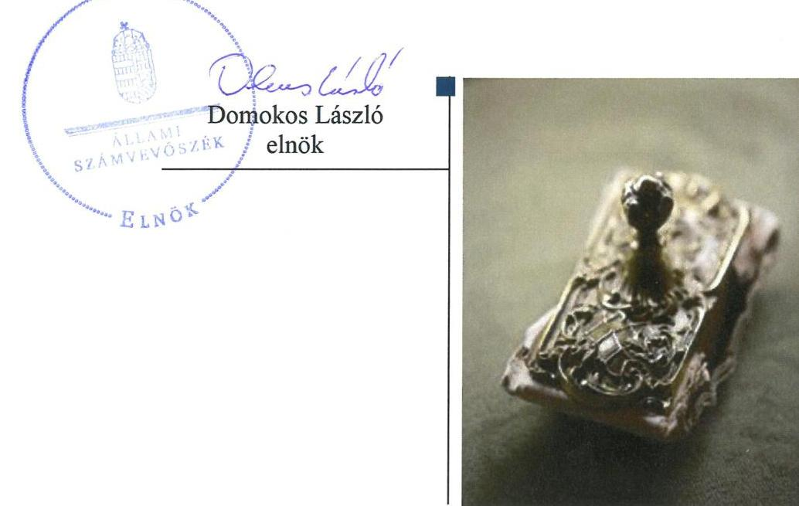
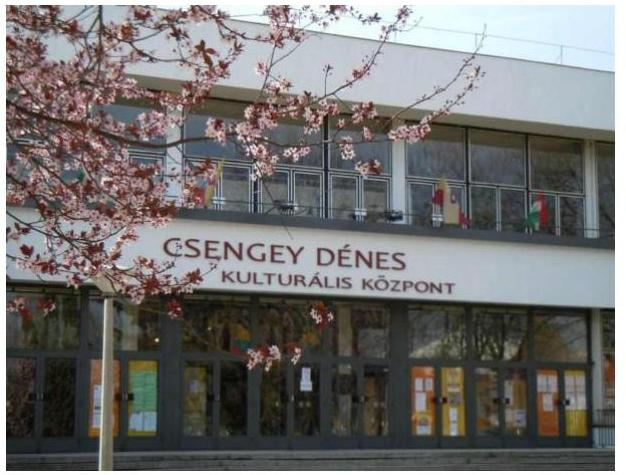
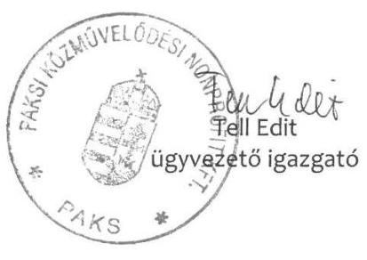
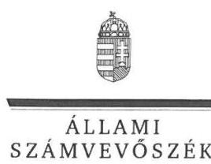
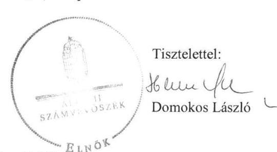

# Jelentés 

## Az önkormányzatok gazdasági társaságai

Az önkormányzatok többségi tulajdonában lévő gazdasági társaságok gazdálkodásának ellenőrzése - Paksi Közművelődési Közhasznú Nonprofit Korlátolt Felelősségű Társaság
2018.

---

# Jelentés 

## Az önkormányzatok gazdasági társaságai

Az önkormányzatok többségi tulajdonában lévő gazdasági társaságok gazdálkodásának ellenőrzése - Paksi Közművelődési Közhasznú Nonprofit Korlátolt Felelősségű Társaság
2018. 11. hó 21. nap

---

# AZ ELLENŐRZÉST FELÜGYELTE:

DR. HORVÁTH MARGIT felügyeleti vezető

## AZ ELLENŐRZÉST VEZETTE ÉS A VÉGREHAJTÁSÁÉRT FELELŐS:

GÖRGÉNYI GÁBOR ellenőrzésvezető

## A PROGRAM ÖSSZEÁLLÍTÁSÁÉRT FELELŐS:

TÓTPÁL SZABOLCS osztályvezető

IKTATÓSZÁM: EL-0477-067/2018.

TÉMASZÁM: 2447

ELLENŐRZÉS-AZONOSÍTÓ SZÁM: V079349

Jelentéseink az Országgyűlés számítógépes hálózatán és az Interneta a www.asz.hu címen is olvashatóak.

---

# TARTALOMJEGYZÉK 

■ ÖSSZEGZÉS ..... 5
■ AZ ELLENŐRZÉS CÉLJA ..... 6
■ AZ ELLENŐRZÉS TERÜLETE ..... 7
■ AZ ELLENŐRZÉS HÁTTERE, INDOKOLTSÁGA ..... 9
■ A JELENTÉS LÉNYEGES KÉRDÉSKÖREI ..... 10
■ AZ ELLENŐRZÉS HATÓKÖRE ÉS MÓDSZEREI ..... 11
■ MEGÁLLAPÍTÁSOK ..... 13
■ JAVASLATOK ..... 16
■ MELLÉKLETEK ..... 19
I. sz. melléklet: Értelmező szótár ..... 19
II. sz. melléklet: Pénzügyi adatok ..... 20
■ FÜGGELÉK: ÉSZREVÉTELEK ..... 21
■ RÖVIDÍTÉSEK JEGYZÉKE ..... 27

---

.

---

# ÖSSZEGZÉS 

A Paksi Közművelődési Közhasznú Nonprofit Kft. gazdálkodásának szabályozottsága nem felelt meg a jogszabályi előírásoknak, a Társaság gazdálkodása és a vagyongazdálkodási tevékenysége nem volt szabályszerű. A Társaságnál a közvagyonnal való felelős gazdálkodás, a vagyonnal való elszámoltathatóság és a közpénzek felhasználásának átláthatósága nem volt biztositott.

## Az ellenőrzés társadalmi indokoltsága

Magyarországon az önkormányzatok kötelező és önként vállalt feladataik vonatkozásában is egyre szélesebb körben alkalmazzák a költségvetésen kívüli feladatellátást. Helyi szinten ennek legfontosabb szereplői az önkormányzati tulajdonban lévő gazdasági társaságok, amelyek ellenőrzése kiemelten fontos a közfeladat ellátása, a közvagyon megőrzése, megóvása érdekében. Alapvető követelmény tehát, hogy múködésük, gazdálkodásuk szabályszerű legyen.

Az Állami Számvevőszék kiemelt célja, hogy a helyi önkormányzatok gazdálkodásában rejlő pénzügyi kockázatok feltárásával, az államháztartáson kívülre nyújtott költségvetési támogatások és ingyenes vagyonjuttatások, valamint az államháztartáson kívül múködő feladatellátó rendszerek ellenőrzéseivel hozzájáruljon ahhoz, hogy a közpénzeket az államháztartáson kívül múködő szervezetek is átlátható, rendezett módon használják fel.

Az Állami Számvevőszék céljaival és a társadalmi igénnyel összhangban, valamint a gazdasági társaságok fontos szerepe miatt került sor a Paksi Közművelődési Közhasznú Nonprofit Kft. ellenőrzésére. Paks városában a közösségi, kulturális és múvelődési szolgáltatásokon, rendezvényeken keresztül a helyi lakosságon kívül a városba látogatók is kapcsolatba kerültek a Társasággal.

## Főbb megállapítások, következtetések, javaslatok

Paks Város Önkormányzatánál a tulajdonosi joggyakorlás szabályszerű volt, ugyanakkor elmaradt a Felügyelőbizottság ügyrendjének és a Társaság javadalmazási szabályzatának megalkotása.

A Paksi Közművelődési Közhasznú Nonprofit Kft. gazdálkodásának szabályozottsága nem felelt meg a jogszabályi előírásoknak, mert nem rendelkezett számviteli politikával és az annak keretében elkészítendő belső szabályzatokkal. A Társaság nem szabályozta a közérdekú adatok közzétételének rendjét.

A számviteli szabályozás hiánya, valamint a gazdasági eseményeket alátámasztó bizonylatok hiányosságai, illetve hiánya miatt a Társaság gazdálkodási és vagyongazdálkodási tevékenysége nem volt szabályszerű, valamint a beszámolóinak alátámasztottsága sem volt biztosított. A Társaság az egyszerűsített éves beszámolók mérlegadatait nem támasztotta alá leltárral. A Társaság nem felelt meg az Alaptörvényben foglalt elszámoltathatóság és átláthatóság követelményének. A Társaság a közzétételi kötelezettségét nem teljesítette, a közérdekú adatait pedig nem hozta nyilvánosságra.

Kormányzati szektorba sorolt szervezetként a Társaság nem tett eleget az államháztartásért felelős miniszter részére teljesítendő adatszolgáltatási kötelezettségének és nem alakította ki a szervezet tevékenységének, a célok megvalósításának nyomon követését biztosító rendszert.

Az Állami Számvevőszék a Társaság ügyvezetőjének 9, a polgármesternek 3 javaslatot fogalmazott meg a gazdálkodási és vagyongazdálkodási tevékenység javítása érdekében.

---

# AZ ELLENŐRZÉS CÉLJA 

AZ ELLENŐRZÉS CÉLJA annak értékelése volt, hogy az önkormányzat vagyongazdálkodási tevékenysége során szabályszerűen gyakorolta-e tulajdonosi jogait; a gazdasági társaság szabályozottsága, gazdálkodása és vagyongazdálkodási tevékenysége, bevételeinek és ráfordításainak elszámolása megfelel-e a jogszabályi és tulajdonosi előírásoknak; a gazdasági társaság kötelezettségállománya jelent-e kockázatot a múködésre, valamint a gazdálkodás átláthatósága és elszámoltathatósága biztosított volt-e. Az ellenőrzés célja továbbá annak megítélése volt, hogy a kormányzati szektorba sorolt önkormányzati tulajdonban lévő gazdálkodó szervezet gazdálkodásának a kormányzati szektor hiányára és az államadósságra befolyással bíró elemei a jogszabályi előírásoknak megfeleltek-e.

---

# **AZ ELLENŐRZÉS TERÜLETE**

## **Paks Város Önkormányzata és a kizárólagos tulajdonában lévő Paksi Közművelődési Közhasznú Nonprofit Kft.**

Paks Város Önkormányzata 2009. május 4-én alapította a 100%-os tulajdonában lévő Paksi Közművelődési Közhasznú Nonprofit Kft.-t.

A polgármester¹ személyében a 2014. évi önkormányzati választásokat követően változás történt, a jegyző² személye az ellenőrzött időszakban nem változott.

A Társaság³ a székhelyén túl három telephellyel rendelkezett, közhasznú tevékenysége keretében az Önkormányzattal⁴ kötött közművelődési feladat-ellátási és finanszírozási szerződés (továbbiakban: Feladat-ellátási szerződés⁵) alapján színművészeti és ismeretterjesztő előadások, filmvetítések, olvasótáborok, tanfolyamok, kiállítások, rendezvények, nyári szabadidős programok és táborok szervezését végezte, működtette az ifjúsági információs irodát, valamint kulturális központot, faluházat, erdei iskolát, napközis és gyermektábort üzemeltetett. A Társaság vállalkozási tevékenység keretében reklámtevékenységet, illetve fénymásolást és egyéb irodai szolgáltatást látott el.

A Társaság vezetését 2016. január 31-ig két Ügyvezető⁶ látta el, a szakmai és a gazdasági területek szerint elválasztott feladatmegosztásukat az Alapító okirat1,2⁷ tartalmazta. A vezetői feladatokat 2016. február 1-jétől egy ügyvezető látta el. Az ügyvezetést háromtagú Felügyelőbizottság⁸ ellenőrizte. A Társaság nem volt könyvvizsgálatra kötelezett, de független könyvvizsgáló ellenőrizte a működését.

A Társaság 2013-2016. évi gazdálkodásának néhány jellemző adatát az 1. táblázat, az egyszerűsített éves beszámolók részletesebb adatait a II. sz. melléklet tartalmazza.

1. táblázat

|  A TÁRSASÁG FŐBB GAZDÁLKODÁSI ADATAI 2013-2016. ÉVEKBEN |  |  |  |   |
| --- | --- | --- | --- | --- |
|  Összes (M Ft) | 2013. | 2014. | 2015. | 2016.  |
|  Nettó értékesítés árbevétele | 39,0 | 54,1 | 44,0 | 40,8  |
|  Üzemi tevékenység eredménye | 0,4 | 14,4 | 6,7 | -0,2  |
|  Adózott eredmény | 1,2 | 15,5 | 6,7 | 3,1  |
|  Fő | 2013. | 2014. | 2015. | 2016.  |
|  Foglalkoztatottak száma (átlagos állományi létszám) | 23 | 23 | 23 | 23  |

*Forrás: A Társaság 2013-2016. évi egyszerűsített éves beszámolói*

A Társaság a 2013-2016. években nyereségesen gazdálkodott, saját tőkéje folyamatosan nőtt. A vállalkozási tevékenységből származó bevételek 2013-ban a nettó árbevétel 4,6%-át, míg 2016-ban annak 7,2%-át tették ki.

Az Önkormányzat a Társaság feladatellátásához a 2013-2016. években 96,8 M Ft; 100,0 M Ft; 107,5 M Ft; 130,7 M Ft, összesen 435,0 M Ft támogatást nyújtott.

---

Az Áht. ${ }^{9}$ alapján közétett, a kormányzati szektorba sorolt egyéb szervezetekről szóló NGM közlemény ${ }_{1-3}{ }^{10}$ alapján a Társaság 2013. június 28 -tól kormányzati szektorba sorolt szervezetnek minősült. Ebből eredően 2015. július 7-ig a Bkr. 1. § (2) bekezdés e) pontja, illetve 2015. július 8 -tól annak d) pontja, valamint az 54/A. §-a alapján a Társaság 2014. január 1-től a Bkr. 1-10. § hatálya alá tartozott.

A Társaság a Stabilitási tv. ${ }^{11}$-ben meghatározott adósságot keletkeztető ügyletet nem kötött, államadósságot befolyásoló kötelezettsége nem keletkezett. A Társaság nem rendelkezett más gazdasági társaságokban tulajdonosi részesedéssel. A Társaság a Számv. tv. ${ }^{12}$ alapján nem volt önköltségszámításra kötelezett. A Társaság által végzett szolgáltatások vonatkozásában az Önkormányzatnak nem volt díj-meghatározási kötelezettsége. A Társaság vagyonkezelésbe vett állami, vagy önkormányzati vagyonnal nem rendelkezett, tevékenységét saját vagyonával látta el.

---

# AZ ELLENŐRZÉS HÁTTERE, INDOKOLTSÁGA 

AZ ÖNKORMÁNYZATOK TÖBBSÉGI TULAJDONÁBAN ÁLLÓ GAZDASÁGI TÁRSASÁGOK ellenőrzése kiemelten fontos a vagyon megőrzése, megóvása érdekében, valamint a kormányzati szektor elszámolásaiban megjelenő önkormányzati tulajdonú gazdálkodó szervezetek esetében, amelyekkel szemben alapvető követelmény, hogy gazdálkodásuk, működésük szabályszerű, az általuk szolgáltatott adatok minél megbízhatóbbak legyenek. A feladatellátás költségeinek, ráfordításainak alakulása a lakosság széles rétegét érinti. Ellenőrzéseink feltárhatják, hogy az önkormányzat a feladatellátásához rendelt vagyon működtetését a tulajdonostól elvárható gondossággal végezte-e, a feladatot ellátó gazdasági társaság a létesítő okiratban, szolgáltatási szerződésben foglaltak betartásával biztosította-e a feladat ellátását. Az ellenőrzés eredményeképp meghatározhatóvá válnak a költségvetési hiányt befolyásoló szervezetek kockázatai, lehetővé válik ezen kockázatok csökkentése. Az ellenőrzés rávilágíthat arra, hogy a gazdasági társaság a vagyon használatával biztosította-e a szolgáltatás folytatásának feltételeit, az önkormányzat tulajdonosi felügyelete hozzájárult-e a szabályszerű gazdálkodáshoz és feladatellátáshoz. A megállapítások alapján megfogalmazott számvevőszéki javaslatok hasznosítása elősegítheti a meglévő hibák megszüntetését. A jó gyakorlatok bemutatásával az ÁSZ ${ }^{13}$ hozzájárulhat a követendő megoldások megismertetéséhez, terjesztéséhez.

---

# A JELENTÉS LÉNYEGES KÉRDÉSKÖREI 

1.     - Az Önkormányzat tulajdonosi joggyakorlása szabályszerű volt-e?
2.     - A Társaság müködésének szabályozottsága megfelelt-e a jogszabályi előírásoknak, a gazdálkodási tevékenysége szabályszerű volt-e?
3.     - A Társaság vagyongazdálkodási tevékenysége szabályszerű volt-e?

---

# AZ ELLENŐRZÉS HATÓKÖRE ÉS MÓDSZEREI 

## Az ellenőrzés típusa

Megfelelőségi ellenőrzés.

## Az ellenőrzött időszak

2013. január 1-jétől 2016. december 31-ig tartó időszak.

## Az ellenőrzés tárgya

Paks Város Önkormányzata 100\%-os tulajdonában álló Paksi Közművelődési Közhasznú Nonprofit Kft. feletti tulajdonosi joggyakorlása, valamint a Társaság gazdálkodásának szabályozottsága és szabályszerűsége, továbbá a Társaság gazdálkodásának a kormányzati szektor hiányára és az államadósságra befolyással bíró elemei.

Az ellenőrzés kiterjedt minden olyan körülményre és adatra, amely az ÁSZ jogszabályban meghatározott feladatainak teljesítéséhez, valamint a program végrehajtása folyamán felmerült újabb összefüggések feltárásához szükséges.

## Az ellenőrzött szervezet

Paks Város Önkormányzata, valamint a Paksi Közművelődési Közhasznú Nonprofit Kft.

## Az ellenőrzés jogalapja

Az ellenőrzés jogszabályi alapját az az Állami Számvevőszékről szóló 2011. évi LXVI. törvény 1. § (3) bekezdése és 5. § (3)-(5) bekezdései képezik.

## Az ellenőrzés módszerei

Az ellenőrzést a nemzetközi standardokat irányadónak tekintve az ellenőrzési program ellenőrzési kérdései, az ellenőrzött időszakban hatályos jogszabályok, az ellenőrzés szakmai szabályok és módszertanok figyelembe vételével végeztük.

Az ellenőrzés ideje alatt az ellenőrzött szervezettel történő kapcsolattartást az ÁSZ Szervezeti és Működési Szabályzatának vonatkozó előírásai alapján biztosítottuk.

---

Az ellenőrzési kérdések megválaszolásához szükséges bizonyítékok megszerzése a következő ellenőrzési eljárások alkalmazásával történt: megfigyelés, kérdésfeltevés (információkérés), összehasonlítás, valamint elemző eljárás. Az ellenőrzési bizonyítékként felhasználható adatforrások közé tartoztak egyrészt az ellenőrzési programban felsorolt adatforrások, másrészt adatforrás lehetett még minden - az ellenőrzés folyamán - feltárt, az ellenőrzés szempontjából információkat tartalmazó dokumentum. Az ellenőrzést a kérdésekre adott válaszok kiértékelésével, valamint a megjelölt adatforrások, a csatolt tanúsítványok felhasználásával, továbbá az adott időszakban hatályos jogszabályok figyelembe vételével folytattuk le.

A bevételek és ráfordítások elszámolását, és a vagyonnyilvántartás terén a szabályszerű működést véletlen mintavétellel ellenőriztük. A mintavétellel ellenőrzött területek esetében minden egyes tétel vonatkozásában szabályszerűségre vonatkozó kérdéseket tettünk fel, amelyek a számviteli törvény, illetve a tulajdonosi követelményeknek és az ellenőrzött szervezet belső szabályozásai előírásainak betartására vonatkoztak. A jogszabályoknak és a belső előírásoknak megfelelőnek tekintettük az adott területet, amennyiben a minta ellenőrzésének eredménye alapján 95\%-os bizonyossággal a teljes sokaságban a hibaarány kisebb volt, mint 10\%, nem megfelelőnek értékeltük, ha a hibaarány a 10\%-ot meghaladta. A ráfordítások elszámolására és a vagyonnyilvántartásra vonatkozó véletlen mintavételt kockázati alapú kiválasztással egészítettük ki, amelynek során évente a három legnagyobb összegű tételt választottuk ki.

---

# 1. Az Önkormányzat tulajdonosi joggyakorlása szabályszerű volt-e? 

## Összegző megállapítás

Az Önkormányzat a tulajdonosi joggyakorlás kereteit a Vagyonrende-let ${ }_{1-2}{ }^{14}$, a Közművelődési rendelet ${ }_{1-2}{ }^{15}$ és az Alapító okirat ${ }_{1-2}$ útján, szabályszerűen alakította ki.

A Közműv. tv. ${ }^{16}$ előírásainak megfelelően a Közművelődési rendelet ${ }_{1-2}$ szabályozta a helyi közművelődési feladatok ellátásának formáját, módját és mértékét. A Közművelődési rendelet ${ }_{1-2}$ szerinti közművelődési feladatok ellátására az Alapító ${ }^{17}$ Feladat-ellátási szerződést kötött a Társasággal. Az Alapító az Alapító okirat ${ }_{1-2}$-ben, illetve a Társasági SZMSZ ${ }_{1-2}{ }^{18}$-ben szakmai beszámoló készítését, illetve üzleti terv végrehajtását, ezzel közvetve annak készítését írta elő a Társaságnak.

Az Alapító a Gt. ${ }^{19} 34$. § (4) és a Ptk. ${ }^{20}$ 3:122. § (3) bekezdésében foglaltak ellenére nem hagyta jóvá a Felügyelőbizottság ügyrendjét, továbbá a Taktv. ${ }^{21}$ 5. § (3) bekezdésében foglaltak ellenére nem alkotott szabályzatot a Társaságnál a vezető tisztségviselők, felügyelőbizottsági tagok, valamint az Mt. 208. §-ának hatálya alá eső munkavállalók javadalmazása, valamint a jogviszony megszűnése esetére biztosított juttatások módjának, mértékének elveiről, annak rendszeréről.

A Társaság egyszerűsített éves beszámolóit az Alapító okirat ${ }_{1-2}$ és a Társasági SZMSZ ${ }_{1-2}$ alapján alapítói határozatokkal fogadták el. Az egyszerűsített éves beszámolók elfogadásához a könyvvizsgálói jelentések és a Felügyelőbizottság írásbeli jelentései rendelkezésre álltak.

Az Önkormányzat nem élt az Áht. alapján biztosított ellenőrzési lehetőségével a Társaság vonatkozásában.

## 2. A Társaság müködésének szabályozottsága megfelelt-e a jogszabályi előírásoknak, a gazdálkodási tevékenysége szabályszerű volt-e?

Összegző megállapítás

A Társaság szabályozottsága nem felelt meg a jogszabályi előírásoknak. A gazdálkodási tevékenység nem volt szabályszerű. A Társaság a beszámolási kötelezettségét teljesítette, a közzétételi és adatszolgáltatási kötelezettségének azonban nem tett eleget.

A TÁRSASÁG SZABÁLYOZOTTSÁGA nem felelt meg a jogszabályi előírásoknak. A Társaság a Számv. tv. 14. § (3) pontjában foglaltak ellenére nem rendelkezett számviteli politikával és annak keretében a Számv. tv. 14. § (5) bekezdés a), b) és d) pontjában foglaltak ellenére nem

---

készítette el az eszközök és a források leltárkészítési és leltározási szabályzatát, az eszközök és a források értékelési szabályzatát, valamint a pénzkezelési szabályzatot; továbbá a Számv. tv. 161. § (1) bekezdésében foglaltak ellenére nem rendelkezett számlarenddel, ezáltal nem biztosította a szabályszerű könyvvezetés feltételeinek kialakítását.

A Társaság a közhasznúsági mellékletek elkészítéséhez a Számv. tv. 161/A. § (2) bekezdésében foglaltak ellenére nem részletezte tovább a közhasznú és vállalkozási tevékenységéből származó bevételei és ráfordításai elkülönített könyvelésének szabályait.

# A BEVÉTELEK ÉS RÁFORDÍTÁSOK ELSZÁMOLÁSA a gazdálkodásra vonatkozó belső szabályozás Számv. tv.-t sértő hiánya, valamint a gazdasági eseményeket alátámasztó bizonylatok hiányosságai, illetve hiánya miatt nem volt szabályszerű. A Társaság a Számv. tv. 165. § (2) bekezdéseiben foglaltak ellenére nem rendelkezett a gazdasági eseményeket alátámasztó számviteli bizonylattal, illetve a meglévő bizonylatok adatai a Számv. tv. 166. § (2) bekezdésében foglalt előírásokkal ellentétben nem támasztották alá a bevételek és ráfordítások számviteli elszámolását, mert alakilag és tartalmilag nem voltak hitelesek és helytállóak.

A számviteli szabályozás hiánya, valamint a gazdasági eseményeket alátámasztó bizonylatok hiányosságai, illetve hiánya miatt a Társaság beszámolóinak alátámasztottsága sem volt biztosított. A Társaság a Számv. tv.-t sértő egyszerűsített éves beszámolóit benyújtotta jóváhagyásra az Alapító részére, az elfogadást követően azokat határidőben letétbe helyezte és közzétette.

## A KÖTELEZŐEN KÖZZÉTEENDŐ KÖZÉRDEKŰ ADATOKAT a Társaság az Info tv. ${ }^{22}$ 33. § (1) bekezdésében és a 37. §

(1) pontjában előírtak ellenére nem tette hozzáférhetővé, mert az Info tv. 1. melléklete szerinti, a szervezetre, annak tevékenységére és gazdálkodásra vonatkozó adatokat nem tette közzé. Nem tette közzé továbbá a Taktv. 2. § (1)-(3) bekezdéseiben előírt személyi és gazdálkodási adatokat sem. A Társaság, mint adatfelelős az Info tv. 35. § (3) bekezdésében foglaltak ellenére a közzétételi kötelezettség teljesítésének részletes szabályait belső szabályzatban nem állapította meg.

## KORMÁNYZATI SZEKTORBA SOROLT EGYÉB

SZERVEZETKÉNT a Társaság az Áht. 107. § (1) bekezdése és az Ávr. ${ }^{23}$ 167/M § (1) bekezdésében foglaltak ellenére 2014. december 31-ig az Ávr. 7. számú melléklet 28., 29. és 34. pontjaiban, illetve 2015. január 1től az Ávr. 5. számú melléklet 23, 24 és 27. pontjaiban előírt, az államháztartásért felelős miniszter részére teljesítendő adatszolgáltatási kötelezettségének nem tett eleget.

A Társaság 2014. január 1-től a Bkr. 10. §-ában és 54/A. §-ában foglaltak ellenére nem alakította ki a szervezet tevékenységének, a célok megvalósításának nyomon követését biztosító rendszert.

---

# 3. A Társaság vagyongazdálkodási tevékenysége szabályszerű volt-e? 

Összegző megállapítás

A Társaság vagyongazdálkodási tevékenysége nem volt szabályszerű.

A TÁRSASÁG AZ EGYSZERŰSÍTETT ÉVES BESZÁMOLÓI MÉRLEGTÉTELEIT a Számv. tv. 69. § (1) bekezdésében foglaltak ellenére a törvénynek megfelelő leltárral nem támasztotta alá, mert az tételesen és ellenőrizhető módon nem tartalmazta a mérleg fordulónapján meglévő eszközöket és forrásokat. Ebből eredően a mérlegtételek vonatkozásában nem érvényesült a Számv. tv. 15. § (3) bekezdésében foglalt valódiság elve. A leltár hiánya ellenére a könyvvizsgáló a beszámolót korlátozás nélküli hitelesítő záradékkal látta el.

A VAGYONNYILVÁNTARTÁS ÉS AZ ÉRTÉKCSÖKKENÉS elszámolása a gazdálkodásra vonatkozó belső szabályozás Számv. tv.-t sértő hiánya, valamint a gazdasági eseményeket alátámasztó bizonylatok hiányosságai, illetve hiánya miatt nem volt szabályszerű. A Társaság a Számv. tv. 165. § (2) bekezdéseiben foglaltak ellenére nem rendelkezett a gazdasági eseményeket alátámasztó számviteli bizonylattal, illetve a meglévő bizonylatok a Számv. tv. 166. § (2) bekezdésében foglalt előírásokkal ellentétben nem támasztották alá a vagyonelemek nyilvántartásba vételét, valamint az értékcsökkenés elszámolását, mert a bizonylatok adatai alakilag és tartalmilag nem voltak hitelesek és helytállóak.

---

# JAVASLATOK 

Az ÁSZ tv. 33. § (1) bekezdésében foglaltak értelmében az ellenőrzött szervezet vezetője köteles a jelentésben foglalt megállapításokhoz kapcsolódó intézkedési tervet összeállítani és azt a jelentés kézhezvételétől számított 30 napon belül az ÁSZ részére megküldeni. Amennyiben az ellenőrzött szervezet vezetője nem küldi meg határidőben az intézkedési tervet, vagy továbbra sem elfogadható intézkedési tervet küld, az Állami Számvevőszék elnöke az ÁSZ tv. 33. § (3) bekezdése a) és b) pontjaiban foglaltakat érvényesítheti.

## Paksi Közművelődési Közhasznú Nonprofit Kft. ügyvezetőjének

1. Intézkedjen a számviteli politikának, az eszközök és a források leltárkészittési és leltározási és értékelési szabályzatának, valamint a pénzkezelési szabályzatnak, illetve a számlarendnek a hatályos Számv. tv. előírásainak megfelelő elkészítéséről.
(2. sz. megállapítás 1. bekezdése alapján)
2. Gondoskodjon a Társaság nyilvántartási (könyvvezetési) rendszerének Számv. tv előírásainak megfelelő kialakításáról és vezetéséről.
(2. sz. megállapítás 2. bekezdése alapján)
3. Intézkedjen a bevételek és a ráfordítások szabályszerű elszámolásáról a Számv. tv. előírásainak megfelelően.
(2. sz. megállapítás 3. bekezdése alapján)
4. Intézkedjen az Info tv. és a Taktv. előírásai szerint közérdekü, valamint a közérdekből nyilvános adatok közzétételére vonatkozó kötelezettség teljesítése érdekében.
(2. sz. megállapítás 5. bekezdés 1. és 2. mondata alapján)
5. Intézkedjen a közzétételi kötelezettség teljesítése részletes szabályainak megállapításáról az Info tv. előírásainak megfelelően.
(2. sz. megállapítás 5. bekezdés 3. mondata alapján)
6. Intézkedjen az Áht. és az Ávr. előírásai szerinti adatszolgáltatási kötelezettségek teljesítése érdekében.
(2. sz. megállapítás 6. bekezdése alapján)

---

7. Intézkedjen a Bkr. előírásai alapján a szervezet tevékenységének, a célok megvalósításának nyomon követését biztosító rendszer kialakításáról.
(2. sz. megállapítás 7. bekezdése alapján)
8. Intézkedjen az éves beszámoló mérlegtételeinek leltárral való alátámasztásáról a Számv. tv. előírásainak megfelelően.
(3. sz. megállapítás 1. bekezdés 1-2. mondata alapján)
9. Intézkedjen a vagyonelemek szabályszerű nyilvántartásba vételéről, valamint az értékcsökkenés elszámolásáról a Számv. tv. előírásainak megfelelően.
(3. sz. megállapítás 2. bekezdése alapján)

# Paks Város Önkormányzata polgármesterének 

1. Kezdeményezze az Alapítónál a Társaság felügyelőbizottsága ügyrendjének jóváhagyását a Ptk.-ban elöirtaknak megfelelően.
(1. sz. megállapítás 3. bekezdés 1. tagmondata alapján)
2. Intézkedjen a jogszabályban elöirt, a vezető tisztségviselők, felügyelőbizottsági tagok, valamint az Mt. 208 §-ának hatálya alá eső munkavállalók javadalmazására, valamint a jogviszony megszünése esetére biztosított juttatások módjának, mértékének elveiről, annak rendszeréről szóló szabályzat megalkotásáról.
(1. sz. megállapítás 3. bekezdés 2. tagmondata alapján)

---

3. Intézkedjen
a) a könyvvezetés szabályszerű kialakítását, valamint az elkülönített nyilvántartás vezetését biztosító számviteli szabályozás hiánya,
b) a közzétételi kötelezettség teljesitésének hiányosságai,
c) a közzétételi kötelezettség teljesitésének részletes szabályait rögzítő szabályzat elkészitésének elmulasztása,
d) a bevételek, és ráfordításoknak elszámolásának, valamint a vagyonelemek nyilvántartásának szabálytalanságai hiányosságai,
e) a leltár hiányosságai,
f) a kormányzati szektorba sorolt szervezetek számára elöirt kötelezettségek (adatszolgáltatás, nyomon követési rendszer) teljesitésének elmulasztása
miatti felelősség tisztázása érdekében, és szükség szerint intézkedjen a felelősség érvényesitéséről.
(2. sz. megállapítás 1-3. bekezdései, 5-7. bekezdései; 3. sz. megállapítás 1-2. bekezdései alapján)

---

# MELLÉKLETEK 

- I. SZ. MELLÉKLET: ÉRTELMEZŐ SZÓTÁR
gazdasági társaság
gazdálkodó szervezet
kormányzati szektorba sorolt egyéb szervezet
nemzeti vagyon
nonprofit gazdasági társaság

Ptk. 3:88. § (1) bekezdése szerint „a gazdasági társaságok üzletszerű közös gazdasági tevékenység folytatására, a tagok vagyoni hozzájárulásával létrehozott, jogi személyiséggel rendelkező vállalkozások, amelyekben a tagok a nyereségből közösen részesednek, és a veszteséget közösen viselik".
A Ptk. 685. § c) pontja szerint gazdálkodó szervezet: „az állami vállalat, az egyéb állami gazdálkodó szerv, a szövetkezet, a lakásszövetkezet, az európai szövetkezet, a gazdasági társaság, az európai részvénytársaság, az egyesülés, az európai gazdasági egyesülés, az európai területi együttmúködési csoportosulás, az egyes jogi személyek vállalata, a leányvállalat, a vízgazdálkodási társulat, az erdő birtokossági társulat, a végrehajtói iroda, az egyéni cég, továbbá az egyéni vállalkozó." (2014. 03.15-ig hatályos)
az Áht. 3. § (2) és (3) bekezdésében foglaltakon kívül az Európai Közösséget létrehozó szerződéshez csatolt, a túlzott hiány esetén követendő eljárásról szóló jegyzőkönyv alkalmazásáról szóló 2009. május 25-i 479/2009/EK rendelet (a továbbiakban: 479/2009/EK rendelet) szerint a kormányzati szektorba sorolt szervezet (Áht. 1. § (12))
Nvtv. ${ }^{24}$ 1. § (2) bekezdése szerint többek között:
„az állam vagy a helyi önkormányzat kizárólagos tulajdonában álló dolgok, az a) pont hatálya alá nem tartozó, állam vagy a helyi önkormányzat tulajdonában lévő dolog,
az állam vagy a helyi önkormányzat tulajdonában lévő pénzügyi eszközök, továbbá az államot vagy a helyi önkormányzatot megillető társasági részesedések, az államot vagy a helyi önkormányzatot megillető bármely vagyoni értékkel rendelkező jogosultság, amelyet jogszabály vagyoni értékű jogként nevesít."
A cégnyilvánosságról, bírósági eljárásról és végelszámolásról szóló 2006. évi V. törvény 9/F. § (2) bekezdése szerint „az a gazdasági társaság minősül nonprofit gazdasági társaságnak és cégnevében az a gazdasági társaság tüntetheti fel a nonprofit jelleget, amelynek létesítő okirata tartalmazza, hogy a gazdasági társaság tevékenységéből származó nyereség a tagok között nem osztható fel, hanem az a gazdasági társaság vagyonát gyarapítja." (hatályos 2014. március 15-től)

---

# A PAKSI KÖZMŰVELŐDÉSI KÖZHASZNÚ NONPROFIT KFT. EGYSZERÜSÍTETT ÉVES BESZÁMOLÓINAK ADATAI (M Ft)

|  Eredménykimutatás | 2013. év | 2014. év | 2015. év | 2016. év  |
| --- | --- | --- | --- | --- |
|  Értékesítés nettó árbevétele | 39,0 | 54,1 | 44,0 | 40,8  |
|  Egyéb bevételek | 104,0 | 120,1 | 114,7 | 132,8  |
|  Anyagjellegú ráfordítások | 71,7 | 77,9 | 82,6 | 90,9  |
|  Személyi jellegú ráfordítások | 69,6 | 80,4 | 66,5 | 79,4  |
|  Értékcsökkenési leírás | 1,1 | 1,1 | 2,7 | 3,3  |
|  Egyéb ráfordítások | 0,3 | 0,3 | 0,3 | 0,2  |
|  Üzemi tevékenység eredménye | 0,4 | 14,4 | 6,7 | $-0,2$  |
|  Mérleg szerint eredmény/Adózott eredmény* | 1,2 | 15,5 | 6,7 | 3,1  |

* Forrás: a Társaság. 2013-2016. évi egyszerűsített éves beszámolói

[^0] [^0]: * A 2013-2015. években az adózott eredmény és a mérleg szerinti eredmény megegyezett. A Számv. tv. 2015. július 4-től hatályos módosítása alapján a mérleg szerinti eredmény tétel megszűnt. A 2016. évi egyszerűsített éves beszámoló eredménykimutatásában az adózott eredmény levezetését kellett kimutatni

---

# FÜGGELÉK: ÉSZREVÉTELEK 

A jelentéstervezetet a Számvevőszék 15 napos észrevételezésre megküldte az ellenőrzött szervezet vezetőjének az ÁSZ tv. 29. §* (1) bekezdése előírásának megfelelően.

A Paksi Közművelődési Közhasznú Nonprofit Korlátolt Felelősségű Társaság ügyvezetője az ÁSZ tv. 29. § (2) bekezdésében foglalt észrevételezési jogával élt. Az észrevételt és az arra adott választ a függelék tartalmazza.
Paks Város Önkormányzata polgármestere az ÁSZ tv. 29. § (2) bekezdésében foglalt észrevételezési jogával nem élt.

[^0]
[^0]:    * 29. § (1) Az Állami Számvevőszék az ellenőrzési megállapításait megküldi az ellenőrzött szervezet vezetőjének vagy az általa megbízott személynek, és annak, akinek személyes felelősségét állapította meg.
    (2) Az ellenőrzött szervezet vezetője és a felelősként megjelölt személy az ellenőrzés megállapításaira tizenöt napon belül írásban észrevételt tehet.
    (3) Az Állami Számvevőszék az észrevételre a beérkezésétől számított harminc napon belül írásban válaszol. A figyelembe nem vett észrevételeket köteles a jelentésben feltüntetni, és megindokolni, hogy azokat miért nem fogadta el.

---

Állami Számvevőszék
Dr. Horváth Margit
felügyeleti vezető asszony részére

Budapest
Apáczal Csere János utca 10.
1052

# Tisztelt Dr. Horváth Margit! 

Az Állami Számvevőszék által küldött, a Paksi Közművelődési Közhasznú Nonprofit Korlátolt Felelősségű Társaságra vonatkozó, 2018. július 24-én kézhezvett jelentéstervezet előzményei:

Az Állami Számvevőszék 2017-ben megfelelőségi ellenőrzést tartott a Paksi Közművelődési Közhasznú Nonprofit Korlátolt Felelősségű Társaságnál. Az ellenőrzött időszak a 2013. január 1-től 2016. december 31-ig tartó időszak volt. Az ellenőrzés kiterjedt minden olyan körülményre és adatra, amely az Állami Számvevőszék jogszabályban meghatározott feladatainak teljesítéséhez, valamint a program végrehajtása folyamán felmerült, újabb összefüggések feltárásához szükséges. Az ellenőrzés szabályszerűségi kérdései arra irányultak, hogy a Társaság a feladatainak ellátása során betartotta-e a jogszabályok, a belső szabályzatok és a tulajdonosi joggyakorló előírásait.

Az ellenőrzés lényeges megállapításai a következők voltak:

- A Társaság gazdálkodásának szabályozottsága nem felelt meg a jogszabályi előírásoknak, - a Társaság gazdálkodása és vagyongazdálkodási tevékenysége nem volt szabályszerű, ezáltal a Társaságnál a közvagyonnal való felelős gazdálkodás, a vagyonnal való elszámoltathatóság és a közpénzek felhasználásának átláthatósága nem volt biztosított.

E lényeges megállapításokra az alábbi észrevételeket, kiegészítéseket teszem.

- A Társaság ügyvezetői feladatait 2016. február 1-től látom el. A Társaság szabályos müködésével, gazdasági szabályozottságával kapcsolatban 2018-ra az alábbi szabályzatok készültek el:
- Bizonylati rend
- Felesleges vagyontárgyak hasznosításának és selejtezésének szabályzata
- Gazdálkodási szabályzat
- Leltárkészítési és leltározási szabályzat
- Pénzkezelési szabályzat
- Számviteli politika és értékelési szabályzat (szöveges számlakerettel)

---

- A Nemzeti Adatvédelmi és Információszabadság Hatóság megkeresése okán és ellenőrzése után Társaságunk megkezdte a közérdekű adatok közzétételével kapcsolatos kötelező feladatainak teljesítését is. Társaságunk weboldalának nyitó oldalán www.csengey.hu - létrehoztunk egy „Közérdekü adatok" menüpontot, melyről közvetlenül elérhetővé tettük a Paksi Közművelődési Nonprofit Közhasznú Korlátolt Felelősségű Társaság cégadatait, a vezetők és a felügyelőbizottság bérezését, valamint az általános közzétételi listát. Az alábbi dokumentumok kerültek feltöltésre pdf formátumban:
- Szervezeti felépítés
- Szervezeti és Müködési Szabályzat
- Alapító okirat
- A Csengey Dénes Kulturális Központ tűzvédelmi szabályzata
- A Paksi Közművelődési Nonprofit Kft. szabályzata a közérdekű adatok megismerésére irányuló kérelmek intézésének, továbbá a kötelezően közzéteendő adatok nyilvánosságra hozatalának rendjéről
- Igénybejelentő lap közérdekü adat megismeréséhez (Word dokumentum)
- 2017. évről szóló statisztikai adatszolgáltatás
- Gazdálkodási adatok 2013-tól 2017-ig (Egyszerűsített éves beszámoló, Mérlegbeszámoló kiegészítő melléklete, Közhasznúsági jelentés, Független könyvvizsgálói jelentés, Alapítói határozat)
- A Társaságnál foglalkoztatottak létszámára és személyi juttatásaira vonatkozó öszszesített adatok

Tisztelettel megköszönöm az Állami Számvevőszék vezetőinek és a Társaságnál ellenőrzést folytató munkatársainak a szakszerű feladatellátást.

Paks, 2018. augusztus 6.
Tisztelettel:

Cím: 7030 Paks, Gagarin u. 2. Telefon: 75/830-350 Fax: 75/519-088 E-mail: info@csengey.hu Internet: www.csengey.hu

---

ELNÖK

Ikt.szám: EL-0477-057/2018.

# Tell Edit úrhölgy 

ügyvezető
Paksi Közművelődési Közhasznú Nonprofit Korlátolt Felelősségű Társaság

## Paks

## Tisztelt Ügyvezető Úrhölgy!

Köszönettel vettem „Az önkormányzatok gazdasági társaságai - Az önkormányzatok többségi tulajdonában lévő gazdasági társaságok gazdálkodásának ellenőrzése - Paksi Közművelődési Közhasznú Nonprofit Korlátolt Felelősségü Társaság" címmel készített számvevőszéki jelentéstervezetre megküldött észrevételét.
Az Állami Számvevőszék észrevételre vonatkozó álláspontját a felügyeleti vezető által készített részletes tájékoztatás tartalmazza, amelyet levelemhez mellékeltem.
Tájékoztatom Ügyvezető Úrhölgyet, hogy az Állami Számvevőszék a figyelembe nem vett észrevételeket az Állami Számvevőszékről szóló 2011. évi LXVI. törvény 29. § (3) bekezdésében előirtak szerint köteles a jelentésében feltüntetni és megindokolni, hogy azokat miért nem fogadta el.

Budapest, 2018. b. hó 07 nap

Melléklet: Tájékoztatás az észrevételek kezeléséről

---

# Tájékoztatás az észrevételek kezeléséről 

Megköszönöm Ügyvezető úrhölgynek „Az önkormányzatok gazdasági társaságai - Az önkormányzatok többségi tulajdonában lévő gazdasági társaságok gazdálkodásának ellenörzése - Paksi Közmüvelődési Közhasznú Nonprofit Korlátolt Felelösségü Társaság" címmel készített jelentéstervezetre tett észrevételeit. Az észrevételek kezeléséről az alábbi tájékoztatást adom.

Az észrevétele első részében a Társaság szabályos müködésével, gazdálkodásával kapcsolatban elkészített szabályzatokra vonatkozó, valamint az észrevétel második részében a közérdekủ adatok közzétételével kapcsolatos feladatok teljesítésével kapcsolatos tájékoztatást tudomásul veszem.

Az Állami Számvevőszék a jelentéstervezetben a megállapításokat az ellenőrzött időszakra vonatkozóan tette meg. Az ellenőrzött időszakot követően tett intézkedések a jelentéstervezet megállapításait nem befolyásolják. Az észrevétel az ellenőrzött időszakra vonatkozóan nem tartalmaz a jelentéstervezet megállapításainak, javaslatainak módosítását igénylő tényt, ezért a jelentéstervezetet nem módosítom.

Budapest, 2018. 0 hónap " 02 ".
Dr. Horváth Margit
felügyeleti vezető

---

.

---

# RÖVIDÍTÉSEK JEGYZÉKE 

${ }^{1}$ polgármester
${ }^{2}$ jegyző
${ }^{3}$ Társaság
${ }^{4}$ Önkormányzat
${ }^{5}$ Feladat-ellátási szerződés
${ }^{6}$ Ügyvezető
${ }^{7}$ Alapító okirat ${ }_{1-2}$
${ }^{8}$ Felügyelőbizottság
${ }^{9}$ Áht.
${ }^{10}$ NGM közlemény ${ }_{1-3}$
${ }^{11}$ Stabilitási tv.
${ }^{12}$ Számv. tv.
${ }^{13}$ ÁSZ
${ }^{14}$ Vagyonrendelet ${ }_{1-2}$
${ }^{15}$ Közművelődési rendelet ${ }_{1-2}$
${ }^{16}$ Közműv. tv.
${ }^{17}$ Alapító
${ }^{18}$ Társasági SZMSZ ${ }_{1-2}$
${ }^{19}$ Gt.
${ }^{20}$ Ptk.

Paks Város Önkormányzatának polgármestere
Paks Város Önkormányzatának jegyzője
Paksi Közművelődési Közhasznú Nonprofit Kft.
Paks Város Önkormányzata
közművelődési feladat-ellátási és finanszírozási szerződés (hatályos: 2010. április 1-től, módosítva: 2016. június 1.)
Paksi Közművelődési Közhasznú Nonprofit Kft. Ügyvezetője
Paksi Közművelődési Közhasznú Nonprofit Korlátolt felelősségű társaság Alapító okirata (hatályos: 2011. március 9-től)
Paksi Közművelődési Közhasznú Nonprofit Korlátolt felelősségű társaság Alapító okirata (hatályos: 2016. június 27-től)
Paksi Közművelődési Közhasznú Nonprofit Kft. felügyelőbizottsága
2011. évi CXCV. törvény az államháztartásról (hatályos 2011. december 31-től)

NGM közlemény a kormányzati szektorba sorolt egyéb szervezetekről (megjelent: Hivatalos Értesítő 2013/32.)
NGM közlemény a kormányzati szektorba sorolt egyéb szervezetekről (megjelent: Hivatalos Értesítő 2013/60.)
NGM közlemény a kormányzati szektorba sorolt egyéb szervezetekről (megjelent: Hivatalos Értesítő 2015/66.)
2011. évi CXCIV. törvény Magyarország gazdasági stabilitásáról (hatályos 2011. december 31-től)
a számvitelről szóló 2000. évi C. törvény (hatályos: 2001. január 1-től)
Állami Számvevőszék
Paks Város Önkormányzata Képviselő-testülete 8/2009. (IV.21.) rendelete az önkormányzati vagyonnal való gazdálkodásról (hatályos (2009. április 22-től)
Paks Város Önkormányzata Képviselő-testülete 3/2013. (II.26.) rendelete az önkormányzati vagyonnal való gazdálkodásról2 (hatályos (2013. február 27-től)
Paks Város Önkormányzata Képviselő-testületének 19/2000. (IX.25.) önkormányzati rendelete az önkormányzat közművelődési feladatairól (hatályos: 2000. október 1-től)
Paks Város Önkormányzata Képviselő-testületének 27/2013. (IX.14.) önkormányzati rendelete az önkormányzat közművelődési feladatairól (hatályos: 2013. október 1-től)
1997. évi CXL. törvény a muzeális intézményekről, a nyilvános könyvtári ellátásról és a közművelődésről (hatályos: 1998. január 1-től)
Paks Város Önkormányzata
Paksi Közművelődési Közhasznú Nonprofit Korlátolt felelősségű társaság Szervezeti és Működési Szabályzata (hatályos: 2013. november 5-ig)
Paksi Közművelődési Közhasznú Nonprofit Korlátolt felelősségű társaság Szervezeti és Működési Szabályzata (hatályos: 2013. november 6-tól)
2006. évi IV. törvény a gazdasági társaságokról (hatálytalan: 2014. március 15-étől)
2013. évi V. törvény a Polgári Törvénykönyvről (hatályos: 2014. március 15-étől)

---

${ }^{21}$ Taktv.
${ }^{22}$ Info tv.
${ }^{23}$ Ávr.
${ }^{24} \mathrm{Nvtv}$.
2009. évi CXXII. törvény a köztulajdonban álló gazdasági társaságok takarékosabb múködéséről (hatályos: 2009. december 4-től)
2011. évi CXII. törvény az információs önrendelkezési jogról és az információszabadságról (hatályos: 2011. július 27-től)
368/2011. (XII. 31.) Korm. rendelet az államháztartásról szóló törvény végrehajtásáról (hatályos: 2012. január 1-től)
2011. évi CXCVI. törvény a nemzeti vagyonról (hatályos: 2011. december 31-től)

---

# ÁLLAMI SZÁMVEVŐSZÉK 

1052 Budapest, Apáczai Csere János utca 10.
Levélcím: 1364 Budapest 4. Pf. 54
Telefon: +36 14849100 Telefax: +36 14849200
www.asz.hu