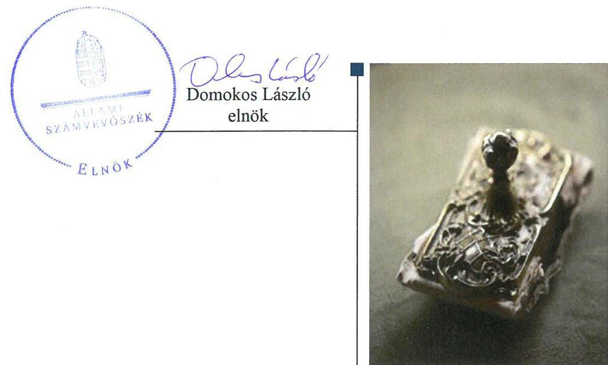
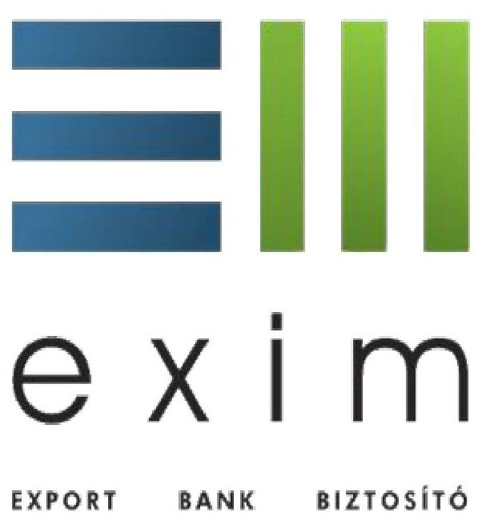
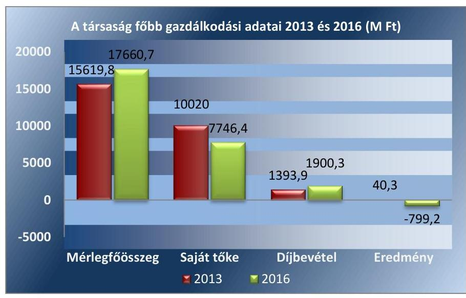

# Jelenetés 

## Az állami tulajdonú gazdasági társaságok ellenőrzése

Magyar Exporthitel Biztosító Zártkörűen múködő Részvénytársaság
2018.

---

# Jelentés 

## Az állami tulajdonú gazdasági társaságok ellenőrzése

Magyar Exporthitel Biztosító Zártkörűen működő Részvénytársaság
2018. 11. hó 08. nap

---

# AZ ELLENŐRZÉST FELÜGYELTE:

DR. HORVÁTH MARGIT felügyeleti vezető

## AZ ELLENŐRZÉST VEZETTE ÉS A VÉGREHAJTÁSÁÉRT FELELŐS:

- ÁRPÁSI TIBOR ellenőrzésvezető
- A PROGRAM ÖSSZEÁLLÍTÁSÁÉRT FELELŐS:
  - TÓTPÁL SZABOLCS osztályvezető

IKTATÓSZÁM: EL-0418-045/2018.

TÉMASZÁM: 2469

ELLENŐRZÉS-AZONOSÍTÓ SZÁM: V081436

Jelentéseink az Országgyűlés számítógépes hálózatán és az Interneta a www.asz.hu címen is olvashatóak.

---

# TARTALOMJEGYZÉK 

■ ÖSSZEGZÉS ..... 5
■ AZ ELLENŐRZÉS CÉLJA ..... 6
■ AZ ELLENŐRZÉS TERÜLETE ..... 7
■ AZ ELLENŐRZÉS HÁTTERE, INDOKOLTSÁGA ..... 9
■ A JELENTÉS LÉNYEGES KÉRDÉSKÖREI ..... 10
■ AZ ELLENŐRZÉS HATÓKÖRE ÉS MÓDSZEREI ..... 11
■ MEGÁLLAPÍTÁSOK ..... 13
■ MELLÉKLETEK ..... 17
I. sz. melléklet: Fogalomtár ..... 17
II. sz. melléklet: A Társaság 2013-2016. évi mérleg adatai ..... 22
■ FÜGGELÉK: ÉSZREVÉTELEK ..... 23
■ RÖVIDÍTÉSEK JEGYZÉKE ..... 25

---

.

---

# ÖSSZEGZÉS 

A Magyar Exporthitel Biztosító Zártkörüen müködő Részvénytársaság feletti tulajdonosi joggyakorlás kereteit a gazdaságpolitikáért, illetve a külgazdasági ügyekért felelős miniszter a jogszabályi előírásoknak megfelelően alakította ki, a tulajdonosi jogokat szabályszerűen gyakorolta. A Magyar Exporthitel Biztosító Zártkörüen müködő Részvénytársaság müködésének szabályozottsága, gazdálkodása és vagyongazdálkodása megfelelt az előírásoknak. Beszámolási kötelezettségének szabályszerűen eleget tett. Közzétételi kötelezettségének teljesitése révén biztositotta tevékenységének átláthatóságát.

## Az ellenőrzés társadalmi indokoltsága

Az Állami Számvevőszék a stratégiáját megvalósítva ellenőrzéseivel segíti az átláthatóságot és az elszámoltathatóságot a közpénzekkel, a közvagyonnal való gazdálkodásban. Ellenőrzési témaválasztása során kiemelt figyelmet fordít a korábban ellenőrizetlen területekre.

Ellenőrzési tervének megfelelően a 2013-2016 közötti ellenőrzött időszakra az Állami Számvevőszék folytatja az állami tulajdonban (résztulajdonban) lévő gazdálkodó szervezetek vagyonmegőrzési és gazdálkodási tevékenységének ellenőrzését.

Az állami tulajdonú gazdasági társaságok a nemzeti vagyon részei. A Magyar Exporthitel Biztosító Zártkörűen működő Részvénytársaság kiemelt jelentőséggel bír a belföldi gazdálkodó szervezetek számára a külgazdasági kapcsolatok ösztönzése, a hazai exportáló vállalkozások kapacitásbővítése terén. Az Állami Számvevőszék az ellenőrzése során arra kereste a választ, hogy 2013-2016. között szabályszerű volt-e a Társaság gazdálkodása, a gazdaságpolitikáért, illetve a külgazdasági ügyekért felelős miniszter tulajdonosi joggyakorlása.

## Főbb megállapítások, következtetések, javaslatok

A Magyar Exporthitel Biztosító Zártkörűen működő Részvénytársaság feletti tulajdonosi joggyakorlás kereteit a gazdaságpolitikáért, illetve a külgazdasági ügyekért felelős miniszter a jogszabályi előírásoknak megfelelően alakította ki, a tulajdonosi jogokat szabályszerűen gyakorolta. Az alapszabály tartalmazta az alapító kizárólagos hatáskörébe tartozó döntéseket, az igazgatóság és a felügyelőbizottság tagjainak, a könyvvizsgáló kijelölését, feladat- és hatáskörét. Az éves beszámolók, az üzleti tervek jóváhagyása, a Társaság tevékenységének nyomon követése az előírásoknak megfelelően történt.

A Magyar Exporthitel Biztosító Zártkörűen működő Részvénytársaság működésének szabályozottsága megfelelő volt. A Társaság rendelkezett a müködéséhez szükséges szabályzatokkal, azokat rendszeresen felülvizsgálta. Rendelkezett továbbá a tevékenységének folytatásához az ágazati jogszabályokban előírt szabályzatokkal, gondoskodott a jogszabályi változások átvezetéséről.

A Magyar Exporthitel Biztosító Zártkörűen működő Részvénytársaság gazdálkodása, bevételeinek és ráfordításainak elszámolása, vagyongazdálkodása az előírásoknak megfelelt 2013-ban és 2016-ban. Éves beszámolóit leltárral alátámasztotta. A Magyar Exporthitel Biztosító Zártkörűen működő Részvénytársaság az éves beszámolóit szabályszerűen elkészítette és közzétette. Az előírt tervezési, adatszolgáltatási, közzétételi kötelezettségét teljesítette.

---

# AZ ELLENŐRZÉS CÉLJA 

Az ellenőrzés célja annak értékelése volt, hogy tulajdonosi jogok gyakorlása szabályszerű volt-e. A gazdálkodó szervezet szabályozottsága, gazdálkodása és vagyongazdálkodási tevékenysége megfelelt-e a jogszabályi és a tulajdonosi előírásoknak; biztosítva volt-e a közfeladatok átláthatósága és elszámoltathatósága érdekében a közszolgáltatás díjának megalapozottsága szabályszerű önköltségszámítással. A vagyonváltozást eredményező döntések esetében a tulajdonosi jogok gyakorlója és a gazdálkodó szervezet szabályszerűen jártak-e el.

---

# AZ ELLENŐRZÉS TERÜLETE 

## A Magyar Exporthitel Biztosító Zártkörűen müködő Részvénytársaság és tulajdonosi joggyakorlói, a gazdaságpolitikáért, illetve a külgazdasági ügyekért felelős miniszter

EXPORT BANK BIZTOSÍTÓ

1994-ben az Exportgarancia Biztosítási Részvénytársaság szétválásával jött létre az Etv. ${ }^{1}$-ben foglaltak szerint a Magyar Exporthitel Biztosító Zártkörűen müködő Részvénytársaság és a Magyar Export-Import Bank Zártkörűen müködő Részvénytársaság. A Társaság ${ }^{2}$ egyszemélyes tulajdonosa a Magyar Állam, a tulajdonosi jogokat 2012. május 23-tól 2014. június 6-ig a gazdaságpolitikáért felelős miniszter ${ }^{3}$, majd a külgazdasági ügyekért felelős miniszter ${ }^{4}$ gyakorolta.

A Társaság tevékenysége hitel, kezesség és különböző pénzügyi veszteségek biztosítási ágazatok piacképes és nempiacképes kockázatú biztosításaira, viszontbiztosításaira, valamint az ehhez kapcsolódó információszolgáltatásra terjedt ki. Az alapszabály ${ }_{8-10}{ }^{5}$ 2015. szeptember 24-től nem tartalmazta a tevékenységek között a piacképes kockázatú biztosításokat. A Társaság exportirányú külkereskedelmi ügyletekhez, nemzetközi segélyügyletekhez, beszállítói ügyletekhez, exportcélú befektetésekhez, magyar befektetők külföldi befektetéseihez és belföldi értékesítésekhez, illetve utazásszervezési szolgáltatást végző belföldi vállalkozás, külföldi vállalkozás belföldi fióktelepe vagy kereskedelmi képviselete Magyarországra történő utaztatási tevékenységéhez kapcsolódóan folytatta tevékenységét. A Társaság közfeladatot nem látott el.

Az állam ${ }^{6}$ készfizető kezesként felel a Társaság által a törvényben, valamint a kormányrendeletekben előírt feltételekkel vállalt biztosításokból, illetőleg viszontbiztosításokból eredő fizetési kötelezettségek teljesítéséért. Az ellenőrzött időszakban évente átlagosan 3470,7 M Ft kárkifizetésért állt helyt az állam.

A Társaság ügyvezető szerve az Igazgatóság ${ }^{7}$ volt. A Társaság munkaszervezetének élén a Vezérigazgató ${ }_{1,2}{ }^{8}$ állt, aki felett a munkáltatói jogokat a miniszter gyakorolta. A Vezérigazgató ${ }_{1,2}$ személye 2015-ben változott. A Társaságnál az alapszabály ${ }_{1-10}$ előírásai alapján állandó könyvvizsgáló müködött.

Az Etv. 2012. november 28-tól hatályos módosítása lehetővé tette az Eximbank ${ }^{9}$ és a Társaság közötti hatékonyabb szakmai és szervezeti együttműködést. A tulajdonosi joggyakorló ${ }_{1,2}{ }^{10}$ a Társaság és az Eximbank élére 2012-től közös vezetést jelölt ki. 2014-től a két szervezet Igazgatósági és Felügyelőbizottsági ${ }^{11}$ tagjai is azonosak voltak.

A Társaság és az Eximbank szervezeti integrációjának jegyében 2013. november 28-án megállapodást ${ }^{12}$ kötött a működési költségek megosztásáról és piaci alapú árképzéssel történő elszámolásáról.

---

A Társaság gazdálkodásának főbb adatait az 1. ábra mutatja be, míg a 2013-2016. évi mérleg adatait a II. sz. melléklet szemlélteti:

1. ábra

Forrás: a Társaság 2013-2016. évi jóváhagyott éves beszámolói
A Társaság 4250,0 M Ft értékű jegyzett tőkéje a 2013-2016. években nem változott. A Társaság vagyona 2013-ról 2016-ra 13\%-kal növekedett. Az eszközök több mint $80 \%$-át a befektetések tették ki, ezen belül is a jellemzően az alacsony kockázatúnak számító lekötött forint- és devizabetétek. A források több mint $90 \%$-át a saját tőke elemei és a tartalékok tették ki. 2014-től a díjbevételek visszaesése, a múködési költségek növekedése miatt veszteségessé vált gazdálkodás következtében a társaság saját tőkéje 2013-ról 2016-ra 2,3 Mrd Ft-tal csökkent.

A Társaság 2016 végén egyéb részesedési viszonnyal két gazdasági társaságban - AHEAD GLOBAL Gazdaságfejlesztő Nonprofit Közhasznú Kft. (1,85\%) és a Mortgage Investment Foundation „VeGa" Limited Liability Company, Moszkva (30\%) - rendelkezett.

A Társaság nem rendelkezett vagyonkezelési szerződés alapján átvett állami vagyonnal, a használatában lévő ingatlanokat bérelte.

Az ellenőrzött időszakban a Társaság nem minősült kormányzati szektorba sorolt egyéb szervezetnek.

---

# AZ ELLENŐRZÉS HÁTTERE, INDOKOLTSÁGA 

Az állami tulajdonú gazdálkodó szervezetek ellenőrzése kiemelten fontos a vagyon megőrzése, megóvása érdekében. Gazdálkodásuk jellemzően a közérdeklődés és a média figyelmének középpontjában áll, amihez hozzájárul a gazdálkodásuk körébe tartozó - közvetlen vagy közvetett állami tulajdonú, tehát végső soron a nemzeti vagyon részét képező - vagyon nagysága, illetve az általuk ellátott közszolgáltatások/közfeladatok minősége és hatékonysága.

Az ellenőrzés rámutathat az állami tulajdonú gazdálkodó szervezetek gazdálkodási tevékenységével jó gyakorlatokra és szabálytalanságokra. Felhívhatja a figyelmet a jogszabályi követelmények teljesítéséhez szükséges feltételek hiányosságaira, hozzájárulhat az államháztartáson kívüli, de (közvetlenül vagy közvetve) állami vagyont használó gazdálkodó szervezetek tevékenységének átláthatóságához. Ellenőrzésünk eredményeképpen javaslatainkkal, megállapításainkkal hozzájárulhatunk a nemzeti vagyonnal való gazdálkodás átláthatóságának, elszámoltathatóságának javításához.

---

# A JELENTÉS LÉNYEGES KÉRDÉSKÖREI 

1.     - A gazdaságpolitikáért, illetve a külgazdasági ügyekért felelős miniszter tulajdonosi joggyakorlása szabályszerű volt-e?
2.     - A Magyar Exporthitel Biztosító Zártkörűen müködő Részvénytársaság müködésének szabályozottsága megfelelt-e az előírásoknak, gazdálkodása szabályszerű volt-e?
3.     - A Magyar Exporthitel Biztosító Zártkörűen müködő Részvénytársaság vagyongazdálkodása szabályszerű volt-e?

---

# AZ ELLENŐRZÉS HATÓKÖRE ÉS MÓDSZEREI 

## Az ellenőrzés típusa

Megfelelőségi ellenőrzés.

## Az ellenőrzött időszak

Az ellenőrzött időszak a 2013-2016. évek, a 2016. évi beszámoló jóváhagyásáig tartó időszak.

## Az ellenőrzés tárgya

Állami tulajdonban lévő gazdasági társaság gazdálkodása, kiemelten vagyongazdálkodási tevékenysége, a tulajdonosi jogok gyakorlása.

Az ellenőrzés kiterjedt minden olyan körülményre és adatra, amely az ÁSZ jogszabályban meghatározott feladatainak teljesítéséhez, valamint a program végrehajtása folyamán felmerült újabb összefüggések feltárásához szükséges volt.

## Az ellenőrzött szervezet

$\longrightarrow$ A tulajdonosi jogokat gyakorló Nemzetgazdasági Minisztérium, illetve
$\longrightarrow$ Külgazdasági és Külügyminisztérium, továbbá
$\longrightarrow$ a Magyar Exporthitel Biztosító Zártkörűen működő Részvénytársaság.

## Az ellenőrzés jogalapja

Az ellenőrzés jogszabályi alapját az ÁSZ tv. ${ }^{13}$ 1. § (3) bekezdése és 5. § (3)- (5) bekezdései képezték.

## Az ellenőrzés módszerei

Az ellenőrzést a nemzetközi standardokat irányadónak tekintve az ellenőrzési program ellenőrzési kérdései, az ellenőrzött időszakban hatályos jogszabályok, az ellenőrzés szakmai szabályok és módszertanok figyelembe vételével végeztük.

---

Az ellenőrzés ideje alatt az ellenőrzött szervezettel történő kapcsolattartást az ÁSZ Szervezeti és Működési Szabályzatának vonatkozó előírásai alapján biztosítottuk.

A teljes ellenőrzött időszakra vonatkozóan került ellenőrzésre a gazdasági társaság tervezési, beszámolási, közzétételi, adatszolgáltatási kötelezettségének, valamint belső ellenőrzési tevékenységének szabályszerűsége. A 2013. és 2016. évekre vonatkozóan a gazdasági társaság múködésének szabályozottságát, a 2013. és 2016. évekre bevételei és ráfordításai elszámolását, illetve vagyongazdálkodásának szabályszerűségét is ellenőriztük.

A bevételek és a ráfordítások közül az értékesítés nettó árbevétele, az egyéb, rendkívüli és pénzügyi műveletek bevételei, a személyi jellegű ráfordítások, az anyagjellegű ráfordítások, az egyéb, rendkívüli és pénzügyi műveletek ráfordításai, valamint értékcsökkenési leírás elszámolásának szabályszerűségét, továbbá az immateriális javak, tárgyi eszközök esetében a vagyonnyilvántartás szabályszerűségét véletlen mintavétellel ellenőriztük.

A fenti sokaságok esetében a mintavétel azokra a legnagyobb értékű tételekre - a lényeges sokaságra - terjedt ki, melyek összértéke eléri a teljes sokaság összértékének 50\%-át. A személyi jellegű ráfordítások esetében a mintavétel a teljes sokaságból történt. Amennyiben valamely ellenőrzött sokaság elemszáma kisebb volt, mint az előírt minta elemszáma, az ellenőrzött sokaságot tételesen ellenőriztük.

A mintavétellel ellenőrzött területek esetében minden egyes tétel vonatkozásában a szabályszerűségre vonatkozó kérdéseket tettünk fel, amelyek eredménye összesítésre került. „Szabályszerűnek" értékeltünk egy ellenőrzött területet, amennyiben 95\%-os bizonyossággal az ellenőrzött sokaságban az átlagos hibaarány legfeljebb 10\%, "nem szabályszerűnek", amennyiben 10\%-nál magasabb arányt képviselt.

Az ellenőrzési kérdések megválaszolásához szükséges bizonyítékok megszerzése a következő ellenőrzési eljárások alkalmazásával történt: megfigyelés, kérdésfeltevés (információkérés), összehasonlítás, valamint elemző eljárás. Az ellenőrzési bizonyítékként felhasználható adatforrások közé tartoztak egyrészt az ellenőrzési programban felsorolt adatforrások, másrészt adatforrás lehetett még minden - az ellenőrzés folyamán - feltárt, az ellenőrzés szempontjából információkat tartalmazó dokumentum.

Az ellenőrzés a kérdésekre adott válaszok kiértékelésével, valamint a megjelölt adatforrások, a csatolt tanúsítványok felhasználásával, továbbá az adott időszakban hatályos jogszabályok figyelembe vételével folyt le.

---

# 1. A gazdaságpolitikáért, illetve a külgazdasági ügyekért felelős miniszter tulajdonosi joggyakorlása szabályszerű volt-e? 

Összegző megállapítás

A tulajdonosi joggyakorlás kereteinek kialakítása a jogszabályi előírásokkal összhangban történt. A tulajdonosi joggyakorlás szabályszerű volt.

A TULAJDONOSI JOGOK gyakorlásának rendjét 2014. június 6ig a gazdaságpolitikáért felelős miniszter az NGM SZMSZ ${ }_{1,2}{ }^{14}$-ében előírtak szerint, ezt követően a külgazdasági ügyekért felelős miniszter a KKM SZMSZ ${ }_{1-6}{ }^{15}$-ében meghatározott módon a jogszabályi előírásoknak megfelelően alakította ki.

A tulajdonosi joggyakorló ${ }_{1,2}$ a Gt. ${ }^{16}$, illetve a Ptk. ${ }^{17}$ rendelkezéseinek megfelelően az alapszabályban ${ }_{1-10}$ meghatározta a kizárólagos hatáskörébe tartozó ügyeket, gondoskodott az Igazgatóság, a Felügyelőbizottság elnökének és tagjainak, a Vezérigazgató ${ }_{1,2}$, valamint a könyvvizsgáló ${ }^{18}$ kinevezéséről. Jóváhagyta az Igazgatóság ügyrendjét ${ }_{1-7}{ }^{19}$, a Felügyelőbizottság ügyrendjét ${ }^{20}$, a Vagyonnyilatkozat tételi kötelezettségről szóló szabályzatot ${ }_{1-3}{ }^{21}$, a Döntéshozatali eljárásrendet ${ }_{1-6}{ }^{22}$, a Társaság SZMSZ ${ }_{1-5}{ }^{23}$-ét, továbbá a Taktv. ${ }^{24}$ előírásaival összhangban elkészített, a vezető tisztségviselők, a Felügyelőbizottsági tagok és az Mt. ${ }^{25}$ 208. § hatálya alá tartozó munkavállalók javadalmazására, valamint a jogviszony megszűnése esetére biztosított juttatások módjának, mértékének legfőbb elveiről, annak rendszeréről szóló szabályzatot ${ }_{1,2}{ }^{26}$.

A tulajdonosi joggyakorló ${ }_{1,2}$ az alapszabályban ${ }_{1-10}$ előírta az Igazgatóság, a Felügyelőbizottság tevékenységével kapcsolatos beszámolási kötelezettséget. Az Igazgatóság kötelezettsége volt, hogy jelentést készítsen évente egyszer az Alapító ${ }^{27}$ részére, a Felügyelőbizottság részére háromhavonta az ügyvezetésről, a Társaság vagyoni helyzetéről és üzletpolitikájáról. A Felügyelőbizottság véleményezte az Alapító részére döntés céljából megküldött valamennyi lényeges üzletpolitikai jelentést. A tulajdonosi joggyakorló ${ }_{1,2}$ a negyedévente rendszeresített adat- és információszolgáltatások révén kialakította és müködtette a Társaság müködésével kapcsolatos monitoring rendszert.

A TULAJDONOSI JOGGYAKORLÁS szabályszerű volt. A tulajdonosi joggyakorló ${ }_{1,2}$ az alapszabályban ${ }_{1-10}$ foglaltaknak megfelelően rendszeresen beszámoltatta a Társaság müködéséről az Igazgatóságot és a Felügyelőbizottságot. A 2013-2016. éves beszámolók jóváhagyása előtt megismerte a Felügyelőbizottság írásbeli véleményét és a független könyvvizsgálói jelentésben foglaltakat, azok birtokában határidőben döntött az éves beszámolók elfogadásáról és az eredmény felosztásáról a Gt. és a Ptk. előírásaival összhangban.

---

Az alapszabály ${ }_{1-10}$ az Igazgatóság feladatkörébe rendelte az üzleti stratégia és üzleti tervek elkészítésének kötelezettségét. A Társaság elkészítette és az Alapító jóváhagyta a 2013-2016. évek Eximbankkal közös üzleti stratégiáját ${ }^{28}$ és az abban megfogalmazott célokkal összhangban előterjesztett éves üzleti terveket.

A 2013-2016. években a tulajdonosi joggyakorló ${ }_{1,2}$ és a Felügyelőbizottság nem végzett ellenőrzést a Társaságnál. A könyvvizsgáló az éves könyvvizsgálat keretén belül három esetben adott ki vezetői levelet, amelyekben az információáramlással, informatikai rendszerekkel kapcsolatos javaslatokat fogalmazott meg, amelyeket a Társaság hasznosított.

# 2. A Magyar Exporthitel Biztosító Zártkörűen müködő Részvénytársaság müködésének szabályozottsága megfelelt-e az előírásoknak, gazdálkodása szabályszerű volt-e? 

Összegző megállapítás

A Társaság müködésének szabályozottsága a jogszabályi előírásokkal összhangban volt. A Társaság bevételeinek és ráfordításainak elszámolása 2013-ban és 2016-ban szabályszerű volt. Beszámolási és közzétételi kötelezettségének a Társaság szabályszerűen tett eleget.

A TÁRSASÁG GAZDÁLKODÁSÁNAK és az üzleti tevékenység szabályozása az ellenőrzött időszakban a Ptk., az Etv., a Számv. tv. ${ }^{29}$ és a 312/2001. (XII. 28.) Korm. rendelet ${ }^{30}$ előírásaival összhangban készített Üzletszabályzat ${ }_{1-7}{ }^{31}$, a Gazdálkodási és utalványozási szabályzat ${ }_{1-4}{ }^{32}$, a Számviteli politika ${ }_{1-5}{ }^{33}$ és a Számv. tv. 14. § (5) bekezdése szerinti szabályzatok, valamint a Döntéshozatali eljárásrend ${ }_{1-3}$ révén valósult meg.

A Társaság rendelkezett a Számv. tv. előírásainak megfelelő Számviteli politikával ${ }_{1-5}$, valamint annak részeként Pénzkezelési szabályzattal ${ }_{1,2}{ }^{34}$, Leltárkészítési és leltározási szabályzattal ${ }_{1,2}{ }^{35}$, Értékelési szabályzattal ${ }^{36}$, Selejtezési szabályzattal ${ }_{1,2}{ }^{37}$, Önköltségszámítás rendjére vonatkozó szabályzattal ${ }_{1,2}{ }^{38}$, továbbá Számlarenddel ${ }^{39}$ és Bizonylati szabályzattal ${ }_{1,2}{ }^{40}$, amely szabályzatokat az ellenőrzött időszakban rendszeresen felülvizsgálták és a jogszabályi változásokkal összhangban módosították. A Társaság a biztosításokra alkalmazott díjait, díjképzését a 312/2001. (XII. 28.) Korm. rendeletben és a nem-piacképes módozatokra vonatkozó díjszámítási rendszer szabályzatában ${ }_{1-10}{ }^{41}$ foglaltak alapján határozta meg.

A Társaság az ágazati jogszabályokban foglaltaknak megfelelően és tartalommal elkészítette a Bit tv. ${ }^{42}$ 132. § (4) bekezdés a) pontjában, valamint a Bit tv. ${ }^{43}$ 104. § (5) bekezdésében előírtak szerint az ellenőrzött időszak vonatkozásában a Befektetéspolitikai szabályzatot ${ }_{1-6}{ }^{44}$, rendelkezett a 312/2001. (XII. 28.) Korm. rendelet 12. § (5) bekezdés szerinti nem-piacképes biztosítások meg nem szolgált díjak tartalékképzésének szabályzatával ${ }_{1-4}{ }^{45}$, valamint a 8/2001. (II. 22.) PM rendelet ${ }^{46}$ alapján a piacképes ágazat biztosítástechnikai tartalékképzésének szabályzatával ${ }_{1-3}{ }^{47}$.

A BEVÉTELEK ÉS RÁFORDÍTÁSOK elszámolása a 2013. és 2016. években a Számv. tv. és a Gazdálkodási és utalványozási szabály-zat ${ }_{1-4}$, a Számviteli politika ${ }_{1-5}$ előírásainak megfelelően történt.

---

ÉVES BESZÁMOLÓIT a Társaság a Számv. tv. előírásainak megfelelően állította össze, azokat a tulajdonosi joggyakorló1,2 a könyvvizsgáló és a Felügyelőbizottság írásbeli jelentésének birtokában jóváhagyta.

# AZ ÉVES BESZÁMOLÓK KÖZZÉTÉTELÉRŐL ÉS 

LETÉTBE helyezéséről a Társaság a Számv. tv.-ben előírt határidőig gondoskodott. A Taktv. 2. § (1)-(4) bekezdéseiben és az Info tv. ${ }^{48}$ 33. § (2) bekezdésében foglalt közérdekű adatok közzétételére vonatkozó kötelezettségét a Társaság teljesítette. A Társaság az Adatvédelmi szabályzatban ${ }_{1-4}{ }^{49}$ rendelkezett az adatvédelmi és adatbiztonsági irányelvekről.

A Társaság a 16/1998. (V. 20.) PM rendelet ${ }^{50}$ előírásai alapján negyedévente adatot szolgáltatott az államháztartásért felelős miniszternek a központi költségvetést terhelő, nem-piacképes biztosításokból, nem-piacképes viszontbiztosításokból eredő kárfizetések jogcíméről, várható időpontjáról és összegéről módozatonként - viszontbiztosítás esetén szerződésenként, a szerződésszám feltüntetésével - a rendelet 5. számú mellékletében meghatározott módon.

A Társaság az alapszabály ${ }_{1-10}$ és az SZMSZ ${ }_{1-5}$ előírásainak megfelelően alakította ki és múködtette az operatív tevékenységektől független belső ellenőrzését. Az ellenőrzött időszakban lefolytatott külső és belső ellenőrzések megállapításai alapján megfogalmazott javaslatokra a Társaság intézkedési terveket készített, az azokban foglaltakat végrehajtotta.

## 3. A Magyar Exporthitel Biztosító Zártkörűen múködő Részvénytársaság vagyongazdálkodása szabályszerű volt-e?

Összegző megállapítás

A Társaság vagyongazdálkodása szabályszerű volt 2013-ban és 2016-ban. A vagyon nyilvántartása, a vagyon változását jelentő döntések meghozatala megfelelt az előírásoknak.

A VAGYON NYILVÁNTARTÁSA megfelelt a Számv. tv., a 192/2000. (XI. 24.) Korm. rendelet, a Számviteli politika ${ }_{1-5}$ előírásainak. A Társaság átlátható, naprakész vagyon-nyilvántartással rendelkezett, folyamatos főkönyvi és analitikus nyilvántartást vezetett, betartotta a saját vagyonra vonatkozó állományba vételi kötelezettségét az ellenőrzött időszakban. Az értékcsökkenés elszámolása szabályszerűen történt. A Társaság leltárral alátámasztotta az éves beszámolói mérlegének tételeit.

A VAGYONGAZDÁLKODÁS KÖVETELMÉNYEIRŐL az alapszabály ${ }_{1-10}$ rendelkezett. Az Alapító kizárólagos hatáskörébe tartozott az adózott eredmény felhasználásáról, alaptőke emelésről, leszállításról szóló döntés, továbbá döntés olyan biztosítások nyújtásáról, amelyekben a kockázati kitettség elérte vagy meghaladta a 20 milliárd Ft összértéket. Az ellenőrzött időszakban az Igazgatóság nyolc alkalommal terjesztett elő értékhatárt meghaladó ügyletet, amelyeket a tulajdonosi joggyakorló1,2 Alapítói határozattal jóváhagyott.

A saját vagyont érintő, egyéb beruházásokkal, felújításokkal, térítés nélküli átvétellel kapcsolatos döntések - informatikai, infrastrukturális fejlesz-

---

tések, bérelt ingatlanon végzett beruházások - az alapszabály ${ }_{1-30}$, a Döntéshozatali eljárásrend ${ }_{1-3}$, valamint a Gazdálkodási és utalványozási szabályzat ${ }_{1-4}$ előírásainak megfelelően születtek. A Társaság az ellenőrzött időszakban összesen 290,3 M Ft értékben aktivált tárgyi eszközöket, melynek jelentős része bérelt ingatlanon végzett beruházásként került elszámolásra. Ennek köszönhetően a tárgyi eszközök könyv szerinti értéke a 2013. évi 33 M Ft-ról 2016-ra 253 M Ft-ra növekedett.

---

# MELLÉKLETEK 

## I. SZ. MELLÉKLET: FOGALOMTÁR

állami vagyon
a) Az állam tulajdonában lévő dolog, valamint a dolog módjára hasznosítható természeti erő,
b) az a) pont hatálya alá nem tartozó mindazon vagyon, amely vonatkozásában törvény az állam kizárólagos tulajdonjogát nevesíti,
c) az állam tulajdonában lévő tagsági jogviszonyt megtestesítő értékpapír, illetve az államot megillető egyéb társasági részesedés,
d) az államot megillető olyan immateriális, vagyoni értékkel rendelkező jogosultság, amelyet jogszabály vagyoni értékű jogként nevesít.
Forrás: Vtv. ${ }^{51} 1 . \S$ (2) bekezdése
e) az állam tulajdonában lévő pénzügyi eszközök

Forrás: Vtv. 1. § (2) bekezdése
2013. június 27-ig:

Az állami vagyont az MNV Zrt. maga kezeli, vagy szerződés - így különösen bérlet, haszonbérlet, megbízás - alapján központi költségvetési szervnek, természetes vagy jogi személynek, vagy jogi személyiséggel nem rendelkező gazdálkodó szervezetnek hasznosításra átengedi.
Forrás: Vtv. 23. § (1) bekezdése
2013. június 28-ától:

Az állami vagyonnal az MNV Zrt. maga gazdálkodik, vagy szerződés - így különösen bérlet, haszonbérlet, megbízás - alapján központi költségvetési szervnek, természetes vagy jogi személynek, vagy jogi személyiséggel nem rendelkező gazdálkodó szervezetnek hasznosításra átengedi, illetőleg vagyonkezelésbe, haszonélvezetbe adja.
Forrás: Vtv. 23. § (1) bekezdése
Az a vállalkozó, amely egy másik vállalkozónál (a továbbiakban: leányvállalat) közvetlenül vagy leányvállalatán keresztül közvetetten meghatározó befolyást képes gyakorolni, mert az alábbi feltételek közül legalább eggyel rendelkezik:
a) a tulajdonosok (a részvényesek) szavazatának többségével (50 százalékot meghaladóval) tulajdoni hányada alapján egyedül rendelkezik, vagy
b) más tulajdonosokkal (részvényesekkel) kötött megállapodás alapján a szavazatok többségét egyedül birtokolja, vagy
c) a társaság tulajdonosaként (részvényeseként) jogosult arra, hogy a vezető tisztségviselők vagy a felügyelő bizottság tagjai többségét megválaszsza vagy visszahívja, vagy
d) a tulajdonosokkal (a részvényesekkel) kötött szerződés (vagy a létesítő okirat rendelkezése) alapján - függetlenül a tulajdoni hányadtól, a szavazati aránytól, a megválasztási és visszahívási jogtól - döntő irányítást, ellenőrzést gyakorol.
Forrás: Számv. tv. 3. § (2) 1. pont
gazdasági társaság
A Ptk. 3:88. § (1) bekezdése szerint „a gazdasági társaságok üzletszerű közös gazdasági tevékenység folytatására, a tagok vagyoni hozzájárulásával létrehozott, jogi személyiséggel rendelkező vállalkozások, amelyekben a tagok a nyereségből közösen részesednek, és a veszteséget közösen viselik".

---

hitel biztosítási ágazat
kapcsolt vállalkozás
kezesség, garancia biztosítási ágazat
kormányzati szektorba sorolt egyéb szervezet
közszolgáltatás
különböző pénzügyi veszteségek
a Bit. 1 1. számú melléklet „A" rész (A nem életbiztosítási ág ágazatok szerinti besorolása) 14. pontjában foglalt ágazat, amely
a) általános fizetésképtelenség
b) exporthitelezés
c) részletfizetési ügylet
d) jelzálog-hitelezés
e) mezőgazdasági hitelezés

Forrás: Bit. tv. 1. számú melléklet
Az anyavállalat és a leányvállalat és a közös vezetésű vállalkozások (fölérendelt anyavállalat esetében a minősítést a fölérendelt anyavállalat szempontjából kell elvégezni)
Forrás: Számv. tv. 3. § (2) 7. pont
a Bit. tv. 1 1. számú melléklet „A" rész (A nem életbiztosítási ág ágazatok szerinti besorolása) 15. pontjában foglalt ágazat, amely
a) közvetlen kezesség, garancia
b) közvetett kezesség, garancia

Forrás: Bit. tv. 1. számú melléklet
Az a szervezet, amely az Áht. alapján nem része az államháztartásnak, azonban az Európai Közösséget létrehozó szerződéshez csatolt, a túlzott hiány esetén követendő eljárásról szóló jegyzőkönyv alkalmazásáról szóló 2009. május 25-i 479/2009/EK rendelet szerint a kormányzati szektorba tartozik. A nemzetgazdasági miniszter 2013. június 26-án megjelent Közleményben tette közé ezen szervezetek listáját
Az Ebktv. ${ }^{52}$ 3. § d) pontja a következőképpen határozza meg a közszolgáltatást: „szerződéskötési kötelezettség alapján a lakosság alapvető szükségleteinek ellátására irányuló szolgáltatás, így különösen a villamos energia-, gáz-, hő-, víz-, szenny-víz- és hulladékkezelési, köztisztasági, postai és távközlési szolgáltatás, továbbá a menetrend alapján közlekedő járművekkel végzett közforgalmú személyszállítás".
a Bit. tv. 1 1. számú melléklet „A" rész (A nem életbiztosítási ág ágazatok szerinti besorolása) 16. pontjában foglalt ágazat, amely
a) foglalkoztatással összefüggő kockázatok
b) elégtelen jövedelem
c) rossz időjárás
d) nyereségkiesés
e) folyó mellék- és többletköltségek bármely fajtája
f) előre nem látható üzleti mellék- és többletköltségek
g) értékvesztés
h) bérleti díj- vagy jövedelemkiesés
i) az eddig említettektől eltérő közvetett kereskedelmi veszteségek
j) nem kereskedelmi pénzbeli veszteségek
k) egyéb pénzügyi veszteségek

Forrás: Bit. tv. 1. számú melléklet
Az a gazdasági társaság, amelyre az anyavállalat meghatározó befolyást képes gyakorolni
Forrás: Számv. tv. 3. § (2) 2. pont
a) az állam vagy a helyi önkormányzat kizárólagos tulajdonában álló dolgok,
b) az a) pont hatálya alá nem tartozó, állam vagy a helyi önkormányzat tulajdonában lévő dolog,

---

c) az állam vagy a helyi önkormányzatot tulajdonában lévő pénzügyi eszközök, továbbá az államot vagy a helyi önkormányzatot megillető társasági részesedések,
d) az államot vagy a helyi önkormányzatot megillető bármely vagyoni értékkel rendelkező jogosultság, amelyet jogszabály vagyoni értékű jogként nevesít,
e) Magyarország határa által körbezárt terület feletti légtér,
f) az üvegházhatású gázok kibocsátási egységeinek kereskedelméről szóló törvény szerint kibocsátási egység és légiközlekedési kibocsátási egység, valamint az ENSZ Éghajlatváltozási Keretegyezménye és annak Kiotói Jegyzőkönyve végrehajtási keretrendszeréről szóló törvény szerinti kiotói egység,
g) állami vagy helyi önkormányzati fenntartású közgyűjtemény (muzeális intézmény, levéltár, közgyűjteményként működő kép- és hangarchívum, valamint könyvtár) saját gyűjteményében nyilvántartott kulturális javak körébe tartozó dolog, kivéve, ha az állami vagy önkormányzati tulajdon jogszerű létrejötte kétséget kizáró módon nem bizonyítható és a dologra nézve más a tulajdonjogát bizonyítja vagy a kulturális javakra vonatkozó jogszabályokban meghatározott eljárás keretében valószínűsíti (g. pont módosult 2013. december 7-től),
h) a régészeti lelet,
i) a nemzeti adatvagyon körébe tartozó állami nyilvántartások fokozottabb védelméről szóló törvény szerinti nemzeti adatvagyon.
Forrás: Nvtv. ${ }^{53}$ 1. § (2)
nemzeti vagyon hasznosítása
nem-piacképes biztosítás

A tulajdonosi joggyakorló vagy a nemzeti vagyon használója által a nemzeti vagyon birtoklásának, használatának, hasznok szedése jogának bármely - a tulajdonjog átruházását nem eredményező - jogcímen történő átengedése, ide nem értve a vagyonkezelésbe adást, valamint a haszonélvezeti jog alapítását.
Forrás: Nvtv. 3. § (1) 4. pont
(4) E törvény alkalmazásában exporthitel biztosítások és viszontbiztosítások esetében nem-piacképesnek minősülnek
a) a (6) és (7) bekezdésben felsorolt kockázatok, ha a teljes kockázatviselés ideje (a gyártási idő és a hitel futamideje együttesen) legalább két év;
b) azon kockázatok, amelyeknél a teljes kockázatviselési idő a két évet nem éri el, amennyiben
ba) az adós vagy kezese letelepedési helye nem a Mehib Rt. által a központi költségvetés terhére, a Kormány készfizető kezessége mellett vállalható nem-piacképes kockázatú biztosítások feltételeiről szóló kormányrendeletben piacképes kockázatúként meghatározott országban van és
bb) magánadós vagy kezese esetén a (6) bekezdésben vagy a (7) bekezdés a)-c) pontjában szereplő kockázatok bármelyike,
bc) állami adós vagy kezese esetén a (6) bekezdésben vagy a (7) bekezdés a) vagy
c) pontjában szereplő kockázatok bármelyike
merül fel.
(5) Nem-piacképesnek minősülnek továbbá azok kockázatok, amelyek kockázatviselési ideje nem éri el a két évet és nem felelnek meg a (4) bekezdés b) pontjában szereplő feltételeknek, amennyiben azok exporthitel biztosítását, illetve viszontbiztosítását az Európai Bizottság az Európai Unió múködéséről szóló szerződés 108. cikk (3) bekezdése szerinti bejelentési eljárásban jóváhagyta, illetve ez ellen nem emelt kifogást.
(6) A politikai típusú kockázatok körébe tartoznak azok a kockázatok, amelyek a biztosító országán kívül politikai és politikai jellegű események (pl. háború, polgár-

---

piacképes biztosítás
piacképes kockázatú országok
tulajdonosi ellenőrzés
tulajdonosi jogok gyakorlója
háború, zavargások) bekövetkezte, államhatalmi és adminisztratív jellegű intézkedések elrendelése, a biztosító országában kiviteli korlátozások alkalmazása miatt merülnek fel. Ide tartoznak továbbá a természeti és nukleáris katasztrófák kockázatai.
(7) A kereskedelmi típusú kockázatok körébe tartoznak azok a kockázatok, amelyek
a) az adós vagy kezese nemfizetése, késedelmes fizetése miatt,
b) az adós vagy kezese fizetésképtelensége miatt,
c) az export célú szerződés vevő általi jogalap nélküli felmondása vagy a szerződés tárgyát képező áruk, szolgáltatások átvételének megtagadása miatt merülnek fel.
Forrás: Etv. 3. § (4) - (7) pont
A Bit tv2 hatálya alá tartozó, a biztosító saját kockázatára kötött biztosítás.
Az Európai Unió tagállamai Görögország kivételével, Ausztrália, Kanada, Izland, Norvégia, USA, Svájc, Új-Zéland, Japán
Forrás: 312/2001. (XII. 28.) Korm. rendelet 1. számú melléklet
2014. március 14-ig:

Az állami vagyon kezelőjét, haszonélvezőjét, használóját megillető jogok gyakorlását, annak szabályszerűségét, célszerűségét az MNV Zrt. - szükség szerint területi szervei útján - ellenőrzi.
2014. március 15-től:

Az állami vagyon használóját, vagyonkezelőjét és haszonélvezőjét megillető jogok gyakorlását, annak szabályszerűségét, a kötelezettségek teljesítését, valamint a vagyon rendeltetése szerinti célszerűségét a tulajdonosi joggyakorló rendszeresen ellenőrzi.
Forrás: Vtv.vhr. ${ }^{54}$ 20. § (1)
1.

## 2013. június 27-ig:

Az állami vagyon felett a Magyar Államot megillető tulajdonosi jogok és kötelezettségek összességét - ha törvény eltérően nem rendelkezik - az állami vagyon felügyeletéért felelős miniszter (a továbbiakban: miniszter) gyakorolja, aki e feladatát a Magyar Nemzeti Vagyonkezelő Zártkörűen működő Részvénytársaság (a továbbiakban: MNV Zrt.), a Magyar Fejlesztési Bank, illetve a tulajdonosi joggyakorló szervezet útján látja el. A miniszter miniszteri rendeletben, a törvényben meghatározott állami vagyoni kör tekintetében, meghatározott időtartamra, a joggyakorlás egyes szabályainak meghatározásával - az őt megillető tulajdonosi jogok és kötelezettségek összességének, illetve azok meghatározott részének gyakorlóját az Áht. szerinti központi költségvetési szervek, ezek intézménye, továbbá a 100\%-ban állami tulajdonban álló gazdasági társaságok közül kijelölheti.
Forrás: Vtv. 3. § (1) és (2)
2013. június 28-ától:

A rábízott állami vagyon felett az államot megillető tulajdonosi jogok és kötelezettségek összességét tulajdonosi joggyakorlóként:
a) ha törvény vagy miniszteri rendelet eltérően nem rendelkezik, a Magyar Nemzeti Vagyonkezelő Zártkörűen működő Részvénytársaság (a továbbiakban: MNV Zrt.),
b) törvényben kijelölt személy vagy
c) az állami vagyon felügyeletéért felelős miniszter (a továbbiakban: miniszter) által rendeletben kijelölt személy gyakorolja.

---

[...] A miniszter e törvény felhatalmazása alapján - a meghatározott célok hatékonyabb elérése érdekében, miniszteri rendeletben, az ott meghatározott állami vagyoni kör tekintetében, meghatározott időtartamra - e törvény keretei között, a joggyakorlás egyes szabályainak meghatározásával - az államot megillető tulajdonosi jogok és kötelezettségek összességének, illetve azok meghatározott részének gyakorlóját az Áht. szerinti központi költségvetési szervek, ezek intézménye, továbbá a 100\%-ban állami tulajdonban álló gazdasági társaságok közül kijelölheti.
Forrás: Vtv. 3. § (1) és (2)
2.

Aki a nemzeti vagyon felett az államot vagy a helyi önkormányzatot megillető tulajdonosi jogok és kötelezettségek összességének gyakorlására jogosult Forrás: Nvtv. 3. § (1) 17. pontja
a biztosító vagy viszontbiztosító, továbbá harmadik országbeli biztosító vagy viszontbiztosító által vállalt kockázat egy részének vagy egészének szerződésben meghatározott feltételek alapján, díjfizetés ellenében történő átvállalása.
Forrás: Bit tv 2 4. § (1) 112) pont

---

# II. SZ. MELLÉKLET: A TÁRSASÁG 2013-2016. ÉVI MÉRLEG ADATAI

## AZ MAGYAR EXPORTHITEL BIZTOSÍTÓ ZÁRTKÖRŰEN MŰKÖDŐ RÉSZVÉNYTÁRSASÁG 2013-2016. ÉVI MÉRLEG ADATAI (M Ft)

|  Megnevezés | 2013. XII. 31.
M Ft | 2014. XII. 31.
M Ft | 2015. XII. 31.
M Ft | 2016. XII. 31.
M Ft | 2016./2013.
(változás5)  |
| --- | --- | --- | --- | --- | --- |
|  A. IMMATERIÁLIS JAVAK | 26,2 | 16,4 | 7,7 | 45,9 | 75,2\%  |
|  B. BEFEKTETÉSEK | 12584,4 | 11594,7 | 10671,5 | 14656,3 | 16,5\%  |
|  C. A befektetési egységekhez kötött (unit-linked) életbiztosítások szerződői javára végrehajtott befektetések | 0 | 0 | 0 | 0 | -  |
|  D. KÖVETELÉSEK | 2329,8 | 2392,6 | 2030,9 | 2443,7 | 4,9\%  |
|  E. EGYÉB ESZKÖZÖK | 472,2 | 74,2 | 257,0 | 302,0 | $-36,0 \%$  |
|  F. AKTÍV IDŐBELI ELHATÁROLÁSOK | 207,2 | 314,8 | 262,5 | 212,8 | 2,7\%  |
|  ESZKÖZÖK ÖSSZESEN | 15619,8 | 14392,7 | 13229,6 | 17660,7 | 13,1\%  |
|  A. SAJÁT TŐKE | 10020,0 | 8900,1 | 8545,6 | 7746,4 | $-22,7 \%$  |
|  I. Jegyzett tőke | 4250,0 | 4250,0 | 4250,0 | 4250,0 | 0\%  |
|  II. Jegyzett, de még be nem fizetett tőke (-) | 0 | 0 | 0 | 0 | -  |
|  III. Tőketartalék | 0 | 0 | 0 | 0 | -  |
|  IV. Eredménytartalék | 5729,7 | 5770,0 | 4650,1 | 4295,6 | $-25,0 \%$  |
|  V. Lekötött tartalék | 0 | 0 | 0 | 0 | -  |
|  VI. Értékelési tartalék | 0 | 0 | 0 | 0 | -  |
|  VII. Mérleg szerinti / Adózott eredmény | 40,3 | $-1119,8$ | $-354,5$ | $-799,2$ | $-1983,1 \%$  |
|  B. ALÁRENDELT KÖLCSÖNTÖKE | 0 | 0 | 0 | 0 | -  |
|  C. BIZTOSÍTÁSTECHNIKAI TARTALÉKOK | 4409,5 | 3877,9 | 3239,3 | 8395,9 | 90,4\%  |
|  D. Biztosítástechnikai tartalékok a befektetési egységekhez kötött (unit-linked) életbiztosítások szerződői javára | 0 | 0 | 0 | 0 | -  |
|  E. CÉLTARTALÉKOK | 70,7 | 390,0 | 91,1 | 87,5 | 23,8\%  |
|  F. Viszontbiztosítóval szembeni letéti kötelezettségek | 0 | 0 | 0 | 0 | -  |
|  G. KÖTELEZETTSÉGEK | 865,6 | 880,4 | 938,4 | 1006,2 | 16,2\%  |
|  H. PASSZÍV IDŐBELI ELHATÁROLÁSOK | 254,0 | 344,3 | 415,2 | 424,6 | 67,2\%  |
|  FORRÁSOK ÖSSZESEN | 15619,8 | 14392,7 | 13229,6 | 17660,7 | 13,1\%  |

Fonrás: a Társaság 2013-2016. évi jóváhagyott éves beszámolói

---

# FÜGGELÉK: ÉSZREVÉTELEK 

A jelentéstervezetet a Számvevőszék 15 napos észrevételezésre megküldte az ellenőrzött szervezet vezetőjének az ÁSZ tv. 29. §* (1) bekezdése előírásának megfelelően.

Az ellenőrzött szervezetek vezetői nem tettek észrevételt a Számvevőszék 15 napos észrevételezésre megküldött jelentéstervezetével kapcsolatban.

[^0]
[^0]:    * 29. § (1) Az Állami Számvevőszék az ellenőrzési megállapításait megküldi az ellenőrzött szervezet vezetőjének vagy az általa megbízott személynek, és annak, akinek személyes felelősségét állapította meg.
    (2) Az ellenőrzött szervezet vezetője és a felelősként megjelölt személy az ellenőrzés megállapításaira tizenöt napon belül írásban észrevételt tehet.
    (3) Az Állami Számvevőszék az észrevételre a beérkezésétől számított harminc napon belül írásban válaszol. A figyelembe nem vett észrevételeket köteles a jelentésben feltüntetni, és megindokolni, hogy azokat miért nem fogadta el.

---

.

---

# RÖVIDÍTÉSEK JEGYZÉKE 

${ }^{1}$ Etv.
${ }^{2}$ Társaság
${ }^{3}$ gazdaságpolitikáért felelős miniszter
${ }^{4}$ külgazdasági ügyekért felelős miniszter
${ }^{5}$ alapszabály $_{1-10}$

[^0]1994. évi XLII. törvény a Magyar Export-Import Bank Részvénytársaságról és a Magyar Exporthitel Biztosító Részvénytársaságról (hatályos 1994. május 26-tól) Magyar Exporthitel Biztosító Zártkörűen működő Részvénytársaság a Nemzetgazdasági Minisztérium élén álló miniszter a Külgazdasági és Külügyminisztérium élén álló miniszter a Társaság alapszabálya
alapszabály1: a Társaság Alapító okirata, kelt 2012. augusztus 23-án alapszabály2: a Társaság Alapító okirata, kelt 2014. június 5-én alapszabály3: a Társaság Alapszabálya, kelt 2014. június 20-án alapszabály4: a Társaság Alapszabálya, kelt 2014. november 30-án alapszabály5: a Társaság Alapszabálya, kelt 2015. február 19-én alapszabály6: a Társaság Alapszabálya, kelt 2015. április 22-én alapszabály7: a Társaság Alapszabálya, kelt 2015. július 15-én alapszabály8: a Társaság Alapszabálya, kelt 2015. szeptember 24-én alapszabály9: a Társaság Alapszabálya, kelt 2016. május 30-án alapszabály10: a Társaság Alapszabálya, kelt 2016. december 22-én a Magyar Állam
a Társaság Igazgatósága
a Társaság Vezérigazgatója
Vezérigazgató: 2012. június 16-tól 2014. december 11-ig
Vezérigazgató: 2015. január 15-től 2017. december 30-ig
Magyar Export-Import Bank Zrt.
2014. június 6-ig a gazdaságpolitikáért, 2014. június 6-tól a külgazdasági ügyekért felelős miniszter
a Társaság Felügyelőbizottsága
Megállapodás egyes költségek megosztásáról és elszámolásáról, amelyet a Társaság és az Eximbank kötött 2013. november 28-án
2011. évi LXVI. törvény az Állami Számvevőszékről (hatályos 2011. július 1-től)
a Nemzetgazdasági Minisztérium Szervezeti és Működési Szabályzata
SZMSZ1: 4/2010. (X. 5.) NGM utasítás a Nemzetgazdasági Minisztérium Szervezeti és Múködési Szabályzatáról (hatályos 2010. október 5-től)
SZMSZ2: 11/2013. (VI. 3.) NGM utasítás a Nemzetgazdasági Minisztérium Szervezeti és Múködési Szabályzatáról (hatályos 2013. június 4-től)
a Külgazdasági és Külügyminisztérium Szervezeti és Múködési Szabályzata
SZMSZ1: 1/2014. (I. 22.) KKM utasítás a Külgazdasági és Külügyminisztérium Szervezeti és Múködési Szabályzatáról (hatályos 2014. január 23-tól)
SZMSZ2: 5/2014. (IX. 16.) KKM utasítás a Külgazdasági és Külügyminisztérium Szervezeti és Múködési Szabályzatáról (hatályos 2014. szeptember 17-től)
SZMSZ3: 12/2014. (XI. 17.) KKM utasítás a Külgazdasági és Külügyminisztérium Szervezeti és Múködési Szabályzatáról (hatályos 2014. november 18-tól)
SZMSZ4: 11/2015. (VI. 19.) KKM utasítás a Külgazdasági és Külügyminisztérium Szervezeti és Múködési Szabályzatáról (hatályos 2015. június 20-tól)

[^0]:    ${ }^{6}$ állam
    ${ }^{7}$ Igazgatóság
    ${ }^{8}$ Vezérigazgató:2
    ${ }^{9}$ Eximbank
    ${ }^{10}$ tulajdonosi joggyakorló
    ${ }^{11}$ Felügyelőbizottság
    ${ }^{12}$ megállapodás
    ${ }^{13}$ ÁSZ tv.
    ${ }^{14}$ NGM SZMSZ1,2

---

SZMSZs: 2/2016. (II. 29.) KKM utasítás a Külgazdasági és Külügyminisztérium Szervezeti és Müködési Szabályzatáról (hatályos 2016. március 1-től)
SZMSZs: 19/2016. (VIII. 31.) KKM utasítás a Külgazdasági és Külügyminisztérium Szervezeti és Müködési Szabályzatáról (hatályos 2016. szeptember 1-től)
2006. évi IV. törvény a gazdasági társaságokról (hatálytalan 2014.március 15-től)
2013. évi V. törvény a Polgári Törvénykönyvről (hatályos 2014. március 15-től)
a Társaság Könyvvizsgáló
a Társaság Igazgatóságának Ügyrendje
ügyrends: jóváhagyva a 14/2012. (VIII. 23.) számú Alapítói határozattal (hatályos 2012. augusztus 23 -tól)
ügyrends: jóváhagyva a 9/2013. (V. 31.) számú Alapítói határozattal (hatályos 2013. május 31-től)
ügyrends: jóváhagyva a 3/2015. (II. 19.) számú Alapítói határozattal (hatályos 2015. február 19-től)
ügyrends: jóváhagyva a 24/2015. (VIII. 24.) számú Alapítói határozattal (hatályos 2015. augusztus 26 -tól)
ügyrends: jóváhagyva a 6/2016. (III. 25.) számú Alapítói határozattal (hatályos 2016. március 25-től)
ügyrends: jóváhagyva a 13/2016. (VI. 21.) számú Alapítói határozattal (hatályos 2016. június 21-től)
ügyrends: jóváhagyva a 19/2016. (XI. 10.) számú Alapítói határozattal (hatályos 2016. november 10-től)
a Társaság Felügyelőbizottságának ügyrendje
a Társaság Vagyonnyilatkozat-tételi szabályzata
szabályzat1: jóváhagyva a 45/2014. (XII. 16.) számú Alapítói határozattal (hatályos 2014. december 16-tól)
szabályzat2: jóváhagyva a 26/2015. (IX. 24.) számú Alapítói határozattal (hatályos 2015. szeptember 24-től)
szabályzat3: jóváhagyva a 16/2016. (IX. 13.) számú Alapítói határozattal (hatályos 2016. szeptember 13-tól)
a Társaság Döntéshozatali Eljárásrendje
eljárásrends: jóváhagyva a 10/2012. (VII. 31.) számú Alapítói határozattal (hatályos 2012. július 31-től)
eljárásrends: jóváhagyva a 4/2013. (II. 27.) számú Alapítói határozattal (hatályos 2013. február 27-től)
eljárásrends: jóváhagyva az 5/2015. (III. 23.) számú Alapítói határozattal (hatályos 2015. március 27-től)
eljárásrends: jóváhagyva a 19/2015. (VII. 10.) számú Alapítói határozattal (hatályos 2015. július 23-tól)
eljárásrends: jóváhagyva az 1/2016. (I. 11.) számú Alapítói határozattal (hatályos 2016. január 22-től)
eljárásrends: jóváhagyva az 8/2016. (V. 12.) számú Alapítói határozattal (hatályos 2016. május 25-től)
a Társaság 2013-2016 között hatályos Szervezeti és Müködési Szabályzata
SZMSZs: hatályos 2012. december 12-től
SZMSZs: hatályos 2014. december 16-tól
SZMSZs: hatályos 2015. március 16-tól
SZMSZs: hatályos 2015. július 15-től
SZMSZs: hatályos 2016. november 17-től

---

${ }^{24}$ Taktv.
${ }^{25} \mathrm{Mt}$.
${ }^{26}$ Javadalmazási szabályzat ${ }_{1,2}$

27 Alapító
${ }^{28}$ Üzleti stratégia
${ }^{29}$ Számv. tv.
${ }^{30}$ 312/2001. (XII. 28.) Korm. rendelet
${ }^{31}$ Üzletszabályzat ${ }_{1-7}$
${ }^{32}$ Gazdálkodási és utalványozási szabályzat ${ }_{1-4}$ a Társaság 2013-2016 között hatályos Gazdálkodási és utalványozási szabályzata
szabályzat1: hatályos 2011. február 1-től
szabályzat2: hatályos 2013. február 26-tól
szabályzat3: hatályos 2013. szeptember 30-tól
szabályzat4: hatályos 2016. február 1-től)
a Társaság 2013-2016 között hatályos számviteli politikája
Számviteli politika ${ }_{1}$ : hatályos 2010. november 1-től
Számviteli politika ${ }_{2}$ : hatályos 2013. november 1-től
Számviteli politika3: hatályos 2015. január 1-től
Számviteli politika4: hatályos 2015. május 6-tól
Számviteli politika5: hatályos 2016. január 1-től)
a Társaság 2013-2016 között hatályos pénzkezelési szabályzata
Pénzkezelési szabályzat ${ }_{1}$ : hatályos 2010. október 1-től
Pénzkezelési szabályzat2: hatályos 2014. december 19-től
a Társaság 2013-2016 között hatályos leltárkészítési és leltározási szabályzata
Leltárkészítési és leltározási szabályzat ${ }_{1}$ : hatályos 2008. január 1-től
Leltárkészítési és leltározási szabályzat2: hatályos 2015. december 17-től
a Társaság 2013-2016 között hatályos Értékelési szabályzata (hatályos 2008. január 1-től)
a Társaság 2013-2016 között hatályos szabályzata a felesleges vagyontárgyak hasznosításáról és selejtezéséről
Selejtezési és hasznosítási szabályzat ${ }_{1}$ : hatályos 2008. január 1-től
Selejtezési és hasznosítási szabályzat ${ }_{2}$ : hatályos 2014. július 25-től

---

${ }^{38}$ Önköltségszámítási rendjére vonatkozó szabályzat ${ }_{1,2}$
${ }^{39}$ Számlarend
${ }^{40}$ Bizonylati szabályzat ${ }_{1,2}$
${ }^{41}$ A nem-piacképes módozatokra vonatkozó díjszámítási rendszer szabályzata ${ }_{1-10}$
${ }^{42}$ Bit $\mathrm{tv}_{1}$
${ }^{43} \operatorname{Bit} \operatorname{tv}_{2}$
${ }^{44}$ Befektetéspolitikai szabályzat ${ }_{1-6}$
${ }^{45}$ A nem-piacképes biztosítások meg nem szolgált díjak tartaléka képzésének szabályzata ${ }_{1-4}$
${ }^{46}$ 192/2000. (XI. 24.) Korm. rendelet
${ }^{47}$ Szabályzat a piacképes ágazat biztosítástechnikai tartalékairól ${ }_{1-3}$
${ }^{48}$ Info tv.
a Társaság 2013-2016 között hatályos önköltségszámítási szabályzata Önköltségszámítási szabályzat1: hatályos 2008. január 1-től Önköltségszámítási szabályzat2: hatályos 2014. december 16-tól a Társaság 2013-2016 között hatályos számlarendje (hatályos 2008. január 1-től) a Társaság 2013-2016 között hatályos bizonylati szabályzata
Bizonylati szabályzat1: hatályos 2008. január 1-től
Bizonylati szabályzat2: hatályos 2016. február 16-tól
a Társaság 2013-2016 között hatályos vezérigazgatói utasításai a Társaság nempiacképes módozatokra vonatkozó díjszámítási rendszeréről
szabályzat1: hatályos 2012. december 1-től
szabályzat2: hatályos 2013. november 11-től
szabályzat3: hatályos 2014. április 1-től
szabályzat4: hatályos 2014. április 16-tól
szabályzat5: hatályos 2014. május 27-től
szabályzat6: hatályos 2014. július 28-tól
szabályzat7: hatályos 2014. december 10-től
szabályzat8: hatályos 2015. augusztus 3-tól
szabályzat9: hatályos 2016. január 8-tól
szabályzat10: hatályos 2016. február 5-től
2003. évi LX. törvény a biztosítókról és a biztosítási tevékenységről (hatálytalan 2016. január 1-től)
2014. évi LXXXVIII. törvény a biztosítási tevékenységről (hatályos 2016. január 1-től)
a Társaság 2013-2016 között hatályos s vezérigazgatói utasításai a Társaság befektetési politika szabályairól és a Befektetési Bizottság eljárási rendjéről
Befektetéspolitikai szabályzat1: hatályos 2012. július 31-től
Befektetéspolitikai szabályzat2: hatályos 2013. november 7-től
Befektetéspolitikai szabályzat3: hatályos 2014. február 11-től
Befektetéspolitikai szabályzat4: hatályos 2015. április 24-től
Befektetéspolitikai szabályzat5: hatályos 2015. október 19-től
Befektetéspolitikai szabályzat6: hatályos 2016. április 8-tól
a Társaság 2013-2016 között hatályos szabályzatai a nem-piacképes biztosítások meg nem szolgált díjak tartaléka képzéséről
szabályzat1: hatályos 2012 december 31-től
szabályzat2: hatályos 2013. december 31-től
szabályzat3: hatályos 2014. március 21-től
szabályzat4: hatályos 2015. augusztus 3-tól
192/2000. (XI. 24.) Korm. rendelet a biztosítók éves beszámoló készítési és könyvvezetési kötelezettségének sajátosságairól (hatályos 2001. január 1-től)
a Társaság 2013-2016 között hatályos vezérigazgatói utasításai a piacképes ágazat biztosítástechnikai tartalékairól
szabályzat1: hatályos 2009. december 31-től
szabályzat2: hatályos 2014. március 1-től
szabályzat3: hatályos 2015. augusztus 3-tól
2011. évi CXII. törvény az információs önrendelkezési jogról és az információszabadságról (hatályos 2011. július 27-től)

---

${ }^{49}$ Adatvédelmi szabályzat ${ }_{1-4}$
a Társaság 2013-2016 között hatályos Adatvédelmi és adatbiztonsági szabályzatai szabályzat1: 23/2008. sz. vezérigazgatói utasítás az adatvédelmi szabályzatról (hatályos 2008. május 15-től)
szabályzat2: 34/2013. sz. vezérigazgatói utasítás a MEHIB adatvédelmi és adatbiztonsági szabályzatáról (hatályos 2013. október 21-től)
szabályzat3: 19/2014. sz. vezérigazgatói utasítás a MEHIB adatvédelmi és adatbiztonsági szabályzatáról (hatályos 2014. március 26-tól)
szabályzat4: 5/2015. sz. vezérigazgatói utasítás a MEHIB adatvédelmi és adatbiztonsági szabályzatáról (hatályos 2015. február 10-től)
16/1998. (V. 20.) PM rendelet a Magyar Export-Import Bank Részvénytársaság és a Magyar Exporthitel Biztosító Részvénytársaság központi költségvetéssel történő elszámolásának részletes szabályairól (hatályos 1998. május 28-tól)
2007. évi CVI. törvény az állami vagyonról (hatályos 2007. szeptember 25-től) 2003. évi CXXV. törvény az egyenlő bánásmódról és az esélyegyenlőség előmozdításáról (hatályos 2004. január 27-től)
2011. évi CXCVI. törvény a nemzeti vagyonról (hatályos 2011. december 31-től) 254/2007. (X. 4.) Korm. rendelet az állami vagyonnal való gazdálkodásról (hatályos 2007. október 4-től)

---

# ÁLLAMI SZÁMVEVŐSZÉK 

1052 Budapest, Apáczai Csere János utca 10.
Levélcím: 1364 Budapest 4. Pf. 54
Telefon: +36 14849100 Telefax: +36 14849200
www.asz.hu