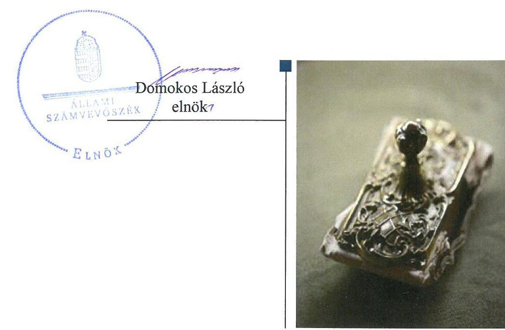
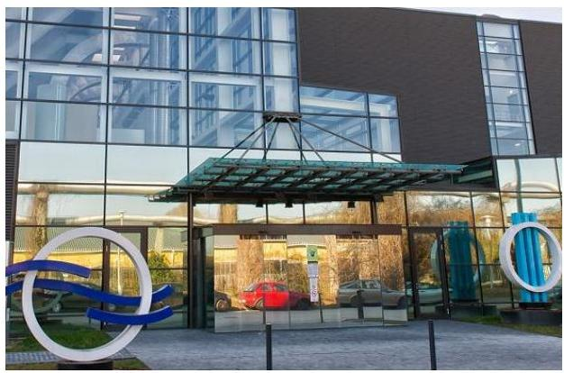
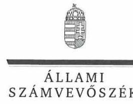
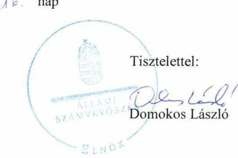
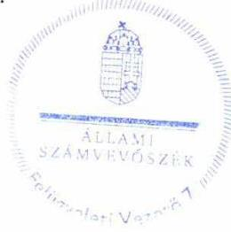

# Jelentés 

## Az állami tulajdonú gazdasági társaságok ellenőrzése

ÚJ MÉDIA és TELETEXT Szolgáltató Korlátolt Felelősségű Társaság
2018. 12. hó 05. nap

---

# AZ ELLENŐRZÉST FELÜGYELTE:

DR. HORVÁTH MARGIT felügyeleti vezető

## AZ ELLENŐRZÉST VEZETTE ÉS A VÉGREHAJTÁSÁÉRT FELELŐS:

- ÁRPÁSI TIBOR ellenőrzésvezető
- A PROGRAM ÖSSZEÁLLÍTÁSÁÉRT FELELŐS:
  - TÓTPÁL SZABOLCS osztályvezető

IKTATÓSZÁM: EL-0424-043/2018.

TÉMASZÁM: 2469

ELLENŐRZÉS-AZONOSÍTÓ SZÁM: V081442

Jelentéseink az Országgyűlés számítógépes hálózatán és az Interneten a www.asz.hu címen is olvashatóak.

---

# TARTALOMJEGYZÉK 

■ ÖSSZEGZÉS ..... 5
■ AZ ELLENŐRZÉS CÉLJA ..... 6
■ AZ ELLENŐRZÉS TERÜLETE ..... 7
■ AZ ELLENŐRZÉS HÁTTERE, INDOKOLTSÁGA ..... 8
■ A JELENTÉS LÉNYEGES KÉRDÉSKÖREI ..... 9
■ AZ ELLENŐRZÉS HATÓKÖRE ÉS MÓDSZEREI ..... 10
■ MEGÁLLAPÍTÁSOK ..... 12
■ JAVASLATOK ..... 15
■ MELLÉKLETEK ..... 17
I. sz. melléklet: Fogalomtár ..... 17
■ FÜGGELÉK: ÉSZREVÉTELEK ..... 19
■ RÖVIDÍTÉSEK JEGYZÉKE ..... 29

---

.

---

# ÖSSZEGZÉS 

Az ÚJ MÉDIA és TELETEXT Szolgáltató Kft. működésének szabályozottsága az ellenőrzött időszakban nem felelt meg a jogszabályi előírásoknak. Gazdálkodása a szabályozási hiányosságok, továbbá az elszámolások hiányosságai miatt nem volt szabályszerű 2013-ban, illetve 2016-ban. Vagyongazdálkodása a leltár hiánya, továbbá a vagyonnyilvántartás szabálytalanságai miatt nem felelt meg a jogszabályi előírásoknak 2013-ban, illetve 2016-ban. Közzétételi kötelezettségéről az ellenőrzött időszakban nem gondoskodott, ezáltal működésének átláthatósága nem volt biztosított.

## Az ellenőrzés társadalmi indokoltsága

Az Állami Számvevőszék a stratégiáját megvalósítva ellenőrzéseivel segíti az átláthatóságot és az elszámoltathatóságot a közpénzekkel, a közvagyonnal való gazdálkodásban. Ellenőrzési témaválasztása során kiemelt figyelmet fordít a korábban ellenőrizetlen területekre.

Ellenőrzési tervének megfelelően a 2013-2016. közötti ellenőrzött időszakra az Állami Számvevőszék folytatja az állami tulajdonban (résztulajdonban) lévő gazdálkodó szervezetek vagyonmegőrzési és gazdálkodási tevékenységének ellenőrzését.

Az állami tulajdonú gazdasági társaságok a nemzeti vagyon részei. ÚJ MÉDIA és TELETEXT Szolgáltató Kft. kiemelt jelentőséggel bír a közszolgálati médiaszolgáltatók működésének támogatásában. Az Állami Számvevőszék az ellenőrzése során arra kereste a választ, hogy 2013-2016. között szabályszerű volt-e a társaság gazdálkodása és az Média-szolgáltatás-támogató és Vagyonkezelő Alap ehhez kapcsolódó tulajdonosi joggyakorlása.

## Főbb megállapítások, következtetések, javaslatok

Az ÚJ MÉDIA és TELETEXT Szolgáltató Kft. feletti tulajdonosi joggyakorlás kereteit a Médiaszolgáltatás-támogató és Vagyonkezelő Alap szabályszerűen alakította ki. A tulajdonosi joggyakorlás szabályszerű volt, az éves beszámolók elfogadása az előírásoknak megfelelően történt. A Médiaszolgáltatás-támogató és Vagyonkezelő Alap ugyanakkor nem alkotta meg a Társaság javadalmazási szabályzatát.

A 2013-2016. években a Társaság működésének szabályozottsága, beszámolóinak összeállítása nem felelt meg a jogszabályi előírásoknak, éves beszámolói mérlegtételeit leltárral nem támasztotta alá. Továbbá közzétételi és évközi adatszolgáltatási kötelezettségének a Társaság nem tett eleget. A Társaság gazdálkodása a szabályozási hiányosságok, valamint a bevételek és ráfordítások elszámolási hiányosságai, vagyongazdálkodása a szabályozás, a vagyonnyilvántartás hiányosságai miatt nem volt szabályszerű 2013-ban, illetve 2016-ban.

---

# AZ ELLENŐRZÉS CÉLJA 

Az ellenőrzés célja annak értékelése volt, hogy tulajdonosi jogok gyakorlása szabályszerű volt-e. A gazdálkodó szervezet szabályozottsága, gazdálkodása és vagyongazdálkodási tevékenysége megfelelt-e a jogszabályi és a tulajdonosi előírásoknak; biztosítva volt-e a közfeladatok átláthatósága és elszámoltathatósága érdekében a közszolgáltatás díjának megalapozottsága szabályszerű önköltségszámítással. A vagyonváltozást eredményező döntések esetében a tulajdonosi jogok gyakorlója és a gazdálkodó szervezet szabályszerűen jártak-e el.

---

# AZ ELLENŐRZÉS TERÜLETE 

## Az ÚJ MÉDIA és TELETEXT Szolgáltató Kft. és a tulajdonosi jogokat gyakorló Médiaszolgáltatás-támogató és Vagyonkezelő Alap

Az ÚJ MÉDIA és TELETEXT Szolgáltató Kft. jogelődjét 1988-ban alapították, 2011. április 26-án került a Magyar Állam kizárólagos tulajdonába, a tulajdonosi jogokat az Mttv. ${ }^{1}$ alapján a Médiaszolgáltatás-támogató és Vagyonkezelő Alap gyakorolta.

A Társaság ${ }^{2}$ főtevékenysége médiareklám, a közmédia szervezetei által működtetett online felületek szerkesztése, működtetése, a televízió csatornák teletext szolgáltatásának működtetése, műsorainak promótálása web és teletext felületeken. A Társaság főtevékenysége nem közhasznú tevékenység, végzéséhez nem szükséges hatósági engedély, az a közmédia szervezeteivel kötött szerződéseken alapult. Az ellenőrzött időszakban a Társaság szolgáltatta az M1, M2, M3, M4, a Duna és Duna World televíziós csatornák teletext információinak szerkesztését, valamint adásaik magyar nyelvű feliratozását. Az MTVA ${ }^{3}$-val kötött szerződés alapján 2015-től a Társaság végezte a közmédia teljes online, illetve digitális portfoliójának projektmenedzsmentjét és tartalomgazdálkodását.

A Társaság törzstőkéje 86 M Ft volt, ami az ellenőrzött időszakban nem változott. A Társaság más gazdasági társaságban tulajdonosi részesedéssel nem rendelkezett és nem tartozott a kormányzati szektorba sorolt egyéb szervezetek közé.

A Társaság ügyvezetője ${ }^{4}$ az ellenőrzött időszakban négy alkalommal változott. A felügyelőbizottság ${ }^{5}$ összetétele négy ízben módosult. A Társaságnál független könyvvizsgáló ${ }^{6}$ működött, személye 2015. december 16-án változott.

A Társaság működéséhez szükséges szolgáltatásokat (irodai elhelyezés, humán erőforrás gazdálkodási, jogi, igazgatási, biztonsági, informatikai) Együttműködési megállapodás ${ }^{7}$ alapján az MTVA biztosította. 2016-tól az együttműködés ${ }^{8}$ keretében az MTVA végezte a Társaság közbeszerzési eljárásait. A Társaság az ellenőrzött időszakban belső ellenőrzést nem működtetett, arra nem volt kötelezett.

A Társaság vagyonkezelésbe vett eszközökkel nem rendelkezett, tevékenységét az MTVA és saját tulajdonú - főként informatikai - eszközeivel végezte.

A Társaság közzétett éves beszámolója szerint 2012-ben 544,3 M Ft nettó árbevételt ért el, költségnemek szerinti költségeinek együttes összege 512,6 M Ft volt. A Társaság 2013-ban és 2014-ben éves beszámolót állított össze. A Társaság árbevétele az ellenőrzött időszakban folyamatosan nőtt, árbevételének meghatározó része a közmédia szervezeteinek nyújtott szolgáltatásból származott. A Társaság az ellenőrzött időszak első 3 évében nyereségesen működött, 2016-ban veszteséget realizált.

---

# AZ ELLENŐRZÉS HÁTTERE, INDOKOLTSÁGA 

Az állami tulajdonú gazdálkodó szervezetek ellenőrzése kiemelten fontos a vagyon megőrzése, megóvása érdekében. Gazdálkodásuk jellemzően a közérdeklődés és a média figyelmének középpontjában áll, amihez hozzájárul a gazdálkodásuk körébe tartozó - közvetlen vagy közvetett állami tulajdonú, tehát végső soron a nemzeti vagyon részét képező - vagyon nagysága, illetve az általuk ellátott közszolgáltatások/közfeladatok minősége és hatékonysága.

Az ellenőrzés rámutathat az állami tulajdonú gazdálkodó szervezetek gazdálkodási tevékenységével jó gyakorlatokra és szabálytalanságokra. Felhívhatja a figyelmet a jogszabályi követelmények teljesítéséhez szükséges feltételek hiányosságaira, hozzájárulhat az államháztartáson kívüli, de (közvetlenül vagy közvetve) állami vagyont használó gazdálkodó szervezetek tevékenységének átláthatóságához. Ellenőrzésünk eredményeképpen javaslatainkkal, megállapításainkkal hozzájárulhatunk a nemzeti vagyonnal való gazdálkodás átláthatóságának, elszámoltathatóságának javításához.

---

# A JELENTÉS LÉNYEGES KÉRDÉSKÖREI 

1. A Médiaszolgáltatás-támogató és Vagyonkezelő Alap tulajdonosi joggyakorlása szabályszerű volt-e?
2. Az ÚJ MÉDIA és TELETEXT Szolgáltató Kft. működésének szabályozottsága megfelelt-e az előírásoknak, gazdálkodása, vagyongazdálkodása szabályszerű volt-e?

---

# AZ ELLENŐRZÉS HATÓKÖRE ÉS MÓDSZEREI 

## Az ellenőrzés típusa

Megfelelőségi ellenőrzés.

## Az ellenőrzött időszak

Az ellenőrzött időszak a 2013-2016. évek, a 2016. évi beszámoló jóváhagyásáig tartó időszak.

## Az ellenőrzés tárgya

Állami tulajdonban lévő gazdasági társaság gazdálkodása, kiemelten vagyongazdálkodási tevékenysége, a tulajdonosi jogok gyakorlása.

Az ellenőrzés kiterjedt minden olyan körülményre és adatra, amely az ÁSZ ${ }^{9}$ jogszabályban meghatározott feladatainak teljesítéséhez, valamint a program végrehajtása folyamán felmerült újabb összefüggések feltárásához szükséges volt.

## Az ellenőrzött szervezet

Médiaszolgáltatás-támogató és Vagyonkezelő Alap
ÚJ MÉDIA és TELETEXT Szolgáltató Kft.

## Az ellenőrzés jogalapja

Az ellenőrzés jogszabályi alapját az ÁSZ tv. ${ }^{10}$ 1. § (3) bekezdése és 5. § (3)-5) bekezdései képezték.

## Az ellenőrzés módszerei

Az ellenőrzést a nemzetközi standardokat irányadónak tekintve az ellenőrzési program ellenőrzési kérdései, az ellenőrzött időszakban hatályos jogszabályok, az ellenőrzés szakmai szabályok és módszertanok figyelembe vételével végeztük.

Az ellenőrzés ideje alatt az ellenőrzött szervezettel történő kapcsolattartást az ÁSZ Szervezeti és Működési Szabályzatának vonatkozó előírásai alapján biztosítottuk.

---

A tulajdonosi joggyakorlást a 2013. és a 2016. évekre vonatkozóan ellenőriztük.

A teljes ellenőrzött időszakra vonatkozóan került ellenőrzésre a gazdasági társaság tervezési, beszámolási, közzétételi, adatszolgáltatási kötelezettségének, valamint belső ellenőrzési tevékenységének szabályszerűsége. A 2013. és 2016. évekre vonatkozóan a gazdasági társaság működésének szabályozottságát, a 2013. és 2016. évekre bevételei és ráfordításai elszámolását, illetve vagyongazdálkodásának szabályszerűségét is ellenőriztük.

A bevételek és a ráfordítások közül az értékesítés nettó árbevétele, az egyéb, rendkívüli és pénzügyi műveletek bevételei, a személyi jellegű ráfordítások, az anyagjellegű ráfordítások, az egyéb, rendkívüli és pénzügyi műveletek ráfordításai, valamint értékcsökkenési leírás elszámolásának szabályszerűségét, továbbá az immateriális javak, tárgyi eszközök esetében a vagyonnyilvántartás szabályszerűségét véletlen mintavétellel ellenőriztük.

A fenti sokaságok esetében a mintavétel azokra a legnagyobb értékű tételekre - a lényeges sokaságra - terjedt ki, melyek összértéke eléri a teljes sokaság összértékének 50%-át. A személyi jellegű ráfordítások esetében a mintavétel a teljes sokaságból történt. Amennyiben valamely ellenőrzött sokaság elemszáma kisebb volt, mint az előírt mintaelemszám, az ellenőrzött sokaságot tételesen ellenőriztük.

A mintavétellel ellenőrzött területek esetében minden egyes tétel vonatkozásában a szabályszerűségre vonatkozó kérdéseket tettünk fel, amelyek eredménye összesítésre került. „Szabályszerűnek" értékeltünk egy ellenőrzött területet, amennyiben 95%-os bizonyossággal az ellenőrzött sokaságban az átlagos hibaarány legfeljebb 10%, "nem szabályszerűnek", amennyiben 10%-nál magasabb arányt képviselt.

Az ellenőrzési kérdések megválaszolásához szükséges bizonyítékok megszerzése a következő ellenőrzési eljárások alkalmazásával történt: megfigyelés, kérdésfeltevés (információkérés), összehasonlítás, valamint elemző eljárás. Az ellenőrzési bizonyítékként felhasználható adatforrások közé tartoztak egyrészt az ellenőrzési programban felsorolt adatforrások, másrészt adatforrás lehetett még minden - az ellenőrzés folyamán - feltárt, az ellenőrzés szempontjából információkat tartalmazó dokumentum.

Az ellenőrzés a kérdésekre adott válaszok kiértékelésével, valamint a megjelölt adatforrások, a csatolt tanúsítványok felhasználásával, továbbá az adott időszakban hatályos jogszabályok figyelembe vételével folyt le.

---

# 1. A Médiaszolgáltatás-támogató és Vagyonkezelő Alap tulajdonosi joggyakorlása szabályszerű volt-e? 

Összegző megállapítás

Az MTVA szabályszerűen alakította ki a tulajdonosi joggyakorlás kereteit és gyakorolta a tulajdonosi jogokat, az éves beszámolók elfogadásáról szabályszerűen döntött. Az MTVA nem alkotta meg a Társaság javadalmazási szabályzatát.

A TULAJDONOSI JOGOKAT GYAKORLÓ MTVA a tulajdonosi joggyakorlás kereteit a Gt. ${ }^{11}$, illetve a Ptk. ${ }^{12}$ előírásainak megfelelően határozta meg a Társaság alapító okiratában ${ }^{13}$. Az MTVA a Társaság feletti tulajdonosi jogokat és kötelezettségeket az MTVA SZMSZ-ében ${ }^{14}$, az MTVA Gazdálkodási és Kezelési Szabályzatában ${ }^{15}$ foglaltak szerint gyakorolta. A taggyűlés hatáskörébe tartozó kérdésekben az MTVA vezérigazgatója alapítói határozattal döntött a Gt. és a Ptk., valamint az alapító okirat előírásainak megfelelően.

Az MTVA az alapító okiratban ${ }^{13}$ meghatározta az alapító ${ }^{16}$ kizárólagos hatásköreit, az ügyvezető ${ }^{4}$ személyét és feladatait, létrehozta - a Taktv. ${ }^{17}$ előírásának megfelelően három tagból álló - felügyelőbizottságot és meghatározta feladatait, kijelölte a könyvvizsgálót ${ }^{6}$, jóváhagyta a Társaság SZMSZ-ét ${ }^{18}$.

Az MTVA a Taktv. 5. § (3) bekezdésében előírt kötelezettség ellenére nem alkotta meg a vezető tisztségviselők, a felügyelőbizottsági tagok és az Mt. ${ }^{19}$ 208. § hatálya alá tartozó munkavállalók javadalmazására, valamint a jogviszony megszűnése esetére biztosított juttatások módjának, mértékének elveiről, annak rendszeréről szóló szabályzatot.

Az MTVA a Ptk. és az alapító okirat ${ }^{13}$ előírásai szerint a felügyelőbizottság írásbeli véleménye és a könyvvizsgáló ${ }^{6}$ jelentése alapján megtárgyalta és elfogadta a Társaság éves beszámolóit, döntött az eredmény felhasználásáról.

Az MTVA
 a Társaság tevékenységének nyomon követését az alapító okiratban ${ }_{1-11}$ az ügyvezető ${ }_{1-5}$ részére előírt - a szerződésállományról havi, a lezárult üzleti évről éves - tájékoztatási, valamint a felügyelőbizottság - lényeges üzletpolitikai jelentést, alapítói hatáskörbe tartozó előterjesztést érintő - előzetes véleményalkotási kötelezettsége révén biztosította. Az MTVA a Társaság pénzügyi helyzetéről a Kontrolling Igazgatóság részére teljesítendő havi és negyedéves adatszolgáltatási kötelezettséget ${ }^{20}$ írt elő.

---

# 2. Az ÚJ MÉDIA és TELETEXT Szolgáltató Kft. működésének szabályozottsága megfelelt-e az előírásoknak, gazdálkodása, vagyongazdálkodása szabályszerű volt-e? 

Összegző megállapítás

A 2013-2016. években a Társaság működésének szabályozottsága, beszámolóinak összeállítása nem felelt meg a jogszabályi előírásoknak, éves beszámolói mérlegtételeit leltárral nem támasztotta alá. Továbbá közzétételi és évközi adatszolgáltatási kötelezettségének a Társaság nem tett eleget. A Társaság gazdálkodása a szabályozási hiányosságok, valamint a bevételek és ráfordítások elszámolási hiányosságai, vagyongazdálkodása a szabályozás, a vagyonnyilvántartás hiányosságai miatt nem volt szabályszerű 2013-ban, illetve 2016-ban.

A TÁRSASÁG a Számv. tv. ${ }^{21}$-ben meghatározott szabályzatok közül Számviteli politikával ${ }^{22}$, Leltározási szabályzattal ${ }^{23}$, Pénzkezelési szabályzattal ${ }^{24}$ és Számlarenddel ${ }^{25}$ rendelkezett. Az eszközök és források értékelési szabályzatával és az önköltségszámítás rendjére vonatkozó belső szabályzattal a Számv. tv. 14. § (5) bekezdés b) és c) pontjaiban és a (7) bekezdésben előírtak ellenére nem rendelkezett a Társaság.

A Számviteli politika nem felelt meg a Számv. tv. előírásainak, mivel a 2015. július 4-ével hatályba lépett - az egyszerűsített éves beszámoló mutatóértékeit, az eredménykimutatás tételeinek tartalmát érintő - változásokat a Társaság nem vezette át, megsértve a Számv. tv. 14. § (11) bekezdésében foglaltakat. A 2015-2016. évekről a Társaság a Számv. tv. 9. § (2) bekezdésében foglalt mutatóértékek és gazdálkodási adatai alapján egyszerűsített éves beszámolót állított össze. Ugyanakkor a Számviteli politika „Általános bevezető része" és „Kiegészítése" a beszámoló formájaként éves beszámoló készítését írta elő.

A Leltározási szabályzat a tárgyi eszközökre vonatkozóan 4, illetve 5 évenkénti leltározást írt elő, ami nem felelt meg a folyamatosan vezetett mennyiségi nyilvántartás mellett a Számv. tv. 69. § (3) bekezdésében foglalt legalább háromévenkénti kötelezettségnek.

A Társaság Számlarendje nem felelt meg a Számv. tv. 161. § (2) bekezdés a), b), d) pontjaiban foglaltaknak, mivel nem határozta meg minden alkalmazásra kijelölt számla számjelét és megnevezését, nem tartalmazta a számla értéke növekedésének, csökkenésének jogcímeit, a számlát érintő gazdasági eseményeket, azok más számlákkal való kapcsolatát, továbbá a számlarendben foglaltakat alátámasztó bizonylati rendet.

A Pénzkezelési szabályzat tartalma megfelelt a Számv. tv. előírásainak.
ÉVES BESZÁMOLÓIT a Társaság nem szabályszerűen állította össze. A 2013-2016. évek éves beszámolói mérlegének tételeit a Számv. tv. 69. § (1) bekezdésében foglaltak ellenére a Társaság nem támasztotta alá leltárral. A Társaság ezzel megsértette a Számv. tv. 15. § (3) bekezdésében foglalt valódiság elvét, mivel nem biztosította, hogy a könyveiben rögzített és a beszámolókban szerepelő tételek a valóságban is megtalálhatók, bizonyíthatók, kívülállók által is megállapíthatók legyenek. A könyvvizsgáló1,2 az

---

ellenőrzött időszak beszámolóit a leltár hiánya ellenére minden évben korlátozás nélküli hitelesítő záradékkal látta el.

A TEVÉKENYSÉGÉNEK MONITORINGJÁT lehetővé tevő - az alapító okirat ${ }_{1-11}$ 10.6. pontjában meghatározott, valamint az MTVA által előírt - évközi beszámolókat a Társaság nem készítette el, az éves beszámolási kötelezettségén túl további adatszolgáltatást nem teljesített.

A BESZÁMOLÓKKAL KAPCSOLATOS letétbe helyezési és közzétételi kötelezettségét a Társaság a Számv. tv.-ben előírt határidőig teljesítette. A Társaság nem tett eleget a Taktv. 2. § (1) bekezdésében meghatározott, a közérdekből nyilvános adatok - a vezető tisztségviselő részére nyújtott pénzbeli juttatások, a végkielégítés mértéke és időtartama valamint a felmondási ideje időtartama, a felügyelő bizottsági tagok megbízási díja és ezen felüli járandósága valamint jogviszonyuk megszűnése esetén részükre járó pénzbeli juttatás - közzétételére vonatkozó kötelezettségének.

A TÁRSASÁG GAZDÁLKODÁSA 2013-ban és 2016-ban nem volt szabályszerű a számviteli szabályozottság, a leltári alátámasztottság hiánya, továbbá 2013-ban a bevételek és ráfordítások, 2016-ban az anyagjellegű és a személyi ráfordítások elszámolásának szabálytalanságai miatt.

2016-ban a személyi ráfordítások elszámolása nem volt szabályszerű. A Társaság a Számv. tv. 165. § (1)-(2) bekezdésében foglaltak ellenére az anyagjellegű ráfordítások elszámolását nem támasztotta alá szabályszerűen kiállított bizonylatokkal, a személyi ráfordítások elszámolásánál a munkabérek kifizetéséhez nem állt rendelkezésre munkaszerződés módosítás, illetve munkaidő nyilvántartás. A béren kívüli juttatás kifizetéséhez hiányzott a cafeteria nyilatkozat az SZJA tv. ${ }^{26}$ 71. § (4) bekezdésében foglaltak ellenére. A bevételek és az értékcsökkenés elszámolása az ellenőrzött tételek esetében a Számv. tv. előírásai szerint szabályszerűen történt.

A VAGYONGAZDÁLKODÁS nem volt szabályszerű a szabályozottság, a vagyonnyilvántartás, a leltározás hiányosságai miatt. A vagyon nyilvántartása 2013-2016. évben a mérleg tételeinek leltárral való alátámasztásának hiánya miatt nem volt biztosított. A Társaság a tárgyi eszközök mérlegben kimutatott értékét a teljes ellenőrzött időszakban nem támasztotta alá mennyiségi felvétellel történő leltározással, ezzel nem tett eleget a Számv. tv. 69. § (3) bekezdésében foglalt háromévenkénti mennyiségi leltárfelvételi kötelezettségének.

A vagyon változását eredményező döntéseket az alapító okiratban ${ }_{1-11}$, valamint a SZMSZ ${ }_{1-5}$ V. pontjában megfogalmazott hatásköröknek megfelelően hozta meg a Társaság.

Az MTVA 2014-ben a taxi szolgáltatás igénybevételével kapcsolatosan lefolytatott ellenőrzése alapján a Társaság megtette a szükséges intézkedést. A Társaságnál külső ellenőrzés nem volt az ellenőrzött időszakban.

---

# JAVASLATOK 

Az ÁSZ tv. 33. § (1) bekezdésében foglaltak értelmében az ellenőrzött szervezet vezetője köteles a jelentésben foglalt megállapításokhoz kapcsolódó intézkedési tervet összeállítani és azt a jelentés kézhezvételétől számított 30 napon belül az ÁSZ részére megküldeni. Amennyiben az ellenőrzött szervezet vezetője nem küldi meg határidőben az intézkedési tervet, vagy továbbra sem elfogadható intézkedési tervet küld, az Állami Számvevőszék elnöke az ÁSZ tv. 33. § (3) bekezdése a) és b) pontjaiban foglaltakat érvényesítheti.
Javaslataink célja az ÚJ MÉDIA és TELETEXT Szolgáltató Kft. gazdálkodása szabályszerűségének és gyakorlatának javítása annak érdekében, hogy a szabályozási környezet és az alkalmazott gyakorlat megfelelően tudja támogatni az átlátható működést.

## Az ÚJ MÉDIA és TELETEXT Szolgáltató Kft. ügyvezetőjének

1. Intézkedjen a számviteli szabályzatok elkészítése és módosítása érdekében a hatályos Számv. tv. előírásainak megfelelően.
(2. sz. megállapítás 1. bekezdés 2. mondata, 2-4. bekezdései alapján)
2. Intézkedjen az éves beszámolók elkészítéséről, illetve a beszámoló mérlegtételeinek leltárral történő alátámasztásáról a hatályos Számv. tv. előírásainak megfelelően.
(2. sz. megállapítás 6. bekezdés alapján)
3. Intézkedjen a Társaság számára előírt évközi beszámolók elkészítéséről.
(2. sz. megállapítás 7. bekezdés alapján)
4. Intézkedjen a Társaság adatainak közzétételéről a Taktv. tv. előírásainak megfelelően.
(2. sz. megállapítás 8. bekezdés 2. mondata alapján)
5. Intézkedjen az anyagjellegű ráfordítások Számv. tv. előírásainak megfelelő elszámolása érdekében.
(2. sz. megállapítás 10. bekezdés 2. mondat 1. tagmondat alapján)

---

6. Intézkedjen a személyi jellegű ráfordítások Számv. tv. előírásainak megfelelő elszámolása érdekében.
(2. sz. megállapítás 10. bekezdés 2. mondat 2. tagmondata alapján)
7. Intézkedjen a Számv. tv. előírásainak megfelelő leltározás végrehajtásáról.
(2. sz. megállapítás 11. bekezdés 3. mondata alapján)

# Javaslatunk célja a tulajdonosi joggyakorló Médiaszolgáltatás-támogató és Vagyonkezelő Alap szabályszerű működésének elősegítése, továbbá a tulajdonosi joggyakorlás kontrolljainak erősítése. 

## A Médiaszolgáltatás-támogató és Vagyonkezelő Alap vezérigazgatójának

1. Intézkedjen a Taktv.-ben előírt, a vezető tisztségviselők, a felügyelőbizottsági tagok és az Mt. 208. § hatálya alá tartozó munkavállalók javadalmazására, valamint a jogviszony megszünése esetére biztosított juttatások módjának, mértékének legfőbb elveiről, annak rendszeréről szóló szabályzat megalkotásáról.
(1. sz. megállapítás 3. bekezdése alapján)

---

# MELLÉKLETEK 

- I. SZ. MELLÉKLET: FOGALOMTÁR
állami vagyon
gazdasági társaság
kormányzati szektorba sorolt egyéb szervezet
közszolgáltatás

MNV Zrt.
nemzeti vagyon
a) Az állam tulajdonában lévő dolog, valamint a dolog módjára hasznosítható természeti erő,
b) az a) pont hatálya alá nem tartozó mindazon vagyon, amely vonatkozásában törvény az állam kizárólagos tulajdonjogát nevesíti,
c) az állam tulajdonában lévő tagsági jogviszonyt megtestesítő értékpapír, illetve az államot megillető egyéb társasági részesedés,
d) az államot megillető olyan immateriális, vagyoni értékkel rendelkező jogosultság, amelyet jogszabály vagyoni értékű jogként nevesít.
Forrás: Vtv. 1. § (2) bekezdése
e) az állam tulajdonában lévő pénzügyi eszközök
Forrás: Vtv. 1. § (2) bekezdése
A Ptk 3:88. § (1) bekezdése szerint „a gazdasági társaságok üzletszerű közös gazdasági tevékenység folytatására, a tagok vagyoni hozzájárulásával létrehozott, jogi személyiséggel rendelkező vállalkozások, amelyekben a tagok a nyereségből közösen részesednek, és a veszteséget közösen viselik".
Az a szervezet, amely az Áht. alapján nem része az államháztartásnak, azonban az Európai Közösséget létrehozó szerződéshez csatolt, a túlzott hiány esetén követendő eljárásról szóló jegyzőkönyv alkalmazásáról szóló 2009. május 25-i 479/2009/EK rendelet szerint a kormányzati szektorba tartozik. A nemzetgazdasági miniszter 2013. június 26-án megjelent Közleményben tette közé ezen szervezetek listáját
Az Ebktv. 27 3. § d) pontja a következőképpen határozza meg a közszolgáltatást: „szerződéskötési kötelezettség alapján a lakosság alapvető szükségleteinek ellátására irányuló szolgáltatás, így különösen a villamos energia-, gáz-, hő-, víz-, szenny-víz- és hulladékkezelési, köztisztasági, postai és távközlési szolgáltatás, továbbá a menetrend alapján közlekedő járművekkel végzett közforgalmú személyszállítás".
Az állami vagyon felett, a Magyar Államot megillető tulajdonosi jogok és kötelezettségek összességét - a hatályos szabályozás szerint - az állami vagyon felügyeletéért felelős miniszter (jelenleg a nemzeti fejlesztési miniszter) gyakorolja. A miniszter feladatát nagy részben az MNV Zrt., mint tulajdonosi joggyakorló szervezet útján látja el.
a) az állam vagy a helyi önkormányzat kizárólagos tulajdonában álló dolgok,
b) az a) pont hatálya alá nem tartozó, állam vagy a helyi önkormányzat tulajdonában lévő dolog,
c) az állam vagy a helyi önkormányzat tulajdonában lévő pénzügyi eszközök, továbbá az államot vagy a helyi önkormányzatot megillető társasági részesedések,
d) az államot vagy a helyi önkormányzatot megillető bármely vagyoni értékkel rendelkező jogosultság, amelyet jogszabály vagyoni értékű jogként nevesít,
e) Magyarország határa által körbezárt terület feletti légtér,
f) az üvegházhatású gázok kibocsátási egységeinek kereskedelméről szóló törvény szerint kibocsátási egység és légiközlekedési kibocsátási egység, valamint az ENSZ Éghajlatváltozási Keretegyezménye és annak Kiotói Jegyzőkönyve végrehajtási keretrendszeréről szóló törvény szerinti kiotói egység,

---

g) állami vagy helyi önkormányzati fenntartású közgyűjtemény (muzeális intézmény, levéltár, közgyűjteményként működő kép- és hangarchívum, valamint könyvtár) saját gyűjteményében nyilvántartott kulturális javak körébe tartozó dolog, kivéve, ha az állami vagy önkormányzati tulajdon jogszerű létrejötte kétséget kizáró módon nem bizonyítható és a dologra nézve más a tulajdonjogát bizonyítja vagy a kulturális javakra vonatkozó jogszabályokban meghatározott eljárás keretében valószínűsíti (g. pont módosult 2013. december 7-től),
h) a régészeti lelet,
i) a nemzeti adatvagyon körébe tartozó állami nyilvántartások fokozottabb védelméről szóló törvény szerinti nemzeti adatvagyon.
Forrás: Nvtv. 1. § (2)
tulajdonosi jogok gyakorlója

# 1. 

2013. június 27-ig:

Az állami vagyon felett a Magyar Államot megillető tulajdonosi jogok és kötelezettségek összességét - ha törvény eltérően nem rendelkezik - az állami vagyon felügyeletéért felelős miniszter (a továbbiakban: miniszter) gyakorolja, aki e feladatát a Magyar Nemzeti Vagyonkezelő Zártkörűen Működő Részvénytársaság (a továbbiakban: MNV Zrt.), a Magyar Fejlesztési Bank, illetve a tulajdonosi joggyakorló
 szervezet útján látja el. A miniszter miniszteri rendeletben, a törvényben meghatározott állami vagyoni kör tekintetében, meghatározott időtartamra, a joggyakorlás egyes szabályainak meghatározásával - az őt megillető tulajdonosi jogok és kötelezettségek összességének, illetve azok meghatározott részének gyakorlóját az Áht. szerinti központi költségvetési szervek, ezek intézménye, továbbá a 100%-ban állami tulajdonban álló gazdasági társaságok közül kijelölheti.
Forrás: Vtv. 3. § (1) és (2)

## 2013. június 28-ától:

A rábízott állami vagyon felett az államot megillető tulajdonosi jogok és kötelezettségek összességét tulajdonosi joggyakorlóként:
a) ha törvény vagy miniszteri rendelet eltérően nem rendelkezik, a Magyar Nemzeti Vagyonkezelő Zártkörűen Működő Részvénytársaság (a továbbiakban: MNV Zrt.),
b) törvényben kijelölt személy vagy
c) az állami vagyon felügyeletéért felelős miniszter (a továbbiakban: miniszter) által rendeletben kijelölt személy gyakorolja.
[...] A miniszter e törvény felhatalmazása alapján - a meghatározott célok hatékonyabb elérése érdekében, miniszteri rendeletben, az ott meghatározott állami vagyoni kör tekintetében, meghatározott időtartamra - e törvény keretei között, a joggyakorlás egyes szabályainak meghatározásával - az államot megillető tulajdonosi jogok és kötelezettségek összességének, illetve azok meghatározott részének gyakorlóját az Áht. szerinti központi költségvetési szervek, ezek intézménye, továbbá a 100%-ban állami tulajdonban álló gazdasági társaságok közül kijelölheti.
Forrás: Vtv. 3. § (1) és (2)
2.

Aki a nemzeti vagyon felett az államot vagy a helyi önkormányzatot megillető tulajdonosi jogok és kötelezettségek összességének gyakorlására jogosult
Forrás: Nvtv. 3. § (1) 17. pontja

---

# FÜGGELÉK: ÉSZREVÉTELEK 

A jelentéstervezetet a Számvevőszék 15 napos észrevételezésre megküldte az ellenőrzött szervezetek vezetőinek az ÁSZ tv. 29. § (1) bekezdése előírásának megfelelően.

A függelék tartalmazza az ellenőrzött Társaság észrevételeit, illetve az el nem fogadott észrevételek elutasításának indokolását. A tulajdonosi jogokat gyakorló MTVA nem tett észrevételt.

[^0]
[^0]:    * 29. § (1) Az Állami Számvevőszék az ellenőrzési megállapításait megküldi az ellenőrzött szervezet vezetőjének vagy az általa megbízott személynek, és annak, akinek személyes felelősségét állapította meg.
    (2) Az ellenőrzött szervezet vezetője és a felelősként megjelölt személy az ellenőrzés megállapításaira tizenöt napon belül írásban észrevételt tehet.
    (3) Az Állami Számvevőszék az észrevételre a beérkezésétől számított harminc napon belül írásban válaszol. A figyelembe nem vett észrevételeket köteles a jelentésben feltüntetni, és megindokolni, hogy azokat miért nem fogadta el.

---

# Állami Számvevőszék 

Budapest 4.
Pf. 54.
1364

## Domokos László Úr

## Tisztelt Elnök Úr!

Alulírott Vas Imre, mint az Új Média és Teletext Szolgáltató Kft. (székhely: 1037 Budapest, Kunigunda útja 64.) ügyvezetője az Ön EL-0704-026/2018. iktatószámú, 2018. október 3. napján kelt és október 8-án kézhez vett levelének mellékletét képező „Az állami tulajdonú gazdasági társaságok ellenőrzése - Új Média és Teletext Szolgáltató Kft." címmel készült számvevőszéki jelentéstervezetre a rendelkezésemre álló határidőn belül - az alábbi észrevételt teszem:

## Általános észrevételek

Mint ahogy a jelentéstervezet is tartalmazza, a vizsgált időszakban többször változott az Új Média és Teletext Szolgáltató Kft. ügyvezetése, a könyvvezetést végzők ill. a könyvvizsgáló személye is.
2011-2015 év közepéig a számviteli szolgáltatást a Társaság részére az ICI Kereskedelmi Kft. végezte, melynek személyesen közreműködő ügyvezetője váratlanul és hirtelen 2015-ben elhunyt, így a számviteli dokumentumok teljes körű, szabályos átadására ekkor nem volt lehetőség. Ez az oka annak, hogy erre az időszakra vonatkozóan nem állt teljes körűen rendelkezésünkre minden szükséges dokumentum, így azokat a vizsgálat alatt bemutatni sem tudtuk. Az ellenőrzés során ugyan felvettük a kapcsolatot a Társaság könyvvizsgálójával, aki a 2013. és 2014. évi beszámolókat auditálta, de a vizsgálat időpontjában külföldön tartózkodott, így vizsgálati anyagait akkor nem tudta átadni.

A vizsgálati anyagokat végül a számvevőszéki jelentéstervezet kézhezvételét követően kaptuk meg a könyvvizsgálótól, így a Társaság 2011-től hatályos értékelési szabályzatát, ill. a 2013. és 2014. évek beszámolóit alátámasztó analitikákat ill. a könyvvizsgáló erre vonatkozó nyilatkozatát jelen észrevétel mellékleteként tudjuk a Tisztelt Állami Számvevőszék rendelkezésére bocsátani.

## Konkrét észrevételek

1. A 13. oldal összegző megállapításban foglaltakhoz: „Továbbá közzétételi és évközi adatszolgáltatási kötelezettségének a Társaság nem tett eleget."

Kérjük a megállapítás pontosítását, hiszen a jelentéstervezet 14. oldal 3. bekezdésében szerepel, hogy az Új Média és Teletext Szolgáltató Kft. a beszámolókkal kapcsolatos letétbe helyezési és közzétételi kötelezettségét határidőben teljesítette, így a fenti megállapítás csak a közérdekből nyilvános adatok közzétételére vonatkozhat.
2. A 13. oldal 1. bekezdésben foglaltakhoz: „Az eszközök és források értékelési szabályzatával és az önköltségszámítás rendjére vonatkozó belső szabályzattal........nem rendelkezett a Társaság."

A Társaság 2011-től az ügyvezető által hatályba léptetett eszköz-forrás értékelési szabályzattal rendelkezett, amely a vizsgálat időpontjában nem állt rendelkezésünkre, de időközben a könyvvizsgáló saját dokumentációjából rendelkezésünkre bocsátott.

Az Új Média és Teletext Kft. a számviteli törvény 9. § (2) bekezdésben foglalt mutatók alapján a vizsgált időszakban és az óta is egyszerűsített éves beszámoló készítésére jogosult. 2013-ban és

---

2014-ben saját elhatározásából éves beszámolót, 2015-2016. évekről egyszerűsített éves beszámolót készített. A számviteli törvény 14. § (6) bekezdése alapján mentesül az önköltségszámítás rendjére vonatkozó szabályzat készítési kötelezettség alól az egyszerűsített éves beszámolót készítő gazdálkodó, ezért véleményünk szerint a Társaság 2015. évtől nem kötelezett ezen szabályzat készítésére.
3. A 13. oldal 2. bekezdésben foglaltakhoz: „Ugyanakkor a számviteli politika ,,Általános bevezető része" és „Kiegészítése" a beszámoló formájaként éves beszámoló készítését írta elő."

Az Új Média és Teletext Kft. mutatószámai alapján a vizsgált időszakban végig egyszerűsített éves beszámoló készítésére volt jogosult. Ennek rögzítése a számviteli politika 2. oldalán szerepel: „Társaságunk egyszerűsített éves beszámolót készíthet...." Ugyancsak itt szerepel, hogy amennyiben a Társaság leányvállalatként konszolidálásba bevonásra kerül, akkor éves beszámoló készítésére lesz köteles. Emiatt szerepel a szabályzatban mindkét fogalom. Megjegyezzük, hogy a Társaság a vizsgált időszakban egy részében saját elhatározásából éves beszámolókat készített.
4. A 13. oldal 5. bekezdésben foglaltakhoz: „Éves beszámolóit a Társaság nem szabályszerűen állította össze. A 2013-2016. évek éves beszámolói mérlegének tételeit.....a Társaság nem támasztotta alá leltárral."

A 2013 és 2014 évek beszámolói az ügyvezető által aláírt leltárakkal kerültek alátámasztásra. Az egyeztetett leltár analitikáit az általános részben foglalt okok miatt a vizsgálat időpontjában nem tudtuk bemutatni, de időközben a könyvvizsgáló dokumentációjából megkaptuk és csatoltan a Tisztelt Állami Számvevőszék rendelkezésére bocsájtjuk.

A vizsgálat során a 2015. és 2016. évek egyszerűsített éves beszámolóinak mérlegsorait alátámasztó, ügyvezetők által aláírt leltárakat a revízió rendelkezésére bocsátottuk. Tekintettel a fentiekre meggyőződésünk, hogy a vizsgált időszak beszámolói megfelelően kerültek összeállításra, valós és megbízható képet adnak a Társaság működéséről. A beszámolókat a Társaság független könyvvizsgálói minden évben korlátozás nélküli hitelesítő záradékkal látták el, azokat a felügyelő bizottság és a tulajdonosi joggyakorló szabályszerűen fogadta el.
Itt szeretnénk jelezni, hogy a Társaság könyvvizsgálói akár személyes konzultációval is készséggel állnak a revízió rendelkezésére a jelentéstervezetben foglalt megállapításokkal kapcsolatban.
5. A 14. oldal 4. bekezdésében foglaltakhoz: „...az anyagjellegű ráfordítások elszámolását nem támasztotta alá szabályszerűen kiállított bizonylatokkal.... "

A jelentéstervezet áttekintését követően szembesültünk azzal, hogy az anyagjellegű ráfordításokhoz kapcsolódó adatállományok, illetve az adatbekérés téves értelmezése miatt sajnálatos módon nem kerültek átadásra a vizsgálat során, ezért az ezzel kapcsolatban kiadott nyilatkozatunk a mi értelmezésünknek ugyan helytálló, de a jelentéstervezetből megállapítható adatbekérésnek nem megfelelő. Az ezzel kapcsolatos könyvelési állományok, bizonylatok teljes körűen rendelkezésre állnak, így azokat azonnal a revízió rendelkezésére tudjuk bocsájtani.
Kérjük a Tisztelt Állami Számvevőszéket, hogy szíveskedjen megvizsgálni ezeket a dokumentumokat és ennek alapján tegye meg ezzel kapcsolatos megállapításait.

Meg kívánjuk jegyezni, hogy a Társaságnál a költségek és ráfordítások kizárólag a tevékenységhez kapcsolódóan szerződéses keretek között kerültek ill. kerülnek elszámolásra és pénzügyi rendezésre.
6. A 14. oldal 4. bekezdésében foglaltakhoz: ,,..a munkabérek kifizetéséhez nem állt rendelkezésre munkaszerződés módosítás, illetve munkaidő nyilvántartás."

---

A megállapítás pontosítását kérjük, mert információink szerint a felsorolt dokumentumok csak az esetek egy részében nem kerültek bemutatásra.
7. A 14. oldal 5. bekezdésében foglaltakhoz: ,,A Társaság a tárgyi eszközök mérlegben kimutatott értékét a teljes ellenőrzött időszakban nem támasztotta alá mennyiségi felvétellel történő leltározással..."

Az immateriális javak és tárgyi eszközök állománya mennyiségi és értékbeni egyeztetéssel leltározásra került 2013-ban és 2014-ben. Az általános részben foglalt okok miatt, az egyeztetett leltár analitikája a vizsgálat időpontjában nem állt rendelkezésünkre, de időközben a könyvvizsgáló dokumentációjából megkaptuk és csatoltan a Tisztelt Állami Számvevőszék rendelkezésére bocsájtjuk.

A Társaság függetlenül a vizsgálattól 2017-ben is elvégezte a tárgyi eszközök és immateriális javak teljes körű leltározását.

Fentiek alapján kérjük a Tisztelt Állami Számvevőszéket, hogy észrevételeinket és a csatolt dokumentumokat elfogadni és a jelentéstervezet szövegét módosítani szíveskedjék.

Budapest, 2018. október 18.

Tisztelettel:
Új Média és Teletext Kft.
1037 Budapest, Kunigunda útja 64.
Adószámt: 10226868-4-41
Vas Imre
ügyvezető
Új Média és Teletext Kft.

# Mellékletek: 

1. Az Új Média és Teletext Kft. Eszközök és források értékelési szabályzata 2011.
2. 2013. évi beszámolót alátámasztó leltárak
3. 2014. évi beszámolót alátámasztó leltárak
4. Könyvvizsgálói nyilatkozat

---

ELNÖK

Ikt.szám: EL-0704-032/2018.

# Vas Imre úr 

ügyvezető

ÚJ MÉDIA és TELETEXT Szolgáltató Korlátolt Felelősségű Társaság

## Budapest

## Tisztelt Ügyvezető Úr!

Köszönettel vettem „Az állami tulajdonú gazdasági társaságok ellenőrzése - ÚJ MÉDIA és TELETEXT Szolgáltató Korlátolt Felelősségű Társaság" címmel készített számvevőszéki jelentéstervezetre megküldött észrevételét.
Az Állami Számvevőszék észrevételre vonatkozó álláspontját a felügyeleti vezető által készített részletes tájékoztatás tartalmazza, amelyet levelemhez mellékeltem.
Tájékoztatom Ügyvezető urat, hogy az Állami Számvevőszék a figyelembe nem vett észrevételeket az Állami Számvevőszékről szóló 2011. évi LXVI. törvény 29. § (3) bekezdésében előírtak szerint köteles a jelentésében feltüntetni és megindokolni, hogy azokat miért nem fogadta el.

Budapest, 2018. hó 16. nap

Tisztelettel:

Melléklet: Tájékoztatás az észrevételek kezeléséről

---

# Tájékoztatás az észrevételek kezeléséről 

Megköszönöm Ügyvezető úrnak „Az állami tulajdonú gazdasági társaságok ellenőrzése - ÚJ MÉDIA és TELETEXT Szolgáltató Korlátolt Felelősségű Társaság" címmel készített jelentéstervezetre tett észrevételeit. Az észrevételek kezeléséről az alábbi tájékoztatást adom.
Ügyvezető úr észrevételének első részében (Általános észrevételek) a dokumentumok hiányának okával kapcsolatban adott tájékoztatást megköszönöm. A tájékoztatás a jelentéstervezet konkrét megállapításait és javaslatait nem érintette, így ezek alapján a jelentéstervezetet nem módosítom.
Ügyvezető úr észrevételének második részében (Konkrét észrevételek) rögzítettek kezelésével összefüggésben az alábbi tájékoztatást adom:

## 1. számú észrevétel:

Az észrevétel a jelentéstervezet 2. sz. megállapítás összegző megállapítás 2. mondatát érintette. Az észrevételhez javaslat nem kapcsolódott.
A közzétételi kötelezettség pontosítását kérő észrevételben foglaltak alapján a jelentéstervezet 2. sz. megállapítás összegző megállapítás rész 2. mondatát nem módosítom, tekintettel arra, hogy az észrevétellel érintett megállapítás egy összegző megállapítás, amely a beszámolókkal kapcsolatos közzétételi kötelezettség teljesítésének és a közérdekből nyilvános adatok közzétételének elmulasztásának együttes értékelését rögzíti. Annak a súlya, hogy az ÚJ MÉDIA és TELETEXT Szolgáltató Kft. (Társaság) nem tette közzé a közérdekből nyilvános adatokat meghatározó volt a közzétételi kötelezettség teljesítésének megítélésében.

## 2. számú észrevétel:

Az észrevétel a jelentéstervezet 2. sz. megállapítás 1. bekezdés 2. mondatát és a Társaság ügyvezetőjének címzett 1. sz. javaslatot érintette.
Az eszközök és források értékelési szabályzatának hiányával kapcsolatos tájékoztatást tudomásul veszem,
 a jelentéstervezet 2. sz. megállapítás 1. bekezdés 2. mondat vonatkozó részét nem módosítom. Az ellenőrzés lefolytatására az EL-0292-003/2017. iktatószámú ellenőrzési programban foglaltak alapján a 2013-2016. évek közötti időszakot érintően került sor. Az EL-0424-003/2018. iktatószámú adatbekérő levél 2. számú melléklet 5. bekezdés 10. felsorolásában kértük a számviteli politika keretében kialakított szabályzatok között az eszközök és források értékelési szabályzatát. Az ügyvezető által 2017. december 14-ei keltezéssel tett teljességi és hitelességi nyilatkozat 45. sorának tanúsága szerint csak a számviteli politikát adta át a Társaság, amelynek nem volt része az eszközök és források értékelési szabályzata. E szabályzatot a Társaság ügyvezetője az észrevételhez csatoltan küldte meg az ÁSZ részére. Az észrevételéhez benyújtott dokumentumot az Állami Számvevőszék (ÁSZ) az ellenőrzés e szakaszában nem veszi figyelembe, tekintettel arra, hogy ellenőrzési dokumentumként csak az ÁSZ felhívására az Állami Számvevőszékről szóló 2011. évi LXVI. törvény (ÁSZ tv.) 28. § (2) bekezdésében meghatározott adatszolgáltatási időszakon belül megküldött és a teljességi és hitelességi nyilatkozatban szereplő dokumentumok vehetők figyelembe.
Ügyvezető úrnak az észrevétel második részében a 2015. évtől kezdően az önköltségszámítás rendjére vonatkozó szabályzat készítési kötelezettség alóli mentességre vonatkozó észrevétele

---

alapján a jelentéstervezet 2. sz. megállapítás 1. bekezdés 2. mondat vonatkozó részét nem módosítom, mivel a számvitelről szóló 2000. évi C törvény (Számv. tv.) 14. § (7) bekezdése szerinti kötelezettség alapján - „ha a költségnemek szerinti költségek együttes összege az ötszázmillió forintot meghaladja, az ezt követő évtől kezdődően" - a saját előállítású termékek, a végzett szolgáltatások önköltségét az önköltségszámítás rendjére vonatkozó belső szabályzat szerinti utókalkuláció módszerével kell megállapítani. E jogszabály szerint e kötelezettsége alól a vállalkozó a későbbiek során - a feltételek ismételt teljesülése esetén - sem mentesül. Mindezek alapján - figyelemmel az egyszerűsített éves beszámolókban rögzített adatokra - a Társaság számára az önköltségszámítási szabályzat készítése a 2015. évtől kötelező előírás volt.
Az ügyvezetőnek címzett 1. számú javaslatot a fenti indokok alapján nem módosítom.

# 3. számú észrevétel: 

Az észrevétel a jelentéstervezet 2. sz. megállapítás 2. bekezdés 3. mondatát és Társaság ügyvezetőjének címzett 1. sz. javaslatot érintette.
A beszámoló típusával kapcsolatos észrevétel alapján a jelentéstervezet 2. sz. megállapítás 2. bekezdés 3. mondatát nem módosítom. A Társaság 2015. évtől a Számv. tv. 9. § (2) bekezdésben foglaltaknak megfelelően egyszerűsített éves beszámolót készített, azonban a beszámoló típusával kapcsolatban egymásnak ellenmondó szabályozás vonatkozásában a Számviteli politikáját nem módosította. A Számviteli politika egyes részei egymásnak ellentmondóan határozzák meg a beszámoló típusát, mivel a Számviteli politika Általános bevezető része (és a KIEGÉSZÍTÉS a Számviteli politikához címü dokumentum) szerint a Társaság éves beszámoló készítésére kötelezett, míg a Számviteli politika 2. oldalán rögzítettek szerint a Társaság egyszerűsített éves beszámoló készíthet. Mindezek alapján a jelentéstervezetben a Számviteli politika tartalmával összefüggő megállapítás helytálló, megalapozott.
Az ügyvezetőnek címzett 1. számú javaslatot a fentiek alapján nem módosítom.

## 4. számú észrevétel:

Az észrevétel a jelentéstervezet 2. sz. megállapítás 6. bekezdés 1. mondatát és Társaság ügyvezetőjének címzett 2. sz. javaslatot érintette.
Ügyvezető úrnak az éves beszámolók leltárral történő alátámasztásával kapcsolatos észrevétele alapján a jelentéstervezet 2. sz. megállapítás 6. bekezdés 1. mondatát és Társaság ügyvezetőjének címzett 2. sz. javaslatot nem módosítom. Az EL-0424-003/2018. iktatószámú adatbekérő levél 2. számú melléklet 5. bekezdés 15. felsorolásában kértük a 2013-2016. évek vonatkozásában a leltárösszesítőket, kiértékeléseket. Az ügyvezető által adott, 2017. december 14-én kelt teljességi és hitelességi nyilatkozat második része 12-14. sorának tanúsága szerint leltárösszesítővel a Társaság nem rendelkezett a 2013-2015. években. A Társaság ügyvezetője az észrevétele első - a 2013. és 2014. évek leltáraival kapcsolatos - részében a dokumentumok hiányát nem vitatta, viszont ehhez csatoltan küldte meg a 2013. és a 2014. évi beszámolót alátámasztó leltár egyes dokumentumait. Az észrevételéhez benyújtott dokumentumot az ÁSZ az ellenőrzés e szakaszában nem veszi figyelembe, tekintettel arra, hogy ellenőrzési dokumentumként csak az ÁSZ felhívására az ÁSZ tv. 28. § (2) bekezdésében meghatározott adatszolgáltatási időszakon belül megküldött és a teljességi és hitelességi nyilatkozatban szereplő dokumentumok vehetők figyelembe.

---

Ügyvezető úr észrevételének második - a 2015. és 2016. évi beszámolót alátámasztó leltárak rendelkezésre bocsátásával összefüggő - részével kapcsolatban az ellenőrzés számára átadott dokumentumok ismételt áttanulmányozását követően megállapítottam, hogy a 2015-2016. évre vonatkozóan a leltári dokumentáció nem volt teljes körű, az ellenőrzés során kért leltári kiértékeléseket a Társaság nem adta át, csak a főkönyvi könyvelés adataiból kinyerhető listákat bocsátotta az ellenőrzés rendelkezésére, amely tartalmában nem felelt meg a Számv. tv. 69. § (1) bekezdésben előírt követelményeknek. Így Ügyvezető úrnak a 2015. és 2016. évi egyszerűsített éves beszámolók mérlegsorait alátámasztó leltárakra vonatkozó észrevételét nem fogadom el.
Mindezekre tekintettel a jelentéstervezet 2. sz. megállapítás 6. bekezdés 1. mondatában foglalt megállapítás, valamint a Társaság ügyvezetőjének címzett 2. sz. javaslat továbbra is helytálló, megalapozott.

# 5. számú észrevétel: 

Az észrevétel a jelentéstervezet 2. sz. megállapítás 10. bekezdés 2. mondat 1. tagmondatát és Társaság ügyvezetőjének címzett 5. sz. javaslatot érintette.
Ügyvezető úrnak az anyagjellegű ráfordításokhoz kapcsolódó adatállományok hiányával kapcsolatos észrevétele alapján a jelentéstervezet 2. sz. megállapítás 10. bekezdés 2. mondat 1. tagmondatát és Társaság ügyvezetőjének címzett 5. sz. javaslatot nem módosítom.
Az ellenőrzés lefolytatására az EL-0292-003/2017. iktatószámú ellenőrzési programban foglaltak alapján a 2013-2016. évek közötti időszakot érintően került sor. Az EL-0424-014/2018. iktatószámú adatbekérő levél 2. számú melléklet „Adatállományok a 2013. és a 2016. évekre vonatkozó éves bontásban" kezdetű rész 3.1.1.1. pontjában kértük az anyagjellegű ráfordítások adatbázisának megküldését. Ügyvezető úr a 2018. február 1-jén kelt teljességi és hitelességi nyilatkozat 7. oldalán arról nyilatkozott, hogy az anyagjellegű ráfordítások 2013-2016. évi állományával nem rendelkeznek. Ügyvezető úr észrevételében az anyagjellegű ráfordítások állománya átadásának hiányát nem vitatta, viszont jelezte, hogy ezeket rendelkezésre tudja bocsátani. Az anyagjellegű ráfordítások elszámolása szabályszerűségének értékelésére az ellenőrzés e szakaszában nincs mód, tekintettel arra, hogy ellenőrzési dokumentumként csak az ÁSZ felhívására az ÁSZ tv. 28. § (2) bekezdésében meghatározott adatszolgáltatási időszakon belül megküldött és a teljességi és hitelességi nyilatkozatban szereplő dokumentumok vehetők figyelembe.
Mindezekre tekintettel a jelentéstervezet 2. sz. megállapítás 10. bekezdés 2. mondat 1. tagmondatában foglalt megállapítás, valamint a Társaság ügyvezetőjének címzett 5. sz. javaslat továbbra is helytálló, megalapozott.

## 6. számú észrevétel:

Az észrevétel a jelentéstervezet 2. sz. megállapítás 10. bekezdés 2. mondat 2. tagmondatát és a Társaság ügyvezetőjének címzett 6. sz. javaslatot érintette.
Ügyvezető úr észrevételében a munkabérek kifizetésével kapcsolatos megállapítást nem vitatta, annak pontosítását kérte, tekintettel arra, hogy a hiányosságok csak az esetek egy részében merültek fel.
Az ellenőrzés során a szabályszerű működést véletlen mintavétellel ellenőriztük. A mintavétellel ellenőrzött területek esetében minden egyes tétel vonatkozásában a szabályszerűségre vonatkozó

---

kérdéseket tettünk fel, amelyek eredménye összesítésre került. Megfelelőnek értékeltünk egy ellenőrzött területet, amennyiben 95%-os bizonyossággal a teljes sokaságban az átlagos hibaarány legfeljebb 10%, nem megfelelőnek, amennyiben 10%-nál magasabb arányt képviselt. A Társaság által az ellenőrzés számára rendelkezésre bocsátott mintatételek esetében a fenti eljárás alapján olyan nagyságrendű hiányos dokumentálást találtunk, amely szerint a személyi jellegű ráfordítások elszámolása összességében nem minősült szabályszerűnek. A hiányosságok alapvetően abból adódtak, hogy a személyi ráfordítások elszámolásánál a munkabérek kifizetéséhez 12 mintatétel esetében nem állt rendelkezésre munkaszerződés módosítás, továbbá hat mintatétel esetében nem állt rendelkezésre munkaidő nyilvántartás. Mindezekre tekintettel a jelentéstervezet 2. sz. megállapítás 10. bekezdés 2. mondat 2. tagmondatában és a Társaság ügyvezetőjének címzett 6. sz. javaslatban foglaltak továbbra is helytállók, megalapozottak.

# 7. számú észrevétel: 

Az észrevétel a jelentéstervezet 2. sz. megállapítás 11. bekezdés 3. mondatát és a Társaság ügyvezetőjének címzett 7. sz. javaslatot érintette.
Ügyvezető úrnak a tárgyi eszközök mérlegben kimutatott értéke mennyiségi felvétellel történt leltározásával kapcsolatos tájékoztatását tudomásul veszem, a jelentéstervezet 2. sz. megállapítás 11. bekezdés 3. mondatát és a Társaság ügyvezetőjének címzett 7. sz. javaslatot nem módosítom. Az ellenőrzés lefolytatására az EL-0292-003/2017. iktatószámú ellenőrzési programban foglaltak alapján a 2013-2016. évek közötti időszakot érintően került sor. Az EL-0424-014/2018. iktatószámú adatbekérő levél 2. számú melléklet „b) a 2013-2016. évekre (teljes ellenőrzési időszakot) lefedően" című rész 2.2.2.2. pontjában kértük a leltározási jegyzőkönyveket. Ügyvezető úr a 2018. február 1-jén kelt teljességi és hitelességi nyilatkozat 7. oldalán arról nyilatkozott, hogy a 2013. és 2016. évi leltározási jegyzőkönyvekkel nem rendelkeznek. Ügyvezető úr az észrevételhez csatoltan küldte meg a 2013. és a 2014. évi beszámolót alátámasztó leltár egyes dokumentumait. Az észrevételéhez benyújtott dokumentumok értékelésére az ellenőrzés e szakaszában nem nincs mód, tekintettel arra, hogy ellenőrzési dokumentumként csak az ÁSZ felhívására az ÁSZ tv. 28. § (2) bekezdésében meghatározott adatszolgáltatási időszakon belül megküldött és a teljességi és hitelességi nyilatkozatban szereplő dokumentumok vehetők figyelembe.
Mindezekre tekintettel a jelentéstervezet 2. sz. megállapítás 11. bekezdés 3. mondatában és a Társaság ügyvezetőjének címzett 7. sz. javaslatban foglaltak továbbra is helytállók, megalapozottak.

Tájékoztatom Ügyvezető urat, hogy az észrevételéhez mellékletként csatolt dokumentumok tartalmát a jelen felügyeleti vezetői tájékoztatásban nem értékeltem. E dokumentumok a számvevőszéki jelentés megállapításai alapján tett javaslatok teljesítésére kidolgozandó intézkedési terv összeállítása során figyelembe vehetők.

Budapest, 2018. M. hó " 16 ".

Dr. Horváth Margit felügyeleti vezető

---

.

---

# RÖVIDÍTÉSEK JEGYZÉKE 

${ }^{1}$ Mttv.
${ }^{2}$ Társaság
${ }^{3}$ MTVA
${ }^{4}$ ügyvezető 1-5
${ }^{5}$ felügyelőbizottság
${ }^{6}$ könyvvizsgáló1,2
${ }^{7}$ Együttműködési megállapodás ${ }_{1}$
${ }^{8}$ Együttműködési megállapodás ${ }_{2}$
${ }^{9}$ ÁSZ
${ }^{10}$ ÁSZ tv.
${ }^{11}$ Gt.
${ }^{12}$ Ptk.
${ }^{13}$ alapító okirat ${ }_{1-11}$
${ }^{14}$ MTVA SZMSZ ${ }_{1-6}$

2010. évi CLXXXV. törvény a médiaszolgáltatásokról és a tömegkommunikációról (hatályos 2011. január 1-től)
ÚJ MÉDIA és TELETEXT Szolgáltató Kft.
Médiaszolgáltatás-támogató és Vagyonkezelő Alap
a Társaság ügyvezetője
ügyvezető 1 2011. április 26-tól 2015. február 16-ig
ügyvezető 2 2015. február 16-tól 2015. augusztus 1-ig
ügyvezető 3 2015. augusztus 1-től 2015. november 2-ig
ügyvezető 4 2015. november 2-től 2016. október 15-ig
ügyvezető 5 2016. október 15-től
a Társaság felügyelőbizottsága
a Társaság választott könyvvizsgálója
könyvvizsgáló 1 : PR Kontír Audit Könyvelő Könyvvizsgáló és Adótanácsadó Kft. (2011. április 26-tól 2015. december 15-ig)
könyvvizsgáló 2 : TOREX Pénzügyi és Számviteli Tanácsadó Kft. (2015. december 16-tól)
a Társaság és az MTVA között 2013. június 24-én kötött Együttműködési megállapodás a Társaság zavartalan működéséhez szükséges háttértevékenységek biztosításáról, a Társaság tulajdonában álló ingatlan hasznosításáról (módosítva 2015. október 2-án)
a Társaság és az MTVA között 2016. november 30-án kötött Együttműködési megállapodás az MTVA által a Társaság nevében lefolytatásra kerülő közbeszerzési eljárásokban való részvételről
Állami Számvevőszék
2011. évi LXVI. törvény az Állami Számvevőszékről (hatályos 2011. július 1-től)
2006. évi IV. törvény a gazdasági társaságokról (hatálytalan 2014. március 15-től)
2013. évi V. törvény a Polgári Törvénykönyvről (hatályos 2014. március 15-től)
a Társaság módosításokkal egységes szerkezetű alapító okirata.
Alapító Okirat 1
 hatályos 2011. április 26-tól
Alapító Okirat 2 hatályos 2013. január 29-től
Alapító Okirat 3 hatályos 2013. november 15-től
Alapító Okirat 4 hatályos 2014. január 15-től
Alapító Okirat 5 hatályos 2014. április 21-től
Alapító Okirat 6 hatályos 2015. február 16-tól
Alapító Okirat 7 hatályos 2015. augusztus 1-től
Alapító Okirat 8 hatályos 2015. november 2-től
Alapító Okirat 9 hatályos 2015. december 16-tól
Alapító Okirat 10 hatályos 2016. október 15-től
Alapító Okirat 11 hatályos 2016. október 19-től
a Médiaszolgáltatás-támogató és Vagyonkezelő Alap Szervezeti és Működési Szabályzata
SZMSZ$_{1}$ (hatályos 2014. január 1-től)
SZMSZ$_{2}$ (hatályos 2014. augusztus 1-től)
SZMSZ$_{3}$ (hatályos 2015. április 1-től)
SZMSZ$_{4}$ (hatályos 2015. december 15-től)
SZMSZ$_{5}$ (hatályos 2016. augusztus 15-től)
SZMSZ$_{6}$ (hatályos 2016. szeptember 26-tól)

---

$^{15}$ MTVA Gazdálkodási és kezelési Szabályzat$_{1-3}$
$^{16}$ alapító
$^{17}$ Taktv.
$^{18}$ SZMSZ$_{1-5}$
$^{19}$ Mt.
$^{20}$ adatszolgáltatási kötelezettség
$^{21}$ Számv. tv.
$^{22}$ Számviteli politika
$^{23}$ Leltározási szabályzat
$^{24}$ Pénzkezelési szabályzat
$^{25}$ Számlarend
$^{26}$ SZJA tv.
$^{27}$ Ebktv.
a Médiaszolgáltatás-támogató és Vagyonkezelő Alap Gazdálkodási és kezelési szabályzata
szabályzat$_{1}$ (hatályos 2012. január 1-től 2014. július 31-ig)
szabályzat$_{2}$ (hatályos 2014. augusztus 1-től 2015. augusztus 1-ig)
szabályzat$_{3}$ (hatályos 2015. augusztus 1-től)
Magyar Állam
2009. évi CXXII. törvény a köztulajdonban álló gazdasági társaságok takarékosabb működéséről (hatályos 2009. december 4-től)
a Társaság Szervezeti és Működési Szabályzata
SZMSZ$_{1}$ (hatályos 2012. szeptember 24-től 2014. november 30-ig)
SZMSZ$_{2}$ (hatályos 2014. december 1-től 2015. március 2-ig)
SZMSZ$_{3}$ (hatályos 2015. március 3-tól 2015. november 18-ig)
SZMSZ$_{4}$ (hatályos 2015. november 19-től 2016. február 29-ig)
SZMSZ$_{5}$ (hatályos 2016. március 1-től)
2012. évi I. törvény a munka törvénykönyvéről (hatályos 2012. július 1-től)
az MTVA gazdasági vezérigazgató-helyettesének 2013. május 22-i levele a Társaság adatszolgáltatási kötelezettségének rendjéről
2000. évi C. törvény a számvitelről (hatályos 2001. január 1-től)
a Társaság Számviteli politikája (hatályos 2006. január 1-től)
a Társaság Leltározási és Leltárkészítési szabályzata (hatályos 2011. május 1-től)
a Társaság Pénzkezelési szabályzata (hatályos 2011. november 15-től)
a Társaság Számlarendje (hatályos 2006. január 1-től)
1995. évi CXVII. törvény a személyi jövedelemadóról (hatályos 1996. január 1-től)
2003. évi CXXV. törvény az egyenlő bánásmódról és az esélyegyenlőség előmozdításáról szóló (hatályos 2004. január 24-től)

---

ÁLLAMI SZÁMVEVŐSZÉK
1052 Budapest, Apáczai Csere János utca 10.
Levélcím: 1364 Budapest 4. Pf. 54
Telefon: +36 14849100 Telefax: +36 14849200
www.asz.hu
