# Jelentés 

## 2017. évi zárszámadás

Magyarország 2017. évi központi költségvetése végrehajtásának ellenőrzése
2018.

---

# Jelenetés 

## 2017. évi zárszámadás

Magyarország 2017. évi központi költségvetése végrehajtásának ellenőrzése
2018. 10 hó 05 nap
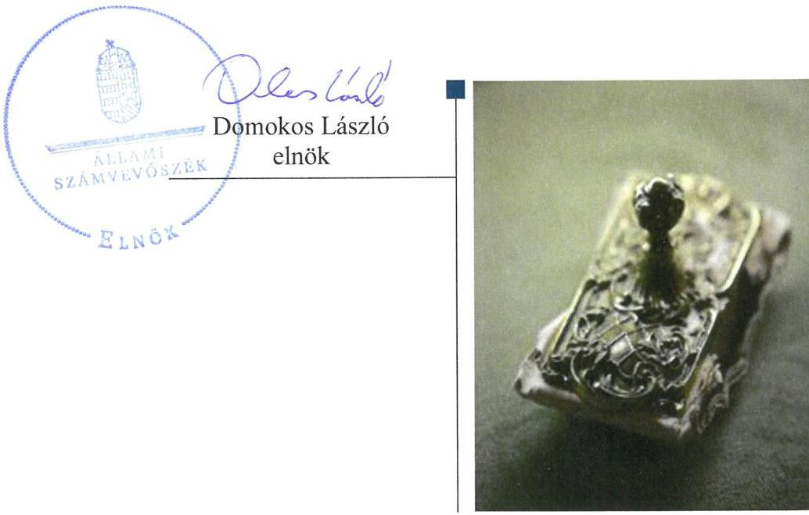

---

|   | AZ ELLENŐRZÉST FELÜGYELTE:  |
| --- | --- |
|   | MAKKAI MÁRIA felügyeleti vezető  |
|   | AZ ELLENŐRZÉST VEZETTE ÉS A VÉGREHAJTÁSÁÉRT FELELŐS:  |
|   | JANIK JÓZSEF ellenőrzésvezető  |
|   | A PROGRAM ÖSSZEÁLLÍTÁSÁÉRT FELELŐS:  |
|   | TÓTPÁL SZABOLCS osztályvezető  |
|   | A TÉMÁHOZ KAPCSOLÓDÓ KORÁBBI SZÁMVEVŐSZÉKI JELENTÉSEK:  |
|   | - címe: Jelentés Magyarország 2016. évi központi költségvetése végrehajtásának ellenőrzéséről  |
|   | - sorszáma: 17208  |
|  Jelentéseink az Országgyúlés számítógépes hálózatán és az Interneten a www.asz.hu címen is olvashatóak. | - címe: Jelentés Magyarország 2015. évi központi költségvetése végrehajtásának ellenőrzéséről  |
|   | - sorszáma: 16163  |
|   | - címe: Jelentés Magyarország 2014. évi központi költségvetése végrehajtásának ellenőrzéséről  |
|   | - sorszáma: 15167  |
|   | IKTATÓSZÁM: EL-0430-1918/2018.  |
|   | TÉMASZÁM: 2472  |
|   | ELLENŐRZÉS-AZONOSÍTÓ SZÁM: V0816  |

---

# TARTALOMJEGYZÉK 

ELNÖKI ELŐSZÓ ..... 5
ÖSSZEGZÉS ..... 7
AZ ELLENŐRZÉS CÉLJA ..... 9
AZ ELLENŐRZÉS TERÜLETE ..... 10
AZ ELLENŐRZÉS HÁTTERE, INDOKOLTSÁGA ..... 11
A JELENTÉS LÉNYEGES KÉRDÉSKÖREI ..... 12
AZ ELLENŐRZÉS HATÓKÖRE ÉS MÓDSZEREI ..... 13
MEGÁLLAPÍTÁSOK ..... 16
MELLÉKLETEK ..... 27
I. sz. melléklet: Értelmező szótár ..... 27
II. sz. melléklet: A belső kontrollrendszer értékelése ..... 29
III. sz. melléklet: Az integritás kontroll rendszer értékelése ..... 31
IV. sz. melléklet: Ellenőrzött fejezetek és szervezetek ..... 33
FÜGGELÉKEK ..... 35
I. sz. függelék ..... 35
II. sz. függelék: Az ellenőrzött szervezetek ÁSZ által el nem fogadott észrevételei ..... 36
III. sz. függelék: az országgyűlés felé beszámolásra kötelezett intézmények ellenőrzésének eredményéről készített rövid összefoglaló értékelés és azokra tett, ÁSZ által el nem fogadott észrevételek ..... 40
IV. sz. függelék: Tájékoztatás a figyelemfelhívó levelekről ..... 45
RÖVIDÍTÉSEK JEGYZÉKE ..... 47

---

.

---

# ELNÖKI ELŐSZÓ 

Tisztelt Országgyúlési Képviselő!
Tisztelt Olvasó!
A központi költségvetést az Országgyúlés fogadja el, és hagyja jóvá annak végrehajtását a központi költségvetés végrehajtásáról (zárszámadásról) szóló törvény elfogadásával.
Az Alaptörvény szerint a központi költségvetést törvényesen és célszerűen, a közpénzek eredményes kezelésével és az átláthatóság biztositásával kell végrehajtani. A költségvetési gazdálkodás szabályszerűségét meghatározó alapelveket az Alaptörvényen és a stabilitási törvényen túlmenően elsősorban az államháztartásról szóló törvény rögzíti. E szerint a költségvetés fenntarthatóságát, a tervezhetőséget és az államadósság alakulását befolyásoló alapvető szabály, hogy a rendelkezésre álló előirányzat keretein belül lehet kötelezettséget vállalni. Ez jelenti a felelős közpénzgazdálkodás alapját. A központi alrendszer intézményei jelentős hatást gyakorolnak a költségvetés szabályszerű végrehajtására, a költségvetési egyensúly fenntarthatóságára. Emiatt fontos, hogy közpénzfelhasználásuk szabályos, átlátható és elszámoltatható legyen. Az előirányzatokkal való gazdálkodás, a visszatervezéssel ahhoz igazitott feladatok kijelölése az alapfeltétele a gazdaságosság érvényesülésének és a gazdálkodás átláthatósága növelésének.
Az ÁSZ a törvényi előírások alapján évente ellenőrzi a központi költségvetés végrehajtását, a társadalombiztositás pénzügyi alapjai költségvetésének végrehajtásáról készitett zárszámadást és a társadalombiztositás pénzügyi alapjainak pénzügyi beszámolóját, valamint az elkülönített állami pénzalapok költségvetésének végrehajtásáról készített zárszámadást.
A központi költségvetés végrehajtásáról szóló törvényjavaslat szerkezetét, tartalmi elemeit és az összeállitásának logikáját az államháztartásról szóló törvény határozza meg. Az Állami Számvevőszékről szóló törvény szerint a központi költségvetés végrehajtásáról készített zárszámadást az ÁSZ ellenőrzi. Ez alapvetően behatárolja az Állami Számvevőszék által a zárszámadás ellenőrzésére alkalmazható módszertant. E kereteken belül a 2017. évi zárszámadási ellenőrzésünk során is - immár negyedik alkalommal - alkalmaztuk azt a 2015ben megújított módszertant, amelynek eredményeként a számvevőszéki ellenőrzés lefedte a központi alrendszer kiadásainak és bevételeinek 100 százalékát. A mintavételezés módszere biztositotta, hogy az ÁSZ megalapozott értékelést tudjon adni a zárszámadás minden lényeges területére vonatkozóan a törvényjavaslatban szereplő adatok megbizhatóságáról.
Zárszámadási ellenőrzésünkkel hozzá kivánjuk segíteni az Országgyülést, hogy megalapozottan dönthessen a törvényjavaslat elfogadásáról, továbbá biztositssuk a költségvetési folyamatok átláthatóságát.

Domokos László
az Állami Számvevőszék elnöke

---

.

---

# ÖSSZEGZÉS 

A 2017. évi központi költségvetés végrehajtása a jogszabályi előírásoknak megfelelően történt. A hiány és az államadósság a törvényi előírásokkal összhangban alakult. A zárszámadási törvényjavaslat tartalmazza a jogszabályban előírt tartalmi elemeket, szerkezete megfelel a törvényi előírásoknak. A törvényjavaslat a beszámolók adatainak megfelelően, valósághúen mutatja be a költségvetés végrehajtására vonatkozó pénzügyi adatokat, információkat. A központi költségvetés zárszámadási törvényjavaslatban szereplő bevétel és kiadás teljesitési adatai megbizhatóak.

## Az ellenőrzés társadalmi indokoltsága

A költségvetés végrehajtásának, a zárszámadásnak az ellenőrzése az Állami Számvevőszék törvény alapján végrehajtandó feladata. A zárszámadás ellenőrzése kiemelten támogatja a közpénzügyek átláthatóságát azzal, hogy a központi költségvetés, ezen belül a központi és a fejezeti kezelésű előirányzatok, a társadalombiztosítás pénzügyi alapjai, az elkülönített állami pénzalapok, valamint az államháztartás központi alrendszerébe tartozó költségvetési szervek bevételi és kiadási előirányzatainak ellenőrzésén keresztül a központi alrendszer egészének bevételi és kiadási adatai megbízhatóságáról ad számot. A törvényben előírt ellenőrzési kötelezettség végrehajtása, a zárszámadásról adott számvevőszéki vélemény támogatja az Országgyűlést a zárszámadás megalapozott elfogadásában és hozzájárul az ellenőrzött szervezetek közpénzekkel való felelős gazdálkodásához, egyidejűleg szolgálva a közvélemény széleskörű tájékoztatását is.

## Főbb megállapítások

A 2017. évi zárszámadási törvényjavaslat összeállítása során a Pénzügyminisztérium a jogszabályok és a vonatkozó belső szabályzatok előírásait betartotta, a törvényjavaslat tartalma, szerkezete megfelelt a jogszabályok előírásainak.

Az államháztartás központi alrendszerében a pénzforgalmi hiány alakulása megfelelt az államháztartásról szóló törvény és a 2017-es költségvetésről szóló törvény előírásainak, a pénzforgalmi hiány a GDP 4,8\%-a, 1 833,4 Mrd Ft volt. A Stabilitási törvény szerinti államadósság - amelynek összege 2017. évben 27 977,3 Mrd Ft volt - teljes hazai össztermékhez viszonyított aránya a 2016. évi 74,0\%-ról a 2017. évre 72,9\%-ra csökkent, alakulása megfelelt az Alaptörvény és a Stabilitási törvény előírásainak. A kormányzati szektor uniós módszertan szerinti hiányának mértéke a Stabilitási törvény előírásainak megfelelően alakult. A kormányzati szektor uniós módszertan szerinti adóssága 2017 végén a GDP 73,3\%-a volt, amely csökkent a 2016. évi 75,9\%-hoz képest. Az uniós kritériumok szerinti adósságcsökkentési követelmény teljesült.

A 2017. évi zárszámadási törvényjavaslatban a központi költségvetés egészének, ezen belül a központi és a fejezeti kezelésű előirányzatok, a költségvetési szervek, az elkülönített állami pénzalapok és a társadalombiztosítási alapok bevételi és kiadási előirányzatainak teljesítési adatai megbízhatóak. A törvényjavaslat valósághűen mutatta be a költségvetés végrehajtására vonatkozó pénzügyi adatokat, információkat.

A központi alrendszer 2017. évi bevételi és kiadási előirányzatai teljesítési adatainak megbízhatóságát az 1. ábra mutatja be.

---

1. ábra
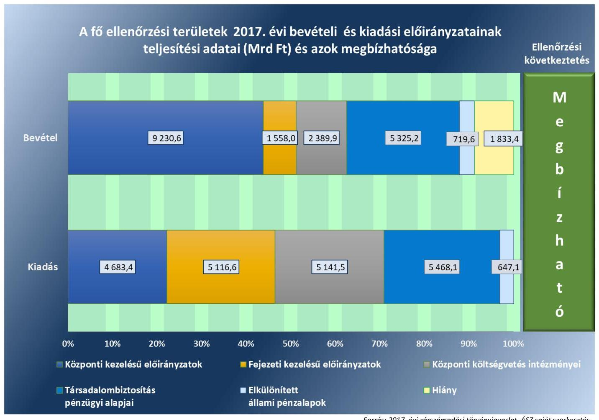

Fornás: 2017. évi zárszámadási törvényjavaslat, ÁSZ saját szerkesztés

---

# AZ ELLENŐRZÉS CÉLJA 

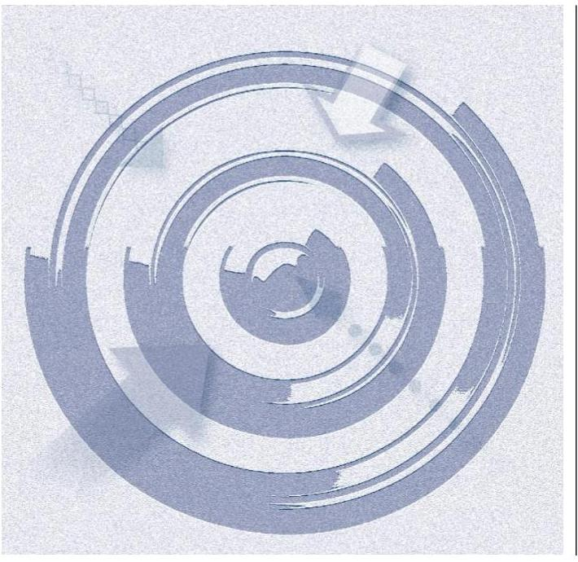

Az ellenőrzés célja a zárszámadási törvényjavaslat megfelelőségének és az abban szereplő adatok megbízhatóságának ellenőrzésével ésszerű bizonyosság szerzése volt arról, hogy
$\longrightarrow$ a zárszámadási törvényjavaslat tartalma, szerkezete megfelel-e a jogszabályi előírásoknak;
$\longrightarrow$ az Alaptörvény és a Stabilitási törvény államadósságra vonatkozó előírásai érvényesültek-e, az államháztartás központi alrendszerében a hiány alakulása megfelelt-e a 2017. évi költségvetésre vonatkozó törvény előírásainak;
$\longrightarrow$ az államháztartás bevételeit a törvényi előírásokkal összhangban, a közpénzekkel való gazdálkodás jogszabályi követelményeinek megfelelően használták-e fel;
$\longrightarrow$ a zárszámadási törvényjavaslat valósághűen mutatja-e be a költségvetés végrehajtására vonatkozó pénzügyi adatokat, információkat;
$\longrightarrow$ a központi költségvetés bevételi és kiadási előirányzatainak teljesítése megfelelt-e a jogszabályi előírásoknak és tartalmaz-e lényeges hibát;
$\longrightarrow$ a költségvetés végrehajtásában jog- és hatáskörrel rendelkezők a 2017. évi költségvetésben meghatározott pénzügyi keretek között szabályszerűen gazdálkodtak-e a közpénzekkel.

---

# **AZ ELLENŐRZÉS TERÜLETE**

## **2017. évi zárszámadás – Magyarország 2017. évi központi költségvetése végrehajtásának ellenőrzése**

Az Országgyűlés a Kvtv.1-ben az államháztartás központi alrendszerének bevételi főösszegét 17 431,3 Mrd Ft-ban, kiadási főösszegét 18 597,7 Mrd Ft-ban, hiányát 1 166,4 Mrd Ft-ban állapította meg. A Kvtv. módosításáról szóló törvények 2017. évben a központi alrendszer bevételi főösszegét 17 880,5 Mrd Ft-ra, a kiadási főösszeget 19 046,9 Mrd Ft-ra módosították, a tervezett hiány összege nem módosult. A 2017-es költségvetés végrehajtásáról szóló törvényjavaslat alapján a 2017. évben a központi alrendszer bevételeinek, kiadásainak, és azok egyenlegeként a központi alrendszer hiányának alakulását az 1. táblázat adatai mutatják.

1. táblázat

### **A KÖZPONTI ALRENDSZER BEVÉTELEINEK, KIADÁSAINAK ÉS HIÁNYÁNAK ALAKULÁSA (MRD FT)**

|   | Bevétel | Kiadás | Hiány*  |
| --- | --- | --- | --- |
|  Terv adat | 17 431,3 | 18 597,7 | 1 166,4  |
|  Törvényi módosított adat | 17 880,5 | 19 046,9 | 1 166,4  |
|  Tény adat | 19 223,3 | 21 056,7 | 1 833,4  |

- Folyó áron, pénzforgalmi szemléletben. Forrás: 2017. évi zárszámadási törvényjavaslat

Az Áht.2 előírásai alapján a költségvetés végrehajtásáról – a központi kezelésű, a szakmai fejezeti kezelésű előirányzatok, a költségvetési szervek, a TB Alapok3 és az ELKA4 bevételeiről és kiadásairól – éves költségvetési beszámolót, az éves költségvetési beszámolók alapján évente, az elfogadott költségvetéssel összehasonlítható módon zárszámadást kell készíteni. Az Áhsz.5 2017. január 1-jétől hatályos módosítása értelmében az éves költségvetési beszámolók adataiból a Kincstár6 az államháztartás központi alrendszeréről összevont (konszolidált) beszámolót a zárszámadási törvényjavaslat Országgyűlés elé terjesztésének időpontjáig, szeptember 30-ig készíti el.

A 2017. évi zárszámadás ellenőrzése során az ÁSZ7 az államháztartás központi alrendszerében a bevételek és kiadások adatainak megbízhatóságát, valamint a bevételi és kiadási előirányzatok teljesítésének, az éves költségvetési beszámolók összeállításának szabályszerűségét ellenőrizte. A belső kontrollrendszer értékelése (II. számú melléklet), valamint az integritás kontroll környezet értékelése (III. számú melléklet) azokra a kontrollokra terjedt ki, amelyek elősegítik a közpénzek védelmét, és támogatják a vezetést abban, hogy a szervezet megfeleljen a vonatkozó jogszabályoknak.

---

# **AZ ELLENŐRZÉS HÁTTERE, INDOKOLTSÁGA**

Az Alaptörvény szerint a központi költségvetés végrehajtásának ellenőrzését az Állami Számvevőszék végzi el. Az ÁSZ törvény előírásainak megfelelően a zárszámadási ellenőrzés végrehajtása az ÁSZ éves gyakorisággal elvégzendő feladata. Az ÁSZ törvényi kötelezettségének teljesítésével hozzájárul ahhoz, hogy az Országgyűlés a zárszámadási törvény elfogadásával kapcsolatban megalapozott döntést hozzon. Az ellenőrzés teljes és objektív képet ad a 2017. évi zárszámadási törvényjavaslatban szereplő adatok megbízhatóságáról, továbbá a megállapításokkal elősegíti az ellenőrzött szervezetek közpénzekkel való felelős gazdálkodását. Az ÁSZ az ellenőrzéssel hozzájárul az értékteremtő rend kialakításához és megőrzéséhez.

---

# A JELENTÉS LÉNYEGES KÉRDÉSKÖREI 

1.     - A zárszámadási törvényjavaslat tartalma, szerkezete összhangban volt-e a jogszabályi előírásokkal, illetve az Alaptörvény és a Stabilitási törvény államadósságra vonatkozó előírásai érvé-nyesültek-e, az államháztartás központi alrendszerében a hiány a 2017. évi költségvetésre vonatkozó törvény előírásai szerint alakult-e?
2.     - A zárszámadási törvényjavaslat valósághüen mutatja-e be a költségvetés végrehajtására vonatkozó pénzügyi adatokat, információkat, abban szereplő bevételi és kiadási előirányzatok teljesitési adatai megbizhatóak-e?
3. A központi alrendszer bevételi és kiadási előirányzatainak teljesitése, az előirányzatok módosítása, a költségvetési maradvány megállapítása és az éves költségvetési beszámolók összeállítása során betartották-e a jogszabályi előírásokat?

---

# AZ ELLENŐRZÉS HATÓKÖRE ÉS MÓDSZEREI 

## Az ellenőrzés típusa

Megfelelőségi ellenőrzés.

## Az ellenőrzött időszak

2017. év, a zárszámadási törvényjavaslat összeállítása tekintetében a 2018. szeptember 30-ig tartó időszak.

## Az ellenőrzés tárgya

A zárszámadás ellenőrzése során az ÁSZ a 2017. évi zárszámadási törvényjavaslat megfelelőségét és az abban szereplő adatok megbízhatóságát ellenőrizte. Az ellenőrzés keretében az ÁSZ valamennyi ellenőrzött területen (központi kezelésű előirányzatok; központi költségvetési szervek; fejezeti kezelésű előirányzatok, uniós és kapcsolódó költségvetési támogatások; elkülönített állami pénzalapok; társadalombiztosítás pénzügyi alapjai) a gazdálkodás és az előirányzat-felhasználás megfelelőségét (szabályszerüségét), a költségvetési gazdálkodásra vonatkozó szabályokkal való összhangját ellenőrizte. Az ellenőrzés kiterjedt minden olyan körülményre és adatra, amely az ÁSZ jogszabályban meghatározott feladatainak teljesítéséhez, valamint a program végrehajtása folyamán felmerült újabb összefüggések feltárásához szükséges volt.

## Az ellenőrzött szervezetek

A NGM ${ }^{9}$, Kincstár, NAV ${ }^{10}$, ÁKK Zrt. ${ }^{11}$, központi előirányzatok, TB Alapok (Nyugdíjbiztosítás Alap, Egészségbiztosítási Alap), ELKA, a mintavételezéssel kiválasztott fejezeti kezelésű előirányzatok és kezelő szerveik. Az alkotmányos fejezetek intézményei (OGYH ${ }^{12}, \mathrm{KE}^{13}, \mathrm{AB}^{14}, \mathrm{AJBH}^{15}$, Ügyészségek, Bíróságok, $\mathrm{OBH}^{16}$, Kúria), az $\mathrm{OGY}^{17}$ részére a tevékenységükről beszámolásra kötelezett intézmények ( $\mathrm{KH}^{18}, \mathrm{NAIH}^{19}, \mathrm{EBH}^{20}, \mathrm{MEKH}^{21}, \mathrm{NVI}^{22}, \mathrm{NEBH}^{23}$, NÉBIH ${ }^{24}, \mathrm{GVH}^{25}, \mathrm{KSH}^{26}, \mathrm{MTA}^{27}, \mathrm{MMA}^{28}, \mathrm{NKFIH}^{29}$ ), továbbá a mintavételezéssel kiválasztott, a központi alrendszerbe tartozó egyéb intézmények. Az ellenőrzött szervezeteket a IV. számú melléklet tartalmazza.

## Az ellenőrzés jogalapja

Az ellenőrzés lefolytatásának jogalapját az Állami Számvevőszékről szóló 2011. évi LXVI. törvény 5. § (7) bekezdése képezte.

---

# Az ellenőrzés módszerei 

Az ellenőrzést az ÁSZ a számvevőszéki ellenőrzés általános alapelveiben, a megfelelőségi ellenőrzés alapelveiben, valamint a zárszámadás ellenőrzésére vonatkozó Módszertani útmutatóban foglalt módszertani elvekkel és szabályokkal összhangban, az ellenőrzési program szempontjai és az ellenőrzött időszakban hatályos jogszabályok alapján végezte.

Az Állami Számvevőszék 2015-ben megújította a zárszámadás ellenőrzésének módszertanát. A módszertani megújulást a 2014. január 1-étől bevezetett új költségvetési számviteli szabályok, valamint a Legfőbb Ellenőrző Intézmények Nemzetközi Szervezete, az INTOSAI 2013-ban elfogadott új ellenőrzési alapelvei indukálták.

A mintavételezés módszere biztosította, hogy az ÁSZ megalapozott értékelést tudjon adni a zárszámadás minden lényeges területére (központi és fejezeti kezelésű előirányzatok, költségvetési szervek, elkülönített állami pénzalapok, társadalombiztosítási alapok) vonatkozóan a törvényjavaslatban szereplő adatok megbízhatóságáról.

A központi költségvetési szervek bevételi és kiadási adatainak ellenőrzése pénzegység alapú mintavétel alkalmazásával történt.

Az alkotmányos fejezetek intézményeinek összevont kiadási és bevételi adatállományaiból az adatbázisok heterogenitását figyelembe véve, a megfelelő bizonyosság eléréséhez szükséges elemszámú minta került meghatározásra.

Az országgyűlés felé beszámolásra kötelezett intézmények esetében a mintavétel szervezetenként külön-külön történt, ezért a minta elemszámának meghatározására a szervezetek eredendő és kontroll kockázatának szintje alapján, a következő táblázat szerint került sor:
2. táblázat

## A MINTAELEMSZÁM MEGHATÁROZÁSÁT BEFOLYÁSOLÓ TÉNYEZŐK

| Eredendő kockázat értékelése | Belső kontrollrendszer összevont értékelése | A mintavételez ellenőrzéstől várt korfidendő szint ennek megfelelő legkisebb értéke |
| :--: | :--: | :--: |
| Nem nagy | Megfelelő | $45 \%$ |
|  | Részben megfelelő | $67 \%$ |
|  | Nem megfelelő vagy nem volt kontroll teszt | $95 \%$ |
| Nagy | Megfelelő | $67 \%$ |
|  | Részben megfelelő | $80 \%$ |
|  | Nem megfelelő vagy nem volt kontroll teszt | $95 \%$ |

A központi költségvetés összes egyéb intézménye esetében két lépcsős mintavételi eljárással történik a kiválasztás. Az egyéb intézményekből első lépésben rétegzett mintavétel alkalmazásával az összes intézmény 10\%ának megfelelő számú intézmény kiválasztására került sor. A kiválasztott intézmények bevételi és kiadási adataiból ezt követően pénzegység alapú mintavétel alkalmazásával történt a kiválasztás.

Az egyéb intézmények esetében a kétlépcsős mintavétel miatt a mintavételi hiba is kétszer jelentkezik, ezért a kockázatbecslés nélkül adódó

---

minta elemszámának tízszeresére (mivel a mintavétel első lépésében az összes intézmény egy tized része került kiválasztásra) növelése történt. Tekintettel arra, hogy a megújított módszertan alapján végzett, 2014-2016. évi zárszámadás ellenőrzések tapasztalatai alapján a központi alrendszer részét képező központi költségvetési szervek bevétel és kiadás teljesítési adatai mindhárom évben megbízhatóak voltak, a 2017-es évre vonatkozóan „nem nagy" kockázattal számolva került sor a minta elemszámának meghatározására.

A mintatételek kiértékelése során az ellenőrzés 95\%-os megbízhatóság mellett megbecsülte az egyes mintavételi területeken előforduló hibák összegének felső korlátját. Az ÁSZ a zárszámadási törvényjavaslat megbízhatóságát befolyásoló összes hiba összegét viszonyította a lényegességi küszöbértékhez, amelyet mind a központi alrendszer egésze, mind pedig az egyes részterületek tekintetében a bevételi, illetve kiadási főösszeg (teljesítési adat) 2\%-ában határozott meg.

A kiértékelések eredményeként az ÁSZ ésszerű bizonyosságot szerzett arról, hogy a központi költségvetés bevételi és kiadási előirányzatainak teljesítése a jogszabályi előírásokkal összhangban történt-e és azok tartal-maztak-e lényeges hibát, továbbá hogy a törvényjavaslat valósághűen mu-tatja-e be a költségvetés végrehajtására vonatkozó adatokat, információkat.

Az ÁSZ az ellenőrzés során feltárt hibákat két fő csoportba sorolta: a zárszámadási törvényjavaslat adatainak megbízhatóságát befolyásoló megbízhatósági hibák, illetve szabályszerűségi hibák, a jogszabályi előírásoknak való meg nem felelés esetei. Az ellenőrzés során azonosított megbízhatósági hibák értékelése abból a szempontból történt, hogy azok önmagukban vagy együttesen lényegesek-e, és gyakorolhatnak-e jelentős hatást a zárszámadási törvényjavaslat egészének megbízhatóságára.

Az ellenőrzés ideje alatt az ellenőrzött szervezettekkel történő kapcsolattartás az ÁSZ SZMSZ ${ }^{30}$-ének vonatkozó előírásai alapján történt.

Az ellenőrzési bizonyítékként felhasználható adatforrások közé tartoztak egyrészt az ellenőrzési program részletes szempontjainál felsorolt adatforrások, másrészt adatforrás lehetett még az ellenőrzés folyamán feltárt, az ellenőrzés szempontjából információt tartalmazó dokumentum. Az ellenőrzési kérdések megválaszolásához szükséges bizonyítékok megszerzése az ellenőrzött által rendelkezésre bocsátott dokumentumokra, adatokra alapozva megfigyelés, szemle (szemrevételezés), kérdésfeltevés (információkérés), mintavételezés, valamint elemző eljárás útján történt.

---

# MEGÁLLAPÍTÁSOK 

## 1. A zárszámadási törvényjavaslat tartalma, szerkezete összhangban volt-e a jogszabályi előírásokkal, illetve az Alaptörvény és a Stabilitási törvény államadósságra vonatkozó előírásai érvé-nyesültek-e, az államháztartás központi alrendszerében a hiány a 2017. évi költségvetésre vonatkozó törvény előírásai szerint alakult-e?

Összegző megállapítás

1.1. számú megállapítás
3. táblázat

A 2017. ÉVI ZÁRSZÁMADÁSI TÖRVÉNYJAVASLAT
tartalmazta:

- a költségvetési mérleget alrendszerenként és összevontan, közgazdasági és funkcionális tagolásban;
- a Stabilitási törvény szerinti államadósságot és a központi költségvetés adósságállományának változását;
- a költségvetési hiány finanszírozásának módját;
- az adóbevételekben érvényesülő közvetett támogatásokat;
- az államháztartás központi alrendszere és a kormányzati szektorba sorolt egyéb szervezetek tekintetében a nem teljesítő hitelkövetelések állományát;
- az állami és az önkormányzati garanciaés kezességvállalások állományát.

Forrás: 2017. évi zárszámadási törvényjavaslat

A 2017. évi zárszámadási törvényjavaslat tartalma, szerkezete megfelelt a jogszabályi előírásoknak. Az államháztartás központi alrendszerében a hiány és az államadósság alakulása megfelelt a törvényi előírásoknak.

A zárszámadási törvényjavaslat összeállítása szabályszerű volt.
A TÖRVÉNYJAVASLAT tartalma, szerkezete megfelelt az Áht. előírásainak. Összeállítására az elfogadott költségvetéssel összehasonlítható módon került sor, normaszövege, általános és részletes indokolása tartalmazta a jogszabályban meghatározott adatokat, információkat, amelyek közül a legfontosabbakat a 3. táblázat foglalja össze.

A 2017. évi zárszámadási törvényjavaslat általános indokolása bemutatta az uniós és az államháztartási elszámolások főbb módszertani eltéréseit.

Az NGM az Áht. és az Ávr. ${ }^{31}$ előírásaival összhangban szabályozta a zárszámadási törvényjavaslat összeállításának folyamatát. Az NGM a vonatkozó belső szabályzataiban meghatározta a zárszámadási törvényjavaslat összeállítását megalapozó módszertani elveket, a beszámolási keretrendszert, a kapcsolódó feladatokat, azok ütemezését és felelőseit, az adatok átadására, az adategyeztetésekre vonatkozó iránymutatásokat, a törvényjavaslattal szemben támasztott tartalmi követelményeket.

A zárszámadási törvényjavaslat összeállítását támogató, az NGM KAR ${ }^{32}$ és $\mathrm{AHAB}^{33}$ rendszere, illetve a Kincstár KGR K11 ${ }^{34}$ elektronikus információs rendszere adatainak sértetlenségét, hitelességét, megfelelőségét befolyásoló főbb kontrollok kiépítettsége és működése megfelelő volt.

---

### 1.2. számú megállapítás

4. táblázat

A KÖZPONTI ALRENDSZER HIÁNYA (MRD FT)

| Adat | Teljesités |
| :-- | --: |
| Központi alrendszer hiánya | 1833,4 |
| Ezen belül: |  |
| Központi költségvetés hiánya | 1763,0 |
| TB Alapok hiánya | 142,9 |
| ELKA többlete | 72,5 |

Forrás: 2017. évi zárszámadási törvényjavaslat

Az államháztartás központi alrendszerében a pénzforgalmi hiány alakulása megfelelt a törvényi előírásoknak. Az államadósság, valamint az uniós módszertan szerint számított hiány alakulása megfeleĺt az Alaptörvény és a Stabilitási törvény előírásainak. Az uniós módszertan szerint számított államadósság alakulása megfelelt az uniós feltételeknek.

AZ ÁLLAMHÁZTARTÁS központi alrendszerének hiánya folyó áron, pénzforgalmi szemléletben 1833,4 Mrd Ft volt. A központi alrendszer hiányát a 4. táblázat részletezi.

Az államháztartás központi alrendszerének pénzforgalmi hiánya a jogszabályi előírásoknak megfelelő volt. A hazai működési költségvetés egyenlege nulla Ft-on, a hazai felhalmozási költségvetés egyenlege a Kvtv.-ben megállapított hiánynál alacsonyabb összegben, míg az uniós fejlesztési költségvetés a Kvtv.-ben megállapított hiánynál magasabb összegben valósult meg. A túllépés alapvetően a XIX. Uniós fejlesztések fejezet törvénysorain azon előirányzatok hiányára vezethető vissza, melyek teljesülése módosítási kötelezettség nélkül eltérhet az előirányzattól. A XIX. Uniós fejlesztések fejezet esetében a Kormány a Kvtv.-ben biztosított felhatalmazás alapján az uniós programok likviditási hiányának kezelésére a kedvezményezettek felé történő kifizetéseknél a központi költségvetés terhére az uniós részt előfinanszírozta, azaz megelőlegezte. A hazai müködési, felhalmozási és uniós fejlesztési költségvetés egyenlegeinek alakulását az 5. táblázat mutatja be.
5. táblázat

A KÖZPONTI ALRENDSZER HIÁNYÁNAK ALAKULÁSA (MRD FT)

|  | Kvtv. | Tv. javaslat | Ftérés |
| :-- | --: | --: | --: |
| Hazai müködési költségvetés | 0 | 0 | 0 |
| Hazai felhalmozási költségvetés | 472,4 | 386,3 | $-86,1$ |
| Uniós fejlesztési költségvetés | 694,0 | 1447,1 | 753,1 |
| Összesen | 1166,4 | 1833,4 | 667,0 |

Forrás: 2017. évi zárszámadási törvényjavaslat
Az államháztartás központi alrendszere teljesített bevételi, kiadási előirányzatait és hiányát, valamint azok megoszlását a 2. ábra szemlélteti:
2. ábra

|  | A központi alrendszer bevételeinek és   kiadásainak összetevői 2017. évben (Mrd Ft) |  |  |
| :--: | :--: | :--: | :--: |
|  | Összes kiadás | Összes bevétel | Hiány |
| 25000 | 21856,7 Mrd Ft | 19223,3 Mrd Ft | 1833,4 Mrd Ft |
| 10000 | 5468,1 | 6325,2 |  |
| 15000 | 647,1 | 719,6 |  |
| 10000 | 14941,5 | 13178,5 |  |
| 5000 |  |  | 7827,7 |
| 0 | Kiadás | Bevétel | Hiány |
| * Hiány |  | * Társadalombiztosítás pénzügyi alapjai |  |
| * Elkülönített állami pénzalapok |  | * Központi költségvetés |  |

Forrás: 2017. évi zárszámadási törvényjavaslat, ÁSZ saját szerkesztés

---

AZ ÁLLAMADÓSSÁG Kvtv.-ben meghatározott mértéke megfelelt az Alaptörvény és a Stabilitási törvény ${ }^{35}$ államadósságra vonatkozó előírásainak, mivel 2017. évben az államadósság GDP ${ }^{36}$-hez viszonyított aránya csökkent a 2016. évi mutatóhoz képest. A Stabilitási törvény szerinti 2017. évi konszolidált államadósság 27 977,3 Mrd Ft volt, amely a GDP (38 355,1 Mrd Ft) 72,9\%-ának felelt meg. A Stabilitási törvény szerinti 2016. évi konszolidált államadósság 26 248,1 Mrd Ft, a GDP 74,0\%-a volt, így az államadósság mértéke a 2017. évre vonatkozóan GDP arányosan 1,1 százalékponttal csökkent.

A KORMÁNYZATI SZEKTOR uniós módszertan szerinti hiánya megfelelt a Stabilitási törvény előírásainak, 2017-ben 849,2 Mrd Ft, a GDP 2,2\%-a volt, amely alacsonyabb a tervezett 2,4\%-os mértéknél.

A kormányzati szektor uniós módszertan szerinti adóssága (28 095,5 Mrd Ft) a 2017. évre vonatkozóan a GDP-hez viszonyítva 73,3\%ra csökkent, a 2016. évi 75,9\%-hoz képest (2016-ban az adósság 26 912,2 Mrd Ft, GDP 35 474,2 Mrd Ft volt). A kormányzati szektor hiányának és adósságának mértékét a 3. ábra mutatja be.
3. ábra

A kormányzati szektor uniós módszertan
szerinti hiánya és adóssága
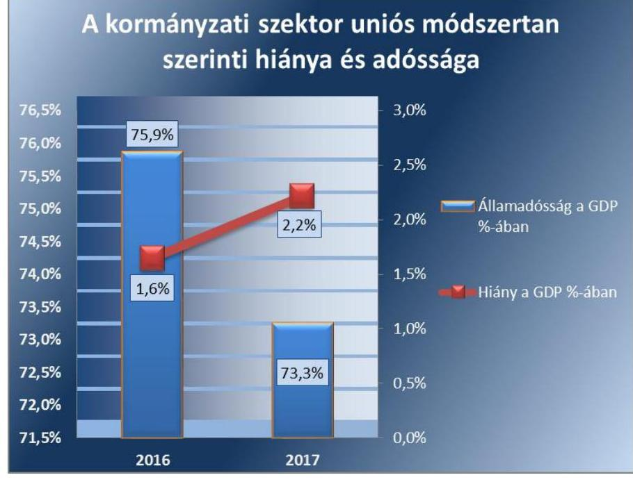

Forrás:2018. áprilisi EDP jelentés, ÁSZ saját szerkesztés

---

# 2. A zárszámadási törvényjavaslat valósághűen mutatja-e be a költségvetés végrehajtására vonatkozó pénzügyi adatokat, információkat, abban szereplő bevételi és kiadási előirányzatok teljesítési adatai megbízhatóak-e? 

Összegző megállapítás

### 2.1. számú megállapítás

6. táblázat

A KÖZPONTI KEZELÉSÜ ELŐIRÁNYZATOK BEVÉTELEI, KIADÁSAI (MRD FT)

| Adat | Bevétel | Kiadás |
| :-- | --: | :--: |
| Központi kezelésű   előirányzatok összesen | 9230,6 | 4683,4 |
| Ebből: |  |  |
| Adóbevételek | 8598,3 | - |
| Önkormányzatok   támogatása | - | 700,5 |
| Adósságszolgálat | 104,3 | 1141,6 |
| Kezesség | 4,6 | 17,9 |
| NCSSZA | - | 653,0 |
| Állami vagyon | 265,5 | 451,0 |
| Egyéb | 257,9 | 1719,4 |

Forrás: 2017. évi zárszámadási törvényjavaslat
7. táblázat

ÁLLAMI VAGYONNAL
KAPCSOLATOS BEVÉTELEK, KIADÁSOK TELJESÍTÉSE (MRD FT)

| Adat | Bevétel | Kiadás |
| :-- | :--: | :--: |
| Állami vagyon | 72,5 | 287,5 |
| NFA | 156,0 | 19,7 |
| Tulajdonosi   joggyakorlás | 37,0 | 143,8 |
| Összesen | 265,5 | 451,0 |

Forrás: 2017. évi zárszámadási törvényjavaslat
2.2. számú megállapítás

A zárszámadási törvényjavaslat valósághűen mutatja be a költségvetés végrehajtására vonatkozó pénzügyi adatokat, információkat, az abban szereplő bevételi és kiadási előirányzatok teljesítési adatai megbízhatóak.

A központi költségvetés részét képező központi kezelésű előirányzatok teljesítési adatai megbízhatóak.

A KÖZPONTI KEZELÉSÚ előirányzatok bevételi és kiadási teljesítésének összesített adatai megbízhatóak voltak.

Az adóbevételeknél az ellenőrzés megbízhatósági hibát nem tárt fel, a bevételi adatok megbízhatóak voltak. Az adósságszolgálattal, a kezességgel, garanciával, illetve viszontgaranciával kapcsolatos bevételi előirányzatok teljesítése és a kiadási előirányzatok felhasználása, valamint az önkormányzatok támogatásainak kiadási adata megbízható volt. A további központi kezelésű előirányzatok kiadásai (közöttük a Pártok és pártalapítványok támogatása, a Közszolgálati médiaszolgáltatás támogatása, a Szociálpolitikai menetdíj támogatás, a Lakástámogatások, a Vállalkozások folyó támogatása, a Kormányzati rendkívüli kiadások) megbízhatóak voltak. Az NCSSZA ${ }^{37}$ kiadásainál és az állami vagyonnal kapcsolatos kiadásoknál feltárt megbízhatósági hibák a központi kezelésű előirányzatok egészének megbízhatóságát nem befolyásolták. A központi kezelésű előirányzatok bevételeinek és kiadásainak alakulását a 6. táblázat mutatja.

A XX. EMMI ${ }^{38}$ FEJEZET NCSSZA Családi támogatások, illetve Jövedelempótló és jövedelemkiegészítő szociális támogatások jogcímeiről teljesített kiadások esetében jellemző megbízhatósági hiba volt, hogy a Számv. tv. ${ }^{39}$ előírásai ellenére az ellátások folyósítását azok megállapításának bizonylatai nem támasztották alá. A megbízhatósági hibák összértéke meghaladta a lényegességi szintet, ezért a központi kezelésű előirányzatokon belül az NCSSZA kiadási adatai nem voltak megbízhatóak.

AZ ÁLLAMI VAGYONNAL, NFA ${ }^{40}$-val és a tulajdonosi joggyakorlással kapcsolatos bevételek és kiadások megbízhatóak voltak. A kiadások esetében az ellenőrzés megbízhatósági hibákat tárt fel, amelyek összértéke nem haladta meg a lényegességi szintet. Az állami vagyonnal kapcsolatos bevételek és kiadások teljesítését a 7. táblázat mutatja.

A központi költségvetés részét képező fejezeti kezelésű előirányzatok teljesítési adatai megbízhatóak.

AZ UNIÓS FEJLESZTÉSI előirányzatok kedvezményezettek felé teljesített kifizetési adatai megbízhatóak voltak. Az uniós fejlesztések 2017. évi teljesítési adatait a 8. táblázat mutatja be.

---

9. táblázat

## A SZAKMAI FEJEZETI KEZELÉSÜ ELŐIRÁNYZATOK TELJESÍTÉSE (MRD FT)

| Kiadás | Besztel |
| :--: | :--: |
| 2545,2 | 433,8 |

Forrás: 2017. évi zárszámadási törvényjavaslat
8. táblázat

UNIÓS FEJLESZTÉSEK 2017. ÉVI TELJESÍTÉSI ADATAI (MRD FT)

| Megnevezés | Adat |
| :--: | :--: |
| Strukturális és vidékfejlesztési támogatások 2014 előtt | 90,8 |
| Kohéziós politikai operatív programok 2014 - 2020. | 2 196,5 |
| Vidékfejlesztési operatív programok 2014 - 2020. | 109,7 |
| Egyéb uniós támogatások* | 174,4 |
| Összes teljesített kiadás | 2571,4 |
| Összes teljesített bevétel | 1124,2 |
| *Belügyi Alapok, svájci, norvég mechanizmusok |  |

Forrás: 2017. évi zárszámadási törvényjavaslat
Az uniós fejlesztéseken belül a Vidékfejlesztési program ${ }^{41}$ esetében az ellenőrzés megbízhatósági hibákat tárt fel, amelyek az uniós fejlesztési előirányzatok összesített kifizetéseinek megbízhatóságát nem befolyásolták.

A SZAKMAI fejezeti kezelésű kiadási előirányzatok terhére teljesített kifizetések és a bevételi előirányzatok teljesítései megbízhatóak voltak. Az intézményeknél a szakmai fejezeti kezelésű előirányzatok kiadásait és bevételeit a 9. táblázat mutatja be.

Az intézményeknél a szakmai fejezeti kezelésű előirányzatok kiadásainak összetételét a 4. ábra mutatja be.
4. ábra

## A szakmai fejezeti kezelésű előirányzatok kiadásai (Mrd Ft)

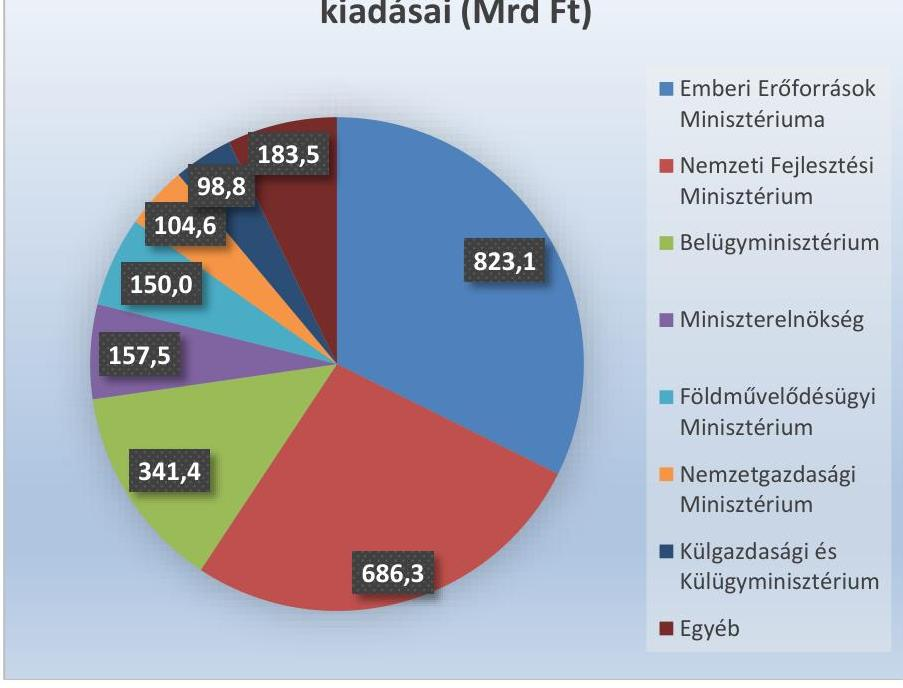

Forrás: 2017. évi zárszámadási törvényjavaslat

---

Az intézményeknél a szakmai fejezeti kezelésű előirányzatok bevételeinek összetételét az 5. ábra mutatja be.
5. ábra
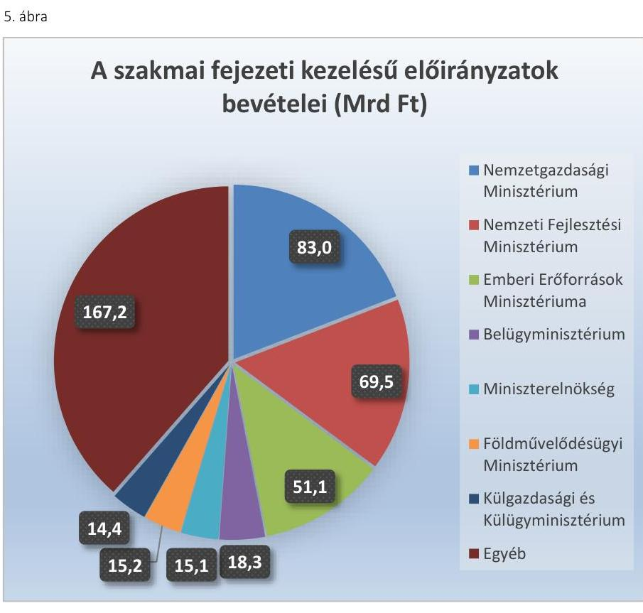

Forrás: 2017. évi zárszámadási törvényjavaslat
2.3. számú megállapítás

A központi költségvetés intézményei bevételi és kiadási előirányzatainak teljesítési adatai megbízhatóak.

AZ OGY FELÉ beszámolásra kötelezett és az alkotmányos fejezetek intézményeinek bevételi és kiadási adatai megbízhatóak voltak.

AZ EGYÉB KÖLTSÉGVETÉSI INTÉZMÉNYEK bevételi és kiadási adatai megbízhatóak voltak. A feltárt megbízhatósági hibák összértéke nem haladta meg a 2\%-os mértékú lényegességi szintet. Jellemző hiba volt, hogy a gazdasági eseményt az Áhsz. előirása ellenére bizonylattal nem támasztották alá.

A központi költségvetés intézményei bevételi és kiadási előirányzatainak teljesítési adatait a 10. táblázat mutatja be.
10. táblázat

A KÖZPONTI KÖLTSÉGVETÉSI INTÉZMÉNYEK BEVÉTELEI ÉS KIADÁSAI (MRD FT)

|  | OGY felé   beszámoló   intézmények | Alkotmányos   fejezetek   intézményei | Egyéb   intézmények | Mindösszesen |
| :--: | :--: | :--: | :--: | :--: |
| Bevétel | 32,9 | 15,1 | 2341,9 | 2389,9 |
| Kiadás | 72,2 | 219,6 | 4849,7 | 5141,5 |

---

# 2.4. számú megállapítás 

## A TB Alapok bevételi és kiadási előirányzatainak teljesítési adatai megbízhatóak.

A TB ALAPOK bevételi és kiadási előirányzatainak teljesítése megbízható volt.

A bevételek és kiadások alaponkénti megoszlását a 6. ábra mutatja be.
6. ábra
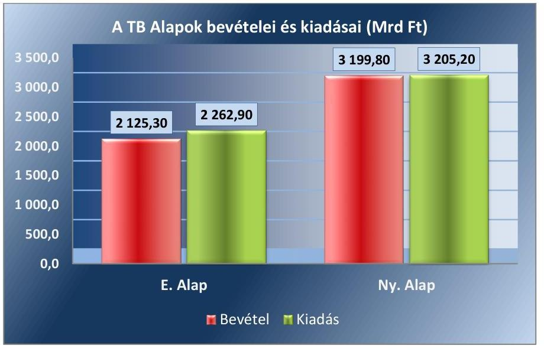

Fornás: 2017. évi zárszáma dási törvényjavaslat
2.5. számú megállapítás

Az ELKA bevételi és kiadási előirányzatainak teljesítési adatai megbízhatóak.

AZ ELKA (BGA ${ }^{42}$, KNPA ${ }^{43}$, NEFA ${ }^{44}$, NKA $^{45}$, NKFIA $^{46}$ ) bevételi előirányzatainak teljesítése, kiadási előirányzatainak felhasználása megbízható volt.

A bevételek és kiadások alaponkénti megoszlását a 7. ábra mutatja be. 7. ábra
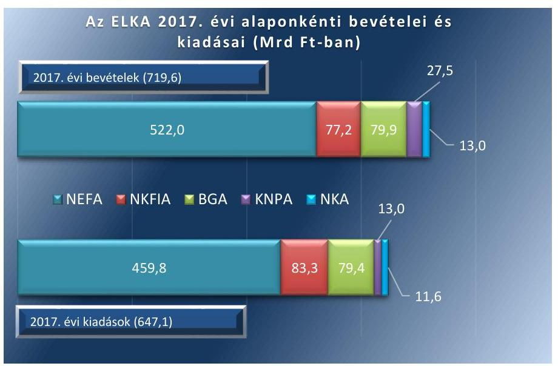

Fornás: 2017. évi zárszáma dási törvényjavaslat

---

# 3. A központi alrendszer bevételi és kiadási előirányzatainak teljesítése, az előirányzatok módosítása, a költségvetési maradvány megállapítása és az éves költségvetési beszámolók összeállítása során betartották-e a jogszabályi előírásokat? 

Összegző megállapítás

A központi költségvetés, a TB Alapok és az ELKA bevételi és kiadási előirányzatainak teljesítése, az előirányzat módosítás, a költségvetési maradvány megállapítása és az éves költségvetési beszámolók összeállítása során betartották a jogszabályi előírásokat.
3.1. számú megállapítás

A központi költségvetés részét képező központi kezelésű bevételi és kiadási előirányzatok teljesítése során betartották a jogszabályi előírásokat.

A KÖZPONTI KEZELÉSÚ előirányzatok bevételeikkel és kiadásaikkal szabályszerűen számoltak el. A minősítést nem befolyásoló szabályszerűségi hibákat az állami vagyonnal kapcsolatos kiadásokat és az NCSSZA-ból teljesített kiadásokat érintően állapított meg az ellenőrzés.

AZ ÁLLAMI VAGYONNAL kapcsolatos kiadásokat érintően, a Számv. tv.-ben előírtak ellenére az MNV Zrt.-nél hiányzott a kötelezettségvállalás dokumentuma, illetve az NFA-nál az állami ingatlanvagyon jogi rendezéséhez, valamint az állami tulajdonú ingatlanvagyon felméréséhez teljesített kiadásokhoz kötődő szerződések.

AZ ADÓSSÁGSZOLGÁLATTAL kapcsolatos bevételek előirányzatainak teljesítése és kiadási előirányzatainak felhasználása során az ÁKK Zrt. az Áhsz. előírásainak megfelelően eleget tett a Kincstár részére történő adatszolgáltatási és beszámolási kötelezettségének. A KESZ ${ }^{47}$ és a letéti számlák kezelése szabályszerűen történt.

A KEZESSÉGEK garanciák, viszontgaranciák és nyújtott hitelek állományának felső határára vonatkozó Kvtv. előírásokat betartották. Az ügyletek állományi adatait tartalmazó főkönyvi és analitikus nyilvántartások megfeleltek az Áht., az Áhsz., a Számv. tv. és az egyéb vonatkozó jogszabályok előírásainak.

A TARTALÉKOK (RKI48, OVA ${ }^{49}$, céltartalékok) törvényi módosított előirányzata 441,1 Mrd Ft volt. Az RKI előirányzata megfelelt az Áht. előírásainak, a központi költségvetés kiadási főösszegének 0,5\%-a és 2,0\%-a között maradt. Az RKI 140,0 Mrd Ft és az OVA 95,9 Mrd Ft összegű előirányzata 100,0\%-ban felhasználásra került. A céltartalékok 315,4 Mrd Ft-os felhasználása 110,2 Mrd Ft-tal (53,7\%-kal) túllépte a 205,2 Mrd Ft-os Kvtv. eredeti előirányzatot, amire a Kvtv. 4. melléklete lehetőséget biztosított. A tartalékok felhasználása során betartották az Áht., az Ávr., a Kvtv. és a vonatkozó kormányhatározatok előírásait.

---

### 3.2. számú megállapítás

A központi költségvetés részét képező fejezeti kezelésű előirányzatok teljesítése, az előirányzat módosítása, a költségvetési maradvány megállapítása és az éves költségvetési beszámolók összeállítása során betartották a jogszabályi előírásokat.

AZ UNIÓS FEJLESZTÉSI támogatásokhoz kapcsolódó előirányzatok felhasználása során betartották a Kvtv., az Áht., az Ávr. és az Áhsz. előírásait. A 2014-2020 közötti kohéziós politikai operatív programok, a vidékfejlesztési és halászati program, az ETE ${ }^{50}$, a Svájci Alap, az $\mathrm{EGT}^{51}$ és a Norvég Alap előfinanszírozása során az eredeti támogatási előirányzatok 30\%-ot meghaladó túlteljesítésére került sor. A túlteljesítést a Kvtv. felhatalmazása alapján, likviditási tervekkel alátámasztott kormányhatározatok alapozták meg.

A 2014-2020 közötti időszakban finanszírozott uniós fejlesztéseknél a támogatások elbírálása, a támogatási szerződések megkötése, a kifizetések teljesítése és elszámolása a jogszabályi előírásoknak megfelelően történt.

A schengeni egyezményhez kapcsolódó uniós támogatások képzése és igénybevétele a Belügyi Alapok vonatkozásában, a Kvtv. előírása és az uniós-rendeletekben foglaltak szerint valósult meg. A Belügyi Alapokra a 2017. évben biztosított uniós forrás 3,5 Mrd Ft volt, amit 4,7 Mrd Ft hazai támogatással egészítettek ki az uniós rendeletben foglalt elvnek megfelelően.

A SZAKMAI fejezeti kezelésű előirányzatok kiadási és bevételi előirányzatainak teljesítése szabályszerű volt. Az elszámolások megfeleltek a jogszabályok előírásainak. A bevételek a megállapodások, támogatási szerződések szerinti összegben és határidőben teljesültek.

Az előirányzat módosítások, átcsoportosítások és a fejezeti tartalék igénybevétele megfelelt a jogszabályi előírásoknak. A saját hatáskörben végrehajtott előirányzat módosításokról az előírt határidőn belül a Kincstárt tájékoztatták.

A maradvány kimutatásokat a jogszabályi előírások alapján állították össze, azok szabályszerűek voltak. Az éves beszámolókban, a kapcsolódó főkönyvi számlákon szereplő előirányzat-maradványok összegei megegyeztek az analitikus nyilvántartásokban kimutatott összegekkel, és azok dokumentumokkal alátámasztottak voltak.

Az éves beszámolók és a költségvetési jelentések elkészítése szabályszerű volt, azok megfeleltek az Áhsz. előírásainak. A fejezetek a költségvetési jelentésüket analitikus nyilvántartásokkal és főkönyvi kivonattal alátámasztották. A fejezetet irányító szervek a fejezetbe tartozó fejezeti kezelésű előirányzatokra elkészített éves beszámolókat a Kincstár által működtetett elektronikus adatszolgáltató rendszerbe az előírt határidőig feltöltötték.

Az irányító szervi feladatok ellátása szabályszerű volt. A fejezeti kezelésű előirányzatok felhasználásának szabályait rendeletekben meghatározták. A fejezetet irányító szervek előirányzat-finanszírozási terveket készítettek, és azokat határidőre megküldték a Kincstár részére. Az irányító szerv és a külső kezelő szerv között megkötött szerződésben meghatározták az előirányzatok felhasználásáról szóló adatszolgáltatás szabályait, és biztosították azok betartását.

---

### 3.3. számú megállapítás

A központi költségvetés intézményei bevételi és kiadási előirányzatainak teljesítése, az előirányzatok módosítása, a költségvetési maradvány megállapítása és az éves költségvetési beszámolók összeállítása során betartották a jogszabályi előírásokat.

AZ OGY FELÉ beszámolásra kötelezett intézmények a bevételekkel és a kiadásokkal szabályszerűen számoltak el.

Az OGY felé tevékenységükről beszámolásra kötelezett intézmények az előirányzat módosításra, átcsoportosításra, és a költségvetési maradvány kimutatásra vonatkozóan az Áht., az Ávr. és az Áhsz. előírásait betartották.

Az OGY felé tevékenységükről beszámolásra kötelezett intézmények a beszámoló részét képező mérleget, eredmény-kimutatást és kiegészítő mellékletet a jogszabályi előírásoknak megfelelően állították össze. Az Áhsz. kötelező egyezőségekre vonatkozó előírásai érvényesültek.

AZ ALKOTMÁNYOS FEJEZETEK intézményei a bevételekkel és a kiadásokkal szabályszerűen számoltak el.

Az alkotmányos fejezetek intézményei az előirányzat módosításra és átcsoportosítására, a költségvetési maradvány kimutatására vonatkozóan az Áht., az Ávr. és az Áhsz. előírásait betartották.

Az alkotmányos fejezetek intézményei a beszámolókat - ideértve az annak részét képező költségvetési jelentéseket és maradvány kimutatásokat - a jogszabályi előírásoknak megfelelően állították össze. Az Áhsz. kötelező egyezőségekre vonatkozó előírásai érvényesültek.

A KÖZPONTI KÖLTSÉGVETÉS EGYÉB intézményei a bevételekkel és a kiadásokkal szabályszerűen számoltak el.

A bevételeknél szabályszerűségi hibaként előfordult, hogy az Áht. és az Ávr. előírásai ellenére a bevételt szerződés vagy megállapodás nem támasztotta alá, a gazdasági esemény számviteli elszámolását nem támasztotta alá hiteles, megbízható számviteli bizonylat, továbbá a bevételek utalványozása elmaradt.

A kiadásoknál szabályszerűségi hibaként előfordult, hogy az Ávr. előírásaival ellentétben a kötelezettségvállalást dokumentum nem támasztotta alá, illetve a teljesítésigazolás hiányzott, vagy a teljesítés igazolását nem a kötelezettségvállaló által írásban kijelölt személy végezte el.

A központi költségvetés öt egyéb intézménye (BPFKH ${ }^{52}$, ÉTK $^{53}$, MKR ${ }^{54}$, MTAWFK ${ }^{55}$, SZPKRD ${ }^{56}$ ) a beszerzései során a Kbt. ${ }^{57}$ előírásai ellenére elmulasztotta a közbeszerzési eljárás lefolytatását.

Az előirányzat módosítások és átcsoportosítások, valamint a költségvetési maradvány kimutatása során betartották az Áht., az Ávr. és az Áhsz. előírásait. Az intézmények a maradvány kimutatásaikat szabályszerűen, az Áhsz. szerinti tartalommal és formában készítették el. A kötelezettségvállalással terhelt maradvány kimutatása megfelelt a jogszabályi előírásoknak.

Több egészségügyi intézmény esetében a minősítést nem befolyásoló hiba volt, hogy az Áht. előírásainak megsértésével, a szabad előirányzat mértékét meghaladóan történt kötelezettségvállalás, az éves beszámolóknál az Áhsz. kötelező egyezőségre vonatkozó előírásai nem teljesültek.

---

# 3.4. számú megállapítás 

A központi költségvetés egyéb intézményeinél feltárt szabályszerűségi hibák a bevételek és kiadások elszámolásának szabályszerű minősítését nem befolyásolták.

## A TB Alapok bevételi és kiadási előirányzatainak teljesítése, az előirányzatok módosítása, a költségvetési maradvány megállapítása és az éves költségvetési beszámolók összeállítása során betartották a jogszabályi előírásokat.

A TB ALAPOK bevételi és kiadási előirányzatainak teljesítése szabályszerű volt.

A TB Alapoknál az előirányzatok módosítása, a 2017. évi költségvetési maradvány megállapítása, a kötelezettségvállalással terhelt maradvány kimutatatása megfelelt a jogszabályi előírásoknak.

A TB Alapok kezelő szervei ${ }^{58}$ az ellátási és múködési tevékenységről szóló éves költségvetési beszámolókat - az annak részét mérleget, ered-mény-kimutatást, kiegészítő mellékletet - a jogszabályi előírásoknak megfelelően állították össze.

Az ELKA bevételi és kiadási előirányzatainak teljesítése, az előirányzatok módosítása, a költségvetési maradvány megállapítása és az éves költségvetési beszámolók összeállítása során betartották a jogszabályi előírásokat.

AZ ELKA kiadási előirányzatai terhére teljesített kifizetések szabályszerűek voltak.

A NAV által beszedett, NEFA-t, NKA-t, NKFIA-t megillető adó- és járulékbevételekről készített adatszolgáltatások a jogszabályi előírásoknak megfelelően, határidőben teljesültek az alapkezelők felé.

Az előirányzatok módosítása, a költségvetési maradványok megállapítása megfelelt a jogszabályi előírásoknak. A maradványokra vonatkozóan az éves költségvetési beszámolók, a főkönyvi kivonatok, illetve az analitikus nyilvántartások egyezősége biztosított volt.

Az éves költségvetési beszámolókat az alapkezelők a jogszabályi előírásoknak megfelelően állították össze.

---

# MELLÉKLETEK 

- I. SZ. MELLÉKLET: ÉRTELMEZŐ SZÓTÁR
államadósság-mutató
államháztartás központi alrendszere
belső kontrollrendszer

EDP jelentések

Elkülönített Állami Pénzalapok
uniós forrás
fejezetet irányító szerv
fejezeti kezelésű előirányzat

Az államadósság-mutató olyan százalékban kifejezett, egy tizedesig kerekített hányados, amely számlálójában az államháztartás központi alrendszerének, az államháztartás önkormányzati alrendszerének, és a kormányzati szektorba sorolt egyéb szervezetek egymással szembeni kötelezettségek kiszűrésével számított (konszolidált) adósságának, nevezőjében a nemzeti és regionális számlák európai rendszeréről szóló tanácsi rendeletben meghatározottak szerint számított bruttó hazai terméknek a Stabilitási törvény szerinti értéke szerepel. (Forrás: Stabilitási törvény 2. § (1))
Az államháztartás központi és önkormányzati alrendszerből áll. Az államháztartás központi alrendszerébe tartozik az állam, a központi költségvetési szerv, a törvény által az államháztartás központi alrendszerébe sorolt köztestület, illetve az e köztestület által irányított köztestületi költségvetési szerv. (Forrás: Áht. 3. §)
A belső kontrollrendszer a kockázatok kezelése és tárgyilagos bizonyosság megszerzése érdekében kialakított folyamatrendszer, amely azt a célt szolgálja, hogy a müködés és gazdálkodás során a tevékenységeket szabályszerűen, gazdaságosan, hatékonyan, eredményesen hajtsák végre, az elszámolási kötelezettségeket teljesítsék, megvédjék az erőforrásokat a veszteségektől, károktól és nem rendeltetésszerű használattól. (Forrás: Áht. 69. § (1) bekezdése)
Az Európai Unió Túlzott Hiány Eljárása (Excessive Deficit Procedure = EDP) keretében a tagországok évente kétszer adatszolgáltatásban (EDP Jelentés) jelentik a kormányzati szektor két kiemelt mutatójának: a kormányzati szektor hiányának és adósságának alakulását. Annak érdekében, hogy az uniós konvergencia kritériumok által meghatározott mutatók és az államháztartási mutatók módszertani megkülönböztetése egyértelmű legyen, az Áht. a kormányzati szektor hiánya, illetve adóssága elnevezéseket használja. (Forrás: NGM honlap szerinti definíció)
Az elkülönített állami pénzalapok a közfeladatok ellátása során az állam nevében beszedendő költségvetési bevételek és teljesítendő költségvetési kiadások alapszerű elszámolására szolgálnak. Elkülönített állami pénzalapot közfeladat részben vagy egészben államháztartáson kívüli forrásból történő ellátásának biztosítása céljából törvény hozhat létre. Ide tartozik a Nemzeti Foglalkoztatási Alap, a Bethlen Gábor Alap, a Központi Nukleáris Pénzügyi Alap, a Nemzeti Kulturális Alap, valamint a Nemzeti Kutatási, Fejlesztési és Innovációs Alap. (Forrás: Áht. 6/A. § (5) bek., Kvtv. 10. §) Az Európai Unió költségvetéséből, az Európai Gazdasági Térség Európai Unión kívüli tagállamának költségvetéséből, valamint a Svájci Hozzájárulás programból származó forrás. (Forrás: Áht. 1. § 7. pont)
A fejezetet irányító szerv látja el a központi kezelésű előirányzatokhoz, a fejezeti kezelésű előirányzatokhoz, az elkülönített állami pénzalapokhoz és a társadalombiztosítás pénzügyi alapjaihoz kapcsolódó tervezési, gazdálkodási, ellenőrzési, adatszolgáltatási és beszámolási feladatokat. A fejezetet irányító szerveket az Ávr. 1. sz. melléklete határozza meg. (Forrás: Áht. 6/B. § (1) bek., Ávr. 6. §)
A fejezeti kezelésű előirányzatok a fejezetet irányító szerv sajátos szakmai, ágazati feladatai ellátása, vagy az államnak a fejezethez tartozó költségvetési szervek tevékenységével kapcsolatban felmerülő, illetve szakmailag ahhoz kapcsolódó sajátos kötelezettségei teljesítése során felmerülő költségvetési bevételek és költségvetési kiadások elszámolására szolgálnak. (Forrás: Áht. 6/A. § (3) bek.)

---

integritás

kezelő szerv

Kincstári Egységes Számla
kockázatkezelési rendszer (integrált)
konszolidált adósság
kontrollkörnyezet
kontrolltevékenységek
költségvetési bevételi és kiadási előirányzatok
költségvetési támogatás
kötelezettségvállalás
monitoring rendszer

Az integritás az elvek, értékek, cselekvések, módszerek, intézkedések konzisztenciáját jelenti, vagyis olyan magatartásmódot, amely meghatározott értékeknek megfelel. (Forrás: ÁSZ integritás honlap, NGM Magyarországi államháztartási belső kontroll standardok Útmutató 1.6.1. pont, 2012. december)
A központi kezelésű előirányzat, a fejezeti kezelésű előirányzat és az elkülönített állami pénzalapok előirányzata esetében jogszabály a fejezetet irányító szerv feladatai ellátására - a tervezéssel, az előirányzatok módosításával, átcsoportosításával és az éves költségvetési beszámoló jóváhagyásával kapcsolatos feladatok kivételével - kezelő szervet jelölhet ki. Ha az Áht. központi kezelésű előirányzat, fejezeti kezelésű előirányzat vagy elkülönített állami pénzalapok előirányzata kezelő szervéről rendelkezik, azon - kezelő szerv kijelölése hiányában - a fejezetet irányító szervet kell érteni. (Forrás: Áht. 6/B. § (3) bek.)
A Magyar Államkincstár a Magyar Nemzeti Banknál Kincstári Egységes Számla elnevezésű számlával rendelkezik. A Kincstári Egységes Számla az államháztartás központi alrendszerébe tartozó jogi személyek és előirányzatok részére végzett fizetésiszámlavezetési tevékenységgel összefüggő pénzforgalom lebonyolítását szolgálja. (Forrás: Áht. 77. §, 79. §)
Olyan folyamatalapú kockázatkezelési rendszer, amely a szervezet minden tevékenységére kiterjed, egységes módszertan és eljárások alkalmazásával, a szervezet célkitűzéseinek és értékeinek figyelembevételével biztosítja a szervezet kockázatainak teljes körű azonosítását, azok meghatározott kritériumok szerinti értékelését, valamint a kockázatok kezelésére vonatkozó intézkedési terv elkészítését és az abban foglaltak nyomon követését. (Forrás: Bkr. 2. § m) pontja 2016. október 1-jétől)
Az államháztartás önkormányzati alrendszerének, és a kormányzati szektorba sorolt egyéb szervezetek egymással szembeni kötelezettségek kiszűrésével számított adóssága. (Forrás: Stabilitási törvény 2. § (1) bek. a) pont)
Olyan szabályozási környezet, amelyben világos a szervezeti struktúra, a folyamatok átláthatóak, egyértelműek a felelősségi, hatásköri viszonyok és feladatok, meghatározottak, ismertek és elfogadottak az etikai elvárások a szervezet minden szintjén, átlátható a humánerőforrás-kezelés, biztosított a szervezeti célok és értékek irányában való elkötelezettség fejlesztése és elősegítése. (Forrás: Bkr. 6. § (1) bek.)
Azok a szervezeten belüli tevékenységek, amelyek biztosítják a kockázatok kezelését, hozzájárulnak a szervezet céljainak eléréséhez és erősítik a szervezet integritását. (Forrás: Bkr. 8. §)
A központi költségvetésről szóló törvényben a költségvetési bevételi előirányzatok és a költségvetési kiadási előirányzatok központi kezelésű előirányzatként, fejezeti kezelésű előirányzatként, társadalombiztosítás pénzügyi alapjai előirányzataiként, elkülönített állami pénzalapok előirányzataiként, az államháztartás központi alrendszerébe tartozó költségvetési szervek előirányzataiként jelennek meg. (Forrás: Áht. 6/A. § (1) bek.)
A TB Alapok kivételével az államháztartás központi alrendszeréből ellenérték nélkül, pénzben nyújtott támogatások. (Forrás: Áht. 1. § 14. pont)
A kiadási előirányzatok terhére fizetési kötelezettség vállalásáról szóló - így különösen a foglalkoztatásra irányuló jogviszony létesítésére, szerződés megkötésére, költségvetési támogatás biztosítására irányuló - szabályszerűen megtett jognyilatkozat. (Forrás: Áht. 1. § 15. pont)
A szervezet tevékenységének, a célok megvalósításának nyomon követését biztosító rendszer, amely az operatív tevékenységek keretében megvalósuló folyamatos és eseti nyomon követésből, valamint az operatív tevékenységektől független belső ellenőrzésből állhat. (Forrás: Bkr. 10. §)

---

# II. SZ. MELLÉKLET: A BELSŐ KONTROLLRENDSZER ÉRTÉKELÉSE 

A 2017. évi zárszámadás keretében az ÁSZ a belső kontrollrendszerek ellenőrzése során a kontrollkörnyezet és a belső kontrollrendszer összevont minősítését végezte el.

Az ÁSZ a kontrollkörnyezet megfelelőségét a költségvetési intézmények (alkotmányos fejezetek intézményei és egyéb intézmények) és a fejezeti kezelésű előirányzatok tekintetében, míg a teljes belső kontrollrendszer megfelelőségét az OGY felé beszámolásra kötelezett intézmények és a TB Alapok kezelő szervei esetében értékelte.

A kontrollkörnyezet, illetve a belső kontrollrendszer megfelelőségének minősítése során a minősítési kategóriák a következők voltak: ha az ellenőrzés értékelése alapján a megfelelőség elérte legalább a 80\%-os mértéket, a kontrollkörnyezet, illetve a belső kontrollrendszer minősítése „megfelelő" volt, ha a megfelelőség százalékosan nem érte el ezt a kritériumot, a kontrollkörnyezet, illetve a teljes belső kontrollrendszer minősítése „nem megfelelő" lett. (A megfelelőségi százalékokat egész számra kerekítve történt a minősítés.)

A kontrollkörnyezet minősítése a 61 ellenőrzött központi költségvetés egyéb intézményei közül kilenc esetében (BMGYKTGYSZ ${ }^{59}$, DTK $^{60}$, ELTE $^{61}$ JNSZMKI ${ }^{62}$, KKHKK ${ }^{63}$, MNME $^{64}$, NMEIO ${ }^{65}$, RHI $^{66}$, TMRFK ${ }^{67}$ ) „nem megfelelő" volt, mert

- a központi költségvetés egyéb intézményei esetében a kontrollkörnyezet tekintetében jellemző szabályozást érintő hiányosság volt az érintett intézményeknél a jogszabályi, illetve szervezeti változást követően az SZMSZ aktualizálásának elmaradása, a számviteli politika és annak keretében készítendő szabályzatok szabályozási hiányosságai, a beszerzések lebonyolításával kapcsolatos eljárásrend, a költségvetési jelentés, maradvány kimutatás, mérleg- és eredmény kimutatás készítésének folyamatát szabályozó ellenőrzési nyomvonal hiánya.

A belső kontrollrendszer egészének minősítése az értékelt intézmények mindegyikénél megfelelő volt.
A kontrollkörnyezet megfelelőségének minősítését az M1. ábra, míg a belső kontrollrendszer összevont - és ezen belül az egyes pillérek - megfelelőségének minősítését az M2. ábra mutatja be.

M1. ábra
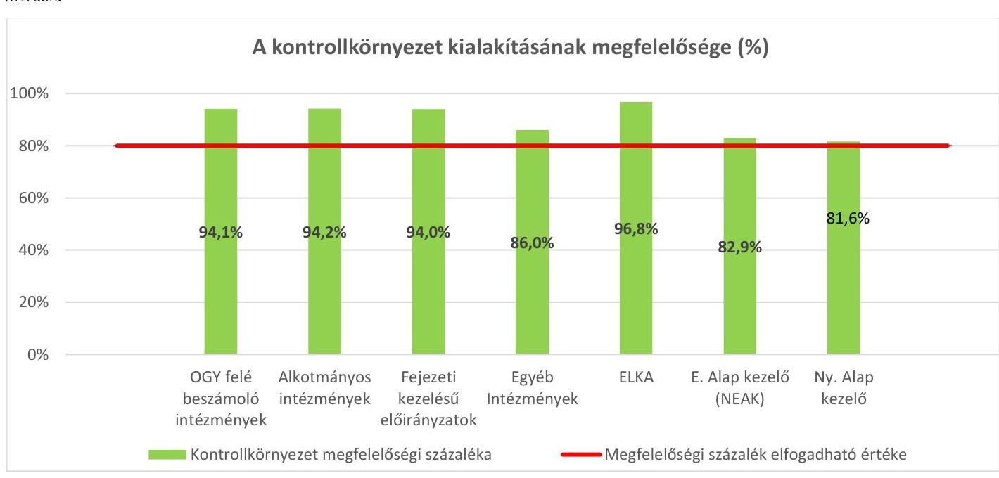

Fonrás: ÁSZ kimutatás

---

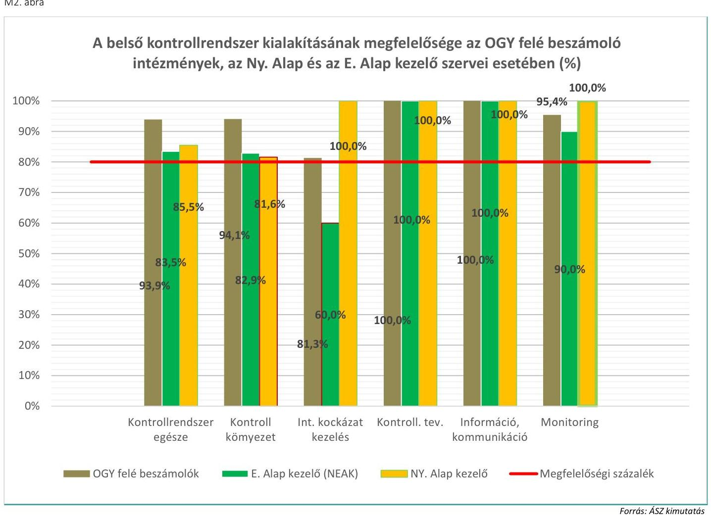

Fonrás: ÁSZ kimutatás

---

# III. SZ. MELLÉKLET: AZ INTEGRITÁS KONTROLL RENDSZER ÉRTÉKELÉSE 

A 2017. évi zárszámadás keretében az integritás szemlélet kialakítását, működtetését a költségvetési intézmények és a TB Alapok kezelő szervei esetében minősítette, intézménytípusonként összevontan és integritás kontroll egyes területei szerint (a szervezeti kultúra, a kockázatkezelési rendszer működtetése, a belső szabályozottság és a belső ellenőrzési rendszerek).

Az integritás szemlélet kialakítása megfelelőségének minősítése során az ÁSZ az alábbi minősítési kategóriákat alkalmazta az egyes intézményeknél:

Amennyiben az elért pontszám és a maximálisan elérhető pontszám aránya (kerekítés szabályait alkalmazva) 80 és 100\% közötti, „kiváló", ha 79\% és 60 \% közötti, „megfelelő", míg 60\% alatt „fejlesztendő" minősítési kategóriába tartozott.

Az integritás szemlélet kialakítása, működtetése egy intézmény esetében (NMEIO) kapott „fejlesztendő"minősítést, mert nem határoztak meg a szervezetre vonatkozó etikai elvárásokat, hivatásetikai alapelveket, nem működtettek a kockázatkezelési rendszert, belső ellenőrzést és hiányosságok voltak a belső szabályozottság területén.

Az integritás szemlélet érvényesülésének összevont értékelését az M3. ábra, míg az integritást felépítő területek értékelését az M4. ábra mutatja be.

M3. ábra
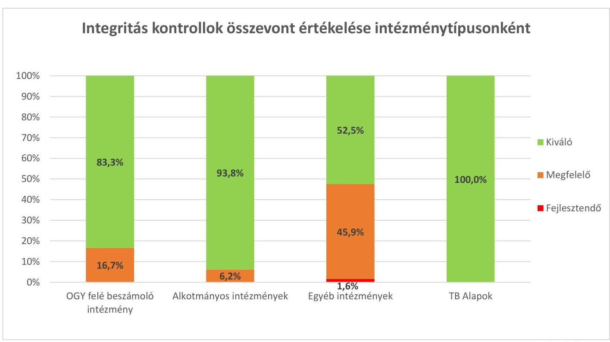

---

M4. ábra
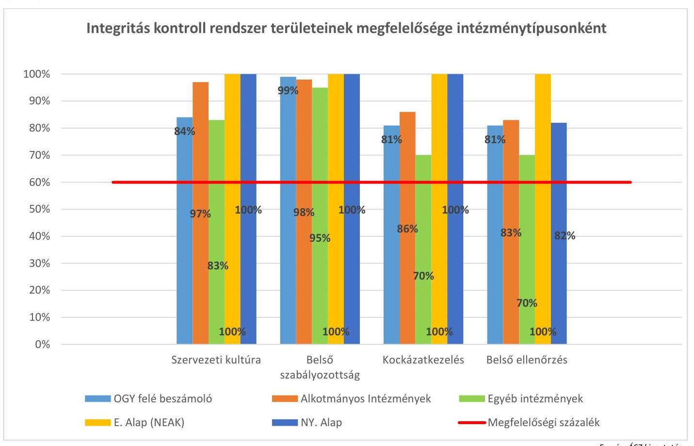

---

| Központi kezelésú és az állami vagyonnal kapcsolatos elóirányzatok | Fejezeti kezelésú elóirányzatok | OGY felé beszámolásra kötelezett intézmények |
| :--: | :--: | :--: |
| Agrár-Vállalkozási Hitelgarancia Alapítvány | Belügyminisztérium | Egyenlő Bánásmód Hatóság |
| Államadósság Kezelő Központ | Emberi Erőforrások Minisztériuma | Gazdasági Versenyhivatal |
| Belügyminisztérium | Földművelésügyi Minisztérium, Agrárminisztérium | Közbeszerzési Hatóság |
| Emberi Erőforrások Minisztériuma | Gazdaság Versenyhivatal | Központi Statisztikai Hivatal |
| Földművelésügyi Minisztérium | Honvédelmi Minisztérium | Magyar Energetikai és Közmű-szabályozási Hivatal |
| Garantiqa Hitelgarancia Zrt. | Igazságügyi Minisztérium | Magyar Művészeti Akadémia |
| KAVOSZ Vállalkozásfejlesztési Zrt. | Központi Statisztikai Hivatal | Magyar Tudományos Akadémia |
| Kormányhivatalok | Köztársasági Elnöki Hivatal | Nemzeti adatvédelmi és Információszabadság Hatóság |
| Magyar Államkincstár | Külgazdasági és Külügyminisztérium | Nemzeti Emlékezet Bizottságának Hivatala |
| Magyar Bányászati és Földtani Szolgálat | Magyar Művészeti Akadémia | Nemzeti Élelmiszer-biztonsági Hivatal |
| Magyar Exporthitel Biztosító Zrt. | Magyar Tudományos Akadémia | Nemzeti Kutatási Fejlesztési és Innovációs Hivatal |
| Magyar Fejlesztési Bank | Miniszterelnöki Kabinetiroda | Nemzeti Választási Iroda |
| Magyar Nemzeti Vagyonkezelő Zrt. | Miniszterelnökség | Alkotmányos fejezetek intézményei |
| Miniszterelnökség | Nemzeti Adó- és Vámhivatal | Alapvető Jogok Biztosának Hivatala |
| Nemzeti Adó- és Vámhivatal | Nemzetgazdasági Minisztérium, Pénzügyminisztérium | Alkotmánybíróság |
| Nemzetgazdasági Minisztérium, Pénzügyminisztérium | Nemzeti Fejlesztési Minisztérium | Bíróságok |
| Nemzeti Egészségbiztosítási Alapkezelő | Nemzeti Kutatási Fejlesztési és Innovációs Hivatal | Köztársasági Elnöki Hivatal |
| Nemzeti Fejlesztési Minisztérium | Országgyűlés | Kúria |
| Nemzeti Földalapkezelő Szervezet | Országos Bírósági Hivatal | Országgyűlés Hivatala |
| Nemzeti Útdijfizetési Szolgáltató Zrt. | Ügyészség | Országos Bírósági Hivatal |
| ELKA | Uniós Fejlesztések | Ügyészségek |
| Bethlen Gábor Alap | TB Alapok | TB Alapok kezelő szervei |
| Központi Nukleáris Pénzügyi Alap | Egészségbiztosítási Alap | Országos Nyugdijbiztosítási Főigazgatóság, 2017. november 1-től Magyar Államkincs- |
| Nemzeti Foglalkoztatási Alap | Nyugdijbiztosítási Alap | Nemzeti Egészségbiztosítási Alapkezelő |
| Nemzeti Kulturális Alap |  |  |
| Nemzeti Kutatási, Fejlesztési és Innovációs Alap |  |  |

---

| A központi költségvetés egyéb intézményei |  |  |
| :--: | :--: | :--: |
| Almási Balogh Pál Kórház | Győr-Moson-Sopron Megyei Gondosko-   dás Szociális Központ | Miniszterelnökség |
| Bács-Kiskun megyei Rendőr-főkapitány-   ság | Hajdú-Bihar Megyei Katasztrófavédelmi   Igazgatóság | Moholy-Nagy Művészeti Egyetem |
| Balatonfüredi Tankerületi Központ | Hatvani Tankerületi Központ | Nógrád Megyei "Baglyaskő" Idősek Otthona |
| Baranya Megyei Gyermekvédelmi Köz-   pont és Területi Gyermekvédelmi Szak-   szolgálat | Heves Megyei Büntetés-Végrehajtási In-   tézet | Pettkó-Szandtner Tibor Lovas Szakköz-   jépiskola és Kollégium |
| Baross László Mezőgazdasági Szakgim-   názium, Szakközépiskola és Kollégium | Heves Megyei Fenyőliget Egyesített Szo-   ciális Intézmény | Reménysugár Rehabilitációs Intézet |
| Bársony István Mezőgazdasági Szakgim-   názium, Szakközépiskola és Kollégium | Igazságügyi Minisztérium Igazgatás | Somogy Megyei Katasztrófavédelmi   Igazgatóság |
| Berettyóújfalui Szakképzési Centrum | Információs Hivatal | Soproni Tankerületi Központ |
| Borsod-Abaúj-Zemplén Megyei Gyer-   mekvédelmi Központ és Területi Gyer-   mekvédelmi Szakszolgálat | Jász-Nagykun Szolnok Megyei Katasztró-   favédelmi Igazgatóság | Szegedi Szakképzési Centrum |
| Budapest Főváros Kormányhivatala | Kanizsai Dorottya Kórház | Szegedi Tankerületi Központ |
| Bükki Nemzeti Park Igazgatóság | Készenléti Rendőrség | Szent Pantaleon Kórház - Rendelőintézet   Dunaújváros |
| Damjanich János Gimnázium és Mező-   gazdasági Szakképző Iskola | Közbeszerzési és Ellátási   Főigazgatóság | Szombathelyi Műszaki Szakképzési Centrum |
| Dunaújvárosi Tankerületi Központ | Közép-Dunántúli Országos Büntetés-   Végrehajtási Intézet | Tatabányai Tankerületi Központ |
| Emberi Erőforrások Minisztériuma   Aszód Javítóintézet, Általános Iskola,   Szakiskola és Speciális Szakiskola | Közép-Dunavölgyi Vízügyi Igazgatóság | Testnevelési Egyetem |
| Emberi Erőforrások Minisztériuma Rákospalotai Javítóintézete és Központi   Speciális Gyermekotthona | Kratochvil Károly Honvéd Középiskola és   Kollégium | Tolna megyei Rendőr-főkapitányság |
| Eötvös Loránd Tudományegyetem | Lumniczer Sándor Kórház - Rendelőinté-   zet Kapuvár | Vas Megyei Szakosított Otthon |
| Érdi Tankerületi Központ | Magyar Tudományos Akadémia Agrártu-   dományi Kutatóközpont | Vas Megyei Szakosított Szociális Intézmény |
| Észak-Dunántúli vízügyi Igazgatóság | Magyar Tudományos Akadémia Területi   Akadémiai Bizottságok Titkársága | Zala Megyei Fagyöngy Egyesített Szociá-   lis Intézmény |
| Fáy András Mezőgazdasági Szakgimná-   zium, Szakközépiskola és Kollégium | Magyar Tudományos Akadémia Wigner   Fizikai Kutatóközpont | Zala Megyei Gondoskodás Egyesített   Szociális Intézmény |
| FM Dunántúli Agrár-szakképző Központ,   Csapó Dániel Mezőgazdasági Szakgimná-   zium, Szakközépiskola és Kollégium | Markhot Ferenc Oktatókórház és Rende-   lőintézet | Zala Megyei Gyermekvédelmi Központ   és Területi Gyermekvédelmi Szakszolgá-   lat |
| Gregus Máté Mezőgazdasági Szakgimná-   zium és Szakközépiskola | MÁV Kórház és Rendelőintézet Szolnok |  |
| Győri Tankerületi Központ | Mezőtúri Kórház és Rendelőintézet |  |

---

# FÜGGELÉKEK 

## I. SZ. FÜGGELÉK

Az Állami Számvevőszék 2018. március 19-én kelt, EL-0430-012/2018. iktatószámú levelében értesítette a Szent Pantaleon Kórház- Rendelőintézet Dunaújvárost (a továbbiakban: Intézmény) az ÁSZ tv. 5. § (7) bekezdésében foglaltak alapján lefolytatott, Magyarország 2017. évi központi költségvetése végrehajtására vonatkozó ellenőrzésről. Az ellenőrzés elvégzéséhez az Állami Számvevőszék az ÁSZ tv. 28. § (1)-(2) bekezdéseiben foglaltak alapján a fenti levelében adatszolgáltatásra kérte fel az Intézményt. Az ÁSZ 2018. május 8-án kelt, EL-0430-182/2018. iktatószámú, valamint a beküldött adatbázisok alapján az ellenőrzési módszertan szerint kiválasztott mintatételekre vonatkozóan 2018. június 27-én kelt, EL-0430-775/2018. iktatószámú leveleiben további adatszolgáltatás teljesítésére hívta fel az Intézményt.

Az Intézmény adatszolgáltatási kötelezettségét a jogszabály szerinti határidőben teljesítette.
Az ellenőrzés rendelkezésére bocsátott, az ellenőrzött szervezet által kiállított teljességi és hitelességi nyilatkozattal alátámasztott dokumentumok alapján az ÁSZ megállapította, hogy a múködési kiadások esetében egy elszámolás hatályos megbízási szerződés hiányában történt, ezért a kiadások esetében felmerült a rendeltetésellenes pénzfelhasználás.

---

# II. SZ. FÜGGELÉK: AZ ELLENŐRZÖTT SZERVEZETEK ÁSZ ÁLTAL EL NEM FOGADOTT ÉSZREVÉTELEI 

A jelentéstervezetet a Számvevőszék 15 napos észrevételezésre megküldte az ellenőrzött szervezetek vezetőinek az ÁSZ tv. 29. §* (1) bekezdése elöírásának megfelelően.
A függelék tartalmazza az ellenőrzött szervezetek vezetői által tett és a Számvevőszék által el nem fogadott észrevételeket és az el nem fogadás indoklását.

[^0]
[^0]:    * 29. § (1) Az Állami Számvevőszék az ellenőrzési megállapításait megküldi az ellenőrzött szervezet vezetőjének vagy az általa megbízott személynek, és annak, akinek személyes felelősségét állapította meg.
    (2) Az ellenőrzött szervezet vezetője és a felelősként megjelölt személy az ellenőrzés megállapításaira tizenöt napon belül írásban észrevételt tehet.
    (3) Az Állami Számvevőszék az észrevételre a beérkezésétől számított harminc napon belül írásban válaszol. A figyelembe nem vett észrevételeket köteles a jelentésben feltüntetni, és megindokolni, hogy azokat miért nem fogadta el.

---

# ÉRDI TANKERÜLETI KÖZPONT 

## Észrevétel (a jelentéstervezet 3.3. számú megállapításával kapcsolatban)

Azokat a szerződéseket (kötelezettségeket), amelyeket az Önkormányzat a Vagyonkezelési szerződés és Megállapodás melléklete alapján átadott, a Tankerületnek kötelezően át kellett vennie 2017. január 01-jével. Egy Önkormányzat esetében a Vagyonkezelési Szerződés és a Megállapodás alapján átadásra került olyan vállalkozási szerződés, amely a Kbt. hatálya alá tartozna, azonban az Önkormányzat az átadást megelőzően kötötte, határozatlan időre. Egy másik Önkormányzat esetében, a Vagyonkezelési Szerződéssel egyidejűleg kötött, a jogok és kötelezettségek átadás-átvételéről szóló Megállapodásban leírtaknak megfelelően kellett eljárnia a Tankerületnek. Ennek alapján, az átvett köznevelési intézmények üzemeltetési feladataira vonatkozóan, az Önkormányzat 100 \%-os tulajdonában lévő Kft-vel kötelezően üzemeltetési-szolgáltatási szerződést kellett kötni 2017. január 01-jével. Ebből adódik, hogy jelenleg van olyan szerződésünk, amelynél a Tankerület a Kbt. előírásait nem tudta figyelembe venni. A Gazdálkodási, Üzemeltetési és Pályázati Főosztály Vagyongazdálkodási Osztálya felülvizsgálja a szerződéseket, amennyiben szükséges felmondja és megkezdi a közbeszerzési folyamat előkészítését, illetve lefolytatja a közbeszerzési eljárást.

## Az észrevétel el nem fogadásának indoklása:

Az észrevétel a közbeszerzésekről szóló 2015. évi CXLIII. törvény előírásainak megsértését nem vitatja, a szerződéses konstrukció bemutatását és a szerződések felülvizsgálatára, valamint a közbeszerzési eljárások lefolytatására vonatkozóan tervezett intézkedésekről a tájékoztatást köszönjük, azok nem befolyásolják az Állami Számvevőszék megállapítását.

## CSONGRÁD MEGYEI KORMÁNYHIVATAL

## Észrevétel (visszajelzés lehetőségének biztosításával kapcsolatban)

Az Állami Számvevőszéktől érkezett EL-0430-1712/2018. sz. levél arról értesít, hogy az ÁSZ befejezte a 2017. évi zárszámadás - Magyarország 2017. évi központi költségvetése végrehajtásának ellenőrzése címú ellenőrzését. Észrevételezzük, hogy az ellenőrzés ily módon történő lezárásával részünkre, mint ellenőrzött szervezet részére, nem került biztosításra a 2011. évi LXVI. az Állami Számvevőszékről szóló törvény 29. § (2) bekezdésében biztosított jog.

## Az észrevétel el nem fogadásának indoklása:

Az EL-0430-1610/2018. sz. levél mellékleteként - az Állami Számvevőszékről szóló 2011. évi LXVI. törvény (továbbiakban: ÁSZ törvény) 29. § (1) bekezdésében előírtaknak megfelelően - megküldtük az ellenőrzési megállapításokról készített jelentéstervezetet Önnek azzal a felhívással, hogy arra Kormánymegbízott úrhölgy 15 napon belül észrevételt tehet. Ezáltal az Állami Számvevőszék (továbbiakban: ÁSZ) biztosította az ÁSZ törvény 29. § (2) bekezdésében előírt észrevételezési jogot.

## Észrevétel (a jelentéstervezet megállapításának megfogalmazásával kapcsolatban)

A jelentéstervezet az ellenőrzés alá vont intézmények tekintetében, így a Csongrád Megyei Kormányhivatal tekintetében sem tartalmaz konkrét megállapításokat.

## Az észrevétel el nem fogadásának indoklása:

A jelentéstervezet 2.1. megállapítása a központi költségvetés részét képező központi kezelésű előirányzatok teljesítési adatait értékelte, melynek része volt a XX. EMMI fejezet NCSSZA Családi támogatások, illetve Jövedelempótló és jövedelemkiegészítő szociális támogatások jogcímeiről teljesített kiadások értékelése. Az ÁSZ érintett megállapítása statisztikai mintavételen alapul és ezáltal a teljes sokaság, a NCSSZA kiadásai vonatkozásában értelmezhető.

## Észrevétel (számviteli bizonylat hiányával kapcsolatban)

Nyilvántartásunk szerint 3 ellenőrzésre kiválasztott tétel esetében a Csongrád Megyei Kormányhivatal feltöltötte az ÁSZ megfelelő felületére az ellátásra vonatkozó dokumentumokat. A 11000744 ügyazonosító tétel esetében az ellátás igénylésével kapcsolatos dokumentumok feltöltésre kerültek, azonban a 2008. évben történt ellátást megállapító határozat a Magyar Államkincstártól történő feladatátvétel során a Csongrád Megyei Kormányhivatal részére nem került átadásra, így azt továbbítani nem tudtuk. A hiányosság ilyen formában történő megfogalmazása véleményünk szerint nem helytálló, ill. pontosítandó. A feladatellátást meghatározó szabályozás szerint a kormányhivatalok az ellátások megállapítását végzik, a folyósítás 2017. január 1-től a Magyar Államkincstár részéről központi utalással történik.

---

# Az észrevétel el nem fogadásának indoklása: 

A kiadási előirányzatok teljesítése szabályszerűségének ellenőrzése során az egyes mintatételekhez kapcsolódóan az ellátások igénylésének, kifizetésének dokumentumait ellenőrizte az ÁSZ, melyhez hozzátartozik az ellátás megállapítását tartalmazó határozat is. Kormánymegbízott Úrhölgy észrevételét tartalmazó levelében megerősíti, hogy egy mintatétel esetében nem rendelkezett az ellátást megállapító határozattal, azt nem bocsátotta az Állami Számvevőszék rendelkezésére.

Észrevétel (A munkajogi felelősség tisztázásához a konkrét hiba, hiányosság ismeretével kapcsolatban)
A jelentéstervezet az ellenőrzés alá vont intézmények tekintetében, így a Csongrád Megyei Kormányhivatal tekintetében sem tartalmaz konkrét megállapításokat. Ugyanakkor a figyelemfelhívó levél intézkedések megtételét, munkajogi felelősség tisztázását írja elő számunkra.

## Az észrevétel el nem fogadásának indoklása:

A munkajogi felelősség tisztázásához az Ön számára megküldött EL-0430-0712/2018. sz. figyelemfelhívó levél rögzíti a mintatételek ellenőrzése során feltárt szabálytalanságot, melyre az ÁSZ tv. 33. § (6) bekezdése alapján Ön köteles a megfelelő intézkedést megtenni és erről az ÁSZ elnökét értesíteni.

## MAGYAR TUDOMÁNYOS AKADÉMIA WIGNER FIZIKAI KUTATÓKÖZPONT

## Észrevétel (intézményre vonatkozó megállapítással kapcsolatban)

A jelentéstervezetben valamint a figyelemfelhívó levélben szereplő jogszabálysértő gyakorlat megszüntetése érdekében szükségesnek tartom megismerni azokat konkrét beszerzéseket, melyekkel megsértettük az előírásokat.

## Az észrevétel el nem fogadásának indoklása:

Tájékoztatom, hogy az Állami Számvevőszék ellenőrzési megállapításai az Állami Számvevőszékről szóló 2011. évi LXVI. törvénynek megfelelően minden esetben az ellenőrzés során bekért és az arra nyitva álló határidőn belül rendelkezésre bocsátott dokumentumokon alapulnak. Az ellenőrzött szervezet által, az ÁSZ EL-430-775/2018. iktatószámú adatszolgáltatást kérő levelére beküldött és a 2018. július 6-án kelt Teljességi és hitelességi nyilatkozatában is rögzített dokumentumokon alapul az ÁSZ megállapítása. Tekintettel az intézmény felhalmozási kiadás 31., 41. és 43. számú mintatételeihez csatolt dokumentumok terjedelmére, a megállapítást megalapozó dokumentumok rögzítése a jelentéstervezetben nem indokolt.

## NEMZETI FÖLDALAPKEZELŐ SZERVEZET

## Észrevétel (3.1 számú megállapítással kapcsolatban)

Az ÁSZ 3.1. számú NFA-ra vonatkozó megállapítását kérjük törölni a végleges ASZ jelentésből, mivel az állami ingatlanvagyon jogi rendezéséhez, valamint az állami tulajdonú ingatlanvagyon jogi rendezéséhez teljesített kiadásokhoz kötődő szerződések rendelkezésre állnak, melyet levelünk mellékleteként megküldtünk.

## Az észrevétel el nem fogadásának indoklása:

Tájékoztatom Elnök urat, hogy az Állami Számvevőszék ellenőrzési megállapításai az Állami Számvevőszékről szóló 2011. évi LXVI. törvénynek megfelelően minden esetben az ellenőrzés során bekért és az arra nyitva álló határidőn belül rendelkezésre bocsátott dokumentumokon alapulnak. Az ellenőrzés rendelkezésére bocsátott adatokkal, dokumentumokkal összefüggésben az adatszolgáltatás lezárása keretében a Nemzeti Földalapkezelő Szervezet teljességi és hitelességi nyilatkozatban rögzítette, hogy az ÁSZ részére átadott dokumentumok, adatok megbízhatóak és a bekért adatokra, dokumentumokra vonatkozóan teljes körű információt tartalmaznak. Az érintett gazdasági eseményeket alátámasztó szerződéseket az NFA az ellenőrzés során nem bocsátotta az Állami Számvevőszék rendelkezésére.

## SZENT PANTALEON KÓRHÁZ - RENDELŐINTÉZET DUNAÚJVÁROS

## Észrevétel (függelékében foglalt megállapítással kapcsolatban)

A működési kiadási tétel számla szerinti teljesítési időpontja 2017. 05. 30. A fenti működési kiadás jogosságát alátámasztó dokumentumként Sz-433/2017 számú megbízási Szerződés került becsatolásra, 2017. szeptember 7-ei keltezéssel, hatályba lépés 2017. szeptember 1. A csatolt szerződés 2. bekezdése tartalmazta azt a kitételt, hogy 2014. óta rendelkeztünk megbízási szerződéssel.

---

# Az észrevétel el nem fogadásának indoklása: 

Tájékoztatom, hogy az Állami Számvevőszék ellenőrzési megállapításai az Állami Számvevőszékről szóló 2011. évi LXVI. törvénynek megfelelően minden esetben az ellenőrzés során bekért és az arra nyitva álló határidőn belül rendelkezésre bocsátott dokumentumokon alapulnak. Az ellenőrzés rendelkezésére bocsátott adatokkal, dokumentumokkal összefüggésben a Szent Pantaleon Kórház-Rendelőintézet Dunaújváros teljességi és hitelességi nyilatkozatban rögzítette, hogy az ÁSZ részére átadott dokumentumok, adatok megbízhatóak és a bekért adatokra, dokumentumokra vonatkozóan teljes körű információt tartalmaznak. Az észrevételben megfogalmazottak megerősítik, hogy az érintett gazdasági eseményt alátámasztó, hatályos megbízási szerződést nem bocsátottak az Állami Számvevőszék rendelkezésére.

---

III. SZ. FÜGGELÉK: AZ ORSZÁGGYŰLÉS FELÉ BESZÁMOLÁSRA KÖTELEZETT INTÉZMÉNYEK ELLENŐRZÉSÉNEK EREDMÉNYÉRŐL KÉSZÍTETT RÖVID ÖSSZEFOGLALÓ ÉRTÉKELÉS ÉS AZOKRA TETT, ÁSZ ÁLTAL EL NEM FOGADOTT ÉSZREVÉTELEK

# EGYENLŐ BÁNÁSMÓD HATÓSÁG (I. ORSZÁGGYŰLÉS FEJEZET, 22. CÍM) 

Az Egyenlő Bánásmód Hatóság bevételi és kiadási adatai megbízhatóak voltak, az intézmény bevételeinek és kiadásainak elszámolása szabályszerű volt.

Az intézmény az előirányzat módosításra, átcsoportosításra, és a költségvetési maradvány kimutatásra vonatkozóan az államháztartásról szóló 2011. évi CXCV. törvény (Áht.), az államháztartásról szóló törvény végrehajtásáról szóló 368/2011. (XII. 31.) Korm. rendelet (Ávr.) és az államháztartás számviteléről szóló 4/2013. (I. 11.) Korm. rendelet (Áhsz.) előírásait betartotta, a beszámoló részét képező mérleget, eredmény-kimutatást és kiegészítő mellékletet a jogszabályi előírásoknak megfelelően állította össze. Az Áhsz. kötelező egyezőségekre vonatkozó előírásai érvényesültek.

Az intézmény belső kontroll rendszere az Áht., az Ávr. és a költségvetési szervek belső kontrollrendszeréről és belső ellenőrzéséről szóló 370/2011. (XII. 31.) Korm. rendelet előírásainak megfelelően került kiépítésre. A belső kontroll rendszer keretében kialakított és működtetett integritás kontrollok hozzájárultak az integritás szemlélet érvényesüléséhez.

## GAZDASÁGI VERSENYHIVATAL (XXX. GAZDASÁGI VERSENYHIVATAL FEJEZET)

A Gazdasági Versenyhivatal bevételi és kiadási adatai megbízhatóak voltak, az intézmény bevételeinek és kiadásainak elszámolása szabályszerű volt.

Az intézmény az előirányzat módosításra, átcsoportosításra, és a költségvetési maradvány kimutatásra vonatkozóan az államháztartásról szóló 2011. évi CXCV. törvény (Áht.), az államháztartásról szóló törvény végrehajtásáról szóló 368/2011. (XII. 31.) Korm. rendelet (Ávr.) és az államháztartás számviteléről szóló 4/2013. (I. 11.) Korm. rendelet (Áhsz.) előírásait betartotta, a beszámoló részét képező mérleget, eredmény-kimutatást és kiegészítő mellékletet a jogszabályi előírásoknak megfelelően állította össze. Az Áhsz. kötelező egyezőségekre vonatkozó előírásai érvényesültek.

Az intézmény belső kontroll rendszere az Áht., az Ávr. és a költségvetési szervek belső kontrollrendszeréről és belső ellenőrzéséről szóló 370/2011. (XII. 31.) Korm. rendelet előírásainak megfelelően került kiépítésre. A belső kontroll rendszer keretében kialakított és működtetett integritás kontrollok hozzájárultak az integritás szemlélet érvényesüléséhez.

A fejezeti kezelésű előirányzatok tekintetében az éves beszámoló és a költségvetési jelentés elkészítése szabályszerű volt, azok megfeleltek az Áhsz. előírásainak. Az éves beszámolót az intézmény a Kincstár által működtetett elektronikus adatszolgáltató rendszerbe az előírt határidőig feltöltötte. A maradvány kimutatásokat a jogszabályi előírások alapján állították össze, az éves beszámolóban, a kapcsolódó főkönyvi számlákon szereplő előirányzat-maradványok összegei megegyeztek az analitikus nyilvántartásokban kimutatott összegekkel, azokat dokumentumok támasztották alá.

## KÖZBESZERZÉSI HATÓSÁG (I. ORSZÁGGYŰLÉS FEJEZET, 5. CÍM)

A Közbeszerzési Hatóság bevételi és kiadási adatai megbízhatóak voltak, az intézmény bevételeinek és kiadásainak elszámolása szabályszerű volt.

Az intézmény az előirányzat módosításra, átcsoportosításra, és a költségvetési maradvány kimutatásra vonatkozóan az államháztartásról szóló 2011. évi CXCV. törvény (Áht.), az államháztartásról szóló törvény végrehajtásáról szóló 368/2011. (XII. 31.) Korm. rendelet (Ávr.) és az államháztartás számviteléről szóló 4/2013. (I. 11.) Korm. rendelet (Áhsz.) előírásait betartotta, a beszámoló részét képező mérleget, eredmény-kimutatást és kiegészítő mellékletet a jogszabályi előírásoknak megfelelően állította össze. Az Áhsz. kötelező egyezőségekre vonatkozó előírásai érvényesültek.

---

Az intézmény belső kontroll rendszere az Áht., az Ávr. és a költségvetési szervek belső kontrollrendszeréről és belső ellenőrzéséről szóló 370/2011. (XII. 31.) Korm. rendelet előírásainak megfelelően került kiépítésre. A belső kontroll rendszer keretében kialakított és müködtetett integritás kontrollok hozzájárultak az integritás szemlélet érvényesüléséhez.

# KÖZPONTI STATISZTIKAI HIVATAL (XXXI. KÖZPONTI STATISZTIKAI HIVATAL FEJEZET) 

A Központi Statisztikai Hivatal bevételi és kiadási adatai megbízhatóak voltak, az intézmény bevételeinek és kiadásainak elszámolása szabályszerű volt.

Az intézmény az előirányzat módosításra, átcsoportosításra, és a költségvetési maradvány kimutatásra vonatkozóan az államháztartásról szóló 2011. évi CXCV. törvény (Áht.), az államháztartásról szóló törvény végrehajtásáról szóló 368/2011. (XII. 31.) Korm. rendelet (Ávr.) és az államháztartás számviteléről szóló 4/2013. (I. 11.) Korm. rendelet (Áhsz.) előírásait betartotta, a beszámoló részét képező mérleget, eredmény-kimutatást és kiegészítő mellékletet a jogszabályi előírásoknak megfelelően állította össze. Az Áhsz. kötelező egyezőségekre vonatkozó előírásai érvényesültek.

Az intézmény belső kontroll rendszere az Áht., az Ávr. és a költségvetési szervek belső kontrollrendszeréről és belső ellenőrzéséről szóló 370/2011. (XII. 31.) Korm. rendelet előírásainak megfelelően került kiépítésre. A belső kontroll rendszer keretében kialakított és müködtetett integritás kontrollok hozzájárultak az integritás szemlélet érvényesüléséhez.

A fejezeti kezelésű előirányzatok tekintetében az éves beszámoló és a költségvetési jelentés elkészítése szabályszerű volt, azok megfeleltek az Áhsz. előírásainak. Az éves beszámolót az intézmény a Kincstár által müködtetett elektronikus adatszolgáltató rendszerbe az előírt határidőig feltöltötte. A maradvány kimutatásokat a jogszabályi előírások alapján állították össze, az éves beszámolóban, a kapcsolódó főkönyvi számlákon szereplő előirányzat-maradványok összegei megegyeztek az analitikus nyilvántartásokban kimutatott összegekkel, azokat dokumentumok támasztották alá.

## MAGYAR ENERGETIKAI ÉS KÖZMŰ-SZABÁLYOZÁSI HIVATAL (I. ORSZÁGGYŰLÉS FEJEZET, 23. CÍM)

A Magyar Energetikai és Közmű szabályozási Hivatal bevételi és kiadási adatai megbízhatóak voltak, az intézmény bevételeinek és kiadásainak elszámolása szabályszerű volt.

Az intézmény az előirányzat módosításra, átcsoportosításra, és a költségvetési maradvány kimutatásra vonatkozóan az államháztartásról szóló 2011. évi CXCV. törvény (Áht.), az államháztartásról szóló törvény végrehajtásáról szóló 368/2011. (XII. 31.) Korm. rendelet (Ávr.) és az államháztartás számviteléről szóló 4/2013. (I. 11.) Korm. rendelet (Áhsz.) előírásait betartotta, a beszámoló részét képező mérleget, eredmény-kimutatást és kiegészítő mellékletet a jogszabályi előírásoknak megfelelően állította össze. Az Áhsz. kötelező egyezőségekre vonatkozó előírásai érvényesültek.

Az intézmény belső kontroll rendszere az Áht., az Ávr. és a költségvetési szervek belső kontrollrendszeréről és belső ellenőrzéséről szóló 370/2011. (XII. 31.) Korm. rendelet előírásainak megfelelően került kiépítésre. A belső kontroll rendszer keretében kialakított és müködtetett integritás kontrollok hozzájárultak az integritás szemlélet érvényesüléséhez.

## MAGYAR MŰVÉSZETI AKADÉMIA (XXXIV. MAGYAR MŰVÉSZETI AKADÉMIA FEJEZET)

A Magyar Művészeti Akadémia bevételi és kiadási adatai megbízhatóak voltak, az intézmény bevételeinek és kiadásainak elszámolása szabályszerű volt.

Az intézmény az előirányzat módosításra, átcsoportosításra, és a költségvetési maradvány kimutatásra vonatkozóan az államháztartásról szóló 2011. évi CXCV. törvény (Áht.), az államháztartásról szóló törvény végrehajtásáról szóló 368/2011. (XII. 31.) Korm. rendelet (Ávr.) és az államháztartás számviteléről szóló 4/2013. (I. 11.) Korm. rendelet (Áhsz.) előírásait betartotta, a beszámoló részét képező mérleget, eredmény-kimutatást és kiegészítő mellékletet a

---

jogszabályi előírásoknak megfelelően állította össze. Az Áhsz. kötelező egyezőségekre vonatkozó előírásai érvényesültek.

Az intézmény belső kontroll rendszere az Áht., az Ávr. és a költségvetési szervek belső kontrollrendszeréről és belső ellenőrzéséről szóló 370/2011. (XII. 31.) Korm. rendelet előírásainak megfelelően került kiépítésre. A belső kontroll rendszer keretében kialakított és működtetett integritás kontrollok hozzájárultak az integritás szemlélet érvényesüléséhez.

A Magyar Művészeti Akadémia fejezeti kezelésű előirányzatok tekintetében az éves beszámoló és a költségvetési jelentés elkészítése szabályszerű volt, azok megfeleltek az Áhsz. előírásainak. Az éves beszámolót az intézmény a Kincstár által működtetett elektronikus adatszolgáltató rendszerbe az előírt határidőig feltöltötte. A maradvány kimutatásokat a jogszabályi előírások alapján állították össze, az éves beszámolóban, a kapcsolódó főkönyvi számlákon szereplő előirányzat-maradványok összegei megegyeztek az analitikus nyilvántartásokban kimutatott összegekkel, azokat dokumentumok támasztották alá.

# MAGYAR TUDOMÁNYOS AKADÉMIA (XXXIII. MAGYAR TUDOMÁNYOS AKADÉMIA FEJEZET) 

A Magyar Tudományos Akadémia bevételi és kiadási adatai megbízhatóak voltak, az intézmény bevételeinek és kiadásainak elszámolása szabályszerű volt.

Az intézmény az előirányzat módosításra, átcsoportosításra, és a költségvetési maradvány kimutatásra vonatkozóan az államháztartásról szóló 2011. évi CXCV. törvény (Áht.), az államháztartásról szóló törvény végrehajtásáról szóló 368/2011. (XII. 31.) Korm. rendelet (Ávr.) és az államháztartás számviteléről szóló 4/2013. (I. 11.) Korm. rendelet (Áhsz.) előírásait betartotta, a beszámoló részét képező mérleget, eredmény-kimutatást és kiegészítő mellékletet a jogszabályi előírásoknak megfelelően állította össze. Az Áhsz. kötelező egyezőségekre vonatkozó előírásai érvényesültek.

Az intézmény belső kontroll rendszere az Áht., az Ávr. és a költségvetési szervek belső kontrollrendszeréről és belső ellenőrzéséről szóló 370/2011. (XII. 31.) Korm. rendelet előírásainak megfelelően került kiépítésre. A belső kontroll rendszer keretében kialakított és működtetett integritás kontrollok hozzájárultak az integritás szemlélet érvényesüléséhez.

A fejezeti kezelésű előirányzatok tekintetében az éves beszámoló és a költségvetési jelentés elkészítése szabályszerű volt, azok megfeleltek az Áhsz. előírásainak. Az éves beszámolót az intézmény a Kincstár által működtetett elektronikus adatszolgáltató rendszerbe az előírt határidőig feltöltötte. A maradvány kimutatásokat a jogszabályi előírások alapján állították össze, az éves beszámolóban, a kapcsolódó főkönyvi számlákon szereplő előirányzat-maradványok összegei megegyeztek az analitikus nyilvántartásokban kimutatott összegekkel, azokat dokumentumok támasztották alá.

## NEMZETI ADATVÉDELMI ÉS INFORMÁCIÓSZABADSÁG HATÓSÁG (I. ORSZÁGGYŰLÉS FEJEZET, 21. CÍM)

A Nemzeti Adatvédelmi és Információszabadság Hatóság bevételi és kiadási adatai megbízhatóak voltak, az intézmény bevételeinek és kiadásainak elszámolása szabályszerű volt.

Az intézmény az előirányzat módosításra, átcsoportosításra, és a költségvetési maradvány kimutatásra vonatkozóan az államháztartásról szóló 2011. évi CXCV. törvény (Áht.), az államháztartásról szóló törvény végrehajtásáról szóló 368/2011. (XII. 31.) Korm. rendelet (Ávr.) és az államháztartás számviteléről szóló 4/2013. (I. 11.) Korm. rendelet (Áhsz.) előírásait betartotta, a beszámoló részét képező mérleget, eredmény-kimutatást és kiegészítő mellékletet a jogszabályi előírásoknak megfelelően állította össze. Az Áhsz. kötelező egyezőségekre vonatkozó előírásai érvényesültek.

Az intézmény belső kontroll rendszere az Áht., az Ávr. és a költségvetési szervek belső kontrollrendszeréről és belső ellenőrzéséről szóló 370/2011. (XII. 31.) Korm. rendelet előírásainak megfelelően került kiépítésre. A belső kontroll rendszer keretében kialakított és működtetett integritás kontrollok hozzájárultak az integritás szemlélet érvényesüléséhez.

---

# NEMZETI ÉLELMISZERLÁNC-BIZTONSÁGI HIVATAL (XII. FÖLDMŰVELÉSÜGYI MINISZTÉRIUM FEJEZET, 2. CÍM) 

A Nemzeti Élelmiszerlánc-biztonsági Hivatal bevételi és kiadási adatai megbízhatóak voltak, az intézmény bevételeinek és kiadásainak elszámolása szabályszerű volt.

Az intézmény az előirányzat módosításra, átcsoportosításra, és a költségvetési maradvány kimutatásra vonatkozóan az államháztartásról szóló 2011. évi CXCV. törvény (Áht.), az államháztartásról szóló törvény végrehajtásáról szóló 368/2011. (XII. 31.) Korm. rendelet (Ávr.) és az államháztartás számviteléről szóló 4/2013. (I. 11.) Korm. rendelet (Áhsz.) előírásait betartotta, a beszámoló részét képező mérleget, eredmény-kimutatást és kiegészítő mellékletet a jogszabályi előírásoknak megfelelően állította össze. Az Áhsz. kötelező egyezőségekre vonatkozó előírásai érvényesültek.

Az intézmény belső kontroll rendszere az Áht., az Ávr. és a költségvetési szervek belső kontrollrendszeréről és belső ellenőrzéséről szóló 370/2011. (XII. 31.) Korm. rendelet előírásainak megfelelően került kiépítésre. A belső kontroll rendszer keretében kialakított és müködtetett integritás kontrollok hozzájárultak az integritás szemlélet érvényesüléséhez.

## NEMZETI EMLÉKEZET BIZOTTSÁGÁNAK HIVATALA (I. ORSZÁGGYŰLÉS FEJEZET, 25. CÍM)

A Nemzeti Emlékezet Bizottságának Hivatala bevételi és kiadási adatai megbízhatóak voltak, az intézmény bevételeinek és kiadásainak elszámolása szabályszerű volt.

Az intézmény az előirányzat módosításra, átcsoportosításra, és a költségvetési maradvány kimutatásra vonatkozóan az államháztartásról szóló 2011. évi CXCV. törvény (Áht.), az államháztartásról szóló törvény végrehajtásáról szóló 368/2011. (XII. 31.) Korm. rendelet (Ávr.) és az államháztartás számviteléről szóló 4/2013. (I. 11.) Korm. rendelet (Áhsz.) előírásait betartotta, a beszámoló részét képező mérleget, eredmény-kimutatást és kiegészítő mellékletet a jogszabályi előírásoknak megfelelően állította össze. Az Áhsz. kötelező egyezőségekre vonatkozó előírásai érvényesültek.

Az intézmény belső kontroll rendszere az Áht., az Ávr. és a költségvetési szervek belső kontrollrendszeréről és belső ellenőrzéséről szóló 370/2011. (XII. 31.) Korm. rendelet előírásainak megfelelően került kiépítésre. A belső kontroll rendszer keretében kialakított és müködtetett integritás kontrollok hozzájárultak az integritás szemlélet érvényesüléséhez.

## NEMZETI KUTATÁSI, FEJLESZTÉSI ÉS INNOVÁCIÓS HIVATAL (XXXV. NEMZETI KUTATÁSI, FEJLESZTÉSI ÉS INNOVÁCIÓS HIVATAL FEJEZET)

A Nemzeti Kutatási fejlesztési és Innovációs Hivatal bevételi és kiadási adatai megbízhatóak voltak, az intézmény bevételeinek és kiadásainak elszámolása szabályszerű volt.

Az intézmény az előirányzat módosításra, átcsoportosításra, és a költségvetési maradvány kimutatásra vonatkozóan az államháztartásról szóló 2011. évi CXCV. törvény (Áht.), az államháztartásról szóló törvény végrehajtásáról szóló 368/2011. (XII. 31.) Korm. rendelet (Ávr.) és az államháztartás számviteléről szóló 4/2013. (I. 11.) Korm. rendelet (Áhsz.) előírásait betartotta, a beszámoló részét képező mérleget, eredmény-kimutatást és kiegészítő mellékletet a jogszabályi előírásoknak megfelelően állította össze. Az Áhsz. kötelező egyezőségekre vonatkozó előírásai érvényesültek.

Az intézmény belső kontroll rendszere az Áht., az Ávr. és a költségvetési szervek belső kontrollrendszeréről és belső ellenőrzéséről szóló 370/2011. (XII. 31.) Korm. rendelet előírásainak megfelelően került kiépítésre. A belső kontroll rendszer keretében kialakított és müködtetett integritás kontrollok hozzájárultak az integritás szemlélet érvényesüléséhez.

---

NEMZETI KUTATÁSI, FEJLESZTÉSI ÉS INNOVÁCIÓS HIVATAL (XXXV. NEMZETI KUTATÁSI, FEJLESZTÉSI ÉS INNOVÁCIÓS HIVATAL FEJEZET, 2. CÍM FEJEZETI KEZELÉSŰ ELŐIRÁNYZATOK)

Az éves beszámoló és a költségvetési jelentés elkészítése szabályszerű volt, azok megfeleltek az Áhsz. előírásainak. Az éves beszámolót az intézmény a Kincstár által működtetett elektronikus adatszolgáltató rendszerbe az előírt határidőig feltöltötte. A maradvány kimutatásokat a jogszabályi előírások alapján állították össze, az éves beszámolóban, a kapcsolódó főkönyvi számlákon szereplő előirányzat-maradványok összegei megegyeztek az analitikus nyilvántartásokban kimutatott összegekkel, azokat dokumentumok támasztották alá.

# NEMZETI VÁLASZTÁSI IRODA (I. ORSZÁGGYŰLÉS FEJEZET, 24. CÍM) 

A Nemzeti Választási Iroda bevételi és kiadási adatai megbízhatóak voltak, az intézmény bevételeinek és kiadásainak elszámolása szabályszerű volt.

Az intézmény az előirányzat módosításra, átcsoportosításra, és a költségvetési maradvány kimutatásra vonatkozóan az államháztartásról szóló 2011. évi CXCV. törvény (Áht.), az államháztartásról szóló törvény végrehajtásáról szóló 368/2011. (XII. 31.) Korm. rendelet (Ávr.) és az államháztartás számviteléről szóló 4/2013. (I. 11.) Korm. rendelet (Áhsz.) előírásait betartotta, a beszámoló részét képező mérleget, eredmény-kimutatást és kiegészítő mellékletet a jogszabályi előírásoknak megfelelően állította össze. Az Áhsz. kötelező egyezőségekre vonatkozó előírásai érvényesültek.

Az intézmény belső kontroll rendszere az Áht., az Ávr. és a költségvetési szervek belső kontrollrendszeréről és belső ellenőrzéséről szóló 370/2011. (XII. 31.) Korm. rendelet előírásainak megfelelően került kiépítésre. A belső kontroll rendszer keretében kialakított és működtetett integritás kontrollok hozzájárultak az integritás szemlélet érvényesüléséhez.

---

# - IV. SZ. FÜGGELÉK: TÁJÉKOZTATÁS A FIGYELEMFELHÍVÓ LEVELEKRŐL 

A zárszámadás keretében az ÁSZ ellenőrizte a központi költségvetés, a Társadalombiztosítási Alapok és az Elkülönített állami pénzalapok bevételi és kiadási előirányzatainak teljesítése, az előirányzat módosítás, a maradvány megállapítása és a beszámolók összeállítása szabályszerűségét, és mindezeket megalapozó kontrollkörnyezet kialakítását. E területeken feltárt szabályszerűségi hibák megszűntetésére az ÁSZ figyelemfelhívó levélben szólította fel az érintetteket. A figyelemfelhívó levélben foglaltakat az ellenőrzött szervezet vezetőjének, tizenöt napon belül el kell bírálnia, a megfelelő intézkedést meg kell tennie, a megtett intézkedéseiről pedig az Állami Számvevőszéket értesítenie kell. A Számvevőszék utóellenőrzés keretében ellenőrizheti, hogy a figyelemfelhívásban érintett szervezet a vállalt intézkedést végrehajtotta-e.

Az ÁSZ figyelemfelhívó levélben intézkedésre szólította fel a 2017. évi Zárszámadás ellenőrzése során megállapított hiányosságokkal érintett szervezeteket. Ezek több mint fele a szabad előirányzat nélküli kötelezettségvállalások témakörét érintette. További hiányosságokat azonosított az ellenőrzés a számviteli bizonylatok, NCSSZA terhére történt kifizetések, gazdálkodási jogkör gyakorlás szabályszerűségét és a közbeszerzési eljárások lefolytatását érintően.

Az ellenőrzés során feltárt és figyelemfelhívó levélben rögzített hibák, hiányosságok a zárszámadási törvényjavaslatban szereplő adatok megbízható és szabályszerű minősítését nem befolyásolták, azok a lényegességi szintet nem haladták meg.

A 2016-os Zárszámadás ellenőrzése során feltárt hibákról, hiányosságokról az ÁSZ jellemzően a beszámolás, a kontrollkörnyezet, a gazdálkodási jogkörök gyakorlása, a számviteli bizonylatok és nyilvántartások, az NCSSZA terhére történt kifizetések, valamint a közbeszerzések témakörében küldött figyelemfelhívó levelet.

A figyelemfelhívó levelekkel összefüggésben tett intézkedések utóellenőrzése folyamatban van. A figyelemfelhívó levelek összesen 274 db , konkrét szabálytalanságra vonatkozó figyelemfelhívást tartalmaztak. A figyelemfelhívó levelek alapján az ellenőrzött szervezetek összesen 279 válaszintézkedést határoztak meg, és a hibák, hiányosságok orvoslása érdekében az utóellenőrzés lezárásáig 241 esetben tettek intézkedést (ez a határidőben, határidőn túl, és részben végrehajtott intézkedések összesített előzetes adata).

---

.

---

# RÖVIDÍTÉSEK JEGYZÉKE 

${ }^{1}$ Kvtv.
${ }^{2}$ Áht.
${ }^{3}$ TB Alapok
${ }^{4}$ ELKA
${ }^{5}$ Áhsz.
${ }^{6}$ Kincstár
${ }^{7}$ ÁSZ
${ }^{8}$ ÁSZ törvény
${ }^{9}$ NGM
${ }^{10}$ NAV
${ }^{11}$ ÁKK Zrt.
${ }^{12}$ OGYH
${ }^{13} \mathrm{KE}$
${ }^{14} \mathrm{AB}$
${ }^{15}$ AJBH
${ }^{16} \mathrm{OBH}$
${ }^{17}$ OGY
${ }^{18} \mathrm{KH}$
${ }^{19}$ NAIH
${ }^{20} \mathrm{EBH}$
${ }^{21}$ MEKH
${ }^{22}$ NVI
${ }^{23}$ NEBH
${ }^{24}$ NÉBIH
${ }^{25}$ GVH
${ }^{26}$ KSH
${ }^{27}$ MTA
${ }^{28}$ MMA
${ }^{29}$ NKFIH
${ }^{30}$ ÁSZ SZMSZ
${ }^{31}$ Ávr.
${ }^{32}$ KAR
${ }^{33}$ AHAB
${ }^{34}$ KGR K11
${ }^{35}$ Stabilitási törvény
${ }^{36}$ GDP
${ }^{37}$ NCSSZA
${ }^{38}$ EMMI
${ }^{39}$ Számv. tv.
2016. évi XC. törvény Magyarország 2017. évi központi költségvetéséről 2011. évi CXCV. törvény az államháztartásról, hatályos 2011. december 31-től Társadalombiztosítási Alapok: Nyugdíjbiztosítási Alap, Egészségbiztosítási Alap Elkülönített Állami Pénzalapok
4/2013. (I. 11.) Korm. rendelet az államháztartás számviteléről, hatályos 2014. január 1-jétől
Magyar Államkincstár
Állami Számvevőszék
2011. évi LXVI. törvény az Állami Számvevőszékről, hatályos 2011. július 1-jétől Nemzetgazdasági Minisztérium, 2018. május 18-tól Pénzügyminisztérium Nemzeti Adó- és Vámhivatal
Államadósság Kezelő Központ Zártkörűen Működő Részvénytársaság Országgyűlés Hivatala
Köztársasági Elnökség
Alkotmánybíróság
Alapvető Jogok Biztosának Hivatala
Országos Bírósági Hivatal
Országgyűlés
Közbeszerzési Hatóság
Nemzeti Adatvédelmi és Információszabadság Hatóság
Egyenlő Bánásmód Hatóság
Magyar Energetikai és Közmű-szabályozási Hivatal
Nemzeti Választási Iroda
Nemzeti Emlékezet Bizottságának Hivatala
Nemzeti Élelmiszerlánc-biztonsági Hivatal
Gazdasági Versenyhivatal
Központi Statisztikai Hivatal
Magyar Tudományos Akadémia
Magyar Művészeti Akadémia
Nemzeti Kutatási, Fejlesztési és Innovációs Hivatal
Állami Számvevőszék Szervezeti és Múködési Szabályzata
368/2011. (XII. 31.) Korm. rendelet az államháztartásról szóló törvény végrehajtásáról, hatályos 2012. január 1-jétől
Költségvetési Adatcserélő Rendszer
Államháztartási Adatbázis
Költségvetés Gazdálkodási Rendszer K11 adatgyűjtő-beszámoló rendszer 2011. évi CXCIV. törvény Magyarország gazdasági stabilitásáról

Bruttó hazai termék (Gross domestic product)
EMMI fejezet Nemzeti Család- és Szociálpolitikai Alap cím
Emberi Erőforrások Minisztériuma
2000. évi C. törvény a számvitelről

---

| ${ }^{40}$ NFA | Nemzeti Földalap |
| :--: | :--: |
| ${ }^{41}$ Vidékfejlesztési program | Kvtv. 2. cím, 12. alcím /Vidékfejlesztési program 2014-2020 |
| ${ }^{42}$ BGA | Bethlen Gábor Alap |
| ${ }^{43}$ KNPA | Központi Nukleáris Pénzügyi Alap |
| ${ }^{44}$ NEFA | Nemzeti Foglalkoztatási Alap |
| ${ }^{45}$ NKA | Nemzeti Kulturális Alap |
| ${ }^{46}$ NKFIA | Nemzeti Kutatási, Fejlesztési és Innovációs Alap |
| ${ }^{47}$ KESZ | Kincstári Egységes Számla |
| ${ }^{48}$ RKI | Rendkívüli kormányzati intézkedésekre szolgáló tartalék |
| ${ }^{49}$ OVA | Országvédelmi Alap |
| ${ }^{50}$ ETE | Európai Területi Együttmüködés |
| ${ }^{51}$ EGT | Európai Gazdasági Térség |
| ${ }^{52}$ BPFKH | Budapest Főváros Kormányhivatala |
| ${ }^{53}$ ÉTK | Érdi Tankerületi Központ |
| ${ }^{54}$ MKR | Mezőtúri Kórház és Rendelőintézet |
| ${ }^{55}$ MTAWFK | Magyar Tudományos Akadémia Wigner Fizikai Kutatóközpont |
| ${ }^{56}$ SZPKRD | Szent Pantaleon Kórház - Rendelőintézet Dunaújváros |
| ${ }^{57}$ Kbt. | 2015. évi CXLIII. törvény a közbeszerzésekről |
| ${ }^{58}$ TB Alapok kezelő szervei | Ny. Alap esetében 2017. október 31-ig az Országos Nyugdíjbiztosítási Főigazgatóság, 2017. november 1-től a Kincstár, E. Alap esetében a Nemzeti Egészségbiztosítási Alapkezelő |
| ${ }^{59}$ BMGYKTGYSZ | Baranya Megyei Gyermekvédelmi Központ és Területi Gyermekvédelmi Szakszolgálat |
| ${ }^{60}$ DTK | Dunaújvárosi Tankerületi Központ |
| ${ }^{61}$ ELTE | Eötvös Loránd Tudományegyetem |
| ${ }^{62}$ JNSZMKI | Jász-Nagykun Szolnok Megyei Katasztrófavédelmi Igazgatóság |
| ${ }^{63}$ KKHKK | Kratochvil Károly Honvéd Középiskola és Kollégium |
| ${ }^{64}$ MNME | Moholy-Nagy Művészeti Egyetem |
| ${ }^{65}$ NMEIO | Nógrád Megyei Ezüstfenyő Idősek Otthona |
| ${ }^{66}$ RHI | Reménysugár Habilitációs Intézet |
| ${ }^{67}$ TMRFK | Tolna Megyei Rendőr-főkapitányság |

---

# ÁLLAMI SZÁMVEVŐSZÉK 

1052 Budapest, Apáczai Csere János utca 10.
Levélcím: 1364 Budapest 4. Pf. 54
Telefon: +36 14849100 Telefax: +36 14849200
www.asz.hu